# **_Manajemen Nitrit dan Nitrat pada Bioflok: `$C/N$`, `$Cl^-$`, Nitrifikasi, Denitrifikasi, dan Ekspor Nitrogen Berbasis Angka_**

_Panduan praktisi untuk membedakan risiko cepat `$NO_2^-$`, akumulasi `$NO_3^-$`, proteksi klorida, pengaturan `$C/N$`, serta pemilihan metode kontrol nitrogen yang optimal._

---

- [**_Manajemen Nitrit dan Nitrat pada Bioflok: `$C/N$`, `$Cl^-$`, Nitrifikasi, Denitrifikasi, dan Ekspor Nitrogen Berbasis Angka_**](#manajemen-nitrit-dan-nitrat-pada-bioflok-cn-cl--nitrifikasi-denitrifikasi-dan-ekspor-nitrogen-berbasis-angka)
- [Bab 1. Fundamental Nitrit dan Nitrat dalam Bioflok](#bab-1-fundamental-nitrit-dan-nitrat-dalam-bioflok)
  - [1.1. Nitrogen tidak hilang, hanya berpindah bentuk](#11-nitrogen-tidak-hilang-hanya-berpindah-bentuk)
    - [Diagram alur dasar nitrogen](#diagram-alur-dasar-nitrogen)
    - [Implikasi praktis](#implikasi-praktis)
    - [Pesan utama bab ini](#pesan-utama-bab-ini)
  - [1.2. Perbedaan nitrit dan nitrat](#12-perbedaan-nitrit-dan-nitrat)
    - [Nitrit sebagai risiko cepat](#nitrit-sebagai-risiko-cepat)
    - [Nitrat sebagai risiko akumulatif](#nitrat-sebagai-risiko-akumulatif)
    - [Diagram perbedaan fungsi manajemen](#diagram-perbedaan-fungsi-manajemen)
    - [Kalimat kunci](#kalimat-kunci)
  - [1.3. Nitrit dan nitrat terjadi pada semua rezim bioflok](#13-nitrit-dan-nitrat-terjadi-pada-semua-rezim-bioflok)
    - [Penjelasan per rezim](#penjelasan-per-rezim)
      - [a. Rezim $C/N$ $8$ sampai $12$](#a-rezim-cn-8-sampai-12)
      - [b. Rezim $C/N$ $12$ sampai $16$](#b-rezim-cn-12-sampai-16)
      - [c. Rezim $C/N$ $16$ sampai $20$](#c-rezim-cn-16-sampai-20)
      - [d. Rezim $C/N$ di atas $20$](#d-rezim-cn-di-atas-20)
    - [Diagram pergeseran jalur nitrogen menurut $C/N$](#diagram-pergeseran-jalur-nitrogen-menurut-cn)
    - [Kesimpulan subbab](#kesimpulan-subbab)
  - [1.4. Diagram yang perlu masuk](#14-diagram-yang-perlu-masuk)
    - [Diagram ringkas alur nitrogen dalam bioflok](#diagram-ringkas-alur-nitrogen-dalam-bioflok)
    - [Cara membaca diagram](#cara-membaca-diagram)
    - [Nilai praktis diagram ini](#nilai-praktis-diagram-ini)
  - [Kesimpulan Bab 1](#kesimpulan-bab-1)
    - [1. Nitrogen tidak hilang](#1-nitrogen-tidak-hilang)
    - [2. Nitrit dan nitrat berbeda fungsi manajemennya](#2-nitrit-dan-nitrat-berbeda-fungsi-manajemennya)
    - [3. Semua rezim bioflok tetap dapat mengalami nitrit dan nitrat](#3-semua-rezim-bioflok-tetap-dapat-mengalami-nitrit-dan-nitrat)
    - [4. $C/N$ adalah pengarah jalur nitrogen](#4-cn-adalah-pengarah-jalur-nitrogen)
    - [5. Manajemen nitrogen berarti mengatur arah perpindahan nitrogen](#5-manajemen-nitrogen-berarti-mengatur-arah-perpindahan-nitrogen)
- [Bab 2. Satuan, Konversi, dan Ambang Operasional](#bab-2-satuan-konversi-dan-ambang-operasional)
  - [2.1. Mengapa satuan harus dikunci sejak awal](#21-mengapa-satuan-harus-dikunci-sejak-awal)
  - [2.2. Diagram konversi satuan nitrogen](#22-diagram-konversi-satuan-nitrogen)
  - [2.3. Nitrit sebagai $NO\_2^-$ dan $NO\_2\\text{-}N$](#23-nitrit-sebagai-no_2--dan-no_2text-n)
  - [2.4. Contoh konversi nitrit](#24-contoh-konversi-nitrit)
    - [Contoh 1](#contoh-1)
    - [Contoh 2](#contoh-2)
  - [2.5. Nitrat sebagai $NO\_3^-$ dan $NO\_3\\text{-}N$](#25-nitrat-sebagai-no_3--dan-no_3text-n)
  - [2.6. Contoh konversi nitrat](#26-contoh-konversi-nitrat)
    - [Contoh 1](#contoh-1-1)
    - [Contoh 2](#contoh-2-1)
  - [2.7. Ambang operasional nitrit](#27-ambang-operasional-nitrit)
    - [Cara membaca tabel nitrit](#cara-membaca-tabel-nitrit)
  - [2.8. Diagram keputusan nitrit](#28-diagram-keputusan-nitrit)
  - [2.9. Ambang operasional nitrat](#29-ambang-operasional-nitrat)
    - [Cara membaca tabel nitrat](#cara-membaca-tabel-nitrat)
  - [2.10. Grafik ambang operasional nitrat](#210-grafik-ambang-operasional-nitrat)
  - [2.11. Mengapa ambang nitrit dan nitrat berbeda sifatnya](#211-mengapa-ambang-nitrit-dan-nitrat-berbeda-sifatnya)
  - [2.12. Kesalahan satuan yang harus dihindari](#212-kesalahan-satuan-yang-harus-dihindari)
  - [2.13. Tabel ringkas konversi nitrit](#213-tabel-ringkas-konversi-nitrit)
  - [2.14. Tabel ringkas konversi nitrat](#214-tabel-ringkas-konversi-nitrat)
  - [2.15. Standar satuan yang dipakai dalam artikel](#215-standar-satuan-yang-dipakai-dalam-artikel)
  - [2.16. SOP membaca hasil test kit](#216-sop-membaca-hasil-test-kit)
  - [2.17. Kesimpulan Bab 2](#217-kesimpulan-bab-2)
- [Bab 3. Stoikiometri Nitrogen dari Pakan sampai Nitrat](#bab-3-stoikiometri-nitrogen-dari-pakan-sampai-nitrat)
  - [3.1. Pakan sebagai sumber utama nitrogen](#31-pakan-sebagai-sumber-utama-nitrogen)
  - [3.2. Produksi $TAN$ dari pakan](#32-produksi-tan-dari-pakan)
  - [3.3. Diagram alur stoikiometri dari pakan ke $TAN$](#33-diagram-alur-stoikiometri-dari-pakan-ke-tan)
  - [3.4. Stoikiometri nitrifikasi](#34-stoikiometri-nitrifikasi)
  - [3.5. Asal angka $4{,}57 \\text{ g } O\_2\\text{/g TAN-N}$](#35-asal-angka-457-text-g--o_2textg-tan-n)
  - [3.6. Asal angka $7{,}14 \\text{ g as } CaCO\_3\\text{/g TAN-N}$](#36-asal-angka-714-text-g-as--caco_3textg-tan-n)
  - [3.7. Diagram konsekuensi nitrifikasi](#37-diagram-konsekuensi-nitrifikasi)
  - [3.8. Produksi nitrat dari $TAN$](#38-produksi-nitrat-dari-tan)
  - [3.9. Kenaikan konsentrasi nitrat](#39-kenaikan-konsentrasi-nitrat)
  - [3.10. Simulasi sederhana akumulasi nitrat](#310-simulasi-sederhana-akumulasi-nitrat)
  - [3.11. Grafik akumulasi nitrat tanpa ekspor nitrogen](#311-grafik-akumulasi-nitrat-tanpa-ekspor-nitrogen)
  - [3.12. Posisi $C/N$ dalam stoikiometri](#312-posisi-cn-dalam-stoikiometri)
  - [3.13. Model konseptual distribusi nitrogen oleh $C/N$](#313-model-konseptual-distribusi-nitrogen-oleh-cn)
  - [3.14. Grafik konseptual distribusi nitrogen terhadap $C/N$](#314-grafik-konseptual-distribusi-nitrogen-terhadap-cn)
  - [3.15. Contoh efek $C/N$ terhadap produksi nitrat](#315-contoh-efek-cn-terhadap-produksi-nitrat)
    - [Skenario 1: $C/N = 10$](#skenario-1-cn--10)
    - [Skenario 2: $C/N = 14$](#skenario-2-cn--14)
    - [Skenario 3: $C/N = 18$](#skenario-3-cn--18)
  - [3.16. Neraca nitrogen yang lebih lengkap](#316-neraca-nitrogen-yang-lebih-lengkap)
  - [3.17. Diagram neraca nitrogen bioflok](#317-diagram-neraca-nitrogen-bioflok)
  - [3.18. Kesimpulan Bab 3](#318-kesimpulan-bab-3)
- [Bab 4. Manajemen Nitrit: Proteksi Ikan dan Perbaikan Nitrifikasi](#bab-4-manajemen-nitrit-proteksi-ikan-dan-perbaikan-nitrifikasi)
  - [4.1. Dua tujuan manajemen nitrit](#41-dua-tujuan-manajemen-nitrit)
    - [Diagram dua jalur manajemen nitrit](#diagram-dua-jalur-manajemen-nitrit)
  - [4.2. Proteksi ikan dengan $Cl^-$](#42-proteksi-ikan-dengan-cl-)
  - [4.3. Formula proteksi nitrit dengan $Cl^-$](#43-formula-proteksi-nitrit-dengan-cl-)
  - [4.4. Jika test kit membaca $NO\_2\\text{-}N$](#44-jika-test-kit-membaca-no_2text-n)
  - [4.5. Contoh hitung proteksi nitrit](#45-contoh-hitung-proteksi-nitrit)
    - [Langkah 1: hitung target $Cl^-$](#langkah-1-hitung-target-cl-)
    - [Langkah 2: hitung tambahan $Cl^-$](#langkah-2-hitung-tambahan-cl-)
    - [Langkah 3: konversi ke $NaCl$](#langkah-3-konversi-ke-nacl)
  - [4.6. Rasio aktual $Cl^- : NO\_2^-$](#46-rasio-aktual-cl---no_2-)
  - [4.7. Penyebab nitrit naik](#47-penyebab-nitrit-naik)
    - [Diagram penyebab nitrit naik](#diagram-penyebab-nitrit-naik)
  - [4.8. Perbaikan sistem: mempercepat $NO\_2^- \\rightarrow NO\_3^-$](#48-perbaikan-sistem-mempercepat-no_2--rightarrow-no_3-)
  - [4.9. Peran aerasi dalam manajemen nitrit](#49-peran-aerasi-dalam-manajemen-nitrit)
  - [4.10. Peran alkalinitas dalam manajemen nitrit](#410-peran-alkalinitas-dalam-manajemen-nitrit)
  - [4.11. Peran pakan dan sludge](#411-peran-pakan-dan-sludge)
  - [4.12. SOP nitrit naik](#412-sop-nitrit-naik)
  - [4.13. Diagram SOP nitrit naik](#413-diagram-sop-nitrit-naik)
  - [4.14. Hubungan nitrit dengan $pH$](#414-hubungan-nitrit-dengan-ph)
  - [4.15. Grafik spesiasi nitrit terhadap $pH$](#415-grafik-spesiasi-nitrit-terhadap-ph)
  - [4.16. Grafik kinerja biologis konversi nitrit menjadi nitrat](#416-grafik-kinerja-biologis-konversi-nitrit-menjadi-nitrat)
  - [4.17. Kesalahan umum saat nitrit naik](#417-kesalahan-umum-saat-nitrit-naik)
  - [4.18. Kesimpulan Bab 4](#418-kesimpulan-bab-4)
- [Bab 5. Manajemen Nitrat: $C/N$, Ekspor Nitrogen, dan Kontrol Akumulasi](#bab-5-manajemen-nitrat-cn-ekspor-nitrogen-dan-kontrol-akumulasi)
  - [5.1. Nitrat sebagai produk akhir nitrifikasi aerob](#51-nitrat-sebagai-produk-akhir-nitrifikasi-aerob)
    - [Diagram posisi nitrat](#diagram-posisi-nitrat)
  - [5.2. Sumber akumulasi nitrat](#52-sumber-akumulasi-nitrat)
  - [5.3. Metode 1: manajemen $C/N$ sebagai pengarah jalur nitrogen](#53-metode-1-manajemen-cn-sebagai-pengarah-jalur-nitrogen)
    - [Jalur nitrifikasi](#jalur-nitrifikasi)
    - [Jalur bioflok heterotrof](#jalur-bioflok-heterotrof)
    - [5.3.1. Rezim $C/N$ $8$ sampai $12$](#531-rezim-cn-8-sampai-12)
    - [5.3.2. Rezim $C/N$ $12$ sampai $16$](#532-rezim-cn-12-sampai-16)
    - [5.3.3. Rezim $C/N$ $16$ sampai $20$](#533-rezim-cn-16-sampai-20)
    - [5.3.4. Rezim $C/N \>20$](#534-rezim-cn-20)
  - [5.4. Tabel keputusan $C/N$ berdasarkan target sistem](#54-tabel-keputusan-cn-berdasarkan-target-sistem)
    - [Diagram pilihan $C/N$](#diagram-pilihan-cn)
  - [5.5. Formula kontrol $C/N$](#55-formula-kontrol-cn)
  - [5.6. Contoh kontrol $C/N$](#56-contoh-kontrol-cn)
  - [5.7. Metode 2: ekspor sludge dan bioflok](#57-metode-2-ekspor-sludge-dan-bioflok)
    - [Diagram bioflok sebagai penyimpanan nitrogen sementara](#diagram-bioflok-sebagai-penyimpanan-nitrogen-sementara)
    - [Strategi sludge removal](#strategi-sludge-removal)
  - [5.8. Metode 3: tanaman atau aquaponik](#58-metode-3-tanaman-atau-aquaponik)
    - [Kelebihan tanaman sebagai sink nitrat](#kelebihan-tanaman-sebagai-sink-nitrat)
    - [Batasan aquaponik dari bioflok](#batasan-aquaponik-dari-bioflok)
  - [5.9. Metode 4: pergantian air terhitung](#59-metode-4-pergantian-air-terhitung)
    - [Contoh](#contoh)
    - [Catatan penting](#catatan-penting)
  - [5.10. Metode 5: denitrifikasi terkontrol](#510-metode-5-denitrifikasi-terkontrol)
    - [Target reaktor denitrifikasi](#target-reaktor-denitrifikasi)
    - [Pemulihan alkalinitas](#pemulihan-alkalinitas)
    - [Risiko denitrifikasi](#risiko-denitrifikasi)
  - [5.11. Metode 6: alga atau fotoautotrof](#511-metode-6-alga-atau-fotoautotrof)
    - [Diagram alga dalam manajemen nitrat](#diagram-alga-dalam-manajemen-nitrat)
  - [5.12. Matriks pemilihan metode optimal](#512-matriks-pemilihan-metode-optimal)
  - [5.13. Urutan keputusan praktis](#513-urutan-keputusan-praktis)
  - [5.14. Kesimpulan Bab 5](#514-kesimpulan-bab-5)
- [Bab 6. Studi Kasus Kolam Bioflok $1 \\text{ m}^3$](#bab-6-studi-kasus-kolam-bioflok-1-text-m3)
  - [6.1. Asumsi desain](#61-asumsi-desain)
  - [6.2. Diagram alur keputusan studi kasus](#62-diagram-alur-keputusan-studi-kasus)
  - [6.3. Produksi $TAN$](#63-produksi-tan)
  - [6.4. Potensi kenaikan nitrat](#64-potensi-kenaikan-nitrat)
  - [6.5. Simulasi akumulasi nitrat tanpa ekspor](#65-simulasi-akumulasi-nitrat-tanpa-ekspor)
    - [Grafik akumulasi nitrat](#grafik-akumulasi-nitrat)
  - [6.6. Skenario $C/N$](#66-skenario-cn)
    - [Skenario $C/N = 10$](#skenario-cn--10)
    - [Skenario $C/N = 14$](#skenario-cn--14)
    - [Skenario $C/N = 18$](#skenario-cn--18)
    - [Grafik pengaruh $C/N$ terhadap kenaikan nitrat](#grafik-pengaruh-cn-terhadap-kenaikan-nitrat)
  - [6.7. Skenario nitrit](#67-skenario-nitrit)
  - [6.8. Skenario pergantian air untuk nitrat](#68-skenario-pergantian-air-untuk-nitrat)
  - [6.9. Skenario pemilihan metode optimal](#69-skenario-pemilihan-metode-optimal)
    - [Skenario A: sistem aquaponik](#skenario-a-sistem-aquaponik)
    - [Skenario B: bioflok nila stabil tanpa tanaman](#skenario-b-bioflok-nila-stabil-tanpa-tanaman)
    - [Skenario C: bioflok mengejar flok untuk nila](#skenario-c-bioflok-mengejar-flok-untuk-nila)
    - [Skenario D: nitrat tinggi dan $EC/TDS$ tinggi](#skenario-d-nitrat-tinggi-dan-ectds-tinggi)
  - [6.10. Ringkasan angka studi kasus](#610-ringkasan-angka-studi-kasus)
  - [6.11. Kesimpulan Bab 6](#611-kesimpulan-bab-6)
- [Bab 7. Failure Mode, Instrumentasi, dan SOP Keputusan](#bab-7-failure-mode-instrumentasi-dan-sop-keputusan)
  - [7.1. Failure mode nitrit](#71-failure-mode-nitrit)
    - [Diagram failure mode nitrit](#diagram-failure-mode-nitrit)
  - [7.2. Failure mode nitrat](#72-failure-mode-nitrat)
    - [Diagram failure mode nitrat](#diagram-failure-mode-nitrat)
  - [7.3. Instrumentasi minimum](#73-instrumentasi-minimum)
    - [Prioritas alat bila anggaran terbatas](#prioritas-alat-bila-anggaran-terbatas)
  - [7.4. Frekuensi pengukuran](#74-frekuensi-pengukuran)
  - [7.5. SOP harian](#75-sop-harian)
    - [Diagram SOP harian](#diagram-sop-harian)
  - [7.6. SOP saat nitrit naik](#76-sop-saat-nitrit-naik)
  - [7.7. SOP saat nitrat naik](#77-sop-saat-nitrat-naik)
  - [7.8. Matriks pemilihan metode optimal](#78-matriks-pemilihan-metode-optimal)
    - [Diagram pemilihan metode](#diagram-pemilihan-metode)
  - [7.9. Failure mode kombinasi](#79-failure-mode-kombinasi)
  - [7.10. Dashboard harian praktisi](#710-dashboard-harian-praktisi)
  - [7.11. Kesalahan keputusan yang harus dihindari](#711-kesalahan-keputusan-yang-harus-dihindari)
  - [7.12. Kesimpulan Bab 7](#712-kesimpulan-bab-7)
- [Lampiran A. Model Matematis](#lampiran-a-model-matematis)
  - [A.1. Produksi $TAN\_N$](#a1-produksi-tan_n)
  - [A.2. Kebutuhan $O\_2$ nitrifikasi](#a2-kebutuhan-o_2-nitrifikasi)
  - [A.3. Konsumsi alkalinitas](#a3-konsumsi-alkalinitas)
  - [A.4. Produksi $NO\_3\\text{-}N$](#a4-produksi-no_3text-n)
  - [A.5. Kenaikan konsentrasi $NO\_3\\text{-}N$](#a5-kenaikan-konsentrasi-no_3text-n)
  - [A.6. Konversi $NO\_3\\text{-}N$ ke $NO\_3^-$](#a6-konversi-no_3text-n-ke-no_3-)
  - [A.7. Rasio $Cl^- : NO\_2^-$](#a7-rasio-cl---no_2-)
  - [A.8. Kebutuhan $NaCl$](#a8-kebutuhan-nacl)
  - [A.9. Kontrol $C/N$](#a9-kontrol-cn)
  - [A.10. Pergantian air untuk nitrat](#a10-pergantian-air-untuk-nitrat)
  - [A.11. Kebutuhan tanaman untuk menyerap nitrat](#a11-kebutuhan-tanaman-untuk-menyerap-nitrat)
  - [A.12. Denitrifikasi dan pemulihan alkalinitas](#a12-denitrifikasi-dan-pemulihan-alkalinitas)
  - [A.13. Diagram ringkas model matematis](#a13-diagram-ringkas-model-matematis)
- [Lampiran B. CSV Excel Siap Copas](#lampiran-b-csv-excel-siap-copas)
- [Lampiran C. Tabel Ambang Engineering](#lampiran-c-tabel-ambang-engineering)
  - [C.1. Ambang nitrit](#c1-ambang-nitrit)
  - [C.2. Ambang rasio $Cl^- : NO\_2^-$](#c2-ambang-rasio-cl---no_2-)
  - [C.3. Ambang nitrat](#c3-ambang-nitrat)
  - [C.4. Ambang $C/N$](#c4-ambang-cn)
  - [C.5. Ambang pendukung nitrifikasi](#c5-ambang-pendukung-nitrifikasi)
- [Lampiran D. Grafik dan Diagram Nitrogen](#lampiran-d-grafik-dan-diagram-nitrogen)
  - [D.1. Indeks konversi nitrit menjadi nitrat vs $pH$](#d1-indeks-konversi-nitrit-menjadi-nitrat-vs-ph)
  - [D.2. Spesiasi $HNO\_2$ dan $NO\_2^-$ vs $pH$](#d2-spesiasi-hno_2-dan-no_2--vs-ph)
  - [D.3. Akumulasi $NO\_3\\text{-}N$ dari pakan](#d3-akumulasi-no_3text-n-dari-pakan)
  - [D.4. Pengaruh $C/N$ terhadap distribusi nitrogen](#d4-pengaruh-cn-terhadap-distribusi-nitrogen)
  - [D.5. Nitrat turun akibat pergantian air](#d5-nitrat-turun-akibat-pergantian-air)
  - [D.6. Diagram pilihan metode kontrol nitrogen](#d6-diagram-pilihan-metode-kontrol-nitrogen)
- [Lampiran E — Produk Mikroba Starter dari Marketplace](#lampiran-e--produk-mikroba-starter-dari-marketplace)
  - [E.1. Standar Minimal Produk Mikroba Starter](#f1-standar-minimal-produk-mikroba-starter)
  - [E.2. Contoh Produk Marketplace yang Mencantumkan Komposisi dan/atau Kepadatan](#f2-contoh-produk-marketplace-yang-mencantumkan-komposisi-danatau-kepadatan)
  - [E.3. Produk yang Layak untuk Fermentasi Pakan](#f3-produk-yang-layak-untuk-fermentasi-pakan)
  - [E.4. Produk yang Layak untuk Starter Air/Bioflok](#f4-produk-yang-layak-untuk-starter-airbioflok)
  - [E.5. Produk yang Tidak Lolos Seleksi Teknis](#f5-produk-yang-tidak-lolos-seleksi-teknis)
  - [E.6. Checklist Membeli Mikroba Starter di Marketplace](#f6-checklist-membeli-mikroba-starter-di-marketplace)
  - [E.7. Rekomendasi Praktis untuk Artikel](#f7-rekomendasi-praktis-untuk-artikel)
- [Kalimat Posisi Artikel](#kalimat-posisi-artikel)

---

# Bab 1. Fundamental Nitrit dan Nitrat dalam Bioflok

Bab ini menjadi fondasi seluruh artikel. Tujuannya adalah memberi kerangka berpikir yang tepat bahwa dalam sistem bioflok, nitrogen **tidak hilang begitu saja**, tetapi **berpindah bentuk** dan **berpindah jalur**. Karena itu, praktik manajemen nitrit dan nitrat tidak boleh berhenti pada pengukuran angka, tetapi harus sampai pada pemahaman:

1. nitrogen berasal dari mana;
2. nitrogen sedang berada dalam bentuk apa;
3. nitrogen bergerak ke jalur mana;
4. apa risiko dari setiap bentuk nitrogen tersebut.

Dengan sudut pandang ini, praktisi tidak hanya bereaksi saat nitrit atau nitrat naik, tetapi bisa mengelola sistem lebih awal.

<ResourceBox
  title="Artikel Terkait:"
  items={[
    {
      name: 'Komparasi Ekonomi Budidaya Nila dan Lele pada Kolam Statis, Bioflok, dan RAS Berbasis m² Footprint Lahan',
      href: '/blog/agri/perikanan/komparasi-kolam-statis-bioflok-ras',
    },
    {
      name: 'E/P Ratio Pakan Ikan: Antara Efisiensi FCR, Fermentasi Ringan, Bioflok, dan Perbedaan Strategi Lele vs Nila',
      href: '/blog/agri/perikanan/ep-ratio-pakan-fermentasi',
    },
    {
      name: 'C/N Ratio pada Bioflok: Mengatur Mikroba, Oksigen, dan Stabilitas Kolam untuk Praktisi',
      href: '/blog/agri/perikanan/ratio-cn-rendah-biflok',
    },
    {
      name: 'Bioflok 651: Membedakan Persiapan Media dan Operasi Budidaya',
      href: '/blog/agri/perikanan/bioflok-651',
    },
    {
      name: 'Fermentasi Protein untuk Pakan Lele: Membuat Hidrolisat Asam Amino yang Aman, Rasional, dan Bernilai Guna',
      href: '/blog/agri/perikanan/fermentasi-protein-untuk-pakan-lele',
    },
    {
      name: 'Menurunkan FCR Lele: Dari Pakan Dimakan sampai Menjadi Daging',
      href: '/blog/agri/perikanan/menurunkan-fcr-lele',
    },
    {
      name: 'Kolam Lele sebagai Bioreaktor Penurun FCR Berbasis Bioflok',
      href: '/blog/agri/perikanan/menurunkan-fcr-lele-bioflok',
    },
    {
      name: 'Fermentasi, Pengomposan, dan Pembusukan: Meluruskan Istilah agar Praktisi Agri Tidak Salah Interpretasi',
      href: '/blog/agri/fermentasi-pengomposan-pembusukan',
    },
  ]}
/>

---

## 1.1. Nitrogen tidak hilang, hanya berpindah bentuk

Dalam budidaya bioflok, sumber nitrogen utama berasal dari pakan, terutama dari fraksi protein. Setelah pakan dimakan ikan, nitrogen tidak seluruhnya menjadi daging ikan. Sebagian menjadi ekskresi metabolik, terutama melalui urine dan insang, sebagian masuk ke feses, sebagian diambil mikroba, dan sebagian lagi masuk ke jalur nitrifikasi.

<figure>
  
  <figcaption>
    Siklus bioflok pada kolam lele yang menunjukkan hubungan antara limbah
    organik, mikroorganisme, kualitas air, aerasi, dan pemanfaatan nutrisi.
  </figcaption>
</figure>

Alur dasarnya dapat diringkas sebagai berikut:

$$
Pakan
\rightarrow
Protein
\rightarrow
TAN
\rightarrow
NO_2^-
\rightarrow
NO_3^-
$$

Cabang lain yang sangat penting dalam bioflok adalah jalur heterotrof:

$$
TAN
+
C
\rightarrow
Bioflok
\rightarrow
Ikan
\text{ atau }
Sludge
$$

Maknanya sangat penting:

- nitrogen dari pakan dapat menjadi $TAN$;
- $TAN$ dapat menjadi nitrit;
- nitrit dapat menjadi nitrat;
- nitrogen juga dapat masuk ke biomassa mikroba atau bioflok;
- bioflok dapat dimakan ikan, dibuang sebagai sludge, atau terurai kembali.

Dengan demikian, manajemen nitrogen pada bioflok bukan sekadar “menurunkan amonia”, tetapi **mengatur nasib nitrogen**.

### Diagram alur dasar nitrogen

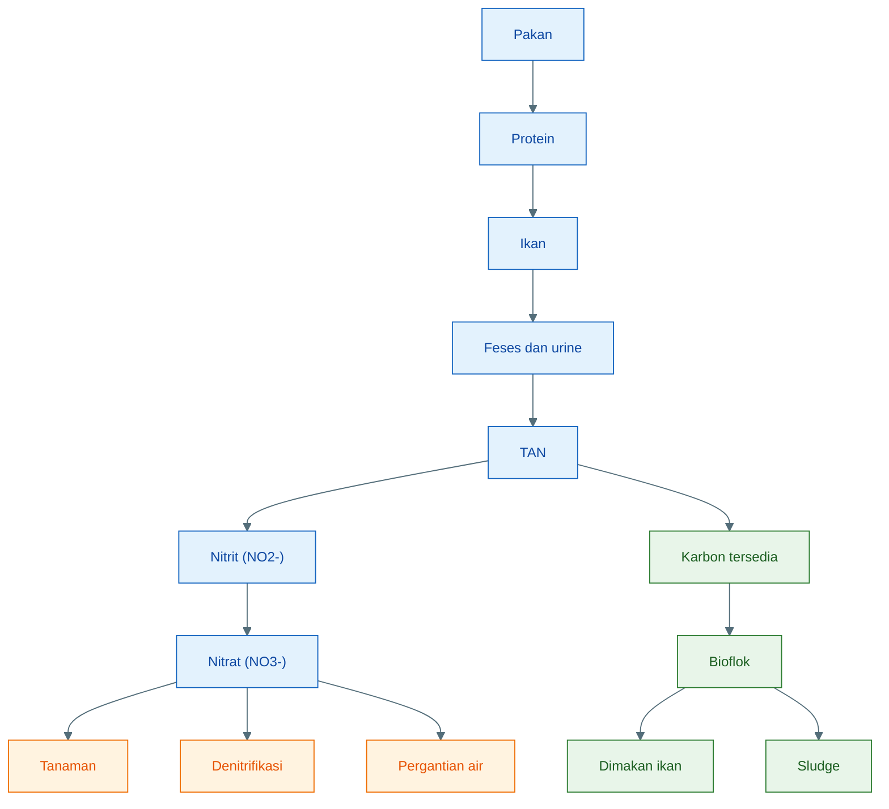
```mermaid id="alur-nitrogen-dasar-bioflok"
%%{init: {'theme':'base','themeVariables':{
'primaryColor':'#E3F2FD',
'primaryTextColor':'#0D47A1',
'primaryBorderColor':'#1565C0',
'secondaryColor':'#E8F5E9',
'secondaryTextColor':'#1B5E20',
'secondaryBorderColor':'#2E7D32',
'tertiaryColor':'#FFF3E0',
'tertiaryTextColor':'#E65100',
'tertiaryBorderColor':'#EF6C00',
'lineColor':'#546E7A',
'fontSize':'13px'
}}}%%
flowchart TD
    A["Pakan"] --> B["Protein"]
    B --> C["Ikan"]
    C --> D["Feses dan urine"]
    D --> E["TAN"]

    E --> F["Nitrit (NO2-)"]
    F --> G["Nitrat (NO3-)"]

    E --> H["Karbon tersedia"]
    H --> I["Bioflok"]
    I --> J["Dimakan ikan"]
    I --> K["Sludge"]

    G --> L["Tanaman"]
    G --> M["Denitrifikasi"]
    G --> N["Pergantian air"]

    classDef blue fill:#E3F2FD,stroke:#1565C0,color:#0D47A1;
    classDef green fill:#E8F5E9,stroke:#2E7D32,color:#1B5E20;
    classDef orange fill:#FFF3E0,stroke:#EF6C00,color:#E65100;

    class A,B,C,D,E,F,G blue;
    class H,I,J,K green;
    class L,M,N orange;
```

### Implikasi praktis

Dari diagram di atas, ada beberapa implikasi engineering yang harus dipahami sejak awal:

| Poin                                                    | Makna praktis                                                        |
| ------------------------------------------------------- | -------------------------------------------------------------------- |
| Nitrogen tidak hilang                                   | sistem harus menyediakan jalur keluar nitrogen                       |
| Nitrit dan nitrat adalah bentuk antara dan bentuk akhir | keduanya harus dipantau, bukan hanya $TAN$                           |
| Bioflok bukan “penghapus nitrogen permanen”             | bioflok hanya mengubah nitrogen terlarut menjadi nitrogen partikulat |
| Sludge adalah penyimpanan nitrogen sementara            | bila tidak dibuang, nitrogen bisa kembali ke air                     |
| Manajemen $C/N$ mengubah arah nitrogen                  | bukan menurunkan nitrogen total secara ajaib                         |

### Pesan utama bab ini

> Nitrogen dari pakan dapat menjadi $TAN$, nitrit, nitrat, bioflok, sludge, biomassa ikan, tanaman, atau gas $N_2$. Manajemen nitrogen berarti mengatur **arah perpindahan nitrogen**.

---

## 1.2. Perbedaan nitrit dan nitrat

Dalam praktik, nitrit dan nitrat sering disebut bersama, tetapi secara operasional keduanya **tidak sama**. Perbedaan ini harus tajam sejak awal, karena tindakan koreksinya juga berbeda.

| Parameter | Simbol   | Karakter utama                            |
| --------- | -------- | ----------------------------------------- |
| Nitrit    | $NO_2^-$ | risiko cepat terhadap ikan                |
| Nitrat    | $NO_3^-$ | risiko akumulatif jangka menengah-panjang |

### Nitrit sebagai risiko cepat

Nitrit adalah bentuk nitrogen yang secara praktis lebih berbahaya dalam jangka pendek. Ketika nitrit naik, risiko terhadap ikan dapat muncul walaupun parameter lain tampak masih cukup baik. Nitrit berkaitan dengan gangguan pengangkutan oksigen dalam darah ikan, sehingga secara operasional nitrit harus dipandang sebagai **parameter alarm**.

Karena itu, saat nitrit naik, respons praktis harus cepat, terutama:

- hitung rasio $Cl^- : NO_2^-$;
- tambah sumber $Cl^-$ bila perlu;
- kurangi beban pakan;
- kuatkan nitrifikasi;
- cek $DO$, alkalinitas, dan sludge.

### Nitrat sebagai risiko akumulatif

Nitrat adalah bentuk nitrogen yang umumnya lebih stabil dan lebih rendah toksisitas akutnya dibanding nitrit. Namun nitrat tetap penting karena:

- ia menandakan nitrogen masih berada dalam sistem;
- pada sistem minim pergantian air, nitrat dapat terus menumpuk;
- nitrat tinggi dapat menjadi indikator perlunya ekspor nitrogen;
- pada sistem aquaponik, nitrat justru dapat menjadi sumber hara tanaman.

Dengan kata lain:

- **nitrit = masalah keselamatan harian**;
- **nitrat = masalah stabilitas sistem dan desain jangka menengah-panjang**.

### Diagram perbedaan fungsi manajemen

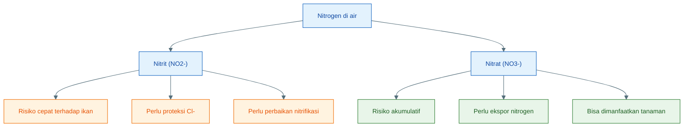
```mermaid id="perbedaan-nitrit-dan-nitrat"
%%{init: {'theme':'base','themeVariables':{
'primaryColor':'#E3F2FD',
'primaryTextColor':'#0D47A1',
'primaryBorderColor':'#1565C0',
'secondaryColor':'#E8F5E9',
'secondaryTextColor':'#1B5E20',
'secondaryBorderColor':'#2E7D32',
'tertiaryColor':'#FFF3E0',
'tertiaryTextColor':'#E65100',
'tertiaryBorderColor':'#EF6C00',
'lineColor':'#546E7A',
'fontSize':'13px'
}}}%%
flowchart TD
    A["Nitrogen di air"] --> B["Nitrit (NO2-)"]
    A --> C["Nitrat (NO3-)"]

    B --> D["Risiko cepat terhadap ikan"]
    B --> E["Perlu proteksi Cl-"]
    B --> F["Perlu perbaikan nitrifikasi"]

    C --> G["Risiko akumulatif"]
    C --> H["Perlu ekspor nitrogen"]
    C --> I["Bisa dimanfaatkan tanaman"]

    classDef blue fill:#E3F2FD,stroke:#1565C0,color:#0D47A1;
    classDef green fill:#E8F5E9,stroke:#2E7D32,color:#1B5E20;
    classDef orange fill:#FFF3E0,stroke:#EF6C00,color:#E65100;

    class A,B,C blue;
    class D,E,F orange;
    class G,H,I green;
```

### Kalimat kunci

> Nitrit dikelola untuk keselamatan ikan harian. Nitrat dikelola untuk stabilitas sistem jangka panjang.

---

## 1.3. Nitrit dan nitrat terjadi pada semua rezim bioflok

Salah satu kesalahan umum praktisi adalah menganggap bahwa pada $C/N$ tinggi nitrit dan nitrat tidak penting, atau pada $C/N$ rendah bioflok tidak relevan. Cara berpikir seperti itu terlalu sederhana.

Yang lebih tepat adalah:

> Rezim $C/N$ tidak menghilangkan nitrit dan nitrat. Rezim $C/N$ mengubah **proporsi jalur nitrogen**.

Artinya, semua rezim tetap memiliki kemungkinan munculnya:

- $TAN$;
- nitrit;
- nitrat;
- biomassa mikroba;
- sludge.

Yang berubah adalah **jalur yang lebih dominan**.

| Rezim $C/N$      | Jalur dominan       | Produk dominan             |
| ---------------- | ------------------- | -------------------------- |
| $8$ sampai $12$  | nitrifikasi         | nitrat                     |
| $12$ sampai $16$ | campuran            | nitrat dan bioflok         |
| $16$ sampai $20$ | heterotrof          | bioflok dan sludge         |
| $>20$            | heterotrof berlebih | $TSS$, sludge, risiko $DO$ |

### Penjelasan per rezim

#### a. Rezim $C/N$ $8$ sampai $12$

Pada rentang ini, nitrogen lebih banyak diarahkan ke jalur nitrifikasi:

$$
TAN
\rightarrow
NO_2^-
\rightarrow
NO_3^-
$$

Ciri umumnya:

- nitrat lebih cepat terbentuk;
- bioflok tetap ada, tetapi tidak dominan;
- kebutuhan pengelolaan alkalinitas tinggi;
- sistem cocok bila targetnya nitrifikasi stabil atau aquaponik.

#### b. Rezim $C/N$ $12$ sampai $16$

Pada rentang ini, sistem mulai berada di zona campuran:

$$
TAN
\rightarrow
NO_3^-
$$

dan juga:

$$
TAN
+
C
\rightarrow
Bioflok
$$

Ciri umumnya:

- nitrat tetap terbentuk;
- bioflok mulai produktif;
- ikan dapat memperoleh tambahan pakan alami dari flok;
- $DO$, $TSS$, dan sludge harus mulai diperhatikan serius.

#### c. Rezim $C/N$ $16$ sampai $20$

Pada rentang ini, jalur heterotrof lebih kuat:

$$
TAN
+
C
\rightarrow
Bioflok
\rightarrow
Sludge
$$

Ciri umumnya:

- nitrogen lebih banyak dikemas ke biomassa mikroba;
- pembentukan nitrat dapat berkurang relatif;
- $TSS$ dan sludge meningkat;
- kebutuhan aerasi naik;
- risiko flok tua dan dasar kolam kotor meningkat.

#### d. Rezim $C/N$ di atas $20$

Rentang ini tidak dijadikan target rutin untuk praktik umum, karena risiko operasional mulai berat:

- $DO$ turun lebih cepat bila aerasi terganggu;
- sludge menumpuk lebih cepat;
- flok bisa terlalu pekat;
- bau dan masalah kualitas air lebih mudah muncul;
- efisiensi sistem bisa turun bila tidak ada pengelolaan padatan yang kuat.

### Diagram pergeseran jalur nitrogen menurut $C/N$

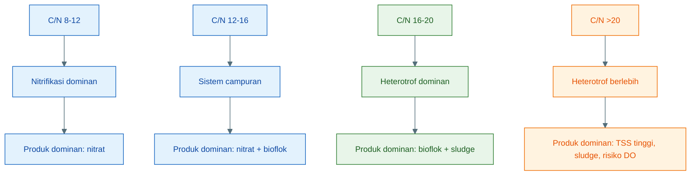
```mermaid id="pergeseran-jalur-nitrogen-cn"
%%{init: {'theme':'base','themeVariables':{
'primaryColor':'#E3F2FD',
'primaryTextColor':'#0D47A1',
'primaryBorderColor':'#1565C0',
'secondaryColor':'#E8F5E9',
'secondaryTextColor':'#1B5E20',
'secondaryBorderColor':'#2E7D32',
'tertiaryColor':'#FFF3E0',
'tertiaryTextColor':'#E65100',
'tertiaryBorderColor':'#EF6C00',
'lineColor':'#546E7A',
'fontSize':'13px'
}}}%%
flowchart TD
    A["C/N 8-12"] --> B["Nitrifikasi dominan"]
    B --> C["Produk dominan: nitrat"]

    D["C/N 12-16"] --> E["Sistem campuran"]
    E --> F["Produk dominan: nitrat + bioflok"]

    G["C/N 16-20"] --> H["Heterotrof dominan"]
    H --> I["Produk dominan: bioflok + sludge"]

    J["C/N >20"] --> K["Heterotrof berlebih"]
    K --> L["Produk dominan: TSS tinggi, sludge, risiko DO"]

    classDef blue fill:#E3F2FD,stroke:#1565C0,color:#0D47A1;
    classDef green fill:#E8F5E9,stroke:#2E7D32,color:#1B5E20;
    classDef orange fill:#FFF3E0,stroke:#EF6C00,color:#E65100;

    class A,B,C,D,E,F blue;
    class G,H,I green;
    class J,K,L orange;
```

### Kesimpulan subbab

Praktisi harus memahami bahwa manajemen nitrit dan nitrat tidak bisa dipisahkan dari manajemen $C/N$. Bukan karena $C/N$ menghilangkan nitrit dan nitrat, tetapi karena $C/N$ menentukan **ke mana nitrogen lebih banyak diarahkan**.

---

## 1.4. Diagram yang perlu masuk

Subbab ini merangkum diagram inti yang menjadi pegangan logika untuk bab-bab berikutnya. Diagram ini penting karena artikel ini bersifat praktis. Praktisi perlu dapat “melihat” sistem, bukan hanya membaca definisi.

### Diagram ringkas alur nitrogen dalam bioflok

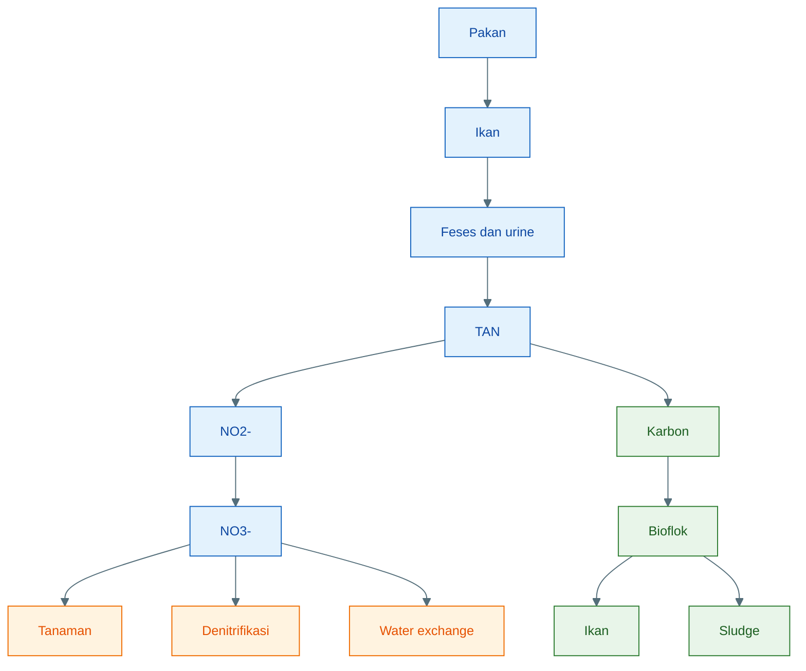
```mermaid id="diagram-ringkas-nitrogen-bioflok"
%%{init: {'theme':'base','themeVariables':{
'primaryColor':'#E3F2FD',
'primaryTextColor':'#0D47A1',
'primaryBorderColor':'#1565C0',
'secondaryColor':'#E8F5E9',
'secondaryTextColor':'#1B5E20',
'secondaryBorderColor':'#2E7D32',
'tertiaryColor':'#FFF3E0',
'tertiaryTextColor':'#E65100',
'tertiaryBorderColor':'#EF6C00',
'lineColor':'#546E7A',
'fontSize':'13px'
}}}%%
flowchart TD
    A["Pakan"] --> B["Ikan"]
    B --> C["Feses dan urine"]
    C --> D["TAN"]

    D --> E["NO2-"]
    E --> F["NO3-"]

    D --> G["Karbon"]
    G --> H["Bioflok"]
    H --> I["Ikan"]
    H --> J["Sludge"]

    F --> K["Tanaman"]
    F --> L["Denitrifikasi"]
    F --> M["Water exchange"]

    classDef blue fill:#E3F2FD,stroke:#1565C0,color:#0D47A1;
    classDef green fill:#E8F5E9,stroke:#2E7D32,color:#1B5E20;
    classDef orange fill:#FFF3E0,stroke:#EF6C00,color:#E65100;

    class A,B,C,D,E,F blue;
    class G,H,I,J green;
    class K,L,M orange;
```

### Cara membaca diagram

| Jalur                                  | Makna                                   |
| -------------------------------------- | --------------------------------------- |
| `Pakan → Ikan → Feses dan urine → TAN` | sumber nitrogen awal                    |
| `TAN → NO2- → NO3-`                    | jalur nitrifikasi                       |
| `TAN + Karbon → Bioflok`               | jalur heterotrof                        |
| `Bioflok → Ikan`                       | pemanfaatan flok sebagai pakan tambahan |
| `Bioflok → Sludge`                     | ekspor nitrogen melalui padatan         |
| `NO3- → Tanaman`                       | ekspor nitrogen biologis                |
| `NO3- → Denitrifikasi`                 | ekspor nitrogen menjadi gas $N_2$       |
| `NO3- → Water exchange`                | ekspor nitrogen melalui air keluar      |

### Nilai praktis diagram ini

Diagram ini akan menjadi dasar untuk memahami seluruh artikel berikutnya:

- Bab 2 akan menstandarkan satuan nitrit dan nitrat;
- Bab 3 akan menghitung bagaimana nitrogen dari pakan masuk ke jalur-jalur tersebut;
- Bab 4 akan fokus pada nitrit sebagai risiko cepat;
- Bab 5 akan fokus pada nitrat dan manajemen $C/N$;
- Bab 6 akan menerapkan semua konsep pada studi kasus;
- Bab 7 akan menerjemahkannya menjadi SOP keputusan.

---

## Kesimpulan Bab 1

Bab ini menegaskan lima hal mendasar.

### 1. Nitrogen tidak hilang

Nitrogen dari pakan tidak lenyap, tetapi berpindah bentuk dan berpindah jalur.

### 2. Nitrit dan nitrat berbeda fungsi manajemennya

- nitrit adalah risiko cepat;
- nitrat adalah risiko akumulatif.

### 3. Semua rezim bioflok tetap dapat mengalami nitrit dan nitrat

Yang berubah bukan ada atau tidaknya nitrit dan nitrat, tetapi dominasi jalurnya.

### 4. $C/N$ adalah pengarah jalur nitrogen

$C/N$ menentukan apakah nitrogen lebih banyak menuju nitrat, bioflok, atau sludge.

### 5. Manajemen nitrogen berarti mengatur arah perpindahan nitrogen

Arah itu dapat berupa:

- ke nitrat;
- ke bioflok;
- ke sludge;
- ke tanaman;
- ke air keluar;
- atau ke gas $N_2$.

Kalimat penutup yang sebaiknya diingat praktisi:

> Dalam bioflok, pertanyaan utamanya bukan hanya “berapa angka nitrit dan nitrat?”, tetapi “nitrogen sedang bergerak ke jalur mana, dan apakah jalur itu aman serta menguntungkan bagi sistem?”

[**Kembali ke Atas**](#manajemen-nitrit-dan-nitrat-pada-bioflok-cn-cl--nitrifikasi-denitrifikasi-dan-ekspor-nitrogen-berbasis-angka)

---

# Bab 2. Satuan, Konversi, dan Ambang Operasional

Bab 2 mengunci satu hal yang sangat penting: **nitrit dan nitrat harus dibaca dengan satuan yang benar**. Banyak kesalahan keputusan lapangan bukan karena operator tidak mengukur, tetapi karena hasil ukur dibaca dengan basis satuan yang salah.

Dalam praktik, test kit dapat menampilkan hasil sebagai:

- ion nitrit: $NO_2^-$;
- nitrit sebagai nitrogen: $NO_2\text{-}N$;
- ion nitrat: $NO_3^-$;
- nitrat sebagai nitrogen: $NO_3\text{-}N$.

Empat istilah ini tidak boleh dipertukarkan tanpa konversi.

---

## 2.1. Mengapa satuan harus dikunci sejak awal

Dalam manajemen nitrogen bioflok, ada dua basis pembacaan:

| Basis pembacaan  | Contoh                           | Makna                                            |
| ---------------- | -------------------------------- | ------------------------------------------------ |
| Sebagai ion      | $NO_2^-$, $NO_3^-$               | massa seluruh ion nitrit atau nitrat             |
| Sebagai nitrogen | $NO_2\text{-}N$, $NO_3\text{-}N$ | hanya massa unsur nitrogen di dalam ion tersebut |

Perbedaannya besar. Misalnya, angka:

$$
100 \text{ mg/L } NO_3\text{-}N
$$

tidak sama dengan:

$$
100 \text{ mg/L } NO_3^-
$$

Karena ion nitrat $NO_3^-$ memiliki massa oksigen yang ikut terbaca, maka nilai sebagai ion selalu lebih besar dibanding nilai sebagai nitrogen.

Prinsip praktis:

> Sebelum membuat keputusan, pastikan test kit membaca sebagai $NO_2^-$, $NO_2\text{-}N$, $NO_3^-$, atau $NO_3\text{-}N$.

---

## 2.2. Diagram konversi satuan nitrogen

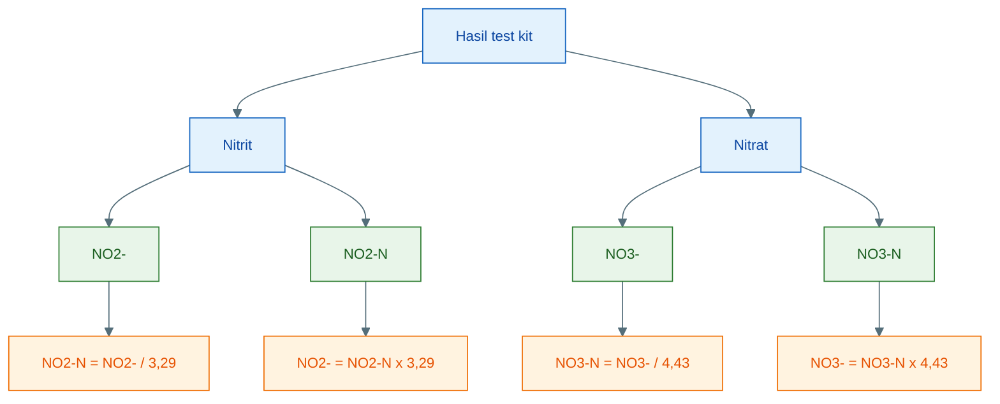
```mermaid id="konversi-satuan-nitrit-nitrat"
%%{init: {'theme':'base','themeVariables':{
'primaryColor':'#E3F2FD',
'primaryTextColor':'#0D47A1',
'primaryBorderColor':'#1565C0',
'secondaryColor':'#E8F5E9',
'secondaryTextColor':'#1B5E20',
'secondaryBorderColor':'#2E7D32',
'tertiaryColor':'#FFF3E0',
'tertiaryTextColor':'#E65100',
'tertiaryBorderColor':'#EF6C00',
'lineColor':'#546E7A',
'fontSize':'13px'
}}}%%
flowchart TD
    A["Hasil test kit"] --> B["Nitrit"]
    A --> C["Nitrat"]

    B --> D["NO2-"]
    B --> E["NO2-N"]

    C --> F["NO3-"]
    C --> G["NO3-N"]

    D --> H["NO2-N = NO2- / 3,29"]
    E --> I["NO2- = NO2-N x 3,29"]

    F --> J["NO3-N = NO3- / 4,43"]
    G --> K["NO3- = NO3-N x 4,43"]

    classDef input fill:#E3F2FD,stroke:#1565C0,color:#0D47A1;
    classDef bentuk fill:#E8F5E9,stroke:#2E7D32,color:#1B5E20;
    classDef rumus fill:#FFF3E0,stroke:#EF6C00,color:#E65100;

    class A,B,C input;
    class D,E,F,G bentuk;
    class H,I,J,K rumus;
```

Diagram ini menjadi pegangan dasar. Jika satuan tidak dikonversi dengan benar, maka ambang nitrit dan nitrat juga akan salah.

---

## 2.3. Nitrit sebagai $NO_2^-$ dan $NO_2\text{-}N$

Nitrit dapat ditulis sebagai ion:

$$
NO_2^-
$$

atau sebagai nitrogen:

$$
NO_2\text{-}N
$$

Hubungan konversinya:

$$
NO_2\text{-}N = \frac{NO_2^-}{3{,}29}
$$

Sebaliknya:

$$
NO_2^- = 3{,}29 \times NO_2\text{-}N
$$

Angka $3{,}29$ berasal dari perbandingan massa molekul ion nitrit terhadap massa nitrogen.

Massa atom pendekatan:

| Unsur | Massa relatif |
| ----- | ------------: |
| $N$   |          $14$ |
| $O$   |          $16$ |

Massa ion nitrit:

$$
NO_2^- = 14 + 2 \times 16 = 46
$$

Faktor konversi:

$$
\frac{46}{14} = 3{,}29
$$

Jadi:

$$
1 \text{ mg/L } NO_2\text{-}N = 3{,}29 \text{ mg/L } NO_2^-
$$

dan:

$$
1 \text{ mg/L } NO_2^- = 0{,}304 \text{ mg/L } NO_2\text{-}N
$$

---

## 2.4. Contoh konversi nitrit

### Contoh 1

Test kit membaca:

$$
NO_2^- = 2 \text{ mg/L}
$$

Maka:

$$
NO_2\text{-}N = \frac{2}{3{,}29}
$$

$$
NO_2\text{-}N = 0{,}61 \text{ mg/L}
$$

### Contoh 2

Data literatur memakai:

$$
NO_2\text{-}N = 0{,}30 \text{ mg/L}
$$

Maka:

$$
NO_2^- = 0{,}30 \times 3{,}29
$$

$$
NO_2^- = 0{,}99 \text{ mg/L}
$$

Dibulatkan secara operasional:

$$
NO_2^-
\approx
1 \text{ mg/L}
$$

Inilah alasan mengapa ambang:

$$
NO_2^-
<
1 \text{ mg/L}
$$

setara kira-kira dengan:

$$
NO_2\text{-}N
<
0{,}30 \text{ mg/L}
$$

---

## 2.5. Nitrat sebagai $NO_3^-$ dan $NO_3\text{-}N$

Nitrat juga dapat ditulis sebagai ion:

$$
NO_3^-
$$

atau sebagai nitrogen:

$$
NO_3\text{-}N
$$

Hubungan konversinya:

$$
NO_3\text{-}N = \frac{NO_3^-}{4{,}43}
$$

Sebaliknya:

$$
NO_3^- = 4{,}43 \times NO_3\text{-}N
$$

Massa ion nitrat:

$$
NO_3^- = 14 + 3 \times 16 = 62
$$

Faktor konversi:

$$
\frac{62}{14} = 4{,}43
$$

Jadi:

$$
1 \text{ mg/L } NO_3\text{-}N = 4{,}43 \text{ mg/L } NO_3^-
$$

dan:

$$
1 \text{ mg/L } NO_3^- = 0{,}226 \text{ mg/L } NO_3\text{-}N
$$

---

## 2.6. Contoh konversi nitrat

### Contoh 1

Test kit membaca:

$$
NO_3^- = 443 \text{ mg/L}
$$

Maka:

$$
NO_3\text{-}N = \frac{443}{4{,}43}
$$

$$
NO_3\text{-}N = 100 \text{ mg/L}
$$

### Contoh 2

Target operasional dinyatakan sebagai:

$$
NO_3\text{-}N = 200 \text{ mg/L}
$$

Maka sebagai ion nitrat:

$$
NO_3^- = 200 \times 4{,}43
$$

$$
NO_3^- = 886 \text{ mg/L}
$$

Jadi target $200 \text{ mg/L } NO_3\text{-}N$ bukan sama dengan $200 \text{ mg/L } NO_3^-$, tetapi setara dengan:

$$
886 \text{ mg/L } NO_3^-
$$

---

## 2.7. Ambang operasional nitrit

Nitrit harus dikelola sebagai parameter risiko cepat. Artikel ini memakai ambang operasional berikut.

| Parameter                     |                 Target |
| ----------------------------- | ---------------------: |
| $NO_2^-$                      |      $<1 \text{ mg/L}$ |
| $NO_2\text{-}N$               | $<0{,}30 \text{ mg/L}$ |
| Rasio minimum $Cl^- : NO_2^-$ |                 $10:1$ |
| Rasio desain nila bioflok     |                 $20:1$ |
| Rasio darurat                 |   $30:1$ sampai $50:1$ |

### Cara membaca tabel nitrit

Jika test kit membaca sebagai $NO_2^-$, maka target operasional utama adalah:

$$
NO_2^-
<
1 \text{ mg/L}
$$

Jika test kit membaca sebagai $NO_2\text{-}N$, maka target operasional utama adalah:

$$
NO_2\text{-}N
<
0{,}30 \text{ mg/L}
$$

Namun dalam bioflok, nitrit tidak cukup dibaca sendirian. Nitrit harus dibaca bersama $Cl^-$.

Rasio proteksi minimum:

$$
Cl^- : NO_2^- = 10:1
$$

Rasio desain untuk nila bioflok:

$$
Cl^- : NO_2^- = 20:1
$$

Rasio darurat:

$$
Cl^- : NO_2^- = 30:1 \text{ sampai } 50:1
$$

---

## 2.8. Diagram keputusan nitrit

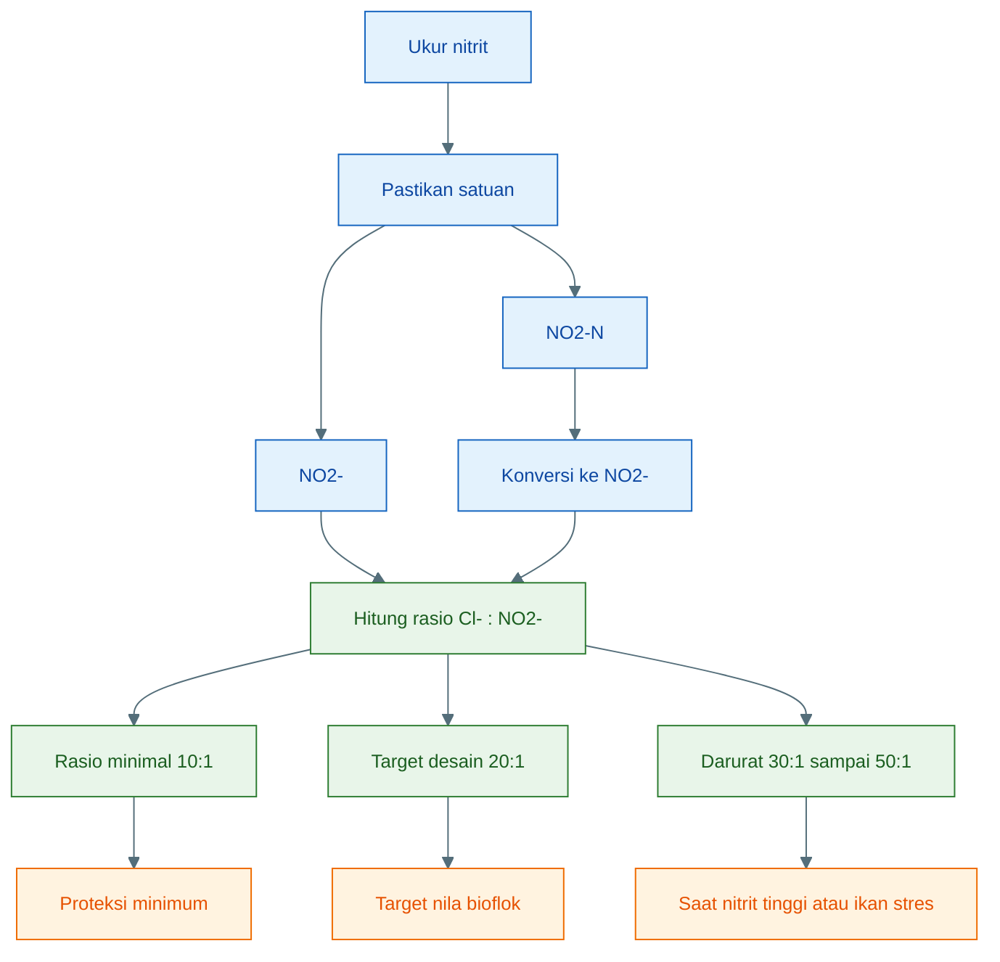
```mermaid id="keputusan-ambang-nitrit"
%%{init: {'theme':'base','themeVariables':{
'primaryColor':'#E3F2FD',
'primaryTextColor':'#0D47A1',
'primaryBorderColor':'#1565C0',
'secondaryColor':'#E8F5E9',
'secondaryTextColor':'#1B5E20',
'secondaryBorderColor':'#2E7D32',
'tertiaryColor':'#FFF3E0',
'tertiaryTextColor':'#E65100',
'tertiaryBorderColor':'#EF6C00',
'lineColor':'#546E7A',
'fontSize':'13px'
}}}%%
flowchart TD
    A["Ukur nitrit"] --> B["Pastikan satuan"]
    B --> C["NO2-"]
    B --> D["NO2-N"]

    D --> E["Konversi ke NO2-"]
    C --> F["Hitung rasio Cl- : NO2-"]
    E --> F

    F --> G["Rasio minimal 10:1"]
    F --> H["Target desain 20:1"]
    F --> I["Darurat 30:1 sampai 50:1"]

    G --> J["Proteksi minimum"]
    H --> K["Target nila bioflok"]
    I --> L["Saat nitrit tinggi atau ikan stres"]

    classDef input fill:#E3F2FD,stroke:#1565C0,color:#0D47A1;
    classDef hitung fill:#E8F5E9,stroke:#2E7D32,color:#1B5E20;
    classDef tindakan fill:#FFF3E0,stroke:#EF6C00,color:#E65100;

    class A,B,C,D,E input;
    class F,G,H,I hitung;
    class J,K,L tindakan;
```

Diagram ini menegaskan bahwa keputusan nitrit tidak berhenti pada angka $NO_2^-$, tetapi dilanjutkan ke rasio $Cl^- : NO_2^-$.

---

## 2.9. Ambang operasional nitrat

Nitrat dikelola sebagai parameter akumulatif. Artikel ini memakai basis utama $NO_3\text{-}N$, tetapi tetap menampilkan padanan $NO_3^-$ agar praktisi yang memakai test kit ion tidak salah membaca.

|                 $NO_3\text{-}N$ |                         $NO_3^-$ | Status operasional           |
| ------------------------------: | -------------------------------: | ---------------------------- |
|              $<50 \text{ mg/L}$ |              $<222 \text{ mg/L}$ | target konservatif           |
|  $50$ sampai $100 \text{ mg/L}$ |  $222$ sampai $443 \text{ mg/L}$ | operasi dengan monitoring    |
| $100$ sampai $200 \text{ mg/L}$ |  $443$ sampai $886 \text{ mg/L}$ | mulai rencana penurunan      |
| $200$ sampai $300 \text{ mg/L}$ | $886$ sampai $1329 \text{ mg/L}$ | zona koreksi                 |
|             $>300 \text{ mg/L}$ |             $>1329 \text{ mg/L}$ | tidak dijadikan target rutin |

### Cara membaca tabel nitrat

Jika test kit membaca sebagai $NO_3^-$, maka nilai tersebut harus dibagi $4{,}43$ untuk mendapatkan $NO_3\text{-}N$.

Contoh:

$$
NO_3^- = 886 \text{ mg/L}
$$

Maka:

$$
NO_3\text{-}N = \frac{886}{4{,}43} 200 \text{ mg/L}
$$

Jadi angka $886 \text{ mg/L } NO_3^-$ berada pada status:

$$
NO_3\text{-}N = 200 \text{ mg/L}
$$

yaitu batas awal zona koreksi.

---

## 2.10. Grafik ambang operasional nitrat

Grafik berikut menunjukkan kategori operasional nitrat berbasis $NO_3\text{-}N$.

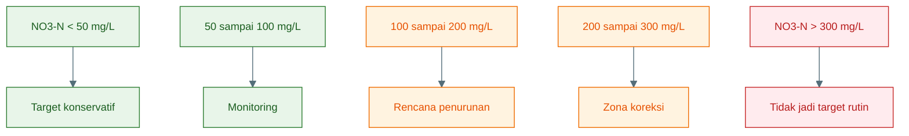
```mermaid id="grafik-ambang-nitrat"
%%{init: {'theme':'base','themeVariables':{
'primaryColor':'#E3F2FD',
'primaryTextColor':'#0D47A1',
'primaryBorderColor':'#1565C0',
'secondaryColor':'#E8F5E9',
'secondaryTextColor':'#1B5E20',
'secondaryBorderColor':'#2E7D32',
'tertiaryColor':'#FFF3E0',
'tertiaryTextColor':'#E65100',
'tertiaryBorderColor':'#EF6C00',
'lineColor':'#546E7A',
'fontSize':'13px'
}}}%%
flowchart TD
    A["NO3-N < 50 mg/L"] --> B["Target konservatif"]
    C["50 sampai 100 mg/L"] --> D["Monitoring"]
    E["100 sampai 200 mg/L"] --> F["Rencana penurunan"]
    G["200 sampai 300 mg/L"] --> H["Zona koreksi"]
    I["NO3-N > 300 mg/L"] --> J["Tidak jadi target rutin"]

    classDef aman fill:#E8F5E9,stroke:#2E7D32,color:#1B5E20;
    classDef waspada fill:#FFF3E0,stroke:#EF6C00,color:#E65100;
    classDef koreksi fill:#FFEBEE,stroke:#C62828,color:#B71C1C;

    class A,B,C,D aman;
    class E,F,G,H waspada;
    class I,J koreksi;
```

Grafik ini bukan grafik biologis toksisitas universal untuk semua ikan. Grafik ini adalah **ambang operasional** agar praktisi memiliki batas keputusan dalam sistem bioflok.

---

## 2.11. Mengapa ambang nitrit dan nitrat berbeda sifatnya

Nitrit dan nitrat tidak boleh dikelola dengan logika yang sama.

| Parameter | Sifat risiko | Respons utama                                                   |
| --------- | ------------ | --------------------------------------------------------------- |
| $NO_2^-$  | cepat        | proteksi $Cl^-$, aerasi, alkalinitas, kurangi pakan             |
| $NO_3^-$  | akumulatif   | manajemen $C/N$, sludge, tanaman, pergantian air, denitrifikasi |

Nitrit bisa menuntut tindakan cepat pada hari yang sama. Nitrat lebih sering membutuhkan strategi sistem:

- apakah $C/N$ terlalu rendah sehingga semua nitrogen menjadi nitrat;
- apakah ada tanaman sebagai penyerap nitrat;
- apakah ada sludge removal;
- apakah ada pergantian air terhitung;
- apakah perlu denitrifikasi terkontrol.

Dengan kata lain:

> Nitrit dibaca sebagai alarm. Nitrat dibaca sebagai indikator akumulasi nitrogen.

---

## 2.12. Kesalahan satuan yang harus dihindari

Kesalahan paling umum adalah membaca $NO_3^-$ sebagai $NO_3\text{-}N$.

Contoh:

$$
443 \text{ mg/L } NO_3^- = 100 \text{ mg/L } NO_3\text{-}N
$$

Jika operator salah membaca $443 \text{ mg/L } NO_3^-$ sebagai $443 \text{ mg/L } NO_3\text{-}N$, maka kesimpulannya akan terlalu berat. Padahal nilai yang benar dalam basis nitrogen adalah:

$$
100 \text{ mg/L } NO_3\text{-}N
$$

Kesalahan serupa juga terjadi pada nitrit.

Contoh:

$$
1 \text{ mg/L } NO_2^- = 0{,}30 \text{ mg/L } NO_2\text{-}N
$$

Jika operator menyamakan $1 \text{ mg/L } NO_2^-$ dengan $1 \text{ mg/L } NO_2\text{-}N$, maka nilai nitrit akan terbaca sekitar $3{,}29$ kali lebih tinggi daripada basis yang benar.

---

## 2.13. Tabel ringkas konversi nitrit

|             $NO_2^-$ |       $NO_2\text{-}N$ |
| -------------------: | --------------------: |
| $0{,}5 \text{ mg/L}$ | $0{,}15 \text{ mg/L}$ |
| $1{,}0 \text{ mg/L}$ | $0{,}30 \text{ mg/L}$ |
| $2{,}0 \text{ mg/L}$ | $0{,}61 \text{ mg/L}$ |
| $3{,}0 \text{ mg/L}$ | $0{,}91 \text{ mg/L}$ |
| $5{,}0 \text{ mg/L}$ | $1{,}52 \text{ mg/L}$ |

Rumus yang dipakai:

$$
NO_2\text{-}N = \frac{NO_2^-}{3{,}29}
$$

---

## 2.14. Tabel ringkas konversi nitrat

|            $NO_3^-$ |    $NO_3\text{-}N$ |
| ------------------: | -----------------: |
|  $222 \text{ mg/L}$ |  $50 \text{ mg/L}$ |
|  $443 \text{ mg/L}$ | $100 \text{ mg/L}$ |
|  $886 \text{ mg/L}$ | $200 \text{ mg/L}$ |
| $1329 \text{ mg/L}$ | $300 \text{ mg/L}$ |
| $1772 \text{ mg/L}$ | $400 \text{ mg/L}$ |

Rumus yang dipakai:

$$
NO_3\text{-}N = \frac{NO_3^-}{4{,}43}
$$

---

## 2.15. Standar satuan yang dipakai dalam artikel

Agar artikel konsisten, standar yang dipakai adalah sebagai berikut:

| Parameter                    | Basis utama artikel | Catatan                                                                     |
| ---------------------------- | ------------------- | --------------------------------------------------------------------------- |
| Nitrit                       | $NO_2^-$            | karena terkait langsung dengan rasio $Cl^- : NO_2^-$ untuk praktik lapangan |
| Nitrat                       | $NO_3\text{-}N$     | karena lebih rapi untuk neraca nitrogen                                     |
| Produksi nitrogen dari pakan | $TAN_N$             | basis nitrogen                                                              |
| Stoikiometri nitrifikasi     | $TAN_N$             | basis nitrogen                                                              |
| Proteksi nitrit              | $Cl^- : NO_2^-$     | basis praktis untuk penambahan garam                                        |
| Akumulasi nitrat             | $NO_3\text{-}N$     | basis utama untuk simulasi                                                  |

Namun setiap kali diperlukan, artikel akan menyediakan konversi ke bentuk ion:

$$
NO_2^-
$$

dan:

$$
NO_3^-
$$

---

## 2.16. SOP membaca hasil test kit

```text id="sop-baca-test-kit-nitrogen"
1. Lihat label test kit.
2. Pastikan hasil tertulis sebagai NO2-, NO2-N, NO3-, atau NO3-N.
3. Jika nitrit dibaca sebagai NO2-N, konversi ke NO2- untuk rasio Cl-.
4. Jika nitrat dibaca sebagai NO3-, konversi ke NO3-N untuk evaluasi akumulasi.
5. Jangan membandingkan NO3- langsung dengan ambang NO3-N.
6. Catat satuan pada log harian.
```

SOP ini sederhana, tetapi sangat penting. Tanpa pencatatan satuan, data mingguan dapat menyesatkan.

---

## 2.17. Kesimpulan Bab 2

Bab ini mengunci dasar numerik untuk seluruh artikel. Nitrit dan nitrat harus dibaca dengan satuan yang benar.

Konversi nitrit:

$$
NO_2\text{-}N = \frac{NO_2^-}{3{,}29}
$$

$$
NO_2^- = 3{,}29 \times NO_2\text{-}N
$$

Konversi nitrat:

$$
NO_3\text{-}N = \frac{NO_3^-}{4{,}43}
$$

$$
NO_3^- = 4{,}43 \times NO_3\text{-}N
$$

Ambang nitrit yang dipakai:

$$
NO_2^-
<
1 \text{ mg/L}
$$

atau setara dengan:

$$
NO_2\text{-}N
<
0{,}30 \text{ mg/L}
$$

Rasio proteksi nitrit:

$$
Cl^- : NO_2^- = 10:1 \text{ minimum}
$$

dan untuk desain nila bioflok:

$$
Cl^- : NO_2^- = 20:1
$$

Ambang nitrat utama memakai basis:

$$
NO_3\text{-}N
$$

dengan zona koreksi dimulai saat nilai berada di atas:

$$
200 \text{ mg/L } NO_3\text{-}N
$$

Pesan utama Bab 2:

> Keputusan nitrit dan nitrat hanya valid bila satuannya benar. Salah membaca $NO_2^-$, $NO_2\text{-}N$, $NO_3^-$, atau $NO_3\text{-}N$ dapat membuat koreksi lapangan salah arah.

[**Kembali ke Atas**](#manajemen-nitrit-dan-nitrat-pada-bioflok-cn-cl-nitrifikasi-denitrifikasi-dan-ekspor-nitrogen-berbasis-angka)

---

# Bab 3. Stoikiometri Nitrogen dari Pakan sampai Nitrat

Bab 1 menjelaskan bahwa nitrogen tidak hilang, tetapi berpindah bentuk. Bab 2 mengunci satuan nitrit dan nitrat agar tidak salah membaca data. Bab 3 masuk ke bagian hitungannya: **berapa nitrogen yang masuk dari pakan, berapa $TAN$ yang terbentuk, berapa oksigen dan alkalinitas yang dibutuhkan nitrifikasi, serta berapa potensi kenaikan nitrat di kolam**.

Tujuan bab ini adalah membuat praktisi dapat menjawab pertanyaan berikut dengan angka:

1. berapa $TAN_N$ yang dihasilkan dari pakan harian;
2. berapa kebutuhan $O_2$ untuk nitrifikasi;
3. berapa alkalinitas yang terkonsumsi;
4. berapa potensi pembentukan $NO_3\text{-}N$;
5. bagaimana $C/N$ mengubah distribusi nitrogen ke nitrat, bioflok, sludge, tanaman, atau denitrifikasi.

---

## 3.1. Pakan sebagai sumber utama nitrogen

Dalam kolam bioflok, sumber nitrogen terbesar biasanya berasal dari pakan. Komponen pakan yang paling penting dalam konteks nitrogen adalah **protein**.

Protein mengandung nitrogen sekitar:

$$
16\%
$$

atau dalam bentuk fraksi:

$$
0{,}16
$$

Artinya:

$$
1 \text{ kg protein}
\rightarrow
0{,}16 \text{ kg nitrogen}
$$

Namun tidak semua nitrogen dari pakan menjadi limbah. Sebagian menjadi biomassa ikan, sebagian masuk feses, sebagian keluar sebagai ekskresi metabolik, dan sebagian menjadi $TAN$.

Untuk model praktis, fraksi nitrogen pakan yang menjadi $TAN$ ditulis sebagai:

$$
f_{\text{TAN}}
$$

Nilai kerja umum untuk simulasi awal:

$$
f_{\text{TAN}} = 0{,}50 \text{ sampai } 0{,}80
$$

Dalam artikel ini, nilai dasar untuk studi kasus memakai:

$$
f_{\text{TAN}} = 0{,}60
$$

---

## 3.2. Produksi $TAN$ dari pakan

Formula produksi $TAN$ berbasis nitrogen:

$$
TAN_N = Feed \times Protein \times 0{,}16 \times f_{\text{TAN}}
$$

Keterangan:

| Simbol           |          Satuan | Makna                                         |
| ---------------- | --------------: | --------------------------------------------- |
| $TAN_N$          |   kg TAN-N/hari | nitrogen amonia total yang terbentuk per hari |
| $Feed$           |   kg pakan/hari | pakan harian                                  |
| $Protein$        |          fraksi | contoh $30\% = 0{,}30$                        |
| $0{,}16$         | kg N/kg protein | kandungan nitrogen dalam protein              |
| $f_{\text{TAN}}$ |          fraksi | bagian nitrogen pakan yang menjadi $TAN$      |

Contoh:

$$
Feed = 0{,}40 \text{ kg/hari}
$$

$$
Protein = 0{,}30
$$

$$
f_{\text{TAN}} = 0{,}60
$$

Maka:

$$
TAN_N = 0{,}40 \times 0{,}30 \times 0{,}16 \times 0{,}60
$$

$$
TAN_N = 0{,}01152 \text{ kg TAN-N/hari}
$$

Konversi ke gram:

$$
0{,}01152 \text{ kg} = 11{,}52 \text{ g}
$$

Jadi:

$$
TAN_N = 11{,}52 \text{ g TAN-N/hari}
$$

Makna praktisnya:

> Pada pakan $0{,}40 \text{ kg/hari}$, protein $30\%$, dan $f_{\text{TAN}} = 0{,}60$, kolam menghasilkan estimasi $11{,}52 \text{ g TAN-N/hari}$.

---

## 3.3. Diagram alur stoikiometri dari pakan ke $TAN$

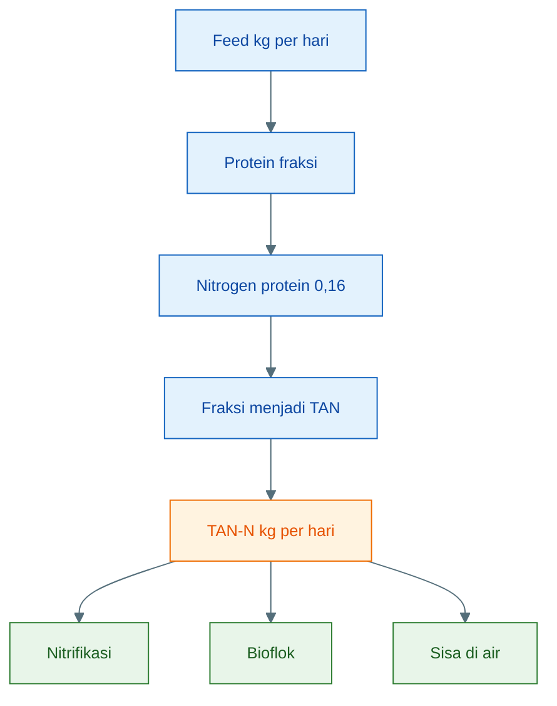
```mermaid id="stoikiometri-pakan-tan"
%%{init: {'theme':'base','themeVariables':{
'primaryColor':'#E3F2FD',
'primaryTextColor':'#0D47A1',
'primaryBorderColor':'#1565C0',
'secondaryColor':'#E8F5E9',
'secondaryTextColor':'#1B5E20',
'secondaryBorderColor':'#2E7D32',
'tertiaryColor':'#FFF3E0',
'tertiaryTextColor':'#E65100',
'tertiaryBorderColor':'#EF6C00',
'lineColor':'#546E7A',
'fontSize':'13px'
}}}%%
flowchart TD
    A["Feed kg per hari"] --> B["Protein fraksi"]
    B --> C["Nitrogen protein 0,16"]
    C --> D["Fraksi menjadi TAN"]
    D --> E["TAN-N kg per hari"]

    E --> F["Nitrifikasi"]
    E --> G["Bioflok"]
    E --> H["Sisa di air"]

    classDef input fill:#E3F2FD,stroke:#1565C0,color:#0D47A1;
    classDef proses fill:#E8F5E9,stroke:#2E7D32,color:#1B5E20;
    classDef output fill:#FFF3E0,stroke:#EF6C00,color:#E65100;

    class A,B,C,D input;
    class F,G,H proses;
    class E output;
```

Diagram ini menunjukkan bahwa $TAN_N$ adalah titik awal untuk banyak perhitungan berikutnya: kebutuhan oksigen, konsumsi alkalinitas, potensi nitrit, dan potensi nitrat.

---

## 3.4. Stoikiometri nitrifikasi

Nitrifikasi adalah proses oksidasi amonia menjadi nitrit, lalu nitrat.

Tahap pertama:

$$
NH_4^+
+
1{,}5O_2
\rightarrow
NO_2^-
+
2H^+
+
H_2O
$$

Tahap kedua:

$$
NO_2^-
+
0{,}5O_2
\rightarrow
NO_3^-
$$

Reaksi total:

$$
NH_4^+
+
2O_2
\rightarrow
NO_3^-
+
2H^+
+
H_2O
$$

Dari reaksi ini muncul dua konsekuensi besar:

1. nitrifikasi membutuhkan oksigen;
2. nitrifikasi menghasilkan $H^+$, sehingga mengonsumsi alkalinitas.

Konsekuensi oksigen:

$$
1 \text{ g TAN-N}
\rightarrow
4{,}57 \text{ g } O_2
$$

Konsekuensi alkalinitas:

$$
1 \text{ g TAN-N}
\rightarrow
7{,}14 \text{ g alkalinitas as } CaCO_3
$$

---

## 3.5. Asal angka $4{,}57 \text{ g } O_2\text{/g TAN-N}$

Dari reaksi total:

$$
NH_4^+
+
2O_2
\rightarrow
NO_3^-
+
2H^+
+
H_2O
$$

Setiap $1$ mol nitrogen setara dengan:

$$
14 \text{ g N}
$$

Kebutuhan oksigen adalah:

$$
2 \text{ mol } O_2 = 2 \times 32 = 64 \text{ g } O_2
$$

Maka kebutuhan oksigen per gram nitrogen:

$$
\frac{64}{14} = 4{,}57
$$

Sehingga:

$$
1 \text{ g TAN-N}
\rightarrow
4{,}57 \text{ g } O_2
$$

Contoh dengan $TAN_N = 11{,}52 \text{ g/hari}$:

$$
O_{2,\text{nitrifikasi}} = 11{,}52 \times 4{,}57
$$

$$
O_{2,\text{nitrifikasi}} = 52{,}65 \text{ g } O_2\text{/hari}
$$

Per jam:

$$
O_{2,\text{nitrifikasi per jam}} = \frac{52{,}65}{24}
$$

$$
O_{2,\text{nitrifikasi per jam}} = 2{,}19 \text{ g } O_2\text{/jam}
$$

Catatan penting:

> Angka ini hanya untuk nitrifikasi. Belum termasuk respirasi ikan, bakteri heterotrof, bioflok, alga malam, dan sludge.

---

## 3.6. Asal angka $7{,}14 \text{ g as } CaCO_3\text{/g TAN-N}$

Reaksi nitrifikasi menghasilkan:

$$
2H^+
$$

Untuk setiap $1$ mol nitrogen:

$$
1 \text{ mol N} = 14 \text{ g N}
$$

Dua ekivalen asam membutuhkan alkalinitas setara:

$$
2 \times 50 = 100 \text{ g as } CaCO_3
$$

Maka konsumsi alkalinitas per gram nitrogen:

$$
\frac{100}{14} = 7{,}14
$$

Sehingga:

$$
1 \text{ g TAN-N}
\rightarrow
7{,}14 \text{ g alkalinitas as } CaCO_3
$$

Contoh dengan $TAN_N = 11{,}52 \text{ g/hari}$:

$$
Alk_{\text{konsumsi}} = 11{,}52 \times 7{,}14
$$

$$
Alk_{\text{konsumsi}} = 82{,}25 \text{ g as } CaCO_3\text{/hari}
$$

Untuk kolam $1 \text{ m}^3$, ini setara dengan:

$$
82{,}25
\text{ mg/L as } CaCO_3\text{/hari}
$$

Makna praktis:

> Jika nitrifikasi dominan dan pakan sudah tinggi, alkalinitas dapat turun cepat. Karena itu, nitrit dan nitrat tidak bisa dikelola tanpa alkalinitas.

---

## 3.7. Diagram konsekuensi nitrifikasi

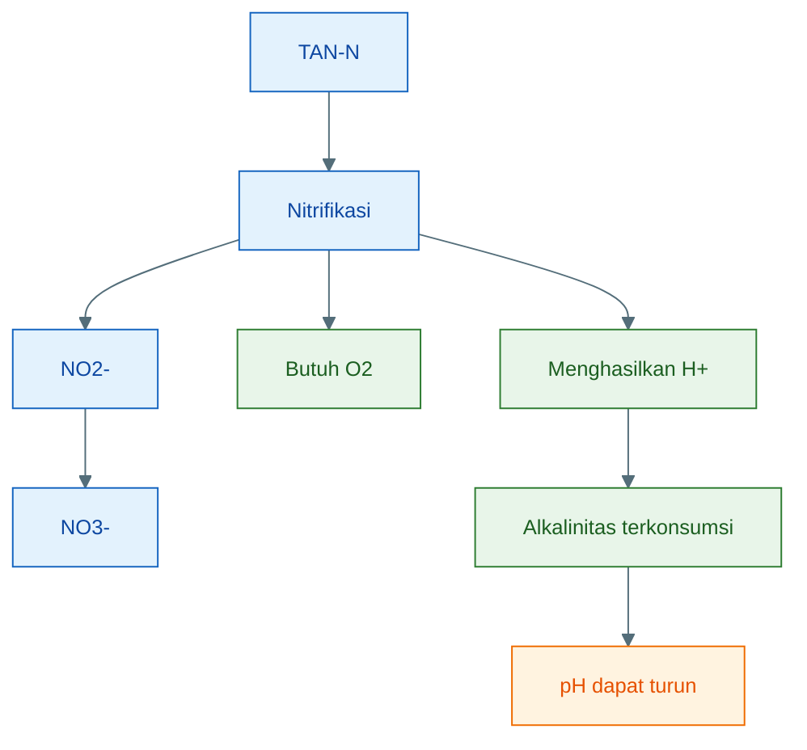
```mermaid id="konsekuensi-nitrifikasi"
%%{init: {'theme':'base','themeVariables':{
'primaryColor':'#E3F2FD',
'primaryTextColor':'#0D47A1',
'primaryBorderColor':'#1565C0',
'secondaryColor':'#E8F5E9',
'secondaryTextColor':'#1B5E20',
'secondaryBorderColor':'#2E7D32',
'tertiaryColor':'#FFF3E0',
'tertiaryTextColor':'#E65100',
'tertiaryBorderColor':'#EF6C00',
'lineColor':'#546E7A',
'fontSize':'13px'
}}}%%
flowchart TD
    A["TAN-N"] --> B["Nitrifikasi"]
    B --> C["NO2-"]
    C --> D["NO3-"]

    B --> E["Butuh O2"]
    B --> F["Menghasilkan H+"]
    F --> G["Alkalinitas terkonsumsi"]
    G --> H["pH dapat turun"]

    classDef nitrogen fill:#E3F2FD,stroke:#1565C0,color:#0D47A1;
    classDef proses fill:#E8F5E9,stroke:#2E7D32,color:#1B5E20;
    classDef risiko fill:#FFF3E0,stroke:#EF6C00,color:#E65100;

    class A,B,C,D nitrogen;
    class E,F,G proses;
    class H risiko;
```

Diagram ini menjelaskan mengapa kenaikan nitrat sering berjalan bersama kebutuhan oksigen dan konsumsi alkalinitas.

---

## 3.8. Produksi nitrat dari $TAN$

Jika sebagian $TAN$ masuk ke jalur nitrifikasi, maka produksi nitrat sebagai nitrogen dihitung:

$$
NO_{3,\text{N,produksi}} = TAN_N \times f_{\text{nitrifikasi}}
$$

Keterangan:

| Simbol                     |               Satuan | Makna                                 |
| -------------------------- | -------------------: | ------------------------------------- |
| $NO_{3,\text{N,produksi}}$ |     kg atau g N/hari | nitrogen yang menjadi nitrat          |
| $TAN_N$                    | kg atau g TAN-N/hari | produksi TAN sebagai nitrogen         |
| $f_{\text{nitrifikasi}}$   |               fraksi | bagian $TAN_N$ yang masuk nitrifikasi |

Jika seluruh $TAN$ masuk nitrifikasi:

$$
f_{\text{nitrifikasi}} = 1
$$

maka:

$$
NO_{3,\text{N,produksi}} = TAN_N
$$

Contoh:

$$
TAN_N = 11{,}52 \text{ g/hari}
$$

Jika:

$$
f_{\text{nitrifikasi}} = 1
$$

maka:

$$
NO_{3,\text{N,produksi}} = 11{,}52 \text{ g } NO_3\text{-}N\text{/hari}
$$

Jika hanya $70\%$ masuk nitrifikasi:

$$
f_{\text{nitrifikasi}} = 0{,}70
$$

maka:

$$
NO_{3,\text{N,produksi}} = 11{,}52 \times 0{,}70
$$

$$
NO_{3,\text{N,produksi}} = 8{,}06 \text{ g } NO_3\text{-}N\text{/hari}
$$

---

## 3.9. Kenaikan konsentrasi nitrat

Jika $NO_{3,\text{N,produksi}}$ dalam kg/hari dan volume $V$ dalam $\text{m}^3$, maka kenaikan konsentrasi nitrat sebagai nitrogen adalah:

$$
\Delta NO_3\text{-}N = \frac{ NO_{3,\text{N,produksi}} \times 1000 }{ V }
$$

Keterangan:

| Simbol                     |       Satuan |
| -------------------------- | -----------: |
| $\Delta NO_3\text{-}N$     |    mg/L/hari |
| $NO_{3,\text{N,produksi}}$ |      kg/hari |
| $V$                        | $\text{m}^3$ |

Jika $NO_{3,\text{N,produksi}}$ dinyatakan dalam gram/hari, maka rumusnya lebih sederhana:

$$
\Delta NO_3\text{-}N = \frac{ NO_{3,\text{N,produksi,g}} }{ V }
$$

karena:

$$
1 \text{ g per } 1 \text{ m}^3 = 1 \text{ mg/L}
$$

Contoh kolam $1 \text{ m}^3$:

$$
NO_{3,\text{N,produksi}} = 11{,}52 \text{ g/hari}
$$

$$
V = 1 \text{ m}^3
$$

Maka:

$$
\Delta NO_3\text{-}N = \frac{11{,}52}{1}
$$

$$
\Delta NO_3\text{-}N = 11{,}52 \text{ mg/L/hari}
$$

Konversi ke nitrat ion:

$$
\Delta NO_3^- = \Delta NO_3\text{-}N \times 4{,}43
$$

$$
\Delta NO_3^- = 11{,}52 \times 4{,}43
$$

$$
\Delta NO_3^- = 51{,}03 \text{ mg/L/hari}
$$

Makna praktis:

> Pada kolam $1 \text{ m}^3$, pakan $0{,}40 \text{ kg/hari}$ dapat menghasilkan potensi kenaikan sekitar $11{,}52 \text{ mg/L } NO_3\text{-}N$ per hari bila seluruh $TAN$ masuk nitrifikasi.

---

## 3.10. Simulasi sederhana akumulasi nitrat

Jika tidak ada ekspor nitrogen melalui tanaman, sludge, denitrifikasi, atau pergantian air, maka nitrat akan terakumulasi.

Dengan asumsi:

$$
\Delta NO_3\text{-}N = 11{,}52 \text{ mg/L/hari}
$$

maka simulasi kasar:

| Hari |        $NO_3\text{-}N$ |            $NO_3^-$ |
| ---: | ---------------------: | ------------------: |
|  $5$ |  $57{,}6 \text{ mg/L}$ |  $255 \text{ mg/L}$ |
| $10$ | $115{,}2 \text{ mg/L}$ |  $510 \text{ mg/L}$ |
| $20$ | $230{,}4 \text{ mg/L}$ | $1021 \text{ mg/L}$ |
| $30$ | $345{,}6 \text{ mg/L}$ | $1531 \text{ mg/L}$ |

Catatan:

> Ini adalah simulasi kasar. Dalam sistem nyata, sebagian nitrogen bisa masuk ikan, bioflok, sludge, tanaman, atau denitrifikasi. Namun tabel ini menunjukkan bahwa nitrat dapat naik cepat pada kolam kecil bila tidak ada jalur ekspor nitrogen.

---

## 3.11. Grafik akumulasi nitrat tanpa ekspor nitrogen

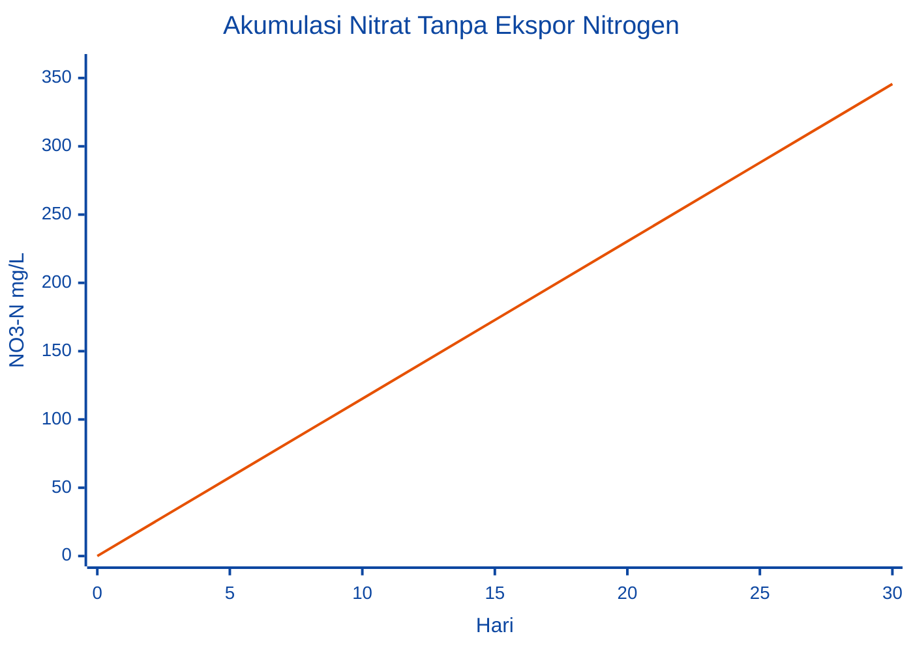
```mermaid id="grafik-akumulasi-nitrat"
%%{init: {
  'theme': 'base',
  'themeVariables': {
    'background': '#FFFFFF',
    'primaryColor': '#E3F2FD',
    'primaryTextColor': '#0D47A1',
    'primaryBorderColor': '#1565C0',
    'lineColor': '#1565C0',
    'xyChart': {
      'backgroundColor': '#FFFFFF',
      'titleColor': '#0D47A1',
      'xAxisLabelColor': '#0D47A1',
      'xAxisTitleColor': '#0D47A1',
      'xAxisTickColor': '#0D47A1',
      'xAxisLineColor': '#0D47A1',
      'yAxisLabelColor': '#0D47A1',
      'yAxisTitleColor': '#0D47A1',
      'yAxisTickColor': '#0D47A1',
      'yAxisLineColor': '#0D47A1',
      'plotColorPalette': '#E65100'
    }
  }
}}%%
xychart-beta
    title "Akumulasi Nitrat Tanpa Ekspor Nitrogen"
    x-axis "Hari" [0, 5, 10, 15, 20, 25, 30]
    y-axis "NO3-N mg/L" 0 --> 360
    line [0, 57.6, 115.2, 172.8, 230.4, 288.0, 345.6]
```

Grafik ini menjelaskan mengapa nitrat harus dilihat sebagai parameter akumulatif. Walaupun tidak menimbulkan risiko secepat nitrit, nilainya dapat naik terus bila tidak ada mekanisme keluar.

---

## 3.12. Posisi $C/N$ dalam stoikiometri

$C/N$ tidak mengubah jumlah nitrogen yang masuk dari pakan. Nitrogen yang masuk tetap ditentukan oleh:

$$
Feed
\times
Protein
\times
0{,}16
$$

Namun $C/N$ mengubah **pembagian jalur nitrogen**.

Model sederhana neraca nitrogen:

$$
f_{\text{nitrifikasi}} + f_{\text{bioflok}} + f_{\text{tanaman}} + f_{\text{sludge}} + f_{\text{denitrifikasi}} = 1
$$

Keterangan:

| Fraksi                     | Makna                                      |
| -------------------------- | ------------------------------------------ |
| $f_{\text{nitrifikasi}}$   | bagian nitrogen menjadi nitrit lalu nitrat |
| $f_{\text{bioflok}}$       | bagian nitrogen masuk biomassa mikroba     |
| $f_{\text{tanaman}}$       | bagian nitrogen diserap tanaman            |
| $f_{\text{sludge}}$        | bagian nitrogen keluar sebagai padatan     |
| $f_{\text{denitrifikasi}}$ | bagian nitrogen menjadi gas $N_2$          |

Maknanya:

> Total nitrogen harus masuk ke salah satu jalur. Jika tidak menjadi nitrat, ia bisa menjadi bioflok, sludge, tanaman, biomassa ikan, atau gas $N_2$.

---

## 3.13. Model konseptual distribusi nitrogen oleh $C/N$

Untuk membantu praktisi, berikut model konseptual sederhana. Angka di bawah bukan hukum tetap, tetapi contoh distribusi untuk memahami arah sistem.

| $C/N$ | $f_{\text{nitrifikasi}}$ | $f_{\text{bioflok}}$ | Produk dominan          |
| ----: | -----------------------: | -------------------: | ----------------------- |
|  $10$ |                 $0{,}80$ |             $0{,}20$ | nitrat                  |
|  $14$ |                 $0{,}50$ |             $0{,}50$ | nitrat dan bioflok      |
|  $18$ |                 $0{,}25$ |             $0{,}75$ | bioflok dan sludge      |
|  $22$ |                 $0{,}10$ |             $0{,}90$ | $TSS$ dan sludge tinggi |

Interpretasi:

- semakin rendah $C/N$, semakin besar peluang nitrogen masuk nitrifikasi;
- semakin tinggi $C/N$, semakin besar peluang nitrogen masuk bioflok;
- bioflok hanya menjadi solusi bila dimakan ikan atau dibuang sebagai sludge;
- jika bioflok mati dan terurai, nitrogen dapat kembali menjadi $TAN$.

---

## 3.14. Grafik konseptual distribusi nitrogen terhadap $C/N$

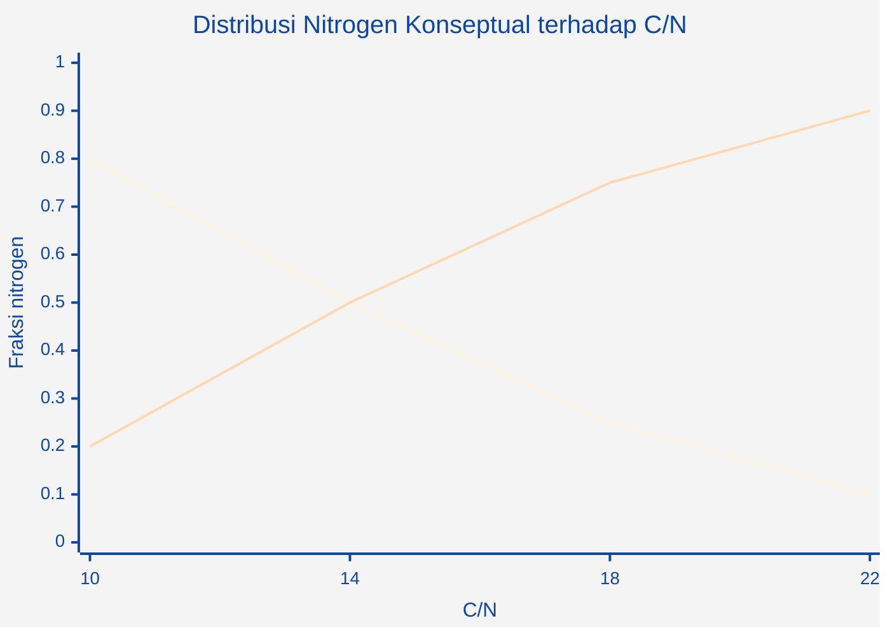
```mermaid id="grafik-distribusi-cn"
%%{init: {'theme':'base','themeVariables':{
'primaryColor':'#E3F2FD',
'primaryTextColor':'#0D47A1',
'primaryBorderColor':'#1565C0',
'secondaryColor':'#E8F5E9',
'secondaryTextColor':'#1B5E20',
'secondaryBorderColor':'#2E7D32',
'tertiaryColor':'#FFF3E0',
'tertiaryTextColor':'#E65100',
'tertiaryBorderColor':'#EF6C00',
'lineColor':'#546E7A',
'fontSize':'13px'
}}}%%
xychart-beta
    title "Distribusi Nitrogen Konseptual terhadap C/N"
    x-axis "C/N" [10, 14, 18, 22]
    y-axis "Fraksi nitrogen" 0 --> 1
    line [0.80, 0.50, 0.25, 0.10]
    line [0.20, 0.50, 0.75, 0.90]
```

Keterangan garis:

| Garis         | Makna                                         |
| ------------- | --------------------------------------------- |
| Garis pertama | fraksi nitrogen menuju nitrifikasi dan nitrat |
| Garis kedua   | fraksi nitrogen menuju bioflok dan padatan    |

Grafik ini menjelaskan posisi penting $C/N$:

> $C/N$ bukan penghilang nitrogen. $C/N$ adalah pengatur jalur nitrogen.

---

## 3.15. Contoh efek $C/N$ terhadap produksi nitrat

Misal:

$$
TAN_N = 11{,}52 \text{ g/hari}
$$

### Skenario 1: $C/N = 10$

Asumsi:

$$
f_{\text{nitrifikasi}} = 0{,}80
$$

Maka:

$$
NO_{3,\text{N,produksi}} = 11{,}52 \times 0{,}80
$$

$$
NO_{3,\text{N,produksi}} = 9{,}22 \text{ g/hari}
$$

Untuk kolam $1 \text{ m}^3$:

$$
\Delta NO_3\text{-}N = 9{,}22 \text{ mg/L/hari}
$$

### Skenario 2: $C/N = 14$

Asumsi:

$$
f_{\text{nitrifikasi}} = 0{,}50
$$

Maka:

$$
NO_{3,\text{N,produksi}} = 11{,}52 \times 0{,}50
$$

$$
NO_{3,\text{N,produksi}} = 5{,}76 \text{ g/hari}
$$

Untuk kolam $1 \text{ m}^3$:

$$
\Delta NO_3\text{-}N = 5{,}76 \text{ mg/L/hari}
$$

### Skenario 3: $C/N = 18$

Asumsi:

$$
f_{\text{nitrifikasi}} = 0{,}25
$$

Maka:

$$
NO_{3,\text{N,produksi}} = 11{,}52 \times 0{,}25
$$

$$
NO_{3,\text{N,produksi}} = 2{,}88 \text{ g/hari}
$$

Untuk kolam $1 \text{ m}^3$:

$$
\Delta NO_3\text{-}N = 2{,}88 \text{ mg/L/hari}
$$

Tabel ringkas:

| $C/N$ | $f_{\text{nitrifikasi}}$ | $NO_{3,\text{N,produksi}}$ | $\Delta NO_3\text{-}N$ pada $1 \text{ m}^3$ |
| ----: | -----------------------: | -------------------------: | ------------------------------------------: |
|  $10$ |                 $0{,}80$ |    $9{,}22 \text{ g/hari}$ |                  $9{,}22 \text{ mg/L/hari}$ |
|  $14$ |                 $0{,}50$ |    $5{,}76 \text{ g/hari}$ |                  $5{,}76 \text{ mg/L/hari}$ |
|  $18$ |                 $0{,}25$ |    $2{,}88 \text{ g/hari}$ |                  $2{,}88 \text{ mg/L/hari}$ |

Catatan:

> Penurunan nitrat pada $C/N$ lebih tinggi tidak berarti nitrogen hilang. Nitrogen tersebut lebih banyak masuk ke bioflok, $TSS$, dan sludge. Karena itu, sistem dengan $C/N$ lebih tinggi wajib memiliki manajemen aerasi dan padatan yang lebih kuat.

---

## 3.16. Neraca nitrogen yang lebih lengkap

Dalam sistem nyata, nitrogen bisa keluar atau tersimpan melalui banyak jalur.

Model neraca sederhana:

$$
N_{\text{input}} = N_{\text{ikan}} + N_{\text{TAN}} + N_{\text{NO2}} + N_{\text{NO3}} + N_{\text{bioflok}} + N_{\text{sludge}} + N_{\text{tanaman}} + N_{\text{N2}}
$$

Keterangan:

| Komponen             | Makna                                 |
| -------------------- | ------------------------------------- |
| $N_{\text{input}}$   | nitrogen dari pakan                   |
| $N_{\text{ikan}}$    | nitrogen menjadi biomassa ikan        |
| $N_{\text{TAN}}$     | nitrogen sebagai amonia total         |
| $N_{\text{NO2}}$     | nitrogen sebagai nitrit               |
| $N_{\text{NO3}}$     | nitrogen sebagai nitrat               |
| $N_{\text{bioflok}}$ | nitrogen dalam biomassa mikroba       |
| $N_{\text{sludge}}$  | nitrogen dalam padatan yang mengendap |
| $N_{\text{tanaman}}$ | nitrogen diserap tanaman              |
| $N_{\text{N2}}$      | nitrogen keluar sebagai gas nitrogen  |

Praktisi tidak harus mengukur semua komponen ini setiap hari. Namun memahami neraca ini penting agar tidak salah tafsir.

Contoh salah tafsir:

> Nitrat rendah pada $C/N$ tinggi belum tentu berarti sistem lebih bersih. Bisa jadi nitrogen sedang menumpuk sebagai bioflok dan sludge.

---

## 3.17. Diagram neraca nitrogen bioflok

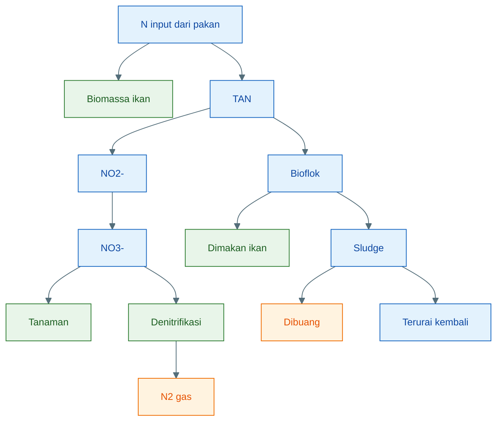
```mermaid id="neraca-nitrogen-bioflok"
%%{init: {'theme':'base','themeVariables':{
'primaryColor':'#E3F2FD',
'primaryTextColor':'#0D47A1',
'primaryBorderColor':'#1565C0',
'secondaryColor':'#E8F5E9',
'secondaryTextColor':'#1B5E20',
'secondaryBorderColor':'#2E7D32',
'tertiaryColor':'#FFF3E0',
'tertiaryTextColor':'#E65100',
'tertiaryBorderColor':'#EF6C00',
'lineColor':'#546E7A',
'fontSize':'13px'
}}}%%
flowchart TD
    A["N input dari pakan"] --> B["Biomassa ikan"]
    A --> C["TAN"]
    C --> D["NO2-"]
    D --> E["NO3-"]

    C --> F["Bioflok"]
    F --> G["Dimakan ikan"]
    F --> H["Sludge"]

    E --> I["Tanaman"]
    E --> J["Denitrifikasi"]
    J --> K["N2 gas"]

    H --> L["Dibuang"]
    H --> M["Terurai kembali"]

    classDef input fill:#E3F2FD,stroke:#1565C0,color:#0D47A1;
    classDef proses fill:#E8F5E9,stroke:#2E7D32,color:#1B5E20;
    classDef keluar fill:#FFF3E0,stroke:#EF6C00,color:#E65100;

    class A,C,D,E,F,H,M input;
    class B,G,I,J proses;
    class K,L keluar;
```

Diagram ini menunjukkan bahwa nitrogen baru benar-benar keluar dari sistem bila:

- menjadi biomassa ikan yang dipanen;
- sludge dibuang;
- tanaman dipanen;
- air diganti;
- nitrat menjadi $N_2$ melalui denitrifikasi.

---

## 3.18. Kesimpulan Bab 3

Bab ini menunjukkan bahwa manajemen nitrit dan nitrat harus dimulai dari stoikiometri pakan.

Formula dasar produksi $TAN$:

$$
TAN_N = Feed \times Protein \times 0{,}16 \times f_{\text{TAN}}
$$

Konsekuensi nitrifikasi:

$$
1 \text{ g TAN-N}
\rightarrow
4{,}57 \text{ g } O_2
$$

$$
1 \text{ g TAN-N}
\rightarrow
7{,}14 \text{ g alkalinitas as } CaCO_3
$$

Produksi nitrat:

$$
NO_{3,\text{N,produksi}} = TAN_N \times f_{\text{nitrifikasi}}
$$

Kenaikan konsentrasi nitrat:

$$
\Delta NO_3\text{-}N = \frac{ NO_{3,\text{N,produksi}} \times 1000 }{ V }
$$

bila $NO_{3,\text{N,produksi}}$ dalam kg/hari.

Atau:

$$
\Delta NO_3\text{-}N = \frac{ NO_{3,\text{N,produksi,g}} }{ V }
$$

bila $NO_{3,\text{N,produksi,g}}$ dalam g/hari.

Pesan utama Bab 3:

> Nitrat bukan muncul tiba-tiba. Nitrat adalah konsekuensi dari nitrogen pakan yang masuk ke jalur nitrifikasi. $C/N$ tidak menghapus nitrogen, tetapi mengatur apakah nitrogen lebih banyak menjadi nitrat, bioflok, sludge, tanaman, atau gas $N_2$.

[**Kembali ke Atas**](#manajemen-nitrit-dan-nitrat-pada-bioflok-cn-cl-nitrifikasi-denitrifikasi-dan-ekspor-nitrogen-berbasis-angka)

---

# Bab 4. Manajemen Nitrit: Proteksi Ikan dan Perbaikan Nitrifikasi

Nitrit adalah parameter yang harus dibaca sebagai **risiko cepat**. Ketika $NO_2^-$ naik, tindakan tidak cukup hanya menunggu nitrifikasi matang. Operator harus melakukan dua hal sekaligus:

1. **melindungi ikan** dengan rasio $Cl^- : NO_2^-$;
2. **memperbaiki sistem** agar $NO_2^-$ segera teroksidasi menjadi $NO_3^-$.

Dengan kata lain, manajemen nitrit bukan hanya kimia air, tetapi kombinasi antara proteksi fisiologis ikan, nitrifikasi, aerasi, alkalinitas, pakan, dan sludge.

---

## 4.1. Dua tujuan manajemen nitrit

| Jalur            | Tujuan                                  |
| ---------------- | --------------------------------------- |
| Proteksi ikan    | menjaga rasio $Cl^- : NO_2^-$           |
| Perbaikan sistem | mempercepat $NO_2^- \rightarrow NO_3^-$ |

Dua jalur ini tidak saling menggantikan.

$Cl^-$ melindungi ikan, tetapi tidak menghilangkan nitrit dari air.
Nitrifikasi menghilangkan nitrit dari air, tetapi membutuhkan waktu, oksigen, alkalinitas, dan komunitas mikroba yang matang.

### Diagram dua jalur manajemen nitrit

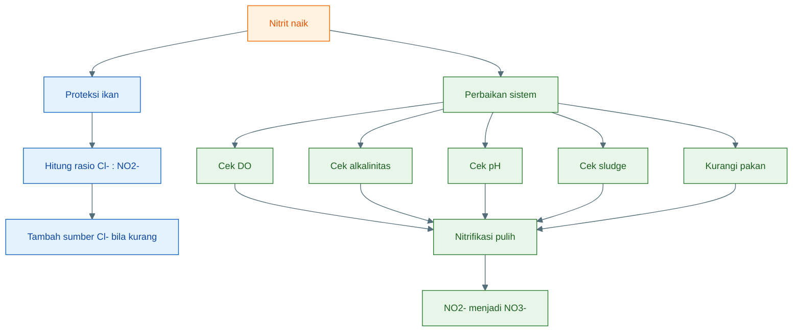
```mermaid id="dua-jalur-manajemen-nitrit"
%%{init: {'theme':'base','themeVariables':{
'primaryColor':'#E3F2FD',
'primaryTextColor':'#0D47A1',
'primaryBorderColor':'#1565C0',
'secondaryColor':'#E8F5E9',
'secondaryTextColor':'#1B5E20',
'secondaryBorderColor':'#2E7D32',
'tertiaryColor':'#FFF3E0',
'tertiaryTextColor':'#E65100',
'tertiaryBorderColor':'#EF6C00',
'lineColor':'#546E7A',
'fontSize':'13px'
}}}%%
flowchart TD
    A["Nitrit naik"] --> B["Proteksi ikan"]
    A --> C["Perbaikan sistem"]

    B --> D["Hitung rasio Cl- : NO2-"]
    D --> E["Tambah sumber Cl- bila kurang"]

    C --> F["Cek DO"]
    C --> G["Cek alkalinitas"]
    C --> H["Cek pH"]
    C --> I["Cek sludge"]
    C --> J["Kurangi pakan"]

    F --> K["Nitrifikasi pulih"]
    G --> K
    H --> K
    I --> K
    J --> K

    K --> L["NO2- menjadi NO3-"]

    classDef risiko fill:#FFF3E0,stroke:#EF6C00,color:#E65100;
    classDef proteksi fill:#E3F2FD,stroke:#1565C0,color:#0D47A1;
    classDef sistem fill:#E8F5E9,stroke:#2E7D32,color:#1B5E20;

    class A risiko;
    class B,D,E proteksi;
    class C,F,G,H,I,J,K,L sistem;
```

Makna praktis diagram:

- jika nitrit naik, ikan perlu dilindungi segera;
- perlindungan ikan dilakukan dengan $Cl^-$;
- sumber nitrit tetap harus diselesaikan melalui perbaikan nitrifikasi dan pengurangan beban sistem.

---

## 4.2. Proteksi ikan dengan $Cl^-$

Nitrit berbahaya karena dapat masuk lewat insang. Ion $Cl^-$ membantu menurunkan risiko ini karena bersaing dengan nitrit pada mekanisme transport ion di insang.

Maka parameter yang penting bukan hanya kadar nitrit, tetapi rasio:

$$
Cl^- : NO_2^-
$$

Rasio kerja yang digunakan dalam artikel ini:

| Kondisi             | Rasio $Cl^- : NO_2^-$ |
| ------------------- | --------------------: |
| Minimum             |                $10:1$ |
| Desain nila bioflok |                $20:1$ |
| Darurat nitrit      |  $30:1$ sampai $50:1$ |

Kalimat praktisnya:

> Saat $NO_2^-$ naik, pertanyaan pertama bukan hanya “berapa nitritnya?”, tetapi “apakah $Cl^-$ cukup terhadap nitrit?”

---

## 4.3. Formula proteksi nitrit dengan $Cl^-$

Jika nitrit dibaca sebagai $NO_2^-$, target klorida dihitung:

$$
Cl^-_{\text{target}} = R \times NO_2^-
$$

Keterangan:

| Simbol                 |        Satuan | Makna                    |
| ---------------------- | ------------: | ------------------------ |
| $Cl^-_{\text{target}}$ | $\text{mg/L}$ | target klorida           |
| $R$                    |         rasio | contoh $20$ untuk $20:1$ |
| $NO_2^-$               | $\text{mg/L}$ | nitrit sebagai ion       |

Tambahan klorida:

$$
Cl^-_{\text{tambahan}} = \max \left( 0, Cl^-_{\text{target}} = Cl^-_{\text{aktual}} \right)
$$

Jika sumber klorida adalah $NaCl$, maka kebutuhan garam:

$$
NaCl_{\text{gram}} = \frac{ Cl^-_{\text{tambahan}} \times V }{ 0{,}606 }
$$

Keterangan:

| Simbol                   |        Satuan | Makna                          |
| ------------------------ | ------------: | ------------------------------ |
| $NaCl_{\text{gram}}$     |          gram | kebutuhan garam                |
| $Cl^-_{\text{tambahan}}$ | $\text{mg/L}$ | klorida yang harus ditambahkan |
| $V$                      |  $\text{m}^3$ | volume air                     |
| $0{,}606$                |        fraksi | fraksi $Cl^-$ dalam $NaCl$     |

Karena:

$$
NaCl
\approx
60{,}6\%
\text{ Cl}^-
$$

maka:

$$
0{,}606
$$

dipakai sebagai faktor konversi.

---

## 4.4. Jika test kit membaca $NO_2\text{-}N$

Jika hasil test kit bukan $NO_2^-$, tetapi $NO_2\text{-}N$, maka konversi dulu:

$$
NO_2^- = 3{,}29 \times NO_2\text{-}N
$$

Setelah itu, baru hitung:

$$
Cl^-_{\text{target}} = R \times NO_2^-
$$

Contoh:

$$
NO_2\text{-}N = 0{,}60 \text{ mg/L}
$$

Konversi:

$$
NO_2^- = 3{,}29 \times 0{,}60
$$

$$
NO_2^- = 1{,}97 \text{ mg/L}
$$

Dibulatkan:

$$
NO_2^-
\approx
2{,}0 \text{ mg/L}
$$

Jika target rasio $20:1$:

$$
Cl^-_{\text{target}} = 20 \times 2{,}0
$$

$$
Cl^-_{\text{target}} = 40 \text{ mg/L}
$$

---

## 4.5. Contoh hitung proteksi nitrit

Data kolam:

| Parameter              |                     Nilai |
| ---------------------- | ------------------------: |
| Volume                 |           $1 \text{ m}^3$ |
| Nitrit                 | $NO_2^- = 2 \text{ mg/L}$ |
| $Cl^-_{\text{aktual}}$ |         $10 \text{ mg/L}$ |
| Rasio target           |                    $20:1$ |

### Langkah 1: hitung target $Cl^-$

$$
Cl^-_{\text{target}} = 20 \times 2
$$

$$
Cl^-_{\text{target}} = 40 \text{ mg/L}
$$

### Langkah 2: hitung tambahan $Cl^-$

$$
Cl^-_{\text{tambahan}} = 40 - 10
$$

$$
Cl^-_{\text{tambahan}} = 30 \text{ mg/L}
$$

### Langkah 3: konversi ke $NaCl$

$$
NaCl_{\text{gram}} = \frac{ 30 \times 1 }{ 0{,}606 }
$$

$$
NaCl_{\text{gram}} = 49{,}5 \text{ g}
$$

Dibulatkan:

$$
NaCl_{\text{gram}}
\approx
50 \text{ g}
$$

Keputusan:

> Pada kolam $1 \text{ m}^3$, nitrit $2 \text{ mg/L}$, $Cl^-$ aktual $10 \text{ mg/L}$, dan target $20:1$, kebutuhan $NaCl$ sekitar $50 \text{ g}$.

---

## 4.6. Rasio aktual $Cl^- : NO_2^-$

Selain menghitung target, operator juga perlu menghitung rasio aktual.

$$
R_{\text{aktual}} = \frac{ Cl^-_{\text{aktual}} }{ NO_2^- }
$$

Contoh:

$$
Cl^-_{\text{aktual}} = 10 \text{ mg/L}
$$

$$
NO_2^- = 2 \text{ mg/L}
$$

Maka:

$$
R_{\text{aktual}} = \frac{10}{2} 5
$$

Artinya:

$$
Cl^- : NO_2^- = 5:1
$$

Ini berada di bawah minimum $10:1$, sehingga perlu koreksi $Cl^-$.

Tabel keputusan:

| Rasio aktual $Cl^- : NO_2^-$ | Status                          | Tindakan                                   |
| ---------------------------: | ------------------------------- | ------------------------------------------ |
|                      $<10:1$ | di bawah minimum                | tambah $Cl^-$ segera                       |
|         $10:1$ sampai $20:1$ | minimum terpenuhi, belum desain | koreksi bila sistem padat atau ikan stres  |
|         $20:1$ sampai $30:1$ | desain nila bioflok             | monitoring                                 |
|         $30:1$ sampai $50:1$ | rentang darurat                 | dipakai saat nitrit tinggi atau ikan stres |
|                      $>50:1$ | di atas kebutuhan umum          | evaluasi $EC/TDS$ dan akumulasi garam      |

---

## 4.7. Penyebab nitrit naik

Nitrit naik berarti ada ketidakseimbangan antara produksi nitrit dan oksidasi nitrit menjadi nitrat.

Secara sederhana:

$$
Produksi\ NO_2^-

>

Oksidasi\ NO_2^-
$$

Penyebab utama:

| Penyebab                                           | Mekanisme                                        |
| -------------------------------------------------- | ------------------------------------------------ |
| nitrifier tahap kedua belum matang                 | $NO_2^-$ belum cepat menjadi $NO_3^-$            |
| $DO$ di bawah $4 \text{ mg/L}$                     | oksidasi nitrit melemah                          |
| alkalinitas di bawah $100 \text{ mg/L as } CaCO_3$ | nitrifikasi terganggu                            |
| pakan naik terlalu cepat                           | beban $TAN$ meningkat                            |
| sludge membusuk                                    | $TAN$ sekunder muncul                            |
| aerasi mati                                        | nitrifikasi turun cepat                          |
| karbon dihentikan mendadak                         | jalur nitrogen bergeser sebelum nitrifikasi siap |

### Diagram penyebab nitrit naik

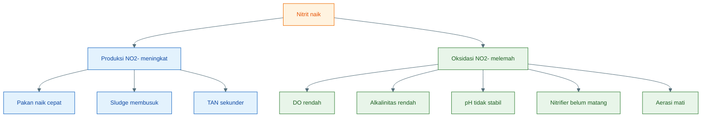
```mermaid id="penyebab-nitrit-naik"
%%{init: {'theme':'base','themeVariables':{
'primaryColor':'#E3F2FD',
'primaryTextColor':'#0D47A1',
'primaryBorderColor':'#1565C0',
'secondaryColor':'#E8F5E9',
'secondaryTextColor':'#1B5E20',
'secondaryBorderColor':'#2E7D32',
'tertiaryColor':'#FFF3E0',
'tertiaryTextColor':'#E65100',
'tertiaryBorderColor':'#EF6C00',
'lineColor':'#546E7A',
'fontSize':'13px'
}}}%%
flowchart TD
    A["Nitrit naik"] --> B["Produksi NO2- meningkat"]
    A --> C["Oksidasi NO2- melemah"]

    B --> D["Pakan naik cepat"]
    B --> E["Sludge membusuk"]
    B --> F["TAN sekunder"]

    C --> G["DO rendah"]
    C --> H["Alkalinitas rendah"]
    C --> I["pH tidak stabil"]
    C --> J["Nitrifier belum matang"]
    C --> K["Aerasi mati"]

    classDef risiko fill:#FFF3E0,stroke:#EF6C00,color:#E65100;
    classDef produksi fill:#E3F2FD,stroke:#1565C0,color:#0D47A1;
    classDef hambatan fill:#E8F5E9,stroke:#2E7D32,color:#1B5E20;

    class A risiko;
    class B,D,E,F produksi;
    class C,G,H,I,J,K hambatan;
```

Diagram ini membantu operator membedakan apakah masalah nitrit berasal dari beban nitrogen yang naik, atau dari proses nitrifikasi yang melemah.

---

## 4.8. Perbaikan sistem: mempercepat $NO_2^- \rightarrow NO_3^-$

Target perbaikan sistem adalah mengembalikan proses berikut:

$$
NO_2^-
+
0{,}5O_2
\rightarrow
NO_3^-
$$

Agar proses ini berjalan, sistem membutuhkan:

| Faktor                      |                             Target operasi |
| --------------------------- | -----------------------------------------: |
| $DO_{\text{subuh}}$         |               $>4$ sampai $5 \text{ mg/L}$ |
| Alkalinitas                 | $150$ sampai $200 \text{ mg/L as } CaCO_3$ |
| Alkalinitas minimum koreksi |             $<100 \text{ mg/L as } CaCO_3$ |
| $pH_{\text{pagi}}$          |                     $7{,}0$ sampai $7{,}8$ |
| Sludge                      |                tidak hitam dan tidak busuk |
| Pakan                       |   tidak dinaikkan saat nitrit belum stabil |
| Aerasi                      |        tidak boleh mati, distribusi merata |

Nitrit naik sering terjadi ketika tahap pertama nitrifikasi sudah berjalan, tetapi tahap kedua belum kuat. Artinya, $TAN$ mulai turun, tetapi $NO_2^-$ justru naik.

Pola yang sering terlihat:

|  $TAN$ | $NO_2^-$ | Interpretasi              |
| -----: | -------: | ------------------------- |
|   naik |   rendah | amonia belum teroksidasi  |
|  turun |     naik | nitrit sedang tertahan    |
| rendah |    turun | nitrifikasi mulai lengkap |
| rendah |   rendah | sistem stabil             |

---

## 4.9. Peran aerasi dalam manajemen nitrit

Aerasi mendukung nitrit melalui dua jalur:

1. menyediakan $O_2$ untuk nitrifikasi;
2. menjaga mixing agar tidak muncul zona anaerob dan sludge busuk.

Reaksi oksidasi nitrit:

$$
NO_2^-
+
0{,}5O_2
\rightarrow
NO_3^-
$$

Jika $DO$ berada di bawah batas operasi, bakteri pengoksidasi nitrit dapat melemah. Dalam artikel ini, batas tindakan adalah:

$$
DO
<
4 \text{ mg/L}
$$

Tindakan:

- tambah aerasi;
- kurangi pakan sementara;
- cek diffuser dan blower;
- cek sludge;
- jangan menambah karbon organik saat $DO$ rendah.

Kalimat praktis:

> Saat nitrit naik dan $DO$ rendah, prioritas pertama adalah aerasi, bukan molase.

---

## 4.10. Peran alkalinitas dalam manajemen nitrit

Nitrifikasi menghasilkan asam dan mengonsumsi alkalinitas.

Stoikiometri:

$$
1 \text{ g TAN-N}
\rightarrow
7{,}14 \text{ g alkalinitas as } CaCO_3
$$

Jika alkalinitas turun, $pH$ menjadi lebih mudah jatuh. Saat $pH$ jatuh, proses nitrifikasi terganggu, dan nitrit dapat tertahan.

Ambang tindakan:

$$
Alkalinitas
<
100 \text{ mg/L as } CaCO_3
$$

Target operasi:

$$
Alkalinitas = 150 \text{ sampai } 200 \text{ mg/L as } CaCO_3
$$

Jika nitrit naik dan alkalinitas rendah, tindakan koreksi:

1. tambah buffer;
2. pilih buffer berdasarkan hardness;
3. jaga aerasi;
4. kurangi pakan sementara;
5. ukur ulang nitrit harian.

---

## 4.11. Peran pakan dan sludge

Nitrit adalah hasil dari beban nitrogen. Karena itu, ketika nitrit naik, pakan harus dibaca sebagai input nitrogen harian.

Formula:

$$
TAN_N = Feed \times Protein \times 0{,}16 \times f_{\text{TAN}}
$$

Jika $Feed$ naik, maka $TAN_N$ naik. Jika nitrifikasi belum mampu mengikuti, nitrit bisa naik.

Sludge juga penting karena sludge yang membusuk dapat menjadi sumber $TAN$ sekunder.

Alur risiko:

$$
Sludge
\rightarrow
TAN
\rightarrow
NO_2^-
$$

Maka saat nitrit naik, tindakan wajib:

- cek dasar kolam;
- siphon sludge;
- cek bau;
- cek titik mati sirkulasi;
- perbaiki mixing.

---

## 4.12. SOP nitrit naik

SOP ringkas:

```text id="sop-nitrit-naik"
Jika NO2- naik:
    hitung Cl- : NO2-
    jika rasio kurang dari 10:1:
        tambah Cl-
    target desain nila bioflok = 20:1
    kurangi pakan 30 sampai 50 persen
    cek DO subuh
    cek alkalinitas
    cek pH
    cek sludge
    ukur ulang NO2- setiap hari
```

SOP teknis dengan urutan keputusan:

| Urutan | Tindakan                           | Tujuan                        |
| -----: | ---------------------------------- | ----------------------------- |
|      1 | ukur $NO_2^-$                      | konfirmasi masalah            |
|      2 | ukur $Cl^-$                        | hitung proteksi               |
|      3 | tambah $Cl^-$ bila rasio kurang    | lindungi ikan                 |
|      4 | kurangi pakan $30\%$ sampai $50\%$ | turunkan input nitrogen       |
|      5 | cek $DO$ subuh                     | pastikan nitrifikasi aerob    |
|      6 | cek alkalinitas                    | pastikan buffer nitrifikasi   |
|      7 | cek $pH$                           | baca stabilitas proses        |
|      8 | buang sludge                       | kurangi sumber nitrogen ulang |
|      9 | ukur ulang $NO_2^-$ harian         | pantau pemulihan              |

---

## 4.13. Diagram SOP nitrit naik

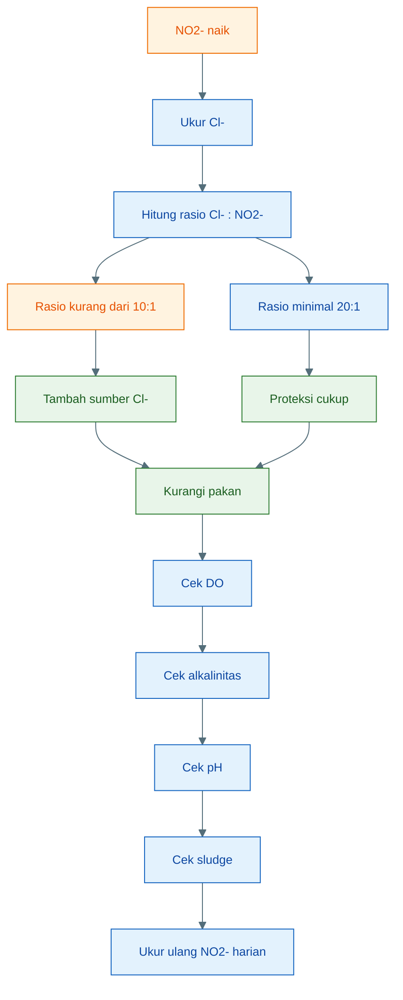
```mermaid id="sop-nitrit-naik-diagram"
%%{init: {'theme':'base','themeVariables':{
'primaryColor':'#E3F2FD',
'primaryTextColor':'#0D47A1',
'primaryBorderColor':'#1565C0',
'secondaryColor':'#E8F5E9',
'secondaryTextColor':'#1B5E20',
'secondaryBorderColor':'#2E7D32',
'tertiaryColor':'#FFF3E0',
'tertiaryTextColor':'#E65100',
'tertiaryBorderColor':'#EF6C00',
'lineColor':'#546E7A',
'fontSize':'13px'
}}}%%
flowchart TD
    A["NO2- naik"] --> B["Ukur Cl-"]
    B --> C["Hitung rasio Cl- : NO2-"]
    C --> D["Rasio kurang dari 10:1"]
    C --> E["Rasio minimal 20:1"]

    D --> F["Tambah sumber Cl-"]
    E --> G["Proteksi cukup"]

    F --> H["Kurangi pakan"]
    G --> H

    H --> I["Cek DO"]
    I --> J["Cek alkalinitas"]
    J --> K["Cek pH"]
    K --> L["Cek sludge"]
    L --> M["Ukur ulang NO2- harian"]

    classDef awal fill:#FFF3E0,stroke:#EF6C00,color:#E65100;
    classDef ukur fill:#E3F2FD,stroke:#1565C0,color:#0D47A1;
    classDef aksi fill:#E8F5E9,stroke:#2E7D32,color:#1B5E20;

    class A,D awal;
    class B,C,E,I,J,K,L,M ukur;
    class F,G,H aksi;
```

Diagram ini menempatkan proteksi ikan di awal, lalu dilanjutkan dengan perbaikan sistem.

---

## 4.14. Hubungan nitrit dengan $pH$

Perlu dibedakan dua hal:

1. **kesetimbangan kimia nitrit**;
2. **konversi biologis nitrit menjadi nitrat**.

Konversi:

$$
NO_2^-
\rightarrow
NO_3^-
$$

bukan kesetimbangan kimia langsung terhadap $pH$. Itu adalah proses biologis nitrifikasi.

Kesetimbangan kimia nitrit yang benar adalah:

$$
HNO_2
\rightleftharpoons
H^+
+
NO_2^-
$$

Dengan pendekatan:

$$
pK_a
\approx
3{,}25
$$

Pada $pH$ bioflok normal, misalnya $7{,}0$ sampai $8{,}0$, hampir seluruh nitrit berada sebagai:

$$
NO_2^-
$$

Artinya, dalam bioflok, masalah nitrit lebih banyak berkaitan dengan:

- kemampuan nitrifier mengoksidasi $NO_2^-$;
- kecukupan $DO$;
- alkalinitas;
- $pH$ yang mendukung mikroba;
- beban pakan;
- sludge.

Bukan karena $pH$ secara langsung mengubah $NO_2^-$ menjadi $NO_3^-$.

---

## 4.15. Grafik spesiasi nitrit terhadap $pH$

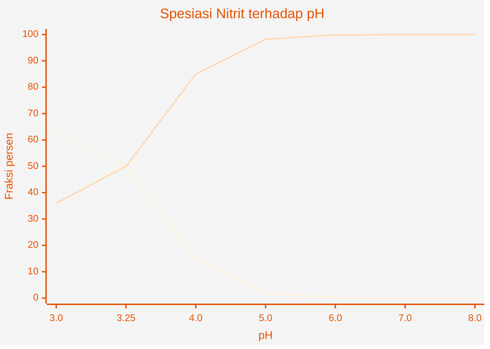
```mermaid id="spesiasi-nitrit-ph-bab4"
%%{init: {'theme':'base','themeVariables':{
'primaryColor':'#FFF3E0',
'primaryTextColor':'#E65100',
'primaryBorderColor':'#EF6C00',
'secondaryColor':'#E8F5E9',
'secondaryTextColor':'#1B5E20',
'secondaryBorderColor':'#2E7D32',
'lineColor':'#546E7A',
'fontSize':'13px'
}}}%%
xychart-beta
    title "Spesiasi Nitrit terhadap pH"
    x-axis "pH" [3.0, 3.25, 4.0, 5.0, 6.0, 7.0, 8.0]
    y-axis "Fraksi persen" 0 --> 100
    line [64, 50, 15, 1.8, 0.18, 0.018, 0.002]
    line [36, 50, 85, 98.2, 99.82, 99.982, 99.998]
```

Keterangan garis:

| Garis         | Makna           |
| ------------- | --------------- |
| Garis pertama | fraksi $HNO_2$  |
| Garis kedua   | fraksi $NO_2^-$ |

Makna praktis:

> Pada $pH 7{,}0$ sampai $8{,}0$, nitrit hampir seluruhnya berada sebagai $NO_2^-$. Karena itu, fokus manajemen nitrit dalam bioflok adalah proteksi $Cl^-$ dan perbaikan nitrifikasi.

---

## 4.16. Grafik kinerja biologis konversi nitrit menjadi nitrat

Karena $NO_2^- \rightarrow NO_3^-$ adalah proses biologis, grafiknya harus dibaca sebagai indeks kinerja, bukan kesetimbangan kimia.

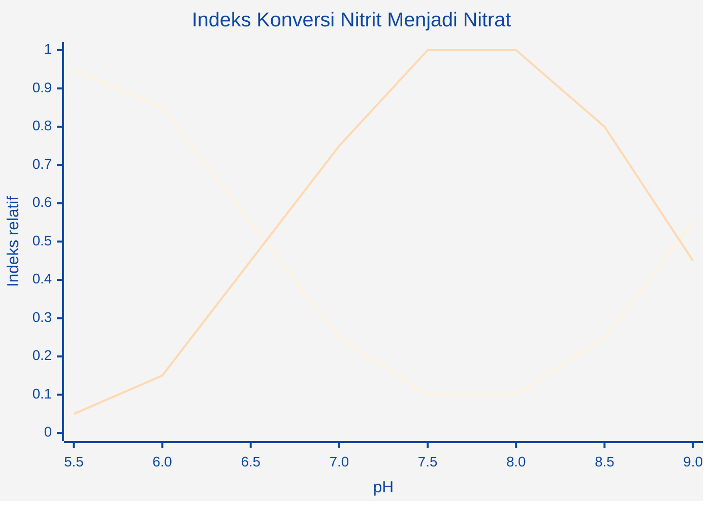
```mermaid id="kinerja-nitrit-nitrat-ph-bab4"
%%{init: {'theme':'base','themeVariables':{
'primaryColor':'#E3F2FD',
'primaryTextColor':'#0D47A1',
'primaryBorderColor':'#1565C0',
'secondaryColor':'#E8F5E9',
'secondaryTextColor':'#1B5E20',
'secondaryBorderColor':'#2E7D32',
'tertiaryColor':'#FFF3E0',
'tertiaryTextColor':'#E65100',
'tertiaryBorderColor':'#EF6C00',
'lineColor':'#546E7A',
'fontSize':'13px'
}}}%%
xychart-beta
    title "Indeks Konversi Nitrit Menjadi Nitrat"
    x-axis "pH" [5.5, 6.0, 6.5, 7.0, 7.5, 8.0, 8.5, 9.0]
    y-axis "Indeks relatif" 0 --> 1
    line [0.95, 0.85, 0.55, 0.25, 0.10, 0.10, 0.25, 0.55]
    line [0.05, 0.15, 0.45, 0.75, 1.00, 1.00, 0.80, 0.45]
```

Keterangan garis:

| Garis         | Makna                                 |
| ------------- | ------------------------------------- |
| Garis pertama | indeks risiko nitrit tertahan         |
| Garis kedua   | indeks konversi nitrit menjadi nitrat |

Makna operasional:

|                   $pH$ | Interpretasi                                       |
| ---------------------: | -------------------------------------------------- |
|               $<6{,}5$ | risiko nitrit tertahan meningkat                   |
| $7{,}0$ sampai $8{,}2$ | zona kerja nitrifikasi lebih baik                  |
|               $>8{,}5$ | evaluasi $NH_3$, stres ikan, dan kestabilan sistem |

---

## 4.17. Kesalahan umum saat nitrit naik

| Kesalahan                                         | Dampak                                               |
| ------------------------------------------------- | ---------------------------------------------------- |
| hanya menambah garam                              | ikan terlindungi, tetapi sumber nitrit belum selesai |
| menambah karbon saat $DO$ rendah                  | respirasi mikroba naik, $DO$ bisa makin turun        |
| tidak mengukur $Cl^-$                             | dosis garam menjadi tebakan                          |
| tidak mengukur alkalinitas                        | nitrifikasi bisa gagal karena buffer habis           |
| tidak mengurangi pakan                            | beban $TAN$ tetap tinggi                             |
| tidak membuang sludge                             | sumber nitrogen sekunder terus muncul                |
| mengira nitrit hilang karena air terlihat cokelat | warna air bukan indikator nitrit aman                |

---

## 4.18. Kesimpulan Bab 4

Manajemen nitrit harus dilakukan dengan dua jalur serentak.

Jalur pertama adalah proteksi ikan:

$$
Cl^-_{\text{target}} = R \times NO_2^-
$$

$$
Cl^-_{\text{tambahan}} = \max \left( 0, Cl^-_{\text{target}} = Cl^-_{\text{aktual}} \right)
$$

$$
NaCl_{\text{gram}} = \frac{ Cl^-_{\text{tambahan}} \times V }{ 0{,}606 }
$$

Jalur kedua adalah perbaikan sistem agar:

$$
NO_2^-
\rightarrow
NO_3^-
$$

berjalan kembali.

Faktor yang harus diperiksa:

- $DO_{\text{subuh}}$;
- alkalinitas;
- $pH$;
- pakan;
- sludge;
- aerasi;
- kematangan nitrifier.

Pesan utama Bab 4:

> $Cl^-$ adalah proteksi ikan dari nitrit, bukan penghilang nitrit. Nitrit hilang dari air hanya bila sistem mampu mengoksidasi $NO_2^-$ menjadi $NO_3^-$, atau nitrogen dialihkan ke jalur lain secara terkontrol.

[**Kembali ke Atas**](#manajemen-nitrit-dan-nitrat-pada-bioflok-cn-cl-nitrifikasi-denitrifikasi-dan-ekspor-nitrogen-berbasis-angka)

---

# Bab 5. Manajemen Nitrat: $C/N$, Ekspor Nitrogen, dan Kontrol Akumulasi

Bab ini membahas nitrat sebagai **produk akhir nitrifikasi aerob** dan sebagai **indikator akumulasi nitrogen**. Fokusnya bukan hanya “menurunkan nitrat”, tetapi memilih jalur paling tepat agar nitrogen tidak terus menumpuk di air. Outline bab ini mengacu pada materi Bab 5 yang sudah diunggah.

Prinsip utama:

> Nitrat tidak muncul tiba-tiba. Nitrat adalah konsekuensi dari nitrogen pakan yang masuk ke jalur nitrifikasi. Jika nitrat ingin dikendalikan, praktisi harus mengatur $C/N$, padatan, tanaman, pergantian air, atau denitrifikasi.

---

## 5.1. Nitrat sebagai produk akhir nitrifikasi aerob

Nitrat terbentuk ketika nitrifikasi berjalan lengkap:

$$
TAN
\rightarrow
NO_2^-
\rightarrow
NO_3^-
$$

Artinya, ketika $TAN$ turun dan nitrit turun, tetapi nitrat naik, sistem sebenarnya sedang menunjukkan bahwa nitrifikasi bekerja.

Namun ada jebakan interpretasi:

> $TAN$ turun bukan berarti nitrogen hilang. Jika nitrifikasi lengkap, nitrogen berpindah menjadi nitrat.

Nitrat biasanya lebih rendah toksisitas akutnya dibanding nitrit, tetapi pada sistem bioflok dengan pergantian air kecil, nitrat dapat terus naik. Maka nitrat harus dibaca sebagai **beban nitrogen yang belum keluar dari sistem**.

### Diagram posisi nitrat

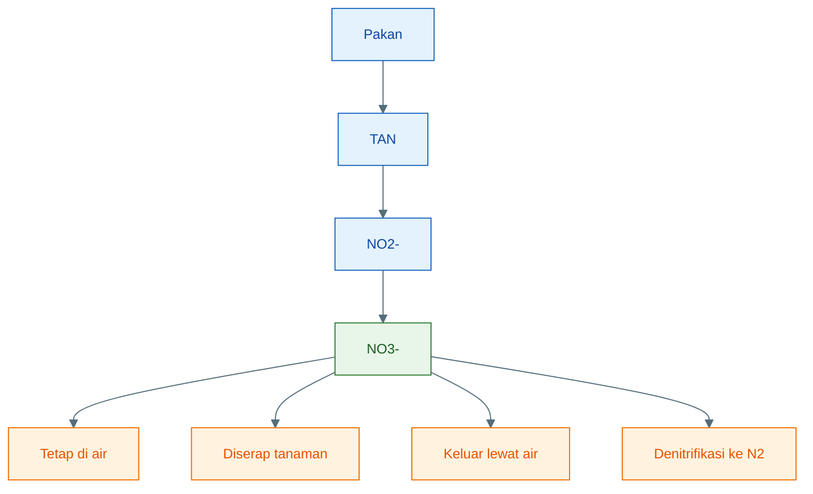
```mermaid id="posisi-nitrat-dalam-bioflok"
%%{init: {'theme':'base','themeVariables':{
'primaryColor':'#E3F2FD',
'primaryTextColor':'#0D47A1',
'primaryBorderColor':'#1565C0',
'secondaryColor':'#E8F5E9',
'secondaryTextColor':'#1B5E20',
'secondaryBorderColor':'#2E7D32',
'tertiaryColor':'#FFF3E0',
'tertiaryTextColor':'#E65100',
'tertiaryBorderColor':'#EF6C00',
'lineColor':'#546E7A',
'fontSize':'13px'
}}}%%
flowchart TD
    A["Pakan"] --> B["TAN"]
    B --> C["NO2-"]
    C --> D["NO3-"]

    D --> E["Tetap di air"]
    D --> F["Diserap tanaman"]
    D --> G["Keluar lewat air"]
    D --> H["Denitrifikasi ke N2"]

    classDef input fill:#E3F2FD,stroke:#1565C0,color:#0D47A1;
    classDef nitrat fill:#E8F5E9,stroke:#2E7D32,color:#1B5E20;
    classDef keluar fill:#FFF3E0,stroke:#EF6C00,color:#E65100;

    class A,B,C input;
    class D nitrat;
    class E,F,G,H keluar;
```

Makna diagram:

| Jalur                     | Makna                                             |
| ------------------------- | ------------------------------------------------- |
| $NO_3^-$ tetap di air     | nitrat terakumulasi                               |
| $NO_3^-$ diserap tanaman  | nitrogen menjadi biomassa tanaman                 |
| $NO_3^-$ keluar lewat air | nitrogen keluar melalui pergantian air            |
| $NO_3^-$ menjadi $N_2$    | nitrogen keluar sebagai gas melalui denitrifikasi |

---

## 5.2. Sumber akumulasi nitrat

Nitrat terakumulasi ketika laju produksi nitrat lebih besar daripada laju ekspor nitrat.

Secara sederhana:

$$
Akumulasi\ NO_3^- = Produksi\ NO_3^- Ekspor\ NO_3^-
$$

Sumber utama akumulasi nitrat:

| Sumber                          | Dampak                                |
| ------------------------------- | ------------------------------------- |
| Pakan tinggi                    | produksi $TAN$ naik                   |
| Nitrifikasi kuat                | $NO_3^-$ naik                         |
| $C/N$ berada di $8$ sampai $12$ | fraksi nitrogen ke nitrat lebih besar |
| Pergantian air kecil            | nitrat menumpuk                       |
| Tidak ada tanaman               | tidak ada sink nitrat                 |
| Tidak ada denitrifikasi         | nitrat tidak keluar sebagai $N_2$     |
| Sludge tidak dibuang            | nitrogen dapat kembali ke air         |

Nitrat tinggi bukan selalu tanda sistem buruk. Pada aquaponik, nitrat bisa menjadi nutrien tanaman. Pada sistem ikan saja, nitrat tinggi berarti operator perlu menyediakan jalur ekspor nitrogen.

---

## 5.3. Metode 1: manajemen $C/N$ sebagai pengarah jalur nitrogen

Metode pertama dalam manajemen nitrat adalah manajemen $C/N$, karena $C/N$ menentukan arah nitrogen.

Ada dua jalur utama:

### Jalur nitrifikasi

$$
TAN
\rightarrow
NO_2^-
\rightarrow
NO_3^-
$$

### Jalur bioflok heterotrof

$$
TAN
+
C
\rightarrow
Bioflok
\rightarrow
Ikan
\text{ atau }
Sludge
$$

Jadi, $C/N$ bukan sekadar “berapa banyak karbon ditambahkan”, tetapi **pengatur nasib nitrogen**.

---

### 5.3.1. Rezim $C/N$ $8$ sampai $12$

Pada rentang ini, jalur nitrifikasi lebih dominan.

$$
TAN
\rightarrow
NO_2^-
\rightarrow
NO_3^-
$$

Produk dominan:

$$
NO_3^-
$$

Ciri operasional:

| Parameter                 | Kecenderungan              |
| ------------------------- | -------------------------- |
| Nitrat                    | naik lebih cepat           |
| Bioflok                   | lebih sedikit              |
| Sludge                    | lebih rendah               |
| Kebutuhan karbon tambahan | rendah                     |
| Kebutuhan alkalinitas     | tinggi karena nitrifikasi  |
| Cocok untuk aquaponik     | ya, karena nitrat tersedia |

Rezim ini cocok untuk sistem yang ingin menjaga air lebih jernih, $TSS$ lebih rendah, dan menyediakan nitrat untuk tanaman.

---

### 5.3.2. Rezim $C/N$ $12$ sampai $16$

Pada rentang ini, sistem berada di zona campuran.

$$
TAN
\rightarrow
NO_3^-
$$

dan:

$$
TAN
+
C
\rightarrow
Bioflok
$$

Produk dominan:

$$
NO_3^-
+
Bioflok
$$

Ciri operasional:

| Parameter                       | Kecenderungan         |
| ------------------------------- | --------------------- |
| Nitrat                          | tetap terbentuk       |
| Bioflok                         | mulai produktif       |
| Sludge                          | mulai perlu dikontrol |
| $DO$                            | kebutuhan naik        |
| Cocok untuk bioflok nila stabil | ya                    |

Rentang ini sering menjadi kompromi yang baik untuk bioflok ikan, karena nitrogen tidak seluruhnya menjadi nitrat dan tidak seluruhnya menjadi padatan.

---

### 5.3.3. Rezim $C/N$ $16$ sampai $20$

Pada rentang ini, jalur heterotrof lebih dominan.

$$
TAN
+
C
\rightarrow
Bioflok
\rightarrow
Sludge
$$

Produk dominan:

$$
Bioflok
+
Sludge
$$

Ciri operasional:

| Parameter       | Kecenderungan      |
| --------------- | ------------------ |
| Nitrat          | dapat lebih rendah |
| Bioflok         | meningkat          |
| $TSS$           | meningkat          |
| Sludge          | meningkat          |
| Kebutuhan $O_2$ | meningkat          |
| Risiko $CO_2$   | meningkat          |

Rentang ini bisa berguna bila targetnya memproduksi flok sebagai pakan tambahan, terutama pada nila. Namun, sistem harus memiliki aerasi, mixing, dan pembuangan sludge yang kuat.

---

### 5.3.4. Rezim $C/N >20$

Rentang ini tidak dijadikan target rutin.

Produk dominan:

$$
TSS
+
Sludge
+
Beban\ respirasi
$$

Risiko:

| Risiko           | Penyebab                           |
| ---------------- | ---------------------------------- |
| $DO$ turun cepat | respirasi mikroba tinggi           |
| Sludge menumpuk  | biomassa mikroba berlebih          |
| Flok tua         | flok tidak seluruhnya dimakan ikan |
| Bau              | dekomposisi organik                |
| $CO_2$ naik      | respirasi air tinggi               |

Kalimat praktis:

> $C/N$ tinggi dapat menurunkan pembentukan nitrat, tetapi membayar dengan kenaikan $TSS$, sludge, kebutuhan aerasi, dan risiko $DO$.

---

## 5.4. Tabel keputusan $C/N$ berdasarkan target sistem

| Target sistem                  |                     $C/N$ yang logis | Konsekuensi                            |
| ------------------------------ | -----------------------------------: | -------------------------------------- |
| Aquaponik                      |                      $8$ sampai $12$ | nitrat tersedia untuk tanaman          |
| RAS nitrifikasi                |                      $8$ sampai $12$ | air lebih jernih, nitrat naik          |
| Bioflok nila stabil            |                     $12$ sampai $16$ | nitrat dan flok seimbang               |
| Bioflok nila mengejar flok     |                     $16$ sampai $18$ | flok naik, $O_2$ dan sludge naik       |
| Sistem minim air tanpa tanaman | $12$ sampai $16$ plus sludge removal | nitrat dan padatan sama-sama dikontrol |
| $C/N >20$                      |         tidak dijadikan target rutin | risiko $DO$, $TSS$, sludge, bau        |

### Diagram pilihan $C/N$

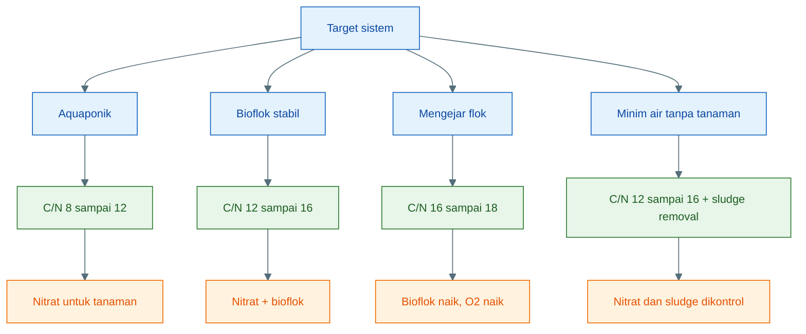
```mermaid id="pilihan-cn-manajemen-nitrat"
%%{init: {'theme':'base','themeVariables':{
'primaryColor':'#E3F2FD',
'primaryTextColor':'#0D47A1',
'primaryBorderColor':'#1565C0',
'secondaryColor':'#E8F5E9',
'secondaryTextColor':'#1B5E20',
'secondaryBorderColor':'#2E7D32',
'tertiaryColor':'#FFF3E0',
'tertiaryTextColor':'#E65100',
'tertiaryBorderColor':'#EF6C00',
'lineColor':'#546E7A',
'fontSize':'13px'
}}}%%
flowchart TD
    A["Target sistem"] --> B["Aquaponik"]
    A --> C["Bioflok stabil"]
    A --> D["Mengejar flok"]
    A --> E["Minim air tanpa tanaman"]

    B --> F["C/N 8 sampai 12"]
    C --> G["C/N 12 sampai 16"]
    D --> H["C/N 16 sampai 18"]
    E --> I["C/N 12 sampai 16 + sludge removal"]

    F --> J["Nitrat untuk tanaman"]
    G --> K["Nitrat + bioflok"]
    H --> L["Bioflok naik, O2 naik"]
    I --> M["Nitrat dan sludge dikontrol"]

    classDef target fill:#E3F2FD,stroke:#1565C0,color:#0D47A1;
    classDef cn fill:#E8F5E9,stroke:#2E7D32,color:#1B5E20;
    classDef hasil fill:#FFF3E0,stroke:#EF6C00,color:#E65100;

    class A,B,C,D,E target;
    class F,G,H,I cn;
    class J,K,L,M hasil;
```

---

## 5.5. Formula kontrol $C/N$

Nitrogen dari pakan dihitung:

$$
TAN_N = Feed \times Protein \times 0{,}16 \times f_{\text{TAN}}
$$

Karbon target:

$$
C_{\text{target}} = (C/N)_{\text{target}} \times TAN_N
$$

Karbon tambahan:

$$
C_{\text{suplemen}} = \max \left( 0, C_{\text{target}} = C_{\text{tersedia}} \right)
$$

Jika memakai bahan karbon dengan fraksi karbon $f_C$, kebutuhan bahan karbon:

$$
Bahan_{\text{karbon}} = \frac{ C_{\text{suplemen}} }{ f_C }
$$

Keterangan:

| Simbol                |           Satuan | Makna                           |
| --------------------- | ---------------: | ------------------------------- |
| $TAN_N$               | kg atau g N/hari | nitrogen sebagai TAN            |
| $C_{\text{target}}$   | kg atau g C/hari | karbon target sesuai $C/N$      |
| $C_{\text{tersedia}}$ | kg atau g C/hari | karbon yang sudah tersedia      |
| $C_{\text{suplemen}}$ | kg atau g C/hari | karbon tambahan yang diperlukan |
| $f_C$                 |           fraksi | kandungan karbon bahan karbon   |

Catatan penting:

> Menambah karbon menaikkan $C/N$, tetapi juga menaikkan respirasi mikroba, kebutuhan $O_2$, $CO_2$, $TSS$, dan sludge.

---

## 5.6. Contoh kontrol $C/N$

Misal:

$$
TAN_N = 11{,}52 \text{ g N/hari}
$$

Target:

$$
(C/N)_{\text{target}} = 14
$$

Maka karbon target:

$$
C_{\text{target}} = 14 \times 11{,}52
$$

$$
C_{\text{target}} = 161{,}28 \text{ g C/hari}
$$

Jika karbon tersedia dari pakan dan bahan lain diperkirakan:

$$
C_{\text{tersedia}} = 100 \text{ g C/hari}
$$

Maka karbon tambahan:

$$
C_{\text{suplemen}} = \max \left( 0, 161{,}28 = 100 \right)
$$

$$
C_{\text{suplemen}} = 61{,}28 \text{ g C/hari}
$$

Jika sumber karbon memiliki fraksi karbon:

$$
f_C = 0{,}37
$$

maka kebutuhan bahan karbon:

$$
Bahan_{\text{karbon}} = \frac{ 61{,}28 }{ 0{,}37 }
$$

$$
Bahan_{\text{karbon}} = 165{,}62 \text{ g/hari}
$$

Namun dosis ini **tidak boleh langsung diterapkan tanpa membaca $DO$, $TSS$, sludge, dan $CO_2$**.

---

## 5.7. Metode 2: ekspor sludge dan bioflok

Bioflok bukan akhir permanen dari nitrogen. Nitrogen dalam bioflok harus memiliki jalur keluar:

1. dimakan ikan;
2. dibuang sebagai sludge;
3. diproses dalam unit mineralisasi atau denitrifikasi.

Jika tidak, bioflok dapat berubah menjadi beban balik.

$$
Bioflok
\rightarrow
Sludge
\rightarrow
TAN
\rightarrow
NO_2^-
\rightarrow
NO_3^-
$$

### Diagram bioflok sebagai penyimpanan nitrogen sementara

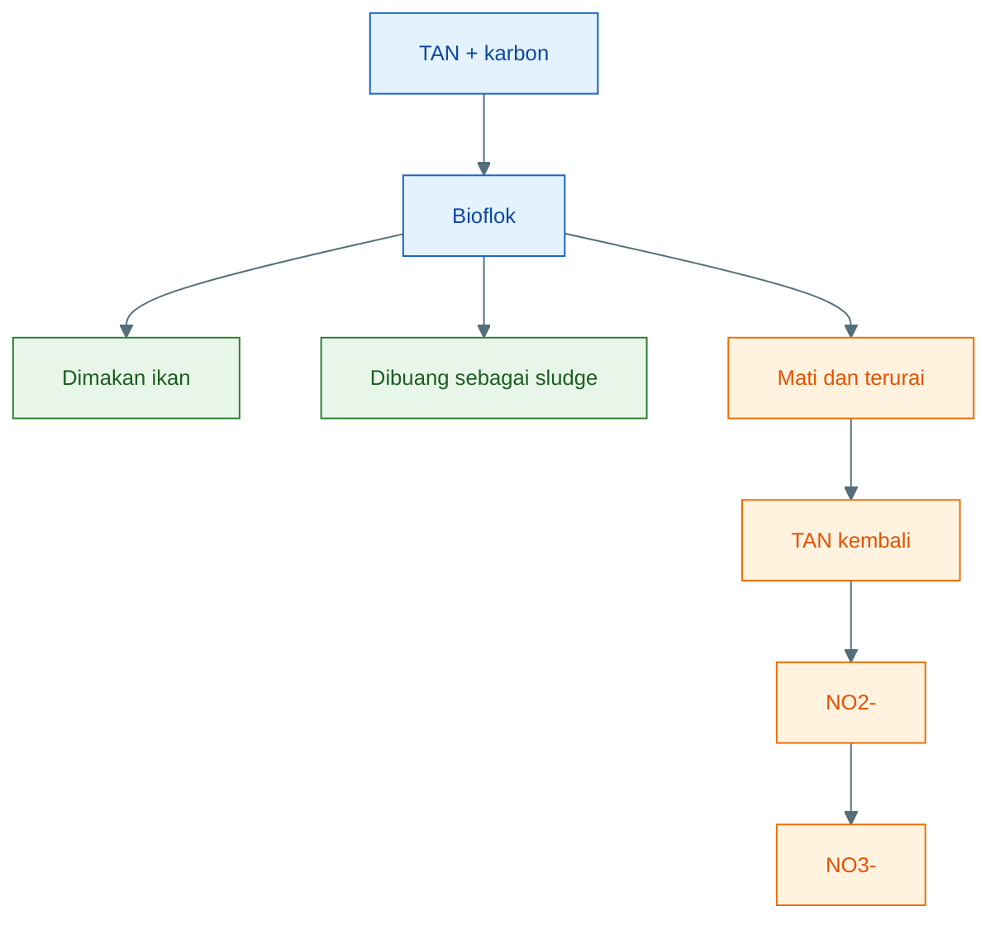
```mermaid id="bioflok-penyimpanan-nitrogen"
%%{init: {'theme':'base','themeVariables':{
'primaryColor':'#E3F2FD',
'primaryTextColor':'#0D47A1',
'primaryBorderColor':'#1565C0',
'secondaryColor':'#E8F5E9',
'secondaryTextColor':'#1B5E20',
'secondaryBorderColor':'#2E7D32',
'tertiaryColor':'#FFF3E0',
'tertiaryTextColor':'#E65100',
'tertiaryBorderColor':'#EF6C00',
'lineColor':'#546E7A',
'fontSize':'13px'
}}}%%
flowchart TD
    A["TAN + karbon"] --> B["Bioflok"]
    B --> C["Dimakan ikan"]
    B --> D["Dibuang sebagai sludge"]
    B --> E["Mati dan terurai"]

    E --> F["TAN kembali"]
    F --> G["NO2-"]
    G --> H["NO3-"]

    classDef proses fill:#E3F2FD,stroke:#1565C0,color:#0D47A1;
    classDef keluar fill:#E8F5E9,stroke:#2E7D32,color:#1B5E20;
    classDef balik fill:#FFF3E0,stroke:#EF6C00,color:#E65100;

    class A,B proses;
    class C,D keluar;
    class E,F,G,H balik;
```

Makna praktis:

> Bioflok hanya menjadi solusi nitrogen bila dimakan ikan atau dibuang. Jika tidak, bioflok dapat kembali menjadi sumber $TAN$, nitrit, dan nitrat.

### Strategi sludge removal

| Parameter             | Tindakan                         |
| --------------------- | -------------------------------- |
| Sludge mulai terlihat | siphon rutin                     |
| Dasar mulai hitam     | buang sludge segera              |
| Bau busuk             | indikasi zona anaerob            |
| $TSS$ terlalu tinggi  | settling atau pengurangan karbon |
| $DO$ subuh turun      | cek sludge dan respirasi air     |

---

## 5.8. Metode 3: tanaman atau aquaponik

Pada aquaponik, nitrat menjadi nutrien tanaman.

$$
NO_3^-
\rightarrow
Biomassa\ tanaman
$$

Metode ini sangat cocok bila sistem diarahkan ke $C/N$ rendah atau menengah rendah, karena nitrifikasi menghasilkan nitrat yang dapat dimanfaatkan tanaman.

Rentang $C/N$ yang logis:

$$
8
\text{ sampai }
12
$$

atau pada sistem hybrid:

$$
10
\text{ sampai }
14
$$

### Kelebihan tanaman sebagai sink nitrat

| Kelebihan                           | Makna                             |
| ----------------------------------- | --------------------------------- |
| Nitrat menjadi produk               | nitrogen menjadi biomassa tanaman |
| Mengurangi kebutuhan pergantian air | nitrat diserap                    |
| Cocok untuk $C/N$ rendah            | nitrifikasi menghasilkan nitrat   |
| Menambah nilai ekonomi              | ikan dan tanaman                  |

### Batasan aquaponik dari bioflok

| Batasan                                 | Dampak                                                 |
| --------------------------------------- | ------------------------------------------------------ |
| $TSS$ harus disaring                    | akar tidak boleh tersumbat                             |
| $NaCl$ harus dikontrol                  | risiko akumulasi Na dan Cl                             |
| Sludge tidak boleh masuk akar           | risiko anaerob di zona akar                            |
| Mineralisasi padatan sebaiknya terpisah | nutrien padatan perlu diproses                         |
| $pH$ kompromi                           | ikan, nitrifier, dan tanaman perlu rentang yang sesuai |

Diagram:

```mermaid id="aquaponik-sink-nitrat"
%%{init: {'theme':'base','themeVariables':{
'primaryColor':'#E3F2FD',
'primaryTextColor':'#0D47A1',
'primaryBorderColor':'#1565C0',
'secondaryColor':'#E8F5E9',
'secondaryTextColor':'#1B5E20',
'secondaryBorderColor':'#2E7D32',
'tertiaryColor':'#FFF3E0',
'tertiaryTextColor':'#E65100',
'tertiaryBorderColor':'#EF6C00',
'lineColor':'#546E7A',
'fontSize':'13px'
}}}%%
flowchart TD
    A["NO3- dari nitrifikasi"] --> B["Filter padatan"]
    B --> C["Akar tanaman"]
    C --> D["Biomassa tanaman"]
    D --> E["Panen tanaman"]

    B --> F["Sludge terpisah"]
    F --> G["Mineralisasi terkontrol"]

    classDef nitrogen fill:#E3F2FD,stroke:#1565C0,color:#0D47A1;
    classDef tanaman fill:#E8F5E9,stroke:#2E7D32,color:#1B5E20;
    classDef padatan fill:#FFF3E0,stroke:#EF6C00,color:#E65100;

    class A,B nitrogen;
    class C,D,E tanaman;
    class F,G padatan;
```

---

## 5.9. Metode 4: pergantian air terhitung

Pergantian air adalah metode paling langsung untuk menurunkan nitrat. Tetapi harus dihitung, bukan dilakukan berdasarkan perkiraan.

Formula konsentrasi akhir:

$$
C_{\text{akhir}} = C_{\text{awal}} \times (1 - f) + C_{\text{air baru}} \times f
$$

Fraksi pergantian air:

$$
f = \frac{ C_{\text{awal}} = C_{\text{target}} }{ C_{\text{awal}} = C_{\text{air baru}} }
$$

Keterangan:

| Simbol                |        Satuan | Makna                         |
| --------------------- | ------------: | ----------------------------- |
| $C_{\text{awal}}$     | $\text{mg/L}$ | nitrat sebelum pergantian air |
| $C_{\text{target}}$   | $\text{mg/L}$ | target nitrat                 |
| $C_{\text{air baru}}$ | $\text{mg/L}$ | nitrat pada air pengganti     |
| $f$                   |        fraksi | bagian air yang diganti       |

### Contoh

Jika:

$$
C_{\text{awal}} = 200 \text{ mg/L } NO_3\text{-}N
$$

Target:

$$
C_{\text{target}} = 100 \text{ mg/L } NO_3\text{-}N
$$

Air baru:

$$
C_{\text{air baru}} = 0 \text{ mg/L } NO_3\text{-}N
$$

Maka:

$$
f = \frac{ 200 = 100 }{ 200 = 0 }
$$

$$
f = 0{,}50
$$

Artinya perlu pergantian air:

$$
50\%
$$

Jika volume kolam:

$$
V = 1 \text{ m}^3
$$

maka volume air yang diganti:

$$
0{,}50 \times 1 = 0{,}50 \text{ m}^3
$$

atau:

$$
500
\text{ L}
$$

### Catatan penting

Pergantian air juga mengubah:

- alkalinitas;
- $Cl^-$;
- salinitas;
- hardness;
- suhu;
- $pH$;
- komunitas mikroba.

Jadi setelah pergantian air, parameter tersebut harus diukur ulang.

---

## 5.10. Metode 5: denitrifikasi terkontrol

Denitrifikasi adalah proses mengubah nitrat menjadi gas nitrogen.

Alur:

$$
NO_3^-
\rightarrow
NO_2^-
\rightarrow
NO
\rightarrow
N_2O
\rightarrow
N_2
$$

Produk akhir yang diinginkan:

$$
N_2
$$

Denitrifikasi tidak boleh dibiarkan terjadi secara liar di dasar kolam yang busuk. Denitrifikasi yang baik dilakukan dalam reaktor atau zona terkontrol.

### Target reaktor denitrifikasi

| Parameter      |                     Target |
| -------------- | -------------------------: |
| $DO$ reaktor   |      $<0{,}5 \text{ mg/L}$ |
| Nitrat masuk   |                   tersedia |
| Donor elektron |                   tersedia |
| Nitrit outlet  | mendekati $0 \text{ mg/L}$ |
| Bau $H_2S$     |           tidak terdeteksi |
| Air keluar     |   diaerasi sebelum kembali |

### Pemulihan alkalinitas

Denitrifikasi dapat mengembalikan alkalinitas.

$$
1 \text{ g } NO_3\text{-}N
\rightarrow
3{,}57 \text{ g alkalinitas as } CaCO_3
$$

Artinya, sebagian alkalinitas yang hilang saat nitrifikasi dapat pulih melalui denitrifikasi.

### Risiko denitrifikasi

| Risiko                      | Penyebab                         |
| --------------------------- | -------------------------------- |
| Nitrit outlet naik          | denitrifikasi tidak lengkap      |
| Bau busuk                   | kondisi anaerob tidak terkontrol |
| $H_2S$                      | zona sangat reduktif             |
| Karbon berlebih masuk kolam | konsumsi $O_2$ di kolam naik     |
| $pH$ berubah                | alkalinitas bertambah            |
| Biofilm mati                | reaktor tidak stabil             |

Prinsip praktis:

> Denitrifikasi adalah alat kuat untuk mengurangi nitrat, tetapi harus dilakukan terpisah dan terkontrol, dengan air keluar diaerasi sebelum kembali ke ikan.

---

## 5.11. Metode 6: alga atau fotoautotrof

Alga dapat menyerap nitrat:

$$
NO_3^-
\rightarrow
Biomassa\ alga
$$

Namun pada bioflok, alga harus dikendalikan karena memengaruhi $pH$, $DO$, dan $CO_2$.

| Parameter              |                       Target |
| ---------------------- | ---------------------------: |
| Selisih $pH$ pagi-sore |                $<0{,}5$ unit |
| $pH$ sore              |       tidak melewati $8{,}3$ |
| $DO_{\text{subuh}}$    | $>4$ sampai $5 \text{ mg/L}$ |
| $CO_2$ pagi            |           $<15 \text{ mg/L}$ |

Kelebihan:

| Kelebihan                     | Makna                        |
| ----------------------------- | ---------------------------- |
| Menyerap nitrat               | nitrogen masuk biomassa alga |
| Menghasilkan $O_2$ siang hari | fotosintesis                 |
| Bisa menjadi pakan alami      | tergantung komoditas         |

Risiko:

| Risiko                     | Dampak                          |
| -------------------------- | ------------------------------- |
| $pH$ sore tinggi           | $CO_2$ diserap fotosintesis     |
| $DO$ subuh rendah          | respirasi malam                 |
| Bloom crash                | alga mati menjadi beban organik |
| Cyanobacteria              | risiko bau dan toksin           |
| Komunitas mikroba bergeser | bioflok tidak stabil            |

### Diagram alga dalam manajemen nitrat

```mermaid id="alga-manajemen-nitrat"
%%{init: {'theme':'base','themeVariables':{
'primaryColor':'#E3F2FD',
'primaryTextColor':'#0D47A1',
'primaryBorderColor':'#1565C0',
'secondaryColor':'#E8F5E9',
'secondaryTextColor':'#1B5E20',
'secondaryBorderColor':'#2E7D32',
'tertiaryColor':'#FFF3E0',
'tertiaryTextColor':'#E65100',
'tertiaryBorderColor':'#EF6C00',
'lineColor':'#546E7A',
'fontSize':'13px'
}}}%%
flowchart TD
    A["NO3-"] --> B["Alga"]
    B --> C["Biomassa alga"]
    B --> D["O2 siang"]
    B --> E["Respirasi malam"]

    E --> F["DO subuh turun"]
    B --> G["CO2 turun siang"]
    G --> H["pH sore naik"]

    classDef nitrogen fill:#E3F2FD,stroke:#1565C0,color:#0D47A1;
    classDef alga fill:#E8F5E9,stroke:#2E7D32,color:#1B5E20;
    classDef risiko fill:#FFF3E0,stroke:#EF6C00,color:#E65100;

    class A nitrogen;
    class B,C,D,G alga;
    class E,F,H risiko;
```

Alga dapat membantu menyerap nitrat, tetapi tidak boleh menjadi satu-satunya alat kontrol nitrat pada sistem intensif.

---

## 5.12. Matriks pemilihan metode optimal

| Kondisi                                 | Metode utama                           | Metode pendukung              |
| --------------------------------------- | -------------------------------------- | ----------------------------- |
| Nitrat naik pada $C/N$ $8$ sampai $12$  | tanaman, water exchange, denitrifikasi | kontrol pakan dan alkalinitas |
| Nitrat naik pada $C/N$ $12$ sampai $16$ | sludge removal dan tanaman             | evaluasi $C/N$                |
| Nitrat rendah tetapi sludge tinggi      | sludge removal                         | kurangi karbon                |
| Nitrat tinggi di aquaponik              | tambah kapasitas tanaman               | filtrasi padatan              |
| Nitrat tinggi ikan-only                 | water exchange atau denitrifier        | kontrol $C/N$ dan sludge      |
| Nitrat dan $EC/TDS$ tinggi              | water exchange                         | evaluasi garam dan buffer     |
| Nitrat tinggi, air terbatas             | denitrifikasi terkontrol               | monitoring nitrit outlet      |
| $TSS$ tinggi dan $DO$ rendah            | kurangi karbon dan siphon              | tambah aerasi                 |

---

## 5.13. Urutan keputusan praktis

```text id="urutan-keputusan-manajemen-nitrat"
Jika nitrat naik:
    pastikan satuan NO3- atau NO3-N
    hitung laju kenaikan nitrat
    cek C/N sistem
    cek TSS dan sludge
    cek ada atau tidak sink tanaman
    cek kemungkinan water exchange
    cek apakah denitrifikasi diperlukan
    pilih metode ekspor nitrogen
```

Diagram keputusan:

```mermaid id="keputusan-nitrat-naik"
%%{init: {'theme':'base','themeVariables':{
'primaryColor':'#E3F2FD',
'primaryTextColor':'#0D47A1',
'primaryBorderColor':'#1565C0',
'secondaryColor':'#E8F5E9',
'secondaryTextColor':'#1B5E20',
'secondaryBorderColor':'#2E7D32',
'tertiaryColor':'#FFF3E0',
'tertiaryTextColor':'#E65100',
'tertiaryBorderColor':'#EF6C00',
'lineColor':'#546E7A',
'fontSize':'13px'
}}}%%
flowchart TD
    A["Nitrat naik"] --> B["Pastikan satuan"]
    B --> C["Hitung NO3-N"]
    C --> D["Cek C/N"]
    D --> E["C/N 8 sampai 12"]
    D --> F["C/N 12 sampai 16"]
    D --> G["C/N 16 sampai 20"]

    E --> H["Tanaman atau water exchange"]
    F --> I["Sludge removal + evaluasi tanaman"]
    G --> J["Kontrol TSS dan sludge"]

    H --> K["Nitrat turun"]
    I --> K
    J --> K

    K --> L["Jika tetap tinggi: denitrifikasi"]

    classDef awal fill:#FFF3E0,stroke:#EF6C00,color:#E65100;
    classDef cek fill:#E3F2FD,stroke:#1565C0,color:#0D47A1;
    classDef aksi fill:#E8F5E9,stroke:#2E7D32,color:#1B5E20;

    class A awal;
    class B,C,D,E,F,G cek;
    class H,I,J,K,L aksi;
```

---

## 5.14. Kesimpulan Bab 5

Manajemen nitrat adalah manajemen **akumulasi nitrogen**. Nitrat terbentuk saat nitrifikasi berjalan lengkap:

$$
TAN
\rightarrow
NO_2^-
\rightarrow
NO_3^-
$$

Namun nitrat bukan akhir dari manajemen nitrogen. Nitrat tetap harus diarahkan ke jalur keluar:

- tanaman;
- pergantian air;
- sludge removal;
- denitrifikasi;
- biomassa ikan;
- atau alga yang terkontrol.

Metode pertama yang harus dipahami adalah manajemen $C/N$, karena $C/N$ mengatur pembagian nitrogen:

|            $C/N$ | Jalur dominan                         |
| ---------------: | ------------------------------------- |
|  $8$ sampai $12$ | nitrifikasi menuju nitrat             |
| $12$ sampai $16$ | nitrat dan bioflok                    |
| $16$ sampai $20$ | bioflok dan sludge                    |
|            $>20$ | $TSS$, sludge, dan risiko $DO$ tinggi |

Pesan utama Bab 5:

> Nitrat dikendalikan bukan hanya dengan menurunkan pakan, tetapi dengan mengatur $C/N$ dan menyediakan jalur ekspor nitrogen. Tanpa tanaman, pergantian air, sludge removal, atau denitrifikasi, nitrogen tetap berada dalam sistem meskipun bentuknya berubah.

[**Kembali ke Atas**](#manajemen-nitrit-dan-nitrat-pada-bioflok-cn-cl-nitrifikasi-denitrifikasi-dan-ekspor-nitrogen-berbasis-angka)

---

# Bab 6. Studi Kasus Kolam Bioflok $1 \text{ m}^3$

Bab ini menerapkan konsep Bab 1 sampai Bab 5 pada kolam bioflok kecil berukuran $1 \text{ m}^3$. Fokusnya adalah membaca nitrit dan nitrat dengan angka, menghitung potensi beban nitrogen, lalu memilih strategi kontrol yang sesuai: $C/N$, proteksi $Cl^-$, sludge removal, tanaman, pergantian air, atau denitrifikasi.

Asumsi dasar studi kasus ini konsisten dengan skenario kolam $1 \text{ m}^3$ untuk nila padat tebar tinggi yang sebelumnya digunakan sebagai rujukan teknis, termasuk pakan puncak sekitar $0{,}35$ sampai $0{,}40 \text{ kg/hari}$, protein pakan $30\%$, dan target sistem bioflok yang dikontrol melalui aerasi, alkalinitas, sludge, serta $C/N$.

---

## 6.1. Asumsi desain

| Parameter                      |                            Nilai |
| ------------------------------ | -------------------------------: |
| Volume                         |                  $1 \text{ m}^3$ |
| Volume air                     |                 $1000 \text{ L}$ |
| Pakan                          |         $0{,}40 \text{ kg/hari}$ |
| Protein                        |                           $30\%$ |
| $f_{\text{TAN}}$               |                         $0{,}60$ |
| Target $Cl^- : NO_2^-$         |                           $20:1$ |
| Target minimum $Cl^- : NO_2^-$ |                           $10:1$ |
| Target $NO_3\text{-}N$         | $<100$ sampai $200 \text{ mg/L}$ |
| Batas koreksi $NO_3\text{-}N$  |        mulai $>200 \text{ mg/L}$ |
| $C/N$ aquaponik                |                  $8$ sampai $12$ |
| $C/N$ bioflok stabil           |                 $12$ sampai $16$ |
| $C/N$ bioflok kuat             |                 $16$ sampai $18$ |

Konversi penting untuk kolam $1 \text{ m}^3$:

$$
1 \text{ m}^3 = 1000 \text{ L}
$$

$$
1 \text{ mg/L pada } 1 \text{ m}^3 = 1 \text{ g}
$$

Artinya, pada kolam $1 \text{ m}^3$, kenaikan $1 \text{ mg/L}$ setara dengan penambahan $1 \text{ g}$ zat dalam total air kolam.

---

## 6.2. Diagram alur keputusan studi kasus

```mermaid id="alur-studi-kasus-nitrit-nitrat-1m3"
%%{init: {'theme':'base','themeVariables':{
'primaryColor':'#E3F2FD',
'primaryTextColor':'#0D47A1',
'primaryBorderColor':'#1565C0',
'secondaryColor':'#E8F5E9',
'secondaryTextColor':'#1B5E20',
'secondaryBorderColor':'#2E7D32',
'tertiaryColor':'#FFF3E0',
'tertiaryTextColor':'#E65100',
'tertiaryBorderColor':'#EF6C00',
'lineColor':'#546E7A',
'fontSize':'13px'
}}}%%
flowchart TD
    A["Pakan 0,40 kg/hari"] --> B["Hitung TAN-N"]
    B --> C["Hitung potensi NO3-N"]
    C --> D["Simulasi akumulasi nitrat"]

    E["NO2- terukur"] --> F["Hitung Cl- target"]
    F --> G["Hitung NaCl tambahan"]

    H["C/N target"] --> I["Tentukan jalur nitrogen"]
    I --> J["Nitrat, bioflok, atau sludge"]

    D --> K["Pilih metode kontrol nitrat"]
    G --> L["Proteksi ikan dari nitrit"]
    J --> K

    classDef input fill:#E3F2FD,stroke:#1565C0,color:#0D47A1;
    classDef hitung fill:#E8F5E9,stroke:#2E7D32,color:#1B5E20;
    classDef keputusan fill:#FFF3E0,stroke:#EF6C00,color:#E65100;

    class A,E,H input;
    class B,C,D,F,G,I,J hitung;
    class K,L keputusan;
```

Diagram ini menunjukkan bahwa satu kolam harus dibaca dari tiga sisi sekaligus:

1. pakan menghasilkan $TAN_N$;
2. $TAN_N$ dapat menjadi nitrit dan nitrat;
3. $C/N$ menentukan apakah nitrogen lebih banyak menjadi nitrat atau bioflok.

---

## 6.3. Produksi $TAN$

Formula:

$$
TAN_N = Feed \times Protein \times 0{,}16 \times f_{\text{TAN}}
$$

Substitusi:

$$
TAN_N = 0{,}40 \times 0{,}30 \times 0{,}16 \times 0{,}60
$$

Hasil:

$$
TAN_N = 0{,}01152 \text{ kg/hari}
$$

Konversi ke gram:

$$
0{,}01152 \text{ kg/hari} = 11{,}52 \text{ g/hari}
$$

Jadi:

$$
TAN_N = 11{,}52 \text{ g TAN-N/hari}
$$

Makna praktis:

> Pada pakan $0{,}40 \text{ kg/hari}$, protein $30\%$, dan $f_{\text{TAN}} = 0{,}60$, kolam $1 \text{ m}^3$ menghasilkan estimasi $11{,}52 \text{ g TAN-N/hari}$.

---

## 6.4. Potensi kenaikan nitrat

Jika seluruh $TAN_N$ masuk jalur nitrifikasi lengkap, maka nitrogen yang menjadi nitrat sebagai nitrogen adalah:

$$
NO_{3,\text{N,produksi}} = TAN_N
$$

Karena:

$$
TAN_N = 11{,}52 \text{ g/hari}
$$

maka pada kolam $1 \text{ m}^3$:

$$
\Delta NO_3\text{-}N = 11{,}52 \text{ mg/L/hari}
$$

Konversi ke nitrat sebagai ion:

$$
\Delta NO_3^- = \Delta NO_3\text{-}N \times 4{,}43
$$

$$
\Delta NO_3^- = 11{,}52 \times 4{,}43
$$

$$
\Delta NO_3^- = 51{,}03 \text{ mg/L/hari}
$$

Makna praktis:

> Jika tidak ada ekspor nitrogen, nitrat dapat naik sekitar $11{,}52 \text{ mg/L } NO_3\text{-}N$ per hari, atau sekitar $51{,}03 \text{ mg/L } NO_3^-$ per hari.

---

## 6.5. Simulasi akumulasi nitrat tanpa ekspor

Asumsi:

$$
\Delta NO_3\text{-}N = 11{,}52 \text{ mg/L/hari}
$$

dan tidak ada ekspor melalui tanaman, sludge, water exchange, atau denitrifikasi.

| Hari | $NO_3\text{-}N$ tanpa ekspor | $NO_3^-$ tanpa ekspor |
| ---: | ---------------------------: | --------------------: |
|  $5$ |        $57{,}6 \text{ mg/L}$ |    $255 \text{ mg/L}$ |
| $10$ |       $115{,}2 \text{ mg/L}$ |    $510 \text{ mg/L}$ |
| $20$ |       $230{,}4 \text{ mg/L}$ |   $1021 \text{ mg/L}$ |
| $30$ |       $345{,}6 \text{ mg/L}$ |   $1531 \text{ mg/L}$ |

### Grafik akumulasi nitrat

```mermaid id="grafik-akumulasi-nitrat-1m3"
%%{init: {'theme':'base','themeVariables':{
'primaryColor':'#E3F2FD',
'primaryTextColor':'#0D47A1',
'primaryBorderColor':'#1565C0',
'secondaryColor':'#E8F5E9',
'secondaryTextColor':'#1B5E20',
'secondaryBorderColor':'#2E7D32',
'tertiaryColor':'#FFF3E0',
'tertiaryTextColor':'#E65100',
'tertiaryBorderColor':'#EF6C00',
'lineColor':'#546E7A',
'fontSize':'13px'
}}}%%
flowchart TD
    A["Hari 0<br/>NO3-N = 0 mg/L<br/>▏"]
    B["Hari 5<br/>NO3-N = 57,6 mg/L<br/>████"]
    C["Hari 10<br/>NO3-N = 115,2 mg/L<br/>████████"]
    D["Hari 20<br/>NO3-N = 230,4 mg/L<br/>████████████████"]
    E["Hari 30<br/>NO3-N = 345,6 mg/L<br/>████████████████████████"]

    A --> B --> C --> D --> E

    classDef aman fill:#E8F5E9,stroke:#2E7D32,color:#1B5E20;
    classDef waspada fill:#FFF3E0,stroke:#EF6C00,color:#E65100;
    classDef koreksi fill:#FFEBEE,stroke:#C62828,color:#B71C1C;

    class A,B aman;
    class C waspada;
    class D,E koreksi;
```

Interpretasi:

| Hari | Status                               |
| ---: | ------------------------------------ |
|  $5$ | masih dalam rentang aman-konservatif |
| $10$ | mulai masuk zona monitoring          |
| $20$ | masuk zona koreksi                   |
| $30$ | tidak layak dijadikan target rutin   |

Catatan:

> Simulasi ini sengaja dibuat tanpa ekspor nitrogen agar praktisi melihat kecepatan akumulasi nitrat pada kolam kecil. Dalam kolam nyata, sebagian nitrogen dapat masuk ikan, bioflok, sludge, tanaman, atau denitrifikasi.

---

## 6.6. Skenario $C/N$

$C/N$ mengubah pembagian nitrogen. Pada studi kasus ini, tiga skenario digunakan:

| $C/N$ | Jalur dominan | Konsekuensi                                |
| ----: | ------------- | ------------------------------------------ |
|  $10$ | nitrifikasi   | nitrat naik, sludge rendah                 |
|  $14$ | campuran      | nitrat dan bioflok terbagi                 |
|  $18$ | heterotrof    | nitrat lebih rendah, sludge dan $O_2$ naik |

Untuk simulasi, gunakan asumsi fraksi nitrifikasi berikut:

| $C/N$ | $f_{\text{nitrifikasi}}$ | $f_{\text{bioflok}}$ |
| ----: | -----------------------: | -------------------: |
|  $10$ |                 $0{,}80$ |             $0{,}20$ |
|  $14$ |                 $0{,}50$ |             $0{,}50$ |
|  $18$ |                 $0{,}25$ |             $0{,}75$ |

### Skenario $C/N = 10$

$$
NO_{3,\text{N,produksi}} = 11{,}52 \times 0{,}80
$$

$$
NO_{3,\text{N,produksi}} = 9{,}22 \text{ g/hari}
$$

Pada kolam $1 \text{ m}^3$:

$$
\Delta NO_3\text{-}N = 9{,}22 \text{ mg/L/hari}
$$

### Skenario $C/N = 14$

$$
NO_{3,\text{N,produksi}} = 11{,}52 \times 0{,}50
$$

$$
NO_{3,\text{N,produksi}} = 5{,}76 \text{ g/hari}
$$

Pada kolam $1 \text{ m}^3$:

$$
\Delta NO_3\text{-}N = 5{,}76 \text{ mg/L/hari}
$$

### Skenario $C/N = 18$

$$
NO_{3,\text{N,produksi}} = 11{,}52 \times 0{,}25
$$

$$
NO_{3,\text{N,produksi}} = 2{,}88 \text{ g/hari}
$$

Pada kolam $1 \text{ m}^3$:

$$
\Delta NO_3\text{-}N = 2{,}88 \text{ mg/L/hari}
$$

Tabel ringkas:

| $C/N$ | $f_{\text{nitrifikasi}}$ |   Kenaikan $NO_3\text{-}N$ |
| ----: | -----------------------: | -------------------------: |
|  $10$ |                 $0{,}80$ | $9{,}22 \text{ mg/L/hari}$ |
|  $14$ |                 $0{,}50$ | $5{,}76 \text{ mg/L/hari}$ |
|  $18$ |                 $0{,}25$ | $2{,}88 \text{ mg/L/hari}$ |

### Grafik pengaruh $C/N$ terhadap kenaikan nitrat

```mermaid id="grafik-cn-vs-kenaikan-nitrat-1m3"
%%{init: {'theme':'base','themeVariables':{
'primaryColor':'#E3F2FD',
'primaryTextColor':'#0D47A1',
'primaryBorderColor':'#1565C0',
'secondaryColor':'#E8F5E9',
'secondaryTextColor':'#1B5E20',
'secondaryBorderColor':'#2E7D32',
'tertiaryColor':'#FFF3E0',
'tertiaryTextColor':'#E65100',
'tertiaryBorderColor':'#EF6C00',
'lineColor':'#546E7A',
'fontSize':'13px'
}}}%%
xychart-beta
    title "C/N vs Kenaikan NO3-N"
    x-axis "C/N" [10, 14, 18]
    y-axis "NO3-N mg/L/hari" 0 --> 10
    bar [9.22, 5.76, 2.88]
```

Interpretasi:

> Semakin tinggi $C/N$, potensi pembentukan nitrat dapat turun. Namun nitrogen tidak hilang. Nitrogen berpindah ke bioflok, $TSS$, dan sludge. Karena itu, skenario $C/N = 18$ membutuhkan aerasi dan sludge removal lebih kuat daripada $C/N = 10$.

---

## 6.7. Skenario nitrit

Data:

$$
NO_2^- = 2 \text{ mg/L}
$$

$$
Cl^-_{\text{aktual}} = 10 \text{ mg/L}
$$

Rasio target:

$$
R = 20
$$

Target $Cl^-$:

$$
Cl^-_{\text{target}} = R \times NO_2^-
$$

$$
Cl^-_{\text{target}} = 20 \times 2
$$

$$
Cl^-_{\text{target}} = 40 \text{ mg/L}
$$

Tambahan $Cl^-$:

$$
Cl^-_{\text{tambahan}} = \max \left( 0, 40 -- 10 \right)
$$

$$
Cl^-_{\text{tambahan}} = 30 \text{ mg/L}
$$

Kebutuhan $NaCl$:

$$
NaCl_{\text{gram}} = \frac{ Cl^-_{\text{tambahan}} \times V }{ 0{,}606 }
$$

$$
NaCl_{\text{gram}} = \frac{ 30 \times 1 }{ 0{,}606 }
$$

$$
NaCl_{\text{gram}} = 49{,}5 \text{ g}
$$

Keputusan:

> Untuk kolam $1 \text{ m}^3$, nitrit $2 \text{ mg/L}$, $Cl^-$ aktual $10 \text{ mg/L}$, dan target $20:1$, kebutuhan $NaCl$ sekitar $49{,}5 \text{ g}$.

Namun koreksi ini hanya proteksi ikan. Tindakan sistem tetap wajib:

- kurangi pakan;
- cek $DO$;
- cek alkalinitas;
- buang sludge;
- ukur ulang nitrit harian.

---

## 6.8. Skenario pergantian air untuk nitrat

Jika:

$$
NO_3\text{-}N_{\text{awal}} = 200 \text{ mg/L}
$$

Target:

$$
NO_3\text{-}N_{\text{target}} = 100 \text{ mg/L}
$$

Air baru:

$$
NO_3\text{-}N_{\text{air baru}} = 0 \text{ mg/L}
$$

Formula fraksi pergantian air:

$$
f = \frac{ C_{\text{awal}} = C_{\text{target}} }{ C_{\text{awal}} = C_{\text{air baru}} }
$$

Substitusi:

$$
f = \frac{ 200 = 100 }{ 200 = 0 }
$$

$$
f = 0{,}50
$$

Jadi pergantian air yang diperlukan:

$$
50\%
$$

Untuk kolam $1 \text{ m}^3$:

$$
Volume_{\text{ganti}} = 0{,}50 \times 1 \text{ m}^3
$$

$$
Volume_{\text{ganti}} = 0{,}50 \text{ m}^3
$$

atau:

$$
500
\text{ L}
$$

Catatan operasional:

> Pergantian air $50\%$ juga menurunkan $Cl^-$, alkalinitas, hardness, dan $EC/TDS$. Setelah pergantian air, semua parameter tersebut perlu dicek ulang.

---

## 6.9. Skenario pemilihan metode optimal

### Skenario A: sistem aquaponik

Target:

$$
C/N = 8 \text{ sampai } 12
$$

Strategi:

| Parameter      | Keputusan                                  |
| -------------- | ------------------------------------------ |
| Nitrat         | dimanfaatkan tanaman                       |
| $TSS$          | disaring sebelum akar                      |
| Sludge         | dipisahkan atau dimineralisasi             |
| $NaCl$         | dibatasi agar tidak mengganggu tanaman     |
| Water exchange | minimal bila tanaman cukup menyerap nitrat |

Metode optimal:

> Nitrifikasi kuat, padatan disaring, nitrat diserap tanaman.

---

### Skenario B: bioflok nila stabil tanpa tanaman

Target:

$$
C/N = 12 \text{ sampai } 16
$$

Strategi:

| Parameter      | Keputusan                                        |
| -------------- | ------------------------------------------------ |
| Nitrat         | dipantau mingguan                                |
| Bioflok        | dijaga tidak terlalu pekat                       |
| Sludge         | siphon rutin                                     |
| Water exchange | terhitung bila $NO_3\text{-}N >200 \text{ mg/L}$ |
| Denitrifikasi  | opsional bila air sangat dibatasi                |

Metode optimal:

> Kombinasi $C/N$ sedang, sludge removal, dan pergantian air terhitung.

---

### Skenario C: bioflok mengejar flok untuk nila

Target:

$$
C/N = 16 \text{ sampai } 18
$$

Strategi:

| Parameter  | Keputusan                                        |
| ---------- | ------------------------------------------------ |
| Nitrat     | dapat lebih rendah                               |
| Bioflok    | meningkat                                        |
| $TSS$      | wajib dikontrol                                  |
| Sludge     | wajib dibuang                                    |
| Aerasi     | harus lebih kuat                                 |
| $DO$ subuh | wajib stabil di atas $4$ sampai $5 \text{ mg/L}$ |

Metode optimal:

> Nitrogen diarahkan ke bioflok, tetapi sistem harus membayar dengan aerasi dan sludge removal yang lebih kuat.

---

### Skenario D: nitrat tinggi dan $EC/TDS$ tinggi

Jika nitrat dan $EC/TDS$ sama-sama naik, metode paling logis adalah pergantian air terhitung.

Alasannya:

- tanaman hanya menyerap nitrat, bukan semua ion;
- denitrifikasi mengurangi nitrat, tetapi tidak menurunkan $TDS$;
- water exchange menurunkan nitrat dan ion terlarut sekaligus.

Metode optimal:

> Pergantian air terhitung, lalu koreksi ulang alkalinitas, $Cl^-$, dan hardness.

---

## 6.10. Ringkasan angka studi kasus

| Komponen                                                       |                       Nilai |
| -------------------------------------------------------------- | --------------------------: |
| Volume                                                         |             $1 \text{ m}^3$ |
| Pakan                                                          |    $0{,}40 \text{ kg/hari}$ |
| Protein                                                        |                      $30\%$ |
| $f_{\text{TAN}}$                                               |                    $0{,}60$ |
| $TAN_N$                                                        |    $11{,}52 \text{ g/hari}$ |
| Potensi kenaikan $NO_3\text{-}N$                               | $11{,}52 \text{ mg/L/hari}$ |
| Potensi kenaikan $NO_3^-$                                      | $51{,}03 \text{ mg/L/hari}$ |
| $NO_3\text{-}N$ hari ke-10 tanpa ekspor                        |      $115{,}2 \text{ mg/L}$ |
| $NO_3\text{-}N$ hari ke-20 tanpa ekspor                        |      $230{,}4 \text{ mg/L}$ |
| Nitrit contoh                                                  |    $2 \text{ mg/L } NO_2^-$ |
| $Cl^-_{\text{aktual}}$ contoh                                  |           $10 \text{ mg/L}$ |
| Target $Cl^- : NO_2^-$                                         |                      $20:1$ |
| Kebutuhan $NaCl$                                               |          $49{,}5 \text{ g}$ |
| Water exchange dari $200$ ke $100 \text{ mg/L } NO_3\text{-}N$ |                      $50\%$ |
| Volume air diganti pada $1 \text{ m}^3$                        |             $500 \text{ L}$ |

---

## 6.11. Kesimpulan Bab 6

Studi kasus kolam $1 \text{ m}^3$ menunjukkan bahwa nitrit dan nitrat harus dikelola dengan hitungan, bukan perkiraan visual.

Pada pakan:

$$
0{,}40
\text{ kg/hari}
$$

dengan protein:

$$
30\%
$$

dan:

$$
f_{\text{TAN}} = 0{,}60
$$

dihasilkan:

$$
TAN_N = 11{,}52 \text{ g/hari}
$$

Jika seluruhnya menjadi nitrat, potensi kenaikan nitrat adalah:

$$
11{,}52
\text{ mg/L } NO_3\text{-}N\text{/hari}
$$

atau:

$$
51{,}03
\text{ mg/L } NO_3^-\text{/hari}
$$

Pada skenario nitrit:

$$
NO_2^- = 2 \text{ mg/L}
$$

dan:

$$
Cl^-_{\text{aktual}} = 10 \text{ mg/L}
$$

maka untuk target $20:1$, kebutuhan garam adalah:

$$
NaCl_{\text{gram}} = 49{,}5 \text{ g}
$$

Pada skenario nitrat:

$$
NO_3\text{-}N = 200 \text{ mg/L}
$$

diturunkan ke:

$$
100 \text{ mg/L}
$$

dengan air baru tanpa nitrat, maka diperlukan pergantian air:

$$
50\%
$$

Pesan utama Bab 6:

> Pada kolam kecil $1 \text{ m}^3$, perubahan nitrogen berlangsung cepat. Karena itu, nitrit harus dikontrol harian saat fase kritis, nitrat harus dipantau sebagai akumulasi, dan $C/N$ harus dipilih sesuai tujuan sistem: aquaponik, bioflok stabil, atau bioflok tinggi flok.

[**Kembali ke Atas**](#manajemen-nitrit-dan-nitrat-pada-bioflok-cn-cl-nitrifikasi-denitrifikasi-dan-ekspor-nitrogen-berbasis-angka)

---

# Bab 7. Failure Mode, Instrumentasi, dan SOP Keputusan

Bab 7 mengubah seluruh pembahasan nitrit dan nitrat menjadi sistem keputusan lapangan. Fokusnya adalah:

1. mengenali failure mode;
2. menentukan alat ukur minimum;
3. membaca kombinasi parameter;
4. memilih tindakan koreksi;
5. menghindari keputusan tunggal yang keliru.

Prinsip utama bab ini:

> Nitrit dan nitrat tidak boleh dibaca sebagai angka tunggal. Keduanya harus dibaca bersama $DO$, $pH$, alkalinitas, $Cl^-$, $C/N$, $TSS$, sludge, dan $EC/TDS$.

---

## 7.1. Failure mode nitrit

Nitrit adalah risiko cepat. Karena itu, failure mode nitrit harus ditangani dengan urutan: **proteksi ikan dulu, lalu perbaikan sistem**.

| Failure mode                 | Indikator                      | Koreksi                      |
| ---------------------------- | ------------------------------ | ---------------------------- |
| Nitrit naik                  | $NO_2^-$ meningkat             | tambah $Cl^-$, kurangi pakan |
| Rasio $Cl^- : NO_2^-$ kurang | di bawah $10:1$                | tambah sumber $Cl^-$         |
| Nitrifikasi lemah            | nitrit naik, nitrat tidak naik | cek $DO$, alkalinitas, $pH$  |
| Sludge membusuk              | bau, dasar hitam               | siphon dan tambah mixing     |

### Diagram failure mode nitrit

```mermaid id="failure-mode-nitrit"
%%{init: {'theme':'base','themeVariables':{
'primaryColor':'#E3F2FD',
'primaryTextColor':'#0D47A1',
'primaryBorderColor':'#1565C0',
'secondaryColor':'#E8F5E9',
'secondaryTextColor':'#1B5E20',
'secondaryBorderColor':'#2E7D32',
'tertiaryColor':'#FFF3E0',
'tertiaryTextColor':'#E65100',
'tertiaryBorderColor':'#EF6C00',
'lineColor':'#546E7A',
'fontSize':'13px'
}}}%%
flowchart TD
    A["NO2- naik"] --> B["Proteksi ikan"]
    A --> C["Perbaikan sistem"]

    B --> D["Hitung Cl- : NO2-"]
    D --> E["Tambah Cl- bila kurang"]

    C --> F["Cek DO"]
    C --> G["Cek alkalinitas"]
    C --> H["Cek pH"]
    C --> I["Cek sludge"]
    C --> J["Kurangi pakan"]

    F --> K["Nitrifikasi pulih"]
    G --> K
    H --> K
    I --> K
    J --> K

    classDef risiko fill:#FFF3E0,stroke:#EF6C00,color:#E65100;
    classDef proteksi fill:#E3F2FD,stroke:#1565C0,color:#0D47A1;
    classDef koreksi fill:#E8F5E9,stroke:#2E7D32,color:#1B5E20;

    class A risiko;
    class B,D,E proteksi;
    class C,F,G,H,I,J,K koreksi;
```

---

## 7.2. Failure mode nitrat

Nitrat adalah risiko akumulatif. Koreksinya bukan tindakan tunggal, tetapi pemilihan jalur ekspor nitrogen.

| Failure mode               | Indikator                          | Koreksi                      |
| -------------------------- | ---------------------------------- | ---------------------------- |
| Nitrat akumulatif          | $NO_3\text{-}N > 200 \text{ mg/L}$ | pilih metode ekspor nitrogen |
| Nitrat dan $EC/TDS$ naik   | ion terlarut meningkat             | pergantian air terhitung     |
| Nitrat tinggi di aquaponik | tanaman tidak cukup menyerap       | tambah area tanaman          |
| Denitrifikasi gagal        | nitrit outlet reaktor naik         | cek karbon, $DO$, dan aliran |
| Bioflok tua                | $TSS$ tinggi, sludge naik          | siphon dan kontrol $C/N$     |

### Diagram failure mode nitrat

```mermaid id="failure-mode-nitrat"
%%{init: {'theme':'base','themeVariables':{
'primaryColor':'#E3F2FD',
'primaryTextColor':'#0D47A1',
'primaryBorderColor':'#1565C0',
'secondaryColor':'#E8F5E9',
'secondaryTextColor':'#1B5E20',
'secondaryBorderColor':'#2E7D32',
'tertiaryColor':'#FFF3E0',
'tertiaryTextColor':'#E65100',
'tertiaryBorderColor':'#EF6C00',
'lineColor':'#546E7A',
'fontSize':'13px'
}}}%%
flowchart TD
    A["NO3-N naik"] --> B["Cek C/N"]
    B --> C["C/N rendah"]
    B --> D["C/N sedang"]
    B --> E["C/N tinggi"]

    C --> F["Tanaman atau water exchange"]
    D --> G["Sludge removal dan tanaman"]
    E --> H["Kontrol TSS dan sludge"]

    A --> I["Cek EC/TDS"]
    I --> J["Jika EC/TDS naik"]
    J --> K["Water exchange terhitung"]

    A --> L["Jika air terbatas"]
    L --> M["Denitrifikasi terkontrol"]

    classDef awal fill:#FFF3E0,stroke:#EF6C00,color:#E65100;
    classDef cek fill:#E3F2FD,stroke:#1565C0,color:#0D47A1;
    classDef aksi fill:#E8F5E9,stroke:#2E7D32,color:#1B5E20;

    class A awal;
    class B,C,D,E,I,J,L cek;
    class F,G,H,K,M aksi;
```

---

## 7.3. Instrumentasi minimum

Manajemen nitrogen tidak bisa presisi tanpa alat ukur. Parameter yang tidak diukur tidak boleh dijadikan dasar keputusan teknis.

| Parameter   | Alat                        |
| ----------- | --------------------------- |
| $TAN$       | ammonia kit                 |
| $NO_2^-$    | nitrite test kit            |
| $NO_3^-$    | nitrate test kit            |
| $Cl^-$      | chloride test kit           |
| $DO$        | DO meter                    |
| $pH$        | pH meter                    |
| Alkalinitas | titration kit               |
| $EC/TDS$    | EC meter                    |
| Sludge      | visual, siphon, Imhoff cone |

### Prioritas alat bila anggaran terbatas

| Prioritas | Alat              | Alasan                             |
| --------: | ----------------- | ---------------------------------- |
|       $1$ | $DO$ meter        | oksigen adalah risiko paling cepat |
|       $2$ | $pH$ meter        | membaca stabilitas sistem          |
|       $3$ | nitrite test kit  | nitrit adalah alarm cepat          |
|       $4$ | ammonia kit       | membaca sumber awal nitrogen       |
|       $5$ | alkalinitas kit   | menentukan daya dukung nitrifikasi |
|       $6$ | chloride test kit | menghitung proteksi nitrit         |
|       $7$ | nitrate test kit  | membaca akumulasi nitrogen         |
|       $8$ | $EC/TDS$ meter    | membaca akumulasi ion              |
|       $9$ | Imhoff cone       | membaca settleable solids          |

---

## 7.4. Frekuensi pengukuran

Frekuensi pengukuran harus mengikuti fase sistem.

| Parameter           |                     Awal tebar |               Operasi stabil |                   Saat masalah |
| ------------------- | -----------------------------: | ---------------------------: | -----------------------------: |
| $DO_{\text{subuh}}$ |                         harian |                       harian |           beberapa kali sehari |
| $pH_{\text{pagi}}$  |                         harian |                       harian |           beberapa kali sehari |
| $TAN$               | $2$ sampai $3$ kali per minggu |                     mingguan |                         harian |
| $NO_2^-$            | $2$ sampai $3$ kali per minggu |                     mingguan |                         harian |
| $NO_3^-$            |                       mingguan |                     mingguan | $2$ sampai $3$ kali per minggu |
| $Cl^-$              |      awal dan saat nitrit naik | setiap $2$ sampai $4$ minggu |           setiap koreksi garam |
| Alkalinitas         |     setiap $2$ sampai $3$ hari |                     mingguan |                         harian |
| $EC/TDS$            |                       mingguan | setiap $2$ sampai $4$ minggu |                       mingguan |
| Sludge              |                         harian |                       harian |                         harian |

Catatan:

> Pada kolam kecil $1 \text{ m}^3$, perubahan kualitas air lebih cepat. Frekuensi pengukuran pada fase awal sebaiknya lebih rapat dibanding kolam besar.

---

## 7.5. SOP harian

SOP harian harus memisahkan risiko cepat dan risiko akumulatif.

```text id="sop-harian-nitrit-nitrat"
1. Ukur DO subuh.
2. Ukur pH pagi.
3. Cek TAN dan nitrit pada fase kritis.
4. Jika nitrit naik, hitung Cl- : NO2-.
5. Jika rasio kurang, tambah Cl-.
6. Jika nitrit naik, kurangi pakan.
7. Cek alkalinitas.
8. Cek sludge.
9. Ukur nitrat mingguan.
10. Jika nitrat masuk zona koreksi, pilih metode ekspor nitrogen.
```

### Diagram SOP harian

```mermaid id="sop-harian-nitrogen"
%%{init: {'theme':'base','themeVariables':{
'primaryColor':'#E3F2FD',
'primaryTextColor':'#0D47A1',
'primaryBorderColor':'#1565C0',
'secondaryColor':'#E8F5E9',
'secondaryTextColor':'#1B5E20',
'secondaryBorderColor':'#2E7D32',
'tertiaryColor':'#FFF3E0',
'tertiaryTextColor':'#E65100',
'tertiaryBorderColor':'#EF6C00',
'lineColor':'#546E7A',
'fontSize':'13px'
}}}%%
flowchart TD
    A["Mulai kontrol harian"] --> B["Ukur DO subuh"]
    B --> C["DO kurang dari 4 mg/L"]
    C --> D["Tambah aerasi dan kurangi pakan"]

    B --> E["DO aman"]
    E --> F["Ukur pH pagi"]
    F --> G["Cek TAN dan NO2-"]
    G --> H["NO2- naik"]
    H --> I["Hitung Cl- : NO2-"]
    I --> J["Tambah Cl- bila kurang"]
    J --> K["Cek alkalinitas dan sludge"]

    G --> L["NO2- aman"]
    L --> M["Pantau NO3-N mingguan"]
    M --> N["Jika NO3-N zona koreksi"]
    N --> O["Pilih ekspor nitrogen"]

    classDef cek fill:#E3F2FD,stroke:#1565C0,color:#0D47A1;
    classDef risiko fill:#FFF3E0,stroke:#EF6C00,color:#E65100;
    classDef aksi fill:#E8F5E9,stroke:#2E7D32,color:#1B5E20;

    class A,B,E,F,G,I,L,M cek;
    class C,H,N risiko;
    class D,J,K,O aksi;
```

---

## 7.6. SOP saat nitrit naik

Jika nitrit naik, gunakan urutan berikut.

| Urutan | Tindakan                           | Tujuan                                 |
| -----: | ---------------------------------- | -------------------------------------- |
|    $1$ | ukur ulang $NO_2^-$                | memastikan data                        |
|    $2$ | ukur $Cl^-$                        | menghitung proteksi                    |
|    $3$ | hitung $Cl^- : NO_2^-$             | menentukan kebutuhan $Cl^-$            |
|    $4$ | tambah $Cl^-$ bila kurang          | proteksi ikan                          |
|    $5$ | kurangi pakan $30\%$ sampai $50\%$ | turunkan beban nitrogen                |
|    $6$ | cek $DO$                           | mendukung nitrifikasi                  |
|    $7$ | cek alkalinitas                    | mendukung nitrifikasi                  |
|    $8$ | cek sludge                         | menghilangkan sumber nitrogen sekunder |
|    $9$ | ukur ulang harian                  | memastikan pemulihan                   |

Formula proteksi:

$$
Cl^-_{\text{target}} = R \times NO_2^-
$$

$$
Cl^-_{\text{tambahan}} = \max \left( 0, Cl^-_{\text{target}} = Cl^-_{\text{aktual}} \right)
$$

$$
NaCl_{\text{gram}} = \frac{ Cl^-_{\text{tambahan}} \times V }{ 0{,}606 }
$$

---

## 7.7. SOP saat nitrat naik

Jika nitrat naik, jangan langsung menyimpulkan sistem gagal. Pertama, identifikasi sumber dan jalur ekspornya.

```text id="sop-nitrat-naik"
Jika NO3-N naik:
    pastikan satuan NO3- atau NO3-N
    konversi bila perlu
    hitung laju kenaikan
    cek C/N sistem
    cek TSS dan sludge
    cek tanaman bila aquaponik
    cek EC/TDS
    pilih metode ekspor nitrogen
```

Tabel keputusan:

| Kondisi                                        | Interpretasi                                     | Tindakan            |
| ---------------------------------------------- | ------------------------------------------------ | ------------------- |
| $NO_3\text{-}N < 100 \text{ mg/L}$             | masih dalam target konservatif sampai monitoring | lanjut pantau       |
| $100$ sampai $200 \text{ mg/L } NO_3\text{-}N$ | mulai rencana penurunan                          | pilih metode ekspor |
| $200$ sampai $300 \text{ mg/L } NO_3\text{-}N$ | zona koreksi                                     | lakukan tindakan    |
| $>300 \text{ mg/L } NO_3\text{-}N$             | tidak dijadikan target rutin                     | program penurunan   |

Metode ekspor nitrogen:

| Metode         | Cocok bila                                         |
| -------------- | -------------------------------------------------- |
| Tanaman        | sistem aquaponik atau hybrid                       |
| Sludge removal | $TSS$ dan sludge tinggi                            |
| Pergantian air | nitrat dan $EC/TDS$ sama-sama tinggi               |
| Denitrifikasi  | air terbatas dan nitrat akumulatif                 |
| Kontrol $C/N$  | nitrogen perlu dialihkan antara nitrat dan bioflok |

---

## 7.8. Matriks pemilihan metode optimal

| Kondisi                                 | Metode utama                           | Metode pendukung             |
| --------------------------------------- | -------------------------------------- | ---------------------------- |
| Nitrit naik, nitrat rendah              | kuatkan nitrifikasi                    | $Cl^-$, aerasi, buffer       |
| Nitrit naik, $DO$ rendah                | aerasi                                 | kurangi pakan, siphon sludge |
| Nitrit naik, alkalinitas rendah         | buffer                                 | $Cl^-$, aerasi               |
| Nitrat naik pada $C/N$ $8$ sampai $12$  | tanaman, water exchange, denitrifikasi | kontrol pakan                |
| Nitrat naik pada $C/N$ $16$ sampai $20$ | sludge removal                         | kontrol $TSS$ dan $DO$       |
| Nitrat tinggi di aquaponik              | tanaman                                | filtrasi padatan             |
| Nitrat tinggi ikan-only                 | water exchange atau denitrifier        | kontrol $C/N$ dan sludge     |
| Nitrat dan $EC/TDS$ tinggi              | water exchange                         | evaluasi garam dan buffer    |

### Diagram pemilihan metode

```mermaid id="matriks-pilih-metode-nitrogen"
%%{init: {'theme':'base','themeVariables':{
'primaryColor':'#E3F2FD',
'primaryTextColor':'#0D47A1',
'primaryBorderColor':'#1565C0',
'secondaryColor':'#E8F5E9',
'secondaryTextColor':'#1B5E20',
'secondaryBorderColor':'#2E7D32',
'tertiaryColor':'#FFF3E0',
'tertiaryTextColor':'#E65100',
'tertiaryBorderColor':'#EF6C00',
'lineColor':'#546E7A',
'fontSize':'13px'
}}}%%
flowchart TD
    A["Masalah nitrogen"] --> B["Nitrit naik"]
    A --> C["Nitrat naik"]

    B --> D["Cek Cl- : NO2-"]
    D --> E["Tambah Cl- bila kurang"]
    B --> F["Cek DO dan alkalinitas"]
    F --> G["Kuatkan nitrifikasi"]

    C --> H["Cek C/N"]
    H --> I["C/N rendah"]
    H --> J["C/N tinggi"]
    I --> K["Tanaman, water exchange, denitrifikasi"]
    J --> L["Sludge removal dan kontrol TSS"]

    C --> M["Cek EC/TDS"]
    M --> N["Jika tinggi: water exchange"]

    classDef masalah fill:#FFF3E0,stroke:#EF6C00,color:#E65100;
    classDef cek fill:#E3F2FD,stroke:#1565C0,color:#0D47A1;
    classDef aksi fill:#E8F5E9,stroke:#2E7D32,color:#1B5E20;

    class A,B,C masalah;
    class D,F,H,I,J,M cek;
    class E,G,K,L,N aksi;
```

---

## 7.9. Failure mode kombinasi

Dalam kolam nyata, masalah sering muncul sebagai kombinasi. Tabel berikut membantu membaca pola.

| Pola data                            | Interpretasi                  | Prioritas tindakan                     |
| ------------------------------------ | ----------------------------- | -------------------------------------- |
| $TAN$ naik, $NO_2^-$ rendah          | amonia belum teroksidasi      | aerasi, biofilter, pakan               |
| $TAN$ turun, $NO_2^-$ naik           | nitrit tertahan               | $Cl^-$, alkalinitas, $DO$              |
| $NO_2^-$ turun, $NO_3\text{-}N$ naik | nitrifikasi lengkap           | rencana ekspor nitrat                  |
| $NO_3\text{-}N$ naik, $TSS$ rendah   | nitrifikasi dominan           | tanaman, water exchange, denitrifikasi |
| $NO_3\text{-}N$ rendah, $TSS$ tinggi | nitrogen masuk bioflok        | sludge removal                         |
| $NO_3\text{-}N$ dan $EC/TDS$ tinggi  | ion akumulatif                | water exchange                         |
| $NO_2^-$ naik, sludge hitam          | nitrogen sekunder dari sludge | siphon dan aerasi                      |
| $NO_2^-$ naik setelah pakan naik     | beban melebihi kapasitas      | turunkan pakan sementara               |

---

## 7.10. Dashboard harian praktisi

Dashboard ini dapat digunakan sebagai catatan harian.

| Parameter           |                                     Target | Status tindakan                        |
| ------------------- | -----------------------------------------: | -------------------------------------- |
| $DO_{\text{subuh}}$ |               $>4$ sampai $5 \text{ mg/L}$ | koreksi bila di bawah $4 \text{ mg/L}$ |
| $pH_{\text{pagi}}$  |                     $7{,}0$ sampai $7{,}8$ | evaluasi bila di bawah $7{,}0$         |
| $TAN$               |                          $<1 \text{ mg/L}$ | cek pakan dan nitrifikasi              |
| $NO_2^-$            |                          $<1 \text{ mg/L}$ | hitung $Cl^- : NO_2^-$                 |
| $Cl^- : NO_2^-$     |                              desain $20:1$ | minimum $10:1$                         |
| Alkalinitas         | $150$ sampai $200 \text{ mg/L as } CaCO_3$ | koreksi bila di bawah $100$            |
| $NO_3\text{-}N$     |           $<100$ sampai $200 \text{ mg/L}$ | rencana koreksi bila di atas $200$     |
| $EC/TDS$            |                  mengikuti baseline sistem | koreksi bila terus naik                |
| Sludge              |                tidak hitam dan tidak busuk | siphon bila menumpuk                   |

---

## 7.11. Kesalahan keputusan yang harus dihindari

| Kesalahan                                     | Dampak                                        |
| --------------------------------------------- | --------------------------------------------- |
| Nitrit naik hanya ditangani dengan garam      | ikan terlindungi, sumber nitrit belum selesai |
| Tidak mengukur $Cl^-$                         | rasio proteksi hanya tebakan                  |
| Menambah karbon saat $DO$ rendah              | respirasi mikroba naik, $DO$ turun            |
| Nitrat tinggi langsung dianggap bahaya akut   | bisa salah prioritas                          |
| Nitrat rendah pada $C/N$ tinggi dianggap aman | nitrogen mungkin menumpuk sebagai sludge      |
| Water exchange tanpa cek $Cl^-$ ulang         | proteksi nitrit bisa turun                    |
| Denitrifikasi tanpa cek nitrit outlet         | nitrit bisa kembali ke kolam                  |
| Bioflok pekat dibiarkan                       | flok tua menjadi sludge dan sumber $TAN$      |

---

## 7.12. Kesimpulan Bab 7

Bab ini menyusun manajemen nitrit dan nitrat menjadi sistem keputusan berbasis angka.

Nitrit dikendalikan dengan dua jalur:

$$
Cl^- : NO_2^-
$$

untuk proteksi ikan, dan:

$$
NO_2^-
\rightarrow
NO_3^-
$$

melalui perbaikan nitrifikasi.

Nitrat dikendalikan dengan jalur ekspor nitrogen:

- $C/N$;
- sludge removal;
- tanaman;
- water exchange;
- denitrifikasi;
- alga terkontrol.

Ambang keputusan utama:

$$
NO_2^-
<
1 \text{ mg/L}
$$

$$
Cl^- : NO_2^- = 10:1 \text{ minimum}
$$

$$
Cl^- : NO_2^- = 20:1 \text{ desain nila bioflok}
$$

$$
NO_3\text{-}N

>

200 \text{ mg/L}
\Rightarrow
\text{mulai koreksi}
$$

Pesan utama Bab 7:

> Nitrit adalah alarm cepat, nitrat adalah alarm akumulasi. Nitrit ditangani dengan $Cl^-$, aerasi, alkalinitas, dan nitrifikasi. Nitrat ditangani dengan $C/N$ dan ekspor nitrogen melalui sludge, tanaman, air keluar, atau denitrifikasi terkontrol.

[**Kembali ke Atas**](#manajemen-nitrit-dan-nitrat-pada-bioflok-cn-cl-nitrifikasi-denitrifikasi-dan-ekspor-nitrogen-berbasis-angka)

---

# Lampiran A. Model Matematis

Lampiran A berisi model matematis untuk menghitung produksi $TAN_N$, kebutuhan $O_2$, konsumsi alkalinitas, produksi nitrat, proteksi nitrit dengan $Cl^-$, kebutuhan $NaCl$, kontrol $C/N$, pergantian air, kebutuhan tanaman, serta denitrifikasi.

Model ini dipakai sebagai **alat keputusan awal**, lalu dikalibrasi dengan data lapangan.

---

## A.1. Produksi $TAN_N$

$$
TAN_N = Feed \times Protein \times 0{,}16 \times f_{\text{TAN}}
$$

Keterangan:

| Simbol           |          Satuan | Makna                                 |
| ---------------- | --------------: | ------------------------------------- |
| $TAN_N$          |   kg TAN-N/hari | nitrogen amonia total yang terbentuk  |
| $Feed$           |         kg/hari | pakan harian                          |
| $Protein$        |          fraksi | protein pakan, contoh $30\% = 0{,}30$ |
| $0{,}16$         | kg N/kg protein | nitrogen dalam protein                |
| $f_{\text{TAN}}$ |          fraksi | nitrogen pakan yang menjadi $TAN$     |

Jika ingin hasil dalam gram:

$$
TAN_{N,\text{g}} = TAN_N \times 1000
$$

---

## A.2. Kebutuhan $O_2$ nitrifikasi

Reaksi total nitrifikasi:

$$
NH_4^+
+
2O_2
\rightarrow
NO_3^-
+
2H^+
+
H_2O
$$

Kebutuhan oksigen:

$$
O_{2,\text{nitrifikasi}} = TAN_N \times 4{,}57
$$

Jika $TAN_N$ dalam kg/hari, hasilnya kg $O_2$/hari.

Jika memakai gram:

$$
O_{2,\text{nitrifikasi,g}} = TAN_{N,\text{g}} \times 4{,}57
$$

Kebutuhan per jam:

$$
O_{2,\text{nitrifikasi,g/jam}} = \frac{ O_{2,\text{nitrifikasi,g}} }{ 24 }
$$

---

## A.3. Konsumsi alkalinitas

Nitrifikasi mengonsumsi alkalinitas:

$$
1 \text{ g TAN-N}
\rightarrow
7{,}14 \text{ g alkalinitas as } CaCO_3
$$

Formula:

$$
Alk_{\text{konsumsi}} = TAN_N \times 7{,}14
$$

Jika $TAN_N$ dalam kg/hari, hasilnya kg as $CaCO_3$/hari.

Jika memakai gram:

$$
Alk_{\text{konsumsi,g}} = TAN_{N,\text{g}} \times 7{,}14
$$

Untuk kolam $1 \text{ m}^3$:

$$
1 \text{ g as } CaCO_3 = 1 \text{ mg/L as } CaCO_3
$$

---

## A.4. Produksi $NO_3\text{-}N$

Jika sebagian $TAN_N$ masuk nitrifikasi:

$$
NO_{3,\text{N,produksi}} = TAN_N \times f_{\text{nitrifikasi}}
$$

Keterangan:

| Simbol                     |         Satuan | Makna                                 |
| -------------------------- | -------------: | ------------------------------------- |
| $NO_{3,\text{N,produksi}}$ | kg atau g/hari | nitrogen yang menjadi nitrat          |
| $TAN_N$                    | kg atau g/hari | produksi TAN sebagai nitrogen         |
| $f_{\text{nitrifikasi}}$   |         fraksi | bagian $TAN_N$ yang masuk nitrifikasi |

Jika seluruh $TAN_N$ menjadi nitrat:

$$
f_{\text{nitrifikasi}} = 1
$$

maka:

$$
NO_{3,\text{N,produksi}} = TAN_N
$$

---

## A.5. Kenaikan konsentrasi $NO_3\text{-}N$

Jika $NO_{3,\text{N,produksi}}$ dalam kg/hari:

$$
\Delta NO_3\text{-}N = \frac{ NO_{3,\text{N,produksi}} \times 1000 }{ V }
$$

Jika $NO_{3,\text{N,produksi}}$ dalam g/hari:

$$
\Delta NO_3\text{-}N = \frac{ NO_{3,\text{N,produksi,g}} }{ V }
$$

Keterangan:

| Simbol                 |       Satuan |
| ---------------------- | -----------: |
| $\Delta NO_3\text{-}N$ |    mg/L/hari |
| $V$                    | $\text{m}^3$ |

---

## A.6. Konversi $NO_3\text{-}N$ ke $NO_3^-$

$$
NO_3^- = NO_3\text{-}N \times 4{,}43
$$

Sebaliknya:

$$
NO_3\text{-}N = \frac{ NO_3^- }{ 4{,}43 }
$$

---

## A.7. Rasio $Cl^- : NO_2^-$

Rasio aktual:

$$
R_{\text{aktual}} = \frac{ Cl^-_{\text{aktual}} }{ NO_2^- }
$$

Target $Cl^-$:

$$
Cl^-_{\text{target}} = R_{\text{target}} \times NO_2^-
$$

Tambahan $Cl^-$:

$$
Cl^-_{\text{tambahan}} = \max \left( 0, Cl^-_{\text{target}} = Cl^-_{\text{aktual}} \right)
$$

---

## A.8. Kebutuhan $NaCl$

Karena $NaCl$ mengandung sekitar $60{,}6\%$ klorida:

$$
NaCl_{\text{gram}} = \frac{ Cl^-_{\text{tambahan}} \times V }{ 0{,}606 }
$$

Keterangan:

| Simbol                   |       Satuan |
| ------------------------ | -----------: |
| $Cl^-_{\text{tambahan}}$ |         mg/L |
| $V$                      | $\text{m}^3$ |
| $NaCl_{\text{gram}}$     |         gram |

---

## A.9. Kontrol $C/N$

Karbon target:

$$
C_{\text{target}} = (C/N)_{\text{target}} \times TAN_{N,\text{g}}
$$

Karbon tambahan:

$$
C_{\text{suplemen}} = \max \left( 0, C_{\text{target}} = C_{\text{tersedia}} \right)
$$

Kebutuhan bahan karbon:

$$
Bahan_{\text{karbon}} = \frac{ C_{\text{suplemen}} }{ f_C }
$$

Keterangan:

| Simbol                |   Satuan | Makna                         |
| --------------------- | -------: | ----------------------------- |
| $C_{\text{target}}$   | g C/hari | karbon target                 |
| $C_{\text{tersedia}}$ | g C/hari | karbon yang sudah tersedia    |
| $C_{\text{suplemen}}$ | g C/hari | karbon tambahan               |
| $f_C$                 |   fraksi | kandungan karbon bahan karbon |

---

## A.10. Pergantian air untuk nitrat

Konsentrasi akhir setelah pergantian air:

$$
C_{\text{akhir}} = C_{\text{awal}} \times (1 - f) + C_{\text{air baru}} \times f
$$

Fraksi pergantian air:

$$
f = \frac{ C_{\text{awal}} = C_{\text{target}} }{ C_{\text{awal}} = C_{\text{air baru}} }
$$

Volume air diganti:

$$
V_{\text{ganti}} = f \times V
$$

Jika ingin liter:

$$
V_{\text{ganti,L}} = f \times V \times 1000
$$

---

## A.11. Kebutuhan tanaman untuk menyerap nitrat

Nitrogen yang masuk tanaman:

$$
N_{\text{tanaman}} = Biomassa_{\text{kering}} \times Fraksi_N
$$

Jika memakai biomassa basah:

$$
Biomassa_{\text{kering}} = Biomassa_{\text{basah}} \times Fraksi_{\text{kering}}
$$

Maka:

$$
N_{\text{tanaman}} = Biomassa_{\text{basah}} \times Fraksi_{\text{kering}} \times Fraksi_N
$$

Keterangan:

| Simbol                    |                               Satuan |
| ------------------------- | -----------------------------------: |
| $N_{\text{tanaman}}$      |                                 kg N |
| $Biomassa_{\text{basah}}$ |                                   kg |
| $Fraksi_{\text{kering}}$  |                               fraksi |
| $Fraksi_N$                | fraksi nitrogen pada biomassa kering |

---

## A.12. Denitrifikasi dan pemulihan alkalinitas

Denitrifikasi:

$$
NO_3^-
\rightarrow
NO_2^-
\rightarrow
NO
\rightarrow
N_2O
\rightarrow
N_2
$$

Pemulihan alkalinitas:

$$
1 \text{ g } NO_3\text{-}N
\rightarrow
3{,}57 \text{ g alkalinitas as } CaCO_3
$$

Formula:

$$
Alk_{\text{pulih}} = NO_{3,\text{N,removed}} \times 3{,}57
$$

Keterangan:

| Simbol                    |                 Satuan |
| ------------------------- | ---------------------: |
| $Alk_{\text{pulih}}$      |     g as $CaCO_3$/hari |
| $NO_{3,\text{N,removed}}$ | g $NO_3\text{-}N$/hari |

---

## A.13. Diagram ringkas model matematis

```mermaid id="lampiran-a-model-matematis"
%%{init: {'theme':'base','themeVariables':{
'primaryColor':'#E3F2FD',
'primaryTextColor':'#0D47A1',
'primaryBorderColor':'#1565C0',
'secondaryColor':'#E8F5E9',
'secondaryTextColor':'#1B5E20',
'secondaryBorderColor':'#2E7D32',
'tertiaryColor':'#FFF3E0',
'tertiaryTextColor':'#E65100',
'tertiaryBorderColor':'#EF6C00',
'lineColor':'#546E7A',
'fontSize':'13px'
}}}%%
flowchart TD
    A["Feed, protein, fTAN"] --> B["TAN-N"]
    B --> C["O2 nitrifikasi"]
    B --> D["Alkalinitas terkonsumsi"]
    B --> E["NO3-N produksi"]

    F["NO2- dan Cl-"] --> G["Rasio Cl : NO2"]
    G --> H["NaCl tambahan"]

    I["C/N target"] --> J["Karbon tambahan"]
    E --> K["Water exchange"]
    E --> L["Tanaman"]
    E --> M["Denitrifikasi"]

    classDef input fill:#E3F2FD,stroke:#1565C0,color:#0D47A1;
    classDef hitung fill:#E8F5E9,stroke:#2E7D32,color:#1B5E20;
    classDef output fill:#FFF3E0,stroke:#EF6C00,color:#E65100;

    class A,F,I input;
    class B,C,D,E,G,J hitung;
    class H,K,L,M output;
```

[**Kembali ke Atas**](#manajemen-nitrit-dan-nitrat-pada-bioflok-cn-cl-nitrifikasi-denitrifikasi-dan-ekspor-nitrogen-berbasis-angka)

---

# Lampiran B. CSV Excel Siap Copas

CSV berikut memakai delimiter titik-koma `;` dan desimal koma. Salin mulai dari baris `MODEL...` sampai akhir blok, lalu paste ke Excel mulai sel **A1**.

```csv
MODEL MANAJEMEN NITRIT DAN NITRAT BIOFLOK;;;;
;;;;
INPUT;NILAI;SATUAN;CATATAN
Volume_m3;1;m3;volume air efektif
Feed_kg_hari;0,40;kg/hari;pakan harian
Protein;0,30;fraksi;30 persen ditulis 0,30
f_TAN;0,60;fraksi;fraksi nitrogen pakan menjadi TAN
CN_target;14;rasio;target C/N
f_nitrifikasi;0,50;fraksi;bagian TAN-N masuk nitrifikasi
Nitrit_NO2_mg_L;2;mg/L;nitrit sebagai NO2-
Cl_aktual_mg_L;10;mg/L;klorida aktual
Rasio_Cl_NO2_target;20;rasio;20 berarti 20:1
Nitrat_NO3N_awal_mg_L;200;mg/L;nitrat sebagai NO3-N
Nitrat_NO3N_target_mg_L;100;mg/L;target nitrat sebagai NO3-N
Nitrat_NO3N_air_baru_mg_L;0;mg/L;nitrat air pengganti
Alkalinitas_mg_L_as_CaCO3;150;mg/L as CaCO3;alkalinitas aktual
pH;7,2;unit;pH pagi
DO_mg_L;5;mg/L;DO subuh
Plant_N_dry_fraction;0,04;fraksi;N tanaman per biomassa kering
Plant_dry_matter_fraction;0,08;fraksi;fraksi kering tanaman
Plant_wet_harvest_kg;1;kg;panen tanaman basah
Denit_NO3N_removed_g_day;5;g/hari;NO3-N yang dihilangkan denitrifikasi
C_tersedia_g_hari;100;g C/hari;karbon tersedia
f_C_sumber_karbon;0,37;fraksi;kandungan karbon bahan
;;;;
KONSTANTA;NILAI;SATUAN;CATATAN
N_dalam_protein;0,16;kg N/kg protein;protein mengandung sekitar 16 persen N
O2_nitrifikasi;4,57;g O2/g TAN-N;kebutuhan O2 nitrifikasi
Alk_per_TAN;7,14;g as CaCO3/g TAN-N;konsumsi alkalinitas
Faktor_NO2_to_NO2N;3,29;faktor;NO2-N = NO2 / 3,29
Faktor_NO3_to_NO3N;4,43;faktor;NO3-N = NO3 / 4,43
Fraksi_Cl_dalam_NaCl;0,606;fraksi;NaCl mengandung sekitar 60,6 persen Cl
Denit_Alk_recovery;3,57;g as CaCO3/g NO3-N;alkalinitas pulih dari denitrifikasi
Faktor_NaHCO3;1,68;g NaHCO3/g as CaCO3;konversi buffer
;;;;
OUTPUT;HASIL;SATUAN;FORMULA
TAN_N_kg_hari;=B5*B6*B28*B7;kg TAN-N/hari;Feed x Protein x 0,16 x f_TAN
TAN_N_g_hari;=B38*1000;g TAN-N/hari;konversi kg ke g
O2_nitrifikasi_g_hari;=B39*B29;g O2/hari;TAN_N_g x 4,57
O2_nitrifikasi_g_jam;=B40/24;g O2/jam;kebutuhan per jam
Alk_konsumsi_g_hari;=B39*B30;g as CaCO3/hari;TAN_N_g x 7,14
NO3N_produksi_g_hari;=B39*B9;g NO3-N/hari;TAN_N_g x f_nitrifikasi
Delta_NO3N_mg_L_hari;=B43/B4;mg/L/hari;kenaikan NO3-N
Delta_NO3_mg_L_hari;=B44*B32;mg/L/hari;NO3-N x 4,43
Cl_target_mg_L;=B12*B10;mg/L;rasio target x NO2-
Cl_tambahan_mg_L;=((B46-B11)+ABS(B46-B11))/2;mg/L;nilai negatif dibuat nol
NaCl_tambahan_g;=B47*B4/B33;g;kebutuhan garam
Rasio_Cl_NO2_aktual;=B11/B10;rasio;Cl aktual dibagi NO2-
C_target_g_hari;=B8*B39;g C/hari;C/N target x TAN_N_g
C_suplemen_g_hari;=((B50-B24)+ABS(B50-B24))/2;g C/hari;karbon tambahan
Bahan_karbon_g_hari;=B51/B25;g/hari;kebutuhan bahan karbon
Water_exchange_fraction;=(B13-B14)/(B13-B15);fraksi;fraksi pergantian air
Water_exchange_percent;=B53*100;persen;persen air diganti
Water_exchange_L;=B53*B4*1000;L;volume air diganti
Plant_dry_biomass_kg;=B22*B21;kg;biomassa kering tanaman
Plant_N_removed_kg;=B56*B20;kg N;N yang dipanen tanaman
Plant_NO3N_removed_mg_L;=B57*1000/B4;mg/L;ekuivalen NO3-N terangkat
Denit_Alk_recovery_g_day;=B23*B34;g as CaCO3/hari;pemulihan alkalinitas
;;;;
STATUS;HASIL;BATAS;CATATAN
Status_DO;"=IF(B18<4;""DARURAT_DO"";IF(B18<5;""BATAS_OPERASI_DO"";""DO_OK""))";mg/L;target lebih dari 4 sampai 5
Status_NO2;"=IF(B10<1;""NO2_TARGET"";""NO2_NAIK_HITUNG_CL"")";mg/L;target NO2- kurang dari 1
Status_Cl_NO2;"=IF(B49<10;""TAMBAH_CL_MINIMUM"";IF(B49<20;""DI_BAWAH_DESAIN"";""RASIO_OK""))";rasio;minimum 10 desain 20
Status_NO3N;"=IF(B13>300;""PROGRAM_PENURUNAN"";IF(B13>200;""ZONA_KOREKSI"";IF(B13>100;""RENCANA_PENURUNAN"";""MONITORING"")))";mg/L;basis NO3-N
Status_CN;"=IF(B8>20;""CN_TERLALU_TINGGI"";IF(B8>=16;""FLOK_KUAT_AERASI_SLUDGE"";IF(B8>=12;""BIOFLOK_STABIL"";""NITRIFIKASI_AQUAPONIK"")))";rasio;klasifikasi C/N
Status_Water_Exchange;"=IF(B53>0;""GANTI_AIR_TERHITUNG"";""TIDAK_PERLU_GANTI_AIR"")";fraksi;berdasarkan target nitrat
;;;;
CATATAN;;;;
Jika Excel lokal tidak mengenali IF, ganti dengan fungsi JIKA;;;;
Jika pemisah argumen formula berbeda, sesuaikan koma atau titik-koma;;;;
Dosis hasil model adalah dosis awal, wajib divalidasi dengan pengukuran lapangan;;;;
```

[**Kembali ke Atas**](#manajemen-nitrit-dan-nitrat-pada-bioflok-cn-cl-nitrifikasi-denitrifikasi-dan-ekspor-nitrogen-berbasis-angka)

---

# Lampiran C. Tabel Ambang Engineering

Lampiran ini menjadi tabel cepat untuk keputusan lapangan.

| Parameter                 |                                     Target |                            Koreksi |
| ------------------------- | -----------------------------------------: | ---------------------------------: |
| $NO_2^-$                  |                          $<1 \text{ mg/L}$ |             hitung $Cl^- : NO_2^-$ |
| $NO_2\text{-}N$           |                     $<0{,}30 \text{ mg/L}$ |    konversi ke $NO_2^-$ bila perlu |
| $Cl^- : NO_2^-$           |                                     $20:1$ |                     minimum $10:1$ |
| $Cl^- : NO_2^-$ darurat   |                       $30:1$ sampai $50:1$ | saat nitrit tinggi atau ikan stres |
| $NO_3\text{-}N$           |           $<100$ sampai $200 \text{ mg/L}$ |   koreksi bila $>200 \text{ mg/L}$ |
| $NO_3\text{-}N$           |            tidak rutin $>300 \text{ mg/L}$ |                  program penurunan |
| $C/N$ aquaponik           |                            $8$ sampai $12$ |               nitrat untuk tanaman |
| $C/N$ bioflok nila stabil |                           $12$ sampai $16$ |            nitrat dan flok terbagi |
| $C/N$ flok kuat           |                           $16$ sampai $18$ |       perlu aerasi dan sludge kuat |
| $C/N$ tinggi              |                                      $>20$ |       tidak dijadikan target rutin |
| $DO$                      |               $>4$ sampai $5 \text{ mg/L}$ |          tambah aerasi bila rendah |
| Alkalinitas               | $150$ sampai $200 \text{ mg/L as } CaCO_3$ |          tambah buffer bila $<100$ |
| Sludge                    |                                tidak hitam |                             siphon |
| $EC/TDS$                  |                  mengikuti baseline sistem |     water exchange bila terus naik |
| Nitrit outlet denitrifier |                 mendekati $0 \text{ mg/L}$ |       cek karbon, $DO$, dan aliran |

---

## C.1. Ambang nitrit

|                    $NO_2^-$ | Status         | Tindakan                                      |
| --------------------------: | -------------- | --------------------------------------------- |
|           $<1 \text{ mg/L}$ | target operasi | monitoring                                    |
| $1$ sampai $2 \text{ mg/L}$ | waspada        | hitung $Cl^- : NO_2^-$                        |
|           $>2 \text{ mg/L}$ | koreksi        | tambah $Cl^-$, kurangi pakan, cek nitrifikasi |
|           $>5 \text{ mg/L}$ | darurat        | proteksi $Cl^-$, aerasi, stop pakan sementara |

---

## C.2. Ambang rasio $Cl^- : NO_2^-$

|                Rasio | Status                 | Tindakan                                   |
| -------------------: | ---------------------- | ------------------------------------------ |
|              $<10:1$ | di bawah minimum       | tambah $Cl^-$ segera                       |
| $10:1$ sampai $20:1$ | minimum terpenuhi      | koreksi bila sistem padat                  |
| $20:1$ sampai $30:1$ | desain nila bioflok    | monitoring                                 |
| $30:1$ sampai $50:1$ | darurat nitrit         | gunakan saat ikan stres atau nitrit tinggi |
|              $>50:1$ | di atas kebutuhan umum | evaluasi $EC/TDS$                          |

---

## C.3. Ambang nitrat

|                 $NO_3\text{-}N$ |                         $NO_3^-$ | Status                       |
| ------------------------------: | -------------------------------: | ---------------------------- |
|              $<50 \text{ mg/L}$ |              $<222 \text{ mg/L}$ | target konservatif           |
|  $50$ sampai $100 \text{ mg/L}$ |  $222$ sampai $443 \text{ mg/L}$ | monitoring                   |
| $100$ sampai $200 \text{ mg/L}$ |  $443$ sampai $886 \text{ mg/L}$ | rencana penurunan            |
| $200$ sampai $300 \text{ mg/L}$ | $886$ sampai $1329 \text{ mg/L}$ | zona koreksi                 |
|             $>300 \text{ mg/L}$ |             $>1329 \text{ mg/L}$ | tidak dijadikan target rutin |

---

## C.4. Ambang $C/N$

|            $C/N$ | Jalur dominan          | Keputusan                               |
| ---------------: | ---------------------- | --------------------------------------- |
|  $8$ sampai $12$ | nitrifikasi            | cocok aquaponik atau RAS nitrifikasi    |
| $12$ sampai $16$ | campuran               | cocok bioflok nila stabil               |
| $16$ sampai $18$ | heterotrof kuat        | flok naik, perlu aerasi dan sludge kuat |
| $18$ sampai $20$ | heterotrof sangat kuat | zona waspada $TSS$                      |
|            $>20$ | heterotrof berlebih    | tidak dijadikan target rutin            |

---

## C.5. Ambang pendukung nitrifikasi

| Parameter           |                                     Target | Koreksi                        |
| ------------------- | -----------------------------------------: | ------------------------------ |
| $DO_{\text{subuh}}$ |               $>4$ sampai $5 \text{ mg/L}$ | tambah aerasi                  |
| Alkalinitas         | $150$ sampai $200 \text{ mg/L as } CaCO_3$ | buffer bila $<100$             |
| $pH_{\text{pagi}}$  |                     $7{,}0$ sampai $7{,}8$ | evaluasi bila di luar rentang  |
| Sludge              |                  tidak hitam dan tidak bau | siphon                         |
| $TAN$               |                          $<1 \text{ mg/L}$ | kurangi pakan, cek nitrifikasi |

[**Kembali ke Atas**](#manajemen-nitrit-dan-nitrat-pada-bioflok-cn-cl-nitrifikasi-denitrifikasi-dan-ekspor-nitrogen-berbasis-angka)

---

# Lampiran D. Grafik dan Diagram Nitrogen

Lampiran ini berisi grafik dan diagram yang membantu praktisi membaca hubungan $pH$, nitrit, nitrat, $C/N$, akumulasi nitrat, pergantian air, dan pilihan metode kontrol nitrogen.

---

## D.1. Indeks konversi nitrit menjadi nitrat vs $pH$

Catatan penting:

> $NO_2^- \rightarrow NO_3^-$ bukan kesetimbangan kimia langsung terhadap $pH$. Itu proses biologis nitrifikasi. Grafik ini adalah indeks kinerja biologis, bukan grafik equilibrium kimia.

```mermaid id="d1-konversi-nitrit-nitrat-ph"
%%{init: {'theme':'base','themeVariables':{
'primaryColor':'#E3F2FD',
'primaryTextColor':'#0D47A1',
'primaryBorderColor':'#1565C0',
'secondaryColor':'#E8F5E9',
'secondaryTextColor':'#1B5E20',
'secondaryBorderColor':'#2E7D32',
'tertiaryColor':'#FFF3E0',
'tertiaryTextColor':'#E65100',
'tertiaryBorderColor':'#EF6C00',
'lineColor':'#546E7A',
'fontSize':'13px'
}}}%%
xychart-beta
    title "Indeks Konversi Nitrit Menjadi Nitrat vs pH"
    x-axis "pH" [5.5, 6.0, 6.5, 7.0, 7.5, 8.0, 8.5, 9.0]
    y-axis "Indeks relatif" 0 --> 1
    line [0.95, 0.85, 0.55, 0.25, 0.10, 0.10, 0.25, 0.55]
    line [0.05, 0.15, 0.45, 0.75, 1.00, 1.00, 0.80, 0.45]
```

Keterangan garis:

| Garis         | Makna                          |
| ------------- | ------------------------------ |
| Garis pertama | risiko nitrit tertahan         |
| Garis kedua   | konversi nitrit menjadi nitrat |

---

## D.2. Spesiasi $HNO_2$ dan $NO_2^-$ vs $pH$

Kesetimbangan kimia nitrit:

$$
HNO_2
\rightleftharpoons
H^+
+
NO_2^-
$$

Dengan pendekatan:

$$
pK_a
\approx
3{,}25
$$

```mermaid id="d2-spesiasi-nitrit-ph"
%%{init: {'theme':'base','themeVariables':{
'primaryColor':'#FFF3E0',
'primaryTextColor':'#E65100',
'primaryBorderColor':'#EF6C00',
'secondaryColor':'#E8F5E9',
'secondaryTextColor':'#1B5E20',
'secondaryBorderColor':'#2E7D32',
'lineColor':'#546E7A',
'fontSize':'13px'
}}}%%
xychart-beta
    title "Spesiasi Nitrit: HNO2 dan NO2- vs pH"
    x-axis "pH" [3.0, 3.25, 4.0, 5.0, 6.0, 7.0, 8.0]
    y-axis "Fraksi persen" 0 --> 100
    line [64, 50, 15, 1.8, 0.18, 0.018, 0.002]
    line [36, 50, 85, 98.2, 99.82, 99.982, 99.998]
```

Keterangan garis:

| Garis         | Makna           |
| ------------- | --------------- |
| Garis pertama | fraksi $HNO_2$  |
| Garis kedua   | fraksi $NO_2^-$ |

Kesimpulan:

> Pada $pH 7{,}0$ sampai $8{,}0$, nitrit hampir seluruhnya berada sebagai $NO_2^-$.

---

## D.3. Akumulasi $NO_3\text{-}N$ dari pakan

Asumsi:

$$
\Delta NO_3\text{-}N = 11{,}52 \text{ mg/L/hari}
$$

```mermaid id="d3-akumulasi-no3n-pakan"
%%{init: {'theme':'base','themeVariables':{
'primaryColor':'#E3F2FD',
'primaryTextColor':'#0D47A1',
'primaryBorderColor':'#1565C0',
'secondaryColor':'#E8F5E9',
'secondaryTextColor':'#1B5E20',
'secondaryBorderColor':'#2E7D32',
'tertiaryColor':'#FFF3E0',
'tertiaryTextColor':'#E65100',
'tertiaryBorderColor':'#EF6C00',
'lineColor':'#546E7A',
'fontSize':'13px'
}}}%%
xychart-beta
    title "Akumulasi NO3-N dari Pakan Tanpa Ekspor"
    x-axis "Hari" [0, 5, 10, 20, 30]
    y-axis "NO3-N mg/L" 0 --> 360
    line [0, 57.6, 115.2, 230.4, 345.6]
```

Makna:

> Pada kolam kecil, nitrat dapat masuk zona koreksi dalam hitungan minggu bila tidak ada jalur ekspor nitrogen.

---

## D.4. Pengaruh $C/N$ terhadap distribusi nitrogen

```mermaid id="d4-cn-distribusi-nitrogen"
%%{init: {'theme':'base','themeVariables':{
'primaryColor':'#E3F2FD',
'primaryTextColor':'#0D47A1',
'primaryBorderColor':'#1565C0',
'secondaryColor':'#E8F5E9',
'secondaryTextColor':'#1B5E20',
'secondaryBorderColor':'#2E7D32',
'tertiaryColor':'#FFF3E0',
'tertiaryTextColor':'#E65100',
'tertiaryBorderColor':'#EF6C00',
'lineColor':'#546E7A',
'fontSize':'13px'
}}}%%
xychart-beta
    title "C/N terhadap Distribusi Nitrogen"
    x-axis "C/N" [10, 14, 18, 22]
    y-axis "Fraksi nitrogen" 0 --> 1
    line [0.80, 0.50, 0.25, 0.10]
    line [0.20, 0.50, 0.75, 0.90]
```

Keterangan garis:

| Garis         | Makna                                |
| ------------- | ------------------------------------ |
| Garis pertama | fraksi menuju nitrifikasi dan nitrat |
| Garis kedua   | fraksi menuju bioflok dan padatan    |

Kesimpulan:

> $C/N$ tinggi dapat menurunkan nitrat, tetapi menaikkan bioflok, $TSS$, sludge, dan kebutuhan $O_2$.

---

## D.5. Nitrat turun akibat pergantian air

Contoh:

$$
NO_3\text{-}N_{\text{awal}} = 200 \text{ mg/L}
$$

Air baru:

$$
NO_3\text{-}N_{\text{air baru}} = 0 \text{ mg/L}
$$

```mermaid id="d5-nitrat-turun-water-exchange"
%%{init: {'theme':'base','themeVariables':{
'primaryColor':'#E3F2FD',
'primaryTextColor':'#0D47A1',
'primaryBorderColor':'#1565C0',
'secondaryColor':'#E8F5E9',
'secondaryTextColor':'#1B5E20',
'secondaryBorderColor':'#2E7D32',
'tertiaryColor':'#FFF3E0',
'tertiaryTextColor':'#E65100',
'tertiaryBorderColor':'#EF6C00',
'lineColor':'#546E7A',
'fontSize':'13px'
}}}%%
xychart-beta
    title "Penurunan NO3-N oleh Pergantian Air"
    x-axis "Pergantian air persen" [0, 25, 50, 75, 100]
    y-axis "NO3-N akhir mg/L" 0 --> 200
    line [200, 150, 100, 50, 0]
```

Makna:

| Pergantian air | $NO_3\text{-}N$ akhir |
| -------------: | --------------------: |
|          $0\%$ |    $200 \text{ mg/L}$ |
|         $25\%$ |    $150 \text{ mg/L}$ |
|         $50\%$ |    $100 \text{ mg/L}$ |
|         $75\%$ |     $50 \text{ mg/L}$ |
|        $100\%$ |      $0 \text{ mg/L}$ |

---

## D.6. Diagram pilihan metode kontrol nitrogen

```mermaid id="d6-pilihan-metode-kontrol-nitrogen"
%%{init: {'theme':'base','themeVariables':{
'primaryColor':'#E3F2FD',
'primaryTextColor':'#0D47A1',
'primaryBorderColor':'#1565C0',
'secondaryColor':'#E8F5E9',
'secondaryTextColor':'#1B5E20',
'secondaryBorderColor':'#2E7D32',
'tertiaryColor':'#FFF3E0',
'tertiaryTextColor':'#E65100',
'tertiaryBorderColor':'#EF6C00',
'lineColor':'#546E7A',
'fontSize':'13px'
}}}%%
flowchart TD
    A["Nitrogen dari pakan"] --> B["TAN"]
    B --> C["NO2-"]
    C --> D["NO3-"]

    B --> E["C/N dinaikkan"]
    E --> F["Bioflok"]
    F --> G["Dimakan ikan"]
    F --> H["Sludge export"]

    D --> I["Tanaman"]
    D --> J["Water exchange"]
    D --> K["Denitrifikasi"]
    K --> L["N2 gas"]

    classDef input fill:#E3F2FD,stroke:#1565C0,color:#0D47A1;
    classDef proses fill:#E8F5E9,stroke:#2E7D32,color:#1B5E20;
    classDef keluar fill:#FFF3E0,stroke:#EF6C00,color:#E65100;

    class A,B,C,D input;
    class E,F proses;
    class G,H,I,J,K,L keluar;
```

Diagram ini merangkum pilihan utama:

| Jalur          | Fungsi                                        |
| -------------- | --------------------------------------------- |
| $C/N$          | mengatur arah nitrogen ke nitrat atau bioflok |
| Bioflok        | menyimpan nitrogen sebagai biomassa mikroba   |
| Sludge export  | mengeluarkan nitrogen sebagai padatan         |
| Tanaman        | menyerap nitrat sebagai biomassa              |
| Water exchange | mengeluarkan nitrat dan ion terlarut          |
| Denitrifikasi  | mengubah nitrat menjadi $N_2$                 |

---

# Kalimat Posisi Artikel

> **Nitrit adalah risiko cepat yang dikontrol dengan $Cl^-$, aerasi, alkalinitas, dan nitrifikasi. Nitrat adalah risiko akumulatif yang dikontrol dengan pengaturan $C/N$ dan ekspor nitrogen melalui bioflok, sludge, tanaman, pergantian air, atau denitrifikasi terkontrol.**

[**Kembali ke Atas**](#manajemen-nitrit-dan-nitrat-pada-bioflok-cn-cl-nitrifikasi-denitrifikasi-dan-ekspor-nitrogen-berbasis-angka)

---

# Lampiran E — Produk Mikroba Starter dari Marketplace

Lampiran ini bukan rekomendasi merek, tetapi **template seleksi produk probiotik/mikroba starter** dari marketplace. Produk hanya layak dipertimbangkan bila label atau listing mencantumkan minimal:

$$
\boxed{
komposisi\ mikroba + kepadatan\ CFU + tanggal\ kedaluwarsa + cara\ aplikasi
}
$$

Tanpa informasi itu, produk sebaiknya **tidak dipakai sebagai rujukan teknis**.

---

## E.1. Standar Minimal Produk Mikroba Starter

Produk probiotik untuk ikan sebaiknya mencantumkan:

| Komponen label      |     Wajib? | Keterangan                                   |
| ------------------- | ---------: | -------------------------------------------- |
| Nama mikroba        |      Wajib | Minimal genus, lebih baik sampai spesies     |
| Kepadatan           |      Wajib | CFU/g untuk bubuk, CFU/mL untuk cair         |
| Tanggal kedaluwarsa |      Wajib | CFU turun selama penyimpanan                 |
| Batch/lot produksi  |      Wajib | Untuk pelacakan mutu                         |
| Bentuk produk       |      Wajib | Bubuk, cair, spora, kultur aktif             |
| Target aplikasi     |      Wajib | Pakan, air, bioflok, tambak, fermentasi      |
| Dosis               |      Wajib | Per kg pakan atau per m³ air                 |
| Cara aktivasi       | Disarankan | Apakah perlu molase, aerasi, atau fermentasi |

Rujukan praktis dari Sekolah Vokasi IPB menyebut kelompok mikroba yang banyak dipakai dalam budidaya ikan meliputi **Bacillus subtilis, Bacillus licheniformis, Bacillus coagulans, Lactobacillus acidophilus, Lactobacillus casei, Lactobacillus rhamnosus, Nitrosomonas sp., Nitrobacter sp., dan Saccharomyces cerevisiae**. Sumber yang sama menyarankan agar pembudidaya mengecek strain dan kepadatan bakteri pada label, dengan standar sekitar **10⁶–10¹⁰ CFU/g pakan atau CFU/mL air**, serta menghindari produk yang tidak mencantumkan kepadatan bakteri. ([Sekolah Vokasi IPB][1])

---

## E.2. Contoh Produk Marketplace yang Mencantumkan Komposisi dan/atau Kepadatan

| Produk/listing                                        | Marketplace              | Komposisi mikroba yang tercantum                                                                                                | Kepadatan tercantum                                                                             | Catatan seleksi                                                                                                            |
| ----------------------------------------------------- | ------------------------ | ------------------------------------------------------------------------------------------------------------------------------- | ----------------------------------------------------------------------------------------------- | -------------------------------------------------------------------------------------------------------------------------- |
| Fish Growth Booster / Fish Probiotics Feed Supplement | Alibaba                  | _Bacillus licheniformis_, _Saccharomyces cerevisiae_, _Bacillus subtilis_                                                       | _B. licheniformis_ ≥5,0×10⁹ CFU/g; _S. cerevisiae_ ≥5,0×10⁸ CFU/g; _B. subtilis_ ≥5,0×10⁹ CFU/g | Contoh paling lengkap untuk fermentasi pakan/feed additive; cocok sebagai contoh label ideal. ([Alibaba][2])               |
| Feed Grade _Bacillus subtilis_ Aquaculture Probiotic  | Alibaba                  | _Bacillus subtilis_                                                                                                             | 100/150/200 miliar CFU/g                                                                        | Cocok sebagai contoh produk mono-strain berkepadatan tinggi; perlu verifikasi COA dan peruntukan pakan/air. ([Alibaba][3]) |
| Biofloc Probiotics Fish _Bacillus subtilis_           | Alibaba                  | _Bacillus subtilis_                                                                                                             | 10–50 miliar CFU/g                                                                              | Relevan untuk bioflok, tetapi tetap perlu cek apakah strain, batch, dan COA tersediE. ([Alibaba][4])                       |
| Pangoo Probiotics Fish/Shrimp Farming                 | Alibaba                  | _Bacillus subtilis_, _Rhodopseudomonas palustris_, _Thiobacillus_, bakteri nitrifikasi, bakteri denitrifikasi, dan mikroba lain | Tidak tampak jelas pada hasil publik                                                            | Komposisi luas, tetapi bila CFU tidak tercantum pada label, harus minta data teknis/COA sebelum dipakai. ([Alibaba][5])    |
| BIOMIX LB                                             | Shopee                   | Bacillus dan Lactobacillus                                                                                                      | Tidak tampak pada hasil publik                                                                  | Tidak masuk daftar “layak teknis” sebelum CFU, batch, dan expiry terlihat jelas. ([Shopee Indonesia][6])                   |
| Probiotik Bioflok 5-in-1                              | Shopee                   | Nitrobacter, Rhodobacter, Thiobacillus, Lactobacillus, Bacillus sp.                                                             | Tidak tampak pada hasil publik                                                                  | Komposisi menarik untuk bioflok, tetapi belum cukup tanpa kepadatan CFU. ([Shopee Indonesia][7])                           |
| Probac/Bacillus Probiotic ikan                        | Shopee                   | Bacillus                                                                                                                        | Tidak tampak pada hasil publik                                                                  | Perlu foto label yang menunjukkan spesies dan CFU. ([Shopee Indonesia][8])                                                 |
| Aquacare Bacillus                                     | Marketplace/hasil publik | _Bacillus subtilis_                                                                                                             | >1,0×10⁹ CFU disebut pada hasil publik                                                          | Perlu verifikasi dari label asli atau COA karena sumber publik bukan brosur teknis resmi. ([Pinterest][9])                 |

---

## E.3. Produk yang Layak untuk Fermentasi Pakan

Untuk fermentasi ringan pelet, mikroba yang lebih relevan:

| Mikroba                    | Fungsi utama                                 | Catatan                                           |
| -------------------------- | -------------------------------------------- | ------------------------------------------------- |
| _Bacillus subtilis_        | enzim protease, amilase, bioremediasi ringan | baik untuk pre-digestion dan stabil sebagai spora |
| _Bacillus licheniformis_   | enzim dan degradasi bahan organik            | sering dipakai pada feed additive                 |
| _Lactobacillus_ spp.       | asam laktat, pH turun, palatabilitas         | cocok untuk fermentasi semi-anaerob               |
| _Saccharomyces cerevisiae_ | ragi, vitamin B, palatabilitas               | jangan sampai fermentasi alkohol berlebihan       |

Produk ideal untuk fermentasi pakan sebaiknya mencantumkan:

$$
\boxed{
Bacillus + LAB\ atau\ Bacillus + yeast
}
$$

dengan kepadatan minimal:

$$
\boxed{
\geq 10^6\ CFU/g\ atau\ CFU/mL
}
$$

Lebih baik jika berada pada kisaran:

$$
\boxed{
10^8\text{–}10^{10}\ CFU/g\ atau\ CFU/mL
}
$$

---

## E.4. Produk yang Layak untuk Starter Air/Bioflok

Untuk media air atau bioflok, fungsi mikroba berbedE.

| Kelompok mikroba               | Fungsi                                 | Catatan                                  |
| ------------------------------ | -------------------------------------- | ---------------------------------------- |
| _Bacillus_ spp.                | mengurai bahan organik, menekan sludge | cocok untuk starter heterotrof           |
| _Lactobacillus_ spp.           | fermentatif, kompetisi mikroba         | lebih cocok untuk pakan/aktivasi organik |
| _Nitrosomonas_                 | oksidasi amonia ke nitrit              | nitrifier, tumbuh lambat                 |
| _Nitrobacter/Nitrospira_       | oksidasi nitrit ke nitrat              | butuh DO dan alkalinitas stabil          |
| _Rhodopseudomonas/Rhodobacter_ | fotosintetik/organik tertentu          | tergantung kondisi cahaya dan substrat   |
| _Thiobacillus_                 | oksidasi sulfur/H₂S                    | relevan bila ada masalah bau dasar/H₂S   |

Untuk **persiapan bioflok**, jangan berharap semua mikroba langsung dominan. Pada awal conditioning, yang paling cepat bekerja biasanya heterotrof seperti _Bacillus_ dengan bantuan karbon organik. Nitrifier seperti _Nitrosomonas_ dan _Nitrobacter_ lebih lambat dan butuh oksigen, alkalinitas, serta permukaan biofilm yang stabil.

---

## E.5. Produk yang Tidak Lolos Seleksi Teknis

Produk tidak saya anggap layak sebagai rujukan teknis bila hanya menulis:

$$
\boxed{
“probiotik\ bioflok”
}
$$

atau:

$$
\boxed{
“bakteri\ kolam”
}
$$

atau:

$$
\boxed{
“mengandung\ bakteri\ baik”
}
$$

tanpa menyebut:

$$
\boxed{
nama\ mikroba + CFU + expiry
}
$$

Aturan seleksinya:

| Kondisi label                           | Keputusan                                    |
| --------------------------------------- | -------------------------------------------- |
| Ada spesies + CFU + expiry              | Layak diuji                                  |
| Ada genus saja, misalnya “Bacillus sp.” | Bisa diuji, tetapi kurang kuat               |
| Ada komposisi tetapi tidak ada CFU      | Minta COA/foto label; jangan jadikan standar |
| Tidak ada komposisi dan CFU             | Hindari                                      |
| Klaim terlalu umum                      | Hindari                                      |
| Tidak ada tanggal produksi/kedaluwarsa  | Hindari                                      |

---

## E.6. Checklist Membeli Mikroba Starter di Marketplace

Sebelum membeli, tanyakan ke penjual:

1. Apa saja mikroba yang terkandung?
2. Apakah sampai tingkat spesies, misalnya _Bacillus subtilis_, bukan hanya “Bacillus”?
3. Berapa CFU/g atau CFU/mL?
4. Apakah CFU dijamin sampai tanggal kedaluwarsa atau hanya saat produksi?
5. Ada COA?
6. Untuk aplikasi pakan, air, atau keduanya?
7. Apakah perlu aktivasi dengan molase?
8. Berapa dosis per kg pakan atau per m³ air?
9. Apakah produk aerob, fakultatif anaerob, atau fermentatif?
10. Bagaimana penyimpanan setelah dibuka?

Kalimat kunci:

$$
\boxed{
Jika\ label\ tidak\ mencantumkan\ CFU,\ produk\ tidak\ boleh\ dipakai\ sebagai\ dasar\ hitungan.
}
$$

---

## E.7. Rekomendasi Praktis untuk Artikel

Untuk **fermentasi ringan pelet**, pilih produk dengan karakter:

$$
\boxed{
Bacillus\ subtilis/licheniformis
+
Lactobacillus\ atau\ yeast
+
CFU\ jelas
}
$$

Untuk **starter air bioflok**, pilih produk dengan karakter:

$$
\boxed{
Bacillus\ dominan
+
opsional\ nitrifier
+
CFU\ jelas
}
$$

Untuk **bioflok yang sudah berjalan**, jangan menambah mikroba hanya karena jadwal. Tambahkan hanya bila ada alasan:

- ganti air besar,
- crash mikroba,
- bau busuk,
- flok rusak,
- TAN/nitrit naik,
- pakan berubah,
- sistem baru mulai.

[1]: https://sv.ipb.ac.id/2024/11/08/strategi-penggunaan-probiotik-untuk-kesehatan-dan-pertumbuhan-ikan/ 'Strategi Penggunaan Probiotik Untuk Kesehatan dan Pertumbuhan Ikan – Sekolah Vokasi IPB'
[2]: https://www.alibabE.com/product-detail/fish-grwoth-booster-weight-gain-feed_1601287671087.html?utm_source=chatgpt.com 'Fish Growth Booster - Enhance Immunity & Promote Growth'
[3]: https://indonesian.alibabE.com/g/probiotics-for-aquaculture.html?utm_source=chatgpt.com 'Probiotik Untuk Akuakultur(999+)'
[4]: https://indonesian.alibabE.com/product-detail/biofloc-biofloc-probiotics-fish-bacillus-subtilis-1600891644550.html?utm_source=chatgpt.com 'Bioflok Probiotik Bioflok Fermentasi Bakteri Bacillus ...'
[5]: https://indonesian.alibabE.com/product-detail/Pangoo-Probiotics-Fish-shrimp-Farming-60703831968.html?utm_source=chatgpt.com 'Pangoo Probiotik untuk Budidaya Ikan & Udang'
[6]: https://shopee.co.id/1-KG-BIOMIX-LB-Produk-Probiotik-Mengandung-Bacillus-dan-Lactobacillus-untuk-Udang-dan-Ikan-i.41339011.44478011988 'Jual 1 KG - BIOMIX LB Produk Probiotik Mengandung Bacillus dan Lactobacillus untuk Udang dan Ikan | Shopee Indonesia'
[7]: https://shopee.co.id/Probiotik-bioflok-kolam-ikan-lengkap-5in1-500gr-bakteri-kolam-tambak-ikan-lele-nila-gurame-udang-dll-nitrobacter-rhodobacter-thiobacillus-lactobacillus-bacillus-sp-bakteri-kolam-tambak-udang-ikan-bandeng-nila-gurame-lele-dll-i.250232201.27912623914 'Jual Probiotik bioflok kolam ikan lengkap 5in1 500gr bakteri kolam tambak ikan lele nila gurame udang dll nitrobacter rhodobacter thiobacillus lactobacillus bacillus sp bakteri kolam tambak udang ikan bandeng nila gurame lele dll | Shopee Indonesia'
[8]: https://shopee.co.id/Probiotik-Ikan-Bacillus-Probac-1-Kg-i.18438131.15431453595 'Jual Probiotik Ikan Bacillus Probac 1 Kg | Shopee Indonesia'
[9]: https://cE.pinterest.com/pin/1-kg-aquacare-bacillus--4605634397131838976/?utm_source=chatgpt.com '1 Kg - Aquacare Bacillus'

[**Kembali ke Atas**](#manajemen-nitrit-dan-nitrat-pada-bioflok-cn-cl-nitrifikasi-denitrifikasi-dan-ekspor-nitrogen-berbasis-angka)

---

<small>
  **_Catatan Penyusunan_** Artikel ini disusun sebagai materi edukasi dan
  referensi umum berdasarkan berbagai sumber pustaka, praktik lapangan, serta
  bantuan alat penulisan. Pembaca disarankan untuk melakukan verifikasi lanjutan
  dan penyesuaian sesuai dengan kondisi serta kebutuhan masing-masing sistem.
</small>
