# **_C/N Ratio pada Bioflok: Mengatur Mikroba, Oksigen, dan Stabilitas Kolam untuk Praktisi_**

_Mengapa C/N rendah sering lebih stabil, kapan C/N tinggi berguna, dan bagaimana mengelolanya dari persiapan sampai panen._

---

- [**_C/N Ratio pada Bioflok: Mengatur Mikroba, Oksigen, dan Stabilitas Kolam untuk Praktisi_**](#cn-ratio-pada-bioflok-mengatur-mikroba-oksigen-dan-stabilitas-kolam-untuk-praktisi)
- [Bab 1. Mengapa `$C/N$` Ratio Sering Salah Dipahami](#bab-1-mengapa-cn-ratio-sering-salah-dipahami)
  - [1.1. Kesalahan umum praktisi](#11-kesalahan-umum-praktisi)
    - [1.1.1. Diagram sumber karbon dalam bioflok](#111-diagram-sumber-karbon-dalam-bioflok)
  - [1.2. Mengapa ini berbahaya](#12-mengapa-ini-berbahaya)
  - [1.2.1. Rantai risiko over-carbon](#121-rantai-risiko-over-carbon)
  - [1.3. Posisi baru artikel](#13-posisi-baru-artikel)
  - [1.3.1. Mengapa memakai kata “efektif”](#131-mengapa-memakai-kata-efektif)
  - [1.3.2. Dua kesalahan ekstrem](#132-dua-kesalahan-ekstrem)
  - [1.3.3. Basis nitrogen harus didefinisikan](#133-basis-nitrogen-harus-didefinisikan)
  - [1.4. Cara berpikir baru sebelum menambah karbon](#14-cara-berpikir-baru-sebelum-menambah-karbon)
  - [1.5. Pesan utama Bab 1](#15-pesan-utama-bab-1)
- [Bab 2. Definisi Baru: `$C/N_{\text{total}}$`, `$C/N_{\text{efektif}}$`, dan Basis Nitrogen](#bab-2-definisi-baru-cn_texttotal-cn_textefektif-dan-basis-nitrogen)
  - [2.1. Mengapa definisi `$C/N$` harus diperjelas](#21-mengapa-definisi-cn-harus-diperjelas)
  - [2.2. `$C/N_{\text{total}}$`](#22-cn_texttotal)
  - [2.2.1. Formula nitrogen pakan](#221-formula-nitrogen-pakan)
  - [2.3. `$C/N_{\text{efektif}}$`](#23-cn_textefektif)
  - [2.3.1. Diagram perbedaan `$C/N_{\text{total}}$` dan `$C/N_{\text{efektif}}$`](#231-diagram-perbedaan-cn_texttotal-dan-cn_textefektif)
  - [2.4. Basis nitrogen: `$N_{\text{pakan}}$` atau `$TAN_N$`](#24-basis-nitrogen-n_textpakan-atau-tan_n)
    - [2.4.1. `$N_{\text{pakan}}$`](#241-n_textpakan)
  - [2.4.2. `$TAN_N$`](#242-tan_n)
  - [2.5. Kenapa artikel memakai `$TAN_N$`](#25-kenapa-artikel-memakai-tan_n)
  - [2.6. Contoh perbedaan basis nitrogen](#26-contoh-perbedaan-basis-nitrogen)
  - [2.7. Mengapa `$C/N_{\text{efektif}}$` lebih cocok untuk dosis karbon](#27-mengapa-cn_textefektif-lebih-cocok-untuk-dosis-karbon)
  - [2.8. Diagram alur definisi dan keputusan](#28-diagram-alur-definisi-dan-keputusan)
  - [2.9. Kesalahan definisi yang harus dihindari](#29-kesalahan-definisi-yang-harus-dihindari)
  - [2.10. Ringkasan definisi Bab 2](#210-ringkasan-definisi-bab-2)
  - [2.11. Pesan utama Bab 2](#211-pesan-utama-bab-2)
- [Bab 3. Karbon dari Pakan: Sumber yang Sering Terlupakan](#bab-3-karbon-dari-pakan-sumber-yang-sering-terlupakan)
  - [3.1. Pakan adalah sumber nitrogen dan karbon sekaligus](#31-pakan-adalah-sumber-nitrogen-dan-karbon-sekaligus)
  - [3.2. Karbon total dari pakan](#32-karbon-total-dari-pakan)
  - [3.3. Contoh hitung karbon total dari pakan](#33-contoh-hitung-karbon-total-dari-pakan)
  - [3.4. Jika data proksimat tersedia](#34-jika-data-proksimat-tersedia)
  - [3.5. Karbon pakan total bukan berarti karbon pakan efektif](#35-karbon-pakan-total-bukan-berarti-karbon-pakan-efektif)
  - [3.6. Contoh hitung karbon pakan efektif](#36-contoh-hitung-karbon-pakan-efektif)
  - [3.7. Faktor yang memengaruhi `$\eta_{C,\text{pakan}}$`](#37-faktor-yang-memengaruhi-eta_ctextpakan)
  - [3.8. Diagram karbon pakan total menjadi karbon efektif](#38-diagram-karbon-pakan-total-menjadi-karbon-efektif)
  - [3.9. Karbon organik lain efektif](#39-karbon-organik-lain-efektif)
  - [3.10. Karbon tambahan efektif](#310-karbon-tambahan-efektif)
  - [3.11. Contoh karbon tambahan efektif](#311-contoh-karbon-tambahan-efektif)
  - [3.12. Perbandingan model salah dan model benar](#312-perbandingan-model-salah-dan-model-benar)
  - [3.13. Diagram koreksi model karbon](#313-diagram-koreksi-model-karbon)
  - [3.14. Rumus defisit karbon yang harus dipakai](#314-rumus-defisit-karbon-yang-harus-dipakai)
  - [3.15. Validasi lapangan](#315-validasi-lapangan)
  - [3.16. Pesan utama Bab 3](#316-pesan-utama-bab-3)
- [Bab 4. `$C/N$` Ratio, Dominasi Mikroba, Flok, dan Matahari](#bab-4-cn-ratio-dominasi-mikroba-flok-dan-matahari)
  - [4.1. Rezim `$C/N_{\text{efektif}}$`](#41-rezim-cn_textefektif)
  - [4.2. Jalur nitrogen pada `$C/N_{\text{efektif}}$` rendah](#42-jalur-nitrogen-pada-cn_textefektif-rendah)
  - [4.3. Jalur nitrogen pada `$C/N_{\text{efektif}}$` sedang](#43-jalur-nitrogen-pada-cn_textefektif-sedang)
  - [4.4. Jalur nitrogen pada `$C/N_{\text{efektif}}$` tinggi](#44-jalur-nitrogen-pada-cn_textefektif-tinggi)
    - [4.4.1. Mengapa `$TAN$` cepat turun pada `$C/N_{\text{efektif}}$` tinggi](#441-mengapa-tan-cepat-turun-pada-cn_textefektif-tinggi)
    - [4.4.2. Beban tersembunyi pada `$C/N_{\text{efektif}}$` tinggi](#442-beban-tersembunyi-pada-cn_textefektif-tinggi)
  - [4.5. Rezim sangat tinggi: risiko over-carbon](#45-rezim-sangat-tinggi-risiko-over-carbon)
  - [4.6. Peran matahari](#46-peran-matahari)
    - [4.6.1. Definisi kerja kelimpahan matahari](#461-definisi-kerja-kelimpahan-matahari)
  - [4.7. Interaksi `$C/N_{\text{efektif}}$` dan matahari](#47-interaksi-cn_textefektif-dan-matahari)
  - [4.8. Hubungan flok dengan dominasi mikroba](#48-hubungan-flok-dengan-dominasi-mikroba)
  - [4.9. Diagram nasib flok](#49-diagram-nasib-flok)
  - [4.10. Pesan utama Bab 4](#410-pesan-utama-bab-4)
- [Bab 5. `$C/N$` Ratio dan Kebutuhan Oksigen](#bab-5-cn-ratio-dan-kebutuhan-oksigen)
  - [5.1. `$C/N$` tinggi menurunkan `$TAN$`, tetapi menaikkan beban respirasi](#51-cn-tinggi-menurunkan-tan-tetapi-menaikkan-beban-respirasi)
  - [5.2. Diagram hubungan `$C/N_{\text{efektif}}$`, heterotrof, dan oksigen](#52-diagram-hubungan-cn_textefektif-heterotrof-dan-oksigen)
  - [5.3. Dua lapis kebutuhan oksigen](#53-dua-lapis-kebutuhan-oksigen)
  - [5.4. Karbon pakan juga menyumbang beban oksigen](#54-karbon-pakan-juga-menyumbang-beban-oksigen)
  - [5.5. Model oksigen baru](#55-model-oksigen-baru)
  - [5.6. Oksigen untuk nitrifikasi](#56-oksigen-untuk-nitrifikasi)
  - [5.7. Oksigen untuk heterotrof](#57-oksigen-untuk-heterotrof)
  - [5.7.1. Oksigen pertumbuhan heterotrof](#571-oksigen-pertumbuhan-heterotrof)
  - [5.7.2. Oksigen untuk karbon berlebih](#572-oksigen-untuk-karbon-berlebih)
  - [5.8. Oksigen untuk flok dan sludge](#58-oksigen-untuk-flok-dan-sludge)
  - [5.9. Over-carbon](#59-over-carbon)
  - [5.10. Grafik konseptual kebutuhan oksigen terhadap `$C/N_{\text{efektif}}$`](#510-grafik-konseptual-kebutuhan-oksigen-terhadap-cn_textefektif)
  - [5.11. Hubungan `$C/N_{\text{efektif}}$`, `$DO$`, dan `$CO_2$`](#511-hubungan-cn_textefektif-do-dan-co_2)
  - [5.12. Kesalahan umum dalam membaca oksigen pada `$C/N$` tinggi](#512-kesalahan-umum-dalam-membaca-oksigen-pada-cn-tinggi)
  - [5.13. SOP oksigen sebelum menambah karbon](#513-sop-oksigen-sebelum-menambah-karbon)
  - [5.14. Pesan utama Bab 5](#514-pesan-utama-bab-5)
- [Bab 6. Strategi Operasional `$C/N$` Rendah, Sedang, dan Tinggi](#bab-6-strategi-operasional-cn-rendah-sedang-dan-tinggi)
  - [6.1. Prinsip dasar](#61-prinsip-dasar)
  - [6.2. Diagram strategi umum `$C/N_{\text{efektif}}$`](#62-diagram-strategi-umum-cn_textefektif)
  - [6.3. Strategi `$C/N_{\text{efektif}}$` rendah](#63-strategi-cn_textefektif-rendah)
  - [6.4. Strategi `$C/N_{\text{efektif}}$` sedang](#64-strategi-cn_textefektif-sedang)
  - [6.5. Strategi `$C/N_{\text{efektif}}$` tinggi](#65-strategi-cn_textefektif-tinggi)
  - [6.6. `$C/N_{\text{efektif}} \gt 20$`](#66-cn_textefektif-gt-20)
  - [6.7. Matriks pemilihan rezim `$C/N_{\text{efektif}}$`](#67-matriks-pemilihan-rezim-cn_textefektif)
  - [6.8. SOP sebelum menambah karbon](#68-sop-sebelum-menambah-karbon)
  - [6.9. SOP memilih rezim berdasarkan kondisi kolam](#69-sop-memilih-rezim-berdasarkan-kondisi-kolam)
  - [6.10. Kesalahan umum operasional](#610-kesalahan-umum-operasional)
  - [6.11. Pesan utama Bab 6](#611-pesan-utama-bab-6)
- [Bab 7. Studi Kasus Kolam Bioflok `$1 \text{ m}^3$`](#bab-7-studi-kasus-kolam-bioflok-1-text-m3)
  - [7.1. Asumsi desain](#71-asumsi-desain)
  - [7.2. Diagram alur perhitungan studi kasus](#72-diagram-alur-perhitungan-studi-kasus)
  - [7.3. Hitung nitrogen pakan](#73-hitung-nitrogen-pakan)
  - [7.4. Hitung `$TAN_N$`](#74-hitung-tan_n)
  - [7.5. Hitung karbon pakan total](#75-hitung-karbon-pakan-total)
  - [7.6. Hitung karbon pakan efektif](#76-hitung-karbon-pakan-efektif)
  - [7.7. Hitung karbon target](#77-hitung-karbon-target)
  - [7.8. Hitung karbon tambahan efektif](#78-hitung-karbon-tambahan-efektif)
  - [7.9. Bandingkan model lama vs model baru](#79-bandingkan-model-lama-vs-model-baru)
  - [7.10. Diagram perbandingan model lama dan model baru](#710-diagram-perbandingan-model-lama-dan-model-baru)
  - [7.11. Jika karbon tambahan berasal dari molase](#711-jika-karbon-tambahan-berasal-dari-molase)
  - [7.12. Simulasi sensitivitas `$\eta_{C,\text{pakan}}$`](#712-simulasi-sensitivitas-eta_ctextpakan)
  - [7.13. Diagram sensitivitas karbon pakan efektif](#713-diagram-sensitivitas-karbon-pakan-efektif)
  - [7.14. Implikasi terhadap oksigen](#714-implikasi-terhadap-oksigen)
  - [7.15. Implikasi terhadap flok dan sludge](#715-implikasi-terhadap-flok-dan-sludge)
  - [7.16. Keputusan operasional untuk studi kasus](#716-keputusan-operasional-untuk-studi-kasus)
  - [7.17. Ringkasan angka studi kasus](#717-ringkasan-angka-studi-kasus)
  - [7.18. Pesan utama Bab 7](#718-pesan-utama-bab-7)
- [Lampiran A. Model Matematis `$C/N_{\text{efektif}}$`](#lampiran-a-model-matematis-cn_textefektif)
  - [A.1. Input model](#a1-input-model)
  - [A.2. Diagram alur model](#a2-diagram-alur-model)
  - [A.3. Nitrogen pakan](#a3-nitrogen-pakan)
  - [A.4. Produksi `$TAN_N$`](#a4-produksi-tan_n)
  - [A.5. Karbon total dari pakan](#a5-karbon-total-dari-pakan)
  - [A.6. Karbon pakan efektif](#a6-karbon-pakan-efektif)
  - [A.7. Karbon efektif total](#a7-karbon-efektif-total)
  - [A.8. Karbon target](#a8-karbon-target)
  - [A.9. Karbon tambahan efektif yang dibutuhkan](#a9-karbon-tambahan-efektif-yang-dibutuhkan)
  - [A.10. Kebutuhan bahan karbon tambahan](#a10-kebutuhan-bahan-karbon-tambahan)
  - [A.11. `$C/N_{\text{efektif}}$` aktual](#a11-cn_textefektif-aktual)
  - [A.12. Over-carbon](#a12-over-carbon)
  - [A.13. Oksigen untuk nitrifikasi](#a13-oksigen-untuk-nitrifikasi)
  - [A.14. Oksigen untuk jalur heterotrof](#a14-oksigen-untuk-jalur-heterotrof)
  - [A.15. Oksigen untuk karbon berlebih](#a15-oksigen-untuk-karbon-berlebih)
  - [A.16. Produksi flok atau `$VSS$`](#a16-produksi-flok-atau-vss)
  - [A.17. Total kebutuhan oksigen model](#a17-total-kebutuhan-oksigen-model)
  - [A.18. Contoh singkat kolam `$1 \text{ m}^3$`](#a18-contoh-singkat-kolam-1-text-m3)
  - [A.19. Interpretasi contoh](#a19-interpretasi-contoh)
  - [A.20. Batasan model](#a20-batasan-model)
  - [A.21. Pesan utama Lampiran A](#a21-pesan-utama-lampiran-a)
- [Lampiran B. CSV Excel Siap Copas](#lampiran-b-csv-excel-siap-copas)
- [Lampiran C. Tabel Ambang Engineering](#lampiran-c-tabel-ambang-engineering)
  - [C.1. Tabel ambang utama `$C/N_{\text{efektif}}`](#c1-tabel-ambang-utama-cn_textefektif)
  - [C.2. Ambang `$C/N_{\text{efektif}}$`](#c2-ambang-cn_textefektif)
  - [C.3. Ambang karbon pakan](#c3-ambang-karbon-pakan)
  - [C.4. Ambang oksigen](#c4-ambang-oksigen)
  - [C.5. Ambang alkalinitas](#c5-ambang-alkalinitas)
  - [C.6. Ambang `$TSS$`, flok, dan sludge](#c6-ambang-tss-flok-dan-sludge)
  - [C.7. Ambang over-carbon](#c7-ambang-over-carbon)
  - [C.8. Matriks keputusan cepat](#c8-matriks-keputusan-cepat)
  - [C.9. Diagram ringkas ambang keputusan](#c9-diagram-ringkas-ambang-keputusan)
  - [C.10. Pesan utama Lampiran C](#c10-pesan-utama-lampiran-c)
- [Lampiran D. Diagram dan Grafik Pendukung](#lampiran-d-diagram-dan-grafik-pendukung)
  - [D.1. Diagram `$C/N_{\text{total}}$` vs `$C/N_{\text{efektif}}$`](#d1-diagram-cn_texttotal-vs-cn_textefektif)
  - [D.2. Diagram karbon pakan total menjadi karbon pakan efektif](#d2-diagram-karbon-pakan-total-menjadi-karbon-pakan-efektif)
  - [D.3. Grafik pengaruh `$\eta_{C,\text{pakan}}$` terhadap kebutuhan molase](#d3-grafik-pengaruh-eta_ctextpakan-terhadap-kebutuhan-molase)
  - [D.4. Diagram jalur nitrogen pada `$C/N$` rendah, sedang, dan tinggi](#d4-diagram-jalur-nitrogen-pada-cn-rendah-sedang-dan-tinggi)
    - [D.4.1. `$C/N_{\text{efektif}}$` rendah](#d41-cn_textefektif-rendah)
    - [D.4.2. `$C/N_{\text{efektif}}$` sedang](#d42-cn_textefektif-sedang)
    - [D.4.3. `$C/N_{\text{efektif}}$` tinggi](#d43-cn_textefektif-tinggi)
  - [D.5. Grafik kebutuhan oksigen vs `$C/N_{\text{efektif}}$`](#d5-grafik-kebutuhan-oksigen-vs-cn_textefektif)
  - [D.6. Diagram SOP sebelum menambah karbon](#d6-diagram-sop-sebelum-menambah-karbon)
- [Kalimat Posisi Artikel Baru](#kalimat-posisi-artikel-baru)

---

# Bab 1. Mengapa `$C/N$` Ratio Sering Salah Dipahami

Bab ini menjadi fondasi artikel baru. Tujuannya adalah meluruskan cara berpikir praktisi sebelum masuk ke formula, strategi, dan studi kasus.

Kesalahan utama dalam praktik bioflok bukan hanya salah menghitung dosis molase, tetapi salah memahami bahwa **karbon dalam sistem tidak hanya berasal dari karbon tambahan**. Pakan juga membawa karbon. Feses membawa karbon. Sisa pakan membawa karbon. Bioflok tua dan sludge yang teraduk juga dapat menjadi sumber karbon organik.

Karena itu, `$C/N$` bioflok tidak boleh dihitung seolah-olah:

```text
karbon = molase
```

Yang lebih tepat:

```text
karbon = karbon pakan efektif + karbon tambahan efektif + karbon organik lain yang tersedia bagi mikroba
```

---

## 1.1. Kesalahan umum praktisi

Kesalahan umum di lapangan adalah menghitung `$C/N$` seolah-olah hanya berasal dari molase, gula, tepung, dedak, atau sumber karbon tambahan lain.

Pola pikir yang sering terjadi:

```text
TAN naik
→ tambah molase
→ C/N naik
→ bakteri heterotrof mengambil amonia
→ masalah selesai
```

Padahal sistem tidak sesederhana itu.

Karbon juga masuk dari:

- pakan;
- sisa pakan;
- feses;
- bioflok lama;
- sludge yang teraduk;
- molase atau karbon eksternal.

Maka, bila praktisi menghitung karbon hanya dari molase, hasil perhitungan `$C/N$` akan bias.

Kalimat kunci:

> Kesalahan terbesar dalam menghitung `$C/N$` bukan hanya salah angka, tetapi salah memahami sumber karbon.

---

### 1.1.1. Diagram sumber karbon dalam bioflok

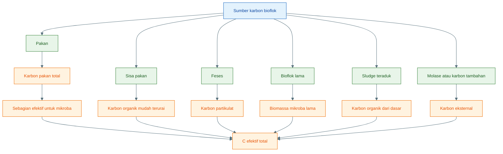
```mermaid id="sumber-karbon-bioflok"
%%{init: {'theme':'base','themeVariables':{
'primaryColor':'#E3F2FD',
'primaryTextColor':'#0D47A1',
'primaryBorderColor':'#1565C0',
'secondaryColor':'#E8F5E9',
'secondaryTextColor':'#1B5E20',
'secondaryBorderColor':'#2E7D32',
'tertiaryColor':'#FFF3E0',
'tertiaryTextColor':'#E65100',
'tertiaryBorderColor':'#EF6C00',
'lineColor':'#546E7A',
'fontSize':'13px'
}}}%%
flowchart TD
    A["Sumber karbon bioflok"] --> B["Pakan"]
    A --> C["Sisa pakan"]
    A --> D["Feses"]
    A --> E["Bioflok lama"]
    A --> F["Sludge teraduk"]
    A --> G["Molase atau karbon tambahan"]

    B --> H["Karbon pakan total"]
    H --> I["Sebagian efektif untuk mikroba"]

    C --> J["Karbon organik mudah terurai"]
    D --> K["Karbon partikulat"]
    E --> L["Biomassa mikroba lama"]
    F --> M["Karbon organik dari dasar"]
    G --> N["Karbon eksternal"]

    I --> O["C efektif total"]
    J --> O
    K --> O
    L --> O
    M --> O
    N --> O

    classDef root fill:#E3F2FD,stroke:#1565C0,color:#0D47A1;
    classDef source fill:#E8F5E9,stroke:#2E7D32,color:#1B5E20;
    classDef carbon fill:#FFF3E0,stroke:#EF6C00,color:#E65100;

    class A root;
    class B,C,D,E,F,G source;
    class H,I,J,K,L,M,N,O carbon;
```

Diagram ini menunjukkan bahwa molase hanyalah salah satu sumber karbon. Dalam kolam aktif, pakan dan bahan organik internal sering menjadi penyumbang karbon yang besar.

---

## 1.2. Mengapa ini berbahaya

Jika karbon pakan diabaikan, dosis karbon tambahan bisa terlalu tinggi. Akibatnya, sistem mengalami **over-carbon**.

Over-carbon berarti karbon efektif yang tersedia bagi mikroba lebih tinggi daripada yang dibutuhkan untuk target `$C/N$`.

Secara konseptual:

$$
C_{\text{efektif,total}}

>

C_{\text{target}}
$$

Dengan:

$$
C_{\text{efektif,total}}
=

C_{\text{pakan,efektif}}
+
C_{\text{tambahan,efektif}}
+
C_{\text{organik lain,efektif}}
$$

Jika karbon efektif total terlalu tinggi, bakteri heterotrof akan berkembang cepat. Ini memang dapat menurunkan `$TAN$`, tetapi juga menaikkan kebutuhan oksigen, `$TSS$`, flok, sludge, dan risiko `$DO$` subuh turun.

| Kesalahan              | Dampak                               |
| ---------------------- | ------------------------------------ |
| Karbon pakan diabaikan | molase berlebih                      |
| Molase berlebih        | heterotrof meledak                   |
| Heterotrof meledak     | `$O_2$` naik                         |
| `$O_2$` naik           | `$DO$` subuh rawan turun             |
| Flok berlebih          | `$TSS$` dan sludge naik              |
| Sludge naik            | risiko bau, `$TAN$` sekunder, nitrit |

---

### 1.2.1. Rantai risiko over-carbon

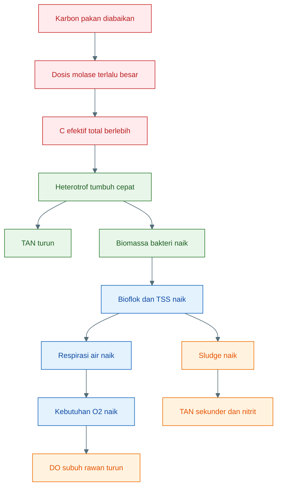
```mermaid id="rantai-risiko-over-carbon"
%%{init: {'theme':'base','themeVariables':{
'primaryColor':'#E3F2FD',
'primaryTextColor':'#0D47A1',
'primaryBorderColor':'#1565C0',
'secondaryColor':'#E8F5E9',
'secondaryTextColor':'#1B5E20',
'secondaryBorderColor':'#2E7D32',
'tertiaryColor':'#FFF3E0',
'tertiaryTextColor':'#E65100',
'tertiaryBorderColor':'#EF6C00',
'lineColor':'#546E7A',
'fontSize':'13px'
}}}%%
flowchart TD
    A["Karbon pakan diabaikan"] --> B["Dosis molase terlalu besar"]
    B --> C["C efektif total berlebih"]
    C --> D["Heterotrof tumbuh cepat"]
    D --> E["TAN turun"]
    D --> F["Biomassa bakteri naik"]
    F --> G["Bioflok dan TSS naik"]
    G --> H["Respirasi air naik"]
    H --> I["Kebutuhan O2 naik"]
    I --> J["DO subuh rawan turun"]
    G --> K["Sludge naik"]
    K --> L["TAN sekunder dan nitrit"]

    classDef salah fill:#FFEBEE,stroke:#C62828,color:#B71C1C;
    classDef proses fill:#E3F2FD,stroke:#1565C0,color:#0D47A1;
    classDef mikroba fill:#E8F5E9,stroke:#2E7D32,color:#1B5E20;
    classDef risiko fill:#FFF3E0,stroke:#EF6C00,color:#E65100;

    class A,B,C salah;
    class D,E,F mikroba;
    class G,H,I proses;
    class J,K,L risiko;
```

Diagram ini penting karena menunjukkan jebakan `$C/N$` tinggi. `$TAN$` bisa turun, tetapi risiko sistem bisa naik.

---

## 1.3. Posisi baru artikel

Artikel ini tidak lagi memakai pendekatan lama:

$$
C/N
=

\frac{
C_{\text{tambahan}}
}{
N
}
$$

Pendekatan tersebut terlalu sempit karena menganggap sumber karbon hanya berasal dari molase atau bahan karbon eksternal.

Pendekatan yang dipakai dalam artikel ini adalah:

$$
C/N_{\text{efektif}}
=

\frac{
C_{\text{pakan,efektif}}
+
C_{\text{tambahan,efektif}}
+
C_{\text{organik lain,efektif}}
}{
N_{\text{basis}}
}
$$

Keterangan:

| Simbol                              | Makna                                                                               |
| ----------------------------------- | ----------------------------------------------------------------------------------- |
| `$C_{\text{pakan,efektif}}$`        | karbon dari pakan yang benar-benar tersedia bagi mikroba                            |
| `$C_{\text{tambahan,efektif}}$`     | karbon efektif dari molase, gula, tepung, dedak, atau sumber karbon lain            |
| `$C_{\text{organik lain,efektif}}$` | karbon dari feses, sisa pakan, bioflok tua, sludge teraduk, atau bahan organik lain |
| `$N_{\text{basis}}$`                | basis nitrogen yang dipakai dalam model                                             |
| `$C/N_{\text{efektif}}$`            | rasio karbon efektif terhadap nitrogen basis                                        |

---

### 1.3.1. Mengapa memakai kata “efektif”

Kata “efektif” sangat penting.

Tidak semua karbon yang masuk ke kolam langsung bisa dimanfaatkan bakteri heterotrof. Sebagian karbon:

- dimakan dan digunakan ikan;
- menjadi biomassa ikan;
- keluar sebagai feses kasar;
- mengendap;
- terjebak dalam sludge;
- lambat terurai;
- baru tersedia setelah proses dekomposisi.

Karena itu, karbon pakan total tidak boleh langsung dianggap sebagai karbon yang tersedia bagi mikroba.

Formula dasarnya:

$$
C_{\text{pakan,efektif}}
=

C_{\text{pakan,total}}
\times
\eta_{C,\text{pakan}}
$$

Keterangan:

| Simbol                       | Makna                                                      |
| ---------------------------- | ---------------------------------------------------------- |
| `$C_{\text{pakan,total}}$`   | total karbon dalam pakan                                   |
| `$\eta_{C,\text{pakan}}$`    | fraksi karbon pakan yang efektif tersedia bagi mikroba     |
| `$C_{\text{pakan,efektif}}$` | karbon pakan yang masuk ke perhitungan operasional bioflok |

Nilai `$\eta_{C,\text{pakan}}$` tidak tetap. Nilainya dipengaruhi oleh kualitas pakan, stabilitas pakan di air, tingkat konsumsi ikan, `$FCR$`, jumlah feses halus, dan jumlah sisa pakan.

---

### 1.3.2. Dua kesalahan ekstrem

Ada dua kesalahan ekstrem yang harus dihindari.

| Kesalahan                                              | Dampak                              |
| ------------------------------------------------------ | ----------------------------------- |
| Menganggap karbon pakan sama dengan nol                | dosis karbon tambahan terlalu besar |
| Menganggap seluruh karbon pakan tersedia untuk mikroba | dosis karbon tambahan terlalu kecil |

Yang benar adalah memakai karbon pakan efektif:

$$
0
<
C_{\text{pakan,efektif}}
<
C_{\text{pakan,total}}
$$

Artinya, karbon pakan efektif berada di antara nol dan karbon pakan total.

---

### 1.3.3. Basis nitrogen harus didefinisikan

`$C/N$` tidak boleh disebut tanpa menjelaskan basis nitrogen yang dipakai.

Ada dua basis yang sering digunakan:

| Basis nitrogen       | Formula                                    | Kegunaan                   |
| -------------------- | ------------------------------------------ | -------------------------- |
| `$N_{\text{pakan}}$` | `$Feed \times Protein \times 0{,}16$`      | neraca input total         |
| `$TAN_N$`            | `$N_{\text{pakan}} \times f_{\text{TAN}}$` | kontrol amonia dan bioflok |

Untuk artikel ini, basis utama operasional adalah:

$$
TAN_N
$$

karena tujuan praktis bioflok adalah mengendalikan nitrogen yang masuk ke air sebagai amonia.

Formula:

$$
TAN_N
=

Feed
\times
Protein
\times
0{,}16
\times
f_{\text{TAN}}
$$

Dengan pendekatan ini, `$C/N_{\text{efektif}}$` menjadi lebih relevan untuk keputusan penambahan karbon.

---

## 1.4. Cara berpikir baru sebelum menambah karbon

Sebelum menambah molase atau sumber karbon lain, praktisi tidak boleh langsung bertanya:

```text
Berapa molase yang harus ditambahkan?
```

Pertanyaan yang lebih benar:

```text
Berapa TAN-N yang terbentuk?
Berapa karbon pakan efektif yang sudah tersedia?
Berapa karbon organik lain yang ikut tersedia?
Berapa target C/N efektif?
Berapa kekurangan karbon efektif?
Baru kemudian: berapa bahan karbon tambahan yang diperlukan?
```

Urutan berpikirnya:

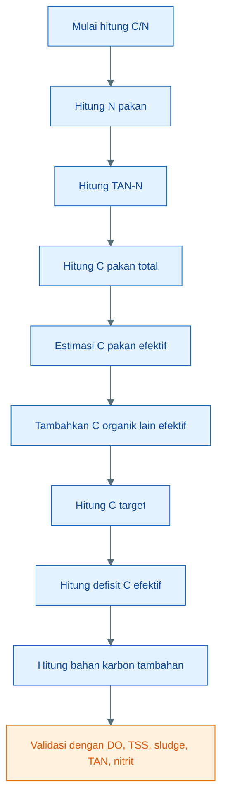
```mermaid id="sop-sebelum-menambah-karbon"
%%{init: {'theme':'base','themeVariables':{
'primaryColor':'#E3F2FD',
'primaryTextColor':'#0D47A1',
'primaryBorderColor':'#1565C0',
'secondaryColor':'#E8F5E9',
'secondaryTextColor':'#1B5E20',
'secondaryBorderColor':'#2E7D32',
'tertiaryColor':'#FFF3E0',
'tertiaryTextColor':'#E65100',
'tertiaryBorderColor':'#EF6C00',
'lineColor':'#546E7A',
'fontSize':'13px'
}}}%%
flowchart TD
    A["Mulai hitung C/N"] --> B["Hitung N pakan"]
    B --> C["Hitung TAN-N"]
    C --> D["Hitung C pakan total"]
    D --> E["Estimasi C pakan efektif"]
    E --> F["Tambahkan C organik lain efektif"]
    F --> G["Hitung C target"]
    G --> H["Hitung defisit C efektif"]
    H --> I["Hitung bahan karbon tambahan"]
    I --> J["Validasi dengan DO, TSS, sludge, TAN, nitrit"]

    classDef input fill:#E3F2FD,stroke:#1565C0,color:#0D47A1;
    classDef hitung fill:#E8F5E9,stroke:#2E7D32,color:#1B5E20;
    classDef validasi fill:#FFF3E0,stroke:#EF6C00,color:#E65100;

    class A,B,C,D,E,F,G,H,I input;
    class J validasi;
```

Rumus kunci defisit karbon efektif:

$$
C_{\text{defisit}}
=

\max
\left(
0,
C_{\text{target}}
-
C_{\text{pakan,efektif}}

C_{\text{organik lain,efektif}}
\right)
$$

Jika `$C_{\text{defisit}} = 0$`, maka karbon tambahan tidak diperlukan untuk mencapai target model.

---

## 1.5. Pesan utama Bab 1

`$C/N$` bioflok yang benar harus menghitung karbon pakan. Namun karbon pakan yang dihitung bukan karbon total mentah, melainkan karbon yang efektif tersedia bagi mikroba.

Kalimat posisi Bab 1:

> `$C/N$` bioflok tidak boleh dihitung dari molase saja. Pakan adalah sumber nitrogen sekaligus sumber karbon. Tetapi yang relevan bagi mikroba bukan seluruh karbon pakan, melainkan karbon pakan efektif yang benar-benar tersedia di air.

Dengan cara pandang ini, artikel selanjutnya akan membedakan:

- `$C/N_{\text{total}}$`;
- `$C/N_{\text{efektif}}$`;
- `$N_{\text{pakan}}$`;
- `$TAN_N$`;
- karbon pakan total;
- karbon pakan efektif;
- karbon tambahan efektif;
- dan risiko over-carbon.

Pesan praktis untuk diingat:

> Jangan menambah karbon sebelum menghitung karbon yang sudah masuk dari pakan.

[**Kembali ke Atas**](#cn-ratio-pada-bioflok-mengatur-mikroba-oksigen-dan-stabilitas-kolam-untuk-praktisi)

---

# Bab 2. Definisi Baru: `$C/N_{\text{total}}$`, `$C/N_{\text{efektif}}$`, dan Basis Nitrogen

Bab 2 menjadi fondasi perhitungan artikel ini. Setelah Bab 1 menegaskan bahwa karbon tidak hanya berasal dari molase, Bab 2 membedakan tiga hal yang sering tercampur dalam praktik:

1. `$C/N_{\text{total}}$`;
2. `$C/N_{\text{efektif}}$`;
3. basis nitrogen yang dipakai, yaitu `$N_{\text{pakan}}$` atau `$TAN_N$`.

Tanpa membedakan tiga hal ini, praktisi mudah salah mengambil keputusan. Angka `$C/N$` bisa terlihat benar secara matematis, tetapi salah secara operasional.

---

## 2.1. Mengapa definisi `$C/N$` harus diperjelas

Dalam praktik bioflok, istilah `$C/N$` sering dipakai terlalu umum. Seseorang bisa berkata:

```text
Target C/N = 15
```

Tetapi belum jelas:

- karbon yang dihitung karbon total atau karbon efektif;
- nitrogen yang dipakai nitrogen pakan atau `$TAN_N$`;
- karbon pakan dihitung atau diabaikan;
- karbon tambahan dianggap tersedia seluruhnya atau hanya sebagian;
- feses dan sisa pakan dimasukkan atau tidak.

Akibatnya, dua orang bisa sama-sama menyebut `$C/N = 15$`, tetapi dosis karbonnya berbeda jauh.

Karena itu, artikel ini memakai dua definisi:

| Istilah                  | Fungsi                                                   |
| ------------------------ | -------------------------------------------------------- |
| `$C/N_{\text{total}}$`   | membaca komposisi input total                            |
| `$C/N_{\text{efektif}}$` | menghitung karbon yang benar-benar bekerja untuk mikroba |

---

## 2.2. `$C/N_{\text{total}}$`

`$C/N_{\text{total}}$` adalah rasio karbon total dari input terhadap nitrogen pakan.

Definisi:

$$
C/N_{\text{total}}
=

\frac{
C_{\text{pakan,total}}
+
C_{\text{tambahan,total}}
}{
N_{\text{pakan}}
}
$$

Keterangan:

| Simbol                        | Makna                                                                       |
| ----------------------------- | --------------------------------------------------------------------------- |
| `$C_{\text{pakan,total}}$`    | karbon total yang terkandung dalam pakan                                    |
| `$C_{\text{tambahan,total}}$` | karbon total dari molase, gula, dedak, tepung, atau sumber karbon eksternal |
| `$N_{\text{pakan}}$`          | nitrogen total dari protein pakan                                           |
| `$C/N_{\text{total}}$`        | rasio karbon total terhadap nitrogen pakan                                  |

Kegunaan `$C/N_{\text{total}}$`:

- membaca komposisi input total;
- memberi gambaran kasar keseimbangan karbon dan nitrogen;
- berguna untuk analisis bahan masuk;
- belum cukup untuk keputusan dosis molase harian.

Kelemahannya:

> `$C/N_{\text{total}}$` tidak membedakan karbon yang benar-benar tersedia bagi mikroba dengan karbon yang masih berada dalam pakan, biomassa ikan, feses kasar, atau bahan organik lambat terurai.

---

### 2.2.1. Formula nitrogen pakan

Nitrogen pakan dihitung dari protein pakan.

$$
N_{\text{pakan}}
=

Feed
\times
Protein
\times
0{,}16
$$

Keterangan:

| Simbol               |          Satuan | Makna                            |
| -------------------- | --------------: | -------------------------------- |
| `$Feed$`             |   kg pakan/hari | jumlah pakan harian              |
| `$Protein$`          |          fraksi | contoh `$30\% = 0{,}30$`         |
| `$0{,}16$`           | kg N/kg protein | kandungan nitrogen dalam protein |
| `$N_{\text{pakan}}$` |       kg N/hari | nitrogen total dari pakan        |

Contoh:

$$
Feed
=

0{,}40
\text{ kg/hari}
$$

$$
Protein
=

0{,}30
$$

Maka:

$$
N_{\text{pakan}}
=

0{,}40
\times
0{,}30
\times
0{,}16
$$

$$
N_{\text{pakan}}
=

0{,}0192
\text{ kg N/hari}
$$

atau:

$$
N_{\text{pakan}}
=

19{,}2
\text{ g N/hari}
$$

---

## 2.3. `$C/N_{\text{efektif}}$`

`$C/N_{\text{efektif}}$` adalah rasio karbon yang benar-benar tersedia bagi mikroba terhadap nitrogen basis yang ingin dikontrol.

Untuk bioflok, definisi operasionalnya:

$$
C/N_{\text{efektif}}
=

\frac{
C_{\text{pakan,efektif}}
+
C_{\text{tambahan,efektif}}
+
C_{\text{organik lain,efektif}}
}{
TAN_N
}
$$

Keterangan:

| Simbol                              | Makna                                                                   |
| ----------------------------------- | ----------------------------------------------------------------------- |
| `$C_{\text{pakan,efektif}}$`        | bagian karbon pakan yang tersedia bagi mikroba                          |
| `$C_{\text{tambahan,efektif}}$`     | bagian karbon tambahan yang efektif tersedia bagi mikroba               |
| `$C_{\text{organik lain,efektif}}$` | karbon efektif dari feses, sisa pakan, sludge teraduk, atau bioflok tua |
| `$TAN_N$`                           | nitrogen amonia total yang masuk ke air                                 |
| `$C/N_{\text{efektif}}$`            | rasio karbon efektif terhadap `$TAN_N$`                                 |

Kegunaan `$C/N_{\text{efektif}}$`:

- lebih relevan untuk bioflok;
- membaca karbon yang benar-benar tersedia bagi mikroba;
- cocok untuk menghitung kebutuhan karbon tambahan;
- lebih aman untuk mencegah overdosis molase;
- lebih tajam untuk menghubungkan `$C/N$`, heterotrof, flok, `$O_2$`, dan sludge.

---

### 2.3.1. Diagram perbedaan `$C/N_{\text{total}}$` dan `$C/N_{\text{efektif}}$`

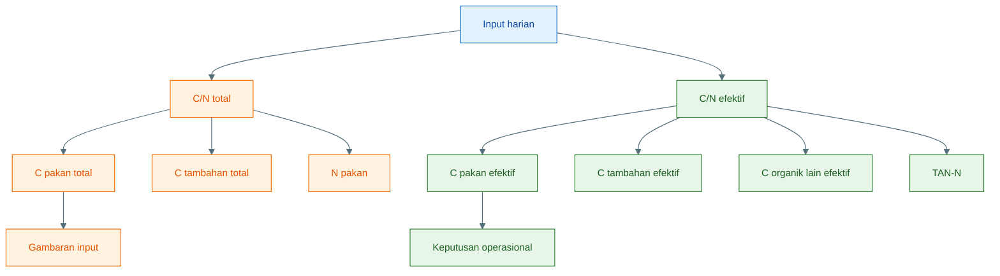
```mermaid id="cn-total-vs-cn-efektif"
%%{init: {'theme':'base','themeVariables':{
'primaryColor':'#E3F2FD',
'primaryTextColor':'#0D47A1',
'primaryBorderColor':'#1565C0',
'secondaryColor':'#E8F5E9',
'secondaryTextColor':'#1B5E20',
'secondaryBorderColor':'#2E7D32',
'tertiaryColor':'#FFF3E0',
'tertiaryTextColor':'#E65100',
'tertiaryBorderColor':'#EF6C00',
'lineColor':'#546E7A',
'fontSize':'13px'
}}}%%
flowchart TD
    A["Input harian"] --> B["C/N total"]
    A --> C["C/N efektif"]

    B --> D["C pakan total"]
    B --> E["C tambahan total"]
    B --> F["N pakan"]

    C --> G["C pakan efektif"]
    C --> H["C tambahan efektif"]
    C --> I["C organik lain efektif"]
    C --> J["TAN-N"]

    D --> K["Gambaran input"]
    G --> L["Keputusan operasional"]

    classDef root fill:#E3F2FD,stroke:#1565C0,color:#0D47A1;
    classDef total fill:#FFF3E0,stroke:#EF6C00,color:#E65100;
    classDef efektif fill:#E8F5E9,stroke:#2E7D32,color:#1B5E20;

    class A root;
    class B,D,E,F,K total;
    class C,G,H,I,J,L efektif;
```

Makna diagram:

- `$C/N_{\text{total}}$` berguna untuk membaca bahan masuk;
- `$C/N_{\text{efektif}}$` berguna untuk mengambil keputusan lapangan;
- dosis molase sebaiknya dihitung dari `$C/N_{\text{efektif}}$`, bukan dari `$C/N_{\text{total}}$`.

---

## 2.4. Basis nitrogen: `$N_{\text{pakan}}$` atau `$TAN_N$`

Salah satu penyebab kebingungan `$C/N$` adalah basis nitrogen yang tidak disebutkan.

Ada dua basis yang harus dibedakan.

| Basis                | Formula                                    | Cocok untuk                |
| -------------------- | ------------------------------------------ | -------------------------- |
| `$N_{\text{pakan}}$` | `$Feed \times Protein \times 0{,}16$`      | neraca input total         |
| `$TAN_N$`            | `$N_{\text{pakan}} \times f_{\text{TAN}}$` | kontrol amonia dan bioflok |

---

### 2.4.1. `$N_{\text{pakan}}$`

`$N_{\text{pakan}}$` adalah seluruh nitrogen yang masuk lewat pakan.

$$
N_{\text{pakan}}
=

Feed
\times
Protein
\times
0{,}16
$$

Basis ini cocok untuk:

- neraca nitrogen total;
- menghitung input nitrogen harian;
- memperkirakan efisiensi pakan;
- melihat hubungan pakan dan limbah nitrogen.

Namun `$N_{\text{pakan}}$` belum langsung menunjukkan berapa nitrogen yang masuk ke air sebagai amonia.

---

### 2.4.2. `$TAN_N$`

`$TAN_N$` adalah bagian nitrogen pakan yang menjadi total ammonia nitrogen.

$$
TAN_N
=

N_{\text{pakan}}
\times
f_{\text{TAN}}
$$

atau:

$$
TAN_N
=

Feed
\times
Protein
\times
0{,}16
\times
f_{\text{TAN}}
$$

Keterangan:

| Simbol             | Makna                                         |
| ------------------ | --------------------------------------------- |
| `$f_{\text{TAN}}$` | fraksi nitrogen pakan yang menjadi `$TAN$`    |
| `$TAN_N$`          | nitrogen amonia total yang perlu dikendalikan |

Nilai kerja awal:

$$
f_{\text{TAN}}
=

0{,}50
\text{ sampai }
0{,}80
$$

Untuk simulasi awal artikel ini sering dipakai:

$$
f_{\text{TAN}}
=

0{,}60
$$

---

## 2.5. Kenapa artikel memakai `$TAN_N$`

Artikel ini memakai `$TAN_N$` sebagai basis utama `$C/N_{\text{efektif}}$` karena target praktis bioflok adalah mengendalikan amonia di air.

Dalam kolam, yang langsung memicu tindakan operasional biasanya bukan `$N_{\text{pakan}}$`, tetapi:

- `$TAN$` naik;
- nitrit naik;
- flok kurang terbentuk;
- sludge meningkat;
- `$DO$` turun setelah penambahan karbon.

Karena itu, basis yang lebih berguna untuk kontrol mikroba adalah:

$$
TAN_N
$$

Formula utama:

$$
TAN_N
=

Feed
\times
Protein
\times
0{,}16
\times
f_{\text{TAN}}
$$

Dengan basis ini, pertanyaan praktis menjadi:

```text id="x6f62n"
Berapa karbon efektif yang diperlukan untuk membantu mikroba menangani TAN-N?
```

bukan:

```text id="iq8i47"
Berapa karbon total yang masuk bersama seluruh pakan?
```

---

## 2.6. Contoh perbedaan basis nitrogen

Misal:

$$
Feed
=

0{,}40
\text{ kg/hari}
$$

$$
Protein
=

0{,}30
$$

$$
f_{\text{TAN}}
=

0{,}60
$$

### Hitung `$N_{\text{pakan}}$`

$$
N_{\text{pakan}}
=

0{,}40
\times
0{,}30
\times
0{,}16
$$

$$
N_{\text{pakan}}
=

0{,}0192
\text{ kg N/hari}
$$

atau:

$$
N_{\text{pakan}}
=

19{,}2
\text{ g N/hari}
$$

### Hitung `$TAN_N$`

$$
TAN_N
=

19{,}2
\times
0{,}60
$$

$$
TAN_N
=

11{,}52
\text{ g TAN-N/hari}
$$

Jadi satu pakan yang sama menghasilkan dua angka nitrogen:

| Basis                |                            Nilai | Makna                        |
| -------------------- | -------------------------------: | ---------------------------- |
| `$N_{\text{pakan}}$` |      `$19{,}2 \text{ g N/hari}$` | nitrogen total dari pakan    |
| `$TAN_N$`            | `$11{,}52 \text{ g TAN-N/hari}$` | nitrogen yang menjadi amonia |

Jika target `$C/N$` dihitung memakai `$N_{\text{pakan}}$`, hasilnya berbeda dari target yang dihitung memakai `$TAN_N$`.

---

## 2.7. Mengapa `$C/N_{\text{efektif}}$` lebih cocok untuk dosis karbon

Dosis karbon tambahan sebaiknya dihitung dari kekurangan karbon efektif.

Langkahnya:

1. hitung `$TAN_N$`;
2. hitung karbon pakan efektif;
3. hitung karbon organik lain efektif;
4. hitung karbon target;
5. hitung defisit karbon;
6. baru hitung bahan karbon tambahan.

Karbon target:

$$
C_{\text{target}}
=

(C/N)_{\text{target}}
\times
TAN_N
$$

Defisit karbon efektif:

$$
C_{\text{defisit}}
=

\max
\left(
0,
C_{\text{target}}
-

C_{\text{pakan,efektif}}

C_{\text{organik lain,efektif}}
\right)
$$

Jika memakai sumber karbon tambahan:

$$
Bahan_{\text{karbon}}
=

\frac{
C_{\text{defisit}}
}{
f_{C,\text{sumber}}
\times
\eta_{C,\text{sumber}}
}
$$

Keterangan:

| Simbol                     | Makna                                     |
| -------------------------- | ----------------------------------------- |
| `$f_{C,\text{sumber}}$`    | fraksi karbon dalam bahan karbon tambahan |
| `$\eta_{C,\text{sumber}}$` | fraksi efektivitas karbon tambahan        |
| `$Bahan_{\text{karbon}}$`  | dosis bahan karbon yang diberikan         |

---

## 2.8. Diagram alur definisi dan keputusan

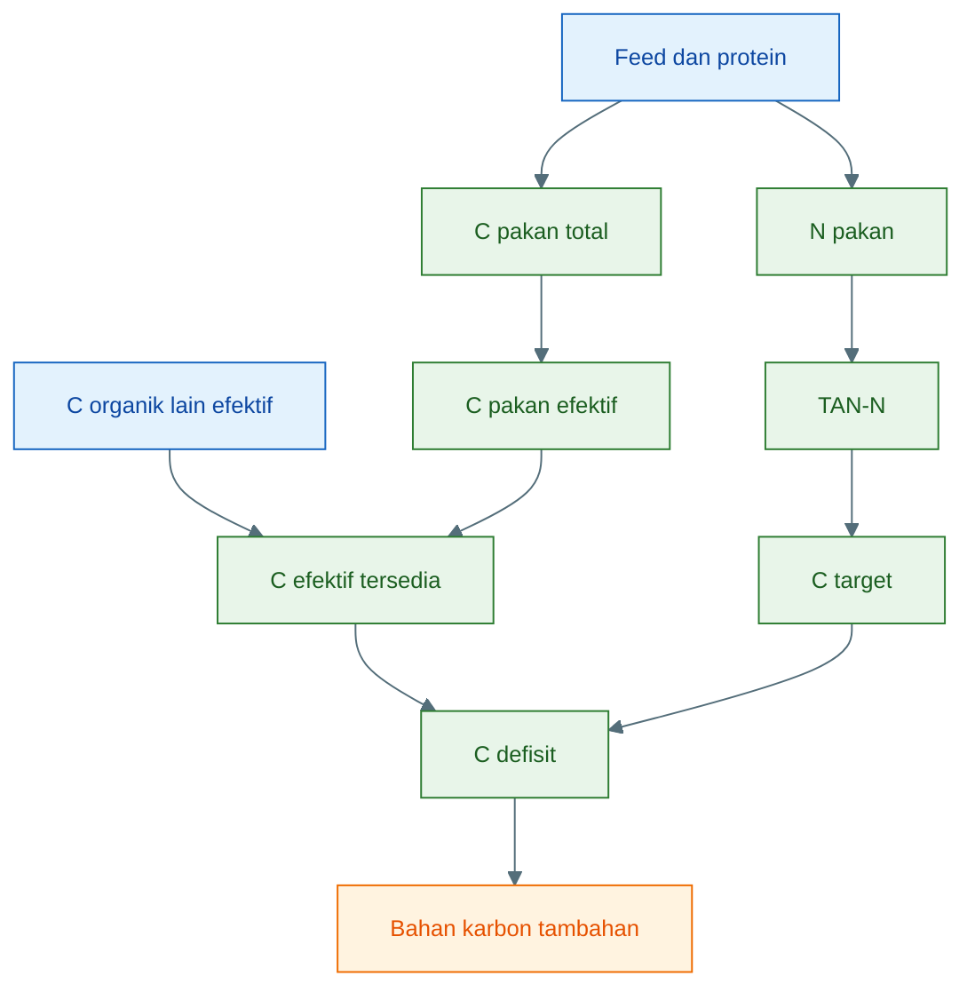
```mermaid id="alur-definisi-cn-efektif"
%%{init: {'theme':'base','themeVariables':{
'primaryColor':'#E3F2FD',
'primaryTextColor':'#0D47A1',
'primaryBorderColor':'#1565C0',
'secondaryColor':'#E8F5E9',
'secondaryTextColor':'#1B5E20',
'secondaryBorderColor':'#2E7D32',
'tertiaryColor':'#FFF3E0',
'tertiaryTextColor':'#E65100',
'tertiaryBorderColor':'#EF6C00',
'lineColor':'#546E7A',
'fontSize':'13px'
}}}%%
flowchart TD
    A["Feed dan protein"] --> B["N pakan"]
    B --> C["TAN-N"]

    A --> D["C pakan total"]
    D --> E["C pakan efektif"]

    F["C organik lain efektif"] --> G["C efektif tersedia"]
    E --> G

    C --> H["C target"]
    G --> I["C defisit"]

    H --> I
    I --> J["Bahan karbon tambahan"]

    classDef input fill:#E3F2FD,stroke:#1565C0,color:#0D47A1;
    classDef proses fill:#E8F5E9,stroke:#2E7D32,color:#1B5E20;
    classDef output fill:#FFF3E0,stroke:#EF6C00,color:#E65100;

    class A,F input;
    class B,C,D,E,G,H,I proses;
    class J output;
```

Diagram ini menunjukkan bahwa dosis karbon tambahan muncul di akhir, bukan di awal. Praktisi harus menghitung karbon yang sudah tersedia sebelum menambah karbon baru.

---

## 2.9. Kesalahan definisi yang harus dihindari

| Kesalahan                                                  | Dampak                                       |
| ---------------------------------------------------------- | -------------------------------------------- |
| Menyebut `$C/N$` tanpa menjelaskan basis nitrogen          | angka sulit dibandingkan                     |
| Mengabaikan karbon pakan                                   | dosis molase terlalu besar                   |
| Memakai karbon pakan total sebagai karbon efektif          | dosis karbon tambahan terlalu kecil          |
| Menganggap semua molase efektif penuh                      | potensi salah dosis                          |
| Tidak memasukkan feses dan sisa pakan                      | model terlalu bersih dibanding kondisi kolam |
| Tidak validasi dengan `$DO$`, `$TSS$`, sludge, dan `$TAN$` | formula tidak terkoreksi oleh realitas       |

---

## 2.10. Ringkasan definisi Bab 2

| Istilah                  | Formula ringkas                                                                                        | Fungsi                      |
| ------------------------ | ------------------------------------------------------------------------------------------------------ | --------------------------- |
| `$N_{\text{pakan}}$`     | `$Feed \times Protein \times 0{,}16$`                                                                  | nitrogen total pakan        |
| `$TAN_N$`                | `$N_{\text{pakan}} \times f_{\text{TAN}}$`                                                             | nitrogen amonia             |
| `$C/N_{\text{total}}$`   | `$(C_{\text{pakan,total}} + C_{\text{tambahan,total}}) / N_{\text{pakan}}$`                            | gambaran input total        |
| `$C/N_{\text{efektif}}$` | `$(C_{\text{pakan,efektif}} + C_{\text{tambahan,efektif}} + C_{\text{organik lain,efektif}}) / TAN_N$` | keputusan operasional       |
| `$C_{\text{defisit}}$`   | `$C_{\text{target}} - C_{\text{tersedia}}$`                                                            | dasar dosis karbon tambahan |

Untuk menjaga keamanan model, gunakan:

$$
C_{\text{defisit}}
=

\max
\left(
0,
C_{\text{target}}
-
C_{\text{pakan,efektif}}

C_{\text{organik lain,efektif}}
\right)
$$

---

## 2.11. Pesan utama Bab 2

Untuk keputusan operasional bioflok, `$C/N_{\text{efektif}}$` berbasis `$TAN_N$` lebih berguna daripada `$C/N_{\text{total}}$` berbasis pakan total.

Kalimat kunci:

> `$C/N_{\text{total}}$` menjelaskan apa yang masuk ke sistem. `$C/N_{\text{efektif}}$` menjelaskan apa yang benar-benar bekerja untuk mikroba.

Maka, sebelum menentukan dosis molase atau sumber karbon lain, praktisi harus menjawab empat pertanyaan:

1. berapa `$TAN_N$` yang harus dikendalikan;
2. berapa karbon pakan efektif yang sudah tersedia;
3. berapa karbon organik lain yang ikut tersedia;
4. berapa defisit karbon efektif terhadap target.

Pesan praktis Bab 2:

> `$C/N$` tanpa definisi basis nitrogen dan efektivitas karbon adalah angka yang berisiko menyesatkan.

[**Kembali ke Atas**](#cn-ratio-pada-bioflok-mengatur-mikroba-oksigen-dan-stabilitas-kolam-untuk-praktisi)

---

# Bab 3. Karbon dari Pakan: Sumber yang Sering Terlupakan

Bab ini menjadi pusat koreksi artikel. Kesalahan utama pada banyak perhitungan `$C/N$` bioflok adalah memperlakukan pakan hanya sebagai sumber nitrogen, lalu memperlakukan molase sebagai satu-satunya sumber karbon.

Padahal pakan membawa dua hal sekaligus:

1. nitrogen, terutama dari protein;
2. karbon, dari protein, lemak, karbohidrat, dan serat.

Karena itu, setiap model `$C/N$` yang mengabaikan karbon pakan akan cenderung melebihkan kebutuhan karbon tambahan.

---

## 3.1. Pakan adalah sumber nitrogen dan karbon sekaligus

Pakan ikan bukan hanya protein. Pakan umumnya mengandung:

- protein;
- lemak;
- karbohidrat;
- serat;
- mineral;
- air.

Protein memberi nitrogen, tetapi protein juga mengandung karbon. Lemak dan karbohidrat juga membawa karbon. Jadi pakan adalah sumber nitrogen dan sumber karbon dalam waktu yang sama.

Secara sederhana:

```text id="ru92uz"
Pakan
→ nitrogen
→ TAN, nitrit, nitrat, biomassa ikan, bioflok

Pakan
→ karbon
→ energi ikan, feses, sisa pakan, bioflok, sludge, CO2
```

Diagram alurnya:

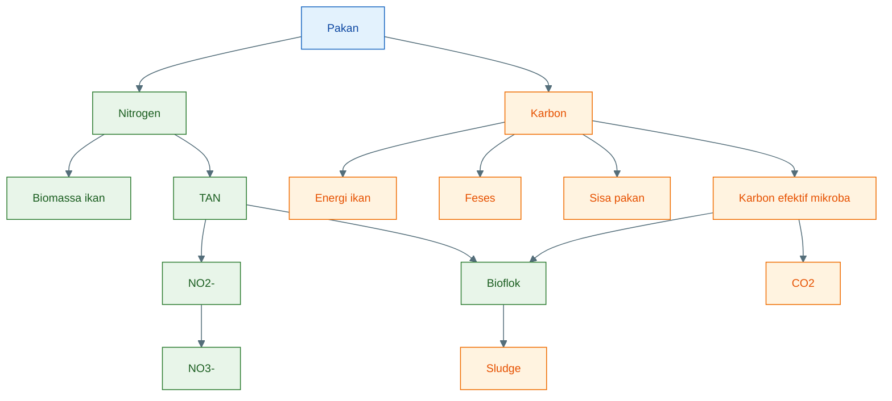
```mermaid id="pakan-sumber-n-dan-c"
%%{init: {'theme':'base','themeVariables':{
'primaryColor':'#E3F2FD',
'primaryTextColor':'#0D47A1',
'primaryBorderColor':'#1565C0',
'secondaryColor':'#E8F5E9',
'secondaryTextColor':'#1B5E20',
'secondaryBorderColor':'#2E7D32',
'tertiaryColor':'#FFF3E0',
'tertiaryTextColor':'#E65100',
'tertiaryBorderColor':'#EF6C00',
'lineColor':'#546E7A',
'fontSize':'13px'
}}}%%
flowchart TD
    A["Pakan"] --> B["Nitrogen"]
    A --> C["Karbon"]

    B --> D["Biomassa ikan"]
    B --> E["TAN"]
    E --> F["NO2-"]
    F --> G["NO3-"]
    E --> H["Bioflok"]

    C --> I["Energi ikan"]
    C --> J["Feses"]
    C --> K["Sisa pakan"]
    C --> L["Karbon efektif mikroba"]
    L --> H
    H --> M["Sludge"]
    L --> N["CO2"]

    classDef pakan fill:#E3F2FD,stroke:#1565C0,color:#0D47A1;
    classDef nitrogen fill:#E8F5E9,stroke:#2E7D32,color:#1B5E20;
    classDef karbon fill:#FFF3E0,stroke:#EF6C00,color:#E65100;

    class A pakan;
    class B,D,E,F,G,H nitrogen;
    class C,I,J,K,L,M,N karbon;
```

Makna praktis:

> Saat pakan dinaikkan, nitrogen naik dan karbon juga naik. Karena itu, dosis karbon tambahan tidak boleh dihitung seolah-olah karbon awal sistem adalah nol.

---

## 3.2. Karbon total dari pakan

Jika data komposisi karbon pakan tidak tersedia, karbon total dari pakan dapat didekati dengan formula:

$$
C_{\text{pakan,total}}
=

Feed
\times
f_{C,\text{pakan}}
$$

Keterangan:

| Simbol                     |                  Satuan | Makna                           |
| -------------------------- | ----------------------: | ------------------------------- |
| `$C_{\text{pakan,total}}$` | kg C/hari atau g C/hari | karbon total dari pakan         |
| `$Feed$`                   |     kg/hari atau g/hari | jumlah pakan                    |
| `$f_{C,\text{pakan}}$`     |                  fraksi | fraksi karbon total dalam pakan |

Nilai kerja awal:

$$
f_{C,\text{pakan}}
=

0{,}40
\text{ sampai }
0{,}45
$$

Artinya, untuk perhitungan awal, pakan dapat diperkirakan mengandung karbon total sekitar:

$$
40%
\text{ sampai }
45%
$$

Namun angka ini adalah angka kerja awal. Bila data proksimat atau data karbon aktual pakan tersedia, gunakan data aktual.

---

## 3.3. Contoh hitung karbon total dari pakan

Misal:

$$
Feed
=

0{,}40
\text{ kg/hari}
$$

atau:

$$
Feed
=

400
\text{ g/hari}
$$

Gunakan:

$$
f_{C,\text{pakan}}
=

0{,}42
$$

Maka:

$$
C_{\text{pakan,total}}
=

400
\times
0{,}42
$$

$$
C_{\text{pakan,total}}
=

168
\text{ g C/hari}
$$

Makna praktis:

> Pada pakan `$400 \text{ g/hari}$`, bila fraksi karbon pakan `$0{,}42$`, maka karbon total yang masuk dari pakan sekitar `$168 \text{ g C/hari}$`.

Ini angka besar. Jika angka ini diabaikan, maka perhitungan karbon tambahan akan cenderung terlalu tinggi.

---

## 3.4. Jika data proksimat tersedia

Jika data komposisi pakan tersedia lebih detail, karbon total pakan dapat dihitung lebih tajam.

Pendekatan umum:

$$
C_{\text{pakan,total}}
=

Feed
\times
\left(
Protein
\times
f_{C,\text{protein}}
+
Lemak
\times
f_{C,\text{lemak}}
+
Karbohidrat
\times
f_{C,\text{karbohidrat}}
+
Serat
\times
f_{C,\text{serat}}
\right)
$$

Nilai pendekatan:

| Komponen    | Fraksi karbon pendekatan |
| ----------- | -----------------------: |
| Protein     |               `$0{,}53$` |
| Lemak       |               `$0{,}77$` |
| Karbohidrat |               `$0{,}44$` |
| Serat       |               `$0{,}44$` |

Contoh sederhana:

| Komponen pakan        |     Fraksi |
| --------------------- | ---------: |
| Protein               | `$0{,}30$` |
| Lemak                 | `$0{,}06$` |
| Karbohidrat dan serat | `$0{,}44$` |

Maka estimasi fraksi karbon:

$$
f_{C,\text{pakan}}
=

0{,}30
\times
0{,}53
+
0{,}06
\times
0{,}77
+
0{,}44
\times
0{,}44
$$

$$
f_{C,\text{pakan}}
=

0{,}159
+
0{,}0462
+
0{,}1936
$$

$$
f_{C,\text{pakan}}
=

0{,}3988
$$

Dibulatkan:

$$
f_{C,\text{pakan}}
\approx
0{,}40
$$

Itulah sebabnya angka kerja `$0{,}40$` sampai `$0{,}45$` cukup masuk akal untuk estimasi awal.

---

## 3.5. Karbon pakan total bukan berarti karbon pakan efektif

Ini bagian paling penting.

Tidak semua:

$$
C_{\text{pakan,total}}
$$

langsung tersedia bagi bakteri heterotrof di air.

Sebagian karbon pakan:

- dicerna ikan;
- dibakar menjadi energi ikan;
- menjadi biomassa ikan;
- keluar sebagai feses;
- menjadi partikel kasar;
- mengendap;
- masuk sludge;
- baru tersedia setelah terurai.

Karena itu, model operasional tidak memakai karbon pakan total, tetapi memakai karbon pakan efektif.

Formula:

$$
C_{\text{pakan,efektif}}
=

C_{\text{pakan,total}}
\times
\eta_{C,\text{pakan}}
$$

Keterangan:

| Simbol                       | Makna                                                  |
| ---------------------------- | ------------------------------------------------------ |
| `$C_{\text{pakan,total}}$`   | karbon total dalam pakan                               |
| `$\eta_{C,\text{pakan}}$`    | fraksi karbon pakan yang efektif tersedia bagi mikroba |
| `$C_{\text{pakan,efektif}}$` | karbon pakan yang masuk model `$C/N_{\text{efektif}}$` |

Nilai kerja awal:

$$
\eta_{C,\text{pakan}}
=

0{,}15
\text{ sampai }
0{,}35
$$

Artinya, untuk model awal, sekitar `$15\%$` sampai `$35\%$` dari karbon total pakan dianggap efektif tersedia bagi mikroba dalam horizon operasi harian.

---

## 3.6. Contoh hitung karbon pakan efektif

Dari contoh sebelumnya:

$$
C_{\text{pakan,total}}
=

168
\text{ g C/hari}
$$

Gunakan:

$$
\eta_{C,\text{pakan}}
=

0{,}25
$$

Maka:

$$
C_{\text{pakan,efektif}}
=

168
\times
0{,}25
$$

$$
C_{\text{pakan,efektif}}
=

42
\text{ g C/hari}
$$

Makna praktis:

> Dari `$168 \text{ g C/hari}$` karbon total pakan, hanya sekitar `$42 \text{ g C/hari}$` yang diasumsikan efektif tersedia bagi mikroba bila `$\eta_{C,\text{pakan}} = 0{,}25$`.

Jadi karbon pakan tidak boleh dianggap nol, tetapi juga tidak boleh seluruhnya dianggap aktif untuk bakteri.

---

## 3.7. Faktor yang memengaruhi `$\eta_{C,\text{pakan}}$`

Nilai `$\eta_{C,\text{pakan}}$` bukan angka tetap. Nilainya berubah tergantung kondisi kolam, pakan, ikan, dan manajemen.

| Kondisi                     | Dampak ke `$\eta_{C,\text{pakan}}$` |
| --------------------------- | ----------------------------------- |
| pakan banyak dimakan        | lebih rendah                        |
| banyak sisa pakan           | lebih tinggi                        |
| feses halus banyak          | lebih tinggi                        |
| `$FCR$` buruk               | lebih tinggi                        |
| pakan stabil di air         | lebih rendah                        |
| pakan mudah hancur          | lebih tinggi                        |
| ikan aktif makan            | lebih rendah                        |
| banyak partikel tersuspensi | lebih tinggi                        |
| sludge sering teraduk       | lebih tinggi                        |
| siphon sludge rutin         | lebih rendah                        |

Interpretasi praktis:

- jika pakan habis cepat dan `$FCR$` baik, gunakan `$\eta_{C,\text{pakan}}$` lebih rendah;
- jika banyak sisa pakan dan air cepat keruh, gunakan `$\eta_{C,\text{pakan}}$` lebih tinggi;
- jika sludge sering teraduk, karbon efektif sistem bisa naik meskipun molase tidak ditambah.

---

## 3.8. Diagram karbon pakan total menjadi karbon efektif

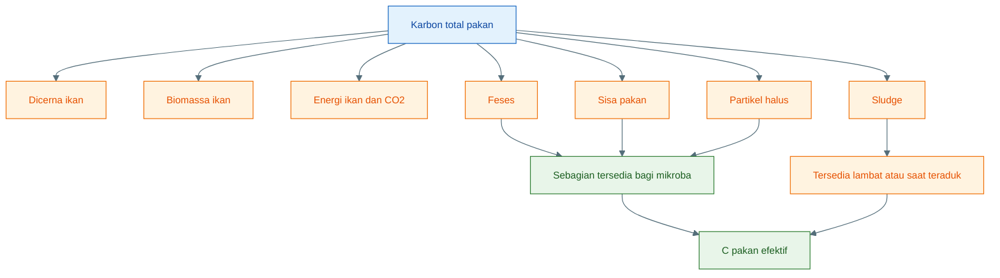
```mermaid id="karbon-pakan-total-ke-efektif"
%%{init: {'theme':'base','themeVariables':{
'primaryColor':'#E3F2FD',
'primaryTextColor':'#0D47A1',
'primaryBorderColor':'#1565C0',
'secondaryColor':'#E8F5E9',
'secondaryTextColor':'#1B5E20',
'secondaryBorderColor':'#2E7D32',
'tertiaryColor':'#FFF3E0',
'tertiaryTextColor':'#E65100',
'tertiaryBorderColor':'#EF6C00',
'lineColor':'#546E7A',
'fontSize':'13px'
}}}%%
flowchart TD
    A["Karbon total pakan"] --> B["Dicerna ikan"]
    A --> C["Biomassa ikan"]
    A --> D["Energi ikan dan CO2"]
    A --> E["Feses"]
    A --> F["Sisa pakan"]
    A --> G["Partikel halus"]
    A --> H["Sludge"]

    E --> I["Sebagian tersedia bagi mikroba"]
    F --> I
    G --> I
    H --> J["Tersedia lambat atau saat teraduk"]

    I --> K["C pakan efektif"]
    J --> K

    classDef total fill:#E3F2FD,stroke:#1565C0,color:#0D47A1;
    classDef nonaktif fill:#FFF3E0,stroke:#EF6C00,color:#E65100;
    classDef efektif fill:#E8F5E9,stroke:#2E7D32,color:#1B5E20;

    class A total;
    class B,C,D,E,F,G,H,J nonaktif;
    class I,K efektif;
```

Diagram ini menunjukkan bahwa karbon total pakan bercabang ke banyak jalur. Hanya sebagian yang menjadi karbon efektif untuk mikroba dalam perhitungan `$C/N_{\text{efektif}}$`.

---

## 3.9. Karbon organik lain efektif

Selain pakan dan molase, ada karbon organik lain yang dapat ikut bekerja dalam sistem.

Contoh:

| Sumber           | Karakter                                     |
| ---------------- | -------------------------------------------- |
| feses halus      | relatif mudah dimanfaatkan mikroba           |
| sisa pakan halus | cepat meningkatkan karbon efektif            |
| bioflok tua      | dapat terurai kembali                        |
| sludge teraduk   | dapat menaikkan karbon dan nitrogen sekunder |
| biofilm lepas    | menjadi bahan organik tersuspensi            |
| alga mati        | menjadi beban organik                        |

Dalam model, komponen ini ditulis sebagai:

$$
C_{\text{organik lain,efektif}}
$$

Maka karbon efektif total:

$$
C_{\text{efektif,total}}
=

C_{\text{pakan,efektif}}
+
C_{\text{tambahan,efektif}}
+
C_{\text{organik lain,efektif}}
$$

Nilai `$C_{\text{organik lain,efektif}}$` sering sulit diukur langsung. Karena itu, dalam praktik bisa dipakai sebagai faktor koreksi berdasarkan kondisi kolam:

| Kondisi kolam               | Perlakuan model                           |
| --------------------------- | ----------------------------------------- |
| air bersih, sludge rendah   | `$C_{\text{organik lain,efektif}}$` kecil |
| air pekat, flok tua         | naikkan koreksi                           |
| sludge mudah teraduk        | naikkan koreksi                           |
| banyak sisa pakan           | naikkan koreksi                           |
| siphon rutin dan air stabil | koreksi rendah                            |

---

## 3.10. Karbon tambahan efektif

Sumber karbon tambahan bisa berupa:

- molase;
- gula;
- tepung;
- dedak;
- tapioka;
- sumber karbon cair lain.

Namun sama seperti pakan, tidak seluruh bahan karbon tambahan selalu efektif penuh. Ada faktor komposisi dan faktor efektivitas.

Formula:

$$
C_{\text{tambahan,efektif}}
=

Bahan_{\text{karbon}}
\times
f_{C,\text{sumber}}
\times
\eta_{C,\text{sumber}}
$$

Keterangan:

| Simbol                          | Makna                                         |
| ------------------------------- | --------------------------------------------- |
| `$Bahan_{\text{karbon}}$`       | berat atau volume bahan karbon yang diberikan |
| `$f_{C,\text{sumber}}$`         | fraksi karbon dalam sumber karbon             |
| `$\eta_{C,\text{sumber}}$`      | fraksi efektivitas sumber karbon              |
| `$C_{\text{tambahan,efektif}}$` | karbon tambahan efektif                       |

Contoh nilai kerja awal:

| Sumber karbon  | `$f_{C,\text{sumber}}$` pendekatan | Catatan                           |
| -------------- | ---------------------------------: | --------------------------------- |
| gula sederhana |                         `$0{,}42$` | mudah tersedia                    |
| molase         |       `$0{,}30$` sampai `$0{,}40$` | tergantung kualitas dan kadar air |
| tepung tapioka |       `$0{,}40$` sampai `$0{,}44$` | lebih lambat daripada gula        |
| dedak          |       `$0{,}35$` sampai `$0{,}45$` | juga membawa nitrogen dan padatan |

Catatan penting:

> Dedak atau bahan organik kompleks tidak hanya membawa karbon. Ia juga dapat membawa nitrogen, fosfor, mineral, dan padatan. Karena itu, penggunaannya tidak boleh disamakan dengan gula sederhana.

---

## 3.11. Contoh karbon tambahan efektif

Misal diberikan molase:

$$
Bahan_{\text{karbon}}
=

100
\text{ g/hari}
$$

Asumsi:

$$
f_{C,\text{sumber}}
=

0{,}35
$$

dan:

$$
\eta_{C,\text{sumber}}
=

0{,}90
$$

Maka:

$$
C_{\text{tambahan,efektif}}
=

100
\times
0{,}35
\times
0{,}90
$$

$$
C_{\text{tambahan,efektif}}
=

31{,}5
\text{ g C/hari}
$$

Makna praktis:

> Seratus gram molase tidak berarti seratus gram karbon. Pada asumsi di atas, karbon efektifnya sekitar `$31{,}5 \text{ g C/hari}$`.

---

## 3.12. Perbandingan model salah dan model benar

Misal target karbon:

$$
C_{\text{target}}
=

161{,}28
\text{ g C/hari}
$$

Karbon pakan efektif:

$$
C_{\text{pakan,efektif}}
=

42
\text{ g C/hari}
$$

Model salah:

$$
C_{\text{tambahan,efektif}}
=

161{,}28
\text{ g C/hari}
$$

Model benar:

$$
C_{\text{tambahan,efektif}}
=

161{,}28

42
$$

$$
C_{\text{tambahan,efektif}}
=

119{,}28
\text{ g C/hari}
$$

Selisih:

$$
Selisih
=

42
\text{ g C/hari}
$$

Tabel perbandingan:

| Model                         |       Karbon tambahan efektif |
| ----------------------------- | ----------------------------: |
| karbon pakan diabaikan        | `$161{,}28 \text{ g C/hari}$` |
| karbon pakan efektif dihitung | `$119{,}28 \text{ g C/hari}$` |
| selisih                       |       `$42 \text{ g C/hari}$` |

Makna praktis:

> Selisih `$42 \text{ g C/hari}$` pada kolam kecil bisa menjadi besar bila diberikan berulang setiap hari. Dampaknya muncul sebagai `$O_2$` naik, `$TSS$` naik, sludge naik, dan `$DO$` subuh lebih rawan turun.

---

## 3.13. Diagram koreksi model karbon

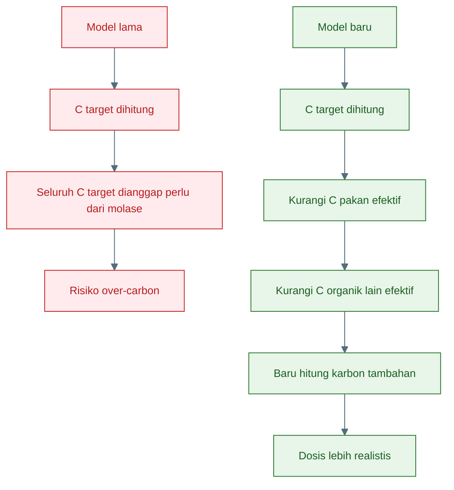
```mermaid id="koreksi-model-karbon-cn"
%%{init: {'theme':'base','themeVariables':{
'primaryColor':'#E3F2FD',
'primaryTextColor':'#0D47A1',
'primaryBorderColor':'#1565C0',
'secondaryColor':'#E8F5E9',
'secondaryTextColor':'#1B5E20',
'secondaryBorderColor':'#2E7D32',
'tertiaryColor':'#FFF3E0',
'tertiaryTextColor':'#E65100',
'tertiaryBorderColor':'#EF6C00',
'lineColor':'#546E7A',
'fontSize':'13px'
}}}%%
flowchart TD
    A["Model lama"] --> B["C target dihitung"]
    B --> C["Seluruh C target dianggap perlu dari molase"]
    C --> D["Risiko over-carbon"]

    E["Model baru"] --> F["C target dihitung"]
    F --> G["Kurangi C pakan efektif"]
    G --> H["Kurangi C organik lain efektif"]
    H --> I["Baru hitung karbon tambahan"]
    I --> J["Dosis lebih realistis"]

    classDef lama fill:#FFEBEE,stroke:#C62828,color:#B71C1C;
    classDef baru fill:#E8F5E9,stroke:#2E7D32,color:#1B5E20;
    classDef netral fill:#E3F2FD,stroke:#1565C0,color:#0D47A1;

    class A,B,C,D lama;
    class E,F,G,H,I,J baru;
```

Diagram ini menjadi koreksi inti artikel: dosis karbon tambahan adalah **defisit**, bukan seluruh karbon target.

---

## 3.14. Rumus defisit karbon yang harus dipakai

Karbon target:

$$
C_{\text{target}}
=

(C/N)_{\text{target}}
\times
TAN_N
$$

Karbon efektif yang sudah tersedia:

$$
C_{\text{tersedia}}
=

C_{\text{pakan,efektif}}
+
C_{\text{organik lain,efektif}}
$$

Defisit karbon:

$$
C_{\text{defisit}}
=

\max
\left(
0,
C_{\text{target}}
-----------------

C_{\text{tersedia}}
\right)
$$

Jika karbon tambahan dipakai, maka:

$$
Bahan_{\text{karbon}}
=

\frac{
C_{\text{defisit}}
}{
f_{C,\text{sumber}}
\times
\eta_{C,\text{sumber}}
}
$$

Makna:

- jika `$C_{\text{defisit}}$` besar, karbon tambahan dibutuhkan;
- jika `$C_{\text{defisit}}$` kecil, dosis karbon kecil;
- jika `$C_{\text{defisit}} = 0$`, karbon tambahan tidak diperlukan berdasarkan model;
- jika tetap ditambah, risiko over-carbon meningkat.

---

## 3.15. Validasi lapangan

Model karbon harus divalidasi dengan parameter lapangan.

| Parameter             | Jika naik setelah karbon ditambah | Makna                            |
| --------------------- | --------------------------------- | -------------------------------- |
| `$TSS$`               | naik cepat                        | heterotrof dan flok meningkat    |
| sludge                | naik                              | karbon dan padatan berlebih      |
| `$DO_{\text{subuh}}$` | turun                             | respirasi air meningkat          |
| `$CO_2$`              | naik                              | respirasi mikroba tinggi         |
| `$TAN$`               | turun                             | asimilasi berhasil               |
| nitrit                | bisa naik atau turun              | tergantung nitrifikasi dan beban |
| bau                   | muncul                            | sludge atau zona anaerob         |

Jadi keputusan tidak boleh hanya berdasarkan `$TAN$`.

Kalimat penting:

> `$TAN$` turun setelah molase belum tentu sistem membaik. Bisa jadi nitrogen sedang berpindah menjadi bioflok dan sludge dengan biaya oksigen yang lebih tinggi.

---

## 3.16. Pesan utama Bab 3

Karbon pakan tidak boleh diabaikan, tetapi juga tidak boleh dianggap seluruhnya tersedia bagi mikroba. Yang dipakai dalam model adalah karbon pakan efektif.

Rumus utama Bab 3:

$$
C_{\text{pakan,total}}
=

Feed
\times
f_{C,\text{pakan}}
$$

$$
C_{\text{pakan,efektif}}
=

C_{\text{pakan,total}}
\times
\eta_{C,\text{pakan}}
$$

$$
C_{\text{tambahan,efektif}}
=

Bahan_{\text{karbon}}
\times
f_{C,\text{sumber}}
\times
\eta_{C,\text{sumber}}
$$

$$
C_{\text{defisit}}
=

\max
\left(
0,
C_{\text{target}}
-

C_{\text{pakan,efektif}}

C_{\text{organik lain,efektif}}
\right)
$$

Pesan praktis:

> Pakan adalah sumber nitrogen sekaligus sumber karbon. Karena itu, sebelum menambah molase, hitung dulu karbon pakan efektif. Dosis karbon tambahan adalah selisih antara karbon target dan karbon efektif yang sudah tersedia, bukan seluruh karbon target dari nol.

[**Kembali ke Atas**](#cn-ratio-pada-bioflok-mengatur-mikroba-oksigen-dan-stabilitas-kolam-untuk-praktisi)

---

# Bab 4. `$C/N$` Ratio, Dominasi Mikroba, Flok, dan Matahari

Bab ini memakai konsep lama tentang hubungan `$C/N$`, mikroba, flok, dan matahari, tetapi istilahnya diperbaiki menjadi:

$$
C/N_{\text{efektif}}
$$

Perubahan istilah ini penting. Mikroba di kolam tidak merespons karbon total di atas kertas. Mikroba merespons karbon yang benar-benar tersedia di air, yaitu karbon efektif.

Dengan demikian, ketika artikel ini menyebut `$C/N$` rendah, sedang, tinggi, atau sangat tinggi, yang dimaksud adalah:

$$
C/N_{\text{efektif}}
$$

bukan sekadar karbon tambahan atau molase dibagi nitrogen.

---

## 4.1. Rezim `$C/N_{\text{efektif}}$`

Untuk kebutuhan praktisi, artikel ini memakai empat rezim kerja.

| Rezim         | Rentang `$C/N_{\text{efektif}}$` | Dominasi               |
| ------------- | -------------------------------: | ---------------------- |
| Rendah        |              `$8$` sampai `$12$` | nitrifikasi lebih kuat |
| Sedang        |             `$12$` sampai `$16$` | campuran               |
| Tinggi        |             `$16$` sampai `$20$` | heterotrof lebih kuat  |
| Sangat tinggi |                          `$>20$` | risiko over-carbon     |

Makna tabel ini:

- pada `$C/N_{\text{efektif}}$` rendah, nitrogen lebih banyak masuk jalur nitrifikasi;
- pada `$C/N_{\text{efektif}}$` sedang, nitrogen terbagi antara nitrifikasi dan bioflok;
- pada `$C/N_{\text{efektif}}$` tinggi, heterotrof lebih kuat membentuk biomassa bakteri;
- pada `$C/N_{\text{efektif}}$` sangat tinggi, sistem rawan kelebihan karbon, flok terlalu pekat, sludge naik, dan `$DO$` subuh turun.

### Diagram rezim `$C/N_{\text{efektif}}$`

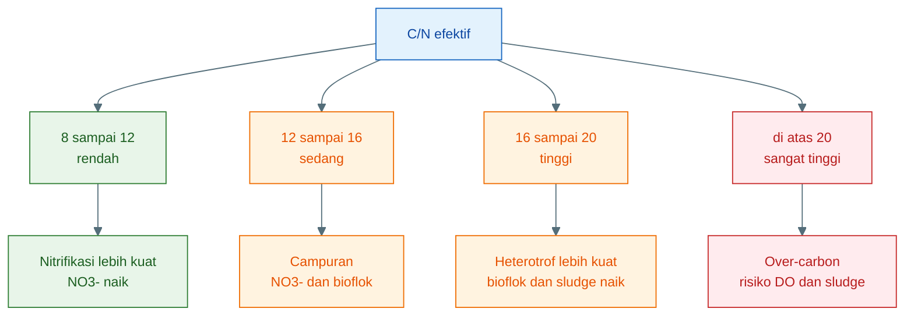
```mermaid id="rezim-cn-efektif"
%%{init: {'theme':'base','themeVariables':{
'primaryColor':'#E3F2FD',
'primaryTextColor':'#0D47A1',
'primaryBorderColor':'#1565C0',
'secondaryColor':'#E8F5E9',
'secondaryTextColor':'#1B5E20',
'secondaryBorderColor':'#2E7D32',
'tertiaryColor':'#FFF3E0',
'tertiaryTextColor':'#E65100',
'tertiaryBorderColor':'#EF6C00',
'lineColor':'#546E7A',
'fontSize':'13px'
}}}%%
flowchart TD
    A["C/N efektif"] --> B["8 sampai 12<br/>rendah"]
    A --> C["12 sampai 16<br/>sedang"]
    A --> D["16 sampai 20<br/>tinggi"]
    A --> E["di atas 20<br/>sangat tinggi"]

    B --> F["Nitrifikasi lebih kuat<br/>NO3- naik"]
    C --> G["Campuran<br/>NO3- dan bioflok"]
    D --> H["Heterotrof lebih kuat<br/>bioflok dan sludge naik"]
    E --> I["Over-carbon<br/>risiko DO dan sludge"]

    classDef root fill:#E3F2FD,stroke:#1565C0,color:#0D47A1;
    classDef aman fill:#E8F5E9,stroke:#2E7D32,color:#1B5E20;
    classDef sedang fill:#FFF3E0,stroke:#EF6C00,color:#E65100;
    classDef risiko fill:#FFEBEE,stroke:#C62828,color:#B71C1C;

    class A root;
    class B,F aman;
    class C,G sedang;
    class D,H sedang;
    class E,I risiko;
```

Diagram ini tidak dimaksudkan sebagai batas biologis kaku. Ini adalah batas operasional agar praktisi memiliki bahasa keputusan yang sama.

---

## 4.2. Jalur nitrogen pada `$C/N_{\text{efektif}}$` rendah

Pada `$C/N_{\text{efektif}}$` rendah, karbon efektif relatif terbatas. Kondisi ini tidak terlalu mendorong ledakan heterotrof, sehingga jalur nitrifikasi menjadi lebih terlihat.

Jalur dominan:

$$
TAN
\rightarrow
NO_2^-
\rightarrow
NO_3^-
$$

Produk dominan:

- nitrat;
- sludge lebih rendah;
- flok tidak berlebihan;
- kebutuhan karbon tambahan rendah;
- kebutuhan alkalinitas lebih penting karena nitrifikasi mengonsumsi alkalinitas.

### Konsekuensi teknis

| Parameter          | Kecenderungan pada `$C/N_{\text{efektif}}$` rendah |
| ------------------ | -------------------------------------------------- |
| `$TAN$`            | turun bila nitrifikasi matang                      |
| `$NO_2^-$`         | bisa muncul saat nitrifikasi belum lengkap         |
| `$NO_3^-$`         | lebih mudah terakumulasi                           |
| `$TSS$`            | lebih rendah                                       |
| Sludge             | lebih rendah                                       |
| `$O_2$` heterotrof | lebih rendah                                       |
| Alkalinitas        | lebih cepat terkonsumsi oleh nitrifikasi           |

Rezim ini cocok untuk:

- sistem aquaponik;
- sistem bioflok rendah sludge;
- sistem yang ingin menekan risiko `$DO$` drop akibat heterotrof;
- sistem yang menargetkan air lebih mudah dikontrol.

Namun ada konsekuensi penting:

> Pada `$C/N_{\text{efektif}}$` rendah, nitrogen lebih mudah berakhir sebagai nitrat. Maka nitrat harus punya jalur keluar: tanaman, pergantian air, denitrifikasi, atau strategi ekspor nitrogen lain.

### Diagram jalur `$C/N_{\text{efektif}}$` rendah

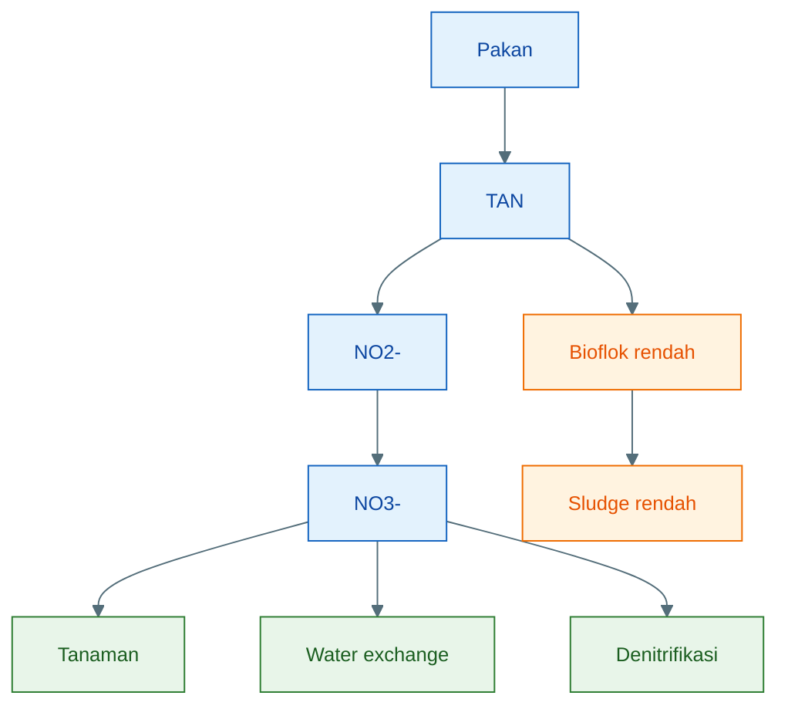
```mermaid id="jalur-cn-rendah"
%%{init: {'theme':'base','themeVariables':{
'primaryColor':'#E3F2FD',
'primaryTextColor':'#0D47A1',
'primaryBorderColor':'#1565C0',
'secondaryColor':'#E8F5E9',
'secondaryTextColor':'#1B5E20',
'secondaryBorderColor':'#2E7D32',
'tertiaryColor':'#FFF3E0',
'tertiaryTextColor':'#E65100',
'tertiaryBorderColor':'#EF6C00',
'lineColor':'#546E7A',
'fontSize':'13px'
}}}%%
flowchart TD
    A["Pakan"] --> B["TAN"]
    B --> C["NO2-"]
    C --> D["NO3-"]
    D --> E["Tanaman"]
    D --> F["Water exchange"]
    D --> G["Denitrifikasi"]

    B --> H["Bioflok rendah"]
    H --> I["Sludge rendah"]

    classDef nitrogen fill:#E3F2FD,stroke:#1565C0,color:#0D47A1;
    classDef keluar fill:#E8F5E9,stroke:#2E7D32,color:#1B5E20;
    classDef padatan fill:#FFF3E0,stroke:#EF6C00,color:#E65100;

    class A,B,C,D nitrogen;
    class E,F,G keluar;
    class H,I padatan;
```

---

## 4.3. Jalur nitrogen pada `$C/N_{\text{efektif}}$` sedang

Pada `$C/N_{\text{efektif}}$` sedang, sistem berada pada zona campuran. Sebagian nitrogen masuk ke jalur nitrifikasi, sebagian masuk ke biomassa mikroba.

Jalur pertama:

$$
TAN
\rightarrow
NO_2^-
\rightarrow
NO_3^-
$$

Jalur kedua:

$$
TAN
+
C_{\text{efektif}}
\rightarrow
Biomassa\ bakteri
\rightarrow
Bioflok
$$

Produk dominan:

- nitrat;
- bioflok;
- flok yang masih bisa dimanfaatkan ikan;
- sludge yang mulai perlu dikontrol.

### Konsekuensi teknis

| Parameter     | Kecenderungan pada `$C/N_{\text{efektif}}$` sedang |
| ------------- | -------------------------------------------------- |
| `$NO_3^-$`    | tetap terbentuk                                    |
| Bioflok       | mulai produktif                                    |
| `$TSS$`       | mulai naik                                         |
| Sludge        | perlu dipantau                                     |
| `$O_2$`       | meningkat dibanding rezim rendah                   |
| Risiko sistem | masih dapat dikontrol bila aerasi dan sludge baik  |

Rezim ini sering menjadi kompromi yang paling logis untuk nila bioflok, karena tidak terlalu miskin flok tetapi juga tidak terlalu berat dari sisi sludge dan oksigen.

Kalimat praktis:

> `$C/N_{\text{efektif}}$` sedang adalah zona kompromi: cukup flok, tetapi belum mendorong heterotrof berlebihan.

---

## 4.4. Jalur nitrogen pada `$C/N_{\text{efektif}}$` tinggi

Pada `$C/N_{\text{efektif}}$` tinggi, karbon efektif cukup besar untuk mendorong pertumbuhan heterotrof. Bakteri heterotrof mengambil `$TAN$` sebagai sumber nitrogen, lalu membentuk biomassa bakteri.

Jalur dominan:

$$
TAN
+
C_{\text{efektif}}
\rightarrow
Biomassa\ bakteri
\rightarrow
Bioflok
\rightarrow
Sludge
$$

Produk dominan:

- bioflok;
- `$TSS$`;
- sludge;
- kebutuhan `$O_2$`;
- produksi `$CO_2$`.

### 4.4.1. Mengapa `$TAN$` cepat turun pada `$C/N_{\text{efektif}}$` tinggi

Pada kondisi karbon efektif tinggi, bakteri heterotrof memiliki cukup energi dan kerangka karbon untuk tumbuh. Mereka memakai amonia sebagai sumber nitrogen sel.

Secara sederhana:

$$
TAN
+
C_{\text{efektif}}
+
O_2
\rightarrow
Biomassa\ bakteri
+
CO_2
+
H_2O
$$

Makna praktis:

> `$TAN$` turun karena nitrogen dikemas menjadi biomassa bakteri, bukan karena nitrogen hilang dari sistem.

Setelah itu, biomassa bakteri menjadi bagian dari bioflok.

$$
Biomassa\ bakteri
\rightarrow
Bioflok
$$

Jika bioflok dimakan ikan:

$$
Bioflok
\rightarrow
Biomassa\ ikan
$$

Jika tidak dimakan atau tidak dibuang:

$$
Bioflok
\rightarrow
Sludge
\rightarrow
TAN\ sekunder
$$

---

### 4.4.2. Beban tersembunyi pada `$C/N_{\text{efektif}}$` tinggi

`$C/N_{\text{efektif}}$` tinggi sering terlihat bagus pada awalnya karena `$TAN$` cepat turun. Namun sistem membayar dengan beban lain.

| Parameter             | Dampak pada `$C/N_{\text{efektif}}$` tinggi |
| --------------------- | ------------------------------------------- |
| `$TAN$`               | cenderung cepat turun                       |
| Bioflok               | naik                                        |
| `$TSS$`               | naik                                        |
| Sludge                | naik                                        |
| `$O_2$`               | naik                                        |
| `$CO_2$`              | naik                                        |
| `$DO_{\text{subuh}}$` | lebih rawan turun                           |
| Nitrat                | bisa lebih rendah relatif                   |
| Risiko bau            | naik bila sludge tidak dikontrol            |

Inilah inti engineering dari `$C/N$` tinggi:

> `$C/N_{\text{efektif}}$` tinggi tidak menghilangkan nitrogen. Ia memindahkan nitrogen dari fase terlarut menjadi fase partikulat.

### Diagram jalur `$C/N_{\text{efektif}}$` tinggi

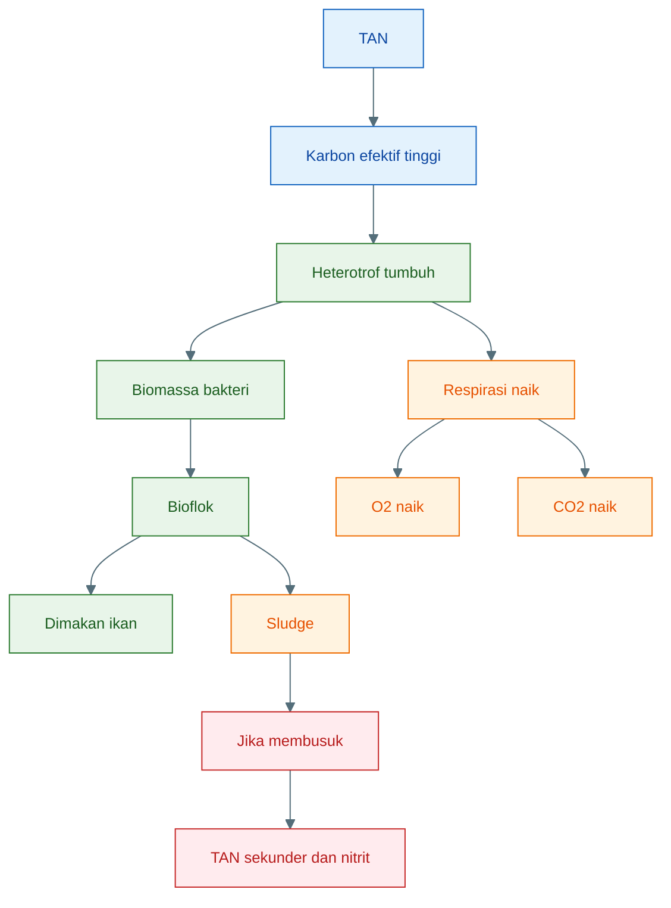
```mermaid id="jalur-cn-tinggi"
%%{init: {'theme':'base','themeVariables':{
'primaryColor':'#E3F2FD',
'primaryTextColor':'#0D47A1',
'primaryBorderColor':'#1565C0',
'secondaryColor':'#E8F5E9',
'secondaryTextColor':'#1B5E20',
'secondaryBorderColor':'#2E7D32',
'tertiaryColor':'#FFF3E0',
'tertiaryTextColor':'#E65100',
'tertiaryBorderColor':'#EF6C00',
'lineColor':'#546E7A',
'fontSize':'13px'
}}}%%
flowchart TD
    A["TAN"] --> B["Karbon efektif tinggi"]
    B --> C["Heterotrof tumbuh"]
    C --> D["Biomassa bakteri"]
    D --> E["Bioflok"]
    E --> F["Dimakan ikan"]
    E --> G["Sludge"]

    C --> H["Respirasi naik"]
    H --> I["O2 naik"]
    H --> J["CO2 naik"]

    G --> K["Jika membusuk"]
    K --> L["TAN sekunder dan nitrit"]

    classDef nitrogen fill:#E3F2FD,stroke:#1565C0,color:#0D47A1;
    classDef mikroba fill:#E8F5E9,stroke:#2E7D32,color:#1B5E20;
    classDef risiko fill:#FFF3E0,stroke:#EF6C00,color:#E65100;
    classDef bahaya fill:#FFEBEE,stroke:#C62828,color:#B71C1C;

    class A,B nitrogen;
    class C,D,E,F mikroba;
    class H,I,J,G risiko;
    class K,L bahaya;
```

---

## 4.5. Rezim sangat tinggi: risiko over-carbon

Rezim `$C/N_{\text{efektif}}$` sangat tinggi terjadi saat:

$$
C/N_{\text{efektif}}

>

20
$$

Dalam artikel ini, rentang tersebut tidak dijadikan target rutin. Alasannya bukan karena heterotrof tidak bekerja, tetapi karena risiko engineering meningkat.

Risiko utama:

| Risiko          | Penjelasan                                    |
| --------------- | --------------------------------------------- |
| Over-carbon     | karbon efektif melebihi kebutuhan             |
| `$DO$` turun    | respirasi mikroba tinggi                      |
| `$CO_2$` naik   | respirasi air meningkat                       |
| `$TSS$` naik    | bioflok terlalu pekat                         |
| Sludge naik     | biomassa mikroba tidak seluruhnya dimakan     |
| Bau             | sludge membusuk                               |
| Nitrit sekunder | sludge dapat menghasilkan `$TAN$` lalu nitrit |
| Flok tua        | flok kehilangan nilai pakan dan menjadi beban |

Kondisi over-carbon dapat ditulis:

$$
C_{\text{efektif,total}}

>

C_{\text{target}}
$$

Dengan:

$$
C_{\text{efektif,total}}
=

C_{\text{pakan,efektif}}
+
C_{\text{tambahan,efektif}}
+
C_{\text{organik lain,efektif}}
$$

Jika kondisi ini terjadi, tindakan yang lebih tepat bukan menambah karbon lagi, tetapi:

- kurangi atau hentikan karbon tambahan;
- cek `$DO_{\text{subuh}}$`;
- siphon sludge;
- evaluasi `$TSS$`;
- kurangi pakan sementara bila `$DO$` turun;
- tingkatkan aerasi dan mixing;
- ukur `$TAN$` dan nitrit.

---

## 4.6. Peran matahari

Matahari tetap penting dalam bioflok, tetapi bukan pengganti `$C/N$`.

Matahari memengaruhi:

- alga;
- fotosintesis;
- `$DO$` siang;
- konsumsi `$CO_2$` siang;
- kenaikan `$pH$` sore;
- respirasi malam;
- risiko `$DO$` subuh turun.

Namun matahari tidak menggantikan karbon efektif. Mikroba heterotrof tetap membutuhkan karbon organik efektif. Nitrifier tetap membutuhkan oksigen, alkalinitas, dan permukaan hidup.

### 4.6.1. Definisi kerja kelimpahan matahari

Agar tidak terlalu kualitatif, artikel ini memakai definisi kerja berikut.

| Kategori cahaya | Kondisi praktis                                                | Indikasi lapangan                 |
| --------------- | -------------------------------------------------------------- | --------------------------------- |
| Rendah          | paranet sekitar `$60\%$` sampai `$80\%$` atau kolam teduh kuat | air tidak cepat hijau             |
| Sedang          | paranet sekitar `$40\%$` sampai `$60\%$`                       | alga terkendali                   |
| Tinggi          | tanpa paranet atau paranet di bawah sekitar `$40\%$`           | air mudah hijau, `$pH$` sore naik |

Angka ini adalah angka kerja awal. Koreksi tetap memakai data lapangan:

| Parameter                |                             Target |
| ------------------------ | ---------------------------------: |
| Selisih `$pH$` pagi-sore |              ideal `$<0{,}5$` unit |
| `$pH$` sore              |           tidak melewati `$8{,}3$` |
| `$DO_{\text{subuh}}$`    |   `$>4$` sampai `$5 \text{ mg/L}$` |
| Air terlalu hijau        | tambah naungan dan kurangi nutrien |
| `$CO_2$` pagi            |   target umum `$<15 \text{ mg/L}$` |

---

## 4.7. Interaksi `$C/N_{\text{efektif}}$` dan matahari

Kombinasi `$C/N_{\text{efektif}}$` dan matahari menentukan komunitas mikroba yang lebih dominan.

| Kombinasi                                         | Risiko                                  |
| ------------------------------------------------- | --------------------------------------- |
| `$C/N_{\text{efektif}}$` rendah + matahari rendah | nitrifikasi dominan, stabil             |
| `$C/N_{\text{efektif}}$` rendah + matahari tinggi | alga naik                               |
| `$C/N_{\text{efektif}}$` tinggi + matahari rendah | flok dan sludge naik                    |
| `$C/N_{\text{efektif}}$` tinggi + matahari tinggi | heterotrof + alga, risiko `$DO$` tinggi |

### Diagram interaksi `$C/N_{\text{efektif}}$` dan matahari

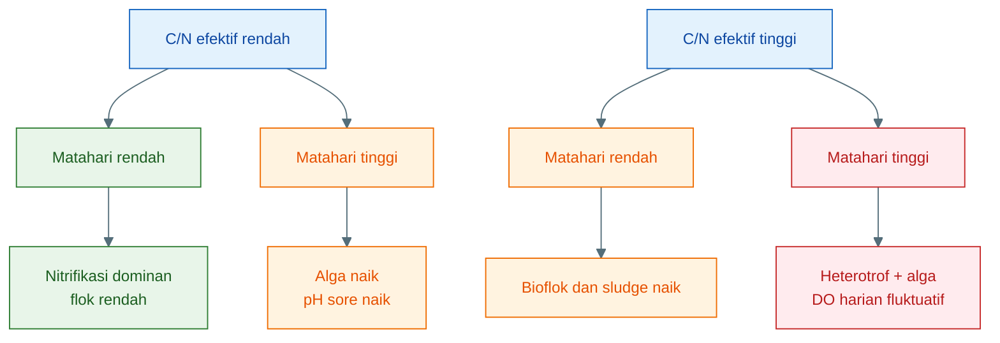
```mermaid id="interaksi-cn-matahari"
%%{init: {'theme':'base','themeVariables':{
'primaryColor':'#E3F2FD',
'primaryTextColor':'#0D47A1',
'primaryBorderColor':'#1565C0',
'secondaryColor':'#E8F5E9',
'secondaryTextColor':'#1B5E20',
'secondaryBorderColor':'#2E7D32',
'tertiaryColor':'#FFF3E0',
'tertiaryTextColor':'#E65100',
'tertiaryBorderColor':'#EF6C00',
'lineColor':'#546E7A',
'fontSize':'13px'
}}}%%
flowchart TD
    A["C/N efektif rendah"] --> B["Matahari rendah"]
    A --> C["Matahari tinggi"]
    D["C/N efektif tinggi"] --> E["Matahari rendah"]
    D --> F["Matahari tinggi"]

    B --> G["Nitrifikasi dominan<br/>flok rendah"]
    C --> H["Alga naik<br/>pH sore naik"]
    E --> I["Bioflok dan sludge naik"]
    F --> J["Heterotrof + alga<br/>DO harian fluktuatif"]

    classDef cn fill:#E3F2FD,stroke:#1565C0,color:#0D47A1;
    classDef aman fill:#E8F5E9,stroke:#2E7D32,color:#1B5E20;
    classDef waspada fill:#FFF3E0,stroke:#EF6C00,color:#E65100;
    classDef risiko fill:#FFEBEE,stroke:#C62828,color:#B71C1C;

    class A,D cn;
    class B,G aman;
    class C,H,E,I waspada;
    class F,J risiko;
```

Interpretasi:

- `$C/N_{\text{efektif}}$` rendah dan matahari rendah cenderung paling stabil untuk sistem nitrifikasi;
- `$C/N_{\text{efektif}}$` rendah dan matahari tinggi dapat mendorong alga;
- `$C/N_{\text{efektif}}$` tinggi dan matahari rendah mendorong bioflok tanpa banyak alga;
- `$C/N_{\text{efektif}}$` tinggi dan matahari tinggi dapat menciptakan dua beban sekaligus: heterotrof dan alga.

---

## 4.8. Hubungan flok dengan dominasi mikroba

Flok adalah hasil gabungan dari:

- bakteri heterotrof;
- bahan organik;
- mineral;
- lendir mikroba;
- plankton;
- sisa pakan halus;
- feses halus;
- biofilm yang lepas.

Pada `$C/N_{\text{efektif}}$` rendah, flok biasanya lebih sedikit. Pada `$C/N_{\text{efektif}}$` tinggi, flok meningkat karena bakteri heterotrof tumbuh cepat.

Namun flok tidak selalu positif.

| Kondisi flok       | Makna                                      |
| ------------------ | ------------------------------------------ |
| Flok cukup         | bisa menjadi pakan tambahan                |
| Flok terlalu pekat | `$TSS$` tinggi dan insang terganggu        |
| Flok tua           | nilai pakan turun dan sludge naik          |
| Flok tidak dimakan | menjadi beban oksigen                      |
| Flok mengendap     | menjadi sludge dan sumber `$TAN$` sekunder |

Kalimat penting:

> Flok adalah cadangan nitrogen dalam bentuk partikulat. Ia bermanfaat bila dimakan ikan atau dibuang, tetapi menjadi beban bila menua dan membusuk.

---

## 4.9. Diagram nasib flok

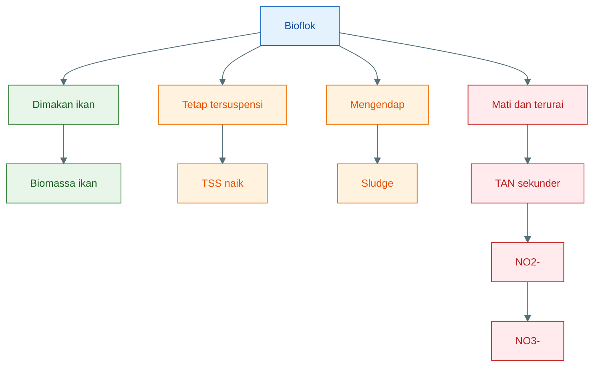
```mermaid id="nasib-flok-bioflok"
%%{init: {'theme':'base','themeVariables':{
'primaryColor':'#E3F2FD',
'primaryTextColor':'#0D47A1',
'primaryBorderColor':'#1565C0',
'secondaryColor':'#E8F5E9',
'secondaryTextColor':'#1B5E20',
'secondaryBorderColor':'#2E7D32',
'tertiaryColor':'#FFF3E0',
'tertiaryTextColor':'#E65100',
'tertiaryBorderColor':'#EF6C00',
'lineColor':'#546E7A',
'fontSize':'13px'
}}}%%
flowchart TD
    A["Bioflok"] --> B["Dimakan ikan"]
    A --> C["Tetap tersuspensi"]
    A --> D["Mengendap"]
    A --> E["Mati dan terurai"]

    B --> F["Biomassa ikan"]
    C --> G["TSS naik"]
    D --> H["Sludge"]
    E --> I["TAN sekunder"]
    I --> J["NO2-"]
    J --> K["NO3-"]

    classDef flok fill:#E3F2FD,stroke:#1565C0,color:#0D47A1;
    classDef manfaat fill:#E8F5E9,stroke:#2E7D32,color:#1B5E20;
    classDef risiko fill:#FFF3E0,stroke:#EF6C00,color:#E65100;
    classDef bahaya fill:#FFEBEE,stroke:#C62828,color:#B71C1C;

    class A flok;
    class B,F manfaat;
    class C,D,G,H risiko;
    class E,I,J,K bahaya;
```

Diagram ini menunjukkan bahwa bioflok bukan akhir dari nitrogen. Bioflok harus dimakan, dikelola, atau dibuang.

---

## 4.10. Pesan utama Bab 4

Mikroba tidak merespons karbon total di atas kertas, tetapi karbon efektif yang tersedia di air.

Rumus kunci:

$$
C/N_{\text{efektif}}
=

\frac{
C_{\text{pakan,efektif}}
+
C_{\text{tambahan,efektif}}
+
C_{\text{organik lain,efektif}}
}{
TAN_N
}
$$

Interpretasi rezim:

| `$C/N_{\text{efektif}}$` | Dominasi    | Risiko utama                 |
| -----------------------: | ----------- | ---------------------------- |
|      `$8$` sampai `$12$` | nitrifikasi | nitrat dan alkalinitas       |
|     `$12$` sampai `$16$` | campuran    | keseimbangan flok dan nitrat |
|     `$16$` sampai `$20$` | heterotrof  | `$O_2$`, `$TSS$`, sludge     |
|                  `$>20$` | over-carbon | `$DO$` drop, bau, flok tua   |

Pesan praktis:

> `$C/N_{\text{efektif}}$` rendah mengarahkan nitrogen ke nitrat. `$C/N_{\text{efektif}}$` tinggi mengarahkan nitrogen ke bioflok dan sludge. Matahari menggeser dominasi alga, tetapi tidak menggantikan peran karbon efektif.

Kalimat penutup Bab 4:

> Bioflok yang sehat bukan sekadar air cokelat. Bioflok yang sehat adalah hasil keseimbangan antara karbon efektif, nitrogen, oksigen, cahaya, flok yang dimakan, dan sludge yang dikelola.

[**Kembali ke Atas**](#cn-ratio-pada-bioflok-mengatur-mikroba-oksigen-dan-stabilitas-kolam-untuk-praktisi)

---

# Bab 5. `$C/N$` Ratio dan Kebutuhan Oksigen

Bab ini menjelaskan hubungan `$C/N_{\text{efektif}}$` dengan kebutuhan oksigen. Revisi penting pada bab ini adalah memasukkan **karbon pakan efektif** ke dalam model oksigen. Jadi, beban oksigen tidak hanya berasal dari molase atau karbon tambahan, tetapi juga dari karbon pakan, feses, sisa pakan, bioflok tua, dan sludge yang tersedia bagi mikroba.

Kalimat kunci bab ini:

> `$C/N_{\text{efektif}}$` tinggi dapat menurunkan `$TAN$`, tetapi menambah beban respirasi air. Maka keberhasilan menurunkan amonia harus selalu dibaca bersama `$DO$`, `$TSS$`, sludge, dan `$CO_2$`.

---

## 5.1. `$C/N$` tinggi menurunkan `$TAN$`, tetapi menaikkan beban respirasi

Pada `$C/N_{\text{efektif}}$` tinggi, bakteri heterotrof memiliki cukup karbon efektif untuk tumbuh cepat. Mereka mengambil `$TAN$` sebagai sumber nitrogen sel, lalu membentuk biomassa bakteri.

Alur sederhananya:

$$
TAN
+
C_{\text{efektif}}
+
O_2
\rightarrow
Biomassa\ bakteri
+
CO_2
+
H_2O
$$

Secara praktis:

```text id="l9pnn2"
C/N efektif tinggi
→ karbon efektif tersedia
→ heterotrof tumbuh cepat
→ TAN turun
→ biomassa bakteri naik
→ bioflok naik
→ TSS dan sludge naik
→ kebutuhan O2 naik
```

Jadi, `$TAN$` turun bukan berarti nitrogen hilang. Nitrogen berpindah menjadi biomassa bakteri dan bioflok.

$$
TAN
\rightarrow
Biomassa\ bakteri
\rightarrow
Bioflok
\rightarrow
Sludge
$$

Jika bioflok dimakan ikan, sebagian nitrogen masuk ke biomassa ikan. Jika bioflok tidak dimakan atau tidak dibuang, nitrogen dapat kembali menjadi beban kolam.

$$
Bioflok
\rightarrow
Sludge
\rightarrow
TAN_{\text{sekunder}}
\rightarrow
NO_2^-
$$

---

## 5.2. Diagram hubungan `$C/N_{\text{efektif}}$`, heterotrof, dan oksigen

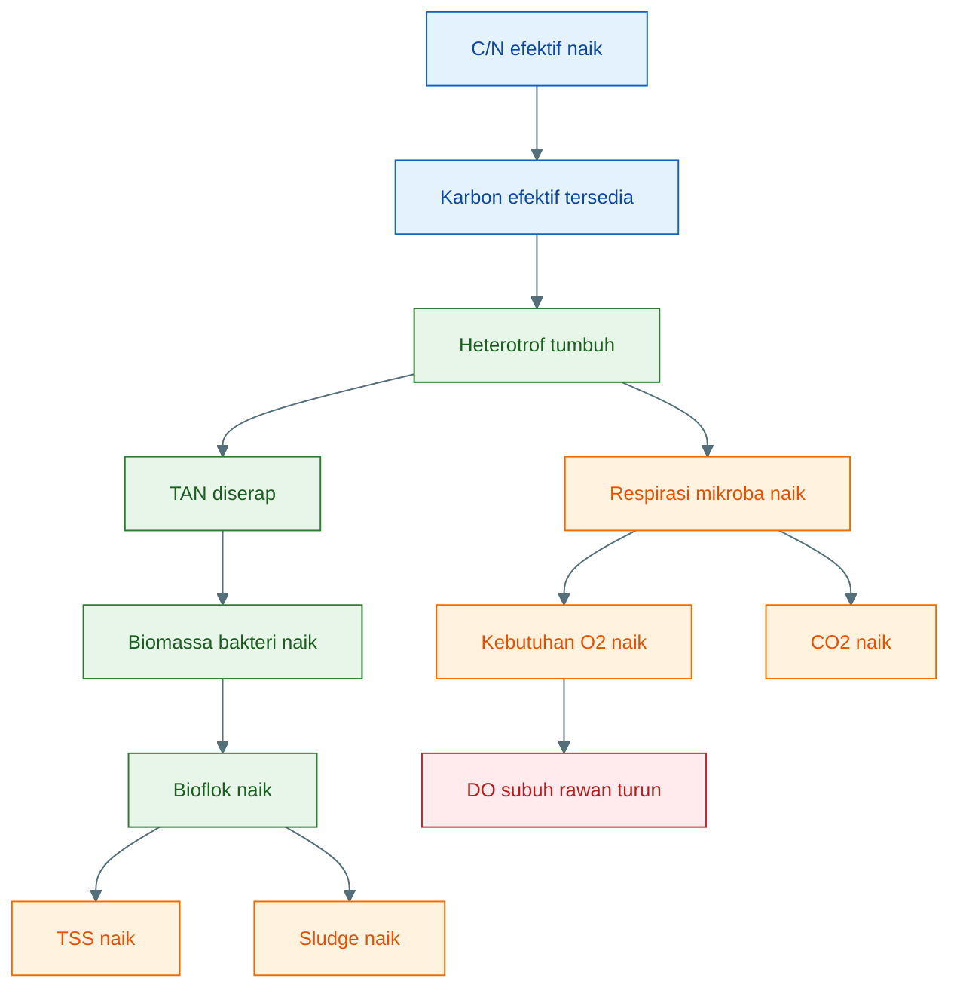
```mermaid id="cn-efektif-heterotrof-oksigen"
%%{init: {'theme':'base','themeVariables':{
'primaryColor':'#E3F2FD',
'primaryTextColor':'#0D47A1',
'primaryBorderColor':'#1565C0',
'secondaryColor':'#E8F5E9',
'secondaryTextColor':'#1B5E20',
'secondaryBorderColor':'#2E7D32',
'tertiaryColor':'#FFF3E0',
'tertiaryTextColor':'#E65100',
'tertiaryBorderColor':'#EF6C00',
'lineColor':'#546E7A',
'fontSize':'13px'
}}}%%
flowchart TD
    A["C/N efektif naik"] --> B["Karbon efektif tersedia"]
    B --> C["Heterotrof tumbuh"]
    C --> D["TAN diserap"]
    D --> E["Biomassa bakteri naik"]
    E --> F["Bioflok naik"]
    F --> G["TSS naik"]
    F --> H["Sludge naik"]

    C --> I["Respirasi mikroba naik"]
    I --> J["Kebutuhan O2 naik"]
    J --> K["DO subuh rawan turun"]
    I --> L["CO2 naik"]

    classDef cn fill:#E3F2FD,stroke:#1565C0,color:#0D47A1;
    classDef mikroba fill:#E8F5E9,stroke:#2E7D32,color:#1B5E20;
    classDef risiko fill:#FFF3E0,stroke:#EF6C00,color:#E65100;
    classDef bahaya fill:#FFEBEE,stroke:#C62828,color:#B71C1C;

    class A,B cn;
    class C,D,E,F mikroba;
    class G,H,I,J,L risiko;
    class K bahaya;
```

Diagram ini menunjukkan bahwa `$C/N_{\text{efektif}}$` tinggi memiliki dua sisi. Sisi positifnya adalah `$TAN$` dapat turun cepat. Sisi risikonya adalah kebutuhan oksigen, `$CO_2$`, `$TSS$`, dan sludge meningkat.

---

## 5.3. Dua lapis kebutuhan oksigen

Pada `$C/N_{\text{efektif}}$` tinggi, kebutuhan oksigen naik melalui dua lapis utama.

| Lapis   | Proses                               | Penjelasan                                                          |
| ------- | ------------------------------------ | ------------------------------------------------------------------- |
| Pertama | oksigen untuk pertumbuhan heterotrof | sebagian karbon dioksidasi untuk energi membentuk sel baru          |
| Kedua   | oksigen untuk respirasi bakteri baru | setelah bakteri bertambah, populasi baru tetap bernapas setiap saat |

### Lapis pertama: oksigen untuk pertumbuhan

Bakteri tidak hanya “menempelkan” amonia menjadi sel. Mereka membutuhkan energi. Energi itu diperoleh dengan mengoksidasi sebagian karbon organik.

$$
C_{\text{efektif}}
+
O_2
\rightarrow
CO_2
+
H_2O
+
Energi
$$

Energi tersebut dipakai untuk:

- mengambil `$TAN$`;
- membuat asam amino;
- membentuk protein mikroba;
- menggandakan DNA;
- membelah sel;
- membentuk biomassa bakteri baru.

### Lapis kedua: oksigen untuk respirasi populasi baru

Setelah bakteri baru terbentuk, bakteri itu tetap hidup dan bernapas.

$$
Biomassa\ bakteri
+
O_2
\rightarrow
CO_2
+
H_2O
+
Energi
$$

Artinya, semakin besar biomassa mikroba di kolam, semakin besar pula oksigen yang dibutuhkan untuk mempertahankan komunitas mikroba tersebut.

Kalimat praktis:

> Pada `$C/N_{\text{efektif}}$` tinggi, oksigen dipakai untuk membuat bakteri baru dan juga untuk menghidupi bakteri baru itu setelah terbentuk.

---

## 5.4. Karbon pakan juga menyumbang beban oksigen

Beban oksigen tidak boleh dihitung hanya dari molase. Pakan juga menyumbang karbon efektif.

Karbon efektif total:

$$
C_{\text{efektif,total}}
=

C_{\text{pakan,efektif}}
+
C_{\text{tambahan,efektif}}
+
C_{\text{organik lain,efektif}}
$$

Keterangan:

| Komponen                            | Contoh sumber                                                    |
| ----------------------------------- | ---------------------------------------------------------------- |
| `$C_{\text{pakan,efektif}}$`        | feses halus, sisa pakan, karbon pakan yang tersedia bagi mikroba |
| `$C_{\text{tambahan,efektif}}$`     | molase, gula, tapioka, sumber karbon eksternal                   |
| `$C_{\text{organik lain,efektif}}$` | bioflok tua, sludge teraduk, alga mati, biofilm lepas            |

Jika karbon pakan efektif diabaikan, maka model oksigen akan terlalu ringan pada sumber karbon internal, tetapi dosis karbon tambahan bisa terlalu besar. Dampaknya:

$$
C_{\text{efektif,total}}
\text{ naik}
\Rightarrow
Respirasi\ mikroba
\text{ naik}
\Rightarrow
O_2
\text{ naik}
$$

---

## 5.5. Model oksigen baru

Model oksigen yang lebih lengkap adalah:

$$
O_{2,\text{total}}
=

O_{2,\text{ikan}}
+
O_{2,\text{nitrifikasi}}
+
O_{2,\text{heterotrof}}
+
O_{2,\text{flok}}
+
O_{2,\text{sludge}}
+
O_{2,\text{alga malam}}
$$

Keterangan:

| Komponen                     | Makna                                         |
| ---------------------------- | --------------------------------------------- |
| `$O_{2,\text{ikan}}$`        | respirasi ikan                                |
| `$O_{2,\text{nitrifikasi}}$` | oksigen untuk mengubah `$TAN$` menjadi nitrat |
| `$O_{2,\text{heterotrof}}$`  | oksigen untuk pertumbuhan bakteri heterotrof  |
| `$O_{2,\text{flok}}$`        | respirasi biomassa flok                       |
| `$O_{2,\text{sludge}}$`      | penguraian padatan organik                    |
| `$O_{2,\text{alga malam}}$`  | respirasi alga pada malam hari                |

Model ini lebih realistis dibanding model yang hanya menghitung nitrifikasi atau molase.

---

## 5.6. Oksigen untuk nitrifikasi

Jika sebagian `$TAN_N$` masuk jalur nitrifikasi, kebutuhan oksigen nitrifikasi dihitung:

$$
O_{2,\text{nitrifikasi}}
=

TAN_N
\times
f_{\text{nitrifikasi}}
\times
4{,}57
$$

Keterangan:

| Simbol                     | Makna                                       |
| -------------------------- | ------------------------------------------- |
| `$TAN_N$`                  | nitrogen amonia total sebagai N             |
| `$f_{\text{nitrifikasi}}$` | fraksi `$TAN_N$` yang masuk nitrifikasi     |
| `$4{,}57$`                 | g `$O_2$` per g `$TAN_N$` untuk nitrifikasi |

Jika `$TAN_N$` dalam gram per hari, maka `$O_{2,\text{nitrifikasi}}$` dalam gram `$O_2$` per hari.

Pada `$C/N_{\text{efektif}}$` rendah, nilai `$f_{\text{nitrifikasi}}$` biasanya lebih besar. Pada `$C/N_{\text{efektif}}$` tinggi, sebagian nitrogen berpindah ke jalur heterotrof sehingga `$f_{\text{nitrifikasi}}$` dapat lebih kecil.

Namun nitrifikasi tidak hilang sepenuhnya.

---

## 5.7. Oksigen untuk heterotrof

Pada jalur heterotrof:

$$
TAN
+
C_{\text{efektif}}
+
O_2
\rightarrow
Biomassa\ bakteri
+
CO_2
+
H_2O
$$

Untuk model praktis, oksigen heterotrof dapat dipisahkan menjadi dua bagian:

$$
O_{2,\text{heterotrof}}
=

O_{2,\text{pertumbuhan}}
+
O_{2,\text{karbon berlebih}}
$$

### 5.7.1. Oksigen pertumbuhan heterotrof

Oksigen pertumbuhan heterotrof berkaitan dengan jumlah nitrogen yang diasimilasi menjadi biomassa bakteri.

$$
TAN_{N,\text{heterotrof}}
=

TAN_N
\times
f_{\text{heterotrof}}
$$

Dengan:

$$
f_{\text{heterotrof}}
=

1

f_{\text{nitrifikasi}}
$$

Model kerja sederhana:

$$
O_{2,\text{pertumbuhan}}
=

TAN_{N,\text{heterotrof}}
\times
K_{\text{heterotrof}}
$$

Keterangan:

| Simbol                        | Makna                                           |
| ----------------------------- | ----------------------------------------------- |
| `$TAN_{N,\text{heterotrof}}$` | bagian `$TAN_N$` yang masuk biomassa heterotrof |
| `$K_{\text{heterotrof}}$`     | koefisien oksigen jalur heterotrof              |
| `$O_{2,\text{pertumbuhan}}$`  | oksigen untuk pertumbuhan heterotrof            |

Nilai kerja awal:

$$
K_{\text{heterotrof}}
=

4{,}71
\text{ g } O_2 \text{ per g } TAN_N
$$

Catatan:

> Angka ini adalah pendekatan stoikiometri. Dalam kolam nyata, nilai aktual dipengaruhi jenis karbon, umur flok, suhu, mixing, dan jumlah padatan.

---

### 5.7.2. Oksigen untuk karbon berlebih

Over-carbon terjadi bila karbon efektif total melebihi karbon target.

Karbon target:

$$
C_{\text{target}}
=

(C/N)_{\text{target}}
\times
TAN_N
$$

Karbon berlebih:

$$
C_{\text{berlebih}}
=

\max
\left(
0,
C_{\text{efektif,total}}
------------------------

C_{\text{target}}
\right)
$$

Oksigen untuk oksidasi karbon berlebih:

$$
O_{2,\text{karbon berlebih}}
=

C_{\text{berlebih}}
\times
2{,}67
\times
\phi
$$

Keterangan:

| Simbol                           | Makna                                                           |
| -------------------------------- | --------------------------------------------------------------- |
| `$C_{\text{berlebih}}$`          | karbon efektif yang melebihi target                             |
| `$2{,}67$`                       | g `$O_2$` untuk mengoksidasi `$1 \text{ g C}$` menjadi `$CO_2$` |
| `$\phi$`                         | fraksi karbon berlebih yang teroksidasi dalam periode hitung    |
| `$O_{2,\text{karbon berlebih}}$` | oksigen untuk karbon berlebih                                   |

Nilai kerja awal:

$$
\phi
=

0{,}20
\text{ sampai }
0{,}60
$$

Untuk sistem sangat aktif, nilai `$\phi$` dapat lebih tinggi.

---

## 5.8. Oksigen untuk flok dan sludge

Saat heterotrof tumbuh, biomassa bakteri dan bioflok naik. Flok ini tetap bernapas. Sludge juga mengonsumsi oksigen saat terurai.

Produksi flok dapat diperkirakan:

$$
VSS_{\text{baru}}
=

TAN_{N,\text{heterotrof}}
\times
Y_{\text{VSS}}
$$

Nilai kerja:

$$
Y_{\text{VSS}}
=

8{,}07
\text{ g VSS per g } TAN_N
$$

Respirasi flok:

$$
O_{2,\text{flok}}
=

VSS_{\text{baru}}
\times
k_{\text{flok}}
$$

Nilai kerja awal:

$$
k_{\text{flok}}
=

0{,}05
\text{ sampai }
0{,}15
\text{ g } O_2
\text{ per g VSS per hari}
$$

Oksigen sludge dapat dimodelkan sederhana:

$$
O_{2,\text{sludge}}
=

Sludge_{\text{organik}}
\times
k_{\text{sludge}}
$$

Keterangan:

| Simbol                      | Makna                                      |
| --------------------------- | ------------------------------------------ |
| `$Sludge_{\text{organik}}$` | massa sludge organik aktif                 |
| `$k_{\text{sludge}}$`       | koefisien respirasi atau penguraian sludge |

Jika sludge tidak diukur, gunakan indikator lapangan:

- dasar mulai hitam;
- bau asam atau busuk;
- flok mengendap;
- `$DO_{\text{subuh}}$` turun;
- `$TAN$` atau nitrit muncul kembali.

---

## 5.9. Over-carbon

Over-carbon terjadi bila:

$$
C_{\text{efektif,total}}

>

(C/N)_{\text{target}}
\times
TAN_N
$$

atau:

$$
C_{\text{efektif,total}}

>

C_{\text{target}}
$$

Dampaknya:

- `$TSS$` naik;
- sludge naik;
- `$DO_{\text{subuh}}$` turun;
- `$CO_2$` naik;
- busa mudah muncul;
- bau mudah muncul;
- flok tua meningkat;
- nitrit sekunder dapat muncul dari sludge.

### Diagram over-carbon

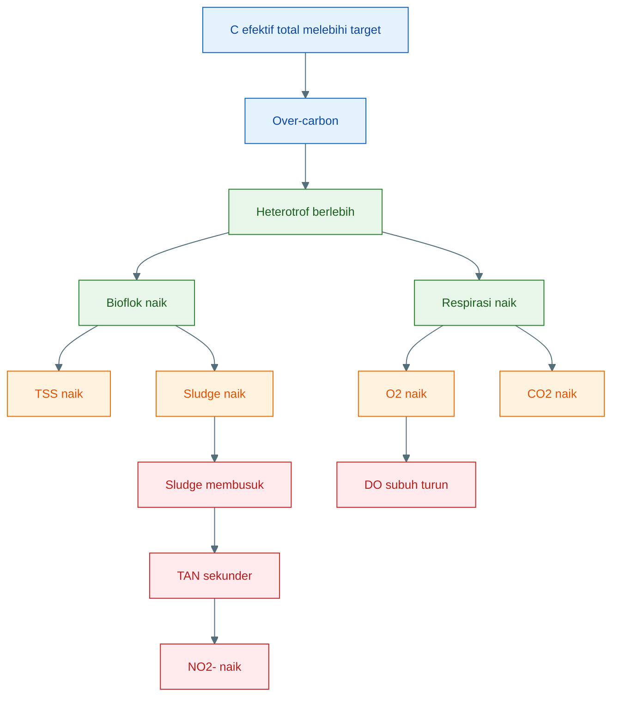
```mermaid id="over-carbon-oksigen"
%%{init: {'theme':'base','themeVariables':{
'primaryColor':'#E3F2FD',
'primaryTextColor':'#0D47A1',
'primaryBorderColor':'#1565C0',
'secondaryColor':'#E8F5E9',
'secondaryTextColor':'#1B5E20',
'secondaryBorderColor':'#2E7D32',
'tertiaryColor':'#FFF3E0',
'tertiaryTextColor':'#E65100',
'tertiaryBorderColor':'#EF6C00',
'lineColor':'#546E7A',
'fontSize':'13px'
}}}%%
flowchart TD
    A["C efektif total melebihi target"] --> B["Over-carbon"]
    B --> C["Heterotrof berlebih"]
    C --> D["Bioflok naik"]
    D --> E["TSS naik"]
    D --> F["Sludge naik"]

    C --> G["Respirasi naik"]
    G --> H["O2 naik"]
    H --> I["DO subuh turun"]
    G --> J["CO2 naik"]

    F --> K["Sludge membusuk"]
    K --> L["TAN sekunder"]
    L --> M["NO2- naik"]

    classDef awal fill:#E3F2FD,stroke:#1565C0,color:#0D47A1;
    classDef proses fill:#E8F5E9,stroke:#2E7D32,color:#1B5E20;
    classDef risiko fill:#FFF3E0,stroke:#EF6C00,color:#E65100;
    classDef bahaya fill:#FFEBEE,stroke:#C62828,color:#B71C1C;

    class A,B awal;
    class C,D,G proses;
    class E,F,H,J risiko;
    class I,K,L,M bahaya;
```

Kalimat praktis:

> Over-carbon bukan hanya masalah air menjadi pekat. Over-carbon adalah masalah oksigen, `$CO_2$`, sludge, dan stabilitas nitrogen.

---

## 5.10. Grafik konseptual kebutuhan oksigen terhadap `$C/N_{\text{efektif}}$`

Karena beberapa renderer membuat `xychart-beta` sulit terbaca, grafik berikut memakai format `flowchart` agar stabil di MDX dan nyaman dibaca di HP.

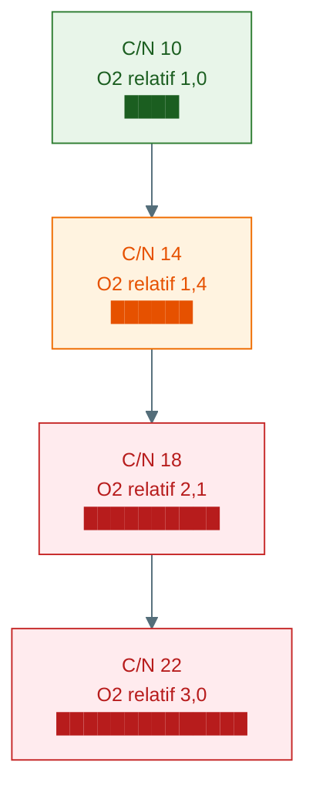
```mermaid id="grafik-oksigen-vs-cn-efektif"
%%{init: {'theme':'base','themeVariables':{
'primaryColor':'#E3F2FD',
'primaryTextColor':'#0D47A1',
'primaryBorderColor':'#1565C0',
'secondaryColor':'#E8F5E9',
'secondaryTextColor':'#1B5E20',
'secondaryBorderColor':'#2E7D32',
'tertiaryColor':'#FFF3E0',
'tertiaryTextColor':'#E65100',
'tertiaryBorderColor':'#EF6C00',
'lineColor':'#546E7A',
'fontSize':'13px'
}}}%%
flowchart TD
    A["C/N 10<br/>O2 relatif 1,0<br/>████"]
    B["C/N 14<br/>O2 relatif 1,4<br/>██████"]
    C["C/N 18<br/>O2 relatif 2,1<br/>██████████"]
    D["C/N 22<br/>O2 relatif 3,0<br/>██████████████"]

    A --> B --> C --> D

    classDef rendah fill:#E8F5E9,stroke:#2E7D32,color:#1B5E20;
    classDef sedang fill:#FFF3E0,stroke:#EF6C00,color:#E65100;
    classDef tinggi fill:#FFEBEE,stroke:#C62828,color:#B71C1C;

    class A rendah;
    class B sedang;
    class C,D tinggi;
```

Makna grafik:

| `$C/N_{\text{efektif}}$` | Kebutuhan `$O_2$` relatif | Interpretasi                           |
| -----------------------: | ------------------------: | -------------------------------------- |
|                   `$10$` |                 `$1{,}0$` | nitrifikasi lebih dominan, flok rendah |
|                   `$14$` |                 `$1{,}4$` | campuran, flok mulai naik              |
|                   `$18$` |                 `$2{,}1$` | heterotrof kuat, `$O_2$` naik          |
|                   `$22$` |                 `$3{,}0$` | over-carbon, risiko tinggi             |

Catatan:

> Angka `$O_2$` relatif di atas adalah grafik konseptual untuk membaca arah risiko, bukan angka desain aerator final. Kapasitas aerasi tetap harus dihitung dari biomassa ikan, pakan, `$TSS$`, sludge, suhu, dan target `$DO$`.

---

## 5.11. Hubungan `$C/N_{\text{efektif}}$`, `$DO$`, dan `$CO_2$`

Ketika respirasi mikroba naik, dua hal terjadi sekaligus:

$$
O_2
\text{ dikonsumsi}
$$

dan:

$$
CO_2
\text{ diproduksi}
$$

Jadi pada `$C/N_{\text{efektif}}$` tinggi, masalah tidak hanya `$DO$` turun. `$CO_2$` juga dapat naik, terutama malam sampai subuh.

Dampaknya:

| Parameter             | Dampak                                      |
| --------------------- | ------------------------------------------- |
| `$DO_{\text{subuh}}$` | turun                                       |
| `$CO_2$` pagi         | naik                                        |
| `$pH$` pagi           | cenderung turun                             |
| ikan                  | megap-megap walau siang tampak normal       |
| nitrifikasi           | bisa terganggu bila `$DO$` dan `$pH$` turun |
| sludge                | makin berisiko anaerob                      |

Kalimat penting:

> Pada `$C/N_{\text{efektif}}$` tinggi, ukur `$DO$` subuh. `$DO$` siang tidak cukup untuk menilai keamanan oksigen.

---

## 5.12. Kesalahan umum dalam membaca oksigen pada `$C/N$` tinggi

| Kesalahan                                 | Dampak                                         |
| ----------------------------------------- | ---------------------------------------------- |
| Menganggap `$TAN$` turun berarti aman     | mengabaikan beban `$O_2$`, `$TSS$`, dan sludge |
| Menghitung oksigen hanya dari nitrifikasi | beban heterotrof terlewat                      |
| Menghitung oksigen hanya dari molase      | karbon pakan efektif terlewat                  |
| Tidak mengukur `$DO_{\text{subuh}}$`      | risiko malam tidak terbaca                     |
| Tidak mengukur sludge                     | sumber respirasi tersembunyi                   |
| Menambah karbon saat `$DO$` rendah        | risiko `$DO$` drop semakin besar               |
| Tidak membuang flok tua                   | respirasi dan sludge meningkat                 |

---

## 5.13. SOP oksigen sebelum menambah karbon

Sebelum menambah molase atau karbon lain, gunakan SOP berikut:

```text id="sop-oksigen-sebelum-karbon"
1. Hitung TAN-N.
2. Hitung C pakan efektif.
3. Hitung C organik lain efektif bila ada.
4. Hitung C target.
5. Hitung C defisit.
6. Cek DO subuh.
7. Cek TSS atau settleable solids.
8. Cek sludge.
9. Jika DO rendah, jangan tambah karbon dulu.
10. Jika sludge tinggi, siphon dulu.
11. Jika C defisit benar-benar ada, baru tambah karbon bertahap.
```

Diagram SOP:

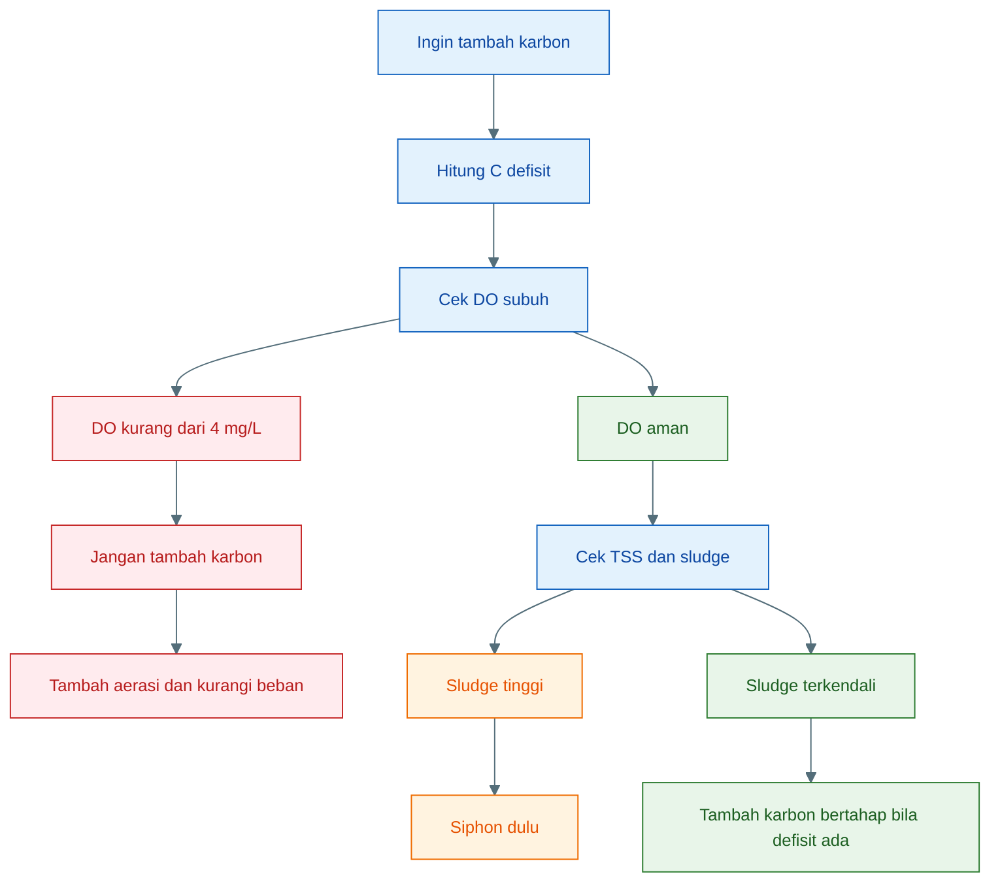
```mermaid id="sop-karbon-oksigen"
%%{init: {'theme':'base','themeVariables':{
'primaryColor':'#E3F2FD',
'primaryTextColor':'#0D47A1',
'primaryBorderColor':'#1565C0',
'secondaryColor':'#E8F5E9',
'secondaryTextColor':'#1B5E20',
'secondaryBorderColor':'#2E7D32',
'tertiaryColor':'#FFF3E0',
'tertiaryTextColor':'#E65100',
'tertiaryBorderColor':'#EF6C00',
'lineColor':'#546E7A',
'fontSize':'13px'
}}}%%
flowchart TD
    A["Ingin tambah karbon"] --> B["Hitung C defisit"]
    B --> C["Cek DO subuh"]
    C --> D["DO kurang dari 4 mg/L"]
    C --> E["DO aman"]

    D --> F["Jangan tambah karbon"]
    F --> G["Tambah aerasi dan kurangi beban"]

    E --> H["Cek TSS dan sludge"]
    H --> I["Sludge tinggi"]
    H --> J["Sludge terkendali"]

    I --> K["Siphon dulu"]
    J --> L["Tambah karbon bertahap bila defisit ada"]

    classDef input fill:#E3F2FD,stroke:#1565C0,color:#0D47A1;
    classDef aman fill:#E8F5E9,stroke:#2E7D32,color:#1B5E20;
    classDef risiko fill:#FFF3E0,stroke:#EF6C00,color:#E65100;
    classDef bahaya fill:#FFEBEE,stroke:#C62828,color:#B71C1C;

    class A,B,C,H input;
    class E,J,L aman;
    class I,K risiko;
    class D,F,G bahaya;
```

---

## 5.14. Pesan utama Bab 5

Model oksigen tidak boleh hanya menghitung molase. Pakan juga menyumbang karbon efektif, sehingga ikut menyumbang respirasi mikroba.

Rumus utama Bab 5:

$$
C_{\text{efektif,total}}
=

C_{\text{pakan,efektif}}
+
C_{\text{tambahan,efektif}}
+
C_{\text{organik lain,efektif}}
$$

$$
O_{2,\text{total}}
=

O_{2,\text{ikan}}
+
O_{2,\text{nitrifikasi}}
+
O_{2,\text{heterotrof}}
+
O_{2,\text{flok}}
+
O_{2,\text{sludge}}
+
O_{2,\text{alga malam}}
$$

Over-carbon terjadi bila:

$$
C_{\text{efektif,total}}

>

(C/N)_{\text{target}}
\times
TAN_N
$$

Pesan praktis:

> `$C/N_{\text{efektif}}$` tinggi dapat menjadi alat untuk menurunkan `$TAN$`, tetapi juga menciptakan populasi bakteri baru yang terus bernapas. Karena itu, semakin tinggi `$C/N_{\text{efektif}}$`, semakin penting aerasi, kontrol `$TSS$`, pembuangan sludge, dan pengukuran `$DO_{\text{subuh}}$`.

[**Kembali ke Atas**](#cn-ratio-pada-bioflok-mengatur-mikroba-oksigen-dan-stabilitas-kolam-untuk-praktisi)

---

# Bab 6. Strategi Operasional `$C/N$` Rendah, Sedang, dan Tinggi

Bab ini menjadi panduan lapangan. Setelah Bab 1 sampai Bab 5 meluruskan definisi `$C/N_{\text{efektif}}$`, bab ini menerjemahkannya menjadi strategi operasional.

Prinsip paling penting:

```text id="prinsip-dasar-cn"
Jangan menambah karbon sebelum menghitung karbon pakan efektif.
```

Karbon tambahan bukan titik awal. Karbon tambahan adalah **hasil akhir dari perhitungan defisit karbon**.

---

## 6.1. Prinsip dasar

Sebelum menambah molase, gula, tapioka, dedak, atau sumber karbon lain, praktisi harus menghitung tiga hal:

1. berapa `$TAN_N$` yang harus dikendalikan;
2. berapa `$C_{\text{pakan,efektif}}$` yang sudah tersedia;
3. berapa defisit karbon terhadap target `$C/N_{\text{efektif}}$`.

Formula dasarnya:

$$
C_{\text{target}}
=

(C/N)_{\text{target}}
\times
TAN_N
$$

Karbon efektif yang sudah tersedia:

$$
C_{\text{tersedia}}
=

C_{\text{pakan,efektif}}
+
C_{\text{organik lain,efektif}}
$$

Defisit karbon:

$$
C_{\text{defisit}}
=

\max
\left(
0,
C_{\text{target}}
-----------------

C_{\text{tersedia}}
\right)
$$

Kebutuhan bahan karbon tambahan:

$$
Bahan_{\text{karbon}}
=

\frac{
C_{\text{defisit}}
}{
f_{C,\text{sumber}}
\times
\eta_{C,\text{sumber}}
}
$$

Maknanya:

> Dosis molase bukan `$C_{\text{target}}$`. Dosis molase dihitung dari `$C_{\text{defisit}}$`, yaitu kekurangan karbon setelah karbon pakan efektif diperhitungkan.

---

## 6.2. Diagram strategi umum `$C/N_{\text{efektif}}$`

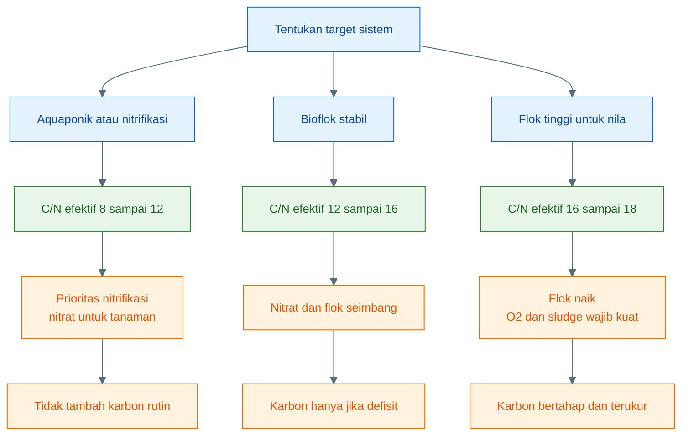
```mermaid id="strategi-umum-cn-efektif"
%%{init: {'theme':'base','themeVariables':{
'primaryColor':'#E3F2FD',
'primaryTextColor':'#0D47A1',
'primaryBorderColor':'#1565C0',
'secondaryColor':'#E8F5E9',
'secondaryTextColor':'#1B5E20',
'secondaryBorderColor':'#2E7D32',
'tertiaryColor':'#FFF3E0',
'tertiaryTextColor':'#E65100',
'tertiaryBorderColor':'#EF6C00',
'lineColor':'#546E7A',
'fontSize':'13px'
}}}%%
flowchart TD
    A["Tentukan target sistem"] --> B["Aquaponik atau nitrifikasi"]
    A --> C["Bioflok stabil"]
    A --> D["Flok tinggi untuk nila"]

    B --> E["C/N efektif 8 sampai 12"]
    C --> F["C/N efektif 12 sampai 16"]
    D --> G["C/N efektif 16 sampai 18"]

    E --> H["Prioritas nitrifikasi<br/>nitrat untuk tanaman"]
    F --> I["Nitrat dan flok seimbang"]
    G --> J["Flok naik<br/>O2 dan sludge wajib kuat"]

    H --> K["Tidak tambah karbon rutin"]
    I --> L["Karbon hanya jika defisit"]
    J --> M["Karbon bertahap dan terukur"]

    classDef target fill:#E3F2FD,stroke:#1565C0,color:#0D47A1;
    classDef cn fill:#E8F5E9,stroke:#2E7D32,color:#1B5E20;
    classDef aksi fill:#FFF3E0,stroke:#EF6C00,color:#E65100;

    class A,B,C,D target;
    class E,F,G cn;
    class H,I,J,K,L,M aksi;
```

Diagram ini menegaskan bahwa target `$C/N_{\text{efektif}}$` harus mengikuti tujuan sistem, bukan mengikuti kebiasaan menambah molase.

---

## 6.3. Strategi `$C/N_{\text{efektif}}$` rendah

Target:

$$
C/N_{\text{efektif}}
=

8
\text{ sampai }
12
$$

Rezim ini mengarahkan nitrogen lebih banyak ke jalur nitrifikasi:

$$
TAN
\rightarrow
NO_2^-
\rightarrow
NO_3^-
$$

### Cocok untuk

- aquaponik;
- RAS nitrifikasi;
- bioflok rendah sludge;
- sistem hemat oksigen;
- sistem yang ingin menjaga `$TSS$` lebih rendah;
- sistem yang ingin menghindari ledakan heterotrof.

### Strategi utama

| Komponen        | Strategi                                                 |
| --------------- | -------------------------------------------------------- |
| Karbon tambahan | tidak menambah molase rutin                              |
| Nitrifikasi     | diperkuat melalui aerasi, alkalinitas, dan seeding       |
| Alkalinitas     | dijaga stabil                                            |
| Sludge          | dibuang ringan tetapi rutin                              |
| Matahari        | dikendalikan agar alga tidak berlebihan                  |
| Nitrat          | diarahkan ke tanaman, water exchange, atau denitrifikasi |

### Parameter yang harus dipantau

| Parameter             |                             Target operasional |
| --------------------- | ---------------------------------------------: |
| `$DO_{\text{subuh}}$` |     `$4$` sampai `$5 \text{ mg/L}$` atau lebih |
| Alkalinitas           | `$150$` sampai `$200 \text{ mg/L as } CaCO_3$` |
| `$TAN$`               |                                  dijaga rendah |
| `$NO_2^-$`            |                         dipantau saat start-up |
| `$NO_3\text{-}N$`     |                     dipantau sebagai akumulasi |
| `$TSS$`               |                            tidak terlalu pekat |
| Sludge                |                   tidak hitam dan tidak berbau |

### Kelebihan

| Kelebihan                          | Penjelasan                                          |
| ---------------------------------- | --------------------------------------------------- |
| Kebutuhan `$O_2$` lebih terkendali | tidak ada ledakan heterotrof akibat karbon berlebih |
| Sludge lebih rendah                | bioflok tidak terlalu pekat                         |
| Cocok untuk aquaponik              | nitrat tersedia untuk tanaman                       |
| Sistem lebih mudah dibaca          | jalur nitrogen dominan adalah nitrifikasi           |
| Risiko over-carbon rendah          | karena karbon tambahan tidak rutin                  |

### Kekurangan

| Kekurangan                                | Mitigasi                                            |
| ----------------------------------------- | --------------------------------------------------- |
| Flok sebagai pakan tambahan lebih sedikit | jangan memaksa air terlalu pekat                    |
| Nitrat bisa menumpuk                      | gunakan tanaman, water exchange, atau denitrifikasi |
| Nitrifier tumbuh lambat                   | persiapan sistem lebih lama                         |
| Alkalinitas cepat terkonsumsi             | buffer rutin berbasis data                          |
| Nitrit bisa muncul saat start-up          | proteksi `$Cl^-$`, aerasi, dan alkalinitas          |

Kalimat praktis:

> `$C/N_{\text{efektif}}$` rendah bukan sistem tanpa karbon. Karbon tetap masuk dari pakan. Yang dikurangi adalah karbon tambahan rutin.

---

## 6.4. Strategi `$C/N_{\text{efektif}}$` sedang

Target:

$$
C/N_{\text{efektif}}
=

12
\text{ sampai }
16
$$

Rezim ini adalah zona campuran. Sebagian nitrogen masuk nitrifikasi, sebagian masuk bioflok.

Jalur pertama:

$$
TAN
\rightarrow
NO_2^-
\rightarrow
NO_3^-
$$

Jalur kedua:

$$
TAN
+
C_{\text{efektif}}
\rightarrow
Bioflok
$$

### Cocok untuk

- fase transisi;
- pembesaran nila;
- sistem yang ingin flok cukup tetapi tidak berlebihan;
- bioflok praktis dengan risiko oksigen yang masih dapat dikontrol;
- sistem tanpa tanaman tetapi masih ingin menekan nitrat sebagian.

### Strategi utama

| Komponen        | Strategi                                  |
| --------------- | ----------------------------------------- |
| Karbon tambahan | hanya bila `$C_{\text{defisit}}$` positif |
| Pakan           | naik bertahap mengikuti kapasitas air     |
| `$DO$`          | dipantau subuh                            |
| `$TSS$`         | dijaga agar flok tidak terlalu pekat      |
| Sludge          | siphon rutin                              |
| Nitrat          | tetap dipantau                            |
| Nitrit          | dipantau saat perubahan pakan atau karbon |

### Cara menentukan perlu tidaknya karbon tambahan

Hitung:

$$
C_{\text{target}}
=

(C/N)_{\text{target}}
\times
TAN_N
$$

Lalu:

$$
C_{\text{defisit}}
=

\max
\left(
0,
C_{\text{target}}
-

C_{\text{pakan,efektif}}

C_{\text{organik lain,efektif}}
\right)
$$

Jika:

$$
C_{\text{defisit}}
=

0
$$

maka karbon tambahan tidak diperlukan berdasarkan model.

Jika:

$$
C_{\text{defisit}}
\gt
0
$$

maka karbon tambahan boleh diberikan, tetapi bertahap dan divalidasi dengan `$DO$`, `$TSS$`, sludge, `$TAN$`, dan nitrit.

### Kelebihan

| Kelebihan                                       | Penjelasan                                              |
| ----------------------------------------------- | ------------------------------------------------------- |
| Flok tersedia                                   | bisa menjadi pakan tambahan untuk nila                  |
| Nitrat tidak secepat rezim rendah               | sebagian nitrogen masuk bioflok                         |
| Risiko lebih terkendali daripada `$C/N$` tinggi | tidak mendorong heterotrof berlebihan                   |
| Fleksibel                                       | dapat diarahkan ke nitrifikasi atau flok sesuai kondisi |

### Risiko

| Risiko                      | Koreksi                                             |
| --------------------------- | --------------------------------------------------- |
| `$TSS$` naik                | kurangi karbon tambahan dan siphon                  |
| `$DO_{\text{subuh}}$` turun | tambah aerasi, kurangi pakan, buang sludge          |
| Nitrit muncul               | cek `$Cl^- : NO_2^-$`, alkalinitas, dan nitrifikasi |
| Nitrat tetap naik           | pilih ekspor nitrogen                               |
| Flok tua                    | buang sludge dan jangan over-carbon                 |

Kalimat praktis:

> `$C/N_{\text{efektif}}$` sedang adalah zona kompromi. Karbon tambahan boleh digunakan, tetapi hanya untuk menutup defisit, bukan sebagai rutinitas tetap.

---

## 6.5. Strategi `$C/N_{\text{efektif}}$` tinggi

Target:

$$
C/N_{\text{efektif}}
=

16
\text{ sampai }
18
$$

Rezim ini mengarahkan nitrogen lebih kuat ke jalur heterotrof.

$$
TAN
+
C_{\text{efektif}}
+
O_2
\rightarrow
Biomassa\ bakteri
+
CO_2
+
H_2O
$$

Lalu:

$$
Biomassa\ bakteri
\rightarrow
Bioflok
\rightarrow
Ikan
\text{ atau }
Sludge
$$

### Cocok bila

- target flok sebagai pakan tambahan;
- aerasi kuat;
- sludge removal kuat;
- komoditas mampu memanfaatkan flok, misalnya nila;
- operator mampu mengukur `$DO$`, `$TSS$`, sludge, `$TAN$`, dan nitrit;
- sistem tidak bergantung pada keberuntungan visual warna air.

### Strategi utama

| Komponen        | Strategi                                                |
| --------------- | ------------------------------------------------------- |
| Karbon tambahan | dinaikkan bertahap                                      |
| `$DO$`          | wajib dipantau subuh                                    |
| Aerasi          | tidak boleh pas-pasan                                   |
| `$TSS$`         | dipantau ketat                                          |
| Sludge          | dibuang rutin                                           |
| Pakan           | jangan dinaikkan bersamaan dengan karbon secara agresif |
| Nitrit          | tetap dipantau                                          |
| Nitrat          | bisa lebih rendah, tetapi tidak berarti nitrogen hilang |

### Prinsip kenaikan karbon

Karbon tambahan tidak boleh dinaikkan drastis. Gunakan pendekatan bertahap.

```text id="strategi-naik-karbon"
Hari 1 sampai 3:
    berikan sebagian kecil dari dosis hitung
    pantau DO subuh, TAN, nitrit, TSS, sludge

Hari 4 sampai 7:
    naikkan bila DO stabil dan sludge terkendali

Setelah stabil:
    dosis disesuaikan berdasarkan data, bukan berdasarkan warna air
```

### Risiko utama

| Risiko           | Penyebab                                |
| ---------------- | --------------------------------------- |
| `$DO$` turun     | respirasi heterotrof naik               |
| `$CO_2$` naik    | respirasi air tinggi                    |
| `$TSS$` naik     | biomassa bakteri bertambah              |
| Sludge naik      | flok tidak semua dimakan                |
| Bau              | sludge membusuk                         |
| Nitrit sekunder  | sludge menghasilkan `$TAN$` lalu nitrit |
| Flok tua         | flok tidak dipanen atau tidak dimakan   |
| Insang terganggu | padatan terlalu pekat                   |

Kalimat praktis:

> `$C/N_{\text{efektif}}$` tinggi bukan sekadar strategi menurunkan `$TAN$`. Itu adalah strategi memindahkan nitrogen menjadi biomassa mikroba, sehingga aerasi dan sludge removal menjadi syarat utama.

---

## 6.6. `$C/N_{\text{efektif}} \gt 20$`

Rentang ini tidak dijadikan target rutin.

$$
C/N_{\text{efektif}}
\gt
20
$$

Alasannya: risiko over-carbon meningkat.

Over-carbon terjadi bila:

$$
C_{\text{efektif,total}}
\gt
C_{\text{target}}
$$

atau:

$$
C_{\text{efektif,total}}
\gt
(C/N)_{\text{target}}
\times
TAN_N
$$

### Risiko

- over-carbon;
- sludge tinggi;
- `$DO$` drop;
- flok tua;
- bau;
- `$CO_2$` tinggi;
- busa;
- nitrit sekunder;
- `$TSS$` terlalu pekat;
- insang terganggu.

### Tindakan bila sudah masuk over-carbon

| Gejala                      | Tindakan                                  |
| --------------------------- | ----------------------------------------- |
| `$DO_{\text{subuh}}$` turun | hentikan karbon tambahan, tambah aerasi   |
| `$TSS$` terlalu tinggi      | settling, siphon, kurangi karbon          |
| sludge naik                 | siphon rutin                              |
| bau muncul                  | buang sludge dan perbaiki mixing          |
| `$TAN$` muncul kembali      | cek sludge dan pakan                      |
| nitrit naik                 | hitung `$Cl^- : NO_2^-$`, cek nitrifikasi |
| `$CO_2$` tinggi             | tambah degassing                          |

Kalimat praktis:

> Jika `$C/N_{\text{efektif}}$` sudah melewati `$20$`, pertanyaan praktisnya bukan lagi “berapa molase ditambah?”, tetapi “bagaimana menurunkan beban karbon, padatan, dan respirasi air?”

---

## 6.7. Matriks pemilihan rezim `$C/N_{\text{efektif}}$`

| Tujuan sistem                   | Target `$C/N_{\text{efektif}}$` | Strategi utama                              |
| ------------------------------- | ------------------------------: | ------------------------------------------- |
| Aquaponik                       |             `$8$` sampai `$12$` | nitrifikasi, nitrat untuk tanaman           |
| RAS nitrifikasi                 |             `$8$` sampai `$12$` | air lebih jernih, sludge rendah             |
| Bioflok rendah sludge           |             `$8$` sampai `$12$` | minim karbon tambahan                       |
| Bioflok nila stabil             |            `$12$` sampai `$16$` | flok cukup, sludge terkendali               |
| Bioflok nila tinggi flok        |            `$16$` sampai `$18$` | aerasi kuat, sludge removal kuat            |
| Sistem minim air tanpa tanaman  |            `$12$` sampai `$16$` | kombinasi sludge removal dan water exchange |
| Sistem dengan aerasi terbatas   |             `$8$` sampai `$12$` | hindari heterotrof berlebih                 |
| Operator belum punya DO meter   |             `$8$` sampai `$12$` | jangan mengejar `$C/N$` tinggi              |
| `$C/N_{\text{efektif}} \gt 20$` |                     tidak rutin | koreksi over-carbon                         |

---

## 6.8. SOP sebelum menambah karbon

SOP ini wajib menjadi pegangan lapangan.

```text id="sop-sebelum-menambah-karbon-cn"
1. Hitung TAN-N.
2. Hitung karbon total pakan.
3. Estimasi karbon pakan efektif.
4. Hitung karbon organik lain efektif bila ada.
5. Hitung karbon target.
6. Kurangi karbon pakan efektif.
7. Kurangi karbon organik lain efektif.
8. Hitung kebutuhan karbon tambahan.
9. Cek DO subuh.
10. Cek TSS atau settleable solids.
11. Cek sludge.
12. Cek TAN dan nitrit.
13. Tambah karbon hanya bila defisit dan sistem mampu menerima.
```

### Diagram SOP sebelum menambah karbon

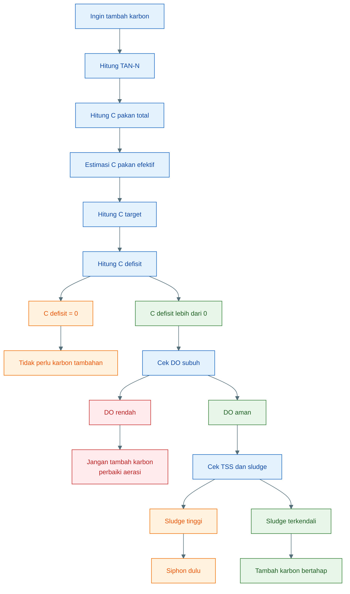
```mermaid id="sop-operasional-sebelum-karbon"
%%{init: {'theme':'base','themeVariables':{
'primaryColor':'#E3F2FD',
'primaryTextColor':'#0D47A1',
'primaryBorderColor':'#1565C0',
'secondaryColor':'#E8F5E9',
'secondaryTextColor':'#1B5E20',
'secondaryBorderColor':'#2E7D32',
'tertiaryColor':'#FFF3E0',
'tertiaryTextColor':'#E65100',
'tertiaryBorderColor':'#EF6C00',
'lineColor':'#546E7A',
'fontSize':'13px'
}}}%%
flowchart TD
    A["Ingin tambah karbon"] --> B["Hitung TAN-N"]
    B --> C["Hitung C pakan total"]
    C --> D["Estimasi C pakan efektif"]
    D --> E["Hitung C target"]
    E --> F["Hitung C defisit"]

    F --> G["C defisit = 0"]
    F --> H["C defisit lebih dari 0"]

    G --> I["Tidak perlu karbon tambahan"]
    H --> J["Cek DO subuh"]
    J --> K["DO rendah"]
    J --> L["DO aman"]

    K --> M["Jangan tambah karbon<br/>perbaiki aerasi"]
    L --> N["Cek TSS dan sludge"]

    N --> O["Sludge tinggi"]
    N --> P["Sludge terkendali"]

    O --> Q["Siphon dulu"]
    P --> R["Tambah karbon bertahap"]

    classDef input fill:#E3F2FD,stroke:#1565C0,color:#0D47A1;
    classDef hitung fill:#E8F5E9,stroke:#2E7D32,color:#1B5E20;
    classDef waspada fill:#FFF3E0,stroke:#EF6C00,color:#E65100;
    classDef bahaya fill:#FFEBEE,stroke:#C62828,color:#B71C1C;

    class A,B,C,D,E,F input;
    class H,L,P,R hitung;
    class G,I,O,Q waspada;
    class K,M bahaya;
```

---

## 6.9. SOP memilih rezim berdasarkan kondisi kolam

```text id="sop-memilih-rezim-cn"
Jika target aquaponik:
    gunakan C/N efektif 8 sampai 12

Jika aerasi terbatas:
    gunakan C/N efektif 8 sampai 12

Jika ingin bioflok stabil:
    gunakan C/N efektif 12 sampai 16

Jika ingin flok tinggi untuk nila:
    gunakan C/N efektif 16 sampai 18
    syarat: DO subuh stabil, sludge removal kuat

Jika C/N efektif lebih dari 20:
    hentikan target kenaikan karbon
    fokus koreksi over-carbon
```

Tabel keputusan:

| Kondisi kolam                       | Rezim yang lebih aman                            |
| ----------------------------------- | ------------------------------------------------ |
| `$DO_{\text{subuh}}$` sering rendah | `$8$` sampai `$12$`                              |
| sludge cepat naik                   | `$8$` sampai `$12$` atau `$12$` sampai `$16$`    |
| aquaponik                           | `$8$` sampai `$12$`                              |
| nila aktif makan flok               | `$12$` sampai `$16$` atau `$16$` sampai `$18$`   |
| nitrat tinggi tetapi `$TSS$` rendah | tambah sink nitrat, bukan langsung karbon tinggi |
| `$TAN$` naik dan `$DO$` aman        | koreksi karbon bisa dipertimbangkan              |
| `$TAN$` naik dan `$DO$` rendah      | aerasi dan pakan dulu, bukan karbon              |
| `$TSS$` tinggi                      | jangan tambah karbon                             |
| sludge hitam                        | siphon dan mixing dulu                           |

---

## 6.10. Kesalahan umum operasional

| Kesalahan                                                     | Dampak                         |
| ------------------------------------------------------------- | ------------------------------ |
| Menambah molase tanpa menghitung `$C_{\text{pakan,efektif}}$` | over-carbon                    |
| Mengejar air cokelat pekat                                    | `$TSS$` dan sludge berlebihan  |
| Menganggap flok selalu habis dimakan ikan                     | sludge menumpuk                |
| Menambah karbon saat `$DO$` rendah                            | risiko kematian ikan           |
| Tidak mengukur `$DO_{\text{subuh}}$`                          | risiko malam tidak terbaca     |
| Tidak membuang sludge                                         | `$TAN$` sekunder dan nitrit    |
| Menganggap `$TAN$` turun berarti aman                         | oksigen dan sludge terabaikan  |
| Tidak menghitung nitrat pada `$C/N$` rendah                   | akumulasi nitrat tidak terbaca |

---

## 6.11. Pesan utama Bab 6

Dosis karbon tambahan adalah hasil selisih antara karbon target dan karbon efektif yang sudah tersedia, bukan hasil menghitung target dari nol.

Rumus kunci:

$$
C_{\text{target}}
=

(C/N)_{\text{target}}
\times
TAN_N
$$

$$
C_{\text{defisit}}
=

\max
\left(
0,
C_{\text{target}}
-

C_{\text{pakan,efektif}}

C_{\text{organik lain,efektif}}
\right)
$$

$$
Bahan_{\text{karbon}}
=

\frac{
C_{\text{defisit}}
}{
f_{C,\text{sumber}}
\times
\eta_{C,\text{sumber}}
}
$$

Ringkasan strategi:

| Rezim         |                          Target | Prinsip                                     |
| ------------- | ------------------------------: | ------------------------------------------- |
| Rendah        |             `$8$` sampai `$12$` | nitrifikasi, sludge rendah, cocok aquaponik |
| Sedang        |            `$12$` sampai `$16$` | kompromi nitrat dan flok                    |
| Tinggi        |            `$16$` sampai `$18$` | flok kuat, aerasi dan sludge wajib kuat     |
| Sangat tinggi | `$C/N_{\text{efektif}} \gt 20$` | tidak rutin, risiko over-carbon             |

Kalimat penutup:

> Strategi `$C/N$` yang baik bukan strategi menambah karbon sebanyak mungkin. Strategi `$C/N$` yang baik adalah menambahkan karbon hanya sebesar defisit yang benar-benar ada, setelah karbon pakan efektif dan kondisi oksigen kolam diperhitungkan.

[**Kembali ke Atas**](#cn-ratio-pada-bioflok-mengatur-mikroba-oksigen-dan-stabilitas-kolam-untuk-praktisi)

---

# Bab 7. Studi Kasus Kolam Bioflok `$1 \text{ m}^3$`

Bab ini menjadi pembuktian angka. Tujuannya adalah menunjukkan perbedaan besar antara model lama yang mengabaikan karbon pakan dan model baru yang memasukkan `$C_{\text{pakan,efektif}}$`.

Fokus studi kasus:

1. menghitung nitrogen pakan;
2. menghitung `$TAN_N$`;
3. menghitung karbon pakan total;
4. menghitung karbon pakan efektif;
5. menghitung target karbon;
6. menghitung defisit karbon;
7. membandingkan model lama dan model baru;
8. membaca dampaknya terhadap dosis karbon, `$O_2$`, flok, dan sludge.

---

## 7.1. Asumsi desain

| Parameter                           |                                       Nilai |
| ----------------------------------- | ------------------------------------------: |
| Volume                              |                           `$1 \text{ m}^3$` |
| Volume air                          |                          `$1000 \text{ L}$` |
| Pakan                               |                  `$0{,}40 \text{ kg/hari}$` |
| Pakan                               |                      `$400 \text{ g/hari}$` |
| Protein                             |                                    `$30\%$` |
| `$f_{\text{TAN}}$`                  |                                  `$0{,}60$` |
| `$f_{C,\text{pakan}}$`              |                                  `$0{,}42$` |
| `$\eta_{C,\text{pakan}}$`           |                                  `$0{,}25$` |
| Target `$C/N_{\text{efektif}}$`     |                                      `$14$` |
| `$C_{\text{organik lain,efektif}}$` | `$0 \text{ g C/hari}$` untuk simulasi dasar |

Catatan:

> Nilai `$C_{\text{organik lain,efektif}} = 0$` dipakai agar contoh sederhana. Dalam kolam nyata, feses halus, flok tua, sludge teraduk, dan sisa pakan dapat membuat nilai ini lebih besar dari nol.

---

## 7.2. Diagram alur perhitungan studi kasus

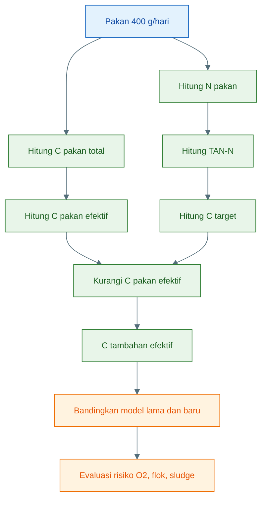
```mermaid id="alur-studi-kasus-cn-1m3"
%%{init: {'theme':'base','themeVariables':{
'primaryColor':'#E3F2FD',
'primaryTextColor':'#0D47A1',
'primaryBorderColor':'#1565C0',
'secondaryColor':'#E8F5E9',
'secondaryTextColor':'#1B5E20',
'secondaryBorderColor':'#2E7D32',
'tertiaryColor':'#FFF3E0',
'tertiaryTextColor':'#E65100',
'tertiaryBorderColor':'#EF6C00',
'lineColor':'#546E7A',
'fontSize':'13px'
}}}%%
flowchart TD
    A["Pakan 400 g/hari"] --> B["Hitung N pakan"]
    B --> C["Hitung TAN-N"]

    A --> D["Hitung C pakan total"]
    D --> E["Hitung C pakan efektif"]

    C --> F["Hitung C target"]
    E --> G["Kurangi C pakan efektif"]
    F --> G
    G --> H["C tambahan efektif"]

    H --> I["Bandingkan model lama dan baru"]
    I --> J["Evaluasi risiko O2, flok, sludge"]

    classDef input fill:#E3F2FD,stroke:#1565C0,color:#0D47A1;
    classDef hitung fill:#E8F5E9,stroke:#2E7D32,color:#1B5E20;
    classDef output fill:#FFF3E0,stroke:#EF6C00,color:#E65100;

    class A input;
    class B,C,D,E,F,G,H hitung;
    class I,J output;
```

Diagram ini menunjukkan bahwa karbon tambahan dihitung setelah karbon pakan efektif diperhitungkan.

---

## 7.3. Hitung nitrogen pakan

Formula:

$$
N_{\text{pakan}}
=

Feed
\times
Protein
\times
0{,}16
$$

Substitusi:

$$
N_{\text{pakan}}
=

0{,}40
\times
0{,}30
\times
0{,}16
$$

Hasil:

$$
N_{\text{pakan}}
=

0{,}0192
\text{ kg N/hari}
$$

Konversi ke gram:

$$
0{,}0192
\text{ kg N/hari}
=

19{,}2
\text{ g N/hari}
$$

Jadi:

$$
N_{\text{pakan}}
=

19{,}2
\text{ g N/hari}
$$

Makna praktis:

> Pakan `$400 \text{ g/hari}$` dengan protein `$30\%$` membawa sekitar `$19{,}2 \text{ g N/hari}$`.

---

## 7.4. Hitung `$TAN_N$`

Formula:

$$
TAN_N
=

N_{\text{pakan}}
\times
f_{\text{TAN}}
$$

Substitusi:

$$
TAN_N
=

0{,}0192
\times
0{,}60
$$

Hasil:

$$
TAN_N
=

0{,}01152
\text{ kg/hari}
$$

Konversi ke gram:

$$
TAN_N
=

11{,}52
\text{ g TAN-N/hari}
$$

Makna praktis:

> Dari `$19{,}2 \text{ g N/hari}$` nitrogen pakan, sekitar `$11{,}52 \text{ g/hari}$` diasumsikan menjadi `$TAN_N$`.

Pada kolam `$1 \text{ m}^3$`, angka ini setara dengan potensi beban harian:

$$
11{,}52
\text{ mg/L TAN-N per hari}
$$

bila seluruhnya berada dalam air dan belum diproses.

---

## 7.5. Hitung karbon pakan total

Formula:

$$
C_{\text{pakan,total}}
=

Feed
\times
f_{C,\text{pakan}}
$$

Karena pakan dinyatakan dalam gram:

$$
Feed
=

400
\text{ g/hari}
$$

Substitusi:

$$
C_{\text{pakan,total}}
=

400
\times
0{,}42
$$

Hasil:

$$
C_{\text{pakan,total}}
=

168
\text{ g C/hari}
$$

Makna praktis:

> Pakan `$400 \text{ g/hari}$` dengan fraksi karbon `$0{,}42$` membawa sekitar `$168 \text{ g C/hari}$` karbon total.

Ini angka penting. Jika karbon pakan diabaikan, model akan menganggap seluruh kebutuhan karbon harus dipenuhi dari molase atau sumber karbon tambahan.

---

## 7.6. Hitung karbon pakan efektif

Tidak semua karbon pakan tersedia bagi mikroba. Karena itu, digunakan faktor efektivitas:

$$
\eta_{C,\text{pakan}}
=

0{,}25
$$

Formula:

$$
C_{\text{pakan,efektif}}
=

C_{\text{pakan,total}}
\times
\eta_{C,\text{pakan}}
$$

Substitusi:

$$
C_{\text{pakan,efektif}}
=

168
\times
0{,}25
$$

Hasil:

$$
C_{\text{pakan,efektif}}
=

42
\text{ g C/hari}
$$

Makna praktis:

> Dari `$168 \text{ g C/hari}$` karbon total pakan, sekitar `$42 \text{ g C/hari}$` diasumsikan efektif tersedia bagi mikroba.

Kalimat penting:

> Karbon pakan tidak dihitung nol, tetapi juga tidak dihitung seluruhnya. Yang masuk model operasional adalah `$C_{\text{pakan,efektif}}$`.

---

## 7.7. Hitung karbon target

Target:

$$
C/N_{\text{efektif}}
=

14
$$

Formula:

$$
C_{\text{target}}
=

(C/N)_{\text{target}}
\times
TAN_N
$$

Substitusi:

$$
C_{\text{target}}
=

14
\times
11{,}52
$$

Hasil:

$$
C_{\text{target}}
=

161{,}28
\text{ g C/hari}
$$

Makna praktis:

> Untuk mencapai `$C/N_{\text{efektif}} = 14$` dengan `$TAN_N = 11{,}52 \text{ g/hari}$`, karbon efektif target adalah `$161{,}28 \text{ g C/hari}$`.

---

## 7.8. Hitung karbon tambahan efektif

Formula yang benar:

$$
C_{\text{tambahan,efektif}}
=

\max
\left(
0,
C_{\text{target}}
-
C_{\text{pakan,efektif}}

C_{\text{organik lain,efektif}}
\right)
$$

Dalam simulasi dasar:

$$
C_{\text{organik lain,efektif}}
=

0
\text{ g C/hari}
$$

Substitusi:

$$
C_{\text{tambahan,efektif}}
=

\max
\left(
0,
161{,}28
--------

## 42

0
\right)
$$

Hasil:

$$
C_{\text{tambahan,efektif}}
=

119{,}28
\text{ g C/hari}
$$

Makna praktis:

> Kebutuhan karbon tambahan efektif bukan `$161{,}28 \text{ g C/hari}$`, tetapi `$119{,}28 \text{ g C/hari}$` karena pakan sudah menyumbang `$42 \text{ g C/hari}$` karbon efektif.

---

## 7.9. Bandingkan model lama vs model baru

| Model                                     |       Karbon tambahan efektif |
| ----------------------------------------- | ----------------------------: |
| Model lama, karbon pakan diabaikan        | `$161{,}28 \text{ g C/hari}$` |
| Model baru, karbon pakan efektif dihitung | `$119{,}28 \text{ g C/hari}$` |
| Selisih                                   |       `$42 \text{ g C/hari}$` |

Selisih:

$$
Selisih
=

161{,}28 -

119{,}28
$$

$$
Selisih
=

42
\text{ g C/hari}
$$

Persentase pengurangan dari model lama:

$$
Pengurangan
=

\frac{
42
}{
161{,}28
}
\times
100
$$

$$
Pengurangan
=

26{,}0%
$$

Makna praktis:

> Dengan memasukkan karbon pakan efektif, estimasi karbon tambahan efektif turun sekitar `$26{,}0\%$` dibanding model lama.

---

## 7.10. Diagram perbandingan model lama dan model baru

```mermaid id="perbandingan-model-lama-baru-karbon"
%%{init: {'theme':'base','themeVariables':{
'primaryColor':'#E3F2FD',
'primaryTextColor':'#0D47A1',
'primaryBorderColor':'#1565C0',
'secondaryColor':'#E8F5E9',
'secondaryTextColor':'#1B5E20',
'secondaryBorderColor':'#2E7D32',
'tertiaryColor':'#FFF3E0',
'tertiaryTextColor':'#E65100',
'tertiaryBorderColor':'#EF6C00',
'lineColor':'#546E7A',
'fontSize':'13px'
}}}%%
flowchart TD
    A["Model lama<br/>C tambahan efektif<br/>161,28 g C/hari<br/>████████████████"]
    B["Model baru<br/>C tambahan efektif<br/>119,28 g C/hari<br/>████████████"]
    C["Selisih<br/>42 g C/hari<br/>sekitar 26 persen<br/>████"]

    A --> B --> C

    classDef lama fill:#FFEBEE,stroke:#C62828,color:#B71C1C;
    classDef baru fill:#E8F5E9,stroke:#2E7D32,color:#1B5E20;
    classDef selisih fill:#FFF3E0,stroke:#EF6C00,color:#E65100;

    class A lama;
    class B baru;
    class C selisih;
```

Grafik ini memakai format `flowchart` agar tetap terbaca pada renderer MDX yang tidak selalu menampilkan `xychart-beta` dengan baik.

---

## 7.11. Jika karbon tambahan berasal dari molase

Misal sumber karbon tambahan adalah molase dengan asumsi:

$$
f_{C,\text{sumber}}
=

0{,}35
$$

dan:

$$
\eta_{C,\text{sumber}}
=

0{,}90
$$

Maka kebutuhan bahan karbon:

$$
Bahan_{\text{karbon}}
=

\frac{
C_{\text{tambahan,efektif}}
}{
f_{C,\text{sumber}}
\times
\eta_{C,\text{sumber}}
}
$$

Substitusi:

$$
Bahan_{\text{karbon}}
=

\frac{
119{,}28
}{
0{,}35
\times
0{,}90
}
$$

$$
Bahan_{\text{karbon}}
=

\frac{
119{,}28
}{
0{,}315
}
$$

$$
Bahan_{\text{karbon}}
=

378{,}67
\text{ g/hari}
$$

Dibulatkan:

$$
Bahan_{\text{karbon}}
\approx
379
\text{ g/hari}
$$

Catatan penting:

> Angka ini adalah hasil model, bukan perintah aplikasi langsung. Pada kolam `$1 \text{ m}^3$`, dosis sebesar ini wajib diuji bertahap dan divalidasi dengan `$DO_{\text{subuh}}$`, `$TSS$`, sludge, `$TAN$`, dan nitrit.

Jika memakai model lama, kebutuhan molase akan menjadi:

$$
Bahan_{\text{karbon,lama}}
=

\frac{
161{,}28
}{
0{,}315
}
$$

$$
Bahan_{\text{karbon,lama}}
=

512
\text{ g/hari}
$$

Perbandingan:

| Model      | Kebutuhan molase model |
| ---------- | ---------------------: |
| Model lama | `$512 \text{ g/hari}$` |
| Model baru | `$379 \text{ g/hari}$` |
| Selisih    | `$133 \text{ g/hari}$` |

Makna praktis:

> Dengan asumsi molase tersebut, mengabaikan karbon pakan dapat membuat dosis molase sekitar `$133 \text{ g/hari}$` lebih tinggi pada kolam `$1 \text{ m}^3$`.

---

## 7.12. Simulasi sensitivitas `$\eta_{C,\text{pakan}}$`

Nilai `$\eta_{C,\text{pakan}}$` sangat menentukan kebutuhan karbon tambahan. Dengan data yang sama:

$$
C_{\text{pakan,total}}
=

168
\text{ g C/hari}
$$

dan:

$$
C_{\text{target}}
=

161{,}28
\text{ g C/hari}
$$

Tabel sensitivitas:

| `$\eta_{C,\text{pakan}}$` | `$C_{\text{pakan,efektif}}$` | `$C_{\text{tambahan,efektif}}$` |
| ------------------------: | ---------------------------: | ------------------------------: |
|                `$0{,}15$` |  `$25{,}2 \text{ g C/hari}$` |   `$136{,}08 \text{ g C/hari}$` |
|                `$0{,}25$` |  `$42{,}0 \text{ g C/hari}$` |   `$119{,}28 \text{ g C/hari}$` |
|                `$0{,}35$` |  `$58{,}8 \text{ g C/hari}$` |   `$102{,}48 \text{ g C/hari}$` |

Interpretasi:

- bila pakan dimakan baik dan sedikit sisa, gunakan `$\eta_{C,\text{pakan}}$` lebih rendah;
- bila banyak feses halus atau sisa pakan, gunakan `$\eta_{C,\text{pakan}}$` lebih tinggi;
- semakin tinggi `$\eta_{C,\text{pakan}}$`, semakin rendah kebutuhan karbon tambahan.

---

## 7.13. Diagram sensitivitas karbon pakan efektif

```mermaid id="sensitivitas-eta-c-pakan"
%%{init: {'theme':'base','themeVariables':{
'primaryColor':'#E3F2FD',
'primaryTextColor':'#0D47A1',
'primaryBorderColor':'#1565C0',
'secondaryColor':'#E8F5E9',
'secondaryTextColor':'#1B5E20',
'secondaryBorderColor':'#2E7D32',
'tertiaryColor':'#FFF3E0',
'tertiaryTextColor':'#E65100',
'tertiaryBorderColor':'#EF6C00',
'lineColor':'#546E7A',
'fontSize':'13px'
}}}%%
flowchart TD
    A["eta C pakan 0,15<br/>C tambahan efektif<br/>136,08 g/hari<br/>██████████████"]
    B["eta C pakan 0,25<br/>C tambahan efektif<br/>119,28 g/hari<br/>████████████"]
    C["eta C pakan 0,35<br/>C tambahan efektif<br/>102,48 g/hari<br/>██████████"]

    A --> B --> C

    classDef tinggi fill:#FFEBEE,stroke:#C62828,color:#B71C1C;
    classDef sedang fill:#FFF3E0,stroke:#EF6C00,color:#E65100;
    classDef rendah fill:#E8F5E9,stroke:#2E7D32,color:#1B5E20;

    class A tinggi;
    class B sedang;
    class C rendah;
```

Makna grafik:

> Semakin besar fraksi karbon pakan yang efektif tersedia bagi mikroba, semakin kecil kebutuhan karbon tambahan.

---

## 7.14. Implikasi terhadap oksigen

Tambahan karbon efektif akan meningkatkan respirasi heterotrof. Maka perbedaan antara model lama dan model baru bukan hanya masalah biaya molase, tetapi juga masalah oksigen.

Selisih karbon efektif:

$$
C_{\text{selisih}}
=

42
\text{ g C/hari}
$$

Jika sebagian karbon ini teroksidasi dalam satu hari, oksigen tambahan dapat diperkirakan:

$$
O_{2,\text{selisih}}
=

C_{\text{selisih}}
\times
2{,}67
\times
\phi
$$

Misal:

$$
\phi
=

0{,}40
$$

Maka:

$$
O_{2,\text{selisih}}
=

42
\times
2{,}67
\times
0{,}40
$$

$$
O_{2,\text{selisih}}
=

44{,}86
\text{ g } O_2\text{/hari}
$$

Per jam:

$$
O_{2,\text{selisih,jam}}
=

\frac{
44{,}86
}{
24
}
$$

$$
O_{2,\text{selisih,jam}}
=

1{,}87
\text{ g } O_2\text{/jam}
$$

Makna praktis:

> Selisih karbon yang tampak kecil dapat menambah beban oksigen harian. Pada kolam kecil, tambahan beban oksigen ini bisa memperpendek waktu aman saat aerasi melemah.

---

## 7.15. Implikasi terhadap flok dan sludge

Jika karbon tambahan berlebih mendorong heterotrof, maka biomassa bakteri meningkat. Secara konseptual:

$$
TAN
+
C_{\text{efektif}}
\rightarrow
Biomassa\ bakteri
\rightarrow
Bioflok
\rightarrow
Sludge
$$

Dampak lapangan:

| Parameter             | Dampak jika karbon berlebih |
| --------------------- | --------------------------- |
| `$TSS$`               | naik                        |
| Settleable solids     | naik                        |
| Sludge                | naik                        |
| `$DO_{\text{subuh}}$` | turun                       |
| `$CO_2$`              | naik                        |
| Bau                   | lebih mudah muncul          |
| Nitrit sekunder       | bisa muncul dari sludge     |

Jadi, koreksi model karbon tidak hanya memperbaiki hitungan molase, tetapi juga memperbaiki desain aerasi, manajemen flok, dan jadwal siphon.

---

## 7.16. Keputusan operasional untuk studi kasus

Dengan hasil model:

$$
C_{\text{tambahan,efektif}}
=

119{,}28
\text{ g C/hari}
$$

keputusan operasional tidak boleh langsung memberikan seluruh dosis. Gunakan pendekatan bertahap.

```text id="keputusan-operasional-studi-kasus"
Hari 1 sampai 3:
    berikan sebagian dari dosis hitung
    ukur DO subuh
    ukur TAN dan nitrit
    cek TSS dan sludge

Jika DO subuh stabil:
    dosis dapat dinaikkan bertahap

Jika TSS atau sludge naik cepat:
    hentikan kenaikan karbon
    lakukan siphon

Jika TAN turun tetapi DO turun:
    sistem over-carbon atau aerasi kurang
```

Parameter validasi:

| Parameter                   | Keputusan                             |
| --------------------------- | ------------------------------------- |
| `$DO_{\text{subuh}}$` turun | jangan tambah karbon                  |
| `$TSS$` naik cepat          | kurangi karbon                        |
| sludge naik                 | siphon                                |
| `$TAN$` turun               | asimilasi berjalan                    |
| nitrit naik                 | cek nitrifikasi dan `$Cl^- : NO_2^-$` |
| bau muncul                  | buang sludge dan tambah mixing        |

---

## 7.17. Ringkasan angka studi kasus

| Komponen                                   |                            Nilai |
| ------------------------------------------ | -------------------------------: |
| Volume                                     |                `$1 \text{ m}^3$` |
| Pakan                                      |           `$400 \text{ g/hari}$` |
| Protein                                    |                         `$30\%$` |
| `$N_{\text{pakan}}$`                       |      `$19{,}2 \text{ g N/hari}$` |
| `$TAN_N$`                                  | `$11{,}52 \text{ g TAN-N/hari}$` |
| `$f_{C,\text{pakan}}$`                     |                       `$0{,}42$` |
| `$C_{\text{pakan,total}}$`                 |         `$168 \text{ g C/hari}$` |
| `$\eta_{C,\text{pakan}}$`                  |                       `$0{,}25$` |
| `$C_{\text{pakan,efektif}}$`               |          `$42 \text{ g C/hari}$` |
| Target `$C/N_{\text{efektif}}$`            |                           `$14$` |
| `$C_{\text{target}}$`                      |    `$161{,}28 \text{ g C/hari}$` |
| `$C_{\text{tambahan,efektif}}$` model baru |    `$119{,}28 \text{ g C/hari}$` |
| `$C_{\text{tambahan,efektif}}$ model lama  |    `$161{,}28 \text{ g C/hari}$` |
| Selisih                                    |          `$42 \text{ g C/hari}$` |
| Pengurangan dosis efektif                  |                     `$26{,}0\%$` |

---

## 7.18. Pesan utama Bab 7

Pada kolam `$1 \text{ m}^3$`, mengabaikan karbon pakan dapat membuat dosis karbon tambahan terlalu tinggi. Selisih kecil di atas kertas bisa menjadi besar dalam praktik karena berulang setiap hari.

Kalimat kunci:

> Dalam studi kasus ini, karbon pakan efektif sebesar `$42 \text{ g C/hari}$` menurunkan kebutuhan karbon tambahan efektif dari `$161{,}28 \text{ g C/hari}$` menjadi `$119{,}28 \text{ g C/hari}$`.

Artinya:

$$
C_{\text{tambahan,efektif}}
\neq
C_{\text{target}}
$$

Yang benar:

$$
C_{\text{tambahan,efektif}}
=

C_{\text{target}}
-
C_{\text{pakan,efektif}}

C_{\text{organik lain,efektif}}
$$

Pesan praktis:

> Dosis karbon tambahan adalah defisit karbon, bukan seluruh karbon target. Pada sistem bioflok kecil, kesalahan ini dapat menaikkan `$O_2$`, `$TSS$`, sludge, dan risiko `$DO_{\text{subuh}}$` turun.

[**Kembali ke Atas**](#cn-ratio-pada-bioflok-mengatur-mikroba-oksigen-dan-stabilitas-kolam-untuk-praktisi)

---

# Lampiran A. Model Matematis `$C/N_{\text{efektif}}$`

Lampiran ini berisi model matematis untuk menghitung `$C/N_{\text{efektif}}$`, kebutuhan karbon tambahan, risiko over-carbon, serta kaitannya dengan oksigen, flok, dan sludge.

Model ini tidak dimaksudkan sebagai angka final tanpa validasi. Model ini adalah **alat hitung awal** yang harus dikoreksi dengan data lapangan: `$DO_{\text{subuh}}$`, `$TSS$`, sludge, `$TAN$`, nitrit, dan respons ikan.

---

## A.1. Input model

| Input                               |              Satuan | Keterangan                                                  |
| ----------------------------------- | ------------------: | ----------------------------------------------------------- |
| `$Feed$`                            | kg/hari atau g/hari | pakan harian                                                |
| `$Protein$`                         |              fraksi | contoh `$30\% = 0{,}30$`                                    |
| `$f_{\text{TAN}}$`                  |              fraksi | bagian nitrogen pakan menjadi `$TAN_N$`                     |
| `$f_{C,\text{pakan}}$`              |              fraksi | fraksi karbon total dalam pakan                             |
| `$\eta_{C,\text{pakan}}$`           |              fraksi | fraksi karbon pakan yang efektif tersedia                   |
| `$f_{C,\text{sumber}}$`             |              fraksi | fraksi karbon dalam molase, gula, tapioka, atau sumber lain |
| `$\eta_{C,\text{sumber}}$`          |              fraksi | efektivitas sumber karbon tambahan                          |
| `$CN_{\text{target}}$`              |               rasio | target `$C/N_{\text{efektif}}$`                             |
| `$C_{\text{organik lain,efektif}}$` |            g C/hari | feses halus, sludge teraduk, flok tua, sisa pakan           |
| `$V$`                               |      `$\text{m}^3$` | volume air                                                  |
| `$f_{\text{nitrifikasi}}$`          |              fraksi | bagian `$TAN_N$` ke nitrifikasi                             |
| `$\phi$`                            |              fraksi | bagian karbon berlebih yang teroksidasi per hari            |

---

## A.2. Diagram alur model

```mermaid id="lampiran-a-model-cn-efektif"
%%{init: {'theme':'base','themeVariables':{
'primaryColor':'#E3F2FD',
'primaryTextColor':'#0D47A1',
'primaryBorderColor':'#1565C0',
'secondaryColor':'#E8F5E9',
'secondaryTextColor':'#1B5E20',
'secondaryBorderColor':'#2E7D32',
'tertiaryColor':'#FFF3E0',
'tertiaryTextColor':'#E65100',
'tertiaryBorderColor':'#EF6C00',
'lineColor':'#546E7A',
'fontSize':'13px'
}}}%%
flowchart TD
    A["Feed dan protein"] --> B["N pakan"]
    B --> C["TAN-N"]

    A --> D["C pakan total"]
    D --> E["C pakan efektif"]

    F["C organik lain efektif"] --> G["C tersedia"]
    E --> G

    C --> H["C target"]
    H --> I["C defisit"]
    G --> I

    I --> J["Bahan karbon tambahan"]
    J --> K["Validasi DO, TSS, sludge"]

    classDef input fill:#E3F2FD,stroke:#1565C0,color:#0D47A1;
    classDef proses fill:#E8F5E9,stroke:#2E7D32,color:#1B5E20;
    classDef output fill:#FFF3E0,stroke:#EF6C00,color:#E65100;

    class A,F input;
    class B,C,D,E,G,H,I proses;
    class J,K output;
```

---

## A.3. Nitrogen pakan

Nitrogen pakan dihitung dari pakan dan protein.

$$
N_{\text{pakan}}
=

Feed
\times
Protein
\times
0{,}16
$$

Keterangan:

| Simbol               |                  Satuan |
| -------------------- | ----------------------: |
| `$N_{\text{pakan}}$` | kg N/hari atau g N/hari |
| `$Feed$`             |     kg/hari atau g/hari |
| `$Protein$`          |                  fraksi |
| `$0{,}16$`           |     kg N per kg protein |

---

## A.4. Produksi `$TAN_N$`

$$
TAN_N
=

N_{\text{pakan}}
\times
f_{\text{TAN}}
$$

Atau langsung:

$$
TAN_N
=

Feed
\times
Protein
\times
0{,}16
\times
f_{\text{TAN}}
$$

Keterangan:

| Simbol             |                          Satuan |
| ------------------ | ------------------------------: |
| `$TAN_N$`          | kg TAN-N/hari atau g TAN-N/hari |
| `$f_{\text{TAN}}$` |                          fraksi |

Nilai kerja awal:

$$
f_{\text{TAN}}
=

0{,}50
\text{ sampai }
0{,}80
$$

Untuk simulasi praktis awal:

$$
f_{\text{TAN}}
=

0{,}60
$$

---

## A.5. Karbon total dari pakan

$$
C_{\text{pakan,total}}
=

Feed
\times
f_{C,\text{pakan}}
$$

Keterangan:

| Simbol                     |                  Satuan |
| -------------------------- | ----------------------: |
| `$C_{\text{pakan,total}}$` | kg C/hari atau g C/hari |
| `$f_{C,\text{pakan}}$`     |     fraksi karbon pakan |

Nilai kerja awal:

$$
f_{C,\text{pakan}}
=

0{,}40
\text{ sampai }
0{,}45
$$

---

## A.6. Karbon pakan efektif

Tidak semua karbon pakan tersedia bagi mikroba. Karena itu digunakan faktor efektivitas.

$$
C_{\text{pakan,efektif}}
=

C_{\text{pakan,total}}
\times
\eta_{C,\text{pakan}}
$$

Nilai kerja awal:

$$
\eta_{C,\text{pakan}}
=

0{,}15
\text{ sampai }
0{,}35
$$

Interpretasi:

| Kondisi                         | Nilai `$\eta_{C,\text{pakan}}$` cenderung |
| ------------------------------- | ----------------------------------------- |
| pakan habis cepat, `$FCR$` baik | lebih rendah                              |
| banyak feses halus              | lebih tinggi                              |
| banyak sisa pakan               | lebih tinggi                              |
| sludge sering teraduk           | lebih tinggi                              |
| siphon rutin dan air stabil     | lebih rendah                              |

---

## A.7. Karbon efektif total

$$
C_{\text{efektif,total}}
=

C_{\text{pakan,efektif}}
+
C_{\text{tambahan,efektif}}
+
C_{\text{organik lain,efektif}}
$$

Keterangan:

| Komponen                            | Makna                                                       |
| ----------------------------------- | ----------------------------------------------------------- |
| `$C_{\text{pakan,efektif}}$`        | karbon efektif dari pakan                                   |
| `$C_{\text{tambahan,efektif}}$`     | karbon efektif dari molase, gula, tapioka, atau sumber lain |
| `$C_{\text{organik lain,efektif}}$` | karbon efektif dari feses, sludge, flok tua, dan sisa pakan |

---

## A.8. Karbon target

Gunakan target `$C/N_{\text{efektif}}$` yang sudah dipilih.

$$
C_{\text{target}}
=

CN_{\text{target}}
\times
TAN_N
$$

Keterangan:

| Simbol                 |       Satuan |
| ---------------------- | -----------: |
| `$C_{\text{target}}$`  |     g C/hari |
| `$CN_{\text{target}}$` |        rasio |
| `$TAN_N$`              | g TAN-N/hari |

Contoh target:

| Rezim         |     `$CN_{\text{target}}$` |
| ------------- | -------------------------: |
| rendah        |        `$8$` sampai `$12$` |
| sedang        |       `$12$` sampai `$16$` |
| tinggi        |       `$16$` sampai `$18$` |
| sangat tinggi | tidak rutin di atas `$20$` |

---

## A.9. Karbon tambahan efektif yang dibutuhkan

Formula utama:

$$
C_{\text{tambahan,efektif}}
=

\max
\left(
0,
C_{\text{target}}
-

C_{\text{pakan,efektif}}

C_{\text{organik lain,efektif}}
\right)
$$

Makna:

- jika hasil positif, sistem masih kekurangan karbon efektif;
- jika hasil nol, karbon tambahan tidak diperlukan berdasarkan model;
- jika karbon tetap ditambahkan saat hasil nol, risiko over-carbon meningkat.

---

## A.10. Kebutuhan bahan karbon tambahan

Jika memakai molase, gula, tapioka, atau sumber karbon lain:

$$
Bahan_{\text{karbon}}
=

\frac{
C_{\text{tambahan,efektif}}
}{
f_{C,\text{sumber}}
\times
\eta_{C,\text{sumber}}
}
$$

Keterangan:

| Simbol                          |   Satuan |
| ------------------------------- | -------: |
| `$Bahan_{\text{karbon}}$`       |   g/hari |
| `$C_{\text{tambahan,efektif}}$` | g C/hari |
| `$f_{C,\text{sumber}}$`         |   fraksi |
| `$\eta_{C,\text{sumber}}$`      |   fraksi |

Contoh nilai kerja:

| Sumber karbon  |      `$f_{C,\text{sumber}}$` |   `$\eta_{C,\text{sumber}}$` |
| -------------- | ---------------------------: | ---------------------------: |
| gula sederhana |                   `$0{,}42$` | `$0{,}90$` sampai `$1{,}00$` |
| molase         | `$0{,}30$` sampai `$0{,}40$` | `$0{,}70$` sampai `$0{,}95$` |
| tapioka        | `$0{,}40$` sampai `$0{,}44$` | `$0{,}50$` sampai `$0{,}80$` |
| dedak          | `$0{,}35$` sampai `$0{,}45$` | `$0{,}30$` sampai `$0{,}70$` |

Catatan:

> Dedak bukan karbon murni. Dedak juga membawa nitrogen, fosfor, mineral, dan padatan. Gunakan lebih hati-hati dibanding gula sederhana atau molase.

---

## A.11. `$C/N_{\text{efektif}}$` aktual

Setelah karbon tambahan dihitung atau diberikan, hitung `$C/N_{\text{efektif}}$` aktual.

$$
C/N_{\text{efektif,aktual}}
=

\frac{
C_{\text{pakan,efektif}}
+
C_{\text{tambahan,efektif}}
+
C_{\text{organik lain,efektif}}
}{
TAN_N
}
$$

Jika:

$$
C/N_{\text{efektif,aktual}}

>

20
$$

maka sistem masuk zona risiko over-carbon dan tidak dijadikan target rutin.

---

## A.12. Over-carbon

Over-carbon terjadi bila:

$$
C_{\text{efektif,total}}

>

C_{\text{target}}
$$

atau:

$$
C_{\text{efektif,total}}

>

CN_{\text{target}}
\times
TAN_N
$$

Karbon berlebih:

$$
C_{\text{berlebih}}
=

\max
\left(
0,
C_{\text{efektif,total}}
------------------------

C_{\text{target}}
\right)
$$

Dampak lapangan:

| Dampak                      | Indikator                         |
| --------------------------- | --------------------------------- |
| `$TSS$` naik                | air terlalu pekat                 |
| sludge naik                 | dasar cepat kotor                 |
| `$DO_{\text{subuh}}$` turun | respirasi air tinggi              |
| `$CO_2$` naik               | pH pagi cenderung rendah          |
| flok tua                    | flok tidak termakan               |
| bau                         | zona anaerob atau sludge membusuk |

---

## A.13. Oksigen untuk nitrifikasi

Jika sebagian `$TAN_N$` masuk nitrifikasi:

$$
O_{2,\text{nitrifikasi}}
=

TAN_N
\times
f_{\text{nitrifikasi}}
\times
4{,}57
$$

Keterangan:

| Simbol                       |                Satuan |
| ---------------------------- | --------------------: |
| `$O_{2,\text{nitrifikasi}}$` |         g `$O_2$/hari |
| `$TAN_N$`                    |          g TAN-N/hari |
| `$f_{\text{nitrifikasi}}$`   |                fraksi |
| `$4{,}57$`                   | g `$O_2$` per g TAN-N |

---

## A.14. Oksigen untuk jalur heterotrof

Bagian `$TAN_N$` yang masuk heterotrof:

$$
TAN_{N,\text{heterotrof}}
=

TAN_N
\times
f_{\text{heterotrof}}
$$

Dengan:

$$
f_{\text{heterotrof}}
=

1

f_{\text{nitrifikasi}}
$$

Oksigen pertumbuhan heterotrof:

$$
O_{2,\text{pertumbuhan}}
=

TAN_{N,\text{heterotrof}}
\times
K_{\text{heterotrof}}
$$

Nilai kerja:

$$
K_{\text{heterotrof}}
=

4{,}71
\text{ g } O_2
\text{ per g } TAN_N
$$

---

## A.15. Oksigen untuk karbon berlebih

Jika ada karbon berlebih:

$$
O_{2,\text{karbon berlebih}}
=

C_{\text{berlebih}}
\times
2{,}67
\times
\phi
$$

Keterangan:

| Simbol                           |                                  Satuan |
| -------------------------------- | --------------------------------------: |
| `$C_{\text{berlebih}}$`          |                                g C/hari |
| `$2{,}67$`                       |                       g `$O_2$` per g C |
| `$\phi$`                         | fraksi karbon berlebih yang teroksidasi |
| `$O_{2,\text{karbon berlebih}}$` |                           g `$O_2$/hari |

Nilai kerja awal:

$$
\phi
=

0{,}20
\text{ sampai }
0{,}60
$$

---

## A.16. Produksi flok atau `$VSS$`

Jika nitrogen masuk jalur heterotrof, biomassa mikroba dapat diperkirakan sebagai `$VSS$`.

$$
VSS_{\text{baru}}
=

TAN_{N,\text{heterotrof}}
\times
Y_{\text{VSS}}
$$

Nilai kerja:

$$
Y_{\text{VSS}}
=

8{,}07
\text{ g VSS per g } TAN_N
$$

Oksigen respirasi flok:

$$
O_{2,\text{flok}}
=

VSS_{\text{baru}}
\times
k_{\text{flok}}
$$

Nilai kerja awal:

$$
k_{\text{flok}}
=

0{,}05
\text{ sampai }
0{,}15
\text{ g } O_2
\text{ per g VSS per hari}
$$

---

## A.17. Total kebutuhan oksigen model

$$
O_{2,\text{total}}
=

O_{2,\text{ikan}}
+
O_{2,\text{nitrifikasi}}
+
O_{2,\text{pertumbuhan}}
+
O_{2,\text{karbon berlebih}}
+
O_{2,\text{flok}}
+
O_{2,\text{sludge}}
+
O_{2,\text{alga malam}}
$$

Kebutuhan oksigen per jam:

$$
O_{2,\text{jam}}
=

\frac{
O_{2,\text{total}}
}{
24
}
$$

Rekomendasi desain aerasi:

$$
O_{2,\text{aerasi desain}}
=

O_{2,\text{jam}}
\times
F_{\text{keamanan}}
$$

Nilai kerja:

$$
F_{\text{keamanan}}
=

1{,}5
\text{ sampai }
2{,}0
$$

---

## A.18. Contoh singkat kolam `$1 \text{ m}^3$`

Input:

| Parameter                           |                  Nilai |
| ----------------------------------- | ---------------------: |
| `$Feed$`                            | `$400 \text{ g/hari}$` |
| `$Protein$`                         |             `$0{,}30$` |
| `$f_{\text{TAN}}$`                  |             `$0{,}60$` |
| `$f_{C,\text{pakan}}$`              |             `$0{,}42$` |
| `$\eta_{C,\text{pakan}}$`           |             `$0{,}25$` |
| `$CN_{\text{target}}$`              |                 `$14$` |
| `$C_{\text{organik lain,efektif}}$` | `$0 \text{ g C/hari}$` |

Hitung nitrogen pakan:

$$
N_{\text{pakan}}
=

400
\times
0{,}30
\times
0{,}16
$$

$$
N_{\text{pakan}}
=

19{,}2
\text{ g N/hari}
$$

Hitung `$TAN_N$`:

$$
TAN_N
=

19{,}2
\times
0{,}60
$$

$$
TAN_N
=

11{,}52
\text{ g TAN-N/hari}
$$

Hitung karbon pakan total:

$$
C_{\text{pakan,total}}
=

400
\times
0{,}42
$$

$$
C_{\text{pakan,total}}
=

168
\text{ g C/hari}
$$

Hitung karbon pakan efektif:

$$
C_{\text{pakan,efektif}}
=

168
\times
0{,}25
$$

$$
C_{\text{pakan,efektif}}
=

42
\text{ g C/hari}
$$

Hitung karbon target:

$$
C_{\text{target}}
=

14
\times
11{,}52
$$

$$
C_{\text{target}}
=

161{,}28
\text{ g C/hari}
$$

Hitung karbon tambahan efektif:

$$
C_{\text{tambahan,efektif}}
=

\max
\left(
0,
161{,}28
-

42

0
\right)
$$

$$
C_{\text{tambahan,efektif}}
=

119{,}28
\text{ g C/hari}
$$

---

## A.19. Interpretasi contoh

| Komponen                        |                         Nilai |
| ------------------------------- | ----------------------------: |
| `$C_{\text{target}}$`           | `$161{,}28 \text{ g C/hari}$` |
| `$C_{\text{pakan,efektif}}$`    |       `$42 \text{ g C/hari}$` |
| `$C_{\text{tambahan,efektif}}$` | `$119{,}28 \text{ g C/hari}$` |

Model lama yang mengabaikan karbon pakan akan membaca kebutuhan karbon tambahan efektif sebagai:

$$
161{,}28
\text{ g C/hari}
$$

Model baru membaca:

$$
119{,}28
\text{ g C/hari}
$$

Selisih:

$$
42
\text{ g C/hari}
$$

Pesan utama:

> Selisih `$42 \text{ g C/hari}$` bukan hanya selisih biaya karbon. Itu juga selisih potensi respirasi, `$TSS$`, sludge, dan risiko `$DO_{\text{subuh}}$`.

---

## A.20. Batasan model

Model ini harus dipakai dengan batasan berikut:

| Batasan                                             | Penjelasan                                                   |
| --------------------------------------------------- | ------------------------------------------------------------ |
| `$\eta_{C,\text{pakan}}$` adalah estimasi           | harus dikalibrasi dengan kondisi pakan, feses, dan sludge    |
| `$f_{C,\text{pakan}}$` bisa berbeda antar pakan     | gunakan data pakan bila tersedia                             |
| `$C_{\text{organik lain,efektif}}$` sulit diukur    | gunakan indikator sludge, flok tua, dan sisa pakan           |
| `$C/N_{\text{efektif}}$` bukan satu-satunya kontrol | tetap perlu `$DO$`, alkalinitas, `$TAN$`, nitrit, dan sludge |
| Dosis karbon tidak boleh langsung penuh             | berikan bertahap dan validasi harian                         |
| Model oksigen adalah estimasi                       | aerasi wajib divalidasi dengan `$DO_{\text{subuh}}$`         |

---

## A.21. Pesan utama Lampiran A

Model `$C/N_{\text{efektif}}$` yang benar tidak menghitung karbon tambahan dari nol.

Formula inti:

$$
C/N_{\text{efektif}}
=

\frac{
C_{\text{pakan,efektif}}
+
C_{\text{tambahan,efektif}}
+
C_{\text{organik lain,efektif}}
}{
TAN_N
}
$$

Dosis karbon tambahan:

$$
C_{\text{tambahan,efektif}}
=

\max
\left(
0,
C_{\text{target}}
-

C_{\text{pakan,efektif}}

C_{\text{organik lain,efektif}}
\right)
$$

Lalu:

$$
Bahan_{\text{karbon}}
=

\frac{
C_{\text{tambahan,efektif}}
}{
f_{C,\text{sumber}}
\times
\eta_{C,\text{sumber}}
}
$$

Kalimat penutup:

> Karbon tambahan adalah defisit karbon, bukan seluruh karbon target. Karena itu, karbon pakan efektif wajib masuk ke model sebelum praktisi memutuskan dosis molase, gula, atau sumber karbon lain.

[**Kembali ke Atas**](#cn-ratio-pada-bioflok-mengatur-mikroba-oksigen-dan-stabilitas-kolam-untuk-praktisi)

---

# Lampiran B. CSV Excel Siap Copas

Lampiran ini berisi CSV model `$C/N_{\text{efektif}}$` yang bisa langsung dicopy ke Excel. Format memakai delimiter titik-koma `;` dan angka desimal koma.

Salin mulai dari baris `MODEL...` sampai akhir blok.

```csv id="csv-cn-efektif-bioflok"
MODEL C/N EFEKTIF BIOFLOK - KARBON PAKAN DAN KARBON TAMBAHAN;;;;
;;;;
INPUT;NILAI;SATUAN;CATATAN
Volume_m3;1;m3;volume air efektif
Feed_g_hari;400;g/hari;pakan harian
Protein;0,30;fraksi;30 persen ditulis 0,30
f_TAN;0,60;fraksi;fraksi nitrogen pakan menjadi TAN-N
f_C_pakan;0,42;fraksi;fraksi karbon total pakan
eta_C_pakan;0,25;fraksi;fraksi karbon pakan yang efektif bagi mikroba
CN_target;14;rasio;target C/N efektif
C_organik_lain_efektif_g_hari;0;g C/hari;feses halus, sludge teraduk, flok tua
f_C_sumber;0,35;fraksi;fraksi karbon sumber karbon tambahan
eta_C_sumber;0,90;fraksi;efektivitas sumber karbon tambahan
f_nitrifikasi;0,50;fraksi;bagian TAN-N masuk nitrifikasi
phi_karbon_berlebih;0,40;fraksi;bagian karbon berlebih yang teroksidasi per hari
O2_ikan_g_hari;0;g O2/hari;isi bila ada estimasi respirasi ikan
O2_sludge_g_hari;0;g O2/hari;isi bila ada estimasi sludge
O2_alga_malam_g_hari;0;g O2/hari;isi bila ada beban alga malam
k_flok;0,10;g O2/g VSS/hari;koefisien respirasi flok
Faktor_keamanan;2;rasio;faktor desain aerasi
DO_subuh_mg_L;5;mg/L;DO subuh aktual
TSS_mg_L;300;mg/L;TSS aktual
Sludge_status;AMAN;teks;AMAN atau TINGGI
;;;;
KONSTANTA;NILAI;SATUAN;CATATAN
N_dalam_protein;0,16;g N/g protein;kandungan N dalam protein
O2_nitrifikasi_per_TAN;4,57;g O2/g TAN-N;stoikiometri nitrifikasi
K_heterotrof;4,71;g O2/g TAN-N;pendekatan jalur heterotrof
Y_VSS;8,07;g VSS/g TAN-N;produksi biomassa heterotrof
O2_per_C;2,67;g O2/g C;oksidasi karbon menjadi CO2
Nol;0;angka;batas minimum
;;;;
OUTPUT;HASIL;SATUAN;FORMULA
N_pakan_g_hari;=B5*B6*B26;g N/hari;Feed x Protein x 0,16
TAN_N_g_hari;=B34*B7;g TAN-N/hari;N pakan x f_TAN
C_pakan_total_g_hari;=B5*B8;g C/hari;Feed x f_C_pakan
C_pakan_efektif_g_hari;=B36*B9;g C/hari;C pakan total x eta C pakan
C_target_g_hari;=B10*B35;g C/hari;CN target x TAN-N
C_tersedia_sebelum_tambahan;=B37+B11;g C/hari;C pakan efektif + C organik lain efektif
C_defisit_efektif;=((B38-B39)+ABS(B38-B39))/2;g C/hari;maksimum 0 atau C target dikurangi C tersedia
Bahan_karbon_g_hari;=B40/(B12*B13);g/hari;kebutuhan bahan karbon tambahan
C_tambahan_efektif_aktual;=B41*B12*B13;g C/hari;karbon efektif dari bahan karbon tambahan
C_efektif_total;=B37+B11+B42;g C/hari;C pakan efektif + C organik lain + C tambahan efektif
CN_efektif_aktual;=B43/B35;rasio;C efektif total dibagi TAN-N
C_berlebih;=((B43-B38)+ABS(B43-B38))/2;g C/hari;maksimum 0 atau C efektif total dikurangi C target
TAN_N_nitrifikasi;=B35*B14;g TAN-N/hari;bagian TAN-N ke nitrifikasi
TAN_N_heterotrof;=B35*(1-B14);g TAN-N/hari;bagian TAN-N ke heterotrof
O2_nitrifikasi;=B46*B27;g O2/hari;TAN nitrifikasi x 4,57
O2_pertumbuhan_heterotrof;=B47*B28;g O2/hari;TAN heterotrof x 4,71
O2_karbon_berlebih;=B45*B30*B15;g O2/hari;C berlebih x 2,67 x phi
VSS_baru;=B47*B29;g VSS/hari;TAN heterotrof x 8,07
O2_flok;=B51*B19;g O2/hari;VSS baru x k_flok
O2_total_hari;=B16+B48+B49+B50+B52+B17+B18;g O2/hari;ikan + nitrifikasi + heterotrof + C berlebih + flok + sludge + alga
O2_total_jam;=B53/24;g O2/jam;kebutuhan oksigen per jam
O2_desain_jam;=B54*B20;g O2/jam;O2 jam x faktor keamanan
Bahan_karbon_model_lama;=B38/(B12*B13);g/hari;model lama bila C pakan diabaikan
Selisih_bahan_karbon;=B56-B41;g/hari;selisih bahan karbon model lama dan baru
Selisih_C_efektif;=B38-B40;g C/hari;karbon pakan efektif dan organik lain yang dikoreksi
Pengurangan_C_persen;=B58/B38*100;persen;persentase pengurangan karbon efektif
;;;;
STATUS;HASIL;BATAS;CATATAN
Status_CN;"=IF(B44>20;""OVER_CARBON"";IF(B44>=16;""CN_TINGGI"";IF(B44>=12;""CN_SEDANG"";""CN_RENDAH"")))";rasio;klasifikasi C/N efektif aktual
Status_defisit;"=IF(B40=0;""TIDAK_PERLU_KARBON"";""PERLU_KARBON_BERTAHAP"")";g C/hari;berdasarkan C defisit
Status_DO;"=IF(B21<4;""DARURAT_DO"";IF(B21<5;""BATAS_OPERASI"";""DO_OK""))";mg/L;DO subuh minimum operasional
Status_TSS;"=IF(B22>500;""TSS_TINGGI"";""TSS_OK"")";mg/L;batas kerja awal TSS
Status_overcarbon;"=IF(B45>0;""ADA_C_BERLEBIH"";""TIDAK_ADA_C_BERLEBIH"")";g C/hari;berdasarkan C berlebih
Rekomendasi;"=IF(B21<4;""JANGAN_TAMBAH_KARBON_PERBAIKI_AERASI"";IF(B44>20;""STOP_KARBON_KOREKSI_OVER_CARBON"";IF(B40>0;""TAMBAH_KARBON_BERTAHAP_DAN_VALIDASI"";""TIDAK_PERLU_KARBON_TAMBAHAN"")))";keputusan;prioritas keputusan lapangan
;;;;
CATATAN;;;;
Model ini memakai C/N efektif, bukan C/N total;;;;
Karbon pakan efektif wajib dihitung sebelum menambah molase;;;;
Jika Excel lokal tidak mengenali IF, ganti IF menjadi JIKA;;;;
Jika pemisah argumen formula berbeda, sesuaikan titik-koma atau koma;;;;
Dosis karbon jangan langsung diberikan penuh, validasi dengan DO subuh, TSS, sludge, TAN, dan nitrit;;;;
```

## Cara membaca output utama

| Output                          | Makna                                              |
| ------------------------------- | -------------------------------------------------- |
| `$N_{\text{pakan}}$`            | nitrogen total dari pakan                          |
| `$TAN_N$`                       | nitrogen pakan yang menjadi amonia                 |
| `$C_{\text{pakan,total}}$`      | karbon total dari pakan                            |
| `$C_{\text{pakan,efektif}}$`    | karbon pakan yang efektif tersedia bagi mikroba    |
| `$C_{\text{target}}$`           | target karbon berdasarkan `$C/N_{\text{efektif}}$` |
| `$C_{\text{defisit}}$`          | karbon efektif yang masih kurang                   |
| `$Bahan_{\text{karbon}}$`       | dosis sumber karbon tambahan                       |
| `$C/N_{\text{efektif,aktual}}$` | rasio aktual setelah karbon dihitung               |
| `$C_{\text{berlebih}}$`         | indikasi over-carbon                               |
| `$O_{2,\text{desain}}$`         | estimasi kebutuhan oksigen desain per jam          |

Pesan utama Lampiran B:

> Excel ini tidak menghitung molase dari nol. Excel menghitung defisit karbon setelah `$C_{\text{pakan,efektif}}$` dikurangkan dari `$C_{\text{target}}$`.

[**Kembali ke Atas**](#cn-ratio-pada-bioflok-mengatur-mikroba-oksigen-dan-stabilitas-kolam-untuk-praktisi)

---

# Lampiran C. Tabel Ambang Engineering

Lampiran ini menjadi tabel cepat untuk keputusan lapangan. Angka di bawah bukan pengganti pengukuran harian, tetapi **batas kerja awal** agar praktisi tidak mengambil keputusan hanya berdasarkan warna air atau kebiasaan dosis karbon.

---

## C.1. Tabel ambang utama `$C/N_{\text{efektif}}`

| Parameter                       |                                    Angka kerja | Makna operasional                  |
| ------------------------------- | ---------------------------------------------: | ---------------------------------- |
| `$C/N_{\text{efektif}}$` rendah |                            `$8$` sampai `$12$` | nitrifikasi lebih dominan          |
| `$C/N_{\text{efektif}}$` sedang |                           `$12$` sampai `$16$` | nitrifikasi dan bioflok terbagi    |
| `$C/N_{\text{efektif}}$` tinggi |                           `$16$` sampai `$20$` | heterotrof dan flok lebih kuat     |
| `$C/N_{\text{efektif}} > 20$`   |                                    tidak rutin | risiko over-carbon                 |
| `$\eta_{C,\text{pakan}}$` awal  |                   `$0{,}15$` sampai `$0{,}35$` | fraksi karbon pakan efektif        |
| `$f_{C,\text{pakan}}$` awal     |                   `$0{,}40$` sampai `$0{,}45$` | fraksi karbon total pakan          |
| `$DO_{\text{subuh}}$`           |               `$>4$` sampai `$5 \text{ mg/L}$` | batas oksigen aman operasional     |
| Alkalinitas                     | `$150$` sampai `$200 \text{ mg/L as } CaCO_3$` | buffer nitrifikasi dan `$pH$`      |
| `$TSS$`                         |                 mengikuti komoditas dan sistem | jangan dibiarkan terlalu pekat     |
| Sludge                          |                      tidak hitam dan tidak bau | tanda dasar masih aerob-terkendali |

---

## C.2. Ambang `$C/N_{\text{efektif}}$`

| `$C/N_{\text{efektif}}$` | Status        | Jalur dominan | Tindakan                             |
| -----------------------: | ------------- | ------------- | ------------------------------------ |
|      `$8$` sampai `$12$` | rendah        | nitrifikasi   | jaga alkalinitas dan nitrat          |
|     `$12$` sampai `$16$` | sedang        | campuran      | pantau flok, nitrit, dan sludge      |
|     `$16$` sampai `$20$` | tinggi        | heterotrof    | aerasi dan sludge removal wajib kuat |
|                  `$>20$` | sangat tinggi | over-carbon   | hentikan target kenaikan karbon      |

Makna praktis:

> Semakin tinggi `$C/N_{\text{efektif}}$`, semakin besar peluang `$TAN$` masuk menjadi biomassa bakteri. Namun semakin besar pula kebutuhan `$O_2$`, `$TSS$`, sludge, dan risiko `$DO_{\text{subuh}}$` turun.

---

## C.3. Ambang karbon pakan

| Parameter                        |                  Angka kerja | Catatan                            |
| -------------------------------- | ---------------------------: | ---------------------------------- |
| `$f_{C,\text{pakan}}$`           | `$0{,}40$` sampai `$0{,}45$` | gunakan data pakan bila tersedia   |
| `$\eta_{C,\text{pakan}}$` rendah |                   `$0{,}15$` | pakan habis cepat, `$FCR$` baik    |
| `$\eta_{C,\text{pakan}}$` sedang |                   `$0{,}25$` | kondisi awal simulasi              |
| `$\eta_{C,\text{pakan}}$` tinggi |                   `$0{,}35$` | banyak feses halus atau sisa pakan |

Formula:

$$
C_{\text{pakan,total}}
=

Feed
\times
f_{C,\text{pakan}}
$$

$$
C_{\text{pakan,efektif}}
=

C_{\text{pakan,total}}
\times
\eta_{C,\text{pakan}}
$$

Keputusan praktis:

| Kondisi kolam                                       | Nilai `$\eta_{C,\text{pakan}}$` yang dipilih |
| --------------------------------------------------- | -------------------------------------------: |
| pakan habis cepat, air tidak keruh                  |                         mendekati `$0{,}15$` |
| kondisi normal                                      |                           sekitar `$0{,}25$` |
| banyak sisa pakan, feses halus, atau sludge teraduk |                         mendekati `$0{,}35$` |

---

## C.4. Ambang oksigen

| Parameter                                           |             Angka kerja | Tindakan                                           |
| --------------------------------------------------- | ----------------------: | -------------------------------------------------- |
| `$DO_{\text{subuh}} > 5 \text{ mg/L}$`              |                    baik | operasi normal                                     |
| `$DO_{\text{subuh}} = 4$` sampai `$5 \text{ mg/L}$` |             batas kerja | jangan menaikkan karbon agresif                    |
| `$DO_{\text{subuh}} < 4 \text{ mg/L}$`              |                 darurat | tambah aerasi, kurangi pakan, jangan tambah karbon |
| `$DO$` turun setelah karbon                         | indikasi respirasi naik | evaluasi over-carbon                               |
| `$DO$` siang tinggi tetapi subuh rendah             |        fluktuasi harian | cek alga, flok, dan sludge                         |

Prinsip:

> Tambahan karbon hanya aman bila `$DO_{\text{subuh}}$` stabil. Jika `$DO_{\text{subuh}} < 4 \text{ mg/L}$`, prioritasnya aerasi dan pengurangan beban, bukan molase.

---

## C.5. Ambang alkalinitas

|                                    Alkalinitas | Status            | Tindakan                           |
| ---------------------------------------------: | ----------------- | ---------------------------------- |
|                `$<50 \text{ mg/L as } CaCO_3$` | terlalu rendah    | tidak cocok untuk bioflok intensif |
|  `$50$` sampai `$100 \text{ mg/L as } CaCO_3$` | zona darurat      | tambah buffer                      |
| `$100$` sampai `$150 \text{ mg/L as } CaCO_3$` | bisa jalan, ketat | monitoring rutin                   |
| `$150$` sampai `$200 \text{ mg/L as } CaCO_3$` | target utama      | pertahankan                        |
| `$200$` sampai `$250 \text{ mg/L as } CaCO_3$` | masih bisa        | pantau hardness dan `$pH$`         |
|               `$>250 \text{ mg/L as } CaCO_3$` | waspada           | jangan jadikan target rutin        |

Stoikiometri nitrifikasi:

$$
1 \text{ g TAN-N}
\rightarrow
7{,}14 \text{ g alkalinitas as } CaCO_3
$$

Makna praktis:

> Pada `$C/N_{\text{efektif}}$` rendah, nitrifikasi lebih kuat sehingga alkalinitas lebih cepat terkonsumsi. Pada `$C/N_{\text{efektif}}$` tinggi, alkalinitas tetap penting karena nitrifikasi masih terjadi sebagian dan `$CO_2$` dari respirasi dapat menekan `$pH$`.

---

## C.6. Ambang `$TSS$`, flok, dan sludge

| Parameter             | Status                                       | Tindakan                                 |
| --------------------- | -------------------------------------------- | ---------------------------------------- |
| Flok sedikit          | normal untuk `$C/N_{\text{efektif}}$` rendah | jangan dipaksa pekat                     |
| Flok sedang           | baik untuk bioflok stabil                    | pantau settleable solids                 |
| Flok terlalu pekat    | risiko `$TSS$` tinggi                        | kurangi karbon dan siphon                |
| Sludge cokelat normal | masih terkendali                             | siphon rutin                             |
| Sludge hitam          | anaerob                                      | siphon segera dan tambah mixing          |
| Bau busuk             | darurat organik                              | stop karbon, buang sludge, tambah aerasi |

Indikator penting:

| Gejala                      | Interpretasi                                     |
| --------------------------- | ------------------------------------------------ |
| `$TSS$` naik setelah molase | heterotrof meningkat                             |
| sludge naik cepat           | karbon atau pakan berlebih                       |
| flok tidak dimakan          | berpotensi menjadi sludge                        |
| sludge teraduk              | `$C_{\text{organik lain,efektif}}$` naik         |
| `$TAN$` muncul lagi         | kemungkinan sludge menghasilkan `$TAN$` sekunder |

---

## C.7. Ambang over-carbon

Over-carbon terjadi bila:

$$
C_{\text{efektif,total}}

>

C_{\text{target}}
$$

Dengan:

$$
C_{\text{efektif,total}}
=

C_{\text{pakan,efektif}}
+
C_{\text{tambahan,efektif}}
+
C_{\text{organik lain,efektif}}
$$

dan:

$$
C_{\text{target}}
=

(C/N)_{\text{target}}
\times
TAN_N
$$

| Indikator                                  | Status                         |
| ------------------------------------------ | ------------------------------ |
| `$C/N_{\text{efektif}} > 20$`              | over-carbon potensial          |
| `$DO_{\text{subuh}}$` turun setelah karbon | over-carbon atau aerasi kurang |
| `$TSS$` naik cepat                         | heterotrof berlebih            |
| sludge meningkat                           | flok tidak keluar dari sistem  |
| busa dan bau                               | beban organik berlebih         |
| `$CO_2$` pagi tinggi                       | respirasi air tinggi           |

Tindakan:

```text id="sop-over-carbon"
1. Hentikan karbon tambahan.
2. Tambah aerasi.
3. Kurangi pakan sementara bila DO rendah.
4. Siphon sludge.
5. Ukur TAN dan nitrit.
6. Evaluasi ulang C/N efektif.
```

---

## C.8. Matriks keputusan cepat

| Kondisi                                    | Keputusan utama                                     |
| ------------------------------------------ | --------------------------------------------------- |
| `$TAN$` naik dan `$DO$` aman               | hitung defisit karbon, koreksi bertahap             |
| `$TAN$` naik dan `$DO$` rendah             | aerasi dan pakan dulu, bukan karbon                 |
| `$NO_2^-$` naik                            | cek `$Cl^- : NO_2^-$`, alkalinitas, dan nitrifikasi |
| `$NO_3\text{-}N$` naik pada `$C/N$` rendah | gunakan tanaman, water exchange, atau denitrifikasi |
| `$TSS$` tinggi                             | jangan tambah karbon                                |
| sludge hitam                               | siphon dan tambah mixing                            |
| air terlalu hijau                          | tambah naungan dan kontrol nutrien                  |
| `$pH$` pagi rendah dan alkalinitas cukup   | cek `$CO_2$`, tambah degassing                      |
| `$C/N_{\text{efektif}} > 20$`              | koreksi over-carbon                                 |

---

## C.9. Diagram ringkas ambang keputusan

```mermaid id="ambang-engineering-cn-efektif"
%%{init: {'theme':'base','themeVariables':{
'primaryColor':'#E3F2FD',
'primaryTextColor':'#0D47A1',
'primaryBorderColor':'#1565C0',
'secondaryColor':'#E8F5E9',
'secondaryTextColor':'#1B5E20',
'secondaryBorderColor':'#2E7D32',
'tertiaryColor':'#FFF3E0',
'tertiaryTextColor':'#E65100',
'tertiaryBorderColor':'#EF6C00',
'lineColor':'#546E7A',
'fontSize':'13px'
}}}%%
flowchart TD
    A["C/N efektif"] --> B["8 sampai 12"]
    A --> C["12 sampai 16"]
    A --> D["16 sampai 20"]
    A --> E["di atas 20"]

    B --> F["Nitrifikasi<br/>jaga alkalinitas"]
    C --> G["Campuran<br/>pantau flok"]
    D --> H["Heterotrof<br/>aerasi kuat"]
    E --> I["Over-carbon<br/>stop karbon"]

    J["DO subuh"] --> K["di bawah 4 mg/L"]
    K --> L["jangan tambah karbon"]

    M["Sludge hitam"] --> N["siphon dan mixing"]

    classDef aman fill:#E8F5E9,stroke:#2E7D32,color:#1B5E20;
    classDef waspada fill:#FFF3E0,stroke:#EF6C00,color:#E65100;
    classDef bahaya fill:#FFEBEE,stroke:#C62828,color:#B71C1C;
    classDef root fill:#E3F2FD,stroke:#1565C0,color:#0D47A1;

    class A,J,M root;
    class B,F aman;
    class C,G,D,H waspada;
    class E,I,K,L,N bahaya;
```

---

## C.10. Pesan utama Lampiran C

Tabel ambang engineering ini memberi batas praktis untuk menghindari dua kesalahan ekstrem:

1. menghitung karbon pakan sebagai nol;
2. menambah karbon tanpa membaca oksigen, flok, dan sludge.

Rumus posisi:

$$
C_{\text{tambahan,efektif}}
=

\max
\left(
0,
C_{\text{target}}
-----------------

## C_{\text{pakan,efektif}}

C_{\text{organik lain,efektif}}
\right)
$$

Kalimat kunci:

> Target `$C/N_{\text{efektif}}$` hanya aman bila didukung `$DO_{\text{subuh}}$`, alkalinitas, kontrol `$TSS$`, dan sludge removal. Tanpa itu, `$C/N$` tinggi berubah dari alat kontrol amonia menjadi sumber risiko oksigen dan padatan.

[**Kembali ke Atas**](#cn-ratio-pada-bioflok-mengatur-mikroba-oksigen-dan-stabilitas-kolam-untuk-praktisi)

---

# Lampiran D. Diagram dan Grafik Pendukung

Lampiran ini berisi diagram dan grafik pendukung untuk memperjelas hubungan antara `$C/N_{\text{total}}$`, `$C/N_{\text{efektif}}$`, karbon pakan, kebutuhan karbon tambahan, jalur nitrogen, kebutuhan oksigen, dan SOP sebelum menambah karbon.

Agar stabil pada renderer MDX dan nyaman dibaca di HP, grafik numerik dibuat dengan format `flowchart-bar`, bukan `xychart-beta`.

---

## D.1. Diagram `$C/N_{\text{total}}$` vs `$C/N_{\text{efektif}}$`

`$C/N_{\text{total}}$` membaca seluruh karbon dan nitrogen input.
`$C/N_{\text{efektif}}$` membaca karbon yang benar-benar tersedia bagi mikroba terhadap `$TAN_N$`.

```mermaid id="diagram-cn-total-vs-cn-efektif"
%%{init: {'theme':'base','themeVariables':{
'primaryColor':'#E3F2FD',
'primaryTextColor':'#0D47A1',
'primaryBorderColor':'#1565C0',
'secondaryColor':'#E8F5E9',
'secondaryTextColor':'#1B5E20',
'secondaryBorderColor':'#2E7D32',
'tertiaryColor':'#FFF3E0',
'tertiaryTextColor':'#E65100',
'tertiaryBorderColor':'#EF6C00',
'lineColor':'#546E7A',
'fontSize':'13px'
}}}%%
flowchart TD
    A["Input harian"] --> B["C/N total"]
    A --> C["C/N efektif"]

    B --> D["C pakan total"]
    B --> E["C tambahan total"]
    B --> F["N pakan"]
    B --> G["Gambaran komposisi input"]

    C --> H["C pakan efektif"]
    C --> I["C tambahan efektif"]
    C --> J["C organik lain efektif"]
    C --> K["TAN-N"]
    C --> L["Keputusan dosis karbon"]

    classDef root fill:#E3F2FD,stroke:#1565C0,color:#0D47A1;
    classDef total fill:#FFF3E0,stroke:#EF6C00,color:#E65100;
    classDef efektif fill:#E8F5E9,stroke:#2E7D32,color:#1B5E20;

    class A root;
    class B,D,E,F,G total;
    class C,H,I,J,K,L efektif;
```

Formula `$C/N_{\text{total}}$`:

$$
C/N_{\text{total}}
=

\frac{
C_{\text{pakan,total}}
+
C_{\text{tambahan,total}}
}{
N_{\text{pakan}}
}
$$

Formula `$C/N_{\text{efektif}}$`:

$$
C/N_{\text{efektif}}
=

\frac{
C_{\text{pakan,efektif}}
+
C_{\text{tambahan,efektif}}
+
C_{\text{organik lain,efektif}}
}{
TAN_N
}
$$

Pesan utama:

> `$C/N_{\text{total}}$` berguna untuk membaca input. `$C/N_{\text{efektif}}$` berguna untuk keputusan operasional bioflok.

---

## D.2. Diagram karbon pakan total menjadi karbon pakan efektif

Karbon pakan total tidak seluruhnya tersedia bagi bakteri. Sebagian dipakai ikan, sebagian menjadi biomassa ikan, sebagian menjadi feses, sebagian mengendap, dan sebagian baru tersedia sebagai karbon efektif.

```mermaid id="diagram-karbon-pakan-total-efektif"
%%{init: {'theme':'base','themeVariables':{
'primaryColor':'#E3F2FD',
'primaryTextColor':'#0D47A1',
'primaryBorderColor':'#1565C0',
'secondaryColor':'#E8F5E9',
'secondaryTextColor':'#1B5E20',
'secondaryBorderColor':'#2E7D32',
'tertiaryColor':'#FFF3E0',
'tertiaryTextColor':'#E65100',
'tertiaryBorderColor':'#EF6C00',
'lineColor':'#546E7A',
'fontSize':'13px'
}}}%%
flowchart TD
    A["C pakan total"] --> B["Dicerna ikan"]
    A --> C["Biomassa ikan"]
    A --> D["Energi ikan dan CO2"]
    A --> E["Feses"]
    A --> F["Sisa pakan"]
    A --> G["Partikel halus"]
    A --> H["Sludge"]

    E --> I["Sebagian tersedia"]
    F --> I
    G --> I
    H --> J["Tersedia lambat"]
    J --> I

    I --> K["C pakan efektif"]

    classDef total fill:#E3F2FD,stroke:#1565C0,color:#0D47A1;
    classDef jalur fill:#FFF3E0,stroke:#EF6C00,color:#E65100;
    classDef efektif fill:#E8F5E9,stroke:#2E7D32,color:#1B5E20;

    class A total;
    class B,C,D,E,F,G,H,J jalur;
    class I,K efektif;
```

Formula:

$$
C_{\text{pakan,total}}
=

Feed
\times
f_{C,\text{pakan}}
$$

$$
C_{\text{pakan,efektif}}
=

C_{\text{pakan,total}}
\times
\eta_{C,\text{pakan}}
$$

Pesan utama:

> Karbon pakan tidak boleh dihitung nol, tetapi juga tidak boleh dihitung seluruhnya. Yang dipakai dalam model adalah `$C_{\text{pakan,efektif}}$`.

---

## D.3. Grafik pengaruh `$\eta_{C,\text{pakan}}$` terhadap kebutuhan molase

Asumsi contoh:

$$
Feed
=

400
\text{ g/hari}
$$

$$
f_{C,\text{pakan}}
=

0{,}42
$$

$$
C_{\text{pakan,total}}
=

168
\text{ g C/hari}
$$

$$
C_{\text{target}}
=

161{,}28
\text{ g C/hari}
$$

Jika `$\eta_{C,\text{pakan}}$` naik, maka `$C_{\text{pakan,efektif}}$` naik, sehingga kebutuhan karbon tambahan turun.

```mermaid id="grafik-eta-c-pakan-vs-karbon-tambahan"
%%{init: {'theme':'base','themeVariables':{
'primaryColor':'#E3F2FD',
'primaryTextColor':'#0D47A1',
'primaryBorderColor':'#1565C0',
'secondaryColor':'#E8F5E9',
'secondaryTextColor':'#1B5E20',
'secondaryBorderColor':'#2E7D32',
'tertiaryColor':'#FFF3E0',
'tertiaryTextColor':'#E65100',
'tertiaryBorderColor':'#EF6C00',
'lineColor':'#546E7A',
'fontSize':'13px'
}}}%%
flowchart TD
    A["eta 0,15 | C tambahan 136,08 g/hari | ██████████████"]
    B["eta 0,25 | C tambahan 119,28 g/hari | ████████████"]
    C["eta 0,35 | C tambahan 102,48 g/hari | ██████████"]

    A --> B --> C

    classDef tinggi fill:#FFEBEE,stroke:#C62828,color:#B71C1C;
    classDef sedang fill:#FFF3E0,stroke:#EF6C00,color:#E65100;
    classDef rendah fill:#E8F5E9,stroke:#2E7D32,color:#1B5E20;

    class A tinggi;
    class B sedang;
    class C rendah;
```

Tabel pendukung:

| `$\eta_{C,\text{pakan}}$` | `$C_{\text{pakan,efektif}}$` | `$C_{\text{tambahan,efektif}}$` |
| ------------------------: | ---------------------------: | ------------------------------: |
|                `$0{,}15$` |  `$25{,}2 \text{ g C/hari}$` |   `$136{,}08 \text{ g C/hari}$` |
|                `$0{,}25$` |  `$42{,}0 \text{ g C/hari}$` |   `$119{,}28 \text{ g C/hari}$` |
|                `$0{,}35$` |  `$58{,}8 \text{ g C/hari}$` |   `$102{,}48 \text{ g C/hari}$` |

Pesan utama:

> Semakin besar karbon pakan yang efektif tersedia bagi mikroba, semakin kecil kebutuhan karbon tambahan.

---

## D.4. Diagram jalur nitrogen pada `$C/N$` rendah, sedang, dan tinggi

### D.4.1. `$C/N_{\text{efektif}}$` rendah

Pada `$C/N_{\text{efektif}}$` rendah, jalur nitrifikasi lebih dominan.

$$
TAN
\rightarrow
NO_2^-
\rightarrow
NO_3^-
$$

```mermaid id="jalur-nitrogen-cn-rendah"
%%{init: {'theme':'base','themeVariables':{
'primaryColor':'#E3F2FD',
'primaryTextColor':'#0D47A1',
'primaryBorderColor':'#1565C0',
'secondaryColor':'#E8F5E9',
'secondaryTextColor':'#1B5E20',
'secondaryBorderColor':'#2E7D32',
'tertiaryColor':'#FFF3E0',
'tertiaryTextColor':'#E65100',
'tertiaryBorderColor':'#EF6C00',
'lineColor':'#546E7A',
'fontSize':'13px'
}}}%%
flowchart TD
    A["Pakan"] --> B["TAN"]
    B --> C["NO2-"]
    C --> D["NO3-"]
    D --> E["Tanaman"]
    D --> F["Water exchange"]
    D --> G["Denitrifikasi"]

    B --> H["Bioflok rendah"]
    H --> I["Sludge rendah"]

    classDef utama fill:#E3F2FD,stroke:#1565C0,color:#0D47A1;
    classDef keluar fill:#E8F5E9,stroke:#2E7D32,color:#1B5E20;
    classDef padatan fill:#FFF3E0,stroke:#EF6C00,color:#E65100;

    class A,B,C,D utama;
    class E,F,G keluar;
    class H,I padatan;
```

---

### D.4.2. `$C/N_{\text{efektif}}$` sedang

Pada `$C/N_{\text{efektif}}$` sedang, nitrogen terbagi antara nitrifikasi dan bioflok.

```mermaid id="jalur-nitrogen-cn-sedang"
%%{init: {'theme':'base','themeVariables':{
'primaryColor':'#E3F2FD',
'primaryTextColor':'#0D47A1',
'primaryBorderColor':'#1565C0',
'secondaryColor':'#E8F5E9',
'secondaryTextColor':'#1B5E20',
'secondaryBorderColor':'#2E7D32',
'tertiaryColor':'#FFF3E0',
'tertiaryTextColor':'#E65100',
'tertiaryBorderColor':'#EF6C00',
'lineColor':'#546E7A',
'fontSize':'13px'
}}}%%
flowchart TD
    A["TAN"] --> B["NO2-"]
    B --> C["NO3-"]

    A --> D["TAN + C efektif"]
    D --> E["Biomassa bakteri"]
    E --> F["Bioflok"]
    F --> G["Dimakan ikan"]
    F --> H["Sludge"]

    C --> I["Nitrat tetap dipantau"]

    classDef nitrogen fill:#E3F2FD,stroke:#1565C0,color:#0D47A1;
    classDef flok fill:#E8F5E9,stroke:#2E7D32,color:#1B5E20;
    classDef risiko fill:#FFF3E0,stroke:#EF6C00,color:#E65100;

    class A,B,C,I nitrogen;
    class D,E,F,G flok;
    class H risiko;
```

---

### D.4.3. `$C/N_{\text{efektif}}$` tinggi

Pada `$C/N_{\text{efektif}}$` tinggi, jalur heterotrof lebih kuat.

$$
TAN
+
C_{\text{efektif}}
\rightarrow
Biomassa\ bakteri
\rightarrow
Bioflok
\rightarrow
Sludge
$$

```mermaid id="jalur-nitrogen-cn-tinggi"
%%{init: {'theme':'base','themeVariables':{
'primaryColor':'#E3F2FD',
'primaryTextColor':'#0D47A1',
'primaryBorderColor':'#1565C0',
'secondaryColor':'#E8F5E9',
'secondaryTextColor':'#1B5E20',
'secondaryBorderColor':'#2E7D32',
'tertiaryColor':'#FFF3E0',
'tertiaryTextColor':'#E65100',
'tertiaryBorderColor':'#EF6C00',
'lineColor':'#546E7A',
'fontSize':'13px'
}}}%%
flowchart TD
    A["TAN"] --> B["C efektif tinggi"]
    B --> C["Heterotrof tumbuh"]
    C --> D["Biomassa bakteri"]
    D --> E["Bioflok"]
    E --> F["Dimakan ikan"]
    E --> G["Sludge"]

    C --> H["Respirasi naik"]
    H --> I["O2 naik"]
    H --> J["CO2 naik"]

    G --> K["Jika membusuk"]
    K --> L["TAN sekunder"]
    L --> M["NO2-"]

    classDef awal fill:#E3F2FD,stroke:#1565C0,color:#0D47A1;
    classDef mikroba fill:#E8F5E9,stroke:#2E7D32,color:#1B5E20;
    classDef risiko fill:#FFF3E0,stroke:#EF6C00,color:#E65100;
    classDef bahaya fill:#FFEBEE,stroke:#C62828,color:#B71C1C;

    class A,B awal;
    class C,D,E,F mikroba;
    class G,H,I,J risiko;
    class K,L,M bahaya;
```

---

## D.5. Grafik kebutuhan oksigen vs `$C/N_{\text{efektif}}$`

Grafik ini bersifat konseptual untuk membaca arah risiko. Angka `$O_2$` relatif bukan angka desain aerator final.

```mermaid id="grafik-o2-vs-cn-efektif-lampiran"
%%{init: {'theme':'base','themeVariables':{
'primaryColor':'#E3F2FD',
'primaryTextColor':'#0D47A1',
'primaryBorderColor':'#1565C0',
'secondaryColor':'#E8F5E9',
'secondaryTextColor':'#1B5E20',
'secondaryBorderColor':'#2E7D32',
'tertiaryColor':'#FFF3E0',
'tertiaryTextColor':'#E65100',
'tertiaryBorderColor':'#EF6C00',
'lineColor':'#546E7A',
'fontSize':'13px'
}}}%%
flowchart TD
    A["C/N 10 | O2 relatif 1,0 | ████"]
    B["C/N 14 | O2 relatif 1,4 | ██████"]
    C["C/N 18 | O2 relatif 2,1 | ██████████"]
    D["C/N 22 | O2 relatif 3,0 | ██████████████"]

    A --> B --> C --> D

    classDef rendah fill:#E8F5E9,stroke:#2E7D32,color:#1B5E20;
    classDef sedang fill:#FFF3E0,stroke:#EF6C00,color:#E65100;
    classDef tinggi fill:#FFEBEE,stroke:#C62828,color:#B71C1C;

    class A rendah;
    class B sedang;
    class C,D tinggi;
```

Interpretasi:

| `$C/N_{\text{efektif}}$` | `$O_2$` relatif | Makna                     |
| -----------------------: | --------------: | ------------------------- |
|                   `$10$` |       `$1{,}0$` | nitrifikasi lebih dominan |
|                   `$14$` |       `$1{,}4$` | campuran                  |
|                   `$18$` |       `$2{,}1$` | heterotrof kuat           |
|                   `$22$` |       `$3{,}0$` | risiko over-carbon        |

Pesan utama:

> Semakin tinggi `$C/N_{\text{efektif}}$`, semakin tinggi kebutuhan `$O_2$`, terutama karena respirasi heterotrof, flok, dan sludge.

---

## D.6. Diagram SOP sebelum menambah karbon

SOP ini adalah inti keputusan lapangan. Karbon tambahan hanya diberikan bila ada defisit karbon dan kondisi oksigen serta padatan memungkinkan.

```mermaid id="sop-sebelum-menambah-karbon-lampiran"
%%{init: {'theme':'base','themeVariables':{
'primaryColor':'#E3F2FD',
'primaryTextColor':'#0D47A1',
'primaryBorderColor':'#1565C0',
'secondaryColor':'#E8F5E9',
'secondaryTextColor':'#1B5E20',
'secondaryBorderColor':'#2E7D32',
'tertiaryColor':'#FFF3E0',
'tertiaryTextColor':'#E65100',
'tertiaryBorderColor':'#EF6C00',
'lineColor':'#546E7A',
'fontSize':'13px'
}}}%%
flowchart TD
    A["Ingin tambah karbon"] --> B["Hitung TAN-N"]
    B --> C["Hitung C pakan total"]
    C --> D["Hitung C pakan efektif"]
    D --> E["Hitung C target"]
    E --> F["Kurangi C pakan efektif"]
    F --> G["Kurangi C organik lain efektif"]
    G --> H["Hitung C defisit"]

    H --> I["C defisit = 0"]
    H --> J["C defisit positif"]

    I --> K["Tidak perlu karbon tambahan"]
    J --> L["Cek DO subuh"]

    L --> M["DO rendah"]
    L --> N["DO aman"]

    M --> O["Jangan tambah karbon"]
    O --> P["Tambah aerasi"]
    P --> Q["Kurangi beban"]

    N --> R["Cek TSS dan sludge"]
    R --> S["Sludge tinggi"]
    R --> T["Sludge terkendali"]

    S --> U["Siphon dulu"]
    T --> V["Tambah karbon bertahap"]
    V --> W["Validasi TAN, NO2-, DO, TSS"]

    classDef input fill:#E3F2FD,stroke:#1565C0,color:#0D47A1;
    classDef hitung fill:#E8F5E9,stroke:#2E7D32,color:#1B5E20;
    classDef waspada fill:#FFF3E0,stroke:#EF6C00,color:#E65100;
    classDef bahaya fill:#FFEBEE,stroke:#C62828,color:#B71C1C;

    class A,B,C,D,E,F,G,H input;
    class J,N,T,V,W hitung;
    class I,K,S,U waspada;
    class M,O,P,Q bahaya;
```

Formula SOP:

$$
C_{\text{target}}
=

(C/N)_{\text{target}}
\times
TAN_N
$$

$$
C_{\text{defisit}}
=

\max
\left(
0,
C_{\text{target}}
-

C_{\text{pakan,efektif}}

C_{\text{organik lain,efektif}}
\right)
$$

$$
Bahan_{\text{karbon}}
=

\frac{
C_{\text{defisit}}
}{
f_{C,\text{sumber}}
\times
\eta_{C,\text{sumber}}
}
$$

Pesan utama:

> Jika `$DO_{\text{subuh}}$` rendah atau sludge tinggi, jangan menambah karbon meskipun model menunjukkan defisit. Perbaiki aerasi dan padatan terlebih dahulu.

[**Kembali ke Atas**](#cn-ratio-pada-bioflok-mengatur-mikroba-oksigen-dan-stabilitas-kolam-untuk-praktisi)

---

<small>
  **_Catatan Penyusunan_** Artikel ini disusun sebagai materi edukasi dan
  referensi umum berdasarkan berbagai sumber pustaka, praktik lapangan, serta
  bantuan alat penulisan. Pembaca disarankan untuk melakukan verifikasi lanjutan
  dan penyesuaian sesuai dengan kondisi serta kebutuhan masing-masing sistem.
</small>
