# **_C/N Ratio pada Bioflok: Mengatur Mikroba, Oksigen, dan Stabilitas Kolam untuk Praktisi_**

_Mengapa C/N rendah sering lebih stabil, kapan C/N tinggi berguna, dan bagaimana mengelolanya dari persiapan sampai panen._

---

- [**_C/N Ratio pada Bioflok: Mengatur Mikroba, Oksigen, dan Stabilitas Kolam untuk Praktisi_**](#cn-ratio-pada-bioflok-mengatur-mikroba-oksigen-dan-stabilitas-kolam-untuk-praktisi)
- [Bab 1. Perlunya `$C/N$` Ratio pada Bioflok](#bab-1-perlunya-cn-ratio-pada-bioflok)
  - [1.1. Mengapa `$C/N$` Ratio Menjadi Kunci](#11-mengapa-cn-ratio-menjadi-kunci)
  - [1.2. Alur Nitrogen dalam Sistem Bioflok](#12-alur-nitrogen-dalam-sistem-bioflok)
  - [1.3. Definisi `$C/N$` Ratio untuk Praktisi](#13-definisi-cn-ratio-untuk-praktisi)
  - [1.4. Kategori `$C/N$` Rendah, Sedang, dan Tinggi](#14-kategori-cn-rendah-sedang-dan-tinggi)
  - [1.5. Cara Membaca `$C/N$` Secara Praktis](#15-cara-membaca-cn-secara-praktis)
  - [1.6. Dampak `$C/N$` Rendah](#16-dampak-cn-rendah)
  - [1.7. Dampak `$C/N$` Sedang](#17-dampak-cn-sedang)
  - [1.8. Dampak `$C/N$` Tinggi](#18-dampak-cn-tinggi)
  - [1.9. Diagram Ringkas Pengaruh `$C/N$`](#19-diagram-ringkas-pengaruh-cn)
  - [1.10. Kesimpulan Bab 1](#110-kesimpulan-bab-1)
- [Bab 2. `$C/N$` Ratio, Kelimpahan Matahari, dan Dominasi Mikroba](#bab-2-cn-ratio-kelimpahan-matahari-dan-dominasi-mikroba)
  - [2.1. Mengenal Kelompok Mikroba Berdasarkan Energi dan Karbon](#21-mengenal-kelompok-mikroba-berdasarkan-energi-dan-karbon)
  - [2.2. Diagram Klasifikasi Mikroba](#22-diagram-klasifikasi-mikroba)
  - [2.3. Peran `$C/N$` terhadap Dominasi Mikroba](#23-peran-cn-terhadap-dominasi-mikroba)
  - [2.4. Peran Matahari terhadap Dominasi Mikroba](#24-peran-matahari-terhadap-dominasi-mikroba)
  - [2.5. Ukuran Praktis Kelimpahan Matahari](#25-ukuran-praktis-kelimpahan-matahari)
  - [2.6. Rekomendasi Paranet](#26-rekomendasi-paranet)
  - [2.7. Interaksi `$C/N$` dan Matahari](#27-interaksi-cn-dan-matahari)
  - [2.8. Diagram Matriks `$C/N$` dan Matahari](#28-diagram-matriks-cn-dan-matahari)
  - [2.9. Implikasi Praktis untuk Sistem `$C/N$` Rendah](#29-implikasi-praktis-untuk-sistem-cn-rendah)
  - [2.10. Kesimpulan Bab 2](#210-kesimpulan-bab-2)
- [2. C/N Ratio, Matahari, dan Dominasi Mikroba](#2-cn-ratio-matahari-dan-dominasi-mikroba)
  - [2.1. Kenali empat kelompok utama](#21-kenali-empat-kelompok-utama)
  - [2.2. Matriks C/N dan matahari](#22-matriks-cn-dan-matahari)
  - [2.3. Ukuran praktis matahari](#23-ukuran-praktis-matahari)
- [Bab 3. `$C/N$` Ratio dan Kebutuhan Oksigen](#bab-3-cn-ratio-dan-kebutuhan-oksigen)
  - [3.1. Kesalahan Umum: Amonia Turun Berarti Kolam Aman](#31-kesalahan-umum-amonia-turun-berarti-kolam-aman)
  - [3.2. Mengapa `$C/N$` Tinggi Membutuhkan Lebih Banyak Oksigen](#32-mengapa-cn-tinggi-membutuhkan-lebih-banyak-oksigen)
  - [3.3. Perbandingan Kebutuhan Oksigen pada `$C/N$` Rendah, Sedang, dan Tinggi](#33-perbandingan-kebutuhan-oksigen-pada-cn-rendah-sedang-dan-tinggi)
  - [3.4. Perbandingan Stoikiometri: Nitrifikasi dan Heterotrof](#34-perbandingan-stoikiometri-nitrifikasi-dan-heterotrof)
  - [3.5. Model Konseptual Kebutuhan Oksigen](#35-model-konseptual-kebutuhan-oksigen)
  - [3.6. Grafik Konseptual Kebutuhan Oksigen terhadap `$C/N$`](#36-grafik-konseptual-kebutuhan-oksigen-terhadap-cn)
  - [3.7. Mengapa `$DO$` Sore Bisa Menipu](#37-mengapa-do-sore-bisa-menipu)
  - [3.8. Implikasi Praktis untuk Aerasi](#38-implikasi-praktis-untuk-aerasi)
  - [3.9. Kesimpulan Bab 3](#39-kesimpulan-bab-3)
- [Bab 4. Kelebihan Sistem `$C/N$` Rendah](#bab-4-kelebihan-sistem-cn-rendah)
  - [4.1. Kelebihan Utama Sistem `$C/N$` Rendah](#41-kelebihan-utama-sistem-cn-rendah)
  - [4.2. Mengapa `$C/N$` Rendah Lebih Hemat Oksigen](#42-mengapa-cn-rendah-lebih-hemat-oksigen)
  - [4.3. `$TSS$` dan Sludge Lebih Terkendali](#43-tss-dan-sludge-lebih-terkendali)
  - [4.4. `$pH$` Lebih Stabil Bila Matahari Dikendalikan](#44-ph-lebih-stabil-bila-matahari-dikendalikan)
  - [4.5. Risiko Cyanobacteria Lebih Rendah](#45-risiko-cyanobacteria-lebih-rendah)
  - [4.6. Biaya Karbon Lebih Rendah](#46-biaya-karbon-lebih-rendah)
  - [4.7. Kekurangan Sistem `$C/N$` Rendah](#47-kekurangan-sistem-cn-rendah)
  - [4.8. Kunci Stabilitas Sistem `$C/N$` Rendah](#48-kunci-stabilitas-sistem-cn-rendah)
  - [4.9. Kapan Sistem `$C/N$` Rendah Lebih Cocok?](#49-kapan-sistem-cn-rendah-lebih-cocok)
  - [4.10. Strategi Transisi Menuju `$C/N$` Rendah](#410-strategi-transisi-menuju-cn-rendah)
  - [4.11. Kesimpulan Bab 4](#411-kesimpulan-bab-4)
- [Bab 5. Strategi Mencapai `$C/N$` Rendah dengan Stabil](#bab-5-strategi-mencapai-cn-rendah-dengan-stabil)
  - [5.1. Prinsip Besar: Mulai Aman, Lalu Turunkan Karbon](#51-prinsip-besar-mulai-aman-lalu-turunkan-karbon)
  - [5.2. Target Kualitas Air Sebelum Tebar](#52-target-kualitas-air-sebelum-tebar)
  - [5.3. Tahap Persiapan: Hari `$-14$` sampai Hari `$-7$`](#53-tahap-persiapan-hari--14-sampai-hari--7)
  - [5.4. Tahap Persiapan: Hari `$-7$` sampai Hari `$0$`](#54-tahap-persiapan-hari--7-sampai-hari-0)
  - [5.5. Tahap Tebar](#55-tahap-tebar)
  - [5.6. Strategi Pakan pada Sistem `$C/N$` Rendah](#56-strategi-pakan-pada-sistem-cn-rendah)
  - [5.7. Tahap Pembesaran](#57-tahap-pembesaran)
  - [5.8. Penggunaan Karbon sebagai Koreksi, Bukan Rutinitas](#58-penggunaan-karbon-sebagai-koreksi-bukan-rutinitas)
  - [5.9. Manajemen Alkalinitas](#59-manajemen-alkalinitas)
  - [5.10. Manajemen Cahaya dan Paranet](#510-manajemen-cahaya-dan-paranet)
  - [5.11. Manajemen Flok dan Sludge](#511-manajemen-flok-dan-sludge)
  - [5.12. Tahap Panen](#512-tahap-panen)
  - [5.13. Indikator Keberhasilan Sistem `$C/N$` Rendah](#513-indikator-keberhasilan-sistem-cn-rendah)
  - [5.14. Ringkasan Strategi dari Persiapan sampai Panen](#514-ringkasan-strategi-dari-persiapan-sampai-panen)
  - [5.15. Kesimpulan Bab 5](#515-kesimpulan-bab-5)
- [Bab 6. Studi Kasus Kolam `$1 \text{ m}^3$` untuk Nila `$200$` Ekor](#bab-6-studi-kasus-kolam-1-text-m3-untuk-nila-200-ekor)
  - [6.1. Tujuan Desain Sistem](#61-tujuan-desain-sistem)
  - [6.2. Asumsi Dasar Studi Kasus](#62-asumsi-dasar-studi-kasus)
  - [6.3. Desain Fisik Kolam](#63-desain-fisik-kolam)
  - [6.4. Diagram Sistem Kolam `$1 \text{ m}^3$`](#64-diagram-sistem-kolam-1-text-m3)
  - [6.5. Persiapan Sistem Sebelum Tebar](#65-persiapan-sistem-sebelum-tebar)
  - [6.6. Tahap Tebar](#66-tahap-tebar)
  - [6.7. Target Pertumbuhan dan Panen](#67-target-pertumbuhan-dan-panen)
  - [6.8. Jadwal Pakan](#68-jadwal-pakan)
  - [6.9. Estimasi Produksi `$TAN$` Harian](#69-estimasi-produksi-tan-harian)
  - [6.10. Kebutuhan Oksigen untuk Nitrifikasi](#610-kebutuhan-oksigen-untuk-nitrifikasi)
  - [6.11. Kebutuhan Oksigen untuk Ikan](#611-kebutuhan-oksigen-untuk-ikan)
  - [6.12. Kebutuhan Oksigen untuk Mikroba, Flok, dan Alga Malam](#612-kebutuhan-oksigen-untuk-mikroba-flok-dan-alga-malam)
  - [6.13. Total Kebutuhan Oksigen Puncak](#613-total-kebutuhan-oksigen-puncak)
  - [6.14. Estimasi Daya Aerator](#614-estimasi-daya-aerator)
  - [6.15. Diagram Neraca Oksigen Studi Kasus](#615-diagram-neraca-oksigen-studi-kasus)
  - [6.16. Jadwal Operasional dari Persiapan sampai Panen](#616-jadwal-operasional-dari-persiapan-sampai-panen)
  - [6.17. Protokol Monitoring](#617-protokol-monitoring)
  - [6.18. Protokol Koreksi Masalah](#618-protokol-koreksi-masalah)
  - [6.19. Diagram Keputusan Koreksi Lapangan](#619-diagram-keputusan-koreksi-lapangan)
  - [6.20. Evaluasi Panen](#620-evaluasi-panen)
  - [6.21. Ringkasan Angka Kunci Studi Kasus](#621-ringkasan-angka-kunci-studi-kasus)
  - [6.22. Kesimpulan Bab 6](#622-kesimpulan-bab-6)
- [7. Bagian Tambahan yang Sebaiknya Masuk Artikel](#7-bagian-tambahan-yang-sebaiknya-masuk-artikel)
  - [7.1. Tanda sistem C/N rendah berjalan baik](#71-tanda-sistem-cn-rendah-berjalan-baik)
  - [7.2. Kesalahan umum praktisi](#72-kesalahan-umum-praktisi)
  - [7.3. Protokol darurat](#73-protokol-darurat)
- [Lampiran A. Model Matematik Kebutuhan Oksigen](#lampiran-a-model-matematik-kebutuhan-oksigen)
  - [LA.1. Alur Perhitungan Model](#la1-alur-perhitungan-model)
  - [LA.2. Produksi `$TAN$` dari Pakan](#la2-produksi-tan-dari-pakan)
  - [LA.3. Fraksi Dominasi Heterotrof](#la3-fraksi-dominasi-heterotrof)
  - [LA.4. Oksigen untuk Proses Nitrogen](#la4-oksigen-untuk-proses-nitrogen)
  - [LA.5. Karbon Input dan Karbon Berlebih](#la5-karbon-input-dan-karbon-berlebih)
  - [LA.6. Produksi Flok atau `$VSS$`](#la6-produksi-flok-atau-vss)
  - [LA.7. Total Kebutuhan Oksigen Harian](#la7-total-kebutuhan-oksigen-harian)
  - [LA.8. Kebutuhan Aerasi](#la8-kebutuhan-aerasi)
  - [LA.9. Aplikasi pada Studi Kasus Kolam `$1 \text{ m}^3$`](#la9-aplikasi-pada-studi-kasus-kolam-1-text-m3)
  - [LA.9.2. Hitung Fraksi Heterotrof pada `$C/N = 10$`](#la92-hitung-fraksi-heterotrof-pada-cn--10)
  - [LA.9.3. Hitung `$O_2$` untuk Proses Nitrogen](#la93-hitung-o_2-untuk-proses-nitrogen)
  - [LA.9.4. Hitung Kebutuhan `$O_2$` Ikan](#la94-hitung-kebutuhan-o_2-ikan)
  - [LA.9.5. Komponen Mikroba Ringan dan Alga Malam](#la95-komponen-mikroba-ringan-dan-alga-malam)
  - [LA.9.6. Total Kebutuhan `$O_2$` Puncak](#la96-total-kebutuhan-o_2-puncak)
  - [LA.9.7. Estimasi Daya Aerator](#la97-estimasi-daya-aerator)
  - [LA.10. Ringkasan Output Studi Kasus](#la10-ringkasan-output-studi-kasus)
  - [LA.11. Cara Membaca Model](#la11-cara-membaca-model)
  - [LA.12. Batasan Model](#la12-batasan-model)

---

# Bab 1. Perlunya $C/N$ Ratio pada Bioflok

Bioflok sering dipahami secara sederhana sebagai “air cokelat yang berisi flok”. Pemahaman ini tidak sepenuhnya salah, tetapi terlalu sempit. Dalam praktik budidaya intensif, bioflok sebaiknya dipahami sebagai **sistem pengelolaan nitrogen, karbon, mikroba, oksigen, dan padatan organik**.

Setiap hari, ikan diberi pakan. Sebagian pakan menjadi daging ikan, sebagian menjadi feses, sebagian menjadi sisa pakan, dan sebagian nitrogen dari protein pakan dilepas ke air sebagai amonia. Amonia ini biasanya dibaca sebagai $TAN$, yaitu total ammonia nitrogen.

Masalah utama dalam bioflok adalah bagaimana mengubah limbah nitrogen tersebut agar tidak meracuni ikan.

Secara sederhana, limbah nitrogen di kolam bioflok dapat mengikuti tiga jalur besar:

1. Diambil oleh alga atau fitoplankton.
2. Diambil oleh bakteri heterotrof dan diubah menjadi flok.
3. Dioksidasi oleh bakteri nitrifikasi menjadi nitrit lalu nitrat.

Ketiga jalur ini bekerja bersamaan, tetapi salah satunya bisa menjadi dominan tergantung kondisi kolam. Salah satu pengatur terpentingnya adalah **rasio karbon terhadap nitrogen**, atau $C/N$ ratio.

<ResourceBox
  title="Artikel Terkait:"
  items={[
    {
      name: 'Komparasi Ekonomi Budidaya Nila dan Lele pada Kolam Statis, Bioflok, dan RAS Berbasis m² Footprint Lahan',
      href: '/blog/agri/perikanan/komparasi-kolam-statis-bioflok-ras',
    },
    {
      name: 'E/P Ratio Pakan Ikan: Antara Efisiensi FCR, Fermentasi Ringan, Bioflok, dan Perbedaan Strategi Lele vs Nila',
      href: '/blog/agri/perikanan/ep-ratio-pakan-fermentasi',
    },
    {
      name: 'Bioflok 651: Membedakan Persiapan Media dan Operasi Budidaya',
      href: '/blog/agri/perikanan/bioflok-651',
    },
    {
      name: 'Fermentasi Protein untuk Pakan Lele: Membuat Hidrolisat Asam Amino yang Aman, Rasional, dan Bernilai Guna',
      href: '/blog/agri/perikanan/fermentasi-protein-untuk-pakan-lele',
    },
    {
      name: 'Menurunkan FCR Lele: Dari Pakan Dimakan sampai Menjadi Daging',
      href: '/blog/agri/perikanan/menurunkan-fcr-lele',
    },
    {
      name: 'Kolam Lele sebagai Bioreaktor Penurun FCR Berbasis Bioflok',
      href: '/blog/agri/perikanan/menurunkan-fcr-lele-bioflok',
    },
    {
      name: 'Fermentasi, Pengomposan, dan Pembusukan: Meluruskan Istilah agar Praktisi Agri Tidak Salah Interpretasi',
      href: '/blog/agri/fermentasi-pengomposan-pembusukan',
    },
  ]}
/>

---

## 1.1. Mengapa $C/N$ Ratio Menjadi Kunci

$C/N$ ratio adalah salah satu “tuas kendali” utama dalam bioflok. Dengan mengatur $C/N$, praktisi sebenarnya sedang mengatur **jenis mikroba yang lebih diuntungkan**.

Bila karbon tersedia banyak, bakteri heterotrof akan berkembang cepat. Mereka menggunakan karbon organik sebagai sumber energi dan mengambil nitrogen dari air untuk membentuk biomassa bakteri. Biomassa ini kemudian bergabung dengan detritus, mineral, plankton, dan bahan organik lain menjadi flok.

Bila karbon organik rendah, jalur heterotrof tidak terlalu kuat. Pada kondisi ini, pengendalian amonia lebih banyak bergantung pada bakteri nitrifikasi, yaitu kelompok kemoautotrof yang mengoksidasi amonia menjadi nitrit dan nitrat.

Dengan kata lain:

```text
C/N rendah → nitrifikasi lebih penting
C/N sedang → sistem campuran
C/N tinggi → heterotrof dan flok lebih dominan
```

Dalam praktik, $C/N$ bukan sekadar angka. Ia memengaruhi warna air, jumlah flok, kebutuhan oksigen, jumlah sludge, stabilitas pH, dan risiko kualitas air.

---

## 1.2. Alur Nitrogen dalam Sistem Bioflok

Diagram berikut menunjukkan alur sederhana dari pakan sampai menjadi beberapa bentuk nitrogen di dalam kolam.

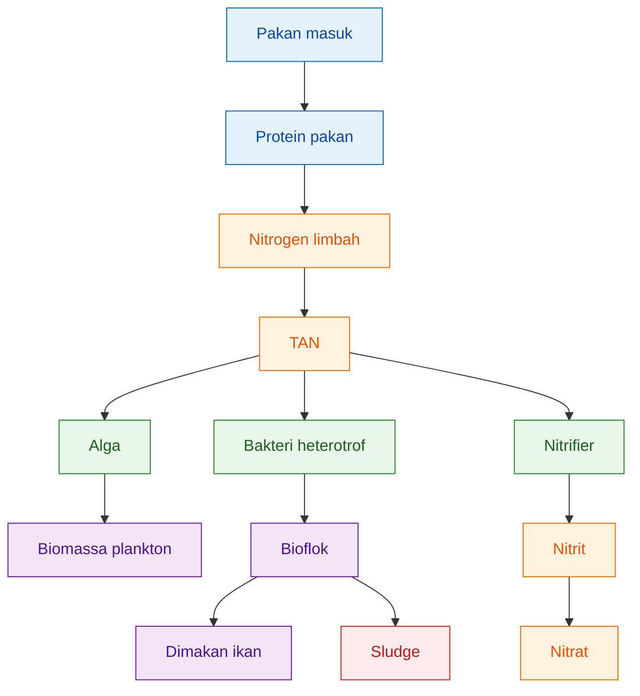
```mermaid
flowchart TD
    A["Pakan masuk"] --> B["Protein pakan"]
    B --> C["Nitrogen limbah"]
    C --> D["TAN"]
    D --> E["Alga"]
    D --> F["Bakteri heterotrof"]
    D --> G["Nitrifier"]
    E --> H["Biomassa plankton"]
    F --> I["Bioflok"]
    G --> J["Nitrit"]
    J --> K["Nitrat"]
    I --> L["Dimakan ikan"]
    I --> M["Sludge"]

    classDef input fill:#e3f2fd,stroke:#1565c0,color:#0d47a1;
    classDef waste fill:#fff3e0,stroke:#ef6c00,color:#e65100;
    classDef microbe fill:#e8f5e9,stroke:#2e7d32,color:#1b5e20;
    classDef risk fill:#ffebee,stroke:#c62828,color:#b71c1c;
    classDef output fill:#f3e5f5,stroke:#6a1b9a,color:#4a148c;

    class A,B input;
    class C,D,J,K waste;
    class E,F,G microbe;
    class M risk;
    class H,I,L output;
```

Dari diagram tersebut terlihat bahwa $TAN$ tidak hanya memiliki satu nasib. Ia bisa masuk ke plankton, ke bakteri heterotrof, atau ke jalur nitrifikasi. $C/N$ ratio menentukan seberapa kuat jalur heterotrof dibanding jalur lain.

---

## 1.3. Definisi $C/N$ Ratio untuk Praktisi

Dalam artikel ini, yang dimaksud $C/N$ adalah **rasio karbon terhadap nitrogen dari input harian kolam**, terutama dari pakan dan sumber karbon tambahan.

Secara konseptual:

$$
C/N_{\text{input}} =
\frac{
C_{\text{pakan}} + C_{\text{tambahan}}
}{
N_{\text{pakan}}
}
$$

Keterangan:

| Simbol                | Arti praktis                                                                  |
| --------------------- | ----------------------------------------------------------------------------- |
| $C_{\text{pakan}}$    | Karbon yang berasal dari pakan                                                |
| $C_{\text{tambahan}}$ | Karbon tambahan seperti molase, gula, tapioka, dedak, atau sumber karbon lain |
| $N_{\text{pakan}}$    | Nitrogen yang berasal dari protein pakan                                      |
| $C/N_{\text{input}}$  | Rasio karbon terhadap nitrogen yang masuk ke kolam                            |

Definisi ini penting karena dalam praktik sering terjadi kekeliruan. $C/N$ pada bioflok bukan $C/N$ tanah, bukan $C/N$ sedimen, bukan $C/N$ jaringan ikan, dan bukan sekadar angka laboratorium. Yang paling penting bagi praktisi adalah **berapa karbon dan nitrogen yang masuk ke air setiap hari**.

---

## 1.4. Kategori $C/N$ Rendah, Sedang, dan Tinggi

Untuk kebutuhan praktisi, $C/N$ dapat dibagi menjadi tiga kategori kerja.

| Kategori     |               Rentang kerja | Mikroba yang cenderung dominan                  | Karakter kolam                                                              |
| ------------ | --------------------------: | ----------------------------------------------- | --------------------------------------------------------------------------- |
| $C/N$ rendah |             $8$ sampai $12$ | Nitrifier atau kemoautotrof, sedikit heterotrof | Air lebih ringan, flok rendah sampai sedang, oksigen lebih hemat            |
| $C/N$ sedang |            $12$ sampai $16$ | Campuran nitrifier dan heterotrof               | Flok cukup, sistem relatif fleksibel                                        |
| $C/N$ tinggi | $16$ sampai $20$ atau lebih | Heterotrof dominan                              | Flok banyak, $TAN$ cepat turun, tetapi kebutuhan $O_2$ dan sludge meningkat |

Pembagian ini bukan hukum mutlak. Kondisi kolam, intensitas matahari, jenis pakan, jenis ikan, padat tebar, aerasi, dan umur sistem tetap memengaruhi hasil akhirnya. Namun sebagai panduan lapangan, pembagian ini cukup membantu.

<figure>
  
  <figcaption>
    Ilustrasi siklus nitrogen pada berbagai rezim C/N ratio untuk memahami
    keseimbangan amonia, nitrit, nitrat, oksigen, dan aktivitas mikroorganisme
    dalam sistem budidaya.
  </figcaption>
</figure>

---

## 1.5. Cara Membaca $C/N$ Secara Praktis

Pada pakan ikan, sumber nitrogen utama adalah protein. Protein mengandung nitrogen sekitar $16\%$. Maka, semakin tinggi protein pakan, semakin tinggi pula potensi nitrogen yang dilepas ke air.

Secara sederhana:

$$
N_{\text{pakan}} =
P_{\text{pakan}} \times Protein_{\text{pakan}} \times 0{,}16
$$

Keterangan:

| Simbol                   | Arti                               |
| ------------------------ | ---------------------------------- |
| $N_{\text{pakan}}$       | Nitrogen dari pakan                |
| $P_{\text{pakan}}$       | Jumlah pakan                       |
| $Protein_{\text{pakan}}$ | Kadar protein pakan sebagai fraksi |
| $0{,}16$                 | Fraksi nitrogen dalam protein      |

Contoh:

Jika pakan harian `$1$ kg` dengan protein $30\%$, maka nitrogen dalam pakan adalah:

$$
N_{\text{pakan}} =
1 \times 0{,}30 \times 0{,}16
$$

$$
N_{\text{pakan}} =
0{,}048 \text{ kg N}
$$

Artinya, dari `$1$ kg` pakan protein $30\%$, terdapat sekitar `$48$ g` nitrogen. Tidak semua nitrogen langsung menjadi amonia, tetapi angka ini memberi gambaran bahwa protein pakan adalah sumber utama beban nitrogen.

---

## 1.6. Dampak $C/N$ Rendah

Pada $C/N$ rendah, karbon organik tambahan sedikit atau tidak ada. Kondisi ini membuat bakteri heterotrof tidak meledak populasinya. Akibatnya, flok tidak terlalu pekat, sludge lebih sedikit, dan kebutuhan oksigen relatif lebih rendah.

Namun sistem $C/N$ rendah sangat bergantung pada nitrifikasi. Artinya, bakteri nitrifikasi harus sudah berkembang dengan baik.

Karakter $C/N$ rendah:

| Aspek            | Dampak                                                |
| ---------------- | ----------------------------------------------------- |
| Flok             | Lebih sedikit                                         |
| Sludge           | Lebih rendah                                          |
| Kebutuhan $O_2$  | Relatif lebih hemat                                   |
| Dominasi mikroba | Nitrifier atau kemoautotrof                           |
| Risiko utama     | $TAN$ dan nitrit naik bila nitrifier belum matang     |
| Cocok untuk      | Sistem matang, aerasi terbatas, target stabilitas air |

Kelebihan utamanya adalah stabilitas. Kekurangannya adalah kontribusi flok sebagai pakan tambahan tidak sebesar sistem $C/N$ tinggi.

---

## 1.7. Dampak $C/N$ Sedang

$C/N$ sedang adalah zona transisi. Pada zona ini, sistem tidak sepenuhnya bergantung pada nitrifikasi dan tidak sepenuhnya didominasi heterotrof. Bagi banyak praktisi, ini adalah zona paling aman saat memulai sistem bioflok.

Karakter $C/N$ sedang:

| Aspek            | Dampak                                                  |
| ---------------- | ------------------------------------------------------- |
| Flok             | Cukup terbentuk                                         |
| Sludge           | Sedang                                                  |
| Kebutuhan $O_2$  | Sedang sampai tinggi                                    |
| Dominasi mikroba | Campuran nitrifier dan heterotrof                       |
| Risiko utama     | Perlu kontrol $TSS$, $DO$, dan alkalinitas              |
| Cocok untuk      | Fase awal, sistem transisi, pembentukan flok terkontrol |

Pada fase awal, $C/N$ sedang sering lebih aman daripada langsung memakai $C/N$ rendah, karena nitrifier belum tentu matang. Bakteri heterotrof dapat membantu menekan $TAN$ lebih cepat selama masa transisi.

---

## 1.8. Dampak $C/N$ Tinggi

Pada $C/N$ tinggi, karbon organik banyak tersedia. Bakteri heterotrof berkembang cepat dan mengambil nitrogen dari air untuk membentuk biomassa. Hasilnya adalah flok lebih banyak.

Ini menguntungkan bila targetnya adalah menyediakan pakan tambahan alami. Namun ada konsekuensi serius: bioflok yang banyak juga berarti lebih banyak organisme mikroskopis yang bernapas.

Karakter $C/N$ tinggi:

| Aspek            | Dampak                                               |
| ---------------- | ---------------------------------------------------- |
| Flok             | Banyak                                               |
| Sludge           | Tinggi bila tidak dibuang                            |
| Kebutuhan $O_2$  | Tinggi                                               |
| Dominasi mikroba | Bakteri heterotrof                                   |
| Risiko utama     | $DO$ subuh turun, sludge menumpuk, air terlalu pekat |
| Cocok untuk      | Sistem dengan aerasi kuat dan manajemen sludge baik  |

Kesalahan umum praktisi adalah menganggap air semakin cokelat berarti sistem semakin baik. Padahal air yang terlalu pekat bisa berarti sistem kelebihan padatan, kelebihan respirasi mikroba, dan mulai kekurangan oksigen.

---

## 1.9. Diagram Ringkas Pengaruh $C/N$

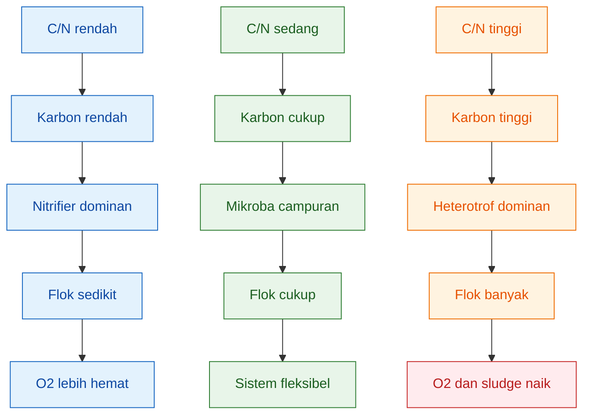
```mermaid
flowchart TD
    A["C/N rendah"] --> B["Karbon rendah"]
    B --> C["Nitrifier dominan"]
    C --> D["Flok sedikit"]
    D --> E["O2 lebih hemat"]

    F["C/N sedang"] --> G["Karbon cukup"]
    G --> H["Mikroba campuran"]
    H --> I["Flok cukup"]
    I --> J["Sistem fleksibel"]

    K["C/N tinggi"] --> L["Karbon tinggi"]
    L --> M["Heterotrof dominan"]
    M --> N["Flok banyak"]
    N --> O["O2 dan sludge naik"]

    classDef low fill:#e3f2fd,stroke:#1565c0,color:#0d47a1;
    classDef mid fill:#e8f5e9,stroke:#2e7d32,color:#1b5e20;
    classDef high fill:#fff3e0,stroke:#ef6c00,color:#e65100;
    classDef risk fill:#ffebee,stroke:#c62828,color:#b71c1c;

    class A,B,C,D,E low;
    class F,G,H,I,J mid;
    class K,L,M,N high;
    class O risk;
```

Diagram ini menunjukkan bahwa $C/N$ tinggi bukan sekadar menghasilkan flok. Ia juga meningkatkan kebutuhan oksigen dan potensi penumpukan sludge.

---

## 1.10. Kesimpulan Bab 1

$C/N$ ratio diperlukan karena ia menentukan arah kerja mikroba dalam sistem bioflok. Pada $C/N$ rendah, sistem lebih mengandalkan nitrifikasi. Pada $C/N$ sedang, sistem berada pada zona campuran. Pada $C/N$ tinggi, sistem lebih mengandalkan bakteri heterotrof dan menghasilkan flok lebih banyak.

Bagi praktisi, pilihan $C/N$ sebaiknya tidak hanya ditentukan oleh keinginan membentuk flok sebanyak mungkin. Pilihan $C/N$ harus disesuaikan dengan kemampuan aerasi, manajemen sludge, umur sistem, padat tebar, dan target budidaya.

Prinsip pentingnya adalah:

> Flok yang cukup adalah aset. Flok yang berlebihan adalah beban oksigen.

[**Kembali ke Atas**](#cn-ratio-pada-bioflok-mengatur-mikroba-oksigen-dan-stabilitas-kolam-untuk-praktisi)

---

# Bab 2. $C/N$ Ratio, Kelimpahan Matahari, dan Dominasi Mikroba

Setelah memahami pentingnya $C/N$, langkah berikutnya adalah memahami bahwa $C/N$ tidak bekerja sendirian. Dalam kolam terbuka, sinar matahari sangat memengaruhi mikroba yang berkembang.

Dua kolam dengan $C/N$ sama dapat memiliki karakter yang berbeda bila intensitas mataharinya berbeda. Kolam yang teduh cenderung lebih mengarah ke sistem bakteri, sedangkan kolam yang terkena matahari penuh cenderung memberi peluang lebih besar bagi alga dan fitoplankton.

Karena itu, dalam bioflok tropis, praktisi perlu membaca dua hal secara bersamaan:

```text
C/N menentukan arah bakteri.
Matahari menentukan peluang fotosintesis.
```

---

## 2.1. Mengenal Kelompok Mikroba Berdasarkan Energi dan Karbon

Istilah seperti autotrof, heterotrof, fototrof, dan kemotrof sering membuat bingung. Padahal, istilah ini bisa dipahami dengan dua pertanyaan sederhana:

1. Dari mana mikroba mendapat energi?
2. Dari mana mikroba mendapat karbon untuk membangun tubuhnya?

Berdasarkan sumber karbon:

| Istilah    | Sumber karbon          | Contoh di kolam                |
| ---------- | ---------------------- | ------------------------------ |
| Autotrof   | $CO_2$ atau bikarbonat | Alga, cyanobacteria, nitrifier |
| Heterotrof | Bahan organik          | Bakteri bioflok heterotrof     |

Berdasarkan sumber energi:

| Istilah  | Sumber energi | Contoh di kolam                           |
| -------- | ------------- | ----------------------------------------- |
| Fototrof | Cahaya        | Alga, cyanobacteria, bakteri fotosintetik |
| Kemotrof | Reaksi kimia  | Nitrifier, bakteri heterotrof             |

Jika kedua pengelompokan ini digabung, maka terbentuk empat kelompok utama.

| Kelompok       | Sumber energi          | Sumber karbon          | Contoh                            |
| -------------- | ---------------------- | ---------------------- | --------------------------------- |
| Fotoautotrof   | Cahaya                 | $CO_2$ atau bikarbonat | Alga, fitoplankton, cyanobacteria |
| Kemoautotrof   | Reaksi kimia anorganik | $CO_2$ atau bikarbonat | Bakteri nitrifikasi               |
| Kemoheterotrof | Bahan organik          | Bahan organik          | Bakteri bioflok heterotrof        |
| Fotoheterotrof | Cahaya                 | Bahan organik          | Beberapa bakteri fotosintetik     |

Poin pentingnya:

```text
Autotrof bukan selalu alga.
Autotrof juga bisa berupa bakteri nitrifikasi.
```

Ini penting untuk menghindari kesalahan interpretasi. Pada $C/N$ rendah dan matahari rendah, yang cenderung dominan bukan alga, tetapi **kemoautotrof**, yaitu bakteri nitrifikasi.

---

## 2.2. Diagram Klasifikasi Mikroba

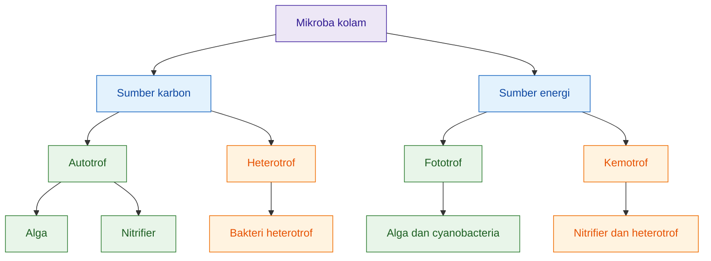
```mermaid
flowchart TD
    A["Mikroba kolam"] --> B["Sumber karbon"]
    A --> C["Sumber energi"]

    B --> D["Autotrof"]
    B --> E["Heterotrof"]

    C --> F["Fototrof"]
    C --> G["Kemotrof"]

    D --> H["Alga"]
    D --> I["Nitrifier"]

    E --> J["Bakteri heterotrof"]

    F --> K["Alga dan cyanobacteria"]
    G --> L["Nitrifier dan heterotrof"]

    classDef root fill:#ede7f6,stroke:#4527a0,color:#311b92;
    classDef group fill:#e3f2fd,stroke:#1565c0,color:#0d47a1;
    classDef auto fill:#e8f5e9,stroke:#2e7d32,color:#1b5e20;
    classDef hetero fill:#fff3e0,stroke:#ef6c00,color:#e65100;
    classDef note fill:#fce4ec,stroke:#ad1457,color:#880e4f;

    class A root;
    class B,C group;
    class D,F,H,I,K auto;
    class E,G,J,L hetero;
```

Diagram ini menunjukkan bahwa istilah mikroba tidak berdiri sendiri. Satu mikroba bisa disebut autotrof karena sumber karbonnya, sekaligus kemotrof karena sumber energinya.

---

## 2.3. Peran $C/N$ terhadap Dominasi Mikroba

$C/N$ ratio menentukan apakah sistem lebih menguntungkan bakteri heterotrof atau nitrifier.

Pada $C/N$ rendah, karbon organik terbatas. Bakteri heterotrof tidak memiliki cukup bahan bakar untuk tumbuh sangat cepat. Amonia lebih banyak diproses oleh nitrifier.

Pada $C/N$ tinggi, karbon organik melimpah. Bakteri heterotrof berkembang cepat, mengambil nitrogen dari air, lalu membentuk flok.

Hubungannya dapat diringkas sebagai berikut:

| Kondisi $C/N$ | Mikroba yang lebih diuntungkan    | Hasil utama                            |
| ------------- | --------------------------------- | -------------------------------------- |
| Rendah        | Nitrifier atau kemoautotrof       | $TAN$ diubah menjadi nitrit dan nitrat |
| Sedang        | Campuran nitrifier dan heterotrof | Sistem lebih fleksibel                 |
| Tinggi        | Bakteri heterotrof                | $TAN$ dikemas menjadi biomassa flok    |

Secara praktis:

```text
C/N rendah → nitrogen mengalir ke nitrifikasi
C/N tinggi → nitrogen dikemas menjadi flok
```

---

## 2.4. Peran Matahari terhadap Dominasi Mikroba

Sinar matahari memberi keuntungan besar pada organisme fototrof, terutama alga, fitoplankton, dan cyanobacteria.

Pada kolam terbuka dengan matahari kuat, alga dapat tumbuh cepat bila tersedia nutrien. Alga mengambil nitrogen dan fosfor untuk tumbuh. Pada siang hari, alga menghasilkan oksigen melalui fotosintesis. Namun pada malam hari, alga tetap bernapas dan menggunakan oksigen.

Efek matahari dapat dibaca sebagai berikut:

| Intensitas matahari | Mikroba yang diuntungkan               | Ciri kolam                            | Risiko                        |
| ------------------- | -------------------------------------- | ------------------------------------- | ----------------------------- |
| Rendah              | Nitrifier dan bakteri non-fotosintetik | Air lebih stabil, tidak terlalu hijau | Flok dan alga rendah          |
| Sedang              | Campuran bakteri dan plankton          | Sistem relatif seimbang               | Perlu monitoring              |
| Tinggi              | Alga, fitoplankton, cyanobacteria      | Air hijau, $pH$ sore naik             | $DO$ subuh turun              |
| Sangat tinggi       | Alga dominan bila nutrien tersedia     | Blooming mudah terjadi                | Fluktuasi $pH$ dan $DO$ tajam |

Pada siang hari, kolam yang banyak alga dapat terlihat sehat karena $DO$ tinggi. Namun ini bisa menipu. Saat malam, alga berhenti berfotosintesis tetapi tetap berrespirasi. Maka, $DO$ dapat turun tajam menjelang subuh.

---

## 2.5. Ukuran Praktis Kelimpahan Matahari

Untuk praktisi, cara paling mudah mengukur matahari adalah menggunakan lux meter. Pengukuran dilakukan di permukaan air pada pukul $10.00$ sampai $14.00$.

| Kategori cahaya |            Lux di permukaan air | Makna praktis                                        |
| --------------- | ------------------------------: | ---------------------------------------------------- |
| Rendah          |                 `$<10.000$ lux` | Alga relatif ditekan, cocok untuk sistem nitrifikasi |
| Sedang          | `$10.000$ sampai `$30.000$ lux` | Sistem campuran masih terkendali                     |
| Tinggi          |                 `$>30.000$ lux` | Alga mudah meningkat, $pH$ sore perlu diawasi        |
| Sangat tinggi   |                 `$>60.000$ lux` | Risiko blooming dan fluktuasi $DO$ lebih besar       |

Untuk bioflok yang diarahkan ke $C/N$ rendah, cahaya rendah sampai sedang biasanya lebih mudah dikendalikan. Tujuannya bukan membuat kolam gelap total, tetapi menekan dominasi alga berlebihan.

---

## 2.6. Rekomendasi Paranet

Paranet digunakan untuk menurunkan intensitas cahaya dan menstabilkan kondisi kolam. Semakin tinggi persentase paranet, semakin besar cahaya yang ditahan.

| Target sistem                               |              Rekomendasi paranet awal |
| ------------------------------------------- | ------------------------------------: |
| $C/N$ rendah dengan nitrifikasi dominan     |                    $50$ sampai $70\%$ |
| Sistem campuran flok dan plankton           |                    $40$ sampai $50\%$ |
| Kolam mudah hijau atau muncul cyanobacteria |                    $60$ sampai $70\%$ |
| Musim hujan atau mendung panjang            | $30$ sampai $50\%$ atau buka sebagian |

Paranet sebaiknya tidak dipilih hanya berdasarkan angka. Praktisi perlu melihat respons kolam:

| Gejala kolam                          | Interpretasi                      | Tindakan                             |
| ------------------------------------- | --------------------------------- | ------------------------------------ |
| Air cepat hijau                       | Cahaya dan nutrien mendukung alga | Tambah naungan                       |
| $pH$ sore jauh lebih tinggi dari pagi | Fotosintesis alga kuat            | Tambah paranet atau kurangi nutrien  |
| $DO$ subuh rendah                     | Respirasi malam tinggi            | Tambah aerasi, kurangi beban organik |
| Air terlalu gelap dan suhu rendah     | Naungan berlebihan                | Kurangi paranet sebagian             |

---

## 2.7. Interaksi $C/N$ dan Matahari

$C/N$ dan matahari harus dibaca sebagai satu paket. Kombinasi keduanya menentukan dominasi mikroba.

| Kombinasi                        | Dominasi mikroba            | Karakter air                          | Risiko utama                                  |
| -------------------------------- | --------------------------- | ------------------------------------- | --------------------------------------------- |
| $C/N$ rendah dan matahari rendah | Nitrifier atau kemoautotrof | Air lebih ringan, flok tidak berlebih | $TAN$ atau nitrit bila nitrifier belum matang |
| $C/N$ rendah dan matahari tinggi | Nitrifier dan alga          | Air cenderung hijau                   | $pH$ sore naik, $DO$ subuh turun              |
| $C/N$ sedang dan matahari sedang | Campuran                    | Sistem fleksibel                      | Perlu pemantauan rutin                        |
| $C/N$ tinggi dan matahari rendah | Heterotrof                  | Air cokelat, flok banyak              | Kebutuhan $O_2$ dan sludge naik               |
| $C/N$ tinggi dan matahari tinggi | Heterotrof dan alga         | Sangat aktif tetapi sulit stabil      | Risiko $DO$ subuh drop paling tinggi          |

Kombinasi paling ringan dari sisi oksigen biasanya adalah:

```text
C/N rendah + matahari rendah
```

Pada kondisi ini, karbon tambahan rendah dan alga juga tidak berlebihan. Artinya, dua sumber konsumsi oksigen besar dapat ditekan: respirasi heterotrof berlebih dan respirasi alga malam hari.

---

## 2.8. Diagram Matriks $C/N$ dan Matahari

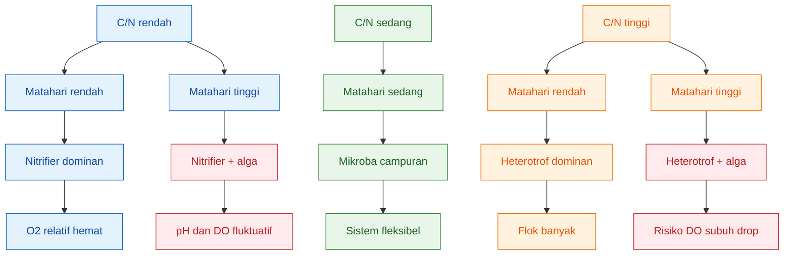
```mermaid
flowchart TD
    A["C/N rendah"] --> B["Matahari rendah"]
    A --> C["Matahari tinggi"]

    D["C/N sedang"] --> E["Matahari sedang"]

    F["C/N tinggi"] --> G["Matahari rendah"]
    F --> H["Matahari tinggi"]

    B --> I["Nitrifier dominan"]
    C --> J["Nitrifier + alga"]
    E --> K["Mikroba campuran"]
    G --> L["Heterotrof dominan"]
    H --> M["Heterotrof + alga"]

    I --> N["O2 relatif hemat"]
    J --> O["pH dan DO fluktuatif"]
    K --> P["Sistem fleksibel"]
    L --> Q["Flok banyak"]
    M --> R["Risiko DO subuh drop"]

    classDef low fill:#e3f2fd,stroke:#1565c0,color:#0d47a1;
    classDef mid fill:#e8f5e9,stroke:#2e7d32,color:#1b5e20;
    classDef high fill:#fff3e0,stroke:#ef6c00,color:#e65100;
    classDef risk fill:#ffebee,stroke:#c62828,color:#b71c1c;
    classDef good fill:#e0f2f1,stroke:#00695c,color:#004d40;

    class A,B,C,I,N low;
    class D,E,K,P mid;
    class F,G,H,L,Q high;
    class J,O,M,R risk;
```

Diagram ini menunjukkan bahwa $C/N$ tinggi belum tentu buruk, tetapi membutuhkan kontrol oksigen dan sludge yang jauh lebih kuat. Sebaliknya, $C/N$ rendah dengan cahaya rendah cenderung lebih stabil, terutama bila nitrifikasi sudah matang.

---

## 2.9. Implikasi Praktis untuk Sistem $C/N$ Rendah

Jika target budidaya adalah sistem $C/N$ rendah, maka tujuan utamanya adalah membangun sistem yang stabil, tidak terlalu pekat, hemat oksigen, dan tidak mudah blooming alga.

Strategi praktisnya:

1. Gunakan paranet $50$ sampai $70\%$ pada kolam terbuka.
2. Jangan menambah molase secara rutin bila $TAN$ masih terkendali.
3. Siapkan nitrifikasi sejak awal dengan aerasi kuat dan alkalinitas cukup.
4. Jaga $DO$ subuh tetap aman.
5. Hindari air terlalu hijau.
6. Hindari flok terlalu pekat.
7. Buang sludge sebelum berubah menjadi zona anaerob.

Pada sistem ini, praktisi tidak mengejar bioflok sebanyak mungkin. Targetnya adalah **bioflok secukupnya dan nitrifikasi stabil**.

---

## 2.10. Kesimpulan Bab 2

$C/N$ ratio dan matahari bekerja bersama menentukan dominasi mikroba di kolam bioflok. $C/N$ mengatur ketersediaan karbon untuk bakteri, sedangkan matahari mengatur peluang organisme fotosintetik seperti alga dan cyanobacteria.

Pada $C/N$ rendah dan matahari rendah, sistem cenderung lebih mengandalkan nitrifier. Kondisi ini memiliki banyak keunggulan: kebutuhan oksigen relatif lebih rendah, sludge lebih sedikit, flok tidak berlebihan, dan fluktuasi $pH$ serta $DO$ lebih kecil.

Namun sistem ini hanya aman bila nitrifikasi sudah matang. Jika nitrifier belum kuat, $TAN$ dan nitrit dapat meningkat. Karena itu, strategi terbaik bukan langsung memaksakan $C/N$ rendah sejak awal, tetapi membangun sistem secara bertahap: mulai dari kondisi aman, lalu menurunkan karbon ketika nitrifikasi sudah stabil.

Pesan utama bab ini:

> $C/N$ rendah memberi stabilitas, matahari rendah menekan alga, dan kombinasi keduanya dapat menghasilkan sistem bioflok yang lebih hemat oksigen. Namun keberhasilannya bergantung pada kesiapan nitrifikasi, aerasi, alkalinitas, dan monitoring kualitas air.

---

# 2. C/N Ratio, Matahari, dan Dominasi Mikroba

## 2.1. Kenali empat kelompok utama

| Kelompok           | Sumber energi          | Sumber karbon  | Contoh                            |
| ------------------ | ---------------------- | -------------- | --------------------------------- |
| **Fotoautotrof**   | Cahaya                 | CO₂/bikarbonat | Alga, fitoplankton, cyanobacteria |
| **Kemoautotrof**   | Reaksi kimia anorganik | CO₂/bikarbonat | Bakteri nitrifikasi               |
| **Kemoheterotrof** | Bahan organik          | Bahan organik  | Bakteri bioflok heterotrof        |
| **Fotoheterotrof** | Cahaya                 | Organik        | Beberapa bakteri fotosintetik     |

Poin penting artikel:

```text
C/N mengatur makanan bakteri.
Matahari mengatur peluang alga.
Oksigen menentukan apakah sistem aman atau crash.
```

## 2.2. Matriks C/N dan matahari

| Kondisi                          | Dominasi mikroba       | Karakter air                      | Risiko                                 |
| -------------------------------- | ---------------------- | --------------------------------- | -------------------------------------- |
| **C/N rendah + matahari rendah** | Kemoautotrof/nitrifier | Lebih stabil, flok tidak berlebih | TAN/nitrit bila nitrifier belum matang |
| **C/N rendah + matahari tinggi** | Nitrifier + alga       | Air hijau, pH sore naik           | DO subuh turun, pH fluktuatif          |
| **C/N sedang + matahari sedang** | Campuran               | Cocok untuk transisi              | Perlu monitoring rutin                 |
| **C/N tinggi + matahari rendah** | Heterotrof             | Air cokelat, flok banyak          | O₂ tinggi, TSS/sludge naik             |
| **C/N tinggi + matahari tinggi** | Heterotrof + alga      | Sangat produktif tetapi liar      | Risiko DO subuh drop paling tinggi     |

Pada sistem bioflok yang terkena sinar matahari, alga dapat berkembang karena nutrien dari pakan, tetapi aktivitas alga juga menyebabkan fluktuasi DO dan pH harian. Hargreaves menekankan bahwa uptake alga sangat dipengaruhi intensitas cahaya bawah air, sedangkan padatan bioflok yang tinggi dapat menaungi alga.

## 2.3. Ukuran praktis matahari

Untuk praktisi, artikel dapat memakai klasifikasi kerja berikut:

| Kategori cahaya di permukaan air | Ukuran lux pukul 10.00–14.00 | Strategi                                 |
| -------------------------------- | ---------------------------: | ---------------------------------------- |
| Rendah                           |               &lt;10.000 lux | Cocok untuk sistem nitrifikasi/CN rendah |
| Sedang                           |            10.000–30.000 lux | Cocok untuk sistem campuran              |
| Tinggi                           |               &gt;30.000 lux | Waspada alga dan pH sore tinggi          |
| Sangat tinggi                    |               &gt;60.000 lux | Perlu paranet/atap parsial               |

Rekomendasi praktis paranet:

| Target sistem                           |                  Paranet awal |
| --------------------------------------- | ----------------------------: |
| Bioflok rendah C/N, nitrifikasi dominan |                    **50–70%** |
| Sistem campuran flok + plankton         |                    **40–50%** |
| Kolam mudah hijau/cyanobacteria         |                    **60–70%** |
| Musim hujan/mendung panjang             | **30–50%** atau buka sebagian |

[**Kembali ke Atas**](#cn-ratio-pada-bioflok-mengatur-mikroba-oksigen-dan-stabilitas-kolam-untuk-praktisi)

---

# Bab 3. $C/N$ Ratio dan Kebutuhan Oksigen

Salah satu kesalahan paling umum dalam praktik bioflok adalah menilai keberhasilan hanya dari turunnya amonia. Banyak praktisi melihat $TAN$ turun setelah penambahan molase atau sumber karbon, lalu menyimpulkan bahwa kolam sudah lebih aman.

Kesimpulan itu belum tentu benar.

Pada bioflok, penurunan $TAN$ memang penting, tetapi harus dibaca bersama dengan $DO$, $TSS$, flok, sludge, $pH$, alkalinitas, dan kondisi ikan. Sistem yang amonianya rendah tetap bisa bermasalah bila oksigennya turun, flok terlalu pekat, atau sludge mulai membusuk.

Dengan kata lain:

> $C/N$ tinggi bisa menurunkan amonia lebih cepat, tetapi tidak gratis. Biayanya adalah kebutuhan oksigen, peningkatan flok, dan peningkatan sludge.

---

## 3.1. Kesalahan Umum: Amonia Turun Berarti Kolam Aman

Banyak praktisi berpikir:

**$C/N$ tinggi membuat amonia turun, maka kolam pasti lebih aman.**

Padahal alur yang lebih lengkap adalah:

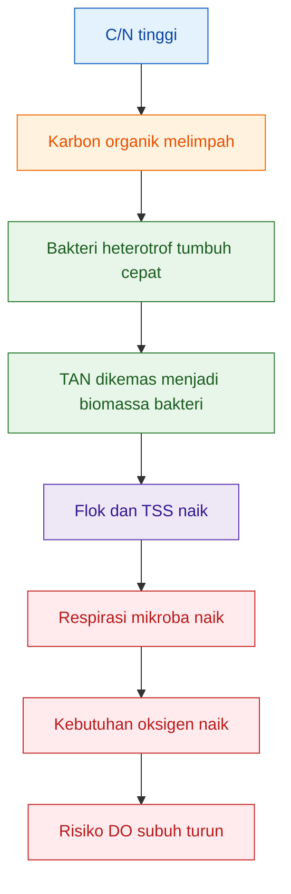
```mermaid id="a9x3m2"
flowchart TD
    A["C/N tinggi"] --> B["Karbon organik melimpah"]
    B --> C["Bakteri heterotrof tumbuh cepat"]
    C --> D["TAN dikemas menjadi biomassa bakteri"]
    D --> E["Flok dan TSS naik"]
    E --> F["Respirasi mikroba naik"]
    F --> G["Kebutuhan oksigen naik"]
    G --> H["Risiko DO subuh turun"]

    classDef start fill:#e3f2fd,stroke:#1565c0,color:#0d47a1;
    classDef carbon fill:#fff3e0,stroke:#ef6c00,color:#e65100;
    classDef microbe fill:#e8f5e9,stroke:#2e7d32,color:#1b5e20;
    classDef solid fill:#ede7f6,stroke:#5e35b1,color:#311b92;
    classDef oxygen fill:#ffebee,stroke:#c62828,color:#b71c1c;

    class A start;
    class B carbon;
    class C,D microbe;
    class E solid;
    class F,G,H oxygen;
```

Diagram ini menunjukkan bahwa $C/N$ tinggi tidak hanya mengubah amonia menjadi bentuk yang lebih aman. $C/N$ tinggi juga mengubah sebagian nitrogen menjadi biomassa mikroba. Biomassa ini kemudian menjadi bagian dari bioflok.

Masalahnya, bioflok adalah kumpulan organisme hidup dan bahan organik. Ia bukan benda mati yang netral. Flok bernapas, mengonsumsi oksigen, mati, terurai, dan sebagian menjadi sludge.

Maka, pada sistem $C/N$ tinggi, pertanyaan pentingnya bukan hanya:

> Apakah $TAN$ turun?

Tetapi juga:

> Apakah suplai oksigen mampu mengikuti kenaikan respirasi mikroba?

---

## 3.2. Mengapa $C/N$ Tinggi Membutuhkan Lebih Banyak Oksigen

Pada $C/N$ tinggi, pembudidaya biasanya menambah sumber karbon seperti molase, gula, tapioka, dedak halus, tepung, atau sumber karbon organik lain. Karbon ini menjadi energi bagi bakteri heterotrof.

Secara sederhana, prosesnya dapat dibaca sebagai berikut:

$$
\text{Karbon organik} + O_2
\rightarrow
\text{biomassa bakteri} + CO_2 + H_2O
$$

<figure>
  
  <figcaption>
    Grafik hubungan antara kebutuhan oksigen dan rasio C/N dalam sistem
    budidaya, terutama untuk memahami keseimbangan aerasi, bahan organik, dan
    aktivitas mikroorganisme.
  </figcaption>
</figure>

Artinya, semakin banyak karbon organik yang tersedia, semakin besar peluang bakteri heterotrof tumbuh dan bernapas. Ini membuat kebutuhan oksigen meningkat.

Pada saat yang sama, bakteri heterotrof mengambil nitrogen dari air untuk membentuk biomassa. Karena itu, $TAN$ bisa turun. Namun penurunan $TAN$ ini disertai kenaikan biomassa mikroba dan flok.

Secara praktis:

| Proses                 | Dampak positif              | Biaya tersembunyi               |
| ---------------------- | --------------------------- | ------------------------------- |
| Penambahan karbon      | $TAN$ bisa turun cepat      | Konsumsi $O_2$ naik             |
| Pertumbuhan heterotrof | Flok terbentuk              | $TSS$ meningkat                 |
| Pembentukan bioflok    | Bisa menjadi pakan tambahan | Sludge bisa menumpuk            |
| Asimilasi nitrogen     | Amonia lebih terkendali     | Flok hidup tetap bernapas       |
| Flok tua terurai       | Nutrien kembali berputar    | $DO$ turun, bau, risiko anaerob |

Jadi, $C/N$ tinggi adalah strategi yang kuat, tetapi harus dibayar dengan aerasi dan manajemen padatan yang kuat.

---

## 3.3. Perbandingan Kebutuhan Oksigen pada $C/N$ Rendah, Sedang, dan Tinggi

Kebutuhan oksigen dalam kolam bioflok berasal dari beberapa sumber:

1. Respirasi ikan.
2. Respirasi bakteri heterotrof.
3. Nitrifikasi.
4. Respirasi flok atau $TSS$.
5. Dekomposisi bahan organik.
6. Respirasi alga pada malam hari.

Pada $C/N$ rendah, oksigen lebih banyak digunakan untuk respirasi ikan dan nitrifikasi. Pada $C/N$ tinggi, oksigen juga digunakan dalam jumlah besar oleh bakteri heterotrof dan flok.

|            $C/N$ | Jalur utama                        | Beban $O_2$          | Catatan                                |
| ---------------: | ---------------------------------- | -------------------- | -------------------------------------- |
|  $8$ sampai $10$ | Nitrifikasi dominan                | Rendah sampai sedang | Perlu alkalinitas kuat                 |
| $10$ sampai $12$ | Nitrifikasi dan sedikit heterotrof | Sedang               | Cocok untuk sistem rendah karbon       |
| $12$ sampai $16$ | Campuran                           | Sedang sampai tinggi | Flok mulai produktif                   |
| $16$ sampai $20$ | Heterotrof dominan                 | Tinggi               | $TSS$ dan sludge naik                  |
|  Lebih dari $20$ | Heterotrof berlebih                | Sangat tinggi        | Rawan $DO$ drop, busa, lumpur, dan bau |

Poin pentingnya: kebutuhan oksigen tidak naik tajam hanya karena proses penghilangan amonia. Kebutuhan oksigen naik tajam karena karbon berlebih, peningkatan biomassa mikroba, peningkatan $TSS$, dan penguraian flok tua.

---

## 3.4. Perbandingan Stoikiometri: Nitrifikasi dan Heterotrof

Secara stoikiometri, kebutuhan oksigen untuk nitrifikasi dan jalur heterotrof per satuan nitrogen sebenarnya tidak terlalu jauh berbeda.

Untuk nitrifikasi, pendekatannya:

$$
1 \text{ g } NH_4^+\text{-}N
\rightarrow
4{,}18 \text{ g } O_2
$$

Untuk jalur heterotrof, pendekatannya:

$$
1 \text{ g } NH_4^+\text{-}N
\rightarrow
4{,}71 \text{ g } O_2
+
8{,}07 \text{ g } VSS
$$

Perbedaan pentingnya bukan hanya pada $O_2$, tetapi pada produksi biomassa.

| Jalur                    |                                        Kebutuhan $O_2$ |                                      Produksi biomassa |
| ------------------------ | -----------------------------------------------------: | -----------------------------------------------------: |
| Nitrifikasi kemoautotrof | $4{,}18 \text{ g } O_2 \text{ per g } NH_4^+\text{-}N$ |                                                 Rendah |
| Asimilasi heterotrof     | $4{,}71 \text{ g } O_2 \text{ per g } NH_4^+\text{-}N$ | $8{,}07 \text{ g } VSS \text{ per g } NH_4^+\text{-}N$ |

Inilah alasan sistem $C/N$ tinggi sering terasa lebih berat di lapangan. Bukan semata-mata karena angka oksigen per gram nitrogen lebih tinggi, tetapi karena heterotrof menghasilkan biomassa jauh lebih banyak. Biomassa inilah yang kemudian menjadi flok, $TSS$, dan sludge.

Dengan bahasa praktis:

> Nitrifikasi mengubah amonia menjadi nitrit dan nitrat. Heterotrof mengemas amonia menjadi tubuh mikroba. Tubuh mikroba itu kemudian harus dikelola.

---

## 3.5. Model Konseptual Kebutuhan Oksigen

Kebutuhan oksigen total dapat dipahami sebagai gabungan beberapa komponen.

$$
O_{2,\text{total}} =
O_{2,\text{ikan}}
+
O_{2,\text{nitrifikasi}}
+
O_{2,\text{heterotrof}}
+
O_{2,\text{flok}}
+
O_{2,\text{alga malam}}
$$

Keterangan:

| Komponen                   | Arti                                                         |
| -------------------------- | ------------------------------------------------------------ |
| $O_{2,\text{ikan}}$        | Oksigen untuk respirasi ikan                                 |
| $O_{2,\text{nitrifikasi}}$ | Oksigen untuk oksidasi amonia dan nitrit                     |
| $O_{2,\text{heterotrof}}$  | Oksigen untuk bakteri heterotrof yang memakai karbon organik |
| $O_{2,\text{flok}}$        | Oksigen untuk respirasi dan penguraian flok                  |
| $O_{2,\text{alga malam}}$  | Oksigen yang dipakai alga saat malam hari                    |

Pada $C/N$ rendah, komponen dominan biasanya:

$$
O_{2,\text{total}}
\approx
O_{2,\text{ikan}}
+
O_{2,\text{nitrifikasi}}
$$

Pada $C/N$ tinggi, komponen dominan menjadi lebih banyak:

$$
O_{2,\text{total}}
\approx
O_{2,\text{ikan}}
+
O_{2,\text{heterotrof}}
+
O_{2,\text{flok}}
+
O_{2,\text{karbon berlebih}}
$$

Karena itu, $C/N$ tinggi membutuhkan bukan hanya aerator yang mampu menaikkan $DO$, tetapi aerator yang mampu menyediakan **laju transfer oksigen** secara terus-menerus.

---

## 3.6. Grafik Konseptual Kebutuhan Oksigen terhadap $C/N$

Grafik utama dalam artikel ini menggambarkan hubungan antara $C/N$ ratio dan kebutuhan oksigen relatif. Sumbu horizontal adalah $C/N$, sedangkan sumbu vertikal adalah indeks kebutuhan oksigen.

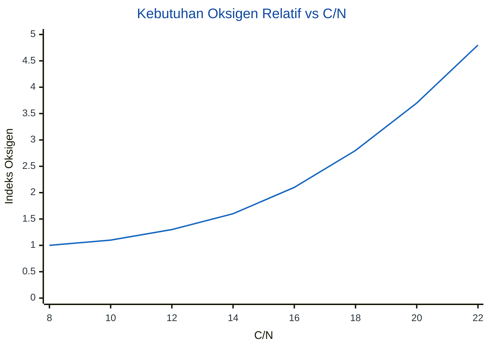
```mermaid id="du0hgc"
%%{init: {"theme":"base","themeVariables":{"xyChart":{"backgroundColor":"#ffffff","titleColor":"#0d47a1","xAxisLabelColor":"#263238","yAxisLabelColor":"#263238","plotColorPalette":"#1565c0,#ef6c00"}}}}%%
xychart-beta
    title "Kebutuhan Oksigen Relatif vs C/N"
    x-axis "C/N" [8, 10, 12, 14, 16, 18, 20, 22]
    y-axis "Indeks Oksigen" 0 --> 5
    line [1.0, 1.1, 1.3, 1.6, 2.1, 2.8, 3.7, 4.8]
```

Makna grafik:

| Zona $C/N$       | Karakter kebutuhan oksigen                                  |
| ---------------- | ----------------------------------------------------------- |
| $8$ sampai $12$  | Kebutuhan $O_2$ relatif terkendali                          |
| $12$ sampai $16$ | Kebutuhan $O_2$ mulai meningkat karena flok bertambah       |
| $16$ sampai $20$ | Kebutuhan $O_2$ tinggi karena heterotrof dominan            |
| Lebih dari $20$  | Kebutuhan $O_2$ sangat tinggi dan sistem rawan tidak stabil |

Grafik ini bukan grafik laboratorium yang berlaku mutlak untuk semua kolam. Grafik ini adalah model konseptual untuk membantu praktisi memahami arah perubahan risiko.

Pesan utamanya:

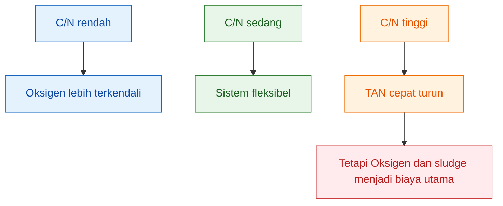
```mermaid id="z6lsfh"
flowchart TD
    A["C/N rendah"] --> B["Oksigen lebih terkendali"]
    C["C/N sedang"] --> D["Sistem fleksibel"]
    E["C/N tinggi"] --> F["TAN cepat turun"]
    F --> G["Tetapi Oksigen dan sludge menjadi biaya utama"]

    classDef low fill:#e3f2fd,stroke:#1565c0,color:#0d47a1;
    classDef mid fill:#e8f5e9,stroke:#2e7d32,color:#1b5e20;
    classDef high fill:#fff3e0,stroke:#ef6c00,color:#e65100;
    classDef risk fill:#ffebee,stroke:#c62828,color:#b71c1c;

    class A,B low;
    class C,D mid;
    class E,F high;
    class G risk;
```

---

## 3.7. Mengapa $DO$ Sore Bisa Menipu

Pada kolam terbuka, $DO$ sore sering tinggi karena fotosintesis alga. Ini bisa membuat kolam terlihat aman. Namun nilai $DO$ sore tidak selalu mencerminkan risiko sebenarnya.

Yang lebih kritis adalah $DO$ menjelang subuh.

Pada siang hari:

$$
\text{Alga} + \text{cahaya}
\rightarrow
O_2 \text{ naik}
$$

Pada malam hari:

$$
\text{Ikan} + \text{bakteri} + \text{flok} + \text{alga}
\rightarrow
O_2 \text{ turun}
$$

Karena itu, sistem $C/N$ tinggi dengan matahari tinggi bisa terlihat sangat baik pada sore hari, tetapi berisiko besar pada pagi buta.

Urutan risikonya:

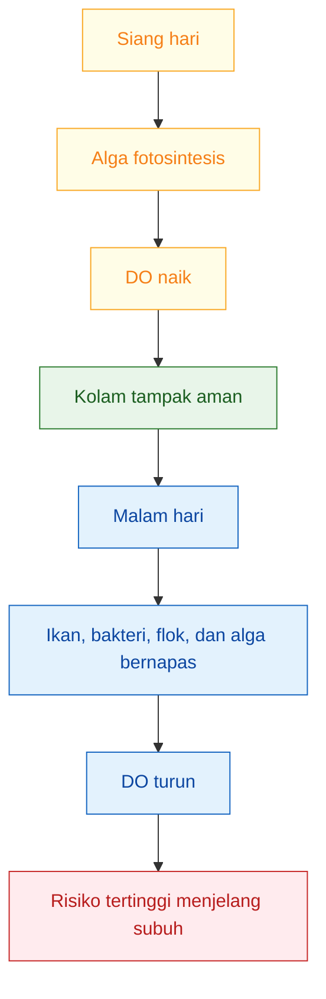
```mermaid id="m0xsia"
flowchart TD
    A["Siang hari"] --> B["Alga fotosintesis"]
    B --> C["DO naik"]
    C --> D["Kolam tampak aman"]
    D --> E["Malam hari"]
    E --> F["Ikan, bakteri, flok, dan alga bernapas"]
    F --> G["DO turun"]
    G --> H["Risiko tertinggi menjelang subuh"]

    classDef day fill:#fffde7,stroke:#f9a825,color:#f57f17;
    classDef safe fill:#e8f5e9,stroke:#2e7d32,color:#1b5e20;
    classDef night fill:#e3f2fd,stroke:#1565c0,color:#0d47a1;
    classDef risk fill:#ffebee,stroke:#c62828,color:#b71c1c;

    class A,B,C day;
    class D safe;
    class E,F,G night;
    class H risk;
```

Parameter yang paling jujur untuk membaca risiko oksigen adalah:

| Waktu pengukuran                   | Makna                                          |
| ---------------------------------- | ---------------------------------------------- |
| Pagi buta                          | Risiko minimum $DO$ harian                     |
| Sore hari                          | Pengaruh fotosintesis dan aerasi               |
| Setelah pemberian karbon           | Respons respirasi heterotrof                   |
| Setelah hujan atau mendung panjang | Risiko penurunan fotosintesis dan stres sistem |

Untuk sistem bioflok intensif, $DO$ subuh harus menjadi parameter wajib, bukan parameter tambahan.

---

## 3.8. Implikasi Praktis untuk Aerasi

Aerasi dalam bioflok memiliki dua fungsi utama:

1. Menyediakan oksigen.
2. Menjaga flok tetap tersuspensi.

Pada $C/N$ rendah, aerasi terutama diperlukan untuk ikan dan nitrifikasi. Pada $C/N$ tinggi, aerasi juga harus mengimbangi respirasi bakteri heterotrof dan flok yang lebih besar.

Maka, semakin tinggi $C/N$, semakin besar kebutuhan terhadap:

| Kebutuhan                  | Penjelasan                                                  |
| -------------------------- | ----------------------------------------------------------- |
| Kapasitas transfer oksigen | Agar $DO$ tidak turun saat respirasi mikroba meningkat      |
| Mixing                     | Agar flok tidak mengendap dan membusuk                      |
| Backup aerasi              | Karena waktu respons saat listrik mati menjadi lebih pendek |
| Kontrol $TSS$              | Agar air tidak terlalu pekat                                |
| Pembuangan sludge          | Agar padatan tua tidak menjadi sumber masalah               |

Prinsip praktisnya:

> Jangan menaikkan $C/N$ lebih cepat daripada kemampuan aerasi dan pembuangan sludge.

---

## 3.9. Kesimpulan Bab 3

$C/N$ tinggi memang dapat menurunkan $TAN$ dengan cepat melalui aktivitas bakteri heterotrof. Namun penurunan $TAN$ tidak selalu berarti sistem lebih aman. Pada $C/N$ tinggi, nitrogen dikemas menjadi biomassa mikroba, lalu menjadi flok dan $TSS$. Flok ini hidup, bernapas, mati, terurai, dan sebagian menjadi sludge.

Karena itu, kebutuhan oksigen pada $C/N$ tinggi meningkat bukan hanya karena proses pengolahan nitrogen, tetapi karena karbon tambahan, respirasi heterotrof, peningkatan $TSS$, dan penguraian flok tua.

Sebaliknya, $C/N$ rendah cenderung lebih hemat oksigen karena tidak mendorong ledakan heterotrof. Namun $C/N$ rendah hanya stabil bila nitrifikasi sudah matang dan alkalinitas cukup.

Pesan utama bab ini:

> Dalam bioflok, amonia rendah belum tentu aman. Sistem benar-benar aman bila $TAN$, $DO$, $TSS$, sludge, $pH$, dan alkalinitas terkendali bersama.

[**Kembali ke Atas**](#cn-ratio-pada-bioflok-mengatur-mikroba-oksigen-dan-stabilitas-kolam-untuk-praktisi)

# Bab 4. Kelebihan Sistem $C/N$ Rendah

Setelah memahami hubungan $C/N$ dengan kebutuhan oksigen, kita bisa melihat bahwa $C/N$ rendah memiliki banyak sisi positif. Sistem ini tidak menghasilkan flok sebanyak sistem $C/N$ tinggi, tetapi lebih ringan dari sisi oksigen, padatan, dan sludge.

Dalam konteks budidaya intensif, terutama pada kolam kecil atau sistem dengan aerasi terbatas, kestabilan sering lebih penting daripada mengejar flok sebanyak mungkin.

Sistem $C/N$ rendah dapat dipahami sebagai sistem yang mengutamakan:

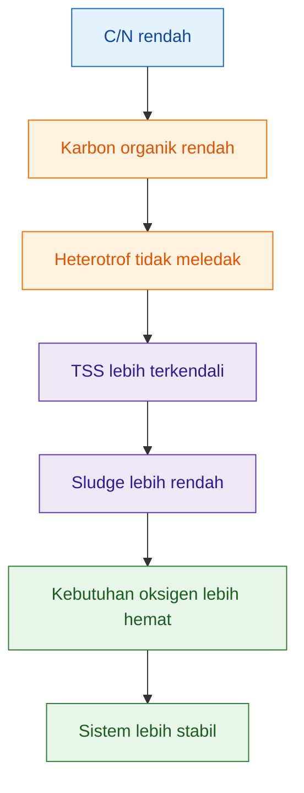
```mermaid id="rhh76o"
flowchart TD
    A["C/N rendah"] --> B["Karbon organik rendah"]
    B --> C["Heterotrof tidak meledak"]
    C --> D["TSS lebih terkendali"]
    D --> E["Sludge lebih rendah"]
    E --> F["Kebutuhan oksigen lebih hemat"]
    F --> G["Sistem lebih stabil"]

    classDef start fill:#e3f2fd,stroke:#1565c0,color:#0d47a1;
    classDef carbon fill:#fff3e0,stroke:#ef6c00,color:#e65100;
    classDef solid fill:#ede7f6,stroke:#5e35b1,color:#311b92;
    classDef oxygen fill:#e8f5e9,stroke:#2e7d32,color:#1b5e20;

    class A start;
    class B,C carbon;
    class D,E solid;
    class F,G oxygen;
```

---

## 4.1. Kelebihan Utama Sistem $C/N$ Rendah

Sistem $C/N$ rendah, terutama bila matahari dikendalikan, memiliki beberapa kelebihan penting bagi praktisi.

| Kelebihan                         | Penjelasan                                                                       |
| --------------------------------- | -------------------------------------------------------------------------------- |
| Kebutuhan oksigen lebih rendah    | Tidak ada ledakan respirasi heterotrof akibat molase, gula, atau karbon berlebih |
| $TSS$ lebih rendah                | Flok tidak terlalu pekat sehingga air lebih ringan                               |
| Sludge lebih sedikit              | Endapan organik lebih mudah dikontrol                                            |
| $pH$ harian lebih stabil          | Alga tidak terlalu dominan bila cahaya rendah                                    |
| Risiko cyanobacteria lebih rendah | Nutrien dan cahaya lebih terkendali                                              |
| Biaya karbon lebih rendah         | Tidak perlu penambahan molase rutin                                              |
| Sistem lebih mudah diprediksi     | Jalur nitrifikasi lebih lambat, tetapi stabil bila matang                        |

Kelebihan ini membuat $C/N$ rendah menarik untuk praktisi yang mengutamakan kestabilan kualitas air. Pada sistem kecil, padat tebar tinggi, atau lokasi dengan pasokan listrik tidak selalu ideal, $C/N$ rendah sering lebih realistis daripada sistem heterotrof berat.

---

## 4.2. Mengapa $C/N$ Rendah Lebih Hemat Oksigen

Pada $C/N$ rendah, karbon tambahan sedikit. Akibatnya, bakteri heterotrof tidak mendapatkan bahan bakar berlebihan untuk tumbuh cepat.

Secara sederhana:

$$
C_{\text{tambahan rendah}}
\rightarrow
\text{respirasi heterotrof lebih rendah}
\rightarrow
O_2 \text{ lebih hemat}
$$

Beban oksigen utama pada sistem ini berasal dari ikan dan nitrifikasi.

$$
O_{2,\text{total rendah}}
\approx
O_{2,\text{ikan}}
+
O_{2,\text{nitrifikasi}}
$$

Pada $C/N$ tinggi, persamaannya lebih berat:

$$
O_{2,\text{total tinggi}}
\approx
O_{2,\text{ikan}}
+
O_{2,\text{heterotrof}}
+
O_{2,\text{flok}}
+
O_{2,\text{karbon berlebih}}
$$

Perbedaan inilah yang membuat $C/N$ rendah lebih ringan untuk dikelola. Praktisi tetap harus menyediakan aerasi cukup, tetapi risiko lonjakan konsumsi oksigen akibat karbon berlebih jauh lebih kecil.

---

## 4.3. $TSS$ dan Sludge Lebih Terkendali

Pada sistem $C/N$ tinggi, bakteri heterotrof mengubah nitrogen menjadi biomassa. Biomassa ini menjadi flok. Semakin banyak karbon dan nitrogen yang dikemas menjadi flok, semakin tinggi $TSS$.

Pada sistem $C/N$ rendah, jalur utama bukan pembentukan biomassa heterotrof, tetapi nitrifikasi.

Secara sederhana:

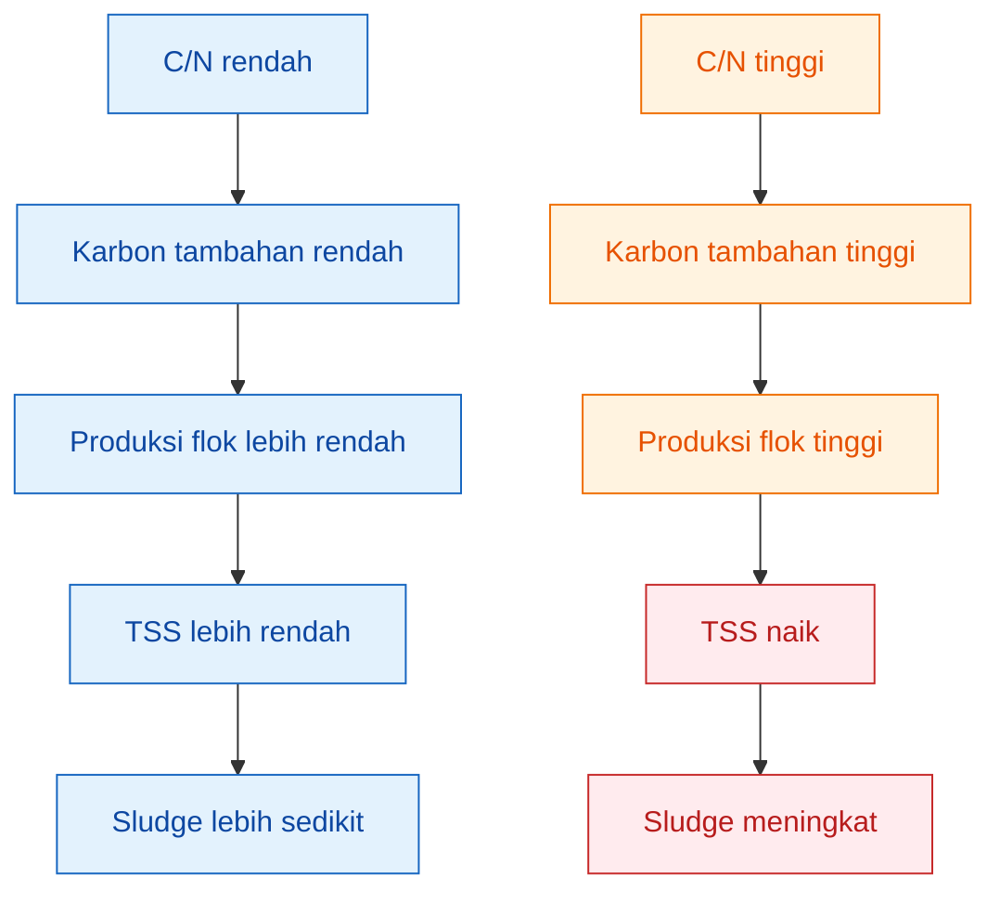
```mermaid id="qu7awf"
flowchart TD
    A["C/N rendah"] --> B["Karbon tambahan rendah"]
    B --> C["Produksi flok lebih rendah"]
    C --> D["TSS lebih rendah"]
    D --> E["Sludge lebih sedikit"]

    F["C/N tinggi"] --> G["Karbon tambahan tinggi"]
    G --> H["Produksi flok tinggi"]
    H --> I["TSS naik"]
    I --> J["Sludge meningkat"]

    classDef low fill:#e3f2fd,stroke:#1565c0,color:#0d47a1;
    classDef high fill:#fff3e0,stroke:#ef6c00,color:#e65100;
    classDef risk fill:#ffebee,stroke:#c62828,color:#b71c1c;
    classDef good fill:#e8f5e9,stroke:#2e7d32,color:#1b5e20;

    class A,B,C,D,E low;
    class F,G,H high;
    class I,J risk;
```

Sludge yang lebih rendah berarti risiko zona anaerob juga lebih rendah. Zona anaerob di dasar kolam dapat menghasilkan bau busuk, gas berbahaya, dan pelepasan kembali amonia dari bahan organik yang membusuk.

Karena itu, $C/N$ rendah memberi keuntungan penting:

> Lebih sedikit flok bukan selalu kekurangan. Dalam banyak kasus, itu justru tanda beban padatan lebih terkendali.

---

## 4.4. $pH$ Lebih Stabil Bila Matahari Dikendalikan

Sistem $C/N$ rendah akan lebih stabil bila cahaya matahari juga dikendalikan. Bila cahaya terlalu tinggi, alga dapat berkembang dan menyebabkan fluktuasi $pH$.

Pada siang hari, alga mengambil $CO_2$ untuk fotosintesis. Akibatnya $pH$ cenderung naik.

$$
CO_2 \text{ turun}
\rightarrow
pH \text{ naik}
$$

Pada malam hari, alga, ikan, dan mikroba menghasilkan $CO_2$ melalui respirasi. Akibatnya $pH$ cenderung turun.

$$
CO_2 \text{ naik}
\rightarrow
pH \text{ turun}
$$

Dengan paranet atau naungan yang tepat, pertumbuhan alga dapat ditekan. Hasilnya, fluktuasi $pH$ pagi dan sore menjadi lebih kecil.

| Kondisi                       | Dampak terhadap $pH$                         |
| ----------------------------- | -------------------------------------------- |
| Matahari tinggi               | Fotosintesis kuat, $pH$ sore bisa naik tajam |
| Matahari rendah sampai sedang | Fotosintesis terkendali, $pH$ lebih stabil   |
| Alga berlebih                 | Fluktuasi $pH$ dan $DO$ meningkat            |
| Alga terkendali               | Sistem lebih mudah diprediksi                |

Untuk sistem $C/N$ rendah, target cahaya bukan gelap total, tetapi cukup teduh agar alga tidak mengambil alih dominasi mikroba.

---

## 4.5. Risiko Cyanobacteria Lebih Rendah

Cyanobacteria sering muncul pada kolam dengan cahaya kuat, nutrien tersedia, dan kondisi air yang tidak seimbang. Pada sistem $C/N$ rendah dengan cahaya terkendali, peluang blooming cyanobacteria bisa ditekan.

Cyanobacteria perlu diwaspadai karena dapat membuat air berwarna hijau kebiruan, berlendir, berbau tanah atau tidak normal, serta menyebabkan fluktuasi $DO$ dan $pH$.

Strategi $C/N$ rendah membantu dari dua sisi:

1. Karbon organik tambahan tidak berlebihan.
2. Cahaya dapat dikendalikan dengan paranet.

Diagram ringkasnya:

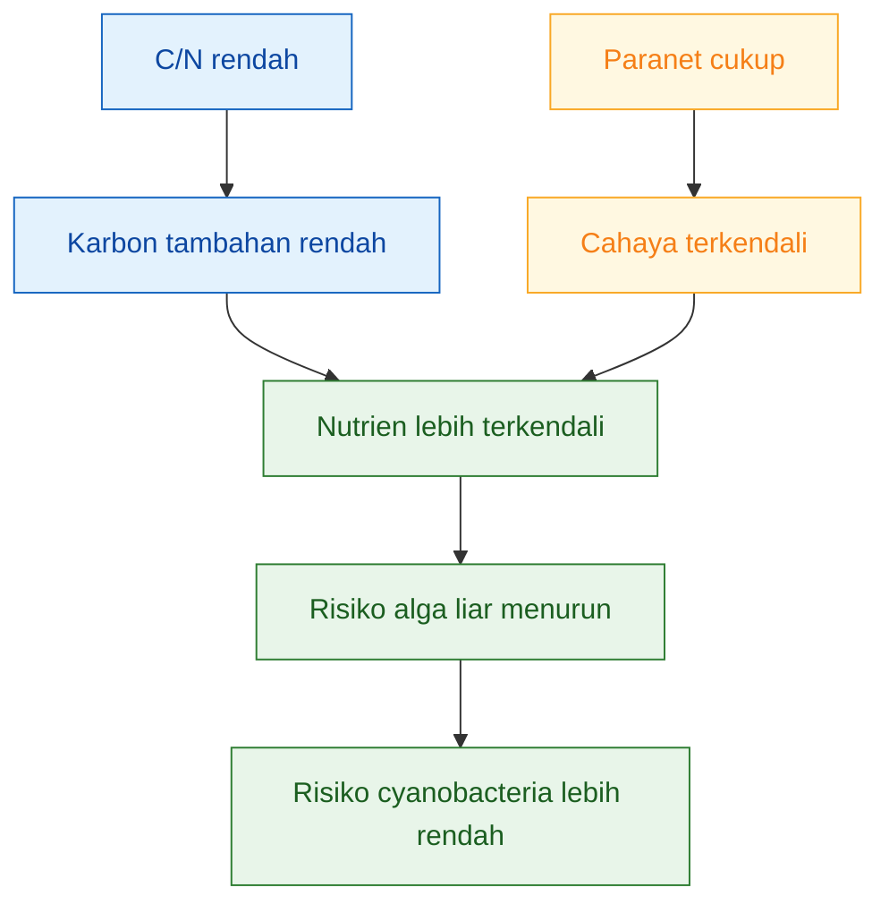
```mermaid id="w7f2lg"
flowchart TD
    A["C/N rendah"] --> B["Karbon tambahan rendah"]
    C["Paranet cukup"] --> D["Cahaya terkendali"]
    B --> E["Nutrien lebih terkendali"]
    D --> E
    E --> F["Risiko alga liar menurun"]
    F --> G["Risiko cyanobacteria lebih rendah"]

    classDef cn fill:#e3f2fd,stroke:#1565c0,color:#0d47a1;
    classDef light fill:#fff8e1,stroke:#f9a825,color:#f57f17;
    classDef stable fill:#e8f5e9,stroke:#2e7d32,color:#1b5e20;
    classDef risk fill:#ffebee,stroke:#c62828,color:#b71c1c;

    class A,B cn;
    class C,D light;
    class E,F,G stable;
```

Namun perlu ditekankan bahwa $C/N$ rendah bukan jaminan cyanobacteria tidak muncul. Jika cahaya terlalu tinggi, fosfor tinggi, sludge menumpuk, dan sirkulasi buruk, cyanobacteria tetap bisa berkembang.

---

## 4.6. Biaya Karbon Lebih Rendah

Pada sistem $C/N$ tinggi, pembudidaya sering menambahkan molase atau sumber karbon lain secara rutin. Ini menambah biaya operasional dan meningkatkan risiko salah dosis.

Pada sistem $C/N$ rendah, penambahan karbon bukan rutinitas utama. Karbon hanya digunakan sebagai alat koreksi bila diperlukan, misalnya saat $TAN$ naik sementara nitrifikasi belum cukup kuat.

Perbandingan praktis:

| Aspek                     | $C/N$ rendah  | $C/N$ tinggi     |
| ------------------------- | ------------- | ---------------- |
| Molase harian             | Tidak rutin   | Sering digunakan |
| Risiko salah dosis karbon | Lebih rendah  | Lebih tinggi     |
| Biaya karbon              | Lebih hemat   | Lebih besar      |
| Pembentukan flok          | Lebih sedikit | Lebih banyak     |
| Beban oksigen             | Lebih ringan  | Lebih berat      |

Dengan demikian, $C/N$ rendah dapat menekan biaya langsung dan biaya tidak langsung. Biaya langsung adalah pembelian karbon. Biaya tidak langsung adalah kebutuhan aerasi lebih besar, manajemen sludge lebih berat, dan risiko kerugian akibat $DO$ drop.

---

## 4.7. Kekurangan Sistem $C/N$ Rendah

Meskipun memiliki banyak kelebihan, sistem $C/N$ rendah tidak boleh dianggap tanpa risiko. Sistem ini lebih bergantung pada nitrifikasi, sedangkan nitrifier tumbuh lebih lambat dibanding bakteri heterotrof.

Kekurangan dan mitigasinya:

| Kekurangan                                | Risiko                              | Strategi mitigasi                                        |
| ----------------------------------------- | ----------------------------------- | -------------------------------------------------------- |
| Flok sebagai pakan tambahan lebih sedikit | Kontribusi pakan alami lebih rendah | Jangan targetkan air terlalu pekat                       |
| Nitrifier tumbuh lambat                   | Sistem awal belum stabil            | Lakukan persiapan dan seeding lebih lama                 |
| $TAN$ bisa naik saat awal                 | Ikan stres                          | Tebar bertahap dan pakan bertahap                        |
| Nitrit bisa naik                          | Gangguan osmoregulasi dan stres     | Pantau nitrit dan kuatkan nitrifikasi                    |
| Alkalinitas cepat turun                   | $pH$ turun dan nitrifikasi melemah  | Jaga alkalinitas $150$ sampai $200 \text{ mg/L CaCO}_3$  |
| Nitrat bisa terakumulasi                  | Beban nitrogen jangka panjang       | Buang sludge, siphon, atau ganti air terbatas bila perlu |

Poin terpenting:

> $C/N$ rendah unggul bila nitrifikasi sudah matang. Bila nitrifikasi belum matang, $C/N$ rendah bisa menyebabkan $TAN$ dan nitrit naik.

---

## 4.8. Kunci Stabilitas Sistem $C/N$ Rendah

Sistem $C/N$ rendah harus dibangun, bukan dipaksakan. Artinya, praktisi perlu menyiapkan kondisi agar nitrifier bisa berkembang.

Kunci stabilitasnya:

| Faktor          | Target praktis                          |
| --------------- | --------------------------------------- |
| $DO$            | Dijaga stabil, terutama menjelang subuh |
| Alkalinitas     | $150$ sampai $200 \text{ mg/L CaCO}_3$  |
| $pH$            | Stabil, tidak turun tajam               |
| Cahaya          | Rendah sampai sedang                    |
| Sludge          | Tidak dibiarkan menumpuk                |
| Pakan           | Dinaikkan bertahap                      |
| Karbon tambahan | Tidak rutin, hanya korektif             |
| Monitoring      | $TAN$, nitrit, $DO$, $pH$, dan flok     |

Alkalinitas sangat penting karena nitrifikasi mengonsumsi alkalinitas. Bila alkalinitas turun, $pH$ dapat turun dan nitrifier melemah. Akibatnya, $TAN$ atau nitrit bisa meningkat.

---

## 4.9. Kapan Sistem $C/N$ Rendah Lebih Cocok?

Sistem $C/N$ rendah lebih cocok untuk kondisi berikut:

| Kondisi                      | Alasan                                                           |
| ---------------------------- | ---------------------------------------------------------------- |
| Kolam kecil dan padat        | Risiko $DO$ drop perlu ditekan                                   |
| Aerasi terbatas              | Beban respirasi heterotrof sebaiknya tidak dibuat terlalu tinggi |
| Praktisi ingin sistem stabil | Sludge dan $TSS$ lebih mudah dikontrol                           |
| Sistem sudah matang          | Nitrifier sudah siap bekerja                                     |
| Cahaya bisa dikendalikan     | Alga tidak mengambil alih sistem                                 |
| Target bukan flok maksimal   | Prioritas pada kualitas air dan efisiensi                        |

Sebaliknya, sistem $C/N$ rendah kurang cocok bila kolam masih baru, nitrifikasi belum terbentuk, pakan langsung tinggi, dan tidak ada monitoring $TAN$ serta nitrit.

---

## 4.10. Strategi Transisi Menuju $C/N$ Rendah

Strategi terbaik bukan langsung memulai dari $C/N$ sangat rendah, tetapi menurunkannya secara bertahap.

Model transisi:

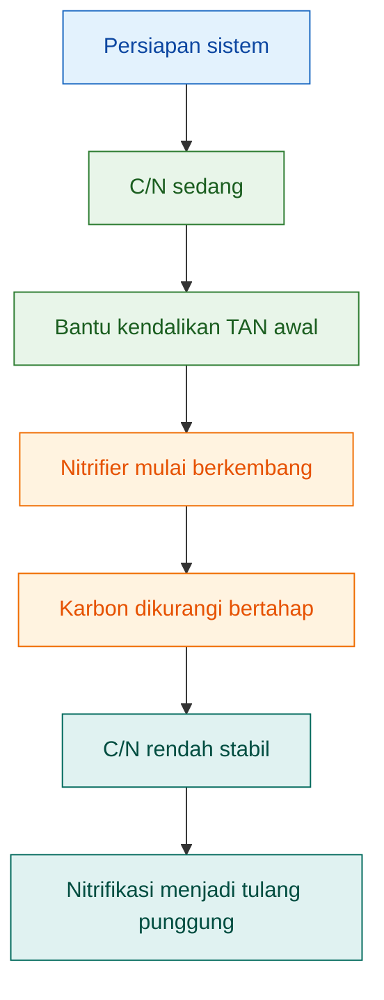
```mermaid id="iz6n8t"
flowchart TD
    A["Persiapan sistem"] --> B["C/N sedang"]
    B --> C["Bantu kendalikan TAN awal"]
    C --> D["Nitrifier mulai berkembang"]
    D --> E["Karbon dikurangi bertahap"]
    E --> F["C/N rendah stabil"]
    F --> G["Nitrifikasi menjadi tulang punggung"]

    classDef prep fill:#e3f2fd,stroke:#1565c0,color:#0d47a1;
    classDef mid fill:#e8f5e9,stroke:#2e7d32,color:#1b5e20;
    classDef transition fill:#fff3e0,stroke:#ef6c00,color:#e65100;
    classDef stable fill:#e0f2f1,stroke:#00695c,color:#004d40;

    class A prep;
    class B,C mid;
    class D,E transition;
    class F,G stable;
```

Tahap praktisnya:

| Fase                     |     Target $C/N$ | Tujuan                                             |
| ------------------------ | ---------------: | -------------------------------------------------- |
| Persiapan dan awal tebar | $12$ sampai $15$ | Membantu kontrol $TAN$ saat nitrifier belum matang |
| Transisi                 | $10$ sampai $12$ | Mengurangi ketergantungan pada heterotrof          |
| Sistem matang            |  $8$ sampai $12$ | Mengandalkan nitrifikasi stabil                    |
| Koreksi darurat          |   Sementara naik | Digunakan bila $TAN$ naik                          |

Dengan pendekatan ini, praktisi tidak memaksakan nitrifikasi bekerja penuh sejak hari pertama. Sistem diberi waktu untuk matang, lalu karbon tambahan dikurangi perlahan.

---

## 4.11. Kesimpulan Bab 4

Sistem $C/N$ rendah memiliki banyak kelebihan untuk budidaya bioflok yang mengutamakan stabilitas. Kelebihan utamanya adalah kebutuhan oksigen lebih rendah, $TSS$ lebih terkendali, sludge lebih sedikit, biaya karbon lebih hemat, dan risiko fluktuasi kualitas air lebih kecil bila cahaya juga dikendalikan.

Namun sistem ini bukan tanpa syarat. $C/N$ rendah membutuhkan nitrifikasi yang matang, alkalinitas cukup, $DO$ stabil, dan monitoring yang disiplin. Tanpa itu, $TAN$ dan nitrit dapat menjadi masalah.

Prinsip praktisnya:

> $C/N$ rendah adalah strategi stabilitas, bukan strategi pembentukan flok maksimal.

Untuk praktisi, pendekatan yang paling aman adalah membangun sistem dari $C/N$ sedang, lalu menurunkannya secara bertahap menuju $C/N$ rendah setelah nitrifikasi terbentuk.

[**Kembali ke Atas**](#cn-ratio-pada-bioflok-mengatur-mikroba-oksigen-dan-stabilitas-kolam-untuk-praktisi)

---

# Bab 5. Strategi Mencapai $C/N$ Rendah dengan Stabil

Sistem $C/N$ rendah tidak boleh dibangun dengan cara menghilangkan karbon secara mendadak sejak awal. Kesalahan yang sering terjadi adalah praktisi langsung menargetkan $C/N$ rendah karena ingin oksigen lebih hemat dan sludge lebih sedikit, tetapi lupa bahwa sistem nitrifikasi belum matang.

Akibatnya, amonia dan nitrit dapat naik pada fase awal. Ikan stres, nafsu makan turun, dan pembudidaya akhirnya kembali menambah molase secara reaktif tanpa strategi yang jelas.

Prinsip utama bab ini adalah:

> $C/N$ rendah adalah tujuan stabilitas, bukan kondisi yang harus dipaksakan sejak hari pertama.

Sistem harus dibangun bertahap. Pada fase awal, karbon masih bisa digunakan secara terbatas untuk membantu menekan $TAN$. Setelah nitrifier berkembang, karbon dikurangi perlahan sampai sistem masuk ke zona $C/N$ rendah yang stabil.

---

## 5.1. Prinsip Besar: Mulai Aman, Lalu Turunkan Karbon

Prinsip paling penting dalam transisi menuju $C/N$ rendah adalah:

```text id="w17icb"
Jangan langsung mengejar C/N rendah pada sistem yang belum matang.
Mulai dari kondisi aman, lalu turunkan karbon setelah nitrifikasi terbentuk.
```

Pada sistem yang belum matang, bakteri nitrifikasi belum cukup banyak. Jika karbon langsung dibuat rendah, maka jalur heterotrof tidak cukup kuat, sementara jalur nitrifikasi juga belum siap. Kondisi ini membuka risiko $TAN$ dan nitrit meningkat.

Sebaliknya, jika karbon diberikan terlalu banyak, bakteri heterotrof memang berkembang cepat, tetapi $TSS$, flok, sludge, dan kebutuhan oksigen juga meningkat.

Maka strategi terbaik adalah pendekatan bertahap:

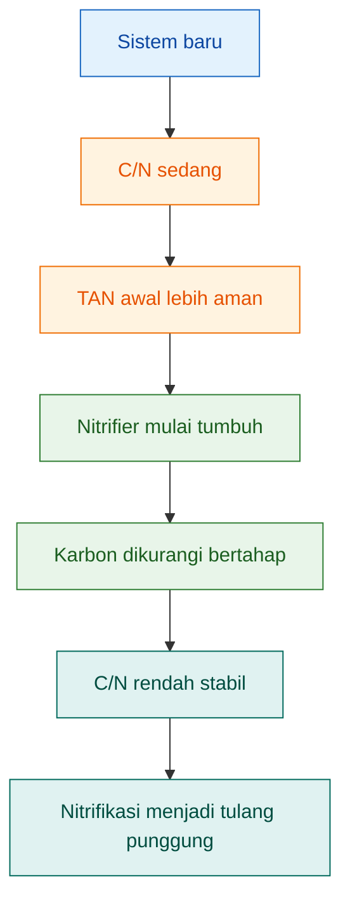
```mermaid id="ocm8c6"
flowchart TD
    A["Sistem baru"] --> B["C/N sedang"]
    B --> C["TAN awal lebih aman"]
    C --> D["Nitrifier mulai tumbuh"]
    D --> E["Karbon dikurangi bertahap"]
    E --> F["C/N rendah stabil"]
    F --> G["Nitrifikasi menjadi tulang punggung"]

    classDef awal fill:#e3f2fd,stroke:#1565c0,color:#0d47a1;
    classDef transisi fill:#fff3e0,stroke:#ef6c00,color:#e65100;
    classDef mikroba fill:#e8f5e9,stroke:#2e7d32,color:#1b5e20;
    classDef stabil fill:#e0f2f1,stroke:#00695c,color:#004d40;

    class A awal;
    class B,C transisi;
    class D,E mikroba;
    class F,G stabil;
```

Dalam praktik, target transisi dapat dibaca sebagai berikut:

| Fase             |     Target $C/N$ | Tujuan utama                                          |
| ---------------- | ---------------: | ----------------------------------------------------- |
| Persiapan sistem | $12$ sampai $15$ | Membantu kontrol $TAN$ awal                           |
| Awal tebar       | $12$ sampai $15$ | Menghindari lonjakan amonia saat nitrifier belum kuat |
| Transisi         | $10$ sampai $12$ | Mengurangi ketergantungan pada heterotrof             |
| Sistem matang    |  $8$ sampai $12$ | Menjadikan nitrifikasi sebagai tulang punggung        |
| Koreksi darurat  |   Naik sementara | Dipakai bila $TAN$ naik mendadak                      |

Pendekatan ini penting karena penghentian karbon secara mendadak sebelum nitrifikasi berkembang dapat menyebabkan lonjakan amonia atau nitrit. Setelah sistem matang, suplementasi karbon menjadi opsional karena nitrifier sudah mampu membantu menjaga $TAN$ dan nitrit.

---

## 5.2. Target Kualitas Air Sebelum Tebar

Sebelum ikan ditebar, sistem harus disiapkan agar air, aerasi, alkalinitas, dan mikroba berada pada kondisi aman. Untuk sistem $C/N$ rendah, persiapan nitrifikasi sangat penting.

Target persiapan yang disarankan:

| Parameter                          |                                 Target |
| ---------------------------------- | -------------------------------------: |
| $DO$                               |                      $>4 \text{ mg/L}$ |
| $pH$                               |                 $6{,}8$ sampai $8{,}0$ |
| Alkalinitas minimum                |             $>100 \text{ mg/L CaCO}_3$ |
| Alkalinitas ideal                  | $150$ sampai $200 \text{ mg/L CaCO}_3$ |
| $TAN$                              |                     $< 1 \text{ mg/L}$ |
| Nitrit                             |                     $< 1 \text{ mg/L}$ |
| $TSS$                              |                   $< 500 \text{ mg/L}$ |
| Settleable solids untuk nila kecil |           $5$ sampai $20 \text{ mL/L}$ |
| Settleable solids untuk nila besar |          $20$ sampai $50 \text{ mL/L}$ |

Nilai tersebut bukan angka kaku untuk semua kondisi, tetapi merupakan rentang kerja yang aman bagi praktisi. Untuk sistem $C/N$ rendah, perhatian khusus harus diberikan pada $DO$, alkalinitas, $TAN$, dan nitrit.

Parameter yang paling penting sebelum tebar:

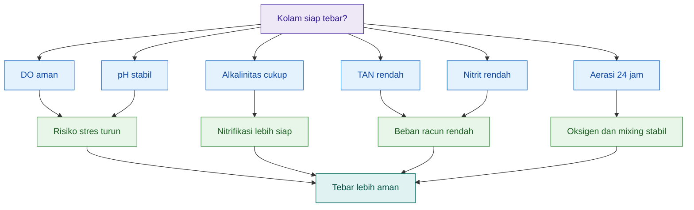
```mermaid id="fw521g"
flowchart TD
    A["Kolam siap tebar?"] --> B["DO aman"]
    A --> C["pH stabil"]
    A --> D["Alkalinitas cukup"]
    A --> E["TAN rendah"]
    A --> F["Nitrit rendah"]
    A --> G["Aerasi 24 jam"]

    B --> H["Risiko stres turun"]
    C --> H
    D --> I["Nitrifikasi lebih siap"]
    E --> J["Beban racun rendah"]
    F --> J
    G --> K["Oksigen dan mixing stabil"]

    H --> L["Tebar lebih aman"]
    I --> L
    J --> L
    K --> L

    classDef root fill:#ede7f6,stroke:#4527a0,color:#311b92;
    classDef water fill:#e3f2fd,stroke:#1565c0,color:#0d47a1;
    classDef microbe fill:#e8f5e9,stroke:#2e7d32,color:#1b5e20;
    classDef safe fill:#e0f2f1,stroke:#00695c,color:#004d40;

    class A root;
    class B,C,D,E,F,G water;
    class H,I,J,K microbe;
    class L safe;
```

---

## 5.3. Tahap Persiapan: Hari $-14$ sampai Hari $-7$

Tahap ini bertujuan membangun fondasi sistem. Pada fase ini, fokusnya bukan membuat air cepat cokelat, tetapi membuat sistem air siap menerima beban ikan.

Langkah yang disarankan:

| Kegiatan                                              | Tujuan                                                                    |
| ----------------------------------------------------- | ------------------------------------------------------------------------- |
| Isi air dan jalankan aerasi $24$ jam                  | Menstabilkan oksigen dan menghilangkan gas terlarut yang tidak diinginkan |
| Pasang paranet $50$ sampai $70\%$                     | Menekan alga berlebih dan menstabilkan suhu serta $pH$                    |
| Ukur $pH$ dan alkalinitas                             | Menentukan kebutuhan buffer                                               |
| Tambahkan kapur atau buffer                           | Menyiapkan alkalinitas untuk nitrifikasi                                  |
| Masukkan starter nitrifier atau air dari sistem sehat | Mempercepat pembentukan komunitas nitrifikasi                             |
| Tambahkan media opsional                              | Memberi permukaan tambahan untuk nitrifier                                |

Media tambahan sangat membantu pada sistem $C/N$ rendah karena bakteri nitrifikasi tumbuh lambat dan membutuhkan permukaan stabil. Media yang dapat digunakan misalnya bioball, $K1$, jaring HDPE, potongan pipa, atau media lain yang aman untuk ikan.

Target tahap ini:

$$
DO_{\text{subuh}} > 4 \text{ mg/L}
$$

$$
Alkalinitas_{\text{target}} =
150 \text{ sampai } 200 \text{ mg/L CaCO}_3
$$

$$
pH_{\text{target}} =
6{,}8 \text{ sampai } 8{,}0
$$

Pada fase ini, jangan berlebihan menambah molase. Bila tujuan akhirnya adalah $C/N$ rendah, maka karbon hanya digunakan sebagai alat bantu, bukan sebagai kebiasaan utama.

---

## 5.4. Tahap Persiapan: Hari $-7$ sampai Hari $0$

Pada tahap ini, sistem mulai “dilatih” menerima beban organik ringan. Tujuannya adalah melihat apakah mikroba, aerasi, dan buffer sudah mampu merespons input kecil.

Input organik dapat berupa pakan halus dalam jumlah sangat kecil atau sumber amonia terkontrol. Untuk praktisi, pakan halus sering lebih mudah digunakan karena mendekati kondisi nyata setelah tebar.

Langkah kerja:

| Hari             | Tindakan                                       | Tujuan                      |
| ---------------- | ---------------------------------------------- | --------------------------- |
| $-7$ sampai $-5$ | Beri pakan halus sangat sedikit                | Melatih sistem mikroba      |
| $-5$ sampai $-3$ | Pantau $TAN$, nitrit, $pH$, dan alkalinitas    | Melihat respons nitrifikasi |
| $-3$ sampai $-1$ | Evaluasi apakah $TAN$ dan nitrit turun kembali | Menilai kesiapan tebar      |
| $0$              | Tebar bila parameter aman                      | Memulai budidaya            |

Kolam dapat dianggap lebih siap bila setelah input organik ringan, $TAN$ dan nitrit tidak melonjak tajam atau mampu turun kembali.

Secara konseptual:

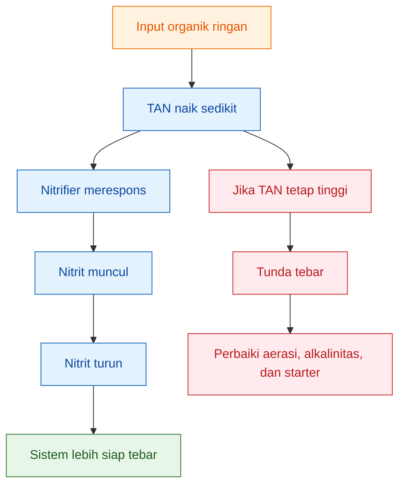
```mermaid id="uuztg5"
flowchart TD
    A["Input organik ringan"] --> B["TAN naik sedikit"]
    B --> C["Nitrifier merespons"]
    C --> D["Nitrit muncul"]
    D --> E["Nitrit turun"]
    E --> F["Sistem lebih siap tebar"]

    B --> G["Jika TAN tetap tinggi"]
    G --> H["Tunda tebar"]
    H --> I["Perbaiki aerasi, alkalinitas, dan starter"]

    classDef input fill:#fff3e0,stroke:#ef6c00,color:#e65100;
    classDef process fill:#e3f2fd,stroke:#1565c0,color:#0d47a1;
    classDef ready fill:#e8f5e9,stroke:#2e7d32,color:#1b5e20;
    classDef risk fill:#ffebee,stroke:#c62828,color:#b71c1c;

    class A input;
    class B,C,D,E process;
    class F ready;
    class G,H,I risk;
```

Prinsip penting pada fase ini:

> Lebih baik menunda tebar beberapa hari daripada menebar ikan ke sistem yang belum siap mengolah nitrogen.

---

## 5.5. Tahap Tebar

Tebar ikan sebaiknya dilakukan saat suhu tidak ekstrem, yaitu pagi atau sore. Tujuannya adalah mengurangi stres akibat perbedaan suhu, $pH$, dan kualitas air.

Langkah tebar:

| Langkah                    | Penjelasan                                   |
| -------------------------- | -------------------------------------------- |
| Aklimatisasi suhu          | Samakan suhu air kantong dan kolam           |
| Aklimatisasi $pH$          | Tambahkan air kolam sedikit demi sedikit     |
| Tebar pagi atau sore       | Menghindari panas dan stres cahaya           |
| Pakan awal dikurangi       | Beri $50$ sampai $70\%$ dari estimasi normal |
| Pantau $DO$ subuh          | Deteksi cepat risiko kekurangan oksigen      |
| Jangan tambah molase rutin | Hindari lonjakan heterotrof sejak awal       |

Pakan pada $3$ sampai $5$ hari pertama sebaiknya tidak langsung penuh. Sistem mikroba membutuhkan waktu untuk menyesuaikan diri dengan beban ikan.

Jika estimasi pakan normal adalah $100$ gram per hari, maka pada awal tebar dapat diberikan:

$$
Pakan_{\text{awal}} =
0{,}50 \times 100
\text{ sampai }
0{,}70 \times 100
$$

$$
Pakan_{\text{awal}} =
50
\text{ sampai }
70 \text{ gram per hari}
$$

Setelah ikan aktif, nafsu makan baik, dan parameter stabil, pakan dapat dinaikkan bertahap.

---

## 5.6. Strategi Pakan pada Sistem $C/N$ Rendah

Pada sistem $C/N$ rendah, pakan harus dinaikkan hati-hati karena pakan adalah sumber utama nitrogen. Kenaikan pakan berarti kenaikan potensi $TAN$.

Estimasi nitrogen dari pakan dapat dihitung dengan:

$$
N_{\text{pakan}} =
P_{\text{pakan}}
\times
Protein_{\text{pakan}}
\times
0{,}16
$$

Jika sebagian nitrogen menjadi $TAN$, maka:

$$
TAN_{\text{harian}} =
N_{\text{pakan}}
\times
f_{\text{TAN}}
$$

Keterangan:

| Simbol                   | Arti                                    |
| ------------------------ | --------------------------------------- |
| $P_{\text{pakan}}$       | Jumlah pakan harian                     |
| $Protein_{\text{pakan}}$ | Kadar protein pakan sebagai fraksi      |
| $0{,}16$                 | Fraksi nitrogen dalam protein           |
| $f_{\text{TAN}}$         | Fraksi nitrogen yang menjadi $TAN$      |
| $TAN_{\text{harian}}$    | Estimasi $TAN$ yang dihasilkan per hari |

Contoh sederhana:

Jika pakan harian $100 \text{ g}$, protein $30\%$, dan fraksi nitrogen menjadi $TAN$ adalah $60\%$, maka:

$$
N_{\text{pakan}} =
100
\times
0{,}30
\times
0{,}16
$$

$$
N_{\text{pakan}} =
4{,}8 \text{ g N}
$$

$$
TAN_{\text{harian}} =
4{,}8
\times
0{,}60
$$

$$
TAN_{\text{harian}} =
2{,}88 \text{ g TAN-N}
$$

Angka ini menunjukkan bahwa kenaikan pakan harian langsung menaikkan beban nitrogen. Karena itu, pada sistem $C/N$ rendah, pakan harus dinaikkan mengikuti kemampuan nitrifikasi, bukan hanya mengikuti nafsu makan ikan.

---

## 5.7. Tahap Pembesaran

Pada fase pembesaran, strategi utama adalah menjaga agar sistem tetap berada pada zona $C/N$ rendah sampai sedang-rendah, tanpa membuat $TAN$ dan nitrit naik.

Strategi operasional:

| Komponen        | Strategi                                              |
| --------------- | ----------------------------------------------------- |
| Pakan           | Gunakan protein sekitar $28\%$ sampai $32\%$          |
| Karbon tambahan | Tidak rutin, hanya korektif                           |
| Aerasi          | Menyala $24$ jam                                      |
| Alkalinitas     | Dijaga sekitar $150$ sampai $200 \text{ mg/L CaCO}_3$ |
| Cahaya          | Rendah sampai sedang                                  |
| Flok            | Ada, tetapi tidak terlalu pekat                       |
| Sludge          | Dibuang sebelum membusuk                              |
| Monitoring      | Fokus pada $DO$, $TAN$, nitrit, $pH$, dan alkalinitas |

Prinsip pembesaran:

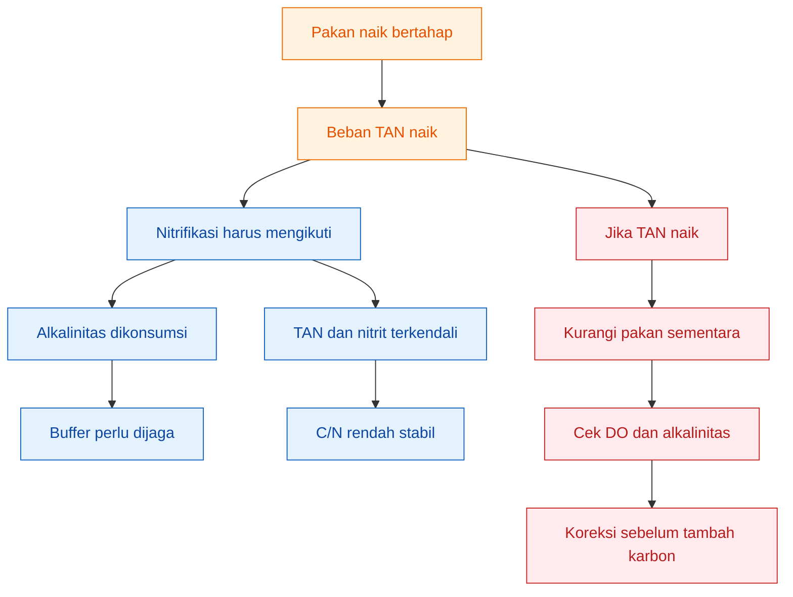
```mermaid id="xb1s2z"
flowchart TD
    A["Pakan naik bertahap"] --> B["Beban TAN naik"]
    B --> C["Nitrifikasi harus mengikuti"]
    C --> D["Alkalinitas dikonsumsi"]
    D --> E["Buffer perlu dijaga"]
    C --> F["TAN dan nitrit terkendali"]
    F --> G["C/N rendah stabil"]

    B --> H["Jika TAN naik"]
    H --> I["Kurangi pakan sementara"]
    I --> J["Cek DO dan alkalinitas"]
    J --> K["Koreksi sebelum tambah karbon"]

    classDef feed fill:#fff3e0,stroke:#ef6c00,color:#e65100;
    classDef process fill:#e3f2fd,stroke:#1565c0,color:#0d47a1;
    classDef stable fill:#e8f5e9,stroke:#2e7d32,color:#1b5e20;
    classDef warning fill:#ffebee,stroke:#c62828,color:#b71c1c;

    class A,B feed;
    class C,D,E,F,G process;
    class H,I,J,K warning;
```

Pada sistem ini, karbon tambahan bukan langkah pertama ketika $TAN$ naik. Langkah pertama adalah mengecek penyebabnya.

Urutan koreksi yang disarankan:

1. Cek $DO$, terutama subuh.
2. Cek $pH$ dan alkalinitas.
3. Kurangi pakan sementara.
4. Pastikan tidak ada sludge membusuk.
5. Tambah aerasi atau perbaiki mixing.
6. Gunakan karbon hanya bila diperlukan sebagai koreksi sementara.

---

## 5.8. Penggunaan Karbon sebagai Koreksi, Bukan Rutinitas

Pada sistem $C/N$ rendah, karbon tambahan seperti molase atau gula tidak digunakan harian kecuali ada alasan kuat. Karbon digunakan sebagai tindakan koreksi saat $TAN$ naik dan sistem nitrifikasi belum mampu mengejar beban nitrogen.

Pendekatan praktis untuk koreksi amonia pada masa awal adalah menambahkan gula sekitar $15$ sampai $20 \text{ mg/L}$ untuk membantu menetralkan $1 \text{ mg/L}$ amonia sebagai nitrogen.

Untuk volume $V$ liter, kebutuhan gula dapat dihitung:

$$
Gula_{\text{minimum}} =
15
\times
V
$$

$$
Gula_{\text{maksimum}} =
20
\times
V
$$

Jika hasilnya dalam miligram, maka konversi ke gram:

$$
Gula_{\text{gram}} =
\frac{
Gula_{\text{mg}}
}{
1000
}
$$

Contoh untuk kolam $1.000 \text{ L}$:

$$
Gula_{\text{minimum}} =
15
\times
1000 =
15000 \text{ mg}
$$

$$
Gula_{\text{minimum}} =
15 \text{ g}
$$

$$
Gula_{\text{maksimum}} =
20
\times
1000 =
20000 \text{ mg}
$$

$$
Gula_{\text{maksimum}} =
20 \text{ g}
$$

Jadi, untuk koreksi $1 \text{ mg/L}$ amonia sebagai nitrogen pada $1.000 \text{ L}$ air, kebutuhan gula praktis sekitar $15$ sampai $20 \text{ g}$.

Namun dosis ini harus dipakai hati-hati. Setelah karbon diberikan, $DO$ harus dipantau karena bakteri heterotrof dapat meningkat cepat dan mengonsumsi oksigen.

Aturan aman penggunaan karbon korektif:

| Kondisi                     | Keputusan                      |
| --------------------------- | ------------------------------ |
| $DO$ subuh rendah           | Jangan tambah karbon           |
| Aerasi lemah                | Jangan tambah karbon           |
| Sludge menumpuk             | Buang sludge dulu              |
| $pH$ dan alkalinitas rendah | Koreksi buffer dulu            |
| $TAN$ naik tetapi $DO$ aman | Karbon boleh dipakai terbatas  |
| Setelah karbon diberikan    | Pantau $DO$ dalam beberapa jam |

Prinsipnya:

> Karbon adalah rem darurat untuk $TAN$, bukan pedal gas harian pada sistem $C/N$ rendah.

---

## 5.9. Manajemen Alkalinitas

Nitrifikasi mengonsumsi alkalinitas. Karena sistem $C/N$ rendah lebih mengandalkan nitrifikasi, alkalinitas menjadi salah satu parameter terpenting.

Bila alkalinitas rendah, $pH$ mudah turun. Saat $pH$ turun, nitrifier melemah. Jika nitrifier melemah, $TAN$ dan nitrit dapat naik.

Alurnya:

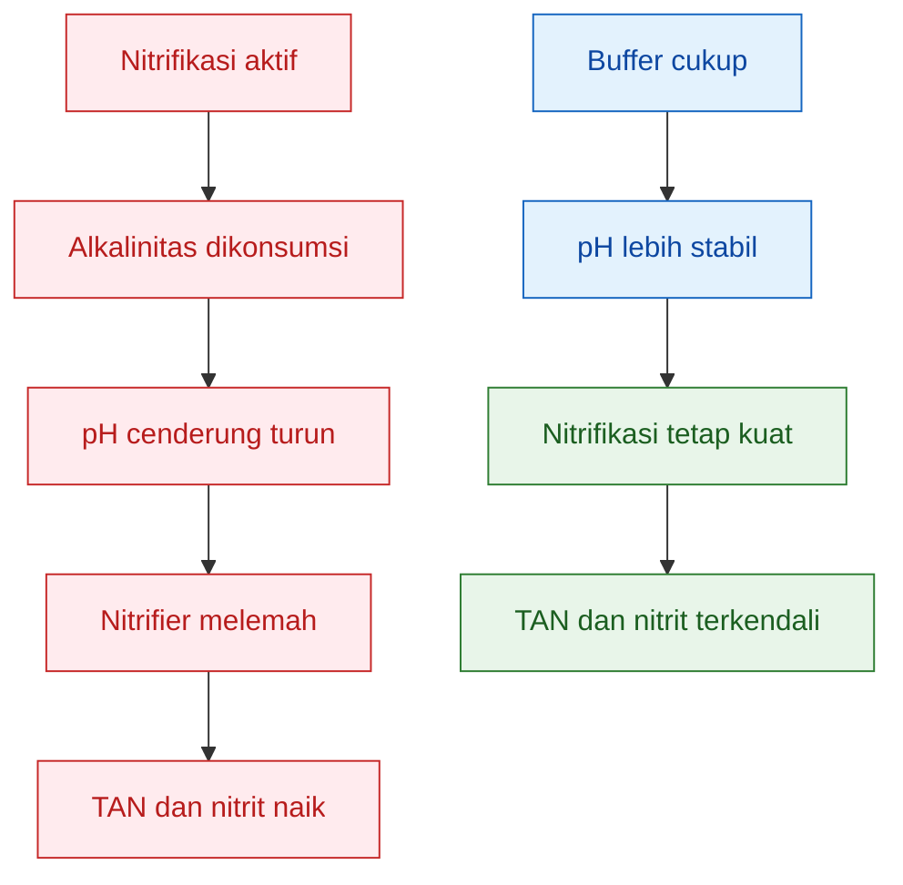
```mermaid id="rfxclz"
flowchart TD
    A["Nitrifikasi aktif"] --> B["Alkalinitas dikonsumsi"]
    B --> C["pH cenderung turun"]
    C --> D["Nitrifier melemah"]
    D --> E["TAN dan nitrit naik"]

    F["Buffer cukup"] --> G["pH lebih stabil"]
    G --> H["Nitrifikasi tetap kuat"]
    H --> I["TAN dan nitrit terkendali"]

    classDef risk fill:#ffebee,stroke:#c62828,color:#b71c1c;
    classDef buffer fill:#e3f2fd,stroke:#1565c0,color:#0d47a1;
    classDef stable fill:#e8f5e9,stroke:#2e7d32,color:#1b5e20;

    class A,B,C,D,E risk;
    class F,G buffer;
    class H,I stable;
```

Target operasional:

$$
Alkalinitas_{\text{minimum}}

>

100 \text{ mg/L CaCO}_3
$$

$$
Alkalinitas_{\text{ideal}} =
150
\text{ sampai }
200 \text{ mg/L CaCO}_3
$$

Jika alkalinitas turun, praktisi dapat menggunakan bahan buffer seperti kapur pertanian, dolomit, kalsium karbonat, atau natrium bikarbonat sesuai kondisi air dan ketersediaan bahan. Pemilihan bahan harus memperhatikan efek terhadap $pH$, kesadahan, dan respons ikan.

---

## 5.10. Manajemen Cahaya dan Paranet

Sistem $C/N$ rendah lebih stabil bila cahaya matahari tidak berlebihan. Cahaya yang terlalu tinggi dapat mendorong alga, menaikkan $pH$ sore, dan membuat $DO$ turun pada malam sampai subuh.

Target cahaya untuk sistem ini adalah rendah sampai sedang.

| Kondisi                | Rekomendasi                         |
| ---------------------- | ----------------------------------- |
| Kolam terbuka penuh    | Paranet $50$ sampai $70\%$          |
| Kolam sudah agak teduh | Paranet $40$ sampai $50\%$          |
| Air mudah hijau        | Paranet $60$ sampai $70\%$          |
| Musim hujan panjang    | Paranet dapat dikurangi sebagian    |
| $pH$ sore naik tajam   | Tambah naungan dan evaluasi nutrien |

Tanda cahaya terlalu tinggi:

| Gejala                                | Makna                                                      |
| ------------------------------------- | ---------------------------------------------------------- |
| Air cepat hijau                       | Alga kuat                                                  |
| $pH$ sore jauh lebih tinggi dari pagi | Fotosintesis berlebihan                                    |
| $DO$ sore tinggi tetapi subuh rendah  | Produksi oksigen siang tidak cukup menutup respirasi malam |
| Lendir hijau kebiruan                 | Waspada cyanobacteria                                      |

Pada sistem $C/N$ rendah, warna air tidak harus cokelat pekat. Warna cokelat muda, teh, atau agak kehijauan masih dapat diterima selama $DO$, $TAN$, nitrit, dan $pH$ stabil.

---

## 5.11. Manajemen Flok dan Sludge

Sistem $C/N$ rendah tetap dapat memiliki flok, tetapi floknya tidak sebanyak sistem $C/N$ tinggi. Targetnya bukan flok maksimal, melainkan flok yang cukup dan tidak membebani oksigen.

Flok yang baik:

| Ciri                                     | Makna                                     |
| ---------------------------------------- | ----------------------------------------- |
| Tersuspensi merata                       | Mixing cukup                              |
| Warna cokelat muda sampai cokelat normal | Bahan organik aktif tetapi tidak berlebih |
| Bau normal                               | Tidak ada pembusukan dominan              |
| Tidak banyak endapan hitam               | Sludge terkendali                         |
| Ikan aktif                               | Kualitas air mendukung                    |

Flok bermasalah:

| Ciri                | Risiko                          |
| ------------------- | ------------------------------- |
| Air terlalu pekat   | $TSS$ tinggi                    |
| Banyak busa         | Organik berlebih                |
| Bau asam atau busuk | Dekomposisi tidak sehat         |
| Endapan hitam       | Zona anaerob                    |
| $DO$ subuh turun    | Respirasi sistem terlalu tinggi |

Pada sistem $C/N$ rendah, sludge tetap harus dibuang. Walaupun produksinya lebih sedikit, sludge yang dibiarkan menumpuk tetap dapat menjadi sumber amonia, bau, dan zona anaerob.

Prinsipnya:

> Sludge yang keluar dari sistem adalah nitrogen dan organik yang berhasil dikeluarkan dari kolam.

---

## 5.12. Tahap Panen

Menjelang panen, kualitas air tetap harus dijaga. Jangan menganggap fase panen aman hanya karena ikan sudah besar. Justru pada akhir siklus, biomassa tinggi, pakan tinggi, dan beban oksigen berada pada titik berat.

Langkah menjelang panen:

| Waktu                  | Tindakan                                     |
| ---------------------- | -------------------------------------------- |
| $24$ jam sebelum panen | Kurangi atau hentikan pakan sesuai kebutuhan |
| $12$ jam sebelum panen | Pastikan aerasi penuh                        |
| Saat panen             | Aerasi tetap menyala                         |
| Setelah panen          | Ambil data kualitas air dan performa         |
| Setelah sistem kosong  | Evaluasi sludge, flok, dan kondisi dasar     |

Data yang sebaiknya dicatat:

| Data                         | Kegunaan                     |
| ---------------------------- | ---------------------------- |
| Biomassa panen               | Menghitung produktivitas     |
| Jumlah ikan hidup            | Menghitung survival rate     |
| Total pakan                  | Menghitung $FCR$             |
| $TAN$ akhir                  | Evaluasi nitrifikasi         |
| Nitrit akhir                 | Evaluasi stabilitas nitrogen |
| Nitrat akhir                 | Melihat akumulasi nitrogen   |
| $TSS$ atau settleable solids | Evaluasi padatan             |
| $DO$ subuh                   | Evaluasi kecukupan aerasi    |
| Sludge                       | Evaluasi manajemen padatan   |

Rumus dasar evaluasi:

$$
Survival\ Rate =
\frac{
Jumlah_{\text{panen}}
}{
Jumlah_{\text{tebar}}
}
\times
100\%
$$

$$
FCR =
\frac{
Total_{\text{pakan}}
}{
Biomassa_{\text{panen}} - Biomassa_{\text{awal}}
}
$$

Dalam math mode, tanda persen harus ditulis sebagai $\%$, sehingga bentuk lengkapnya:

$$
Survival\ Rate_{\%} =
\frac{
Jumlah_{\text{panen}}
}{
Jumlah_{\text{tebar}}
}
\times
100\%
$$

---

## 5.13. Indikator Keberhasilan Sistem $C/N$ Rendah

Sistem $C/N$ rendah dapat dianggap berhasil bila kualitas air stabil dari awal sampai panen tanpa bergantung pada penambahan karbon harian.

Indikator keberhasilan:

| Indikator          | Target praktis                   |
| ------------------ | -------------------------------- |
| $DO$ subuh         | Stabil dan tidak jatuh           |
| $TAN$              | Terkendali                       |
| Nitrit             | Terkendali                       |
| Alkalinitas        | Tidak jatuh tajam                |
| $pH$ pagi dan sore | Tidak berbeda ekstrem            |
| Flok               | Ada tetapi tidak berlebihan      |
| Sludge             | Mudah dikontrol                  |
| Molase atau karbon | Tidak menjadi rutinitas harian   |
| Ikan               | Aktif, makan baik, insang bersih |

Ciri sistem yang belum stabil:

| Gejala            | Dugaan penyebab                                    |
| ----------------- | -------------------------------------------------- |
| $TAN$ sering naik | Nitrifikasi belum kuat atau pakan terlalu tinggi   |
| Nitrit naik       | Bakteri pengoksidasi nitrit belum cukup            |
| $pH$ terus turun  | Alkalinitas rendah                                 |
| $DO$ subuh rendah | Aerasi kurang, flok berlebih, atau sludge menumpuk |
| Air cepat hijau   | Cahaya dan nutrien terlalu tinggi                  |
| Bau busuk         | Sludge membusuk atau zona anaerob                  |

---

## 5.14. Ringkasan Strategi dari Persiapan sampai Panen

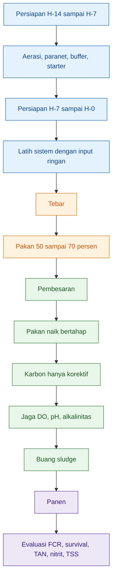
```mermaid id="bt5byc"
flowchart TD
    A["Persiapan H-14 sampai H-7"] --> B["Aerasi, paranet, buffer, starter"]
    B --> C["Persiapan H-7 sampai H-0"]
    C --> D["Latih sistem dengan input ringan"]
    D --> E["Tebar"]
    E --> F["Pakan 50 sampai 70 persen"]
    F --> G["Pembesaran"]
    G --> H["Pakan naik bertahap"]
    H --> I["Karbon hanya korektif"]
    I --> J["Jaga DO, pH, alkalinitas"]
    J --> K["Buang sludge"]
    K --> L["Panen"]
    L --> M["Evaluasi FCR, survival, TAN, nitrit, TSS"]

    classDef prep fill:#e3f2fd,stroke:#1565c0,color:#0d47a1;
    classDef tebar fill:#fff3e0,stroke:#ef6c00,color:#e65100;
    classDef grow fill:#e8f5e9,stroke:#2e7d32,color:#1b5e20;
    classDef harvest fill:#ede7f6,stroke:#5e35b1,color:#311b92;

    class A,B,C,D prep;
    class E,F tebar;
    class G,H,I,J,K grow;
    class L,M harvest;
```

Ringkasan keputusan praktis:

| Fase            | Fokus utama                              | Kesalahan yang harus dihindari        |
| --------------- | ---------------------------------------- | ------------------------------------- |
| Persiapan       | Bangun aerasi, buffer, dan nitrifier     | Mengejar air cepat cokelat            |
| Awal tebar      | Kurangi stres dan naikkan pakan bertahap | Langsung pakan penuh                  |
| Pembesaran      | Jaga nitrifikasi dan alkalinitas         | Menambah molase rutin tanpa alasan    |
| Koreksi masalah | Cari penyebab sebelum menambah karbon    | Mengobati semua masalah dengan molase |
| Panen           | Jaga aerasi sampai selesai               | Mematikan aerasi terlalu cepat        |

---

## 5.15. Kesimpulan Bab 5

Strategi mencapai $C/N$ rendah yang stabil bukan dilakukan dengan cara langsung menghilangkan karbon sejak awal. Sistem harus dibangun bertahap. Pada awal siklus, $C/N$ sedang dapat digunakan untuk membantu menekan $TAN$ ketika nitrifier belum matang. Setelah nitrifikasi berkembang, karbon dikurangi secara bertahap sampai sistem masuk ke zona $C/N$ rendah.

Kunci keberhasilan sistem $C/N$ rendah adalah:

1. Persiapan air dan aerasi sejak awal.
2. Alkalinitas cukup untuk mendukung nitrifikasi.
3. Pakan dinaikkan bertahap.
4. Karbon tambahan tidak digunakan rutin.
5. Cahaya dikendalikan dengan paranet.
6. Sludge dibuang sebelum membusuk.
7. $DO$, $TAN$, nitrit, $pH$, dan alkalinitas dipantau disiplin.

Pesan utama bab ini:

> $C/N$ rendah yang stabil bukan hasil dari mengurangi karbon saja, tetapi hasil dari nitrifikasi yang matang, aerasi yang cukup, alkalinitas yang kuat, cahaya yang terkendali, dan manajemen pakan yang disiplin.

[**Kembali ke Atas**](#cn-ratio-pada-bioflok-mengatur-mikroba-oksigen-dan-stabilitas-kolam-untuk-praktisi)

---

# Bab 6. Studi Kasus Kolam $1 \text{ m}^3$ untuk Nila $200$ Ekor

Bab ini menerapkan konsep $C/N$ rendah pada skala kecil yang mudah dipraktikkan. Studi kasus menggunakan kolam $1 \text{ m}^3$ dengan padat tebar nila $200$ ekor.

Tujuan sistem bukan menghasilkan flok sebanyak mungkin, tetapi membangun sistem yang stabil, hemat oksigen, $TSS$ terkendali, sludge rendah, dan nitrifikasi berjalan baik.

Fokus sistem:

```text id="iv7yli"
Volume kecil
Padat tebar tinggi
C/N rendah sampai sedang-rendah
Cahaya dikendalikan
Nitrifikasi menjadi tulang punggung
Karbon tambahan hanya korektif
```

---

## 6.1. Tujuan Desain Sistem

Sistem ini dirancang sebagai model praktis untuk pembudidaya skala kecil, riset lapangan, pelatihan, atau unit produksi rumah tangga. Karena volume hanya $1 \text{ m}^3$, perubahan kualitas air dapat terjadi cepat. Maka, pendekatan $C/N$ rendah lebih masuk akal dibanding sistem heterotrof berat yang menghasilkan flok pekat.

Tujuan desain:

| Komponen         | Target                                                |
| ---------------- | ----------------------------------------------------- |
| Volume air       | $1 \text{ m}^3$ atau $1.000 \text{ L}$                |
| Komoditas        | Nila                                                  |
| Padat tebar      | $200$ ekor per $1 \text{ m}^3$                        |
| Target sistem    | $C/N$ rendah sampai sedang-rendah                     |
| Dominasi mikroba | Nitrifier atau kemoautotrof                           |
| Cahaya           | Rendah sampai sedang                                  |
| Paranet          | $50$ sampai $70\%$                                    |
| Karbon tambahan  | Tidak rutin                                           |
| Fokus utama      | Stabilitas $DO$, $TAN$, nitrit, $pH$, dan alkalinitas |

Pada skala $1 \text{ m}^3$, sistem harus dipandang sebagai sistem yang cepat berubah. Kesalahan kecil seperti pakan berlebih, aerasi mati, atau molase berlebihan dapat langsung berdampak pada ikan.

---

## 6.2. Asumsi Dasar Studi Kasus

Agar perhitungan jelas, studi kasus ini menggunakan asumsi berikut.

| Parameter                |                             Nilai asumsi |
| ------------------------ | ---------------------------------------: |
| Volume air               |                          $1 \text{ m}^3$ |
| Volume air dalam liter   |                        $1.000 \text{ L}$ |
| Jumlah tebar             |                               $200$ ekor |
| Ukuran tebar             |           $8$ sampai $10 \text{ g/ekor}$ |
| Biomassa awal            |        $1{,}6$ sampai $2{,}0 \text{ kg}$ |
| Survival target          |                                   $90\%$ |
| Jumlah panen target      |                               $180$ ekor |
| Bobot panen target       |         $80$ sampai $100 \text{ g/ekor}$ |
| Biomassa panen target    |          $14{,}4$ sampai $18 \text{ kg}$ |
| Protein pakan            |                                   $30\%$ |
| Pakan puncak             | $0{,}35$ sampai $0{,}40 \text{ kg/hari}$ |
| Target $C/N$ operasional |                          $8$ sampai $12$ |
| $DO$ subuh target        |                 Minimal $4 \text{ mg/L}$ |
| Alkalinitas ideal        |   $150$ sampai $200 \text{ mg/L CaCO}_3$ |

Perhitungan dalam bab ini memakai skenario puncak yang konservatif:

$$
Pakan_{\text{puncak}} = 0{,}40 \text{ kg/hari}
$$

$$
Biomassa_{\text{puncak}} = 18 \text{ kg}
$$

Skenario puncak digunakan karena aerasi harus dirancang untuk kondisi terberat, bukan kondisi rata-rata.

---

## 6.3. Desain Fisik Kolam

Untuk volume $1 \text{ m}^3$, kolam bundar lebih disarankan karena memudahkan sirkulasi dan pengumpulan sludge di tengah. Namun kolam kotak tetap bisa digunakan bila aerasi dan siphon diatur dengan baik.

| Komponen        | Rekomendasi                                 |
| --------------- | ------------------------------------------- |
| Bentuk kolam    | Bundar lebih baik, kotak masih bisa         |
| Volume efektif  | $1 \text{ m}^3$                             |
| Kedalaman air   | $70$ sampai $100 \text{ cm}$                |
| Aerasi          | Minimal $60$ sampai $80 \text{ watt}$ total |
| Jumlah pompa    | Minimal $2$ unit                            |
| Titik aerasi    | $4$ sampai $8$ titik                        |
| Paranet         | $50$ sampai $70\%$                          |
| Siphon dasar    | Wajib                                       |
| Backup listrik  | Sangat disarankan                           |
| Media nitrifier | Opsional tetapi sangat membantu             |

Media nitrifier dapat berupa bioball, $K1$, jaring HDPE, potongan pipa, atau media lain yang aman. Pada sistem $C/N$ rendah, media tambahan berguna karena nitrifier tumbuh lebih lambat dan membutuhkan permukaan stabil.

---

## 6.4. Diagram Sistem Kolam $1 \text{ m}^3$

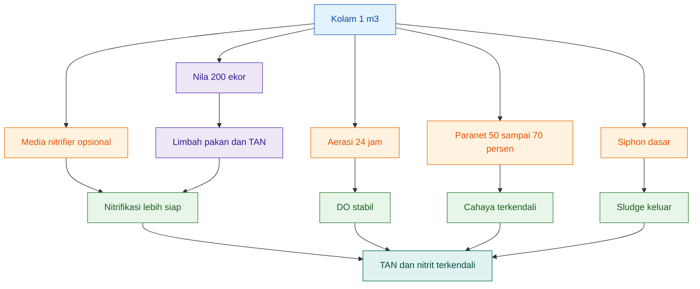
```mermaid id="rywzh5"
flowchart TD
    A["Kolam 1 m3"] --> B["Aerasi 24 jam"]
    A --> C["Paranet 50 sampai 70 persen"]
    A --> D["Media nitrifier opsional"]
    A --> E["Siphon dasar"]
    A --> F["Nila 200 ekor"]

    B --> G["DO stabil"]
    C --> H["Cahaya terkendali"]
    D --> I["Nitrifikasi lebih siap"]
    E --> J["Sludge keluar"]
    F --> K["Limbah pakan dan TAN"]

    K --> I
    I --> L["TAN dan nitrit terkendali"]
    G --> L
    H --> L
    J --> L

    classDef kolam fill:#e3f2fd,stroke:#1565c0,color:#0d47a1;
    classDef alat fill:#fff3e0,stroke:#ef6c00,color:#e65100;
    classDef mikroba fill:#e8f5e9,stroke:#2e7d32,color:#1b5e20;
    classDef hasil fill:#e0f2f1,stroke:#00695c,color:#004d40;
    classDef ikan fill:#ede7f6,stroke:#5e35b1,color:#311b92;

    class A kolam;
    class B,C,D,E alat;
    class F,K ikan;
    class G,H,I,J mikroba;
    class L hasil;
```

Diagram ini menunjukkan bahwa sistem $C/N$ rendah tidak bergantung pada satu komponen saja. Stabilitas berasal dari kombinasi aerasi, naungan, nitrifikasi, pembuangan sludge, dan manajemen pakan.

---

## 6.5. Persiapan Sistem Sebelum Tebar

Persiapan dilakukan minimal $14$ hari sebelum tebar. Tujuannya adalah menyiapkan air, aerasi, alkalinitas, dan komunitas mikroba.

### Hari $-14$ sampai $-7$

| Kegiatan                   | Tujuan                            |
| -------------------------- | --------------------------------- |
| Isi air $1.000 \text{ L}$  | Menyiapkan volume kerja           |
| Jalankan aerasi $24$ jam   | Menstabilkan oksigen dan mixing   |
| Pasang paranet             | Mengendalikan cahaya dan alga     |
| Ukur $pH$ dan alkalinitas  | Menentukan kebutuhan buffer       |
| Tambahkan buffer           | Menyiapkan nitrifikasi            |
| Masukkan starter nitrifier | Mempercepat pembentukan nitrifier |
| Tambahkan media nitrifier  | Menambah permukaan kolonisasi     |

Target pada akhir fase ini:

$$
DO_{\text{subuh}} \ge 4 \text{ mg/L}
$$

$$
pH = 6{,}8 \text{ sampai } 8{,}0
$$

$$
Alkalinitas =
150 \text{ sampai } 200 \text{ mg/L CaCO}_3
$$

### Hari $-7$ sampai $0$

Pada fase ini sistem dilatih dengan input organik ringan.

| Kegiatan                             | Tujuan                                   |
| ------------------------------------ | ---------------------------------------- |
| Tambahkan pakan halus sangat sedikit | Melatih respons mikroba                  |
| Pantau $TAN$                         | Melihat respons terhadap amonia          |
| Pantau nitrit                        | Melihat kesiapan nitrifikasi tahap kedua |
| Pantau $pH$                          | Melihat konsumsi alkalinitas             |
| Hindari molase berlebihan            | Mencegah heterotrof meledak terlalu awal |

Kolam siap tebar bila setelah input ringan, $TAN$ dan nitrit tidak melonjak tajam atau mampu turun kembali.

---

## 6.6. Tahap Tebar

Tebar dilakukan pagi atau sore untuk mengurangi stres. Ikan harus diaklimatisasi terhadap suhu dan $pH$.

Langkah tebar:

| Langkah           | Tindakan                                |
| ----------------- | --------------------------------------- |
| Aklimatisasi suhu | Apungkan wadah ikan di kolam            |
| Aklimatisasi air  | Masukkan air kolam sedikit demi sedikit |
| Tebar perlahan    | Hindari ikan stres                      |
| Pakan awal        | $50$ sampai $70\%$ dari estimasi normal |
| Aerasi            | Tetap menyala penuh                     |
| Karbon tambahan   | Tidak diberikan rutin                   |

Estimasi biomassa awal:

$$
Biomassa_{\text{awal minimum}} =
200
\times
8 \text{ g}
$$

$$
Biomassa_{\text{awal minimum}} =
1600 \text{ g}

1{,}6 \text{ kg}
$$

$$
Biomassa_{\text{awal maksimum}} =
200
\times
10 \text{ g}
$$

$$
Biomassa_{\text{awal maksimum}} =
2000 \text{ g}

2{,}0 \text{ kg}
$$

Jadi biomassa awal berkisar:

$$
Biomassa_{\text{awal}} =
1{,}6
\text{ sampai }
2{,}0 \text{ kg}
$$

Pada $3$ sampai $5$ hari pertama, pakan tidak langsung dinaikkan penuh. Tujuannya memberi waktu sistem mikroba beradaptasi dengan beban ikan.

---

## 6.7. Target Pertumbuhan dan Panen

Dengan survival target $90\%$, jumlah ikan panen diperkirakan:

$$
Jumlah_{\text{panen}} =
200
\times
0{,}90
$$

$$
Jumlah_{\text{panen}} =
180 \text{ ekor}
$$

Jika bobot panen target $80$ sampai $100 \text{ g/ekor}$, maka biomassa panen:

$$
Biomassa_{\text{panen minimum}} =
180
\times
80 \text{ g}
$$

$$
Biomassa_{\text{panen minimum}} =
14400 \text{ g}

14{,}4 \text{ kg}
$$

$$
Biomassa_{\text{panen maksimum}} =
180
\times
100 \text{ g}
$$

$$
Biomassa_{\text{panen maksimum}} =
18000 \text{ g}

18 \text{ kg}
$$

Maka target biomassa panen adalah:

$$
Biomassa_{\text{panen}} =
14{,}4
\text{ sampai }
18 \text{ kg per } 1 \text{ m}^3
$$

Untuk sistem kecil, target ini sudah termasuk intensif. Karena itu, aerasi dan monitoring tidak boleh dianggap pelengkap.

---

## 6.8. Jadwal Pakan

Pakan dinaikkan bertahap mengikuti biomassa, respons makan, dan kualitas air. Pada sistem $C/N$ rendah, kenaikan pakan harus mengikuti kemampuan nitrifikasi.

| Fase               |                Perkiraan biomassa |                      Pakan harian | Catatan                      |
| ------------------ | --------------------------------: | --------------------------------: | ---------------------------- |
| Minggu awal        | $1{,}6$ sampai $2{,}5 \text{ kg}$ |  $50$ sampai $100 \text{ g/hari}$ | Adaptasi, jangan pakan penuh |
| Pertumbuhan awal   |     $2{,}5$ sampai $6 \text{ kg}$ | $100$ sampai $200 \text{ g/hari}$ | Pantau $TAN$ dan nitrit      |
| Pertumbuhan tengah |        $6$ sampai $12 \text{ kg}$ | $200$ sampai $320 \text{ g/hari}$ | Sludge mulai rutin dibuang   |
| Menjelang panen    |       $12$ sampai $18 \text{ kg}$ | $320$ sampai $400 \text{ g/hari}$ | Beban oksigen tertinggi      |

Bila $TAN$, nitrit, atau $DO$ memburuk, pakan harus diturunkan sementara. Pada sistem $C/N$ rendah, pakan tidak boleh dipaksakan hanya karena ikan terlihat masih mau makan.

---

## 6.9. Estimasi Produksi $TAN$ Harian

Asumsi perhitungan:

| Parameter                     |                    Nilai |
| ----------------------------- | -----------------------: |
| Pakan puncak                  | $0{,}40 \text{ kg/hari}$ |
| Protein pakan                 |                   $30\%$ |
| Nitrogen dalam protein        |                   $16\%$ |
| Fraksi nitrogen menjadi $TAN$ |                   $60\%$ |

Rumus:

$$
TAN_{\text{harian}} =
Pakan
\times
Protein
\times
0{,}16
\times
f_{\text{TAN}}
$$

Substitusi:

$$
TAN_{\text{harian}} =
0{,}40
\times
0{,}30
\times
0{,}16
\times
0{,}60
$$

$$
TAN_{\text{harian}} =
0{,}01152 \text{ kg TAN-N/hari}
$$

Konversi ke gram:

$$
0{,}01152 \text{ kg} =
11{,}52 \text{ g}
$$

Jadi, pada pakan puncak $0{,}40 \text{ kg/hari}$, estimasi produksi $TAN$ adalah:

$$
TAN_{\text{harian}} =
11{,}52 \text{ g TAN-N/hari}
$$

Angka ini penting karena menjadi dasar perhitungan kebutuhan oksigen untuk nitrifikasi.

---

## 6.10. Kebutuhan Oksigen untuk Nitrifikasi

Pada sistem $C/N$ rendah, jalur nitrifikasi menjadi tulang punggung. Kebutuhan oksigen untuk nitrifikasi dapat dihitung dengan koefisien:

$$
4{,}57 \text{ g } O_2
\text{ per }
1 \text{ g TAN-N}
$$

Rumus:

$$
O_{2,\text{nitrifikasi}} =
TAN_{\text{harian}}
\times
4{,}57
$$

Substitusi:

$$
O_{2,\text{nitrifikasi}} =
11{,}52
\times
4{,}57
$$

$$
O_{2,\text{nitrifikasi}} =
52{,}65 \text{ g } O_2\text{/hari}
$$

Kebutuhan per jam:

$$
O_{2,\text{nitrifikasi per jam}} =
\frac{
52{,}65
}{
24
}
$$

$$
O_{2,\text{nitrifikasi per jam}} =
2{,}19 \text{ g } O_2\text{/jam}
$$

Jadi, pada beban pakan puncak, nitrifikasi membutuhkan sekitar:

$$
2{,}2 \text{ g } O_2\text{/jam}
$$

---

## 6.11. Kebutuhan Oksigen untuk Ikan

Kebutuhan oksigen ikan tergantung ukuran ikan, suhu, aktivitas, pakan, dan kepadatan. Untuk desain praktis, digunakan asumsi konservatif:

$$
Respirasi_{\text{ikan}} =
0{,}4 \text{ g } O_2
\text{/kg ikan/jam}
$$

Dengan biomassa puncak:

$$
Biomassa_{\text{ikan}} =
18 \text{ kg}
$$

Maka:

$$
O_{2,\text{ikan}} =
18
\times
0{,}4
$$

$$
O_{2,\text{ikan}} =
7{,}2 \text{ g } O_2\text{/jam}
$$

Angka ini adalah estimasi desain, bukan nilai tetap. Saat suhu tinggi, ikan aktif, atau setelah pemberian pakan, konsumsi oksigen dapat meningkat.

---

## 6.12. Kebutuhan Oksigen untuk Mikroba, Flok, dan Alga Malam

Walaupun sistem diarahkan ke $C/N$ rendah, tetap ada mikroba, flok, dan plankton yang menggunakan oksigen. Karena itu, perlu ditambahkan komponen keamanan.

Asumsi desain:

| Komponen                |                      Estimasi |
| ----------------------- | ----------------------------: |
| Mikroba dan flok ringan | $3 \text{ g } O_2\text{/jam}$ |
| Alga malam              | $1 \text{ g } O_2\text{/jam}$ |

Maka:

$$
O_{2,\text{mikroba flok}} =
3 \text{ g } O_2\text{/jam}
$$

$$
O_{2,\text{alga malam}} =
1 \text{ g } O_2\text{/jam}
$$

Komponen ini harus dinaikkan bila air terlalu hijau, flok pekat, $TSS$ tinggi, atau sludge banyak.

---

## 6.13. Total Kebutuhan Oksigen Puncak

Total kebutuhan oksigen puncak:

$$
O_{2,\text{total}} =
O_{2,\text{ikan}}
+
O_{2,\text{nitrifikasi}}
+
O_{2,\text{mikroba flok}}
+
O_{2,\text{alga malam}}
$$

Substitusi:

$$
O_{2,\text{total}} =
7{,}2
+
2{,}2
+
3
+
1
$$

$$
O_{2,\text{total}} =
13{,}4 \text{ g } O_2\text{/jam}
$$

Dengan faktor keamanan $2$ kali:

$$
O_{2,\text{desain}} =
13{,}4
\times
2
$$

$$
O_{2,\text{desain}} =
26{,}8 \text{ g } O_2\text{/jam}
$$

Konversi ke kilogram:

$$
26{,}8 \text{ g } O_2\text{/jam} =
0{,}0268 \text{ kg } O_2\text{/jam}
$$

Jadi kapasitas transfer oksigen aktual yang disarankan minimal sekitar:

$$
0{,}0268 \text{ kg } O_2\text{/jam}
$$

---

## 6.14. Estimasi Daya Aerator

Efisiensi transfer oksigen aktual di kolam kecil sangat dipengaruhi kedalaman air, jenis diffuser, ukuran gelembung, suhu, salinitas, dan kualitas instalasi. Untuk pendekatan praktis, digunakan asumsi:

$$
OTR_{\text{aktual}} =
0{,}5 \text{ kg } O_2\text{/kWh}
$$

Kebutuhan daya:

$$
Daya =
\frac{
O_{2,\text{desain}}
}{
OTR_{\text{aktual}}
}
$$

Substitusi:

$$
Daya =
\frac{
0{,}0268
}{
0{,}5
}
$$

$$
Daya =
0{,}0536 \text{ kW}
$$

Konversi ke watt:

$$
0{,}0536 \text{ kW} =
53{,}6 \text{ watt}
$$

Maka rekomendasi praktis:

$$
Daya_{\text{aerator}} =
60
\text{ sampai }
80 \text{ watt}
$$

Rekomendasi konfigurasi:

| Pilihan        | Rekomendasi                                            |
| -------------- | ------------------------------------------------------ |
| Jumlah pompa   | $2$ unit                                               |
| Daya per pompa | $30$ sampai $40 \text{ watt}$                          |
| Total daya     | $60$ sampai $80 \text{ watt}$                          |
| Titik aerasi   | $4$ sampai $8$ titik                                   |
| Backup         | Minimal satu pompa tetap hidup saat listrik bermasalah |

Menggunakan dua pompa lebih aman daripada satu pompa besar. Jika satu pompa mati, masih ada aerasi tersisa.

---

## 6.15. Diagram Neraca Oksigen Studi Kasus

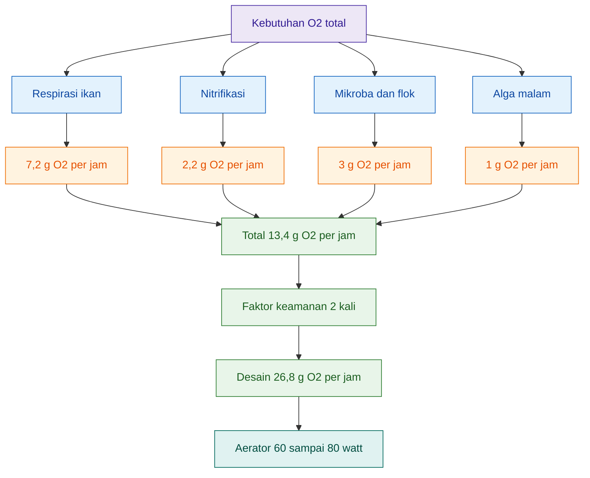
```mermaid id="jhrqu9"
flowchart TD
    A["Kebutuhan O2 total"] --> B["Respirasi ikan"]
    A --> C["Nitrifikasi"]
    A --> D["Mikroba dan flok"]
    A --> E["Alga malam"]

    B --> F["7,2 g O2 per jam"]
    C --> G["2,2 g O2 per jam"]
    D --> H["3 g O2 per jam"]
    E --> I["1 g O2 per jam"]

    F --> J["Total 13,4 g O2 per jam"]
    G --> J
    H --> J
    I --> J

    J --> K["Faktor keamanan 2 kali"]
    K --> L["Desain 26,8 g O2 per jam"]
    L --> M["Aerator 60 sampai 80 watt"]

    classDef root fill:#ede7f6,stroke:#4527a0,color:#311b92;
    classDef source fill:#e3f2fd,stroke:#1565c0,color:#0d47a1;
    classDef number fill:#fff3e0,stroke:#ef6c00,color:#e65100;
    classDef design fill:#e8f5e9,stroke:#2e7d32,color:#1b5e20;
    classDef result fill:#e0f2f1,stroke:#00695c,color:#004d40;

    class A root;
    class B,C,D,E source;
    class F,G,H,I number;
    class J,K,L design;
    class M result;
```

Diagram ini menunjukkan bahwa kebutuhan aerasi tidak hanya berasal dari ikan. Pada bioflok, air itu sendiri juga “bernapas” karena berisi mikroba, flok, dan plankton.

---

## 6.16. Jadwal Operasional dari Persiapan sampai Panen

### Fase Persiapan

| Waktu                  | Kegiatan utama                                | Target                       |
| ---------------------- | --------------------------------------------- | ---------------------------- |
| Hari $-14$ sampai $-7$ | Isi air, aerasi, paranet, buffer, starter     | Sistem mulai stabil          |
| Hari $-7$ sampai $0$   | Input organik ringan, pantau $TAN$ dan nitrit | Nitrifikasi mulai terbaca    |
| Hari $0$               | Tebar ikan                                    | Ikan masuk tanpa stres berat |

### Fase Pembesaran

| Fase                    | Fokus                                        |
| ----------------------- | -------------------------------------------- |
| Minggu $1$              | Adaptasi, pakan rendah, pantau $DO$          |
| Minggu $2$ sampai $4$   | Pakan naik bertahap, pantau $TAN$ dan nitrit |
| Minggu $5$ sampai $8$   | Sludge mulai rutin dikelola                  |
| Minggu $9$ sampai panen | Aerasi dan pakan dikontrol ketat             |

### Fase Panen

| Waktu                  | Kegiatan                                                           |
| ---------------------- | ------------------------------------------------------------------ |
| $24$ jam sebelum panen | Kurangi pakan                                                      |
| Saat panen             | Aerasi tetap hidup                                                 |
| Setelah panen          | Catat biomassa, jumlah hidup, total pakan, $FCR$, dan kualitas air |

---

## 6.17. Protokol Monitoring

Untuk kolam $1 \text{ m}^3$, monitoring harus lebih disiplin karena volume air kecil dan beban ikan tinggi.

| Parameter                   | Frekuensi minimal              | Catatan                               |
| --------------------------- | ------------------------------ | ------------------------------------- |
| $DO$ subuh                  | Harian                         | Parameter paling penting              |
| $DO$ sore                   | Harian                         | Membaca efek fotosintesis dan aerasi  |
| $pH$ pagi dan sore          | Harian                         | Melihat fluktuasi harian              |
| $TAN$                       | $2$ sampai $3$ kali per minggu | Lebih sering saat awal                |
| Nitrit                      | $2$ sampai $3$ kali per minggu | Penting saat nitrifikasi belum matang |
| Alkalinitas                 | Mingguan                       | Lebih sering bila $pH$ turun          |
| Flok atau settleable solids | Mingguan                       | Jaga agar tidak berlebihan            |
| Sludge                      | $2$ sampai $3$ kali per minggu | Siphon sebelum membusuk               |

Target indikator aman:

| Parameter         |                           Target kerja |
| ----------------- | -------------------------------------: |
| $DO$ subuh        |               Minimal $4 \text{ mg/L}$ |
| $pH$              |                 $6{,}8$ sampai $8{,}0$ |
| Alkalinitas       | $150$ sampai $200 \text{ mg/L CaCO}_3$ |
| $TAN$             |            Rendah dan tidak naik terus |
| Nitrit            |            Rendah dan tidak naik terus |
| Settleable solids |                    Tidak terlalu pekat |
| Bau air           |                    Normal, tidak busuk |

---

## 6.18. Protokol Koreksi Masalah

### Jika $DO$ Subuh Rendah

Tindakan:

1. Hentikan atau kurangi pakan sementara.
2. Tambah aerasi.
3. Periksa diffuser tersumbat.
4. Buang sludge.
5. Jangan tambah molase.
6. Pantau ikan sampai kondisi normal.

### Jika $TAN$ Naik

Urutan koreksi:

1. Kurangi pakan.
2. Cek $DO$.
3. Cek $pH$ dan alkalinitas.
4. Tambah buffer bila alkalinitas rendah.
5. Pastikan aerasi cukup.
6. Gunakan karbon hanya sebagai koreksi sementara bila $DO$ aman.

### Jika Nitrit Naik

Tindakan:

1. Kurangi pakan.
2. Perkuat aerasi.
3. Jaga alkalinitas.
4. Evaluasi media nitrifier.
5. Hindari perubahan sistem yang terlalu drastis.
6. Gunakan pergantian air terbatas bila kondisi mendesak.

### Jika Air Terlalu Hijau

Tindakan:

1. Tambah naungan.
2. Kurangi pakan sementara.
3. Buang sludge.
4. Pantau $pH$ pagi dan sore.
5. Pantau $DO$ subuh.

---

## 6.19. Diagram Keputusan Koreksi Lapangan

```mermaid id="cbwtgm"
flowchart TD
    A["Masalah kualitas air"] --> B["DO subuh rendah?"]
    B --> C["Ya: tambah aerasi, kurangi pakan, buang sludge"]
    B --> D["Tidak"]

    D --> E["TAN naik?"]
    E --> F["Ya: cek pH, alkalinitas, aerasi, pakan"]
    E --> G["Tidak"]

    G --> H["Nitrit naik?"]
    H --> I["Ya: kuatkan nitrifikasi dan kurangi beban pakan"]
    H --> J["Tidak"]

    J --> K["Air terlalu hijau?"]
    K --> L["Ya: tambah paranet dan kurangi nutrien"]
    K --> M["Tidak: lanjut monitoring"]

    F --> N["Karbon korektif hanya bila DO aman"]
    C --> O["Jangan tambah karbon saat DO rendah"]

    classDef root fill:#ede7f6,stroke:#4527a0,color:#311b92;
    classDef question fill:#e3f2fd,stroke:#1565c0,color:#0d47a1;
    classDef action fill:#fff3e0,stroke:#ef6c00,color:#e65100;
    classDef warning fill:#ffebee,stroke:#c62828,color:#b71c1c;
    classDef stable fill:#e8f5e9,stroke:#2e7d32,color:#1b5e20;

    class A root;
    class B,D,E,G,H,J,K question;
    class C,F,I,L,N action;
    class O warning;
    class M stable;
```

Diagram ini menekankan bahwa karbon bukan jawaban pertama untuk semua masalah. Pada sistem $C/N$ rendah, koreksi utama biasanya dimulai dari aerasi, pakan, alkalinitas, dan sludge.

---

## 6.20. Evaluasi Panen

Pada akhir siklus, data panen harus dicatat agar sistem bisa dievaluasi.

### Survival Rate

$$
Survival\ Rate_{\%} =
\frac{
Jumlah_{\text{panen}}
}{
Jumlah_{\text{tebar}}
}
\times
100\%
$$

Dengan asumsi:

$$
Jumlah_{\text{panen}} = 180
$$

$$
Jumlah_{\text{tebar}} = 200
$$

Maka:

$$
Survival\ Rate_{\%} =
\frac{
180
}{
200
}
\times
100\%
$$

$$
Survival\ Rate_{\%} =
90\%
$$

### Biomassa Bersih

Jika biomassa awal menggunakan nilai tengah $1{,}8 \text{ kg}$ dan biomassa panen $18 \text{ kg}$, maka:

$$
Biomassa_{\text{bersih}} =
Biomassa_{\text{panen}} - Biomassa_{\text{awal}}
$$

$$
Biomassa_{\text{bersih}} =
18 - 1{,}8
$$

$$
Biomassa_{\text{bersih}} =
16{,}2 \text{ kg}
$$

### $FCR$

Jika total pakan selama siklus misalnya $22 \text{ kg}$, maka:

$$
FCR =
\frac{
Total_{\text{pakan}}
}{
Biomassa_{\text{bersih}}
}
$$

$$
FCR =
\frac{
22
}{
16{,}2
}
$$

$$
FCR =
1{,}36
$$

Nilai $FCR$ aktual dapat berbeda tergantung kualitas benih, kualitas pakan, suhu, manajemen pakan, kesehatan ikan, dan stabilitas air.

---

## 6.21. Ringkasan Angka Kunci Studi Kasus

| Komponen                      |                                                 Nilai |
| ----------------------------- | ----------------------------------------------------: |
| Volume air                    |                                       $1 \text{ m}^3$ |
| Tebar                         |                                            $200$ ekor |
| Biomassa awal                 |                     $1{,}6$ sampai $2{,}0 \text{ kg}$ |
| Target panen                  |                       $14{,}4$ sampai $18 \text{ kg}$ |
| Pakan puncak                  |              $0{,}35$ sampai $0{,}40 \text{ kg/hari}$ |
| Estimasi $TAN$ puncak         |                        $11{,}52 \text{ g TAN-N/hari}$ |
| $O_2$ nitrifikasi             |                     $2{,}2 \text{ g } O_2\text{/jam}$ |
| $O_2$ ikan                    |                     $7{,}2 \text{ g } O_2\text{/jam}$ |
| $O_2$ mikroba dan flok        |                         $3 \text{ g } O_2\text{/jam}$ |
| $O_2$ alga malam              |                         $1 \text{ g } O_2\text{/jam}$ |
| Total kebutuhan puncak        |                    $13{,}4 \text{ g } O_2\text{/jam}$ |
| Desain dengan faktor keamanan |                    $26{,}8 \text{ g } O_2\text{/jam}$ |
| Rekomendasi aerator           |                         $60$ sampai $80 \text{ watt}$ |
| Konfigurasi aerator           | $2$ unit, masing-masing $30$ sampai $40 \text{ watt}$ |
| Paranet                       |                                    $50$ sampai $70\%$ |
| Alkalinitas ideal             |                $150$ sampai $200 \text{ mg/L CaCO}_3$ |

---

## 6.22. Kesimpulan Bab 6

Studi kasus kolam $1 \text{ m}^3$ dengan nila $200$ ekor menunjukkan bahwa sistem $C/N$ rendah dapat diterapkan secara praktis, tetapi harus dirancang dengan disiplin. Kunci utamanya bukan molase, melainkan aerasi, alkalinitas, nitrifikasi, cahaya terkendali, pakan bertahap, dan pembuangan sludge.

Pada skala kecil, sistem sangat cepat berubah. Karena itu, aerasi tidak boleh dihitung pas-pasan. Dengan asumsi biomassa puncak sekitar $18 \text{ kg}$ dan pakan puncak $0{,}40 \text{ kg/hari}$, kebutuhan oksigen desain sekitar $26{,}8 \text{ g } O_2\text{/jam}$. Dengan asumsi efisiensi transfer oksigen aktual $0{,}5 \text{ kg } O_2\text{/kWh}$, aerator sekitar $60$ sampai $80 \text{ watt}$ lebih realistis dibanding aerator kecil yang hanya cukup untuk gelembung visual.

Pesan utama bab ini:

> Untuk kolam $1 \text{ m}^3$ padat tebar $200$ ekor nila, sistem $C/N$ rendah dapat stabil bila nitrifikasi dipersiapkan sejak awal, karbon tidak digunakan rutin, cahaya dikendalikan, sludge dibuang, dan aerasi dirancang untuk kondisi puncak, bukan kondisi rata-rata.

[**Kembali ke Atas**](#cn-ratio-pada-bioflok-mengatur-mikroba-oksigen-dan-stabilitas-kolam-untuk-praktisi)

---

# 7. Bagian Tambahan yang Sebaiknya Masuk Artikel

## 7.1. Tanda sistem C/N rendah berjalan baik

| Indikator    | Kondisi ideal                         |
| ------------ | ------------------------------------- |
| Warna air    | Cokelat muda/teh, tidak terlalu pekat |
| DO subuh     | &gt;4 mg/L                            |
| pH pagi-sore | Selisih kecil, ideal &lt;0,5          |
| TAN          | &lt;1 mg/L                            |
| Nitrit       | &lt;1 mg/L                            |
| Alkalinitas  | 150–200 mg/L CaCO₃                    |
| Flok         | Ada, tetapi tidak berlebihan          |
| Bau          | Normal, tidak asam/busuk              |

## 7.2. Kesalahan umum praktisi

```text
1. Terlalu banyak molase sejak awal.
2. Mengejar air cokelat pekat sebagai tanda sukses.
3. Tidak mengukur DO subuh.
4. Tidak menjaga alkalinitas.
5. Menganggap flok pasti habis dimakan ikan.
6. Menurunkan/menghentikan karbon mendadak tanpa nitrifikasi matang.
7. Tidak membuang sludge.
```

## 7.3. Protokol darurat

| Masalah            | Tindakan cepat                                                                |
| ------------------ | ----------------------------------------------------------------------------- |
| DO subuh rendah    | Hentikan pakan sementara, tambah aerasi, buang sludge                         |
| TAN naik           | Kurangi pakan 30–50%, cek pH/alkalinitas, tambahkan karbon darurat bila perlu |
| Nitrit naik        | Kurangi pakan, tambah garam sesuai toleransi komoditas, kuatkan nitrifikasi   |
| pH turun           | Tambah buffer/kapur/bikarbonat                                                |
| Air terlalu hijau  | Tambah naungan, kurangi nutrien, buang sludge                                 |
| Flok terlalu pekat | Siphon/settling, jangan tambah karbon                                         |

[**Kembali ke Atas**](#cn-ratio-pada-bioflok-mengatur-mikroba-oksigen-dan-stabilitas-kolam-untuk-praktisi)

---

# Lampiran A. Model Matematik Kebutuhan Oksigen

Lampiran ini menjelaskan model matematik sederhana untuk memperkirakan kebutuhan oksigen pada sistem bioflok berdasarkan pakan, protein pakan, produksi $TAN$, target $C/N$, dominasi mikroba, produksi flok, dan faktor keamanan aerasi.

Model ini bukan pengganti pengukuran lapangan. Fungsinya adalah membantu praktisi membuat estimasi awal agar kapasitas aerasi tidak dirancang terlalu kecil.

Prinsip dasarnya:

> Semakin tinggi $C/N$, semakin besar peluang bakteri heterotrof mendominasi. Akibatnya, flok dan $TSS$ meningkat, lalu kebutuhan $O_2$ ikut naik.

---

## LA.1. Alur Perhitungan Model

```mermaid id="h4f9pv"
flowchart TD
    A["Input pakan"] --> B["Hitung TAN-N"]
    B --> C["Tentukan C/N"]
    C --> D["Hitung fraksi heterotrof"]
    D --> E["Hitung O2 untuk nitrogen"]
    D --> F["Hitung karbon berlebih"]
    D --> G["Hitung produksi VSS"]
    F --> H["Hitung O2 karbon berlebih"]
    G --> I["Hitung O2 TSS"]
    E --> J["Total kebutuhan O2"]
    H --> J
    I --> J
    K["O2 ikan"] --> J
    L["O2 alga malam"] --> J
    J --> M["Aerasi minimum"]
    M --> N["Aerasi rekomendasi"]

    classDef input fill:#e3f2fd,stroke:#1565c0,color:#0d47a1;
    classDef process fill:#e8f5e9,stroke:#2e7d32,color:#1b5e20;
    classDef oxygen fill:#fff3e0,stroke:#ef6c00,color:#e65100;
    classDef result fill:#e0f2f1,stroke:#00695c,color:#004d40;
    classDef risk fill:#ffebee,stroke:#c62828,color:#b71c1c;

    class A,C,K,L input;
    class B,D,F,G process;
    class E,H,I,J oxygen;
    class M,N result;
```

Alur ini menunjukkan bahwa kebutuhan oksigen tidak hanya berasal dari ikan. Pada bioflok, air juga memiliki beban oksigen karena mikroba, flok, karbon organik, nitrifikasi, dan alga.

---

## LA.2. Produksi $TAN$ dari Pakan

Produksi $TAN$ harian dapat diperkirakan dari jumlah pakan, kadar protein, kandungan nitrogen dalam protein, dan fraksi nitrogen pakan yang berubah menjadi $TAN$.

Rumus:

$$
TAN_{\text{N}} =
Feed
\times
Protein
\times
0{,}16
\times
f_{\text{TAN}}
$$

Keterangan:

| Simbol           |              Satuan | Arti                                                                     |
| ---------------- | ------------------: | ------------------------------------------------------------------------ |
| $TAN_{\text{N}}$ |   kg TAN-N per hari | Produksi total ammonia nitrogen harian                                   |
| $Feed$           |         kg per hari | Jumlah pakan harian                                                      |
| $Protein$        |              fraksi | Kadar protein pakan, misalnya $0{,}30$ untuk protein $30\%$              |
| $0{,}16$         | kg N per kg protein | Kandungan nitrogen dalam protein                                         |
| $f_{\text{TAN}}$ |              fraksi | Fraksi nitrogen pakan yang menjadi $TAN$, umumnya $0{,}5$ sampai $0{,}8$ |

Jika pakan harian naik, maka $TAN_{\text{N}}$ juga naik. Karena itu, pada sistem $C/N$ rendah, kenaikan pakan harus mengikuti kemampuan nitrifikasi.

---

## LA.3. Fraksi Dominasi Heterotrof

Fraksi dominasi heterotrof dinyatakan sebagai $f_H$. Nilai $f_H$ berada dari $0$ sampai $1$.

| Nilai $f_H$ | Makna               |
| ----------: | ------------------- |
|         $0$ | Nitrifikasi dominan |
|     $0{,}5$ | Sistem campuran     |
|         $1$ | Heterotrof dominan  |

Model sederhana:

$$
f_H =
\begin{cases}
0, & C/N \le 8 \
\dfrac{C/N - 8}{8}, & 8 < C/N < 16 \
1, & C/N \ge 16
\end{cases}
$$

Interpretasi praktis:

| $C/N$ |    $f_H$ | Interpretasi              |
| ----: | -------: | ------------------------- |
|   $8$ |      $0$ | Nitrifikasi dominan       |
|  $10$ | $0{,}25$ | Heterotrof mulai berperan |
|  $12$ | $0{,}50$ | Sistem campuran           |
|  $14$ | $0{,}75$ | Heterotrof kuat           |
|  $16$ | $1{,}00$ | Heterotrof dominan        |

Model ini adalah penyederhanaan. Di kolam nyata, nilai $f_H$ juga dipengaruhi cahaya, suhu, alkalinitas, $DO$, sumber karbon, umur sistem, dan jumlah flok.

---

## LA.4. Oksigen untuk Proses Nitrogen

Oksigen untuk proses nitrogen dihitung dari $TAN_{\text{N}}$, fraksi nitrifikasi, dan fraksi heterotrof.

Rumus:

$$
O_{2,\text{N}} =
TAN_{\text{N}}
\times
\left[
4{,}57
\times
\left(
1 - f_H
\right)
+
4{,}71
\times
f_H
\right]
$$

Keterangan:

| Simbol           |                Satuan | Arti                                        |
| ---------------- | --------------------: | ------------------------------------------- |
| $O_{2,\text{N}}$ |     kg $O_2$ per hari | Kebutuhan oksigen untuk pengolahan nitrogen |
| $TAN_{\text{N}}$ |     kg TAN-N per hari | Produksi $TAN$ harian                       |
| $4{,}57$         | kg $O_2$ per kg TAN-N | Kebutuhan oksigen untuk nitrifikasi         |
| $4{,}71$         | kg $O_2$ per kg TAN-N | Kebutuhan oksigen untuk jalur heterotrof    |
| $f_H$            |                fraksi | Fraksi dominasi heterotrof                  |

Poin penting:

> Nilai $O_{2,\text{N}}$ tidak berubah ekstrem antara nitrifikasi dan heterotrof. Beban besar pada $C/N$ tinggi justru berasal dari karbon berlebih, flok, $TSS$, dan sludge.

---

## LA.5. Karbon Input dan Karbon Berlebih

Karbon input dihitung dari target $C/N$ dan produksi $TAN_{\text{N}}$.

$$
C_{\text{input}} =
C/N
\times
TAN_{\text{N}}
$$

Namun tidak semua karbon input benar-benar tersedia untuk mikroba. Karena itu digunakan faktor ketersediaan karbon, yaitu $\eta_C$.

$$
C_{\text{input efektif}} =
C_{\text{input}}
\times
\eta_C
$$

Keterangan:

| Simbol                     |        Satuan | Arti                                        |
| -------------------------- | ------------: | ------------------------------------------- |
| $C_{\text{input}}$         | kg C per hari | Karbon teoritis berdasarkan target $C/N$    |
| $C_{\text{input efektif}}$ | kg C per hari | Karbon yang tersedia bagi mikroba           |
| $\eta_C$                   |        fraksi | Fraksi karbon yang tersedia secara biologis |

Kebutuhan karbon untuk jalur heterotrof:

$$
C_{\text{kebutuhan heterotrof}} =
6{,}07
\times
TAN_{\text{N}}
\times
f_H
$$

Karbon berlebih:

$$
C_{\text{berlebih}} =
\max
\left(
0,
C_{\text{input efektif}} =
C_{\text{kebutuhan heterotrof}}
\right)
$$

Oksigen untuk karbon berlebih:

$$
O_{2,\text{C berlebih}} =
C_{\text{berlebih}}
\times
2{,}67
\times
\phi
$$

Keterangan:

| Simbol                            |            Satuan | Arti                                                      |
| --------------------------------- | ----------------: | --------------------------------------------------------- |
| $C_{\text{kebutuhan heterotrof}}$ |     kg C per hari | Karbon yang dipakai untuk pembentukan biomassa heterotrof |
| $C_{\text{berlebih}}$             |     kg C per hari | Karbon yang berpotensi dioksidasi menjadi $CO_2$          |
| $2{,}67$                          | kg $O_2$ per kg C | Oksigen untuk oksidasi karbon                             |
| $\phi$                            |            fraksi | Fraksi karbon berlebih yang teroksidasi dalam $24$ jam    |

Semakin besar $C_{\text{berlebih}}$, semakin besar risiko konsumsi oksigen meningkat setelah penambahan karbon.

---

## LA.6. Produksi Flok atau $VSS$

Pada jalur heterotrof, sebagian nitrogen dikemas menjadi biomassa mikroba. Biomassa ini dinyatakan sebagai $VSS$, yaitu volatile suspended solids.

Rumus:

$$
VSS_{\text{baru}} =
8{,}07
\times
TAN_{\text{N}}
\times
f_H
$$

Kebutuhan oksigen akibat respirasi flok atau $TSS$:

$$
O_{2,\text{TSS}} =
VSS_{\text{baru}}
\times
k_{\text{TSS}}
$$

Keterangan:

| Simbol              |                       Satuan | Arti                                    |
| ------------------- | ---------------------------: | --------------------------------------- |
| $VSS_{\text{baru}}$ |              kg VSS per hari | Estimasi biomassa flok baru             |
| $8{,}07$            |          kg VSS per kg TAN-N | Produksi biomassa pada jalur heterotrof |
| $k_{\text{TSS}}$    | kg $O_2$ per kg VSS per hari | Koefisien respirasi flok                |
| $O_{2,\text{TSS}}$  |            kg $O_2$ per hari | Kebutuhan oksigen dari flok atau $TSS$  |

Nilai awal yang dapat digunakan:

$$
k_{\text{TSS}} =
0{,}05
\text{ sampai }
0{,}15
\text{ kg } O_2
\text{ per kg VSS per hari}
$$

Pada kolam dengan flok pekat, sludge tinggi, atau air terlalu cokelat gelap, nilai $k_{\text{TSS}}$ dapat lebih besar.

---

## LA.7. Total Kebutuhan Oksigen Harian

Total kebutuhan oksigen harian dihitung dari komponen ikan, nitrogen, karbon berlebih, flok, dan alga malam.

Rumus:

$$
O_{2,\text{total}} =
O_{2,\text{ikan}}
+
O_{2,\text{N}}
+
O_{2,\text{C berlebih}}
+
O_{2,\text{TSS}}
+
O_{2,\text{alga malam}}
$$

Keterangan:

| Komponen                  |            Satuan | Arti                                        |
| ------------------------- | ----------------: | ------------------------------------------- |
| $O_{2,\text{ikan}}$       | kg $O_2$ per hari | Respirasi ikan                              |
| $O_{2,\text{N}}$          | kg $O_2$ per hari | Oksigen untuk proses nitrogen               |
| $O_{2,\text{C berlebih}}$ | kg $O_2$ per hari | Oksigen untuk oksidasi karbon berlebih      |
| $O_{2,\text{TSS}}$        | kg $O_2$ per hari | Oksigen untuk flok atau padatan tersuspensi |
| $O_{2,\text{alga malam}}$ | kg $O_2$ per hari | Respirasi alga pada malam hari              |

Untuk sistem $C/N$ rendah, komponen utama biasanya:

$$
O_{2,\text{total}}
\approx
O_{2,\text{ikan}}
+
O_{2,\text{N}}
+
O_{2,\text{TSS ringan}}
$$

Untuk sistem $C/N$ tinggi, komponen utama menjadi:

$$
O_{2,\text{total}}
\approx
O_{2,\text{ikan}}
+
O_{2,\text{N}}
+
O_{2,\text{C berlebih}}
+
O_{2,\text{TSS}}
$$

---

## LA.8. Kebutuhan Aerasi

Kebutuhan aerasi minimum per jam:

$$
Aerasi_{\text{minimum}} =
\frac{
O_{2,\text{total}}
}{
24
}
$$

Kebutuhan aerasi rekomendasi:

$$
Aerasi_{\text{rekomendasi}} =
Aerasi_{\text{minimum}}
\times
Faktor_{\text{keamanan}}
$$

Untuk sistem kecil dan intensif, faktor keamanan yang disarankan:

$$
Faktor_{\text{keamanan}} =
1{,}5
\text{ sampai }
2{,}0
$$

Jika hasil ingin dikonversi menjadi estimasi daya aerator, dapat digunakan:

$$
Daya =
\frac{
Aerasi_{\text{rekomendasi}}
}{
OTR_{\text{aktual}}
}
$$

Keterangan:

| Simbol                        |           Satuan | Arti                                       |
| ----------------------------- | ---------------: | ------------------------------------------ |
| $Daya$                        |               kW | Estimasi daya aerator                      |
| $Aerasi_{\text{rekomendasi}}$ | kg $O_2$ per jam | Kebutuhan transfer oksigen aktual          |
| $OTR_{\text{aktual}}$         | kg $O_2$ per kWh | Efisiensi transfer oksigen aktual di kolam |

Untuk kolam kecil dangkal dengan diffuser sederhana, nilai pendekatan yang konservatif:

$$
OTR_{\text{aktual}} =
0{,}5
\text{ kg } O_2
\text{ per kWh}
$$

Nilai ini harus divalidasi dengan $DO$ meter, karena performa aktual aerator sangat dipengaruhi kedalaman, jenis diffuser, suhu, salinitas, dan kualitas instalasi.

---

## LA.9. Aplikasi pada Studi Kasus Kolam $1 \text{ m}^3$

Input studi kasus:

| Parameter             |                              Nilai |
| --------------------- | ---------------------------------: |
| $Feed$                |           $0{,}40 \text{ kg/hari}$ |
| $Protein$             |                           $0{,}30$ |
| $f_{\text{TAN}}$      |                           $0{,}60$ |
| Target $C/N$          |                               $10$ |
| Volume                |                    $1 \text{ m}^3$ |
| Biomassa ikan         |                    $18 \text{ kg}$ |
| Faktor keamanan       |                                $2$ |
| $OTR_{\text{aktual}}$ | $0{,}5 \text{ kg } O_2\text{/kWh}$ |

---

### LA.9.1. Hitung Produksi $TAN_{\text{N}}$

$$
TAN_{\text{N}} =
Feed
\times
Protein
\times
0{,}16
\times
f_{\text{TAN}}
$$

$$
TAN_{\text{N}} =
0{,}40
\times
0{,}30
\times
0{,}16
\times
0{,}60
$$

$$
TAN_{\text{N}} =
0{,}01152
\text{ kg TAN-N/hari}
$$

Konversi:

$$
0{,}01152
\text{ kg} =
11{,}52
\text{ g}
$$

Jadi:

$$
TAN_{\text{N}} =
11{,}52
\text{ g TAN-N/hari}
$$

---

### LA.9.2. Hitung Fraksi Heterotrof pada $C/N = 10$

Karena target berada pada zona $8 < C/N < 16$, maka:

$$
f_H =
\frac{
C/N - 8
}{
8
}
$$

$$
f_H =
\frac{
10 - 8
}{
8
}
$$

$$
f_H =
0{,}25
$$

Interpretasi:

|              Nilai | Makna                                                                                 |
| -----------------: | ------------------------------------------------------------------------------------- |
|     $f_H = 0{,}25$ | Sistem masih cenderung nitrifikasi, tetapi heterotrof mulai berperan                  |
| $1 - f_H = 0{,}75$ | Sekitar tiga perempat proses nitrogen diasumsikan masih berada pada jalur nitrifikasi |

---

### LA.9.3. Hitung $O_2$ untuk Proses Nitrogen

$$
O_{2,\text{N}} =
TAN_{\text{N}}
\times
\left[
4{,}57
\times
\left(
1 - f_H
\right)
+
4{,}71
\times
f_H
\right]
$$

Substitusi:

$$
O_{2,\text{N}} =
0{,}01152
\times
\left[
4{,}57
\times
0{,}75
+
4{,}71
\times
0{,}25
\right]
$$

$$
O_{2,\text{N}} =
0{,}01152
\times
\left[
3{,}4275
+
1{,}1775
\right]
$$

$$
O_{2,\text{N}} =
0{,}01152
\times
4{,}605
$$

$$
O_{2,\text{N}} =
0{,}05305
\text{ kg } O_2\text{/hari}
$$

Konversi ke gram per hari:

$$
0{,}05305
\text{ kg} =
53{,}05
\text{ g}
$$

Kebutuhan per jam:

$$
O_{2,\text{N per jam}} =
\frac{
53{,}05
}{
24
}
$$

$$
O_{2,\text{N per jam}} =
2{,}21
\text{ g } O_2\text{/jam}
$$

---

### LA.9.4. Hitung Kebutuhan $O_2$ Ikan

Asumsi respirasi ikan:

$$
Respirasi_{\text{ikan}} =
0{,}4
\text{ g } O_2
\text{/kg ikan/jam}
$$

Biomassa ikan:

$$
Biomassa_{\text{ikan}} =
18
\text{ kg}
$$

Maka:

$$
O_{2,\text{ikan per jam}} =
18
\times
0{,}4
$$

$$
O_{2,\text{ikan per jam}} =
7{,}2
\text{ g } O_2\text{/jam}
$$

Konversi ke harian:

$$
O_{2,\text{ikan per hari}} =
7{,}2
\times
24
$$

$$
O_{2,\text{ikan per hari}} =
172{,}8
\text{ g } O_2\text{/hari}
$$

$$
O_{2,\text{ikan per hari}} =
0{,}1728
\text{ kg } O_2\text{/hari}
$$

---

### LA.9.5. Komponen Mikroba Ringan dan Alga Malam

Untuk sistem $C/N$ rendah dengan flok tidak pekat, digunakan asumsi desain:

$$
O_{2,\text{mikroba flok per jam}} =
3
\text{ g } O_2\text{/jam}
$$

$$
O_{2,\text{alga malam per jam}} =
1
\text{ g } O_2\text{/jam}
$$

Konversi ke harian:

$$
O_{2,\text{mikroba flok per hari}} =
3
\times
24
==

72
\text{ g } O_2\text{/hari}
$$

$$
O_{2,\text{alga malam per hari}} =
1
\times
24
==

24
\text{ g } O_2\text{/hari}
$$

---

### LA.9.6. Total Kebutuhan $O_2$ Puncak

Dalam satuan gram per jam:

$$
O_{2,\text{total per jam}} =
O_{2,\text{ikan}}
+
O_{2,\text{N}}
+
O_{2,\text{mikroba flok}}
+
O_{2,\text{alga malam}}
$$

$$
O_{2,\text{total per jam}} =
7{,}2
+
2{,}21
+
3
+
1
$$

$$
O_{2,\text{total per jam}} =
13{,}41
\text{ g } O_2\text{/jam}
$$

Dibulatkan:

$$
O_{2,\text{total per jam}}
\approx
13{,}4
\text{ g } O_2\text{/jam}
$$

Dengan faktor keamanan $2$:

$$
O_{2,\text{desain}} =
13{,}4
\times
2
$$

$$
O_{2,\text{desain}} =
26{,}8
\text{ g } O_2\text{/jam}
$$

Konversi:

$$
26{,}8
\text{ g } O_2\text{/jam} =
0{,}0268
\text{ kg } O_2\text{/jam}
$$

---

### LA.9.7. Estimasi Daya Aerator

Dengan asumsi:

$$
OTR_{\text{aktual}} =
0{,}5
\text{ kg } O_2\text{/kWh}
$$

Maka:

$$
Daya =
\frac{
0{,}0268
}{
0{,}5
}
$$

$$
Daya =
0{,}0536
\text{ kW}
$$

Konversi ke watt:

$$
0{,}0536
\text{ kW} =
53{,}6
\text{ watt}
$$

Maka rekomendasi praktis:

$$
Daya_{\text{aerator}} =
60
\text{ sampai }
80
\text{ watt}
$$

Konfigurasi yang lebih aman:

| Komponen      |                                          Rekomendasi |
| ------------- | ---------------------------------------------------: |
| Total aerator |                        $60$ sampai $80 \text{ watt}$ |
| Jumlah unit   |                                             $2$ unit |
| Daya per unit |                        $30$ sampai $40 \text{ watt}$ |
| Titik aerasi  |                                 $4$ sampai $8$ titik |
| Backup        | Minimal $1$ unit tetap hidup saat listrik bermasalah |

---

## LA.10. Ringkasan Output Studi Kasus

| Output                      |                                   Nilai |
| --------------------------- | --------------------------------------: |
| $TAN_{\text{N}}$            |       $0{,}01152 \text{ kg TAN-N/hari}$ |
| $TAN_{\text{N}}$            |          $11{,}52 \text{ g TAN-N/hari}$ |
| $f_H$ pada $C/N = 10$       |                                $0{,}25$ |
| $O_{2,\text{N}}$            | $0{,}05305 \text{ kg } O_2\text{/hari}$ |
| $O_{2,\text{N}}$            |      $2{,}21 \text{ g } O_2\text{/jam}$ |
| $O_{2,\text{ikan}}$         |       $7{,}2 \text{ g } O_2\text{/jam}$ |
| $O_{2,\text{mikroba flok}}$ |           $3 \text{ g } O_2\text{/jam}$ |
| $O_{2,\text{alga malam}}$   |           $1 \text{ g } O_2\text{/jam}$ |
| $O_{2,\text{total}}$        |      $13{,}4 \text{ g } O_2\text{/jam}$ |
| $O_{2,\text{desain}}$       |      $26{,}8 \text{ g } O_2\text{/jam}$ |
| Estimasi daya               |                   $53{,}6 \text{ watt}$ |
| Rekomendasi lapangan        |           $60$ sampai $80 \text{ watt}$ |

---

## LA.11. Cara Membaca Model

Model ini harus dibaca sebagai alat bantu keputusan, bukan angka mutlak. Bila hasil model menunjukkan kebutuhan aerasi $60 \text{ watt}$, bukan berarti aerator $60 \text{ watt}$ pasti aman di semua kolam. Validasi tetap harus dilakukan dengan pengukuran $DO$.

Parameter validasi utama:

| Parameter                    |                                 Target |
| ---------------------------- | -------------------------------------: |
| $DO$ subuh                   |               Minimal $4 \text{ mg/L}$ |
| $DO$ setelah pemberian pakan |                      Tidak turun tajam |
| $DO$ setelah koreksi karbon  |                      Tidak turun tajam |
| $TAN$                        |                  Tidak meningkat terus |
| Nitrit                       |                  Tidak meningkat terus |
| $pH$                         |                                 Stabil |
| Alkalinitas                  | $150$ sampai $200 \text{ mg/L CaCO}_3$ |
| Flok atau $TSS$              |                       Tidak berlebihan |
| Sludge                       |        Tidak menumpuk dan tidak berbau |

Jika $DO$ subuh berada di bawah target, maka model harus dikoreksi dengan menaikkan estimasi beban oksigen atau menambah aerasi.

---

## LA.12. Batasan Model

Model ini memiliki beberapa batasan.

| Batasan                             | Penjelasan                                                                                |
| ----------------------------------- | ----------------------------------------------------------------------------------------- |
| Nilai $f_H$ disederhanakan          | Dominasi mikroba nyata dipengaruhi cahaya, suhu, $DO$, pH, sumber karbon, dan umur sistem |
| $OTR_{\text{aktual}}$ hanya asumsi  | Transfer oksigen aktual bergantung pada aerator, diffuser, kedalaman, suhu, dan instalasi |
| Respirasi ikan berubah              | Konsumsi oksigen ikan naik saat suhu tinggi, aktivitas tinggi, dan setelah makan          |
| Flok tidak selalu homogen           | Flok muda, flok tua, sludge, dan biofilm memiliki laju respirasi berbeda                  |
| Alga berubah harian                 | Cuaca, paranet, dan kekeruhan mengubah fotosintesis dan respirasi malam                   |
| Model tidak menggantikan pengukuran | $DO$, $TAN$, nitrit, $pH$, dan alkalinitas tetap wajib diukur                             |

Prinsip akhirnya:

> Model membantu memperkirakan kebutuhan oksigen, tetapi $DO$ subuh adalah hakim lapangan.

[**Kembali ke Atas**](#cn-ratio-pada-bioflok-mengatur-mikroba-oksigen-dan-stabilitas-kolam-untuk-praktisi)

---

<small>
  **_Catatan Penyusunan_** Artikel ini disusun sebagai materi edukasi dan
  referensi umum berdasarkan berbagai sumber pustaka, praktik lapangan, serta
  bantuan alat penulisan. Pembaca disarankan untuk melakukan verifikasi lanjutan
  dan penyesuaian sesuai dengan kondisi serta kebutuhan masing-masing sistem.
</small>
