# **_Rezim Feeding Rate Nila Bioflok: Model Pakan Berbasis Biomassa, Fase Pertumbuhan, E:P Ratio, dan FCR Efektif_**

---

- [**_Rezim Feeding Rate Nila Bioflok: Model Pakan Berbasis Biomassa, Fase Pertumbuhan, E:P Ratio, dan FCR Efektif_**](#rezim-feeding-rate-nila-bioflok-model-pakan-berbasis-biomassa-fase-pertumbuhan-ep-ratio-dan-fcr-efektif)
- [0. Executive Summary](#0-executive-summary)
  - [Tujuan Bagian Ini](#tujuan-bagian-ini)
  - [Isi Utama](#isi-utama)
  - [Kerangka Berpikir Rezim Feeding Nila Bioflok](#kerangka-berpikir-rezim-feeding-nila-bioflok)
- [1. Pendahuluan: Mengapa Feeding Rate Menentukan Profit Bioflok Nila](#1-pendahuluan-mengapa-feeding-rate-menentukan-profit-bioflok-nila)
  - [1.1 Latar Belakang](#11-latar-belakang)
  - [1.2 Masalah Utama di Lapangan](#12-masalah-utama-di-lapangan)
  - [1.3 Tujuan Artikel](#13-tujuan-artikel)
- [2. Dasar Rujukan Teknis Feeding Nila](#2-dasar-rujukan-teknis-feeding-nila)
  - [2.1 Feeding Rate Berdasarkan Ukuran Ikan](#21-feeding-rate-berdasarkan-ukuran-ikan)
    - [Formula Dasar Feeding Rate](#formula-dasar-feeding-rate)
  - [2.2 Kebutuhan Protein Berdasarkan Fase](#22-kebutuhan-protein-berdasarkan-fase)
    - [Mengapa Protein Tidak Bisa Dibaca Sendiri](#mengapa-protein-tidak-bisa-dibaca-sendiri)
  - [2.3 Bioflok sebagai Sistem Khusus](#23-bioflok-sebagai-sistem-khusus)
    - [Bioflok Credit dalam Model Feeding](#bioflok-credit-dalam-model-feeding)
    - [Alur Feeding Bioflok sebagai Sistem Kendali](#alur-feeding-bioflok-sebagai-sistem-kendali)
  - [Ringkasan Bab 0–2](#ringkasan-bab-02)
- [3. Prinsip Dasar Rezim Feeding Nila Bioflok](#3-prinsip-dasar-rezim-feeding-nila-bioflok)
  - [3.1 Feeding Rate Harus Berbasis Biomassa](#31-feeding-rate-harus-berbasis-biomassa)
    - [Alur Hitung Pakan Berbasis Biomassa](#alur-hitung-pakan-berbasis-biomassa)
  - [3.2 Sampling Adalah Syarat](#32-sampling-adalah-syarat)
    - [Data yang Wajib Dicatat Saat Sampling](#data-yang-wajib-dicatat-saat-sampling)
  - [3.3 Feeding Rate Harus Turun Saat Bobot Naik](#33-feeding-rate-harus-turun-saat-bobot-naik)
    - [Ilustrasi Feeding Rate Turun tetapi Pakan Harian Naik](#ilustrasi-feeding-rate-turun-tetapi-pakan-harian-naik)
    - [Kurva Konseptual Feeding Rate dan Biomassa](#kurva-konseptual-feeding-rate-dan-biomassa)
- [4. Rezim Feeding Rate per Fase Pertumbuhan Nila Bioflok](#4-rezim-feeding-rate-per-fase-pertumbuhan-nila-bioflok)
  - [4.1 Tabel Rezim Feeding Final](#41-tabel-rezim-feeding-final)
  - [4.2 Catatan Penting Tabel](#42-catatan-penting-tabel)
    - [4.2.1 Tabel Adalah Titik Awal, Bukan Angka Mati](#421-tabel-adalah-titik-awal-bukan-angka-mati)
    - [4.2.2 Bioflok Credit Tidak Boleh Langsung Diasumsikan Besar](#422-bioflok-credit-tidak-boleh-langsung-diasumsikan-besar)
    - [4.2.3 Feeding Rate Harus Dikoreksi dari Respons Makan dan Kualitas Air](#423-feeding-rate-harus-dikoreksi-dari-respons-makan-dan-kualitas-air)
    - [4.2.4 Pakan Protein Tinggi Tidak Selalu Lebih Baik](#424-pakan-protein-tinggi-tidak-selalu-lebih-baik)
  - [4.3 Contoh Aplikasi Rezim Feeding per Fase](#43-contoh-aplikasi-rezim-feeding-per-fase)
  - [4.4 Diagram Rezim Feeding per Fase](#44-diagram-rezim-feeding-per-fase)
  - [Ringkasan Bab 3–4](#ringkasan-bab-34)
- [5. Protein, Energi, dan E:P Ratio](#5-protein-energi-dan-ep-ratio)
  - [5.1 Mengapa E:P Ratio Penting](#51-mengapa-ep-ratio-penting)
    - [Dampak Ketidakseimbangan Protein dan Energi](#dampak-ketidakseimbangan-protein-dan-energi)
    - [Posisi E:P dalam Rezim Feeding](#posisi-ep-dalam-rezim-feeding)
  - [5.2 Formula E:P Ratio](#52-formula-ep-ratio)
    - [Contoh Perbandingan Beberapa Pakan](#contoh-perbandingan-beberapa-pakan)
  - [5.3 Formula P:E Ratio](#53-formula-pe-ratio)
    - [Konversi Cepat E:P dan P:E](#konversi-cepat-ep-dan-pe)
  - [5.4 Cara Membaca Label Pakan](#54-cara-membaca-label-pakan)
    - [5.4.1 Protein Kasar](#541-protein-kasar)
    - [5.4.2 Lemak](#542-lemak)
    - [5.4.3 Serat](#543-serat)
    - [5.4.4 Abu](#544-abu)
    - [5.4.5 DE atau ME](#545-de-atau-me)
    - [5.4.6 Ukuran Pelet](#546-ukuran-pelet)
  - [5.5 Checklist Memilih Pakan Berdasarkan E:P](#55-checklist-memilih-pakan-berdasarkan-ep)
    - [Contoh Pembacaan Pakan](#contoh-pembacaan-pakan)
  - [5.6 Hubungan E:P dengan Model FCR Efektif](#56-hubungan-ep-dengan-model-fcr-efektif)
  - [Ringkasan Bab 5](#ringkasan-bab-5)
- [6. Model FCR Efektif](#6-model-fcr-efektif)
  - [6.1 Mengapa FCR Tidak Konstan](#61-mengapa-fcr-tidak-konstan)
    - [Faktor yang Membuat FCR Berubah](#faktor-yang-membuat-fcr-berubah)
  - [6.2 Formula FCR Efektif](#62-formula-fcr-efektif)
  - [6.3 Penjelasan Faktor](#63-penjelasan-faktor)
    - [Alur FCR Efektif](#alur-fcr-efektif)
  - [6.4 EP Factor](#64-ep-factor)
    - [Contoh EP Factor](#contoh-ep-factor)
  - [6.5 FR Factor](#65-fr-factor)
    - [Contoh FR Factor](#contoh-fr-factor)
  - [6.6 WQ Factor](#66-wq-factor)
  - [6.7 BFT Factor](#67-bft-factor)
  - [6.8 Contoh Perhitungan FCR Efektif](#68-contoh-perhitungan-fcr-efektif)
- [7. Model Pertumbuhan Berat Harian](#7-model-pertumbuhan-berat-harian)
  - [7.1 Biomassa](#71-biomassa)
  - [7.2 Pakan Harian](#72-pakan-harian)
  - [7.3 Pertambahan Biomassa](#73-pertambahan-biomassa)
  - [7.4 Bobot Esok Hari](#74-bobot-esok-hari)
  - [7.5 Mortalitas](#75-mortalitas)
  - [7.6 Formula Final Model](#76-formula-final-model)
  - [7.7 Contoh Simulasi Satu Hari](#77-contoh-simulasi-satu-hari)
  - [7.8 Alur Simulasi Harian](#78-alur-simulasi-harian)
  - [7.9 Batasan Model](#79-batasan-model)
  - [Ringkasan Bab 6–7](#ringkasan-bab-67)
- [8. Jadwal Pemberian Pakan Harian](#8-jadwal-pemberian-pakan-harian)
  - [8.1 Prinsip Umum](#81-prinsip-umum)
  - [Alur Keputusan Feeding Harian](#alur-keputusan-feeding-harian)
  - [8.2 Jadwal Praktis per Fase](#82-jadwal-praktis-per-fase)
  - [8.3 Porsi per Waktu](#83-porsi-per-waktu)
    - [Untuk 3 Kali per Hari](#untuk-3-kali-per-hari)
    - [Untuk 2 Kali per Hari](#untuk-2-kali-per-hari)
- [9. Kualitas Air sebagai Pengendali Feeding](#9-kualitas-air-sebagai-pengendali-feeding)
  - [9.1 Mengapa Kualitas Air Masuk Model](#91-mengapa-kualitas-air-masuk-model)
  - [9.2 Parameter Minimum](#92-parameter-minimum)
    - [Parameter Prioritas Harian](#parameter-prioritas-harian)
  - [9.3 WQ Factor dalam Model](#93-wq-factor-dalam-model)
  - [Alur Pakan Menjadi Risiko Kualitas Air](#alur-pakan-menjadi-risiko-kualitas-air)
- [10. SOP Koreksi Feeding di Lapangan](#10-sop-koreksi-feeding-di-lapangan)
  - [10.1 Koreksi Berdasarkan Respons Makan](#101-koreksi-berdasarkan-respons-makan)
    - [Detail Praktis](#detail-praktis)
  - [10.2 Koreksi Berdasarkan Media Bioflok](#102-koreksi-berdasarkan-media-bioflok)
    - [Catatan untuk Media Bioflok](#catatan-untuk-media-bioflok)
  - [10.3 Koreksi Setelah Sampling](#103-koreksi-setelah-sampling)
  - [10.4 Matriks Keputusan Koreksi Feeding](#104-matriks-keputusan-koreksi-feeding)
  - [10.5 Catatan Pencatatan Harian](#105-catatan-pencatatan-harian)
  - [Ringkasan Bab 8–10](#ringkasan-bab-810)
- [11. Simulasi Excel/CSV](#11-simulasi-excelcsv)
  - [11.1 Tujuan Simulasi](#111-tujuan-simulasi)
  - [11.2 Struktur Worksheet](#112-struktur-worksheet)
  - [11.2.1 Sheet `INPUT_GLOBAL`](#1121-sheet-input_global)
  - [11.2.2 Sheet `LOOKUP_FASE`](#1122-sheet-lookup_fase)
  - [11.2.3 Sheet `SIMULASI_HARIAN`](#1123-sheet-simulasi_harian)
  - [11.2.4 Sheet `RINGKASAN`](#1124-sheet-ringkasan)
  - [11.2.5 Sheet `VALIDASI_PILOT`](#1125-sheet-validasi_pilot)
  - [11.2.6 Sheet `REFERENSI_ASUMSI`](#1126-sheet-referensi_asumsi)
  - [11.3 Output yang Harus Ditampilkan](#113-output-yang-harus-ditampilkan)
    - [Output Minimum untuk Praktisi](#output-minimum-untuk-praktisi)
  - [11.4 Alur Kerja Simulasi](#114-alur-kerja-simulasi)
- [12. Kalibrasi Pilot](#12-kalibrasi-pilot)
  - [12.1 Mengapa Wajib](#121-mengapa-wajib)
  - [12.2 Formula FCR Aktual](#122-formula-fcr-aktual)
  - [12.3 Calibration Factor](#123-calibration-factor)
  - [12.4 Koreksi FCR Base](#124-koreksi-fcr-base)
  - [12.5 Tabel Kalibrasi](#125-tabel-kalibrasi)
  - [12.6 Audit Saat Model dan Aktual Berbeda](#126-audit-saat-model-dan-aktual-berbeda)
  - [12.7 Siklus Kalibrasi Model](#127-siklus-kalibrasi-model)
  - [12.8 Data Minimum untuk Pilot](#128-data-minimum-untuk-pilot)
  - [Ringkasan Bab 11–12](#ringkasan-bab-1112)
- [13. Risiko dan Kesalahan Umum](#13-risiko-dan-kesalahan-umum)
  - [13.1 Kesalahan Nutrisi](#131-kesalahan-nutrisi)
    - [13.1.1 Protein Terlalu Rendah](#1311-protein-terlalu-rendah)
    - [13.1.2 Protein Terlalu Tinggi](#1312-protein-terlalu-tinggi)
    - [13.1.3 `$E:P$` Terlalu Rendah](#1313-ep-terlalu-rendah)
    - [13.1.4 `$E:P$` Terlalu Tinggi](#1314-ep-terlalu-tinggi)
    - [13.1.5 Pelet Terlalu Besar](#1315-pelet-terlalu-besar)
  - [13.2 Kesalahan Operasional](#132-kesalahan-operasional)
    - [13.2.1 Tidak Sampling](#1321-tidak-sampling)
    - [13.2.2 Feeding Rate Tidak Dikoreksi](#1322-feeding-rate-tidak-dikoreksi)
    - [13.2.3 Overfeeding Saat Air Buruk](#1323-overfeeding-saat-air-buruk)
    - [13.2.4 Tidak Ada Backup Aerasi](#1324-tidak-ada-backup-aerasi)
    - [13.2.5 Menganggap Bioflok Otomatis Mengganti Pakan](#1325-menganggap-bioflok-otomatis-mengganti-pakan)
  - [13.3 Kesalahan Bisnis](#133-kesalahan-bisnis)
    - [13.3.1 Hanya Mengejar Panen Cepat](#1331-hanya-mengejar-panen-cepat)
    - [13.3.2 Membeli Pakan Murah Tanpa Cek Nutrisi](#1332-membeli-pakan-murah-tanpa-cek-nutrisi)
    - [13.3.3 Tidak Menghitung Biaya Pakan per kg Gain](#1333-tidak-menghitung-biaya-pakan-per-kg-gain)
    - [13.3.4 Tidak Validasi Model](#1334-tidak-validasi-model)
  - [13.4 Peta Risiko Feeding Nila Bioflok](#134-peta-risiko-feeding-nila-bioflok)
- [14. Contoh Studi Kasus Simulasi](#14-contoh-studi-kasus-simulasi)
  - [14.1 Input Kasus](#141-input-kasus)
  - [14.2 Output yang Dibahas](#142-output-yang-dibahas)
    - [Contoh Output Ilustratif](#contoh-output-ilustratif)
  - [14.3 Interpretasi](#143-interpretasi)
    - [14.3.1 Jika `$CP$` Turun](#1431-jika-cp-turun)
    - [14.3.2 Jika Feeding Rate Naik](#1432-jika-feeding-rate-naik)
    - [14.3.3 Jika `$WQ_{\text{Factor}}$` Memburuk](#1433-jika-wq_textfactor-memburuk)
    - [14.3.4 Jika `$BFT_{\text{Credit}}$` Terlalu Optimistis](#1434-jika-bft_textcredit-terlalu-optimistis)
  - [14.4 Diagram Sensitivitas Studi Kasus](#144-diagram-sensitivitas-studi-kasus)
- [15. Kesimpulan Praktisi](#15-kesimpulan-praktisi)
  - [15.1 Kesimpulan Utama](#151-kesimpulan-utama)
  - [15.2 Putusan Praktis](#152-putusan-praktis)
  - [15.3 Checklist Akhir untuk Praktisi](#153-checklist-akhir-untuk-praktisi)
  - [15.4 Rekomendasi Implementasi](#154-rekomendasi-implementasi)
  - [15.5 Penutup](#155-penutup)
- [Lampiran yang Disarankan](#lampiran-yang-disarankan)
- [Lampiran A — Tabel Feeding Rate](#lampiran-a--tabel-feeding-rate)
  - [A.1 Tabel Feeding Rate Acuan FAO](#a1-tabel-feeding-rate-acuan-fao)
  - [A.2 Tabel Adaptasi Praktis untuk Nila Bioflok](#a2-tabel-adaptasi-praktis-untuk-nila-bioflok)
  - [A.3 Rumus Dasar Feeding Rate](#a3-rumus-dasar-feeding-rate)
- [Lampiran B — Tabel E:P Ratio](#lampiran-b--tabel-ep-ratio)
  - [B.1 Formula E:P Ratio](#b1-formula-ep-ratio)
  - [B.2 Formula P:E Ratio](#b2-formula-pe-ratio)
  - [B.3 Tabel Contoh CP, DE, E:P, dan P:E](#b3-tabel-contoh-cp-de-ep-dan-pe)
  - [B.4 Tabel Target E:P per Fase](#b4-tabel-target-ep-per-fase)
  - [B.5 Cara Membaca Hasil](#b5-cara-membaca-hasil)
- [Lampiran C — Template Simulasi Harian](#lampiran-c--template-simulasi-harian)
  - [C.1 Struktur Kolom Simulasi](#c1-struktur-kolom-simulasi)
  - [C.2 Formula Inti Simulasi](#c2-formula-inti-simulasi)
    - [Biomassa](#biomassa)
    - [Pakan Harian](#pakan-harian)
    - [E:P Ratio](#ep-ratio)
    - [FCR Efektif](#fcr-efektif)
    - [Gain Biomassa](#gain-biomassa)
    - [Bobot Esok](#bobot-esok)
    - [Jumlah Ikan Esok](#jumlah-ikan-esok)
  - [C.3 Contoh Baris Simulasi](#c3-contoh-baris-simulasi)
- [Lampiran D — Checklist Feeding Harian](#lampiran-d--checklist-feeding-harian)
  - [D.1 Checklist Sebelum Feeding](#d1-checklist-sebelum-feeding)
  - [D.2 Checklist Saat Feeding](#d2-checklist-saat-feeding)
  - [D.3 Checklist Setelah Feeding](#d3-checklist-setelah-feeding)
  - [D.4 Keputusan Cepat](#d4-keputusan-cepat)
- [Lampiran E — Checklist Validasi Pilot](#lampiran-e--checklist-validasi-pilot)
  - [E.1 Data Wajib Pilot](#e1-data-wajib-pilot)
  - [E.2 Formula Validasi Pilot](#e2-formula-validasi-pilot)
    - [FCR Aktual](#fcr-aktual)
    - [Calibration Factor](#calibration-factor)
    - [Koreksi FCR Base](#koreksi-fcr-base)
  - [E.3 Tabel Validasi Pilot](#e3-tabel-validasi-pilot)
  - [E.4 Interpretasi Calibration Factor](#e4-interpretasi-calibration-factor)
  - [E.5 Audit Jika FCR Aktual Buruk](#e5-audit-jika-fcr-aktual-buruk)
  - [E.6 Putusan Validasi Pilot](#e6-putusan-validasi-pilot)
- [Penutup Lampiran](#penutup-lampiran)
  - [Rekomendasi Pembagian 8 Response](#rekomendasi-pembagian-8-response)
  - [Estimasi Hasil Akhir](#estimasi-hasil-akhir)
  - [Kenapa 8 Response?](#kenapa-8-response)
  - [Format Penulisan yang Disarankan](#format-penulisan-yang-disarankan)
  - [Putusan](#putusan)

---

# 0. Executive Summary

## Tujuan Bagian Ini

Bagian ini memberi ringkasan cepat untuk pembaca bisnis dan praktisi lapangan: **rezim feeding nila bioflok bukan sekadar jadwal pemberian pakan, tetapi sistem kontrol produksi.** Tujuan akhirnya adalah mengubah pakan menjadi biomassa ikan dengan efisien, menjaga media bioflok tetap stabil, dan menekan biaya produksi per kg ikan.

Dalam budidaya nila bioflok, pakan harus dipahami sebagai **input biologis sekaligus input finansial**. Setiap kg pakan yang masuk akan menentukan pertumbuhan ikan, beban nitrogen, kepadatan flok, kebutuhan aerasi, dan akhirnya nilai `$FCR$`. Karena itu, pemberian pakan yang salah bukan hanya membuat ikan tumbuh lambat, tetapi juga dapat merusak kualitas air dan menekan margin usaha.

## Isi Utama

Feeding nila bioflok tidak cukup hanya dijawab dengan “pakan diberikan pagi, siang, dan sore”. Jadwal harian memang penting, tetapi itu hanya bagian operasional. Yang lebih menentukan adalah **berapa pakan diberikan, pada fase apa, dengan kualitas nutrisi seperti apa, dan bagaimana respons ikan serta media bioflok setelah pakan masuk**.

Rezim pakan harus berbasis:

| Komponen         | Fungsi dalam Rezim Feeding                                    |
| ---------------- | ------------------------------------------------------------- |
| Biomassa aktual  | Dasar menghitung pakan harian                                 |
| Fase pertumbuhan | Menentukan feeding rate, protein, ukuran pelet, dan frekuensi |
| Feeding rate     | Mengatur jumlah pakan sebagai persen dari biomassa            |
| Protein pakan    | Menentukan ketersediaan bahan pembentuk jaringan tubuh        |
| Energi pakan     | Menentukan ketersediaan energi metabolik                      |
| `$E:P$ ratio     | Menilai keseimbangan energi terhadap protein                  |
| Kualitas air     | Menentukan apakah feeding aman dilakukan                      |
| Kondisi flok     | Menentukan kontribusi bioflok sebagai nutrisi tambahan        |
| `$FCR$ aktual    | Indikator utama efisiensi pakan di kolam nyata                |

Tujuan akhir dari rezim feeding bukan memberi pakan sebanyak mungkin. Tujuan yang benar adalah mencapai:

| Target                  | Indikator Praktis                         |
| ----------------------- | ----------------------------------------- |
| Pertumbuhan stabil      | Bobot sampling naik sesuai fase           |
| `$FCR$ rendah           | Pakan per kg pertambahan biomassa efisien |
| Kualitas air terkendali | DO, pH, TAN, nitrit, dan volume flok aman |
| Margin maksimal         | Biaya pakan per kg ikan terkendali        |

> Rezim feeding terbaik adalah yang dikalibrasi dengan data kolam, bukan sekadar mengikuti tabel pakan.

## Kerangka Berpikir Rezim Feeding Nila Bioflok

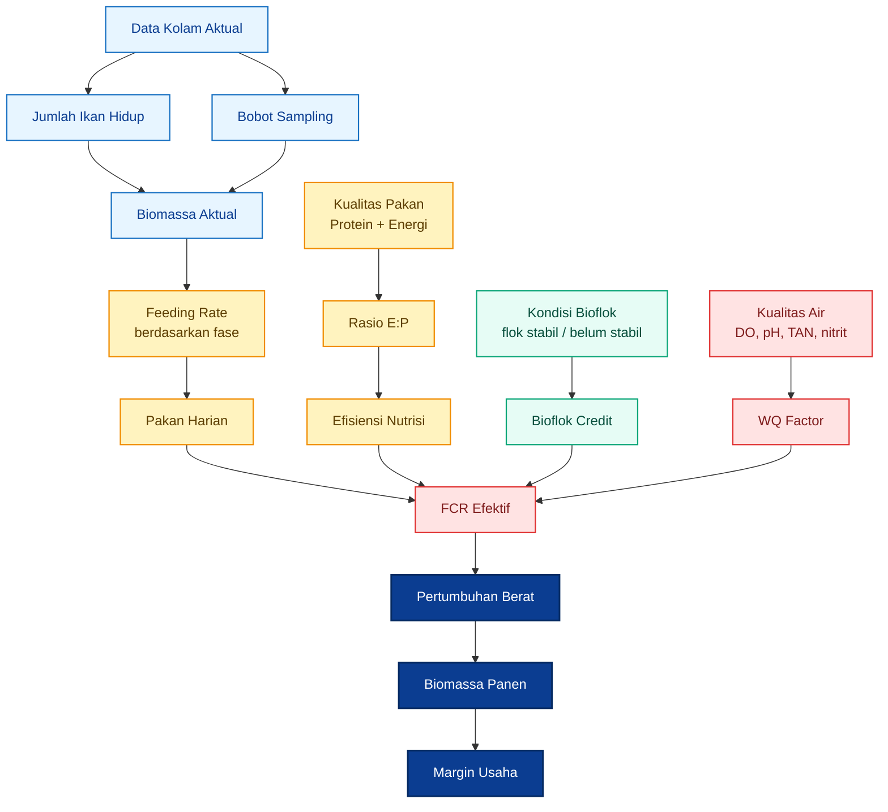

Diagram di atas menunjukkan bahwa feeding bioflok adalah sistem tertutup. Pakan tidak bisa dipisahkan dari biomassa, kualitas pakan, kualitas air, dan kondisi flok. Jika salah satu komponen meleset, `$FCR$` efektif akan berubah dan hasil panen ikut berubah.

<ResourceBox
  title="Artikel Terkait:"
  items={[
    {
      name: 'Komparasi Ekonomi Budidaya Nila dan Lele pada Kolam Statis, Bioflok, dan RAS Berbasis m² Footprint Lahan',
      href: '/blog/agri/perikanan/komparasi-kolam-statis-bioflok-ras',
    },
    {
      name: 'Bioflok 651: Membedakan Persiapan Media dan Operasi Budidaya',
      href: '/blog/agri/perikanan/bioflok-651',
    },
    {
      name: 'C/N Ratio pada Bioflok: Mengatur Mikroba, Oksigen, dan Stabilitas Kolam untuk Praktisi',
      href: '/blog/agri/perikanan/ratio-cn-rendah-biflok',
    },
    {
      name: 'E/P Ratio Pakan Ikan: Antara Efisiensi FCR, Fermentasi Ringan, Bioflok, dan Perbedaan Strategi Lele vs Nila',
      href: '/blog/agri/perikanan/ep-ratio-pakan-fermentasi',
    },
    {
      name: 'Manajemen Nitrit dan Nitrat pada Bioflok: `$C/N$`, `$Cl^-$`, Nitrifikasi, Denitrifikasi, dan Ekspor Nitrogen Berbasis Angka',
      href: '/blog/agri/perikanan/nitri-nitrat-manajemen-biofloc',
    },
    {
      name: 'Fermentasi Protein untuk Pakan Lele: Membuat Hidrolisat Asam Amino yang Aman, Rasional, dan Bernilai Guna',
      href: '/blog/agri/perikanan/fermentasi-protein-untuk-pakan-lele',
    },
    {
      name: 'Menurunkan FCR Lele: Dari Pakan Dimakan sampai Menjadi Daging',
      href: '/blog/agri/perikanan/menurunkan-fcr-lele',
    },
    {
      name: 'Kolam Lele sebagai Bioreaktor Penurun FCR Berbasis Bioflok',
      href: '/blog/agri/perikanan/menurunkan-fcr-lele-bioflok',
    },
    {
      name: 'Fermentasi, Pengomposan, dan Pembusukan: Meluruskan Istilah agar Praktisi Agri Tidak Salah Interpretasi',
      href: '/blog/agri/fermentasi-pengomposan-pembusukan',
    },
  ]}
/>

---

# 1. Pendahuluan: Mengapa Feeding Rate Menentukan Profit Bioflok Nila

## 1.1 Latar Belakang

Dalam pembesaran nila, pakan adalah salah satu komponen biaya paling dominan dan paling sensitif terhadap kesalahan manajemen. Semakin intensif sistem budidaya, semakin besar dampak kesalahan pakan terhadap biaya produksi. Pada bioflok, dampaknya lebih tajam karena pakan yang tidak termakan atau tidak efisien akan langsung menjadi beban organik dan nitrogen di dalam media.

Bioflok memberi peluang efisiensi pakan karena mikroba dan agregat flok dapat menjadi sumber nutrisi tambahan bagi ikan. Namun peluang ini hanya muncul jika sistem stabil: aerasi berjalan, kualitas air terkendali, flok tidak berlebihan, dan ikan tetap aktif makan. KKP menjelaskan bahwa bioflok dirancang untuk memaksimalkan produksi pada lahan terbatas, menghemat penggunaan air, dan membantu pengelolaan pakan, tetapi sistem ini tetap membutuhkan persiapan media, aerasi, dan pengelolaan kualitas air yang disiplin. ([kkp.go.id][1])

Kesalahan feeding pada bioflok tidak hanya menaikkan biaya pakan. Overfeeding dapat meningkatkan sisa organik, memperberat kerja mikroba, menaikkan TAN atau amonia, menaikkan nitrit, memperburuk kondisi flok, dan akhirnya memperburuk `$FCR$`. Sebaliknya, underfeeding dapat membuat ikan tumbuh lambat, memperpanjang siklus, dan menurunkan produktivitas tahunan.

Karena itu, feeding rate harus diperlakukan sebagai **instrumen manajemen produksi**, bukan kebiasaan harian. Praktisi tidak cukup bertanya “berapa kali pakan diberikan?”, tetapi harus bertanya:

| Pertanyaan Teknis                | Mengapa Penting                                   |
| -------------------------------- | ------------------------------------------------- |
| Berapa biomassa aktual hari ini? | Menentukan kebutuhan pakan harian                 |
| Ikan sedang di fase apa?         | Menentukan feeding rate dan protein               |
| Berapa protein dan energi pakan? | Menentukan efisiensi nutrisi                      |
| Apakah `$E:P$` ratio sesuai?     | Menentukan apakah protein dan energi seimbang     |
| Apakah air aman untuk feeding?   | Mencegah feeding saat ikan stres                  |
| Apakah flok stabil?              | Menentukan apakah ada kredit nutrisi dari bioflok |
| Berapa `$FCR$` aktual?           | Mengukur efisiensi nyata di kolam                 |

## 1.2 Masalah Utama di Lapangan

Masalah feeding di lapangan sering bukan karena pembudidaya tidak memberi pakan, tetapi karena pemberian pakan tidak berbasis data. Banyak kolam diberi pakan berdasarkan kebiasaan, jumlah karung, atau respons visual sesaat, tanpa sampling bobot dan tanpa koreksi biomassa.

| Kesalahan                                        | Dampak                                                  |
| ------------------------------------------------ | ------------------------------------------------------- |
| Pakan diberikan berdasarkan “feeling”            | `$FCR$` tidak terkendali                                |
| Tidak sampling bobot                             | Biomassa salah, pakan salah                             |
| Feeding rate tidak diturunkan saat ikan membesar | Overfeeding                                             |
| Protein pakan tidak sesuai fase                  | Pertumbuhan tidak optimal                               |
| `$E:P$` ratio tidak diperhatikan                 | Protein terbuang menjadi energi atau pertumbuhan lambat |
| Bioflok dianggap otomatis menggantikan pakan     | Underfeeding atau hasil panen buruk                     |
| Kualitas air tidak dikaitkan dengan pakan        | Risiko crash flok dan mortalitas                        |

Kesalahan paling umum adalah feeding rate tidak diturunkan saat ikan membesar. Padahal tabel feeding nila intensif dari FAO menunjukkan bahwa feeding rate menurun seiring pertambahan bobot ikan: ukuran kecil diberi persentase pakan lebih tinggi, sedangkan ikan besar diberi persentase lebih rendah. ([FAOHome][2])

Kesalahan lain adalah hanya melihat protein pakan tanpa memperhatikan energi. Pakan dengan protein tinggi belum tentu efisien jika energinya tidak seimbang. Sebaliknya, pakan dengan energi terlalu tinggi dapat membuat ikan cepat kenyang sebelum kebutuhan protein terpenuhi. Dalam model artikel ini, keseimbangan itu dibaca melalui `$E:P$` ratio.

## 1.3 Tujuan Artikel

Artikel ini bertujuan menyusun rezim feeding nila bioflok yang bisa dipakai oleh praktisi agribisnis sebagai dasar simulasi, operasional, dan validasi lapangan.

Secara spesifik, artikel ini bertujuan:

1. menjelaskan prinsip feeding nila bioflok berbasis biomassa;
2. menyusun feeding rate per fase pertumbuhan;
3. menjelaskan hubungan protein, energi, dan `$E:P$` ratio;
4. membangun model `$FCR_{\text{eff}}$`;
5. membangun model pertumbuhan berat harian;
6. memberi format simulasi Excel atau CSV;
7. menjelaskan cara kalibrasi dengan data pilot.

Artikel ini tidak bertujuan memberi angka mutlak yang berlaku untuk semua kolam. Rezim feeding yang benar harus selalu dikalibrasi dengan kondisi aktual: kualitas benih, kualitas pakan, suhu, aerasi, kualitas air, kepadatan, kondisi flok, dan kemampuan operator.

---

# 2. Dasar Rujukan Teknis Feeding Nila

## 2.1 Feeding Rate Berdasarkan Ukuran Ikan

Feeding rate nila harus berubah mengikuti ukuran ikan. Ikan kecil memiliki kebutuhan pakan relatif lebih tinggi terhadap biomassa karena pertumbuhan dan metabolisme lebih cepat. Ketika ikan membesar, feeding rate sebagai persen biomassa harus turun agar pakan tidak berlebihan dan `$FCR$` tidak memburuk.

FAO AFFRIS mencantumkan feeding table untuk nila intensif. Tabel tersebut menunjukkan bahwa feeding rate menurun dari fase fry ke grower: ukuran 1–5 g diberi 10–6 persen bobot tubuh per hari, 5–20 g diberi 6–4 persen, 20–100 g diberi 4–3 persen, 100–250 g diberi 3–2 persen, dan ikan di atas 250 g diberi 2–1,5 persen. ([FAOHome][2])

|   Ukuran Nila |         Feeding Rate Acuan | Frekuensi Acuan |
| ------------: | -------------------------: | --------------: |
|         1–5 g |  10–6 persen biomassa/hari |     4 kali/hari |
|        5–20 g |   6–4 persen biomassa/hari |     4 kali/hari |
|      20–100 g |   4–3 persen biomassa/hari |     2 kali/hari |
|     100–250 g |   3–2 persen biomassa/hari |     2 kali/hari |
| Di atas 250 g | 2–1,5 persen biomassa/hari |     2 kali/hari |

Tabel FAO tersebut sebaiknya dibaca sebagai **rujukan awal**, bukan angka final. Pada sistem bioflok, feeding rate dapat disesuaikan karena adanya kontribusi flok, tetapi penyesuaian hanya aman jika data lapangan menunjukkan pertumbuhan, respons makan, dan `$FCR$` tetap baik.

### Formula Dasar Feeding Rate

$$
Feed_{\text{harian}} = Biomassa_{\text{aktual}} \times FR
$$

Keterangan:

| Simbol                     | Arti                                        |
| -------------------------- | ------------------------------------------- |
| $Feed_{\text{harian}}$     | jumlah pakan harian                         |
| $Biomassa_{\text{aktual}}$ | total biomassa ikan hidup                   |
| $FR$                       | feeding rate dalam fraksi biomassa per hari |

Contoh jika biomassa aktual 600 kg dan feeding rate 3,2 persen:

$$
Feed_{\text{harian}} = 600 \times 0{,}032
$$

$$
Feed_{\text{harian}} = 19{,}2 \text{ kg/hari}
$$

Dalam operasional, angka 19,2 kg/hari tersebut masih harus dibagi ke beberapa waktu feeding sesuai fase ikan dan kondisi kualitas air.

---

## 2.2 Kebutuhan Protein Berdasarkan Fase

Kebutuhan protein nila juga berubah mengikuti fase pertumbuhan. Ikan kecil membutuhkan protein lebih tinggi karena sedang membangun jaringan tubuh dengan cepat. Ketika ikan membesar, kebutuhan protein relatif menurun dan fokus manajemen bergeser ke efisiensi pertumbuhan serta pengendalian `$FCR$`.

FAO mencantumkan bahwa kebutuhan protein nila berbeda menurut fase: fingerling sekitar 35–40 persen, juvenile sekitar 30–35 persen, adult 25–200 g sekitar 30–32 persen, dan ikan di atas 200 g sekitar 28–30 persen. ([FAOHome][3])

| Fase        |    Bobot Ikan | Protein Acuan |
| ----------- | ------------: | ------------: |
| Fingerling  |        1–10 g |  35–40 persen |
| Juvenile    |       10–25 g |  30–35 persen |
| Adult awal  |      25–200 g |  30–32 persen |
| Adult besar | Di atas 200 g |  28–30 persen |

Protein terlalu rendah dapat memperlambat pertumbuhan dan membuat ikan makan lebih banyak untuk mengejar kebutuhan protein. Protein terlalu tinggi juga tidak selalu ekonomis, terutama jika energi pakan tidak seimbang atau jika sebagian protein akhirnya digunakan sebagai sumber energi. Dalam konteks bisnis, targetnya bukan protein tertinggi, tetapi **kombinasi protein dan energi yang menghasilkan biaya pakan per kg gain paling rendah**.

### Mengapa Protein Tidak Bisa Dibaca Sendiri

Protein harus dibaca bersama energi karena pertumbuhan ikan tidak hanya membutuhkan asam amino, tetapi juga energi metabolik. Jika energi terlalu rendah, sebagian protein akan digunakan sebagai energi, sehingga protein tidak efisien menjadi daging. Jika energi terlalu tinggi, ikan dapat cepat kenyang sebelum kebutuhan protein terpenuhi.

Inilah alasan artikel ini memakai rasio `$E:P$`, yaitu perbandingan energi terhadap protein.

$$
E:P = \frac{DE}{CP \times 10}
$$

Keterangan:

| Simbol         | Arti                                  |
| -------------- | ------------------------------------- |
| $E:P$          | energy-to-protein ratio               |
| $DE$           | digestible energy pakan dalam kcal/kg |
| $CP$           | crude protein pakan dalam persen      |
| $CP \times 10$ | protein dalam gram per kg pakan       |

Contoh pakan dengan protein 30 persen dan digestible energy 3.100 kcal/kg:

$$
E:P = \frac{3100}{30 \times 10}
$$

$$
E:P = 10{,}33 \text{ kcal/g protein}
$$

Artinya, setiap gram protein dalam pakan tersebut didampingi sekitar 10,33 kcal energi tercerna.

---

## 2.3 Bioflok sebagai Sistem Khusus

Bioflok bukan sekadar kolam dengan padat tebar tinggi. Bioflok adalah sistem biologis yang memanfaatkan mikroorganisme untuk mengolah limbah organik dan nitrogen menjadi flok. Flok ini dapat berperan sebagai pakan tambahan, tetapi nilainya tidak boleh diasumsikan terlalu besar tanpa bukti data kolam.

KKP menjelaskan bahwa budidaya bioflok di bak bulat ditujukan untuk skala kecil sampai menengah, memaksimalkan hasil pada lahan terbatas, memakai air lebih efisien, dan mendukung pengelolaan pakan. KKP juga menekankan adanya tahapan persiapan media, aerasi, dan pengelolaan kualitas air. ([kkp.go.id][1])

Dalam bioflok, setiap pakan yang masuk akan berdampak pada tiga hal sekaligus:

| Dampak Pakan       | Penjelasan                                    |
| ------------------ | --------------------------------------------- |
| Pertumbuhan ikan   | Pakan dikonversi menjadi biomassa             |
| Beban kualitas air | Sisa pakan dan feses menjadi limbah organik   |
| Dinamika flok      | Mikroba memanfaatkan limbah dan sumber karbon |

Karena itu, feeding nila bioflok harus menghubungkan nutrisi dan kualitas air. Jika pakan terlalu tinggi, flok bisa terlalu pekat, oksigen terlarut turun, TAN dan nitrit naik, dan ikan stres. Jika pakan terlalu rendah, ikan tidak mencapai potensi pertumbuhan walaupun kualitas air tampak baik.

### Bioflok Credit dalam Model Feeding

Dalam model artikel ini, kontribusi bioflok dapat dimasukkan sebagai faktor konservatif:

| Kondisi Flok                               |                   Bioflok Credit Awal |
| ------------------------------------------ | ------------------------------------: |
| Flok belum stabil                          |                              0 persen |
| Flok mulai stabil                          |                            3–5 persen |
| Flok stabil dan ikan aktif makan           |                           5–10 persen |
| Flok sangat stabil dan sudah terbukti data |                          10–15 persen |
| Klaim tinggi tanpa pilot                   | Jangan digunakan sebagai asumsi utama |

Nilai ini bukan angka baku universal. Ia harus dikalibrasi dengan `$FCR$` aktual, pertumbuhan bobot, total pakan, dan kualitas air. Jika bioflok dianggap otomatis menggantikan pakan tanpa data, risiko underfeeding dan panen tidak optimal menjadi tinggi.

### Alur Feeding Bioflok sebagai Sistem Kendali

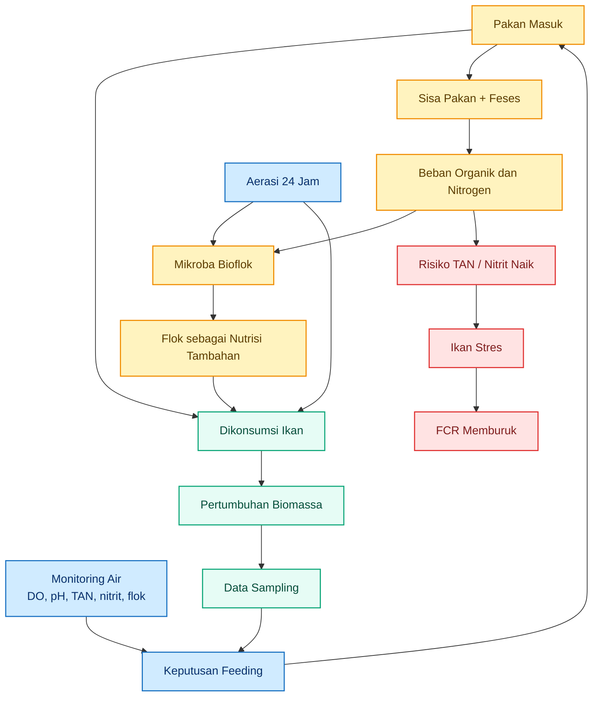

Diagram ini penting untuk praktisi: pakan bukan hanya masuk ke ikan, tetapi juga masuk ke sistem air. Dalam bioflok, keputusan feeding harus selalu dikaitkan dengan respons ikan dan kondisi media.

---

## Ringkasan Bab 0–2

Bagian awal artikel ini menetapkan fondasi bahwa rezim feeding nila bioflok harus berbasis data, bukan kebiasaan. Rujukan FAO menunjukkan feeding rate menurun saat ikan membesar, sedangkan kebutuhan protein juga berubah mengikuti fase. KKP menempatkan bioflok sebagai sistem intensif yang membutuhkan aerasi, persiapan media, dan pengelolaan kualitas air yang disiplin. ([FAOHome][2])

Fondasi teknis yang akan dipakai pada bab berikutnya adalah:

| Komponen       | Peran                                       |
| -------------- | ------------------------------------------- |
| Biomassa       | Dasar pakan harian                          |
| Feeding rate   | Jumlah pakan relatif terhadap biomassa      |
| Protein        | Bahan utama pertumbuhan                     |
| Energi         | Pendukung metabolisme dan efisiensi protein |
| `$E:P$` ratio  | Indikator keseimbangan energi dan protein   |
| Bioflok credit | Kontribusi flok terhadap efisiensi pakan    |
| Kualitas air   | Penentu apakah feeding aman                 |
| `$FCR$` aktual | Validasi akhir efisiensi feeding            |

Bab berikutnya dapat masuk ke prinsip operasional: **cara menghitung biomassa, menentukan feeding rate, dan menyusun rezim feeding per fase pertumbuhan nila bioflok.**

[1]: https://kkp.go.id/unit-kerja/djpb/publikasi/materi/panduan-budi-daya-ikan-nilalele-di-bak-bulat-bioflok6982e9ada5a67.html?utm_source=chatgpt.com 'Panduan Budi Daya Ikan Nila/Lele di Bak Bulat (Bioflok)'
[2]: https://www.fao.org/fileadmin/user_upload/affris/docs/tilapiaT28.pdf?utm_source=chatgpt.com 'Table 28. Feeding table for tilapia using ...'
[3]: https://www.fao.org/fileadmin/user_upload/affris/docs/tilapiaT2.pdf?utm_source=chatgpt.com 'O. niloticus X O. aureus'

[**Kembali ke Atas**](#rezim-feeding-rate-nila-bioflok-model-pakan-berbasis-biomassa-fase-pertumbuhan-ep-ratio-dan-fcr-efektif)

---

# 3. Prinsip Dasar Rezim Feeding Nila Bioflok

Rezim feeding nila bioflok harus dimulai dari satu prinsip: **pakan diberikan untuk biomassa aktual, bukan untuk jumlah kolam, jumlah bak, atau kebiasaan harian.**

Pada sistem bioflok, kesalahan menghitung pakan akan berdampak ganda. Di satu sisi, ikan bisa kekurangan nutrisi dan tumbuh lambat. Di sisi lain, pakan berlebih akan menjadi beban organik, meningkatkan tekanan amonia/nitrit, memperberat kerja mikroba, dan memperburuk `$FCR$`.

Feeding rate dari FAO menunjukkan bahwa jumlah pakan sebagai persen biomassa harus turun saat ikan membesar. Ukuran kecil membutuhkan feeding rate lebih tinggi, sedangkan ukuran besar membutuhkan feeding rate lebih rendah. Ini menjadi dasar bahwa rezim feeding harus mengikuti fase pertumbuhan, bukan satu angka tetap sepanjang siklus. ([FAOHome][1])

---

## 3.1 Feeding Rate Harus Berbasis Biomassa

Formula dasarnya:

$$
Biomassa_{\text{kg}} =
N_{\text{hidup}}
\times
W_{\text{rata-rata, kg}}
$$

Keterangan:

| Simbol                       | Arti                          |
| ---------------------------- | ----------------------------- |
| `$N_{\text{hidup}}$`         | jumlah ikan hidup aktual      |
| `$W_{\text{rata-rata, kg}}$` | bobot rata-rata ikan dalam kg |
| `$Biomassa_{\text{kg}}$`     | total biomassa ikan hidup     |

Setelah biomassa diketahui, pakan harian dihitung dengan:

$$
Pakan_{\text{harian}} =
Biomassa_{\text{kg}}
\times
FR
$$

Keterangan:

| Simbol                    | Arti                                          |
| ------------------------- | --------------------------------------------- |
| `$Pakan_{\text{harian}}$` | jumlah pakan per hari                         |
| `$Biomassa_{\text{kg}}$`  | biomassa ikan aktual                          |
| `$FR$`                    | feeding rate sebagai fraksi biomassa per hari |

Contoh:

| Parameter                 |      Nilai |
| ------------------------- | ---------: |
| Jumlah ikan hidup         | 8.000 ekor |
| Bobot rata-rata           |       75 g |
| Bobot rata-rata dalam kg  |   0,075 kg |
| Biomassa                  |     600 kg |
| Feeding rate              | 3,2 persen |
| Feeding rate dalam fraksi |      0,032 |
| Pakan harian              |    19,2 kg |

Perhitungannya:

$$
Biomassa_{\text{kg}} =
8000
\times
0{,}075
$$

$$
Biomassa_{\text{kg}} =
600
$$

$$
Pakan_{\text{harian}} =
600
\times
0{,}032
$$

$$
Pakan_{\text{harian}} =
19{,}2
\text{ kg/hari}
$$

Artinya, pada biomassa 600 kg dan feeding rate 3,2 persen, kebutuhan pakan harian adalah **19,2 kg/hari**. Angka ini belum otomatis dibagi rata antar waktu pemberian pakan. Pembagian pagi, siang, dan sore harus mengikuti fase ikan, respons makan, serta kondisi media bioflok.

### Alur Hitung Pakan Berbasis Biomassa

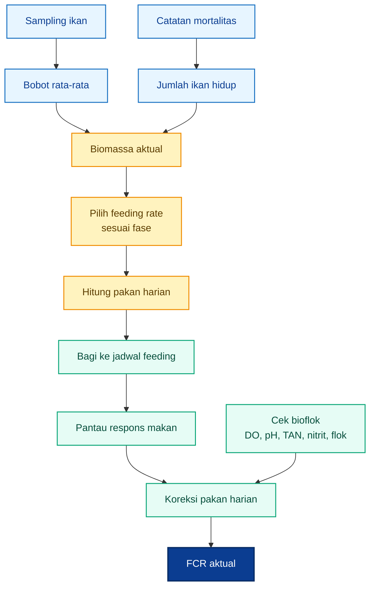

Diagram ini menunjukkan bahwa pakan harian tidak boleh ditentukan hanya dari jumlah ekor awal. Setiap perubahan bobot, mortalitas, dan kondisi air harus mengubah keputusan feeding.

---

## 3.2 Sampling Adalah Syarat

Sampling bobot adalah syarat utama agar feeding rate berbasis biomassa bisa berjalan. Tanpa sampling, pembudidaya hanya menebak biomassa. Jika biomassa terlalu rendah diperkirakan, ikan akan kekurangan pakan. Jika biomassa terlalu tinggi diperkirakan, pakan akan berlebih dan `$FCR$` memburuk.

Sampling ideal dilakukan setiap **7–10 hari**. Pada fase kecil atau fase pertumbuhan cepat, interval 7 hari lebih aman. Pada fase grower besar, 10 hari masih masuk akal jika pertumbuhan stabil dan catatan pakan rapi.

### Data yang Wajib Dicatat Saat Sampling

| Data                                | Fungsi                                                  |
| ----------------------------------- | ------------------------------------------------------- |
| Jumlah ikan sampling                | Menjaga representasi sampel                             |
| Bobot total sampel                  | Menghitung bobot rata-rata                              |
| Bobot rata-rata                     | Menghitung biomassa                                     |
| Mortalitas kumulatif                | Mengoreksi jumlah ikan hidup                            |
| Total pakan sejak sampling terakhir | Menghitung `$FCR$` periodik                             |
| Kondisi air                         | Menjelaskan penyebab pertumbuhan atau `$FCR$` berubah   |
| Respons makan                       | Menentukan apakah pakan perlu dinaikkan atau diturunkan |

Formula bobot rata-rata:

$$
W_{\text{rata-rata}} =
\frac{
Bobot_{\text{total sampel}}
}{
Jumlah_{\text{sampel}}
}
$$

Formula jumlah ikan hidup:

$$
N_{\text{hidup}} =
N_{\text{tebar}}
----------------

Mortalitas_{\text{kumulatif}}
$$

Formula biomassa setelah sampling:

$$
Biomassa_{\text{aktual}} =
N_{\text{hidup}}
\times
W_{\text{rata-rata, kg}}
$$

Contoh koreksi:

| Parameter                |      Nilai |
| ------------------------ | ---------: |
| Jumlah tebar awal        | 8.000 ekor |
| Mortalitas kumulatif     |   120 ekor |
| Jumlah ikan hidup        | 7.880 ekor |
| Bobot rata-rata sampling |       95 g |
| Bobot dalam kg           |   0,095 kg |
| Biomassa aktual          |   748,6 kg |

Perhitungannya:

$$
N_{\text{hidup}} =
8000 - 120
$$

$$
N_{\text{hidup}} =
7880
$$

$$
Biomassa_{\text{aktual}} =
7880
\times
0{,}095
$$

$$
Biomassa_{\text{aktual}} =
748{,}6
\text{ kg}
$$

Jika pada fase 50–100 g feeding rate yang dipakai adalah 3,3 persen:

$$
Pakan_{\text{harian}} =
748{,}6
\times
0{,}033
$$

$$
Pakan_{\text{harian}} =
24{,}7
\text{ kg/hari}
$$

Tanpa sampling, pembudidaya mungkin masih memberi pakan berdasarkan biomassa lama, misalnya 600 kg. Ini akan membuat pakan harian terlalu rendah dan pertumbuhan tertahan.

---

## 3.3 Feeding Rate Harus Turun Saat Bobot Naik

Feeding rate harus turun ketika bobot ikan naik. Ini bukan karena ikan besar membutuhkan pakan lebih sedikit secara absolut, tetapi karena kebutuhan pakan relatif terhadap biomassa menurun. Biomassa total tetap naik, sehingga total pakan harian bisa tetap naik walaupun feeding rate turun.

Sebagai contoh, ikan kecil dengan biomassa 100 kg dan feeding rate 5 persen membutuhkan 5 kg pakan per hari. Ikan besar dengan biomassa 1.000 kg dan feeding rate 2 persen membutuhkan 20 kg pakan per hari. Jadi feeding rate turun, tetapi jumlah pakan total tetap naik.

Tabel praktis untuk nila bioflok:

| Bobot Ikan | Feeding Rate Praktis Bioflok |
| ---------: | ---------------------------: |
|     5–20 g |                   4–6 persen |
|    20–50 g |                 3,5–4 persen |
|   50–100 g |                 3–3,5 persen |
|  100–200 g |                   2–3 persen |
|  200–300 g |                 1,5–2 persen |

Tabel ini adalah adaptasi praktis dari rujukan feeding rate nila intensif FAO, dengan penyesuaian untuk konteks bioflok. FAO mencantumkan pola umum bahwa feeding rate turun dari 10–6 persen pada ukuran 1–5 g, menjadi 6–4 persen pada 5–20 g, 4–3 persen pada 20–100 g, 3–2 persen pada 100–250 g, dan 2–1,5 persen pada ikan di atas 250 g. ([FAOHome][1])

### Ilustrasi Feeding Rate Turun tetapi Pakan Harian Naik

| Fase          | Bobot Rata-rata | Estimasi Biomassa | Feeding Rate | Pakan Harian |
| ------------- | --------------: | ----------------: | -----------: | -----------: |
| Benih besar   |            15 g |            120 kg |     5 persen |         6 kg |
| Juvenile awal |            40 g |            318 kg |   3,8 persen |      12,1 kg |
| Grower awal   |            90 g |            709 kg |   3,2 persen |      22,7 kg |
| Grower        |           160 g |          1.253 kg |   2,4 persen |      30,1 kg |
| Finisher      |           250 g |          1.940 kg |   1,8 persen |      34,9 kg |

Pesan utamanya: **feeding rate turun, tetapi total pakan harian bisa naik karena biomassa meningkat.**

Kesalahan yang sering terjadi adalah mempertahankan feeding rate tinggi terlalu lama. Pada fase grower dan finisher, ini berisiko menyebabkan overfeeding, flok terlalu pekat, amonia/nitrit naik, dan `$FCR$` memburuk.

### Kurva Konseptual Feeding Rate dan Biomassa

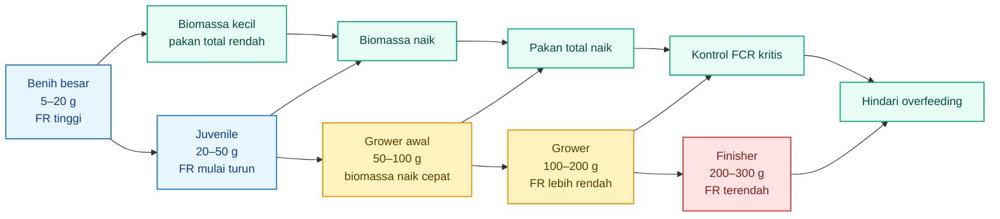

---

# 4. Rezim Feeding Rate per Fase Pertumbuhan Nila Bioflok

Bagian ini menjadi inti operasional artikel. Tujuannya adalah memberi kerangka awal bagi praktisi untuk memilih feeding rate, protein pakan, energi pakan, target `$E:P$`, frekuensi, dan ukuran pelet berdasarkan fase pertumbuhan ikan.

<figure>
  
  <figcaption>
    Grafik hubungan antara estimasi pertumbuhan, efisiensi pakan, dan feeding
    rate pada budidaya ikan.
  </figcaption>
</figure>

Tabel ini harus dipahami sebagai **baseline awal**. Angka final tetap harus dikoreksi berdasarkan sampling, respons makan, kualitas air, kondisi flok, dan `$FCR$` aktual.

---

## 4.1 Tabel Rezim Feeding Final

| Fase          | Bobot Ikan | Feeding Rate | Protein Pakan |            DE Pakan | Target `$E:P$` | Frekuensi | Ukuran Pelet |
| ------------- | ---------: | -----------: | ------------: | ------------------: | -------------: | --------: | -----------: |
| Benih kecil   |      1–5 g |  6–10 persen |  40–45 persen | 3.000–3.200 kcal/kg |        6,7–8,0 |  4–5 kali |      crumble |
| Benih besar   |     5–20 g |   4–6 persen |  35–40 persen | 3.000–3.200 kcal/kg |        7,5–9,1 |    4 kali |         1 mm |
| Juvenile awal |    20–50 g | 3,5–4 persen |  32–35 persen | 3.000–3.200 kcal/kg |       8,6–10,0 |  3–4 kali |       1–2 mm |
| Grower awal   |   50–100 g | 3–3,5 persen |  30–32 persen | 3.000–3.200 kcal/kg |       9,4–10,7 |    3 kali |         2 mm |
| Grower        |  100–200 g |   2–3 persen |  30–32 persen | 3.000–3.200 kcal/kg |       9,4–10,7 |  2–3 kali |       2–3 mm |
| Finisher      |  200–300 g | 1,5–2 persen |  28–30 persen | 3.000–3.200 kcal/kg |      10,0–11,4 |    2 kali |       3–4 mm |

Kisaran feeding rate pada tabel ini mengikuti pola umum FAO bahwa feeding rate turun seiring ukuran ikan. Kisaran protein pakan juga mengikuti prinsip kebutuhan protein nila yang menurun saat ikan membesar; FAO mencantumkan kebutuhan protein fingerling dan juvenile lebih tinggi, sedangkan ikan dewasa membutuhkan protein lebih rendah, sekitar 28–32 persen tergantung ukuran. ([FAOHome][1])

Target `$E:P$` pada tabel dihitung dari kombinasi kisaran digestible energy dan protein pakan. Misalnya, pakan dengan protein 30 persen dan digestible energy 3.100 kcal/kg menghasilkan:

$$
E:P =
\frac{3100}{30 \times 10}
$$

$$
E:P =
10{,}33
\text{ kcal/g protein}
$$

Rumus dan interpretasi `$E:P$` akan dibahas lebih dalam pada bab berikutnya. Untuk bab ini, yang penting dipahami adalah: **protein dan energi harus seimbang sesuai fase.**

---

## 4.2 Catatan Penting Tabel

### 4.2.1 Tabel Adalah Titik Awal, Bukan Angka Mati

Tabel rezim feeding tidak boleh dipakai secara kaku. Bioflok adalah sistem biologis yang berubah setiap hari. Kondisi ikan, flok, kualitas air, dan respons makan dapat menggeser kebutuhan pakan aktual.

Gunakan tabel sebagai **starting point**, lalu koreksi dengan data:

| Data Lapangan  | Fungsi Koreksi                   |
| -------------- | -------------------------------- |
| Bobot sampling | Mengoreksi biomassa              |
| Mortalitas     | Mengoreksi jumlah ikan hidup     |
| Respons makan  | Mengoreksi pakan harian          |
| DO             | Menentukan aman tidaknya feeding |
| TAN/amonia     | Menilai beban nitrogen           |
| Nitrit         | Menilai risiko stres             |
| Volume flok    | Menilai kepadatan bioflok        |
| `$FCR$` aktual | Mengukur efisiensi nyata         |

Jika data menunjukkan ikan tumbuh baik, pakan habis wajar, air stabil, dan `$FCR$` baik, feeding rate dapat dipertahankan. Jika `$FCR$` memburuk atau kualitas air turun, pakan perlu dikoreksi meskipun tabel masih menunjukkan angka yang tampak normal.

---

### 4.2.2 Bioflok Credit Tidak Boleh Langsung Diasumsikan Besar

Bioflok dapat memberi kontribusi nutrisi tambahan, tetapi kontribusinya tidak boleh diasumsikan besar sejak awal. KKP menyebut bioflok dapat membantu pengelolaan pakan dan mendukung efisiensi sistem, tetapi sistem tetap membutuhkan aerasi, persiapan media, dan pengelolaan kualitas air yang baik. ([kkp.go.id][2])

Dalam model praktis, gunakan pendekatan konservatif:

| Kondisi Flok                                      | Bioflok Credit yang Aman untuk Model Awal |
| ------------------------------------------------- | ----------------------------------------: |
| Flok belum stabil                                 |                                  0 persen |
| Flok mulai stabil                                 |                                3–5 persen |
| Flok stabil dan ikan aktif makan                  |                               5–10 persen |
| Flok sangat stabil dan terbukti dari data `$FCR$` |                              10–15 persen |
| Klaim tinggi tanpa data pilot                     |                            Jangan dipakai |

Bioflok credit berarti model mengakui ada kontribusi nutrisi dari flok. Namun kredit ini harus dibuktikan melalui data:

$$
FCR_{\text{aktual}} =
\frac{
Pakan_{\text{total}}
}{
Biomassa_{\text{akhir}} - Biomassa_{\text{awal}}
}
$$

Jika `$FCR_{\text{aktual}}$` membaik setelah flok stabil dan pertumbuhan tetap baik, maka bioflok credit dapat dinaikkan secara bertahap. Jika pertumbuhan turun atau `$FCR$` memburuk, jangan mengurangi pakan hanya karena flok terlihat ada.

---

### 4.2.3 Feeding Rate Harus Dikoreksi dari Respons Makan dan Kualitas Air

Pada bioflok, feeding tidak boleh dilakukan hanya karena sudah jadwal. Feeding harus ditunda atau dikurangi jika air dan ikan menunjukkan sinyal risiko.

| Kondisi                                         | Tindakan Feeding                        |
| ----------------------------------------------- | --------------------------------------- |
| Ikan aktif, pakan habis wajar                   | Pertahankan feeding rate                |
| Pakan habis sangat cepat dan ikan masih agresif | Naikkan 5 persen setelah evaluasi       |
| Pakan tersisa lebih dari 10–15 menit            | Turunkan 10–20 persen                   |
| DO rendah                                       | Tunda pakan                             |
| TAN atau amonia naik                            | Turunkan pakan sementara                |
| Nitrit naik                                     | Turunkan pakan dan koreksi kualitas air |
| Flok terlalu pekat                              | Kurangi pakan dan kontrol endapan       |
| Aerasi terganggu                                | Stop pakan sampai sistem aman           |

Pada sistem bioflok, aerasi dan kualitas air adalah bagian dari keputusan feeding. Pakan yang secara teori sesuai tabel bisa menjadi berbahaya jika diberikan saat DO rendah atau aerasi terganggu.

---

### 4.2.4 Pakan Protein Tinggi Tidak Selalu Lebih Baik

Pakan protein tinggi sering dianggap otomatis lebih baik. Dalam praktik bisnis, ini tidak selalu benar. Protein tinggi hanya menguntungkan jika sesuai dengan fase ikan dan didukung energi yang seimbang.

Jika protein terlalu tinggi:

| Risiko                             | Dampak                                 |
| ---------------------------------- | -------------------------------------- |
| Biaya pakan naik                   | HPP naik                               |
| Nitrogen buangan meningkat         | Beban TAN/amonia naik                  |
| Tidak semua protein menjadi daging | Efisiensi ekonomi turun                |
| Flok terlalu padat                 | Media bioflok lebih berat dikendalikan |

Jika protein terlalu rendah:

| Risiko                                         | Dampak                       |
| ---------------------------------------------- | ---------------------------- |
| Pertumbuhan lambat                             | Siklus molor                 |
| Ikan makan lebih banyak untuk mengejar protein | `$FCR$` memburuk             |
| Ukuran panen tidak seragam                     | Sortir dan panen lebih sulit |
| Margin turun                                   | Produksi tahunan menurun     |

Karena itu, pemilihan pakan harus mengikuti fase. Pada fase kecil, protein tinggi masih rasional. Pada fase grower dan finisher, protein dapat diturunkan bertahap, tetapi tetap harus menjaga keseimbangan energi dan protein melalui `$E:P$`.

---

## 4.3 Contoh Aplikasi Rezim Feeding per Fase

Misal satu kohort nila bioflok dimulai dari 8.000 ekor dengan target panen 250 g. Berikut contoh cara membaca tabel, bukan angka final universal.

| Fase          | Bobot Rata-rata | Estimasi Biomassa | Feeding Rate | Pakan Harian |
| ------------- | --------------: | ----------------: | -----------: | -----------: |
| Benih besar   |            15 g |            120 kg |     5 persen |         6 kg |
| Juvenile awal |            40 g |            318 kg |   3,8 persen |      12,1 kg |
| Grower awal   |            90 g |            709 kg |   3,2 persen |      22,7 kg |
| Grower        |           160 g |          1.253 kg |   2,4 persen |      30,1 kg |
| Finisher      |           250 g |          1.940 kg |   1,8 persen |      34,9 kg |

Perhatikan pola utamanya:

1. feeding rate turun dari 5 persen menjadi 1,8 persen;
2. biomassa naik dari 120 kg menjadi 1.940 kg;
3. pakan harian naik dari 6 kg menjadi 34,9 kg;
4. risiko overfeeding makin besar pada fase grower dan finisher karena pakan harian absolut sudah tinggi.

Rumus pakan harian tetap sama pada semua fase:

$$
Pakan_{\text{harian}} =
Biomassa_{\text{kg}}
\times
FR
$$

Contoh fase grower:

$$
Pakan_{\text{harian}} =
1253
\times
0{,}024
$$

$$
Pakan_{\text{harian}} =
30{,}1
\text{ kg/hari}
$$

Pada fase ini, kenaikan feeding rate kecil saja dapat menaikkan pakan harian cukup besar. Karena itu fase grower dan finisher adalah fase yang paling penting untuk kontrol `$FCR$`.

---

## 4.4 Diagram Rezim Feeding per Fase

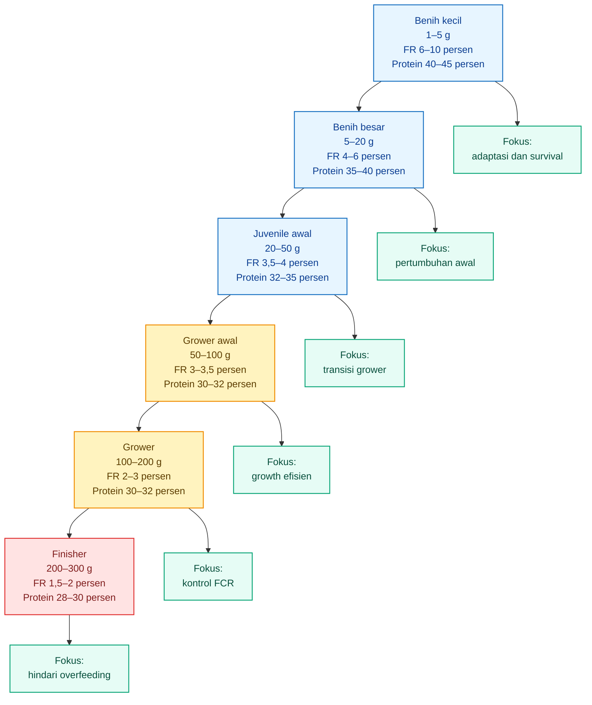

Diagram ini merangkum logika utama: semakin ikan membesar, feeding rate dan protein pakan turun bertahap, sementara kontrol `$FCR$` dan kualitas air menjadi semakin kritis.

---

## Ringkasan Bab 3–4

Bab 3 menetapkan prinsip bahwa feeding nila bioflok harus berbasis biomassa aktual. Biomassa hanya bisa dihitung dengan benar jika pembudidaya melakukan sampling bobot dan mencatat mortalitas. Tanpa sampling, feeding rate hanya menjadi tebakan.

Bab 4 menyusun rezim feeding per fase pertumbuhan. Tabel feeding harus dipakai sebagai baseline, bukan aturan kaku. Koreksi tetap wajib dilakukan berdasarkan respons makan, kualitas air, kondisi flok, dan `$FCR$` aktual.

Kesimpulan praktisnya:

| Prinsip                               | Putusan                                     |
| ------------------------------------- | ------------------------------------------- |
| Pakan dihitung dari biomassa          | Wajib                                       |
| Sampling bobot                        | Wajib setiap 7–10 hari                      |
| Feeding rate turun saat ikan membesar | Wajib                                       |
| Protein pakan mengikuti fase          | Wajib                                       |
| `$E:P$` diperhatikan                  | Wajib untuk efisiensi                       |
| Bioflok credit                        | Hanya setelah flok stabil dan terbukti data |
| `$FCR$` aktual                        | Menjadi validasi akhir                      |

[**Kembali ke Atas**](#rezim-feeding-rate-nila-bioflok-model-pakan-berbasis-biomassa-fase-pertumbuhan-ep-ratio-dan-fcr-efektif)

[1]: https://www.fao.org/fileadmin/user_upload/affris/docs/tilapiaT28.pdf?utm_source=chatgpt.com 'Table 28. Feeding table for tilapia using ...'
[2]: https://kkp.go.id/storage/Materi/panduan-budi-daya-ikan-nilalele-di-bak-bulat-bioflok6982e9ada5a67/materi-6982e9adaa327.pdf?utm_source=chatgpt.com 'SPO Budidaya Ikan Nila/Lele di Bak Bulat'

---

# 5. Protein, Energi, dan E:P Ratio

Pada nila bioflok, feeding rate tidak bisa dipisahkan dari kualitas pakan. Dua pakan dengan jumlah kg yang sama dapat menghasilkan pertumbuhan dan `$FCR$` yang berbeda jika kandungan protein, energi, kecernaan, ukuran pelet, dan keseimbangan `$E:P$` berbeda.

Karena itu, rezim feeding yang baik harus menjawab dua pertanyaan sekaligus:

1. **berapa banyak pakan diberikan?**
2. **apakah pakan tersebut sesuai dengan fase pertumbuhan ikan?**

Pakan yang benar bukan selalu pakan dengan protein tertinggi. Pakan yang benar adalah pakan yang **protein dan energinya seimbang** untuk ukuran ikan, sistem bioflok, target pertumbuhan, dan kondisi kualitas air.

---

## 5.1 Mengapa E:P Ratio Penting

Ikan membutuhkan protein untuk membangun jaringan tubuh: otot, organ, enzim, dan jaringan pertumbuhan lain. Pada fase kecil, kebutuhan protein relatif lebih tinggi karena ikan sedang tumbuh cepat. Pada fase grower dan finisher, kebutuhan protein relatif turun, sehingga penggunaan pakan protein terlalu tinggi bisa tidak ekonomis.

FAO mencantumkan bahwa kebutuhan protein nila berubah mengikuti ukuran dan fase. Untuk nila, kebutuhan protein fase fingerling lebih tinggi, sedangkan ikan dewasa membutuhkan protein lebih rendah, sekitar 30–32 persen untuk ikan 25–200 g dan sekitar 28–30 persen untuk ikan di atas 200 g. ([FAOHome][1])

Namun protein tidak bekerja sendiri. Ikan juga membutuhkan energi untuk aktivitas, metabolisme, osmoregulasi, respons imun, dan proses fisiologis lain. Jika energi dalam pakan terlalu rendah, sebagian protein akan digunakan sebagai energi. Ini buruk secara ekonomi karena protein adalah komponen mahal dalam pakan.

Sebaliknya, jika energi terlalu tinggi dibanding protein, ikan bisa cepat kenyang sebelum kebutuhan protein terpenuhi. Akibatnya, pertumbuhan melambat, komposisi tubuh bisa berubah, dan `$FCR$` dapat memburuk.

### Dampak Ketidakseimbangan Protein dan Energi

| Kondisi Pakan                           | Dampak Biologis                | Dampak Bisnis                      |
| --------------------------------------- | ------------------------------ | ---------------------------------- |
| Protein cukup, energi cukup             | Pertumbuhan stabil             | `$FCR$` lebih terkendali           |
| Protein tinggi, energi kurang           | Protein dipakai sebagai energi | Biaya pakan mahal, efisiensi turun |
| Protein rendah, energi cukup            | Pertumbuhan jaringan terbatas  | Panen molor                        |
| Energi terlalu tinggi                   | Ikan cepat kenyang             | Asupan protein kurang              |
| Protein terlalu tinggi untuk fase besar | Nitrogen buangan naik          | Beban bioflok dan HPP naik         |

Dalam sistem bioflok, isu ini menjadi lebih sensitif. Pakan yang tidak efisien tidak hanya merugikan dari sisi biaya, tetapi juga menjadi beban organik dan nitrogen di media. KKP menjelaskan bahwa bioflok mengubah limbah organik menjadi flok yang dapat dikonsumsi ikan sebagai nutrisi tambahan, tetapi sistem tetap harus dikelola dengan aerasi dan kualitas air yang baik. ([kkp.go.id][2])

### Posisi E:P dalam Rezim Feeding

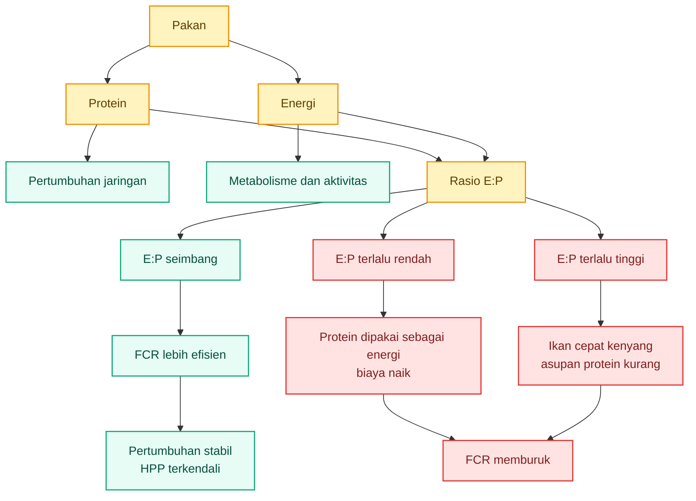

Intinya: `$E:P$` membantu praktisi membaca apakah pakan terlalu “mahal protein”, terlalu “berat energi”, atau cukup seimbang untuk fase ikan tertentu.

---

## 5.2 Formula E:P Ratio

`$E:P$` adalah rasio energi terhadap protein. Dalam artikel ini, `$E:P$` dihitung sebagai:

$$
E:P =
\frac{DE}{CP \times 10}
$$

Keterangan:

| Simbol           | Arti                             |
| ---------------- | -------------------------------- |
| `$DE$`           | digestible energy pakan, kcal/kg |
| `$CP$`           | crude protein, persen            |
| `$CP \times 10$` | protein gram/kg pakan            |

Kenapa `$CP$` dikalikan 10?

Karena 1 kg pakan sama dengan 1.000 g. Jika pakan mengandung protein 30 persen, maka protein dalam 1 kg pakan adalah:

$$
30% \times 1000 =
300
\text{ g protein/kg pakan}
$$

Dalam rumus, ini disederhanakan menjadi:

$$
CP \times 10 =
30 \times 10 =
300
$$

Contoh pakan:

| Parameter         |                Nilai |
| ----------------- | -------------------: |
| Protein kasar     |            30 persen |
| Digestible energy |        3.100 kcal/kg |
| Protein gram/kg   |             300 g/kg |
| `$E:P$`           | 10,33 kcal/g protein |

Perhitungannya:

$$
E:P =
\frac{3100}{30 \times 10}
$$

$$
E:P =
\frac{3100}{300}
$$

$$
E:P =
10{,}33
$$

Artinya, pakan 30 persen protein dengan `$DE$` 3.100 kcal/kg memiliki `$E:P$` sekitar **10,33 kcal/g protein**.

### Contoh Perbandingan Beberapa Pakan

| Pakan |   Protein |        `$DE$` | `$E:P$` | Pembacaan Praktis                          |
| ----- | --------: | ------------: | ------: | ------------------------------------------ |
| A     | 35 persen | 3.100 kcal/kg |    8,86 | Cocok untuk fase kecil                     |
| B     | 32 persen | 3.100 kcal/kg |    9,69 | Cocok untuk juvenile/grower awal           |
| C     | 30 persen | 3.100 kcal/kg |   10,33 | Cocok untuk grower                         |
| D     | 28 persen | 3.100 kcal/kg |   11,07 | Cocok untuk finisher                       |
| E     | 25 persen | 3.100 kcal/kg |   12,40 | Berisiko rendah protein untuk grower cepat |

Tabel ini bukan standar mutlak. Ini adalah cara membaca pakan secara praktis. Nilai akhir tetap harus dikaitkan dengan bobot ikan, kualitas pakan, kecernaan, kondisi bioflok, dan `$FCR$` aktual.

---

## 5.3 Formula P:E Ratio

Sebagian literatur tidak memakai `$E:P$`, tetapi memakai `$P:E$` atau protein-to-energy ratio. Secara konsep, `$P:E$` adalah kebalikan cara baca dari `$E:P$`.

Jika `$E:P$` membaca **berapa energi per gram protein**, maka `$P:E$` membaca **berapa gram protein per unit energi**.

Formula `$P:E$`:

$$
P:E =
\frac{CP \times 10}{DE \times 0{,}004184}
$$

Keterangan:

| Simbol         | Arti                       |
| -------------- | -------------------------- |
| `$P:E$`        | gram protein per MJ energi |
| `$CP$`         | crude protein, persen      |
| `$DE$`         | digestible energy, kcal/kg |
| `$0{,}004184$` | konversi kcal ke MJ        |

Contoh:

| Parameter     |         Nilai |
| ------------- | ------------: |
| Protein kasar |     30 persen |
| `$DE$`        | 3.100 kcal/kg |
| Protein       |      300 g/kg |
| Energi        |   12,97 MJ/kg |
| `$P:E$`       |     23,1 g/MJ |

Perhitungannya:

$$
P:E =
\frac{30 \times 10}{3100 \times 0{,}004184}
$$

$$
P:E =
\frac{300}{12{,}97}
$$

$$
P:E =
23{,}1
\text{ g/MJ}
$$

Literatur tilapia sering membahas `$P:E$`. Dalam salah satu kajian terkait tilapia dan pakan formulasi, kisaran optimal `$P:E$` untuk tilapia disebut sekitar 18–23 g/MJ ketika ikan hanya mengakses formulated feed. ([WorldFish Digital Repository][3])

Namun, pada sistem bioflok, ikan tidak hanya berinteraksi dengan pakan buatan. Ada kontribusi flok sebagai nutrisi tambahan, sehingga `$P:E$` atau `$E:P$` tetap harus dikalibrasi dengan data pertumbuhan aktual, bukan diambil sebagai angka tunggal yang pasti berlaku untuk semua kolam.

### Konversi Cepat E:P dan P:E

|   Protein |        `$DE$` |      `$E:P$` |    `$P:E$` |
| --------: | ------------: | -----------: | ---------: |
| 35 persen | 3.100 kcal/kg |  8,86 kcal/g | 26,98 g/MJ |
| 32 persen | 3.100 kcal/kg |  9,69 kcal/g | 24,67 g/MJ |
| 30 persen | 3.100 kcal/kg | 10,33 kcal/g | 23,13 g/MJ |
| 28 persen | 3.100 kcal/kg | 11,07 kcal/g | 21,59 g/MJ |
| 26 persen | 3.100 kcal/kg | 11,92 kcal/g | 20,05 g/MJ |

Pembacaan praktis:

- `$E:P$` rendah berarti protein relatif tinggi terhadap energi.
- `$E:P$` tinggi berarti energi relatif tinggi atau protein relatif rendah.
- `$P:E$` tinggi berarti protein relatif tinggi terhadap energi.
- `$P:E$` rendah berarti protein relatif rendah terhadap energi.

---

## 5.4 Cara Membaca Label Pakan

Praktisi sering membeli pakan berdasarkan merek, harga, atau protein kasar. Itu belum cukup. Untuk rezim feeding yang akurat, label pakan harus dibaca sebagai data input model.

| Data Label Pakan | Fungsi                                     |
| ---------------- | ------------------------------------------ |
| Protein kasar    | Menentukan `$CP$`                          |
| Lemak            | Mempengaruhi energi                        |
| Serat            | Mempengaruhi kecernaan                     |
| Abu              | Indikasi mineral atau komponen non-organik |
| DE atau ME       | Sering tidak tercantum, perlu estimasi     |
| Ukuran pelet     | Harus sesuai bukaan mulut ikan             |

### 5.4.1 Protein Kasar

Protein kasar adalah angka yang paling sering dipakai dalam keputusan pembelian pakan. Namun protein kasar hanya menunjukkan jumlah protein, bukan kualitas protein, keseimbangan asam amino, atau kecernaannya.

Untuk nila bioflok:

| Fase          | Protein yang Lebih Masuk Akal |
| ------------- | ----------------------------: |
| Benih kecil   |                  40–45 persen |
| Benih besar   |                  35–40 persen |
| Juvenile awal |                  32–35 persen |
| Grower awal   |                  30–32 persen |
| Grower        |                  30–32 persen |
| Finisher      |                  28–30 persen |

Jika pakan 35 persen protein tetap dipakai sampai finisher, ikan mungkin tetap tumbuh, tetapi biaya protein bisa berlebihan. Jika pakan 25 persen protein dipakai terlalu awal, pertumbuhan bisa lambat dan siklus panen molor.

---

### 5.4.2 Lemak

Lemak adalah sumber energi padat. Semakin tinggi lemak, energi pakan cenderung meningkat. Ini bisa membantu jika protein cukup, tetapi bisa menjadi masalah jika energi terlalu tinggi dan protein tidak seimbang.

Risiko pakan terlalu tinggi energi:

| Risiko                             | Dampak                         |
| ---------------------------------- | ------------------------------ |
| Ikan cepat kenyang                 | Asupan protein turun           |
| Lemak tubuh meningkat              | Efisiensi fillet bisa berubah  |
| Pertumbuhan tidak seimbang         | `$FCR$` dapat memburuk         |
| Pakan tampak efisien jangka pendek | Hasil panen bisa tidak optimal |

Pada nila bioflok, lemak dan energi pakan perlu dibaca bersama `$CP$`, bukan berdiri sendiri.

---

### 5.4.3 Serat

Serat memengaruhi kecernaan. Serat yang terlalu tinggi dapat menurunkan pemanfaatan nutrisi dan meningkatkan buangan. Untuk sistem bioflok, buangan yang lebih besar berarti beban media meningkat.

Dampak serat tinggi:

| Kondisi                 | Dampak                          |
| ----------------------- | ------------------------------- |
| Kecernaan turun         | Nutrisi tidak terserap optimal  |
| Feses meningkat         | Beban organik naik              |
| Media lebih cepat pekat | Flok dan sludge perlu dikontrol |
| `$FCR$` memburuk        | Biaya pakan per kg gain naik    |

---

### 5.4.4 Abu

Abu menunjukkan kandungan mineral dan komponen anorganik. Abu tidak selalu buruk, tetapi abu tinggi dapat menunjukkan fraksi non-organik yang besar dalam pakan. Praktisi perlu berhati-hati jika pakan murah memiliki abu tinggi dan performa pertumbuhan buruk.

Pembacaan praktis:

| Abu                           | Interpretasi Praktis              |
| ----------------------------- | --------------------------------- |
| Normal                        | Masih wajar sebagai mineral       |
| Terlalu tinggi                | Perlu cek kualitas bahan baku     |
| Tinggi dan pertumbuhan lambat | Evaluasi pakan dan `$FCR$` aktual |

---

### 5.4.5 DE atau ME

Digestible energy atau metabolizable energy sering tidak tercantum di label pakan komersial. Jika tidak ada, praktisi dapat meminta data teknis dari produsen atau menggunakan estimasi konservatif.

Untuk model awal artikel ini, kisaran `$DE$` yang dipakai adalah:

| Jenis Pakan    |     Estimasi `$DE$` |
| -------------- | ------------------: |
| Pakan benih    | 3.000–3.200 kcal/kg |
| Pakan grower   | 3.000–3.200 kcal/kg |
| Pakan finisher | 3.000–3.200 kcal/kg |

Jika `$DE$` tidak diketahui, hasil `$E:P$` hanya estimasi. Karena itu, keputusan akhir tetap harus dikunci dengan data kolam: pertumbuhan, total pakan, dan `$FCR_{\text{aktual}}$`.

---

### 5.4.6 Ukuran Pelet

Ukuran pelet harus sesuai dengan bukaan mulut ikan. Pelet terlalu besar menurunkan konsumsi. Pelet terlalu kecil bisa meningkatkan kehilangan pakan dan memperkeruh media. Pada bioflok, pakan yang hancur atau tidak termakan akan cepat menjadi beban organik.

| Bobot Ikan | Ukuran Pelet Praktis |
| ---------: | -------------------: |
|      1–5 g |              crumble |
|     5–20 g |                 1 mm |
|    20–50 g |               1–2 mm |
|   50–100 g |                 2 mm |
|  100–200 g |               2–3 mm |
|  200–300 g |               3–4 mm |

---

## 5.5 Checklist Memilih Pakan Berdasarkan E:P

Sebelum memilih pakan, praktisi sebaiknya mengecek empat hal:

| Pertanyaan                                  | Keputusan                     |
| ------------------------------------------- | ----------------------------- |
| Bobot ikan saat ini berapa?                 | Tentukan fase pertumbuhan     |
| Protein pakan berapa?                       | Cocokkan dengan fase          |
| Energi pakan tersedia atau bisa diestimasi? | Hitung `$E:P$`                |
| `$FCR$` aktual membaik atau memburuk?       | Validasi pakan di kolam nyata |

### Contoh Pembacaan Pakan

Misal ada dua pakan grower:

| Parameter       |       Pakan A |                    Pakan B |
| --------------- | ------------: | -------------------------: |
| Protein         |     32 persen |                  28 persen |
| Estimasi `$DE$` | 3.100 kcal/kg |              3.100 kcal/kg |
| `$E:P$`         |          9,69 |                      11,07 |
| Harga           |   Lebih mahal |                Lebih murah |
| Cocok untuk     |   Grower awal | Finisher atau grower besar |

Pakan B lebih murah belum tentu lebih efisien jika diberikan terlalu awal. Jika ikan masih fase 50–100 g dan membutuhkan protein lebih tinggi, pakan B bisa membuat pertumbuhan lebih lambat. Sebaliknya, pada fase 200–300 g, pakan B bisa lebih ekonomis jika pertumbuhan dan `$FCR$` tetap baik.

---

## 5.6 Hubungan E:P dengan Model FCR Efektif

Dalam artikel ini, `$E:P$` akan masuk ke model `$FCR_{\text{eff}}$` melalui `$EP_{\text{Factor}}$`.

Jika `$E:P$` berada dalam rentang target fase, `$EP_{\text{Factor}}$` bernilai 1. Jika `$E:P$` terlalu rendah atau terlalu tinggi, `$EP_{\text{Factor}}$` lebih besar dari 1, yang berarti `$FCR_{\text{eff}}$` memburuk.

Secara konsep:

$$
FCR_{\text{eff}} =
FCR_{\text{base}}
\times
EP_{\text{Factor}}
\times
FR_{\text{Factor}}
\times
WQ_{\text{Factor}}
\times
BFT_{\text{Factor}}
$$

Bab berikutnya akan menjelaskan model `$FCR_{\text{eff}}$` ini secara lebih rinci.

---

## Ringkasan Bab 5

Bab ini menetapkan bahwa feeding nila bioflok tidak cukup hanya berdasarkan kg pakan dan frekuensi pemberian. Kualitas pakan harus dibaca melalui protein, energi, dan `$E:P$` ratio.

Kesimpulan praktis Bab 5:

| Prinsip                                         | Putusan Praktis                      |
| ----------------------------------------------- | ------------------------------------ |
| Protein penting untuk pertumbuhan               | Wajib disesuaikan dengan fase        |
| Energi penting untuk metabolisme                | Jangan hanya mengejar protein tinggi |
| `$E:P$` membaca keseimbangan energi dan protein | Wajib dihitung jika data tersedia    |
| `$P:E$` sering dipakai dalam literatur          | Bisa dikonversi dari `$E:P$`         |
| Label pakan harus dibaca sebagai data model     | Protein saja tidak cukup             |
| `$FCR$` aktual tetap menjadi validasi akhir     | Model harus dikalibrasi              |

[**Kembali ke Atas**](#rezim-feeding-rate-nila-bioflok-model-pakan-berbasis-biomassa-fase-pertumbuhan-ep-ratio-dan-fcr-efektif)

[1]: https://www.fao.org/fileadmin/user_upload/affris/docs/tilapiaT2.pdf?utm_source=chatgpt.com 'O. niloticus X O. aureus'
[2]: https://kkp.go.id/storage/Materi/panduan-budi-daya-ikan-nilalele-di-bak-bulat-bioflok6982e9ada5a67/materi-6982e9adaa327.pdf?utm_source=chatgpt.com 'SPO Budidaya Ikan Nila/Lele di Bak Bulat'
[3]: https://digitalarchive.worldfishcenter.org/items/e779b660-755b-4376-b89f-aac48afdd9ff/full?utm_source=chatgpt.com 'Effect of dietary protein to energy ratio on performance ...'

---

# 6. Model FCR Efektif

## 6.1 Mengapa FCR Tidak Konstan

`$FCR$` atau **feed conversion ratio** adalah rasio antara jumlah pakan yang diberikan dan pertambahan biomassa ikan. Secara sederhana:

$$
FCR =
\frac{
Pakan_{\text{total}}
}{
Biomassa_{\text{akhir}} - Biomassa_{\text{awal}}
}
$$

Dalam praktik lapangan, `$FCR$` tidak konstan. Angka `$FCR$` berubah mengikuti ukuran ikan, kualitas pakan, feeding rate, kualitas air, kepadatan, kondisi flok, dan skill operator. Karena itu, memakai satu angka `$FCR$` tetap dari awal sampai panen akan membuat simulasi pertumbuhan terlalu kasar.

FAO menunjukkan bahwa feeding rate nila turun seiring ukuran ikan, dari 10–6 persen bobot tubuh per hari pada ukuran 1–5 g, menjadi 2–1,5 persen pada ukuran di atas 250 g. Ini menunjukkan bahwa kebutuhan pakan relatif terhadap biomassa berubah menurut fase pertumbuhan. ([FAO AFFRIS](https://www.fao.org/fileadmin/user_upload/affris/docs/tilapiaT28.pdf))

Dalam bioflok, `$FCR$` juga dipengaruhi oleh kondisi media. KKP menjelaskan bahwa sistem bioflok membutuhkan aerasi, persiapan media, dan pengelolaan kualitas air karena pakan, feses, mikroba, dan flok berada dalam satu sistem yang saling memengaruhi. ([KKP](https://kkp.go.id/storage/Materi/panduan-budi-daya-ikan-nilalele-di-bak-bulat-bioflok6982e9ada5a67/materi-6982e9adaa327.pdf))

### Faktor yang Membuat FCR Berubah

| Faktor         | Dampak terhadap `$FCR$`                                                               |
| -------------- | ------------------------------------------------------------------------------------- |
| Ukuran ikan    | Ikan kecil dan besar memiliki efisiensi pakan berbeda                                 |
| Kualitas pakan | Protein, energi, kecernaan, dan ukuran pelet memengaruhi efisiensi                    |
| Feeding rate   | Overfeeding meningkatkan sisa pakan dan memperburuk `$FCR$`                           |
| Kualitas air   | DO rendah, TAN tinggi, dan nitrit tinggi menekan nafsu makan                          |
| Kondisi flok   | Flok stabil dapat membantu efisiensi, tetapi flok buruk dapat menjadi beban           |
| Mortalitas     | Mortalitas membuat pakan yang sudah diberikan tidak seluruhnya menjadi biomassa panen |

Karena itu, artikel ini memakai konsep:

**FCR efektif**, yaitu `$FCR$` yang sudah dikoreksi oleh kualitas pakan, feeding rate, kualitas air, dan kondisi bioflok.

---

## 6.2 Formula FCR Efektif

Model `$FCR_{\text{eff}}$` dalam artikel ini bersifat **semi-empiris**. Artinya, model ini berguna untuk simulasi dan kontrol keputusan, tetapi harus dikalibrasi dengan data kolam aktual.

Formula utama:

$$
FCR_{\text{eff}} =
FCR_{\text{base}}
\times
EP_{\text{Factor}}
\times
FR_{\text{Factor}}
\times
WQ_{\text{Factor}}
\times
BFT_{\text{Factor}}
$$

Keterangan:

| Komponen                | Arti                                    |
| ----------------------- | --------------------------------------- |
| `$FCR_{\text{eff}}$`    | FCR efektif yang dipakai dalam simulasi |
| `$FCR_{\text{base}}$`   | FCR dasar berdasarkan fase pertumbuhan  |
| `$EP_{\text{Factor}}$`  | koreksi akibat rasio `$E:P$`            |
| `$FR_{\text{Factor}}$`  | koreksi akibat overfeeding              |
| `$WQ_{\text{Factor}}$`  | koreksi akibat kualitas air             |
| `$BFT_{\text{Factor}}$` | koreksi kontribusi bioflok              |

Jika semua kondisi ideal, maka faktor koreksi mendekati 1. Jika pakan tidak seimbang, feeding rate berlebihan, atau kualitas air buruk, maka `$FCR_{\text{eff}}$` naik. Jika flok stabil dan terbukti memberi kontribusi nutrisi, maka `$BFT_{\text{Factor}}$` dapat menurunkan `$FCR_{\text{eff}}$`.

---

## 6.3 Penjelasan Faktor

| Faktor                  | Fungsi                                                  | Arah Dampak                                        |
| ----------------------- | ------------------------------------------------------- | -------------------------------------------------- |
| `$FCR_{\text{base}}$`   | FCR dasar per fase pertumbuhan                          | Dasar model                                        |
| `$EP_{\text{Factor}}$`  | Penalti bila `$E:P$` terlalu rendah atau terlalu tinggi | Menaikkan `$FCR$` jika tidak sesuai                |
| `$FR_{\text{Factor}}$`  | Penalti overfeeding                                     | Menaikkan `$FCR$` jika feeding rate terlalu tinggi |
| `$WQ_{\text{Factor}}$`  | Penalti kualitas air buruk                              | Menaikkan `$FCR$` jika air bermasalah              |
| `$BFT_{\text{Factor}}$` | Kredit nutrisi dari bioflok                             | Menurunkan `$FCR$` jika flok stabil                |

### Alur FCR Efektif

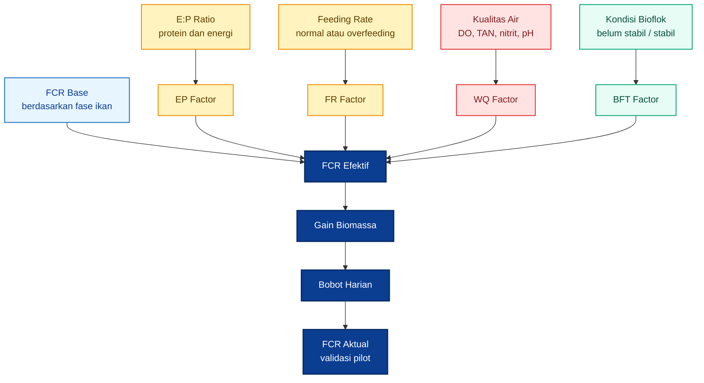

---

## 6.4 EP Factor

`$EP_{\text{Factor}}$` digunakan untuk menghukum model jika rasio `$E:P$` pakan keluar dari rentang target fase.

Jika `$E:P$` terlalu rendah, artinya energi relatif kurang dibanding protein. Protein berisiko dipakai sebagai energi, sehingga biaya pakan tidak efisien. Jika `$E:P$` terlalu tinggi, artinya energi relatif besar atau protein relatif rendah. Ikan bisa cepat kenyang sebelum kebutuhan protein terpenuhi.

Formula:

$$
EP_{\text{Factor}} =
\begin{cases}
1 + \beta_{\text{EP}} \times \frac{EP_{\text{low}} - EP}{EP_{\text{low}}}, & EP < EP_{\text{low}} \
1, & EP_{\text{low}} \leq EP \leq EP_{\text{high}} \
1 + \beta_{\text{EP}} \times \frac{EP - EP_{\text{high}}}{EP_{\text{high}}}, & EP > EP_{\text{high}}
\end{cases}
$$

Keterangan:

| Simbol                 | Arti                                  |
| ---------------------- | ------------------------------------- |
| `$EP$`                 | nilai `$E:P$` pakan aktual            |
| `$EP_{\text{low}}$`    | batas bawah target `$E:P$` fase       |
| `$EP_{\text{high}}$`   | batas atas target `$E:P$` fase        |
| `$\beta_{\text{EP}}$`  | sensitivitas penalti `$E:P$`          |
| `$EP_{\text{Factor}}$` | faktor koreksi `$FCR$` akibat `$E:P$` |

Untuk model awal, nilai default yang aman:

$$
\beta_{\text{EP}} = 1
$$

### Contoh EP Factor

Misal ikan berada pada fase grower awal 50–100 g dengan target `$E:P$` 9,4–10,7. Pakan yang digunakan memiliki:

| Parameter      |         Nilai |
| -------------- | ------------: |
| Protein        |     30 persen |
| `$DE$`         | 3.100 kcal/kg |
| `$E:P$` aktual |         10,33 |
| Target `$E:P$` |      9,4–10,7 |

Karena 10,33 masih berada dalam rentang 9,4–10,7:

$$
EP_{\text{Factor}} = 1
$$

Jika pakan memiliki `$E:P$` 12,0, maka nilai tersebut berada di atas batas 10,7. Dengan `$\beta_{\text{EP}} = 1$`:

$$
EP_{\text{Factor}} =
1 +
1
\times
\frac{12{,}0 - 10{,}7}{10{,}7}
$$

$$
EP_{\text{Factor}} =
1{,}121
$$

Artinya, model memberi penalti sekitar 12,1 persen terhadap `$FCR_{\text{base}}$`.

---

## 6.5 FR Factor

`$FR_{\text{Factor}}$` digunakan untuk menghukum overfeeding. Overfeeding tidak hanya berarti pakan lebih banyak. Pada bioflok, overfeeding berarti beban organik naik, mikroba bekerja lebih berat, DO bisa turun, TAN dan nitrit bisa naik, dan flok bisa terlalu pekat.

Formula:

$$
FR_{\text{Factor}} =
1 +
\beta_{\text{FR}}
\times
\left(
\max \left(0, \frac{FR_t - FR_{\text{max}}}{FR_{\text{max}}} \right)
\right)^2
$$

Keterangan:

| Simbol                 | Arti                                      |
| ---------------------- | ----------------------------------------- |
| `$FR_t$`               | feeding rate aktual hari ke-`$t$`         |
| `$FR_{\text{max}}$`    | batas atas feeding rate fase              |
| `$\beta_{\text{FR}}$`  | sensitivitas penalti overfeeding          |
| `$FR_{\text{Factor}}$` | faktor koreksi `$FCR$` akibat overfeeding |

Untuk model awal:

$$
\beta_{\text{FR}} = 3
$$

Model memakai bentuk kuadrat agar overfeeding kecil tidak langsung membuat model terlalu ekstrem, tetapi overfeeding besar akan dihukum lebih berat.

### Contoh FR Factor

Misal fase grower awal 50–100 g memiliki batas atas feeding rate:

$$
FR_{\text{max}} = 0{,}035
$$

Operator memberi pakan dengan feeding rate aktual:

$$
FR_t = 0{,}040
$$

Maka:

$$
FR_{\text{Factor}} =
1 +
3
\times
\left(
\frac{0{,}040 - 0{,}035}{0{,}035}
\right)^2
$$

$$
FR_{\text{Factor}} =
1 +
3
\times
0{,}0204
$$

$$
FR_{\text{Factor}} =
1{,}061
$$

Artinya, overfeeding dari 3,5 persen menjadi 4,0 persen memberi penalti `$FCR$` sekitar 6,1 persen dalam model.

---

## 6.6 WQ Factor

`$WQ_{\text{Factor}}$` adalah penalti kualitas air. Dalam bioflok, kualitas air sangat memengaruhi nafsu makan, metabolisme, dan efisiensi pakan. Jika DO rendah, TAN tinggi, nitrit tinggi, atau pH tidak stabil, ikan bisa tetap diberi pakan tetapi tidak mengonversinya secara efisien.

Untuk model awal:

| Kondisi Air       | `$WQ_{\text{Factor}}$` |
| ----------------- | ---------------------: |
| Baik              |                   1,00 |
| Sedikit terganggu |                   1,05 |
| Sedang bermasalah |              1,10–1,20 |
| Buruk             |           Di atas 1,20 |

Parameter minimum yang perlu dipantau:

| Parameter   | Dampak terhadap Feeding                                   |
| ----------- | --------------------------------------------------------- |
| DO          | DO rendah menurunkan nafsu makan                          |
| pH          | pH memengaruhi stabilitas sistem dan toksisitas amonia    |
| TAN         | TAN tinggi menunjukkan beban nitrogen                     |
| Nitrit      | Nitrit tinggi meningkatkan stres ikan                     |
| Volume flok | Flok terlalu pekat meningkatkan beban sistem              |
| Bau air     | Bau busuk menandakan risiko anaerob atau organik berlebih |

Jika kualitas air buruk, pakan tidak boleh dipertahankan hanya karena tabel feeding masih menunjukkan angka tertentu.

---

## 6.7 BFT Factor

`$BFT_{\text{Factor}}$` mewakili kontribusi nutrisi dari bioflok. Jika flok stabil dan ikan aktif memakan flok, efisiensi pakan bisa membaik. Namun kontribusi ini harus diperlakukan hati-hati.

Formula:

$$
BFT_{\text{Factor}} =
1 - BFT_{\text{Credit}}
$$

Keterangan:

| Simbol                  | Arti                                |
| ----------------------- | ----------------------------------- |
| `$BFT_{\text{Credit}}$` | estimasi kontribusi nutrisi bioflok |
| `$BFT_{\text{Factor}}$` | faktor koreksi terhadap `$FCR$`     |

Tabel praktis:

| Kondisi Bioflok                 |    `$BFT_{\text{Credit}}$` |
| ------------------------------- | -------------------------: |
| Belum stabil                    |                   0 persen |
| Mulai stabil                    |                 3–5 persen |
| Stabil                          |                5–10 persen |
| Sangat stabil dan terbukti data |               10–15 persen |
| Klaim 20–30 persen              | Jangan dipakai tanpa pilot |

Contoh:

Jika bioflok stabil dan dipakai kredit 5 persen:

$$
BFT_{\text{Credit}} = 0{,}05
$$

$$
BFT_{\text{Factor}} =
1 - 0{,}05
$$

$$
BFT_{\text{Factor}} =
0{,}95
$$

Artinya, model memberi perbaikan `$FCR$` sebesar 5 persen. Tetapi angka ini hanya boleh digunakan jika data kolam mendukung.

---

## 6.8 Contoh Perhitungan FCR Efektif

Misal ikan berada pada fase grower awal 50–100 g.

| Komponen                | Nilai |
| ----------------------- | ----: |
| `$FCR_{\text{base}}$`   |  1,20 |
| `$EP_{\text{Factor}}$`  |  1,00 |
| `$FR_{\text{Factor}}$`  |  1,06 |
| `$WQ_{\text{Factor}}$`  |  1,05 |
| `$BFT_{\text{Factor}}$` |  0,95 |

Maka:

$$
FCR_{\text{eff}} =
1{,}20
\times
1{,}00
\times
1{,}06
\times
1{,}05
\times
0{,}95
$$

$$
FCR_{\text{eff}} =
1{,}27
$$

Interpretasi:

- pakan dan `$E:P$` masih sesuai;
- feeding rate sedikit berlebih;
- kualitas air sedikit terganggu;
- bioflok memberi kredit 5 persen;
- hasil akhir `$FCR_{\text{eff}}$` menjadi 1,27.

Jika kualitas air memburuk dari 1,05 menjadi 1,20, maka:

$$
FCR_{\text{eff}} =
1{,}20
\times
1{,}00
\times
1{,}06
\times
1{,}20
\times
0{,}95
$$

$$
FCR_{\text{eff}} =
1{,}45
$$

Perbedaan ini penting untuk bisnis. Pada biomassa besar, kenaikan `$FCR$` dari 1,27 ke 1,45 dapat mengubah margin secara signifikan.

---

# 7. Model Pertumbuhan Berat Harian

Model pertumbuhan berat harian digunakan untuk mensimulasikan perubahan bobot ikan dari hari ke hari. Model ini menghubungkan biomassa, feeding rate, pakan harian, `$FCR_{\text{eff}}$`, pertambahan biomassa, mortalitas, dan bobot rata-rata esok hari.

Model ini tidak menggantikan sampling. Model hanya membantu membuat simulasi. Hasil akhirnya tetap harus divalidasi dengan data aktual kolam.

---

## 7.1 Biomassa

Biomassa adalah jumlah total bobot ikan hidup dalam kolam.

$$
B_t =
\frac{
N_t
\times
W_t
}{
1000
}
$$

Keterangan:

| Simbol   | Arti                                               |
| -------- | -------------------------------------------------- |
| `$B_t$`  | biomassa pada hari ke-`$t$`, kg                    |
| `$N_t$`  | jumlah ikan hidup pada hari ke-`$t$`, ekor         |
| `$W_t$`  | bobot rata-rata ikan pada hari ke-`$t$`, gram/ekor |
| `$1000$` | konversi gram ke kg                                |

Contoh:

| Parameter         |      Nilai |
| ----------------- | ---------: |
| Jumlah ikan hidup | 8.000 ekor |
| Bobot rata-rata   |       75 g |
| Biomassa          |     600 kg |

$$
B_t =
\frac{
8000
\times
75
}{
1000
}
$$

$$
B_t =
600
$$

---

## 7.2 Pakan Harian

Pakan harian dihitung dari biomassa dan feeding rate.

$$
Feed_t =
B_t
\times
FR_t
$$

Keterangan:

| Simbol     | Arti                                |
| ---------- | ----------------------------------- |
| `$Feed_t$` | pakan harian pada hari ke-`$t$`, kg |
| `$B_t$`    | biomassa pada hari ke-`$t$`, kg     |
| `$FR_t$`   | feeding rate hari ke-`$t$`          |

Contoh:

| Parameter           |      Nilai |
| ------------------- | ---------: |
| Biomassa            |     600 kg |
| Feeding rate        | 3,2 persen |
| Feeding rate fraksi |      0,032 |
| Pakan harian        |    19,2 kg |

$$
Feed_t =
600
\times
0{,}032
$$

$$
Feed_t =
19{,}2
\text{ kg/hari}
$$

---

## 7.3 Pertambahan Biomassa

Pertambahan biomassa dihitung dari pakan harian dibagi `$FCR_{\text{eff}}$`.

$$
Gain_t =
\frac{
Feed_t
}{
FCR_{\text{eff}}
}
$$

Keterangan:

| Simbol               | Arti                                   |
| -------------------- | -------------------------------------- |
| `$Gain_t$`           | pertambahan biomassa hari ke-`$t$`, kg |
| `$Feed_t$`           | pakan harian, kg                       |
| `$FCR_{\text{eff}}$` | FCR efektif                            |

Contoh:

| Parameter            |    Nilai |
| -------------------- | -------: |
| Pakan harian         |  19,2 kg |
| `$FCR_{\text{eff}}$` |     1,27 |
| Gain biomassa        | 15,12 kg |

$$
Gain_t =
\frac{
19{,}2
}{
1{,}27
}
$$

$$
Gain_t =
15{,}12
\text{ kg/hari}
$$

---

## 7.4 Bobot Esok Hari

Setelah gain biomassa dihitung, bobot rata-rata ikan hari berikutnya dapat dihitung.

$$
W_{t+1} =
W_t +
\frac{
Gain_t
\times
1000
}{
N_t
}
$$

Keterangan:

| Simbol      | Arti                                 |
| ----------- | ------------------------------------ |
| `$W_{t+1}$` | bobot rata-rata esok hari, gram/ekor |
| `$W_t$`     | bobot rata-rata hari ini, gram/ekor  |
| `$Gain_t$`  | pertambahan biomassa, kg/hari        |
| `$N_t$`     | jumlah ikan hidup hari ini           |
| `$1000$`    | konversi kg ke gram                  |

Contoh:

| Parameter         |       Nilai |
| ----------------- | ----------: |
| Bobot hari ini    |        75 g |
| Gain biomassa     |    15,12 kg |
| Jumlah ikan hidup |  8.000 ekor |
| Kenaikan bobot    | 1,89 g/ekor |
| Bobot esok        |     76,89 g |

$$
W_{t+1} =
75 +
\frac{
15{,}12
\times
1000
}{
8000
}
$$

$$
W_{t+1} =
75 + 1{,}89
$$

$$
W_{t+1} =
76{,}89
\text{ g}
$$

---

## 7.5 Mortalitas

Jumlah ikan hidup harus dikoreksi dengan mortalitas. Jika mortalitas tidak dimasukkan, biomassa akan terlihat terlalu tinggi dan pakan harian bisa berlebihan.

$$
N_{t+1} =
N_t
\times
\left(
1 - Mortality_t
\right)
$$

Keterangan:

| Simbol          | Arti                             |
| --------------- | -------------------------------- |
| `$N_{t+1}$`     | jumlah ikan hidup esok hari      |
| `$N_t$`         | jumlah ikan hidup hari ini       |
| `$Mortality_t$` | mortalitas harian sebagai fraksi |

Contoh:

| Parameter            |        Nilai |
| -------------------- | -----------: |
| Jumlah ikan hari ini |   8.000 ekor |
| Mortalitas harian    |  0,03 persen |
| Mortalitas fraksi    |       0,0003 |
| Jumlah ikan esok     | 7.997,6 ekor |

$$
N_{t+1} =
8000
\times
\left(
1 - 0{,}0003
\right)
$$

$$
N_{t+1} =
7997{,}6
$$

Dalam spreadsheet, jumlah ikan bisa dibiarkan desimal untuk simulasi. Namun dalam pencatatan lapangan, jumlah mortalitas harus dicatat sebagai ekor aktual.

---

## 7.6 Formula Final Model

Formula lengkap pertumbuhan berat harian:

$$
W_{t+1} =
W_t +
\frac{
B_t
\times
FR_t
}{
FCR_{\text{base}}
\times
EP_{\text{Factor}}
\times
FR_{\text{Factor}}
\times
WQ_{\text{Factor}}
\times
BFT_{\text{Factor}}
}
\times
\frac{
1000
}{
N_t
}
$$

Dengan:

$$
B_t =
\frac{
N_t
\times
W_t
}{
1000
}
$$

Model ini menunjukkan bahwa pertumbuhan harian tidak hanya ditentukan oleh feeding rate. Pertumbuhan juga dipengaruhi oleh `$FCR_{\text{base}}$`, keseimbangan `$E:P$`, risiko overfeeding, kualitas air, dan stabilitas bioflok.

---

## 7.7 Contoh Simulasi Satu Hari

Misal:

| Parameter               |      Nilai |
| ----------------------- | ---------: |
| Jumlah ikan hidup       | 8.000 ekor |
| Bobot rata-rata         |       75 g |
| Biomassa                |     600 kg |
| Feeding rate            | 3,2 persen |
| Pakan harian            |    19,2 kg |
| `$FCR_{\text{base}}$`   |       1,20 |
| `$EP_{\text{Factor}}$`  |       1,00 |
| `$FR_{\text{Factor}}$`  |       1,06 |
| `$WQ_{\text{Factor}}$`  |       1,05 |
| `$BFT_{\text{Factor}}$` |       0,95 |
| `$FCR_{\text{eff}}$`    |       1,27 |

Gain:

$$
Gain_t =
\frac{
19{,}2
}{
1{,}27
}
$$

$$
Gain_t =
15{,}12
\text{ kg/hari}
$$

Kenaikan bobot per ekor:

$$
\Delta W =
\frac{
15{,}12
\times
1000
}{
8000
}
$$

$$
\Delta W =
1{,}89
\text{ g/ekor/hari}
$$

Bobot esok:

$$
W_{t+1} =
75 + 1{,}89
$$

$$
W_{t+1} =
76{,}89
\text{ g/ekor}
$$

---

## 7.8 Alur Simulasi Harian

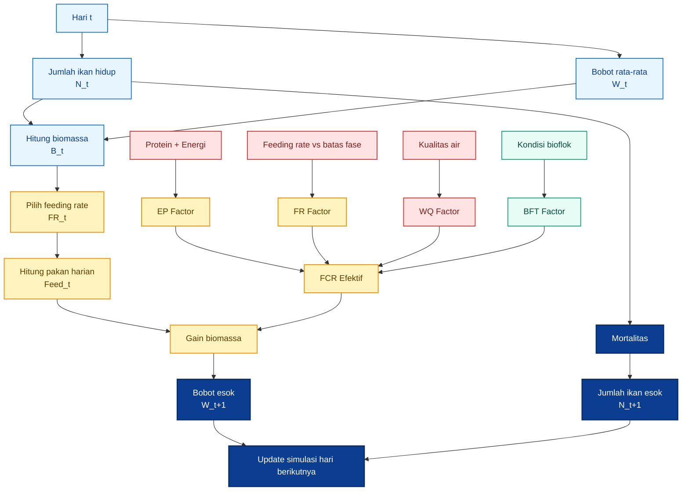

---

## 7.9 Batasan Model

Model ini berguna untuk simulasi, tetapi tidak boleh dianggap sebagai prediksi pasti. Pertumbuhan aktual tetap dapat berbeda karena:

| Faktor         | Dampak                                    |
| -------------- | ----------------------------------------- |
| Genetik benih  | Pertumbuhan bisa lebih cepat atau lambat  |
| Suhu           | Metabolisme ikan berubah                  |
| Kualitas pakan | Kecernaan dan asam amino berbeda          |
| DO             | Nafsu makan dan metabolisme berubah       |
| TAN dan nitrit | Stres dan efisiensi pakan berubah         |
| Kepadatan      | Kompetisi dan stres berubah               |
| Grading        | Ukuran tidak seragam memengaruhi konsumsi |
| Operator       | Respons feeding dan koreksi air berbeda   |

Karena itu, model harus dikalibrasi dengan data pilot: bobot sampling, total pakan, mortalitas, kualitas air, dan `$FCR_{\text{aktual}}$`.

---

## Ringkasan Bab 6–7

Bab 6 membangun konsep `$FCR_{\text{eff}}$`, yaitu `$FCR$` yang dikoreksi oleh kualitas pakan, feeding rate, kualitas air, dan kondisi bioflok. Bab 7 menghubungkan `$FCR_{\text{eff}}$` dengan model pertumbuhan berat harian.

Kesimpulan praktis:

| Prinsip               | Implikasi                                   |
| --------------------- | ------------------------------------------- |
| `$FCR$` tidak konstan | Simulasi harus memakai `$FCR_{\text{eff}}$` |
| `$E:P$` tidak sesuai  | `$FCR$` diberi penalti                      |
| Overfeeding           | `$FCR$` memburuk                            |
| Kualitas air buruk    | Feeding harus dikurangi atau ditunda        |
| Bioflok stabil        | Bisa memberi kredit nutrisi terbatas        |
| Model harian          | Berguna untuk simulasi pakan dan panen      |
| Data pilot            | Wajib untuk validasi                        |

[**Kembali ke Atas**](#rezim-feeding-rate-nila-bioflok-model-pakan-berbasis-biomassa-fase-pertumbuhan-ep-ratio-dan-fcr-efektif)

---

# 8. Jadwal Pemberian Pakan Harian

## 8.1 Prinsip Umum

Jadwal pemberian pakan nila bioflok **tidak boleh kaku**. Jadwal pagi, siang, dan sore hanya kerangka operasional. Keputusan akhirnya tetap harus mengikuti biomassa aktual, ukuran ikan, respons makan, aerasi, DO, dan kondisi media bioflok.

Rujukan FAO untuk nila intensif menunjukkan bahwa frekuensi feeding berubah mengikuti ukuran ikan: fase kecil dapat diberi lebih sering, sedangkan juvenile dan grower umumnya lebih sedikit. Pada tabel FAO, fry 1–5 g diberi 4 kali per hari, sedangkan juvenile 20–100 g dan grower 100–250 g diberi 2 kali per hari. Artinya, semakin besar ikan, feeding tidak harus makin sering; yang lebih penting adalah jumlah harian dan efisiensi konversinya. ([FAOHome][1])

Pada bioflok, jadwal feeding harus lebih hati-hati dibanding kolam biasa karena pakan yang tidak dimakan cepat menjadi beban organik. KKP menekankan bahwa bioflok memerlukan aerasi dan pengelolaan media, termasuk blower/aerasi dalam persiapan dan pemeliharaan sistem. Jika aerasi bermasalah, feeding harus dihentikan sementara karena oksigen menjadi faktor keselamatan sistem. ([kkp.go.id][2])

Prinsip umumnya:

| Prinsip                                | Penjelasan Praktis                                              |
| -------------------------------------- | --------------------------------------------------------------- |
| Jadwal tidak boleh kaku                | Jam feeding bisa berubah mengikuti kondisi air dan respons ikan |
| Jangan feeding saat aerasi bermasalah  | Risiko DO turun dan ikan stres                                  |
| Jangan terlalu pagi jika DO belum aman | DO biasanya rendah menjelang pagi, terutama pada sistem padat   |
| Jangan overfeeding                     | Sisa pakan menjadi beban organik dan nitrogen                   |
| Jangan mengejar nafsu makan sesaat     | Ikan agresif belum tentu berarti pakan perlu dinaikkan besar    |
| Catat pakan harian                     | Tanpa catatan, `$FCR$` tidak bisa dikendalikan                  |

## Alur Keputusan Feeding Harian

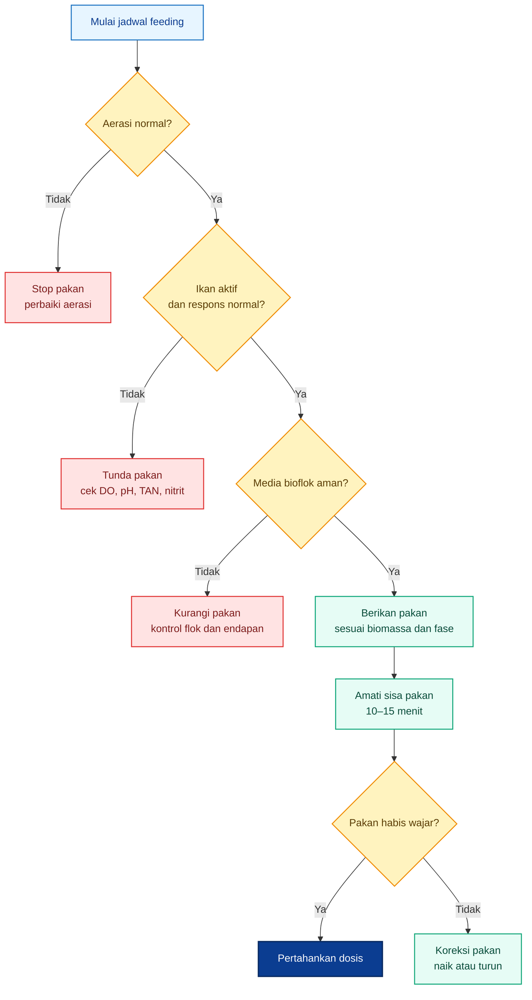

---

## 8.2 Jadwal Praktis per Fase

Tabel berikut adalah **jadwal operasional praktis**, bukan angka baku universal. Feeding rate tetap dihitung dari biomassa. Jadwal hanya menentukan pembagian waktu agar pakan tidak diberikan sekaligus.

| Fase      | Frekuensi | Jadwal Praktis                             |
| --------- | --------: | ------------------------------------------ |
| 1–5 g     |  4–5 kali | 07.30, 10.00, 12.30, 15.00, opsional 17.00 |
| 5–20 g    |    4 kali | 07.30, 10.30, 13.30, 16.30                 |
| 20–100 g  |    3 kali | 08.00, 12.30, 16.30                        |
| 100–200 g |  2–3 kali | 08.00, 13.00, 16.30                        |
| 200–300 g |    2 kali | 08.00 dan 16.00                            |

Catatan penting:

| Fase      | Fokus Feeding                                     |
| --------- | ------------------------------------------------- |
| 1–5 g     | Pakan kecil, frekuensi tinggi, jaga survival      |
| 5–20 g    | Transisi benih, pakan merata, hindari kompetisi   |
| 20–100 g  | Pertumbuhan cepat, kontrol biomassa dan `$FCR$`   |
| 100–200 g | Kontrol feeding rate agar tidak overfeeding       |
| 200–300 g | Efisiensi, hindari pakan berlebih menjelang panen |

Untuk bioflok, pemberian pakan terlalu sore atau malam perlu hati-hati karena beban organik masuk saat sistem bergerak menuju periode DO yang lebih rawan. Jika memakai aerasi kuat dan monitoring baik, feeding sore masih aman. Namun feeding malam tidak disarankan sebagai default untuk pembesaran komersial tanpa alat monitoring.

---

## 8.3 Porsi per Waktu

Setelah pakan harian dihitung, pakan dibagi berdasarkan frekuensi. Misalnya:

$$
Pakan_{\text{harian}} =
Biomassa_{\text{kg}}
\times
FR
$$

Jika biomassa 600 kg dan feeding rate 3,2 persen:

$$
Pakan_{\text{harian}} =
600
\times
0{,}032
$$

$$
Pakan_{\text{harian}} =
19{,}2
\text{ kg/hari}
$$

### Untuk 3 Kali per Hari

| Waktu |        Porsi |
| ----- | -----------: |
| Pagi  |    30 persen |
| Siang | 35–40 persen |
| Sore  | 30–35 persen |

Contoh pembagian 19,2 kg/hari:

| Waktu |      Porsi | Jumlah Pakan |
| ----- | ---------: | -----------: |
| Pagi  |  30 persen |      5,76 kg |
| Siang |  40 persen |      7,68 kg |
| Sore  |  30 persen |      5,76 kg |
| Total | 100 persen |     19,20 kg |

### Untuk 2 Kali per Hari

| Waktu |        Porsi |
| ----- | -----------: |
| Pagi  | 45–50 persen |
| Sore  | 50–55 persen |

Contoh pembagian 19,2 kg/hari:

| Waktu |      Porsi | Jumlah Pakan |
| ----- | ---------: | -----------: |
| Pagi  |  50 persen |      9,60 kg |
| Sore  |  50 persen |      9,60 kg |
| Total | 100 persen |     19,20 kg |

Porsi siang bisa sedikit lebih besar karena ikan umumnya lebih aktif saat kondisi air dan suhu lebih stabil. Namun pada bioflok padat, porsi besar tetap harus diamati: jika ada pakan tersisa, feeding berikutnya harus dikurangi.

---

# 9. Kualitas Air sebagai Pengendali Feeding

## 9.1 Mengapa Kualitas Air Masuk Model

Dalam bioflok, pakan dan kualitas air adalah satu sistem. Pakan yang dikonsumsi ikan menjadi pertumbuhan. Pakan yang tidak dikonsumsi menjadi limbah. Feses dan sisa pakan akan meningkatkan beban organik, TAN, nitrit, dan kepadatan flok. Karena itu, keputusan feeding harus selalu dikaitkan dengan kualitas air.

FAO dalam materi pelatihan tilapia menyebut parameter penting seperti DO, ammonia, nitrite, dan pH dalam pengelolaan budidaya nila. Materi tersebut juga menjelaskan bahwa ammonia berasal dari metabolisme ikan dan dekomposisi pakan tidak termakan, sedangkan nitrit dihasilkan dari proses nitrifikasi ammonia. ([FAOHome][3])

Dampak kualitas air terhadap feeding:

| Masalah Air        | Dampak terhadap Ikan                   | Dampak terhadap `$FCR$` |
| ------------------ | -------------------------------------- | ----------------------- |
| DO rendah          | Nafsu makan turun, stres               | `$FCR$` naik            |
| TAN/amonia naik    | Ikan stres, insang terganggu           | Pertumbuhan turun       |
| Nitrit naik        | Gangguan fisiologis                    | Efisiensi pakan turun   |
| pH tidak stabil    | Mikroba dan ikan terganggu             | Sistem tidak stabil     |
| Flok terlalu pekat | Beban oksigen dan organik naik         | Risiko crash meningkat  |
| Bau menyengat      | Indikasi organik berlebih atau anaerob | Feeding harus dikurangi |

Dalam model artikel ini, kualitas air masuk sebagai `$WQ_{\text{Factor}}$`. Jika air baik, nilainya 1,00. Jika air memburuk, nilainya naik, sehingga `$FCR_{\text{eff}}$` ikut memburuk.

---

## 9.2 Parameter Minimum

| Parameter   | Fungsi                                                |
| ----------- | ----------------------------------------------------- |
| DO          | Menentukan keamanan feeding                           |
| pH          | Mempengaruhi toksisitas amonia dan stabilitas mikroba |
| TAN/amonia  | Indikator beban nitrogen                              |
| Nitrit      | Risiko stres dan gangguan darah                       |
| Alkalinitas | Menjaga stabilitas sistem mikroba                     |
| Volume flok | Indikasi kepadatan bioflok                            |
| Bau air     | Deteksi awal kondisi anaerob                          |

### Parameter Prioritas Harian

Untuk praktisi, parameter tidak harus semuanya diukur setiap jam. Namun minimal ada prioritas:

| Frekuensi                | Parameter                                     |
| ------------------------ | --------------------------------------------- |
| Harian                   | DO, pH, respons makan, bau air, perilaku ikan |
| Beberapa kali per minggu | TAN/amonia, nitrit, volume flok               |
| Setelah masalah muncul   | TAN, nitrit, pH, DO, alkalinitas              |
| Setelah perubahan pakan  | Respons makan, sisa pakan, TAN, nitrit        |

KKP menekankan penggunaan aerasi dan pengelolaan media dalam bioflok, termasuk persiapan air, blower, dan pemeliharaan media. Dalam konteks feeding, ini berarti pakan tidak boleh diberikan terpisah dari status aerasi dan air. ([kkp.go.id][2])

---

## 9.3 WQ Factor dalam Model

`$WQ_{\text{Factor}}$` adalah angka koreksi yang digunakan dalam model `$FCR_{\text{eff}}$`.

$$
FCR_{\text{eff}} =
FCR_{\text{base}}
\times
EP_{\text{Factor}}
\times
FR_{\text{Factor}}
\times
WQ_{\text{Factor}}
\times
BFT_{\text{Factor}}
$$

Tabel praktis:

| Kondisi Air       | `$WQ_{\text{Factor}}$` | Interpretasi                    |
| ----------------- | ---------------------: | ------------------------------- |
| Baik              |                   1,00 | Feeding normal                  |
| Sedikit terganggu |                   1,05 | Feeding boleh, tetapi hati-hati |
| Sedang bermasalah |              1,10–1,20 | Feeding dikurangi sementara     |
| Buruk             |           Di atas 1,20 | Feeding dihentikan sampai aman  |

Contoh:

| Komponen                | Nilai |
| ----------------------- | ----: |
| `$FCR_{\text{base}}$`   |  1,20 |
| `$EP_{\text{Factor}}$`  |  1,00 |
| `$FR_{\text{Factor}}$`  |  1,00 |
| `$WQ_{\text{Factor}}$`  |  1,15 |
| `$BFT_{\text{Factor}}$` |  0,95 |

Maka:

$$
FCR_{\text{eff}} =
1{,}20
\times
1{,}00
\times
1{,}00
\times
1{,}15
\times
0{,}95
$$

$$
FCR_{\text{eff}} =
1{,}31
$$

Jika kualitas air baik dan `$WQ_{\text{Factor}} = 1{,}00$`, maka:

$$
FCR_{\text{eff}} =
1{,}20
\times
1{,}00
\times
1{,}00
\times
1{,}00
\times
0{,}95
$$

$$
FCR_{\text{eff}} =
1{,}14
$$

Artinya, hanya dengan memburuknya kualitas air dari baik menjadi sedang bermasalah, `$FCR_{\text{eff}}$` bisa naik dari 1,14 menjadi 1,31 dalam model. Ini menunjukkan mengapa feeding tidak boleh dilepaskan dari kontrol air.

## Alur Pakan Menjadi Risiko Kualitas Air

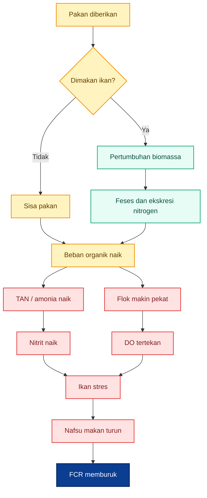

---

# 10. SOP Koreksi Feeding di Lapangan

SOP koreksi feeding diperlukan karena tabel pakan tidak mungkin menangkap semua dinamika kolam. Operator harus mampu menyesuaikan pakan harian berdasarkan respons ikan, media bioflok, dan hasil sampling.

Prinsipnya:

**Naikkan pakan hanya jika ikan, air, dan data mendukung. Turunkan atau hentikan pakan jika ikan atau media memberi sinyal risiko.**

---

## 10.1 Koreksi Berdasarkan Respons Makan

| Kondisi                               | Tindakan                     |
| ------------------------------------- | ---------------------------- |
| Pakan habis cepat, ikan masih agresif | Naikkan 5 persen             |
| Pakan tersisa lebih dari 10–15 menit  | Turunkan 10–20 persen        |
| Ikan lambat merespons                 | Cek DO, pH, TAN, nitrit      |
| Ikan naik ke permukaan tidak normal   | Stop pakan, cek kualitas air |

### Detail Praktis

**Pakan habis cepat** tidak otomatis berarti pakan harus dinaikkan besar. Kenaikan cukup 5 persen, lalu evaluasi lagi 1–2 hari. Jika langsung dinaikkan besar, overfeeding bisa terjadi dan media bioflok terbebani.

**Pakan tersisa** adalah sinyal kuat bahwa dosis pakan terlalu tinggi, ukuran pelet tidak sesuai, ikan stres, atau kualitas air memburuk. Dalam bioflok, pakan tersisa tidak boleh dibiarkan karena cepat menjadi limbah organik.

**Ikan lambat merespons** sering lebih berhubungan dengan kualitas air daripada kebutuhan pakan. Jangan menambah pakan ketika ikan tidak aktif. Periksa aerasi, DO, pH, TAN, dan nitrit.

---

## 10.2 Koreksi Berdasarkan Media Bioflok

| Kondisi            | Tindakan                               |
| ------------------ | -------------------------------------- |
| Flok terlalu pekat | Kurangi pakan, kontrol endapan         |
| Air bau menyengat  | Puasakan sementara dan perbaiki aerasi |
| Amonia/nitrit naik | Turunkan pakan 20–30 persen sementara  |
| Aerasi terganggu   | Stop pakan sampai aman                 |

### Catatan untuk Media Bioflok

Flok stabil adalah aset. Flok terlalu pekat adalah risiko. Pada kondisi flok terlalu pekat, pakan yang masuk akan memperparah beban organik. Koreksi yang lebih aman adalah menurunkan pakan sementara, memastikan aerasi kuat, dan mengontrol endapan dasar sesuai SOP kolam.

Jika air bau menyengat, jangan paksa feeding. Bau menyengat dapat menunjukkan kondisi organik berlebih atau zona anaerob. Dalam kondisi seperti ini, feeding hanya menambah masalah.

Jika TAN atau nitrit naik, pakan harus diturunkan sementara. Setelah air membaik dan ikan kembali aktif, feeding dapat dinaikkan bertahap.

---

## 10.3 Koreksi Setelah Sampling

Sampling dan grading bisa membuat ikan stres. Setelah sampling, ikan sering turun nafsu makan sementara. Karena itu, pakan tidak perlu langsung dinaikkan walaupun bobot sampling menunjukkan biomassa bertambah.

SOP praktis setelah sampling:

| Hari                    | Tindakan                                      |
| ----------------------- | --------------------------------------------- |
| Hari sampling           | Kurangi pakan 10–20 persen jika ikan stres    |
| 1 hari setelah sampling | Kembalikan bertahap jika respons makan normal |
| 2 hari setelah sampling | Gunakan biomassa baru sebagai dasar feeding   |
| Setelah grading         | Pantau ukuran dominan dan kompetisi makan     |

Update biomassa setelah sampling:

$$
Biomassa_{\text{baru}} =
N_{\text{hidup}}
\times
W_{\text{rata-rata, kg}}
$$

Pakan baru:

$$
Pakan_{\text{baru}} =
Biomassa_{\text{baru}}
\times
FR_{\text{fase}}
$$

Namun pakan baru tidak harus langsung diberikan penuh pada hari sampling. Jika ikan stres, naikkan bertahap.

---

## 10.4 Matriks Keputusan Koreksi Feeding

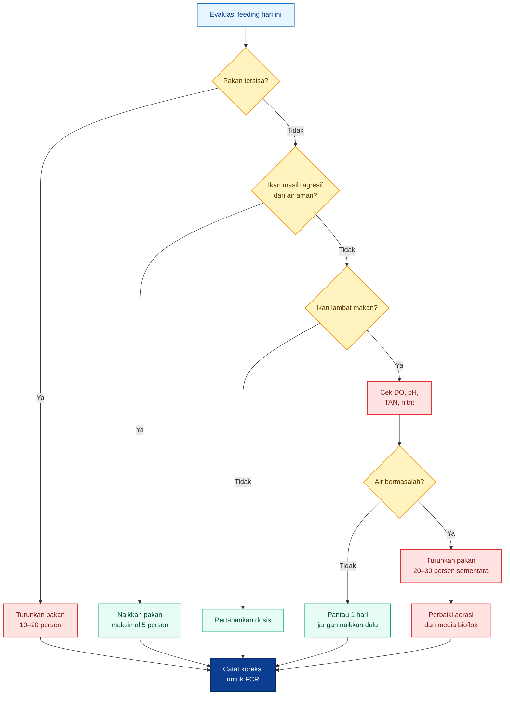

---

## 10.5 Catatan Pencatatan Harian

Tanpa pencatatan, SOP feeding tidak bisa dievaluasi. Minimal catat:

| Data               | Frekuensi                |
| ------------------ | ------------------------ |
| Pakan per waktu    | Setiap feeding           |
| Total pakan harian | Harian                   |
| Respons makan      | Setiap feeding           |
| Mortalitas         | Harian                   |
| DO dan pH          | Harian                   |
| TAN dan nitrit     | Berkala atau saat gejala |
| Volume flok        | Berkala                  |
| Bobot sampling     | 7–10 hari                |
| Koreksi pakan      | Setiap perubahan         |

Data ini akan dipakai untuk menghitung:

$$
FCR_{\text{aktual}} =
\frac{
Pakan_{\text{total}}
}{
Biomassa_{\text{akhir}} - Biomassa_{\text{awal}}
}
$$

Jika `$FCR_{\text{aktual}}$` memburuk, jangan langsung menyalahkan pakan. Periksa urutannya:

1. biomassa benar atau tidak;
2. mortalitas tercatat atau tidak;
3. feeding rate sesuai fase atau tidak;
4. kualitas air aman atau tidak;
5. `$E:P$` pakan sesuai atau tidak;
6. flok stabil atau tidak;
7. ukuran pelet sesuai atau tidak.

---

## Ringkasan Bab 8–10

Bab 8 menetapkan jadwal feeding harian sebagai panduan operasional, tetapi bukan aturan kaku. Bab 9 menempatkan kualitas air sebagai pengendali feeding melalui `$WQ_{\text{Factor}}$`. Bab 10 memberi SOP koreksi feeding berdasarkan respons makan, media bioflok, dan sampling.

Kesimpulan praktis:

| Area              | Putusan                                                          |
| ----------------- | ---------------------------------------------------------------- |
| Jadwal feeding    | Ikuti fase, tetapi jangan kaku                                   |
| Pagi terlalu dini | Hindari jika DO belum aman                                       |
| Bioflok padat     | Feeding harus dikaitkan dengan aerasi dan kualitas air           |
| Sisa pakan        | Turunkan dosis                                                   |
| Ikan agresif      | Naikkan bertahap, maksimal 5 persen                              |
| Air bermasalah    | Turunkan atau stop pakan sementara                               |
| Sampling          | Update biomassa, tetapi pakan dinaikkan bertahap jika ikan stres |
| Pencatatan        | Wajib untuk menghitung `$FCR_{\text{aktual}}$`                   |

[**Kembali ke Atas**](#rezim-feeding-rate-nila-bioflok-model-pakan-berbasis-biomassa-fase-pertumbuhan-ep-ratio-dan-fcr-efektif)

[1]: https://www.fao.org/fileadmin/user_upload/affris/docs/tilapiaT28.pdf?utm_source=chatgpt.com 'Table 28. Feeding table for tilapia using ...'
[2]: https://kkp.go.id/storage/Materi/panduan-budi-daya-ikan-nilalele-di-bak-bulat-bioflok6982e9ada5a67/materi-6982e9adaa327.pdf?utm_source=chatgpt.com 'SPO Budidaya Ikan Nila/Lele di Bak Bulat'
[3]: https://www.fao.org/fi/static-media/MeetingDocuments/TiLV/s3.pdf?utm_source=chatgpt.com 'Session 3: Field work'

---

# 11. Simulasi Excel/CSV

Simulasi Excel atau CSV diperlukan agar rezim feeding tidak berhenti sebagai tabel teoritis. Dalam budidaya nila bioflok, keputusan pakan harus bisa diuji sebelum diterapkan penuh di kolam. Dengan simulasi, praktisi dapat melihat bagaimana perubahan feeding rate, protein pakan, energi pakan, `$E:P$`, kualitas air, dan bioflok credit memengaruhi pertumbuhan bobot, kebutuhan pakan, `$FCR$`, dan estimasi waktu panen.

Simulasi bukan pengganti data lapangan. Simulasi adalah **alat bantu keputusan**. Nilainya menjadi kuat hanya jika dikalibrasi dengan data aktual: bobot sampling, total pakan, mortalitas, kualitas air, dan `$FCR_{\text{aktual}}$`.

---

## 11.1 Tujuan Simulasi

Simulasi digunakan untuk:

| Tujuan                                | Penjelasan                                          |
| ------------------------------------- | --------------------------------------------------- |
| Memperkirakan waktu panen             | Mengestimasi kapan bobot target tercapai            |
| Menghitung pakan harian               | Menentukan kebutuhan pakan berdasarkan biomassa     |
| Menghitung pertumbuhan bobot          | Melihat perubahan bobot rata-rata harian            |
| Menghitung `$FCR_{\text{kumulatif}}$` | Mengukur efisiensi pakan sepanjang siklus           |
| Menguji perubahan `$CP$`              | Melihat dampak protein pakan terhadap `$E:P$`       |
| Menguji perubahan `$DE$`              | Melihat dampak energi terhadap keseimbangan nutrisi |
| Menguji perubahan `$E:P$`             | Menilai apakah pakan sesuai fase                    |
| Menguji feeding rate                  | Menguji risiko overfeeding atau underfeeding        |
| Menguji `$BFT_{\text{Credit}}$`       | Melihat dampak kontribusi bioflok                   |
| Menguji `$WQ_{\text{Factor}}$`        | Melihat dampak kualitas air terhadap `$FCR$`        |

Prinsip utamanya:

$$
Simulasi =
Input_{\text{teknis}}
+
Input_{\text{nutrisi}}
+
Input_{\text{kualitas air}}
+
Model_{\text{FCR efektif}}
+
Kalibrasi_{\text{pilot}}
$$

Dengan pendekatan ini, simulasi tidak hanya menghitung “berapa kg pakan per hari”, tetapi juga menghubungkan pakan dengan pertumbuhan, efisiensi, dan risiko sistem bioflok.

---

## 11.2 Struktur Worksheet

Workbook simulasi sebaiknya dipisahkan menjadi beberapa worksheet agar mudah diaudit. Setiap sheet punya fungsi berbeda. Jangan mencampur input, model, output, dan validasi dalam satu tabel besar karena sulit ditelusuri saat terjadi kesalahan.

| Sheet              | Fungsi                                                                                |
| ------------------ | ------------------------------------------------------------------------------------- |
| `INPUT_GLOBAL`     | Input jumlah ikan, bobot awal, pakan, `$BFT_{\text{Credit}}$`, `$WQ_{\text{Factor}}$` |
| `LOOKUP_FASE`      | Tabel feeding rate, protein, `$E:P$`, `$FCR_{\text{base}}$` per fase                  |
| `SIMULASI_HARIAN`  | Simulasi pertumbuhan harian                                                           |
| `RINGKASAN`        | Output akhir: bobot, pakan, `$FCR$`, estimasi margin                                  |
| `VALIDASI_PILOT`   | Kalibrasi dengan data lapangan                                                        |
| `REFERENSI_ASUMSI` | Catatan sumber dan asumsi                                                             |

---

## 11.2.1 Sheet `INPUT_GLOBAL`

Sheet ini berisi input utama yang boleh diubah oleh operator atau analis. Semua sheet lain mengambil data dari sini.

| Input                         | Fungsi                           |
| ----------------------------- | -------------------------------- |
| Jumlah ikan awal              | Dasar jumlah populasi            |
| Bobot awal                    | Menentukan fase awal             |
| Mortalitas harian             | Mengoreksi jumlah ikan hidup     |
| Protein pakan atau `$CP$`     | Menghitung `$E:P$`               |
| Digestible energy atau `$DE$` | Menghitung `$E:P$`               |
| `$BFT_{\text{Credit}}$`       | Mengestimasi kontribusi bioflok  |
| `$WQ_{\text{Factor}}$`        | Penalti kualitas air             |
| Feeding rate factor           | Menyesuaikan agresivitas feeding |
| Target bobot panen            | Menentukan status panen          |
| Harga pakan                   | Mengestimasi biaya pakan         |
| Harga jual                    | Mengestimasi revenue             |
| Harga benih                   | Mengestimasi biaya benih         |

Contoh input global:

| Parameter               |  Contoh Nilai |
| ----------------------- | ------------: |
| Jumlah ikan awal        |    8.000 ekor |
| Bobot awal              |          15 g |
| Mortalitas harian       |   0,03 persen |
| `$CP$`                  |     32 persen |
| `$DE$`                  | 3.100 kcal/kg |
| `$BFT_{\text{Credit}}$` |      5 persen |
| `$WQ_{\text{Factor}}$`  |          1,00 |
| Target bobot panen      |         250 g |

---

## 11.2.2 Sheet `LOOKUP_FASE`

Sheet ini menjadi tabel referensi fase pertumbuhan. Simulasi harian membaca bobot ikan, lalu mengambil feeding rate, target `$E:P$`, dan `$FCR_{\text{base}}$` dari tabel ini.

| Fase          | Bobot Ikan | `$FR_{\text{min}}$` | `$FR_{\text{max}}$` |      Protein | Target `$E:P$` | `$FCR_{\text{base}}$` |
| ------------- | ---------: | ------------------: | ------------------: | -----------: | -------------: | --------------------: |
| Benih kecil   |      1–5 g |            6 persen |           10 persen | 40–45 persen |        6,7–8,0 |                  1,05 |
| Benih besar   |     5–20 g |            4 persen |            6 persen | 35–40 persen |        7,5–9,1 |                  1,10 |
| Juvenile awal |    20–50 g |          3,5 persen |            4 persen | 32–35 persen |       8,6–10,0 |                  1,15 |
| Grower awal   |   50–100 g |            3 persen |          3,5 persen | 30–32 persen |       9,4–10,7 |                  1,20 |
| Grower        |  100–200 g |            2 persen |            3 persen | 30–32 persen |       9,4–10,7 |                  1,30 |
| Finisher      |  200–300 g |          1,5 persen |            2 persen | 28–30 persen |      10,0–11,4 |                  1,40 |

Nilai `$FCR_{\text{base}}$` pada tabel ini adalah asumsi awal. Setelah pilot, angka ini harus dikoreksi.

---

## 11.2.3 Sheet `SIMULASI_HARIAN`

Sheet ini adalah inti model. Setiap baris mewakili satu hari budidaya.

Kolom minimal yang harus ada:

| Kolom                      | Fungsi                                |
| -------------------------- | ------------------------------------- |
| Hari                       | Hari ke-`$t$`                         |
| Jumlah ikan hidup          | `$N_t$`                               |
| Bobot rata-rata            | `$W_t$`                               |
| Biomassa                   | `$B_t$`                               |
| Feeding rate               | `$FR_t$`                              |
| Pakan harian               | `$Feed_t$`                            |
| Protein pakan              | `$CP$`                                |
| Digestible energy          | `$DE$`                                |
| `$E:P$`                    | Keseimbangan energi-protein           |
| `$EP_{\text{Factor}}$`     | Penalti nutrisi                       |
| `$FR_{\text{Factor}}$`     | Penalti overfeeding                   |
| `$WQ_{\text{Factor}}$`     | Penalti kualitas air                  |
| `$BFT_{\text{Factor}}$`    | Kredit bioflok                        |
| `$FCR_{\text{eff}}$`       | FCR efektif                           |
| Gain biomassa              | `$Gain_t$`                            |
| Bobot akhir hari           | `$W_{t+1}$`                           |
| Mortalitas                 | `$Mortality_t$`                       |
| Jumlah ikan esok           | `$N_{t+1}$`                           |
| Pakan kumulatif            | Total pakan sampai hari tersebut      |
| Gain kumulatif             | Total pertambahan biomassa            |
| `$FCR_{\text{kumulatif}}$` | Efisiensi siklus sampai hari tersebut |
| Status panen               | Lanjut atau panen                     |

Formula inti yang dipakai:

$$
B_t =
\frac{
N_t
\times
W_t
}{
1000
}
$$

$$
Feed_t =
B_t
\times
FR_t
$$

$$
E:P =
\frac{
DE
}{
CP \times 10
}
$$

$$
FCR_{\text{eff}} =
FCR_{\text{base}}
\times
EP_{\text{Factor}}
\times
FR_{\text{Factor}}
\times
WQ_{\text{Factor}}
\times
BFT_{\text{Factor}}
$$

$$
Gain_t =
\frac{
Feed_t
}{
FCR_{\text{eff}}
}
$$

$$
W_{t+1} =
W_t +
\frac{
Gain_t
\times
1000
}{
N_t
}
$$

$$
N_{t+1} =
N_t
\times
\left(
1 - Mortality_t
\right)
$$

---

## 11.2.4 Sheet `RINGKASAN`

Sheet ini menampilkan output akhir yang dibutuhkan untuk keputusan praktis dan bisnis.

| Output                     | Fungsi                                  |
| -------------------------- | --------------------------------------- |
| Hari akhir simulasi        | Lama budidaya                           |
| Bobot akhir                | Apakah target panen tercapai            |
| Jumlah ikan akhir          | Estimasi survival                       |
| Biomassa akhir             | Estimasi panen kg                       |
| Total pakan                | Kebutuhan pakan siklus                  |
| Total gain biomassa        | Pertambahan biomassa                    |
| `$FCR_{\text{kumulatif}}$` | Efisiensi pakan total                   |
| Biaya pakan                | Estimasi biaya pakan                    |
| Biaya benih                | Estimasi biaya benih                    |
| Revenue                    | Estimasi pendapatan                     |
| Margin kasar               | Revenue dikurangi biaya pakan dan benih |

Formula biaya pakan:

$$
Biaya_{\text{pakan}} =
Pakan_{\text{total}}
\times
Harga_{\text{pakan}}
$$

Formula revenue:

$$
Revenue =
Biomassa_{\text{panen}}
\times
Harga_{\text{jual}}
$$

Formula margin kasar:

$$
Margin_{\text{kasar}} =
Revenue
-------

## Biaya_{\text{pakan}}

Biaya_{\text{benih}}
$$

Margin ini belum memasukkan listrik, tenaga kerja, depresiasi alat, transportasi, dan risiko mortalitas ekstrem. Jadi posisinya hanya sebagai **indikator awal**, bukan profit final.

---

## 11.2.5 Sheet `VALIDASI_PILOT`

Sheet ini dipakai untuk membandingkan simulasi dengan data aktual. Data yang dimasukkan berasal dari kolam pilot.

| Data Pilot                | Fungsi                        |
| ------------------------- | ----------------------------- |
| Hari awal                 | Batas awal periode            |
| Hari akhir                | Batas akhir periode           |
| Biomassa awal aktual      | Dasar gain aktual             |
| Biomassa akhir aktual     | Dasar gain aktual             |
| Total pakan aktual        | Dasar `$FCR_{\text{aktual}}$` |
| `$FCR_{\text{simulasi}}$` | Nilai dari model              |
| `$FCR_{\text{aktual}}$`   | Nilai dari kolam              |
| Calibration factor        | Koreksi model                 |

Formula:

$$
FCR_{\text{aktual}} =
\frac{
Pakan_{\text{aktual}}
}{
Biomassa_{\text{akhir aktual}}
------------------------------

Biomassa_{\text{awal aktual}}
}
$$

$$
Calibration_{\text{Factor}} =
\frac{
FCR_{\text{aktual}}
}{
FCR_{\text{simulasi}}
}
$$

Jika `$Calibration_{\text{Factor}}$` lebih dari 1, model terlalu optimistis. Jika kurang dari 1, model terlalu konservatif atau performa kolam lebih baik dari asumsi.

---

## 11.2.6 Sheet `REFERENSI_ASUMSI`

Sheet ini wajib ada agar model tidak menjadi “angka tanpa sumber”. Isinya berupa catatan rujukan, asumsi, dan batasan model.

| Topik                   | Isi                                     |
| ----------------------- | --------------------------------------- |
| Feeding rate            | Berdasarkan tabel feeding nila intensif |
| Protein fase            | Berdasarkan kebutuhan protein per fase  |
| `$E:P$`                 | Dihitung dari `$DE$` dan `$CP$`         |
| `$FCR_{\text{base}}$`   | Asumsi awal, harus dikalibrasi          |
| `$BFT_{\text{Credit}}$` | Asumsi kontribusi bioflok               |
| `$WQ_{\text{Factor}}$`  | Penalti kualitas air                    |
| Validasi                | Menggunakan data pilot                  |

---

## 11.3 Output yang Harus Ditampilkan

| Output                     | Fungsi                            |
| -------------------------- | --------------------------------- |
| Bobot harian               | Melihat kurva pertumbuhan         |
| Biomassa harian            | Dasar pakan                       |
| Pakan harian               | Kebutuhan pakan                   |
| `$FCR_{\text{eff}}$`       | Indikator efisiensi               |
| `$FCR_{\text{kumulatif}}$` | Cek hasil siklus                  |
| Hari target panen          | Estimasi waktu panen              |
| Total pakan                | Estimasi biaya pakan              |
| Sensitivitas `$E:P$`       | Uji kualitas pakan                |
| Sensitivitas feeding rate  | Uji overfeeding atau underfeeding |

### Output Minimum untuk Praktisi

Untuk pemakaian lapangan, minimal dashboard harus menampilkan:

| Indikator                  | Target Pembacaan                  |
| -------------------------- | --------------------------------- |
| Bobot hari ini             | Apakah sesuai target fase         |
| Biomassa hari ini          | Dasar pakan harian                |
| Pakan hari ini             | Jumlah pakan yang harus diberikan |
| `$FCR_{\text{eff}}$`       | Apakah model efisien              |
| `$FCR_{\text{kumulatif}}$` | Apakah siklus masih sehat         |
| Total pakan                | Kebutuhan stok pakan              |
| Estimasi hari panen        | Proyeksi operasional              |
| Status kualitas air        | Aman, waspada, atau stop feeding  |

---

## 11.4 Alur Kerja Simulasi

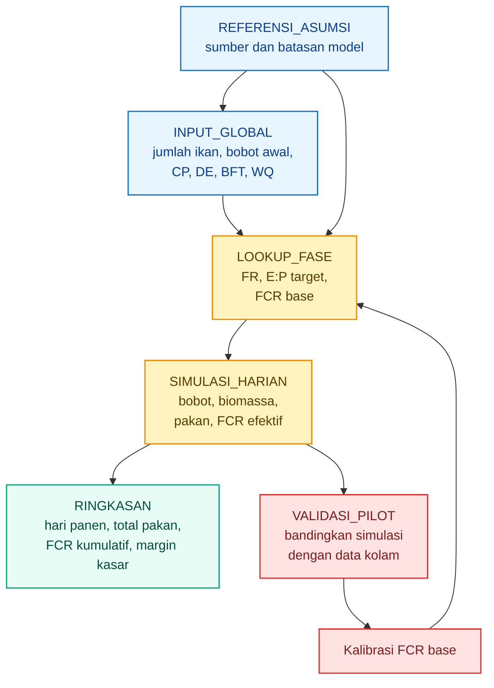

Diagram ini menunjukkan bahwa model tidak berhenti di simulasi. Data pilot harus masuk kembali untuk memperbaiki `$FCR_{\text{base}}$`.

---

# 12. Kalibrasi Pilot

## 12.1 Mengapa Wajib

Kalibrasi pilot wajib karena model tidak boleh dipakai sebagai kebenaran final. Kolam berbeda dapat menghasilkan `$FCR$` yang berbeda walaupun feeding rate dan pakan terlihat sama.

Perbedaan bisa terjadi karena:

| Faktor         | Dampak                                   |
| -------------- | ---------------------------------------- |
| Kualitas benih | Pertumbuhan dan survival berbeda         |
| Ukuran awal    | Fase awal simulasi berubah               |
| Suhu           | Metabolisme ikan berubah                 |
| DO             | Nafsu makan dan efisiensi pakan berubah  |
| TAN dan nitrit | Stres ikan meningkat                     |
| Kualitas pakan | Kecernaan dan nutrisi berbeda            |
| Ukuran pelet   | Konsumsi dan sisa pakan berbeda          |
| Kondisi flok   | Bioflok bisa membantu atau menjadi beban |
| Operator       | Respons feeding dan koreksi air berbeda  |

Karena itu, model harus dikunci dengan pilot minimal 1 siklus atau minimal beberapa periode sampling. Untuk artikel ini, periode kalibrasi praktis dapat dimulai dari interval 14 hari karena cukup untuk melihat perubahan bobot dan konsumsi pakan.

---

## 12.2 Formula FCR Aktual

`$FCR_{\text{aktual}}$` dihitung dari data lapangan, bukan dari asumsi.

$$
FCR_{\text{aktual}} =
\frac{
Pakan_{\text{total}}
}{
Biomassa_{\text{akhir}}
-----------------------

Biomassa_{\text{awal}}
}
$$

Keterangan:

| Simbol                      | Arti                              |
| --------------------------- | --------------------------------- |
| `$FCR_{\text{aktual}}$`     | FCR aktual dari data kolam        |
| `$Pakan_{\text{total}}$`    | total pakan aktual selama periode |
| `$Biomassa_{\text{akhir}}$` | biomassa aktual akhir periode     |
| `$Biomassa_{\text{awal}}$`  | biomassa aktual awal periode      |

Contoh:

| Parameter               |    Nilai |
| ----------------------- | -------: |
| Biomassa awal           |   120 kg |
| Biomassa akhir          |   250 kg |
| Total pakan             | 179,4 kg |
| Gain biomassa           |   130 kg |
| `$FCR_{\text{aktual}}$` |     1,38 |

Perhitungan:

$$
FCR_{\text{aktual}} =
\frac{
179{,}4
}{
250 - 120
}
$$

$$
FCR_{\text{aktual}} =
\frac{
179{,}4
}{
130
}
$$

$$
FCR_{\text{aktual}} =
1{,}38
$$

---

## 12.3 Calibration Factor

Calibration factor membandingkan `$FCR_{\text{aktual}}$` dengan `$FCR_{\text{simulasi}}$`.

$$
Calibration_{\text{Factor}} =
\frac{
FCR_{\text{aktual}}
}{
FCR_{\text{simulasi}}
}
$$

Interpretasi:

| Calibration Factor | Arti                           | Tindakan                                          |
| -----------------: | ------------------------------ | ------------------------------------------------- |
|               1,00 | Model sesuai aktual            | Pertahankan asumsi                                |
|    Lebih dari 1,00 | Model terlalu optimistis       | Naikkan `$FCR_{\text{base}}$` atau faktor penalti |
|   Kurang dari 1,00 | Model terlalu konservatif      | Turunkan `$FCR_{\text{base}}$` hati-hati          |
|    Lebih dari 1,15 | Selisih besar                  | Audit pakan, sampling, air, dan mortalitas        |
|   Kurang dari 0,90 | Performa lebih baik dari model | Pastikan data benar sebelum koreksi besar         |

Contoh:

| Parameter                 | Nilai |
| ------------------------- | ----: |
| `$FCR_{\text{aktual}}$`   |  1,38 |
| `$FCR_{\text{simulasi}}$` |  1,20 |

$$
Calibration_{\text{Factor}} =
\frac{
1{,}38
}{
1{,}20
}
$$

$$
Calibration_{\text{Factor}} =
1{,}15
$$

Artinya, model terlalu optimistis sekitar 15 persen.

---

## 12.4 Koreksi FCR Base

Setelah calibration factor diketahui, `$FCR_{\text{base}}$` dikoreksi.

$$
FCR_{\text{base baru}} =
FCR_{\text{base lama}}
\times
Calibration_{\text{Factor}}
$$

Contoh:

| Parameter                  | Nilai |
| -------------------------- | ----: |
| `$FCR_{\text{base lama}}$` |  1,20 |
| Calibration factor         |  1,15 |

$$
FCR_{\text{base baru}} =
1{,}20
\times
1{,}15
$$

$$
FCR_{\text{base baru}} =
1{,}38
$$

Koreksi ini membuat simulasi berikutnya lebih dekat dengan performa aktual kolam.

Namun jangan langsung mengoreksi seluruh fase jika data pilot hanya berasal dari satu fase. Jika data pilot berasal dari fase 20–50 g, koreksi paling relevan untuk fase tersebut dan fase terdekat. Fase grower besar tetap perlu divalidasi ulang saat ikan masuk fase tersebut.

---

## 12.5 Tabel Kalibrasi

| Periode    | `$FCR_{\text{simulasi}}$` | `$FCR_{\text{aktual}}$` | Calibration Factor | Tindakan                                |
| ---------- | ------------------------: | ----------------------: | -----------------: | --------------------------------------- |
| Hari 0–14  |                      1,20 |                    1,38 |               1,15 | Naikkan `$FCR_{\text{base}}$` 15 persen |
| Hari 15–28 |                      1,25 |                    1,30 |               1,04 | Koreksi kecil                           |
| Hari 29–42 |                      1,30 |                    1,28 |               0,98 | Model cukup akurat                      |

Pembacaan:

- Hari 0–14 menunjukkan model terlalu optimistis.
- Hari 15–28 menunjukkan model mulai mendekati aktual.
- Hari 29–42 menunjukkan model cukup akurat.

Jika setelah beberapa periode calibration factor masih tinggi, masalahnya bukan hanya model. Perlu audit lapangan.

---

## 12.6 Audit Saat Model dan Aktual Berbeda

Jika `$FCR_{\text{aktual}}$` lebih buruk dari simulasi, audit harus dilakukan berurutan.

| Area Audit     | Pertanyaan                                      |
| -------------- | ----------------------------------------------- |
| Sampling       | Apakah bobot rata-rata valid?                   |
| Mortalitas     | Apakah mortalitas dicatat lengkap?              |
| Pakan          | Apakah total pakan benar?                       |
| Feeding rate   | Apakah feeding rate sesuai fase?                |
| Kualitas pakan | Apakah `$CP$`, `$DE$`, dan ukuran pelet sesuai? |
| `$E:P$`        | Apakah rasio energi-protein sesuai fase?        |
| Kualitas air   | Apakah DO, pH, TAN, dan nitrit aman?            |
| Flok           | Apakah flok stabil atau terlalu pekat?          |
| Operator       | Apakah ada pakan tersisa yang tidak dicatat?    |

Jangan langsung menyimpulkan pakan buruk atau model salah sebelum audit data dasar. Kesalahan paling sering adalah biomassa salah karena sampling tidak representatif atau mortalitas tidak tercatat lengkap.

---

## 12.7 Siklus Kalibrasi Model

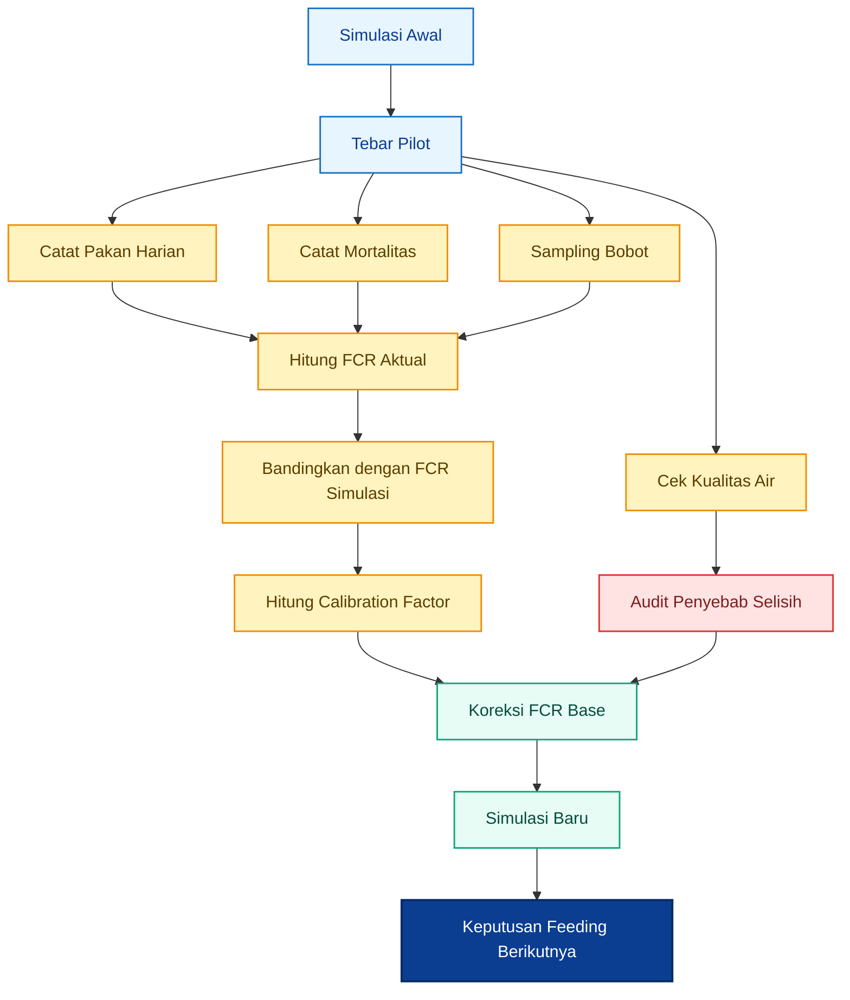

Kalibrasi bukan pekerjaan sekali. Kalibrasi harus dilakukan periodik, terutama saat ikan berpindah fase.

---

## 12.8 Data Minimum untuk Pilot

Pilot yang baik tidak harus besar, tetapi datanya harus rapi.

| Data                            | Frekuensi                |
| ------------------------------- | ------------------------ |
| Pakan per feeding               | Setiap feeding           |
| Total pakan harian              | Harian                   |
| Mortalitas                      | Harian                   |
| Respons makan                   | Setiap feeding           |
| DO dan pH                       | Harian                   |
| TAN dan nitrit                  | Berkala                  |
| Volume flok                     | Berkala                  |
| Bobot sampling                  | 7–10 hari                |
| Biomassa awal dan akhir periode | Setiap periode kalibrasi |
| `$FCR_{\text{aktual}}$`         | Setiap periode kalibrasi |

Tanpa data ini, simulasi hanya menjadi proyeksi kasar.

---

## Ringkasan Bab 11–12

Bab 11 menjelaskan bahwa simulasi Excel atau CSV berfungsi sebagai alat untuk menguji rezim feeding, menghitung pertumbuhan, memperkirakan waktu panen, dan melihat efek perubahan nutrisi maupun kualitas air. Struktur workbook harus dipisah menjadi input, lookup fase, simulasi harian, ringkasan, validasi pilot, dan referensi asumsi.

Bab 12 menekankan bahwa simulasi wajib dikalibrasi. Model tidak boleh dipakai sebagai kebenaran final. `$FCR_{\text{aktual}}$` dari pilot harus dibandingkan dengan `$FCR_{\text{simulasi}}$`, lalu `$FCR_{\text{base}}$` dikoreksi menggunakan calibration factor.

Kesimpulan praktis:

| Prinsip              | Putusan                                         |
| -------------------- | ----------------------------------------------- |
| Simulasi             | Wajib untuk menguji skenario                    |
| Input terpisah       | Memudahkan audit                                |
| Lookup fase          | Menjaga feeding sesuai ukuran ikan              |
| `$FCR_{\text{eff}}$` | Menghubungkan pakan, air, flok, dan pertumbuhan |
| Pilot                | Wajib sebelum scale-up                          |
| Calibration factor   | Alat koreksi model                              |
| Data harian          | Syarat agar model bisa dipercaya                |

[**Kembali ke Atas**](#rezim-feeding-rate-nila-bioflok-model-pakan-berbasis-biomassa-fase-pertumbuhan-ep-ratio-dan-fcr-efektif)

---

# 13. Risiko dan Kesalahan Umum

Rezim feeding nila bioflok harus diperlakukan sebagai sistem kendali. Kesalahan kecil pada pakan dapat muncul sebagai kerugian besar pada `$FCR$`, kualitas air, waktu panen, dan margin. Risiko terbesar bukan hanya ikan mati, tetapi **ikan tetap hidup tetapi tumbuh lambat, pakan boros, air berat, dan biaya produksi naik tanpa terlihat di awal**.

Bioflok memang dapat membantu efisiensi sistem karena mikroba dan flok dapat berperan dalam pengelolaan limbah dan nutrisi tambahan, tetapi KKP tetap menekankan perlunya aerasi, persiapan media, dan pengelolaan kualitas air yang disiplin dalam sistem bioflok. Karena itu, bioflok tidak boleh dianggap sebagai sistem yang otomatis mengoreksi semua kesalahan feeding. ([kkp.go.id][1])

---

## 13.1 Kesalahan Nutrisi

Kesalahan nutrisi terjadi ketika pakan yang diberikan tidak sesuai dengan fase ikan, kebutuhan protein, keseimbangan energi, atau ukuran mulut ikan.

| Kesalahan              | Dampak                             |
| ---------------------- | ---------------------------------- |
| Protein terlalu rendah | Pertumbuhan lambat                 |
| Protein terlalu tinggi | Biaya naik, nitrogen naik          |
| `$E:P$` terlalu rendah | Protein dipakai sebagai energi     |
| `$E:P$` terlalu tinggi | Ikan cepat kenyang, protein kurang |
| Pelet terlalu besar    | Konsumsi turun, pakan terbuang     |

### 13.1.1 Protein Terlalu Rendah

Protein terlalu rendah membuat ikan tidak mendapat bahan cukup untuk membangun jaringan tubuh. Dampaknya adalah pertumbuhan lambat, panen mundur, dan produktivitas tahunan turun. Pada fase kecil dan juvenile, risiko ini lebih besar karena kebutuhan protein relatif tinggi.

Feeding table dan data nutrisi FAO menunjukkan bahwa kebutuhan pakan dan protein nila berubah menurut ukuran ikan; ikan kecil membutuhkan feeding rate dan protein lebih tinggi dibanding ikan besar. ([FAOHome][2])

### 13.1.2 Protein Terlalu Tinggi

Protein tinggi tidak otomatis lebih baik. Protein adalah komponen mahal dalam pakan. Jika protein terlalu tinggi untuk fase ikan, sebagian nitrogen dari protein akan menjadi limbah metabolik. Dalam bioflok, limbah nitrogen ini masuk ke sistem air dan dapat meningkatkan beban mikroba.

Risiko bisnisnya:

| Dampak                       | Penjelasan                                             |
| ---------------------------- | ------------------------------------------------------ |
| Harga pakan lebih mahal      | HPP naik                                               |
| Nitrogen buangan meningkat   | Beban TAN dan bioflok naik                             |
| Efisiensi protein turun      | Protein tidak seluruhnya menjadi biomassa              |
| `$FCR$` tidak selalu membaik | Pakan mahal belum tentu menghasilkan gain lebih tinggi |

### 13.1.3 `$E:P$` Terlalu Rendah

`$E:P$` terlalu rendah berarti energi relatif kurang terhadap protein. Dalam kondisi ini, protein dapat digunakan sebagai energi. Ini tidak efisien karena protein lebih mahal dibanding sumber energi.

Secara model:

$$
E:P =
\frac{
DE
}{
CP \times 10
}
$$

Jika `$DE$` rendah atau `$CP$` terlalu tinggi, nilai `$E:P$` bisa terlalu rendah untuk fase tertentu. Akibatnya, `$EP_{\text{Factor}}$` naik dan `$FCR_{\text{eff}}$` memburuk.

### 13.1.4 `$E:P$` Terlalu Tinggi

`$E:P$` terlalu tinggi berarti energi relatif tinggi atau protein relatif rendah. Ikan bisa cepat kenyang, tetapi asupan protein tidak cukup untuk pertumbuhan optimal.

Dampaknya:

| Kondisi                       | Risiko                               |
| ----------------------------- | ------------------------------------ |
| Energi tinggi, protein rendah | Pertumbuhan jaringan melambat        |
| Ikan cepat kenyang            | Konsumsi protein turun               |
| Bobot naik lambat             | Siklus panen molor                   |
| `$FCR$` memburuk              | Pakan tidak efisien menjadi biomassa |

### 13.1.5 Pelet Terlalu Besar

Pelet yang terlalu besar membuat ikan sulit makan. Pakan bisa tidak termakan, hancur di air, dan menjadi limbah organik. Dalam bioflok, pakan terbuang akan memperberat beban media.

| Bobot Ikan | Ukuran Pelet yang Lebih Aman |
| ---------: | ---------------------------: |
|      1–5 g |                      crumble |
|     5–20 g |                         1 mm |
|    20–50 g |                       1–2 mm |
|   50–100 g |                         2 mm |
|  100–200 g |                       2–3 mm |
|  200–300 g |                       3–4 mm |

---

## 13.2 Kesalahan Operasional

Kesalahan operasional biasanya terjadi bukan karena rumus tidak diketahui, tetapi karena data lapangan tidak dicatat atau keputusan feeding tidak dikoreksi.

| Kesalahan                                   | Dampak             |
| ------------------------------------------- | ------------------ |
| Tidak sampling                              | Biomassa salah     |
| Feeding rate tidak dikoreksi                | `$FCR$` memburuk   |
| Overfeeding saat air buruk                  | Amonia/nitrit naik |
| Tidak ada backup aerasi                     | Risiko mati massal |
| Menganggap bioflok otomatis mengganti pakan | Growth bisa turun  |

### 13.2.1 Tidak Sampling

Tanpa sampling, biomassa hanya perkiraan. Jika biomassa salah, pakan harian salah. Pada sistem padat seperti bioflok, kesalahan biomassa 10–20 persen dapat langsung memengaruhi pakan harian, kualitas air, dan `$FCR$`.

Formula biomassa:

$$
Biomassa_{\text{aktual}} =
N_{\text{hidup}}
\times
W_{\text{rata-rata, kg}}
$$

Jika bobot aktual ikan 100 g tetapi masih dianggap 75 g, pakan akan kurang. Jika bobot aktual 75 g tetapi dianggap 100 g, pakan akan berlebih.

### 13.2.2 Feeding Rate Tidak Dikoreksi

Feeding rate harus turun saat bobot ikan naik. FAO menunjukkan feeding rate nila menurun seiring ukuran ikan, dari 10–6 persen pada ukuran 1–5 g menjadi 2–1,5 persen pada ukuran di atas 250 g. Jika feeding rate tinggi dipertahankan terlalu lama, overfeeding hampir pasti terjadi. ([FAOHome][2])

### 13.2.3 Overfeeding Saat Air Buruk

Overfeeding saat DO rendah, TAN naik, nitrit naik, atau flok terlalu pekat adalah kesalahan berat. Pakan yang masuk tidak hanya gagal dikonversi menjadi biomassa, tetapi juga memperburuk air.

Dampaknya terhadap model:

$$
FCR_{\text{eff}} =
FCR_{\text{base}}
\times
EP_{\text{Factor}}
\times
FR_{\text{Factor}}
\times
WQ_{\text{Factor}}
\times
BFT_{\text{Factor}}
$$

Saat air buruk, `$WQ_{\text{Factor}}$` naik. Jika feeding rate juga berlebih, `$FR_{\text{Factor}}$` ikut naik. Kombinasi ini membuat `$FCR_{\text{eff}}$` memburuk cepat.

### 13.2.4 Tidak Ada Backup Aerasi

Bioflok membutuhkan aerasi stabil. Dalam panduan KKP, nila bioflok disebut membutuhkan aerasi 24 jam dari awal hingga panen karena kebutuhan oksigen tinggi. KKP juga menekankan pentingnya listrik stabil atau genset cadangan. ([kkp.go.id][1])

Pada bioflok, aerasi bukan fasilitas tambahan. Aerasi adalah **alat hidup sistem**. Jika aerasi mati, DO turun, ikan stres, mikroba terganggu, dan risiko kematian massal meningkat.

### 13.2.5 Menganggap Bioflok Otomatis Mengganti Pakan

Bioflok dapat memberi nutrisi tambahan, tetapi kontribusinya harus dibuktikan. Jika pakan dikurangi terlalu agresif hanya karena flok terlihat pekat, pertumbuhan bisa turun dan waktu panen molor.

Prinsip aman:

| Kondisi Flok           | Keputusan                               |
| ---------------------- | --------------------------------------- |
| Belum stabil           | Jangan kurangi pakan karena flok        |
| Mulai stabil           | Koreksi kecil, pantau bobot             |
| Stabil dan ikan aktif  | Uji pengurangan terbatas                |
| `$FCR$` aktual membaik | Bioflok credit bisa dinaikkan hati-hati |
| Growth turun           | Kembalikan feeding                      |

---

## 13.3 Kesalahan Bisnis

Kesalahan bisnis terjadi ketika keputusan pakan hanya dilihat dari harga pakan, panen cepat, atau proyeksi model tanpa validasi.

| Kesalahan                             | Dampak                        |
| ------------------------------------- | ----------------------------- |
| Hanya mengejar panen cepat            | `$FCR$` dan HPP membengkak    |
| Membeli pakan murah tanpa cek nutrisi | Pertumbuhan dan `$FCR$` buruk |
| Tidak menghitung biaya pakan/kg gain  | Margin salah                  |
| Tidak validasi model                  | Proyeksi bisnis menyesatkan   |

### 13.3.1 Hanya Mengejar Panen Cepat

Panen cepat tidak selalu berarti profit tinggi. Jika panen cepat dicapai dengan feeding rate terlalu agresif, biaya pakan bisa naik lebih cepat daripada gain biomassa.

Indikator yang lebih benar adalah:

$$
Biaya_{\text{pakan per kg gain}} =
FCR_{\text{aktual}}
\times
Harga_{\text{pakan}}
$$

Contoh:

| Skenario | `$FCR_{\text{aktual}}$` | Harga Pakan | Biaya Pakan per kg Gain |
| -------- | ----------------------: | ----------: | ----------------------: |
| Efisien  |                    1,20 | Rp11.500/kg |        Rp13.800/kg gain |
| Boros    |                    1,50 | Rp11.500/kg |        Rp17.250/kg gain |

Selisihnya:

$$
17.250 - 13.800 =
3.450
$$

Artinya, `$FCR$` naik dari 1,20 ke 1,50 menambah biaya pakan sekitar **Rp3.450 per kg gain**.

### 13.3.2 Membeli Pakan Murah Tanpa Cek Nutrisi

Pakan murah bisa baik jika nutrisinya sesuai dan `$FCR$` aktual bagus. Tetapi pakan murah bisa mahal jika pertumbuhan lambat atau `$FCR$` buruk.

| Parameter               |     Pakan A |     Pakan B |
| ----------------------- | ----------: | ----------: |
| Harga pakan             | Rp11.500/kg | Rp10.500/kg |
| `$FCR$` aktual          |        1,20 |        1,45 |
| Biaya pakan per kg gain |    Rp13.800 |    Rp15.225 |

Walaupun Pakan B lebih murah per kg, biaya pakan per kg gain lebih mahal.

### 13.3.3 Tidak Menghitung Biaya Pakan per kg Gain

Biaya pakan harus dihitung terhadap hasil pertumbuhan, bukan hanya terhadap harga per karung.

Formula:

$$
Biaya_{\text{pakan per kg gain}} =
\frac{
Biaya_{\text{pakan total}}
}{
Biomassa_{\text{akhir}} - Biomassa_{\text{awal}}
}
$$

Atau:

$$
Biaya_{\text{pakan per kg gain}} =
FCR_{\text{aktual}}
\times
Harga_{\text{pakan}}
$$

Ini adalah angka kunci untuk keputusan pakan.

### 13.3.4 Tidak Validasi Model

Model yang tidak divalidasi dapat terlihat rapi tetapi menyesatkan. Jika `$FCR_{\text{simulasi}}$` terlalu optimistis, proyeksi biaya pakan akan terlalu rendah dan margin terlihat lebih besar dari kenyataan.

Validasi minimal:

$$
Calibration_{\text{Factor}} =
\frac{
FCR_{\text{aktual}}
}{
FCR_{\text{simulasi}}
}
$$

Jika nilai ini 1,15, berarti model terlalu optimistis sekitar 15 persen.

---

## 13.4 Peta Risiko Feeding Nila Bioflok

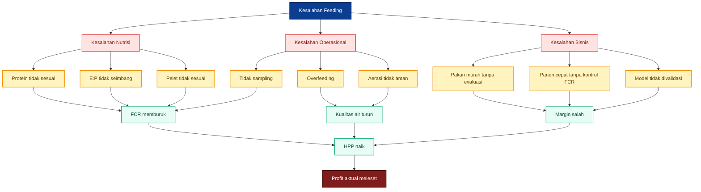

---

# 14. Contoh Studi Kasus Simulasi

Bab ini memberikan contoh bagaimana model digunakan untuk membaca pertumbuhan dan efisiensi pakan. Angka berikut adalah **ilustrasi simulasi**, bukan janji hasil. Untuk penggunaan bisnis, hasil harus dikalibrasi dengan data pilot.

---

## 14.1 Input Kasus

| Parameter               |         Nilai |
| ----------------------- | ------------: |
| Jumlah ikan awal        |    8.000 ekor |
| Bobot awal              |          15 g |
| Target panen            |         250 g |
| `$CP$` pakan            |     32 persen |
| `$DE$` pakan            | 3.100 kcal/kg |
| `$BFT_{\text{Credit}}$` |      5 persen |
| `$WQ_{\text{Factor}}$`  |          1,00 |
| Mortalitas harian       |   0,03 persen |

Dengan bobot awal 15 g, biomassa awal adalah:

$$
B_0 =
\frac{
8000
\times
15
}{
1000
}
$$

$$
B_0 =
120
\text{ kg}
$$

Nilai `$E:P$` pakan:

$$
E:P =
\frac{
3100
}{
32 \times 10
}
$$

$$
E:P =
9{,}69
$$

Pakan 32 persen protein dengan `$DE$` 3.100 kcal/kg menghasilkan `$E:P$` sekitar 9,69 kcal/g protein. Nilai ini cocok untuk fase juvenile dan grower awal, tetapi perlu dievaluasi ulang pada fase finisher karena ikan besar biasanya dapat memakai protein lebih rendah jika pertumbuhan dan `$FCR$` tetap baik.

---

## 14.2 Output yang Dibahas

Output utama simulasi:

| Output                               | Fungsi                              |
| ------------------------------------ | ----------------------------------- |
| Estimasi hari panen                  | Melihat kapan target 250 g tercapai |
| Total pakan                          | Menghitung kebutuhan pakan siklus   |
| `$FCR_{\text{kumulatif}}$`           | Mengukur efisiensi pakan            |
| Biomassa panen                       | Mengestimasi output kg              |
| Biaya pakan                          | Mengestimasi biaya terbesar         |
| Sensitivitas `$CP$`                  | Melihat efek protein pakan          |
| Sensitivitas `$DE$`                  | Melihat efek energi pakan           |
| Sensitivitas feeding rate            | Melihat risiko overfeeding          |
| Sensitivitas `$WQ_{\text{Factor}}$`  | Melihat dampak kualitas air         |
| Sensitivitas `$BFT_{\text{Credit}}$` | Melihat dampak asumsi bioflok       |

### Contoh Output Ilustratif

Dengan input di atas dan asumsi model berjalan stabil, output simulasi dapat terbaca seperti berikut:

| Indikator                    |          Ilustrasi Hasil |
| ---------------------------- | -----------------------: |
| Hari panen estimatif         |              95–105 hari |
| Bobot akhir                  |               250 g/ekor |
| Survival estimatif           |        sekitar 97 persen |
| Jumlah ikan akhir            |       sekitar 7.760 ekor |
| Biomassa panen               |         sekitar 1.940 kg |
| Total pakan                  |   sekitar 2.200–2.400 kg |
| `$FCR_{\text{kumulatif}}$`   |        sekitar 1,20–1,30 |
| Biaya pakan jika Rp11.500/kg | sekitar Rp25,3–27,6 juta |

Catatan: angka ini hanya ilustrasi dari model. Jika kualitas air memburuk, `$FCR$` bisa naik dan waktu panen bisa mundur. Jika mortalitas lebih tinggi, biomassa panen turun. Jika feeding rate terlalu agresif, total pakan naik tetapi gain belum tentu naik proporsional.

---

## 14.3 Interpretasi

### 14.3.1 Jika `$CP$` Turun

Misal `$CP$` turun dari 32 persen menjadi 28 persen, sementara `$DE$` tetap 3.100 kcal/kg.

Nilai `$E:P$` berubah:

$$
E:P =
\frac{
3100
}{
28 \times 10
}
$$

$$
E:P =
11{,}07
$$

Pembacaan:

| Fase          | Dampak Potensial                      |
| ------------- | ------------------------------------- |
| Juvenile awal | Bisa terlalu rendah protein           |
| Grower awal   | Mulai berisiko jika pertumbuhan cepat |
| Grower besar  | Bisa masih masuk jika growth stabil   |
| Finisher      | Lebih masuk akal secara ekonomi       |

Jika `$CP$` diturunkan terlalu cepat, ikan bisa tumbuh lambat dan waktu panen mundur. Namun pada fase finisher, protein lebih rendah bisa lebih ekonomis jika `$FCR_{\text{aktual}}$` tetap baik.

### 14.3.2 Jika Feeding Rate Naik

Jika feeding rate dinaikkan di atas batas fase, `$FR_{\text{Factor}}$` memberi penalti.

Misal fase grower awal memiliki:

$$
FR_{\text{max}} =
0{,}035
$$

Operator memberi:

$$
FR_t =
0{,}040
$$

Dengan `$\beta_{\text{FR}} = 3$`:

$$
FR_{\text{Factor}} =
1 +
3
\times
\left(
\frac{
0{,}040 - 0{,}035
}{
0{,}035
}
\right)^2
$$

$$
FR_{\text{Factor}} =
1{,}061
$$

Artinya, overfeeding kecil dapat memperburuk `$FCR_{\text{eff}}$` sekitar 6,1 persen dalam model.

Jika kualitas air tetap baik, dampaknya masih terbatas. Tetapi jika overfeeding terjadi saat air buruk, efeknya berlipat karena `$WQ_{\text{Factor}}$` juga naik.

### 14.3.3 Jika `$WQ_{\text{Factor}}$` Memburuk

Misal kondisi awal:

| Faktor                  | Nilai |
| ----------------------- | ----: |
| `$FCR_{\text{base}}$`   |  1,20 |
| `$EP_{\text{Factor}}$`  |  1,00 |
| `$FR_{\text{Factor}}$`  |  1,00 |
| `$WQ_{\text{Factor}}$`  |  1,00 |
| `$BFT_{\text{Factor}}$` |  0,95 |

Maka:

$$
FCR_{\text{eff}} =
1{,}20
\times
1{,}00
\times
1{,}00
\times
1{,}00
\times
0{,}95
$$

$$
FCR_{\text{eff}} =
1{,}14
$$

Jika kualitas air memburuk dan `$WQ_{\text{Factor}}$` naik menjadi 1,15:

$$
FCR_{\text{eff}} =
1{,}20
\times
1{,}00
\times
1{,}00
\times
1{,}15
\times
0{,}95
$$

$$
FCR_{\text{eff}} =
1{,}31
$$

Dampaknya besar. Dengan jumlah pakan sama, gain biomassa turun karena `$FCR_{\text{eff}}$` memburuk.

### 14.3.4 Jika `$BFT_{\text{Credit}}$` Terlalu Optimistis

Misal operator menganggap bioflok memberi kredit 15 persen, padahal kondisi flok belum stabil.

Jika `$BFT_{\text{Credit}} = 0{,}15$`:

$$
BFT_{\text{Factor}} =
1 - 0{,}15
$$

$$
BFT_{\text{Factor}} =
0{,}85
$$

Model akan terlihat sangat efisien. Tetapi jika kontribusi aktual bioflok hanya 5 persen, maka faktor yang lebih realistis adalah:

$$
BFT_{\text{Factor}} =
1 - 0{,}05
$$

$$
BFT_{\text{Factor}} =
0{,}95
$$

Selisih ini dapat membuat model terlalu optimistis. Dampaknya:

| Asumsi Bioflok                | Risiko                                   |
| ----------------------------- | ---------------------------------------- |
| Kredit terlalu tinggi         | Pakan dikurangi terlalu banyak           |
| Growth turun                  | Target panen molor                       |
| `$FCR$` simulasi tampak bagus | Keputusan bisnis menyesatkan             |
| Model tidak divalidasi        | Margin terlihat lebih tinggi dari aktual |

Karena itu, bioflok credit harus dinaikkan bertahap hanya jika data pilot menunjukkan `$FCR_{\text{aktual}}$` membaik tanpa penurunan pertumbuhan.

---

## 14.4 Diagram Sensitivitas Studi Kasus

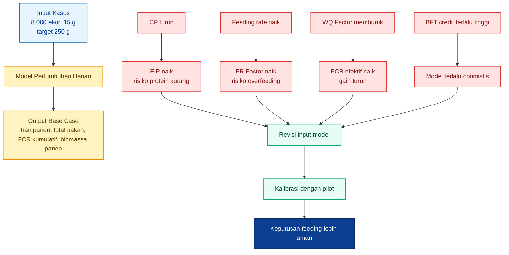

---

# 15. Kesimpulan Praktisi

## 15.1 Kesimpulan Utama

Rezim feeding nila bioflok yang baik bukan hanya soal jam pemberian pakan. Rezim feeding adalah sistem yang menghubungkan biomassa, fase pertumbuhan, kualitas pakan, kualitas air, kondisi flok, `$FCR_{\text{eff}}$`, dan data pilot.

Kesimpulan utama:

1. Feeding rate harus berbasis biomassa aktual.
2. Biomassa harus diperbarui dengan sampling.
3. Feeding rate harus turun seiring ikan membesar.
4. Protein dan energi harus seimbang melalui `$E:P$` ratio.
5. Bioflok memberi kredit nutrisi, tetapi harus dibuktikan.
6. `$FCR_{\text{eff}}$` lebih realistis daripada `$FCR$` tetap.
7. Model pertumbuhan wajib dikalibrasi dengan data pilot.

---

## 15.2 Putusan Praktis

> Rezim feeding nila bioflok yang baik bukan yang memberi pakan paling banyak, tetapi yang menghasilkan pertumbuhan stabil, `$FCR$` rendah, kualitas air aman, dan biaya pakan per kg ikan paling efisien.

Untuk praktisi, keputusan feeding harian sebaiknya mengikuti urutan berikut:

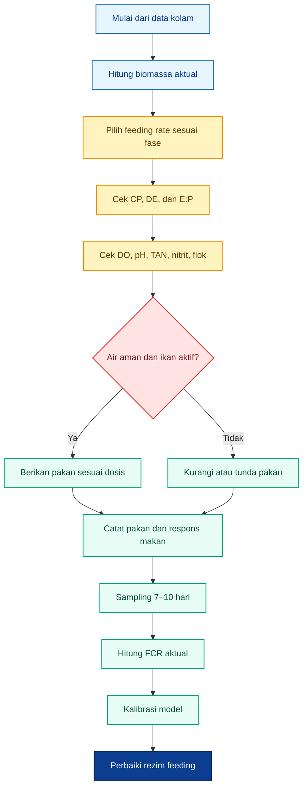

---

## 15.3 Checklist Akhir untuk Praktisi

| Area         | Pertanyaan Kunci                                     |
| ------------ | ---------------------------------------------------- |
| Biomassa     | Apakah bobot sampling terbaru sudah masuk model?     |
| Mortalitas   | Apakah jumlah ikan hidup sudah dikoreksi?            |
| Feeding rate | Apakah sesuai fase bobot ikan?                       |
| Protein      | Apakah protein pakan sesuai fase?                    |
| Energi       | Apakah `$DE$` diketahui atau diestimasi konservatif? |
| `$E:P$`      | Apakah masih dalam rentang target fase?              |
| Bioflok      | Apakah flok stabil atau hanya terlihat pekat?        |
| Kualitas air | Apakah DO, pH, TAN, dan nitrit aman?                 |
| `$FCR$`      | Apakah `$FCR_{\text{aktual}}$` dihitung periodik?    |
| Bisnis       | Apakah biaya pakan per kg gain dihitung?             |

---

## 15.4 Rekomendasi Implementasi

Untuk penerapan komersial, gunakan tahap berikut:

| Tahap   | Tindakan                                                       |
| ------- | -------------------------------------------------------------- |
| Tahap 1 | Gunakan tabel feeding sebagai baseline                         |
| Tahap 2 | Jalankan pilot minimal 1 siklus atau beberapa periode sampling |
| Tahap 3 | Catat pakan, mortalitas, bobot, dan kualitas air               |
| Tahap 4 | Hitung `$FCR_{\text{aktual}}$`                                 |
| Tahap 5 | Kalibrasi `$FCR_{\text{base}}$`                                |
| Tahap 6 | Gunakan model terkoreksi untuk scale-up                        |
| Tahap 7 | Audit berkala jika hasil aktual meleset                        |

---

## 15.5 Penutup

Bioflok membuka peluang efisiensi pakan dan intensifikasi lahan, tetapi hanya jika feeding dikelola secara disiplin. Pakan adalah biaya terbesar sekaligus pengendali kualitas air. Karena itu, rezim feeding harus berbasis data, bukan kebiasaan.

Keputusan terbaik bukan pakan paling mahal, bukan pakan paling murah, dan bukan feeding rate paling tinggi. Keputusan terbaik adalah kombinasi yang menghasilkan:

| Target             | Indikator                            |
| ------------------ | ------------------------------------ |
| Pertumbuhan stabil | Bobot sampling naik sesuai fase      |
| `$FCR$` rendah     | Pakan per kg gain terkendali         |
| Air aman           | DO, pH, TAN, nitrit, dan flok stabil |
| Biaya terkendali   | Biaya pakan per kg gain rendah       |
| Model valid        | Simulasi mendekati data pilot        |
| Margin sehat       | HPP tidak membengkak                 |

Dengan demikian, rezim feeding nila bioflok yang layak untuk praktisi agribisnis adalah rezim yang **terukur, dikoreksi, dan divalidasi**.

[**Kembali ke Atas**](#rezim-feeding-rate-nila-bioflok-model-pakan-berbasis-biomassa-fase-pertumbuhan-ep-ratio-dan-fcr-efektif)

[1]: https://kkp.go.id/storage/Materi/panduan-budi-daya-ikan-nilalele-di-bak-bulat-bioflok6982e9ada5a67/materi-6982e9adaa327.pdf?utm_source=chatgpt.com 'SPO Budidaya Ikan Nila/Lele di Bak Bulat'
[2]: https://www.fao.org/home/en?utm_source=chatgpt.com 'Food and Agriculture Organization of the United Nations: Home'

---

# Lampiran:

Lampiran berikut dibuat agar artikel tidak hanya menjadi narasi teknis, tetapi juga dapat langsung digunakan sebagai **alat kerja praktisi**. Lampiran mencakup tabel feeding rate, tabel `$E:P$`, template simulasi harian, checklist feeding, dan checklist validasi pilot.

Feeding rate acuan pada Lampiran A merujuk pada tabel FAO untuk nila intensif, yang menunjukkan feeding rate turun seiring peningkatan bobot ikan: 1–5 g diberi 10–6 persen biomassa per hari, 5–20 g diberi 6–4 persen, 20–100 g diberi 4–3 persen, 100–250 g diberi 3–2 persen, dan ikan lebih dari 250 g diberi 2–1,5 persen. ([FAOHome][1])

---

# Lampiran A — Tabel Feeding Rate

Lampiran ini berisi dua tabel:

1. **tabel acuan FAO**;
2. **tabel adaptasi praktis untuk nila bioflok**.

Tabel FAO dipakai sebagai rujukan awal. Tabel adaptasi bioflok dipakai untuk operasional lapangan, dengan catatan bahwa hasil akhir tetap harus dikoreksi berdasarkan sampling, respons makan, kualitas air, kondisi flok, dan `$FCR_{\text{aktual}}$`.

---

## A.1 Tabel Feeding Rate Acuan FAO

| Fase         |       Bobot Ikan |         Feeding Rate Acuan | Frekuensi Acuan |     Ukuran Pakan |
| ------------ | ---------------: | -------------------------: | --------------: | ---------------: |
| Fry          |            1–5 g |  10–6 persen biomassa/hari |     4 kali/hari | crumble 1–1,5 mm |
| Fingerling   |           5–20 g |   6–4 persen biomassa/hari |     4 kali/hari |         1,5–2 mm |
| Juvenile     |         20–100 g |   4–3 persen biomassa/hari |     2 kali/hari |             2 mm |
| Grower       |        100–250 g |   3–2 persen biomassa/hari |     2 kali/hari |             3 mm |
| Grower besar | Lebih dari 250 g | 2–1,5 persen biomassa/hari |     2 kali/hari |             4 mm |

FAO juga mencantumkan feeding table lain untuk semi-intensif dan intensif di kolam air tawar, dengan pola yang sama: feeding rate tinggi pada ukuran kecil, lalu menurun saat ikan membesar. ([FAOHome][2])

---

## A.2 Tabel Adaptasi Praktis untuk Nila Bioflok

| Fase          | Bobot Ikan | Feeding Rate Praktis Bioflok | Frekuensi Praktis | Protein Pakan | Catatan                             |
| ------------- | ---------: | ---------------------------: | ----------------: | ------------: | ----------------------------------- |
| Benih kecil   |      1–5 g |                  6–10 persen |          4–5 kali |  40–45 persen | Fokus survival dan adaptasi         |
| Benih besar   |     5–20 g |                   4–6 persen |            4 kali |  35–40 persen | Ukuran pelet harus kecil dan merata |
| Juvenile awal |    20–50 g |                 3,5–4 persen |          3–4 kali |  32–35 persen | Mulai kontrol `$FCR$` periodik      |
| Grower awal   |   50–100 g |                 3–3,5 persen |            3 kali |  30–32 persen | Fase pertumbuhan efisien            |
| Grower        |  100–200 g |                   2–3 persen |          2–3 kali |  30–32 persen | Risiko overfeeding mulai tinggi     |
| Finisher      |  200–300 g |                 1,5–2 persen |            2 kali |  28–30 persen | Fokus efisiensi biaya pakan         |

Protein acuan pada fase fingerling dan grower juga sejalan dengan NCRAC, yang menyebut protein pakan tilapia sekitar 32–36 persen untuk fingerling dan sekitar 28–32 persen untuk ikan lebih besar dari 40 g pada sistem intensif. ([NCRAC][3])

---

## A.3 Rumus Dasar Feeding Rate

$$
Pakan_{\text{harian}} =
Biomassa_{\text{aktual}}
\times
FR
$$

Keterangan:

| Simbol                       | Arti                                 |
| ---------------------------- | ------------------------------------ |
| `$Pakan_{\text{harian}}$`    | jumlah pakan harian                  |
| `$Biomassa_{\text{aktual}}$` | biomassa ikan hidup aktual           |
| `$FR$`                       | feeding rate sebagai fraksi per hari |

Contoh:

| Parameter           |      Nilai |
| ------------------- | ---------: |
| Biomassa aktual     |     600 kg |
| Feeding rate        | 3,2 persen |
| Feeding rate fraksi |      0,032 |
| Pakan harian        |    19,2 kg |

$$
Pakan_{\text{harian}} =
600
\times
0{,}032
$$

$$
Pakan_{\text{harian}} =
19{,}2
\text{ kg/hari}
$$

---

# Lampiran B — Tabel E:P Ratio

Lampiran ini digunakan untuk membaca hubungan antara protein pakan, energi pakan, `$E:P$`, dan `$P:E$`.

`$E:P$` membaca **energi per gram protein**. `$P:E$` membaca **gram protein per MJ energi**. Dua-duanya berguna, tetapi dalam artikel ini `$E:P$` dipakai sebagai format utama karena lebih mudah diterjemahkan ke model pakan.

---

## B.1 Formula E:P Ratio

$$
E:P =
\frac{
DE
}{
CP \times 10
}
$$

Keterangan:

| Simbol           | Arti                             |
| ---------------- | -------------------------------- |
| `$E:P$`          | energy-to-protein ratio          |
| `$DE$`           | digestible energy pakan, kcal/kg |
| `$CP$`           | crude protein, persen            |
| `$CP \times 10$` | protein gram/kg pakan            |

Contoh:

$$
E:P =
\frac{
3100
}{
30 \times 10
}
$$

$$
E:P =
10{,}33
\text{ kcal/g protein}
$$

---

## B.2 Formula P:E Ratio

$$
P:E =
\frac{
CP \times 10
}{
DE \times 0{,}004184
}
$$

Keterangan:

| Simbol         | Arti                                  |
| -------------- | ------------------------------------- |
| `$P:E$`        | protein-to-energy ratio, g protein/MJ |
| `$DE$`         | digestible energy, kcal/kg            |
| `$0{,}004184$` | konversi kcal menjadi MJ              |

---

## B.3 Tabel Contoh CP, DE, E:P, dan P:E

Asumsi `$DE = 3100$` kcal/kg.

| Protein Pakan |        `$DE$` | `$E:P$` |    `$P:E$` | Pembacaan Praktis                            |
| ------------: | ------------: | ------: | ---------: | -------------------------------------------- |
|     40 persen | 3.100 kcal/kg |    7,75 | 30,84 g/MJ | Cocok untuk benih kecil                      |
|     35 persen | 3.100 kcal/kg |    8,86 | 26,98 g/MJ | Cocok untuk benih besar                      |
|     32 persen | 3.100 kcal/kg |    9,69 | 24,67 g/MJ | Cocok untuk juvenile atau grower awal        |
|     30 persen | 3.100 kcal/kg |   10,33 | 23,13 g/MJ | Cocok untuk grower                           |
|     28 persen | 3.100 kcal/kg |   11,07 | 21,59 g/MJ | Cocok untuk finisher                         |
|     26 persen | 3.100 kcal/kg |   11,92 | 20,05 g/MJ | Hati-hati jika dipakai terlalu awal          |
|     25 persen | 3.100 kcal/kg |   12,40 | 19,28 g/MJ | Lebih cocok untuk fase besar, bukan juvenile |

---

## B.4 Tabel Target E:P per Fase

| Fase          | Bobot Ikan | Target `$E:P$` | Catatan                              |
| ------------- | ---------: | -------------: | ------------------------------------ |
| Benih kecil   |      1–5 g |        6,7–8,0 | Protein tinggi, energi relatif cukup |
| Benih besar   |     5–20 g |        7,5–9,1 | Masih butuh protein tinggi           |
| Juvenile awal |    20–50 g |       8,6–10,0 | Transisi ke pakan grower             |
| Grower awal   |   50–100 g |       9,4–10,7 | Efisiensi pertumbuhan penting        |
| Grower        |  100–200 g |       9,4–10,7 | Kontrol `$FCR$` makin penting        |
| Finisher      |  200–300 g |      10,0–11,4 | Hindari protein berlebih             |

---

## B.5 Cara Membaca Hasil

| Kondisi `$E:P$` | Arti                                      | Risiko                                   |
| --------------- | ----------------------------------------- | ---------------------------------------- |
| Terlalu rendah  | Energi relatif kurang terhadap protein    | Protein bisa dipakai sebagai energi      |
| Dalam target    | Energi dan protein seimbang               | `$FCR$` lebih terkendali                 |
| Terlalu tinggi  | Energi relatif tinggi atau protein rendah | Ikan cepat kenyang, protein kurang       |
| Tidak diketahui | Data `$DE$` tidak tersedia                | Model harus memakai estimasi konservatif |

---

# Lampiran C — Template Simulasi Harian

Lampiran ini adalah struktur kolom untuk simulasi harian di Excel atau Google Sheets. Setiap baris mewakili satu hari budidaya.

---

## C.1 Struktur Kolom Simulasi

| Kolom | Nama Kolom        | Isi atau Formula                                                                      |
| ----: | ----------------- | ------------------------------------------------------------------------------------- |
|     A | Hari              | input hari ke-`$t$`                                                                   |
|     B | Jumlah ikan hidup | `$N_t$`                                                                               |
|     C | Bobot rata-rata   | `$W_t$` dalam g/ekor                                                                  |
|     D | Biomassa          | `$B_t = \frac{N_t \times W_t}{1000}$`                                                 |
|     E | Feeding rate      | `$FR_t$`                                                                              |
|     F | Pakan harian      | `$Feed_t = B_t \times FR_t$`                                                          |
|     G | Protein pakan     | `$CP$`                                                                                |
|     H | Digestible energy | `$DE$`                                                                                |
|     I | E:P ratio         | `$E:P = \frac{DE}{CP \times 10}$`                                                     |
|     J | E:P low           | batas bawah fase                                                                      |
|     K | E:P high          | batas atas fase                                                                       |
|     L | EP Factor         | penalti `$E:P$`                                                                       |
|     M | FR Factor         | penalti overfeeding                                                                   |
|     N | WQ Factor         | penalti kualitas air                                                                  |
|     O | BFT Factor        | kredit bioflok                                                                        |
|     P | FCR base          | `$FCR_{\text{base}}$`                                                                 |
|     Q | FCR efektif       | `$FCR_{\text{eff}}$`                                                                  |
|     R | Gain biomassa     | `$Gain_t = \frac{Feed_t}{FCR_{\text{eff}}}$`                                          |
|     S | Bobot esok        | `$W_{t+1} = W_t + \frac{Gain_t \times 1000}{N_t}$`                                    |
|     T | Mortalitas harian | `$Mortality_t$`                                                                       |
|     U | Jumlah ikan esok  | `$N_{t+1} = N_t \times (1 - Mortality_t)$`                                            |
|     V | Pakan kumulatif   | total pakan sampai hari ke-`$t$`                                                      |
|     W | Gain kumulatif    | total pertambahan biomassa                                                            |
|     X | FCR kumulatif     | `$FCR_{\text{kumulatif}} = \frac{Pakan_{\text{kumulatif}}}{Gain_{\text{kumulatif}}}$` |

---

## C.2 Formula Inti Simulasi

### Biomassa

$$
B_t =
\frac{
N_t
\times
W_t
}{
1000
}
$$

### Pakan Harian

$$
Feed_t =
B_t
\times
FR_t
$$

### E:P Ratio

$$
E:P =
\frac{
DE
}{
CP \times 10
}
$$

### FCR Efektif

$$
FCR_{\text{eff}} =
FCR_{\text{base}}
\times
EP_{\text{Factor}}
\times
FR_{\text{Factor}}
\times
WQ_{\text{Factor}}
\times
BFT_{\text{Factor}}
$$

### Gain Biomassa

$$
Gain_t =
\frac{
Feed_t
}{
FCR_{\text{eff}}
}
$$

### Bobot Esok

$$
W_{t+1} =
W_t
+
\frac{
Gain_t
\times
1000
}{
N_t
}
$$

### Jumlah Ikan Esok

$$
N_{t+1} =
N_t
\times
\left(
1 - Mortality_t
\right)
$$

---

## C.3 Contoh Baris Simulasi

| Hari | Jumlah Ikan |   Bobot | Biomassa |       FR |   Pakan |        CP |    DE | `$E:P$` | `$FCR_{\text{eff}}$` |    Gain | Bobot Esok |
| ---: | ----------: | ------: | -------: | -------: | ------: | --------: | ----: | ------: | -------------------: | ------: | ---------: |
|    0 |       8.000 |    15 g |   120 kg | 5 persen |    6 kg | 32 persen | 3.100 |    9,69 |                 1,15 | 5,22 kg |    15,65 g |
|    1 |       7.998 | 15,65 g | 125,2 kg | 5 persen | 6,26 kg | 32 persen | 3.100 |    9,69 |                 1,15 | 5,44 kg |    16,33 g |
|    2 |       7.995 | 16,33 g | 130,6 kg | 5 persen | 6,53 kg | 32 persen | 3.100 |    9,69 |                 1,15 | 5,68 kg |    17,04 g |

Angka pada tabel ini hanya ilustrasi. Hasil aktual harus dikalibrasi dengan data sampling.

---

# Lampiran D — Checklist Feeding Harian

Checklist ini digunakan operator sebelum dan sesudah pemberian pakan. Tujuannya adalah memastikan feeding dilakukan saat sistem aman.

---

## D.1 Checklist Sebelum Feeding

| Item                                         | Ya/Tidak | Catatan |
| -------------------------------------------- | -------- | ------- |
| Aerasi normal                                |          |         |
| Ikan aktif                                   |          |         |
| Tidak ada pakan sisa dari feeding sebelumnya |          |         |
| DO aman                                      |          |         |
| pH normal                                    |          |         |
| Air tidak bau                                |          |         |
| Flok tidak terlalu pekat                     |          |         |
| Tidak ada ikan megap-megap                   |          |         |
| Tidak ada mortalitas abnormal                |          |         |
| Jadwal feeding sesuai fase                   |          |         |

---

## D.2 Checklist Saat Feeding

| Item                                         | Ya/Tidak | Catatan |
| -------------------------------------------- | -------- | ------- |
| Pakan diberikan bertahap                     |          |         |
| Ikan merespons cepat                         |          |         |
| Pakan tidak langsung tenggelam atau terbuang |          |         |
| Tidak ada ikan lemah di permukaan            |          |         |
| Tidak ada pakan tersisa setelah 10–15 menit  |          |         |
| Porsi sesuai biomassa                        |          |         |
| Pakan dicatat per waktu feeding              |          |         |

---

## D.3 Checklist Setelah Feeding

| Item                                           | Ya/Tidak | Catatan |
| ---------------------------------------------- | -------- | ------- |
| Pakan dicatat                                  |          |         |
| Respons makan dicatat                          |          |         |
| Mortalitas dicatat                             |          |         |
| Kondisi air diamati                            |          |         |
| Flok diamati                                   |          |         |
| Jika pakan tersisa, dosis berikutnya dikurangi |          |         |
| Jika ikan lambat makan, kualitas air dicek     |          |         |

---

## D.4 Keputusan Cepat

| Kondisi                   | Keputusan                              |
| ------------------------- | -------------------------------------- |
| Aerasi tidak normal       | Stop pakan                             |
| DO rendah                 | Tunda pakan                            |
| Ikan tidak aktif          | Cek kualitas air                       |
| Pakan tersisa             | Turunkan pakan 10–20 persen            |
| Ikan agresif dan air aman | Naikkan pakan maksimal 5 persen        |
| Air bau                   | Puasakan sementara dan perbaiki aerasi |
| Flok terlalu pekat        | Kurangi pakan dan kontrol endapan      |
| TAN atau nitrit naik      | Turunkan pakan 20–30 persen sementara  |

---

# Lampiran E — Checklist Validasi Pilot

Checklist validasi pilot digunakan untuk memastikan model tidak menjadi proyeksi kosong. Data pilot adalah dasar untuk mengunci `$FCR_{\text{base}}$`, `$WQ_{\text{Factor}}$`, dan `$BFT_{\text{Credit}}$`.

---

## E.1 Data Wajib Pilot

| Data           | Wajib | Catatan                            |
| -------------- | ----- | ---------------------------------- |
| Total pakan    |       | Total kg pakan per periode         |
| Bobot sampling |       | Minimal 7–10 hari sekali           |
| Mortalitas     |       | Catatan harian                     |
| Biomassa awal  |       | Berdasarkan jumlah hidup dan bobot |
| Biomassa akhir |       | Berdasarkan sampling aktual        |
| FCR aktual     |       | Dihitung per periode               |
| Kualitas air   |       | DO, pH, TAN, nitrit, flok          |
| Hari panen     |       | Hari saat target bobot tercapai    |

---

## E.2 Formula Validasi Pilot

### FCR Aktual

$$
FCR_{\text{aktual}} =
\frac{
Pakan_{\text{total}}
}{
Biomassa_{\text{akhir}}
-----------------------

Biomassa_{\text{awal}}
}
$$

### Calibration Factor

$$
Calibration_{\text{Factor}} =
\frac{
FCR_{\text{aktual}}
}{
FCR_{\text{simulasi}}
}
$$

### Koreksi FCR Base

$$
FCR_{\text{base baru}} =
FCR_{\text{base lama}}
\times
Calibration_{\text{Factor}}
$$

---

## E.3 Tabel Validasi Pilot

| Periode    | Biomassa Awal | Biomassa Akhir | Total Pakan | `$FCR_{\text{simulasi}}$` | `$FCR_{\text{aktual}}$` | Calibration Factor | Tindakan |
| ---------- | ------------: | -------------: | ----------: | ------------------------: | ----------------------: | -----------------: | -------- |
| Hari 0–14  |               |                |             |                           |                         |                    |          |
| Hari 15–28 |               |                |             |                           |                         |                    |          |
| Hari 29–42 |               |                |             |                           |                         |                    |          |
| Hari 43–56 |               |                |             |                           |                         |                    |          |
| Hari 57–70 |               |                |             |                           |                         |                    |          |

---

## E.4 Interpretasi Calibration Factor

| Calibration Factor | Interpretasi              | Tindakan                                  |
| -----------------: | ------------------------- | ----------------------------------------- |
|          0,90–0,99 | Model sedikit konservatif | Koreksi kecil atau pertahankan            |
|               1,00 | Model sesuai aktual       | Pertahankan                               |
|          1,01–1,10 | Model sedikit optimistis  | Naikkan `$FCR_{\text{base}}$` bertahap    |
|          1,11–1,20 | Model terlalu optimistis  | Audit feeding, kualitas air, dan sampling |
|    Lebih dari 1,20 | Selisih besar             | Jangan scale-up sebelum audit lengkap     |

---

## E.5 Audit Jika FCR Aktual Buruk

| Area Audit     | Pertanyaan                                |
| -------------- | ----------------------------------------- |
| Sampling       | Apakah sampel ikan mewakili populasi?     |
| Mortalitas     | Apakah semua kematian tercatat?           |
| Total pakan    | Apakah pakan per feeding dicatat benar?   |
| Ukuran pelet   | Apakah sesuai bukaan mulut ikan?          |
| Protein pakan  | Apakah sesuai fase ikan?                  |
| `$E:P$`        | Apakah energi dan protein seimbang?       |
| DO             | Apakah aman saat feeding?                 |
| TAN dan nitrit | Apakah ada stres kualitas air?            |
| Flok           | Apakah stabil atau terlalu pekat?         |
| Operator       | Apakah ada pakan sisa yang tidak dicatat? |

---

## E.6 Putusan Validasi Pilot

Pilot dianggap cukup layak untuk menjadi dasar scale-up jika:

| Syarat                                 | Status |
| -------------------------------------- | ------ |
| `$FCR_{\text{aktual}}$` stabil         | Wajib  |
| Bobot sampling naik konsisten          | Wajib  |
| Mortalitas terkendali                  | Wajib  |
| DO dan pH aman                         | Wajib  |
| TAN dan nitrit tidak berulang naik     | Wajib  |
| Flok tidak crash                       | Wajib  |
| Model dan aktual tidak berbeda ekstrem | Wajib  |
| Pasar menyerap ukuran panen            | Wajib  |

Jika salah satu syarat kritis gagal, model harus dikoreksi sebelum ekspansi.

---

# Penutup Lampiran

Lampiran ini berfungsi sebagai **alat operasional**. Tabel feeding rate memberi baseline, tabel `$E:P$` membantu membaca kualitas pakan, template simulasi harian membantu memproyeksikan pertumbuhan, checklist feeding menjaga disiplin harian, dan checklist validasi pilot memastikan model tidak menyesatkan.

Putusan akhirnya tetap sama:

**Rezim feeding nila bioflok harus berbasis data, dikoreksi dengan kondisi air, dan dikalibrasi dengan hasil pilot.**

[**Kembali ke Atas**](#rezim-feeding-rate-nila-bioflok-model-pakan-berbasis-biomassa-fase-pertumbuhan-ep-ratio-dan-fcr-efektif)

[1]: https://www.fao.org/fileadmin/user_upload/affris/docs/tilapiaT28.pdf?utm_source=chatgpt.com 'Table 28. Feeding table for tilapia using ...'
[2]: https://www.fao.org/fileadmin/user_upload/affris/img/Niletilapia_table/table_26.pdf?utm_source=chatgpt.com 'Table 26. A simplified feeding guide for different size ...'
[3]: https://www.ncrac.org/files/inline-files/ncrac114.pdf?utm_source=chatgpt.com 'Feeding Tilapia in Intensive Recirculating Systems'
[4]: https://www.fao.org/fileadmin/user_upload/affris/docs/tilapiaT28.pdf?utm_source=chatgpt.com 'Table 28. Feeding table for tilapia using ...'
[5]: https://openknowledge.fao.org/bitstreams/73744bb3-7b98-4c88-b0ac-f56383beb9ba/download?utm_source=chatgpt.com 'Better management practices for feed production and ...'
[6]: https://kkp.go.id/storage/Materi/panduan-budi-daya-ikan-nilalele-di-bak-bulat-bioflok6982e9ada5a67/materi-6982e9adaa327.pdf?utm_source=chatgpt.com 'SPO Budidaya Ikan Nila/Lele di Bak Bulat'

[**Kembali ke Atas**](#rezim-feeding-rate-nila-bioflok-model-pakan-berbasis-biomassa-fase-pertumbuhan-ep-ratio-dan-fcr-efektif)

---

<small>
  **_Catatan Penyusunan_** Artikel ini disusun sebagai materi edukasi dan
  referensi umum berdasarkan berbagai sumber pustaka, praktik lapangan, serta
  bantuan alat penulisan. Pembaca disarankan untuk melakukan verifikasi lanjutan
  dan penyesuaian sesuai dengan kondisi serta kebutuhan masing-masing sistem.
</small>
