# **_Manajemen Salinitas dan Alkalinitas pada Kolam Bioflok: Pendekatan Formula, Stoikiometri, dan Kontrol Operasional_**

_Mengelola `$Cl^-$`, nitrit, alkalinitas, hardness, `$CO_2$`, `$pH$`, dan aerasi berbasis angka kerja lapangan._

---

- [**_Manajemen Salinitas dan Alkalinitas pada Kolam Bioflok: Pendekatan Formula, Stoikiometri, dan Kontrol Operasional_**](#manajemen-salinitas-dan-alkalinitas-pada-kolam-bioflok-pendekatan-formula-stoikiometri-dan-kontrol-operasional)
- [Bab 1. Fundamental Salinitas, $Cl^-$, dan Nitrit dalam Bioflok](#bab-1-fundamental-salinitas-cl--dan-nitrit-dalam-bioflok)
  - [1.1. Definisi teknis](#11-definisi-teknis)
  - [1.2. Posisi salinitas dalam bioflok](#12-posisi-salinitas-dalam-bioflok)
  - [1.3. Mengapa nitrit penting dalam bioflok](#13-mengapa-nitrit-penting-dalam-bioflok)
  - [1.4. Mengapa $Cl^-$ penting](#14-mengapa-cl--penting)
  - [1.5. Diagram hubungan nitrit, klorida, dan keputusan lapangan](#15-diagram-hubungan-nitrit-klorida-dan-keputusan-lapangan)
  - [1.6. Parameter utama: rasio $Cl^- : NO\_2^-$](#16-parameter-utama-rasio-cl---no_2-)
    - [1. Rasio minimum $10:1$](#1-rasio-minimum-101)
    - [2. Rasio konservatif $20:1$](#2-rasio-konservatif-201)
    - [3. Rasio darurat $30:1$ sampai $50:1$](#3-rasio-darurat-301-sampai-501)
  - [1.7. Batas bawah dan batas atas $Cl^-$](#17-batas-bawah-dan-batas-atas-cl-)
    - [1. Batas bawah](#1-batas-bawah)
    - [2. Batas atas](#2-batas-atas)
  - [1.8. Sumber $Cl^-$ yang mungkin digunakan](#18-sumber-cl--yang-mungkin-digunakan)
  - [1.9. Rumus dasar konversi $Cl^-$ menjadi $NaCl$](#19-rumus-dasar-konversi-cl--menjadi-nacl)
  - [1.10. Contoh hitung sederhana](#110-contoh-hitung-sederhana)
    - [Langkah 1: hitung target klorida](#langkah-1-hitung-target-klorida)
  - [Langkah 2: hitung tambahan klorida](#langkah-2-hitung-tambahan-klorida)
  - [Langkah 3: hitung kebutuhan $NaCl$](#langkah-3-hitung-kebutuhan-nacl)
  - [1.11. Diagram alur hitung kebutuhan $Cl^-$](#111-diagram-alur-hitung-kebutuhan-cl-)
  - [1.12. Keterbatasan penggunaan $Cl^-$](#112-keterbatasan-penggunaan-cl-)
  - [1.13. Prinsip engineering Bab 1](#113-prinsip-engineering-bab-1)
    - [Prinsip 1](#prinsip-1)
    - [Prinsip 2](#prinsip-2)
    - [Prinsip 3](#prinsip-3)
    - [Prinsip 4](#prinsip-4)
    - [Prinsip 5](#prinsip-5)
    - [Prinsip 6](#prinsip-6)
  - [1.14. Kesimpulan Bab 1](#114-kesimpulan-bab-1)
  - [Referensi singkat](#referensi-singkat)
- [Bab 2. Fundamental Alkalinitas, Hardness, $pH$, dan Sistem Karbonat](#bab-2-fundamental-alkalinitas-hardness-ph-dan-sistem-karbonat)
  - [2.1. Definisi teknis alkalinitas](#21-definisi-teknis-alkalinitas)
  - [2.2. Alkalinitas bukan $pH$](#22-alkalinitas-bukan-ph)
  - [2.3. Alkalinitas dan sistem karbonat](#23-alkalinitas-dan-sistem-karbonat)
  - [2.4. Mengapa alkalinitas penting di bioflok](#24-mengapa-alkalinitas-penting-di-bioflok)
  - [2.5. Batas bawah dan batas atas alkalinitas](#25-batas-bawah-dan-batas-atas-alkalinitas)
  - [2.6. Alkalinitas, nitrifikasi, dan konsumsi buffer](#26-alkalinitas-nitrifikasi-dan-konsumsi-buffer)
  - [2.7. Hardness: definisi dan perbedaannya dengan alkalinitas](#27-hardness-definisi-dan-perbedaannya-dengan-alkalinitas)
  - [2.8. Hardness sebagai konsekuensi penggunaan $CaCO\_3$](#28-hardness-sebagai-konsekuensi-penggunaan-caco_3)
  - [2.9. Batas hardness untuk bioflok nila](#29-batas-hardness-untuk-bioflok-nila)
  - [2.10. Diagram hubungan alkalinitas, hardness, dan bahan buffer](#210-diagram-hubungan-alkalinitas-hardness-dan-bahan-buffer)
  - [2.11. Risiko akumulasi hardness](#211-risiko-akumulasi-hardness)
  - [2.12. Hubungan $CO\_2$, degassing, dan presipitasi $CaCO\_3$](#212-hubungan-co_2-degassing-dan-presipitasi-caco_3)
  - [2.13. Cara membaca kombinasi alkalinitas dan hardness](#213-cara-membaca-kombinasi-alkalinitas-dan-hardness)
  - [2.14. Kesalahan umum dalam manajemen alkalinitas](#214-kesalahan-umum-dalam-manajemen-alkalinitas)
  - [2.15. Diagram keputusan awal: buffer atau degassing](#215-diagram-keputusan-awal-buffer-atau-degassing)
  - [2.16. Angka kerja Bab 2](#216-angka-kerja-bab-2)
  - [2.17. Kesimpulan Bab 2](#217-kesimpulan-bab-2)
- [Bab 3. Stoikiometri Salinitas dan Alkalinitas dalam Siklus Nitrogen](#bab-3-stoikiometri-salinitas-dan-alkalinitas-dalam-siklus-nitrogen)
  - [3.1. Peta stoikiometri dalam bioflok](#31-peta-stoikiometri-dalam-bioflok)
  - [3.2. Stoikiometri nitrifikasi](#32-stoikiometri-nitrifikasi)
  - [3.3. Asal angka $4{,}57 \\text{ g } O\_2\\text{/g TAN-N}$](#33-asal-angka-457-text-g--o_2textg-tan-n)
  - [3.4. Asal angka $7{,}14 \\text{ g as } CaCO\_3\\text{/g TAN-N}$](#34-asal-angka-714-text-g-as--caco_3textg-tan-n)
  - [3.5. Stoikiometri konversi pakan menjadi $TAN$](#35-stoikiometri-konversi-pakan-menjadi-tan)
  - [3.6. Contoh hitung $TAN$ dari pakan](#36-contoh-hitung-tan-dari-pakan)
  - [3.7. Formula kebutuhan oksigen nitrifikasi harian](#37-formula-kebutuhan-oksigen-nitrifikasi-harian)
  - [3.8. Formula kebutuhan alkalinitas harian](#38-formula-kebutuhan-alkalinitas-harian)
  - [3.9. Konversi kebutuhan alkalinitas ke bahan buffer](#39-konversi-kebutuhan-alkalinitas-ke-bahan-buffer)
  - [3.10. Mengapa kebutuhan buffer aktual bisa berbeda dari teori](#310-mengapa-kebutuhan-buffer-aktual-bisa-berbeda-dari-teori)
  - [3.11. Formula rasio $Cl^-$ terhadap nitrit](#311-formula-rasio-cl--terhadap-nitrit)
  - [3.12. Formula tambahan $Cl^-$](#312-formula-tambahan-cl-)
  - [3.13. Konversi tambahan $Cl^-$ menjadi $NaCl$](#313-konversi-tambahan-cl--menjadi-nacl)
  - [3.14. Diagram formula salinitas dan alkalinitas](#314-diagram-formula-salinitas-dan-alkalinitas)
  - [3.15. Ringkasan formula utama Bab 3](#315-ringkasan-formula-utama-bab-3)
  - [3.16. Batas interpretasi model stoikiometri](#316-batas-interpretasi-model-stoikiometri)
  - [3.17. Kesimpulan Bab 3](#317-kesimpulan-bab-3)
- [Bab 4. Interaksi Alkalinitas, $CO\_2$, $pH$, Aerasi, dan Degassing](#bab-4-interaksi-alkalinitas-co_2-ph-aerasi-dan-degassing)
  - [4.1. Definisi variabel gas dalam air](#41-definisi-variabel-gas-dalam-air)
  - [4.2. $DO$ jenuh tidak berarti $CO\_2$ rendah](#42-do-jenuh-tidak-berarti-co_2-rendah)
  - [4.3. Contoh angka: $DO$ jenuh tetapi $CO\_2$ masih bermasalah](#43-contoh-angka-do-jenuh-tetapi-co_2-masih-bermasalah)
  - [4.4. Diagram transfer $O\_2$ dan $CO\_2$](#44-diagram-transfer-o_2-dan-co_2)
  - [4.5. Hubungan $CO\_2$, $pH$, dan alkalinitas](#45-hubungan-co_2-ph-dan-alkalinitas)
  - [4.6. Estimasi $CO\_2$ dari $pH$ dan alkalinitas](#46-estimasi-co_2-dari-ph-dan-alkalinitas)
  - [4.7. Tabel estimasi $CO\_2$ berbasis $pH$ dan alkalinitas](#47-tabel-estimasi-co_2-berbasis-ph-dan-alkalinitas)
  - [4.8. Ambang $CO\_2$ operasional](#48-ambang-co_2-operasional)
  - [4.9. Kapan masalahnya alkalinitas, kapan masalahnya $CO\_2$](#49-kapan-masalahnya-alkalinitas-kapan-masalahnya-co_2)
  - [4.10. Tes ember untuk membedakan $CO\_2$ dan alkalinitas](#410-tes-ember-untuk-membedakan-co_2-dan-alkalinitas)
  - [4.11. Teknologi aerasi dan degassing](#411-teknologi-aerasi-dan-degassing)
  - [4.12. Diagram pilihan teknologi untuk $O\_2$ dan $CO\_2$](#412-diagram-pilihan-teknologi-untuk-o_2-dan-co_2)
  - [4.13. Desain degassing untuk kolam kecil](#413-desain-degassing-untuk-kolam-kecil)
  - [4.14. Kapan degassing perlu ditambah](#414-kapan-degassing-perlu-ditambah)
  - [4.15. Risiko degassing berlebihan](#415-risiko-degassing-berlebihan)
  - [4.16. SOP angka untuk $pH$, alkalinitas, dan $CO\_2$](#416-sop-angka-untuk-ph-alkalinitas-dan-co_2)
  - [4.17. Kesimpulan Bab 4](#417-kesimpulan-bab-4)
- [Bab 5. Manajemen dari Persiapan Kolam sampai Operasi Harian](#bab-5-manajemen-dari-persiapan-kolam-sampai-operasi-harian)
  - [5.1. Target awal sebelum kolam dioperasikan](#51-target-awal-sebelum-kolam-dioperasikan)
  - [5.2. Urutan persiapan kolam](#52-urutan-persiapan-kolam)
  - [5.3. Persiapan alkalinitas](#53-persiapan-alkalinitas)
  - [5.4. Persiapan hardness](#54-persiapan-hardness)
  - [5.5. Pemilihan bahan buffer](#55-pemilihan-bahan-buffer)
  - [5.6. Persiapan $Cl^-$ terhadap nitrit](#56-persiapan-cl--terhadap-nitrit)
  - [5.7. Persiapan $CO\_2$ dan degassing](#57-persiapan-co_2-dan-degassing)
  - [5.8. Operasi harian berbasis angka](#58-operasi-harian-berbasis-angka)
  - [5.9. Diagram SOP operasi harian](#59-diagram-sop-operasi-harian)
  - [5.10. Frekuensi monitoring](#510-frekuensi-monitoring)
  - [5.11. Manajemen buffer saat operasi](#511-manajemen-buffer-saat-operasi)
  - [5.12. Manajemen $Cl^-$ saat operasi](#512-manajemen-cl--saat-operasi)
  - [5.13. Manajemen presipitasi $CaCO\_3$](#513-manajemen-presipitasi-caco_3)
  - [5.14. Diagram presipitasi $CaCO\_3$](#514-diagram-presipitasi-caco_3)
  - [5.15. Manajemen saat pakan meningkat](#515-manajemen-saat-pakan-meningkat)
  - [5.16. SOP koreksi cepat berdasarkan kombinasi data](#516-sop-koreksi-cepat-berdasarkan-kombinasi-data)
  - [5.17. Kesimpulan Bab 5](#517-kesimpulan-bab-5)
- [Bab 6. Studi Kasus Kolam Bioflok $1 \\text{ m}^3$](#bab-6-studi-kasus-kolam-bioflok-1-text-m3)
  - [6.1. Asumsi desain](#61-asumsi-desain)
  - [6.2. Alur hitung studi kasus](#62-alur-hitung-studi-kasus)
  - [6.3. Perhitungan $TAN$ dari pakan](#63-perhitungan-tan-dari-pakan)
  - [6.4. Perhitungan kebutuhan $O\_2$ untuk nitrifikasi](#64-perhitungan-kebutuhan-o_2-untuk-nitrifikasi)
  - [6.5. Konsumsi alkalinitas harian](#65-konsumsi-alkalinitas-harian)
  - [6.6. Konversi konsumsi alkalinitas ke $NaHCO\_3$](#66-konversi-konsumsi-alkalinitas-ke-nahco_3)
  - [6.7. Kalibrasi dosis buffer dari data alkalinitas aktual](#67-kalibrasi-dosis-buffer-dari-data-alkalinitas-aktual)
  - [6.8. Perbandingan buffer: $CaCO\_3$ dan $NaHCO\_3$](#68-perbandingan-buffer-caco_3-dan-nahco_3)
  - [6.9. Perhitungan hardness akibat $CaCO\_3$](#69-perhitungan-hardness-akibat-caco_3)
  - [6.10. Skenario pemilihan buffer berdasarkan hardness](#610-skenario-pemilihan-buffer-berdasarkan-hardness)
  - [6.11. Perhitungan $Cl^-$ untuk nitrit](#611-perhitungan-cl--untuk-nitrit)
  - [6.12. Skenario rasio $Cl^- : NO\_2^-$](#612-skenario-rasio-cl---no_2-)
  - [6.13. Evaluasi $CO\_2$ dari $pH$ dan alkalinitas](#613-evaluasi-co_2-dari-ph-dan-alkalinitas)
  - [6.14. Simulasi $CO\_2$ pada beberapa nilai $pH$](#614-simulasi-co_2-pada-beberapa-nilai-ph)
  - [6.15. Diagram keputusan studi kasus $1 \\text{ m}^3$](#615-diagram-keputusan-studi-kasus-1-text-m3)
  - [6.16. Rencana monitoring untuk kolam $1 \\text{ m}^3$](#616-rencana-monitoring-untuk-kolam-1-text-m3)
  - [6.17. SOP harian kolam $1 \\text{ m}^3$](#617-sop-harian-kolam-1-text-m3)
  - [6.18. Ringkasan hasil hitung studi kasus](#618-ringkasan-hasil-hitung-studi-kasus)
  - [6.19. Kesimpulan Bab 6](#619-kesimpulan-bab-6)
- [Bab 7. Failure Mode, Instrumentasi, dan SOP Keputusan](#bab-7-failure-mode-instrumentasi-dan-sop-keputusan)
  - [7.1. Failure mode utama](#71-failure-mode-utama)
  - [7.2. Diagram hubungan failure mode](#72-diagram-hubungan-failure-mode)
  - [7.3. Instrumentasi minimum](#73-instrumentasi-minimum)
  - [7.4. Frekuensi pengukuran](#74-frekuensi-pengukuran)
  - [7.5. Ambang keputusan utama](#75-ambang-keputusan-utama)
  - [7.6. SOP keputusan berbasis angka](#76-sop-keputusan-berbasis-angka)
  - [7.7. Diagram SOP keputusan harian](#77-diagram-sop-keputusan-harian)
  - [7.8. Failure mode 1: nitrit naik](#78-failure-mode-1-nitrit-naik)
  - [7.9. Failure mode 2: buffer habis](#79-failure-mode-2-buffer-habis)
  - [7.10. Failure mode 3: hardness akumulatif](#710-failure-mode-3-hardness-akumulatif)
  - [7.11. Failure mode 4: $CO\_2$ di atas ambang](#711-failure-mode-4-co_2-di-atas-ambang)
  - [7.12. Failure mode 5: presipitasi $CaCO\_3$](#712-failure-mode-5-presipitasi-caco_3)
  - [7.13. Failure mode 6: $DO$ di bawah ambang](#713-failure-mode-6-do-di-bawah-ambang)
  - [7.14. Failure mode 7: sludge anaerob](#714-failure-mode-7-sludge-anaerob)
  - [7.15. Matriks risiko](#715-matriks-risiko)
  - [7.16. Dashboard harian praktisi](#716-dashboard-harian-praktisi)
  - [7.17. SOP mingguan](#717-sop-mingguan)
  - [7.18. Diagram keputusan mingguan](#718-diagram-keputusan-mingguan)
  - [7.19. Kesalahan koreksi yang harus dihindari](#719-kesalahan-koreksi-yang-harus-dihindari)
  - [7.20. Kesimpulan Bab 7](#720-kesimpulan-bab-7)
- [Lampiran A. Model Matematis Excel](#lampiran-a-model-matematis-excel)
- [A.1. Alur Model](#a1-alur-model)
- [A.2. Input Model](#a2-input-model)
- [A.3. Konstanta Model](#a3-konstanta-model)
- [A.4. Formula Inti](#a4-formula-inti)
  - [A.4.1. Produksi $TAN$](#a41-produksi-tan)
  - [A.4.2. Konsumsi alkalinitas](#a42-konsumsi-alkalinitas)
  - [A.4.3. Kebutuhan buffer berdasarkan selisih target](#a43-kebutuhan-buffer-berdasarkan-selisih-target)
  - [A.4.4. Kebutuhan $NaHCO\_3$](#a44-kebutuhan-nahco_3)
  - [A.4.5. Kebutuhan $CaCO\_3$ ekuivalen](#a45-kebutuhan-caco_3-ekuivalen)
  - [A.4.6. Target $Cl^-$](#a46-target-cl-)
  - [A.4.7. Tambahan $Cl^-$](#a47-tambahan-cl-)
  - [A.4.8. Tambahan $NaCl$](#a48-tambahan-nacl)
  - [A.4.9. Estimasi $CO\_2$](#a49-estimasi-co_2)
  - [A.4.10. Estimasi hardness baru akibat $CaCO\_3$](#a410-estimasi-hardness-baru-akibat-caco_3)
- [A.5. Output Model](#a5-output-model)
- [Lampiran B. CSV Excel Siap Copas](#lampiran-b-csv-excel-siap-copas)
- [Lampiran C. Tabel Ambang Engineering](#lampiran-c-tabel-ambang-engineering)
- [Lampiran D. Grafik `$pH$`, Nitrit, Nitrat, dan Sistem Karbonat](#lampiran-d-grafik-ph-nitrit-nitrat-dan-sistem-karbonat)
  - [D.1. Grafik Indeks Konversi Nitrit Menjadi Nitrat terhadap `$pH$`](#d1-grafik-indeks-konversi-nitrit-menjadi-nitrat-terhadap-ph)
  - [D.2. Spesiasi Kimia Nitrit: `$HNO_2$` dan `$NO_2^-$`](#d2-spesiasi-kimia-nitrit-hno_2-dan-no_2-)
  - [D.3. Grafik Spesiasi Karbonat terhadap `$pH$`](#d3-grafik-spesiasi-karbonat-terhadap-ph)
  - [D.4. Hubungan `$pH$`, Karbonat, dan Risiko Presipitasi `$CaCO_3$`](#d4-hubungan-ph-karbonat-dan-risiko-presipitasi-caco_3)
  - [D.5. Kesimpulan Lampiran D](#d5-kesimpulan-lampiran-d)

---

# Bab 1. Fundamental Salinitas, $Cl^-$, dan Nitrit dalam Bioflok

Bab ini membangun dasar teknis untuk dua hal yang sering tercampur dalam praktik, tetapi sebenarnya berbeda secara engineering:

1. **salinitas** sebagai total garam terlarut yang memengaruhi tekanan osmotik; dan
2. **klorida $Cl^-$** sebagai ion spesifik yang dipakai untuk mengendalikan **risiko toksisitas nitrit**.

Dalam bioflok, pembahasan tentang garam sering terlalu umum. Praktisi sering mengatakan “tambah garam” tanpa menjelaskan:

- berapa nitrit yang sedang dihadapi;
- berapa klorida yang sudah ada di air;
- berapa rasio target $Cl^- : NO_2^-$;
- berapa gram $NaCl$ yang benar-benar perlu ditambahkan.

Padahal, untuk pengambilan keputusan lapangan, parameter yang lebih berguna bukan sekadar “salinitas naik”, melainkan:

$$
Cl^-_{\text{aktual}}
$$

$$
NO_2^- \text{ atau } NO_2\text{-}N
$$

$$
Cl^- : NO_2^-
$$

Dengan kata lain:

> Pada isu nitrit, fokus engineering bukan “asin atau tidak asin”, tetapi **berapa kadar klorida yang tersedia terhadap kadar nitrit yang terukur**.

<ResourceBox
  title="Artikel Terkait:"
  items={[
    {
      name: 'Komparasi Ekonomi Budidaya Nila dan Lele pada Kolam Statis, Bioflok, dan RAS Berbasis m² Footprint Lahan',
      href: '/blog/agri/perikanan/komparasi-kolam-statis-bioflok-ras',
    },
    {
      name: 'E/P Ratio Pakan Ikan: Antara Efisiensi FCR, Fermentasi Ringan, Bioflok, dan Perbedaan Strategi Lele vs Nila',
      href: '/blog/agri/perikanan/ep-ratio-pakan-fermentasi',
    },
    {
      name: 'Bioflok 651: Membedakan Persiapan Media dan Operasi Budidaya',
      href: '/blog/agri/perikanan/bioflok-651',
    },
    {
      name: 'Fermentasi Protein untuk Pakan Lele: Membuat Hidrolisat Asam Amino yang Aman, Rasional, dan Bernilai Guna',
      href: '/blog/agri/perikanan/fermentasi-protein-untuk-pakan-lele',
    },
    {
      name: 'Menurunkan FCR Lele: Dari Pakan Dimakan sampai Menjadi Daging',
      href: '/blog/agri/perikanan/menurunkan-fcr-lele',
    },
    {
      name: 'Kolam Lele sebagai Bioreaktor Penurun FCR Berbasis Bioflok',
      href: '/blog/agri/perikanan/menurunkan-fcr-lele-bioflok',
    },
    {
      name: 'Fermentasi, Pengomposan, dan Pembusukan: Meluruskan Istilah agar Praktisi Agri Tidak Salah Interpretasi',
      href: '/blog/agri/fermentasi-pengomposan-pembusukan',
    },
  ]}
/>

---

## 1.1. Definisi teknis

Bagian ini menetapkan istilah sejak awal agar tidak terjadi kekacauan satuan dan interpretasi.

| Istilah         | Makna teknis                                              |
| --------------- | --------------------------------------------------------- |
| Salinitas       | Total garam terlarut yang memengaruhi tekanan osmotik air |
| Klorida, $Cl^-$ | Ion spesifik yang berkompetisi dengan nitrit di insang    |
| $NaCl$          | Salah satu sumber $Cl^-$, bukan satu-satunya              |
| $NO_2^-$        | Nitrit sebagai ion                                        |
| $NO_2\text{-}N$ | Nitrit sebagai nitrogen                                   |

Perbedaan $NO_2^-$ dan $NO_2\text{-}N$ sangat penting. Banyak test kit pasar menampilkan hasil sebagai **nitrit ion** $NO_2^-$, sedangkan sebagian literatur teknis dan stoikiometri memakai **nitrit sebagai nitrogen** $NO_2\text{-}N$.

Hubungan keduanya:

$$
NO_2\text{-}N
=

\frac{NO_2^-}{3{,}29}
$$

Sebaliknya:

$$
NO_2^-
=

3{,}29
\times
NO_2\text{-}N
$$

Artinya, jika test kit menunjukkan:

$$
NO_2^- = 3{,}29 \text{ mg/L}
$$

maka itu setara dengan:

$$
NO_2\text{-}N = 1{,}00 \text{ mg/L}
$$

Prinsip engineering yang harus dikunci sejak awal:

> **Satu artikel harus memilih satu basis satuan utama**, lalu konsisten sampai akhir.
> Untuk artikel ini, basis yang paling praktis untuk lapangan tetap boleh memakai $NO_2^-$, tetapi konversi ke $NO_2\text{-}N$ harus selalu tersedia.

---

## 1.2. Posisi salinitas dalam bioflok

Dalam bioflok, salinitas bisa dibahas dari dua sudut:

1. **sudut fisiologi ikan**, yaitu tekanan osmotik dan keseimbangan ion;
2. **sudut manajemen nitrit**, yaitu kecukupan ion klorida.

Pada bab ini, fokus utamanya adalah **manajemen nitrit**, sehingga pembahasan salinitas dipersempit ke **peran $Cl^-$**.

Itu berarti, jika seorang praktisi bertanya:

> “Perlu tambah garam atau tidak?”

maka jawaban engineering yang benar bukan:

```text
Perlu, supaya air lebih asin.
```

melainkan:

```text
Lihat dulu kadar nitrit.
Lihat dulu kadar klorida aktual.
Hitung rasio Cl- terhadap nitrit.
Baru putuskan berapa gram garam yang diperlukan.
```

---

## 1.3. Mengapa nitrit penting dalam bioflok

Nitrit adalah senyawa antara pada jalur nitrifikasi:

$$
NH_4^+
\rightarrow
NO_2^-
\rightarrow
NO_3^-
$$

Nitrit bisa muncul pada semua rezim bioflok:

- saat nitrifikasi tahap kedua belum kuat;
- saat beban pakan naik terlalu cepat;
- saat $DO$ turun;
- saat alkalinitas turun;
- saat sludge membusuk;
- saat terjadi gangguan komunitas mikroba.

Jadi, nitrit **bukan** masalah yang hanya muncul pada satu tipe $C/N$ tertentu. Nitrit bisa muncul pada:

| Rezim sistem   | Potensi nitrit |
| -------------- | -------------- |
| $C/N$ rendah   | Ada            |
| $C/N$ campuran | Ada            |
| $C/N$ tinggi   | Ada            |

Karena itu, diskusi tentang $Cl^-$ tetap relevan pada seluruh rezim bioflok.

---

## 1.4. Mengapa $Cl^-$ penting

Peran utama $Cl^-$ adalah **melindungi ikan dari toksisitas nitrit**.

Nitrit masuk ke tubuh ikan terutama melalui insang. Di titik inilah $Cl^-$ berperan. Klorida berkompetisi dengan nitrit pada mekanisme transport ion di insang. Jika klorida cukup, maka laju masuk nitrit ke darah ikan berkurang.

Secara praktis:

```text
Nitrit tinggi + klorida rendah
= risiko keracunan nitrit lebih besar

Nitrit tinggi + klorida cukup
= risiko keracunan nitrit lebih kecil
```

Tetapi harus ditegaskan:

> $Cl^-$ **tidak menghilangkan nitrit dari air**.

Fungsi $Cl^-$ hanyalah:

- menurunkan risiko nitrit masuk ke tubuh ikan;
- memberi waktu bagi operator untuk memperbaiki akar masalah.

Akar masalah nitrit tetap harus diselesaikan melalui:

| Komponen         | Fungsi terhadap nitrit                            |
| ---------------- | ------------------------------------------------- |
| Nitrifikasi      | Mengubah nitrit menjadi nitrat                    |
| Aerasi           | Mendukung kondisi aerob untuk nitrifikasi         |
| Alkalinitas      | Menjaga kestabilan $pH$ dan proses nitrifikasi    |
| Kontrol pakan    | Menurunkan beban nitrogen                         |
| Manajemen sludge | Mencegah pelepasan ulang amonia dan beban organik |

Jadi urutan berpikir yang benar adalah:

```text
Cl- = proteksi ikan
Nitrifikasi + aerasi + alkalinitas + sludge control = penyelesai sumber nitrit
```

<figure>
  
  <figcaption>
    Siklus bioflok pada kolam lele yang menunjukkan hubungan antara limbah
    organik, mikroorganisme, kualitas air, aerasi, dan pemanfaatan nutrisi.
  </figcaption>
</figure>

---

## 1.5. Diagram hubungan nitrit, klorida, dan keputusan lapangan

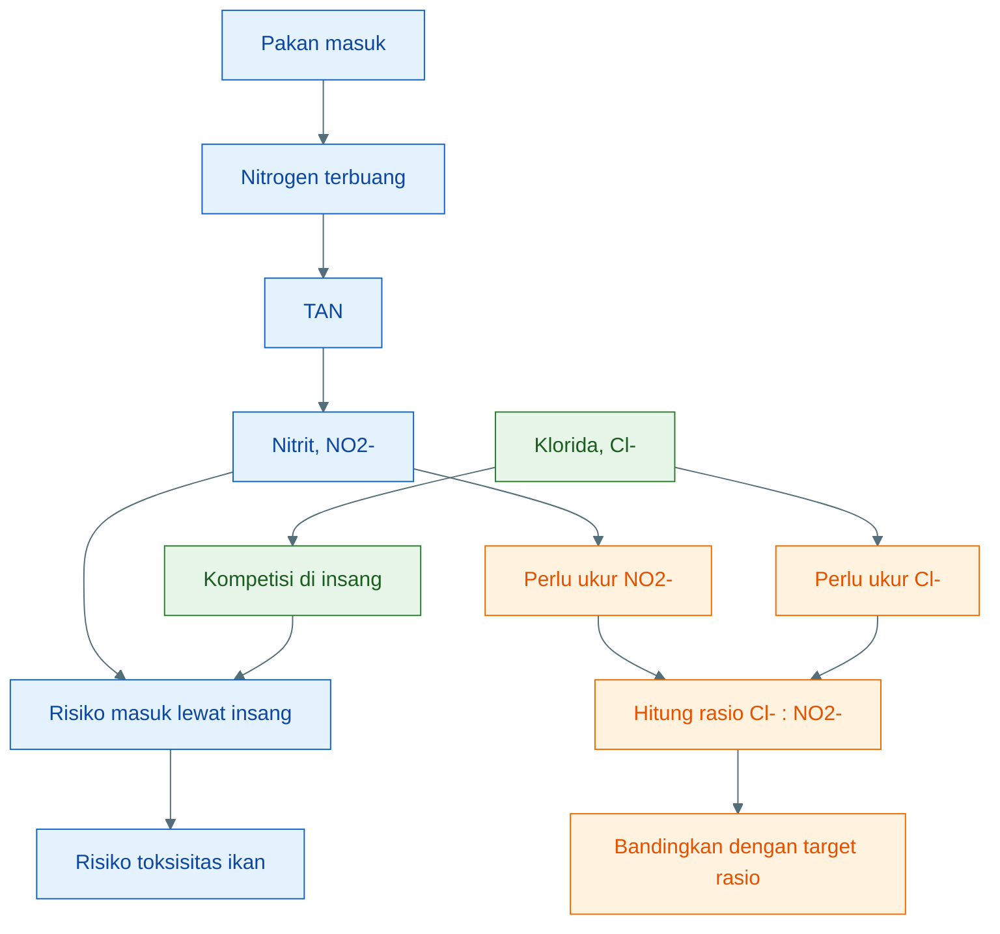
```mermaid
%%{init: {'theme':'base','themeVariables':{
'primaryColor':'#E3F2FD',
'primaryTextColor':'#0D47A1',
'primaryBorderColor':'#1565C0',
'lineColor':'#546E7A',
'secondaryColor':'#E8F5E9',
'secondaryTextColor':'#1B5E20',
'secondaryBorderColor':'#2E7D32',
'tertiaryColor':'#FFF3E0',
'tertiaryTextColor':'#E65100',
'tertiaryBorderColor':'#EF6C00'
}}}%%
flowchart TD
    A["Pakan masuk"] --> B["Nitrogen terbuang"]
    B --> C["TAN"]
    C --> D["Nitrit, NO2-"]
    D --> E["Risiko masuk lewat insang"]
    F["Klorida, Cl-"] --> G["Kompetisi di insang"]
    G --> E
    E --> H["Risiko toksisitas ikan"]

    D --> I["Perlu ukur NO2-"]
    F --> J["Perlu ukur Cl-"]
    I --> K["Hitung rasio Cl- : NO2-"]
    J --> K
    K --> L["Bandingkan dengan target rasio"]

    classDef proses fill:#E3F2FD,stroke:#1565C0,color:#0D47A1;
    classDef proteksi fill:#E8F5E9,stroke:#2E7D32,color:#1B5E20;
    classDef keputusan fill:#FFF3E0,stroke:#EF6C00,color:#E65100;

    class A,B,C,D,E,H proses;
    class F,G proteksi;
    class I,J,K,L keputusan;
```

Diagram di atas menunjukkan bahwa $Cl^-$ bekerja pada **titik proteksi ikan**, bukan pada **penghilangan nitrit dari air**.

---

## 1.6. Parameter utama: rasio $Cl^- : NO_2^-$

Dalam praktik, parameter terpenting adalah rasio:

$$
Cl^- : NO_2^-
$$

atau bila memakai basis nitrogen:

$$
Cl^- : NO_2\text{-}N
$$

Untuk artikel ini, basis operasional yang akan dipakai untuk praktik lapangan adalah **rasio $Cl^- : NO_2^-$**, karena banyak test kit lapangan langsung membaca nitrit sebagai $NO_2^-$.

Angka kerja awal:

| Parameter                      |                             Angka kerja awal |
| ------------------------------ | -------------------------------------------: |
| Rasio minimum $Cl^- : NO_2^-$  |                                       $10:1$ |
| Rasio konservatif bioflok nila |                                       $20:1$ |
| Rasio darurat nitrit           |                         $30:1$ sampai $50:1$ |
| Buffer $Cl^-$ operasional      |               $60$ sampai $100 \text{ mg/L}$ |
| $Cl^-$ untuk aquaponik         | Harus dibatasi berdasarkan toleransi tanaman |

Makna angka-angka tersebut:

### 1. Rasio minimum $10:1$

Jika nitrit terbaca:

$$
NO_2^- = 1 \text{ mg/L}
$$

maka target klorida minimum:

$$
Cl^- = 10 \text{ mg/L}
$$

### 2. Rasio konservatif $20:1$

Jika nitrit terbaca:

$$
NO_2^- = 2 \text{ mg/L}
$$

maka target klorida konservatif:

$$
Cl^- = 20 \times 2 = 40 \text{ mg/L}
$$

### 3. Rasio darurat $30:1$ sampai $50:1$

Rasio ini dipakai saat nitrit tinggi, ikan menunjukkan stres, atau sistem belum stabil.

Contoh:

$$
NO_2^- = 3 \text{ mg/L}
$$

Target klorida darurat bawah:

$$
Cl^- = 30 \times 3 = 90 \text{ mg/L}
$$

Target klorida darurat atas:

$$
Cl^- = 50 \times 3 = 150 \text{ mg/L}
$$

---

## 1.7. Batas bawah dan batas atas $Cl^-$

Karena artikel ini ditujukan untuk praktisi, istilah “rendah” atau “tinggi” harus didefinisikan dengan angka.

### 1. Batas bawah

Jika kadar klorida aktual lebih rendah dari kebutuhan rasio terhadap nitrit, maka sistem dianggap **tidak cukup protektif**.

Contoh:

|         $NO_2^-$ |     $Cl^-$ aktual | Rasio aktual | Status           |
| ---------------: | ----------------: | -----------: | ---------------- |
| $1 \text{ mg/L}$ |  $5 \text{ mg/L}$ |        $5:1$ | Di bawah minimum |
| $2 \text{ mg/L}$ | $20 \text{ mg/L}$ |       $10:1$ | Tepat minimum    |
| $2 \text{ mg/L}$ | $40 \text{ mg/L}$ |       $20:1$ | Konservatif      |

### 2. Batas atas

Tidak ada satu angka universal yang berlaku untuk semua spesies, karena $Cl^-$ juga terkait salinitas total, osmoregulasi, dan toleransi tanaman bila sistem digabung aquaponik.

Namun, dalam konteks artikel ini, batas atas operasional dibahas dari sisi **fungsi proteksi nitrit**, bukan dari sisi sistem payau atau osmoregulasi komoditas.

Maka pendekatan yang dipakai adalah:

- gunakan klorida **sesuai kebutuhan rasio**;
- hindari menambah $Cl^-$ tanpa dasar angka nitrit;
- hindari akumulasi garam yang tidak perlu pada sistem resirkulasi.

Prinsipnya:

> $Cl^-$ ditambahkan **berbasis kebutuhan nitrit**, bukan berbasis kebiasaan.

---

## 1.8. Sumber $Cl^-$ yang mungkin digunakan

Sumber klorida tidak hanya $NaCl$.

| Sumber   | Ion utama yang ditambahkan | Catatan praktis                        |
| -------- | -------------------------- | -------------------------------------- |
| $NaCl$   | $Na^+$ dan $Cl^-$          | Paling umum, murah, mudah didapat      |
| $KCl$    | $K^+$ dan $Cl^-$           | Dapat relevan bila sistem perlu kalium |
| $CaCl_2$ | $Ca^{2+}$ dan $Cl^-$       | Menambah klorida sekaligus kalsium     |
| $MgCl_2$ | $Mg^{2+}$ dan $Cl^-$       | Menambah klorida sekaligus magnesium   |

Untuk bioflok ikan murni, $NaCl$ biasanya paling praktis.
Untuk sistem yang melibatkan tanaman, pemilihan sumber $Cl^-$ harus lebih hati-hati karena akumulasi $Na^+$ atau $Cl^-$ dapat memengaruhi tanaman.

---

## 1.9. Rumus dasar konversi $Cl^-$ menjadi $NaCl$

Karena sumber paling umum adalah $NaCl$, perlu ada rumus konversi.

Fraksi klorida dalam $NaCl$:

$$
\frac{35{,}45}{58{,}44}
\approx
0{,}606
$$

Artinya, $NaCl$ mengandung sekitar:

$$
60{,}6\%
$$

klorida.

Jika tambahan klorida yang dibutuhkan adalah:

$$
Cl^-_{\text{tambahan}}
$$

maka kebutuhan $NaCl$ per liter air:

$$
NaCl_{\text{mg/L}}
=

\frac{Cl^-_{\text{tambahan}}}{0{,}606}
$$

Jika volume kolam adalah $V$ dalam $\text{m}^3$, maka kebutuhan total $NaCl$:

$$
NaCl_{\text{gram}}
=

\frac{
Cl^-_{\text{tambahan}}
\times
V
}{
0{,}606
}
$$

karena:

$$
1 \text{ mg/L pada } 1 \text{ m}^3 = 1 \text{ g}
$$

---

## 1.10. Contoh hitung sederhana

Misal data lapangan:

| Parameter      |                     Nilai |
| -------------- | ------------------------: |
| Nitrit terukur | $NO_2^- = 2 \text{ mg/L}$ |
| Klorida aktual |  $Cl^- = 10 \text{ mg/L}$ |
| Rasio target   |                    $20:1$ |
| Volume kolam   |           $1 \text{ m}^3$ |

### Langkah 1: hitung target klorida

$$
Cl^-_{\text{target}}
=

20
\times
2
=

40 \text{ mg/L}
$$

### Langkah 2: hitung tambahan klorida

$$
Cl^-_{\text{tambahan}}
=

40 - 10

30 \text{ mg/L}
$$

### Langkah 3: hitung kebutuhan $NaCl$

$$
NaCl_{\text{gram}}
=

\frac{30 \times 1}{0{,}606}

49{,}5 \text{ g}
$$

Jadi untuk kolam $1 \text{ m}^3$, dengan data di atas, kebutuhan garam kira-kira:

$$
49{,}5 \text{ g } NaCl
$$

Dibulatkan secara praktis:

$$
50 \text{ g } NaCl
$$

Contoh ini penting karena langsung mengubah konsep menjadi keputusan lapangan.

---

## 1.11. Diagram alur hitung kebutuhan $Cl^-$

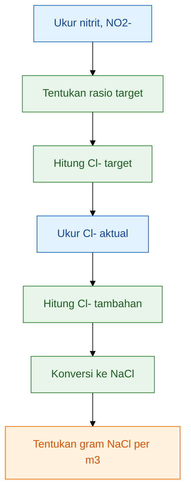
```mermaid
%%{init: {'theme':'base','themeVariables':{
'primaryColor':'#E8F5E9',
'primaryTextColor':'#1B5E20',
'primaryBorderColor':'#2E7D32',
'secondaryColor':'#E3F2FD',
'secondaryTextColor':'#0D47A1',
'secondaryBorderColor':'#1565C0',
'tertiaryColor':'#FFF3E0',
'tertiaryTextColor':'#E65100',
'tertiaryBorderColor':'#EF6C00'
}}}%%
flowchart TD
    A["Ukur nitrit, NO2-"] --> B["Tentukan rasio target"]
    B --> C["Hitung Cl- target"]
    C --> D["Ukur Cl- aktual"]
    D --> E["Hitung Cl- tambahan"]
    E --> F["Konversi ke NaCl"]
    F --> G["Tentukan gram NaCl per m3"]

    classDef ukur fill:#E3F2FD,stroke:#1565C0,color:#0D47A1;
    classDef hitung fill:#E8F5E9,stroke:#2E7D32,color:#1B5E20;
    classDef output fill:#FFF3E0,stroke:#EF6C00,color:#E65100;

    class A,D ukur;
    class B,C,E,F hitung;
    class G output;
```

Urutan hitung ini harus menjadi kebiasaan operator.
Tanpa urutan ini, penambahan garam akan berubah menjadi tindakan coba-coba.

---

## 1.12. Keterbatasan penggunaan $Cl^-$

Walaupun $Cl^-$ berguna, ada beberapa batasan yang harus dipahami sejak awal.

### 1. $Cl^-$ tidak menggantikan nitrifikasi

Jika nitrit tinggi, operator tetap harus memeriksa:

- $DO$;
- alkalinitas;
- $pH$;
- pakan;
- sludge;
- performa aerasi;
- kondisi biofilter atau komunitas mikroba.

### 2. $Cl^-$ tidak boleh dipakai tanpa data ukur

Menambah garam tanpa mengetahui nitrit dan klorida aktual membuat sistem kehilangan basis engineering.

### 3. $Cl^-$ harus dibaca bersama sistem lain

Pada bioflok ikan murni, toleransi lebih luas.
Pada aquaponik, penambahan klorida harus lebih hati-hati karena tanaman memiliki ambang toleransi yang berbeda.

### 4. $Cl^-$ tidak identik dengan “air sehat”

Air bisa memiliki $Cl^-$ tinggi tetapi tetap bermasalah bila:

- nitrit tetap tinggi;
- amonia tinggi;
- alkalinitas rendah;
- $CO_2$ tinggi;
- sludge membusuk;
- $DO$ rendah.

---

## 1.13. Prinsip engineering Bab 1

Setelah menyelesaikan Bab 1, pembaca harus memegang prinsip berikut.

### Prinsip 1

Salinitas adalah istilah umum, tetapi dalam isu nitrit, parameter kerja utamanya adalah:

$$
Cl^-
$$

### Prinsip 2

Nitrit harus dibaca dalam satuan yang jelas:

$$
NO_2^- \text{ atau } NO_2\text{-}N
$$

dan bila perlu dikonversi.

### Prinsip 3

Klorida tidak menghilangkan nitrit. Klorida hanya menurunkan risiko toksisitas nitrit pada ikan.

### Prinsip 4

Keputusan penambahan garam harus berbasis rasio:

$$
Cl^- : NO_2^-
$$

bukan berbasis kebiasaan.

### Prinsip 5

Rasio kerja awal yang dipakai dalam artikel ini adalah:

| Rasio                | Fungsi                          |
| -------------------- | ------------------------------- |
| $10:1$               | minimum                         |
| $20:1$               | target konservatif bioflok nila |
| $30:1$ sampai $50:1$ | kondisi darurat                 |

### Prinsip 6

Penambahan $NaCl$ harus dihitung dari kebutuhan klorida, bukan ditebak.

---

## 1.14. Kesimpulan Bab 1

Bab ini menegaskan bahwa dalam bioflok, pembahasan tentang “garam” harus dipindahkan dari bahasa umum ke bahasa engineering. Fokus utamanya bukan sekadar salinitas, tetapi **ion klorida $Cl^-$ sebagai parameter proteksi terhadap nitrit**.

Nitrit dapat muncul pada semua rezim sistem. Karena itu, $Cl^-$ tetap relevan sebagai alat proteksi ikan. Namun, $Cl^-$ bukan solusi akar masalah. Nitrit tetap harus dikendalikan melalui nitrifikasi, aerasi, alkalinitas, pengaturan pakan, dan manajemen sludge.

Parameter kerja utama yang harus dipakai praktisi adalah rasio:

$$
Cl^- : NO_2^-
$$

dengan titik awal:

- minimum $10:1$;
- target konservatif $20:1$;
- darurat $30:1$ sampai $50:1$.

Langkah kerja yang benar adalah:

1. ukur nitrit;
2. ukur klorida;
3. hitung target rasio;
4. hitung kebutuhan tambahan $Cl^-$;
5. konversi ke gram $NaCl$ per volume kolam.

Dengan dasar ini, diskusi berikutnya tentang alkalinitas, hardness, $pH$, dan $CO_2$ akan memiliki fondasi yang lebih kuat.

---

## Referensi singkat

[1]: https://agrilife.org/fisheries/files/2013/09/SRAC-Publication-No.-0462-%E2%80%93-Nitrite-in-Fish-Ponds.pdf 'Texas A&M AgriLife - SRAC Publication No. 462 Nitrite in Fish Ponds'

[**Kembali ke Atas**](#manajemen-salinitas-dan-alkalinitas-pada-kolam-bioflok-pendekatan-formula-stoikiometri-dan-kontrol-operasional)

---

# Bab 2. Fundamental Alkalinitas, Hardness, $pH$, dan Sistem Karbonat

Bab 1 membahas $Cl^-$ sebagai parameter proteksi terhadap nitrit. Bab 2 membahas parameter lain yang sama pentingnya dalam bioflok, yaitu **alkalinitas**, **hardness**, **$pH$**, dan **sistem karbonat**.

Dalam praktik, banyak operator mengamati $pH$, tetapi tidak mengukur alkalinitas. Ini berbahaya secara engineering karena $pH$ hanya menunjukkan kondisi saat pengukuran, sedangkan alkalinitas menunjukkan **kapasitas air menahan perubahan $pH$**.

Dua kolam bisa memiliki $pH$ yang sama, tetapi stabilitasnya berbeda total bila alkalinitasnya berbeda.

Contoh:

| Kolam | $pH$ pagi |                   Alkalinitas | Interpretasi              |
| ----- | --------: | ----------------------------: | ------------------------- |
| A     |   $7{,}2$ |  $40 \text{ mg/L as } CaCO_3$ | Buffer lemah, rawan turun |
| B     |   $7{,}2$ | $180 \text{ mg/L as } CaCO_3$ | Buffer kuat, lebih stabil |

Jadi, dalam manajemen bioflok:

> $pH$ adalah angka kondisi saat ini. Alkalinitas adalah cadangan stabilitas sistem.

---

## 2.1. Definisi teknis alkalinitas

Alkalinitas adalah kapasitas air untuk menetralkan asam. Secara kimia, alkalinitas terutama berasal dari ion bikarbonat, karbonat, dan hidroksida.

Pendekatan teknisnya:

$$
Alkalinitas
\approx
[HCO_3^-]
+
2[CO_3^{2-}]
+
[OH^-]
-

[H^+]
$$

Dalam praktik akuakultur, satuan alkalinitas dinyatakan sebagai:

$$
\text{mg/L as } CaCO_3
$$

Satuan ini bukan berarti semua alkalinitas di air berasal dari $CaCO_3$. Satuan tersebut hanya menyatakan **ekuivalen kapasitas netralisasi asam** dibandingkan dengan $CaCO_3$.

Makna praktis:

| Nilai                         | Arti                                                            |
| ----------------------------- | --------------------------------------------------------------- |
| $1 \text{ mg/L as } CaCO_3$   | setara kapasitas netralisasi $1 \text{ mg } CaCO_3$ per liter   |
| $100 \text{ mg/L as } CaCO_3$ | setara kapasitas netralisasi $100 \text{ mg } CaCO_3$ per liter |
| $1 \text{ m}^3$ air           | $1 \text{ mg/L}$ setara $1 \text{ g}$ dalam total volume        |

Untuk kolam $1 \text{ m}^3$:

$$
1 \text{ mg/L as } CaCO_3
=

1 \text{ g } CaCO_3 \text{ ekuivalen}
$$

Maka:

$$
150 \text{ mg/L as } CaCO_3
=

150 \text{ g } CaCO_3 \text{ ekuivalen per } 1 \text{ m}^3
$$

---

## 2.2. Alkalinitas bukan $pH$

Kesalahan umum praktisi adalah menyamakan alkalinitas dengan $pH$.

Padahal:

| Parameter   | Yang diukur                     | Satuan                   |
| ----------- | ------------------------------- | ------------------------ |
| $pH$        | aktivitas ion hidrogen saat itu | unit $pH$                |
| Alkalinitas | kapasitas air menetralkan asam  | $\text{mg/L as } CaCO_3$ |

Air dengan alkalinitas cukup dapat menahan penurunan $pH$ saat sistem menghasilkan asam dari nitrifikasi atau menghasilkan $CO_2$ dari respirasi.

Air dengan alkalinitas kecil dapat mengalami penurunan $pH$ cepat, meskipun $pH$ awal terlihat normal.

Diagram konsepnya:

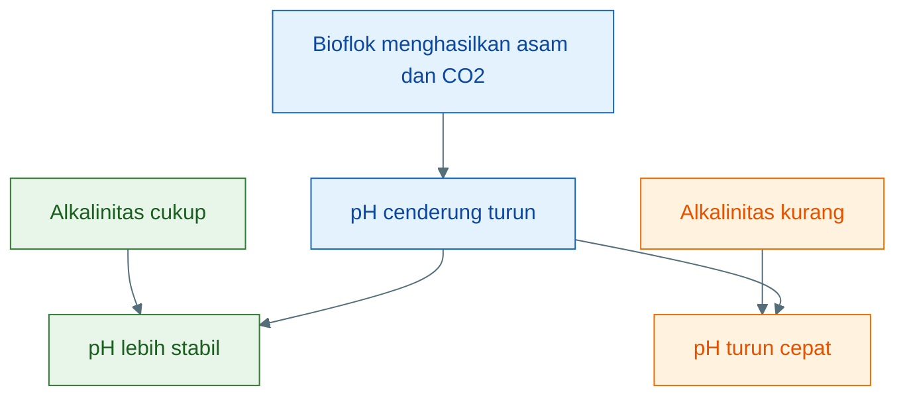
```mermaid
%%{init: {'theme':'base','themeVariables':{
'primaryColor':'#E3F2FD',
'primaryTextColor':'#0D47A1',
'primaryBorderColor':'#1565C0',
'secondaryColor':'#E8F5E9',
'secondaryTextColor':'#1B5E20',
'secondaryBorderColor':'#2E7D32',
'tertiaryColor':'#FFF3E0',
'tertiaryTextColor':'#E65100',
'tertiaryBorderColor':'#EF6C00',
'lineColor':'#546E7A'
}}}%%
flowchart TD
    A["Bioflok menghasilkan asam dan CO2"] --> B["pH cenderung turun"]
    C["Alkalinitas cukup"] --> D["pH lebih stabil"]
    E["Alkalinitas kurang"] --> F["pH turun cepat"]

    B --> D
    B --> F

    classDef proses fill:#E3F2FD,stroke:#1565C0,color:#0D47A1;
    classDef stabil fill:#E8F5E9,stroke:#2E7D32,color:#1B5E20;
    classDef risiko fill:#FFF3E0,stroke:#EF6C00,color:#E65100;

    class A,B proses;
    class C,D stabil;
    class E,F risiko;
```

---

## 2.3. Alkalinitas dan sistem karbonat

Sistem karbonat menghubungkan $CO_2$, $pH$, bikarbonat, karbonat, dan alkalinitas.

Reaksi utamanya:

$$
CO_2 + H_2O
\rightleftharpoons
H_2CO_3
\rightleftharpoons
H^+ + HCO_3^-
\rightleftharpoons
2H^+ + CO_3^{2-}
$$

Dalam kisaran $pH$ yang umum pada bioflok ikan, sebagian besar karbon anorganik berada sebagai bikarbonat:

$$
HCO_3^-
$$

Pada $pH$ lebih tinggi, fraksi karbonat meningkat:

$$
CO_3^{2-}
$$

Pada $pH$ lebih rendah, fraksi $CO_2$ terlarut meningkat.

Implikasi praktis:

| Kondisi                               | Dampak                                |
| ------------------------------------- | ------------------------------------- |
| $CO_2$ meningkat                      | $pH$ turun                            |
| $CO_2$ dibuang melalui degassing      | $pH$ dapat naik                       |
| Alkalinitas cukup                     | perubahan $pH$ lebih tertahan         |
| Alkalinitas kecil                     | perubahan $pH$ lebih cepat            |
| $pH$ di atas $8{,}3$ dengan Ca tinggi | risiko presipitasi $CaCO_3$ meningkat |

---

## 2.4. Mengapa alkalinitas penting di bioflok

Alkalinitas penting karena bioflok adalah sistem dengan aktivitas biologis tinggi. Ikan, bakteri heterotrof, nitrifier, flok, dan sludge semuanya memengaruhi $O_2$, $CO_2$, $pH$, dan nitrogen.

Fungsi alkalinitas dalam bioflok:

| Fungsi alkalinitas     | Dampak engineering                                         |
| ---------------------- | ---------------------------------------------------------- |
| Buffer $pH$            | Menahan penurunan $pH$ akibat nitrifikasi dan $CO_2$       |
| Pendukung nitrifikasi  | Nitrifier bekerja lebih stabil saat $pH$ tidak jatuh       |
| Sistem karbonat        | Menentukan hubungan $CO_2$, $pH$, dan bikarbonat           |
| Batas operasi          | Menentukan kapan perlu buffer atau cukup degassing         |
| Cadangan terhadap asam | Menyerap asam yang dihasilkan proses biologis              |
| Indikator risiko       | Alkalinitas turun memberi sinyal buffer sedang terkonsumsi |

Pada sistem bioflok yang diarahkan ke nitrifikasi, alkalinitas menjadi parameter utama karena nitrifikasi menghasilkan ion $H^+$.

Reaksi total nitrifikasi:

$$
NH_4^+
+
2O_2
\rightarrow
NO_3^-
+
2H^+
+
H_2O
$$

Ion $H^+$ ini mengonsumsi alkalinitas. Jika alkalinitas tidak dikembalikan, $pH$ akan turun dan nitrifikasi melemah.

---

## 2.5. Batas bawah dan batas atas alkalinitas

Agar praktisi tidak menggunakan istilah kualitatif tanpa batas angka, artikel ini memakai batas operasional berikut.

|     Alkalinitas sebagai $CaCO_3$ | Status engineering                             |
| -------------------------------: | ---------------------------------------------- |
|               $<50 \text{ mg/L}$ | Tidak cocok untuk bioflok intensif             |
|   $50$ sampai $100 \text{ mg/L}$ | Batas darurat                                  |
|  $100$ sampai $150 \text{ mg/L}$ | Bisa beroperasi, tetapi monitoring harus ketat |
|  $150$ sampai $200 \text{ mg/L}$ | Target utama bioflok ikan                      |
|  $200$ sampai $250 \text{ mg/L}$ | Masih bisa, pantau hardness dan $pH$           |
| $>250$ sampai $300 \text{ mg/L}$ | Zona waspada operasional                       |
|              $>300 \text{ mg/L}$ | Tidak dijadikan target rutin                   |

Target utama untuk bioflok ikan intensif:

$$
Alkalinitas_{\text{target}}
=

150
\text{ sampai }
200
\text{ mg/L as } CaCO_3
$$

Alasan target ini:

1. cukup untuk menopang nitrifikasi;
2. cukup untuk menahan perubahan $pH$;
3. belum terlalu besar sehingga risiko hardness, scaling, dan presipitasi meningkat secara berlebihan.

---

## 2.6. Alkalinitas, nitrifikasi, dan konsumsi buffer

Stoikiometri nitrifikasi menghasilkan angka kunci:

$$
1 \text{ g TAN-N}
\rightarrow
7{,}14 \text{ g alkalinitas as } CaCO_3
$$

Dalam satuan air:

$$
1 \text{ mg/L TAN-N}
\rightarrow
7{,}14 \text{ mg/L alkalinitas as } CaCO_3
$$

Artinya, jika kolam menghasilkan $10 \text{ g TAN-N}$ per hari dan seluruhnya diproses lewat nitrifikasi, konsumsi alkalinitas teoritis adalah:

$$
Alk_{\text{konsumsi}}
=

10
\times
7{,}14
=

71{,}4 \text{ g as } CaCO_3\text{/hari}
$$

Jika kolam volumenya $1 \text{ m}^3$, maka konsumsi ini setara dengan penurunan alkalinitas:

$$
71{,}4 \text{ mg/L as } CaCO_3\text{/hari}
$$

Ini angka besar. Karena itu pada bioflok dengan nitrifikasi aktif, alkalinitas bisa turun cepat bila tidak dikoreksi.

---

## 2.7. Hardness: definisi dan perbedaannya dengan alkalinitas

Hardness adalah ukuran kandungan ion divalen, terutama:

$$
Ca^{2+}
$$

dan

$$
Mg^{2+}
$$

Seperti alkalinitas, hardness juga sering dinyatakan sebagai:

$$
\text{mg/L as } CaCO_3
$$

Namun maknanya berbeda.

| Parameter   | Terkait utama                  | Fungsi                                                       |
| ----------- | ------------------------------ | ------------------------------------------------------------ |
| Alkalinitas | $HCO_3^-$, $CO_3^{2-}$, $OH^-$ | Buffer terhadap asam                                         |
| Hardness    | $Ca^{2+}$, $Mg^{2+}$           | Mineral divalen, osmoregulasi, struktur flok, risiko scaling |

Jadi dua air bisa memiliki angka yang sama dalam $\text{mg/L as } CaCO_3$, tetapi artinya berbeda.

Contoh:

| Parameter   |                         Nilai |
| ----------- | ----------------------------: |
| Alkalinitas | $180 \text{ mg/L as } CaCO_3$ |
| Hardness    | $180 \text{ mg/L as } CaCO_3$ |

Keduanya memakai satuan yang sama, tetapi tidak mengukur hal yang sama.

---

## 2.8. Hardness sebagai konsekuensi penggunaan $CaCO_3$

Penggunaan $CaCO_3$ perlu dibaca sebagai dua efek sekaligus:

1. menaikkan alkalinitas;
2. menaikkan calcium hardness.

Reaksi pelarutan dalam kondisi asam:

$$
CaCO_3 + H^+ \rightarrow Ca^{2+} + HCO_3^-
$$

Dalam kondisi $CO_2$ tinggi:

$$
CaCO_3 + CO_2 + H_2O
\rightarrow
Ca^{2+} + 2HCO_3^-
$$

Dari reaksi tersebut terlihat bahwa $CaCO_3$ menghasilkan dua komponen penting:

| Hasil     | Dampak                    |
| --------- | ------------------------- |
| $HCO_3^-$ | menambah alkalinitas      |
| $Ca^{2+}$ | menambah calcium hardness |

Jika $CaCO_3$ larut penuh:

$$
1 \text{ mg/L as } CaCO_3
\rightarrow
1 \text{ mg/L alkalinitas as } CaCO_3
$$

dan juga:

$$
1 \text{ mg/L calcium hardness as } CaCO_3
$$

Untuk kolam $1 \text{ m}^3$:

$$
1 \text{ mg/L as } CaCO_3
=

1 \text{ g } CaCO_3 \text{ ekuivalen}
$$

Maka penambahan teoritis $150 \text{ g}$ $CaCO_3$ ekuivalen pada $1 \text{ m}^3$ dapat menambah sekitar:

$$
150 \text{ mg/L as } CaCO_3
$$

pada alkalinitas, jika larut dan bereaksi sesuai kebutuhan asam, serta dapat menambah calcium hardness dalam skala ekuivalen yang sama.

Catatan engineering:

> $CaCO_3$ tidak boleh diperlakukan sebagai buffer tanpa konsekuensi. Ia juga memasukkan $Ca^{2+}$ ke sistem.

---

## 2.9. Batas hardness untuk bioflok nila

Untuk nila bioflok, batas hardness operasional dapat dibuat sebagai berikut.

| Total hardness sebagai $CaCO_3$ | Status operasional                                       |
| ------------------------------: | -------------------------------------------------------- |
|              $<50 \text{ mg/L}$ | Terlalu lunak                                            |
|  $50$ sampai $100 \text{ mg/L}$ | Dapat digunakan, tetapi mineral divalen relatif terbatas |
| $100$ sampai $250 \text{ mg/L}$ | Zona kerja utama                                         |
| $250$ sampai $300 \text{ mg/L}$ | Batas nyaman atas                                        |
| $300$ sampai $500 \text{ mg/L}$ | Waspada scaling, $TDS$, dan keseimbangan mineral         |
|             $>500 \text{ mg/L}$ | Tidak dijadikan target rutin                             |

Untuk artikel ini, target operasional hardness nila bioflok adalah:

$$
Hardness_{\text{target}}
=

100
\text{ sampai }
250
\text{ mg/L as } CaCO_3
$$

Batas nyaman atas:

$$
Hardness_{\text{atas}}
\approx
300
\text{ mg/L as } CaCO_3
$$

Jika hardness sudah berada di atas $300 \text{ mg/L as } CaCO_3$, maka koreksi alkalinitas sebaiknya tidak lagi mengandalkan $CaCO_3$ sebagai bahan utama. Bahan seperti $NaHCO_3$ atau $KHCO_3$ dapat dipertimbangkan, tergantung sistem dan risiko akumulasi ion lain.

---

## 2.10. Diagram hubungan alkalinitas, hardness, dan bahan buffer

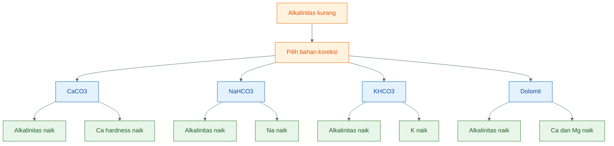
```mermaid
%%{init: {'theme':'base','themeVariables':{
'primaryColor':'#E3F2FD',
'primaryTextColor':'#0D47A1',
'primaryBorderColor':'#1565C0',
'secondaryColor':'#E8F5E9',
'secondaryTextColor':'#1B5E20',
'secondaryBorderColor':'#2E7D32',
'tertiaryColor':'#FFF3E0',
'tertiaryTextColor':'#E65100',
'tertiaryBorderColor':'#EF6C00',
'lineColor':'#546E7A'
}}}%%
flowchart TD
    A["Alkalinitas kurang"] --> B["Pilih bahan koreksi"]
    B --> C["CaCO3"]
    B --> D["NaHCO3"]
    B --> E["KHCO3"]
    B --> F["Dolomit"]

    C --> G["Alkalinitas naik"]
    C --> H["Ca hardness naik"]

    D --> I["Alkalinitas naik"]
    D --> J["Na naik"]

    E --> K["Alkalinitas naik"]
    E --> L["K naik"]

    F --> M["Alkalinitas naik"]
    F --> N["Ca dan Mg naik"]

    classDef masalah fill:#FFF3E0,stroke:#EF6C00,color:#E65100;
    classDef bahan fill:#E3F2FD,stroke:#1565C0,color:#0D47A1;
    classDef efek fill:#E8F5E9,stroke:#2E7D32,color:#1B5E20;

    class A,B masalah;
    class C,D,E,F bahan;
    class G,H,I,J,K,L,M,N efek;
```

Diagram ini menegaskan bahwa setiap bahan buffer memiliki konsekuensi ionik. Tidak ada koreksi kimia yang benar-benar netral.

---

## 2.11. Risiko akumulasi hardness

Hardness yang berada dalam target dapat mendukung sistem. Namun hardness yang terus meningkat dapat menyebabkan beberapa risiko.

| Risiko                    | Mekanisme                                                 |
| ------------------------- | --------------------------------------------------------- |
| Scaling                   | $CaCO_3$ mengendap di diffuser, pipa, pompa, dan dinding  |
| $TDS$ naik                | Total ion terlarut meningkat                              |
| Presipitasi fosfat        | Fosfat dapat terikat dengan kalsium pada kondisi tertentu |
| Ketidakseimbangan mineral | Rasio Ca, Mg, dan K dapat bergeser                        |
| Gangguan tanaman          | Terutama pada sistem aquaponik                            |
| Kerak putih               | Indikator presipitasi mineral                             |

Presipitasi kalsium karbonat terjadi saat air menjadi jenuh terhadap $CaCO_3$.

Reaksi:

$$
Ca^{2+}
+
CO_3^{2-}
\rightarrow
CaCO_3 \downarrow
$$

Risiko presipitasi meningkat bila kombinasi berikut terjadi:

| Parameter                    |                              Ambang waspada |
| ---------------------------- | ------------------------------------------: |
| $pH$                         |                                    $>8{,}3$ |
| Alkalinitas                  |              $>200 \text{ mg/L as } CaCO_3$ |
| Calcium hardness             | $>250$ sampai $300 \text{ mg/L as } CaCO_3$ |
| Degassing $CO_2$ sangat kuat |                  $CO_2$ turun dan $pH$ naik |
| Fotosintesis alga kuat       |           $CO_2$ diserap dan $pH$ sore naik |

---

## 2.12. Hubungan $CO_2$, degassing, dan presipitasi $CaCO_3$

Saat $CO_2$ dibuang melalui degassing, $pH$ dapat naik.

Secara sistem karbonat:

$$
CO_2 \downarrow
\Rightarrow
pH \uparrow
$$

Saat $pH$ naik, fraksi karbonat meningkat:

$$
HCO_3^-
\rightleftharpoons
H^+
+
CO_3^{2-}
$$

Jika $Ca^{2+}$ cukup banyak, maka dapat terjadi:

$$
Ca^{2+}
+
CO_3^{2-}
\rightarrow
CaCO_3 \downarrow
$$

Jadi degassing $CO_2$ adalah alat penting untuk mengendalikan $pH$, tetapi pada air dengan hardness dan alkalinitas tinggi, operator harus memantau risiko scaling.

Prinsip engineering:

> Degassing menyelesaikan masalah $CO_2$, tetapi tidak boleh dilakukan tanpa memantau $pH$, alkalinitas, dan hardness.

---

## 2.13. Cara membaca kombinasi alkalinitas dan hardness

Keputusan koreksi harus berbasis kombinasi angka.

|        Alkalinitas |           Hardness | Interpretasi                                       | Koreksi utama                               |
| -----------------: | -----------------: | -------------------------------------------------- | ------------------------------------------- |
|             $<100$ |             $<100$ | Buffer dan mineral divalen kurang                  | $CaCO_3$ atau dolomit dapat dipakai         |
|             $<100$ | $100$ sampai $250$ | Buffer kurang, hardness masih dalam zona kerja     | $NaHCO_3$, $KHCO_3$, atau sebagian $CaCO_3$ |
|             $<100$ |             $>300$ | Buffer kurang, hardness sudah di atas batas nyaman | Hindari $CaCO_3$ sebagai koreksi utama      |
| $150$ sampai $200$ | $100$ sampai $250$ | Zona target                                        | Monitoring                                  |
| $150$ sampai $200$ |             $>300$ | Buffer cukup, hardness berlebih                    | Jangan tambah sumber Ca                     |
|             $>250$ |             $>300$ | Risiko scaling meningkat                           | Evaluasi $pH$, $CO_2$, dan sumber mineral   |

Tabel ini mengubah keputusan dari kebiasaan menjadi berbasis data.

---

## 2.14. Kesalahan umum dalam manajemen alkalinitas

Kesalahan yang sering terjadi:

| Kesalahan                                                                | Dampak                                         |
| ------------------------------------------------------------------------ | ---------------------------------------------- |
| Mengukur $pH$ tetapi tidak mengukur alkalinitas                          | Buffer habis tidak terdeteksi                  |
| Menambah $CaCO_3$ setiap kali $pH$ turun                                 | Hardness bisa naik terus                       |
| Tidak membedakan $pH$ rendah akibat $CO_2$ dan akibat alkalinitas kurang | Koreksi bisa salah                             |
| Tidak mengukur hardness                                                  | Risiko scaling dan akumulasi Ca tidak terlihat |
| Mengabaikan $CO_2$                                                       | $pH$ tetap rendah walau $DO$ cukup             |
| Menganggap aerasi hanya untuk $O_2$                                      | Fungsi degassing $CO_2$ terabaikan             |

---

## 2.15. Diagram keputusan awal: buffer atau degassing

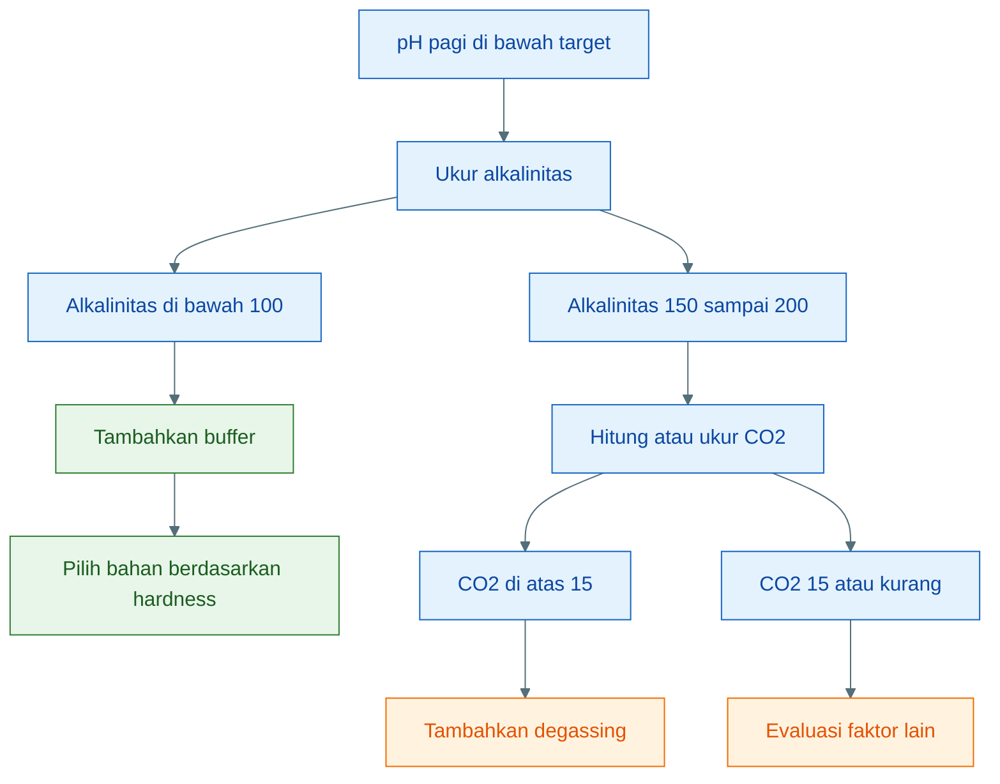
```mermaid
%%{init: {'theme':'base','themeVariables':{
'primaryColor':'#E3F2FD',
'primaryTextColor':'#0D47A1',
'primaryBorderColor':'#1565C0',
'secondaryColor':'#E8F5E9',
'secondaryTextColor':'#1B5E20',
'secondaryBorderColor':'#2E7D32',
'tertiaryColor':'#FFF3E0',
'tertiaryTextColor':'#E65100',
'tertiaryBorderColor':'#EF6C00',
'lineColor':'#546E7A'
}}}%%
flowchart TD
    A["pH pagi di bawah target"] --> B["Ukur alkalinitas"]
    B --> C["Alkalinitas di bawah 100"]
    B --> D["Alkalinitas 150 sampai 200"]

    C --> E["Tambahkan buffer"]
    E --> F["Pilih bahan berdasarkan hardness"]

    D --> G["Hitung atau ukur CO2"]
    G --> H["CO2 di atas 15"]
    H --> I["Tambahkan degassing"]

    G --> J["CO2 15 atau kurang"]
    J --> K["Evaluasi faktor lain"]

    classDef cek fill:#E3F2FD,stroke:#1565C0,color:#0D47A1;
    classDef buffer fill:#E8F5E9,stroke:#2E7D32,color:#1B5E20;
    classDef gas fill:#FFF3E0,stroke:#EF6C00,color:#E65100;

    class A,B,C,D,G,H,J cek;
    class E,F buffer;
    class I,K gas;
```

Diagram ini sengaja dibuat sempit dan vertikal agar mudah dibaca di layar ponsel.

---

## 2.16. Angka kerja Bab 2

Ringkasan angka yang digunakan dalam artikel:

| Parameter                             |                                  Angka kerja |
| ------------------------------------- | -------------------------------------------: |
| Target alkalinitas bioflok ikan       |   $150$ sampai $200 \text{ mg/L as } CaCO_3$ |
| Koreksi wajib alkalinitas             |          saat $<100 \text{ mg/L as } CaCO_3$ |
| Zona waspada alkalinitas              |  $>250$ sampai $300 \text{ mg/L as } CaCO_3$ |
| Target hardness nila bioflok          |   $100$ sampai $250 \text{ mg/L as } CaCO_3$ |
| Batas nyaman atas hardness            |        sekitar $300 \text{ mg/L as } CaCO_3$ |
| Hardness tidak dijadikan target rutin |               $>500 \text{ mg/L as } CaCO_3$ |
| Risiko presipitasi meningkat          | $pH >8{,}3$ dengan Ca dan alkalinitas tinggi |
| Konsumsi alkalinitas nitrifikasi      | $7{,}14 \text{ g as } CaCO_3\text{/g TAN-N}$ |
| Konversi kolam $1 \text{ m}^3$        |     $1 \text{ mg/L} = 1 \text{ g}$ ekuivalen |

---

## 2.17. Kesimpulan Bab 2

Alkalinitas, hardness, $pH$, dan sistem karbonat harus dibaca sebagai satu paket. $pH$ menunjukkan kondisi saat ini, sedangkan alkalinitas menunjukkan cadangan buffer. Hardness menunjukkan kandungan mineral divalen, terutama $Ca^{2+}$ dan $Mg^{2+}$.

Dalam bioflok, alkalinitas dibutuhkan karena nitrifikasi menghasilkan asam dan mengonsumsi buffer. Angka stoikiometri pentingnya adalah:

$$
1 \text{ g TAN-N}
\rightarrow
7{,}14 \text{ g alkalinitas as } CaCO_3
$$

Target alkalinitas utama untuk bioflok ikan adalah:

$$
150
\text{ sampai }
200
\text{ mg/L as } CaCO_3
$$

Namun koreksi alkalinitas tidak boleh selalu menggunakan $CaCO_3$ tanpa mengukur hardness. $CaCO_3$ menaikkan alkalinitas sekaligus calcium hardness. Jika hardness terus naik, risiko scaling, presipitasi $CaCO_3$, dan akumulasi mineral meningkat.

Prinsip engineering Bab 2:

> Jangan mengelola $pH$ hanya dengan kapur. Ukur alkalinitas, hardness, dan $CO_2$, lalu pilih koreksi berdasarkan angka.

[**Kembali ke Atas**](#manajemen-salinitas-dan-alkalinitas-pada-kolam-bioflok-pendekatan-formula-stoikiometri-dan-kontrol-operasional)

---

# Bab 3. Stoikiometri Salinitas dan Alkalinitas dalam Siklus Nitrogen

Bab 1 menjelaskan $Cl^-$ sebagai proteksi terhadap nitrit. Bab 2 menjelaskan alkalinitas, hardness, $pH$, dan sistem karbonat. Bab 3 menghubungkan keduanya ke **stoikiometri siklus nitrogen**.

Tujuan bab ini adalah mengubah manajemen air bioflok dari tindakan berbasis kebiasaan menjadi tindakan berbasis angka:

1. berapa $TAN$ dihasilkan dari pakan;
2. berapa $O_2$ dibutuhkan untuk nitrifikasi;
3. berapa alkalinitas terkonsumsi;
4. berapa buffer yang harus disiapkan;
5. berapa $Cl^-$ yang diperlukan terhadap nitrit;
6. berapa gram $NaCl$ yang perlu ditambahkan bila rasio $Cl^- : NO_2^-$ belum tercapai.

Pada bioflok, nitrogen tidak hanya berubah bentuk. Setiap perubahan bentuk nitrogen membawa konsekuensi terhadap oksigen, alkalinitas, $pH$, nitrit, nitrat, sludge, dan risiko stres ikan.

---

## 3.1. Peta stoikiometri dalam bioflok

Sebelum masuk formula, alur utama nitrogen perlu dipetakan.

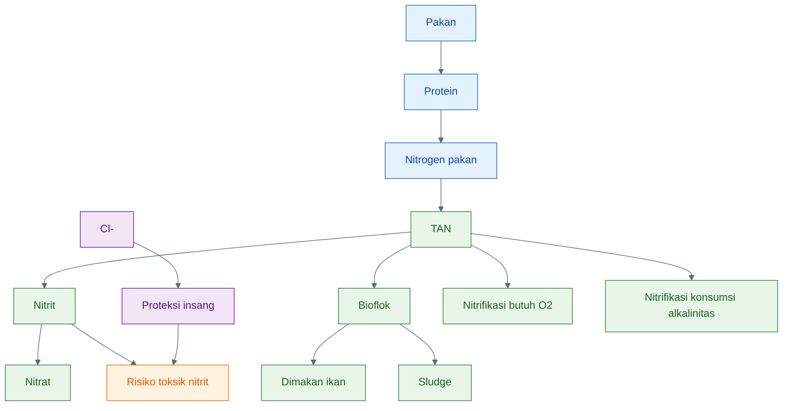
```mermaid id="u3mg4m"
%%{init: {'theme':'base','themeVariables':{
'primaryColor':'#E3F2FD',
'primaryTextColor':'#0D47A1',
'primaryBorderColor':'#1565C0',
'secondaryColor':'#E8F5E9',
'secondaryTextColor':'#1B5E20',
'secondaryBorderColor':'#2E7D32',
'tertiaryColor':'#FFF3E0',
'tertiaryTextColor':'#E65100',
'tertiaryBorderColor':'#EF6C00',
'lineColor':'#546E7A'
}}}%%
flowchart TD
    A["Pakan"] --> B["Protein"]
    B --> C["Nitrogen pakan"]
    C --> D["TAN"]
    D --> E["Nitrit"]
    E --> F["Nitrat"]

    D --> G["Bioflok"]
    G --> H["Dimakan ikan"]
    G --> I["Sludge"]

    E --> J["Risiko toksik nitrit"]
    K["Cl-"] --> L["Proteksi insang"]
    L --> J

    D --> M["Nitrifikasi butuh O2"]
    D --> N["Nitrifikasi konsumsi alkalinitas"]

    classDef input fill:#E3F2FD,stroke:#1565C0,color:#0D47A1;
    classDef nitrogen fill:#E8F5E9,stroke:#2E7D32,color:#1B5E20;
    classDef risiko fill:#FFF3E0,stroke:#EF6C00,color:#E65100;
    classDef proteksi fill:#F3E5F5,stroke:#6A1B9A,color:#4A148C;

    class A,B,C input;
    class D,E,F,G,H,I,M,N nitrogen;
    class J risiko;
    class K,L proteksi;
```

Diagram ini menunjukkan bahwa $TAN$ adalah titik pusat. Dari $TAN$, nitrogen bisa masuk ke jalur nitrifikasi, bioflok, ikan, sludge, atau tetap menjadi risiko kualitas air bila sistem tidak mampu memprosesnya.

Bab ini fokus pada jalur nitrifikasi dan proteksi nitrit karena keduanya langsung terkait dengan alkalinitas dan $Cl^-$.

---

## 3.2. Stoikiometri nitrifikasi

Nitrifikasi adalah proses oksidasi amonia menjadi nitrit lalu nitrat.

Tahap pertama:

$$
NH_4^+
+
1{,}5O_2
\rightarrow
NO_2^-
+
2H^+
+
H_2O
$$

Tahap kedua:

$$
NO_2^-
+
0{,}5O_2
\rightarrow
NO_3^-
$$

Reaksi total:

$$
NH_4^+
+
2O_2
\rightarrow
NO_3^-
+
2H^+
+
H_2O
$$

Dari reaksi total ini, ada dua konsekuensi engineering:

1. nitrifikasi membutuhkan oksigen;
2. nitrifikasi menghasilkan ion $H^+$ yang mengonsumsi alkalinitas.

Konsekuensi oksigen:

$$
1 \text{ g TAN-N}
\rightarrow
4{,}57 \text{ g } O_2
$$

Konsekuensi alkalinitas:

$$
1 \text{ g TAN-N}
\rightarrow
7{,}14 \text{ g alkalinitas as } CaCO_3
$$

Angka $7{,}14 \text{ g as } CaCO_3\text{/g TAN-N}$ adalah aturan desain yang umum digunakan untuk memperkirakan konsumsi alkalinitas saat ammonia-nitrogen dioksidasi menjadi nitrate-nitrogen dalam sistem nitrifikasi dan RAS. ([ScienceDirect][1])

---

## 3.3. Asal angka $4{,}57 \text{ g } O_2\text{/g TAN-N}$

Dari reaksi total:

$$
NH_4^+
+
2O_2
\rightarrow
NO_3^-
+
2H^+
+
H_2O
$$

Untuk setiap $1$ mol nitrogen:

$$
1 \text{ mol N}
=

14 \text{ g N}
$$

Kebutuhan oksigen:

$$
2 \text{ mol } O_2
=

2
\times
32
=

64 \text{ g } O_2
$$

Maka kebutuhan oksigen per gram nitrogen:

$$
\frac{64}{14}
=

4{,}57
$$

Sehingga:

$$
1 \text{ g TAN-N}
\rightarrow
4{,}57 \text{ g } O_2
$$

Ini berarti bila kolam menghasilkan $10 \text{ g TAN-N/hari}$ dan seluruhnya masuk nitrifikasi, kebutuhan oksigen hanya untuk nitrifikasi adalah:

$$
10
\times
4{,}57
=

45{,}7 \text{ g } O_2\text{/hari}
$$

---

## 3.4. Asal angka $7{,}14 \text{ g as } CaCO_3\text{/g TAN-N}$

Reaksi nitrifikasi menghasilkan:

$$
2H^+
$$

Untuk setiap $1$ mol nitrogen, yaitu:

$$
14 \text{ g N}
$$

terbentuk $2$ ekivalen asam. Satu ekivalen alkalinitas sebagai $CaCO_3$ setara dengan:

$$
50 \text{ g as } CaCO_3
$$

Maka kebutuhan netralisasi asam:

$$
2
\times
50
=

100 \text{ g as } CaCO_3
$$

Untuk $14 \text{ g N}$:

$$
\frac{100}{14}
=

7{,}14
$$

Sehingga:

$$
1 \text{ g TAN-N}
\rightarrow
7{,}14 \text{ g alkalinitas as } CaCO_3
$$

Dalam satuan konsentrasi:

$$
1 \text{ mg/L TAN-N}
\rightarrow
7{,}14 \text{ mg/L alkalinitas as } CaCO_3
$$

Makna praktisnya jelas: jika bioflok diarahkan ke nitrifikasi, alkalinitas bisa turun cepat.

---

## 3.5. Stoikiometri konversi pakan menjadi $TAN$

Sumber utama nitrogen di kolam adalah protein pakan. Protein mengandung nitrogen sekitar $16\%$.

Formula estimasi nitrogen yang menjadi $TAN$:

$$
TAN_N
=

Feed
\times
Protein
\times
0{,}16
\times
f_{\text{TAN}}
$$

Variabel:

| Simbol           |              Satuan | Arti                                     |
| ---------------- | ------------------: | ---------------------------------------- |
| $Feed$           |   kg pakan per hari | jumlah pakan harian                      |
| $Protein$        |              fraksi | kadar protein pakan                      |
| $0{,}16$         | kg N per kg protein | fraksi nitrogen dalam protein            |
| $f_{\text{TAN}}$ |              fraksi | fraksi nitrogen pakan yang menjadi $TAN$ |
| $TAN_N$          |   kg TAN-N per hari | estimasi produksi $TAN$ harian           |

Nilai $f_{\text{TAN}}$ tidak selalu sama. Untuk model praktis, artikel ini memakai kisaran:

$$
f_{\text{TAN}}
=

0{,}50
\text{ sampai }
0{,}80
$$

Untuk studi kasus dan model Excel, nilai awal yang dipakai adalah:

$$
f_{\text{TAN}}
=

0{,}60
$$

---

## 3.6. Contoh hitung $TAN$ dari pakan

Misal:

| Parameter        |                    Nilai |
| ---------------- | -----------------------: |
| $Feed$           | $0{,}40 \text{ kg/hari}$ |
| $Protein$        |                 $0{,}30$ |
| $f_{\text{TAN}}$ |                 $0{,}60$ |

Maka:

$$
TAN_N
=

0{,}40
\times
0{,}30
\times
0{,}16
\times
0{,}60
$$

$$
TAN_N
=

0{,}01152
\text{ kg TAN-N/hari}
$$

Konversi ke gram:

$$
0{,}01152
\text{ kg}
=

11{,}52
\text{ g}
$$

Jadi:

$$
TAN_N
=

11{,}52
\text{ g TAN-N/hari}
$$

Angka ini menjadi dasar untuk menghitung kebutuhan oksigen dan alkalinitas.

---

## 3.7. Formula kebutuhan oksigen nitrifikasi harian

Jika seluruh $TAN_N$ masuk ke jalur nitrifikasi, kebutuhan oksigen nitrifikasi adalah:

$$
O_{2,\text{nitrifikasi}}
=

TAN_N
\times
4{,}57
$$

Jika $TAN_N$ dalam kg per hari, maka hasilnya kg $O_2$ per hari.

Contoh dengan:

$$
TAN_N
=

0{,}01152
\text{ kg/hari}
$$

Maka:

$$
O_{2,\text{nitrifikasi}}
=

0{,}01152
\times
4{,}57
$$

$$
O_{2,\text{nitrifikasi}}
=

0{,}05265
\text{ kg } O_2\text{/hari}
$$

Konversi ke gram:

$$
0{,}05265
\text{ kg}
=

52{,}65
\text{ g}
$$

Kebutuhan per jam:

$$
O_{2,\text{nitrifikasi per jam}}
=

\frac{52{,}65}{24}

2{,}19
\text{ g } O_2\text{/jam}
$$

---

## 3.8. Formula kebutuhan alkalinitas harian

Jika seluruh $TAN_N$ masuk ke jalur nitrifikasi, konsumsi alkalinitas harian adalah:

$$
Alk_{\text{konsumsi}}
=

TAN_N
\times
7{,}14
$$

Jika $TAN_N$ dalam kg per hari, hasilnya kg alkalinitas sebagai $CaCO_3$ per hari.

Contoh:

$$
TAN_N
=

0{,}01152
\text{ kg TAN-N/hari}
$$

Maka:

$$
Alk_{\text{konsumsi}}
=

0{,}01152
\times
7{,}14
$$

$$
Alk_{\text{konsumsi}}
=

0{,}08225
\text{ kg as } CaCO_3\text{/hari}
$$

Konversi ke gram:

$$
0{,}08225
\text{ kg}
=

82{,}25
\text{ g}
$$

Jadi:

$$
Alk_{\text{konsumsi}}
=

82{,}25
\text{ g as } CaCO_3\text{/hari}
$$

Untuk kolam $1 \text{ m}^3$, angka ini setara dengan penurunan alkalinitas teoritis:

$$
82{,}25
\text{ mg/L as } CaCO_3\text{/hari}
$$

jika tidak ada kompensasi buffer dan seluruh $TAN$ dinitrifikasi.

---

## 3.9. Konversi kebutuhan alkalinitas ke bahan buffer

Kebutuhan alkalinitas dinyatakan sebagai ekuivalen $CaCO_3$. Bahan yang dipakai bisa berbeda.

### Jika memakai $CaCO_3$

Secara ekuivalen:

$$
CaCO_{3,\text{setara}}
=

Alk_{\text{konsumsi}}
$$

Namun $CaCO_3$ larut lambat dan menambah calcium hardness.

### Jika memakai $NaHCO_3$

Faktor konversi:

$$
NaHCO_{3,\text{setara}}
=

Alk_{\text{konsumsi}}
\times
1{,}68
$$

Contoh:

$$
Alk_{\text{konsumsi}}
=

82{,}25
\text{ g as } CaCO_3
$$

Maka:

$$
NaHCO_{3,\text{setara}}
=

82{,}25
\times
1{,}68
$$

$$
NaHCO_{3,\text{setara}}
=

138{,}18
\text{ g } NaHCO_3
$$

Jadi, untuk contoh $0{,}40 \text{ kg pakan/hari}$ dengan protein $30\%$ dan $f_{\text{TAN}} = 0{,}60$, kebutuhan teoritis $NaHCO_3$ adalah:

$$
138{,}18
\text{ g/hari}
$$

bila seluruh $TAN$ dinitrifikasi.

Manual kualitas air RAS dari ICAR-CMFRI menyebut penurunan alkalinitas karena konversi $TAN$ menjadi nitrate-nitrogen, dengan konsumsi sekitar $7{,}14 \text{ g}$ alkalinitas per gram ammonia-N, serta praktik kompensasi sekitar $0{,}15$ sampai $0{,}25 \text{ kg } NaHCO_3$ per kg pakan dalam sistem RAS. ([CMFRI Digital Repository][2])

---

## 3.10. Mengapa kebutuhan buffer aktual bisa berbeda dari teori

Formula di atas adalah batas teoritis bila seluruh $TAN$ masuk nitrifikasi. Dalam bioflok nyata, nitrogen bisa masuk ke beberapa jalur lain:

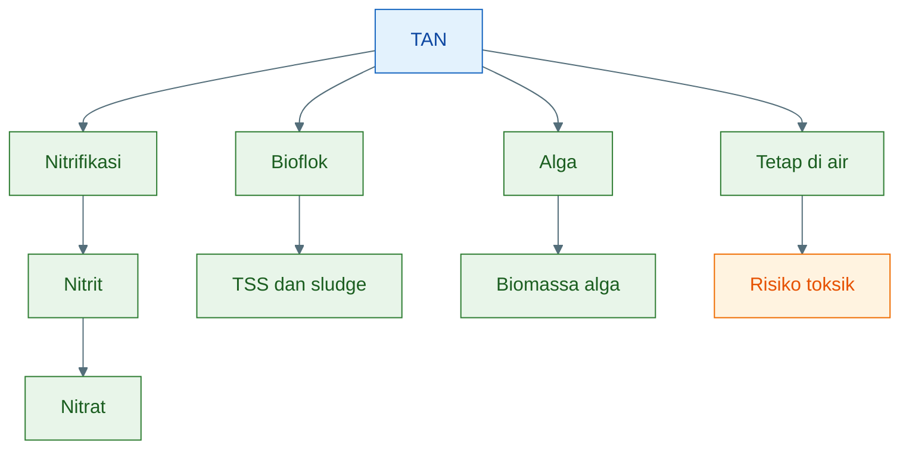
```mermaid id="v0e2wl"
%%{init: {'theme':'base','themeVariables':{
'primaryColor':'#E3F2FD',
'primaryTextColor':'#0D47A1',
'primaryBorderColor':'#1565C0',
'secondaryColor':'#E8F5E9',
'secondaryTextColor':'#1B5E20',
'secondaryBorderColor':'#2E7D32',
'tertiaryColor':'#FFF3E0',
'tertiaryTextColor':'#E65100',
'tertiaryBorderColor':'#EF6C00',
'lineColor':'#546E7A'
}}}%%
flowchart TD
    A["TAN"] --> B["Nitrifikasi"]
    A --> C["Bioflok"]
    A --> D["Alga"]
    A --> E["Tetap di air"]
    B --> F["Nitrit"]
    F --> G["Nitrat"]
    C --> H["TSS dan sludge"]
    D --> I["Biomassa alga"]
    E --> J["Risiko toksik"]

    classDef sumber fill:#E3F2FD,stroke:#1565C0,color:#0D47A1;
    classDef proses fill:#E8F5E9,stroke:#2E7D32,color:#1B5E20;
    classDef risiko fill:#FFF3E0,stroke:#EF6C00,color:#E65100;

    class A sumber;
    class B,C,D,E,F,G,H,I proses;
    class J risiko;
```

Karena pembagian jalur ini, kebutuhan buffer aktual harus dikalibrasi dengan data lapangan:

| Data lapangan      | Fungsi kalibrasi                                |
| ------------------ | ----------------------------------------------- |
| Alkalinitas harian | melihat penurunan buffer aktual                 |
| $TAN$              | melihat beban amonia                            |
| Nitrit             | melihat bottleneck nitrifikasi                  |
| Nitrat             | melihat hasil nitrifikasi                       |
| $pH$ pagi dan sore | membaca stabilitas sistem                       |
| $CO_2$             | membedakan masalah buffer dan masalah degassing |
| $TSS$ dan sludge   | membaca jalur bioflok dan akumulasi organik     |

Jika model teoritis menyarankan $138 \text{ g } NaHCO_3\text{/hari}$, tetapi alkalinitas aktual hanya turun $20 \text{ mg/L/hari}$, maka dosis harus mengikuti data aktual, bukan angka teoritis penuh.

---

## 3.11. Formula rasio $Cl^-$ terhadap nitrit

Rasio proteksi nitrit ditulis sebagai:

$$
R
=

\frac{Cl^-}{NO_2^-}
$$

atau bila memakai basis nitrogen:

$$
R_N
=

\frac{Cl^-}{NO_2\text{-}N}
$$

Jika test kit membaca nitrit sebagai $NO_2^-$, sedangkan model memakai $NO_2\text{-}N$, maka konversinya:

$$
NO_2\text{-}N
=

\frac{NO_2^-}{3{,}29}
$$

Jika target memakai basis $NO_2^-$, maka:

$$
Cl^-_{\text{target}}
=

R
\times
NO_2^-
$$

Jika target memakai basis $NO_2\text{-}N$, maka:

$$
Cl^-_{\text{target}}
=

R_N
\times
NO_2\text{-}N
$$

SRAC Publication No. 462 menyatakan bahwa klorida dari garam berkompetisi dengan nitrit pada insang dan rasio klorida terhadap nitrit setidaknya $10:1$ efektif mencegah nitrit masuk ke ikan pada konteks kolam ikan, dengan rasio lebih tinggi dapat diperlukan bila ikan sedang sakit atau lebih sensitif. ([Texas A&M AgriLife][3])

---

## 3.12. Formula tambahan $Cl^-$

Jika $Cl^-_{\text{aktual}}$ sudah diukur, maka tambahan klorida yang diperlukan adalah:

$$
Cl^-_{\text{tambahan}}
=

Cl^-_{\text{target}}

Cl^-_{\text{aktual}}
$$

Namun jika hasilnya negatif, maka tambahan klorida dianggap nol:

$$
Cl^-_{\text{tambahan}}
=

\max
\left(
0,
Cl^-_{\text{target}}
-

Cl^-_{\text{aktual}}
\right)
$$

Contoh:

| Parameter              |             Nilai |
| ---------------------- | ----------------: |
| $NO_2^-$               |  $2 \text{ mg/L}$ |
| Rasio target           |            $20:1$ |
| $Cl^-_{\text{aktual}}$ | $10 \text{ mg/L}$ |

Hitung target:

$$
Cl^-_{\text{target}}
=

20
\times
2
=

40 \text{ mg/L}
$$

Hitung tambahan:

$$
Cl^-_{\text{tambahan}}
=

40

10

30 \text{ mg/L}
$$

---

## 3.13. Konversi tambahan $Cl^-$ menjadi $NaCl$

$NaCl$ mengandung klorida sekitar:

$$
60{,}6\%
$$

atau dalam bentuk fraksi:

$$
0{,}606
$$

Maka kebutuhan $NaCl$ per liter:

$$
NaCl_{\text{mg/L}}
=

\frac{
Cl^-_{\text{tambahan}}
}{
0{,}606
}
$$

Untuk volume dalam $\text{m}^3$:

$$
NaCl_{\text{gram}}
=

\frac{
Cl^-_{\text{tambahan}}
\times
V
}{
0{,}606
}
$$

dengan $V$ dalam $\text{m}^3$.

Contoh untuk $1 \text{ m}^3$:

$$
Cl^-_{\text{tambahan}}
=

30 \text{ mg/L}
$$

Maka:

$$
NaCl_{\text{gram}}
=

\frac{
30
\times
1
}{
0{,}606
}
$$

$$
NaCl_{\text{gram}}
=

49{,}5 \text{ g}
$$

Dibulatkan:

$$
50 \text{ g } NaCl
$$

---

## 3.14. Diagram formula salinitas dan alkalinitas

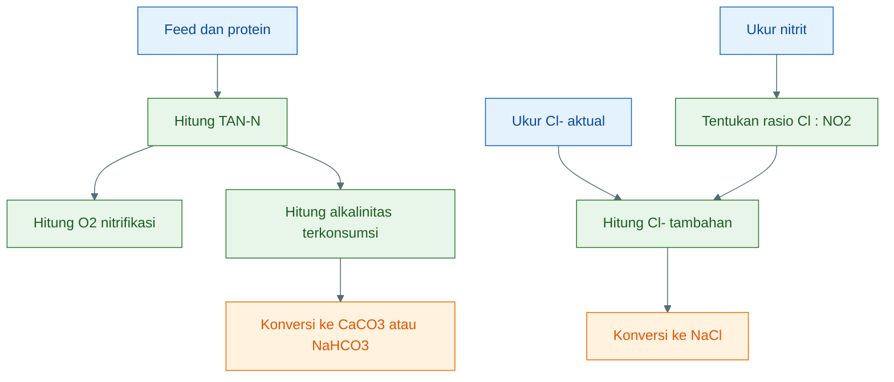
```mermaid id="ijx9qi"
%%{init: {'theme':'base','themeVariables':{
'primaryColor':'#E3F2FD',
'primaryTextColor':'#0D47A1',
'primaryBorderColor':'#1565C0',
'secondaryColor':'#E8F5E9',
'secondaryTextColor':'#1B5E20',
'secondaryBorderColor':'#2E7D32',
'tertiaryColor':'#FFF3E0',
'tertiaryTextColor':'#E65100',
'tertiaryBorderColor':'#EF6C00',
'lineColor':'#546E7A'
}}}%%
flowchart TD
    A["Feed dan protein"] --> B["Hitung TAN-N"]
    B --> C["Hitung O2 nitrifikasi"]
    B --> D["Hitung alkalinitas terkonsumsi"]
    D --> E["Konversi ke CaCO3 atau NaHCO3"]

    F["Ukur nitrit"] --> G["Tentukan rasio Cl : NO2"]
    H["Ukur Cl- aktual"] --> I["Hitung Cl- tambahan"]
    G --> I
    I --> J["Konversi ke NaCl"]

    classDef input fill:#E3F2FD,stroke:#1565C0,color:#0D47A1;
    classDef hitung fill:#E8F5E9,stroke:#2E7D32,color:#1B5E20;
    classDef output fill:#FFF3E0,stroke:#EF6C00,color:#E65100;

    class A,F,H input;
    class B,C,D,G,I hitung;
    class E,J output;
```

Diagram ini memisahkan dua jalur keputusan:

1. jalur pakan menuju $TAN$, oksigen, dan alkalinitas;
2. jalur nitrit menuju kebutuhan $Cl^-$ dan $NaCl$.

Keduanya berbeda, tetapi bertemu dalam manajemen air harian.

---

## 3.15. Ringkasan formula utama Bab 3

| Tujuan                               | Formula                                                                         |
| ------------------------------------ | ------------------------------------------------------------------------------- |
| Produksi $TAN$                       | $TAN_N = Feed \times Protein \times 0{,}16 \times f_{\text{TAN}}$               |
| Oksigen nitrifikasi                  | $O_{2,\text{nitrifikasi}} = TAN_N \times 4{,}57$                                |
| Konsumsi alkalinitas                 | $Alk_{\text{konsumsi}} = TAN_N \times 7{,}14$                                   |
| Setara $NaHCO_3$                     | $NaHCO_{3,\text{setara}} = Alk_{\text{konsumsi}} \times 1{,}68$                 |
| Konversi $NO_2^-$ ke $NO_2\text{-}N$ | $NO_2\text{-}N = \dfrac{NO_2^-}{3{,}29}$                                        |
| Target $Cl^-$ berbasis $NO_2^-$      | $Cl^-_{\text{target}} = R \times NO_2^-$                                        |
| Tambahan $Cl^-$                      | $Cl^-_{\text{tambahan}} = \max(0, Cl^-_{\text{target}} - Cl^-_{\text{aktual}})$ |
| Kebutuhan $NaCl$                     | $NaCl_{\text{gram}} = \dfrac{Cl^-_{\text{tambahan}} \times V}{0{,}606}$         |

---

## 3.16. Batas interpretasi model stoikiometri

Stoikiometri memberi batas teoritis. Namun sistem bioflok adalah sistem biologis terbuka secara proses dan dinamis secara waktu.

Beberapa hal yang membuat angka aktual berbeda dari teori:

| Faktor                                  | Dampak terhadap perhitungan                          |
| --------------------------------------- | ---------------------------------------------------- |
| Sebagian nitrogen menjadi biomassa ikan | $TAN_N$ aktual lebih kecil                           |
| Sebagian nitrogen masuk bioflok         | nitrifikasi tidak memproses semua $TAN$              |
| Sebagian nitrogen masuk alga            | nitrat dan bioflok tidak menjadi satu-satunya produk |
| Sludge dibuang                          | nitrogen keluar sebagai padatan                      |
| Denitrifikasi lokal                     | sebagian nitrat bisa menjadi gas nitrogen            |
| $TAN$ test kit berubah harian           | beban nitrogen tidak konstan                         |
| $CO_2$ tinggi                           | $pH$ dapat rendah walau alkalinitas masih ada        |
| Hardness meningkat                      | pemilihan buffer perlu diubah                        |
| Nitrit test kit berbeda basis satuan    | rasio $Cl^-$ bisa salah jika satuan tidak dikonversi |

Maka aturan engineering-nya:

> Gunakan stoikiometri untuk desain awal, lalu kalibrasi dengan data alkalinitas, $TAN$, nitrit, nitrat, $pH$, $CO_2$, dan hardness aktual.

---

## 3.17. Kesimpulan Bab 3

Bab ini menghubungkan pakan, nitrogen, oksigen, alkalinitas, nitrit, klorida, dan garam dalam satu kerangka hitung.

Formula pertama yang harus dikuasai adalah produksi $TAN$ dari pakan:

$$
TAN_N
=

Feed
\times
Protein
\times
0{,}16
\times
f_{\text{TAN}}
$$

Formula kedua adalah konsekuensi nitrifikasi:

$$
1 \text{ g TAN-N}
\rightarrow
4{,}57 \text{ g } O_2
$$

$$
1 \text{ g TAN-N}
\rightarrow
7{,}14 \text{ g alkalinitas as } CaCO_3
$$

Formula ketiga adalah proteksi nitrit dengan $Cl^-$:

$$
Cl^-_{\text{target}}
=

R
\times
NO_2^-
$$

dan kebutuhan garam:

$$
NaCl_{\text{gram}}
=

\frac{
Cl^-_{\text{tambahan}}
\times
V
}{
0{,}606
}
$$

Dengan empat kelompok formula ini, operator dapat menghitung kebutuhan oksigen, alkalinitas, buffer, dan garam secara konsisten.

Pesan utama Bab 3:

> Stoikiometri tidak menggantikan pengukuran lapangan, tetapi tanpa stoikiometri, keputusan lapangan mudah berubah menjadi tebakan.

[1]: https://www.sciencedirect.com/science/article/pii/S0144860924000189?utm_source=chatgpt.com 'Biofilter and degasser performance at different alkalinity ...'
[2]: https://eprints.cmfri.org.in/16919/1/ICAR-%20CMFRI%20Training%20Manual%20Series%20No.%2028_2022_Chapter%204.pdf?utm_source=chatgpt.com 'Water quality requirements for Recirculatory Aquaculture ...'
[3]: https://agrilife.org/fisheries/files/2013/09/SRAC-Publication-No.-0462-%E2%80%93-Nitrite-in-Fish-Ponds.pdf?utm_source=chatgpt.com 'Nitrite in Fish Ponds'

[**Kembali ke Atas**](#manajemen-salinitas-dan-alkalinitas-pada-kolam-bioflok-pendekatan-formula-stoikiometri-dan-kontrol-operasional)

---

# Bab 4. Interaksi Alkalinitas, $CO_2$, $pH$, Aerasi, dan Degassing

Bab 2 menjelaskan bahwa alkalinitas adalah kapasitas air menahan perubahan $pH$. Bab 3 menjelaskan bahwa nitrifikasi mengonsumsi alkalinitas dan menghasilkan ion $H^+$. Bab 4 membahas satu variabel yang sering membuat interpretasi $pH$ menjadi salah, yaitu **karbon dioksida terlarut $CO_2$**.

Dalam bioflok, $CO_2$ berasal dari respirasi ikan, bakteri heterotrof, nitrifier, alga pada malam hari, flok, dan sludge. Karena itu, kolam bioflok dapat mengalami kondisi berikut:

$$
DO \text{ cukup}
$$

tetapi:

$$
CO_2 \text{ di atas ambang operasi}
$$

dan akibatnya:

$$
pH \text{ berada di bawah target}
$$

Poin engineering paling penting pada bab ini:

> $DO$ jenuh tidak membuktikan $CO_2$ rendah. $O_2$ dan $CO_2$ memiliki gradien transfer gas masing-masing.

---

## 4.1. Definisi variabel gas dalam air

Untuk mencegah tafsir kualitatif, bab ini memakai beberapa variabel berikut.

| Simbol           | Arti                                   | Satuan                     |
| ---------------- | -------------------------------------- | -------------------------- |
| $DO$             | oksigen terlarut aktual                | $\text{mg/L}$              |
| $DO^*$           | oksigen terlarut jenuh terhadap udara  | $\text{mg/L}$              |
| $CO_2$           | karbon dioksida terlarut aktual        | $\text{mg/L}$              |
| $CO_2^*$         | karbon dioksida setimbang dengan udara | $\text{mg/L}$              |
| $k_{\text{L}}a$  | koefisien transfer gas volumetrik      | per waktu                  |
| $J_{\text{gas}}$ | laju transfer gas                      | massa per volume per waktu |

Pada air tawar suhu sekitar $28$ sampai $30^\circ C$, angka kerja awal yang dapat dipakai:

| Parameter                       |                                 Angka kerja |
| ------------------------------- | ------------------------------------------: |
| $DO^*$ terhadap udara           | sekitar $7{,}3$ sampai $7{,}8 \text{ mg/L}$ |
| Target $DO$ subuh bioflok       |                $>4$ sampai $5 \text{ mg/L}$ |
| $CO_2^*$ terhadap udara terbuka | sekitar $0{,}5$ sampai $0{,}7 \text{ mg/L}$ |
| Target $CO_2$ kolam             |              $<10$ sampai $15 \text{ mg/L}$ |
| Ambang koreksi $CO_2$           |                          $>15 \text{ mg/L}$ |
| Ambang darurat $CO_2$           |                          $>30 \text{ mg/L}$ |

SRAC Publication No. 464 membahas bahwa $CO_2$, $pH$, alkalinitas, dan hardness saling berinteraksi dan memengaruhi kesehatan ikan, stres, ketersediaan oksigen, serta toksisitas amonia dan beberapa logam. ([NCRAC][1])

---

## 4.2. $DO$ jenuh tidak berarti $CO_2$ rendah

Ini adalah konsep kunci.

Transfer $O_2$ dari udara ke air dapat ditulis sebagai:

$$
J_{O_2}
=

k_{\text{L}}a_{O_2}
\times
\left(
DO^*
-

DO
\right)
$$

Jika $DO$ sudah mendekati jenuh:

$$
DO
\approx
DO^*
$$

maka:

$$
DO^*
-

DO
\approx
0
$$

sehingga:

$$
J_{O_2}
\approx
0
$$

Artinya, transfer bersih $O_2$ dari udara ke air mendekati nol.

Namun, transfer $CO_2$ keluar dari air mengikuti gradiennya sendiri. Untuk degassing $CO_2$, bentuk sederhananya:

$$
J_{CO_2}
=

k_{\text{L}}a_{CO_2}
\times
\left(
CO_2
-

CO_2^*
\right)
$$

Jika $CO_2$ di air jauh lebih besar daripada $CO_2^*$ udara:

$$
CO_2

>

CO_2^*
$$

maka:

$$
J_{CO_2}

>

0
$$

Artinya, $CO_2$ tetap keluar dari air walaupun $DO$ sudah jenuh.

Kalimat engineering yang benar:

> Degassing $CO_2$ bukan terjadi karena $CO_2$ diusir oleh $O_2$. Degassing terjadi karena konsentrasi atau tekanan parsial $CO_2$ di udara lebih kecil daripada di air.

---

## 4.3. Contoh angka: $DO$ jenuh tetapi $CO_2$ masih bermasalah

Misal air kolam pada pagi hari memiliki data:

| Parameter   |                         Nilai |
| ----------- | ----------------------------: |
| Suhu        |                  $29^\circ C$ |
| $DO$        |          $7{,}5 \text{ mg/L}$ |
| $DO^*$      |          $7{,}5 \text{ mg/L}$ |
| Alkalinitas | $150 \text{ mg/L as } CaCO_3$ |
| $pH$        |                       $7{,}0$ |

Dari sisi $O_2$:

$$
DO^*
-

DO

7{,}5

7{,}5

0
$$

Maka transfer bersih $O_2$ mendekati nol.

Namun estimasi $CO_2$ dihitung dari $pH$ dan alkalinitas:

$$
CO_2
=

0{,}88
\times
Alkalinitas
\times
10^{(6{,}35 - pH)}
$$

Substitusi:

$$
CO_2
=

0{,}88
\times
150
\times
10^{(6{,}35 - 7{,}0)}
$$

$$
CO_2
\approx
30 \text{ mg/L}
$$

Bandingkan dengan $CO_2^*$ udara terbuka:

$$
CO_2^*
\approx
0{,}5
\text{ sampai }
0{,}7 \text{ mg/L}
$$

Maka gradien degassing masih besar:

$$
CO_2
-

CO_2^*
\approx
30
-

0{,}5

29{,}5 \text{ mg/L}
$$

Kesimpulan contoh:

| Parameter             | Status                                         |
| --------------------- | ---------------------------------------------- |
| $DO$                  | sudah jenuh                                    |
| Transfer $O_2$ bersih | mendekati nol                                  |
| $CO_2$                | sekitar $30 \text{ mg/L}$                      |
| Kebutuhan tindakan    | degassing $CO_2$, bukan sekadar menambah $O_2$ |

Jadi:

> $DO$ jenuh hanya membuktikan oksigen tidak defisit terhadap udara. Itu tidak membuktikan $CO_2$ sudah berada di bawah ambang operasi.

---

## 4.4. Diagram transfer $O_2$ dan $CO_2$

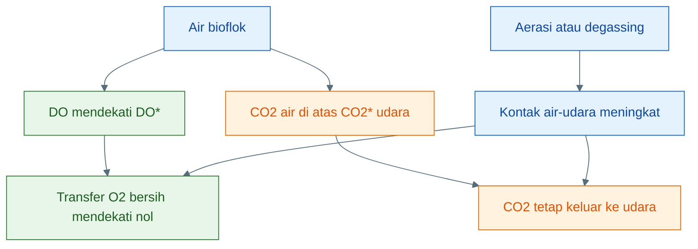
```mermaid id="vc2rj7"
%%{init: {'theme':'base','themeVariables':{
'primaryColor':'#E3F2FD',
'primaryTextColor':'#0D47A1',
'primaryBorderColor':'#1565C0',
'secondaryColor':'#E8F5E9',
'secondaryTextColor':'#1B5E20',
'secondaryBorderColor':'#2E7D32',
'tertiaryColor':'#FFF3E0',
'tertiaryTextColor':'#E65100',
'tertiaryBorderColor':'#EF6C00',
'lineColor':'#546E7A'
}}}%%
flowchart TD
    A["Air bioflok"] --> B["DO mendekati DO*"]
    B --> C["Transfer O2 bersih mendekati nol"]

    A --> D["CO2 air di atas CO2* udara"]
    D --> E["CO2 tetap keluar ke udara"]

    F["Aerasi atau degassing"] --> G["Kontak air-udara meningkat"]
    G --> C
    G --> E

    classDef air fill:#E3F2FD,stroke:#1565C0,color:#0D47A1;
    classDef oksigen fill:#E8F5E9,stroke:#2E7D32,color:#1B5E20;
    classDef co2 fill:#FFF3E0,stroke:#EF6C00,color:#E65100;

    class A,F,G air;
    class B,C oksigen;
    class D,E co2;
```

Diagram ini sengaja memisahkan transfer $O_2$ dan transfer $CO_2$. Keduanya terjadi pada kontak air-udara, tetapi arah dan kecepatannya ditentukan oleh gradien masing-masing gas.

---

## 4.5. Hubungan $CO_2$, $pH$, dan alkalinitas

$CO_2$ terlarut berinteraksi dengan air membentuk sistem karbonat.

$$
CO_2 + H_2O
\rightleftharpoons
H_2CO_3
\rightleftharpoons
H^+
+
HCO_3^-
$$

Jika $CO_2$ bertambah, sistem bergeser menghasilkan lebih banyak $H^+$.

Akibatnya:

$$
H^+ \uparrow
\Rightarrow
pH \downarrow
$$

Jika $CO_2$ dibuang melalui degassing, sistem bergeser ke arah sebaliknya.

$$
CO_2 \downarrow
\Rightarrow
H^+ \downarrow
\Rightarrow
pH \uparrow
$$

Tetapi perlu ditegaskan:

> Degassing dapat menaikkan $pH$ dengan menurunkan $CO_2$, tetapi degassing tidak menambah alkalinitas.

Jika alkalinitas sudah habis karena nitrifikasi, maka degassing saja tidak cukup. Buffer tetap perlu ditambahkan.

---

## 4.6. Estimasi $CO_2$ dari $pH$ dan alkalinitas

Untuk praktik lapangan, $CO_2$ dapat diperkirakan dari $pH$ dan alkalinitas.

Formula pendekatan:

$$
CO_2
=

0{,}88
\times
Alkalinitas
\times
10^{(6{,}35 - pH)}
$$

Keterangan:

| Variabel      | Satuan                   |
| ------------- | ------------------------ |
| $CO_2$        | $\text{mg/L}$            |
| $Alkalinitas$ | $\text{mg/L as } CaCO_3$ |
| $pH$          | unit $pH$                |

Formula ini adalah pendekatan lapangan. SRAC Publication No. 464 menyediakan tabel hubungan $pH$, alkalinitas, suhu, dan faktor perhitungan $CO_2$ untuk kolam ikan. ([NCRAC][1])

Batas penggunaan formula:

| Kondisi                             | Catatan                       |
| ----------------------------------- | ----------------------------- |
| Air tawar                           | cocok sebagai estimasi        |
| $pH$ sekitar $6{,}5$ sampai $8{,}3$ | estimasi paling berguna       |
| Salinitas tinggi                    | perlu koreksi sistem karbonat |
| Banyak asam organik                 | hasil bisa bias               |
| Alkalinitas sangat rendah           | interpretasi harus hati-hati  |
| Sistem dengan fotosintesis kuat     | ukur pagi dan sore            |

---

## 4.7. Tabel estimasi $CO_2$ berbasis $pH$ dan alkalinitas

### Jika alkalinitas $100 \text{ mg/L as } CaCO_3$

|    $pH$ |   Estimasi $CO_2$ |
| ------: | ----------------: |
| $6{,}8$ | $31 \text{ mg/L}$ |
| $7{,}0$ | $20 \text{ mg/L}$ |
| $7{,}2$ | $12 \text{ mg/L}$ |
| $7{,}4$ |  $8 \text{ mg/L}$ |
| $7{,}6$ |  $5 \text{ mg/L}$ |
| $7{,}8$ |  $3 \text{ mg/L}$ |

### Jika alkalinitas $150 \text{ mg/L as } CaCO_3$

|    $pH$ |   Estimasi $CO_2$ |
| ------: | ----------------: |
| $6{,}8$ | $47 \text{ mg/L}$ |
| $7{,}0$ | $30 \text{ mg/L}$ |
| $7{,}2$ | $19 \text{ mg/L}$ |
| $7{,}4$ | $12 \text{ mg/L}$ |
| $7{,}6$ |  $7 \text{ mg/L}$ |
| $7{,}8$ |  $5 \text{ mg/L}$ |

### Jika alkalinitas $200 \text{ mg/L as } CaCO_3$

|    $pH$ |   Estimasi $CO_2$ |
| ------: | ----------------: |
| $6{,}8$ | $62 \text{ mg/L}$ |
| $7{,}0$ | $39 \text{ mg/L}$ |
| $7{,}2$ | $25 \text{ mg/L}$ |
| $7{,}4$ | $16 \text{ mg/L}$ |
| $7{,}6$ | $10 \text{ mg/L}$ |
| $7{,}8$ |  $6 \text{ mg/L}$ |

Tabel ini menjelaskan mengapa $pH$ tidak bisa dibaca sendirian. Pada $pH$ yang sama, nilai $CO_2$ berbeda bila alkalinitas berbeda.

---

## 4.8. Ambang $CO_2$ operasional

Untuk artikel ini, ambang $CO_2$ yang dipakai adalah:

|                        $CO_2$ | Status operasi | Tindakan                                  |
| ----------------------------: | -------------- | ----------------------------------------- |
|            $<10 \text{ mg/L}$ | Target utama   | Monitoring rutin                          |
| $10$ sampai $15 \text{ mg/L}$ | Batas operasi  | Pantau $pH$, ikan, dan aerasi             |
| $15$ sampai $25 \text{ mg/L}$ | Perlu koreksi  | Tambah degassing                          |
|            $>30 \text{ mg/L}$ | Darurat $CO_2$ | Degassing kuat, kurangi pakan, cek sludge |

Angka ini tidak menggantikan pengamatan ikan. Jika ikan menunjukkan stres, menggantung, atau respons makan turun, tindakan koreksi perlu dilakukan meskipun angka masih berada dekat batas.

---

## 4.9. Kapan masalahnya alkalinitas, kapan masalahnya $CO_2$

Keputusan harus berbasis kombinasi $pH$, alkalinitas, dan estimasi $CO_2$.

| Data lapangan                                                                                | Interpretasi                | Tindakan utama                            |
| -------------------------------------------------------------------------------------------- | --------------------------- | ----------------------------------------- |
| $pH <7{,}0$, alkalinitas $<100 \text{ mg/L as } CaCO_3$                                      | buffer kurang               | tambah buffer                             |
| $pH <7{,}2$, alkalinitas $150$ sampai $200 \text{ mg/L as } CaCO_3$, $CO_2 >15 \text{ mg/L}$ | $CO_2$ di atas ambang       | tambah degassing                          |
| $pH 7{,}2$ sampai $7{,}8$, $CO_2 <15 \text{ mg/L}$                                           | dalam rentang operasi       | monitoring                                |
| $pH >8{,}3$, alkalinitas dan hardness tinggi                                                 | risiko presipitasi $CaCO_3$ | evaluasi Ca, alkalinitas, alga, degassing |
| $DO <4 \text{ mg/L}$                                                                         | defisit oksigen             | tambah aerasi, kurangi pakan, cek sludge  |

Catatan: dalam tabel ini, nilai seperti $pH <7{,}0$ harus dibaca sebagai kondisi operasional yang membutuhkan evaluasi. Bukan berarti semua ikan langsung mati pada angka tersebut.

---

## 4.10. Tes ember untuk membedakan $CO_2$ dan alkalinitas

Tes sederhana:

1. Ambil air kolam dalam ember.
2. Ukur $pH$ awal.
3. Aerasi kuat selama $30$ sampai $60$ menit.
4. Ukur $pH$ lagi.

Interpretasi:

| Hasil tes                                  | Interpretasi                                          |
| ------------------------------------------ | ----------------------------------------------------- |
| $pH$ naik $>0{,}3$ unit                    | $CO_2$ kemungkinan menjadi penyebab utama $pH$ rendah |
| $pH$ naik $0{,}1$ sampai $0{,}3$ unit      | $CO_2$ berperan, tetapi perlu cek alkalinitas         |
| $pH$ naik $<0{,}1$ unit                    | masalah kemungkinan bukan dominan $CO_2$              |
| Alkalinitas $<100 \text{ mg/L as } CaCO_3$ | buffer tetap perlu ditambah                           |

Tes ini tidak menggantikan alat ukur $CO_2$, tetapi berguna untuk keputusan cepat di lapangan.

---

## 4.11. Teknologi aerasi dan degassing

Aerasi dalam bioflok memiliki empat fungsi:

| Fungsi             | Parameter yang dipengaruhi      |
| ------------------ | ------------------------------- |
| Oksigenasi         | $DO$                            |
| Degassing          | $CO_2$                          |
| Mixing             | flok, $TSS$, sludge             |
| Pencegahan anaerob | dasar kolam dan padatan organik |

Namun alat yang baik untuk $O_2$ belum tentu paling efektif untuk $CO_2$.

Urutan teknologi degassing $CO_2$:

| Teknologi                | Fungsi utama                      | Catatan                                    |
| ------------------------ | --------------------------------- | ------------------------------------------ |
| Shower filter            | degassing sangat kuat             | air dipecah menjadi film tipis dan droplet |
| Trickling filter         | degassing dan biofilm             | baik bila aliran dan ventilasi cukup       |
| Cascade atau jatuhan air | degassing sederhana               | mudah dibuat pada sistem kecil             |
| Airlift degasser         | degassing dan sirkulasi           | cocok untuk sistem padat                   |
| Venturi                  | pertukaran gas sedang sampai baik | tergantung desain tekanan dan aliran       |
| Diffuser dasar           | bagus untuk mixing dan $O_2$      | belum tentu optimal untuk $CO_2$           |

Bioflok membutuhkan aerasi untuk memasok oksigen, menjaga padatan tetap tersuspensi, dan mencegah zona anaerob. Hargreaves menekankan bahwa air pada sistem bioflok memiliki respirasi tinggi karena suspended solids, dan kegagalan aerasi dapat membuat waktu respons menjadi pendek. ([Aquaculture][2])

---

## 4.12. Diagram pilihan teknologi untuk $O_2$ dan $CO_2$

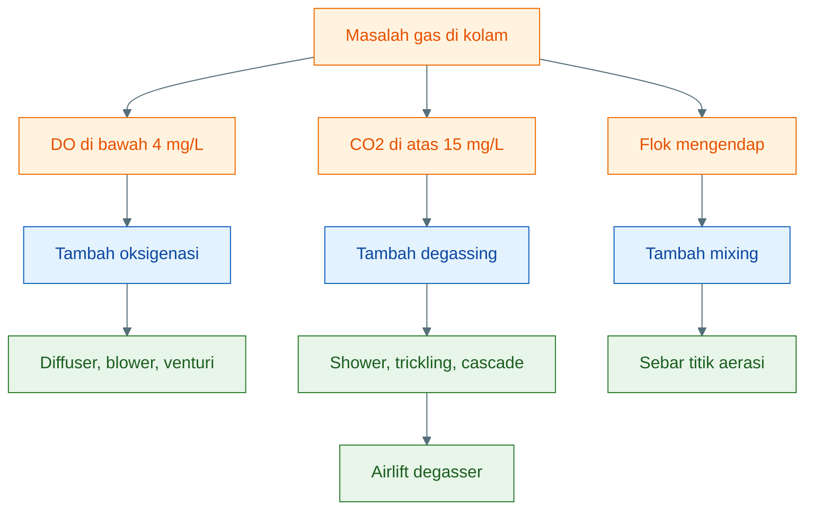
```mermaid id="3qmyrm"
%%{init: {'theme':'base','themeVariables':{
'primaryColor':'#E3F2FD',
'primaryTextColor':'#0D47A1',
'primaryBorderColor':'#1565C0',
'secondaryColor':'#E8F5E9',
'secondaryTextColor':'#1B5E20',
'secondaryBorderColor':'#2E7D32',
'tertiaryColor':'#FFF3E0',
'tertiaryTextColor':'#E65100',
'tertiaryBorderColor':'#EF6C00',
'lineColor':'#546E7A'
}}}%%
flowchart TD
    A["Masalah gas di kolam"] --> B["DO di bawah 4 mg/L"]
    A --> C["CO2 di atas 15 mg/L"]
    A --> D["Flok mengendap"]

    B --> E["Tambah oksigenasi"]
    E --> F["Diffuser, blower, venturi"]

    C --> G["Tambah degassing"]
    G --> H["Shower, trickling, cascade"]
    H --> I["Airlift degasser"]

    D --> J["Tambah mixing"]
    J --> K["Sebar titik aerasi"]

    classDef masalah fill:#FFF3E0,stroke:#EF6C00,color:#E65100;
    classDef tindakan fill:#E3F2FD,stroke:#1565C0,color:#0D47A1;
    classDef alat fill:#E8F5E9,stroke:#2E7D32,color:#1B5E20;

    class A,B,C,D masalah;
    class E,G,J tindakan;
    class F,H,I,K alat;
```

Diagram ini memisahkan tiga fungsi yang sering dicampur:

1. menaikkan $DO$;
2. membuang $CO_2$;
3. menjaga flok tetap tersuspensi.

---

## 4.13. Desain degassing untuk kolam kecil

Untuk kolam bioflok kecil, misalnya $1 \text{ m}^3$, pilihan degassing dapat dibuat sederhana.

### Opsi 1: jatuhan air kecil

Air dipompa ke atas, lalu dijatuhkan kembali ke kolam melalui beberapa tingkat.

Parameter desain awal:

| Parameter       |                              Angka kerja |
| --------------- | ---------------------------------------: |
| Debit sirkulasi | $1$ sampai $3$ kali volume kolam per jam |
| Tinggi jatuhan  |              $30$ sampai $80 \text{ cm}$ |
| Jumlah tingkat  |                   $2$ sampai $4$ tingkat |
| Ventilasi udara |                            harus terbuka |

Untuk kolam $1 \text{ m}^3$, debit awal:

$$
Q
=

1
\text{ sampai }
3
\text{ m}^3\text{/jam}
$$

### Opsi 2: shower filter sederhana

Air dialirkan melewati media terbuka dengan ventilasi baik.

Parameter desain awal:

| Parameter     |                                                     Angka kerja |
| ------------- | --------------------------------------------------------------: |
| Debit         | $1$ sampai $3 \text{ m}^3\text{/jam}$ per $1 \text{ m}^3$ kolam |
| Media         |                     bioball, jaring, potongan pipa, media inert |
| Ventilasi     |                                                           wajib |
| Posisi outlet |                                 kembali ke kolam dengan jatuhan |

### Opsi 3: airlift degasser

Airlift membantu sirkulasi sekaligus kontak udara-air.

Parameter desain awal:

| Parameter               |                             Angka kerja |
| ----------------------- | --------------------------------------: |
| Diameter pipa           |                       disesuaikan debit |
| Kedalaman injeksi udara |          semakin dalam, lift lebih kuat |
| Outlet                  | dibuat jatuh atau menyebar di permukaan |
| Fungsi tambahan         |                            mixing kolam |

---

## 4.14. Kapan degassing perlu ditambah

Degassing perlu ditambah bila salah satu kondisi berikut terjadi.

| Data                                                                      | Keputusan                                                |
| ------------------------------------------------------------------------- | -------------------------------------------------------- |
| $CO_2 >15 \text{ mg/L}$                                                   | tambah degassing                                         |
| $CO_2 >30 \text{ mg/L}$                                                   | tindakan darurat                                         |
| $pH <7{,}2$ dengan alkalinitas $150$ sampai $200 \text{ mg/L as } CaCO_3$ | hitung $CO_2$; jika $>15 \text{ mg/L}$, tambah degassing |
| $DO$ jenuh tetapi $pH$ tetap di bawah target                              | jangan simpulkan aerasi cukup untuk $CO_2$               |
| Tes ember menaikkan $pH >0{,}3$                                           | $CO_2$ menjadi penyebab dominan                          |
| Ikan menggantung pagi hari                                                | cek $DO$, $CO_2$, nitrit, dan $pH$                       |

---

## 4.15. Risiko degassing berlebihan

Degassing diperlukan untuk mengendalikan $CO_2$, tetapi pada sistem dengan calcium hardness dan alkalinitas yang sudah berada dekat batas atas, degassing dapat menaikkan $pH$ dan meningkatkan risiko presipitasi $CaCO_3$.

Mekanisme:

$$
CO_2 \downarrow
\Rightarrow
pH \uparrow
$$

Pada $pH$ lebih tinggi, fraksi karbonat meningkat:

$$
HCO_3^-
\rightleftharpoons
H^+
+
CO_3^{2-}
$$

Jika $Ca^{2+}$ tersedia:

$$
Ca^{2+}
+
CO_3^{2-}
\rightarrow
CaCO_3 \downarrow
$$

Ambang waspada presipitasi:

| Parameter        |                                      Ambang |
| ---------------- | ------------------------------------------: |
| $pH$             |                                    $>8{,}3$ |
| Alkalinitas      |              $>200 \text{ mg/L as } CaCO_3$ |
| Calcium hardness | $>250$ sampai $300 \text{ mg/L as } CaCO_3$ |

Tanda lapangan:

| Tanda                                        | Interpretasi               |
| -------------------------------------------- | -------------------------- |
| kerak putih di diffuser                      | scaling mineral            |
| air keruh putih setelah $pH$ naik            | presipitasi karbonat halus |
| alkalinitas turun tanpa kenaikan nitrifikasi | kemungkinan presipitasi    |
| hardness turun setelah $pH$ tinggi           | Ca keluar sebagai padatan  |

---

## 4.16. SOP angka untuk $pH$, alkalinitas, dan $CO_2$

SOP ini dibuat untuk menghindari keputusan berbasis istilah umum.

```text
1. Ukur pH pagi.
2. Ukur alkalinitas.
3. Hitung CO2.
4. Ukur DO subuh.
5. Jika DO di bawah 4 mg/L, koreksi aerasi untuk oksigen.
6. Jika CO2 di atas 15 mg/L, tambah degassing.
7. Jika alkalinitas di bawah 100 mg/L as CaCO3, tambah buffer.
8. Jika hardness di atas 300 mg/L as CaCO3, hindari buffer berbasis Ca sebagai pilihan utama.
9. Jika pH di atas 8,3, pantau risiko presipitasi CaCO3 dan NH3 bebas.
```

Versi tabel:

| Kondisi                                                                | Keputusan                                          |
| ---------------------------------------------------------------------- | -------------------------------------------------- |
| $DO <4 \text{ mg/L}$                                                   | tambah aerasi untuk $O_2$, kurangi pakan sementara |
| $CO_2 >15 \text{ mg/L}$                                                | tambah degassing                                   |
| $CO_2 >30 \text{ mg/L}$                                                | tindakan darurat $CO_2$                            |
| Alkalinitas $<100 \text{ mg/L as } CaCO_3$                             | tambah buffer                                      |
| Alkalinitas $150$ sampai $200 \text{ mg/L as } CaCO_3$ dan $pH <7{,}2$ | hitung $CO_2$, jangan otomatis tambah kapur        |
| Hardness $>300 \text{ mg/L as } CaCO_3$                                | hindari koreksi utama memakai $CaCO_3$             |
| $pH >8{,}3$                                                            | evaluasi presipitasi dan fraksi $NH_3$             |

---

## 4.17. Kesimpulan Bab 4

Bab ini menegaskan bahwa $DO$, $CO_2$, $pH$, alkalinitas, aerasi, dan degassing harus dibaca sebagai sistem yang saling terkait, tetapi tidak boleh dicampur secara konsep.

Prinsip utamanya:

$$
DO \approx DO^*
$$

tidak berarti:

$$
CO_2 \approx CO_2^*
$$

$O_2$ dan $CO_2$ memiliki gradien transfer masing-masing. Jika $DO$ sudah jenuh, transfer bersih $O_2$ dapat mendekati nol. Namun jika $CO_2$ di air masih lebih tinggi daripada kesetimbangan dengan udara, $CO_2$ tetap dapat keluar melalui degassing.

Formula lapangan yang dipakai:

$$
CO_2
=

0{,}88
\times
Alkalinitas
\times
10^{(6{,}35 - pH)}
$$

Ambang tindakan:

| Parameter          |                                             Ambang |
| ------------------ | -------------------------------------------------: |
| $CO_2$ target      |                     $<10$ sampai $15 \text{ mg/L}$ |
| Koreksi degassing  |                            $CO_2 >15 \text{ mg/L}$ |
| Darurat $CO_2$     |                            $CO_2 >30 \text{ mg/L}$ |
| Koreksi buffer     |         alkalinitas $<100 \text{ mg/L as } CaCO_3$ |
| Risiko presipitasi | $pH >8{,}3$ dengan alkalinitas dan hardness tinggi |

Pesan utama Bab 4:

> Aerasi bioflok bukan hanya untuk menaikkan $DO$. Dalam perspektif engineering, aerasi dan degassing harus dirancang untuk $O_2$, $CO_2$, mixing, dan pencegahan zona anaerob secara bersamaan.

[1]: https://www.ncrac.org/files/inline-files/SRAC0464.pdf?utm_source=chatgpt.com 'Interactions of pH, Carbon Dioxide, Alkalinity and ...'
[2]: https://aquaculture.mgcafe.uky.edu/sites/aquaculture.ca.uky.edu/files/srac_4503_biofloc_production_systems_for_aquaculture.pdf?utm_source=chatgpt.com 'Biofloc Production Systems for Aquaculture'

[**Kembali ke Atas**](#manajemen-salinitas-dan-alkalinitas-pada-kolam-bioflok-pendekatan-formula-stoikiometri-dan-kontrol-operasional)

---

# Bab 5. Manajemen dari Persiapan Kolam sampai Operasi Harian

Bab ini mengubah prinsip Bab 1 sampai Bab 4 menjadi prosedur kerja kolam. Fokusnya bukan lagi definisi, tetapi **urutan keputusan operasional**:

1. parameter apa yang harus dikunci sebelum tebar;
2. bahan apa yang dipilih untuk koreksi alkalinitas;
3. kapan memakai buffer;
4. kapan memakai degassing;
5. kapan menambah $Cl^-$;
6. kapan menghindari $CaCO_3$;
7. kapan sistem harus dianggap masuk kondisi darurat.

Prinsip utama Bab 5:

> Koreksi air bioflok harus dimulai dari data ukur, bukan dari kebiasaan menambah garam, kapur, atau molase.

Parameter minimal yang harus tersedia untuk manajemen salinitas dan alkalinitas:

| Parameter          | Fungsi keputusan                                   |
| ------------------ | -------------------------------------------------- |
| $DO$               | menentukan kebutuhan aerasi oksigen                |
| $pH$ pagi dan sore | membaca stabilitas harian                          |
| Alkalinitas        | menentukan kebutuhan buffer                        |
| Hardness           | menentukan apakah bahan berbasis Ca masih layak    |
| $CO_2$             | menentukan kebutuhan degassing                     |
| Nitrit             | menentukan risiko toksisitas                       |
| $Cl^-$             | menentukan rasio proteksi terhadap nitrit          |
| $TAN$              | membaca beban nitrogen                             |
| Sludge             | membaca risiko pelepasan ulang nitrogen dan $CO_2$ |

---

## 5.1. Target awal sebelum kolam dioperasikan

Sebelum ikan masuk, kolam harus memiliki batas awal yang jelas. Target awal bukan dibuat agar air terlihat “siap”, tetapi agar sistem memiliki cadangan buffer, mineral, oksigen, dan proteksi nitrit yang bisa dihitung.

| Parameter      |                                                                        Target awal |
| -------------- | ---------------------------------------------------------------------------------: |
| Alkalinitas    |                                         $150$ sampai $200 \text{ mg/L as } CaCO_3$ |
| Total hardness |                                         $100$ sampai $250 \text{ mg/L as } CaCO_3$ |
| $Cl^-$         | minimal sesuai rasio nitrit; buffer $60$ sampai $100 \text{ mg/L}$ bila diperlukan |
| $pH$ pagi      |                                                             $7{,}0$ sampai $7{,}8$ |
| $CO_2$         |                                                                 $<15 \text{ mg/L}$ |
| $DO$ subuh     |                                                       $>4$ sampai $5 \text{ mg/L}$ |
| $TAN$          |                                                                  $<1 \text{ mg/L}$ |
| Nitrit         |                                         $<1 \text{ mg/L}$ atau sesuai rasio $Cl^-$ |

Catatan penting:

- target $DO$ subuh sebaiknya memakai batas desain $>5 \text{ mg/L}$ bila sistem padat;
- batas $>4 \text{ mg/L}$ dipakai sebagai minimum operasi;
- $CO_2$ di bawah $15 \text{ mg/L}$ dipakai sebagai batas awal agar $pH$ tidak rendah karena akumulasi karbon dioksida;
- nitrit harus dibaca bersama $Cl^-$, bukan hanya sebagai angka tunggal.

---

## 5.2. Urutan persiapan kolam

Persiapan kolam dapat dibagi menjadi empat tahap:

1. isi air dan stabilisasi fisik;
2. koreksi alkalinitas dan hardness;
3. siapkan $Cl^-$ bila diperlukan;
4. uji respons sistem sebelum tebar.

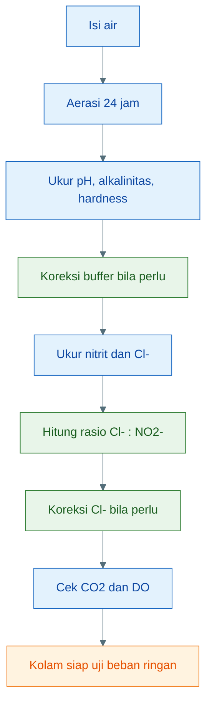
```mermaid id="kx0d3r"
%%{init: {'theme':'base','themeVariables':{
'primaryColor':'#E3F2FD',
'primaryTextColor':'#0D47A1',
'primaryBorderColor':'#1565C0',
'secondaryColor':'#E8F5E9',
'secondaryTextColor':'#1B5E20',
'secondaryBorderColor':'#2E7D32',
'tertiaryColor':'#FFF3E0',
'tertiaryTextColor':'#E65100',
'tertiaryBorderColor':'#EF6C00',
'lineColor':'#546E7A'
}}}%%
flowchart TD
    A["Isi air"] --> B["Aerasi 24 jam"]
    B --> C["Ukur pH, alkalinitas, hardness"]
    C --> D["Koreksi buffer bila perlu"]
    D --> E["Ukur nitrit dan Cl-"]
    E --> F["Hitung rasio Cl- : NO2-"]
    F --> G["Koreksi Cl- bila perlu"]
    G --> H["Cek CO2 dan DO"]
    H --> I["Kolam siap uji beban ringan"]

    classDef input fill:#E3F2FD,stroke:#1565C0,color:#0D47A1;
    classDef koreksi fill:#E8F5E9,stroke:#2E7D32,color:#1B5E20;
    classDef output fill:#FFF3E0,stroke:#EF6C00,color:#E65100;

    class A,B,C,E,H input;
    class D,F,G koreksi;
    class I output;
```

Urutan ini penting karena koreksi tidak boleh dilakukan secara acak. Misalnya, menambah $CaCO_3$ tanpa mengetahui hardness dapat membuat hardness naik melewati batas operasional. Menambah garam tanpa mengetahui nitrit dan $Cl^-$ membuat rasio proteksi tidak bisa dihitung.

---

## 5.3. Persiapan alkalinitas

Target alkalinitas awal:

$$
Alk_{\text{target}}
=

150
\text{ sampai }
200
\text{ mg/L as } CaCO_3
$$

Jika alkalinitas aktual belum mencapai target, selisihnya dihitung:

$$
\Delta Alk
=

Alk_{\text{target}}

Alk_{\text{aktual}}
$$

Untuk volume $V$ dalam $\text{m}^3$, kebutuhan ekuivalen $CaCO_3$ adalah:

$$
CaCO_{3,\text{ekuivalen}}
=

\Delta Alk
\times
V
$$

dengan hasil dalam gram, karena:

$$
1 \text{ mg/L pada } 1 \text{ m}^3
=

1 \text{ g}
$$

Contoh:

| Parameter          |                         Nilai |
| ------------------ | ----------------------------: |
| Volume             |               $1 \text{ m}^3$ |
| Alkalinitas aktual |  $80 \text{ mg/L as } CaCO_3$ |
| Alkalinitas target | $180 \text{ mg/L as } CaCO_3$ |

Selisih:

$$
\Delta Alk
=

180

80

100
\text{ mg/L as } CaCO_3
$$

Kebutuhan ekuivalen:

$$
CaCO_{3,\text{ekuivalen}}
=

100
\times
1
=

100
\text{ g}
$$

Jika memakai $NaHCO_3$:

$$
NaHCO_{3,\text{gram}}
=

CaCO_{3,\text{ekuivalen}}
\times
1{,}68
$$

$$
NaHCO_{3,\text{gram}}
=

100
\times
1{,}68
=

168
\text{ g}
$$

Jadi untuk menaikkan alkalinitas dari $80$ ke $180 \text{ mg/L as } CaCO_3$ pada kolam $1 \text{ m}^3$, kebutuhan teoritisnya adalah:

- $100 \text{ g}$ ekuivalen $CaCO_3$; atau
- $168 \text{ g } NaHCO_3$.

Dosis praktik diberikan bertahap, misalnya $30\%$ sampai $50\%$ dari hasil hitung, lalu ukur ulang setelah air tercampur.

---

## 5.4. Persiapan hardness

Target total hardness untuk bioflok nila:

$$
Hardness_{\text{target}}
=

100
\text{ sampai }
250
\text{ mg/L as } CaCO_3
$$

Batas nyaman atas:

$$
Hardness_{\text{atas}}
=

300
\text{ mg/L as } CaCO_3
$$

Jika hardness berada di bawah $100 \text{ mg/L as } CaCO_3$, bahan seperti $CaCO_3$ atau dolomit masih dapat dipakai untuk membantu menaikkan hardness sekaligus alkalinitas.

Jika hardness sudah di atas $300 \text{ mg/L as } CaCO_3$, koreksi alkalinitas sebaiknya tidak mengandalkan bahan berbasis Ca.

Tabel keputusan:

|                                Alkalinitas |                                   Hardness | Keputusan bahan                        |
| -----------------------------------------: | -----------------------------------------: | -------------------------------------- |
|             $<100 \text{ mg/L as } CaCO_3$ |             $<100 \text{ mg/L as } CaCO_3$ | $CaCO_3$ atau dolomit dapat dipakai    |
|             $<100 \text{ mg/L as } CaCO_3$ | $100$ sampai $250 \text{ mg/L as } CaCO_3$ | $NaHCO_3$, $KHCO_3$, atau kombinasi    |
|             $<100 \text{ mg/L as } CaCO_3$ |             $>300 \text{ mg/L as } CaCO_3$ | hindari $CaCO_3$ sebagai koreksi utama |
| $150$ sampai $200 \text{ mg/L as } CaCO_3$ | $100$ sampai $250 \text{ mg/L as } CaCO_3$ | monitoring                             |
| $150$ sampai $200 \text{ mg/L as } CaCO_3$ |             $>300 \text{ mg/L as } CaCO_3$ | jangan tambah sumber Ca                |

---

## 5.5. Pemilihan bahan buffer

Pemilihan bahan tidak boleh hanya berdasarkan ketersediaan bahan. Setiap bahan membawa konsekuensi ionik.

| Bahan      | Menaikkan alkalinitas | Menaikkan hardness | Risiko utama                        |
| ---------- | --------------------: | -----------------: | ----------------------------------- |
| $CaCO_3$   |                    Ya |             Ya, Ca | lambat, hardness naik               |
| Dolomit    |                    Ya |      Ya, Ca dan Mg | lambat                              |
| $NaHCO_3$  |                    Ya |              Tidak | $Na^+$ akumulatif                   |
| $KHCO_3$   |                    Ya |              Tidak | $K^+$ naik                          |
| $Ca(OH)_2$ |                    Ya |             Ya, Ca | risiko $pH$ naik cepat              |
| $CaCl_2$   |           Tidak utama |             Ya, Ca | menambah $Cl^-$, bukan buffer utama |

### $CaCO_3$

Cocok untuk:

- alkalinitas di bawah target;
- hardness juga di bawah target;
- koreksi tidak perlu cepat.

Risiko:

- larut lambat;
- menambah $Ca^{2+}$;
- hardness bisa naik bila digunakan terus-menerus.

### Dolomit

Dolomit menambah Ca dan Mg. Cocok bila hardness rendah dan sistem juga membutuhkan Mg.

Risiko:

- larut lambat;
- efek koreksi tidak secepat bikarbonat;
- komposisi aktual tergantung kualitas bahan.

### $NaHCO_3$

Cocok untuk koreksi alkalinitas cepat tanpa menaikkan hardness.

Risiko:

- menambah $Na^+$;
- dalam sistem tertutup, natrium dapat terakumulasi.

### $KHCO_3$

Cocok bila alkalinitas perlu dinaikkan dan sistem membutuhkan kalium, terutama pada sistem yang terhubung dengan tanaman.

Risiko:

- $K^+$ dapat naik;
- perlu membaca keseimbangan Ca, Mg, dan K bila sistem aquaponik.

### $Ca(OH)_2$

Bahan ini kuat dan dapat menaikkan $pH$ lebih cepat.

Risiko:

- $pH$ dapat naik terlalu cepat;
- menambah Ca;
- harus dipakai bertahap dan terukur.

### $CaCl_2$

$CaCl_2$ bukan buffer utama. Fungsinya lebih sebagai sumber Ca dan $Cl^-$.

Cocok bila:

- $Cl^-$ perlu dinaikkan;
- Ca juga diperlukan.

Risiko:

- hardness naik;
- bukan solusi utama untuk alkalinitas.

---

## 5.6. Persiapan $Cl^-$ terhadap nitrit

Target rasio operasional yang dipakai:

$$
Cl^- : NO_2^-
=

20:1
$$

Minimum:

$$
Cl^- : NO_2^-
=

10:1
$$

Formula target $Cl^-$:

$$
Cl^-_{\text{target}}
=

R
\times
NO_2^-
$$

Tambahan $Cl^-$:

$$
Cl^-_{\text{tambahan}}
=

\max
\left(
0,
Cl^-_{\text{target}}
-

Cl^-_{\text{aktual}}
\right)
$$

Konversi ke $NaCl$:

$$
NaCl_{\text{gram}}
=

\frac{
Cl^-_{\text{tambahan}}
\times
V
}{
0{,}606
}
$$

Contoh:

| Parameter              |             Nilai |
| ---------------------- | ----------------: |
| Nitrit                 |  $2 \text{ mg/L}$ |
| Rasio target           |            $20:1$ |
| $Cl^-_{\text{aktual}}$ | $10 \text{ mg/L}$ |
| Volume                 |   $1 \text{ m}^3$ |

Target:

$$
Cl^-_{\text{target}}
=

20
\times
2
=

40
\text{ mg/L}
$$

Tambahan:

$$
Cl^-_{\text{tambahan}}
=

40

10

30
\text{ mg/L}
$$

Kebutuhan $NaCl$:

$$
NaCl_{\text{gram}}
=

\frac{
30
\times
1
}{
0{,}606
}
=

49{,}5
\text{ g}
$$

Dibulatkan:

$$
NaCl_{\text{gram}}
\approx
50
\text{ g}
$$

---

## 5.7. Persiapan $CO_2$ dan degassing

Target $CO_2$ sebelum operasi:

$$
CO_2
<
15
\text{ mg/L}
$$

Formula estimasi:

$$
CO_2
=

0{,}88
\times
Alkalinitas
\times
10^{(6{,}35 - pH)}
$$

Jika $CO_2$ di atas $15 \text{ mg/L}$, perbaiki degassing sebelum menaikkan kepadatan ikan atau pakan.

Contoh:

| Parameter   |                         Nilai |
| ----------- | ----------------------------: |
| Alkalinitas | $150 \text{ mg/L as } CaCO_3$ |
| $pH$ pagi   |                       $7{,}0$ |

Hitung:

$$
CO_2
=

0{,}88
\times
150
\times
10^{(6{,}35 - 7{,}0)}
$$

$$
CO_2
\approx
30
\text{ mg/L}
$$

Keputusan:

> $CO_2 \approx 30 \text{ mg/L}$ masuk kategori darurat $CO_2$. Koreksi utama adalah degassing, bukan penambahan $CaCO_3$.

---

## 5.8. Operasi harian berbasis angka

Setelah kolam berjalan, parameter harian harus diterjemahkan langsung menjadi keputusan.

| Temuan                                                                    | Tindakan                                            |
| ------------------------------------------------------------------------- | --------------------------------------------------- |
| $DO <4 \text{ mg/L}$                                                      | tambah aerasi, kurangi pakan                        |
| $CO_2 >15 \text{ mg/L}$                                                   | tambah degassing                                    |
| Alkalinitas $<100 \text{ mg/L as } CaCO_3$                                | tambah buffer                                       |
| Hardness $>300 \text{ mg/L as } CaCO_3$                                   | hindari buffer berbasis Ca                          |
| $Cl^- : NO_2^-$ di bawah target                                           | tambah sumber $Cl^-$                                |
| $pH$ rendah tetapi alkalinitas $150$ sampai $200 \text{ mg/L as } CaCO_3$ | fokus degassing $CO_2$                              |
| Kerak putih muncul                                                        | evaluasi $pH$, hardness, alkalinitas, dan degassing |

---

## 5.9. Diagram SOP operasi harian

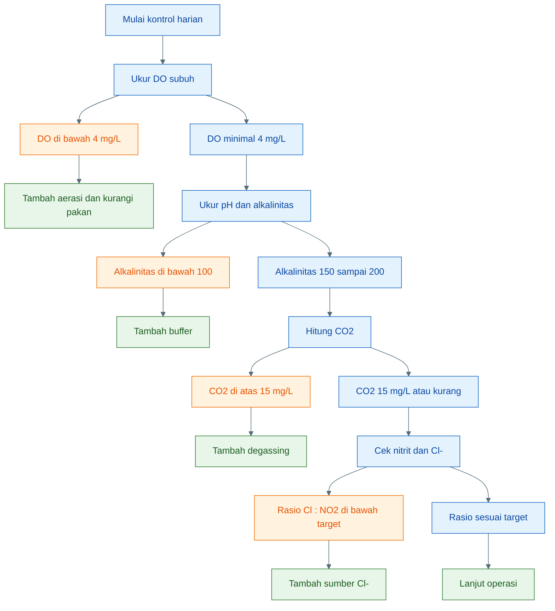
```mermaid id="7904km"
%%{init: {'theme':'base','themeVariables':{
'primaryColor':'#E3F2FD',
'primaryTextColor':'#0D47A1',
'primaryBorderColor':'#1565C0',
'secondaryColor':'#E8F5E9',
'secondaryTextColor':'#1B5E20',
'secondaryBorderColor':'#2E7D32',
'tertiaryColor':'#FFF3E0',
'tertiaryTextColor':'#E65100',
'tertiaryBorderColor':'#EF6C00',
'lineColor':'#546E7A'
}}}%%
flowchart TD
    A["Mulai kontrol harian"] --> B["Ukur DO subuh"]
    B --> C["DO di bawah 4 mg/L"]
    C --> D["Tambah aerasi dan kurangi pakan"]

    B --> E["DO minimal 4 mg/L"]
    E --> F["Ukur pH dan alkalinitas"]
    F --> G["Alkalinitas di bawah 100"]
    G --> H["Tambah buffer"]

    F --> I["Alkalinitas 150 sampai 200"]
    I --> J["Hitung CO2"]
    J --> K["CO2 di atas 15 mg/L"]
    K --> L["Tambah degassing"]

    J --> M["CO2 15 mg/L atau kurang"]
    M --> N["Cek nitrit dan Cl-"]
    N --> O["Rasio Cl : NO2 di bawah target"]
    O --> P["Tambah sumber Cl-"]

    N --> Q["Rasio sesuai target"]
    Q --> R["Lanjut operasi"]

    classDef cek fill:#E3F2FD,stroke:#1565C0,color:#0D47A1;
    classDef aksi fill:#E8F5E9,stroke:#2E7D32,color:#1B5E20;
    classDef risiko fill:#FFF3E0,stroke:#EF6C00,color:#E65100;

    class A,B,E,F,I,J,M,N,Q cek;
    class D,H,L,P,R aksi;
    class C,G,K,O risiko;
```

Diagram ini memaksa urutan keputusan:

1. $DO$ subuh;
2. alkalinitas;
3. $CO_2$;
4. nitrit dan $Cl^-$;
5. tindakan koreksi.

---

## 5.10. Frekuensi monitoring

Frekuensi pengukuran harus menyesuaikan fase sistem.

| Parameter   |                  Persiapan |                     Awal tebar |               Operasi stabil |         Saat masalah |
| ----------- | -------------------------: | -----------------------------: | ---------------------------: | -------------------: |
| $DO$ subuh  |                     harian |                         harian |                       harian | beberapa kali sehari |
| $pH$ pagi   |                     harian |                         harian |                       harian | beberapa kali sehari |
| $pH$ sore   |                     harian |                         harian |                       harian | beberapa kali sehari |
| Alkalinitas | setiap $2$ sampai $3$ hari |     setiap $2$ sampai $3$ hari |                     mingguan |               harian |
| Hardness    |                       awal |                       mingguan | setiap $2$ sampai $4$ minggu |      saat koreksi Ca |
| Nitrit      |                       awal | $2$ sampai $3$ kali per minggu |                     mingguan |               harian |
| $Cl^-$      |                       awal |                       mingguan | setiap $2$ sampai $4$ minggu |     saat nitrit naik |
| $CO_2$      |                       awal |               saat $pH$ rendah |             saat $pH$ rendah |               harian |
| Sludge      |              visual harian |                  visual harian |                visual harian |               harian |

Catatan: pada sistem kecil seperti $1 \text{ m}^3$, perubahan parameter bisa terjadi lebih cepat. Karena itu, frekuensi pengukuran pada awal tebar harus lebih rapat.

---

## 5.11. Manajemen buffer saat operasi

Koreksi alkalinitas saat operasi menggunakan dua pendekatan:

1. koreksi berdasarkan **selisih target**;
2. koreksi berdasarkan **konsumsi harian akibat nitrifikasi**.

### Pendekatan 1: selisih target

$$
\Delta Alk
=

Alk_{\text{target}}

Alk_{\text{aktual}}
$$

Jika:

$$
\Delta Alk

>

0
$$

maka perlu koreksi.

Kebutuhan $NaHCO_3$:

$$
NaHCO_{3,\text{gram}}
=

\Delta Alk
\times
V
\times
1{,}68
$$

Kebutuhan $CaCO_3$ ekuivalen:

$$
CaCO_{3,\text{gram}}
=

\Delta Alk
\times
V
$$

### Pendekatan 2: estimasi konsumsi harian

Jika produksi $TAN$ dihitung dari pakan:

$$
TAN_N
=

Feed
\times
Protein
\times
0{,}16
\times
f_{\text{TAN}}
$$

Maka konsumsi alkalinitas teoritis:

$$
Alk_{\text{konsumsi}}
=

TAN_N
\times
7{,}14
$$

Koreksi ini harus dikalibrasi dengan data alkalinitas aktual karena tidak semua $TAN$ masuk nitrifikasi penuh.

---

## 5.12. Manajemen $Cl^-$ saat operasi

Koreksi $Cl^-$ dilakukan hanya jika rasio terhadap nitrit berada di bawah target.

Rasio aktual:

$$
R_{\text{aktual}}
=

\frac{
Cl^-_{\text{aktual}}
}{
NO_2^-
}
$$

Jika:

$$
R_{\text{aktual}}
<
R_{\text{target}}
$$

maka tambahan $Cl^-$ dihitung.

Target:

$$
Cl^-_{\text{target}}
=

R_{\text{target}}
\times
NO_2^-
$$

Tambahan:

$$
Cl^-_{\text{tambahan}}
=

\max
\left(
0,
Cl^-_{\text{target}}
-

Cl^-_{\text{aktual}}
\right)
$$

Konversi:

$$
NaCl_{\text{gram}}
=

\frac{
Cl^-_{\text{tambahan}}
\times
V
}{
0{,}606
}
$$

Tindakan tambahan saat nitrit naik:

| Parameter                                          | Tindakan      |
| -------------------------------------------------- | ------------- |
| Nitrit naik                                        | kurangi pakan |
| $DO$ di bawah target                               | tambah aerasi |
| Alkalinitas di bawah $100 \text{ mg/L as } CaCO_3$ | tambah buffer |
| Sludge meningkat                                   | siphon        |
| $Cl^- : NO_2^-$ di bawah target                    | tambah $Cl^-$ |

---

## 5.13. Manajemen presipitasi $CaCO_3$

Presipitasi $CaCO_3$ terjadi saat calcium dan karbonat membentuk padatan.

Reaksi:

$$
Ca^{2+}
+
CO_3^{2-}
\rightarrow
CaCO_3 \downarrow
$$

Faktor risiko:

| Faktor                               |                              Ambang waspada |
| ------------------------------------ | ------------------------------------------: |
| $pH$                                 |                                    $>8{,}3$ |
| Alkalinitas                          |              $>200 \text{ mg/L as } CaCO_3$ |
| Calcium hardness                     | $>250$ sampai $300 \text{ mg/L as } CaCO_3$ |
| $CO_2$ terlalu rendah dan alga aktif |            risiko $pH$ sore di atas $8{,}3$ |
| Degassing kuat pada air keras        |                    risiko scaling meningkat |

Tanda lapangan:

| Tanda                                           | Interpretasi                   |
| ----------------------------------------------- | ------------------------------ |
| kerak putih di pipa atau diffuser               | presipitasi mineral            |
| air keruh putih setelah $pH$ naik               | endapan karbonat halus         |
| hardness turun setelah $pH$ tinggi              | Ca keluar sebagai padatan      |
| alkalinitas turun tanpa peningkatan nitrifikasi | kemungkinan karbonat mengendap |
| diffuser cepat tersumbat                        | scaling pada media aerasi      |

Keputusan koreksi:

| Kondisi                                                        | Tindakan                                          |
| -------------------------------------------------------------- | ------------------------------------------------- |
| $pH >8{,}3$ dan hardness di atas $300 \text{ mg/L as } CaCO_3$ | hentikan buffer berbasis Ca                       |
| kerak putih muncul                                             | cek $pH$, alkalinitas, hardness, dan $CO_2$       |
| alkalinitas cukup tetapi $pH$ tinggi sore                      | kurangi alga, evaluasi cahaya dan nutrien         |
| $CO_2$ terlalu rendah akibat degassing berlebih                | sesuaikan degassing bila $pH$ sore melewati batas |

---

## 5.14. Diagram presipitasi $CaCO_3$

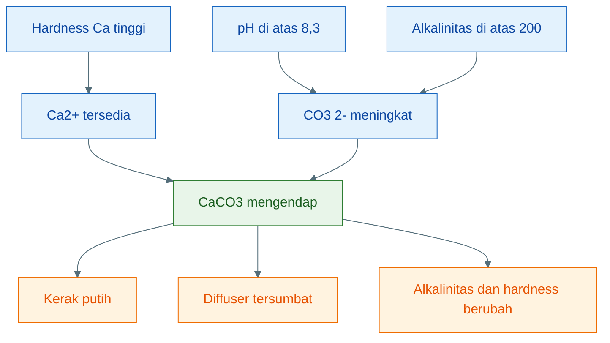
```mermaid id="pxz2bu"
%%{init: {'theme':'base','themeVariables':{
'primaryColor':'#E3F2FD',
'primaryTextColor':'#0D47A1',
'primaryBorderColor':'#1565C0',
'secondaryColor':'#E8F5E9',
'secondaryTextColor':'#1B5E20',
'secondaryBorderColor':'#2E7D32',
'tertiaryColor':'#FFF3E0',
'tertiaryTextColor':'#E65100',
'tertiaryBorderColor':'#EF6C00',
'lineColor':'#546E7A'
}}}%%
flowchart TD
    A["Hardness Ca tinggi"] --> B["Ca2+ tersedia"]
    C["pH di atas 8,3"] --> D["CO3 2- meningkat"]
    E["Alkalinitas di atas 200"] --> D
    B --> F["CaCO3 mengendap"]
    D --> F
    F --> G["Kerak putih"]
    F --> H["Diffuser tersumbat"]
    F --> I["Alkalinitas dan hardness berubah"]

    classDef faktor fill:#E3F2FD,stroke:#1565C0,color:#0D47A1;
    classDef reaksi fill:#E8F5E9,stroke:#2E7D32,color:#1B5E20;
    classDef dampak fill:#FFF3E0,stroke:#EF6C00,color:#E65100;

    class A,B,C,D,E faktor;
    class F reaksi;
    class G,H,I dampak;
```

Diagram ini menunjukkan bahwa presipitasi bukan disebabkan oleh satu parameter tunggal. Risiko muncul dari kombinasi $pH$, alkalinitas, dan calcium hardness.

---

## 5.15. Manajemen saat pakan meningkat

Kenaikan pakan berarti kenaikan nitrogen. Karena itu, saat pakan dinaikkan, sistem harus memeriksa ulang tiga hal:

1. konsumsi alkalinitas;
2. risiko nitrit;
3. kebutuhan aerasi dan degassing.

Formula dasar:

$$
TAN_N
=

Feed
\times
Protein
\times
0{,}16
\times
f_{\text{TAN}}
$$

Jika $Feed$ naik dari $0{,}20 \text{ kg/hari}$ menjadi $0{,}40 \text{ kg/hari}$, maka beban $TAN_N$ juga naik dua kali, dengan asumsi protein dan $f_{\text{TAN}}$ sama.

Dampak operasional:

| Dampak pakan naik      | Parameter yang harus dicek |
| ---------------------- | -------------------------- |
| $TAN$ naik             | $TAN$, nitrit, nitrat      |
| nitrifikasi naik       | alkalinitas                |
| respirasi naik         | $DO$, $CO_2$               |
| sludge naik            | siphon dan visual dasar    |
| nitrit berpotensi naik | $Cl^- : NO_2^-$            |

Aturan praktik:

> Jangan menaikkan pakan jika $DO$, alkalinitas, nitrit, $Cl^-$, dan sludge belum berada dalam batas operasional.

---

## 5.16. SOP koreksi cepat berdasarkan kombinasi data

### Kondisi 1: $DO$ di bawah $4 \text{ mg/L}$

Tindakan:

1. tambah aerasi;
2. hentikan atau kurangi pakan sementara;
3. buang sludge;
4. jangan menambah karbon organik;
5. cek $CO_2$, nitrit, dan $TAN$.

### Kondisi 2: $pH$ di bawah $7{,}2$, alkalinitas $150$ sampai $200 \text{ mg/L as } CaCO_3$

Tindakan:

1. hitung $CO_2$;
2. jika $CO_2 >15 \text{ mg/L}$, tambah degassing;
3. jangan langsung tambah $CaCO_3$;
4. cek sludge dan respirasi air.

### Kondisi 3: alkalinitas di bawah $100 \text{ mg/L as } CaCO_3$

Tindakan:

1. tambah buffer;
2. pilih bahan berdasarkan hardness;
3. ukur ulang setelah tercampur;
4. cek $pH$ dan $TAN$.

### Kondisi 4: hardness di atas $300 \text{ mg/L as } CaCO_3$

Tindakan:

1. hentikan $CaCO_3$ sebagai koreksi utama;
2. gunakan $NaHCO_3$ atau $KHCO_3$ bila alkalinitas perlu dinaikkan;
3. pantau $TDS$, kerak, dan $pH$.

### Kondisi 5: nitrit naik dan rasio $Cl^- : NO_2^-$ di bawah target

Tindakan:

1. hitung tambahan $Cl^-$;
2. konversi ke $NaCl$ atau sumber $Cl^-$ lain;
3. kurangi pakan;
4. cek $DO$ dan alkalinitas;
5. kuatkan nitrifikasi.

---

## 5.17. Kesimpulan Bab 5

Manajemen kolam bioflok harus dimulai dari target angka. Persiapan kolam membutuhkan penguncian alkalinitas, hardness, $Cl^-$, $pH$, $CO_2$, $DO$, $TAN$, dan nitrit sebelum sistem diberi beban ikan dan pakan.

Target utama sebelum operasi:

$$
Alkalinitas
=

150
\text{ sampai }
200
\text{ mg/L as } CaCO_3
$$

$$
Hardness
=

100
\text{ sampai }
250
\text{ mg/L as } CaCO_3
$$

$$
CO_2
<
15
\text{ mg/L}
$$

$$
DO_{\text{subuh}}

>

4
\text{ sampai }
5
\text{ mg/L}
$$

Rasio $Cl^-$ terhadap nitrit harus dihitung, bukan ditebak:

$$
Cl^-_{\text{target}}
=

R
\times
NO_2^-
$$

Penggunaan buffer juga harus berbasis kombinasi alkalinitas dan hardness. $CaCO_3$ berguna bila alkalinitas dan hardness sama-sama berada di bawah target, tetapi tidak tepat menjadi koreksi utama bila hardness sudah melewati $300 \text{ mg/L as } CaCO_3$.

Pesan utama Bab 5:

> Operasi bioflok yang stabil bukan hasil dari satu bahan koreksi, tetapi hasil dari keputusan berbasis angka: kapan menambah buffer, kapan menambah $Cl^-$, kapan menambah degassing, kapan menghindari Ca, dan kapan menurunkan pakan.

[**Kembali ke Atas**](#manajemen-salinitas-dan-alkalinitas-pada-kolam-bioflok-pendekatan-formula-stoikiometri-dan-kontrol-operasional)

---

# Bab 6. Studi Kasus Kolam Bioflok $1 \text{ m}^3$

Bab ini menerapkan formula dari Bab 1 sampai Bab 5 pada kolam bioflok kecil dengan volume $1 \text{ m}^3$. Tujuannya bukan membuat angka mutlak untuk semua kolam, tetapi memberi contoh bagaimana salinitas, $Cl^-$, alkalinitas, hardness, $pH$, $CO_2$, dan buffer dihitung secara operasional.

Pada kolam kecil, kesalahan dosis lebih cepat terlihat karena volume air terbatas. Penambahan garam, buffer, atau kapur yang terlihat kecil secara gram tetap dapat mengubah konsentrasi air secara nyata.

Konversi dasar yang dipakai:

$$
1 \text{ m}^3
=

1000 \text{ L}
$$

$$
1 \text{ mg/L pada } 1 \text{ m}^3
=

1 \text{ g}
$$

Jadi untuk kolam $1 \text{ m}^3$, angka $\text{mg/L}$ dapat langsung dibaca sebagai gram total bahan ekuivalen.

---

## 6.1. Asumsi desain

Studi kasus ini menggunakan asumsi berikut.

| Parameter                      |                                      Nilai |
| ------------------------------ | -----------------------------------------: |
| Volume                         |                            $1 \text{ m}^3$ |
| Volume air                     |                           $1000 \text{ L}$ |
| Pakan puncak                   |                   $0{,}40 \text{ kg/hari}$ |
| Protein pakan                  |                                     $30\%$ |
| $f_{\text{TAN}}$               |                                   $0{,}60$ |
| Biomassa ikan                  |                            $18 \text{ kg}$ |
| Target alkalinitas             |              $180 \text{ mg/L as } CaCO_3$ |
| Target hardness                | $100$ sampai $250 \text{ mg/L as } CaCO_3$ |
| Batas nyaman atas hardness     |              $300 \text{ mg/L as } CaCO_3$ |
| Target $Cl^- : NO_2^-$ minimum |                                     $10:1$ |
| Target $Cl^- : NO_2^-$ desain  |                                     $20:1$ |
| Target $CO_2$                  |                         $<15 \text{ mg/L}$ |
| Target $DO_{\text{subuh}}$     |               $>4$ sampai $5 \text{ mg/L}$ |

Keterangan:

- $f_{\text{TAN}} = 0{,}60$ berarti $60\%$ nitrogen dari pakan diasumsikan menjadi $TAN$;
- target alkalinitas $180 \text{ mg/L as } CaCO_3$ dipilih di tengah rentang kerja $150$ sampai $200 \text{ mg/L as } CaCO_3$;
- target hardness $100$ sampai $250 \text{ mg/L as } CaCO_3$ dipakai agar mineral divalen cukup, tetapi belum masuk zona scaling yang agresif.

---

## 6.2. Alur hitung studi kasus

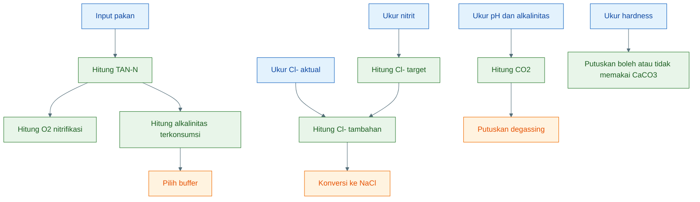
```mermaid id="c6n8r2"
%%{init: {'theme':'base','themeVariables':{
'primaryColor':'#E3F2FD',
'primaryTextColor':'#0D47A1',
'primaryBorderColor':'#1565C0',
'secondaryColor':'#E8F5E9',
'secondaryTextColor':'#1B5E20',
'secondaryBorderColor':'#2E7D32',
'tertiaryColor':'#FFF3E0',
'tertiaryTextColor':'#E65100',
'tertiaryBorderColor':'#EF6C00',
'lineColor':'#546E7A'
}}}%%
flowchart TD
    A["Input pakan"] --> B["Hitung TAN-N"]
    B --> C["Hitung O2 nitrifikasi"]
    B --> D["Hitung alkalinitas terkonsumsi"]
    D --> E["Pilih buffer"]

    F["Ukur nitrit"] --> G["Hitung Cl- target"]
    H["Ukur Cl- aktual"] --> I["Hitung Cl- tambahan"]
    G --> I
    I --> J["Konversi ke NaCl"]

    K["Ukur pH dan alkalinitas"] --> L["Hitung CO2"]
    L --> M["Putuskan degassing"]

    N["Ukur hardness"] --> O["Putuskan boleh atau tidak memakai CaCO3"]

    classDef input fill:#E3F2FD,stroke:#1565C0,color:#0D47A1;
    classDef hitung fill:#E8F5E9,stroke:#2E7D32,color:#1B5E20;
    classDef keputusan fill:#FFF3E0,stroke:#EF6C00,color:#E65100;

    class A,F,H,K,N input;
    class B,C,D,G,I,L,O hitung;
    class E,J,M keputusan;
```

Alur ini menunjukkan bahwa keputusan tidak hanya berasal dari satu parameter. Pakan menentukan $TAN$, $TAN$ menentukan konsumsi alkalinitas, nitrit menentukan kebutuhan $Cl^-$, dan $pH$ bersama alkalinitas menentukan estimasi $CO_2$.

---

## 6.3. Perhitungan $TAN$ dari pakan

Formula:

$$
TAN_N
=

Feed
\times
Protein
\times
0{,}16
\times
f_{\text{TAN}}
$$

Substitusi:

$$
TAN_N
=

0{,}40
\times
0{,}30
\times
0{,}16
\times
0{,}60
$$

Hasil:

$$
TAN_N
=

0{,}01152
\text{ kg TAN-N/hari}
$$

Konversi ke gram:

$$
0{,}01152
\text{ kg}
=

11{,}52
\text{ g}
$$

Jadi:

$$
TAN_N
=

11{,}52
\text{ g TAN-N/hari}
$$

Interpretasi:

> Pada pakan puncak $0{,}40 \text{ kg/hari}$, protein $30\%$, dan $f_{\text{TAN}} = 0{,}60$, sistem menghasilkan estimasi $11{,}52 \text{ g TAN-N/hari}$.

---

## 6.4. Perhitungan kebutuhan $O_2$ untuk nitrifikasi

Formula:

$$
O_{2,\text{nitrifikasi}}
=

TAN_N
\times
4{,}57
$$

Substitusi:

$$
O_{2,\text{nitrifikasi}}
=

11{,}52
\times
4{,}57
$$

Hasil:

$$
O_{2,\text{nitrifikasi}}
=

52{,}65
\text{ g } O_2\text{/hari}
$$

Konversi ke per jam:

$$
O_{2,\text{nitrifikasi per jam}}
=

\frac{
52{,}65
}{
24
}
$$

$$
O_{2,\text{nitrifikasi per jam}}
=

2{,}19
\text{ g } O_2\text{/jam}
$$

Interpretasi:

> Pada kondisi pakan puncak, nitrifikasi saja membutuhkan sekitar $2{,}19 \text{ g } O_2\text{/jam}$.

Catatan: angka ini belum termasuk oksigen untuk respirasi ikan, mikroba heterotrof, flok, alga malam, dan penguraian sludge.

---

## 6.5. Konsumsi alkalinitas harian

Formula:

$$
Alk_{\text{konsumsi}}
=

TAN_N
\times
7{,}14
$$

Karena $TAN_N$ sudah dihitung sebagai $11{,}52 \text{ g/hari}$, maka:

$$
Alk_{\text{konsumsi}}
=

11{,}52
\times
7{,}14
$$

Hasil:

$$
Alk_{\text{konsumsi}}
=

82{,}25
\text{ g as } CaCO_3\text{/hari}
$$

Untuk kolam $1 \text{ m}^3$, ini setara dengan:

$$
82{,}25
\text{ mg/L as } CaCO_3\text{/hari}
$$

Interpretasi:

> Jika seluruh $TAN$ dari pakan puncak masuk jalur nitrifikasi, alkalinitas dapat terkonsumsi sekitar $82{,}25 \text{ mg/L as } CaCO_3$ per hari pada kolam $1 \text{ m}^3$.

Ini angka teoritis. Pada bioflok nyata, sebagian nitrogen bisa masuk ke ikan, bioflok, sludge, alga, atau denitrifikasi lokal. Karena itu dosis buffer aktual harus dikalibrasi dari pengukuran alkalinitas harian.

---

## 6.6. Konversi konsumsi alkalinitas ke $NaHCO_3$

Jika konsumsi alkalinitas ingin dikompensasi memakai $NaHCO_3$, gunakan faktor:

$$
NaHCO_{3,\text{setara}}
=

Alk_{\text{konsumsi}}
\times
1{,}68
$$

Substitusi:

$$
NaHCO_{3,\text{setara}}
=

82{,}25
\times
1{,}68
$$

Hasil:

$$
NaHCO_{3,\text{setara}}
=

138{,}18
\text{ g/hari}
$$

Interpretasi:

> Kebutuhan teoritis $NaHCO_3$ untuk mengimbangi konsumsi alkalinitas dari nitrifikasi penuh adalah sekitar $138{,}18 \text{ g/hari}$.

Namun ini bukan perintah untuk langsung memberi $138 \text{ g}$ setiap hari. Dosis aktual harus mengikuti:

1. penurunan alkalinitas harian;
2. $pH$ pagi dan sore;
3. $CO_2$;
4. $TAN$;
5. nitrit;
6. perubahan hardness;
7. respons ikan.

---

## 6.7. Kalibrasi dosis buffer dari data alkalinitas aktual

Misal target alkalinitas:

$$
Alk_{\text{target}}
=

180
\text{ mg/L as } CaCO_3
$$

Alkalinitas aktual pagi ini:

$$
Alk_{\text{aktual}}
=

130
\text{ mg/L as } CaCO_3
$$

Selisih:

$$
\Delta Alk
=

180

130

50
\text{ mg/L as } CaCO_3
$$

Untuk kolam $1 \text{ m}^3$:

$$
CaCO_{3,\text{ekuivalen}}
=

50
\times
1
=

50
\text{ g}
$$

Jika memakai $NaHCO_3$:

$$
NaHCO_{3,\text{gram}}
=

50
\times
1
\times
1{,}68
$$

$$
NaHCO_{3,\text{gram}}
=

84
\text{ g}
$$

Jadi koreksi berdasarkan defisit aktual adalah:

$$
84
\text{ g } NaHCO_3
$$

Bila sistem sensitif, pemberian dapat dibagi menjadi dua tahap:

$$
42
\text{ g}
+
42
\text{ g}
$$

dengan pengukuran ulang setelah tercampur.

---

## 6.8. Perbandingan buffer: $CaCO_3$ dan $NaHCO_3$

Misal kebutuhan koreksi alkalinitas adalah:

$$
\Delta Alk
=

50
\text{ mg/L as } CaCO_3
$$

Untuk $1 \text{ m}^3$:

| Bahan     |           Kebutuhan teoritis | Konsekuensi                               |
| --------- | ---------------------------: | ----------------------------------------- |
| $CaCO_3$  |     $50 \text{ g}$ ekuivalen | alkalinitas naik, hardness Ca juga naik   |
| $NaHCO_3$ |               $84 \text{ g}$ | alkalinitas naik, hardness tidak naik     |
| $KHCO_3$  |   bergantung kemurnian bahan | alkalinitas naik, $K^+$ naik              |
| Dolomit   | bergantung nilai netralisasi | alkalinitas naik, hardness Ca dan Mg naik |

Keputusan bahan tidak boleh hanya berdasarkan harga. Keputusan harus membaca hardness.

Jika hardness aktual:

$$
Hardness
=

120
\text{ mg/L as } CaCO_3
$$

maka $CaCO_3$ masih bisa dipakai sebagian.

Jika hardness aktual:

$$
Hardness
=

330
\text{ mg/L as } CaCO_3
$$

maka $CaCO_3$ sebaiknya tidak menjadi koreksi utama.

---

## 6.9. Perhitungan hardness akibat $CaCO_3$

Jika ingin menaikkan hardness dari:

$$
100
\text{ mg/L as } CaCO_3
$$

ke:

$$
250
\text{ mg/L as } CaCO_3
$$

maka selisih hardness:

$$
\Delta Hardness
=

250

100

150
\text{ mg/L}
$$

Untuk kolam $1 \text{ m}^3$:

$$
CaCO_{3,\text{ekuivalen}}
=

150
\text{ g}
$$

Interpretasi:

> Pada kolam $1 \text{ m}^3$, kenaikan hardness $150 \text{ mg/L as } CaCO_3$ setara dengan $150 \text{ g}$ $CaCO_3$ ekuivalen.

Namun, dalam praktik $CaCO_3$ tidak selalu larut sempurna dan tidak semua langsung terbaca sebagai hardness. Karena itu, pemberian harus bertahap dan diikuti pengukuran ulang.

---

## 6.10. Skenario pemilihan buffer berdasarkan hardness

| Skenario |                   Alkalinitas |                      Hardness | Bahan koreksi yang lebih logis          |
| -------- | ----------------------------: | ----------------------------: | --------------------------------------- |
| A        |  $90 \text{ mg/L as } CaCO_3$ |  $80 \text{ mg/L as } CaCO_3$ | $CaCO_3$ atau dolomit                   |
| B        |  $90 \text{ mg/L as } CaCO_3$ | $180 \text{ mg/L as } CaCO_3$ | $NaHCO_3$, $KHCO_3$, atau kombinasi     |
| C        |  $90 \text{ mg/L as } CaCO_3$ | $330 \text{ mg/L as } CaCO_3$ | hindari $CaCO_3$; gunakan buffer non-Ca |
| D        | $180 \text{ mg/L as } CaCO_3$ | $220 \text{ mg/L as } CaCO_3$ | tidak perlu koreksi buffer              |
| E        | $180 \text{ mg/L as } CaCO_3$ | $350 \text{ mg/L as } CaCO_3$ | jangan tambah sumber Ca                 |

Tabel ini menunjukkan bahwa dua kolam dengan alkalinitas sama dapat memerlukan bahan koreksi berbeda bila hardness berbeda.

---

## 6.11. Perhitungan $Cl^-$ untuk nitrit

Contoh data lapangan:

| Parameter      |             Nilai |
| -------------- | ----------------: |
| Nitrit terukur |  $2 \text{ mg/L}$ |
| $Cl^-$ aktual  | $10 \text{ mg/L}$ |
| Rasio desain   |            $20:1$ |
| Volume         |   $1 \text{ m}^3$ |

Target klorida:

$$
Cl^-_{\text{target}}
=

20
\times
2
$$

$$
Cl^-_{\text{target}}
=

40
\text{ mg/L}
$$

Tambahan klorida:

$$
Cl^-_{\text{tambahan}}
=

40

10
$$

$$
Cl^-_{\text{tambahan}}
=

30
\text{ mg/L}
$$

Konversi ke $NaCl$:

$$
NaCl_{\text{gram}}
=

\frac{
30
\times
1
}{
0{,}606
}
$$

$$
NaCl_{\text{gram}}
=

49{,}5
\text{ g}
$$

Dibulatkan:

$$
NaCl_{\text{gram}}
\approx
50
\text{ g}
$$

Keputusan:

> Tambahkan sekitar $50 \text{ g } NaCl$ untuk menaikkan $Cl^-$ dari $10$ ke $40 \text{ mg/L}$ pada kolam $1 \text{ m}^3$.

Catatan: koreksi $Cl^-$ ini tidak menghilangkan nitrit. Tindakan lain tetap diperlukan: kurangi pakan, cek $DO$, jaga alkalinitas, dan kuatkan nitrifikasi.

---

## 6.12. Skenario rasio $Cl^- : NO_2^-$

|         $NO_2^-$ |     $Cl^-$ aktual | Rasio aktual |      Target $20:1$ | Status                            |
| ---------------: | ----------------: | -----------: | -----------------: | --------------------------------- |
| $1 \text{ mg/L}$ | $20 \text{ mg/L}$ |       $20:1$ |  $20 \text{ mg/L}$ | sesuai target                     |
| $2 \text{ mg/L}$ | $20 \text{ mg/L}$ |       $10:1$ |  $40 \text{ mg/L}$ | perlu tambahan $Cl^-$             |
| $3 \text{ mg/L}$ | $30 \text{ mg/L}$ |       $10:1$ |  $60 \text{ mg/L}$ | perlu tambahan $Cl^-$             |
| $3 \text{ mg/L}$ | $90 \text{ mg/L}$ |       $30:1$ |  $60 \text{ mg/L}$ | di atas target desain             |
| $5 \text{ mg/L}$ | $50 \text{ mg/L}$ |       $10:1$ | $100 \text{ mg/L}$ | perlu koreksi dan evaluasi sistem |

Tabel ini menunjukkan bahwa kadar $Cl^-$ tidak bisa dinilai sendiri. $Cl^-$ harus dibandingkan dengan nitrit.

---

## 6.13. Evaluasi $CO_2$ dari $pH$ dan alkalinitas

Contoh data:

| Parameter   |                         Nilai |
| ----------- | ----------------------------: |
| Alkalinitas | $150 \text{ mg/L as } CaCO_3$ |
| $pH$ pagi   |                       $7{,}0$ |

Formula:

$$
CO_2
=

0{,}88
\times
Alkalinitas
\times
10^{(6{,}35 - pH)}
$$

Substitusi:

$$
CO_2
=

0{,}88
\times
150
\times
10^{(6{,}35 - 7{,}0)}
$$

Hasil:

$$
CO_2
\approx
29{,}6
\text{ mg/L}
$$

Dibulatkan:

$$
CO_2
\approx
30
\text{ mg/L}
$$

Keputusan:

> $CO_2 \approx 30 \text{ mg/L}$ berada pada ambang darurat. Tindakan utama adalah meningkatkan degassing, bukan menambah $CaCO_3$.

Mengapa bukan langsung tambah $CaCO_3$?

Karena alkalinitas sudah:

$$
150
\text{ mg/L as } CaCO_3
$$

yang berada dalam rentang target. $pH$ rendah dalam kasus ini lebih logis disebabkan oleh $CO_2$ yang tinggi.

---

## 6.14. Simulasi $CO_2$ pada beberapa nilai $pH$

Dengan alkalinitas tetap:

$$
Alkalinitas
=

150
\text{ mg/L as } CaCO_3
$$

estimasi $CO_2$:

| $pH$ pagi |   Estimasi $CO_2$ | Keputusan        |
| --------: | ----------------: | ---------------- |
|   $6{,}8$ | $47 \text{ mg/L}$ | darurat $CO_2$   |
|   $7{,}0$ | $30 \text{ mg/L}$ | ambang darurat   |
|   $7{,}2$ | $19 \text{ mg/L}$ | tambah degassing |
|   $7{,}4$ | $12 \text{ mg/L}$ | batas operasi    |
|   $7{,}6$ |  $7 \text{ mg/L}$ | target tercapai  |
|   $7{,}8$ |  $5 \text{ mg/L}$ | target tercapai  |

Tabel ini penting karena menunjukkan bahwa pada alkalinitas yang sama, perubahan $pH$ kecil dapat menandakan perubahan $CO_2$ yang besar.

---

## 6.15. Diagram keputusan studi kasus $1 \text{ m}^3$

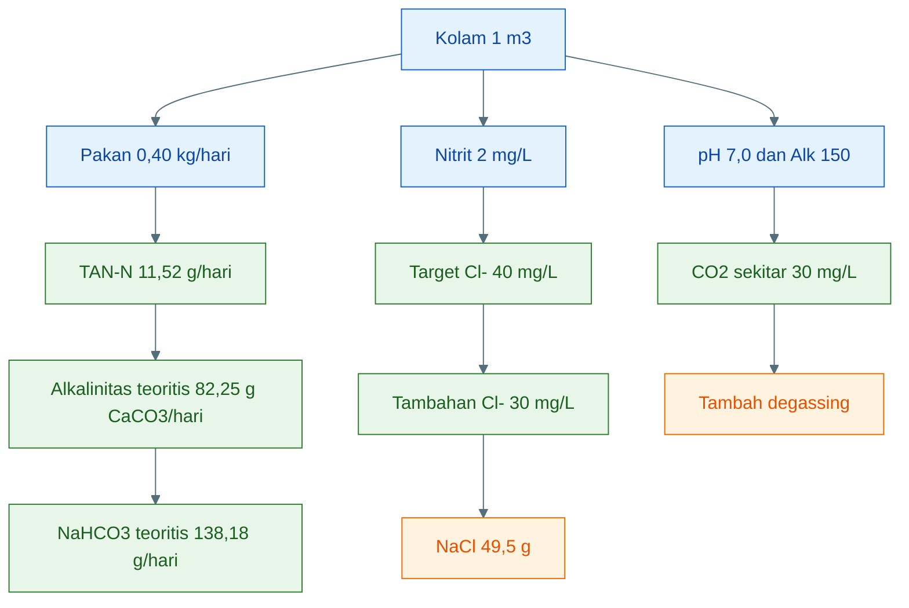
```mermaid id="7k1t9q"
%%{init: {'theme':'base','themeVariables':{
'primaryColor':'#E3F2FD',
'primaryTextColor':'#0D47A1',
'primaryBorderColor':'#1565C0',
'secondaryColor':'#E8F5E9',
'secondaryTextColor':'#1B5E20',
'secondaryBorderColor':'#2E7D32',
'tertiaryColor':'#FFF3E0',
'tertiaryTextColor':'#E65100',
'tertiaryBorderColor':'#EF6C00',
'lineColor':'#546E7A'
}}}%%
flowchart TD
    A["Kolam 1 m3"] --> B["Pakan 0,40 kg/hari"]
    B --> C["TAN-N 11,52 g/hari"]
    C --> D["Alkalinitas teoritis 82,25 g CaCO3/hari"]
    D --> E["NaHCO3 teoritis 138,18 g/hari"]

    A --> F["Nitrit 2 mg/L"]
    F --> G["Target Cl- 40 mg/L"]
    G --> H["Tambahan Cl- 30 mg/L"]
    H --> I["NaCl 49,5 g"]

    A --> J["pH 7,0 dan Alk 150"]
    J --> K["CO2 sekitar 30 mg/L"]
    K --> L["Tambah degassing"]

    classDef input fill:#E3F2FD,stroke:#1565C0,color:#0D47A1;
    classDef hitung fill:#E8F5E9,stroke:#2E7D32,color:#1B5E20;
    classDef tindakan fill:#FFF3E0,stroke:#EF6C00,color:#E65100;

    class A,B,F,J input;
    class C,D,E,G,H,K hitung;
    class I,L tindakan;
```

Diagram ini merangkum tiga jalur keputusan utama:

1. pakan menuju $TAN$ dan alkalinitas;
2. nitrit menuju kebutuhan $Cl^-$;
3. $pH$ dan alkalinitas menuju estimasi $CO_2$.

---

## 6.16. Rencana monitoring untuk kolam $1 \text{ m}^3$

Karena volume kecil, frekuensi monitoring harus lebih rapat dibanding kolam besar.

| Parameter           |                      Fase awal |               Operasi stabil |          Saat masalah |
| ------------------- | -----------------------------: | ---------------------------: | --------------------: |
| $DO_{\text{subuh}}$ |                         harian |                       harian |  beberapa kali sehari |
| $pH$ pagi           |                         harian |                       harian |  beberapa kali sehari |
| $pH$ sore           |                         harian |                       harian |  beberapa kali sehari |
| Alkalinitas         |                setiap $2$ hari |                     mingguan |                harian |
| Hardness            |              awal dan mingguan | setiap $2$ sampai $4$ minggu | saat memakai bahan Ca |
| $TAN$               | $2$ sampai $3$ kali per minggu |                     mingguan |                harian |
| Nitrit              | $2$ sampai $3$ kali per minggu |                     mingguan |                harian |
| $Cl^-$              |      awal dan saat nitrit naik | setiap $2$ sampai $4$ minggu |  setiap koreksi garam |
| $CO_2$              |               saat $pH$ rendah |             saat $pH$ rendah |                harian |
| Sludge              |                  visual harian |                visual harian |                harian |

Target keputusan:

| Parameter           |                                     Target |
| ------------------- | -----------------------------------------: |
| $DO_{\text{subuh}}$ |               $>4$ sampai $5 \text{ mg/L}$ |
| Alkalinitas         | $150$ sampai $200 \text{ mg/L as } CaCO_3$ |
| Hardness            | $100$ sampai $250 \text{ mg/L as } CaCO_3$ |
| $CO_2$              |                         $<15 \text{ mg/L}$ |
| $Cl^- : NO_2^-$     |                              desain $20:1$ |
| $pH$ pagi           |                     $7{,}0$ sampai $7{,}8$ |
| $pH$ sore           |                     tidak melewati $8{,}3$ |

---

## 6.17. SOP harian kolam $1 \text{ m}^3$

```text id="p0v5q4"
1. Ukur DO subuh.
2. Ukur pH pagi.
3. Jika pH pagi di bawah 7,2, hitung CO2 dari pH dan alkalinitas.
4. Jika CO2 di atas 15 mg/L, tambah degassing.
5. Ukur alkalinitas minimal dua hari sekali pada fase awal.
6. Jika alkalinitas di bawah 100 mg/L as CaCO3, tambah buffer.
7. Pilih buffer berdasarkan hardness.
8. Jika nitrit naik, ukur Cl- dan hitung rasio Cl- : NO2-.
9. Jika rasio di bawah target, tambah sumber Cl-.
10. Jika hardness di atas 300 mg/L as CaCO3, hindari CaCO3 sebagai buffer utama.
11. Jika kerak putih muncul, evaluasi pH, alkalinitas, hardness, dan CO2.
12. Jika DO di bawah 4 mg/L, kurangi pakan dan tambah aerasi.
```

SOP ini dibuat untuk menghindari keputusan berbasis dugaan. Setiap tindakan memiliki parameter pemicu.

---

## 6.18. Ringkasan hasil hitung studi kasus

| Komponen                                              |                                      Nilai |
| ----------------------------------------------------- | -----------------------------------------: |
| Volume                                                |                            $1 \text{ m}^3$ |
| Pakan puncak                                          |                   $0{,}40 \text{ kg/hari}$ |
| Protein                                               |                                     $30\%$ |
| $f_{\text{TAN}}$                                      |                                   $0{,}60$ |
| $TAN_N$                                               |             $11{,}52 \text{ g TAN-N/hari}$ |
| $O_{2,\text{nitrifikasi}}$                            |       $52{,}65 \text{ g } O_2\text{/hari}$ |
| $O_{2,\text{nitrifikasi per jam}}$                    |         $2{,}19 \text{ g } O_2\text{/jam}$ |
| Konsumsi alkalinitas teoritis                         | $82{,}25 \text{ g as } CaCO_3\text{/hari}$ |
| Setara $NaHCO_3$ teoritis                             |                  $138{,}18 \text{ g/hari}$ |
| Contoh nitrit                                         |                           $2 \text{ mg/L}$ |
| Contoh $Cl^-$ aktual                                  |                          $10 \text{ mg/L}$ |
| Target $Cl^-$ pada rasio $20:1$                       |                          $40 \text{ mg/L}$ |
| Tambahan $Cl^-$                                       |                          $30 \text{ mg/L}$ |
| Kebutuhan $NaCl$                                      |                         $49{,}5 \text{ g}$ |
| Contoh $CO_2$ pada $pH = 7{,}0$ dan alkalinitas $150$ |                      $29{,}6 \text{ mg/L}$ |
| Keputusan $CO_2$                                      |                           tambah degassing |

---

## 6.19. Kesimpulan Bab 6

Studi kasus kolam bioflok $1 \text{ m}^3$ menunjukkan bahwa manajemen salinitas dan alkalinitas harus dihitung dalam gram, bukan diperkirakan secara visual.

Pada pakan puncak $0{,}40 \text{ kg/hari}$ dengan protein $30\%$ dan $f_{\text{TAN}} = 0{,}60$, sistem menghasilkan estimasi:

$$
11{,}52
\text{ g TAN-N/hari}
$$

Jika seluruhnya dinitrifikasi, konsumsi alkalinitas teoritis:

$$
82{,}25
\text{ g as } CaCO_3\text{/hari}
$$

atau setara:

$$
138{,}18
\text{ g } NaHCO_3\text{/hari}
$$

Namun angka ini harus dikalibrasi dengan pengukuran alkalinitas aktual, karena tidak semua nitrogen dalam bioflok masuk jalur nitrifikasi penuh.

Untuk nitrit $2 \text{ mg/L}$, $Cl^-$ aktual $10 \text{ mg/L}$, dan target rasio $20:1$, kebutuhan $NaCl$ pada kolam $1 \text{ m}^3$ adalah:

$$
49{,}5
\text{ g } NaCl
$$

Untuk $pH = 7{,}0$ dan alkalinitas $150 \text{ mg/L as } CaCO_3$, estimasi $CO_2$ sekitar:

$$
30
\text{ mg/L}
$$

Koreksi yang tepat adalah meningkatkan degassing, bukan langsung menambah $CaCO_3$.

Pesan utama Bab 6:

> Pada kolam $1 \text{ m}^3$, setiap $1 \text{ mg/L}$ setara dengan $1 \text{ g}$. Karena itu, koreksi garam, buffer, hardness, dan $CO_2$ harus berbasis hitungan, bukan kebiasaan.

[**Kembali ke Atas**](#manajemen-salinitas-dan-alkalinitas-pada-kolam-bioflok-pendekatan-formula-stoikiometri-dan-kontrol-operasional)

---

# Bab 7. Failure Mode, Instrumentasi, dan SOP Keputusan

Bab ini merangkum seluruh artikel menjadi sistem kontrol lapangan. Fokusnya adalah **failure mode**, **alat ukur minimum**, dan **SOP keputusan berbasis angka**.

Dalam bioflok, masalah jarang berdiri sendiri. Nitrit naik bisa terkait $DO$, alkalinitas, pakan, sludge, dan nitrifikasi. $pH$ turun bisa disebabkan alkalinitas habis atau $CO_2$ di atas ambang. Hardness naik bisa berasal dari koreksi $CaCO_3$ berulang. Kerak putih bisa menandakan presipitasi $CaCO_3$.

Karena itu, Bab 7 memakai pendekatan:

> Satu gejala harus dikonfirmasi oleh parameter ukur sebelum tindakan koreksi dilakukan.

---

## 7.1. Failure mode utama

Failure mode adalah kondisi kegagalan operasional yang bisa mengganggu ikan, mikroba, bioflok, nitrifikasi, atau kestabilan air.

| Failure mode                    | Indikator utama                                 | Koreksi utama                                         |
| ------------------------------- | ----------------------------------------------- | ----------------------------------------------------- |
| Nitrit naik                     | $NO_2^-$ meningkat                              | tambah $Cl^-$, kurangi pakan, kuatkan nitrifikasi     |
| Buffer habis                    | alkalinitas turun                               | tambah buffer                                         |
| Hardness akumulatif             | hardness $>300 \text{ mg/L as } CaCO_3$         | hentikan $CaCO_3$, gunakan buffer non-Ca              |
| $CO_2$ di atas ambang           | $pH$ rendah dengan alkalinitas cukup            | tambah degassing                                      |
| Presipitasi $CaCO_3$            | kerak putih, air keruh putih                    | kontrol $pH$, calcium hardness, alkalinitas           |
| $DO$ di bawah ambang            | $DO < 4 \text{ mg/L}$                           | tambah aerasi, hentikan pakan sementara               |
| Sludge anaerob                  | bau busuk, dasar hitam                          | siphon, tambah mixing                                 |
| $pH$ sore melewati batas        | $pH > 8{,}3$                                    | evaluasi alga, $CO_2$, alkalinitas, hardness          |
| $Cl^- : NO_2^-$ di bawah target | rasio aktual di bawah $10:1$ atau target desain | tambah sumber $Cl^-$                                  |
| $TAN$ naik                      | $TAN > 1 \text{ mg/L}$                          | kurangi pakan, cek $DO$, alkalinitas, dan nitrifikasi |

Failure mode harus dibaca secara berurutan. Misalnya, nitrit naik tidak cukup dijawab dengan garam. Garam melindungi ikan melalui $Cl^-$, tetapi penyebab nitrit tetap harus diperbaiki.

---

## 7.2. Diagram hubungan failure mode

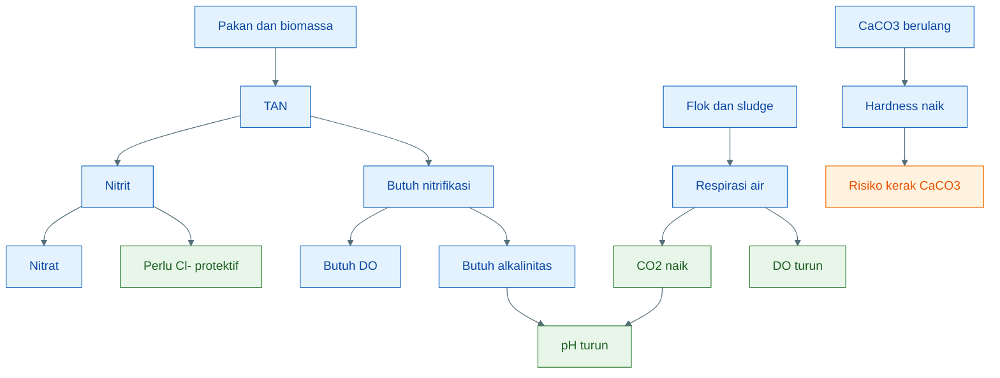
```mermaid id="mwrn2h"
%%{init: {'theme':'base','themeVariables':{
'primaryColor':'#E3F2FD',
'primaryTextColor':'#0D47A1',
'primaryBorderColor':'#1565C0',
'secondaryColor':'#E8F5E9',
'secondaryTextColor':'#1B5E20',
'secondaryBorderColor':'#2E7D32',
'tertiaryColor':'#FFF3E0',
'tertiaryTextColor':'#E65100',
'tertiaryBorderColor':'#EF6C00',
'lineColor':'#546E7A'
}}}%%
flowchart TD
    A["Pakan dan biomassa"] --> B["TAN"]
    B --> C["Nitrit"]
    C --> D["Nitrat"]

    B --> E["Butuh nitrifikasi"]
    E --> F["Butuh DO"]
    E --> G["Butuh alkalinitas"]

    H["Flok dan sludge"] --> I["Respirasi air"]
    I --> J["CO2 naik"]
    I --> K["DO turun"]

    J --> L["pH turun"]
    G --> L

    M["CaCO3 berulang"] --> N["Hardness naik"]
    N --> O["Risiko kerak CaCO3"]

    C --> P["Perlu Cl- protektif"]

    classDef input fill:#E3F2FD,stroke:#1565C0,color:#0D47A1;
    classDef proses fill:#E8F5E9,stroke:#2E7D32,color:#1B5E20;
    classDef risiko fill:#FFF3E0,stroke:#EF6C00,color:#E65100;

    class A,B,C,D,E,F,G,H,I,M,N input;
    class J,K,L,P proses;
    class O risiko;
```

Diagram ini menunjukkan bahwa kegagalan air bioflok biasanya berupa rantai sebab-akibat. Karena itu, SOP harus mengunci parameter kunci, bukan hanya melihat satu gejala.

---

## 7.3. Instrumentasi minimum

Artikel ini memakai prinsip: **parameter yang tidak diukur tidak boleh menjadi dasar tindakan presisi**.

Instrumentasi minimum:

| Parameter   | Alat                                                |
| ----------- | --------------------------------------------------- |
| $DO$        | DO meter                                            |
| $pH$        | pH meter                                            |
| Alkalinitas | titration kit                                       |
| Hardness    | hardness kit                                        |
| $Cl^-$      | chloride test kit                                   |
| Nitrit      | nitrite test kit                                    |
| $TAN$       | ammonia kit                                         |
| $EC/TDS$    | EC meter                                            |
| Suhu        | thermometer                                         |
| $CO_2$      | hitungan dari $pH$ dan alkalinitas, atau $CO_2$ kit |
| Sludge      | visual, siphon check, atau cone pengendapan         |
| Flok        | Imhoff cone atau pengamatan settleable solids       |

Jika alat terbatas, urutan prioritas untuk bioflok intensif adalah:

1. $DO$;
2. $pH$;
3. alkalinitas;
4. nitrit;
5. $TAN$;
6. hardness;
7. $Cl^-$;
8. $EC/TDS$.

Namun untuk artikel ini, karena fokusnya salinitas dan alkalinitas, alat $Cl^-$, alkalinitas, dan hardness harus masuk instrumen utama.

---

## 7.4. Frekuensi pengukuran

Frekuensi pengukuran harus mengikuti fase sistem.

| Parameter           |                  Persiapan |                     Awal tebar |               Operasi stabil |                           Saat masalah |
| ------------------- | -------------------------: | -----------------------------: | ---------------------------: | -------------------------------------: |
| $DO_{\text{subuh}}$ |                     harian |                         harian |                       harian |                   beberapa kali sehari |
| $pH_{\text{pagi}}$  |                     harian |                         harian |                       harian |                   beberapa kali sehari |
| $pH_{\text{sore}}$  |                     harian |                         harian |                       harian |                   beberapa kali sehari |
| Alkalinitas         | setiap $2$ sampai $3$ hari |                setiap $2$ hari |                     mingguan |                                 harian |
| Hardness            |                       awal |                       mingguan | setiap $2$ sampai $4$ minggu |                      setiap koreksi Ca |
| Nitrit              |                       awal | $2$ sampai $3$ kali per minggu |                     mingguan |                                 harian |
| $Cl^-$              |                       awal |                       mingguan | setiap $2$ sampai $4$ minggu |                     setiap nitrit naik |
| $TAN$               |                       awal | $2$ sampai $3$ kali per minggu |                     mingguan |                                 harian |
| $CO_2$              |           saat $pH$ rendah |               saat $pH$ rendah |             saat $pH$ rendah |                                 harian |
| $EC/TDS$            |                       awal |                       mingguan | setiap $2$ sampai $4$ minggu | saat garam atau buffer sering ditambah |
| Sludge              |                     harian |                         harian |                       harian |                                 harian |

Khusus kolam kecil $1 \text{ m}^3$, frekuensi fase awal sebaiknya lebih rapat karena perubahan konsentrasi terjadi cepat.

---

## 7.5. Ambang keputusan utama

Tabel berikut menjadi dasar SOP angka.

| Parameter           |                             Target operasi |                                          Ambang tindakan |
| ------------------- | -----------------------------------------: | -------------------------------------------------------: |
| $DO_{\text{subuh}}$ |               $>4$ sampai $5 \text{ mg/L}$ |                koreksi segera bila $DO < 4 \text{ mg/L}$ |
| Alkalinitas         | $150$ sampai $200 \text{ mg/L as } CaCO_3$ |        tambah buffer bila $<100 \text{ mg/L as } CaCO_3$ |
| Hardness            | $100$ sampai $250 \text{ mg/L as } CaCO_3$ |           hindari Ca bila $>300 \text{ mg/L as } CaCO_3$ |
| $CO_2$              |             $<10$ sampai $15 \text{ mg/L}$ |                 tambah degassing bila $>15 \text{ mg/L}$ |
| $CO_2$ darurat      |                              tidak berlaku |                 tindakan darurat bila $>30 \text{ mg/L}$ |
| $Cl^- : NO_2^-$     |                              desain $20:1$ |                             koreksi bila di bawah $10:1$ |
| $pH_{\text{pagi}}$  |                     $7{,}0$ sampai $7{,}8$ |                                   evaluasi bila $<7{,}0$ |
| $pH_{\text{sore}}$  |                     tidak melewati $8{,}3$ |            evaluasi presipitasi dan $NH_3$ bila $>8{,}3$ |
| $TAN$               |                          $<1 \text{ mg/L}$ | kurangi pakan dan cek nitrifikasi bila $>1 \text{ mg/L}$ |
| Nitrit              |              rasio dengan $Cl^-$ terpenuhi |       koreksi bila rasio $Cl^- : NO_2^-$ di bawah target |

---

## 7.6. SOP keputusan berbasis angka

SOP ini ditulis sebagai logika operasional.

```text id="uw8o1e"
Jika DO < 4 mg/L:
    tambah aerasi
    hentikan atau kurangi pakan sementara
    cek sludge
    jangan tambah karbon organik

Jika alkalinitas < 100 mg/L as CaCO3:
    tambah buffer
    pilih bahan berdasarkan hardness

Jika pH < 7,2 dan alkalinitas 150–200 mg/L as CaCO3:
    hitung CO2
    jika CO2 > 15 mg/L:
        tambah degassing
    jangan otomatis tambah CaCO3

Jika hardness > 300 mg/L as CaCO3:
    jangan gunakan CaCO3 sebagai koreksi utama
    gunakan buffer non-Ca bila alkalinitas perlu dinaikkan

Jika Cl- : NO2- < 10 : 1:
    tambah sumber Cl-
    kurangi pakan
    cek DO dan alkalinitas

Jika CO2 > 30 mg/L:
    tambah degassing kuat
    kurangi pakan
    cek sludge dan aerasi

Jika pH > 8,3:
    cek alkalinitas, hardness, alga, dan risiko CaCO3 mengendap
```

---

## 7.7. Diagram SOP keputusan harian

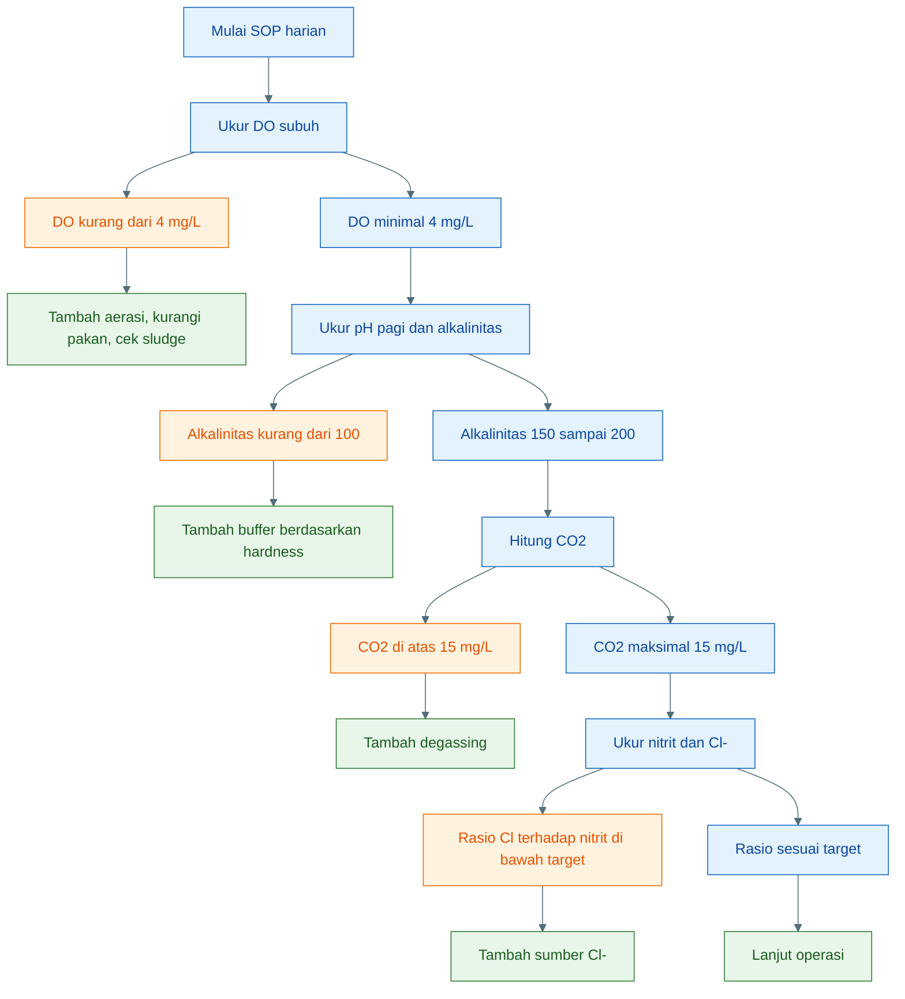
```mermaid id="eq3pxb"
%%{init: {'theme':'base','themeVariables':{
'primaryColor':'#E3F2FD',
'primaryTextColor':'#0D47A1',
'primaryBorderColor':'#1565C0',
'secondaryColor':'#E8F5E9',
'secondaryTextColor':'#1B5E20',
'secondaryBorderColor':'#2E7D32',
'tertiaryColor':'#FFF3E0',
'tertiaryTextColor':'#E65100',
'tertiaryBorderColor':'#EF6C00',
'lineColor':'#546E7A'
}}}%%
flowchart TD
    A["Mulai SOP harian"] --> B["Ukur DO subuh"]
    B --> C["DO kurang dari 4 mg/L"]
    C --> D["Tambah aerasi, kurangi pakan, cek sludge"]

    B --> E["DO minimal 4 mg/L"]
    E --> F["Ukur pH pagi dan alkalinitas"]

    F --> G["Alkalinitas kurang dari 100"]
    G --> H["Tambah buffer berdasarkan hardness"]

    F --> I["Alkalinitas 150 sampai 200"]
    I --> J["Hitung CO2"]
    J --> K["CO2 di atas 15 mg/L"]
    K --> L["Tambah degassing"]

    J --> M["CO2 maksimal 15 mg/L"]
    M --> N["Ukur nitrit dan Cl-"]

    N --> O["Rasio Cl terhadap nitrit di bawah target"]
    O --> P["Tambah sumber Cl-"]

    N --> Q["Rasio sesuai target"]
    Q --> R["Lanjut operasi"]

    classDef cek fill:#E3F2FD,stroke:#1565C0,color:#0D47A1;
    classDef aksi fill:#E8F5E9,stroke:#2E7D32,color:#1B5E20;
    classDef risiko fill:#FFF3E0,stroke:#EF6C00,color:#E65100;

    class A,B,E,F,I,J,M,N,Q cek;
    class D,H,L,P,R aksi;
    class C,G,K,O risiko;
```

Diagram ini dibuat vertikal agar mudah dibaca di layar ponsel. Alurnya menempatkan $DO$ sebagai pemeriksaan pertama, karena kekurangan oksigen adalah risiko cepat.

---

## 7.8. Failure mode 1: nitrit naik

Nitrit naik harus ditangani dalam dua jalur sekaligus:

1. **proteksi ikan** dengan $Cl^-$;
2. **perbaikan proses nitrogen** dengan nitrifikasi, aerasi, alkalinitas, dan pengurangan beban pakan.

Indikator:

| Parameter             |                                Nilai pemicu |
| --------------------- | ------------------------------------------: |
| Nitrit                |                     meningkat dari baseline |
| Rasio $Cl^- : NO_2^-$ | di bawah $10:1$ atau di bawah target desain |
| $DO$                  |       cek bila $<4$ sampai $5 \text{ mg/L}$ |
| Alkalinitas           |     cek bila $<100 \text{ mg/L as } CaCO_3$ |
| $TAN$                 |                  cek bila $>1 \text{ mg/L}$ |

Formula proteksi:

$$
Cl^-_{\text{target}}
=

R
\times
NO_2^-
$$

$$
Cl^-_{\text{tambahan}}
=

\max
\left(
0,
Cl^-_{\text{target}}
-

Cl^-_{\text{aktual}}
\right)
$$

$$
NaCl_{\text{gram}}
=

\frac{
Cl^-_{\text{tambahan}}
\times
V
}{
0{,}606
}
$$

Tindakan:

| Tujuan                      | Tindakan                                      |
| --------------------------- | --------------------------------------------- |
| Proteksi ikan               | tambah $Cl^-$ sesuai rasio                    |
| Turunkan beban nitrogen     | kurangi pakan sementara                       |
| Perbaiki nitrifikasi        | cek $DO$, alkalinitas, $pH$, media mikroba    |
| Kurangi sumber ulang amonia | siphon sludge                                 |
| Hindari memperburuk $DO$    | jangan tambah karbon organik saat $DO$ rendah |

---

## 7.9. Failure mode 2: buffer habis

Buffer dianggap bermasalah bila alkalinitas berada di bawah:

$$
100
\text{ mg/L as } CaCO_3
$$

Indikator pendukung:

| Gejala                                     | Interpretasi                             |
| ------------------------------------------ | ---------------------------------------- |
| $pH$ pagi turun dari hari ke hari          | alkalinitas terkonsumsi atau $CO_2$ naik |
| nitrit mulai naik                          | nitrifikasi tahap kedua bisa terganggu   |
| $TAN$ naik                                 | nitrifikasi melemah                      |
| alkalinitas turun cepat setelah pakan naik | nitrifikasi mengonsumsi buffer           |

Formula koreksi:

$$
\Delta Alk
=

Alk_{\text{target}}

Alk_{\text{aktual}}
$$

Untuk $NaHCO_3$:

$$
NaHCO_{3,\text{gram}}
=

\Delta Alk
\times
V
\times
1{,}68
$$

Untuk $CaCO_3$ ekuivalen:

$$
CaCO_{3,\text{gram}}
=

\Delta Alk
\times
V
$$

Keputusan bahan:

|                                   Hardness | Bahan yang lebih rasional              |
| -----------------------------------------: | -------------------------------------- |
|             $<100 \text{ mg/L as } CaCO_3$ | $CaCO_3$ atau dolomit dapat dipakai    |
| $100$ sampai $250 \text{ mg/L as } CaCO_3$ | $NaHCO_3$, $KHCO_3$, atau kombinasi    |
|             $>300 \text{ mg/L as } CaCO_3$ | hindari $CaCO_3$ sebagai koreksi utama |

---

## 7.10. Failure mode 3: hardness akumulatif

Hardness akumulatif biasanya terjadi akibat penggunaan $CaCO_3$, dolomit, $Ca(OH)_2$, atau $CaCl_2$ berulang.

Indikator:

| Parameter                             |                                     Ambang |
| ------------------------------------- | -----------------------------------------: |
| Hardness                              |             $>300 \text{ mg/L as } CaCO_3$ |
| Hardness zona waspada                 | $300$ sampai $500 \text{ mg/L as } CaCO_3$ |
| Hardness tidak dijadikan target rutin |             $>500 \text{ mg/L as } CaCO_3$ |
| Kerak putih                           |              indikator presipitasi mineral |
| $EC/TDS$ naik                         |                     ion terlarut bertambah |

Tindakan:

1. hentikan $CaCO_3$ sebagai koreksi utama;
2. gunakan $NaHCO_3$ atau $KHCO_3$ bila alkalinitas perlu dinaikkan;
3. cek $pH$ sore;
4. cek kerak pada pipa dan diffuser;
5. pantau $EC/TDS$;
6. lakukan pengeluaran sludge atau pergantian air terbatas bila ion sudah akumulatif.

---

## 7.11. Failure mode 4: $CO_2$ di atas ambang

$CO_2$ di atas ambang sering muncul saat respirasi sistem meningkat: biomassa ikan besar, flok pekat, sludge banyak, atau degassing kurang.

Formula estimasi:

$$
CO_2
=

0{,}88
\times
Alkalinitas
\times
10^{(6{,}35 - pH)}
$$

Ambang keputusan:

|                        $CO_2$ | Keputusan               |
| ----------------------------: | ----------------------- |
|            $<10 \text{ mg/L}$ | target utama            |
| $10$ sampai $15 \text{ mg/L}$ | batas operasi           |
| $15$ sampai $25 \text{ mg/L}$ | tambah degassing        |
|            $>30 \text{ mg/L}$ | tindakan darurat $CO_2$ |

Kondisi khas:

| Data                                                                   | Interpretasi                      |
| ---------------------------------------------------------------------- | --------------------------------- |
| $pH <7{,}2$ dan alkalinitas $150$ sampai $200 \text{ mg/L as } CaCO_3$ | kemungkinan $CO_2$ di atas ambang |
| $DO$ jenuh tetapi $pH$ tetap rendah                                    | $CO_2$ masih bisa bermasalah      |
| tes ember menunjukkan $pH$ naik $>0{,}3$ setelah aerasi                | $CO_2$ berperan besar             |

Tindakan:

1. tambah shower, cascade, trickling, atau airlift degasser;
2. buang sludge;
3. kurangi pakan sementara bila ikan stres;
4. evaluasi flok terlalu pekat;
5. pastikan ruang udara tidak tertutup dan ventilasi cukup.

---

## 7.12. Failure mode 5: presipitasi $CaCO_3$

Presipitasi terjadi saat calcium dan karbonat membentuk padatan.

$$
Ca^{2+}
+
CO_3^{2-}
\rightarrow
CaCO_3 \downarrow
$$

Ambang risiko:

| Faktor           |                              Ambang waspada |
| ---------------- | ------------------------------------------: |
| $pH$             |                                    $>8{,}3$ |
| Alkalinitas      |              $>200 \text{ mg/L as } CaCO_3$ |
| Calcium hardness | $>250$ sampai $300 \text{ mg/L as } CaCO_3$ |
| $pH$ sore        |                            melewati $8{,}3$ |
| Kerak putih      |                          indikator lapangan |

Tindakan:

1. hentikan buffer berbasis Ca;
2. ukur alkalinitas dan hardness;
3. cek $pH$ sore;
4. cek alga dan cahaya;
5. cek $CO_2$;
6. bersihkan diffuser atau pipa yang tersumbat;
7. gunakan buffer non-Ca bila alkalinitas perlu koreksi.

---

## 7.13. Failure mode 6: $DO$ di bawah ambang

$DO$ adalah parameter darurat tercepat.

Ambang:

|                        $DO$ | Keputusan                        |
| --------------------------: | -------------------------------- |
|           $>5 \text{ mg/L}$ | target desain untuk sistem padat |
| $4$ sampai $5 \text{ mg/L}$ | batas operasi minimum            |
|           $<4 \text{ mg/L}$ | koreksi segera                   |
|           $<3 \text{ mg/L}$ | darurat oksigen                  |

Tindakan saat $DO < 4 \text{ mg/L}$:

1. tambah aerasi;
2. hentikan atau kurangi pakan;
3. cek diffuser, blower, selang, dan listrik;
4. buang sludge;
5. jangan menambah karbon organik;
6. cek nitrit dan $TAN$;
7. pantau ikan sampai perilaku normal.

---

## 7.14. Failure mode 7: sludge anaerob

Sludge anaerob menjadi sumber masalah karena dapat menghasilkan $CO_2$, asam organik, amonia sekunder, bau busuk, dan zona tanpa oksigen.

Indikator:

| Indikator            | Makna                               |
| -------------------- | ----------------------------------- |
| dasar hitam          | zona anaerob                        |
| bau busuk            | dekomposisi anaerob                 |
| gelembung dari dasar | gas hasil pembusukan                |
| $DO$ subuh turun     | respirasi total sistem meningkat    |
| $TAN$ naik ulang     | nitrogen lepas dari padatan         |
| $CO_2$ naik          | respirasi dan dekomposisi meningkat |

Tindakan:

1. siphon sludge;
2. tambah mixing;
3. cek titik mati sirkulasi;
4. kurangi pakan sementara;
5. cek $DO$, $CO_2$, $TAN$, dan nitrit;
6. evaluasi kepadatan flok.

---

## 7.15. Matriks risiko

Matriks ini membantu menentukan prioritas tindakan.

| Kondisi                                    | Tingkat risiko operasional | Prioritas tindakan                     |
| ------------------------------------------ | -------------------------- | -------------------------------------- |
| $DO <4 \text{ mg/L}$                       | darurat                    | aerasi dan pakan                       |
| $CO_2 >30 \text{ mg/L}$                    | darurat                    | degassing dan pakan                    |
| Nitrit naik dan $Cl^- : NO_2^- <10:1$      | darurat proteksi           | tambah $Cl^-$ dan perbaiki nitrifikasi |
| Alkalinitas $<100 \text{ mg/L as } CaCO_3$ | koreksi wajib              | buffer                                 |
| Hardness $>300 \text{ mg/L as } CaCO_3$    | waspada akumulasi          | hindari Ca                             |
| $pH >8{,}3$ dengan hardness tinggi         | risiko presipitasi         | kontrol Ca, alga, dan $CO_2$           |
| sludge hitam                               | risiko anaerob             | siphon dan mixing                      |
| $TAN >1 \text{ mg/L}$                      | risiko nitrogen            | pakan, nitrifikasi, aerasi             |

---

## 7.16. Dashboard harian praktisi

Untuk memudahkan operator, data harian sebaiknya ditulis sebagai dashboard sederhana.

| Waktu     | Parameter                        |                                     Target |
| --------- | -------------------------------- | -----------------------------------------: |
| Pagi buta | $DO_{\text{subuh}}$              |               $>4$ sampai $5 \text{ mg/L}$ |
| Pagi      | $pH_{\text{pagi}}$               |                     $7{,}0$ sampai $7{,}8$ |
| Pagi      | alkalinitas bila fase kritis     | $150$ sampai $200 \text{ mg/L as } CaCO_3$ |
| Pagi      | estimasi $CO_2$ bila $pH$ rendah |                         $<15 \text{ mg/L}$ |
| Siang     | perilaku ikan                    |                        aktif dan responsif |
| Sore      | $pH_{\text{sore}}$               |                     tidak melewati $8{,}3$ |
| Sore      | cek aerasi                       |                        semua titik bekerja |
| Harian    | sludge                           |                tidak hitam dan tidak busuk |

---

## 7.17. SOP mingguan

SOP mingguan digunakan untuk melihat tren akumulasi.

| Parameter   | Pertanyaan evaluasi                                    |
| ----------- | ------------------------------------------------------ |
| Alkalinitas | apakah turun dari minggu sebelumnya?                   |
| Hardness    | apakah naik karena buffer berbasis Ca?                 |
| $Cl^-$      | apakah rasio terhadap nitrit masih memenuhi target?    |
| $EC/TDS$    | apakah ion terlarut terus naik?                        |
| Nitrit      | apakah terjadi pola naik setelah pakan dinaikkan?      |
| $TAN$       | apakah nitrifikasi mengikuti beban pakan?              |
| $CO_2$      | apakah $pH$ pagi rendah meski alkalinitas cukup?       |
| Sludge      | apakah volume sludge meningkat?                        |
| Kerak       | apakah diffuser atau pipa mulai putih?                 |
| Pakan       | apakah kenaikan pakan sejalan dengan kapasitas sistem? |

---

## 7.18. Diagram keputusan mingguan

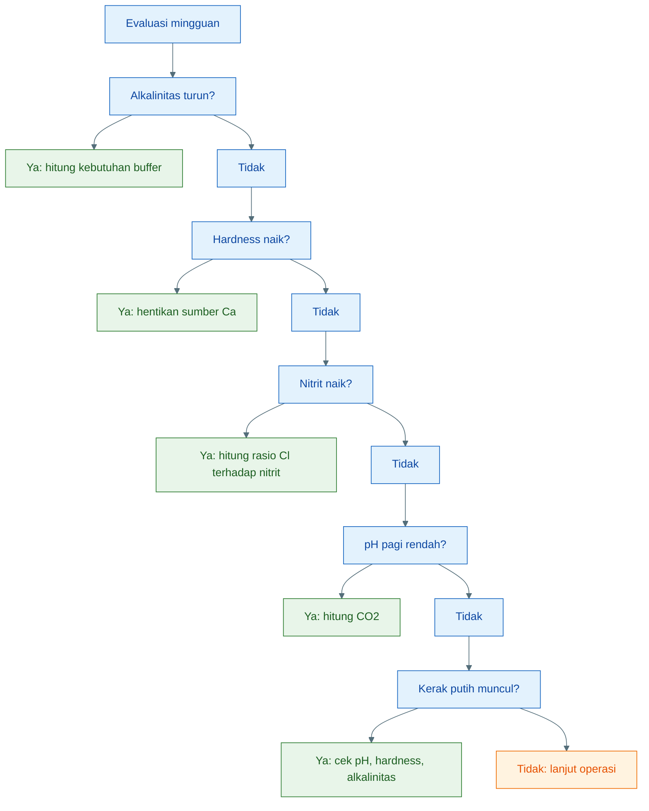
```mermaid id="s6rh23"
%%{init: {'theme':'base','themeVariables':{
'primaryColor':'#E3F2FD',
'primaryTextColor':'#0D47A1',
'primaryBorderColor':'#1565C0',
'secondaryColor':'#E8F5E9',
'secondaryTextColor':'#1B5E20',
'secondaryBorderColor':'#2E7D32',
'tertiaryColor':'#FFF3E0',
'tertiaryTextColor':'#E65100',
'tertiaryBorderColor':'#EF6C00',
'lineColor':'#546E7A'
}}}%%
flowchart TD
    A["Evaluasi mingguan"] --> B["Alkalinitas turun?"]
    B --> C["Ya: hitung kebutuhan buffer"]
    B --> D["Tidak"]

    D --> E["Hardness naik?"]
    E --> F["Ya: hentikan sumber Ca"]
    E --> G["Tidak"]

    G --> H["Nitrit naik?"]
    H --> I["Ya: hitung rasio Cl terhadap nitrit"]
    H --> J["Tidak"]

    J --> K["pH pagi rendah?"]
    K --> L["Ya: hitung CO2"]
    K --> M["Tidak"]

    M --> N["Kerak putih muncul?"]
    N --> O["Ya: cek pH, hardness, alkalinitas"]
    N --> P["Tidak: lanjut operasi"]

    classDef cek fill:#E3F2FD,stroke:#1565C0,color:#0D47A1;
    classDef aksi fill:#E8F5E9,stroke:#2E7D32,color:#1B5E20;
    classDef risiko fill:#FFF3E0,stroke:#EF6C00,color:#E65100;

    class A,B,D,E,G,H,J,K,M,N cek;
    class C,F,I,L,O aksi;
    class P risiko;
```

Diagram mingguan ini menekankan tren, bukan hanya angka harian. Dalam bioflok, tren lebih penting daripada satu data tunggal.

---

## 7.19. Kesalahan koreksi yang harus dihindari

| Kesalahan                                     | Dampak                                        |
| --------------------------------------------- | --------------------------------------------- |
| $pH$ turun langsung tambah $CaCO_3$           | hardness bisa naik tanpa menyelesaikan $CO_2$ |
| nitrit naik hanya tambah garam                | penyebab nitrit tidak diperbaiki              |
| alkalinitas rendah tetapi tidak ukur hardness | bahan buffer bisa salah                       |
| $DO$ jenuh dianggap $CO_2$ aman               | $CO_2$ bisa tetap di atas ambang              |
| kerak putih dianggap normal                   | presipitasi mineral bisa menyumbat diffuser   |
| sludge hitam dibiarkan                        | risiko anaerob dan $TAN$ sekunder             |
| pakan dinaikkan tanpa cek alkalinitas         | nitrifikasi bisa kekurangan buffer            |
| tambah karbon saat $DO$ rendah                | respirasi mikroba bisa memperburuk oksigen    |

---

## 7.20. Kesimpulan Bab 7

Bab ini menyusun manajemen salinitas dan alkalinitas bioflok menjadi sistem keputusan berbasis angka.

Failure mode utama yang harus dikontrol adalah:

1. nitrit naik;
2. buffer habis;
3. hardness akumulatif;
4. $CO_2$ di atas ambang;
5. presipitasi $CaCO_3$;
6. $DO$ di bawah ambang;
7. sludge anaerob.

Instrumentasi minimum yang dibutuhkan adalah $DO$ meter, $pH$ meter, titration kit alkalinitas, hardness kit, chloride test kit, nitrite test kit, ammonia kit, EC meter, thermometer, serta estimasi $CO_2$ dari $pH$ dan alkalinitas.

Ambang keputusan inti:

$$
DO < 4 \text{ mg/L}
\Rightarrow
\text{tambah aerasi dan kurangi pakan}
$$

$$
Alkalinitas < 100 \text{ mg/L as } CaCO_3
\Rightarrow
\text{tambah buffer}
$$

$$
CO_2 > 15 \text{ mg/L}
\Rightarrow
\text{tambah degassing}
$$

$$
Hardness > 300 \text{ mg/L as } CaCO_3
\Rightarrow
\text{hindari buffer berbasis Ca}
$$

$$
Cl^- : NO_2^- < 10:1
\Rightarrow
\text{tambah sumber } Cl^-
$$

Pesan utama Bab 7:

> Manajemen bioflok yang kuat bukan berasal dari banyaknya bahan koreksi, tetapi dari disiplin membaca parameter, menghitung kebutuhan, dan memilih tindakan yang sesuai dengan failure mode yang terukur.

[**Kembali ke Atas**](#manajemen-salinitas-dan-alkalinitas-pada-kolam-bioflok-pendekatan-formula-stoikiometri-dan-kontrol-operasional)

---

# Lampiran A. Model Matematis Excel

Lampiran ini berisi variabel, formula, dan output model untuk menjalankan simulasi sederhana manajemen salinitas, $Cl^-$, alkalinitas, hardness, $pH$, dan $CO_2$ pada kolam bioflok.

Model ini memakai prinsip:

```text
Input terukur → formula → output angka → keputusan koreksi
```

Model tidak menggantikan pengukuran lapangan. Model digunakan untuk menghitung dosis awal, lalu dikalibrasi dengan data aktual kolam.

---

# A.1. Alur Model

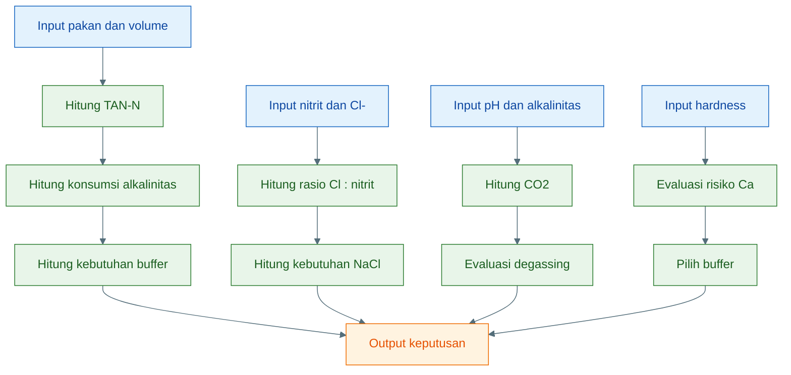
```mermaid id="z7yq1p"
%%{init: {'theme':'base','themeVariables':{
'primaryColor':'#E3F2FD',
'primaryTextColor':'#0D47A1',
'primaryBorderColor':'#1565C0',
'secondaryColor':'#E8F5E9',
'secondaryTextColor':'#1B5E20',
'secondaryBorderColor':'#2E7D32',
'tertiaryColor':'#FFF3E0',
'tertiaryTextColor':'#E65100',
'tertiaryBorderColor':'#EF6C00',
'lineColor':'#546E7A'
}}}%%
flowchart TD
    A["Input pakan dan volume"] --> B["Hitung TAN-N"]
    B --> C["Hitung konsumsi alkalinitas"]
    C --> D["Hitung kebutuhan buffer"]

    E["Input nitrit dan Cl-"] --> F["Hitung rasio Cl : nitrit"]
    F --> G["Hitung kebutuhan NaCl"]

    H["Input pH dan alkalinitas"] --> I["Hitung CO2"]
    I --> J["Evaluasi degassing"]

    K["Input hardness"] --> L["Evaluasi risiko Ca"]
    L --> M["Pilih buffer"]

    D --> N["Output keputusan"]
    G --> N
    J --> N
    M --> N

    classDef input fill:#E3F2FD,stroke:#1565C0,color:#0D47A1;
    classDef hitung fill:#E8F5E9,stroke:#2E7D32,color:#1B5E20;
    classDef output fill:#FFF3E0,stroke:#EF6C00,color:#E65100;

    class A,E,H,K input;
    class B,C,D,F,G,I,J,L,M hitung;
    class N output;
```

---

# A.2. Input Model

| Input                 | Satuan                   | Catatan                                |
| --------------------- | ------------------------ | -------------------------------------- |
| Volume                | $\text{m}^3$             | volume air efektif                     |
| Feed                  | kg/hari                  | pakan harian                           |
| Protein               | fraksi                   | contoh $30\% = 0{,}30$                 |
| $f_{\text{TAN}}$      | fraksi                   | fraksi nitrogen pakan menjadi $TAN$    |
| Nitrit                | $\text{mg/L}$            | basis $NO_2^-$                         |
| $Cl^-$ aktual         | $\text{mg/L}$            | hasil chloride test kit                |
| Alkalinitas aktual    | $\text{mg/L as } CaCO_3$ | hasil titrasi                          |
| Alkalinitas target    | $\text{mg/L as } CaCO_3$ | target operasional                     |
| Hardness aktual       | $\text{mg/L as } CaCO_3$ | total hardness                         |
| Hardness target       | $\text{mg/L as } CaCO_3$ | target operasional                     |
| $pH$                  | unit                     | pH pagi lebih penting untuk $CO_2$     |
| $DO$                  | $\text{mg/L}$            | $DO$ subuh                             |
| Rasio $Cl^- : NO_2^-$ | angka                    | contoh $20$ untuk $20:1$               |
| Pilihan buffer        | teks                     | $CaCO_3$, $NaHCO_3$, $KHCO_3$, dolomit |

---

# A.3. Konstanta Model

| Konstanta                            |     Nilai | Satuan                    | Fungsi                                  |
| ------------------------------------ | --------: | ------------------------- | --------------------------------------- |
| Nitrogen dalam protein               |  $0{,}16$ | kg N/kg protein           | konversi protein ke nitrogen            |
| Oksigen nitrifikasi                  |  $4{,}57$ | kg $O_2$/kg TAN-N         | kebutuhan $O_2$ nitrifikasi             |
| Alkalinitas nitrifikasi              |  $7{,}14$ | kg as $CaCO_3$/kg TAN-N   | konsumsi alkalinitas                    |
| Faktor $NaHCO_3$                     |  $1{,}68$ | g $NaHCO_3$/g as $CaCO_3$ | konversi buffer                         |
| Fraksi $Cl^-$ dalam $NaCl$           | $0{,}606$ | fraksi                    | konversi $Cl^-$ ke $NaCl$               |
| Faktor estimasi $CO_2$               |  $0{,}88$ | faktor lapangan           | estimasi $CO_2$ dari pH dan alkalinitas |
| Konversi $NO_2^-$ ke $NO_2\text{-}N$ |  $3{,}29$ | faktor                    | $NO_2\text{-}N = NO_2^- / 3{,}29$       |

---

# A.4. Formula Inti

## A.4.1. Produksi $TAN$

$$
TAN_N
=

Feed
\times
Protein
\times
0{,}16
\times
f_{\text{TAN}}
$$

Jika $Feed$ dalam kg/hari, hasil $TAN_N$ adalah kg TAN-N/hari.

---

## A.4.2. Konsumsi alkalinitas

$$
Alk_{\text{konsumsi}}
=

TAN_N
\times
7{,}14
$$

Jika $TAN_N$ dalam kg/hari, hasil $Alk_{\text{konsumsi}}$ adalah kg as $CaCO_3$/hari.

---

## A.4.3. Kebutuhan buffer berdasarkan selisih target

$$
\Delta Alk
=

Alk_{\text{target}}

Alk_{\text{aktual}}
$$

Agar nilai negatif tidak menghasilkan dosis negatif:

$$
\Delta Alk_{\text{koreksi}}
=

\max
\left(
0,
\Delta Alk
\right)
$$

---

## A.4.4. Kebutuhan $NaHCO_3$

$$
NaHCO_{3,\text{gram}}
=

\Delta Alk_{\text{koreksi}}
\times
Volume
\times
1{,}68
$$

Keterangan:

- $\Delta Alk_{\text{koreksi}}$ dalam $\text{mg/L as } CaCO_3$;
- $Volume$ dalam $\text{m}^3$;
- hasil dalam gram.

---

## A.4.5. Kebutuhan $CaCO_3$ ekuivalen

$$
CaCO_{3,\text{gram}}
=

\Delta Alk_{\text{koreksi}}
\times
Volume
$$

Keterangan:

$$
1 \text{ mg/L pada } 1 \text{ m}^3
=

1 \text{ g}
$$

---

## A.4.6. Target $Cl^-$

Jika nitrit dibaca sebagai $NO_2^-$:

$$
Cl^-_{\text{target}}
=

R
\times
NO_2^-
$$

Keterangan:

- $R$ adalah rasio target, misalnya $20$;
- $NO_2^-$ dalam $\text{mg/L}$;
- $Cl^-_{\text{target}}$ dalam $\text{mg/L}$.

---

## A.4.7. Tambahan $Cl^-$

$$
Cl^-_{\text{tambahan}}
=

\max
\left(
0,
Cl^-_{\text{target}}
-

Cl^-_{\text{aktual}}
\right)
$$

---

## A.4.8. Tambahan $NaCl$

$$
NaCl_{\text{gram}}
=

\frac{
Cl^-_{\text{tambahan}}
\times
Volume
}{
0{,}606
}
$$

---

## A.4.9. Estimasi $CO_2$

$$
CO_2
=

0{,}88
\times
Alkalinitas
\times
10^{(6{,}35 - pH)}
$$

Keterangan:

| Variabel      | Satuan                   |
| ------------- | ------------------------ |
| $CO_2$        | $\text{mg/L}$            |
| $Alkalinitas$ | $\text{mg/L as } CaCO_3$ |
| $pH$          | unit                     |

---

## A.4.10. Estimasi hardness baru akibat $CaCO_3$

Jika $CaCO_3$ benar-benar larut dan terbaca sebagai calcium hardness:

$$
Hardness_{\text{baru}}
=

Hardness_{\text{aktual}}
+
\frac{
CaCO_{3,\text{ditambahkan}}
}{
Volume
}
$$

Untuk kolam $1 \text{ m}^3$, rumusnya menjadi:

$$
Hardness_{\text{baru}}
=

Hardness_{\text{aktual}}
+
CaCO_{3,\text{ditambahkan}}
$$

dengan $CaCO_{3,\text{ditambahkan}}$ dalam gram dan hardness dalam $\text{mg/L as } CaCO_3$.

---

# A.5. Output Model

| Output                     | Fungsi                                                 |
| -------------------------- | ------------------------------------------------------ |
| $TAN_N$                    | estimasi beban nitrogen                                |
| $O_{2,\text{nitrifikasi}}$ | estimasi oksigen untuk nitrifikasi                     |
| $Alk_{\text{konsumsi}}$    | estimasi alkalinitas teoritis yang terpakai            |
| $NaHCO_3$ gram             | koreksi alkalinitas tanpa menaikkan hardness           |
| $CaCO_3$ gram              | koreksi alkalinitas yang berpotensi menaikkan hardness |
| $NaCl$ gram                | koreksi rasio $Cl^- : NO_2^-$                          |
| $CO_2$ mg/L                | evaluasi kebutuhan degassing                           |
| Hardness baru              | evaluasi risiko akumulasi hardness                     |
| Rasio $Cl^- : NO_2^-$      | evaluasi proteksi nitrit                               |
| Status keputusan           | buffer, degassing, $Cl^-$, hindari Ca, aerasi          |

[**Kembali ke Atas**](#manajemen-salinitas-dan-alkalinitas-pada-kolam-bioflok-pendekatan-formula-stoikiometri-dan-kontrol-operasional)

---

# Lampiran B. CSV Excel Siap Copas

CSV berikut memakai delimiter titik-koma `;` dan desimal koma, cocok untuk banyak pengaturan Excel Indonesia. Salin dari baris `MODEL...` sampai akhir blok, lalu paste ke Excel mulai dari sel **A1**.

```csv
MODEL MANAJEMEN SALINITAS DAN ALKALINITAS BIOFLOK;;;;;
;;;;;
INPUT;NILAI;SATUAN;CATATAN;;
Volume_m3;1;m3;volume air efektif;;
Feed_kg_hari;0,40;kg/hari;pakan harian;;
Protein;0,30;fraksi;30 persen ditulis 0,30;;
f_TAN;0,60;fraksi;fraksi nitrogen pakan menjadi TAN;;
Nitrit_NO2_mg_L;2;mg/L;nitrit sebagai NO2-;;
Cl_aktual_mg_L;10;mg/L;klorida aktual;;
Alk_aktual_mg_L_as_CaCO3;150;mg/L as CaCO3;alkalinitas aktual;;
Alk_target_mg_L_as_CaCO3;180;mg/L as CaCO3;target alkalinitas;;
Hardness_aktual_mg_L_as_CaCO3;180;mg/L as CaCO3;hardness aktual;;
Hardness_target_mg_L_as_CaCO3;250;mg/L as CaCO3;target hardness;;
pH_pagi;7,00;unit;pH pagi;;
DO_subuh_mg_L;5,00;mg/L;DO subuh;;
Rasio_Cl_NO2;20;angka;20 berarti 20:1;;
;;;;;
KONSTANTA;NILAI;SATUAN;CATATAN;;
N_dalam_protein;0,16;kg N/kg protein;protein mengandung sekitar 16 persen N;;
O2_nitrifikasi;4,57;kg O2/kg TAN-N;kebutuhan oksigen nitrifikasi;;
Alk_per_TAN;7,14;kg as CaCO3/kg TAN-N;konsumsi alkalinitas nitrifikasi;;
Faktor_NaHCO3;1,68;g NaHCO3/g as CaCO3;konversi alkalinitas ke NaHCO3;;
Fraksi_Cl_dalam_NaCl;0,606;fraksi;NaCl mengandung sekitar 60,6 persen Cl;;
Faktor_CO2;0,88;faktor;estimasi CO2 dari pH dan alkalinitas;;
Konversi_NO2_ke_NO2N;3,29;faktor;NO2-N = NO2 / 3,29;;
;;;;;
OUTPUT;HASIL;SATUAN;FORMULA;;
TAN_N_kg_hari;=B5*B6*B18*B7;kg TAN-N/hari;Feed x Protein x 0,16 x f_TAN;;
TAN_N_g_hari;=B26*1000;g TAN-N/hari;konversi kg ke g;;
O2_nitrifikasi_kg_hari;=B26*B19;kg O2/hari;TAN_N x 4,57;;
O2_nitrifikasi_g_jam;=B28*1000/24;g O2/jam;konversi harian ke jam;;
Alk_konsumsi_kg_hari;=B26*B20;kg as CaCO3/hari;TAN_N x 7,14;;
Alk_konsumsi_g_hari;=B30*1000;g as CaCO3/hari;konversi kg ke g;;
Delta_Alk_mg_L;=B11-B10;mg/L as CaCO3;target minus aktual;;
Delta_Alk_koreksi_mg_L;=((B32)+ABS(B32))/2;mg/L as CaCO3;nilai negatif dibuat nol;;
NaHCO3_koreksi_g;=B33*B4*B21;g;koreksi alkalinitas non-hardness;;
CaCO3_koreksi_g;=B33*B4;g ekuivalen;koreksi alkalinitas dengan Ca;;
Cl_target_mg_L;=B16*B8;mg/L;Rasio x nitrit;;
Cl_tambahan_mg_L;=((B36-B9)+ABS(B36-B9))/2;mg/L;nilai negatif dibuat nol;;
NaCl_tambahan_g;=B37*B4/B22;g;kebutuhan NaCl;;
Rasio_Cl_NO2_aktual;=B9/B8;rasio;Cl aktual dibagi nitrit;;
NO2_N_mg_L;=B8/B24;mg/L;konversi NO2 ke NO2-N;;
CO2_mg_L;=B23*B10*10^(6,35-B14);mg/L;estimasi CO2;;
Hardness_baru_jika_CaCO3_mg_L;=B12+B35/B4;mg/L as CaCO3;asumsi CaCO3 larut penuh;;
;;;;;
STATUS KEPUTUSAN;HASIL;BATAS;CATATAN;;
Status_DO;"=IF(B15<4;""DARURAT_DO"";IF(B15<5;""BATAS_OPERASI_DO"";""DO_TARGET""))";mg/L;target lebih dari 4 sampai 5;;
Status_Alkalinitas;"=IF(B10<100;""TAMBAH_BUFFER"";IF(B10<150;""MONITOR_ALK"";IF(B10<=200;""ALK_TARGET"";""ALK_ATAS"")))";mg/L as CaCO3;target 150 sampai 200;;
Status_Hardness;"=IF(B12>500;""HINDARI_TARGET_INI"";IF(B12>300;""HINDARI_BUFFER_CA"";IF(B12>=100;""HARDNESS_OK"";""MINERAL_RENDAH"")))";mg/L as CaCO3;zona kerja 100 sampai 250;;
Status_CO2;"=IF(B41>30;""DARURAT_CO2"";IF(B41>15;""TAMBAH_DEGASSING"";""CO2_OK""))";mg/L;target kurang dari 15;;
Status_Cl_NO2;"=IF(B39<10;""TAMBAH_CL_MINIMUM"";IF(B39<20;""DI_BAWAH_DESAIN"";""RASIO_OK""))";rasio;minimum 10:1 desain 20:1;;
Status_pH_pagi;"=IF(B14<7;""EVALUASI_pH_RENDAH"";IF(B14>7,8;""EVALUASI_pH_ATAS"";""pH_TARGET""))";unit;target 7,0 sampai 7,8;;
Status_pH_presipitasi;"=IF(B14>8,3;""RISIKO_CaCO3_NH3"";""pH_TIDAK_MELEWATI_8_3"")";unit;batas 8,3;;
;;;;;
CATATAN;;;;;
Gunakan decimal comma dan delimiter titik-koma;;;;;
Jika Excel memakai fungsi lokal Indonesia, IF bisa perlu diganti menjadi JIKA;;;;;
Jika formula status tidak terbaca, hitungan utama tetap bisa digunakan;;;;;
Dosis aktual harus dikalibrasi dari pengukuran lapangan;;;;;
```

Catatan penggunaan:

- Ubah hanya nilai di bagian **INPUT**.
- Jangan ubah konstanta kecuali ada alasan teknis.
- Hasil $NaHCO_3$, $CaCO_3$, dan $NaCl$ adalah dosis hitung awal.
- Untuk kolam $1 \text{ m}^3$, $1 \text{ mg/L}$ setara dengan $1 \text{ g}$.
- Formula status memakai fungsi `IF`. Jika Excel lokal tidak mengenali `IF`, ganti dengan fungsi lokal yang setara.

[**Kembali ke Atas**](#manajemen-salinitas-dan-alkalinitas-pada-kolam-bioflok-pendekatan-formula-stoikiometri-dan-kontrol-operasional)

---

# Lampiran C. Tabel Ambang Engineering

Lampiran ini menjadi tabel cepat untuk keputusan lapangan. Setiap angka di bawah harus dibaca bersama parameter lain, bukan berdiri sendiri.

---

# C.1. Ambang Utama

| Parameter           |                                     Target |                                         Batas koreksi |
| ------------------- | -----------------------------------------: | ----------------------------------------------------: |
| $DO_{\text{subuh}}$ |                          $>5 \text{ mg/L}$ |                 koreksi segera bila $<4 \text{ mg/L}$ |
| $CO_2$              |             $<10$ sampai $15 \text{ mg/L}$ |              tambah degassing bila $>15 \text{ mg/L}$ |
| $CO_2$ darurat      |                              tidak berlaku |                       darurat bila $>30 \text{ mg/L}$ |
| Alkalinitas         | $150$ sampai $200 \text{ mg/L as } CaCO_3$ |     tambah buffer bila $<100 \text{ mg/L as } CaCO_3$ |
| Hardness            | $100$ sampai $250 \text{ mg/L as } CaCO_3$ | hindari buffer Ca bila $>300 \text{ mg/L as } CaCO_3$ |
| $Cl^- : NO_2^-$     |                              desain $20:1$ |                                        minimum $10:1$ |
| $pH_{\text{pagi}}$  |                     $7{,}0$ sampai $7{,}8$ |                                evaluasi bila $<7{,}0$ |
| $pH_{\text{sore}}$  |                     tidak melewati $8{,}3$ |           risiko presipitasi dan $NH_3$ bila $>8{,}3$ |
| $TAN$               |                          $<1 \text{ mg/L}$ |           evaluasi nitrifikasi bila $>1 \text{ mg/L}$ |
| Nitrit              |            rasio $Cl^- : NO_2^-$ terpenuhi |               tambah $Cl^-$ bila rasio di bawah batas |

---

# C.2. Ambang Alkalinitas

|     Alkalinitas sebagai $CaCO_3$ | Status engineering                 | Keputusan                           |
| -------------------------------: | ---------------------------------- | ----------------------------------- |
|               $<50 \text{ mg/L}$ | tidak cocok untuk bioflok intensif | tambah buffer dan kurangi beban     |
|   $50$ sampai $100 \text{ mg/L}$ | batas darurat                      | tambah buffer                       |
|  $100$ sampai $150 \text{ mg/L}$ | operasi dengan monitoring ketat    | koreksi bertahap                    |
|  $150$ sampai $200 \text{ mg/L}$ | target utama bioflok ikan          | monitoring                          |
|  $200$ sampai $250 \text{ mg/L}$ | masih dapat digunakan              | pantau hardness dan $pH$            |
| $>250$ sampai $300 \text{ mg/L}$ | zona waspada                       | cek hardness, $pH$, dan presipitasi |
|              $>300 \text{ mg/L}$ | tidak dijadikan target rutin       | evaluasi ion dan scaling            |

---

# C.3. Ambang Hardness

| Total hardness sebagai $CaCO_3$ | Status operasional           | Keputusan                                 |
| ------------------------------: | ---------------------------- | ----------------------------------------- |
|              $<50 \text{ mg/L}$ | terlalu lunak                | sumber Ca/Mg dapat dipertimbangkan        |
|  $50$ sampai $100 \text{ mg/L}$ | mineral divalen terbatas     | koreksi bila sistem membutuhkan           |
| $100$ sampai $250 \text{ mg/L}$ | zona kerja utama             | monitoring                                |
| $250$ sampai $300 \text{ mg/L}$ | batas nyaman atas            | batasi sumber Ca tambahan                 |
| $300$ sampai $500 \text{ mg/L}$ | zona waspada                 | hindari $CaCO_3$ sebagai buffer utama     |
|             $>500 \text{ mg/L}$ | tidak dijadikan target rutin | evaluasi $TDS$, kerak, dan pergantian air |

---

# C.4. Ambang $Cl^- : NO_2^-$

| Rasio $Cl^- : NO_2^-$ | Status                            | Keputusan                                  |
| --------------------: | --------------------------------- | ------------------------------------------ |
|               $<10:1$ | di bawah minimum                  | tambah sumber $Cl^-$                       |
|  $10:1$ sampai $20:1$ | memenuhi minimum, di bawah desain | koreksi bila sistem padat atau ikan stres  |
|  $20:1$ sampai $30:1$ | target desain bioflok nila        | monitoring                                 |
|  $30:1$ sampai $50:1$ | rentang darurat nitrit            | gunakan saat nitrit tinggi atau ikan stres |
|               $>50:1$ | di atas kebutuhan proteksi umum   | evaluasi akumulasi garam dan $EC/TDS$      |

---

# C.5. Ambang $CO_2$

|                        $CO_2$ | Status             | Keputusan                                 |
| ----------------------------: | ------------------ | ----------------------------------------- |
|            $<10 \text{ mg/L}$ | target utama       | monitoring                                |
| $10$ sampai $15 \text{ mg/L}$ | batas operasi      | pantau $pH$, ikan, dan degassing          |
| $15$ sampai $25 \text{ mg/L}$ | koreksi diperlukan | tambah degassing                          |
| $25$ sampai $30 \text{ mg/L}$ | menjelang darurat  | tambah degassing dan kurangi beban        |
|            $>30 \text{ mg/L}$ | darurat $CO_2$     | degassing kuat, kurangi pakan, cek sludge |

---

# C.6. Ambang $pH$

| Parameter                  |                 Target |                        Batas evaluasi |
| -------------------------- | ---------------------: | ------------------------------------: |
| $pH_{\text{pagi}}$         | $7{,}0$ sampai $7{,}8$ |                evaluasi bila $<7{,}0$ |
| $pH_{\text{sore}}$         | tidak melewati $8{,}3$ |                evaluasi bila $>8{,}3$ |
| Selisih $pH$ pagi dan sore |    ideal $<0{,}5$ unit | evaluasi bila fluktuasi $>0{,}7$ unit |

Interpretasi:

- $pH$ pagi rendah dengan alkalinitas cukup mengarah ke $CO_2$;
- $pH$ pagi rendah dengan alkalinitas rendah mengarah ke kekurangan buffer;
- $pH$ sore di atas $8{,}3$ dengan hardness dan alkalinitas tinggi mengarah ke risiko presipitasi $CaCO_3$ dan peningkatan fraksi $NH_3$.

---

# C.7. Ambang Presipitasi $CaCO_3$

| Faktor             |                              Ambang waspada |
| ------------------ | ------------------------------------------: |
| $pH$               |                                    $>8{,}3$ |
| Alkalinitas        |              $>200 \text{ mg/L as } CaCO_3$ |
| Calcium hardness   | $>250$ sampai $300 \text{ mg/L as } CaCO_3$ |
| Kerak putih        |                              tanda lapangan |
| Air keruh putih    |                     tanda presipitasi halus |
| Diffuser tersumbat |                   tanda scaling operasional |

Reaksi presipitasi:

$$
Ca^{2+}
+
CO_3^{2-}
\rightarrow
CaCO_3 \downarrow
$$

Keputusan:

> Jika $pH >8{,}3$, alkalinitas di atas $200 \text{ mg/L as } CaCO_3$, dan hardness di atas $300 \text{ mg/L as } CaCO_3$, hentikan koreksi berbasis Ca dan evaluasi presipitasi.

---

# C.8. Ringkasan Keputusan Cepat

| Kondisi terukur                            | Keputusan                                        |
| ------------------------------------------ | ------------------------------------------------ |
| $DO <4 \text{ mg/L}$                       | tambah aerasi, kurangi pakan, cek sludge         |
| $CO_2 >15 \text{ mg/L}$                    | tambah degassing                                 |
| $CO_2 >30 \text{ mg/L}$                    | tindakan darurat $CO_2$                          |
| Alkalinitas $<100 \text{ mg/L as } CaCO_3$ | tambah buffer                                    |
| Hardness $>300 \text{ mg/L as } CaCO_3$    | hindari buffer berbasis Ca                       |
| $Cl^- : NO_2^- <10:1$                      | tambah sumber $Cl^-$                             |
| $pH_{\text{pagi}} <7{,}0$                  | cek alkalinitas dan hitung $CO_2$                |
| $pH_{\text{sore}} >8{,}3$                  | cek presipitasi, hardness, alga, dan $NH_3$      |
| Kerak putih muncul                         | evaluasi $pH$, alkalinitas, hardness, dan $CO_2$ |
| Sludge hitam atau bau busuk                | siphon, tambah mixing, cek $DO$ dan $TAN$        |

---

# C.9. Penutup Lampiran

Tiga lampiran ini menyatukan model matematis, formula Excel, dan batas keputusan. Penggunaan terbaiknya adalah:

1. ukur parameter;
2. masukkan data ke model;
3. baca output angka;
4. pilih tindakan sesuai ambang;
5. ukur ulang setelah koreksi.

Prinsip akhirnya:

> Formula memberi dosis awal. Pengukuran ulang memberi validasi. Keputusan berikutnya harus mengikuti data terbaru.

[**Kembali ke Atas**](#manajemen-salinitas-dan-alkalinitas-pada-kolam-bioflok-pendekatan-formula-stoikiometri-dan-kontrol-operasional)

---

# Lampiran D. Grafik `$pH$`, Nitrit, Nitrat, dan Sistem Karbonat

Lampiran ini berisi grafik tambahan untuk menjelaskan hubungan `$pH$` dengan dua sistem berbeda:

1. **nitrit dan nitrat**;
2. **sistem karbonat**.

Catatan penting:

> Hubungan `$NO_2^- \rightarrow NO_3^-$` bukan kesetimbangan kimia langsung terhadap `$pH$`. Itu adalah proses biologis nitrifikasi oleh bakteri pengoksidasi nitrit. Karena itu, grafik nitrit-nitrat dibaca sebagai **indeks kinerja biologis**, bukan grafik kesetimbangan kimia.

---

## D.1. Grafik Indeks Konversi Nitrit Menjadi Nitrat terhadap `$pH$`

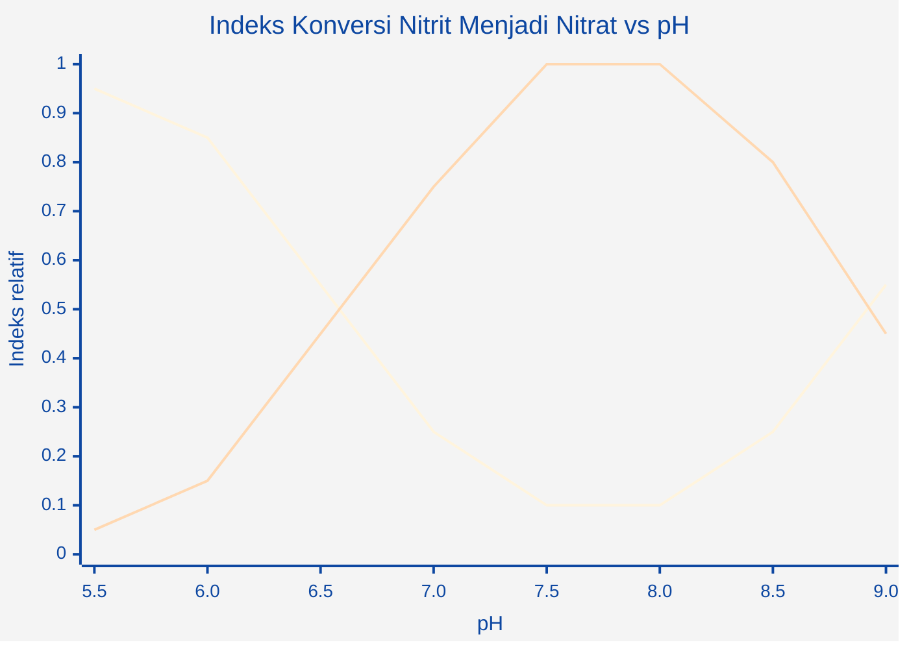
```mermaid id="nitrit-nitrat-ph"
%%{init: {'theme':'base','themeVariables':{
'primaryColor':'#E3F2FD',
'primaryTextColor':'#0D47A1',
'primaryBorderColor':'#1565C0',
'secondaryColor':'#E8F5E9',
'secondaryTextColor':'#1B5E20',
'secondaryBorderColor':'#2E7D32',
'tertiaryColor':'#FFF3E0',
'tertiaryTextColor':'#E65100',
'tertiaryBorderColor':'#EF6C00',
'lineColor':'#546E7A'
}}}%%
xychart-beta
    title "Indeks Konversi Nitrit Menjadi Nitrat vs pH"
    x-axis "pH" [5.5, 6.0, 6.5, 7.0, 7.5, 8.0, 8.5, 9.0]
    y-axis "Indeks relatif" 0 --> 1
    line [0.95, 0.85, 0.55, 0.25, 0.10, 0.10, 0.25, 0.55]
    line [0.05, 0.15, 0.45, 0.75, 1.00, 1.00, 0.80, 0.45]
```

Keterangan garis:

| Garis         | Makna                                                |
| ------------- | ---------------------------------------------------- |
| Garis pertama | indeks risiko nitrit tertahan atau nitrit akumulatif |
| Garis kedua   | indeks konversi nitrit menjadi nitrat                |

Tabel interpretasi:

|    `$pH$` | Risiko nitrit tertahan | Konversi nitrit menjadi nitrat |
| --------: | ---------------------: | -----------------------------: |
| `$5{,}5$` |             `$0{,}95$` |                     `$0{,}05$` |
| `$6{,}0$` |             `$0{,}85$` |                     `$0{,}15$` |
| `$6{,}5$` |             `$0{,}55$` |                     `$0{,}45$` |
| `$7{,}0$` |             `$0{,}25$` |                     `$0{,}75$` |
| `$7{,}5$` |             `$0{,}10$` |                     `$1{,}00$` |
| `$8{,}0$` |             `$0{,}10$` |                     `$1{,}00$` |
| `$8{,}5$` |             `$0{,}25$` |                     `$0{,}80$` |
| `$9{,}0$` |             `$0{,}55$` |                     `$0{,}45$` |

Makna operasional:

```text id="d4n2k7"
pH 7,0 sampai 8,2:
zona kerja nitrifikasi relatif kuat.

pH di bawah 6,5:
risiko nitrit tertahan meningkat.

pH di atas 8,5:
evaluasi NH3 bebas, alkalinitas, hardness, dan stres sistem.
```

---

## D.2. Spesiasi Kimia Nitrit: `$HNO_2$` dan `$NO_2^-$`

Kesetimbangan kimia nitrit yang benar adalah:

$$
HNO_2
\rightleftharpoons
H^+
+
NO_2^-
$$

Dengan pendekatan:

$$
pK_a
\approx
3{,}25
$$

Pada rentang `$pH$` bioflok normal, yaitu sekitar `$7{,}0$` sampai `$8{,}0$`, hampir seluruh nitrit berada sebagai:

$$
NO_2^-
$$

```mermaid id="spesiasi-nitrit-ph"
%%{init: {'theme':'base','themeVariables':{
'primaryColor':'#FFF3E0',
'primaryTextColor':'#E65100',
'primaryBorderColor':'#EF6C00',
'secondaryColor':'#E8F5E9',
'secondaryTextColor':'#1B5E20',
'secondaryBorderColor':'#2E7D32',
'lineColor':'#546E7A'
}}}%%
xychart-beta
    title "Spesiasi Nitrit: HNO2 dan NO2- vs pH"
    x-axis "pH" [3.0, 3.25, 4.0, 5.0, 6.0, 7.0, 8.0]
    y-axis "Fraksi persen" 0 --> 100
    line [64, 50, 15, 1.8, 0.18, 0.018, 0.002]
    line [36, 50, 85, 98.2, 99.82, 99.982, 99.998]
```

Keterangan garis:

| Garis         | Makna             |
| ------------- | ----------------- |
| Garis pertama | fraksi `$HNO_2$`  |
| Garis kedua   | fraksi `$NO_2^-$` |

Kesimpulan operasional:

> Pada `$pH 7{,}0$` sampai `$8{,}0$`, masalah nitrit dalam bioflok bukan karena pergeseran kimia `$HNO_2$` dan `$NO_2^-$`, tetapi karena kemampuan sistem biologis mengoksidasi `$NO_2^-$` menjadi `$NO_3^-$`.

---

## D.3. Grafik Spesiasi Karbonat terhadap `$pH$`

Sistem karbonat mengikuti kesetimbangan berikut:

$$
CO_2 + H_2O
\rightleftharpoons
H_2CO_3
\rightleftharpoons
H^+
+
HCO_3^-
\rightleftharpoons
2H^+
+
CO_3^{2-}
$$

Pendekatan nilai konstanta:

$$
pK_{a1}
\approx
6{,}35
$$

$$
pK_{a2}
\approx
10{,}33
$$

```mermaid id="karbonat-ph"
%%{init: {'theme':'base','themeVariables':{
'primaryColor':'#E3F2FD',
'primaryTextColor':'#0D47A1',
'primaryBorderColor':'#1565C0',
'secondaryColor':'#E8F5E9',
'secondaryTextColor':'#1B5E20',
'secondaryBorderColor':'#2E7D32',
'tertiaryColor':'#FFF3E0',
'tertiaryTextColor':'#E65100',
'tertiaryBorderColor':'#EF6C00',
'lineColor':'#546E7A'
}}}%%
xychart-beta
    title "Spesiasi Karbonat vs pH"
    x-axis "pH" [5.5, 6.0, 6.35, 7.0, 7.5, 8.0, 8.3, 8.5, 9.0, 9.5, 10.0, 10.33, 11.0]
    y-axis "Fraksi persen" 0 --> 100
    line [88, 69, 50, 18, 7, 2, 1, 0.7, 0.2, 0.07, 0.02, 0.01, 0]
    line [12, 31, 50, 82, 93, 98, 98, 98, 96, 87, 68, 50, 18]
    line [0, 0, 0, 0, 0.3, 0.5, 0.9, 1.5, 4.5, 13, 32, 50, 82]
```

Keterangan garis:

| Garis         | Makna                     |
| ------------- | ------------------------- |
| Garis pertama | fraksi `$CO_2 + H_2CO_3$` |
| Garis kedua   | fraksi `$HCO_3^-$`        |
| Garis ketiga  | fraksi `$CO_3^{2-}$`      |

Tabel ringkas:

|      `$pH$` | `$CO_2 + H_2CO_3$` | `$HCO_3^-$` | `$CO_3^{2-}$` |
| ----------: | -----------------: | ----------: | ------------: |
|   `$6{,}0$` |           `$69\%$` |    `$31\%$` |       `$0\%$` |
|  `$6{,}35$` |           `$50\%$` |    `$50\%$` |       `$0\%$` |
|   `$7{,}0$` |           `$18\%$` |    `$82\%$` |       `$0\%$` |
|   `$7{,}5$` |            `$7\%$` |    `$93\%$` |   `$0{,}3\%$` |
|   `$8{,}0$` |            `$2\%$` |    `$98\%$` |   `$0{,}5\%$` |
|   `$8{,}3$` |            `$1\%$` |    `$98\%$` |   `$0{,}9\%$` |
|   `$9{,}0$` |        `$0{,}2\%$` |    `$96\%$` |   `$4{,}5\%$` |
| `$10{,}33$` |       `$0{,}01\%$` |    `$50\%$` |      `$50\%$` |

Makna operasional:

```text id="ls54b1"
pH 7,0 sampai 8,0:
bentuk dominan adalah HCO3-, yaitu buffer utama.

pH di bawah 7,0:
fraksi CO2 meningkat, sehingga pH rendah sering terkait CO2 tinggi.

pH di atas 8,3:
fraksi CO3 2- mulai meningkat dan risiko CaCO3 mengendap naik bila Ca tinggi.
```

---

## D.4. Hubungan `$pH$`, Karbonat, dan Risiko Presipitasi `$CaCO_3$`

Presipitasi `$CaCO_3$` terjadi ketika `$Ca^{2+}$` dan `$CO_3^{2-}$` cukup tersedia.

$$
Ca^{2+}
+
CO_3^{2-}
\rightarrow
CaCO_3 \downarrow
$$

```mermaid id="presipitasi-karbonat"
%%{init: {'theme':'base','themeVariables':{
'primaryColor':'#E3F2FD',
'primaryTextColor':'#0D47A1',
'primaryBorderColor':'#1565C0',
'secondaryColor':'#E8F5E9',
'secondaryTextColor':'#1B5E20',
'secondaryBorderColor':'#2E7D32',
'tertiaryColor':'#FFF3E0',
'tertiaryTextColor':'#E65100',
'tertiaryBorderColor':'#EF6C00',
'lineColor':'#546E7A'
}}}%%
flowchart TD
    A["pH naik"] --> B["CO2 turun"]
    B --> C["HCO3- dominan pada pH 7 sampai 8"]
    B --> D["CO3 2- meningkat setelah pH 8,3"]
    D --> E["Ca2+ tersedia"]
    E --> F["CaCO3 mengendap"]
    F --> G["Kerak putih"]
    F --> H["Diffuser tersumbat"]
    F --> I["Alkalinitas dan hardness berubah"]

    classDef proses fill:#E3F2FD,stroke:#1565C0,color:#0D47A1;
    classDef karbonat fill:#E8F5E9,stroke:#2E7D32,color:#1B5E20;
    classDef risiko fill:#FFF3E0,stroke:#EF6C00,color:#E65100;

    class A,B proses;
    class C,D,E karbonat;
    class F,G,H,I risiko;
```

Ambang risiko presipitasi yang dipakai dalam artikel:

| Parameter        |                                   Ambang waspada |
| ---------------- | -----------------------------------------------: |
| `$pH$`           |                                       `$>8{,}3$` |
| Alkalinitas      |                 `$>200 \text{ mg/L as } CaCO_3$` |
| Calcium hardness |  `$>250$` sampai `$300 \text{ mg/L as } CaCO_3$` |
| Tanda lapangan   | kerak putih, air keruh putih, diffuser tersumbat |

---

## D.5. Kesimpulan Lampiran D

Untuk nitrit dan nitrat:

> Grafik `$NO_2^- \rightarrow NO_3^-$` terhadap `$pH$` harus dibaca sebagai grafik **kinerja biologis nitrifikasi**, bukan grafik kesetimbangan kimia.

Kesetimbangan kimia nitrit yang benar adalah:

$$
HNO_2
\rightleftharpoons
H^+
+
NO_2^-
$$

Pada `$pH$` bioflok normal, nitrit hampir seluruhnya berada sebagai `$NO_2^-$`.

Untuk sistem karbonat:

> Grafik karbonat benar-benar dikendalikan oleh `$pH$`.

Pada rentang operasional bioflok:

- `$pH 7{,}0$` sampai `$8{,}0$`: bentuk dominan adalah `$HCO_3^-$`;
- `$pH$` di bawah `$7{,}0$`: fraksi `$CO_2$` meningkat;
- `$pH$` di atas `$8{,}3$`: fraksi `$CO_3^{2-}$` mulai meningkat dan risiko presipitasi `$CaCO_3$` naik bila calcium hardness tinggi.

Pesan utama Lampiran D:

> Nitrit-nitrat dikendalikan terutama oleh proses biologis nitrifikasi, sedangkan karbonat dikendalikan langsung oleh kesetimbangan kimia terhadap `$pH$`.

[1]: https://agrilife.org/fisheries/files/2013/09/SRAC-Publication-No.-0462-%E2%80%93-Nitrite-in-Fish-Ponds.pdf 'Nitrite in Fish Ponds'
[2]: https://www.sciencedirect.com/science/article/pii/S0144860924000189?utm_source=chatgpt.com 'Biofilter and degasser performance at different alkalinity ...'
[3]: https://www.ncrac.org/files/inline-files/SRAC0464.pdf?utm_source=chatgpt.com 'Interactions of pH, Carbon Dioxide, Alkalinity and ...'
[4]: https://aquaculture.mgcafe.uky.edu/sites/aquaculture.ca.uky.edu/files/srac_4503_biofloc_production_systems_for_aquaculture.pdf?utm_source=chatgpt.com 'Biofloc Production Systems for Aquaculture'

[**Kembali ke Atas**](#manajemen-salinitas-dan-alkalinitas-pada-kolam-bioflok-pendekatan-formula-stoikiometri-dan-kontrol-operasional)

---

<small>
  **_Catatan Penyusunan_** Artikel ini disusun sebagai materi edukasi dan
  referensi umum berdasarkan berbagai sumber pustaka, praktik lapangan, serta
  bantuan alat penulisan. Pembaca disarankan untuk melakukan verifikasi lanjutan
  dan penyesuaian sesuai dengan kondisi serta kebutuhan masing-masing sistem.
</small>
