# **_Siklus Nitrogen pada Budidaya Lele Air Dangkal: Pakan, Amonia, Nitrit, Nitrat, Mikroba, dan Batas Kapasitas Kolam_**

---

- [**_Siklus Nitrogen pada Budidaya Lele Air Dangkal: Pakan, Amonia, Nitrit, Nitrat, Mikroba, dan Batas Kapasitas Kolam_**](#siklus-nitrogen-pada-budidaya-lele-air-dangkal-pakan-amonia-nitrit-nitrat-mikroba-dan-batas-kapasitas-kolam)
- [1. Pendahuluan: Mengapa Siklus Nitrogen Menentukan Keberhasilan Lele](#1-pendahuluan-mengapa-siklus-nitrogen-menentukan-keberhasilan-lele)
  - [1.1 Siklus nitrogen sebagai pusat kualitas air](#11-siklus-nitrogen-sebagai-pusat-kualitas-air)
  - [1.2 Hubungan pakan, FCR, amonia, dan kematian ikan](#12-hubungan-pakan-fcr-amonia-dan-kematian-ikan)
  - [1.3 Mengapa sistem air dangkal lebih sensitif](#13-mengapa-sistem-air-dangkal-lebih-sensitif)
  - [1.4 Perbedaan ikan “masih hidup” dan ikan “tumbuh optimal”](#14-perbedaan-ikan-masih-hidup-dan-ikan-tumbuh-optimal)
  - [1.5 Tujuan modul](#15-tujuan-modul)
- [2. Kolam sebagai Ekosistem Produksi](#2-kolam-sebagai-ekosistem-produksi)
  - [2.1 Kolam bukan hanya wadah air](#21-kolam-bukan-hanya-wadah-air)
  - [2.2 Komponen ekosistem kolam](#22-komponen-ekosistem-kolam)
    - [Ikan](#ikan)
    - [Pakan](#pakan)
    - [Feses dan sisa pakan](#feses-dan-sisa-pakan)
    - [Mikroba](#mikroba)
    - [Plankton](#plankton)
    - [Oksigen](#oksigen)
    - [CO₂](#co)
    - [Endapan](#endapan)
    - [Amonia, nitrit, nitrat](#amonia-nitrit-nitrat)
  - [2.3 Parameter fisik kolam](#23-parameter-fisik-kolam)
    - [Volume](#volume)
    - [Luas permukaan](#luas-permukaan)
    - [Tinggi air](#tinggi-air)
    - [Endapan dasar](#endapan-dasar)
    - [Sirkulasi](#sirkulasi)
    - [Aerasi darurat](#aerasi-darurat)
  - [2.4 Parameter kualitas air](#24-parameter-kualitas-air)
    - [Suhu](#suhu)
    - [pH](#ph)
    - [DO / oksigen terlarut](#do--oksigen-terlarut)
    - [Amonia](#amonia)
    - [Nitrit](#nitrit)
    - [Nitrat](#nitrat)
    - [Bau, warna, dan endapan](#bau-warna-dan-endapan)
  - [2.5 Batas aman praktis untuk lele](#25-batas-aman-praktis-untuk-lele)
- [3. Volume Kolam 80 cm × 50 cm dan Konsekuensinya](#3-volume-kolam-80-cm--50-cm-dan-konsekuensinya)
  - [3.1 Perhitungan volume kolam](#31-perhitungan-volume-kolam)
  - [3.2 Volume efektif ±251 liter](#32-volume-efektif-251-liter)
  - [3.3 Luas permukaan air](#33-luas-permukaan-air)
  - [3.4 Rasio permukaan terhadap volume](#34-rasio-permukaan-terhadap-volume)
  - [3.5 Mengapa air dangkal membantu lele](#35-mengapa-air-dangkal-membantu-lele)
  - [3.6 Mengapa air dangkal mempercepat penumpukan limbah](#36-mengapa-air-dangkal-mempercepat-penumpukan-limbah)
  - [3.7 Batas rasional biomassa pada volume kecil](#37-batas-rasional-biomassa-pada-volume-kecil)
- [4. Pakan sebagai Sumber Utama Nitrogen](#4-pakan-sebagai-sumber-utama-nitrogen)
  - [4.1 Protein pakan sebagai sumber nitrogen](#41-protein-pakan-sebagai-sumber-nitrogen)
  - [4.2 Protein menjadi daging, energi, atau limbah](#42-protein-menjadi-daging-energi-atau-limbah)
  - [4.3 Hubungan protein pakan dengan amonia](#43-hubungan-protein-pakan-dengan-amonia)
  - [4.4 Hubungan FCR dengan limbah nitrogen](#44-hubungan-fcr-dengan-limbah-nitrogen)
    - [Skenario A: FCR 1,2](#skenario-a-fcr-12)
    - [Skenario B: FCR 1,6](#skenario-b-fcr-16)
  - [4.5 Mengapa protein tinggi bisa menjadi masalah](#45-mengapa-protein-tinggi-bisa-menjadi-masalah)
  - [4.6 Protein tercerna vs protein kasar](#46-protein-tercerna-vs-protein-kasar)
  - [4.7 Nitrogen syndrome](#47-nitrogen-syndrome)
- [5. FCR, Dosis Pakan, dan Jadwal Pakan](#5-fcr-dosis-pakan-dan-jadwal-pakan)
  - [5.1 Pengertian FCR](#51-pengertian-fcr)
  - [5.2 FCR dan biaya produksi](#52-fcr-dan-biaya-produksi)
  - [5.3 FCR dan limbah nitrogen](#53-fcr-dan-limbah-nitrogen)
  - [5.4 Feed rate berdasarkan biomassa](#54-feed-rate-berdasarkan-biomassa)
  - [5.5 Pagi kecil, sore utama](#55-pagi-kecil-sore-utama)
  - [5.6 Risiko pakan malam pada sistem tanpa aerasi](#56-risiko-pakan-malam-pada-sistem-tanpa-aerasi)
  - [5.7 Pakan yang tidak habis = beban nitrogen langsung](#57-pakan-yang-tidak-habis--beban-nitrogen-langsung)
  - [5.8 Kapan pakan dikurangi atau dihentikan](#58-kapan-pakan-dikurangi-atau-dihentikan)
- [6. Neraca Massa Pakan Menjadi Daging dan Nitrogen](#6-neraca-massa-pakan-menjadi-daging-dan-nitrogen)
  - [6.1 Neraca 1 kg pakan 32% protein](#61-neraca-1-kg-pakan-32-protein)
  - [6.2 Berapa gram protein masuk](#62-berapa-gram-protein-masuk)
  - [6.3 Berapa gram nitrogen masuk](#63-berapa-gram-nitrogen-masuk)
  - [6.4 Berapa nitrogen tertahan di ikan](#64-berapa-nitrogen-tertahan-di-ikan)
  - [6.5 Berapa nitrogen menjadi limbah](#65-berapa-nitrogen-menjadi-limbah)
  - [6.6 Potensi amonia](#66-potensi-amonia)
  - [6.7 Potensi nitrit](#67-potensi-nitrit)
  - [6.8 Potensi nitrat](#68-potensi-nitrat)
  - [6.9 Neraca untuk 5 kg panen](#69-neraca-untuk-5-kg-panen)
    - [6.9.1 Total pakan](#691-total-pakan)
    - [6.9.2 Total nitrogen pakan](#692-total-nitrogen-pakan)
    - [6.9.3 Nitrogen tertahan di ikan](#693-nitrogen-tertahan-di-ikan)
    - [6.9.4 Nitrogen menjadi limbah](#694-nitrogen-menjadi-limbah)
    - [6.9.5 Potensi nitrat](#695-potensi-nitrat)
  - [6.10 Neraca untuk 50 kg panen](#610-neraca-untuk-50-kg-panen)
    - [6.10.1 Total pakan](#6101-total-pakan)
    - [6.10.2 Total nitrogen pakan](#6102-total-nitrogen-pakan)
    - [6.10.3 Nitrogen tertahan di ikan](#6103-nitrogen-tertahan-di-ikan)
    - [6.10.4 Nitrogen menjadi limbah](#6104-nitrogen-menjadi-limbah)
    - [6.10.5 Potensi nitrat](#6105-potensi-nitrat)
  - [6.11 Implikasi terhadap klaim 500 ekor](#611-implikasi-terhadap-klaim-500-ekor)
- [7. Siklus Nitrogen: Amonia, Nitrit, dan Nitrat](#7-siklus-nitrogen-amonia-nitrit-dan-nitrat)
  - [7.1 Mineralisasi bahan organik](#71-mineralisasi-bahan-organik)
  - [7.2 Amonia dan amonium](#72-amonia-dan-amonium)
  - [7.3 Perbedaan TAN, NH₃, dan NH₄⁺](#73-perbedaan-tan-nh-dan-nh)
  - [7.4 Pengaruh pH dan suhu terhadap NH₃](#74-pengaruh-ph-dan-suhu-terhadap-nh)
  - [7.5 Nitrit dan risiko brown blood](#75-nitrit-dan-risiko-brown-blood)
  - [7.6 Nitrat sebagai hasil akhir aerob](#76-nitrat-sebagai-hasil-akhir-aerob)
  - [7.7 Nitrat bukan berarti masalah selesai](#77-nitrat-bukan-berarti-masalah-selesai)
  - [7.8 Peran plankton dan tanaman air](#78-peran-plankton-dan-tanaman-air)
  - [7.9 Peran endapan dan denitrifikasi terbatas](#79-peran-endapan-dan-denitrifikasi-terbatas)
- [8. Oksigen dalam Siklus Nitrogen](#8-oksigen-dalam-siklus-nitrogen)
  - [8.1 Lele bisa mengambil udara, tetapi mikroba tidak](#81-lele-bisa-mengambil-udara-tetapi-mikroba-tidak)
  - [8.2 Bakteri pengurai organik membutuhkan O₂](#82-bakteri-pengurai-organik-membutuhkan-o)
  - [8.3 Nitrifikasi membutuhkan O₂](#83-nitrifikasi-membutuhkan-o)
  - [8.4 Kebutuhan oksigen untuk oksidasi amonia](#84-kebutuhan-oksigen-untuk-oksidasi-amonia)
  - [8.5 Oksigen untuk ikan vs oksigen untuk mikroba](#85-oksigen-untuk-ikan-vs-oksigen-untuk-mikroba)
  - [8.6 Risiko malam-subuh](#86-risiko-malam-subuh)
  - [8.7 Peran plankton siang dan malam](#87-peran-plankton-siang-dan-malam)
  - [8.8 Kapan aerasi darurat wajib](#88-kapan-aerasi-darurat-wajib)
- [9. Mikroba yang Terlibat dalam Siklus Nitrogen](#9-mikroba-yang-terlibat-dalam-siklus-nitrogen)
  - [9.1 Mikroba heterotrof pengurai organik](#91-mikroba-heterotrof-pengurai-organik)
  - [9.2 Mikroba nitrifikasi](#92-mikroba-nitrifikasi)
  - [9.3 Mikroba fotosintetik](#93-mikroba-fotosintetik)
  - [9.4 Mikroba fermentasi pakan](#94-mikroba-fermentasi-pakan)
  - [9.5 Mikroba denitrifikasi](#95-mikroba-denitrifikasi)
  - [9.6 Kesalahan umum memilih probiotik](#96-kesalahan-umum-memilih-probiotik)
    - [Kesalahan 1: Probiotik pakan dipakai untuk nitrifikasi](#kesalahan-1-probiotik-pakan-dipakai-untuk-nitrifikasi)
    - [Kesalahan 2: Probiotik air dianggap menggantikan aerasi](#kesalahan-2-probiotik-air-dianggap-menggantikan-aerasi)
    - [Kesalahan 3: Produk penghilang bau dipakai untuk menutupi overfeeding](#kesalahan-3-produk-penghilang-bau-dipakai-untuk-menutupi-overfeeding)
    - [Kesalahan 4: Menggabungkan semua produk tanpa fungsi jelas](#kesalahan-4-menggabungkan-semua-produk-tanpa-fungsi-jelas)
- [10. Probiotik yang Sesuai Berdasarkan Fungsi](#10-probiotik-yang-sesuai-berdasarkan-fungsi)
  - [10.1 Probiotik untuk fermentasi pakan](#101-probiotik-untuk-fermentasi-pakan)
  - [10.2 Probiotik untuk pengurai organik kolam](#102-probiotik-untuk-pengurai-organik-kolam)
  - [10.3 Probiotik nitrifikasi](#103-probiotik-nitrifikasi)
  - [10.4 Probiotik fotosintetik](#104-probiotik-fotosintetik)
  - [10.5 Kapan probiotik efektif](#105-kapan-probiotik-efektif)
  - [10.6 Kapan probiotik tidak cukup](#106-kapan-probiotik-tidak-cukup)
- [11. Studi Kapasitas: 5 kg vs 50 kg Lele dalam Kolam 251 Liter](#11-studi-kapasitas-5-kg-vs-50-kg-lele-dalam-kolam-251-liter)
  - [11.1 Simulasi 5 kg biomassa](#111-simulasi-5-kg-biomassa)
    - [Nitrogen pakan harian](#nitrogen-pakan-harian)
    - [Nitrogen limbah harian](#nitrogen-limbah-harian)
    - [Potensi nitrat harian](#potensi-nitrat-harian)
    - [Kebutuhan oksigen nitrifikasi](#kebutuhan-oksigen-nitrifikasi)
  - [11.2 Simulasi 10 kg biomassa](#112-simulasi-10-kg-biomassa)
  - [11.3 Simulasi 25 kg biomassa](#113-simulasi-25-kg-biomassa)
  - [11.4 Simulasi 50 kg biomassa](#114-simulasi-50-kg-biomassa)
  - [11.5 Perbandingan beban nitrogen](#115-perbandingan-beban-nitrogen)
  - [11.6 Perbandingan kebutuhan oksigen](#116-perbandingan-kebutuhan-oksigen)
  - [11.7 Apa syarat jika ingin mengejar 500 ekor](#117-apa-syarat-jika-ingin-mengejar-500-ekor)
  - [11.7.1 Pakan harus sangat disiplin](#1171-pakan-harus-sangat-disiplin)
  - [11.7.2 Wajib ada aerasi darurat](#1172-wajib-ada-aerasi-darurat)
  - [11.7.3 Amonia dan nitrit harus diukur](#1173-amonia-dan-nitrit-harus-diukur)
  - [11.7.4 Endapan dasar harus dikontrol](#1174-endapan-dasar-harus-dikontrol)
  - [11.7.5 Panen bertahap lebih rasional](#1175-panen-bertahap-lebih-rasional)
  - [11.7.6 Harus ada catatan FCR](#1176-harus-ada-catatan-fcr)
  - [11.7.7 Tidak boleh menjadi standar pemula](#1177-tidak-boleh-menjadi-standar-pemula)
  - [11.8 Mengapa pemula sebaiknya bertahap](#118-mengapa-pemula-sebaiknya-bertahap)
- [12. SOP Pengendalian Amonia, Nitrit, dan Nitrat](#12-sop-pengendalian-amonia-nitrit-dan-nitrat)
  - [12.1 SOP harian](#121-sop-harian)
    - [Pagi/subuh](#pagisubuh)
    - [Siang](#siang)
    - [Sore](#sore)
    - [Malam](#malam)
  - [12.2 SOP mingguan](#122-sop-mingguan)
    - [Rumus biomassa](#rumus-biomassa)
    - [Rumus FCR sementara](#rumus-fcr-sementara)
    - [Format catatan mingguan](#format-catatan-mingguan)
  - [12.3 Jika amonia naik](#123-jika-amonia-naik)
  - [12.4 Jika nitrit naik](#124-jika-nitrit-naik)
  - [12.5 Jika nitrat tinggi](#125-jika-nitrat-tinggi)
  - [12.6 Jika endapan dasar bau](#126-jika-endapan-dasar-bau)
- [Ringkasan Bab 11–12](#ringkasan-bab-1112)
- [13. Rancangan Uji Lapangan](#13-rancangan-uji-lapangan)
  - [13.1 Tujuan uji](#131-tujuan-uji)
  - [13.2 Desain perlakuan](#132-desain-perlakuan)
    - [13.2.1 Desain uji padat tebar](#1321-desain-uji-padat-tebar)
    - [13.2.2 Desain uji probiotik](#1322-desain-uji-probiotik)
    - [13.2.3 Desain uji gabungan](#1323-desain-uji-gabungan)
  - [13.3 Data yang dicatat](#133-data-yang-dicatat)
    - [13.3.1 Catatan harian](#1331-catatan-harian)
    - [13.3.2 Catatan mingguan](#1332-catatan-mingguan)
    - [13.3.3 Rumus biomassa](#1333-rumus-biomassa)
    - [13.3.4 Rumus survival rate](#1334-rumus-survival-rate)
    - [13.3.5 Rumus FCR sementara](#1335-rumus-fcr-sementara)
    - [13.3.6 Rumus biaya pakan per kg pertumbuhan](#1336-rumus-biaya-pakan-per-kg-pertumbuhan)
    - [13.3.7 Rumus estimasi nitrogen harian](#1337-rumus-estimasi-nitrogen-harian)
  - [13.4 Cara menyimpulkan hasil](#134-cara-menyimpulkan-hasil)
    - [13.4.1 Contoh kesimpulan yang salah](#1341-contoh-kesimpulan-yang-salah)
    - [13.4.2 Contoh kesimpulan yang benar](#1342-contoh-kesimpulan-yang-benar)
- [14. Kesimpulan Strategis](#14-kesimpulan-strategis)
  - [14.1 Jumlah ekor harus diterjemahkan menjadi biomassa](#141-jumlah-ekor-harus-diterjemahkan-menjadi-biomassa)
  - [14.2 Padat tebar tinggi berarti beban nitrogen tinggi](#142-padat-tebar-tinggi-berarti-beban-nitrogen-tinggi)
  - [14.3 Lele bisa mengambil udara, tetapi siklus nitrogen tetap butuh O₂ terlarut](#143-lele-bisa-mengambil-udara-tetapi-siklus-nitrogen-tetap-butuh-o-terlarut)
  - [14.4 Probiotik bukan pengganti manajemen pakan](#144-probiotik-bukan-pengganti-manajemen-pakan)
  - [14.5 FCR adalah indikator teknis dan ekonomi](#145-fcr-adalah-indikator-teknis-dan-ekonomi)
  - [14.6 Modul siklus nitrogen harus berdiri sendiri](#146-modul-siklus-nitrogen-harus-berdiri-sendiri)
- [15. Lampiran Produk Probiotik Marketplace Indonesia](#15-lampiran-produk-probiotik-marketplace-indonesia)
  - [15.1 Kategori produk](#151-kategori-produk)
  - [15.2 Format review produk](#152-format-review-produk)
  - [15.3 Contoh produk yang bisa dibahas](#153-contoh-produk-yang-bisa-dibahas)
    - [EM4 Perikanan \& Tambak](#em4-perikanan--tambak)
      - [Fermentasi umum](#fermentasi-umum)
    - [GB#1 Profeed](#gb1-profeed)
      - [Pakan/fermentasi](#pakanfermentasi)
    - [GB Proquatic](#gb-proquatic)
      - [Air kolam](#air-kolam)
    - [PRONITRO Nitrobacter Nitrosomonas](#pronitro-nitrobacter-nitrosomonas)
      - [Nitrifikasi](#nitrifikasi)
    - [Nitrobac Nitrobacter Nitrosomonas](#nitrobac-nitrobacter-nitrosomonas)
      - [Nitrifikasi](#nitrifikasi-1)
    - [Probiotik Bacillus Ikan Udang](#probiotik-bacillus-ikan-udang)
      - [Bacillus](#bacillus)
    - [Probiotik Rhodobacter Ikan Udang](#probiotik-rhodobacter-ikan-udang)
      - [Fotosintetik](#fotosintetik)
    - [BYO ProFeed](#byo-profeed)
      - [Pakan ikan](#pakan-ikan)
    - [Lacto+ Probiotik Pakan](#lacto-probiotik-pakan)
      - [Pakan fermentasi](#pakan-fermentasi)
    - [Pentabact Probiotik Kolam](#pentabact-probiotik-kolam)
      - [Kolam ikan](#kolam-ikan)
    - [15.3.1 EM4 Perikanan dan Tambak](#1531-em4-perikanan-dan-tambak)
    - [15.3.2 GB#1 Profeed](#1532-gb1-profeed)
    - [15.3.3 GB Proquatic](#1533-gb-proquatic)
    - [15.3.4 Produk Nitrobacter / Nitrosomonas](#1534-produk-nitrobacter--nitrosomonas)
    - [15.3.5 Produk Bacillus aquaculture](#1535-produk-bacillus-aquaculture)
    - [15.3.6 Produk PSB / Rhodobacter / Rhodopseudomonas](#1536-produk-psb--rhodobacter--rhodopseudomonas)
    - [15.3.7 BYO ProFeed dan produk suplemen pakan sejenis](#1537-byo-profeed-dan-produk-suplemen-pakan-sejenis)
  - [15.4 Catatan penting](#154-catatan-penting)
    - [15.4.1 Tidak semua probiotik cocok untuk semua tujuan](#1541-tidak-semua-probiotik-cocok-untuk-semua-tujuan)
    - [15.4.2 Probiotik fermentasi pakan ≠ probiotik nitrifikasi](#1542-probiotik-fermentasi-pakan--probiotik-nitrifikasi)
    - [15.4.3 Probiotik air ≠ pengganti aerasi](#1543-probiotik-air--pengganti-aerasi)
    - [15.4.4 Produk tanpa label mikroba, CFU, dosis, dan tanggal produksi harus dikritisi](#1544-produk-tanpa-label-mikroba-cfu-dosis-dan-tanggal-produksi-harus-dikritisi)
- [Penutup Akhir Modul](#penutup-akhir-modul)

---

# 1. Pendahuluan: Mengapa Siklus Nitrogen Menentukan Keberhasilan Lele

## 1.1 Siklus nitrogen sebagai pusat kualitas air

Dalam budidaya lele, kualitas air tidak bisa dilepaskan dari siklus nitrogen. Banyak masalah kolam yang tampak berbeda—air bau, ikan menggantung, pakan tidak habis, nafsu makan turun, pertumbuhan lambat, FCR memburuk, bahkan kematian—sering berawal dari akar yang sama: **nitrogen dari pakan yang tidak terkendali**.

Nitrogen terutama masuk ke kolam melalui protein pakan. Sebagian protein berhasil dicerna dan digunakan untuk pertumbuhan ikan. Sebagian lain keluar sebagai feses, urin, ekskresi nitrogen dari insang, atau menjadi sisa pakan yang membusuk. Dari titik inilah nitrogen berubah menjadi amonia, nitrit, dan nitrat.

Secara sederhana:

```text id="q0rv98"
Pakan
→ protein
→ daging ikan + energi
→ feses + urin + sisa pakan
→ amonia
→ nitrit
→ nitrat
```

FAO menjelaskan bahwa nitrogen di perairan dapat hadir dalam beberapa bentuk, termasuk senyawa organik, protein dan produk pecahannya, amonia/ammonium, nitrit, dan nitrat. FAO juga menjelaskan bahwa nitrifikasi adalah proses oksidasi amonia menjadi nitrit, lalu nitrit menjadi nitrat oleh bakteri nitrifikasi. ([FAOHome][1])

Dalam kolam yang stabil, siklus ini berjalan terkendali. Amonia yang muncul dari limbah ikan dan sisa pakan segera diproses oleh mikroba. Nitrit tidak menumpuk lama. Nitrat diserap sebagian oleh plankton, tanaman air, mikroba, sedimen, atau dikurangi melalui penggantian air dan panen biomassa.

Namun dalam kolam yang kelebihan beban, siklus ini macet. Pakan terlalu banyak, feses menumpuk, oksigen terlarut rendah, mikroba tidak mampu bekerja optimal, amonia naik, nitrit naik, lalu ikan mulai stres.

Diagram ringkasnya:

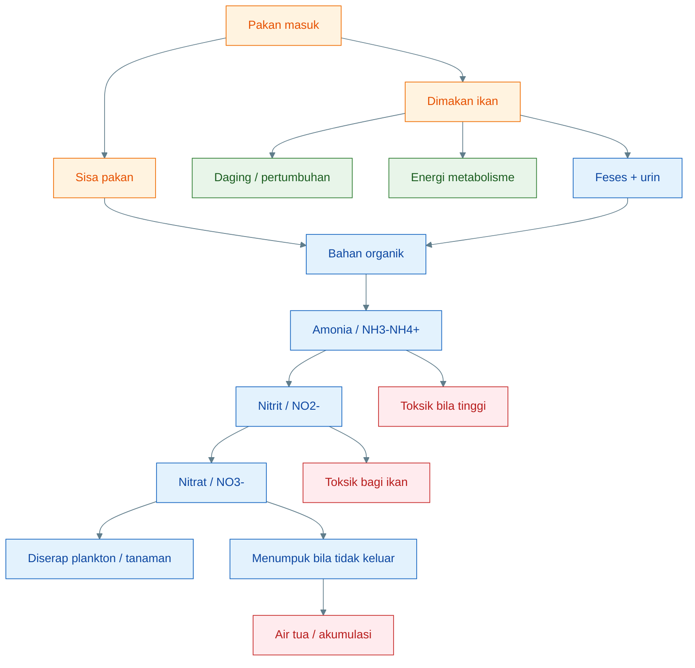
```mermaid id="x90p4n"
%%{init: {"theme": "base", "themeVariables": {"fontFamily": "Arial", "primaryColor": "#E3F2FD", "primaryTextColor": "#0D47A1", "primaryBorderColor": "#1565C0", "lineColor": "#607D8B"}}}%%
flowchart TD
    A["Pakan masuk"] --> B["Dimakan ikan"]
    A --> C["Sisa pakan"]

    B --> D["Daging / pertumbuhan"]
    B --> E["Energi metabolisme"]
    B --> F["Feses + urin"]

    C --> G["Bahan organik"]
    F --> G

    G --> H["Amonia / NH3-NH4+"]
    H --> I["Nitrit / NO2-"]
    I --> J["Nitrat / NO3-"]

    J --> K["Diserap plankton / tanaman"]
    J --> L["Menumpuk bila tidak keluar"]

    H --> M["Toksik bila tinggi"]
    I --> N["Toksik bagi ikan"]
    L --> O["Air tua / akumulasi"]

    classDef feed fill:#FFF3E0,stroke:#EF6C00,color:#E65100;
    classDef fish fill:#E8F5E9,stroke:#2E7D32,color:#1B5E20;
    classDef nitrogen fill:#E3F2FD,stroke:#1565C0,color:#0D47A1;
    classDef danger fill:#FFEBEE,stroke:#C62828,color:#B71C1C;

    class A,B,C feed;
    class D,E fish;
    class F,G,H,I,J,K,L nitrogen;
    class M,N,O danger;
```

Siklus nitrogen menjadi pusat kualitas air karena ia menghubungkan **pakan, pertumbuhan ikan, mikroba, oksigen, endapan, plankton, dan kematian ikan** dalam satu alur. Jika nitrogen terkendali, kolam lebih stabil. Jika nitrogen tidak terkendali, sistem cepat masuk zona stres.

Fokus utama modul ini adalah:

> **Setiap pakan yang tidak menjadi daging akan menjadi beban nitrogen.**

Kalimat ini harus menjadi prinsip dasar. Pakan bukan hanya nutrisi. Pakan juga adalah calon limbah. Setiap gram pakan yang masuk ke kolam harus dipikirkan: apakah akan menjadi biomassa ikan, atau menjadi amonia, nitrit, nitrat, dan endapan dasar?

<ResourceBox
  title="Artikel Terkait:"
  items={[
    {
      name: 'Akuaponik Sederhana Lele Air Dangkal: Aliran Akar Tanaman dengan Airlift-Pump untuk Mengambil Nitrat',
      href: '/blog/agri/perikanan/lele-air-dangkal-probiotik',
    },
    {
      name: 'Budidaya Lele Air Dangkal, Probiotik, dan Fermentasi Pakan',
      href: '/blog/agri/perikanan/lele-air-dangkal-probiotik',
    },
    {
      name: 'Air Lift Pump - Prinsip, Desain, dan Aplikasi dalam Akuakultur',
      href: '/blog/agri/airlift-pump',
    },
  ]}
/>

---

## 1.2 Hubungan pakan, FCR, amonia, dan kematian ikan

Pakan adalah input terbesar dalam budidaya lele. Tetapi pakan juga merupakan sumber terbesar limbah nitrogen. Semakin banyak pakan masuk, semakin besar potensi pertumbuhan ikan, tetapi juga semakin besar potensi limbah.

Kuncinya ada pada **efisiensi**. Efisiensi pakan biasanya diukur dengan FCR atau _Feed Conversion Ratio_.

Dalam format MDX:

$$
FCR = \frac{\text{Total pakan diberikan}}{\text{Kenaikan biomassa ikan}}
$$

Contoh:

$$
FCR = \frac{120 \text{ kg pakan}}{100 \text{ kg kenaikan biomassa}}
$$

$$
FCR = 1{,}2
$$

Artinya, untuk menghasilkan 100 kg kenaikan bobot lele, dibutuhkan 120 kg pakan.

FCR rendah berarti pakan lebih banyak menjadi daging. FCR tinggi berarti lebih banyak pakan hilang sebagai energi, feses, sisa pakan, atau limbah metabolik. Dalam konteks siklus nitrogen, FCR tinggi hampir selalu berarti **beban nitrogen lebih berat**.

Hubungannya dapat digambarkan sebagai berikut:

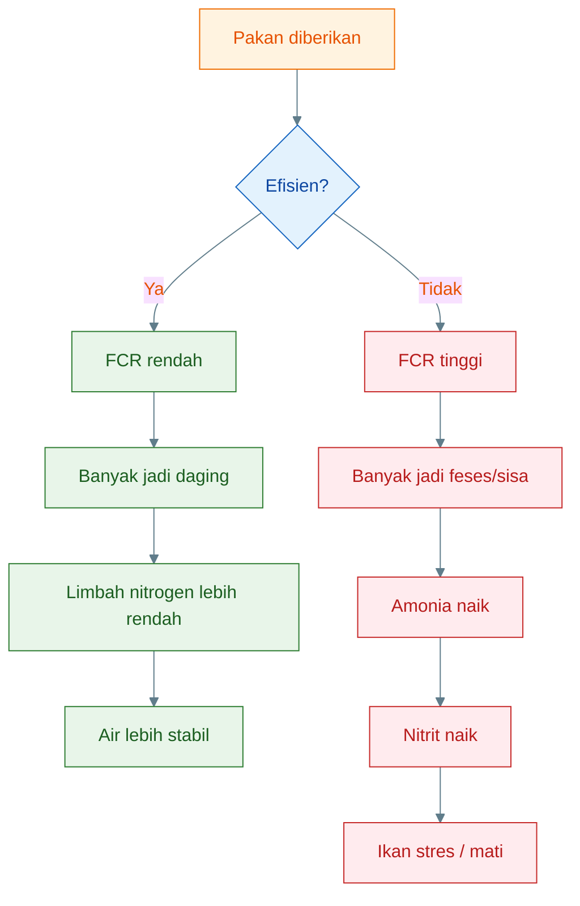
```mermaid id="11goj2"
%%{init: {"theme": "base", "themeVariables": {"fontFamily": "Arial", "primaryColor": "#FFF8E1", "primaryTextColor": "#E65100", "primaryBorderColor": "#F9A825", "lineColor": "#607D8B"}}}%%
flowchart TD
    A["Pakan diberikan"] --> B{"Efisien?"}

    B -->|Ya| C["FCR rendah"]
    C --> D["Banyak jadi daging"]
    D --> E["Limbah nitrogen lebih rendah"]
    E --> F["Air lebih stabil"]

    B -->|Tidak| G["FCR tinggi"]
    G --> H["Banyak jadi feses/sisa"]
    H --> I["Amonia naik"]
    I --> J["Nitrit naik"]
    J --> K["Ikan stres / mati"]

    classDef feed fill:#FFF3E0,stroke:#EF6C00,color:#E65100;
    classDef good fill:#E8F5E9,stroke:#2E7D32,color:#1B5E20;
    classDef bad fill:#FFEBEE,stroke:#C62828,color:#B71C1C;
    classDef decision fill:#E3F2FD,stroke:#1565C0,color:#0D47A1;

    class A feed;
    class B decision;
    class C,D,E,F good;
    class G,H,I,J,K bad;
```

Amonia adalah titik bahaya pertama. Amonia muncul dari ekskresi ikan, penguraian feses, dan sisa pakan. Dalam air, amonia ada dalam dua bentuk utama:

```text id="m9vwyv"
NH4+ = amonium, relatif lebih aman
NH3  = amonia bebas / tak terionisasi, jauh lebih toksik
```

Bentuk yang paling berbahaya adalah **NH₃**, dan proporsinya meningkat ketika pH dan suhu naik. FAO menjelaskan bahwa ammonia merupakan produk ekskresi utama hewan air; ammonia dapat meningkat pada sistem budidaya padat akibat ekskresi langsung, degradasi feses, dan pakan tidak termakan. FAO juga menekankan bahwa toksisitas terutama disebabkan oleh amonia tak terionisasi, NH₃, yang jauh lebih toksik dibanding NH₄⁺, dan proporsi NH₃ naik pada pH yang lebih tinggi. ([FAOHome][1])

Nitrit adalah titik bahaya kedua. Nitrit adalah hasil antara dari nitrifikasi. Pada ikan, nitrit dapat mengganggu kemampuan darah membawa oksigen. Studi FAO pada _Clarias batrachus_ menjelaskan bahwa amonia dioksidasi menjadi nitrit dan kemudian nitrat, serta nitrit dapat bersifat toksik terutama dalam sistem budidaya intensif karena kemampuannya mengoksidasi hemoglobin menjadi methemoglobin, bentuk yang tidak mampu membawa oksigen. ([FAOHome][2])

Maka hubungan pakan, FCR, amonia, dan kematian ikan dapat disederhanakan begini:

```text id="4opdul"
Pakan berlebih
→ FCR memburuk
→ feses dan sisa pakan naik
→ amonia naik
→ nitrit naik
→ ikan stres
→ nafsu makan turun
→ FCR makin buruk
→ kematian
```

Ini membentuk lingkaran negatif. Begitu air rusak, ikan makan lebih buruk. Ketika ikan makan lebih buruk, pakan lebih banyak tersisa. Ketika pakan tersisa, amonia naik. Akhirnya sistem makin sulit dikendalikan.

Karena itu, pada kolam lele yang baik, pemberian pakan tidak boleh hanya berdasarkan rasa ingin “membesarkan ikan lebih cepat”. Pakan harus diberikan sesuai kemampuan ikan dan kemampuan kolam mengolah limbahnya.

Rumus ekonomi juga menunjukkan hal yang sama:

$$
\text{Biaya pakan per kg panen} = \text{Harga pakan per kg} \times FCR
$$

Jika harga pakan Rp15.000/kg:

$$
\text{Rp}15.000 \times 1{,}2 = \text{Rp}18.000/\text{kg panen}
$$

Jika FCR memburuk menjadi 1,5:

$$
\text{Rp}15.000 \times 1{,}5 = \text{Rp}22.500/\text{kg panen}
$$

Selisih:

$$
\text{Rp}22.500 - \text{Rp}18.000 = \text{Rp}4.500/\text{kg panen}
$$

Jadi FCR bukan hanya angka teknis. FCR adalah jembatan antara **pakan, nitrogen, kualitas air, pertumbuhan ikan, dan keuntungan usaha**.

---

## 1.3 Mengapa sistem air dangkal lebih sensitif

Sistem air dangkal memiliki keunggulan penting. Lele dapat mengambil udara langsung dari permukaan, sehingga air dangkal membantu ikan lebih mudah naik ke permukaan. Jarak naik-turun pendek, energi gerak vertikal lebih hemat, dan perilaku ikan lebih mudah diamati.

Namun sistem air dangkal juga memiliki kelemahan besar: **volume air kecil**.

Jika kolam berbentuk lingkaran diameter 80 cm dan tinggi air 50 cm, volumenya:

$$
V = \pi r^2 h
$$

Dengan:

$$
r = 0{,}4 \text{ m}
$$

$$
h = 0{,}5 \text{ m}
$$

Maka:

$$
V = 3{,}14 \times (0{,}4)^2 \times 0{,}5
$$

$$
V = 0{,}251 \text{ m}^3
$$

Karena:

$$
1 \text{ m}^3 = 1.000 \text{ liter}
$$

Maka:

$$
V \approx 251 \text{ liter}
$$

Artinya, kolam tersebut hanya memiliki sekitar **251 liter air**.

Volume kecil berarti kesalahan kecil bisa cepat berdampak. Misalnya, pakan tersisa 10 gram mungkin tampak kecil. Tetapi dalam 251 liter air, bahan organik dari 10 gram pakan dapat menaikkan beban mikroba, amonia, dan kebutuhan oksigen. Jika terjadi berulang setiap hari, akumulasinya menjadi besar.

Sistem air dangkal sensitif karena empat alasan utama:

1. **Volume buffer kecil**
   Air sedikit, sehingga limbah cepat pekat.

2. **Endapan cepat berpengaruh**
   Dasar kolam dekat dengan seluruh badan air. Endapan busuk lebih cepat memengaruhi ikan.

3. **Suhu lebih mudah berubah**
   Air dangkal lebih cepat panas dan lebih cepat dingin.

4. **Oksigen terlarut mudah kritis pada malam-subuh**
   Ikan, mikroba, dan plankton menggunakan oksigen, sementara fotosintesis berhenti pada malam hari.

Diagramnya:

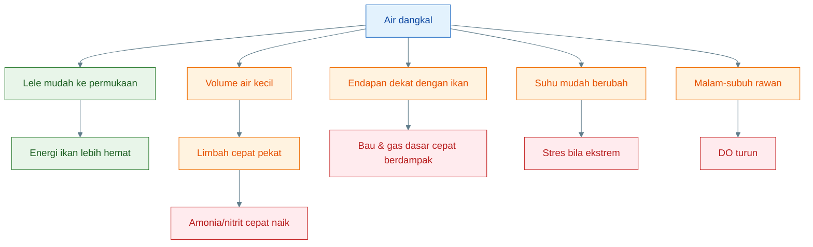
```mermaid id="yayl49"
%%{init: {"theme": "base", "themeVariables": {"fontFamily": "Arial", "primaryColor": "#E3F2FD", "primaryTextColor": "#0D47A1", "primaryBorderColor": "#1565C0", "lineColor": "#607D8B"}}}%%
flowchart TD
    A["Air dangkal"] --> B["Lele mudah ke permukaan"]
    B --> C["Energi ikan lebih hemat"]

    A --> D["Volume air kecil"]
    D --> E["Limbah cepat pekat"]
    E --> F["Amonia/nitrit cepat naik"]

    A --> G["Endapan dekat dengan ikan"]
    G --> H["Bau & gas dasar cepat berdampak"]

    A --> I["Suhu mudah berubah"]
    I --> J["Stres bila ekstrem"]

    A --> K["Malam-subuh rawan"]
    K --> L["DO turun"]

    classDef good fill:#E8F5E9,stroke:#2E7D32,color:#1B5E20;
    classDef warning fill:#FFF3E0,stroke:#EF6C00,color:#E65100;
    classDef danger fill:#FFEBEE,stroke:#C62828,color:#B71C1C;
    classDef main fill:#E3F2FD,stroke:#1565C0,color:#0D47A1;

    class A main;
    class B,C good;
    class D,E,G,I,K warning;
    class F,H,J,L danger;
```

Dalam sistem air dangkal, keberhasilan tidak ditentukan hanya oleh kemampuan lele mengambil udara. Itu hanya satu bagian. Bagian lain yang tidak boleh dilupakan adalah: mikroba pengurai, bakteri nitrifikasi, dan proses kimia air tetap membutuhkan kondisi air yang layak.

Lele bisa mengambil udara langsung, tetapi bakteri nitrifikasi tetap membutuhkan oksigen terlarut di air. Jika oksigen rendah, amonia dan nitrit dapat lebih mudah menumpuk. Inilah titik kritis sistem air dangkal tanpa aerasi.

Sistem air dangkal akan stabil jika:

- pakan tidak berlebih,
- pakan cepat habis,
- endapan dasar tidak menumpuk,
- oksigen terlarut cukup,
- pH tidak ekstrem,
- mikroba bekerja seimbang,
- plankton tidak terlalu pekat,
- ikan tidak menggantung massal saat pagi.

---

## 1.4 Perbedaan ikan “masih hidup” dan ikan “tumbuh optimal”

Lele dikenal tahan terhadap kondisi air yang kurang ideal. Ini membuat banyak orang salah menafsirkan keberhasilan. Ikan yang masih hidup belum tentu tumbuh optimal. Ikan yang tidak mati belum tentu sehat. Ikan yang mau makan belum tentu FCR-nya baik.

Dalam budidaya, ada perbedaan besar antara:

> **ikan mampu bertahan hidup**

dan

> **ikan tumbuh efisien menjadi panen.**

Ikan masih hidup bisa saja berada dalam kondisi stres ringan. Stres ringan sering tidak langsung membunuh ikan, tetapi dapat menurunkan nafsu makan, memperlambat pertumbuhan, meningkatkan FCR, dan membuat ikan lebih rentan penyakit.

Amonia dan nitrit sangat relevan dalam hal ini. FAO menjelaskan bahwa konsentrasi subletal senyawa nitrogen dapat menghambat pertumbuhan ikan, meningkatkan stres, dan membuat ikan lebih rentan terhadap penyakit; sedangkan kadar yang lebih tinggi dapat menyebabkan kematian. ([FAOHome][2])

Perbedaannya dapat dilihat sebagai berikut:

| Kondisi         | Ikan masih hidup         | Ikan tumbuh optimal    |
| --------------- | ------------------------ | ---------------------- |
| Nafsu makan     | Ada, tetapi tidak stabil | Kuat dan konsisten     |
| FCR             | Bisa tinggi              | Rendah dan stabil      |
| Air             | Mungkin bau ringan       | Stabil dan tidak busuk |
| Amonia/nitrit   | Bisa mulai naik          | Terkendali             |
| Ukuran ikan     | Tidak seragam            | Lebih seragam          |
| Perilaku pagi   | Bisa menggantung         | Aktif/normal           |
| Pertumbuhan     | Lambat                   | Sesuai target          |
| Risiko penyakit | Lebih tinggi             | Lebih rendah           |

Untuk praktisi, indikator “tumbuh optimal” bukan hanya ikan tidak mati. Indikator yang lebih tajam adalah:

- ikan aktif,
- pakan habis cepat,
- ukuran relatif seragam,
- tidak menggantung massal pagi hari,
- air tidak bau amonia,
- endapan dasar tidak busuk,
- FCR sesuai target,
- survival rate tinggi,
- bobot mingguan naik stabil.

Diagram praktisnya:

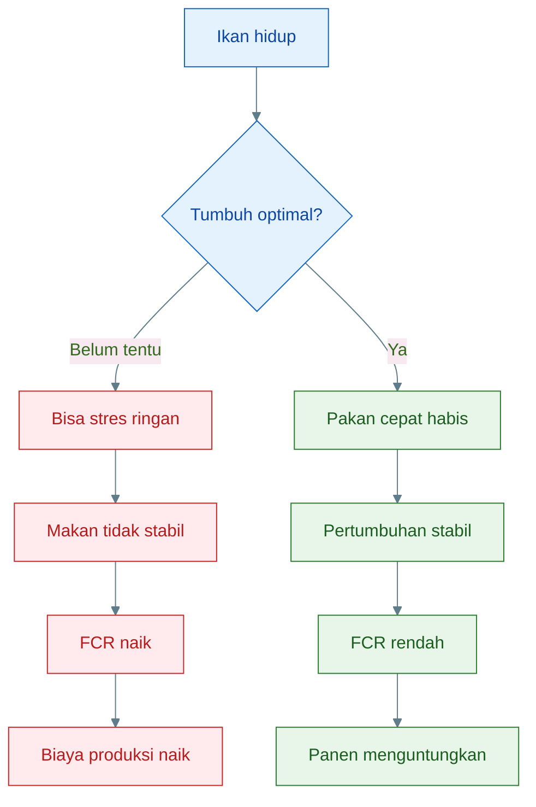
```mermaid id="14z2ux"
%%{init: {"theme": "base", "themeVariables": {"fontFamily": "Arial", "primaryColor": "#F1F8E9", "primaryTextColor": "#33691E", "primaryBorderColor": "#689F38", "lineColor": "#607D8B"}}}%%
flowchart TD
    A["Ikan hidup"] --> B{"Tumbuh optimal?"}

    B -->|Belum tentu| C["Bisa stres ringan"]
    C --> D["Makan tidak stabil"]
    D --> E["FCR naik"]
    E --> F["Biaya produksi naik"]

    B -->|Ya| G["Pakan cepat habis"]
    G --> H["Pertumbuhan stabil"]
    H --> I["FCR rendah"]
    I --> J["Panen menguntungkan"]

    classDef neutral fill:#E3F2FD,stroke:#1565C0,color:#0D47A1;
    classDef risk fill:#FFEBEE,stroke:#C62828,color:#B71C1C;
    classDef good fill:#E8F5E9,stroke:#2E7D32,color:#1B5E20;

    class A,B neutral;
    class C,D,E,F risk;
    class G,H,I,J good;
```

Di sinilah siklus nitrogen menjadi sangat penting. Amonia dan nitrit yang tidak langsung membunuh ikan tetap dapat menurunkan performa. Akibatnya, pembudidaya melihat ikan masih hidup, tetapi pertumbuhan lambat, pakan boros, dan air cepat bermasalah.

Maka standar budidaya yang benar bukan:

> “Yang penting ikan hidup.”

Tetapi:

> **“Ikan hidup, tumbuh cepat, FCR rendah, air stabil, dan panen menghasilkan margin.”**

---

## 1.5 Tujuan modul

Modul ini disusun untuk membantu praktisi budidaya lele memahami siklus nitrogen secara praktis, bukan sebagai teori kimia yang rumit. Tujuannya adalah agar pembudidaya dapat membaca kondisi kolam, menghitung beban pakan, memahami risiko amonia/nitrit, dan mengambil tindakan sebelum masalah menjadi kematian massal.

Tujuan utama modul ini adalah:

1. **Memahami bahwa pakan adalah sumber utama nitrogen**

   Pakan tidak hanya menghasilkan pertumbuhan. Pakan juga menghasilkan feses, urin, sisa organik, amonia, nitrit, dan nitrat.

2. **Memahami hubungan FCR dengan limbah nitrogen**

   FCR rendah berarti pakan lebih efisien menjadi daging. FCR tinggi berarti lebih banyak pakan berubah menjadi limbah.

3. **Memahami mengapa kolam air dangkal sensitif**

   Volume air kecil membuat perubahan kualitas air cepat terjadi.

4. **Memahami perbedaan amonia, nitrit, dan nitrat**

   Amonia dan nitrit adalah titik toksik utama. Nitrat lebih aman, tetapi tetap menjadi indikator akumulasi nitrogen.

5. **Memahami peran oksigen dalam siklus nitrogen**

   Lele dapat mengambil udara, tetapi mikroba nitrifikasi tetap membutuhkan oksigen terlarut.

6. **Memahami mikroba yang terlibat**

   Mikroba pengurai organik, bakteri nitrifikasi, mikroba fotosintetik, dan plankton memiliki fungsi berbeda.

7. **Mampu menghitung neraca sederhana pakan menjadi daging dan limbah**

   Praktisi perlu tahu berapa besar nitrogen yang masuk dari pakan dan berapa potensi beban nitratnya.

8. **Mampu menentukan batas kapasitas kolam**

   Jumlah ekor harus dibaca sebagai biomassa dan beban nitrogen, bukan sekadar angka tebar.

9. **Mampu membuat SOP pengendalian amonia, nitrit, dan nitrat**

   Saat air bermasalah, tindakan pertama harus tepat: kurangi pakan, aerasi, buang endapan, ganti air sebagian, atau koreksi sistem.

Tujuan akhirnya:

> **membantu pembudidaya menghasilkan lele dengan FCR rendah, air stabil, risiko kematian rendah, dan biaya produksi terkendali.**

[**Kembali ke Atas**](#siklus-nitrogen-pada-budidaya-lele-air-dangkal-pakan-amonia-nitrit-nitrat-mikroba-dan-batas-kapasitas-kolam)

---

# 2. Kolam sebagai Ekosistem Produksi

## 2.1 Kolam bukan hanya wadah air

Kesalahan umum dalam budidaya lele adalah memandang kolam hanya sebagai tempat menampung ikan dan air. Padahal kolam adalah ekosistem produksi. Di dalamnya terjadi proses biologis, kimia, dan fisik secara terus-menerus.

Setiap hari kolam menerima input:

- pakan,
- probiotik,
- oksigen,
- cahaya,
- air tambahan,
- benih atau biomassa ikan.

Kolam juga menghasilkan output:

- daging ikan,
- feses,
- urin,
- karbon dioksida,
- amonia,
- nitrit,
- nitrat,
- plankton,
- lumpur dasar,
- bau,
- panas,
- gas dari dasar kolam.

Jika input dan output seimbang, kolam stabil. Jika input terlalu besar, terutama pakan, sistem menjadi overload. Pada saat itu, mikroba tidak mampu mengolah semua limbah dengan baik, oksigen turun, amonia naik, nitrit naik, dan ikan mulai stres.


```mermaid id="v03rnv"
%%{init: {"theme": "base", "themeVariables": {"fontFamily": "Arial", "primaryColor": "#E3F2FD", "primaryTextColor": "#0D47A1", "primaryBorderColor": "#1565C0", "lineColor": "#607D8B"}}}%%
flowchart TD
    A["Kolam lele"] --> B["Input"]
    A --> C["Proses"]
    A --> D["Output"]

    B --> B1["Pakan"]
    B --> B2["Oksigen"]
    B --> B3["Air"]
    B --> B4["Probiotik"]
    B --> B5["Cahaya"]

    C --> C1["Ikan tumbuh"]
    C --> C2["Mikroba mengurai"]
    C --> C3["Plankton berfotosintesis"]
    C --> C4["Nitrifikasi"]

    D --> D1["Daging ikan"]
    D --> D2["Feses"]
    D --> D3["Amonia"]
    D --> D4["Nitrit"]
    D --> D5["Nitrat"]
    D --> D6["Endapan"]

    classDef main fill:#E3F2FD,stroke:#1565C0,color:#0D47A1;
    classDef input fill:#FFF3E0,stroke:#EF6C00,color:#E65100;
    classDef process fill:#E8F5E9,stroke:#2E7D32,color:#1B5E20;
    classDef output fill:#FFEBEE,stroke:#C62828,color:#B71C1C;

    class A main;
    class B,B1,B2,B3,B4,B5 input;
    class C,C1,C2,C3,C4 process;
    class D,D1,D2,D3,D4,D5,D6 output;
```

Kolam yang sehat bukan berarti air harus selalu bening. Dalam budidaya lele, air yang agak hijau atau cokelat muda bisa wajar jika tidak bau, ikan aktif, pakan habis cepat, dan amonia-nitrit terkendali.

Sebaliknya, air yang tampak tenang belum tentu aman. Air bisa terlihat biasa tetapi amonia tinggi. Ikan bisa masih hidup tetapi pertumbuhan lambat. Karena itu, kolam harus dibaca sebagai sistem, bukan hanya dilihat dari warna air.

Prinsipnya:

> **Kolam yang baik adalah kolam yang mampu mengubah pakan menjadi ikan, bukan menjadi amonia dan endapan.**

---

## 2.2 Komponen ekosistem kolam

Ekosistem kolam lele terdiri dari komponen hidup dan tidak hidup. Semua komponen saling memengaruhi.

Komponen utama:

- ikan,
- pakan,
- feses,
- mikroba,
- plankton,
- oksigen,
- CO₂,
- endapan,
- amonia,
- nitrit,
- nitrat.

### Ikan

Ikan adalah target produksi. Namun ikan juga menghasilkan limbah. Ikan memakan pakan, menyerap sebagian nutrisi, lalu mengeluarkan feses dan ekskresi nitrogen.

### Pakan

Pakan adalah input utama. Pakan dapat menjadi:

```text id="9o31co"
daging + energi + feses + amonia + sisa organik
```

Pakan adalah sumber pertumbuhan sekaligus sumber masalah bila tidak efisien.

### Feses dan sisa pakan

Feses dan sisa pakan menjadi bahan organik. Mikroba akan menguraikannya. Proses penguraian ini membutuhkan oksigen dan dapat melepaskan amonia.

### Mikroba

Mikroba adalah pekerja ekosistem. Ada mikroba pengurai organik, mikroba nitrifikasi, mikroba fotosintetik, dan mikroba lain. Mikroba membantu menjaga sistem, tetapi juga menggunakan oksigen.

### Plankton

Plankton dapat membantu menyerap nitrogen dan menghasilkan oksigen pada siang hari. Namun pada malam hari, plankton tetap bernapas dan menggunakan oksigen.

### Oksigen

Oksigen diperlukan oleh ikan, mikroba pengurai, bakteri nitrifikasi, dan organisme lain. Pada sistem air dangkal tanpa aerasi, oksigen menjadi faktor pembatas penting.

### CO₂

CO₂ dihasilkan oleh respirasi ikan, mikroba, dan plankton. Pada siang hari, fitoplankton dapat menyerap CO₂ untuk fotosintesis. Pada malam hari, CO₂ dapat meningkat.

### Endapan

Endapan adalah akumulasi feses, sisa pakan, plankton mati, biofilm, dan bahan organik. Endapan tipis masih wajar. Endapan tebal, hitam, dan bau adalah tanda bahaya.

### Amonia, nitrit, nitrat

Ketiganya adalah bentuk nitrogen yang harus dipantau. Amonia dan nitrit adalah yang paling berbahaya. Nitrat lebih aman, tetapi jika menumpuk tetap menunjukkan sistem kelebihan beban nitrogen.

Hubungan antar komponen:

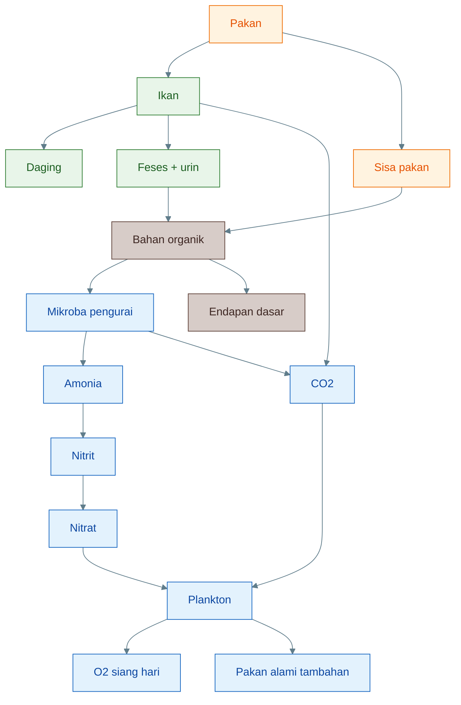
```mermaid id="h3rp60"
%%{init: {"theme": "base", "themeVariables": {"fontFamily": "Arial", "primaryColor": "#F1F8E9", "primaryTextColor": "#33691E", "primaryBorderColor": "#689F38", "lineColor": "#607D8B"}}}%%
flowchart TD
    A["Pakan"] --> B["Ikan"]
    B --> C["Daging"]
    B --> D["Feses + urin"]
    A --> E["Sisa pakan"]

    D --> F["Bahan organik"]
    E --> F

    F --> G["Mikroba pengurai"]
    G --> H["Amonia"]
    H --> I["Nitrit"]
    I --> J["Nitrat"]

    J --> K["Plankton"]
    K --> L["O2 siang hari"]
    K --> M["Pakan alami tambahan"]

    B --> N["CO2"]
    G --> N
    N --> K

    F --> O["Endapan dasar"]

    classDef feed fill:#FFF3E0,stroke:#EF6C00,color:#E65100;
    classDef fish fill:#E8F5E9,stroke:#2E7D32,color:#1B5E20;
    classDef nitrogen fill:#E3F2FD,stroke:#1565C0,color:#0D47A1;
    classDef sediment fill:#D7CCC8,stroke:#5D4037,color:#3E2723;

    class A,E feed;
    class B,C,D fish;
    class G,H,I,J,K,L,M,N nitrogen;
    class F,O sediment;
```

Dari diagram ini terlihat bahwa kolam tidak dapat dipisahkan antara pakan dan air. Setiap keputusan pakan akan berpengaruh pada mikroba, oksigen, amonia, nitrit, nitrat, plankton, dan endapan.

---

## 2.3 Parameter fisik kolam

Parameter fisik kolam menentukan kapasitas awal sistem. Sebelum membahas pH, amonia, atau nitrit, pembudidaya harus memahami ukuran fisik kolamnya.

Parameter fisik utama:

- volume,
- luas permukaan,
- tinggi air,
- endapan dasar,
- sirkulasi,
- aerasi darurat.

### Volume

Volume menentukan kapasitas air menahan perubahan. Semakin kecil volume air, semakin cepat limbah memengaruhi kualitas air.

Rumus volume kolam bulat:

$$
V = \pi r^2 h
$$

Untuk kolam diameter 80 cm dan tinggi air 50 cm:

$$
r = 0{,}4 \text{ m}
$$

$$
h = 0{,}5 \text{ m}
$$

$$
V = 3{,}14 \times (0{,}4)^2 \times 0{,}5
$$

$$
V \approx 0{,}251 \text{ m}^3
$$

$$
V \approx 251 \text{ liter}
$$

Volume ini kecil. Maka sistem harus dikelola hati-hati.

### Luas permukaan

Luas permukaan penting untuk pertukaran gas antara air dan udara.

Rumus luas permukaan kolam bulat:

$$
A = \pi r^2
$$

$$
A = 3{,}14 \times (0{,}4)^2
$$

$$
A = 0{,}5024 \text{ m}^2
$$

Jadi luas permukaan air sekitar **0,5 m²**.

Air dangkal memberi keuntungan karena ikan mudah mencapai permukaan. Tetapi luas permukaan tetap terbatas. Jika biomassa ikan dan beban limbah terlalu tinggi, pertukaran gas alami saja tidak cukup untuk mendukung mikroba dan nitrifikasi.

### Tinggi air

Untuk sistem air dangkal, tinggi air praktis berada pada kisaran:

$$
30 \text{ cm} \leq h \leq 50 \text{ cm}
$$

Tinggi air lebih dangkal memudahkan lele naik ke permukaan, tetapi volume makin kecil. Tinggi air terlalu dalam mengurangi keunggulan sistem air dangkal dan meningkatkan energi ikan untuk naik-turun.

### Endapan dasar

Endapan dasar perlu dipantau karena merupakan tempat akumulasi bahan organik. Endapan tipis masih wajar. Endapan tebal dan hitam berbau menunjukkan kondisi anaerob dan beban organik berlebih.

Target praktis:

| Parameter endapan | Target                                      |
| ----------------- | ------------------------------------------- |
| Ketebalan         | tipis, ideal < 1–2 cm                       |
| Warna             | cokelat/gelap ringan                        |
| Bau               | tidak busuk                                 |
| Tanda bahaya      | hitam pekat, bau telur busuk, gelembung gas |

### Sirkulasi

Dalam sistem semi-statis, sirkulasi tidak selalu memakai pompa. Namun tetap perlu ada cara untuk:

- membuang endapan,
- mengganti air sebagian,
- mengurangi air tua,
- memasukkan air baru bila kualitas air turun.

### Aerasi darurat

Walaupun sistem air dangkal bisa dijalankan tanpa aerasi kuat, aerasi darurat tetap penting. Aerasi diperlukan saat:

- ikan menggantung massal,
- DO rendah,
- hujan panjang,
- plankton terlalu pekat,
- amonia/nitrit naik,
- endapan dasar terganggu,
- biomassa ikan sudah tinggi.

Ringkasnya:

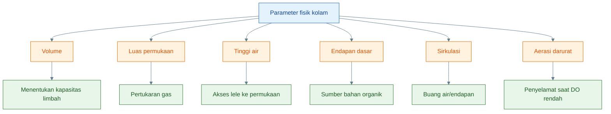
```mermaid id="2fbu97"
%%{init: {"theme": "base", "themeVariables": {"fontFamily": "Arial", "primaryColor": "#E3F2FD", "primaryTextColor": "#0D47A1", "primaryBorderColor": "#1565C0", "lineColor": "#607D8B"}}}%%
flowchart TD
    A["Parameter fisik kolam"] --> B["Volume"]
    A --> C["Luas permukaan"]
    A --> D["Tinggi air"]
    A --> E["Endapan dasar"]
    A --> F["Sirkulasi"]
    A --> G["Aerasi darurat"]

    B --> H["Menentukan kapasitas limbah"]
    C --> I["Pertukaran gas"]
    D --> J["Akses lele ke permukaan"]
    E --> K["Sumber bahan organik"]
    F --> L["Buang air/endapan"]
    G --> M["Penyelamat saat DO rendah"]

    classDef main fill:#E3F2FD,stroke:#1565C0,color:#0D47A1;
    classDef param fill:#FFF3E0,stroke:#EF6C00,color:#E65100;
    classDef result fill:#E8F5E9,stroke:#2E7D32,color:#1B5E20;

    class A main;
    class B,C,D,E,F,G param;
    class H,I,J,K,L,M result;
```

---

## 2.4 Parameter kualitas air

Parameter kualitas air menunjukkan apakah kolam masih mampu mendukung siklus nitrogen dan pertumbuhan lele.

Parameter utama:

- suhu,
- pH,
- DO,
- amonia,
- nitrit,
- nitrat,
- bau,
- warna,
- endapan.

### Suhu

Suhu memengaruhi metabolisme ikan, aktivitas mikroba, kelarutan oksigen, dan toksisitas amonia. Pada suhu tinggi, oksigen lebih rendah dan proporsi NH₃ lebih tinggi. Ini membuat amonia lebih berbahaya.

Target praktis untuk lele:

$$
26^\circ C \text{ sampai } 30^\circ C
$$

Waspada jika:

- suhu < 24°C,
- suhu >32–33°C,
- perubahan suhu harian terlalu tajam.

### pH

pH memengaruhi kenyamanan ikan dan bentuk amonia. Pada pH tinggi, proporsi NH₃ meningkat.

Target praktis:

$$
6{,}5 \leq pH \leq 8{,}5
$$

Waspada jika:

- pH < 6,
- pH >8,5,
- pH naik tinggi pada sore hari karena plankton pekat.

### DO / oksigen terlarut

DO dibutuhkan oleh ikan, mikroba pengurai, dan bakteri nitrifikasi. Walaupun lele bisa mengambil udara langsung, kualitas air tetap membutuhkan oksigen terlarut. Oksigen terlarut rendah dapat menghambat nitrifikasi dan memperparah penumpukan amonia/nitrit.

Target praktis:

$$
DO > 4 \text{ mg/L}
$$

Minimal waspada:

$$
DO < 3 \text{ mg/L}
$$

### Amonia

Amonia harus dilihat sebagai TAN dan NH₃. TAN adalah total amonia nitrogen, sedangkan NH₃ adalah bagian yang paling toksik.

Batas praktis:

| Parameter |      Target |        Waspada |     Bahaya |
| --------- | ----------: | -------------: | ---------: |
| TAN       |    < 1 mg/L |       1–3 mg/L |    >3 mg/L |
| NH₃ bebas | < 0,02 mg/L | 0,02–0,05 mg/L | >0,05 mg/L |

Untuk _Clarias_, studi FAO mencatat konsentrasi aman amonia tak terionisasi diperkirakan sekitar 0,17 mg/L berdasarkan faktor aplikasi dari LC50, sementara standar EIFAC yang disebut dalam studi tersebut adalah 0,02 mg/L NH₃. Untuk praktik budidaya, memakai batas konservatif 0,02 mg/L sebagai target ideal lebih aman, terutama pada sistem padat dan air dangkal. ([FAOHome][2])

### Nitrit

Nitrit berbahaya karena mengganggu pengangkutan oksigen dalam darah. Batas praktis:

|       NO₂⁻ | Status                 |
| ---------: | ---------------------- |
| < 0,5 mg/L | relatif aman           |
| 0,5–1 mg/L | waspada                |
|    >1 mg/L | bahaya, perlu tindakan |

### Nitrat

Nitrat lebih aman daripada amonia dan nitrit, tetapi tetap menjadi indikator akumulasi nitrogen.

Batas praktis:

|        NO₃⁻ | Status                              |
| ----------: | ----------------------------------- |
|   < 50 mg/L | baik                                |
| 50–100 mg/L | tinggi sedang                       |
|   >100 mg/L | tinggi, perlu pengurangan akumulasi |

Sumber teknis akuakultur modern umumnya menempatkan nitrat sebagai produk akhir siklus nitrogen yang jauh lebih tidak toksik dibanding amonia/nitrit, tetapi kadar tinggi dalam sistem tertutup atau intensif tetap dapat menekan pertumbuhan dan menandakan perlunya pengelolaan air.

### Bau, warna, dan endapan

Tidak semua pembudidaya memiliki test kit lengkap. Maka indikator visual dan bau tetap penting.

| Indikator | Kondisi baik              | Kondisi bahaya             |
| --------- | ------------------------- | -------------------------- |
| Bau air   | segar/tanah ringan        | amonia, busuk, telur busuk |
| Warna air | hijau/cokelat muda stabil | hitam, hijau terlalu pekat |
| Endapan   | tipis, tidak bau          | tebal, hitam, berbau       |
| Ikan pagi | aktif/normal              | menggantung massal         |
| Pakan     | cepat habis               | tersisa/lambat dimakan     |

---

## 2.5 Batas aman praktis untuk lele

Bab ini menjawab pertanyaan:

> **Media seperti apa yang masih mampu mendukung siklus nitrogen?**

Jawabannya: media yang tidak hanya membuat ikan bertahan hidup, tetapi mampu menjaga proses pakan → ikan → limbah → mikroba → nitrat tetap terkendali.

Batas praktis untuk sistem lele air dangkal:

| Parameter  |    Target praktis |      Status waspada | Tindakan awal                    |
| ---------- | ----------------: | ------------------: | -------------------------------- |
| Tinggi air |          30–50 cm | >50 cm tanpa aerasi | sesuaikan konsep sistem          |
| Suhu       |           26–30°C |     < 24 atau >32°C | kurangi pakan                    |
| pH         |           6,5–8,5 |     >8,5 atau < 6,5 | cek amonia, jangan overfeeding   |
| DO subuh   |           >4 mg/L |            < 3 mg/L | aerasi, kurangi pakan            |
| TAN        |          < 1 mg/L |            1–3 mg/L | kurangi pakan, cek endapan       |
| NH₃ bebas  |       < 0,02 mg/L |          >0,02 mg/L | cek pH, kurangi pakan            |
| NO₂⁻       |        < 0,5 mg/L |           >0,5 mg/L | aerasi, kurangi pakan            |
| NO₃⁻       |         < 50 mg/L |           >100 mg/L | ganti air sebagian/kurangi beban |
| Endapan    |             tipis |       tebal dan bau | sifon bertahap                   |
| Bau air    |       tidak busuk |        amonia/busuk | stop pakan sementara             |
| Ikan pagi  | tidak menggantung |  menggantung massal | jangan beri pakan, aerasi        |

Batas ini bukan angka mati. Angka aman bisa berubah tergantung suhu, pH, kepadatan, oksigen, dan kondisi ikan. Tetapi tabel ini cukup kuat sebagai pegangan praktis.

Dalam sistem air dangkal, prioritas pengamatan adalah:

1. perilaku ikan pagi/subuh,
2. bau air,
3. sisa pakan,
4. endapan dasar,
5. pH,
6. amonia,
7. nitrit,
8. DO bila alat tersedia.

Jika harus memilih hanya tiga indikator harian, pilih:

```text id="usv0nr"
ikan pagi
+ bau air
+ pakan habis atau tidak
```

Karena tiga indikator ini langsung menggambarkan apakah sistem masih stabil.

Diagram keputusan sederhana:

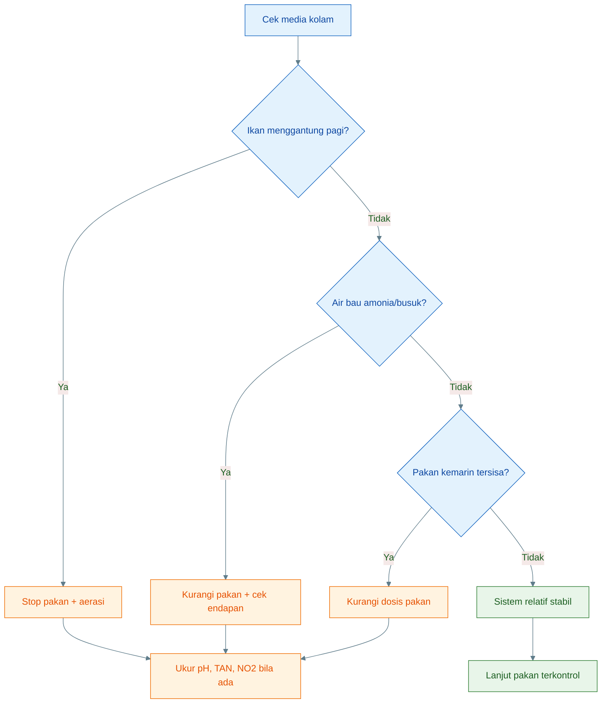
```mermaid id="l7bwl9"
%%{init: {"theme": "base", "themeVariables": {"fontFamily": "Arial", "primaryColor": "#E8F5E9", "primaryTextColor": "#1B5E20", "primaryBorderColor": "#2E7D32", "lineColor": "#607D8B"}}}%%
flowchart TD
    A["Cek media kolam"] --> B{"Ikan menggantung pagi?"}
    B -->|Ya| C["Stop pakan + aerasi"]
    B -->|Tidak| D{"Air bau amonia/busuk?"}

    D -->|Ya| E["Kurangi pakan + cek endapan"]
    D -->|Tidak| F{"Pakan kemarin tersisa?"}

    F -->|Ya| G["Kurangi dosis pakan"]
    F -->|Tidak| H["Sistem relatif stabil"]

    H --> I["Lanjut pakan terkontrol"]
    E --> J["Ukur pH, TAN, NO2 bila ada"]
    C --> J
    G --> J

    classDef check fill:#E3F2FD,stroke:#1565C0,color:#0D47A1;
    classDef action fill:#FFF3E0,stroke:#EF6C00,color:#E65100;
    classDef danger fill:#FFEBEE,stroke:#C62828,color:#B71C1C;
    classDef good fill:#E8F5E9,stroke:#2E7D32,color:#1B5E20;

    class A,B,D,F check;
    class C,E,G,J action;
    class H,I good;
```

Kesimpulan Bab 1–2:

> **Siklus nitrogen menentukan keberhasilan budidaya lele karena nitrogen menghubungkan pakan, FCR, kualitas air, mikroba, oksigen, amonia, nitrit, nitrat, dan kematian ikan. Kolam air dangkal dapat membantu lele menghemat energi, tetapi volumenya kecil sehingga kesalahan pakan cepat menjadi masalah nitrogen. Media yang baik adalah media yang mampu menjaga amonia dan nitrit rendah, endapan tidak busuk, oksigen cukup, pH terkendali, dan ikan tetap aktif makan.**

[1]: https://www.fao.org/4/ac175e/AC175E18.htm 'Site Selection For Aquaculture : chemical features of water'
[2]: https://www.fao.org/3/AB939E/AB939E00.htm 'Acute toxicities of ammonia and nitrite to Clarias batrachus and their interaction to chlorides'

[**Kembali ke Atas**](#siklus-nitrogen-pada-budidaya-lele-air-dangkal-pakan-amonia-nitrit-nitrat-mikroba-dan-batas-kapasitas-kolam)

---

# 3. Volume Kolam 80 cm × 50 cm dan Konsekuensinya

Bab ini penting karena semua pembahasan pakan, FCR, amonia, nitrit, nitrat, dan padat tebar harus dikembalikan pada satu hal: **berapa besar volume air yang tersedia untuk menampung dan memproses limbah**.

Kolam kecil dapat berhasil, tetapi kolam kecil tidak boleh diperlakukan seperti kolam besar. Pada kolam diameter 80 cm dan tinggi air 50 cm, volume air hanya sekitar 251 liter. Artinya, setiap gram pakan yang tidak menjadi daging akan lebih cepat mengubah kualitas air dibanding pada kolam yang lebih besar.

<figure>
  
  <figcaption>Budidaya lele pada kondisi air dangkal.</figcaption>
</figure>

---

## 3.1 Perhitungan volume kolam

Kolam berbentuk lingkaran atau tabung dapat dihitung dengan rumus:

$$
V = \pi r^2 h
$$

Keterangan:

$$
V = \text{volume air}
$$

$$
r = \text{jari-jari kolam}
$$

$$
h = \text{tinggi air}
$$

Jika diameter kolam 80 cm:

$$
d = 80 \text{ cm} = 0{,}8 \text{ m}
$$

Jari-jari:

$$
r = \frac{d}{2}
$$

$$
r = \frac{0{,}8}{2} = 0{,}4 \text{ m}
$$

Tinggi air:

$$
h = 50 \text{ cm} = 0{,}5 \text{ m}
$$

Maka:

$$
V = 3{,}14 \times (0{,}4)^2 \times 0{,}5
$$

$$
V = 3{,}14 \times 0{,}16 \times 0{,}5
$$

$$
V = 0{,}2512 \text{ m}^3
$$

Karena:

$$
1 \text{ m}^3 = 1.000 \text{ liter}
$$

Maka:

$$
0{,}2512 \text{ m}^3 = 251{,}2 \text{ liter}
$$

Jadi volume air efektif kolam adalah sekitar:

> **251 liter**

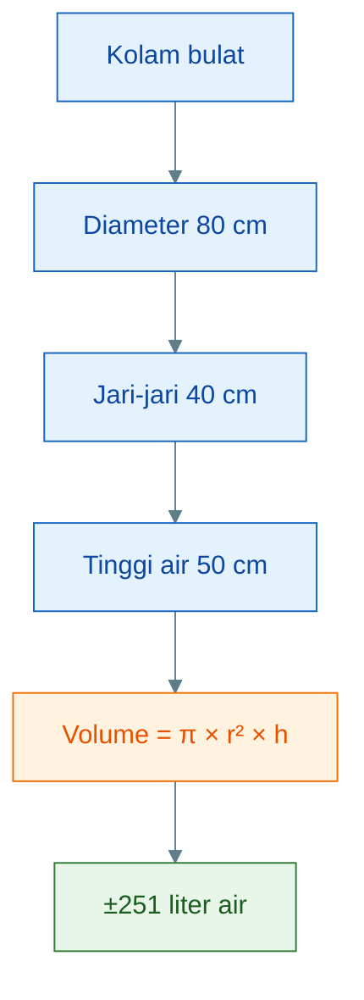
```mermaid id="qrnggd"
%%{init: {"theme": "base", "themeVariables": {"fontFamily": "Arial", "primaryColor": "#E3F2FD", "primaryTextColor": "#0D47A1", "primaryBorderColor": "#1565C0", "lineColor": "#607D8B"}}}%%
flowchart TD
    A["Kolam bulat"] --> B["Diameter 80 cm"]
    B --> C["Jari-jari 40 cm"]
    C --> D["Tinggi air 50 cm"]
    D --> E["Volume = π × r² × h"]
    E --> F["±251 liter air"]

    classDef main fill:#E3F2FD,stroke:#1565C0,color:#0D47A1;
    classDef calc fill:#FFF3E0,stroke:#EF6C00,color:#E65100;
    classDef result fill:#E8F5E9,stroke:#2E7D32,color:#1B5E20;

    class A,B,C,D main;
    class E calc;
    class F result;
```

Angka 251 liter ini menjadi dasar semua analisis berikutnya. Setiap pakan, feses, amonia, nitrit, nitrat, dan kebutuhan oksigen harus dibaca terhadap volume ini.

---

## 3.2 Volume efektif ±251 liter

Volume teoritis 251 liter adalah volume jika kolam terisi penuh sampai tinggi air 50 cm dengan bentuk tabung sempurna. Dalam praktik, volume efektif bisa sedikit lebih rendah karena:

- permukaan air tidak selalu tepat 50 cm,
- dasar kolam tidak selalu rata,
- ada ruang bebas di bagian atas,
- ada endapan dasar,
- ada benda tambahan seperti batu aerasi, pipa, atau penyangga,
- sebagian volume terganggu oleh biomassa ikan.

Maka, untuk praktik, lebih aman memakai pendekatan konservatif:

$$
V_{\text{efektif}} \approx 230 \text{ sampai } 250 \text{ liter}
$$

Namun untuk memudahkan perhitungan, modul ini memakai angka:

$$
V = 251 \text{ liter}
$$

Volume ini sangat kecil jika dibandingkan dengan target biomassa tinggi. Misalnya, jika panen 5 kg lele:

$$
\frac{5 \text{ kg}}{0{,}251 \text{ m}^3}
= 19{,}9 \text{ kg/m}^3
$$

Jika panen 50 kg lele:

$$
\frac{50 \text{ kg}}{0{,}251 \text{ m}^3}
= 199 \text{ kg/m}^3
$$

Perbedaannya sangat besar. Target 5 kg dan target 50 kg bukan hanya beda jumlah ikan. Itu beda **beban pakan, oksigen, feses, amonia, nitrit, nitrat, dan endapan**.

---

## 3.3 Luas permukaan air

Selain volume, luas permukaan air juga penting. Pada sistem air dangkal, permukaan air menjadi tempat utama pertukaran gas dengan udara.

Rumus luas permukaan lingkaran:

$$
A = \pi r^2
$$

Dengan:

$$
r = 0{,}4 \text{ m}
$$

Maka:

$$
A = 3{,}14 \times (0{,}4)^2
$$

$$
A = 3{,}14 \times 0{,}16
$$

$$
A = 0{,}5024 \text{ m}^2
$$

Jadi luas permukaan air sekitar:

> **0,5 m²**

Luas permukaan ini penting karena berkaitan dengan:

- pertukaran oksigen dari udara ke air,
- pelepasan CO₂,
- akses lele ke permukaan,
- aktivitas plankton di lapisan atas,
- pengaruh angin atau aerasi bila ada.

Namun luas permukaan 0,5 m² tetap terbatas. Jika biomassa ikan terlalu besar dan pakan harian tinggi, suplai oksigen alami dari permukaan tidak akan cukup untuk seluruh kebutuhan sistem.

Di sinilah perlu dibedakan:

> **Lele bisa mengambil oksigen langsung dari udara, tetapi mikroba nitrifikasi tetap membutuhkan oksigen terlarut di air.**

---

## 3.4 Rasio permukaan terhadap volume

Rasio permukaan terhadap volume menunjukkan seberapa besar permukaan air dibandingkan total volume air. Pada sistem air dangkal, rasio ini lebih tinggi dibanding kolam dalam. Ini salah satu keunggulan sistem dangkal.

Rumus:

$$
\text{Rasio permukaan/volume} =
\frac{\text{Luas permukaan}}{\text{Volume}}
$$

Dengan:

$$
A = 0{,}5024 \text{ m}^2
$$

$$
V = 0{,}2512 \text{ m}^3
$$

Maka:

$$
\frac{A}{V} =
\frac{0{,}5024}{0{,}2512}
$$

$$
= 2
$$

Jadi rasio permukaan terhadap volume adalah:

$$
2 \text{ m}^2/\text{m}^3
$$

Artinya, untuk setiap 1 m³ air, terdapat 2 m² permukaan air. Ini cukup baik untuk sistem dangkal. Namun rasio ini tidak boleh disalahartikan bahwa oksigen selalu cukup. Rasio permukaan membantu, tetapi tidak otomatis menyelesaikan beban oksigen dari:

- ikan,
- mikroba pengurai,
- nitrifikasi,
- plankton malam hari,
- penguraian endapan.

Mississippi State Extension menjelaskan bahwa oksigen terlarut sering menjadi masalah utama pada kolam catfish, terutama menjelang fajar; aerasi biasanya mulai dipertimbangkan saat DO mendekati level kritis sekitar 3–4 mg/L. ([MSU Extension][1])

Diagram konseptualnya:

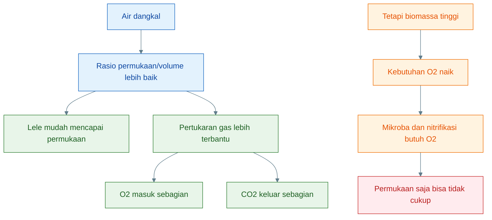
```mermaid id="yo9rrq"
%%{init: {"theme": "base", "themeVariables": {"fontFamily": "Arial", "primaryColor": "#E3F2FD", "primaryTextColor": "#0D47A1", "primaryBorderColor": "#1565C0", "lineColor": "#607D8B"}}}%%
flowchart TD
    A["Air dangkal"] --> B["Rasio permukaan/volume lebih baik"]
    B --> C["Lele mudah mencapai permukaan"]
    B --> D["Pertukaran gas lebih terbantu"]

    D --> E["O2 masuk sebagian"]
    D --> F["CO2 keluar sebagian"]

    G["Tetapi biomassa tinggi"] --> H["Kebutuhan O2 naik"]
    H --> I["Mikroba dan nitrifikasi butuh O2"]
    I --> J["Permukaan saja bisa tidak cukup"]

    classDef good fill:#E8F5E9,stroke:#2E7D32,color:#1B5E20;
    classDef warn fill:#FFF3E0,stroke:#EF6C00,color:#E65100;
    classDef risk fill:#FFEBEE,stroke:#C62828,color:#B71C1C;
    classDef main fill:#E3F2FD,stroke:#1565C0,color:#0D47A1;

    class A,B main;
    class C,D,E,F good;
    class G,H,I warn;
    class J risk;
```

---

## 3.5 Mengapa air dangkal membantu lele

Lele memiliki kemampuan mengambil oksigen dari udara. Karena itu, air dangkal memberi keuntungan praktis. Pada tinggi air 30–50 cm, ikan lebih mudah naik ke permukaan dan kembali turun. Energi yang digunakan untuk gerakan vertikal lebih kecil dibanding kolam yang lebih dalam.

Manfaat air dangkal:

1. **Jarak ke permukaan pendek**
   Lele lebih mudah mengambil udara.

2. **Energi naik-turun lebih hemat**
   Energi dapat lebih banyak digunakan untuk pertumbuhan.

3. **Perilaku ikan mudah diamati**
   Ikan menggantung, malas makan, atau stres lebih cepat terlihat.

4. **Pakan mudah dipantau**
   Sisa pakan lebih mudah diamati.

5. **Pengelolaan manual lebih mudah**
   Sifon, pengamatan endapan, dan respons ikan lebih mudah dilakukan.

Air dangkal juga cocok untuk pembudidaya kecil karena kolam lebih mudah dibuat, murah, dan tidak memerlukan struktur besar. Tetapi keunggulan ini hanya berlaku jika beban organik terkendali.

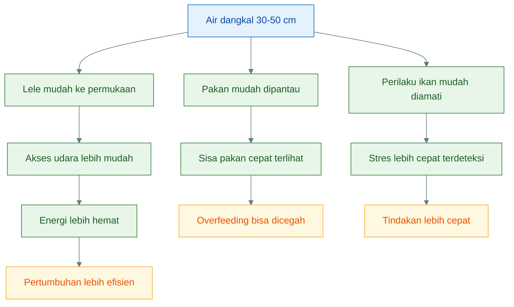
```mermaid id="fps7ms"
%%{init: {"theme": "base", "themeVariables": {"fontFamily": "Arial", "primaryColor": "#E8F5E9", "primaryTextColor": "#1B5E20", "primaryBorderColor": "#2E7D32", "lineColor": "#607D8B"}}}%%
flowchart TD
    A["Air dangkal 30-50 cm"] --> B["Lele mudah ke permukaan"]
    B --> C["Akses udara lebih mudah"]
    C --> D["Energi lebih hemat"]

    A --> E["Pakan mudah dipantau"]
    E --> F["Sisa pakan cepat terlihat"]

    A --> G["Perilaku ikan mudah diamati"]
    G --> H["Stres lebih cepat terdeteksi"]

    D --> I["Pertumbuhan lebih efisien"]
    F --> J["Overfeeding bisa dicegah"]
    H --> K["Tindakan lebih cepat"]

    classDef main fill:#E3F2FD,stroke:#1565C0,color:#0D47A1;
    classDef good fill:#E8F5E9,stroke:#2E7D32,color:#1B5E20;
    classDef result fill:#FFF8E1,stroke:#F9A825,color:#E65100;

    class A main;
    class B,C,D,E,F,G,H good;
    class I,J,K result;
```

Namun penting ditegaskan: kemampuan lele mengambil udara bukan berarti kualitas air boleh buruk. Jika amonia dan nitrit tinggi, ikan tetap stres. Jika endapan busuk, gas berbahaya tetap muncul. Jika pH tinggi, NH₃ lebih toksik. Jadi air dangkal membantu ikan bernapas, tetapi tidak menghapus kebutuhan mengelola nitrogen.

---

## 3.6 Mengapa air dangkal mempercepat penumpukan limbah

Air dangkal punya volume kecil. Volume kecil membuat konsentrasi limbah cepat naik. Ini konsekuensi utama.

Misalnya ada 10 gram pakan tersisa di kolam 251 liter. Angka 10 gram tampak kecil. Tetapi jika terjadi setiap hari, dalam 10 hari sudah ada 100 gram bahan organik tambahan. Bahan ini akan diurai mikroba, melepaskan amonia, menggunakan oksigen, dan menambah endapan.

Alur risikonya:

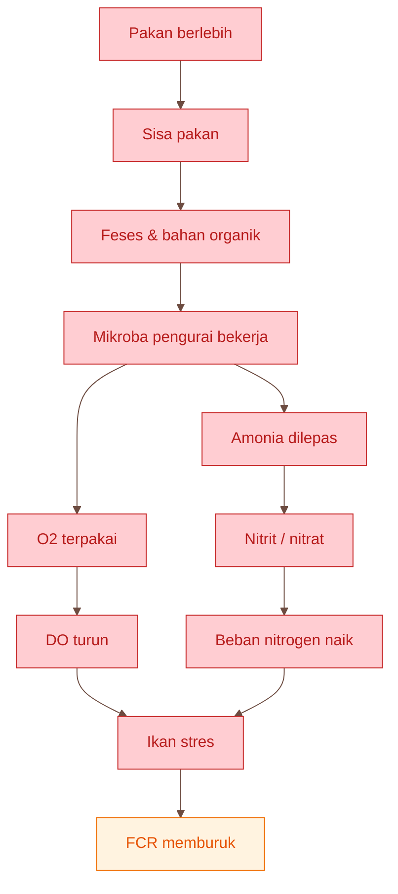
```mermaid id="jkgdi5"
%%{init: {"theme": "base", "themeVariables": {"fontFamily": "Arial", "primaryColor": "#FFEBEE", "primaryTextColor": "#B71C1C", "primaryBorderColor": "#C62828", "lineColor": "#6D4C41"}}}%%
flowchart TD
    A["Pakan berlebih"] --> B["Sisa pakan"]
    B --> C["Feses & bahan organik"]
    C --> D["Mikroba pengurai bekerja"]
    D --> E["O2 terpakai"]
    D --> F["Amonia dilepas"]
    F --> G["Nitrit / nitrat"]
    E --> H["DO turun"]
    G --> I["Beban nitrogen naik"]
    H --> J["Ikan stres"]
    I --> J
    J --> K["FCR memburuk"]

    classDef risk fill:#FFCDD2,stroke:#C62828,color:#B71C1C;
    classDef warn fill:#FFF3E0,stroke:#EF6C00,color:#E65100;

    class A,B,C,D,E,F,G,H,I,J risk;
    class K warn;
```

Dalam kolam besar, kesalahan pakan bisa “terencerkan” sementara. Dalam kolam 251 liter, toleransi kesalahan jauh lebih kecil.

Karena itu, sistem air dangkal membutuhkan disiplin:

- pakan harus cepat habis,
- jangan mengejar kenyang berlebihan,
- jangan memberi pakan berat saat air buruk,
- jangan menunggu ikan mati baru koreksi,
- jangan membiarkan endapan menumpuk,
- siapkan aerasi darurat.

---

## 3.7 Batas rasional biomassa pada volume kecil

Batas biomassa bukan angka tunggal. Ia tergantung pada:

- ukuran ikan,
- kualitas pakan,
- FCR,
- feed rate harian,
- aerasi,
- penggantian air,
- probiotik,
- kemampuan membuang endapan,
- pengalaman pembudidaya,
- target panen.

Namun untuk kolam 251 liter, klasifikasi praktisnya dapat dibuat seperti ini:

| Target biomassa panen |    Kepadatan | Penilaian                 |
| --------------------: | -----------: | ------------------------- |
|                3–5 kg |  12–20 kg/m³ | konservatif               |
|                5–8 kg |  20–32 kg/m³ | menengah, perlu kontrol   |
|              10–25 kg | 40–100 kg/m³ | intensif                  |
|                 50 kg |   ±199 kg/m³ | ekstrem untuk semi-statis |
|                100 kg |   ±398 kg/m³ | sangat ekstrem            |

Perhitungannya:

$$
\text{Kepadatan} =
\frac{\text{Biomassa}}{\text{Volume}}
$$

Untuk 5 kg:

$$
\frac{5}{0{,}251} = 19{,}9 \text{ kg/m}^3
$$

Untuk 50 kg:

$$
\frac{50}{0{,}251} = 199 \text{ kg/m}^3
$$

Jadi, klaim 500 ekor panen ukuran 100 gram per ekor sama dengan 50 kg biomassa. Dalam kolam 251 liter, itu berarti sekitar 199 kg/m³. Ini bukan sistem biasa. Ini hanya mungkin jika manajemen pakan, oksigen, endapan, mikroba, dan nitrogen sangat terkendali.

Kesimpulan Bab 3:

> **Kolam 80 cm × 50 cm hanya berisi sekitar 251 liter air. Air dangkal membantu lele menghemat energi dan mudah mengambil udara, tetapi volume kecil membuat limbah cepat pekat. Karena itu, batas produksi harus dihitung berdasarkan biomassa dan beban nitrogen, bukan hanya jumlah ekor.**

[**Kembali ke Atas**](#siklus-nitrogen-pada-budidaya-lele-air-dangkal-pakan-amonia-nitrit-nitrat-mikroba-dan-batas-kapasitas-kolam)

---

# 4. Pakan sebagai Sumber Utama Nitrogen

## 4.1 Protein pakan sebagai sumber nitrogen

Dalam kolam lele, sumber nitrogen terbesar adalah pakan, khususnya protein pakan. Protein mengandung nitrogen. Saat pakan dimakan, sebagian protein dicerna menjadi asam amino dan digunakan tubuh ikan. Sebagian lain tidak termanfaatkan sempurna dan akhirnya menjadi limbah nitrogen.

Rumus utama:

$$
N_{\text{pakan}} = \frac{\text{Protein pakan}}{6{,}25}
$$

Faktor 6,25 digunakan karena protein secara umum diasumsikan mengandung sekitar 16% nitrogen.

Jika 1 kg pakan mengandung 32% protein:

$$
\text{Protein} = 1.000 \text{ g} \times 32\%
$$

$$
\text{Protein} = 320 \text{ g}
$$

Nitrogen pakan:

$$
N_{\text{pakan}} = \frac{320}{6{,}25}
$$

$$
N_{\text{pakan}} = 51{,}2 \text{ g N}
$$

Jadi:

> **Setiap 1 kg pakan 32% protein membawa sekitar 51,2 gram nitrogen.**

Nitrogen ini tidak hilang. Ia akan bergerak ke beberapa jalur:

- tertahan dalam tubuh ikan,
- keluar sebagai feses,
- keluar melalui ekskresi nitrogen,
- menjadi amonia,
- menjadi nitrit,
- menjadi nitrat,
- masuk ke endapan,
- diserap plankton,
- hilang melalui proses lain seperti denitrifikasi atau penggantian air.

Studi transformasi nitrogen pada sistem akuakultur menyebut bahwa pada sistem berbasis pakan tinggi protein, rata-rata hanya sekitar 25% nitrogen yang dicerna ikan dikonversi menjadi biomassa ikan, sedangkan sisanya terutama diekskresikan sebagai amonia dan diproses lebih lanjut oleh mikroba. ([ScienceDirect][2])

Ini berarti nitrogen pakan adalah “utang ekosistem”. Semakin banyak pakan masuk, semakin besar beban kolam untuk mengelolanya.

---

## 4.2 Protein menjadi daging, energi, atau limbah

Protein pakan tidak otomatis menjadi daging. Setelah dimakan, protein mengalami beberapa kemungkinan nasib.

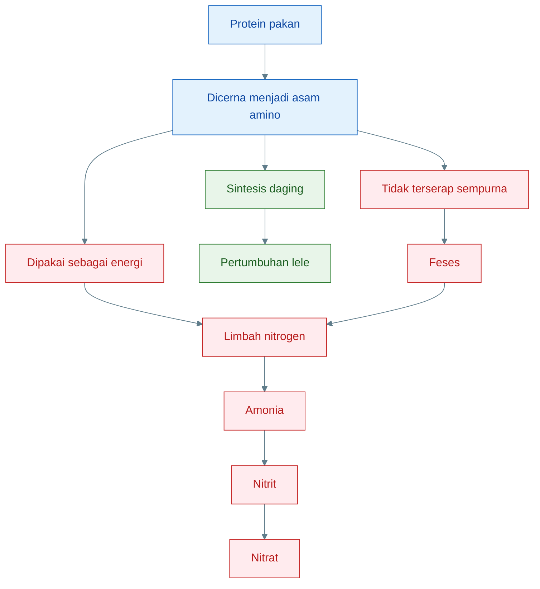
```mermaid id="tc7216"
%%{init: {"theme": "base", "themeVariables": {"fontFamily": "Arial", "primaryColor": "#E3F2FD", "primaryTextColor": "#0D47A1", "primaryBorderColor": "#1565C0", "lineColor": "#607D8B"}}}%%
flowchart TD
    A["Protein pakan"] --> B["Dicerna menjadi asam amino"]
    B --> C["Sintesis daging"]
    B --> D["Dipakai sebagai energi"]
    B --> E["Tidak terserap sempurna"]

    C --> F["Pertumbuhan lele"]
    D --> G["Limbah nitrogen"]
    E --> H["Feses"]
    H --> G
    G --> I["Amonia"]
    I --> J["Nitrit"]
    J --> K["Nitrat"]

    classDef protein fill:#E3F2FD,stroke:#1565C0,color:#0D47A1;
    classDef good fill:#E8F5E9,stroke:#2E7D32,color:#1B5E20;
    classDef waste fill:#FFEBEE,stroke:#C62828,color:#B71C1C;
    classDef process fill:#FFF3E0,stroke:#EF6C00,color:#E65100;

    class A,B protein;
    class C,F good;
    class D,E,G,H,I,J,K waste;
```

Jalur terbaik adalah protein menjadi daging. Tetapi agar protein menjadi daging, beberapa syarat harus terpenuhi:

1. protein harus mudah dicerna,
2. asam amino harus seimbang,
3. lisin dan metionin harus cukup,
4. energi dari karbohidrat dan lemak harus cukup,
5. ikan tidak stres,
6. air tidak mengandung amonia/nitrit tinggi,
7. pakan dimakan cepat dan tidak tersisa.

Jika energi pakan kurang, sebagian asam amino akan dibakar sebagai energi. Jika asam amino tidak seimbang, sebagian nitrogen akan dibuang. Jika air buruk, ikan stres dan efisiensi pakan turun. Semua ini berujung pada peningkatan limbah nitrogen.

Jadi, pertanyaan praktisnya bukan:

> “Berapa protein pakan?”

Tetapi:

> **“Berapa protein yang benar-benar menjadi daging?”**

---

## 4.3 Hubungan protein pakan dengan amonia

Amonia adalah produk utama dari metabolisme protein. Ikan memecah asam amino untuk kebutuhan metabolik. Nitrogen yang tidak dipakai untuk membangun jaringan tubuh harus dibuang. Pada ikan, sebagian besar nitrogen dibuang melalui insang dalam bentuk amonia.

Selain dari ekskresi ikan, amonia juga muncul dari:

- sisa pakan,
- feses,
- bahan organik,
- protein yang membusuk,
- endapan dasar,
- fermentasi gagal yang masuk ke kolam.

FAO menjelaskan bahwa amonia di kolam budidaya dapat berasal dari ekskresi ikan melalui insang dan dari dekomposisi bahan organik oleh bakteri heterotrof. ([Open Knowledge FAO][3])

Alurnya:

```text id="ygkvfs"
Protein pakan
→ asam amino
→ daging atau energi
→ nitrogen sisa
→ amonia
```

Amonia kemudian berada dalam dua bentuk:

```text id="sxx4d1"
NH4+ = amonium, relatif lebih aman
NH3  = amonia bebas, lebih toksik
```

Proporsi NH₃ meningkat jika pH dan suhu naik. Karena itu, pakan protein tinggi menjadi lebih berisiko pada air dengan pH tinggi dan suhu tinggi.

Contoh risiko:

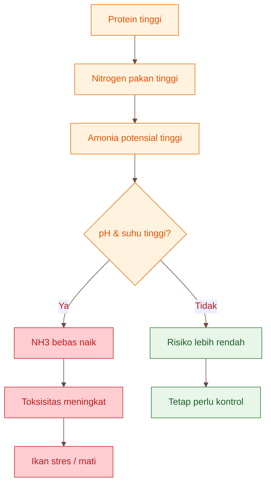
```mermaid id="6hcg69"
%%{init: {"theme": "base", "themeVariables": {"fontFamily": "Arial", "primaryColor": "#FFEBEE", "primaryTextColor": "#B71C1C", "primaryBorderColor": "#C62828", "lineColor": "#6D4C41"}}}%%
flowchart TD
    A["Protein tinggi"] --> B["Nitrogen pakan tinggi"]
    B --> C["Amonia potensial tinggi"]
    C --> D{"pH & suhu tinggi?"}
    D -->|Ya| E["NH3 bebas naik"]
    E --> F["Toksisitas meningkat"]
    F --> G["Ikan stres / mati"]

    D -->|Tidak| H["Risiko lebih rendah"]
    H --> I["Tetap perlu kontrol"]

    classDef risk fill:#FFCDD2,stroke:#C62828,color:#B71C1C;
    classDef warn fill:#FFF3E0,stroke:#EF6C00,color:#E65100;
    classDef safe fill:#E8F5E9,stroke:#2E7D32,color:#1B5E20;

    class A,B,C,D warn;
    class E,F,G risk;
    class H,I safe;
```

Ini alasan mengapa pakan protein tinggi tidak selalu lebih baik. Jika protein tidak efisien menjadi daging, amonia akan meningkat.

---

## 4.4 Hubungan FCR dengan limbah nitrogen

FCR menentukan seberapa efisien pakan menjadi biomassa ikan. Semakin tinggi FCR, semakin banyak pakan dibutuhkan untuk menghasilkan 1 kg kenaikan bobot ikan. Semakin banyak pakan, semakin banyak nitrogen masuk ke kolam.

Misalnya pakan 32% protein.

### Skenario A: FCR 1,2

Untuk menghasilkan 1 kg kenaikan biomassa:

$$
\text{Pakan} = 1{,}2 \text{ kg}
$$

Nitrogen pakan:

$$
1{,}2 \times 51{,}2 = 61{,}44 \text{ g N}
$$

### Skenario B: FCR 1,6

Untuk menghasilkan 1 kg kenaikan biomassa:

$$
\text{Pakan} = 1{,}6 \text{ kg}
$$

Nitrogen pakan:

$$
1{,}6 \times 51{,}2 = 81{,}92 \text{ g N}
$$

Selisih nitrogen masuk:

$$
81{,}92 - 61{,}44 = 20{,}48 \text{ g N}
$$

Artinya, untuk menghasilkan 1 kg pertumbuhan yang sama, FCR 1,6 memasukkan tambahan sekitar **20,48 gram nitrogen** dibanding FCR 1,2.

Jika nitrogen tambahan itu menjadi limbah, kolam harus memprosesnya sebagai amonia, nitrit, nitrat, atau endapan.

Rumus konsep:

$$
\begin{aligned}
\text{N masuk per kg pertumbuhan} &= FCR \times N_{\text{pakan/kg}}
\end{aligned}
$$

Dengan pakan 32% protein:

$$
N_{\text{pakan/kg}} = 51{,}2 \text{ g N}
$$

Maka:

$$
\begin{aligned}
\text{N masuk per kg pertumbuhan} &= FCR \times 51{,}2
\end{aligned}
$$

Diagram:

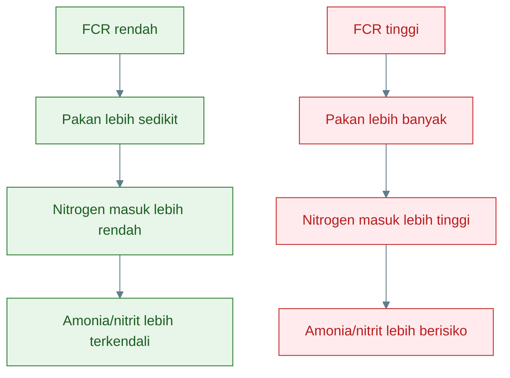
```mermaid id="a77d0w"
%%{init: {"theme": "base", "themeVariables": {"fontFamily": "Arial", "primaryColor": "#FFF8E1", "primaryTextColor": "#E65100", "primaryBorderColor": "#F9A825", "lineColor": "#607D8B"}}}%%
flowchart TD
    A["FCR rendah"] --> B["Pakan lebih sedikit"]
    B --> C["Nitrogen masuk lebih rendah"]
    C --> D["Amonia/nitrit lebih terkendali"]

    E["FCR tinggi"] --> F["Pakan lebih banyak"]
    F --> G["Nitrogen masuk lebih tinggi"]
    G --> H["Amonia/nitrit lebih berisiko"]

    classDef good fill:#E8F5E9,stroke:#2E7D32,color:#1B5E20;
    classDef bad fill:#FFEBEE,stroke:#C62828,color:#B71C1C;

    class A,B,C,D good;
    class E,F,G,H bad;
```

Penelitian pada kolam channel catfish menunjukkan bahwa feeding rate berkorelasi dengan parameter kualitas air seperti DO pagi, CO₂, chemical oxygen demand, chlorophyll, dan total ammonia nitrogen; pada feeding rate yang lebih tinggi, FCR meningkat dan produksi menurun. ([ResearchGate][4])

Artinya, FCR bukan hanya indikator pakan. FCR juga indikator beban nitrogen.

---

## 4.5 Mengapa protein tinggi bisa menjadi masalah

Protein tinggi sering dianggap selalu baik. Padahal, protein tinggi hanya baik jika:

- ikan membutuhkannya,
- protein mudah dicerna,
- asam amino seimbang,
- energi pakan cukup,
- pakan tidak berlebih,
- air mampu memproses limbahnya.

Jika tidak, protein tinggi justru menjadi sumber masalah nitrogen.

Protein tinggi meningkatkan:

- nitrogen pakan,
- potensi amonia,
- potensi nitrit,
- kebutuhan oksigen nitrifikasi,
- beban endapan,
- risiko nitrogen syndrome.

Misalnya pakan 32% protein memiliki nitrogen:

$$
\frac{32\%}{6{,}25} = 5{,}12\% N
$$

Pakan 40% protein memiliki nitrogen:

$$
\frac{40\%}{6{,}25} = 6{,}4\% N
$$

Selisih nitrogen per 1 kg pakan:

$$
64 \text{ g N} - 51{,}2 \text{ g N}
= 12{,}8 \text{ g N}
$$

Jadi, pakan 40% protein membawa **12,8 gram nitrogen lebih banyak per kg pakan** dibanding pakan 32%.

Jika ikan tidak membutuhkan protein setinggi itu, nitrogen tambahan akan menjadi beban air.

Prinsipnya:

> **Protein tinggi yang tidak menjadi daging akan menjadi amonia.**

---

## 4.6 Protein tercerna vs protein kasar

Protein kasar adalah angka pada label pakan. Protein tercerna adalah bagian protein yang benar-benar dapat dimanfaatkan ikan.

Rumus konsep:

$$
\begin{aligned}
\text{Protein tercerna} &= \text{Protein kasar} \times \text{Kecernaan}
\end{aligned}
$$

Contoh:

Pakan A:

$$
32\% \times 85\% = 27{,}2\%
$$

Pakan B:

$$
38\% \times 70\% = 26{,}6\%
$$

Pakan B punya protein kasar lebih tinggi, tetapi protein tercernanya lebih rendah.

Ini penting karena protein kasar tinggi tidak otomatis berarti pakan lebih baik. Untuk sistem air dangkal, protein yang tidak tercerna akan menjadi feses dan beban nitrogen.

Diagramnya:

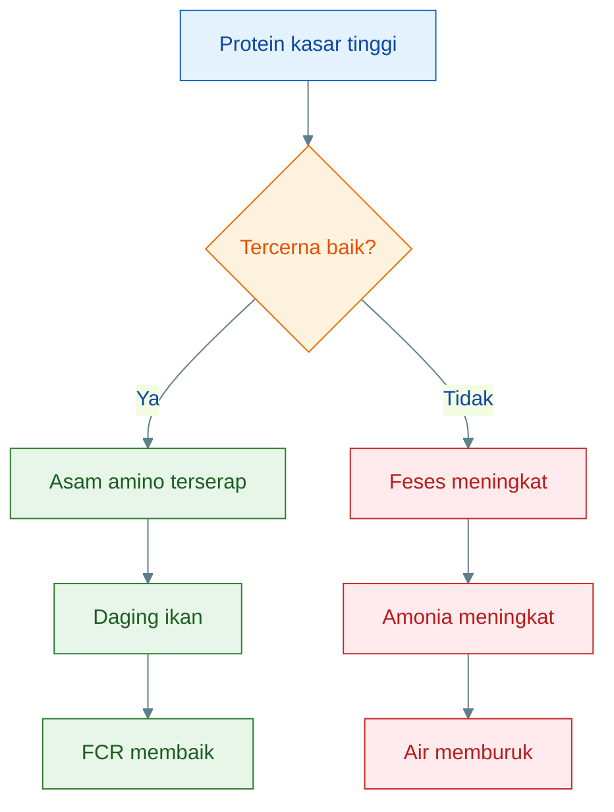
```mermaid id="n8fegd"
%%{init: {"theme": "base", "themeVariables": {"fontFamily": "Arial", "primaryColor": "#E3F2FD", "primaryTextColor": "#0D47A1", "primaryBorderColor": "#1565C0", "lineColor": "#607D8B"}}}%%
flowchart TD
    A["Protein kasar tinggi"] --> B{"Tercerna baik?"}

    B -->|Ya| C["Asam amino terserap"]
    C --> D["Daging ikan"]
    D --> E["FCR membaik"]

    B -->|Tidak| F["Feses meningkat"]
    F --> G["Amonia meningkat"]
    G --> H["Air memburuk"]

    classDef check fill:#FFF3E0,stroke:#EF6C00,color:#E65100;
    classDef good fill:#E8F5E9,stroke:#2E7D32,color:#1B5E20;
    classDef bad fill:#FFEBEE,stroke:#C62828,color:#B71C1C;
    classDef main fill:#E3F2FD,stroke:#1565C0,color:#0D47A1;

    class A main;
    class B check;
    class C,D,E good;
    class F,G,H bad;
```

Maka target praktis bukan protein kasar tertinggi, tetapi:

```text id="66jrah"
protein cukup
+ protein tercerna tinggi
+ asam amino seimbang
+ energi cukup
+ FCR rendah
```

---

## 4.7 Nitrogen syndrome

Istilah **nitrogen syndrome** dapat dipakai untuk menggambarkan kondisi ketika nitrogen dari pakan tidak terkendali di kolam. Ini bukan sekadar “pakan protein tinggi”, tetapi kondisi saat nitrogen dari protein gagal menjadi biomassa ikan dan malah menumpuk sebagai amonia, nitrit, nitrat, bahan organik, dan endapan.

Gejala lapangan:

- ikan menggantung,
- pakan lambat habis,
- air bau amonia,
- air berbusa atau berlendir,
- endapan dasar hitam,
- pertumbuhan lambat,
- FCR naik,
- kematian muncul bertahap,
- nitrit/amonia tinggi.

Alurnya:

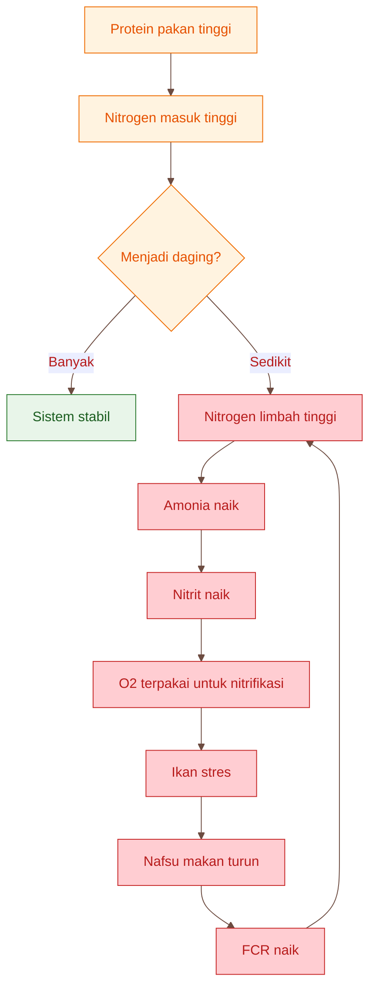
```mermaid id="qybv8i"
%%{init: {"theme": "base", "themeVariables": {"fontFamily": "Arial", "primaryColor": "#FFEBEE", "primaryTextColor": "#B71C1C", "primaryBorderColor": "#C62828", "lineColor": "#6D4C41"}}}%%
flowchart TD
    A["Protein pakan tinggi"] --> B["Nitrogen masuk tinggi"]
    B --> C{"Menjadi daging?"}

    C -->|Banyak| D["Sistem stabil"]
    C -->|Sedikit| E["Nitrogen limbah tinggi"]

    E --> F["Amonia naik"]
    F --> G["Nitrit naik"]
    G --> H["O2 terpakai untuk nitrifikasi"]
    H --> I["Ikan stres"]
    I --> J["Nafsu makan turun"]
    J --> K["FCR naik"]
    K --> E

    classDef good fill:#E8F5E9,stroke:#2E7D32,color:#1B5E20;
    classDef bad fill:#FFCDD2,stroke:#C62828,color:#B71C1C;
    classDef main fill:#FFF3E0,stroke:#EF6C00,color:#E65100;

    class A,B,C main;
    class D good;
    class E,F,G,H,I,J,K bad;
```

Nitrogen syndrome terutama berbahaya pada sistem:

- padat tebar tinggi,
- air dangkal,
- tanpa aerasi cukup,
- pakan tinggi protein,
- pakan sering berlebih,
- endapan tidak dibuang,
- probiotik dipakai tanpa kontrol pakan.

Kesimpulan Bab 4:

> **Pakan adalah sumber utama nitrogen. Protein pakan yang efisien akan menjadi daging. Protein yang tidak efisien akan menjadi amonia, nitrit, nitrat, dan endapan. Karena itu, protein tinggi hanya bermanfaat bila tercerna baik, asam amino seimbang, energi cukup, dan FCR rendah.**

[**Kembali ke Atas**](#siklus-nitrogen-pada-budidaya-lele-air-dangkal-pakan-amonia-nitrit-nitrat-mikroba-dan-batas-kapasitas-kolam)

---

# 5. FCR, Dosis Pakan, dan Jadwal Pakan

## 5.1 Pengertian FCR

FCR atau _Feed Conversion Ratio_ adalah ukuran efisiensi pakan. Rumusnya:

$$
FCR = \frac{\text{Total pakan}}{\text{Kenaikan biomassa}}
$$

Jika total pakan 12 kg menghasilkan kenaikan biomassa 10 kg:

$$
FCR = \frac{12}{10}
$$

$$
FCR = 1{,}2
$$

Artinya, untuk menghasilkan 1 kg kenaikan bobot lele dibutuhkan 1,2 kg pakan.

FCR rendah menunjukkan pakan efisien. FCR tinggi menunjukkan pakan boros atau kondisi budidaya tidak optimal.

FCR dipengaruhi oleh:

- kualitas pakan,
- ukuran ikan,
- suhu,
- oksigen,
- amonia/nitrit,
- kepadatan,
- jadwal pakan,
- cara pemberian pakan,
- kesehatan ikan,
- kualitas bibit,
- stabilitas air.

FCR bukan hanya angka pakan. FCR adalah rangkuman performa sistem.

---

## 5.2 FCR dan biaya produksi

Pakan biasanya menjadi biaya terbesar dalam budidaya lele. Karena itu, FCR langsung menentukan biaya produksi.

Rumus:

$$
\begin{aligned}
\text{Biaya pakan per kg panen} &= \text{Harga pakan per kg} \times FCR
\end{aligned}
$$

Jika harga pakan Rp15.000/kg dan FCR 1,2:

$$
\begin{aligned}
\text{Rp}15.000 \times 1{,}2 &= \text{Rp}18.000/\text{kg kenaikan biomassa}
\end{aligned}
$$

Jika FCR 1,5:

$$
\begin{aligned}
\text{Rp}15.000 \times 1{,}5 &= \text{Rp}22.500/\text{kg kenaikan biomassa}
\end{aligned}
$$

Selisih:

$$
\begin{aligned}
\text{Rp}22.500 - \text{Rp}18.000 &= \text{Rp}4.500/\text{kg}
\end{aligned}
$$

Jika panen 100 kg, selisih biaya pakan:

$$
\begin{aligned}
\text{Rp}4.500 \times 100 &= \text{Rp}450.000
\end{aligned}
$$

Jadi penurunan FCR kecil saja dapat memberi dampak ekonomi besar.

---

## 5.3 FCR dan limbah nitrogen

FCR juga menentukan jumlah nitrogen yang masuk ke kolam per kg pertumbuhan ikan.

Dengan pakan 32% protein:

$$
N_{\text{pakan/kg}} = 51{,}2 \text{ g N}
$$

Jika FCR 1,2:

$$
N_{masuk} = 1{,}2 \times 51{,}2
$$

$$
N_{masuk} = 61{,}44 \text{ g N/kg pertumbuhan}
$$

Jika FCR 1,5:

$$
N_{masuk} = 1{,}5 \times 51{,}2
$$

$$
N_{masuk} = 76{,}8 \text{ g N/kg pertumbuhan}
$$

Selisih:

$$
76{,}8 - 61{,}44 = 15{,}36 \text{ g N}
$$

Artinya, untuk menghasilkan 1 kg pertumbuhan yang sama, FCR 1,5 memasukkan tambahan 15,36 g nitrogen dibanding FCR 1,2.

Jika nitrogen ini tidak tertahan di ikan, ia akan menjadi beban amonia, nitrit, nitrat, atau endapan.

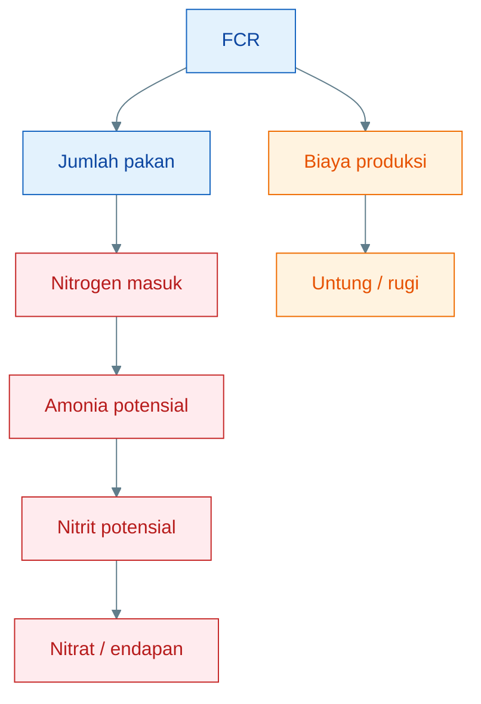
```mermaid id="g6j5l8"
%%{init: {"theme": "base", "themeVariables": {"fontFamily": "Arial", "primaryColor": "#FFF8E1", "primaryTextColor": "#E65100", "primaryBorderColor": "#F9A825", "lineColor": "#607D8B"}}}%%
flowchart TD
    A["FCR"] --> B["Jumlah pakan"]
    B --> C["Nitrogen masuk"]
    C --> D["Amonia potensial"]
    D --> E["Nitrit potensial"]
    E --> F["Nitrat / endapan"]

    A --> G["Biaya produksi"]
    G --> H["Untung / rugi"]

    classDef main fill:#E3F2FD,stroke:#1565C0,color:#0D47A1;
    classDef risk fill:#FFEBEE,stroke:#C62828,color:#B71C1C;
    classDef cost fill:#FFF3E0,stroke:#EF6C00,color:#E65100;

    class A,B main;
    class C,D,E,F risk;
    class G,H cost;
```

Maka FCR adalah indikator ekonomi sekaligus indikator ekologi.

---

## 5.4 Feed rate berdasarkan biomassa

Feed rate adalah persentase pakan harian terhadap biomassa ikan.

Rumus:

$$
\begin{aligned}
\text{Pakan harian} &= \text{Biomassa ikan} \times \text{Feed rate}
\end{aligned}
$$

Contoh biomassa 5 kg dengan feed rate 2%:

$$
\begin{aligned}
\text{Pakan harian} &= 5 \times 2\%
\end{aligned}
$$

$$
= 0{,}1 \text{ kg}
$$

$$
= 100 \text{ gram/hari}
$$

Contoh biomassa 50 kg dengan feed rate 2%:

$$
50 \times 2\% = 1 \text{ kg/hari}
$$

Perbedaannya besar. Pada kolam 251 liter, 100 gram pakan per hari masih mungkin dikontrol dengan hati-hati. Tetapi 1 kg pakan per hari menghasilkan beban nitrogen dan oksigen yang sangat besar.

Feed rate berubah tergantung ukuran ikan:

| Ukuran ikan         |    Feed rate kasar |
| ------------------- | -----------------: |
| Benih kecil         | 4–6% biomassa/hari |
| Juvenil             | 3–4% biomassa/hari |
| Pembesaran menengah | 2–3% biomassa/hari |
| Menjelang panen     | 1–2% biomassa/hari |

Angka ini harus disesuaikan dengan respons makan dan kualitas air. Jika air memburuk, feed rate harus diturunkan meskipun ikan tampak masih mau makan.

---

## 5.5 Pagi kecil, sore utama

Lele cenderung lebih aktif pada kondisi redup sampai malam. Karena itu, pakan sore sering memberi respons makan lebih baik. Namun pakan pagi tetap bisa diberikan dalam porsi kecil jika ikan aktif dan air baik.

Rasio praktis:

$$
\text{Pakan pagi} = 20\% \text{ sampai } 30\%
$$

$$
\text{Pakan sore} = 70\% \text{ sampai } 80\%
$$

Jika pakan harian 100 gram:

$$
\text{Pakan pagi} = 20 \text{ sampai } 30 \text{ gram}
$$

$$
\text{Pakan sore} = 70 \text{ sampai } 80 \text{ gram}
$$

Diagram jadwal:

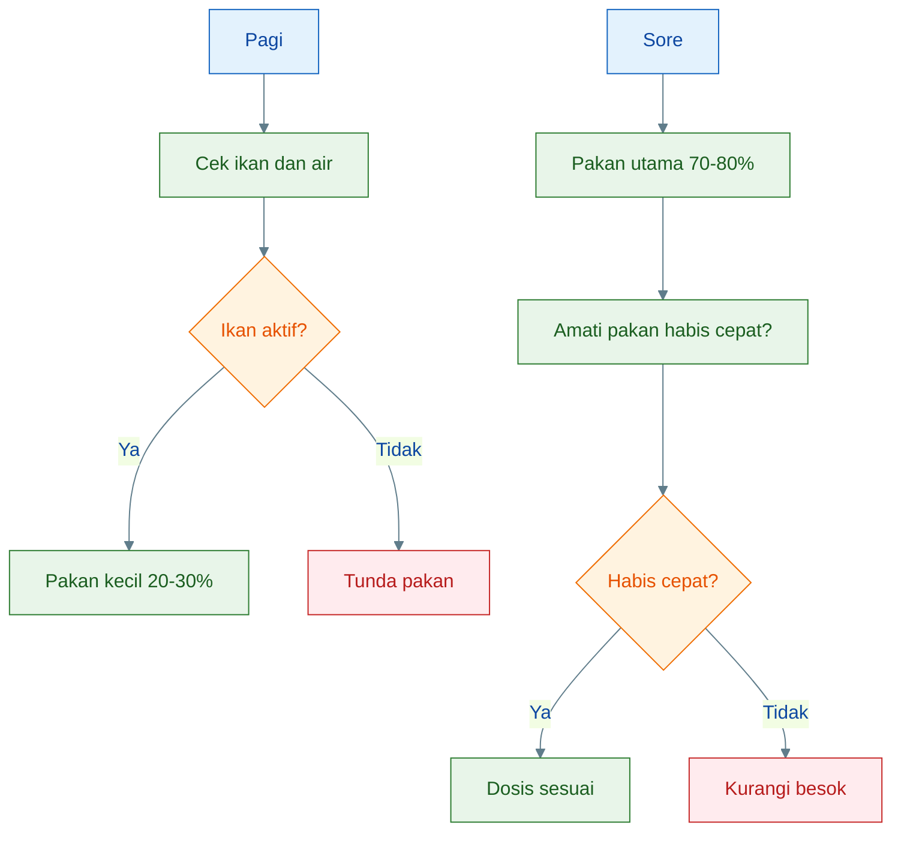
```mermaid id="pfvy9d"
%%{init: {"theme": "base", "themeVariables": {"fontFamily": "Arial", "primaryColor": "#E3F2FD", "primaryTextColor": "#0D47A1", "primaryBorderColor": "#1565C0", "lineColor": "#607D8B"}}}%%
flowchart TD
    A["Pagi"] --> B["Cek ikan dan air"]
    B --> C{"Ikan aktif?"}
    C -->|Ya| D["Pakan kecil 20-30%"]
    C -->|Tidak| E["Tunda pakan"]

    F["Sore"] --> G["Pakan utama 70-80%"]
    G --> H["Amati pakan habis cepat?"]
    H --> I{"Habis cepat?"}
    I -->|Ya| J["Dosis sesuai"]
    I -->|Tidak| K["Kurangi besok"]

    classDef time fill:#E3F2FD,stroke:#1565C0,color:#0D47A1;
    classDef action fill:#E8F5E9,stroke:#2E7D32,color:#1B5E20;
    classDef warn fill:#FFF3E0,stroke:#EF6C00,color:#E65100;
    classDef risk fill:#FFEBEE,stroke:#C62828,color:#B71C1C;

    class A,F time;
    class B,D,G,H,J action;
    class C,I warn;
    class E,K risk;
```

Pakan pagi jangan dipaksakan jika:

- ikan menggantung,
- air bau,
- pakan kemarin tersisa,
- hujan panjang,
- DO rendah,
- pH tinggi dan amonia terdeteksi.

---

## 5.6 Risiko pakan malam pada sistem tanpa aerasi

Pakan malam terlalu berat berisiko pada sistem tanpa aerasi. Setelah ikan makan, metabolisme ikan meningkat. Feses dan sisa pakan juga mulai diurai mikroba. Proses ini memakai oksigen dan menghasilkan amonia.

Pada malam hari:

- plankton tidak berfotosintesis,
- ikan memakai oksigen,
- mikroba memakai oksigen,
- nitrifikasi memakai oksigen,
- CO₂ meningkat,
- DO cenderung turun.

Karena itu, waktu paling rawan adalah menjelang pagi.

Mississippi State Extension menekankan bahwa DO rendah adalah masalah umum pada kolam catfish, terutama saat fajar; aerasi dimulai ketika DO mencapai level kritis, biasanya sekitar 3–4 mg/L. ([MSU Extension][1])

Alur risiko pakan malam:

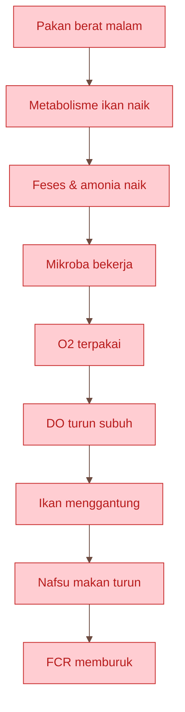
```mermaid id="bza5bh"
%%{init: {"theme": "base", "themeVariables": {"fontFamily": "Arial", "primaryColor": "#FFEBEE", "primaryTextColor": "#B71C1C", "primaryBorderColor": "#C62828", "lineColor": "#6D4C41"}}}%%
flowchart TD
    A["Pakan berat malam"] --> B["Metabolisme ikan naik"]
    B --> C["Feses & amonia naik"]
    C --> D["Mikroba bekerja"]
    D --> E["O2 terpakai"]
    E --> F["DO turun subuh"]
    F --> G["Ikan menggantung"]
    G --> H["Nafsu makan turun"]
    H --> I["FCR memburuk"]

    classDef risk fill:#FFCDD2,stroke:#C62828,color:#B71C1C;
    class A,B,C,D,E,F,G,H,I risk;
```

Maka dalam sistem air dangkal tanpa aerasi, pakan berat malam sebaiknya dihindari. Sore adalah waktu yang lebih aman karena pembudidaya masih bisa mengamati respons makan dan sisa pakan sebelum malam.

---

## 5.7 Pakan yang tidak habis = beban nitrogen langsung

Pakan yang tidak dimakan adalah sumber limbah paling mudah dikendalikan. Berbeda dengan feses yang memang tidak bisa dihindari, sisa pakan sebenarnya bisa dicegah dengan manajemen.

Pakan tidak habis akan:

- tenggelam,
- larut,
- membusuk,
- dikonsumsi mikroba,
- menghasilkan amonia,
- menambah endapan,
- memakai oksigen,
- meningkatkan bau.

Dalam kolam kecil, pakan tersisa sangat berbahaya karena volume air kecil.

Prinsip praktis:

> **Pakan yang tidak dimakan tidak netral. Ia langsung menjadi beban nitrogen.**

Jika pakan tersisa, jangan berpikir:

> “Nanti juga dimakan.”

Lebih aman berpikir:

> **“Ini calon amonia.”**

Tabel keputusan:

| Kondisi pakan                  | Tindakan                   |
| ------------------------------ | -------------------------- |
| Habis cepat                    | dosis bisa dipertahankan   |
| Lambat habis                   | kurangi sedikit            |
| Tersisa jelas                  | kurangi dosis berikutnya   |
| Air bau setelah pakan          | hentikan sementara         |
| Ikan menolak pakan             | cek air dan kualitas pakan |
| Pakan fermentasi hancur di air | hentikan, evaluasi proses  |

---

## 5.8 Kapan pakan dikurangi atau dihentikan

Dalam budidaya lele, mengurangi pakan bukan tanda gagal. Mengurangi pakan adalah tindakan kontrol ketika media tidak siap menerima beban nitrogen tambahan.

Pakan harus dikurangi atau dihentikan sementara jika:

| Kondisi                     | Keputusan                     |
| --------------------------- | ----------------------------- |
| Ikan menggantung pagi       | stop pakan sementara          |
| Air bau amonia              | stop/kurangi pakan            |
| Air bau busuk/telur busuk   | stop pakan, cek endapan       |
| Pakan kemarin tersisa       | kurangi pakan                 |
| Hujan panjang/mendung berat | kurangi pakan                 |
| DO rendah                   | stop pakan dan aerasi         |
| Nitrit tinggi               | stop/kurangi pakan            |
| Amonia tinggi               | stop/kurangi pakan            |
| Ikan lambat makan           | jangan paksa ransum           |
| Endapan tebal dan hitam     | kurangi pakan, sifon bertahap |

Diagram keputusan:

```mermaid id="rb8u3t"
%%{init: {"theme": "base", "themeVariables": {"fontFamily": "Arial", "primaryColor": "#E8F5E9", "primaryTextColor": "#1B5E20", "primaryBorderColor": "#2E7D32", "lineColor": "#607D8B"}}}%%
flowchart TD
    A["Sebelum memberi pakan"] --> B{"Ikan aktif?"}
    B -->|Tidak| C["Tunda pakan"]

    B -->|Ya| D{"Air bau?"}
    D -->|Ya| E["Kurangi/stop pakan"]

    D -->|Tidak| F{"Pakan sebelumnya tersisa?"}
    F -->|Ya| G["Kurangi dosis"]

    F -->|Tidak| H{"Cuaca/DO aman?"}
    H -->|Tidak| I["Pakan kecil saja"]

    H -->|Ya| J["Beri pakan sesuai ransum"]
    J --> K["Amati habis cepat"]

    classDef check fill:#E3F2FD,stroke:#1565C0,color:#0D47A1;
    classDef action fill:#FFF3E0,stroke:#EF6C00,color:#E65100;
    classDef good fill:#E8F5E9,stroke:#2E7D32,color:#1B5E20;
    classDef risk fill:#FFEBEE,stroke:#C62828,color:#B71C1C;

    class A,B,D,F,H check;
    class C,E,G,I action;
    class J,K good;
```

Kesimpulan Bab 5:

> **Manajemen pakan adalah pengendalian nitrogen paling awal. FCR rendah berarti pakan lebih banyak menjadi daging dan lebih sedikit menjadi amonia. Dosis pakan harus berdasarkan biomassa, respons makan, dan kondisi air. Dalam sistem air dangkal, pakan sore sebagai pakan utama lebih aman, pakan malam berat berisiko, dan pakan yang tidak habis harus dianggap sebagai beban nitrogen langsung.**

[1]: https://extension.msstate.edu/agriculture/catfish/water-quality-catfish-ponds?utm_source=chatgpt.com 'Water Quality of Catfish Ponds'
[2]: https://www.sciencedirect.com/science/article/abs/pii/S0960852412018895?utm_source=chatgpt.com 'Nitrogen transformations in intensive aquaculture system ...'
[3]: https://openknowledge.fao.org/bitstreams/61883adb-edff-49db-9ab0-9a70cf9fbd93/download?utm_source=chatgpt.com 'Doing aquaculture as a business for small- and medium-scale ...'
[4]: https://www.researchgate.net/publication/240971643_Feeding_Rate_Water_Quality_and_Channel_Catfish_Production_in_Ponds?utm_source=chatgpt.com '(PDF) Feeding Rate, Water Quality, and Channel Catfish ...'

[**Kembali ke Atas**](#siklus-nitrogen-pada-budidaya-lele-air-dangkal-pakan-amonia-nitrit-nitrat-mikroba-dan-batas-kapasitas-kolam)

---

# 6. Neraca Massa Pakan Menjadi Daging dan Nitrogen

Bab ini adalah bagian kunci karena kita tidak lagi berbicara secara umum tentang “air bagus” atau “pakan bagus”. Kita mulai menghitung:

> **berapa gram nitrogen masuk dari pakan, berapa yang menjadi tubuh lele, dan berapa yang menjadi beban amonia, nitrit, serta nitrat.**

Dengan neraca massa, klaim padat tebar tidak lagi dibaca sebagai jumlah ekor saja, tetapi sebagai **beban pakan dan beban nitrogen**.

---

## 6.1 Neraca 1 kg pakan 32% protein

Kita mulai dari basis paling sederhana:

> **1 kg pakan lele dengan protein 32%.**

Asumsi kerja:

| Parameter                  | Nilai |
| -------------------------- | ----: |
| Pakan                      |  1 kg |
| Protein pakan              |   32% |
| Faktor protein ke nitrogen |  6,25 |
| Nitrogen tertahan di ikan  |   30% |
| Nitrogen menjadi limbah    |   70% |
| FCR contoh                 |   1,2 |

Angka **30% nitrogen tertahan di ikan** adalah asumsi praktis untuk latihan neraca massa. Di lapangan, angka ini bisa berubah tergantung FCR, kualitas pakan, ukuran ikan, suhu, stres, dan kualitas air.

Alur besarnya:

```mermaid id="sdrw1a"
%%{init: {"theme": "base", "themeVariables": {"fontFamily": "Arial", "primaryColor": "#E3F2FD", "primaryTextColor": "#0D47A1", "primaryBorderColor": "#1565C0", "lineColor": "#607D8B"}}}%%
flowchart TD
    A["1 kg pakan 32% protein"] --> B["320 g protein"]
    B --> C["51,2 g nitrogen"]

    C --> D["30% tertahan di ikan"]
    D --> E["15,36 g N menjadi biomassa"]

    C --> F["70% menjadi limbah"]
    F --> G["35,84 g N limbah"]

    G --> H["Amonia"]
    H --> I["Nitrit"]
    I --> J["Nitrat"]

    classDef feed fill:#FFF3E0,stroke:#EF6C00,color:#E65100;
    classDef fish fill:#E8F5E9,stroke:#2E7D32,color:#1B5E20;
    classDef waste fill:#FFEBEE,stroke:#C62828,color:#B71C1C;
    classDef nitrogen fill:#E3F2FD,stroke:#1565C0,color:#0D47A1;

    class A,B,C feed;
    class D,E fish;
    class F,G,H,I,J waste;
```

Prinsipnya:

> **Dari 1 kg pakan, tidak semuanya menjadi daging. Sebagian menjadi limbah nitrogen yang harus diproses kolam.**

---

## 6.2 Berapa gram protein masuk

Jika pakan mengandung protein 32%, maka dalam 1 kg pakan:

$$
\text{Protein masuk} = 1.000 \text{ g} \times 32\%
$$

$$
\text{Protein masuk} = 320 \text{ g}
$$

Jadi:

> **1 kg pakan 32% protein membawa 320 gram protein.**

Protein ini akan mengalami beberapa jalur:

```text id="2skz9q"
protein pakan
→ dicerna menjadi asam amino
→ menjadi daging
→ menjadi energi
→ menjadi feses
→ menjadi limbah nitrogen
```

Protein yang menjadi daging adalah hasil yang diinginkan. Protein yang menjadi limbah akan masuk ke siklus nitrogen.

---

## 6.3 Berapa gram nitrogen masuk

Protein mengandung nitrogen. Secara praktis, kandungan nitrogen dalam protein dihitung dengan faktor 6,25:

$$
N_{\text{pakan}} = \frac{\text{Protein pakan}}{6{,}25}
$$

Untuk 320 gram protein:

$$
N_{\text{pakan}} = \frac{320}{6{,}25}
$$

$$
N_{\text{pakan}} = 51{,}2 \text{ g N}
$$

Jadi:

> **1 kg pakan 32% protein membawa sekitar 51,2 gram nitrogen.**

Ini angka yang penting. Nitrogen inilah yang akan terbagi menjadi nitrogen tubuh ikan dan nitrogen limbah.

---

## 6.4 Berapa nitrogen tertahan di ikan

Dengan asumsi 30% nitrogen pakan tertahan menjadi biomassa ikan:

$$
N_{\text{ikan}} = 51{,}2 \times 30\%
$$

$$
N_{\text{ikan}} = 15{,}36 \text{ g N}
$$

Jika dikonversi kembali menjadi protein tubuh:

$$
\text{Protein tubuh} = 15{,}36 \times 6{,}25
$$

$$
\text{Protein tubuh} = 96 \text{ g}
$$

Jadi dari 1 kg pakan 32% protein:

> **sekitar 15,36 g nitrogen tertahan di tubuh ikan, setara ±96 g protein tubuh.**

Namun kenaikan bobot ikan bukan hanya protein. Ikan juga mengandung air, lemak, mineral, dan isi tubuh. Karena itu, 96 gram protein tubuh dapat muncul sebagai kenaikan bobot basah yang jauh lebih besar.

Jika FCR = 1,2:

$$
\text{Kenaikan biomassa} = \frac{1 \text{ kg pakan}}{1{,}2}
$$

$$
\text{Kenaikan biomassa} = 0{,}833 \text{ kg}
$$

Jadi, secara FCR:

> **1 kg pakan menghasilkan ±0,83 kg kenaikan bobot lele basah.**

---

## 6.5 Berapa nitrogen menjadi limbah

Jika 30% nitrogen tertahan di ikan, maka sisanya 70% menjadi limbah:

$$
N_{\text{limbah}} = 51{,}2 \times 70\%
$$

$$
N_{\text{limbah}} = 35{,}84 \text{ g N}
$$

Jadi:

> **1 kg pakan 32% protein berpotensi menghasilkan ±35,84 g nitrogen limbah.**

Nitrogen limbah ini bisa berasal dari:

- ekskresi amonia melalui insang,
- urin,
- feses,
- sisa pakan,
- protein tidak tercerna,
- bahan organik di endapan dasar.

Nitrogen limbah inilah yang kemudian masuk ke proses:

```text id="mg4yar"
nitrogen organik
→ amonia/ammonium
→ nitrit
→ nitrat
```

---

## 6.6 Potensi amonia

Nitrogen limbah pertama-tama banyak muncul sebagai amonia/ammonium. Dalam air, amonia berada dalam dua bentuk:

```text id="f2vzq1"
NH3  = amonia bebas / tak terionisasi, lebih toksik
NH4+ = amonium, relatif lebih aman
```

FAO menjelaskan bahwa amonia di perairan terdiri dari bentuk tidak terionisasi **NH₃** dan bentuk terionisasi **NH₄⁺**, dan bentuk NH₃ jauh lebih toksik bagi ikan. Proporsi NH₃ meningkat saat pH dan suhu naik. ([FAOHome][1])

Jika seluruh 35,84 g nitrogen limbah dinyatakan sebagai NH₃, maka konversinya:

Massa atom/molekul:

```text id="944top"
N = 14
NH3 = 17
```

$$
NH_3 = N \times \frac{17}{14}
$$

$$
NH_3 = 35{,}84 \times \frac{17}{14}
$$

$$
NH_3 = 43{,}52 \text{ g NH}_3
$$

Jadi:

> **1 kg pakan 32% protein dapat menghasilkan potensi ±43,5 g NH₃ setara, jika nitrogen limbah dinyatakan sebagai amonia bebas.**

Catatan penting:

- Di kolam nyata, tidak semua langsung menjadi NH₃.
- Sebagian berada sebagai NH₄⁺.
- Bentuk NH₃/NH₄⁺ dipengaruhi pH dan suhu.
- Test kit biasanya membaca TAN, bukan NH₃ bebas langsung.

TAN berarti **Total Ammonia Nitrogen**, yaitu total nitrogen amonia dalam bentuk NH₃ dan NH₄⁺.

---

## 6.7 Potensi nitrit

Jika amonia diproses oleh bakteri nitrifikasi tahap pertama, amonia akan dioksidasi menjadi nitrit.

Secara biologis:

```text id="p0ejze"
amonia/ammonium → nitrit
```

Bakteri yang terlibat terutama kelompok pengoksidasi amonia seperti **Nitrosomonas**. FAO menjelaskan nitrifikasi sebagai proses oksidasi amonia menjadi nitrit, lalu nitrit menjadi nitrat oleh bakteri nitrifikasi. ([FAOHome][1])

Jika 35,84 g nitrogen limbah dinyatakan sebagai nitrit **NO₂⁻**, maka konversinya:

Massa atom/molekul:

```text id="ouq0ta"
N = 14
NO2 = 46
```

$$
NO_2^- = N \times \frac{46}{14}
$$

$$
NO_2^- = 35{,}84 \times 3{,}286
$$

$$
NO_2^- = 117{,}75 \text{ g NO}_2^-
$$

Jadi:

> **1 kg pakan 32% protein dapat menghasilkan potensi ±117,75 g NO₂⁻, jika seluruh nitrogen limbah berada sebagai nitrit.**

Nitrit sangat berbahaya karena dapat mengganggu pengangkutan oksigen dalam darah ikan. Pada catfish, kondisi ini dikenal sebagai **brown blood disease**. Publikasi SRAC/Texas A&M menjelaskan bahwa nitrit dapat menyebabkan brown blood disease, dan rasio klorida:nitrit sekitar 9:1 sampai 10:1 umum digunakan untuk menekan masuknya nitrit melalui insang. ([RWFM Extension][2])

---

## 6.8 Potensi nitrat

Jika proses nitrifikasi berjalan sampai tahap kedua, nitrit akan dioksidasi menjadi nitrat.

```text id="7wf2nn"
nitrit → nitrat
```

Bakteri yang terlibat terutama kelompok seperti **Nitrobacter** dan **Nitrospira**. Nitrifikasi membutuhkan oksigen terlarut dan kondisi air yang mendukung. ([FAOHome][1])

Rumus utama:

$$
NO_3^- = N \times \frac{62}{14}
$$

Karena:

```text id="qce62r"
N = 14
NO3 = 62
```

Maka:

$$
NO_3^- = 35{,}84 \times \frac{62}{14}
$$

$$
NO_3^- = 35{,}84 \times 4{,}429
$$

$$
NO_3^- = 158{,}75 \text{ g NO}_3^-
$$

Jadi:

> **1 kg pakan 32% protein dapat menghasilkan potensi ±158,75 g NO₃⁻, jika seluruh nitrogen limbah akhirnya menjadi nitrat.**

Nitrat lebih aman dibanding amonia dan nitrit, tetapi bukan berarti tidak perlu dikontrol. Dalam sistem tertutup atau semi-statis, nitrat dapat menumpuk. Literatur pengolahan nitrogen akuakultur menjelaskan bahwa nitrifikasi menghasilkan nitrat yang kurang toksik dibanding TAN dan nitrit, tetapi nitrat tetap dapat menumpuk dalam sistem. ([ecowin.org][3])

---

## 6.9 Neraca untuk 5 kg panen

Sekarang kita hitung target panen atau kenaikan biomassa **5 kg lele**.

Asumsi:

| Parameter                |             Nilai |
| ------------------------ | ----------------: |
| Target kenaikan biomassa |              5 kg |
| FCR                      |               1,2 |
| Pakan                    |       32% protein |
| Nitrogen pakan           | 51,2 g N/kg pakan |
| Nitrogen limbah          |  70% dari N pakan |

### 6.9.1 Total pakan

$$
\text{Pakan total} = \text{Biomassa} \times FCR
$$

$$
\text{Pakan total} = 5 \times 1{,}2
$$

$$
\text{Pakan total} = 6 \text{ kg}
$$

### 6.9.2 Total nitrogen pakan

$$
N_{\text{pakan}} = 6 \times 51{,}2
$$

$$
N_{\text{pakan}} = 307{,}2 \text{ g N}
$$

### 6.9.3 Nitrogen tertahan di ikan

$$
N_{\text{ikan}} = 307{,}2 \times 30\%
$$

$$
N_{\text{ikan}} = 92{,}16 \text{ g N}
$$

Setara protein tubuh:

$$
92{,}16 \times 6{,}25 = 576 \text{ g protein tubuh}
$$

### 6.9.4 Nitrogen menjadi limbah

$$
N_{\text{limbah}} = 307{,}2 \times 70\%
$$

$$
N_{\text{limbah}} = 215{,}04 \text{ g N}
$$

### 6.9.5 Potensi nitrat

$$
NO_3^- = 215{,}04 \times \frac{62}{14}
$$

$$
NO_3^- = 952{,}7 \text{ g NO}_3^-
$$

Jadi untuk menghasilkan **5 kg kenaikan bobot lele**, dengan FCR 1,2 dan pakan 32% protein:

> **dibutuhkan ±6 kg pakan, masuk ±307 g nitrogen, dan berpotensi menghasilkan ±953 g nitrat jika seluruh nitrogen limbah selesai menjadi NO₃⁻.**

Jika kolam berisi 251 liter dan seluruh nitrat itu tetap di air tanpa diserap, dibuang, atau masuk sedimen:

$$
\text{NO}_3^- \text{ teoritis} =
\frac{952.700 \text{ mg}}{251 \text{ L}}
$$

$$
= 3.795 \text{ mg/L}
$$

Ini angka teoritis ekstrem. Di kolam nyata, tidak semua nitrogen menjadi nitrat terlarut dan menetap di air. Sebagian masuk biomassa ikan, plankton, sedimen, denitrifikasi, volatilisasi, atau keluar melalui penggantian air. Namun angka ini menunjukkan betapa besar beban nitrogen yang harus dikelola.

---

## 6.10 Neraca untuk 50 kg panen

Sekarang kita hitung skenario **50 kg lele**. Ini relevan karena 500 ekor lele ukuran 100 g/ekor berarti:

$$
500 \times 100 \text{ g} = 50.000 \text{ g} = 50 \text{ kg}
$$

Asumsi tetap:

| Parameter                |           Nilai |
| ------------------------ | --------------: |
| Target kenaikan biomassa |           50 kg |
| FCR                      |             1,2 |
| Protein pakan            |             32% |
| N pakan                  | 51,2 g/kg pakan |
| N menjadi limbah         |             70% |

### 6.10.1 Total pakan

$$
\text{Pakan total} = 50 \times 1{,}2
$$

$$
\text{Pakan total} = 60 \text{ kg}
$$

### 6.10.2 Total nitrogen pakan

$$
N_{\text{pakan}} = 60 \times 51{,}2
$$

$$
N_{\text{pakan}} = 3.072 \text{ g N}
$$

$$
N_{\text{pakan}} = 3{,}072 \text{ kg N}
$$

### 6.10.3 Nitrogen tertahan di ikan

$$
N_{\text{ikan}} = 3.072 \times 30\%
$$

$$
N_{\text{ikan}} = 921{,}6 \text{ g N}
$$

Setara protein tubuh:

$$
921{,}6 \times 6{,}25 = 5.760 \text{ g protein tubuh}
$$

$$
= 5{,}76 \text{ kg protein tubuh}
$$

### 6.10.4 Nitrogen menjadi limbah

$$
N_{\text{limbah}} = 3.072 \times 70\%
$$

$$
N_{\text{limbah}} = 2.150{,}4 \text{ g N}
$$

$$
N_{\text{limbah}} = 2{,}150 \text{ kg N}
$$

### 6.10.5 Potensi nitrat

$$
NO_3^- = 2.150{,}4 \times \frac{62}{14}
$$

$$
NO_3^- = 9.527 \text{ g NO}_3^-
$$

$$
NO_3^- = 9{,}53 \text{ kg NO}_3^-
$$

Jadi untuk menghasilkan **50 kg kenaikan bobot lele**, dengan asumsi FCR 1,2 dan pakan 32% protein:

> **dibutuhkan ±60 kg pakan, masuk ±3,07 kg nitrogen, dan berpotensi menghasilkan ±9,53 kg nitrat jika seluruh nitrogen limbah selesai menjadi NO₃⁻.**

Jika 9,53 kg nitrat berada dalam kolam 251 liter tanpa pengurangan:

$$
\frac{9.527.000 \text{ mg}}{251 \text{ L}}
$$

$$
= 37.956 \text{ mg/L}
$$

Sekali lagi, ini bukan angka nyata yang akan muncul utuh sebagai nitrat terlarut. Ini adalah angka **beban potensial**. Tetapi sebagai indikator kapasitas, angka ini sangat penting.

---

## 6.11 Implikasi terhadap klaim 500 ekor

Jika 500 ekor dipanen pada ukuran 100 g/ekor:

$$
500 \times 100 \text{ g} = 50 \text{ kg}
$$

Dalam kolam 251 liter, kepadatan biomassa:

$$
\frac{50}{0{,}251}
$$

$$
= 199 \text{ kg/m}^3
$$

Ini sangat padat.

Dari neraca massa:

| Parameter               | Nilai untuk 50 kg panen |
| ----------------------- | ----------------------: |
| Pakan total, FCR 1,2    |                   60 kg |
| Protein pakan masuk     |                 19,2 kg |
| Nitrogen pakan masuk    |               3,07 kg N |
| Nitrogen menjadi limbah |               2,15 kg N |
| Potensi nitrat          |            9,53 kg NO₃⁻ |

Angka ini tidak berarti mustahil, tetapi berarti sistem harus memiliki kemampuan luar biasa untuk mengelola:

- amonia,
- nitrit,
- nitrat,
- oksigen terlarut,
- endapan dasar,
- pakan harian,
- mikroba,
- plankton,
- risiko subuh,
- kematian,
- FCR.

Klaim 500 ekor dalam kolam kecil harus dibaca sebagai sistem **superpadat**, bukan sistem pemula biasa.

Implikasi teknis:

```mermaid id="dkn6ht"
%%{init: {"theme": "base", "themeVariables": {"fontFamily": "Arial", "primaryColor": "#FFEBEE", "primaryTextColor": "#B71C1C", "primaryBorderColor": "#C62828", "lineColor": "#6D4C41"}}}%%
flowchart TD
    A["500 ekor lele"] --> B["Jika 100 g/ekor"]
    B --> C["50 kg biomassa"]
    C --> D["Butuh ±60 kg pakan pada FCR 1,2"]
    D --> E["Masuk ±3,07 kg nitrogen"]
    E --> F["±2,15 kg N menjadi limbah"]
    F --> G["Potensi ±9,53 kg NO3-"]
    G --> H["Butuh kontrol kuat"]

    H --> I["pakan disiplin"]
    H --> J["aerasi darurat"]
    H --> K["endapan dikontrol"]
    H --> L["amonia/nitrit dimonitor"]

    classDef risk fill:#FFCDD2,stroke:#C62828,color:#B71C1C;
    classDef action fill:#FFF3E0,stroke:#EF6C00,color:#E65100;

    class A,B,C,D,E,F,G,H risk;
    class I,J,K,L action;
```

Kesimpulan Bab 6:

> **Neraca massa menunjukkan bahwa target panen bukan hanya soal jumlah ekor. Setiap target panen membawa konsekuensi pakan, nitrogen, amonia, nitrit, nitrat, oksigen, dan endapan. Untuk kolam 251 liter, target 5 kg masih masuk akal sebagai awal; target 50 kg berarti sistem harus mengelola beban nitrogen yang sangat besar.**

[**Kembali ke Atas**](#siklus-nitrogen-pada-budidaya-lele-air-dangkal-pakan-amonia-nitrit-nitrat-mikroba-dan-batas-kapasitas-kolam)

---

# 7. Siklus Nitrogen: Amonia, Nitrit, dan Nitrat

Alur utama siklus nitrogen dalam kolam lele:

```text id="zubecg"
protein pakan
→ feses/urin/sisa pakan
→ amonia
→ nitrit
→ nitrat
→ plankton/tanaman/ganti air/sedimen
```

Bab ini menjelaskan apa yang terjadi setelah nitrogen keluar dari pakan dan ikan.

---

## 7.1 Mineralisasi bahan organik

Mineralisasi adalah proses penguraian bahan organik menjadi senyawa yang lebih sederhana. Dalam kolam lele, bahan organik berasal dari:

- sisa pakan,
- feses,
- lendir ikan,
- plankton mati,
- biofilm,
- endapan dasar,
- bahan fermentasi yang tidak termakan.

Mikroba heterotrof menguraikan bahan organik ini. Dalam prosesnya, mikroba menggunakan oksigen dan menghasilkan CO₂, amonia, serta senyawa lain.

Alurnya:

```mermaid id="v0fajb"
%%{init: {"theme": "base", "themeVariables": {"fontFamily": "Arial", "primaryColor": "#FFF3E0", "primaryTextColor": "#E65100", "primaryBorderColor": "#EF6C00", "lineColor": "#607D8B"}}}%%
flowchart TD
    A["Sisa pakan"] --> D["Bahan organik"]
    B["Feses"] --> D
    C["Plankton mati"] --> D

    D --> E["Mikroba heterotrof"]
    E --> F["Menggunakan O2"]
    E --> G["Menghasilkan CO2"]
    E --> H["Melepaskan amonia"]

    H --> I["Masuk siklus nitrogen"]

    classDef organic fill:#FFF3E0,stroke:#EF6C00,color:#E65100;
    classDef microbe fill:#E8F5E9,stroke:#2E7D32,color:#1B5E20;
    classDef gas fill:#E3F2FD,stroke:#1565C0,color:#0D47A1;
    classDef nitrogen fill:#FFEBEE,stroke:#C62828,color:#B71C1C;

    class A,B,C,D organic;
    class E microbe;
    class F,G gas;
    class H,I nitrogen;
```

Mineralisasi penting karena mengubah nitrogen organik menjadi amonia/ammonium. Tetapi proses ini juga menggunakan oksigen. Jika bahan organik terlalu banyak, oksigen terlarut turun dan kualitas air memburuk.

Jadi, sisa pakan bukan hanya masalah nutrisi hilang. Sisa pakan adalah bahan bakar bagi mikroba, dan kerja mikroba ini dapat menghabiskan oksigen.

---

## 7.2 Amonia dan amonium

Amonia adalah produk utama dari metabolisme protein dan penguraian bahan organik. Ikan mengeluarkan nitrogen terutama sebagai amonia melalui insang, sementara feses dan sisa pakan juga dapat menghasilkan amonia setelah diurai mikroba.

Di air, amonia berada dalam keseimbangan:

```text id="kxediz"
NH3 + H+ ⇌ NH4+
```

Artinya, amonia bebas **NH₃** dan amonium **NH₄⁺** dapat berubah satu sama lain tergantung kondisi air.

Perbedaan penting:

| Bentuk | Nama                           | Risiko          |
| ------ | ------------------------------ | --------------- |
| NH₃    | amonia bebas / tak terionisasi | sangat toksik   |
| NH₄⁺   | amonium                        | jauh lebih aman |

FAO menekankan bahwa bentuk NH₃ adalah yang paling toksik, dan keseimbangan NH₃/NH₄⁺ dipengaruhi oleh pH dan suhu. ([FAOHome][1])

Untuk praktisi, ini berarti:

> **TAN yang sama bisa jauh lebih berbahaya pada pH tinggi dibanding pH rendah.**

Contoh logika:

```text id="c7f2mj"
TAN 1 mg/L pada pH 7
= risiko lebih rendah

TAN 1 mg/L pada pH 8,8
= risiko lebih tinggi karena fraksi NH3 naik
```

Karena itu, amonia tidak boleh dibaca terpisah dari pH dan suhu.

---

## 7.3 Perbedaan TAN, NH₃, dan NH₄⁺

Di lapangan, test kit sering membaca **TAN**, bukan NH₃ langsung.

TAN adalah:

```text id="v274hs"
TAN = Total Ammonia Nitrogen
TAN = NH3-N + NH4+-N
```

Artinya, TAN adalah gabungan nitrogen dari amonia bebas dan amonium.

Perbedaan istilah:

| Istilah | Arti praktis                          |
| ------- | ------------------------------------- |
| TAN     | total nitrogen amonia: NH₃-N + NH₄⁺-N |
| NH₃     | amonia bebas, bentuk paling toksik    |
| NH₄⁺    | amonium, relatif lebih aman           |
| NH₃-N   | nitrogen dalam bentuk NH₃             |
| NH₄-N   | nitrogen dalam bentuk NH₄⁺            |

Ini sering membingungkan karena satuan test kit berbeda. Ada test kit yang menampilkan sebagai:

- mg/L TAN,
- mg/L NH₃-N,
- mg/L NH₃,
- mg/L NH₄⁺.

Maka saat membaca hasil test kit, praktisi harus melihat satuannya.

Untuk praktik sederhana:

| Parameter      |           Target praktis |
| -------------- | -----------------------: |
| TAN            |                 < 1 mg/L |
| NH₃ bebas      |        ideal < 0,02 mg/L |
| NH₃ >0,05 mg/L | berisiko, perlu tindakan |

Pada sistem air dangkal dan padat, lebih baik memakai batas konservatif karena volume air kecil dan perubahan cepat.

---

## 7.4 Pengaruh pH dan suhu terhadap NH₃

Semakin tinggi pH, semakin besar proporsi NH₃. Semakin tinggi suhu, proporsi NH₃ juga meningkat. Ini sebabnya amonia lebih berbahaya pada siang-sore ketika pH naik akibat fotosintesis plankton.

Alur bahayanya:

```mermaid id="e9iytl"
%%{init: {"theme": "base", "themeVariables": {"fontFamily": "Arial", "primaryColor": "#FFEBEE", "primaryTextColor": "#B71C1C", "primaryBorderColor": "#C62828", "lineColor": "#6D4C41"}}}%%
flowchart TD
    A["TAN ada di air"] --> B{"pH naik?"}
    B -->|Ya| C["Fraksi NH3 naik"]
    C --> D["Toksisitas amonia naik"]

    A --> E{"Suhu naik?"}
    E -->|Ya| F["Fraksi NH3 ikut naik"]
    F --> D

    D --> G["Ikan stres"]
    G --> H["Nafsu makan turun"]
    H --> I["FCR memburuk"]

    classDef risk fill:#FFCDD2,stroke:#C62828,color:#B71C1C;
    classDef check fill:#FFF3E0,stroke:#EF6C00,color:#E65100;

    class A,B,E check;
    class C,D,F,G,H,I risk;
```

Praktik penting:

- jangan hanya ukur amonia,
- ukur pH juga,
- waspada pH sore yang tinggi,
- kurangi pakan saat pH tinggi dan air berbau,
- jangan menambah pakan protein tinggi saat TAN terdeteksi tinggi.

Jika pH sudah >8,5 dan TAN juga naik, sistem masuk zona berisiko.

---

## 7.5 Nitrit dan risiko brown blood

Nitrit adalah hasil antara nitrifikasi:

```text id="r5nvzp"
amonia → nitrit → nitrat
```

Nitrit berbahaya karena dapat masuk melalui insang dan mengganggu kemampuan darah ikan membawa oksigen. Pada catfish, ini dikenal sebagai **brown blood disease**. Publikasi SRAC/Texas A&M menjelaskan bahwa nitrit menyebabkan brown blood disease, dan menjaga klorida minimum sekitar 60–100 mg/L atau rasio klorida:nitrit sekitar 9:1 sampai 10:1 dapat membantu mencegah nitrit masuk melalui insang. ([RWFM Extension][2])

Gejala nitrit tinggi:

- ikan lemas,
- ikan menggantung,
- nafsu makan turun,
- ikan tampak seperti kekurangan oksigen,
- kematian bisa muncul meskipun air tampak tidak terlalu buruk.

Batas praktis:

|                      NO₂⁻ | Status       | Tindakan                                        |
| ------------------------: | ------------ | ----------------------------------------------- |
|                < 0,5 mg/L | relatif aman | pantau                                          |
|                0,5–1 mg/L | waspada      | kurangi pakan                                   |
|                   >1 mg/L | berbahaya    | aerasi, kurangi pakan, koreksi air              |
| tinggi + ikan menggantung | darurat      | aerasi, stop pakan, pertimbangkan garam/klorida |

Catatan penting:

> Garam/klorida tidak menghilangkan nitrit, tetapi membantu mengurangi masuknya nitrit ke tubuh ikan.

Jadi garam bukan pengganti manajemen pakan dan kualitas air.

---

## 7.6 Nitrat sebagai hasil akhir aerob

Nitrat adalah hasil akhir nitrifikasi aerob:

```text id="ew8tzd"
NH3/NH4+ → NO2- → NO3-
```

Nitrat jauh lebih aman dibanding amonia dan nitrit. Namun nitrat tetap menunjukkan bahwa nitrogen telah terakumulasi. Dalam sistem tertutup atau semi-statis, nitrat bisa terus meningkat jika tidak ada pembuangan atau penyerapan.

Literatur nitrogen removal akuakultur menjelaskan bahwa nitrat kurang toksik dibanding TAN dan nitrit, tetapi nitrat tetap dapat menumpuk dalam sistem. ([ecowin.org][3])

Batas praktis untuk kolam lele air dangkal:

|        NO₃⁻ | Status                              |
| ----------: | ----------------------------------- |
|   < 50 mg/L | baik                                |
| 50–100 mg/L | tinggi sedang                       |
|   >100 mg/L | tinggi, perlu pengurangan akumulasi |

Nitrat bisa berkurang melalui:

- diserap fitoplankton,
- diserap tanaman air,
- ganti air sebagian,
- panen biomassa,
- masuk ke sedimen,
- denitrifikasi terbatas pada zona anaerob tertentu.

---

## 7.7 Nitrat bukan berarti masalah selesai

Banyak orang menganggap jika amonia sudah menjadi nitrat, maka masalah selesai. Ini keliru.

Nitrat memang lebih aman, tetapi:

1. Nitrat tetap menunjukkan ada nitrogen berlebih.
2. Nitrat tinggi bisa menjadi tanda air tua.
3. Nitrat tinggi dapat memicu ledakan plankton.
4. Plankton terlalu pekat berisiko menurunkan DO subuh.
5. Nitrat hanya aman jika ada mekanisme serapan atau pembuangan.

Jadi proses ideal bukan hanya:

```text id="qng9zr"
amonia → nitrit → nitrat
```

Tetapi:

```text id="1pjcoj"
amonia → nitrit → nitrat → diserap/dikeluarkan/dikontrol
```

Diagramnya:

```mermaid id="ae0064"
%%{init: {"theme": "base", "themeVariables": {"fontFamily": "Arial", "primaryColor": "#E3F2FD", "primaryTextColor": "#0D47A1", "primaryBorderColor": "#1565C0", "lineColor": "#607D8B"}}}%%
flowchart TD
    A["Amonia"] --> B["Nitrit"]
    B --> C["Nitrat"]

    C --> D["Diserap plankton"]
    C --> E["Diserap tanaman"]
    C --> F["Ganti air sebagian"]
    C --> G["Masuk sedimen"]
    C --> H["Denitrifikasi terbatas"]

    C --> I["Jika menumpuk"]
    I --> J["Air tua / risiko plankton pekat"]

    classDef nitrogen fill:#E3F2FD,stroke:#1565C0,color:#0D47A1;
    classDef removal fill:#E8F5E9,stroke:#2E7D32,color:#1B5E20;
    classDef risk fill:#FFEBEE,stroke:#C62828,color:#B71C1C;

    class A,B,C nitrogen;
    class D,E,F,G,H removal;
    class I,J risk;
```

Nitrat adalah bentuk yang lebih aman, tetapi tetap perlu jalur keluar.

---

## 7.8 Peran plankton dan tanaman air

Plankton dan tanaman air dapat menyerap nitrogen anorganik, termasuk amonium dan nitrat. Pada siang hari, fitoplankton melakukan fotosintesis:

```text id="yixyit"
CO2 + cahaya + nutrien → biomassa plankton + O2
```

Peran positif plankton:

- menyerap sebagian nitrogen,
- menghasilkan oksigen pada siang hari,
- menjadi pakan alami tambahan,
- membantu stabilitas warna air,
- mendukung ekosistem mikroba.

Namun plankton juga memiliki risiko.

Pada malam hari:

- plankton tidak berfotosintesis,
- plankton tetap bernapas,
- plankton memakai oksigen,
- CO₂ naik,
- DO turun.

Maka plankton terlalu pekat dapat berbahaya saat malam-subuh.

```mermaid id="69cf4o"
%%{init: {"theme": "base", "themeVariables": {"fontFamily": "Arial", "primaryColor": "#E8F5E9", "primaryTextColor": "#1B5E20", "primaryBorderColor": "#2E7D32", "lineColor": "#607D8B"}}}%%
flowchart TD
    A["Fitoplankton"] --> B["Siang"]
    A --> C["Malam"]

    B --> D["Serap CO2"]
    B --> E["Serap nitrat/amonia"]
    B --> F["Hasilkan O2"]

    C --> G["Pakai O2"]
    C --> H["Hasilkan CO2"]
    C --> I["DO subuh bisa turun"]

    classDef day fill:#E8F5E9,stroke:#2E7D32,color:#1B5E20;
    classDef night fill:#E3F2FD,stroke:#1565C0,color:#0D47A1;
    classDef risk fill:#FFEBEE,stroke:#C62828,color:#B71C1C;

    class A,B,D,E,F day;
    class C,G,H night;
    class I risk;
```

Karena itu, air hijau bukan selalu tanda baik. Air hijau muda stabil bisa baik. Air hijau terlalu pekat bisa menjadi risiko oksigen rendah saat subuh.

Tanaman air juga bisa membantu menyerap nitrat, tetapi harus dikelola. Tanaman yang mati dan membusuk justru mengembalikan nitrogen ke air.

---

## 7.9 Peran endapan dan denitrifikasi terbatas

Endapan dasar adalah tempat akumulasi bahan organik. Di satu sisi, endapan dapat menjadi tempat aktivitas mikroba. Di sisi lain, endapan tebal dapat menjadi sumber amonia, bau, dan gas berbahaya.

Endapan terbentuk dari:

```text id="q7aeit"
feses + sisa pakan + plankton mati + biofilm + bahan organik
```

Jika endapan tipis dan tidak bau, masih bisa menjadi bagian dari ekosistem. Jika endapan tebal, hitam, dan berbau, itu tanda kondisi anaerob dan beban organik berlebih.

Denitrifikasi adalah proses pengubahan nitrat menjadi gas nitrogen oleh mikroba tertentu pada kondisi rendah oksigen. FAO menyebut denitrifikasi sebagai proses reduksi nitrat menjadi nitrogen gas oleh bakteri denitrifikasi. ([FAOHome][1])

Namun dalam kolam kecil air dangkal, denitrifikasi tidak boleh diasumsikan sebagai jalur utama penghilangan nitrogen. Mengapa?

1. Butuh zona anaerob yang stabil.
2. Jika anaerob berlebihan, dasar kolam bisa busuk.
3. Prosesnya tidak mudah dikontrol.
4. Risiko gas berbahaya dapat meningkat.
5. Endapan terlalu tebal justru merusak air.

Jadi, denitrifikasi bisa terjadi, tetapi jangan dijadikan andalan utama.

Strategi lebih aman:

- cegah pakan berlebih,
- kurangi feses melalui pakan tercerna,
- buang endapan secara bertahap,
- jaga oksigen,
- gunakan probiotik sesuai fungsi,
- lakukan ganti air sebagian bila perlu,
- pantau amonia dan nitrit.

Kesimpulan Bab 7:

> **Siklus nitrogen di kolam lele dimulai dari pakan dan berakhir sementara sebagai nitrat, tetapi prosesnya tidak otomatis aman. Amonia dan nitrit adalah titik bahaya utama. Nitrat lebih aman, tetapi tetap harus diserap, dikeluarkan, atau dikontrol. Plankton, tanaman, mikroba, dan endapan berperan dalam siklus ini, tetapi semuanya memiliki batas.**

[1]: https://www.fao.org/4/ac175e/AC175E18.htm?utm_source=chatgpt.com '18. Nitrogen'
[2]: https://extension.rwfm.tamu.edu/wp-content/uploads/sites/8/2013/09/Nitrite-Poisoning-or-Brown-Blood-Disease-A-Preventable-Problem.pdf?utm_source=chatgpt.com 'Nitrite Poisoning or “Brown Blood” Disease'
[3]: https://www.ecowin.org/pdf/documents/Aquaculture%20N%20removal.pdf?utm_source=chatgpt.com 'Nitrogen removal techniques in aquaculture for a sustainable ...'

[**Kembali ke Atas**](#siklus-nitrogen-pada-budidaya-lele-air-dangkal-pakan-amonia-nitrit-nitrat-mikroba-dan-batas-kapasitas-kolam)

---

# 8. Oksigen dalam Siklus Nitrogen

Bab ini menjawab pertanyaan penting:

> **Mengapa kolam tanpa aerasi tetap bisa gagal meskipun lele mampu bernapas udara?**

Jawabannya: karena dalam kolam lele, oksigen tidak hanya dibutuhkan oleh ikan. Oksigen juga dibutuhkan oleh mikroba pengurai bahan organik dan bakteri nitrifikasi. Lele memang bisa mengambil oksigen langsung dari udara, tetapi mikroba pengurai dan bakteri nitrifikasi tetap membutuhkan **oksigen terlarut di air**.

Inilah titik kritis sistem air dangkal.

---

## 8.1 Lele bisa mengambil udara, tetapi mikroba tidak

Lele memiliki kemampuan mengambil oksigen dari udara. Karena itu, dalam air dangkal, lele lebih mudah naik ke permukaan. Jaraknya pendek, energinya lebih hemat, dan risiko ikan kehabisan oksigen sedikit berkurang dibanding ikan yang sepenuhnya bergantung pada oksigen terlarut.

Namun kemampuan ini sering disalahartikan.

Kalimat yang sering muncul:

> “Lele bisa ambil udara, jadi tidak perlu aerasi.”

Kalimat itu hanya benar sebagian. Yang lebih tepat:

> **Lele bisa mengambil udara, tetapi ekosistem kolam tetap membutuhkan oksigen terlarut.**

Mengapa?

Karena di dalam kolam ada banyak proses yang membutuhkan oksigen:

- respirasi ikan,
- penguraian sisa pakan,
- penguraian feses,
- respirasi mikroba,
- nitrifikasi amonia menjadi nitrit,
- nitrifikasi nitrit menjadi nitrat,
- respirasi plankton pada malam hari.

Jadi oksigen dalam kolam dipakai oleh banyak pihak, bukan hanya ikan.

```mermaid id="os9x8m"
%%{init: {"theme": "base", "themeVariables": {"fontFamily": "Arial", "primaryColor": "#E3F2FD", "primaryTextColor": "#0D47A1", "primaryBorderColor": "#1565C0", "lineColor": "#607D8B"}}}%%
flowchart TD
    A["Oksigen di kolam"] --> B["Ikan lele"]
    A --> C["Mikroba pengurai"]
    A --> D["Bakteri nitrifikasi"]
    A --> E["Plankton malam hari"]

    B --> F["Lele bisa bantu ambil udara"]
    C --> G["Butuh O2 terlarut"]
    D --> H["Butuh O2 terlarut"]
    E --> I["Butuh O2 terlarut"]

    G --> J["Jika O2 rendah: organik menumpuk"]
    H --> K["Jika O2 rendah: amonia/nitrit menumpuk"]
    I --> L["Jika O2 rendah: DO subuh turun"]

    classDef oxygen fill:#E3F2FD,stroke:#1565C0,color:#0D47A1;
    classDef fish fill:#E8F5E9,stroke:#2E7D32,color:#1B5E20;
    classDef microbe fill:#FFF3E0,stroke:#EF6C00,color:#E65100;
    classDef risk fill:#FFEBEE,stroke:#C62828,color:#B71C1C;

    class A oxygen;
    class B,F fish;
    class C,D,E,G,H,I microbe;
    class J,K,L risk;
```

Lele dapat bertahan dalam kondisi oksigen rendah lebih baik daripada banyak ikan lain, tetapi kualitas air tetap bisa memburuk bila mikroba tidak mendapat oksigen cukup. Jadi masalahnya bukan hanya ikan bisa bernapas atau tidak, melainkan apakah seluruh sistem kolam masih mampu mengurai limbah nitrogen dengan aman.

---

## 8.2 Bakteri pengurai organik membutuhkan O₂

Sisa pakan, feses, plankton mati, dan endapan dasar adalah bahan organik. Bahan organik ini akan diuraikan oleh mikroba heterotrof. Dalam proses penguraian aerob, mikroba membutuhkan oksigen.

Alurnya:

```text id="i6ebqe"
sisa pakan + feses + bahan organik
→ mikroba pengurai
→ memakai O₂
→ menghasilkan CO₂
→ melepaskan amonia
```

Jika bahan organik sedikit, proses ini membantu menjaga kolam tetap stabil. Tetapi jika bahan organik terlalu banyak, mikroba bekerja terlalu berat. Mereka memakai oksigen dalam jumlah besar. Akibatnya DO turun, terutama malam hingga subuh.

Proses ini penting karena pakan yang tidak dimakan tidak langsung hilang. Ia menjadi “bahan bakar” bagi mikroba. Semakin banyak bahan organik, semakin besar kebutuhan oksigen mikroba.

```mermaid id="jalujw"
%%{init: {"theme": "base", "themeVariables": {"fontFamily": "Arial", "primaryColor": "#FFF3E0", "primaryTextColor": "#E65100", "primaryBorderColor": "#EF6C00", "lineColor": "#607D8B"}}}%%
flowchart TD
    A["Sisa pakan"] --> D["Bahan organik"]
    B["Feses"] --> D
    C["Plankton mati"] --> D

    D --> E["Mikroba heterotrof"]
    E --> F["Menggunakan O2"]
    E --> G["Menghasilkan CO2"]
    E --> H["Melepaskan amonia"]

    F --> I["DO turun jika beban organik tinggi"]
    H --> J["Beban nitrogen naik"]

    classDef organic fill:#FFF3E0,stroke:#EF6C00,color:#E65100;
    classDef microbe fill:#E8F5E9,stroke:#2E7D32,color:#1B5E20;
    classDef gas fill:#E3F2FD,stroke:#1565C0,color:#0D47A1;
    classDef risk fill:#FFEBEE,stroke:#C62828,color:#B71C1C;

    class A,B,C,D organic;
    class E microbe;
    class F,G,H gas;
    class I,J risk;
```

Dalam sistem air dangkal, masalah ini lebih cepat muncul karena volume air kecil. Endapan dasar yang sedikit saja bisa memberi dampak besar bila dibiarkan menumpuk. Karena itu, pakan yang tidak habis dan endapan dasar adalah dua titik kontrol utama.

---

## 8.3 Nitrifikasi membutuhkan O₂

Nitrifikasi adalah proses biologis yang mengubah amonia menjadi nitrit, lalu nitrit menjadi nitrat.

Alurnya:

```text id="i3q441"
NH3 / NH4+
→ NO2-
→ NO3-
```

Proses ini dilakukan oleh bakteri nitrifikasi. FAO menjelaskan bahwa nitrifikasi melibatkan oksidasi amonia menjadi nitrit dan nitrit menjadi nitrat oleh bakteri nitrifikasi, sedangkan denitrifikasi adalah proses kebalikannya yang mereduksi nitrat menjadi gas nitrogen. ([FAOHome][1])

Secara praktis:

| Tahap           | Mikroba dominan                                           | Hasil |
| --------------- | --------------------------------------------------------- | ----- |
| Amonia → nitrit | _Nitrosomonas_ dan pengoksidasi amonia lain               | NO₂⁻  |
| Nitrit → nitrat | _Nitrobacter_, _Nitrospira_, dan pengoksidasi nitrit lain | NO₃⁻  |

Nitrifikasi adalah proses aerob. Artinya, bakteri nitrifikasi membutuhkan oksigen terlarut. Jika DO rendah, nitrifikasi melemah. Jika nitrifikasi melemah, amonia atau nitrit dapat menumpuk.

```mermaid id="z95h0x"
%%{init: {"theme": "base", "themeVariables": {"fontFamily": "Arial", "primaryColor": "#E3F2FD", "primaryTextColor": "#0D47A1", "primaryBorderColor": "#1565C0", "lineColor": "#607D8B"}}}%%
flowchart TD
    A["Amonia / NH3-NH4+"] --> B["Nitrosomonas"]
    B --> C["Nitrit / NO2-"]
    C --> D["Nitrobacter / Nitrospira"]
    D --> E["Nitrat / NO3-"]

    F["O2 terlarut"] --> B
    F --> D

    G["DO rendah"] --> H["Nitrifikasi terganggu"]
    H --> I["Amonia/nitrit menumpuk"]

    classDef nitrogen fill:#E3F2FD,stroke:#1565C0,color:#0D47A1;
    classDef microbe fill:#E8F5E9,stroke:#2E7D32,color:#1B5E20;
    classDef oxygen fill:#FFF8E1,stroke:#F9A825,color:#E65100;
    classDef risk fill:#FFEBEE,stroke:#C62828,color:#B71C1C;

    class A,C,E nitrogen;
    class B,D microbe;
    class F oxygen;
    class G,H,I risk;
```

Inilah alasan utama mengapa sistem tanpa aerasi bisa gagal. Lele mungkin masih bisa mengambil udara, tetapi mikroba nitrifikasi di air kekurangan oksigen. Akibatnya, amonia dan nitrit tidak diproses dengan baik.

---

## 8.4 Kebutuhan oksigen untuk oksidasi amonia

Nitrifikasi membutuhkan oksigen dalam jumlah nyata. Secara stoikiometri, oksidasi amonia nitrogen menjadi nitrat nitrogen membutuhkan sekitar **4,57 gram O₂ untuk setiap 1 gram nitrogen amonia**. Angka 4,57 g O₂ per g ammonia-N banyak dipakai dalam perhitungan oxygen demand sistem akuakultur. ([Global Seafood Alliance][2])

Rumus praktis:

$$
O_2 \approx N_{TAN} \times 4{,}57
$$

Keterangan:

$$
O_2 = \text{kebutuhan oksigen untuk nitrifikasi}
$$

$$
N_{TAN} = \text{nitrogen amonia yang akan dioksidasi}
$$

Contoh:

Jika ada 10 gram TAN-N yang harus dioksidasi:

$$
O_2 = 10 \times 4{,}57
$$

$$
O_2 = 45{,}7 \text{ gram O}_2
$$

Artinya, untuk mengubah 10 gram nitrogen amonia menjadi nitrat, bakteri nitrifikasi membutuhkan sekitar **45,7 gram O₂**.

Sekarang hubungkan dengan pakan.

Dari neraca sebelumnya, 1 kg pakan 32% protein dapat menghasilkan sekitar 35,84 g nitrogen limbah. Jika nitrogen limbah itu harus diproses melalui nitrifikasi:

$$
O_2 = 35{,}84 \times 4{,}57
$$

$$
O_2 = 163{,}8 \text{ gram O}_2
$$

Jadi:

> **1 kg pakan 32% protein dapat menciptakan kebutuhan oksigen nitrifikasi sekitar 164 gram O₂, jika 70% nitrogen pakan menjadi limbah dan seluruhnya harus dioksidasi.**

Ini belum termasuk oksigen untuk ikan dan penguraian karbon organik. Ini hanya kebutuhan oksigen untuk siklus nitrogen.

Untuk kolam kecil, angka ini sangat penting. Jika biomassa tinggi dan pakan harian besar, kebutuhan oksigen mikroba bisa melampaui kemampuan sistem tanpa aerasi.

---

## 8.5 Oksigen untuk ikan vs oksigen untuk mikroba

Dalam kolam, oksigen dipakai oleh dua kelompok besar:

1. **Oksigen untuk ikan**
2. **Oksigen untuk ekosistem mikroba**

Oksigen untuk ikan dipakai untuk respirasi, metabolisme, bergerak, mencerna, dan tumbuh. Lele punya keunggulan karena dapat mengambil udara langsung. Tetapi ini tidak berarti oksigen terlarut boleh diabaikan.

Oksigen untuk mikroba dipakai untuk:

- mengurai sisa pakan,
- mengurai feses,
- mengoksidasi bahan organik,
- mengubah amonia menjadi nitrit,
- mengubah nitrit menjadi nitrat.

Perbedaannya:

| Pengguna O₂         | Sumber O₂ yang dibutuhkan     | Catatan                             |
| ------------------- | ----------------------------- | ----------------------------------- |
| Lele                | O₂ terlarut + udara permukaan | lele bisa mengambil udara           |
| Mikroba pengurai    | O₂ terlarut                   | tidak bisa mengambil udara langsung |
| Bakteri nitrifikasi | O₂ terlarut                   | sangat penting untuk amonia/nitrit  |
| Plankton malam hari | O₂ terlarut                   | memakai O₂ saat tidak fotosintesis  |

Dengan kata lain:

> **Lele bisa menyelamatkan dirinya dengan naik ke permukaan, tetapi mikroba tidak bisa.**

Jika mikroba kekurangan O₂, nitrogen tidak diproses dengan baik. Amonia dan nitrit dapat naik. Pada akhirnya, ikan tetap terkena dampaknya.

```mermaid id="vqdgou"
%%{init: {"theme": "base", "themeVariables": {"fontFamily": "Arial", "primaryColor": "#E8F5E9", "primaryTextColor": "#1B5E20", "primaryBorderColor": "#2E7D32", "lineColor": "#607D8B"}}}%%
flowchart TD
    A["DO cukup"] --> B["Ikan nyaman"]
    A --> C["Mikroba pengurai aktif"]
    A --> D["Nitrifikasi berjalan"]

    C --> E["Organik terkendali"]
    D --> F["Amonia/nitrit turun"]
    E --> G["Air stabil"]
    F --> G
    B --> H["Nafsu makan baik"]
    G --> H
    H --> I["FCR membaik"]

    J["DO rendah"] --> K["Mikroba melemah"]
    K --> L["Amonia/nitrit naik"]
    L --> M["Ikan stres"]

    classDef good fill:#E8F5E9,stroke:#2E7D32,color:#1B5E20;
    classDef risk fill:#FFEBEE,stroke:#C62828,color:#B71C1C;

    class A,B,C,D,E,F,G,H,I good;
    class J,K,L,M risk;
```

Oleh karena itu, dalam sistem lele air dangkal, parameter DO tetap relevan, terutama untuk mengukur kemampuan kolam menjalankan siklus nitrogen.

---

## 8.6 Risiko malam-subuh

Waktu paling rawan dalam kolam adalah malam sampai menjelang subuh. Pada siang hari, fitoplankton dapat menghasilkan oksigen melalui fotosintesis. Tetapi pada malam hari, fotosintesis berhenti. Ikan, mikroba, plankton, dan organisme dasar tetap bernapas dan memakai oksigen.

Mississippi State Extension menjelaskan bahwa konsentrasi oksigen rendah di kolam catfish biasanya terjadi pada malam hari dan menjelang pagi; aerasi sering dilanjutkan sampai setelah fajar ketika oksigen mulai naik karena fotosintesis. ([MSU Extension][3])

SRAC juga menjelaskan bahwa aerasi pada kolam catfish sering diperlukan menjelang pagi dan dilanjutkan sampai setelah fajar, ketika pengukuran DO menunjukkan fotosintesis fitoplankton mulai kembali menghasilkan oksigen. ([SRAC][4])

Alur malam-subuh:

```mermaid id="ohb2vb"
%%{init: {"theme": "base", "themeVariables": {"fontFamily": "Arial", "primaryColor": "#FFEBEE", "primaryTextColor": "#B71C1C", "primaryBorderColor": "#C62828", "lineColor": "#6D4C41"}}}%%
flowchart TD
    A["Malam"] --> B["Fotosintesis berhenti"]
    B --> C["Ikan tetap memakai O2"]
    B --> D["Mikroba tetap memakai O2"]
    B --> E["Plankton tetap memakai O2"]

    C --> F["DO turun"]
    D --> F
    E --> F

    F --> G["Subuh: titik terendah DO"]
    G --> H["Ikan menggantung"]
    H --> I["Jangan beri pakan"]
    I --> J["Aerasi / kurangi beban"]

    classDef night fill:#E3F2FD,stroke:#1565C0,color:#0D47A1;
    classDef risk fill:#FFEBEE,stroke:#C62828,color:#B71C1C;
    classDef action fill:#FFF3E0,stroke:#EF6C00,color:#E65100;

    class A,B night;
    class C,D,E,F,G,H risk;
    class I,J action;
```

Dalam sistem tanpa aerasi, pakan berat malam sangat berisiko karena setelah ikan makan:

- metabolisme ikan naik,
- feses bertambah,
- mikroba bekerja lebih aktif,
- amonia meningkat,
- kebutuhan O₂ naik,
- DO bisa turun lebih dalam menjelang subuh.

Maka keputusan pakan sore-malam harus mempertimbangkan kondisi air. Jika ikan tampak menggantung pagi hari, pakan pagi harus dihentikan. Jangan memaksa ransum harian ketika sistem sedang kekurangan oksigen.

---

## 8.7 Peran plankton siang dan malam

Plankton, terutama fitoplankton, memiliki dua wajah.

Pada siang hari, fitoplankton melakukan fotosintesis:

```text id="4fn1xk"
CO2 + cahaya + nutrien
→ biomassa plankton + O2
```

Manfaatnya:

- menghasilkan O₂,
- menyerap CO₂,
- menyerap nitrogen anorganik,
- membantu warna air stabil,
- menjadi pakan alami tambahan.

Namun pada malam hari, fitoplankton tidak melakukan fotosintesis. Ia tetap bernapas dan memakai oksigen.

```mermaid id="f1lm3d"
%%{init: {"theme": "base", "themeVariables": {"fontFamily": "Arial", "primaryColor": "#E8F5E9", "primaryTextColor": "#1B5E20", "primaryBorderColor": "#2E7D32", "lineColor": "#607D8B"}}}%%
flowchart TD
    A["Fitoplankton"] --> B["Siang"]
    A --> C["Malam"]

    B --> D["Serap CO2"]
    B --> E["Serap amonia/nitrat"]
    B --> F["Hasilkan O2"]

    C --> G["Pakai O2"]
    C --> H["Hasilkan CO2"]
    C --> I["DO subuh turun"]

    classDef day fill:#E8F5E9,stroke:#2E7D32,color:#1B5E20;
    classDef night fill:#E3F2FD,stroke:#1565C0,color:#0D47A1;
    classDef risk fill:#FFEBEE,stroke:#C62828,color:#B71C1C;

    class A,B,D,E,F day;
    class C,G,H night;
    class I risk;
```

Karena itu, air hijau tidak selalu berarti aman. Air hijau muda stabil biasanya baik. Tetapi air hijau pekat bisa berbahaya, terutama jika:

- malam panjang dan mendung,
- plankton terlalu padat,
- pakan berlebih,
- endapan tinggi,
- tanpa aerasi,
- ikan menggantung saat subuh.

Dalam sistem air dangkal, plankton membantu, tetapi tidak boleh dianggap sebagai mesin penghasil O₂ tanpa batas. Jika plankton terlalu pekat, beban respirasi malam juga tinggi.

---

## 8.8 Kapan aerasi darurat wajib

Walaupun sistem air dangkal bisa dirancang tanpa aerasi kuat, aerasi darurat tetap perlu tersedia. Aerasi bukan hanya untuk ikan. Aerasi juga membantu mikroba dan proses nitrifikasi.

Aerasi darurat wajib jika muncul tanda-tanda berikut:

| Kondisi                            | Tindakan                        |
| ---------------------------------- | ------------------------------- |
| Ikan menggantung massal pagi/subuh | Aerasi segera, stop pakan       |
| DO < 3 mg/L                        | Aerasi segera                   |
| Air bau amonia                     | Aerasi + kurangi pakan          |
| Nitrit tinggi                      | Aerasi + kurangi pakan          |
| Endapan dasar terganggu dan bau    | Aerasi + buang endapan bertahap |
| Hujan/mendung panjang              | Siapkan aerasi                  |
| Plankton terlalu pekat             | Aerasi malam/subuh              |
| Biomassa tinggi                    | Aerasi cadangan wajib           |
| Pakan harian tinggi                | Aerasi sangat dianjurkan        |

Diagram keputusan:

```mermaid id="z6fmjl"
%%{init: {"theme": "base", "themeVariables": {"fontFamily": "Arial", "primaryColor": "#FFF3E0", "primaryTextColor": "#E65100", "primaryBorderColor": "#EF6C00", "lineColor": "#607D8B"}}}%%
flowchart TD
    A["Cek kolam pagi"] --> B{"Ikan menggantung?"}
    B -->|Ya| C["Aerasi segera"]
    C --> D["Stop pakan sementara"]

    B -->|Tidak| E{"Air bau amonia / busuk?"}
    E -->|Ya| F["Aerasi + kurangi pakan"]
    E -->|Tidak| G{"Nitrit tinggi?"}

    G -->|Ya| H["Aerasi + koreksi nitrit"]
    G -->|Tidak| I{"Biomassa tinggi?"}

    I -->|Ya| J["Aerasi cadangan wajib"]
    I -->|Tidak| K["Pantau rutin"]

    classDef check fill:#E3F2FD,stroke:#1565C0,color:#0D47A1;
    classDef action fill:#FFF3E0,stroke:#EF6C00,color:#E65100;
    classDef good fill:#E8F5E9,stroke:#2E7D32,color:#1B5E20;
    classDef risk fill:#FFEBEE,stroke:#C62828,color:#B71C1C;

    class A,B,E,G,I check;
    class C,D,F,H,J action;
    class K good;
```

Kesimpulan Bab 8:

> **Kolam tanpa aerasi dapat gagal bukan karena lele tidak mampu mengambil udara, tetapi karena mikroba pengurai dan nitrifikasi kekurangan O₂ terlarut. Siklus nitrogen membutuhkan oksigen. Amonia menjadi nitrat membutuhkan oksigen yang nyata. Maka, dalam sistem air dangkal, aerasi darurat bukan kemewahan, tetapi alat pengaman saat beban nitrogen dan biomassa meningkat.**

[**Kembali ke Atas**](#siklus-nitrogen-pada-budidaya-lele-air-dangkal-pakan-amonia-nitrit-nitrat-mikroba-dan-batas-kapasitas-kolam)

---

# 9. Mikroba yang Terlibat dalam Siklus Nitrogen

Mikroba adalah mesin biologis dalam kolam. Mereka mengurai sisa pakan, memproses feses, mengubah amonia menjadi nitrit, mengubah nitrit menjadi nitrat, membantu pemanfaatan bahan organik, dan dalam kondisi tertentu mengubah nitrat menjadi gas nitrogen.

Namun mikroba tidak semuanya sama. Kesalahan umum adalah menganggap semua probiotik punya fungsi sama. Padahal probiotik fermentasi pakan, probiotik pengurai organik, probiotik nitrifikasi, dan mikroba fotosintetik memiliki fungsi berbeda.

---

## 9.1 Mikroba heterotrof pengurai organik

Mikroba heterotrof adalah mikroba yang menggunakan bahan organik sebagai sumber energi dan karbon. Dalam kolam lele, mereka berperan mengurai:

- sisa pakan,
- feses,
- protein sisa,
- plankton mati,
- lumpur organik,
- biofilm,
- bahan organik terlarut.

Contoh kelompok:

- _Bacillus sp._
- actinomycetes,
- bakteri heterotrof umum,
- beberapa mikroba pengurai organik lain.

Fungsi utamanya:

```text id="jz3811"
bahan organik
→ diurai mikroba heterotrof
→ CO2 + amonia + biomassa mikroba
```

```mermaid id="lhs60d"
%%{init: {"theme": "base", "themeVariables": {"fontFamily": "Arial", "primaryColor": "#FFF3E0", "primaryTextColor": "#E65100", "primaryBorderColor": "#EF6C00", "lineColor": "#607D8B"}}}%%
flowchart TD
    A["Sisa pakan"] --> D["Bahan organik"]
    B["Feses"] --> D
    C["Lumpur organik"] --> D

    D --> E["Mikroba heterotrof"]
    E --> F["Mengurai organik"]
    F --> G["CO2"]
    F --> H["Amonia"]
    F --> I["Biomassa mikroba"]

    classDef organic fill:#FFF3E0,stroke:#EF6C00,color:#E65100;
    classDef microbe fill:#E8F5E9,stroke:#2E7D32,color:#1B5E20;
    classDef output fill:#E3F2FD,stroke:#1565C0,color:#0D47A1;

    class A,B,C,D organic;
    class E,F microbe;
    class G,H,I output;
```

Kelebihan mikroba heterotrof:

- cepat merespons bahan organik,
- membantu mengurangi bau,
- membantu memecah sisa pakan,
- membantu mengolah endapan tipis.

Batasannya:

- membutuhkan O₂,
- jika bahan organik terlalu banyak, mereka menguras O₂,
- dapat menghasilkan amonia dari penguraian protein,
- tidak otomatis menyelesaikan nitrit/nitrat.

Jadi, probiotik pengurai organik berguna jika beban organik masih wajar. Jika pakan berlebih terus-menerus, mikroba justru ikut meningkatkan kebutuhan oksigen.

---

## 9.2 Mikroba nitrifikasi

Mikroba nitrifikasi adalah mikroba yang memproses amonia menjadi nitrit dan nitrit menjadi nitrat.

Fungsi:

```text id="e4qfa9"
amonia → nitrit
nitrit → nitrat
```

Contoh:

- _Nitrosomonas_,
- _Nitrobacter_,
- _Nitrospira_,
- kelompok ammonia-oxidizing bacteria dan nitrite-oxidizing bacteria lain.

FAO menjelaskan bahwa nitrifikasi adalah oksidasi amonia menjadi nitrit, lalu nitrit menjadi nitrat oleh bakteri nitrifikasi. ([FAOHome][1])

Diagram:

```mermaid id="ck10l9"
%%{init: {"theme": "base", "themeVariables": {"fontFamily": "Arial", "primaryColor": "#E3F2FD", "primaryTextColor": "#0D47A1", "primaryBorderColor": "#1565C0", "lineColor": "#607D8B"}}}%%
flowchart TD
    A["Amonia / NH3-NH4+"] --> B["Nitrosomonas"]
    B --> C["Nitrit / NO2-"]
    C --> D["Nitrobacter / Nitrospira"]
    D --> E["Nitrat / NO3-"]

    F["Butuh O2"]
    F --> B
    F --> D

    classDef nitrogen fill:#E3F2FD,stroke:#1565C0,color:#0D47A1;
    classDef microbe fill:#E8F5E9,stroke:#2E7D32,color:#1B5E20;
    classDef oxygen fill:#FFF8E1,stroke:#F9A825,color:#E65100;

    class A,C,E nitrogen;
    class B,D microbe;
    class F oxygen;
```

Kelebihan mikroba nitrifikasi:

- menurunkan amonia,
- menurunkan nitrit,
- membantu stabilitas nitrogen,
- penting pada sistem padat.

Batasannya:

- tumbuh relatif lambat dibanding bakteri heterotrof,
- butuh oksigen terlarut,
- butuh permukaan/substrat untuk menempel,
- sensitif terhadap pH ekstrem,
- tidak efektif jika endapan organik terlalu berat,
- tidak menggantikan aerasi.

Jika pakan berlebih dan DO rendah, menambahkan probiotik nitrifikasi saja tidak cukup. Bakteri nitrifikasi tidak dapat bekerja baik tanpa oksigen.

---

## 9.3 Mikroba fotosintetik

Mikroba fotosintetik sering dikaitkan dengan kelompok seperti _Rhodopseudomonas sp._. Dalam praktik akuakultur, kelompok ini sering disebut sebagai bakteri fotosintetik atau PSB.

Fungsi yang sering diharapkan:

- membantu pemanfaatan bahan organik terlarut,
- membantu menekan bau,
- mendukung stabilitas air,
- membantu keseimbangan mikroba,
- berpotensi memanfaatkan senyawa karbon dan nitrogen tertentu.

Contoh:

- _Rhodopseudomonas sp._
- bakteri fotosintetik ungu non-sulfur lain.

Namun perannya harus ditempatkan secara proporsional. Mikroba fotosintetik bukan pengganti bakteri nitrifikasi. Mereka bukan solusi utama untuk nitrit tinggi. Mereka lebih cocok dilihat sebagai bagian dari penyangga ekosistem.

```mermaid id="i9s6x5"
%%{init: {"theme": "base", "themeVariables": {"fontFamily": "Arial", "primaryColor": "#F3E5F5", "primaryTextColor": "#4A148C", "primaryBorderColor": "#7B1FA2", "lineColor": "#607D8B"}}}%%
flowchart TD
    A["Bahan organik terlarut"] --> B["Mikroba fotosintetik"]
    B --> C["Mendukung stabilitas air"]
    B --> D["Membantu menekan bau"]
    B --> E["Menambah keragaman mikroba"]

    F["Bukan fungsi utama"] --> G["Bukan pengganti nitrifikasi"]
    F --> H["Bukan pengganti aerasi"]

    classDef psb fill:#F3E5F5,stroke:#7B1FA2,color:#4A148C;
    classDef good fill:#E8F5E9,stroke:#2E7D32,color:#1B5E20;
    classDef warn fill:#FFEBEE,stroke:#C62828,color:#B71C1C;

    class A,B psb;
    class C,D,E good;
    class F,G,H warn;
```

Mikroba fotosintetik dapat berguna sebagai pendukung, terutama pada sistem yang sudah relatif stabil. Tetapi jika amonia/nitrit tinggi, langkah utama tetap mengurangi pakan, memperbaiki oksigen, dan mengelola endapan.

---

## 9.4 Mikroba fermentasi pakan

Mikroba fermentasi pakan bekerja sebelum pakan masuk ke kolam atau di dalam pakan yang diproses. Targetnya bukan mengolah air secara langsung, tetapi meningkatkan kualitas pakan.

Contoh mikroba:

- _Lactobacillus_,
- _Saccharomyces_,
- _Bacillus_,
- _Aspergillus_,
- _Rhizopus_.

Fungsi:

- memecah protein kompleks,
- meningkatkan peptida dan asam amino tersedia,
- meningkatkan palatabilitas,
- menekan pembusukan,
- menurunkan sebagian antinutrisi,
- membantu bahan lebih mudah dicerna.

Alurnya:

```mermaid id="es1ftn"
%%{init: {"theme": "base", "themeVariables": {"fontFamily": "Arial", "primaryColor": "#FFF8E1", "primaryTextColor": "#E65100", "primaryBorderColor": "#F9A825", "lineColor": "#607D8B"}}}%%
flowchart TD
    A["Bahan pakan"] --> B["Mikroba fermentasi"]
    B --> C["Enzim protease/amilase"]
    C --> D["Protein & pati lebih sederhana"]
    D --> E["Pakan lebih mudah dicerna"]
    E --> F["Feses dan sisa pakan berkurang"]
    F --> G["Beban nitrogen kolam turun"]

    classDef feed fill:#FFF3E0,stroke:#EF6C00,color:#E65100;
    classDef microbe fill:#E8F5E9,stroke:#2E7D32,color:#1B5E20;
    classDef result fill:#E3F2FD,stroke:#1565C0,color:#0D47A1;

    class A feed;
    class B,C microbe;
    class D,E,F,G result;
```

Mikroba fermentasi membantu siklus nitrogen secara tidak langsung. Pakan yang lebih mudah dicerna menghasilkan feses lebih sedikit dan FCR berpotensi lebih baik. Jika FCR turun, nitrogen pakan yang terbuang juga turun.

Namun mikroba fermentasi pakan bukan pengganti mikroba nitrifikasi. Jika amonia tinggi di kolam, menambah fermentasi pakan saja tidak otomatis menyelesaikan masalah air.

---

## 9.5 Mikroba denitrifikasi

Denitrifikasi adalah proses pengubahan nitrat menjadi gas nitrogen. Secara sederhana:

```text id="314qjw"
NO3- → NO2- → NO → N2O → N2 gas
```

Proses ini dilakukan oleh mikroba denitrifikasi dalam kondisi rendah oksigen atau anaerob. FAO menjelaskan bahwa denitrifikasi adalah reduksi nitrat menjadi N₂ oleh bakteri denitrifikasi. ([FAOHome][1])

Fungsi denitrifikasi:

- mengurangi nitrat,
- mengeluarkan nitrogen dari sistem sebagai gas,
- membantu penurunan akumulasi nitrogen pada sistem tertentu.

Namun untuk kolam kecil air dangkal, denitrifikasi tidak boleh diasumsikan dominan.

Alasannya:

- butuh kondisi khusus,
- biasanya butuh zona rendah oksigen,
- jika terlalu anaerob, dasar kolam bisa busuk,
- sulit dikontrol dalam kolam kecil,
- endapan tebal bisa menghasilkan gas berbahaya.

```mermaid id="p1gnvg"
%%{init: {"theme": "base", "themeVariables": {"fontFamily": "Arial", "primaryColor": "#EDE7F6", "primaryTextColor": "#311B92", "primaryBorderColor": "#512DA8", "lineColor": "#607D8B"}}}%%
flowchart TD
    A["Nitrat / NO3-"] --> B["Mikroba denitrifikasi"]
    B --> C["Gas nitrogen / N2"]
    C --> D["Nitrogen keluar dari sistem"]

    E["Syarat"] --> F["Zona rendah O2"]
    E --> G["Karbon tersedia"]
    E --> H["Kondisi stabil"]

    I["Risiko kolam kecil"] --> J["Dasar anaerob busuk"]
    I --> K["Gas berbahaya"]
    I --> L["Sulit dikontrol"]

    classDef process fill:#EDE7F6,stroke:#512DA8,color:#311B92;
    classDef req fill:#FFF3E0,stroke:#EF6C00,color:#E65100;
    classDef risk fill:#FFEBEE,stroke:#C62828,color:#B71C1C;

    class A,B,C,D process;
    class E,F,G,H req;
    class I,J,K,L risk;
```

Jadi denitrifikasi bisa membantu, tetapi bukan strategi utama untuk pemula. Strategi utama tetap:

- pakan efisien,
- FCR rendah,
- sisa pakan minimal,
- endapan terkendali,
- amonia/nitrit dipantau,
- oksigen cukup.

---

## 9.6 Kesalahan umum memilih probiotik

Kesalahan memilih probiotik sering terjadi karena semua produk disebut “probiotik”, padahal fungsinya berbeda.

### Kesalahan 1: Probiotik pakan dipakai untuk nitrifikasi

Probiotik pakan seperti campuran _Lactobacillus_, yeast, dan _Bacillus_ berguna untuk fermentasi dan pencernaan. Tetapi tidak otomatis berfungsi sebagai bakteri nitrifikasi.

Jika masalahnya nitrit tinggi, yang dibutuhkan bukan hanya probiotik pakan, tetapi:

- kurangi pakan,
- aerasi,
- cek amonia,
- dukung nitrifikasi,
- pertimbangkan klorida/garam bila nitrit tinggi,
- ganti air sebagian bila perlu.

### Kesalahan 2: Probiotik air dianggap menggantikan aerasi

Probiotik air membantu mengurai bahan organik. Tetapi proses penguraian memakai oksigen. Jika DO rendah, probiotik tidak akan bekerja optimal.

Probiotik bukan oksigen.

### Kesalahan 3: Produk penghilang bau dipakai untuk menutupi overfeeding

Jika bau air berasal dari pakan berlebih dan endapan busuk, menambah produk penghilang bau tanpa mengurangi pakan hanya menunda masalah.

Urutan yang benar:

```text id="fyn4z2"
kurangi pakan
→ buang sisa/endapan
→ aerasi bila perlu
→ baru dukung dengan probiotik
```

### Kesalahan 4: Menggabungkan semua produk tanpa fungsi jelas

Terlalu banyak produk bisa membuat sistem tidak terkontrol. Praktisi harus tahu fungsi tiap produk:

| Masalah             | Tipe mikroba/probiotik                                     |
| ------------------- | ---------------------------------------------------------- |
| Pakan sulit dicerna | fermentasi pakan                                           |
| Air bau organik     | pengurai organik                                           |
| Amonia/nitrit       | nitrifikasi + oksigen                                      |
| Endapan ringan      | pengurai organik                                           |
| Stabilitas air      | konsorsium air/fotosintetik                                |
| Nitrit tinggi akut  | bukan probiotik saja; perlu aerasi, kurangi pakan, klorida |

Kesimpulan Bab 9:

> **Mikroba dalam kolam punya fungsi berbeda. Mikroba fermentasi pakan meningkatkan kualitas pakan. Mikroba heterotrof mengurai organik. Mikroba nitrifikasi mengubah amonia menjadi nitrit dan nitrat. Mikroba fotosintetik membantu stabilitas air. Mikroba denitrifikasi dapat mengurangi nitrat dalam kondisi khusus. Kesalahan memilih probiotik membuat masalah nitrogen tidak terselesaikan.**

[**Kembali ke Atas**](#siklus-nitrogen-pada-budidaya-lele-air-dangkal-pakan-amonia-nitrit-nitrat-mikroba-dan-batas-kapasitas-kolam)

---

# 10. Probiotik yang Sesuai Berdasarkan Fungsi

Probiotik harus dipilih berdasarkan masalah yang ingin diselesaikan. Jangan mulai dari nama produk. Mulailah dari pertanyaan:

> **Masalahnya ada di pakan, organik kolam, amonia, nitrit, bau, atau stabilitas air?**

Setelah masalahnya jelas, baru pilih tipe probiotik.

---

## 10.1 Probiotik untuk fermentasi pakan

Target:

- meningkatkan kecernaan,
- menekan pembusukan,
- meningkatkan palatabilitas,
- membantu pemecahan protein,
- membantu pemecahan pati,
- menurunkan sebagian antinutrisi pada bahan tertentu.

Mikroba yang umum:

- _Bacillus_,
- _Lactobacillus_,
- yeast / _Saccharomyces_.

Fungsi praktis:

| Mikroba         | Fungsi                                               |
| --------------- | ---------------------------------------------------- |
| _Bacillus_      | menghasilkan enzim protease, amilase, lipase         |
| _Lactobacillus_ | menghasilkan asam laktat, menekan pembusukan         |
| Yeast           | meningkatkan aroma, palatabilitas, vitamin/metabolit |

Fermentasi pakan membantu siklus nitrogen secara tidak langsung. Jika pakan lebih mudah dicerna, feses turun, sisa pakan berkurang, dan FCR membaik. Jika FCR membaik, nitrogen yang masuk per kg panen turun.

Namun ada catatan penting:

> **Probiotik fermentasi pakan bukan pengganti pengelolaan air.**

Jika air sudah bau, ikan menggantung, dan nitrit tinggi, solusi pertama bukan menambah pakan fermentasi, tetapi mengurangi pakan dan memperbaiki kualitas air.

---

## 10.2 Probiotik untuk pengurai organik kolam

Target:

- sisa pakan,
- feses,
- endapan,
- bau organik,
- bahan organik terlarut.

Mikroba yang umum:

- _Bacillus_,
- actinomycetes,
- bakteri heterotrof pengurai organik.

Fungsi:

```text id="8p60xm"
sisa pakan + feses + endapan
→ diurai mikroba
→ bahan lebih sederhana
→ bau berkurang
→ air lebih stabil jika O2 cukup
```

```mermaid id="g6wa4v"
%%{init: {"theme": "base", "themeVariables": {"fontFamily": "Arial", "primaryColor": "#E8F5E9", "primaryTextColor": "#1B5E20", "primaryBorderColor": "#2E7D32", "lineColor": "#607D8B"}}}%%
flowchart TD
    A["Masalah: organik tinggi"] --> B["Sisa pakan"]
    A --> C["Feses"]
    A --> D["Endapan"]

    B --> E["Probiotik pengurai organik"]
    C --> E
    D --> E

    E --> F["Bacillus / heterotrof"]
    F --> G["Organik terurai"]
    G --> H["Bau berkurang"]
    G --> I["Amonia tetap perlu dipantau"]

    J["Syarat"] --> K["O2 cukup"]
    J --> L["Pakan tidak berlebih"]

    classDef problem fill:#FFF3E0,stroke:#EF6C00,color:#E65100;
    classDef microbe fill:#E8F5E9,stroke:#2E7D32,color:#1B5E20;
    classDef result fill:#E3F2FD,stroke:#1565C0,color:#0D47A1;
    classDef req fill:#FFF8E1,stroke:#F9A825,color:#E65100;

    class A,B,C,D problem;
    class E,F microbe;
    class G,H,I result;
    class J,K,L req;
```

Kapan efektif?

- saat endapan masih tipis,
- saat bau organik belum parah,
- saat pakan tidak berlebihan,
- saat DO cukup,
- saat pH masih layak.

Kapan tidak cukup?

- endapan sudah tebal dan hitam,
- air bau telur busuk,
- ikan menggantung,
- DO rendah,
- pakan terus berlebih,
- nitrit/amonia sudah tinggi.

Jika endapan sudah tebal, probiotik tidak cukup. Harus ada pengurangan pakan, sifon bertahap, dan aerasi.

---

## 10.3 Probiotik nitrifikasi

Target:

- amonia,
- nitrit.

Mikroba:

- _Nitrosomonas_,
- _Nitrobacter_,
- _Nitrospira_.

Fungsi:

```text id="9wph1m"
amonia → nitrit → nitrat
```

Probiotik nitrifikasi berguna untuk mendukung proses pengubahan amonia menjadi nitrat. Tetapi nitrifikasi membutuhkan oksigen, permukaan/substrat, dan waktu. Bakteri nitrifikasi tidak selalu langsung bekerja cepat seperti bakteri heterotrof.

Syarat efektif:

| Syarat                         | Mengapa penting                       |
| ------------------------------ | ------------------------------------- |
| DO cukup                       | nitrifikasi aerob                     |
| pH layak                       | bakteri nitrifikasi sensitif          |
| tidak ada bahan busuk berlebih | kompetisi oksigen terlalu tinggi      |
| ada permukaan hidup            | nitrifier banyak hidup menempel       |
| pakan tidak berlebihan         | beban amonia tidak melebihi kapasitas |

Jika amonia/nitrit tinggi, probiotik nitrifikasi sebaiknya disertai:

- pengurangan pakan,
- aerasi,
- buang sisa pakan,
- kontrol endapan,
- ganti air sebagian bila perlu.

```mermaid id="aa9a4a"
%%{init: {"theme": "base", "themeVariables": {"fontFamily": "Arial", "primaryColor": "#E3F2FD", "primaryTextColor": "#0D47A1", "primaryBorderColor": "#1565C0", "lineColor": "#607D8B"}}}%%
flowchart TD
    A["Amonia tinggi"] --> B["Probiotik nitrifikasi"]
    B --> C["Nitrosomonas"]
    C --> D["Nitrit"]
    D --> E["Nitrobacter / Nitrospira"]
    E --> F["Nitrat"]

    G["Syarat"] --> H["DO cukup"]
    G --> I["pH layak"]
    G --> J["Beban organik terkendali"]

    K["Jika syarat tidak ada"] --> L["Nitrifikasi lambat/gagal"]

    classDef nitrogen fill:#E3F2FD,stroke:#1565C0,color:#0D47A1;
    classDef microbe fill:#E8F5E9,stroke:#2E7D32,color:#1B5E20;
    classDef req fill:#FFF8E1,stroke:#F9A825,color:#E65100;
    classDef risk fill:#FFEBEE,stroke:#C62828,color:#B71C1C;

    class A,D,F nitrogen;
    class B,C,E microbe;
    class G,H,I,J req;
    class K,L risk;
```

---

## 10.4 Probiotik fotosintetik

Target:

- bahan organik terlarut,
- stabilitas air,
- bau,
- keseimbangan mikroba.

Mikroba:

- _Rhodopseudomonas_,
- bakteri fotosintetik sejenis.

Probiotik fotosintetik dapat membantu sistem air, terutama pada kolam yang tidak terlalu overload. Perannya lebih sebagai penyangga ekosistem, bukan solusi tunggal untuk amonia atau nitrit tinggi.

Kelebihan:

- membantu stabilitas air,
- dapat membantu mengurangi bau,
- mendukung keragaman mikroba,
- dapat memanfaatkan beberapa senyawa organik.

Batasan:

- bukan pengganti nitrifikasi,
- bukan pengganti aerasi,
- tidak menyelesaikan overfeeding,
- tidak langsung menghilangkan nitrit akut.

Kapan dipakai?

- saat kolam mulai stabil,
- untuk mendukung ekosistem,
- untuk membantu bau organik ringan,
- sebagai bagian dari manajemen mikroba air.

---

## 10.5 Kapan probiotik efektif

Probiotik efektif jika kondisi dasar kolam mendukung.

Syarat umum:

- O₂ cukup,
- pakan tidak berlebihan,
- pH masih layak,
- endapan tidak terlalu tebal,
- tidak ada bahan busuk berlebihan,
- dosis sesuai,
- produk masih hidup/aktif,
- penyimpanan produk benar,
- jenis mikroba sesuai masalah.

Probiotik bekerja paling baik sebagai **pendukung sistem yang sudah dikendalikan**, bukan sebagai penyelamat sistem yang sudah rusak berat.

Urutan kerja yang benar:

```text id="57rpv8"
kontrol pakan
→ kontrol endapan
→ jaga O2
→ ukur amonia/nitrit
→ gunakan probiotik sesuai fungsi
```

Diagram:

```mermaid id="fct2b8"
%%{init: {"theme": "base", "themeVariables": {"fontFamily": "Arial", "primaryColor": "#E8F5E9", "primaryTextColor": "#1B5E20", "primaryBorderColor": "#2E7D32", "lineColor": "#607D8B"}}}%%
flowchart TD
    A["Probiotik efektif jika"] --> B["O2 cukup"]
    A --> C["Pakan terkendali"]
    A --> D["pH layak"]
    A --> E["Endapan tidak tebal"]
    A --> F["Jenis mikroba sesuai"]

    B --> G["Mikroba aktif"]
    C --> G
    D --> G
    E --> G
    F --> G

    G --> H["Air lebih stabil"]

    classDef main fill:#E3F2FD,stroke:#1565C0,color:#0D47A1;
    classDef req fill:#E8F5E9,stroke:#2E7D32,color:#1B5E20;
    classDef result fill:#FFF8E1,stroke:#F9A825,color:#E65100;

    class A main;
    class B,C,D,E,F,G req;
    class H result;
```

---

## 10.6 Kapan probiotik tidak cukup

Probiotik tidak cukup jika masalahnya sudah masuk fase overload.

Kondisi probiotik tidak cukup:

| Kondisi                  | Mengapa probiotik tidak cukup               |
| ------------------------ | ------------------------------------------- |
| Pakan berlebih           | beban organik terus masuk                   |
| DO rendah                | mikroba aerob tidak bisa bekerja optimal    |
| Nitrit tinggi            | perlu tindakan cepat, bukan hanya probiotik |
| Endapan busuk            | sumber masalah terlalu besar                |
| Ikan menggantung massal  | kondisi sudah darurat                       |
| Kepadatan terlalu tinggi | beban pakan dan limbah melebihi kapasitas   |
| Fermentasi pakan gagal   | masuk bahan busuk baru                      |
| pH ekstrem               | mikroba dan ikan stres                      |

Tindakan saat probiotik tidak cukup:

1. Stop atau kurangi pakan.
2. Aerasi.
3. Buang sisa pakan.
4. Sifon endapan bertahap.
5. Cek pH, TAN, nitrit.
6. Ganti air sebagian bila perlu.
7. Baru tambahkan probiotik sesuai fungsi.

```mermaid id="kqzvjc"
%%{init: {"theme": "base", "themeVariables": {"fontFamily": "Arial", "primaryColor": "#FFEBEE", "primaryTextColor": "#B71C1C", "primaryBorderColor": "#C62828", "lineColor": "#6D4C41"}}}%%
flowchart TD
    A["Kolam overload"] --> B["Pakan berlebih"]
    A --> C["DO rendah"]
    A --> D["Endapan busuk"]
    A --> E["Nitrit tinggi"]

    B --> F["Probiotik saja tidak cukup"]
    C --> F
    D --> F
    E --> F

    F --> G["Stop/kurangi pakan"]
    F --> H["Aerasi"]
    F --> I["Buang endapan"]
    F --> J["Ganti air sebagian"]
    F --> K["Ukur parameter"]

    K --> L["Probiotik sesuai fungsi"]

    classDef risk fill:#FFCDD2,stroke:#C62828,color:#B71C1C;
    classDef action fill:#FFF3E0,stroke:#EF6C00,color:#E65100;
    classDef support fill:#E8F5E9,stroke:#2E7D32,color:#1B5E20;

    class A,B,C,D,E,F risk;
    class G,H,I,J,K action;
    class L support;
```

Kesimpulan Bab 10:

> **Probiotik harus dipilih berdasarkan fungsi. Probiotik fermentasi pakan membantu kecernaan. Probiotik pengurai organik membantu sisa pakan, feses, dan endapan. Probiotik nitrifikasi membantu amonia dan nitrit, tetapi butuh oksigen. Probiotik fotosintetik membantu stabilitas air. Tidak ada probiotik yang bisa menggantikan manajemen pakan, oksigen, dan pengendalian endapan.**

[1]: https://www.fao.org/4/ac175e/AC175E18.htm?utm_source=chatgpt.com '18. Nitrogen'
[2]: https://www.globalseafood.org/advocate/oxygen-demand-aquaculture-feed/?utm_source=chatgpt.com 'Oxygen demand of aquaculture feed'
[3]: https://extension.msstate.edu/agriculture/catfish/water-quality-catfish-ponds?utm_source=chatgpt.com 'Water Quality of Catfish Ponds'
[4]: https://srac.msstate.edu/pdfs/Fact%20Sheets/3700%20Pond%20Aeration.pdf?utm_source=chatgpt.com 'Pond Aeration - Southern Regional Aquaculture Center'

[**Kembali ke Atas**](#siklus-nitrogen-pada-budidaya-lele-air-dangkal-pakan-amonia-nitrit-nitrat-mikroba-dan-batas-kapasitas-kolam)

---

# 11. Studi Kapasitas: 5 kg vs 50 kg Lele dalam Kolam 251 Liter

Bab ini sangat penting karena mengubah pembahasan padat tebar dari sekadar “jumlah ekor” menjadi **beban pakan, beban nitrogen, potensi nitrat, dan kebutuhan oksigen nitrifikasi**.

Kolam diameter 80 cm dengan tinggi air 50 cm memiliki volume sekitar:

$$
V = 251 \text{ liter}
$$

Dengan volume ini, perbedaan antara 5 kg dan 50 kg biomassa bukan sekadar beda 10 kali jumlah ikan. Perbedaannya adalah 10 kali beban pakan, 10 kali nitrogen, 10 kali potensi amonia-nitrit-nitrat, dan 10 kali kebutuhan oksigen untuk proses nitrifikasi.

Asumsi simulasi:

| Parameter               |             Nilai |
| ----------------------- | ----------------: |
| Volume kolam            |         251 liter |
| Protein pakan           |               32% |
| Nitrogen pakan          | 51,2 g N/kg pakan |
| Nitrogen menjadi limbah |               70% |
| Feed rate simulasi      |  2% biomassa/hari |
| Konversi N ke NO₃⁻      |         N × 62/14 |
| O₂ nitrifikasi          |      N-TAN × 4,57 |

Angka **4,57 g O₂ per 1 g TAN-N** adalah angka stoikiometri yang umum dipakai untuk kebutuhan oksigen nitrifikasi; literatur nitrifikasi menyebut oksidasi 1 g TAN membutuhkan sekitar 4,57 g oksigen. ([ScienceDirect][1])

---

## 11.1 Simulasi 5 kg biomassa

Biomassa:

$$
5 \text{ kg}
$$

Feed rate:

$$
2\% \text{ biomassa/hari}
$$

Maka pakan harian:

$$
\text{Pakan harian} = 5 \times 2\%
$$

$$
= 0{,}1 \text{ kg}
$$

$$
= 100 \text{ g/hari}
$$

### Nitrogen pakan harian

Pakan 32% protein mengandung:

$$
N_{\text{pakan}} = \frac{32\%}{6{,}25}
$$

$$
= 5{,}12\% N
$$

Untuk 100 g pakan:

$$
N_{\text{pakan/hari}} = 100 \times 5{,}12\%
$$

$$
= 5{,}12 \text{ g N/hari}
$$

### Nitrogen limbah harian

Jika 70% nitrogen menjadi limbah:

$$
N_{\text{limbah}} = 5{,}12 \times 70\%
$$

$$
= 3{,}584 \text{ g N/hari}
$$

### Potensi nitrat harian

$$
NO_3^- = N \times \frac{62}{14}
$$

$$
NO_3^- = 3{,}584 \times 4{,}429
$$

$$
= 15{,}87 \text{ g NO}_3^-/hari
$$

### Kebutuhan oksigen nitrifikasi

$$
O_2 = N_{\text{limbah}} \times 4{,}57
$$

$$
O_2 = 3{,}584 \times 4{,}57
$$

$$
= 16{,}38 \text{ g O}_2/hari
$$

Jadi, pada biomassa **5 kg**, dengan feed rate 2%:

| Komponen            |   Nilai |
| ------------------- | ------: |
| Pakan harian        |   100 g |
| N pakan/hari        |  5,12 g |
| N limbah/hari       |  3,58 g |
| Potensi NO₃⁻/hari   | 15,87 g |
| O₂ nitrifikasi/hari | 16,38 g |

Jika potensi nitrat 15,87 g/hari tertahan seluruhnya di 251 liter air:

$$
\frac{15.870 \text{ mg}}{251 \text{ L}}
= 63{,}2 \text{ mg/L/hari}
$$

Artinya, bahkan pada 5 kg biomassa, beban nitrogen sudah nyata. Ini masih masuk akal untuk sistem air dangkal, tetapi tetap membutuhkan kontrol pakan, endapan, dan kualitas air.

---

## 11.2 Simulasi 10 kg biomassa

Biomassa:

$$
10 \text{ kg}
$$

Pakan harian:

$$
10 \times 2\% = 0{,}2 \text{ kg}
$$

$$
= 200 \text{ g/hari}
$$

Nitrogen pakan:

$$
200 \times 5{,}12\% = 10{,}24 \text{ g N/hari}
$$

Nitrogen limbah:

$$
10{,}24 \times 70\% = 7{,}168 \text{ g N/hari}
$$

Potensi nitrat:

$$
7{,}168 \times \frac{62}{14}
$$

$$
= 31{,}75 \text{ g NO}_3^-/hari
$$

Kebutuhan oksigen nitrifikasi:

$$
7{,}168 \times 4{,}57
$$

$$
= 32{,}76 \text{ g O}_2/hari
$$

Ringkasan:

| Komponen            |   Nilai |
| ------------------- | ------: |
| Pakan harian        |   200 g |
| N pakan/hari        | 10,24 g |
| N limbah/hari       |  7,17 g |
| Potensi NO₃⁻/hari   | 31,75 g |
| O₂ nitrifikasi/hari | 32,76 g |

Jika nitrat tertahan seluruhnya di 251 liter:

$$
\frac{31.750 \text{ mg}}{251 \text{ L}}
= 126{,}5 \text{ mg/L/hari}
$$

Pada level **10 kg biomassa**, sistem sudah masuk kategori intensif untuk kolam 251 liter. Ini masih mungkin diuji, tetapi tidak boleh dianggap ringan. Perlu pengamatan lebih ketat terhadap ikan pagi, bau air, sisa pakan, endapan, pH, amonia, dan nitrit.

---

## 11.3 Simulasi 25 kg biomassa

Biomassa:

$$
25 \text{ kg}
$$

Pakan harian:

$$
25 \times 2\% = 0{,}5 \text{ kg}
$$

$$
= 500 \text{ g/hari}
$$

Nitrogen pakan:

$$
500 \times 5{,}12\% = 25{,}6 \text{ g N/hari}
$$

Nitrogen limbah:

$$
25{,}6 \times 70\% = 17{,}92 \text{ g N/hari}
$$

Potensi nitrat:

$$
17{,}92 \times \frac{62}{14}
$$

$$
= 79{,}37 \text{ g NO}_3^-/hari
$$

Kebutuhan oksigen nitrifikasi:

$$
17{,}92 \times 4{,}57
$$

$$
= 81{,}89 \text{ g O}_2/hari
$$

Ringkasan:

| Komponen            |   Nilai |
| ------------------- | ------: |
| Pakan harian        |   500 g |
| N pakan/hari        |  25,6 g |
| N limbah/hari       | 17,92 g |
| Potensi NO₃⁻/hari   | 79,37 g |
| O₂ nitrifikasi/hari | 81,89 g |

Jika nitrat tertahan seluruhnya di 251 liter:

$$
\frac{79.370 \text{ mg}}{251 \text{ L}}
= 316{,}2 \text{ mg/L/hari}
$$

Pada level **25 kg biomassa**, kolam 251 liter sudah sangat padat. Beban nitrogen dan kebutuhan oksigen nitrifikasi sangat besar. Ini bukan lagi sistem air dangkal sederhana. Ini sudah membutuhkan manajemen intensif:

- pakan sangat disiplin,
- aerasi darurat sangat dianjurkan,
- endapan harus dikontrol,
- amonia dan nitrit perlu diukur,
- panen bertahap lebih masuk akal,
- pakan malam berat sebaiknya dihindari.

---

## 11.4 Simulasi 50 kg biomassa

Biomassa:

$$
50 \text{ kg}
$$

Ini setara dengan 500 ekor lele ukuran 100 g/ekor:

$$
500 \times 100 \text{ g} = 50.000 \text{ g}
$$

$$
= 50 \text{ kg}
$$

Pakan harian dengan feed rate 2%:

$$
50 \times 2\% = 1 \text{ kg/hari}
$$

Nitrogen pakan:

$$
1.000 \times 5{,}12\% = 51{,}2 \text{ g N/hari}
$$

Nitrogen limbah:

$$
51{,}2 \times 70\% = 35{,}84 \text{ g N/hari}
$$

Potensi nitrat:

$$
35{,}84 \times \frac{62}{14}
$$

$$
= 158{,}75 \text{ g NO}_3^-/hari
$$

Kebutuhan oksigen nitrifikasi:

$$
35{,}84 \times 4{,}57
$$

$$
= 163{,}79 \text{ g O}_2/hari
$$

Ringkasan:

| Komponen            |    Nilai |
| ------------------- | -------: |
| Pakan harian        |  1.000 g |
| N pakan/hari        |   51,2 g |
| N limbah/hari       |  35,84 g |
| Potensi NO₃⁻/hari   | 158,75 g |
| O₂ nitrifikasi/hari | 163,79 g |

Jika nitrat tertahan seluruhnya di 251 liter:

$$
\frac{158.750 \text{ mg}}{251 \text{ L}}
= 632{,}5 \text{ mg/L/hari}
$$

Ini adalah angka beban yang sangat besar. Pada level **50 kg biomassa**, sistem tidak boleh dibayangkan sebagai kolam kecil statis biasa. Sistem ini sudah masuk kategori ekstrem untuk 251 liter air.

```mermaid id="te7s4v"
%%{init: {"theme": "base", "themeVariables": {"fontFamily": "Arial", "primaryColor": "#FFEBEE", "primaryTextColor": "#B71C1C", "primaryBorderColor": "#C62828", "lineColor": "#6D4C41"}}}%%
flowchart TD
    A["50 kg biomassa"] --> B["Pakan ±1 kg/hari"]
    B --> C["N pakan ±51,2 g/hari"]
    C --> D["N limbah ±35,8 g/hari"]
    D --> E["Potensi NO3 ±158,8 g/hari"]
    D --> F["O2 nitrifikasi ±163,8 g/hari"]
    E --> G["Beban kolam sangat tinggi"]
    F --> G
    G --> H["Perlu kontrol intensif"]

    classDef danger fill:#FFCDD2,stroke:#C62828,color:#B71C1C;
    classDef action fill:#FFF3E0,stroke:#EF6C00,color:#E65100;

    class A,B,C,D,E,F,G danger;
    class H action;
```

Jika feed rate diturunkan menjadi 1% menjelang panen, pakan harian menjadi:

$$
50 \times 1\% = 0{,}5 \text{ kg/hari}
$$

Beban nitrogen dan oksigen turun setengahnya. Tetapi tetap besar:

| Komponen            | Nilai pada feed rate 1% |
| ------------------- | ----------------------: |
| Pakan harian        |                   500 g |
| N limbah/hari       |                 17,92 g |
| Potensi NO₃⁻/hari   |                 79,37 g |
| O₂ nitrifikasi/hari |                 81,89 g |

Jadi meskipun pakan diturunkan, 50 kg biomassa tetap sangat berat untuk kolam 251 liter.

---

## 11.5 Perbandingan beban nitrogen

Berikut perbandingan semua skenario dengan feed rate 2% biomassa/hari.

| Biomassa | Pakan/hari | N pakan/hari | N limbah/hari | Potensi NO₃⁻/hari |
| -------: | ---------: | -----------: | ------------: | ----------------: |
|     5 kg |      100 g |       5,12 g |        3,58 g |           15,87 g |
|    10 kg |      200 g |      10,24 g |        7,17 g |           31,75 g |
|    25 kg |      500 g |       25,6 g |       17,92 g |           79,37 g |
|    50 kg |    1.000 g |       51,2 g |       35,84 g |          158,75 g |

Secara visual:

```mermaid id="i0gloa"
%%{init: {"theme": "base", "themeVariables": {"fontFamily": "Arial", "primaryColor": "#E3F2FD", "primaryTextColor": "#0D47A1", "primaryBorderColor": "#1565C0", "lineColor": "#607D8B"}}}%%
flowchart TD
    A["Biomassa naik"] --> B["Pakan harian naik"]
    B --> C["Nitrogen pakan naik"]
    C --> D["Nitrogen limbah naik"]
    D --> E["Amonia/nitrit/nitrat naik"]
    E --> F["Beban kolam naik"]

    F --> G["5 kg: konservatif"]
    F --> H["10 kg: intensif ringan"]
    F --> I["25 kg: intensif berat"]
    F --> J["50 kg: ekstrem"]

    classDef main fill:#E3F2FD,stroke:#1565C0,color:#0D47A1;
    classDef warn fill:#FFF3E0,stroke:#EF6C00,color:#E65100;
    classDef risk fill:#FFEBEE,stroke:#C62828,color:#B71C1C;
    classDef good fill:#E8F5E9,stroke:#2E7D32,color:#1B5E20;

    class A,B,C,D,E,F main;
    class G good;
    class H warn;
    class I,J risk;
```

Kunci membaca tabel ini:

> **Beban nitrogen naik linear mengikuti pakan. Jika biomassa naik 10 kali, pakan naik 10 kali, dan nitrogen limbah juga naik 10 kali.**

Jadi, padat tebar tidak boleh dibahas hanya dari “berapa ekor masuk”. Harus dibahas dari “berapa kg biomassa menjelang panen” dan “berapa gram pakan masuk per hari”.

---

## 11.6 Perbandingan kebutuhan oksigen

Nitrifikasi membutuhkan oksigen. Dengan asumsi:

$$
O_2 = N_{\text{limbah}} \times 4{,}57
$$

Maka kebutuhan oksigen nitrifikasi harian:

| Biomassa | N limbah/hari | O₂ nitrifikasi/hari |
| -------: | ------------: | ------------------: |
|     5 kg |        3,58 g |          16,38 g O₂ |
|    10 kg |        7,17 g |          32,76 g O₂ |
|    25 kg |       17,92 g |          81,89 g O₂ |
|    50 kg |       35,84 g |         163,79 g O₂ |

Ini hanya kebutuhan oksigen untuk nitrifikasi. Belum termasuk oksigen untuk:

- ikan,
- mikroba pengurai feses,
- mikroba pengurai sisa pakan,
- plankton malam hari,
- oksidasi bahan organik,
- organisme dasar.

Dengan kata lain:

> **Semakin tinggi biomassa, semakin besar oksigen yang dibutuhkan bukan hanya oleh ikan, tetapi juga oleh mikroba yang memproses limbahnya.**

Mississippi State Extension menjelaskan bahwa masalah DO rendah pada kolam catfish sering muncul menjelang fajar, dan aerasi biasanya dimulai ketika DO mencapai level kritis sekitar 3–4 mg/L. ([MSU Extension][2])

Maka, untuk sistem air dangkal tanpa aerasi, titik rawan terbesar adalah kombinasi:

```text id="0vyt8b"
biomassa tinggi
+ pakan tinggi
+ bahan organik tinggi
+ plankton pekat
+ malam/subuh
= risiko DO rendah dan nitrogen macet
```

---

## 11.7 Apa syarat jika ingin mengejar 500 ekor

Jika 500 ekor dipanen pada ukuran 100 g/ekor:

$$
500 \times 100 \text{ g} = 50 \text{ kg}
$$

Dalam kolam 251 liter:

$$
\text{Kepadatan} =
\frac{50}{0{,}251}
$$

$$
= 199 \text{ kg/m}^3
$$

Ini sangat tinggi. Maka 500 ekor bukan sekadar angka tebar. Itu berarti sistem harus mampu menanggung biomassa akhir sekitar 50 kg.

Syarat minimum jika ingin mengejar 500 ekor:

## 11.7.1 Pakan harus sangat disiplin

- Pakan harus habis cepat.
- Jangan mengejar kenyang.
- Jangan memberi pakan berat malam.
- Pakan pagi hanya jika ikan responsif.
- Pakan dikurangi saat air mulai bau.
- Pakan dihentikan saat ikan menggantung.

## 11.7.2 Wajib ada aerasi darurat

Walaupun konsepnya air dangkal, pada biomassa tinggi aerasi darurat sangat penting. Lele bisa mengambil udara, tetapi mikroba pengurai dan nitrifikasi tetap membutuhkan oksigen terlarut.

## 11.7.3 Amonia dan nitrit harus diukur

Pada biomassa tinggi, mengandalkan bau dan perilaku saja terlambat. Minimal harus punya test kit:

- pH,
- TAN/amonia,
- nitrit,
- nitrat bila memungkinkan,
- DO bila tersedia.

## 11.7.4 Endapan dasar harus dikontrol

Endapan tidak boleh dibiarkan menebal. Endapan tebal adalah gudang bahan organik dan nitrogen.

Tindakan:

- sifon bertahap,
- jangan aduk kasar,
- kurangi pakan jika endapan hitam,
- gunakan probiotik pengurai organik hanya sebagai pendukung.

## 11.7.5 Panen bertahap lebih rasional

Daripada mempertahankan seluruh ikan sampai 100 g/ekor, panen bertahap dapat menurunkan biomassa dan beban nitrogen.

Contoh:

```text id="zy2nz1"
500 ekor tebar
→ panen sebagian saat ukuran konsumsi kecil
→ biomassa turun
→ pakan harian turun
→ beban nitrogen turun
```

## 11.7.6 Harus ada catatan FCR

Jika FCR memburuk, beban nitrogen meningkat. Catat:

- pakan harian,
- bobot sampling,
- mortalitas,
- estimasi biomassa,
- FCR sementara.

## 11.7.7 Tidak boleh menjadi standar pemula

500 ekor dalam kolam kecil sebaiknya dianggap **target uji intensif**, bukan titik awal aman.

Diagram syarat:

```mermaid id="xfzqgi"
%%{init: {"theme": "base", "themeVariables": {"fontFamily": "Arial", "primaryColor": "#FFF3E0", "primaryTextColor": "#E65100", "primaryBorderColor": "#EF6C00", "lineColor": "#607D8B"}}}%%
flowchart TD
    A["Target 500 ekor"] --> B["Biomassa akhir ±50 kg"]
    B --> C["Beban nitrogen ekstrem"]

    C --> D["Pakan disiplin"]
    C --> E["Aerasi darurat"]
    C --> F["Test kit amonia/nitrit"]
    C --> G["Kontrol endapan"]
    C --> H["Panen bertahap"]
    C --> I["Catat FCR"]

    D --> J["Baru layak diuji"]
    E --> J
    F --> J
    G --> J
    H --> J
    I --> J

    classDef target fill:#FFF3E0,stroke:#EF6C00,color:#E65100;
    classDef req fill:#E8F5E9,stroke:#2E7D32,color:#1B5E20;
    classDef risk fill:#FFEBEE,stroke:#C62828,color:#B71C1C;

    class A,B target;
    class C risk;
    class D,E,F,G,H,I,J req;
```

---

## 11.8 Mengapa pemula sebaiknya bertahap

Pemula sebaiknya tidak langsung mengejar padat tebar ekstrem karena sistem ini punya banyak variabel yang saling memengaruhi:

- kualitas benih,
- pakan,
- pH,
- amonia,
- nitrit,
- DO,
- plankton,
- endapan,
- cuaca,
- jadwal pakan,
- kemampuan membaca perilaku ikan,
- kemampuan koreksi cepat.

Lebih aman memulai dari biomassa konservatif, lalu naik bertahap.

Klasifikasi praktis:

| Biomassa | Status      | Catatan                          |
| -------: | ----------- | -------------------------------- |
|   3–5 kg | konservatif | cocok untuk belajar sistem       |
|   5–8 kg | menengah    | perlu kontrol air lebih disiplin |
| 10–25 kg | intensif    | perlu aerasi/test kit/sifon      |
|    50 kg | ekstrem     | bukan baseline pemula            |

Strategi bertahap:

```mermaid id="45hkit"
%%{init: {"theme": "base", "themeVariables": {"fontFamily": "Arial", "primaryColor": "#E8F5E9", "primaryTextColor": "#1B5E20", "primaryBorderColor": "#2E7D32", "lineColor": "#607D8B"}}}%%
flowchart TD
    A["Siklus 1"] --> B["Target 3-5 kg"]
    B --> C{"Air stabil?"}
    C -->|Ya| D["Siklus 2: naik ke 5-8 kg"]
    C -->|Tidak| E["Perbaiki pakan dan media"]

    D --> F{"FCR dan air baik?"}
    F -->|Ya| G["Siklus 3: uji 10 kg+"]
    F -->|Tidak| E

    G --> H{"Data kuat?"}
    H -->|Ya| I["Baru pertimbangkan target tinggi"]
    H -->|Tidak| E

    classDef step fill:#E3F2FD,stroke:#1565C0,color:#0D47A1;
    classDef good fill:#E8F5E9,stroke:#2E7D32,color:#1B5E20;
    classDef improve fill:#FFF3E0,stroke:#EF6C00,color:#E65100;
    classDef decision fill:#FFF8E1,stroke:#F9A825,color:#E65100;

    class A,B,D,G,I step;
    class C,F,H decision;
    class E improve;
```

Kesimpulan Bab 11:

> **Kolam 251 liter tidak boleh dibaca hanya dari jumlah ekor. Pada 5 kg biomassa, beban nitrogen masih dapat dikendalikan dengan manajemen hati-hati. Pada 25 kg, sistem sudah intensif. Pada 50 kg, sistem masuk zona ekstrem dan harus didukung pakan disiplin, aerasi darurat, kontrol endapan, pengukuran amonia-nitrit, serta panen bertahap.**

[**Kembali ke Atas**](#siklus-nitrogen-pada-budidaya-lele-air-dangkal-pakan-amonia-nitrit-nitrat-mikroba-dan-batas-kapasitas-kolam)

---

# 12. SOP Pengendalian Amonia, Nitrit, dan Nitrat

SOP ini dibuat agar pembudidaya tidak menunggu ikan mati baru bertindak. Dalam sistem air dangkal, koreksi harus cepat karena volume air kecil dan perubahan kualitas air bisa terjadi dalam hitungan jam.

Prinsip utama:

> **Saat air bermasalah, tindakan pertama adalah mengurangi beban nitrogen baru. Artinya: kurangi atau hentikan pakan sementara.**

---

## 12.1 SOP harian

SOP harian harus sederhana, tetapi konsisten. Tujuannya adalah mendeteksi masalah sebelum menjadi kematian.

### Pagi/subuh

Cek:

- ikan menggantung atau tidak,
- ikan megap-megap atau tidak,
- bau air,
- warna air,
- permukaan air berlendir atau tidak,
- ada ikan lemah/mati atau tidak.

Keputusan:

| Kondisi pagi              | Tindakan               |
| ------------------------- | ---------------------- |
| Ikan aktif, air normal    | boleh pakan kecil      |
| Ikan menggantung          | jangan beri pakan      |
| Air bau amonia            | stop/kurangi pakan     |
| Air bau busuk/telur busuk | aerasi, cek endapan    |
| Banyak ikan lemah         | aerasi dan koreksi air |

Mississippi State Extension menyebut ikan di permukaan saat matahari terbit dapat menjadi gejala awal rendahnya oksigen terlarut, dan aerasi darurat dapat menyelamatkan ikan jika dilakukan cukup awal. ([MSU Extension][3])

### Siang

Cek:

- warna air,
- suhu berlebihan,
- bau air,
- plankton terlalu pekat atau tidak,
- permukaan berbusa/lendir atau tidak.

Jika air terlalu hijau pekat atau berbau, jangan menaikkan pakan.

### Sore

Sore adalah waktu pakan utama.

Langkah:

1. Beri pakan bertahap.
2. Amati kecepatan makan.
3. Hentikan jika ikan mulai lambat.
4. Catat total pakan.
5. Pastikan tidak ada sisa.

### Malam

Pada sistem tanpa aerasi, hindari pakan berat malam. Malam adalah waktu ketika oksigen turun karena fotosintesis berhenti, sedangkan ikan, mikroba, dan plankton tetap menggunakan O₂.

Diagram SOP harian:

```mermaid id="6b5pfr"
%%{init: {"theme": "base", "themeVariables": {"fontFamily": "Arial", "primaryColor": "#E3F2FD", "primaryTextColor": "#0D47A1", "primaryBorderColor": "#1565C0", "lineColor": "#607D8B"}}}%%
flowchart TD
    A["Pagi"] --> B["Cek ikan & bau air"]
    B --> C{"Ikan normal?"}
    C -->|Ya| D["Pakan kecil jika responsif"]
    C -->|Tidak| E["Stop pakan + aerasi bila perlu"]

    D --> F["Siang"]
    E --> F
    F --> G["Cek warna air & bau"]

    G --> H["Sore"]
    H --> I["Pakan utama bertahap"]
    I --> J{"Pakan cepat habis?"}
    J -->|Ya| K["Catat total pakan"]
    J -->|Tidak| L["Kurangi dosis berikutnya"]

    K --> M["Malam"]
    L --> M
    M --> N["Hindari pakan berat"]

    classDef time fill:#E3F2FD,stroke:#1565C0,color:#0D47A1;
    classDef action fill:#E8F5E9,stroke:#2E7D32,color:#1B5E20;
    classDef decision fill:#FFF3E0,stroke:#EF6C00,color:#E65100;
    classDef danger fill:#FFEBEE,stroke:#C62828,color:#B71C1C;

    class A,F,H,M time;
    class B,D,G,I,K,N action;
    class C,J decision;
    class E,L danger;
```

---

## 12.2 SOP mingguan

SOP mingguan bertujuan mengukur apakah sistem masih bergerak ke arah yang benar. Minimal dilakukan seminggu sekali.

Parameter yang dicatat:

- pH,
- amonia/TAN,
- nitrit,
- nitrat,
- bobot sampling,
- estimasi biomassa,
- FCR sementara,
- endapan dasar,
- mortalitas,
- total pakan kumulatif.

### Rumus biomassa

$$
\text{Biomassa} =
\text{Jumlah ikan hidup} \times \text{Bobot rata-rata}
$$

### Rumus FCR sementara

$$
FCR_{sementara} =
\frac{\text{Total pakan kumulatif}}{\text{Biomassa saat ini} - \text{Biomassa awal}}
$$

Contoh:

- tebar awal: 500 ekor,
- bobot awal: 5 g,
- biomassa awal:

$$
500 \times 5 \text{ g} = 2.500 \text{ g} = 2{,}5 \text{ kg}
$$

Minggu tertentu:

- ikan hidup: 480 ekor,
- bobot rata-rata: 40 g,
- biomassa saat ini:

$$
480 \times 40 \text{ g} = 19.200 \text{ g} = 19{,}2 \text{ kg}
$$

Kenaikan biomassa:

$$
19{,}2 - 2{,}5 = 16{,}7 \text{ kg}
$$

Jika total pakan kumulatif 22 kg:

$$
FCR_{sementara} =
\frac{22}{16{,}7}
$$

$$
= 1{,}32
$$

FCR sementara membantu pembudidaya melihat apakah pakan masih efisien atau mulai boros.

### Format catatan mingguan

| Minggu | Ikan hidup | Bobot rata-rata | Biomassa | Total pakan | FCR sementara |  pH |     TAN |    NO₂⁻ |   NO₃⁻ | Catatan       |
| -----: | ---------: | --------------: | -------: | ----------: | ------------: | --: | ------: | ------: | -----: | ------------- |
|      1 |        500 |            10 g |     5 kg |        3 kg |             - | 7,5 |  rendah |  rendah | rendah | stabil        |
|      2 |        490 |            25 g | 12,25 kg |       10 kg |      dihitung | 7,8 |    naik |  rendah |   naik | pakan baik    |
|      3 |        480 |            40 g |  19,2 kg |       22 kg |          1,32 | 8,0 | waspada | waspada | tinggi | kurangi pakan |

SOP mingguan membuat keputusan tidak berbasis perasaan.

---

## 12.3 Jika amonia naik

Amonia naik berarti nitrogen dari pakan, feses, atau endapan sudah melebihi kapasitas sistem.

Tanda lapangan:

- air bau amonia,
- ikan malas makan,
- ikan menggantung,
- pH tinggi,
- TAN naik,
- permukaan air berlendir,
- endapan mulai bau.

Langkah tindakan:

1. **Stop atau kurangi pakan**

   Ini tindakan pertama. Jangan menambah nitrogen baru.

2. **Aerasi**

   Aerasi membantu ikan, mikroba pengurai, dan nitrifikasi.

3. **Buang sisa pakan**

   Sisa pakan adalah sumber amonia baru.

4. **Ganti air sebagian**

   Jangan ekstrem kecuali darurat. Penggantian bertahap lebih aman.

5. **Cek pH**

   Amonia lebih berbahaya saat pH tinggi karena fraksi NH₃ naik.

6. **Evaluasi protein dan FCR**

   Jika pakan terlalu tinggi protein atau FCR buruk, nitrogen limbah meningkat.

Diagram tindakan:

```mermaid id="f4xuy5"
%%{init: {"theme": "base", "themeVariables": {"fontFamily": "Arial", "primaryColor": "#FFF3E0", "primaryTextColor": "#E65100", "primaryBorderColor": "#EF6C00", "lineColor": "#607D8B"}}}%%
flowchart TD
    A["Amonia naik"] --> B["Stop/kurangi pakan"]
    B --> C["Aerasi"]
    C --> D["Buang sisa pakan"]
    D --> E["Cek pH"]
    E --> F["Ganti air sebagian"]
    F --> G["Evaluasi FCR & protein"]

    classDef problem fill:#FFEBEE,stroke:#C62828,color:#B71C1C;
    classDef action fill:#FFF3E0,stroke:#EF6C00,color:#E65100;

    class A problem;
    class B,C,D,E,F,G action;
```

Prinsip:

> **Saat amonia naik, jangan memberi pakan untuk “menguatkan ikan”. Justru pakan tambahan akan menambah beban nitrogen.**

---

## 12.4 Jika nitrit naik

Nitrit naik berarti proses nitrifikasi tidak seimbang. Amonia mungkin sudah diubah menjadi nitrit, tetapi nitrit belum cukup cepat diubah menjadi nitrat.

Risiko nitrit sangat serius karena dapat menyebabkan brown blood disease. Publikasi Texas A&M/SRAC menjelaskan bahwa nitrit dapat menyebabkan brown blood disease pada catfish, dan pencegahan dapat dilakukan dengan menjaga klorida minimal serta rasio klorida:nitrit sekitar 9:1 sampai 10:1. ([RWFM Extension][4])

Tanda lapangan:

- ikan tampak kekurangan oksigen,
- ikan menggantung,
- ikan lemas,
- nafsu makan turun,
- nitrit test kit naik,
- kadang air tidak terlalu bau tetapi ikan tetap stres.

Langkah tindakan:

1. **Stop atau kurangi pakan**

   Kurangi nitrogen baru.

2. **Aerasi**

   Nitrit sering berkaitan dengan proses nitrifikasi yang tidak selesai dan DO yang kurang.

3. **Pertimbangkan garam/klorida**

   Klorida membantu mengurangi masuknya nitrit melalui insang. Ini bukan untuk menghilangkan nitrit dari air, tetapi membantu melindungi ikan.

4. **Cek amonia**

   Amonia tinggi dapat menjadi sumber nitrit beberapa waktu kemudian.

5. **Ganti air sebagian**

   Jika nitrit tinggi, pengenceran bisa membantu.

Diagram:

```mermaid id="onqql4"
%%{init: {"theme": "base", "themeVariables": {"fontFamily": "Arial", "primaryColor": "#FFEBEE", "primaryTextColor": "#B71C1C", "primaryBorderColor": "#C62828", "lineColor": "#6D4C41"}}}%%
flowchart TD
    A["Nitrit naik"] --> B["Stop/kurangi pakan"]
    B --> C["Aerasi"]
    C --> D["Cek amonia/TAN"]
    D --> E["Pertimbangkan klorida/garam"]
    E --> F["Ganti air sebagian"]
    F --> G["Pantau NO2 ulang"]

    classDef problem fill:#FFCDD2,stroke:#C62828,color:#B71C1C;
    classDef action fill:#FFF3E0,stroke:#EF6C00,color:#E65100;

    class A problem;
    class B,C,D,E,F,G action;
```

Catatan penting:

> **Garam bukan pengganti manajemen pakan. Garam hanya membantu mengurangi efek nitrit pada ikan. Sumber nitrit tetap harus dikendalikan.**

---

## 12.5 Jika nitrat tinggi

Nitrat lebih aman dibanding amonia dan nitrit, tetapi nitrat tinggi menunjukkan sistem sudah banyak mengakumulasi nitrogen. Nitrat tinggi sering berarti air sudah tua atau beban pakan terlalu tinggi dalam jangka waktu lama.

Tanda kemungkinan:

- nitrat test kit tinggi,
- air sangat hijau,
- plankton pekat,
- air sulit stabil,
- pertumbuhan mulai melambat,
- endapan makin banyak,
- sering muncul masalah DO subuh.

Langkah tindakan:

1. **Ganti air sebagian**

   Ini cara paling langsung menurunkan nitrat.

2. **Kurangi akumulasi pakan**

   Evaluasi FCR dan dosis pakan.

3. **Panen sebagian**

   Mengurangi biomassa berarti mengurangi pakan harian dan nitrogen harian.

4. **Gunakan tanaman atau filter biologis bila ada**

   Tanaman dapat membantu menyerap nitrat, tetapi harus dikelola agar tidak membusuk.

5. **Kontrol biomassa**

   Jangan memaksakan padat tebar jika nitrat terus naik.

Diagram:

```mermaid id="2mp1z7"
%%{init: {"theme": "base", "themeVariables": {"fontFamily": "Arial", "primaryColor": "#E3F2FD", "primaryTextColor": "#0D47A1", "primaryBorderColor": "#1565C0", "lineColor": "#607D8B"}}}%%
flowchart TD
    A["Nitrat tinggi"] --> B["Ganti air sebagian"]
    A --> C["Kurangi pakan"]
    A --> D["Panen sebagian"]
    A --> E["Tanaman/filter biologis"]
    A --> F["Kontrol biomassa"]

    B --> G["Akumulasi turun"]
    C --> G
    D --> H["Pakan harian turun"]
    H --> G
    E --> G
    F --> G

    classDef problem fill:#FFF3E0,stroke:#EF6C00,color:#E65100;
    classDef action fill:#E8F5E9,stroke:#2E7D32,color:#1B5E20;
    classDef result fill:#E3F2FD,stroke:#1565C0,color:#0D47A1;

    class A problem;
    class B,C,D,E,F action;
    class G,H result;
```

Nitrat tinggi bukan kondisi darurat secepat nitrit tinggi, tetapi tetap harus dikendalikan agar sistem tidak semakin berat.

---

## 12.6 Jika endapan dasar bau

Endapan dasar bau adalah tanda bahan organik sudah menumpuk dan sebagian mungkin menjadi anaerob. Ini berbahaya karena dapat menghasilkan bau busuk, amonia, dan gas berbahaya.

Tanda endapan bermasalah:

- warna hitam pekat,
- bau telur busuk,
- banyak gelembung dari dasar,
- ikan stres setelah dasar terganggu,
- air cepat bau setelah pakan,
- pakan sering tersisa.

Langkah tindakan:

1. **Jangan aduk kasar**

   Mengaduk dasar secara kasar dapat melepas gas dan bahan busuk sekaligus.

2. **Sifon bertahap**

   Buang endapan sedikit demi sedikit agar ikan tidak stres.

3. **Kurangi pakan**

   Endapan berasal dari feses dan sisa pakan. Kurangi sumbernya.

4. **Aerasi**

   Aerasi membantu mengurangi risiko kekurangan O₂ saat endapan terganggu.

5. **Evaluasi probiotik pengurai organik**

   Probiotik bisa membantu jika endapan belum terlalu parah. Jika sudah tebal dan busuk, tindakan fisik tetap diperlukan.

Diagram:

```mermaid id="zm7efx"
%%{init: {"theme": "base", "themeVariables": {"fontFamily": "Arial", "primaryColor": "#D7CCC8", "primaryTextColor": "#3E2723", "primaryBorderColor": "#5D4037", "lineColor": "#607D8B"}}}%%
flowchart TD
    A["Endapan dasar bau"] --> B["Jangan aduk kasar"]
    B --> C["Sifon bertahap"]
    C --> D["Kurangi pakan"]
    D --> E["Aerasi"]
    E --> F["Evaluasi probiotik pengurai"]
    F --> G["Pantau bau & ikan pagi"]

    classDef sediment fill:#D7CCC8,stroke:#5D4037,color:#3E2723;
    classDef action fill:#FFF3E0,stroke:#EF6C00,color:#E65100;
    classDef monitor fill:#E8F5E9,stroke:#2E7D32,color:#1B5E20;

    class A sediment;
    class B,C,D,E,F action;
    class G monitor;
```

Urutan tindakan sangat penting. Jangan langsung menambah probiotik pada endapan busuk tanpa mengurangi pakan atau membuang sebagian endapan. Probiotik yang bekerja mengurai bahan organik juga membutuhkan oksigen. Jika DO rendah, hasilnya bisa tidak stabil.

---

# Ringkasan Bab 11–12

Bab 11 menunjukkan bahwa kapasitas kolam harus dihitung dari **biomassa dan pakan harian**, bukan jumlah ekor semata. Pada kolam 251 liter:

| Biomassa | Status      |
| -------: | ----------- |
|   3–5 kg | konservatif |
|   5–8 kg | menengah    |
| 10–25 kg | intensif    |
|    50 kg | ekstrem     |

Pada biomassa 50 kg, beban pakan, nitrogen, potensi nitrat, dan kebutuhan oksigen nitrifikasi menjadi sangat besar. Target seperti ini hanya layak diuji dengan manajemen ketat.

Bab 12 menegaskan SOP utama:

> **Jika amonia, nitrit, nitrat, atau endapan bermasalah, tindakan pertama adalah mengurangi beban pakan. Setelah itu baru aerasi, buang sisa/endapan, ganti air sebagian, dan gunakan probiotik sesuai fungsi.**

[1]: https://www.sciencedirect.com/science/article/abs/pii/S0144860902000225?utm_source=chatgpt.com 'The impact of temperature on nitrification rate in fixed film ...'
[2]: https://extension.msstate.edu/agriculture/catfish/water-quality-catfish-ponds?utm_source=chatgpt.com 'Water Quality of Catfish Ponds'
[3]: https://extension.msstate.edu/natural-resources/fisheries/pond-and-lake-management/fish-kills?utm_source=chatgpt.com 'Fish Kills | Mississippi State University Extension Service'
[4]: https://extension.rwfm.tamu.edu/wp-content/uploads/sites/8/2013/09/Nitrite-Poisoning-or-Brown-Blood-Disease-A-Preventable-Problem.pdf?utm_source=chatgpt.com 'Nitrite Poisoning or “Brown Blood” Disease'

[**Kembali ke Atas**](#siklus-nitrogen-pada-budidaya-lele-air-dangkal-pakan-amonia-nitrit-nitrat-mikroba-dan-batas-kapasitas-kolam)

---

# 13. Rancangan Uji Lapangan

Bab ini penting karena semua klaim teknis harus diuji di kolam sendiri. Dalam budidaya lele, teori yang benar belum tentu langsung berhasil jika diterapkan tanpa adaptasi. Air berbeda, benih berbeda, suhu berbeda, pakan berbeda, kepadatan berbeda, dan kedisiplinan operator juga berbeda.

Karena itu, klaim seperti “500 ekor bisa dipelihara dalam kolam kecil” atau “probiotik tertentu mampu menstabilkan air” sebaiknya tidak diterima atau ditolak hanya berdasarkan opini. Klaim tersebut harus diuji dengan data.

Prinsip uji lapangan:

> **Yang diuji bukan hanya ikan hidup, tetapi FCR, kualitas air, beban nitrogen, mortalitas, biaya, dan stabilitas sistem.**

---

## 13.1 Tujuan uji

Rancangan uji lapangan memiliki empat tujuan utama:

1. **Membandingkan padat tebar**
   Apakah 100 ekor, 250 ekor, dan 500 ekor memberi hasil yang berbeda pada FCR, kualitas air, dan mortalitas?

2. **Mengukur nitrogen**
   Apakah peningkatan padat tebar meningkatkan TAN/amonia, nitrit, dan nitrat secara nyata?

3. **Mengukur FCR**
   Apakah sistem masih efisien saat biomassa naik?

4. **Menguji probiotik**
   Apakah probiotik pengurai organik, nitrifikasi, atau fermentasi pakan benar-benar memberi dampak terhadap air dan FCR?

Tujuan akhirnya bukan membuktikan siapa yang benar, tetapi menjawab pertanyaan praktis:

> **Pada kolam diameter 80 cm dan tinggi air 50 cm, berapa padat tebar yang masih aman, efisien, dan dapat diulang oleh praktisi?**

---

## 13.2 Desain perlakuan

Uji lapangan harus sederhana, tetapi cukup rapi. Jangan membuat terlalu banyak perlakuan jika tidak mampu mencatat datanya. Lebih baik sedikit kolam tetapi datanya lengkap daripada banyak kolam tanpa catatan.

### 13.2.1 Desain uji padat tebar

Contoh desain:

| Kolam | Perlakuan | Tujuan                 |
| ----- | --------: | ---------------------- |
| A     |  100 ekor | baseline aman          |
| B     |  250 ekor | uji padat sedang       |
| C     |  500 ekor | uji klaim padat tinggi |

Desain ini menguji pengaruh jumlah ekor terhadap kualitas air dan FCR.

Namun jumlah ekor harus selalu diterjemahkan menjadi biomassa. Misalnya jika target panen 100 g/ekor:

| Jumlah ekor | Target biomassa panen |
| ----------: | --------------------: |
|    100 ekor |                 10 kg |
|    250 ekor |                 25 kg |
|    500 ekor |                 50 kg |

Dalam kolam 251 liter, ini sangat berbeda:

$$
\text{Kepadatan} = \frac{\text{Biomassa}}{0{,}251}
$$

Untuk 10 kg:

$$
\frac{10}{0{,}251} = 39{,}8 \text{ kg/m}^3
$$

Untuk 25 kg:

$$
\frac{25}{0{,}251} = 99{,}6 \text{ kg/m}^3
$$

Untuk 50 kg:

$$
\frac{50}{0{,}251} = 199 \text{ kg/m}^3
$$

Artinya, perlakuan C bukan sekadar “lebih banyak ikan”, tetapi sudah masuk padat tebar ekstrem untuk kolam kecil.

```mermaid id="wtb3i5"
%%{init: {"theme": "base", "themeVariables": {"fontFamily": "Arial", "primaryColor": "#E3F2FD", "primaryTextColor": "#0D47A1", "primaryBorderColor": "#1565C0", "lineColor": "#607D8B"}}}%%
flowchart TD
    A["Uji padat tebar"] --> B["Kolam A: 100 ekor"]
    A --> C["Kolam B: 250 ekor"]
    A --> D["Kolam C: 500 ekor"]

    B --> E["Target ±10 kg"]
    C --> F["Target ±25 kg"]
    D --> G["Target ±50 kg"]

    E --> H["Bandingkan FCR"]
    F --> H
    G --> H

    H --> I["Bandingkan TAN, NO2, NO3"]
    I --> J["Bandingkan mortalitas"]
    J --> K["Tentukan batas rasional"]

    classDef main fill:#E3F2FD,stroke:#1565C0,color:#0D47A1;
    classDef treatment fill:#FFF3E0,stroke:#EF6C00,color:#E65100;
    classDef result fill:#E8F5E9,stroke:#2E7D32,color:#1B5E20;
    classDef risk fill:#FFEBEE,stroke:#C62828,color:#B71C1C;

    class A main;
    class B,C treatment;
    class D,G risk;
    class E,F,H,I,J,K result;
```

### 13.2.2 Desain uji probiotik

Contoh desain:

| Kolam | Perlakuan                  | Tujuan                                    |
| ----- | -------------------------- | ----------------------------------------- |
| A     | tanpa probiotik            | kontrol                                   |
| B     | probiotik pengurai organik | menguji pengaruh pada feses, bau, endapan |
| C     | probiotik nitrifikasi      | menguji pengaruh pada amonia/nitrit       |

Desain ini hanya valid jika padat tebar, pakan, ukuran ikan, volume air, dan jadwal pakan dibuat sama.

Jika tidak sama, hasilnya bias. Misalnya kolam C tampak lebih baik bukan karena probiotik nitrifikasi, tetapi karena ikannya lebih sedikit atau pakannya lebih rendah.

### 13.2.3 Desain uji gabungan

Desain yang lebih kuat adalah gabungan dua tahap:

Tahap 1: cari padat tebar yang masih aman.

| Kolam |    Tebar |
| ----- | -------: |
| A     | 100 ekor |
| B     | 250 ekor |
| C     | 500 ekor |

Tahap 2: pada padat tebar yang dipilih, uji probiotik.

| Kolam | Perlakuan                           |
| ----- | ----------------------------------- |
| A     | tanpa probiotik                     |
| B     | pengurai organik                    |
| C     | nitrifikasi                         |
| D     | fermentasi pakan + pengurai organik |

Desain bertahap lebih aman karena pembudidaya tidak menguji terlalu banyak variabel sekaligus.

---

## 13.3 Data yang dicatat

Data adalah inti uji lapangan. Tanpa data, hasil hanya menjadi cerita.

Data yang wajib dicatat:

- pakan harian,
- bobot mingguan,
- FCR,
- pH,
- DO,
- TAN,
- nitrit,
- nitrat,
- bau,
- endapan,
- mortalitas.

### 13.3.1 Catatan harian

Format sederhana:

| Tanggal | Kolam | Pakan pagi | Pakan sore | Total pakan | Ikan pagi            | Bau air | Sisa pakan | Mortalitas | Catatan       |
| ------- | ----- | ---------: | ---------: | ----------: | -------------------- | ------- | ---------- | ---------: | ------------- |
| 1       | A     |       20 g |       80 g |       100 g | normal               | normal  | tidak ada  |          0 | stabil        |
| 1       | B     |       50 g |      200 g |       250 g | normal               | normal  | sedikit    |          0 | pantau        |
| 1       | C     |      100 g |      400 g |       500 g | sebagian menggantung | amis    | ada        |          2 | kurangi pakan |

Catatan harian tidak perlu rumit. Yang penting konsisten.

### 13.3.2 Catatan mingguan

Format mingguan:

| Minggu | Kolam | Ikan hidup | Bobot rata-rata | Biomassa | Total pakan kumulatif | FCR sementara |  pH |        TAN |   NO₂⁻ |   NO₃⁻ |
| -----: | ----- | ---------: | --------------: | -------: | --------------------: | ------------: | --: | ---------: | -----: | -----: |
|      1 | A     |        100 |            20 g |     2 kg |                1,5 kg |             - | 7,5 |     rendah | rendah | rendah |
|      1 | B     |        250 |            20 g |     5 kg |                  4 kg |             - | 7,6 |     rendah | rendah | rendah |
|      1 | C     |        500 |            20 g |    10 kg |                  8 kg |             - | 7,8 | mulai naik | rendah |   naik |

### 13.3.3 Rumus biomassa

$$
\text{Biomassa} =
\text{Jumlah ikan hidup} \times \text{Bobot rata-rata}
$$

Contoh:

$$
250 \text{ ekor} \times 40 \text{ g}
= 10.000 \text{ g}
$$

$$
= 10 \text{ kg}
$$

### 13.3.4 Rumus survival rate

$$
SR =
\frac{\text{Jumlah ikan hidup}}{\text{Jumlah ikan tebar}}
\times 100\%
$$

Contoh:

$$
SR =
\frac{240}{250}
\times 100\%
$$

$$
SR = 96\%
$$

### 13.3.5 Rumus FCR sementara

$$
FCR_{sementara} =
\frac{\text{Total pakan kumulatif}}{\text{Biomassa saat ini} - \text{Biomassa awal}}
$$

Contoh:

- biomassa awal = 2,5 kg,
- biomassa saat ini = 15 kg,
- total pakan = 16 kg.

$$
FCR =
\frac{16}{15 - 2{,}5}
$$

$$
FCR =
\frac{16}{12{,}5}
$$

$$
FCR = 1{,}28
$$

### 13.3.6 Rumus biaya pakan per kg pertumbuhan

$$
\text{Biaya pakan/kg pertumbuhan} =
\text{Harga pakan/kg} \times FCR
$$

Jika harga pakan Rp15.000/kg dan FCR 1,28:

$$
\text{Rp}15.000 \times 1{,}28
= \text{Rp}19.200/\text{kg pertumbuhan}
$$

### 13.3.7 Rumus estimasi nitrogen harian

Jika pakan 32% protein:

$$
N_{\text{pakan}} =
\frac{32\%}{6{,}25}
= 5{,}12\%
$$

Jika pakan harian 200 g:

$$
\begin{aligned}
N_{\text{pakan/hari}} &= 200 \times 5{,}12\%
\end{aligned}
$$

$$
= 10{,}24 \text{ g N/hari}
$$

Jika 70% menjadi limbah:

$$
\begin{aligned}
N_{\text{limbah}} &= 10{,}24 \times 70\%
\end{aligned}
$$

$$
= 7{,}17 \text{ g N/hari}
$$

Potensi nitrat:

$$
NO_3^- =
7{,}17 \times \frac{62}{14}
$$

$$
= 31{,}75 \text{ g NO}_3^-/hari
$$

Dengan rumus ini, pembudidaya dapat menghubungkan jumlah pakan harian dengan potensi beban nitrogen.

---

## 13.4 Cara menyimpulkan hasil

Kesimpulan uji tidak boleh hanya berdasarkan “ikan hidup”. Ikan hidup belum tentu tumbuh efisien. Uji harus disimpulkan dengan beberapa indikator.

Indikator utama:

| Indikator            | Hasil yang dicari    |
| -------------------- | -------------------- |
| Survival rate        | tinggi               |
| FCR                  | rendah               |
| TAN/amonia           | rendah               |
| Nitrit               | rendah               |
| Nitrat               | tidak menumpuk cepat |
| Bau air              | stabil               |
| Endapan              | tidak busuk          |
| Pertumbuhan          | konsisten            |
| Biaya pakan/kg panen | rendah               |
| Mortalitas           | rendah               |
| Stabilitas harian    | baik                 |

### 13.4.1 Contoh kesimpulan yang salah

> “Kolam C berhasil karena ikan masih hidup.”

Ini belum cukup. Harus ditanya:

- FCR berapa?
- Berapa mortalitas?
- Nitrit naik atau tidak?
- Amonia naik atau tidak?
- Air bau atau tidak?
- Endapan bagaimana?
- Biaya pakan per kg panen berapa?

### 13.4.2 Contoh kesimpulan yang benar

> “Kolam C dengan 500 ekor menghasilkan biomassa tertinggi, tetapi FCR naik, nitrit sering tinggi, pakan sering dikurangi, dan mortalitas lebih besar. Maka 500 ekor belum layak menjadi standar pemula.”

Atau:

> “Kolam B dengan 250 ekor menghasilkan FCR stabil, TAN dan nitrit rendah, endapan terkendali, dan biaya pakan per kg panen lebih rendah. Maka 250 ekor lebih layak sebagai batas kerja awal.”

Diagram penilaian:

```mermaid id="z52nqv"
%%{init: {"theme": "base", "themeVariables": {"fontFamily": "Arial", "primaryColor": "#E3F2FD", "primaryTextColor": "#0D47A1", "primaryBorderColor": "#1565C0", "lineColor": "#607D8B"}}}%%
flowchart TD
    A["Hasil uji"] --> B["Ikan hidup?"]
    A --> C["FCR rendah?"]
    A --> D["Amonia rendah?"]
    A --> E["Nitrit rendah?"]
    A --> F["Mortalitas rendah?"]
    A --> G["Biaya rendah?"]
    A --> H["Air stabil?"]

    B --> I["Kesimpulan teknis"]
    C --> I
    D --> I
    E --> I
    F --> I
    G --> I
    H --> I

    I --> J{"Layak diulang?"}
    J -->|Ya| K["Naik skala bertahap"]
    J -->|Tidak| L["Turunkan padat tebar / koreksi sistem"]

    classDef input fill:#E3F2FD,stroke:#1565C0,color:#0D47A1;
    classDef factor fill:#FFF3E0,stroke:#EF6C00,color:#E65100;
    classDef decision fill:#FFF8E1,stroke:#F9A825,color:#E65100;
    classDef good fill:#E8F5E9,stroke:#2E7D32,color:#1B5E20;
    classDef bad fill:#FFEBEE,stroke:#C62828,color:#B71C1C;

    class A input;
    class B,C,D,E,F,G,H,I factor;
    class J decision;
    class K good;
    class L bad;
```

Kesimpulan Bab 13:

> **Uji lapangan harus membandingkan padat tebar, FCR, kualitas air, nitrogen, mortalitas, dan biaya. Klaim padat tebar tinggi hanya layak diterima jika dapat diulang dengan FCR rendah, amonia-nitrit terkendali, endapan stabil, dan survival rate tinggi.**

[**Kembali ke Atas**](#siklus-nitrogen-pada-budidaya-lele-air-dangkal-pakan-amonia-nitrit-nitrat-mikroba-dan-batas-kapasitas-kolam)

---

# 14. Kesimpulan Strategis

Siklus nitrogen bukan sekadar teori kimia air. Dalam budidaya lele, siklus nitrogen adalah alat untuk membaca batas produksi. Dari siklus nitrogen, kita dapat memahami mengapa pakan berlebih merusak air, mengapa protein tinggi bisa menjadi masalah, mengapa FCR buruk memperberat kolam, mengapa nitrit berbahaya, dan mengapa kolam air dangkal tidak boleh dikejar terlalu padat tanpa kontrol.

Rumusan inti modul ini:

> **Setiap pakan yang tidak menjadi daging akan menjadi beban nitrogen.**

Pakan masuk ke kolam membawa protein. Protein membawa nitrogen. Nitrogen yang tertahan di ikan menjadi panen. Nitrogen yang tidak tertahan menjadi limbah: amonia, nitrit, nitrat, bahan organik, dan endapan.

Alur besar:

```mermaid id="ja9nrv"
%%{init: {"theme": "base", "themeVariables": {"fontFamily": "Arial", "primaryColor": "#E8F5E9", "primaryTextColor": "#1B5E20", "primaryBorderColor": "#2E7D32", "lineColor": "#607D8B"}}}%%
flowchart TD
    A["Pakan"] --> B["Protein"]
    B --> C["Nitrogen"]
    C --> D{"Menjadi daging?"}

    D -->|Ya| E["Panen"]
    D -->|Tidak| F["Limbah nitrogen"]

    F --> G["Amonia"]
    G --> H["Nitrit"]
    H --> I["Nitrat"]
    I --> J["Plankton / tanaman / ganti air / sedimen"]

    F --> K["Butuh O2 untuk diproses"]
    K --> L["Jika O2 rendah: sistem gagal"]

    E --> M["FCR baik"]
    L --> N["FCR buruk / ikan stres"]

    classDef feed fill:#FFF3E0,stroke:#EF6C00,color:#E65100;
    classDef good fill:#E8F5E9,stroke:#2E7D32,color:#1B5E20;
    classDef nitrogen fill:#E3F2FD,stroke:#1565C0,color:#0D47A1;
    classDef risk fill:#FFEBEE,stroke:#C62828,color:#B71C1C;

    class A,B,C feed;
    class D nitrogen;
    class E,M good;
    class F,G,H,I,J,K nitrogen;
    class L,N risk;
```

Dari pembahasan sebelumnya, beberapa prinsip strategis dapat dikunci.

## 14.1 Jumlah ekor harus diterjemahkan menjadi biomassa

Dalam kolam kecil, pertanyaan “berapa ekor?” kurang tajam. Pertanyaan yang lebih benar adalah:

> **berapa kg biomassa saat puncak pemeliharaan?**

500 ekor benih kecil mungkin masih ringan pada awal pemeliharaan. Tetapi 500 ekor panen ukuran 100 g berarti 50 kg biomassa. Dalam kolam 251 liter, ini setara sekitar 199 kg/m³. Itu bukan kondisi biasa.

## 14.2 Padat tebar tinggi berarti beban nitrogen tinggi

Semakin besar biomassa, semakin besar pakan harian. Semakin besar pakan harian, semakin besar nitrogen yang masuk. Semakin besar nitrogen, semakin besar risiko amonia, nitrit, nitrat, dan kebutuhan oksigen.

Jadi, padat tebar tinggi hanya mungkin jika sistem mampu mengelola:

- pakan,
- oksigen,
- amonia,
- nitrit,
- nitrat,
- endapan,
- mikroba,
- plankton,
- mortalitas,
- panen bertahap.

## 14.3 Lele bisa mengambil udara, tetapi siklus nitrogen tetap butuh O₂ terlarut

Ini salah satu kesimpulan paling penting.

Lele dapat mengambil udara langsung. Namun bakteri pengurai dan bakteri nitrifikasi tetap membutuhkan oksigen terlarut. Jika oksigen rendah, nitrifikasi melemah. Amonia dan nitrit dapat menumpuk.

Maka sistem tanpa aerasi dapat gagal walaupun lele masih mampu naik ke permukaan.

## 14.4 Probiotik bukan pengganti manajemen pakan

Probiotik membantu jika dipakai sesuai fungsi:

- fermentasi pakan,
- pengurai organik,
- nitrifikasi,
- fotosintetik,
- pendukung ekosistem.

Namun probiotik tidak bisa menutupi overfeeding terus-menerus. Probiotik juga tidak menggantikan aerasi saat DO rendah. Probiotik bukan alat untuk memaksa kolam kecil menanggung biomassa ekstrem tanpa kontrol.

## 14.5 FCR adalah indikator teknis dan ekonomi

FCR rendah berarti pakan efisien menjadi daging. FCR tinggi berarti pakan boros dan nitrogen limbah lebih besar.

Rumusnya:

$$
FCR =
\frac{\text{Total pakan}}{\text{Kenaikan biomassa}}
$$

Dan dampak ekonominya:

$$
\begin{aligned}
\text{Biaya pakan/kg pertumbuhan} &= \text{Harga pakan/kg} \times FCR
\end{aligned}
$$

Maka FCR harus menjadi indikator wajib dalam setiap uji padat tebar dan probiotik.

## 14.6 Modul siklus nitrogen harus berdiri sendiri

Rumusan akhirnya:

> **Materi siklus nitrogen ini sebaiknya berdiri sebagai modul khusus, bukan sekadar subbab. Karena dari sinilah kita bisa menguji secara objektif apakah klaim padat tebar 500–1.000 ekor di kolam kecil masih masuk akal, berisiko, atau membutuhkan syarat teknis tambahan.**

Dengan modul ini, pembudidaya tidak hanya bertanya:

> “Bisa atau tidak?”

Tetapi bertanya lebih tajam:

> **Berapa pakan hariannya? Berapa nitrogen limbahnya? Berapa potensi amonianya? Berapa kebutuhan oksigen nitrifikasinya? Apakah endapan terkendali? Apakah FCR tetap rendah? Apakah sistem bisa diulang?**

Itulah cara berpikir praktisi yang kuat.

[**Kembali ke Atas**](#siklus-nitrogen-pada-budidaya-lele-air-dangkal-pakan-amonia-nitrit-nitrat-mikroba-dan-batas-kapasitas-kolam)

---

# 15. Lampiran Produk Probiotik Marketplace Indonesia

Bagian ini bukan rekomendasi mutlak dan bukan endorsement. Produk probiotik di marketplace sangat banyak, klaimnya beragam, dan kualitasnya bisa berubah tergantung produsen, penyimpanan, umur produk, serta kejujuran label.

Tujuan lampiran ini adalah membantu praktisi **mengklasifikasikan produk berdasarkan fungsi**, bukan sekadar membeli berdasarkan klaim “ampuh”, “super”, atau “penghilang bau”.

---

## 15.1 Kategori produk

| Kategori                   | Contoh fungsi             |
| -------------------------- | ------------------------- |
| Probiotik fermentasi pakan | pencernaan, palatabilitas |
| Probiotik air/kolam        | pengurai organik          |
| Probiotik nitrifikasi      | amonia/nitrit             |
| Probiotik fotosintetik     | stabilitas air            |
| Suplemen imun/pakan        | kesehatan ikan            |

Klasifikasi ini penting karena:

> **Probiotik fermentasi pakan ≠ probiotik nitrifikasi.**

Produk untuk fermentasi pakan belum tentu berisi _Nitrosomonas_, _Nitrobacter_, atau _Nitrospira_. Sebaliknya, produk nitrifikasi belum tentu cocok untuk fermentasi pakan.

---

## 15.2 Format review produk

Setiap produk sebaiknya direview dengan format yang sama agar tidak bias.

Format yang disarankan:

| Komponen review          | Yang harus dicek                            |
| ------------------------ | ------------------------------------------- |
| Nama produk              | sesuai label                                |
| Marketplace              | Tokopedia/Shopee/Lazada/TikTok/Blibli/dll   |
| Klaim mikroba            | jenis mikroba disebut atau tidak            |
| Fungsi                   | pakan, air, nitrifikasi, fotosintetik, imun |
| Dosis                    | jelas atau tidak                            |
| Cocok untuk              | pakan / kolam / fermentasi / nitrifikasi    |
| Catatan kritis           | kelemahan klaim                             |
| Risiko salah pakai       | apa akibat jika dipakai tidak sesuai fungsi |
| Tanggal produksi/expired | wajib dicek                                 |
| CFU/kepadatan mikroba    | ada atau tidak                              |
| Cara simpan              | suhu, cahaya, umur produk                   |

Produk yang baik sebaiknya memiliki minimal:

- nama mikroba,
- dosis,
- target penggunaan,
- tanggal kedaluwarsa,
- produsen jelas,
- cara simpan,
- nomor kontak atau informasi teknis,
- idealnya CFU/kepadatan mikroba.

Produk yang hanya menulis “bakteri baik”, “super probiotik”, atau “penghilang bau total” tanpa komposisi perlu dikritisi.

---

## 15.3 Contoh produk yang bisa dibahas

Berikut contoh produk/kategori yang umum ditemukan atau disebut dalam diskusi marketplace Indonesia. Daftar ini bersifat **contoh klasifikasi**, bukan jaminan mutu.

### [EM4 Perikanan & Tambak]()

#### Fermentasi umum

_Rp 36.000_

### [GB#1 Profeed]()

#### Pakan/fermentasi

_Rp 45.000_

### [GB Proquatic]()

#### Air kolam

_Rp 45.000_

### [PRONITRO Nitrobacter Nitrosomonas]()

#### Nitrifikasi

_Rp 76.000_

### [Nitrobac Nitrobacter Nitrosomonas]()

#### Nitrifikasi

_Rp 135.000_

### [Probiotik Bacillus Ikan Udang]()

#### Bacillus

_Rp 147.000_

### [Probiotik Rhodobacter Ikan Udang]()

#### Fotosintetik

_Rp 162.000_

### [BYO ProFeed]()

#### Pakan ikan

_Rp 45.900_

### [Lacto+ Probiotik Pakan]()

#### Pakan fermentasi

_Rp 47.960_

### [Pentabact Probiotik Kolam]()

#### Kolam ikan

_Rp 34.800_

### 15.3.1 EM4 Perikanan dan Tambak

Kategori utama:

> **fermentasi umum / probiotik air / pengurai organik ringan**

Komposisi resmi EM4 Perikanan dan Tambak mencantumkan _Lactobacillus casei_ 10⁶ cfu/ml, _Saccharomyces cerevisiae_ 10⁶ cfu/ml, molase, dan air sampai 1 liter. Dengan komposisi tersebut, EM4 lebih logis ditempatkan sebagai probiotik fermentasi/pengurai organik umum, bukan sebagai probiotik nitrifikasi utama. ([EM4 Indonesia][1])

Catatan kritis:

- cocok untuk fermentasi ringan atau dukungan mikroba umum,
- bukan solusi utama untuk nitrit tinggi,
- bukan pengganti aerasi,
- tetap butuh kontrol pakan.

Risiko salah pakai:

> Menganggap EM4 otomatis menurunkan nitrit tinggi. Padahal nitrit tinggi lebih terkait nitrifikasi, oksigen, klorida, dan beban pakan.

---

### 15.3.2 GB#1 Profeed

Kategori utama:

> **probiotik pakan / fermentasi pakan / pencernaan**

Sumber produk GB#1 Profeed mencantumkan penggunaan untuk campuran pakan/minum ternak, fermentasi jerami, dan campuran pelet ikan; dosis yang tercantum adalah 1 liter untuk 400 kg konsentrat/pakan. Klaim fungsinya adalah membantu mengurai bahan pakan agar pencernaan dan penyerapan lebih sempurna. ([pkmultyfarm.indonetwork.co.id][2])

Catatan kritis:

- lebih tepat diposisikan sebagai probiotik pakan/fermentasi,
- bukan probiotik nitrifikasi utama,
- tidak boleh dianggap dapat menggantikan kontrol amonia/nitrit di air,
- fermentasi pelet komersial harus hati-hati agar pelet tidak becek/hancur.

Risiko salah pakai:

> Memakai Profeed untuk menyelesaikan masalah nitrit tinggi di kolam, padahal fungsinya lebih relevan pada pakan dan fermentasi.

---

### 15.3.3 GB Proquatic

Kategori utama:

> **probiotik air/kolam**

Produk GB Proquatic ditemukan di marketplace seperti Shopee, tetapi informasi teknis publik yang mudah diverifikasi perlu dicek langsung dari label produk: komposisi mikroba, dosis, tanggal kedaluwarsa, dan target penggunaan. Halaman marketplace menunjukkan produk tersedia, namun halaman marketplace tidak selalu cukup untuk memverifikasi komposisi mikroba secara ilmiah. ([Shopee Indonesia][3])

Catatan kritis:

- cocok dikaji sebagai probiotik air jika label mendukung,
- perlu cek apakah berisi pengurai organik, fotosintetik, atau nitrifikasi,
- jangan dianggap otomatis mampu mengatasi overfeeding.

Risiko salah pakai:

> Menganggap probiotik kolam dapat menanggung padat tebar ekstrem tanpa aerasi, tanpa kontrol pakan, dan tanpa pengukuran amonia/nitrit.

---

### 15.3.4 Produk Nitrobacter / Nitrosomonas

Kategori utama:

> **probiotik nitrifikasi**

Produk dengan klaim _Nitrobacter_ dan _Nitrosomonas_ biasanya ditargetkan untuk membantu proses:

```text id="jwam9p"
amonia → nitrit → nitrat
```

Produk seperti “Nitrobacter Nitrosomonas” banyak ditemukan di marketplace. Namun produk nitrifikasi harus diperiksa secara kritis: apakah benar menyebut mikroba, dosis, tanggal produksi, cara simpan, dan petunjuk aplikasi. Marketplace menunjukkan adanya produk dengan klaim tersebut, tetapi klaim komposisi tetap harus dicek dari label dan produsen. ([Shopee Indonesia][4])

Catatan kritis:

- butuh DO cukup,
- tidak bekerja optimal pada endapan busuk,
- tidak menggantikan aerasi,
- tidak langsung menyelesaikan nitrit akut,
- butuh waktu untuk membentuk populasi stabil.

Risiko salah pakai:

> Menambahkan bakteri nitrifikasi saat DO rendah dan pakan tetap berlebih. Hasilnya sering tidak efektif karena bakteri nitrifikasi membutuhkan oksigen terlarut.

---

### 15.3.5 Produk Bacillus aquaculture

Kategori utama:

> **pengurai organik / pakan / probiotik umum**

Produk berbasis _Bacillus_ biasanya dipakai untuk:

- mengurai bahan organik,
- membantu kualitas air,
- membantu pencernaan,
- mendukung fermentasi pakan,
- menghasilkan enzim tertentu seperti protease dan amilase.

Catatan kritis:

- _Bacillus_ sangat berguna, tetapi bukan pengganti nitrifier,
- cocok untuk organik dan fermentasi,
- tetap butuh oksigen,
- jangan dipakai untuk menutupi pakan berlebih.

Risiko salah pakai:

> Menganggap _Bacillus_ akan otomatis mengubah amonia menjadi nitrat. Fungsi utama _Bacillus_ lebih kuat pada penguraian organik dan dukungan enzim, bukan nitrifikasi spesifik.

---

### 15.3.6 Produk PSB / Rhodobacter / Rhodopseudomonas

Kategori utama:

> **probiotik fotosintetik / stabilitas air**

Produk dengan klaim _Rhodobacter_ atau _Rhodopseudomonas_ umumnya diposisikan sebagai bakteri fotosintetik. Perannya lebih cocok sebagai pendukung stabilitas air dan pemanfaatan bahan organik terlarut, bukan solusi utama untuk amonia/nitrit tinggi.

Catatan kritis:

- berguna sebagai bagian dari ekosistem mikroba,
- bukan pengganti nitrifikasi,
- bukan pengganti aerasi,
- efektivitas tergantung cahaya, kondisi air, dan dosis.

Risiko salah pakai:

> Memakai PSB sebagai satu-satunya solusi pada kolam dengan nitrit tinggi, ikan menggantung, dan endapan busuk.

---

### 15.3.7 BYO ProFeed dan produk suplemen pakan sejenis

Kategori utama:

> **suplemen pakan / probiotik pakan**

Ada produk bernama Profeed untuk akuakultur yang dideskripsikan sebagai suplementasi pakan budidaya ikan/udang, dengan klaim berisi lebih dari lima jenis bakteri probiotik untuk meningkatkan imunitas dan penyerapan nutrisi. Informasi tersebut berasal dari deskripsi produk pengembang, sehingga tetap perlu diverifikasi label, dosis, dan komposisi aktual sebelum digunakan. ([Ganesha Connection][5])

Catatan kritis:

- cocok ditinjau sebagai suplemen pakan,
- fokusnya pencernaan/imun/palatabilitas,
- bukan alat utama untuk mengolah amonia/nitrit kolam.

Risiko salah pakai:

> Dipakai sebagai pengganti probiotik air atau nitrifikasi, padahal target utamanya pakan.

---

## 15.4 Catatan penting

Ada empat catatan yang harus dikunci sebelum membeli atau memakai probiotik.

### 15.4.1 Tidak semua probiotik cocok untuk semua tujuan

Satu produk tidak otomatis bisa melakukan semuanya. Produk fermentasi pakan belum tentu mampu nitrifikasi. Produk pengurai organik belum tentu mampu menekan nitrit. Produk fotosintetik belum tentu mampu mengatasi endapan busuk.

Prinsipnya:

```text id="c5q337"
Masalah pakan → probiotik pakan
Masalah organik → pengurai organik
Masalah amonia/nitrit → nitrifikasi + O2
Masalah stabilitas air → konsorsium air/fotosintetik
```

### 15.4.2 Probiotik fermentasi pakan ≠ probiotik nitrifikasi

Probiotik fermentasi pakan biasanya berisi mikroba seperti:

- _Lactobacillus_,
- yeast,
- _Bacillus_.

Probiotik nitrifikasi seharusnya menargetkan mikroba seperti:

- _Nitrosomonas_,
- _Nitrobacter_,
- _Nitrospira_.

Fungsinya berbeda.

### 15.4.3 Probiotik air ≠ pengganti aerasi

Ini sangat penting.

Probiotik air bekerja melalui aktivitas mikroba. Banyak proses mikroba, terutama penguraian organik aerob dan nitrifikasi, membutuhkan oksigen terlarut. Jika DO rendah, probiotik tidak bekerja optimal.

Jadi:

> **Probiotik bukan oksigen.**

Jika ikan menggantung, DO rendah, nitrit tinggi, atau endapan busuk, tindakan pertama bukan hanya menambah probiotik. Tindakan pertama adalah:

1. kurangi pakan,
2. aerasi,
3. buang sisa/endapan,
4. cek amonia/nitrit,
5. baru gunakan probiotik sesuai fungsi.

### 15.4.4 Produk tanpa label mikroba, CFU, dosis, dan tanggal produksi harus dikritisi

Produk yang baik sebaiknya transparan. Minimal pembudidaya harus tahu:

- mikroba apa yang diklaim,
- untuk pakan atau air,
- dosis,
- cara aplikasi,
- tanggal produksi/kedaluwarsa,
- cara penyimpanan,
- apakah ada CFU atau kepadatan mikroba.

Jika tidak ada informasi itu, produk masih bisa dicoba dalam skala kecil, tetapi jangan langsung dipakai untuk kolam utama atau padat tebar tinggi.

[**Kembali ke Atas**](#siklus-nitrogen-pada-budidaya-lele-air-dangkal-pakan-amonia-nitrit-nitrat-mikroba-dan-batas-kapasitas-kolam)

---

# Penutup Akhir Modul

Modul ini mengikat seluruh pembahasan dari kolam, pakan, FCR, nitrogen, oksigen, mikroba, probiotik, hingga uji lapangan.

Kesimpulan paling penting:

> **Budidaya lele air dangkal tidak bisa hanya mengandalkan klaim padat tebar, probiotik, atau kemampuan lele mengambil udara. Keberhasilannya harus dibuktikan dengan FCR, amonia, nitrit, nitrat, endapan, oksigen, mortalitas, dan biaya.**

Rumusan final:

> **Pakan yang menjadi daging menghasilkan panen. Pakan yang gagal menjadi daging menjadi nitrogen. Nitrogen yang tidak terkendali menjadi amonia, nitrit, nitrat, endapan, kebutuhan oksigen, stres ikan, FCR buruk, dan kerugian.**

Karena itu, strategi praktisi adalah:

```mermaid id="j5c3lg"
%%{init: {"theme": "base", "themeVariables": {"fontFamily": "Arial", "primaryColor": "#E8F5E9", "primaryTextColor": "#1B5E20", "primaryBorderColor": "#2E7D32", "lineColor": "#607D8B"}}}%%
flowchart TD
    A["Budidaya lele efisien"] --> B["Pakan tepat"]
    A --> C["FCR rendah"]
    A --> D["Amonia rendah"]
    A --> E["Nitrit rendah"]
    A --> F["Endapan terkendali"]
    A --> G["O2 cukup"]
    A --> H["Probiotik sesuai fungsi"]
    A --> I["Uji lapangan dengan data"]

    B --> J["Nitrogen limbah rendah"]
    C --> J
    D --> K["Air stabil"]
    E --> K
    F --> K
    G --> K
    H --> K
    I --> L["Keputusan berbasis data"]

    J --> M["Pertumbuhan baik"]
    K --> M
    L --> M
    M --> N["Panen lebih aman dan menguntungkan"]

    classDef main fill:#E3F2FD,stroke:#1565C0,color:#0D47A1;
    classDef factor fill:#E8F5E9,stroke:#2E7D32,color:#1B5E20;
    classDef result fill:#FFF8E1,stroke:#F9A825,color:#E65100;

    class A main;
    class B,C,D,E,F,G,H,I,J,K,L,M factor;
    class N result;
```

Dengan pendekatan ini, pembudidaya tidak hanya mengejar “ikan banyak”, tetapi mengejar sistem yang **stabil, terukur, efisien, dan bisa diulang**.

[1]: https://em4indonesia.com/produk/perikanan?utm_source=chatgpt.com 'EM4 Perikanan dan Tambak'

[2]: https://pkmultyfarm.indonetwork.co.id/product/bakteri-probiotik-gb-1-profeed-1403923?utm_source=chatgpt.com "BAKTERI PROBIOTIK GB# 1\" profeed\""
[3]: https://shopee.co.id/Probiotik-gb-proquatic-i.162443235.6923240059?utm_source=chatgpt.com "Jual Probiotik gb proquatic"
[4]: https://shopee.co.id/probiotik-profeed-GB1-perikanan-dan-peternakan-i.105713755.44223883455?utm_source=chatgpt.com "Jual probiotik profeed GB#1 perikanan dan peternakan"
[5]: https://www.ganeshaconnection.com/produk/profeed-%28suplemen-pakan-probiotik%29?utm_source=chatgpt.com "Profeed (Suplemen Pakan Probiotik)"

[**Kembali ke Atas**](#siklus-nitrogen-pada-budidaya-lele-air-dangkal-pakan-amonia-nitrit-nitrat-mikroba-dan-batas-kapasitas-kolam)

---

<small>
  **_Catatan Penyusunan_** Artikel ini disusun sebagai materi edukasi dan
  referensi umum berdasarkan berbagai sumber pustaka, praktik lapangan, serta
  bantuan alat penulisan. Pembaca disarankan untuk melakukan verifikasi lanjutan
  dan penyesuaian sesuai dengan kondisi serta kebutuhan masing-masing sistem.
</small>
