# **_Rangkaian Biofilter Aerob Tiga Tahap untuk Mineralisasi Sludge BFT: CSTR, MBBR, dan Polishing_**

_Desain praktis untuk mengubah sludge bioflok lele/nila menjadi input cair tanaman yang lebih stabil, aman, dan terukur._

---

- [**_Rangkaian Biofilter Aerob Tiga Tahap untuk Mineralisasi Sludge BFT: CSTR, MBBR, dan Polishing_**](#rangkaian-biofilter-aerob-tiga-tahap-untuk-mineralisasi-sludge-bft-cstr-mbbr-dan-polishing)
- [Premis Utama Artikel](#premis-utama-artikel)
- [1. Mengapa Sludge BFT Perlu Biofilter Bertahap?](#1-mengapa-sludge-bft-perlu-biofilter-bertahap)
  - [1.1 Debit sludge yang masuk proses](#11-debit-sludge-yang-masuk-proses)
  - [1.2 Debit total Jalur B](#12-debit-total-jalur-b)
  - [1.3 Hydraulic Retention Time](#13-hydraulic-retention-time)
- [2. Konsep Rangkaian Biofilter Aerob Tiga Tahap](#2-konsep-rangkaian-biofilter-aerob-tiga-tahap)
  - [2.1 Mengapa harus tiga tahap?](#21-mengapa-harus-tiga-tahap)
    - [Tahap 1 — CSTR](#tahap-1--cstr)
    - [Tahap 2 — MBBR](#tahap-2--mbbr)
    - [Tahap 3 — Polishing](#tahap-3--polishing)
  - [2.2 Tabel inti tiga tahap biofilter](#22-tabel-inti-tiga-tahap-biofilter)
  - [2.3 Diagram train biofilter tiga tahap](#23-diagram-train-biofilter-tiga-tahap)
  - [2.4 Prinsip desain yang harus diingat sejak awal](#24-prinsip-desain-yang-harus-diingat-sejak-awal)
    - [a. Jalur B adalah train biologis](#a-jalur-b-adalah-train-biologis)
    - [b. Beban biologis lebih penting daripada volume kosong](#b-beban-biologis-lebih-penting-daripada-volume-kosong)
    - [c. MBBR tidak boleh disederhanakan menjadi HRT saja](#c-mbbr-tidak-boleh-disederhanakan-menjadi-hrt-saja)
    - [d. Polishing bukan penutup kegagalan desain](#d-polishing-bukan-penutup-kegagalan-desain)
  - [2.5 Posisi praktis bagi pembaca](#25-posisi-praktis-bagi-pembaca)
- [3. Tahap Pra-Biofilter: Swirler + IPC dan EQ Tank](#3-tahap-pra-biofilter-swirler--ipc-dan-eq-tank)
  - [3.1 Mengapa Tahap Pra-Biofilter Penting?](#31-mengapa-tahap-pra-biofilter-penting)
  - [3.2 Swirler + IPC sebagai Filter Fisik Awal](#32-swirler--ipc-sebagai-filter-fisik-awal)
    - [3.2.1 Fungsi Swirler](#321-fungsi-swirler)
    - [3.2.2 Fungsi IPC](#322-fungsi-ipc)
  - [3.3 Pembagian Fraksi: Jalur A dan Jalur B](#33-pembagian-fraksi-jalur-a-dan-jalur-b)
  - [3.4 Target Output Swirler + IPC](#34-target-output-swirler--ipc)
  - [3.5 EQ Tank sebagai Penyeimbang Biologis](#35-eq-tank-sebagai-penyeimbang-biologis)
  - [3.6 Fungsi EQ Tank](#36-fungsi-eq-tank)
    - [3.6.1 Menstabilkan debit](#361-menstabilkan-debit)
    - [3.6.2 Menstabilkan konsentrasi](#362-menstabilkan-konsentrasi)
    - [3.6.3 Mengurangi shock load](#363-mengurangi-shock-load)
    - [3.6.4 Menjadi titik kontrol awal](#364-menjadi-titik-kontrol-awal)
  - [3.7 Parameter Praktis Tahap Pra-Biofilter](#37-parameter-praktis-tahap-pra-biofilter)
  - [3.8 Desain Operasional Swirler + IPC](#38-desain-operasional-swirler--ipc)
  - [3.9 Desain Operasional EQ Tank](#39-desain-operasional-eq-tank)
  - [3.10 Diagram Tahap Pra-Biofilter](#310-diagram-tahap-pra-biofilter)
  - [3.11 Kesalahan Umum pada Tahap Pra-Biofilter](#311-kesalahan-umum-pada-tahap-pra-biofilter)
    - [3.11.1 Semua sludge dimasukkan ke Jalur B](#3111-semua-sludge-dimasukkan-ke-jalur-b)
    - [3.11.2 Swirler + IPC jarang dibersihkan](#3112-swirler--ipc-jarang-dibersihkan)
    - [3.11.3 EQ Tank dianggap reaktor utama](#3113-eq-tank-dianggap-reaktor-utama)
    - [3.11.4 Tidak ada kontrol debit ke CSTR](#3114-tidak-ada-kontrol-debit-ke-cstr)
  - [3.12 Endpoint Tahap Pra-Biofilter](#312-endpoint-tahap-pra-biofilter)
  - [3.13 Ringkasan Bab](#313-ringkasan-bab)
- [4. Biofilter Tahap 1: CSTR Mineralisasi](#4-biofilter-tahap-1-cstr-mineralisasi)
  - [4.1 CSTR Bukan Tangki Aerasi Biasa](#41-cstr-bukan-tangki-aerasi-biasa)
  - [4.2 Fungsi Biologis CSTR](#42-fungsi-biologis-cstr)
    - [4.2.1 Hidrolisis protein](#421-hidrolisis-protein)
    - [4.2.2 Amonifikasi nitrogen organik](#422-amonifikasi-nitrogen-organik)
    - [4.2.3 Oksidasi karbon organik](#423-oksidasi-karbon-organik)
  - [4.3 Peran CSTR sebagai Pelindung MBBR](#43-peran-cstr-sebagai-pelindung-mbbr)
  - [4.4 Design Basis CSTR](#44-design-basis-cstr)
  - [4.5 Rumus Desain CSTR](#45-rumus-desain-cstr)
    - [4.5.1 Hydraulic Retention Time CSTR](#451-hydraulic-retention-time-cstr)
    - [4.5.2 Beban COD masuk CSTR](#452-beban-cod-masuk-cstr)
    - [4.5.3 Organic Loading Rate CSTR](#453-organic-loading-rate-cstr)
  - [4.6 Parameter Desain Awal untuk Praktisi](#46-parameter-desain-awal-untuk-praktisi)
  - [4.7 Tiga Skenario Desain CSTR](#47-tiga-skenario-desain-cstr)
  - [4.8 DO dan Oksigen: Jangan Hanya Mengejar Gelembung](#48-do-dan-oksigen-jangan-hanya-mengejar-gelembung)
  - [4.9 Mixing: Parameter yang Sering Diremehkan](#49-mixing-parameter-yang-sering-diremehkan)
  - [4.10 Desain Fisik CSTR](#410-desain-fisik-cstr)
    - [4.10.1 Bentuk tangki](#4101-bentuk-tangki)
    - [4.10.2 Inlet dan outlet](#4102-inlet-dan-outlet)
    - [4.10.3 Aerasi](#4103-aerasi)
  - [4.11 Diagram Fungsi CSTR](#411-diagram-fungsi-cstr)
  - [4.12 Endpoint CSTR](#412-endpoint-cstr)
  - [4.13 Troubleshooting CSTR](#413-troubleshooting-cstr)
    - [4.13.1 Bau busuk](#4131-bau-busuk)
    - [4.13.2 Busa ekstrem](#4132-busa-ekstrem)
    - [4.13.3 DO sulit naik](#4133-do-sulit-naik)
    - [4.13.4 MBBR tetap shock setelah CSTR](#4134-mbbr-tetap-shock-setelah-cstr)
  - [4.14 Desain Awal CSTR untuk Contoh Farm](#414-desain-awal-cstr-untuk-contoh-farm)
  - [4.15 Ringkasan Keputusan Praktis](#415-ringkasan-keputusan-praktis)
- [5. Biofilter Tahap 2: MBBR Nitrifikasi](#5-biofilter-tahap-2-mbbr-nitrifikasi)
  - [5.1 Fungsi Biologis MBBR](#51-fungsi-biologis-mbbr)
  - [5.2 Mengapa MBBR Diletakkan Setelah CSTR?](#52-mengapa-mbbr-diletakkan-setelah-cstr)
  - [5.3 Prinsip Utama: $SRT \\gg HRT$](#53-prinsip-utama-srt-gg-hrt)
  - [5.4 Design Basis MBBR](#54-design-basis-mbbr)
  - [5.5 Rumus Desain MBBR](#55-rumus-desain-mbbr)
    - [5.5.1 Beban TAN Harian](#551-beban-tan-harian)
    - [5.5.2 Kebutuhan Luas Biofilm](#552-kebutuhan-luas-biofilm)
    - [5.5.3 Specific Surface Area Efektif](#553-specific-surface-area-efektif)
    - [5.5.4 Volume Media](#554-volume-media)
    - [5.5.5 Filling Ratio](#555-filling-ratio)
  - [5.6 Angka Desain Konservatif untuk Sludge BFT](#56-angka-desain-konservatif-untuk-sludge-bft)
  - [5.7 Mengapa HRT Bukan Parameter Utama MBBR?](#57-mengapa-hrt-bukan-parameter-utama-mbbr)
  - [5.8 Desain Carrier: Jangan Mengejar $SSA$ Tertinggi Saja](#58-desain-carrier-jangan-mengejar-ssa-tertinggi-saja)
  - [5.9 Filling Ratio dan Gerakan Media](#59-filling-ratio-dan-gerakan-media)
  - [5.10 DO, pH, dan Alkalinitas](#510-do-ph-dan-alkalinitas)
    - [5.10.1 DO](#5101-do)
    - [5.10.2 pH](#5102-ph)
    - [5.10.3 Alkalinitas](#5103-alkalinitas)
  - [5.11 Kebutuhan Oksigen Nitrifikasi](#511-kebutuhan-oksigen-nitrifikasi)
  - [5.12 Start-up dan Pematangan Biofilm](#512-start-up-dan-pematangan-biofilm)
  - [5.13 Diagram Fungsi MBBR](#513-diagram-fungsi-mbbr)
  - [5.14 Endpoint MBBR](#514-endpoint-mbbr)
  - [5.15 Troubleshooting MBBR](#515-troubleshooting-mbbr)
    - [5.15.1 $NH\_4^+$ tidak turun](#5151-nh_4-tidak-turun)
    - [5.15.2 $NO\_2^-$ menumpuk](#5152-no_2--menumpuk)
    - [5.15.3 Media tidak bergerak merata](#5153-media-tidak-bergerak-merata)
    - [5.15.4 Biofilm berlendir tebal](#5154-biofilm-berlendir-tebal)
  - [5.16 Ringkasan Keputusan Praktis](#516-ringkasan-keputusan-praktis)
- [6. Contoh Perhitungan MBBR untuk Farm $100 \\ \\mathrm{m^3}$ BFT](#6-contoh-perhitungan-mbbr-untuk-farm-100--mathrmm3-bft)
  - [6.1 Asumsi Dasar Desain](#61-asumsi-dasar-desain)
  - [6.2 Langkah 1 — Hitung Beban TAN Harian](#62-langkah-1--hitung-beban-tan-harian)
  - [6.3 Langkah 2 — Tentukan Laju Nitrifikasi Desain](#63-langkah-2--tentukan-laju-nitrifikasi-desain)
  - [6.4 Langkah 3 — Hitung Kebutuhan Luas Biofilm](#64-langkah-3--hitung-kebutuhan-luas-biofilm)
  - [6.5 Langkah 4 — Hitung $SSA\_{\\mathrm{eff}}$](#65-langkah-4--hitung-ssa_mathrmeff)
  - [6.6 Langkah 5 — Hitung Volume Media](#66-langkah-5--hitung-volume-media)
  - [6.7 Langkah 6 — Tambahkan Safety Factor](#67-langkah-6--tambahkan-safety-factor)
  - [6.8 Langkah 7 — Cek Filling Ratio](#68-langkah-7--cek-filling-ratio)
  - [6.9 Langkah 8 — Hitung HRT MBBR](#69-langkah-8--hitung-hrt-mbbr)
  - [6.10 Langkah 9 — Hitung Kebutuhan Oksigen Nitrifikasi](#610-langkah-9--hitung-kebutuhan-oksigen-nitrifikasi)
  - [6.11 Langkah 10 — Hitung Konsumsi Alkalinitas](#611-langkah-10--hitung-konsumsi-alkalinitas)
  - [6.12 Ringkasan Hasil Perhitungan](#612-ringkasan-hasil-perhitungan)
  - [6.13 Diagram Alur Perhitungan MBBR](#613-diagram-alur-perhitungan-mbbr)
  - [6.14 Interpretasi Desain](#614-interpretasi-desain)
  - [6.15 Sensitivitas terhadap $C\_{NH4}$ Inlet](#615-sensitivitas-terhadap-c_nh4-inlet)
  - [6.16 Apa yang Dilakukan Jika Skenario Berat?](#616-apa-yang-dilakukan-jika-skenario-berat)
    - [Opsi 1 — Perbesar volume MBBR](#opsi-1--perbesar-volume-mbbr)
    - [Opsi 2 — Gunakan dua MBBR seri](#opsi-2--gunakan-dua-mbbr-seri)
    - [Opsi 3 — Turunkan beban sebelum MBBR](#opsi-3--turunkan-beban-sebelum-mbbr)
  - [6.17 Keputusan Desain Akhir untuk Skenario Sedang](#617-keputusan-desain-akhir-untuk-skenario-sedang)
  - [6.18 Checklist Validasi Lapangan](#618-checklist-validasi-lapangan)
  - [6.19 Kesimpulan Bab](#619-kesimpulan-bab)
- [7. Biofilter Tahap 3: Polishing](#7-biofilter-tahap-3-polishing)
  - [7.1 Posisi Polishing dalam Rangkaian Biofilter](#71-posisi-polishing-dalam-rangkaian-biofilter)
  - [7.2 Mengapa Polishing Tetap Dibutuhkan?](#72-mengapa-polishing-tetap-dibutuhkan)
  - [7.3 Fungsi Utama Polishing](#73-fungsi-utama-polishing)
    - [7.3.1 Menurunkan sisa $NO\_2^-$](#731-menurunkan-sisa-no_2-)
    - [7.3.2 Menyelesaikan sedikit sisa $NH\_4^+$](#732-menyelesaikan-sedikit-sisa-nh_4)
    - [7.3.3 Menstabilkan pH dan EC](#733-menstabilkan-ph-dan-ec)
    - [7.3.4 Mencegah bau balik](#734-mencegah-bau-balik)
    - [7.3.5 Menjadi quality buffer sebelum clarifier dan QC](#735-menjadi-quality-buffer-sebelum-clarifier-dan-qc)
  - [7.4 Polishing Bukan CSTR Kedua](#74-polishing-bukan-cstr-kedua)
  - [7.5 Polishing Bukan MBBR Utama Kedua](#75-polishing-bukan-mbbr-utama-kedua)
  - [7.6 Design Basis Polishing](#76-design-basis-polishing)
  - [7.7 Parameter Desain Polishing](#77-parameter-desain-polishing)
  - [7.8 Dua Opsi Desain Polishing](#78-dua-opsi-desain-polishing)
    - [7.8.1 Opsi A — Aerated polishing tanpa media](#781-opsi-a--aerated-polishing-tanpa-media)
    - [7.8.2 Opsi B — Polishing dengan media ringan](#782-opsi-b--polishing-dengan-media-ringan)
  - [7.9 Contoh Hitung Media Polishing](#79-contoh-hitung-media-polishing)
  - [7.10 Batas Kemampuan Polishing](#710-batas-kemampuan-polishing)
  - [7.11 Aerasi Polishing](#711-aerasi-polishing)
  - [7.12 Desain Hidraulik Polishing](#712-desain-hidraulik-polishing)
  - [7.13 Diagram Fungsi Polishing](#713-diagram-fungsi-polishing)
  - [7.14 Endpoint Polishing](#714-endpoint-polishing)
  - [7.15 Keputusan Recycle dari Polishing](#715-keputusan-recycle-dari-polishing)
  - [7.16 Troubleshooting Polishing](#716-troubleshooting-polishing)
    - [7.16.1 $NO\_2^-$ masih tinggi](#7161-no_2--masih-tinggi)
    - [7.16.2 Bau muncul setelah polishing](#7162-bau-muncul-setelah-polishing)
    - [7.16.3 pH turun terus](#7163-ph-turun-terus)
    - [7.16.4 TSS tinggi setelah polishing](#7164-tss-tinggi-setelah-polishing)
  - [7.17 Desain Polishing untuk Contoh Farm](#717-desain-polishing-untuk-contoh-farm)
  - [7.18 Ringkasan Keputusan Praktis](#718-ringkasan-keputusan-praktis)
  - [7.19 Kesimpulan Bab](#719-kesimpulan-bab)
- [8. Integrasi Desain: Tiga Biofilter, Tiga Beban Desain](#8-integrasi-desain-tiga-biofilter-tiga-beban-desain)
  - [8.1 Tiga Biofilter, Tiga Beban](#81-tiga-biofilter-tiga-beban)
  - [8.2 CSTR Tidak Boleh Dinilai dari $NO\_3^-$](#82-cstr-tidak-boleh-dinilai-dari-no_3-)
  - [8.3 MBBR Tidak Boleh Dinilai dari HRT Saja](#83-mbbr-tidak-boleh-dinilai-dari-hrt-saja)
  - [8.4 Polishing Tidak Boleh Menanggung Beban Organik Besar](#84-polishing-tidak-boleh-menanggung-beban-organik-besar)
  - [8.5 Diagram Integrasi Tiga Beban Desain](#85-diagram-integrasi-tiga-beban-desain)
  - [8.6 Kesimpulan Integrasi](#86-kesimpulan-integrasi)
- [9. Parameter Operasi Harian](#9-parameter-operasi-harian)
  - [9.1 Checklist Harian](#91-checklist-harian)
  - [9.2 CSTR: Cek Harian](#92-cstr-cek-harian)
  - [9.3 MBBR: Cek Harian](#93-mbbr-cek-harian)
  - [9.4 Polishing: Cek Harian](#94-polishing-cek-harian)
  - [9.5 Clarifier dan Filtrasi: Cek Harian](#95-clarifier-dan-filtrasi-cek-harian)
  - [9.6 Checklist Mingguan](#96-checklist-mingguan)
  - [9.7 Catatan Tren Lebih Penting dari Satu Angka](#97-catatan-tren-lebih-penting-dari-satu-angka)
- [10. QC Gate: Kapan Produk Boleh Keluar?](#10-qc-gate-kapan-produk-boleh-keluar)
  - [10.1 Kriteria Minimum QC](#101-kriteria-minimum-qc)
  - [10.2 Stabilitas pH](#102-stabilitas-ph)
  - [10.3 Stabilitas EC](#103-stabilitas-ec)
  - [10.4 Nitrogen: $NH\_4^+$, $NO\_2^-$, dan $NO\_3^-$](#104-nitrogen-nh_4-no_2--dan-no_3-)
  - [10.5 Uji Diam 24 Jam](#105-uji-diam-24-jam)
  - [10.6 Uji Tanaman 3–5 Hari](#106-uji-tanaman-35-hari)
  - [10.7 Keputusan QC](#107-keputusan-qc)
  - [10.8 Diagram QC Gate](#108-diagram-qc-gate)
  - [10.9 Kesimpulan QC](#109-kesimpulan-qc)
- [11. Troubleshooting Berbasis Lokasi Masalah](#11-troubleshooting-berbasis-lokasi-masalah)
  - [11.1 Tabel Troubleshooting Utama](#111-tabel-troubleshooting-utama)
  - [11.2 Gejala: Bau Busuk di CSTR](#112-gejala-bau-busuk-di-cstr)
  - [11.3 Gejala: MBBR Berlendir Tebal](#113-gejala-mbbr-berlendir-tebal)
  - [11.4 Gejala: $NH\_4^+$ Tidak Turun](#114-gejala-nh_4-tidak-turun)
  - [11.5 Gejala: $NO\_2^-$ Tinggi](#115-gejala-no_2--tinggi)
  - [11.6 Gejala: pH Turun Terus](#116-gejala-ph-turun-terus)
  - [11.7 Gejala: Polishing Sering Off-Spec](#117-gejala-polishing-sering-off-spec)
  - [11.8 Gejala: Filter Akhir Mampet](#118-gejala-filter-akhir-mampet)
  - [11.9 Diagram Troubleshooting](#119-diagram-troubleshooting)
  - [11.10 Kesimpulan Troubleshooting](#1110-kesimpulan-troubleshooting)
- [12. Contoh Desain Lengkap untuk Farm $100 \\ \\mathrm{m^3}$](#12-contoh-desain-lengkap-untuk-farm-100--mathrmm3)
  - [12.1 Asumsi Desain](#121-asumsi-desain)
  - [12.2 Rekomendasi Unit](#122-rekomendasi-unit)
  - [12.3 Perhitungan HRT Unit Utama](#123-perhitungan-hrt-unit-utama)
  - [12.4 Total Waktu Tinggal Biologis](#124-total-waktu-tinggal-biologis)
  - [12.5 Layout Proses Lengkap](#125-layout-proses-lengkap)
  - [12.6 Target Operasi Tiap Unit](#126-target-operasi-tiap-unit)
  - [12.7 Catatan Kritis Desain](#127-catatan-kritis-desain)
  - [12.8 Ringkasan Benchmark Desain](#128-ringkasan-benchmark-desain)
- [13. Batasan Desain dan Validasi Pilot](#13-batasan-desain-dan-validasi-pilot)
  - [13.1 Tidak Ada Angka Tunggal untuk Semua Farm BFT](#131-tidak-ada-angka-tunggal-untuk-semua-farm-bft)
  - [13.2 Parameter yang Paling Mempengaruhi Desain](#132-parameter-yang-paling-mempengaruhi-desain)
  - [13.3 Parameter yang Harus Divalidasi](#133-parameter-yang-harus-divalidasi)
    - [13.3.1 Parameter CSTR](#1331-parameter-cstr)
    - [13.3.2 Parameter MBBR](#1332-parameter-mbbr)
    - [13.3.3 Parameter Polishing](#1333-parameter-polishing)
  - [13.4 Start-up Biofilm Tidak Instan](#134-start-up-biofilm-tidak-instan)
  - [13.5 Validasi Pilot Minimal](#135-validasi-pilot-minimal)
  - [13.6 Parameter yang Menentukan Keputusan Scale-Up](#136-parameter-yang-menentukan-keputusan-scale-up)
  - [13.7 Batasan Artikel Ini](#137-batasan-artikel-ini)
- [14. Rekomendasi Referensi Utama](#14-rekomendasi-referensi-utama)
  - [14.1 CED Engineering — _Biological Wastewater Treatment II: MBBR Processes_](#141-ced-engineering--biological-wastewater-treatment-ii-mbbr-processes)
  - [14.2 Rusten et al. — _Design and Operations of the Kaldnes Moving Bed Biofilm Reactors_](#142-rusten-et-al--design-and-operations-of-the-kaldnes-moving-bed-biofilm-reactors)
  - [14.3 Orenco — _Moving Bed Bioreactor Design Guidelines_](#143-orenco--moving-bed-bioreactor-design-guidelines)
  - [14.4 Studi Sequential MBBR Pilot untuk Ammonium dan COD](#144-studi-sequential-mbbr-pilot-untuk-ammonium-dan-cod)
  - [14.5 Cara Menggunakan Referensi dengan Jujur](#145-cara-menggunakan-referensi-dengan-jujur)
- [15. Penutup Artikel](#15-penutup-artikel)
  - [15.1 Prinsip Akhir untuk Praktisi](#151-prinsip-akhir-untuk-praktisi)
  - [15.2 Kesimpulan Final](#152-kesimpulan-final)
- [**Lampiran A — Model Matematis Jalur B Kontinyu**](#lampiran-a--model-matematis-jalur-b-kontinyu)
  - [**A.1 Tujuan Model**](#a1-tujuan-model)
  - [**A.2 Cara Membaca Alur Perhitungan**](#a2-cara-membaca-alur-perhitungan)
  - [**A.3 File CSV Model Matematis**](#a3-file-csv-model-matematis)
  - [**A.4 Cara Import ke Excel**](#a4-cara-import-ke-excel)
  - [**A.5 Cara Menggunakan Model**](#a5-cara-menggunakan-model)
  - [**A.6 Output Utama dari Model**](#a6-output-utama-dari-model)
    - [**A.6.1 Output CSTR**](#a61-output-cstr)
    - [**A.6.2 Output MBBR**](#a62-output-mbbr)
    - [**A.6.3 Output Polishing**](#a63-output-polishing)
    - [**A.6.4 Output QC**](#a64-output-qc)
    - [**A.6.5 Output Scaling**](#a65-output-scaling)
  - [**A.7 Cara Membaca Keputusan Desain**](#a7-cara-membaca-keputusan-desain)
  - [**A.8 Kesimpulan Lampiran**](#a8-kesimpulan-lampiran)
- [**Lampiran B — Process Flow Diagram dan Neraca Massa Awal Jalur B Kontinyu**](#lampiran-b--process-flow-diagram-dan-neraca-massa-awal-jalur-b-kontinyu)
  - [**B.1 Mengapa PFD Diperlukan dalam Desain Jalur B?**](#b1-mengapa-pfd-diperlukan-dalam-desain-jalur-b)
  - [**B.2 PFD Jalur B Kontinyu**](#b2-pfd-jalur-b-kontinyu)
  - [**B.3 Stream Table PFD**](#b3-stream-table-pfd)
  - [**B.4 Basis Neraca Massa Awal**](#b4-basis-neraca-massa-awal)
  - [**B.5 Tabel Neraca Massa Awal**](#b5-tabel-neraca-massa-awal)
  - [**B.6 Neraca Beban Biologis Awal**](#b6-neraca-beban-biologis-awal)
    - [**B.6.1 Beban COD ke CSTR**](#b61-beban-cod-ke-cstr)
    - [**B.6.2 Beban TAN ke MBBR**](#b62-beban-tan-ke-mbbr)
  - [**B.7 Titik Sampling dalam PFD**](#b7-titik-sampling-dalam-pfd)
  - [**B.8 Recycle dalam PFD**](#b8-recycle-dalam-pfd)
  - [**B.9 Hubungan Lampiran B dengan Lampiran A**](#b9-hubungan-lampiran-b-dengan-lampiran-a)
  - [**B.10 Kesimpulan Lampiran B**](#b10-kesimpulan-lampiran-b)

---

# Premis Utama Artikel

Sebelum masuk ke desain teknis, istilah **Jalur A** dan **Jalur B** perlu didefinisikan terlebih dahulu.

Dalam artikel ini, sludge BFT lele/nila dibagi ke dalam dua jalur pemanfaatan:

| Jalur       | Fraksi utama                                | Bentuk proses           | Target akhir                         |
| ----------- | ------------------------------------------- | ----------------------- | ------------------------------------ |
| **Jalur A** | padatan kasar, flok berat, lumpur pekat     | pengomposan aerob padat | kompos atau pembenah tanah           |
| **Jalur B** | fraksi halus/cair, supernatan, sludge encer | mineralisasi aerob cair | input cair tanaman yang lebih stabil |

Secara sederhana:

```text
Jalur A = jalur padatan
Jalur B = jalur cair/mineralisasi
```

Jalur A menerima fraksi sludge yang lebih cocok dikomposkan, seperti padatan kasar, flok berat, lumpur pekat, dan material yang mudah mengendap. Fraksi ini tidak ideal dipaksa masuk sistem cair karena dapat membebani aerasi, menaikkan COD, menyebabkan bau, dan mempercepat clogging.

Jalur B menerima fraksi halus/cair yang sudah melewati pemisahan awal, misalnya dari Swirler + IPC. Fraksi ini masih mengandung nutrien dan organik terlarut, tetapi perlu distabilkan secara biologis sebelum digunakan sebagai input tanaman.

Dengan definisi ini, fokus artikel adalah **Jalur B kontinyu**, yaitu jalur mineralisasi aerob untuk mengolah fraksi halus/cair sludge BFT menjadi produk cair yang lebih stabil, lebih aman, dan lebih terukur.

Jalur B kontinyu pada pemanfaatan sludge BFT **tidak boleh dipahami hanya sebagai deretan tangki aerasi**. Cara pandang seperti itu terlalu menyederhanakan masalah, dan akhirnya sering melahirkan desain yang lemah: tangki ada, aerasi ada, tetapi kualitas produk cair tetap tidak stabil, nitrit menumpuk, bau tetap muncul, dan output tidak aman untuk tanaman.

Posisi yang lebih tepat adalah ini:

> **Jalur B kontinyu bukan sekadar deretan tangki aerasi. Jalur B adalah rangkaian biofilter aerob tiga tahap: CSTR untuk mineralisasi, MBBR untuk nitrifikasi, dan polishing untuk stabilisasi akhir.**

Dengan posisi ini, setiap unit tidak lagi dibaca sebagai “wadah proses”, tetapi sebagai **habitat mikroba dengan fungsi biologis yang berbeda**. CSTR bekerja sebagai biofilter tersuspensi untuk memecah organik dan membentuk amonium. MBBR bekerja sebagai biofilter biofilm untuk mengoksidasi amonium menjadi nitrit lalu nitrat. Polishing bekerja sebagai biofilter stabilisasi akhir agar produk lebih aman, lebih stabil, dan lebih layak masuk tahap klarifikasi, QC, serta aplikasi ke tanaman.

Cara pandang ini penting karena kesalahan desain Jalur B paling sering berawal dari dua hal:

1. **semua unit dianggap sama**, padahal fungsi biologinya berbeda, dan
2. **MBBR didesain dari volume tangki saja**, padahal MBBR secara prinsip harus dihitung dari **beban TAN**, **surface area loading rate**, **specific surface area media**, dan **filling ratio** carrier.

Artinya, bila seorang praktisi hanya bertanya:

> “Perlu tangki berapa liter?”

maka pertanyaan itu belum cukup.

Pertanyaan yang benar harus berkembang menjadi:

- berapa debit fraksi halus/cair yang benar-benar masuk Jalur B,
- berapa banyak padatan kasar yang harus dialihkan ke Jalur A,
- berapa beban organik yang harus diturunkan di CSTR,
- berapa beban $NH_4$-$N$ yang harus ditangani MBBR,
- berapa luas permukaan biofilm yang dibutuhkan,
- apakah polishing hanya buffer, atau juga perlu fungsi nitrifikasi akhir.

Dengan kerangka itu, Jalur B tidak lagi dibangun dengan logika “coba-coba aerasi 14–21 hari”, tetapi dengan logika **biofilter train** yang bisa dihitung, dioperasikan, dan dievaluasi.

<ResourceBox
  title="Artikel Terkait:"
  items={[
    {
      name: 'Komparasi Ekonomi Budidaya Nila dan Lele pada Kolam Statis, Bioflok, dan RAS Berbasis m² Footprint Lahan',
      href: '/blog/agri/perikanan/komparasi-kolam-statis-bioflok-ras',
    },
    {
      name: 'C/N Ratio pada Bioflok: Mengatur Mikroba, Oksigen, dan Stabilitas Kolam untuk Praktisi',
      href: '/blog/agri/perikanan/ratio-cn-rendah-biflok',
    },
    {
      name: 'E/P Ratio Pakan Ikan: Antara Efisiensi FCR, Fermentasi Ringan, Bioflok, dan Perbedaan Strategi Lele vs Nila',
      href: '/blog/agri/perikanan/ep-ratio-pakan-fermentasi',
    },
    {
      name: 'Manajemen Nitrit dan Nitrat pada Bioflok: `$C/N$`, `$Cl^-$`, Nitrifikasi, Denitrifikasi, dan Ekspor Nitrogen Berbasis Angka',
      href: '/blog/agri/perikanan/nitri-nitrat-manajemen-biofloc',
    },
    {
      name: 'Bioflok Nila Berbasis Neraca Mikroba: C/N Ratio, Protein Pakan, TAN, FCR, dan Keputusan Bisnis',
      href: '/blog/agri/perikanan/bioflok-nila-berbasis-neraca-mikroba',
    },
    {
      name: 'Sistem Sedimentasi Bioflok untuk Praktisi: Analisis Swirler, Radial Sedimentasi, IPC, dan Kombinasi Swirler–IPC',
      href: '/blog/agri/perikanan/sludge-bioflok-sedimentasi',
    },
    {
      name: 'Pemanfaatan Sludge BFT Lele dan Nila: Kompos, Pupuk Cair Mineral, Biofertilizer, dan Integrasi ke Sistem Tanaman',
      href: '/blog/agri/perikanan/sludge-bioflok-biofertilizer',
    },
    {
      name: 'Fermentasi Protein untuk Pakan Lele: Membuat Hidrolisat Asam Amino yang Aman, Rasional, dan Bernilai Guna',
      href: '/blog/agri/perikanan/fermentasi-protein-untuk-pakan-lele',
    },
    {
      name: 'Menurunkan FCR Lele: Dari Pakan Dimakan sampai Menjadi Daging',
      href: '/blog/agri/perikanan/menurunkan-fcr-lele',
    },
    {
      name: 'Kolam Lele sebagai Bioreaktor Penurun FCR Berbasis Bioflok',
      href: '/blog/agri/perikanan/menurunkan-fcr-lele-bioflok',
    },
    {
      name: 'Fermentasi, Pengomposan, dan Pembusukan: Meluruskan Istilah agar Praktisi Agri Tidak Salah Interpretasi',
      href: '/blog/agri/fermentasi-pengomposan-pembusukan',
    },
  ]}
/>

---

# 1. Mengapa Sludge BFT Perlu Biofilter Bertahap?

Sludge BFT lele dan nila pada dasarnya memang bernilai. Ia bukan limbah mati, melainkan campuran bahan organik dan mineral yang masih aktif secara biologis. Di dalamnya ada fraksi yang berguna untuk tanaman, tetapi juga ada fraksi yang berisiko bila langsung dipakai.

Secara praktis, sludge BFT umumnya mengandung:

- feses ikan halus,
- sisa pakan yang tidak termakan atau terdegradasi parsial,
- biomassa bioflok tua atau mati,
- bakteri dan komunitas mikroba lain,
- EPS atau lendir bioflok,
- protein dan nitrogen organik,
- fosfor organik dan anorganik,
- mineral pakan seperti $K^+$, $Ca^{2+}$, dan $Mg^{2+}$,
- serta bahan organik mudah busuk.

Di sinilah masalah utamanya. **Kandungan hara memang ada, tetapi kestabilan biologisnya belum ada.** Karena itu, sludge BFT tidak boleh langsung dianggap setara dengan pupuk cair matang.

Jika sludge seperti ini langsung dipakai ke tanaman, beberapa risiko langsung muncul:

- **bau** karena organik mudah busuk belum selesai distabilkan,
- **amonia** bila fraksi $NH_3/NH_4^+$ masih tinggi,
- **nitrit** bila mineralisasi nitrogen berhenti di tahap antara,
- **busuk ulang** bila larutan tampak baik saat diaerasi tetapi cepat rusak saat disimpan,
- **clogging** pada filter, dripper, atau nozzle karena partikel halus dan EPS,
- **fitotoksisitas** karena pH, EC, amonia, atau nitrit belum aman untuk akar tanaman.

Jadi, persoalannya bukan semata-mata “ada unsur hara atau tidak”, tetapi:

> **Masalah sludge BFT bukan hanya “belum jadi pupuk”, tetapi “belum stabil secara biologis”.**

Inilah alasan mengapa pendekatan batch 14–21 hari, walaupun bisa bekerja secara prinsip, sering tidak ideal untuk operasional farm nyata. Farm BFT memproduksi sludge **setiap hari**, bukan sekali-sekali. Bila semua sludge harus ditahan dalam sistem batch panjang, maka:

- volume penampungan cepat membesar,
- kebutuhan ruang dan aerasi meningkat,
- operasi menjadi kurang lincah,
- dan kontinuitas produk sulit dijaga.

Karena itu, solusi yang lebih realistis untuk skala praktisi adalah **sistem kontinyu dengan biofilter bertahap**. Dalam pendekatan ini, sludge tidak hanya “ditampung dan diaerasi”, tetapi **dialirkan melalui tahapan biologis berbeda** sesuai fungsi masing-masing.

Sebelum melangkah lebih jauh, ada tiga parameter dasar yang harus diperkenalkan sejak awal.

## 1.1 Debit sludge yang masuk proses

Debit sludge pekat yang benar-benar dialirkan ke Jalur B dinyatakan sebagai:

$$
Q_{\mathrm{sludge}}
$$

Ini adalah debit fraksi sludge halus/pekat yang lolos dari pemisahan awal dan memang dipilih untuk diproses sebagai pupuk cair mineral.

## 1.2 Debit total Jalur B

Dalam praktik, sludge pekat hampir selalu dicampur air pengencer, supernatan, atau air proses lain sebelum masuk train biofilter. Maka debit total Jalur B dinyatakan sebagai:

$$
Q_{\mathrm{JalurB}}
$$

Secara umum dapat ditulis:

$$
Q_{\mathrm{JalurB}} = Q_{\mathrm{sludge}} + Q_{\mathrm{pengencer}}
$$

Rumus ini penting karena semua unit berikutnya — CSTR, MBBR, polishing, dan clarifier — akan dihitung berdasarkan debit proses ini.

## 1.3 Hydraulic Retention Time

Parameter dasar ketiga adalah waktu tinggal hidraulik atau **HRT**:

$$
HRT = \frac{V}{Q}
$$

dengan:

- $HRT$ = waktu tinggal hidraulik,
- $V$ = volume kerja unit,
- $Q$ = debit yang masuk ke unit.

HRT penting untuk semua unit, tetapi maknanya berbeda:

- pada **CSTR**, HRT berkaitan dengan cukup tidaknya waktu untuk mineralisasi awal,
- pada **MBBR**, HRT tetap penting, tetapi **bukan satu-satunya dasar desain**, karena luas permukaan biofilm jauh lebih menentukan,
- pada **polishing**, HRT berkaitan dengan waktu stabilisasi akhir.

Karena itu, sejak awal praktisi harus memahami bahwa **volume tangki saja tidak cukup**. Yang lebih penting adalah hubungan antara **debit, beban biologis, fungsi unit, dan mutu outlet**.

---

# 2. Konsep Rangkaian Biofilter Aerob Tiga Tahap

Setelah memahami bahwa sludge BFT belum stabil secara biologis, langkah berikutnya adalah membingkainya ke dalam sistem proses yang benar. Di sinilah konsep **rangkaian biofilter aerob tiga tahap** menjadi sangat penting.

Train ini harus dibaca sebagai **satu sistem biologis terpadu**, bukan kumpulan unit yang berdiri sendiri. Alurnya dapat diringkas sebagai berikut:

```text
Swirler + IPC
↓
EQ Tank
↓
CSTR
↓
MBBR
↓
Polishing
↓
Clarifier
↓
QC
↓
Filtrasi akhir
```

Dalam alur tersebut, perlu dibedakan mana yang termasuk **pra-perlakuan fisik**, mana yang merupakan **inti biofilter biologis**, dan mana yang menjadi **penyelesaian akhir**.

- **Swirler + IPC** berfungsi sebagai pemisahan awal padatan.
- **EQ Tank** berfungsi sebagai buffer debit dan konsentrasi.
- **CSTR, MBBR, dan polishing** adalah inti dari **train biofilter aerob tiga tahap**.
- **Clarifier, QC, dan filtrasi akhir** adalah tahapan penyelesaian dan pengamanan mutu.

<figure>
  
  <figcaption>
    Ilustrasi proses mineralisasi kontinyu pada sistem budidaya, yaitu
    penguraian bahan organik secara berkelanjutan oleh mikroorganisme menjadi
    nutrien yang lebih stabil.
  </figcaption>
</figure>

Dengan demikian, struktur biologis inti Jalur B adalah:

1. **CSTR** sebagai biofilter tahap 1,
2. **MBBR** sebagai biofilter tahap 2,
3. **Polishing** sebagai biofilter tahap 3.

## 2.1 Mengapa harus tiga tahap?

Karena tiga masalah utama dalam sludge BFT tidak selesai oleh satu jenis biofilter saja.

### Tahap 1 — CSTR

CSTR menangani masalah **organik mudah busuk** dan **nitrogen organik**. Pada tahap ini, organik kompleks mulai dipecah, dan sebagian $N$ organik diubah menjadi $NH_4^+$.

### Tahap 2 — MBBR

MBBR menangani masalah **ammonium**. Di sinilah proses nitrifikasi utama terjadi, yaitu:

$$
NH_4^+ \rightarrow NO_2^- \rightarrow NO_3^-
$$

Tahap ini sangat sensitif terhadap beban, DO, pH, alkalinitas, dan kualitas biofilm.

### Tahap 3 — Polishing

Polishing menangani masalah **stabilisasi akhir**. Tahap ini memastikan bahwa sisa nitrit turun, pH dan EC lebih stabil, dan produk tidak mudah kembali busuk sebelum melewati QC.

Dengan kata lain:

> **CSTR membuat feed tidak liar, MBBR mengubah amonium menjadi bentuk nitrogen yang lebih stabil, dan polishing memastikan output cukup matang untuk masuk tahap akhir.**

## 2.2 Tabel inti tiga tahap biofilter

Berikut tabel utama yang merangkum fungsi setiap tahap.

| Tahap | Unit      | Jenis biofilter                | Fungsi biologis            | Target output                                       |
| ----: | --------- | ------------------------------ | -------------------------- | --------------------------------------------------- |
|     1 | CSTR      | suspended-growth biofilter     | mineralisasi + amonifikasi | organik mudah busuk turun, $NH_4^+$ terbentuk       |
|     2 | MBBR      | attached-growth moving biofilm | nitrifikasi utama          | $NH_4^+$ turun, $NO_2^-$ rendah, $NO_3^-$ terbentuk |
|     3 | Polishing | biological polishing filter    | stabilisasi akhir          | pH/EC stabil, bau aman, $NO_2^-$ aman               |

Tabel ini penting karena menjelaskan satu hal yang sangat praktis:

- **CSTR tidak dinilai dari nitrat**,
- **MBBR tidak dinilai dari HRT saja**,
- **polishing tidak boleh dibebani seperti CSTR**.

Setiap tahap punya fungsi dan endpoint sendiri.

## 2.3 Diagram train biofilter tiga tahap

Berikut diagram Mermaid yang merangkum alur prosesnya.

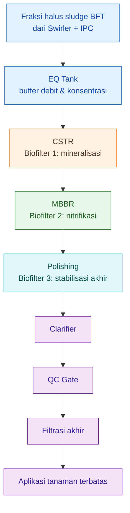

## 2.4 Prinsip desain yang harus diingat sejak awal

Ada beberapa prinsip desain yang perlu ditanamkan sejak bab awal ini, karena akan menjadi dasar seluruh artikel.

### a. Jalur B adalah train biologis

Jalur B harus dibaca sebagai **biofilter train**, bukan deretan tangki seragam. Konsekuensinya, evaluasi kinerja dilakukan per tahap.

### b. Beban biologis lebih penting daripada volume kosong

Tangki besar tetapi salah fungsi tetap tidak menyelesaikan masalah. Yang menentukan adalah:

- beban organik pada CSTR,
- beban TAN pada MBBR,
- residual nitrogen dan stabilitas pada polishing.

### c. MBBR tidak boleh disederhanakan menjadi HRT saja

Secara desain, MBBR harus dihitung dari parameter seperti:

- **surface area loading rate**,
- **specific surface area** media,
- **luas biofilm efektif**,
- **filling ratio** carrier.

Artinya, dua MBBR dengan volume sama bisa memiliki performa sangat berbeda jika media dan bebannya berbeda.

### d. Polishing bukan penutup kegagalan desain

Polishing memang memberi margin keselamatan, tetapi ia bukan alat untuk menutupi CSTR atau MBBR yang salah desain. Bila polishing terus-menerus kewalahan, hampir pasti ada masalah di tahap sebelumnya.

## 2.5 Posisi praktis bagi pembaca

Bagi praktisi, cara membaca rangkaian ini bisa disederhanakan seperti berikut:

```text
Swirler + IPC  = buang beban kasar
EQ Tank        = ratakan beban
CSTR           = jinakkan organik
MBBR           = nitrifikasi utama
Polishing      = pastikan stabil
Clarifier      = pisahkan padatan halus
QC             = tentukan layak atau tidak
Filtrasi akhir = siapkan untuk aplikasi
```

Ini adalah cara pandang yang jauh lebih berguna di lapangan dibanding hanya mengatakan “semua diaerasi beberapa hari”.

[**Kembali ke Atas**](#rangkaian-biofilter-aerob-tiga-tahap-untuk-mineralisasi-sludge-bft-cstr-mbbr-dan-polishing)

---

# 3. Tahap Pra-Biofilter: Swirler + IPC dan EQ Tank

Sebelum cairan sludge BFT masuk ke CSTR, MBBR, dan polishing, sistem harus melewati tahap **pra-biofilter**. Tahap ini sering dianggap sekadar pelengkap, padahal fungsinya sangat penting: **melindungi biofilter dari padatan kasar dan shock load**.

Biofilter aerob tidak boleh dipaksa bekerja sebagai tempat menampung semua jenis padatan. CSTR memang mampu menerima fraksi halus dan organik terlarut, tetapi bukan berarti ia boleh dibebani pakan tidak tercerna, feses kasar, pasir, flok berat, atau lumpur pekat yang seharusnya sudah dipisahkan lebih awal.

Prinsip dasarnya:

> **Biofilter bekerja paling stabil jika beban yang masuk sudah diseleksi. Padatan kasar masuk Jalur A, sedangkan fraksi halus/cair masuk Jalur B.**

Karena itu, sebelum masuk CSTR, Jalur B membutuhkan dua komponen penting:

```text id="bf8tu5"
Swirler + IPC
↓
EQ Tank
↓
CSTR
```

Swirler + IPC berfungsi sebagai **filter fisik awal**, sedangkan EQ Tank berfungsi sebagai **penyeimbang debit dan konsentrasi**.

---

## 3.1 Mengapa Tahap Pra-Biofilter Penting?

Sludge BFT dari kolam lele/nila bukan cairan homogen. Di dalamnya ada beberapa fraksi:

- padatan kasar,
- flok berat,
- feses halus,
- sisa pakan,
- bioflok tua,
- EPS atau lendir bioflok,
- partikel koloid,
- organik terlarut,
- dan nutrien mineral.

Tidak semua fraksi ini cocok masuk Jalur B. Fraksi kasar lebih cocok masuk Jalur A untuk dikomposkan, sedangkan fraksi halus/cair lebih cocok masuk Jalur B untuk mineralisasi aerob kontinyu.

Jika semua fraksi dipaksa masuk Jalur B, beberapa masalah akan muncul:

```text id="0wms58"
padatan kasar masuk CSTR
↓
OLR naik
↓
DO sulit stabil
↓
endapan anaerob terbentuk
↓
MBBR menerima organik tinggi
↓
biofilm nitrifier terganggu
↓
polishing kewalahan
```

Jadi, tahap pra-biofilter bukan hanya melindungi CSTR, tetapi juga melindungi MBBR dan polishing.

---

## 3.2 Swirler + IPC sebagai Filter Fisik Awal

Unit pertama dalam tahap pra-biofilter adalah kombinasi:

```text id="qbg5qh"
Swirler + IPC
```

IPC adalah singkatan dari:

```text id="tv9cxp"
Inclined Plate Clarifier
```

Keduanya bekerja secara fisik, bukan biologis. Tujuannya adalah memisahkan padatan yang tidak seharusnya masuk biofilter.

### 3.2.1 Fungsi Swirler

Swirler memanfaatkan pola aliran berputar atau vortex. Dalam aliran berputar, partikel yang lebih berat cenderung terdorong ke area luar atau bawah, sehingga lebih mudah dipisahkan dari fraksi cair.

Secara praktis, swirler membantu memisahkan:

- pasir halus,
- flok berat,
- feses kasar,
- sisa pakan,
- dan partikel padat yang cepat mengendap.

Swirler bukan alat ajaib yang membuat air langsung jernih. Fungsi utamanya adalah **mengurangi beban padatan kasar** sebelum cairan masuk ke tahap berikutnya.

---

### 3.2.2 Fungsi IPC

IPC atau **Inclined Plate Clarifier** menggunakan plat miring untuk memperpendek jarak pengendapan partikel.

Tanpa plat miring, partikel harus turun dari permukaan sampai dasar tangki. Dengan plat miring, jarak efektif pengendapan menjadi lebih pendek karena partikel cukup menempel atau meluncur pada permukaan plat lalu turun sebagai lumpur.

Secara sederhana:

```text id="ck8xfc"
tanpa IPC:
partikel harus mengendap jauh ke dasar

dengan IPC:
partikel bertemu plat miring lebih cepat
lalu meluncur turun sebagai sludge
```

IPC membantu menangkap fraksi padatan yang masih lolos dari swirler, terutama partikel yang masih bisa mengendap secara gravitasi.

---

## 3.3 Pembagian Fraksi: Jalur A dan Jalur B

Output dari Swirler + IPC tidak boleh diperlakukan sebagai satu aliran tunggal. Harus ada pembagian fraksi.

| Fraksi             | Arah    | Alasan                           |
| ------------------ | ------- | -------------------------------- |
| padatan kasar      | Jalur A | lebih cocok dikomposkan          |
| lumpur pekat berat | Jalur A | berisiko membebani CSTR          |
| fraksi halus/cair  | Jalur B | lebih cocok dimineralisasi aerob |
| supernatan         | Jalur B | bisa menjadi pengencer proses    |

Prinsipnya:

> **Jalur A menerima beban padatan. Jalur B menerima beban cair dan fraksi halus.**

Ini penting karena Jalur B kontinyu didesain sebagai rangkaian biofilter, bukan sebagai sistem pembuangan lumpur kasar.

---

## 3.4 Target Output Swirler + IPC

Swirler + IPC dianggap bekerja baik jika output ke Jalur B memenuhi kondisi berikut:

```text id="q8ybp6"
tidak membawa pakan utuh
tidak membawa pasir berat
tidak membawa flok kasar berlebihan
tidak cepat mengendap hitam
tidak membuat CSTR langsung bau
```

Targetnya bukan menghasilkan air jernih sempurna. Targetnya adalah menghasilkan influen yang lebih layak untuk CSTR.

Tabel target praktis:

| Parameter visual     | Target                  |
| -------------------- | ----------------------- |
| padatan kasar        | turun signifikan        |
| flok berat           | sebagian besar tertahan |
| endapan cepat        | berkurang               |
| bau busuk            | tidak dominan           |
| aliran ke CSTR       | relatif homogen         |
| risiko clogging awal | menurun                 |

Jika output Swirler + IPC masih terlalu pekat, maka lebih banyak fraksi harus dialihkan ke Jalur A.

---

## 3.5 EQ Tank sebagai Penyeimbang Biologis

Setelah Swirler + IPC, fraksi halus/cair masuk ke **EQ Tank**.

EQ Tank adalah singkatan dari:

```text id="5uhc9w"
Equalization Tank
```

Dalam sistem ini, EQ Tank bukan reaktor utama. Ia bukan tempat mineralisasi utama, bukan tempat nitrifikasi, dan bukan tempat polishing. Fungsi utamanya adalah **menstabilkan debit dan konsentrasi sebelum masuk CSTR**.

Poin penting:

> **EQ Tank mencegah CSTR menerima lonjakan sludge pekat secara mendadak.**

Tanpa EQ Tank, aliran ke CSTR bisa sangat tidak stabil. Kadang encer, kadang sangat pekat. Kadang sedikit, kadang banyak. Pola seperti ini menyebabkan CSTR mengalami shock load.

---

## 3.6 Fungsi EQ Tank

EQ Tank memiliki empat fungsi utama.

### 3.6.1 Menstabilkan debit

Debit dari pembuangan sludge kolam BFT biasanya tidak selalu konstan. Kadang sludge dibuang dalam waktu singkat, tetapi sistem biofilter membutuhkan aliran yang lebih merata.

EQ Tank menampung sementara aliran dari Swirler + IPC, lalu mengalirkannya secara lebih stabil ke CSTR.

Rumus umum:

$$
HRT_{\mathrm{EQ}}=\frac{V_{\mathrm{EQ}}}{Q}
$$

Keterangan:

| Simbol              | Arti                  | Satuan        |
| ------------------- | --------------------- | ------------- |
| $HRT_{\mathrm{EQ}}$ | waktu tinggal EQ Tank | hari atau jam |
| $V_{\mathrm{EQ}}$   | volume kerja EQ Tank  | L             |
| $Q$                 | debit Jalur B         | L/hari        |

Contoh:

$$
V_{\mathrm{EQ}}=250 \ \mathrm{L}
$$

$$
Q=600 \ \mathrm{L/hari}
$$

Maka:

$$
HRT_{\mathrm{EQ}}=\frac{250}{600}
$$

$$
HRT_{\mathrm{EQ}}=0.42 \ \text{hari}
$$

Konversi ke jam:

$$
0.42 \times 24 = 10.08 \ \text{jam}
$$

Jadi EQ Tank $250 \ \mathrm{L}$ pada debit $600 \ \mathrm{L/hari}$ memberi buffer sekitar:

$$
10 \ \text{jam}
$$

---

### 3.6.2 Menstabilkan konsentrasi

Sludge yang keluar dari kolam tidak selalu memiliki konsentrasi sama. Kadang lebih pekat, kadang lebih encer. EQ Tank membantu mencampur aliran tersebut agar CSTR menerima influen yang lebih seragam.

Tanpa EQ Tank:

```text id="2fh5mx"
sludge pekat masuk mendadak
↓
DO CSTR jatuh
↓
bau muncul
↓
MBBR ikut terganggu
```

Dengan EQ Tank:

```text id="3dt2ax"
sludge tertampung sementara
↓
konsentrasi lebih rata
↓
feed ke CSTR lebih stabil
```

---

### 3.6.3 Mengurangi shock load

Shock load adalah lonjakan beban mendadak. Dalam Jalur B, shock load bisa berupa:

- lonjakan padatan,
- lonjakan COD,
- lonjakan $NH_4^+$,
- lonjakan EPS,
- lonjakan bau,
- atau perubahan pH.

EQ Tank tidak menghilangkan beban, tetapi **meratakan beban** agar CSTR tidak menerima lonjakan mendadak.

---

### 3.6.4 Menjadi titik kontrol awal

EQ Tank juga menjadi titik kontrol sebelum cairan masuk CSTR. Di titik ini operator bisa memeriksa:

- pH,
- bau,
- warna,
- kekentalan,
- volume harian,
- dan indikasi padatan berlebih.

Jika EQ Tank sudah terlalu pekat atau berbau tajam, jangan langsung paksa masuk CSTR. Sebagian fraksi perlu dialihkan ke Jalur A atau diencerkan.

---

## 3.7 Parameter Praktis Tahap Pra-Biofilter

| Unit          | Parameter         | Rekomendasi praktis                                  |
| ------------- | ----------------- | ---------------------------------------------------- |
| Swirler + IPC | fungsi utama      | pemisahan padatan kasar dan pencegahan overload CSTR |
| Swirler + IPC | output ke Jalur A | padatan kasar, flok berat, lumpur pekat              |
| Swirler + IPC | output ke Jalur B | fraksi halus/cair dan supernatan                     |
| EQ Tank       | fungsi utama      | buffer debit dan konsentrasi                         |
| EQ Tank       | waktu buffer      | $4{-}12$ jam                                         |
| EQ Tank       | aerasi            | ringan                                               |
| EQ Tank       | mixing            | ringan, cukup untuk mencegah pengendapan             |
| Jalur A       | fungsi            | menerima fraksi kasar untuk kompos                   |
| Jalur B       | fungsi            | menerima fraksi halus/cair untuk biofilter aerob     |

Untuk contoh farm $100 \ \mathrm{m^3}$ dengan debit Jalur B:

$$
Q=600 \ \mathrm{L/hari}
$$

EQ Tank $250 \ \mathrm{L}$ memberi buffer sekitar:

$$
10 \ \text{jam}
$$

Ini masih masuk rentang praktis:

$$
4{-}12 \ \text{jam}
$$

---

## 3.8 Desain Operasional Swirler + IPC

Swirler + IPC harus dioperasikan dengan prinsip sederhana:

```text id="b7y8gr"
pisahkan dulu yang berat
baru kirim yang halus ke biofilter
```

Beberapa aturan lapangan:

1. Jangan memasukkan seluruh lumpur pekat ke CSTR.
2. Jangan membiarkan padatan kasar lolos terus-menerus.
3. Jangan menganggap aerasi bisa menyelesaikan semua padatan.
4. Buang atau alihkan sludge bawah Swirler + IPC secara rutin.
5. Gunakan fraksi kasar sebagai bahan Jalur A.
6. Kirim hanya fraksi halus/cair ke EQ Tank.

Jika sludge bawah tidak dibuang, Swirler + IPC akan kehilangan fungsi dan justru menjadi sumber bau.

---

## 3.9 Desain Operasional EQ Tank

EQ Tank perlu aerasi ringan atau mixing ringan. Tujuannya bukan melakukan mineralisasi utama, tetapi mencegah pengendapan dan kondisi anaerob lokal.

Rekomendasi operasional:

| Komponen | Rekomendasi                       |
| -------- | --------------------------------- |
| aerasi   | ringan                            |
| mixing   | cukup untuk homogenisasi          |
| endapan  | jangan dibiarkan menumpuk         |
| bau      | tidak boleh busuk                 |
| outlet   | aliran stabil ke CSTR             |
| kontrol  | valve atau dosing pump lebih baik |

EQ Tank sebaiknya tidak dibuat terlalu besar tanpa aerasi. Jika terlalu lama ditahan dan mixing buruk, EQ Tank bisa menjadi zona busuk sebelum CSTR.

---

## 3.10 Diagram Tahap Pra-Biofilter

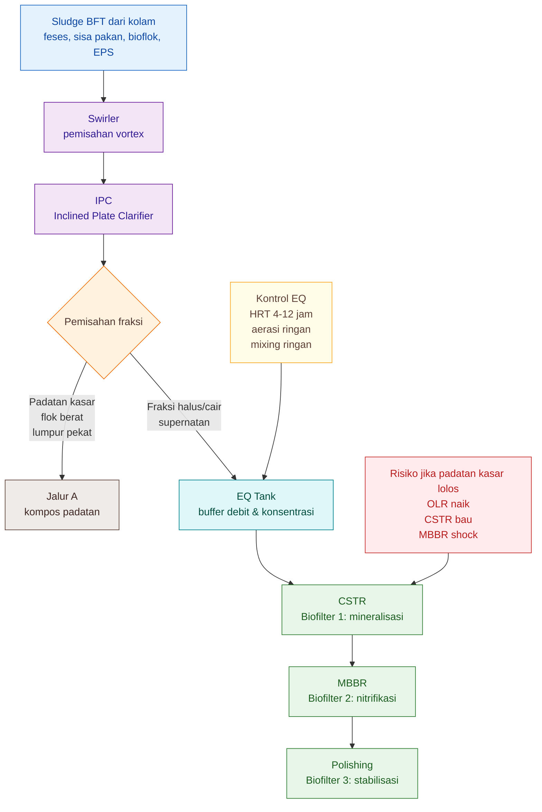

---

## 3.11 Kesalahan Umum pada Tahap Pra-Biofilter

### 3.11.1 Semua sludge dimasukkan ke Jalur B

Ini kesalahan paling umum. Jalur B sebaiknya menerima fraksi halus/cair, bukan seluruh lumpur kasar.

Dampaknya:

```text id="6pj6sf"
CSTR overload
DO turun
bau busuk
MBBR berlendir
NO2- naik
polishing gagal
```

---

### 3.11.2 Swirler + IPC jarang dibersihkan

Jika lumpur bawah tidak dikeluarkan, alat pemisah berubah menjadi sumber bau dan sumber organik busuk.

Tindakan:

```text id="ry9ocf"
jadwalkan pembuangan sludge bawah
cek endapan setiap hari
jangan biarkan lumpur menumpuk
alihkan padatan ke Jalur A
```

---

### 3.11.3 EQ Tank dianggap reaktor utama

EQ Tank bukan CSTR. Jika sludge ditahan terlalu lama dalam EQ Tank tanpa aerasi dan mixing yang cukup, proses bisa menjadi anaerob.

Tindakan:

```text id="7y021l"
gunakan EQ sebagai buffer
jaga aerasi ringan
atur aliran stabil ke CSTR
jangan jadikan EQ sebagai tempat penumpukan sludge
```

---

### 3.11.4 Tidak ada kontrol debit ke CSTR

Jika aliran dari EQ ke CSTR tidak dikontrol, CSTR tetap bisa menerima shock load.

Pilihan kontrol:

- valve manual,
- dosing pump,
- pompa timer,
- overflow terkontrol,
- atau orifice sederhana.

Yang penting, aliran ke CSTR tidak boleh berupa “gelontoran” sludge pekat.

---

## 3.12 Endpoint Tahap Pra-Biofilter

Tahap pra-biofilter dianggap berhasil jika:

| Titik     | Endpoint                                |
| --------- | --------------------------------------- |
| Swirler   | padatan berat mulai terpisah            |
| IPC       | flok dan partikel mengendap lebih mudah |
| Jalur A   | menerima padatan kasar                  |
| EQ Tank   | debit dan konsentrasi lebih stabil      |
| Outlet EQ | siap masuk CSTR tanpa shock             |
| CSTR      | tidak menerima padatan kasar berlebihan |

Secara praktis, operator dapat memakai indikator berikut:

```text id="cbvmoa"
tidak ada pakan utuh ke CSTR
tidak ada pasir/flok berat berlebih ke CSTR
EQ tidak busuk
debit ke CSTR stabil
CSTR tidak mengalami lonjakan bau mendadak
```

---

## 3.13 Ringkasan Bab

Tahap pra-biofilter adalah pondasi dari Jalur B kontinyu. Swirler + IPC berfungsi sebagai pemisah fisik awal, sedangkan EQ Tank berfungsi sebagai penyeimbang debit dan konsentrasi.

Ringkasnya:

```text id="rghst8"
Swirler
= pisahkan partikel berat dengan pola vortex

IPC
= bantu pengendapan dengan plat miring

Jalur A
= terima padatan kasar untuk kompos

EQ Tank
= ratakan debit dan konsentrasi

Jalur B
= terima fraksi halus/cair untuk biofilter aerob
```

Kesimpulan praktis:

> **Semakin baik pemisahan padatan di tahap pra-biofilter, semakin ringan beban CSTR, semakin stabil MBBR, dan semakin besar peluang polishing lolos QC.**

[**Kembali ke Atas**](#rangkaian-biofilter-aerob-tiga-tahap-untuk-mineralisasi-sludge-bft-cstr-mbbr-dan-polishing)

---

# 4. Biofilter Tahap 1: CSTR Mineralisasi

CSTR pada Jalur B kontinyu harus dipahami sebagai **biofilter biologis tahap pertama**, bukan sekadar tangki aerasi. Kesalahan paling umum di lapangan adalah menganggap CSTR hanya sebagai tempat “sludge diaerasi sebelum masuk MBBR”. Padahal, dalam sistem ini CSTR berfungsi sebagai **filter biologis tersuspensi** yang menyiapkan substrat agar MBBR tidak menerima beban organik yang terlalu liar.

<figure>
  
  <figcaption>
    Ilustrasi CSTR biofilter sebagai sistem pengolahan air yang menggunakan
    pencampuran kontinyu, media biologis, dan aktivitas mikroorganisme untuk
    membantu stabilisasi kualitas air.
  </figcaption>
</figure>

Secara teknis, CSTR adalah reaktor kontinyu yang menerima aliran masuk dan mengeluarkan aliran keluar secara terus-menerus, sementara isi reaktor dijaga tercampur. Dalam konteks sludge BFT, prinsip ini dipakai bukan untuk reaksi kimia murni, tetapi untuk menciptakan kondisi biologis aerob yang seragam agar mikroba pengurai dapat bekerja stabil. CSTR ideal diasumsikan memiliki pencampuran merata, sehingga isi reaktor relatif homogen dan outlet mewakili kondisi di dalam reaktor. ([MT][1])

Posisi CSTR dalam Jalur B adalah sebagai berikut:

```text
EQ Tank
↓
CSTR Mineralisasi
↓
MBBR Nitrifikasi
```

Dengan posisi ini, CSTR berperan sebagai **biofilter tahap 1** dalam rangkaian biofilter aerob tiga tahap.

---

## 4.1 CSTR Bukan Tangki Aerasi Biasa

Tangki aerasi biasa hanya dipahami sebagai tempat memasukkan udara ke dalam air. CSTR lebih dari itu. Di dalam CSTR, terjadi proses biologis aktif yang melibatkan:

- mikroba heterotrof aerob,
- mikroba pengurai protein,
- mikroba amonifikasi,
- flok mikroba tersuspensi,
- partikel organik halus,
- oksigen terlarut,
- dan pencampuran kontinyu.

Karena itu, CSTR dalam Jalur B lebih tepat disebut:

> **suspended-growth aerobic biofilter untuk mineralisasi awal sludge BFT.**

Istilah **suspended-growth** berarti biomassa mikroba utama berada dalam bentuk tersuspensi di dalam cairan, bukan menempel dominan pada media seperti MBBR. Mikroba bekerja pada partikel halus, bahan organik larut, protein, dan senyawa nitrogen organik yang terbawa dari sludge BFT.

Aerobic digestion secara umum memanfaatkan mikroorganisme aerob untuk mendegradasi bahan organik sludge dengan bantuan oksigen. Produk akhirnya dapat berupa karbon dioksida, air, biomassa mikroba, amonia, dan dalam kondisi tertentu nitrat. Prinsip ini relevan untuk memahami fungsi CSTR sebagai tahap mineralisasi awal, walaupun target CSTR dalam Jalur B bukan menyelesaikan seluruh nitrifikasi. ([The MBR Site][2])

---

## 4.2 Fungsi Biologis CSTR

Fungsi biologis CSTR adalah **mengubah sludge halus yang masih reaktif menjadi cairan yang lebih siap untuk nitrifikasi**. Targetnya bukan membuat produk akhir siap pakai, melainkan membuat feed yang lebih aman bagi MBBR.

Ada tiga proses biologis utama di dalam CSTR.

### 4.2.1 Hidrolisis protein

Sludge BFT membawa protein dari sisa pakan, feses ikan, dan biomassa mikroba. Protein tidak langsung menjadi nutrisi mineral yang mudah dikendalikan. Ia perlu dipecah terlebih dahulu.

Secara sederhana:

$$
\text{Protein} \rightarrow \text{peptida} \rightarrow \text{asam amino}
$$

Proses ini penting karena protein yang belum terurai dapat menjadi sumber bau, busa, dan beban oksigen tinggi. Bila protein dan bahan organik mudah busuk langsung masuk MBBR, biofilm nitrifikasi dapat terganggu oleh pertumbuhan heterotrof yang terlalu cepat.

---

### 4.2.2 Amonifikasi nitrogen organik

Setelah bahan organik nitrogen dipecah, sebagian nitrogen organik dilepas menjadi amonium.

$$
\text{N organik} \rightarrow NH_4^+
$$

Pada tahap CSTR, kenaikan $NH_4^+$ **tidak selalu buruk**. Dalam konteks mineralisasi, naiknya $NH_4^+$ dapat menunjukkan bahwa nitrogen organik mulai dilepaskan ke bentuk mineral.

Yang penting adalah memahami posisi prosesnya:

```text
CSTR:
N organik → NH4+

MBBR:
NH4+ → NO2- → NO3-
```

Jadi CSTR tidak harus dipaksa menghasilkan nitrat. Tugas utama CSTR adalah membuat $NH_4^+$ tersedia dalam kondisi cairan yang lebih stabil agar MBBR dapat melakukan nitrifikasi dengan lebih baik.

---

### 4.2.3 Oksidasi karbon organik

CSTR juga menurunkan fraksi karbon organik yang mudah busuk.

$$
\text{C organik} + O_2 \rightarrow CO_2 + H_2O + \text{biomassa mikroba}
$$

Proses ini membutuhkan oksigen dan mixing yang cukup. Jika oksigen rendah atau ada zona mati, proses bisa bergeser ke kondisi anaerob lokal. Akibatnya muncul bau busuk, endapan hitam, busa tidak normal, dan outlet CSTR menjadi beban bagi MBBR.

---

## 4.3 Peran CSTR sebagai Pelindung MBBR

CSTR adalah **pelindung biologis untuk MBBR**.

MBBR bekerja optimal jika menerima cairan yang:

- tidak membawa padatan kasar,
- tidak terlalu kaya organik mudah busuk,
- tidak berbau anaerob,
- masih memiliki $NH_4^+$ sebagai substrat nitrifikasi,
- DO dapat dipertahankan,
- pH tidak ekstrem,
- dan tidak membawa busa/lendir berlebihan.

Jika CSTR gagal, MBBR akan menerima beban organik terlalu tinggi. Dampaknya:

```text
Organik tinggi masuk MBBR
↓
heterotrof tumbuh cepat di biofilm
↓
oksigen dan ruang permukaan dipakai heterotrof
↓
AOB dan NOB kalah
↓
NH4+ tidak turun optimal
↓
NO2- dapat menumpuk
```

Karena itu, poin tajamnya adalah:

> **CSTR yang baik bukan yang paling lama, tetapi yang membuat MBBR tidak shock.**

Jika outlet CSTR masih busuk, berbusa ekstrem, atau membuat DO MBBR cepat jatuh, maka masalahnya bukan langsung pada MBBR. Kemungkinan besar CSTR belum cukup kuat, pemisahan padatan awal belum efektif, atau debit Jalur B terlalu besar.

---

## 4.4 Design Basis CSTR

CSTR dalam Jalur B harus didesain dengan lima basis utama:

$$
CSTR = HRT + OLR + DO + mixing + outlet \ quality
$$

Dalam artikel MDX, formula di atas aman digunakan sebagai ekspresi konseptual. Namun secara teknis, setiap komponen harus dibaca sebagai berikut:

| Komponen           | Arti dalam desain CSTR                          |
| ------------------ | ----------------------------------------------- |
| $HRT$              | waktu tinggal hidraulik untuk mineralisasi awal |
| $OLR$              | beban organik per volume reaktor                |
| $DO$               | oksigen terlarut untuk menjaga proses aerob     |
| $mixing$           | pencampuran agar tidak ada zona anaerob         |
| $outlet \ quality$ | mutu cairan yang masuk ke MBBR                  |

Yang perlu ditekankan: **HRT saja tidak cukup**. CSTR dengan $HRT$ panjang tetap bisa gagal jika mixing buruk, padatan mengendap, atau beban organik terlalu tinggi.

---

## 4.5 Rumus Desain CSTR

### 4.5.1 Hydraulic Retention Time CSTR

Rumus dasar:

$$
HRT_{\mathrm{CSTR}}=\frac{V_{\mathrm{CSTR}}}{Q}
$$

Keterangan:

| Simbol                | Arti                         | Satuan                          |
| --------------------- | ---------------------------- | ------------------------------- |
| $HRT_{\mathrm{CSTR}}$ | waktu tinggal hidraulik CSTR | hari                            |
| $V_{\mathrm{CSTR}}$   | volume kerja CSTR            | L atau $\mathrm{m^3}$           |
| $Q$                   | debit masuk CSTR             | L/hari atau $\mathrm{m^3/hari}$ |

Contoh:

$$
V_{\mathrm{CSTR}}=1200 \ \mathrm{L}
$$

$$
Q=600 \ \mathrm{L/hari}
$$

Maka:

$$
HRT_{\mathrm{CSTR}}=\frac{1200}{600}
$$

$$
HRT_{\mathrm{CSTR}}=2 \ \text{hari}
$$

Untuk sludge BFT fraksi halus, $HRT$ awal $2{-}3$ hari masuk akal sebagai baseline pilot, asalkan padatan kasar sudah dipisahkan oleh Swirler + IPC.

---

### 4.5.2 Beban COD masuk CSTR

Jika tersedia data $COD_{\mathrm{in}}$, maka beban organik masuk CSTR dapat dihitung.

Dalam bentuk $\mathrm{g/hari}$:

$$
L_{\mathrm{COD}}=\frac{Q \times COD_{\mathrm{in}}}{1000}
$$

Keterangan:

| Simbol              | Arti             | Satuan            |
| ------------------- | ---------------- | ----------------- |
| $L_{\mathrm{COD}}$  | beban COD harian | $\mathrm{g/hari}$ |
| $Q$                 | debit masuk CSTR | $\mathrm{L/hari}$ |
| $COD_{\mathrm{in}}$ | COD inlet CSTR   | $\mathrm{mg/L}$   |

Jika ingin langsung dalam $\mathrm{kg/hari}$, gunakan:

$$
L_{\mathrm{COD,kg}}=\frac{Q \times COD_{\mathrm{in}}}{1000000}
$$

Contoh:

$$
Q=600 \ \mathrm{L/hari}
$$

$$
COD_{\mathrm{in}}=2000 \ \mathrm{mg/L}
$$

Maka:

$$
L_{\mathrm{COD,kg}}=\frac{600 \times 2000}{1000000}
$$

$$
L_{\mathrm{COD,kg}}=1.2 \ \mathrm{kg/hari}
$$

---

### 4.5.3 Organic Loading Rate CSTR

Organic loading rate atau $OLR$ menunjukkan seberapa berat beban organik yang diterima CSTR per satuan volume.

$$
OLR_{\mathrm{COD}}=\frac{L_{\mathrm{COD}}}{V_{\mathrm{CSTR}}}
$$

Agar satuan konsisten:

- $L_{\mathrm{COD}}$ memakai $\mathrm{kg/hari}$,
- $V_{\mathrm{CSTR}}$ memakai $\mathrm{m^3}$.

Maka satuan $OLR_{\mathrm{COD}}$ adalah:

$$
\mathrm{kg \ COD/m^3/hari}
$$

Contoh:

$$
L_{\mathrm{COD}}=1.2 \ \mathrm{kg/hari}
$$

$$
V_{\mathrm{CSTR}}=1.2 \ \mathrm{m^3}
$$

Maka:

$$
OLR_{\mathrm{COD}}=\frac{1.2}{1.2}
$$

$$
OLR_{\mathrm{COD}}=1.0 \ \mathrm{kg \ COD/m^3/hari}
$$

Nilai ini masih masuk sebagai zona awal yang layak untuk pilot, selama DO dan mixing bisa dipertahankan.

---

## 4.6 Parameter Desain Awal untuk Praktisi

Berikut parameter awal CSTR mineralisasi untuk Jalur B sludge BFT lele/nila.

| Parameter   |                         Rekomendasi awal |
| ----------- | ---------------------------------------: |
| $HRT$       |                             $2{-}3$ hari |
| $DO$        |                  $3{-}5 \ \mathrm{mg/L}$ |
| pH          |                              $6.8{-}7.5$ |
| $OLR$ pilot | $0.5{-}1.5 \ \mathrm{kg \ COD/m^3/hari}$ |
| Mixing      |                tidak boleh ada dead zone |
| Outlet      |       tidak busuk, tidak berbusa ekstrem |

Angka $OLR$ di atas sebaiknya dipahami sebagai **basis pilot konservatif**, bukan standar baku universal. Sludge BFT sangat dipengaruhi jenis pakan, FCR, umur ikan, kepadatan, frekuensi pengurasan, dan efisiensi pemisahan padatan awal.

---

## 4.7 Tiga Skenario Desain CSTR

Untuk memudahkan praktisi, CSTR dapat dibaca dalam tiga skenario.

Misalnya:

$$
Q=600 \ \mathrm{L/hari}
$$

$$
V_{\mathrm{CSTR}}=1200 \ \mathrm{L}=1.2 \ \mathrm{m^3}
$$

Maka:

$$
HRT_{\mathrm{CSTR}}=2 \ \text{hari}
$$

Skenario $COD_{\mathrm{in}}$:

| Skenario |    $COD_{\mathrm{in}}$ |       $L_{\mathrm{COD}}$ |         $OLR_{\mathrm{COD}}$ | Interpretasi                |
| -------- | ---------------------: | -----------------------: | ---------------------------: | --------------------------- |
| Ringan   | $1000 \ \mathrm{mg/L}$ | $0.6 \ \mathrm{kg/hari}$ | $0.5 \ \mathrm{kg/m^3/hari}$ | aman untuk pilot            |
| Sedang   | $2000 \ \mathrm{mg/L}$ | $1.2 \ \mathrm{kg/hari}$ | $1.0 \ \mathrm{kg/m^3/hari}$ | zona desain awal            |
| Berat    | $4000 \ \mathrm{mg/L}$ | $2.4 \ \mathrm{kg/hari}$ | $2.0 \ \mathrm{kg/m^3/hari}$ | mulai berat, perlu evaluasi |

Jika $OLR_{\mathrm{COD}}$ mendekati atau melebihi:

$$
2.5 \ \mathrm{kg \ COD/m^3/hari}
$$

maka CSTR sederhana berisiko overload. Solusinya bukan hanya menambah aerasi, tetapi juga perlu mengevaluasi:

- debit Jalur B,
- rasio pengenceran,
- efektivitas Swirler + IPC,
- volume CSTR,
- dan porsi sludge yang dialihkan ke Jalur A.

---

## 4.8 DO dan Oksigen: Jangan Hanya Mengejar Gelembung

Target DO CSTR:

$$
DO=3{-}5 \ \mathrm{mg/L}
$$

DO penting, tetapi gelembung banyak tidak otomatis berarti proses baik. Ada dua kesalahan yang sering terjadi:

1. aerasi terlihat kuat, tetapi bagian bawah tangki tetap mengendap;
2. DO terukur cukup di satu titik, tetapi ada zona anaerob di sudut atau dasar.

Untuk CSTR, aerasi harus memenuhi dua fungsi sekaligus:

```text
transfer oksigen
+
mixing
```

Jika hanya transfer oksigen tetapi mixing buruk, sludge tetap bisa membusuk di dasar. Jika mixing kuat tetapi oksigen tidak cukup, mikroba aerob tidak bekerja optimal.

Aerobic digestion sludge membutuhkan oksigen untuk menjaga degradasi organik dalam kondisi aerob; proses ini juga sangat dipengaruhi oleh kemampuan sistem mempertahankan oksigen dan pencampuran yang cukup. ([The MBR Site][2])

---

## 4.9 Mixing: Parameter yang Sering Diremehkan

Mixing adalah syarat utama CSTR. Tanpa mixing, CSTR berubah menjadi tangki aerasi yang tidak merata.

Tanda mixing CSTR baik:

- seluruh volume cairan bergerak,
- tidak ada endapan hitam,
- tidak ada zona diam di sudut,
- tidak ada bau sulfida,
- busa tidak ekstrem,
- outlet relatif homogen.

Tanda mixing buruk:

| Gejala                  | Makna                                           |
| ----------------------- | ----------------------------------------------- |
| dasar hitam             | zona anaerob                                    |
| bau telur busuk         | reduksi sulfur/anaerob                          |
| flok mengendap lama     | energi mixing kurang                            |
| permukaan berbusa tebal | organik/protein tinggi atau aerasi tidak merata |
| outlet berubah-ubah     | reaktor tidak homogen                           |

Untuk tangki bulat, pola mixing biasanya lebih mudah dikendalikan. Untuk IBC atau bak kotak, risiko dead zone lebih besar sehingga posisi diffuser dan arah aliran harus diperhatikan.

---

## 4.10 Desain Fisik CSTR

### 4.10.1 Bentuk tangki

Rekomendasi bentuk tangki:

| Bentuk                         | Penilaian                              |
| ------------------------------ | -------------------------------------- |
| tangki bulat cone-bottom       | terbaik                                |
| tangki bulat flat-bottom       | baik                                   |
| IBC $1000{-}1200 \ \mathrm{L}$ | bisa, tetapi rawan sudut mati          |
| bak kotak panjang              | perlu diffuser dan baffle lebih cermat |

Tangki bulat lebih disukai karena pola aliran cenderung lebih merata dan endapan lebih mudah dikendalikan.

---

### 4.10.2 Inlet dan outlet

Desain inlet dan outlet harus mencegah short-circuit.

Prinsip:

```text
inlet tidak boleh langsung menuju outlet
```

Konfigurasi yang disarankan:

- inlet dari EQ masuk ke zona mixing,
- outlet ke MBBR berada di sisi berlawanan atau posisi yang tidak langsung terkena aliran masuk,
- outlet tidak mengambil busa permukaan,
- outlet tidak mengambil endapan dasar,
- pasang screen kasar bila diperlukan.

---

### 4.10.3 Aerasi

Untuk CSTR, aerasi kasar atau medium bubble sering lebih praktis daripada fine bubble, karena fungsi mixing sangat penting dan sludge BFT dapat mengotori diffuser halus.

Rekomendasi awal:

| Komponen      | Rekomendasi                                             |
| ------------- | ------------------------------------------------------- |
| diffuser      | dasar tangki                                            |
| jumlah titik  | minimal $2{-}4$ titik untuk sekitar $1200 \ \mathrm{L}$ |
| kontrol udara | valve terpisah                                          |
| operasi       | 24 jam                                                  |
| target        | DO stabil dan mixing merata                             |

---

## 4.11 Diagram Fungsi CSTR

Diagram berikut menunjukkan CSTR sebagai biofilter mineralisasi tersuspensi.

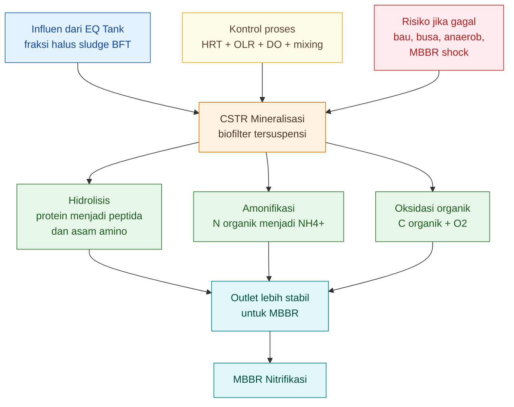

---

## 4.12 Endpoint CSTR

CSTR tidak dinilai dari apakah produk sudah siap diaplikasikan ke tanaman. CSTR dinilai dari apakah outlet-nya **layak masuk MBBR**.

Endpoint CSTR yang benar:

| Parameter      | Target                               |
| -------------- | ------------------------------------ |
| bau            | tidak busuk                          |
| busa           | tidak ekstrem                        |
| DO             | dapat dijaga $3{-}5 \ \mathrm{mg/L}$ |
| pH             | $6.8{-}7.5$                          |
| endapan hitam  | tidak ada                            |
| padatan kasar  | tidak ada                            |
| $NH_4^+$       | boleh naik                           |
| $NO_2^-$       | belum wajib rendah                   |
| outlet ke MBBR | tidak menyebabkan shock              |

Poin penting:

> **Pada CSTR, kenaikan $NH_4^+$ bisa menjadi tanda mineralisasi berjalan. Yang tidak boleh terjadi adalah bau busuk, anaerob, busa ekstrem, dan outlet yang membuat MBBR gagal.**

---

## 4.13 Troubleshooting CSTR

### 4.13.1 Bau busuk

Kemungkinan penyebab:

- aerasi kurang,
- mixing buruk,
- endapan dasar anaerob,
- beban organik terlalu tinggi,
- padatan kasar lolos dari Swirler + IPC.

Tindakan:

```text
kurangi feed 25–50%
tingkatkan aerasi
bersihkan endapan dasar
cek Swirler + IPC
alihkan lebih banyak padatan ke Jalur A
```

---

### 4.13.2 Busa ekstrem

Kemungkinan penyebab:

- protein tinggi,
- EPS tinggi,
- beban organik terlalu besar,
- aerasi terlalu terkonsentrasi di satu titik,
- start-up belum stabil.

Tindakan:

```text
ratakan aerasi
kurangi debit masuk
jangan tambah molase
perpanjang HRT
perbaiki pemisahan padatan awal
```

---

### 4.13.3 DO sulit naik

Kemungkinan penyebab:

- oxygen uptake terlalu tinggi,
- blower kurang,
- diffuser kotor,
- sludge terlalu pekat,
- $OLR$ terlalu tinggi.

Tindakan:

```text
turunkan OLR
tambah pengenceran
bersihkan diffuser
tambah kapasitas blower
perbesar volume CSTR
```

---

### 4.13.4 MBBR tetap shock setelah CSTR

Gejala di MBBR:

- media berlendir tebal,
- DO MBBR cepat turun,
- $NO_2^-$ naik,
- bau muncul lagi,
- biofilm terlihat tidak sehat.

Kemungkinan besar CSTR belum cukup menurunkan beban organik. Tindakan:

```text
jangan langsung tambah media MBBR
evaluasi outlet CSTR
cek OLR CSTR
tambah HRT CSTR
perbaiki Swirler + IPC
kurangi porsi Jalur B
```

---

## 4.14 Desain Awal CSTR untuk Contoh Farm

Misalnya farm memiliki:

$$
Q=600 \ \mathrm{L/hari}
$$

Desain baseline:

$$
V_{\mathrm{CSTR}}=1200 \ \mathrm{L}
$$

Maka:

$$
HRT_{\mathrm{CSTR}}=2 \ \text{hari}
$$

Jika $COD_{\mathrm{in}}$ berada pada kisaran:

$$
1000{-}2000 \ \mathrm{mg/L}
$$

maka $OLR_{\mathrm{COD}}$ kira-kira:

$$
0.5{-}1.0 \ \mathrm{kg \ COD/m^3/hari}
$$

Ini masih masuk zona desain awal yang wajar untuk pilot.

Jika $COD_{\mathrm{in}}$ mendekati:

$$
4000 \ \mathrm{mg/L}
$$

maka $OLR_{\mathrm{COD}}$ menjadi sekitar:

$$
2.0 \ \mathrm{kg \ COD/m^3/hari}
$$

Pada kondisi ini, CSTR $1200 \ \mathrm{L}$ mulai berat. Pilihan koreksinya:

| Masalah              | Koreksi                          |
| -------------------- | -------------------------------- |
| outlet masih busuk   | tambah HRT atau kurangi debit    |
| busa tinggi          | kurangi beban protein/organik    |
| MBBR shock           | perkuat CSTR sebelum tambah MBBR |
| padatan banyak       | perbaiki Swirler + IPC           |
| volume terlalu besar | alihkan fraksi padat ke Jalur A  |

---

## 4.15 Ringkasan Keputusan Praktis

CSTR dapat dianggap layak sebagai biofilter tahap 1 bila memenuhi syarat berikut:

```text
HRT cukup
+
OLR tidak berlebihan
+
DO stabil
+
mixing merata
+
tidak ada bau busuk
+
tidak ada dead zone
+
outlet tidak membuat MBBR shock
```

Ringkasan desain awal:

| Komponen                   |                               Nilai awal |
| -------------------------- | ---------------------------------------: |
| $HRT_{\mathrm{CSTR}}$      |                             $2{-}3$ hari |
| $DO$                       |                  $3{-}5 \ \mathrm{mg/L}$ |
| pH                         |                              $6.8{-}7.5$ |
| $OLR_{\mathrm{COD}}$ pilot | $0.5{-}1.5 \ \mathrm{kg \ COD/m^3/hari}$ |
| fungsi utama               |               mineralisasi + amonifikasi |
| endpoint                   |                 outlet stabil untuk MBBR |

Kesimpulan praktisnya:

> **CSTR bukan tempat menyelesaikan semua proses. CSTR adalah biofilter tahap pertama yang bertugas menjinakkan sludge: menurunkan organik mudah busuk, memulai amonifikasi, dan melindungi MBBR dari shock load.**

[1]: https://www.mt.com/in/en/home/applications/L1_AutoChem_Applications/L2_ReactionAnalysis/continuous-stirred-tank-reactor-cstr.html?utm_source=chatgpt.com 'Continuous Stirred Tank Reactors (CSTR) | Flow Technology'
[2]: https://www.thembrsite.com/sludge-treatment-aerobic-digestion?utm_source=chatgpt.com 'Sludge treatment − an overview of aerobic digestion'

[**Kembali ke Atas**](#rangkaian-biofilter-aerob-tiga-tahap-untuk-mineralisasi-sludge-bft-cstr-mbbr-dan-polishing)

---

# 5. Biofilter Tahap 2: MBBR Nitrifikasi

MBBR adalah tahap paling kritis dalam rangkaian biofilter aerob tiga tahap. Jika CSTR bertugas menstabilkan organik dan membentuk $NH_4^+$, maka MBBR bertugas mengubah $NH_4^+$ menjadi bentuk nitrogen yang lebih stabil, yaitu $NO_3^-$.

Bab ini perlu dibaca dengan tegas:

> **MBBR bukan tangki 1000 L berisi plastik. MBBR adalah biofilter nitrifikasi yang dihitung dari luas permukaan biofilm aktif.**

Kesalahan desain MBBR yang paling sering terjadi adalah menganggap bahwa selama ada tangki, aerasi, dan media plastik, maka proses nitrifikasi akan berjalan. Padahal performa MBBR ditentukan oleh kombinasi **beban TAN**, **luas permukaan biofilm**, **specific surface area media**, **filling ratio**, **DO**, **pH**, **alkalinitas**, dan **gerakan carrier**.

<figure>
  
  <figcaption>
    Ilustrasi MBBR biofilter sebagai sistem pengolahan air dengan media bergerak
    untuk mendukung pertumbuhan biofilm, nitrifikasi, dan stabilisasi kualitas
    air.
  </figcaption>
</figure>

MBBR secara umum adalah proses biologis attached-growth yang menggunakan carrier/media bergerak sebagai tempat tumbuh biofilm; carrier tersebut menyediakan permukaan untuk mikroorganisme dan bergerak di dalam reaktor dengan bantuan aerasi atau agitasi. ([ResearchGate][1])

---

## 5.1 Fungsi Biologis MBBR

Fungsi utama MBBR dalam Jalur B adalah **nitrifikasi**.

Nitrifikasi terjadi dalam dua tahap utama.

Tahap pertama dilakukan oleh kelompok bakteri pengoksidasi amonia atau **AOB**:

$$
NH_4^+ + 1.5O_2 \rightarrow NO_2^- + 2H^+ + H_2O
$$

Tahap kedua dilakukan oleh kelompok bakteri pengoksidasi nitrit atau **NOB**:

$$
NO_2^- + 0.5O_2 \rightarrow NO_3^-
$$

Reaksi totalnya dapat ditulis:

$$
NH_4^+ + 2O_2 \rightarrow NO_3^- + 2H^+ + H_2O
$$

Dari reaksi ini terlihat tiga hal penting.

Pertama, nitrifikasi membutuhkan oksigen. Karena itu MBBR harus memiliki $DO$ lebih tinggi daripada CSTR.

Kedua, nitrifikasi menghasilkan $H^+$. Artinya, proses ini dapat menurunkan pH bila alkalinitas tidak cukup.

Ketiga, $NO_2^-$ adalah senyawa antara. Jika tahap pertama berjalan tetapi tahap kedua lambat, nitrit dapat menumpuk. Inilah salah satu risiko terbesar pada MBBR yang belum matang atau overload.

---

## 5.2 Mengapa MBBR Diletakkan Setelah CSTR?

MBBR tidak ideal menerima sludge BFT mentah yang masih kaya bahan organik. Bila beban organik masuk MBBR terlalu tinggi, biofilm di carrier akan didominasi mikroba heterotrof, bukan nitrifier.

Urutan yang benar:

```text id="q3q3x7"
CSTR
↓
MBBR
```

CSTR menurunkan organik mudah busuk dan mulai membentuk $NH_4^+$. MBBR kemudian menerima cairan yang lebih siap untuk nitrifikasi.

Jika urutan ini diabaikan, yang terjadi adalah:

```text id="4ph622"
organik tinggi masuk MBBR
↓
heterotrof tumbuh cepat di carrier
↓
permukaan media dan oksigen dipakai heterotrof
↓
AOB dan NOB kalah bersaing
↓
NH4+ tidak turun optimal
↓
NO2- berisiko menumpuk
```

Jadi CSTR adalah pelindung MBBR. MBBR adalah unit nitrifikasi, bukan unit utama untuk mengurai organik kasar.

---

## 5.3 Prinsip Utama: $SRT \gg HRT$

Keunggulan utama MBBR adalah kemampuannya menahan biomassa nitrifier pada permukaan carrier.

Prinsipnya:

$$
SRT \gg HRT
$$

Artinya:

- $HRT$ adalah waktu tinggal cairan di reaktor,
- $SRT$ adalah waktu tinggal biomassa/mikroba di sistem.

Pada sistem tanpa carrier, mikroba mudah ikut keluar bersama aliran. Pada MBBR, bakteri nitrifier menempel di carrier sebagai biofilm sehingga mereka dapat tinggal jauh lebih lama daripada cairannya.

Inilah alasan MBBR dapat bekerja lebih efisien daripada tangki aerasi biasa:

```text id="mrwzdt"
air boleh lewat relatif cepat
tetapi biofilm nitrifier tetap tinggal
```

Namun prinsip ini hanya benar jika carrier benar-benar bergerak, tidak keluar dari outlet, tidak tersumbat, dan biofilmnya sehat.

---

## 5.4 Design Basis MBBR

MBBR harus didesain dari beban biologis dan luas permukaan biofilm, bukan hanya volume tangki.

Basis desainnya adalah:

$$
MBBR = TAN \ loading + SALR + SSA_{eff} + FR + DO + pH + media \ movement
$$

Keterangan:

| Komponen             | Arti dalam desain MBBR                                 |
| -------------------- | ------------------------------------------------------ |
| $TAN \ loading$      | beban $NH_4$-$N$ yang harus dinitrifikasi              |
| $SALR$               | beban TAN per luas permukaan biofilm                   |
| $SSA_{\mathrm{eff}}$ | luas permukaan efektif media                           |
| $FR$                 | filling ratio carrier dalam reaktor                    |
| $DO$                 | oksigen terlarut untuk AOB dan NOB                     |
| pH                   | kestabilan lingkungan nitrifier                        |
| $media \ movement$   | gerakan carrier agar kontak dan self-cleaning berjalan |

Literatur MBBR menunjukkan bahwa performa TAN removal dipengaruhi oleh konsentrasi TAN, DO, temperatur, pH, alkalinitas, beban organik, dan kondisi biofilm. Pada sistem Kaldnes, hubungan antara beban organik, DO, dan TAN removal rate menunjukkan bahwa nitrifikasi melemah ketika beban organik meningkat atau DO tidak cukup. ([La Gazzetta delle Koi][2])

---

## 5.5 Rumus Desain MBBR

### 5.5.1 Beban TAN Harian

Parameter pertama yang harus dihitung adalah beban TAN harian.

$$
L_{\mathrm{TAN}}=\frac{Q \times C_{NH4}}{1000}
$$

Keterangan:

| Simbol             | Arti                              | Satuan            |
| ------------------ | --------------------------------- | ----------------- |
| $L_{\mathrm{TAN}}$ | beban $NH_4$-$N$ harian           | $\mathrm{g/hari}$ |
| $Q$                | debit masuk MBBR                  | $\mathrm{L/hari}$ |
| $C_{NH4}$          | konsentrasi $NH_4$-$N$ inlet MBBR | $\mathrm{mg/L}$   |

Contoh:

$$
Q=600 \ \mathrm{L/hari}
$$

$$
C_{NH4}=50 \ \mathrm{mg/L}
$$

Maka:

$$
L_{\mathrm{TAN}}=\frac{600 \times 50}{1000}
$$

$$
L_{\mathrm{TAN}}=30 \ \mathrm{g/hari}
$$

Angka $30 \ \mathrm{g/hari}$ inilah beban nitrogen yang harus ditangani biofilm MBBR.

---

### 5.5.2 Kebutuhan Luas Biofilm

Setelah $L_{\mathrm{TAN}}$ diketahui, langkah berikutnya adalah menghitung luas biofilm yang dibutuhkan.

$$
A_{\mathrm{req}}=\frac{L_{\mathrm{TAN}}}{r_A}
$$

Keterangan:

| Simbol             | Arti                                     | Satuan                                |
| ------------------ | ---------------------------------------- | ------------------------------------- |
| $A_{\mathrm{req}}$ | luas biofilm yang dibutuhkan             | $\mathrm{m^2}$                        |
| $L_{\mathrm{TAN}}$ | beban TAN harian                         | $\mathrm{g/hari}$                     |
| $r_A$              | laju nitrifikasi desain per luas biofilm | $\mathrm{g \ NH_4\text{-}N/m^2/hari}$ |

Untuk sludge BFT, nilai $r_A$ sebaiknya dibuat konservatif karena influen masih membawa organik, EPS, koloid, dan padatan halus.

Rekomendasi pilot:

$$
r_A=0.20{-}0.25 \ \mathrm{g \ NH_4\text{-}N/m^2/hari}
$$

Jika digunakan:

$$
r_A=0.25 \ \mathrm{g \ NH_4\text{-}N/m^2/hari}
$$

dan:

$$
L_{\mathrm{TAN}}=30 \ \mathrm{g/hari}
$$

maka:

$$
A_{\mathrm{req}}=\frac{30}{0.25}
$$

$$
A_{\mathrm{req}}=120 \ \mathrm{m^2}
$$

Artinya, MBBR membutuhkan sekitar $120 \ \mathrm{m^2}$ luas permukaan biofilm efektif sebelum safety factor.

---

### 5.5.3 Specific Surface Area Efektif

Carrier MBBR biasanya memiliki angka **specific surface area** atau $SSA$, yaitu luas permukaan media per satuan volume media.

Namun angka katalog media tidak boleh langsung dianggap aktif semuanya. Pada sludge BFT, sebagian area bisa tidak efektif karena:

- tertutup EPS,
- tertahan padatan halus,
- biofilm terlalu tebal,
- sirkulasi buruk,
- atau carrier tidak bergerak optimal.

Karena itu gunakan:

$$
SSA_{\mathrm{eff}}=SSA \times \eta
$$

Keterangan:

| Simbol               | Arti                                |
| -------------------- | ----------------------------------- |
| $SSA_{\mathrm{eff}}$ | specific surface area efektif       |
| $SSA$                | specific surface area nominal media |
| $\eta$               | faktor efektivitas media            |

Untuk desain awal sludge BFT:

$$
SSA=400{-}600 \ \mathrm{m^2/m^3}
$$

$$
\eta=0.6{-}0.8
$$

Jika dipakai:

$$
SSA=500 \ \mathrm{m^2/m^3}
$$

dan:

$$
\eta=0.7
$$

maka:

$$
SSA_{\mathrm{eff}}=500 \times 0.7
$$

$$
SSA_{\mathrm{eff}}=350 \ \mathrm{m^2/m^3}
$$

Ini lebih realistis daripada memakai angka nominal penuh.

---

### 5.5.4 Volume Media

Setelah kebutuhan area dan $SSA_{\mathrm{eff}}$ diketahui, volume media dihitung:

$$
V_{\mathrm{media}}=\frac{A_{\mathrm{req}}}{SSA_{\mathrm{eff}}}
$$

Contoh:

$$
A_{\mathrm{req}}=120 \ \mathrm{m^2}
$$

$$
SSA_{\mathrm{eff}}=350 \ \mathrm{m^2/m^3}
$$

Maka:

$$
V_{\mathrm{media}}=\frac{120}{350}
$$

$$
V_{\mathrm{media}}=0.343 \ \mathrm{m^3}
$$

Konversi ke liter:

$$
V_{\mathrm{media}}=343 \ \mathrm{L}
$$

Jika ditambahkan safety factor:

$$
SF=1.25
$$

maka:

$$
V_{\mathrm{media,design}}=343 \times 1.25
$$

$$
V_{\mathrm{media,design}}=429 \ \mathrm{L}
$$

Secara praktis, dibulatkan menjadi:

$$
400{-}450 \ \mathrm{L}
$$

---

### 5.5.5 Filling Ratio

Filling ratio menunjukkan persentase volume reaktor yang diisi media.

$$
FR=\frac{V_{\mathrm{media}}}{V_{\mathrm{reaktor}}}\times100%
$$

Untuk MBBR:

$$
V_{\mathrm{reaktor}}=1000 \ \mathrm{L}
$$

dan:

$$
V_{\mathrm{media,design}}=429 \ \mathrm{L}
$$

maka:

$$
FR=\frac{429}{1000}\times100%
$$

$$
FR=42.9%
$$

Nilai ini masih masuk akal untuk sludge BFT, asalkan media tetap bergerak merata.

---

## 5.6 Angka Desain Konservatif untuk Sludge BFT

Untuk desain pilot Jalur B sludge BFT lele/nila, gunakan angka konservatif berikut.

| Parameter            |                                   Rekomendasi pilot |
| -------------------- | --------------------------------------------------: |
| $r_A$                | $0.20{-}0.25 \ \mathrm{g \ NH_4\text{-}N/m^2/hari}$ |
| $SSA$ nominal        |                      $400{-}600 \ \mathrm{m^2/m^3}$ |
| $\eta$               |                                         $0.6{-}0.8$ |
| $SSA_{\mathrm{eff}}$ |                      $250{-}400 \ \mathrm{m^2/m^3}$ |
| Filling ratio        |                                          $30{-}50%$ |
| DO                   |                             $4{-}6 \ \mathrm{mg/L}$ |
| pH                   |                                         $6.8{-}7.8$ |

Angka ini bukan standar final universal. Ini adalah **basis desain konservatif untuk pilot**, karena karakter sludge BFT dapat berubah akibat:

- jenis pakan,
- FCR,
- kepadatan ikan,
- umur ikan,
- frekuensi pengurasan,
- efisiensi Swirler + IPC,
- rasio pengenceran,
- suhu,
- dan umur biofilm MBBR.

---

## 5.7 Mengapa HRT Bukan Parameter Utama MBBR?

HRT tetap penting, tetapi tidak cukup.

Rumus HRT:

$$
HRT_{\mathrm{MBBR}}=\frac{V_{\mathrm{MBBR}}}{Q}
$$

Misalnya:

$$
V_{\mathrm{MBBR}}=1000 \ \mathrm{L}
$$

$$
Q=600 \ \mathrm{L/hari}
$$

Maka:

$$
HRT_{\mathrm{MBBR}}=\frac{1000}{600}
$$

$$
HRT_{\mathrm{MBBR}}=1.67 \ \text{hari}
$$

Tetapi dua MBBR dengan $HRT$ sama bisa memiliki performa berbeda jika:

- volume media berbeda,
- $SSA$ berbeda,
- filling ratio berbeda,
- biofilm belum matang,
- DO berbeda,
- pH berbeda,
- carrier tidak bergerak merata.

Karena itu, sizing MBBR harus dimulai dari:

```text id="pgso28"
beban TAN
↓
luas biofilm
↓
volume media
↓
filling ratio
↓
volume reaktor
```

Bukan dari:

```text id="p9whxe"
volume tangki
↓
asal isi media
```

Literatur desain MBBR juga menekankan penggunaan luas permukaan biofilm dan carrier sebagai basis kapasitas biologis; data Kaldnes menunjukkan TAN removal berhubungan dengan biofilm surface area, DO, beban organik, temperatur, dan pH. ([La Gazzetta delle Koi][2])

---

## 5.8 Desain Carrier: Jangan Mengejar $SSA$ Tertinggi Saja

Media MBBR sering dijual dengan klaim $SSA$ tinggi. Namun untuk sludge BFT, media dengan $SSA$ sangat tinggi belum tentu terbaik.

Media terlalu rapat dapat:

- menjebak padatan halus,
- menahan EPS,
- sulit self-cleaning,
- menciptakan zona anaerob mikro,
- membuat biofilm terlalu tebal,
- dan mengganggu gerakan carrier.

Untuk sludge BFT, pilih media dengan kriteria:

| Kriteria      | Rekomendasi                                   |
| ------------- | --------------------------------------------- |
| bahan         | HDPE/PP food-grade                            |
| nominal $SSA$ | $400{-}600 \ \mathrm{m^2/m^3}$                |
| bentuk        | protected surface, tetapi tidak terlalu rapat |
| ukuran        | tidak terlalu kecil                           |
| densitas      | mendekati air                                 |
| gerakan       | mudah bergerak dengan aerasi                  |
| fouling risk  | rendah–sedang                                 |
| data produsen | harus ada untuk desain serius                 |

Media dengan $SSA$ sedang tetapi mudah bergerak dan tidak mudah fouling sering lebih aman daripada media sangat rapat dengan $SSA$ tinggi tetapi cepat kotor.

---

## 5.9 Filling Ratio dan Gerakan Media

Filling ratio yang terlalu tinggi akan mengganggu gerakan media.

Untuk sludge BFT:

| Filling ratio | Interpretasi                      |
| ------------: | --------------------------------- |
|    $20{-}30%$ | aman, longgar                     |
|    $30{-}40%$ | ideal                             |
|    $40{-}50%$ | masih layak, aerasi harus baik    |
|        $>50%$ | tidak disarankan untuk sludge BFT |
|        $>70%$ | tidak sehat untuk operasi praktis |

Secara umum, MBBR memang dapat menggunakan carrier fill yang cukup tinggi, tetapi gerakan carrier tetap harus terjaga. Pada sludge BFT, batas operasional perlu dibuat lebih konservatif karena padatan halus dan EPS meningkatkan risiko fouling.

Gerakan media ideal:

```text id="6tzqks"
acak
merata
tidak mengendap
tidak menggumpal
tidak terlalu liar
```

Jika media diam di sudut, MBBR tidak bekerja penuh. Jika media bergerak terlalu keras, biofilm muda bisa rontok.

---

## 5.10 DO, pH, dan Alkalinitas

### 5.10.1 DO

Target DO MBBR:

$$
DO=4{-}6 \ \mathrm{mg/L}
$$

MBBR membutuhkan DO lebih tinggi daripada CSTR karena nitrifikasi membutuhkan oksigen secara langsung.

Jika DO rendah:

- AOB melemah,
- NOB lebih mudah terganggu,
- $NO_2^-$ dapat menumpuk,
- biofilm heterotrof dapat mendominasi.

Data MBBR Kaldnes menunjukkan bahwa peningkatan beban organik membutuhkan DO lebih tinggi untuk mempertahankan TAN removal rate yang sama. ([La Gazzetta delle Koi][2])

---

### 5.10.2 pH

Target pH MBBR:

$$
pH=6.8{-}7.8
$$

Jika pH terlalu rendah, nitrifikasi melambat. Bila pH jatuh terus, masalahnya sering bukan aerasi, tetapi alkalinitas.

---

### 5.10.3 Alkalinitas

Nitrifikasi mengonsumsi alkalinitas. Rule-of-thumb:

$$
Alk_{\mathrm{konsumsi}}=7.14 \times L_{\mathrm{TAN}}
$$

Jika:

$$
L_{\mathrm{TAN}}=30 \ \mathrm{g/hari}
$$

maka:

$$
Alk_{\mathrm{konsumsi}}=7.14 \times 30
$$

$$
Alk_{\mathrm{konsumsi}}=214.2 \ \mathrm{g \ CaCO_3/hari}
$$

Artinya, jika sistem mengoksidasi $30 \ \mathrm{g}$ $NH_4$-$N$ per hari, kebutuhan alkalinitas teoritisnya sekitar $214.2 \ \mathrm{g \ CaCO_3/hari}$.

Jika alkalinitas tidak cukup:

```text id="vrt8qe"
pH turun
↓
AOB melemah
↓
NOB melemah
↓
NH4+ dan NO2- naik
```

---

## 5.11 Kebutuhan Oksigen Nitrifikasi

Kebutuhan oksigen teoritis nitrifikasi dapat dihitung:

$$
O_{2,\mathrm{nitrif}}=4.57 \times L_{\mathrm{TAN}}
$$

Jika:

$$
L_{\mathrm{TAN}}=30 \ \mathrm{g/hari}
$$

maka:

$$
O_{2,\mathrm{nitrif}}=4.57 \times 30
$$

$$
O_{2,\mathrm{nitrif}}=137.1 \ \mathrm{g \ O_2/hari}
$$

Angka ini adalah kebutuhan teoritis untuk nitrifikasi saja. Di lapangan, blower harus mempertimbangkan:

- transfer oxygen efficiency,
- kedalaman air,
- jenis diffuser,
- fouling diffuser,
- kebutuhan menggerakkan media,
- respirasi biofilm,
- dan sisa beban organik.

Karena itu, perhitungan oksigen tidak boleh langsung diterjemahkan menjadi kapasitas blower tanpa faktor koreksi lapangan.

---

## 5.12 Start-up dan Pematangan Biofilm

MBBR tidak langsung bekerja penuh sejak hari pertama. Nitrifier tumbuh relatif lambat, dan biofilm membutuhkan waktu untuk matang.

Strategi start-up yang aman:

```text id="tw5vdr"
25% beban desain
↓
50%
↓
75%
↓
100%
```

Untuk debit desain:

$$
Q=600 \ \mathrm{L/hari}
$$

maka tahapan debit:

| Tahap  |                   Debit |
| ------ | ----------------------: |
| $25%$  | $150 \ \mathrm{L/hari}$ |
| $50%$  | $300 \ \mathrm{L/hari}$ |
| $75%$  | $450 \ \mathrm{L/hari}$ |
| $100%$ | $600 \ \mathrm{L/hari}$ |

Naikkan beban hanya jika:

- $NH_4^+$ outlet turun,
- $NO_2^-$ tidak menumpuk,
- $NO_3^-$ mulai terbentuk,
- pH stabil,
- DO stabil,
- media bergerak merata,
- tidak ada bau busuk.

Jika beban dinaikkan terlalu cepat, $NO_2^-$ sering menjadi indikator pertama bahwa NOB belum siap.

---

## 5.13 Diagram Fungsi MBBR

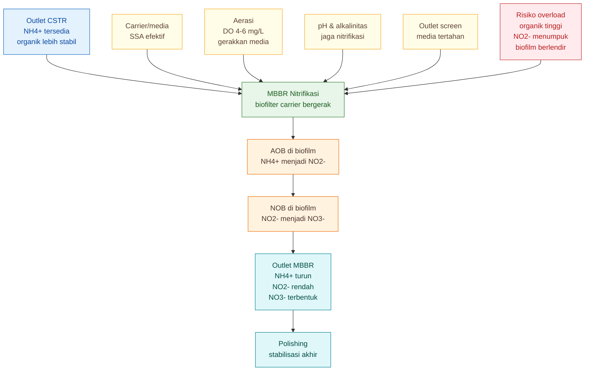

---

## 5.14 Endpoint MBBR

MBBR dinilai dari perbandingan inlet dan outlet.

| Parameter     | Target                           |
| ------------- | -------------------------------- |
| $NH_4^+$      | turun dari inlet ke outlet       |
| $NO_2^-$      | tidak menumpuk                   |
| $NO_3^-$      | terbentuk/naik                   |
| DO            | $4{-}6 \ \mathrm{mg/L}$          |
| pH            | $6.8{-}7.8$                      |
| media         | bergerak merata                  |
| biofilm       | stabil, tidak rontok berlebihan  |
| bau           | tidak busuk                      |
| outlet screen | tidak mampet, media tidak keluar |

Target minimum untuk $NO_2^-$ sebelum produk keluar dari sistem tetap harus dijaga:

$$
NO_2^- < 1 \ \mathrm{mg/L}
$$

Namun bila outlet MBBR masih sedikit di atas target, polishing dapat membantu. Jika $NO_2^-$ tinggi terus-menerus, masalahnya ada pada MBBR atau beban sebelumnya, bukan pada polishing.

---

## 5.15 Troubleshooting MBBR

### 5.15.1 $NH_4^+$ tidak turun

Kemungkinan penyebab:

- biofilm belum matang,
- luas media kurang,
- $r_A$ aktual lebih rendah dari asumsi,
- DO kurang,
- pH terlalu rendah,
- alkalinitas habis,
- beban TAN terlalu tinggi,
- organik dari CSTR masih tinggi.

Tindakan:

```text id="0m6eje"
turunkan feed 25–50%
cek DO
cek pH dan alkalinitas
cek gerakan media
cek outlet CSTR
tambah media atau buat MBBR seri jika perlu
```

---

### 5.15.2 $NO_2^-$ menumpuk

Kemungkinan penyebab:

- NOB belum matang,
- DO kurang,
- pH turun,
- alkalinitas rendah,
- shock load,
- biofilm terganggu,
- beban organik masuk terlalu tinggi.

Tindakan:

```text id="r01qmw"
jangan keluarkan produk
recycle ke polishing atau MBBR
turunkan beban
stabilkan DO 4-6 mg/L
stabilkan pH
cek alkalinitas
```

---

### 5.15.3 Media tidak bergerak merata

Kemungkinan penyebab:

- aerasi kurang,
- filling ratio terlalu tinggi,
- diffuser tersumbat,
- bentuk tangki menyebabkan dead zone,
- media terlalu kotor.

Tindakan:

```text id="1guchh"
kurangi media bila terlalu padat
bersihkan diffuser
ubah posisi aerasi
tambah titik aerasi
flush padatan
```

---

### 5.15.4 Biofilm berlendir tebal

Kemungkinan penyebab:

- organik masuk MBBR masih tinggi,
- CSTR belum cukup bekerja,
- heterotrof mendominasi,
- DO rendah,
- media terlalu rapat.

Tindakan:

```text id="ro6zj3"
evaluasi CSTR
turunkan OLR CSTR
perbaiki pemisahan padatan awal
jangan tambah molase
jaga DO MBBR
```

---

## 5.16 Ringkasan Keputusan Praktis

MBBR dapat dianggap layak sebagai biofilter tahap 2 bila:

```text id="3os0jl"
beban TAN diketahui
+
luas biofilm dihitung
+
volume media cukup
+
filling ratio masih sehat
+
media bergerak merata
+
DO dan pH stabil
+
NH4+ turun
+
NO2- tidak menumpuk
+
NO3- terbentuk
```

Ringkasan parameter desain:

| Komponen             |                                          Nilai awal |
| -------------------- | --------------------------------------------------: |
| $r_A$ pilot          | $0.20{-}0.25 \ \mathrm{g \ NH_4\text{-}N/m^2/hari}$ |
| $SSA$ nominal        |                      $400{-}600 \ \mathrm{m^2/m^3}$ |
| $\eta$               |                                         $0.6{-}0.8$ |
| $SSA_{\mathrm{eff}}$ |                      $250{-}400 \ \mathrm{m^2/m^3}$ |
| Filling ratio        |                                          $30{-}50%$ |
| DO                   |                             $4{-}6 \ \mathrm{mg/L}$ |
| pH                   |                                         $6.8{-}7.8$ |
| endpoint             | $NH_4^+$ turun, $NO_2^-$ rendah, $NO_3^-$ terbentuk |

Kesimpulan praktisnya:

> **MBBR adalah pusat nitrifikasi Jalur B. Ia hanya bekerja baik bila didesain dari beban TAN dan luas biofilm aktif, bukan dari volume tangki semata.**

[1]: https://www.researchgate.net/publication/393502192_Moving_Bed_Biofilm_Reactors_for_Wastewater_Treatment_A_Review_and_Analysis_using_VosViewer?utm_source=chatgpt.com 'Moving Bed Biofilm Reactors for Wastewater Treatment'
[2]: https://www.lagazzettadellekoi.it/wp-content/uploads/2017/03/MBBR.pdf?utm_source=chatgpt.com 'Design and operations of the Kaldnes moving bed biofilm ...'

[**Kembali ke Atas**](#rangkaian-biofilter-aerob-tiga-tahap-untuk-mineralisasi-sludge-bft-cstr-mbbr-dan-polishing)

---

# 6. Contoh Perhitungan MBBR untuk Farm $100 \ \mathrm{m^3}$ BFT

Bab ini memberikan contoh numerik desain MBBR untuk farm BFT lele/nila dengan total volume budidaya sekitar:

$$
100 \ \mathrm{m^3}
$$

Tujuannya bukan membuat angka final yang berlaku untuk semua farm, tetapi memberi **metode hitung praktis** agar desain MBBR tidak lagi berbasis tebakan seperti “pakai tangki $1000 \ \mathrm{L}$ lalu isi media secukupnya”.

Dalam desain MBBR, urutan berpikir yang benar adalah:

```text
debit Jalur B
↓
konsentrasi NH4-N inlet MBBR
↓
beban TAN harian
↓
kebutuhan luas biofilm
↓
specific surface area efektif media
↓
volume media
↓
filling ratio
↓
keputusan desain
```

Poin pentingnya:

> **Volume reaktor MBBR baru bisa dinilai layak setelah kebutuhan area biofilm dan volume media dihitung.**

---

## 6.1 Asumsi Dasar Desain

Contoh ini memakai skenario farm BFT dengan pemisahan awal yang sudah cukup baik. Padatan kasar sudah dialihkan ke Jalur A, sedangkan fraksi halus/cair masuk Jalur B.

Asumsi desain:

| Parameter                |                        Nilai |
| ------------------------ | ---------------------------: |
| Volume total sistem BFT  |         $100 \ \mathrm{m^3}$ |
| Debit Jalur B            |      $600 \ \mathrm{L/hari}$ |
| $C_{NH4}$ inlet MBBR     |         $50 \ \mathrm{mg/L}$ |
| $r_A$ desain             | $0.25 \ \mathrm{g/m^2/hari}$ |
| $SSA$ nominal            |     $500 \ \mathrm{m^2/m^3}$ |
| $\eta$                   |                        $0.7$ |
| $SSA_{\mathrm{eff}}$     |     $350 \ \mathrm{m^2/m^3}$ |
| Safety factor            |                       $1.25$ |
| Volume reaktor MBBR awal |          $1000 \ \mathrm{L}$ |

Konsentrasi:

$$
C_{NH4}=50 \ \mathrm{mg/L}
$$

dibaca sebagai skenario **sedang**. Angka ini harus diganti dengan data aktual hasil uji inlet MBBR jika tersedia.

---

## 6.2 Langkah 1 — Hitung Beban TAN Harian

Rumus beban TAN:

$$
L_{\mathrm{TAN}}=\frac{Q \times C_{NH4}}{1000}
$$

Dengan:

$$
Q=600 \ \mathrm{L/hari}
$$

dan:

$$
C_{NH4}=50 \ \mathrm{mg/L}
$$

maka:

$$
L_{\mathrm{TAN}}=\frac{600 \times 50}{1000}
$$

$$
L_{\mathrm{TAN}}=30 \ \mathrm{g/hari}
$$

Artinya, MBBR harus mampu mengolah sekitar:

$$
30 \ \mathrm{g \ NH_4\text{-}N/hari}
$$

Inilah beban biologis utama untuk desain MBBR.

---

## 6.3 Langkah 2 — Tentukan Laju Nitrifikasi Desain

Untuk sludge BFT, laju nitrifikasi per luas biofilm tidak boleh diambil terlalu agresif, karena cairan dari CSTR masih bisa membawa:

- organik terlarut,
- EPS,
- koloid,
- flok halus,
- dan sisa bahan organik yang belum sepenuhnya stabil.

Maka untuk pilot digunakan angka konservatif:

$$
r_A=0.25 \ \mathrm{g \ NH_4\text{-}N/m^2/hari}
$$

Artinya, setiap:

$$
1 \ \mathrm{m^2}
$$

luas biofilm efektif diasumsikan aman mengolah sekitar:

$$
0.25 \ \mathrm{g \ NH_4\text{-}N/hari}
$$

Angka ini bukan angka mutlak. Jika biofilm sudah matang, DO stabil, pH stabil, dan organik inlet rendah, performa aktual bisa lebih baik. Tetapi untuk desain awal sludge BFT, pendekatan konservatif lebih aman.

---

## 6.4 Langkah 3 — Hitung Kebutuhan Luas Biofilm

Rumus:

$$
A_{\mathrm{req}}=\frac{L_{\mathrm{TAN}}}{r_A}
$$

Dengan:

$$
L_{\mathrm{TAN}}=30 \ \mathrm{g/hari}
$$

dan:

$$
r_A=0.25 \ \mathrm{g/m^2/hari}
$$

maka:

$$
A_{\mathrm{req}}=\frac{30}{0.25}
$$

$$
A_{\mathrm{req}}=120 \ \mathrm{m^2}
$$

Jadi MBBR membutuhkan luas biofilm efektif sekitar:

$$
120 \ \mathrm{m^2}
$$

sebelum safety factor.

Ini adalah angka inti dalam desain MBBR. Jika luas biofilm tidak cukup, maka meskipun volume tangki besar, nitrifikasi tetap bisa gagal.

---

## 6.5 Langkah 4 — Hitung $SSA_{\mathrm{eff}}$

Media MBBR biasanya memiliki specific surface area nominal. Dalam contoh ini digunakan:

$$
SSA=500 \ \mathrm{m^2/m^3}
$$

Namun tidak semua luas permukaan nominal akan aktif secara biologis. Pada sludge BFT, sebagian permukaan bisa tertutup lendir bioflok, padatan halus, atau biofilm yang terlalu tebal.

Karena itu digunakan faktor efektivitas:

$$
\eta=0.7
$$

Rumus:

$$
SSA_{\mathrm{eff}}=SSA \times \eta
$$

Maka:

$$
SSA_{\mathrm{eff}}=500 \times 0.7
$$

$$
SSA_{\mathrm{eff}}=350 \ \mathrm{m^2/m^3}
$$

Artinya, dari setiap:

$$
1 \ \mathrm{m^3}
$$

media, luas biofilm yang dianggap efektif untuk desain adalah:

$$
350 \ \mathrm{m^2}
$$

bukan $500 \ \mathrm{m^2}$ penuh.

---

## 6.6 Langkah 5 — Hitung Volume Media

Rumus:

$$
V_{\mathrm{media}}=\frac{A_{\mathrm{req}}}{SSA_{\mathrm{eff}}}
$$

Dengan:

$$
A_{\mathrm{req}}=120 \ \mathrm{m^2}
$$

dan:

$$
SSA_{\mathrm{eff}}=350 \ \mathrm{m^2/m^3}
$$

maka:

$$
V_{\mathrm{media}}=\frac{120}{350}
$$

$$
V_{\mathrm{media}}=0.343 \ \mathrm{m^3}
$$

Konversi ke liter:

$$
0.343 \ \mathrm{m^3}=343 \ \mathrm{L}
$$

Jadi kebutuhan media teoritis sebelum faktor keamanan adalah:

$$
343 \ \mathrm{L}
$$

---

## 6.7 Langkah 6 — Tambahkan Safety Factor

Karena desain ini untuk sludge BFT, bukan air bening dengan beban stabil, maka perlu safety factor.

Gunakan:

$$
SF=1.25
$$

Rumus:

$$
V_{\mathrm{media,design}}=V_{\mathrm{media}} \times SF
$$

Maka:

$$
V_{\mathrm{media,design}}=343 \times 1.25
$$

$$
V_{\mathrm{media,design}}=429 \ \mathrm{L}
$$

Secara praktis, angka ini dibulatkan menjadi:

$$
400{-}450 \ \mathrm{L}
$$

Jadi untuk skenario sedang, kebutuhan media MBBR adalah sekitar:

$$
400{-}450 \ \mathrm{L}
$$

---

## 6.8 Langkah 7 — Cek Filling Ratio

Volume media belum cukup. Media juga harus bisa bergerak. Karena itu perlu dihitung filling ratio.

Rumus:

$$
FR=\frac{V_{\mathrm{media}}}{V_{\mathrm{reaktor}}}\times100%
$$

Dengan:

$$
V_{\mathrm{media,design}}=429 \ \mathrm{L}
$$

dan:

$$
V_{\mathrm{reaktor}}=1000 \ \mathrm{L}
$$

maka:

$$
FR=\frac{429}{1000}\times100%
$$

$$
FR=42.9%
$$

Interpretasi:

| Filling ratio | Penilaian                               |
| ------------: | --------------------------------------- |
|    $20{-}30%$ | aman dan longgar                        |
|    $30{-}40%$ | ideal                                   |
|    $40{-}50%$ | masih layak, aerasi harus baik          |
|        $>50%$ | mulai tidak disarankan untuk sludge BFT |
|        $>70%$ | tidak sehat untuk operasi praktis       |

Dengan:

$$
FR=42.9%
$$

maka desain masih masuk akal, tetapi aerasi harus cukup untuk membuat media bergerak merata.

---

## 6.9 Langkah 8 — Hitung HRT MBBR

Walaupun HRT bukan basis utama sizing MBBR, HRT tetap perlu dihitung.

Rumus:

$$
HRT_{\mathrm{MBBR}}=\frac{V_{\mathrm{MBBR}}}{Q}
$$

Dengan:

$$
V_{\mathrm{MBBR}}=1000 \ \mathrm{L}
$$

dan:

$$
Q=600 \ \mathrm{L/hari}
$$

maka:

$$
HRT_{\mathrm{MBBR}}=\frac{1000}{600}
$$

$$
HRT_{\mathrm{MBBR}}=1.67 \ \text{hari}
$$

Artinya, cairan rata-rata berada di MBBR selama sekitar:

$$
1.67 \ \text{hari}
$$

Tetapi biofilm nitrifier tetap tinggal lebih lama pada carrier. Inilah prinsip:

$$
SRT \gg HRT
$$

---

## 6.10 Langkah 9 — Hitung Kebutuhan Oksigen Nitrifikasi

Kebutuhan oksigen teoritis nitrifikasi dapat dihitung dengan pendekatan:

$$
O_{2,\mathrm{nitrif}}=4.57 \times L_{\mathrm{TAN}}
$$

Dengan:

$$
L_{\mathrm{TAN}}=30 \ \mathrm{g/hari}
$$

maka:

$$
O_{2,\mathrm{nitrif}}=4.57 \times 30
$$

$$
O_{2,\mathrm{nitrif}}=137.1 \ \mathrm{g \ O_2/hari}
$$

Ini hanya kebutuhan oksigen teoritis untuk nitrifikasi. Blower aktual harus lebih besar karena perlu memperhitungkan:

- efisiensi transfer oksigen,
- kedalaman air,
- jenis diffuser,
- fouling diffuser,
- kebutuhan gerakan media,
- respirasi biofilm,
- dan sisa organik dari CSTR.

Target operasional MBBR tetap:

$$
DO=4{-}6 \ \mathrm{mg/L}
$$

---

## 6.11 Langkah 10 — Hitung Konsumsi Alkalinitas

Nitrifikasi mengonsumsi alkalinitas dan dapat menurunkan pH.

Rule-of-thumb:

$$
Alk_{\mathrm{konsumsi}}=7.14 \times L_{\mathrm{TAN}}
$$

Dengan:

$$
L_{\mathrm{TAN}}=30 \ \mathrm{g/hari}
$$

maka:

$$
Alk_{\mathrm{konsumsi}}=7.14 \times 30
$$

$$
Alk_{\mathrm{konsumsi}}=214.2 \ \mathrm{g \ CaCO_3/hari}
$$

Artinya, bila MBBR benar-benar mengoksidasi $30 \ \mathrm{g}$ $NH_4$-$N$ per hari, sistem dapat mengonsumsi alkalinitas setara sekitar:

$$
214.2 \ \mathrm{g \ CaCO_3/hari}
$$

Jika pH turun terus, jangan hanya menambah aerasi. Periksa alkalinitas.

Target pH MBBR:

$$
pH=6.8{-}7.8
$$

---

## 6.12 Ringkasan Hasil Perhitungan

| Komponen                 |                              Hasil |
| ------------------------ | ---------------------------------: |
| Debit Jalur B            |            $600 \ \mathrm{L/hari}$ |
| $C_{NH4}$ inlet MBBR     |               $50 \ \mathrm{mg/L}$ |
| Beban TAN                |             $30 \ \mathrm{g/hari}$ |
| $r_A$ desain             |       $0.25 \ \mathrm{g/m^2/hari}$ |
| Kebutuhan area biofilm   |               $120 \ \mathrm{m^2}$ |
| $SSA$ nominal            |           $500 \ \mathrm{m^2/m^3}$ |
| $\eta$                   |                              $0.7$ |
| $SSA_{\mathrm{eff}}$     |           $350 \ \mathrm{m^2/m^3}$ |
| Media hitung             |                 $343 \ \mathrm{L}$ |
| Safety factor            |                             $1.25$ |
| Media desain             |                 $429 \ \mathrm{L}$ |
| Rekomendasi praktis      |           $400{-}450 \ \mathrm{L}$ |
| Volume MBBR              |                $1000 \ \mathrm{L}$ |
| Filling ratio            |                            $42.9%$ |
| HRT MBBR                 |               $1.67 \ \text{hari}$ |
| Kebutuhan $O_2$ teoritis |    $137.1 \ \mathrm{g \ O_2/hari}$ |
| Konsumsi alkalinitas     | $214.2 \ \mathrm{g \ CaCO_3/hari}$ |

---

## 6.13 Diagram Alur Perhitungan MBBR

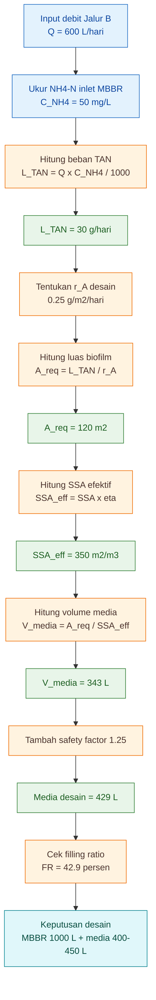

---

## 6.14 Interpretasi Desain

Untuk skenario sedang, desain berikut masih masuk akal sebagai pilot:

```text
MBBR 1000 L
+
media 400-450 L
+
DO 4-6 mg/L
+
pH 6.8-7.8
+
outlet screen
+
polishing setelah MBBR
```

Namun desain ini hanya valid jika beberapa syarat terpenuhi:

1. media bergerak merata,
2. $NH_4^+$ outlet turun dibanding inlet,
3. $NO_2^-$ tidak menumpuk,
4. $NO_3^-$ terbentuk,
5. pH tidak jatuh,
6. DO stabil,
7. biofilm tidak berlendir tebal,
8. outlet CSTR tidak membawa organik berlebihan.

Jika salah satu syarat utama gagal, angka $400{-}450 \ \mathrm{L}$ media belum tentu cukup.

---

## 6.15 Sensitivitas terhadap $C_{NH4}$ Inlet

Desain MBBR sangat sensitif terhadap konsentrasi $NH_4$-$N$ inlet.

Dengan parameter yang sama:

$$
Q=600 \ \mathrm{L/hari}
$$

$$
r_A=0.25 \ \mathrm{g/m^2/hari}
$$

$$
SSA_{\mathrm{eff}}=350 \ \mathrm{m^2/m^3}
$$

$$
SF=1.25
$$

maka hasilnya menjadi:

| Skenario |             $C_{NH4}$ |     $L_{\mathrm{TAN}}$ |   $A_{\mathrm{req}}$ |             Media desain | Filling ratio pada MBBR $1000 \ \mathrm{L}$ |
| -------- | --------------------: | ---------------------: | -------------------: | -----------------------: | ------------------------------------------: |
| Ringan   |  $30 \ \mathrm{mg/L}$ | $18 \ \mathrm{g/hari}$ |  $72 \ \mathrm{m^2}$ | $250{-}300 \ \mathrm{L}$ |                                  $25{-}30%$ |
| Sedang   |  $50 \ \mathrm{mg/L}$ | $30 \ \mathrm{g/hari}$ | $120 \ \mathrm{m^2}$ | $400{-}450 \ \mathrm{L}$ |                                  $40{-}45%$ |
| Berat    | $100 \ \mathrm{mg/L}$ | $60 \ \mathrm{g/hari}$ | $240 \ \mathrm{m^2}$ | $850{-}900 \ \mathrm{L}$ |                                  $85{-}90%$ |

Interpretasi:

- skenario ringan aman,
- skenario sedang masih layak,
- skenario berat tidak sehat untuk satu reaktor MBBR $1000 \ \mathrm{L}$.

---

## 6.16 Apa yang Dilakukan Jika Skenario Berat?

Jika inlet MBBR mendekati:

$$
C_{NH4}=100 \ \mathrm{mg/L}
$$

maka kebutuhan media bisa mendekati:

$$
850{-}900 \ \mathrm{L}
$$

Untuk reaktor $1000 \ \mathrm{L}$, filling ratio menjadi:

$$
85{-}90%
$$

Ini tidak disarankan karena:

- media sulit bergerak,
- aerasi boros,
- risiko dead zone tinggi,
- biofilm mudah fouling,
- outlet screen mudah tersumbat,
- nitrifikasi tidak merata.

Solusi desain:

### Opsi 1 — Perbesar volume MBBR

Jika ingin menjaga filling ratio sekitar:

$$
40%
$$

dan kebutuhan media:

$$
858 \ \mathrm{L}
$$

maka volume reaktor yang dibutuhkan:

$$
V_{\mathrm{reaktor}}=\frac{V_{\mathrm{media}}}{FR}
$$

$$
V_{\mathrm{reaktor}}=\frac{858}{0.40}
$$

$$
V_{\mathrm{reaktor}}=2145 \ \mathrm{L}
$$

Rekomendasi praktis:

$$
2000{-}2200 \ \mathrm{L}
$$

---

### Opsi 2 — Gunakan dua MBBR seri

Konfigurasi:

```text
MBBR-1: 1000 L + 400-450 L media
↓
MBBR-2: 1000 L + 400-450 L media
```

Keuntungan:

- media tetap bergerak sehat,
- biofilm lebih stabil,
- beban nitrifikasi terbagi,
- risiko nitrit menumpuk lebih mudah dikendalikan.

---

### Opsi 3 — Turunkan beban sebelum MBBR

Jika tidak ingin memperbesar MBBR, turunkan beban masuk dengan:

- memperkuat CSTR,
- memperbaiki Swirler + IPC,
- mengurangi porsi sludge ke Jalur B,
- menambah pengenceran,
- atau mengalihkan lebih banyak padatan ke Jalur A.

Poin penting:

> **Jangan memaksa MBBR kecil menangani beban TAN besar dengan cara mengisi media terlalu padat. Media yang tidak bergerak bukan MBBR yang sehat.**

---

## 6.17 Keputusan Desain Akhir untuk Skenario Sedang

Berdasarkan contoh hitung:

$$
Q=600 \ \mathrm{L/hari}
$$

$$
C_{NH4}=50 \ \mathrm{mg/L}
$$

maka desain pilot yang direkomendasikan adalah:

| Komponen          |                                                     Rekomendasi |
| ----------------- | --------------------------------------------------------------: |
| Volume MBBR       |                                             $1000 \ \mathrm{L}$ |
| Media MBBR        |                                        $400{-}450 \ \mathrm{L}$ |
| Filling ratio     |                                                      $40{-}45%$ |
| DO                |                                         $4{-}6 \ \mathrm{mg/L}$ |
| pH                |                                                     $6.8{-}7.8$ |
| Outlet screen     |                                                           wajib |
| Start-up          | bertahap $25% \rightarrow 50% \rightarrow 75% \rightarrow 100%$ |
| Unit setelah MBBR |                                                       polishing |
| QC utama          |             $NH_4^+$ turun, $NO_2^-$ rendah, $NO_3^-$ terbentuk |

Kesimpulan desain:

> **Untuk skenario sedang, MBBR $1000 \ \mathrm{L}$ dengan media $400{-}450 \ \mathrm{L}$ masuk akal sebagai pilot, selama media masih bergerak merata dan outlet $NO_2^-$ tidak menumpuk.**

---

## 6.18 Checklist Validasi Lapangan

Setelah MBBR dibangun, angka desain harus divalidasi.

Checklist harian:

```text
□ media bergerak merata
□ DO 4-6 mg/L
□ pH 6.8-7.8
□ tidak ada bau busuk
□ outlet screen tidak mampet
□ media tidak keluar
```

Checklist dua sampai tiga kali per minggu:

```text
□ NH4+ inlet dan outlet MBBR
□ NO2- outlet MBBR
□ NO3- outlet MBBR
□ pH trend
□ EC trend
□ kondisi biofilm
```

Keputusan:

| Hasil                                          | Keputusan                                                      |
| ---------------------------------------------- | -------------------------------------------------------------- |
| $NH_4^+$ turun, $NO_2^-$ rendah, $NO_3^-$ naik | desain bekerja                                                 |
| $NH_4^+$ tidak turun                           | area media kurang, biofilm belum matang, atau DO/pH bermasalah |
| $NO_2^-$ naik                                  | NOB belum kuat, pH/alkalinitas/DO bermasalah                   |
| media tidak bergerak                           | filling ratio terlalu tinggi atau aerasi kurang                |
| biofilm berlendir tebal                        | organik dari CSTR masih terlalu tinggi                         |

---

## 6.19 Kesimpulan Bab

Contoh ini menunjukkan bahwa desain MBBR harus dihitung dari **beban TAN dan luas biofilm**, bukan dari volume tangki saja.

Rumus inti yang digunakan:

$$
L_{\mathrm{TAN}}=\frac{Q \times C_{NH4}}{1000}
$$

$$
A_{\mathrm{req}}=\frac{L_{\mathrm{TAN}}}{r_A}
$$

$$
SSA_{\mathrm{eff}}=SSA \times \eta
$$

$$
V_{\mathrm{media}}=\frac{A_{\mathrm{req}}}{SSA_{\mathrm{eff}}}
$$

$$
FR=\frac{V_{\mathrm{media}}}{V_{\mathrm{reaktor}}}\times100%
$$

Untuk farm contoh:

```text
Q = 600 L/hari
C_NH4 = 50 mg/L
L_TAN = 30 g/hari
A_req = 120 m2
SSA_eff = 350 m2/m3
media desain = 400-450 L
MBBR = 1000 L
FR = 40-45 persen
```

Kesimpulan praktis:

> **MBBR $1000 \ \mathrm{L}$ dengan media $400{-}450 \ \mathrm{L}$ adalah desain awal yang masuk akal untuk skenario sedang. Tetapi jika $C_{NH4}$ inlet naik mendekati $100 \ \mathrm{mg/L}$, desain harus dinaikkan menjadi MBBR lebih besar, MBBR seri, atau beban Jalur B harus dikurangi.**

[**Kembali ke Atas**](#rangkaian-biofilter-aerob-tiga-tahap-untuk-mineralisasi-sludge-bft-cstr-mbbr-dan-polishing)

---

# 7. Biofilter Tahap 3: Polishing

Tahap **polishing** adalah biofilter biologis terakhir dalam rangkaian Jalur B kontinyu. Unit ini sering disalahpahami sebagai “tangki penampung akhir” atau “tempat menunggu sebelum QC”. Cara baca seperti itu kurang tepat.

Dalam sistem ini, polishing harus dipahami sebagai:

> **biofilter stabilisasi akhir yang bekerja setelah MBBR untuk menyempurnakan kualitas cairan sebelum clarifier, QC, dan filtrasi akhir.**

Polishing bukan pengganti CSTR. Polishing juga bukan pengganti MBBR. Ia adalah **safety margin biologis** untuk produk yang sudah hampir stabil.

Poin tajamnya:

> **Polishing bukan alat untuk menutupi MBBR yang gagal. Polishing adalah safety margin untuk produk yang sudah hampir stabil.**

<figure>
  
  <figcaption>
    Ilustrasi polishing biofilter sebagai tahap akhir pengolahan air untuk
    membantu menurunkan sisa beban organik, padatan halus, dan senyawa nitrogen
    sebelum air kembali ke sistem budidaya.
  </figcaption>
</figure>

Dalam pengolahan biologis, nitrifikasi adalah proses oksidasi amonia menjadi nitrit lalu nitrat, dan proses ini membutuhkan komunitas mikroba nitrifier, oksigen terlarut yang cukup, serta kondisi lingkungan yang mendukung. Karena itu, jika masih ada sisa $NH_4^+$ atau $NO_2^-$ setelah MBBR, tahap aerasi biologis lanjutan dapat membantu menyelesaikan proses tersebut selama bebannya ringan dan kondisi proses stabil. ([Hach][1])

---

## 7.1 Posisi Polishing dalam Rangkaian Biofilter

Polishing berada setelah MBBR dan sebelum clarifier.

```text id="n2ikqp"
CSTR
↓
MBBR
↓
Polishing
↓
Clarifier
↓
QC
↓
Filtrasi akhir
```

Jika CSTR adalah biofilter mineralisasi dan MBBR adalah biofilter nitrifikasi utama, maka polishing adalah:

> **biofilter stabilisasi akhir.**

Fungsinya bukan lagi menangani beban organik besar, melainkan menyelesaikan sisa ketidakstabilan yang masih terbawa dari MBBR.

Dalam struktur tiga tahap:

| Tahap | Unit      | Fungsi utama                           |
| ----: | --------- | -------------------------------------- |
|     1 | CSTR      | mineralisasi dan amonifikasi           |
|     2 | MBBR      | nitrifikasi utama                      |
|     3 | Polishing | stabilisasi akhir dan nitrit polishing |

Dengan demikian, polishing adalah **tahap pengaman kualitas**, bukan unit utama untuk “menyelamatkan” desain yang salah di tahap sebelumnya.

---

## 7.2 Mengapa Polishing Tetap Dibutuhkan?

Secara ideal, outlet MBBR sudah memiliki:

- $NH_4^+$ rendah,
- $NO_2^-$ rendah,
- $NO_3^-$ terbentuk,
- pH stabil,
- DO cukup,
- bau aman.

Namun dalam praktik, MBBR sering mengalami fluktuasi karena:

- beban $NH_4^+$ harian berubah,
- CSTR kadang mengirim organik lebih tinggi,
- pH turun karena alkalinitas berkurang,
- DO berubah akibat diffuser kotor,
- biofilm MBBR belum matang,
- sebagian biofilm rontok,
- atau carrier bergerak tidak merata.

Akibatnya, outlet MBBR bisa “hampir baik”, tetapi belum stabil. Di sinilah polishing diperlukan.

Polishing memberi waktu tambahan untuk:

- menurunkan sisa $NO_2^-$,
- menyelesaikan sedikit sisa $NH_4^+$,
- menstabilkan pH,
- menstabilkan EC,
- mencegah bau balik,
- dan menjadi buffer kualitas sebelum QC.

---

## 7.3 Fungsi Utama Polishing

### 7.3.1 Menurunkan sisa $NO_2^-$

Fungsi paling penting polishing adalah menurunkan sisa nitrit.

Reaksi dominan:

$$
NO_2^- + 0.5O_2 \rightarrow NO_3^-
$$

$NO_2^-$ adalah indikator bahwa nitrifikasi belum selesai. Bila $NO_2^-$ masih tinggi, produk belum boleh keluar dari sistem. Dalam konteks produk cair untuk tanaman, nitrit tinggi juga menjadi sinyal bahwa proses biologis belum stabil.

Target akhir:

$$
NO_2^- < 1 \ \mathrm{mg/L}
$$

Jika outlet MBBR hanya sedikit di atas target, polishing bisa membantu. Tetapi jika $NO_2^-$ sangat tinggi atau terus meningkat, masalah utamanya ada di MBBR, bukan di polishing.

---

### 7.3.2 Menyelesaikan sedikit sisa $NH_4^+$

Jika masih ada sedikit $NH_4^+$ setelah MBBR, polishing dapat membantu menyelesaikan nitrifikasi ringan.

Reaksi totalnya:

$$
NH_4^+ + 2O_2 \rightarrow NO_3^- + 2H^+ + H_2O
$$

Namun beban ini harus ringan. Polishing tidak boleh dibebani seperti MBBR utama.

Jika outlet MBBR masih memiliki $NH_4^+$ tinggi, maka yang perlu diperbaiki adalah:

- luas media MBBR,
- kematangan biofilm,
- DO,
- pH,
- alkalinitas,
- atau beban dari CSTR.

Bukan langsung memperbesar polishing.

---

### 7.3.3 Menstabilkan pH dan EC

Nitrifikasi menghasilkan $H^+$, sehingga pH bisa turun.

$$
NH_4^+ + 2O_2 \rightarrow NO_3^- + 2H^+ + H_2O
$$

Polishing memberi waktu untuk melihat apakah pH masih bergerak atau sudah stabil.

Target pH polishing:

$$
pH=6.5{-}7.5
$$

Untuk stabilitas pH, gunakan indikator:

$$
\Delta pH<0.3
$$

dalam tiga pengukuran berurutan.

Untuk stabilitas EC:

$$
\Delta EC<10%
$$

dalam tiga pengukuran berurutan.

Jika pH terus turun, masalahnya bisa alkalinitas rendah. Jika EC terus naik/turun tajam, berarti proses mineralisasi atau pelepasan ion belum stabil.

---

### 7.3.4 Mencegah bau balik

Outlet MBBR bisa tampak baik saat aerasi aktif, tetapi kembali berbau saat dibiarkan. Ini tanda bahwa masih ada organik mudah busuk atau proses biologis belum stabil.

Polishing membantu menjaga kondisi tetap aerob dan memberi waktu tambahan agar bahan reaktif tersisa lebih terkendali.

Uji sederhana:

```text id="puz4xd"
ambil sampel outlet polishing
↓
diamkan 24 jam tanpa aerasi
↓
cium bau dan amati perubahan
```

Interpretasi:

| Hasil uji diam 24 jam | Makna                               |
| --------------------- | ----------------------------------- |
| tidak busuk           | lebih aman masuk QC                 |
| bau amonia tajam      | $NH_4^+/NH_3$ masih bermasalah      |
| bau busuk             | organik belum stabil                |
| menghitam             | ada proses anaerob/partikel reaktif |
| busa atau lendir naik | EPS/organik masih tinggi            |

Target:

$$
t_{\mathrm{uji \ diam}}=24 \ \mathrm{jam}
$$

dan hasilnya:

```text id="rsjz1a"
tidak busuk
tidak bau amonia tajam
tidak menghitam
tidak membentuk busa ekstrem
```

---

### 7.3.5 Menjadi quality buffer sebelum clarifier dan QC

Polishing juga berfungsi sebagai buffer terakhir sebelum cairan masuk clarifier.

Setelah MBBR, bisa ada:

- biofilm rontok,
- flok halus,
- partikel koloid,
- atau sisa padatan tersuspensi.

Polishing dengan aerasi sedang membantu menstabilkan kondisi biologis sebelum padatan halus dipisahkan di clarifier. Tetapi polishing bukan unit pengendap. Karena itu setelah polishing tetap perlu:

```text id="3a0gn1"
Clarifier
↓
QC
↓
Filtrasi akhir
```

---

## 7.4 Polishing Bukan CSTR Kedua

Polishing sering keliru didesain seperti CSTR kedua. Ini tidak tepat.

Perbedaannya:

| Aspek            | CSTR                                   | Polishing                          |
| ---------------- | -------------------------------------- | ---------------------------------- |
| Posisi           | sebelum MBBR                           | setelah MBBR                       |
| Beban organik    | masih sedang–tinggi                    | rendah                             |
| Fungsi utama     | mineralisasi awal                      | stabilisasi akhir                  |
| Nitrogen dominan | $NH_4^+$ mulai terbentuk               | sisa $NO_2^-$ dan sedikit $NH_4^+$ |
| Aerasi           | kuat untuk mixing dan oksidasi organik | sedang untuk stabilisasi           |
| Risiko utama     | anaerob, bau, busa                     | nitrit sisa, pH/EC belum stabil    |
| Endpoint         | feed aman untuk MBBR                   | feed aman untuk clarifier/QC       |

Jadi polishing tidak boleh menerima cairan yang masih busuk atau kaya organik. Jika itu terjadi, problemnya ada pada CSTR atau pemisahan awal.

---

## 7.5 Polishing Bukan MBBR Utama Kedua

Polishing juga tidak boleh dijadikan alasan untuk mengecilkan MBBR utama.

Jika MBBR terlalu kecil, lalu polishing diberi beban nitrifikasi besar, maka sistem menjadi tidak jelas. Secara biaya, energi, dan kontrol, lebih benar memperbaiki MBBR utama daripada membebankan masalah ke polishing.

Polishing boleh diberi media ringan, tetapi tujuannya hanya sebagai:

```text id="ai33k2"
backup biologis ringan
+
stabilisasi akhir
```

bukan sebagai pengganti kapasitas nitrifikasi utama.

---

## 7.6 Design Basis Polishing

Basis desain polishing adalah:

$$
Polishing = HRT + residual \ NH_4^+ + residual \ NO_2^- + DO + pH + stability
$$

Keterangan:

| Komponen            | Arti                                             |
| ------------------- | ------------------------------------------------ |
| $HRT$               | waktu stabilisasi akhir                          |
| $residual \ NH_4^+$ | sisa amonium dari MBBR                           |
| $residual \ NO_2^-$ | sisa nitrit dari MBBR                            |
| $DO$                | oksigen untuk menjaga proses aerob               |
| pH                  | indikator kestabilan nitrifikasi dan alkalinitas |
| $stability$         | bau, pH, EC, dan uji diam                        |

Desain polishing harus berbasis kualitas outlet MBBR. Jika outlet MBBR baik, polishing sederhana cukup. Jika outlet MBBR fluktuatif ringan, polishing perlu media ringan. Jika outlet MBBR buruk, polishing bukan solusi utama.

---

## 7.7 Parameter Desain Polishing

Parameter awal untuk Jalur B sludge BFT:

| Parameter       |             Rekomendasi |
| --------------- | ----------------------: |
| HRT             |            $1{-}2$ hari |
| DO              | $3{-}5 \ \mathrm{mg/L}$ |
| pH              |             $6.5{-}7.5$ |
| Media           |                opsional |
| Media ringan    |  $10{-}15%$ volume tank |
| Target $NO_2^-$ |    $<1 \ \mathrm{mg/L}$ |
| Uji diam        |      24 jam tidak busuk |

Jika polishing diberi media ringan untuk nitrifikasi akhir, DO sebaiknya dijaga pada kisaran:

$$
DO=4{-}5 \ \mathrm{mg/L}
$$

Jika tanpa media dan hanya sebagai aerated stabilization tank, target:

$$
DO=3{-}5 \ \mathrm{mg/L}
$$

masih cukup sebagai baseline.

---

## 7.8 Dua Opsi Desain Polishing

### 7.8.1 Opsi A — Aerated polishing tanpa media

Ini desain paling sederhana.

Cocok jika outlet MBBR sudah cukup baik:

- $NH_4^+$ rendah,
- $NO_2^-$ rendah,
- $NO_3^-$ terbentuk,
- pH relatif stabil,
- tidak ada bau busuk.

Desain awal:

| Parameter |                   Nilai |
| --------- | ----------------------: |
| Volume    |     $1000 \ \mathrm{L}$ |
| Debit     | $600 \ \mathrm{L/hari}$ |
| HRT       |    $1.67 \ \text{hari}$ |
| DO        | $3{-}5 \ \mathrm{mg/L}$ |
| Media     |             tidak wajib |
| Fungsi    |       stabilisasi akhir |

Rumus:

$$
HRT_{\mathrm{polishing}}=\frac{V_{\mathrm{polishing}}}{Q}
$$

Dengan:

$$
V_{\mathrm{polishing}}=1000 \ \mathrm{L}
$$

$$
Q=600 \ \mathrm{L/hari}
$$

maka:

$$
HRT_{\mathrm{polishing}}=\frac{1000}{600}
$$

$$
HRT_{\mathrm{polishing}}=1.67 \ \text{hari}
$$

---

### 7.8.2 Opsi B — Polishing dengan media ringan

Ini versi lebih aman untuk pilot.

Cocok jika outlet MBBR kadang masih menyisakan:

- sedikit $NH_4^+$,
- sedikit $NO_2^-$,
- atau fluktuasi biologis ringan.

Rekomendasi:

| Parameter        |                                Nilai |
| ---------------- | -----------------------------------: |
| Volume polishing |                  $1000 \ \mathrm{L}$ |
| Media ringan     |             $100{-}150 \ \mathrm{L}$ |
| Filling ratio    |                           $10{-}15%$ |
| DO               |              $4{-}5 \ \mathrm{mg/L}$ |
| Fungsi           | nitrit polishing + stabilisasi akhir |

Filling ratio:

$$
FR_{\mathrm{polishing}}=\frac{V_{\mathrm{media,polishing}}}{V_{\mathrm{polishing}}}\times100%
$$

Jika:

$$
V_{\mathrm{media,polishing}}=100 \ \mathrm{L}
$$

dan:

$$
V_{\mathrm{polishing}}=1000 \ \mathrm{L}
$$

maka:

$$
FR_{\mathrm{polishing}}=\frac{100}{1000}\times100%
$$

$$
FR_{\mathrm{polishing}}=10%
$$

Jika:

$$
V_{\mathrm{media,polishing}}=150 \ \mathrm{L}
$$

maka:

$$
FR_{\mathrm{polishing}}=15%
$$

Ini cukup sebagai backup ringan tanpa mengubah polishing menjadi MBBR utama kedua.

---

## 7.9 Contoh Hitung Media Polishing

Misalnya outlet MBBR masih menyisakan:

$$
C_{NH4,\mathrm{res}}=5 \ \mathrm{mg/L}
$$

Dengan debit:

$$
Q=600 \ \mathrm{L/hari}
$$

maka beban sisa $NH_4$-$N$:

$$
L_{NH4,\mathrm{res}}=\frac{Q \times C_{NH4,\mathrm{res}}}{1000}
$$

$$
L_{NH4,\mathrm{res}}=\frac{600 \times 5}{1000}
$$

$$
L_{NH4,\mathrm{res}}=3 \ \mathrm{g/hari}
$$

Jika polishing diberi media dan dipakai laju konservatif:

$$
r_{A,\mathrm{polish}}=0.20 \ \mathrm{g/m^2/hari}
$$

maka area biofilm tambahan:

$$
A_{\mathrm{polish}}=\frac{L_{NH4,\mathrm{res}}}{r_{A,\mathrm{polish}}}
$$

$$
A_{\mathrm{polish}}=\frac{3}{0.20}
$$

$$
A_{\mathrm{polish}}=15 \ \mathrm{m^2}
$$

Jika media memiliki:

$$
SSA_{\mathrm{eff}}=350 \ \mathrm{m^2/m^3}
$$

maka volume media:

$$
V_{\mathrm{media,polish}}=\frac{A_{\mathrm{polish}}}{SSA_{\mathrm{eff}}}
$$

$$
V_{\mathrm{media,polish}}=\frac{15}{350}
$$

$$
V_{\mathrm{media,polish}}=0.043 \ \mathrm{m^3}
$$

Konversi ke liter:

$$
V_{\mathrm{media,polish}}=43 \ \mathrm{L}
$$

Dengan safety factor:

$$
SF=2
$$

maka:

$$
V_{\mathrm{media,polish,design}}=43 \times 2
$$

$$
V_{\mathrm{media,polish,design}}=86 \ \mathrm{L}
$$

Secara praktis, dibulatkan menjadi:

$$
100 \ \mathrm{L}
$$

Jadi, bila sisa $NH_4$-$N$ setelah MBBR hanya sekitar $5 \ \mathrm{mg/L}$, media polishing sekitar $100 \ \mathrm{L}$ masuk akal sebagai safety margin.

---

## 7.10 Batas Kemampuan Polishing

Polishing hanya layak menangani beban sisa ringan.

Tabel keputusan:

| Kondisi outlet MBBR                    | Peran polishing     | Keputusan                   |
| -------------------------------------- | ------------------- | --------------------------- |
| $NH_4^+$ rendah, $NO_2^-$ rendah       | stabilisasi         | polishing normal            |
| $NH_4^+$ rendah, $NO_2^-$ sedikit naik | nitrit polishing    | tambah HRT/media ringan     |
| $NH_4^+$ sedang, $NO_2^-$ sedang       | buffer sementara    | recycle dan evaluasi MBBR   |
| $NH_4^+$ tinggi                        | MBBR gagal/overload | jangan andalkan polishing   |
| $NO_2^-$ tinggi terus                  | NOB bermasalah      | tahan produk, perbaiki MBBR |

Batas praktis untuk $NO_2^-$:

|    $NO_2^-$ outlet MBBR | Keputusan                    |
| ----------------------: | ---------------------------- |
|    $<1 \ \mathrm{mg/L}$ | aman masuk polishing normal  |
| $1{-}3 \ \mathrm{mg/L}$ | polishing + pengawasan ketat |
| $3{-}5 \ \mathrm{mg/L}$ | tahan/recycle, evaluasi MBBR |
|    $>5 \ \mathrm{mg/L}$ | jangan keluarkan produk      |

Target akhir tetap:

$$
NO_2^- < 1 \ \mathrm{mg/L}
$$

---

## 7.11 Aerasi Polishing

Aerasi polishing tidak perlu seagresif CSTR. Tujuannya bukan mengaduk sludge berat, tetapi:

- menjaga kondisi aerob,
- membantu oksidasi sisa $NO_2^-$,
- menjaga sedikit media tetap bergerak bila ada,
- mencegah bau balik,
- mencegah stratifikasi.

Target:

$$
DO=3{-}5 \ \mathrm{mg/L}
$$

Jika memakai media ringan:

$$
DO=4{-}5 \ \mathrm{mg/L}
$$

Jangan terlalu keras, karena aerasi berlebihan dapat:

- membuat flok halus sulit mengendap di clarifier,
- menyebabkan busa,
- merontokkan biofilm ringan,
- dan boros energi.

---

## 7.12 Desain Hidraulik Polishing

Polishing perlu menghindari short-circuit. Jika inlet dan outlet terlalu dekat, sebagian cairan dapat keluar sebelum mendapatkan waktu stabilisasi yang cukup.

Desain yang disarankan:

```text id="scdcja"
inlet masuk dari sisi satu
↓
aliran melewati zona aerasi
↓
baffle atau kompartemen
↓
outlet di sisi berlawanan
```

Lebih baik lagi jika dibuat dua kompartemen seri:

```text id="4vbwjh"
Polishing A 500 L
↓
Polishing B 500 L
```

Total volume tetap:

$$
1000 \ \mathrm{L}
$$

tetapi pola aliran lebih baik dibanding satu tangki tanpa baffle.

---

## 7.13 Diagram Fungsi Polishing

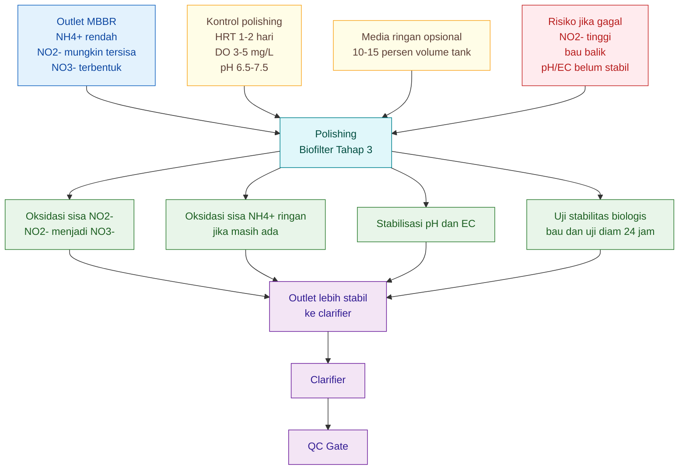

---

## 7.14 Endpoint Polishing

Polishing dinilai berhasil bila outlet-nya siap masuk clarifier dan QC.

Endpoint minimum:

| Parameter   |                       Target |
| ----------- | ---------------------------: |
| $NO_2^-$    |         $<1 \ \mathrm{mg/L}$ |
| $NH_4^+$    |        rendah dan tidak naik |
| $NO_3^-$    |             terbentuk/stabil |
| pH          |                  $6.5{-}7.5$ |
| $\Delta pH$ |                       $<0.3$ |
| $\Delta EC$ |                       $<10%$ |
| DO          |         $>3 \ \mathrm{mg/L}$ |
| bau         |                  tidak busuk |
| uji diam    |           24 jam tidak busuk |
| TSS         | cukup rendah untuk clarifier |

Jika gagal, jangan langsung keluarkan produk. Gunakan keputusan recycle.

---

## 7.15 Keputusan Recycle dari Polishing

Jika outlet polishing tidak memenuhi target, arah recycle tergantung masalah.

| Masalah             | Arah recycle                        | Alasan                              |
| ------------------- | ----------------------------------- | ----------------------------------- |
| bau busuk           | CSTR                                | organik belum stabil                |
| busa/protein tinggi | CSTR                                | masih perlu mineralisasi            |
| $NH_4^+$ tinggi     | MBBR atau CSTR                      | nitrifikasi belum cukup             |
| $NO_2^-$ tinggi     | polishing atau MBBR                 | NOB belum menyelesaikan nitrit      |
| pH turun            | koreksi alkalinitas, lalu polishing | nitrifikasi mengonsumsi alkalinitas |
| TSS tinggi          | clarifier atau filtrasi             | masalah fisik, bukan biologis utama |

Keputusan praktis:

```text id="9vm2pt"
bau busuk → kembali ke CSTR
NH4+ tinggi → evaluasi MBBR
NO2- tinggi → tahan di polishing/MBBR
pH jatuh → cek alkalinitas
TSS tinggi → perbaiki clarifier
```

---

## 7.16 Troubleshooting Polishing

### 7.16.1 $NO_2^-$ masih tinggi

Kemungkinan penyebab:

- MBBR belum matang,
- NOB lemah,
- DO kurang,
- pH turun,
- alkalinitas rendah,
- shock load dari CSTR/MBBR.

Tindakan:

```text id="izcud7"
jangan keluarkan produk
tahan di polishing
jaga DO 4-5 mg/L
cek pH dan alkalinitas
recycle ke MBBR bila perlu
turunkan beban Jalur B
```

---

### 7.16.2 Bau muncul setelah polishing

Kemungkinan penyebab:

- organik dari CSTR masih tinggi,
- MBBR menerima beban organik berlebih,
- polishing kekurangan DO,
- ada endapan di polishing,
- ada dead zone.

Tindakan:

```text id="y8i270"
cek outlet CSTR
flush endapan polishing
tingkatkan aerasi sedang
perbaiki aliran dan baffle
recycle ke CSTR jika busuk
```

---

### 7.16.3 pH turun terus

Kemungkinan penyebab:

- nitrifikasi masih aktif,
- alkalinitas tidak cukup,
- beban $NH_4^+$ masih terlalu tinggi,
- MBBR belum menyelesaikan nitrifikasi utama.

Tindakan:

```text id="qqgbqw"
cek alkalinitas
jangan hanya tambah aerasi
kurangi beban
recycle ke MBBR
stabilkan pH sebelum QC
```

---

### 7.16.4 TSS tinggi setelah polishing

Kemungkinan penyebab:

- biofilm rontok dari MBBR,
- aerasi polishing terlalu keras,
- flok halus belum mengendap,
- clarifier terlalu kecil,
- outlet mengambil area turbulen.

Tindakan:

```text id="5iy3i8"
kurangi turbulensi
tambah clarifier time
atur outlet polishing
pasang baffle
flush padatan berkala
```

---

## 7.17 Desain Polishing untuk Contoh Farm

Untuk contoh farm:

$$
Q=600 \ \mathrm{L/hari}
$$

Desain baseline:

$$
V_{\mathrm{polishing}}=1000 \ \mathrm{L}
$$

Maka:

$$
HRT_{\mathrm{polishing}}=\frac{1000}{600}
$$

$$
HRT_{\mathrm{polishing}}=1.67 \ \text{hari}
$$

Rekomendasi desain:

| Komponen            |                               Nilai |
| ------------------- | ----------------------------------: |
| Volume polishing    |                 $1000 \ \mathrm{L}$ |
| HRT                 |                $1.67 \ \text{hari}$ |
| DO                  |             $3{-}5 \ \mathrm{mg/L}$ |
| pH                  |                         $6.5{-}7.5$ |
| Media               |                            opsional |
| Media pilot         |            $100{-}150 \ \mathrm{L}$ |
| Filling ratio media |                          $10{-}15%$ |
| Konfigurasi         | 1 tank berbaffle atau 2 kompartemen |
| Outlet              |                        ke clarifier |
| Target $NO_2^-$     |                $<1 \ \mathrm{mg/L}$ |
| Uji diam            |                  24 jam tidak busuk |

Untuk pilot, konfigurasi yang saya sarankan:

```text id="4c0ki8"
Polishing 1000 L
+
media ringan 100 L
+
aerasi sedang
+
baffle sederhana
+
outlet ke clarifier
```

---

## 7.18 Ringkasan Keputusan Praktis

Polishing layak sebagai biofilter tahap 3 bila:

```text id="v2z51d"
beban sisa ringan
+
HRT cukup
+
DO stabil
+
pH stabil
+
NO2- turun
+
bau aman
+
uji diam 24 jam lolos
```

Polishing tidak layak dijadikan solusi utama bila:

```text id="h39t09"
NH4+ masih tinggi
NO2- sangat tinggi
bau busuk
organik masih berat
pH terus jatuh
```

Pada kondisi tersebut, perbaiki CSTR atau MBBR.

---

## 7.19 Kesimpulan Bab

Polishing adalah biofilter tahap ketiga dalam Jalur B kontinyu. Ia berfungsi menyempurnakan outlet MBBR sebelum masuk clarifier dan QC.

Fungsi utamanya:

- menurunkan sisa $NO_2^-$,
- menyelesaikan sedikit sisa $NH_4^+$,
- menstabilkan pH,
- menstabilkan EC,
- mencegah bau balik,
- dan menjadi quality buffer.

Rumus dan indikator penting:

$$
HRT_{\mathrm{polishing}}=\frac{V_{\mathrm{polishing}}}{Q}
$$

$$
NO_2^- + 0.5O_2 \rightarrow NO_3^-
$$

$$
NH_4^+ + 2O_2 \rightarrow NO_3^- + 2H^+ + H_2O
$$

Target utama:

$$
NO_2^- < 1 \ \mathrm{mg/L}
$$

$$
pH=6.5{-}7.5
$$

$$
\Delta pH<0.3
$$

$$
\Delta EC<10%
$$

Kesimpulan praktis:

> **Polishing bukan tangki simpan dan bukan alat untuk menyelamatkan MBBR yang gagal. Polishing adalah biofilter stabilisasi akhir yang memberi margin keamanan sebelum produk cair masuk clarifier, QC, dan aplikasi tanaman.**

[1]: https://cdn.hach.com/7FYZVWYB/at/3khxkth98pw7sthsbxbfnp/Aerated_Biological_Nitrogen_Removal.pdf?utm_source=chatgpt.com 'Aerated Biological Nitrogen Removal'

[**Kembali ke Atas**](#rangkaian-biofilter-aerob-tiga-tahap-untuk-mineralisasi-sludge-bft-cstr-mbbr-dan-polishing)

---

# 8. Integrasi Desain: Tiga Biofilter, Tiga Beban Desain

Setelah CSTR, MBBR, dan polishing dibahas satu per satu, langkah berikutnya adalah menyatukan ketiganya sebagai **satu rangkaian biofilter aerob tiga tahap**. Di sinilah banyak desain lapangan sering keliru: semua unit dianggap hanya sebagai “tangki aerasi berurutan”, padahal masing-masing unit memiliki **beban desain** dan **endpoint** yang berbeda.

Rangkaian ini harus dibaca sebagai berikut:

```text
CSTR      = biofilter organik dan mineralisasi
MBBR      = biofilter TAN dan nitrifikasi
Polishing = biofilter residual dan stabilisasi akhir
```

Dengan demikian, desainnya tidak boleh memakai satu parameter tunggal untuk semua unit. CSTR tidak cukup dinilai dari $HRT$. MBBR tidak cukup dinilai dari volume tangki. Polishing tidak cukup dinilai dari “ada aerasi atau tidak”.

---

## 8.1 Tiga Biofilter, Tiga Beban

Setiap biofilter memiliki beban desain sendiri.

| Unit      | Beban desain               | Rumus kunci                                          | Endpoint                                      |
| --------- | -------------------------- | ---------------------------------------------------- | --------------------------------------------- |
| CSTR      | organik/COD                | $OLR_{\mathrm{COD}}=\frac{L_{\mathrm{COD}}}{V}$      | bau turun, organik stabil, $NH_4^+$ terbentuk |
| MBBR      | TAN                        | $SALR=\frac{L_{\mathrm{TAN}}}{A_{\mathrm{biofilm}}}$ | $NH_4^+$ turun, $NO_2^-$ rendah               |
| Polishing | residual $NH_4^+$/$NO_2^-$ | $HRT=\frac{V}{Q}$ + QC                               | pH/EC stabil, bau aman                        |

Tabel ini adalah inti dari desain Jalur B kontinyu. Jika hanya satu hal yang perlu diingat praktisi, maka inilah prinsipnya:

> **CSTR dihitung dari beban organik, MBBR dihitung dari beban TAN dan luas biofilm, polishing dihitung dari beban residual dan stabilitas kualitas.**

---

## 8.2 CSTR Tidak Boleh Dinilai dari $NO_3^-$

CSTR adalah tahap mineralisasi. Fungsi utamanya adalah mengubah bahan organik kompleks dan nitrogen organik menjadi bentuk yang lebih siap untuk nitrifikasi.

Pada CSTR, reaksi yang diharapkan adalah:

$$
\text{N organik} \rightarrow NH_4^+
$$

Karena itu, naiknya $NH_4^+$ setelah CSTR tidak otomatis berarti gagal. Justru dalam banyak kasus, itu menunjukkan bahwa amonifikasi berjalan.

Endpoint CSTR bukan:

```text
NO3- harus tinggi
```

Endpoint CSTR adalah:

```text
bau turun
organik lebih stabil
tidak anaerob
tidak berbusa ekstrem
outlet tidak membuat MBBR shock
```

Jika praktisi menilai CSTR dari $NO_3^-$, maka target prosesnya keliru. Nitrat adalah target MBBR dan polishing, bukan target utama CSTR.

---

## 8.3 MBBR Tidak Boleh Dinilai dari HRT Saja

MBBR memang memiliki $HRT$, tetapi MBBR bukan sekadar tangki tinggal. MBBR adalah biofilter attached-growth, sehingga performanya sangat ditentukan oleh luas permukaan biofilm.

Rumus yang lebih penting daripada $HRT$ untuk MBBR adalah:

$$
SALR=\frac{L_{\mathrm{TAN}}}{A_{\mathrm{biofilm}}}
$$

dengan:

$$
A_{\mathrm{biofilm}}=V_{\mathrm{media}}\times SSA_{\mathrm{eff}}
$$

Artinya, MBBR dengan volume $1000 \ \mathrm{L}$ dapat bekerja baik atau buruk tergantung pada:

- berapa $L_{\mathrm{TAN}}$ yang masuk,
- berapa volume media,
- berapa $SSA_{\mathrm{eff}}$ media,
- apakah filling ratio masih sehat,
- apakah media bergerak merata,
- apakah DO dan pH stabil,
- apakah biofilm sudah matang.

Jadi pertanyaan desain yang benar bukan hanya:

> “MBBR-nya berapa liter?”

Tetapi:

> “Berapa beban TAN harian, berapa luas biofilm efektif yang dibutuhkan, dan apakah carrier masih bisa bergerak?”

---

## 8.4 Polishing Tidak Boleh Menanggung Beban Organik Besar

Polishing adalah tahap stabilisasi akhir, bukan CSTR kedua dan bukan MBBR utama kedua.

Jika polishing sering menerima cairan yang masih:

- bau busuk,
- berbusa tinggi,
- $NH_4^+$ tinggi,
- $NO_2^-$ tinggi,
- pH turun tajam,
- atau TSS tinggi,

maka masalahnya hampir pasti ada di tahap sebelumnya.

Polishing hanya layak menangani **beban residual ringan**.

Reaksi yang diharapkan dominan di polishing adalah:

$$
NO_2^- + 0.5O_2 \rightarrow NO_3^-
$$

Jika masih ada sedikit $NH_4^+$:

$$
NH_4^+ + 2O_2 \rightarrow NO_3^- + 2H^+ + H_2O
$$

Tetapi bila $NH_4^+$ masih tinggi, polishing tidak boleh dijadikan solusi utama. Yang perlu dievaluasi adalah MBBR, CSTR, atau beban masuk Jalur B.

---

## 8.5 Diagram Integrasi Tiga Beban Desain

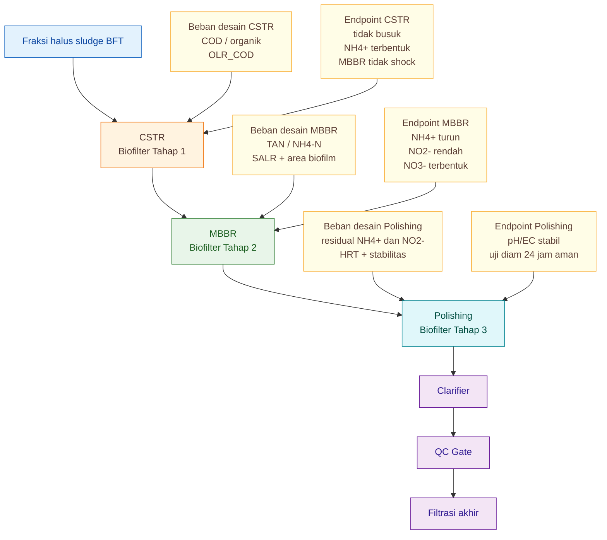

---

## 8.6 Kesimpulan Integrasi

Rangkaian CSTR–MBBR–Polishing hanya kuat bila setiap unit bekerja sesuai perannya.

Ringkasnya:

```text
CSTR gagal
↓
MBBR menerima organik terlalu tinggi
↓
biofilm nitrifier terganggu
↓
NO2- naik
↓
polishing kewalahan
↓
produk gagal QC
```

Sebaliknya, bila train bekerja benar:

```text
CSTR menstabilkan organik
↓
MBBR menitrifikasi NH4+
↓
polishing menurunkan residual
↓
QC lebih konsisten
```

Kesimpulan praktis:

> **Jika polishing sering gagal, jangan langsung memperbesar polishing. Periksa CSTR dan MBBR terlebih dahulu.**

[**Kembali ke Atas**](#rangkaian-biofilter-aerob-tiga-tahap-untuk-mineralisasi-sludge-bft-cstr-mbbr-dan-polishing)

---

# 9. Parameter Operasi Harian

Desain yang baik tetap bisa gagal jika operasi hariannya buruk. Karena itu, rangkaian biofilter tiga tahap harus memiliki checklist operasional yang sederhana, berulang, dan mudah dilakukan oleh operator lapangan.

Targetnya bukan membuat operator melakukan analisis laboratorium rumit setiap hari. Targetnya adalah memastikan bahwa tanda-tanda awal kegagalan proses dapat terlihat sebelum produk keluar dari sistem.

---

## 9.1 Checklist Harian

| Unit      | Cek harian                   | Target                                   |
| --------- | ---------------------------- | ---------------------------------------- |
| CSTR      | bau, busa, DO, mixing        | tidak busuk, DO $3{-}5 \ \mathrm{mg/L}$  |
| MBBR      | gerakan media, DO, pH        | media merata, DO $4{-}6 \ \mathrm{mg/L}$ |
| Polishing | bau, pH, DO                  | stabil, tidak busuk                      |
| Clarifier | TSS/endapan                  | jernih relatif                           |
| QC        | $NH_4^+$, $NO_2^-$, $NO_3^-$ | $NO_2^-<1 \ \mathrm{mg/L}$               |

Checklist ini sebaiknya dibuat sebagai lembar operator harian. Operator tidak hanya mencatat angka, tetapi juga mencatat gejala visual dan bau.

---

## 9.2 CSTR: Cek Harian

Pada CSTR, operator harus memeriksa:

- bau,
- busa,
- DO,
- pH,
- warna,
- endapan dasar,
- dan pola mixing.

Target CSTR:

$$
DO=3{-}5 \ \mathrm{mg/L}
$$

$$
pH=6.8{-}7.5
$$

Tanda CSTR sehat:

```text
bau organik ringan, tidak busuk
busa tidak ekstrem
seluruh volume bergerak
tidak ada endapan hitam
outlet relatif homogen
```

Tanda CSTR bermasalah:

```text
bau telur busuk
busa tebal menetap
dasar hitam
DO sulit naik
outlet membuat MBBR shock
```

Jika CSTR bermasalah, jangan buru-buru menyalahkan MBBR.

---

## 9.3 MBBR: Cek Harian

MBBR harus dicek lebih ketat karena ini pusat nitrifikasi.

Parameter harian:

$$
DO=4{-}6 \ \mathrm{mg/L}
$$

$$
pH=6.8{-}7.8
$$

Tanda MBBR sehat:

```text
media bergerak merata
tidak ada media diam di sudut
biofilm stabil
bau tidak busuk
outlet screen tidak mampet
```

Tanda MBBR bermasalah:

```text
media menggumpal
media mengendap
media keluar dari outlet
biofilm terlalu berlendir
DO cepat turun
pH turun terus
```

Jika media tidak bergerak, kapasitas biofilm yang dihitung secara matematis tidak akan tercapai.

---

## 9.4 Polishing: Cek Harian

Polishing harus dilihat sebagai zona stabilisasi.

Parameter harian:

$$
DO=3{-}5 \ \mathrm{mg/L}
$$

$$
pH=6.5{-}7.5
$$

Tanda polishing sehat:

```text
bau aman
pH stabil
tidak ada busa ekstrem
tidak ada endapan busuk
air relatif lebih tenang sebelum clarifier
```

Tanda polishing bermasalah:

```text
bau kembali muncul
NO2- masih tinggi
pH terus turun
EC terus berubah tajam
uji diam 24 jam gagal
```

---

## 9.5 Clarifier dan Filtrasi: Cek Harian

Clarifier bukan biofilter utama, tetapi sangat penting untuk menurunkan TSS sebelum filtrasi akhir.

Cek harian:

- jumlah endapan,
- warna supernatan,
- kecepatan pengendapan,
- apakah ada sludge carry-over,
- apakah filter akhir cepat mampet.

Jika filter akhir cepat mampet, jangan hanya mengganti filter. Periksa:

```text
Swirler + IPC
CSTR
MBBR biofilm rontok
polishing terlalu turbulen
clarifier terlalu kecil
```

---

## 9.6 Checklist Mingguan

Checklist mingguan lebih analitis.

Lakukan:

- bandingkan inlet-outlet CSTR,
- bandingkan inlet-outlet MBBR,
- catat tren $NH_4^+$, $NO_2^-$, $NO_3^-$,
- cek diffuser,
- cek biofilm media,
- cek screen outlet,
- uji tanaman 3–5 hari.

Titik sampling minimal:

```text
inlet CSTR
outlet CSTR / inlet MBBR
outlet MBBR
outlet polishing
produk akhir setelah clarifier
```

---

## 9.7 Catatan Tren Lebih Penting dari Satu Angka

Satu angka pengukuran sering menipu. Yang lebih penting adalah tren.

Contoh:

| Pola tren                    | Interpretasi                  |
| ---------------------------- | ----------------------------- |
| $NH_4^+$ turun setelah MBBR  | AOB bekerja                   |
| $NO_2^-$ naik terus          | NOB belum kuat atau stress    |
| $NO_3^-$ mulai terbentuk     | nitrifikasi berjalan          |
| pH turun harian              | alkalinitas dikonsumsi        |
| EC berubah tajam             | proses belum stabil           |
| bau muncul setelah polishing | organik/residual belum stabil |

Operator harus dilatih membaca pola, bukan hanya angka tunggal.

[**Kembali ke Atas**](#rangkaian-biofilter-aerob-tiga-tahap-untuk-mineralisasi-sludge-bft-cstr-mbbr-dan-polishing)

---

# 10. QC Gate: Kapan Produk Boleh Keluar?

Jalur B kontinyu harus memakai prinsip **quality-based release**, bukan **time-based release**. Artinya, produk cair tidak boleh keluar hanya karena sudah melewati sejumlah hari atau sudah melewati seluruh tangki.

Produk boleh keluar hanya jika lolos **QC Gate**.

Poin kuncinya:

> **Hari proses bukan endpoint. Kualitas output adalah endpoint.**

---

## 10.1 Kriteria Minimum QC

| Parameter   |                       Target |
| ----------- | ---------------------------: |
| pH          |                  $6.5{-}7.5$ |
| $\Delta pH$ | $<0.3$ dalam tiga pengukuran |
| $\Delta EC$ | $<10%$ dalam tiga pengukuran |
| $NH_4^+$    |               rendah/menurun |
| $NO_2^-$    |         $<1 \ \mathrm{mg/L}$ |
| $NO_3^-$    |                    terbentuk |
| Bau         |                  tidak busuk |
| Uji diam    |           24 jam tidak busuk |
| Uji tanaman |                3–5 hari aman |

Kriteria ini sebaiknya dipakai sebagai batas minimum. Untuk aplikasi yang lebih sensitif seperti drip, greenhouse, atau media inert, standar internal bisa dibuat lebih ketat.

---

## 10.2 Stabilitas pH

pH produk akhir harus berada pada rentang:

$$
pH=6.5{-}7.5
$$

Namun pH yang berada dalam rentang ini belum tentu stabil. Karena itu perlu melihat perubahan pH:

$$
\Delta pH<0.3
$$

dalam tiga pengukuran berurutan.

Contoh interpretasi:

| Pola pH                               | Keputusan                |
| ------------------------------------- | ------------------------ |
| $7.1 \rightarrow 7.0 \rightarrow 7.0$ | stabil                   |
| $7.4 \rightarrow 6.9 \rightarrow 6.5$ | belum stabil             |
| $6.8 \rightarrow 6.4 \rightarrow 6.1$ | gagal QC                 |
| $8.0$ tetap tinggi                    | koreksi sebelum aplikasi |

---

## 10.3 Stabilitas EC

EC menunjukkan total ion terlarut. Pada produk mineralisasi, EC dapat berubah selama proses karena pelepasan ion masih berjalan.

Target stabilitas:

$$
\Delta EC<10%
$$

dalam tiga pengukuran berurutan.

Rumus:

$$
\Delta EC=\frac{EC_{\mathrm{akhir}}-EC_{\mathrm{awal}}}{EC_{\mathrm{awal}}}\times100%
$$

Jika EC masih berubah tajam, produk belum stabil. Ini penting terutama jika produk akan digunakan untuk fertigasi atau tanaman sensitif.

---

## 10.4 Nitrogen: $NH_4^+$, $NO_2^-$, dan $NO_3^-$

QC nitrogen harus membaca tiga bentuk sekaligus.

### $NH_4^+$

$NH_4^+$ harus rendah atau menurun. Jika $NH_4^+$ masih tinggi, nitrifikasi belum cukup.

### $NO_2^-$

$NO_2^-$ adalah parameter kritis.

Target:

$$
NO_2^-<1 \ \mathrm{mg/L}
$$

Jika $NO_2^-$ tinggi, produk tidak boleh keluar.

### $NO_3^-$

$NO_3^-$ harus terbentuk sebagai tanda nitrifikasi lanjut berjalan.

Pola ideal:

```text
NH4+ turun
NO2- rendah
NO3- terbentuk
```

Pola gagal:

```text
NH4+ tinggi
NO2- tinggi
NO3- rendah
```

---

## 10.5 Uji Diam 24 Jam

Uji diam sangat praktis dan murah.

Prosedur:

```text
ambil sampel outlet polishing / QC tank
masukkan ke botol terbuka atau wadah bersih
diamkan 24 jam tanpa aerasi
amati bau, warna, endapan, busa
```

Target:

```text
tidak busuk
tidak bau amonia tajam
tidak menghitam
tidak berbusa ekstrem
```

Jika sampel menjadi busuk setelah 24 jam, artinya produk masih tidak stabil secara biologis.

---

## 10.6 Uji Tanaman 3–5 Hari

Uji tanaman sederhana harus dilakukan sebelum aplikasi luas.

Metode praktis:

```text
siapkan 5-10 tanaman uji
gunakan pengenceran rencana aplikasi
amati 3-5 hari
lihat akar, daun, layu, klorosis, nekrosis
```

Target:

- tanaman tidak layu,
- akar tidak terbakar,
- daun tidak nekrosis,
- tidak muncul bau pada media,
- pertumbuhan tidak terhambat tajam.

Jika tanaman menunjukkan stres, produk belum boleh diaplikasikan luas.

---

## 10.7 Keputusan QC

```text
Lolos QC → filtrasi akhir → aplikasi tanaman
Gagal QC → recycle ke polishing / MBBR / CSTR sesuai masalah
```

Tabel keputusan:

| Masalah QC      | Arah tindakan                    |
| --------------- | -------------------------------- |
| bau busuk       | recycle ke CSTR                  |
| $NH_4^+$ tinggi | recycle ke MBBR atau cek CSTR    |
| $NO_2^-$ tinggi | tahan di polishing/MBBR          |
| pH turun terus  | cek alkalinitas                  |
| EC belum stabil | tahan di polishing/QC            |
| TSS tinggi      | clarifier/filtrasi diperbaiki    |
| tanaman stres   | encerkan ulang atau tahan produk |

---

## 10.8 Diagram QC Gate

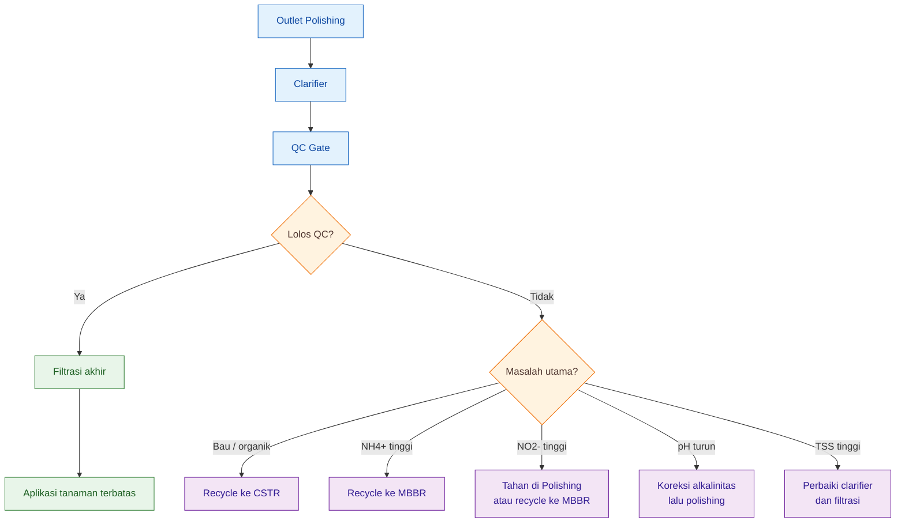

---

## 10.9 Kesimpulan QC

QC Gate adalah pagar terakhir agar produk tidak keluar hanya karena “sudah lewat sistem”.

Kesimpulan praktis:

> **Produk Jalur B boleh keluar hanya jika lolos kualitas: tidak busuk, $NH_4^+$ rendah, $NO_2^-$ aman, $NO_3^-$ terbentuk, pH/EC stabil, dan aman pada uji tanaman.**

[**Kembali ke Atas**](#rangkaian-biofilter-aerob-tiga-tahap-untuk-mineralisasi-sludge-bft-cstr-mbbr-dan-polishing)

---

# 11. Troubleshooting Berbasis Lokasi Masalah

Troubleshooting Jalur B harus dilakukan berdasarkan **lokasi proses**, bukan hanya berdasarkan gejala akhir. Jika produk gagal QC, penyebabnya bisa berasal dari CSTR, MBBR, polishing, clarifier, atau bahkan dari pemisahan awal.

Prinsip troubleshooting:

```text
gejala akhir
↓
tentukan lokasi sumber
↓
koreksi unit penyebab
↓
jangan hanya memperbaiki gejala
```

---

## 11.1 Tabel Troubleshooting Utama

| Gejala                    | Kemungkinan sumber            | Tindakan                                   |
| ------------------------- | ----------------------------- | ------------------------------------------ |
| bau busuk di CSTR         | organik tinggi, aerasi kurang | kurangi feed, tambah aerasi, buang endapan |
| MBBR berlendir tebal      | CSTR belum menurunkan organik | perpanjang CSTR, kurangi OLR               |
| $NH_4^+$ tidak turun      | MBBR belum matang/area kurang | kurangi beban, tambah media/seri           |
| $NO_2^-$ tinggi           | NOB lemah, DO/pH kurang       | tahan produk, polishing/recycle            |
| pH turun terus            | alkalinitas habis             | koreksi alkalinitas                        |
| polishing sering off-spec | MBBR overload                 | jangan andalkan polishing, revisi MBBR     |
| filter akhir mampet       | TSS tinggi                    | perbaiki clarifier dan padatan awal        |

---

## 11.2 Gejala: Bau Busuk di CSTR

Kemungkinan penyebab:

- beban organik terlalu tinggi,
- aerasi kurang,
- mixing tidak merata,
- endapan dasar anaerob,
- padatan kasar lolos dari Swirler + IPC.

Tindakan:

```text
kurangi feed 25-50%
tingkatkan aerasi
bersihkan endapan dasar
cek diffuser
cek Swirler + IPC
alihkan padatan kasar ke Jalur A
```

Jika bau busuk muncul sejak CSTR, jangan berharap MBBR dan polishing menyelesaikan semuanya.

---

## 11.3 Gejala: MBBR Berlendir Tebal

Kemungkinan penyebab:

- CSTR belum cukup menurunkan organik,
- beban COD masuk MBBR masih tinggi,
- heterotrof mendominasi biofilm,
- DO kurang,
- carrier terlalu rapat atau sulit self-cleaning.

Tindakan:

```text
cek outlet CSTR
kurangi OLR CSTR
perpanjang HRT CSTR
jangan tambah molase
perbaiki pemisahan padatan
jaga DO MBBR 4-6 mg/L
```

Biofilm MBBR seharusnya stabil, bukan menjadi lapisan lumpur organik tebal.

---

## 11.4 Gejala: $NH_4^+$ Tidak Turun

Kemungkinan penyebab:

- biofilm nitrifier belum matang,
- luas media kurang,
- $SSA_{\mathrm{eff}}$ lebih rendah dari asumsi,
- DO kurang,
- pH terlalu rendah,
- alkalinitas habis,
- beban TAN terlalu tinggi.

Tindakan:

```text
turunkan feed MBBR
cek DO
cek pH dan alkalinitas
cek gerakan media
cek filling ratio
tambah media bila FR masih memungkinkan
buat MBBR seri bila beban tinggi
```

Jika filling ratio sudah lebih dari $50%$, jangan memaksa tambah media di reaktor yang sama. Lebih baik tambah reaktor seri.

---

## 11.5 Gejala: $NO_2^-$ Tinggi

Kemungkinan penyebab:

- NOB belum matang,
- DO kurang,
- pH turun,
- alkalinitas rendah,
- shock load TAN,
- biofilm terganggu,
- MBBR terlalu kecil.

Tindakan:

```text
jangan keluarkan produk
tahan di polishing
recycle ke MBBR jika perlu
stabilkan DO 4-6 mg/L
cek pH dan alkalinitas
turunkan beban Jalur B
```

Nitrit tinggi adalah sinyal bahwa nitrifikasi belum selesai. Produk tidak boleh keluar.

---

## 11.6 Gejala: pH Turun Terus

Kemungkinan penyebab:

- nitrifikasi aktif mengonsumsi alkalinitas,
- alkalinitas air rendah,
- koreksi pH tidak cukup,
- beban $NH_4^+$ tinggi.

Rumus konsumsi alkalinitas:

$$
Alk_{\mathrm{konsumsi}}=7.14 \times L_{\mathrm{TAN}}
$$

Jika:

$$
L_{\mathrm{TAN}}=30 \ \mathrm{g/hari}
$$

maka:

$$
Alk_{\mathrm{konsumsi}}=214.2 \ \mathrm{g \ CaCO_3/hari}
$$

Tindakan:

```text
cek alkalinitas
koreksi alkalinitas bertahap
jangan hanya tambah aerasi
turunkan beban TAN
pantau pH harian
```

---

## 11.7 Gejala: Polishing Sering Off-Spec

Kemungkinan penyebab:

- MBBR overload,
- MBBR belum matang,
- $NO_2^-$ dari MBBR terlalu tinggi,
- polishing dibebani terlalu berat,
- HRT polishing kurang,
- DO polishing rendah.

Tindakan:

```text
cek outlet MBBR
jangan jadikan polishing sebagai penutup kegagalan
perbaiki MBBR
tambah HRT polishing hanya jika residual ringan
recycle produk off-spec
```

Prinsipnya:

> **Polishing yang sering gagal biasanya bukan masalah polishing, tetapi tanda bahwa MBBR atau CSTR belum bekerja benar.**

---

## 11.8 Gejala: Filter Akhir Mampet

Kemungkinan penyebab:

- TSS tinggi,
- clarifier kurang efektif,
- biofilm MBBR rontok,
- polishing terlalu turbulen,
- Swirler + IPC tidak efektif,
- flok halus masih banyak.

Tindakan:

```text
perbaiki clarifier
kurangi turbulensi polishing
cek biofilm rontok
flush endapan
tambahkan tahap filtrasi bertingkat
perbaiki pemisahan awal
```

Urutan filtrasi akhir yang lebih aman:

```text
200 mikron
↓
100 mikron
↓
50 mikron
```

Untuk kocor manual, $100{-}200 \ \mathrm{mikron}$ biasanya cukup. Untuk drip, gunakan filtrasi lebih ketat dan uji risiko mampet.

---

## 11.9 Diagram Troubleshooting

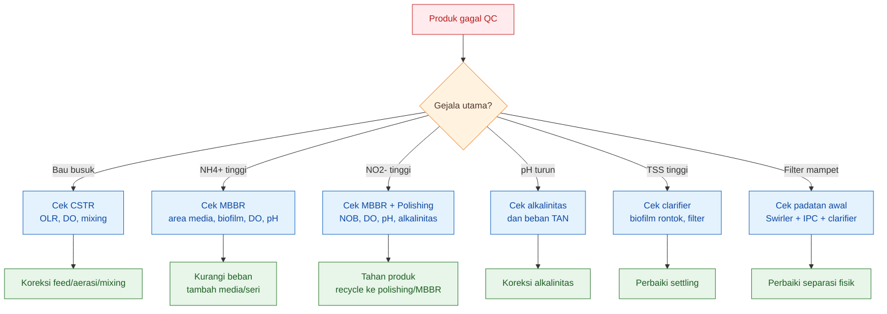

---

## 11.10 Kesimpulan Troubleshooting

Troubleshooting Jalur B harus mencari sumber masalah, bukan hanya memperbaiki gejala akhir.

Kesimpulan praktis:

```text
bau → cek CSTR
NH4+ → cek MBBR
NO2- → cek MBBR dan polishing
pH turun → cek alkalinitas
TSS/filter mampet → cek clarifier dan separasi awal
```

[**Kembali ke Atas**](#rangkaian-biofilter-aerob-tiga-tahap-untuk-mineralisasi-sludge-bft-cstr-mbbr-dan-polishing)

---

# 12. Contoh Desain Lengkap untuk Farm $100 \ \mathrm{m^3}$

Bab ini merangkum contoh desain lengkap Jalur B kontinyu untuk farm BFT lele/nila dengan total volume budidaya:

$$
100 \ \mathrm{m^3}
$$

Desain ini adalah **benchmark awal untuk pilot**, bukan desain final universal. Setiap farm tetap harus menyesuaikan berdasarkan data aktual sludge, $COD$, $NH_4$-$N$, $NO_2^-$, $NO_3^-$, DO, pH, alkalinitas, TSS, dan performa tanaman.

---

## 12.1 Asumsi Desain

| Parameter               |                   Nilai |
| ----------------------- | ----------------------: |
| Volume BFT              |    $100 \ \mathrm{m^3}$ |
| Sludge pekat ke Jalur B | $100 \ \mathrm{L/hari}$ |
| Air pengencer           | $500 \ \mathrm{L/hari}$ |
| Debit Jalur B           | $600 \ \mathrm{L/hari}$ |
| Rasio sludge:air        |                   $1:5$ |

Debit total Jalur B:

$$
Q_{\mathrm{JalurB}}=Q_{\mathrm{sludge}}+Q_{\mathrm{pengencer}}
$$

$$
Q_{\mathrm{JalurB}}=100+500
$$

$$
Q_{\mathrm{JalurB}}=600 \ \mathrm{L/hari}
$$

Rasio proses:

$$
1:5
$$

Artinya, setiap $1$ bagian sludge pekat dicampur dengan $5$ bagian air pengencer atau supernatan.

---

## 12.2 Rekomendasi Unit

| Unit            |                     Volume | Fungsi          |
| --------------- | -------------------------: | --------------- |
| EQ Tank         |         $250 \ \mathrm{L}$ | buffer          |
| CSTR            | $1200{-}1800 \ \mathrm{L}$ | mineralisasi    |
| MBBR            |        $1000 \ \mathrm{L}$ | nitrifikasi     |
| Media MBBR      |   $400{-}450 \ \mathrm{L}$ | carrier biofilm |
| Polishing       |        $1000 \ \mathrm{L}$ | stabilisasi     |
| Media polishing |     $0{-}150 \ \mathrm{L}$ | opsional        |
| Clarifier       |   $200{-}300 \ \mathrm{L}$ | settling        |
| QC Tank         |   $300{-}500 \ \mathrm{L}$ | holding/check   |

---

## 12.3 Perhitungan HRT Unit Utama

Gunakan:

$$
HRT=\frac{V}{Q}
$$

dengan:

$$
Q=600 \ \mathrm{L/hari}
$$

### EQ Tank

$$
V_{\mathrm{EQ}}=250 \ \mathrm{L}
$$

$$
HRT_{\mathrm{EQ}}=\frac{250}{600}
$$

$$
HRT_{\mathrm{EQ}}=0.42 \ \text{hari}
$$

atau sekitar:

$$
10 \ \text{jam}
$$

### CSTR

Jika:

$$
V_{\mathrm{CSTR}}=1200 \ \mathrm{L}
$$

maka:

$$
HRT_{\mathrm{CSTR}}=\frac{1200}{600}
$$

$$
HRT_{\mathrm{CSTR}}=2.0 \ \text{hari}
$$

Jika dinaikkan menjadi:

$$
V_{\mathrm{CSTR}}=1800 \ \mathrm{L}
$$

maka:

$$
HRT_{\mathrm{CSTR}}=3.0 \ \text{hari}
$$

### MBBR

$$
V_{\mathrm{MBBR}}=1000 \ \mathrm{L}
$$

$$
HRT_{\mathrm{MBBR}}=\frac{1000}{600}
$$

$$
HRT_{\mathrm{MBBR}}=1.67 \ \text{hari}
$$

### Polishing

$$
V_{\mathrm{polishing}}=1000 \ \mathrm{L}
$$

$$
HRT_{\mathrm{polishing}}=\frac{1000}{600}
$$

$$
HRT_{\mathrm{polishing}}=1.67 \ \text{hari}
$$

### Clarifier

Jika:

$$
V_{\mathrm{clarifier}}=200 \ \mathrm{L}
$$

maka:

$$
HRT_{\mathrm{clarifier}}=\frac{200}{600}
$$

$$
HRT_{\mathrm{clarifier}}=0.33 \ \text{hari}
$$

atau sekitar:

$$
8 \ \text{jam}
$$

---

## 12.4 Total Waktu Tinggal Biologis

Jika memakai:

$$
V_{\mathrm{CSTR}}=1200 \ \mathrm{L}
$$

maka biofilter biologis utama terdiri dari:

| Unit      |                  HRT |
| --------- | -------------------: |
| CSTR      | $2.00 \ \text{hari}$ |
| MBBR      | $1.67 \ \text{hari}$ |
| Polishing | $1.67 \ \text{hari}$ |

Total biological contact time:

$$
HRT_{\mathrm{bio}}=2.00+1.67+1.67
$$

$$
HRT_{\mathrm{bio}}=5.34 \ \text{hari}
$$

Jika CSTR dinaikkan ke $1800 \ \mathrm{L}$:

$$
HRT_{\mathrm{bio}}=3.00+1.67+1.67
$$

$$
HRT_{\mathrm{bio}}=6.34 \ \text{hari}
$$

Angka ini bukan target mutlak. Target sebenarnya adalah output kualitas. Tetapi total waktu ini membantu menghitung volume sistem dan kapasitas harian.

---

## 12.5 Layout Proses Lengkap

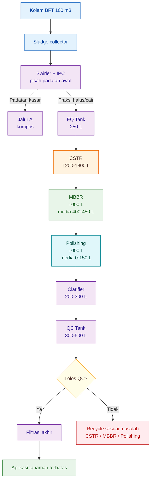

---

## 12.6 Target Operasi Tiap Unit

| Unit           | Target operasi                                      |
| -------------- | --------------------------------------------------- |
| EQ Tank        | debit stabil, tidak shock load                      |
| CSTR           | organik turun, tidak busuk, $NH_4^+$ terbentuk      |
| MBBR           | $NH_4^+$ turun, $NO_2^-$ rendah, $NO_3^-$ terbentuk |
| Polishing      | pH/EC stabil, bau aman, $NO_2^-$ aman               |
| Clarifier      | TSS turun, supernatan lebih jernih                  |
| QC Tank        | holding dan verifikasi mutu                         |
| Filtrasi akhir | mencegah clogging aplikasi                          |

---

## 12.7 Catatan Kritis Desain

Desain ini hanya valid jika inlet MBBR sekitar:

$$
50 \ \mathrm{mg/L} \ \mathrm{NH_4\text{-}N}
$$

atau lebih rendah.

Jika inlet MBBR mendekati:

$$
100 \ \mathrm{mg/L} \ \mathrm{NH_4\text{-}N}
$$

maka MBBR $1000 \ \mathrm{L}$ dengan media $400{-}450 \ \mathrm{L}$ kemungkinan tidak cukup. Pada kondisi itu, pilihan desainnya adalah:

```text
MBBR diperbesar
atau
MBBR dibuat seri
atau
beban Jalur B dikurangi
atau
CSTR dan pemisahan awal diperkuat
```

Jangan memaksa menambah media sampai filling ratio terlalu tinggi.

---

## 12.8 Ringkasan Benchmark Desain

Untuk farm BFT $100 \ \mathrm{m^3}$ dengan Jalur B $600 \ \mathrm{L/hari}$, benchmark awal yang masuk akal adalah:

```text
EQ Tank        : 250 L
CSTR           : 1200-1800 L
MBBR           : 1000 L
Media MBBR     : 400-450 L
Polishing      : 1000 L
Media polishing: 0-150 L
Clarifier      : 200-300 L
QC Tank        : 300-500 L
```

Dengan target akhir:

```text
tidak busuk
NH4+ rendah
NO2- < 1 mg/L
NO3- terbentuk
pH 6.5-7.5
EC stabil
uji diam 24 jam aman
uji tanaman 3-5 hari aman
```

Kesimpulan praktis:

> **Desain ini adalah baseline pilot. Desain final harus dikunci dari data aktual inlet dan outlet setiap unit, terutama $COD$, $NH_4^+$, $NO_2^-$, $NO_3^-$, pH, DO, alkalinitas, TSS, dan respons tanaman.**

[**Kembali ke Atas**](#rangkaian-biofilter-aerob-tiga-tahap-untuk-mineralisasi-sludge-bft-cstr-mbbr-dan-polishing)

---

# 13. Batasan Desain dan Validasi Pilot

Desain Jalur B kontinyu dengan rangkaian **CSTR–MBBR–Polishing** harus ditulis dengan hati-hati. Sistem ini menjanjikan secara teknis, tetapi tidak boleh dipresentasikan seolah-olah satu angka desain dapat berlaku untuk semua farm BFT.

Setiap farm BFT memiliki karakter sludge yang berbeda. Perbedaan itu dipengaruhi oleh pakan, jenis ikan, kepadatan tebar, umur ikan, FCR, suhu air, frekuensi pembuangan sludge, rasio pengenceran, efisiensi pemisahan awal, serta kualitas operasi biofilter. Karena itu, desain dalam artikel ini harus dipahami sebagai **desain awal konservatif untuk pilot**, bukan detailed engineering final.

Kalimat pentingnya:

> **Artikel ini memberikan desain awal konservatif untuk pilot, bukan detailed engineering final. Desain final harus dikunci dari data $Q$, COD, $NH_4^+$, $NO_2^-$, $NO_3^-$, pH, DO, alkalinitas, dan performa tanaman.**

---

## 13.1 Tidak Ada Angka Tunggal untuk Semua Farm BFT

Tidak ada angka tunggal seperti:

```text id="xpwj42"
CSTR harus selalu 1200 L
MBBR harus selalu 1000 L
media harus selalu 450 L
polishing harus selalu 1000 L
```

Angka seperti itu hanya masuk akal jika beban prosesnya juga sama. Dalam praktik, beban proses hampir selalu berbeda.

Dua farm dengan volume BFT sama-sama:

$$
100 \ \mathrm{m^3}
$$

bisa menghasilkan sludge dengan karakter berbeda jika:

- pakan berbeda,
- FCR berbeda,
- frekuensi pembuangan sludge berbeda,
- padatan kasar yang lolos berbeda,
- suhu berbeda,
- rasio sludge-air berbeda,
- atau bioflok lebih tua dan lebih kental.

Akibatnya, satu farm mungkin cukup memakai MBBR $1000 \ \mathrm{L}$, sedangkan farm lain perlu MBBR seri atau volume yang lebih besar.

---

## 13.2 Parameter yang Paling Mempengaruhi Desain

Ada beberapa parameter yang sangat memengaruhi desain Jalur B.

| Faktor           | Dampak terhadap desain                                 |
| ---------------- | ------------------------------------------------------ |
| jenis pakan      | memengaruhi protein, minyak, mineral, dan COD sludge   |
| kepadatan ikan   | memengaruhi jumlah feses dan beban organik             |
| suhu             | memengaruhi aktivitas mikroba dan nitrifikasi          |
| rasio sludge-air | memengaruhi konsentrasi $NH_4^+$, COD, TSS, dan EC     |
| Swirler + IPC    | menentukan berapa banyak padatan kasar masuk CSTR      |
| kondisi CSTR     | menentukan apakah MBBR terlindungi dari organik tinggi |
| media MBBR       | menentukan luas biofilm efektif                        |
| umur biofilm     | menentukan kapasitas nitrifikasi aktual                |
| alkalinitas      | menentukan stabilitas pH saat nitrifikasi              |
| DO               | menentukan apakah proses aerob benar-benar berjalan    |

Karena itu, desain Jalur B tidak boleh hanya memakai volume. Desain harus dikunci dengan data beban.

---

## 13.3 Parameter yang Harus Divalidasi

Ada tiga kelompok parameter yang wajib divalidasi.

### 13.3.1 Parameter CSTR

CSTR perlu divalidasi dengan:

$$
Q
$$

$$
COD_{\mathrm{in}}
$$

$$
OLR_{\mathrm{COD}}
$$

$$
DO
$$

$$
pH
$$

$$
\text{bau}
$$

$$
\text{mixing}
$$

Rumus utama:

$$
OLR_{\mathrm{COD}}=\frac{L_{\mathrm{COD}}}{V_{\mathrm{CSTR}}}
$$

Jika $OLR_{\mathrm{COD}}$ terlalu tinggi, CSTR akan gagal menstabilkan organik, dan MBBR akan menerima beban yang terlalu berat.

---

### 13.3.2 Parameter MBBR

MBBR perlu divalidasi dengan:

$$
L_{\mathrm{TAN}}
$$

$$
r_A
$$

$$
SSA_{\mathrm{eff}}
$$

$$
FR
$$

$$
DO
$$

$$
pH
$$

$$
\text{alkalinitas}
$$

$$
\text{gerakan media}
$$

Rumus inti:

$$
L_{\mathrm{TAN}}=\frac{Q \times C_{NH4}}{1000}
$$

$$
A_{\mathrm{req}}=\frac{L_{\mathrm{TAN}}}{r_A}
$$

$$
SSA_{\mathrm{eff}}=SSA \times \eta
$$

$$
V_{\mathrm{media}}=\frac{A_{\mathrm{req}}}{SSA_{\mathrm{eff}}}
$$

$$
FR=\frac{V_{\mathrm{media}}}{V_{\mathrm{reaktor}}}\times100%
$$

Angka seperti $r_A=0.20{-}0.25 \ \mathrm{g \ NH_4\text{-}N/m^2/hari}$ dan $SSA_{\mathrm{eff}}=250{-}400 \ \mathrm{m^2/m^3}$ harus dibaca sebagai **asumsi pilot konservatif**, bukan angka tetap. Literatur desain MBBR memang menggunakan beban per luas permukaan carrier sebagai basis sizing; untuk nitrifikasi, SALR dinyatakan sebagai beban amonia per luas permukaan carrier, lalu digunakan untuk menghitung kebutuhan luas carrier dan volume media. ([www.cedengineering.com][1])

---

### 13.3.3 Parameter Polishing

Polishing perlu divalidasi dengan:

$$
NH_4^+_{\mathrm{residual}}
$$

$$
NO_2^-_{\mathrm{residual}}
$$

$$
NO_3^-
$$

$$
pH
$$

$$
EC
$$

$$
\text{bau}
$$

$$
\text{uji diam 24 jam}
$$

Targetnya bukan hanya “sudah diaerasi”, tetapi:

$$
NO_2^- < 1 \ \mathrm{mg/L}
$$

$$
\Delta pH < 0.3
$$

$$
\Delta EC < 10%
$$

dan uji diam 24 jam tidak busuk.

---

## 13.4 Start-up Biofilm Tidak Instan

Salah satu kesalahan umum adalah menganggap MBBR akan langsung bekerja penuh begitu media dimasukkan. Ini keliru.

Biofilm nitrifier membutuhkan waktu untuk matang. AOB dan NOB tumbuh lebih lambat dibanding mikroba heterotrof. Karena itu, start-up harus dilakukan bertahap.

Strategi start-up:

```text id="rjujq0"
25% beban desain
↓
50%
↓
75%
↓
100%
```

Beban hanya dinaikkan jika:

- $NH_4^+$ outlet turun,
- $NO_2^-$ tidak menumpuk,
- $NO_3^-$ terbentuk,
- pH stabil,
- DO stabil,
- media bergerak merata,
- dan tidak ada bau busuk.

Studi dan laporan desain MBBR Kaldnes menunjukkan bahwa MBBR banyak dipakai untuk nitrifikasi dan performa nitrifikasi dipengaruhi oleh faktor seperti DO, TAN, temperatur, pH, alkalinitas, beban organik, serta riwayat atau kondisi biofilm; artinya, biofilm yang matang dan teraklimasi tidak bisa digantikan hanya dengan volume tangki. ([La Gazzetta delle Koi][2])

---

## 13.5 Validasi Pilot Minimal

Pilot tidak harus rumit, tetapi harus disiplin. Minimal validasi dilakukan selama beberapa minggu operasi stabil, bukan hanya satu kali pengukuran.

Titik sampling minimal:

```text id="8wwb2b"
inlet CSTR
outlet CSTR / inlet MBBR
outlet MBBR
outlet polishing
produk akhir setelah clarifier
```

Parameter minimal:

| Parameter       |                 Frekuensi awal |
| --------------- | -----------------------------: |
| pH              |                         harian |
| DO              |                         harian |
| bau             |                         harian |
| suhu            |                         harian |
| $NH_4^+$        |                2–3 kali/minggu |
| $NO_2^-$        |                2–3 kali/minggu |
| $NO_3^-$        |                2–3 kali/minggu |
| EC              |                2–3 kali/minggu |
| alkalinitas     |    mingguan atau saat pH turun |
| COD/TSS         | mingguan atau sesuai akses lab |
| uji diam 24 jam |           tiap batch outlet/QC |
| uji tanaman     |  setiap perubahan desain/dosis |

---

## 13.6 Parameter yang Menentukan Keputusan Scale-Up

Sistem boleh dinaikkan kapasitasnya jika hasil pilot menunjukkan pola stabil.

Tanda siap scale-up:

```text id="acwstw"
CSTR tidak busuk
MBBR menurunkan NH4+
NO2- tidak menumpuk
NO3- terbentuk
pH tidak jatuh
polishing lolos uji diam 24 jam
uji tanaman aman
filter akhir tidak cepat mampet
```

Tanda belum siap scale-up:

```text id="i49mnx"
NO2- sering tinggi
pH terus turun
media MBBR berlendir tebal
polishing sering off-spec
produk bau setelah 24 jam
tanaman uji stres
filter sering mampet
```

Jika tanda-tanda ini muncul, scale-up harus ditunda. Perbaiki desain biologisnya terlebih dahulu.

---

## 13.7 Batasan Artikel Ini

Artikel ini tidak mengklaim bahwa desain contoh pasti berhasil di semua farm. Artikel ini memberi **kerangka desain**.

Batasannya:

- nilai $COD_{\mathrm{in}}$ harus diuji untuk desain CSTR yang lebih presisi,
- nilai $C_{NH4}$ inlet MBBR harus diuji untuk desain MBBR,
- $r_A$ aktual harus divalidasi dari penurunan $NH_4^+$,
- $SSA_{\mathrm{eff}}$ bergantung pada media dan fouling aktual,
- kebutuhan blower harus dihitung lebih lanjut dari kedalaman air, diffuser, dan efisiensi transfer oksigen,
- keamanan aplikasi tanaman harus diuji pada tanaman target.

Kesimpulan batasan:

> **Model ini bukan pengganti uji pilot. Model ini adalah kerangka sizing awal agar desain tidak berbasis tebakan volume, tetapi berbasis beban biologis dan endpoint kualitas.**

[**Kembali ke Atas**](#rangkaian-biofilter-aerob-tiga-tahap-untuk-mineralisasi-sludge-bft-cstr-mbbr-dan-polishing)

---

# 14. Rekomendasi Referensi Utama

Artikel ini perlu ditopang oleh referensi yang relevan, terutama untuk bagian MBBR. Berikut referensi utama yang dapat digunakan sebagai tulang punggung teknis.

---

## 14.1 CED Engineering — _Biological Wastewater Treatment II: MBBR Processes_

Referensi ini berguna untuk menjelaskan dasar sizing MBBR dengan konsep **surface area loading rate**. Dokumen tersebut menjelaskan bahwa untuk MBBR, SALR dapat dinyatakan sebagai beban masuk per luas permukaan carrier; untuk nitrifikasi, SALR dinyatakan sebagai beban amonia per luas permukaan carrier. Dengan nilai SALR, debit, dan konsentrasi polutan, kebutuhan luas carrier dan volume media dapat dihitung. ([www.cedengineering.com][1])

Gunakan referensi ini untuk mendukung bagian:

- $SALR$,
- kebutuhan luas carrier,
- volume carrier,
- hubungan beban polutan dengan luas biofilm,
- logika bahwa MBBR tidak didesain dari HRT saja.

Rumus yang relevan dalam artikel:

$$
SALR=\frac{L_{\mathrm{TAN}}}{A_{\mathrm{biofilm}}}
$$

$$
A_{\mathrm{req}}=\frac{L_{\mathrm{TAN}}}{r_A}
$$

---

## 14.2 Rusten et al. — _Design and Operations of the Kaldnes Moving Bed Biofilm Reactors_

Referensi ini penting karena membahas MBBR Kaldnes, salah satu basis historis teknologi MBBR. Ringkasan SINTEF menyebut bahwa MBBR dikembangkan di Norwegia, digunakan luas untuk air limbah municipal dan industri, juga untuk drinking water dan fish farms; MBBR memakai carrier plastik untuk memaksimalkan luas permukaan biofilm aktif di dalam reaktor. ([SINTEF][3])

Gunakan referensi ini untuk mendukung bagian:

- MBBR sebagai teknologi carrier biofilm,
- relevansi MBBR pada fish farms,
- pentingnya active biofilm surface area,
- pengaruh DO, TAN, temperatur, pH, alkalinitas, organic load, dan biofilm history terhadap nitrifikasi.

Rumus yang relevan dalam artikel:

$$
SRT \gg HRT
$$

$$
A_{\mathrm{biofilm}}=V_{\mathrm{media}}\times SSA_{\mathrm{eff}}
$$

---

## 14.3 Orenco — _Moving Bed Bioreactor Design Guidelines_

Referensi Orenco berguna sebagai pembanding praktis karena menyajikan panduan desain MBBR, termasuk protected surface area, process stages, SALR, dan hubungan antara loading, surface area, serta konfigurasi tahap. Dokumen Orenco membahas relationship antara SALR, SARR, dan removal, serta menjelaskan stage treatment pada sistem MBBR. ([odl.orenco.com][4])

Gunakan referensi ini untuk mendukung bagian:

- stage treatment MBBR,
- SALR dan SARR,
- protected surface area,
- carrier fill,
- pembacaan MBBR sebagai reaktor bertahap.

Rumus yang relevan dalam artikel:

$$
FR=\frac{V_{\mathrm{media}}}{V_{\mathrm{reaktor}}}\times100%
$$

---

## 14.4 Studi Sequential MBBR Pilot untuk Ammonium dan COD

Studi sequential MBBR bermanfaat untuk mendukung gagasan bahwa reaktor biofilm dapat disusun bertahap dan setiap tahap dapat diarahkan untuk fungsi pengolahan tertentu, misalnya pengurangan COD, ammonium, atau nitrogen. Prinsip ini sejalan dengan konsep artikel ini bahwa CSTR, MBBR, dan polishing harus dibaca sebagai rangkaian unit biologis dengan fungsi berbeda, bukan satu tangki homogen. Studi pilot MBBR sekuensial pada air setelah dewatering sludge membahas pengolahan ammonium dan COD dalam dua reaktor MBBR berurutan. ([MDPI][5])

Gunakan referensi ini untuk mendukung bagian:

- gagasan unit biologis bertahap,
- MBBR seri,
- pengolahan ammonium dan COD,
- pemisahan fungsi antar unit.

Catatan: referensi ini bukan studi khusus sludge BFT lele/nila, sehingga penggunaannya harus sebagai dukungan konsep biofilm bertahap, bukan sebagai angka desain langsung untuk farm BFT.

---

## 14.5 Cara Menggunakan Referensi dengan Jujur

Agar artikel tetap akurat, referensi harus digunakan sesuai konteksnya.

| Referensi             | Boleh digunakan untuk                         | Jangan digunakan untuk                 |
| --------------------- | --------------------------------------------- | -------------------------------------- |
| CED Engineering       | konsep SALR dan sizing MBBR                   | klaim angka final sludge BFT           |
| Rusten/Kaldnes        | prinsip MBBR, carrier, fish farm, nitrifikasi | klaim semua media lokal sama           |
| Orenco                | guideline praktis MBBR dan stage treatment    | menggantikan pilot lapangan BFT        |
| Sequential MBBR study | dukungan reaktor bertahap                     | angka final untuk sludge BFT lele/nila |

Kesimpulan:

> **Referensi memberi dasar engineering. Pilot memberi angka lokal. Keduanya harus dipakai bersama.**

[**Kembali ke Atas**](#rangkaian-biofilter-aerob-tiga-tahap-untuk-mineralisasi-sludge-bft-cstr-mbbr-dan-polishing)

---

# 15. Penutup Artikel

Rangkaian Jalur B kontinyu harus dipahami sebagai sistem biofilter biologis, bukan sekadar sistem aerasi. Kesalahan paling umum dalam desain adalah terlalu cepat menentukan volume tangki tanpa menghitung beban biologis yang sebenarnya.

Penutup utama artikel ini adalah:

> **Rangkaian CSTR–MBBR–Polishing adalah sistem biofilter tiga tahap. CSTR menyiapkan substrat, MBBR melakukan nitrifikasi utama, dan polishing memastikan produk stabil. Kesalahan paling umum adalah mendesain berdasarkan volume tangki, padahal desain yang benar harus berbasis beban biologis: OLR untuk CSTR, TAN loading dan luas biofilm untuk MBBR, serta residual nitrogen dan stabilitas mutu untuk polishing.**

CSTR tidak boleh dipaksa menjadi unit nitrifikasi penuh. MBBR tidak boleh disederhanakan menjadi tangki berisi media. Polishing tidak boleh dijadikan tempat menyelamatkan proses yang gagal. Masing-masing unit punya fungsi dan endpoint sendiri.

Ringkasnya:

```text id="sm21z6"
CSTR
= menurunkan organik mudah busuk
= membentuk NH4+
= melindungi MBBR

MBBR
= menurunkan NH4+
= mencegah NO2- menumpuk
= membentuk NO3-

Polishing
= menyelesaikan residual
= menstabilkan pH/EC
= mencegah bau balik
= menyiapkan produk ke QC
```

Karena itu, target Jalur B bukan sekadar lamanya proses. Targetnya adalah output yang lolos kualitas.

Final statement:

> **Target Jalur B bukan membuat cairan “sudah diaerasi beberapa hari”, tetapi menghasilkan output yang lolos QC: tidak busuk, $NH_4^+$ rendah, $NO_2^-$ aman, $NO_3^-$ terbentuk, pH/EC stabil, dan aman untuk tanaman.**

---

## 15.1 Prinsip Akhir untuk Praktisi

Jika artikel ini diterapkan di lapangan, praktisi sebaiknya membawa lima prinsip berikut.

### Pertama, pisahkan padatan sebelum biofilter

Swirler + IPC bukan aksesori. Unit ini melindungi CSTR dari beban padatan kasar.

### Kedua, desain CSTR dari beban organik

Gunakan:

$$
OLR_{\mathrm{COD}}=\frac{L_{\mathrm{COD}}}{V_{\mathrm{CSTR}}}
$$

CSTR yang baik membuat outlet tidak busuk dan tidak membuat MBBR shock.

### Ketiga, desain MBBR dari luas biofilm

Gunakan:

$$
L_{\mathrm{TAN}}=\frac{Q \times C_{NH4}}{1000}
$$

$$
A_{\mathrm{req}}=\frac{L_{\mathrm{TAN}}}{r_A}
$$

$$
V_{\mathrm{media}}=\frac{A_{\mathrm{req}}}{SSA_{\mathrm{eff}}}
$$

MBBR yang baik menurunkan $NH_4^+$, menjaga $NO_2^-$ rendah, dan membentuk $NO_3^-$.

### Keempat, gunakan polishing sebagai safety margin

Polishing hanya layak menangani residual ringan. Targetnya:

$$
NO_2^-<1 \ \mathrm{mg/L}
$$

$$
\Delta pH<0.3
$$

$$
\Delta EC<10%
$$

dan uji diam 24 jam tidak busuk.

### Kelima, keluarkan produk berdasarkan QC, bukan hari

Produk baru boleh keluar jika:

```text id="0syddg"
tidak busuk
NH4+ rendah
NO2- aman
NO3- terbentuk
pH/EC stabil
uji tanaman aman
```

---

## 15.2 Kesimpulan Final

Jalur B kontinyu bisa menjadi solusi yang lebih operasional dibanding batch panjang, tetapi hanya jika dibangun sebagai sistem biologis yang benar. Tanpa pemisahan beban, tanpa desain CSTR yang jelas, tanpa perhitungan luas biofilm MBBR, dan tanpa QC polishing, sistem ini hanya menjadi rangkaian tangki aerasi yang sulit dikendalikan.

Kesimpulan akhirnya:

> **Jalur B yang baik bukan sistem yang paling lama diaerasi, tetapi sistem yang paling mampu mengubah sludge BFT dari bahan organik reaktif menjadi input cair yang stabil, terukur, dan aman untuk tanaman.**

[**Kembali ke Atas**](#rangkaian-biofilter-aerob-tiga-tahap-untuk-mineralisasi-sludge-bft-cstr-mbbr-dan-polishing)

[1]: https://www.cedengineering.com/userfiles/Biological%20Wastewater%20Treatment%20II%20-%20MBBR%20Processes%20R1.pdf?utm_source=chatgpt.com 'Biological Wastewater Treatment II - MBBR Processes ...'
[2]: https://www.lagazzettadellekoi.it/wp-content/uploads/2017/03/MBBR.pdf?utm_source=chatgpt.com 'Design and operations of the Kaldnes moving bed biofilm ...'
[3]: https://www.sintef.no/en/publications/publication/1273630/?utm_source=chatgpt.com 'Design and operations of the Kaldnes moving bed biofilm ...'
[4]: https://odl.orenco.com/documents/MovingBedBioreactor-MBBR_DesignAid_Orenco_NDA-TRT-MBB-1.pdf?utm_source=chatgpt.com 'MBBR - Design Guidelines'
[5]: https://www.mdpi.com/?utm_source=chatgpt.com 'MDPI - Publisher of Open Access Journals'

---

Berikut versi **Lampiran A** yang sudah diberi narasi tambahan dan diatur ulang agar alurnya lebih natural: mulai dari tujuan model, logika perhitungan, file CSV, cara penggunaan, output, hingga cara membaca keputusan desain. Saya susun ulang dari Lampiran A yang Anda kirim.

---

# **Lampiran A — Model Matematis Jalur B Kontinyu**

Lampiran ini berisi model matematis sederhana untuk membantu praktisi menghitung desain awal rangkaian biofilter aerob tiga tahap pada Jalur B kontinyu pengolahan sludge BFT lele/nila.

Model ini tidak dimaksudkan sebagai detailed engineering final. Fungsi utamanya adalah sebagai **kalkulator desain awal** dan **alat diagnosis kapasitas biologis** untuk membaca apakah CSTR, MBBR, polishing, clarifier, dan QC tank sudah masuk akal terhadap beban aktual di lapangan.

Secara proses, model ini mengikuti alur:

```text
Input debit dan karakter sludge
↓
CSTR mineralisasi
↓
MBBR nitrifikasi
↓
Polishing stabilisasi
↓
Clarifier
↓
QC Gate
↓
Scaling desain
```

Prinsip dasarnya adalah:

> **CSTR dihitung dari beban organik, MBBR dihitung dari beban TAN dan luas biofilm, polishing dihitung dari residual nitrogen dan stabilitas akhir.**

---

## **A.1 Tujuan Model**

Model ini digunakan untuk menjawab pertanyaan praktis berikut:

1. Berapa debit Jalur B yang harus diproses setiap hari?
2. Berapa $HRT$ pada EQ tank, CSTR, MBBR, polishing, dan clarifier?
3. Apakah CSTR cukup besar untuk menahan beban organik?
4. Berapa $OLR_{\mathrm{COD}}$ pada CSTR?
5. Berapa beban $NH_4$-$N$ atau TAN yang masuk MBBR?
6. Berapa luas biofilm MBBR yang dibutuhkan?
7. Berapa volume media MBBR yang perlu dipasang?
8. Apakah filling ratio MBBR masih sehat?
9. Berapa kebutuhan oksigen teoritis untuk nitrifikasi?
10. Berapa alkalinitas yang berpotensi dikonsumsi nitrifikasi?
11. Apakah polishing cukup untuk menangani residual $NH_4^+$?
12. Apakah desain perlu diperbesar, dibuat seri, atau dikurangi bebannya?
13. Apakah produk cair boleh keluar dari QC Gate?

---

## **A.2 Cara Membaca Alur Perhitungan**

Model ini sebaiknya dibaca dalam lima blok.

### **Blok 1 — Input Umum**

Blok ini berisi debit Jalur B, volume BFT, sludge pekat, air pengencer, suhu, dan pH umum.

Rumus dasar:

$$
Q_{\mathrm{JalurB}}=Q_{\mathrm{sludge}}+Q_{\mathrm{pengencer}}
$$

Contoh:

$$
Q_{\mathrm{JalurB}}=100+500
$$

$$
Q_{\mathrm{JalurB}}=600 \ \mathrm{L/hari}
$$

---

### **Blok 2 — CSTR Mineralisasi**

CSTR dihitung dari $HRT$ dan $OLR_{\mathrm{COD}}$.

Rumus utama:

$$
HRT_{\mathrm{CSTR}}=\frac{V_{\mathrm{CSTR}}}{Q}
$$

$$
L_{\mathrm{COD}}=\frac{Q \times COD_{\mathrm{in}}}{1000000}
$$

$$
OLR_{\mathrm{COD}}=\frac{L_{\mathrm{COD}}}{V_{\mathrm{CSTR}}}
$$

dengan $L_{\mathrm{COD}}$ dalam $\mathrm{kg/hari}$ dan $V_{\mathrm{CSTR}}$ dalam $\mathrm{m^3}$.

---

### **Blok 3 — MBBR Nitrifikasi**

MBBR dihitung dari beban TAN dan luas permukaan biofilm.

Rumus utama:

$$
L_{\mathrm{TAN}}=\frac{Q \times C_{NH4}}{1000}
$$

$$
A_{\mathrm{req}}=\frac{L_{\mathrm{TAN}}}{r_A}
$$

$$
SSA_{\mathrm{eff}}=SSA \times \eta
$$

$$
V_{\mathrm{media}}=\frac{A_{\mathrm{req}}}{SSA_{\mathrm{eff}}}
$$

$$
FR=\frac{V_{\mathrm{media}}}{V_{\mathrm{reaktor}}}\times100%
$$

---

### **Blok 4 — Polishing**

Polishing dihitung dari $HRT$, residual $NH_4^+$, dan kebutuhan media ringan bila diperlukan.

Rumus utama:

$$
HRT_{\mathrm{polishing}}=\frac{V_{\mathrm{polishing}}}{Q}
$$

$$
L_{NH4,\mathrm{res}}=\frac{Q \times C_{NH4,\mathrm{res}}}{1000}
$$

$$
A_{\mathrm{polish}}=\frac{L_{NH4,\mathrm{res}}}{r_{A,\mathrm{polish}}}
$$

---

### **Blok 5 — QC dan Scaling**

QC memastikan produk tidak keluar hanya karena sudah melewati sistem, tetapi karena sudah memenuhi kualitas.

Target utama:

$$
NO_2^-<1 \ \mathrm{mg/L}
$$

$$
pH=6.5{-}7.5
$$

$$
\Delta pH<0.3
$$

$$
\Delta EC<10%
$$

Scaling digunakan untuk memperkirakan volume baru bila debit berubah:

$$
SF_Q=\frac{Q_{\mathrm{new}}}{Q_{\mathrm{base}}}
$$

$$
V_{\mathrm{new}}=V_{\mathrm{base}}\times SF_Q
$$

---

## **A.3 File CSV Model Matematis**

Simpan bagian berikut sebagai:

```text
lampiran_a_model_matematis_biofilter_3_tahap.csv
```

Lalu import ke Excel dengan delimiter:

```text
semicolon / titik koma (;)
```

```csv
No;Modul;Parameter;Simbol;Satuan;Nilai_Contoh;Rumus_Matematis;Rumus_Excel;Catatan
1;Input Umum;Debit Jalur B;Q;L/hari;600;$Q$;;Debit total cairan masuk rangkaian biofilter
2;Input Umum;Debit Jalur B dalam m3;Q_m3;m3/hari;0.6;$Q_{m3}=Q/1000;=F2/1000;Konversi liter ke meter kubik
3;Input Umum;Volume total BFT;V_BFT;m3;100;$V_{\mathrm{BFT}}$;;Volume total sistem bioflok
4;Input Umum;Sludge pekat ke Jalur B;Q_sludge;L/hari;100;$Q_{\mathrm{sludge}}$;;Fraksi sludge halus/pekat yang diproses di Jalur B
5;Input Umum;Air pengencer atau supernatan;Q_dilution;L/hari;500;$Q_{\mathrm{dilution}}$;;Air pengencer untuk menurunkan beban dan viskositas
6;Input Umum;Rasio sludge terhadap air;R_sludge_water;-;1:5;$R=Q_{\mathrm{sludge}}:Q_{\mathrm{dilution}}$;;Rasio awal proses Jalur B
7;Input Umum;Suhu operasi;T;C;25-35;$T$;;Rentang suhu tropis operasional
8;Input Umum;pH target sistem;pH;-;6.5-7.8;$pH$;;Rentang umum biofilter aerob
9;EQ Tank;Volume EQ Tank;V_EQ;L;250;$V_{\mathrm{EQ}}$;;Buffer debit dan konsentrasi sebelum CSTR
10;EQ Tank;HRT EQ Tank;HRT_EQ;hari;0.42;$HRT_{\mathrm{EQ}}=V_{\mathrm{EQ}}/Q$;=F10/$F$2;Sekitar 10 jam pada debit 600 L/hari
11;CSTR;Volume CSTR;V_CSTR;L;1200;$V_{\mathrm{CSTR}}$;;Volume kerja CSTR mineralisasi
12;CSTR;Volume CSTR dalam m3;V_CSTR_m3;m3;1.2;$V_{\mathrm{CSTR,m3}}=V_{\mathrm{CSTR}}/1000$;=F12/1000;Dipakai untuk menghitung OLR
13;CSTR;HRT CSTR;HRT_CSTR;hari;2;$HRT_{\mathrm{CSTR}}=V_{\mathrm{CSTR}}/Q$;=F12/$F$2;Waktu tinggal hidraulik CSTR
14;CSTR;COD inlet skenario ringan;COD_light;mg/L;1000;$COD_{\mathrm{in}}$;;Skenario beban organik ringan
15;CSTR;COD inlet skenario sedang;COD_medium;mg/L;2000;$COD_{\mathrm{in}}$;;Skenario beban organik sedang
16;CSTR;COD inlet skenario berat;COD_heavy;mg/L;4000;$COD_{\mathrm{in}}$;;Skenario beban organik berat
17;CSTR;Beban COD ringan;L_COD_light;kg/hari;0.6;$L_{\mathrm{COD}}=Q \times COD_{\mathrm{in}}/1000000$;=$F$2*F15/1000000;Beban COD harian skenario ringan
18;CSTR;Beban COD sedang;L_COD_medium;kg/hari;1.2;$L_{\mathrm{COD}}=Q \times COD_{\mathrm{in}}/1000000$;=$F$2*F16/1000000;Beban COD harian skenario sedang
19;CSTR;Beban COD berat;L_COD_heavy;kg/hari;2.4;$L_{\mathrm{COD}}=Q \times COD_{\mathrm{in}}/1000000$;=$F$2*F17/1000000;Beban COD harian skenario berat
20;CSTR;OLR CSTR ringan;OLR_light;kg COD/m3/hari;0.5;$OLR_{\mathrm{COD}}=L_{\mathrm{COD}}/V_{\mathrm{CSTR,m3}}$;=F18/$F$13;Zona ringan
21;CSTR;OLR CSTR sedang;OLR_medium;kg COD/m3/hari;1;$OLR_{\mathrm{COD}}=L_{\mathrm{COD}}/V_{\mathrm{CSTR,m3}}$;=F19/$F$13;Zona desain awal
22;CSTR;OLR CSTR berat;OLR_heavy;kg COD/m3/hari;2;$OLR_{\mathrm{COD}}=L_{\mathrm{COD}}/V_{\mathrm{CSTR,m3}}$;=F20/$F$13;Mulai berat untuk pilot sederhana
23;CSTR;Target OLR pilot rendah;OLR_min;kg COD/m3/hari;0.5;$OLR_{\min}$;;Batas bawah desain pilot
24;CSTR;Target OLR pilot atas;OLR_max;kg COD/m3/hari;1.5;$OLR_{\max}$;;Di atas ini perlu evaluasi ketat
25;CSTR;DO CSTR minimum;DO_CSTR_min;mg/L;3;$DO_{\mathrm{CSTR}}$;;Target bawah DO CSTR
26;CSTR;DO CSTR maksimum;DO_CSTR_max;mg/L;5;$DO_{\mathrm{CSTR}}$;;Target atas DO CSTR
27;CSTR;pH CSTR minimum;pH_CSTR_min;-;6.8;$pH_{\mathrm{CSTR}}$;;Target bawah pH CSTR
28;CSTR;pH CSTR maksimum;pH_CSTR_max;-;7.5;$pH_{\mathrm{CSTR}}$;;Target atas pH CSTR
29;CSTR;Estimasi oksigen COD ringan;O2_COD_light;kg O2/hari;0.6;$O_{2,\mathrm{COD}}\approx COD_{\mathrm{removed}}$;=F18;Asumsi kasar bila COD ringan teroksidasi
30;CSTR;Estimasi oksigen COD sedang;O2_COD_medium;kg O2/hari;1.2;$O_{2,\mathrm{COD}}\approx COD_{\mathrm{removed}}$;=F19;Asumsi kasar bila COD sedang teroksidasi
31;CSTR;Estimasi oksigen COD berat;O2_COD_heavy;kg O2/hari;2.4;$O_{2,\mathrm{COD}}\approx COD_{\mathrm{removed}}$;=F20;Asumsi kasar bila COD berat teroksidasi
32;MBBR;Volume MBBR;V_MBBR;L;1000;$V_{\mathrm{MBBR}}$;;Volume kerja MBBR nitrifikasi
33;MBBR;Volume MBBR dalam m3;V_MBBR_m3;m3;1;$V_{\mathrm{MBBR,m3}}=V_{\mathrm{MBBR}}/1000$;=F33/1000;Konversi ke m3
34;MBBR;HRT MBBR;HRT_MBBR;hari;1.67;$HRT_{\mathrm{MBBR}}=V_{\mathrm{MBBR}}/Q$;=F33/$F$2;HRT tetap dihitung tetapi bukan basis utama MBBR
35;MBBR;NH4-N inlet ringan;C_NH4_light;mg/L;30;$C_{NH4}$;;Skenario ringan
36;MBBR;NH4-N inlet sedang;C_NH4_medium;mg/L;50;$C_{NH4}$;;Skenario sedang
37;MBBR;NH4-N inlet berat;C_NH4_heavy;mg/L;100;$C_{NH4}$;;Skenario berat
38;MBBR;Beban TAN ringan;L_TAN_light;g/hari;18;$L_{\mathrm{TAN}}=Q \times C_{NH4}/1000$;=$F$2*F36/1000;Beban amonium sebagai N
39;MBBR;Beban TAN sedang;L_TAN_medium;g/hari;30;$L_{\mathrm{TAN}}=Q \times C_{NH4}/1000$;=$F$2*F37/1000;Beban amonium sebagai N
40;MBBR;Beban TAN berat;L_TAN_heavy;g/hari;60;$L_{\mathrm{TAN}}=Q \times C_{NH4}/1000$;=$F$2*F38/1000;Beban amonium sebagai N
41;MBBR;Surface area loading rate desain;r_A;g NH4-N/m2/hari;0.25;$r_A$;;Asumsi konservatif pilot sludge BFT
42;MBBR;SSA nominal media;SSA_nom;m2/m3;500;$SSA$;;Nilai nominal media carrier
43;MBBR;Faktor efektivitas media;eta;-;0.7;$\eta$;;Koreksi fouling dan area tidak aktif
44;MBBR;SSA efektif media;SSA_eff;m2/m3;350;$SSA_{\mathrm{eff}}=SSA \times \eta$;=F43*F44;Luas permukaan efektif
45;MBBR;Area biofilm ringan;A_req_light;m2;72;$A_{\mathrm{req}}=L_{\mathrm{TAN}}/r_A$;=F39/$F$42;Kebutuhan area biofilm skenario ringan
46;MBBR;Area biofilm sedang;A_req_medium;m2;120;$A_{\mathrm{req}}=L_{\mathrm{TAN}}/r_A$;=F40/$F$42;Kebutuhan area biofilm skenario sedang
47;MBBR;Area biofilm berat;A_req_heavy;m2;240;$A_{\mathrm{req}}=L_{\mathrm{TAN}}/r_A$;=F41/$F$42;Kebutuhan area biofilm skenario berat
48;MBBR;Volume media ringan;V_media_light_m3;m3;0.206;$V_{\mathrm{media}}=A_{\mathrm{req}}/SSA_{\mathrm{eff}}$;=F46/$F$45;Volume media sebelum safety factor
49;MBBR;Volume media sedang;V_media_medium_m3;m3;0.343;$V_{\mathrm{media}}=A_{\mathrm{req}}/SSA_{\mathrm{eff}}$;=F47/$F$45;Volume media sebelum safety factor
50;MBBR;Volume media berat;V_media_heavy_m3;m3;0.686;$V_{\mathrm{media}}=A_{\mathrm{req}}/SSA_{\mathrm{eff}}$;=F48/$F$45;Volume media sebelum safety factor
51;MBBR;Volume media ringan liter;V_media_light_L;L;206;$V_{\mathrm{media,L}}=V_{\mathrm{media,m3}}\times1000$;=F49*1000;Sebelum safety factor
52;MBBR;Volume media sedang liter;V_media_medium_L;L;343;$V_{\mathrm{media,L}}=V_{\mathrm{media,m3}}\times1000$;=F50*1000;Sebelum safety factor
53;MBBR;Volume media berat liter;V_media_heavy_L;L;686;$V_{\mathrm{media,L}}=V_{\mathrm{media,m3}}\times1000$;=F51*1000;Sebelum safety factor
54;MBBR;Safety factor media;SF_media;-;1.25;$SF$;;Faktor keamanan desain media
55;MBBR;Media desain ringan;V_media_design_light;L;258;$V_{\mathrm{media,design}}=V_{\mathrm{media}} \times SF$;=F52*$F$55;Dibulatkan menjadi 250-300 L
56;MBBR;Media desain sedang;V_media_design_medium;L;429;$V_{\mathrm{media,design}}=V_{\mathrm{media}} \times SF$;=F53*$F$55;Dibulatkan menjadi 400-450 L
57;MBBR;Media desain berat;V_media_design_heavy;L;858;$V_{\mathrm{media,design}}=V_{\mathrm{media}} \times SF$;=F54*$F$55;Tidak layak untuk MBBR 1000 L tunggal
58;MBBR;Filling ratio ringan;FR_light;%;25.8;$FR=V_{\mathrm{media}}/V_{\mathrm{reaktor}}\times100\%$;=F56/$F$33*100;Aman
59;MBBR;Filling ratio sedang;FR_medium;%;42.9;$FR=V_{\mathrm{media}}/V_{\mathrm{reaktor}}\times100\%$;=F57/$F$33*100;Masih layak jika media bergerak merata
60;MBBR;Filling ratio berat;FR_heavy;%;85.8;$FR=V_{\mathrm{media}}/V_{\mathrm{reaktor}}\times100\%$;=F58/$F$33*100;Tidak layak untuk MBBR 1000 L tunggal
61;MBBR;DO MBBR minimum;DO_MBBR_min;mg/L;4;$DO_{\mathrm{MBBR}}$;;Target bawah MBBR
62;MBBR;DO MBBR maksimum;DO_MBBR_max;mg/L;6;$DO_{\mathrm{MBBR}}$;;Target atas MBBR
63;MBBR;pH MBBR minimum;pH_MBBR_min;-;6.8;$pH_{\mathrm{MBBR}}$;;Target bawah MBBR
64;MBBR;pH MBBR maksimum;pH_MBBR_max;-;7.8;$pH_{\mathrm{MBBR}}$;;Target atas MBBR
65;MBBR;Kebutuhan O2 nitrifikasi ringan;O2_nitrif_light;g O2/hari;82.26;$O_{2}=4.57 \times L_{\mathrm{TAN}}$;=4.57*F39;Teoritis hanya untuk nitrifikasi
66;MBBR;Kebutuhan O2 nitrifikasi sedang;O2_nitrif_medium;g O2/hari;137.1;$O_{2}=4.57 \times L_{\mathrm{TAN}}$;=4.57*F40;Teoritis hanya untuk nitrifikasi
67;MBBR;Kebutuhan O2 nitrifikasi berat;O2_nitrif_heavy;g O2/hari;274.2;$O_{2}=4.57 \times L_{\mathrm{TAN}}$;=4.57*F41;Teoritis hanya untuk nitrifikasi
68;MBBR;Konsumsi alkalinitas ringan;Alk_light;g CaCO3/hari;128.52;$Alk=7.14 \times L_{\mathrm{TAN}}$;=7.14*F39;Kebutuhan alkalinitas teoritis
69;MBBR;Konsumsi alkalinitas sedang;Alk_medium;g CaCO3/hari;214.2;$Alk=7.14 \times L_{\mathrm{TAN}}$;=7.14*F40;Kebutuhan alkalinitas teoritis
70;MBBR;Konsumsi alkalinitas berat;Alk_heavy;g CaCO3/hari;428.4;$Alk=7.14 \times L_{\mathrm{TAN}}$;=7.14*F41;Kebutuhan alkalinitas teoritis
71;Polishing;Volume polishing;V_polishing;L;1000;$V_{\mathrm{polishing}}$;;Volume kerja polishing
72;Polishing;HRT polishing;HRT_polishing;hari;1.67;$HRT_{\mathrm{polishing}}=V_{\mathrm{polishing}}/Q$;=F72/$F$2;Waktu stabilisasi akhir
73;Polishing;Media polishing minimum;V_media_polish_min;L;100;$V_{\mathrm{media,polish}}$;;Opsional untuk backup biologis ringan
74;Polishing;Media polishing maksimum;V_media_polish_max;L;150;$V_{\mathrm{media,polish}}$;;Tidak dimaksudkan menjadi MBBR utama kedua
75;Polishing;Filling ratio polishing minimum;FR_polish_min;%;10;$FR_{\mathrm{polish}}=V_{\mathrm{media,polish}}/V_{\mathrm{polishing}}\times100\%$;=F74/$F$72*100;Jika diberi media ringan
76;Polishing;Filling ratio polishing maksimum;FR_polish_max;%;15;$FR_{\mathrm{polish}}=V_{\mathrm{media,polish}}/V_{\mathrm{polishing}}\times100\%$;=F75/$F$72*100;Jika diberi media ringan
77;Polishing;Sisa NH4-N setelah MBBR;C_NH4_res;mg/L;5;$C_{NH4,\mathrm{res}}$;;Contoh residual ringan setelah MBBR
78;Polishing;Beban residual NH4-N;L_NH4_res;g/hari;3;$L_{NH4,\mathrm{res}}=Q \times C_{NH4,\mathrm{res}}/1000$;=$F$2*F78/1000;Beban sisa yang perlu dipolish
79;Polishing;SALR polishing konservatif;r_A_polish;g/m2/hari;0.2;$r_{A,\mathrm{polish}}$;;Asumsi konservatif polishing
80;Polishing;Area polishing residual;A_polish;m2;15;$A_{\mathrm{polish}}=L_{NH4,\mathrm{res}}/r_{A,\mathrm{polish}}$;=F79/F80;Kebutuhan area tambahan
81;Polishing;Media polishing residual;m3;V_media_polish_calc_m3;m3;0.043;$V_{\mathrm{media,polish}}=A_{\mathrm{polish}}/SSA_{\mathrm{eff}}$;=F81/$F$45;Sebelum safety factor
82;Polishing;Media polishing residual liter;V_media_polish_calc_L;L;43;$V_{\mathrm{media,polish,L}}=V_{\mathrm{media,polish,m3}}\times1000$;=F82*1000;Sebelum safety factor
83;Polishing;Safety factor polishing;SF_polish;-;2;$SF_{\mathrm{polish}}$;;Safety factor karena polishing harus aman
84;Polishing;Media polishing desain;V_media_polish_design;L;86;$V_{\mathrm{media,polish,design}}=V_{\mathrm{media,polish}}\times SF$;=F83*F84;Dibulatkan menjadi sekitar 100 L
85;Polishing;DO polishing minimum;DO_polish_min;mg/L;3;$DO_{\mathrm{polishing}}$;;Tanpa media atau beban ringan
86;Polishing;DO polishing maksimum;DO_polish_max;mg/L;5;$DO_{\mathrm{polishing}}$;;Dengan media ringan target mendekati 4-5
87;Polishing;pH polishing minimum;pH_polish_min;-;6.5;$pH_{\mathrm{polishing}}$;;Target bawah polishing
88;Polishing;pH polishing maksimum;pH_polish_max;-;7.5;$pH_{\mathrm{polishing}}$;;Target atas polishing
89;Clarifier;Volume clarifier;V_clarifier;L;200;$V_{\mathrm{clarifier}}$;;Volume kerja pengendapan akhir
90;Clarifier;HRT clarifier;HRT_clarifier;hari;0.33;$HRT_{\mathrm{clarifier}}=V_{\mathrm{clarifier}}/Q$;=F90/$F$2;Sekitar 8 jam pada debit 600 L/hari
91;QC;Target NO2 outlet;NO2_target;mg/L;1;$NO_2^-<1 \ \mathrm{mg/L}$;;Gate kualitas minimum
92;QC;Target pH minimum;pH_QC_min;-;6.5;$pH_{\min}$;;Batas bawah produk
93;QC;Target pH maksimum;pH_QC_max;-;7.5;$pH_{\max}$;;Batas atas produk
94;QC;Delta pH maksimum;Delta_pH_max;-;0.3;$\Delta pH<0.3$;;Dalam tiga pengukuran berurutan
95;QC;Delta EC maksimum;Delta_EC_max;%;10;$\Delta EC<10\%$;;Dalam tiga pengukuran berurutan
96;QC;Uji diam tanpa aerasi;Standing_test;jam;24;$t_{\mathrm{uji}}=24 \ \mathrm{jam}$;;Tidak boleh busuk setelah 24 jam
97;QC;Uji tanaman minimum;Plant_test_min;hari;3;$t_{\mathrm{uji tanaman}}$;;Uji fitotoksisitas sederhana
98;QC;Uji tanaman maksimum;Plant_test_max;hari;5;$t_{\mathrm{uji tanaman}}$;;Uji fitotoksisitas sederhana
99;Scaling;Debit baru;Q_new;L/hari;600;$Q_{\mathrm{new}}$;;Isi sesuai desain baru
100;Scaling;Faktor skala;Scale_factor;-;1;$SF_Q=Q_{\mathrm{new}}/Q_{\mathrm{base}}$;=F100/$F$2;Untuk scaling volume awal
101;Scaling;Volume CSTR baru;V_CSTR_new;L;1200;$V_{\mathrm{new}}=V_{\mathrm{base}}\times SF_Q$;=$F$12*F101;Scaling kasar berbasis debit
102;Scaling;Volume MBBR baru;V_MBBR_new;L;1000;$V_{\mathrm{new}}=V_{\mathrm{base}}\times SF_Q$;=$F$33*F101;Tetap cek TAN loading
103;Scaling;Volume polishing baru;V_polish_new;L;1000;$V_{\mathrm{new}}=V_{\mathrm{base}}\times SF_Q$;=$F$72*F101;Tetap cek residual nitrogen
104;Scaling;Volume clarifier baru;V_clarifier_new;L;200;$V_{\mathrm{new}}=V_{\mathrm{base}}\times SF_Q$;=$F$90*F101;Scaling awal
```

---

## **A.4 Cara Import ke Excel**

Langkah import:

```text
Excel
↓
Data
↓
From Text/CSV
↓
Pilih file lampiran_a_model_matematis_biofilter_3_tahap.csv
↓
Delimiter: Semicolon / titik koma (;)
↓
Load
```

Jika Excel menggunakan format Indonesia, delimiter titik koma biasanya lebih aman daripada koma.

Setelah masuk Excel, kolom paling penting adalah:

| Kolom             | Fungsi                             |
| ----------------- | ---------------------------------- |
| `Nilai_Contoh`    | tempat input atau hasil contoh     |
| `Rumus_Matematis` | rumus teknis untuk artikel         |
| `Rumus_Excel`     | formula yang bisa dipakai di Excel |
| `Catatan`         | interpretasi praktis               |

Catatan penting:

> Formula Excel pada CSV ini disusun dengan asumsi file dibuka mulai dari sel `A1` dan struktur kolom tidak diubah.

---

## **A.5 Cara Menggunakan Model**

### **Langkah 1 — Masukkan Debit Jalur B**

Isi debit aktual:

$$
Q
$$

Contoh baseline:

$$
Q=600 \ \mathrm{L/hari}
$$

Jika sludge pekat berubah menjadi:

$$
150 \ \mathrm{L/hari}
$$

dan air pengencer:

$$
750 \ \mathrm{L/hari}
$$

maka:

$$
Q=900 \ \mathrm{L/hari}
$$

Nilai $Q$ ini akan memengaruhi hampir semua perhitungan: $HRT$, $OLR$, beban TAN, kebutuhan media, dan scaling volume.

---

### **Langkah 2 — Evaluasi CSTR**

Masukkan atau pilih skenario $COD_{\mathrm{in}}$.

Jika belum ada data lab, gunakan pendekatan awal:

| Skenario |    $COD_{\mathrm{in}}$ |
| -------- | ---------------------: |
| ringan   | $1000 \ \mathrm{mg/L}$ |
| sedang   | $2000 \ \mathrm{mg/L}$ |
| berat    | $4000 \ \mathrm{mg/L}$ |

Output penting CSTR:

| Output                | Fungsi                             |
| --------------------- | ---------------------------------- |
| $HRT_{\mathrm{CSTR}}$ | melihat waktu tinggal mineralisasi |
| $L_{\mathrm{COD}}$    | membaca beban organik harian       |
| $OLR_{\mathrm{COD}}$  | menilai apakah CSTR overload       |
| estimasi $O_2$ COD    | membaca kebutuhan oksigen kasar    |

Interpretasi:

| $OLR_{\mathrm{COD}}$ | Keputusan                                                 |
| -------------------: | --------------------------------------------------------- |
|               $<0.5$ | ringan                                                    |
|          $0.5{-}1.5$ | zona desain awal yang baik                                |
|          $1.5{-}2.5$ | berat, perlu validasi ketat                               |
|               $>2.5$ | kurangi beban, tambah volume, atau perbaiki separasi awal |

---

### **Langkah 3 — Evaluasi MBBR**

Masukkan nilai $C_{NH4}$ inlet MBBR.

Contoh skenario sedang:

$$
C_{NH4}=50 \ \mathrm{mg/L}
$$

Model akan menghitung:

$$
L_{\mathrm{TAN}}=30 \ \mathrm{g/hari}
$$

$$
A_{\mathrm{req}}=120 \ \mathrm{m^2}
$$

$$
V_{\mathrm{media,design}}=429 \ \mathrm{L}
$$

$$
FR=42.9%
$$

Interpretasi:

> Untuk skenario sedang, MBBR $1000 \ \mathrm{L}$ dengan media $400{-}450 \ \mathrm{L}$ masih masuk akal sebagai pilot, asalkan media bergerak merata dan outlet $NO_2^-$ tidak menumpuk.

---

### **Langkah 4 — Evaluasi Oksigen dan Alkalinitas**

Untuk skenario sedang:

$$
L_{\mathrm{TAN}}=30 \ \mathrm{g/hari}
$$

maka:

$$
O_{2,\mathrm{nitrif}}=4.57 \times 30
$$

$$
O_{2,\mathrm{nitrif}}=137.1 \ \mathrm{g \ O_2/hari}
$$

dan:

$$
Alk=7.14 \times 30
$$

$$
Alk=214.2 \ \mathrm{g \ CaCO_3/hari}
$$

Maknanya:

- $O_2$ nitrifikasi menunjukkan kebutuhan oksigen biologis teoritis.
- Alkalinitas menunjukkan risiko pH turun.
- Blower tetap harus dihitung lebih lanjut berdasarkan kedalaman air, diffuser, efisiensi transfer oksigen, fouling, dan kebutuhan gerakan media.

---

### **Langkah 5 — Evaluasi Polishing**

Jika outlet MBBR masih menyisakan:

$$
C_{NH4,\mathrm{res}}=5 \ \mathrm{mg/L}
$$

maka model menghitung:

$$
L_{NH4,\mathrm{res}}=3 \ \mathrm{g/hari}
$$

$$
A_{\mathrm{polish}}=15 \ \mathrm{m^2}
$$

$$
V_{\mathrm{media,polish,design}}\approx86 \ \mathrm{L}
$$

Secara praktis dibulatkan menjadi:

$$
100 \ \mathrm{L}
$$

Interpretasi:

> Jika sisa $NH_4$-$N$ setelah MBBR hanya sekitar $5 \ \mathrm{mg/L}$, media polishing sekitar $100 \ \mathrm{L}$ cukup masuk akal sebagai safety margin.

---

## **A.6 Output Utama dari Model**

Model menghasilkan output dalam lima kelompok.

### **A.6.1 Output CSTR**

```text
HRT CSTR
OLR CSTR
beban COD
estimasi kebutuhan oksigen organik
status beban organik
```

Contoh:

| Parameter                   |                              Nilai |
| --------------------------- | ---------------------------------: |
| $HRT_{\mathrm{CSTR}}$       |               $2.00 \ \text{hari}$ |
| $OLR_{\mathrm{COD}}$ sedang | $1.0 \ \mathrm{kg \ COD/m^3/hari}$ |
| estimasi $O_2$ COD          |     $1.2 \ \mathrm{kg \ O_2/hari}$ |
| status                      |                  layak untuk pilot |

---

### **A.6.2 Output MBBR**

```text
beban TAN
kebutuhan luas biofilm
volume media
filling ratio
oksigen nitrifikasi
konsumsi alkalinitas
```

Contoh skenario sedang:

| Parameter                   |                              Nilai |
| --------------------------- | ---------------------------------: |
| $L_{\mathrm{TAN}}$          |             $30 \ \mathrm{g/hari}$ |
| $A_{\mathrm{req}}$          |               $120 \ \mathrm{m^2}$ |
| $V_{\mathrm{media}}$ hitung |                 $343 \ \mathrm{L}$ |
| $V_{\mathrm{media}}$ desain |                 $429 \ \mathrm{L}$ |
| $FR$                        |                            $42.9%$ |
| $O_2$ nitrifikasi           |          $137.1 \ \mathrm{g/hari}$ |
| alkalinitas                 | $214.2 \ \mathrm{g \ CaCO_3/hari}$ |

---

### **A.6.3 Output Polishing**

```text
HRT polishing
beban residual NH4+
area polishing
media polishing opsional
target DO dan pH
```

Contoh:

| Parameter                  |                      Nilai |
| -------------------------- | -------------------------: |
| $HRT_{\mathrm{polishing}}$ |       $1.67 \ \text{hari}$ |
| residual $NH_4$ load       |      $3 \ \mathrm{g/hari}$ |
| area polishing             |        $15 \ \mathrm{m^2}$ |
| media hitung               |          $43 \ \mathrm{L}$ |
| media desain               |          $86 \ \mathrm{L}$ |
| rekomendasi                | sekitar $100 \ \mathrm{L}$ |

---

### **A.6.4 Output QC**

Target akhir dari QC Gate:

| Parameter       |               Target |
| --------------- | -------------------: |
| pH              |          $6.5{-}7.5$ |
| $\Delta pH$     |               $<0.3$ |
| $\Delta EC$     |               $<10%$ |
| $NH_4^+$        |       rendah/menurun |
| $NO_2^-$        | $<1 \ \mathrm{mg/L}$ |
| $NO_3^-$        |            terbentuk |
| bau             |          tidak busuk |
| uji diam 24 jam |          tidak busuk |
| uji tanaman     |        aman 3–5 hari |

---

### **A.6.5 Output Scaling**

Jika debit berubah dari:

$$
600 \ \mathrm{L/hari}
$$

menjadi:

$$
900 \ \mathrm{L/hari}
$$

maka:

$$
SF_Q=\frac{900}{600}=1.5
$$

Volume awal dapat diskalakan kasar:

| Unit      |         Volume lama |   Volume baru kasar |
| --------- | ------------------: | ------------------: |
| CSTR      | $1200 \ \mathrm{L}$ | $1800 \ \mathrm{L}$ |
| MBBR      | $1000 \ \mathrm{L}$ | $1500 \ \mathrm{L}$ |
| Polishing | $1000 \ \mathrm{L}$ | $1500 \ \mathrm{L}$ |
| Clarifier |  $200 \ \mathrm{L}$ |  $300 \ \mathrm{L}$ |

Namun untuk MBBR, scaling debit saja belum cukup. Tetap perlu menghitung ulang:

$$
L_{\mathrm{TAN}}
$$

$$
A_{\mathrm{req}}
$$

$$
V_{\mathrm{media}}
$$

$$
FR
$$

---

## **A.7 Cara Membaca Keputusan Desain**

### **CSTR**

Jika:

$$
OLR_{\mathrm{COD}}=0.5{-}1.5 \ \mathrm{kg \ COD/m^3/hari}
$$

maka desain awal masih wajar.

Jika:

$$
OLR_{\mathrm{COD}}>2.5 \ \mathrm{kg \ COD/m^3/hari}
$$

maka CSTR terlalu berat.

Tindakan:

```text
kurangi debit
atau tambah volume CSTR
atau perbaiki Swirler + IPC
atau alihkan lebih banyak padatan ke Jalur A
```

---

### **MBBR**

Jika:

$$
FR=30{-}50%
$$

maka MBBR masih bisa dipertimbangkan.

Jika:

$$
FR>50%
$$

maka jangan dipaksakan untuk sludge BFT.

Tindakan:

```text
tambah volume MBBR
atau buat MBBR seri
atau turunkan NH4-N inlet
atau kurangi debit Jalur B
```

---

### **Polishing**

Jika kebutuhan media polishing hanya:

$$
50{-}150 \ \mathrm{L}
$$

itu masih normal sebagai safety margin.

Jika kebutuhan media polishing menjadi:

$$

> 300 \ \mathrm{L}
>
$$

maka masalahnya kemungkinan bukan polishing. Masalahnya ada di MBBR atau CSTR.

---

## **A.8 Kesimpulan Lampiran**

Lampiran A ini sebaiknya dipakai sebagai **alat bantu berpikir desain**, bukan sebagai angka final yang langsung diterapkan tanpa uji lapangan.

Kesimpulan praktisnya:

> **Model ini membantu praktisi menghitung Jalur B berdasarkan beban biologis: CSTR dari $OLR_{\mathrm{COD}}$, MBBR dari $L_{\mathrm{TAN}}$ dan luas biofilm, polishing dari residual nitrogen, serta QC dari stabilitas produk.**

Pernyataan kunci:

> **Model ini bukan pengganti uji pilot. Model ini adalah kerangka sizing awal agar desain tidak berbasis tebakan volume, tetapi berbasis beban biologis dan endpoint kualitas.**

[**Kembali ke Atas**](#rangkaian-biofilter-aerob-tiga-tahap-untuk-mineralisasi-sludge-bft-cstr-mbbr-dan-polishing)

---

# **Lampiran B — Process Flow Diagram dan Neraca Massa Awal Jalur B Kontinyu**

Lampiran ini memperkenalkan **Process Flow Diagram** atau **PFD** untuk desain Jalur B kontinyu pada pemanfaatan sludge BFT lele/nila. Dalam industri proses seperti petrokimia, pangan, farmasi, dan pengolahan air limbah, PFD dipakai untuk menggambarkan unit proses utama, arah aliran, stream, recycle, serta basis neraca massa awal.

Dalam konteks artikel ini, PFD dipakai agar desain Jalur B tidak hanya dibaca sebagai “urutan tangki”, tetapi sebagai **sistem proses yang memiliki aliran, pembagian fraksi, beban biologis, dan titik kontrol mutu**.

Poin pentingnya:

> **PFD membuat Jalur B lebih mudah dihitung karena setiap aliran diberi identitas: dari mana asalnya, ke mana arahnya, berapa debitnya, fraksi apa yang dibawa, dan parameter kualitas apa yang harus dicek.**

---

## **B.1 Mengapa PFD Diperlukan dalam Desain Jalur B?**

Sludge BFT lele/nila bukan bahan homogen. Di dalamnya ada padatan kasar, flok berat, feses halus, sisa pakan, bioflok tua, EPS, organik terlarut, amonium, nitrit, nitrat, fosfor, mineral, dan partikel koloid.

Karena itu, sludge tidak boleh langsung dianggap sebagai satu aliran yang seluruhnya masuk ke biofilter cair. Sebagian fraksi lebih cocok masuk **Jalur A**, sedangkan sebagian lain masuk **Jalur B**.

Secara sederhana:

```text
Jalur A = jalur padatan menuju kompos
Jalur B = jalur halus/cair menuju biofilter aerob
```

PFD membantu memisahkan dua keputusan penting:

1. **keputusan fisik**, yaitu fraksi mana yang menjadi padatan dan fraksi mana yang menjadi cairan;
2. **keputusan biologis**, yaitu beban mana yang masuk CSTR, MBBR, polishing, dan QC.

Tanpa PFD, desain mudah menjadi terlalu umum:

```text
sludge → tangki aerasi → tangki aerasi → tangki aerasi
```

Dengan PFD, desain menjadi lebih jelas:

```text
sludge campuran
↓
pemisahan padatan
↓
fraksi kasar ke Jalur A
↓
fraksi halus/cair ke Jalur B
↓
CSTR → MBBR → Polishing → Clarifier → QC
```

---

## **B.2 PFD Jalur B Kontinyu**

PFD berikut menggambarkan aliran utama dari kolam BFT sampai produk cair lolos QC.

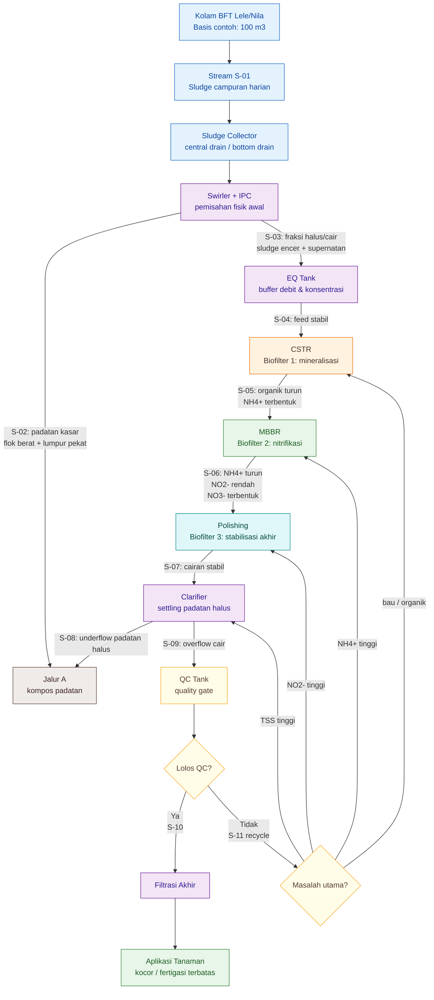

---

## **B.3 Stream Table PFD**

Setiap aliran dalam PFD diberi kode stream agar mudah dirujuk pada perhitungan berikutnya.

| Stream | Dari          | Ke               | Fungsi                  | Parameter utama                         |
| ------ | ------------- | ---------------- | ----------------------- | --------------------------------------- |
| S-01   | Kolam BFT     | Sludge collector | sludge campuran harian  | volume sludge, TSS, bau                 |
| S-02   | Swirler + IPC | Jalur A          | padatan kasar           | padatan, flok berat, lumpur pekat       |
| S-03   | Swirler + IPC | EQ Tank          | fraksi halus/cair       | debit, TSS halus, COD, $NH_4^+$         |
| S-04   | EQ Tank       | CSTR             | feed stabil             | $Q$, pH, COD, homogenitas               |
| S-05   | CSTR          | MBBR             | hasil mineralisasi      | COD turun, $NH_4^+$ terbentuk           |
| S-06   | MBBR          | Polishing        | hasil nitrifikasi       | $NH_4^+$ turun, $NO_2^-$, $NO_3^-$      |
| S-07   | Polishing     | Clarifier        | cairan stabil           | pH/EC stabil, bau aman                  |
| S-08   | Clarifier     | Jalur A          | underflow padatan halus | TSS, lumpur halus                       |
| S-09   | Clarifier     | QC Tank          | overflow cair           | $NH_4^+$, $NO_2^-$, $NO_3^-$            |
| S-10   | QC Tank       | Filtrasi akhir   | produk lolos QC         | $NO_2^-<1 \ \mathrm{mg/L}$, tidak busuk |
| S-11   | QC Tank       | recycle          | produk off-spec         | tergantung masalah                      |

Stream table ini penting karena setiap stream memiliki fungsi berbeda. Misalnya, $S\text{-}05$ tidak harus sudah tinggi nitrat, karena stream tersebut baru keluar dari CSTR. Sebaliknya, $S\text{-}06$ harus menunjukkan penurunan $NH_4^+$ karena sudah keluar dari MBBR.

---

## **B.4 Basis Neraca Massa Awal**

Untuk contoh awal, gunakan basis farm:

$$
V_{\mathrm{BFT}}=100 \ \mathrm{m^3}
$$

Asumsi pemisahan dan aliran:

| Parameter                          |            Nilai contoh |
| ---------------------------------- | ----------------------: |
| Volume BFT                         |    $100 \ \mathrm{m^3}$ |
| Sludge campuran harian dari sistem | $600 \ \mathrm{L/hari}$ |
| Padatan kasar ke Jalur A           | $350 \ \mathrm{L/hari}$ |
| Sludge halus/pekat ke Jalur B      | $100 \ \mathrm{L/hari}$ |
| Air pengencer/supernatan           | $500 \ \mathrm{L/hari}$ |
| Debit Jalur B                      | $600 \ \mathrm{L/hari}$ |
| Rasio sludge halus : pengencer     |                   $1:5$ |

Rumus debit Jalur B:

$$
Q_{\mathrm{JalurB}}=Q_{\mathrm{sludge,halus}}+Q_{\mathrm{pengencer}}
$$

Dengan contoh:

$$
Q_{\mathrm{JalurB}}=100+500
$$

$$
Q_{\mathrm{JalurB}}=600 \ \mathrm{L/hari}
$$

---

## **B.5 Tabel Neraca Massa Awal**

Tabel berikut adalah neraca massa awal berbasis debit. Angka ini belum memasukkan reaksi biologis secara detail, tetapi cukup untuk sizing awal unit.

| Aliran                   |                      Debit contoh | Arah             | Catatan desain                   |
| ------------------------ | --------------------------------: | ---------------- | -------------------------------- |
| Sludge campuran dari BFT |           $600 \ \mathrm{L/hari}$ | ke Swirler + IPC | angka awal perlu diukur          |
| Padatan kasar            |           $350 \ \mathrm{L/hari}$ | Jalur A          | kompos/pembenah tanah            |
| Sludge halus/pekat       |           $100 \ \mathrm{L/hari}$ | Jalur B          | bahan utama mineralisasi cair    |
| Air pengencer/supernatan |           $500 \ \mathrm{L/hari}$ | Jalur B          | rasio $1:5$                      |
| Feed CSTR                |           $600 \ \mathrm{L/hari}$ | CSTR             | basis sizing CSTR                |
| Feed MBBR                |           $600 \ \mathrm{L/hari}$ | MBBR             | basis TAN loading                |
| Feed polishing           |           $600 \ \mathrm{L/hari}$ | polishing        | basis stabilisasi akhir          |
| Overflow clarifier       | mendekati $600 \ \mathrm{L/hari}$ | QC Tank          | dikurangi underflow dan sampling |
| Underflow clarifier      |                          variabel | Jalur A/recycle  | tergantung TSS                   |
| Produk lolos QC          |                          variabel | filtrasi akhir   | hanya jika memenuhi QC           |

Catatan penting:

> Neraca massa ini adalah basis awal. Dalam operasi nyata, aliran keluar bisa berubah karena underflow clarifier, sampling, recycle, kehilangan air kecil, dan perubahan kandungan padatan.

---

## **B.6 Neraca Beban Biologis Awal**

Selain debit, PFD juga perlu dihubungkan dengan beban biologis. Dua beban paling penting adalah:

1. beban COD untuk CSTR,
2. beban TAN untuk MBBR.

### **B.6.1 Beban COD ke CSTR**

Rumus:

$$
L_{\mathrm{COD}}=\frac{Q \times COD_{\mathrm{in}}}{1000000}
$$

Jika:

$$
Q=600 \ \mathrm{L/hari}
$$

dan:

$$
COD_{\mathrm{in}}=2000 \ \mathrm{mg/L}
$$

maka:

$$
L_{\mathrm{COD}}=\frac{600 \times 2000}{1000000}
$$

$$
L_{\mathrm{COD}}=1.2 \ \mathrm{kg/hari}
$$

Beban ini menjadi dasar menghitung:

$$
OLR_{\mathrm{COD}}=\frac{L_{\mathrm{COD}}}{V_{\mathrm{CSTR}}}
$$

---

### **B.6.2 Beban TAN ke MBBR**

Rumus:

$$
L_{\mathrm{TAN}}=\frac{Q \times C_{NH4}}{1000}
$$

Jika:

$$
Q=600 \ \mathrm{L/hari}
$$

dan:

$$
C_{NH4}=50 \ \mathrm{mg/L}
$$

maka:

$$
L_{\mathrm{TAN}}=\frac{600 \times 50}{1000}
$$

$$
L_{\mathrm{TAN}}=30 \ \mathrm{g/hari}
$$

Beban ini menjadi dasar menghitung luas biofilm MBBR:

$$
A_{\mathrm{req}}=\frac{L_{\mathrm{TAN}}}{r_A}
$$

---

## **B.7 Titik Sampling dalam PFD**

Agar PFD bisa dipakai untuk validasi pilot, setiap stream penting harus punya titik sampling.

| Titik sampling | Lokasi                     | Parameter minimum                         |
| -------------- | -------------------------- | ----------------------------------------- |
| SP-01          | sludge campuran dari kolam | volume, TSS, bau                          |
| SP-02          | outlet Swirler + IPC ke EQ | pH, TSS halus, COD                        |
| SP-03          | outlet CSTR                | pH, DO, COD, $NH_4^+$, bau                |
| SP-04          | outlet MBBR                | pH, DO, $NH_4^+$, $NO_2^-$, $NO_3^-$      |
| SP-05          | outlet polishing           | pH, EC, $NH_4^+$, $NO_2^-$, $NO_3^-$, bau |
| SP-06          | QC Tank                    | pH, EC, $NO_2^-$, uji diam 24 jam         |
| SP-07          | produk setelah filtrasi    | TSS visual, clogging test, uji tanaman    |

---

## **B.8 Recycle dalam PFD**

Recycle harus ditentukan berdasarkan masalah, bukan asal mengembalikan semua off-spec ke awal.

| Masalah QC      | Arah recycle                        | Alasan                       |
| --------------- | ----------------------------------- | ---------------------------- |
| bau busuk       | CSTR                                | organik belum stabil         |
| $NH_4^+$ tinggi | MBBR                                | nitrifikasi belum cukup      |
| $NO_2^-$ tinggi | polishing atau MBBR                 | nitrit belum selesai         |
| pH turun terus  | koreksi alkalinitas, lalu polishing | nitrifikasi masih aktif      |
| TSS tinggi      | clarifier                           | masalah fisik/padatan        |
| filter mampet   | Swirler + IPC / clarifier           | separasi padatan belum cukup |

Prinsip recycle:

```text
recycle harus menuju unit yang sesuai dengan sumber masalah
```

Bila semua produk gagal dikembalikan ke CSTR, beban CSTR bisa naik berlebihan. Bila semua dikembalikan ke polishing, polishing bisa berubah menjadi tempat penumpukan off-spec.

---

## **B.9 Hubungan Lampiran B dengan Lampiran A**

Lampiran B dan Lampiran A saling melengkapi.

| Lampiran   | Fungsi                                                                |
| ---------- | --------------------------------------------------------------------- |
| Lampiran B | menggambarkan aliran proses, stream, neraca massa, dan titik sampling |
| Lampiran A | menghitung ukuran unit, beban biologis, media MBBR, polishing, dan QC |

Urutan pemakaiannya:

```text
Lampiran B
↓
tentukan stream dan debit
↓
Lampiran A
↓
hitung HRT, OLR, TAN loading, media, QC
```

Dengan kata lain:

> **Lampiran B menjawab “alirannya ke mana dan berapa?”, sedangkan Lampiran A menjawab “unitnya perlu sebesar apa dan bebannya masih masuk akal atau tidak?”.**

---

## **B.10 Kesimpulan Lampiran B**

PFD membuat desain Jalur B lebih disiplin. Dengan PFD, setiap aliran dapat diberi kode, setiap stream bisa dihitung, setiap titik sampling bisa ditentukan, dan setiap produk off-spec bisa diarahkan ke recycle yang tepat.

Kesimpulan praktis:

> **PFD adalah jembatan antara konsep biofilter dan detailed design. Tanpa PFD, desain mudah menjadi sekadar deretan tangki. Dengan PFD, Jalur B dapat dibaca sebagai sistem proses dengan aliran, beban, recycle, dan QC yang jelas.**

[**Kembali ke Atas**](#rangkaian-biofilter-aerob-tiga-tahap-untuk-mineralisasi-sludge-bft-cstr-mbbr-dan-polishing)

---

<small>
  **_Catatan Penyusunan_** Artikel ini disusun sebagai materi edukasi dan
  referensi umum berdasarkan berbagai sumber pustaka, praktik lapangan, serta
  bantuan alat penulisan. Pembaca disarankan untuk melakukan verifikasi lanjutan
  dan penyesuaian sesuai dengan kondisi serta kebutuhan masing-masing sistem.
</small>
