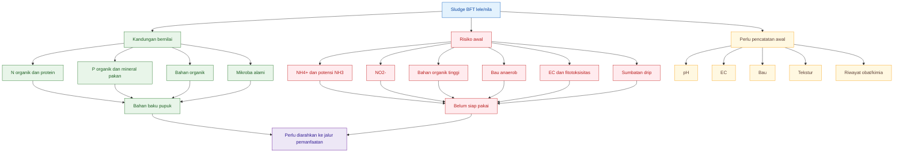
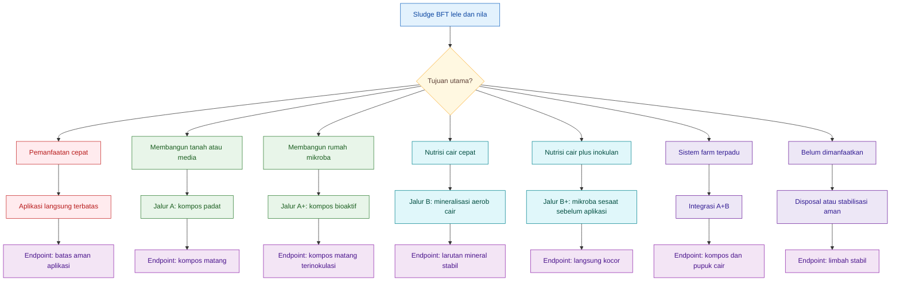
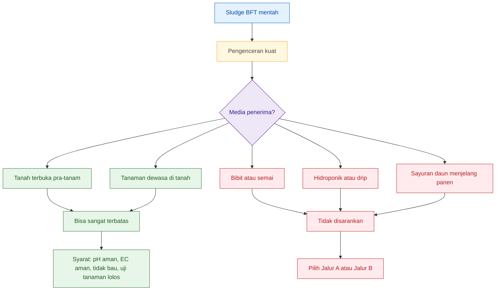
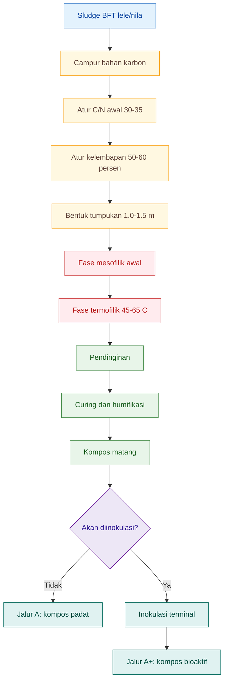
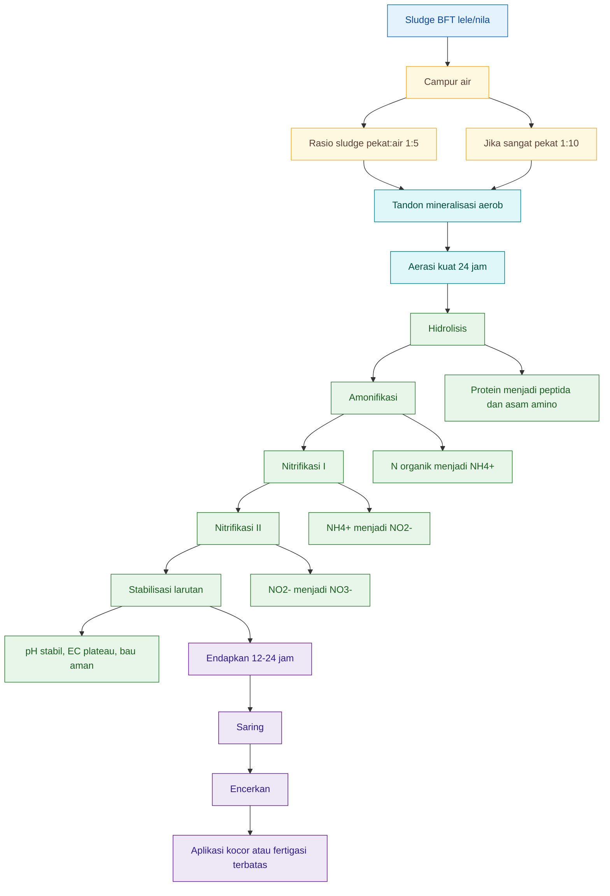
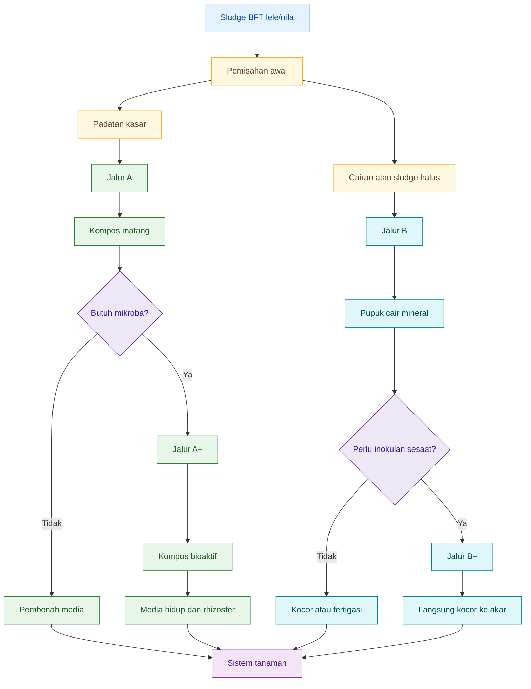
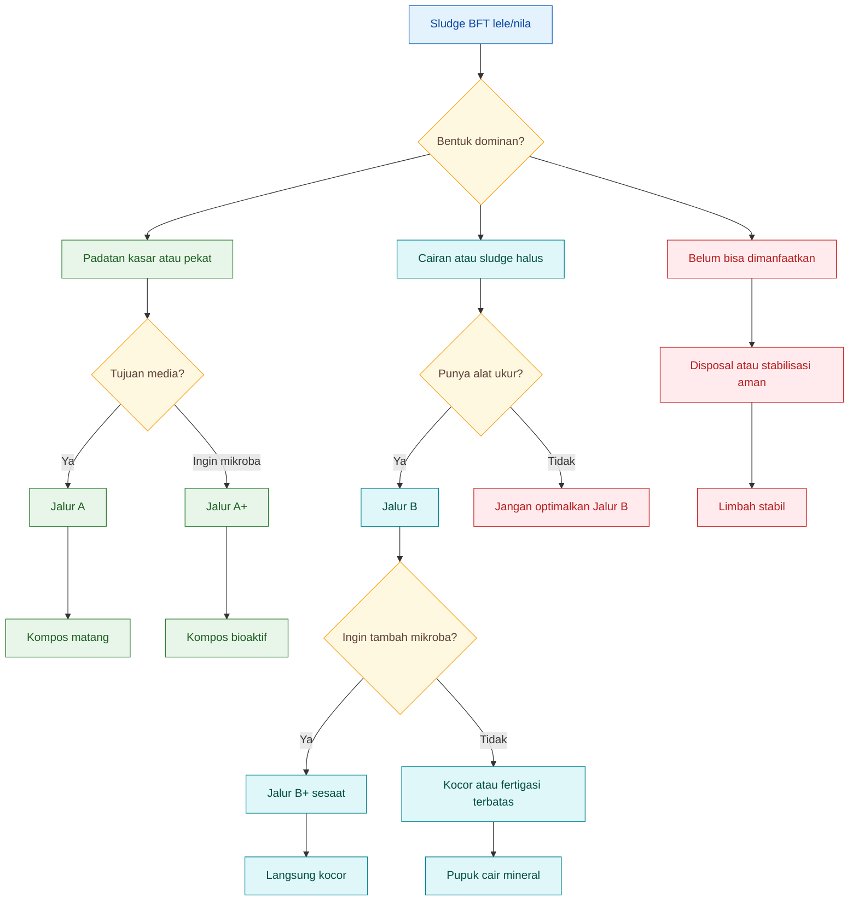

# **_Pemanfaatan Sludge BFT Lele dan Nila: Kompos, Pupuk Cair Mineral, Biofertilizer, dan Integrasi ke Sistem Tanaman_**

_Panduan praktis memilih jalur pemanfaatan berdasarkan proses, endpoint, parameter angka, risiko, dan implementasi lapangan._

---

- [**_Pemanfaatan Sludge BFT Lele dan Nila: Kompos, Pupuk Cair Mineral, Biofertilizer, dan Integrasi ke Sistem Tanaman_**](#pemanfaatan-sludge-bft-lele-dan-nila-kompos-pupuk-cair-mineral-biofertilizer-dan-integrasi-ke-sistem-tanaman)
- [Struktur Artikel Final](#struktur-artikel-final)
  - [1. Sludge BFT Lele dan Nila: Potensi dan Risiko Dasar](#1-sludge-bft-lele-dan-nila-potensi-dan-risiko-dasar)
  - [2. Peta Alternatif Pemanfaatan Sludge](#2-peta-alternatif-pemanfaatan-sludge)
  - [3. Alternatif 1: Aplikasi Langsung Terbatas](#3-alternatif-1-aplikasi-langsung-terbatas)
  - [4. Alternatif 2: Jalur A — Kompos Padat dan Jalur A+ — Kompos Bioaktif](#4-alternatif-2-jalur-a--kompos-padat-dan-jalur-a--kompos-bioaktif)
    - [4.1 Dasar Jalur A](#41-dasar-jalur-a)
    - [4.2 Formula kompos](#42-formula-kompos)
    - [4.3 Parameter proses Jalur A](#43-parameter-proses-jalur-a)
    - [4.4 Endpoint Jalur A](#44-endpoint-jalur-a)
    - [4.5 Jalur A+ — Inokulasi Mikroba Terminal](#45-jalur-a--inokulasi-mikroba-terminal)
  - [5. Alternatif 3: Jalur B — Mineralisasi Aerob Cair dan Jalur B+ — Mikroba Sesaat](#5-alternatif-3-jalur-b--mineralisasi-aerob-cair-dan-jalur-b--mikroba-sesaat)
    - [5.1 Dasar Jalur B](#51-dasar-jalur-b)
    - [5.2 Proses biokimia utama](#52-proses-biokimia-utama)
    - [5.3 Parameter proses Jalur B](#53-parameter-proses-jalur-b)
    - [5.4 Fase Jalur B](#54-fase-jalur-b)
    - [5.5 Endpoint Jalur B](#55-endpoint-jalur-b)
    - [5.6 Implementasi Jalur B](#56-implementasi-jalur-b)
    - [5.7 Jalur B+ — Penambahan mikroba sesaat](#57-jalur-b--penambahan-mikroba-sesaat)
  - [6. Integrasi Jalur A dan B ke Sistem Tanaman](#6-integrasi-jalur-a-dan-b-ke-sistem-tanaman)
    - [6.1 Prinsip integrasi](#61-prinsip-integrasi)
    - [6.2 Alokasi sludge](#62-alokasi-sludge)
    - [6.3 Implementasi berdasarkan sistem tanam](#63-implementasi-berdasarkan-sistem-tanam)
    - [6.4 Implementasi berdasarkan fase tanaman](#64-implementasi-berdasarkan-fase-tanaman)
    - [6.5 Catatan penting fase generatif](#65-catatan-penting-fase-generatif)
  - [7. Tabel Akhir: Endpoint, Risiko, dan Keputusan Praktis](#7-tabel-akhir-endpoint-risiko-dan-keputusan-praktis)
    - [7.1 Ringkasan endpoint](#71-ringkasan-endpoint)
    - [7.2 Ringkasan parameter utama](#72-ringkasan-parameter-utama)
    - [7.3 Ringkasan pilihan](#73-ringkasan-pilihan)
    - [7.4 Kesimpulan tajam](#74-kesimpulan-tajam)
- [Struktur Final dalam Bentuk Ringkas](#struktur-final-dalam-bentuk-ringkas)

---

## 1. Sludge BFT Lele dan Nila: Potensi dan Risiko Dasar

Sludge BFT dari lele dan nila adalah **fraksi padat/lumpur** yang terkumpul dari sistem bioflok, baik dari dasar kolam, central drain, bak sedimentasi, swirl filter, radial flow settler, maupun filter mekanik. Secara sederhana, sludge ini adalah “rekaman limbah biologis” dari sistem budidaya: ada sisa pakan, feses, bioflok tua, mikroba mati, lendir bioflok, bahan organik, nitrogen, fosfor, serta mineral dari pakan.

Namun sejak awal harus ditegaskan:

> **Sludge BFT adalah bahan baku pupuk, bukan pupuk jadi.**

Artinya, sludge memiliki nilai agronomis, tetapi belum tentu aman langsung diberikan ke tanaman. Nilainya baru optimal setelah diarahkan ke jalur pemanfaatan yang tepat: aplikasi langsung terbatas, pengomposan padat, kompos bioaktif, mineralisasi aerob cair, atau integrasi beberapa jalur.

<ResourceBox
  title="Artikel Terkait:"
  items={[
    {
      name: 'Komparasi Ekonomi Budidaya Nila dan Lele pada Kolam Statis, Bioflok, dan RAS Berbasis m² Footprint Lahan',
      href: '/blog/agri/perikanan/komparasi-kolam-statis-bioflok-ras',
    },
    {
      name: 'C/N Ratio pada Bioflok: Mengatur Mikroba, Oksigen, dan Stabilitas Kolam untuk Praktisi',
      href: '/blog/agri/perikanan/ratio-cn-rendah-biflok',
    },
    {
      name: 'E/P Ratio Pakan Ikan: Antara Efisiensi FCR, Fermentasi Ringan, Bioflok, dan Perbedaan Strategi Lele vs Nila',
      href: '/blog/agri/perikanan/ep-ratio-pakan-fermentasi',
    },
    {
      name: 'Manajemen Nitrit dan Nitrat pada Bioflok: `$C/N$`, `$Cl^-$`, Nitrifikasi, Denitrifikasi, dan Ekspor Nitrogen Berbasis Angka',
      href: '/blog/agri/perikanan/nitri-nitrat-manajemen-biofloc',
    },
    {
      name: 'Bioflok Nila Berbasis Neraca Mikroba: C/N Ratio, Protein Pakan, TAN, FCR, dan Keputusan Bisnis',
      href: '/blog/agri/perikanan/bioflok-nila-berbasis-neraca-mikroba',
    },
    {
      name: 'Sistem Sedimentasi Bioflok untuk Praktisi: Analisis Swirler, Radial Sedimentasi, IPC, dan Kombinasi Swirler–IPC',
      href: '/blog/agri/perikanan/sludge-bioflok-sedimentasi',
    },
    {
      name: 'Rangkaian Biofilter Aerob Tiga Tahap untuk Mineralisasi Sludge BFT: CSTR, MBBR, dan Polishing',
      href: '/blog/agri/perikanan/sludge-biofilter-bft',
    },
    {
      name: 'Fermentasi Protein untuk Pakan Lele: Membuat Hidrolisat Asam Amino yang Aman, Rasional, dan Bernilai Guna',
      href: '/blog/agri/perikanan/fermentasi-protein-untuk-pakan-lele',
    },
    {
      name: 'Menurunkan FCR Lele: Dari Pakan Dimakan sampai Menjadi Daging',
      href: '/blog/agri/perikanan/menurunkan-fcr-lele',
    },
    {
      name: 'Kolam Lele sebagai Bioreaktor Penurun FCR Berbasis Bioflok',
      href: '/blog/agri/perikanan/menurunkan-fcr-lele-bioflok',
    },
    {
      name: 'Fermentasi, Pengomposan, dan Pembusukan: Meluruskan Istilah agar Praktisi Agri Tidak Salah Interpretasi',
      href: '/blog/agri/fermentasi-pengomposan-pembusukan',
    },
  ]}
/>

---

### 1.1 Apa itu sludge BFT?

Dalam sistem BFT, nitrogen dari ekskresi ikan dan sisa pakan tidak hanya berada sebagai limbah larut. Sebagian besar masuk ke dinamika mikroba: diikat menjadi biomassa bioflok, masuk ke padatan tersuspensi, lalu sebagian mengendap sebagai sludge. Bioflok sendiri bukan satu jenis bahan, tetapi campuran kompleks dari mikroba, bahan organik, sisa pakan, feses, sel mati, EPS, dan komponen koloid. Literatur BFT menjelaskan bioflok sebagai agregat organik-mikroba yang mengandung bakteri, alga, fungi, protozoa, sel mati, serta polimer ekstraseluler yang membentuk matriks flok. ([PMC][1])

<figure>
  
  <figcaption>
    Ilustrasi komposisi bioflok yang terdiri dari mikroorganisme, bahan organik,
    partikel tersuspensi, nutrien, dan biomassa yang mendukung ekosistem kolam.
  </figcaption>
</figure>

Dalam konteks lele dan nila, sludge BFT umumnya berasal dari:

| Komponen sludge             | Sumber utama                               | Makna agronomis                                 |
| --------------------------- | ------------------------------------------ | ----------------------------------------------- |
| Feses ikan                  | pakan yang tidak tercerna penuh            | sumber bahan organik, $N$, $P$                  |
| Sisa pakan                  | pakan tenggelam, pecah, atau tidak dimakan | sumber protein, lemak, mineral                  |
| Bioflok tua/mati            | biomassa mikroba yang menua                | sumber $N$ organik dan $P$ organik              |
| EPS/lendir bioflok          | matriks pembentuk flok                     | bahan organik kompleks, bisa menyumbat          |
| Mikroba alami               | bakteri heterotrof, nitrifier, protozoa    | tidak semuanya stabil atau menguntungkan        |
| Mineral pakan               | premix, tepung ikan, mineral feed          | sumber $K^+$, $Ca^{2+}$, $Mg^{2+}$, mikroelemen |
| Air dan padatan tersuspensi | air kolam dan lumpur halus                 | menentukan kelembapan, EC, dan risiko anaerob   |

Pada titik ini, sludge belum boleh dianggap setara dengan pupuk organik matang. Ia masih aktif secara biologis dan kimia.

---

### 1.2 Mengapa sludge BFT bernilai?

Sludge BFT bernilai karena membawa **nutrien yang sudah dibeli petani lewat pakan ikan**. Pakan masuk ke kolam, sebagian menjadi biomassa ikan, tetapi sebagian lain keluar sebagai feses, sisa pakan, bioflok, dan padatan. Jika sludge dibuang, maka sebagian nutrien dari pakan ikut hilang dari sistem.

Dalam sistem RAS dan aquaponik, fish sludge sering dipandang sebagai sumber nutrien yang bisa dipulihkan kembali. Sludge ikan mengandung nutrien dari sisa pakan dan feses; proses recovery atau mineralisasi sludge dikaji karena dapat melepaskan kembali unsur seperti nitrogen, fosfor, kalium, kalsium, magnesium, sulfur, dan mikroelemen ke bentuk yang lebih berguna bagi tanaman. ([ScienceDirect][2])

Nilai utama sludge BFT lele/nila dapat dikelompokkan menjadi tiga:

1. **Nilai hara**
   Sludge membawa $N$, $P$, sebagian $K^+$, $Ca^{2+}$, $Mg^{2+}$, sulfur, dan mikroelemen.

2. **Nilai bahan organik**
   Bila distabilkan, bahan organik sludge dapat memperbaiki struktur media, retensi air, dan aktivitas mikroba tanah.

3. **Nilai biologis**
   Sludge mengandung komunitas mikroba. Namun ini harus dibaca hati-hati: mikroba yang ada di sludge belum tentu otomatis menjadi biofertilizer yang stabil.

Dengan kata lain, sludge BFT punya potensi sebagai **input pertanian terpadu**, tetapi harus diproses sesuai tujuan akhirnya.

---

### 1.3 Mengapa tidak boleh langsung dianggap pupuk siap pakai?

Masalah sludge bukan pada “ada hara atau tidak”. Masalahnya adalah **bentuk hara, stabilitas bahan organik, dan keamanan aplikasi**.

Sludge mentah bisa mengandung nitrogen dalam bentuk organik dan amonium. Saat mulai terurai, $N$ organik dapat berubah menjadi $NH_4^+$. Pada kondisi tertentu, terutama $pH$ tinggi, sebagian $NH_4^+$ dapat bergeser menjadi amonia bebas $NH_3$, yang berisiko bagi akar dan juga berbau tajam.

Reaksi keseimbangan sederhananya:

$$
NH_3 + H^+ \leftrightarrow NH_4^+
$$

Selain itu, jika proses oksidasi nitrogen belum selesai, sludge atau cairan sludge dapat mengandung $NO_2^-$. Nitrit adalah bentuk antara yang tidak diinginkan dalam jumlah tinggi. Dalam BFT, nitrogen anorganik seperti $NH_3$-$N$ dan $NO_2^-$-$N$ memang menjadi perhatian utama karena sistem bioflok bekerja dengan mengubah dan mendaur ulang nitrogen tersebut melalui aktivitas mikroba. ([PMC][3])

Risiko lain adalah bahan organik mudah busuk. Jika sludge langsung diberikan ke media, mikroba dapat mengonsumsi oksigen di zona akar. Akibatnya, akar bisa mengalami stres, media menjadi anaerob, dan muncul bau busuk.

---

### 1.4 Perbedaan sludge lele/nila air tawar dengan sludge udang/payau

Sludge BFT lele dan nila air tawar memiliki satu keunggulan penting dibanding sludge udang/payau: **risiko garam umumnya lebih rendah**.

Pada sistem udang, terutama yang menggunakan air payau atau salinitas tertentu, beban $Na^+$ dan $Cl^-$ jauh lebih perlu diperhatikan. Salinitas dan EC tinggi dapat mengganggu tanaman karena garam terlarut menurunkan kemampuan akar menyerap air, dan ion seperti $Na^+$ serta $Cl^-$ dapat menumpuk sampai level toksik pada beberapa tanaman. FAO menjelaskan bahwa EC adalah metode umum untuk memperkirakan kandungan garam air irigasi; semakin tinggi EC, semakin tinggi kandungan garamnya. UC Davis juga menekankan bahwa garam dapat menghambat pertumbuhan melalui stres osmotik dan akumulasi ion seperti $Na^+$ dan $Cl^-$. ([FAOHome][4])

Namun, “air tawar” bukan berarti tanpa risiko EC. Sludge lele/nila tetap bisa memiliki EC tinggi karena:

- mineral dari pakan,
- hasil dekomposisi bahan organik,
- $NH_4^+$,
- fosfat,
- kalium,
- kalsium,
- magnesium,
- akumulasi ion dari air sumber,
- kapur/dolomit/alkalinitas yang digunakan di kolam.

Maka perbedaan praktisnya adalah:

| Aspek                        | Sludge BFT lele/nila air tawar | Sludge BFT udang/payau                 |
| ---------------------------- | ------------------------------ | -------------------------------------- |
| Risiko $Na^+$ dan $Cl^-$     | relatif lebih rendah           | tinggi hingga sangat tinggi            |
| Risiko EC                    | tetap perlu diuji              | wajib diuji ketat                      |
| Risiko bahan organik         | tinggi                         | tinggi                                 |
| Risiko $NH_4^+$ dan $NO_2^-$ | tinggi bila belum stabil       | tinggi bila belum stabil               |
| Cocok ke tanah               | lebih mudah dikelola           | harus hati-hati salinitas              |
| Cocok ke hidroponik          | tetap berisiko                 | sangat berisiko                        |
| Fokus kontrol utama          | organik, amonia, nitrit, EC    | salinitas, EC, organik, amonia, nitrit |

Jadi, sludge lele/nila **lebih ramah untuk dikembangkan ke tanaman** dibanding sludge udang/payau, tetapi tetap harus diproses dan diuji.

---

### 1.5 Peta potensi dan risiko sludge BFT

Diagram berikut merangkum logika dasar bab ini.



---

### 1.6 Risiko utama sludge BFT lele/nila

#### 1. Bahan organik tinggi

Bahan organik adalah potensi sekaligus risiko. Jika sudah stabil, bahan organik memperbaiki tanah. Jika masih mentah, bahan organik justru dapat mengonsumsi oksigen di media dan memicu kondisi anaerob.

Pada aplikasi ke tanah, risiko ini masih bisa ditahan oleh kapasitas buffer tanah. Pada hidroponik atau drip, risiko jauh lebih besar karena bahan organik dapat menjadi substrat biofilm dan menyumbat jaringan irigasi.

#### 2. Amonium dan amonia

Sludge yang kaya protein akan melepaskan $NH_4^+$ saat terurai. Pada $pH$ tinggi, sebagian dapat menjadi $NH_3$. Amonia bebas berbau tajam dan dapat merusak akar bila diaplikasikan pekat.

Indikasi lapangan:

| Gejala                        | Dugaan masalah                         |
| ----------------------------- | -------------------------------------- |
| bau amonia tajam              | $NH_3/NH_4^+$ tinggi                   |
| daun tanaman lunak berlebihan | dominasi $NH_4^+$                      |
| akar cokelat setelah kocor    | larutan terlalu kuat atau belum stabil |
| pH tinggi + bau tajam         | risiko $NH_3$ meningkat                |

#### 3. Nitrit

$NO_2^-$ adalah bentuk antara dalam nitrifikasi. Dalam proses yang baik, $NO_2^-$ hanya muncul sementara sebelum berubah menjadi $NO_3^-$. Jika $NO_2^-$ tinggi dan bertahan lama, berarti proses belum matang.

Urutan nitrogen yang diharapkan pada proses mineralisasi aerob adalah:

$$
N_{\mathrm{organik}} \rightarrow NH_4^+ \rightarrow NO_2^- \rightarrow NO_3^-
$$

Untuk sludge mentah, urutan ini belum selesai. Karena itu sludge mentah tidak bisa disamakan dengan pupuk cair nitrat.

#### 4. Bau anaerob

Bau busuk atau telur busuk menandakan proses anaerob. Ini biasanya terjadi jika sludge terlalu pekat, terlalu lama mengendap tanpa oksigen, atau ditumpuk tanpa bahan karbon dan pori udara.

Bau anaerob berarti:

- oksigen rendah,
- bahan organik belum stabil,
- risiko fitotoksik lebih tinggi,
- jangan diaplikasikan langsung ke akar.

#### 5. EC

EC menunjukkan jumlah ion terlarut total. EC tidak memberi tahu komposisi hara secara spesifik, tetapi sangat penting sebagai indikator risiko “larutan terlalu kuat”.

Satuan umum:

$$
\mathrm{mS/cm}
$$

atau:

$$
\mathrm{dS/m}
$$

Dalam praktik, $1 \ \mathrm{mS/cm}$ setara dengan $1 \ \mathrm{dS/m}$. FAO menyebut EC sebagai metode tidak langsung yang umum untuk menilai kandungan garam air irigasi; semakin tinggi EC, semakin tinggi kandungan garam terlarutnya. ([FAOHome][4])

EC tinggi pada sludge lele/nila tidak selalu berasal dari garam payau. Bisa berasal dari mineral pakan, amonium, nitrat, fosfat, kalium, kalsium, magnesium, dan ion lain. Tetap saja, tanaman membaca semuanya sebagai tekanan osmotik.

#### 6. Fitotoksisitas

Fitotoksisitas berarti bahan tersebut menghambat pertumbuhan tanaman. Pada sludge BFT mentah, penyebabnya bisa kombinasi:

- $NH_4^+$ tinggi,
- $NO_2^-$,
- EC tinggi,
- asam organik,
- bahan organik belum stabil,
- kondisi anaerob,
- residu obat/kimia dari kolam.

Gejalanya:

| Gejala tanaman                       | Kemungkinan penyebab           |
| ------------------------------------ | ------------------------------ |
| bibit layu 1–3 hari setelah aplikasi | EC atau amonia tinggi          |
| akar cokelat                         | fitotoksik atau oksigen rendah |
| daun gosong tepi                     | EC tinggi                      |
| daun terlalu lunak                   | dominasi $NH_4^+$              |
| media berbau                         | bahan organik belum stabil     |

#### 7. Sumbatan drip

Sludge BFT mengandung padatan halus, bioflok, EPS, dan mikroba. EPS atau extracellular polymeric substances berfungsi seperti “lem” biologis yang membuat flok stabil. Dalam konteks pemanfaatan tanaman, sifat ini menjadi masalah jika sludge masuk ke sistem drip atau hidroponik karena dapat membentuk biofilm, lendir, dan sumbatan.

Maka sludge BFT tidak boleh masuk jaringan drip tanpa:

- pengendapan,
- penyaringan bertahap,
- mineralisasi atau stabilisasi,
- filtrasi halus,
- flushing jaringan.

---

### 1.7 Parameter awal yang harus dicatat

Sebelum memilih jalur pemanfaatan, praktisi harus mencatat data awal. Tanpa data ini, keputusan akan terlalu berbasis “bau dan rasa”, bukan parameter yang bisa dikontrol.

| Parameter              |                 Nilai/target awal | Fungsi keputusan                            |
| ---------------------- | --------------------------------: | ------------------------------------------- |
| $pH$ sludge            |                catat angka aktual | menentukan risiko $NH_3$ dan arah proses    |
| EC sludge              |      catat dalam $\mathrm{mS/cm}$ | menilai kekuatan larutan dan risiko osmotik |
| Bau                    |                      skor $1{-}5$ | mendeteksi amonia atau anaerob              |
| Tekstur                |         cair, lumpur, pekat, cake | menentukan jalur proses                     |
| Sumber sludge          | lele/nila, umur ikan, jenis pakan | menilai beban organik dan mineral           |
| Riwayat obat/kimia     |                     wajib dicatat | menentukan keamanan aplikasi                |
| Waktu pengendapan awal |                     $12{-}24$ jam | memisahkan padatan dan cairan               |

Skor bau yang bisa dipakai di lapangan:

| Skor | Deskripsi bau          | Interpretasi                   |
| ---: | ---------------------- | ------------------------------ |
|    1 | bau tanah/kolam ringan | relatif aman untuk diproses    |
|    2 | amis ringan            | normal untuk sludge ikan       |
|    3 | amis kuat              | bahan organik tinggi           |
|    4 | amonia tajam           | risiko $NH_3/NH_4^+$           |
|    5 | busuk/telur busuk      | anaerob, jangan langsung pakai |

Tekstur juga penting:

| Tekstur       | Ciri                       | Jalur yang lebih logis                   |
| ------------- | -------------------------- | ---------------------------------------- |
| Cair          | banyak air, padatan rendah | mineralisasi cair atau aplikasi terbatas |
| Lumpur encer  | masih mengalir             | perlu pengendapan atau Jalur B           |
| Lumpur pekat  | bisa disekop               | Jalur A atau B setelah pengenceran       |
| Cake          | lebih padat, tidak menetes | Jalur A kompos                           |
| Endapan kasar | banyak feses/flok/pakan    | Jalur A                                  |
| Supernatan    | cairan atas setelah endap  | Jalur B setelah uji                      |

---

### 1.8 Implikasi praktis untuk bab-bab berikutnya

Dari bab ini, ada empat prinsip yang harus dibawa ke seluruh artikel.

Pertama, sludge BFT lele/nila **bernilai** karena membawa nutrien dan bahan organik dari sistem akuakultur.

Kedua, sludge BFT **lebih aman dari sisi garam** dibanding sludge udang/payau, tetapi tetap harus diuji EC karena tanaman merespons total ion terlarut, bukan asal ion tersebut.

Ketiga, sludge BFT **tidak boleh langsung diasumsikan sebagai pupuk siap pakai** karena masih bisa mengandung $NH_4^+$, $NO_2^-$, bahan organik mudah busuk, bau anaerob, dan padatan penyumbat.

Keempat, pemanfaatan sludge harus berbasis tujuan:

| Tujuan                              | Arah pemanfaatan                 |
| ----------------------------------- | -------------------------------- |
| memperbaiki tanah/media             | Jalur A: kompos padat            |
| membangun rumah mikroba             | Jalur A+: kompos bioaktif        |
| menyediakan nutrisi cepat           | Jalur B: mineralisasi aerob cair |
| aplikasi cepat dengan risiko tinggi | aplikasi langsung terbatas       |
| sistem farm paling seimbang         | integrasi Jalur A dan Jalur B    |

Kesimpulan bab ini:

> **Sludge BFT lele dan nila adalah bahan baku yang kaya potensi, tetapi masih “mentah” secara agronomis. Nilainya baru muncul ketika bahan ini diarahkan ke proses yang tepat, diukur dengan parameter yang jelas, dan diaplikasikan sesuai kapasitas media serta fase tanaman.**

[1]: https://pmc.ncbi.nlm.nih.gov/articles/PMC11117240/?utm_source=chatgpt.com 'A Review on Biofloc System Technology, History, Types, and Future ...'
[2]: https://www.sciencedirect.com/science/article/abs/pii/S0959652620309331?utm_source=chatgpt.com 'Recovery of nutrients from fish sludge in an aquaponic ...'
[3]: https://pmc.ncbi.nlm.nih.gov/articles/PMC8667556/?utm_source=chatgpt.com 'Biofloc Microbiome With Bioremediation and Health Benefits - PMC'
[4]: https://www.fao.org/4/x5871e/x5871e07.htm?utm_source=chatgpt.com '6. WATER QUALITY AND CROP PRODUCTION'

[**Kembali ke Atas**](#pemanfaatan-sludge-bft-lele-dan-nila-kompos-pupuk-cair-mineral-biofertilizer-dan-integrasi-ke-sistem-tanaman)

---

## 2. Peta Alternatif Pemanfaatan Sludge

Sebelum membahas Jalur A dan Jalur B secara detail, pembaca harus melihat dulu **peta besar pemanfaatan sludge BFT**. Tanpa peta ini, artikel akan terasa loncat: seolah-olah sludge hanya punya dua pilihan, yaitu dikomposkan atau diaerasi. Padahal di lapangan, alternatifnya lebih luas.

<figure>
  
  <figcaption>
    Ilustrasi pemanfaatan bioflok sebagai sumber nutrisi tambahan, pengolah
    limbah organik, penstabil kualitas air, dan pendukung ekosistem kolam.
  </figcaption>
</figure>

Sludge BFT lele dan nila dapat diarahkan menjadi beberapa produk berbeda: sludge encer untuk aplikasi terbatas, kompos matang, kompos bioaktif, pupuk cair mineral, pupuk cair yang diberi inokulan sesaat, sistem integrasi kompos-cair, atau sekadar distabilkan agar tidak menjadi beban lingkungan. Fish sludge dalam sistem akuaponik/RAS memang banyak dikaji sebagai sumber nutrien yang dapat dipulihkan melalui pengumpulan, digestion, mineralisasi, atau pemanfaatan sebagai pupuk, bukan hanya sebagai limbah yang dibuang. ([AIDIC][1])

Inti bagian ini:

> **Tidak ada jalur terbaik. Setiap jalur punya fungsi, risiko, dan endpoint sendiri.**

---

### 2.1 Cara berpikir: sludge harus diarahkan, bukan langsung dipakai

Sludge BFT adalah bahan mentah. Karena itu pertanyaan pertama bukan:

> “Sludge ini bagus atau tidak?”

Pertanyaan yang lebih tepat adalah:

> **“Sludge ini mau diarahkan menjadi apa?”**

Setiap arah pemanfaatan memiliki konsekuensi berbeda. Jika targetnya memperbaiki tanah, maka sludge harus distabilkan menjadi kompos. Jika targetnya nutrisi cepat, maka sludge perlu dimineralisasi menjadi larutan hara. Jika targetnya carrier mikroba, maka sludge lebih cocok masuk jalur kompos matang lalu diinokulasi pada fase akhir. Jika targetnya hanya membuang sludge agar tidak mencemari lingkungan, maka cukup dilakukan stabilisasi aman.

Dengan demikian, peta pemanfaatan sludge harus dibaca sebagai **decision map**, bukan ranking dari paling baik sampai paling buruk.



Diagram di atas menunjukkan bahwa Jalur A dan Jalur B bukan satu-satunya pilihan. Keduanya adalah bagian dari sistem keputusan yang lebih luas.

---

### 2.2 Tabel peta alternatif pemanfaatan sludge

Tabel berikut menjadi peta utama artikel. Bab-bab berikutnya akan mengupas tiap alternatif dengan parameter teknis, proses, endpoint, dan implementasinya.

| Alternatif                       | Bentuk akhir          | Fungsi utama                | Risiko        | Cocok untuk                |
| -------------------------------- | --------------------- | --------------------------- | ------------- | -------------------------- |
| Aplikasi langsung terbatas       | sludge encer          | pemanfaatan cepat           | tinggi        | tanah pra-tanam            |
| Jalur A: kompos padat            | kompos matang         | membangun media/tanah       | sedang        | tanah, polybag, greenhouse |
| Jalur A+: kompos bioaktif        | kompos + mikroba      | rumah mikroba menguntungkan | rendah-sedang | media hidup, rhizosfer     |
| Jalur B: mineralisasi aerob cair | pupuk cair mineral    | nutrisi cepat               | tinggi        | kocor, fertigasi terbatas  |
| Jalur B+: cair + mikroba sesaat  | pupuk cair + inokulan | kocor langsung              | tinggi        | aplikasi langsung ke akar  |
| Integrasi A+B                    | kompos + pupuk cair   | sistem paling seimbang      | sedang        | farm terpadu               |
| Disposal/stabilisasi aman        | sludge distabilkan    | mitigasi limbah             | rendah        | bila belum dimanfaatkan    |

Risiko pada tabel bukan berarti alternatif tersebut buruk. Risiko berarti **berapa ketat kontrol yang dibutuhkan**. Jalur B, misalnya, sangat bernilai karena dapat menghasilkan nutrisi cair, tetapi juga lebih sensitif terhadap $NH_4^+$, $NO_2^-$, pH, EC, oksigen, dan filtrasi. Sebaliknya, Jalur A cenderung lebih toleran karena kompos padat memiliki ruang, pori udara, bahan karbon, dan fase curing yang memberi waktu bagi bahan organik menjadi stabil.

---

### 2.3 Alternatif 1: aplikasi langsung terbatas

Aplikasi langsung adalah alternatif paling sederhana, tetapi juga paling berisiko. Dalam praktik, ini berarti sludge diencerkan lalu diberikan ke tanah atau media tanpa proses kompos dan tanpa mineralisasi lengkap.

Alternatif ini hanya masuk akal jika:

- digunakan pada tanah, bukan hidroponik;
- diberikan jauh sebelum tanam atau pada tanaman dewasa;
- sludge tidak berbau busuk;
- larutan diencerkan kuat;
- pH dan EC masih dalam batas aman;
- dilakukan uji tanaman kecil terlebih dahulu.

Endpoint alternatif ini bukan “matang”. Endpoint-nya hanya **batas aman aplikasi sementara**.

| Parameter awal                  |       Batas konservatif |
| ------------------------------- | ----------------------: |
| Pengenceran minimum             |                    1:20 |
| Untuk tanaman sensitif          |               1:30–1:50 |
| pH larutan akhir                |                 6,0–7,5 |
| EC larutan akhir sayuran muda   |             < 1,5 mS/cm |
| EC larutan akhir tanaman dewasa |             < 2,5 mS/cm |
| Dosis awal tanaman tanah        |      100–250 mL/tanaman |
| Waktu terbaik                   | 7–14 hari sebelum tanam |
| Kontak daun                     |               dihindari |

Aplikasi langsung tidak cocok untuk bibit, hidroponik, sayuran daun menjelang panen, atau sistem drip. Sludge mentah masih dapat membawa bahan organik mudah busuk, amonium, nitrit, dan padatan halus. Kompos yang belum matang atau bahan organik yang belum stabil dapat menghambat tanaman karena konsumsi oksigen di zona akar dan produksi senyawa fitotoksik seperti amonia atau asam organik; prinsip yang sama berlaku pada sludge mentah yang belum distabilkan. ([MDPI][2])

---

### 2.4 Alternatif 2: Jalur A — kompos padat

Jalur A mengarahkan sludge menjadi **kompos matang**. Ini adalah jalur yang paling logis jika targetnya adalah membangun tanah atau media tanam.

Pada jalur ini, sludge berperan sebagai bahan kaya nitrogen dan bahan organik basah. Karena itu sludge perlu dicampur dengan bahan karbon seperti sekam, jerami cincang, daun kering, cocopeat, serbuk gergaji, biochar, atau kompos matang.

Target Jalur A bukan menghasilkan nutrisi paling cepat, tetapi menghasilkan:

- bahan organik stabil,
- struktur media lebih baik,
- CEC meningkat,
- retensi air lebih baik,
- aktivitas mikroba tanah lebih kuat,
- hara dilepas perlahan,
- media lebih aman untuk akar.

Endpoint Jalur A adalah **kompos matang**, bukan nitrat sebagai endpoint tunggal. Indikator teknisnya antara lain suhu mendekati suhu lingkungan, bau tanah, tekstur remah, C/N akhir turun, $NH_4$-N rendah, rasio $NH_4$-N:$NO_3$-N rendah, dan uji bibit aman. Oregon State University Extension menyebut $NH_4$-N lebih dari 500 ppm dan rasio $NH_4$-N:$NO_3$-N lebih dari 10:1 sebagai indikasi kompos belum matang atau belum selesai dikomposkan. ([OSU Extension Service][3])

Jalur A cocok untuk:

| Kondisi                               | Alasan                          |
| ------------------------------------- | ------------------------------- |
| tanah miskin bahan organik            | perlu pembenah tanah            |
| polybag                               | perlu buffer media              |
| greenhouse soil-bed                   | perlu stabilitas media          |
| petani tidak punya alat uji nitrogen  | lebih aman dibanding Jalur B    |
| ingin mengurangi risiko sludge mentah | kompos memberi fase stabilisasi |
| tersedia bahan karbon                 | proses kompos bisa berjalan     |

---

### 2.5 Alternatif 3: Jalur A+ — kompos bioaktif

Jalur A+ adalah pengembangan dari Jalur A. Setelah kompos mencapai endpoint matang, kompos diinokulasi dengan mikroba fungsional.

Ini penting: **inokulasi mikroba fungsional sebaiknya dilakukan pada fase terminal**, bukan awal atau tengah proses. Pada fase awal, kompos masih panas, tinggi amonia, dan kompetisi mikroba liar masih kuat. Banyak PGPR, pelarut fosfat, atau mikroba fungsional tidak akan optimal jika dimasukkan saat fase termofilik.

Jalur A+ cocok untuk mikroba seperti:

- _Bacillus subtilis_,
- _Bacillus megaterium_,
- _Pseudomonas fluorescens_,
- _Azotobacter_,
- _Azospirillum_,
- _Trichoderma_,
- mikoriza, terutama bila diaplikasikan dekat akar.

Kompos matang menjadi carrier yang lebih logis karena menyediakan permukaan, karbon organik, kelembapan, pori, dan perlindungan bagi mikroba. Literatur biofertilizer carrier menekankan bahwa bahan carrier berperan penting dalam mempertahankan viabilitas, kemudahan aplikasi, penyimpanan, dan efektivitas inokulan mikroba. ([Agriculture Journal][4])

Parameter awal Jalur A+:

| Parameter sebelum inokulasi      |             Target |
| -------------------------------- | -----------------: |
| Suhu kompos                      |             < 40°C |
| Suhu ideal                       |            30–35°C |
| pH                               |            6,5–7,8 |
| Kelembapan                       |             35–50% |
| Bau                              |          bau tanah |
| Reheating setelah dibalik        | < 5°C dalam 48 jam |
| Uji bibit                        |               aman |
| Waktu adaptasi setelah inokulasi |           3–7 hari |

Jalur A+ paling sesuai bila targetnya adalah membangun **media hidup** dan rhizosfer yang lebih aktif.

---

### 2.6 Alternatif 4: Jalur B — mineralisasi aerob cair

Jalur B mengarahkan sludge menjadi **pupuk cair mineral** melalui aerasi. Ini adalah jalur paling krusial secara kontrol proses karena produk akhirnya berupa larutan yang langsung berinteraksi dengan akar.

Target Jalur B adalah mengubah sebagian bahan organik menjadi ion hara larut, terutama mengarahkan nitrogen dari $N$ organik menjadi $NH_4^+$, lalu $NO_2^-$, dan akhirnya $NO_3^-$.

Urutan dasarnya:

$$
N_{\mathrm{organik}} \rightarrow NH_4^+ \rightarrow NO_2^- \rightarrow NO_3^-
$$

Jalur B menarik karena dapat menyediakan nutrisi lebih cepat dibanding kompos. Fish sludge dalam sistem aquaponik dapat diproses melalui treatment aerob atau anaerob untuk mengurangi bahan organik dan memineralisasi nutrien, sehingga nutrien padat dapat dipulihkan menjadi bentuk yang lebih tersedia bagi tanaman. ([Wageningen University eDepot][5])

Namun Jalur B juga lebih sensitif. Jika proses belum selesai, larutan dapat mengandung $NH_4^+$ tinggi, $NO_2^-$ tinggi, COD/BOD tinggi, bau, dan padatan halus. Untuk fertigasi, risiko sumbatan juga harus dihitung.

Parameter awal Jalur B:

| Parameter              |    Target awal |
| ---------------------- | -------------: |
| Rasio sludge pekat:air |            1:5 |
| Sludge sangat pekat    |           1:10 |
| DO minimum             |        >4 mg/L |
| DO ideal               |       5–7 mg/L |
| pH proses              |        6,5–7,5 |
| Suhu                   |        25–35°C |
| Waktu umum             |     14–30 hari |
| $NO_2^-$ endpoint      |       < 1 mg/L |
| Filtrasi kocor         | 100–200 mikron |
| Filtrasi drip          |  50–100 mikron |

Endpoint Jalur B bukan “sudah 21 hari”, tetapi kombinasi: pH stabil, EC plateau, $NH_4^+$ turun, $NO_2^-$ rendah, $NO_3^-$ terbentuk, tidak bau busuk, tidak membusuk saat aerasi dihentikan 24 jam, dan uji tanaman aman.

---

### 2.7 Alternatif 5: Jalur B+ — pupuk cair plus mikroba sesaat

Jalur B+ adalah penggunaan pupuk cair hasil mineralisasi yang diberi inokulan mikroba **tepat sebelum aplikasi**. Ini berbeda dari menyimpan mikroba di dalam tandon Jalur B.

Prinsipnya:

> **Jalur B adalah larutan hara, bukan rumah mikroba jangka panjang.**

Mengapa harus hati-hati? Karena larutan Jalur B yang mengandung $NO_3^-$, sisa karbon organik, dan mikroba tambahan dapat berubah menjadi sistem biologis aktif yang sulit dikontrol. Jika oksigen turun dan karbon masih tersedia, sebagian mikroba dapat mendorong proses denitrifikasi, yaitu reduksi $NO_3^-$ menjadi gas nitrogen seperti $N_2O$ atau $N_2$. Selain itu, mikroba juga dapat membentuk biofilm, mengubah pH, dan menyumbat drip.

Jalur B+ hanya masuk akal jika:

| Kondisi                           | Aturan                 |
| --------------------------------- | ---------------------- |
| Jalur B sudah mencapai endpoint   | wajib                  |
| Larutan sudah disaring            | wajib                  |
| Larutan sudah diencerkan          | wajib                  |
| Mikroba ditambahkan               | tepat sebelum aplikasi |
| Penyimpanan setelah mikroba masuk | dihindari              |
| Aplikasi drip                     | sangat hati-hati       |

Batas praktis:

| Kondisi setelah inokulan masuk |                   Batas waktu penggunaan |
| ------------------------------ | ---------------------------------------: |
| Tanpa aerasi                   |                                  2–6 jam |
| Dengan aerasi ringan           |                                12–24 jam |
| Untuk drip                     | sebaiknya tidak disimpan bersama mikroba |

Jalur B+ cocok sebagai strategi kocor langsung ke akar, bukan sebagai produk simpan.

---

### 2.8 Alternatif 6: Integrasi A+B

Integrasi A+B adalah strategi paling seimbang untuk farm BFT yang ingin memanfaatkan sludge secara menyeluruh.

Prinsipnya sederhana:

```text
Fraksi padat kasar → Jalur A
Fraksi cair atau sludge halus → Jalur B
Kompos matang → media/tanah
Pupuk cair mineral → kocor/fertigasi
```

Dengan integrasi ini, setiap fraksi sludge diarahkan ke fungsi yang paling cocok. Padatan kasar tidak dipaksakan masuk drip. Cairan halus tidak dipaksakan menjadi kompos jika terlalu encer. Kompos membangun media, pupuk cair memberi nutrisi cepat.

Alokasi awal dapat dibuat seperti ini:

| Tujuan farm           | Jalur A | Jalur B |
| --------------------- | ------: | ------: |
| Fokus perbaikan tanah |     70% |     30% |
| Fokus polybag         |     50% |     50% |
| Fokus fertigasi       |     30% |     70% |
| Fokus biofertilizer   |     80% |     20% |
| Fokus nutrisi cepat   |  30–40% |  60–70% |

Integrasi A+B paling cocok untuk sistem pertanian-akuakultur terpadu karena tidak memaksa satu jalur menyelesaikan semua masalah.

---

### 2.9 Alternatif 7: disposal atau stabilisasi aman

Alternatif ini sering dianggap tidak menarik, tetapi tetap penting. Tidak semua farm siap mengolah sludge menjadi pupuk. Jika belum ada sistem pemanfaatan, sludge tetap harus distabilkan agar tidak mencemari lingkungan, menimbulkan bau, atau mengalir ke saluran air.

Disposal aman dapat berupa:

- pengeringan di drying bed,
- pencampuran dengan bahan karbon secara pasif,
- penumpukan terkendali dengan penutup bahan kering,
- aplikasi lahan sangat terbatas dan jauh sebelum tanam,
- penyimpanan sementara tanpa aliran lindi ke badan air.

Endpoint disposal bukan produk pupuk premium. Endpoint-nya adalah:

> **sludge tidak bau busuk, tidak mengalir sebagai limbah cair, tidak menarik lalat berlebihan, dan tidak mencemari saluran air.**

Alternatif ini dipilih jika sludge belum bisa dimanfaatkan, bukan karena nilainya paling tinggi.

---

### 2.10 Decision matrix singkat

Matriks berikut membantu praktisi memilih jalur awal sebelum masuk ke SOP detail.

| Kondisi praktisi                     | Pilihan paling logis             |
| ------------------------------------ | -------------------------------- |
| Tidak punya pH/EC meter              | Jalur A                          |
| Punya pH, EC, test kit N             | Jalur B bisa dikontrol           |
| Ingin memperbaiki tanah              | Jalur A                          |
| Ingin carrier mikroba                | Jalur A+                         |
| Butuh nutrisi cair cepat             | Jalur B                          |
| Ingin fertigasi/drip                 | Jalur B dengan filtrasi ketat    |
| Ingin sistem paling aman dan lengkap | Integrasi A+B                    |
| Mau langsung pakai sludge            | hanya aplikasi langsung terbatas |

Matriks ini tidak bersifat mutlak. Praktisi tetap harus mempertimbangkan volume sludge, jenis tanaman, fase tanaman, alat ukur, tenaga kerja, ketersediaan bahan karbon, dan toleransi risiko.

---

### 2.11 Cara membaca peta alternatif

Ada tiga pertanyaan praktis untuk memilih jalur.

#### Pertanyaan 1: target utamanya media atau nutrisi?

Jika targetnya **media**, pilih Jalur A atau A+.
Jika targetnya **nutrisi cepat**, pilih Jalur B.
Jika ingin keduanya, pilih integrasi A+B.

#### Pertanyaan 2: ada alat ukur atau tidak?

Jika tidak ada pH meter, EC meter, dan test kit nitrogen, Jalur A lebih aman. Jalur B tanpa alat ukur rawan salah baca karena cairan yang tidak bau belum tentu aman.

#### Pertanyaan 3: apakah ingin memakai mikroba inokulan?

Jika ya, Jalur A+ lebih logis. Mikroba fungsional membutuhkan carrier dan zona kolonisasi. Kompos matang lebih cocok menjadi rumah mikroba dibanding larutan Jalur B yang masih berpotensi berubah secara biologis.

---

### 2.12 Inti bab

Peta alternatif ini penting agar pembahasan selanjutnya tidak terjebak pada dikotomi “kompos versus pupuk cair”. Sludge BFT lele dan nila bisa diarahkan ke berbagai jalur, tetapi setiap jalur harus dipilih berdasarkan tujuan dan risikonya.

Kesimpulan bab ini:

> **Aplikasi langsung adalah opsi cepat tetapi berisiko. Jalur A membangun tanah dan media. Jalur A+ membangun rumah mikroba. Jalur B menyediakan nutrisi cair cepat tetapi butuh kontrol ketat. Jalur B+ hanya aman bila mikroba ditambahkan tepat sebelum aplikasi. Integrasi A+B adalah strategi paling seimbang untuk farm terpadu.**

[1]: https://www.aidic.it/cet/21/83/010.pdf?utm_source=chatgpt.com 'Recovery of Nutrients from Fish Sludge as Liquid Fertilizer ...'
[2]: https://www.mdpi.com/2073-4395/14/11/2636?utm_source=chatgpt.com 'The Evaluation of Compost Maturity and Ammonium ...'
[3]: https://extension.oregonstate.edu/catalog/em-9217-interpreting-compost-analyses?utm_source=chatgpt.com 'Interpreting compost analyses - OSU Extension Service'
[4]: https://www.agriculturejournal.org/volume13number2/assessment-of-organic-and-inorganic-carrier-material-based-biofertilizers-a-review/?utm_source=chatgpt.com 'Assessment of Organic and Inorganic Carrier Material ...'
[5]: https://edepot.wur.nl/630704?utm_source=chatgpt.com 'Aerobic and Anaerobic Treatments for Aquaponic Sludge ...'

[**Kembali ke Atas**](#pemanfaatan-sludge-bft-lele-dan-nila-kompos-pupuk-cair-mineral-biofertilizer-dan-integrasi-ke-sistem-tanaman)

---

## 3. Alternatif 1: Aplikasi Langsung Terbatas

Pertanyaan yang paling sering muncul di lapangan adalah:

> **“Apakah sludge BFT boleh langsung disiram ke tanaman?”**

Jawaban teknisnya:

> **Boleh sangat terbatas, tetapi bukan rekomendasi utama.**

Aplikasi langsung berarti sludge BFT digunakan tanpa melalui proses kompos matang dan tanpa mineralisasi aerob lengkap. Sludge hanya diencerkan, lalu diberikan ke tanah atau media. Karena proses stabilisasi belum selesai, alternatif ini harus diperlakukan sebagai **opsi berisiko tinggi**, bukan sebagai SOP utama.

Sludge ikan memang mengandung nutrien yang berpotensi dipulihkan untuk tanaman, tetapi riset fish sludge dalam aquaponik menekankan pentingnya proses recovery atau mineralisasi karena nutrien dalam sludge masih bercampur dengan bahan organik padat dan belum tentu langsung tersedia atau aman bagi tanaman. ([ScienceDirect][1])

---

### 3.1 Posisi aplikasi langsung dalam peta pemanfaatan sludge

Aplikasi langsung adalah jalur paling sederhana, tetapi juga paling tidak stabil.

Pada Jalur A, sludge distabilkan menjadi kompos.
Pada Jalur B, sludge dimineralisasi menjadi larutan hara.
Pada aplikasi langsung, kedua proses itu **belum terjadi secara tuntas**.

Jadi yang terjadi adalah:

```text
sludge mentah
↓
diencerkan
↓
disiram ke tanah/media
↓
tanah/media dipaksa melanjutkan proses stabilisasi
```

Masalahnya, tidak semua tanah atau media mampu menjadi “reaktor biologis” yang aman. Tanah terbuka dengan bahan organik cukup, drainase baik, dan populasi mikroba aktif masih bisa menahan risiko. Sebaliknya, media semai, hidroponik, cocopeat steril, atau sistem drip sangat rentan.



Inti diagram tersebut: aplikasi langsung hanya bisa dipertimbangkan pada **tanah terbuka pra-tanam** atau **tanaman dewasa dengan dosis kecil**. Untuk sistem sensitif, jalur ini harus dihindari.

---

### 3.2 Mengapa aplikasi langsung berisiko?

Risiko utamanya bukan karena sludge “beracun” secara mutlak, tetapi karena sludge masih **belum stabil**. Ia masih mengandung bahan organik mudah urai, nitrogen organik, amonium, kemungkinan nitrit, padatan halus, dan mikroba yang belum terarah.

Dalam sistem akuaponik, amonia dari ikan umumnya diproses oleh bakteri nitrifikasi menjadi nitrit lalu nitrat. Proses nitrifikasi ini membutuhkan oksigen, menghasilkan asam, dan menurunkan alkalinitas. Jika sludge langsung dipakai sebelum proses ini selesai, tanaman bisa menerima campuran nitrogen yang belum stabil, terutama $NH_4^+$ dan mungkin $NO_2^-$. ([NMSU Publications][2])

Urutan nitrogen yang diharapkan adalah:

$$
N_{\mathrm{organik}} \rightarrow NH_4^+ \rightarrow NO_2^- \rightarrow NO_3^-
$$

Pada aplikasi langsung, urutan tersebut belum tentu selesai. Akibatnya, akar bisa menerima bahan yang masih “panas” secara biologis.

Risiko kedua adalah EC. EC menunjukkan jumlah ion terlarut. Semakin tinggi EC, semakin tinggi tekanan osmotik terhadap akar. FAO menggunakan EC sebagai indikator umum tingkat salinitas air irigasi; air dengan EC tinggi memiliki pembatasan penggunaan yang lebih besar untuk tanaman, tergantung jenis tanaman, tanah, drainase, dan manajemen irigasi. ([FAOHome][3])

Risiko ketiga adalah fitotoksisitas. Bahan organik yang belum matang dapat mengandung amonia, asam organik volatil, fenol larut, atau senyawa lain yang menghambat perkecambahan dan pertumbuhan akar. Uji germination index banyak digunakan untuk menilai kematangan dan fitotoksisitas bahan organik; nilai GI tinggi, misalnya di atas 80%, menunjukkan bahan relatif matang dan bebas dari senyawa toksik seperti amonia atau asam organik volatil. ([UC Agriculture and Natural Resources][4])

---

### 3.3 Kapan aplikasi langsung masih bisa digunakan?

Aplikasi langsung hanya layak dipertimbangkan jika memenuhi kondisi berikut:

| Kondisi                      | Penilaian        |
| ---------------------------- | ---------------- |
| Tanah terbuka pra-tanam      | masih bisa       |
| Tanaman dewasa               | bisa dosis kecil |
| Bibit/semai                  | tidak disarankan |
| Hidroponik                   | tidak disarankan |
| Sayuran daun menjelang panen | tidak disarankan |
| Sludge bau busuk             | tidak boleh      |
| Sludge dari kolam sakit      | tidak boleh      |

Tanah terbuka pra-tanam masih bisa menerima sludge encer karena tanah memiliki kapasitas buffer: ada mineral liat, bahan organik, pori udara, mikroba, dan waktu sebelum akar tanaman masuk. Namun, aplikasi tetap harus dilakukan **7–14 hari sebelum tanam**, bukan tepat saat tanam.

Tanaman dewasa juga lebih toleran dibanding bibit karena sistem akar sudah lebih kuat. Tetapi dosis tetap harus kecil dan larutan harus diencerkan.

Bibit dan semai tidak disarankan karena akarnya masih tipis, kapasitas buffer media rendah, dan toleransi terhadap $NH_4^+$, EC, serta bahan organik mentah lebih rendah.

Hidroponik tidak disarankan karena sistemnya tidak memiliki buffer tanah. Padatan halus, EPS, mikroba, dan bahan organik dari sludge dapat membentuk biofilm, menyumbat aliran, menurunkan oksigen, dan mengganggu akar.

Sayuran daun menjelang panen juga tidak disarankan karena alasan sanitasi dan kualitas produk. Sludge mentah sebaiknya tidak kontak dengan bagian tanaman yang dikonsumsi segar.

---

### 3.4 Parameter konservatif aplikasi langsung

Parameter berikut bukan standar mutlak, tetapi batas konservatif untuk mengurangi risiko. Jika tidak mampu mengukur pH dan EC, aplikasi langsung sebaiknya tidak dilakukan pada tanaman bernilai tinggi.

| Parameter                       |            Batas konservatif |
| ------------------------------- | ---------------------------: |
| Pengenceran minimum             |                         1:20 |
| Untuk tanaman sensitif/bibit    |       1:30–1:50 atau hindari |
| pH larutan akhir                |                      6,0–7,5 |
| EC larutan akhir sayuran muda   |                  < 1,5 mS/cm |
| EC larutan akhir tanaman dewasa |                  < 2,5 mS/cm |
| Dosis awal tanaman tanah        |           100–250 mL/tanaman |
| Waktu aplikasi terbaik          |      7–14 hari sebelum tanam |
| Kontak daun                     |                      hindari |
| Uji tanaman                     | 3–5 hari sebelum skala besar |

Pengenceran 1:20 berarti 1 bagian sludge dicampur 20 bagian air. Dalam praktik, jika menggunakan 1 liter sludge, maka tambahkan 20 liter air.

Rumus pengenceran sederhana:

$$
DF=\frac{V_{\mathrm{akhir}}}{V_{\mathrm{sludge}}}
$$

Keterangan:

| Simbol                | Arti                                    |
| --------------------- | --------------------------------------- |
| $DF$                  | dilution factor atau faktor pengenceran |
| $V_{\mathrm{akhir}}$  | volume akhir setelah ditambah air       |
| $V_{\mathrm{sludge}}$ | volume sludge yang digunakan            |

Jika menggunakan 1 liter sludge dan ditambah air sampai total 21 liter, maka:

$$
DF=\frac{21}{1}=21
$$

Dalam bahasa lapangan, ini mendekati pengenceran 1:20.

Estimasi EC setelah pengenceran dapat dihitung secara kasar:

$$
EC_{\mathrm{akhir}}\approx\frac{EC_{\mathrm{sludge}}}{DF}
$$

Contoh:

$$
EC_{\mathrm{sludge}}=12 \ \mathrm{mS/cm}
$$

$$
DF=20
$$

Maka:

$$
EC_{\mathrm{akhir}}\approx\frac{12}{20}=0.6 \ \mathrm{mS/cm}
$$

Namun ini hanya estimasi. EC akhir tetap harus diukur karena sludge bukan larutan homogen sempurna dan ion dapat berbeda antar sampel.

---

### 3.5 SOP aplikasi langsung terbatas

Aplikasi langsung tidak boleh dilakukan dengan cara “ambil sludge lalu siram”. Minimal harus ada prosedur sederhana.

#### Langkah 1 — Ambil sludge dari titik yang relatif bersih

Ambil sludge dari bak endapan, central drain, swirl filter, atau wadah pengumpul. Hindari sludge yang sudah lama membusuk di dasar kolam.

Jangan gunakan sludge jika:

- bau telur busuk,
- warna hitam pekat anaerob,
- berasal dari kolam ikan sakit,
- baru diberi obat/kimia keras,
- ada kematian ikan massal.

#### Langkah 2 — Endapkan 12–24 jam

Endapkan sludge dalam ember atau drum.

Tujuan:

- memisahkan padatan kasar,
- mengurangi beban partikel,
- melihat bau dan perubahan warna,
- mengurangi risiko sumbatan.

Setelah 12–24 jam, ambil bagian cair/lumpur halus yang akan diencerkan. Padatan kasar sebaiknya diarahkan ke Jalur A.

#### Langkah 3 — Ukur pH dan EC

Target larutan akhir setelah pengenceran:

| Target aplikasi |      pH |          EC |
| --------------- | ------: | ----------: |
| sayuran muda    | 6,0–7,5 | < 1,5 mS/cm |
| tanaman dewasa  | 6,0–7,5 | < 2,5 mS/cm |
| pra-tanam tanah | 6,0–7,8 | < 2,5 mS/cm |

Jika EC terlalu tinggi, tambah air. Jika pH terlalu tinggi dan bau amonia tajam, jangan aplikasikan langsung. Arahkan ke Jalur B atau Jalur A.

#### Langkah 4 — Encerkan

Gunakan pengenceran minimum:

$$
1:20
$$

Untuk tanaman sensitif:

$$
1:30 \text{ sampai } 1:50
$$

Pengenceran tinggi lebih aman daripada dosis pekat. Tujuan aplikasi langsung bukan memberi nutrisi maksimal, tetapi memanfaatkan sludge tanpa membuat akar stres.

#### Langkah 5 — Uji tanaman kecil

Sebelum skala besar, lakukan uji pada 5–10 tanaman atau satu petak kecil.

Gunakan tiga perlakuan:

| Perlakuan                   | Tujuan     |
| --------------------------- | ---------- |
| Air biasa                   | kontrol    |
| Sludge encer 1:20           | dosis awal |
| Sludge encer 1:30 atau 1:50 | dosis aman |

Amati 3–5 hari.

Tanda aman:

- daun tidak layu,
- tidak ada gosong tepi daun,
- media tidak berbau,
- akar tidak cokelat,
- pertumbuhan tidak berhenti.

Jika tanaman menunjukkan stres pada 1:20, gunakan pengenceran lebih tinggi atau hentikan aplikasi langsung.

#### Langkah 6 — Aplikasikan ke tanah, bukan daun

Aplikasi dilakukan dengan cara kocor ke tanah/media, bukan semprot daun.

Dosis awal:

$$
100{-}250 \ \mathrm{mL/tanaman}
$$

Untuk bedengan, mulai dari dosis rendah:

$$
0.5{-}1.0 \ \mathrm{L/m^2}
$$

dalam kondisi sudah diencerkan.

Aplikasi terbaik adalah **7–14 hari sebelum tanam**, agar tanah memiliki waktu untuk menstabilkan bahan organik dan nitrogen.

---

### 3.6 Endpoint alternatif ini: bukan matang, tetapi batas aman aplikasi

Berbeda dengan Jalur A dan Jalur B, aplikasi langsung tidak memiliki endpoint proses matang. Tidak ada fase curing, tidak ada target nitrifikasi lengkap, dan tidak ada kompos matang.

Endpoint aplikasi langsung hanyalah:

> **batas aman aplikasi sementara.**

Indikator minimal:

```text
tidak bau busuk
+
diencerkan
+
pH aman
+
EC aman
+
uji tanaman tidak stres
```

Secara teknis, endpoint aplikasi langsung dapat ditulis seperti ini:

| Indikator         |                               Batas minimal |
| ----------------- | ------------------------------------------: |
| Bau               | skor 1–2, maksimal 3 jika sangat diencerkan |
| pH larutan akhir  |                                     6,0–7,5 |
| EC sayuran muda   |                                 < 1,5 mS/cm |
| EC tanaman dewasa |                                 < 2,5 mS/cm |
| Uji tanaman       |                        tidak stres 3–5 hari |
| Waktu pra-tanam   |                                   7–14 hari |
| Kontak daun       |                                   tidak ada |

Jika salah satu indikator utama gagal, terutama bau busuk, pH ekstrem, EC tinggi, atau tanaman uji layu, maka aplikasi langsung harus dihentikan.

---

### 3.7 Batas merah: kondisi yang tidak boleh dilanggar

Aplikasi langsung tidak boleh dilakukan jika salah satu kondisi berikut terjadi:

| Kondisi                          | Keputusan              |
| -------------------------------- | ---------------------- |
| bau telur busuk                  | jangan pakai           |
| bau amonia tajam                 | jangan pakai langsung  |
| sludge hitam anaerob             | jangan pakai langsung  |
| ikan sedang sakit                | jangan pakai           |
| ada riwayat obat/kimia keras     | tahan dulu             |
| EC larutan akhir >2,5 mS/cm      | encerkan atau hentikan |
| pH >8,0 disertai bau amonia      | hentikan               |
| tanaman uji layu                 | hentikan               |
| akan diaplikasikan ke hidroponik | jangan                 |
| akan disemprot ke daun           | jangan                 |
| sayuran daun siap panen          | jangan                 |

Khusus untuk sayuran daun, aplikasi sludge mentah dekat panen harus dihindari. Selain risiko fitotoksisitas, ada risiko sanitasi dan mutu hasil.

---

### 3.8 Implementasi berdasarkan jenis tanaman

#### Tanah pra-tanam

Ini adalah skenario paling aman untuk aplikasi langsung terbatas.

Rekomendasi:

| Parameter   |                           Nilai |
| ----------- | ------------------------------: |
| Pengenceran |                       1:20–1:30 |
| Dosis       |                      0,5–1 L/m² |
| Waktu       |         7–14 hari sebelum tanam |
| Cara        | kocor tanah, lalu campur ringan |
| Syarat      |        tidak bau busuk, EC aman |

Setelah aplikasi, tanah sebaiknya dijaga lembap tetapi tidak becek agar proses mikroba berlangsung aerob.

#### Tanaman dewasa di tanah

Masih bisa dilakukan dengan dosis kecil.

| Tanaman             |       Dosis awal sludge encer |
| ------------------- | ----------------------------: |
| cabai/tomat dewasa  |            100–250 mL/tanaman |
| terong              |            100–250 mL/tanaman |
| pisang/pepaya muda  |                 0,5–1 L/pohon |
| tanaman buah dewasa | 1–2 L/pohon, jauh dari batang |

Aplikasi diberikan di zona perakaran, bukan menempel langsung ke batang.

#### Bibit dan semai

Tidak disarankan.

Jika tetap ingin uji, gunakan pengenceran sangat tinggi:

$$
1:50
$$

Tetapi pilihan yang lebih aman adalah menggunakan kompos matang Jalur A atau pupuk cair Jalur B yang sudah mencapai endpoint.

#### Hidroponik dan drip

Tidak disarankan.

Alasannya:

- padatan halus,
- EPS,
- biofilm,
- risiko $NH_4^+$,
- risiko $NO_2^-$,
- sumbatan emitter,
- fluktuasi pH dan EC,
- akar langsung terpapar.

Untuk hidroponik atau drip, sludge harus diarahkan ke Jalur B dengan filtrasi ketat, bukan aplikasi langsung.

---

### 3.9 Kesalahan umum di lapangan

| Kesalahan                            | Dampak                                 |
| ------------------------------------ | -------------------------------------- |
| sludge mentah langsung disiram pekat | akar stres, bau, tanaman layu          |
| aplikasi ke bibit                    | semai mudah mati                       |
| tidak mengukur EC                    | risiko larutan terlalu kuat            |
| tidak mengukur pH                    | risiko amonia bebas                    |
| sludge bau busuk tetap dipakai       | media anaerob                          |
| disiram ke daun                      | risiko sanitasi dan bercak             |
| masuk drip tanpa filtrasi            | sumbatan                               |
| aplikasi dekat panen sayuran daun    | risiko mutu dan higienitas             |
| menganggap tidak bau berarti aman    | $NO_2^-$ atau EC tetap bisa bermasalah |

Kesalahan paling berbahaya adalah menganggap sludge encer sebagai “POC siap pakai”. Sludge encer belum tentu sudah termineralisasi. Tidak bau belum tentu aman, karena $NO_2^-$ dan EC tidak bisa dinilai dari bau.

---

### 3.10 Keputusan praktis

Aplikasi langsung dapat dipakai hanya bila praktisi menerima bahwa ini adalah opsi **low-control dan high-risk**.

Gunakan aplikasi langsung jika:

| Syarat                  | Status |
| ----------------------- | ------ |
| hanya untuk tanah       | ya     |
| jauh sebelum tanam      | ya     |
| sludge tidak bau busuk  | ya     |
| diencerkan minimal 1:20 | ya     |
| pH dan EC diukur        | ya     |
| uji tanaman lolos       | ya     |

Jangan gunakan aplikasi langsung jika targetnya adalah:

- hidroponik,
- fertigasi presisi,
- bibit,
- sayuran daun dekat panen,
- tanaman bernilai tinggi tanpa uji,
- sistem media kecil dengan buffer rendah.

---

### 3.11 Inti bab

Aplikasi langsung sludge BFT bukan jalur utama, tetapi tetap perlu dibahas karena praktisi sering tergoda melakukannya. Nilai utamanya adalah cepat dan murah. Kelemahannya adalah tidak stabil, sulit diprediksi, dan berisiko tinggi bila diterapkan ke sistem sensitif.

Kesimpulan bab ini:

> **Aplikasi langsung hanya boleh dianggap sebagai opsi terbatas untuk tanah pra-tanam atau tanaman dewasa dengan dosis kecil. Endpoint-nya bukan kematangan proses, tetapi batas aman aplikasi: tidak bau busuk, diencerkan, pH aman, EC aman, dan uji tanaman tidak menunjukkan stres. Untuk sistem yang lebih intensif, sludge sebaiknya diarahkan ke Jalur A atau Jalur B.**

[1]: https://www.sciencedirect.com/science/article/abs/pii/S0959652620309331?utm_source=chatgpt.com 'Recovery of nutrients from fish sludge in an aquaponic ...'
[2]: https://pubs.nmsu.edu/_circulars/CR680/?utm_source=chatgpt.com 'Important Water Quality Parameters in Aquaponics Systems'
[3]: https://www.fao.org/4/t0667e/t0667e08.htm?utm_source=chatgpt.com 'Chapter 4 - Water quality assessment'
[4]: https://ucanr.edu/county/santa-clara-county-cooperative-extension/document/testing-compost-maturity-using-cucumber?utm_source=chatgpt.com 'Testing compost maturity using a cucumber germination ...'

[**Kembali ke Atas**](#pemanfaatan-sludge-bft-lele-dan-nila-kompos-pupuk-cair-mineral-biofertilizer-dan-integrasi-ke-sistem-tanaman)

---

## 4. Alternatif 2: Jalur A — Kompos Padat dan Jalur A+ — Kompos Bioaktif

Jalur A adalah pemanfaatan sludge BFT lele dan nila dengan cara mengubahnya menjadi **kompos padat matang**. Jalur ini berbeda dari Jalur B. Jika Jalur B mengejar larutan mineral yang lebih cepat tersedia, maka Jalur A mengejar **stabilisasi bahan organik** dan pembentukan **humus muda**.

Dengan kata lain:

> **Jalur A bukan proses membuat pupuk cair cepat, tetapi proses mengubah sludge mentah menjadi pembenah tanah yang stabil.**

<figure>
  
  <figcaption>
    Ilustrasi proses mineralisasi pada sistem bioflok, yaitu penguraian bahan
    organik menjadi nutrien yang dapat dimanfaatkan kembali dalam ekosistem
    kolam.
  </figcaption>
</figure>

Jalur A+ adalah pengembangan dari Jalur A. Setelah kompos mencapai endpoint matang, kompos diinokulasi dengan mikroba fungsional agar menjadi **kompos bioaktif**. Jadi Jalur A membangun media, sedangkan Jalur A+ menjadikan media tersebut sebagai **rumah mikroba menguntungkan**.

---

### 4.1 Dasar Jalur A

Sludge BFT lele dan nila memiliki karakter khas: basah, kaya bahan organik, kaya nitrogen organik, dan mengandung fosfor dari pakan serta feses. Fish sludge kering dalam studi fertilisasi dilaporkan memiliki nitrogen sekitar $27{-}70 \ \mathrm{g \ N/kg}$ bahan kering dan C/N sekitar $6.0{-}15.5$, sehingga secara umum fish sludge cenderung kaya nitrogen dan perlu diseimbangkan dengan bahan karbon jika akan dikomposkan. ([sciencedirect.com](https://www.sciencedirect.com/science/article/pii/S0048969723011579?utm_source=chatgpt.com))

Dalam kompos, sludge BFT berperan sebagai:

| Peran sludge                    | Penjelasan teknis                                                                   |
| ------------------------------- | ----------------------------------------------------------------------------------- |
| Sumber $N$                      | berasal dari protein pakan, feses, bioflok, dan biomassa mikroba                    |
| Sumber $P$                      | berasal dari pakan, feses, sel mikroba, DNA/RNA, dan fosfolipid                     |
| Sumber air                      | sludge membawa kelembapan tinggi                                                    |
| Sumber bahan organik mudah urai | menjadi energi awal bagi mikroba kompos                                             |
| Sumber mikroba awal             | membantu memulai dekomposisi, tetapi belum tentu menjadi mikroba fungsional tanaman |

Karena C/N sludge ikan umumnya rendah, sludge tidak boleh ditumpuk sendiri. Jika sludge dikomposkan tanpa bahan karbon, tumpukan mudah menjadi becek, anaerob, berbau amonia, dan kehilangan nitrogen.

Target C/N awal kompos:

$$
C/N_{awal}=25{-}35
$$

Target aman untuk sludge BFT:

$$
C/N_{awal}=30{-}35
$$

C/N akhir kompos matang:

$$
C/N_{akhir}=10{-}20
$$

Cornell Composting menyebut rasio C/N awal sekitar $30:1$ sebagai kisaran umum yang baik untuk memulai kompos, dan C/N akan menurun selama proses karena karbon hilang sebagai $CO_2$; kompos matang dapat mendekati C/N sekitar $10:1$. ([compost.css.cornell.edu](https://compost.css.cornell.edu/calc/cn_ratio.html))

---

### 4.2 Mengapa sludge harus dicampur bahan karbon?

Mikroba kompos membutuhkan keseimbangan antara karbon dan nitrogen. Karbon berfungsi sebagai sumber energi, sedangkan nitrogen diperlukan untuk membangun protein dan biomassa mikroba.

Jika nitrogen terlalu banyak, maka kelebihan nitrogen mudah berubah menjadi amonia:

$$
NH_4^+ \leftrightarrow NH_3 + H^+
$$

Amonia $NH_3$ menyebabkan bau tajam dan menunjukkan kehilangan nitrogen dari sistem. Ini merugikan karena nitrogen adalah salah satu nilai utama sludge.

Jika karbon terlalu banyak, mikroba kekurangan nitrogen. Akibatnya, tumpukan dingin, proses lambat, dan bahan tidak cepat terurai.

Secara praktis:

| Kondisi C/N | Dampak                                        |
| ----------- | --------------------------------------------- |
| $< 20:1$    | nitrogen berlebih, bau amonia, risiko anaerob |
| $25{-}35:1$ | proses kompos aktif dan seimbang              |
| $>40:1$     | proses lambat, suhu sulit naik                |
| $>60:1$     | dekomposisi sangat lambat                     |

Selain menaikkan C/N, bahan karbon juga berfungsi sebagai **bulking agent**. Artinya, bahan karbon menjaga pori udara agar oksigen bisa masuk ke dalam tumpukan. Ini penting karena sludge BFT sangat mudah memadat jika terlalu basah.

---

### 4.3 Bahan karbon yang cocok

Bahan karbon ideal untuk sludge BFT harus memenuhi tiga fungsi sekaligus: menaikkan C/N, menyerap air, dan membuat struktur tumpukan tetap berpori.

| Bahan karbon   | Fungsi utama                      | Catatan praktis                          |
| -------------- | --------------------------------- | ---------------------------------------- |
| Sekam padi     | porositas, mencegah becek         | lambat terurai, bagus sebagai struktur   |
| Jerami cincang | sumber karbon dan pori udara      | cincang $2{-}5 \ \mathrm{cm}$            |
| Daun kering    | karbon sedang, mudah tersedia     | lebih baik dicacah                       |
| Serbuk gergaji | karbon tinggi, menyerap air       | jangan terlalu banyak karena bisa lambat |
| Cocopeat       | menyerap air, memperbaiki tekstur | dapat membuat tumpukan terlalu lembap    |
| Biochar        | adsorben bau, habitat mikroba     | gunakan $5{-}15%$ volume                 |
| Kompos matang  | starter mikroba dan buffer        | gunakan $5{-}20%$ volume                 |

Untuk sludge BFT, bahan karbon sebaiknya tidak hanya satu jenis. Campuran sekam, jerami/daun kering, sedikit cocopeat atau serbuk gergaji, dan kompos matang biasanya lebih stabil dibanding hanya memakai serbuk gergaji.

---

### 4.4 Formula kompos

Rasio sludge dan bahan karbon sangat tergantung kadar air sludge. Karena praktisi lapangan sering bekerja berdasarkan volume, rumus awal dapat dibuat berbasis volume.

| Kondisi sludge          | Rasio sludge : bahan karbon |
| ----------------------- | --------------------------: |
| Sludge sangat basah     |                   $1:4{-}5$ |
| Sludge pekat            |                   $1:2{-}3$ |
| Sludge cake agak kering |                 $1:1.5{-}2$ |

Formula praktis untuk sludge pekat:

```text
100 liter sludge pekat
+
100 liter sekam
+
100 liter jerami/daun kering cincang
+
50 liter cocopeat/serbuk gergaji
+
10–20 liter kompos matang
```

Formula ini tidak harus dianggap kaku. Ia adalah titik awal. Setelah dicampur, koreksi dilakukan berdasarkan tes genggam, bau, dan suhu.

Tes genggam yang benar:

| Hasil genggam                       | Interpretasi      | Koreksi                            |
| ----------------------------------- | ----------------- | ---------------------------------- |
| air menetes banyak                  | terlalu basah     | tambah sekam/jerami/serbuk gergaji |
| menggumpal seperti lumpur           | pori udara rendah | tambah bahan kasar                 |
| terasa kering, tidak menyatu        | terlalu kering    | tambah sludge/air                  |
| lembap seperti spons, tidak menetes | ideal             | lanjutkan proses                   |

Target kelembapan fase aktif:

$$
MC=50{-}60%
$$

Rumus kadar air:

$$
MC=\frac{W_{basah}-W_{kering}}{W_{basah}}\times100%
$$

Keterangan:

| Simbol       | Arti                             |
| ------------ | -------------------------------- |
| $MC$         | moisture content atau kadar air  |
| $W_{basah}$  | berat sampel sebelum dikeringkan |
| $W_{kering}$ | berat sampel setelah dikeringkan |

University of Nebraska–Lincoln Extension mencantumkan kondisi kompos cepat dengan C/N ideal $25:1{-}30:1$, kadar air $50{-}60%$, oksigen $5{-}15%$, dan pH $6.5{-}8.0$ sebagai kisaran preferensi. ([extensionpubs.unl.edu](https://extensionpubs.unl.edu/publication/g1315/2012/html/view?utm_source=chatgpt.com))

---

### 4.5 Alur proses Jalur A

Proses Jalur A dapat dibaca sebagai empat tahap: pencampuran, fase panas, pendinginan, dan curing.



Diagram ini menegaskan bahwa Jalur A+ tidak dimulai dari awal proses. Jalur A+ baru dimulai setelah kompos mencapai endpoint matang.

---

### 4.6 Parameter proses Jalur A

Parameter berikut adalah angka operasional yang dapat dipegang praktisi.

| Parameter             |                 Nilai target |
| --------------------- | ---------------------------: |
| C/N awal              |                    $25{-}35$ |
| Target sludge BFT     |                    $30{-}35$ |
| Kelembapan fase aktif |                   $50{-}60%$ |
| Kelembapan curing     |                   $35{-}50%$ |
| Suhu aktif            |            $45{-}65^\circ C$ |
| Suhu sanitasi         | $>55^\circ C$ minimal 3 hari |
| Tinggi tumpukan       |     $1.0{-}1.5 \ \mathrm{m}$ |
| Lebar tumpukan        |     $1.2{-}2.0 \ \mathrm{m}$ |
| pH proses             |                  $6.5{-}8.0$ |
| Lama fase aktif       |               $3{-}8$ minggu |
| Lama curing           |               $3{-}8$ minggu |
| Total realistis       |              $8{-}16$ minggu |

Suhu menjadi indikator penting. Jika tumpukan tidak naik di atas $40^\circ C$, biasanya masalahnya ada pada kelembapan, ukuran tumpukan, C/N, atau aerasi. Jika suhu terlalu tinggi dan melewati $70^\circ C$, aktivitas mikroba dapat terganggu dan tumpukan perlu dibalik.

Untuk sanitasi, proses termofilik sangat penting. University of Nebraska–Lincoln Extension menyebut suhu $131^\circ F$ atau sekitar $55^\circ C$ selama minimal tiga hari digunakan untuk membantu menghancurkan patogen, sedangkan proses kompos lengkap dapat memerlukan waktu dua sampai enam bulan tergantung kondisi. ([extensionpubs.unl.edu](https://extensionpubs.unl.edu/publication/g1315/2012/pdf/view/g1315-2012.pdf?utm_source=chatgpt.com))

---

### 4.7 Fase proses Jalur A

#### Fase 1 — Mesofilik awal

Fase ini terjadi pada hari $0{-}3$. Mikroba mesofilik mulai memecah bahan mudah urai seperti gula, protein larut, asam amino, dan sebagian bahan organik dari sisa pakan serta bioflok.

Ciri fase ini:

- suhu mulai naik,
- bau sludge masih tercium,
- mikroba aktif,
- tumpukan mulai menghangat,
- oksigen cepat dikonsumsi.

Jika pada fase ini muncul bau busuk atau telur busuk, berarti tumpukan terlalu basah atau kurang pori udara.

#### Fase 2 — Termofilik

Fase ini umumnya terjadi mulai hari ke-$3$ sampai minggu ke-$3$ atau ke-$5$, tergantung bahan dan manajemen.

Target suhu:

$$
45{-}65^\circ C
$$

Pada fase ini terjadi:

- dekomposisi cepat,
- pengurangan bahan organik mudah busuk,
- penurunan bau jika aerasi baik,
- sanitasi biologis,
- konsumsi oksigen tinggi,
- pembentukan panas.

Pembalikan tumpukan sangat penting. Rekomendasi awal:

| Waktu      | Frekuensi pembalikan                |
| ---------- | ----------------------------------- |
| Minggu 1   | tiap 2–3 hari                       |
| Minggu 2–3 | tiap 3–5 hari                       |
| Minggu 4–6 | tiap 5–7 hari                       |
| Curing     | sesuai kebutuhan, 1–2 minggu sekali |

#### Fase 3 — Pendinginan

Pada minggu $4{-}8$, bahan mudah urai mulai berkurang. Suhu turun perlahan. Mikroba pengurai bahan lebih kompleks, aktinomiset, dan fungi mulai lebih berperan.

Ciri fase pendinginan:

- bau busuk hilang,
- bau tanah mulai muncul,
- warna makin gelap,
- struktur mulai remah,
- panas tidak sekuat fase termofilik.

#### Fase 4 — Curing dan humifikasi

Fase curing adalah fase yang sering diremehkan, padahal sangat penting. Pada fase ini kompos tidak lagi mengejar panas, tetapi mengejar **kematangan dan stabilitas**.

Yang terjadi pada fase curing:

- amonia menurun,
- sebagian $NH_4$-N berubah menjadi $NO_3$-N,
- bahan organik menjadi lebih stabil,
- senyawa fitotoksik berkurang,
- humus muda terbentuk,
- kompos menjadi lebih aman untuk akar.

Pada fase inilah kompos mulai layak menjadi carrier mikroba fungsional.

---

### 4.8 Endpoint Jalur A

Endpoint Jalur A **bukan nitrat**. Nitrat bisa muncul dalam kompos matang, terutama saat curing, tetapi Jalur A tidak bertujuan mengubah seluruh nitrogen menjadi nitrat.

Endpoint Jalur A adalah:

> **kompos matang, stabil, remah, tidak panas, tidak fitotoksik, dan siap menjadi pembenah media.**

Parameter endpoint:

| Indikator                 |                                 Target |
| ------------------------- | -------------------------------------: |
| Suhu akhir                | suhu lingkungan + maksimal $5^\circ C$ |
| Reheating setelah dibalik |        naik $< 5^\circ C$ dalam 48 jam |
| C/N akhir                 |                              $10{-}20$ |
| pH akhir                  |                            $6.5{-}8.0$ |
| Bau                       |                    tanah, tanpa amonia |
| Tekstur                   |                     remah, tidak becek |
| $NH_4$-N                  |      $< 500 \ \mathrm{ppm}$ bila diuji |
| Rasio $NH_4$-N:$NO_3$-N   |                               $< 10:1$ |
| Germination Index         |                                 $>80%$ |
| Uji bibit                 |              $80{-}100%$ tumbuh normal |

Oregon State University Extension menyatakan bahwa $NH_4$-N lebih dari $500 \ \mathrm{ppm}$ dan rasio $NH_4$-N:$NO_3$-N lebih dari $10:1$ mengindikasikan kompos belum matang atau belum selesai dikomposkan; pada kondisi suhu tinggi, nitrifikasi terhambat sehingga $NH_4$ dapat menumpuk, sedangkan saat curing $NH_4$ dapat dikonversi menjadi $NO_3$. ([extension.oregonstate.edu](https://extension.oregonstate.edu/catalog/em-9217-interpreting-compost-analyses?utm_source=chatgpt.com))

Uji Germination Index juga penting. UC Agriculture and Natural Resources menyebut GI di atas $80%$ sebagai indikasi kompos matang dan relatif bebas dari zat toksik seperti amonia, senyawa fenolik larut, atau asam organik volatil. ([ucanr.edu](https://ucanr.edu/county/santa-clara-county-cooperative-extension/document/testing-compost-maturity-using-cucumber?utm_source=chatgpt.com))

---

### 4.9 Menghitung C/N campuran

Untuk skala praktisi, rasio volume sudah cukup sebagai titik awal. Namun untuk skala komersial, C/N sebaiknya dihitung berdasarkan bahan kering.

Rumus C/N campuran:

$$
C/N_{mix}=\frac{\sum(W_i \times DM_i \times C_i)}{\sum(W_i \times DM_i \times N_i)}
$$

Keterangan:

| Simbol | Arti                             |
| ------ | -------------------------------- |
| $W_i$  | berat bahan ke-$i$               |
| $DM_i$ | fraksi bahan kering bahan ke-$i$ |
| $C_i$  | fraksi karbon bahan ke-$i$       |
| $N_i$  | fraksi nitrogen bahan ke-$i$     |

Contoh prinsipnya: sludge BFT adalah bahan kaya nitrogen dan air, sedangkan sekam, jerami, daun kering, serbuk gergaji, dan cocopeat adalah bahan karbon. Campuran harus menghasilkan C/N awal sekitar $30{-}35$ untuk sludge BFT agar risiko bau amonia lebih rendah.

---

### 4.10 Jalur A+ — Inokulasi mikroba terminal

Jalur A+ dimulai setelah kompos Jalur A mencapai endpoint. Inokulasi mikroba fungsional tidak dilakukan pada awal proses karena fase awal dan fase termofilik terlalu keras untuk banyak mikroba tanaman.

Alasan inokulasi dilakukan setelah endpoint:

| Alasan                        | Penjelasan                                   |
| ----------------------------- | -------------------------------------------- |
| Fase awal masih tinggi amonia | $NH_3/NH_4^+$ dapat menekan mikroba sensitif |
| Fase termofilik terlalu panas | suhu $45{-}65^\circ C$ dapat membunuh PGPR   |
| Kompetisi mikroba liar tinggi | inokulan target bisa kalah                   |
| Bahan organik belum stabil    | carrier belum siap                           |
| Risiko fitotoksik masih ada   | mikroba dan akar sama-sama bisa stres        |

Jadi prinsip Jalur A+ adalah:

```text
komposkan dulu sampai matang
↓
pastikan endpoint tercapai
↓
baru inokulasi mikroba fungsional
↓
beri waktu adaptasi
↓
aplikasikan ke media atau zona akar
```

Parameter sebelum inokulasi:

| Parameter                        |            Target |
| -------------------------------- | ----------------: |
| Suhu kompos                      |    $< 40^\circ C$ |
| Suhu ideal                       | $30{-}35^\circ C$ |
| pH                               |       $6.5{-}7.8$ |
| Kelembapan                       |        $35{-}50%$ |
| Bau                              |             tanah |
| Uji bibit                        |             lolos |
| Waktu adaptasi setelah inokulasi |          3–7 hari |

Kompos matang cocok sebagai carrier karena memiliki permukaan partikel, pori udara, bahan organik, kelembapan, dan perlindungan fisik. Review tentang carrier biofertilizer menekankan bahwa carrier berperan penting dalam mempertahankan viabilitas mikroba, memudahkan aplikasi, dan mendukung efektivitas inokulan selama penyimpanan serta penggunaan. ([agriculturejournal.org](https://www.agriculturejournal.org/volume13number2/assessment-of-organic-and-inorganic-carrier-material-based-biofertilizers-a-review/?utm_source=chatgpt.com))

---

### 4.11 Mikroba yang cocok untuk Jalur A+

Mikroba berikut dapat dipertimbangkan, tergantung target komoditas dan kondisi media.

| Mikroba                   | Fungsi                  | Catatan aplikasi                        |
| ------------------------- | ----------------------- | --------------------------------------- |
| _Bacillus subtilis_       | PGPR, antagonis patogen | cocok untuk kompos matang               |
| _Bacillus megaterium_     | pelarut P               | baik untuk tanah/media                  |
| _Pseudomonas fluorescens_ | PGPR, pelarut P         | lebih sensitif terhadap kondisi ekstrem |
| _Azotobacter_             | fiksasi N bebas         | butuh bahan organik dan aerasi          |
| _Azospirillum_            | stimulasi akar          | efektif dekat akar                      |
| _Trichoderma_             | antagonis jamur         | cocok pada kompos curing/matang         |
| Mikoriza                  | perluasan serapan akar  | terbaik langsung di zona akar           |

Untuk mikoriza, strategi terbaik bukan mencampurnya terlalu lama dalam kompos, tetapi menempatkannya dekat akar saat tanam. Mikoriza memerlukan akar hidup untuk membentuk simbiosis yang efektif.

---

### 4.12 SOP ringkas Jalur A dan A+

SOP Jalur A:

```text
1. Ambil sludge BFT dari bak endapan/filter.
2. Endapkan 12–24 jam bila sludge masih terlalu cair.
3. Ambil sludge pekat.
4. Campur dengan bahan karbon sesuai kondisi sludge.
5. Targetkan C/N awal 30–35.
6. Atur kelembapan 50–60%.
7. Bentuk tumpukan tinggi 1,0–1,5 m.
8. Balik rutin sesuai fase.
9. Jaga suhu aktif 45–65°C.
10. Masuk curing sampai endpoint tercapai.
```

SOP Jalur A+:

```text
1. Pastikan kompos Jalur A matang.
2. Suhu kompos <40°C.
3. Kelembapan 35–50%.
4. Tambahkan inokulan mikroba sesuai dosis label.
5. Aduk merata.
6. Simpan teduh 3–7 hari.
7. Aplikasikan ke media atau zona akar.
```

---

### 4.13 Implementasi Jalur A dan A+

Jalur A digunakan sebagai pembenah media dan pupuk dasar. Jalur A+ digunakan untuk membangun rhizosfer yang lebih aktif.

| Sistem tanam         |              Dosis awal Jalur A/A+ |
| -------------------- | ---------------------------------: |
| Bedengan sayuran     |        $0.5{-}2 \ \mathrm{kg/m^2}$ |
| Tanah miskin organik | $2{-}5 \ \mathrm{kg/m^2}$ bertahap |
| Polybag sayur        |             $5{-}15%$ volume media |
| Polybag cabai/tomat  |            $10{-}20%$ volume media |
| Cabai/tomat lapang   |   $100{-}300 \ \mathrm{g/tanaman}$ |
| Melon/timun          |    $200{-}500 \ \mathrm{g/lubang}$ |
| Tanaman buah muda    |        $1{-}3 \ \mathrm{kg/pohon}$ |
| Tanaman buah dewasa  |       $3{-}10 \ \mathrm{kg/pohon}$ |

Untuk semai, gunakan dosis lebih rendah. Kompos matang tetap bisa memiliki EC dan nutrien cukup tinggi, sehingga media semai sebaiknya memakai kompos dalam proporsi kecil.

---

### 4.14 Kesalahan umum Jalur A

| Kesalahan                            | Dampak               | Koreksi                              |
| ------------------------------------ | -------------------- | ------------------------------------ |
| sludge dikomposkan sendiri           | becek, bau, anaerob  | tambah bahan karbon                  |
| C/N terlalu rendah                   | bau amonia, N hilang | tambah sekam/jerami/serbuk gergaji   |
| tumpukan terlalu basah               | oksigen rendah       | balik dan tambah bahan kering        |
| tumpukan terlalu kecil               | suhu tidak naik      | perbesar volume                      |
| tidak ada curing                     | kompos belum aman    | curing 3–8 minggu                    |
| inokulasi PGPR di awal               | mikroba mati/kalah   | inokulasi terminal                   |
| kompos belum matang dipakai ke bibit | fitotoksik           | uji bibit dulu                       |
| hanya menilai dari warna             | salah endpoint       | ukur suhu, bau, reheating, uji bibit |

---

### 4.15 Inti bagian Jalur A dan A+

Jalur A adalah jalur paling logis jika targetnya memperbaiki tanah, membangun media, dan mengurangi risiko sludge mentah. Endpoint Jalur A adalah kompos matang, bukan nitrat. Parameter utamanya adalah C/N, kelembapan, suhu, pH, bau, tekstur, reheating, $NH_4$-N, rasio $NH_4$-N:$NO_3$-N, dan uji bibit.

Jalur A+ adalah strategi lanjutan ketika kompos matang digunakan sebagai **carrier mikroba fungsional**. Inokulasi dilakukan pada fase terminal, bukan awal proses. Dengan demikian, mikroba tidak dipaksa bertahan di lingkungan panas, amonia tinggi, dan belum stabil.

Kesimpulan bagian ini:

> **Jalur A membangun media. Jalur A+ menjadikan media sebagai rumah mikroba menguntungkan. Sludge BFT lele dan nila paling aman menjadi kompos bila diseimbangkan dengan bahan karbon, dijaga kelembapannya, melewati fase panas dan curing, lalu baru diinokulasi mikroba setelah endpoint matang tercapai.**

[**Kembali ke Atas**](#pemanfaatan-sludge-bft-lele-dan-nila-kompos-pupuk-cair-mineral-biofertilizer-dan-integrasi-ke-sistem-tanaman)

---

## 5. Alternatif 3: Jalur B — Mineralisasi Aerob Cair dan Jalur B+ — Mikroba Sesaat

Jalur B adalah alternatif paling sensitif dalam pemanfaatan sludge BFT lele dan nila. Jika Jalur A relatif “forgiving” karena prosesnya terjadi dalam tumpukan kompos dan masih punya fase curing, maka Jalur B jauh lebih ketat. Produk akhirnya berupa **larutan cair** yang berpotensi langsung bersentuhan dengan akar, jaringan drip, atau sistem fertigasi.

Karena itu, Jalur B tidak boleh dipahami sebagai “sludge diberi aerasi lalu jadi pupuk cair”. Definisi yang lebih tepat adalah:

> **Jalur B adalah proses bioreaktor aerob sederhana untuk mengubah sludge BFT menjadi pupuk cair mineral yang lebih stabil, dengan target penting berupa penurunan $NH_4^+$, penurunan $NO_2^-$, pembentukan $NO_3^-$, pelepasan sebagian hara mineral, dan penurunan bahan organik mudah busuk.**

<figure>
  
  <figcaption>
    Ilustrasi proses pengomposan dalam sistem bioflok, yaitu penguraian bahan
    organik oleh mikroorganisme menjadi biomassa dan nutrien yang lebih stabil.
  </figcaption>
</figure>

Jalur B sangat bernilai, tetapi juga paling mudah salah. Larutan yang terlihat tidak terlalu bau belum tentu aman. Larutan yang sudah 21 hari belum tentu matang. Endpoint Jalur B harus ditentukan dari **tren parameter**, bukan umur proses.

---

### 5.1 Dasar Jalur B

Jalur B mengubah sludge BFT menjadi **pupuk cair mineral** melalui aerasi. Aerasi menyediakan oksigen dan pengadukan, tetapi yang bekerja mengubah sludge adalah komunitas mikroba aerob: bakteri heterotrof, bakteri amonifikasi, bakteri nitrifikasi, serta mikroba lain yang ikut memecah bahan organik.

Dalam konteks aquaponik dan RAS, pengolahan sludge ikan melalui mineralisasi atau digestion memang digunakan untuk memulihkan nutrien dari padatan menjadi bentuk yang lebih berguna bagi tanaman. Review fish sludge recovery menyebut bahwa fish sludge dapat diproses untuk memperoleh nutrien larut, termasuk melalui proses aerob, dan aerobic digestion dapat membantu mengoksidasi bahan organik serta menghindari efluen fitotoksik seperti volatile fatty acids dari proses anaerob. ([sciencedirect.com](https://www.sciencedirect.com/science/article/abs/pii/S0959652620309331?utm_source=chatgpt.com))

Target nitrogen paling penting pada Jalur B adalah:

$$
NH_4^+ \rightarrow NO_2^- \rightarrow NO_3^-
$$

Namun Jalur B tidak hanya soal nitrogen. Dalam proses ini juga terjadi:

- hidrolisis protein,
- pelepasan fosfor,
- pelepasan $K^+$,
- pelepasan $Ca^{2+}$ dan $Mg^{2+}$,
- oksidasi karbon organik,
- penurunan bahan organik mudah busuk,
- pengendapan sebagian padatan,
- pembentukan larutan yang lebih mudah disaring dan diaplikasikan.

Secara praktis, Jalur B menghasilkan **nutrisi cair lebih cepat** dibanding Jalur A. Namun, karena bentuk akhirnya cair, kesalahan kecil pada $NH_4^+$, $NO_2^-$, pH, EC, oksigen, atau filtrasi dapat langsung berdampak ke akar tanaman.

---

### 5.2 Mengapa Jalur B lebih krusial dibanding Jalur A?

Jalur A menghasilkan kompos padat. Jika kompos belum matang, proses bisa diperpanjang. Jika kelembapan kurang tepat, tumpukan bisa dibalik dan dikoreksi. Tanah juga masih punya kapasitas buffer.

Jalur B berbeda. Larutan hasil Jalur B bisa langsung masuk ke zona akar. Jika larutan masih tinggi $NH_4^+$, tinggi $NO_2^-$, terlalu pekat, atau masih membawa bahan organik mudah busuk, dampaknya bisa cepat:

- akar cokelat,
- tanaman layu,
- media berbau,
- biofilm terbentuk,
- drip tersumbat,
- pH berubah,
- EC melonjak,
- nitrogen hilang melalui denitrifikasi.

Karena itu Jalur B harus dikelola seperti **unit proses**, bukan sekadar ember fermentasi.



Diagram ini menunjukkan bahwa Jalur B memiliki urutan proses. Jika salah satu tahap macet, terutama nitrifikasi, larutan belum boleh dianggap siap.

---

### 5.3 Proses biokimia utama

<figure>
  
  <figcaption>
    Ilustrasi proses mineralisasi pada sistem bioflok, yaitu penguraian bahan
    organik oleh mikroorganisme menjadi nutrien yang lebih stabil dan dapat
    dimanfaatkan kembali dalam ekosistem kolam.
  </figcaption>
</figure>

#### 5.3.1 Hidrolisis

Pada awal proses, sludge masih mengandung bahan organik kompleks:

- protein pakan,
- protein mikroba bioflok,
- feses,
- EPS atau lendir bioflok,
- lipid,
- karbohidrat,
- DNA/RNA mikroba,
- fosfolipid,
- partikel mineral pakan.

Mikroba heterotrof mengeluarkan enzim untuk memecah bahan kompleks menjadi molekul lebih sederhana.

Reaksi sederhana hidrolisis protein:

$$
\text{Protein} \rightarrow \text{peptida} \rightarrow \text{asam amino}
$$

Fase ini biasanya cepat terjadi pada hari awal. Gejalanya adalah larutan menjadi lebih keruh homogen, bau organik muncul atau berubah, busa bisa meningkat, dan oksigen cepat dikonsumsi.

#### 5.3.2 Amonifikasi

Setelah protein dan asam amino terurai, nitrogen organik dilepas menjadi amonium.

$$
\text{N organik} \rightarrow NH_4^+
$$

Pada fase ini, $NH_4^+$ sering **naik terlebih dahulu**. Ini bukan selalu tanda kegagalan. Justru ini tanda bahwa nitrogen organik mulai dimineralisasi. Yang berbahaya adalah jika $NH_4^+$ tinggi terus dan tidak bergerak menuju proses nitrifikasi.

Keseimbangan amonium dan amonia dipengaruhi pH:

$$
NH_3 + H^+ \leftrightarrow NH_4^+
$$

Pada pH lebih tinggi, fraksi $NH_3$ meningkat. $NH_3$ lebih berbahaya dan berbau tajam. Karena itu larutan Jalur B dengan pH tinggi dan bau amonia tajam belum boleh dipakai.

#### 5.3.3 Nitrifikasi tahap 1

Bakteri pengoksidasi amonia mengubah $NH_4^+$ menjadi $NO_2^-$. Reaksi sederhananya:

$$
NH_4^+ + 1.5O_2 \rightarrow NO_2^- + 2H^+ + H_2O
$$

Tahap ini membutuhkan oksigen. Tahap ini juga menghasilkan $H^+$, sehingga pH dapat turun.

#### 5.3.4 Nitrifikasi tahap 2

Bakteri pengoksidasi nitrit mengubah $NO_2^-$ menjadi $NO_3^-$.

$$
NO_2^- + 0.5O_2 \rightarrow NO_3^-
$$

Reaksi total nitrifikasi:

$$
NH_4^+ + 2O_2 \rightarrow NO_3^- + 2H^+ + H_2O
$$

Nitrifikasi dalam sistem akuakultur dipengaruhi oleh oksigen terlarut, pH, suhu, alkalinitas, konsentrasi substrat, organik, dan turbulensi. Review nitrogen removal in aquaculture menjelaskan bahwa nitrifikasi pada biofilm dipengaruhi oleh substrat, DO, bahan organik, suhu, pH, alkalinitas, salinitas, dan tingkat turbulensi. ([ecowin.org](https://www.ecowin.org/pdf/documents/Aquaculture%20N%20removal.pdf?utm_source=chatgpt.com))

Implikasi praktisnya jelas: aerasi saja tidak cukup jika pH jatuh, oksigen rendah, sludge terlalu pekat, atau bahan organik mudah urai masih terlalu tinggi.

---

### 5.4 Proses hara selain nitrogen

Jalur B sering dibahas seolah-olah hanya soal $NO_3^-$. Itu keliru. Nitrat penting, tetapi bukan satu-satunya hasil mineralisasi.

#### Fosfor

Fosfor berasal dari feses, pakan, sel mikroba, DNA/RNA, fosfolipid, dan mineral pakan. Dalam proses aerob, sebagian $P$ organik dapat dilepas menjadi bentuk fosfat.

$$
\text{P organik} \rightarrow H_2PO_4^- + HPO_4^{2-}
$$

Namun pelepasan fosfor sangat dipengaruhi pH. Dalam pengolahan sludge RAS/aquaponik, penurunan pH selama proses aerob dapat membantu mineralisasi mineral yang terikat dalam sludge, termasuk pelepasan P dari sludge RAS. ([edepot.wur.nl](https://edepot.wur.nl/630704?utm_source=chatgpt.com))

#### Kalium

Kalium relatif lebih mudah lepas karena banyak berada sebagai ion atau dalam cairan sel.

$$
K_{\mathrm{organik/seluler}} \rightarrow K^+
$$

Masalah kalium bukan terutama kecepatan pelepasan, tetapi jumlahnya. Sludge ikan sering tidak cukup sebagai sumber K utama untuk tanaman buah seperti cabai, tomat, melon, dan timun.

#### Kalsium dan magnesium

Kalsium dan magnesium dapat dilepas dari mineral pakan, sel mikroba, dan partikel organik.

$$
Ca_{\mathrm{terikat}} \rightarrow Ca^{2+}
$$

$$
Mg_{\mathrm{terikat}} \rightarrow Mg^{2+}
$$

Namun kelarutannya dipengaruhi pH, karbonat, fosfat, dan bahan organik terlarut. Pada pH tertentu, sebagian dapat mengendap atau terikat kembali.

#### Karbon organik

Karbon organik mudah urai dioksidasi oleh mikroba aerob:

$$
\text{C organik} + O_2 \rightarrow CO_2 + H_2O + \text{energi} + \text{biomassa mikroba}
$$

Proses ini menurunkan bahan organik mudah busuk. Namun pada fase awal, mikroba heterotrof bisa mengonsumsi oksigen sangat cepat. Jika aerasi kurang kuat, proses berubah menjadi anaerob dan menghasilkan bau busuk.

---

### 5.5 Rancangan proses dan metode aerasi

Jalur B membutuhkan tandon, air pengencer, dan aerasi kuat. Tandon bisa berupa drum plastik, bak fiber, IBC tank, atau tandon semen yang mudah dibersihkan.

#### Rasio sludge dan air

Rasio awal yang direkomendasikan:

$$
\text{sludge pekat}:\text{air}=1:5
$$

Jika sludge sangat pekat, bau kuat, atau banyak padatan halus:

$$
\text{sludge pekat}:\text{air}=1:10
$$

Contoh tandon $200 \ \mathrm{L}$:

```text
30 liter sludge pekat
+
150 liter air
=
180 liter campuran proses
```

Jangan mengisi tandon sampai penuh. Sisakan ruang untuk busa, aerasi, dan pengadukan.

#### Metode aerasi

Aerasi Jalur B memiliki dua fungsi:

1. memasok oksigen,
2. mengaduk agar tidak terbentuk zona anaerob.

Desain aerasi yang disarankan:

| Komponen           | Rekomendasi                        |
| ------------------ | ---------------------------------- |
| posisi diffuser    | dasar tandon                       |
| tipe gelembung     | halus sampai sedang                |
| pola aliran        | dari bawah ke atas                 |
| operasi            | 24 jam/hari                        |
| target DO minimum  | $>4 \ \mathrm{mg/L}$               |
| target DO ideal    | $5{-}7 \ \mathrm{mg/L}$            |
| zona mati          | tidak boleh ada endapan hitam diam |
| pengadukan mekanis | opsional, tetapi membantu          |

Studi nutrient recovery dari catfish sludge yang terbaru melaporkan kondisi kultur dengan DO sekitar $4.9{-}6.2 \ \mathrm{mg/L}$ dan pH sekitar $6.9{-}7.3$ selama periode pengamatan, yang sejalan dengan target operasional DO dan pH yang aman untuk proses aerob. ([sciencedirect.com](https://www.sciencedirect.com/science/article/pii/S2666154326002589?utm_source=chatgpt.com))

Jika tidak memiliki DO meter, indikator kasar aerasi cukup adalah:

- tidak ada bau telur busuk,
- tidak ada endapan hitam,
- permukaan aktif tetapi tidak meluap,
- padatan tersuspensi ringan,
- tidak ada lumpur menggumpal di dasar,
- gelembung muncul dari dasar, bukan hanya permukaan.

---

### 5.6 Parameter proses Jalur B

Parameter berikut adalah batas operasional konservatif untuk praktisi.

| Parameter                |            Nilai target |
| ------------------------ | ----------------------: |
| Rasio sludge pekat : air |                   $1:5$ |
| Sludge sangat pekat      |                  $1:10$ |
| DO minimum               |    $>4 \ \mathrm{mg/L}$ |
| DO ideal                 | $5{-}7 \ \mathrm{mg/L}$ |
| pH                       |             $6.5{-}7.5$ |
| Suhu                     |       $25{-}35^\circ C$ |
| Waktu proses umum        |              14–30 hari |
| Evaluasi awal            |               hari ke-7 |
| Evaluasi endpoint        |      hari ke-14, 21, 28 |
| Waktu pengendapan akhir  |               12–24 jam |
| Filtrasi kocor           |          100–200 mikron |
| Filtrasi drip            |           50–100 mikron |

pH perlu dijaga karena nitrifikasi menghasilkan $H^+$ dan dapat menurunkan pH. Nitrification kinetics pada biofilm menunjukkan bahwa konversi amonia ke nitrat mengonsumsi alkalinitas, dan alkalinitas berperan sebagai buffer untuk mencegah perubahan pH akibat produksi asam selama nitrifikasi. ([sciencedirect.com](https://www.sciencedirect.com/science/article/abs/pii/S0144860905001263?utm_source=chatgpt.com))

---

### 5.7 Fase Jalur B

Jalur B tidak berjalan linear sempurna, tetapi model fase berikut berguna untuk membaca proses.

| Fase   |      Waktu | Proses dominan                 | Risiko                   |
| ------ | ---------: | ------------------------------ | ------------------------ |
| Fase 1 |   hari 0–3 | hidrolisis, organik mudah urai | bau, busa, DO turun      |
| Fase 2 |  hari 3–10 | amonifikasi                    | $NH_4^+$ naik            |
| Fase 3 | hari 10–21 | nitrifikasi                    | $NO_2^-$ bisa tinggi     |
| Fase 4 | hari 21–30 | stabilisasi                    | endpoint ditentukan tren |

#### Fase 1 — Hidrolisis dan oksidasi organik awal

Fase ini paling aktif dari sisi mikroba heterotrof. Sludge mulai pecah. Bahan organik mudah urai dikonsumsi. Busa bisa muncul karena protein, lipid, dan EPS.

Risiko fase ini:

- DO turun cepat,
- bau berubah,
- tandon berbusa,
- padatan menggumpal,
- bagian dasar menjadi anaerob jika aerasi lemah.

Larutan fase ini belum layak diaplikasikan.

#### Fase 2 — Amonifikasi

Protein, asam amino, dan nitrogen organik mulai dilepas sebagai $NH_4^+$. Pada fase ini $NH_4^+$ dapat mencapai puncak.

Risiko fase ini:

- bau amonia,
- pH bisa naik atau turun tergantung komposisi,
- $NH_4^+$ tinggi,
- larutan belum aman untuk akar.

#### Fase 3 — Nitrifikasi

Jika oksigen, pH, suhu, dan alkalinitas mendukung, $NH_4^+$ mulai berubah menjadi $NO_2^-$ lalu $NO_3^-$.

Risiko fase ini:

- $NO_2^-$ tinggi sementara,
- pH turun,
- nitrifikasi tahap 2 macet,
- proses berhenti jika pH terlalu rendah.

Larutan tidak boleh diaplikasikan jika $NO_2^-$ masih tinggi.

#### Fase 4 — Stabilisasi

Pada fase ini perubahan harian mulai mengecil. pH dan EC mulai plateau. Bau lebih netral. Padatan lebih mudah mengendap.

Namun fase ini tetap harus dibuktikan dengan pengukuran, bukan asumsi umur.

---

### 5.8 Endpoint Jalur B

Endpoint Jalur B **bukan 21 hari**.

Endpoint-nya adalah kombinasi parameter:

```text
pH stabil
+
EC plateau
+
NH4+ turun
+
NO2- rendah
+
NO3- terbentuk
+
bau tidak busuk
+
larutan tidak membusuk saat aerasi dihentikan 24 jam
+
uji tanaman aman
```

Parameter endpoint:

| Indikator        |                             Target |
| ---------------- | ---------------------------------: |
| pH               |                        $6.5{-}7.5$ |
| Perubahan pH     |    $< 0.3$ unit dalam 3 pengukuran |
| Perubahan EC     |         $< 10%$ dalam 3 pengukuran |
| $NH_4^+$         | turun dari puncak, tidak naik lagi |
| $NO_2^-$         |              $< 1 \ \mathrm{mg/L}$ |
| $NO_3^-$         |                  naik lalu plateau |
| Bau              |    tidak busuk, tidak amonia tajam |
| Uji tanpa aerasi |                 24 jam tidak busuk |
| Uji tanaman      |            aman 3–5 hari pada 1:20 |

Endpoint harus berbasis tren. Misalnya, pengukuran hari ke-17, 19, dan 21 menunjukkan pH stabil, EC tidak naik lebih dari $10%$, $NH_4^+$ turun, $NO_2^-$ rendah, dan $NO_3^-$ terbentuk. Itu lebih kuat daripada sekadar “sudah 21 hari”.

Rumus perubahan EC:

$$
\Delta EC=\frac{EC_{akhir}-EC_{awal}}{EC_{awal}}\times100%
$$

Endpoint EC dianggap mendekat jika:

$$
\Delta EC<10%
$$

dalam tiga pengukuran berturut-turut.

Untuk pH:

$$
\Delta pH<0.3
$$

dalam tiga pengukuran berturut-turut.

---

### 5.9 Interpretasi hasil nitrogen

| Kondisi                 | Interpretasi                               | Keputusan                |
| ----------------------- | ------------------------------------------ | ------------------------ |
| $NH_4^+$ masih naik     | amonifikasi masih aktif                    | belum siap               |
| $NH_4^+$ tinggi stagnan | nitrifikasi lemah                          | lanjut aerasi, cek pH/DO |
| $NO_2^-$ tinggi         | proses tengah atau macet                   | jangan aplikasi          |
| $NO_2^-$ turun          | nitrifikasi tahap 2 berjalan               | mendekati matang         |
| $NO_3^-$ naik           | nitrat terbentuk                           | baik                     |
| $NO_3^-$ plateau        | endpoint mendekat                          | uji aplikasi             |
| $NO_3^-$ turun mendadak | kemungkinan denitrifikasi/konsumsi mikroba | cek aerasi dan karbon    |

Nitrit harus dipandang serius. Dalam sistem aquaponics, nitrit adalah produk antara nitrifikasi yang jauh lebih bermasalah dibanding nitrat, sehingga sistem harus mendorong konversi nitrit menjadi nitrat. ([centralbaltic.eu](https://centralbaltic.eu/wp-content/uploads/2023/05/D3.2.1_Water-requirements-report-FINAL-ENGLISH.pdf?utm_source=chatgpt.com))

---

### 5.10 Pengendapan, penyaringan, dan pengenceran akhir

Setelah endpoint tercapai, Jalur B belum langsung selesai. Masih ada tiga langkah penting: endapkan, saring, dan encerkan.

#### Pengendapan akhir

Matikan aerasi dan endapkan:

$$
12{-}24 \ \mathrm{jam}
$$

Tujuannya:

- memisahkan padatan tersisa,
- mengurangi risiko sumbatan,
- mengambil cairan atas,
- menilai apakah bau busuk muncul kembali.

Jika setelah aerasi dimatikan 24 jam muncul bau busuk, proses belum stabil.

#### Penyaringan

Untuk kocor biasa:

$$
100{-}200 \ \mathrm{mikron}
$$

Untuk drip atau fertigasi:

$$
50{-}100 \ \mathrm{mikron}
$$

Untuk hidroponik sensitif, filtrasi saja belum cukup. Perlu pengujian $NH_4^+$, $NO_2^-$, pH, EC, dan observasi biofilm.

#### Pengenceran

Jalur B adalah stok pupuk cair, bukan selalu larutan siap pakai. Pengenceran dilakukan berdasarkan EC dan sensitivitas tanaman.

Rumus faktor pengenceran:

$$
DF=\frac{V_{akhir}}{V_{stok}}
$$

Estimasi EC akhir:

$$
EC_{akhir}\approx\frac{EC_{stok}}{DF}
$$

Contoh:

$$
EC_{stok}=8 \ \mathrm{mS/cm}
$$

$$
DF=10
$$

Maka:

$$
EC_{akhir}\approx0.8 \ \mathrm{mS/cm}
$$

Tetap ukur ulang setelah pengenceran.

---

### 5.11 Implementasi Jalur B

Penggunaan Jalur B harus dimulai dari dosis rendah. Tanaman, media, dan fase pertumbuhan menentukan konsentrasi akhir.

| Target aplikasi    | Pengenceran awal |                               Dosis awal |
| ------------------ | ---------------: | ---------------------------------------: |
| Bibit              |    $1:30{-}1:50$ |          $20{-}50 \ \mathrm{mL/tanaman}$ |
| Sayuran daun       |    $1:15{-}1:20$ |  $50{-}150 \ \mathrm{mL/tanaman/minggu}$ |
| Cabai/tomat muda   |    $1:15{-}1:20$ | $100{-}250 \ \mathrm{mL/tanaman/minggu}$ |
| Cabai/tomat dewasa |    $1:10{-}1:15$ | $250{-}500 \ \mathrm{mL/tanaman/minggu}$ |
| Tanaman buah muda  |    $1:10{-}1:20$ |       $0.5{-}1 \ \mathrm{L/pohon/bulan}$ |
| Drip/fertigasi     |     mulai $1:20$ |                     berdasarkan EC akhir |

Target EC aplikasi awal:

| Tanaman/sistem        |                EC akhir awal |
| --------------------- | ---------------------------: |
| Bibit                 | $0.4{-}0.8 \ \mathrm{mS/cm}$ |
| Sayuran daun          | $0.8{-}1.5 \ \mathrm{mS/cm}$ |
| Cabai/tomat vegetatif | $1.2{-}2.0 \ \mathrm{mS/cm}$ |
| Cabai/tomat generatif | $1.8{-}2.5 \ \mathrm{mS/cm}$ |
| Melon/timun           | $1.5{-}2.5 \ \mathrm{mS/cm}$ |

Angka EC ini adalah titik awal konservatif. Kebutuhan aktual tergantung varietas, media, iklim, fase tanaman, dan nutrisi lain yang digunakan.

Untuk tanaman buah atau fase generatif, Jalur B sering belum cukup sebagai satu-satunya sumber hara. Sludge ikan dapat membawa N dan P, tetapi kebutuhan $K^+$, $Ca^{2+}$, dan $Mg^{2+}$ pada fase buah biasanya tetap perlu dipenuhi dari sumber tambahan.

---

### 5.12 Troubleshooting Jalur B

| Gejala                                    | Kemungkinan penyebab          | Koreksi                                      |
| ----------------------------------------- | ----------------------------- | -------------------------------------------- |
| Bau telur busuk                           | zona anaerob                  | tambah aerasi, encerkan, buang endapan hitam |
| Bau amonia tajam                          | pH tinggi dan $NH_4^+$ tinggi | lanjut aerasi, cek pH, jangan aplikasi       |
| Busa tebal terus                          | protein/EPS tinggi            | lanjut proses, kurangi beban sludge          |
| $NH_4^+$ tinggi stagnan                   | nitrifikasi lemah             | tambah media biofilm, cek DO/pH              |
| $NO_2^-$ tinggi                           | nitrifikasi tahap 2 macet     | lanjut aerasi, cek pH dan suhu               |
| pH turun < 6                              | alkalinitas habis             | buffer ringan, lanjut monitoring             |
| EC terlalu tinggi                         | stok terlalu pekat            | encerkan                                     |
| larutan kembali busuk setelah aerasi mati | organik belum stabil          | lanjutkan aerasi                             |
| tanaman layu setelah kocor                | EC/$NH_4^+$/$NO_2^-$ tinggi   | encerkan atau proses ulang                   |
| drip mampet                               | padatan/EPS/biofilm           | saring 50–100 mikron dan flush               |

---

### 5.13 Jalur B+ — Penambahan mikroba sesaat

Jalur B+ adalah penggunaan larutan Jalur B yang sudah mencapai endpoint, kemudian diberi inokulan mikroba **tepat sebelum aplikasi**.

Ini berbeda dengan mencampur mikroba ke tandon Jalur B lalu menyimpannya. Penyimpanan jangka panjang larutan Jalur B dengan mikroba fungsional tidak disarankan.

Prinsip utamanya:

> **Jalur B adalah jalur nutrisi cair, bukan rumah mikroba.**

Mikroba fungsional seperti PGPR, pelarut P, pelarut K, atau _Trichoderma_ lebih cocok berada di media padat atau rhizosfer. Dalam larutan Jalur B, mereka dapat mengubah komposisi larutan, membentuk biofilm, mengonsumsi oksigen, atau memicu proses nitrogen yang tidak diinginkan.

---

### 5.14 Risiko Jalur B+ jika disimpan

| Risiko        | Penyebab                           |
| ------------- | ---------------------------------- |
| Denitrifikasi | $NO_3^-$ + karbon + oksigen rendah |
| Nitrat hilang | menjadi $N_2O$ atau $N_2$          |
| Nitrit naik   | proses N tidak seimbang            |
| Biofilm       | mikroba tumbuh dalam larutan       |
| Drip mampet   | EPS, lendir, partikel              |
| pH berubah    | aktivitas metabolik mikroba        |
| Bau muncul    | zona mikro-anaerob                 |

Denitrifikasi adalah proses mikroba yang mereduksi nitrat menjadi bentuk gas nitrogen, melalui tahapan seperti $NO_2^-$, $NO$, $N_2O$, dan akhirnya $N_2$. Proses ini didorong oleh kondisi rendah oksigen dan ketersediaan karbon organik bagi mikroba heterotrof. ([sciencedirect.com](https://www.sciencedirect.com/topics/agricultural-and-biological-sciences/denitrifying-microorganisms?utm_source=chatgpt.com))

Rumus sederhana denitrifikasi:

$$
NO_3^- \rightarrow NO_2^- \rightarrow NO \rightarrow N_2O \rightarrow N_2 \uparrow
$$

Dari sudut pandang pupuk, ini merugikan karena nitrogen yang sudah dikonversi menjadi $NO_3^-$ dapat hilang sebagai gas.

---

### 5.15 Aturan aman Jalur B+

Aturan aman:

```text
Jalur B mencapai endpoint
↓
saring
↓
encerkan
↓
tambahkan mikroba hanya tepat sebelum aplikasi
↓
langsung kocor
```

Batas waktu praktis setelah mikroba ditambahkan:

| Kondisi              |                              Batas waktu |
| -------------------- | ---------------------------------------: |
| Tanpa aerasi         |                                  2–6 jam |
| Dengan aerasi ringan |                                12–24 jam |
| Untuk drip           | tidak disarankan disimpan dengan mikroba |

Jika ingin memakai mikroba fungsional, strategi paling aman adalah:

- mikroba utama ditempatkan di Jalur A+ atau media tanam,
- Jalur B dipakai sebagai nutrisi cair,
- keduanya bertemu di zona akar, bukan disimpan bersama lama dalam tandon.

---

### 5.16 Kapan Jalur B dipilih dan kapan dihindari?

| Pilih Jalur B bila              | Hindari Jalur B bila                      |
| ------------------------------- | ----------------------------------------- |
| butuh nutrisi cair cepat        | tidak punya pH/EC meter                   |
| punya aerasi kuat               | tidak bisa mengukur $NH_4^+$ dan $NO_2^-$ |
| punya test kit nitrogen         | akan digunakan ke bibit tanpa uji         |
| ingin kocor rutin               | larutan masih bau busuk                   |
| ingin fertigasi terbatas        | tidak punya filtrasi                      |
| punya tandon dan kontrol proses | ingin menyimpan mikroba dalam tandon      |

Jalur B adalah pilihan kuat untuk praktisi yang siap mengukur. Jika tidak siap mengukur, Jalur A lebih aman.

---

### 5.17 Inti bagian Jalur B dan Jalur B+

Jalur B adalah proses paling sensitif dalam pemanfaatan sludge BFT lele dan nila. Targetnya bukan sekadar membuat larutan tidak bau, tetapi mengarahkan sludge menuju larutan mineral yang lebih stabil.

Endpoint Jalur B harus dilihat dari:

```text
pH stabil
+
EC plateau
+
NH4+ turun
+
NO2- rendah
+
NO3- terbentuk
+
bau aman
+
uji tanpa aerasi 24 jam aman
+
uji tanaman aman
```

Jalur B+ boleh dilakukan hanya sebagai aplikasi sesaat. Mikroba tidak disimpan lama dalam tandon Jalur B karena risiko denitrifikasi, biofilm, perubahan pH, dan sumbatan drip.

Kesimpulan bagian ini:

> **Jalur B adalah jalur nutrisi cair, bukan rumah mikroba. Ia sangat bernilai untuk menyediakan hara cepat, tetapi harus dikontrol dengan pH, EC, oksigen, nitrogen, filtrasi, dan uji tanaman. Jalur B+ hanya aman jika mikroba ditambahkan setelah larutan diencerkan dan langsung diaplikasikan ke akar.**

[**Kembali ke Atas**](#pemanfaatan-sludge-bft-lele-dan-nila-kompos-pupuk-cair-mineral-biofertilizer-dan-integrasi-ke-sistem-tanaman)

---

## 6. Integrasi Jalur A dan B ke Sistem Tanaman

Setelah memahami Jalur A, Jalur A+, Jalur B, dan Jalur B+, tahap berikutnya adalah menjawab pertanyaan paling penting bagi praktisi:

> **Bagaimana hasil dari setiap jalur itu dipakai pada tanaman dan media tanam?**

Pada bagian ini, fokusnya bukan lagi proses kompos atau proses mineralisasi, tetapi **strategi implementasi**. Sludge BFT lele dan nila tidak harus dipaksa masuk satu jalur. Justru pendekatan yang lebih kuat adalah membagi sludge berdasarkan bentuk dan tujuan penggunaannya.

Prinsip paling praktis:

```text
Padatan kasar → Jalur A → kompos/media
Cairan/sludge halus → Jalur B → pupuk cair mineral
Kompos matang + mikroba → Jalur A+ → rumah mikroba
Pupuk cair mineral → kocor/fertigasi → nutrisi cepat
```

Dengan pendekatan ini, Jalur A dan Jalur B tidak saling menggantikan. Keduanya saling melengkapi.

---

### 6.1 Prinsip integrasi

Jalur A dan Jalur B harus ditempatkan sesuai fungsi agronomisnya.

**Jalur A** berperan sebagai pembangun media. Ia meningkatkan bahan organik, struktur tanah, kapasitas menahan air, kapasitas tukar kation, dan habitat mikroba.

**Jalur A+** berperan sebagai carrier atau rumah mikroba fungsional. Inokulasi mikroba lebih aman dilakukan pada kompos matang dibanding pada larutan Jalur B yang masih bisa berubah secara biologis.

**Jalur B** berperan sebagai sumber nutrisi cair yang lebih cepat tersedia. Ia tidak banyak memperbaiki struktur media, tetapi berguna untuk memberi dorongan hara pada fase pertumbuhan aktif.

**Jalur B+** hanya boleh dipahami sebagai aplikasi sesaat: pupuk cair Jalur B yang sudah stabil, disaring, diencerkan, lalu diberi mikroba tepat sebelum dikocor. Ia bukan produk simpan.

Secara strategis:

> **Jalur A membangun kapasitas media. Jalur B mengisi nutrisi cepat. Jalur A+ membangun ekologi mikroba.**



Diagram ini sengaja dibuat vertikal agar mudah dibaca di layar ponsel. Kuncinya adalah pemisahan awal: **padatan kasar tidak dipaksa menjadi pupuk cair, dan cairan/sludge halus tidak dipaksa menjadi kompos jika terlalu encer**.

---

### 6.2 Alokasi sludge berdasarkan tujuan farm

Tidak semua farm memiliki tujuan yang sama. Farm yang punya lahan luas akan berbeda strateginya dengan farm greenhouse, polybag, atau fertigasi. Karena itu, alokasi sludge perlu disesuaikan.

| Tujuan farm           | Jalur A | Jalur B |
| --------------------- | ------: | ------: |
| Fokus perbaikan tanah |     70% |     30% |
| Fokus polybag         |     50% |     50% |
| Fokus fertigasi       |     30% |     70% |
| Fokus biofertilizer   |     80% |     20% |
| Fokus nutrisi cepat   |  30–40% |  60–70% |

Angka ini bukan hukum tetap. Ini adalah titik awal pengelolaan. Setelah satu atau dua siklus tanam, alokasi dapat disesuaikan berdasarkan:

- volume sludge harian,
- kapasitas area kompos,
- kebutuhan pupuk cair,
- respons tanaman,
- nilai EC media,
- hasil panen,
- biaya bahan karbon,
- tenaga kerja untuk pembalikan kompos,
- kapasitas aerasi Jalur B.

Jika farm belum punya alat ukur pH, EC, $NH_4^+$, $NO_2^-$, dan $NO_3^-$, alokasi lebih aman diarahkan ke Jalur A. Jalur B baru diperbesar ketika kontrol proses sudah memadai.

---

### 6.3 Integrasi berdasarkan bentuk sludge

Setelah sludge diendapkan 12–24 jam, biasanya terbentuk dua fraksi:

1. **padatan bawah**, lebih cocok ke Jalur A;
2. **cairan atas atau sludge halus**, lebih cocok ke Jalur B.

Pembagian praktisnya:

| Fraksi sludge           | Ciri                                        | Jalur terbaik                           |
| ----------------------- | ------------------------------------------- | --------------------------------------- |
| Padatan kasar           | feses, flok besar, sisa pakan, lumpur pekat | Jalur A                                 |
| Sludge cake             | bisa disekop, tidak menetes                 | Jalur A                                 |
| Lumpur halus            | masih cair, padatan kecil                   | Jalur B atau A setelah dewatering       |
| Supernatan              | cairan atas setelah endap                   | Jalur B setelah uji                     |
| Sludge bau busuk        | anaerob                                     | stabilisasi dulu, jangan langsung pakai |
| Sludge dari kolam sakit | risiko biologis                             | jangan masuk pangan segar               |

Pembagian ini penting untuk menghindari kesalahan implementasi. Padatan kasar yang dimasukkan ke Jalur B akan meningkatkan risiko endapan, busa, COD tinggi, dan sumbatan. Sebaliknya, cairan terlalu encer yang dipaksa masuk Jalur A akan membuat kompos becek dan sulit panas.

---

### 6.4 Implementasi berdasarkan sistem tanam

#### 6.4.1 Tanah terbuka

Tanah terbuka adalah sistem paling toleran. Tanah memiliki kapasitas buffer yang lebih baik dibanding hidroponik, cocopeat steril, atau sistem drip. Karena itu, integrasi A+B paling mudah diterapkan di tanah terbuka.

| Jalur                      | Fungsi                                |
| -------------------------- | ------------------------------------- |
| Jalur A                    | pupuk dasar dan pembenah tanah        |
| Jalur A+                   | inokulasi mikroba dan rhizosfer       |
| Jalur B                    | kocor nutrisi cepat                   |
| Aplikasi langsung terbatas | hanya pra-tanam dan sangat diencerkan |

Strategi awal:

```text
Pra-tanam:
Kompos Jalur A/A+ 0,5–2 kg/m²

Vegetatif:
Pupuk cair Jalur B 1:15–1:20, 1 kali/minggu

Generatif:
Jalur B + tambahan K/Ca/Mg sesuai kebutuhan tanaman

Pascapanen:
Kompos Jalur A untuk pemulihan tanah
```

Untuk tanah miskin bahan organik, dosis Jalur A dapat dinaikkan bertahap menjadi:

$$
2{-}5 \ \mathrm{kg/m^2}
$$

Namun kenaikan dosis sebaiknya dilakukan bertahap, bukan sekaligus, terutama jika kompos masih memiliki EC cukup tinggi.

---

#### 6.4.2 Polybag

Polybag memiliki volume terbatas. Karena itu, media mudah mengalami fluktuasi pH, EC, kelembapan, dan suhu. Integrasi A+B sangat berguna, tetapi harus lebih presisi dibanding tanah terbuka.

Kompos Jalur A/A+ digunakan sebagai bagian media. Jalur B digunakan sebagai kocor berkala.

Contoh formula media awal:

| Komponen media       | Kisaran |
| -------------------- | ------: |
| Tanah/topsoil        |  30–50% |
| Cocopeat/sekam bakar |  20–40% |
| Kompos Jalur A/A+    |  10–20% |
| Biochar/arang sekam  |   5–15% |

Untuk semai atau tanaman sangat muda, kompos Jalur A/A+ sebaiknya tidak terlalu tinggi. Mulai dari:

$$
5{-}10%
$$

dari volume media.

Untuk cabai, tomat, terong, atau melon di polybag, kisaran kompos matang yang lebih realistis:

$$
10{-}20%
$$

dari volume media.

Strategi Jalur B pada polybag:

| Fase          | Pengenceran Jalur B | Frekuensi awal  |
| ------------- | ------------------: | --------------- |
| Awal tanam    |                1:20 | 1 kali/minggu   |
| Vegetatif     |           1:15–1:20 | 1–2 kali/minggu |
| Generatif     |           1:10–1:15 | sesuai EC media |
| Tanaman stres |  hentikan sementara | evaluasi pH/EC  |

Pada polybag, EC media lebih mudah naik karena volume media kecil. Oregon State University Extension menjelaskan bahwa EC adalah ukuran garam terlarut; semakin tinggi EC, semakin tinggi garam larut dalam larutan tanah. ([extension.oregonstate.edu](https://extension.oregonstate.edu/sites/extd8/files/documents/em9165.pdf?utm_source=chatgpt.com))

---

#### 6.4.3 Greenhouse soil-bed

Greenhouse soil-bed berada di tengah antara tanah terbuka dan sistem intensif. Produksi lebih tinggi, input lebih sering, dan risiko akumulasi garam lebih besar. Karena itu, Jalur A dan B harus dikelola dengan monitoring EC media.

| Jalur            | Peran                           |
| ---------------- | ------------------------------- |
| Jalur A          | pembenah bedengan sebelum tanam |
| Jalur A+         | mendukung rhizosfer             |
| Jalur B          | kocor atau fertigasi tambahan   |
| Tambahan mineral | K, Ca, Mg, B, Fe bila perlu     |

Target awal monitoring:

| Parameter             | Nilai awal konservatif |
| --------------------- | ---------------------: |
| pH media              |                5,8–6,8 |
| EC media sayuran daun |            < 2,0 mS/cm |
| EC media tanaman buah |            < 3,0 mS/cm |

Pada sistem greenhouse, kebutuhan nutrisi harus mengikuti fase tanaman dan target hasil. FAO menekankan bahwa produksi sayuran greenhouse membutuhkan pengelolaan nutrisi dan air yang presisi karena intensitas produksi tinggi dan sistem lebih rentan terhadap ketidakseimbangan nutrisi. ([fao.org](https://www.fao.org/4/i3284e/i3284e.pdf?utm_source=chatgpt.com))

Jadi, di greenhouse, Jalur B tidak boleh diperlakukan sebagai satu-satunya sumber nutrisi. Ia lebih tepat sebagai **suplemen organik-mineral**, sedangkan koreksi K, Ca, Mg, dan mikroelemen tetap berdasarkan analisis tanaman/media.

---

#### 6.4.4 Cocopeat dan substrat inert

Cocopeat, perlite, rockwool, arang sekam, atau media substrat lain memiliki karakter berbeda dari tanah. Media ini lebih rendah buffer biologis dan mineral, sehingga Jalur B harus lebih hati-hati.

| Risiko pada substrat | Penyebab                 | Koreksi                |
| -------------------- | ------------------------ | ---------------------- |
| EC cepat naik        | volume media terbatas    | ukur EC drain          |
| sumbatan drip        | partikel/EPS             | filtrasi 50–100 mikron |
| biofilm              | mikroba + karbon organik | flush berkala          |
| kekurangan Ca/K/Mg   | sludge tidak seimbang    | suplementasi           |
| pH fluktuatif        | buffer rendah            | monitoring rutin       |

Pada substrat, Jalur A bisa digunakan terbatas sebagai kompos matang dalam proporsi kecil, tetapi jangan terlalu tinggi karena dapat meningkatkan EC, menahan air berlebihan, atau membuat media terlalu padat.

Proporsi aman awal Jalur A pada substrat:

$$
5{-}10%
$$

Untuk Jalur B, mulai dari pengenceran:

$$
1:20
$$

lalu naik bertahap jika EC drain, akar, dan daun menunjukkan respons aman.

---

#### 6.4.5 Hidroponik NFT/DFT/DWC

Untuk hidroponik murni, Jalur A tidak masuk sistem. Kompos padat tidak cocok dimasukkan ke NFT, DFT, atau DWC.

Jalur B pun harus sangat terbatas. Alasannya:

- larutan bisa membawa bahan organik terlarut,
- ada risiko $NH_4^+$,
- ada risiko $NO_2^-$,
- partikel halus dapat menyumbat,
- biofilm dapat terbentuk,
- pH dan EC dapat berubah,
- rasio nutrisi tidak setepat AB mix.

Aquaponics berbeda dari hidroponik karena larutannya cenderung memiliki pH lebih tinggi dan dissolved organic matter lebih tinggi; hal ini dapat memengaruhi ketersediaan nutrisi tanaman. Studi tentang nasib nutrisi dalam aquaponics menunjukkan bahwa sistem aquaponik tidak sama dengan larutan Hoagland/hidroponik standar, karena pH dan bahan organik terlarut dapat mengubah ketersediaan nutrisi. ([sciencedirect.com](https://www.sciencedirect.com/science/article/abs/pii/S0043135424011254?utm_source=chatgpt.com))

Rekomendasi untuk hidroponik:

> **Jangan mengganti AB mix penuh dengan Jalur B.**

Jika tetap ingin uji:

| Parameter   | Syarat                         |
| ----------- | ------------------------------ |
| Jalur B     | harus mencapai endpoint        |
| $NO_2^-$    | < 1 mg/L                       |
| $NH_4^+$    | sangat rendah                  |
| Filtrasi    | minimal 50–100 mikron          |
| Pengenceran | mulai 1:30–1:50                |
| Sistem      | lebih aman di sistem uji kecil |
| Monitoring  | pH, EC, DO, akar, biofilm      |

Pada hidroponik komersial, Jalur B lebih cocok menjadi bahan riset atau suplemen kecil, bukan sumber nutrisi utama.

---

#### 6.4.6 Decoupled aquaponic

Decoupled aquaponic adalah skenario yang paling cocok untuk integrasi A+B. Dalam sistem ini, unit ikan dan unit tanaman tidak berada dalam satu loop penuh. Air atau nutrisi dari unit ikan bisa diproses dulu sebelum masuk ke tanaman.

Skema ideal:

```text
Kolam BFT lele/nila
↓
Sludge collector
↓
Pemisahan padat-cair
↓
Padatan kasar → Jalur A/A+
Cairan/sludge halus → Jalur B
↓
Tanaman menerima input terpisah
```

Keunggulannya:

- kolam ikan tidak terganggu oleh nutrisi tanaman,
- sludge tidak langsung masuk hidroponik,
- Jalur B bisa dikontrol di tandon terpisah,
- Jalur A memanfaatkan padatan kasar,
- hasil akhir lebih fleksibel untuk tanah, polybag, atau bed hidroponik terpisah.

Dalam sistem decoupled, tanaman dan ikan tidak dipaksa memiliki pH, EC, dan kebutuhan nutrisi yang sama. Ini penting karena kebutuhan ikan, mikroba nitrifikasi, dan tanaman sering berbeda.

---

### 6.5 Implementasi berdasarkan fase tanaman

Pemanfaatan sludge BFT harus mengikuti fase tanaman. Tanaman muda, tanaman vegetatif, dan tanaman generatif membutuhkan strategi berbeda.

| Fase           | Jalur dominan         | Tujuan                           |
| -------------- | --------------------- | -------------------------------- |
| Pra-tanam      | A/A+                  | membangun media                  |
| Semai          | A matang dosis rendah | hindari fitotoksik               |
| Vegetatif awal | A + B encer           | akar + daun                      |
| Vegetatif kuat | B                     | nutrisi cepat                    |
| Generatif      | B + K/Ca/Mg           | sludge biasanya kurang K relatif |
| Pascapanen     | A                     | pemulihan media                  |

#### Pra-tanam

Fase pra-tanam adalah waktu terbaik untuk Jalur A dan A+. Kompos matang masuk sebagai pembenah media sebelum akar tanaman aktif menyerap dalam jumlah besar.

Target:

- memperbaiki struktur media,
- menyediakan bahan organik,
- meningkatkan kapasitas simpan air,
- menyiapkan mikroba rhizosfer,
- mengurangi shock saat pindah tanam.

Dosis umum Jalur A:

$$
0.5{-}2 \ \mathrm{kg/m^2}
$$

untuk tanah atau bedengan normal.

#### Semai

Fase semai paling sensitif. Gunakan Jalur A matang dalam dosis rendah. Jalur B hanya boleh digunakan jika sangat encer dan sudah mencapai endpoint.

Rekomendasi:

| Input       |    Batas awal |
| ----------- | ------------: |
| Kompos A/A+ |   5–10% media |
| Jalur B     |     1:30–1:50 |
| EC larutan  | 0,4–0,8 mS/cm |
| Uji bibit   |         wajib |

Jika kompos masih berbau, panas, atau belum lolos uji bibit, jangan gunakan untuk semai.

#### Vegetatif awal

Pada fase ini, akar mulai aktif dan tanaman mulai membentuk daun. Kombinasi Jalur A dan Jalur B mulai berguna.

Strategi:

```text
Media sehat dari Jalur A/A+
+
Jalur B encer 1:15–1:20
```

Tujuannya bukan hanya memberi N, tetapi juga menjaga akar tetap sehat.

#### Vegetatif kuat

Pada fase vegetatif kuat, tanaman membutuhkan suplai hara lebih cepat. Jalur B mulai lebih dominan.

Namun EC tetap harus dikontrol. Jika tanaman menunjukkan daun terlalu lunak, pertumbuhan terlalu vegetatif, atau akar cokelat, dosis Jalur B perlu dikurangi.

#### Generatif

Fase generatif adalah fase paling kritis untuk tanaman buah. Pada fase ini, kebutuhan $K^+$, $Ca^{2+}$, $Mg^{2+}$, B, dan mikroelemen meningkat.

Jalur B dari sludge BFT tetap berguna, tetapi tidak boleh diasumsikan cukup untuk semua kebutuhan buah.

Formula strategis:

```text
Kompos A/A+
+
Pupuk cair B
+
tambahan K/Ca/Mg sesuai kebutuhan tanaman
```

#### Pascapanen

Setelah panen, media atau tanah perlu dipulihkan. Jalur A kembali menjadi dominan.

Tujuan pascapanen:

- mengembalikan bahan organik,
- memperbaiki struktur tanah,
- mendukung mikroba,
- menurunkan efek akumulasi garam melalui perbaikan media,
- menyiapkan siklus tanam berikutnya.

---

### 6.6 Catatan penting fase generatif

Untuk cabai, tomat, melon, timun, paprika, dan tanaman buah, sludge BFT biasanya tidak cukup sebagai sumber utama nutrisi generatif.

Unsur yang sering perlu dikontrol:

- $K^+$,
- $Ca^{2+}$,
- $Mg^{2+}$,
- B,
- Fe,
- Zn,
- Mn.

Potassium, calcium, magnesium, and micronutrients are essential plant nutrients; an IFA nutrient management handbook lists $K$, $Ca$, $Mg$, $Fe$, $Mn$, $Zn$, $Cu$, $B$, $Mo$, $Cl$, and $Ni$ among essential mineral nutrients for plants. ([fertilizer.org](https://www.fertilizer.org/wp-content/uploads/2023/01/2016_Nutrient_Management_Handbook.pdf?utm_source=chatgpt.com))

Dalam sistem aquaponic, defisiensi nutrien seperti Fe, K, Ca, dan Mg sering menjadi perhatian karena nutrien dari ikan tidak selalu seimbang dengan kebutuhan tanaman. Review khusus tentang iron supplementation di aquaponics menekankan bahwa Fe sering perlu dikelola secara khusus karena ketersediaannya dipengaruhi pH dan bentuk kelat. ([sciencedirect.com](https://www.sciencedirect.com/science/article/pii/S2352513419300183?utm_source=chatgpt.com))

Untuk tanaman buah, peran utama:

| Unsur     | Fungsi utama                                            |
| --------- | ------------------------------------------------------- |
| $K^+$     | pengisian buah, kualitas buah, transport gula           |
| $Ca^{2+}$ | kekuatan dinding sel, mencegah gangguan fisiologis buah |
| $Mg^{2+}$ | inti klorofil dan fotosintesis                          |
| B         | pembungaan, pembentukan buah, pertumbuhan titik tumbuh  |
| Fe        | pembentukan klorofil dan enzim                          |
| Zn        | hormon tumbuh dan enzim                                 |
| Mn        | fotosintesis dan metabolisme enzim                      |

Karena itu, pada fase generatif, Jalur B lebih tepat disebut **suplemen nutrisi organik-mineral**, bukan pengganti penuh nutrisi generatif.

---

### 6.7 Rekomendasi kombinasi praktis

#### Sayuran daun di tanah atau polybag

```text
Pra-tanam:
Kompos A/A+ 0,5–1,5 kg/m²
atau 5–15% media polybag

Vegetatif:
Jalur B 1:15–1:20
50–150 mL/tanaman/minggu

Catatan:
Hindari aplikasi sludge mentah dekat panen
```

#### Cabai/tomat di polybag

```text
Media awal:
10–20% kompos A/A+

Vegetatif:
Jalur B 1:15–1:20
100–250 mL/tanaman/minggu

Generatif:
Jalur B 1:10–1:15
250–500 mL/tanaman/minggu
+
tambahan K/Ca/Mg
```

#### Melon/timun

```text
Pra-tanam:
Kompos A/A+ 200–500 g/lubang atau 10–20% media

Vegetatif:
Jalur B 1:15–1:20

Generatif:
Jalur B + K/Ca/Mg
EC akhir awal 1,5–2,5 mS/cm
```

#### Tanaman buah muda

```text
Kompos A/A+:
1–3 kg/pohon

Jalur B:
0,5–1 L/pohon/bulan setelah diencerkan 1:10–1:20

Catatan:
Aplikasi melingkar di zona perakaran, tidak menempel batang
```

---

### 6.8 Apa yang harus dimonitor saat integrasi?

Integrasi A+B berarti ada dua jenis monitoring: monitoring media dan monitoring larutan.

#### Monitoring media

| Parameter             |               Target awal |
| --------------------- | ------------------------: |
| pH media umum sayuran |                   5,8–6,8 |
| EC media sayuran daun |               < 2,0 mS/cm |
| EC media tanaman buah |               < 3,0 mS/cm |
| Bau media             |               tidak busuk |
| Drainase              |               tidak becek |
| Akar                  | putih/krem, tidak cokelat |

#### Monitoring larutan Jalur B

| Parameter     |                Target |
| ------------- | --------------------: |
| pH larutan    |               6,5–7,5 |
| EC aplikasi   |   sesuai fase tanaman |
| $NO_2^-$      |              < 1 mg/L |
| $NH_4^+$      | rendah dan tidak naik |
| Bau           |    tidak amonia tajam |
| Saringan drip |         50–100 mikron |
| Uji tanaman   |         aman 3–5 hari |

---

### 6.9 Kesalahan umum dalam integrasi A+B

| Kesalahan                         | Dampak                         | Koreksi                               |
| --------------------------------- | ------------------------------ | ------------------------------------- |
| semua sludge dipaksa ke Jalur B   | endapan, bau, sumbatan         | padatan kasar masuk Jalur A           |
| semua sludge dipaksa jadi kompos  | kompos becek jika terlalu cair | cairan/sludge halus masuk Jalur B     |
| Jalur B dipakai tanpa uji EC      | akar stres                     | ukur EC akhir                         |
| Jalur A belum matang masuk semai  | fitotoksik                     | tunggu endpoint                       |
| Jalur B dianggap pengganti AB mix | nutrisi tidak seimbang         | gunakan sebagai suplemen              |
| tidak tambah K/Ca saat generatif  | buah kurang optimal            | suplementasi sesuai tanaman           |
| mikroba dicampur lama di Jalur B  | biofilm/denitrifikasi          | mikroba di Jalur A+ atau kocor sesaat |
| drip tanpa filtrasi               | mampet                         | filtrasi 50–100 mikron                |

---

### 6.10 Strategi keputusan cepat

Jika praktisi bingung memilih, gunakan urutan ini:

```text
1. Apakah sludge padat atau cair?
   Padat → Jalur A
   Cair/halus → Jalur B

2. Apakah targetnya media atau nutrisi cepat?
   Media → Jalur A/A+
   Nutrisi cepat → Jalur B

3. Apakah ingin pakai mikroba?
   Ya → Jalur A+ atau aplikasi dekat akar
   Jangan simpan lama di Jalur B

4. Apakah sistemnya hidroponik/drip?
   Ya → Jalur B harus sangat matang, tersaring, dan terukur

5. Apakah tanaman masuk fase buah?
   Ya → Jalur B perlu tambahan K/Ca/Mg
```

---

### 6.11 Inti bagian integrasi

Integrasi Jalur A dan Jalur B membuat pemanfaatan sludge BFT lebih realistis. Tidak semua fraksi sludge cocok untuk satu proses. Padatan kasar lebih aman menjadi kompos. Cairan atau sludge halus lebih logis dimineralisasi. Kompos matang membangun media, kompos bioaktif membangun mikroba, dan pupuk cair mineral memberi nutrisi lebih cepat.

Kesimpulan bagian ini:

> **Integrasi A+B adalah strategi paling seimbang. Jalur A/A+ digunakan untuk membangun media dan rhizosfer, sedangkan Jalur B digunakan sebagai nutrisi cair cepat. Pada fase generatif, Jalur B tetap perlu dilengkapi K, Ca, Mg, dan mikroelemen sesuai kebutuhan tanaman.**

[**Kembali ke Atas**](#pemanfaatan-sludge-bft-lele-dan-nila-kompos-pupuk-cair-mineral-biofertilizer-dan-integrasi-ke-sistem-tanaman)

---

## 7. Tabel Akhir: Endpoint, Risiko, dan Keputusan Praktis

Bab ini adalah ringkasan operasional dari seluruh artikel. Tujuannya bukan mengulang semua proses, tetapi memberi **rujukan cepat** bagi praktisi saat memilih jalur pemanfaatan sludge BFT lele dan nila.

Prinsip akhirnya tetap sama:

> **Tidak ada jalur terbaik untuk semua kondisi. Yang ada adalah jalur paling sesuai dengan tujuan, alat kontrol, sistem tanam, dan risiko yang bisa diterima.**

Sludge BFT dapat menjadi bahan baku pupuk yang bernilai, tetapi harus diarahkan. Fish sludge perlu dipandang sebagai sumber nutrien yang dapat dipulihkan, bukan sekadar limbah buangan; pengumpulan dan digestion/mineralisasi sludge adalah bagian penting dari strategi nutrient recovery dalam aquaponics/RAS. ([CET Journal][1])

---

### 7.1 Ringkasan endpoint

Setiap alternatif memiliki endpoint yang berbeda. Ini penting, karena kesalahan paling umum adalah memakai indikator endpoint Jalur B untuk Jalur A, atau sebaliknya.

| Alternatif        | Endpoint                                                    |
| ----------------- | ----------------------------------------------------------- |
| Aplikasi langsung | batas aman aplikasi, bukan matang                           |
| Jalur A           | kompos matang/humus muda                                    |
| Jalur A+          | kompos matang terinokulasi                                  |
| Jalur B           | larutan mineral stabil, $NO_2^-$ rendah, $NO_3^-$ terbentuk |
| Jalur B+          | larutan diencerkan + mikroba tepat sebelum aplikasi         |
| Integrasi A+B     | kompos stabil + cairan mineral stabil                       |

Aplikasi langsung tidak punya endpoint matang. Yang ada hanya batas aman sementara: sludge harus diencerkan, tidak berbau busuk, pH dan EC masuk batas aman, serta lulus uji tanaman kecil.

Jalur A memiliki endpoint berupa **kompos matang**, bukan nitrat. Indikatornya mencakup suhu stabil, tidak reheating, bau tanah, tekstur remah, C/N akhir turun, $NH_4$-N rendah, dan uji bibit aman. Oregon State University Extension menyebut $NH_4$-N lebih dari $500 \ \mathrm{ppm}$ dan rasio $NH_4$-N:$NO_3$-N lebih dari $10:1$ sebagai indikasi kompos belum matang atau belum selesai dikomposkan. ([OSU Extension Service][2])

Jalur B memiliki endpoint berupa **larutan mineral stabil**. Fokusnya adalah kestabilan pH, plateau EC, penurunan $NH_4^+$, rendahnya $NO_2^-$, dan terbentuknya $NO_3^-$. Aerobic digestion pada fish sludge dapat membantu mengoksidasi bahan organik dan menghindari efluen fitotoksik seperti volatile fatty acids dari proses anaerob, tetapi proses ini tetap harus dikontrol dengan parameter kimia dan biologis. ([ScienceDirect][3])

---

### 7.2 Ringkasan parameter utama

Tabel berikut merangkum parameter utama yang membedakan aplikasi langsung, Jalur A, dan Jalur B.

| Parameter          | Aplikasi langsung |           Jalur A |                 Jalur B |
| ------------------ | ----------------: | ----------------: | ----------------------: |
| Pengenceran        |         1:20–1:50 |     tidak relevan | 1:10–1:50 saat aplikasi |
| C/N awal           |   tidak dikontrol |             25–35 |             tidak utama |
| Suhu proses        |         tidak ada |           45–65°C |                 25–35°C |
| Lama proses        |         tidak ada |       8–16 minggu |              14–30 hari |
| pH target          |           6,0–7,5 |           6,5–8,0 |                 6,5–7,5 |
| EC target aplikasi |   < 1,5–2,5 mS/cm |  tergantung media |             sesuai crop |
| $NO_2^-$           |   tidak diketahui | bukan fokus utama |                < 1 mg/L |
| Endpoint utama     |    aman sementara |     kompos matang |  larutan mineral stabil |
| Risiko             |            tinggi |            sedang |                  tinggi |

EC harus diperhatikan pada semua skenario cair. EC merupakan indikator total garam/ion terlarut; FAO menggunakan EC sebagai parameter utama untuk menilai salinitas air irigasi dan membedakan toleransi tanaman terhadap salinitas. ([FAOHome][4])

Untuk kompos, parameter kimia saja belum cukup. Uji fitotoksisitas atau uji bibit tetap penting karena kompos yang belum matang dapat menghambat akar. Germination Index sering digunakan untuk menilai kematangan dan fitotoksisitas, walaupun interpretasinya dapat berbeda tergantung jenis benih dan bahan kompos. ([ScienceDirect][5])

---

### 7.3 Ringkasan pilihan

Gunakan tabel berikut sebagai keputusan cepat.

| Tujuan                       | Pilihan terbaik            |
| ---------------------------- | -------------------------- |
| Ingin memperbaiki tanah      | Jalur A                    |
| Ingin media hidup/mikroba    | Jalur A+                   |
| Ingin nutrisi cepat          | Jalur B                    |
| Ingin fertigasi              | Jalur B dengan filtrasi    |
| Ingin hidroponik             | Jalur B sangat terbatas    |
| Ingin langsung pakai         | aplikasi langsung terbatas |
| Ingin sistem paling seimbang | Integrasi A+B              |
| Tidak punya alat ukur        | Jalur A lebih aman         |
| Punya alat ukur lengkap      | Jalur B bisa dioptimalkan  |

Interpretasinya:

- Jika targetnya **tanah dan media**, pilih Jalur A.
- Jika targetnya **rhizosfer dan mikroba**, pilih Jalur A+.
- Jika targetnya **nutrisi cair cepat**, pilih Jalur B.
- Jika targetnya **fertigasi**, Jalur B harus disaring dan dikontrol.
- Jika targetnya **hidroponik**, Jalur B hanya boleh menjadi suplemen terbatas setelah uji.
- Jika tidak punya alat ukur, jangan memaksakan Jalur B.
- Jika ingin sistem paling seimbang, pisahkan fraksi padat ke Jalur A dan fraksi cair/halus ke Jalur B.

---

### 7.4 Matriks risiko praktis

| Alternatif        | Risiko utama                                  | Parameter wajib                      | Keputusan aman                            |
| ----------------- | --------------------------------------------- | ------------------------------------ | ----------------------------------------- |
| Aplikasi langsung | fitotoksik, EC, $NH_4^+$, bau                 | pH, EC, uji tanaman                  | hanya tanah pra-tanam atau tanaman dewasa |
| Jalur A           | kompos belum matang, amonia, kelembapan salah | suhu, bau, C/N, uji bibit            | tunggu curing dan endpoint                |
| Jalur A+          | inokulan mati, carrier belum stabil           | suhu < 40°C, pH, kelembapan          | inokulasi terminal                        |
| Jalur B           | $NH_4^+$, $NO_2^-$, EC, COD, sumbatan         | pH, EC, $NH_4^+$, $NO_2^-$, $NO_3^-$ | tunggu endpoint berbasis tren             |
| Jalur B+          | denitrifikasi, biofilm, pH berubah            | waktu pakai, filtrasi, oksigen       | tambahkan mikroba sesaat sebelum kocor    |
| Integrasi A+B     | salah alokasi fraksi                          | pemisahan padat-cair                 | padatan ke A, cairan ke B                 |

---

### 7.5 Matriks implementasi berdasarkan sistem tanam

| Sistem tanam           | Pilihan utama            | Catatan kunci                           |
| ---------------------- | ------------------------ | --------------------------------------- |
| Tanah terbuka          | A + B                    | A sebagai fondasi, B sebagai kocor      |
| Polybag                | A/A+ + B                 | kontrol EC media karena volume terbatas |
| Greenhouse soil-bed    | A + B                    | wajib monitoring pH dan EC media        |
| Cocopeat/substrat      | B hati-hati + A terbatas | risiko EC, biofilm, dan sumbatan        |
| Hidroponik NFT/DFT/DWC | B sangat terbatas        | jangan mengganti AB mix penuh           |
| Decoupled aquaponic    | A+B                      | fraksi padat dan cair diproses terpisah |

Pada sistem intensif seperti greenhouse, substrat, atau hidroponik, Jalur B tidak boleh dianggap sebagai larutan nutrisi presisi. Ia lebih tepat disebut **suplemen nutrisi organik-mineral**. Rasio hara dari sludge ikan tidak otomatis seimbang untuk kebutuhan tanaman, terutama pada fase generatif.

---

### 7.6 Matriks implementasi berdasarkan fase tanaman

| Fase tanaman   | Jalur dominan         | Tujuan                  | Catatan                               |
| -------------- | --------------------- | ----------------------- | ------------------------------------- |
| Pra-tanam      | A/A+                  | membangun media         | waktu terbaik untuk kompos            |
| Semai          | A matang dosis rendah | hindari fitotoksik      | B hanya sangat encer                  |
| Vegetatif awal | A + B encer           | akar + daun             | mulai dosis rendah                    |
| Vegetatif kuat | B                     | nutrisi cepat           | pantau EC dan daun                    |
| Generatif      | B + K/Ca/Mg           | buah dan kualitas hasil | sludge biasanya belum cukup K relatif |
| Pascapanen     | A                     | pemulihan media         | kembalikan bahan organik              |

Pada fase generatif, kebutuhan $K^+$, $Ca^{2+}$, dan $Mg^{2+}$ sering meningkat. Karena itu, Jalur B dari sludge BFT lele/nila sebaiknya tidak diposisikan sebagai pengganti penuh nutrisi generatif.

Formula praktis fase generatif:

```text
Kompos A/A+
+
Pupuk cair B
+
tambahan K/Ca/Mg sesuai kebutuhan tanaman
```

---

### 7.7 Checklist akhir sebelum aplikasi

#### Untuk aplikasi langsung

```text
□ Sludge tidak bau busuk
□ Tidak berasal dari kolam sakit
□ Diencerkan minimal 1:20
□ pH akhir 6,0–7,5
□ EC akhir <1,5–2,5 mS/cm sesuai tanaman
□ Tidak mengenai daun
□ Uji tanaman 3–5 hari aman
```

#### Untuk Jalur A

```text
□ Suhu akhir maksimal suhu lingkungan +5°C
□ Tidak reheating >5°C setelah dibalik 48 jam
□ Bau tanah, bukan amonia
□ Tekstur remah, tidak becek
□ C/N akhir 10–20 bila diuji
□ NH4-N <500 ppm bila diuji
□ Rasio NH4-N:NO3-N <10:1 bila diuji
□ Uji bibit aman
```

#### Untuk Jalur A+

```text
□ Kompos Jalur A sudah matang
□ Suhu kompos <40°C
□ pH 6,5–7,8
□ Kelembapan 35–50%
□ Inokulasi dilakukan di fase terminal
□ Adaptasi 3–7 hari
□ Aplikasi dekat zona akar
```

#### Untuk Jalur B

```text
□ Aerasi 24 jam berjalan baik
□ pH 6,5–7,5
□ EC plateau, perubahan <10% dalam 3 pengukuran
□ NH4+ turun dari puncak
□ NO2- <1 mg/L
□ NO3- terbentuk dan mulai plateau
□ Tidak bau busuk/amonia tajam
□ Uji tanpa aerasi 24 jam tidak busuk
□ Endapan mudah turun
□ Disaring sebelum aplikasi
□ Diencerkan sesuai EC target tanaman
```

#### Untuk Jalur B+

```text
□ Jalur B sudah mencapai endpoint
□ Larutan sudah disaring
□ Larutan sudah diencerkan
□ Mikroba ditambahkan tepat sebelum aplikasi
□ Tidak disimpan lama
□ Tidak disimpan dalam sistem drip
```

---

### 7.8 Ringkasan logika keputusan

Gunakan alur keputusan berikut saat menghadapi sludge BFT baru.



Alur ini menegaskan bahwa pemilihan jalur harus dimulai dari bentuk sludge dan kapasitas kontrol. Sludge padat lebih aman diarahkan ke Jalur A. Sludge cair atau halus bisa diarahkan ke Jalur B hanya jika parameter proses dapat dipantau.

---

### 7.9 Kesimpulan tajam

Sludge BFT lele dan nila punya nilai tinggi sebagai sumber bahan organik, nitrogen, fosfor, mineral, dan mikroba. Namun nilai itu baru muncul jika sludge diarahkan ke proses yang tepat.

Aplikasi langsung adalah opsi cepat, tetapi berisiko dan hanya layak untuk kondisi terbatas. Jalur A mengubah sludge menjadi kompos matang yang membangun kapasitas media. Jalur A+ menjadikan kompos matang sebagai rumah mikroba menguntungkan. Jalur B menyediakan nutrisi mineral cair yang lebih cepat tersedia, tetapi harus dikontrol ketat. Jalur B+ hanya aman bila mikroba ditambahkan tepat sebelum aplikasi, bukan disimpan lama dalam tandon.

Penutup artikel:

> **Jalur A membangun kapasitas media. Jalur A+ membangun rumah mikroba. Jalur B menyediakan nutrisi mineral cepat. Aplikasi langsung hanya opsi terbatas. Sistem terbaik bukan memilih satu jalur, tetapi menempatkan setiap jalur sesuai fungsi dan risikonya.**

[1]: https://www.cetjournal.it/index.php/cet/article/view/CET2183010?utm_source=chatgpt.com 'Recovery of Nutrients from Fish Sludge as Liquid Fertilizer ...'
[2]: https://extension.oregonstate.edu/catalog/em-9217-interpreting-compost-analyses?utm_source=chatgpt.com 'Interpreting compost analyses - OSU Extension Service'
[3]: https://www.sciencedirect.com/science/article/abs/pii/S0959652620309331?utm_source=chatgpt.com 'Recovery of nutrients from fish sludge in an aquaponic ...'
[4]: https://www.fao.org/4/y4263e/y4263e0e.htm?utm_source=chatgpt.com 'Annex 1. Crop salt tolerance data'
[5]: https://www.sciencedirect.com/science/article/abs/pii/S0956053X08003668?utm_source=chatgpt.com 'A statistical analysis to assess the maturity and stability of ...'

[**Kembali ke Atas**](#pemanfaatan-sludge-bft-lele-dan-nila-kompos-pupuk-cair-mineral-biofertilizer-dan-integrasi-ke-sistem-tanaman)

---

<small>
  **_Catatan Penyusunan_** Artikel ini disusun sebagai materi edukasi dan
  referensi umum berdasarkan berbagai sumber pustaka, praktik lapangan, serta
  bantuan alat penulisan. Pembaca disarankan untuk melakukan verifikasi lanjutan
  dan penyesuaian sesuai dengan kondisi serta kebutuhan masing-masing sistem.
</small>
