# **_Desain Mineralisasi Liquid Biofloc dengan Buffer, CSTR Airlift, dan MBBR untuk Produksi POC-B_**

---

- [**_Desain Mineralisasi Liquid Biofloc dengan Buffer, CSTR Airlift, dan MBBR untuk Produksi POC-B_**](#desain-mineralisasi-liquid-biofloc-dengan-buffer-cstr-airlift-dan-mbbr-untuk-produksi-poc-b)
- [Premis Artikel yang Direvisi](#premis-artikel-yang-direvisi)
- [1. Pengantar dan Batas Desain](#1-pengantar-dan-batas-desain)
  - [1.1 Masalah Utama LB dari Sistem Bioflok](#11-masalah-utama-lb-dari-sistem-bioflok)
  - [1.2 Tujuan Sistem Mineralisasi](#12-tujuan-sistem-mineralisasi)
    - [1. Mengurangi karakter anaerob dan bau](#1-mengurangi-karakter-anaerob-dan-bau)
    - [2. Menstabilkan bahan organik terlarut](#2-menstabilkan-bahan-organik-terlarut)
    - [3. Mengurangi risiko pembusukan ulang](#3-mengurangi-risiko-pembusukan-ulang)
    - [4. Mengondisikan nitrogen sebelum polishing](#4-mengondisikan-nitrogen-sebelum-polishing)
    - [5. Menghasilkan POC-B yang lebih stabil untuk diuji](#5-menghasilkan-poc-b-yang-lebih-stabil-untuk-diuji)
  - [1.3 Batas Desain Artikel](#13-batas-desain-artikel)
    - [Masuk ke dalam batas artikel](#masuk-ke-dalam-batas-artikel)
    - [Keluar dari batas artikel](#keluar-dari-batas-artikel)
    - [Hal yang tidak dibahas rinci](#hal-yang-tidak-dibahas-rinci)
  - [1.4 Interface Antarunit yang Dikunci](#14-interface-antarunit-yang-dikunci)
  - [1.5 Prinsip Engineering Artikel](#15-prinsip-engineering-artikel)
  - [Referensi Teknis Utama Bab Ini](#referensi-teknis-utama-bab-ini)
- [2. Basis Desain dari Kolam Bioflok dan Sedimentation Basin](#2-basis-desain-dari-kolam-bioflok-dan-sedimentation-basin)
  - [2.1 Data Kolam Acuan](#21-data-kolam-acuan)
  - [2.2 Debit Waste-Biofloc dan LB](#22-debit-waste-biofloc-dan-lb)
  - [2.3 Posisi Sedimentation Basin](#23-posisi-sedimentation-basin)
  - [2.4 Kualitas Minimum LB Sebelum Masuk Buffer](#24-kualitas-minimum-lb-sebelum-masuk-buffer)
  - [2.5 Kesimpulan Bab](#25-kesimpulan-bab)
  - [Referensi Teknis Bab Ini](#referensi-teknis-bab-ini)
- [3. Basis Produksi Nila Bioflok dan Neraca Beban](#3-basis-produksi-nila-bioflok-dan-neraca-beban)
  - [3.1 Biomasa Puncak Desain](#31-biomasa-puncak-desain)
    - [Basis Produksi yang Dikunci](#basis-produksi-yang-dikunci)
    - [Envelope Produksi](#envelope-produksi)
  - [3.2 Pakan Maksimum Harian](#32-pakan-maksimum-harian)
  - [3.3 Neraca Nitrogen dari Pakan](#33-neraca-nitrogen-dari-pakan)
    - [Nitrogen dari Pakan Protein 25%](#nitrogen-dari-pakan-protein-25)
    - [Nitrogen dari Pakan Protein 28%](#nitrogen-dari-pakan-protein-28)
    - [Nitrogen dari Pakan Protein 31%](#nitrogen-dari-pakan-protein-31)
  - [3.4 Hubungan C/N dan Pembentukan Bioflok](#34-hubungan-cn-dan-pembentukan-bioflok)
    - [C/N Tidak Sama dengan Dosis Molases Langsung](#cn-tidak-sama-dengan-dosis-molases-langsung)
  - [3.5 Neraca Nitrogen Referensi](#35-neraca-nitrogen-referensi)
    - [Nitrogen yang Tertahan dalam Biomasa Ikan](#nitrogen-yang-tertahan-dalam-biomasa-ikan)
    - [Nitrogen dalam Sludge dan Bioflok yang Dibuang](#nitrogen-dalam-sludge-dan-bioflok-yang-dibuang)
    - [Nitrogen dalam Jalur Nitrat](#nitrogen-dalam-jalur-nitrat)
  - [3.6 Potensi Pembentukan Bioflok dan SB](#36-potensi-pembentukan-bioflok-dan-sb)
    - [Hubungan Potensi SB dengan Debit WB](#hubungan-potensi-sb-dengan-debit-wb)
  - [3.7 Distribusi Beban Proses](#37-distribusi-beban-proses)
  - [3.8 Normal Flow dan High-Floc Tidak Sama dengan Dua Kali Beban Biologis](#38-normal-flow-dan-high-floc-tidak-sama-dengan-dua-kali-beban-biologis)
  - [3.9 Design Basis yang Diteruskan ke Bab Berikutnya](#39-design-basis-yang-diteruskan-ke-bab-berikutnya)
  - [Referensi Teknis Bab Ini](#referensi-teknis-bab-ini-1)
- [4. Karakter LB dan Quality Gate sebelum CSTR](#4-karakter-lb-dan-quality-gate-sebelum-cstr)
  - [4.1 Karakter LB](#41-karakter-lb)
    - [4.1.1 Senyawa organik terlarut](#411-senyawa-organik-terlarut)
    - [4.1.2 Koloid dan padatan halus](#412-koloid-dan-padatan-halus)
    - [4.1.3 TAN, nitrit, dan nitrat](#413-tan-nitrit-dan-nitrat)
    - [4.1.4 Fosfor dan kalium](#414-fosfor-dan-kalium)
    - [4.1.5 Mikroorganisme aktif dan metabolit bioflok](#415-mikroorganisme-aktif-dan-metabolit-bioflok)
  - [4.2 Risiko Bila LB Langsung Masuk Storage](#42-risiko-bila-lb-langsung-masuk-storage)
    - [4.2.1 Bau kembali muncul](#421-bau-kembali-muncul)
    - [4.2.2 Foam bertambah](#422-foam-bertambah)
    - [4.2.3 Endapan cepat terbentuk](#423-endapan-cepat-terbentuk)
    - [4.2.4 pH berubah](#424-ph-berubah)
    - [4.2.5 POC-B tidak stabil](#425-poc-b-tidak-stabil)
    - [4.2.6 Tanaman mengalami stres saat aplikasi](#426-tanaman-mengalami-stres-saat-aplikasi)
  - [4.3 Quality Gate Sedimentation Basin](#43-quality-gate-sedimentation-basin)
    - [4.3.1 Arti “tidak septik kuat”](#431-arti-tidak-septik-kuat)
    - [4.3.2 Arti “padatan kasar tidak terbawa”](#432-arti-padatan-kasar-tidak-terbawa)
    - [4.3.3 TSS sebagai parameter commissioning](#433-tss-sebagai-parameter-commissioning)
    - [4.3.4 Sampling LB](#434-sampling-lb)
    - [4.3.5 Beban Massa LB](#435-beban-massa-lb)
  - [4.4 Target Fungsi CSTR](#44-target-fungsi-cstr)
  - [4.5 Kesimpulan Bab](#45-kesimpulan-bab)
  - [Referensi Teknis Bab Ini](#referensi-teknis-bab-ini-2)
- [5. Filosofi Proses dan Basis Hidrolik](#5-filosofi-proses-dan-basis-hidrolik)
  - [5.1 Peran Setiap Unit](#51-peran-setiap-unit)
    - [5.1.1 Buffer: equalization sebelum reaktor](#511-buffer-equalization-sebelum-reaktor)
    - [5.1.2 CSTR Airlift: mineralisasi aerob awal](#512-cstr-airlift-mineralisasi-aerob-awal)
    - [5.1.3 MBBR: attached-growth polishing](#513-mbbr-attached-growth-polishing)
    - [5.1.4 Settling/Screening: pemisahan akhir](#514-settlingscreening-pemisahan-akhir)
    - [5.1.5 Storage: penyangga produk, bukan reaktor utama](#515-storage-penyangga-produk-bukan-reaktor-utama)
  - [5.2 Volume Unit Proses](#52-volume-unit-proses)
    - [5.2.1 Definisi volume kerja](#521-definisi-volume-kerja)
  - [5.3 HRT Normal dan High-Floc](#53-hrt-normal-dan-high-floc)
    - [5.3.1 HRT Buffer](#531-hrt-buffer)
    - [5.3.2 HRT CSTR Airlift](#532-hrt-cstr-airlift)
    - [5.3.3 HRT MBBR](#533-hrt-mbbr)
    - [5.3.4 HRT Settling/Polishing](#534-hrt-settlingpolishing)
    - [5.3.5 HRT Total Aktif](#535-hrt-total-aktif)
    - [5.3.6 Interpretasi HRT](#536-interpretasi-hrt)
  - [5.4 Filosofi Pembagian Beban](#54-filosofi-pembagian-beban)
    - [5.4.1 CSTR Airlift: beban awal dan kondisi aerob bercampur](#541-cstr-airlift-beban-awal-dan-kondisi-aerob-bercampur)
    - [5.4.2 MBBR: beban residual dan attached-growth polishing](#542-mbbr-beban-residual-dan-attached-growth-polishing)
    - [5.4.3 Settling/Screening: pengendalian biomassa lepas](#543-settlingscreening-pengendalian-biomassa-lepas)
    - [5.4.4 Dasar evaluasi pembagian beban](#544-dasar-evaluasi-pembagian-beban)
  - [5.5 Batas Interpretasi Basis Hidrolik](#55-batas-interpretasi-basis-hidrolik)
  - [5.6 Kesimpulan Bab](#56-kesimpulan-bab)
  - [Referensi Teknis Bab Ini](#referensi-teknis-bab-ini-3)
- [6. Desain Buffer dan Controlled Feed ke CSTR](#6-desain-buffer-dan-controlled-feed-ke-cstr)
  - [6.1 Fungsi Buffer](#61-fungsi-buffer)
    - [6.1.1 Menampung variasi debit LB](#611-menampung-variasi-debit-lb)
    - [6.1.2 Meredam shock load](#612-meredam-shock-load)
    - [6.1.3 Menjaga CSTR tidak menerima dump batch](#613-menjaga-cstr-tidak-menerima-dump-batch)
    - [6.1.4 Memungkinkan feed lebih seragam](#614-memungkinkan-feed-lebih-seragam)
  - [6.2 Volume dan HRT Buffer](#62-volume-dan-hrt-buffer)
    - [6.2.1 HRT Buffer kondisi normal](#621-hrt-buffer-kondisi-normal)
    - [6.2.2 HRT Buffer kondisi high-floc](#622-hrt-buffer-kondisi-high-floc)
    - [6.2.3 HRT bukan kapasitas batch Buffer](#623-hrt-bukan-kapasitas-batch-buffer)
    - [6.2.4 Pemeriksaan batch normal selama 60 menit](#624-pemeriksaan-batch-normal-selama-60-menit)
    - [6.2.5 Pemeriksaan high-floc satu batch selama 60 menit](#625-pemeriksaan-high-floc-satu-batch-selama-60-menit)
    - [6.2.6 Strategi high-floc untuk Buffer 500 L](#626-strategi-high-floc-untuk-buffer-500-l)
      - [Pilihan A — Membagi transfer high-floc menjadi beberapa batch](#pilihan-a--membagi-transfer-high-floc-menjadi-beberapa-batch)
      - [Pilihan B — Menambah volume equalization](#pilihan-b--menambah-volume-equalization)
  - [6.3 Transfer LB dari Buffer ke CSTR](#63-transfer-lb-dari-buffer-ke-cstr)
    - [6.3.1 Basis transfer yang direkomendasikan](#631-basis-transfer-yang-direkomendasikan)
    - [6.3.2 Debit feed kontinu ke CSTR](#632-debit-feed-kontinu-ke-cstr)
    - [6.3.3 Kalibrasi debit pompa](#633-kalibrasi-debit-pompa)
    - [6.3.4 Posisi inlet dan outlet Buffer](#634-posisi-inlet-dan-outlet-buffer)
    - [6.3.5 Neraca volume harian Buffer](#635-neraca-volume-harian-buffer)
    - [6.3.6 Aerasi ringan bila diperlukan](#636-aerasi-ringan-bila-diperlukan)
  - [6.4 Kriteria Feed ke CSTR](#64-kriteria-feed-ke-cstr)
    - [6.4.1 Interlock minimum](#641-interlock-minimum)
    - [6.4.2 Keputusan operasi yang dikunci](#642-keputusan-operasi-yang-dikunci)
- [7. Desain CSTR Aerob dengan Airlift Pump](#7-desain-cstr-aerob-dengan-airlift-pump)
  - [7.1 Perubahan Prinsip Desain CSTR](#71-perubahan-prinsip-desain-cstr)
  - [7.2 Fungsi Airlift dalam CSTR](#72-fungsi-airlift-dalam-cstr)
    - [7.2.1 Menarik cairan dari zona bawah](#721-menarik-cairan-dari-zona-bawah)
    - [7.2.2 Membentuk aliran naik pada riser](#722-membentuk-aliran-naik-pada-riser)
    - [7.2.3 Membentuk loop menuju downcomer](#723-membentuk-loop-menuju-downcomer)
    - [7.2.4 Mencegah dead zone](#724-mencegah-dead-zone)
    - [7.2.5 Menjaga flok halus tetap tersuspensi](#725-menjaga-flok-halus-tetap-tersuspensi)
    - [7.2.6 Membantu transfer oksigen](#726-membantu-transfer-oksigen)
  - [7.3 Basis Desain CSTR](#73-basis-desain-cstr)
    - [7.3.1 Volume efektif dan HRT](#731-volume-efektif-dan-hrt)
    - [7.3.2 Target DO](#732-target-do)
    - [7.3.3 Target pH](#733-target-ph)
    - [7.3.4 Airflow CSTR tidak ditetapkan dari volume](#734-airflow-cstr-tidak-ditetapkan-dari-volume)
  - [7.4 Integrasi Desain Airlift yang Sudah Tersedia](#74-integrasi-desain-airlift-yang-sudah-tersedia)
    - [7.4.1 Posisi riser](#741-posisi-riser)
    - [7.4.2 Posisi downcomer](#742-posisi-downcomer)
    - [7.4.3 Titik injeksi udara](#743-titik-injeksi-udara)
    - [7.4.4 Jalur sirkulasi](#744-jalur-sirkulasi)
    - [7.4.5 Posisi inlet dari Buffer](#745-posisi-inlet-dari-buffer)
    - [7.4.6 Posisi outlet menuju MBBR](#746-posisi-outlet-menuju-mbbr)
    - [7.4.7 Drain bawah](#747-drain-bawah)
    - [7.4.8 Titik pengukuran DO dan pH](#748-titik-pengukuran-do-dan-ph)
  - [7.5 Parameter Verifikasi CSTR](#75-parameter-verifikasi-cstr)
    - [7.5.1 Verifikasi sirkulasi airlift](#751-verifikasi-sirkulasi-airlift)
    - [7.5.2 Verifikasi transfer oksigen](#752-verifikasi-transfer-oksigen)
    - [7.5.3 Verifikasi beban padatan](#753-verifikasi-beban-padatan)
    - [7.5.4 Verifikasi nitrogen](#754-verifikasi-nitrogen)
  - [7.6 Quality Gate CSTR menuju MBBR](#76-quality-gate-cstr-menuju-mbbr)
  - [Referensi Teknis Bab Ini](#referensi-teknis-bab-ini-5)
- [8. Desain MBBR Aerob dan Grid Diffuser PVC](#8-desain-mbbr-aerob-dan-grid-diffuser-pvc)
  - [8.1 Fungsi MBBR](#81-fungsi-mbbr)
  - [8.2 Spesifikasi MBBR](#82-spesifikasi-mbbr)
    - [8.2.1 Volume carrier](#821-volume-carrier)
    - [8.2.2 Mengapa fill awal dibatasi 30%](#822-mengapa-fill-awal-dibatasi-30)
    - [8.2.3 Target DO](#823-target-do)
    - [8.2.4 Target pH](#824-target-ph)
  - [8.3 Prinsip Kebutuhan Udara MBBR](#83-prinsip-kebutuhan-udara-mbbr)
    - [8.3.1 Kebutuhan udara untuk carrier mixing](#831-kebutuhan-udara-untuk-carrier-mixing)
    - [8.3.2 Kebutuhan udara berdasarkan OTR](#832-kebutuhan-udara-berdasarkan-otr)
    - [8.3.3 Kebutuhan udara desain](#833-kebutuhan-udara-desain)
  - [8.4 Target Gerak Media Carrier](#84-target-gerak-media-carrier)
    - [8.4.1 Aerasi terlalu rendah](#841-aerasi-terlalu-rendah)
    - [8.4.2 Aerasi terlalu tinggi](#842-aerasi-terlalu-tinggi)
    - [8.4.3 Kriteria visual commissioning](#843-kriteria-visual-commissioning)
  - [8.5 Desain Diffuser PVC Berlubang](#85-desain-diffuser-pvc-berlubang)
    - [8.5.1 Posisi desain diffuser PVC](#851-posisi-desain-diffuser-pvc)
    - [8.5.2 Diameter lubang](#852-diameter-lubang)
    - [8.5.3 Target pressure drop orifice](#853-target-pressure-drop-orifice)
    - [8.5.4 Debit teoritis per lubang](#854-debit-teoritis-per-lubang)
    - [8.5.5 Pemeriksaan teoritis awal](#855-pemeriksaan-teoritis-awal)
    - [8.5.6 Jumlah lubang teoritis](#856-jumlah-lubang-teoritis)
  - [8.6 Header dan Lateral Diffuser MBBR](#86-header-dan-lateral-diffuser-mbbr)
    - [8.6.1 Perhitungan pressure loss pipa](#861-perhitungan-pressure-loss-pipa)
    - [8.6.2 Prinsip tata letak header](#862-prinsip-tata-letak-header)
    - [8.6.3 Prinsip tata letak lateral](#863-prinsip-tata-letak-lateral)
    - [8.6.4 Arah lubang](#864-arah-lubang)
    - [8.6.5 Valve balancing dan flush cap](#865-valve-balancing-dan-flush-cap)
    - [8.6.6 Screen outlet carrier](#866-screen-outlet-carrier)
  - [8.7 Uji Commissioning MBBR](#87-uji-commissioning-mbbr)
    - [8.7.1 Tahap 1 — Wet test mekanik](#871-tahap-1--wet-test-mekanik)
    - [8.7.2 Data wet test yang wajib dicatat](#872-data-wet-test-yang-wajib-dicatat)
    - [8.7.3 Tahap 2 — Verifikasi menggunakan LB aktual](#873-tahap-2--verifikasi-menggunakan-lb-aktual)
    - [8.7.4 Kriteria keputusan commissioning](#874-kriteria-keputusan-commissioning)
  - [8.8 Kesimpulan Bab](#88-kesimpulan-bab)
- [9. Settling, Screening, dan Storage POC-B](#9-settling-screening-dan-storage-poc-b)
  - [9.1 Settling/Polishing](#91-settlingpolishing)
    - [9.1.1 Perbedaan screen outlet MBBR dan screening akhir](#911-perbedaan-screen-outlet-mbbr-dan-screening-akhir)
    - [9.1.2 HRT Settling/Polishing](#912-hrt-settlingpolishing)
    - [9.1.3 HRT tidak cukup untuk menjamin settling](#913-hrt-tidak-cukup-untuk-menjamin-settling)
    - [9.1.4 Tata letak minimum Settling/Polishing](#914-tata-letak-minimum-settlingpolishing)
    - [9.1.5 Drain bawah Settling/Polishing](#915-drain-bawah-settlingpolishing)
    - [9.1.6 Screening akhir](#916-screening-akhir)
  - [9.2 Storage POC-B](#92-storage-poc-b)
    - [9.2.1 Fungsi Storage](#921-fungsi-storage)
    - [9.2.2 Volume Storage](#922-volume-storage)
    - [9.2.3 Tutup dan ventilasi](#923-tutup-dan-ventilasi)
    - [9.2.4 Aerasi ringan atau periodik](#924-aerasi-ringan-atau-periodik)
    - [9.2.5 Drain bawah Storage](#925-drain-bawah-storage)
    - [9.2.6 Sampling point](#926-sampling-point)
  - [9.3 Kriteria Storage Sehat](#93-kriteria-storage-sehat)
    - [9.3.1 Indikator operasional Storage](#931-indikator-operasional-storage)
    - [9.3.2 Definisi praktis pembusukan ulang](#932-definisi-praktis-pembusukan-ulang)
    - [9.3.3 Uji kestabilan batch](#933-uji-kestabilan-batch)
  - [9.4 Quality Gate sebelum Aplikasi Tanaman](#94-quality-gate-sebelum-aplikasi-tanaman)
  - [9.5 Kesimpulan Bab](#95-kesimpulan-bab)
  - [Referensi Teknis Bab Ini](#referensi-teknis-bab-ini-7)
- [10. Commissioning, SOP Operasi, Monitoring, dan Kriteria Produk](#10-commissioning-sop-operasi-monitoring-dan-kriteria-produk)
  - [10.1 Tahap Commissioning](#101-tahap-commissioning)
    - [10.1.1 Tahap 1 — Tes kebocoran dan fungsi mekanik](#1011-tahap-1--tes-kebocoran-dan-fungsi-mekanik)
    - [10.1.2 Tahap 2 — Tes airlift CSTR](#1012-tahap-2--tes-airlift-cstr)
    - [10.1.3 Tahap 3 — Tes grid diffuser dan carrier MBBR](#1013-tahap-3--tes-grid-diffuser-dan-carrier-mbbr)
    - [10.1.4 Tahap 4 — Pemasukan LB bertahap](#1014-tahap-4--pemasukan-lb-bertahap)
  - [10.2 SOP Start-Up](#102-sop-start-up)
    - [10.2.1 Persiapan awal](#1021-persiapan-awal)
    - [10.2.2 Pengisian awal tangki](#1022-pengisian-awal-tangki)
    - [10.2.3 Menjalankan CSTR Airlift](#1023-menjalankan-cstr-airlift)
    - [10.2.4 Menjalankan MBBR](#1024-menjalankan-mbbr)
    - [10.2.5 Pemasukan LB bertahap](#1025-pemasukan-lb-bertahap)
    - [10.2.6 Parameter start-up yang harus dicatat](#1026-parameter-start-up-yang-harus-dicatat)
  - [10.3 SOP Operasi Normal](#103-sop-operasi-normal)
    - [10.3.1 Rutinitas setiap hari](#1031-rutinitas-setiap-hari)
    - [10.3.2 Rutinitas mingguan](#1032-rutinitas-mingguan)
    - [10.3.3 Neraca volume operasi normal](#1033-neraca-volume-operasi-normal)
    - [10.3.4 Aturan pengambilan sampel](#1034-aturan-pengambilan-sampel)
  - [10.4 SOP High-Floc](#104-sop-high-floc)
    - [10.4.1 Ketentuan utama high-floc](#1041-ketentuan-utama-high-floc)
    - [10.4.2 Urutan operasi high-floc](#1042-urutan-operasi-high-floc)
    - [10.4.3 Monitoring tambahan high-floc](#1043-monitoring-tambahan-high-floc)
    - [10.4.4 Kriteria penghentian kenaikan feed](#1044-kriteria-penghentian-kenaikan-feed)
  - [10.5 Kriteria POC-B Lebih Stabil](#105-kriteria-poc-b-lebih-stabil)
    - [10.5.1 Kriteria utama](#1051-kriteria-utama)
    - [10.5.2 Uji kestabilan batch Storage](#1052-uji-kestabilan-batch-storage)
    - [10.5.3 Uji pengenceran tanaman](#1053-uji-pengenceran-tanaman)
    - [10.5.4 Keputusan batch](#1054-keputusan-batch)
  - [10.6 Ringkasan Operasi yang Dikunci](#106-ringkasan-operasi-yang-dikunci)
    - [Kondisi Normal](#kondisi-normal)
    - [Kondisi High-Floc](#kondisi-high-floc)
    - [Prinsip Operasi Final](#prinsip-operasi-final)
  - [Referensi Teknis Bab Ini](#referensi-teknis-bab-ini-8)
- [Lampiran A — Perhitungan Lengkap Basis Proses dan Hidrolik](#lampiran-a--perhitungan-lengkap-basis-proses-dan-hidrolik)
  - [A.1 Data Kolam Bioflok Nila](#a1-data-kolam-bioflok-nila)
    - [A.1.1 Luas permukaan kolam](#a11-luas-permukaan-kolam)
    - [A.1.2 Volume air kolam](#a12-volume-air-kolam)
  - [A.2 Debit WB Normal dan High-Floc](#a2-debit-wb-normal-dan-high-floc)
    - [A.2.1 Kondisi normal](#a21-kondisi-normal)
    - [A.2.2 Kondisi high-floc sementara](#a22-kondisi-high-floc-sementara)
    - [A.2.3 Basis debit LB untuk desain hidrolik](#a23-basis-debit-lb-untuk-desain-hidrolik)
    - [A.2.4 Debit feed kontinu dari Buffer ke CSTR](#a24-debit-feed-kontinu-dari-buffer-ke-cstr)
  - [A.3 Perhitungan Volume Buffer](#a3-perhitungan-volume-buffer)
    - [A.3.1 Pemeriksaan volume batch normal](#a31-pemeriksaan-volume-batch-normal)
    - [A.3.2 Pemeriksaan volume batch high-floc](#a32-pemeriksaan-volume-batch-high-floc)
  - [A.4 Perhitungan HRT Buffer](#a4-perhitungan-hrt-buffer)
    - [A.4.1 HRT Buffer normal](#a41-hrt-buffer-normal)
    - [A.4.2 HRT Buffer high-floc](#a42-hrt-buffer-high-floc)
  - [A.5 Perhitungan Volume dan HRT CSTR Airlift](#a5-perhitungan-volume-dan-hrt-cstr-airlift)
    - [A.5.1 HRT CSTR normal](#a51-hrt-cstr-normal)
    - [A.5.2 HRT CSTR high-floc](#a52-hrt-cstr-high-floc)
  - [A.6 Perhitungan Volume dan HRT MBBR](#a6-perhitungan-volume-dan-hrt-mbbr)
    - [A.6.1 HRT MBBR normal](#a61-hrt-mbbr-normal)
    - [A.6.2 HRT MBBR high-floc](#a62-hrt-mbbr-high-floc)
  - [A.7 Perhitungan Media Fill MBBR](#a7-perhitungan-media-fill-mbbr)
    - [A.7.1 Media fill awal](#a71-media-fill-awal)
    - [A.7.2 Media fill maksimum](#a72-media-fill-maksimum)
  - [A.8 Perhitungan Volume dan HRT Settling/Polishing](#a8-perhitungan-volume-dan-hrt-settlingpolishing)
    - [A.8.1 HRT normal](#a81-hrt-normal)
    - [A.8.2 HRT high-floc](#a82-hrt-high-floc)
  - [A.9 Perhitungan Total HRT Sistem](#a9-perhitungan-total-hrt-sistem)
    - [A.9.1 Total HRT normal](#a91-total-hrt-normal)
    - [A.9.2 Total HRT high-floc](#a92-total-hrt-high-floc)
  - [A.10 Basis Pakan, Protein, Nitrogen, dan C/N](#a10-basis-pakan-protein-nitrogen-dan-cn)
    - [A.10.1 Biomasa puncak desain](#a101-biomasa-puncak-desain)
    - [A.10.2 Pakan normal dan pakan desain puncak](#a102-pakan-normal-dan-pakan-desain-puncak)
    - [A.10.3 Feeding rate terhadap biomasa](#a103-feeding-rate-terhadap-biomasa)
    - [A.10.4 Nitrogen dari pakan](#a104-nitrogen-dari-pakan)
    - [A.10.5 Target C/N](#a105-target-cn)
  - [A.11 Neraca Massa SB dan LB](#a11-neraca-massa-sb-dan-lb)
    - [A.11.1 Neraca nitrogen referensi sistem](#a111-neraca-nitrogen-referensi-sistem)
    - [A.11.2 Biomassa ekuivalen dari nitrogen sludge](#a112-biomassa-ekuivalen-dari-nitrogen-sludge)
    - [A.11.3 Konsistensi debit WB terhadap massa solids](#a113-konsistensi-debit-wb-terhadap-massa-solids)
    - [A.11.4 Neraca pemisahan SB dan LB](#a114-neraca-pemisahan-sb-dan-lb)
    - [A.11.5 Beban aktual menuju CSTR dan MBBR](#a115-beban-aktual-menuju-cstr-dan-mbbr)
  - [A.12 Ringkasan Kondisi Normal dan High-Floc](#a12-ringkasan-kondisi-normal-dan-high-floc)
    - [A.12.1 Batas interpretasi kondisi high-floc](#a121-batas-interpretasi-kondisi-high-floc)
    - [A.12.2 Ringkasan keputusan desain](#a122-ringkasan-keputusan-desain)
- [Lampiran B — Drawing Proses dan Spesifikasi Fabrikasi](#lampiran-b--drawing-proses-dan-spesifikasi-fabrikasi)
  - [B.1 Process Flow Diagram](#b1-process-flow-diagram)
    - [B.1.1 Tag unit proses](#b11-tag-unit-proses)
    - [B.1.2 Process Flow Diagram](#b12-process-flow-diagram)
    - [B.1.3 Filosofi interface antarunit](#b13-filosofi-interface-antarunit)
  - [B.2 Drawing CSTR Airlift](#b2-drawing-cstr-airlift)
    - [B.2.1 Basis desain](#b21-basis-desain)
    - [B.2.2 Diagram konseptual CSTR Airlift](#b22-diagram-konseptual-cstr-airlift)
    - [B.2.3 Nozzle dan interface CSTR](#b23-nozzle-dan-interface-cstr)
    - [B.2.4 Ketentuan tata letak CSTR](#b24-ketentuan-tata-letak-cstr)
    - [B.2.5 Detail yang tidak boleh diubah tanpa evaluasi airlift](#b25-detail-yang-tidak-boleh-diubah-tanpa-evaluasi-airlift)
  - [B.3 Drawing MBBR](#b3-drawing-mbbr)
    - [B.3.1 Basis desain MBBR](#b31-basis-desain-mbbr)
    - [B.3.2 Diagram konseptual MBBR](#b32-diagram-konseptual-mbbr)
    - [B.3.3 Nozzle dan interface MBBR](#b33-nozzle-dan-interface-mbbr)
    - [B.3.4 Grid diffuser PVC](#b34-grid-diffuser-pvc)
    - [B.3.5 Ketentuan tata letak diffuser](#b35-ketentuan-tata-letak-diffuser)
    - [B.3.6 Retention screen carrier](#b36-retention-screen-carrier)
  - [B.4 Drawing Settling/Polishing](#b4-drawing-settlingpolishing)
    - [B.4.1 Basis desain](#b41-basis-desain)
    - [B.4.2 Diagram konseptual Settling/Polishing](#b42-diagram-konseptual-settlingpolishing)
    - [B.4.3 Nozzle dan interface Settling/Polishing](#b43-nozzle-dan-interface-settlingpolishing)
    - [B.4.4 Ketentuan tata letak](#b44-ketentuan-tata-letak)
    - [B.4.5 Storage POC-B](#b45-storage-poc-b)
  - [B.5 Checklist Fabrikasi dan Commissioning](#b5-checklist-fabrikasi-dan-commissioning)
    - [B.5.1 Checklist sebelum fabrikasi](#b51-checklist-sebelum-fabrikasi)
    - [B.5.2 Checklist fabrikasi mekanik](#b52-checklist-fabrikasi-mekanik)
    - [B.5.3 Checklist tes kebocoran](#b53-checklist-tes-kebocoran)
    - [B.5.4 Checklist tes airlift CSTR](#b54-checklist-tes-airlift-cstr)
    - [B.5.5 Checklist tes grid diffuser MBBR](#b55-checklist-tes-grid-diffuser-mbbr)
    - [B.5.6 Checklist carrier movement](#b56-checklist-carrier-movement)
    - [B.5.7 Log sheet operasi harian](#b57-log-sheet-operasi-harian)
    - [B.5.8 Log sheet kualitas LB dan produk](#b58-log-sheet-kualitas-lb-dan-produk)
    - [B.5.9 Kriteria commissioning selesai](#b59-kriteria-commissioning-selesai)
- [Lampiran C — Desain Aerasi dan Diffuser MBBR](#lampiran-c--desain-aerasi-dan-diffuser-mbbr)
  - [C.1 Basis Desain yang Dikunci](#c1-basis-desain-yang-dikunci)
  - [C.2 Basis Kebutuhan Udara MBBR](#c2-basis-kebutuhan-udara-mbbr)
    - [C.2.1 Kebutuhan udara untuk carrier mixing](#c21-kebutuhan-udara-untuk-carrier-mixing)
  - [C.3 Kebutuhan Udara untuk OTR Residual](#c3-kebutuhan-udara-untuk-otr-residual)
    - [C.3.1 Kebutuhan oksigen nitrifikasi](#c31-kebutuhan-oksigen-nitrifikasi)
    - [C.3.2 Kebutuhan oksigen organik residual](#c32-kebutuhan-oksigen-organik-residual)
    - [C.3.3 Uji OUR dan OTR MBBR](#c33-uji-our-dan-otr-mbbr)
  - [C.5 Target Pressure Drop Orifice](#c5-target-pressure-drop-orifice)
  - [C.6 Diameter Lubang Diffuser](#c6-diameter-lubang-diffuser)
  - [C.7 Debit Udara per Lubang](#c7-debit-udara-per-lubang)
    - [C.7.1 Pemeriksaan awal debit per lubang](#c71-pemeriksaan-awal-debit-per-lubang)
  - [C.8 Jumlah Lubang Total](#c8-jumlah-lubang-total)
    - [C.8.1 Reference configuration pada titik mixing awal](#c81-reference-configuration-pada-titik-mixing-awal)
    - [C.8.2 Reference configuration pada titik uji atas](#c82-reference-configuration-pada-titik-uji-atas)
  - [C.9 Pembagian Lubang Antar-Lateral](#c9-pembagian-lubang-antar-lateral)
  - [C.10 Perhitungan Pressure Drop Header dan Lateral](#c10-perhitungan-pressure-drop-header-dan-lateral)
    - [C.10.1 Perhitungan header](#c101-perhitungan-header)
    - [C.10.2 Perhitungan lateral](#c102-perhitungan-lateral)
    - [C.10.3 Kriteria penerimaan](#c103-kriteria-penerimaan)
  - [C.11 Spesifikasi Blower Berdasarkan Debit dan Tekanan Kerja](#c11-spesifikasi-blower-berdasarkan-debit-dan-tekanan-kerja)
    - [C.11.1 Static pressure diffuser](#c111-static-pressure-diffuser)
    - [C.11.2 Total pressure blower](#c112-total-pressure-blower)
  - [C.12 Prosedur Wet Test dengan Rotameter dan Manometer](#c12-prosedur-wet-test-dengan-rotameter-dan-manometer)
    - [C.12.1 Peralatan minimum](#c121-peralatan-minimum)
    - [C.12.2 Tahap wet test](#c122-tahap-wet-test)
    - [C.12.3 Data wet test](#c123-data-wet-test)
    - [C.12.4 Kriteria wet test carrier](#c124-kriteria-wet-test-carrier)
  - [C.13 Verifikasi dengan LB Aktual](#c13-verifikasi-dengan-lb-aktual)
  - [C.14 Kriteria Penerimaan Final](#c14-kriteria-penerimaan-final)
  - [Referensi Teknis Lampiran C](#referensi-teknis-lampiran-c)

---

# Premis Artikel yang Direvisi

Sistem pengolahan **Liquid Biofloc (LB)** tidak boleh dipahami sebagai sekadar deretan tangki aerasi.

Pada budidaya bioflok, flok terbentuk dari agregat mikroorganisme, bahan organik partikulat, feses, sisa pakan, dan matriks biologis lain. Karena itu, aliran buangan dari kolam tidak dapat langsung diperlakukan sebagai pupuk organik cair siap aplikasi. Aliran tersebut harus dipisahkan, dikondisikan, dan distabilkan melalui urutan proses yang jelas. [R1]

Rangkaian proses artikel ini adalah:

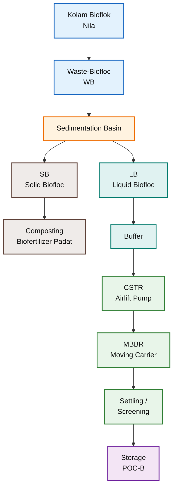
```mermaid
flowchart TD
    A["Kolam Bioflok<br/>Nila"] --> B["Waste-Biofloc<br/>WB"]
    B --> C["Sedimentation Basin"]
    C --> D["SB<br/>Solid Biofloc"]
    C --> E["LB<br/>Liquid Biofloc"]
    D --> F["Composting<br/>Biofertilizer Padat"]
    E --> G["Buffer"]
    G --> H["CSTR<br/>Airlift Pump"]
    H --> I["MBBR<br/>Moving Carrier"]
    I --> J["Settling /<br/>Screening"]
    J --> K["Storage<br/>POC-B"]

    classDef pond fill:#E3F2FD,stroke:#1565C0,color:#111,stroke-width:2px;
    classDef separation fill:#FFF3E0,stroke:#EF6C00,color:#111,stroke-width:2px;
    classDef solid fill:#EFEBE9,stroke:#5D4037,color:#111,stroke-width:2px;
    classDef liquid fill:#E0F2F1,stroke:#00796B,color:#111,stroke-width:2px;
    classDef reactor fill:#E8F5E9,stroke:#2E7D32,color:#111,stroke-width:2px;
    classDef product fill:#F3E5F5,stroke:#6A1B9A,color:#111,stroke-width:2px;

    class A,B pond;
    class C separation;
    class D,F solid;
    class E,G liquid;
    class H,I,J reactor;
    class K product;
```

Dalam artikel ini, definisi jalur proses dikunci sebagai berikut:

| Istilah   | Definisi dalam artikel                                                                                                                                          |
| --------- | --------------------------------------------------------------------------------------------------------------------------------------------------------------- |
| **WB**    | _Waste-Biofloc_, yaitu aliran buangan yang ditarik dari kolam bioflok menuju sedimentation basin.                                                               |
| **SB**    | _Solid Biofloc_, yaitu fraksi padatan yang dipisahkan dan dikeluarkan dari sedimentation basin untuk jalur composting.                                          |
| **LB**    | _Liquid Biofloc_, yaitu fraksi cair setelah pemisahan SB yang masih mengandung senyawa organik terlarut, koloid, flok halus, nutrien, dan mikroorganisme aktif. |
| **POC-B** | Produk cair hasil stabilisasi biologis LB melalui Buffer, CSTR Airlift, MBBR, settling/screening, dan storage.                                                  |

Pembagian fungsi tiap unit harus tegas:

- **Sedimentation basin** memisahkan SB dari aliran WB.
- **Buffer** menstabilkan debit, beban, dan karakter LB sebelum masuk reaktor.
- **CSTR** memakai **airlift-pump** untuk membentuk sirkulasi, mixing, dan oksigenasi.
- **MBBR** memakai media carrier bergerak dengan aerasi grid diffuser untuk memenuhi kebutuhan oksigen sekaligus menjaga carrier tetap bergerak.
- **Settling/screening** menangkap biofilm lepas dan padatan halus setelah MBBR.
- **Storage** menampung produk yang telah melewati proses stabilisasi sebelum pengujian aplikasi.

CSTR dan MBBR tidak boleh diposisikan sebagai dua tangki aerasi yang identik.

$$
\boxed{
\text{CSTR}
=

\text{reaktor sirkulasi aerob dengan airlift}
}
$$

$$
\boxed{
\text{MBBR}
=

\text{reaktor attached-growth dengan carrier bergerak}
}
$$

CSTR dipilih untuk menerima LB yang masih membawa beban organik terlarut dan flok halus dalam jumlah terbatas. Airlift menciptakan sirkulasi internal sehingga cairan tidak hanya menerima gelembung udara, tetapi juga mengalami pencampuran terarah melalui jalur riser dan downcomer.

MBBR ditempatkan setelah CSTR sebagai tahap **biofilm polishing**. Media carrier menyediakan permukaan bagi mikroorganisme attached-growth. Carrier harus bergerak merata agar kontak antara cairan, oksigen, substrat, dan biofilm tetap berlangsung. MBBR aerob secara prinsip membutuhkan aerasi untuk mendistribusikan carrier dan memenuhi kebutuhan oksigen proses. [R2]

<ResourceBox
  title="Artikel Terkait:"
  items={[
    {
      name: 'Komparasi Ekonomi Budidaya Nila dan Lele pada Kolam Statis, Bioflok, dan RAS Berbasis m² Footprint Lahan',
      href: '/blog/agri/perikanan/komparasi-kolam-statis-bioflok-ras',
    },
    {
      name: 'C/N Ratio pada Bioflok: Mengatur Mikroba, Oksigen, dan Stabilitas Kolam untuk Praktisi',
      href: '/blog/agri/perikanan/ratio-cn-rendah-biflok',
    },
    {
      name: 'E/P Ratio Pakan Ikan: Antara Efisiensi FCR, Fermentasi Ringan, Bioflok, dan Perbedaan Strategi Lele vs Nila',
      href: '/blog/agri/perikanan/ep-ratio-pakan-fermentasi',
    },
    {
      name: 'Manajemen Nitrit dan Nitrat pada Bioflok: $C/N$, $Cl^-$, Nitrifikasi, Denitrifikasi, dan Ekspor Nitrogen Berbasis Angka',
      href: '/blog/agri/perikanan/nitri-nitrat-manajemen-biofloc',
    },
    {
      name: 'Bioflok Nila Berbasis Neraca Mikroba: C/N Ratio, Protein Pakan, TAN, FCR, dan Keputusan Bisnis',
      href: '/blog/agri/perikanan/bioflok-nila-berbasis-neraca-mikroba',
    },
    {
      name: 'Sistem Sedimentasi Bioflok untuk Praktisi: Analisis Swirler, Radial Sedimentasi, IPC, dan Kombinasi Swirler–IPC',
      href: '/blog/agri/perikanan/sludge-bioflok-sedimentasi',
    },
    {
      name: 'Rangkaian Biofilter Aerob Tiga Tahap untuk Mineralisasi Sludge BFT: CSTR, MBBR, dan Polishing',
      href: '/blog/agri/perikanan/sludge-biofilter-bft',
    },
    {
      name: 'Fermentasi Protein untuk Pakan Lele: Membuat Hidrolisat Asam Amino yang Aman, Rasional, dan Bernilai Guna',
      href: '/blog/agri/perikanan/fermentasi-protein-untuk-pakan-lele',
    },
    {
      name: 'Menurunkan FCR Lele: Dari Pakan Dimakan sampai Menjadi Daging',
      href: '/blog/agri/perikanan/menurunkan-fcr-lele',
    },
    {
      name: 'Kolam Lele sebagai Bioreaktor Penurun FCR Berbasis Bioflok',
      href: '/blog/agri/perikanan/menurunkan-fcr-lele-bioflok',
    },
    {
      name: 'Fermentasi, Pengomposan, dan Pembusukan: Meluruskan Istilah agar Praktisi Agri Tidak Salah Interpretasi',
      href: '/blog/agri/fermentasi-pengomposan-pembusukan',
    },
  ]}
/>

---

# 1. Pengantar dan Batas Desain

## 1.1 Masalah Utama LB dari Sistem Bioflok

LB adalah fraksi cair setelah pemisahan SB pada sedimentation basin. Kata “cair” tidak berarti bahwa LB sudah bersih atau sudah stabil.

LB masih dapat membawa:

- bahan organik terlarut;
- senyawa koloid;
- flok mikro berukuran halus;
- nitrogen amonia total atau TAN;
- nitrit dan nitrat;
- fosfor serta kalium terlarut;
- mikroorganisme aktif;
- metabolit hasil proses bioflok;
- dan sisa bahan organik yang masih dapat mengalami oksidasi atau pembusukan.

Karena itu, LB tidak boleh langsung dianggap sebagai produk POC-B siap aplikasi.

Apabila LB langsung dimasukkan ke storage tanpa proses pengondisian, risiko yang dapat muncul meliputi:

- bau anaerob atau septik;
- pembentukan busa;
- kenaikan endapan selama penyimpanan;
- perubahan warna yang cepat;
- penurunan atau kenaikan pH yang tidak terkendali;
- pembusukan ulang;
- dan potensi stres tanaman bila produk diaplikasikan terlalu pekat.

Posisi yang benar adalah:

$$
\boxed{
\text{LB}
\neq
\text{POC-B siap aplikasi}
}
$$

LB adalah **feed process** untuk rangkaian mineralisasi dan stabilisasi.

## 1.2 Tujuan Sistem Mineralisasi

Sistem Buffer → CSTR Airlift → MBBR → Settling/Screening → Storage dirancang untuk mencapai lima tujuan proses.

### 1. Mengurangi karakter anaerob dan bau

Bahan organik yang masih aktif perlu dikondisikan dalam lingkungan aerob. Tujuannya bukan membuat cairan menjadi steril, tetapi mengurangi kecenderungan proses pembusukan anaerob.

### 2. Menstabilkan bahan organik terlarut

Sebagian bahan organik dalam LB dapat berada dalam bentuk terlarut atau koloidal. CSTR Airlift memberikan kondisi aerob dan sirkulasi yang lebih merata agar proses mineralisasi awal dapat berlangsung sebelum cairan masuk ke MBBR.

### 3. Mengurangi risiko pembusukan ulang

Produk cair yang hanya ditampung tanpa proses stabilisasi dapat kembali membusuk selama storage. Karena itu, proses biologis harus terjadi sebelum storage, bukan sesudah storage.

### 4. Mengondisikan nitrogen sebelum polishing

CSTR menerima LB yang masih lebih fluktuatif. MBBR menerima aliran yang sudah lebih terkondisikan untuk polishing biologis, retensi biomassa attached-growth, dan pengolahan nitrogen lanjutan sesuai kondisi aktual proses.

Tahap ini tidak boleh langsung diklaim sebagai nitrifikasi penuh tanpa pembuktian parameter proses, terutama:

- DO;
- pH;
- alkalinitas;
- TAN;
- nitrit;
- nitrat;
- suhu;
- dan beban organik residual.

### 5. Menghasilkan POC-B yang lebih stabil untuk diuji

Produk dari storage harus dipahami sebagai **POC-B yang lebih stabil secara proses**, bukan otomatis produk pupuk siap edar atau siap diaplikasikan pada semua tanaman.

Produk tetap perlu melalui:

- pemeriksaan bau;
- pemeriksaan pH;
- pengamatan endapan;
- uji pengenceran;
- uji aplikasi bertahap pada tanaman;
- dan, bila akan dipasarkan, pengujian laboratorium serta pemenuhan regulasi yang berlaku.

Tujuan proses dapat diringkas sebagai:

$$
\boxed{
\text{LB tidak stabil}
\rightarrow
\text{LB terkondisikan}
\rightarrow
\text{POC-B lebih stabil}
}
$$

## 1.3 Batas Desain Artikel

Artikel ini memakai batas proses yang jelas agar tidak terjadi pencampuran antara desain kolam, pemisahan padatan, pengomposan, dan mineralisasi cair.

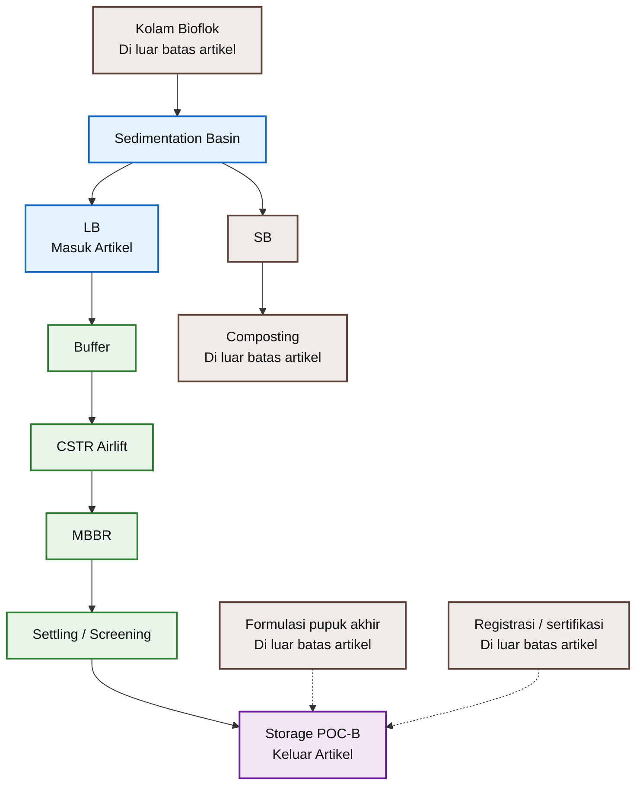
```mermaid
flowchart TD
    A["Sedimentation Basin"] --> B["LB<br/>Masuk Artikel"]
    B --> C["Buffer"]
    C --> D["CSTR Airlift"]
    D --> E["MBBR"]
    E --> F["Settling / Screening"]
    F --> G["Storage POC-B<br/>Keluar Artikel"]

    A --> H["SB"]
    H --> I["Composting<br/>Di luar batas artikel"]

    J["Kolam Bioflok<br/>Di luar batas artikel"] --> A
    K["Formulasi pupuk akhir<br/>Di luar batas artikel"] -.-> G
    L["Registrasi / sertifikasi<br/>Di luar batas artikel"] -.-> G

    classDef boundary fill:#E3F2FD,stroke:#1565C0,color:#111,stroke-width:2px;
    classDef process fill:#E8F5E9,stroke:#2E7D32,color:#111,stroke-width:2px;
    classDef outside fill:#EFEBE9,stroke:#5D4037,color:#111,stroke-width:2px;
    classDef output fill:#F3E5F5,stroke:#6A1B9A,color:#111,stroke-width:2px;

    class A,B boundary;
    class C,D,E,F process;
    class G output;
    class H,I,J,K,L outside;
```

### Masuk ke dalam batas artikel

Batas masuk sistem adalah:

$$
\boxed{
\text{LB dari outlet sedimentation basin}
}
$$

LB tersebut kemudian diproses melalui:

$$
\boxed{
\text{Buffer}
\rightarrow
\text{CSTR Airlift}
\rightarrow
\text{MBBR}
\rightarrow
\text{Settling / Screening}
\rightarrow
\text{Storage POC-B}
}
$$

### Keluar dari batas artikel

Batas keluar sistem adalah:

$$
\boxed{
\text{POC-B dari storage}
}
$$

POC-B yang keluar dari storage adalah produk proses yang telah melalui stabilisasi dasar. Kelayakan aplikasi tetap harus diverifikasi melalui uji pengenceran dan respons tanaman.

### Hal yang tidak dibahas rinci

Artikel ini tidak membahas secara rinci:

- desain kolam utama bioflok;
- desain mekanik sedimentation basin;
- strategi drain WB dari kolam;
- composting dan pematangan SB;
- formulasi pupuk akhir;
- penambahan bahan pengkaya;
- standar mutu komersial;
- pendaftaran atau sertifikasi pupuk;
- serta desain airlift-pump internal yang sudah tersedia sebagai desain terpisah.

Akan tetapi, artikel tetap menggunakan keluaran dari unit-unit tersebut sebagai basis interface proses.

## 1.4 Interface Antarunit yang Dikunci

Agar desain tidak berhenti sebagai rangkaian tangki, setiap perpindahan antarunit harus memiliki fungsi dan batas yang jelas.

| Interface                    | Fungsi                                          | Kondisi yang Diharapkan                |
| ---------------------------- | ----------------------------------------------- | -------------------------------------- |
| Sedimentation basin → Buffer | menerima LB setelah SB dipisahkan               | tidak membawa sludge kasar berlebihan  |
| Buffer → CSTR Airlift        | mengatur feed lebih stabil                      | tidak berupa dump batch mendadak       |
| CSTR Airlift → MBBR          | mengirim LB yang sudah terkondisikan            | DO, pH, bau, dan padatan dipantau      |
| MBBR → Settling/Screening    | memisahkan biofilm lepas                        | carrier tidak ikut keluar              |
| Settling/Screening → Storage | menyalurkan produk yang lebih jernih dan stabil | padatan kasar minimum                  |
| Storage → Aplikasi tanaman   | pengujian produk                                | dilakukan melalui pengenceran bertahap |

Dengan batas ini, artikel tidak mengklaim bahwa satu unit menyelesaikan seluruh masalah. Setiap unit mempunyai fungsi proses sendiri dan harus dinilai berdasarkan interface keluaran menuju unit berikutnya.

## 1.5 Prinsip Engineering Artikel

Artikel ini disusun dengan prinsip berikut:

$$
\boxed{
\text{Debit}
+
\text{beban massa}
+
\text{fungsi unit}
+
\text{kriteria keluaran}
=

\text{basis desain proses}
}
$$

Debit LB menentukan kebutuhan hidrolik dan HRT.

Beban organik, nitrogen, padatan, dan karakter LB menentukan kebutuhan proses biologis.

Fungsi tiap unit menentukan jenis pencampuran dan aerasi:

$$
\boxed{
\text{CSTR}
\rightarrow
\text{airlift untuk sirkulasi dan oksigenasi}
}
$$

$$
\boxed{
\text{MBBR}
\rightarrow
\text{grid diffuser untuk oksigenasi dan gerak carrier}
}
$$

Kriteria keluaran menentukan apakah cairan dapat diteruskan ke unit berikutnya atau harus ditahan dan dikoreksi.

Dengan demikian, artikel ini tidak memosisikan aerasi sebagai sekadar “gelembung udara”, tetapi sebagai bagian dari desain proses yang harus memenuhi fungsi biologis dan hidrolik masing-masing reaktor.

## Referensi Teknis Utama Bab Ini

1. Hargreaves, J. A. _Biofloc Production Systems for Aquaculture_. SRAC Publication No. 4503, 2013.

2. McQuarrie, J. P., dan Boltz, J. P. _Moving Bed Biofilm Reactor Technology: Process Applications, Design, and Performance_. Water Environment Research, Vol. 83, No. 6, 2011.

[**Kembali ke Atas**](#desain-mineralisasi-liquid-biofloc-dengan-buffer-cstr-airlift-dan-mbbr-untuk-produksi-poc-b)

---

# 2. Basis Desain dari Kolam Bioflok dan Sedimentation Basin

Bab ini mengunci basis hidrolik dari sistem mineralisasi LB. Angka pada bab ini berasal dari desain kolam dan sedimentation basin sebelumnya, lalu dipakai sebagai interface menuju Buffer, CSTR Airlift, dan MBBR.

Posisi bab ini penting karena reaktor downstream tidak boleh menerima basis yang kabur. Sebelum menentukan HRT, volume reaktor, airlift, media MBBR, atau aerasi, harus jelas terlebih dahulu:

- volume air kolam;
- debit WB yang ditarik;
- kondisi normal dan high-floc;
- posisi sedimentation basin;
- serta kualitas minimum LB sebelum masuk ke Buffer.

## 2.1 Data Kolam Acuan

Kolam acuan adalah kolam bioflok nila berbentuk persegi panjang dengan dimensi air operasi sebagai berikut.

| Parameter      |    Nilai |
| -------------- | -------: |
| Panjang kolam  |     18 m |
| Lebar kolam    |    3,5 m |
| Tinggi air     |   0,65 m |
| Volume kolam   | 40,95 m³ |
| Luas permukaan |    63 m² |
| Komoditas      |     nila |
| Sistem         |  bioflok |
| Target C/N     |       15 |
| Protein pakan  |   25–31% |

Luas permukaan kolam dihitung sebagai:

$$
A_{\text{kolam}}
=

L_{\text{kolam}}
\times
W_{\text{kolam}}
$$

$$
A_{\text{kolam}}
=

18
\times
3{,}5
$$

$$
\boxed{
A_{\text{kolam}}
=

63 \ \text{m}^2
}
$$

Volume air efektif kolam:

$$
V_{\text{kolam}}
=

L_{\text{kolam}}
\times
W_{\text{kolam}}
\times
H_{\text{kolam}}
$$

$$
V_{\text{kolam}}
=

18
\times
3{,}5
\times
0{,}65
$$

$$
\boxed{
V_{\text{kolam}}
=

40{,}95 \ \text{m}^3
}
$$

Konversi ke liter:

$$
V_{\text{kolam,L}}
=

40{,}95
\times
1000
$$

$$
\boxed{
V_{\text{kolam,L}}
=

40.950 \ \text{L}
}
$$

Volume ini menjadi basis untuk menghitung debit penarikan Waste-Biofloc.

Target C/N sebesar 15 digunakan sebagai basis pengelolaan bioflok. Rasio C/N memengaruhi dominasi jalur mikroba, pembentukan biomassa heterotrof, kebutuhan pengendalian padatan, serta karakter limbah yang akhirnya masuk ke sedimentation basin. [R1]

## 2.2 Debit Waste-Biofloc dan LB

Pada desain sebelumnya, debit WB ditentukan sebagai persentase volume air kolam per hari.

Kondisi normal menggunakan rasio drain:

$$
R_{\text{WB,normal}}
=

1{,}0\%
=

0{,}01
$$

Debit WB desain normal:

$$
Q_{\text{WB,normal}}
=

R_{\text{WB,normal}}
\times
V_{\text{kolam,L}}
$$

$$
Q_{\text{WB,normal}}
=

0{,}01
\times
40.950
$$

$$
Q_{\text{WB,normal}}
=

409{,}5 \ \text{L/hari}
$$

Sehingga debit desain normal dibulatkan menjadi:

$$
\boxed{
Q_{\text{WB,normal}}
\approx
410 \ \text{L/hari}
}
$$

Kondisi high-floc sementara menggunakan rasio drain:

$$
R_{\text{WB,high}}
=

2{,}0\%
=

0{,}02
$$

Debit WB high-floc:

$$
Q_{\text{WB,high}}
=

R_{\text{WB,high}}
\times
V_{\text{kolam,L}}
$$

$$
Q_{\text{WB,high}}
=

0{,}02
\times
40.950
$$

$$
Q_{\text{WB,high}}
=

819 \ \text{L/hari}
$$

Sehingga:

$$
\boxed{
Q_{\text{WB,high}}
=

819 \ \text{L/hari}
}
$$

Ringkasan debit desain:

| Kondisi                   |       Debit |
| ------------------------- | ----------: |
| WB/LB normal              | ±410 L/hari |
| WB/LB high-floc sementara | ±819 L/hari |

### Interpretasi Penting Debit LB

Angka $410\ \text{L/hari}$ dan $819\ \text{L/hari}$ dipakai sebagai **basis desain hidrolik konservatif** untuk unit downstream.

Artinya:

$$
\boxed{
Q_{\text{LB,design}}
\approx
Q_{\text{WB,design}}
}
$$

Pendekatan ini digunakan agar Buffer, CSTR, MBBR, dan polishing tetap memiliki kapasitas apabila sebagian besar volume cair dari WB tetap diteruskan sebagai LB.

Namun, secara fisik:

$$
\boxed{
\text{Volume LB aktual}
\neq
\text{selalu sama dengan volume WB yang ditarik}
}
$$

Setelah sedimentation basin bekerja, sebagian massa padatan akan keluar sebagai SB. Volume cair aktual menuju Buffer dapat lebih rendah atau sedikit berbeda karena:

- frekuensi drain SB;
- kandungan air dalam SB;
- metode pembuangan sludge dasar;
- volume cair yang terbawa bersama padatan;
- operasi overflow atau outlet LB;
- serta kondisi high-floc di kolam.

Karena itu, debit LB aktual harus dicatat saat commissioning. Akan tetapi, untuk sizing awal sistem downstream, angka berikut tetap dikunci:

$$
\boxed{
Q_{\text{LB,normal}}
=

410 \ \text{L/hari}
}
$$

$$
\boxed{
Q_{\text{LB,high}}
=

819 \ \text{L/hari}
}
$$

Kondisi high-floc bukan basis operasi permanen. Kondisi tersebut adalah envelope sementara untuk menghadapi kenaikan padatan bioflok, kenaikan rasio drain, atau kebutuhan pengendalian solids yang lebih agresif.

## 2.3 Posisi Sedimentation Basin

Sedimentation basin adalah batas proses yang memisahkan jalur padatan dari jalur cair.

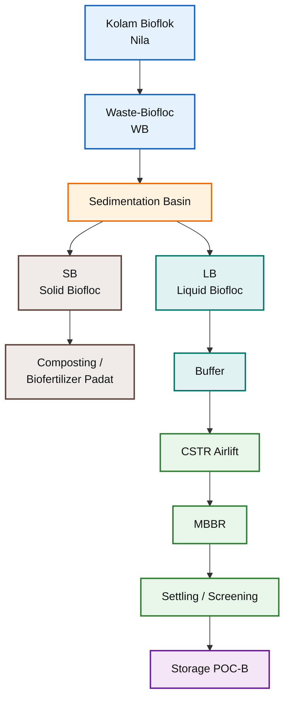
```mermaid
flowchart TD
    A["Kolam Bioflok<br/>Nila"] --> B["Waste-Biofloc<br/>WB"]
    B --> C["Sedimentation Basin"]

    C --> D["SB<br/>Solid Biofloc"]
    D --> E["Composting /<br/>Biofertilizer Padat"]

    C --> F["LB<br/>Liquid Biofloc"]
    F --> G["Buffer"]
    G --> H["CSTR Airlift"]
    H --> I["MBBR"]
    I --> J["Settling / Screening"]
    J --> K["Storage POC-B"]

    classDef pond fill:#E3F2FD,stroke:#1565C0,color:#111,stroke-width:2px;
    classDef separation fill:#FFF3E0,stroke:#EF6C00,color:#111,stroke-width:2px;
    classDef solid fill:#EFEBE9,stroke:#5D4037,color:#111,stroke-width:2px;
    classDef liquid fill:#E0F2F1,stroke:#00796B,color:#111,stroke-width:2px;
    classDef reactor fill:#E8F5E9,stroke:#2E7D32,color:#111,stroke-width:2px;
    classDef product fill:#F3E5F5,stroke:#6A1B9A,color:#111,stroke-width:2px;

    class A,B pond;
    class C separation;
    class D,E solid;
    class F,G liquid;
    class H,I,J reactor;
    class K product;
```

Sedimentation basin tidak diposisikan sebagai reaktor mineralisasi utama. Fungsi utamanya adalah menahan dan memisahkan padatan yang lebih mudah mengendap sebelum cairan diteruskan ke sistem mineralisasi.

Prinsip prosesnya:

$$
\boxed{
WB
\rightarrow
SB
+
LB
}
$$

dengan:

$$
\boxed{
SB
\rightarrow
\text{jalur composting}
}
$$

dan:

$$
\boxed{
LB
\rightarrow
\text{Buffer}
\rightarrow
\text{CSTR Airlift}
\rightarrow
\text{MBBR}
}
$$

Pengendalian suspended solids melalui settling chamber atau clarifier merupakan bagian penting dalam operasi bioflok, karena akumulasi padatan meningkatkan kebutuhan aerasi, kebutuhan mixing, serta risiko masalah operasional. [R1][R2]

Namun, sedimentation basin juga tidak boleh dipaksa mengambil seluruh padatan halus. Pengambilan solids yang terlalu agresif dapat mengubah karakter bioflok di kolam dan mengurangi fraksi mikroba yang berkontribusi terhadap fungsi biologis sistem.

Karena itu, sedimentation basin harus diposisikan sebagai:

$$
\boxed{
\text{unit pengendali solids kasar dan settleable}
}
$$

bukan sebagai:

$$
\boxed{
\text{unit pemurnian total air bioflok}
}
$$

## 2.4 Kualitas Minimum LB Sebelum Masuk Buffer

LB yang keluar dari sedimentation basin belum harus jernih. LB masih dapat membawa bahan organik terlarut, koloid, nutrien, dan flok mikro.

Namun, LB wajib melewati quality gate minimum sebelum masuk Buffer.

| Parameter               | Kondisi Minimum                                               |
| ----------------------- | ------------------------------------------------------------- |
| Sludge kasar            | tidak terbawa secara dominan                                  |
| Padatan mengendap cepat | sudah tertahan atau didrain sebagai SB                        |
| Carrier/media asing     | tidak ada                                                     |
| Material kasar          | tidak ada batu, daun, plastik, serat, atau material penyumbat |
| Bau                     | tidak septik ekstrem                                          |
| Aliran                  | lancar menuju Buffer                                          |
| Outlet basin            | tidak tersumbat                                               |
| Drain SB                | dapat dioperasikan                                            |
| Foam ekstrem            | tidak terbawa berlebihan                                      |
| Sampel LB               | dapat diambil untuk pemeriksaan rutin                         |

Quality gate ini bukan spesifikasi mutu POC-B. Ini adalah persyaratan minimum agar unit Buffer dan CSTR tidak berubah menjadi tempat penumpukan sludge kasar.

Prinsipnya:

$$
\boxed{
\text{Buffer menerima LB}
\neq
\text{Buffer menerima lumpur kasar}
}
$$

Selain pemeriksaan visual dan operasional, parameter berikut harus mulai dicatat pada tahap commissioning:

| Parameter                    | Fungsi                             |
| ---------------------------- | ---------------------------------- |
| Debit LB aktual              | verifikasi basis hidrolik          |
| pH                           | melihat kestabilan kimia awal      |
| Suhu                         | dasar interpretasi proses biologis |
| TSS atau padatan tersuspensi | memantau carry-over dari basin     |
| TAN                          | dasar beban nitrogen menuju CSTR   |
| Nitrit                       | indikator nitrogen reaktif         |
| Bau                          | indikator kondisi aerob/anaerob    |
| Warna                        | indikator perubahan karakter LB    |

Parameter tersebut belum menjadi angka release final pada Bab 2. Nilai target dan tindakan koreksi akan ditetapkan pada bab desain proses, commissioning, dan SOP.

## 2.5 Kesimpulan Bab

Basis hidrolik artikel ini dikunci dari kolam bioflok nila dengan volume:

$$
\boxed{
V_{\text{kolam}}
=

40{,}95 \ \text{m}^3
=

40.950 \ \text{L}
}
$$

Debit desain downstream yang digunakan adalah:

$$
\boxed{
Q_{\text{LB,normal}}
=

410 \ \text{L/hari}
}
$$

dan kondisi high-floc sementara:

$$
\boxed{
Q_{\text{LB,high}}
=

819 \ \text{L/hari}
}
$$

Sedimentation basin membentuk batas proses yang tegas:

$$
\boxed{
WB
\rightarrow
SB
+
LB
}
$$

SB keluar menuju composting, sedangkan LB masuk ke Buffer untuk diproses lebih lanjut melalui CSTR Airlift, MBBR, settling/screening, dan storage POC-B.

Angka debit LB dalam artikel ini digunakan sebagai envelope desain hidrolik. Debit aktual hasil sedimentation basin tetap wajib dicatat selama commissioning agar operasi downstream dapat disesuaikan berdasarkan kondisi nyata.

## Referensi Teknis Bab Ini

1. Hargreaves, J. A. _Biofloc Production Systems for Aquaculture_. SRAC Publication No. 4503, 2013.

2. Green, B. W., dan Ray, C. L. _Evaluation of Settling Chamber Hydraulic Retention Time in a Sunshine Bass Biofloc Production System_. North American Journal of Aquaculture, 84(2), 165–171, 2022.

[**Kembali ke Atas**](#desain-mineralisasi-liquid-biofloc-dengan-buffer-cstr-airlift-dan-mbbr-untuk-produksi-poc-b)

---

# 3. Basis Produksi Nila Bioflok dan Neraca Beban

Bab ini mengubah desain dari sekadar basis volume menjadi basis **beban massa**. Debit WB dan LB memang diperlukan untuk menentukan HRT, tetapi desain CSTR Airlift dan MBBR tidak boleh hanya bergantung pada liter per hari.

Sumber beban sebenarnya berasal dari:

$$
\boxed{
\text{Pakan}
\rightarrow
\text{karbon}
+
\text{nitrogen}
+
\text{padatan}
+
\text{metabolit}
}
$$

Karena itu, basis produksi nila pada biomasa puncak harus dikunci sebelum menghitung pembentukan SB, karakter LB, kebutuhan proses CSTR, dan beban residual menuju MBBR.

---

## 3.1 Biomasa Puncak Desain

Kolam bioflok pada artikel ini memiliki volume efektif:

$$
V_{\text{kolam}}
=

40{,}95 \ \text{m}^3
$$

Untuk desain normal yang konservatif, biomasa puncak digunakan:

$$
X_{\text{peak,design}}
=

15 \ \text{kg/m}^3
$$

Nilai ini dipilih sebagai basis desain normal karena sistem bioflok nila yang telah dilaporkan dapat beroperasi berkelanjutan pada biomasa sekitar $15 \ \text{kg/m}^3$, dengan kapasitas lebih tinggi dimungkinkan pada sistem yang lebih intensif dan terverifikasi.

Biomasa puncak total dihitung:

$$
B_{\text{peak}}
=

V_{\text{kolam}}
\times
X_{\text{peak,design}}
$$

$$
B_{\text{peak}}
=

40{,}95
\times
15
$$

$$
\boxed{
B_{\text{peak}}
=

614{,}25 \ \text{kg ikan}
}
$$

Untuk kebutuhan desain, nilai tersebut dibulatkan menjadi:

$$
\boxed{
B_{\text{peak}}
\approx
614 \ \text{kg ikan}
}
$$

### Basis Produksi yang Dikunci

| Parameter             | Nilai Desain |
| --------------------- | -----------: |
| Volume kolam          |     40,95 m³ |
| Biomasa puncak desain |     15 kg/m³ |
| Biomasa puncak total  |      ±614 kg |
| Sistem budidaya       | bioflok nila |
| Target C/N            |           15 |
| Protein pakan         |       25–31% |

Padat tebar awal tidak dipakai langsung sebagai dasar desain downstream. Padat tebar hanya menentukan jumlah ikan yang ditebar pada awal pemeliharaan, sedangkan beban limbah harian terutama ditentukan oleh:

- biomasa aktual;
- jumlah pakan aktual;
- protein pakan;
- efisiensi pakan;
- kondisi bioflok;
- dan pengelolaan padatan.

Karena itu, artikel ini memakai:

$$
\boxed{
\text{biomasa puncak}
+
\text{pakan puncak}
}
$$

sebagai basis utama desain proses.

### Envelope Produksi

| Kondisi                     |                 Biomasa |
| --------------------------- | ----------------------: |
| Basis desain normal         |                15 kg/m³ |
| Biomasa total basis desain  |                 ±614 kg |
| Kondisi lebih intensif      |     20 kg/m³ atau lebih |
| Kondisi ekstrem terlaporkan | hingga sekitar 30 kg/m³ |

Kondisi di atas $15 \ \text{kg/m}^3$ tidak digunakan sebagai basis normal artikel ini. Bila kolam dioperasikan menuju biomasa lebih tinggi, maka beban pakan, pembentukan solids, kebutuhan aerasi kolam, serta kapasitas downstream harus dievaluasi ulang.

---

## 3.2 Pakan Maksimum Harian

Pada sistem bioflok nila, pakan puncak perlu dipakai sebagai basis desain karena pakan merupakan sumber utama nitrogen, karbon organik, feses, sisa pakan, dan pembentukan bioflok.

Basis pakan desain digunakan:

$$
F_{\text{design}}
=

200
\frac{
\text{g pakan}
}{
\text{m}^3
\cdot
\text{hari}
}
$$

Massa pakan maksimum harian:

$$
F_{\text{peak}}
=

V_{\text{kolam}}
\times
F_{\text{design}}
$$

$$
F_{\text{peak}}
=

40{,}95
\times
200
$$

$$
F_{\text{peak}}
=

8190 \ \text{g/hari}
$$

$$
\boxed{
F_{\text{peak}}
=

8{,}19 \ \text{kg/hari}
}
$$

Sebagai pembanding, pada laju pakan berkelanjutan lebih rendah:

$$
F_{\text{normal}}
=

40{,}95
\times
175
$$

$$
F_{\text{normal}}
=

7166{,}25 \ \text{g/hari}
$$

$$
\boxed{
F_{\text{normal}}
\approx
7{,}17 \ \text{kg/hari}
}
$$

Ringkasan basis pakan:

| Kondisi             |    Laju Pakan |   Total Pakan |
| ------------------- | ------------: | ------------: |
| Operasi normal      | 175 g/m³·hari | ±7,17 kg/hari |
| Basis desain puncak | 200 g/m³·hari | ±8,19 kg/hari |

Rasio pakan terhadap biomasa pada basis desain:

$$
FR_{\text{peak}}
=

\frac{
F_{\text{peak}}
}{
B_{\text{peak}}
}
\times
100\%
$$

$$
FR_{\text{peak}}
=

\frac{
8{,}19
}{
614{,}25
}
\times
100\%
$$

$$
\boxed{
FR_{\text{peak}}
\approx
1{,}33\%
\text{ biomasa/hari}
}
$$

Nilai ini adalah basis desain puncak untuk kolam pada biomasa sekitar $614 \ \text{kg}$, bukan rekomendasi tunggal untuk seluruh fase pertumbuhan ikan.

---

## 3.3 Neraca Nitrogen dari Pakan

Protein pakan merupakan sumber nitrogen utama dalam sistem bioflok. Untuk preliminary mass balance, nitrogen pakan dihitung dari kandungan protein kasar menggunakan faktor konversi $(6{,}25)$.

$$
N_{\text{feed}}
=

F_{\text{feed}}
\times
\frac{
P_{\text{protein}}
}{
6{,}25
}
$$

dengan:

- $N_{feed}$ = nitrogen dari pakan;
- $F_{feed}$ = massa pakan per hari;
- $P_{protein}$ = fraksi protein pakan;
- (6.25) = faktor konversi protein kasar ke nitrogen.

Pada basis pakan puncak:

$$
F_{\text{feed}}
=

8{,}19 \ \text{kg/hari}
$$

### Nitrogen dari Pakan Protein 25%

$$
N_{\text{feed,25}}
=

8{,}19
\times
\frac{
0{,}25
}{
6{,}25
}
$$

$$
\boxed{
N_{\text{feed,25}}
=

0{,}328 \ \text{kg N/hari}
}
$$

### Nitrogen dari Pakan Protein 28%

$$
N_{\text{feed,28}}
=

8{,}19
\times
\frac{
0{,}28
}{
6{,}25
}
$$

$$
\boxed{
N_{\text{feed,28}}
=

0{,}367 \ \text{kg N/hari}
}
$$

### Nitrogen dari Pakan Protein 31%

$$
N_{\text{feed,31}}
=

8{,}19
\times
\frac{
0{,}31
}{
6{,}25
}
$$

$$
\boxed{
N_{\text{feed,31}}
=

0{,}406 \ \text{kg N/hari}
}
$$

Ringkasan nitrogen pakan:

| Protein Pakan |  Nitrogen Pakan |
| ------------: | --------------: |
|           25% | 0,328 kg N/hari |
|           28% | 0,367 kg N/hari |
|           31% | 0,406 kg N/hari |

Untuk desain downstream yang konservatif, protein tertinggi digunakan:

$$
\boxed{
P_{\text{protein,design}}
=

31\%
}
$$

$$
\boxed{
N_{\text{feed,design}}
=

0{,}406 \ \text{kg N/hari}
}
$$

Nilai $0{,}406 \ \text{kg N/hari}$ adalah **nitrogen masuk melalui pakan**, bukan nitrogen yang otomatis masuk ke LB atau CSTR.

---

## 3.4 Hubungan C/N dan Pembentukan Bioflok

Target artikel ini adalah:

$$
\boxed{
C/N
=

15
}
$$

Target C/N digunakan untuk mendukung pembentukan komunitas mikroba heterotrof yang mengasimilasi nitrogen anorganik, terutama TAN, menjadi biomassa mikroba.

Secara konseptual:

$$
\text{Carbon Source}
+
NH_4^+
+
O_2
\rightarrow
\text{Microbial Biomass}
+
CO_2
+
H_2O
$$

Pada kondisi karbon tersedia, bakteri heterotrof menggunakan karbon sebagai sumber energi dan bahan pembentuk sel. Nitrogen anorganik kemudian dapat diambil sebagai unsur pembentuk protein sel.

Prinsip sederhananya:

$$
\boxed{
\text{C/N lebih tinggi}
\rightarrow
\text{asimilasi heterotrof lebih kuat}
}
$$

Namun, peningkatan C/N tidak selalu berarti sistem menjadi lebih baik tanpa batas.

C/N yang lebih tinggi dapat meningkatkan:

- pembentukan biomassa mikroba;
- konsentrasi bioflok;
- kebutuhan aerasi;
- kebutuhan mixing;
- pembentukan sludge;
- kebutuhan sedimentation basin;
- frekuensi pembuangan SB;
- dan beban pengolahan LB.

Karena itu:

$$
\boxed{
\text{C/N}
=

15
}
$$

harus dipahami sebagai target pengendalian proses, bukan sebagai alasan untuk terus menambah sumber karbon tanpa melihat TAN, nitrit, pH, alkalinitas, TSS, dan settleable solids.

### C/N Tidak Sama dengan Dosis Molases Langsung

Kesalahan yang harus dihindari adalah menghitung dosis karbon dengan:

$$
C_{\text{add}}
=

15
\times
N_{\text{feed}}
$$

Persamaan tersebut tidak boleh digunakan langsung untuk menentukan molases harian karena:

- nitrogen dalam pakan tidak seluruhnya langsung menjadi TAN;
- pakan sudah mengandung karbon;
- sebagian nitrogen menjadi biomasa ikan;
- sebagian nitrogen masuk ke bioflok;
- sebagian nitrogen berada dalam padatan;
- sebagian nitrogen masuk jalur nitrifikasi;
- kandungan karbon aktual sumber karbon berbeda-beda;
- dan kebutuhan karbon berubah sesuai kondisi TAN aktual.

Karena itu, dosis karbon harus ditentukan dari:

$$
\boxed{
\text{TAN aktual}
+
\text{karakter pakan}
+
\text{karbon tersedia}
+
\text{respons TSS dan DO}
}
$$

bukan hanya dari protein pakan.

---

## 3.5 Neraca Nitrogen Referensi

Sebagai benchmark engineering, sistem bioflok nila intensif yang dilaporkan oleh Hargreaves menunjukkan distribusi nitrogen pakan sekitar:

$$
N_{\text{feed}}
=

N_{\text{fish}}
+
N_{\text{sludge}}
+
N_{\text{nitrate}}
$$

dengan distribusi referensi:

$$
N_{\text{fish}}
\approx
24\%
$$

$$
N_{\text{sludge}}
\approx
31\%
$$

$$
N_{\text{nitrate}}
\approx
45\%
$$

Distribusi tersebut bukan angka universal untuk semua kolam. Nilainya dipengaruhi oleh:

- spesies dan ukuran ikan;
- protein dan kualitas pakan;
- rasio C/N;
- pengelolaan karbon;
- aerasi;
- alkalinitas;
- pengendalian solids;
- tingkat nitrifikasi;
- frekuensi drain;
- serta konfigurasi pengolahan limbah.

Namun, distribusi ini cukup penting sebagai dasar screening karena menunjukkan bahwa nitrogen pakan tidak hanya menjadi ikan dan tidak hanya menjadi sludge.

Dengan basis:

$$
N_{\text{feed,design}}
=

0{,}406 \ \text{kg N/hari}
$$

maka neraca nitrogen referensi dapat dihitung.

### Nitrogen yang Tertahan dalam Biomasa Ikan

$$
N_{\text{fish,ref}}
=

0{,}24
\times
N_{\text{feed,design}}
$$

$$
N_{\text{fish,ref}}
=

0{,}24
\times
0{,}406
$$

$$
\boxed{
N_{\text{fish,ref}}
=

0{,}097 \ \text{kg N/hari}
}
$$

### Nitrogen dalam Sludge dan Bioflok yang Dibuang

$$
N_{\text{sludge,ref}}
=

0{,}31
\times
N_{\text{feed,design}}
$$

$$
N_{\text{sludge,ref}}
=

0{,}31
\times
0{,}406
$$

$$
\boxed{
N_{\text{sludge,ref}}
=

0{,}126 \ \text{kg N/hari}
}
$$

### Nitrogen dalam Jalur Nitrat

$$
N_{\text{nitrate,ref}}
=

0{,}45
\times
N_{\text{feed,design}}
$$

$$
N_{\text{nitrate,ref}}
=

0{,}45
\times
0{,}406
$$

$$
\boxed{
N_{\text{nitrate,ref}}
=

0{,}183 \ \text{kg N/hari}
}
$$

Ringkasan neraca nitrogen referensi:

| Jalur Nitrogen | Fraksi Referensi | Beban pada Protein 31% |
| -------------- | ---------------: | ---------------------: |
| Biomasa ikan   |              24% |       ±0,097 kg N/hari |
| Sludge/bioflok |              31% |       ±0,126 kg N/hari |
| Nitrat         |              45% |       ±0,183 kg N/hari |
| Total          |             100% |       ±0,406 kg N/hari |

Tabel ini tidak berarti bahwa nitrat sebanyak $0{,}183 \ \text{kg N/hari}$ langsung mengalir ke LB setiap hari.

Nitrat dapat terakumulasi sebagai inventori terlarut di kolam. Sementara itu, sludge dapat dikeluarkan sebagai SB, sebagian flok halus dapat lolos menjadi LB, dan TAN atau nitrit dapat muncul sementara ketika sistem mengalami perubahan beban.

Karena itu:

$$
\boxed{
\text{Neraca nitrogen referensi}
\neq
\text{debit nitrogen LB harian}
}
$$

Neraca tersebut digunakan untuk memahami skala beban proses, bukan untuk menggantikan pengukuran kualitas LB.

---

## 3.6 Potensi Pembentukan Bioflok dan SB

Sebagai pendekatan awal, biomassa mikroba sering direpresentasikan dengan rumus empiris:

$$
C_5H_7O_2N
$$

Fraksi nitrogen pada biomassa teoritis tersebut adalah:

$$
f_{\text{N,bio}}
=

\frac{
14
}{
113
}
$$

$$
\boxed{
f_{\text{N,bio}}
=

0{,}1239
}
$$

Jika nitrogen sludge referensi diasumsikan berada dalam biomassa mikroba ekuivalen, maka massa biomassa kering volatil minimum dapat dihitung:

$$
M_{\text{bio,eq}}
=

\frac{
N_{\text{sludge,ref}}
}{
f_{\text{N,bio}}
}
$$

$$
M_{\text{bio,eq}}
=

\frac{
0{,}126
}{
0{,}1239
}
$$

$$
\boxed{
M_{\text{bio,eq}}
\approx
1{,}02 \ \text{kg VSS-ekuivalen/hari}
}
$$

Nilai tersebut adalah **biomassa volatil ekuivalen**, bukan massa sludge basah yang benar-benar keluar dari sedimentation basin.

SB nyata dapat lebih besar karena mengandung:

- biomassa mikroba;
- feses ikan;
- sisa pakan;
- flok organik;
- mineral;
- abu;
- air yang terikat dalam sludge;
- dan padatan anorganik lain.

Karena itu:

$$
\boxed{
M_{\text{SB,wet}}

>

M_{\text{bio,eq}}
}
$$

dalam banyak kondisi operasi.

### Hubungan Potensi SB dengan Debit WB

Pada kondisi drain normal:

$$
Q_{\text{WB,normal}}
=

410 \ \text{L/hari}
$$

Bila seluruh biomassa ekuivalen $1{,}02 \ \text{kg/hari}$ secara teoritis berada pada aliran WB, maka konsentrasi biomassa ekuivalen dalam WB adalah:

$$
C_{\text{bio,eq,WB}}
=

\frac{
1{,}02
}{
0{,}410
}
$$

$$
\boxed{
C_{\text{bio,eq,WB}}
\approx
2{,}49 \ \text{kg/m}^3
}
$$

atau:

$$
\boxed{
C_{\text{bio,eq,WB}}
\approx
2{,}49 \ \text{g/L}
}
$$

Nilai tersebut bukan target TSS kolam dan bukan spesifikasi wajib konsentrasi WB. Nilai itu hanya menunjukkan bahwa debit WB sekitar $410 \ \text{L/hari}$ baru masuk akal sebagai jalur pengeluaran solids bila WB yang ditarik memang lebih terkonsentrasi daripada air kolam rata-rata.

Prinsipnya:

$$
\boxed{
\text{Drain WB harus membawa massa solids}
}
$$

bukan sekadar:

$$
\boxed{
\text{Drain WB harus membawa volume air}
}
$$

---

## 3.7 Distribusi Beban Proses

Distribusi beban proses artikel ini ditetapkan sebagai berikut.

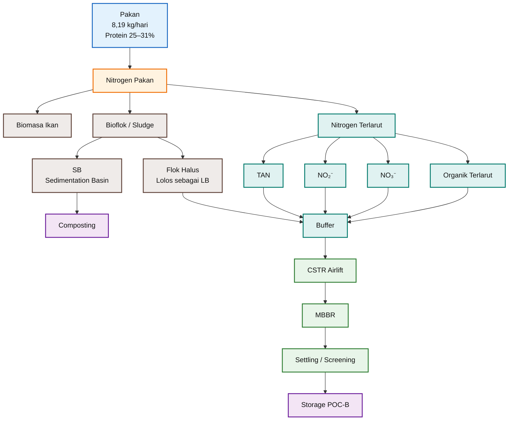
```mermaid id="p6fcy0"
flowchart TD
    A["Pakan<br/>8,19 kg/hari<br/>Protein 25–31%"] --> B["Nitrogen Pakan"]
    B --> C["Biomasa Ikan"]
    B --> D["Bioflok / Sludge"]
    B --> E["Nitrogen Terlarut"]

    D --> F["SB<br/>Sedimentation Basin"]
    D --> G["Flok Halus<br/>Lolos sebagai LB"]

    E --> H["TAN"]
    E --> I["NO₂⁻"]
    E --> J["NO₃⁻"]
    E --> K["Organik Terlarut"]

    F --> L["Composting"]
    G --> M["Buffer"]
    H --> M
    I --> M
    J --> M
    K --> M

    M --> N["CSTR Airlift"]
    N --> O["MBBR"]
    O --> P["Settling / Screening"]
    P --> Q["Storage POC-B"]

    classDef feed fill:#E3F2FD,stroke:#1565C0,color:#111,stroke-width:2px;
    classDef nitrogen fill:#FFF3E0,stroke:#EF6C00,color:#111,stroke-width:2px;
    classDef solid fill:#EFEBE9,stroke:#5D4037,color:#111,stroke-width:2px;
    classDef liquid fill:#E0F2F1,stroke:#00796B,color:#111,stroke-width:2px;
    classDef reactor fill:#E8F5E9,stroke:#2E7D32,color:#111,stroke-width:2px;
    classDef product fill:#F3E5F5,stroke:#6A1B9A,color:#111,stroke-width:2px;

    class A feed;
    class B nitrogen;
    class C,D,F,G solid;
    class E,H,I,J,K,M liquid;
    class N,O,P reactor;
    class L,Q product;
```

Secara umum, beban dari pakan mengikuti dua jalur utama:

$$
\boxed{
\text{Fraksi padatan}
\rightarrow
\text{SB}
\rightarrow
\text{composting}
}
$$

dan:

$$
\boxed{
\text{Fraksi terlarut dan flok halus}
\rightarrow
\text{LB}
\rightarrow
\text{Buffer}
\rightarrow
\text{CSTR Airlift}
\rightarrow
\text{MBBR}
}
$$

Untuk setiap parameter (x), beban yang lolos sebagai LB dapat ditulis:

$$
L_{\text{x,LB}}
=

L_{\text{x,WB}}
\times
\left(
1
-

\eta_{\text{x,SB}}
\right)
$$

dengan:

- $L_{x,LB}$ = beban parameter (x) yang masuk ke LB;
- $L_{x,WB}$ = beban parameter (x) dalam WB;
- $\eta_{x,SB}$ = efisiensi pemisahan parameter (x) ke jalur SB.

Nilai $\eta_{x,SB}$ tidak sama untuk semua parameter.

| Parameter         | Perilaku Utama pada Sedimentation Basin |
| ----------------- | --------------------------------------- |
| Padatan kasar     | cenderung tertahan sebagai SB           |
| Flok settleable   | sebagian besar dapat tertahan           |
| Flok mikro/koloid | sebagian dapat lolos sebagai LB         |
| sCOD              | umumnya lolos sebagai LB                |
| TAN               | dominan lolos sebagai LB                |
| Nitrit            | dominan lolos sebagai LB                |
| Nitrat            | dominan lolos sebagai LB                |
| Fosfor partikulat | sebagian tertahan bersama SB            |
| Fosfor terlarut   | cenderung lolos sebagai LB              |

Karena itu, downstream tidak boleh dirancang memakai satu angka “efisiensi pemisahan total”.

$$
\boxed{
\eta_{\mathrm{TSS}}
\neq
\eta_{\mathrm{TAN}}
\neq
\eta_{\mathrm{NO}_{3}^{-}}
\neq
\eta_{\mathrm{sCOD}}
}
$$

Sedimentation basin terutama memisahkan padatan settleable. Sementara itu, bahan organik terlarut dan nitrogen anorganik tetap merupakan bagian penting dari beban LB menuju Buffer, CSTR Airlift, dan MBBR.

---

## 3.8 Normal Flow dan High-Floc Tidak Sama dengan Dua Kali Beban Biologis

Kondisi high-floc menggunakan debit hidrolik:

$$
Q_{\text{WB,high}}
=

819 \ \text{L/hari}
$$

Nilai tersebut dua kali kondisi normal:

$$
Q_{\text{WB,high}}
=

2
\times
Q_{\text{WB,normal}}
$$

Namun:

$$
\boxed{
Q_{\text{WB,high}}
=

2
\times
Q_{\text{WB,normal}}
}
$$

tidak otomatis berarti:

$$
\boxed{
L_{\text{COD,high}}
=

2
\times
L_{\text{COD,normal}}
}
$$

atau:

$$
\boxed{
L_{\text{TAN,high}}
=

2
\times
L_{\text{TAN,normal}}
}
$$

Beban massa aktual selalu harus dihitung:

$$
L_x
=

Q
\times
C_x
$$

dengan:

- $L_x$ = beban massa parameter;
- (Q) = debit WB atau LB;
- $C_x$ = konsentrasi parameter dalam aliran.

High-floc dapat terjadi karena operator menarik WB yang lebih banyak untuk mengendalikan solids. Pada kondisi ini, konsentrasi solids dalam WB dapat berubah. Bisa lebih encer karena volume air yang ditarik lebih besar, atau lebih pekat karena endapan terkumpul di titik drain.

Karena itu, kondisi high-floc adalah:

$$
\boxed{
\text{envelope hidrolik dan solids control}
}
$$

bukan asumsi bahwa produksi nitrogen ikan mendadak menjadi dua kali lipat.

---

## 3.9 Design Basis yang Diteruskan ke Bab Berikutnya

Bab ini mengunci basis proses berikut.

| Parameter                  |        Nilai Desain |
| -------------------------- | ------------------: |
| Volume kolam               |            40,95 m³ |
| Biomasa puncak desain      |             ±614 kg |
| Biomasa spesifik desain    |            15 kg/m³ |
| Pakan normal               |       ±7,17 kg/hari |
| Pakan puncak desain        |       ±8,19 kg/hari |
| Feeding rate puncak        | ±1,33% biomasa/hari |
| Protein desain maksimum    |                 31% |
| Nitrogen pakan desain      |    ±0,406 kg N/hari |
| Nitrogen sludge referensi  |    ±0,126 kg N/hari |
| Biomassa volatil ekuivalen |       ±1,02 kg/hari |
| Target C/N                 |                  15 |
| WB/LB normal               |         ±410 L/hari |
| WB/LB high-floc            |         ±819 L/hari |

Basis tersebut belum menetapkan beban aktual CSTR dan MBBR.

Beban aktual downstream tetap harus ditentukan dari kualitas LB yang keluar dari sedimentation basin, terutama:

$$
\boxed{
TSS_{\text{LB}}
}
$$

$$
\boxed{
sCOD_{\text{LB}}
}
$$

$$
\boxed{
TAN_{\text{LB}}
}
$$

$$
\boxed{
NO_{\text{2,LB}}^-
}
$$

$$
\boxed{
NO_{\text{3,LB}}^-
}
$$

Dengan demikian, Bab 3 memberikan hubungan engineering yang benar:

$$
\boxed{
\text{Pakan}
\rightarrow
\text{Neraca N}
\rightarrow
\text{SB dan LB}
\rightarrow
\text{Beban CSTR}
\rightarrow
\text{Beban MBBR}
}
$$

bukan:

$$
\boxed{
\text{Volume tangki}
\rightarrow
\text{tebak aerasi}
}
$$

## Referensi Teknis Bab Ini

1. Hargreaves, J. A. _Biofloc Production Systems for Aquaculture_. SRAC Publication No. 4503, 2013.

2. Dilmi, A., Refes, W., dan Meknachi, A. _Effects of C/N Ratio on Water Quality, Growth Performance, Digestive Enzyme Activity and Antioxidant Status of Nile Tilapia in Biofloc Based Culture System_. Turkish Journal of Fisheries and Aquatic Sciences, 22(1), 2022.

3. Jiménez-Ojeda, Y. K., et al. _Dynamics and Use of Nitrogen in Biofloc Technology_. AACL Bioflux, 11(4), 2018.

4. Food and Agriculture Organization. _Appendix XVI: Methods of Feed Analysis_. FAO Fisheries Technical Paper.

[**Kembali ke Atas**](#desain-mineralisasi-liquid-biofloc-dengan-buffer-cstr-airlift-dan-mbbr-untuk-produksi-poc-b)

---

# 4. Karakter LB dan Quality Gate sebelum CSTR

Liquid Biofloc atau LB adalah fraksi cair yang keluar dari sedimentation basin setelah fraksi padatan yang lebih mudah mengendap dipisahkan sebagai Solid Biofloc atau SB.

LB tidak boleh dipahami sebagai air jernih. LB juga tidak boleh langsung dianggap sebagai POC-B.

Secara proses, LB adalah aliran antara yang masih membawa beban organik, nutrien, mikroorganisme, dan padatan halus menuju Buffer, CSTR Airlift, serta MBBR.

$$
\boxed{
\text{LB}
=

\text{feed process untuk mineralisasi}
}
$$

Bukan:

$$
\boxed{
\text{LB}
=

\text{produk akhir siap aplikasi}
}
$$

---

## 4.1 Karakter LB

Karakter LB bergantung pada kondisi kolam, pakan, rasio C/N, umur bioflok, lokasi titik drain WB, pola operasi sedimentation basin, serta frekuensi pembuangan SB.

Karena itu, LB tidak memiliki satu komposisi tunggal yang selalu sama.

Namun, secara umum LB dapat mengandung:

- senyawa organik terlarut;
- koloid;
- padatan halus;
- TAN;
- nitrit;
- nitrat;
- fosfor;
- kalium;
- mikroorganisme aktif;
- metabolit hasil bioflok.

Diagram berikut menunjukkan pembagian karakter LB secara praktis.

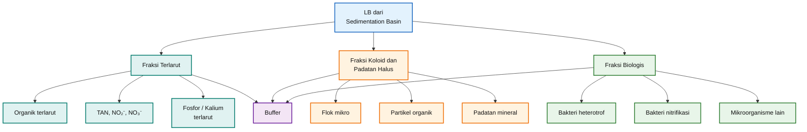
```mermaid
flowchart TD
    A["LB dari<br/>Sedimentation Basin"] --> B["Fraksi Terlarut"]
    A --> C["Fraksi Koloid dan<br/>Padatan Halus"]
    A --> D["Fraksi Biologis"]

    B --> B1["Organik terlarut"]
    B --> B2["TAN, NO₂⁻, NO₃⁻"]
    B --> B3["Fosfor / Kalium<br/>terlarut"]

    C --> C1["Flok mikro"]
    C --> C2["Partikel organik"]
    C --> C3["Padatan mineral"]

    D --> D1["Bakteri heterotrof"]
    D --> D2["Bakteri nitrifikasi"]
    D --> D3["Mikroorganisme lain"]

    B --> E["Buffer"]
    C --> E
    D --> E

    classDef source fill:#E3F2FD,stroke:#1565C0,color:#111,stroke-width:2px;
    classDef dissolved fill:#E0F2F1,stroke:#00796B,color:#111,stroke-width:2px;
    classDef solids fill:#FFF3E0,stroke:#EF6C00,color:#111,stroke-width:2px;
    classDef bio fill:#E8F5E9,stroke:#2E7D32,color:#111,stroke-width:2px;
    classDef process fill:#F3E5F5,stroke:#6A1B9A,color:#111,stroke-width:2px;

    class A source;
    class B,B1,B2,B3 dissolved;
    class C,C1,C2,C3 solids;
    class D,D1,D2,D3 bio;
    class E process;
```

### 4.1.1 Senyawa organik terlarut

Fraksi organik terlarut dapat berasal dari:

- ekskresi ikan;
- sisa pakan yang terlarut;
- hasil hidrolisis feses;
- hasil lisis mikroorganisme;
- eksopolisakarida dari bioflok;
- dan senyawa hasil dekomposisi bahan organik.

Fraksi ini tidak dapat dipisahkan hanya dengan sedimentasi biasa karena sebagian berada dalam bentuk terlarut atau koloid stabil.

Parameter yang paling relevan untuk menggambarkan beban ini adalah:

- COD;
- sCOD;
- BOD;
- warna;
- bau;
- dan kecenderungan pembentukan foam.

Dalam artikel ini, sCOD dipahami sebagai bagian COD yang tetap lolos setelah penyisihan padatan, sehingga lebih relevan untuk memperkirakan beban organik menuju CSTR dan MBBR.

$$
\boxed{
\text{Sedimentasi menurunkan padatan}
\neq
\text{menghilangkan seluruh organik terlarut}
}
$$

### 4.1.2 Koloid dan padatan halus

Sedimentation basin terutama menahan fraksi padatan yang lebih berat dan lebih mudah mengendap.

Namun, sebagian flok mikro, partikel organik ringan, koloid, dan fragmen biofilm tetap dapat lolos sebagai LB.

Partikel tersebut dapat menyebabkan:

- warna LB tetap cokelat atau kehijauan;
- TSS masih terukur;
- endapan terbentuk selama storage;
- foam meningkat ketika cairan diaerasi;
- serta kenaikan kebutuhan cleaning pada Buffer dan CSTR.

Padatan halus tidak selalu harus dieliminasi seluruhnya. Akan tetapi, jumlahnya harus dikendalikan agar CSTR tidak berubah fungsi menjadi bak penampung lumpur.

Prinsipnya:

$$
\boxed{
\text{CSTR menerima flok halus terkendali}
}
$$

bukan:

$$
\boxed{
\text{CSTR menerima sludge kasar dari basin}
}
$$

### 4.1.3 TAN, nitrit, dan nitrat

Nitrogen dalam LB dapat berada dalam beberapa bentuk utama:

$$
TAN
=

NH_3
+
NH_4^+
$$

$$
NO_2^-
=

\text{nitrit}
$$

$$
NO_3^-
=

\text{nitrat}
$$

TAN dan nitrit perlu dicatat karena keduanya merupakan indikator beban nitrogen reaktif yang masih harus dikondisikan pada proses berikutnya.

Nitrat juga perlu dicatat karena dapat menjadi bentuk nitrogen terlarut dominan pada sistem bioflok yang telah mengalami nitrifikasi. Namun, keberadaan nitrat tidak berarti proses mineralisasi telah selesai atau produk telah aman langsung diaplikasikan ke tanaman.

Semua hasil pengujian nitrogen harus mencantumkan basis satuan secara jelas.

Contoh:

- $\text{mg TAN-N/L}$;
- $\text{mg NO}_2\text{-N/L}$;
- $\text{mg NO}_3\text{-N/L}$;
- $\text{mg NO}_2^-\text{/L}$;
- atau $\text{mg NO}_3^-\text{/L}$.

Satuan berbasis nitrogen dan satuan berbasis ion tidak boleh dicampurkan.

$$
\boxed{
\text{mg NO}_2\text{-N/L}
\neq
\text{mg NO}_2^-\text{/L}
}
$$

$$
\boxed{
\text{mg NO}_3\text{-N/L}
\neq
\text{mg NO}_3^-\text{/L}
}
$$

### 4.1.4 Fosfor dan kalium

Fosfor pada LB dapat berada dalam fraksi partikulat maupun terlarut.

Fosfor partikulat cenderung ikut terpisah bersama SB, sedangkan fosfor terlarut dapat lolos menuju LB.

Kalium umumnya lebih mudah berada dalam fase cair dibandingkan padatan settleable. Namun, konsentrasi aktualnya tetap bergantung pada komposisi pakan, sumber air, bahan tambahan, dan kehilangan melalui drain.

Karena itu, fosfor dan kalium merupakan parameter yang relevan untuk evaluasi potensi POC-B, tetapi tidak digunakan sebagai dasar tunggal untuk menilai kestabilan biologis LB.

### 4.1.5 Mikroorganisme aktif dan metabolit bioflok

LB masih dapat membawa mikroorganisme aktif, termasuk bakteri heterotrof, nitrifier, protozoa, serta fragmen bioflok.

Keberadaan mikroorganisme tidak otomatis berarti LB sudah matang. Mikroorganisme tetap membutuhkan:

- oksigen;
- substrat;
- kondisi pH yang sesuai;
- waktu tinggal;
- dan lingkungan proses yang stabil.

Metabolit yang masih terbawa dapat mencakup senyawa organik sederhana, karbon dioksida terlarut, amonia, senyawa hasil fermentasi lokal, dan senyawa yang memengaruhi bau maupun foam.

Karena itu, perubahan bau, pH, warna, atau foam selama storage harus dipahami sebagai tanda bahwa proses biologis masih berlangsung.

---

## 4.2 Risiko Bila LB Langsung Masuk Storage

Storage bukan reaktor mineralisasi utama.

Apabila LB langsung dialirkan dari sedimentation basin ke storage, maka beban organik dan biologis masih akan terus bereaksi di dalam storage tanpa sirkulasi, kontrol DO, ataupun pengendalian waktu tinggal yang memadai.

Risiko utamanya adalah sebagai berikut.

### 4.2.1 Bau kembali muncul

Bila terdapat padatan halus dan organik biodegradable yang mengendap di dasar storage, zona dengan oksigen rendah dapat terbentuk.

Kondisi tersebut dapat menimbulkan bau tidak sedap, termasuk bau busuk, bau lumpur anaerob, atau bau yang menyerupai telur busuk.

Bau seperti ini bukan sekadar masalah estetika.

Bau tersebut merupakan indikasi bahwa:

$$
\boxed{
\text{storage berubah menjadi zona reaksi anaerob}
}
$$

bukan sekadar unit penyimpanan produk stabil.

### 4.2.2 Foam bertambah

Foam dapat terbentuk akibat kombinasi:

- protein dan senyawa organik terlarut;
- partikel bioflok halus;
- surfaktan biologis;
- aerasi atau agitasi;
- dan gas hasil aktivitas mikroba.

Foam tipis sementara tidak selalu menunjukkan kegagalan proses.

Namun, foam yang tebal, stabil, berbau kuat, atau meningkat terus selama storage merupakan sinyal bahwa beban organik masih belum cukup terkondisikan.

### 4.2.3 Endapan cepat terbentuk

Endapan di storage dapat berasal dari:

- flok halus yang lolos dari basin;
- biofilm lepas dari reaktor;
- padatan mineral;
- hasil penggumpalan koloid;
- serta biomassa mikroba yang mati.

Endapan yang terbentuk terus-menerus mengurangi volume aktif storage dan meningkatkan risiko kondisi anaerob di dasar tangki.

Karena itu:

$$
\boxed{
\text{Storage tidak boleh digunakan sebagai pengganti settling unit}
}
$$

### 4.2.4 pH berubah

pH LB dapat berubah selama storage karena beberapa mekanisme, antara lain:

- respirasi mikroba dan pembentukan $\text{CO}_2$;
- pelepasan atau penguapan $\text{CO}_2$;
- pembentukan asam organik;
- proses nitrifikasi;
- penguraian protein;
- dan perubahan kesetimbangan amonia-amonium.

Perubahan pH tanpa pemantauan dapat mengubah bentuk nitrogen, aktivitas mikroba, bau, dan kesesuaian produk untuk aplikasi tanaman.

### 4.2.5 POC-B tidak stabil

Produk tidak dapat disebut stabil hanya karena sudah berada di tangki storage.

Produk yang tidak stabil dapat menunjukkan satu atau lebih kondisi berikut:

- bau berubah selama penyimpanan;
- foam meningkat;
- endapan meningkat cepat;
- warna berubah drastis;
- pH bergeser terus;
- nitrit meningkat;
- atau gas terbentuk di dalam tangki.

Karena itu:

$$
\boxed{
\text{Storage}
\neq
\text{proses stabilisasi otomatis}
}
$$

### 4.2.6 Tanaman mengalami stres saat aplikasi

Aplikasi LB atau produk yang belum stabil dapat memicu stres tanaman, terutama bila produk masih mengandung beban amonia, nitrit, bahan organik mudah terurai, garam terlarut tinggi, atau pH yang tidak sesuai.

Risikonya dapat berupa:

- luka pada daun bila diaplikasikan sebagai semprot;
- gangguan akar bila diaplikasikan ke media tanam;
- bau pada media;
- penurunan oksigen lokal di zona akar;
- dan respons tanaman yang tidak konsisten.

Karena itu, POC-B dari storage tetap harus melalui pengenceran bertahap dan uji tanaman skala kecil sebelum digunakan secara lebih luas.

---

## 4.3 Quality Gate Sedimentation Basin

Quality gate adalah titik keputusan proses antara sedimentation basin dan Buffer.

Tujuannya bukan menyatakan LB telah menjadi POC-B. Tujuannya adalah memastikan LB sudah cukup terkondisikan untuk diproses oleh Buffer dan CSTR tanpa membawa masalah mekanis atau beban padatan kasar yang seharusnya sudah ditangani pada sedimentation basin.

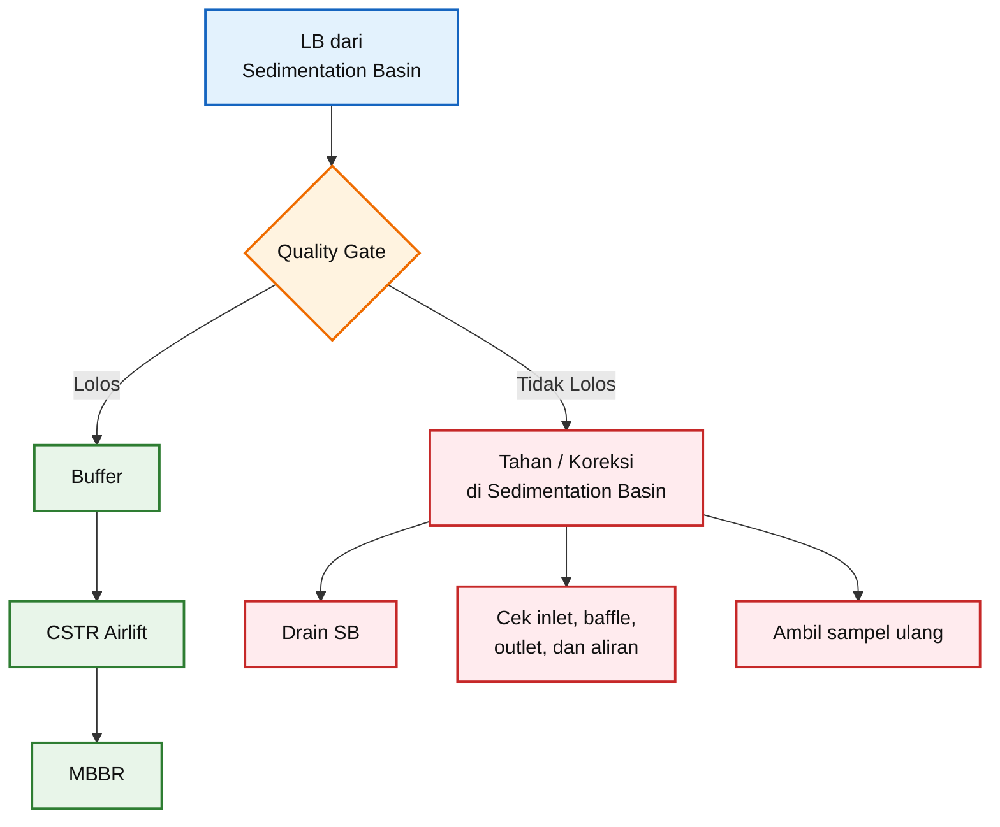
```mermaid
flowchart TD
    A["LB dari<br/>Sedimentation Basin"] --> B{"Quality Gate"}

    B -->|"Lolos"| C["Buffer"]
    C --> D["CSTR Airlift"]
    D --> E["MBBR"]

    B -->|"Tidak Lolos"| F["Tahan / Koreksi<br/>di Sedimentation Basin"]
    F --> G["Drain SB"]
    F --> H["Cek inlet, baffle,<br/>outlet, dan aliran"]
    F --> I["Ambil sampel ulang"]

    classDef source fill:#E3F2FD,stroke:#1565C0,color:#111,stroke-width:2px;
    classDef gate fill:#FFF3E0,stroke:#EF6C00,color:#111,stroke-width:2px;
    classDef process fill:#E8F5E9,stroke:#2E7D32,color:#111,stroke-width:2px;
    classDef action fill:#FFEBEE,stroke:#C62828,color:#111,stroke-width:2px;

    class A source;
    class B gate;
    class C,D,E process;
    class F,G,H,I action;
```

LB hanya boleh masuk ke Buffer bila memenuhi indikator praktis berikut.

| Parameter          | Kriteria                                    | Tindakan Bila Tidak Memenuhi                              |
| ------------------ | ------------------------------------------- | --------------------------------------------------------- |
| Bau                | tidak septik kuat                           | tahan aliran; periksa sludge dasar dan kondisi basin      |
| Padatan kasar      | tidak terlihat terbawa dominan              | drain SB; periksa baffle, outlet, dan titik pengambilan   |
| Sludge dasar basin | sudah didrain berkala                       | lakukan drain sebelum melanjutkan transfer LB             |
| Aliran             | lancar dan tidak tersumbat                  | bersihkan jalur, valve, screen, atau outlet               |
| Warna              | relatif konsisten terhadap baseline operasi | ambil sampel; periksa perubahan beban atau carry-over     |
| TSS                | dicatat sebagai parameter commissioning     | evaluasi performa pemisahan basin                         |
| pH                 | dicatat                                     | bandingkan dengan tren operasi normal                     |
| TAN dan nitrit     | dicatat berkala                             | gunakan sebagai dasar evaluasi beban menuju CSTR dan MBBR |

### 4.3.1 Arti “tidak septik kuat”

Istilah “tidak septik kuat” adalah indikator operasional, bukan parameter laboratorium tunggal.

LB tidak boleh dialirkan ke Buffer ketika tercium:

- bau telur busuk;
- bau putrefaktif yang tajam;
- bau lumpur anaerob sangat kuat;
- atau bau yang meningkat tajam dibandingkan baseline operasi.

Bila kondisi ini terjadi, prioritas koreksi berada pada sedimentation basin dan jalur WB, bukan pada peningkatan aerasi CSTR secara langsung.

### 4.3.2 Arti “padatan kasar tidak terbawa”

Padatan kasar meliputi:

- aglomerat bioflok besar;
- feses kasar;
- sisa pakan yang belum terurai;
- lumpur dasar;
- serpihan material;
- daun;
- serat;
- plastik;
- atau material lain yang berpotensi menyumbat.

Kriteria ini terutama dinilai secara visual melalui sampel transparan, saringan inspeksi, atau pengamatan pada outlet basin.

### 4.3.3 TSS sebagai parameter commissioning

TSS tidak boleh hanya diperkirakan dari warna air.

Warna cokelat dapat berasal dari senyawa terlarut, sedangkan TSS adalah massa padatan tersuspensi yang harus diukur melalui metode filtrasi dan pengeringan atau melalui pengujian laboratorium yang setara.

TSS dapat dihitung secara umum sebagai:

$$
TSS
=

\frac{
m_{\text{filter akhir}}
-

m_{\text{filter awal}}
}{
V_{\text{sampel}}
}
$$

dengan:

- $m_{\text{filter awal}}$ = massa filter kering sebelum filtrasi;
- $m_{\text{filter akhir}}$ = massa filter kering setelah filtrasi dan pengeringan;
- $V_{\text{sampel}}$ = volume sampel yang difiltrasi.

Pada tahap commissioning, hasil TSS digunakan untuk:

- melihat konsistensi outlet sedimentation basin;
- membandingkan kondisi normal dan high-floc;
- menentukan tren carry-over;
- mengevaluasi kebutuhan drain SB;
- dan menjadi dasar penetapan target operasi internal.

Pengukuran settleable solids menggunakan Imhoff cone dapat digunakan sebagai indikator lapangan tambahan, tetapi tidak boleh disamakan dengan TSS.

$$
\boxed{
\text{Settleable solids}
\neq
\text{TSS}
}
$$

### 4.3.4 Sampling LB

Sampling LB perlu dibuat konsisten agar data dapat dibandingkan.

Titik sampling minimum:

| Titik                      | Tujuan                                         |
| -------------------------- | ---------------------------------------------- |
| Outlet sedimentation basin | menilai kualitas LB sebelum Buffer             |
| Outlet Buffer              | menilai efek equalization dan pengendapan awal |
| Outlet CSTR                | menilai kondisi sebelum MBBR                   |
| Outlet MBBR                | menilai polishing biologis                     |
| Outlet settling/screening  | menilai produk sebelum storage                 |
| Storage                    | menilai kestabilan produk                      |

Untuk sedimentation basin, sampel sebaiknya diambil minimal pada:

- awal batch transfer;
- pertengahan batch transfer;
- akhir batch transfer.

Hal ini penting karena carry-over padatan sering berubah sepanjang batch drain.

### 4.3.5 Beban Massa LB

Konsentrasi saja belum cukup untuk menunjukkan beban yang masuk ke reaktor.

Beban massa suatu parameter pada LB dihitung:

$$
L_{\text{x,LB}}
=

\frac{
Q_{\text{LB}}
\times
C_{\text{x,LB}}
}{
1000
}
$$

dengan:

- $L_{x,LB}$ = beban parameter (x) dalam $\text{kg/hari}$;
- $Q_{LB}$ = debit LB dalam $\text{m}^3/\text{hari}$;
- $C_{x,LB}$ = konsentrasi parameter (x) dalam $\text{mg/L}$.

Contoh penggunaan parameter:

$$
L_{\text{TSS,LB}}
=

\frac{
Q_{\text{LB}}
\times
TSS_{\text{LB}}
}{
1000
}
$$

$$
L_{\text{TAN,LB}}
=

\frac{
Q_{\text{LB}}
\times
TAN_{\text{LB}}
}{
1000
}
$$

$$
L_{\text{sCOD,LB}}
=

\frac{
Q_{\text{LB}}
\times
sCOD_{\text{LB}}
}{
1000
}
$$

Rumus ini akan digunakan pada bab berikutnya untuk menghubungkan kualitas LB dengan beban CSTR dan MBBR.

---

## 4.4 Target Fungsi CSTR

CSTR menerima LB yang telah melewati quality gate, bukan WB mentah.

$$
\boxed{
\text{CSTR bukan pengganti sedimentation basin}
}
$$

Sedimentation basin dan CSTR memiliki fungsi yang berbeda.

| Unit                | Fungsi Utama                                               |
| ------------------- | ---------------------------------------------------------- |
| Sedimentation basin | memisahkan SB dan mengendalikan padatan settleable         |
| Buffer              | meredam fluktuasi debit serta karakter LB                  |
| CSTR Airlift        | sirkulasi, mixing, oksigenasi, dan mineralisasi aerob awal |
| MBBR                | polishing biofilm dan stabilisasi lanjutan                 |
| Settling/screening  | memisahkan biofilm lepas serta padatan akhir               |
| Storage             | menampung produk yang telah lebih stabil                   |

CSTR tidak boleh dibebani untuk menggantikan fungsi sedimentation basin.

CSTR bukan tempat untuk:

- menerima sludge dasar basin secara rutin;
- memisahkan solids kasar;
- menampung endapan dalam jumlah besar;
- atau menjadi titik pertama untuk mengoreksi kegagalan sedimentation basin.

Target fungsi CSTR adalah:

$$
\boxed{
\text{LB terkondisikan}
\rightarrow
\text{sirkulasi aerob}
\rightarrow
\text{mineralisasi awal}
\rightarrow
\text{outlet lebih stabil menuju MBBR}
}
$$

Airlift pada CSTR menyediakan tiga fungsi bersamaan:

$$
\boxed{
\text{oksigenasi}
+
\text{sirkulasi}
+
\text{mixing}
}
$$

Namun, airlift tidak menghilangkan kebutuhan pengendalian padatan pada hulu.

Kriteria keberhasilan CSTR nantinya tidak hanya dilihat dari adanya gelembung udara, tetapi dari tren parameter proses:

- DO;
- pH;
- bau;
- foam;
- TSS;
- TAN;
- nitrit;
- nitrat;
- serta ada atau tidaknya endapan berlebih.

Pada tahap ini, tidak boleh diklaim bahwa CSTR selalu menghilangkan TAN atau menghasilkan nitrifikasi penuh. Kinerja aktual harus diverifikasi dari data inlet–outlet dan kondisi operasi airlift.

## 4.5 Kesimpulan Bab

LB adalah aliran proses yang masih membawa:

$$
\boxed{
\text{organik terlarut}
+
\text{koloid}
+
\text{padatan halus}
+
\text{nitrogen}
+
\text{nutrien}
+
\text{mikroorganisme aktif}
}
$$

Karena itu, LB tidak boleh langsung masuk storage tanpa pengondisian.

Quality gate pada outlet sedimentation basin memastikan bahwa Buffer dan CSTR menerima fraksi cair yang:

- tidak membawa sludge kasar berlebihan;
- tidak berbau septik kuat;
- mengalir lancar;
- dapat dimonitor secara konsisten;
- dan memiliki data awal TSS, pH, TAN, serta nitrit.

Sedimentation basin bertanggung jawab atas pengendalian solids settleable.

CSTR Airlift bertanggung jawab atas sirkulasi, mixing, oksigenasi, dan mineralisasi aerob awal.

$$
\boxed{
\text{Sedimentation Basin}
\neq
\text{CSTR}
}
$$

$$
\boxed{
\text{CSTR}
\neq
\text{Storage}
}
$$

Dengan pembagian fungsi ini, setiap masalah dapat dikoreksi pada unit yang tepat tanpa memindahkan kegagalan proses dari hulu ke unit downstream.

## Referensi Teknis Bab Ini

1. Hargreaves, J. A. _Biofloc Production Systems for Aquaculture_. Southern Regional Aquaculture Center Publication No. 4503, 2013.

2. Green, B. W., dan Ray, C. L. “Evaluation of Settling Chamber Hydraulic Retention Time in a Sunshine Bass Biofloc Production System.” _North American Journal of Aquaculture_, 84(2), 165–171, 2022.

3. Ray, A. J., Seaborn, G., Leffler, J. W., Wilde, S. B., Lawson, A., dan Browdy, C. L. “Characterization of Microbial Communities in Minimal-Exchange, Intensive Aquaculture Systems and the Effects of Suspended Solids Management.” _Aquaculture_, 310, 130–138, 2010.

[**Kembali ke Atas**](#desain-mineralisasi-liquid-biofloc-dengan-buffer-cstr-airlift-dan-mbbr-untuk-produksi-poc-b)

---

# 5. Filosofi Proses dan Basis Hidrolik

Bab ini mengunci hubungan antara fungsi proses, volume kerja, debit LB, dan _hydraulic retention time_ atau HRT.

HRT diperlukan untuk memastikan setiap unit memiliki waktu kontak hidrolik yang memadai. Namun, HRT tidak boleh diperlakukan sebagai satu-satunya indikator keberhasilan biologis.

$$
\boxed{
\text{HRT cukup}
\not\Rightarrow
\text{proses biologis otomatis berhasil}
}
$$

Kinerja CSTR Airlift dan MBBR tetap dipengaruhi oleh beban organik, TAN, nitrit, pH, alkalinitas, suhu, DO, karakter LB, kualitas mixing, serta distribusi aliran aktual.

Basis hidrolik artikel ini menggunakan dua kondisi:

$$
Q_{\text{LB,normal}}
=

410\ \text{L/hari}
=

0{,}410\ \text{m}^3/\text{hari}
$$

$$
Q_{\text{LB,high}}
=

819\ \text{L/hari}
=

0{,}819\ \text{m}^3/\text{hari}
$$

Kondisi _high-floc_ adalah kondisi sementara untuk pengendalian solids. Nilai ini tidak berarti beban biologis kolam otomatis menjadi dua kali lipat.

---

## 5.1 Peran Setiap Unit

Sistem downstream tidak dirancang sebagai lima tangki yang melakukan fungsi sama. Setiap unit mempunyai tugas dominan dan batas fungsi yang jelas.

| Unit               | Fungsi Dominan                                                           | Yang Tidak Boleh Dibebankan kepada Unit                         |
| ------------------ | ------------------------------------------------------------------------ | --------------------------------------------------------------- |
| Buffer             | _Equalization_, penyangga feed, dan peredam fluktuasi LB                 | mineralisasi utama, penampungan sludge kasar permanen           |
| CSTR Airlift       | oksigenasi, sirkulasi, mixing, dan mineralisasi aerob awal               | pemisahan sludge kasar dari WB mentah                           |
| MBBR               | _Biofilm polishing_, stabilisasi lanjutan, dan pengolahan beban residual | menerima sludge kasar atau carrier dalam kondisi tidak bergerak |
| Settling/Screening | memisahkan biofilm lepas dan partikel akhir                              | menggantikan sedimentation basin hulu                           |
| Storage            | penyangga produk dan pematangan ringan                                   | reaktor anaerob tidak terkendali atau tempat pengendapan utama  |

Alur fungsi proses ditetapkan sebagai berikut.

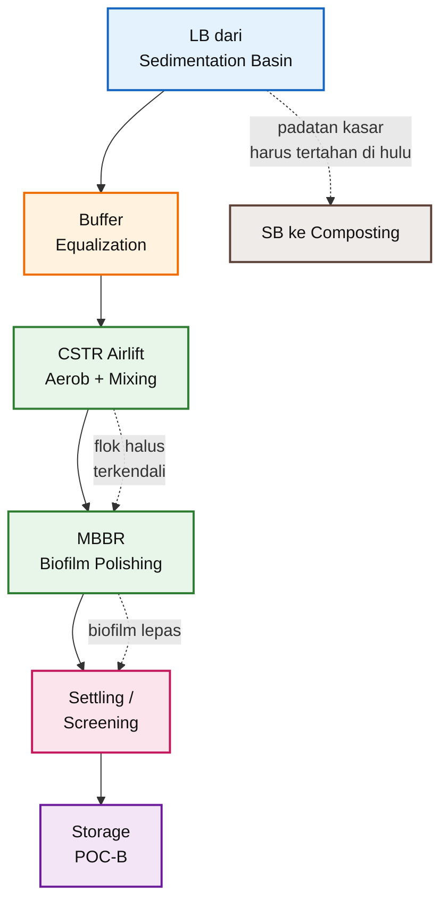
```mermaid
flowchart TD
    A["LB dari<br/>Sedimentation Basin"] --> B["Buffer<br/>Equalization"]
    B --> C["CSTR Airlift<br/>Aerob + Mixing"]
    C --> D["MBBR<br/>Biofilm Polishing"]
    D --> E["Settling /<br/>Screening"]
    E --> F["Storage<br/>POC-B"]

    A -. "padatan kasar<br/>harus tertahan di hulu" .-> G["SB ke Composting"]
    C -. "flok halus<br/>terkendali" .-> D
    D -. "biofilm lepas" .-> E

    classDef source fill:#E3F2FD,stroke:#1565C0,color:#111,stroke-width:2px;
    classDef hydraulic fill:#FFF3E0,stroke:#EF6C00,color:#111,stroke-width:2px;
    classDef reactor fill:#E8F5E9,stroke:#2E7D32,color:#111,stroke-width:2px;
    classDef separation fill:#FCE4EC,stroke:#C2185B,color:#111,stroke-width:2px;
    classDef product fill:#F3E5F5,stroke:#6A1B9A,color:#111,stroke-width:2px;
    classDef solid fill:#EFEBE9,stroke:#5D4037,color:#111,stroke-width:2px;

    class A source;
    class B hydraulic;
    class C,D reactor;
    class E separation;
    class F product;
    class G solid;
```

### 5.1.1 Buffer: equalization sebelum reaktor

Buffer menerima LB dari sedimentation basin dan menahan variasi debit maupun karakter LB sebelum cairan masuk ke CSTR.

Fungsi utamanya adalah mengubah aliran yang cenderung bersifat batch menjadi feed yang lebih terkendali.

$$
\boxed{
\text{WB batch}
\rightarrow
\text{Sedimentation Basin}
\rightarrow
\text{LB di Buffer}
\rightarrow
\text{feed CSTR lebih stabil}
}
$$

Buffer bukan lokasi utama untuk mineralisasi. Buffer juga tidak boleh menjadi tempat akumulasi sludge kasar akibat kegagalan sedimentation basin.

### 5.1.2 CSTR Airlift: mineralisasi aerob awal

CSTR menerima LB yang telah melewati _quality gate_ sedimentation basin dan Buffer.

Airlift menyediakan tiga fungsi terintegrasi:

$$
\boxed{
\text{oksigenasi}
+
\text{sirkulasi}
+
\text{mixing}
}
$$

Fungsi proses CSTR adalah menyediakan lingkungan aerob bercampur untuk:

- mengurangi kecenderungan pembusukan awal;
- mengondisikan organik terlarut dan flok halus terkendali;
- menjaga cairan tidak membentuk _dead zone_;
- menstabilkan kondisi sebelum cairan masuk ke MBBR;
- dan menahan fluktuasi beban sesaat yang lolos dari Buffer.

CSTR tidak dirancang sebagai klarifier dan tidak boleh menerima aliran WB mentah yang kaya sludge kasar.

### 5.1.3 MBBR: attached-growth polishing

MBBR menerima outlet CSTR yang telah lebih terkondisikan.

Carrier bergerak menyediakan area permukaan bagi biofilm attached-growth. Aerasi MBBR mempunyai dua fungsi yang tidak dapat dipisahkan:

$$
\boxed{
\text{transfer oksigen}
+
\text{pergerakan carrier}
}
$$

MBBR dirancang untuk menerima:

- beban organik residual;
- nitrogen terlarut yang masih tersisa;
- flok halus terkendali;
- dan cairan yang telah mengalami mixing aerob pada CSTR.

MBBR bukan unit untuk menerima lumpur dasar dari sedimentation basin. Carrier harus bergerak merata, tidak mengendap, tidak menggumpal, dan tidak menumpuk pada screen outlet.

### 5.1.4 Settling/Screening: pemisahan akhir

Biofilm attached-growth tidak seluruhnya tetap menempel pada carrier. Sebagian biomassa dapat terlepas akibat gesekan antarcarrier, shear aerasi, pertumbuhan biofilm, atau perubahan beban proses.

Settling/screening ditempatkan setelah MBBR untuk:

- menangkap biofilm lepas;
- menahan partikel akhir;
- mencegah endapan kasar langsung masuk storage;
- dan memastikan carrier tidak ikut keluar dari MBBR.

$$
\boxed{
\text{Settling / Screening}
\neq
\text{pengganti sedimentation basin}
}
$$

Unit ini adalah pemisahan akhir, sedangkan sedimentation basin tetap menjadi pemisahan utama untuk SB dari WB.

### 5.1.5 Storage: penyangga produk, bukan reaktor utama

Storage digunakan untuk menampung POC-B yang telah melewati rangkaian pengondisian.

Fungsi storage adalah:

- menampung produk sebelum aplikasi;
- menyediakan waktu observasi kestabilan;
- memungkinkan sampling;
- memisahkan waktu produksi dari waktu penggunaan;
- dan menyediakan volume cadangan operasi.

Storage tidak dimasukkan sebagai volume reaktor aktif dalam perhitungan HRT proses utama.

$$
\boxed{
\text{Storage}
\neq
\text{CSTR tambahan}
}
$$

Apabila storage terus membentuk endapan, bau, atau foam yang meningkat, masalah harus ditelusuri ke unit hulu dan tidak diselesaikan hanya dengan menambah waktu penyimpanan.

---

## 5.2 Volume Unit Proses

Volume berikut adalah volume kerja nominal pada kondisi level air operasi.

| Unit               | Volume Kerja Nominal |
| ------------------ | -------------------: |
| Buffer             |                500 L |
| CSTR Airlift       |              1.000 L |
| MBBR               |                750 L |
| Settling/Polishing |                250 L |
| Storage POC-B      |          500–1.000 L |

Total volume reaktor aktif, tanpa storage:

$$
V_{\text{aktif}}
=

V_{\text{Buffer}}
+
V_{\text{CSTR}}
+
V_{\text{MBBR}}
+
V_{\text{Polishing}}
$$

$$
V_{\text{aktif}}
=

500
+
1000
+
750
+
250
$$

$$
\boxed{
V_{\text{aktif}}
=

2500\ \text{L}
=

2{,}50\ \text{m}^3
}
$$

Storage tidak dihitung dalam $V_{aktif}$ karena volume storage dipilih berdasarkan kebutuhan penampungan, jadwal aplikasi, frekuensi panen produk, serta kebutuhan cadangan operasi.

### 5.2.1 Definisi volume kerja

Volume kerja bukan volume geometri penuh tangki.

Volume kerja adalah volume cairan pada level operasi normal setelah memperhitungkan:

- freeboard;
- posisi overflow;
- volume mati di bawah drain;
- volume pipa internal;
- screen permanen;
- riser, downcomer, atau struktur airlift;
- serta komponen internal lain yang benar-benar menggantikan volume air.

Untuk MBBR, media carrier tidak boleh langsung dikurangkan sebesar volume bulk media dari volume air.

$$
\boxed{
V_{\text{air,MBBR}}
\neq
V_{\text{tank}}
-

V_{\text{bulk\ carrier}}
}
$$

Carrier memiliki rongga dan ruang antarcarrier yang tetap terisi air. Yang benar-benar mengurangi volume air adalah volume material plastik carrier, struktur screen, diffuser, header, lateral, dan internal tank lain.

Karena itu, volume kerja MBBR harus dikonfirmasi melalui pengukuran level air aktual setelah seluruh peralatan dan carrier terpasang.

---

## 5.3 HRT Normal dan High-Floc

HRT dihitung berdasarkan volume kerja cairan dan debit rata-rata LB.

$$
HRT
=

\frac{V}{Q}
$$

dengan:

- (HRT) = _hydraulic retention time_;
- (V) = volume kerja cairan;
- (Q) = debit aliran cairan.

Untuk kondisi normal:

$$
Q_{\text{normal}}
=

410\ \text{L/hari}
$$

Untuk kondisi high-floc:

$$
Q_{\text{high}}
=

819\ \text{L/hari}
$$

### 5.3.1 HRT Buffer

$$
HRT_{\text{Buffer,normal}}
=

\frac{500}{410}
=

1{,}22\ \text{hari}
$$

$$
HRT_{\text{Buffer,high}}
=

\frac{500}{819}
=

0{,}61\ \text{hari}
$$

### 5.3.2 HRT CSTR Airlift

$$
HRT_{\text{CSTR,normal}}
=

\frac{1000}{410}
=

2{,}44\ \text{hari}
$$

$$
HRT_{\text{CSTR,high}}
=

\frac{1000}{819}
=

1{,}22\ \text{hari}
$$

### 5.3.3 HRT MBBR

$$
HRT_{\text{MBBR,normal}}
=

\frac{750}{410}
=

1{,}83\ \text{hari}
$$

$$
HRT_{\text{MBBR,high}}
=

\frac{750}{819}
=

0{,}92\ \text{hari}
$$

### 5.3.4 HRT Settling/Polishing

$$
HRT_{\text{Polishing,normal}}
=

\frac{250}{410}
=

0{,}61\ \text{hari}
$$

$$
HRT_{\text{Polishing,high}}
=

\frac{250}{819}
=

0{,}31\ \text{hari}
$$

Konversi HRT polishing ke jam:

$$
HRT_{\text{Polishing,normal}}
=

0{,}61
\times
24
=

14{,}64\ \text{jam}
$$

$$
HRT_{\text{Polishing,high}}
=

0{,}31
\times
24
=

7{,}32\ \text{jam}
$$

### 5.3.5 HRT Total Aktif

$$
HRT_{\text{total,normal}}
=

\frac{2500}{410}
=

6{,}10\ \text{hari}
$$

$$
HRT_{\text{total,high}}
=

\frac{2500}{819}
=

3{,}05\ \text{hari}
$$

Ringkasan HRT:

| Unit               | HRT Normal | HRT High-Floc |
| ------------------ | ---------: | ------------: |
| Buffer             |  1,22 hari |     0,61 hari |
| CSTR Airlift       |  2,44 hari |     1,22 hari |
| MBBR               |  1,83 hari |     0,92 hari |
| Settling/Polishing |  0,61 hari |     0,31 hari |
| Total aktif        |  6,10 hari |     3,05 hari |

### 5.3.6 Interpretasi HRT

HRT tabel di atas adalah **HRT nominal rata-rata**.

Nilai tersebut berlaku bila aliran dari Buffer menuju CSTR dibuat relatif terkendali sepanjang waktu.

Pada operasi 24 jam, debit rata-rata feed dari Buffer adalah:

$$
Q_{\text{feed,normal}}
=

\frac{410}{24}
=

17{,}08\ \text{L/jam}
$$

$$
Q_{\text{feed,normal}}
=

0{,}285\ \text{L/menit}
$$

Untuk high-floc:

$$
Q_{\text{feed,high}}
=

\frac{819}{24}
=

34{,}13\ \text{L/jam}
$$

$$
Q_{\text{feed,high}}
=

0{,}569\ \text{L/menit}
$$

Nilai tersebut bukan kapasitas wajib pompa. Nilai tersebut adalah debit rata-rata bila feed dilakukan kontinu selama 24 jam.

Bila transfer hanya dilakukan selama $t_{feed}$ jam per hari, debit transfer menjadi:

$$
Q_{\text{transfer}}
=

\frac{Q_{\text{LB,hari}}}{t_{\text{feed}}}
$$

Contoh, bila feed normal dilakukan selama 12 jam per hari:

$$
Q_{\text{transfer,12h}}
=

\frac{410}{12}
=

34{,}17\ \text{L/jam}
$$

Karena itu, Buffer dan sistem dosing harus dibahas bersama. HRT tidak akan benar-benar tercapai bila seluruh LB batch dipindahkan ke CSTR dalam waktu sangat singkat tanpa equalization.

$$
\boxed{
\text{HRT desain}
\rightarrow
\text{memerlukan feed yang terkendali}
}
$$

---

## 5.4 Filosofi Pembagian Beban

Pembagian beban antarunit tidak boleh diartikan sebagai pemisahan matematis yang kaku.

CSTR dan MBBR bekerja seri. Keduanya dapat sama-sama mengolah sebagian organik maupun nitrogen, tetapi masing-masing memiliki fungsi dominan yang berbeda.

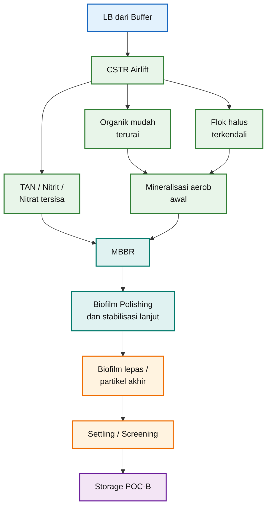
```mermaid
flowchart TD
    A["LB dari Buffer"] --> B["CSTR Airlift"]

    B --> C["Organik mudah<br/>terurai"]
    B --> D["Flok halus<br/>terkendali"]
    B --> E["TAN / Nitrit /<br/>Nitrat tersisa"]

    C --> F["Mineralisasi aerob<br/>awal"]
    D --> F
    E --> G["MBBR"]

    F --> G
    G --> H["Biofilm Polishing<br/>dan stabilisasi lanjut"]
    H --> I["Biofilm lepas /<br/>partikel akhir"]
    I --> J["Settling / Screening"]
    J --> K["Storage POC-B"]

    classDef feed fill:#E3F2FD,stroke:#1565C0,color:#111,stroke-width:2px;
    classDef cstr fill:#E8F5E9,stroke:#2E7D32,color:#111,stroke-width:2px;
    classDef mbbr fill:#E0F2F1,stroke:#00796B,color:#111,stroke-width:2px;
    classDef polish fill:#FFF3E0,stroke:#EF6C00,color:#111,stroke-width:2px;
    classDef product fill:#F3E5F5,stroke:#6A1B9A,color:#111,stroke-width:2px;

    class A feed;
    class B,C,D,E,F cstr;
    class G,H mbbr;
    class I,J polish;
    class K product;
```

### 5.4.1 CSTR Airlift: beban awal dan kondisi aerob bercampur

CSTR Airlift menerima beban awal dari Buffer.

Beban yang dominan diproses pada CSTR adalah:

- organik mudah terurai;
- senyawa organik terlarut yang masih aktif;
- flok halus dalam jumlah terkendali;
- serta sebagian nitrogen reaktif yang dapat diproses sesuai kondisi DO, pH, alkalinitas, dan komunitas mikroba.

CSTR Airlift tidak boleh langsung diklaim sebagai unit nitrifikasi penuh.

Nitrifikasi dapat berlangsung bila kondisi pendukung terpenuhi, tetapi tingkatnya harus dibuktikan melalui data inlet–outlet.

$$
\boxed{
\text{CSTR aerob}
\neq
\text{nitrifikasi penuh otomatis}
}
$$

Target utama CSTR adalah membentuk feed yang lebih stabil untuk MBBR.

### 5.4.2 MBBR: beban residual dan attached-growth polishing

MBBR menerima cairan setelah CSTR.

Beban yang masih dapat tersisa mencakup:

- organik terlarut residual;
- nitrogen anorganik;
- nitrit;
- nitrat;
- dan fragmen flok halus.

MBBR memberikan area permukaan biofilm untuk proses attached-growth. Nilai tambah MBBR bukan hanya adanya volume tangki, tetapi retensi biomassa pada carrier.

$$
\boxed{
\text{HRT MBBR}
\neq
\text{SRT biofilm}
}
$$

Biomassa attached-growth dapat bertahan pada carrier lebih lama daripada waktu tinggal cairan. Namun, performa aktual tetap bergantung pada luas permukaan efektif carrier, umur biofilm, DO, pola gerak carrier, beban organik, dan kondisi nitrogen.

### 5.4.3 Settling/Screening: pengendalian biomassa lepas

Settling/screening menerima aliran dari MBBR untuk menahan:

- biofilm yang lepas;
- partikel biomassa;
- fragmen carrier bila terjadi kerusakan;
- dan padatan akhir sebelum storage.

Fungsi ini menjaga storage tidak berubah menjadi bak sedimentasi utama.

$$
\boxed{
\text{MBBR}
\rightarrow
\text{biofilm lepas terkendali}
\rightarrow
\text{Settling / Screening}
}
$$

### 5.4.4 Dasar evaluasi pembagian beban

Beban massa tiap parameter harus dihitung dari debit dan konsentrasi aktual.

$$
L_x
=

\frac{
Q
\times
C_x
}{
1000
}
$$

dengan:

- $L_x$ = beban parameter (x) dalam $\text{kg/hari}$;
- (Q) = debit dalam $\text{m}^3/\text{hari}$;
- $C_x$ = konsentrasi dalam $\text{mg/L}$.

Untuk setiap parameter, evaluasi antarunit dapat ditulis:

$$
L_{\text{x,Buffer}}
=

L_{\text{x,CSTR\ in}}
$$

$$
L_{\text{x,CSTR\ out}}
=

L_{\text{x,MBBR\ in}}
$$

$$
L_{\text{x,MBBR\ out}}
=

L_{\text{x,Polishing\ in}}
$$

Data utama yang perlu dibandingkan adalah:

| Parameter     | Tujuan Evaluasi                                          |
| ------------- | -------------------------------------------------------- |
| TSS           | melihat carry-over solids dan biofilm lepas              |
| sCOD atau COD | melihat beban organik                                    |
| TAN           | melihat nitrogen reaktif                                 |
| Nitrit        | melihat kondisi nitrifikasi parsial atau gangguan proses |
| Nitrat        | melihat transformasi nitrogen terlarut                   |
| DO            | memastikan kondisi aerob pada CSTR dan MBBR              |
| pH            | melihat kestabilan proses dan kebutuhan koreksi          |
| Bau dan foam  | indikator operasional awal                               |

Hasil evaluasi ini nantinya menentukan apakah masalah berasal dari:

- sedimentation basin;
- pola feed Buffer;
- performa airlift CSTR;
- gerak carrier MBBR;
- sistem aerasi;
- atau pemisahan akhir.

---

## 5.5 Batas Interpretasi Basis Hidrolik

Volume dan HRT yang telah dihitung tidak boleh langsung dipakai untuk menyimpulkan:

- kapasitas COD maksimum;
- kapasitas TAN maksimum;
- kapasitas nitrifikasi;
- kapasitas produksi POC-B;
- kebutuhan udara final;
- jumlah carrier final;
- atau ukuran blower final.

Parameter tersebut membutuhkan data kualitas LB dan verifikasi commissioning.

HRT hanya menjawab pertanyaan:

$$
\boxed{
\text{berapa lama secara nominal cairan berada di dalam unit}
}
$$

HRT belum menjawab:

$$
\boxed{
\text{berapa besar beban biologis yang dapat diolah unit}
}
$$

Kapasitas biologis baru dapat dievaluasi setelah data berikut tersedia:

$$
\boxed{
Q
+
TSS
+
sCOD
+
TAN
+
NO_2^-
+
NO_3^-
+
DO
+
pH
+
\text{suhu}
}
$$

---

## 5.6 Kesimpulan Bab

Sistem aktif tanpa storage memiliki volume kerja nominal:

$$
\boxed{
V_{\text{aktif}}
=

2{,}50\ \text{m}^3
}
$$

Pada debit normal:

$$
\boxed{
Q_{\text{LB,normal}}
=

410\ \text{L/hari}
}
$$

HRT total aktif adalah:

$$
\boxed{
HRT_{\text{total,normal}}
=

6{,}10\ \text{hari}
}
$$

Pada kondisi high-floc:

$$
\boxed{
Q_{\text{LB,high}}
=

819\ \text{L/hari}
}
$$

HRT total aktif turun menjadi:

$$
\boxed{
HRT_{\text{total,high}}
=

3{,}05\ \text{hari}
}
$$

Pembagian fungsi proses dikunci sebagai berikut:

$$
\boxed{
\text{Buffer}
\rightarrow
\text{equalization}
}
$$

$$
\boxed{
\text{CSTR Airlift}
\rightarrow
\text{oksigenasi, sirkulasi, dan mineralisasi awal}
}
$$

$$
\boxed{
\text{MBBR}
\rightarrow
\text{attached-growth polishing dan stabilisasi lanjut}
}
$$

$$
\boxed{
\text{Settling / Screening}
\rightarrow
\text{pemisahan biofilm lepas}
}
$$

$$
\boxed{
\text{Storage}
\rightarrow
\text{penyangga produk dan observasi kestabilan}
}
$$

Bab berikutnya membahas desain Buffer secara lebih rinci, terutama cara mengubah LB hasil batch sedimentation basin menjadi feed yang lebih stabil menuju CSTR Airlift.

## Referensi Teknis Bab Ini

1. United States Environmental Protection Agency. _Nutrient Control Design Manual_. EPA/600/R-10/100, 2010.

2. McQuarrie, J. P., dan Boltz, J. P. “Moving Bed Biofilm Reactor Technology: Process Applications, Design, and Performance.” _Water Environment Research_, 83(6), 560–575, 2011.

3. Hargreaves, J. A. _Biofloc Production Systems for Aquaculture_. Southern Regional Aquaculture Center Publication No. 4503, 2013.

[**Kembali ke Atas**](#desain-mineralisasi-liquid-biofloc-dengan-buffer-cstr-airlift-dan-mbbr-untuk-produksi-poc-b)

---

# 6. Desain Buffer dan Controlled Feed ke CSTR

Buffer adalah unit _equalization_, bukan sekadar tangki transit.

Fungsi Buffer adalah memutus hubungan langsung antara karakter aliran LB yang cenderung batch dari sedimentation basin dan kebutuhan CSTR yang harus menerima feed lebih stabil.

$$
\boxed{
\text{LB batch dari basin}
\rightarrow
\text{Buffer}
\rightarrow
\text{feed terkendali ke CSTR}
}
$$

Tanpa Buffer dan _controlled feed_, CSTR akan menerima lonjakan debit, padatan halus, beban organik, serta nitrogen secara mendadak. Kondisi ini dapat mengganggu stabilitas DO, pola sirkulasi airlift, foam, dan kualitas outlet menuju MBBR.

---

## 6.1 Fungsi Buffer

Buffer memiliki empat fungsi dominan.

### 6.1.1 Menampung variasi debit LB

LB dari sedimentation basin dapat keluar secara batch, terutama ketika WB ditarik dari kolam lalu diproses dalam satu periode operasi.

CSTR tidak boleh menerima aliran batch tersebut secara langsung.

$$
\boxed{
Q_{\text{in,Buffer}}
\neq
Q_{\text{feed,CSTR}}
}
$$

Debit masuk Buffer dapat berubah dalam waktu singkat, sedangkan debit keluar menuju CSTR harus dibuat lebih seragam.

### 6.1.2 Meredam shock load

Selain debit, karakter LB juga dapat berubah antarbatch.

Variasi dapat berupa:

- kenaikan TSS;
- flok halus lebih banyak;
- bau lebih kuat;
- perubahan pH;
- kenaikan TAN atau nitrit;
- dan pembentukan foam.

Buffer memberikan waktu untuk melakukan pemeriksaan awal sebelum LB diteruskan ke CSTR.

Namun, Buffer tidak dirancang untuk memperbaiki kegagalan sedimentation basin.

$$
\boxed{
\text{Buffer}
\neq
\text{pengganti sedimentation basin}
}
$$

Bila Buffer terus menerima sludge kasar, tindakan koreksi harus dilakukan pada jalur WB dan sedimentation basin.

### 6.1.3 Menjaga CSTR tidak menerima dump batch

CSTR Airlift harus mempertahankan pola sirkulasi yang relatif stabil.

Bila seluruh LB normal sebesar:

$$
V_{\text{LB,normal}}
=

410\ \text{L}
$$

dimasukkan langsung dalam waktu satu jam, debit sesaat menjadi:

$$
Q_{\text{batch,normal}}
=

\frac{
410
}{
1
}
$$

$$
\boxed{
Q_{\text{batch,normal}}
=

410\ \text{L/jam}
=

6{,}83\ \text{L/menit}
}
$$

Pada kondisi high-floc:

$$
Q_{\text{batch,high}}
=

\frac{
819
}{
1
}
$$

$$
\boxed{
Q_{\text{batch,high}}
=

819\ \text{L/jam}
=

13{,}65\ \text{L/menit}
}
$$

Nilai tersebut adalah debit batch menuju Buffer, bukan debit desain menuju CSTR.

Jika debit batch tersebut langsung masuk CSTR, maka HRT efektif, beban oksigen, dan pola sirkulasi CSTR tidak lagi mengikuti basis desain.

### 6.1.4 Memungkinkan feed lebih seragam

Buffer memungkinkan feed menuju CSTR dilakukan secara kontinu atau bertahap.

Prinsip operasinya:

$$
\boxed{
\text{Masuk Buffer}
=

\text{batch atau semi-batch}
}
$$

$$
\boxed{
\text{Keluar ke CSTR}
=

\text{kontinu atau terkendali}
}
$$

Diagram fungsi Buffer adalah sebagai berikut.

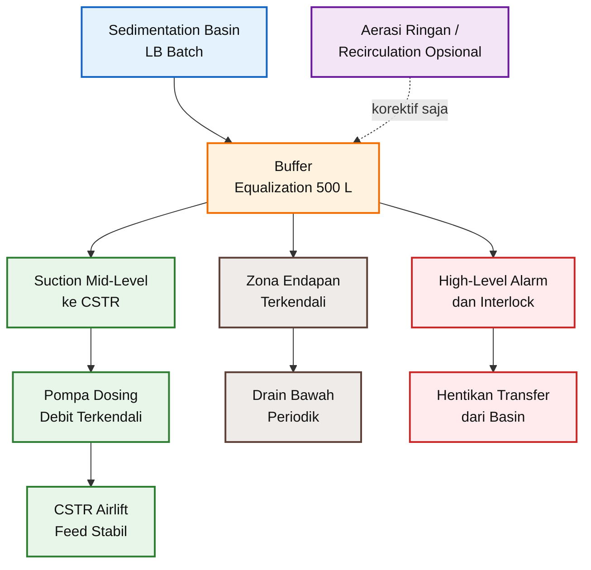
```mermaid
flowchart TD
    A["Sedimentation Basin<br/>LB Batch"] --> B["Buffer<br/>Equalization 500 L"]

    B --> C["Suction Mid-Level<br/>ke CSTR"]
    C --> D["Pompa Dosing<br/>Debit Terkendali"]
    D --> E["CSTR Airlift<br/>Feed Stabil"]

    B --> F["Zona Endapan<br/>Terkendali"]
    F --> G["Drain Bawah<br/>Periodik"]

    B --> H["High-Level Alarm<br/>dan Interlock"]
    H --> I["Hentikan Transfer<br/>dari Basin"]

    J["Aerasi Ringan /<br/>Recirculation Opsional"] -. "korektif saja" .-> B

    classDef source fill:#E3F2FD,stroke:#1565C0,color:#111,stroke-width:2px;
    classDef buffer fill:#FFF3E0,stroke:#EF6C00,color:#111,stroke-width:2px;
    classDef feed fill:#E8F5E9,stroke:#2E7D32,color:#111,stroke-width:2px;
    classDef drain fill:#EFEBE9,stroke:#5D4037,color:#111,stroke-width:2px;
    classDef alarm fill:#FFEBEE,stroke:#C62828,color:#111,stroke-width:2px;
    classDef optional fill:#F3E5F5,stroke:#6A1B9A,color:#111,stroke-width:2px;

    class A source;
    class B buffer;
    class C,D,E feed;
    class F,G drain;
    class H,I alarm;
    class J optional;
```

---

## 6.2 Volume dan HRT Buffer

Volume kerja Buffer dikunci:

$$
\boxed{
V_{\text{Buffer}}
=

500\ \text{L}
}
$$

Volume tersebut adalah volume kerja cairan, bukan volume geometri penuh tangki.

Tangki fisik tetap harus menyediakan:

- freeboard;
- ruang untuk alarm level tinggi;
- ruang minimum untuk hisap pompa;
- ruang untuk endapan dasar;
- dan ruang aman terhadap foam.

### 6.2.1 HRT Buffer kondisi normal

Pada debit desain normal:

$$
Q_{\text{LB,normal}}
=

410\ \text{L/hari}
$$

maka:

$$
HRT_{\text{Buffer,normal}}
=

\frac{
V_{\text{Buffer}}
}{
Q_{\text{LB,normal}}
}
$$

$$
HRT_{\text{Buffer,normal}}
=

\frac{
500
}{
410
}
$$

$$
\boxed{
HRT_{\text{Buffer,normal}}
=

1{,}22\ \text{hari}
}
$$

atau:

$$
HRT_{\text{Buffer,normal}}
=

29{,}27\ \text{jam}
$$

### 6.2.2 HRT Buffer kondisi high-floc

Pada debit desain high-floc:

$$
Q_{\text{LB,high}}
=

819\ \text{L/hari}
$$

maka:

$$
HRT_{\text{Buffer,high}}
=

\frac{
500
}{
819
}
$$

$$
\boxed{
HRT_{\text{Buffer,high}}
=

0{,}61\ \text{hari}
}
$$

atau:

$$
HRT_{\text{Buffer,high}}
=

14{,}65\ \text{jam}
$$

Ringkasan basis hidrolik Buffer:

| Parameter           |     Normal |  High-Floc |
| ------------------- | ---------: | ---------: |
| Debit LB            | 410 L/hari | 819 L/hari |
| Volume kerja Buffer |      500 L |      500 L |
| HRT nominal         |  1,22 hari |  0,61 hari |
| HRT nominal         |  29,27 jam |  14,65 jam |

### 6.2.3 HRT bukan kapasitas batch Buffer

HRT di atas adalah HRT rata-rata berdasarkan debit harian.

HRT tidak menjawab pertanyaan berikut:

> Apakah Buffer 500 L dapat menerima seluruh LB dalam satu batch?

Untuk menjawabnya, yang dipakai adalah neraca volume selama periode batch.

Definisikan:

$$
V_{\text{use}}
=

V_H
-

V_L
$$

dengan:

- $V_H$ = volume pada batas level tinggi operasi;
- $V_L$ = volume minimum operasi sebelum pompa feed dihentikan;
- $V_{\text{use}}$ = volume ayun efektif untuk equalization.

Karena terdapat kebutuhan freeboard, level minimum pompa, dan endapan dasar:

$$
\boxed{
V_{\text{use}}
<
500\ \text{L}
}
$$

Neraca volume selama satu batch:

$$
V_{\text{net,batch}}
=

V_{\text{in,batch}}
-

Q_{\text{feed,CSTR}}
\times
t_{\text{batch}}
$$

Syarat operasi aman:

$$
\boxed{
V_{\text{net,batch}}
\leq
V_{\text{use}}
}
$$

### 6.2.4 Pemeriksaan batch normal selama 60 menit

Bila LB normal sebesar $410\ \text{L}$ masuk ke Buffer selama satu jam:

$$
V_{\text{in,batch,normal}}
=

410\ \text{L}
$$

CSTR tetap menerima feed kontinu sebesar:

$$
Q_{\text{feed,normal}}
=

17{,}08\ \text{L/jam}
$$

Maka volume bersih yang bertambah di Buffer selama batch:

$$
V_{\text{net,batch,normal}}
=

410
-

\left(
17{,}08
\times
1
\right)
$$

$$
\boxed{
V_{\text{net,batch,normal}}
=

392{,}92\ \text{L}
}
$$

Artinya, satu batch normal hanya dapat diterima bila:

$$
\boxed{
V_{\text{use}}
\geq
392{,}92\ \text{L}
}
$$

Karena $V_{\text{use}}$ selalu lebih kecil dari volume nominal $500\ \text{L}$, operasi normal satu batch memerlukan disiplin level yang ketat.

Buffer harus berada dekat level rendah sebelum batch normal diterima.

### 6.2.5 Pemeriksaan high-floc satu batch selama 60 menit

Bila LB high-floc sebesar $819\ \text{L}$ dimasukkan dalam satu batch selama satu jam:

$$
V_{\text{in,batch,high}}
=

819\ \text{L}
$$

Feed kontinu ke CSTR:

$$
Q_{\text{feed,high}}
=

34{,}13\ \text{L/jam}
$$

Volume bersih yang bertambah di Buffer:

$$
V_{\text{net,batch,high}}
=

819
-

\left(
34{,}13
\times
1
\right)
$$

$$
\boxed{
V_{\text{net,batch,high}}
=

784{,}87\ \text{L}
}
$$

Nilai tersebut lebih besar dari volume nominal Buffer.

$$
\boxed{
784{,}87\ \text{L}

>

500\ \text{L}
}
$$

Karena itu:

$$
\boxed{
\text{Buffer 500 L tidak boleh menerima}
\ 819\ \text{L high-floc dalam satu batch}
}
$$

Ini bukan masalah pompa CSTR atau aerasi CSTR.

Ini adalah batas volume equalization Buffer.

### 6.2.6 Strategi high-floc untuk Buffer 500 L

Pada kondisi high-floc, terdapat dua pilihan desain-operasi.

#### Pilihan A — Membagi transfer high-floc menjadi beberapa batch

Bila debit high-floc $819\ \text{L/hari}$ dibagi menjadi tiga batch sama besar:

$$
V_{\text{in,batch}}
=

\frac{
819
}{
3
}
$$

$$
V_{\text{in,batch}}
=

273\ \text{L}
$$

Dengan periode transfer satu jam:

$$
V_{\text{net,batch}}
=

273
-

34{,}13
$$

$$
\boxed{
V_{\text{net,batch}}
=

238{,}87\ \text{L}
}
$$

Syaratnya:

$$
\boxed{
V_{\text{use}}
\geq
238{,}87\ \text{L}
}
$$

Waktu minimum agar volume tersebut kembali turun menuju level awal:

$$
t_{\text{recovery}}
=

\frac{
V_{\text{net,batch}}
}{
Q_{\text{feed,high}}
}
$$

$$
t_{\text{recovery}}
=

\frac{
238{,}87
}{
34{,}13
}
$$

$$
\boxed{
t_{\text{recovery}}
\approx
7\ \text{jam}
}
$$

Dengan demikian, salah satu pola operasi yang layak adalah tiga transfer high-floc yang dipisahkan sekitar delapan jam.

#### Pilihan B — Menambah volume equalization

Bila operator menghendaki satu kali dump high-floc sebesar $819\ \text{L}$, maka Buffer harus memiliki volume ayun efektif minimum:

$$
\boxed{
V_{\text{use}}
\geq
784{,}87\ \text{L}
}
$$

Karena volume ayun efektif selalu lebih kecil dari volume geometri tangki, maka Buffer nominal $500\ \text{L}$ tidak dapat dipertahankan untuk skenario tersebut.

---

## 6.3 Transfer LB dari Buffer ke CSTR

### 6.3.1 Basis transfer yang direkomendasikan

Basis desain yang direkomendasikan adalah:

$$
\boxed{
\text{Buffer}
\rightarrow
\text{pompa dosing debit rendah}
\rightarrow
\text{CSTR Airlift}
}
$$

Overflow gravitasi tidak dijadikan sebagai pengendali utama feed menuju CSTR.

Alasannya:

$$
\boxed{
\text{overflow gravitasi}
\rightarrow
\text{mengikuti level sesaat}
}
$$

sedangkan:

$$
\boxed{
\text{feed CSTR}
\rightarrow
\text{harus mengikuti set point debit}
}
$$

Pada aliran batch, overflow gravitasi berpotensi meneruskan puncak debit dari Buffer ke CSTR. Kondisi tersebut menghilangkan fungsi equalization.

Overflow hanya dipakai sebagai:

- proteksi level tinggi;
- jalur darurat menuju penampungan aman;
- atau sinyal bahwa transfer dari sedimentation basin harus dihentikan.

Overflow tidak boleh dirancang sebagai jalur normal menuju CSTR.

### 6.3.2 Debit feed kontinu ke CSTR

Bila feed ke CSTR dilakukan kontinu selama $24\ \text{jam}$, maka debit normal:

$$
Q_{\text{feed,normal}}
=

\frac{
410
}{
24
}
$$

$$
\boxed{
Q_{\text{feed,normal}}
=

17{,}08\ \text{L/jam}
=

0{,}285\ \text{L/menit}
}
$$

Debit high-floc:

$$
Q_{\text{feed,high}}
=

\frac{
819
}{
24
}
$$

$$
\boxed{
Q_{\text{feed,high}}
=

34{,}13\ \text{L/jam}
=

0{,}569\ \text{L/menit}
}
$$

Ringkasan set point feed:

| Kondisi   | Debit Feed ke CSTR |
| --------- | -----------------: |
| Normal    |        17,08 L/jam |
| Normal    |      0,285 L/menit |
| High-floc |        34,13 L/jam |
| High-floc |      0,569 L/menit |

Pompa feed harus mampu memberikan debit tersebut secara stabil pada _actual discharge head_, bukan hanya pada kondisi tanpa head.

Kriteria pompa feed:

- dapat dikalibrasi pada $17{,}08\ \text{L/jam}$;
- dapat dikalibrasi pada $34{,}13\ \text{L/jam}$;
- mampu menangani flok halus tanpa sering tersumbat;
- memiliki akses mudah untuk cleaning;
- memiliki valve isolasi;
- memiliki check valve bila konfigurasi pipa memerlukannya;
- dan tidak menyebabkan pulsasi besar ke inlet CSTR.

### 6.3.3 Kalibrasi debit pompa

Debit pompa aktual harus diverifikasi menggunakan wadah ukur dan stopwatch.

$$
Q_{\text{pump,actual}}
=

\frac{
V_{\text{calibration}}
}{
t_{\text{calibration}}
}
$$

dengan:

- $Q_{\text{pump,actual}}$ = debit aktual pompa;
- $V_{\text{calibration}}$ = volume yang terukur;
- $t_{\text{calibration}}$ = waktu pengisian.

Kalibrasi dilakukan minimal pada dua kondisi:

$$
Q_{\text{normal}}
=

17{,}08\ \text{L/jam}
$$

dan:

$$
Q_{\text{high}}
=

34{,}13\ \text{L/jam}
$$

Kalibrasi tidak boleh hanya mengandalkan skala putaran, skala stroke, atau angka katalog pompa.

### 6.3.4 Posisi inlet dan outlet Buffer

Inlet dari sedimentation basin harus masuk ke Buffer dengan energi rendah agar endapan dasar tidak teraduk kembali.

Konfigurasi yang disarankan:

- inlet diarahkan ke dinding atau baffle peredam;
- inlet tidak diarahkan langsung ke titik hisap pompa;
- feed CSTR diambil dari zona tengah cairan;
- feed CSTR tidak diambil dari dasar tangki;
- drain bawah dibuat terpisah dari jalur feed CSTR;
- titik sampling ditempatkan dekat outlet Buffer;
- alarm level tinggi dan level rendah disediakan.

Prinsipnya:

$$
\boxed{
\text{Feed ke CSTR}
\rightarrow
\text{cairan zona tengah}
}
$$

$$
\boxed{
\text{Drain Buffer}
\rightarrow
\text{endapan dasar}
}
$$

Jalur feed dan drain tidak boleh menggunakan satu nozzle yang sama.

### 6.3.5 Neraca volume harian Buffer

Neraca volume harian Buffer harus dicatat:

$$
\Delta V_{\text{Buffer}}
=

V_{\text{LB,in}}
-

V_{\text{feed,CSTR}}
-

V_{\text{drain}}
-

V_{\text{overflow}}
$$

Pada operasi normal yang stabil:

$$
\boxed{
\Delta V_{\text{Buffer}}
\approx
0
}
$$

dan:

$$
\boxed{
V_{\text{overflow}}
=

0
}
$$

Bila Buffer terus bertambah volumenya dari hari ke hari, ada tiga kemungkinan utama:

- debit feed CSTR terlalu kecil;
- debit LB aktual lebih besar dari basis desain;
- atau drain/endapan tidak dicatat dengan benar.

Bila Buffer terus turun volumenya:

- debit feed CSTR terlalu besar;
- debit LB aktual lebih kecil dari perkiraan;
- atau terdapat kebocoran maupun aliran tak tercatat.

### 6.3.6 Aerasi ringan bila diperlukan

Buffer bukan reaktor aerob utama.

Karena itu, aerasi kontinu dengan intensitas seperti CSTR tidak dijadikan basis desain Buffer.

Namun, aerasi ringan atau recirculation dapat digunakan secara korektif bila Buffer menunjukkan:

- bau mulai septik;
- DO sangat rendah;
- foam menetap;
- endapan meningkat;
- atau waktu tinggal aktual memanjang akibat gangguan proses downstream.

Fungsi aerasi ringan adalah menjaga kondisi Buffer tidak berubah menjadi zona anaerob yang tidak terkendali.

Aerasi ringan tidak boleh:

- mengaduk sludge dasar secara agresif;
- mendorong padatan kasar ke CSTR;
- menghasilkan foam berlebihan;
- atau mengubah Buffer menjadi CSTR kedua.

Bila aerasi ringan digunakan, titik injeksi atau recirculation ditempatkan agar tidak langsung menyapu dasar tangki.

---

## 6.4 Kriteria Feed ke CSTR

LB dari Buffer baru boleh diteruskan ke CSTR bila memenuhi kondisi operasi berikut.

| Parameter      | Kriteria Feed ke CSTR                            | Tindakan Bila Tidak Memenuhi                                          |
| -------------- | ------------------------------------------------ | --------------------------------------------------------------------- |
| Debit          | mengikuti set point normal atau high-floc        | koreksi setting pompa dan kalibrasi ulang                             |
| Level Buffer   | berada antara level minimum dan maksimum operasi | hentikan feed pada low-level; hentikan transfer basin pada high-level |
| Padatan kasar  | tidak terbawa                                    | tahan feed; drain dasar Buffer; periksa basin                         |
| Bau            | tidak septik kuat                                | tahan feed; evaluasi Buffer dan sedimentation basin                   |
| Foam           | tidak melonjak ekstrem                           | kurangi gangguan permukaan; evaluasi organik dan aerasi               |
| pH             | dicatat dan dibandingkan dengan tren             | evaluasi perubahan karakter LB                                        |
| TSS            | dicatat berkala                                  | evaluasi carry-over padatan dari basin                                |
| TAN dan nitrit | dicatat berkala                                  | gunakan sebagai dasar evaluasi beban CSTR dan MBBR                    |
| Jalur pipa     | tidak tersumbat dan tidak bocor                  | lakukan flushing dan inspeksi                                         |

Kriteria utama feed CSTR dapat diringkas:

$$
\boxed{
\text{debit stabil}
+
\text{tanpa sludge kasar}
+
\text{tanpa bau septik kuat}
+
\text{data kualitas tercatat}
}
$$

### 6.4.1 Interlock minimum

Sistem Buffer sebaiknya memiliki interlock minimum berikut.

| Kondisi                | Aksi Otomatis atau Operator                  |
| ---------------------- | -------------------------------------------- |
| Level sangat rendah    | hentikan pompa feed ke CSTR                  |
| Level sangat tinggi    | hentikan transfer LB dari basin              |
| Pompa tidak mengalir   | alarm dan inspeksi pipa/pompa                |
| Overflow terdeteksi    | hentikan transfer dari basin; evaluasi batch |
| Bau septik kuat        | tahan feed; periksa endapan dan kondisi hulu |
| Padatan kasar terlihat | tahan feed; drain dan koreksi basin          |

### 6.4.2 Keputusan operasi yang dikunci

Desain Buffer pada artikel ini dikunci sebagai berikut:

$$
\boxed{
\text{Buffer 500 L}
+
\text{pompa dosing}
+
\text{feed kontinu ke CSTR}
}
$$

Dengan ketentuan:

$$
\boxed{
\text{Normal}
=

410\ \text{L/hari}
\rightarrow
17{,}08\ \text{L/jam}
}
$$

$$
\boxed{
\text{High-floc}
=

819\ \text{L/hari}
\rightarrow
34{,}13\ \text{L/jam}
}
$$

Kondisi high-floc tidak boleh dioperasikan sebagai satu kali dump $819\ \text{L}$ ke Buffer 500 L.

High-floc harus:

$$
\boxed{
\text{dibagi menjadi beberapa batch}
}
$$

atau:

$$
\boxed{
\text{menggunakan volume equalization yang lebih besar}
}
$$

Dengan desain ini, CSTR menerima debit yang stabil dan dapat menjalankan fungsi airlift untuk oksigenasi, sirkulasi, serta mineralisasi awal tanpa terkena lonjakan hidrolik dari sedimentation basin.

## Referensi Teknis Bab Ini

1. United States Environmental Protection Agency. _AP-42, Volume I, Chapter 4.3: Waste Water Collection, Treatment and Storage_.

2. United States Environmental Protection Agency. _Wastewater Technology Fact Sheet: Sequencing Batch Reactors_.

3. Hargreaves, J. A. _Biofloc Production Systems for Aquaculture_. Southern Regional Aquaculture Center Publication No. 4503, 2013.

[**Kembali ke Atas**](#desain-mineralisasi-liquid-biofloc-dengan-buffer-cstr-airlift-dan-mbbr-untuk-produksi-poc-b)

---

# 7. Desain CSTR Aerob dengan Airlift Pump

CSTR pada sistem ini bukan sekadar tangki dengan gelembung udara.

CSTR adalah reaktor aerob bercampur yang menerima LB dari Buffer, lalu mengondisikannya sebelum masuk ke MBBR. Fungsi pencampuran dan oksigenasi dilakukan oleh airlift-pump yang telah tersedia sebagai desain tersendiri.

$$
\boxed{
\text{CSTR}
=

\text{reaktor aerob bercampur dengan sirkulasi airlift}
}
$$

Bab ini tidak mengulang detail mekanik airlift-pump. Fokusnya adalah memastikan desain airlift tersebut terintegrasi benar ke dalam CSTR, tidak menimbulkan _dead zone_, tidak menyebabkan _short-circuit flow_, dan dapat diverifikasi secara operasional.

---

## 7.1 Perubahan Prinsip Desain CSTR

CSTR tidak memakai grid diffuser PVC tersebar di dasar tangki seperti MBBR.

<figure>
  
  <figcaption>
    Ilustrasi CSTR bioflok sebagai sistem pencampuran kontinyu untuk membantu
    menjaga homogenitas air, distribusi oksigen, dan proses pengolahan bahan
    organik dalam kolam.
  </figcaption>
</figure>

Grid diffuser tersebar sesuai untuk MBBR karena udara harus menciptakan banyak plume agar carrier bergerak merata di seluruh volume reaktor.

CSTR mempunyai kebutuhan berbeda.

CSTR tidak memiliki media carrier yang harus difluidisasi. CSTR harus memastikan cairan homogen, tidak ada zona stagnan, dan oksigen yang masuk melalui udara dapat tersebar ke seluruh volume reaktor.

Karena itu, CSTR memakai airlift-pump untuk menghasilkan:

$$
\boxed{
\text{oksigenasi}
+
\text{sirkulasi cairan}
+
\text{mixing}
}
$$

Airlift bekerja dengan membentuk perbedaan densitas antara kolom cairan di riser dan cairan di zona downcomer.

$$
\rho_{\text{riser}}
<
\rho_{\text{downcomer}}
$$

Udara yang diinjeksikan ke bagian bawah riser membentuk campuran air–udara. Campuran tersebut mempunyai densitas lebih rendah dan terdorong naik. Cairan yang keluar dari bagian atas riser kembali melalui jalur downcomer sehingga terbentuk sirkulasi internal.

$$
\Delta P_{\text{drive}}
=

gH
\left(
\rho_{\text{downcomer}}
-

\rho_{\text{riser}}
\right)
$$

dengan:

- $\Delta P_{\text{drive}}$ = beda tekanan penggerak sirkulasi;
- (g) = percepatan gravitasi;
- (H) = tinggi efektif kolom airlift;
- $\rho_{\text{downcomer}}$ = densitas cairan pada jalur turun;
- $\rho_{\text{riser}}$ = densitas campuran cairan–udara pada riser.

Konsekuensi pentingnya adalah:

$$
\boxed{
Q_{\text{air}}
\neq
Q_{\text{liquid circulation}}
}
$$

Debit udara dan debit sirkulasi cairan tidak memiliki hubungan tunggal yang dapat ditebak hanya dari volume tangki. Hubungannya bergantung pada geometri riser, kedalaman injeksi, rasio submergence, diameter pipa, metode injeksi, pola dua fase, dan tahanan aliran pada jalur sirkulasi.

Karena itu, Bab 7 tidak menetapkan angka airflow CSTR secara spekulatif.

Tidak ada dasar untuk menetapkan:

- jumlah lubang PVC CSTR;
- diameter lubang injector;
- tekanan orifice;
- debit udara;
- atau ukuran blower CSTR;

hanya dari volume $1.000\ \text{L}$.

Parameter tersebut harus mengikuti kurva performa dari desain airlift yang sudah tersedia dan hasil commissioning menggunakan LB aktual.

---

## 7.2 Fungsi Airlift dalam CSTR

Airlift diintegrasikan sebagai penggerak utama sirkulasi internal CSTR.

Fungsi prosesnya mencakup:

- menarik cairan dari zona bawah;
- menciptakan aliran naik pada riser;
- membentuk loop sirkulasi menuju downcomer;
- mencegah _dead zone_;
- menjaga biomassa halus tetap tersuspensi;
- membantu transfer oksigen;
- membantu pelepasan gas terlarut melalui permukaan;
- serta menjaga karakter cairan lebih seragam sebelum memasuki MBBR.

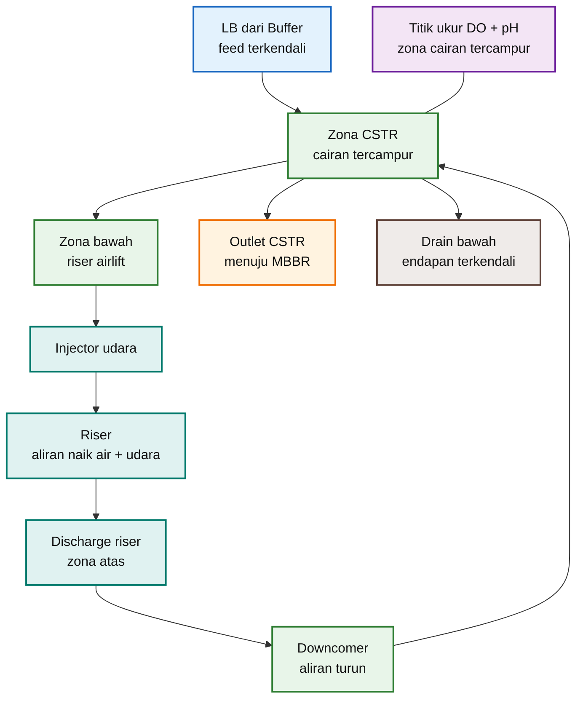
```mermaid
flowchart TD
    A["LB dari Buffer<br/>feed terkendali"] --> B["Zona CSTR<br/>cairan tercampur"]

    B --> C["Zona bawah<br/>riser airlift"]
    C --> D["Injector udara"]
    D --> E["Riser<br/>aliran naik air + udara"]
    E --> F["Discharge riser<br/>zona atas"]

    F --> G["Downcomer<br/>aliran turun"]
    G --> B

    B --> H["Outlet CSTR<br/>menuju MBBR"]
    B --> I["Drain bawah<br/>endapan terkendali"]

    J["Titik ukur DO + pH<br/>zona cairan tercampur"] --- B

    classDef feed fill:#E3F2FD,stroke:#1565C0,color:#111,stroke-width:2px;
    classDef reactor fill:#E8F5E9,stroke:#2E7D32,color:#111,stroke-width:2px;
    classDef airlift fill:#E0F2F1,stroke:#00796B,color:#111,stroke-width:2px;
    classDef outlet fill:#FFF3E0,stroke:#EF6C00,color:#111,stroke-width:2px;
    classDef drain fill:#EFEBE9,stroke:#5D4037,color:#111,stroke-width:2px;
    classDef instrument fill:#F3E5F5,stroke:#6A1B9A,color:#111,stroke-width:2px;

    class A feed;
    class B,C,G reactor;
    class D,E,F airlift;
    class H outlet;
    class I drain;
    class J instrument;
```

Diagram di atas adalah diagram fungsi proses, bukan gambar detail mekanik airlift-pump. Dimensi riser, posisi injector, rasio submergence, bentuk discharge, dan detail pipa tetap mengikuti desain airlift yang telah tersedia.

### 7.2.1 Menarik cairan dari zona bawah

Cairan yang lebih padat oleh flok halus atau partikel tersuspensi cenderung bergerak ke bagian bawah reaktor.

Airlift harus mengambil cairan dari zona bawah atau dekat zona bawah agar bagian tersebut tidak berubah menjadi kantong stagnan.

Namun, pengambilan cairan tidak boleh langsung dari titik drain lumpur.

$$
\boxed{
\text{Suction airlift}
\neq
\text{drain sludge}
}
$$

Airlift bertugas mensirkulasikan cairan aktif. Drain bawah bertugas mengeluarkan endapan yang tidak seharusnya terus berada di dalam CSTR.

### 7.2.2 Membentuk aliran naik pada riser

Udara masuk melalui injector pada bagian bawah riser. Udara membentuk campuran air–gas yang bergerak ke atas.

Pada tahap ini, airlift tidak hanya menambahkan oksigen. Airlift juga memindahkan massa cairan.

Debit sirkulasi cairan airlift dapat dituliskan:

$$
Q_{L,\text{airlift}}
=

\text{debit cairan yang disirkulasikan oleh airlift}
$$

Parameter ini sangat penting karena menunjukkan kemampuan airlift menjaga CSTR tetap tercampur.

Waktu satu putaran sirkulasi nominal dapat dihitung:

$$
t_{\text{turn}}
=

\frac{
V_{\text{CSTR}}
}{
Q_{L,\text{airlift}}
}
$$

dengan:

- $t_{\text{turn}}$ = waktu satu putaran sirkulasi cairan;
- $V_{\text{CSTR}}$ = volume kerja CSTR;
- $Q_{L,\text{airlift}}$ = debit sirkulasi cairan airlift.

Untuk CSTR ini:

$$
V_{\text{CSTR}}
=

1000\ \text{L}
$$

Nilai $Q_{L,\text{airlift}}$ harus diperoleh dari desain existing atau diuji melalui commissioning. Artikel ini tidak menetapkan nilai putaran per jam secara sembarang karena bentuk dan performa airlift Bapak sudah ditentukan oleh desain tersendiri.

### 7.2.3 Membentuk loop menuju downcomer

Air yang keluar dari atas riser harus kembali ke zona bawah melalui jalur sirkulasi yang jelas.

Bila discharge riser langsung mengarah ke outlet CSTR, sebagian aliran dapat mengalami _short-circuit flow_:

$$
\boxed{
\text{inlet}
\rightarrow
\text{riser}
\rightarrow
\text{outlet}
}
$$

tanpa cukup waktu tercampur dengan volume utama CSTR.

Karena itu, posisi inlet dari Buffer, discharge riser, downcomer, dan outlet menuju MBBR harus diatur agar aliran terdorong melalui volume reaktor terlebih dahulu.

Prinsip tata letak yang dikunci:

- feed dari Buffer masuk ke zona cairan tercampur, bukan langsung ke ujung riser;
- discharge riser tidak diarahkan lurus ke nozzle outlet MBBR;
- outlet menuju MBBR ditempatkan pada zona cairan tercampur;
- outlet tidak diambil dari zona tepat di atas injector udara;
- jalur downcomer harus memungkinkan aliran kembali menuju bagian bawah reaktor;
- drain bawah dipisahkan dari jalur sirkulasi normal.

### 7.2.4 Mencegah dead zone

_Dead zone_ adalah bagian reaktor yang tidak menerima sirkulasi memadai.

Pada zona ini, padatan halus dapat mengendap, oksigen dapat turun, dan proses dapat berubah menjadi anaerob lokal.

Indikasi praktis _dead zone_:

- endapan terus tumbuh pada satu sudut;
- bau lebih kuat pada titik tertentu;
- warna cairan tidak seragam;
- foam hanya terkumpul di satu area;
- DO berbeda besar antar lokasi;
- atau tracer tidak menyebar merata.

Airlift dinilai berhasil bukan hanya karena terlihat ada aliran di sekitar riser.

Airlift harus mampu menghasilkan:

$$
\boxed{
\text{pergerakan cairan pada seluruh volume kerja CSTR}
}
$$

### 7.2.5 Menjaga flok halus tetap tersuspensi

CSTR tidak dirancang untuk menahan sludge kasar. Namun, LB tetap dapat membawa flok mikro dan padatan halus yang lolos dari sedimentation basin.

Airlift harus cukup untuk menjaga flok halus tetap bergerak sehingga reaktor tidak berubah menjadi bak pengendapan kedua.

Pada saat yang sama, sirkulasi tidak boleh terlalu agresif sampai menghasilkan:

- foam berlebihan;
- fragmentasi flok yang tidak perlu;
- percikan berlebihan;
- atau carry-over padatan berlebih menuju MBBR.

Fungsi airlift CSTR adalah menghasilkan pencampuran yang cukup, bukan turbulensi maksimum.

### 7.2.6 Membantu transfer oksigen

Udara yang berada dalam riser menyediakan antarmuka gas–cair untuk transfer oksigen.

Namun, besarnya transfer oksigen aktual tidak dapat ditentukan dari debit udara saja.

Transfer oksigen airlift dipengaruhi oleh:

- metode injeksi udara;
- ukuran gelembung;
- pola aliran dua fase dalam riser;
- kedalaman injeksi;
- geometri riser;
- waktu kontak gas–cair;
- suhu;
- karakter LB;
- kandungan padatan;
- serta kondisi fouling pada injector.

Karena itu:

$$
\boxed{
\text{airlift terlihat aktif}
\not\Rightarrow
\text{transfer oksigen sudah cukup}
}
$$

Kecukupan oksigen tetap harus dibuktikan dari DO dan tren parameter proses.

---

## 7.3 Basis Desain CSTR

Basis CSTR dikunci sebagai berikut.

| Parameter      |               Nilai |
| -------------- | ------------------: |
| Volume efektif |             1.000 L |
| HRT normal     |           2,44 hari |
| HRT high-floc  |           1,22 hari |
| Target DO      |            2–4 mg/L |
| Target pH      |             6,5–8,0 |
| Sistem mixing  | airlift circulation |
| Sistem aerasi  |    injector airlift |
| Drain bawah    |               wajib |
| Outlet         |         menuju MBBR |

### 7.3.1 Volume efektif dan HRT

Volume efektif:

$$
V_{\text{CSTR}}
=

1000\ \text{L}
$$

Pada kondisi normal:

$$
Q_{\text{LB,normal}}
=

410\ \text{L/hari}
$$

maka:

$$
HRT_{\text{CSTR,normal}}
=

\frac{
1000
}{
410
}
$$

$$
\boxed{
HRT_{\text{CSTR,normal}}
=

2{,}44\ \text{hari}
}
$$

Pada kondisi high-floc:

$$
Q_{\text{LB,high}}
=

819\ \text{L/hari}
$$

maka:

$$
HRT_{\text{CSTR,high}}
=

\frac{
1000
}{
819
}
$$

$$
\boxed{
HRT_{\text{CSTR,high}}
=

1{,}22\ \text{hari}
}
$$

HRT ini adalah basis hidrolik.

HRT tidak boleh langsung dianggap sebagai bukti bahwa mineralisasi, nitrifikasi, atau penyisihan nitrogen tertentu pasti tercapai.

$$
\boxed{
\text{HRT}
\neq
\text{kapasitas biologis otomatis}
}
$$

### 7.3.2 Target DO

Rentang operasi umum CSTR ditetapkan:

$$
\boxed{
DO_{\text{CSTR}}
=

2{-}4\ \text{mg/L}
}
$$

Dalam artikel ini, interpretasinya harus dibedakan:

| Kondisi DO                | Arti Operasional                                              |
| ------------------------- | ------------------------------------------------------------- |
| $DO < 2\ \text{mg/L}$     | kondisi korektif; evaluasi airlift, beban, dan sirkulasi      |
| $DO = 2{-}3\ \text{mg/L}$ | kondisi aerob minimum untuk CSTR                              |
| $DO = 3{-}4\ \text{mg/L}$ | kondisi lebih baik untuk evaluasi proses nitrogen             |
| $DO > 4\ \text{mg/L}$     | tidak otomatis lebih baik; evaluasi kebutuhan energi dan foam |

Nilai $2\ \text{mg/L}$ adalah batas minimum operasional, bukan bukti bahwa nitrifikasi berlangsung kuat.

Bila CSTR diharapkan memberikan kontribusi nyata terhadap oksidasi TAN atau pengendalian nitrit, pengamatan proses lebih relevan dilakukan ketika DO berada pada bagian atas rentang operasi:

$$
\boxed{
DO_{\text{CSTR}}
\approx
3{-}4\ \text{mg/L}
}
$$

Hal ini bukan berarti CSTR ditetapkan sebagai reaktor nitrifikasi penuh. CSTR tetap diposisikan sebagai tahap mineralisasi aerob awal sebelum MBBR.

### 7.3.3 Target pH

Rentang pengamatan pH:

$$
\boxed{
pH_{\text{CSTR}}
=

6{,}5{-}8{,}0
}
$$

Rentang tersebut merupakan batas operasi umum untuk menjaga proses tidak bergerak terlalu asam atau terlalu basa.

Namun, pH tidak boleh dibaca hanya sebagai angka tunggal.

Perubahan pH dapat menunjukkan:

- pelepasan atau akumulasi $\text{CO}_2$;
- aktivitas respirasi;
- pembentukan asam organik;
- proses nitrifikasi;
- perubahan alkalinitas;
- perubahan karakter LB dari Buffer;
- atau kegagalan pengendalian beban.

Untuk evaluasi nitrifikasi, pH yang turun mendekati atau di bawah (7.0) harus diperlakukan hati-hati.

$$
\boxed{
pH < 7{,}0
\rightarrow
\text{laju nitrifikasi dapat menurun}
}
$$

Karena CSTR bukan reaktor nitrifikasi penuh, angka pH tidak digunakan untuk mengklaim penyisihan TAN. pH dipakai sebagai indikator kestabilan proses dan dasar tindakan koreksi.

### 7.3.4 Airflow CSTR tidak ditetapkan dari volume

CSTR tidak memakai basis berikut:

$$
Q_{\text{air}}
=

f
\left(
V_{\text{CSTR}}
\right)
$$

tanpa data lain.

Airflow CSTR harus mengikuti kemampuan airlift untuk memenuhi dua fungsi bersamaan:

$$
\boxed{
\text{sirkulasi cairan}
+
\text{transfer oksigen}
}
$$

Kriteria desain airflow CSTR adalah:

$$
\boxed{
Q_{\text{air,CSTR}}
\rightarrow
Q_{L,\text{airlift}}
\rightarrow
DO_{\text{outlet}}
\rightarrow
\text{tidak ada dead zone}
}
$$

Bukan:

$$
\boxed{
V_{\text{CSTR}}
\rightarrow
\text{tebak L/menit udara}
}
$$

---

## 7.4 Integrasi Desain Airlift yang Sudah Tersedia

Bab ini tidak menduplikasi desain airlift-pump yang telah tersedia.

Yang dikunci adalah interface antara airlift dan CSTR.

### 7.4.1 Posisi riser

Riser ditempatkan sesuai desain airlift existing.

Pada integrasi CSTR, riser harus:

- memiliki akses inspeksi;
- dapat dibersihkan bila terjadi fouling;
- tidak menjadi hambatan menuju drain bawah;
- tidak mengarahkan discharge langsung ke outlet MBBR;
- dan tidak menciptakan kantong lumpur di belakang struktur riser.

### 7.4.2 Posisi downcomer

Downcomer adalah jalur pengembalian cairan dari zona discharge riser menuju bagian bawah reaktor.

Downcomer harus:

- membentuk jalur aliran balik yang jelas;
- tidak tertutup oleh endapan;
- tidak terhalang screen atau struktur internal;
- tidak menjadi zona stagnan;
- serta cukup terbuka untuk pemeriksaan visual.

### 7.4.3 Titik injeksi udara

Titik injeksi udara mengikuti desain airlift existing.

Fungsi injector bukan untuk menyebarkan udara merata ke seluruh dasar CSTR seperti grid diffuser MBBR.

Fungsi injector adalah membentuk campuran air–udara di kaki riser.

$$
\boxed{
\text{Injector CSTR}
\neq
\text{grid diffuser MBBR}
}
$$

Injector harus dapat diperiksa dan dibersihkan karena LB masih berpotensi membawa biofilm, flok halus, atau deposit.

### 7.4.4 Jalur sirkulasi

Jalur sirkulasi harus dipahami sebagai satu loop.

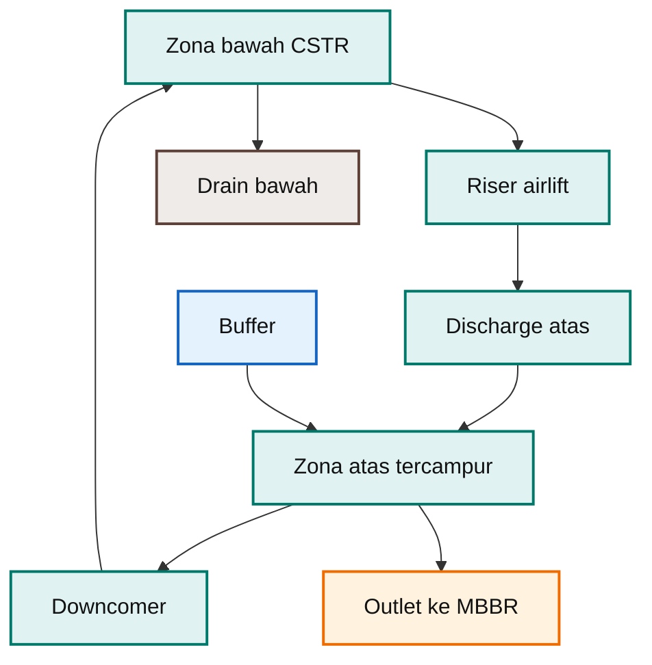
```mermaid
flowchart TD
    A["Zona bawah CSTR"] --> B["Riser airlift"]
    B --> C["Discharge atas"]
    C --> D["Zona atas tercampur"]
    D --> E["Downcomer"]
    E --> A

    F["Buffer"] --> D
    D --> G["Outlet ke MBBR"]
    A --> H["Drain bawah"]

    classDef loop fill:#E0F2F1,stroke:#00796B,color:#111,stroke-width:2px;
    classDef feed fill:#E3F2FD,stroke:#1565C0,color:#111,stroke-width:2px;
    classDef outlet fill:#FFF3E0,stroke:#EF6C00,color:#111,stroke-width:2px;
    classDef drain fill:#EFEBE9,stroke:#5D4037,color:#111,stroke-width:2px;

    class A,B,C,D,E loop;
    class F feed;
    class G outlet;
    class H drain;
```

Diagram tersebut menunjukkan prinsip aliran, bukan posisi mekanik final.

Bila desain existing menggunakan external-loop airlift, riser dan downcomer dapat berada pada jalur eksternal tangki. Bila desain existing menggunakan internal draft tube, riser dan downcomer berada di dalam tangki. Kedua bentuk dapat digunakan selama loop sirkulasi, akses inspeksi, dan pengambilan sampel tetap memenuhi fungsi proses.

### 7.4.5 Posisi inlet dari Buffer

Feed dari Buffer harus masuk pada zona cairan tercampur.

Kriteria inlet Buffer:

- tidak langsung menuju titik injector;
- tidak langsung menuju outlet MBBR;
- tidak menabrak riser dengan energi tinggi;
- tidak mengaduk endapan dasar;
- dan dapat ditutup untuk maintenance.

Dengan feed normal:

$$
Q_{\text{feed,normal}}
=

17{,}08\ \text{L/jam}
$$

dan high-floc:

$$
Q_{\text{feed,high}}
=

34{,}13\ \text{L/jam}
$$

debit feed jauh lebih kecil daripada debit sirkulasi airlift. Karena itu, posisi inlet tetap penting agar feed tidak langsung mengalami _short-circuit_ menuju outlet.

### 7.4.6 Posisi outlet menuju MBBR

Outlet menuju MBBR harus mengambil cairan dari zona yang representatif terhadap volume reaktor.

Outlet tidak boleh ditempatkan:

- tepat di atas injector;
- tepat pada plume gelembung;
- tepat di dekat discharge riser;
- atau pada titik yang hanya menerima aliran dari Buffer.

Outlet idealnya mengambil cairan dari zona tercampur setelah jalur sirkulasi terbentuk.

### 7.4.7 Drain bawah

Drain bawah wajib disediakan.

Fungsi drain bawah adalah:

- mengeluarkan endapan yang tidak seharusnya tinggal lama;
- memungkinkan inspeksi volume sludge;
- mencegah akumulasi anaerob lokal;
- serta mendukung pembersihan saat shutdown.

Drain bawah tidak boleh digunakan sebagai jalur normal menuju MBBR.

$$
\boxed{
\text{Drain bawah}
\rightarrow
\text{pembuangan endapan}
}
$$

$$
\boxed{
\text{Outlet CSTR}
\rightarrow
\text{cairan tercampur menuju MBBR}
}
$$

### 7.4.8 Titik pengukuran DO dan pH

DO dan pH harus diukur pada zona cairan tercampur.

Titik ukur tidak ditempatkan:

- di dalam riser;
- tepat di atas injector;
- di dalam plume gelembung;
- atau tepat di dekat permukaan yang mudah terpengaruh udara luar.

Titik pengukuran disarankan berada:

- pada sisi reaktor yang mewakili cairan tercampur;
- dekat outlet CSTR menuju MBBR;
- pada kedalaman menengah;
- dan mudah dijangkau untuk kalibrasi maupun pembersihan sensor.

$$
\boxed{
DO_{\text{measured}}
\approx
DO_{\text{cairan menuju MBBR}}
}
$$

bukan:

$$
\boxed{
DO_{\text{plume gelembung}}
}
$$

---

## 7.5 Parameter Verifikasi CSTR

CSTR harus diverifikasi menggunakan data, bukan hanya pengamatan bahwa airlift menghasilkan gelembung.

| Parameter               | Tujuan                                           | Metode Verifikasi Praktis                   |
| ----------------------- | ------------------------------------------------ | ------------------------------------------- |
| Debit sirkulasi airlift | memastikan mixing                                | ukur atau verifikasi kurva performa airlift |
| DO outlet CSTR          | memastikan oksigen cukup                         | DO meter pada zona cairan tercampur         |
| pH                      | kontrol kestabilan proses                        | pH meter terkalibrasi                       |
| Bau                     | indikasi kondisi aerob atau anaerob              | inspeksi harian                             |
| Foam                    | indikasi beban organik dan gangguan proses       | inspeksi visual serta foto pembanding       |
| Endapan                 | indikasi kebutuhan drain                         | inspeksi drain dan dasar tangki             |
| TSS                     | memastikan padatan tidak berlebihan              | sampling berkala inlet–outlet               |
| TAN                     | menentukan beban residual ke MBBR                | pengujian berkala                           |
| Nitrit                  | melihat nitrifikasi parsial atau gangguan proses | pengujian berkala                           |
| Nitrat                  | melihat tren transformasi nitrogen               | pengujian berkala                           |
| Suhu                    | interpretasi DO dan aktivitas biologis           | termometer atau sensor suhu                 |

### 7.5.1 Verifikasi sirkulasi airlift

Verifikasi sirkulasi dapat dilakukan melalui dua tahap.

**Tahap 1 — Wet test dengan air bersih**

Dilakukan sebelum LB dimasukkan ke dalam sistem.

Tujuannya:

- memeriksa arah discharge riser;
- memastikan downcomer bekerja;
- memeriksa kebocoran;
- melihat area stagnan;
- dan mengonfirmasi bahwa outlet tidak mengalami _short-circuit_.

Tracer dapat digunakan saat wet test, misalnya pengujian konduktivitas atau pewarna yang aman untuk pengujian air bersih.

Tracer tidak boleh ditambahkan ke batch produk apabila bahan tersebut tidak diketahui dampaknya terhadap proses maupun tanaman.

**Tahap 2 — Verifikasi saat operasi LB**

Saat LB sudah masuk, indikator praktis meliputi:

- tidak ada endapan yang tumbuh cepat pada area tertentu;
- warna cairan relatif seragam;
- tidak ada perbedaan bau yang tajam antar titik;
- DO tidak menunjukkan perbedaan besar antar titik;
- dan outlet menuju MBBR tidak membawa sludge kasar.

### 7.5.2 Verifikasi transfer oksigen

Kinerja oxygen transfer airlift tidak boleh dinilai dari ukuran gelembung saja.

Kriteria praktisnya adalah tren DO.

$$
DO_{\text{outlet CSTR}}
\geq
2\ \text{mg/L}
$$

Bila DO turun di bawah batas tersebut, tindakan koreksi harus melihat empat kemungkinan utama:

1. beban organik LB meningkat;
2. debit feed dari Buffer terlalu tinggi;
3. airlift tidak menghasilkan sirkulasi atau transfer oksigen cukup;
4. injector atau jalur udara mengalami fouling, kebocoran, atau penurunan tekanan.

Bila tujuan evaluasi mencakup nitrifikasi, pengujian TAN dan nitrit harus dilakukan bersamaan dengan DO dan pH.

$$
\boxed{
\text{TAN turun tanpa data DO dan pH}
\neq
\text{bukti desain nitrifikasi berhasil}
}
$$

### 7.5.3 Verifikasi beban padatan

TSS inlet dan outlet CSTR digunakan untuk melihat apakah CSTR menerima atau menghasilkan carry-over padatan berlebih.

$$
\Delta TSS_{\text{CSTR}}
=

TSS_{\text{out}}
-

TSS_{\text{in}}
$$

Interpretasi awal:

| Kondisi                                    | Interpretasi Kemungkinan                               |
| ------------------------------------------ | ------------------------------------------------------ |
| $TSS_{\text{out}} \approx TSS_{\text{in}}$ | CSTR mempertahankan flok halus tetap tersuspensi       |
| $TSS_{\text{out}} > TSS_{\text{in}}$       | ada resuspensi endapan atau pelepasan deposit internal |
| $TSS_{\text{out}} < TSS_{\text{in}}$       | terjadi settling atau penahanan padatan di CSTR        |
| TSS berubah sangat fluktuatif              | feed Buffer atau sedimentation basin belum stabil      |

CSTR tidak ditargetkan sebagai unit pemisahan TSS utama.

Bila CSTR terus menahan padatan dan membentuk endapan, masalah perlu ditelusuri ke:

- kualitas LB dari sedimentation basin;
- operasi Buffer;
- posisi inlet;
- pola sirkulasi airlift;
- atau frekuensi drain CSTR.

### 7.5.4 Verifikasi nitrogen

Parameter nitrogen minimal yang dipantau:

$$
TAN
=

NH_3
+
NH_4^+
$$

$$
NO_2^-
=

\text{nitrit}
$$

$$
NO_3^-
=

\text{nitrat}
$$

Nilai yang dibandingkan:

$$
\Delta TAN
=

TAN_{\text{in}}
-

TAN_{\text{out}}
$$

$$
\Delta NO_2^-
=

NO_{2,\text{in}}^-
-

NO_{2,\text{out}}^-
$$

$$
\Delta NO_3^-
=

NO_{3,\text{out}}^-
-

NO_{3,\text{in}}^-
$$

Data tersebut hanya bermakna ketika debit, waktu sampling, DO, pH, dan kondisi operasi airlift dicatat bersamaan.

Satuan juga wajib konsisten.

$$
\boxed{
\text{mg TAN-N/L}
\neq
\text{mg NH}_4^+\text{/L}
}
$$

$$
\boxed{
\text{mg NO}_2\text{-N/L}
\neq
\text{mg NO}_2^-\text{/L}
}
$$

---

## 7.6 Quality Gate CSTR menuju MBBR

MBBR menerima LB setelah CSTR.

Karena itu, CSTR harus menghasilkan aliran yang cukup stabil secara hidrolik dan biologis. Quality gate CSTR tidak dimaksudkan untuk menyatakan bahwa semua organik atau nitrogen telah selesai diproses.

Quality gate memastikan MBBR tidak menerima aliran yang masih bermasalah secara mendasar.

| Parameter    | Kriteria Minimum menuju MBBR                    | Tindakan Bila Tidak Memenuhi                       |
| ------------ | ----------------------------------------------- | -------------------------------------------------- |
| Debit feed   | mengikuti set point Buffer                      | cek pompa dosing dan level Buffer                  |
| DO CSTR      | minimal $2\ \text{mg/L}$ pada zona mixed outlet | evaluasi airlift, beban, injector, dan blower      |
| Bau          | tidak busuk atau septik kuat                    | tahan transfer; periksa endapan dan sirkulasi      |
| Sludge kasar | tidak terbawa                                   | drain CSTR; periksa sedimentation basin dan Buffer |
| TSS          | dicatat dan dibandingkan dengan inlet           | evaluasi carry-over serta pola sirkulasi           |
| TAN          | dicatat                                         | evaluasi beban residual menuju MBBR                |
| Nitrit       | dicatat                                         | evaluasi gangguan nitrifikasi atau shock load      |
| pH           | berada pada rentang operasi dan trennya stabil  | evaluasi alkalinitas, karbon dioksida, dan beban   |
| Foam         | tidak melonjak ekstrem                          | evaluasi organik, aerasi, dan carry-over flok      |

Kriteria inti menuju MBBR:

$$
\boxed{
\text{feed stabil}
+
DO_{\text{CSTR}}
\geq
2\ \text{mg/L}
+
\text{tidak septik}
+
\text{tanpa sludge kasar}
+
\text{parameter tercatat}
}
$$

MBBR tidak boleh diperlakukan sebagai tempat untuk memperbaiki kegagalan CSTR.

$$
\boxed{
\text{MBBR}
\neq
\text{penyelamat dari CSTR yang gagal bercampur}
}
$$

MBBR menerima aliran yang telah:

- melewati sedimentation basin;
- diratakan melalui Buffer;
- mendapatkan sirkulasi dan oksigenasi awal pada CSTR Airlift;
- bebas dari carry-over sludge kasar;
- serta memiliki data DO, pH, TSS, TAN, dan nitrit yang dapat ditelusuri.

Dengan pembagian fungsi tersebut, MBBR dapat berfokus pada fungsi attached-growth polishing dan stabilisasi lanjutan.

## Referensi Teknis Bab Ini

1. Abed, R., Hussein, M. M., Ahmed, W. H., dan Abdou, S. _Two-Phase Flow Mass Transfer Analysis of Airlift Pump for Aquaculture Applications_. Fluids, 6(6), 226, 2021.

2. Parker, N. C., dan Suttle, M. A. _Design of Airlift Pumps for Water Circulation and Aeration in Aquaculture_. Aquacultural Engineering, 6, 97–110, 1987.

3. Food and Agriculture Organization. _Design of a Freshwater Fish Hatchery for Small Fish Farmers_. FAO Fisheries Technical Paper, 1985.

4. United States Environmental Protection Agency. _Nutrient Control Design Manual: State of Technology Review Report_. EPA, 2009.

[**Kembali ke Atas**](#desain-mineralisasi-liquid-biofloc-dengan-buffer-cstr-airlift-dan-mbbr-untuk-produksi-poc-b)

---

# 8. Desain MBBR Aerob dan Grid Diffuser PVC

MBBR adalah reaktor aerob _attached-growth_ yang menerima cairan dari CSTR Airlift. Berbeda dari CSTR, MBBR memerlukan dua fungsi udara sekaligus:

<figure>
  
  <figcaption>
    Ilustrasi MBBR bioflok sebagai sistem dengan media bergerak untuk mendukung
    pertumbuhan biofilm, pengolahan bahan organik, dan stabilisasi kualitas air
    dalam kolam budidaya.
  </figcaption>
</figure>

$$
\boxed{
\text{transfer oksigen}
+
\text{pergerakan carrier}
}
$$

Karena carrier harus selalu bergerak, desain aerasi MBBR tidak boleh hanya didasarkan pada target DO. Sebaliknya, desain juga tidak boleh hanya didasarkan pada kemampuan mengaduk carrier tanpa memeriksa apakah oksigen yang ditransfer cukup untuk beban organik dan nitrogen residual.

$$
\boxed{
\text{MBBR}
\neq
\text{tangki aerasi biasa}
}
$$

$$
\boxed{
\begin{gathered}
\text{MBBR}
=

\text{reaktor biofilm bergerak dengan kebutuhan} \\ \text{mixing dan oxygen transfer secara bersamaan}
\end{gathered}
}
$$

---

## 8.1 Fungsi MBBR

MBBR ditempatkan setelah CSTR Airlift untuk menerima LB yang telah lebih stabil secara hidrolik dan aerob.

Fungsi MBBR adalah:

- _biofilm polishing_;
- stabilisasi organik residual;
- pengolahan nitrogen lanjutan;
- retensi biomassa _attached-growth_;
- penyangga fluktuasi kualitas outlet CSTR;
- serta pengurangan risiko perubahan kualitas produk sebelum masuk settling/screening.

Carrier menyediakan permukaan terlindungi bagi biofilm. Cairan bergerak melewati carrier, substrat berdifusi menuju biofilm, oksigen ditransfer melalui fase cair, dan biofilm mengalami shear akibat tumbukan antarcarrier serta pergerakan cairan.

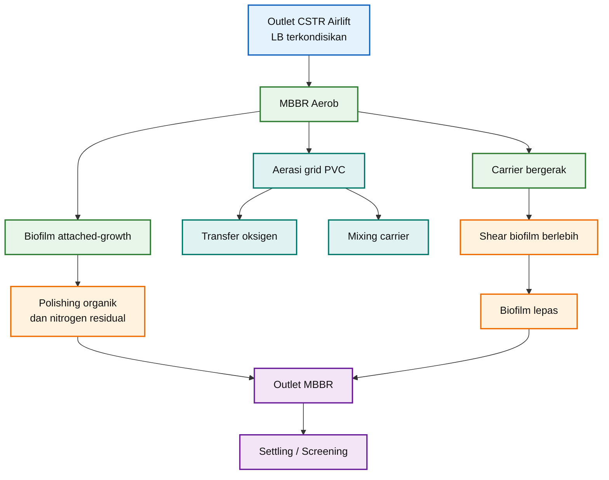
```mermaid
flowchart TD
    A["Outlet CSTR Airlift<br/>LB terkondisikan"] --> B["MBBR Aerob"]

    B --> C["Carrier bergerak"]
    B --> D["Biofilm attached-growth"]
    B --> E["Aerasi grid PVC"]

    E --> F["Transfer oksigen"]
    E --> G["Mixing carrier"]

    C --> H["Shear biofilm berlebih"]
    D --> I["Polishing organik<br/>dan nitrogen residual"]

    H --> J["Biofilm lepas"]
    I --> K["Outlet MBBR"]
    J --> K
    K --> L["Settling / Screening"]

    classDef feed fill:#E3F2FD,stroke:#1565C0,color:#111,stroke-width:2px;
    classDef reactor fill:#E8F5E9,stroke:#2E7D32,color:#111,stroke-width:2px;
    classDef air fill:#E0F2F1,stroke:#00796B,color:#111,stroke-width:2px;
    classDef process fill:#FFF3E0,stroke:#EF6C00,color:#111,stroke-width:2px;
    classDef outlet fill:#F3E5F5,stroke:#6A1B9A,color:#111,stroke-width:2px;

    class A feed;
    class B,C,D reactor;
    class E,F,G air;
    class H,I,J process;
    class K,L outlet;
```

MBBR tidak boleh diklaim sebagai reaktor nitrifikasi penuh hanya karena memakai carrier.

Kinerja nitrifikasi dipengaruhi oleh:

- TAN aktual pada inlet;
- organik residual dari CSTR;
- DO bulk;
- pH;
- alkalinitas;
- suhu;
- luas permukaan carrier yang efektif;
- umur dan ketebalan biofilm;
- serta pola gerak carrier.

Karena itu, fungsi MBBR dalam artikel ini diposisikan sebagai:

$$
\boxed{
\text{biofilm polishing dan stabilisasi lanjutan}
}
$$

Bukan:

$$
\boxed{
\text{jaminan nitrifikasi penuh tanpa data inlet--outlet}
}
$$

---

## 8.2 Spesifikasi MBBR

Basis desain MBBR dikunci sebagai berikut.

| Parameter           |      Nilai |
| ------------------- | ---------: |
| Volume MBBR         |      750 L |
| Media fill awal     |        30% |
| Media awal          |     ±225 L |
| Media fill maksimum |        50% |
| Media maksimum      |     ±375 L |
| Target DO           |   3–5 mg/L |
| Target pH           |    6,8–8,2 |
| Screen outlet       |      wajib |
| Drain bawah         | disarankan |

### 8.2.1 Volume carrier

Volume carrier awal:

$$
V_{\text{carrier,awal}}
=

0{,}30
\times
V_{\text{MBBR}}
$$

$$
V_{\text{carrier,awal}}
=

0{,}30
\times
750
$$

$$
\boxed{
V_{\text{carrier,awal}}
=

225\ \text{L}
}
$$

Volume carrier maksimum:

$$
V_{\text{carrier,max}}
=

0{,}50
\times
V_{\text{MBBR}}
$$

$$
V_{\text{carrier,max}}
=

0{,}50
\times
750
$$

$$
\boxed{
V_{\text{carrier,max}}
=

375\ \text{L}
}
$$

Nilai tersebut adalah volume bulk carrier, bukan volume plastik padat.

Carrier mempunyai rongga internal dan ruang antarcarrier yang tetap terisi air. Karena itu, carrier tidak dapat dikurangkan begitu saja dari volume cairan reaktor.

$$
\boxed{
V_{\text{liquid,MBBR}}
\neq
V_{\text{tank}}
-

V_{\text{bulk\ carrier}}
}
$$

Volume kerja cairan aktual harus dikonfirmasi setelah carrier, screen outlet, grid diffuser, header, dan lateral terpasang.

### 8.2.2 Mengapa fill awal dibatasi 30%

Fill awal (30%) dipilih agar terdapat ruang untuk:

- pertumbuhan biofilm;
- evaluasi pola gerak carrier;
- evaluasi kebutuhan oxygen transfer;
- penambahan carrier pada fase berikutnya;
- serta koreksi bila carrier terlalu sulit bergerak.

Menaikkan carrier hingga (50%) tidak otomatis meningkatkan kinerja proses dua kali lipat.

Kenaikan fill juga meningkatkan:

- tahanan gerak carrier;
- kebutuhan mixing;
- risiko carrier berkumpul;
- risiko penumpukan di retention screen;
- serta sensitivitas terhadap perubahan debit dan aerasi.

Karena itu:

$$
\boxed{
\text{carrier fill}
\rightarrow
\text{ditingkatkan setelah proses stabil}
}
$$

bukan langsung diisi maksimum pada saat start-up.

### 8.2.3 Target DO

Target operasi MBBR:

$$
\boxed{
DO_{\text{MBBR}}
=

3{-}5\ \text{mg/L}
}
$$

Rentang ini digunakan sebagai target operasi untuk memastikan MBBR memiliki cadangan oksigen lebih baik daripada CSTR dan dapat menahan perubahan beban residual dari outlet CSTR.

| Kondisi DO                | Interpretasi Operasi                                                   |
| ------------------------- | ---------------------------------------------------------------------- |
| $DO < 3\ \text{mg/L}$     | evaluasi airflow, carrier mixing, beban organik, dan TAN residual      |
| $DO = 3{-}4\ \text{mg/L}$ | target operasi umum                                                    |
| $DO = 4{-}5\ \text{mg/L}$ | kondisi cadangan untuk beban lebih tinggi atau evaluasi nitrogen       |
| $DO > 5\ \text{mg/L}$     | tidak otomatis lebih baik; evaluasi energi, foam, dan kebutuhan proses |

DO harus diukur pada cairan bulk yang tercampur, bukan di dalam plume gelembung atau tepat di atas diffuser.

$$
\boxed{
DO_{\text{bulk}}
\neq
DO_{\text{plume udara}}
}
$$

### 8.2.4 Target pH

Rentang operasi pH MBBR:

$$
\boxed{
pH_{\text{MBBR}}
=

6{,}8{-}8{,}2
}
$$

Rentang ini dipakai sebagai batas operasi agar proses biologis tidak bekerja pada kondisi terlalu asam atau terlalu basa.

pH juga merupakan indikator perubahan proses:

- pH turun dapat mengindikasikan kenaikan $\text{CO}_2$, pembentukan asam, atau nitrifikasi;
- pH naik dapat mengindikasikan pelepasan $\text{CO}_2$, perubahan bahan baku LB, atau perubahan alkalinitas;
- pH yang berubah cepat harus dievaluasi bersama DO, TAN, nitrit, nitrat, dan alkalinitas.

---

## 8.3 Prinsip Kebutuhan Udara MBBR

Debit udara MBBR ditentukan oleh kebutuhan yang lebih besar antara kebutuhan mixing carrier dan kebutuhan transfer oksigen.

$$
Q_{\text{air,MBBR}}
=

\max
\left(
Q_{\text{air,mixing}},
Q_{\text{air,OTR}}
\right)
$$

dengan:

- $Q_{\text{air,mixing}}$ = debit udara minimum agar carrier bergerak merata;
- $Q_{\text{air,OTR}}$ = debit udara minimum untuk memenuhi kebutuhan oxygen transfer residual.

Persamaan tersebut berarti:

- bila kebutuhan carrier mixing lebih besar, blower dikendalikan oleh kebutuhan mixing;
- bila kebutuhan oxygen transfer lebih besar, blower dikendalikan oleh kebutuhan OTR;
- bila keduanya berubah akibat beban, airflow harus disesuaikan melalui valve atau kontrol blower.

### 8.3.1 Kebutuhan udara untuk carrier mixing

Sebagai basis screening, digunakan koefisien mixing:

$$
C_{\text{MIX}}
=

35
\frac{
\text{scfm}
}{
1000\ \text{ft}^3
}
$$

Secara numerik, koefisien tersebut setara dengan:

$$
C_{\text{MIX}}
=

35
\frac{
\text{L/menit}
}{
\text{m}^3
}
$$

Volume MBBR:

$$
V_{\text{MBBR}}
=

750\ \text{L}
=

0{,}75\ \text{m}^3
$$

Maka kebutuhan udara mixing referensi:

$$
Q_{\text{air,mixing,ref}}
=

C_{\text{MIX}}
\times
V_{\text{MBBR}}
$$

$$
Q_{\text{air,mixing,ref}}
=

35
\times
0{,}75
$$

$$
\boxed{
Q_{\text{air,mixing,ref}}
=

26{,}25\ \text{L/menit}
}
$$

Nilai tersebut adalah **titik awal desain dan commissioning**, bukan angka final yang boleh dipakai tanpa wet test.

Koefisien mixing sangat dipengaruhi oleh:

- bentuk tangki;
- kedalaman air;
- luas dasar;
- model carrier;
- ukuran carrier;
- fill carrier;
- tata letak diffuser;
- jumlah lateral;
- serta distribusi udara aktual.

Karena itu:

$$
\boxed{
Q_{\text{air,mixing,ref}}
=

26{,}25\ \text{L/menit}
}
$$

harus dipahami sebagai:

$$
\boxed{
\text{initial mixing test point}
}
$$

bukan sebagai:

$$
\boxed{
\text{final operating airflow tanpa verifikasi}
}
$$

### 8.3.2 Kebutuhan udara berdasarkan OTR

Kebutuhan oksigen MBBR berasal dari beban residual yang keluar dari CSTR.

Secara umum:

$$
AOR_{\text{MBBR}}
=

AOR_{\text{organik residual}}
+
AOR_{\text{nitrifikasi}}
$$

Untuk nitrifikasi:

$$
AOR_{\text{nitrifikasi}}
=

4{,}57
\times
N_{\text{nitrified}}
$$

dengan:

- $AOR_{\text{nitrifikasi}}$ = kebutuhan oksigen nitrifikasi dalam $\text{kg }O_2/\text{hari}$;
- $N_{\text{nitrified}}$ = nitrogen amonia yang benar-benar teroksidasi dalam $\text{kg N/hari}$;
- $(4{,}57)$ = kebutuhan oksigen teoritis untuk oksidasi amonia menjadi nitrat.

Nilai $N_{\text{nitrified}}$ tidak boleh langsung diambil dari nitrogen total pakan. Nilai tersebut harus didasarkan pada TAN aktual yang masuk dan keluar dari MBBR.

Kebutuhan airflow berdasarkan OTR dapat ditulis:

$$
Q_{\text{air,OTR}}
=
\frac{
AOR_{\text{MBBR}}
}{
60
\times
\rho_{\text{air,std}}
\times
y_{\mathrm{O_2}}
\times
\eta_{\text{OTE,actual}}
}
$$

dengan:

- $Q_{\text{air,OTR}}$ = kebutuhan udara dalam $\text{m}^3/\text{menit}$;
- $AOR_{MBBR}$ = kebutuhan oksigen aktual dalam $\text{kg }O_2/\text{jam}$;
- $\rho_{\text{air,std}}$ = densitas udara pada kondisi referensi blower;
- $y_{O_2}$ = fraksi massa oksigen dalam udara kering;
- $\eta_{\text{OTE,actual}}$ = efisiensi transfer oksigen aktual dalam LB.

Nilai $\eta_{\text{OTE,actual}}$ tidak boleh diambil langsung dari kurva fine-bubble membrane diffuser.

Grid PVC berlubang $1{,}0\ \text{mm}$ dalam LB yang mengandung organik, flok halus, dan biofilm bukanlah diffuser membrane fine-bubble bersertifikat.

Karena itu:

$$
\boxed{
\eta_{\mathrm{OTE,actual}}
\rightarrow
\text{harus diperoleh melalui uji } \mathrm{OTR}\text{ aktual}
}
$$

### 8.3.3 Kebutuhan udara desain

Kebutuhan udara desain MBBR ditentukan setelah dua kebutuhan tersebut dibandingkan.

$$
Q_{\text{air,MBBR,design}}
=

\max
\left(
Q_{\text{air,mixing,verified}},
Q_{\text{air,OTR,verified}}
\right)
$$

Dalam desain ini:

$$
\boxed{
Q_{\text{air,mixing,ref}}
=

26{,}25\ \text{L/menit}
}
$$

dipakai sebagai titik awal wet test carrier.

Namun, blower dan grid diffuser tidak boleh dinyatakan final sebelum tersedia:

- model carrier;
- dimensi internal MBBR;
- kedalaman air;
- luas dasar tangki;
- debit udara aktual per lateral;
- pola gerak carrier;
- data DO;
- data TAN dan nitrit;
- serta hasil uji OTR pada LB aktual.

---

## 8.4 Target Gerak Media Carrier

Carrier harus bergerak secara merata tanpa berubah menjadi massa yang hanya berputar di satu sisi tangki.

Kriteria target gerak carrier adalah:

- bergerak merata;
- tidak mengendap;
- tidak menggumpal;
- tidak menumpuk di screen outlet;
- tidak terlalu agresif hingga biofilm terkelupas berlebihan;
- tidak menghasilkan foam yang meningkat terus;
- serta tidak menciptakan dead zone di sudut atau dasar tangki.

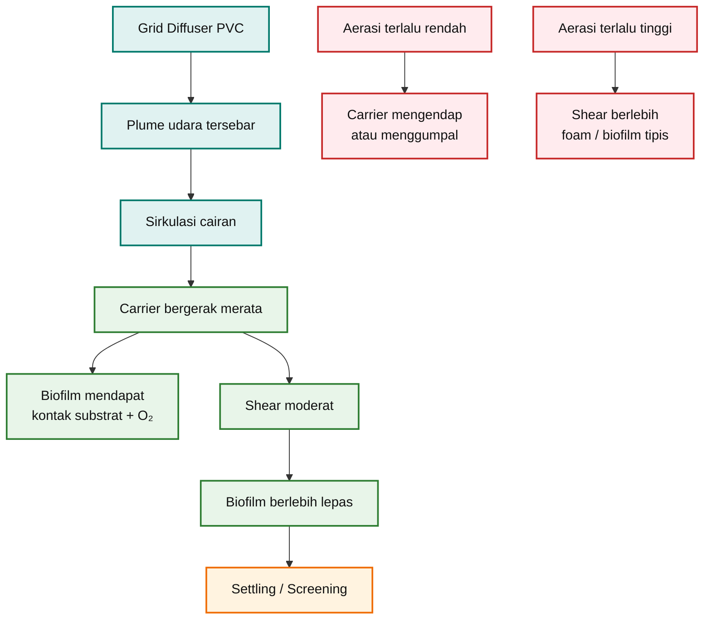
```mermaid
flowchart TD
    A["Grid Diffuser PVC"] --> B["Plume udara tersebar"]
    B --> C["Sirkulasi cairan"]
    C --> D["Carrier bergerak merata"]
    D --> E["Biofilm mendapat<br/>kontak substrat + O₂"]
    D --> F["Shear moderat"]
    F --> G["Biofilm berlebih lepas"]
    G --> H["Settling / Screening"]

    I["Aerasi terlalu rendah"] --> J["Carrier mengendap<br/>atau menggumpal"]
    K["Aerasi terlalu tinggi"] --> L["Shear berlebih<br/>foam / biofilm tipis"]

    classDef good fill:#E8F5E9,stroke:#2E7D32,color:#111,stroke-width:2px;
    classDef air fill:#E0F2F1,stroke:#00796B,color:#111,stroke-width:2px;
    classDef bad fill:#FFEBEE,stroke:#C62828,color:#111,stroke-width:2px;
    classDef polish fill:#FFF3E0,stroke:#EF6C00,color:#111,stroke-width:2px;

    class A,B,C air;
    class D,E,F,G good;
    class H polish;
    class I,J,K,L bad;
```

### 8.4.1 Aerasi terlalu rendah

Aerasi terlalu rendah dapat menyebabkan:

- carrier tinggal di dasar;
- carrier bergerak hanya dekat diffuser;
- carrier terkumpul pada satu sisi;
- carrier menumpuk di depan retention screen;
- lapisan biofilm menjadi terlalu tebal;
- DO bulk turun;
- serta terbentuk area dengan sirkulasi lemah.

### 8.4.2 Aerasi terlalu tinggi

Aerasi berlebih dapat menyebabkan:

- carrier bergerak terlalu agresif;
- tumbukan carrier meningkat;
- biofilm terkelupas terlalu cepat;
- foam bertambah;
- percikan meningkat;
- energi blower terbuang;
- dan padatan terlepas meningkat menuju settling/screening.

Karena itu:

$$
\boxed{
\text{carrier harus bergerak aktif}
\neq
\text{carrier harus bergerak seagresif mungkin}
}
$$

### 8.4.3 Kriteria visual commissioning

Kriteria visual minimum yang harus dipenuhi:

| Area inspeksi       | Kondisi yang Diharapkan                        |
| ------------------- | ---------------------------------------------- |
| Tengah tangki       | carrier bergerak dan berubah posisi            |
| Sudut tangki        | tidak ada carrier yang menetap                 |
| Dasar tangki        | tidak ada hamparan carrier diam                |
| Dekat screen outlet | tidak ada tumpukan carrier menetap             |
| Permukaan           | tidak ada carrier mengapung dan menutup outlet |
| Seluruh lateral     | plume udara tampak relatif seragam             |
| Foam                | tidak meningkat terus selama kondisi stabil    |

Carrier movement dinilai ketika volume media sudah terisi, bukan hanya ketika MBBR kosong.

$$
\boxed{
\text{wet test tanpa carrier}
\neq
\text{verifikasi mixing MBBR}
}
$$

---

## 8.5 Desain Diffuser PVC Berlubang

### 8.5.1 Posisi desain diffuser PVC

Diffuser PVC pada MBBR dirancang sebagai grid penyebar udara.

Fungsinya adalah:

- membentuk plume udara pada beberapa titik;
- membangun sirkulasi cairan;
- menjaga carrier bergerak;
- menyediakan transfer oksigen;
- dan mengurangi dead zone.

Grid diffuser PVC bukan membrane fine-bubble diffuser komersial.

$$
\boxed{
\text{PVC berlubang }1{,}0\ \text{mm}
\neq
\text{membrane fine-bubble diffuser}
}
$$

Oleh sebab itu, OTE grid PVC tidak boleh diambil dari katalog membrane diffuser.

### 8.5.2 Diameter lubang

Basis fabrikasi diffuser:

$$
\boxed{
d_{\text{hole}}
=

1{,}0\ \text{mm}
}
$$

Diameter $1{,}0\ \text{mm}$ dipilih untuk aplikasi LB karena lebih realistis untuk:

- fabrikasi;
- inspeksi;
- pembersihan;
- toleransi diameter;
- ketahanan terhadap fouling;
- serta jumlah lubang yang masih praktis.

Diameter $0{,}5\ \text{mm}$ tidak digunakan untuk desain ini.

Pada pressure drop sama:

$$
q_{\text{hole}}
\propto
d_{\text{hole}}^{2}
$$

Maka:

$$
\frac{
q_{0{,}5}
}{
q_{1{,}0}
}
=

\left(
\frac{
0{,}5
}{
1{,}0
}
\right)^2
=

0{,}25
$$

Artinya, untuk total airflow dan pressure drop yang sama:

$$
\boxed{
N_{0{,}5}
=

4
\times
N_{1{,}0}
}
$$

Lubang $0{,}5\ \text{mm}$ membutuhkan kira-kira empat kali jumlah lubang, lebih sensitif terhadap variasi fabrikasi, dan lebih berisiko mengalami fouling pada sistem LB.

### 8.5.3 Target pressure drop orifice

Basis awal pressure drop orifice:

$$
\boxed{
\Delta P_{\text{orifice}}
=

0{,}5\ \text{kPa}
}
$$

Konversi ke kolom air:

$$
1\ \text{mmH}_2\text{O}
=

9{,}80665\ \text{Pa}
$$

$$
\Delta P_{\text{orifice}}
=

\frac{
500
}{
9{,}80665
}
$$

$$
\boxed{
\Delta P_{\text{orifice}}
\approx
51\ \text{mmH}_2\text{O}
}
$$

Nilai $0{,}5\ \text{kPa}$ adalah target awal untuk mendapatkan pressure drop cukup dominan terhadap variasi tekanan sepanjang header dan lateral.

Nilai tersebut bukan angka universal untuk semua diffuser PVC.

Final pressure drop harus ditetapkan setelah:

- panjang header;
- diameter header;
- panjang lateral;
- diameter lateral;
- jumlah lubang;
- debit tiap lateral;
- dan pressure loss aktual;

dihitung serta diuji.

### 8.5.4 Debit teoritis per lubang

Luas satu lubang:

$$
A_{\text{hole}}
=

\frac{
\pi
d_{\text{hole}}^{2}
}{
4
}
$$

Debit teoritis aktual pada orifice:

$$
q_{\text{hole,actual}}
=

C_d
A_{\text{hole}}
\sqrt{
\frac{
2
\Delta P_{\text{orifice}}
}{
\rho_{\text{air,orifice}}
}
}
$$

dengan:

- $q_{hole,actual}$ = debit aktual per lubang pada kondisi tekanan orifice;
- $C_d$ = koefisien discharge aktual lubang;
- $A_{hole}$ = luas lubang;
- $\Delta P_{\text{orifice}}$ = pressure drop orifice;
- $\rho_{\text{air,orifice}}$ = densitas udara pada tekanan dan suhu di orifice.

Koefisien discharge tidak boleh dianggap konstan untuk semua pipa PVC.

$$
C_d
=

f
\left(
\frac{t}{d},
\text{burr},
\text{bevel},
\text{kekasaran},
\text{metode pengeboran}
\right)
$$

dengan:

- (t) = tebal dinding pipa;
- (d) = diameter lubang.

Karena itu, nilai $C_d$ harus divalidasi melalui uji debit nyata menggunakan manometer dan flow meter.

### 8.5.5 Pemeriksaan teoritis awal

Sebagai pemeriksaan awal, gunakan asumsi sementara:

$$
d_{\text{hole}}
=

1{,}0\ \text{mm}
$$

$$
\Delta P_{\text{orifice}}
=

0{,}5\ \text{kPa}
$$

$$
C_d
=

0{,}65
$$

$$
\rho_{\text{air}}
=

1{,}2\ \text{kg/m}^3
$$

Maka:

$$
A_{\text{hole}}
=

\frac{
\pi
\left(
0{,}001
\right)^2
}{
4
}
$$

$$
A_{\text{hole}}
=

7{,}854
\times
10^{-7}
\ \text{m}^2
$$

$$
q_{\text{hole}}
=

0{,}65
\times
7{,}854
\times
10^{-7}
\times
\sqrt{
\frac{
2
\times
500
}{
1{,}2
}
}
$$

$$
\boxed{
q_{\text{hole}}
\approx
0{,}884\ \text{L/menit}
}
$$

Nilai tersebut hanya merupakan pemeriksaan teoritis.

Nilai aktual dapat berubah karena:

- densitas udara di bawah permukaan air lebih tinggi daripada densitas pada tekanan atmosfer;
- $\frac{t}{d}$ lubang PVC dapat berbeda;
- lubang hasil bor tidak selalu berbentuk orifice tajam ideal;
- burr dapat memperkecil atau memperbesar jalur efektif;
- dan biofilm dapat mengubah area terbuka selama operasi.

### 8.5.6 Jumlah lubang teoritis

Jumlah lubang teoritis dihitung setelah airflow MBBR dikunci.

$$
N_{\text{hole}}
=

\frac{
Q_{\text{air,MBBR}}
}{
q_{\text{hole}}
}
$$

Bila digunakan titik awal mixing:

$$
Q_{\text{air,mixing,ref}}
=

26{,}25\ \text{L/menit}
$$

maka:

$$
N_{\text{hole,theory}}
=

\frac{
26{,}25
}{
0{,}884
}
$$

$$
\boxed{
N_{\text{hole,theory}}
\approx
30\ \text{lubang}
}
$$

Nilai (30) lubang bukan angka final gambar fabrikasi.

Jumlah akhir harus disesuaikan dengan:

- hasil wet test carrier;
- hasil kalibrasi $C_d$;
- bentuk dan dimensi tangki;
- jumlah lateral;
- distribusi pressure loss;
- kebutuhan OTR;
- serta hasil pengukuran pressure header.

Contoh pembagian mekanik setelah jumlah lubang dikunci:

| Konfigurasi           | Jumlah Lubang | Catatan                                                 |
| --------------------- | ------------: | ------------------------------------------------------- |
| 3 lateral × 10 lubang |            30 | hanya layak bila pola aliran dan lebar tangki mendukung |
| 4 lateral × 8 lubang  |            32 | dipilih bila diperlukan distribusi plume lebih rapat    |
| 2 lateral × 15 lubang |            30 | hanya layak pada tangki sempit dan memanjang            |

Tidak ada konfigurasi yang boleh dipilih hanya karena jumlah lubangnya tepat secara matematika.

$$
\boxed{
\text{Jumlah lubang benar}
\neq
\text{carrier pasti bergerak merata}
}
$$

---

## 8.6 Header dan Lateral Diffuser MBBR

Desain header dan lateral harus memastikan setiap lubang memperoleh tekanan yang relatif seragam.

Kriteria utamanya:

$$
\boxed{
\Delta P_{\text{header+lateral}}
\ll
\Delta P_{\text{orifice}}
}
$$

Sebagai target awal desain:

$$
\Delta P_{\text{header+lateral}}
\leq
0{,}10
\times
\Delta P_{\text{orifice}}
$$

Dengan:

$$
\Delta P_{\text{orifice}}
=

0{,}5\ \text{kPa}
$$

maka:

$$
\boxed{
\Delta P_{\text{header+lateral}}
\leq
0{,}05\ \text{kPa}
}
$$

atau:

$$
\boxed{
\Delta P_{\text{header+lateral}}
\leq
5{,}1\ \text{mmH}_2\text{O}
}
$$

Pada pendekatan sederhana:

$$
q
\propto
\sqrt{
\Delta P
}
$$

Maka bila variasi pressure line sekitar (10%) dari pressure drop orifice, variasi debit lubang secara teoritis sekitar:

$$
\frac{
\Delta q
}{
q
}
\approx
\frac{1}{2}
\frac{
\Delta P_{\text{line}}
}{
\Delta P_{\text{orifice}}
}
$$

$$
\boxed{
\frac{
\Delta q
}{
q
}
\approx
5\%
}
$$

### 8.6.1 Perhitungan pressure loss pipa

Pressure loss header dan lateral dapat dihitung dengan pendekatan Darcy-Weisbach:

$$
\Delta P_f
=

f
\frac{
L
}{
D
}
\frac{
\rho
v^2
}{
2
}
+
\sum K
\frac{
\rho
v^2
}{
2
}
$$

dengan:

- $\Delta P_f$ = total pressure loss;
- (f) = friction factor;
- (L) = panjang pipa;
- (D) = diameter dalam pipa;
- $\rho$ = densitas udara;
- (v) = kecepatan udara dalam pipa;
- (\sum K) = total koefisien kehilangan minor dari elbow, tee, valve, reducer, dan fitting.

Diameter header dan lateral tidak boleh dipilih hanya dari ukuran nominal PVC.

Yang digunakan untuk perhitungan adalah:

$$
\boxed{
D_{\text{internal aktual}}
}
$$

bukan hanya:

$$
\boxed{
\text{nominal diameter PVC}
}
$$

### 8.6.2 Prinsip tata letak header

Header udara MBBR harus:

- menerima udara dari cabang blower dengan valve pengatur;
- memiliki pressure gauge atau manometer;
- memiliki titik ukur airflow total;
- menyediakan sambungan ke beberapa lateral;
- dapat diisolasi saat maintenance;
- serta tidak menjadi titik rendah tempat kondensat menumpuk.

Konfigurasi yang lebih seimbang umumnya memakai:

- center-fed header;
- ring header;
- atau dua arah suplai;

bila geometri tangki memerlukan jalur udara yang relatif sama menuju tiap lateral.

### 8.6.3 Prinsip tata letak lateral

Lateral harus:

- memiliki panjang yang seragam sejauh mungkin;
- memiliki jumlah lubang yang seragam;
- berada pada elevasi sama;
- ditempatkan relatif dekat dasar tanpa menghalangi drain;
- dapat dilepas atau dibersihkan;
- dan memiliki jarak yang cukup dari retention screen.

Lateral tidak boleh ditempatkan terlalu dekat screen outlet karena plume udara dapat mendorong carrier terus-menerus menuju screen.

### 8.6.4 Arah lubang

Lubang diffuser disarankan mengarah ke bawah atau sedikit menyamping ke bawah.

Tujuannya:

- mengurangi endapan material langsung di atas lubang;
- menghindari carrier menutup lubang dari sisi atas;
- mengarahkan plume udara naik melalui zona carrier;
- serta membantu menjaga lateral tetap bersih saat beroperasi.

Lubang yang menghadap lurus ke atas lebih mudah tertutup biofilm, endapan, atau carrier yang berada tepat di atasnya.

### 8.6.5 Valve balancing dan flush cap

Setiap lateral harus memiliki:

- valve balancing;
- koneksi yang dapat dibuka;
- dan flush cap pada ujung lateral.

Valve balancing digunakan untuk membagi udara antar-lateral.

Flush cap digunakan untuk:

- flushing;
- inspeksi;
- cleaning;
- serta penanganan bila ditemukan lateral dengan airflow lebih rendah.

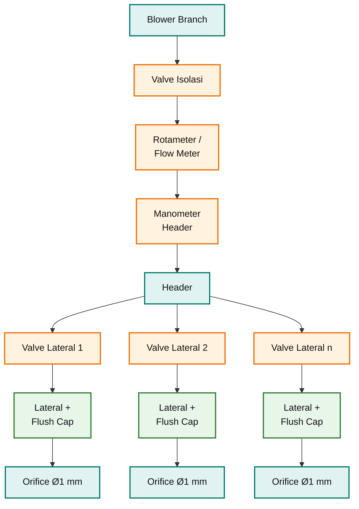
```mermaid
flowchart TD
    A["Blower Branch"] --> B["Valve Isolasi"]
    B --> C["Rotameter /<br/>Flow Meter"]
    C --> D["Manometer<br/>Header"]
    D --> E["Header"]

    E --> F["Valve Lateral 1"]
    E --> G["Valve Lateral 2"]
    E --> H["Valve Lateral n"]

    F --> I["Lateral +<br/>Flush Cap"]
    G --> J["Lateral +<br/>Flush Cap"]
    H --> K["Lateral +<br/>Flush Cap"]

    I --> L["Orifice Ø1 mm"]
    J --> M["Orifice Ø1 mm"]
    K --> N["Orifice Ø1 mm"]

    classDef air fill:#E0F2F1,stroke:#00796B,color:#111,stroke-width:2px;
    classDef control fill:#FFF3E0,stroke:#EF6C00,color:#111,stroke-width:2px;
    classDef lateral fill:#E8F5E9,stroke:#2E7D32,color:#111,stroke-width:2px;

    class A,E,I,J,K,L,M,N air;
    class B,C,D,F,G,H control;
    class I,J,K lateral;
```

### 8.6.6 Screen outlet carrier

Screen outlet wajib dipasang untuk menahan carrier di dalam MBBR.

Screen harus:

- menahan carrier pada kondisi airflow maksimum;
- memiliki bukaan yang lebih kecil daripada dimensi minimum carrier;
- memiliki luas terbuka cukup agar head loss tidak tinggi;
- mudah dibersihkan;
- tidak berada tepat pada plume lateral;
- serta tidak menciptakan titik penumpukan carrier.

Ukuran bukaan screen tidak dapat ditetapkan dalam artikel ini sebelum model carrier dipilih.

$$
\boxed{
\text{Ukuran screen}
=

f
\left(
\text{dimensi carrier aktual}
\right)
}
$$

Carrier, screen, dan diffuser adalah satu sistem mekanik yang harus diuji bersama.

---

## 8.7 Uji Commissioning MBBR

Commissioning MBBR harus dibagi menjadi dua tahap:

$$
\boxed{
\text{wet test mekanik}
}
$$

dan:

$$
\boxed{
\text{verifikasi biologis dengan LB aktual}
}
$$

### 8.7.1 Tahap 1 — Wet test mekanik

Wet test dilakukan dengan air bersih dan carrier.

Tujuan wet test:

- memastikan seluruh lateral mengeluarkan udara;
- memeriksa kebocoran pipa;
- memeriksa distribusi plume;
- memeriksa carrier movement;
- memeriksa penumpukan carrier pada screen;
- memeriksa dead zone;
- dan memeriksa fungsi valve balancing.

Titik awal uji mixing:

$$
Q_{\text{test,1}}
=

0{,}60
\times
Q_{\text{air,mixing,ref}}
$$

$$
Q_{\text{test,2}}
=

0{,}80
\times
Q_{\text{air,mixing,ref}}
$$

$$
Q_{\text{test,3}}
=

1{,}00
\times
Q_{\text{air,mixing,ref}}
$$

$$
Q_{\text{test,4}}
=

1{,}20
\times
Q_{\text{air,mixing,ref}}
$$

Dengan:

$$
Q_{\text{air,mixing,ref}}
=

26{,}25\ \text{L/menit}
$$

maka titik uji:

| Tahap Uji           |   Debit Udara |
| ------------------- | ------------: |
| $Q_{\text{test,1}}$ | ±15,8 L/menit |
| $Q_{\text{test,2}}$ | ±21,0 L/menit |
| $Q_{\text{test,3}}$ | ±26,3 L/menit |
| $Q_{\text{test,4}}$ | ±31,5 L/menit |

Tabel tersebut adalah jadwal pengujian, bukan set point operasi final.

### 8.7.2 Data wet test yang wajib dicatat

| Parameter                | Metode                                     |
| ------------------------ | ------------------------------------------ |
| Debit udara total        | rotameter atau flow meter                  |
| Debit tiap lateral       | pengukuran cabang atau metode sementara    |
| Tekanan header           | manometer                                  |
| Gelembung tiap lateral   | inspeksi visual                            |
| Gerak carrier            | video dari beberapa sisi tangki            |
| Carrier di dasar         | inspeksi visual                            |
| Carrier di screen outlet | inspeksi visual                            |
| Dead zone                | inspeksi visual dan tracer bila diperlukan |
| Foam                     | inspeksi visual                            |
| Kebocoran udara          | inspeksi sambungan dan fitting             |

### 8.7.3 Tahap 2 — Verifikasi menggunakan LB aktual

Setelah sistem menerima LB dari CSTR, parameter tambahan harus dicatat:

- DO inlet MBBR;
- DO tengah MBBR;
- DO outlet MBBR;
- pH;
- suhu;
- TAN inlet dan outlet;
- nitrit inlet dan outlet;
- nitrat inlet dan outlet;
- TSS inlet dan outlet;
- foam;
- bau;
- tekanan header;
- serta debit udara aktual.

Lokasi pengukuran DO:

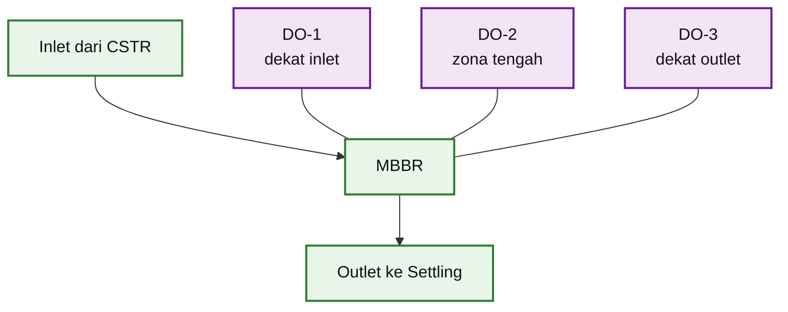
```mermaid
flowchart TD
    A["Inlet dari CSTR"] --> B["MBBR"]
    B --> C["Outlet ke Settling"]

    D["DO-1<br/>dekat inlet"] --- B
    E["DO-2<br/>zona tengah"] --- B
    F["DO-3<br/>dekat outlet"] --- B

    classDef flow fill:#E8F5E9,stroke:#2E7D32,color:#111,stroke-width:2px;
    classDef sensor fill:#F3E5F5,stroke:#6A1B9A,color:#111,stroke-width:2px;

    class A,B,C flow;
    class D,E,F sensor;
```

Perbedaan DO yang besar antar titik dapat menunjukkan:

- distribusi udara tidak merata;
- carrier menghambat sirkulasi;
- influen masuk terlalu dekat outlet;
- plume diffuser tidak mencakup seluruh volume;
- atau terdapat dead zone.

### 8.7.4 Kriteria keputusan commissioning

Grid diffuser dapat diterima bila seluruh kriteria berikut terpenuhi:

| Area             | Kriteria                                               |
| ---------------- | ------------------------------------------------------ |
| Distribusi udara | seluruh lateral aktif dan relatif seragam              |
| Carrier mixing   | carrier aktif bergerak pada seluruh volume             |
| Dasar tangki     | tidak ada carrier menetap terus-menerus                |
| Screen outlet    | tidak ada penumpukan carrier berkepanjangan            |
| DO               | memenuhi target bulk $3{-}5\ \text{mg/L}$              |
| Foam             | tidak meningkat terus pada kondisi stabil              |
| Tekanan header   | stabil dan konsisten dengan debit udara                |
| Jalur pipa       | tidak bocor, tersumbat, atau mengeluarkan aliran balik |
| Data kualitas    | TAN, nitrit, pH, TSS, dan suhu tercatat                |

Bila carrier belum bergerak merata tetapi DO sudah tinggi, solusi pertama bukan langsung menaikkan DO set point.

Yang harus dievaluasi adalah:

- layout lateral;
- posisi diffuser;
- jumlah lateral;
- arah lubang;
- fill carrier;
- screen outlet;
- serta pola aliran di dalam tangki.

Bila carrier sudah bergerak baik tetapi DO rendah, maka kebutuhan OTR lebih besar daripada kebutuhan mixing.

Dalam kondisi itu:

$$
\boxed{
Q_{\text{air,OTR}}

>

Q_{\text{air,mixing}}
}
$$

dan airflow harus ditingkatkan berdasarkan data OTR aktual.

---

## 8.8 Kesimpulan Bab

MBBR pada desain ini memiliki volume kerja:

$$
\boxed{
V_{\text{MBBR}}
=

750\ \text{L}
}
$$

Carrier diisi bertahap:

$$
\boxed{
V_{\text{carrier,awal}}
=

225\ \text{L}
}
$$

$$
\boxed{
V_{\text{carrier,max}}
=

375\ \text{L}
}
$$

Kebutuhan airflow MBBR ditentukan oleh kebutuhan terbesar:

$$
\boxed{
Q_{\text{air,MBBR}}
=

\max
\left(
Q_{\text{air,mixing}},
Q_{\text{air,OTR}}
\right)
}
$$

Sebagai titik awal wet test:

$$
\boxed{
Q_{\text{air,mixing,ref}}
=

26{,}25\ \text{L/menit}
}
$$

Basis mekanik grid diffuser:

$$
\boxed{
d_{\text{hole}}
=

1{,}0\ \text{mm}
}
$$

$$
\boxed{
\Delta P_{\text{orifice}}
=

0{,}5\ \text{kPa}
\approx
51\ \text{mmH}_2\text{O}
}
$$

Namun, jumlah lubang, jumlah lateral, diameter header, diameter lateral, pressure loss aktual, dan spesifikasi blower belum boleh dikunci hanya dari perhitungan teoritis.

Nilai tersebut harus ditetapkan dari:

$$
\boxed{
\text{dimensi tangki}
+
\text{model carrier}
+
\text{wet test mixing}
+
\text{uji OTR}
+
\text{pressure test}
}
$$

Dengan pendekatan ini, diffuser MBBR tidak diperlakukan sebagai sekadar pipa berlubang, tetapi sebagai bagian inti dari sistem proses yang harus menggerakkan carrier dan memenuhi kebutuhan oksigen secara bersamaan.

## Referensi Teknis Bab Ini

1. Orenco Systems. _Moving Bed Bioreactor Design Guidelines_. NDA-TRT-MBB-1, Rev. 4, 2025.

2. United States Environmental Protection Agency. _Design Manual: Fine Pore Aeration Systems_. EPA/625/1-89/023, 1989.

3. Boltz, J. P., dan McQuarrie, J. P. “Moving Bed Biofilm Reactor Technology: Process Applications, Design, and Performance.” _Water Environment Research_, 83(6), 560–575, 2011.

4. Boltz, J. P. et al. “Oxygen Transfer in Moving Bed Biofilm Reactor and Integrated Fixed-Film Activated Sludge Processes.” _Water Environment Research_, 90(10), 1807–1816, 2018.

[**Kembali ke Atas**](#desain-mineralisasi-liquid-biofloc-dengan-buffer-cstr-airlift-dan-mbbr-untuk-produksi-poc-b)

---

# 9. Settling, Screening, dan Storage POC-B

Settling/Polishing dan Storage adalah dua unit terakhir sebelum produk digunakan atau diuji pada tanaman.

<figure>
  
  <figcaption>
    Ilustrasi proses settling bioflok untuk membantu pengendapan flok, pemisahan
    padatan tersuspensi, dan pengelolaan kualitas air kolam.
  </figcaption>
</figure>

Keduanya tidak boleh diperlakukan sebagai satu fungsi yang sama.

$$
\boxed{
\text{Settling / Screening}
=

\text{pemisahan padatan akhir}
}
$$

$$
\boxed{
\text{Storage}
=

\text{penyangga produk dan observasi kestabilan}
}
$$

Settling/Polishing menerima outlet dari MBBR yang masih dapat membawa biofilm lepas, flok mikro, partikel organik, dan padatan akhir. Storage menerima cairan setelah fraksi padatan tersebut dikurangi.

---

## 9.1 Settling/Polishing

Settling/Polishing ditempatkan setelah MBBR untuk menangkap biomassa lepas sebelum cairan masuk ke Storage POC-B.

Fungsi utamanya adalah:

- menangkap biofilm lepas dari MBBR;
- menangkap flok halus dan partikel akhir;
- mengurangi endapan yang masuk ke storage;
- menyediakan titik drain padatan;
- dan menyediakan pemeriksaan visual terakhir sebelum produk disimpan.

| Parameter        |                   Nilai |
| ---------------- | ----------------------: |
| Volume polishing |                   250 L |
| Fungsi           | menangkap biofilm lepas |
| HRT normal       |               ±14,6 jam |
| HRT high-floc    |                ±7,4 jam |
| Drain bawah      |              disarankan |
| Screening        |       mudah dibersihkan |

Diagram fungsi unit akhir adalah sebagai berikut.

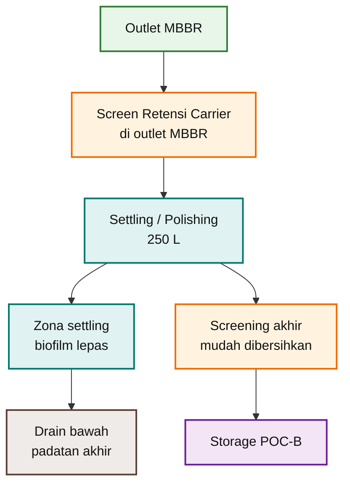
```mermaid id="u7j4ct"
flowchart TD
    A["Outlet MBBR"] --> B["Screen Retensi Carrier<br/>di outlet MBBR"]
    B --> C["Settling / Polishing<br/>250 L"]
    C --> D["Zona settling<br/>biofilm lepas"]
    D --> E["Drain bawah<br/>padatan akhir"]
    C --> F["Screening akhir<br/>mudah dibersihkan"]
    F --> G["Storage POC-B"]

    classDef mbbr fill:#E8F5E9,stroke:#2E7D32,color:#111,stroke-width:2px;
    classDef screen fill:#FFF3E0,stroke:#EF6C00,color:#111,stroke-width:2px;
    classDef settle fill:#E0F2F1,stroke:#00796B,color:#111,stroke-width:2px;
    classDef drain fill:#EFEBE9,stroke:#5D4037,color:#111,stroke-width:2px;
    classDef storage fill:#F3E5F5,stroke:#6A1B9A,color:#111,stroke-width:2px;

    class A mbbr;
    class B,F screen;
    class C,D settle;
    class E drain;
    class G storage;
```

### 9.1.1 Perbedaan screen outlet MBBR dan screening akhir

Screen outlet MBBR dan screening setelah MBBR memiliki fungsi berbeda.

| Lokasi                   | Fungsi utama                                                             |
| ------------------------ | ------------------------------------------------------------------------ |
| Screen outlet MBBR       | menahan carrier agar tetap berada di dalam MBBR                          |
| Settling/Screening akhir | menangkap biofilm lepas, flok mikro, atau partikel akhir sebelum Storage |

Carrier tidak boleh bergantung pada screening akhir untuk tertahan.

$$
\boxed{
\text{Carrier harus tertahan di MBBR}
}
$$

Bila carrier ditemukan pada Settling/Polishing, kondisi tersebut menunjukkan bahwa retention screen MBBR, jalur overflow, atau konfigurasi outlet perlu diperiksa.

### 9.1.2 HRT Settling/Polishing

Volume kerja Settling/Polishing:

$$
V_{\text{Polishing}}
=

250\ \text{L}
$$

Pada debit normal:

$$
Q_{\text{LB,normal}}
=

410\ \text{L/hari}
$$

maka:

$$
HRT_{\text{Polishing,normal}}
=

\frac{
250
}{
410
}
$$

$$
HRT_{\text{Polishing,normal}}
=

0{,}610\ \text{hari}
$$

$$
\boxed{
HRT_{\text{Polishing,normal}}
\approx
14{,}6\ \text{jam}
}
$$

Pada kondisi high-floc:

$$
Q_{\text{LB,high}}
=

819\ \text{L/hari}
$$

maka:

$$
HRT_{\text{Polishing,high}}
=

\frac{
250
}{
819
}
$$

$$
HRT_{\text{Polishing,high}}
=

0{,}305\ \text{hari}
$$

$$
\boxed{
HRT_{\text{Polishing,high}}
\approx
7{,}3\ \text{jam}
}
$$

Untuk kebutuhan desain-operasi, nilai tersebut dapat dibulatkan:

| Kondisi   | HRT Settling/Polishing |
| --------- | ---------------------: |
| Normal    |              ±14,6 jam |
| High-floc |               ±7,4 jam |

### 9.1.3 HRT tidak cukup untuk menjamin settling

HRT hanya menunjukkan waktu tinggal hidrolik rata-rata.

Efisiensi pengendapan tetap ditentukan oleh:

- luas permukaan efektif tangki;
- debit aliran;
- pola inlet;
- energi turbulensi inlet;
- kedalaman tangki;
- karakter flok;
- ukuran partikel;
- densitas partikel;
- dan frekuensi drain endapan.

Kriteria hidrolik yang lebih relevan untuk settling adalah _surface overflow rate_:

$$
V_o
=

\frac{
Q
}{
A_s
}
$$

dengan:

- $V_o$ = _surface overflow rate_;
- (Q) = debit cairan;
- $A_s$ = luas permukaan efektif settling tank.

Karena dimensi panjang dan lebar Settling/Polishing belum dikunci dalam bab ini, nilai $V_o$ belum boleh dihitung.

$$
\boxed{
\text{HRT Settling}
\neq
\text{jaminan efisiensi pemisahan padatan}
}
$$

Tangki 250 L dapat berfungsi baik sebagai polishing hanya bila inlet tenang, aliran tidak menimbulkan _short-circuit_, dan endapan dikeluarkan secara berkala.

### 9.1.4 Tata letak minimum Settling/Polishing

Settling/Polishing harus memiliki:

- inlet dengan energi rendah;
- baffle atau zona peredam inlet bila diperlukan;
- zona cairan relatif tenang;
- outlet yang tidak menyedot endapan dasar;
- drain bawah;
- titik inspeksi endapan;
- serta screening yang mudah dilepas dan dicuci.

Prinsip alirannya:

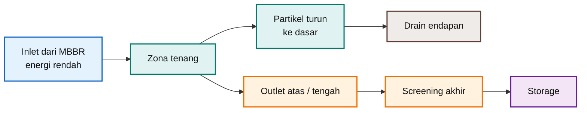
```mermaid id="lh5rfs"
flowchart LR
    A["Inlet dari MBBR<br/>energi rendah"] --> B["Zona tenang"]
    B --> C["Partikel turun<br/>ke dasar"]
    C --> D["Drain endapan"]
    B --> E["Outlet atas / tengah"]
    E --> F["Screening akhir"]
    F --> G["Storage"]

    classDef inlet fill:#E3F2FD,stroke:#1565C0,color:#111,stroke-width:2px;
    classDef settle fill:#E0F2F1,stroke:#00796B,color:#111,stroke-width:2px;
    classDef drain fill:#EFEBE9,stroke:#5D4037,color:#111,stroke-width:2px;
    classDef outlet fill:#FFF3E0,stroke:#EF6C00,color:#111,stroke-width:2px;
    classDef storage fill:#F3E5F5,stroke:#6A1B9A,color:#111,stroke-width:2px;

    class A inlet;
    class B,C settle;
    class D drain;
    class E,F outlet;
    class G storage;
```

Inlet tidak boleh diarahkan langsung ke outlet.

Bila aliran masuk langsung mendorong cairan menuju outlet, maka terjadi:

$$
\boxed{
\text{short-circuit flow}
}
$$

yang menyebabkan sebagian cairan keluar tanpa memiliki waktu cukup untuk melepaskan biofilm lepas atau partikel akhir.

### 9.1.5 Drain bawah Settling/Polishing

Drain bawah disarankan karena Settling/Polishing pasti akan mengumpulkan sebagian padatan.

Drain digunakan untuk:

- membuang biofilm lepas;
- mengeluarkan flok halus yang terakumulasi;
- mengurangi risiko zona anaerob;
- menjaga volume aktif tangki;
- dan mencegah Storage menerima lumpur berlebih.

Drain bukan aliran kontinyu.

Frekuensi drain ditentukan dari:

- volume endapan;
- perubahan warna;
- bau;
- hasil TSS;
- kondisi high-floc;
- dan inspeksi visual.

Prinsipnya:

$$
\boxed{
\text{Endapan harus dikendalikan di Settling}
}
$$

bukan:

$$
\boxed{
\text{Endapan dibiarkan menumpuk di Storage}
}
$$

### 9.1.6 Screening akhir

Screening akhir harus mudah dibersihkan.

Screening tidak ditujukan untuk menggantikan filtrasi halus atau membran. Fungsinya adalah menangkap material yang lolos dari settling dan mencegah partikel kasar masuk ke Storage.

Kriteria screening:

- mudah diangkat;
- mudah dicuci;
- tidak mudah tersumbat;
- memiliki area terbuka cukup;
- tidak menciptakan head loss tinggi;
- dan tidak memaksa cairan meluap saat kondisi high-floc.

Ukuran bukaan screen final harus disesuaikan dengan karakter flok dan laju aliran aktual.

$$
\boxed{
\text{screen lebih rapat}
\neq
\text{selalu lebih baik}
}
$$

Screen terlalu rapat dapat cepat tersumbat, meningkatkan muka air, mengganggu aliran, dan justru menghasilkan overflow yang tidak terkendali.

---

## 9.2 Storage POC-B

Storage menerima cairan setelah melewati CSTR Airlift, MBBR, Settling/Polishing, dan screening akhir.

Storage tidak dirancang sebagai reaktor biologis utama.

$$
\boxed{
\text{Storage}
=

\text{buffer produk}
+
\text{observasi kestabilan}
}
$$

| Parameter      |                Nilai |
| -------------- | -------------------: |
| Volume         |          500–1.000 L |
| Aerasi         | ringan atau periodik |
| Tutup          |           disarankan |
| Drain bawah    |           disarankan |
| Sampling point |                wajib |

### 9.2.1 Fungsi Storage

Storage memiliki fungsi berikut:

- memisahkan waktu produksi dari waktu aplikasi;
- menyediakan produk untuk pengujian pengenceran;
- menyediakan volume cadangan saat aplikasi belum dilakukan;
- memberikan waktu observasi kestabilan;
- memungkinkan sampling produk;
- dan memudahkan pengendalian batch.

Storage tidak dimaksudkan untuk:

- menangani beban organik utama;
- mengendapkan sludge dalam jumlah besar;
- menggantikan fungsi CSTR;
- menggantikan fungsi MBBR;
- atau memperbaiki produk yang masih berbau septik.

### 9.2.2 Volume Storage

Range volume Storage:

$$
V_{\text{Storage}}
=

500{-}1000\ \text{L}
$$

Bila seluruh produk terus masuk tanpa aplikasi, waktu penampungan nominal pada kondisi normal adalah:

$$
t_{\text{Storage,500 L}}
=

\frac{
500
}{
410
}
$$

$$
\boxed{
t_{\text{Storage,500 L}}
=

1{,}22\ \text{hari}
}
$$

Untuk Storage $1.000\ \text{L}$:

$$
t_{\text{Storage,1000 L}}
=

\frac{
1000
}{
410
}
$$

$$
\boxed{
t_{\text{Storage,1000 L}}
=

2{,}44\ \text{hari}
}
$$

Pada kondisi high-floc:

$$
t_{\text{Storage,500 L,high}}
=

\frac{
500
}{
819
}
$$

$$
\boxed{
t_{\text{Storage,500 L,high}}
=

0{,}61\ \text{hari}
}
$$

$$
t_{\text{Storage,1000 L,high}}
=

\frac{
1000
}{
819
}
$$

$$
\boxed{
t_{\text{Storage,1000 L,high}}
=

1{,}22\ \text{hari}
}
$$

Nilai tersebut hanya menunjukkan kapasitas penampungan hidrolik bila produk terus masuk.

Nilai tersebut bukan target HRT reaksi biologis.

$$
\boxed{
\text{Storage hold-up time}
\neq
\text{HRT proses utama}
}
$$

### 9.2.3 Tutup dan ventilasi

Tutup disarankan untuk:

- mencegah masuknya hujan;
- mencegah pengenceran produk;
- mengurangi masuknya debu, serangga, daun, dan material asing;
- membatasi pertumbuhan alga akibat cahaya langsung;
- serta mengurangi percikan dan kehilangan produk.

Namun, Storage tidak boleh ditutup rapat tanpa ventilasi.

$$
\boxed{
\text{Storage tertutup}
\neq
\text{Storage kedap gas}
}
$$

Tangki harus mempunyai ventilasi yang terlindungi agar perubahan tekanan, pelepasan gas, dan pengisian produk tidak menimbulkan masalah mekanis.

### 9.2.4 Aerasi ringan atau periodik

Aerasi Storage tidak dirancang untuk menggantikan aerasi CSTR atau MBBR.

Aerasi ringan atau recirculation periodik hanya dapat digunakan bila produk perlu ditahan lebih lama dan terdapat indikasi awal seperti:

- DO turun;
- bau mulai berubah;
- endapan meningkat;
- foam menetap;
- atau terjadi stratifikasi warna.

Tujuan aerasi ringan adalah mencegah Storage berubah menjadi zona anaerob.

Namun, aerasi Storage tidak boleh terlalu kuat karena dapat:

- mengaduk endapan;
- meningkatkan foam;
- mempercepat pelepasan gas;
- mempersulit pengamatan kestabilan;
- dan mengubah Storage menjadi reaktor tidak terkendali.

Prinsip desain:

$$
\boxed{
\text{CSTR dan MBBR}
=

\text{reaktor aerob utama}
}
$$

$$
\boxed{
\text{Storage}
=

\text{aerasi ringan hanya bila diperlukan}
}
$$

Bila Storage terus membutuhkan aerasi kuat untuk mencegah bau, maka masalah harus dievaluasi pada unit hulu:

- kualitas LB dari sedimentation basin;
- operasi Buffer;
- kinerja CSTR Airlift;
- kinerja MBBR;
- atau Settling/Polishing yang tidak efektif.

### 9.2.5 Drain bawah Storage

Drain bawah disarankan untuk:

- membuang endapan kecil yang masih terbentuk;
- melakukan pembersihan berkala;
- menghindari akumulasi material anaerob;
- dan memudahkan shutdown atau pergantian batch.

Drain Storage tidak boleh menjadi tempat penampungan lumpur utama.

Bila volume endapan Storage meningkat cepat, maka perlu dilakukan pemeriksaan pada Settling/Polishing dan screening akhir.

### 9.2.6 Sampling point

Sampling point wajib tersedia agar kondisi produk dapat dibandingkan dari waktu ke waktu.

Titik sampling disarankan berada pada:

- zona cairan representatif;
- bukan tepat pada dasar;
- bukan tepat di bawah permukaan;
- tidak dekat titik aerasi;
- dan mudah dibersihkan.

Sampling point harus memungkinkan pengambilan parameter berikut:

| Parameter | Tujuan                                            |
| --------- | ------------------------------------------------- |
| pH        | melihat kestabilan kimia                          |
| Suhu      | interpretasi aktivitas biologis                   |
| Bau       | indikasi kondisi aerob atau anaerob               |
| Warna     | indikator perubahan visual                        |
| TSS       | melihat carry-over padatan                        |
| TAN       | melihat nitrogen reaktif                          |
| Nitrit    | melihat risiko produk belum stabil                |
| Nitrat    | melihat bentuk nitrogen terlarut                  |
| EC        | evaluasi total garam terlarut sebelum uji tanaman |

EC tidak boleh digunakan sebagai satu-satunya indikator kualitas POC-B.

$$
\boxed{
EC
\neq
\text{jaminan produk stabil}
}
$$

EC hanya menunjukkan kecenderungan jumlah ion terlarut dan perlu diinterpretasikan bersama pH, nitrogen, TSS, bau, serta hasil uji tanaman.

---

## 9.3 Kriteria Storage Sehat

Storage sehat bukan berarti cairan harus sepenuhnya jernih.

Produk POC-B dari bioflok dapat tetap berwarna cokelat, mengandung nutrien terlarut, dan memiliki sedikit padatan halus.

Yang dinilai adalah kestabilan prosesnya.

Kriteria Storage sehat:

- tidak berbau busuk;
- tidak menjadi anaerob;
- pH relatif stabil;
- endapan tidak meningkat cepat;
- warna tidak berubah drastis;
- tidak ada pembusukan ulang.

### 9.3.1 Indikator operasional Storage

| Parameter | Kondisi Sehat                           | Indikasi Korektif                                  |
| --------- | --------------------------------------- | -------------------------------------------------- |
| Bau       | tidak busuk atau septik kuat            | bau membusuk, telur busuk, atau putrefaktif        |
| Warna     | relatif konsisten antarhari             | perubahan drastis tanpa perubahan batch yang jelas |
| pH        | relatif stabil terhadap baseline        | bergeser terus tanpa sebab yang teridentifikasi    |
| Endapan   | terbentuk lambat dan dapat dikendalikan | bertambah cepat atau menumpuk di dasar             |
| Foam      | tipis atau terkendali                   | tebal, stabil, dan meningkat                       |
| Permukaan | tidak membentuk lapisan membusuk        | scum tebal atau lapisan gelap                      |
| Gas       | tidak terbentuk berlebihan              | gelembung gas terus-menerus dari dasar             |
| Sampling  | parameter dapat ditelusuri              | tidak ada data batch atau trend                    |

### 9.3.2 Definisi praktis pembusukan ulang

Pembusukan ulang adalah kondisi ketika produk yang telah masuk Storage kembali menunjukkan aktivitas penguraian tidak terkendali.

Gejala umum:

- bau meningkat setelah beberapa jam atau hari;
- pH bergeser;
- gas terbentuk;
- foam menjadi lebih stabil;
- endapan bertambah cepat;
- warna berubah semakin gelap;
- atau terdapat lapisan anaerob pada dasar.

Bila kondisi ini muncul, produk tidak boleh langsung dipakai pada tanaman.

Tindakan awal:

1. tahan batch tersebut dari aplikasi;
2. catat waktu, volume, dan kondisi proses sebelumnya;
3. periksa pH, DO, TSS, TAN, nitrit, dan bau;
4. periksa endapan pada Settling/Polishing;
5. evaluasi kinerja CSTR dan MBBR;
6. lakukan aerasi ringan atau recirculation hanya sebagai tindakan sementara;
7. jangan menutup akar masalah dengan pengenceran produk semata.

### 9.3.3 Uji kestabilan batch

Setiap batch Storage perlu memiliki identitas sederhana.

| Data Batch                      | Contoh Pencatatan        |
| ------------------------------- | ------------------------ |
| Nomor batch                     | POC-B-YYYYMMDD-01        |
| Volume masuk                    | L                        |
| Waktu masuk                     | tanggal dan jam          |
| Sumber feed                     | normal atau high-floc    |
| pH awal                         | hasil ukur               |
| TSS awal                        | hasil ukur bila tersedia |
| TAN awal                        | hasil ukur               |
| Nitrit awal                     | hasil ukur               |
| Kondisi bau awal                | normal / perlu perhatian |
| Kondisi foam awal               | rendah / sedang / tinggi |
| Tanggal aplikasi atau pemakaian | dicatat                  |
| Hasil uji tanaman               | dicatat terpisah         |

Dengan pencatatan batch, perubahan kualitas produk dapat ditelusuri kembali menuju kondisi operasi Buffer, CSTR, MBBR, dan Settling/Polishing.

---

## 9.4 Quality Gate sebelum Aplikasi Tanaman

Storage adalah quality gate terakhir sebelum produk diuji pada tanaman.

Produk hanya boleh masuk tahap uji aplikasi bila:

$$
\boxed{
\text{tidak septik}
+
\text{pH stabil}
+
\text{endapan terkendali}
+
\text{tidak ada pembusukan ulang}
+
\text{data batch tersedia}
}
$$

Aplikasi tanaman harus tetap dimulai melalui pengenceran bertahap.

Produk tidak boleh langsung diaplikasikan pekat tanpa:

- uji skala kecil;
- pengamatan respons tanaman;
- penilaian EC;
- evaluasi nitrogen reaktif;
- dan pembandingan terhadap kontrol.

$$
\boxed{
\text{Produk stabil}
\neq
\text{otomatis aman pada semua dosis aplikasi}
}
$$

Bab ini belum menetapkan dosis aplikasi tanaman karena dosis harus disusun berdasarkan:

- jenis tanaman;
- fase pertumbuhan;
- metode aplikasi;
- pH produk;
- EC;
- kandungan nitrogen;
- kandungan fosfor dan kalium;
- serta hasil uji tanaman.

---

## 9.5 Kesimpulan Bab

Settling/Polishing berfungsi untuk menahan biofilm lepas dan padatan akhir setelah MBBR.

$$
\boxed{
V_{\text{Polishing}}
=

250\ \text{L}
}
$$

$$
\boxed{
HRT_{\text{normal}}
\approx
14{,}6\ \text{jam}
}
$$

$$
\boxed{
HRT_{\text{high-floc}}
\approx
7{,}4\ \text{jam}
}
$$

Namun, HRT saja belum cukup untuk menjamin kualitas settling. Desain mekanik tetap memerlukan luas permukaan, pola inlet, baffle, jalur outlet, dan drain bawah yang benar.

Storage POC-B berfungsi sebagai penyangga produk dan titik observasi kestabilan.

$$
\boxed{
V_{\text{Storage}}
=

500{-}1000\ \text{L}
}
$$

Storage tidak boleh dijadikan reaktor utama atau tempat akumulasi sludge.

Kriteria Storage sehat adalah:

$$
\boxed{
\text{tidak busuk}
+
\text{tidak anaerob}
+
\text{pH stabil}
+
\text{endapan terkendali}
+
\text{warna konsisten}
+
\text{tidak ada pembusukan ulang}
}
$$

Dengan pembagian fungsi tersebut, endapan dikendalikan pada Settling/Polishing, sedangkan Storage menerima cairan yang lebih stabil untuk dipantau, diuji, dan digunakan secara bertahap.

## Referensi Teknis Bab Ini

1. United States Environmental Protection Agency. _Primary Clarification for Operators_. 2023.

2. United States Environmental Protection Agency. _AP-42, Volume I, Chapter 4.3: Waste Water Collection, Treatment and Storage_.

3. Bregnballe, J. _A Guide to Recirculation Aquaculture_. Food and Agriculture Organization of the United Nations, 2015.

[**Kembali ke Atas**](#desain-mineralisasi-liquid-biofloc-dengan-buffer-cstr-airlift-dan-mbbr-untuk-produksi-poc-b)

---

# 10. Commissioning, SOP Operasi, Monitoring, dan Kriteria Produk

Bab ini mengubah desain proses menjadi prosedur operasi yang dapat dijalankan praktisi.

Commissioning tidak boleh dipahami sebagai sekadar menyalakan blower, airlift, dan pompa. Commissioning adalah proses pembuktian bahwa setiap unit bekerja sesuai fungsi prosesnya:

$$
\boxed{
\text{Sedimentation Basin}
\rightarrow
\text{Buffer}
\rightarrow
\text{CSTR Airlift}
\rightarrow
\text{MBBR}
\rightarrow
\text{Settling / Screening}
\rightarrow
\text{Storage}
}
$$

Sistem hanya dapat dinaikkan ke beban normal setelah seluruh unit lulus verifikasi mekanik, hidrolik, aerasi, sirkulasi, dan kualitas proses.

---

## 10.1 Tahap Commissioning

Commissioning dibagi menjadi dua kelompok besar:

$$
\boxed{
\text{Commissioning Mekanik}
\rightarrow
\text{Commissioning Proses}
}
$$

Commissioning mekanik membuktikan bahwa tangki, pipa, valve, airlift, diffuser, screen, drain, dan pompa bekerja.

Commissioning proses membuktikan bahwa LB dapat diproses secara bertahap tanpa menimbulkan kondisi septik, _dead zone_, carrier stagnan, foam ekstrem, atau pembusukan ulang di Storage.

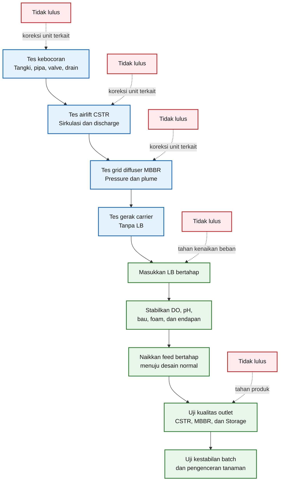
```mermaid
flowchart TD
    A["Tes kebocoran<br/>Tangki, pipa, valve, drain"] --> B["Tes airlift CSTR<br/>Sirkulasi dan discharge"]
    B --> C["Tes grid diffuser MBBR<br/>Pressure dan plume"]
    C --> D["Tes gerak carrier<br/>Tanpa LB"]
    D --> E["Masukkan LB bertahap"]
    E --> F["Stabilkan DO, pH,<br/>bau, foam, dan endapan"]
    F --> G["Naikkan feed bertahap<br/>menuju desain normal"]
    G --> H["Uji kualitas outlet<br/>CSTR, MBBR, dan Storage"]
    H --> I["Uji kestabilan batch<br/>dan pengenceran tanaman"]

    J["Tidak lulus"] -. "koreksi unit terkait" .-> A
    K["Tidak lulus"] -. "koreksi unit terkait" .-> B
    L["Tidak lulus"] -. "koreksi unit terkait" .-> C
    M["Tidak lulus"] -. "tahan kenaikan beban" .-> E
    N["Tidak lulus"] -. "tahan produk" .-> H

    classDef mechanical fill:#E3F2FD,stroke:#1565C0,color:#111,stroke-width:2px;
    classDef process fill:#E8F5E9,stroke:#2E7D32,color:#111,stroke-width:2px;
    classDef hold fill:#FFEBEE,stroke:#C62828,color:#111,stroke-width:2px;

    class A,B,C,D mechanical;
    class E,F,G,H,I process;
    class J,K,L,M,N hold;
```

### 10.1.1 Tahap 1 — Tes kebocoran dan fungsi mekanik

Tahap ini dilakukan menggunakan air bersih sebelum LB dimasukkan.

Pemeriksaan minimum:

| Peralatan atau Unit | Verifikasi                                                                  |
| ------------------- | --------------------------------------------------------------------------- |
| Buffer              | tidak bocor, drain bawah bekerja, level minimum dan maksimum dapat dikenali |
| CSTR                | tangki tidak bocor, inlet dan outlet tidak tersumbat                        |
| Airlift             | riser, downcomer, injector, dan sambungan udara bekerja                     |
| MBBR                | tangki tidak bocor, screen carrier terpasang aman                           |
| Grid diffuser       | seluruh lateral dapat dialiri udara                                         |
| Header udara        | tidak ada kebocoran pada valve, tee, reducer, dan sambungan                 |
| Settling/Polishing  | inlet, outlet, drain, dan screen berfungsi                                  |
| Storage             | tutup, ventilasi, drain, dan sampling point tersedia                        |
| Pompa dosing        | debit dapat dikalibrasi pada kondisi head aktual                            |

Sistem belum boleh menerima LB bila ditemukan:

- kebocoran cairan;
- kebocoran udara besar;
- valve tidak dapat diisolasi;
- screen carrier longgar;
- drain tidak berfungsi;
- level tangki tidak dapat dikendalikan;
- atau pompa dosing tidak dapat menghasilkan debit stabil.

### 10.1.2 Tahap 2 — Tes airlift CSTR

Tes airlift dilakukan dengan air bersih sebelum menerima LB.

Tujuan tes:

- memastikan udara masuk ke injector;
- memastikan aliran naik terbentuk pada riser;
- memastikan cairan kembali melalui downcomer;
- memastikan discharge riser tidak langsung _short-circuit_ ke outlet;
- memastikan tidak ada zona stagnan yang jelas;
- serta memastikan drain bawah tidak terganggu oleh struktur airlift.

Kriteria awal yang harus diperiksa:

| Parameter   | Kondisi yang Diharapkan                            |
| ----------- | -------------------------------------------------- |
| Riser       | aliran naik terbentuk secara stabil                |
| Downcomer   | terdapat aliran balik menuju zona bawah            |
| Permukaan   | tidak terjadi percikan berlebihan                  |
| Outlet CSTR | tidak menerima aliran langsung dari plume injector |
| Dasar CSTR  | tidak terdapat kantong stagnan yang jelas          |
| Pipa udara  | tidak mengalami aliran balik air ke blower         |
| Drain bawah | tetap dapat digunakan secara independen            |

Debit sirkulasi airlift harus diambil dari kurva desain airlift yang telah tersedia atau diukur melalui uji aktual.

Waktu putaran nominal cairan dapat dihitung:

$$
t_{\text{turn}}
=

\frac{
V_{\text{CSTR}}
}{
Q_{L,\text{airlift}}
}
$$

dengan:

- $t_{\text{turn}}$ = waktu satu putaran sirkulasi cairan;
- $V_{\text{CSTR}}$ = volume kerja CSTR;
- $Q_{L,\text{airlift}}$ = debit sirkulasi cairan airlift.

Untuk CSTR:

$$
V_{\text{CSTR}}
=

1000\ \text{L}
$$

Nilai $Q_{L,\text{airlift}}$ tidak boleh digantikan dengan debit udara injector.

$$
\boxed{
Q_{L,\text{airlift}}
\neq
Q_{\text{air,CSTR}}
}
$$

### 10.1.3 Tahap 3 — Tes grid diffuser dan carrier MBBR

Tes MBBR dilakukan menggunakan air bersih dan carrier pada fill awal.

$$
V_{\text{carrier,awal}}
=

225\ \text{L}
$$

Tujuan tes:

- memeriksa distribusi udara antar-lateral;
- mengatur valve balancing;
- memastikan carrier tidak mengendap;
- memastikan carrier tidak menumpuk di screen outlet;
- memeriksa _dead zone_;
- memeriksa stabilitas header pressure;
- serta memeriksa apakah lateral dapat di-_flush_.

Titik awal wet test menggunakan rentang airflow:

| Tahap Uji        | Debit Udara MBBR |
| ---------------- | ---------------: |
| Rendah           |    ±15,8 L/menit |
| Menengah-1       |    ±21,0 L/menit |
| Referensi mixing |    ±26,3 L/menit |
| Menengah-2       |    ±31,5 L/menit |

Tabel tersebut adalah jadwal pengujian awal.

$$
\boxed{
\text{Debit wet test}
\neq
\text{set point operasi final}
}
$$

Carrier dinyatakan bergerak layak bila:

- berubah posisi pada seluruh volume;
- tidak membentuk hamparan diam di dasar;
- tidak mengumpul pada sudut tangki;
- tidak menekan retention screen secara terus-menerus;
- tidak hanya bergerak di atas diffuser;
- dan tidak menghasilkan tumbukan ekstrem yang memicu foam berlebihan.

### 10.1.4 Tahap 4 — Pemasukan LB bertahap

LB tidak boleh langsung dimasukkan pada beban penuh.

Commissioning proses dilakukan secara bertingkat:

| Tahap   | Feed terhadap Basis Normal | Kondisi untuk Naik Tahap                        |
| ------- | -------------------------: | ----------------------------------------------- |
| Tahap A |                        25% | tidak ada bau septik, DO dan pH stabil          |
| Tahap B |                        50% | tidak ada kenaikan foam atau endapan abnormal   |
| Tahap C |                        75% | CSTR dan MBBR stabil selama satu siklus operasi |
| Tahap D |                       100% | seluruh quality gate antarunit terpenuhi        |

Basis feed normal:

$$
Q_{\text{LB,normal}}
=

410\ \text{L/hari}
$$

Feed kontinu normal menuju CSTR:

$$
Q_{\text{feed,normal}}
=

\frac{
410
}{
24
}
$$

$$
\boxed{
Q_{\text{feed,normal}}
=

17{,}08\ \text{L/jam}
}
$$

Tahap A menggunakan:

$$
Q_{\text{A}}
=

0{,}25
\times
17{,}08
$$

$$
\boxed{
Q_{\text{A}}
=

4{,}27\ \text{L/jam}
}
$$

Tahap B:

$$
Q_{\text{B}}
=

0{,}50
\times
17{,}08
$$

$$
\boxed{
Q_{\text{B}}
=

8{,}54\ \text{L/jam}
}
$$

Tahap C:

$$
Q_{\text{C}}
=

0{,}75
\times
17{,}08
$$

$$
\boxed{
Q_{\text{C}}
=

12{,}81\ \text{L/jam}
}
$$

Tahap D:

$$
Q_{\text{D}}
=

17{,}08\ \text{L/jam}
$$

Kenaikan tahap tidak didasarkan pada waktu kalender saja.

Kenaikan hanya dapat dilakukan bila sistem telah stabil selama sekurang-kurangnya satu siklus feed harian dan memenuhi kondisi berikut:

- DO CSTR tidak turun di bawah batas operasi;
- DO MBBR tidak turun di bawah batas operasi;
- tidak muncul bau septik;
- carrier tetap bergerak merata;
- tidak ada foam ekstrem;
- tidak ada akumulasi endapan cepat;
- dan Storage tidak menunjukkan pembusukan ulang.

---

## 10.2 SOP Start-Up

Start-up dilakukan setelah seluruh unit lulus commissioning mekanik.

Urutan start-up harus mencegah tiga kegagalan umum:

$$
\boxed{
\text{LB masuk sebelum airlift stabil}
}
$$

$$
\boxed{
\text{carrier masuk sebelum diffuser diuji}
}
$$

$$
\boxed{
\text{feed naik sebelum kualitas outlet diverifikasi}
}
$$

### 10.2.1 Persiapan awal

Sebelum memasukkan LB:

1. Pastikan seluruh drain bawah tertutup.
2. Pastikan jalur overflow tersedia tetapi tidak menjadi jalur operasi normal.
3. Pastikan valve udara CSTR dan MBBR dapat diisolasi.
4. Pastikan rotameter atau flow meter dapat dibaca.
5. Pastikan manometer header tersedia.
6. Pastikan DO meter dan pH meter telah diperiksa.
7. Pastikan Buffer memiliki level minimum untuk operasi pompa dosing.
8. Pastikan screen outlet MBBR telah dipasang.
9. Pastikan carrier awal sebesar $225\ \text{L}$ telah dimasukkan.
10. Pastikan Storage bersih, memiliki ventilasi, tutup, drain, dan sampling point.

### 10.2.2 Pengisian awal tangki

Urutan pengisian:

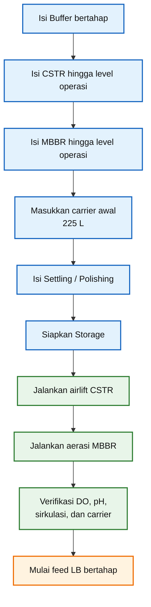
```mermaid
flowchart TD
    A["Isi Buffer bertahap"] --> B["Isi CSTR hingga level operasi"]
    B --> C["Isi MBBR hingga level operasi"]
    C --> D["Masukkan carrier awal<br/>225 L"]
    D --> E["Isi Settling / Polishing"]
    E --> F["Siapkan Storage"]
    F --> G["Jalankan airlift CSTR"]
    G --> H["Jalankan aerasi MBBR"]
    H --> I["Verifikasi DO, pH,<br/>sirkulasi, dan carrier"]
    I --> J["Mulai feed LB bertahap"]

    classDef fill fill:#E3F2FD,stroke:#1565C0,color:#111,stroke-width:2px;
    classDef test fill:#E8F5E9,stroke:#2E7D32,color:#111,stroke-width:2px;
    classDef feed fill:#FFF3E0,stroke:#EF6C00,color:#111,stroke-width:2px;

    class A,B,C,D,E,F fill;
    class G,H,I test;
    class J feed;
```

Tangki dapat diisi awal dengan air bersih atau air proses yang memenuhi kebutuhan operasi. LB baru dimasukkan setelah airlift dan MBBR lulus pemeriksaan dasar.

### 10.2.3 Menjalankan CSTR Airlift

Airlift CSTR harus dijalankan sebelum feed LB masuk.

Pemeriksaan awal:

- riser menghasilkan aliran naik stabil;
- downcomer menghasilkan aliran balik;
- tidak ada _short-circuit_ dari inlet menuju outlet;
- tidak ada kantong stagnan;
- DO dapat dipertahankan dalam rentang operasi;
- pH dapat diukur pada zona cairan tercampur;
- dan drain bawah tetap dapat digunakan.

Target DO CSTR:

$$
\boxed{
DO_{\text{CSTR}}
=

2{-}4\ \text{mg/L}
}
$$

Bila CSTR belum dapat mempertahankan kondisi ini pada air bersih, LB tidak boleh dimasukkan sebelum masalah airlift, blower, injector, atau jalur udara dikoreksi.

### 10.2.4 Menjalankan MBBR

MBBR dijalankan setelah CSTR stabil.

Urutan operasi:

1. Jalankan udara ke header MBBR.
2. Buka valve lateral secara bertahap.
3. Atur valve balancing hingga plume antar-lateral relatif seragam.
4. Naikkan airflow bertahap.
5. Amati carrier dari seluruh sisi tangki.
6. Pastikan carrier tidak terkumpul pada screen outlet.
7. Catat tekanan header dan debit udara total.
8. Pastikan DO bulk memenuhi target sebelum LB masuk.

Target DO MBBR:

$$
\boxed{
DO_{\text{MBBR}}
=

3{-}5\ \text{mg/L}
}
$$

### 10.2.5 Pemasukan LB bertahap

LB dimasukkan melalui Buffer.

Urutan operasi:

1. LB dari sedimentation basin masuk ke Buffer.
2. Periksa bau, warna, aliran, dan carry-over sludge kasar.
3. Pastikan Buffer tidak berada pada level tinggi.
4. Jalankan pompa dosing pada Tahap A.
5. Amati CSTR dan MBBR selama satu siklus operasi.
6. Naikkan feed hanya bila seluruh quality gate terpenuhi.
7. Ulangi hingga mencapai feed normal.

Feed awal tidak boleh berasal dari sludge dasar Buffer.

$$
\boxed{
\text{Feed CSTR}
\rightarrow
\text{diambil dari zona tengah Buffer}
}
$$

$$
\boxed{
\text{Drain Buffer}
\rightarrow
\text{diambil dari zona dasar Buffer}
}
$$

### 10.2.6 Parameter start-up yang harus dicatat

| Parameter    |        Buffer | CSTR | MBBR | Settling |    Storage |
| ------------ | ------------: | ---: | ---: | -------: | ---------: |
| Level cairan |             ✓ |    ✓ |    ✓ |        ✓ |          ✓ |
| Debit feed   |             ✓ |    ✓ |    ✓ |        ✓ |          ✓ |
| DO           |               |    ✓ |    ✓ |          | bila perlu |
| pH           |             ✓ |    ✓ |    ✓ |        ✓ |          ✓ |
| Suhu         |             ✓ |    ✓ |    ✓ |        ✓ |          ✓ |
| Bau          |             ✓ |    ✓ |    ✓ |        ✓ |          ✓ |
| Foam         |             ✓ |    ✓ |    ✓ |        ✓ |          ✓ |
| Endapan      |             ✓ |    ✓ |      |        ✓ |          ✓ |
| TSS          | bila tersedia |    ✓ |    ✓ |        ✓ |          ✓ |
| TAN          |             ✓ |    ✓ |    ✓ |          |          ✓ |
| Nitrit       |             ✓ |    ✓ |    ✓ |          |          ✓ |

---

## 10.3 SOP Operasi Normal

Operasi normal menggunakan basis debit:

$$
Q_{\text{LB,normal}}
=

410\ \text{L/hari}
$$

Feed kontinu dari Buffer menuju CSTR:

$$
Q_{\text{feed,normal}}
=

17{,}08\ \text{L/jam}
$$

atau:

$$
\boxed{
Q_{\text{feed,normal}}
=

0{,}285\ \text{L/menit}
}
$$

| Parameter      | Lokasi               |           Target Operasi |
| -------------- | -------------------- | -----------------------: |
| Feed LB        | Buffer → CSTR        |              ±410 L/hari |
| Feed kontinu   | Buffer → CSTR        |             ±17,08 L/jam |
| DO             | CSTR                 |                 2–4 mg/L |
| DO             | MBBR                 |                 3–5 mg/L |
| pH             | Sistem               |                  6,5–8,2 |
| Gerak carrier  | MBBR                 |                   merata |
| Bau            | Semua unit           |              tidak busuk |
| Endapan        | Buffer dan Polishing |         dibuang periodik |
| Tekanan header | MBBR                 | stabil terhadap baseline |
| Level tangki   | Semua unit           |      dalam batas operasi |

### 10.3.1 Rutinitas setiap hari

| Aktivitas                        | Minimum Frekuensi                         |
| -------------------------------- | ----------------------------------------- |
| Cek level Buffer                 | setiap shift atau minimal dua kali sehari |
| Cek debit pompa dosing           | setiap hari                               |
| Cek DO CSTR dan MBBR             | setiap hari dan setelah perubahan beban   |
| Cek pH                           | setiap hari                               |
| Cek carrier movement             | setiap hari                               |
| Cek bau, warna, dan foam         | setiap hari                               |
| Cek tekanan header MBBR          | setiap hari                               |
| Cek endapan Buffer dan Polishing | setiap hari                               |
| Cek jalur overflow               | setiap hari                               |
| Catat volume produk Storage      | setiap hari                               |

### 10.3.2 Rutinitas mingguan

| Aktivitas                      | Tujuan                                   |
| ------------------------------ | ---------------------------------------- |
| Kalibrasi ulang debit pompa    | memastikan feed tidak berubah            |
| Inspeksi lateral dan flush cap | mendeteksi fouling atau sumbatan         |
| Uji TSS                        | melihat carry-over padatan               |
| Uji TAN, nitrit, dan nitrat    | melihat tren nitrogen                    |
| Uji EC Storage                 | dasar evaluasi uji tanaman               |
| Drain endapan terkontrol       | menjaga volume kerja                     |
| Cek screen MBBR                | mencegah carrier menumpuk                |
| Cek screen Polishing           | mencegah overflow                        |
| Evaluasi log trend             | mendeteksi masalah sebelum menjadi upset |

### 10.3.3 Neraca volume operasi normal

Neraca volume Buffer harus dipantau:

$$
\Delta V_{\text{Buffer}}
=

V_{\text{LB,in}}
-

V_{\text{feed,CSTR}}
-

V_{\text{drain}}
-

V_{\text{overflow}}
$$

Pada operasi stabil:

$$
\boxed{
\Delta V_{\text{Buffer}}
\approx
0
}
$$

dan:

$$
\boxed{
V_{\text{overflow}}
=

0
}
$$

Bila Buffer terus naik:

- debit feed CSTR terlalu rendah;
- debit LB aktual melebihi basis desain;
- drain tidak tercatat;
- atau terdapat gangguan aliran di downstream.

Bila Buffer terus turun:

- debit dosing terlalu tinggi;
- LB aktual lebih rendah dari basis;
- atau terdapat kebocoran maupun aliran tidak tercatat.

### 10.3.4 Aturan pengambilan sampel

Sampling harus dilakukan pada titik yang sama dan pada waktu operasi yang konsisten.

Titik sampling minimum:

| Titik                      | Tujuan                         |
| -------------------------- | ------------------------------ |
| Outlet sedimentation basin | menilai kualitas LB awal       |
| Outlet Buffer              | menilai hasil equalization     |
| Outlet CSTR                | menilai feed menuju MBBR       |
| Outlet MBBR                | menilai polishing biologis     |
| Outlet Settling/Screening  | menilai cairan sebelum Storage |
| Storage                    | menilai kestabilan batch       |

Data inlet dan outlet hanya dapat dibandingkan bila:

- debit dicatat;
- waktu sampling dicatat;
- satuan analisis konsisten;
- kondisi airflow dicatat;
- dan kondisi high-floc atau normal diberi identitas jelas.

---

## 10.4 SOP High-Floc

Kondisi high-floc adalah kondisi sementara ketika debit LB meningkat menuju:

$$
Q_{\text{LB,high}}
=

819\ \text{L/hari}
$$

Feed kontinu menuju CSTR pada kondisi tersebut:

$$
Q_{\text{feed,high}}
=

\frac{
819
}{
24
}
$$

$$
\boxed{
Q_{\text{feed,high}}
=

34{,}13\ \text{L/jam}
}
$$

atau:

$$
\boxed{
Q_{\text{feed,high}}
=

0{,}569\ \text{L/menit}
}
$$

### 10.4.1 Ketentuan utama high-floc

Buffer memiliki volume kerja nominal:

$$
V_{\text{Buffer}}
=

500\ \text{L}
$$

Karena itu, LB high-floc sebesar $819\ \text{L}$ tidak boleh dimasukkan sebagai satu kali dump ke Buffer.

$$
\boxed{
819\ \text{L}

>

500\ \text{L}
}
$$

High-floc harus dilakukan dengan salah satu cara berikut:

$$
\boxed{
\text{membagi transfer menjadi beberapa batch}
}
$$

atau:

$$
\boxed{
\text{menambah volume equalization}
}
$$

Untuk Buffer $500\ \text{L}$, pola operasi yang digunakan adalah pembagian transfer menjadi beberapa batch yang disesuaikan dengan level Buffer dan kemampuan feed menuju CSTR.

### 10.4.2 Urutan operasi high-floc

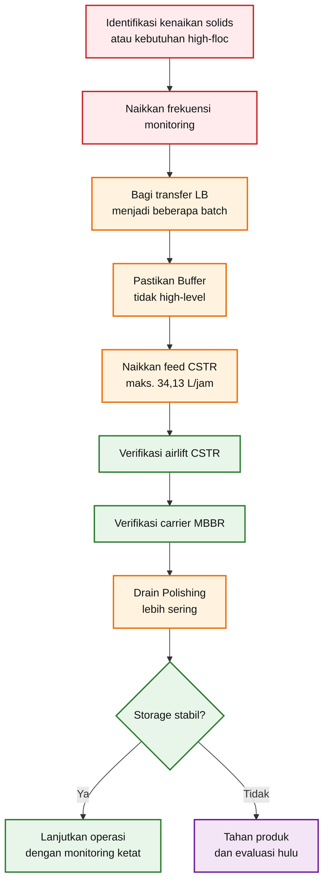
```mermaid
flowchart TD
    A["Identifikasi kenaikan solids<br/>atau kebutuhan high-floc"] --> B["Naikkan frekuensi monitoring"]
    B --> C["Bagi transfer LB<br/>menjadi beberapa batch"]
    C --> D["Pastikan Buffer<br/>tidak high-level"]
    D --> E["Naikkan feed CSTR<br/>maks. 34,13 L/jam"]
    E --> F["Verifikasi airlift CSTR"]
    F --> G["Verifikasi carrier MBBR"]
    G --> H["Drain Polishing<br/>lebih sering"]
    H --> I{"Storage stabil?"}

    I -->|"Ya"| J["Lanjutkan operasi<br/>dengan monitoring ketat"]
    I -->|"Tidak"| K["Tahan produk<br/>dan evaluasi hulu"]

    classDef alert fill:#FFEBEE,stroke:#C62828,color:#111,stroke-width:2px;
    classDef action fill:#FFF3E0,stroke:#EF6C00,color:#111,stroke-width:2px;
    classDef process fill:#E8F5E9,stroke:#2E7D32,color:#111,stroke-width:2px;
    classDef hold fill:#F3E5F5,stroke:#6A1B9A,color:#111,stroke-width:2px;

    class A,B alert;
    class C,D,E,H action;
    class F,G,I,J process;
    class K hold;
```

### 10.4.3 Monitoring tambahan high-floc

| Parameter         | Operasi Normal | High-Floc                                |
| ----------------- | -------------- | ---------------------------------------- |
| Level Buffer      | rutin          | lebih sering                             |
| Debit dosing      | harian         | setiap perubahan batch                   |
| DO CSTR           | harian         | sebelum, saat, dan setelah kenaikan feed |
| DO MBBR           | harian         | sebelum, saat, dan setelah kenaikan feed |
| Carrier movement  | harian         | setiap perubahan airflow                 |
| Tekanan header    | harian         | setiap perubahan airflow                 |
| Endapan Polishing | rutin          | lebih sering                             |
| Bau Storage       | rutin          | setiap batch                             |
| TAN dan nitrit    | berkala        | ditingkatkan bila terjadi upset          |

### 10.4.4 Kriteria penghentian kenaikan feed

Kenaikan feed high-floc harus dihentikan atau diturunkan bila terjadi salah satu kondisi berikut:

- DO CSTR turun di bawah $2\ \text{mg/L}$;
- DO MBBR turun di bawah $3\ \text{mg/L}$;
- carrier tidak lagi bergerak merata;
- carrier menumpuk di screen outlet;
- Buffer mendekati level tinggi;
- bau septik muncul;
- foam meningkat cepat;
- endapan Polishing meningkat cepat;
- atau Storage menunjukkan pembusukan ulang.

High-floc bukan kondisi untuk memaksa sistem tetap menerima seluruh beban.

$$
\boxed{
\text{High-floc}
=

\text{mode pengendalian solids dengan batas operasi}
}
$$

Bukan:

$$
\boxed{
\text{izin untuk membebani downstream tanpa batas}
}
$$

---

## 10.5 Kriteria POC-B Lebih Stabil

POC-B yang keluar dari Storage tidak boleh langsung disebut pupuk siap aplikasi hanya karena telah melewati CSTR dan MBBR.

Bab ini menetapkan kriteria **POC-B lebih stabil secara proses**, bukan spesifikasi mutu pupuk komersial atau sertifikasi produk.

$$
\boxed{
\text{POC-B lebih stabil}
\neq
\text{sertifikasi pupuk}
}
$$

### 10.5.1 Kriteria utama

Produk POC-B dinilai lebih stabil bila:

- tidak berbau busuk;
- pH relatif stabil;
- busa terkendali;
- endapan tidak bertambah cepat;
- warna relatif konsisten;
- nitrit tidak menunjukkan kenaikan yang mengarah pada gangguan proses;
- tidak mengalami pembusukan ulang saat disimpan;
- dan tidak menyebabkan gejala stres akut pada uji pengenceran bertahap.

| Parameter   | Kondisi Batch Lebih Stabil                        | Kondisi Hold atau Evaluasi                       |
| ----------- | ------------------------------------------------- | ------------------------------------------------ |
| Bau         | tidak septik atau putrefaktif                     | bau busuk, telur busuk, atau lumpur anaerob kuat |
| pH          | relatif konsisten terhadap baseline batch         | bergeser terus tanpa sebab proses yang jelas     |
| Foam        | tipis atau terkendali                             | tebal, stabil, dan meningkat                     |
| Endapan     | lambat dan dapat dikendalikan                     | meningkat cepat atau membentuk sludge tebal      |
| Warna       | relatif konsisten                                 | berubah drastis tanpa perubahan batch yang jelas |
| Nitrit      | dicatat dan tidak menunjukkan tren memburuk       | meningkat atau tidak stabil                      |
| Storage     | tidak membentuk gas berlebih                      | gelembung gas terus muncul dari dasar            |
| Uji tanaman | tidak ada gejala stres akut pada pengenceran awal | daun atau akar menunjukkan gejala kerusakan      |

### 10.5.2 Uji kestabilan batch Storage

Setiap batch Storage harus diberi identitas.

Contoh:

$$
\text{POC-B-YYYYMMDD-01}
$$

Data minimum setiap batch:

| Data Batch           | Keterangan                        |
| -------------------- | --------------------------------- |
| Nomor batch          | kode unik                         |
| Waktu masuk Storage  | tanggal dan jam                   |
| Volume masuk         | L                                 |
| Kondisi operasi      | normal atau high-floc             |
| pH awal              | hasil ukur                        |
| DO awal bila diukur  | hasil ukur                        |
| TSS awal             | hasil ukur bila tersedia          |
| TAN awal             | hasil ukur                        |
| Nitrit awal          | hasil ukur                        |
| EC awal              | hasil ukur                        |
| Bau awal             | normal atau perlu perhatian       |
| Foam awal            | rendah, sedang, atau tinggi       |
| Waktu sampling ulang | dicatat                           |
| Keputusan batch      | release uji, hold, atau reprocess |

Untuk commissioning awal, kestabilan batch dapat dibandingkan pada:

$$
t_0
$$

$$
t_{24}
$$

dan:

$$
t_{48}
$$

dengan:

- $t_0$ = saat batch masuk Storage;
- $t_{24}$ = dua puluh empat jam setelah masuk;
- $t_{48}$ = empat puluh delapan jam setelah masuk.

Tujuannya bukan menetapkan angka mutu universal, tetapi melihat apakah terjadi tren pembusukan ulang.

### 10.5.3 Uji pengenceran tanaman

Uji pengenceran tanaman dilakukan setelah batch memenuhi kriteria kestabilan dasar.

Uji ini bukan uji efektivitas pupuk penuh. Uji ini adalah pemeriksaan awal untuk melihat risiko stres akut.

Prinsip uji:

1. Gunakan satu tanaman uji yang seragam.
2. Siapkan kontrol tanpa POC-B.
3. Siapkan beberapa tingkat pengenceran dari paling encer menuju lebih pekat.
4. Catat pH dan EC larutan aplikasi.
5. Catat metode aplikasi: siram akar atau semprot daun.
6. Amati tanaman pada waktu awal, satu hari, dan beberapa hari berikutnya.
7. Catat gejala daun terbakar, layu, perubahan warna, atau gangguan akar.
8. Jangan menaikkan konsentrasi aplikasi bila tingkat sebelumnya menimbulkan gejala stres.

Kriteria kelulusan awal:

$$
\boxed{
\text{tidak ada gejala stres akut}
}
$$

Kriteria tersebut belum membuktikan bahwa POC-B meningkatkan pertumbuhan tanaman.

Uji efektivitas pupuk memerlukan:

- tanaman kontrol;
- replikasi;
- periode pengamatan lebih panjang;
- parameter pertumbuhan;
- dan pembandingan dengan praktik pemupukan pembanding.

### 10.5.4 Keputusan batch

Batch Storage diklasifikasikan sebagai berikut.

| Status                        | Kondisi                                                                                       |
| ----------------------------- | --------------------------------------------------------------------------------------------- |
| Release untuk uji pengenceran | produk stabil secara visual dan parameter dasar tidak menunjukkan gangguan                    |
| Hold                          | terdapat tren pH, bau, foam, endapan, atau nitrit yang belum stabil                           |
| Reprocess                     | produk menunjukkan pembusukan ulang atau kondisi septik                                       |
| Reject untuk aplikasi tanaman | terdapat kondisi yang berisiko terhadap tanaman atau tidak dapat ditelusuri riwayat prosesnya |

$$
\boxed{
\text{Batch tanpa data}
\neq
\text{batch layak aplikasi}
}
$$

---

## 10.6 Ringkasan Operasi yang Dikunci

### Kondisi Normal

$$
Q_{\text{LB,normal}}
=

410\ \text{L/hari}
$$

$$
Q_{\text{feed,normal}}
=

17{,}08\ \text{L/jam}
$$

$$
DO_{\text{CSTR}}
=

2{-}4\ \text{mg/L}
$$

$$
DO_{\text{MBBR}}
=

3{-}5\ \text{mg/L}
$$

### Kondisi High-Floc

$$
Q_{\text{LB,high}}
=

819\ \text{L/hari}
$$

$$
Q_{\text{feed,high}}
=

34{,}13\ \text{L/jam}
$$

Dengan ketentuan:

$$
\boxed{
\begin{gathered}
\text{LB high-floc tidak masuk sebagai satu dump} \\ \text{ke Buffer }500\ \text{L}
\end{gathered}
}
$$

### Prinsip Operasi Final

$$
\boxed{
\text{Buffer}
\rightarrow
\text{equalization dan controlled feed}
}
$$

$$
\boxed{
\text{CSTR Airlift}
\rightarrow
\text{oksigenasi, sirkulasi, dan mineralisasi awal}
}
$$

$$
\boxed{
\text{MBBR}
\rightarrow
\text{carrier mixing dan biofilm polishing}
}
$$

$$
\boxed{
\text{Settling / Screening}
\rightarrow
\text{pengendalian padatan akhir}
}
$$

$$
\boxed{
\text{Storage}
\rightarrow
\text{observasi kestabilan batch}
}
$$

Sistem dinilai berhasil bukan karena seluruh tangki memiliki gelembung udara, tetapi karena:

- flow antarunit terkendali;
- CSTR bercampur tanpa _dead zone_;
- carrier MBBR bergerak merata;
- DO dan pH berada dalam rentang operasi;
- endapan dikendalikan pada unit yang tepat;
- Storage tidak mengalami pembusukan ulang;
- dan batch produk memiliki data yang dapat ditelusuri.

## Referensi Teknis Bab Ini

1. Hargreaves, J. A. _Biofloc Production Systems for Aquaculture_. Southern Regional Aquaculture Center Publication No. 4503, 2013.

2. United States Environmental Protection Agency. _Nutrient Control Design Manual_. EPA/600/R-10/100, 2010.

3. Bregnballe, J. _A Guide to Recirculation Aquaculture_. Food and Agriculture Organization of the United Nations, 2015.

4. United States Environmental Protection Agency. _Design Manual: Fine Pore Aeration Systems_. EPA/625/1-89/023, 1989.

[**Kembali ke Atas**](#desain-mineralisasi-liquid-biofloc-dengan-buffer-cstr-airlift-dan-mbbr-untuk-produksi-poc-b)

---

# Lampiran A — Perhitungan Lengkap Basis Proses dan Hidrolik

Lampiran ini mengumpulkan seluruh perhitungan dasar yang digunakan dalam desain:

$$
\boxed{
\text{Kolam Bioflok}
\rightarrow
\text{WB}
\rightarrow
\text{Sedimentation Basin}
\rightarrow
\text{LB}
\rightarrow
\text{Buffer}
\rightarrow
\text{CSTR Airlift}
\rightarrow
\text{MBBR}
\rightarrow
\text{Settling / Polishing}
}
$$

Perhitungan dibagi menjadi dua kelompok.

| Kelompok              | Fungsi                                                          |
| --------------------- | --------------------------------------------------------------- |
| Basis desain terkunci | volume, debit, HRT, media carrier, dan kondisi normal/high-floc |
| Basis screening       | pakan, protein, nitrogen, potensi SB, dan beban LB              |

Nilai HRT menggunakan debit desain hidrolik:

$$
Q_{\text{LB,design}}
=

Q_{\text{WB,design}}
$$

Pendekatan tersebut bersifat konservatif untuk sizing volume unit downstream.

Secara fisik, volume LB aktual dapat sedikit berbeda dari WB yang ditarik karena sebagian cairan tertahan atau ikut keluar bersama SB. Karena itu, debit LB aktual tetap harus dicatat pada tahap commissioning.

---

## A.1 Data Kolam Bioflok Nila

| Parameter          |   Nilai |
| ------------------ | ------: |
| Panjang kolam      |    18 m |
| Lebar kolam        |   3,5 m |
| Tinggi air operasi |  0,65 m |
| Komoditas          |    nila |
| Sistem             | bioflok |
| Target C/N         |      15 |
| Protein pakan      |  25–31% |

### A.1.1 Luas permukaan kolam

$$
A_{\text{kolam}}
=

L_{\text{kolam}}
\times
W_{\text{kolam}}
$$

$$
A_{\text{kolam}}
=

18
\times
3{,}5
$$

$$
\boxed{
A_{\text{kolam}}
=

63\ \text{m}^2
}
$$

### A.1.2 Volume air kolam

$$
V_{\text{kolam}}
=

L_{\text{kolam}}
\times
W_{\text{kolam}}
\times
H_{\text{air}}
$$

$$
V_{\text{kolam}}
=

18
\times
3{,}5
\times
0{,}65
$$

$$
\boxed{
V_{\text{kolam}}
=

40{,}95\ \text{m}^3
}
$$

Konversi ke liter:

$$
V_{\text{kolam,L}}
=

40{,}95
\times
1000
$$

$$
\boxed{
V_{\text{kolam,L}}
=

40.950\ \text{L}
}
$$

---

## A.2 Debit WB Normal dan High-Floc

Debit Waste-Biofloc dihitung dari persentase volume air kolam per hari.

### A.2.1 Kondisi normal

Rasio drain normal:

$$
R_{\text{WB,normal}}
=

1{,}0\%
=

0{,}01
$$

Debit WB normal:

$$
Q_{\text{WB,normal}}
=

R_{\text{WB,normal}}
\times
V_{\text{kolam,L}}
$$

$$
Q_{\text{WB,normal}}
=

0{,}01
\times
40.950
$$

$$
Q_{\text{WB,normal}}
=

409{,}5\ \text{L/hari}
$$

Untuk desain:

$$
\boxed{
Q_{\text{WB,normal}}
=

410\ \text{L/hari}
}
$$

### A.2.2 Kondisi high-floc sementara

Rasio drain high-floc:

$$
R_{\text{WB,high}}
=

2{,}0\%
=

0{,}02
$$

Debit WB high-floc:

$$
Q_{\text{WB,high}}
=

R_{\text{WB,high}}
\times
V_{\text{kolam,L}}
$$

$$
Q_{\text{WB,high}}
=

0{,}02
\times
40.950
$$

$$
\boxed{
Q_{\text{WB,high}}
=

819\ \text{L/hari}
}
$$

### A.2.3 Basis debit LB untuk desain hidrolik

Untuk perhitungan HRT:

$$
\boxed{
Q_{\text{LB,normal}}
=

410\ \text{L/hari}
=

0{,}410\ \text{m}^3/\text{hari}
}
$$

$$
\boxed{
Q_{\text{LB,high}}
=

819\ \text{L/hari}
=

0{,}819\ \text{m}^3/\text{hari}
}
$$

Ringkasan debit:

| Kondisi   |            Rasio drain |      Debit |
| --------- | ---------------------: | ---------: |
| Normal    | 1,0% volume kolam/hari | 410 L/hari |
| High-floc | 2,0% volume kolam/hari | 819 L/hari |

### A.2.4 Debit feed kontinu dari Buffer ke CSTR

Bila transfer dilakukan kontinu selama 24 jam:

$$
Q_{\text{feed,normal}}
=

\frac{
410
}{
24
}
$$

$$
\boxed{
Q_{\text{feed,normal}}
=

17{,}08\ \text{L/jam}
=

0{,}285\ \text{L/menit}
}
$$

Untuk high-floc:

$$
Q_{\text{feed,high}}
=

\frac{
819
}{
24
}
$$

$$
\boxed{
Q_{\text{feed,high}}
=

34{,}13\ \text{L/jam}
=

0{,}569\ \text{L/menit}
}
$$

---

## A.3 Perhitungan Volume Buffer

Volume kerja Buffer ditetapkan:

$$
\boxed{
V_{\text{Buffer}}
=

500\ \text{L}
=

0{,}50\ \text{m}^3
}
$$

Volume tersebut adalah volume kerja cairan.

Tangki fisik harus memiliki tambahan volume untuk:

- freeboard;
- alarm level tinggi;
- level minimum pompa dosing;
- endapan dasar;
- ruang foam;
- dan ruang operasi saat transfer batch.

Volume ayun efektif Buffer ditulis:

$$
V_{\text{use}}
=

V_H
-

V_L
$$

dengan:

- $V_H$ = volume pada batas level tinggi operasi;
- $V_L$ = volume minimum operasi;
- $V_{\text{use}}$ = volume efektif untuk menahan fluktuasi batch.

Karena terdapat freeboard, endapan, dan batas minimum pompa:

$$
\boxed{
V_{\text{use}}
<
500\ \text{L}
}
$$

### A.3.1 Pemeriksaan volume batch normal

Bila seluruh LB normal dimasukkan selama satu jam:

$$
V_{\text{in,batch,normal}}
=

410\ \text{L}
$$

Feed ke CSTR tetap berjalan:

$$
Q_{\text{feed,normal}}
=

17{,}08\ \text{L/jam}
$$

Maka volume bersih yang bertambah di Buffer:

$$
V_{\text{net,batch,normal}}
=

V_{\text{in,batch,normal}}
-

Q_{\text{feed,normal}}
\times
t_{\text{batch}}
$$

$$
V_{\text{net,batch,normal}}
=

410
-

17{,}08
\times
1
$$

$$
\boxed{
V_{\text{net,batch,normal}}
=

392{,}92\ \text{L}
}
$$

Syarat minimum:

$$
\boxed{
V_{\text{use}}
\geq
392{,}92\ \text{L}
}
$$

Artinya, batch normal dapat diterima hanya bila Buffer berada pada level rendah sebelum transfer berlangsung.

### A.3.2 Pemeriksaan volume batch high-floc

Bila seluruh LB high-floc sebesar $819\ \text{L}$ dimasukkan selama satu jam:

$$
V_{\text{in,batch,high}}
=

819\ \text{L}
$$

Maka:

$$
V_{\text{net,batch,high}}
=

819
-

34{,}13
\times
1
$$

$$
\boxed{
V_{\text{net,batch,high}}
=

784{,}87\ \text{L}
}
$$

Karena:

$$
784{,}87\ \text{L}

>

500\ \text{L}
$$

maka:

$$
\boxed{
\begin{gathered}
\text{Buffer 500 L tidak dapat menerima} \\ \text{high-floc 819 L sebagai satu dump}
\end{gathered}
}
$$

Kondisi high-floc harus dilakukan melalui:

$$
\boxed{
\text{pembagian batch}
}
$$

atau:

$$
\boxed{
\text{penambahan volume equalization}
}
$$

---

## A.4 Perhitungan HRT Buffer

Rumus umum:

$$
HRT
=

\frac{
V
}{
Q
}
$$

### A.4.1 HRT Buffer normal

$$
HRT_{\text{Buffer,normal}}
=

\frac{
500
}{
410
}
$$

$$
\boxed{
HRT_{\text{Buffer,normal}}
=

1{,}22\ \text{hari}
}
$$

Konversi ke jam:

$$
HRT_{\text{Buffer,normal}}
=

1{,}22
\times
24
$$

$$
\boxed{
HRT_{\text{Buffer,normal}}
=

29{,}27\ \text{jam}
}
$$

### A.4.2 HRT Buffer high-floc

$$
HRT_{\text{Buffer,high}}
=

\frac{
500
}{
819
}
$$

$$
\boxed{
HRT_{\text{Buffer,high}}
=

0{,}61\ \text{hari}
}
$$

Konversi ke jam:

$$
HRT_{\text{Buffer,high}}
=

0{,}61
\times
24
$$

$$
\boxed{
HRT_{\text{Buffer,high}}
=

14{,}65\ \text{jam}
}
$$

| Kondisi   | Volume Buffer |      Debit |       HRT |
| --------- | ------------: | ---------: | --------: |
| Normal    |         500 L | 410 L/hari | 1,22 hari |
| High-floc |         500 L | 819 L/hari | 0,61 hari |

---

## A.5 Perhitungan Volume dan HRT CSTR Airlift

Volume kerja CSTR:

$$
\boxed{
V_{\text{CSTR}}
=

1000\ \text{L}
=

1{,}00\ \text{m}^3
}
$$

### A.5.1 HRT CSTR normal

$$
HRT_{\text{CSTR,normal}}
=

\frac{
1000
}{
410
}
$$

$$
\boxed{
HRT_{\text{CSTR,normal}}
=

2{,}44\ \text{hari}
}
$$

Konversi ke jam:

$$
HRT_{\text{CSTR,normal}}
=

2{,}44
\times
24
$$

$$
\boxed{
HRT_{\text{CSTR,normal}}
=

58{,}54\ \text{jam}
}
$$

### A.5.2 HRT CSTR high-floc

$$
HRT_{\text{CSTR,high}}
=

\frac{
1000
}{
819
}
$$

$$
\boxed{
HRT_{\text{CSTR,high}}
=

1{,}22\ \text{hari}
}
$$

Konversi ke jam:

$$
HRT_{\text{CSTR,high}}
=

1{,}22
\times
24
$$

$$
\boxed{
HRT_{\text{CSTR,high}}
=

29{,}30\ \text{jam}
}
$$

| Kondisi   | Volume CSTR |      Debit |       HRT |
| --------- | ----------: | ---------: | --------: |
| Normal    |     1.000 L | 410 L/hari | 2,44 hari |
| High-floc |     1.000 L | 819 L/hari | 1,22 hari |

HRT tersebut adalah basis hidrolik.

$$
\boxed{
HRT_{\text{CSTR}}
\neq
\text{bukti bahwa nitrifikasi penuh telah terjadi}
}
$$

---

## A.6 Perhitungan Volume dan HRT MBBR

Volume kerja nominal MBBR:

$$
\boxed{
V_{\text{MBBR}}
=

750\ \text{L}
=

0{,}75\ \text{m}^3
}
$$

Volume tersebut harus diverifikasi setelah pemasangan:

- carrier;
- retention screen;
- grid diffuser;
- header;
- lateral;
- dan struktur internal lain.

### A.6.1 HRT MBBR normal

$$
HRT_{\text{MBBR,normal}}
=

\frac{
750
}{
410
}
$$

$$
\boxed{
HRT_{\text{MBBR,normal}}
=

1{,}83\ \text{hari}
}
$$

Konversi ke jam:

$$
HRT_{\text{MBBR,normal}}
=

1{,}83
\times
24
$$

$$
\boxed{
HRT_{\text{MBBR,normal}}
=

43{,}90\ \text{jam}
}
$$

### A.6.2 HRT MBBR high-floc

$$
HRT_{\text{MBBR,high}}
=

\frac{
750
}{
819
}
$$

$$
\boxed{
HRT_{\text{MBBR,high}}
=

0{,}92\ \text{hari}
}
$$

Konversi ke jam:

$$
HRT_{\text{MBBR,high}}
=

0{,}92
\times
24
$$

$$
\boxed{
HRT_{\text{MBBR,high}}
=

21{,}98\ \text{jam}
}
$$

| Kondisi   | Volume MBBR |      Debit |       HRT |
| --------- | ----------: | ---------: | --------: |
| Normal    |       750 L | 410 L/hari | 1,83 hari |
| High-floc |       750 L | 819 L/hari | 0,92 hari |

---

## A.7 Perhitungan Media Fill MBBR

### A.7.1 Media fill awal

Target media fill awal:

$$
F_{\text{carrier,awal}}
=

30\%
=

0{,}30
$$

Volume bulk media:

$$
V_{\text{carrier,awal}}
=

F_{\text{carrier,awal}}
\times
V_{\text{MBBR}}
$$

$$
V_{\text{carrier,awal}}
=

0{,}30
\times
750
$$

$$
\boxed{
V_{\text{carrier,awal}}
=

225\ \text{L}
}
$$

### A.7.2 Media fill maksimum

Target media fill maksimum:

$$
F_{\text{carrier,max}}
=

50\%
=

0{,}50
$$

Volume bulk media:

$$
V_{\text{carrier,max}}
=

F_{\text{carrier,max}}
\times
V_{\text{MBBR}}
$$

$$
V_{\text{carrier,max}}
=

0{,}50
\times
750
$$

$$
\boxed{
V_{\text{carrier,max}}
=

375\ \text{L}
}
$$

| Kondisi media         | Fill | Volume bulk carrier |
| --------------------- | ---: | ------------------: |
| Awal commissioning    |  30% |               225 L |
| Batas maksimum desain |  50% |               375 L |

Carrier tidak dapat dikurangkan langsung dari volume tangki sebagai volume padat penuh.

$$
\boxed{
V_{\text{air MBBR}}
\neq
V_{\text{tangki}}
-

V_{\text{bulk carrier}}
}
$$

Carrier memiliki rongga dan ruang antarcarrier yang tetap terisi air.

---

## A.8 Perhitungan Volume dan HRT Settling/Polishing

Volume kerja Settling/Polishing:

$$
\boxed{
V_{\text{Polishing}}
=

250\ \text{L}
=

0{,}25\ \text{m}^3
}
$$

### A.8.1 HRT normal

$$
HRT_{\text{Polishing,normal}}
=

\frac{
250
}{
410
}
$$

$$
HRT_{\text{Polishing,normal}}
=

0{,}61\ \text{hari}
$$

Konversi ke jam:

$$
HRT_{\text{Polishing,normal}}
=

0{,}61
\times
24
$$

$$
\boxed{
HRT_{\text{Polishing,normal}}
=

14{,}63\ \text{jam}
}
$$

### A.8.2 HRT high-floc

$$
HRT_{\text{Polishing,high}}
=

\frac{
250
}{
819
}
$$

$$
HRT_{\text{Polishing,high}}
=

0{,}305\ \text{hari}
$$

Konversi ke jam:

$$
HRT_{\text{Polishing,high}}
=

0{,}305
\times
24
$$

$$
\boxed{
HRT_{\text{Polishing,high}}
=

7{,}33\ \text{jam}
}
$$

Untuk operasi praktis:

$$
\boxed{
HRT_{\text{Polishing,high}}
\approx
7{,}4\ \text{jam}
}
$$

| Kondisi   | Volume Polishing |      Debit |       HRT |
| --------- | ---------------: | ---------: | --------: |
| Normal    |            250 L | 410 L/hari | ±14,6 jam |
| High-floc |            250 L | 819 L/hari |  ±7,4 jam |

HRT bukan satu-satunya kriteria settling.

Efisiensi pemisahan juga dipengaruhi oleh _surface overflow rate_:

$$
V_o
=

\frac{
Q
}{
A_s
}
$$

dengan:

- $V_o$ = _surface overflow rate_;
- (Q) = debit cairan;
- $A_s$ = luas permukaan efektif Settling/Polishing.

Nilai $V_o$ belum dihitung karena dimensi panjang dan lebar tangki polishing belum dikunci.

---

## A.9 Perhitungan Total HRT Sistem

Volume reaktor aktif:

$$
V_{\text{aktif}}
=

V_{\text{Buffer}}
+
V_{\text{CSTR}}
+
V_{\text{MBBR}}
+
V_{\text{Polishing}}
$$

$$
V_{\text{aktif}}
=

500
+
1000
+
750
+
250
$$

$$
\boxed{
V_{\text{aktif}}
=

2500\ \text{L}
=

2{,}50\ \text{m}^3
}
$$

Storage tidak dimasukkan sebagai volume reaktor aktif.

### A.9.1 Total HRT normal

$$
HRT_{\text{total,normal}}
=

\frac{
2500
}{
410
}
$$

$$
\boxed{
HRT_{\text{total,normal}}
=

6{,}10\ \text{hari}
}
$$

Konversi ke jam:

$$
HRT_{\text{total,normal}}
=

6{,}10
\times
24
$$

$$
\boxed{
HRT_{\text{total,normal}}
=

146{,}34\ \text{jam}
}
$$

### A.9.2 Total HRT high-floc

$$
HRT_{\text{total,high}}
=

\frac{
2500
}{
819
}
$$

$$
\boxed{
HRT_{\text{total,high}}
=

3{,}05\ \text{hari}
}
$$

Konversi ke jam:

$$
HRT_{\text{total,high}}
=

3{,}05
\times
24
$$

$$
\boxed{
HRT_{\text{total,high}}
=

73{,}26\ \text{jam}
}
$$

| Unit               |  Volume | HRT Normal | HRT High-Floc |
| ------------------ | ------: | ---------: | ------------: |
| Buffer             |   500 L |  1,22 hari |     0,61 hari |
| CSTR Airlift       | 1.000 L |  2,44 hari |     1,22 hari |
| MBBR               |   750 L |  1,83 hari |     0,92 hari |
| Settling/Polishing |   250 L |  0,61 hari |     0,31 hari |
| Total aktif        | 2.500 L |  6,10 hari |     3,05 hari |

---

## A.10 Basis Pakan, Protein, Nitrogen, dan C/N

### A.10.1 Biomasa puncak desain

Basis biomasa:

$$
X_{\text{peak}}
=

15\ \text{kg/m}^3
$$

Biomasa total:

$$
B_{\text{peak}}
=

V_{\text{kolam}}
\times
X_{\text{peak}}
$$

$$
B_{\text{peak}}
=

40{,}95
\times
15
$$

$$
\boxed{
B_{\text{peak}}
=

614{,}25\ \text{kg ikan}
}
$$

### A.10.2 Pakan normal dan pakan desain puncak

Basis pakan normal:

$$
F_{\text{normal}}
=

175
\frac{
\text{g pakan}
}{
\text{m}^3
\cdot
\text{hari}
}
$$

$$
M_{\text{feed,normal}}
=

40{,}95
\times
175
$$

$$
\boxed{
M_{\text{feed,normal}}
=

7{,}17\ \text{kg/hari}
}
$$

Basis pakan desain puncak:

$$
F_{\text{peak}}
=

200
\frac{
\text{g pakan}
}{
\text{m}^3
\cdot
\text{hari}
}
$$

$$
M_{\text{feed,peak}}
=

40{,}95
\times
200
$$

$$
\boxed{
M_{\text{feed,peak}}
=

8{,}19\ \text{kg/hari}
}
$$

### A.10.3 Feeding rate terhadap biomasa

$$
FR_{\text{peak}}
=

\frac{
M_{\text{feed,peak}}
}{
B_{\text{peak}}
}
\times
100\%
$$

$$
FR_{\text{peak}}
=

\frac{
8{,}19
}{
614{,}25
}
\times
100\%
$$

$$
\boxed{
FR_{\text{peak}}
=

1{,}33\%
\text{ biomasa/hari}
}
$$

### A.10.4 Nitrogen dari pakan

Rumus nitrogen pakan:

$$
N_{\text{feed}}
=

M_{\text{feed}}
\times
\frac{
P_{\text{protein}}
}{
6{,}25
}
$$

dengan:

- $N_{\text{feed}}$ = nitrogen dari pakan;
- $M_{\text{feed}}$ = massa pakan;
- $P_{\text{protein}}$ = fraksi protein pakan;
- (6.25) = faktor protein kasar ke nitrogen.

Perhitungan pada pakan desain puncak:

| Protein pakan | Fraksi protein |  Nitrogen pakan |
| ------------- | -------------: | --------------: |
| 25%           |           0,25 | 0,328 kg N/hari |
| 28%           |           0,28 | 0,367 kg N/hari |
| 31%           |           0,31 | 0,406 kg N/hari |

Untuk protein 31%:

$$
N_{\text{feed,31}}
=

8{,}19
\times
\frac{
0{,}31
}{
6{,}25
}
$$

$$
\boxed{
N_{\text{feed,31}}
=

0{,}406\ \text{kg N/hari}
}
$$

Nilai desain konservatif:

$$
\boxed{
P_{\text{protein,design}}
=

31\%
}
$$

$$
\boxed{
N_{\text{feed,design}}
=

0{,}406\ \text{kg N/hari}
}
$$

### A.10.5 Target C/N

Target operasional bioflok:

$$
\boxed{
\left(
\frac{
C
}{
N
}
\right)_{\text{target}}
=

15
}
$$

Nilai tersebut adalah target pengendalian sistem, bukan rumus langsung untuk menentukan dosis molases.

Persamaan berikut tidak boleh dipakai sebagai dosis karbon otomatis:

$$
C_{\text{add}}
=

15
\times
N_{\text{feed}}
$$

Dosis karbon aktual harus mempertimbangkan:

- karbon yang sudah terkandung dalam pakan;
- TAN aktual;
- sumber karbon yang digunakan;
- kandungan karbon sumber tersebut;
- TSS dan settleable solids;
- DO;
- pH;
- alkalinitas;
- dan respons sistem bioflok.

---

## A.11 Neraca Massa SB dan LB

Neraca massa digunakan untuk membedakan:

$$
\boxed{
\text{beban yang dibangkitkan kolam}
}
$$

dengan:

$$
\boxed{
\text{beban yang benar-benar masuk ke LB}
}
$$

Diagram pembagian beban proses:

```mermaid id="xq0pbg"
flowchart TD
    A["Pakan<br/>8,19 kg/hari<br/>Protein 31%"] --> B["Nitrogen Pakan<br/>0,406 kg N/hari"]

    B --> C["Biomasa Ikan<br/>referensi screening"]
    B --> D["Sludge / Bioflok<br/>referensi screening"]
    B --> E["Nitrogen Terlarut<br/>referensi screening"]

    D --> F["SB<br/>Sedimentation Basin"]
    D --> G["Flok Halus<br/>dapat lolos ke LB"]

    E --> H["TAN / NO₂⁻ / NO₃⁻<br/>dan fraksi terlarut"]
    G --> I["LB"]
    H --> I

    F --> J["Composting"]
    I --> K["Buffer"]
    K --> L["CSTR Airlift"]
    L --> M["MBBR"]

    classDef feed fill:#E3F2FD,stroke:#1565C0,color:#111,stroke-width:2px;
    classDef nitrogen fill:#FFF3E0,stroke:#EF6C00,color:#111,stroke-width:2px;
    classDef solid fill:#EFEBE9,stroke:#5D4037,color:#111,stroke-width:2px;
    classDef liquid fill:#E0F2F1,stroke:#00796B,color:#111,stroke-width:2px;
    classDef reactor fill:#E8F5E9,stroke:#2E7D32,color:#111,stroke-width:2px;

    class A feed;
    class B,C,D,E nitrogen;
    class F,G,J solid;
    class H,I,K liquid;
    class L,M reactor;
```

### A.11.1 Neraca nitrogen referensi sistem

Basis nitrogen pakan desain:

$$
N_{\text{feed,design}}
=

0{,}406\ \text{kg N/hari}
$$

Screening neraca nitrogen:

$$
N_{\text{feed}}
=

N_{\text{fish}}
+
N_{\text{sludge}}
+
N_{\text{dissolved system}}
$$

Distribusi referensi:

$$
N_{\text{fish}}
=

0{,}24
\times
N_{\text{feed}}
$$

$$
N_{\text{sludge}}
=

0{,}31
\times
N_{\text{feed}}
$$

$$
N_{\text{dissolved system}}
=

0{,}45
\times
N_{\text{feed}}
$$

Hasil perhitungan:

$$
N_{\text{fish}}
=

0{,}24
\times
0{,}406
$$

$$
\boxed{
N_{\text{fish}}
=

0{,}097\ \text{kg N/hari}
}
$$

$$
N_{\text{sludge}}
=

0{,}31
\times
0{,}406
$$

$$
\boxed{
N_{\text{sludge}}
=

0{,}126\ \text{kg N/hari}
}
$$

$$
N_{\text{dissolved system}}
=

0{,}45
\times
0{,}406
$$

$$
\boxed{
N_{\text{dissolved system}}
=

0{,}183\ \text{kg N/hari}
}
$$

| Jalur nitrogen                 | Fraksi referensi |           Beban |
| ------------------------------ | ---------------: | --------------: |
| Biomasa ikan                   |              24% | 0,097 kg N/hari |
| Sludge/bioflok                 |              31% | 0,126 kg N/hari |
| Jalur nitrogen terlarut sistem |              45% | 0,183 kg N/hari |
| Total                          |             100% | 0,406 kg N/hari |

Nilai tersebut adalah screening neraca sistem.

$$
\boxed{
N_{\text{dissolved system}}
\neq
N_{\text{LB keluar harian}}
}
$$

Nitrogen dalam jalur terlarut dapat tetap berada sebagai inventori di kolam, berubah bentuk, terakumulasi sebagai nitrat, atau keluar bertahap melalui LB.

### A.11.2 Biomassa ekuivalen dari nitrogen sludge

Biomassa mikroba didekati dengan formula empiris:

$$
C_5H_7O_2N
$$

Fraksi nitrogen dalam biomassa:

$$
f_{N,\text{biomass}}
=

\frac{
14
}{
113
}
$$

$$
\boxed{
f_{N,\text{biomass}}
=

0{,}1239
}
$$

Massa biomassa volatil ekuivalen:

$$
M_{\text{VSS,eq}}
=

\frac{
N_{\text{sludge}}
}{
f_{N,\text{biomass}}
}
$$

$$
M_{\text{VSS,eq}}
=

\frac{
0{,}126
}{
0{,}1239
}
$$

$$
\boxed{
M_{\text{VSS,eq}}
=

1{,}02\ \text{kg/hari}
}
$$

Nilai tersebut bukan massa SB basah.

$$
\boxed{
M_{\text{SB,wet}}

>

M_{\text{VSS,eq}}
}
$$

SB nyata dapat mengandung:

- biomassa mikroba;
- feses;
- sisa pakan;
- mineral;
- abu;
- partikel anorganik;
- serta air yang tertahan dalam sludge.

### A.11.3 Konsistensi debit WB terhadap massa solids

Bila massa biomassa volatil ekuivalen yang ditarik adalah:

$$
M_{\text{VSS,eq}}
=

1{,}02\ \text{kg/hari}
$$

dan debit WB normal:

$$
Q_{\text{WB,normal}}
=

0{,}410\ \text{m}^3/\text{hari}
$$

maka konsentrasi ekuivalen:

$$
C_{\text{VSS,eq,normal}}
=

\frac{
1{,}02
}{
0{,}410
}
$$

$$
\boxed{
C_{\text{VSS,eq,normal}}
=

2{,}49\ \text{kg/m}^3
=

2{,}49\ \text{g/L}
}
$$

Pada kondisi high-floc, bila massa solids harian yang sama ditarik dengan debit lebih besar:

$$
C_{\text{VSS,eq,high}}
=

\frac{
1{,}02
}{
0{,}819
}
$$

$$
\boxed{
C_{\text{VSS,eq,high}}
=

1{,}25\ \text{kg/m}^3
=

1{,}25\ \text{g/L}
}
$$

Perhitungan ini adalah pemeriksaan konsistensi.

$$
\boxed{
Q_{\text{WB,high}}
=

2
\times
Q_{\text{WB,normal}}
}
$$

tidak berarti:

$$
\boxed{
M_{\text{solids,high}}
=

2
\times
M_{\text{solids,normal}}
}
$$

High-floc adalah kondisi pengendalian solids dan hidrolik. Massa aktual tetap harus ditentukan melalui sampling WB, SB, dan LB.

### A.11.4 Neraca pemisahan SB dan LB

Untuk parameter apa pun:

$$
L_{x,\text{WB}}
=

\frac{
Q_{\text{WB}}
\times
C_{x,\text{WB}}
}{
1000
}
$$

dengan:

- $L_{x,\text{WB}}$ = beban parameter (x) pada WB dalam $\text{kg/hari}$;
- $Q_{\text{WB}}$ = debit WB dalam $\text{m}^3/\text{hari}$;
- $C_{x,\text{WB}}$ = konsentrasi parameter (x) dalam $\text{mg/L}$.

Beban yang tertangkap sebagai SB:

$$
L_{x,\text{SB}}
=

\eta_{x,\text{SB}}
\times
L_{x,\text{WB}}
$$

Beban yang lolos sebagai LB:

$$
L_{x,\text{LB}}
=

\left(
1
-

\eta_{x,\text{SB}}
\right)
\times
L_{x,\text{WB}}
$$

dengan:

- $\eta_{x,\text{SB}}$ = efisiensi pemisahan parameter (x) ke jalur SB.

Efisiensi pemisahan tidak boleh disamakan antarparameter:

$$
\boxed{
\eta_{\text{TSS}}
\neq
\eta_{\text{sCOD}}
\neq
\eta_{\text{TAN}}
\neq
\eta_{\mathrm{NO_2^-}\text{-N}}
\neq
\eta_{\mathrm{NO_3^-}\text{-N}}
}
$$

| Parameter         | Kecenderungan pada Sedimentation Basin |
| ----------------- | -------------------------------------- |
| Padatan kasar     | dominan tertahan sebagai SB            |
| Flok settleable   | sebagian besar dapat tertahan          |
| Flok mikro        | sebagian dapat lolos sebagai LB        |
| sCOD              | dominan lolos sebagai LB               |
| TAN               | dominan lolos sebagai LB               |
| Nitrit            | dominan lolos sebagai LB               |
| Nitrat            | dominan lolos sebagai LB               |
| Fosfor partikulat | sebagian tertahan bersama SB           |
| Fosfor terlarut   | dominan lolos sebagai LB               |

### A.11.5 Beban aktual menuju CSTR dan MBBR

Beban aktual downstream tidak boleh dihitung dari pakan saja.

Beban aktual dihitung dari sampel LB:

$$
L_{x,\text{LB}}
=

\frac{
Q_{\text{LB}}
\times
C_{x,\text{LB}}
}{
1000
}
$$

Parameter minimum:

$$
L_{\text{TSS,LB}}
=

\frac{
Q_{\text{LB}}
\times
TSS_{\text{LB}}
}{
1000
}
$$

$$
L_{\text{sCOD,LB}}
=

\frac{
Q_{\text{LB}}
\times
sCOD_{\text{LB}}
}{
1000
}
$$

$$
L_{\text{TAN,LB}}
=

\frac{
Q_{\text{LB}}
\times
TAN_{\text{LB}}
}{
1000
}
$$

$$
L_{\text{NO}_2^-\text{-N,LB}}
=

\frac{
Q_{\text{LB}}
\times
NO_2^-\text{-}N_{\text{LB}}
}{
1000
}
$$

$$
L_{\text{NO}_3^-\text{-N,LB}}
=

\frac{
Q_{\text{LB}}
\times
NO_3^-\text{-}N_{\text{LB}}
}{
1000
}
$$

Tabel perhitungan commissioning:

| Parameter |                                Konsentrasi LB |                Debit LB |                       Beban ke downstream |
| --------- | --------------------------------------------: | ----------------------: | ----------------------------------------: |
| TSS       |                        $TSS_{\text{LB}}$ mg/L | $Q_{\text{LB}}$ m³/hari |               $L_{\text{TSS,LB}}$ kg/hari |
| sCOD      |                       $sCOD_{\text{LB}}$ mg/L | $Q_{\text{LB}}$ m³/hari |              $L_{\text{sCOD,LB}}$ kg/hari |
| TAN-N     |                      $TAN_{\text{LB}}$ mg N/L | $Q_{\text{LB}}$ m³/hari |             $L_{\text{TAN,LB}}$ kg N/hari |
| Nitrit-N  | $\mathrm{NO_2^-}\text{-N}_{\text{LB}}$ mg N/L | $Q_{\text{LB}}$ m³/hari | $L_{\text{NO}_2^-\text{-N,LB}}$ kg N/hari |
| Nitrat-N  | $\mathrm{NO_3^-}\text{-N}_{\text{LB}}$ mg N/L | $Q_{\text{LB}}$ m³/hari | $L_{\text{NO}_3^-\text{-N,LB}}$ kg N/hari |

---

## A.12 Ringkasan Kondisi Normal dan High-Floc

| Parameter          |                   Kondisi Normal |                         Kondisi High-Floc |
| ------------------ | -------------------------------: | ----------------------------------------: |
| Rasio drain WB     |           1,0% volume kolam/hari |                    2,0% volume kolam/hari |
| Debit WB/LB desain |                       410 L/hari |                                819 L/hari |
| Debit feed CSTR    |                      17,08 L/jam |                               34,13 L/jam |
| Debit feed CSTR    |                    0,285 L/menit |                             0,569 L/menit |
| HRT Buffer         |                        1,22 hari |                                 0,61 hari |
| HRT CSTR           |                        2,44 hari |                                 1,22 hari |
| HRT MBBR           |                        1,83 hari |                                 0,92 hari |
| HRT Polishing      |                         14,6 jam |                                   7,4 jam |
| HRT total aktif    |                        6,10 hari |                                 3,05 hari |
| Status operasi     |                    operasi dasar |       sementara untuk pengendalian solids |
| Transfer ke Buffer | dapat batch dengan kontrol level |               wajib dibagi beberapa batch |
| Monitoring         |                            rutin |                              ditingkatkan |
| Drain Polishing    |                         periodik |                              lebih sering |
| Status Storage     |                monitoring normal | tahan produk bila muncul pembusukan ulang |

### A.12.1 Batas interpretasi kondisi high-floc

Kondisi high-floc adalah envelope operasi.

$$
\boxed{
Q_{\text{high}}
=

2
\times
Q_{\text{normal}}
}
$$

Namun:

$$
\boxed{
L_{x,\text{high}}
\neq
2
\times
L_{x,\text{normal}}
}
$$

Beban massa aktual tetap mengikuti:

$$
L_x
=

\frac{
Q
\times
C_x
}{
1000
}
$$

Debit meningkat dapat terjadi karena strategi pengeluaran solids. Konsentrasi padatan pada WB atau LB dapat naik, turun, atau tetap, tergantung lokasi drain dan kondisi proses.

### A.12.2 Ringkasan keputusan desain

$$
\boxed{
\text{Buffer}
=

500\ \text{L}
}
$$

$$
\boxed{
\text{CSTR Airlift}
=

1000\ \text{L}
}
$$

$$
\boxed{
\text{MBBR}
=

750\ \text{L}
}
$$

$$
\boxed{
\text{Settling / Polishing}
=

250\ \text{L}
}
$$

$$
\boxed{
V_{\text{aktif}}
=

2500\ \text{L}
}
$$

Dengan basis tersebut:

$$
\boxed{
HRT_{\text{total,normal}}
=

6{,}10\ \text{hari}
}
$$

$$
\boxed{
HRT_{\text{total,high}}
=

3{,}05\ \text{hari}
}
$$

Kapasitas biologis CSTR dan MBBR tidak ditentukan oleh HRT saja.

Kapasitas biologis harus diverifikasi menggunakan data kualitas LB:

$$
\boxed{
Q
+
TSS
+
sCOD
+
TAN
+
NO_2^-\text{-}N
+
NO_3^-\text{-}N
+
DO
+
pH
+
\text{suhu}
}
$$

[**Kembali ke Atas**](#desain-mineralisasi-liquid-biofloc-dengan-buffer-cstr-airlift-dan-mbbr-untuk-produksi-poc-b)

---

# Lampiran B — Drawing Proses dan Spesifikasi Fabrikasi

Lampiran ini adalah dasar _general arrangement_, interface proses, dan spesifikasi fabrikasi untuk rangkaian:

$$
\boxed{
\text{LB}
\rightarrow
\text{Buffer}
\rightarrow
\text{CSTR Airlift}
\rightarrow
\text{MBBR}
\rightarrow
\text{Settling / Screening}
\rightarrow
\text{Storage POC-B}
}
$$

Lampiran ini bukan pengganti gambar fabrikasi berdimensi penuh. Sebelum fabrikasi dilakukan, gambar akhir wajib menetapkan:

- dimensi nyata tangki;
- elevasi nozzle;
- diameter dalam pipa;
- jenis material tangki dan pipa;
- detail support;
- detail drain;
- posisi valve;
- jalur listrik dan instrument;
- serta detail diffuser MBBR dari Lampiran C.

## B.1 Process Flow Diagram

### B.1.1 Tag unit proses

| Tag      | Unit                        |                      Volume kerja |
| -------- | --------------------------- | --------------------------------: |
| `V-101`  | Buffer                      |                             500 L |
| `R-101`  | CSTR Airlift                |                           1.000 L |
| `R-102`  | MBBR                        |                             750 L |
| `CL-101` | Settling / Polishing        |                             250 L |
| `TK-101` | Storage POC-B               |                       500–1.000 L |
| `P-101`  | Pompa dosing Buffer ke CSTR |            sesuai hasil kalibrasi |
| `AH-101` | Jalur udara Airlift CSTR    | mengikuti desain airlift existing |
| `AH-102` | Jalur udara MBBR            |              mengikuti Lampiran C |

### B.1.2 Process Flow Diagram

```mermaid
flowchart TD
    A["Sedimentation Basin<br/>LB Outlet"] --> B["V-101<br/>Buffer 500 L"]

    B --> C["P-101<br/>Pompa Dosing"]
    C --> D["R-101<br/>CSTR Airlift 1.000 L"]
    D --> E["R-102<br/>MBBR 750 L"]
    E --> F["CL-101<br/>Settling / Screening 250 L"]
    F --> G["TK-101<br/>Storage POC-B<br/>500–1.000 L"]

    H["SB dari Sedimentation Basin"] --> I["Composting /<br/>Biofertilizer Padat"]

    J["AH-101<br/>Udara Airlift"] --> D
    K["AH-102<br/>Udara MBBR"] --> E

    B --> L["Drain Buffer"]
    D --> M["Drain CSTR"]
    E --> N["Drain MBBR"]
    F --> O["Drain Polishing"]
    G --> P["Drain Storage"]

    classDef liquid fill:#E0F2F1,stroke:#00796B,color:#111,stroke-width:2px;
    classDef reactor fill:#E8F5E9,stroke:#2E7D32,color:#111,stroke-width:2px;
    classDef air fill:#E3F2FD,stroke:#1565C0,color:#111,stroke-width:2px;
    classDef drain fill:#EFEBE9,stroke:#5D4037,color:#111,stroke-width:2px;
    classDef solid fill:#FFF3E0,stroke:#EF6C00,color:#111,stroke-width:2px;
    classDef storage fill:#F3E5F5,stroke:#6A1B9A,color:#111,stroke-width:2px;

    class A,B,C liquid;
    class D,E,F reactor;
    class J,K air;
    class L,M,N,O,P drain;
    class H,I solid;
    class G storage;
```

### B.1.3 Filosofi interface antarunit

| Interface                    | Fungsi                            | Ketentuan desain                           |
| ---------------------------- | --------------------------------- | ------------------------------------------ |
| Sedimentation Basin → Buffer | menerima LB setelah SB dipisahkan | tidak membawa sludge kasar dominan         |
| Buffer → CSTR                | controlled feed                   | menggunakan pompa dosing, bukan dump batch |
| CSTR → MBBR                  | mengirim LB aerob dan tercampur   | outlet tidak berada pada plume airlift     |
| MBBR → Polishing             | menyalurkan cairan tanpa carrier  | retention screen MBBR wajib                |
| Polishing → Storage          | menyalurkan cairan lebih stabil   | melalui screening yang mudah dibersihkan   |
| Drain unit                   | membuang endapan terkendali       | tidak disatukan dengan jalur produk normal |

---

## B.2 Drawing CSTR Airlift

### B.2.1 Basis desain

CSTR menggunakan airlift-pump yang telah tersedia sebagai desain terpisah.

Lampiran ini hanya mengunci interface antara airlift dan tangki CSTR.

| Parameter    |                                Nilai |
| ------------ | -----------------------------------: |
| Tag unit     |                              `R-101` |
| Volume kerja |                              1.000 L |
| Feed         |                  dari `V-101 Buffer` |
| Outlet       |                  menuju `R-102 MBBR` |
| Mixing       |                  airlift circulation |
| Aerasi       |                     injector airlift |
| Drain bawah  |                                wajib |
| Monitoring   | DO, pH, sampling, bau, foam, endapan |

### B.2.2 Diagram konseptual CSTR Airlift

```mermaid
flowchart TD
    A["P-101<br/>Feed dari Buffer"] --> B["Inlet CSTR<br/>Zona Cairan Tercampur"]

    B --> C["Zona Bawah CSTR"]
    C --> D["Injector Udara<br/>AH-101"]
    D --> E["Riser Airlift<br/>Aliran Naik"]
    E --> F["Discharge Riser<br/>Zona Atas"]

    F --> G["Downcomer<br/>Aliran Turun"]
    G --> C

    B --> H["Outlet CSTR<br/>ke MBBR"]
    C --> I["Drain Bawah"]

    J["Titik DO"] --- B
    K["Titik pH"] --- B
    L["Sampling Point"] --- B

    classDef feed fill:#E3F2FD,stroke:#1565C0,color:#111,stroke-width:2px;
    classDef cstr fill:#E8F5E9,stroke:#2E7D32,color:#111,stroke-width:2px;
    classDef air fill:#E0F2F1,stroke:#00796B,color:#111,stroke-width:2px;
    classDef outlet fill:#FFF3E0,stroke:#EF6C00,color:#111,stroke-width:2px;
    classDef drain fill:#EFEBE9,stroke:#5D4037,color:#111,stroke-width:2px;
    classDef instrument fill:#F3E5F5,stroke:#6A1B9A,color:#111,stroke-width:2px;

    class A,B feed;
    class C,E,F,G cstr;
    class D air;
    class H outlet;
    class I drain;
    class J,K,L instrument;
```

### B.2.3 Nozzle dan interface CSTR

| Tag nozzle | Fungsi                        | Posisi minimum                                     |
| ---------- | ----------------------------- | -------------------------------------------------- |
| `R-101-N1` | Inlet dari Buffer             | zona cairan tercampur; tidak langsung ke riser     |
| `R-101-N2` | Udara menuju injector airlift | mengikuti desain airlift existing                  |
| `R-101-N3` | Outlet menuju MBBR            | zona mixed; tidak tepat di atas injector           |
| `R-101-N4` | Drain bawah                   | titik terendah tangki                              |
| `R-101-N5` | Sampling point                | zona cairan representatif                          |
| `R-101-N6` | Titik ukur DO                 | kedalaman menengah pada zona mixed                 |
| `R-101-N7` | Titik ukur pH                 | dekat titik ukur DO, tetapi tidak pada plume udara |
| `R-101-N8` | Vent atau overflow aman       | bagian atas tangki; bukan jalur operasi normal     |

### B.2.4 Ketentuan tata letak CSTR

- Riser dan downcomer mengikuti desain airlift existing.
- Discharge riser tidak boleh diarahkan langsung menuju outlet MBBR.
- Inlet dari Buffer tidak boleh diarahkan langsung ke injector udara.
- Outlet menuju MBBR harus mengambil cairan dari zona tercampur.
- Drain bawah harus terpisah dari jalur outlet proses.
- Titik DO dan pH tidak boleh berada di dalam riser atau plume gelembung.
- Struktur airlift harus dapat diperiksa dan dibersihkan.
- Tangki harus memiliki akses untuk inspeksi endapan dasar.

### B.2.5 Detail yang tidak boleh diubah tanpa evaluasi airlift

Parameter berikut mengikuti desain airlift existing dan tidak boleh diubah hanya karena integrasi ke tangki:

- diameter riser;
- panjang riser;
- kedalaman titik injeksi;
- konfigurasi injector;
- rasio submergence;
- jalur downcomer;
- dan tekanan kerja jalur udara airlift.

---

## B.3 Drawing MBBR

### B.3.1 Basis desain MBBR

| Parameter         |                     Nilai |
| ----------------- | ------------------------: |
| Tag unit          |                   `R-102` |
| Volume kerja      |                     750 L |
| Carrier awal      |                     225 L |
| Carrier maksimum  |                     375 L |
| Target DO         |                  3–5 mg/L |
| Inlet             |                 dari CSTR |
| Outlet            | menuju Settling/Polishing |
| Retention screen  |                     wajib |
| Grid diffuser PVC |                     wajib |
| Drain bawah       |                disarankan |
| Flush cap lateral |                     wajib |

### B.3.2 Diagram konseptual MBBR

```mermaid
flowchart TD
    A["Inlet dari CSTR"] --> B["Zona Inlet<br/>Energi Terkendali"]
    B --> C["R-102<br/>MBBR 750 L"]

    D["AH-102<br/>Udara MBBR"] --> E["Header Udara"]
    E --> F["Valve Balancing"]
    F --> G["Lateral Diffuser PVC"]
    G --> H["Orifice Ø1,0 mm"]
    H --> C

    C --> I["Carrier Bergerak<br/>225 L Awal"]
    I --> J["Retention Screen"]
    J --> K["Outlet ke Polishing"]

    C --> L["Drain Bawah"]
    G --> M["Flush Cap"]
    N["Pressure Port<br/>Manometer"] --- E
    O["Sampling Point"] --- C
    P["DO Point"] --- C
    Q["pH Point"] --- C

    classDef feed fill:#E3F2FD,stroke:#1565C0,color:#111,stroke-width:2px;
    classDef air fill:#E0F2F1,stroke:#00796B,color:#111,stroke-width:2px;
    classDef reactor fill:#E8F5E9,stroke:#2E7D32,color:#111,stroke-width:2px;
    classDef outlet fill:#FFF3E0,stroke:#EF6C00,color:#111,stroke-width:2px;
    classDef drain fill:#EFEBE9,stroke:#5D4037,color:#111,stroke-width:2px;
    classDef instrument fill:#F3E5F5,stroke:#6A1B9A,color:#111,stroke-width:2px;

    class A,B feed;
    class D,E,F,G,H,M air;
    class C,I,J reactor;
    class K outlet;
    class L drain;
    class N,O,P,Q instrument;
```

### B.3.3 Nozzle dan interface MBBR

| Tag nozzle | Fungsi                   | Ketentuan minimum                                        |
| ---------- | ------------------------ | -------------------------------------------------------- |
| `R-102-N1` | Inlet dari CSTR          | energi aliran dikendalikan; tidak langsung menuju outlet |
| `R-102-N2` | Udara masuk ke header    | memiliki valve isolasi dan titik ukur tekanan            |
| `R-102-N3` | Outlet menuju Polishing  | melewati retention screen carrier                        |
| `R-102-N4` | Drain bawah              | dapat diisolasi dan diakses                              |
| `R-102-N5` | Sampling point           | zona cairan bulk                                         |
| `R-102-N6` | Titik ukur DO            | zona tengah cairan bulk                                  |
| `R-102-N7` | Titik ukur pH            | dekat zona mixed, bukan plume udara                      |
| `R-102-N8` | Flush connection lateral | ujung lateral atau cabang flushing                       |
| `R-102-N9` | Vent / overflow aman     | bagian atas tangki; bukan jalur operasi normal           |

### B.3.4 Grid diffuser PVC

Grid diffuser harus dirancang sebagai satu sistem:

$$
\boxed{
\text{Header}
+
\text{Valve Balancing}
+
\text{Lateral}
+
\text{Orifice}
+
\text{Flush Cap}
}
$$

Basis awal mekanik:

$$
d_{\text{hole}}
=

1{,}0\ \text{mm}
$$

$$
\Delta P_{\text{orifice}}
=

0{,}5\ \text{kPa}
\approx
51\ \text{mmH}_2\text{O}
$$

Namun, parameter berikut belum boleh difabrikasi tanpa hasil Lampiran C:

| Parameter             | Status                                             |
| --------------------- | -------------------------------------------------- |
| Diameter header       | ditentukan dari perhitungan pressure loss          |
| Diameter lateral      | ditentukan dari perhitungan pressure loss          |
| Jumlah lateral        | ditentukan dari bentuk tangki dan wet test carrier |
| Panjang lateral       | mengikuti dimensi dalam tangki                     |
| Jumlah lubang lateral | ditentukan setelah airflow terkunci                |
| Jumlah total lubang   | ditentukan dari airflow dan hasil kalibrasi        |
| Spesifikasi blower    | ditentukan dari flow dan tekanan sistem aktual     |

### B.3.5 Ketentuan tata letak diffuser

- Header ditempatkan di luar atau di atas tangki agar mudah diinspeksi.
- Setiap lateral memiliki valve balancing.
- Ujung lateral memiliki flush cap.
- Lateral ditempatkan dekat dasar tanpa menghalangi drain.
- Lateral tidak boleh ditempatkan tepat di depan retention screen.
- Panjang lateral dibuat seragam sejauh dimungkinkan.
- Jumlah lubang antar-lateral dibuat seimbang setelah desain final dikunci.
- Lubang diarahkan ke bawah atau sedikit menyamping ke bawah.
- Jalur udara harus memiliki titik manometer pada header.
- Pipa diffuser harus dapat dibongkar atau diakses untuk cleaning.

### B.3.6 Retention screen carrier

Retention screen wajib memenuhi ketentuan berikut:

- carrier tidak dapat keluar menuju Polishing;
- bukaan screen lebih kecil dari dimensi minimum carrier;
- luas terbuka cukup agar tidak menimbulkan head loss tinggi;
- screen dapat dilepas untuk cleaning;
- screen tidak berada tepat di depan plume lateral;
- dan carrier tidak menumpuk pada screen saat airflow normal maupun tinggi.

$$
\boxed{
\text{Carrier pada Polishing}
\rightarrow
\text{indikasi kegagalan retention screen}
}
$$

---

## B.4 Drawing Settling/Polishing

### B.4.1 Basis desain

| Parameter       |                                      Nilai |
| --------------- | -----------------------------------------: |
| Tag unit        |                                   `CL-101` |
| Volume kerja    |                                      250 L |
| Inlet           |                           dari outlet MBBR |
| Fungsi          | menangkap biofilm lepas dan partikel akhir |
| Drain bawah     |                                 disarankan |
| Screening akhir |              mudah dilepas dan dibersihkan |
| Outlet          |                       menuju Storage POC-B |

### B.4.2 Diagram konseptual Settling/Polishing

```mermaid
flowchart TD
    A["Outlet MBBR"] --> B["Inlet Tenang<br/>Baffle / Deflector"]
    B --> C["Zona Settling<br/>Aliran Rendah"]

    C --> D["Padatan Akhir<br/>Biofilm Lepas"]
    D --> E["Drain Bawah"]

    C --> F["Outlet Atas / Tengah"]
    F --> G["Screening Akhir<br/>Mudah Dilepas"]
    G --> H["Storage POC-B"]

    I["Sampling Point"] --- C
    J["Vent / Overflow Aman"] --- C

    classDef inlet fill:#E3F2FD,stroke:#1565C0,color:#111,stroke-width:2px;
    classDef settle fill:#E0F2F1,stroke:#00796B,color:#111,stroke-width:2px;
    classDef drain fill:#EFEBE9,stroke:#5D4037,color:#111,stroke-width:2px;
    classDef outlet fill:#FFF3E0,stroke:#EF6C00,color:#111,stroke-width:2px;
    classDef storage fill:#F3E5F5,stroke:#6A1B9A,color:#111,stroke-width:2px;
    classDef instrument fill:#E8F5E9,stroke:#2E7D32,color:#111,stroke-width:2px;

    class A,B inlet;
    class C,D settle;
    class E drain;
    class F,G outlet;
    class H storage;
    class I,J instrument;
```

### B.4.3 Nozzle dan interface Settling/Polishing

| Tag nozzle  | Fungsi                  | Ketentuan minimum                     |
| ----------- | ----------------------- | ------------------------------------- |
| `CL-101-N1` | Inlet dari MBBR         | dilengkapi peredam energi atau baffle |
| `CL-101-N2` | Outlet menuju Storage   | tidak menyedot endapan dasar          |
| `CL-101-N3` | Drain bawah             | titik terendah tangki                 |
| `CL-101-N4` | Sampling point          | zona cairan representatif             |
| `CL-101-N5` | Vent atau overflow aman | bagian atas tangki                    |
| `CL-101-N6` | Housing screening akhir | mudah dilepas dan dicuci              |

### B.4.4 Ketentuan tata letak

- Inlet tidak boleh mengarah langsung ke outlet.
- Inlet harus masuk dengan energi rendah.
- Baffle atau deflector dipakai bila aliran masuk masih menimbulkan turbulensi besar.
- Outlet ditempatkan pada zona atas atau tengah.
- Drain bawah dipisahkan dari jalur produk.
- Screening akhir harus mudah dicopot tanpa membongkar pipa utama.
- Tidak ada aerasi normal pada Settling/Polishing karena dapat mengganggu pengendapan.
- Aerasi korektif hanya boleh dipertimbangkan bila unit tidak sedang digunakan untuk settling.

### B.4.5 Storage POC-B

| Parameter      | Ketentuan minimum                    |
| -------------- | ------------------------------------ |
| Tag unit       | `TK-101`                             |
| Volume         | 500–1.000 L                          |
| Inlet          | dari outlet Screening                |
| Outlet produk  | terpisah dari drain bawah            |
| Drain bawah    | disarankan                           |
| Sampling point | wajib                                |
| Vent           | wajib                                |
| Tutup          | disarankan                           |
| Aerasi         | ringan atau periodik bila diperlukan |

Diagram sederhana Storage:

```mermaid
flowchart TD
    A["Dari Settling / Screening"] --> B["TK-101<br/>Storage POC-B"]
    B --> C["Sampling Point"]
    B --> D["Vent Terlindungi"]
    B --> E["Outlet Produk"]
    B --> F["Drain Bawah"]
    B --> G["Aerasi Ringan /<br/>Recirculation Opsional"]

    classDef storage fill:#F3E5F5,stroke:#6A1B9A,color:#111,stroke-width:2px;
    classDef process fill:#E8F5E9,stroke:#2E7D32,color:#111,stroke-width:2px;
    classDef drain fill:#EFEBE9,stroke:#5D4037,color:#111,stroke-width:2px;

    class A,B,E storage;
    class C,D,G process;
    class F drain;
```

---

## B.5 Checklist Fabrikasi dan Commissioning

### B.5.1 Checklist sebelum fabrikasi

| No. | Pemeriksaan                                                     | Status |
| --: | --------------------------------------------------------------- | ------ |
|   1 | Volume kerja setiap tangki telah dikunci                        | ☐      |
|   2 | Freeboard dan level operasi telah ditentukan                    | ☐      |
|   3 | Posisi inlet, outlet, drain, sampling, dan vent telah ditandai  | ☐      |
|   4 | Jalur overflow menuju penampungan aman telah ditentukan         | ☐      |
|   5 | Material tangki dan pipa kompatibel dengan cairan proses        | ☐      |
|   6 | Desain airlift existing telah diintegrasikan ke CSTR            | ☐      |
|   7 | Model carrier MBBR telah dipilih                                | ☐      |
|   8 | Bukaan retention screen sesuai carrier                          | ☐      |
|   9 | Lampiran C diffuser MBBR telah disetujui                        | ☐      |
|  10 | Akses cleaning header, lateral, screen, dan drain tersedia      | ☐      |
|  11 | Kebutuhan listrik pompa, blower, dan instrumen telah ditentukan | ☐      |
|  12 | Titik sampling mudah dijangkau dan aman dioperasikan            | ☐      |

### B.5.2 Checklist fabrikasi mekanik

| No. | Item             | Kriteria penerimaan                                |
| --: | ---------------- | -------------------------------------------------- |
|   1 | Tangki           | tidak retak, tidak bocor, dan stabil               |
|   2 | Nozzle           | posisi sesuai drawing dan diberi tag               |
|   3 | Valve isolasi    | dapat dibuka-tutup penuh                           |
|   4 | Drain bawah      | dapat mengeluarkan endapan                         |
|   5 | Pipa proses      | tidak bocor dan tidak membentuk sagging berlebihan |
|   6 | Pipa udara       | sambungan rapat dan tidak bocor                    |
|   7 | Header MBBR      | tersedia titik manometer                           |
|   8 | Lateral diffuser | panjang dan elevasi relatif seragam                |
|   9 | Flush cap        | dapat dibuka untuk flushing                        |
|  10 | Retention screen | terpasang kuat dan dapat dibersihkan               |
|  11 | Screening akhir  | dapat dilepas tanpa membongkar tangki              |
|  12 | Vent             | terbuka, terlindungi, dan tidak tersumbat          |
|  13 | Support pipa     | cukup kuat dan tidak membebani nozzle              |
|  14 | Label tag        | terbaca pada setiap unit dan valve utama           |

### B.5.3 Checklist tes kebocoran

| Area          | Metode verifikasi                               | Kriteria                        |
| ------------- | ----------------------------------------------- | ------------------------------- |
| Tangki cairan | isi air hingga level operasi                    | tidak ada rembesan              |
| Pipa proses   | uji alir air                                    | tidak ada bocor pada sambungan  |
| Drain         | buka-tutup dan alirkan air                      | tidak macet atau bocor          |
| Overflow      | simulasi level tinggi                           | aliran menuju lokasi aman       |
| Pipa udara    | tekanan rendah dan larutan sabun pada sambungan | tidak ada gelembung bocor       |
| Header MBBR   | manometer saat udara mengalir                   | tekanan stabil                  |
| Flush cap     | buka-tutup saat sistem berhenti                 | dapat diakses dan rapat kembali |

### B.5.4 Checklist tes airlift CSTR

| No. | Parameter       | Kriteria                           |
| --: | --------------- | ---------------------------------- |
|   1 | Injector udara  | udara masuk tanpa aliran balik air |
|   2 | Riser           | aliran naik stabil                 |
|   3 | Downcomer       | aliran balik terbentuk             |
|   4 | Discharge riser | tidak langsung menuju outlet MBBR  |
|   5 | Zona bawah      | tidak terlihat stagnan             |
|   6 | Drain bawah     | tetap dapat berfungsi              |
|   7 | DO point        | berada di zona mixed               |
|   8 | pH point        | tidak berada dalam plume udara     |
|   9 | Sampling point  | dapat diakses saat operasi         |
|  10 | Kebocoran udara | tidak ada kebocoran besar          |

### B.5.5 Checklist tes grid diffuser MBBR

| No. | Parameter         | Kriteria                                     |
| --: | ----------------- | -------------------------------------------- |
|   1 | Debit udara total | terbaca pada flow meter atau rotameter       |
|   2 | Tekanan header    | stabil dan tercatat                          |
|   3 | Lateral           | seluruh lateral aktif                        |
|   4 | Valve balancing   | dapat diatur                                 |
|   5 | Plume udara       | relatif seragam                              |
|   6 | Flush cap         | dapat dibuka untuk cleaning                  |
|   7 | Kebocoran pipa    | tidak ada                                    |
|   8 | Carrier movement  | diuji dengan carrier 30% fill                |
|   9 | Retention screen  | carrier tidak lolos                          |
|  10 | Dead zone         | tidak terlihat carrier menetap terus-menerus |

### B.5.6 Checklist carrier movement

| Area inspeksi | Kondisi yang Diharapkan                | Status |
| ------------- | -------------------------------------- | ------ |
| Dasar tangki  | tidak ada hamparan carrier diam        | ☐      |
| Sudut tangki  | carrier tidak menetap                  | ☐      |
| Tengah tangki | carrier bergerak aktif                 | ☐      |
| Dekat lateral | carrier tidak menutup diffuser         | ☐      |
| Dekat screen  | tidak ada penumpukan menetap           | ☐      |
| Permukaan     | tidak ada carrier mengapung berlebihan | ☐      |
| Outlet        | carrier tidak lolos ke Polishing       | ☐      |
| Foam          | tidak meningkat ekstrem                | ☐      |

### B.5.7 Log sheet operasi harian

| Tanggal/Jam | Mode               | Feed L/jam | DO CSTR | DO MBBR |  pH | Suhu | Tekanan Header | Carrier      | Bau | Foam | Endapan | Operator |
| ----------- | ------------------ | ---------: | ------: | ------: | --: | ---: | -------------: | ------------ | --- | ---- | ------- | -------- |
|             | Normal / High-Floc |            |         |         |     |      |                | Baik / Tidak |     |      |         |          |

### B.5.8 Log sheet kualitas LB dan produk

| Tanggal | Titik Sampel                                       | TSS | TAN | Nitrit | Nitrat |  pH |  EC | Bau | Warna | Catatan |
| ------- | -------------------------------------------------- | --: | --: | -----: | -----: | --: | --: | --- | ----- | ------- |
|         | Basin / Buffer / CSTR / MBBR / Polishing / Storage |     |     |        |        |     |     |     |       |         |

### B.5.9 Kriteria commissioning selesai

Commissioning dapat dinyatakan selesai bila:

$$
\boxed{
\text{semua tangki dan pipa lulus tes kebocoran}
}
$$

$$
\boxed{
\text{airlift CSTR membentuk sirkulasi tanpa dead zone yang jelas}
}
$$

$$
\boxed{
\text{carrier MBBR bergerak merata dan tidak lolos screen}
}
$$

$$
\boxed{
\text{feed dari Buffer menuju CSTR dapat dikendalikan}
}
$$

$$
\boxed{
DO_{\text{CSTR}}
=

2{-}4\ \text{mg/L}
}
$$

$$
\boxed{
DO_{\text{MBBR}}
=

3{-}5\ \text{mg/L}
}
$$

$$
\boxed{
\text{Storage tidak menunjukkan pembusukan ulang}
}
$$

[**Kembali ke Atas**](#desain-mineralisasi-liquid-biofloc-dengan-buffer-cstr-airlift-dan-mbbr-untuk-produksi-poc-b)

---

# Lampiran C — Desain Aerasi dan Diffuser MBBR

Lampiran ini membahas desain aerasi MBBR secara berurutan:

$$
\boxed{
\text{Kebutuhan Proses}
\rightarrow
\text{Kebutuhan Mixing}
\rightarrow
\text{Kebutuhan OTR}
\rightarrow
\text{Debit Udara Kritis}
\rightarrow
\text{Orifice}
\rightarrow
\text{Header dan Lateral}
\rightarrow
\text{Blower}
}
$$

Urutan ini penting.

Jumlah lubang, diameter lateral, dan blower tidak boleh ditentukan sebelum kebutuhan udara MBBR ditetapkan.

$$
\boxed{
\text{Jumlah lubang}
\neq
\text{titik awal desain}
}
$$

$$
\boxed{
\text{Kebutuhan proses dan mixing}
=

\text{titik awal desain}
}
$$

---

## C.1 Basis Desain yang Dikunci

| Parameter                         |      Nilai |
| --------------------------------- | ---------: |
| Volume MBBR                       |      750 L |
| Volume MBBR                       |    0,75 m³ |
| Carrier awal                      |      225 L |
| Media fill awal                   |        30% |
| Media fill maksimum               |        50% |
| Target DO MBBR                    |   3–5 mg/L |
| Target pH MBBR                    |    6,8–8,2 |
| Debit LB normal                   | 410 L/hari |
| Debit LB high-floc                | 819 L/hari |
| Diameter lubang diffuser          |     1,0 mm |
| Target pressure drop orifice awal |    0,5 kPa |
| Target pressure drop orifice awal |  ±51 mmH₂O |

Untuk seluruh perhitungan udara, digunakan satu basis satuan:

$$
\boxed{
Q_N
=

\text{debit udara pada kondisi normal}
}
$$

dengan basis:

$$
P_N
=

101{,}325\ \text{kPa abs}
$$

$$
T_N
=

293{,}15\ \text{K}
$$

atau setara dengan:

$$
\boxed{
20\ ^\circ\text{C}
\text{ dan }
1\ \text{atm abs}
}
$$

Satuan debit ditulis sebagai:

$$
\boxed{
\text{NL/min}
}
$$

atau _normal liter per minute_.

Bila flow meter menunjukkan debit aktual pada tekanan header, konversi ke kondisi normal dilakukan:

$$
Q_N
=

Q_{\text{actual}}
\left(
\frac{
P_{\text{abs,actual}}
}{
P_N
}
\right)
\left(
\frac{
T_N
}{
T_{\text{actual}}
}
\right)
$$

dengan:

- $Q_N$ = debit pada kondisi normal;
- $Q_{\text{actual}}$ = debit aktual di pipa;
- $P_{\text{abs,actual}}$ = tekanan absolut udara di titik pengukuran;
- $P_N$ = tekanan absolut kondisi normal;
- $T_{\text{actual}}$ = temperatur aktual dalam Kelvin;
- $T_N$ = temperatur kondisi normal dalam Kelvin.

Semua data blower, rotameter, dan hasil perhitungan harus menggunakan basis yang sama.

$$
\boxed{
\text{NL/min}
\neq
\text{L/min free-air tanpa definisi kondisi}
}
$$

---

## C.2 Basis Kebutuhan Udara MBBR

MBBR membutuhkan udara untuk dua fungsi.

$$
\boxed{
\text{air}
\rightarrow
\text{oxygen transfer}
+
\text{carrier mixing}
}
$$

Debit udara desain harus mengikuti kebutuhan yang lebih besar.

$$
Q_{\text{air,MBBR}}
=

\max
\left(
Q_{\text{air,mixing}},
Q_{\text{air,OTR}}
\right)
$$

dengan:

- $Q_{\text{air,mixing}}$ = debit udara minimum agar carrier bergerak merata;
- $Q_{\text{air,OTR}}$ = debit udara minimum agar kebutuhan transfer oksigen terpenuhi.

### C.2.1 Kebutuhan udara untuk carrier mixing

Koefisien awal carrier mixing:

$$
C_{\text{MIX}}
=

35
\frac{
\text{NL/min}
}{
\text{m}^3
}
$$

Volume MBBR:

$$
V_{\text{MBBR}}
=

0{,}75\ \text{m}^3
$$

Maka debit udara referensi untuk mixing:

$$
Q_{\text{air,mixing,ref}}
=

C_{\text{MIX}}
\times
V_{\text{MBBR}}
$$

$$
Q_{\text{air,mixing,ref}}
=

35
\times
0{,}75
$$

$$
\boxed{
Q_{\text{air,mixing,ref}}
=

26{,}25\ \text{NL/min}
}
$$

Nilai ini adalah **titik awal wet test carrier**, bukan set point final.

Carrier movement tetap dipengaruhi oleh:

- bentuk tangki;
- panjang dan lebar tangki;
- kedalaman air;
- model carrier;
- ukuran carrier;
- fill carrier;
- layout diffuser;
- jumlah lateral;
- posisi retention screen;
- serta distribusi udara aktual.

Karena itu:

$$
\boxed{
26{,}25\ \text{NL/min}
=

\text{reference mixing point}
}
$$

bukan:

$$
\boxed{
26{,}25\ \text{NL/min}
=

\text{angka final tanpa wet test}
}
$$

---

## C.3 Kebutuhan Udara untuk OTR Residual

Kebutuhan oksigen MBBR berasal dari beban residual yang keluar dari CSTR.

Secara umum:

$$
AOR_{\text{MBBR}}
=

AOR_{\text{organik}}
+
AOR_{\text{nitrifikasi}}
$$

### C.3.1 Kebutuhan oksigen nitrifikasi

Untuk oksidasi amonia menjadi nitrat:

$$
AOR_{\text{nitrifikasi}}
=

4{,}57
\times
L_{\text{N,nitrified}}
$$

dengan:

- $AOR_{\text{nitrifikasi}}$ = kebutuhan oksigen nitrifikasi;
- $L_{\text{N,nitrified}}$ = massa nitrogen yang benar-benar dinitrifikasi;
- $(4{,}57)$ = kebutuhan oksigen teoritis dalam $\text{g }O_2/\text{g N}$.

Bila data TAN tersedia dalam satuan $\text{mg N/L}$:

$$
L_{\text{TAN}}
=

\frac{
Q_{\text{LB}}
\times
\left(
TAN_{\text{in}}
-

TAN_{\text{out}}
\right)
}{
1000
}
$$

dengan:

- $L_{\text{TAN}}$ = massa TAN yang berkurang dalam $\text{kg N/hari}$;
- $Q_{\text{LB}}$ = debit LB dalam $\text{m}^3/\text{hari}$;
- $TAN_{\text{in}}$ dan $TAN_{\text{out}}$ = TAN dalam $\text{mg N/L}$.

Namun:

$$
\boxed{
\Delta TAN
\neq
\text{bukti otomatis seluruh TAN mengalami nitrifikasi}
}
$$

Penurunan TAN dapat dipengaruhi oleh:

- asimilasi biomassa;
- pengenceran;
- sampling tidak serentak;
- perubahan pH;
- pembentukan flok;
- atau variasi beban influen.

Konfirmasi nitrifikasi harus dilihat bersama:

$$
TAN
\downarrow
\quad
NO_2^-
\quad
NO_3^-
\quad
DO
\quad
pH
\quad
\text{alkalinitas}
$$

### C.3.2 Kebutuhan oksigen organik residual

Beban organik residual tidak boleh dihitung dari volume MBBR saja.

Beban harus berasal dari hasil pengukuran LB:

$$
L_{\text{sCOD}}
=

\frac{
Q_{\text{LB}}
\times
sCOD_{\text{LB}}
}{
1000
}
$$

Untuk evaluasi proses, perubahan organik antarunit dapat ditulis:

$$
\Delta L_{\text{sCOD}}
=

L_{\text{sCOD,in}}
-

L_{\text{sCOD,out}}
$$

Kebutuhan oksigen organik aktual sebaiknya divalidasi melalui pengukuran OUR atau OTR, karena tidak seluruh organik yang hilang menjadi kebutuhan oksigen langsung. Sebagian dapat menjadi biomassa attached-growth atau biomassa lepas.

### C.3.3 Uji OUR dan OTR MBBR

Karena aerasi MBBR juga berfungsi untuk menggerakkan carrier, uji DO decay tidak boleh dilakukan dengan mematikan udara lalu membiarkan cairan menjadi stagnan dalam waktu lama.

Untuk uji OUR, gunakan sirkulasi cairan sementara tanpa udara agar DO tetap homogen selama pengujian singkat.

$$
OUR_{\text{MBBR}}
=

\frac{
V_{\text{MBBR}}
}{
1000
}
\left(
-

\frac{
dDO
}{
dt
}
\right)_{\text{air off, mixed}}
$$

dengan:

- $OUR_{\text{MBBR}}$ = kebutuhan oksigen aktual dalam $\text{g }O_2/\text{jam}$;
- $V_{\text{MBBR}}$ = volume cairan MBBR dalam liter;
- (-dDO/dt) = laju penurunan DO dalam $\text{mg/L/jam}$.

Untuk MBBR:

$$
V_{\text{MBBR}}
=

750\ \text{L}
$$

maka:

$$
OUR_{\text{MBBR}}
=

0{,}75
\left(
-

\frac{
dDO
}{
dt
}
\right)
$$

Jika udara dinyalakan pada debit uji tertentu:

$$
OTR
\left(
Q_{\text{test}}
\right)
=

\frac{
V_{\text{MBBR}}
}{
1000
}
\left[
\left(
\frac{
dDO
}{
dt
}
\right)_{\text{air on}}
+
\left(
-

\frac{
dDO
}{
dt
}
\right)_{\text{air off, mixed}}
\right]
$$

Debit udara minimum berdasarkan OTR adalah debit terendah yang secara simultan memenuhi:

$$
\boxed{
DO_{\text{bulk}}
\geq
3\ \text{mg/L}
}
$$

$$
\boxed{
OTR
\geq
OUR_{\text{peak}}
}
$$

$$
\boxed{
\text{carrier bergerak merata}
}
$$

---

## C.4 Penentuan Debit Udara Desain

Setelah wet test dan uji proses dilakukan:

$$
Q_{\text{air,critical}}
=

\max
\left(
Q_{\text{air,mixing,verified}},
Q_{\text{air,OTR,verified}}
\right)
$$

Kemudian blower dan grid diffuser harus memiliki faktor ketersediaan terhadap fouling, perubahan beban, dan penurunan performa.

$$
Q_{\text{air,installed}}
=

F_{\text{availability}}
\times
Q_{\text{air,critical}}
$$

Nilai $F_{\text{availability}}$ tidak boleh dipilih secara sembarang.

Untuk grid PVC custom, faktor tersebut harus ditetapkan berdasarkan:

- hasil wet test;
- kecenderungan fouling;
- metode cleaning;
- kapasitas blower;
- tingkat keandalan operasi;
- serta kebutuhan cadangan sistem.

Dengan demikian, angka berikut hanya dipakai sebagai titik awal pengujian:

$$
\boxed{
Q_{\text{air,mixing,ref}}
=

26{,}25\ \text{NL/min}
}
$$

Bukan sebagai ukuran blower final.

---

## C.5 Target Pressure Drop Orifice

Target awal pressure drop tiap orifice:

$$
\boxed{
\Delta P_{\text{orifice,target}}
=

0{,}5\ \text{kPa}
}
$$

Konversi ke kolom air:

$$
1\ \text{mmH}_2\text{O}
=

9{,}80665\ \text{Pa}
$$

$$
\Delta P_{\text{orifice,target}}
=

\frac{
500
}{
9{,}80665
}
$$

$$
\boxed{
\Delta P_{\text{orifice,target}}
\approx
51\ \text{mmH}_2\text{O}
}
$$

Tujuan pressure drop orifice bukan untuk membuang energi.

Tujuannya adalah membuat pressure drop pada orifice lebih dominan daripada variasi tekanan sepanjang header dan lateral.

Kriteria awal:

$$
\Delta P_{\text{header+lateral}}
\leq
0{,}10
\times
\Delta P_{\text{orifice}}
$$

Dengan:

$$
\Delta P_{\text{orifice}}
=

0{,}5\ \text{kPa}
$$

maka:

$$
\boxed{
\Delta P_{\text{header+lateral}}
\leq
0{,}05\ \text{kPa}
}
$$

atau:

$$
\boxed{
\Delta P_{\text{header+lateral}}
\leq
5{,}1\ \text{mmH}_2\text{O}
}
$$

Dengan pendekatan:

$$
q
\propto
\sqrt{
\Delta P
}
$$

maka variasi pressure line sekitar (10%) dari pressure drop orifice menghasilkan variasi debit orifice sekitar:

$$
\frac{
\Delta q
}{
q
}
\approx
\frac{1}{2}
\frac{
\Delta P_{\text{line}}
}{
\Delta P_{\text{orifice}}
}
$$

$$
\boxed{
\frac{
\Delta q
}{
q
}
\approx
5\%
}
$$

---

## C.6 Diameter Lubang Diffuser

Diameter lubang diffuser dikunci:

$$
\boxed{
d_{\text{hole}}
=

1{,}0\ \text{mm}
=

0{,}001\ \text{m}
}
$$

Luas satu lubang:

$$
A_{\text{hole}}
=

\frac{
\pi
d_{\text{hole}}^2
}{
4
}
$$

$$
A_{\text{hole}}
=

\frac{
\pi
\left(
0{,}001
\right)^2
}{
4
}
$$

$$
\boxed{
A_{\text{hole}}
=

7{,}854
\times
10^{-7}
\ \text{m}^2
}
$$

Diameter $1{,}0\ \text{mm}$ dipilih karena lebih sesuai untuk sistem LB dibanding lubang $0{,}5\ \text{mm}$.

| Kriteria                            |      Ø1,0 mm |                Ø0,5 mm |
| ----------------------------------- | -----------: | ---------------------: |
| Luas satu lubang                    |         100% |                    25% |
| Debit per lubang pada pressure sama |         100% |                   ±25% |
| Jumlah lubang untuk flow sama       |       1 kali |                ±4 kali |
| Risiko fouling                      | lebih rendah |           lebih tinggi |
| Toleransi fabrikasi                 |   lebih baik |         lebih sensitif |
| Cleaning                            |  lebih mudah |            lebih sulit |
| Kesesuaian LB bioflok               | lebih sesuai | tidak direkomendasikan |

Karakter discharge coefficient dipengaruhi oleh:

$$
C_d
=

f
\left(
\frac{t}{d},
\text{burr},
\text{kekasaran},
\text{bentuk masuk},
\text{bentuk keluar}
\right)
$$

dengan:

- (t) = tebal dinding pipa;
- (d) = diameter lubang;
- $C_d$ = koefisien discharge.

Nilai:

$$
C_d
=

0{,}65
$$

hanya digunakan sebagai asumsi awal wet test.

Nilai tersebut tidak boleh dianggap universal untuk seluruh pipa PVC.

---

## C.7 Debit Udara per Lubang

Untuk pressure drop kecil terhadap tekanan absolut, debit aktual per lubang dapat dihitung dengan pendekatan orifice:

$$
q_{\text{hole,actual}}
=

C_d
A_{\text{hole}}
\sqrt{
\frac{
2
\Delta P_{\text{orifice}}
}{
\rho_{\text{air,u}}
}
}
$$

dengan:

- $q_{\text{hole,actual}}$ = debit aktual per lubang;
- $C_d$ = discharge coefficient;
- $A_{\text{hole}}$ = luas lubang;
- $\Delta P_{\text{orifice}}$ = pressure drop orifice;
- $\rho_{\text{air,u}}$ = densitas udara pada sisi hulu orifice.

Densitas udara sisi hulu dihitung:

$$
\rho_{\text{air,u}}
=

\frac{
P_{\text{abs,u}}M
}{
RT_u
}
$$

dengan:

$$
P_{\text{abs,u}}
=

P_{\text{atm}}
+
P_{\text{static}}
+
\Delta P_{\text{orifice}}
+
\Delta P_{\text{line}}
$$

### C.7.1 Pemeriksaan awal debit per lubang

Asumsi awal untuk perhitungan:

| Parameter                     |       Nilai |
| ----------------------------- | ----------: |
| Diameter lubang               |      1,0 mm |
| Pressure drop orifice         |     0,5 kPa |
| $C_d$ awal                    |        0,65 |
| Densitas udara sisi hulu      |  1,30 kg/m³ |
| Densitas udara kondisi normal | 1,204 kg/m³ |

Maka:

$$
q_{\text{hole,actual}}
=

0{,}65
\times
7{,}854
\times
10^{-7}
\times
\sqrt{
\frac{
2
\times
500
}{
1{,}30
}
}
$$

$$
\boxed{
q_{\text{hole,actual}}
\approx
0{,}850\ \text{L/menit}
}
$$

Debit pada kondisi normal:

$$
q_{\text{hole,N}}
=

q_{\text{hole,actual}}
\left(
\frac{
\rho_{\text{air,u}}
}{
\rho_N
}
\right)
$$

$$
q_{\text{hole,N}}
=

0{,}850
\left(
\frac{
1{,}30
}{
1{,}204
}
\right)
$$

$$
\boxed{
q_{\text{hole,N}}
\approx
0{,}917\ \text{NL/min}
}
$$

Nilai tersebut adalah basis awal perhitungan.

Kalibrasi aktual dilakukan:

$$
C_{d,\text{actual}}
=

\frac{
q_{\text{hole,actual}}
}{
A_{\text{hole}}
\sqrt{
\frac{
2
\Delta P_{\text{orifice}}
}{
\rho_{\text{air,u}}
}
}
}
$$

dengan:

$$
q_{\text{hole,actual}}
=

\frac{
Q_{\text{actual,total}}
}{
N_{\text{hole}}
}
$$

---

## C.8 Jumlah Lubang Total

Jumlah lubang dihitung setelah debit udara kritis dikunci.

$$
N_{\text{hole,calc}}
=

\left\lceil
\frac{
Q_{\text{air,critical}}
}{
q_{\text{hole,N}}
}
\right\rceil
$$

### C.8.1 Reference configuration pada titik mixing awal

Menggunakan:

$$
Q_{\text{air,mixing,ref}}
=

26{,}25\ \text{NL/min}
$$

dan:

$$
q_{\text{hole,N}}
=

0{,}917\ \text{NL/min}
$$

maka:

$$
N_{\text{hole,calc}}
=

\left\lceil
\frac{
26{,}25
}{
0{,}917
}
\right\rceil
$$

$$
\boxed{
N_{\text{hole,calc}}
=

29\ \text{lubang}
}
$$

Agar pembagian lateral simetris, reference configuration dapat memakai:

$$
\boxed{
N_{\text{hole,ref}}
=

30\ \text{lubang}
}
$$

Contoh pembagian:

$$
\boxed{
3\ \text{lateral}
\times
10\ \text{lubang}
=

30\ \text{lubang}
}
$$

Pada $Q=26{,}25\ \text{NL/min}$, pressure drop aktual dengan 30 lubang adalah sekitar:

$$
\boxed{
\Delta P_{\text{orifice}}
\approx
0{,}455\ \text{kPa}
}
$$

atau:

$$
\boxed{
\Delta P_{\text{orifice}}
\approx
46{,}4\ \text{mmH}_2\text{O}
}
$$

Nilai tersebut masih berada dekat target awal:

$$
\Delta P_{\text{orifice,target}}
=

0{,}5\ \text{kPa}
$$

### C.8.2 Reference configuration pada titik uji atas

Bila hasil wet test atau OTR menunjukkan kebutuhan hingga:

$$
Q_{\text{test,max}}
=

31{,}5\ \text{NL/min}
$$

maka:

$$
N_{\text{hole,calc}}
=

\left\lceil
\frac{
31{,}5
}{
0{,}917
}
\right\rceil
$$

$$
\boxed{
N_{\text{hole,calc}}
=

35\ \text{lubang}
}
$$

Konfigurasi simetris yang dapat diuji:

$$
\boxed{
4\ \text{lateral}
\times
9\ \text{lubang}
=

36\ \text{lubang}
}
$$

Pada kondisi tersebut:

$$
\boxed{
\Delta P_{\text{orifice}}
\approx
0{,}455\ \text{kPa}
}
$$

Contoh konfigurasi:

| Kondisi          |  Debit udara | Jumlah lubang | Pembagian lateral | Pressure drop orifice |
| ---------------- | -----------: | ------------: | ----------------: | --------------------: |
| Reference mixing | 26,25 NL/min |            30 |            3 × 10 |            ±0,455 kPa |
| Titik uji atas   |  31,5 NL/min |            36 |             4 × 9 |            ±0,455 kPa |

Dua konfigurasi tersebut adalah contoh alternatif.

$$
\boxed{
\text{3 lateral × 10 lubang}
\neq
\text{harus dipasang bersamaan dengan 4 lateral × 9 lubang}
}
$$

Pemilihan akhir bergantung pada dimensi internal tangki dan hasil carrier movement test.

---

## C.9 Pembagian Lubang Antar-Lateral

Jumlah lateral tidak ditentukan hanya dari jumlah lubang.

Jumlah lateral ditentukan dari:

- lebar internal tangki;
- panjang internal tangki;
- bentuk tangki;
- posisi inlet;
- posisi outlet;
- posisi retention screen;
- pola sirkulasi carrier;
- serta hasil wet test.

Debit tiap lateral:

$$
Q_{\text{lateral}}
=

\frac{
Q_{\text{air,total}}
}{
N_{\text{lateral}}
}
$$

Jumlah lubang tiap lateral:

$$
N_{\text{hole,lateral}}
=

\frac{
N_{\text{hole,total}}
}{
N_{\text{lateral}}
}
$$

Debit rata-rata tiap lubang:

$$
q_{\text{hole}}
=

\frac{
Q_{\text{air,total}}
}{
N_{\text{hole,total}}
}
$$

Prinsip layout:

```mermaid id="x1yoh2"
flowchart TD
    A["Blower Branch"] --> B["Valve Isolasi"]
    B --> C["Rotameter"]
    C --> D["Manometer Header"]
    D --> E["Header Udara"]

    E --> F["Valve Lateral 1"]
    E --> G["Valve Lateral 2"]
    E --> H["Valve Lateral n"]

    F --> I["Lateral 1<br/>Orifice seragam"]
    G --> J["Lateral 2<br/>Orifice seragam"]
    H --> K["Lateral n<br/>Orifice seragam"]

    I --> L["Flush Cap"]
    J --> M["Flush Cap"]
    K --> N["Flush Cap"]

    classDef air fill:#E0F2F1,stroke:#00796B,color:#111,stroke-width:2px;
    classDef control fill:#FFF3E0,stroke:#EF6C00,color:#111,stroke-width:2px;
    classDef lateral fill:#E8F5E9,stroke:#2E7D32,color:#111,stroke-width:2px;

    class A,E,I,J,K,L,M,N air;
    class B,C,D,F,G,H control;
    class I,J,K lateral;
```

Ketentuan pembagian lateral:

- panjang lateral dibuat seragam sejauh mungkin;
- jumlah lubang tiap lateral dibuat sama;
- elevasi lateral dibuat sama;
- setiap lateral diberi valve balancing;
- ujung lateral diberi flush cap;
- lateral tidak ditempatkan tepat di depan retention screen;
- lateral tidak menghalangi drain bawah;
- lubang diarahkan ke bawah atau sedikit menyamping ke bawah.

---

## C.10 Perhitungan Pressure Drop Header dan Lateral

Pressure drop header dan lateral dihitung menggunakan Darcy-Weisbach.

$$
\Delta P_f
=

\left(
f
\frac{
L
}{
D_i
}
+
\sum K
\right)
\frac{
\rho_{\text{air}}
v^2
}{
2
}
$$

dengan:

- $\Delta P_f$ = pressure loss pipa;
- (f) = friction factor;
- (L) = panjang pipa;
- $D_i$ = diameter dalam aktual pipa;
- (\sum K) = minor loss dari elbow, tee, reducer, valve, dan fitting;
- $\rho_{\text{air}}$ = densitas udara;
- (v) = kecepatan udara dalam pipa.

Kecepatan udara:

$$
v
=

\frac{
4Q
}{
\pi D_i^2
}
$$

Bilangan Reynolds:

$$
Re
=

\frac{
\rho_{\text{air}}
v
D_i
}{
\mu_{\text{air}}
}
$$

Untuk pendekatan awal friction factor:

$$
f
=

\frac{
0{,}25
}{
\left[
\log_{10}
\left(
\frac{
\varepsilon
}{
3{,}7D_i
}
+
\frac{
5{,}74
}{
Re^{0{,}9}
}
\right)
\right]^2
}
$$

### C.10.1 Perhitungan header

Header dihitung per segmen.

Pada setiap segmen:

$$
Q_{\text{h,j}}
=

Q_{\text{total}}
-

\sum
Q_{\text{lateral sebelumnya}}
$$

Kemudian:

$$
\Delta P_{\text{h,j}}
=

\left(
f_j
\frac{
L_j
}{
D_{\text{i,j}}
}
+
\sum K_j
\right)
\frac{
\rho_j
v_j^2
}{
2
}
$$

Total pressure loss header:

$$
\Delta P_{\text{header}}
=

\sum
\Delta P_{\text{h,j}}
$$

### C.10.2 Perhitungan lateral

Untuk screening konservatif, lateral dapat dihitung menggunakan debit penuh pada inlet lateral:

$$
Q_{\text{lat,in}}
=

Q_{\text{lateral}}
$$

$$
v_{\text{lat,in}}
=

\frac{
4Q_{\text{lat,in}}
}{
\pi D_{i,\text{lat}}^2
}
$$

Kemudian:

$$
\Delta P_{\text{lateral,cons}}
=

\left(
f
\frac{
L_{\text{lat}}
}{
D_{i,\text{lat}}
}
+
\sum K
\right)
\frac{
\rho
v_{\text{lat,in}}^2
}{
2
}
$$

Pendekatan ini konservatif karena debit sepanjang lateral sebenarnya berkurang setelah setiap orifice.

### C.10.3 Kriteria penerimaan

Syarat desain:

$$
\boxed{
\Delta P_{\text{header}}
+
\Delta P_{\text{lateral}}
\leq
0{,}05\ \text{kPa}
}
$$

atau:

$$
\boxed{
\Delta P_{\text{header}}
+
\Delta P_{\text{lateral}}
\leq
5{,}1\ \text{mmH}_2\text{O}
}
$$

Tabel perhitungan final wajib menggunakan dimensi aktual.

| Segmen      |   Panjang | Diameter dalam |     Debit | Kecepatan |       $\Delta P$ |
| ----------- | --------: | -------------: | --------: | --------: | ---------------: |
| Header 1    | $L_{h,1}$ |      $D_{h,1}$ | $Q_{h,1}$ | $v_{h,1}$ | $\Delta P_{h,1}$ |
| Header 2    | $L_{h,2}$ |      $D_{h,2}$ | $Q_{h,2}$ | $v_{h,2}$ | $\Delta P_{h,2}$ |
| Lateral 1   | $L_{l,1}$ |      $D_{l,1}$ | $Q_{l,1}$ | $v_{l,1}$ | $\Delta P_{l,1}$ |
| Lateral 2   | $L_{l,2}$ |      $D_{l,2}$ | $Q_{l,2}$ | $v_{l,2}$ | $\Delta P_{l,2}$ |
| Lateral (n) | $L_{l,n}$ |      $D_{l,n}$ | $Q_{l,n}$ | $v_{l,n}$ | $\Delta P_{l,n}$ |

Diameter header dan lateral tidak boleh dipilih hanya berdasarkan ukuran nominal PVC.

$$
\boxed{
D_i
=

\text{diameter dalam aktual pipa}
}
$$

bukan:

$$
\boxed{
D_N
=

\text{diameter nominal pipa}
}
$$

---

## C.11 Spesifikasi Blower Berdasarkan Debit dan Tekanan Kerja

Blower MBBR harus dipilih berdasarkan debit udara pada tekanan kerja nyata.

$$
\boxed{
\text{Blower free-air rating}
\neq
\text{kapasitas pada tekanan kerja}
}
$$

### C.11.1 Static pressure diffuser

Static pressure tergantung kedalaman submergence diffuser:

$$
P_{\text{static}}
=

\rho_w
g
h_{\text{sub}}
$$

Dalam satuan praktis:

$$
P_{\text{static}}
\left[
\text{kPa}
\right]
=

9{,}80665
\times
h_{\text{sub}}
\left[
\text{m}
\right]
$$

atau:

$$
P_{\text{static}}
\left[
\text{mmH}_2\text{O}
\right]
=

1000
\times
h_{\text{sub}}
\left[
\text{m}
\right]
$$

### C.11.2 Total pressure blower

Tekanan minimum blower pada sisi discharge:

$$
P_{\text{blower,g}}
=

P_{\text{static}}
+
\Delta P_{\text{orifice}}
+
\Delta P_{\text{header}}
+
\Delta P_{\text{lateral}}
+
\Delta P_{\text{device}}
+
\Delta P_{\text{fouling}}
$$

dengan:

- $P_{\text{static}}$ = tekanan akibat kedalaman diffuser;
- $\Delta P_{\text{orifice}}$ = pressure drop lubang diffuser;
- $\Delta P_{\text{header}}$ = pressure loss header;
- $\Delta P_{\text{lateral}}$ = pressure loss lateral;
- $\Delta P_{\text{device}}$ = pressure loss rotameter, check valve, valve, dan fitting;
- $\Delta P_{\text{fouling}}$ = allowance fouling diffuser dan pipa.

Spesifikasi blower harus ditulis:

$$
\boxed{
Q_{\text{blower}}
\geq
Q_{\text{air,installed}}
\text{ pada }
P_{\text{blower,g}}
}
$$

Contoh format procurement yang benar:

| Parameter         | Spesifikasi yang Harus Ditulis                |
| ----------------- | --------------------------------------------- |
| Debit udara       | $Q_{\text{air,installed}}$ NL/min             |
| Tekanan discharge | $P_{\text{blower,g}}$ kPa(g)                  |
| Kondisi rating    | temperatur dan tekanan referensi jelas        |
| Kontrol debit     | valve, VFD, atau speed control                |
| Instrumentasi     | manometer dan rotameter                       |
| Material pipa     | sesuai udara dan lingkungan basah             |
| Proteksi          | check valve dan perlindungan aliran balik air |
| Curve blower      | wajib tersedia dari vendor                    |

Bila blower CSTR Airlift dan MBBR menggunakan blower bersama:

$$
Q_{\text{blower,total}}
=

Q_{\text{airlift,CSTR}}
+
Q_{\text{MBBR}}
$$

Tekanan blower bersama harus memenuhi tekanan cabang yang paling tinggi.

$$
P_{\text{blower,shared}}
\geq
\max
\left(
P_{\text{CSTR}},
P_{\text{MBBR}}
\right)
$$

Debit udara CSTR mengikuti desain airlift existing dan tidak dimasukkan sebagai angka asumsi dalam Lampiran ini.

---

## C.12 Prosedur Wet Test dengan Rotameter dan Manometer

Wet test dilakukan sebelum LB dimasukkan.

Tujuan wet test adalah menguji mekanik, distribusi udara, carrier movement, dan pressure loss.

### C.12.1 Peralatan minimum

| Peralatan                 | Fungsi                                   |
| ------------------------- | ---------------------------------------- |
| Rotameter atau flow meter | membaca debit udara total                |
| Manometer                 | membaca tekanan header                   |
| Valve isolasi             | mengisolasi jalur udara                  |
| Valve balancing           | membagi udara antar-lateral              |
| Carrier 30% fill          | menguji gerak media aktual               |
| Kamera atau video         | merekam carrier movement                 |
| DO meter                  | verifikasi awal setelah LB masuk         |
| Stopwatch                 | pencatatan waktu                         |
| Log sheet                 | pencatatan debit, tekanan, dan observasi |

### C.12.2 Tahap wet test

1. Isi MBBR hingga level operasi.
2. Masukkan carrier awal sebanyak $225\ \text{L}$.
3. Pastikan retention screen terpasang.
4. Pastikan drain bawah tertutup.
5. Buka valve utama udara perlahan.
6. Atur debit udara pada titik uji pertama.
7. Catat tekanan header.
8. Amati plume setiap lateral.
9. Amati carrier dari minimal empat sisi tangki.
10. Atur valve balancing bila ada lateral terlalu kuat atau terlalu lemah.
11. Ulangi untuk seluruh titik uji.

Titik uji awal:

| Tahap | Faktor terhadap Mixing Reference |        Debit |
| ----- | -------------------------------: | -----------: |
| Uji 1 |                              60% | ±15,8 NL/min |
| Uji 2 |                              80% | ±21,0 NL/min |
| Uji 3 |                             100% | ±26,3 NL/min |
| Uji 4 |                             120% | ±31,5 NL/min |

### C.12.3 Data wet test

| Debit udara | Tekanan header | Lateral aktif | Carrier dasar | Carrier screen | Foam | Catatan |
| ----------: | -------------: | ------------- | ------------- | -------------- | ---- | ------- |
| 15,8 NL/min |                |               |               |                |      |         |
| 21,0 NL/min |                |               |               |                |      |         |
| 26,3 NL/min |                |               |               |                |      |         |
| 31,5 NL/min |                |               |               |                |      |         |

### C.12.4 Kriteria wet test carrier

Carrier dinyatakan layak bila:

- bergerak di seluruh volume;
- tidak membentuk hamparan diam di dasar;
- tidak berhenti menetap pada sudut tangki;
- tidak menumpuk terus-menerus pada retention screen;
- tidak menutup lateral diffuser;
- tidak hanya bergerak di atas plume udara;
- dan tidak menghasilkan foam ekstrem.

$$
\boxed{
\text{Carrier aktif bergerak}
\neq
\text{carrier bergerak sangat agresif}
}
$$

Carrier yang terlalu agresif dapat meningkatkan shear, melepaskan biofilm berlebihan, dan meningkatkan beban Settling/Polishing.

---

## C.13 Verifikasi dengan LB Aktual

Setelah wet test lulus, sistem dapat menerima LB secara bertahap.

Uji proses dilakukan pada debit feed rendah terlebih dahulu.

Parameter yang dicatat:

| Parameter | Inlet MBBR | Tengah MBBR | Outlet MBBR |
| --------- | ---------: | ----------: | ----------: |
| DO        |          ✓ |           ✓ |           ✓ |
| pH        |          ✓ |           ✓ |           ✓ |
| Suhu      |          ✓ |           ✓ |           ✓ |
| TAN       |          ✓ |             |           ✓ |
| Nitrit    |          ✓ |             |           ✓ |
| Nitrat    |          ✓ |             |           ✓ |
| TSS       |          ✓ |             |           ✓ |
| Bau       |          ✓ |           ✓ |           ✓ |
| Foam      |            |           ✓ |           ✓ |

Diagram titik pengukuran:

```mermaid id="d3ct2h"
flowchart TD
    A["Inlet dari CSTR"] --> B["MBBR"]

    C["DO-1<br/>Zona inlet"] --- B
    D["DO-2<br/>Zona tengah"] --- B
    E["DO-3<br/>Zona outlet"] --- B

    B --> F["Outlet ke Settling / Screening"]

    classDef reactor fill:#E8F5E9,stroke:#2E7D32,color:#111,stroke-width:2px;
    classDef sensor fill:#F3E5F5,stroke:#6A1B9A,color:#111,stroke-width:2px;
    classDef flow fill:#E3F2FD,stroke:#1565C0,color:#111,stroke-width:2px;

    class A,F flow;
    class B reactor;
    class C,D,E sensor;
```

Aliran udara dinaikkan hanya bila salah satu kondisi berikut terjadi:

- carrier belum bergerak merata;
- DO bulk berada di bawah $3\ \text{mg/L}$;
- nitrit meningkat dan kondisi proses menunjukkan kekurangan oksigen;
- terdapat dead zone;
- atau pressure distribution antar-lateral tidak seragam.

Aliran udara tidak dinaikkan hanya karena terlihat banyak gelembung.

$$
\boxed{
\text{gelembung banyak}
\neq
\text{mixing dan OTR sudah cukup}
}
$$

---

## C.14 Kriteria Penerimaan Final

Grid diffuser MBBR dapat dinyatakan layak setelah memenuhi seluruh kriteria berikut.

| Area               | Kriteria Penerimaan                                             |
| ------------------ | --------------------------------------------------------------- |
| Blower             | memiliki curve pada debit dan tekanan kerja nyata               |
| Header             | tekanan stabil dan dapat diukur                                 |
| Lateral            | seluruh lateral aktif                                           |
| Valve balancing    | dapat mengatur distribusi udara                                 |
| Flush cap          | dapat dibuka untuk cleaning                                     |
| Carrier            | bergerak merata pada seluruh volume                             |
| Dasar tangki       | tidak ada carrier diam menetap                                  |
| Retention screen   | carrier tidak lolos                                             |
| DO bulk            | minimum $3\ \text{mg/L}$                                        |
| Foam               | tidak meningkat ekstrem                                         |
| TSS outlet         | dicatat dan tidak menunjukkan carry-over abnormal               |
| TAN dan nitrit     | dicatat sebagai indikator beban residual                        |
| Pressure drop line | memenuhi batas desain                                           |
| Storage hilir      | tidak menunjukkan pembusukan ulang akibat carry-over berlebihan |

Keputusan akhir desain diffuser harus memenuhi:

$$
\boxed{
\text{carrier movement memenuhi}
}
$$

$$
\boxed{
DO_{\text{bulk}}
\geq
3\ \text{mg/L}
}
$$

$$
\boxed{
\Delta P_{\text{header+lateral}}
\leq
0{,}05\ \text{kPa}
}
$$

$$
\boxed{
\text{blower memenuhi flow pada tekanan kerja}
}
$$

Dengan demikian, desain diffuser MBBR tidak ditentukan oleh jumlah lubang semata, tetapi oleh integrasi:

$$
\boxed{
\text{carrier}
+
\text{layout tangki}
+
\text{airflow}
+
\text{orifice}
+
\text{pressure loss}
+
\text{OTR}
+
\text{wet test}
}
$$

## Referensi Teknis Lampiran C

1. Orenco Systems. _MBBR Design Guidelines_. NDA-TRT-MBB-1, Rev. 4, 2025.

2. United States Environmental Protection Agency. _Design Manual: Fine Pore Aeration Systems_. EPA/625/1-89/023, 1989.

3. United States Environmental Protection Agency. _Nutrient Control Design Manual_. EPA/600/R-10/100, 2010.

[**Kembali ke Atas**](#desain-mineralisasi-liquid-biofloc-dengan-buffer-cstr-airlift-dan-mbbr-untuk-produksi-poc-b)

---

<small>
  **_Catatan Penyusunan_** Artikel ini disusun sebagai materi edukasi dan
  referensi umum berdasarkan berbagai sumber pustaka, praktik lapangan, serta
  bantuan alat penulisan. Pembaca disarankan untuk melakukan verifikasi lanjutan
  dan penyesuaian sesuai dengan kondisi serta kebutuhan masing-masing sistem.
</small>
