# **_Desain Bak Sedimentasi Waste-Biofloc untuk Kolam Bioflok Nila dan Lele_**

_Pemisahan WB menjadi Solid Biofloc untuk Kompos dan Liquid Biofloc untuk POC-B_

---

- [**_Desain Bak Sedimentasi Waste-Biofloc untuk Kolam Bioflok Nila dan Lele_**](#desain-bak-sedimentasi-waste-biofloc-untuk-kolam-bioflok-nila-dan-lele)
- [1. Pengantar](#1-pengantar)
- [2. Data Dasar Kolam](#2-data-dasar-kolam)
  - [2.1 Dimensi Kolam](#21-dimensi-kolam)
  - [2.2 Luas Permukaan Kolam](#22-luas-permukaan-kolam)
  - [2.3 Volume Air Total Kolam](#23-volume-air-total-kolam)
  - [2.4 Makna Data Ini dalam Desain](#24-makna-data-ini-dalam-desain)
  - [2.5 Ringkasan Data Dasar Kolam](#25-ringkasan-data-dasar-kolam)
- [3. Basis Pengambilan Waste-Biofloc](#3-basis-pengambilan-waste-biofloc)
  - [3.1 Basis Rasio Pengambilan WB](#31-basis-rasio-pengambilan-wb)
  - [3.2 Perhitungan WB Harian](#32-perhitungan-wb-harian)
    - [a. Minimum konservatif — 0,2%](#a-minimum-konservatif--02)
    - [b. Nominal awal — 0,4%](#b-nominal-awal--04)
    - [c. Desain normal — 1,0%](#c-desain-normal--10)
    - [d. High-floc sementara — 2,0%](#d-high-floc-sementara--20)
  - [3.3 Basis Operasi Batch](#33-basis-operasi-batch)
    - [a. Debit operasi normal](#a-debit-operasi-normal)
    - [b. Debit operasi high-floc](#b-debit-operasi-high-floc)
  - [3.4 Rekomendasi Praktis untuk Lapangan](#34-rekomendasi-praktis-untuk-lapangan)
  - [3.5 Posisi Bab Ini dalam Desain Keseluruhan](#35-posisi-bab-ini-dalam-desain-keseluruhan)
    - [Catatan Praktis](#catatan-praktis)
- [4. Dimensi Final Sedimentation Basin](#4-dimensi-final-sedimentation-basin)
  - [4.1 Konversi Dimensi ke Satuan Meter](#41-konversi-dimensi-ke-satuan-meter)
  - [4.2 Perhitungan Volume Efektif Basin](#42-perhitungan-volume-efektif-basin)
  - [4.3 Perbandingan Volume Basin terhadap WB Harian](#43-perbandingan-volume-basin-terhadap-wb-harian)
  - [4.4 Rasio Panjang terhadap Lebar](#44-rasio-panjang-terhadap-lebar)
  - [4.5 Tinggi Air, Freeboard, dan Tinggi Total Dinding](#45-tinggi-air-freeboard-dan-tinggi-total-dinding)
  - [4.6 Ilustrasi Dimensi Utama Basin](#46-ilustrasi-dimensi-utama-basin)
  - [4.7 Makna Desain untuk Praktisi](#47-makna-desain-untuk-praktisi)
- [5. Pembagian Zona di Dalam Basin](#5-pembagian-zona-di-dalam-basin)
  - [5.1 Tabel Pembagian Zona](#51-tabel-pembagian-zona)
  - [5.2 Skema Zona Memanjang](#52-skema-zona-memanjang)
  - [5.3 Inlet Chamber — 0 sampai 20 cm](#53-inlet-chamber--0-sampai-20-cm)
  - [5.4 Slotted Diffuser Baffle — pada 20 cm](#54-slotted-diffuser-baffle--pada-20-cm)
  - [5.5 Zona Distribusi Tenang — 20 sampai 45 cm](#55-zona-distribusi-tenang--20-sampai-45-cm)
  - [5.6 Zona Pengendapan Utama — 45 sampai 150 cm](#56-zona-pengendapan-utama--45-sampai-150-cm)
  - [5.7 Outlet Scum Baffle — pada 150 cm](#57-outlet-scum-baffle--pada-150-cm)
  - [5.8 Jarak Outlet Scum Baffle ke Weir — 15 cm](#58-jarak-outlet-scum-baffle-ke-weir--15-cm)
  - [5.9 Outlet Zone / Effluent Launder — 165 sampai 175 cm](#59-outlet-zone--effluent-launder--165-sampai-175-cm)
  - [5.10 Ringkasan Fungsi Tiap Zona](#510-ringkasan-fungsi-tiap-zona)
  - [5.11 Prinsip Penting untuk Fabrikasi](#511-prinsip-penting-untuk-fabrikasi)
- [6. Desain Inlet, Baffle, Outlet, dan Drain](#6-desain-inlet-baffle-outlet-dan-drain)
  - [6.1 Inlet WB](#61-inlet-wb)
    - [Fungsi Inlet WB](#fungsi-inlet-wb)
    - [Alasan Pemilihan PVC 1 inch](#alasan-pemilihan-pvc-1-inch)
  - [6.2 Inlet Baffle](#62-inlet-baffle)
    - [Spesifikasi Inlet Baffle](#spesifikasi-inlet-baffle)
    - [Fungsi Slotted Diffuser Baffle](#fungsi-slotted-diffuser-baffle)
    - [Mengapa Memakai Slot, Bukan Lubang Kecil?](#mengapa-memakai-slot-bukan-lubang-kecil)
    - [Catatan Penting Penempatan Slot](#catatan-penting-penempatan-slot)
    - [Perhitungan Luas Bukaan Total Slot](#perhitungan-luas-bukaan-total-slot)
    - [Logika Kerja Inlet dan Inlet Baffle](#logika-kerja-inlet-dan-inlet-baffle)
  - [6.3 Outlet Scum Baffle](#63-outlet-scum-baffle)
    - [Spesifikasi Outlet Scum Baffle](#spesifikasi-outlet-scum-baffle)
    - [Fungsi Outlet Scum Baffle](#fungsi-outlet-scum-baffle)
    - [Perhitungan Clearance ke Dasar](#perhitungan-clearance-ke-dasar)
  - [6.4 Outlet LB](#64-outlet-lb)
    - [Fungsi Outlet LB](#fungsi-outlet-lb)
    - [Alasan Pemilihan PVC 1,5 inch](#alasan-pemilihan-pvc-15-inch)
  - [6.5 Drain SB](#65-drain-sb)
    - [Fungsi Drain SB](#fungsi-drain-sb)
    - [Alasan Pemilihan PVC 1,5 inch](#alasan-pemilihan-pvc-15-inch-1)
  - [6.6 Ringkasan Desain Komponen Utama](#66-ringkasan-desain-komponen-utama)
  - [6.7 Prinsip Desain yang Harus Dijaga](#67-prinsip-desain-yang-harus-dijaga)
- [7. Ilustrasi Desain Final](#7-ilustrasi-desain-final)
  - [7.1 Gambar 1 — Desain Final Sedimentation Basin WB Bioflok](#71-gambar-1--desain-final-sedimentation-basin-wb-bioflok)
  - [7.2 Tabel Spesifikasi Ringkas](#72-tabel-spesifikasi-ringkas)
  - [7.3 Cara Membaca Gambar untuk Fabrikasi](#73-cara-membaca-gambar-untuk-fabrikasi)
  - [7.4 Catatan Implementasi Lapangan](#74-catatan-implementasi-lapangan)
  - [7.5 Inti Desain Final](#75-inti-desain-final)
- [8. Cara Operasi Harian](#8-cara-operasi-harian)
  - [8.1 Sebelum Operasi](#81-sebelum-operasi)
  - [8.2 Pengukuran Imhoff Cone](#82-pengukuran-imhoff-cone)
  - [8.3 Saat Operasi](#83-saat-operasi)
  - [8.4 Setelah Operasi](#84-setelah-operasi)
  - [8.5 Urutan Operasi Harian](#85-urutan-operasi-harian)
  - [8.6 Catatan Praktis Operasi](#86-catatan-praktis-operasi)
- [9. Monitoring dan Koreksi Operasi](#9-monitoring-dan-koreksi-operasi)
  - [9.1 Parameter Monitoring Utama](#91-parameter-monitoring-utama)
  - [9.2 Koreksi Debit Berdasarkan Imhoff Cone](#92-koreksi-debit-berdasarkan-imhoff-cone)
  - [9.3 Batas Praktis Koreksi Debit](#93-batas-praktis-koreksi-debit)
  - [9.4 Monitoring Kualitas LB](#94-monitoring-kualitas-lb)
  - [9.5 Monitoring SB dan Drain](#95-monitoring-sb-dan-drain)
  - [9.6 Diagram Logika Koreksi Operasi](#96-diagram-logika-koreksi-operasi)
  - [9.7 Prinsip Pengendalian](#97-prinsip-pengendalian)
- [10. Kesimpulan Praktis](#10-kesimpulan-praktis)
  - [10.1 Ringkasan Spesifikasi Desain](#101-ringkasan-spesifikasi-desain)
  - [10.2 Rangkuman Fungsi Desain](#102-rangkuman-fungsi-desain)
  - [10.3 Kunci Keberhasilan di Lapangan](#103-kunci-keberhasilan-di-lapangan)
  - [10.4 Penutup](#104-penutup)
- [Lampiran yang Disarankan](#lampiran-yang-disarankan)
  - [Lampiran A — Perhitungan Lengkap](#lampiran-a--perhitungan-lengkap)
  - [Lampiran B — Drawing dan Spesifikasi Fabrikasi](#lampiran-b--drawing-dan-spesifikasi-fabrikasi)

---

# 1. Pengantar

Sistem bioflok pada budidaya **nila** dan **lele** bekerja dengan memanfaatkan komunitas mikroorganisme, terutama bakteri heterotrof, untuk mengikat nitrogen anorganik menjadi biomassa flok. Dalam praktiknya, ketika sistem dijalankan dengan **rasio C/N sekitar 15**, pembentukan flok mikroba akan meningkat dan menjadi bagian penting dari keseimbangan kualitas air.

Pada kondisi yang sehat, flok ini memberikan beberapa manfaat, antara lain:

- membantu mengikat sisa nitrogen dari limbah budidaya,
- menjadi pakan alami tambahan bagi ikan,
- meningkatkan efisiensi pemanfaatan nutrien di kolam.

<ResourceBox
  title="Artikel Terkait:"
  items={[
    {
      name: 'Komparasi Ekonomi Budidaya Nila dan Lele pada Kolam Statis, Bioflok, dan RAS Berbasis m² Footprint Lahan',
      href: '/blog/agri/perikanan/komparasi-kolam-statis-bioflok-ras',
    },
    {
      name: 'C/N Ratio pada Bioflok: Mengatur Mikroba, Oksigen, dan Stabilitas Kolam untuk Praktisi',
      href: '/blog/agri/perikanan/ratio-cn-rendah-biflok',
    },
    {
      name: 'E/P Ratio Pakan Ikan: Antara Efisiensi FCR, Fermentasi Ringan, Bioflok, dan Perbedaan Strategi Lele vs Nila',
      href: '/blog/agri/perikanan/ep-ratio-pakan-fermentasi',
    },
    {
      name: 'Manajemen Nitrit dan Nitrat pada Bioflok: `$C/N$`, `$Cl^-$`, Nitrifikasi, Denitrifikasi, dan Ekspor Nitrogen Berbasis Angka',
      href: '/blog/agri/perikanan/nitri-nitrat-manajemen-biofloc',
    },
    {
      name: 'Bioflok Nila Berbasis Neraca Mikroba: C/N Ratio, Protein Pakan, TAN, FCR, dan Keputusan Bisnis',
      href: '/blog/agri/perikanan/bioflok-nila-berbasis-neraca-mikroba',
    },
    {
      name: 'Pemanfaatan Sludge BFT Lele dan Nila: Kompos, Pupuk Cair Mineral, Biofertilizer, dan Integrasi ke Sistem Tanaman',
      href: '/blog/agri/perikanan/sludge-bioflok-biofertilizer',
    },
    {
      name: 'Fermentasi Protein untuk Pakan Lele: Membuat Hidrolisat Asam Amino yang Aman, Rasional, dan Bernilai Guna',
      href: '/blog/agri/perikanan/fermentasi-protein-untuk-pakan-lele',
    },
    {
      name: 'Menurunkan FCR Lele: Dari Pakan Dimakan sampai Menjadi Daging',
      href: '/blog/agri/perikanan/menurunkan-fcr-lele',
    },
    {
      name: 'Kolam Lele sebagai Bioreaktor Penurun FCR Berbasis Bioflok',
      href: '/blog/agri/perikanan/menurunkan-fcr-lele-bioflok',
    },
    {
      name: 'Fermentasi, Pengomposan, dan Pembusukan: Meluruskan Istilah agar Praktisi Agri Tidak Salah Interpretasi',
      href: '/blog/agri/fermentasi-pengomposan-pembusukan',
    },
  ]}
/>

Namun demikian, flok tidak boleh dibiarkan menumpuk tanpa kontrol. Jika konsentrasinya terlalu tinggi, maka sistem mulai mengalami tekanan operasional, misalnya:

- air menjadi terlalu pekat,
- padatan tersuspensi meningkat,
- kebutuhan aerasi naik,
- risiko penurunan DO meningkat,
- sludge organik mulai terakumulasi di dasar.

Karena itu, sebagian flok perlu diambil secara periodik sebagai **Waste-Biofloc (WB)**. WB ini bukan sekadar limbah buangan, tetapi merupakan aliran proses yang masih memiliki nilai guna. Melalui **sedimentation basin**, WB dipisahkan menjadi dua fraksi utama:

1. **SB — Solid Biofloc**
   yaitu fraksi padatan yang mengendap dan dapat diarahkan ke proses **composting** untuk menghasilkan kompos matang.

2. **LB — Liquid Biofloc**
   yaitu fraksi cair yang relatif lebih jernih dan masih kaya bahan organik terlarut serta mineral, sehingga dapat diarahkan ke **mineralisasi aerob** untuk menghasilkan **POC-B** (_Pupuk Organik Cair Biofloc_).

Dengan demikian, sedimentation basin tidak hanya berfungsi sebagai unit pemisah padatan-cairan, tetapi juga menjadi penghubung antara sistem budidaya bioflok dengan dua jalur hilirisasi hasil samping, yaitu:

- jalur padatan menuju kompos, dan
- jalur cairan menuju pupuk organik cair.

Agar alur ini mudah dipahami, konsep dasarnya dapat dilihat pada diagram berikut.

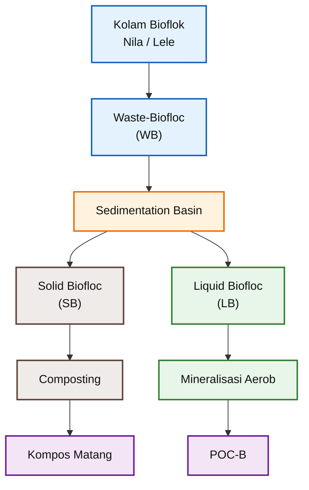

Dari sudut pandang praktisi, tujuan desain pada artikel ini adalah membuat unit sedimentasi yang:

- sederhana,
- mudah dibuat di lapangan,
- cukup efektif memisahkan WB menjadi SB dan LB,
- mudah dioperasikan,
- mudah dibersihkan,
- dan sesuai dengan skala kolam bioflok yang dibahas.

Dengan pendekatan ini, sedimentation basin menjadi bagian dari sistem budidaya yang lebih produktif dan lebih sirkular, karena hasil samping bioflok tidak langsung dibuang, melainkan diolah kembali menjadi produk yang bermanfaat.

[**Kembali ke Atas**](#desain-bak-sedimentasi-waste-biofloc-untuk-kolam-bioflok-nila-dan-lele)

---

# 2. Data Dasar Kolam

Perancangan sedimentation basin harus selalu dimulai dari **data dasar kolam**, karena seluruh beban pengambilan Waste-Biofloc (WB) bergantung pada volume air budidaya yang sedang dikelola.

Pada kasus ini, data kolam yang digunakan adalah sebagai berikut:

- panjang total kolam: 18 m,
- lebar total kolam: 3,5 m,
- ketinggian air operasi: 0,65 m.

## 2.1 Dimensi Kolam

Secara matematis:

$$
L = 18 \ \text{m}
$$

$$
W = 3{,}5 \ \text{m}
$$

$$
H = 0{,}65 \ \text{m}
$$

dengan:

- (L) = panjang kolam,
- (W) = lebar kolam,
- (H) = tinggi air operasi.

## 2.2 Luas Permukaan Kolam

Luas kolam dihitung dengan rumus dasar luas persegi panjang:

$$
A = L \times W
$$

Substitusi data:

$$
A = 18 \times 3{,}5
$$

$$
A = 63 \ \text{m}^2
$$

Jadi, luas total permukaan kolam adalah:

$$
\boxed{A = 63 \ \text{m}^2}
$$

## 2.3 Volume Air Total Kolam

Setelah luas diketahui, volume air kolam dihitung sebagai:

$$
V_{kolam} = A \times H
$$

Substitusi data:

$$
V_{kolam} = 63 \times 0{,}65
$$

$$
V_{kolam} = 40{,}95 \ \text{m}^3
$$

Karena dalam praktik lapangan volume sering lebih mudah dibaca dalam liter, maka dilakukan konversi:

$$
V_{kolam} = 40{,}95 \times 1000
$$

$$
V_{kolam} = 40{,}950 \ \text{liter}
$$

Dengan demikian, basis desain kolam yang digunakan dalam artikel ini adalah:

$$
\boxed{V_{kolam} \approx 40{,}95 \ \text{m}^3}
$$

atau secara praktis dapat dibulatkan menjadi:

$$
\boxed{V_{kolam} \approx 41 \ \text{m}^3}
$$

## 2.4 Makna Data Ini dalam Desain

Nilai volume kolam sekitar **41 m³** ini menjadi angka kunci, karena seluruh keputusan berikut akan diturunkan dari sini, antara lain:

1. berapa volume WB yang perlu diambil per hari,
2. berapa debit operasi WB saat pemompaan batch,
3. berapa kapasitas sedimentation basin,
4. apakah dimensi basin yang dirancang cukup atau tidak.

Artinya, tanpa data volume kolam yang benar, desain sedimentation basin akan kehilangan dasar perhitungannya.

## 2.5 Ringkasan Data Dasar Kolam

| Parameter     |         Nilai |
| ------------- | ------------: |
| Panjang kolam |          18 m |
| Lebar kolam   |         3,5 m |
| Tinggi air    |        0,65 m |
| Luas kolam    |         63 m² |
| Volume air    |      40,95 m³ |
| Volume air    | ±40.950 liter |

Dari tabel di atas, dapat ditegaskan kembali bahwa kolam bioflok yang dibahas dalam artikel ini berada pada skala sekitar **40,95 m³**, sehingga sedimentation basin yang dirancang nantinya harus proporsional terhadap volume sistem tersebut.

[**Kembali ke Atas**](#desain-bak-sedimentasi-waste-biofloc-untuk-kolam-bioflok-nila-dan-lele)

---

# 3. Basis Pengambilan Waste-Biofloc

Setelah volume kolam diketahui, langkah berikutnya adalah menentukan **berapa banyak Waste-Biofloc (WB)** yang akan diambil dari sistem. Pada artikel praktis ini, pendekatan dibuat sesederhana mungkin: WB dinyatakan sebagai **persentase dari volume kolam per hari**.

Pendekatan ini dipilih karena mudah diterapkan di lapangan dan cukup memadai untuk desain awal. Dalam operasi nyata, angka ini nantinya tetap harus dikoreksi berdasarkan kondisi flok aktual, misalnya melalui pengamatan **Imhoff cone**, warna air, kekentalan flok, dan respons ikan.

## 3.1 Basis Rasio Pengambilan WB

Empat tingkat pengambilan WB yang digunakan adalah sebagai berikut:

| Kondisi             | Rasio terhadap Volume Kolam | WB per Hari |
| ------------------- | --------------------------: | ----------: |
| Minimum konservatif |                        0,2% |  ±82 L/hari |
| Nominal awal        |                        0,4% | ±164 L/hari |
| Desain normal       |                        1,0% | ±410 L/hari |
| High-floc sementara |                        2,0% | ±819 L/hari |

Tabel ini menunjukkan bahwa desain tidak hanya disiapkan untuk kondisi normal, tetapi juga untuk kondisi ketika flok sedang tinggi dan perlu dikeluarkan lebih agresif.

## 3.2 Perhitungan WB Harian

Dengan volume kolam:

$$
V_{kolam} = 40{,}950 \ \text{L}
$$

maka volume WB harian dihitung dengan rumus:

$$
V_{WB} = R_{WB} \times V_{kolam}
$$

dengan:

- $(V\_{WB})$ = volume Waste-Biofloc per hari,
- $(R\_{WB})$ = rasio pengambilan WB,
- $(V\_{kolam})$ = volume total air kolam.

### a. Minimum konservatif — 0,2%

$$
V_{WB} = 0{,}002 \times 40{,}950
$$

$$
V_{WB} = 81{,}9 \ \text{L/hari}
$$

dibulatkan menjadi:

$$
\boxed{V_{WB} \approx 82 \ \text{L/hari}}
$$

### b. Nominal awal — 0,4%

$$
V_{WB} = 0{,}004 \times 40{,}950
$$

$$
V_{WB} = 163{,}8 \ \text{L/hari}
$$

dibulatkan menjadi:

$$
\boxed{V_{WB} \approx 164 \ \text{L/hari}}
$$

### c. Desain normal — 1,0%

$$
V_{WB} = 0{,}01 \times 40{,}950
$$

$$
V_{WB} = 409{,}5 \ \text{L/hari}
$$

dibulatkan menjadi:

$$
\boxed{V_{WB,design} = 410 \ \text{L/hari}}
$$

### d. High-floc sementara — 2,0%

$$
V_{WB} = 0{,}02 \times 40{,}950
$$

$$
V_{WB} = 819 \ \text{L/hari}
$$

maka:

$$
\boxed{V_{WB,max} = 819 \ \text{L/hari}}
$$

Dari seluruh skenario di atas, dua angka terpenting untuk desain praktis adalah:

$$
\boxed{V_{WB,design} = 410 \ \text{L/hari}}
$$

$$
\boxed{V_{WB,max} = 819 \ \text{L/hari}}
$$

## 3.3 Basis Operasi Batch

Dalam praktik, pengambilan WB biasanya lebih mudah dilakukan secara **batch**, bukan secara kontinu 24 jam. Pada artikel ini digunakan basis operasi:

- pengambilan dilakukan selama **60 menit per hari**.

Dengan asumsi tersebut, debit operasi dihitung dengan rumus:

$$
Q_{WB} = \frac{V_{WB}}{t}
$$

dengan:

- $(Q\_{WB})$ = debit operasi WB,
- $(V\_{WB})$ = volume WB per hari,
- (t) = waktu operasi per hari.

### a. Debit operasi normal

Untuk kondisi desain normal:

$$
Q_{WB,normal} = \frac{410}{60}
$$

$$
Q_{WB,normal} = 6{,}83 \ \text{L/menit}
$$

dibulatkan menjadi:

$$
\boxed{Q_{WB,normal} \approx 6{,}8 \ \text{L/menit}}
$$

### b. Debit operasi high-floc

Untuk kondisi high-floc sementara:

$$
Q_{WB,max} = \frac{819}{60}
$$

$$
Q_{WB,max} = 13{,}65 \ \text{L/menit}
$$

dibulatkan menjadi:

$$
\boxed{Q_{WB,max} \approx 13{,}7 \ \text{L/menit}}
$$

Ringkasannya adalah sebagai berikut:

| Kondisi   | WB per Hari | Debit Operasi |
| --------- | ----------: | ------------: |
| Normal    |  410 L/hari |  ±6,8 L/menit |
| High-floc |  819 L/hari | ±13,7 L/menit |

## 3.4 Rekomendasi Praktis untuk Lapangan

Berdasarkan hasil di atas, maka rekomendasi praktis untuk operasi harian adalah:

$$
\boxed{Q_{WB,operasi} = 5 - 15 \ \text{L/menit}}
$$

Rentang ini dipilih karena:

- mencakup kebutuhan operasi normal,
- masih cukup aman untuk kondisi high-floc,
- mudah dicapai dengan pompa kecil-menengah,
- masih memungkinkan kontrol aliran yang relatif lembut ke sedimentation basin.

Secara operasional, makna rentang ini adalah:

- **5–10 L/menit** cocok untuk operasi normal,
- **12–15 L/menit** dapat digunakan sementara ketika flok sedang tinggi,
- di atas itu perlu kehati-hatian agar basin tidak bekerja terlalu kasar dan pemisahan padatan-cairan tidak terganggu.

## 3.5 Posisi Bab Ini dalam Desain Keseluruhan

Bab ini menjadi jembatan antara **data kolam** dan **desain basin**. Setelah diketahui bahwa basis WB normal adalah sekitar **410 L/hari** dan maksimum sementara sekitar **819 L/hari**, maka bab selanjutnya dapat masuk ke inti desain, yaitu:

- berapa ukuran basin,
- bagaimana pembagian zonanya,
- dan bagaimana inlet, baffle, outlet, serta drain dirancang.

Dengan kata lain, **angka WB inilah yang menjadi beban desain sedimentation basin**.

### Catatan Praktis

Meskipun artikel ini memakai basis persentase volume kolam untuk memudahkan desain awal, operator sebaiknya tetap menggunakan observasi lapangan sebagai kontrol, terutama:

- hasil **Imhoff cone**,
- perubahan warna dan kekentalan air,
- akumulasi sludge,
- kestabilan DO,
- dan respons ikan.

Jadi, nilai **410 L/hari** dan **819 L/hari** harus dipahami sebagai **angka desain**, bukan angka yang harus dipaksakan setiap hari tanpa evaluasi.

[**Kembali ke Atas**](#desain-bak-sedimentasi-waste-biofloc-untuk-kolam-bioflok-nila-dan-lele)

---

# 4. Dimensi Final Sedimentation Basin

Setelah volume kolam dan basis pengambilan **Waste-Biofloc (WB)** ditentukan, langkah berikutnya adalah menetapkan dimensi fisik **sedimentation basin**. Pada desain ini, ukuran basin dibuat praktis untuk fabrikasi lapangan, tetapi tetap mempertahankan prinsip dasar sedimentasi: aliran harus cukup tenang, flok diberi waktu untuk mengendap, dan sludge atau **Solid Biofloc (SB)** dapat dikeluarkan secara periodik.

Dimensi final yang digunakan adalah sebagai berikut.

| Item                 |                   Nilai |
| -------------------- | ----------------------: |
| Panjang internal     |                  175 cm |
| Lebar internal       |                   60 cm |
| Tinggi air operasi   |                   65 cm |
| Freeboard            |                   20 cm |
| Tinggi total dinding |                   85 cm |
| Volume efektif       |                  ±680 L |
| Dasar basin          | miring 2–3% ke drain SB |

Dimensi ini dipilih karena memenuhi tiga kebutuhan utama:

1. cukup kompak untuk dibuat di lapangan,
2. masih memiliki volume efektif yang memadai terhadap debit WB,
3. memiliki rasio panjang terhadap lebar yang cukup baik untuk membentuk aliran horizontal.

## 4.1 Konversi Dimensi ke Satuan Meter

Untuk perhitungan volume, seluruh dimensi dikonversi ke satuan meter.

$$
L_{basin} = 175 \ \text{cm} = 1{,}75 \ \text{m}
$$

$$
W_{basin} = 60 \ \text{cm} = 0{,}60 \ \text{m}
$$

$$
H_{air} = 65 \ \text{cm} = 0{,}65 \ \text{m}
$$

dengan:

- $(L\_{basin})$ = panjang internal sedimentation basin,
- $(W\_{basin})$ = lebar internal sedimentation basin,
- $(H\_{air})$ = tinggi air operasi di dalam basin.

## 4.2 Perhitungan Volume Efektif Basin

Volume efektif basin dihitung berdasarkan volume air operasi, bukan tinggi total dinding. Freeboard tidak dihitung sebagai volume operasi karena ruang tersebut berfungsi sebagai ruang aman agar basin tidak mudah meluap ketika terjadi fluktuasi aliran.

Rumus volume basin:

$$
V_{basin} = L_{basin} \times W_{basin} \times H_{air}
$$

Substitusi data:

$$
V_{basin} = 1{,}75 \times 0{,}60 \times 0{,}65
$$

$$
V_{basin} = 0{,}6825 \ \text{m}^3
$$

Konversi ke liter:

$$
V_{basin} = 0{,}6825 \times 1000
$$

$$
V_{basin} = 682{,}5 \ \text{L}
$$

Sehingga volume efektif basin dapat dibulatkan menjadi:

$$
\boxed{V_{basin} \approx 680 \ \text{L}}
$$

Artinya, pada tinggi air operasi 65 cm, sedimentation basin ini mampu menampung sekitar **680 liter** WB/LB secara efektif.

## 4.3 Perbandingan Volume Basin terhadap WB Harian

Dari bab sebelumnya, volume WB desain normal adalah:

$$
V_{WB,design} = 410 \ \text{L/hari}
$$

Sedangkan volume efektif basin adalah:

$$
V_{basin} = 682{,}5 \ \text{L}
$$

Rasio volume basin terhadap WB desain harian:

$$
R = \frac{V_{basin}}{V_{WB,design}}
$$

$$
R = \frac{682{,}5}{410}
$$

$$
R = 1{,}66
$$

Maka:

$$
\boxed{V_{basin} \approx 1{,}66 \times V_{WB,design}}
$$

Makna praktisnya, volume basin lebih besar daripada volume WB normal harian. Ini memberikan margin operasi yang baik, terutama bila pengambilan WB dilakukan secara batch selama ±60 menit per hari.

Untuk kondisi high-floc sementara:

$$
V_{WB,max} = 819 \ \text{L/hari}
$$

Rasio volume basin terhadap WB maksimum sementara:

$$
R = \frac{682{,}5}{819}
$$

$$
R = 0{,}83
$$

Maka:

$$
\boxed{V_{basin} \approx 0{,}83 \times V_{WB,max}}
$$

Artinya, untuk kondisi high-floc, basin masih dapat digunakan, tetapi operasi perlu dijaga agar tidak terlalu kasar. Debit WB sebaiknya tidak langsung dinaikkan terlalu besar tanpa melihat kejernihan LB dan akumulasi SB di dasar basin.

## 4.4 Rasio Panjang terhadap Lebar

Selain volume, bentuk basin juga penting. Untuk basin sedimentasi sederhana, bentuk yang terlalu pendek dan terlalu lebar cenderung mudah mengalami short-circuiting, yaitu aliran masuk bergerak cepat menuju outlet tanpa sempat memberi waktu flok untuk mengendap.

Rasio panjang terhadap lebar dihitung sebagai berikut:

$$
\frac{L}{W} = \frac{1{,}75}{0{,}60}
$$

$$
\frac{L}{W} = 2{,}92
$$

Sehingga secara praktis:

$$
\boxed{L:W \approx 3:1}
$$

Rasio sekitar **3:1** cukup baik untuk basin kecil karena masih membentuk aliran horizontal yang memanjang dari inlet menuju outlet.

## 4.5 Tinggi Air, Freeboard, dan Tinggi Total Dinding

Tinggi air operasi ditetapkan:

$$
H_{air} = 65 \ \text{cm}
$$

Freeboard ditetapkan:

$$
H_{freeboard} = 20 \ \text{cm}
$$

Maka tinggi total dinding:

$$
H_{total} = H_{air} + H_{freeboard}
$$

$$
H_{total} = 65 + 20
$$

$$
H_{total} = 85 \ \text{cm}
$$

Sehingga:

$$
\boxed{H_{total} = 85 \ \text{cm}}
$$

Freeboard 20 cm berfungsi sebagai ruang aman untuk:

- fluktuasi debit WB,
- gelombang kecil akibat aliran masuk,
- akumulasi scum di permukaan,
- mencegah overflow liar,
- memberi ruang kerja bagi baffle yang bagian atasnya harus berada di atas permukaan air.

## 4.6 Ilustrasi Dimensi Utama Basin

Ilustrasi berikut menunjukkan dimensi utama sedimentation basin secara sederhana. Diagram dibuat vertikal agar tetap mudah dibaca pada layar smartphone.

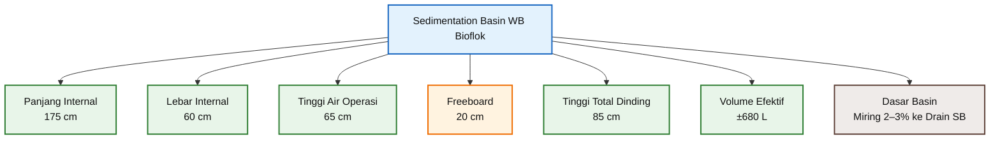

## 4.7 Makna Desain untuk Praktisi

Dengan ukuran:

$$
\boxed{175 \ \text{cm} \times 60 \ \text{cm} \times 65 \ \text{cm}}
$$

sedimentation basin ini memiliki beberapa kelebihan praktis:

- mudah dibuat dari pasangan bata, beton kecil, fiberglass, atau rangka baja dengan lining,
- mudah ditempatkan di dekat kolam bioflok,
- volume cukup untuk pengendapan WB harian normal,
- tidak memerlukan mechanical scraper,
- sludge dapat diarahkan ke drain dengan dasar miring,
- masih cukup mudah dibersihkan secara manual.

Namun, desain ini tetap harus dipahami sebagai **sedimentation basin skala lapangan kecil**, bukan clarifier industri besar. Karena itu, keandalan operasinya sangat bergantung pada:

- debit WB yang masuk,
- kondisi flok,
- kebersihan baffle,
- kemiringan dasar,
- disiplin pembuangan SB,
- dan pemeriksaan kejernihan LB.

[**Kembali ke Atas**](#desain-bak-sedimentasi-waste-biofloc-untuk-kolam-bioflok-nila-dan-lele)

---

# 5. Pembagian Zona di Dalam Basin

Pembagian zona di dalam sedimentation basin adalah bagian paling penting untuk praktisi, karena bagian ini langsung menjadi panduan fabrikasi. Basin tidak boleh hanya dibuat sebagai bak kosong dengan inlet dan outlet. Jika aliran tidak diarahkan dengan benar, WB dapat langsung bergerak dari inlet ke outlet tanpa proses pengendapan yang memadai.

Karena itu, basin dibagi menjadi beberapa zona hidrolik:

1. inlet chamber,
2. slotted diffuser baffle,
3. zona distribusi tenang,
4. zona pengendapan utama,
5. outlet scum baffle,
6. weir outlet,
7. effluent launder atau outlet zone.

Pembagian zona ini bertujuan untuk memastikan bahwa WB masuk secara terkendali, flok memiliki waktu untuk mengendap, scum tertahan, dan LB keluar melalui overflow dengan kondisi lebih jernih.

## 5.1 Tabel Pembagian Zona

Pembagian zona dari sisi inlet ke sisi outlet adalah sebagai berikut.

| Zona                           | Posisi dari Inlet | Panjang |
| ------------------------------ | ----------------: | ------: |
| Inlet chamber                  |           0–20 cm |   20 cm |
| Slotted diffuser baffle        |        pada 20 cm |       - |
| Zona distribusi tenang         |          20–45 cm |   25 cm |
| Zona pengendapan utama         |         45–150 cm |  105 cm |
| Outlet scum baffle             |       pada 150 cm |       - |
| Jarak baffle ke weir           |        150–165 cm |   15 cm |
| Outlet zone / effluent launder |        165–175 cm |   10 cm |

Secara total:

$$
L_{total} = 20 + 25 + 105 + 15 + 10
$$

$$
L_{total} = 175 \ \text{cm}
$$

Maka pembagian zona sudah sesuai dengan panjang internal basin:

$$
\boxed{L_{total} = 175 \ \text{cm}}
$$

## 5.2 Skema Zona Memanjang

Diagram berikut menunjukkan urutan zona di dalam basin. Diagram dibuat dengan arah vertikal agar lebih nyaman dibaca pada layar smartphone.

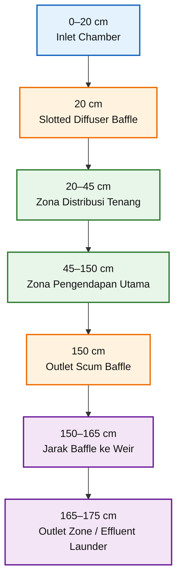

## 5.3 Inlet Chamber — 0 sampai 20 cm

Zona pertama adalah **inlet chamber** dengan panjang:

$$
L_{inlet} = 20 \ \text{cm}
$$

Fungsi utama inlet chamber adalah menurunkan energi aliran WB dari pipa inlet sebelum masuk ke zona sedimentasi.

Tanpa inlet chamber, aliran WB dari pipa dapat membentuk jet flow. Jet flow ini berbahaya untuk proses sedimentasi karena dapat:

- mendorong flok langsung ke outlet,
- mengaduk ulang sludge di dasar,
- memecah flok,
- mengurangi kejernihan LB,
- menyebabkan short-circuiting.

Dengan inlet chamber, aliran masuk diberi ruang untuk menurun kecepatannya sebelum melewati slotted diffuser baffle.

## 5.4 Slotted Diffuser Baffle — pada 20 cm

Pada posisi:

$$
x = 20 \ \text{cm}
$$

dipasang **slotted diffuser baffle**. Baffle ini berfungsi sebagai dinding distribusi aliran.

Baffle ini tidak dibuat dengan lubang kecil, tetapi dengan slot vertikal. Slot lebih sesuai untuk WB bioflok karena:

- lebih mudah dibersihkan,
- lebih kecil risiko tersumbat,
- lebih ramah terhadap flok,
- distribusi aliran tetap dapat dibuat merata,
- tidak menimbulkan head loss berlebihan.

Secara praktis, slotted diffuser baffle berfungsi untuk mengubah aliran dari bentuk jet menjadi aliran yang lebih menyebar dan lebih tenang.

## 5.5 Zona Distribusi Tenang — 20 sampai 45 cm

Setelah melewati slotted diffuser baffle, air masuk ke **zona distribusi tenang**. Panjang zona ini adalah:

$$
L_{distribusi} = 45 - 20
$$

$$
L_{distribusi} = 25 \ \text{cm}
$$

Zona ini penting karena aliran yang baru melewati baffle masih memerlukan ruang untuk menjadi lebih stabil sebelum masuk ke zona pengendapan utama.

Fungsi zona distribusi tenang:

- meratakan aliran ke seluruh lebar basin,
- menurunkan turbulensi lokal,
- mengurangi potensi flok pecah,
- menghindari aliran langsung menuju outlet,
- menyiapkan kondisi aliran horizontal di zona pengendapan.

## 5.6 Zona Pengendapan Utama — 45 sampai 150 cm

Zona pengendapan utama adalah bagian paling panjang dari sedimentation basin.

Panjang zona ini:

$$
L_{settling} = 150 - 45
$$

$$
L_{settling} = 105 \ \text{cm}
$$

Maka:

$$
\boxed{L_{settling} = 105 \ \text{cm}}
$$

Di zona inilah sebagian besar proses pemisahan terjadi. Flok yang lebih berat akan turun ke dasar dan menjadi **Solid Biofloc (SB)**, sedangkan cairan di bagian atas bergerak perlahan menuju outlet sebagai **Liquid Biofloc (LB)**.

Zona ini harus dijaga agar tetap tenang. Oleh karena itu, tidak disarankan menambahkan sekat terlalu banyak di zona pengendapan utama. Terlalu banyak baffle justru dapat menimbulkan:

- dead zone,
- turbulensi lokal,
- akumulasi sludge yang sulit dibersihkan,
- gangguan aliran,
- dan risiko sumbatan.

Untuk basin kecil ini, satu inlet baffle dan satu outlet scum baffle sudah cukup, asalkan posisi dan fungsinya benar.

## 5.7 Outlet Scum Baffle — pada 150 cm

Pada posisi:

$$
x = 150 \ \text{cm}
$$

dipasang **outlet scum baffle**.

Baffle ini berfungsi menahan:

- scum,
- buih,
- flok ringan yang terapung,
- bahan organik ringan di permukaan,
- dan partikel yang belum sempat mengendap.

Outlet scum baffle tidak berfungsi untuk mendistribusikan aliran seperti inlet baffle. Fungsinya lebih spesifik, yaitu menjaga agar permukaan air yang mengandung scum tidak langsung masuk ke weir outlet.

## 5.8 Jarak Outlet Scum Baffle ke Weir — 15 cm

Jarak dari outlet scum baffle ke weir adalah:

$$
L_{baffle-weir} = 165 - 150
$$

$$
L_{baffle-weir} = 15 \ \text{cm}
$$

Jarak 15 cm ini memberikan ruang kecil di depan weir agar air yang sudah melewati bawah scum baffle dapat naik dan melimpas secara lebih stabil ke effluent launder.

Jika jarak ini terlalu pendek, aliran dapat menjadi terlalu tajam di dekat weir. Jika terlalu panjang, volume outlet zone menjadi lebih besar tetapi mengurangi panjang zona pengendapan utama.

Untuk basin dengan panjang total 175 cm, jarak 15 cm merupakan kompromi yang cukup praktis.

## 5.9 Outlet Zone / Effluent Launder — 165 sampai 175 cm

Zona terakhir adalah outlet zone atau effluent launder dengan panjang:

$$
L_{outlet} = 175 - 165
$$

$$
L_{outlet} = 10 \ \text{cm}
$$

Fungsi outlet zone adalah:

- menerima limpasan LB dari weir,
- menjaga level air operasi,
- mengarahkan LB menuju pipa outlet,
- mencegah aliran keluar terlalu lokal,
- memudahkan inspeksi kejernihan LB.

Pada zona ini, LB keluar menuju proses berikutnya, yaitu **mineralisasi aerob** untuk produksi POC-B.

## 5.10 Ringkasan Fungsi Tiap Zona

| Zona                    | Fungsi Utama                                  |
| ----------------------- | --------------------------------------------- |
| Inlet chamber           | meredam energi aliran WB dari pipa inlet      |
| Slotted diffuser baffle | mendistribusikan aliran dan mencegah jet flow |
| Zona distribusi tenang  | menstabilkan aliran sebelum settling zone     |
| Zona pengendapan utama  | memberi waktu flok mengendap menjadi SB       |
| Outlet scum baffle      | menahan scum dan flok terapung                |
| Jarak baffle ke weir    | memberi ruang aliran menuju weir              |
| Effluent launder        | mengumpulkan LB dan mengarahkannya ke outlet  |

## 5.11 Prinsip Penting untuk Fabrikasi

Dalam fabrikasi lapangan, posisi zona harus dijaga agar tidak berubah terlalu jauh dari desain. Toleransi beberapa sentimeter masih dapat diterima, tetapi perubahan besar dapat memengaruhi kinerja.

Hal-hal yang perlu diperhatikan:

- inlet chamber jangan terlalu pendek,
- slotted diffuser baffle harus terpasang tegak dan penuh lebar basin,
- settling zone harus menjadi bagian terpanjang,
- outlet scum baffle harus berada sebelum weir,
- weir harus rata agar overflow merata,
- outlet zone harus mudah dibersihkan,
- dasar basin harus miring ke drain SB.

Secara sederhana, logika desainnya adalah:

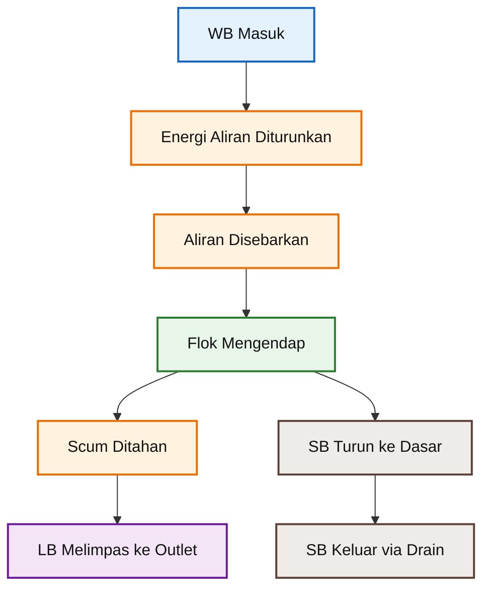

Dengan pembagian zona seperti ini, sedimentation basin tidak hanya menjadi tempat menampung WB, tetapi benar-benar bekerja sebagai unit pemisah padatan-cairan sederhana yang dapat dioperasikan oleh praktisi di lapangan.

[**Kembali ke Atas**](#desain-bak-sedimentasi-waste-biofloc-untuk-kolam-bioflok-nila-dan-lele)

---

# 6. Desain Inlet, Baffle, Outlet, dan Drain

Bab ini membahas komponen utama yang secara langsung menentukan kinerja sedimentation basin, yaitu **inlet**, **baffle**, **outlet**, dan **drain**. Pada skala praktis seperti sistem bioflok nila dan lele ini, desain komponen harus memenuhi empat prinsip dasar:

1. **aliran masuk harus mudah dikontrol**,
2. **turbulensi harus diredam secepat mungkin**,
3. **padatan harus diberi kesempatan mengendap**,
4. **cairan dan sludge harus mudah dikeluarkan tanpa menyulitkan operasi**.

Dengan prinsip tersebut, desain yang dipilih sengaja dibuat **sederhana, mudah difabrikasi, dan mudah dibersihkan**, tanpa memakai mekanisme kompleks seperti scraper mekanis.

## 6.1 Inlet WB

Rekomendasi ukuran inlet adalah:

$$
\boxed{\text{PVC Inlet WB} = 1 \ \text{inch}}
$$

Ukuran **PVC 1 inch** dipilih karena cukup sesuai untuk debit operasi lapangan yang telah ditetapkan sebelumnya, yaitu:

$$
\boxed{Q_{WB,operasi} = 5 - 15 \ \text{L/menit}}
$$

### Fungsi Inlet WB

Inlet berfungsi untuk:

- memasukkan WB dari kolam bioflok ke sedimentation basin,
- memudahkan pengaturan debit melalui valve,
- menjaga agar aliran tidak terlalu besar untuk ukuran basin,
- menjadi titik awal distribusi aliran sebelum masuk ke settling zone.

### Alasan Pemilihan PVC 1 inch

Secara praktis, PVC 1 inch dipilih karena:

- cukup untuk debit normal dan high-floc sementara,
- mudah didapat di lapangan,
- kompatibel dengan valve PVC standar,
- masih cukup kecil untuk menjaga aliran tetap terkendali,
- tidak terlalu besar sehingga mengurangi risiko jet flow berlebihan.

Bila diperlukan, pipa inlet ini sebaiknya dilengkapi dengan:

- **ball valve**, untuk pengaturan debit manual,
- sambungan union, untuk memudahkan pembongkaran saat cleaning,
- elbow atau arah masuk yang menghadap ke inlet chamber, bukan langsung ke settling zone.

## 6.2 Inlet Baffle

Tipe baffle inlet yang direkomendasikan adalah:

$$
\boxed{\text{Slotted diffuser baffle}}
$$

<figure>
  
  <figcaption>
    Ilustrasi slotted diffuser baffle pada inlet sedimentasi basin bioflok.
    Baffle ini meredam jet flow dari pipa inlet, membagi aliran ke seluruh lebar
    basin, dan membantu menjaga zona pengendapan tetap tenang.
  </figcaption>
</figure>

Baffle ini menjadi komponen kunci karena berfungsi mengubah aliran dari pipa inlet yang relatif terfokus menjadi aliran yang lebih merata dan lebih tenang.

Pada desain ini, inlet menggunakan **PVC 1 inch**. Karena itu, luas bukaan slot pada baffle tidak boleh dibuat terlalu besar. Bila bukaan terlalu besar, baffle hanya menjadi sekat berlubang biasa dan tidak cukup efektif sebagai diffuser. Sebaliknya, bila bukaan terlalu kecil, risiko sumbatan oleh bioflok meningkat.

Dengan demikian, ukuran slot harus dipilih sebagai kompromi antara:

- pemerataan aliran,
- penurunan jet flow,
- risiko clogging,
- kemudahan pembersihan,
- dan karakter bioflok yang lunak serta mudah pecah.

### Spesifikasi Inlet Baffle

| Item              |                                          Nilai |
| ----------------- | ---------------------------------------------: |
| Tipe              |                        Slotted diffuser baffle |
| Material          |                               PVC / HDPE plate |
| Tebal             |                                        5–10 mm |
| Lebar plate       |                                          60 cm |
| Tinggi plate      |                               75 cm dari dasar |
| Posisi            |                               20 cm dari inlet |
| Jumlah slot       |                                        10 slot |
| Ukuran slot       |                                  10 mm × 30 mm |
| Susunan slot      |                              5 kolom × 2 baris |
| Luas bukaan total |                                      0,0030 m² |
| Fungsi            | meredam turbulensi dan mendistribusikan aliran |

### Fungsi Slotted Diffuser Baffle

Baffle inlet ini berfungsi untuk:

- meredam energi dari aliran inlet,
- mencegah jet flow langsung ke zona pengendapan,
- membagi aliran ke seluruh lebar basin,
- mengurangi short-circuiting,
- membantu menjaga zona pengendapan tetap tenang.

### Mengapa Memakai Slot, Bukan Lubang Kecil?

Pada aplikasi **waste-biofloc**, penggunaan slot lebih disarankan daripada lubang-lubang kecil karena:

- lebih mudah dibersihkan,
- risiko clogging lebih rendah,
- lebih toleran terhadap padatan organik lunak,
- lebih ramah terhadap flok,
- distribusi aliran masih dapat dijaga dengan baik.

Lubang kecil memang dapat memberikan distribusi yang lebih halus, tetapi pada WB bioflok, padatan organik lunak dan flok mikroba dapat lebih mudah menutup lubang. Slot vertikal lebih praktis karena lebih mudah disikat, di-flushing, dan diperiksa secara visual.

### Catatan Penting Penempatan Slot

Slot harus dibuat pada **zona tengah air**, artinya:

- jangan terlalu dekat ke permukaan,
- jangan terlalu dekat ke dasar,
- jangan sampai berada pada area akumulasi sludge.

Tujuan penempatan ini adalah agar aliran yang keluar dari slot:

- tidak mendorong scum di permukaan,
- tidak mengganggu sludge di dasar,
- mengalir lebih seragam ke zona distribusi dan settling zone.

Secara praktis, slot dapat disusun dalam pola **5 kolom × 2 baris** agar distribusi aliran tidak terkonsentrasi di tengah plate saja. Susunan ini membantu aliran menyebar ke arah lebar basin.

```text
Tampak depan baffle 60 cm

|------------------------------------------------|
|                                                |
|     [ ]     [ ]     [ ]     [ ]     [ ]        |
|                                                |
|     [ ]     [ ]     [ ]     [ ]     [ ]        |
|                                                |
|------------------------------------------------|

Jumlah slot       : 10
Susunan slot      : 5 kolom × 2 baris
Ukuran tiap slot  : 10 mm × 30 mm
```

### Dasar Penentuan Luas Bukaan Slot

Luas bukaan slot tidak boleh ditentukan dengan pendekatan “semakin besar semakin baik”. Pada slotted diffuser baffle, bukaan harus tetap memberi **resistansi hidrolik ringan** agar aliran benar-benar tersebar.

Sebagai pembanding, luas penampang pipa inlet PVC 1 inch dihitung terlebih dahulu.

Untuk pendekatan desain awal, diameter dalam pipa PVC 1 inch diasumsikan:

$$
D_{\text{inlet}} \approx 26 \ \text{mm}
$$

atau:

$$
D_{\text{inlet}} = 0{,}026 \ \text{m}
$$

Luas penampang pipa inlet:

$$
A_{\text{pipe}} = \frac{\pi D_{\text{inlet}}^2}{4}
$$

Substitusi nilai diameter:

$$
A_{\text{pipe}} = \frac{\pi \times 0{,}026^2}{4}
$$

$$
A_{\text{pipe}} \approx 0{,}000531 \ \text{m}^2
$$

Sehingga:

$$
\boxed{A_{\text{pipe}} \approx 0{,}0005 \ \text{m}^2}
$$

Nilai ini menjadi pembanding agar luas total bukaan slot tidak terlalu berlebihan dibanding luas penampang inlet.

### Debit Maksimum Desain

Debit maksimum sementara pada kondisi high-floc adalah:

$$
Q_{\text{WB,max}} = 13{,}7 \ \text{L/menit}
$$

Konversi ke satuan $\text{m}^3/\text{s}$:

$$
Q_{\text{WB,max}} =
\frac{13{,}7}{1000 \times 60}
$$

$$
Q_{\text{WB,max}} = 0{,}000228 \ \text{m}^3/\text{s}
$$

### Target Kecepatan Keluar Slot

Untuk bioflok, aliran keluar slot harus cukup lembut agar tidak merusak flok, tetapi tetap memiliki efek distribusi. Target kecepatan keluar slot yang dipakai adalah:

$$
v_{\text{slot,target}} \approx 0{,}08 \ \text{m/s}
$$

Maka luas bukaan total yang dibutuhkan:

$$
A_{\text{open,total}} =
\frac{Q_{\text{WB,max}}}{v_{\text{slot,target}}}
$$

Substitusi nilai:

$$
A_{\text{open,total}} =
\frac{0{,}000228}{0{,}08}
$$

$$
A_{\text{open,total}} = 0{,}00285 \ \text{m}^2
$$

Untuk fabrikasi lapangan, nilai ini dibulatkan menjadi:

$$
\boxed{A_{\text{open,total}} \approx 0{,}0030 \ \text{m}^2}
$$

### Perhitungan Luas Bukaan Total Slot

Ukuran satu slot yang direkomendasikan:

$$
A_{\text{slot}} = 10 \ \text{mm} \times 30 \ \text{mm}
$$

Konversi ke meter:

$$
A_{\text{slot}} = 0{,}01 \ \text{m} \times 0{,}03 \ \text{m}
$$

$$
A_{\text{slot}} = 0{,}00030 \ \text{m}^2
$$

Jumlah slot:

$$
n = 10
$$

Maka luas bukaan total:

$$
A_{\text{open,total}} = n \times A_{\text{slot}}
$$

$$
A_{\text{open,total}} = 10 \times 0{,}00030
$$

$$
A_{\text{open,total}} = 0{,}0030 \ \text{m}^2
$$

Sehingga:

$$
\boxed{A_{\text{open,total}} = 0{,}0030 \ \text{m}^2}
$$

Nilai ini lebih proporsional untuk inlet PVC 1 inch karena cukup besar untuk mengurangi risiko sumbatan, tetapi masih cukup kecil untuk memberi efek distribusi aliran.

### Rasio Bukaan Slot terhadap Luas Inlet

Perbandingan luas bukaan slot total terhadap luas penampang pipa inlet:

$$
\frac{A_{\text{open,total}}}{A_{\text{pipe}}}
=

\frac{0{,}0030}{0{,}000531}
$$

$$
\frac{A_{\text{open,total}}}{A_{\text{pipe}}}
\approx 5{,}65
$$

Maka:

$$
\boxed{
A_{\text{open,total}}
\approx
5{,}6 \times A_{\text{pipe}}
}
$$

Rasio ini lebih sesuai dibanding desain bukaan yang terlalu besar. Bila bukaan slot dibuat terlalu besar, misalnya $(0{,}020 \ \text{m}^2)$, maka perbandingannya menjadi sekitar 38 kali luas inlet. Nilai sebesar itu terlalu besar untuk fungsi diffuser karena baffle hampir tidak memberi resistansi hidrolik.

### Cek Kecepatan Melewati Slot

Pada kondisi high-floc:

$$
v_{\text{slot,max}}
=

\frac{Q_{\text{WB,max}}}{A_{\text{open,total}}}
$$

$$
v_{\text{slot,max}}
=

\frac{0{,}000228}{0{,}0030}
$$

$$
v_{\text{slot,max}}
=

0{,}076 \ \text{m/s}
$$

Sehingga:

$$
\boxed{
v_{\text{slot,max}}
\approx
0{,}076 \ \text{m/s}
}
$$

Pada kondisi operasi normal:

$$
Q_{\text{WB,normal}} = 6{,}8 \ \text{L/menit}
$$

Konversi:

$$
Q_{\text{WB,normal}}
=

\frac{6{,}8}{1000 \times 60}
$$

$$
Q_{\text{WB,normal}}
=

0{,}000113 \ \text{m}^3/\text{s}
$$

Maka:

$$
v_{\text{slot,normal}}
=

\frac{Q_{\text{WB,normal}}}{A_{\text{open,total}}}
$$

$$
v_{\text{slot,normal}}
=

\frac{0{,}000113}{0{,}0030}
$$

$$
v_{\text{slot,normal}}
=

0{,}038 \ \text{m/s}
$$

Sehingga:

$$
\boxed{
v_{\text{slot,normal}}
\approx
0{,}038 \ \text{m/s}
}
$$

Ringkasan hasil cek kecepatan:

| Kondisi   |        Debit | Luas Slot Total | Kecepatan Slot |
| --------- | -----------: | --------------: | -------------: |
| Normal    |  6,8 L/menit |       0,0030 m² |     ±0,038 m/s |
| High-floc | 13,7 L/menit |       0,0030 m² |     ±0,076 m/s |

Nilai ini lebih sesuai untuk fungsi **slotted diffuser baffle**, yaitu cukup lembut untuk bioflok, tetapi tetap memiliki efek distribusi aliran.

### Perbandingan dengan Desain Slot Lama

Desain slot yang terlalu besar, misalnya:

$$
10 \ \text{slot} \times 20 \ \text{mm} \times 100 \ \text{mm}
$$

menghasilkan luas bukaan total:

$$
A_{\text{open,total}} = 0{,}020 \ \text{m}^2
$$

Rasionya terhadap luas pipa inlet:

$$
\frac{0{,}020}{0{,}000531}
\approx
37{,}7
$$

atau:

$$
\boxed{
A_{\text{open,total}}
\approx
38 \times A_{\text{pipe}}
}
$$

Luas sebesar ini terlalu besar untuk fungsi diffuser karena aliran cenderung melewati slot yang paling dekat dengan arah jet inlet, bukan tersebar merata ke seluruh lebar baffle.

Karena itu, desain slot direvisi menjadi:

$$
\boxed{
10 \ \text{slot} \times 10 \ \text{mm} \times 30 \ \text{mm}
}
$$

dengan:

$$
\boxed{
A_{\text{open,total}} = 0{,}0030 \ \text{m}^2
}
$$

### Logika Kerja Inlet dan Inlet Baffle

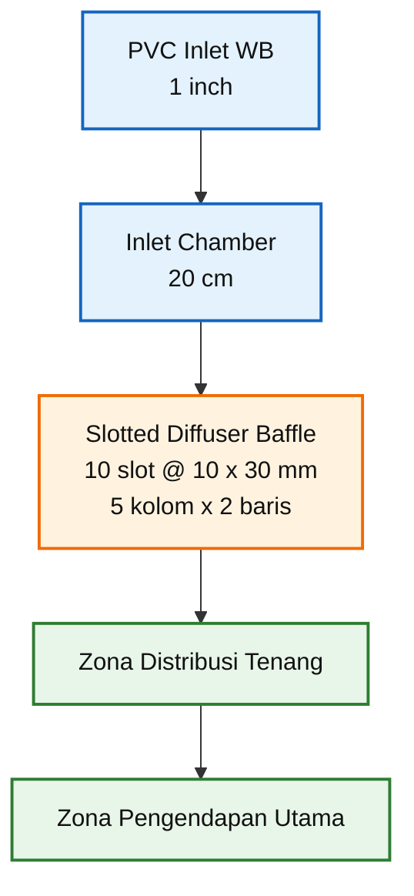

### Catatan Fabrikasi

Beberapa catatan penting saat membuat baffle:

- gunakan plate PVC atau HDPE dengan ketebalan 5–10 mm,
- pasang baffle tegak dan penuh selebar basin,
- buat slot dengan tepi halus agar flok tidak mudah tersangkut,
- hindari burr atau sisa potongan tajam pada tepi slot,
- buat baffle mudah dilepas atau mudah dijangkau untuk pembersihan,
- pastikan slot berada pada zona tengah air,
- hindari pemasangan slot terlalu dekat permukaan atau terlalu dekat dasar.

Secara ringkas, spesifikasi final inlet baffle adalah:

$$
\boxed{
\text{Slotted diffuser baffle}
=

10 \ \text{slot}
@
10 \ \text{mm}
\times
30 \ \text{mm}
}
$$

dengan:

$$
\boxed{
A_{\text{open,total}}
=

0{,}0030 \ \text{m}^2
}
$$

## 6.3 Outlet Scum Baffle

Pada sisi outlet, digunakan **scum baffle** yang berfungsi menahan lapisan terapung agar tidak ikut keluar bersama LB.

### Spesifikasi Outlet Scum Baffle

| Item                      |                          Nilai |
| ------------------------- | -----------------------------: |
| Tipe                      |                    scum baffle |
| Posisi                    |              150 cm dari inlet |
| Jarak ke weir             |                          15 cm |
| Lebar                     |                          60 cm |
| Terendam dari water level |                          30 cm |
| Clearance ke dasar        |                          35 cm |
| Fungsi                    | menahan scum dan flok terapung |

### Fungsi Outlet Scum Baffle

Baffle ini berfungsi untuk:

- menahan scum di permukaan,
- menahan flok ringan yang belum sempat mengendap,
- memaksa air yang keluar ke weir berasal dari bawah lapisan scum,
- meningkatkan kualitas LB yang menuju mineralisasi aerob.

### Perhitungan Clearance ke Dasar

Tinggi air operasi:

$$
H_{air} = 65 \ \text{cm}
$$

Kedalaman baffle yang terendam dari water level:

$$
H_{submerged} = 30 \ \text{cm}
$$

Maka clearance ke dasar:

$$
Clearance = H_{air} - H_{submerged}
$$

$$
Clearance = 65 - 30
$$

$$
Clearance = 35 \ \text{cm}
$$

Sehingga:

$$
\boxed{Clearance = 35 \ \text{cm}}
$$

Nilai 35 cm ini cukup untuk memberi ruang aliran menuju weir tanpa terlalu banyak membawa sludge dari dasar.

## 6.4 Outlet LB

Rekomendasi ukuran outlet cairan LB adalah:

$$
\boxed{\text{PVC Outlet LB} = 1{,}5 \ \text{inch}}
$$

### Fungsi Outlet LB

Outlet ini berfungsi untuk:

- mengalirkan LB menuju proses mineralisasi aerob,
- menerima aliran dari effluent launder atau outlet zone,
- menjaga agar cairan keluar secara gravitasi,
- mengurangi risiko sumbatan pada jalur cairan.

### Alasan Pemilihan PVC 1,5 inch

Ukuran **1,5 inch** dipilih karena:

- lebih aman terhadap kemungkinan biofilm atau padatan halus,
- lebih cocok untuk aliran overflow/gravity,
- memudahkan pembersihan,
- memberikan margin lebih baik dibanding 1 inch pada sisi outlet.

Pada aplikasi lapangan, sisi outlet cairan sering tampak “lebih bersih” dibanding drain sludge, tetapi tetap ada kemungkinan terbentuk lendir, endapan halus, atau flok ringan. Karena itu, ukuran 1,5 inch lebih aman.

## 6.5 Drain SB

Rekomendasi ukuran drain untuk sludge atau **Solid Biofloc (SB)** adalah:

$$
\boxed{\text{PVC Drain SB} = 1{,}5 \ \text{inch}}
$$

### Fungsi Drain SB

Drain ini berfungsi untuk:

- mengeluarkan SB/sludge secara periodik,
- mengarahkan sludge dari titik terendah basin,
- memudahkan flushing,
- mengurangi risiko sludge tertahan terlalu lama,
- mencegah pembusukan dan kondisi anaerob di dalam basin.

### Alasan Pemilihan PVC 1,5 inch

Ukuran 1,5 inch dipilih karena:

- sludge bioflok lebih kental daripada LB,
- kemungkinan sumbatan lebih tinggi,
- drain perlu cukup besar untuk flushing,
- operasional lapangan akan lebih mudah bila operator tidak sering menghadapi drain mampet.

Drain ini sebaiknya ditempatkan di **titik terendah dasar basin**, mengikuti kemiringan:

$$
\boxed{2{-}3\% \,\text{menuju drain SB}}
$$

Dengan demikian, sludge yang mengendap secara alami akan bergerak menuju titik drain.

## 6.6 Ringkasan Desain Komponen Utama

| Komponen             | Spesifikasi Utama        |
| -------------------- | ------------------------ |
| Inlet WB             | PVC 1 inch               |
| Inlet baffle         | slotted diffuser baffle  |
| Bahan inlet baffle   | PVC / HDPE plate 5–10 mm |
| Slot inlet baffle    | 10 slot @ 20 mm × 100 mm |
| Posisi inlet baffle  | 20 cm dari inlet         |
| Outlet baffle        | scum baffle              |
| Posisi outlet baffle | 150 cm dari inlet        |
| Jarak baffle ke weir | 15 cm                    |
| Outlet LB            | PVC 1,5 inch             |
| Drain SB             | PVC 1,5 inch             |
| Dasar basin          | miring 2–3% ke drain SB  |

## 6.7 Prinsip Desain yang Harus Dijaga

Secara operasional, desain inlet, baffle, outlet, dan drain harus bekerja sebagai satu rangkaian. Logikanya sederhana:

- **inlet** memasukkan WB secara terkendali,
- **inlet baffle** meredam turbulensi dan menyebarkan aliran,
- **settling zone** memberi waktu flok mengendap,
- **outlet scum baffle** menahan material terapung,
- **outlet LB** mengeluarkan cairan yang lebih jernih,
- **drain SB** membuang sludge yang terkumpul di dasar.

Bila salah satu komponen ini dirancang buruk, maka seluruh kinerja basin ikut turun. Misalnya:

- inlet terlalu besar → aliran terlalu kasar,
- slot terlalu kecil → baffle cepat mampet,
- scum baffle terlalu dangkal → scum ikut keluar,
- drain terlalu kecil → sludge sulit dikeluarkan.

Karena itu, pada skala praktis, pendekatan terbaik adalah **sederhana tetapi robust**.

[**Kembali ke Atas**](#desain-bak-sedimentasi-waste-biofloc-untuk-kolam-bioflok-nila-dan-lele)

---

# 7. Ilustrasi Desain Final

Bab ini menjadi bagian visual utama artikel. Tujuannya adalah menerjemahkan seluruh keputusan desain menjadi satu ilustrasi yang mudah dipahami oleh praktisi lapangan.

Ilustrasi final harus menunjukkan hubungan antara:

- dimensi utama basin,
- pembagian zona,
- posisi inlet,
- posisi baffle,
- jalur aliran LB,
- dan titik pembuangan SB.

<figure>
  
  <figcaption>
    Ilustrasi sedimentasi bioflok menggunakan basin untuk membantu pengendapan
    flok, pemisahan padatan, dan pengelolaan kualitas air kolam.
  </figcaption>
</figure>

## 7.1 Gambar 1 — Desain Final Sedimentation Basin WB Bioflok

```mermaid
flowchart TD
    A["Sedimentation Basin WB Bioflok"] --> B["Dimensi Utama"]
    A --> C["Zona Internal"]
    A --> D["Komponen Pipa & Baffle"]

    B --> B1["Panjang Internal<br/>175 cm"]
    B --> B2["Lebar Internal<br/>60 cm"]
    B --> B3["Tinggi Air Operasi<br/>65 cm"]
    B --> B4["Freeboard<br/>20 cm"]
    B --> B5["Tinggi Total Dinding<br/>85 cm"]
    B --> B6["Dasar Basin<br/>Miring 2–3% ke Drain SB"]

    C --> C1["0–20 cm<br/>Inlet Chamber"]
    C --> C2["20 cm<br/>Slotted Diffuser Baffle"]
    C --> C3["20–45 cm<br/>Zona Distribusi"]
    C --> C4["45–150 cm<br/>Zona Pengendapan Utama"]
    C --> C5["150 cm<br/>Outlet Scum Baffle"]
    C --> C6["150–165 cm<br/>Jarak ke Weir = 15 cm"]
    C --> C7["165–175 cm<br/>Outlet Zone / Effluent Launder"]

    D --> D1["Inlet WB<br/>PVC 1 inch"]
    D --> D2["Outlet LB<br/>PVC 1,5 inch"]
    D --> D3["Drain SB<br/>PVC 1,5 inch"]
    D --> D4["Inlet Baffle<br/>10 slot @ 20 x 100 mm"]
    D --> D5["Scum Baffle<br/>Terendam 30 cm"]
    D --> D6["Clearance ke Dasar<br/>35 cm"]

    classDef title fill:#E3F2FD,stroke:#1565C0,color:#111,stroke-width:2px;
    classDef dim fill:#E8F5E9,stroke:#2E7D32,color:#111,stroke-width:2px;
    classDef zone fill:#FFF3E0,stroke:#EF6C00,color:#111,stroke-width:2px;
    classDef comp fill:#F3E5F5,stroke:#6A1B9A,color:#111,stroke-width:2px;
    classDef sludge fill:#EFEBE9,stroke:#5D4037,color:#111,stroke-width:2px;

    class A title;
    class B,B1,B2,B3,B4,B5 dim;
    class B6 sludge;
    class C,C1,C2,C3,C4,C5,C6,C7 zone;
    class D,D1,D2,D3,D4,D5,D6 comp;
```

**Gambar 1. Desain Final Sedimentation Basin WB Bioflok**

Diagram di atas disusun dalam format vertikal agar tetap nyaman dibaca pada layar smartphone. Walaupun berupa diagram skematik, seluruh parameter utama yang dibutuhkan untuk fabrikasi sudah dimasukkan.

## 7.2 Tabel Spesifikasi Ringkas

Agar lebih mudah dipakai sebagai acuan kerja, spesifikasi final basin diringkas pada tabel berikut.

| Item                   |              Spesifikasi |
| ---------------------- | -----------------------: |
| Panjang internal basin |                   175 cm |
| Lebar internal basin   |                    60 cm |
| Tinggi air operasi     |                    65 cm |
| Freeboard              |                    20 cm |
| Tinggi total dinding   |                    85 cm |
| Volume efektif basin   |                   ±680 L |
| Dasar basin            |  miring 2–3% ke drain SB |
| Inlet WB               |               PVC 1 inch |
| Inlet chamber          |                    20 cm |
| Inlet baffle           |  slotted diffuser baffle |
| Posisi inlet baffle    |         20 cm dari inlet |
| Slot inlet baffle      | 10 slot @ 20 mm × 100 mm |
| Zona distribusi        |                    25 cm |
| Zona pengendapan utama |                   105 cm |
| Outlet scum baffle     | posisi 150 cm dari inlet |
| Jarak baffle ke weir   |                    15 cm |
| Outlet zone / launder  |                    10 cm |
| Outlet LB              |             PVC 1,5 inch |
| Drain SB               |             PVC 1,5 inch |

## 7.3 Cara Membaca Gambar untuk Fabrikasi

Agar diagram tidak hanya menjadi ilustrasi, berikut urutan praktis membacanya saat fabrikasi:

1. **Tentukan ukuran bak lebih dulu**
   Buat dinding internal dengan panjang 175 cm, lebar 60 cm, dan tinggi total 85 cm.

2. **Tetapkan garis water level**
   Tinggi air operasi adalah 65 cm, sehingga tersisa freeboard 20 cm.

3. **Bentuk dasar miring ke drain**
   Dasar dibuat miring 2–3% menuju titik drain SB.

4. **Pasang inlet chamber**
   Ruang inlet chamber dibuat sepanjang 20 cm dari sisi inlet.

5. **Pasang slotted diffuser baffle**
   Baffle ditempatkan tepat setelah inlet chamber, pada posisi 20 cm dari inlet.

6. **Sisakan zona distribusi dan zona pengendapan**
   Setelah baffle inlet, sisakan 25 cm untuk distribusi dan 105 cm untuk settling zone.

7. **Pasang outlet scum baffle**
   Baffle outlet ditempatkan pada posisi 150 cm dari inlet.

8. **Buat ruang 15 cm menuju weir**
   Jarak antara scum baffle dan weir dipertahankan 15 cm.

9. **Buat outlet zone atau effluent launder**
   Zona ini dibuat sepanjang 10 cm di ujung outlet.

10. **Pasang pipa outlet LB dan drain SB**
    Outlet LB menggunakan PVC 1,5 inch, dan drain SB juga 1,5 inch.

## 7.4 Catatan Implementasi Lapangan

Walaupun diagram final ini sudah cukup lengkap untuk panduan artikel, saat masuk ke tahap konstruksi lapangan sebaiknya tetap diperhatikan hal berikut:

- sambungan pipa harus mudah dibongkar,
- baffle sebaiknya dapat dilepas untuk pembersihan,
- posisi drain harus benar-benar di titik terendah,
- bibir weir harus rata,
- area sekitar basin harus mudah dibersihkan,
- jalur LB dan jalur SB tidak boleh saling mengganggu.

Untuk skala praktis, keberhasilan desain ini justru ditentukan oleh **kemudahan operasi dan kebersihan harian**, bukan oleh kerumitan konstruksi.

## 7.5 Inti Desain Final

Bila diringkas dalam satu kalimat teknis, desain final ini adalah:

> **bak sedimentasi kecil berdimensi 175 cm × 60 cm × 65 cm, dengan inlet PVC 1 inch, slotted diffuser baffle, settling zone memanjang, scum baffle di outlet, outlet LB PVC 1,5 inch, drain SB PVC 1,5 inch, dan dasar basin miring 2–3% menuju drain.**

Kalimat ini penting karena merupakan inti dari keseluruhan bab desain. Bila praktisi hanya ingin mengambil “satu kesimpulan desain”, maka inilah bentuk ringkasnya.

[**Kembali ke Atas**](#desain-bak-sedimentasi-waste-biofloc-untuk-kolam-bioflok-nila-dan-lele)

---

# 8. Cara Operasi Harian

Desain sedimentation basin yang baik tetap membutuhkan cara operasi yang benar. Pada sistem bioflok, kesalahan operasi sering kali bukan disebabkan oleh ukuran basin yang kurang, tetapi oleh pola pengambilan **Waste-Biofloc (WB)** yang terlalu besar, terlalu lama, atau tidak dikontrol berdasarkan kondisi flok aktual.

Karena itu, operasi harian sedimentation basin perlu dibuat sederhana dan konsisten. Targetnya bukan membuang flok sebanyak mungkin, tetapi **mengambil flok berlebih secara terkendali** agar kualitas air kolam tetap stabil dan hasil pemisahan WB menjadi **SB** dan **LB** tetap baik.

Secara umum, operasi harian dibagi menjadi tiga tahap:

1. sebelum operasi,
2. saat operasi,
3. setelah operasi.

## 8.1 Sebelum Operasi

Sebelum pompa WB dijalankan, operator perlu memastikan bahwa kondisi kolam, basin, dan jalur keluaran sudah siap.

Checklist sebelum operasi:

- ukur Imhoff cone kolam,
- pastikan drain SB tertutup,
- pastikan outlet LB tidak tersumbat,
- pastikan slot inlet baffle bersih,
- pastikan jalur LB ke mineralisasi aerob siap,
- pastikan wadah SB atau area composting siap.

## 8.2 Pengukuran Imhoff Cone

Pengukuran Imhoff cone menjadi langkah awal karena operasi WB harus mengikuti kondisi flok aktual di kolam. Bila flok masih rendah, WB tidak perlu diambil terlalu banyak. Sebaliknya, bila flok sudah tinggi, pengambilan WB dapat dinaikkan secara bertahap.

Parameter yang dibaca adalah:

$$
SV = \text{settleable solids dalam mL/L}
$$

Pada artikel ini, target operasi praktis digunakan sebagai berikut:

| Hasil Imhoff Cone | Kondisi       | Arahan Operasi               |
| ----------------: | ------------- | ---------------------------- |
|         < 25 mL/L | flok rendah   | WB dikurangi atau dihentikan |
|        25–35 mL/L | normal        | operasi WB normal            |
|        35–40 mL/L | mulai tinggi  | WB dinaikkan bertahap        |
|        40–50 mL/L | tinggi        | jalankan debit desain        |
|         > 50 mL/L | sangat tinggi | jalankan high-floc sementara |

Untuk operasi normal, debit WB yang disarankan adalah:

$$
\boxed{Q_{WB,normal} = 5 - 10 \ \text{L/menit}}
$$

Untuk kondisi high-floc sementara, debit dapat dinaikkan menjadi:

$$
\boxed{Q_{WB,high} = 12 - 14 \ \text{L/menit}}
$$

Namun, kenaikan debit harus tetap diamati dari kualitas LB di outlet. Jika LB masih membawa banyak flok kasar, debit harus diturunkan.

## 8.3 Saat Operasi

Setelah pemeriksaan awal selesai, pompa WB dapat dijalankan. Pada tahap ini, operator perlu memperhatikan perilaku aliran, bukan hanya memastikan air mengalir.

Checklist saat operasi:

- jalankan pompa WB,
- atur debit 5–10 L/menit untuk operasi normal,
- amati inlet chamber, jangan sampai terlalu turbulen,
- pastikan aliran melewati slotted diffuser baffle,
- pastikan partikel mulai mengendap di zona pengendapan,
- pastikan LB keluar melalui weir dan outlet LB.

Aliran yang baik memiliki ciri:

- tidak ada jet flow langsung ke outlet,
- permukaan air relatif tenang,
- flok terlihat mulai turun di zona pengendapan,
- sludge/SB terkumpul di dasar,
- LB yang keluar lebih jernih daripada WB yang masuk.

Sebaliknya, bila terlihat aliran deras dari inlet menuju outlet, berarti terjadi indikasi **short-circuiting**. Kondisi ini harus dikoreksi dengan menurunkan debit atau membersihkan inlet baffle.

## 8.4 Setelah Operasi

Setelah target volume WB harian tercapai, pompa WB dimatikan. Basin dapat didiamkan beberapa saat agar partikel yang masih melayang mendapat waktu tambahan untuk mengendap.

Checklist setelah operasi:

- matikan pompa WB,
- diamkan basin bila perlu,
- buka drain SB secara periodik,
- arahkan SB ke composting,
- arahkan LB ke mineralisasi aerob,
- bersihkan slot baffle bila ada sumbatan.

Pembuangan SB sebaiknya dilakukan sebelum sludge terlalu lama tertahan di dasar basin. Sludge bioflok yang terlalu lama tertahan dapat mengalami pembusukan anaerob, menghasilkan bau, dan menurunkan kualitas lingkungan kerja.

## 8.5 Urutan Operasi Harian

Diagram berikut menunjukkan alur operasi harian sedimentation basin secara sederhana.

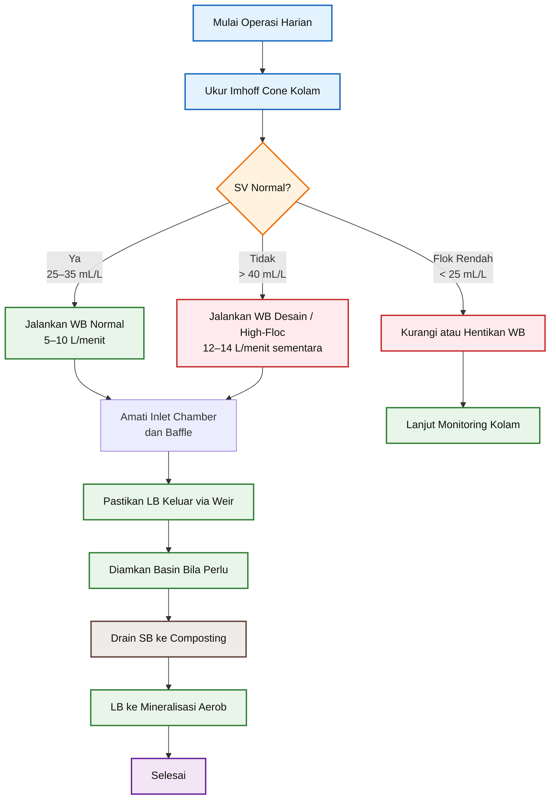

## 8.6 Catatan Praktis Operasi

Beberapa catatan penting untuk operator:

- jangan menaikkan debit WB hanya karena ingin proses cepat selesai,
- jangan membiarkan slot baffle tertutup flok,
- jangan membuang SB ketika outlet LB masih membawa banyak sludge,
- jangan mengoperasikan basin tanpa melihat hasil Imhoff cone,
- jangan membiarkan sludge tertahan terlalu lama di dasar basin.

Prinsip utama operasi adalah:

> **lebih baik mengambil WB sedikit tetapi konsisten, dibanding mengambil terlalu banyak sekaligus dan mengganggu kestabilan sistem bioflok.**

[**Kembali ke Atas**](#desain-bak-sedimentasi-waste-biofloc-untuk-kolam-bioflok-nila-dan-lele)

---

# 9. Monitoring dan Koreksi Operasi

Monitoring diperlukan untuk memastikan bahwa sedimentation basin benar-benar bekerja sebagai unit pemisah padatan-cairan. Tanpa monitoring, operator hanya melihat bahwa air masuk dan air keluar, tetapi tidak mengetahui apakah pemisahan WB menjadi SB dan LB berjalan baik.

Pada desain ini, monitoring dibuat sederhana agar mudah diterapkan di lapangan. Parameter utama yang diamati adalah:

- Imhoff cone,
- kejernihan LB,
- kondisi slot baffle,
- akumulasi SB,
- bau sludge,
- dan ada atau tidaknya scum yang terbawa ke outlet.

## 9.1 Parameter Monitoring Utama

| Parameter              | Target / Tindakan                           |
| ---------------------- | ------------------------------------------- |
| Imhoff cone < 25 mL/L  | kurangi/hentikan WB                         |
| Imhoff cone 25–35 mL/L | operasi normal                              |
| Imhoff cone 35–40 mL/L | naikkan WB bertahap                         |
| Imhoff cone 40–50 mL/L | jalankan debit desain                       |
| Imhoff cone > 50 mL/L  | jalankan high-floc sementara                |
| LB masih keruh         | kurangi debit WB atau tambah waktu settling |
| Slot baffle tersumbat  | bersihkan slot                              |
| SB berbau              | drain lebih sering                          |
| Outlet membawa scum    | cek scum baffle dan weir                    |

## 9.2 Koreksi Debit Berdasarkan Imhoff Cone

Debit WB dapat dikoreksi secara sederhana berdasarkan perbandingan antara nilai Imhoff cone terukur dan target operasi.

Rumus koreksi debit:

$$
Q_{WB,new}
=

Q_{WB,base}
\times
\frac{SV_{meas}}{SV_{target}}
$$

dengan:

- $(Q\_{WB,new})$ = debit atau volume WB baru yang disarankan,
- $(Q\_{WB,base})$ = debit atau volume WB dasar,
- $(SV\_{meas})$ = nilai settleable solids hasil pengukuran,
- $(SV\_{target})$ = nilai target settleable solids.

Contoh kondisi:

$$
Q_{WB,base} = 410 \ \text{L/hari}
$$

$$
SV_{meas} = 50 \ \text{mL/L}
$$

$$
SV_{target} = 35 \ \text{mL/L}
$$

Maka:

$$
Q_{WB,new}
=

410
\times
\frac{50}{35}
$$

$$
Q_{WB,new}
=

410
\times
1{,}43
$$

$$
Q_{WB,new}
=

586 \ \text{L/hari}
$$

Sehingga:

$$
\boxed{Q_{WB,new} \approx 586 \ \text{L/hari}}
$$

Angka ini menunjukkan bahwa ketika Imhoff cone naik ke 50 mL/L, volume WB dapat dinaikkan dari 410 L/hari menjadi sekitar 586 L/hari. Namun, kenaikan tersebut tetap harus dibatasi oleh kapasitas operasi basin dan kualitas LB di outlet.

## 9.3 Batas Praktis Koreksi Debit

Walaupun rumus koreksi dapat memberikan angka baru, operator tidak boleh menaikkan debit tanpa batas. Untuk desain ini, batas operasi yang disarankan tetap:

$$
\boxed{V_{WB,design} = 410 \ \text{L/hari}}
$$

dan untuk high-floc sementara:

$$
\boxed{V_{WB,max} = 819 \ \text{L/hari}}
$$

Dengan operasi batch 60 menit per hari, batas debitnya adalah:

$$
\boxed{Q_{WB,normal} \approx 6{,}8 \ \text{L/menit}}
$$

$$
\boxed{Q_{WB,max} \approx 13{,}7 \ \text{L/menit}}
$$

Artinya, jika hasil perhitungan koreksi debit melebihi kapasitas high-floc, operator sebaiknya tidak langsung menaikkan debit, tetapi melakukan kombinasi tindakan berikut:

- memperpanjang waktu operasi secara bertahap,
- meningkatkan frekuensi drain SB,
- membersihkan slot baffle,
- memastikan aerasi kolam cukup,
- mengevaluasi pemberian pakan dan sumber karbon.

## 9.4 Monitoring Kualitas LB

LB yang keluar dari sedimentation basin tidak harus jernih seperti air filtrasi, tetapi harus terlihat lebih ringan dan lebih stabil dibanding WB yang masuk.

Indikator LB yang baik:

- warna lebih terang daripada WB,
- padatan kasar jauh berkurang,
- tidak banyak flok besar terbawa,
- tidak ada scum berlebihan di outlet,
- tidak berbau busuk menyengat.

Jika LB masih sangat keruh, kemungkinan penyebabnya adalah:

| Gejala                 | Kemungkinan Penyebab         | Koreksi                    |
| ---------------------- | ---------------------------- | -------------------------- |
| LB membawa flok kasar  | debit WB terlalu tinggi      | turunkan debit             |
| LB keruh terus-menerus | waktu tinggal kurang         | tambah waktu settling      |
| LB keluar bersama scum | scum baffle kurang efektif   | cek posisi scum baffle     |
| LB berbau              | sludge terlalu lama tertahan | drain SB lebih sering      |
| LB keluar tidak stabil | weir tidak rata / tersumbat  | bersihkan dan ratakan weir |

## 9.5 Monitoring SB dan Drain

SB adalah fraksi padatan yang menjadi bahan masuk composting. Karena sifatnya organik dan basah, SB tidak boleh dibiarkan terlalu lama di dasar basin.

Tanda drain SB perlu segera dibuka:

- lapisan sludge terlihat tebal,
- LB mulai keruh,
- muncul bau dari basin,
- sludge sulit bergerak ke titik drain,
- ada endapan yang mulai menghitam.

Drain SB sebaiknya dilakukan secara singkat tetapi rutin. Lebih baik membuka drain beberapa kali pendek daripada menunggu sludge terlalu banyak dan sulit dikeluarkan.

## 9.6 Diagram Logika Koreksi Operasi

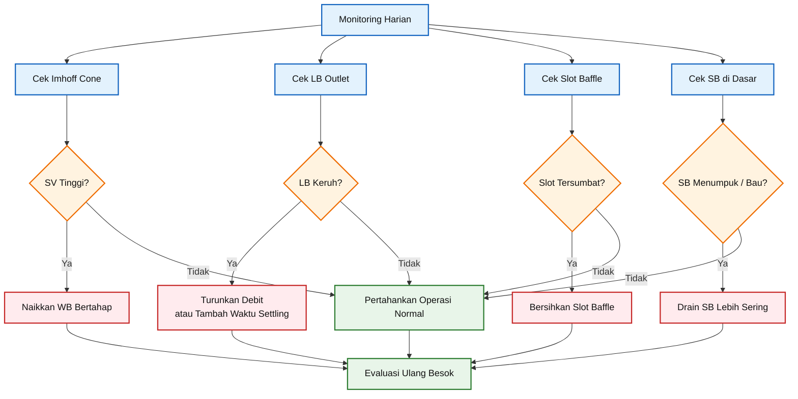

## 9.7 Prinsip Pengendalian

Monitoring sedimentation basin harus mengikuti prinsip berikut:

1. **jangan hanya mengandalkan timer**, karena kondisi flok bisa berubah,
2. **gunakan Imhoff cone sebagai indikator utama flok**,
3. **gunakan kejernihan LB sebagai indikator performa basin**,
4. **gunakan bau dan akumulasi SB sebagai indikator kebersihan sludge**,
5. **koreksi debit dilakukan bertahap, bukan mendadak**.

Dengan monitoring sederhana ini, sedimentation basin dapat dioperasikan lebih stabil dan tidak menjadi sumber masalah baru di sistem bioflok.

[**Kembali ke Atas**](#desain-bak-sedimentasi-waste-biofloc-untuk-kolam-bioflok-nila-dan-lele)

---

# 10. Kesimpulan Praktis

Desain sedimentation basin untuk kolam bioflok nila dan lele ini disusun agar dapat diterapkan langsung di lapangan. Fokusnya bukan membuat unit yang rumit, tetapi membuat bak sedimentasi yang cukup efektif, mudah difabrikasi, mudah dibersihkan, dan mudah dikontrol oleh operator.

Basis desain dimulai dari volume kolam:

$$
\boxed{V_{kolam} = 40{,}95 \ \text{m}^3}
$$

atau sekitar:

$$
\boxed{V_{kolam} \approx 40{,}950 \ \text{L}}
$$

Dengan basis tersebut, volume WB desain normal ditetapkan:

$$
\boxed{V_{WB,design} = 410 \ \text{L/hari}}
$$

Sedangkan kondisi high-floc sementara ditetapkan:

$$
\boxed{V_{WB,max} = 819 \ \text{L/hari}}
$$

Dimensi final sedimentation basin adalah:

$$
\boxed{175 \ \text{cm} \times 60 \ \text{cm} \times 65 \ \text{cm}}
$$

dengan volume efektif sekitar:

$$
\boxed{V_{basin} \approx 680 \ \text{L}}
$$

## 10.1 Ringkasan Spesifikasi Desain

| Item                  |          Spesifikasi |
| --------------------- | -------------------: |
| Volume kolam          |            ±40,95 m³ |
| WB desain normal      |          ±410 L/hari |
| WB maksimum sementara |          ±819 L/hari |
| Panjang basin         |               175 cm |
| Lebar basin           |                60 cm |
| Tinggi air            |                65 cm |
| Freeboard             |                20 cm |
| Tinggi total          |                85 cm |
| Volume basin          |               ±680 L |
| Inlet WB              |           PVC 1 inch |
| Outlet LB             |         PVC 1,5 inch |
| Drain SB              |         PVC 1,5 inch |
| Inlet baffle          |     slotted diffuser |
| Outlet baffle         |          scum baffle |
| Dasar                 | miring 2–3% ke drain |

## 10.2 Rangkuman Fungsi Desain

Secara fungsi, desain ini bekerja dengan urutan berikut:

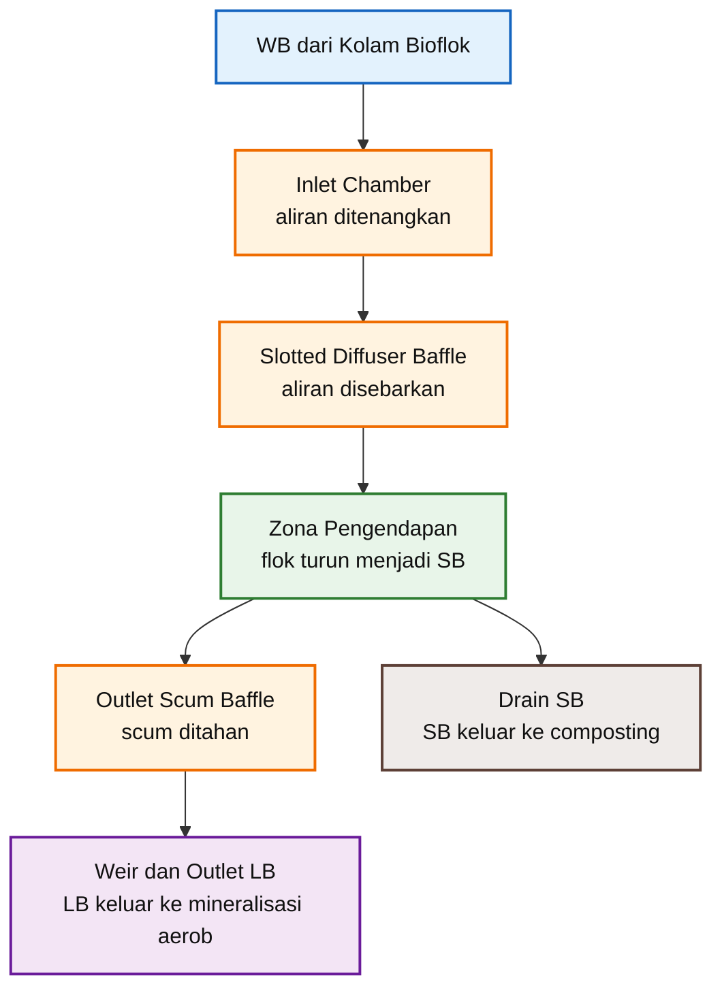

## 10.3 Kunci Keberhasilan di Lapangan

Keberhasilan sedimentation basin ini sangat bergantung pada disiplin operasi. Beberapa hal yang harus dijaga adalah:

- debit WB jangan terlalu besar,
- inlet chamber harus tetap tenang,
- slot baffle harus bersih,
- settling zone jangan terganggu,
- SB harus dikeluarkan rutin,
- scum tidak boleh masuk ke outlet LB,
- Imhoff cone harus menjadi dasar koreksi operasi.

Dengan kata lain, desain ini hanya akan bekerja baik bila konstruksi dan operasi berjalan bersama.

## 10.4 Penutup

Desain ini cukup sederhana untuk dibuat di lapangan, tetapi tetap mengikuti prinsip dasar sedimentasi:

> **aliran masuk ditenangkan, flok diberi waktu mengendap, scum ditahan, SB diarahkan ke drain, dan LB dikeluarkan secara overflow menuju mineralisasi aerob.**

Dengan pendekatan ini, WB dari kolam bioflok tidak lagi hanya dianggap sebagai limbah, tetapi dapat dipisahkan menjadi dua jalur pemanfaatan:

- **SB** sebagai bahan masuk composting,
- **LB** sebagai bahan masuk mineralisasi aerob untuk menghasilkan **POC-B**.

Inilah inti dari desain sedimentation basin pada sistem bioflok nila dan lele: sederhana, praktis, mudah dikontrol, dan mendukung pemanfaatan hasil samping budidaya secara lebih produktif.

[**Kembali ke Atas**](#desain-bak-sedimentasi-waste-biofloc-untuk-kolam-bioflok-nila-dan-lele)

Rujukan teknis yang mendasari rentang pengendalian flok dan konsep waktu tinggal sedimentasi: SRAC menyebutkan rentang settleable solids yang diinginkan untuk bioflok tilapia sekitar **25–50 mL/L**, sedangkan studi settling chamber biofloc melaporkan **minimum HRT 43 menit** sebagai acuan praktis untuk pemisahan padatan pada sistem bioflok. ([aquaculture.mgcafe.uky.edu][1])

[1]: https://aquaculture.mgcafe.uky.edu/sites/aquaculture.ca.uky.edu/files/srac_4503_biofloc_production_systems_for_aquaculture.pdf?utm_source=chatgpt.com 'Biofloc Production Systems for Aquaculture'

---

Berikut lanjutan artikel untuk **Lampiran A** dan **Lampiran B** dalam format MDX/KaTeX, dengan diagram Mermaid berwarna dan tetap dibuat praktis untuk pembaca lapangan.

## Lampiran A — Perhitungan Lengkap

Lampiran ini berisi perhitungan lengkap yang mendasari desain **sedimentation basin WB bioflok**. Tujuannya adalah agar praktisi dapat menelusuri dari mana angka desain diperoleh, mulai dari volume kolam, volume Waste-Biofloc (WB), debit operasi batch, volume basin, sampai cek **Hydraulic Retention Time (HRT)**.

---

### A.1 Data Dasar Kolam

Data kolam yang digunakan:

$$
L = 18 \ \text{m}
$$

$$
W = 3{,}5 \ \text{m}
$$

$$
H = 0{,}65 \ \text{m}
$$

dengan:

- (L) = panjang total kolam,
- (W) = lebar total kolam,
- (H) = tinggi air operasi.

Luas total kolam:

$$
A = L \times W
$$

$$
A = 18 \times 3{,}5
$$

$$
A = 63 \ \text{m}^2
$$

Volume air kolam:

$$
V_{kolam} = A \times H
$$

$$
V_{kolam} = 63 \times 0{,}65
$$

$$
V_{kolam} = 40{,}95 \ \text{m}^3
$$

Konversi ke liter:

$$
V_{kolam} = 40{,}95 \times 1000
$$

$$
V_{kolam} = 40{,}950 \ \text{L}
$$

Sehingga:

$$
\boxed{V_{kolam} = 40{,}95 \ \text{m}^3}
$$

atau:

$$
\boxed{V_{kolam} = 40{,}950 \ \text{L}}
$$

Ringkasan:

| Parameter     |         Simbol |    Nilai |
| ------------- | -------------: | -------: |
| Panjang kolam |            (L) |     18 m |
| Lebar kolam   |            (W) |    3,5 m |
| Tinggi air    |            (H) |   0,65 m |
| Luas kolam    |            (A) |    63 m² |
| Volume kolam  | $(V\_{kolam})$ | 40,95 m³ |
| Volume kolam  | $(V\_{kolam})$ | 40.950 L |

---

### A.2 Perhitungan WB 0,2–2% Volume Kolam

Volume WB harian dihitung menggunakan rumus:

$$
V_{WB} = R_{WB} \times V_{kolam}
$$

dengan:

- $(V\_{WB})$ = volume Waste-Biofloc per hari,
- $(R\_{WB})$ = rasio pengambilan WB terhadap volume kolam,
- $(V\_{kolam})$ = volume total air kolam.

Volume kolam:

$$
V_{kolam} = 40{,}950 \ \text{L}
$$

#### A.2.1 WB Minimum Konservatif — 0,2%

$$
R_{WB} = 0{,}2% = 0{,}002
$$

$$
V_{WB} = 0{,}002 \times 40{,}950
$$

$$
V_{WB} = 81{,}9 \ \text{L/hari}
$$

Dibulatkan:

$$
\boxed{V_{WB} \approx 82 \ \text{L/hari}}
$$

#### A.2.2 WB Nominal Awal — 0,4%

$$
R_{WB} = 0{,}4% = 0{,}004
$$

$$
V_{WB} = 0{,}004 \times 40{,}950
$$

$$
V_{WB} = 163{,}8 \ \text{L/hari}
$$

Dibulatkan:

$$
\boxed{V_{WB} \approx 164 \ \text{L/hari}}
$$

#### A.2.3 WB Desain Normal — 1,0%

$$
R_{WB} = 1{,}0% = 0{,}01
$$

$$
V_{WB} = 0{,}01 \times 40{,}950
$$

$$
V_{WB} = 409{,}5 \ \text{L/hari}
$$

Dibulatkan:

$$
\boxed{V_{WB,design} \approx 410 \ \text{L/hari}}
$$

#### A.2.4 WB High-Floc Sementara — 2,0%

$$
R_{WB} = 2{,}0% = 0{,}02
$$

$$
V_{WB} = 0{,}02 \times 40{,}950
$$

$$
V_{WB} = 819 \ \text{L/hari}
$$

Sehingga:

$$
\boxed{V_{WB,max} = 819 \ \text{L/hari}}
$$

Ringkasan hasil perhitungan:

| Kondisi             | Rasio WB |             Perhitungan | WB per Hari |
| ------------------- | -------: | ----------------------: | ----------: |
| Minimum konservatif |     0,2% | $0{,}002 \times 40,950$ |  ±82 L/hari |
| Nominal awal        |     0,4% | $0{,}004 \times 40,950$ | ±164 L/hari |
| Desain normal       |     1,0% | $0{,}010 \times 40,950$ | ±410 L/hari |
| High-floc sementara |     2,0% | $0{,}020 \times 40,950$ | ±819 L/hari |

---

### A.3 Perhitungan Debit Batch

Pada desain ini, operasi WB diasumsikan dilakukan secara batch selama:

$$
t = 60 \ \text{menit/hari}
$$

Debit operasi dihitung dengan rumus:

$$
Q_{WB} = \frac{V_{WB}}{t}
$$

dengan:

- $(Q\_{WB})$ = debit operasi WB,
- $(V\_{WB})$ = volume WB harian,
- (t) = durasi operasi per hari.

#### A.3.1 Debit Operasi Normal

$$
V_{WB,design} = 410 \ \text{L/hari}
$$

$$
Q_{WB,normal} = \frac{410}{60}
$$

$$
Q_{WB,normal} = 6{,}83 \ \text{L/menit}
$$

Dibulatkan:

$$
\boxed{Q_{WB,normal} \approx 6{,}8 \ \text{L/menit}}
$$

#### A.3.2 Debit Operasi High-Floc Sementara

$$
V_{WB,max} = 819 \ \text{L/hari}
$$

$$
Q_{WB,max} = \frac{819}{60}
$$

$$
Q_{WB,max} = 13{,}65 \ \text{L/menit}
$$

Dibulatkan:

$$
\boxed{Q_{WB,max} \approx 13{,}7 \ \text{L/menit}}
$$

Ringkasan debit batch 60 menit/hari:

| Kondisi             | WB per Hari | Durasi Operasi | Debit Operasi |
| ------------------- | ----------: | -------------: | ------------: |
| Minimum konservatif |   82 L/hari |  60 menit/hari |   1,4 L/menit |
| Nominal awal        |  164 L/hari |  60 menit/hari |   2,7 L/menit |
| Desain normal       |  410 L/hari |  60 menit/hari |   6,8 L/menit |
| High-floc sementara |  819 L/hari |  60 menit/hari |  13,7 L/menit |

Rekomendasi operasi praktis:

$$
\boxed{Q_{WB,operasi} = 5 - 15 \ \text{L/menit}}
$$

---

### A.4 Perhitungan Volume Sedimentation Basin

Dimensi internal sedimentation basin:

$$
L_{basin} = 1{,}75 \ \text{m}
$$

$$
W_{basin} = 0{,}60 \ \text{m}
$$

$$
H_{air} = 0{,}65 \ \text{m}
$$

Volume efektif basin dihitung sebagai:

$$
V_{basin} = L_{basin} \times W_{basin} \times H_{air}
$$

Substitusi data:

$$
V_{basin} = 1{,}75 \times 0{,}60 \times 0{,}65
$$

$$
V_{basin} = 0{,}6825 \ \text{m}^3
$$

Konversi ke liter:

$$
V_{basin} = 0{,}6825 \times 1000
$$

$$
V_{basin} = 682{,}5 \ \text{L}
$$

Sehingga:

$$
\boxed{V_{basin} \approx 680 \ \text{L}}
$$

---

### A.5 Cek Hydraulic Retention Time

Hydraulic Retention Time atau HRT dihitung dengan rumus:

$$
HRT = \frac{V_{basin}}{Q_{WB}}
$$

dengan:

- (HRT) = waktu tinggal hidrolik,
- $(V\_{basin})$ = volume efektif basin,
- $(Q\_{WB})$ = debit WB.

Volume efektif basin:

$$
V_{basin} = 682{,}5 \ \text{L}
$$

#### A.5.1 HRT pada Operasi Normal

$$
Q_{WB,normal} = 6{,}83 \ \text{L/menit}
$$

$$
HRT_{normal} = \frac{682{,}5}{6{,}83}
$$

$$
HRT_{normal} = 99{,}9 \ \text{menit}
$$

Dibulatkan:

$$
\boxed{HRT_{normal} \approx 100 \ \text{menit}}
$$

#### A.5.2 HRT pada High-Floc Sementara

$$
Q_{WB,max} = 13{,}65 \ \text{L/menit}
$$

$$
HRT_{max} = \frac{682{,}5}{13{,}65}
$$

$$
HRT_{max} = 50 \ \text{menit}
$$

Sehingga:

$$
\boxed{HRT_{max} \approx 50 \ \text{menit}}
$$

Ringkasan HRT:

| Kondisi             |     Debit WB | Volume Basin |        HRT |
| ------------------- | -----------: | -----------: | ---------: |
| Operasi normal      |  6,8 L/menit |      682,5 L | ±100 menit |
| High-floc sementara | 13,7 L/menit |      682,5 L |  ±50 menit |

Cek tambahan untuk rentang debit operasi:

|   Debit WB |        HRT |
| ---------: | ---------: |
|  5 L/menit | ±137 menit |
| 10 L/menit |  ±68 menit |
| 15 L/menit |  ±46 menit |

Kesimpulan:

$$
\boxed{\text{Volume basin 680 L masih memadai untuk operasi normal dan high-floc sementara}}
$$

---

### A.6 Rasio Panjang terhadap Lebar Basin

Rasio panjang terhadap lebar dihitung sebagai:

$$
\frac{L}{W} = \frac{1{,}75}{0{,}60}
$$

$$
\frac{L}{W} = 2{,}92
$$

Sehingga secara praktis:

$$
\boxed{L:W \approx 3:1}
$$

Rasio ini cukup baik untuk sedimentation basin kecil karena membantu membentuk aliran horizontal dari inlet menuju outlet.

---

### A.7 Perhitungan Luas Slot Inlet Baffle

Inlet baffle menggunakan **10 slot vertikal** dengan ukuran masing-masing:

$$
20 \ \text{mm} \times 100 \ \text{mm}
$$

Konversi ke meter:

$$
20 \ \text{mm} = 0{,}02 \ \text{m}
$$

$$
100 \ \text{mm} = 0{,}10 \ \text{m}
$$

Luas satu slot:

$$
A_{slot} = 0{,}02 \times 0{,}10
$$

$$
A_{slot} = 0{,}002 \ \text{m}^2
$$

Jumlah slot:

$$
n = 10
$$

Luas bukaan total:

$$
A_{open,total} = n \times A_{slot}
$$

$$
A_{open,total} = 10 \times 0{,}002
$$

$$
A_{open,total} = 0{,}020 \ \text{m}^2
$$

Sehingga:

$$
\boxed{A_{open,total} = 0{,}020 \ \text{m}^2}
$$

Cek kecepatan melewati slot pada debit high-floc:

$$
Q_{WB,max} = 13{,}7 \ \text{L/menit}
$$

Konversi ke $(\text{m}^3/\text{s})$:

$$
Q_{WB,max} =
\frac{13{,}7}{1000 \times 60}
$$

$$
Q_{WB,max} = 0{,}000228 \ \text{m}^3/\text{s}
$$

Kecepatan melalui slot:

$$
v_{slot} = \frac{Q}{A_{open,total}}
$$

$$
v_{slot} = \frac{0{,}000228}{0{,}020}
$$

$$
v_{slot} = 0{,}0114 \ \text{m/s}
$$

Sehingga:

$$
\boxed{v_{slot} \approx 0{,}011 \ \text{m/s}}
$$

Kecepatan ini rendah, sehingga cukup aman untuk flok bioflok yang cenderung ringan dan mudah pecah.

---

### A.8 Perhitungan Kemiringan Dasar Basin

Dasar basin direkomendasikan miring:

$$
S = 2 - 3%
$$

Bila dasar dibuat miring satu arah sepanjang 175 cm menuju titik drain, maka beda tinggi dasar adalah:

Untuk slope 2%:

$$
\Delta h = 0{,}02 \times 175
$$

$$
\Delta h = 3{,}5 \ \text{cm}
$$

Untuk slope 3%:

$$
\Delta h = 0{,}03 \times 175
$$

$$
\Delta h = 5{,}25 \ \text{cm}
$$

Sehingga beda tinggi dasar yang disarankan:

$$
\boxed{\Delta h = 3{,}5 - 5{,}25 \ \text{cm}}
$$

Secara praktis, dasar basin dapat dibuat turun sekitar **4–5 cm** menuju titik drain SB.

---

### A.9 Ringkasan Perhitungan Utama

| Item                                |         Hasil |
| ----------------------------------- | ------------: |
| Volume kolam                        |      40,95 m³ |
| Volume kolam                        |      40.950 L |
| WB minimum konservatif 0,2%         |    ±82 L/hari |
| WB nominal awal 0,4%                |   ±164 L/hari |
| WB desain normal 1,0%               |   ±410 L/hari |
| WB high-floc 2,0%                   |   ±819 L/hari |
| Debit batch normal 60 menit/hari    |  ±6,8 L/menit |
| Debit batch high-floc 60 menit/hari | ±13,7 L/menit |
| Volume basin                        |        ±680 L |
| HRT normal                          |    ±100 menit |
| HRT high-floc                       |     ±50 menit |
| Rasio L:W basin                     |          ±3:1 |
| Luas bukaan slot total              |      0,020 m² |
| Kecepatan slot pada high-floc       |    ±0,011 m/s |
| Kemiringan dasar                    |          2–3% |
| Beda tinggi dasar                   |  ±3,5–5,25 cm |

[**Kembali ke Atas**](#desain-bak-sedimentasi-waste-biofloc-untuk-kolam-bioflok-nila-dan-lele)

---

## Lampiran B — Drawing dan Spesifikasi Fabrikasi

Lampiran ini berisi skema drawing sederhana dan spesifikasi fabrikasi untuk **sedimentation basin WB bioflok**. Drawing dibuat sebagai panduan praktis, bukan sebagai gambar konstruksi sipil final. Untuk pekerjaan permanen, dimensi akhir tetap perlu disesuaikan dengan material, metode konstruksi, dan kondisi lokasi.

---

### B.1 Drawing Potongan Memanjang

Diagram berikut menunjukkan susunan basin dari inlet ke outlet. Format dibuat vertikal agar nyaman dibaca pada layar smartphone.

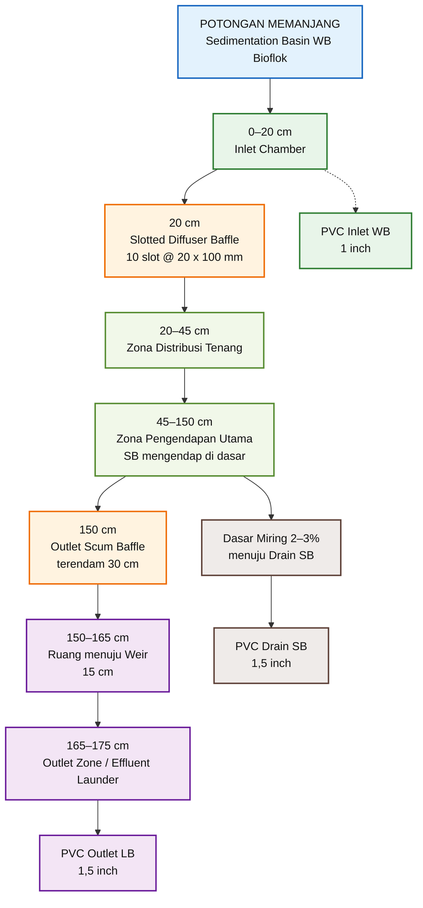

**Gambar B-1. Potongan memanjang sedimentation basin WB bioflok**

Dimensi utama pada potongan memanjang:

| Item                      |                   Nilai |
| ------------------------- | ----------------------: |
| Panjang total internal    |                  175 cm |
| Tinggi air operasi        |                   65 cm |
| Freeboard                 |                   20 cm |
| Tinggi total dinding      |                   85 cm |
| Dasar basin               | miring 2–3% ke drain SB |
| Inlet chamber             |                   20 cm |
| Zona distribusi tenang    |                   25 cm |
| Zona pengendapan utama    |                  105 cm |
| Jarak scum baffle ke weir |                   15 cm |
| Outlet zone / launder     |                   10 cm |

---

### B.2 Drawing Tampak Atas

Diagram berikut menunjukkan posisi komponen jika dilihat dari atas.

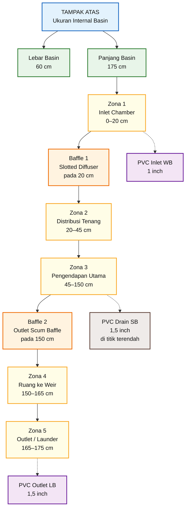

**Gambar B-2. Tampak atas sedimentation basin WB bioflok**

Catatan penting pada tampak atas:

- lebar internal basin adalah **60 cm**,
- baffle dipasang penuh selebar basin,
- inlet chamber berada di sisi masuk,
- zona pengendapan utama harus menjadi zona terpanjang,
- outlet scum baffle berada sebelum weir,
- outlet LB berada pada sisi akhir effluent launder,
- drain SB berada di titik dasar terendah.

---

### B.3 Ukuran Inlet, Baffle, Outlet, dan Drain

| Komponen                    |                      Spesifikasi |
| --------------------------- | -------------------------------: |
| PVC Inlet WB                |                           1 inch |
| Valve inlet                 |                ball valve 1 inch |
| Inlet chamber               |                    20 cm × 60 cm |
| Inlet baffle                |          slotted diffuser baffle |
| Material inlet baffle       |                 PVC / HDPE plate |
| Tebal baffle                |                          5–10 mm |
| Lebar baffle                |                            60 cm |
| Tinggi baffle inlet         |                 75 cm dari dasar |
| Posisi baffle inlet         |                 20 cm dari inlet |
| Jumlah slot                 |                          10 slot |
| Ukuran slot                 |                   20 mm × 100 mm |
| Outlet scum baffle          |                 full width 60 cm |
| Posisi scum baffle          |                150 cm dari inlet |
| Jarak scum baffle ke weir   |                            15 cm |
| Submergence scum baffle     |           30 cm dari water level |
| Clearance bawah scum baffle |                 35 cm dari dasar |
| Outlet LB                   |                     PVC 1,5 inch |
| Drain SB                    |                     PVC 1,5 inch |
| Valve drain SB              | ball valve / gate valve 1,5 inch |
| Dasar basin                 |           slope 2–3% ke drain SB |

---

### B.4 Detail Fabrikasi Baffle Inlet

Baffle inlet dibuat dari plate PVC atau HDPE dengan ketebalan:

$$
t_{plate} = 5 - 10 \ \text{mm}
$$

Lebar baffle mengikuti lebar basin:

$$
W_{baffle} = 60 \ \text{cm}
$$

Tinggi baffle dari dasar:

$$
H_{baffle,inlet} = 75 \ \text{cm}
$$

Karena tinggi air operasi adalah:

$$
H_{air} = 65 \ \text{cm}
$$

maka bagian atas baffle berada:

$$
75 - 65 = 10 \ \text{cm}
$$

di atas water level.

Sehingga:

$$
\boxed{\text{Top baffle inlet} = 10 \ \text{cm di atas water level}}
$$

Slot baffle:

| Item             |                                      Nilai |
| ---------------- | -----------------------------------------: |
| Jumlah slot      |                                    10 slot |
| Ukuran tiap slot |                             20 mm × 100 mm |
| Arah slot        |                                   vertikal |
| Posisi slot      |                            zona tengah air |
| Tujuan slot      | distribusi aliran dan peredaman turbulensi |

---

### B.5 Detail Fabrikasi Outlet Scum Baffle

Outlet scum baffle dipasang pada posisi:

$$
x = 150 \ \text{cm dari inlet}
$$

Jarak ke weir:

$$
L_{baffle-weir} = 15 \ \text{cm}
$$

Baffle dibuat penuh selebar basin:

$$
W_{baffle} = 60 \ \text{cm}
$$

Kedalaman terendam dari water level:

$$
H_{submerged} = 30 \ \text{cm}
$$

Clearance ke dasar:

$$
Clearance = H_{air} - H_{submerged}
$$

$$
Clearance = 65 - 30
$$

$$
Clearance = 35 \ \text{cm}
$$

Sehingga:

$$
\boxed{Clearance = 35 \ \text{cm}}
$$

Fungsi utama outlet scum baffle adalah menahan scum, buih, dan flok ringan yang terapung agar tidak ikut keluar menuju outlet LB.

---

### B.6 Daftar Material

Daftar material berikut bersifat praktis dan dapat disesuaikan dengan metode konstruksi.

| Komponen            | Material yang Disarankan                                   | Catatan                                  |
| ------------------- | ---------------------------------------------------------- | ---------------------------------------- |
| Dinding basin       | beton, bata diplester waterproofing, fiberglass, atau HDPE | pilih sesuai ketersediaan dan biaya      |
| Lapisan dalam basin | waterproofing / coating aman air                           | mencegah rembes dan mudah dibersihkan    |
| Inlet WB            | PVC 1 inch                                                 | dilengkapi valve                         |
| Valve inlet         | ball valve PVC 1 inch                                      | untuk kontrol debit                      |
| Baffle inlet        | PVC / HDPE plate 5–10 mm                                   | dibuat removable bila memungkinkan       |
| Slot baffle         | 10 slot @ 20 mm × 100 mm                                   | slot vertikal                            |
| Outlet scum baffle  | PVC / HDPE plate 5–10 mm                                   | full width 60 cm                         |
| Weir                | PVC plate / HDPE / beton rapi                              | bibir weir harus rata                    |
| Effluent launder    | beton kecil / PVC / box HDPE                               | mengumpulkan LB                          |
| Outlet LB           | PVC 1,5 inch                                               | menuju mineralisasi aerob                |
| Drain SB            | PVC 1,5 inch                                               | di titik terendah                        |
| Valve drain SB      | ball valve / gate valve 1,5 inch                           | mudah dibuka untuk flushing              |
| Sealant             | sealant waterproof                                         | untuk sambungan dan penetrasi pipa       |
| Support baffle      | bracket PVC/stainless/HDPE                                 | agar baffle kuat tetapi bisa dibersihkan |

---

### B.7 Checklist Fabrikasi

Checklist ini digunakan sebelum basin dianggap siap dioperasikan.

#### B.7.1 Dimensi dan Struktur

|  No | Item Pemeriksaan                       | Status |
| --: | -------------------------------------- | ------ |
|   1 | Panjang internal 175 cm                | ☐      |
|   2 | Lebar internal 60 cm                   | ☐      |
|   3 | Tinggi total dinding 85 cm             | ☐      |
|   4 | Water level operasi 65 cm diberi tanda | ☐      |
|   5 | Freeboard 20 cm tersedia               | ☐      |
|   6 | Dinding tidak bocor/rembes             | ☐      |
|   7 | Permukaan dalam mudah dibersihkan      | ☐      |

#### B.7.2 Dasar dan Drain

|  No | Item Pemeriksaan                                    | Status |
| --: | --------------------------------------------------- | ------ |
|   1 | Dasar miring 2–3% ke drain SB                       | ☐      |
|   2 | Beda tinggi dasar ±3,5–5,25 cm bila slope satu arah | ☐      |
|   3 | Drain SB berada di titik terendah                   | ☐      |
|   4 | Drain SB menggunakan PVC 1,5 inch                   | ☐      |
|   5 | Valve drain mudah dibuka dan ditutup                | ☐      |
|   6 | Jalur SB menuju wadah/composting tersedia           | ☐      |

#### B.7.3 Inlet dan Baffle Inlet

|  No | Item Pemeriksaan                                     | Status |
| --: | ---------------------------------------------------- | ------ |
|   1 | Inlet WB menggunakan PVC 1 inch                      | ☐      |
|   2 | Valve inlet 1 inch terpasang                         | ☐      |
|   3 | Inlet chamber sepanjang 20 cm tersedia               | ☐      |
|   4 | Slotted diffuser baffle pada posisi 20 cm dari inlet | ☐      |
|   5 | Baffle inlet full width 60 cm                        | ☐      |
|   6 | Tinggi baffle inlet 75 cm dari dasar                 | ☐      |
|   7 | Slot berjumlah 10 buah                               | ☐      |
|   8 | Ukuran slot 20 mm × 100 mm                           | ☐      |
|   9 | Slot berada di zona tengah air                       | ☐      |
|  10 | Baffle mudah dibersihkan                             | ☐      |

#### B.7.4 Outlet, Scum Baffle, dan Weir

|  No | Item Pemeriksaan                                 | Status |
| --: | ------------------------------------------------ | ------ |
|   1 | Outlet scum baffle pada posisi 150 cm dari inlet | ☐      |
|   2 | Jarak scum baffle ke weir 15 cm                  | ☐      |
|   3 | Scum baffle full width 60 cm                     | ☐      |
|   4 | Scum baffle terendam 30 cm dari water level      | ☐      |
|   5 | Clearance bawah scum baffle 35 cm                | ☐      |
|   6 | Weir rata dan tidak miring                       | ☐      |
|   7 | Outlet zone / launder 10 cm tersedia             | ☐      |
|   8 | Outlet LB menggunakan PVC 1,5 inch               | ☐      |
|   9 | Jalur LB menuju mineralisasi aerob tersedia      | ☐      |

---

### B.8 Checklist Commissioning Sederhana

Sebelum digunakan dengan WB sebenarnya, lakukan uji sederhana menggunakan air bersih.

|  No | Uji Commissioning                  | Kriteria Diterima                   |
| --: | ---------------------------------- | ----------------------------------- |
|   1 | Isi basin sampai water level 65 cm | tidak ada bocor                     |
|   2 | Uji aliran dari inlet              | aliran masuk ke inlet chamber       |
|   3 | Cek aliran melewati slot baffle    | aliran tersebar, tidak jet langsung |
|   4 | Cek overflow weir                  | limpasan merata                     |
|   5 | Cek outlet LB                      | air keluar lancar                   |
|   6 | Cek drain SB                       | drain lancar dan tidak bocor        |
|   7 | Cek freeboard                      | tersisa 20 cm                       |
|   8 | Cek area kerja                     | tidak licin dan mudah diakses       |

Setelah uji air bersih berhasil, basin dapat diuji dengan WB pada debit kecil terlebih dahulu:

$$
Q_{uji} = 5 \ \text{L/menit}
$$

Jika aliran stabil dan LB keluar tanpa membawa banyak flok kasar, debit dapat dinaikkan bertahap menuju operasi normal:

$$
Q_{WB,normal} = 5 - 10 \ \text{L/menit}
$$

Untuk kondisi high-floc, debit dapat dinaikkan sementara, tetapi tetap dibatasi:

$$
Q_{WB,high} = 12 - 14 \ \text{L/menit}
$$

---

### B.9 Catatan SHE dan Operabilitas

Walaupun basin ini berskala kecil, aspek keselamatan dan kebersihan tetap penting.

Hal yang perlu diperhatikan:

- area sekitar basin jangan licin,
- drain SB harus diarahkan ke wadah tertutup atau area composting,
- operator sebaiknya memakai sarung tangan saat menangani SB,
- sludge jangan dibiarkan membusuk terlalu lama,
- jalur LB jangan tercampur kembali ke kolam tanpa kontrol,
- basin perlu dibersihkan berkala,
- baffle sebaiknya bisa dilepas atau mudah dijangkau,
- hindari sudut tajam yang dapat melukai operator.

Prinsip operabilitasnya sederhana:

> **semua bagian yang berpotensi tersumbat harus mudah dilihat, mudah dijangkau, dan mudah dibersihkan.**

---

### B.10 Ringkasan Spesifikasi Fabrikasi

| Item                        |                Spesifikasi Final |
| --------------------------- | -------------------------------: |
| Panjang internal            |                           175 cm |
| Lebar internal              |                            60 cm |
| Tinggi air                  |                            65 cm |
| Freeboard                   |                            20 cm |
| Tinggi total dinding        |                            85 cm |
| Volume efektif              |                           ±680 L |
| Dasar basin                 |           slope 2–3% ke drain SB |
| Inlet WB                    |                       PVC 1 inch |
| Valve inlet                 |                ball valve 1 inch |
| Inlet chamber               |                            20 cm |
| Inlet baffle                |          slotted diffuser baffle |
| Slot inlet baffle           |         10 slot @ 20 mm × 100 mm |
| Material baffle             |         PVC / HDPE plate 5–10 mm |
| Outlet scum baffle          |                 full width 60 cm |
| Submergence scum baffle     |                            30 cm |
| Clearance bawah scum baffle |                            35 cm |
| Weir outlet                 |       rata dan mudah dibersihkan |
| Outlet LB                   |                     PVC 1,5 inch |
| Drain SB                    |                     PVC 1,5 inch |
| Valve drain SB              | ball valve / gate valve 1,5 inch |

[**Kembali ke Atas**](#desain-bak-sedimentasi-waste-biofloc-untuk-kolam-bioflok-nila-dan-lele)

---

<small>
  **_Catatan Penyusunan_** Artikel ini disusun sebagai materi edukasi dan
  referensi umum berdasarkan berbagai sumber pustaka, praktik lapangan, serta
  bantuan alat penulisan. Pembaca disarankan untuk melakukan verifikasi lanjutan
  dan penyesuaian sesuai dengan kondisi serta kebutuhan masing-masing sistem.
</small>
