# **_Sistem Sedimentasi Bioflok untuk Praktisi: Analisis Swirler, Radial Sedimentasi, IPC, dan Kombinasi Swirler–IPC_**

---

- [**_Sistem Sedimentasi Bioflok untuk Praktisi: Analisis Swirler, Radial Sedimentasi, IPC, dan Kombinasi Swirler–IPC_**](#sistem-sedimentasi-bioflok-untuk-praktisi-analisis-swirler-radial-sedimentasi-ipc-dan-kombinasi-swirleripc)
- [Sistem Sedimentasi Bioflok untuk Praktisi: Analisis Swirler, Radial Sedimentasi, dan IPC](#sistem-sedimentasi-bioflok-untuk-praktisi-analisis-swirler-radial-sedimentasi-dan-ipc)
  - [0. Abstrak / Ringkasan Praktis](#0-abstrak--ringkasan-praktis)
  - [1. Pentingnya Sedimentasi Sebelum Perlakuan pada Bioflok](#1-pentingnya-sedimentasi-sebelum-perlakuan-pada-bioflok)
    - [1.1 Karakter Khas Sistem Bioflok](#11-karakter-khas-sistem-bioflok)
    - [1.2 Masalah Bila TSS Tidak Dikendalikan](#12-masalah-bila-tss-tidak-dikendalikan)
    - [1.3 Posisi Sedimentasi dalam Rantai Perlakuan Air Bioflok](#13-posisi-sedimentasi-dalam-rantai-perlakuan-air-bioflok)
  - [2. Parameter Desain Utama yang Wajib Dipahami Praktisi](#2-parameter-desain-utama-yang-wajib-dipahami-praktisi)
    - [2.1 Debit Desain](#21-debit-desain)
    - [2.2 Hydraulic Retention Time](#22-hydraulic-retention-time)
    - [2.3 Overflow Velocity / Surface Loading](#23-overflow-velocity--surface-loading)
    - [2.4 Footprint](#24-footprint)
    - [2.5 Beban TSS](#25-beban-tss)
  - [3. Alternatif Metode Sedimentasi Bioflok](#3-alternatif-metode-sedimentasi-bioflok)
    - [3.1 Swirler / Swirl Separator](#31-swirler--swirl-separator)
      - [3.1.1 Cara Kerja](#311-cara-kerja)
      - [3.1.2 Kelebihan Swirler](#312-kelebihan-swirler)
      - [3.1.3 Kelemahan Swirler](#313-kelemahan-swirler)
      - [3.1.4 Performance Literatur](#314-performance-literatur)
      - [3.1.5 Posisi Terbaik dalam Sistem Bioflok](#315-posisi-terbaik-dalam-sistem-bioflok)
    - [3.2 Radial Sedimentasi / Radial-Flow Settler](#32-radial-sedimentasi--radial-flow-settler)
      - [3.2.1 Cara Kerja](#321-cara-kerja)
      - [3.2.2 Kelebihan Radial Sedimentasi](#322-kelebihan-radial-sedimentasi)
      - [3.2.3 Kelemahan Radial Sedimentasi](#323-kelemahan-radial-sedimentasi)
      - [3.2.4 Performance Literatur](#324-performance-literatur)
      - [3.2.5 Posisi Terbaik dalam Sistem Bioflok](#325-posisi-terbaik-dalam-sistem-bioflok)
    - [3.3 IPC / Inclined Plate Clarifier / Lamella Clarifier](#33-ipc--inclined-plate-clarifier--lamella-clarifier)
      - [3.3.1 Cara Kerja](#331-cara-kerja)
      - [3.3.2 Kelebihan IPC](#332-kelebihan-ipc)
      - [3.3.3 Kelemahan IPC](#333-kelemahan-ipc)
      - [3.3.4 Performance dan Prinsip Literatur](#334-performance-dan-prinsip-literatur)
      - [3.3.5 Posisi Terbaik dalam Sistem Bioflok](#335-posisi-terbaik-dalam-sistem-bioflok)
  - [Referensi Bab 0–3](#referensi-bab-03)
- [4. Desain Masing-Masing Metode untuk Kapasitas $20\\ L/menit$](#4-desain-masing-masing-metode-untuk-kapasitas-20-lmenit)
  - [4.1 Desain Swirler / Swirl Separator](#41-desain-swirler--swirl-separator)
    - [4.1.1 Data Desain](#411-data-desain)
    - [4.1.2 Skema Desain Swirler](#412-skema-desain-swirler)
    - [4.1.3 Perhitungan Volume Swirler](#413-perhitungan-volume-swirler)
    - [4.1.4 HRT Swirler](#414-hrt-swirler)
    - [4.1.5 Footprint Swirler](#415-footprint-swirler)
    - [4.1.6 Overflow Velocity Swirler](#416-overflow-velocity-swirler)
    - [4.1.7 Kecepatan Inlet Tangensial](#417-kecepatan-inlet-tangensial)
    - [4.1.8 Catatan Desain Swirler](#418-catatan-desain-swirler)
  - [4.2 Desain Radial Sedimentasi](#42-desain-radial-sedimentasi)
    - [4.2.1 Data Desain](#421-data-desain)
    - [4.2.2 Skema Desain Radial Sedimentasi](#422-skema-desain-radial-sedimentasi)
    - [4.2.3 Footprint Radial Sedimentasi](#423-footprint-radial-sedimentasi)
    - [4.2.4 Perhitungan Volume Radial Sedimentasi](#424-perhitungan-volume-radial-sedimentasi)
    - [4.2.5 HRT Radial Sedimentasi](#425-hrt-radial-sedimentasi)
    - [4.2.6 Overflow Velocity Radial Sedimentasi](#426-overflow-velocity-radial-sedimentasi)
    - [4.2.7 Feedwell](#427-feedwell)
    - [4.2.8 Catatan Desain Radial Sedimentasi](#428-catatan-desain-radial-sedimentasi)
  - [4.3 Desain IPC / Inclined Plate Clarifier](#43-desain-ipc--inclined-plate-clarifier)
    - [4.3.1 Data Desain](#431-data-desain)
    - [4.3.2 Skema Desain IPC](#432-skema-desain-ipc)
    - [4.3.3 Footprint IPC](#433-footprint-ipc)
    - [4.3.4 Projected Settling Area IPC](#434-projected-settling-area-ipc)
    - [4.3.5 Area Multiplier](#435-area-multiplier)
    - [4.3.6 Effective Surface Loading IPC](#436-effective-surface-loading-ipc)
    - [4.3.7 Volume dan HRT IPC](#437-volume-dan-hrt-ipc)
    - [4.3.8 Kecepatan Aliran Antar-Pelat](#438-kecepatan-aliran-antar-pelat)
    - [4.3.9 Catatan Desain IPC](#439-catatan-desain-ipc)
- [5. Komparasi Performance Antar-Metode](#5-komparasi-performance-antar-metode)
  - [5.1 Tabel Ringkasan Performance](#51-tabel-ringkasan-performance)
  - [5.2 Komparasi Berdasarkan Surface Loading](#52-komparasi-berdasarkan-surface-loading)
  - [5.3 Komparasi Berdasarkan Footprint](#53-komparasi-berdasarkan-footprint)
  - [5.4 Komparasi Berdasarkan Performance Literatur](#54-komparasi-berdasarkan-performance-literatur)
  - [5.5 Komparasi Berdasarkan Karakter Flok](#55-komparasi-berdasarkan-karakter-flok)
  - [5.6 Interpretasi Praktis](#56-interpretasi-praktis)
- [6. Kombinasi Antar-Metode dan Tinjauan Performance](#6-kombinasi-antar-metode-dan-tinjauan-performance)
  - [6.1 Kombinasi 1 — Swirler Saja](#61-kombinasi-1--swirler-saja)
    - [6.1.1 Konsep](#611-konsep)
    - [6.1.2 Cocok Untuk](#612-cocok-untuk)
    - [6.1.3 Kelemahan](#613-kelemahan)
    - [6.1.4 Penilaian Performance](#614-penilaian-performance)
  - [6.2 Kombinasi 2 — Radial Sedimentasi Saja](#62-kombinasi-2--radial-sedimentasi-saja)
    - [6.2.1 Konsep](#621-konsep)
    - [6.2.2 Cocok Untuk](#622-cocok-untuk)
    - [6.2.3 Kelemahan](#623-kelemahan)
    - [6.2.4 Penilaian Performance](#624-penilaian-performance)
  - [6.3 Kombinasi 3 — IPC Saja](#63-kombinasi-3--ipc-saja)
    - [6.3.1 Konsep](#631-konsep)
    - [6.3.2 Cocok Untuk](#632-cocok-untuk)
    - [6.3.3 Kelemahan Utama](#633-kelemahan-utama)
    - [6.3.4 Penilaian Performance](#634-penilaian-performance)
  - [6.4 Kombinasi 4 — Swirler + Radial Sedimentasi](#64-kombinasi-4--swirler--radial-sedimentasi)
    - [6.4.1 Konsep](#641-konsep)
    - [6.4.2 Kelebihan](#642-kelebihan)
    - [6.4.3 Kelemahan](#643-kelemahan)
    - [6.4.4 Estimasi Dimensi Sistem](#644-estimasi-dimensi-sistem)
    - [6.4.5 Penilaian Performance](#645-penilaian-performance)
  - [6.5 Kombinasi 5 — Swirler + IPC](#65-kombinasi-5--swirler--ipc)
    - [6.5.1 Konsep](#651-konsep)
    - [6.5.2 Alasan Kombinasi Ini Paling Kuat](#652-alasan-kombinasi-ini-paling-kuat)
    - [6.5.3 Total Volume dan HRT](#653-total-volume-dan-hrt)
    - [6.5.4 Total Footprint](#654-total-footprint)
    - [6.5.5 Estimasi Removal Sistem Seri](#655-estimasi-removal-sistem-seri)
    - [6.5.6 Beban TSS pada Kombinasi Swirler + IPC](#656-beban-tss-pada-kombinasi-swirler--ipc)
  - [6.6 Perbandingan Kombinasi](#66-perbandingan-kombinasi)
  - [6.7 Kesimpulan Bab 6](#67-kesimpulan-bab-6)
  - [Referensi Bab 4–6](#referensi-bab-46)
- [7. Desain Kombinasi Terbaik: Swirler + IPC](#7-desain-kombinasi-terbaik-swirler--ipc)
  - [7.1 Diagram Alur Sistem](#71-diagram-alur-sistem)
  - [7.2 Spesifikasi Tahap 1: Swirler](#72-spesifikasi-tahap-1-swirler)
    - [7.2.1 Peran Swirler dalam Kombinasi](#721-peran-swirler-dalam-kombinasi)
    - [7.2.2 HRT Swirler](#722-hrt-swirler)
    - [7.2.3 Footprint Swirler](#723-footprint-swirler)
    - [7.2.4 Overflow Velocity Swirler](#724-overflow-velocity-swirler)
  - [7.3 Spesifikasi Tahap 2: IPC](#73-spesifikasi-tahap-2-ipc)
    - [7.3.1 Peran IPC dalam Kombinasi](#731-peran-ipc-dalam-kombinasi)
    - [7.3.2 Projected Settling Area IPC](#732-projected-settling-area-ipc)
    - [7.3.3 Area Multiplier IPC](#733-area-multiplier-ipc)
    - [7.3.4 Effective Surface Loading IPC](#734-effective-surface-loading-ipc)
  - [7.4 Total Sistem](#74-total-sistem)
    - [7.4.1 Volume Total](#741-volume-total)
    - [7.4.2 HRT Total](#742-hrt-total)
    - [7.4.3 Footprint Bersih](#743-footprint-bersih)
    - [7.4.4 Footprint Instalasi dengan Ruang Servis](#744-footprint-instalasi-dengan-ruang-servis)
  - [7.5 Estimasi Removal Sistem Seri](#75-estimasi-removal-sistem-seri)
    - [7.5.1 Formula Removal Seri](#751-formula-removal-seri)
    - [7.5.2 Contoh Skenario Estimasi](#752-contoh-skenario-estimasi)
    - [7.5.3 Mengapa Estimasi Tidak Boleh Dianggap Pasti](#753-mengapa-estimasi-tidak-boleh-dianggap-pasti)
- [8. Strategi Operasi Sistem Swirler + IPC](#8-strategi-operasi-sistem-swirler--ipc)
  - [8.1 Mode Kontinu Side-Stream](#81-mode-kontinu-side-stream)
    - [8.1.1 Alur Operasi Kontinu](#811-alur-operasi-kontinu)
    - [8.1.2 Kelebihan Mode Kontinu](#812-kelebihan-mode-kontinu)
    - [8.1.3 Risiko Mode Kontinu](#813-risiko-mode-kontinu)
  - [8.2 Mode Periodik](#82-mode-periodik)
    - [8.2.1 Alur Operasi Periodik](#821-alur-operasi-periodik)
    - [8.2.2 Kelebihan Mode Periodik](#822-kelebihan-mode-periodik)
    - [8.2.3 Risiko Mode Periodik](#823-risiko-mode-periodik)
  - [8.3 Mode Bypass](#83-mode-bypass)
    - [8.3.1 Diagram Mode Bypass](#831-diagram-mode-bypass)
    - [8.3.2 Manfaat Bypass](#832-manfaat-bypass)
    - [8.3.3 Contoh Pengaturan Bypass](#833-contoh-pengaturan-bypass)
    - [8.3.4 Kapan Bypass Dibutuhkan](#834-kapan-bypass-dibutuhkan)
- [9. Monitoring, Validasi, dan Indikator Keberhasilan](#9-monitoring-validasi-dan-indikator-keberhasilan)
  - [9.1 Parameter Lapangan](#91-parameter-lapangan)
    - [9.1.1 TSS Inlet–Outlet](#911-tss-inletoutlet)
    - [9.1.2 Imhoff Cone](#912-imhoff-cone)
    - [9.1.3 DO](#913-do)
    - [9.1.4 Bau Lumpur](#914-bau-lumpur)
    - [9.1.5 Visual Flok](#915-visual-flok)
  - [9.2 Formula Validasi Removal](#92-formula-validasi-removal)
    - [Removal Swirler](#removal-swirler)
    - [Removal IPC terhadap Outlet Swirler](#removal-ipc-terhadap-outlet-swirler)
    - [Removal Total Sistem](#removal-total-sistem)
  - [9.3 Beban Padatan Harian](#93-beban-padatan-harian)
  - [9.4 Indikator Keberhasilan Sistem](#94-indikator-keberhasilan-sistem)
    - [9.4.1 Kriteria Praktis yang Lebih Penting daripada Air Jernih](#941-kriteria-praktis-yang-lebih-penting-daripada-air-jernih)
  - [9.5 Troubleshooting Awal Berdasarkan Hasil Monitoring](#95-troubleshooting-awal-berdasarkan-hasil-monitoring)
  - [Referensi Bab 7–9](#referensi-bab-79)
- [10. SOP Praktis Harian](#10-sop-praktis-harian)
  - [10.1 SOP Pagi](#101-sop-pagi)
    - [10.1.1 Urutan Pemeriksaan Pagi](#1011-urutan-pemeriksaan-pagi)
    - [10.1.2 Cek DO](#1012-cek-do)
    - [10.1.3 Cek Perilaku Ikan/Udang](#1013-cek-perilaku-ikanudang)
    - [10.1.4 Uji Imhoff Cone](#1014-uji-imhoff-cone)
    - [10.1.5 Jalankan Sistem Bila Endapan Tinggi](#1015-jalankan-sistem-bila-endapan-tinggi)
    - [10.1.6 Drain Swirler Singkat dan Sering](#1016-drain-swirler-singkat-dan-sering)
    - [10.1.7 Cek Outlet IPC](#1017-cek-outlet-ipc)
  - [10.2 SOP Sore](#102-sop-sore)
    - [10.2.1 Urutan Pemeriksaan Sore](#1021-urutan-pemeriksaan-sore)
    - [10.2.2 Cek Visual Air](#1022-cek-visual-air)
    - [10.2.3 Cek Bau Lumpur](#1023-cek-bau-lumpur)
    - [10.2.4 Drain IPC Bila Ada Akumulasi](#1024-drain-ipc-bila-ada-akumulasi)
    - [10.2.5 Pastikan Plate Pack Tidak Mulai Berlendir](#1025-pastikan-plate-pack-tidak-mulai-berlendir)
  - [10.3 SOP Mingguan](#103-sop-mingguan)
    - [10.3.1 Checklist Mingguan](#1031-checklist-mingguan)
    - [10.3.2 Angkat dan Cuci Plate Pack IPC](#1032-angkat-dan-cuci-plate-pack-ipc)
    - [10.3.3 Cek Valve Drain](#1033-cek-valve-drain)
    - [10.3.4 Cek Inlet Baffle](#1034-cek-inlet-baffle)
    - [10.3.5 Ukur Debit Aktual dengan Ember Ukur](#1035-ukur-debit-aktual-dengan-ember-ukur)
    - [10.3.6 Bandingkan TSS Inlet dan Outlet](#1036-bandingkan-tss-inlet-dan-outlet)
- [11. Risiko Desain dan Mitigasi](#11-risiko-desain-dan-mitigasi)
  - [11.1 Flok Terlalu Banyak Terbuang](#111-flok-terlalu-banyak-terbuang)
    - [11.1.1 Penyebab](#1111-penyebab)
    - [11.1.2 Dampak](#1112-dampak)
    - [11.1.3 Mitigasi](#1113-mitigasi)
  - [11.2 IPC Clogging](#112-ipc-clogging)
    - [11.2.1 Penyebab](#1121-penyebab)
    - [11.2.2 Dampak](#1122-dampak)
    - [11.2.3 Mitigasi](#1123-mitigasi)
  - [11.3 Flok Pecah di Swirler](#113-flok-pecah-di-swirler)
    - [11.3.1 Penyebab](#1131-penyebab)
    - [11.3.2 Dampak](#1132-dampak)
    - [11.3.3 Mitigasi](#1133-mitigasi)
  - [11.4 Lumpur Anaerob](#114-lumpur-anaerob)
    - [11.4.1 Penyebab](#1141-penyebab)
    - [11.4.2 Gejala](#1142-gejala)
    - [11.4.3 Mitigasi](#1143-mitigasi)
  - [11.5 Ringkasan Risiko dan Mitigasi](#115-ringkasan-risiko-dan-mitigasi)
- [12. Rekomendasi Akhir untuk Praktisi](#12-rekomendasi-akhir-untuk-praktisi)
  - [12.1 Bila Hanya Punya Ruang Kecil](#121-bila-hanya-punya-ruang-kecil)
  - [12.2 Bila Ingin Sistem Robust dan Mudah Dirawat](#122-bila-ingin-sistem-robust-dan-mudah-dirawat)
  - [12.3 Bila Ingin Performa Tinggi per Footprint](#123-bila-ingin-performa-tinggi-per-footprint)
  - [12.4 Pilihan Terbaik](#124-pilihan-terbaik)
  - [12.5 Spesifikasi Final yang Direkomendasikan](#125-spesifikasi-final-yang-direkomendasikan)
    - [Tahap 1 — Swirler](#tahap-1--swirler)
    - [Tahap 2 — IPC](#tahap-2--ipc)
    - [Total Sistem](#total-sistem)
  - [12.6 Take-Home Message](#126-take-home-message)
  - [Referensi Bab 10–12](#referensi-bab-1012)
- [13. Lampiran Perhitungan Desain](#13-lampiran-perhitungan-desain)
  - [13.1 Konversi Debit](#131-konversi-debit)
  - [13.2 Hydraulic Retention Time](#132-hydraulic-retention-time)
    - [Contoh swirler](#contoh-swirler)
    - [Contoh IPC](#contoh-ipc)
  - [13.3 Footprint Tangki Bulat](#133-footprint-tangki-bulat)
    - [Contoh swirler](#contoh-swirler-1)
    - [Contoh radial sedimentasi](#contoh-radial-sedimentasi)
  - [13.4 Footprint Rectangular](#134-footprint-rectangular)
    - [Contoh IPC](#contoh-ipc-1)
  - [13.5 Overflow Velocity / Surface Loading](#135-overflow-velocity--surface-loading)
    - [Contoh swirler](#contoh-swirler-2)
    - [Contoh radial sedimentasi](#contoh-radial-sedimentasi-1)
    - [Contoh IPC](#contoh-ipc-2)
  - [13.6 Projected Settling Area IPC](#136-projected-settling-area-ipc)
  - [13.7 TSS Removal](#137-tss-removal)
    - [Contoh](#contoh)
  - [13.8 Removal Sistem Seri](#138-removal-sistem-seri)
    - [Contoh](#contoh-1)
  - [13.9 Beban TSS Harian](#139-beban-tss-harian)
  - [13.10 Ringkasan Formula Cepat](#1310-ringkasan-formula-cepat)
- [14. Daftar Visual yang Perlu Dibuat dalam Artikel](#14-daftar-visual-yang-perlu-dibuat-dalam-artikel)
  - [14.1 Diagram Alur Umum Sedimentasi Bioflok](#141-diagram-alur-umum-sedimentasi-bioflok)
  - [14.2 Ilustrasi Swirler Lengkap Dimensi](#142-ilustrasi-swirler-lengkap-dimensi)
  - [14.3 Ilustrasi Radial Sedimentasi Lengkap Dimensi](#143-ilustrasi-radial-sedimentasi-lengkap-dimensi)
  - [14.4 Ilustrasi IPC Lengkap Dimensi dalam Inci](#144-ilustrasi-ipc-lengkap-dimensi-dalam-inci)
  - [14.5 Diagram Performance per Footprint](#145-diagram-performance-per-footprint)
  - [14.6 Diagram Kombinasi Terbaik](#146-diagram-kombinasi-terbaik)
  - [14.7 Diagram Keputusan Pemilihan Unit](#147-diagram-keputusan-pemilihan-unit)
- [15. Referensi Utama Artikel](#15-referensi-utama-artikel)
  - [15.1 Green 2022 — HRT Settling Chamber pada Sistem Bioflok](#151-green-2022--hrt-settling-chamber-pada-sistem-bioflok)
  - [15.2 Davidson \& Summerfelt 2005 — Swirl Separator vs Radial-Flow Settler](#152-davidson--summerfelt-2005--swirl-separator-vs-radial-flow-settler)
  - [15.3 Pfeiffer et al. 2008 — Particle Sieve Analysis pada RAS Tilapia](#153-pfeiffer-et-al-2008--particle-sieve-analysis-pada-ras-tilapia)
  - [15.4 Literatur IPC / Lamella Clarifier](#154-literatur-ipc--lamella-clarifier)
  - [15.5 Batasan Penggunaan Referensi](#155-batasan-penggunaan-referensi)
  - [15.6 Rekomendasi Sitasi Artikel](#156-rekomendasi-sitasi-artikel)
- [Penutup Artikel](#penutup-artikel)
- [Lampiran A. Batas BFV Operasional agar Sedimentasi Tetap Mendukung Sistem BFT](#lampiran-a-batas-bfv-operasional-agar-sedimentasi-tetap-mendukung-sistem-bft)
  - [A.1 Kenapa BFV Harus Dibatasi?](#a1-kenapa-bfv-harus-dibatasi)
  - [A.2 Batasan BFV Valid Berdasarkan Komoditas dan Fase Budidaya](#a2-batasan-bfv-valid-berdasarkan-komoditas-dan-fase-budidaya)
    - [A.2.1 Udang Vannamei / Shrimp BFT](#a21-udang-vannamei--shrimp-bft)
    - [A.2.2 Nila / Tilapia BFT](#a22-nila--tilapia-bft)
    - [A.2.3 Lele / African Catfish / Clarias BFT](#a23-lele--african-catfish--clarias-bft)
    - [A.2.4 Ringkasan Batas BFV Praktis](#a24-ringkasan-batas-bfv-praktis)
  - [A.3 BFV, Kualitas Air, dan Kesehatan Ikan/Udang](#a3-bfv-kualitas-air-dan-kesehatan-ikanudang)
  - [A.4 Integrasi BFV dengan Sistem Pengendapan / Sedimentasi](#a4-integrasi-bfv-dengan-sistem-pengendapan--sedimentasi)
    - [A.4.1 Rule Operasi Berdasarkan BFV Udang](#a41-rule-operasi-berdasarkan-bfv-udang)
    - [A.4.2 Rule Operasi Berdasarkan BFV Nila](#a42-rule-operasi-berdasarkan-bfv-nila)
    - [A.4.3 Rule Operasi Berdasarkan BFV Lele](#a43-rule-operasi-berdasarkan-bfv-lele)
    - [A.4.4 Diagram Integrasi BFV dan Sedimentasi](#a44-diagram-integrasi-bfv-dan-sedimentasi)
  - [A.5 Formula BFV Removal](#a5-formula-bfv-removal)
    - [A.5.1 Selisih BFV](#a51-selisih-bfv)
    - [A.5.2 Volume Settleable Solids Ekuivalen](#a52-volume-settleable-solids-ekuivalen)
    - [A.5.3 Contoh Udang](#a53-contoh-udang)
    - [A.5.4 Estimasi Waktu Operasi Sedimentasi](#a54-estimasi-waktu-operasi-sedimentasi)
    - [A.5.5 Formula Penurunan BFV Aktual](#a55-formula-penurunan-bfv-aktual)
  - [A.6 Integrasi BFV dengan FCR, SGR, dan Keputusan Bisnis](#a6-integrasi-bfv-dengan-fcr-sgr-dan-keputusan-bisnis)
    - [A.6.1 Formula FCR](#a61-formula-fcr)
    - [A.6.2 Formula SGR](#a62-formula-sgr)
    - [A.6.3 Formula Survival Rate](#a63-formula-survival-rate)
    - [A.6.4 Hubungan BFV dengan Indikator Bisnis](#a64-hubungan-bfv-dengan-indikator-bisnis)
  - [A.7 SOP Monitoring BFV](#a7-sop-monitoring-bfv)
    - [A.7.1 Frekuensi Pengukuran](#a71-frekuensi-pengukuran)
    - [A.7.2 Cara Pengukuran](#a72-cara-pengukuran)
  - [A.8 Rekomendasi Praktis untuk Artikel Utama](#a8-rekomendasi-praktis-untuk-artikel-utama)
  - [A.9 Kesimpulan Lampiran A](#a9-kesimpulan-lampiran-a)

---

# Sistem Sedimentasi Bioflok untuk Praktisi: Analisis Swirler, Radial Sedimentasi, dan IPC

## 0. Abstrak / Ringkasan Praktis

Sistem bioflok bukan sistem air jernih konvensional. Di dalam air bioflok terdapat komunitas mikroba, bahan organik terflokulasi, sisa pakan, feses, partikel tersuspensi, dan agregat biologis yang sebagian masih berguna sebagai pakan alami serta media proses nitrogen. Karena itu, target pengelolaan bioflok bukan menghilangkan seluruh flok, melainkan **mengendalikan konsentrasi padatan agar tetap berada dalam rentang aman dan produktif**.

Sedimentasi diperlukan karena akumulasi padatan tersuspensi dapat meningkatkan konsumsi oksigen, memperbesar beban organik, membentuk lumpur anaerob, menurunkan stabilitas kualitas air, dan mengganggu performa ikan atau udang. Pada sistem intensif, masalah ini sering muncul bukan karena bioflok “gagal”, tetapi karena biomassa flok, sisa pakan, dan feses tidak memiliki jalur pembuangan padatan yang terkendali.

<ResourceBox
  title="Artikel Terkait:"
  items={[
    {
      name: 'Komparasi Ekonomi Budidaya Nila dan Lele pada Kolam Statis, Bioflok, dan RAS Berbasis m² Footprint Lahan',
      href: '/blog/agri/perikanan/komparasi-kolam-statis-bioflok-ras',
    },
    {
      name: 'C/N Ratio pada Bioflok: Mengatur Mikroba, Oksigen, dan Stabilitas Kolam untuk Praktisi',
      href: '/blog/agri/perikanan/ratio-cn-rendah-biflok',
    },
    {
      name: 'E/P Ratio Pakan Ikan: Antara Efisiensi FCR, Fermentasi Ringan, Bioflok, dan Perbedaan Strategi Lele vs Nila',
      href: '/blog/agri/perikanan/ep-ratio-pakan-fermentasi',
    },
    {
      name: 'Manajemen Nitrit dan Nitrat pada Bioflok: `$C/N$`, `$Cl^-$`, Nitrifikasi, Denitrifikasi, dan Ekspor Nitrogen Berbasis Angka',
      href: '/blog/agri/perikanan/nitri-nitrat-manajemen-biofloc',
    },
    {
      name: 'Bioflok Nila Berbasis Neraca Mikroba: C/N Ratio, Protein Pakan, TAN, FCR, dan Keputusan Bisnis',
      href: '/blog/agri/perikanan/bioflok-nila-berbasis-neraca-mikroba',
    },
    {
      name: 'Pemanfaatan Sludge BFT Lele dan Nila: Kompos, Pupuk Cair Mineral, Biofertilizer, dan Integrasi ke Sistem Tanaman',
      href: '/blog/agri/perikanan/sludge-bioflok-biofertilizer',
    },
    {
      name: 'Fermentasi Protein untuk Pakan Lele: Membuat Hidrolisat Asam Amino yang Aman, Rasional, dan Bernilai Guna',
      href: '/blog/agri/perikanan/fermentasi-protein-untuk-pakan-lele',
    },
    {
      name: 'Menurunkan FCR Lele: Dari Pakan Dimakan sampai Menjadi Daging',
      href: '/blog/agri/perikanan/menurunkan-fcr-lele',
    },
    {
      name: 'Kolam Lele sebagai Bioreaktor Penurun FCR Berbasis Bioflok',
      href: '/blog/agri/perikanan/menurunkan-fcr-lele-bioflok',
    },
    {
      name: 'Fermentasi, Pengomposan, dan Pembusukan: Meluruskan Istilah agar Praktisi Agri Tidak Salah Interpretasi',
      href: '/blog/agri/fermentasi-pengomposan-pembusukan',
    },
  ]}
/>

Artikel ini membahas tiga alternatif utama sistem sedimentasi bioflok:

1. **Swirler / swirl separator**, yaitu pemisah berbasis aliran tangensial dan pusaran.
2. **Radial sedimentasi / radial-flow settler**, yaitu pengendap beraliran radial dari feedwell tengah ke overflow keliling.
3. **IPC / inclined plate clarifier / lamella clarifier**, yaitu pengendap dengan pelat miring untuk memperbesar luas pengendapan efektif.

Kesimpulan teknis awal dari pembahasan ini adalah bahwa **kombinasi swirler + IPC** merupakan konfigurasi paling seimbang untuk bioflok intensif. Swirler bekerja sebagai **pre-settler** yang menangkap padatan kasar, feses, flok besar, dan lumpur awal. IPC kemudian bekerja sebagai **polishing clarifier** yang menangkap flok lebih ringan dengan bantuan luas pengendapan efektif yang lebih besar.

Acuan kapasitas desain dalam artikel ini adalah:

$$
Q = 20\ L/menit = 1.2\ m^3/jam = 28.8\ m^3/hari
$$

Kapasitas ini sengaja dipakai sebagai contoh praktis karena masih relevan untuk unit side-stream pada kolam bioflok kecil hingga menengah, sekaligus cukup besar untuk menunjukkan perbedaan nyata antara swirler, radial sedimentasi, dan IPC.

[**Kembali ke Atas**](#sistem-sedimentasi-bioflok-untuk-praktisi-analisis-swirler-radial-sedimentasi-ipc-dan-kombinasi-swirleripc)

---

## 1. Pentingnya Sedimentasi Sebelum Perlakuan pada Bioflok

### 1.1 Karakter Khas Sistem Bioflok

Bioflok adalah sistem budidaya dengan kepadatan mikroba dan padatan tersuspensi yang relatif tinggi. Air bioflok umumnya berisi:

- bakteri heterotrof;
- mikroalga;
- protozoa;
- bahan organik terflokulasi;
- feses;
- sisa pakan;
- partikel tersuspensi;
- flok biologis yang dapat dimanfaatkan kembali oleh ikan atau udang.

Karena itu, bioflok tidak boleh dipahami sebagai “air kotor” yang harus dijernihkan total. Sebagian flok justru merupakan komponen produktif dalam sistem. Flok dapat berperan sebagai sumber protein tambahan, tempat berlangsungnya proses mikroba, serta bagian dari mekanisme daur ulang nutrien.

Prinsip praktisnya adalah:

$$
Tujuan\ sedimentasi = mengontrol\ padatan,\ bukan\ mensterilkan\ air
$$

atau lebih ringkas:

$$
Bioflok\ perlu\ dikendalikan,\ bukan\ dihabiskan
$$

Bila sistem sedimentasi terlalu agresif, air memang bisa terlihat lebih jernih, tetapi biomassa flok yang berguna ikut terbuang. Sebaliknya, bila tidak ada pengendalian padatan, TSS dapat naik terus hingga sistem menjadi berat, boros oksigen, dan sulit dikontrol.

Diagram sederhana posisi flok dalam sistem bioflok:

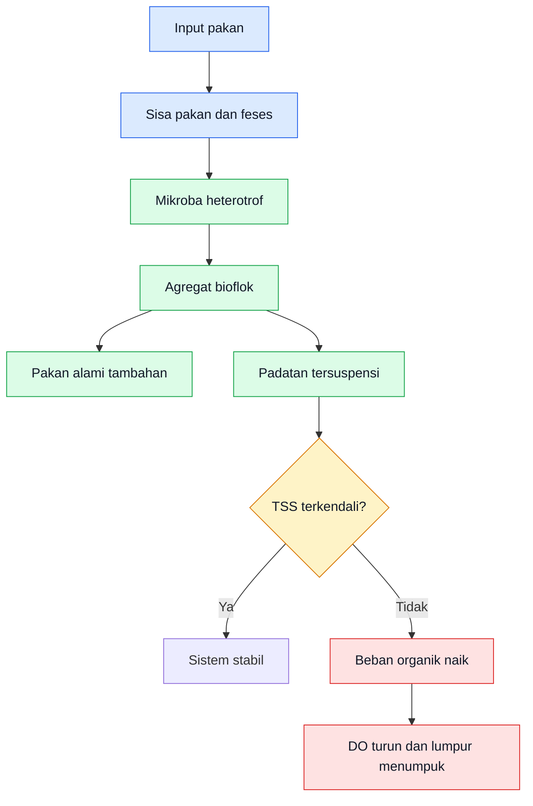
```mermaid
flowchart TD
    A[Input pakan] --> B[Sisa pakan dan feses]
    B --> C[Mikroba heterotrof]
    C --> D[Agregat bioflok]
    D --> E[Pakan alami tambahan]
    D --> F[Padatan tersuspensi]
    F --> G{TSS terkendali?}
    G -->|Ya| H[Sistem stabil]
    G -->|Tidak| I[Beban organik naik]
    I --> J[DO turun dan lumpur menumpuk]

    classDef input fill:#dbeafe,stroke:#2563eb,color:#111827;
    classDef bio fill:#dcfce7,stroke:#16a34a,color:#111827;
    classDef decision fill:#fef3c7,stroke:#d97706,color:#111827;
    classDef risk fill:#fee2e2,stroke:#dc2626,color:#111827;

    class A,B input;
    class C,D,E,F bio;
    class G decision;
    class I,J risk;
```

### 1.2 Masalah Bila TSS Tidak Dikendalikan

TSS atau **total suspended solids** adalah salah satu parameter paling penting dalam sistem bioflok. Pada tingkat tertentu, padatan tersuspensi masih bermanfaat. Namun, ketika akumulasinya berlebihan, sistem mulai mengalami tekanan biologis dan hidraulik.

Masalah yang umum terjadi bila TSS tidak dikendalikan:

- konsumsi oksigen meningkat;
- DO atau oksigen terlarut turun;
- flok mati menjadi lumpur;
- dasar kolam membentuk zona anaerob;
- bau busuk mulai muncul;
- amonia dan nitrit lebih sulit stabil;
- insang ikan atau udang terganggu;
- respons makan menurun;
- efisiensi pakan turun;
- sistem lebih sulit dipulihkan ketika terjadi gangguan.

Green melaporkan bahwa dalam sistem bioflok, akumulasi limbah pakan dan proses mikroba dapat meningkatkan TSS; studi tersebut mengevaluasi settling chamber dengan HRT $18$, $43$, dan $87$ menit, lalu menyimpulkan bahwa minimum HRT sekitar $43$ menit sesuai untuk biofloc culture hybrid striped bass / sunshine bass pada kondisi penelitian tersebut. ([OUP Academic][1])

Hal penting bagi praktisi: angka $43$ menit bukan “angka sakti” untuk semua komoditas, semua kolam, dan semua jenis flok. Namun, angka tersebut jauh lebih kuat sebagai rujukan bioflok dibanding asumsi kasar HRT pendek tanpa validasi.

Secara operasional, TSS berlebih biasanya terlihat dari beberapa gejala lapangan:

| Gejala lapangan                  | Interpretasi praktis                               |
| -------------------------------- | -------------------------------------------------- |
| Air terlalu pekat dan berat      | Padatan tersuspensi mulai berlebihan               |
| Aerasi terlihat berat            | Beban organik dan respirasi mikroba meningkat      |
| Lumpur mudah terkumpul di dasar  | Flok mati dan feses tidak terangkat                |
| Bau menyengat saat drain         | Ada indikasi zona anaerob                          |
| Ikan/udang menurun respons makan | Kualitas air dan kenyamanan biologis menurun       |
| Outlet sedimentasi terlalu pekat | Debit atau frekuensi pembuangan perlu diatur ulang |

### 1.3 Posisi Sedimentasi dalam Rantai Perlakuan Air Bioflok

Sedimentasi pada bioflok sebaiknya dipahami sebagai **unit pengendali padatan side-stream**, bukan sebagai sistem filtrasi penuh yang mengambil seluruh arus utama kolam.

Skema paling aman:

$$
Kolam \rightarrow Pengambilan\ side-stream \rightarrow Sedimentasi \rightarrow Air\ balik
$$

Untuk sistem gabungan yang akan menjadi rekomendasi utama artikel ini:

$$
Kolam \rightarrow Swirler \rightarrow IPC \rightarrow Kolam
$$

Mengapa side-stream lebih aman?

Pertama, kolam bioflok membutuhkan aerasi kuat dan mixing internal. Bila seluruh aliran utama dipaksa masuk ke unit sedimentasi, risiko gangguan hidraulik meningkat. Kedua, bioflok tidak boleh dibuang secara berlebihan. Dengan side-stream, operator dapat mengatur seberapa besar fraksi air yang diproses. Ketiga, sistem side-stream lebih fleksibel: bisa dioperasikan kontinu, periodik, atau memakai bypass.

Diagram posisi sedimentasi dalam sistem bioflok:

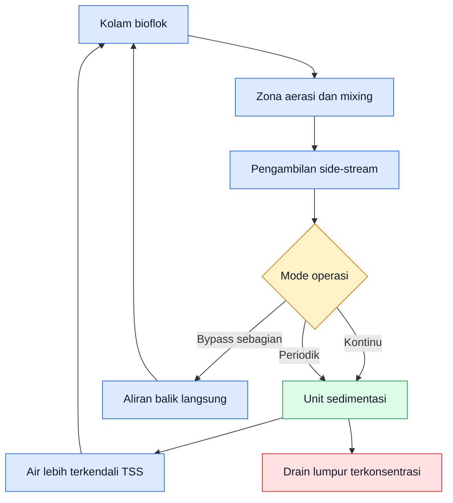
```mermaid
flowchart TD
    A[Kolam bioflok] --> B[Zona aerasi dan mixing]
    B --> C[Pengambilan side-stream]
    C --> D{Mode operasi}
    D -->|Kontinu| E[Unit sedimentasi]
    D -->|Periodik| E
    D -->|Bypass sebagian| F[Aliran balik langsung]
    E --> G[Air lebih terkendali TSS]
    G --> A
    F --> A
    E --> H[Drain lumpur terkonsentrasi]

    classDef pond fill:#dbeafe,stroke:#2563eb,color:#111827;
    classDef process fill:#dcfce7,stroke:#16a34a,color:#111827;
    classDef decision fill:#fef3c7,stroke:#d97706,color:#111827;
    classDef waste fill:#fee2e2,stroke:#dc2626,color:#111827;

    class A,B,C,G,F pond;
    class E process;
    class D decision;
    class H waste;
```

[**Kembali ke Atas**](#sistem-sedimentasi-bioflok-untuk-praktisi-analisis-swirler-radial-sedimentasi-ipc-dan-kombinasi-swirleripc)

---

## 2. Parameter Desain Utama yang Wajib Dipahami Praktisi

Sebelum membandingkan swirler, radial sedimentasi, dan IPC, praktisi perlu memahami beberapa parameter desain dasar. Tanpa parameter ini, desain alat sering hanya menjadi “perkiraan ukuran tangki”, bukan rancangan sedimentasi yang dapat diuji.

### 2.1 Debit Desain

Debit desain yang dipakai dalam artikel ini adalah:

$$
Q = 20\ L/menit
$$

Konversinya:

$$
Q = 0.02\ m^3/menit
$$

$$
Q = 1.2\ m^3/jam
$$

$$
Q = 28.8\ m^3/hari
$$

Debit $20\ L/menit$ dapat dibaca sebagai debit side-stream, bukan debit total sirkulasi kolam. Misalnya pada kolam $10\ m^3$, debit ini setara dengan volume olah harian:

$$
Turnover = \frac{28.8\ m^3/hari}{10\ m^3}
$$

$$
Turnover = 2.88\ kali/hari
$$

Artinya, jika unit dijalankan kontinu, air yang melewati sistem sedimentasi setara sekitar $2.88$ kali volume kolam $10\ m^3$ per hari. Namun dalam praktik, sistem tidak selalu harus berjalan $24$ jam. Operasi bisa disesuaikan dengan tren TSS, hasil Imhoff cone, respons makan, dan kondisi DO.

### 2.2 Hydraulic Retention Time

**Hydraulic retention time** atau HRT adalah waktu tinggal rata-rata air di dalam unit.

Formula dasarnya:

$$
HRT = \frac{V}{Q}
$$

Keterangan:

- $HRT$ = waktu tinggal hidrolik;
- $V$ = volume efektif unit;
- $Q$ = debit masuk.

Jika $V$ dinyatakan dalam liter dan $Q$ dalam liter per menit, maka $HRT$ keluar dalam menit.

Contoh:

$$
V = 860\ L
$$

$$
Q = 20\ L/menit
$$

Maka:

$$
HRT = \frac{860}{20}
$$

$$
HRT = 43\ menit
$$

Pada bioflok, HRT perlu dibaca hati-hati. HRT panjang memberi peluang pengendapan lebih baik, tetapi juga memperbesar volume alat. HRT terlalu pendek dapat hanya menangkap partikel berat, sementara flok ringan tetap lolos. HRT terlalu panjang dapat membuat unit besar, mahal, dan berisiko menahan lumpur terlalu lama bila drain tidak baik.

Pembedaan penting:

| Unit               | Cara membaca HRT                                                             |
| ------------------ | ---------------------------------------------------------------------------- |
| Swirler            | HRT membantu, tetapi pemisahan juga dipengaruhi pusaran dan inlet tangensial |
| Radial sedimentasi | HRT dan surface loading sama-sama penting                                    |
| IPC                | HRT penting, tetapi projected settling area lebih menentukan performa        |
| Sistem kombinasi   | HRT total adalah penjumlahan volume seri dibagi debit                        |

### 2.3 Overflow Velocity / Surface Loading

Parameter yang sangat penting dalam sedimentasi adalah **overflow velocity** atau **surface loading rate**.

Formula:

$$
v_o = \frac{Q}{A}
$$

Keterangan:

- $v_o$ = overflow velocity;
- $Q$ = debit;
- $A$ = luas pengendapan efektif.

Untuk sedimentasi gravitasi, prinsip dasarnya:

$$
v_s > v_o
$$

Keterangan:

- $v_s$ = kecepatan endap partikel atau flok;
- $v_o$ = kecepatan overflow atau beban permukaan.

Jika kecepatan endap flok lebih kecil daripada overflow velocity, flok cenderung ikut keluar bersama air. Jika kecepatan endap flok lebih besar daripada overflow velocity, flok punya peluang lebih besar untuk tertahan.

Contoh pada radial sedimentasi:

$$
Q = 1.2\ m^3/jam
$$

$$
A = 1.131\ m^2
$$

Maka:

$$
v_o = \frac{1.2}{1.131}
$$

$$
v_o = 1.06\ m/jam
$$

Artinya, flok dengan kecepatan endap lebih rendah dari $1.06\ m/jam$ akan lebih mudah lolos, sedangkan flok dengan kecepatan endap lebih tinggi akan lebih mudah tertahan.

### 2.4 Footprint

Footprint adalah luas tapak alat di lantai atau lahan. Untuk praktisi, footprint sering menjadi kendala utama karena unit sedimentasi harus masuk ke area produksi, dekat kolam, mudah diakses, dan tidak mengganggu operasional.

Untuk tangki bulat:

$$
A = \frac{\pi D^2}{4}
$$

Keterangan:

- $A$ = footprint;
- $D$ = diameter tangki.

Untuk tangki rectangular:

$$
A = L \times W
$$

Keterangan:

- $L$ = panjang;
- $W$ = lebar.

Dalam diskusi desain ini, footprint tiap metode berbeda:

| Metode                                    | Footprint contoh |
| ----------------------------------------- | ---------------: |
| Swirler $D = 800\ mm$                     |     $0.503\ m^2$ |
| Radial sedimentasi $D = 1200\ mm$         |     $1.131\ m^2$ |
| IPC rectangular $1200\ mm \times 943\ mm$ |     $1.132\ m^2$ |

Perbedaan footprint ini penting. Swirler paling kecil, radial lebih besar, sedangkan IPC memiliki footprint mirip radial tetapi area pengendapan efektifnya lebih besar karena bantuan pelat miring.

### 2.5 Beban TSS

Selain debit dan volume, praktisi harus menghitung beban padatan yang masuk ke unit sedimentasi. Formula sederhana:

$$
L_{TSS} = Q \times TSS \times 0.001
$$

Keterangan:

- $L_{TSS}$ = beban TSS dalam $kg/hari$;
- $Q$ = debit harian dalam $m^3/hari$;
- $TSS$ = total suspended solids dalam $mg/L$;
- $0.001$ = faktor konversi dari $m^3 \times mg/L$ menjadi $kg$.

Contoh:

$$
Q = 28.8\ m^3/hari
$$

$$
TSS = 400\ mg/L
$$

Maka:

$$
L_{TSS} = 28.8 \times 400 \times 0.001
$$

$$
L_{TSS} = 11.52\ kg/hari
$$

Artinya, pada debit $20\ L/menit$ dan TSS $400\ mg/L$, unit sedimentasi menerima beban padatan tersuspensi sekitar:

$$
11.52\ kg\ TSS/hari
$$

Namun beban ini bukan berarti seluruhnya harus dibuang. Pada bioflok, sebagian flok masih berguna. Maka target desain bukan sekadar removal setinggi mungkin, tetapi removal yang terkendali sesuai kondisi kolam.

[**Kembali ke Atas**](#sistem-sedimentasi-bioflok-untuk-praktisi-analisis-swirler-radial-sedimentasi-ipc-dan-kombinasi-swirleripc)

---

## 3. Alternatif Metode Sedimentasi Bioflok

Bab ini membahas tiga metode sedimentasi utama: swirler, radial sedimentasi, dan IPC. Ketiganya sama-sama memisahkan padatan dari air, tetapi prinsip kerja, performa, footprint, risiko operasional, dan posisi terbaik dalam sistem berbeda.

### 3.1 Swirler / Swirl Separator

<figure>
  
  <figcaption>
    Ilustrasi sedimentasi bioflok menggunakan swirler untuk membantu pemisahan
    padatan, pengendapan flok, dan pengelolaan kualitas air kolam.
  </figcaption>
</figure>

#### 3.1.1 Cara Kerja

Swirler adalah pemisah padatan-cairan yang memakai aliran masuk tangensial untuk membentuk pusaran. Air dari kolam masuk dari sisi tangki, bukan dari tengah. Arah masuk ini menciptakan gerakan melingkar. Partikel yang lebih berat, flok besar, feses, dan sisa pakan terdorong ke arah dinding dan turun ke bagian cone bawah. Air yang lebih ringan bergerak ke zona tengah/atas lalu keluar melalui outlet overflow.

Skema kerja swirler:

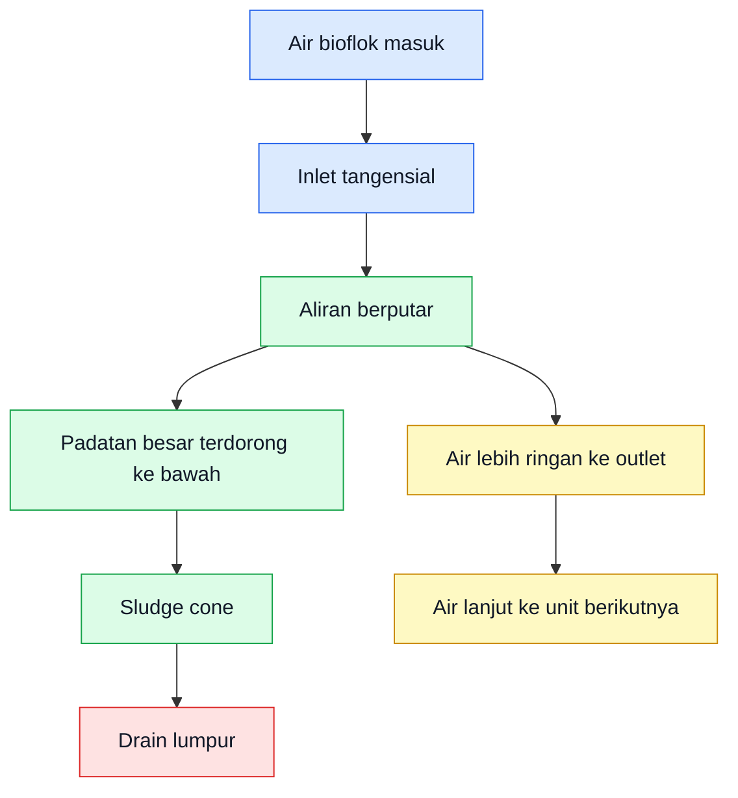
```mermaid
flowchart TD
    A[Air bioflok masuk] --> B[Inlet tangensial]
    B --> C[Aliran berputar]
    C --> D[Padatan besar terdorong ke bawah]
    C --> E[Air lebih ringan ke outlet]
    D --> F[Sludge cone]
    F --> G[Drain lumpur]
    E --> H[Air lanjut ke unit berikutnya]

    classDef input fill:#dbeafe,stroke:#2563eb,color:#111827;
    classDef process fill:#dcfce7,stroke:#16a34a,color:#111827;
    classDef output fill:#fef9c3,stroke:#ca8a04,color:#111827;
    classDef waste fill:#fee2e2,stroke:#dc2626,color:#111827;

    class A,B input;
    class C,D,F process;
    class E,H output;
    class G waste;
```

Swirler efektif ketika targetnya adalah **padatan kasar** dan **flok besar**. Dalam konteks bioflok, fungsi terbaiknya bukan sebagai clarifier akhir, melainkan sebagai **pre-settler** atau **sludge concentrator**.

#### 3.1.2 Kelebihan Swirler

Kelebihan swirler:

- konstruksi sederhana;
- biaya relatif rendah;
- mudah dibuat dari drum, PVC, atau tangki fiber;
- footprint kecil;
- cocok untuk side-stream;
- drain lumpur mudah dipasang di bagian cone bawah;
- baik untuk menangkap feses, sisa pakan, pasir halus, flok besar, dan lumpur organik kasar;
- dapat melindungi unit lanjutan seperti IPC dari beban padatan besar.

Swirler juga cocok untuk sistem yang membutuhkan alat sederhana dan mudah dirawat. Pada skala praktisi, swirler sering lebih realistis dibanding clarifier besar karena dapat dibuat lokal dan tidak memerlukan komponen internal rumit.

#### 3.1.3 Kelemahan Swirler

Kelemahan utama swirler adalah performanya sangat bergantung pada karakter partikel dan hidraulika aliran. Bioflok bersifat biologis, ringan, berpori, dan mudah pecah. Bila inlet terlalu agresif, flok besar dapat terpecah menjadi partikel lebih halus. Partikel halus ini justru lebih sulit diendapkan.

Kelemahan swirler:

- kurang baik untuk flok ringan dan sangat halus;
- risiko shear bila aliran masuk terlalu cepat;
- removal bisa fluktuatif;
- tidak ideal sebagai polishing clarifier;
- membutuhkan drain lumpur rutin;
- jika terlalu sering membuang lumpur, biomassa flok berguna ikut hilang.

Karena itu, desain swirler bioflok harus memakai aliran tangensial yang cukup untuk membentuk pusaran, tetapi tidak terlalu kuat.

#### 3.1.4 Performance Literatur

Performa swirler pada literatur RAS cukup bervariasi. Davidson dan Summerfelt membandingkan swirl separator dan radial-flow settler pada sistem coldwater RAS. Dalam studi tersebut, swirl separator menghasilkan rata-rata TSS removal sekitar $37.1 \pm 3.3%$, sedangkan radial-flow settler mencapai sekitar $77.9 \pm 1.6%$. Ini menunjukkan bahwa swirler dapat bekerja, tetapi performanya lebih rendah daripada radial-flow settler pada kondisi penelitian tersebut. ([Academia][2])

Pfeiffer et al. mengevaluasi komponen penghilangan padatan pada RAS tilapia dan melaporkan bahwa swirl separator memiliki removal lebih dari $90%$ untuk partikel lebih besar dari $250\ \mu m$. Ini penting karena menunjukkan bahwa swirler sangat kuat pada fraksi partikel besar, tetapi tidak otomatis berarti unggul untuk partikel kecil atau flok ringan. ([ScienceDirect][3])

Interpretasi praktisnya:

| Fraksi padatan | Performa swirler |
| -------------- | ---------------- |
| Feses besar    | Baik             |
| Sisa pakan     | Baik             |
| Flok besar     | Cukup baik       |
| Flok ringan    | Sedang           |
| Flok halus     | Lemah–sedang     |
| Koloid         | Lemah            |

#### 3.1.5 Posisi Terbaik dalam Sistem Bioflok

Kesimpulan teknis:

$$
Swirler = pre-settler,\ bukan\ polishing\ clarifier
$$

Swirler paling tepat ditempatkan sebelum unit yang lebih sensitif seperti IPC. Dengan posisi ini, swirler menangkap padatan kasar lebih dulu, sehingga IPC tidak langsung menerima beban feses, sisa pakan, dan flok besar yang berisiko menyumbat plate pack.

---

### 3.2 Radial Sedimentasi / Radial-Flow Settler

<figure>
  
  <figcaption>
    Ilustrasi sedimentasi bioflok menggunakan sistem radial untuk membantu
    pemisahan padatan, pengendapan flok, dan menjaga kualitas air kolam.
  </figcaption>
</figure>

#### 3.2.1 Cara Kerja

Radial sedimentasi bekerja dengan mengalirkan air ke **feedwell** di tengah tangki. Feedwell berfungsi meredam energi aliran masuk. Setelah energi berkurang, air menyebar secara radial dari tengah ke tepi. Padatan turun ke dasar, sedangkan air yang lebih jernih keluar melalui overflow keliling atau launder.

Skema kerja radial sedimentasi:

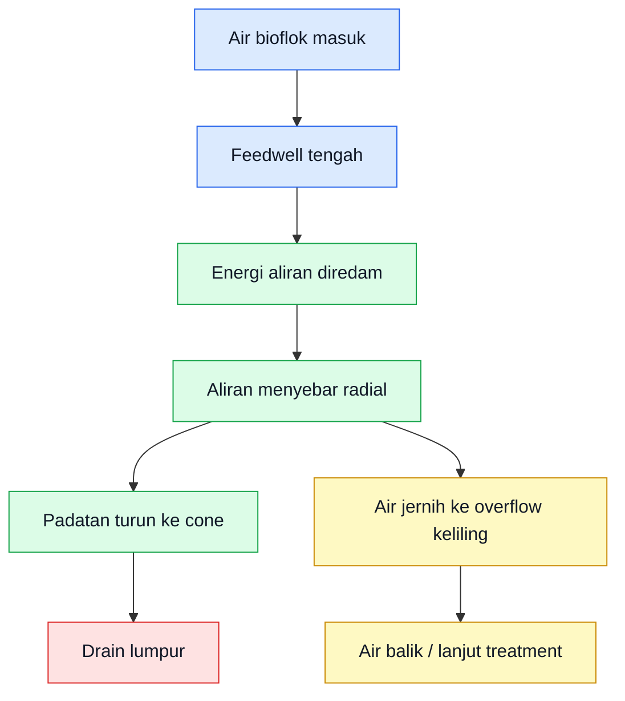
```mermaid
flowchart TD
    A[Air bioflok masuk] --> B[Feedwell tengah]
    B --> C[Energi aliran diredam]
    C --> D[Aliran menyebar radial]
    D --> E[Padatan turun ke cone]
    D --> F[Air jernih ke overflow keliling]
    E --> G[Drain lumpur]
    F --> H[Air balik / lanjut treatment]

    classDef input fill:#dbeafe,stroke:#2563eb,color:#111827;
    classDef process fill:#dcfce7,stroke:#16a34a,color:#111827;
    classDef output fill:#fef9c3,stroke:#ca8a04,color:#111827;
    classDef waste fill:#fee2e2,stroke:#dc2626,color:#111827;

    class A,B input;
    class C,D,E process;
    class F,H output;
    class G waste;
```

Aliran radial lebih tenang dibanding swirler karena tujuannya bukan menciptakan pusaran kuat, tetapi menciptakan zona pengendapan yang stabil.

#### 3.2.2 Kelebihan Radial Sedimentasi

Kelebihan radial sedimentasi:

- aliran lebih tenang;
- shear lebih rendah;
- lebih ramah untuk flok biologis yang rapuh;
- lebih stabil daripada swirler;
- cocok untuk TSS sedang hingga tinggi;
- mudah dibersihkan;
- drain lumpur relatif sederhana;
- tidak memiliki plate pack yang mudah tersumbat.

Dalam konteks bioflok, radial sedimentasi sangat menarik bila targetnya adalah **clarifier robust** yang tidak terlalu sensitif terhadap perubahan karakter flok.

#### 3.2.3 Kelemahan Radial Sedimentasi

Kelemahan utamanya adalah footprint. Untuk mencapai HRT dan surface loading rendah, radial sedimentasi membutuhkan diameter lebih besar. Dibanding swirler, unit radial lebih melebar. Dibanding IPC, area pengendapan efektif radial terbatas pada luas permukaan tangki.

Kelemahan radial sedimentasi:

- footprint lebih besar;
- volume lebih besar bila target HRT panjang;
- tidak seefisien IPC dalam penggunaan area lantai;
- konstruksi overflow keliling perlu rapi agar aliran merata;
- feedwell harus benar agar tidak terjadi short-circuit.

#### 3.2.4 Performance Literatur

Davidson dan Summerfelt menemukan bahwa radial-flow settler memiliki rata-rata TSS removal sekitar $77.9 \pm 1.6%$, sedangkan swirl separator sekitar $37.1 \pm 3.3%$ pada sistem coldwater RAS. Studi tersebut juga menunjukkan radial-flow settler lebih konsisten pada berbagai konsentrasi TSS inlet. ([Academia][2])

Untuk praktisi bioflok, hasil ini tidak boleh disalin mentah sebagai jaminan removal yang sama, karena karakter padatan bioflok berbeda dari padatan RAS coldwater. Namun, arah kesimpulannya kuat: **aliran radial yang lebih tenang cenderung lebih baik untuk pengendapan padatan tersuspensi dibanding pusaran swirler yang lebih agresif**.

#### 3.2.5 Posisi Terbaik dalam Sistem Bioflok

Kesimpulan teknis:

$$
Radial\ sedimentasi = clarifier\ lembut\ dan\ robust
$$

Radial sedimentasi cocok bila ruang tersedia dan operator menginginkan sistem yang stabil, mudah dirawat, serta lebih toleran terhadap variasi TSS. Namun, bila lahan sempit dan target performa per footprint tinggi, IPC lebih menarik.

---

### 3.3 IPC / Inclined Plate Clarifier / Lamella Clarifier

<figure>
  
  <figcaption>
    Ilustrasi sedimentasi bioflok dengan sistem IPC untuk membantu pemisahan
    padatan, pengendapan flok, dan pengelolaan kualitas air kolam.
  </figcaption>
</figure>

#### 3.3.1 Cara Kerja

IPC atau inclined plate clarifier memakai kumpulan pelat miring untuk memperbesar area pengendapan efektif. Air mengalir melalui kanal antar-pelat. Partikel atau flok tidak perlu turun sedalam tangki biasa, tetapi cukup bergerak menuju permukaan pelat terdekat. Setelah menempel atau mencapai pelat, padatan meluncur turun ke zona lumpur, sedangkan air yang lebih jernih naik menuju outlet.

Prinsip utama IPC adalah:

$$
Memperbesar\ luas\ pengendapan\ efektif\ tanpa\ memperbesar\ footprint\ secara\ proporsional
$$

Skema kerja IPC:

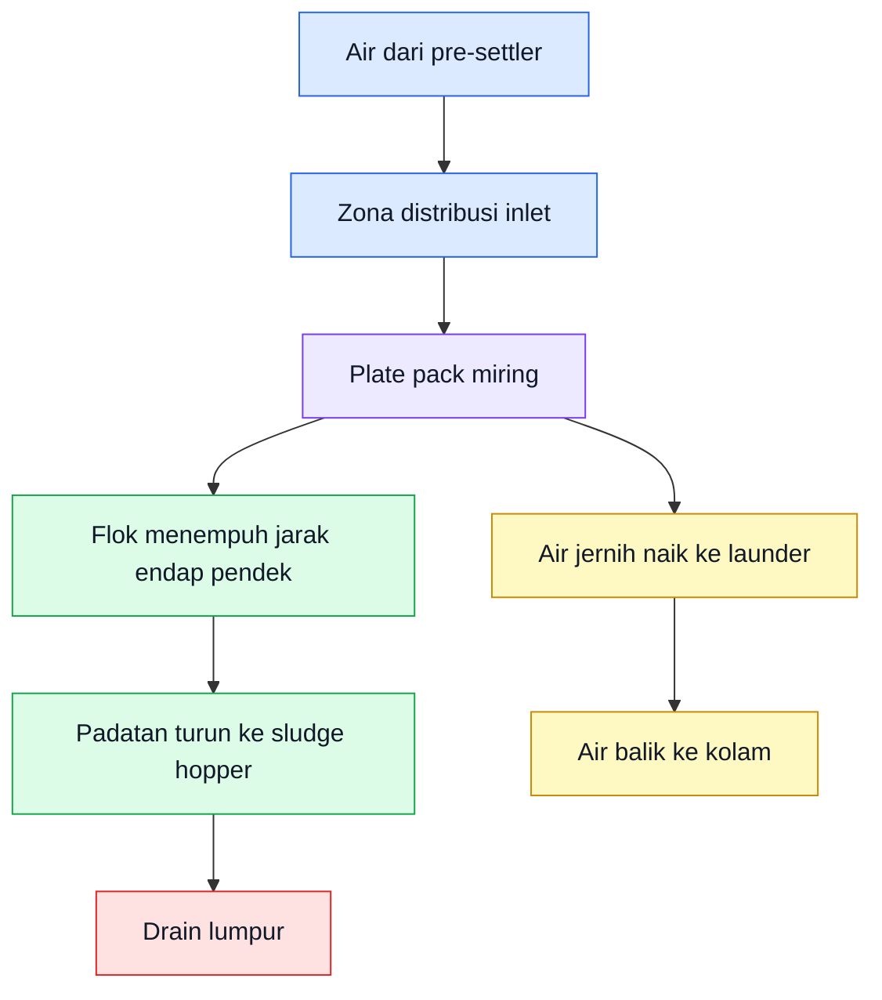
```mermaid
flowchart TD
    A[Air dari pre-settler] --> B[Zona distribusi inlet]
    B --> C[Plate pack miring]
    C --> D[Flok menempuh jarak endap pendek]
    D --> E[Padatan turun ke sludge hopper]
    C --> F[Air jernih naik ke launder]
    E --> G[Drain lumpur]
    F --> H[Air balik ke kolam]

    classDef input fill:#dbeafe,stroke:#2563eb,color:#111827;
    classDef plate fill:#ede9fe,stroke:#7c3aed,color:#111827;
    classDef process fill:#dcfce7,stroke:#16a34a,color:#111827;
    classDef output fill:#fef9c3,stroke:#ca8a04,color:#111827;
    classDef waste fill:#fee2e2,stroke:#dc2626,color:#111827;

    class A,B input;
    class C plate;
    class D,E process;
    class F,H output;
    class G waste;
```

#### 3.3.2 Kelebihan IPC

Kelebihan IPC:

- luas pengendapan efektif tinggi;
- footprint efisien;
- surface loading efektif rendah;
- baik untuk flok dengan settling velocity rendah;
- cocok sebagai polishing clarifier;
- dapat menggandakan area settling dalam luas lantai yang sama.

Dalam desain yang dibahas dalam artikel ini, IPC dengan footprint sekitar $1.132\ m^2$ menghasilkan projected settling area:

$$
A_{IPC} = 2.43\ m^2
$$

Sehingga area multiplier terhadap footprint adalah:

$$
R_A = \frac{2.43}{1.132}
$$

$$
R_A = 2.15
$$

Artinya, pada footprint yang sama, IPC memberi luas pengendapan efektif sekitar:

$$
2.15\times
$$

dibanding clarifier terbuka biasa.

#### 3.3.3 Kelemahan IPC

Kelemahan IPC adalah sensitivitas terhadap clogging. Bioflok bersifat organik, lengket, dan mudah membentuk lapisan biofilm. Jika IPC menerima air bioflok mentah langsung dari kolam, plate pack dapat cepat kotor.

Kelemahan IPC:

- risiko clogging antar-pelat;
- plate pack perlu pembersihan rutin;
- tidak ideal menerima flok kasar langsung;
- distribusi inlet harus merata;
- short-circuit dapat menurunkan performa;
- sludge hopper harus didesain agar lumpur tidak tertahan terlalu lama.

Karena itu, IPC lebih aman bila ditempatkan setelah swirler atau pre-settler lain.

#### 3.3.4 Performance dan Prinsip Literatur

Literatur desain lamella menyebut bahwa inclined plate clarifier menggunakan pelat miring yang umum dipasang pada sudut sekitar $45^\circ$–$60^\circ$ dari horizontal. Variabel desain penting meliputi panjang lintasan, jarak antar-pelat, dan sudut pelat. ([Hydroflotech][4])

Sumber teknis manufaktur juga menyebut pelat $60^\circ$ banyak digunakan karena memberi projected surface area yang efisien, sementara sudut terlalu landai dapat mengganggu aliran lumpur dan meningkatkan potensi clogging. ([Metchem][5])

Untuk bioflok, pemilihan spacing tidak boleh terlalu rapat. Spacing sekitar $50\ mm$ atau lebih aman daripada spacing sangat sempit karena bioflok dapat lengket dan membentuk lapisan organik. Pada desain artikel ini, spacing yang dipakai adalah:

$$
s = 50\ mm = 1.97\ in
$$

#### 3.3.5 Posisi Terbaik dalam Sistem Bioflok

Kesimpulan teknis:

$$
IPC = polishing\ clarifier,\ idealnya\ setelah\ swirler
$$

IPC paling kuat bila menerima air yang sudah dikurangi padatan kasarnya. Dengan demikian, plate pack tidak langsung menerima feses besar, sisa pakan, dan flok kasar. Kombinasi yang paling rasional adalah:

$$
Kolam \rightarrow Swirler \rightarrow IPC \rightarrow Kolam
$$

atau secara fungsi:

$$
Swirler = proteksi\ IPC
$$

$$
IPC = polishing\ flok\ ringan
$$

Diagram posisi terbaik IPC:

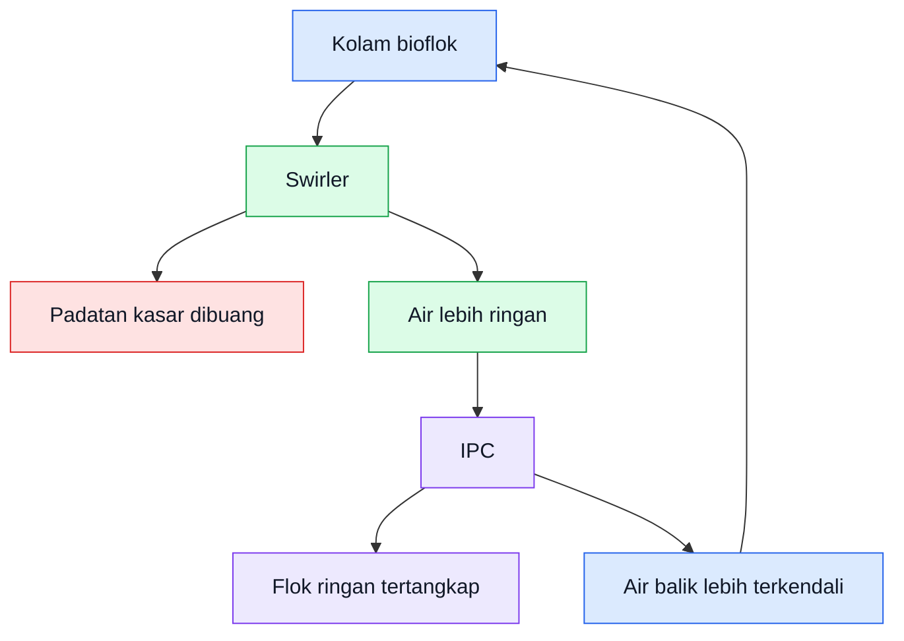
```mermaid
flowchart TD
    A[Kolam bioflok] --> B[Swirler]
    B --> C[Padatan kasar dibuang]
    B --> D[Air lebih ringan]
    D --> E[IPC]
    E --> F[Flok ringan tertangkap]
    E --> G[Air balik lebih terkendali]
    G --> A

    classDef pond fill:#dbeafe,stroke:#2563eb,color:#111827;
    classDef pre fill:#dcfce7,stroke:#16a34a,color:#111827;
    classDef polish fill:#ede9fe,stroke:#7c3aed,color:#111827;
    classDef waste fill:#fee2e2,stroke:#dc2626,color:#111827;
    classDef output fill:#fef9c3,stroke:#ca8a04,color:#111827;

    class A,G pond;
    class B,D pre;
    class E,F polish;
    class C waste;
```

---

## Referensi Bab 0–3

1. Green, B. W. 2022. **Evaluation of Settling Chamber Hydraulic Retention Time in a Biofloc Production System**. Studi ini menjadi rujukan utama untuk penggunaan HRT sekitar $43$ menit pada settling chamber bioflok. ([OUP Academic][1])
2. Davidson & Summerfelt. **RAS solids removal: swirl separator vs radial-flow settler**. Studi ini menjadi rujukan perbandingan performa swirl separator dan radial-flow settler pada sistem RAS. ([Academia][2])
3. Pfeiffer et al. 2008. **Particle sieve analysis for determining solids removal efficiency of water treatment components in a recirculating aquaculture system**. Studi ini menjadi rujukan performa swirl separator terhadap fraksi partikel besar. ([ScienceDirect][3])
4. HydroFlo Tech. **Theory of Inclined Plate Clarifier Design**. Rujukan prinsip dasar lamella/IPC, sudut pelat, dan variabel desain utama. ([Hydroflotech][4])
5. Met-Chem. **Lamella Clarifier Manufacturer / Inclined Plate Clarifier**. Rujukan teknis praktis tentang penggunaan pelat $60^\circ$ dan projected surface area. ([Metchem][5])

[1]: https://academic.oup.com/naja/article/84/2/165/7816461?utm_source=chatgpt.com 'Evaluation of Settling Chamber Hydraulic Retention Time in a ...'
[2]: https://www.academia.edu/12893730/RAS_Solids_Removal_Swirl_Separator_vs_Radial_Flow_Settler_?utm_source=chatgpt.com 'RAS Solids Removal (Swirl Separator vs Radial-Flow Settler)'
[3]: https://www.sciencedirect.com/science/article/abs/pii/S0144860908000320?utm_source=chatgpt.com 'Particle sieve analysis for determining solids removal ...'
[4]: https://hydroflotech.com/theory-of-inclined-plate-clarifier-design/?utm_source=chatgpt.com 'Theory of Inclined Plate Clarifier Design'
[5]: https://metchem.com/new-clarifiers-manufactured-by-met-chem/?utm_source=chatgpt.com 'Lamella Clarifier Manufacturer | Inclined Plate'

[**Kembali ke Atas**](#sistem-sedimentasi-bioflok-untuk-praktisi-analisis-swirler-radial-sedimentasi-ipc-dan-kombinasi-swirleripc)

---

[**Kembali ke Atas**](#sistem-sedimentasi-bioflok-untuk-praktisi-analisis-swirler-radial-sedimentasi-ipc-dan-kombinasi-swirleripc)

# 4. Desain Masing-Masing Metode untuk Kapasitas $20\ L/menit$

Bab ini menerjemahkan prinsip sedimentasi menjadi desain praktis. Semua metode dihitung dengan basis debit yang sama:

$$
Q = 20\ L/menit
$$

Konversi debit:

$$
Q = 0.02\ m^3/menit
$$

$$
Q = 1.2\ m^3/jam
$$

$$
Q = 28.8\ m^3/hari
$$

Basis ini penting agar perbandingan antar-metode tidak bias. Swirler, radial sedimentasi, dan IPC tidak dibandingkan pada kondisi yang berbeda, tetapi pada beban debit yang sama. Perbedaannya terletak pada volume, area pengendapan efektif, karakter aliran, risiko clogging, dan fungsi terbaik dalam sistem bioflok.

Sebagai catatan desain, HRT $43$ menit untuk settling chamber bioflok digunakan sebagai acuan konservatif karena Green mengevaluasi HRT $18$, $43$, dan $87$ menit pada sistem bioflok dan menyimpulkan HRT minimum sekitar $43$ menit sesuai untuk biofloc culture hybrid striped bass pada kondisi studi tersebut. ([Wiley Online Library][1])

---

## 4.1 Desain Swirler / Swirl Separator

Swirler dalam desain ini diposisikan sebagai **pre-settler**, bukan sebagai clarifier akhir. Artinya, targetnya bukan menghasilkan air superjernih, tetapi mengurangi padatan kasar, feses, sisa pakan, flok besar, dan lumpur awal sebelum air masuk ke unit berikutnya.

### 4.1.1 Data Desain

| Parameter         |         Nilai |
| ----------------- | ------------: |
| Debit             | $20\ L/menit$ |
| Volume aktual     |      $302\ L$ |
| HRT aktual        | $15.1\ menit$ |
| Diameter          |     $800\ mm$ |
| Tinggi silinder   |     $450\ mm$ |
| Tinggi cone       |     $450\ mm$ |
| Tinggi total      |     $900\ mm$ |
| Footprint         |  $0.503\ m^2$ |
| Overflow velocity | $2.39\ m/jam$ |
| Inlet             |          DN40 |
| Outlet            |          DN50 |
| Drain lumpur      |          DN32 |

Desain ini lebih tepat dibaca sebagai **swirl pre-separator**. HRT $15.1$ menit tidak dipakai sebagai standar universal bioflok, tetapi sebagai ukuran praktis untuk unit pusaran yang menangkap partikel besar. Pfeiffer et al. melaporkan bahwa swirl separator pada sistem RAS sangat efektif untuk partikel besar, dengan removal lebih dari $90%$ untuk partikel berukuran lebih dari $250\ \mu m$. ([ScienceDirect][2])

### 4.1.2 Skema Desain Swirler

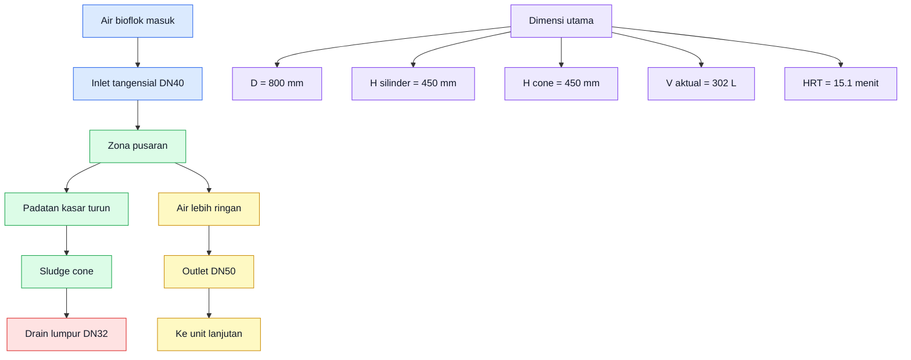
```mermaid
flowchart TD
    A[Air bioflok masuk] --> B[Inlet tangensial DN40]
    B --> C[Zona pusaran]
    C --> D[Padatan kasar turun]
    D --> E[Sludge cone]
    E --> F[Drain lumpur DN32]
    C --> G[Air lebih ringan]
    G --> H[Outlet DN50]
    H --> I[Ke unit lanjutan]

    J[Dimensi utama] --> K[D = 800 mm]
    J --> L[H silinder = 450 mm]
    J --> M[H cone = 450 mm]
    J --> N[V aktual = 302 L]
    J --> O[HRT = 15.1 menit]

    classDef input fill:#dbeafe,stroke:#2563eb,color:#111827;
    classDef process fill:#dcfce7,stroke:#16a34a,color:#111827;
    classDef waste fill:#fee2e2,stroke:#dc2626,color:#111827;
    classDef output fill:#fef9c3,stroke:#ca8a04,color:#111827;
    classDef spec fill:#ede9fe,stroke:#7c3aed,color:#111827;

    class A,B input;
    class C,D,E process;
    class F waste;
    class G,H,I output;
    class J,K,L,M,N,O spec;
```

### 4.1.3 Perhitungan Volume Swirler

Diameter swirler:

$$
D = 0.8\ m
$$

Luas penampang:

$$
A = \frac{\pi D^2}{4}
$$

$$
A = \frac{3.1416 \times 0.8^2}{4}
$$

$$
A = 0.503\ m^2
$$

Volume bagian silinder:

$$
V_{silinder} = A \times H_1
$$

$$
V_{silinder} = 0.503 \times 0.45
$$

$$
V_{silinder} = 0.226\ m^3
$$

$$
V_{silinder} = 226\ L
$$

Volume bagian cone:

$$
V_{cone} = \frac{1}{3} \times A \times H_2
$$

$$
V_{cone} = \frac{1}{3} \times 0.503 \times 0.45
$$

$$
V_{cone} = 0.075\ m^3
$$

$$
V_{cone} = 75\ L
$$

Volume aktual:

$$
V_{total} = V_{silinder} + V_{cone}
$$

$$
V_{total} = 226 + 75
$$

$$
V_{total} = 301\ L
$$

Dalam tabel desain dibulatkan menjadi:

$$
V_{total} \approx 302\ L
$$

### 4.1.4 HRT Swirler

$$
HRT = \frac{V}{Q}
$$

$$
HRT = \frac{302}{20}
$$

$$
HRT = 15.1\ menit
$$

Interpretasi praktisnya: HRT ini cukup untuk pre-settling partikel besar, tetapi tidak cukup konservatif untuk menjadikan swirler sebagai unit utama pengendapan bioflok halus.

### 4.1.5 Footprint Swirler

$$
A_{footprint} = \frac{\pi D^2}{4}
$$

$$
A_{footprint} = \frac{3.1416 \times 0.8^2}{4}
$$

$$
A_{footprint} = 0.503\ m^2
$$

Swirler adalah metode paling hemat area dari tiga metode yang dibahas.

### 4.1.6 Overflow Velocity Swirler

$$
v_o = \frac{Q}{A}
$$

$$
v_o = \frac{1.2}{0.503}
$$

$$
v_o = 2.39\ m/jam
$$

Nilai ini cukup tinggi dibanding radial sedimentasi dan IPC. Artinya, hanya flok yang cukup besar atau cukup berat yang akan tertangkap efektif. Flok ringan dengan kecepatan endap lebih rendah dari $2.39\ m/jam$ berpotensi lolos.

### 4.1.7 Kecepatan Inlet Tangensial

Asumsi diameter dalam DN40:

$$
d_i = 0.04\ m
$$

Luas inlet:

$$
A_i = \frac{\pi d_i^2}{4}
$$

$$
A_i = \frac{3.1416 \times 0.04^2}{4}
$$

$$
A_i = 0.001257\ m^2
$$

Debit dalam satuan detik:

$$
Q = 20\ L/menit = 0.000333\ m^3/detik
$$

Kecepatan inlet:

$$
v_i = \frac{Q}{A_i}
$$

$$
v_i = \frac{0.000333}{0.001257}
$$

$$
v_i = 0.265\ m/detik
$$

Kecepatan sekitar $0.27\ m/detik$ masih cukup lembut untuk bioflok. Bila inlet dibuat terlalu kecil atau debit dinaikkan tanpa kontrol, gaya geser meningkat dan flok dapat pecah menjadi partikel lebih halus.

### 4.1.8 Catatan Desain Swirler

Swirler cocok sebagai:

$$
pre\text{-}settler + sludge\ concentrator
$$

Namun swirler tidak disarankan sebagai satu-satunya clarifier bila targetnya adalah menurunkan TSS bioflok secara stabil. Davidson dan Summerfelt melaporkan swirl separator memiliki rata-rata TSS removal $37.1 \pm 3.3%$, lebih rendah daripada radial-flow settler pada sistem RAS yang sama. ([ScienceDirect][3])

Catatan lapangan:

- gunakan inlet tangensial yang tidak terlalu agresif;
- pasang drain lumpur di titik terendah cone;
- buang lumpur sedikit tetapi sering;
- jangan mengejar air terlalu jernih;
- idealnya swirler ditempatkan sebelum IPC.

---

## 4.2 Desain Radial Sedimentasi

Radial sedimentasi adalah alternatif yang lebih lembut dibanding swirler. Air masuk ke feedwell tengah, energi aliran diredam, lalu air menyebar secara radial ke arah overflow keliling. Karena alirannya lebih tenang, radial sedimentasi lebih ramah untuk flok biologis yang rapuh.

### 4.2.1 Data Desain

| Parameter         |         Nilai |
| ----------------- | ------------: |
| Debit             | $20\ L/menit$ |
| Volume aktual     |      $867\ L$ |
| HRT aktual        | $43.4\ menit$ |
| Diameter tangki   |    $1200\ mm$ |
| Diameter feedwell |     $300\ mm$ |
| Tinggi silinder   |     $650\ mm$ |
| Tinggi cone       |     $350\ mm$ |
| Tinggi air total  |    $1000\ mm$ |
| Footprint         |  $1.131\ m^2$ |
| Overflow velocity | $1.06\ m/jam$ |
| Inlet             |          DN40 |
| Outlet launder    |          DN50 |
| Drain lumpur      |          DN32 |

Dimensi ini dibuat untuk mendekati acuan HRT $43$ menit yang lebih relevan untuk settling chamber bioflok. Green menunjukkan HRT $43$ menit lebih layak daripada $18$ menit pada kondisi studi bioflok yang diuji. ([Wiley Online Library][1])

### 4.2.2 Skema Desain Radial Sedimentasi

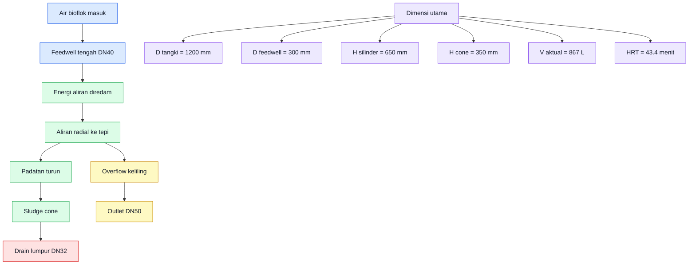
```mermaid
flowchart TD
    A[Air bioflok masuk] --> B[Feedwell tengah DN40]
    B --> C[Energi aliran diredam]
    C --> D[Aliran radial ke tepi]
    D --> E[Padatan turun]
    E --> F[Sludge cone]
    F --> G[Drain lumpur DN32]
    D --> H[Overflow keliling]
    H --> I[Outlet DN50]

    J[Dimensi utama] --> K[D tangki = 1200 mm]
    J --> L[D feedwell = 300 mm]
    J --> M[H silinder = 650 mm]
    J --> N[H cone = 350 mm]
    J --> O[V aktual = 867 L]
    J --> P[HRT = 43.4 menit]

    classDef input fill:#dbeafe,stroke:#2563eb,color:#111827;
    classDef process fill:#dcfce7,stroke:#16a34a,color:#111827;
    classDef waste fill:#fee2e2,stroke:#dc2626,color:#111827;
    classDef output fill:#fef9c3,stroke:#ca8a04,color:#111827;
    classDef spec fill:#ede9fe,stroke:#7c3aed,color:#111827;

    class A,B input;
    class C,D,E,F process;
    class G waste;
    class H,I output;
    class J,K,L,M,N,O,P spec;
```

### 4.2.3 Footprint Radial Sedimentasi

Diameter tangki:

$$
D = 1.2\ m
$$

Footprint:

$$
A = \frac{\pi D^2}{4}
$$

$$
A = \frac{3.1416 \times 1.2^2}{4}
$$

$$
A = 1.131\ m^2
$$

Dibanding swirler, footprint radial lebih besar:

$$
\Delta A = 1.131 - 0.503
$$

$$
\Delta A = 0.628\ m^2
$$

Persentase tambahan footprint radial terhadap swirler:

$$
% Tambahan = \frac{0.628}{0.503} \times 100
$$

$$
% Tambahan = 124.9%
$$

Jadi radial sedimentasi memakai area lebih dari dua kali swirler. Namun, tambahan area ini menghasilkan aliran yang lebih tenang dan overflow velocity lebih rendah.

### 4.2.4 Perhitungan Volume Radial Sedimentasi

Luas penampang:

$$
A = 1.131\ m^2
$$

Tinggi silinder:

$$
H_1 = 0.65\ m
$$

Tinggi cone:

$$
H_2 = 0.35\ m
$$

Volume silinder:

$$
V_{silinder} = A \times H_1
$$

$$
V_{silinder} = 1.131 \times 0.65
$$

$$
V_{silinder} = 0.735\ m^3
$$

$$
V_{silinder} = 735\ L
$$

Volume cone:

$$
V_{cone} = \frac{1}{3} \times A \times H_2
$$

$$
V_{cone} = \frac{1}{3} \times 1.131 \times 0.35
$$

$$
V_{cone} = 0.132\ m^3
$$

$$
V_{cone} = 132\ L
$$

Volume total:

$$
V_{total} = 735 + 132
$$

$$
V_{total} = 867\ L
$$

### 4.2.5 HRT Radial Sedimentasi

$$
HRT = \frac{V}{Q}
$$

$$
HRT = \frac{867}{20}
$$

$$
HRT = 43.35\ menit
$$

Dibulatkan menjadi:

$$
HRT = 43.4\ menit
$$

Ini sesuai dengan target desain konservatif bioflok.

### 4.2.6 Overflow Velocity Radial Sedimentasi

$$
v_o = \frac{Q}{A}
$$

$$
v_o = \frac{1.2}{1.131}
$$

$$
v_o = 1.06\ m/jam
$$

Nilai ini lebih rendah daripada swirler:

$$
v_{o,swirler} = 2.39\ m/jam
$$

$$
v_{o,radial} = 1.06\ m/jam
$$

Penurunan overflow velocity:

$$
\frac{2.39 - 1.06}{2.39} \times 100 = 55.6%
$$

Artinya, radial sedimentasi memberi kondisi pengendapan sekitar $55.6%$ lebih ringan dibanding swirler. Ini penting untuk flok bioflok yang ringan dan rapuh.

### 4.2.7 Feedwell

Diameter feedwell yang dipakai:

$$
D_{feedwell} = 300\ mm = 0.3\ m
$$

Rasio feedwell terhadap diameter tangki:

$$
R = \frac{D_{feedwell}}{D_{tank}}
$$

$$
R = \frac{0.3}{1.2}
$$

$$
R = 0.25
$$

Jadi diameter feedwell adalah:

$$
25%
$$

dari diameter tangki. Rasio ini praktis karena feedwell cukup besar untuk meredam energi aliran masuk, tetapi tidak terlalu besar sehingga mengurangi area pengendapan secara berlebihan.

### 4.2.8 Catatan Desain Radial Sedimentasi

Radial sedimentasi cocok sebagai:

$$
clarifier\ lembut + robust\ settler
$$

Keunggulannya bukan pada footprint, tetapi pada kestabilan aliran dan rendahnya shear. Dalam studi Davidson dan Summerfelt, radial-flow settler memiliki rata-rata TSS removal $77.9 \pm 1.6%$, jauh lebih tinggi dan lebih konsisten daripada swirl separator pada sistem RAS yang sama. ([ScienceDirect][3])

Catatan lapangan:

- feedwell harus benar-benar meredam energi inlet;
- overflow keliling harus rata;
- drain lumpur harus berada pada titik terendah cone;
- jangan membuat inlet langsung menembak ke zona pengendapan;
- cocok untuk operator yang mengutamakan kestabilan dan kemudahan perawatan.

---

## 4.3 Desain IPC / Inclined Plate Clarifier

IPC adalah sistem sedimentasi dengan pelat miring. Keunggulannya adalah memperbesar area pengendapan efektif tanpa memperbesar footprint secara proporsional. Karena itu IPC sangat menarik untuk lahan terbatas, tetapi harus dilindungi dari padatan kasar agar tidak cepat clogging.

### 4.3.1 Data Desain

| Parameter                 |                       Nilai |
| ------------------------- | --------------------------: |
| Debit                     |               $20\ L/menit$ |
| Panjang tangki            |      $47.24\ in = 1200\ mm$ |
| Lebar tangki              |       $37.13\ in = 943\ mm$ |
| Footprint                 |  $12.18\ ft^2 = 1.132\ m^2$ |
| Volume efektif            | $\approx 228\ gal = 863\ L$ |
| HRT aktual                |               $43.2\ menit$ |
| Jumlah pelat              |                        $10$ |
| Jumlah channel            |                         $9$ |
| Panjang pelat             |       $23.62\ in = 600\ mm$ |
| Lebar pelat               |       $35.43\ in = 900\ mm$ |
| Sudut pelat               |                  $60^\circ$ |
| Spacing pelat             |         $1.97\ in = 50\ mm$ |
| Projected settling area   |   $26.16\ ft^2 = 2.43\ m^2$ |
| Effective surface loading |              $0.494\ m/jam$ |
| Inlet                     |                        DN40 |
| Outlet                    |                        DN50 |
| Drain lumpur              |                        DN32 |

Literatur lamella menyebut pelat miring umumnya berada pada sudut $45^\circ$ sampai $60^\circ$, dan jarak antar-pelat dapat berada sekitar $40$ sampai $120\ mm$ tergantung aplikasi. Untuk bioflok, spacing $50\ mm$ dipilih sebagai batas bawah yang masih lebih aman daripada spacing terlalu rapat karena flok organik mudah lengket. ([ScienceDirect][4])

### 4.3.2 Skema Desain IPC

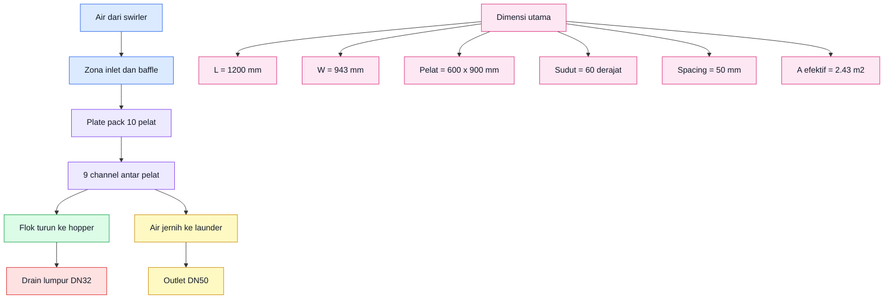
```mermaid
flowchart TD
    A[Air dari swirler] --> B[Zona inlet dan baffle]
    B --> C[Plate pack 10 pelat]
    C --> D[9 channel antar pelat]
    D --> E[Flok turun ke hopper]
    E --> F[Drain lumpur DN32]
    D --> G[Air jernih ke launder]
    G --> H[Outlet DN50]

    I[Dimensi utama] --> J[L = 1200 mm]
    I --> K[W = 943 mm]
    I --> L[Pelat = 600 x 900 mm]
    I --> M[Sudut = 60 derajat]
    I --> N[Spacing = 50 mm]
    I --> O[A efektif = 2.43 m2]

    classDef input fill:#dbeafe,stroke:#2563eb,color:#111827;
    classDef plate fill:#ede9fe,stroke:#7c3aed,color:#111827;
    classDef process fill:#dcfce7,stroke:#16a34a,color:#111827;
    classDef waste fill:#fee2e2,stroke:#dc2626,color:#111827;
    classDef output fill:#fef9c3,stroke:#ca8a04,color:#111827;
    classDef spec fill:#fce7f3,stroke:#db2777,color:#111827;

    class A,B input;
    class C,D plate;
    class E process;
    class F waste;
    class G,H output;
    class I,J,K,L,M,N,O spec;
```

### 4.3.3 Footprint IPC

Panjang tangki:

$$
L_t = 1.20\ m
$$

Lebar tangki:

$$
W_t = 0.943\ m
$$

Footprint:

$$
A_{footprint} = L_t \times W_t
$$

$$
A_{footprint} = 1.20 \times 0.943
$$

$$
A_{footprint} = 1.132\ m^2
$$

Konversi ke kaki persegi:

$$
1.132\ m^2 \times 10.764 = 12.18\ ft^2
$$

Footprint IPC sengaja dibuat hampir sama dengan radial sedimentasi:

$$
A_{IPC,footprint} \approx A_{radial}
$$

Tujuannya agar komparasi performa IPC vs radial sedimentasi menjadi adil.

### 4.3.4 Projected Settling Area IPC

IPC tidak hanya dihitung dari footprint. Yang lebih penting adalah **projected settling area**, yaitu jumlah proyeksi horizontal pelat miring.

Formula:

$$
A_{IPC} = N_c \times L_p \times W_p \times \cos \theta
$$

Keterangan:

- $A_{IPC}$ = projected settling area;
- $N_c$ = jumlah channel efektif;
- $L_p$ = panjang pelat;
- $W_p$ = lebar pelat;
- $\theta$ = sudut pelat terhadap horizontal.

Data desain:

$$
N_c = 9
$$

$$
L_p = 0.60\ m
$$

$$
W_p = 0.90\ m
$$

$$
\theta = 60^\circ
$$

Karena:

$$
\cos 60^\circ = 0.5
$$

Maka:

$$
A_{IPC} = 9 \times 0.60 \times 0.90 \times 0.5
$$

$$
A_{IPC} = 2.43\ m^2
$$

Konversi ke kaki persegi:

$$
2.43\ m^2 \times 10.764 = 26.16\ ft^2
$$

### 4.3.5 Area Multiplier

Area multiplier menunjukkan seberapa besar peningkatan area pengendapan efektif dibanding footprint.

$$
R_A = \frac{A_{IPC}}{A_{footprint}}
$$

$$
R_A = \frac{2.43}{1.132}
$$

$$
R_A = 2.15
$$

Artinya, pada footprint $1.132\ m^2$, IPC memberikan area pengendapan efektif sekitar:

$$
2.15\times
$$

lebih besar daripada clarifier terbuka dengan footprint yang sama.

### 4.3.6 Effective Surface Loading IPC

$$
v_{IPC} = \frac{Q}{A_{IPC}}
$$

$$
v_{IPC} = \frac{1.2}{2.43}
$$

$$
v_{IPC} = 0.494\ m/jam
$$

Konversi ke $ft/jam$:

$$
0.494\ m/jam \times 3.281 = 1.62\ ft/jam
$$

Nilai ini jauh lebih rendah daripada radial sedimentasi dan swirler.

Perbandingan:

| Unit               | Surface loading |
| ------------------ | --------------: |
| Swirler            |   $2.39\ m/jam$ |
| Radial sedimentasi |   $1.06\ m/jam$ |
| IPC                |  $0.494\ m/jam$ |

### 4.3.7 Volume dan HRT IPC

Volume gross:

$$
V_{gross} = 928\ L
$$

Karena ada plate pack, baffle, dan ruang yang tidak semuanya efektif, digunakan volume efektif:

$$
V_{eff} = 863\ L
$$

HRT:

$$
HRT = \frac{V_{eff}}{Q}
$$

$$
HRT = \frac{863}{20}
$$

$$
HRT = 43.15\ menit
$$

Dibulatkan menjadi:

$$
HRT = 43.2\ menit
$$

### 4.3.8 Kecepatan Aliran Antar-Pelat

Jumlah channel:

$$
N_c = 9
$$

Lebar pelat:

$$
W_p = 0.90\ m
$$

Spacing:

$$
s = 0.05\ m
$$

Luas kanal total:

$$
A_{channel} = N_c \times W_p \times s
$$

$$
A_{channel} = 9 \times 0.90 \times 0.05
$$

$$
A_{channel} = 0.405\ m^2
$$

Kecepatan aliran kanal:

$$
v_{channel} = \frac{Q}{A_{channel}}
$$

$$
v_{channel} = \frac{1.2}{0.405}
$$

$$
v_{channel} = 2.96\ m/jam
$$

Konversi:

$$
2.96\ m/jam = 0.000823\ m/detik
$$

Kecepatan ini rendah, sehingga secara hidraulik relatif aman untuk flok bioflok. Namun, rendahnya kecepatan juga berarti area plate pack harus rutin dibersihkan agar tidak menjadi zona akumulasi biofilm.

### 4.3.9 Catatan Desain IPC

IPC cocok sebagai:

$$
polishing\ clarifier
$$

Namun IPC tidak ideal jika langsung menerima air bioflok mentah. Plate pack dapat cepat tersumbat oleh flok kasar, feses, dan sisa pakan. Karena itu, posisi terbaiknya adalah setelah swirler.

Catatan lapangan:

- gunakan spacing minimal $50\ mm$;
- plate pack harus mudah diangkat;
- sediakan akses pembersihan;
- inlet harus memakai baffle distribusi;
- outlet launder harus rata;
- drain lumpur harus efektif;
- jangan biarkan lumpur menumpuk di hopper.

[**Kembali ke Atas**](#sistem-sedimentasi-bioflok-untuk-praktisi-analisis-swirler-radial-sedimentasi-ipc-dan-kombinasi-swirleripc)

---

# 5. Komparasi Performance Antar-Metode

Bab ini membandingkan performa swirler, radial sedimentasi, dan IPC bukan hanya dari “mana yang paling bagus”, tetapi dari fungsi, risiko, dan konteks pemakaian. Dalam bioflok, alat paling baik bukan selalu yang paling tinggi removal-nya, tetapi yang mampu menjaga TSS dalam rentang aman tanpa menghilangkan seluruh manfaat flok.

---

## 5.1 Tabel Ringkasan Performance

| Parameter             |       Swirler | Radial sedimentasi |                         IPC |
| --------------------- | ------------: | -----------------: | --------------------------: |
| Fungsi terbaik        |   Pre-settler |   Clarifier lembut |         Polishing clarifier |
| Footprint             |  $0.503\ m^2$ |       $1.131\ m^2$ |                $1.132\ m^2$ |
| HRT desain            | $15.1\ menit$ |      $43.4\ menit$ |               $43.2\ menit$ |
| Area settling efektif |  $0.503\ m^2$ |       $1.131\ m^2$ |                 $2.43\ m^2$ |
| Surface loading       | $2.39\ m/jam$ |      $1.06\ m/jam$ |              $0.494\ m/jam$ |
| Risiko shear          |        Sedang |             Rendah | Rendah bila distribusi baik |
| Risiko clogging       |        Rendah |             Rendah |               Sedang–tinggi |
| Kemudahan cleaning    |         Mudah |              Mudah |                      Sedang |
| Flok kasar            |          Baik |               Baik |    Baik, tetapi rawan kotor |
| Flok halus/ringan     |        Sedang |               Baik |    Sangat baik secara teori |
| Robustness lapangan   |        Tinggi |             Tinggi |                      Sedang |

---

## 5.2 Komparasi Berdasarkan Surface Loading

Surface loading menentukan peluang flok untuk mengendap. Semakin rendah surface loading, semakin besar peluang partikel dengan kecepatan endap rendah untuk tertangkap.

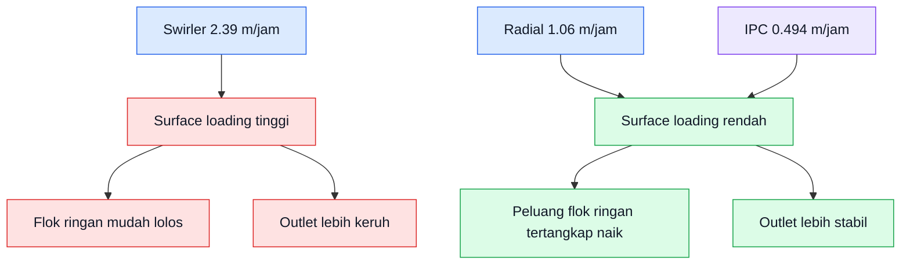
```mermaid
flowchart TD
    A[Surface loading rendah] --> B[Peluang flok ringan tertangkap naik]
    A --> C[Outlet lebih stabil]
    D[Surface loading tinggi] --> E[Flok ringan mudah lolos]
    D --> F[Outlet lebih keruh]

    G[Swirler 2.39 m/jam] --> D
    H[Radial 1.06 m/jam] --> A
    I[IPC 0.494 m/jam] --> A

    classDef good fill:#dcfce7,stroke:#16a34a,color:#111827;
    classDef risk fill:#fee2e2,stroke:#dc2626,color:#111827;
    classDef neutral fill:#dbeafe,stroke:#2563eb,color:#111827;
    classDef best fill:#ede9fe,stroke:#7c3aed,color:#111827;

    class A,B,C good;
    class D,E,F risk;
    class G,H neutral;
    class I best;
```

Perbandingan surface loading:

$$
v_{swirler} = 2.39\ m/jam
$$

$$
v_{radial} = 1.06\ m/jam
$$

$$
v_{IPC} = 0.494\ m/jam
$$

Dibanding swirler, radial menurunkan surface loading sebesar:

$$
\frac{2.39 - 1.06}{2.39} \times 100 = 55.6%
$$

Dibanding radial, IPC menurunkan surface loading sebesar:

$$
\frac{1.06 - 0.494}{1.06} \times 100 = 53.4%
$$

Dibanding swirler, IPC menurunkan surface loading sebesar:

$$
\frac{2.39 - 0.494}{2.39} \times 100 = 79.3%
$$

Secara hidraulik, IPC paling kuat dalam menurunkan beban permukaan. Namun, performa lapangan tetap ditentukan oleh kebersihan plate pack, distribusi aliran, dan karakter flok.

---

## 5.3 Komparasi Berdasarkan Footprint

Footprint tiap metode:

$$
A_{swirler} = 0.503\ m^2
$$

$$
A_{radial} = 1.131\ m^2
$$

$$
A_{IPC} = 1.132\ m^2
$$

Swirler paling hemat area. Namun area yang kecil membuat overflow velocity lebih tinggi. Radial dan IPC memakai footprint hampir sama, tetapi IPC memiliki area pengendapan efektif lebih besar.

Perbandingan area pengendapan efektif:

$$
A_{swirler} = 0.503\ m^2
$$

$$
A_{radial} = 1.131\ m^2
$$

$$
A_{IPC,effective} = 2.43\ m^2
$$

Rasio IPC terhadap radial:

$$
\frac{2.43}{1.131} = 2.15
$$

Jadi, pada footprint yang hampir sama, IPC memberi area pengendapan efektif sekitar:

$$
2.15\times
$$

radial sedimentasi.

---

## 5.4 Komparasi Berdasarkan Performance Literatur

Davidson dan Summerfelt membandingkan swirl separator dengan radial-flow settler pada sistem coldwater RAS. Rata-rata TSS removal swirl separator adalah $37.1 \pm 3.3%$, sedangkan radial-flow settler mencapai $77.9 \pm 1.6%$. Studi tersebut juga menyatakan radial-flow settler lebih konsisten pada berbagai konsentrasi TSS inlet. ([ScienceDirect][3])

Interpretasi praktis:

| Unit                |           TSS removal literatur RAS | Catatan                               |
| ------------------- | ----------------------------------: | ------------------------------------- |
| Swirl separator     |                     $37.1 \pm 3.3%$ | Lebih cocok untuk padatan besar       |
| Radial-flow settler |                     $77.9 \pm 1.6%$ | Lebih stabil dan lebih lembut         |
| IPC                 | Bergantung desain dan pre-treatment | Secara teori area efektif lebih besar |

Pfeiffer et al. menunjukkan bahwa swirl separator dapat sangat efektif untuk partikel besar, terutama di atas $250\ \mu m$. Maka swirler tidak boleh dianggap buruk; ia hanya harus ditempatkan pada fungsi yang benar, yaitu menangkap fraksi kasar. ([ScienceDirect][2])

Untuk IPC, literatur lamella menegaskan bahwa pelat miring meningkatkan area pemisahan dalam footprint kompak. Namun data spesifik IPC untuk bioflok tidak sekuat data radial-flow settler dan swirl separator pada RAS. Karena itu, performa IPC dalam artikel ini lebih tepat dibaca sebagai **proyeksi hidraulik berbasis area efektif**, bukan klaim removal pasti. ([ScienceDirect][4])

---

## 5.5 Komparasi Berdasarkan Karakter Flok

Bioflok tidak seragam. Ada flok besar, flok ringan, flok halus, partikel organik, feses, dan sisa pakan. Setiap unit memiliki respons berbeda terhadap fraksi tersebut.

| Karakter padatan | Swirler               | Radial sedimentasi | IPC                               |
| ---------------- | --------------------- | ------------------ | --------------------------------- |
| Feses besar      | Baik                  | Baik               | Baik, tetapi bisa mengotori plate |
| Sisa pakan       | Baik                  | Baik               | Tidak ideal bila langsung masuk   |
| Flok besar       | Baik                  | Baik               | Baik                              |
| Flok ringan      | Sedang                | Baik               | Sangat baik secara teori          |
| Flok halus       | Lemah–sedang          | Sedang–baik        | Baik bila tidak clogging          |
| Lumpur lengket   | Baik bila drain rutin | Baik               | Risiko menempel                   |
| Biofilm          | Rendah                | Rendah             | Tinggi                            |

Secara praktis:

$$
Swirler = kuat\ untuk\ fraksi\ kasar
$$

$$
Radial = stabil\ untuk\ flok\ rapuh
$$

$$
IPC = kuat\ untuk\ flok\ lambat\ mengendap,\ tetapi\ sensitif\ clogging
$$

---

## 5.6 Interpretasi Praktis

Swirler menang pada kesederhanaan, biaya, dan footprint. Ia cocok untuk mengurangi beban kasar sebelum air masuk ke unit lain. Kelemahannya adalah tidak cukup kuat sebagai polishing unit bila flok dominan ringan dan halus.

Radial sedimentasi menang pada stabilitas dan kelembutan aliran. Ia cocok untuk praktisi yang ingin sistem robust, mudah dibersihkan, dan tidak terlalu sensitif terhadap TSS tinggi. Kelemahannya adalah footprint lebih besar dan area efektifnya tidak sebesar IPC.

IPC menang pada luas pengendapan efektif dan surface loading. Dengan footprint yang sama seperti radial, IPC dapat memberi area efektif sekitar $2.15\times$ lebih besar. Namun, IPC lebih sensitif terhadap clogging, sehingga sebaiknya tidak menerima air bioflok mentah langsung.

Kesimpulan performance:

$$
Swirler\ terbaik\ sebagai\ pre\text{-}settler
$$

$$
Radial\ terbaik\ sebagai\ robust\ clarifier
$$

$$
IPC\ terbaik\ sebagai\ polishing\ clarifier
$$

[**Kembali ke Atas**](#sistem-sedimentasi-bioflok-untuk-praktisi-analisis-swirler-radial-sedimentasi-ipc-dan-kombinasi-swirleripc)

---

# 6. Kombinasi Antar-Metode dan Tinjauan Performance

Sistem bioflok intensif jarang ideal jika hanya memakai satu alat sedimentasi. Setiap metode punya kekuatan dan kelemahan. Karena itu, kombinasi antar-metode sering lebih masuk akal daripada memilih satu metode tunggal.

---

## 6.1 Kombinasi 1 — Swirler Saja

### 6.1.1 Konsep

Skema:

$$
Kolam \rightarrow Swirler \rightarrow Kolam
$$

Diagram:

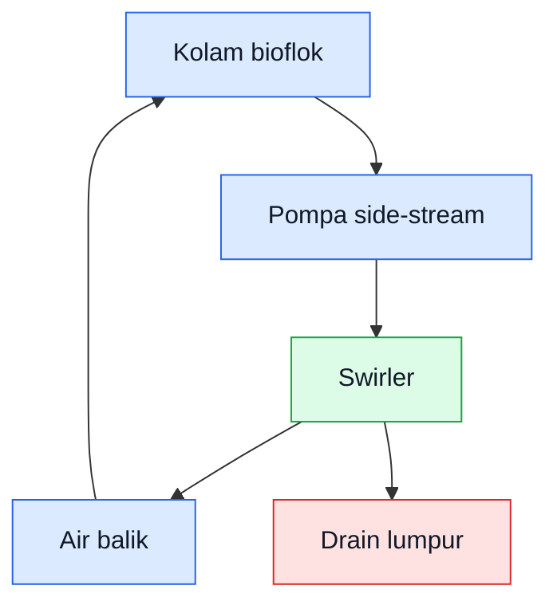
```mermaid
flowchart TD
    A[Kolam bioflok] --> B[Pompa side-stream]
    B --> C[Swirler]
    C --> D[Air balik]
    C --> E[Drain lumpur]
    D --> A

    classDef pond fill:#dbeafe,stroke:#2563eb,color:#111827;
    classDef unit fill:#dcfce7,stroke:#16a34a,color:#111827;
    classDef waste fill:#fee2e2,stroke:#dc2626,color:#111827;

    class A,B,D pond;
    class C unit;
    class E waste;
```

### 6.1.2 Cocok Untuk

Swirler saja cocok untuk:

- sistem kecil;
- kontrol lumpur kasar;
- pembuangan periodik;
- ruang terbatas;
- biaya fabrikasi rendah;
- operator ingin alat sederhana.

### 6.1.3 Kelemahan

Kelemahannya:

- tidak optimal untuk flok ringan;
- outlet bisa masih keruh;
- performa tergantung ukuran flok;
- jika pusaran terlalu kuat, flok bisa pecah;
- tidak cocok sebagai polishing clarifier.

### 6.1.4 Penilaian Performance

Swirler saja cukup bila targetnya hanya:

$$
mengurangi\ padatan\ kasar
$$

Namun kurang kuat bila targetnya:

$$
menstabilkan\ TSS\ bioflok\ intensif
$$

---

## 6.2 Kombinasi 2 — Radial Sedimentasi Saja

### 6.2.1 Konsep

Skema:

$$
Kolam \rightarrow Radial\ sedimentasi \rightarrow Kolam
$$

Diagram:

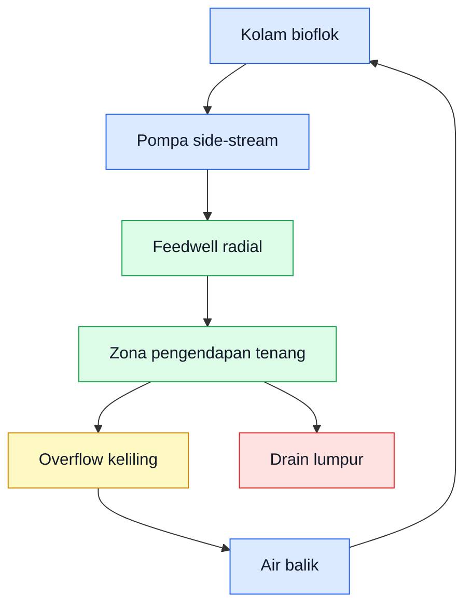
```mermaid
flowchart TD
    A[Kolam bioflok] --> B[Pompa side-stream]
    B --> C[Feedwell radial]
    C --> D[Zona pengendapan tenang]
    D --> E[Overflow keliling]
    E --> F[Air balik]
    D --> G[Drain lumpur]
    F --> A

    classDef pond fill:#dbeafe,stroke:#2563eb,color:#111827;
    classDef unit fill:#dcfce7,stroke:#16a34a,color:#111827;
    classDef output fill:#fef9c3,stroke:#ca8a04,color:#111827;
    classDef waste fill:#fee2e2,stroke:#dc2626,color:#111827;

    class A,B,F pond;
    class C,D unit;
    class E output;
    class G waste;
```

### 6.2.2 Cocok Untuk

Radial sedimentasi saja cocok untuk:

- sistem yang membutuhkan aliran lembut;
- flok bioflok mudah pecah;
- operator ingin perawatan mudah;
- ruang tersedia;
- TSS relatif tinggi;
- sistem ingin tetap robust tanpa plate pack.

### 6.2.3 Kelemahan

Kelemahannya:

- footprint lebih besar;
- area efektif tidak sebesar IPC;
- jika overflow keliling tidak rata, bisa terjadi short-circuit;
- volume lebih besar dibanding swirler.

### 6.2.4 Penilaian Performance

Radial sedimentasi adalah pilihan paling aman bila operator mengutamakan:

$$
stabilitas + kemudahan\ perawatan
$$

Namun dari sisi performa per footprint, radial kalah dari IPC.

---

## 6.3 Kombinasi 3 — IPC Saja

### 6.3.1 Konsep

Skema:

$$
Kolam \rightarrow IPC \rightarrow Kolam
$$

Diagram:

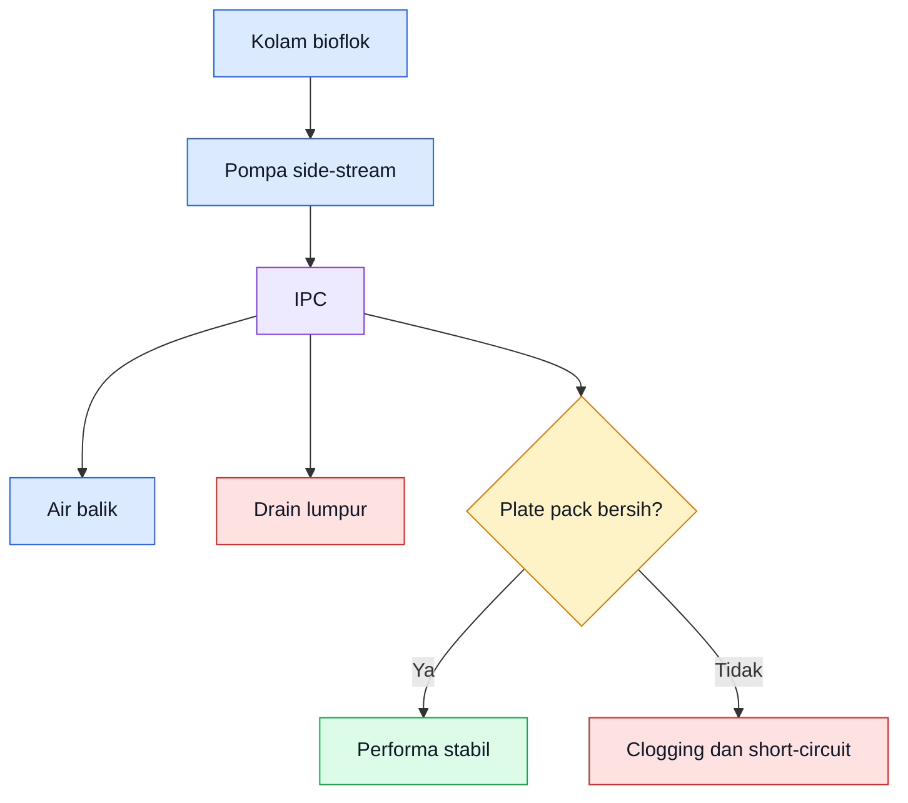
```mermaid
flowchart TD
    A[Kolam bioflok] --> B[Pompa side-stream]
    B --> C[IPC]
    C --> D[Air balik]
    C --> E[Drain lumpur]
    C --> F{Plate pack bersih?}
    F -->|Ya| G[Performa stabil]
    F -->|Tidak| H[Clogging dan short-circuit]

    classDef pond fill:#dbeafe,stroke:#2563eb,color:#111827;
    classDef unit fill:#ede9fe,stroke:#7c3aed,color:#111827;
    classDef decision fill:#fef3c7,stroke:#d97706,color:#111827;
    classDef good fill:#dcfce7,stroke:#16a34a,color:#111827;
    classDef risk fill:#fee2e2,stroke:#dc2626,color:#111827;

    class A,B,D pond;
    class C unit;
    class E risk;
    class F decision;
    class G good;
    class H risk;
```

### 6.3.2 Cocok Untuk

IPC saja hanya cocok bila:

- TSS tidak terlalu tinggi;
- sudah ada pre-screen atau pre-settling;
- flok tidak terlalu lengket;
- operator siap membersihkan plate pack;
- inlet distribusi benar-benar merata.

### 6.3.3 Kelemahan Utama

Kelemahan utamanya:

$$
IPC\ langsung\ dari\ kolam\ bioflok = risiko\ clogging\ tinggi
$$

Bioflok mengandung bahan organik, feses, sisa pakan, dan flok berlendir. Bila semuanya langsung masuk ke plate pack, kanal antar-pelat dapat cepat tertutup.

### 6.3.4 Penilaian Performance

Secara hidraulik IPC sangat kuat. Namun secara operasional, IPC saja terlalu berisiko untuk bioflok pekat. IPC lebih aman sebagai tahap kedua, bukan tahap pertama.

---

## 6.4 Kombinasi 4 — Swirler + Radial Sedimentasi

### 6.4.1 Konsep

Skema:

$$
Kolam \rightarrow Swirler \rightarrow Radial\ sedimentasi \rightarrow Kolam
$$

Diagram:

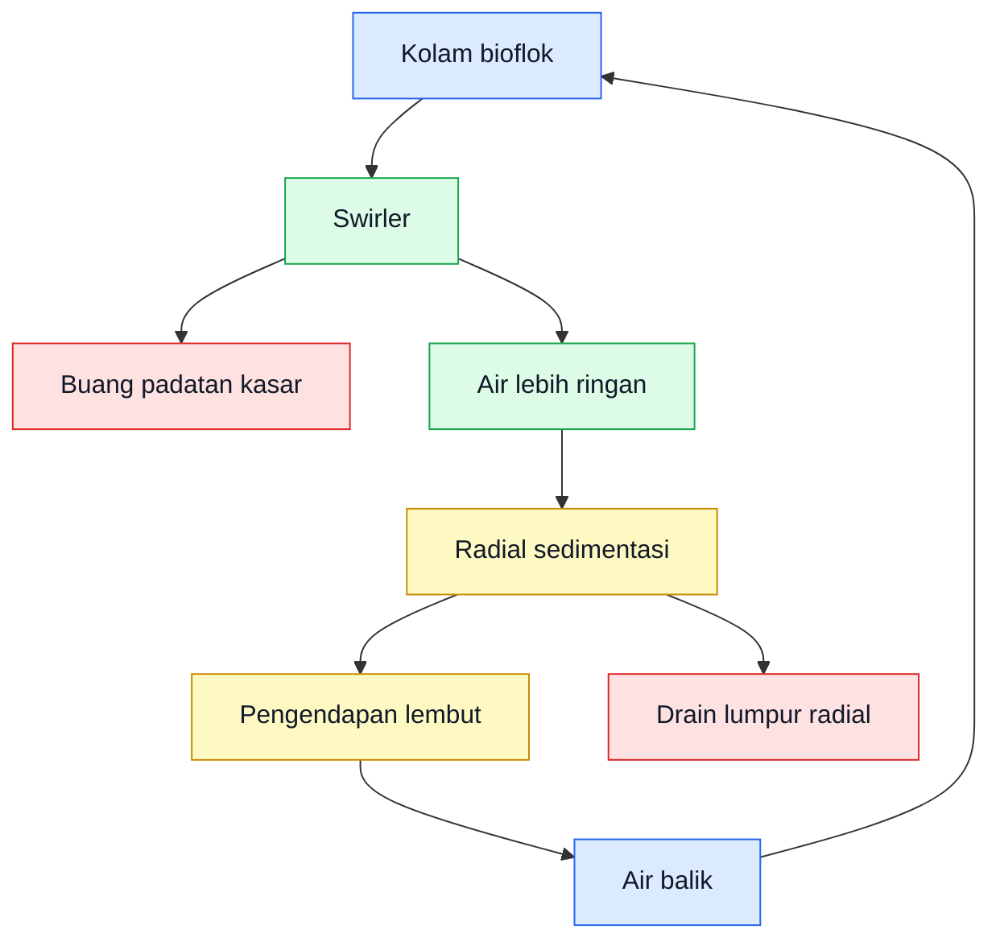
```mermaid
flowchart TD
    A[Kolam bioflok] --> B[Swirler]
    B --> C[Buang padatan kasar]
    B --> D[Air lebih ringan]
    D --> E[Radial sedimentasi]
    E --> F[Pengendapan lembut]
    F --> G[Air balik]
    E --> H[Drain lumpur radial]
    G --> A

    classDef pond fill:#dbeafe,stroke:#2563eb,color:#111827;
    classDef pre fill:#dcfce7,stroke:#16a34a,color:#111827;
    classDef radial fill:#fef9c3,stroke:#ca8a04,color:#111827;
    classDef waste fill:#fee2e2,stroke:#dc2626,color:#111827;

    class A,G pond;
    class B,D pre;
    class E,F radial;
    class C,H waste;
```

### 6.4.2 Kelebihan

Kelebihan kombinasi ini:

- sangat robust;
- cocok untuk TSS tinggi;
- risiko clogging rendah;
- swirler mengurangi padatan kasar;
- radial menangani pengendapan lembut;
- perawatan relatif mudah.

### 6.4.3 Kelemahan

Kelemahannya:

- footprint lebih besar;
- volume total besar;
- tidak seefisien IPC per luas lantai;
- biaya material bisa lebih tinggi karena dua tangki besar.

### 6.4.4 Estimasi Dimensi Sistem

Swirler:

$$
A_{swirler} = 0.503\ m^2
$$

Radial:

$$
A_{radial} = 1.131\ m^2
$$

Footprint bersih:

$$
A_{total} = 0.503 + 1.131
$$

$$
A_{total} = 1.634\ m^2
$$

Volume total:

$$
V_{total} = 302 + 867
$$

$$
V_{total} = 1169\ L
$$

HRT total:

$$
HRT_{total} = \frac{1169}{20}
$$

$$
HRT_{total} = 58.45\ menit
$$

### 6.4.5 Penilaian Performance

Kombinasi swirler + radial sangat baik untuk sistem yang mengutamakan ketahanan dan rendah risiko clogging. Namun, jika ruang terbatas dan targetnya adalah performa tinggi per footprint, kombinasi ini kalah efisien dibanding swirler + IPC.

---

## 6.5 Kombinasi 5 — Swirler + IPC

### 6.5.1 Konsep

Skema:

$$
Kolam \rightarrow Swirler \rightarrow IPC \rightarrow Kolam
$$

Diagram:

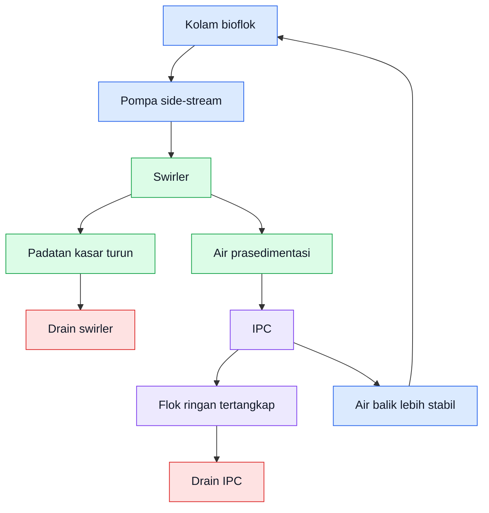
```mermaid
flowchart TD
    A[Kolam bioflok] --> B[Pompa side-stream]
    B --> C[Swirler]
    C --> D[Padatan kasar turun]
    D --> E[Drain swirler]
    C --> F[Air prasedimentasi]
    F --> G[IPC]
    G --> H[Flok ringan tertangkap]
    H --> I[Drain IPC]
    G --> J[Air balik lebih stabil]
    J --> A

    classDef pond fill:#dbeafe,stroke:#2563eb,color:#111827;
    classDef swirler fill:#dcfce7,stroke:#16a34a,color:#111827;
    classDef ipc fill:#ede9fe,stroke:#7c3aed,color:#111827;
    classDef waste fill:#fee2e2,stroke:#dc2626,color:#111827;
    classDef output fill:#fef9c3,stroke:#ca8a04,color:#111827;

    class A,B,J pond;
    class C,D,F swirler;
    class G,H ipc;
    class E,I waste;
```

### 6.5.2 Alasan Kombinasi Ini Paling Kuat

Kombinasi ini menyatukan kekuatan dua metode:

$$
Swirler\ menangkap\ padatan\ kasar
$$

$$
IPC\ menangkap\ flok\ ringan
$$

$$
Swirler\ melindungi\ IPC
$$

$$
IPC\ meningkatkan\ performance\ per\ footprint
$$

Swirler mengurangi fraksi padatan yang paling berisiko menyumbat IPC. Setelah padatan kasar turun di swirler, IPC menerima air yang lebih ringan sehingga plate pack bekerja lebih stabil. Ini membuat IPC tidak dipaksa menjadi alat pertama yang menghadapi feses besar, sisa pakan, dan flok kasar.

### 6.5.3 Total Volume dan HRT

Swirler:

$$
V_{swirler} = 302\ L
$$

IPC:

$$
V_{IPC} = 863\ L
$$

Volume total:

$$
V_{total} = 302 + 863
$$

$$
V_{total} = 1165\ L
$$

HRT total:

$$
HRT_{total} = \frac{1165}{20}
$$

$$
HRT_{total} = 58.25\ menit
$$

### 6.5.4 Total Footprint

Swirler:

$$
A_{swirler} = 0.503\ m^2
$$

IPC:

$$
A_{IPC} = 1.132\ m^2
$$

Footprint bersih:

$$
A_{total} = 0.503 + 1.132
$$

$$
A_{total} = 1.635\ m^2
$$

Dengan ruang akses, valve, pipa, dan area servis sekitar $20%$ sampai $30%$:

$$
A_{instalasi} \approx 2.0 - 2.2\ m^2
$$

### 6.5.5 Estimasi Removal Sistem Seri

Untuk unit seri, efisiensi total tidak dijumlahkan langsung. Formula yang benar:

$$
R_{total} = 1 - (1 - R_1)(1 - R_2)
$$

Keterangan:

- $R_{total}$ = removal total;
- $R_1$ = removal swirler;
- $R_2$ = removal IPC terhadap sisa padatan setelah swirler.

Contoh skenario:

| Skenario    | Removal swirler | Removal IPC terhadap sisa | Removal total |
| ----------- | --------------: | ------------------------: | ------------: |
| Konservatif |           $20%$ |                     $50%$ |         $60%$ |
| Moderat     |           $30%$ |                     $60%$ |         $72%$ |
| Baik        |           $40%$ |                     $70%$ |         $82%$ |
| Sangat baik |           $50%$ |                     $70%$ |         $85%$ |

Contoh skenario moderat:

$$
R_{total} = 1 - (1 - 0.30)(1 - 0.60)
$$

$$
R_{total} = 1 - (0.70 \times 0.40)
$$

$$
R_{total} = 1 - 0.28
$$

$$
R_{total} = 0.72
$$

$$
R_{total} = 72%
$$

Angka ini adalah model estimasi desain, bukan janji performa universal. Verifikasi lapangan tetap wajib memakai TSS inlet–outlet.

### 6.5.6 Beban TSS pada Kombinasi Swirler + IPC

Jika:

$$
TSS = 400\ mg/L
$$

dan:

$$
Q = 28.8\ m^3/hari
$$

Maka beban TSS masuk:

$$
L_{TSS} = Q \times TSS \times 0.001
$$

$$
L_{TSS} = 28.8 \times 400 \times 0.001
$$

$$
L_{TSS} = 11.52\ kg/hari
$$

Jika skenario removal total $72%$:

$$
TSS_{removed} = 11.52 \times 0.72
$$

$$
TSS_{removed} = 8.29\ kg/hari
$$

Jika removal total $60%$:

$$
TSS_{removed} = 11.52 \times 0.60
$$

$$
TSS_{removed} = 6.91\ kg/hari
$$

Jika removal total $82%$:

$$
TSS_{removed} = 11.52 \times 0.82
$$

$$
TSS_{removed} = 9.45\ kg/hari
$$

Dalam bioflok, removal tinggi harus dikendalikan. Tujuannya bukan membuat air kosong dari flok, tetapi mencegah TSS melewati batas yang mengganggu oksigen, insang, dan stabilitas mikroba.

---

## 6.6 Perbandingan Kombinasi

| Kombinasi        | Kelebihan                                  | Kelemahan                    | Kesesuaian bioflok                           |
| ---------------- | ------------------------------------------ | ---------------------------- | -------------------------------------------- |
| Swirler saja     | Murah, sederhana, footprint kecil          | Kurang baik untuk flok halus | Baik untuk kontrol kasar                     |
| Radial saja      | Stabil, lembut, mudah dirawat              | Footprint lebih besar        | Baik dan robust                              |
| IPC saja         | Area efektif besar                         | Risiko clogging tinggi       | Kurang aman bila tanpa pre-treatment         |
| Swirler + radial | Sangat robust                              | Footprint lebih besar        | Sangat baik untuk TSS tinggi                 |
| Swirler + IPC    | Kompak, performa tinggi, saling melindungi | IPC tetap butuh cleaning     | Terbaik untuk intensif dengan ruang terbatas |

---

## 6.7 Kesimpulan Bab 6

Dari seluruh kombinasi, pilihan paling seimbang adalah:

$$
Swirler \rightarrow IPC
$$

Alasannya:

1. Swirler menangkap padatan kasar sebelum mencapai IPC.
2. IPC bekerja pada beban padatan yang sudah lebih ringan.
3. Surface loading IPC sangat rendah, yaitu $0.494\ m/jam$.
4. Area pengendapan efektif IPC mencapai $2.43\ m^2$ pada footprint $1.132\ m^2$.
5. Total footprint bersih sistem masih kompak, sekitar $1.635\ m^2$.
6. Dengan ruang servis, sistem masih realistis pada area sekitar $2.0$ sampai $2.2\ m^2$.

Secara teknis:

$$
Swirler = proteksi + pemekatan\ padatan\ kasar
$$

$$
IPC = polishing + penangkapan\ flok\ ringan
$$

Secara praktis:

$$
Swirler + IPC = kombinasi\ terbaik\ untuk\ bioflok\ intensif
$$

---

## Referensi Bab 4–6

1. Green, B. W. **Evaluation of Settling Chamber Hydraulic Retention Time in a Biofloc Production System**. Rujukan HRT settling chamber bioflok $18$, $43$, dan $87$ menit, dengan rekomendasi minimum sekitar $43$ menit pada kondisi studi. ([Wiley Online Library][1])
2. Davidson, J., & Summerfelt, S. **Solids removal from a coldwater recirculating system—comparison of a swirl separator and a radial-flow settler**. Rujukan perbandingan TSS removal swirl separator $37.1 \pm 3.3%$ dan radial-flow settler $77.9 \pm 1.6%$. ([ScienceDirect][3])
3. Pfeiffer, T. J. et al. **Particle sieve analysis for determining solids removal efficiency of water treatment components in a recirculating aquaculture system**. Rujukan performa swirl separator terhadap partikel besar lebih dari $250\ \mu m$. ([ScienceDirect][2])
4. ScienceDirect Topics. **Lamella Clarifiers**. Rujukan prinsip pelat miring, kisaran sudut $45^\circ$ sampai $60^\circ$, dan spacing pelat sekitar $40$ sampai $120\ mm$. ([ScienceDirect][4])
5. HydroFlo Tech. **Theory of Inclined Plate Clarifier Design**. Rujukan variabel desain IPC: path length, plate spacing, dan plate angle.

[1]: https://onlinelibrary.wiley.com/doi/10.1002/naaq.10229?utm_source=chatgpt.com 'Evaluation of Settling Chamber Hydraulic Retention Time ...'
[2]: https://www.sciencedirect.com/science/article/abs/pii/S0144860908000320?utm_source=chatgpt.com 'Particle sieve analysis for determining solids removal ...'
[3]: https://www.sciencedirect.com/science/article/pii/S0144860904001049?utm_source=chatgpt.com 'Solids removal from a coldwater recirculating system— ...'
[4]: https://www.sciencedirect.com/topics/engineering/lamella-clarifiers?utm_source=chatgpt.com 'Lamella Clarifiers - an overview'

[**Kembali ke Atas**](#sistem-sedimentasi-bioflok-untuk-praktisi-analisis-swirler-radial-sedimentasi-ipc-dan-kombinasi-swirleripc)

---

# 7. Desain Kombinasi Terbaik: Swirler + IPC

Kombinasi terbaik dari seluruh alternatif yang telah dibahas adalah:

$$
Kolam\ bioflok \rightarrow Swirler \rightarrow IPC \rightarrow Kolam\ bioflok
$$

Secara fungsi, kombinasi ini membagi pekerjaan sedimentasi menjadi dua tahap. **Swirler** ditempatkan sebagai unit awal untuk menangkap padatan kasar, feses, sisa pakan, dan flok besar. Setelah beban padatan kasar berkurang, air masuk ke **IPC / inclined plate clarifier** untuk menangkap flok yang lebih ringan dengan bantuan projected settling area yang lebih besar.

Kombinasi ini lebih kuat daripada swirler saja, karena swirler kurang optimal untuk flok ringan. Kombinasi ini juga lebih aman daripada IPC saja, karena IPC tanpa pre-settler berisiko cepat tersumbat oleh flok besar, feses, dan lumpur organik. Secara konsep, swirler melindungi IPC, sedangkan IPC meningkatkan performa polishing.

Rujukan literatur mendukung pembagian fungsi ini. Swirl separator dilaporkan sangat efektif untuk partikel besar, terutama partikel di atas $250\ \mu m$, sehingga cocok sebagai pre-separator padatan kasar. Sementara itu, prinsip IPC/lamella adalah memperbesar area pengendapan efektif dengan pelat miring, biasanya pada sudut $45^\circ$–$60^\circ$. ([ScienceDirect][1])

---

## 7.1 Diagram Alur Sistem

Diagram sistem berikut menunjukkan alur utama kombinasi swirler + IPC. Diagram ini dibuat vertikal agar mudah dibaca di layar ponsel.

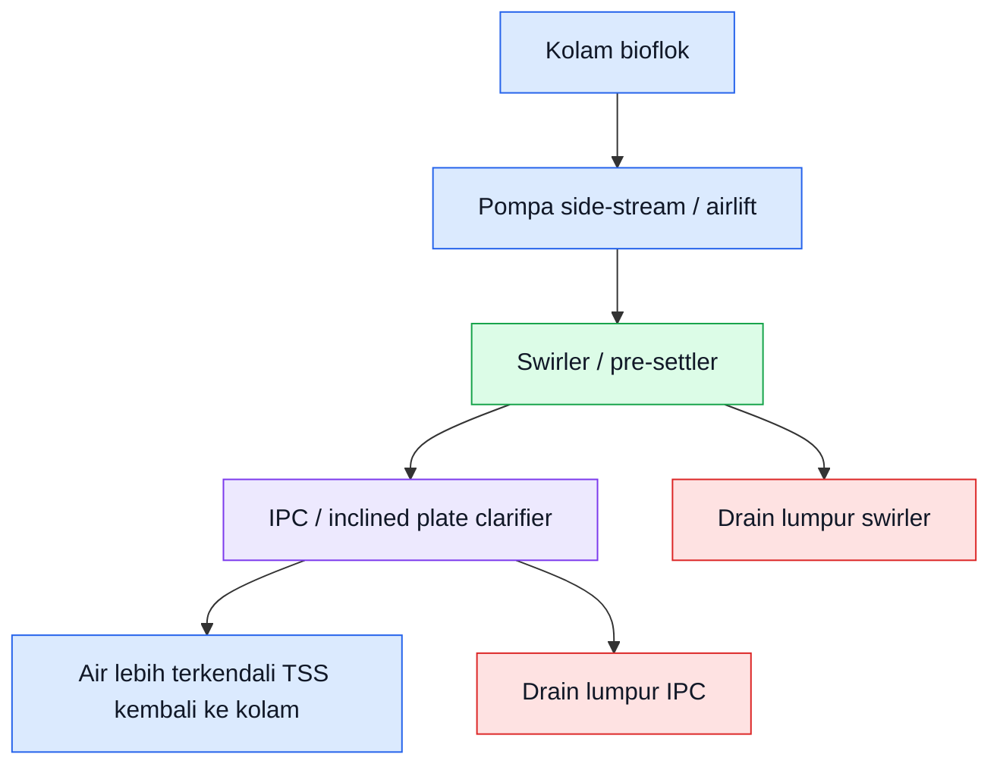
```mermaid
flowchart TD
    A[Kolam bioflok] --> B[Pompa side-stream / airlift]
    B --> C[Swirler / pre-settler]
    C --> D[IPC / inclined plate clarifier]
    D --> E[Air lebih terkendali TSS kembali ke kolam]
    C --> F[Drain lumpur swirler]
    D --> G[Drain lumpur IPC]

    classDef pond fill:#dbeafe,stroke:#2563eb,color:#111827;
    classDef unit fill:#dcfce7,stroke:#16a34a,color:#111827;
    classDef polish fill:#ede9fe,stroke:#7c3aed,color:#111827;
    classDef waste fill:#fee2e2,stroke:#dc2626,color:#111827;

    class A,B,E pond;
    class C unit;
    class D polish;
    class F,G waste;
```

Urutan tersebut penting. IPC sebaiknya **tidak ditempatkan sebelum swirler**, karena air bioflok mentah masih membawa padatan kasar yang berpotensi menyumbat kanal antar-pelat. IPC bekerja lebih stabil bila menerima air yang sudah dipra-sedimentasi.

Secara teknis:

$$
Swirler = coarse\ solids\ removal + sludge\ concentrator
$$

$$
IPC = polishing\ clarifier + fine\ floc\ settling
$$

---

## 7.2 Spesifikasi Tahap 1: Swirler

Swirler pada sistem ini bukan dirancang sebagai clarifier akhir. Ia dirancang sebagai **pre-settler** atau **sludge concentrator**. Tugas utamanya adalah menurunkan beban padatan kasar sebelum air masuk ke IPC.

| Parameter    |                             Nilai |
| ------------ | --------------------------------: |
| Debit        |                     $20\ L/menit$ |
| Volume       |                          $302\ L$ |
| HRT          |                     $15.1\ menit$ |
| Diameter     |                         $800\ mm$ |
| Tinggi total |                         $900\ mm$ |
| Footprint    |                      $0.503\ m^2$ |
| Fungsi       | pre-settler / sludge concentrator |

### 7.2.1 Peran Swirler dalam Kombinasi

Fungsi swirler dalam kombinasi ini adalah:

1. Menangkap flok besar.
2. Menangkap feses dan sisa pakan.
3. Memekatkan lumpur organik di cone bawah.
4. Menurunkan risiko clogging pada IPC.
5. Mengurangi beban TSS kasar sebelum polishing.

Swirler tidak perlu dibuat terlalu agresif. Bila pusaran terlalu kuat, flok besar bisa pecah menjadi fraksi halus. Fraksi halus tersebut justru lebih sulit diendapkan dan akan membebani IPC.

### 7.2.2 HRT Swirler

Volume swirler:

$$
V_{swirler} = 302\ L
$$

Debit:

$$
Q = 20\ L/menit
$$

Maka:

$$
HRT_{swirler} = \frac{V_{swirler}}{Q}
$$

$$
HRT_{swirler} = \frac{302}{20}
$$

$$
HRT_{swirler} = 15.1\ menit
$$

HRT ini tidak dimaksudkan untuk menjadi acuan utama bioflok. HRT $15.1$ menit lebih tepat dibaca sebagai HRT unit pre-settler. Untuk settling chamber bioflok yang lebih konservatif, Green melaporkan pengujian HRT $18$, $43$, dan $87$ menit, dengan kesimpulan bahwa minimum HRT sekitar $43$ menit sesuai untuk sistem bioflok hybrid striped bass pada kondisi studi tersebut. ([DigitalCommons][2])

### 7.2.3 Footprint Swirler

Diameter swirler:

$$
D = 0.8\ m
$$

Footprint:

$$
A_{swirler} = \frac{\pi D^2}{4}
$$

$$
A_{swirler} = \frac{3.1416 \times 0.8^2}{4}
$$

$$
A_{swirler} = 0.503\ m^2
$$

Footprint ini relatif kecil, sehingga swirler mudah ditempatkan dekat kolam sebagai unit pra-pengendapan.

### 7.2.4 Overflow Velocity Swirler

Debit dalam satuan $m^3/jam$:

$$
Q = 1.2\ m^3/jam
$$

Overflow velocity:

$$
v_{o,swirler} = \frac{Q}{A_{swirler}}
$$

$$
v_{o,swirler} = \frac{1.2}{0.503}
$$

$$
v_{o,swirler} = 2.39\ m/jam
$$

Nilai ini relatif tinggi. Artinya, swirler paling efektif untuk partikel yang cukup besar atau cukup berat. Karena itu, dalam sistem kombinasi, swirler harus diposisikan sebagai tahap pertama, bukan tahap polishing.

---

## 7.3 Spesifikasi Tahap 2: IPC

IPC berfungsi sebagai **polishing clarifier**. Setelah air melewati swirler, fraksi padatan kasar sudah berkurang. IPC kemudian menangani flok yang lebih ringan dengan memanfaatkan area pengendapan efektif yang lebih besar.

| Parameter               |               Nilai |
| ----------------------- | ------------------: |
| Debit                   |       $20\ L/menit$ |
| Volume efektif          |            $863\ L$ |
| HRT                     |       $43.2\ menit$ |
| Footprint               |        $1.132\ m^2$ |
| Projected settling area |         $2.43\ m^2$ |
| Area multiplier         |        $2.15\times$ |
| Surface loading efektif |      $0.494\ m/jam$ |
| Fungsi                  | polishing clarifier |

### 7.3.1 Peran IPC dalam Kombinasi

Fungsi IPC adalah:

1. Menurunkan surface loading efektif.
2. Menangkap flok dengan settling velocity lebih rendah.
3. Mengurangi fraksi TSS yang lolos dari swirler.
4. Menstabilkan kualitas air balik ke kolam.
5. Memperbesar area pengendapan tanpa memperbesar footprint secara proporsional.

IPC tidak boleh diperlakukan sebagai bak lumpur. Lumpur yang tertangkap harus dikeluarkan secara rutin agar plate pack tidak menjadi zona anaerob atau sumber pelepasan kembali bahan organik.

### 7.3.2 Projected Settling Area IPC

Data plate pack:

$$
N_c = 9
$$

$$
L_p = 0.60\ m
$$

$$
W_p = 0.90\ m
$$

$$
\theta = 60^\circ
$$

Projected settling area:

$$
A_{IPC} = N_c \times L_p \times W_p \times \cos \theta
$$

$$
A_{IPC} = 9 \times 0.60 \times 0.90 \times \cos 60^\circ
$$

Karena:

$$
\cos 60^\circ = 0.5
$$

Maka:

$$
A_{IPC} = 9 \times 0.60 \times 0.90 \times 0.5
$$

$$
A_{IPC} = 2.43\ m^2
$$

IPC/lamella bekerja dengan prinsip memperbesar area pengendapan melalui pelat miring. Desain lamella umumnya memakai pelat miring pada sudut $45^\circ$–$60^\circ$, dengan path length, plate spacing, dan angle sebagai variabel desain utama. ([Hydroflotech][3])

### 7.3.3 Area Multiplier IPC

Footprint IPC:

$$
A_{footprint,IPC} = 1.132\ m^2
$$

Area multiplier:

$$
R_A = \frac{A_{IPC}}{A_{footprint,IPC}}
$$

$$
R_A = \frac{2.43}{1.132}
$$

$$
R_A = 2.15
$$

Artinya, IPC memberi area pengendapan efektif sekitar:

$$
2.15\times
$$

lebih besar daripada footprint fisiknya.

### 7.3.4 Effective Surface Loading IPC

$$
v_{IPC} = \frac{Q}{A_{IPC}}
$$

$$
v_{IPC} = \frac{1.2}{2.43}
$$

$$
v_{IPC} = 0.494\ m/jam
$$

Nilai ini jauh lebih rendah dibanding swirler:

$$
v_{o,swirler} = 2.39\ m/jam
$$

dan juga lebih rendah dibanding radial sedimentasi desain sebelumnya:

$$
v_{o,radial} = 1.06\ m/jam
$$

Karena itu, IPC secara hidraulik lebih kuat untuk menangkap flok yang settling velocity-nya rendah. Namun, keunggulan ini hanya muncul bila plate pack tidak tersumbat dan distribusi inlet merata.

---

## 7.4 Total Sistem

### 7.4.1 Volume Total

Volume swirler:

$$
V_{swirler} = 302\ L
$$

Volume efektif IPC:

$$
V_{IPC} = 863\ L
$$

Maka volume total sistem seri:

$$
V_{total} = V_{swirler} + V_{IPC}
$$

$$
V_{total} = 302 + 863
$$

$$
V_{total} = 1165\ L
$$

### 7.4.2 HRT Total

Debit:

$$
Q = 20\ L/menit
$$

HRT total:

$$
HRT_{total} = \frac{V_{total}}{Q}
$$

$$
HRT_{total} = \frac{1165}{20}
$$

$$
HRT_{total} = 58.25\ menit
$$

HRT total ini tidak berarti semua pengendapan terjadi merata di seluruh sistem. Swirler bekerja cepat untuk padatan kasar, sedangkan IPC memberi waktu dan area pengendapan tambahan untuk flok ringan. Jadi interpretasi yang benar adalah:

$$
HRT_{total} = waktu\ kontak\ sistem\ seri
$$

bukan:

$$
HRT_{total} = jaminan\ removal\ total
$$

### 7.4.3 Footprint Bersih

Footprint swirler:

$$
A_{swirler} = 0.503\ m^2
$$

Footprint IPC:

$$
A_{IPC} = 1.132\ m^2
$$

Footprint bersih:

$$
A_{total} = A_{swirler} + A_{IPC}
$$

$$
A_{total} = 0.503 + 1.132
$$

$$
A_{total} = 1.635\ m^2
$$

### 7.4.4 Footprint Instalasi dengan Ruang Servis

Dalam instalasi nyata, footprint bersih belum cukup. Perlu tambahan ruang untuk:

- valve;
- pipa inlet dan outlet;
- akses drain lumpur;
- ruang mengangkat plate pack;
- ruang operator;
- akses pembersihan.

Maka footprint instalasi disarankan:

$$
A_{instalasi} \approx 2.0-2.2\ m^2
$$

Untuk praktisi, angka ini sangat penting. Sistem swirler + IPC dengan kapasitas $20\ L/menit$ masih realistis ditempatkan pada area kecil, asalkan layout pipa dan akses maintenance dirancang sejak awal.

---

## 7.5 Estimasi Removal Sistem Seri

### 7.5.1 Formula Removal Seri

Untuk unit yang dipasang seri, removal total tidak boleh dijumlahkan langsung. Formula yang benar adalah:

$$
R_{total} = 1 - (1 - R_1)(1 - R_2)
$$

Keterangan:

- $R_{total}$ = removal total sistem;
- $R_1$ = removal tahap pertama, yaitu swirler;
- $R_2$ = removal tahap kedua, yaitu IPC terhadap sisa TSS setelah swirler.

Contoh: bila swirler membuang $30%$ TSS, maka masih ada $70%$ TSS yang masuk IPC. Bila IPC membuang $60%$ dari sisa tersebut, maka total removal bukan $90%$, tetapi:

$$
R_{total} = 1 - (1 - 0.30)(1 - 0.60)
$$

$$
R_{total} = 1 - (0.70 \times 0.40)
$$

$$
R_{total} = 1 - 0.28
$$

$$
R_{total} = 0.72
$$

$$
R_{total} = 72%
$$

### 7.5.2 Contoh Skenario Estimasi

| Skenario    | Removal swirler | Removal IPC terhadap sisa | Removal total |
| ----------- | --------------: | ------------------------: | ------------: |
| Konservatif |           $20%$ |                     $50%$ |         $60%$ |
| Moderat     |           $30%$ |                     $60%$ |         $72%$ |
| Baik        |           $40%$ |                     $70%$ |         $82%$ |
| Sangat baik |           $50%$ |                     $70%$ |         $85%$ |

Angka pada tabel tersebut adalah **model estimasi**, bukan klaim universal. Removal aktual sangat dipengaruhi oleh ukuran flok, densitas flok, TSS inlet, waktu operasi, debit aktual, distribusi aliran, dan kebersihan IPC. Verifikasi wajib dilakukan dengan pengukuran TSS inlet–outlet.

### 7.5.3 Mengapa Estimasi Tidak Boleh Dianggap Pasti

Ada beberapa alasan:

1. Bioflok bukan partikel mineral seragam.
2. Flok bisa pecah bila terkena shear.
3. Densitas flok berubah mengikuti umur flok dan komposisi organik.
4. TSS dapat berubah setelah feeding.
5. IPC dapat kehilangan performa bila plate pack berlendir.
6. Swirler dapat berubah performa bila drain lumpur tidak rutin.

Data literatur pada RAS menunjukkan radial-flow settler dapat memberikan TSS removal lebih tinggi dan lebih stabil dibanding swirl separator, sedangkan swirl separator sangat baik pada partikel besar. Namun data spesifik kombinasi swirler + IPC untuk bioflok harus divalidasi di lapangan. ([ScienceDirect][4])

[**Kembali ke Atas**](#sistem-sedimentasi-bioflok-untuk-praktisi-analisis-swirler-radial-sedimentasi-ipc-dan-kombinasi-swirleripc)

---

# 8. Strategi Operasi Sistem Swirler + IPC

Desain yang baik dapat gagal bila mode operasinya salah. Pada bioflok, operator tidak boleh hanya mengejar air jernih. Tujuan utama adalah menjaga padatan pada level yang masih produktif tetapi tidak membebani sistem.

Strategi operasi swirler + IPC sebaiknya disesuaikan dengan:

- padat tebar;
- jumlah pakan harian;
- tren TSS;
- hasil Imhoff cone;
- DO;
- respons makan;
- kondisi lumpur;
- kemampuan operator melakukan cleaning.

---

## 8.1 Mode Kontinu Side-Stream

Mode kontinu berarti unit swirler + IPC berjalan terus-menerus pada debit side-stream tertentu.

Debit desain:

$$
Q_{treatment} = 20\ L/menit
$$

Mode ini cocok untuk:

- padat tebar tinggi;
- feeding tinggi;
- sistem intensif;
- TSS naik cepat;
- operator tersedia untuk drain lumpur rutin;
- sistem membutuhkan stabilitas harian.

### 8.1.1 Alur Operasi Kontinu

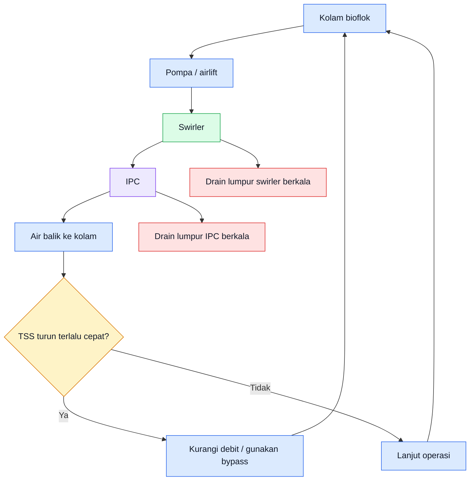
```mermaid
flowchart TD
    A[Kolam bioflok] --> B[Pompa / airlift]
    B --> C[Swirler]
    C --> D[IPC]
    D --> E[Air balik ke kolam]
    C --> F[Drain lumpur swirler berkala]
    D --> G[Drain lumpur IPC berkala]

    H{TSS turun terlalu cepat?}
    E --> H
    H -->|Ya| I[Kurangi debit / gunakan bypass]
    H -->|Tidak| J[Lanjut operasi]
    I --> A
    J --> A

    classDef pond fill:#dbeafe,stroke:#2563eb,color:#111827;
    classDef unit fill:#dcfce7,stroke:#16a34a,color:#111827;
    classDef ipc fill:#ede9fe,stroke:#7c3aed,color:#111827;
    classDef waste fill:#fee2e2,stroke:#dc2626,color:#111827;
    classDef decision fill:#fef3c7,stroke:#d97706,color:#111827;

    class A,B,E pond;
    class C unit;
    class D ipc;
    class F,G waste;
    class H decision;
    class I,J pond;
```

### 8.1.2 Kelebihan Mode Kontinu

Kelebihan mode kontinu:

- TSS lebih stabil;
- tidak menunggu lumpur menumpuk;
- beban IPC lebih konsisten;
- cocok untuk sistem intensif;
- risiko lonjakan padatan setelah feeding dapat ditekan.

### 8.1.3 Risiko Mode Kontinu

Risikonya:

- bioflok berguna bisa terlalu banyak terbuang;
- IPC lebih cepat kotor jika swirler tidak rutin didrain;
- energi pompa lebih tinggi;
- operator harus disiplin memantau sistem.

Jika air terlalu cepat jernih dan respons makan menurun, debit treatment perlu dikurangi atau mode operasi diubah menjadi periodik/bypass.

---

## 8.2 Mode Periodik

Mode periodik berarti sistem hanya dijalankan pada waktu tertentu. Mode ini cocok untuk sistem kecil-menengah atau sistem yang TSS-nya belum terlalu tinggi.

Contoh operasi:

- pagi $1$–$2$ jam;
- sore $1$–$2$ jam;
- tambahan saat hasil Imhoff cone meningkat;
- tambahan setelah feeding tinggi bila air terlihat terlalu pekat.

### 8.2.1 Alur Operasi Periodik

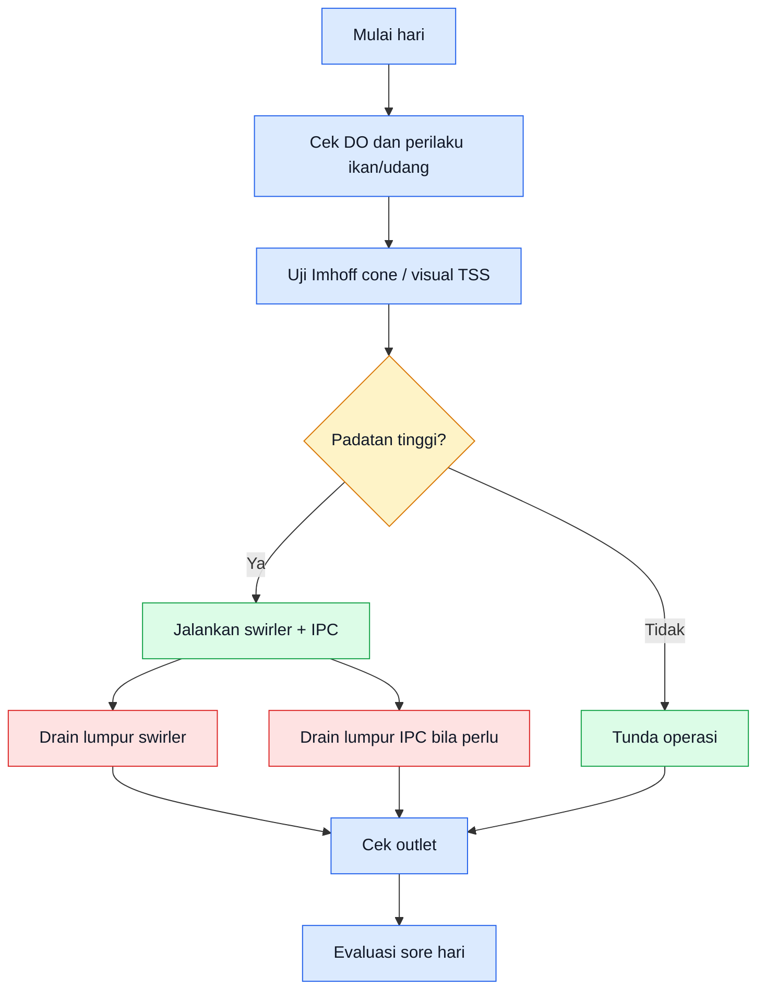
```mermaid
flowchart TD
    A[Mulai hari] --> B[Cek DO dan perilaku ikan/udang]
    B --> C[Uji Imhoff cone / visual TSS]
    C --> D{Padatan tinggi?}
    D -->|Ya| E[Jalankan swirler + IPC]
    D -->|Tidak| F[Tunda operasi]
    E --> G[Drain lumpur swirler]
    E --> H[Drain lumpur IPC bila perlu]
    G --> I[Cek outlet]
    H --> I
    F --> I
    I --> J[Evaluasi sore hari]

    classDef check fill:#dbeafe,stroke:#2563eb,color:#111827;
    classDef decision fill:#fef3c7,stroke:#d97706,color:#111827;
    classDef action fill:#dcfce7,stroke:#16a34a,color:#111827;
    classDef waste fill:#fee2e2,stroke:#dc2626,color:#111827;

    class A,B,C,I,J check;
    class D decision;
    class E,F action;
    class G,H waste;
```

### 8.2.2 Kelebihan Mode Periodik

Kelebihan mode periodik:

- lebih hemat energi;
- mengurangi risiko membuang flok berlebihan;
- lebih mudah diterapkan pada skala kecil;
- cocok untuk operator yang belum memiliki alat ukur TSS harian;
- fleksibel mengikuti kondisi kolam.

### 8.2.3 Risiko Mode Periodik

Risikonya:

- TSS bisa naik di luar jam operasi;
- lumpur dapat menumpuk bila jadwal tidak disiplin;
- perubahan kualitas air bisa lebih fluktuatif;
- kurang cocok untuk sistem dengan feeding tinggi dan padat tebar sangat tinggi.

Mode periodik sebaiknya tetap berbasis indikator, bukan hanya jam tetap. Jika Imhoff cone dan visual air menunjukkan padatan naik, durasi operasi harus ditambah.

---

## 8.3 Mode Bypass

Mode bypass adalah mode paling fleksibel. Sistem tetap memiliki pompa, tetapi sebagian aliran bisa langsung kembali ke kolam tanpa melewati swirler + IPC, sedangkan sebagian lain masuk unit sedimentasi.

### 8.3.1 Diagram Mode Bypass

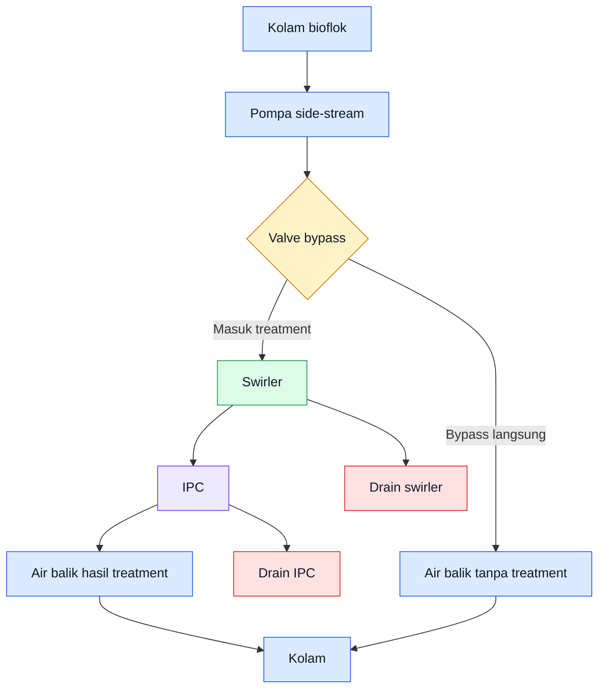
```mermaid
flowchart TD
    A[Kolam bioflok] --> B[Pompa side-stream]
    B --> C{Valve bypass}
    C -->|Masuk treatment| D[Swirler]
    D --> E[IPC]
    E --> F[Air balik hasil treatment]
    C -->|Bypass langsung| G[Air balik tanpa treatment]
    F --> H[Kolam]
    G --> H
    D --> I[Drain swirler]
    E --> J[Drain IPC]

    classDef pond fill:#dbeafe,stroke:#2563eb,color:#111827;
    classDef decision fill:#fef3c7,stroke:#d97706,color:#111827;
    classDef swirler fill:#dcfce7,stroke:#16a34a,color:#111827;
    classDef ipc fill:#ede9fe,stroke:#7c3aed,color:#111827;
    classDef waste fill:#fee2e2,stroke:#dc2626,color:#111827;

    class A,B,F,G,H pond;
    class C decision;
    class D swirler;
    class E ipc;
    class I,J waste;
```

### 8.3.2 Manfaat Bypass

Manfaat bypass:

- tidak terlalu agresif membuang bioflok;
- debit ke IPC lebih stabil;
- risiko clogging lebih rendah;
- operator dapat menyesuaikan treatment dengan kondisi TSS;
- pompa bisa tetap berjalan tanpa memaksa seluruh debit melewati IPC.

### 8.3.3 Contoh Pengaturan Bypass

Misalnya debit pompa:

$$
Q_{pompa} = 40\ L/menit
$$

Tetapi debit yang ingin masuk treatment:

$$
Q_{treatment} = 20\ L/menit
$$

Maka debit bypass:

$$
Q_{bypass} = Q_{pompa} - Q_{treatment}
$$

$$
Q_{bypass} = 40 - 20
$$

$$
Q_{bypass} = 20\ L/menit
$$

Dengan pengaturan ini, hanya separuh aliran side-stream yang diproses, sedangkan separuh lainnya kembali langsung ke kolam.

### 8.3.4 Kapan Bypass Dibutuhkan

Bypass sangat dianjurkan bila:

- TSS tidak selalu tinggi;
- bioflok masih ingin dipertahankan sebagai pakan alami;
- IPC mulai menunjukkan tanda kotor;
- DO rendah dan sistem tidak boleh terlalu terganggu;
- debit pompa lebih besar daripada debit desain IPC;
- operator ingin fleksibilitas.

[**Kembali ke Atas**](#sistem-sedimentasi-bioflok-untuk-praktisi-analisis-swirler-radial-sedimentasi-ipc-dan-kombinasi-swirleripc)

---

# 9. Monitoring, Validasi, dan Indikator Keberhasilan

Sistem sedimentasi tidak boleh dinilai hanya dari air yang terlihat lebih jernih. Pada bioflok, air yang terlalu jernih belum tentu baik. Yang harus dinilai adalah apakah sistem mampu menjaga TSS, DO, dan performa biologis dalam kondisi stabil.

Monitoring diperlukan untuk menjawab tiga pertanyaan:

1. Apakah sedimentasi benar-benar menurunkan TSS?
2. Apakah bioflok yang berguna tidak terbuang berlebihan?
3. Apakah sistem tidak menciptakan masalah baru seperti sludge anaerob atau clogging IPC?

---

## 9.1 Parameter Lapangan

| Parameter        | Fungsi                                       |
| ---------------- | -------------------------------------------- |
| TSS inlet–outlet | mengukur removal aktual                      |
| Imhoff cone      | melihat settleable solids                    |
| DO               | memastikan sedimentasi tidak menekan oksigen |
| pH               | memantau stabilitas sistem                   |
| TAN/amonia       | melihat beban nitrogen                       |
| Nitrit           | indikator stres nitrogen                     |
| Bau lumpur       | deteksi anaerob                              |
| Respons makan    | indikator biologis                           |
| Visual flok      | melihat apakah flok pecah atau terlalu halus |

### 9.1.1 TSS Inlet–Outlet

TSS inlet–outlet adalah metode validasi paling langsung. Sampel inlet diambil sebelum swirler. Sampel outlet diambil setelah IPC. Dari selisih keduanya, operator bisa menghitung removal aktual.

Titik sampling ideal:

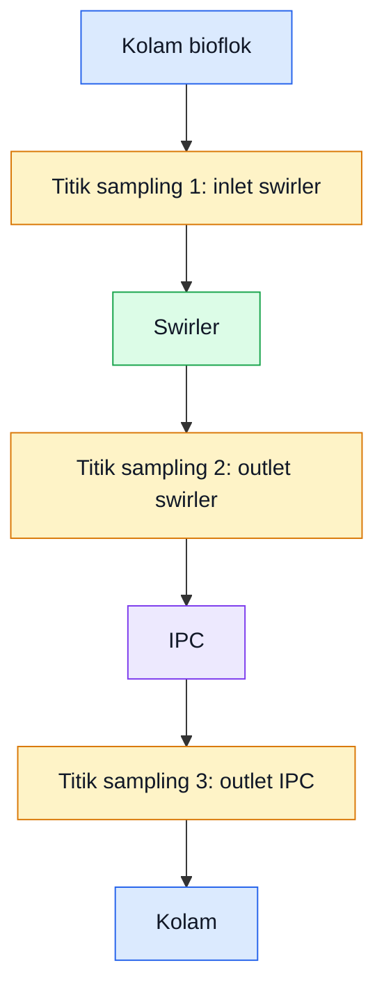
```mermaid
flowchart TD
    A[Kolam bioflok] --> B[Titik sampling 1: inlet swirler]
    B --> C[Swirler]
    C --> D[Titik sampling 2: outlet swirler]
    D --> E[IPC]
    E --> F[Titik sampling 3: outlet IPC]
    F --> G[Kolam]

    classDef pond fill:#dbeafe,stroke:#2563eb,color:#111827;
    classDef sample fill:#fef3c7,stroke:#d97706,color:#111827;
    classDef unit fill:#dcfce7,stroke:#16a34a,color:#111827;
    classDef ipc fill:#ede9fe,stroke:#7c3aed,color:#111827;

    class A,G pond;
    class B,D,F sample;
    class C unit;
    class E ipc;
```

Tiga titik sampling memberi informasi lebih kaya:

- sampling 1 menunjukkan beban awal;
- sampling 2 menunjukkan performa swirler;
- sampling 3 menunjukkan performa total sistem.

### 9.1.2 Imhoff Cone

Imhoff cone berguna untuk melihat settleable solids secara cepat. Uji ini sangat praktis untuk operator karena tidak membutuhkan laboratorium rumit. Ambil sampel air $1\ L$, masukkan ke Imhoff cone, diamkan sesuai waktu pengamatan, lalu baca volume endapan.

Hasil Imhoff cone tidak sama dengan TSS, tetapi sangat berguna untuk memantau tren harian. Jika endapan naik terus, sistem sedimentasi perlu dijalankan lebih lama atau drain lumpur perlu diperbaiki.

### 9.1.3 DO

DO harus dipantau karena sedimentasi memindahkan padatan organik dan dapat memengaruhi dinamika oksigen. TSS tinggi meningkatkan respirasi mikroba dan konsumsi oksigen. Bila DO turun setelah sistem dioperasikan, penyebabnya bisa berupa mixing terganggu, lumpur anaerob teraduk, atau padatan terlalu lama tertahan.

Target praktis umum:

$$
DO > 4-5\ mg/L
$$

Nilai target dapat berubah sesuai komoditas, umur, kepadatan, suhu, dan sistem aerasi.

### 9.1.4 Bau Lumpur

Bau lumpur adalah indikator lapangan yang sering lebih cepat daripada angka laboratorium. Lumpur yang normal biasanya berbau organik ringan. Lumpur anaerob biasanya berbau tajam, busuk, atau seperti telur busuk.

Jika bau anaerob muncul, tindakan praktis:

- tingkatkan frekuensi drain swirler;
- drain IPC lebih sering;
- cek dead zone;
- cek apakah hopper menahan lumpur terlalu lama;
- jangan biarkan lumpur menumpuk di plate pack.

### 9.1.5 Visual Flok

Visual flok penting untuk melihat apakah swirler terlalu agresif. Jika setelah swirler flok terlihat lebih halus dan air outlet IPC tetap keruh, kemungkinan flok pecah menjadi partikel kecil. Dalam kasus ini, operator perlu:

- menurunkan debit ke swirler;
- memperbesar diameter inlet;
- mengurangi tekanan pompa;
- memakai airlift bila memungkinkan;
- mengatur bypass.

---

## 9.2 Formula Validasi Removal

Formula dasar removal TSS:

$$
Removal\ TSS = \frac{TSS_{in} - TSS_{out}}{TSS_{in}} \times 100%
$$

Keterangan:

- $TSS_{in}$ = TSS sebelum sistem sedimentasi;
- $TSS_{out}$ = TSS setelah sistem sedimentasi;
- $Removal\ TSS$ = efisiensi pengurangan TSS.

Contoh:

$$
TSS_{in} = 400\ mg/L
$$

$$
TSS_{out} = 160\ mg/L
$$

Maka:

$$
Removal\ TSS = \frac{400 - 160}{400} \times 100%
$$

$$
Removal\ TSS = \frac{240}{400} \times 100%
$$

$$
Removal\ TSS = 60%
$$

Jika ingin mengukur performa tiap tahap:

### Removal Swirler

$$
Removal_{swirler} = \frac{TSS_{in,swirler} - TSS_{out,swirler}}{TSS_{in,swirler}} \times 100%
$$

### Removal IPC terhadap Outlet Swirler

$$
Removal_{IPC} = \frac{TSS_{out,swirler} - TSS_{out,IPC}}{TSS_{out,swirler}} \times 100%
$$

### Removal Total Sistem

$$
Removal_{total} = \frac{TSS_{in,swirler} - TSS_{out,IPC}}{TSS_{in,swirler}} \times 100%
$$

Dengan tiga formula ini, operator bisa melihat apakah masalah ada di swirler, IPC, atau keduanya.

---

## 9.3 Beban Padatan Harian

Beban TSS harian membantu operator memahami berapa banyak padatan yang masuk ke sistem sedimentasi per hari.

Formula:

$$
L_{TSS} = Q \times TSS \times 0.001
$$

Keterangan:

- $L_{TSS}$ = beban TSS dalam $kg/hari$;
- $Q$ = debit harian dalam $m^3/hari$;
- $TSS$ = konsentrasi TSS dalam $mg/L$;
- $0.001$ = faktor konversi.

Jika:

$$
Q = 28.8\ m^3/hari
$$

dan:

$$
TSS = 400\ mg/L
$$

maka:

$$
L_{TSS} = 28.8 \times 400 \times 0.001
$$

$$
L_{TSS} = 11.52\ kg/hari
$$

Jadi beban padatan yang melewati sistem sedimentasi adalah:

$$
11.52\ kg/hari
$$

Jika removal total sistem adalah $72%$, maka padatan yang dibuang:

$$
TSS_{removed} = 11.52 \times 0.72
$$

$$
TSS_{removed} = 8.29\ kg/hari
$$

Jika removal total sistem adalah $60%$:

$$
TSS_{removed} = 11.52 \times 0.60
$$

$$
TSS_{removed} = 6.91\ kg/hari
$$

Jika removal total sistem adalah $82%$:

$$
TSS_{removed} = 11.52 \times 0.82
$$

$$
TSS_{removed} = 9.45\ kg/hari
$$

Angka ini harus dipakai hati-hati. Pada bioflok, tidak semua TSS adalah limbah yang harus dibuang. Sebagian flok masih bernilai biologis. Karena itu, target monitoring bukan hanya removal tinggi, tetapi **stabilitas sistem**.

---

## 9.4 Indikator Keberhasilan Sistem

Sistem swirler + IPC dapat dianggap bekerja baik bila memenuhi indikator berikut:

| Indikator        | Tanda sistem baik                               |
| ---------------- | ----------------------------------------------- |
| TSS inlet–outlet | Ada penurunan konsisten                         |
| Imhoff cone      | Tren endapan terkendali                         |
| DO               | Tidak turun setelah sistem berjalan             |
| Bau lumpur       | Tidak anaerob                                   |
| Outlet IPC       | Tidak membawa flok kasar                        |
| Plate pack       | Tidak cepat berlendir atau tersumbat            |
| Respons makan    | Stabil atau membaik                             |
| Visual flok      | Flok tidak hancur menjadi partikel sangat halus |
| Drain lumpur     | Lumpur keluar pekat, bukan hanya air encer      |

### 9.4.1 Kriteria Praktis yang Lebih Penting daripada Air Jernih

Dalam bioflok, air yang terlalu jernih bisa menjadi sinyal bahwa flok terlalu banyak terbuang. Karena itu, indikator terbaik bukan kejernihan maksimum, melainkan keseimbangan:

$$
TSS\ terkendali + DO\ stabil + respons\ makan\ baik
$$

Jika air menjadi lebih terkendali tetapi ikan/udang tetap aktif makan, DO stabil, dan bau lumpur tidak muncul, maka sistem bekerja baik.

---

## 9.5 Troubleshooting Awal Berdasarkan Hasil Monitoring

```mermaid
flowchart TD
    A[Masalah teramati] --> B{Outlet IPC masih keruh?}
    B -->|Ya| C{Swirler efektif?}
    C -->|Tidak| D[Periksa debit, inlet tangensial, dan drain swirler]
    C -->|Ya| E[Periksa plate pack IPC dan distribusi inlet]
    B -->|Tidak| F{Bioflok terlalu banyak hilang?}
    F -->|Ya| G[Kurangi durasi operasi atau gunakan bypass]
    F -->|Tidak| H[Sistem berjalan baik]

    A --> I{Bau lumpur anaerob?}
    I -->|Ya| J[Tingkatkan drain lumpur dan cek dead zone]
    I -->|Tidak| H

    classDef problem fill:#fee2e2,stroke:#dc2626,color:#111827;
    classDef decision fill:#fef3c7,stroke:#d97706,color:#111827;
    classDef action fill:#dcfce7,stroke:#16a34a,color:#111827;
    classDef good fill:#dbeafe,stroke:#2563eb,color:#111827;

    class A problem;
    class B,C,F,I decision;
    class D,E,G,J action;
    class H good;
```

Tabel ringkas troubleshooting:

| Gejala                       | Kemungkinan penyebab                          | Tindakan                                       |
| ---------------------------- | --------------------------------------------- | ---------------------------------------------- |
| Outlet IPC masih keruh       | Plate pack kotor atau distribusi inlet buruk  | Cuci plate pack, cek baffle inlet              |
| Flok terlihat pecah          | Inlet swirler terlalu agresif                 | Turunkan debit, perbesar inlet, gunakan bypass |
| Lumpur berbau busuk          | Drain tidak rutin atau dead zone              | Drain lebih sering, cek hopper                 |
| TSS turun terlalu cepat      | Operasi terlalu lama atau debit terlalu besar | Kurangi durasi, aktifkan bypass                |
| IPC cepat clogging           | Swirler tidak efektif sebagai pre-settler     | Perbaiki swirler dan frekuensi drain           |
| Air balik membawa flok besar | Swirler overload atau HRT terlalu pendek      | Turunkan debit treatment                       |

---

## Referensi Bab 7–9

1. Green, B. W. melaporkan evaluasi settling chamber bioflok pada HRT $18$, $43$, dan $87$ menit, dengan kesimpulan minimum sekitar $43$ menit sesuai untuk biofloc culture hybrid striped bass pada kondisi penelitian tersebut. ([DigitalCommons][2])
2. Davidson dan Summerfelt melaporkan perbandingan swirl separator dan radial-flow settler pada RAS, dengan rata-rata TSS removal masing-masing $37.1 \pm 3.3%$ dan $77.9 \pm 1.6%$. ([ScienceDirect][4])
3. Pfeiffer et al. melaporkan swirl separator efektif untuk partikel besar, dengan removal lebih dari $90%$ untuk partikel di atas $250\ \mu m$. ([ScienceDirect][1])
4. HydroFlo Tech menjelaskan prinsip inclined plate clarifier / lamella, termasuk penggunaan pelat miring $45^\circ$–$60^\circ$ serta path length, plate spacing, dan angle sebagai variabel desain utama. ([Hydroflotech][3])

[1]: https://www.sciencedirect.com/science/article/abs/pii/S0144860908000320?utm_source=chatgpt.com 'Particle sieve analysis for determining solids removal ...'
[2]: https://digitalcommons.unl.edu/cgi/viewcontent.cgi?article=3608&context=usdaarsfacpub&utm_source=chatgpt.com 'Evaluation of Settling Chamber Hydraulic Retention Time in a ...'
[3]: https://hydroflotech.com/theory-of-inclined-plate-clarifier-design/?utm_source=chatgpt.com 'Theory of Inclined Plate Clarifier Design'
[4]: https://www.sciencedirect.com/science/article/pii/S0144860904001049?utm_source=chatgpt.com 'Solids removal from a coldwater recirculating system— ...'

[**Kembali ke Atas**](#sistem-sedimentasi-bioflok-untuk-praktisi-analisis-swirler-radial-sedimentasi-ipc-dan-kombinasi-swirleripc)

---

# 10. SOP Praktis Harian

SOP sistem **swirler + IPC** harus dibuat sederhana, berulang, dan mudah dijalankan operator. Targetnya bukan membuat air bioflok sejernih air RAS konvensional, tetapi menjaga agar padatan tetap terkendali, DO stabil, lumpur tidak anaerob, dan IPC tidak tersumbat.

Pada sistem ini, swirler berperan sebagai **pre-settler**, sedangkan IPC berperan sebagai **polishing clarifier**. Pembagian fungsi ini penting karena swirl separator lebih tepat untuk menangkap fraksi padatan kasar, sedangkan IPC lebih efektif secara hidraulik untuk memperbesar area pengendapan dalam footprint kecil. Studi Pfeiffer et al. menunjukkan swirl separator sangat efektif untuk partikel besar, terutama fraksi di atas $250\ \mu m$, sementara literatur lamella menjelaskan bahwa pelat miring meningkatkan area pemisahan efektif dalam ruang kompak. ([DigitalCommons][1])

---

## 10.1 SOP Pagi

Pagi adalah waktu kritis karena DO biasanya berada pada titik rendah setelah malam hari. FAO menjelaskan bahwa DO kolam berfluktuasi harian: fotosintesis meningkatkan oksigen pada siang hari, sedangkan pada malam hari respirasi organisme dan dekomposisi bahan organik mengonsumsi oksigen. ([FAOHome][2])

### 10.1.1 Urutan Pemeriksaan Pagi

```mermaid
flowchart TD
    A[Mulai pagi] --> B[Cek DO]
    B --> C[Cek perilaku ikan/udang]
    C --> D[Ambil sampel Imhoff cone]
    D --> E{Endapan tinggi?}
    E -->|Ya| F[Jalankan swirler + IPC]
    E -->|Tidak| G[Tunda operasi atau jalankan pendek]
    F --> H[Drain swirler singkat]
    H --> I[Cek outlet IPC]
    G --> I
    I --> J[Catat hasil harian]

    classDef start fill:#dbeafe,stroke:#2563eb,color:#111827;
    classDef check fill:#dcfce7,stroke:#16a34a,color:#111827;
    classDef decision fill:#fef3c7,stroke:#d97706,color:#111827;
    classDef action fill:#ede9fe,stroke:#7c3aed,color:#111827;
    classDef record fill:#fce7f3,stroke:#db2777,color:#111827;

    class A start;
    class B,C,D,I check;
    class E decision;
    class F,G,H action;
    class J record;
```

### 10.1.2 Cek DO

Langkah pertama adalah mengukur DO sebelum sistem sedimentasi dijalankan. Jangan langsung menyalakan pompa dan membuka drain bila DO sedang rendah, karena pengadukan lumpur atau perubahan aliran dapat menambah stres pada ikan atau udang.

Target praktis umum untuk banyak komoditas budidaya adalah menjaga DO sekitar $>4$–$5\ mg/L$, tetapi angka aman harus disesuaikan dengan komoditas, suhu, salinitas, padat tebar, dan fase budidaya. Sumber teknis akuakultur umumnya menempatkan DO sebagai parameter utama kualitas air, dengan kebutuhan optimal banyak spesies berada sekitar $5\ mg/L$ atau lebih. ([static.horiba.com][3])

Catatan praktis:

| Kondisi DO pagi                  | Tindakan                                             |
| -------------------------------- | ---------------------------------------------------- |
| DO stabil                        | Sistem boleh dijalankan sesuai jadwal                |
| DO rendah                        | Tunda operasi penuh, tingkatkan aerasi               |
| DO turun setelah sistem berjalan | Cek lumpur anaerob, debit, dan titik pengambilan air |
| DO sangat fluktuatif             | Kurangi durasi operasi dan evaluasi beban organik    |

### 10.1.3 Cek Perilaku Ikan/Udang

Setelah DO, amati perilaku organisme budidaya. Pada bioflok, respons biologis sering lebih cepat memberi sinyal daripada angka laboratorium.

Perhatikan:

- ikan/udang mendekati permukaan;
- gerakan lambat;
- nafsu makan turun;
- berenang tidak normal;
- udang sering naik ke dinding atau pinggir;
- ikan berkumpul di area aerasi.

Jika perilaku tidak normal, jangan langsung mengejar pembuangan TSS besar-besaran. Stabilkan aerasi, cek bau lumpur, dan pastikan tidak ada akumulasi bahan organik anaerob.

### 10.1.4 Uji Imhoff Cone

Uji Imhoff cone adalah alat keputusan harian yang sangat praktis. Ambil air bioflok sebanyak $1\ L$, masukkan ke Imhoff cone, lalu diamkan. Tujuannya melihat tren **settleable solids**, bukan menggantikan uji TSS laboratorium.

Interpretasi praktis:

| Hasil Imhoff cone                               | Interpretasi                            |
| ----------------------------------------------- | --------------------------------------- |
| Endapan stabil                                  | Operasi normal                          |
| Endapan naik perlahan                           | Tambah durasi sedimentasi               |
| Endapan naik tajam                              | Jalankan swirler + IPC lebih lama       |
| Endapan sangat rendah tetapi air terlalu jernih | Bioflok mungkin terlalu banyak terbuang |

Imhoff cone membantu menghindari kesalahan umum: menjalankan sedimentasi hanya berdasarkan visual air. Dalam bioflok, air tidak harus jernih total.

### 10.1.5 Jalankan Sistem Bila Endapan Tinggi

Jika hasil Imhoff cone menunjukkan endapan tinggi, jalankan sistem:

$$
Kolam \rightarrow Swirler \rightarrow IPC \rightarrow Kolam
$$

Debit operasi standar:

$$
Q_{treatment} = 20\ L/menit
$$

Jika sistem memakai bypass, pastikan debit yang benar-benar masuk treatment tetap mendekati nilai desain:

$$
Q_{treatment} = 20\ L/menit
$$

Bila debit aktual terlalu tinggi, HRT turun dan surface loading naik. Dampaknya, flok ringan lebih mudah lolos dan IPC lebih cepat kotor.

### 10.1.6 Drain Swirler Singkat dan Sering

Swirler sebaiknya didrain **singkat tetapi sering**. Jangan menunggu cone penuh. Lumpur yang terlalu lama tertahan akan mulai membusuk, terutama bila kaya bahan organik.

Prinsipnya:

$$
Drain\ pendek\ dan\ rutin > drain\ panjang\ tetapi\ jarang
$$

Tanda drain swirler bekerja baik:

- lumpur keluar lebih pekat pada awal drain;
- bau tidak menyengat;
- setelah beberapa detik, air drain mulai lebih encer;
- tidak ada penyumbatan di valve;
- aliran keluar tidak tersendat.

### 10.1.7 Cek Outlet IPC

Outlet IPC adalah titik cepat untuk menilai apakah sistem bekerja. Perhatikan apakah air outlet masih membawa flok kasar. Jika outlet IPC masih membawa flok besar, masalah kemungkinan ada di swirler atau debit terlalu tinggi. Jika outlet IPC membawa flok halus terus-menerus, masalah bisa ada pada plate pack, distribusi inlet, atau flok terlalu ringan.

---

## 10.2 SOP Sore

Sore adalah waktu evaluasi kedua. Pada sore hari, aktivitas pakan sudah terjadi, bahan organik bertambah, dan flok dapat berubah konsentrasi. Pemeriksaan sore membantu mencegah masalah yang muncul pada malam hari.

### 10.2.1 Urutan Pemeriksaan Sore

```mermaid
flowchart TD
    A[Mulai sore] --> B[Cek visual air]
    B --> C[Cek bau lumpur]
    C --> D{Ada bau anaerob?}
    D -->|Ya| E[Drain swirler dan IPC lebih sering]
    D -->|Tidak| F[Cek plate pack IPC]
    F --> G{Plate mulai berlendir?}
    G -->|Ya| H[Jadwalkan cuci plate pack]
    G -->|Tidak| I[Operasi normal]
    E --> J[Catat tindakan]
    H --> J
    I --> J

    classDef start fill:#dbeafe,stroke:#2563eb,color:#111827;
    classDef check fill:#dcfce7,stroke:#16a34a,color:#111827;
    classDef decision fill:#fef3c7,stroke:#d97706,color:#111827;
    classDef action fill:#ede9fe,stroke:#7c3aed,color:#111827;
    classDef risk fill:#fee2e2,stroke:#dc2626,color:#111827;

    class A start;
    class B,C,F check;
    class D,G decision;
    class E,H action;
    class I,J check;
```

### 10.2.2 Cek Visual Air

Visual air tidak boleh menjadi satu-satunya acuan, tetapi tetap penting. Amati:

- warna air terlalu pekat;
- partikel besar melayang;
- flok tampak pecah menjadi halus;
- busa berlebih;
- air outlet IPC berubah keruh;
- permukaan air berminyak atau berlendir.

Jika air sangat pekat pada sore hari, sistem dapat dijalankan tambahan $1$–$2$ jam. Jika air terlalu jernih dan flok hampir hilang, kurangi durasi operasi atau buka bypass lebih besar.

### 10.2.3 Cek Bau Lumpur

Cek bau dari drain swirler dan drain IPC. Bau lumpur normal biasanya organik ringan. Bau anaerob biasanya tajam, busuk, atau mirip telur busuk.

Jika bau anaerob muncul, tindakan cepat:

1. Drain lumpur sedikit lebih sering.
2. Jangan biarkan lumpur tertahan di cone.
3. Cek apakah hopper IPC memiliki dead zone.
4. Pastikan pipa drain tidak terlalu kecil atau tersumbat.
5. Evaluasi apakah feeding terlalu tinggi.

### 10.2.4 Drain IPC Bila Ada Akumulasi

IPC bukan tempat menyimpan lumpur. Lumpur yang tertangkap di plate pack dan hopper harus keluar. Jika dibiarkan, IPC dapat berubah menjadi sumber masalah: clogging, bau, pelepasan kembali bahan organik, dan short-circuit.

Tanda IPC perlu didrain:

- outlet mulai keruh;
- aliran antar-pelat terlihat lambat;
- plate mulai berlendir;
- hopper tampak penuh endapan;
- ada bau saat valve dibuka;
- perbedaan visual inlet–outlet makin kecil.

### 10.2.5 Pastikan Plate Pack Tidak Mulai Berlendir

Bioflok kaya bahan organik. Permukaan pelat IPC dapat menjadi tempat tumbuh biofilm. Karena itu, plate pack harus diperiksa visual. Literatur lamella menunjukkan spacing pelat umum berada sekitar $40$–$120\ mm$; desain artikel ini memakai spacing $50\ mm$ sebagai kompromi antara area efektif dan risiko clogging pada bioflok. ([ScienceDirect][4])

Jika plate mulai berlendir:

- kurangi beban padatan ke IPC;
- pastikan swirler efektif;
- tambah frekuensi drain swirler;
- jadwalkan cuci plate pack;
- jangan menaikkan debit sebelum plate bersih.

---

## 10.3 SOP Mingguan

SOP mingguan bertujuan menjaga performa sistem. Masalah IPC sering tidak muncul mendadak, tetapi akumulatif: plate makin berlendir, baffle mulai kotor, debit turun, dan drain mulai tersumbat.

### 10.3.1 Checklist Mingguan

```mermaid
flowchart TD
    A[Checklist mingguan] --> B[Angkat dan cuci plate pack IPC]
    A --> C[Cek valve drain]
    A --> D[Cek inlet baffle]
    A --> E[Ukur debit aktual]
    A --> F[Bandingkan TSS inlet dan outlet]
    E --> G{Debit sesuai desain?}
    G -->|Ya| H[Lanjut operasi]
    G -->|Tidak| I[Setel valve / bersihkan pipa]
    F --> J{Removal turun?}
    J -->|Ya| K[Cek swirler, IPC, dan short-circuit]
    J -->|Tidak| H

    classDef start fill:#dbeafe,stroke:#2563eb,color:#111827;
    classDef task fill:#dcfce7,stroke:#16a34a,color:#111827;
    classDef decision fill:#fef3c7,stroke:#d97706,color:#111827;
    classDef action fill:#ede9fe,stroke:#7c3aed,color:#111827;

    class A start;
    class B,C,D,E,F task;
    class G,J decision;
    class H,I,K action;
```

### 10.3.2 Angkat dan Cuci Plate Pack IPC

Plate pack harus dirancang **removable**. Ini bukan opsi tambahan, melainkan syarat praktis. IPC bioflok yang plate pack-nya tidak bisa diangkat akan sulit dirawat.

Cuci plate pack dengan prinsip:

- gunakan air bertekanan sedang;
- hindari merusak permukaan pelat;
- bersihkan lendir dan lumpur menempel;
- cek apakah ada kanal yang buntu;
- pastikan plate dipasang kembali dengan spacing sama.

Jika plate pack terlalu sering kotor, masalahnya bukan hanya pada IPC. Biasanya ada masalah di tahap sebelumnya: swirler kurang efektif, drain swirler jarang, debit terlalu tinggi, atau TSS kolam memang terlalu pekat.

### 10.3.3 Cek Valve Drain

Valve drain adalah titik kegagalan umum. Lumpur bioflok bisa lengket dan menyumbat valve kecil. Karena itu, drain swirler dan IPC sebaiknya mudah dibuka, tidak terlalu kecil, dan tidak memiliki banyak belokan tajam.

Cek:

- valve mudah dibuka-tutup;
- tidak ada sumbatan;
- aliran drain keluar lancar;
- lumpur tidak mengeras di pipa;
- tidak ada kebocoran.

### 10.3.4 Cek Inlet Baffle

Baffle inlet pada IPC bertugas meratakan aliran. Jika baffle kotor atau posisi aliran salah, air bisa mengambil jalur pendek langsung ke outlet. Ini disebut short-circuiting.

Tanda short-circuiting:

- outlet keruh walaupun plate bersih;
- sebagian plate kotor, sebagian lain bersih;
- aliran hanya dominan di satu sisi;
- removal TSS turun tanpa perubahan TSS inlet.

### 10.3.5 Ukur Debit Aktual dengan Ember Ukur

Jangan hanya mengandalkan spesifikasi pompa. Debit aktual dipengaruhi oleh head, kotoran pipa, valve, elbow, dan kondisi pompa.

Cara sederhana:

1. Siapkan ember dengan volume diketahui.
2. Arahkan outlet sistem ke ember.
3. Catat waktu pengisian.
4. Hitung debit.

Formula:

$$
Q = \frac{V_{ember}}{t}
$$

Jika ember $20\ L$ penuh dalam $60\ detik$:

$$
Q = \frac{20\ L}{1\ menit}
$$

$$
Q = 20\ L/menit
$$

Jika debit aktual naik menjadi $30\ L/menit$, maka HRT IPC turun:

$$
HRT_{IPC} = \frac{863}{30}
$$

$$
HRT_{IPC} = 28.8\ menit
$$

Ini jauh lebih pendek dari desain awal:

$$
HRT_{desain} = 43.2\ menit
$$

### 10.3.6 Bandingkan TSS Inlet dan Outlet

Minimal mingguan, lakukan perbandingan:

$$
TSS_{in}
$$

dan:

$$
TSS_{out}
$$

Formula:

$$
Removal\ TSS = \frac{TSS_{in} - TSS_{out}}{TSS_{in}} \times 100%
$$

Jika removal turun, jangan langsung memperbesar debit. Langkah yang lebih tepat adalah memeriksa:

- apakah swirler penuh lumpur;
- apakah IPC berlendir;
- apakah baffle kotor;
- apakah ada short-circuit;
- apakah debit aktual terlalu tinggi;
- apakah flok pecah di swirler.

[**Kembali ke Atas**](#sistem-sedimentasi-bioflok-untuk-praktisi-analisis-swirler-radial-sedimentasi-ipc-dan-kombinasi-swirleripc)

---

# 11. Risiko Desain dan Mitigasi

Sistem swirler + IPC kuat, tetapi tidak bebas risiko. Risiko utama dalam bioflok bukan hanya alat gagal memisahkan padatan, tetapi alat bekerja terlalu agresif sehingga menghilangkan flok berguna atau menimbulkan masalah baru seperti clogging dan lumpur anaerob.

---

## 11.1 Flok Terlalu Banyak Terbuang

### 11.1.1 Penyebab

Flok terlalu banyak terbuang biasanya terjadi karena:

- sistem dijalankan terlalu lama;
- debit treatment terlalu besar;
- tidak ada bypass;
- drain dilakukan terlalu agresif;
- operator mengejar air terlalu jernih;
- IPC terlalu efektif menangkap flok tanpa kontrol.

Pada bioflok, sebagian flok memiliki nilai biologis dan nutrisi. Karena itu, air yang terlalu jernih tidak selalu menjadi indikator keberhasilan.

### 11.1.2 Dampak

Dampak flok terlalu banyak terbuang:

- sumber pakan alami berkurang;
- kestabilan komunitas mikroba terganggu;
- sistem menjadi lebih mirip RAS biasa tetapi tanpa biofilter lengkap;
- kebutuhan pakan bisa naik;
- dinamika nitrogen dapat berubah.

### 11.1.3 Mitigasi

Mitigasi utama:

- gunakan bypass;
- jangan operasikan $24$ jam bila TSS sudah turun;
- cek Imhoff cone;
- jangan mengejar air terlalu jernih;
- kurangi durasi operasi;
- turunkan debit treatment;
- lakukan drain lumpur singkat, bukan panjang.

Diagram keputusan:

```mermaid
flowchart TD
    A[Air terlalu jernih / flok turun drastis] --> B{Respons makan baik?}
    B -->|Ya| C[Kurangi durasi operasi]
    B -->|Tidak| D[Cek DO, pH, dan stres ikan/udang]
    C --> E[Perbesar bypass]
    D --> E
    E --> F[Cek Imhoff cone besok pagi]
    F --> G{Flok kembali stabil?}
    G -->|Ya| H[Operasi normal terkendali]
    G -->|Tidak| I[Kurangi debit treatment lagi]

    classDef risk fill:#fee2e2,stroke:#dc2626,color:#111827;
    classDef decision fill:#fef3c7,stroke:#d97706,color:#111827;
    classDef action fill:#dcfce7,stroke:#16a34a,color:#111827;
    classDef good fill:#dbeafe,stroke:#2563eb,color:#111827;

    class A risk;
    class B,G decision;
    class C,D,E,F,I action;
    class H good;
```

---

## 11.2 IPC Clogging

### 11.2.1 Penyebab

IPC clogging adalah risiko utama sistem ini. Penyebabnya:

- IPC menerima air bioflok mentah tanpa swirler;
- spacing pelat terlalu rapat;
- plate pack tidak removable;
- drain lumpur jarang;
- ada dead zone di hopper;
- inlet tidak merata;
- flok terlalu lengket;
- biofilm tumbuh di permukaan pelat.

Lamella clarifier bekerja dengan pelat miring dan jarak antar-pelat tertentu; sumber teknis menyebut kisaran sudut pelat umum $45^\circ$–$60^\circ$ dan spacing sekitar $40$–$120\ mm$. Pada bioflok, desain terlalu rapat meningkatkan risiko kotor dan buntu. ([ScienceDirect][4])

### 11.2.2 Dampak

Dampak clogging IPC:

- aliran tidak merata;
- sebagian kanal mati;
- short-circuit meningkat;
- outlet makin keruh;
- lumpur menjadi anaerob;
- tekanan pompa naik;
- cleaning makin sulit.

### 11.2.3 Mitigasi

Mitigasi:

- swirler wajib di depan;
- spacing pelat minimal $50\ mm$;
- plate pack harus removable;
- drain lumpur rutin;
- hindari dead zone;
- gunakan baffle distribusi;
- jangan menaikkan debit saat plate mulai kotor.

Prinsip desain:

$$
IPC\ bioflok\ harus\ mudah\ dibersihkan
$$

bukan hanya:

$$
IPC\ bioflok\ harus\ kompak
$$

---

## 11.3 Flok Pecah di Swirler

### 11.3.1 Penyebab

Flok pecah di swirler terjadi bila gaya geser terlalu tinggi. Penyebab umum:

- inlet terlalu kecil;
- debit terlalu tinggi;
- pompa terlalu kuat;
- pusaran terlalu agresif;
- pipa masuk menembak langsung ke zona outlet;
- tidak ada bypass.

Dalam desain ini, inlet DN40 pada debit $20\ L/menit$ menghasilkan kecepatan inlet sekitar:

$$
v_i \approx 0.27\ m/s
$$

Nilai ini relatif lembut untuk pre-settling bioflok. Namun, bila debit dinaikkan tanpa memperbesar inlet, kecepatan dan shear akan naik.

### 11.3.2 Dampak

Dampak flok pecah:

- partikel menjadi lebih halus;
- swirler terlihat kurang efektif;
- IPC menerima beban flok halus lebih banyak;
- outlet IPC bisa tetap keruh;
- TSS sulit turun walaupun sistem berjalan.

### 11.3.3 Mitigasi

Mitigasi:

- inlet DN40 pada $20\ L/menit$ dipertahankan;
- hindari pompa tekanan tinggi;
- gunakan airlift bila memungkinkan;
- jangan membuat pusaran terlalu agresif;
- pakai bypass untuk menurunkan debit treatment;
- cek visual flok sebelum dan sesudah swirler.

Diagram troubleshooting flok pecah:

```mermaid
flowchart TD
    A[Flok terlihat makin halus setelah swirler] --> B{Debit sesuai desain?}
    B -->|Tidak| C[Turunkan debit / buka bypass]
    B -->|Ya| D{Inlet terlalu kecil atau jet terlalu kuat?}
    D -->|Ya| E[Perbesar inlet atau ubah arah inlet]
    D -->|Tidak| F[Cek pompa dan turbulensi pipa]
    C --> G[Amati outlet IPC]
    E --> G
    F --> G

    classDef problem fill:#fee2e2,stroke:#dc2626,color:#111827;
    classDef decision fill:#fef3c7,stroke:#d97706,color:#111827;
    classDef action fill:#dcfce7,stroke:#16a34a,color:#111827;

    class A problem;
    class B,D decision;
    class C,E,F,G action;
```

---

## 11.4 Lumpur Anaerob

### 11.4.1 Penyebab

Lumpur anaerob muncul ketika bahan organik menumpuk terlalu lama tanpa oksigen cukup. Dalam sistem sedimentasi, lokasi rawan adalah:

- cone bawah swirler;
- sludge hopper IPC;
- pipa drain;
- sudut mati;
- plate pack yang tertutup lendir.

FAO menjelaskan bahwa konsumsi oksigen di dasar kolam dipengaruhi oleh dekomposisi bahan organik dan aktivitas organisme bentik; prinsip yang sama relevan dalam unit sedimentasi, karena lumpur organik yang tertahan akan mengonsumsi oksigen dan dapat menciptakan kondisi reduktif. ([FAOHome][2])

### 11.4.2 Gejala

Gejala lumpur anaerob:

- bau busuk tajam;
- warna lumpur sangat gelap;
- gelembung gas saat drain;
- outlet mendadak keruh setelah drain;
- ikan/udang stres setelah lumpur teraduk;
- DO turun setelah sistem dijalankan.

### 11.4.3 Mitigasi

Mitigasi:

- drain lumpur sedikit tetapi sering;
- jangan menunggu cone penuh;
- gunakan pipa drain cukup besar;
- cek bau lumpur;
- hindari dead zone;
- jangan biarkan plate pack tertutup biofilm;
- pastikan hopper memiliki kemiringan cukup ke titik drain.

Prinsip operasi:

$$
Lumpur\ harus\ keluar\ sebelum\ membusuk
$$

bukan:

$$
Lumpur\ ditahan\ sampai\ penuh
$$

---

## 11.5 Ringkasan Risiko dan Mitigasi

| Risiko                       | Penyebab utama                            | Mitigasi utama                           |
| ---------------------------- | ----------------------------------------- | ---------------------------------------- |
| Flok terlalu banyak terbuang | Operasi terlalu lama, debit terlalu besar | Gunakan bypass, cek Imhoff cone          |
| IPC clogging                 | Padatan kasar masuk plate pack            | Swirler wajib di depan, spacing $50\ mm$ |
| Flok pecah di swirler        | Shear terlalu tinggi                      | Debit lembut, inlet cukup besar, airlift |
| Lumpur anaerob               | Lumpur tertahan terlalu lama              | Drain sedikit tapi sering                |
| Outlet tetap keruh           | Short-circuit, plate kotor, flok halus    | Cek baffle, cuci plate, ukur debit       |
| TSS tidak turun              | Debit terlalu tinggi atau sistem overload | Kurangi debit, tambah durasi terkendali  |

[**Kembali ke Atas**](#sistem-sedimentasi-bioflok-untuk-praktisi-analisis-swirler-radial-sedimentasi-ipc-dan-kombinasi-swirleripc)

---

# 12. Rekomendasi Akhir untuk Praktisi

Bagian ini adalah ringkasan keputusan. Tidak semua lokasi membutuhkan sistem yang sama. Pilihan unit sedimentasi harus disesuaikan dengan ruang, padat tebar, karakter flok, kapasitas operator, dan target pengendalian TSS.

---

## 12.1 Bila Hanya Punya Ruang Kecil

Pilih:

$$
\text{Swirler}
$$

Swirler adalah pilihan paling sederhana dan hemat footprint. Dengan desain yang telah dibahas:

$$
D = 800\ mm
$$

$$
H_t = 900\ mm
$$

$$
V = 302\ L
$$

$$
A = 0.503\ m^2
$$

Namun, praktisi harus memahami batasannya. Swirler lebih cocok sebagai pengendali padatan kasar, bukan clarifier akhir. Studi Davidson dan Summerfelt menunjukkan swirl separator memiliki rata-rata TSS removal lebih rendah daripada radial-flow settler pada sistem RAS, yaitu sekitar $37.1 \pm 3.3%$ dibanding $77.9 \pm 1.6%$. ([ScienceDirect][5])

Cocok untuk:

- kolam kecil;
- lahan sempit;
- budget terbatas;
- kontrol lumpur kasar;
- operasi periodik;
- pre-treatment sebelum unit lain.

Tidak ideal untuk:

- flok sangat halus;
- target outlet sangat stabil;
- TSS sangat tinggi tanpa unit lanjutan;
- sistem yang ingin polishing kuat.

---

## 12.2 Bila Ingin Sistem Robust dan Mudah Dirawat

Pilih:

$$
\text{Radial\ sedimentasi}
$$

Radial sedimentasi lebih lembut daripada swirler karena aliran diredam di feedwell lalu menyebar radial ke overflow keliling. Untuk bioflok yang floknya rapuh, radial sedimentasi lebih aman dibanding pusaran agresif.

Desain yang telah dibahas:

$$
D = 1200\ mm
$$

$$
D_{feedwell} = 300\ mm
$$

$$
V = 867\ L
$$

$$
HRT = 43.4\ menit
$$

$$
A = 1.131\ m^2
$$

Kelebihannya adalah stabilitas dan kemudahan perawatan. Kekurangannya adalah footprint lebih besar. Jika lokasi masih memiliki ruang, radial sedimentasi adalah pilihan aman untuk operator yang ingin sistem sederhana tetapi performanya lebih stabil.

Cocok untuk:

- bioflok dengan TSS sedang–tinggi;
- operator yang ingin cleaning mudah;
- sistem yang tidak ingin plate pack;
- flok rapuh;
- lokasi dengan ruang cukup.

Tidak ideal untuk:

- ruang sangat terbatas;
- target area settling maksimum per footprint;
- desain ultra-kompak.

---

## 12.3 Bila Ingin Performa Tinggi per Footprint

Pilih:

$$
\text{IPC}
$$

IPC memberi performa hidraulik tinggi karena area pengendapan efektif lebih besar daripada footprint fisiknya. Dalam desain artikel ini:

$$
A_{footprint} = 1.132\ m^2
$$

$$
A_{projected} = 2.43\ m^2
$$

$$
R_A = 2.15\times
$$

$$
v_{IPC} = 0.494\ m/jam
$$

Secara teori, IPC lebih mampu menangkap flok dengan settling velocity lebih rendah. Literatur lamella juga menjelaskan bahwa pelat miring digunakan untuk memaksimalkan area pemisahan, dengan sudut umum $45^\circ$–$60^\circ$ dan spacing pelat sekitar $40$–$120\ mm$. ([ScienceDirect][4])

Namun, IPC sebaiknya tidak dipakai sendirian untuk bioflok pekat. Risiko clogging terlalu besar bila air bioflok mentah langsung masuk ke plate pack. IPC paling baik ditempatkan setelah pre-settler.

Cocok untuk:

- lahan terbatas;
- target polishing;
- TSS sudah dikurangi sebelumnya;
- operator siap melakukan cleaning rutin;
- sistem intensif dengan kontrol baik.

Tidak ideal untuk:

- bioflok sangat pekat tanpa pre-treatment;
- operator minim maintenance;
- desain tanpa plate pack removable;
- sistem dengan banyak feses dan sisa pakan langsung masuk.

---

## 12.4 Pilihan Terbaik

Rekomendasi final:

$$
\text{Swirler} \rightarrow \text{IPC}
$$

Dengan fungsi:

$$
\text{Swirler} = \text{proteksi IPC} + \text{pemekatan lumpur}
$$

$$
\text{IPC} = \text{polishing} + \text{pengendapan flok ringan}
$$

Kombinasi ini paling seimbang karena:

1. Swirler menangkap fraksi kasar yang berisiko menyumbat IPC.
2. IPC menangkap fraksi ringan yang lolos dari swirler.
3. Total footprint masih kompak.
4. Surface loading efektif IPC rendah.
5. Sistem bisa dioperasikan kontinu, periodik, atau bypass.
6. Risiko operasional dapat dikendalikan dengan SOP yang jelas.

Diagram keputusan akhir:

```mermaid
flowchart TD
    A[Kondisi lapangan] --> B{Ruang sangat terbatas?}
    B -->|Ya| C[Swirler]
    B -->|Tidak| D{Butuh sistem robust dan mudah dirawat?}
    D -->|Ya| E[Radial sedimentasi]
    D -->|Tidak| F{Butuh performa tinggi per footprint?}
    F -->|Ya| G[IPC dengan pre-treatment]
    F -->|Tidak| H[Radial atau swirler sesuai target]
    G --> I{Bioflok pekat?}
    I -->|Ya| J[Swirler + IPC]
    I -->|Tidak| K[IPC bisa dipakai dengan monitoring ketat]
    C --> L[Kontrol padatan kasar]
    E --> M[Clarifier lembut]
    J --> N[Pilihan terbaik untuk bioflok intensif]

    classDef start fill:#dbeafe,stroke:#2563eb,color:#111827;
    classDef decision fill:#fef3c7,stroke:#d97706,color:#111827;
    classDef unit fill:#dcfce7,stroke:#16a34a,color:#111827;
    classDef best fill:#ede9fe,stroke:#7c3aed,color:#111827;
    classDef note fill:#fce7f3,stroke:#db2777,color:#111827;

    class A start;
    class B,D,F,I decision;
    class C,E,G,H,K,L,M unit;
    class J,N best;
```

---

## 12.5 Spesifikasi Final yang Direkomendasikan

Untuk kapasitas:

$$
Q = 20\ L/menit
$$

gunakan paket:

### Tahap 1 — Swirler

| Parameter    |   Rekomendasi |
| ------------ | ------------: |
| Debit        | $20\ L/menit$ |
| Volume       |      $302\ L$ |
| HRT          | $15.1\ menit$ |
| Diameter     |     $800\ mm$ |
| Tinggi total |     $900\ mm$ |
| Footprint    |  $0.503\ m^2$ |
| Inlet        |          DN40 |
| Outlet       |          DN50 |
| Drain        |          DN32 |

### Tahap 2 — IPC

| Parameter               |    Rekomendasi |
| ----------------------- | -------------: |
| Debit                   |  $20\ L/menit$ |
| Volume efektif          |       $863\ L$ |
| HRT                     |  $43.2\ menit$ |
| Footprint               |   $1.132\ m^2$ |
| Projected settling area |    $2.43\ m^2$ |
| Area multiplier         |   $2.15\times$ |
| Surface loading efektif | $0.494\ m/jam$ |
| Spacing pelat           |       $50\ mm$ |
| Sudut pelat             |     $60^\circ$ |

### Total Sistem

$$
V_{total} = 302 + 863
$$

$$
V_{total} = 1165\ L
$$

$$
HRT_{total} = \frac{1165}{20}
$$

$$
HRT_{total} = 58.25\ menit
$$

$$
A_{total} = 0.503 + 1.132
$$

$$
A_{total} = 1.635\ m^2
$$

Dengan ruang servis:

$$
A_{instalasi} \approx 2.0-2.2\ m^2
$$

---

## 12.6 Take-Home Message

Untuk bioflok, sedimentasi yang baik bukan sedimentasi yang membuang semua flok. Sedimentasi yang baik adalah sedimentasi yang menjaga padatan tetap terkendali tanpa merusak fungsi biologis bioflok.

Ringkasan keputusan:

| Kondisi                                           | Pilihan            |
| ------------------------------------------------- | ------------------ |
| Ruang sangat terbatas                             | Swirler            |
| Ingin sistem lembut dan mudah dirawat             | Radial sedimentasi |
| Ingin area efektif tinggi per footprint           | IPC                |
| Bioflok intensif dan ingin sistem paling seimbang | Swirler + IPC      |

Rekomendasi akhir:

$$
\boxed{\text{Swirler} \rightarrow \text{IPC}}
$$

Dengan prinsip operasi:

$$
\text{Jalankan seperlunya, ukur hasilnya, dan jangan mengejar air terlalu jernih}
$$

Sistem ini kuat bila dioperasikan dengan disiplin: cek DO, cek Imhoff cone, drain lumpur sedikit tetapi sering, bersihkan plate pack, dan validasi performa dengan TSS inlet–outlet. Green menunjukkan pentingnya parameter HRT dalam settling chamber bioflok, sementara studi Davidson dan Summerfelt menunjukkan bahwa desain aliran memengaruhi stabilitas removal TSS; keduanya menguatkan bahwa sedimentasi bioflok harus dirancang dan divalidasi, bukan hanya dibuat berdasarkan ukuran tangki. ([DigitalCommons][1])

---

## Referensi Bab 10–12

1. Green, B. W. **Evaluation of Settling Chamber Hydraulic Retention Time in a Biofloc Production System**. Rujukan HRT settling chamber bioflok $18$, $43$, dan $87$ menit, dengan kesimpulan minimum sekitar $43$ menit pada kondisi studi. ([DigitalCommons][1])
2. Davidson, J., & Summerfelt, S. **Solids removal from a coldwater recirculating system—comparison of a swirl separator and a radial-flow settler**. Rujukan perbandingan TSS removal swirl separator dan radial-flow settler. ([ScienceDirect][5])
3. Pfeiffer et al. **Particle sieve analysis for determining solids removal efficiency of water treatment components in a recirculating aquaculture system**. Rujukan efektivitas swirl separator pada partikel besar. ([DigitalCommons][1])
4. ScienceDirect Topics. **Lamella Clarifiers**. Rujukan prinsip pelat miring, kisaran sudut $45^\circ$–$60^\circ$, dan spacing pelat sekitar $40$–$120\ mm$. ([ScienceDirect][4])
5. FAO. **Aeration and Oxygenation in Aquaculture**. Rujukan pentingnya DO, fluktuasi harian oksigen, dan konsumsi oksigen oleh proses biologis di kolam. ([FAOHome][2])

[1]: https://digitalcommons.unl.edu/cgi/viewcontent.cgi?article=3608&context=usdaarsfacpub&utm_source=chatgpt.com 'Evaluation of Settling Chamber Hydraulic Retention Time in a ...'
[2]: https://www.fao.org/4/x5744e/x5744e0m.htm?utm_source=chatgpt.com 'Chapter 21 Aeration and Oxygenation in Aquaculture'
[3]: https://static.horiba.com/fileadmin/Horiba/Water_Quality/03_Application/General/Application_Note_LAQUA_All_Industry_Aquaculture_Fishfarming_EN_52025.pdf?utm_source=chatgpt.com 'Water Quality Measurement in Aquaculture and Fish Farming'
[4]: https://www.sciencedirect.com/topics/engineering/lamella-clarifiers?utm_source=chatgpt.com 'Lamella Clarifiers - an overview'
[5]: https://www.sciencedirect.com/science/article/pii/S0144860904001049?utm_source=chatgpt.com 'Solids removal from a coldwater recirculating system— ...'

[**Kembali ke Atas**](#sistem-sedimentasi-bioflok-untuk-praktisi-analisis-swirler-radial-sedimentasi-ipc-dan-kombinasi-swirleripc)

---

# 13. Lampiran Perhitungan Desain

Lampiran ini merangkum formula inti yang dipakai sepanjang artikel. Tujuannya agar praktisi dapat menyesuaikan desain bila debit, volume kolam, target HRT, atau ukuran unit berubah.

Acuan desain artikel:

$$
Q = 20\ L/menit = 1.2\ m^3/jam = 28.8\ m^3/hari
$$

---

## 13.1 Konversi Debit

Debit awal:

$$
Q = 20\ L/menit
$$

Konversi ke $m^3/menit$:

$$
20\ L/menit = 0.02\ m^3/menit
$$

Konversi ke $m^3/jam$:

$$
Q = 0.02 \times 60
$$

$$
Q = 1.2\ m^3/jam
$$

Konversi ke $m^3/hari$:

$$
Q = 1.2 \times 24
$$

$$
Q = 28.8\ m^3/hari
$$

Konversi ke $gpm$:

$$
20\ L/menit \approx 5.28\ gpm
$$

---

## 13.2 Hydraulic Retention Time

Formula dasar HRT:

$$
HRT = \frac{V}{Q}
$$

Keterangan:

- $HRT$ = waktu tinggal hidrolik;
- $V$ = volume efektif unit;
- $Q$ = debit masuk.

Jika $V$ dalam liter dan $Q$ dalam $L/menit$, maka $HRT$ keluar dalam menit.

### Contoh swirler

$$
V_{swirler} = 302\ L
$$

$$
Q = 20\ L/menit
$$

$$
HRT_{swirler} = \frac{302}{20}
$$

$$
HRT_{swirler} = 15.1\ menit
$$

### Contoh IPC

$$
V_{IPC} = 863\ L
$$

$$
Q = 20\ L/menit
$$

$$
HRT_{IPC} = \frac{863}{20}
$$

$$
HRT_{IPC} = 43.15\ menit
$$

Dibulatkan:

$$
HRT_{IPC} \approx 43.2\ menit
$$

---

## 13.3 Footprint Tangki Bulat

Untuk tangki berbentuk silinder atau lingkaran:

$$
A = \frac{\pi D^2}{4}
$$

Keterangan:

- $A$ = footprint atau luas tapak;
- $D$ = diameter internal tangki.

### Contoh swirler

$$
D = 0.8\ m
$$

$$
A_{swirler} = \frac{3.1416 \times 0.8^2}{4}
$$

$$
A_{swirler} = 0.503\ m^2
$$

### Contoh radial sedimentasi

$$
D = 1.2\ m
$$

$$
A_{radial} = \frac{3.1416 \times 1.2^2}{4}
$$

$$
A_{radial} = 1.131\ m^2
$$

---

## 13.4 Footprint Rectangular

Untuk tangki berbentuk persegi panjang:

$$
A = L \times W
$$

Keterangan:

- $A$ = footprint;
- $L$ = panjang tangki;
- $W$ = lebar tangki.

### Contoh IPC

$$
L = 1.20\ m
$$

$$
W = 0.943\ m
$$

$$
A_{IPC} = 1.20 \times 0.943
$$

$$
A_{IPC} = 1.132\ m^2
$$

Konversi ke kaki persegi:

$$
A_{IPC} = 1.132 \times 10.764
$$

$$
A_{IPC} = 12.18\ ft^2
$$

---

## 13.5 Overflow Velocity / Surface Loading

Formula:

$$
v_o = \frac{Q}{A}
$$

Keterangan:

- $v_o$ = overflow velocity atau surface loading;
- $Q$ = debit dalam $m^3/jam$;
- $A$ = luas pengendapan dalam $m^2$.

Prinsip sedimentasi:

$$
v_s > v_o
$$

Keterangan:

- $v_s$ = kecepatan endap partikel/flok;
- $v_o$ = overflow velocity.

Jika $v_s$ lebih kecil dari $v_o$, flok cenderung lolos ke outlet.

### Contoh swirler

$$
Q = 1.2\ m^3/jam
$$

$$
A_{swirler} = 0.503\ m^2
$$

$$
v_{o,swirler} = \frac{1.2}{0.503}
$$

$$
v_{o,swirler} = 2.39\ m/jam
$$

### Contoh radial sedimentasi

$$
A_{radial} = 1.131\ m^2
$$

$$
v_{o,radial} = \frac{1.2}{1.131}
$$

$$
v_{o,radial} = 1.06\ m/jam
$$

### Contoh IPC

Untuk IPC, luas yang dipakai bukan hanya footprint, tetapi projected settling area:

$$
A_{IPC} = 2.43\ m^2
$$

$$
v_{IPC} = \frac{1.2}{2.43}
$$

$$
v_{IPC} = 0.494\ m/jam
$$

---

## 13.6 Projected Settling Area IPC

Formula projected settling area IPC:

$$
A_{IPC} = N_c \times L_p \times W_p \times \cos \theta
$$

Keterangan:

- $A_{IPC}$ = projected settling area;
- $N_c$ = jumlah channel antar-pelat;
- $L_p$ = panjang pelat;
- $W_p$ = lebar pelat;
- $\theta$ = sudut pelat terhadap horizontal.

Data desain:

$$
N_c = 9
$$

$$
L_p = 0.60\ m
$$

$$
W_p = 0.90\ m
$$

$$
\theta = 60^\circ
$$

Karena:

$$
\cos 60^\circ = 0.5
$$

Maka:

$$
A_{IPC} = 9 \times 0.60 \times 0.90 \times 0.5
$$

$$
A_{IPC} = 2.43\ m^2
$$

Konversi:

$$
2.43\ m^2 = 26.16\ ft^2
$$

Area multiplier terhadap footprint:

$$
R_A = \frac{A_{IPC}}{A_{footprint}}
$$

$$
R_A = \frac{2.43}{1.132}
$$

$$
R_A = 2.15
$$

Artinya, IPC memberi projected settling area sekitar:

$$
2.15\times
$$

lebih besar daripada footprint fisiknya.

---

## 13.7 TSS Removal

Formula:

$$
Removal\ TSS = \frac{TSS_{in} - TSS_{out}}{TSS_{in}} \times 100%
$$

Keterangan:

- $TSS_{in}$ = TSS sebelum unit sedimentasi;
- $TSS_{out}$ = TSS setelah unit sedimentasi;
- $Removal\ TSS$ = efisiensi pengurangan TSS.

### Contoh

$$
TSS_{in} = 400\ mg/L
$$

$$
TSS_{out} = 160\ mg/L
$$

$$
Removal\ TSS = \frac{400 - 160}{400} \times 100%
$$

$$
Removal\ TSS = 60%
$$

Untuk sistem swirler + IPC, sebaiknya dihitung di tiga titik:

```mermaid
flowchart TD
    A[Titik 1: inlet swirler] --> B[Swirler]
    B --> C[Titik 2: outlet swirler]
    C --> D[IPC]
    D --> E[Titik 3: outlet IPC]

    classDef sample fill:#fef3c7,stroke:#d97706,color:#111827;
    classDef unit fill:#dcfce7,stroke:#16a34a,color:#111827;
    classDef ipc fill:#ede9fe,stroke:#7c3aed,color:#111827;

    class A,C,E sample;
    class B unit;
    class D ipc;
```

Dengan tiga titik ini, operator dapat mengetahui apakah masalah terjadi di swirler, IPC, atau keduanya.

---

## 13.8 Removal Sistem Seri

Untuk dua unit yang dipasang seri, removal total tidak dijumlahkan langsung.

Formula:

$$
R_{total} = 1 - (1 - R_1)(1 - R_2)
$$

Keterangan:

- $R_{total}$ = removal total;
- $R_1$ = removal tahap pertama;
- $R_2$ = removal tahap kedua terhadap sisa padatan setelah tahap pertama.

### Contoh

Jika:

$$
R_1 = 30% = 0.30
$$

dan:

$$
R_2 = 60% = 0.60
$$

Maka:

$$
R_{total} = 1 - (1 - 0.30)(1 - 0.60)
$$

$$
R_{total} = 1 - (0.70 \times 0.40)
$$

$$
R_{total} = 1 - 0.28
$$

$$
R_{total} = 0.72
$$

$$
R_{total} = 72%
$$

---

## 13.9 Beban TSS Harian

Formula:

$$
L_{TSS} = Q \times TSS \times 0.001
$$

Keterangan:

- $L_{TSS}$ = beban TSS dalam $kg/hari$;
- $Q$ = debit harian dalam $m^3/hari$;
- $TSS$ = konsentrasi TSS dalam $mg/L$.

Contoh:

$$
Q = 28.8\ m^3/hari
$$

$$
TSS = 400\ mg/L
$$

$$
L_{TSS} = 28.8 \times 400 \times 0.001
$$

$$
L_{TSS} = 11.52\ kg/hari
$$

Jika removal total $72%$:

$$
TSS_{removed} = 11.52 \times 0.72
$$

$$
TSS_{removed} = 8.29\ kg/hari
$$

---

## 13.10 Ringkasan Formula Cepat

| Kebutuhan hitung      | Formula                                                            |
| --------------------- | ------------------------------------------------------------------ |
| HRT                   | $HRT = \frac{V}{Q}$                                                |
| Footprint bulat       | $A = \frac{\pi D^2}{4}$                                            |
| Footprint rectangular | $A = L \times W$                                                   |
| Overflow velocity     | $v_o = \frac{Q}{A}$                                                |
| Projected area IPC    | $A_{IPC} = N_c \times L_p \times W_p \times \cos \theta$           |
| Area multiplier IPC   | $R_A = \frac{A_{IPC}}{A_{footprint}}$                              |
| TSS removal           | $Removal\ TSS = \frac{TSS_{in} - TSS_{out}}{TSS_{in}} \times 100%$ |
| Removal seri          | $R_{total} = 1 - (1 - R_1)(1 - R_2)$                               |
| Beban TSS             | $L_{TSS} = Q \times TSS \times 0.001$                              |

[**Kembali ke Atas**](#sistem-sedimentasi-bioflok-untuk-praktisi-analisis-swirler-radial-sedimentasi-ipc-dan-kombinasi-swirleripc)

---

# 14. Daftar Visual yang Perlu Dibuat dalam Artikel

Visual penting karena praktisi lebih mudah memahami sistem sedimentasi dari alur, posisi pipa, dimensi unit, dan fungsi tiap tahap. Semua visual sebaiknya dibuat sederhana, vertikal, dan ramah layar ponsel.

---

## 14.1 Diagram Alur Umum Sedimentasi Bioflok

Tujuan visual:

- menunjukkan posisi sedimentasi sebagai side-stream treatment;
- menegaskan bahwa air tidak harus seluruhnya melewati sistem;
- menunjukkan alur utama: kolam → swirler → IPC → kolam.

```mermaid
flowchart TD
    A[Kolam bioflok] --> B[Pompa side-stream / airlift]
    B --> C[Swirler]
    C --> D[IPC]
    D --> E[Air balik ke kolam]
    C --> F[Drain lumpur swirler]
    D --> G[Drain lumpur IPC]
    E --> A

    classDef pond fill:#dbeafe,stroke:#2563eb,color:#111827;
    classDef swirler fill:#dcfce7,stroke:#16a34a,color:#111827;
    classDef ipc fill:#ede9fe,stroke:#7c3aed,color:#111827;
    classDef waste fill:#fee2e2,stroke:#dc2626,color:#111827;

    class A,B,E pond;
    class C swirler;
    class D ipc;
    class F,G waste;
```

---

## 14.2 Ilustrasi Swirler Lengkap Dimensi

Visual ini perlu dibuat sebagai gambar teknik atau infografik.

Data yang harus tampil:

| Komponen        |         Nilai |
| --------------- | ------------: |
| Diameter        |     $800\ mm$ |
| Tinggi silinder |     $450\ mm$ |
| Tinggi cone     |     $450\ mm$ |
| Tinggi total    |     $900\ mm$ |
| Volume aktual   |      $302\ L$ |
| HRT             | $15.1\ menit$ |
| Footprint       |  $0.503\ m^2$ |
| Inlet           |          DN40 |
| Outlet          |          DN50 |
| Drain lumpur    |          DN32 |

Label penting:

- inlet tangensial;
- zona pusaran;
- zona pengendapan;
- sludge cone;
- drain lumpur;
- outlet air lebih ringan.

Skema konsep:

```mermaid
flowchart TD
    A[Inlet tangensial DN40] --> B[Zona pusaran]
    B --> C[Padatan kasar turun]
    C --> D[Sludge cone]
    D --> E[Drain DN32]
    B --> F[Air lebih ringan]
    F --> G[Outlet DN50]

    classDef input fill:#dbeafe,stroke:#2563eb,color:#111827;
    classDef process fill:#dcfce7,stroke:#16a34a,color:#111827;
    classDef waste fill:#fee2e2,stroke:#dc2626,color:#111827;
    classDef output fill:#fef9c3,stroke:#ca8a04,color:#111827;

    class A input;
    class B,C,D process;
    class E waste;
    class F,G output;
```

---

## 14.3 Ilustrasi Radial Sedimentasi Lengkap Dimensi

Visual ini menjelaskan alternatif radial sedimentasi sebagai clarifier lembut dan robust.

Data yang harus tampil:

| Komponen          |         Nilai |
| ----------------- | ------------: |
| Diameter tangki   |    $1200\ mm$ |
| Diameter feedwell |     $300\ mm$ |
| Tinggi silinder   |     $650\ mm$ |
| Tinggi cone       |     $350\ mm$ |
| Tinggi air total  |    $1000\ mm$ |
| Volume aktual     |      $867\ L$ |
| HRT               | $43.4\ menit$ |
| Footprint         |  $1.131\ m^2$ |
| Overflow velocity | $1.06\ m/jam$ |
| Inlet             |          DN40 |
| Outlet launder    |          DN50 |
| Drain lumpur      |          DN32 |

Label penting:

- feedwell tengah;
- aliran radial;
- overflow keliling;
- zona pengendapan tenang;
- sludge cone;
- drain lumpur.

Skema konsep:

```mermaid
flowchart TD
    A[Inlet DN40] --> B[Feedwell tengah]
    B --> C[Energi aliran diredam]
    C --> D[Aliran radial ke tepi]
    D --> E[Padatan turun ke cone]
    D --> F[Overflow keliling DN50]
    E --> G[Drain lumpur DN32]

    classDef input fill:#dbeafe,stroke:#2563eb,color:#111827;
    classDef process fill:#dcfce7,stroke:#16a34a,color:#111827;
    classDef output fill:#fef9c3,stroke:#ca8a04,color:#111827;
    classDef waste fill:#fee2e2,stroke:#dc2626,color:#111827;

    class A,B input;
    class C,D,E process;
    class F output;
    class G waste;
```

---

## 14.4 Ilustrasi IPC Lengkap Dimensi dalam Inci

Visual IPC perlu dibuat paling detail karena banyak dimensi internal.

Data utama:

| Komponen                |                      Nilai |
| ----------------------- | -------------------------: |
| Panjang tangki          |     $47.24\ in = 1200\ mm$ |
| Lebar tangki            |      $37.13\ in = 943\ mm$ |
| Footprint               | $12.18\ ft^2 = 1.132\ m^2$ |
| Jumlah pelat            |                       $10$ |
| Jumlah channel          |                        $9$ |
| Panjang pelat           |      $23.62\ in = 600\ mm$ |
| Lebar pelat             |      $35.43\ in = 900\ mm$ |
| Sudut pelat             |                 $60^\circ$ |
| Spacing pelat           |        $1.97\ in = 50\ mm$ |
| Projected settling area |  $26.16\ ft^2 = 2.43\ m^2$ |
| Surface loading efektif |             $0.494\ m/jam$ |
| Volume efektif          |        $228\ gal = 863\ L$ |

Label penting:

- zona inlet/distribusi;
- baffle inlet;
- plate pack;
- clear water zone;
- outlet launder;
- sludge hopper;
- drain lumpur;
- plate angle;
- plate spacing.

Skema konsep:

```mermaid
flowchart TD
    A[Air dari swirler] --> B[Zona inlet / baffle]
    B --> C[Plate pack 10 pelat]
    C --> D[9 channel antar pelat]
    D --> E[Flok turun ke hopper]
    E --> F[Drain lumpur]
    D --> G[Air jernih ke launder]
    G --> H[Outlet DN50]

    classDef input fill:#dbeafe,stroke:#2563eb,color:#111827;
    classDef plate fill:#ede9fe,stroke:#7c3aed,color:#111827;
    classDef process fill:#dcfce7,stroke:#16a34a,color:#111827;
    classDef output fill:#fef9c3,stroke:#ca8a04,color:#111827;
    classDef waste fill:#fee2e2,stroke:#dc2626,color:#111827;

    class A,B input;
    class C,D plate;
    class E process;
    class F waste;
    class G,H output;
```

---

## 14.5 Diagram Performance per Footprint

Visual ini menunjukkan mengapa IPC menarik dari sisi area efektif.

Data performance:

| Unit               |    Footprint | Area settling efektif | Surface loading |
| ------------------ | -----------: | --------------------: | --------------: |
| Swirler            | $0.503\ m^2$ |          $0.503\ m^2$ |   $2.39\ m/jam$ |
| Radial sedimentasi | $1.131\ m^2$ |          $1.131\ m^2$ |   $1.06\ m/jam$ |
| IPC                | $1.132\ m^2$ |           $2.43\ m^2$ |  $0.494\ m/jam$ |

Diagram ringkas:

```mermaid
flowchart TD
    A[Metode sedimentasi] --> B[Swirler]
    A --> C[Radial sedimentasi]
    A --> D[IPC]

    B --> B1[Footprint 0.503 m2]
    B --> B2[Surface loading 2.39 m/jam]
    B --> B3[Terbaik untuk padatan kasar]

    C --> C1[Footprint 1.131 m2]
    C --> C2[Surface loading 1.06 m/jam]
    C --> C3[Clarifier lembut dan robust]

    D --> D1[Footprint 1.132 m2]
    D --> D2[Area efektif 2.43 m2]
    D --> D3[Surface loading 0.494 m/jam]

    classDef root fill:#dbeafe,stroke:#2563eb,color:#111827;
    classDef swirler fill:#dcfce7,stroke:#16a34a,color:#111827;
    classDef radial fill:#fef9c3,stroke:#ca8a04,color:#111827;
    classDef ipc fill:#ede9fe,stroke:#7c3aed,color:#111827;

    class A root;
    class B,B1,B2,B3 swirler;
    class C,C1,C2,C3 radial;
    class D,D1,D2,D3 ipc;
```

---

## 14.6 Diagram Kombinasi Terbaik

Visual ini menjadi diagram utama kesimpulan artikel.

```mermaid
flowchart TD
    A[Kolam bioflok] --> B[Pompa side-stream]
    B --> C[Swirler]
    C --> D[Padatan kasar ditangkap]
    D --> E[Drain lumpur swirler]
    C --> F[Air prasedimentasi]
    F --> G[IPC]
    G --> H[Flok ringan tertangkap]
    H --> I[Drain lumpur IPC]
    G --> J[Air balik lebih terkendali]
    J --> A

    classDef pond fill:#dbeafe,stroke:#2563eb,color:#111827;
    classDef pre fill:#dcfce7,stroke:#16a34a,color:#111827;
    classDef polish fill:#ede9fe,stroke:#7c3aed,color:#111827;
    classDef waste fill:#fee2e2,stroke:#dc2626,color:#111827;
    classDef output fill:#fef9c3,stroke:#ca8a04,color:#111827;

    class A,B,J pond;
    class C,D,F pre;
    class G,H polish;
    class E,I waste;
```

Pesan utama visual:

$$
Swirler = proteksi\ IPC
$$

$$
IPC = polishing\ flok\ ringan
$$

---

## 14.7 Diagram Keputusan Pemilihan Unit

Diagram ini membantu praktisi memilih metode berdasarkan kondisi lapangan.

```mermaid
flowchart TD
    A[Kondisi lapangan] --> B{Ruang sangat terbatas?}
    B -->|Ya| C[Swirler]
    B -->|Tidak| D{Butuh sistem robust?}
    D -->|Ya| E[Radial sedimentasi]
    D -->|Tidak| F{Butuh performa tinggi per footprint?}
    F -->|Ya| G[IPC]
    F -->|Tidak| H[Swirler atau radial]
    G --> I{Bioflok pekat?}
    I -->|Ya| J[Swirler + IPC]
    I -->|Tidak| K[IPC dengan monitoring ketat]

    classDef start fill:#dbeafe,stroke:#2563eb,color:#111827;
    classDef decision fill:#fef3c7,stroke:#d97706,color:#111827;
    classDef unit fill:#dcfce7,stroke:#16a34a,color:#111827;
    classDef best fill:#ede9fe,stroke:#7c3aed,color:#111827;

    class A start;
    class B,D,F,I decision;
    class C,E,G,H,K unit;
    class J best;
```

[**Kembali ke Atas**](#sistem-sedimentasi-bioflok-untuk-praktisi-analisis-swirler-radial-sedimentasi-ipc-dan-kombinasi-swirleripc)

---

# 15. Referensi Utama Artikel

Bagian ini memuat referensi inti yang menjadi dasar teknis artikel. Referensi dibagi berdasarkan fungsi: bioflok dan HRT, swirler, radial-flow settler, dan IPC/lamella clarifier.

---

## 15.1 Green 2022 — HRT Settling Chamber pada Sistem Bioflok

Green meneliti settling chamber pada sistem bioflok sunshine bass / hybrid striped bass dengan HRT $18$, $43$, dan $87$ menit. HRT dihitung dari volume chamber dibagi flow rate, dan hasil studi menyimpulkan bahwa HRT minimum sekitar $43$ menit sesuai untuk kondisi bioflok yang diuji. Referensi ini menjadi dasar utama penggunaan HRT $43$ menit dalam desain radial sedimentasi dan IPC pada artikel ini. ([Wiley Online Library][1])

Penggunaan dalam artikel:

- dasar HRT konservatif bioflok;
- pembanding terhadap HRT swirler yang lebih pendek;
- alasan bahwa swirler $15.1$ menit sebaiknya diposisikan sebagai pre-settler, bukan clarifier utama bioflok.

---

## 15.2 Davidson & Summerfelt 2005 — Swirl Separator vs Radial-Flow Settler

Davidson dan Summerfelt membandingkan swirl separator dan radial-flow settler pada sistem coldwater RAS. Studi tersebut melaporkan mean TSS removal swirl separator sekitar $37.1 \pm 3.3%$, sedangkan radial-flow settler sekitar $77.9 \pm 1.6%$. Radial-flow settler juga dilaporkan lebih konsisten pada berbagai konsentrasi TSS inlet. ([ScienceDirect][2])

Penggunaan dalam artikel:

- dasar performa relatif swirler vs radial sedimentasi;
- alasan radial sedimentasi diposisikan sebagai clarifier yang lebih lembut dan robust;
- pembanding bahwa swirler lebih tepat sebagai pre-settler.

---

## 15.3 Pfeiffer et al. 2008 — Particle Sieve Analysis pada RAS Tilapia

Pfeiffer et al. mengevaluasi komponen penghilangan padatan pada sistem RAS tilapia. Studi tersebut melaporkan bahwa swirl separator memiliki average suspended solids removal sekitar $65.6%$, bekerja pada flow $40\ L/menit$ dengan HRT sekitar $15$ menit, dan removal lebih dari $90%$ untuk partikel lebih besar dari $250\ \mu m$. ([ScienceDirect][3])

Penggunaan dalam artikel:

- dasar bahwa swirler efektif untuk partikel besar;
- pembenaran fungsi swirler sebagai pre-settler;
- alasan swirler ditempatkan sebelum IPC agar padatan kasar tidak langsung masuk ke plate pack.

---

## 15.4 Literatur IPC / Lamella Clarifier

Prinsip IPC / lamella clarifier adalah memperbesar area pengendapan efektif dengan pelat miring. Sumber teknis menyebut lamella menggunakan pelat miring pada sudut sekitar $45^\circ$–$60^\circ$, dan variabel desain utamanya meliputi path length, plate spacing, dan plate angle. Sumber industri lain menyebut konfigurasi pelat $60^\circ$ dan spacing $80$–$100\ mm$ pada unit tertentu, sementara sumber teknis lain menyebut spacing $50$–$80\ mm$ sebagai kisaran desain umum. ([Hydroflotech][4])

Penggunaan dalam artikel:

- dasar penggunaan sudut pelat $60^\circ$;
- dasar pemilihan spacing $50\ mm$ sebagai batas bawah praktis bioflok;
- dasar perhitungan projected settling area;
- alasan IPC lebih cocok sebagai polishing clarifier setelah swirler.

---

## 15.5 Batasan Penggunaan Referensi

Referensi yang digunakan berasal dari beberapa konteks berbeda:

| Referensi                  | Konteks asli                                | Cara digunakan dalam artikel                       |
| -------------------------- | ------------------------------------------- | -------------------------------------------------- |
| Green 2022                 | Bioflok sunshine bass / hybrid striped bass | Dasar HRT bioflok sekitar $43$ menit               |
| Davidson & Summerfelt 2005 | Coldwater RAS                               | Pembanding performa swirler vs radial-flow settler |
| Pfeiffer et al. 2008       | RAS tilapia                                 | Dasar swirler efektif untuk partikel besar         |
| Literatur lamella          | Water treatment / clarifier design          | Dasar prinsip IPC, sudut pelat, dan spacing        |

Karena tidak semua referensi berasal dari sistem bioflok yang sama, angka performa tidak boleh dianggap universal. Artikel ini memakai referensi tersebut sebagai dasar desain awal yang harus divalidasi dengan pengukuran lapangan.

Validasi wajib:

$$
Removal\ TSS = \frac{TSS_{in} - TSS_{out}}{TSS_{in}} \times 100%
$$

dan pemantauan harian:

$$
DO,\ Imhoff\ cone,\ bau\ lumpur,\ visual\ flok,\ respons\ makan
$$

---

## 15.6 Rekomendasi Sitasi Artikel

Format ringkas referensi utama:

1. Green, B. W. 2022. **Evaluation of Settling Chamber Hydraulic Retention Time in a Biofloc Production System**. North American Journal of Aquaculture. ([Wiley Online Library][1])
2. Davidson, J., & Summerfelt, S. T. 2005. **Solids removal from a coldwater recirculating system—comparison of a swirl separator and a radial-flow settler**. Aquacultural Engineering. ([ScienceDirect][2])
3. Pfeiffer, T. J. et al. 2008. **Particle sieve analysis for determining solids removal efficiency of water treatment components in a recirculating aquaculture system**. Aquacultural Engineering. ([ScienceDirect][3])
4. HydroFlo Tech. **Theory of Inclined Plate Clarifier Design**. Rujukan teknis prinsip lamella/IPC. ([Hydroflotech][4])
5. ScienceDirect Topics. **Lamella Clarifiers**. Rujukan umum prinsip lamella clarifier dan penggunaan pelat miring. ([Scribd][5])

[**Kembali ke Atas**](#sistem-sedimentasi-bioflok-untuk-praktisi-analisis-swirler-radial-sedimentasi-ipc-dan-kombinasi-swirleripc)

---

# Penutup Artikel

Sistem sedimentasi bioflok harus dirancang dengan filosofi yang berbeda dari penjernihan air biasa. Pada bioflok, flok masih memiliki fungsi biologis. Karena itu, targetnya bukan menghilangkan semua padatan, tetapi menjaga padatan dalam rentang yang produktif dan aman.

Kesimpulan akhir desain:

$$
\boxed{Swirler \rightarrow IPC}
$$

Dengan fungsi:

$$
Swirler = pre\text{-}settler + sludge\ concentrator
$$

$$
IPC = polishing\ clarifier + fine\ floc\ settling
$$

Untuk kapasitas:

$$
Q = 20\ L/menit
$$

paket desain yang direkomendasikan adalah:

| Tahap | Unit    | Fungsi                        | Ukuran utama                                         |
| ----- | ------- | ----------------------------- | ---------------------------------------------------- |
| 1     | Swirler | Padatan kasar dan lumpur awal | $302\ L$, $D = 800\ mm$, $HRT = 15.1\ menit$         |
| 2     | IPC     | Polishing flok ringan         | $863\ L$, $A_{IPC} = 2.43\ m^2$, $HRT = 43.2\ menit$ |

Total sistem:

$$
V_{total} = 1165\ L
$$

$$
HRT_{total} = 58.25\ menit
$$

$$
A_{total} = 1.635\ m^2
$$

Dengan ruang servis:

$$
A_{instalasi} \approx 2.0-2.2\ m^2
$$

Kalimat kunci untuk praktisi:

$$
Jangan\ mengejar\ air\ terlalu\ jernih;\ kejar\ TSS\ terkendali,\ DO\ stabil,\ dan\ respons\ makan\ baik.
$$

[1]: https://onlinelibrary.wiley.com/doi/full/10.1002/naaq.10229?utm_source=chatgpt.com 'Evaluation of Settling Chamber Hydraulic Retention Time ...'
[2]: https://www.sciencedirect.com/science/article/pii/S0144860904001049?utm_source=chatgpt.com 'Solids removal from a coldwater recirculating system— ...'
[3]: https://www.sciencedirect.com/science/article/abs/pii/S0144860908000320?utm_source=chatgpt.com 'Particle sieve analysis for determining solids removal ...'
[4]: https://hydroflotech.com/theory-of-inclined-plate-clarifier-design/?utm_source=chatgpt.com 'Theory of Inclined Plate Clarifier Design'
[5]: https://id.scribd.com/document/161090519/Inclined-Plate-Clarifier?utm_source=chatgpt.com 'Inclined Plate Clarifier Operation Basics | PDF'

[**Kembali ke Atas**](#sistem-sedimentasi-bioflok-untuk-praktisi-analisis-swirler-radial-sedimentasi-ipc-dan-kombinasi-swirleripc)

---

# Lampiran A. Batas BFV Operasional agar Sedimentasi Tetap Mendukung Sistem BFT

Lampiran ini melengkapi artikel utama tentang sedimentasi bioflok. Jika artikel utama menjelaskan **cara membuang padatan**, lampiran ini menjelaskan **berapa banyak padatan yang boleh dipertahankan** agar sistem tetap bekerja sebagai **biofloc technology / BFT**, bukan berubah menjadi sistem terlalu kotor atau terlalu bersih.

Dalam konteks praktisi, BFV tidak boleh dilihat sebagai angka laboratorium saja. BFV memengaruhi biaya pakan, FCR, SGR, kebutuhan aerasi, stabilitas kualitas air, risiko stres insang, dan frekuensi pembuangan lumpur.

---

## A.1 Kenapa BFV Harus Dibatasi?

**BFV / biofloc volume** adalah volume flok yang mengendap dari sampel air, biasanya memakai Imhoff cone, dengan satuan:

$$
mL/L
$$

Hargreaves menjelaskan bahwa settleable solids diukur dari volume padatan yang mengendap dari $1\ L$ air sistem, dan waktu pembacaan perlu distandarkan, biasanya $10$–$20$ menit. Jadi, hasil BFV hanya valid dibandingkan bila metode dan waktu sedimentasinya sama.

Secara bisnis, BFV harus dibatasi karena ada dua sisi ekstrem:

```mermaid
flowchart TD
    A[BFV terlalu rendah] --> B[Bioflok sebagai pakan alami kurang]
    B --> C[FCR cenderung tidak optimal]
    B --> D[Manfaat BFT menurun]

    E[BFV optimum] --> F[Kualitas air stabil]
    E --> G[Flok tersedia sebagai nutrisi tambahan]
    F --> H[DO lebih terkendali]
    G --> I[FCR dan SGR lebih stabil]

    J[BFV terlalu tinggi] --> K[Oxygen demand naik]
    J --> L[Insang terganggu]
    J --> M[Lumpur anaerob]
    K --> N[Biaya aerasi naik]
    L --> O[Feed intake turun]
    O --> P[FCR memburuk]
    O --> Q[SGR turun]

    classDef low fill:#fef3c7,stroke:#d97706,color:#111827;
    classDef optimum fill:#dcfce7,stroke:#16a34a,color:#111827;
    classDef risk fill:#fee2e2,stroke:#dc2626,color:#111827;

    class A,B,C,D low;
    class E,F,G,H,I optimum;
    class J,K,L,M,N,O,P,Q risk;
```

Bila BFV terlalu rendah, kontribusi bioflok sebagai pakan tambahan dan buffer biologis berkurang. Bila BFV terlalu tinggi, mikroba dan bahan organik meningkatkan kebutuhan oksigen, memperberat aerasi, meningkatkan risiko penyumbatan insang, dan dapat menekan feed intake. CIBA menyebut kelebihan settleable solids dan TSS dapat menciptakan oxygen demand, gill occlusion, dan stres pada organisme budidaya.

Dari sisi biaya, hubungan paling sederhana adalah:

$$
Biaya\ pakan\ per\ kg\ biomassa = FCR \times Harga\ pakan\ per\ kg
$$

Jika FCR naik dari $1.20$ menjadi $1.35$, dan harga pakan $Rp12{,}000/kg$, maka tambahan biaya pakan per kg biomassa adalah:

$$
\Delta Biaya = (1.35 - 1.20) \times 12{,}000
$$

$$
\Delta Biaya = Rp1{,}800/kg\ biomassa
$$

Jadi, BFV yang tidak terkendali bukan hanya masalah kualitas air, tetapi langsung masuk ke biaya produksi.

---

## A.2 Batasan BFV Valid Berdasarkan Komoditas dan Fase Budidaya

Tidak ada satu angka BFV yang berlaku untuk semua komoditas. Udang, nila, dan lele memiliki toleransi berbeda. Selain itu, fase benih biasanya lebih sensitif dibanding fase pembesaran.

### A.2.1 Udang Vannamei / Shrimp BFT

Untuk udang, target BFV umumnya lebih rendah dibanding nila atau lele. Hargreaves menyebut target settleable solids pada kolam udang bioflok berlapis sekitar $10$–$15\ mL/L$. CIBA juga mencantumkan settling solids ideal untuk shrimp sebesar $10$–$15\ mL/L$.

Rekomendasi operasional:

| Fase udang     |      BFV target | Status        | Tindakan                              |
| -------------- | --------------: | ------------- | ------------------------------------- |
| Nursery awal   |   $3$–$8\ mL/L$ | konservatif   | pertahankan flok rendah–sedang        |
| Nursery lanjut |  $5$–$10\ mL/L$ | aman          | operasi sedimentasi minimal           |
| Grow-out BFT   | $10$–$15\ mL/L$ | optimum umum  | pertahankan                           |
| Waspada        | $15$–$20\ mL/L$ | mulai berat   | aktifkan sedimentasi periodik         |
| Berlebih       |     $>20\ mL/L$ | risiko tinggi | jalankan swirler + IPC lebih intensif |

Rumus keputusan:

$$
BFV_{udang,target} = 10-15\ mL/L
$$

$$
BFV_{udang} > 15\ mL/L \Rightarrow mulai\ tingkatkan\ sedimentasi
$$

$$
BFV_{udang} > 20\ mL/L \Rightarrow removal\ padatan\ perlu\ dipercepat
$$

Untuk fase kecil, batas bawah lebih aman karena insang dan toleransi stres lebih sensitif. Rujukan terbaru juga menyebut bahwa floc volume tinggi dapat menurunkan oksigen tersedia dan berisiko menyumbat insang; beberapa penulis menyarankan kisaran $5$–$15\ mL/L$ untuk shrimp. ([Springer][1])

---

### A.2.2 Nila / Tilapia BFT

Nila lebih toleran terhadap BFV lebih tinggi dan dapat memanfaatkan flok secara baik. Hargreaves menyebut settleable solids $25$–$50\ mL/L$ memberi fungsi yang baik pada sistem bioflok tilapia, dan CIBA juga mencantumkan $25$–$50\ mL/L$ untuk tilapia.

Untuk tilapia fingerlings, rujukan lain menyebut rekomendasi volume bioflok yang diukur dengan Imhoff cone berada pada $5$–$20\ mL/L$. ([ScienceDirect][2])

Rekomendasi operasional:

| Fase nila         |      BFV target | Status              | Tindakan                     |
| ----------------- | --------------: | ------------------- | ---------------------------- |
| Fry / benih kecil |  $3$–$10\ mL/L$ | konservatif         | jangan biarkan terlalu pekat |
| Fingerling        |  $5$–$20\ mL/L$ | aman                | kontrol ringan               |
| Juvenile          | $15$–$30\ mL/L$ | transisi            | monitor DO dan TSS           |
| Grow-out          | $25$–$50\ mL/L$ | optimum umum        | pertahankan                  |
| Berlebih          |     $>50\ mL/L$ | risiko kualitas air | tingkatkan sludge removal    |

Rumus keputusan:

$$
BFV_{nila,fingerling} = 5-20\ mL/L
$$

$$
BFV_{nila,growout} = 25-50\ mL/L
$$

$$
BFV_{nila} > 50\ mL/L \Rightarrow tingkatkan\ sedimentasi
$$

Untuk pembesaran nila, BFV $25$–$50\ mL/L$ masih dapat mendukung fungsi BFT, tetapi tetap harus dikaitkan dengan DO, TSS, pH, TAN, nitrit, dan respons makan.

---

### A.2.3 Lele / African Catfish / Clarias BFT

Untuk lele, rujukan batas BFV tidak sekuat udang dan nila karena standar operasionalnya lebih bervariasi. Namun ada studi pada **Clarias gariepinus** yang menguji floc volume density $20$–$40$, $40$–$60$, $60$–$80$, dan $80$–$100\ mL/L$. Studi tersebut melaporkan bahwa $60$–$80\ mL/L$ lebih sesuai untuk kultur lele bioflok; FCR terbaik berada pada $60$–$80\ mL/L$, sedangkan $80$–$100\ mL/L$ menunjukkan SGR lebih rendah. ([ResearchGate][3])

Rekomendasi operasional yang lebih aman untuk praktisi:

| Fase lele                 |      BFV target | Status                            | Tindakan                        |
| ------------------------- | --------------: | --------------------------------- | ------------------------------- |
| Benih awal                | $10$–$25\ mL/L$ | konservatif                       | hindari flok pekat              |
| Benih lanjut / pendederan | $20$–$40\ mL/L$ | aman                              | kontrol ringan                  |
| Pembesaran awal           | $40$–$60\ mL/L$ | produktif                         | monitor DO                      |
| Pembesaran intensif       | $60$–$80\ mL/L$ | optimum berdasarkan studi Clarias | pertahankan bila DO stabil      |
| Berlebih                  |     $>80\ mL/L$ | mulai berisiko                    | tingkatkan sedimentasi          |
| Sangat berlebih           |    $>100\ mL/L$ | risiko SGR turun                  | lakukan removal kuat terkendali |

Rumus keputusan:

$$
BFV_{lele,pembesaran} = 60-80\ mL/L
$$

$$
BFV_{lele} > 80\ mL/L \Rightarrow mulai\ tingkatkan\ sludge\ removal
$$

$$
BFV_{lele} > 100\ mL/L \Rightarrow risiko\ performa\ meningkat
$$

Catatan penting: lele memang lebih tahan terhadap kualitas air berat dibanding beberapa komoditas lain, tetapi itu bukan alasan membiarkan BFV terlalu tinggi. Studi Clarias tersebut menunjukkan FVD $80$–$100\ mL/L$ memiliki SGR lebih rendah, diduga terkait DO yang lebih rendah pada perlakuan tersebut. ([ResearchGate][3])

---

### A.2.4 Ringkasan Batas BFV Praktis

| Komoditas / fase   |      BFV target | Batas mulai tindakan | Catatan                |
| ------------------ | --------------: | -------------------: | ---------------------- |
| Udang nursery awal |   $3$–$8\ mL/L$ |          $>10\ mL/L$ | konservatif            |
| Udang grow-out BFT | $10$–$15\ mL/L$ |     $>15$–$20\ mL/L$ | rujukan kuat           |
| Nila fingerling    |  $5$–$20\ mL/L$ |     $>20$–$25\ mL/L$ | fase kecil             |
| Nila grow-out      | $25$–$50\ mL/L$ |          $>50\ mL/L$ | rujukan kuat           |
| Lele benih         | $10$–$40\ mL/L$ |     $>40$–$60\ mL/L$ | konservatif            |
| Lele pembesaran    | $60$–$80\ mL/L$ |          $>80\ mL/L$ | berbasis studi Clarias |
| Lele risiko tinggi |    $>100\ mL/L$ |        wajib removal | SGR berpotensi turun   |

---

## A.3 BFV, Kualitas Air, dan Kesehatan Ikan/Udang

BFV harus dibaca bersama kualitas air. Jika BFV berada dalam target tetapi DO rendah, sistem tetap tidak sehat. Jika BFV tinggi tetapi DO masih stabil, tindakan tetap perlu disiapkan karena risiko dapat muncul setelah feeding, malam hari, atau saat aerasi terganggu.

CIBA memberi acuan praktis kualitas air BFT: DO $>5\ ppm$, pH $7$–$8.5$, alkalinitas $100$–$150\ ppm$, settling solids $10$–$15\ mL/L$ untuk shrimp, $25$–$50\ mL/L$ untuk tilapia, dan TSS $250$–$450\ ppm$. CIBA juga menekankan bahwa kelebihan SS dan TSS meningkatkan oxygen demand, gill occlusion, dan stres.

| Parameter         |                                          Target praktis BFT | Risiko bila buruk                     |
| ----------------- | ----------------------------------------------------------: | ------------------------------------- |
| DO                |                                                  $>5\ mg/L$ | feed intake turun, stres, mortalitas  |
| pH                |                                                   $7$–$8.5$ | proses mikroba terganggu              |
| Alkalinitas       |                               $100$–$150\ mg/L\ as\ CaCO_3$ | nitrifikasi dan stabilitas pH melemah |
| TAN               |                serendah mungkin; acuan praktis $<1.5\ mg/L$ | toksisitas amonia                     |
| Nitrit            | serendah mungkin; acuan praktis $<2\ mg/L$ sebagai $NO_2-N$ | stres osmoregulasi dan darah          |
| TSS               |                                           $250$–$450\ mg/L$ | insang, DO, dan sludge load           |
| BFV udang         |                                             $10$–$15\ mL/L$ | bila tinggi: insang dan DO            |
| BFV nila grow-out |                                             $25$–$50\ mL/L$ | bila tinggi: DO dan feeding           |
| BFV lele grow-out |                                             $60$–$80\ mL/L$ | bila tinggi: DO dan SGR               |

Hubungan BFV dengan kesehatan dapat diringkas:

```mermaid
flowchart TD
    A[BFV naik] --> B[TSS dan bahan organik naik]
    B --> C[Konsumsi oksigen mikroba naik]
    C --> D[DO malam/pagi turun]
    B --> E[Partikel kontak dengan insang]
    E --> F[Stres insang]
    D --> G[Feed intake turun]
    F --> G
    G --> H[FCR memburuk]
    G --> I[SGR turun]
    B --> J[Lumpur menumpuk]
    J --> K[Zona anaerob dan bau]

    classDef cause fill:#dbeafe,stroke:#2563eb,color:#111827;
    classDef process fill:#fef3c7,stroke:#d97706,color:#111827;
    classDef risk fill:#fee2e2,stroke:#dc2626,color:#111827;

    class A,B cause;
    class C,E,J process;
    class D,F,G,H,I,K risk;
```

BFV yang tinggi tidak selalu langsung mematikan, tetapi menurunkan margin keamanan. Sistem menjadi sangat bergantung pada aerasi. Jika listrik turun, diffuser tersumbat, blower melemah, atau feeding terlalu tinggi, kolam dapat cepat masuk zona stres.

---

## A.4 Integrasi BFV dengan Sistem Pengendapan / Sedimentasi

Sistem sedimentasi dalam artikel ini tidak boleh dioperasikan untuk membuat BFV mendekati nol. Fungsinya adalah menjaga BFV dalam zona target.

Konfigurasi yang direkomendasikan:

$$
Kolam\ bioflok \rightarrow Swirler \rightarrow IPC \rightarrow Kolam
$$

Dengan fungsi:

$$
Swirler = menangkap\ flok\ kasar + feses + sisa\ pakan
$$

$$
IPC = menangkap\ flok\ ringan + polishing\ padatan\ tersuspensi
$$

### A.4.1 Rule Operasi Berdasarkan BFV Udang

| BFV udang       | Status           | Aksi sedimentasi                    |
| --------------- | ---------------- | ----------------------------------- |
| $<5\ mL/L$      | terlalu rendah   | hentikan removal, pertahankan flok  |
| $5$–$10\ mL/L$  | aman konservatif | standby / operasi pendek            |
| $10$–$15\ mL/L$ | optimum          | operasi ringan bila perlu           |
| $15$–$20\ mL/L$ | waspada          | jalankan swirler + IPC periodik     |
| $>20\ mL/L$     | berlebih         | operasi lebih intensif, drain rutin |

### A.4.2 Rule Operasi Berdasarkan BFV Nila

| BFV nila        | Status            | Aksi sedimentasi                   |
| --------------- | ----------------- | ---------------------------------- |
| $<5\ mL/L$      | terlalu rendah    | jangan buang flok; cek TAN dan C/N |
| $5$–$20\ mL/L$  | cocok fingerling  | operasi minimal                    |
| $20$–$50\ mL/L$ | normal pembesaran | operasi sesuai DO/TSS              |
| $>50\ mL/L$     | berlebih          | tingkatkan sludge removal          |
| $>60\ mL/L$     | risiko meningkat  | cek DO pagi dan kondisi insang     |

### A.4.3 Rule Operasi Berdasarkan BFV Lele

| BFV lele        | Status                      | Aksi sedimentasi                 |
| --------------- | --------------------------- | -------------------------------- |
| $<20\ mL/L$     | rendah untuk pembesaran     | jangan agresif membuang flok     |
| $20$–$40\ mL/L$ | aman untuk benih/pendederan | operasi ringan                   |
| $40$–$60\ mL/L$ | baik untuk pembesaran awal  | monitor DO                       |
| $60$–$80\ mL/L$ | target pembesaran intensif  | pertahankan                      |
| $>80\ mL/L$     | waspada                     | tingkatkan drain dan sedimentasi |
| $>100\ mL/L$    | berlebih                    | removal kuat terkendali          |

### A.4.4 Diagram Integrasi BFV dan Sedimentasi

```mermaid
flowchart TD
    A[Ukur BFV dengan Imhoff cone] --> B{BFV di bawah target?}
    B -->|Ya| C[Kurangi operasi sedimentasi]
    B -->|Tidak| D{BFV dalam target?}
    D -->|Ya| E[Operasi normal / ringan]
    D -->|Tidak| F{BFV di atas batas tindakan?}
    F -->|Ya| G[Jalankan swirler + IPC]
    F -->|Tidak| E
    G --> H[Drain swirler singkat dan sering]
    G --> I[Drain IPC bila akumulasi]
    H --> J[Cek TSS outlet dan DO]
    I --> J
    J --> A

    classDef test fill:#dbeafe,stroke:#2563eb,color:#111827;
    classDef decision fill:#fef3c7,stroke:#d97706,color:#111827;
    classDef action fill:#dcfce7,stroke:#16a34a,color:#111827;
    classDef waste fill:#fee2e2,stroke:#dc2626,color:#111827;

    class A,J test;
    class B,D,F decision;
    class C,E,G action;
    class H,I waste;
```

---

## A.5 Formula BFV Removal

Formula ini membantu praktisi memperkirakan seberapa besar settleable solids yang perlu dikurangi. Ini bukan pengganti pengukuran TSS, tetapi cukup berguna untuk membaca skala masalah.

### A.5.1 Selisih BFV

Jika BFV awal adalah $BFV_1$ dan target adalah $BFV_2$, maka:

$$
\Delta BFV = BFV_1 - BFV_2
$$

Keterangan:

- $\Delta BFV$ = selisih BFV yang perlu dikurangi;
- $BFV_1$ = BFV aktual;
- $BFV_2$ = BFV target.

### A.5.2 Volume Settleable Solids Ekuivalen

Jika volume kolam adalah $V_k$ dalam liter, maka volume settleable solids ekuivalen yang perlu dikurangi:

$$
V_{SS} = \Delta BFV \times V_k
$$

Karena $BFV$ memakai satuan $mL/L$, maka $V_{SS}$ keluar dalam $mL$.

Konversi ke liter:

$$
V_{SS,L} = \frac{V_{SS}}{1000}
$$

### A.5.3 Contoh Udang

Volume kolam:

$$
V_k = 10\ m^3 = 10{,}000\ L
$$

BFV aktual:

$$
BFV_1 = 20\ mL/L
$$

Target:

$$
BFV_2 = 15\ mL/L
$$

Selisih:

$$
\Delta BFV = 20 - 15
$$

$$
\Delta BFV = 5\ mL/L
$$

Volume settleable solids ekuivalen:

$$
V_{SS} = 5 \times 10{,}000
$$

$$
V_{SS} = 50{,}000\ mL
$$

$$
V_{SS,L} = 50\ L
$$

Artinya, secara ekuivalen kolam membawa kelebihan settleable solids sekitar:

$$
50\ L
$$

Namun, bukan berarti operator cukup membuang tepat $50\ L$ lumpur dari drain. Lumpur drain dari swirler atau IPC biasanya lebih pekat daripada sampel kolam, sehingga volume aktual drain bisa lebih kecil atau lebih besar tergantung konsentrasi lumpur.

### A.5.4 Estimasi Waktu Operasi Sedimentasi

Jika sistem swirler + IPC memiliki debit:

$$
Q_{treatment} = 20\ L/menit
$$

dan kolam:

$$
V_k = 10{,}000\ L
$$

Maka persentase volume kolam yang diproses per jam:

$$
V_{olah,jam} = 20 \times 60
$$

$$
V_{olah,jam} = 1{,}200\ L/jam
$$

$$
Persentase\ olah = \frac{1{,}200}{10{,}000} \times 100%
$$

$$
Persentase\ olah = 12%/jam
$$

Jika BFV naik sedang, operasi $1$–$2$ jam dapat cukup sebagai koreksi ringan. Jika BFV sangat tinggi, operasi perlu lebih lama tetapi tetap dipantau agar flok tidak turun di bawah target.

### A.5.5 Formula Penurunan BFV Aktual

Setelah operasi, ukur kembali BFV:

$$
BFV_{before}
$$

dan:

$$
BFV_{after}
$$

Penurunan BFV:

$$
Removal_{BFV} = \frac{BFV_{before} - BFV_{after}}{BFV_{before}} \times 100%
$$

Contoh:

$$
BFV_{before} = 20\ mL/L
$$

$$
BFV_{after} = 15\ mL/L
$$

$$
Removal_{BFV} = \frac{20 - 15}{20} \times 100%
$$

$$
Removal_{BFV} = 25%
$$

---

## A.6 Integrasi BFV dengan FCR, SGR, dan Keputusan Bisnis

BFV perlu dimasukkan ke log produksi bersama FCR, SGR, SR, dan biaya aerasi. Tanpa pencatatan, operator tidak tahu apakah sedimentasi meningkatkan profit atau hanya membuat air terlihat lebih bersih.

### A.6.1 Formula FCR

$$
FCR = \frac{Total\ pakan\ diberikan}{Pertambahan\ biomassa}
$$

Semakin rendah FCR, semakin efisien pakan digunakan.

### A.6.2 Formula SGR

$$
SGR = \frac{\ln W_t - \ln W_0}{t} \times 100%
$$

Keterangan:

- $W_t$ = bobot akhir;
- $W_0$ = bobot awal;
- $t$ = lama pemeliharaan dalam hari.

### A.6.3 Formula Survival Rate

$$
SR = \frac{N_t}{N_0} \times 100%
$$

Keterangan:

- $N_t$ = jumlah akhir;
- $N_0$ = jumlah awal.

### A.6.4 Hubungan BFV dengan Indikator Bisnis

| Kondisi BFV    | Dampak teknis                                 | Dampak bisnis                          |
| -------------- | --------------------------------------------- | -------------------------------------- |
| Terlalu rendah | bioflok kurang sebagai pakan alami            | FCR bisa kurang efisien                |
| Optimum        | kualitas air stabil, flok tersedia            | FCR dan SGR lebih stabil               |
| Terlalu tinggi | DO turun, insang terganggu, feed intake turun | FCR naik, SGR turun, risiko mortalitas |
| Sangat tinggi  | aerasi berat, sludge anaerob                  | biaya listrik naik, risiko gagal panen |

Pada lele, studi Clarias menunjukkan FVD $60$–$80\ mL/L$ memberi FCR lebih baik dibanding perlakuan lain, sedangkan $80$–$100\ mL/L$ menunjukkan SGR lebih rendah. Ini memperlihatkan bahwa BFV tinggi tidak selalu berarti lebih baik; ada batas optimum yang berkaitan dengan oksigen dan metabolisme. ([ResearchGate][3])

---

## A.7 SOP Monitoring BFV

### A.7.1 Frekuensi Pengukuran

| Kondisi sistem           | Frekuensi BFV                   |
| ------------------------ | ------------------------------- |
| Startup bioflok          | setiap hari                     |
| Sistem stabil            | $2$–$3$ kali/minggu             |
| Padat tebar tinggi       | setiap hari                     |
| Setelah perubahan pakan  | setiap hari selama $3$–$5$ hari |
| Setelah sedimentasi kuat | ukur sebelum dan sesudah        |
| Saat DO turun            | ukur segera                     |

### A.7.2 Cara Pengukuran

1. Ambil sampel air dari titik representatif, bukan tepat di dekat aerator atau drain.
2. Homogenkan sampel.
3. Masukkan $1\ L$ ke Imhoff cone.
4. Diamkan dengan waktu standar.
5. Catat volume endapan dalam $mL/L$.
6. Gunakan waktu yang sama setiap pengukuran.

Jika memakai pembacaan $20$ menit, tulis sebagai:

$$
BFV_{20}
$$

Jika memakai pembacaan $30$ menit, tulis sebagai:

$$
BFV_{30}
$$

Jangan mencampur data $BFV_{20}$ dan $BFV_{30}$ tanpa catatan, karena hasilnya tidak sebanding.

---

## A.8 Rekomendasi Praktis untuk Artikel Utama

Tambahkan kalimat ini dalam artikel utama:

> Sistem swirler + IPC tidak dirancang untuk menghilangkan seluruh bioflok, tetapi untuk menjaga BFV dalam zona operasi komoditas. Untuk udang, target umum adalah $10$–$15\ mL/L$; untuk nila grow-out $25$–$50\ mL/L$; sedangkan untuk lele pembesaran intensif, studi Clarias menunjukkan $60$–$80\ mL/L$ lebih sesuai dibanding level yang lebih tinggi.

Tambahkan juga keputusan operasi berikut:

```mermaid
flowchart TD
    A[BFV di bawah target] --> B[Kurangi sedimentasi]
    C[BFV dalam target] --> D[Operasi ringan / monitoring]
    E[BFV di atas target] --> F[Jalankan swirler + IPC]
    F --> G[Cek DO dan TSS outlet]
    G --> H{BFV kembali target?}
    H -->|Ya| D
    H -->|Tidak| I[Tambah durasi atau frekuensi drain]

    classDef low fill:#fef3c7,stroke:#d97706,color:#111827;
    classDef ok fill:#dcfce7,stroke:#16a34a,color:#111827;
    classDef high fill:#fee2e2,stroke:#dc2626,color:#111827;
    classDef action fill:#ede9fe,stroke:#7c3aed,color:#111827;

    class A,B low;
    class C,D ok;
    class E high;
    class F,G,H,I action;
```

---

## A.9 Kesimpulan Lampiran A

BFV adalah batas operasi utama agar sedimentasi tetap mendukung BFT. Angka BFV yang terlalu rendah mengurangi manfaat bioflok sebagai pakan alami dan sistem mikroba. Angka yang terlalu tinggi meningkatkan oxygen demand, risiko gill occlusion, stres, FCR buruk, SGR turun, dan biaya aerasi meningkat.

Batas praktis yang direkomendasikan:

| Komoditas | Fase             |      BFV target |
| --------- | ---------------- | --------------: |
| Udang     | nursery          |  $3$–$10\ mL/L$ |
| Udang     | grow-out BFT     | $10$–$15\ mL/L$ |
| Nila      | fingerling       |  $5$–$20\ mL/L$ |
| Nila      | grow-out         | $25$–$50\ mL/L$ |
| Lele      | benih/pendederan | $10$–$40\ mL/L$ |
| Lele      | pembesaran       | $60$–$80\ mL/L$ |

Prinsip akhirnya:

$$
Swirler + IPC = sistem\ kontrol\ BFV,\ bukan\ sistem\ penghapus\ seluruh\ flok
$$

dan:

$$
BFV\ optimum = flok\ cukup\ untuk\ fungsi\ BFT,\ tetapi\ tidak\ berlebih\ sampai\ menekan\ DO,\ FCR,\ SGR,\ dan\ kesehatan\ ikan/udang
$$

[1]: https://link.springer.com/article/10.1186/s44315-025-00030-0 'Effect of biofloc volume on growth, survival, economics and proximate composition of Macrobrachium rosenbergii postlarvae cultured in brackish water biofloc system | Blue Biotechnology | Springer Nature Link'
[2]: https://www.sciencedirect.com/science/article/pii/S1470160X21008517?utm_source=chatgpt.com 'Assessing the sustainability of tilapia farming in biofloc- ...'
[3]: https://www.researchgate.net/publication/361876106_Evaluation_of_Flock_Volume_Levels_on_Water_Quality_and_Production_Performance_of_Catfish_Clarias_gariepinus_Culture_Using_Micropore_Pipe_As_Aeration_Diffusers '(PDF) Evaluation of Flock Volume Levels on Water Quality and Production Performance of Catfish (Clarias gariepinus) Culture Using Micropore Pipe As Aeration Diffusers.'

[**Kembali ke Atas**](#sistem-sedimentasi-bioflok-untuk-praktisi-analisis-swirler-radial-sedimentasi-ipc-dan-kombinasi-swirleripc)

---

<small>
  **_Catatan Penyusunan_** Artikel ini disusun sebagai materi edukasi dan
  referensi umum berdasarkan berbagai sumber pustaka, praktik lapangan, serta
  bantuan alat penulisan. Pembaca disarankan untuk melakukan verifikasi lanjutan
  dan penyesuaian sesuai dengan kondisi serta kebutuhan masing-masing sistem.
</small>
