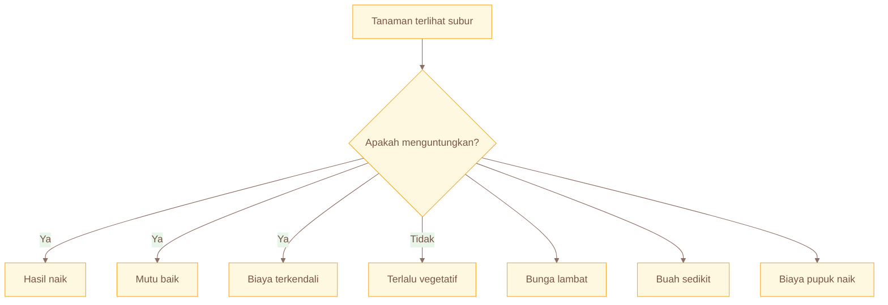
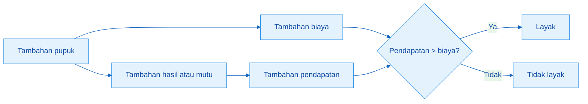
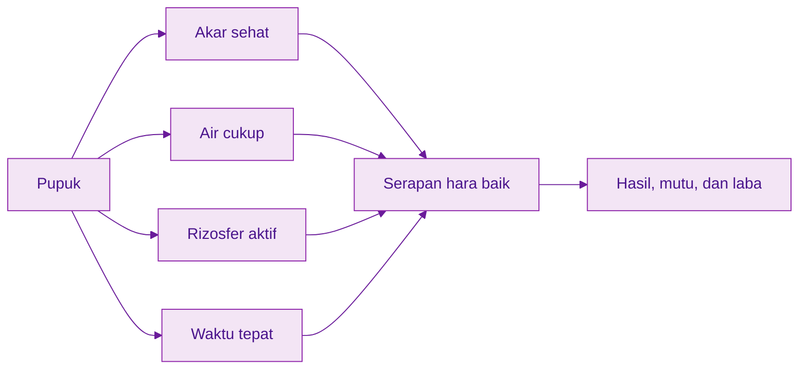
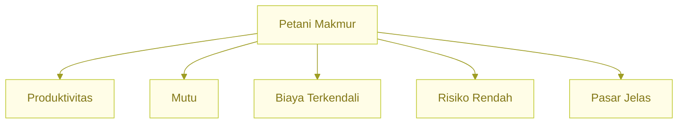
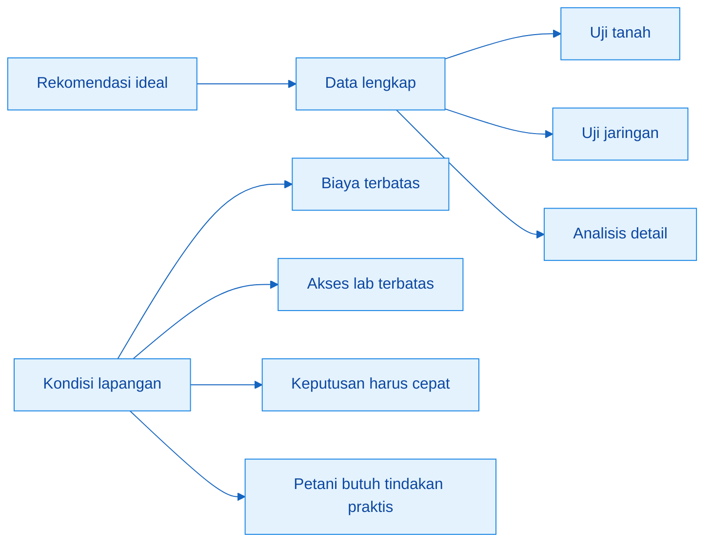
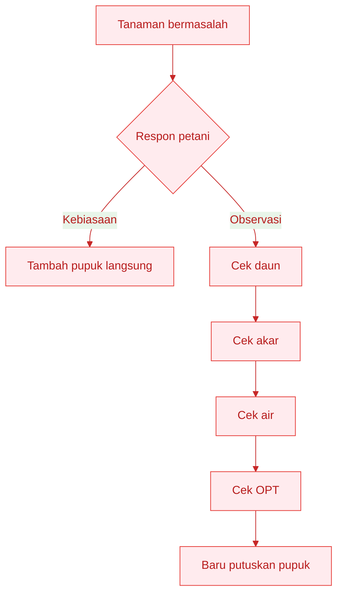
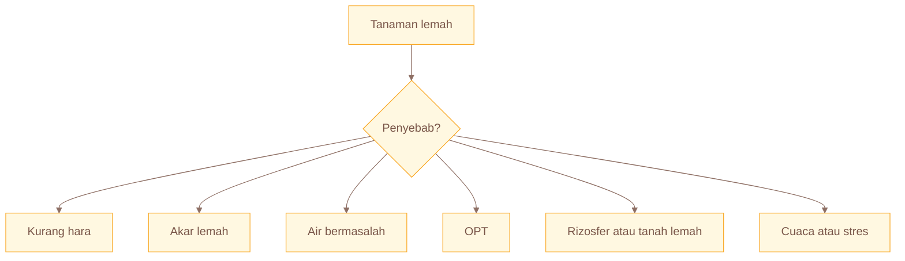
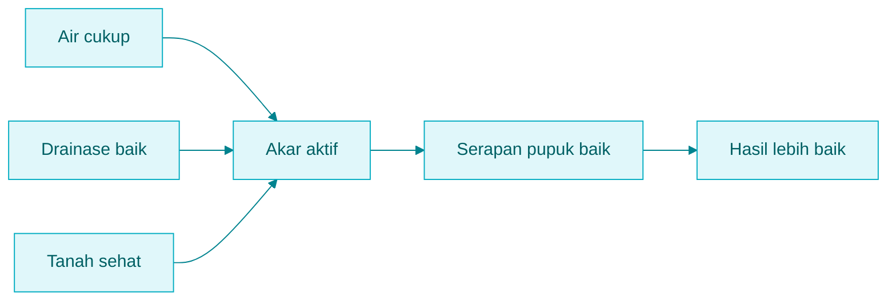

# **_Petani Makmur, Bukan Sekadar Tanaman Subur_**

---

- [**_Petani Makmur, Bukan Sekadar Tanaman Subur_**](#petani-makmur-bukan-sekadar-tanaman-subur)
  - [Cara Cepat Memahami Manual Ini](#cara-cepat-memahami-manual-ini)
- [Bab 1. Mengapa Pemupukan Harus Mengarah ke Laba](#bab-1-mengapa-pemupukan-harus-mengarah-ke-laba)
  - [Tujuan Bab 1](#tujuan-bab-1)
  - [1.1 Tanaman Subur Belum Tentu Menguntungkan](#11-tanaman-subur-belum-tentu-menguntungkan)
  - [1.2 Pupuk Harus Dilihat dari Hasil, Mutu, Biaya, dan Pasar](#12-pupuk-harus-dilihat-dari-hasil-mutu-biaya-dan-pasar)
  - [1.3 Pupuk Tidak Bekerja Sendirian](#13-pupuk-tidak-bekerja-sendirian)
  - [1.4 Lima Syarat Petani Makmur](#14-lima-syarat-petani-makmur)
  - [1.5 Empat Komoditas, Empat Strategi Untung](#15-empat-komoditas-empat-strategi-untung)
  - [Ringkasan Bab 1](#ringkasan-bab-1)
- [Bab 2. Masalah Lapangan: Mengapa Rekomendasi Pupuk Sering Tidak Jalan](#bab-2-masalah-lapangan-mengapa-rekomendasi-pupuk-sering-tidak-jalan)
  - [Tujuan Bab 2](#tujuan-bab-2)
  - [2.1 Rekomendasi yang Terlalu Ideal](#21-rekomendasi-yang-terlalu-ideal)
  - [2.2 Lahan Berbeda, Tetapi Sering Dipupuk Sama](#22-lahan-berbeda-tetapi-sering-dipupuk-sama)
  - [2.3 Petani Sering Memupuk Berdasarkan Kebiasaan, Bukan Respons Tanaman](#23-petani-sering-memupuk-berdasarkan-kebiasaan-bukan-respons-tanaman)
  - [2.4 Tanaman Lemah Tidak Selalu Berarti Kurang Pupuk](#24-tanaman-lemah-tidak-selalu-berarti-kurang-pupuk)
  - [2.5 Cuaca, Air, dan Akar Sering Lebih Menentukan daripada Dosis](#25-cuaca-air-dan-akar-sering-lebih-menentukan-daripada-dosis)
  - [2.6 Harga Pupuk dan Harga Panen Mengubah Keputusan](#26-harga-pupuk-dan-harga-panen-mengubah-keputusan)
  - [2.7 Petani Butuh Model yang Bisa Dikerjakan, Dicatat, Diuji Kecil, dan Dievaluasi](#27-petani-butuh-model-yang-bisa-dikerjakan-dicatat-diuji-kecil-dan-dievaluasi)
  - [Ringkasan Bab 2](#ringkasan-bab-2)
- [Yang Harus Diingat dari Bagian 1](#yang-harus-diingat-dari-bagian-1)
- [Kotak Keputusan Sebelum Menambah Pupuk](#kotak-keputusan-sebelum-menambah-pupuk)

---

## Cara Cepat Memahami Manual Ini

Manual ini dibuat untuk membantu petani, kelompok tani, penyuluh, pengelola kebun, pendamping desa, dan praktisi agribisnis mengambil keputusan pemupukan dengan cara yang lebih sederhana, lebih ekonomis, dan lebih mudah dijalankan di lapangan.

Manual ini tidak dimulai dari laboratorium lengkap. Manual ini dimulai dari:

```text id="9fpz7u"
lahan
tanaman
akar
air
biaya
hasil
```

Laboratorium tetap penting. Uji tanah, uji jaringan, analisis pH, bahan organik, dan status hara tetap sangat berguna bila tersedia. Tetapi dalam kenyataan, banyak petani tidak selalu punya akses mudah, murah, dan cepat ke laboratorium. Karena itu, manual ini memakai pendekatan **low-lab**.

Low-lab bukan berarti bekerja asal-asalan. Low-lab berarti mengambil keputusan dari data sederhana yang sanggup dikumpulkan petani secara rutin, lalu memperbaikinya dari respons tanaman, biaya, dan hasil panen.

Yang penting dipahami sejak awal: pupuk utama tetap penting, tetapi pupuk tidak bekerja sendirian. Keberhasilannya ikut ditentukan oleh akar, rizosfer, air, bahan organik, waktu aplikasi, dan manajemen lapangan.

Cara kerja manual ini sederhana:

```text id="xjlfi0"
pakai dosis acuan
→ amati respons tanaman
→ cek akar, air, dan rizosfer
→ koreksi bertahap
→ catat biaya dan hasil
→ evaluasi laba
→ perbaiki pola musim berikutnya
```

Diagram alurnya sebagai berikut:


Tujuan akhirnya bukan tanaman yang paling hijau, tetapi **usaha tani yang paling menguntungkan, paling stabil, dan paling mungkin diulang**.

Tabel cepat orientasi manual:

| Komoditas    | Tujuan Usaha                     | Fokus Utama                                 | Risiko Besar                          |
| ------------ | -------------------------------- | ------------------------------------------- | ------------------------------------- |
| Cabai rawit  | Panen panjang dan stabil         | N terkendali, K cukup, akar sehat           | Harga fluktuatif, layu, antraknosa    |
| Sayuran daun | Panen cepat, seragam, segar      | N cukup, tidak berlebihan, panen tepat umur | Busuk, daun lunak, harga rendah       |
| Durian       | Mutu premium dan buah jadi       | Seimbang vegetatif-generatif, akar sehat    | Bunga rontok, buah rontok, akar rusak |
| Jeruk        | Produksi stabil dan buah seragam | Pupuk bertahap, organik, kesehatan tanaman  | CVPD, buah kecil, kulit burik         |

Pesan penting dari manual ini sederhana:

> Pemupukan yang baik bukan yang paling rumit, tetapi yang membuat petani lebih mampu mengambil keputusan, menekan risiko, menjaga mutu, dan meningkatkan laba.

<ResourceBox
  title="Artikel Terkait:"
  items={[
    {
      name: 'README - Pupuk Tepat, Panen Untung - Model Low-Lab untuk Petani Makmur di Gambiran',
      href: '/blog/agri/pupuk-terintegrasi/README',
    },
  ]}
/>

---

# Bab 1. Mengapa Pemupukan Harus Mengarah ke Laba

## Tujuan Bab 1

Bab ini bertujuan mengubah cara pandang pembaca:

dari:

```text id="0nczfv"
tanaman subur
```

menjadi:

```text id="jjlwmq"
usaha tani untung
```

Pemupukan sering dipahami hanya sebagai kegiatan memberi makan tanaman. Cara pikir itu tidak salah, tetapi belum cukup. Dalam usaha tani, pupuk harus dipandang sebagai bagian dari strategi ekonomi.

Pupuk adalah biaya.
Pupuk juga bisa menjadi investasi.
Pupuk bisa mengatur pertumbuhan, mutu, hasil, dan umur produktif tanaman.

Tetapi pupuk hanya menjadi investasi bila penggunaannya tepat. Bila salah dosis, salah waktu, salah sasaran, atau diberikan saat tanaman tidak mampu menyerap, pupuk berubah menjadi pemborosan.

---

## 1.1 Tanaman Subur Belum Tentu Menguntungkan

Banyak petani menilai keberhasilan pemupukan dari warna daun, tinggi tanaman, batang besar, dan tajuk yang rimbun. Bila tanaman hijau tua, dianggap pupuk berhasil. Padahal tanaman yang sangat subur belum tentu menghasilkan uang lebih banyak.

Pada banyak komoditas, pertumbuhan vegetatif yang terlalu kuat justru bisa mengganggu tujuan ekonomi. Tanaman memang tampak bagus, tetapi hasil panen, mutu, dan laba belum tentu ikut naik.

Tabel risikonya sederhana:

| Gejala                    | Risiko Ekonomi                |
| ------------------------- | ----------------------------- |
| Tanaman terlalu rimbun    | Bunga dan buah bisa terlambat |
| Daun terlalu hijau        | N mungkin berlebihan          |
| Bunga sedikit             | Panen tertunda atau berkurang |
| Buah lambat terbentuk     | Modal kembali lebih lama      |
| Tajuk terlalu lembap      | Risiko penyakit meningkat     |
| Biaya pupuk naik          | Laba bisa turun               |
| Biaya pestisida ikut naik | Usaha makin mahal             |

Pada cabai rawit, tanaman yang sangat hijau dan rimbun belum tentu baik. Jika bunga sedikit dan buah lambat keluar, berarti pupuk belum diarahkan ke uang. Pada durian, pohon yang terus mengeluarkan tunas dan daun belum tentu siap berbuah. Pada sayuran daun, hijau memang penting, tetapi daun yang terlalu lunak bisa cepat rusak, layu, dan busuk. Pada jeruk, pohon yang terlalu dipacu tanpa keseimbangan akar, air, dan kesehatan tanaman bisa menghasilkan panen tinggi sesaat tetapi cepat menurun.

Subur tetap penting. Tetapi subur harus diarahkan menjadi **hasil, mutu, dan laba**.

Selain itu, tanaman yang tampak lemah juga tidak selalu berarti kurang pupuk. Bisa jadi masalahnya ada pada akar, rizosfer, air, atau kondisi tanah yang tidak mendukung. Jadi, warna daun saja tidak cukup untuk membaca kebutuhan tanaman.

Diagram sederhananya:



> Subur yang benar adalah subur yang menghasilkan uang, bukan sekadar menghasilkan daun.

---

## 1.2 Pupuk Harus Dilihat dari Hasil, Mutu, Biaya, dan Pasar

Pupuk harus dinilai dari hubungan antara biaya dan hasil. Artinya, pupuk tidak cukup dinilai dari apakah tanaman terlihat lebih baik, tetapi dari apakah pupuk tersebut benar-benar menambah pendapatan dan laba.

Pupuk adalah biaya.
Pupuk bisa menjadi investasi.
Tetapi pupuk hanya layak disebut investasi bila tambahan hasil atau mutu yang diberikan lebih besar dari biaya tambahannya.

Rumus sederhana yang perlu dipakai:

```text id="rp406m"
Pendapatan = hasil panen × harga jual
```

```text id="tsgobp"
Laba kotor = pendapatan - biaya produksi
```

```text id="9xyzot"
Tambahan laba = tambahan hasil × harga jual - tambahan biaya tambahan
```

Contoh praktis:

Tambahan pupuk senilai Rp300.000 hanya layak bila tambahan hasil atau mutu yang dihasilkan bernilai lebih dari Rp300.000.

Jika tambahan pupuk Rp300.000 menghasilkan tambahan panen senilai Rp700.000, keputusan itu layak.

Jika tambahan pupuk Rp300.000 hanya menghasilkan tambahan panen senilai Rp200.000, keputusan itu merugikan, walaupun tanaman terlihat lebih hijau.

Tabel cepat membaca keputusan ekonomi:

| Kondisi                                | Makna Ekonomi                      |
| -------------------------------------- | ---------------------------------- |
| Hasil naik, biaya naik sedikit         | Baik                               |
| Hasil naik, biaya naik besar           | Perlu dihitung ulang               |
| Tanaman subur, hasil tidak naik        | Tidak efisien                      |
| Hasil naik, mutu turun                 | Belum tentu untung                 |
| Hasil sedang, mutu bagus, harga tinggi | Bisa lebih menguntungkan           |
| Biaya pupuk naik, harga panen rendah   | Risiko laba turun                  |
| Tanaman sehat, panen panjang           | Biasanya lebih aman secara ekonomi |

Dosis terbaik bukan dosis terbesar. Dosis terbaik adalah dosis yang memberi **laba terbaik**.

Diagram logika keputusannya:



Artinya, keputusan pupuk harus selalu lewat pertanyaan:

1. Apakah pupuk ini benar-benar menambah hasil?
2. Apakah pupuk ini memperbaiki mutu?
3. Apakah pupuk ini memperpanjang masa panen?
4. Apakah biaya tambahannya masih tertutup oleh harga jual?
5. Apakah tanaman memang membutuhkan tambahan pupuk?

> Pupuk harus mengikuti kebutuhan tanaman, tetapi keputusan pupuk harus tetap mengikuti logika usaha.

---

## 1.3 Pupuk Tidak Bekerja Sendirian

Ini titik penting yang sering terlewat. Pupuk memang penting, tetapi pupuk tidak bekerja sendirian.

Pupuk hanya efektif bila akar mampu menyerap. Akar hanya bekerja baik bila air cukup, drainase memadai, tanah tidak rusak, dan lingkungan rizosfer mendukung. Karena itu, pupuk yang bagus sekalipun bisa gagal bila akar terganggu, tanah becek, tanah terlalu kering, atau tanaman sedang kalah oleh stres dan penyakit.

Faktor-faktor yang ikut menentukan efektivitas pupuk:

1. Akar sehat
2. Air cukup
3. Drainase baik
4. Rizhosfer aktif
5. Bahan organik mendukung
6. Aplikasi tepat waktu
7. Tanaman tidak sedang stres berat

Kalau salah satu faktor ini rusak, pupuk bisa keluar sebagai biaya tanpa memberi hasil yang layak.

Tabel pembacaan lapangan:

| Jika Masalahnya       | Jangan Langsung           | Periksa Dulu                     |
| --------------------- | ------------------------- | -------------------------------- |
| Tanaman kuning        | Tambah urea besar-besaran | Akar, air, drainase              |
| Bunga rontok          | Tambah pupuk terus        | Air, suhu, K, Ca-B, OPT          |
| Buah kecil            | Tambah N                  | K, air, beban buah               |
| Tanaman layu          | Tambah pupuk              | Akar, penyakit, genangan         |
| Daun rusak            | Tambah mikro              | OPT, pestisida, cuaca            |
| Tanaman tidak seragam | Tambah pupuk merata       | Bibit, air, sebaran pupuk, tanah |
| Daun terlalu hijau    | Tambah N                  | Cek bunga, buah, dan kerimbunan  |

Pupuk juga tidak bisa dianggap obat untuk semua masalah. Jika cabai layu karena penyakit akar, tambahan pupuk tidak menyelesaikan sumber masalah. Jika sayuran daun busuk karena kelembapan tinggi, tambahan urea bisa memperburuk keadaan. Jika durian bunga rontok karena air tidak stabil, pupuk besar belum tentu menolong. Jika jeruk menunjukkan gejala penyakit serius, masalahnya tidak boleh dianggap sekadar kurang pupuk.

Inilah mengapa akar, rizosfer, dan manajemen lapangan harus mulai dibawa masuk ke cara berpikir pemupukan.

Diagram sistem kerja pupuk:



Jadi, keputusan terbaik kadang bukan menambah pupuk, tetapi memperbaiki air, akar, drainase, atau waktu aplikasi.

> Pupuk hanya efektif bila akar hidup, air cukup, rizosfer mendukung, dan tanaman mampu merespons.

---

## 1.4 Lima Syarat Petani Makmur

Dalam artikel lama, bagian ini disebut “empat syarat”, tetapi isinya sebenarnya berkembang menjadi lima unsur. Dalam versi rewrite, lebih rapi bila ditulis sebagai **lima syarat petani makmur**.

Petani makmur bukan hanya petani yang panennya banyak. Panen banyak memang penting, tetapi belum cukup. Petani makmur terjadi bila beberapa hal berjalan bersama:

1. Produktivitas cukup tinggi
2. Mutu hasil baik
3. Biaya terkendali
4. Risiko gagal rendah
5. Pasar atau pembeli jelas

Kalau hanya satu yang kuat, hasil akhirnya belum tentu baik. Produktivitas tinggi tetapi biaya membengkak bisa membuat laba tipis. Mutu bagus tetapi pasar tidak jelas bisa membuat hasil sulit dijual. Biaya rendah tetapi hasil rendah juga tidak cukup. Pasar bagus tetapi tanaman gagal tetap tidak menghasilkan uang.

Tabel pembacaan praktis:

| Syarat        | Penjelasan Praktis                              | Contoh                      |
| ------------- | ----------------------------------------------- | --------------------------- |
| Produktivitas | Hasil per lahan meningkat atau stabil tinggi    | Cabai panen panjang         |
| Mutu          | Produk masuk grade baik                         | Durian manis, jeruk seragam |
| Biaya         | Pupuk, pestisida, tenaga kerja tidak membengkak | Urea tidak berlebihan       |
| Risiko        | Tanaman lebih tahan stres                       | Drainase baik, akar sehat   |
| Pasar         | Hasil mudah dijual dengan harga layak           | Ada pembeli tetap           |

Pada cabai rawit, yang dicari bukan sekadar tanaman rimbun, tetapi panen panjang, buah stabil, dan biaya tidak meledak. Pada sayuran daun, yang dicari adalah siklus cepat, seragam, segar, dan panen tepat umur. Pada durian, yang dicari adalah pohon sehat, bunga jadi buah, mutu premium, dan pohon tetap produktif untuk musim berikutnya. Pada jeruk, yang dicari adalah produksi stabil, ukuran seragam, kulit bersih, dan tanaman tidak cepat menurun.

Diagram sederhana lima syarat petani makmur:



> Panen banyak belum cukup. Petani makmur terjadi bila hasil, mutu, biaya, risiko, dan pasar dikelola bersama.

---

## 1.5 Empat Komoditas, Empat Strategi Untung

Manual ini difokuskan pada empat kelompok komoditas: cabai rawit, sayuran daun, durian, dan jeruk. Keempatnya tidak bisa dikelola dengan logika pupuk yang sama.

Setiap komoditas punya tujuan usaha, risiko, dan strategi untung yang berbeda.

| Komoditas    | Strategi Untung                                       |
| ------------ | ----------------------------------------------------- |
| Cabai rawit  | Panen panjang, buah stabil, biaya tidak meledak       |
| Sayuran daun | Siklus cepat, seragam, panen tepat waktu              |
| Durian       | Pohon sehat, bunga jadi buah, mutu premium            |
| Jeruk        | Produksi stabil, ukuran seragam, tanaman panjang umur |

Cabai rawit mengejar kontinuitas panen. Tanaman tidak cukup hanya tumbuh subur. Cabai harus mampu berbunga, berbuah, dan bertahan cukup lama agar panen berulang. Karena itu, N harus dikendalikan, K perlu dijaga, air harus stabil, akar harus sehat, dan risiko penyakit harus ditekan.

Sayuran daun mengejar kecepatan dan keseragaman. Siklusnya pendek. Keterlambatan pupuk sering tidak sempat dikoreksi. Kelebihan N bisa membuat daun terlalu lunak dan mudah rusak. Karena itu, pemupukan harus sederhana, tepat waktu, dan tidak berlebihan.

Durian mengejar keseimbangan pohon dan mutu buah. Pohon yang terlalu vegetatif bisa sulit berbunga. Pohon yang kurang pulih setelah panen bisa lemah pada musim berikutnya. Karena itu, durian perlu keseimbangan antara pemulihan, pembentukan tajuk sehat, pembungaan, dan pembesaran buah.

Jeruk mengejar stabilitas produksi dan kesehatan tanaman jangka panjang. Buah yang seragam, kulit bersih, dan pohon sehat lebih penting daripada memaksa produksi tinggi sesaat. Karena itu, pemupukan jeruk harus bertahap, memperhatikan bahan organik, air, kesehatan akar, dan risiko penyakit.

Tambahan penting dalam versi rewrite ini: kebutuhan akar, air, dan dukungan biologis tiap komoditas juga berbeda. Maka strategi pemupukannya memang tidak boleh disamakan.

> Cabai mengejar panen panjang.
> Sayuran daun mengejar cepat dan seragam.
> Durian mengejar mutu premium.
> Jeruk mengejar produksi stabil.

---

## Ringkasan Bab 1

1. Tujuan pemupukan adalah meningkatkan laba, bukan hanya membuat tanaman hijau.
2. Pupuk adalah investasi, sehingga harus dihitung dampaknya terhadap hasil, mutu, biaya, dan harga.
3. Tanaman subur belum tentu menguntungkan bila bunga, buah, mutu, atau pasar tidak mendukung.
4. Pupuk tidak bekerja sendirian; akar, rizosfer, air, drainase, dan waktu aplikasi ikut menentukan hasil.
5. Tanaman yang tampak lemah tidak selalu berarti kurang pupuk.
6. Petani makmur ditentukan oleh produktivitas, mutu, biaya, risiko, dan pasar yang dikelola bersama.
7. Setiap komoditas punya strategi untung yang berbeda.
8. Dosis terbaik bukan dosis terbesar, tetapi dosis yang memberi hasil, mutu, dan laba terbaik.

Pesan penutup Bab 1:

> Pupuk yang baik bukan yang membuat tanaman paling subur, tetapi yang membuat usaha tani paling menguntungkan. Dan pupuk yang menguntungkan hanya bekerja baik bila akar, rizosfer, air, dan manajemen lapangan ikut mendukung.

---

# Bab 2. Masalah Lapangan: Mengapa Rekomendasi Pupuk Sering Tidak Jalan

## Tujuan Bab 2

Bab ini menjelaskan mengapa manual ini perlu ada: karena banyak rekomendasi pupuk terlihat baik di atas kertas, tetapi tidak selalu mudah dikerjakan di lapangan.

Masalahnya bukan karena petani tidak mau maju. Masalahnya, banyak rekomendasi dibuat terlalu ideal, terlalu jauh dari kenyataan harian petani, dan tidak langsung berubah menjadi tindakan yang bisa dilakukan di kebun.

Di lapangan, petani tidak hanya menghadapi soal pupuk. Petani juga menghadapi:

```text id="zwfnjm"
akses laboratorium yang terbatas
biaya yang sempit
lahan yang berbeda-beda
air yang tidak selalu stabil
akar yang kadang bermasalah
serangan OPT
harga panen yang berubah cepat
```

Karena itu, rekomendasi pemupukan harus lebih membumi. Ilmu tetap dipakai, tetapi cara menerapkannya harus sesuai dengan keadaan petani.

---

## 2.1 Rekomendasi yang Terlalu Ideal

Secara ilmiah, rekomendasi pupuk yang paling baik memang didukung data lengkap. Uji tanah, uji jaringan, analisis pH, bahan organik, N, P, K, Ca, Mg, S, dan unsur mikro bisa membuat keputusan lebih presisi.

Tetapi bagi banyak petani, pendekatan itu sering sulit dijalankan secara rutin.

Kendalanya nyata:

| Kendala                      | Dampak di Lapangan                   |
| ---------------------------- | ------------------------------------ |
| Biaya uji laboratorium       | Petani enggan melakukan rutin        |
| Jarak laboratorium jauh      | Sampel sulit dikirim                 |
| Waktu tunggu hasil           | Keputusan pupuk terlambat            |
| Cara sampling tidak dipahami | Hasil bisa tidak mewakili lahan      |
| Bahasa hasil lab rumit       | Sulit diterjemahkan menjadi tindakan |
| Rekomendasi terlalu umum     | Tidak langsung cocok dengan petak    |

Akibatnya, rekomendasi yang terlihat canggih justru tidak dipakai. Bukan karena salah secara ilmiah, tetapi karena tidak cukup operasional.

Petani tetap butuh jawaban yang bisa langsung dikerjakan:

```text id="xugjm3"
pupuk apa yang diberikan
berapa banyak
kapan diberikan
bagaimana cara memberikannya
kapan harus dikurangi
kapan harus ditunda
apakah masih menguntungkan
```

Diagram kontrasnya seperti ini:



Karena itu, laboratorium tetap penting, tetapi tidak boleh menjadi satu-satunya pintu untuk memperbaiki pemupukan.

> Low-lab bukan pengganti ilmu. Low-lab adalah cara menerapkan ilmu dengan data yang sanggup dikumpulkan petani.

---

## 2.2 Lahan Berbeda, Tetapi Sering Dipupuk Sama

Satu desa bisa memiliki banyak jenis lahan. Bahkan satu hamparan yang terlihat seragam pun bisa berbeda sifatnya.

Ada lahan yang:

- ringan dan cepat kering,
- berat dan mudah becek,
- kaya bahan organik,
- miskin bahan organik,
- responsif terhadap pupuk,
- lambat merespons karena akar atau tanahnya lemah.

Tetapi praktiknya, banyak lahan dipupuk dengan pola yang sama:

- dosis sama,
- waktu sama,
- cara aplikasi sama.

Padahal kondisi lahannya berbeda.

Akibatnya, respons tanaman juga berbeda.

| Kondisi Lahan          | Risiko Jika Dosis Disamakan             |
| ---------------------- | --------------------------------------- |
| Tanah ringan/berpasir  | Pupuk mudah hilang, tanaman cepat lapar |
| Tanah berat/becek      | Akar lemah, pupuk tidak terserap        |
| Lahan miskin organik   | Respons pupuk cepat turun               |
| Lahan subur            | Pupuk berlebih, biaya boros             |
| Lahan bekas sakit akar | Pupuk tidak menyelesaikan masalah       |
| Lahan cepat kering     | Tanaman stres walaupun pupuk cukup      |
| Lahan drainase buruk   | Akar kekurangan oksigen                 |

Dosis yang baik di satu petak belum tentu baik di petak lain.

Contohnya, lahan ringan sering lebih cocok dengan aplikasi pupuk kecil tetapi lebih sering. Lahan berat yang mudah becek tidak bisa dipaksa dengan pupuk besar saat akar sedang lemah. Lahan yang sudah kuat dan kaya organik mungkin tidak perlu tambahan pupuk setinggi lahan yang miskin bahan organik.

Karena itu, sebelum bicara dosis, petani perlu belajar membaca kelas lahan:

```text id="pwj0rr"
lahan kuat
lahan sedang
lahan lemah
```

> Dosis sama pada lahan berbeda akan menghasilkan respons berbeda.

---

## 2.3 Petani Sering Memupuk Berdasarkan Kebiasaan, Bukan Respons Tanaman

Banyak keputusan pemupukan dibuat berdasarkan kebiasaan, misalnya:

```text id="likbi1"
musim lalu pakai dosis itu
tetangga pakai pupuk itu
toko menyarankan paket itu
takut tanaman kurang makan
anggapannya semakin banyak semakin baik
```

Kebiasaan tidak selalu salah. Pengalaman petani tetap penting. Tetapi pengalaman harus dibantu dengan pembacaan kondisi tanaman.

Masalah muncul ketika pupuk diberikan tanpa melihat respons tanaman.

Jika cabai sudah terlalu hijau dan rimbun, tambahan urea bisa membuat bunga makin lambat. Jika sayuran daun sudah terlalu lunak, tambahan N bisa membuat daun makin mudah rusak. Jika durian terus mengeluarkan tunas tetapi bunga lemah, tambahan N bisa memperpanjang fase vegetatif. Jika jeruk daunnya tidak normal karena akar lemah atau penyakit, tambahan pupuk besar belum tentu membantu.

Selain itu, sekarang petani juga sering memakai input biologis tanpa membedakan fungsinya. Semua cairan fermentasi kadang dianggap “pasti bagus”, padahal belum tentu sesuai kebutuhan tanaman dan belum tentu layak dipakai.

Tabel risikonya:

| Kebiasaan                                  | Risiko                                 |
| ------------------------------------------ | -------------------------------------- |
| Urea ditambah saat tanaman sudah hijau tua | Bunga lambat, penyakit meningkat       |
| Pupuk diberikan sekaligus                  | Banyak hilang, tanaman stres           |
| Semua masalah dianggap kurang pupuk        | Akar, OPT, dan air tidak tertangani    |
| Dosis ikut tetangga                        | Tidak sesuai lahan sendiri             |
| Semua cairan fermentasi dianggap bagus     | Salah fungsi, salah aplikasi           |
| Tidak mencatat biaya                       | Tidak tahu sebenarnya untung atau rugi |

Diagram keputusan salah vs benar:



> Kebiasaan memupuk perlu diubah menjadi keputusan berbasis respons tanaman.

---

## 2.4 Tanaman Lemah Tidak Selalu Berarti Kurang Pupuk

Ini salah satu pesan paling penting dalam manual ini.

Tanaman yang tampak lemah memang bisa kekurangan hara. Tetapi tanaman lemah juga bisa disebabkan oleh:

- akar lemah,
- tanah bermasalah,
- air tidak stabil,
- rizosfer lemah,
- OPT,
- atau stres cuaca.

Jadi, gejala tanaman tidak boleh langsung dianggap sebagai kekurangan pupuk.

Contoh sederhana:

- daun pucat bisa karena kurang N, tetapi bisa juga karena akar rusak;
- tanaman lambat bisa karena kurang pupuk, tetapi bisa juga karena tanah keras;
- bunga rontok bisa karena hara tidak seimbang, tetapi juga bisa karena air tidak stabil;
- buah kecil bisa karena kurang K, tetapi juga bisa karena beban buah terlalu banyak;
- daun rusak bisa karena kurang unsur tertentu, tetapi juga bisa karena OPT.

Diagram diagnosis sederhananya:



Artinya, sebelum menambah pupuk, petani perlu bertanya:

```text id="3kkcwq"
apakah ini benar-benar kurang hara
atau akar yang bermasalah
atau air yang salah
atau tanah yang lemah
atau ada OPT
```

> Banyak masalah tanaman bukan hanya soal kurang hara, tetapi juga soal akar, tanah, air, dan biologi rizosfer.

---

## 2.5 Cuaca, Air, dan Akar Sering Lebih Menentukan daripada Dosis

Pupuk bekerja lewat akar. Karena itu, kondisi akar dan air sering lebih menentukan daripada angka dosis itu sendiri.

Dosis yang tepat bisa gagal bila akar rusak. Pupuk yang mahal bisa hilang bila diberikan menjelang hujan lebat. Tanaman tetap lemah bila tanah tergenang dan akar kekurangan oksigen. Sebaliknya, pupuk juga sulit bekerja bila tanah terlalu kering.

Untuk daerah seperti Gambiran dan wilayah pertanian tropis sejenis, perhatian besar perlu diberikan pada:

```text id="wffufm"
drainase saat hujan
kelembapan saat kemarau
bahan organik untuk menahan air
pembagian dosis agar pupuk tidak hilang
mulsa untuk komoditas tertentu
area perakaran yang sehat
```

Tabel hubungan kondisi lapangan dengan pupuk:

| Kondisi                 | Dampak pada Pupuk                     |
| ----------------------- | ------------------------------------- |
| Hujan lebat             | N mudah hilang, aplikasi perlu dibagi |
| Tanah becek             | Akar kekurangan oksigen               |
| Tanah terlalu kering    | Hara sulit bergerak ke akar           |
| Bahan organik rendah    | Tanah miskin penyangga hara           |
| Akar sakit              | Pupuk tidak terserap baik             |
| Drainase buruk          | Risiko busuk akar meningkat           |
| Penyiraman tidak merata | Pertumbuhan tidak seragam             |

Diagram hubungan air–akar–pupuk:



> Pupuk hanya efektif bila akar hidup, air cukup, dan tanah tidak bermasalah.

---

## 2.6 Harga Pupuk dan Harga Panen Mengubah Keputusan

Pemupukan tidak bisa dipisahkan dari harga pasar.

Komoditas seperti cabai rawit dan sayuran daun sangat dipengaruhi harga harian atau mingguan. Tambahan pupuk yang layak saat harga tinggi bisa menjadi tidak layak saat harga turun. Pada durian dan jeruk, tambahan biaya bisa layak bila benar-benar memperbaiki mutu dan grade.

Rumus sederhana yang perlu diingat:

```text id="jjbxgq"
Tambahan laba = tambahan hasil × harga jual - tambahan biaya tambahan
```

Artinya:

- bila tambahan pupuk menambah hasil atau mutu lebih besar daripada biaya tambahannya, keputusan itu layak;
- bila tambahan biaya tidak tertutup, keputusan itu tidak layak walaupun tanaman terlihat lebih subur.

Tabel keputusan cepat:

| Harga Panen       | Strategi Pupuk                              |
| ----------------- | ------------------------------------------- |
| Harga tinggi      | Jaga stamina tanaman, mutu, dan kontinuitas |
| Harga sedang      | Pakai dosis efisien                         |
| Harga rendah      | Kurangi input yang tidak mendesak           |
| Harga tidak pasti | Gunakan dosis bertahap dan evaluasi biaya   |
| Ada pembeli tetap | Jaga mutu sesuai permintaan pembeli         |

> Pemupukan harus mengikuti biologi tanaman dan logika ekonomi.

---

## 2.7 Petani Butuh Model yang Bisa Dikerjakan, Dicatat, Diuji Kecil, dan Dievaluasi

Karena kondisi lapangan tidak selalu ideal, petani butuh model yang:

- bisa dikerjakan,
- bisa dicatat,
- bisa diuji kecil,
- dan bisa dievaluasi.

Inilah alasan manual ini memakai **model low-lab yang adaptif**.

Model ini tidak menunggu data sempurna, tetapi juga tidak menebak kosong. Model ini memakai lima dasar:

```text id="j69xbf"
dosis acuan
koreksi lahan
koreksi musim
koreksi respons tanaman
evaluasi biaya dan hasil
```

Artinya, dosis pupuk tidak langsung dianggap final. Dosis awal dipakai sebagai titik mulai. Setelah itu petani melihat kondisi lahan, musim, akar, air, dan respons tanaman.

Kalau perlu, keputusan diuji kecil dulu. Bila hasilnya baik, bisa diperluas. Bila tidak, diperbaiki lagi.

Diagram model low-lab adaptif:


Catatan yang dibutuhkan juga sederhana:

```text id="vstrzv"
tanggal pupuk
jenis pupuk
jumlah pupuk
biaya
kondisi tanaman
hasil panen
harga jual
```

Tanpa catatan, petani sulit tahu apakah pola pemupukan benar-benar menguntungkan. Dengan catatan, petani bisa membandingkan musim ini dengan musim sebelumnya.

> Tujuannya bukan membuat petani tergantung pada rekomendasi umum, tetapi membantu petani membangun rekomendasi yang makin cocok untuk lahannya sendiri.

---

## Ringkasan Bab 2

1. Rekomendasi berbasis laboratorium sangat baik, tetapi sering sulit dijalankan rutin oleh petani kecil.
2. Banyak rekomendasi terlalu ideal dan tidak langsung berubah menjadi tindakan lapangan.
3. Lahan berbeda tidak boleh selalu diberi dosis yang sama.
4. Kebiasaan memupuk perlu diganti dengan keputusan berbasis respons tanaman.
5. Tanaman lemah tidak selalu berarti kurang pupuk.
6. Akar, air, tanah, dan rizosfer sering lebih menentukan hasil daripada angka dosis semata.
7. Harga pupuk dan harga panen harus masuk ke keputusan pemupukan.
8. Solusinya adalah model low-lab yang adaptif, tercatat, dan bisa dievaluasi.

---

# Yang Harus Diingat dari Bagian 1

Bagian 1 menegaskan bahwa pemupukan tidak boleh hanya dipahami sebagai kegiatan membuat tanaman subur. Pemupukan harus menjadi bagian dari keputusan usaha tani.

Hal-hal yang harus diingat:

1. Tujuan utama pemupukan adalah laba, bukan sekadar tanaman hijau.
2. Petani makmur bila hasil, mutu, biaya, risiko, dan pasar dikelola bersama.
3. Tanaman subur belum tentu menguntungkan bila bunga, buah, mutu, atau harga tidak mendukung.
4. Pupuk adalah investasi hanya bila menambah hasil, mutu, umur produktif, atau laba.
5. Pupuk tidak bekerja sendirian; akar, air, drainase, dan rizosfer ikut menentukan hasil.
6. Tanaman lemah tidak selalu berarti kurang pupuk.
7. Laboratorium penting, tetapi petani tetap perlu model praktis saat laboratorium sulit diakses.
8. Lahan harus dibaca dari riwayat hasil, kondisi tanah, kondisi air, dan respons tanaman.
9. Harga pasar harus masuk dalam keputusan pemupukan.
10. Manual ini memakai model low-lab: dosis acuan, koreksi lapangan, catatan, dan evaluasi.

Tabel ringkasnya:

| Hal yang Dikejar   | Bukan Hanya    | Tetapi Juga                   |
| ------------------ | -------------- | ----------------------------- |
| Tanaman subur      | Daun hijau     | Bunga, buah, mutu, laba       |
| Hasil tinggi       | Tonase         | Biaya dan harga jual          |
| Pemupukan tepat    | Dosis besar    | Waktu, cara, fase, akar       |
| Petani makmur      | Panen banyak   | Risiko rendah dan pasar jelas |
| Keputusan lapangan | Ikut kebiasaan | Respons tanaman dan catatan   |

Pesan utama Bagian 1:

> Petani tidak cukup hanya mengejar tanaman hijau dan hasil tinggi. Petani perlu mengejar laba, mutu hasil, risiko rendah, dan sistem kerja yang bisa diulang.

---

# Kotak Keputusan Sebelum Menambah Pupuk

Sebelum menambah pupuk, tanyakan:

1. Apakah tanaman memang menunjukkan tanda kekurangan hara?
2. Apakah akar sehat?
3. Apakah tanah cukup lembap?
4. Apakah tanah tidak terlalu becek?
5. Apakah masalahnya bukan OPT?
6. Apakah tanaman sedang aktif tumbuh?
7. Apakah pupuk akan diberikan pada fase yang tepat?
8. Apakah tambahan pupuk masih layak secara ekonomi?
9. Apakah harga panen mendukung?
10. Apakah tanah dan rizosfer mendukung?
11. Apakah input biologis yang dipakai jelas fungsinya?
12. Apakah produk fermentasi yang akan dipakai layak?

Gunakan tabel cepat berikut:

| Pertanyaan                      | Jika Ya                            | Jika Tidak                          |
| ------------------------------- | ---------------------------------- | ----------------------------------- |
| Tanaman kurang hara?            | Lanjut cek akar dan air            | Jangan tambah pupuk dulu            |
| Akar sehat?                     | Pupuk bisa dipertimbangkan         | Benahi akar, air, atau penyakit     |
| Tanah cukup lembap?             | Aplikasi lebih aman                | Siram dulu atau tunggu kondisi baik |
| Tanah tidak becek?              | Lanjut                             | Tunda pupuk berat                   |
| OPT terkendali?                 | Lanjut                             | Tangani OPT dulu                    |
| Harga panen mendukung?          | Input tambahan bisa dihitung       | Gunakan dosis efisien               |
| Tambahan pupuk menambah laba?   | Layak dicoba                       | Jangan dipaksakan                   |
| Rizosfer dan tanah mendukung?   | Respons tanaman lebih mungkin baik | Benahi tanah dan akar dulu          |
| Input biologis jelas fungsinya? | Bisa diuji kecil                   | Jangan asal campur                  |
| Produk fermentasi layak?        | Bisa dipertimbangkan               | Jangan dipakai                      |

Keputusan terbaik tidak selalu menambah pupuk. Kadang keputusan terbaik adalah:

```text id="uvmjof"
menunda pupuk
mengurangi N
memperbaiki drainase
menjaga air
mengendalikan OPT
menambah bahan organik
memulihkan akar
mencatat biaya dan hasil
```

Penutup Bagian 1:

> Pupuk tepat bukan hanya soal jenis dan dosis. Pupuk tepat adalah keputusan yang sesuai dengan tanaman, lahan, akar, rizosfer, cuaca, biaya, risiko, dan pasar.

---

<small>
  **_Catatan Penyusunan_** Artikel ini disusun sebagai materi edukasi dan
  referensi umum berdasarkan berbagai sumber pustaka, praktik lapangan, serta
  bantuan alat penulisan. Pembaca disarankan untuk melakukan verifikasi lanjutan
  dan penyesuaian sesuai dengan kondisi serta kebutuhan masing-masing sistem.
</small>
