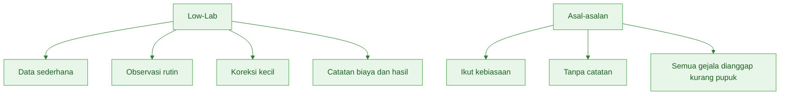
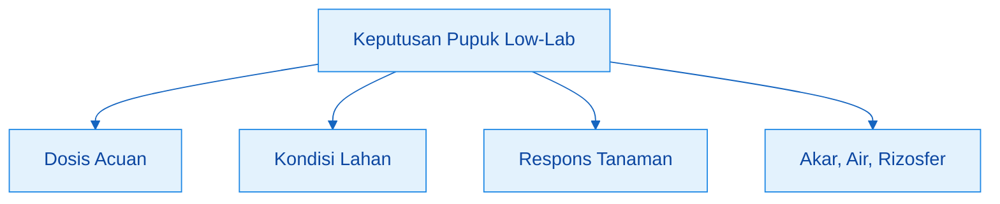
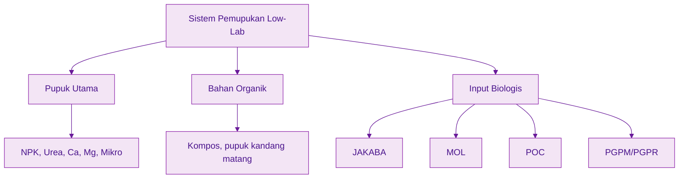
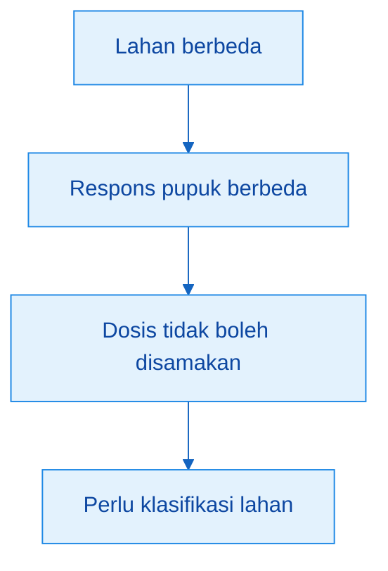
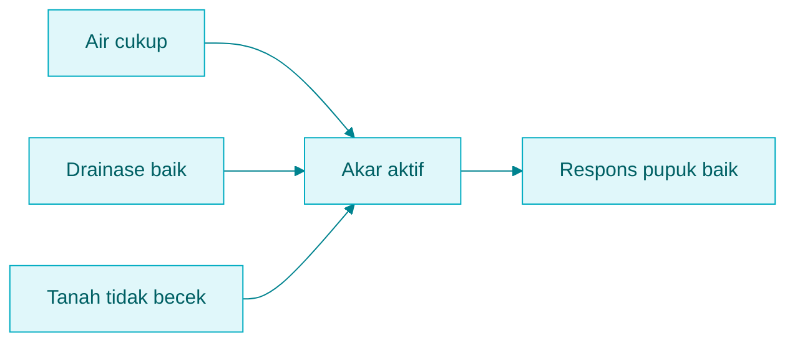
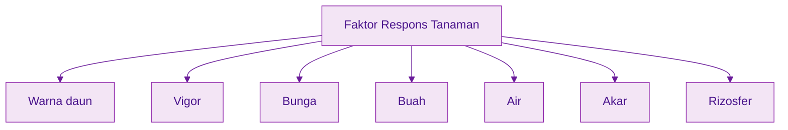
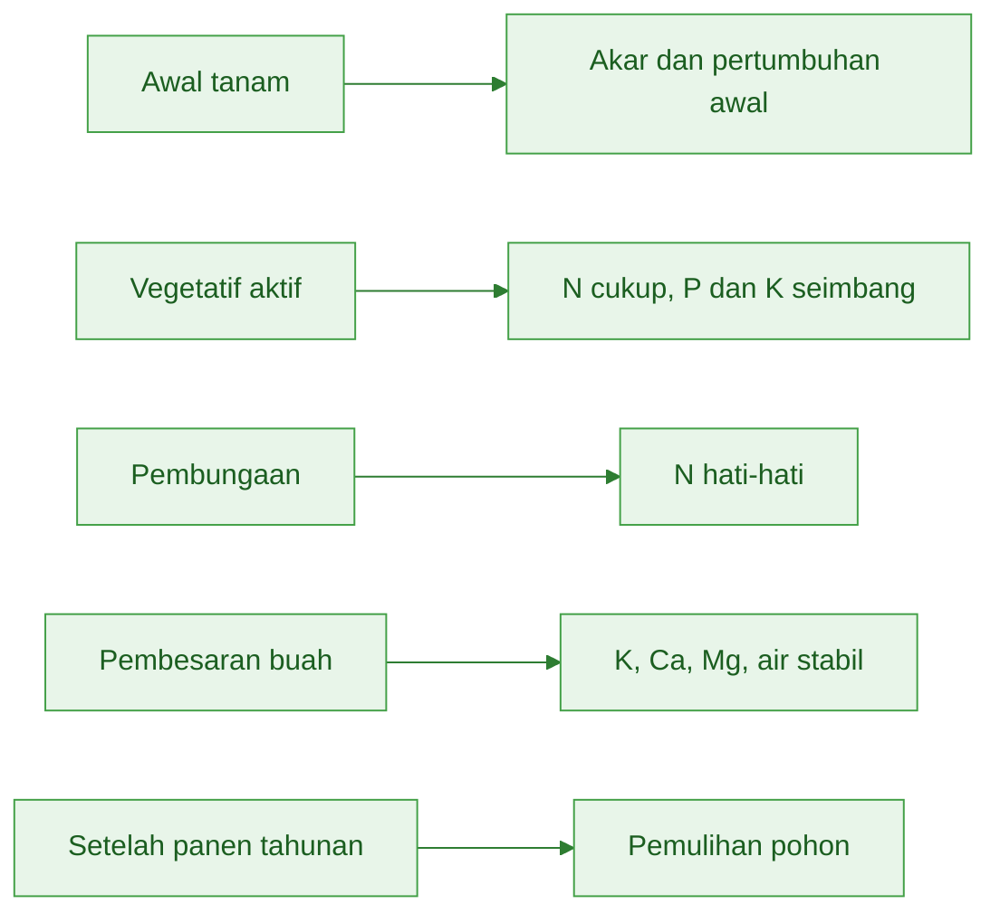
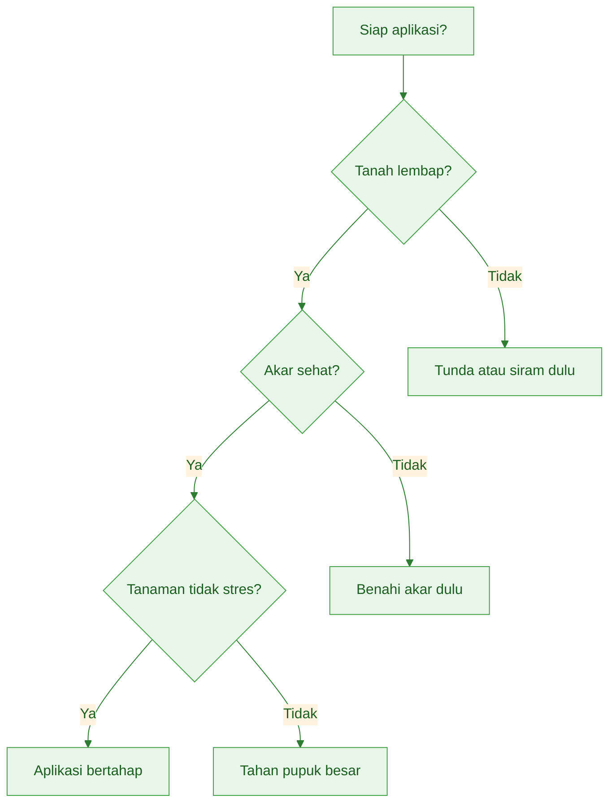
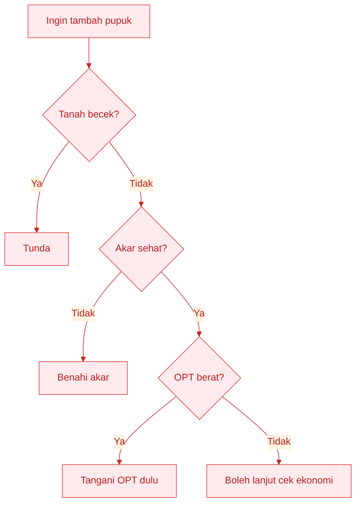
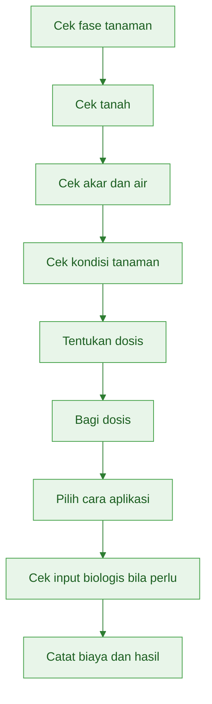

# **_Model Low-Lab: Membaca Lahan, Menghitung Dosis, dan Mengoreksi dari Respons Tanaman_**

---

- [**_Model Low-Lab: Membaca Lahan, Menghitung Dosis, dan Mengoreksi dari Respons Tanaman_**](#model-low-lab-membaca-lahan-menghitung-dosis-dan-mengoreksi-dari-respons-tanaman)
  - [Pengantar Bagian 2](#pengantar-bagian-2)
- [Bab 3. Prinsip Low-Lab: Data Minimum, Keputusan Cepat, Koreksi Bertahap](#bab-3-prinsip-low-lab-data-minimum-keputusan-cepat-koreksi-bertahap)
  - [Tujuan Bab 3](#tujuan-bab-3)
  - [3.1 Low-Lab Bukan Asal-Asalan](#31-low-lab-bukan-asal-asalan)
  - [3.2 Data Minimum yang Harus Ada](#32-data-minimum-yang-harus-ada)
  - [3.3 Empat Sumber Keputusan](#33-empat-sumber-keputusan)
    - [Dosis acuan](#dosis-acuan)
    - [Kondisi lapangan](#kondisi-lapangan)
    - [Respons tanaman](#respons-tanaman)
    - [Akar, air, dan rizosfer](#akar-air-dan-rizosfer)
  - [3.4 Membedakan Pupuk Utama, Bahan Organik, JAKABA, MOL, POC, dan PGPM/PGPR](#34-membedakan-pupuk-utama-bahan-organik-jakaba-mol-poc-dan-pgpmpgpr)
  - [3.5 Koreksi Bertahap, Bukan Koreksi Ekstrem](#35-koreksi-bertahap-bukan-koreksi-ekstrem)
  - [3.6 Siklus Belajar Musim ke Musim](#36-siklus-belajar-musim-ke-musim)
  - [Ringkasan Bab 3](#ringkasan-bab-3)
- [Bab 4. Membaca Lahan Tanpa Laboratorium](#bab-4-membaca-lahan-tanpa-laboratorium)
  - [Tujuan Bab 4](#tujuan-bab-4)
  - [4.1 Mengapa Lahan Harus Dikelompokkan](#41-mengapa-lahan-harus-dikelompokkan)
  - [4.2 Membaca Lahan dari Riwayat Hasil](#42-membaca-lahan-dari-riwayat-hasil)
  - [4.3 Membaca Lahan dari Kondisi Tanaman](#43-membaca-lahan-dari-kondisi-tanaman)
  - [4.4 Membaca Lahan dari Kondisi Tanah](#44-membaca-lahan-dari-kondisi-tanah)
  - [4.5 Membaca Lahan dari Air dan Drainase](#45-membaca-lahan-dari-air-dan-drainase)
  - [4.6 Menentukan Kelas Lahan](#46-menentukan-kelas-lahan)
    - [Lahan kuat](#lahan-kuat)
    - [Lahan sedang](#lahan-sedang)
    - [Lahan lemah](#lahan-lemah)
  - [Form sederhana klasifikasi lahan](#form-sederhana-klasifikasi-lahan)
  - [Ringkasan Bab 4](#ringkasan-bab-4)
- [Bab 5. Menghitung Dosis Praktis](#bab-5-menghitung-dosis-praktis)
  - [Tujuan Bab 5](#tujuan-bab-5)
  - [5.1 Dosis Acuan sebagai Titik Awal](#51-dosis-acuan-sebagai-titik-awal)
  - [5.2 Rumus Dasar Dosis Lapangan](#52-rumus-dasar-dosis-lapangan)
  - [5.3 Faktor Lahan](#53-faktor-lahan)
    - [Lahan kuat](#lahan-kuat-1)
    - [Lahan sedang](#lahan-sedang-1)
    - [Lahan lemah](#lahan-lemah-1)
  - [5.4 Faktor Musim](#54-faktor-musim)
    - [Musim normal](#musim-normal)
    - [Hujan tinggi](#hujan-tinggi)
    - [Kemarau dengan air cukup](#kemarau-dengan-air-cukup)
    - [Kemarau air terbatas](#kemarau-air-terbatas)
    - [Risiko banjir atau becek](#risiko-banjir-atau-becek)
  - [5.5 Faktor Respons Tanaman](#55-faktor-respons-tanaman)
    - [Tanaman normal](#tanaman-normal)
    - [Tanaman sedikit lemah](#tanaman-sedikit-lemah)
    - [Tanaman jelas kekurangan](#tanaman-jelas-kekurangan)
    - [Tanaman terlalu subur](#tanaman-terlalu-subur)
    - [Akar bermasalah](#akar-bermasalah)
  - [5.6 Konversi Dosis ke Luas Petak](#56-konversi-dosis-ke-luas-petak)
  - [5.7 Konversi Dosis ke Per Pohon](#57-konversi-dosis-ke-per-pohon)
  - [5.8 Membagi Dosis Sesuai Fase](#58-membagi-dosis-sesuai-fase)
    - [Nitrogen atau N](#nitrogen-atau-n)
    - [Fosfor atau P](#fosfor-atau-p)
    - [Kalium atau K](#kalium-atau-k)
  - [5.9 Contoh Hitung Dosis Cabai Rawit](#59-contoh-hitung-dosis-cabai-rawit)
  - [5.10 Contoh Hitung Dosis Sayuran Daun](#510-contoh-hitung-dosis-sayuran-daun)
  - [5.11 Contoh Hitung Dosis Durian](#511-contoh-hitung-dosis-durian)
  - [5.12 Catatan Praktis Penggunaan Input Biologis dalam Perhitungan](#512-catatan-praktis-penggunaan-input-biologis-dalam-perhitungan)
  - [Ringkasan Bab 5](#ringkasan-bab-5)
- [Bab 6. SOP Umum Pemupukan Low-Lab](#bab-6-sop-umum-pemupukan-low-lab)
  - [Tujuan Bab 6](#tujuan-bab-6)
  - [6.1 Prinsip Umum SOP Pemupukan](#61-prinsip-umum-sop-pemupukan)
    - [Pupuk diberikan saat tanaman mampu menyerap](#pupuk-diberikan-saat-tanaman-mampu-menyerap)
    - [Tanah harus cukup lembap](#tanah-harus-cukup-lembap)
    - [Aplikasi besar jangan dilakukan saat tanaman stres](#aplikasi-besar-jangan-dilakukan-saat-tanaman-stres)
    - [Dosis lebih aman dibagi](#dosis-lebih-aman-dibagi)
    - [Pupuk ditempatkan dekat zona akar](#pupuk-ditempatkan-dekat-zona-akar)
    - [Pupuk ditutup tanah atau disiram](#pupuk-ditutup-tanah-atau-disiram)
    - [Input biologis dipakai dengan tujuan jelas](#input-biologis-dipakai-dengan-tujuan-jelas)
    - [Batch fermentasi harus dicatat](#batch-fermentasi-harus-dicatat)
    - [Produk fermentasi gagal tidak dipakai](#produk-fermentasi-gagal-tidak-dipakai)
  - [6.2 Checklist Sebelum Pemupukan](#62-checklist-sebelum-pemupukan)
  - [6.3 Cara Aplikasi Umum](#63-cara-aplikasi-umum)
    - [Tanaman semusim](#tanaman-semusim)
    - [Tanaman tahunan](#tanaman-tahunan)
    - [Bentuk aplikasi umum](#bentuk-aplikasi-umum)
    - [Posisi umum aplikasi input biologis](#posisi-umum-aplikasi-input-biologis)
  - [6.4 Tanda Tanaman Perlu Koreksi Pupuk](#64-tanda-tanaman-perlu-koreksi-pupuk)
  - [6.5 Tanda Jangan Tambah Pupuk Dulu](#65-tanda-jangan-tambah-pupuk-dulu)
  - [6.6 Kesalahan Umum Pemupukan](#66-kesalahan-umum-pemupukan)
  - [6.7 SOP Satu Halaman](#67-sop-satu-halaman)
    - [SOP satu halaman](#sop-satu-halaman)
  - [Ringkasan Bab 6](#ringkasan-bab-6)
- [Yang Harus Diingat dari Bagian 2](#yang-harus-diingat-dari-bagian-2)
- [Kotak Keputusan Sebelum Memberi Pupuk](#kotak-keputusan-sebelum-memberi-pupuk)

---

## Pengantar Bagian 2

Bagian 1 sudah menegaskan bahwa tujuan pemupukan bukan sekadar membuat tanaman hijau, tetapi membuat usaha tani lebih menguntungkan. Pertanyaan berikutnya adalah:

> Kalau laboratorium tidak selalu tersedia, bagaimana petani tetap bisa mengambil keputusan pemupukan yang lebih baik?

Jawabannya adalah model **low-lab**.

Low-lab adalah pendekatan yang memakai data sederhana, observasi lapangan, dosis acuan, koreksi bertahap, dan evaluasi berulang. Dalam manual ini, low-lab tidak hanya dibaca sebagai model hara, tetapi juga sebagai model **hara + biologis + ekonomi**.

Artinya, keputusan pupuk tidak cukup dibangun dari:

- angka dosis,
- kebiasaan musim lalu,
- atau warna daun saja.

Keputusan pupuk harus dibangun dari gabungan:

- dosis acuan,
- kondisi lahan,
- kondisi akar dan air,
- respons tanaman,
- input biologis pendukung bila dipakai,
- serta biaya dan hasil.

Alur berpikir Bagian 2 sebagai berikut:


Bagian ini akan membahas empat hal utama:

1. Prinsip low-lab
2. Cara membaca lahan tanpa laboratorium
3. Cara menghitung dosis praktis
4. SOP umum pemupukan low-lab

Pesan utama bagian ini:

> Low-lab bukan berarti menebak. Low-lab berarti memakai data sederhana, observasi lapangan, pembacaan akar-rizosfer, dan evaluasi berulang untuk membuat keputusan yang makin tepat.

<ResourceBox
  title="Artikel Terkait:"
  items={[
    {
      name: 'README - Pupuk Tepat, Panen Untung - Model Low-Lab untuk Petani Makmur di Gambiran',
      href: '/blog/agri/pupuk-terintegrasi/README',
    },
  ]}
/>

---

# Bab 3. Prinsip Low-Lab: Data Minimum, Keputusan Cepat, Koreksi Bertahap

## Tujuan Bab 3

Bab ini menjelaskan dasar model low-lab.

Petani tidak selalu punya data sempurna. Namun petani tetap bisa membuat keputusan yang lebih baik bila memiliki pola kerja yang jelas, disiplin, dan bisa diulang.

Model berpikir utamanya:

```text id="wjk5o2"
Dosis awal
→ lihat respons tanaman
→ lihat kondisi akar, air, dan rizosfer
→ koreksi pupuk dan input pendukung
→ catat hasil
→ perbaiki musim berikutnya
```

Artinya, petani tidak harus menunggu semua data tersedia. Petani bisa mulai dari dosis acuan, lalu memperbaiki keputusan berdasarkan kondisi lahan, musim, akar, air, dan respons tanaman.

---

## 3.1 Low-Lab Bukan Asal-Asalan

Low-lab bukan berarti petani mengabaikan ilmu. Low-lab juga bukan berarti dosis pupuk ditentukan hanya dari perkiraan kasar.

Low-lab adalah cara kerja saat fasilitas laboratorium terbatas, tetapi keputusan tetap dibuat secara teratur.

Dalam model ini, petani tetap memakai:

```text id="mjlwm8"
dosis acuan
riwayat lahan
pengamatan tanaman
pencatatan biaya
pencatatan hasil
petak pembanding
```

Bedanya, petani tidak menunggu data laboratorium lengkap untuk mulai memperbaiki pemupukan.

Misalnya, walaupun belum punya hasil uji tanah, petani masih bisa melihat:

1. apakah lahan selalu menghasilkan baik,
2. apakah tanaman sering pucat,
3. apakah lahan cepat kering,
4. apakah lahan mudah becek,
5. apakah pupuk sebelumnya memberi respons,
6. apakah biaya pupuk naik tetapi hasil tidak naik,
7. apakah tanaman terlalu hijau tetapi buah sedikit.

Data seperti ini memang sederhana, tetapi sangat berguna bila dicatat dan dipakai secara konsisten.

Tabel prinsip dasar low-lab:

| Prinsip                  | Penjelasan Praktis                           |
| ------------------------ | -------------------------------------------- |
| Mulai dari yang tersedia | Gunakan data sederhana yang bisa dikumpulkan |
| Jangan menunggu sempurna | Perbaikan bisa dimulai dari dosis acuan      |
| Amati respons            | Tanaman menjadi indikator lapangan           |
| Koreksi kecil            | Hindari perubahan dosis ekstrem              |
| Catat hasil              | Keputusan harus bisa dievaluasi              |
| Ulangi dan perbaiki      | Pola makin tepat dari musim ke musim         |

Diagram pembeda low-lab disiplin dan asal-asalan:



Contoh praktis:

- bila cabai terlalu hijau tetapi bunga sedikit, keputusan low-lab bukan menambah urea, tetapi menilai ulang N, K, air, dan keseimbangan vegetatif-generatif;
- bila sayuran daun pucat tetapi tanah sedang becek, keputusan low-lab bukan langsung memberi urea besar, tetapi memeriksa akar dan drainase;
- bila durian terlalu banyak tunas menjelang pembungaan, keputusan low-lab bukan terus mendorong pertumbuhan, tetapi mengendalikan N;
- bila jeruk buahnya kecil, keputusan low-lab bukan langsung menambah N, tetapi memeriksa K, air, beban buah, dan kesehatan akar.

> Low-lab adalah cara mengambil keputusan dengan data sederhana yang tersedia di lapangan.

---

## 3.2 Data Minimum yang Harus Ada

Data minimum jangan terlalu banyak. Kalau formatnya terlalu rumit, petani tidak akan mengisi. Kalau catatan terlalu lengkap tetapi sulit dipakai, catatan itu akan berhenti di buku, bukan menjadi keputusan.

Karena itu, data minimum harus sederhana dan langsung membantu menjawab:

```text id="0ew4zx"
berapa dosisnya
kapan diberikan
apakah tanaman merespons
berapa biayanya
berapa hasilnya
apakah menguntungkan
```

Tabel data minimum low-lab:

| Data              | Cara Mendapatkan                   | Untuk Apa                      |
| ----------------- | ---------------------------------- | ------------------------------ |
| Luas lahan        | Ukur atau estimasi petak           | Menghitung dosis               |
| Komoditas         | Cabai, sayuran daun, durian, jeruk | Menentukan acuan               |
| Umur/fase tanaman | HST atau fase pohon                | Menentukan waktu pupuk         |
| Riwayat hasil     | Catatan atau ingatan 2–3 musim     | Menilai kelas lahan            |
| Riwayat pupuk     | Jenis dan dosis sebelumnya         | Menghindari boros atau kurang  |
| Kondisi tanaman   | Warna daun, vigor, bunga, buah     | Koreksi dosis                  |
| Kondisi air       | Kering, cukup, becek               | Menentukan aman tidaknya pupuk |
| Biaya input       | Nota atau catatan                  | Menghitung laba                |
| Hasil panen       | Timbangan atau estimasi            | Evaluasi ekonomi               |

Jika petani baru mulai mencatat, jangan langsung dipaksa terlalu rinci. Mulai dari tiga hal paling penting:

```text id="pka4pj"
pupuk
biaya
hasil panen
```

Minimal formatnya bisa sesederhana ini:

| Tanggal | Kegiatan | Input | Biaya | Kondisi Tanaman | Panen | Harga |
| ------- | -------- | ----: | ----: | --------------- | ----: | ----: |
|         |          |       |       |                 |       |       |

Catatan sederhana seperti ini sudah cukup untuk mulai membaca pola:

- pupuk apa yang paling sering dipakai,
- kapan biaya paling besar keluar,
- fase mana tanaman mulai lemah,
- apakah hasil naik dibanding musim lalu,
- apakah tambahan pupuk benar-benar menambah panen,
- apakah harga jual menutup biaya.

Tanpa catatan, petani mudah merasa untung padahal belum tentu. Biaya kecil seperti pupuk susulan, pestisida tambahan, tenaga kerja, air, dan transport sering tidak dihitung.

> Kalau catatan harus sangat sederhana, catat tiga hal: pupuk, biaya, dan hasil panen.

---

## 3.3 Empat Sumber Keputusan

Pada artikel asli, low-lab dibangun dari tiga sumber keputusan: dosis acuan, kondisi lapangan, dan respons tanaman. Dalam versi rewrite ini, model tersebut diperluas menjadi **empat sumber keputusan**, agar akar, air, dan rizosfer masuk sebagai sumber koreksi yang jelas.

Empat sumber keputusan itu adalah:

```text id="4y5a75"
1. Dosis acuan
2. Kondisi lapangan
3. Respons tanaman
4. Akar, air, dan rizosfer
```

Keempatnya harus dibaca bersama.

| Sumber Keputusan    | Contoh                               | Fungsi                 |
| ------------------- | ------------------------------------ | ---------------------- |
| Dosis acuan         | Rekomendasi umum komoditas           | Titik awal             |
| Kondisi lapangan    | Lahan kuat, sedang, lemah            | Koreksi awal           |
| Respons tanaman     | Daun, bunga, buah, vigor             | Koreksi berjalan       |
| Akar, air, rizosfer | Drainase, kelembapan, kesehatan akar | Menentukan efektivitas |

Diagramnya sebagai berikut:



### Dosis acuan

Dosis acuan memberi titik awal. Angka ini bisa berasal dari rekomendasi umum, pengalaman lokal, panduan komoditas, atau hasil petak pembanding musim sebelumnya.

Tetapi dosis acuan bukan dosis mati.

### Kondisi lapangan

Kondisi lapangan menentukan apakah dosis acuan perlu dikurangi, dipakai penuh, atau dinaikkan bertahap.

### Respons tanaman

Respons tanaman menjadi koreksi berjalan. Tanaman memberi tanda, tetapi tanda itu tidak boleh dibaca sendirian.

### Akar, air, dan rizosfer

Ini unsur yang sering terlupakan. Tanaman bisa pucat bukan hanya karena kurang N, tetapi juga karena akar lemah. Pupuk bisa benar tetapi tidak efektif bila tanah terlalu kering, terlalu becek, atau lingkungan akar tidak mendukung.

> Dosis acuan bukan keputusan akhir. Keputusan akhir lahir dari pembacaan dosis, lahan, tanaman, serta akar–air–rizosfer.

---

## 3.4 Membedakan Pupuk Utama, Bahan Organik, JAKABA, MOL, POC, dan PGPM/PGPR

Ini bagian penting agar model low-lab tidak menjadi rancu.

Banyak petani memakai berbagai input, tetapi tidak semuanya dibedakan fungsinya. Dalam manual ini, keenam kelompok input harus dibaca jelas.

Diagram posisinya:



Tabel fungsi praktisnya:

| Input         | Fungsi Praktis                            | Posisi dalam Low-Lab               |
| ------------- | ----------------------------------------- | ---------------------------------- |
| Pupuk utama   | Memenuhi kebutuhan hara utama             | Dasar pemupukan                    |
| Bahan organik | Memperbaiki tanah, air, dan akar          | Fondasi sistem                     |
| JAKABA        | Pendukung rizosfer / biostimulan lokal    | Input biologis pendukung           |
| MOL           | Starter mikroba / bioaktivator            | Pendukung fermentasi atau aktivasi |
| POC           | Tambahan hara cair / metabolit fermentasi | Tambahan, bukan dasar              |
| PGPM/PGPR     | Mikroba fungsional pemacu pertumbuhan     | Pendukung akar dan efisiensi       |

Beberapa prinsip yang harus dikunci:

1. **Pupuk utama tetap dasar pemenuhan hara.**
   NPK, urea, K, Ca, Mg, dan unsur mikro tetap menjadi dasar utama.

2. **Bahan organik adalah fondasi tanah.**
   Bahan organik membantu struktur tanah, air, akar, dan kestabilan respons pupuk.

3. **JAKABA, MOL, POC, dan PGPM/PGPR bukan pengganti pupuk utama.**
   Masing-masing punya fungsi berbeda dan tidak boleh dianggap sama.

4. **Tidak semua cairan fermentasi punya fungsi sama.**
   POC bukan otomatis PGPM. MOL bukan otomatis pupuk utama. JAKABA bukan otomatis pengganti NPK.

5. **Semua input biologis harus dipakai dengan tujuan jelas.**
   Bukan karena sedang populer, bukan karena warnanya bagus, dan bukan karena “katanya alami”.

6. **Uji kecil dan pencatatan batch wajib dilakukan.**
   Karena mutu fermentasi dan komposisi biologis bisa bervariasi.

> Dalam model low-lab, pupuk utama memberi dasar hara, bahan organik memberi fondasi tanah, dan input biologis memberi dukungan akar-rizosfer bila dipakai dengan benar.

---

## 3.5 Koreksi Bertahap, Bukan Koreksi Ekstrem

Dalam kondisi low-lab, koreksi harus kecil dan aman.

Kesalahan yang sering terjadi adalah koreksi terlalu ekstrem:

- tanaman sedikit pucat langsung diberi urea banyak,
- tanaman agak rimbun langsung dihentikan semua pupuk,
- setelah hujan pupuk langsung digandakan,
- setelah melihat satu gejala, semua jadwal diubah sekaligus.

Padahal perubahan besar seperti ini bisa membuat tanaman makin tidak seimbang.

Model low-lab lebih aman bila memakai koreksi bertahap.

| Kondisi                   |                        Koreksi Aman |
| ------------------------- | ----------------------------------: |
| Tanaman sedikit lemah     |                        tambah 5–10% |
| Tanaman jelas kurang hara |                       tambah 10–20% |
| Tanaman terlalu subur     |                      kurangi 10–25% |
| Musim hujan lebat         |     pecah dosis, bukan tambah besar |
| Akar bermasalah           | tahan pupuk berat, benahi akar dulu |
| Harga panen rendah        | hindari input tambahan tak mendesak |
| Tanaman normal            |  lanjutkan SOP, jangan ubah ekstrem |

Contoh pada cabai rawit:

- jika daun agak pucat tetapi akar sehat dan tanah cukup lembap, N bisa ditambah ringan;
- tetapi bila daun pucat terjadi setelah hujan panjang dan tanaman layu, cek akar dan drainase dulu.

Contoh pada durian:

- bila pohon terlalu rimbun menjelang pembungaan, N dikurangi;
- tetapi bukan berarti semua pupuk dihentikan total.

Contoh pada input biologis:

- bila ingin mencoba produk baru, jangan langsung dipakai di seluruh lahan;
- uji kecil dulu, lihat respons, lalu putuskan.

> Koreksi kecil yang tepat lebih aman daripada perubahan besar yang tidak pasti.

---

## 3.6 Siklus Belajar Musim ke Musim

Model low-lab harus menghasilkan pembelajaran. Tujuannya bukan hanya menyelamatkan satu musim, tetapi membuat petani semakin tahu pola yang cocok untuk lahannya sendiri.

Siklusnya sederhana:


Tabel pembacaan siklus belajar:

| Musim            | Fokus                         |
| ---------------- | ----------------------------- |
| Musim pertama    | Mencari respons awal          |
| Musim kedua      | Membandingkan dosis atau pola |
| Musim ketiga     | Memperbaiki SOP               |
| Musim berikutnya | Menjaga konsistensi dan laba  |

Pada musim pertama, petani tidak perlu langsung mencari pola sempurna. Cukup pakai dosis acuan dan catat respons tanaman.

Pada musim kedua, petani mulai membandingkan:

- satu petak memakai dosis acuan,
- satu petak memakai dosis lebih rendah,
- satu petak memakai pola koreksi,
- bila perlu satu petak memakai dukungan biologis tertentu yang diuji kecil.

Pada musim ketiga, pola yang paling baik secara hasil, mutu, biaya, dan risiko mulai terlihat. Dari sini SOP lahan sendiri mulai terbentuk.

Artinya:

- lahan petani menjadi tempat belajar,
- petak pembanding menjadi laboratorium murah,
- catatan menjadi alat evaluasi,
- dan keputusan tidak lagi hanya mengandalkan ingatan.

> Petani yang mencatat akan lebih cepat menemukan pola. Petani yang membandingkan akan lebih cepat menemukan dosis yang menguntungkan.

---

## Ringkasan Bab 3

1. Low-lab bukan asal menebak.
2. Low-lab adalah cara mengambil keputusan dengan data sederhana yang tersedia di lapangan.
3. Data minimum lebih baik daripada menunggu data sempurna.
4. Jika catatan harus sangat sederhana, catat pupuk, biaya, dan hasil panen.
5. Keputusan low-lab dibangun dari empat sumber: dosis acuan, kondisi lahan, respons tanaman, serta akar–air–rizosfer.
6. Dosis acuan dipakai sebagai titik awal, bukan keputusan akhir.
7. Pupuk utama, bahan organik, JAKABA, MOL, POC, dan PGPM/PGPR harus dibedakan fungsinya.
8. Input biologis bukan pengganti pupuk utama.
9. Koreksi kecil yang tepat lebih aman daripada perubahan besar yang tidak pasti.
10. Model low-lab harus menghasilkan pembelajaran dari musim ke musim.

Pesan penutup Bab 3:

> Model low-lab yang baik bukan yang paling rumit, tetapi yang paling disiplin: mulai dari data minimum, membaca tanaman dan akar, mengoreksi sedikit demi sedikit, mencatat hasil, lalu memperbaiki keputusan musim berikutnya.

---

# Bab 4. Membaca Lahan Tanpa Laboratorium

## Tujuan Bab 4

Bab ini memberi cara praktis untuk membaca kondisi lahan tanpa harus menunggu hasil analisis laboratorium.

Tujuannya sederhana: petani bisa membagi lahannya menjadi tiga kelas awal:

```text id="4c3x8f"
lahan kuat
lahan sedang
lahan lemah
```

Pembagian ini penting karena dosis pupuk tidak boleh langsung disamakan untuk semua lahan. Lahan yang berbeda akan memberi respons berbeda terhadap pupuk yang sama.

Dalam pendekatan low-lab, lahan dibaca dari lima sumber utama:

1. Riwayat hasil
2. Kondisi tanaman
3. Kondisi tanah
4. Kondisi air dan drainase
5. Respons akar dan respons terhadap pupuk musim sebelumnya

Cara ini memang tidak sepresisi laboratorium. Tetapi untuk memulai perbaikan di lapangan, cara ini jauh lebih baik daripada memupuk hanya berdasarkan kebiasaan atau ikut-ikutan.

---

## 4.1 Mengapa Lahan Harus Dikelompokkan

Dosis pupuk tidak boleh langsung sama untuk semua lahan.

Satu desa bisa memiliki banyak kondisi tanah. Bahkan dalam satu kebun yang terlihat seragam, bisa ada petak yang selalu lebih subur, petak yang cepat kering, petak yang mudah becek, dan petak yang tanamannya selalu tumbuh lebih lambat.

Penyebabnya bisa bermacam-macam:

```text id="ut91u3"
struktur tanah berbeda
kemampuan menyimpan air berbeda
riwayat pupuk berbeda
bahan organik berbeda
drainase berbeda
riwayat penyakit akar berbeda
cara olah tanah berbeda
tanaman sebelumnya berbeda
```

Kalau semua lahan diberi dosis pupuk yang sama, hasilnya sering tidak seragam.

Lahan yang kuat bisa kelebihan pupuk. Tanaman terlalu hijau, biaya naik, tetapi hasil tidak bertambah. Lahan yang lemah bisa tetap tidak membaik karena masalah utamanya bukan hanya jumlah pupuk, melainkan bahan organik rendah, akar lemah, air buruk, atau drainase jelek.

Tabel pembacaan cepat:

| Kondisi Lahan          | Jika Dipupuk Sama         | Risiko                                             |
| ---------------------- | ------------------------- | -------------------------------------------------- |
| Lahan kuat             | Dosis terlalu tinggi      | Boros, tanaman terlalu vegetatif                   |
| Lahan sedang           | Dosis mungkin cocok       | Tetap perlu pemantauan                             |
| Lahan lemah            | Dosis belum tentu cukup   | Tanaman tetap lambat bila tanah dan air bermasalah |
| Lahan cepat kering     | Pupuk cepat tidak efisien | Tanaman stres air                                  |
| Lahan becek            | Akar lemah                | Pupuk tidak efektif                                |
| Lahan bekas sakit akar | Tanaman sulit pulih       | Pupuk tidak menyelesaikan sumber masalah           |

Diagram logikanya sederhana:



Karena itu, sebelum menghitung dosis pupuk, petani perlu bertanya:

```text id="ap8zpr"
lahan saya termasuk kuat, sedang, atau lemah?
```

> Dosis yang baik di satu petak belum tentu baik di petak lain.

---

## 4.2 Membaca Lahan dari Riwayat Hasil

Riwayat hasil adalah laboratorium murah.

Kalau petani mencatat hasil panen, atau setidaknya mengingat hasil 2–3 musim terakhir, petani sudah punya data penting untuk menilai kekuatan lahannya.

Lahan yang selalu memberi hasil stabil tinggi biasanya punya kondisi yang cukup baik. Lahan yang hasilnya sedang dan naik-turun biasanya perlu pengamatan lebih lanjut. Lahan yang hasilnya rendah berulang kali perlu dicurigai memiliki masalah dasar.

Tabel pembacaan riwayat hasil:

| Riwayat Hasil                          | Kelas Awal Lahan                             |
| -------------------------------------- | -------------------------------------------- |
| Hasil stabil tinggi                    | Lahan kuat                                   |
| Hasil sedang dan naik-turun            | Lahan sedang                                 |
| Hasil rendah berulang                  | Lahan lemah                                  |
| Hasil bagus hanya saat pupuk tinggi    | Lahan sedang–lemah                           |
| Hasil turun dari musim ke musim        | Ada masalah tanah, akar, air, atau manajemen |
| Hasil tinggi tetapi biaya sangat besar | Perlu evaluasi ekonomi                       |
| Hasil tidak seragam dalam satu petak   | Ada variasi tanah, air, bibit, atau aplikasi |

Contoh pembacaan:

- bila satu petak cabai rawit selalu memberi hasil lebih rendah walaupun dosis pupuk sama, masalahnya mungkin bukan dosis saja, tetapi tanah, air, atau akar;
- bila satu blok sayuran daun selalu tumbuh tidak seragam, penyebabnya bisa sebaran air, struktur tanah, atau sebaran pupuk;
- bila beberapa pohon durian selalu berbunga tetapi buahnya sering rontok, masalahnya bisa air, keseimbangan hara, atau kesehatan akar;
- bila jeruk di satu bagian kebun selalu menghasilkan buah kecil, perlu dicek air, K, beban buah, dan akar.

Riwayat hasil tidak boleh dibaca hanya dari jumlah panen. Biaya juga harus dilihat.

Ada lahan yang hasilnya tinggi, tetapi hanya tinggi bila biaya pupuk dan pestisidanya sangat besar. Secara ekonomi, lahan seperti ini belum tentu efisien. Jadi, kekuatan lahan harus dibaca bersama dengan efisiensi biaya.

Pertanyaan praktis yang perlu diajukan:

1. Petak mana yang hasilnya selalu paling baik?
2. Petak mana yang hasilnya selalu paling rendah?
3. Petak mana yang tanamannya sering tidak seragam?
4. Petak mana yang selalu butuh input lebih banyak?
5. Petak mana yang bermasalah saat hujan?
6. Petak mana yang cepat kering saat kemarau?
7. Apakah hasil naik sebanding dengan biaya?

> Riwayat hasil membantu petani melihat pola. Pola inilah yang menjadi dasar koreksi pupuk.

---

## 4.3 Membaca Lahan dari Kondisi Tanaman

Tanaman adalah indikator lapangan. Tanaman menunjukkan apakah lahan, air, pupuk, dan akar bekerja dengan baik.

Dalam pendekatan low-lab, tanaman dibaca secara sederhana. Tidak perlu alat rumit. Yang penting pengamatan dilakukan rutin dan tidak hanya melihat satu gejala.

Hal yang diamati:

```text id="v9c71g"
warna daun
kecepatan tumbuh
vigor tanaman
ukuran batang
keseragaman tanaman
jumlah bunga
ukuran buah
umur produktif
gejala kuning atau layu
kerusakan daun
respons setelah pemupukan
```

Tabel panduan awal:

| Kondisi Tanaman                         | Dugaan Awal                                   |
| --------------------------------------- | --------------------------------------------- |
| Tumbuh seragam, hijau normal            | Lahan cukup baik                              |
| Banyak tanaman kerdil dan tidak seragam | Masalah tanah, air, bibit, atau sebaran pupuk |
| Daun pucat merata                       | Bisa kurang N atau akar lemah                 |
| Tanaman hijau tua tetapi bunga sedikit  | N berlebih atau fase tidak seimbang           |
| Daun bawah cepat kuning                 | Bisa N rendah, air buruk, atau akar terganggu |
| Buah kecil dan tidak seragam            | K, air, beban buah, atau stres                |
| Tanaman sering layu siang hari          | Akar, air, penyakit, atau tanah terlalu panas |
| Pertumbuhan terlalu rimbun              | N berlebih atau vegetatif terlalu dominan     |

Cara membaca tanaman harus hati-hati.

Daun pucat tidak selalu berarti kurang pupuk. Bisa saja akar rusak, tanah terlalu basah, air kurang, atau tanaman sedang terserang penyakit. Daun keriting tidak selalu berarti kurang unsur mikro. Bisa jadi trips, tungau, virus, herbisida, atau stres cuaca.

Tanaman tidak seragam juga tidak selalu karena pupuk kurang. Bisa karena bibit tidak sama kuat, air tidak merata, lubang tanam berbeda, atau tanah tidak seragam.

Contoh praktis:

- pada cabai rawit, bila tanaman terlalu hijau, cabang banyak, tetapi bunga sedikit, kemungkinan N terlalu tinggi atau tanaman terlalu vegetatif;
- pada sayuran daun, bila daun pucat dan pertumbuhan lambat, petani bisa mempertimbangkan tambahan N ringan, tetapi bila tanah becek, cek akar dulu;
- pada durian, bila pohon terus mengeluarkan tunas tetapi bunga lemah, pertumbuhan vegetatif terlalu dominan;
- pada jeruk, bila buah kecil tetapi daun tampak normal, masalahnya mungkin bukan N, tetapi K, air, beban buah, atau akar.

> Gejala tanaman tidak boleh dibaca sendirian. Harus dilihat bersama air, akar, cuaca, OPT, dan fase tanaman.

---

## 4.4 Membaca Lahan dari Kondisi Tanah

Tanpa laboratorium, petani tetap bisa membaca ciri fisik tanah. Ciri fisik ini sangat penting karena menentukan apakah akar mudah tumbuh, air tersimpan, dan pupuk bisa dimanfaatkan.

Hal yang diamati:

```text id="jw0rx8"
apakah tanah gembur atau keras
apakah tanah cepat kering
apakah tanah mudah becek
apakah tanah banyak remah
apakah ada bahan organik
apakah tanah berbau busuk
apakah akar mudah berkembang
```

Tabel panduan kondisi tanah:

| Ciri Tanah                  | Arti Praktis                 | Keputusan                              |
| --------------------------- | ---------------------------- | -------------------------------------- |
| Gembur, banyak remah        | Akar mudah tumbuh            | Dosis acuan cukup                      |
| Keras saat kering           | Akar sulit, air cepat hilang | Tambah organik, pecah pupuk            |
| Lengket dan becek lama      | Drainase buruk               | Perbaiki bedengan atau parit           |
| Cepat kering                | Daya simpan air rendah       | Mulsa, organik, pupuk bertahap         |
| Banyak sisa organik matang  | Tanah lebih stabil           | Jangan berlebihan N                    |
| Bau busuk atau anaerob      | Akar berisiko rusak          | Jangan pupuk berat dulu                |
| Permukaan tanah pecah keras | Struktur buruk               | Tambah organik dan perbaiki olah tanah |
| Air menggenang lama         | Oksigen akar rendah          | Buat saluran pembuangan                |

Dalam versi rewrite ini, pembacaan tanah juga harus mulai mengenali **tanda biologi tanah yang lemah**, misalnya:

- tanah miskin sisa organik matang,
- tanah cepat keras setelah hujan atau panas,
- akar sedikit dan pendek,
- tanah lambat pulih setelah musim berat,
- respons tanaman rendah walaupun pupuk sering diberikan.

Tanda seperti ini memang tidak sepresisi laboratorium, tetapi sangat berguna untuk memahami bahwa masalah lahan bukan hanya soal jumlah pupuk.

Tanah yang buruk membuat pupuk menjadi kurang efisien. Pada kondisi seperti ini, memperbaiki tanah sering lebih penting daripada menaikkan dosis pupuk kimia.

> Tanah yang buruk membuat pupuk kurang efisien. Memperbaiki tanah sering lebih penting daripada menaikkan dosis pupuk.

---

## 4.5 Membaca Lahan dari Air dan Drainase

Air adalah faktor besar dalam pemupukan. Pupuk bekerja bila ada air yang cukup, tetapi pupuk juga bisa gagal bila air terlalu banyak.

Untuk wilayah seperti Gambiran dan daerah tropis basah-kering, air sangat menentukan. Saat hujan tinggi, pupuk terutama N bisa mudah hilang. Saat kemarau, hara sulit bergerak ke akar bila tanah terlalu kering.

Tabel panduan air dan drainase:

| Kondisi Air               | Dampak                   | Tindakan                               |
| ------------------------- | ------------------------ | -------------------------------------- |
| Air cukup stabil          | Pupuk terserap baik      | Ikuti jadwal                           |
| Sering kering             | Hara sulit terserap      | Siram dulu, pupuk kecil                |
| Sering becek              | Akar lemah               | Perbaiki drainase                      |
| Hujan lebat               | N mudah hilang           | Pecah dosis                            |
| Air irigasi tidak teratur | Pertumbuhan tidak stabil | Jangan beri dosis besar sekaligus      |
| Genangan lama             | Risiko akar rusak        | Tunda pupuk berat                      |
| Kelembapan terlalu tinggi | Penyakit meningkat       | Kurangi kerimbunan, perbaiki sirkulasi |

Diagram hubungan air–drainase–akar:



Pupuk yang diberikan saat tanah terlalu kering sering tidak segera terserap. Pupuk yang diberikan saat tanah becek juga tidak efektif karena akar kekurangan oksigen.

Contoh komoditas:

| Komoditas    | Risiko Air Utama                             | Keputusan Praktis           |
| ------------ | -------------------------------------------- | --------------------------- |
| Cabai rawit  | Layu, bunga rontok, N tercuci                | Bedengan baik, pupuk dibagi |
| Sayuran daun | Busuk, daun lunak, pertumbuhan tidak seragam | Drainase dan air merata     |
| Durian       | Bunga dan buah rontok, akar stres            | Jaga kelembapan stabil      |
| Jeruk        | Buah kecil, produksi tidak stabil            | Air dan organik dijaga      |

Pesan kuncinya sederhana:

> Pupuk yang benar bisa gagal bila air salah.

---

## 4.6 Menentukan Kelas Lahan

Setelah membaca riwayat hasil, kondisi tanaman, tanah, air, dan drainase, petani dapat menentukan kelas lahannya.

Kelas lahan tidak perlu rumit. Cukup gunakan tiga kelas:

```text id="jyiz6u"
lahan kuat
lahan sedang
lahan lemah
```

Tabel utama:

| Kelas Lahan | Ciri Utama                                                                 |                          Koreksi Dosis Awal |
| ----------- | -------------------------------------------------------------------------- | ------------------------------------------: |
| Kuat        | Hasil stabil, tanaman seragam, tanah gembur, respons pupuk baik            |               dosis acuan -10% sampai acuan |
| Sedang      | Hasil cukup, tanaman cukup seragam, masalah ringan                         |                                 dosis acuan |
| Lemah       | Hasil rendah, tanaman tidak seragam, tanah keras, cepat kering, atau becek | dosis acuan +10–20%, tetapi dibagi bertahap |

### Lahan kuat

Ciri-cirinya:

1. Hasil stabil
2. Tanaman seragam
3. Tanah relatif gembur
4. Drainase cukup baik
5. Respons pupuk baik
6. Masalah akar jarang
7. Bahan organik cukup atau rutin ditambahkan

Keputusan:

- dosis acuan bisa dipakai,
- atau dikurangi sedikit bila tanaman memang kuat.

Jangan menaikkan pupuk hanya karena ingin hasil lebih tinggi. Pada lahan kuat, kelebihan pupuk justru bisa membuat biaya boros atau tanaman terlalu vegetatif.

### Lahan sedang

Ciri-cirinya:

1. Hasil cukup tetapi belum stabil
2. Tanaman cukup seragam
3. Masalah masih ringan
4. Kadang kekurangan air atau terlalu basah
5. Respons pupuk cukup baik
6. Bahan organik perlu dijaga

Keputusan:

- gunakan dosis acuan sebagai titik awal,
- lalu lihat respons tanaman,
- bila tanaman normal, jangan ubah ekstrem,
- bila ada gejala, lakukan koreksi kecil.

### Lahan lemah

Ciri-cirinya:

1. Hasil rendah berulang
2. Tanaman sering tidak seragam
3. Tanah keras, cepat kering, atau becek
4. Bahan organik rendah
5. Akar sering bermasalah
6. Respons pupuk lemah
7. Tanaman mudah stres

Keputusan:

- dosis pupuk bisa dinaikkan 10–20%,
- tetapi jangan diberikan sekaligus,
- perbaiki juga bahan organik,
- air,
- drainase,
- dan kesehatan akar.

Catatan penting:

> Pada lahan lemah, jangan hanya menaikkan pupuk kimia. Perbaiki juga bahan organik, air, drainase, dan kesehatan akar.

---

## Form sederhana klasifikasi lahan

Petani bisa memakai form berikut sebelum menentukan dosis:

| Parameter              | Kondisi                               | Catatan |
| ---------------------- | ------------------------------------- | ------- |
| Riwayat hasil          | tinggi / sedang / rendah              |         |
| Keseragaman tanaman    | seragam / cukup / tidak seragam       |         |
| Warna daun umum        | normal / pucat / terlalu hijau        |         |
| Kondisi tanah          | gembur / keras / becek / cepat kering |         |
| Bahan organik          | rutin / kadang / jarang               |         |
| Drainase               | baik / sedang / buruk                 |         |
| Respons terhadap pupuk | baik / sedang / lemah                 |         |
| Masalah akar atau layu | jarang / kadang / sering              |         |

Kesimpulan:

| Kelas Lahan | Pilih |
| ----------- | ----- |
| Kuat        |       |
| Sedang      |       |
| Lemah       |       |

Setelah kelas lahan ditentukan, barulah dosis dihitung.

Jangan mulai dari pertanyaan:

```text id="v7hnp6"
berapa pupuknya?
```

Mulailah dari pertanyaan:

```text id="gmju42"
lahan saya termasuk kelas apa?
```

Karena kelas lahan menentukan apakah dosis acuan perlu dikurangi, dipakai penuh, atau dinaikkan bertahap.

---

## Ringkasan Bab 4

1. Lahan harus dikelompokkan sebelum dosis pupuk dikoreksi.
2. Dosis yang baik di satu petak belum tentu baik di petak lain.
3. Riwayat hasil adalah data penting dan bisa menjadi laboratorium murah.
4. Tanaman bisa menjadi indikator kondisi lahan, tetapi gejalanya tidak boleh dibaca sendirian.
5. Tanah keras, cepat kering, atau becek membuat pupuk tidak efisien.
6. Air dan drainase menentukan apakah pupuk bisa diserap tanaman.
7. Kelas lahan dibagi menjadi kuat, sedang, dan lemah.
8. Lahan kuat bisa memakai dosis acuan atau sedikit dikurangi.
9. Lahan sedang memakai dosis acuan sebagai titik awal.
10. Lahan lemah boleh dikoreksi naik bertahap, tetapi harus disertai perbaikan bahan organik, air, drainase, dan akar.

Pesan penutup Bab 4:

> Membaca lahan tanpa laboratorium bukan berarti bekerja sembarangan. Ini adalah cara praktis untuk memahami kekuatan lahan sebelum menghitung dosis, sehingga pupuk yang diberikan lebih sesuai dengan kondisi nyata di lapangan.

---

Berikut **Respons 3** hasil re-writing **Bagian 2**, melanjutkan ke **Bab 5. Menghitung Dosis Praktis**. Bab ini mempertahankan logika artikel asli, tetapi memperluas pembacaan dosis agar tidak hanya berbasis hara, melainkan juga mempertimbangkan akar, air, rizosfer, dan posisi input biologis pendukung. Diagram mermaid tetap dibuat **berwarna**.

---

# Bab 5. Menghitung Dosis Praktis

## Tujuan Bab 5

Bab ini mengubah model low-lab menjadi angka yang bisa dipakai di lapangan.

Setelah membaca bab ini, petani atau pendamping lapangan diharapkan bisa menghitung:

```text id="s6xv2u"
dosis per hektare
dosis per 1.000 m²
dosis per petak kecil
dosis per pohon
koreksi dosis berdasarkan kondisi lahan
koreksi dosis berdasarkan musim
koreksi dosis berdasarkan respons tanaman
```

Dalam pendekatan low-lab, perhitungan tidak dibuat rumit. Yang penting, petani tahu dari mana angka dosis berasal, bagaimana mengubahnya ke luas lahan sendiri, dan kapan dosis itu perlu dikurangi, dinaikkan, atau ditahan.

Prinsip utamanya:

> Dosis pupuk harus bisa dihitung, dijalankan, diamati, dan dikoreksi.

---

## 5.1 Dosis Acuan sebagai Titik Awal

Dosis acuan adalah angka awal. Dosis ini **bukan angka mati**.

Dosis acuan bisa berasal dari:

- rekomendasi umum,
- pengalaman lokal,
- pedoman teknis,
- atau hasil evaluasi musim sebelumnya.

Dalam manual ini, dosis acuan dipakai sebagai titik mulai agar petani tidak memupuk hanya berdasarkan kira-kira.

Contoh dosis acuan yang dipakai dalam serial ini:

| Komoditas           |                                                 Dosis Acuan |
| ------------------- | ----------------------------------------------------------: |
| Cabai rawit         |              NPK 15-10-12 **425 kg/ha** + urea **75 kg/ha** |
| Sayuran daun        |             NPK 15-10-12 **325 kg/ha** + urea **100 kg/ha** |
| Durian menghasilkan | NPK 15-10-12 **500 kg/ha/tahun** + urea **150 kg/ha/tahun** |
| Jeruk               |         Berdasarkan umur tanaman atau hasil panen per pohon |

Dosis acuan tidak boleh langsung dipakai tanpa melihat kondisi nyata. Mengapa? Karena:

- lahan berbeda,
- musim berbeda,
- tanaman berbeda,
- dan respons akar juga berbeda.

Jadi alurnya bukan:

```text id="o7j7zq"
dosis acuan
→ langsung pakai
```

Tetapi:

```text id="po1zuw"
dosis acuan
→ cek lahan
→ cek musim
→ cek respons tanaman
→ cek akar, air, dan rizosfer
→ jadi dosis lapangan
```

Pesan penting:

> Dosis acuan adalah titik awal, bukan keputusan akhir.

---

## 5.2 Rumus Dasar Dosis Lapangan

Rumus utama model low-lab tetap:

```text id="v9m9m0"
Dosis lapangan = dosis acuan × faktor lahan × faktor musim × faktor respons tanaman
```

Rumus ini terlihat sederhana, tetapi sangat berguna. Dengan rumus ini, petani tidak hanya memakai dosis umum, tetapi menyesuaikannya dengan kondisi nyata.

Makna setiap unsur:

```text id="rjgvod"
dosis acuan = angka awal
faktor lahan = koreksi berdasarkan kekuatan lahan
faktor musim = koreksi berdasarkan hujan, kemarau, dan air
faktor respons tanaman = koreksi dari kondisi tanaman, akar, air, dan rizosfer
```

Contoh cara berpikir:

```text id="uvsgkb"
Dosis acuan = 100 kg
Faktor lahan = 1,10
Faktor musim = 1,00
Faktor respons tanaman = 0,90

Dosis lapangan = 100 × 1,10 × 1,00 × 0,90
               = 99 kg
```

Artinya, walaupun lahan agak lemah, tanaman mungkin sudah cukup subur sehingga dosis akhir tidak perlu naik besar.

Diagram pembentukan dosis:


Rumus ini tidak dimaksudkan membuat petani sibuk berhitung rumit. Rumus ini dipakai agar keputusan lebih terarah.

> Dosis tidak lagi ditentukan hanya dari kebiasaan, tetapi dari pola koreksi yang bisa dijelaskan.

---

## 5.3 Faktor Lahan

Faktor lahan dipakai untuk menyesuaikan dosis acuan dengan kelas lahan.

| Kondisi Lahan |    Faktor |
| ------------- | --------: |
| Kuat          | 0,85–1,00 |
| Sedang        |      1,00 |
| Lemah         | 1,10–1,20 |

### Lahan kuat

Lahan kuat biasanya memiliki:

- hasil stabil,
- tanaman seragam,
- tanah relatif gembur,
- drainase baik,
- dan respons pupuk bagus.

Pada lahan seperti ini, dosis acuan bisa dipakai penuh atau dikurangi sedikit.

Contoh:

```text id="o4y8v2"
Dosis acuan NPK = 100 kg
Faktor lahan kuat = 0,90

Dosis koreksi = 100 × 0,90
              = 90 kg
```

Pengurangan ini bukan berarti menurunkan hasil. Pada lahan kuat, pengurangan sedikit bisa menghemat biaya tanpa menurunkan produksi.

### Lahan sedang

Lahan sedang memakai faktor **1,00**.

```text id="pjm5o4"
Dosis acuan = 100 kg
Faktor lahan sedang = 1,00

Dosis koreksi = 100 × 1,00
              = 100 kg
```

Lahan sedang perlu diamati responsnya. Jika tanaman normal, jangan ubah ekstrem. Jika ada gejala, koreksi kecil bisa dilakukan.

### Lahan lemah

Lahan lemah bisa memakai faktor **1,10–1,20**.

Namun ini harus dipahami dengan hati-hati. Lahan lemah tidak selalu selesai dengan menaikkan pupuk.

Pada lahan lemah, sering ada masalah lain:

```text id="18j65d"
tanah keras
bahan organik rendah
air tidak stabil
drainase buruk
akar lemah
penyakit tanah
pupuk mudah hilang
```

Contoh:

```text id="q0byae"
Dosis acuan NPK = 100 kg
Faktor lahan lemah = 1,15

Dosis koreksi = 100 × 1,15
              = 115 kg
```

Tetapi dosis 115 kg itu **tidak diberikan sekaligus**. Dosis harus dibagi sesuai fase tanaman agar lebih aman dan efisien.

Pesan penting:

> Pada lahan lemah, jangan hanya menaikkan pupuk. Perbaiki juga bahan organik, air, drainase, dan akar.

---

## 5.4 Faktor Musim

Faktor musim dipakai untuk menyesuaikan dosis dengan kondisi cuaca dan ketersediaan air.

| Kondisi Musim            |                                Faktor |
| ------------------------ | ------------------------------------: |
| Musim normal             |                                  1,00 |
| Hujan tinggi             |       0,95–1,05, tetapi dosis dipecah |
| Kemarau dengan air cukup |                                  1,00 |
| Kemarau air terbatas     |                             0,85–0,95 |
| Risiko banjir atau becek | jangan naikkan dosis; benahi drainase |

### Musim normal

Pada musim normal, dosis bisa mengikuti acuan dan faktor lahan.

```text id="on6z8r"
Faktor musim normal = 1,00
```

### Hujan tinggi

Pada hujan tinggi, masalah utama bukan selalu kekurangan pupuk, tetapi:

- kehilangan pupuk,
- akar terganggu,
- dan serapan turun.

Dalam kondisi ini, jangan langsung menaikkan dosis besar. Lebih aman melakukan:

```text id="pw9mi9"
dosis dipecah
pupuk ditutup tanah
drainase diperbaiki
aplikasi menunggu kondisi tidak terlalu basah
```

### Kemarau dengan air cukup

Jika kemarau tetapi air irigasi cukup, dosis bisa mengikuti rencana.

```text id="32chm9"
Faktor musim = 1,00
```

### Kemarau air terbatas

Jika air terbatas, jangan memaksa pupuk tinggi. Tanaman yang kekurangan air tidak mampu menyerap pupuk secara optimal.

```text id="0gmn5i"
Faktor musim = 0,85–0,95
```

### Risiko banjir atau becek

Jika lahan becek atau risiko genangan tinggi, jangan menaikkan dosis. Perbaiki drainase dulu.

Pesan penting:

> Pada musim sulit, strategi pupuk harus lebih hati-hati, bukan lebih agresif.

---

## 5.5 Faktor Respons Tanaman

Faktor respons tanaman dipakai untuk menyesuaikan dosis berdasarkan kondisi tanaman di lapangan.

Dalam versi rewrite ini, faktor respons **tidak cukup** dibaca hanya dari:

- warna daun,
- pertumbuhan,
- bunga,
- buah.

Faktor respons diperluas agar mencakup:

- warna daun,
- vigor,
- bunga,
- buah,
- air,
- akar,
- kondisi rizosfer.

Diagram komponen faktor respons:



Tabel faktor respons:

| Respons Tanaman  |            Faktor |
| ---------------- | ----------------: |
| Normal           |              1,00 |
| Sedikit lemah    |         1,05–1,10 |
| Jelas kekurangan |         1,10–1,20 |
| Terlalu subur    |         0,75–0,90 |
| Akar bermasalah  | tahan pupuk berat |

### Tanaman normal

Jika tanaman tumbuh normal, daun hijau cukup, bunga dan buah sesuai fase, serta tidak ada gejala berat, lanjutkan SOP.

```text id="p9r1va"
Faktor respons = 1,00
```

### Tanaman sedikit lemah

Jika tanaman agak pucat atau pertumbuhan agak lambat, tetapi akar sehat dan air cukup, dosis bisa dinaikkan ringan.

```text id="okuqot"
Faktor respons = 1,05–1,10
```

### Tanaman jelas kekurangan

Jika tanaman tampak jelas kekurangan, misalnya daun pucat merata, pertumbuhan lambat, dan kondisi air cukup baik, dosis bisa dinaikkan 10–20%.

```text id="wv7afm"
Faktor respons = 1,10–1,20
```

Namun tetap cek akar. Bila akar rusak, pupuk tambahan tidak akan efektif.

### Tanaman terlalu subur

Jika tanaman terlalu hijau, terlalu rimbun, bunga sedikit, atau terlalu vegetatif, kurangi pupuk N.

```text id="dlr37n"
Faktor respons = 0,75–0,90
```

### Akar bermasalah

Jika akar bermasalah, tahan pupuk berat.

Tanda akar atau lingkungan akar bermasalah:

```text id="f5mafe"
tanaman layu
tanah becek
pangkal busuk
tanaman tidak merespons pupuk
daun pucat setelah hujan lama
pertumbuhan berhenti
```

Dalam kondisi ini, keputusan terbaik bukan menaikkan pupuk, tetapi memperbaiki akar, air, drainase, atau penyakit.

Pesan penting:

> Respons tanaman harus dibaca bersama air, akar, rizosfer, OPT, dan fase tanaman.

---

## 5.6 Konversi Dosis ke Luas Petak

Banyak rekomendasi pupuk ditulis dalam kg/ha. Padahal lahan petani sering tidak tepat 1 hektare. Ada yang 2.000 m², 1.000 m², 500 m², bahkan 100 m².

Rumus konversinya:

```text id="38ifwg"
Kebutuhan pupuk per petak = dosis kg/ha × luas petak m² ÷ 10.000
```

Tabel cepat:

| Dosis kg/ha | 1.000 m² | 500 m² | 100 m² |
| ----------: | -------: | -----: | -----: |
|         100 |    10 kg |   5 kg |   1 kg |
|         200 |    20 kg |  10 kg |   2 kg |
|         300 |    30 kg |  15 kg |   3 kg |
|         400 |    40 kg |  20 kg |   4 kg |
|         500 |    50 kg |  25 kg |   5 kg |

Contoh:

```text id="c603h8"
Dosis NPK cabai rawit = 425 kg/ha
Luas lahan = 1.000 m²

Kebutuhan NPK = 425 × 1.000 ÷ 10.000
              = 42,5 kg
```

Jika luas lahan 500 m²:

```text id="hhl7ga"
Kebutuhan NPK = 425 × 500 ÷ 10.000
              = 21,25 kg
```

Jika luas lahan 100 m²:

```text id="66g7ga"
Kebutuhan NPK = 425 × 100 ÷ 10.000
              = 4,25 kg
```

Catatan penting:

> Hitung dulu kebutuhan total untuk luas lahan, baru bagi sesuai jadwal aplikasi.

---

## 5.7 Konversi Dosis ke Per Pohon

Untuk tanaman tahunan seperti durian dan jeruk, perhitungan sering lebih mudah dilakukan per pohon.

Rumusnya:

```text id="1m0wb2"
Pupuk per pohon = dosis kg/ha ÷ jumlah pohon per ha
```

Contoh durian:

| Jarak Tanam |  Populasi | NPK 500 kg/ha/tahun | Urea 150 kg/ha/tahun |
| ----------- | --------: | ------------------: | -------------------: |
| 10 × 10 m   | 100 pohon |          5 kg/pohon |         1,5 kg/pohon |
| 8 × 8 m     | 156 pohon |        3,2 kg/pohon |         1,0 kg/pohon |
| 7 × 7 m     | 204 pohon |       2,45 kg/pohon |        0,75 kg/pohon |

Contoh hitung:

```text id="wfgrh9"
Dosis NPK durian = 500 kg/ha/tahun
Jumlah pohon = 100 pohon/ha

NPK per pohon = 500 ÷ 100
              = 5 kg/pohon/tahun
```

Untuk urea:

```text id="hke6i7"
Dosis urea = 150 kg/ha/tahun
Jumlah pohon = 100 pohon/ha

Urea per pohon = 150 ÷ 100
               = 1,5 kg/pohon/tahun
```

Namun untuk tanaman muda, dosis per pohon tidak langsung penuh. Sesuaikan dengan umur dan ukuran tajuk.

Patokan umum:

| Umur Tanaman Tahunan |    Dosis dari Acuan Dewasa |
| -------------------- | -------------------------: |
| 0–2 tahun            |                     25–40% |
| 3–4 tahun            |                     50–70% |
| 5–7 tahun            |                    70–100% |
| >8 tahun             | 100%, dikoreksi beban buah |

Pesan penting:

> Pada tanaman tahunan, dosis harus melihat umur, ukuran tajuk, kesehatan pohon, dan beban buah.

---

## 5.8 Membagi Dosis Sesuai Fase

Dosis benar tetapi waktu salah tetap bisa gagal.

Pupuk tidak harus diberikan sekaligus. Justru dalam banyak kondisi, terutama pada cabai rawit, sayuran daun, dan lahan yang mudah kehilangan hara, pupuk lebih aman dibagi.

Tabel umum:

| Fase Tanaman                  | Fokus Hara                          |
| ----------------------------- | ----------------------------------- |
| Awal tanam                    | akar dan pertumbuhan awal           |
| Vegetatif aktif               | N cukup, P dan K seimbang           |
| Pembungaan                    | N jangan berlebihan                 |
| Pembesaran buah               | K, Ca, Mg, air stabil               |
| Setelah panen tanaman tahunan | pemulihan tajuk dan cadangan energi |

Diagram fase dan fokus hara:



Prinsip pembagian hara:

### Nitrogen atau N

N penting untuk pertumbuhan daun dan vigor tanaman. Namun N juga mudah hilang dan bisa membuat tanaman terlalu vegetatif.

Karena itu:

```text id="0x7qvy"
N sebaiknya dibagi
jangan diberikan terlalu besar di awal
kurangi N bila tanaman terlalu hijau
hati-hati N menjelang pembungaan
```

### Fosfor atau P

P penting untuk akar, awal pertumbuhan, dan pembungaan awal.

Karena itu:

```text id="3n8owj"
P lebih dominan di awal
jangan terlalu jauh dari akar
pupuk dasar perlu memperhatikan P
```

### Kalium atau K

K penting untuk pembesaran buah, mutu, ketahanan tanaman, dan pengisian hasil.

Karena itu:

```text id="x7hqr3"
K penting saat pembungaan dan pembesaran buah
K perlu dijaga saat masa panen cabai
K penting untuk mutu durian dan jeruk
```

Pesan penting:

> Pemupukan bukan hanya soal berapa banyak, tetapi juga kapan dan bagaimana pupuk diberikan.

---

## 5.9 Contoh Hitung Dosis Cabai Rawit

Contoh sederhana:

```text id="9qy9g5"
Luas lahan = 1.000 m²
Dosis acuan cabai = NPK 425 kg/ha + urea 75 kg/ha
Kelas lahan = sedang
Musim = normal
Respons tanaman = normal
```

Karena lahan sedang, musim normal, dan respons normal:

```text id="vga5rl"
Faktor lahan = 1,00
Faktor musim = 1,00
Faktor respons = 1,00
```

Hitung NPK:

```text id="owqfkc"
NPK = 425 × 1.000 ÷ 10.000
    = 42,5 kg
```

Hitung urea:

```text id="gxa7db"
Urea = 75 × 1.000 ÷ 10.000
     = 7,5 kg
```

Jadi untuk 1.000 m²:

| Pupuk        | Kebutuhan Total |
| ------------ | --------------: |
| NPK 15-10-12 |         42,5 kg |
| Urea         |          7,5 kg |

Bila lahan lemah dan koreksi +15%:

```text id="f49wdz"
NPK koreksi = 42,5 × 1,15
            = 48,9 kg
```

```text id="na52bm"
Urea koreksi = 7,5 × 1,15
             = 8,6 kg
```

Namun tambahan ini jangan diberikan sekaligus.

Contoh pembagian sederhana NPK 48,9 kg:

| Fase       | Persentase |  Jumlah |
| ---------- | ---------: | ------: |
| Awal tanam |        25% | 12,2 kg |
| 10–15 HST  |        15% |  7,3 kg |
| 25–30 HST  |        20% |  9,8 kg |
| 45–60 HST  |        20% |  9,8 kg |
| Masa panen |        20% |  9,8 kg |

Catatan:

> Pada lahan lemah, tambahan dosis harus dibagi, bukan diberikan sekaligus.

---

## 5.10 Contoh Hitung Dosis Sayuran Daun

Contoh:

```text id="mkz6ds"
Luas lahan = 500 m²
Dosis acuan = NPK 325 kg/ha + urea 100 kg/ha
Kelas lahan = sedang
Musim = normal
```

Hitung NPK:

```text id="5m3v7y"
NPK = 325 × 500 ÷ 10.000
    = 16,25 kg
```

Hitung urea:

```text id="c9wbiu"
Urea = 100 × 500 ÷ 10.000
     = 5 kg
```

Jadi untuk 500 m²:

| Pupuk        | Kebutuhan Total |
| ------------ | --------------: |
| NPK 15-10-12 |        16,25 kg |
| Urea         |            5 kg |

Bila tanaman terlalu lunak dan hijau tua, urea bisa dikurangi 20%.

```text id="8f747t"
Urea koreksi = 5 × 0,80
             = 4 kg
```

Maka dosis menjadi:

| Pupuk        | Dosis Setelah Koreksi |
| ------------ | --------------------: |
| NPK 15-10-12 |              16,25 kg |
| Urea         |                  4 kg |

Contoh pembagian urea 4 kg:

| Waktu     | Persentase | Jumlah |
| --------- | ---------: | -----: |
| 10–14 HST |        60% | 2,4 kg |
| 18–24 HST |        40% | 1,6 kg |

Pesan penting:

> Untuk sayuran daun, keterlambatan pupuk sering tidak sempat dikoreksi karena umur tanaman pendek.

---

## 5.11 Contoh Hitung Dosis Durian

Contoh:

```text id="dqhnt4"
Jarak tanam = 10 × 10 m
Populasi = 100 pohon/ha
Dosis acuan = NPK 500 kg/ha/tahun + urea 150 kg/ha/tahun
```

Hitung NPK per pohon:

```text id="mfi4ol"
NPK per pohon = 500 ÷ 100
              = 5 kg/pohon/tahun
```

Hitung urea per pohon:

```text id="udylfr"
Urea per pohon = 150 ÷ 100
               = 1,5 kg/pohon/tahun
```

Jadi untuk durian dewasa dengan jarak 10 × 10 m:

| Pupuk        | Dosis per Pohon per Tahun |
| ------------ | ------------------------: |
| NPK 15-10-12 |                      5 kg |
| Urea         |                    1,5 kg |

Bila pohon umur 4 tahun dan memakai 60% dosis dewasa:

```text id="le7zaz"
NPK = 5 × 0,60
    = 3 kg/pohon/tahun
```

```text id="b28vk9"
Urea = 1,5 × 0,60
     = 0,9 kg/pohon/tahun
```

Maka dosis untuk durian umur 4 tahun:

| Pupuk        | Dosis per Pohon per Tahun |
| ------------ | ------------------------: |
| NPK 15-10-12 |                      3 kg |
| Urea         |                    0,9 kg |

Contoh pembagian NPK 3 kg per tahun:

| Fase                                | Persentase |  Jumlah |
| ----------------------------------- | ---------: | ------: |
| Setelah panen / pemulihan           |        35% | 1,05 kg |
| Flush vegetatif sehat               |        25% | 0,75 kg |
| Menjelang pembungaan                |        20% | 0,60 kg |
| Setelah fruit set / pembesaran buah |        20% | 0,60 kg |

Contoh pembagian urea 0,9 kg per tahun:

| Fase                      |         Persentase |         Jumlah |
| ------------------------- | -----------------: | -------------: |
| Setelah panen / pemulihan |                40% |        0,36 kg |
| Flush vegetatif sehat     |                30% |        0,27 kg |
| Menjelang pembungaan      | rendah / dikurangi | sesuai kondisi |
| Setelah fruit set         |          hati-hati | sesuai kondisi |

Catatan penting:

Jika pohon terlalu rimbun menjelang pembungaan, urea harus dikurangi. Pada durian, targetnya bukan hanya daun banyak, tetapi bunga jadi buah dan mutu buah baik.

> Durian perlu keseimbangan vegetatif dan generatif. Jangan memaksa pohon terlalu rimbun bila targetnya berbuah.

---

## 5.12 Catatan Praktis Penggunaan Input Biologis dalam Perhitungan

Dalam model low-lab yang diperluas, input biologis boleh masuk ke keputusan lapangan, tetapi posisinya harus jelas.

Prinsip dasarnya:

1. **Input biologis tidak masuk sebagai pengganti dosis pupuk utama.**
   NPK, urea, K, Ca, Mg, dan unsur mikro tetap menjadi dasar pemenuhan hara.

2. **Input biologis dipakai untuk mendukung akar, rizosfer, dan efisiensi sistem.**
   Bukan untuk membenarkan pengurangan pupuk secara ekstrem tanpa data.

3. **Jika dipakai, input biologis harus dicatat sebagai input tambahan.**
   Artinya:

   - ada biaya,
   - ada tenaga kerja,
   - ada risiko,
   - ada evaluasi hasil.

4. **Produk biologis harus diuji kecil dulu.**
   Jangan langsung dipakai di seluruh lahan.

5. **Batch harus dicatat.**
   Terutama untuk JAKABA, MOL, POC, dan produk fermentasi sejenis. Karena mutu batch bisa berbeda.

6. **Jangan pakai produk biologis untuk menutupi masalah dasar lahan.**
   Kalau masalah utamanya drainase buruk, akar sakit, atau tanah becek, maka perbaiki masalah itu dulu.

Format berpikir yang benar:

```text id="rq4cr0"
pupuk utama = dasar hara
bahan organik = fondasi tanah
input biologis = pendukung akar, rizosfer, atau aktivasi sistem
```

Bukan:

```text id="j64jyh"
input biologis = pengganti semua pupuk
```

Contoh keputusan yang lebih aman:

- bila ingin mencoba JAKABA atau PGPM/PGPR, gunakan dulu pada petak kecil;
- bila memakai POC, tetap hitung sebagai input tambahan, bukan otomatis dianggap pengganti pupuk utama;
- bila memakai MOL, posisikan sesuai fungsinya sebagai starter atau bioaktivator, bukan otomatis sebagai sumber seluruh hara.

Pesan penting:

> Dalam perhitungan low-lab, input biologis adalah pendukung yang harus diuji kecil, dicatat, dan dievaluasi, bukan alasan untuk menghapus dasar pemupukan utama.

---

## Ringkasan Bab 5

1. Dosis acuan adalah titik awal, bukan angka mati.
2. Dosis lapangan dihitung dari dosis acuan yang dikoreksi oleh faktor lahan, musim, dan respons tanaman.
3. Lahan kuat bisa memakai dosis acuan atau dikurangi sedikit.
4. Lahan sedang memakai dosis acuan sebagai titik awal.
5. Lahan lemah boleh dikoreksi naik 10–20%, tetapi harus dibagi bertahap dan disertai perbaikan tanah, air, dan akar.
6. Pada musim hujan, dosis lebih aman dipecah daripada dinaikkan besar.
7. Pada kemarau dengan air terbatas, jangan memaksa pupuk tinggi.
8. Respons tanaman harus dibaca dari daun, vigor, bunga, buah, air, akar, dan rizosfer.
9. Dosis kg/ha harus dikonversi ke luas petak nyata.
10. Tanaman tahunan seperti durian dan jeruk lebih praktis dihitung per pohon.
11. Dosis harus dibagi sesuai fase tanaman.
12. Dosis benar tetapi waktu salah tetap bisa gagal.
13. Input biologis bukan pengganti pupuk utama, melainkan pendukung yang harus diuji kecil dan dicatat.

Pesan penutup Bab 5:

> Menghitung dosis secara praktis bukan berarti membuat keputusan kaku. Justru sebaliknya, perhitungan yang sederhana memberi dasar yang lebih kuat untuk mengoreksi pupuk dengan aman, terukur, dan lebih menguntungkan.

---

Berikut **Respons 4** hasil re-writing **Bagian 2**, melanjutkan ke **Bab 6. SOP Umum Pemupukan Low-Lab**, lalu ditutup dengan ringkasan besar **Bagian 2** dan **Kotak Keputusan Sebelum Memberi Pupuk**. Isi ini mengikuti artikel asli Bagian 2, tetapi diperkuat agar SOP low-lab benar-benar menjadi SOP **hara + biologis + ekonomi** yang praktis di lapangan. Diagram mermaid tetap dibuat **berwarna**.

---

# Bab 6. SOP Umum Pemupukan Low-Lab

## Tujuan Bab 6

Bab ini menjadi panduan tindakan lapangan sebelum petani masuk ke SOP khusus per komoditas.

Setelah memahami prinsip low-lab, membaca kelas lahan, dan menghitung dosis praktis, petani masih perlu menjawab pertanyaan penting:

```text id="xug3h1"
kapan pupuk boleh diberikan
kapan pupuk harus ditahan
bagaimana cara aplikasi
apa tanda tanaman perlu koreksi
apa tanda jangan tambah pupuk
apa kesalahan yang harus dihindari
```

SOP umum ini dipakai untuk semua komoditas: cabai rawit, sayuran daun, durian, dan jeruk. Detail tiap komoditas akan dibahas pada bagian berikutnya, tetapi prinsip dasarnya sama:

> Pupuk harus diberikan saat tanaman mampu menyerap dan saat tambahan pupuk masih memberi manfaat.

---

## 6.1 Prinsip Umum SOP Pemupukan

Pemupukan yang baik tidak hanya ditentukan oleh jenis pupuk dan dosis. Waktu, cara aplikasi, kondisi tanah, kondisi air, dan kondisi akar sama pentingnya.

Prinsip umum SOP pemupukan low-lab:

```text id="1qjmr5"
1. Pupuk diberikan saat tanaman mampu menyerap.
2. Tanah harus cukup lembap, tidak terlalu kering dan tidak becek.
3. Aplikasi besar jangan dilakukan saat tanaman stres.
4. Dosis lebih aman dibagi.
5. Pupuk ditempatkan dekat zona akar, tetapi tidak merusak akar.
6. Pupuk harus ditutup tanah atau disiram agar tidak mudah hilang.
7. Respons tanaman harus diamati setelah aplikasi.
8. Dosis dan biaya harus dicatat.
9. Input biologis dipakai dengan tujuan jelas.
10. Batch fermentasi harus dicatat.
11. Produk fermentasi gagal tidak dipakai.
12. Uji kecil wajib untuk input biologis baru.
```

### Pupuk diberikan saat tanaman mampu menyerap

Tanaman menyerap hara melalui akar. Bila akar rusak, tanah becek, tanah terlalu kering, atau tanaman sedang terserang penyakit berat, pupuk tidak akan dimanfaatkan dengan baik.

Dalam kondisi seperti itu, tambahan pupuk bisa menjadi biaya tanpa hasil.

### Tanah harus cukup lembap

Pupuk lebih aman diberikan saat tanah cukup lembap. Tanah yang terlalu kering membuat hara sulit bergerak ke akar. Tanah yang terlalu becek membuat akar kekurangan oksigen.

Kondisi terbaik adalah tanah lembap, tidak tergenang, dan tanaman sedang aktif tumbuh.

### Aplikasi besar jangan dilakukan saat tanaman stres

Tanaman stres karena kekeringan, genangan, serangan OPT berat, pestisida keras, atau cuaca ekstrem tidak selalu mampu merespons pupuk. Pada kondisi ini, lebih baik pupuk ditunda atau diberikan ringan.

### Dosis lebih aman dibagi

Pada kondisi low-lab, pembagian dosis lebih aman daripada aplikasi besar sekaligus. Dosis terbagi membantu:

- mengurangi kehilangan pupuk,
- menghindari tanaman terlalu vegetatif,
- memberi kesempatan untuk koreksi.

### Pupuk ditempatkan dekat zona akar

Pupuk harus berada di area yang bisa dijangkau akar, tetapi tidak terlalu dekat hingga melukai akar atau batang. Pada tanaman muda, pupuk pekat yang terlalu dekat ke batang dapat menimbulkan stres.

### Pupuk ditutup tanah atau disiram

Pupuk yang dibiarkan terbuka lebih mudah hilang karena hujan, aliran air, atau penguapan. Setelah aplikasi, pupuk sebaiknya ditutup tanah atau disiram ringan sesuai kondisi.

### Input biologis dipakai dengan tujuan jelas

Dalam versi rewrite ini, SOP umum juga harus menegaskan bahwa input biologis tidak boleh dipakai hanya karena sedang populer.

JAKABA, MOL, POC, atau PGPM/PGPR harus dipakai dengan pertanyaan jelas:

- tujuannya apa,
- fase tanamnya apa,
- apakah mendukung akar atau rizosfer,
- apakah hanya tambahan,
- apakah sudah diuji kecil,
- apakah batch-nya layak.

### Batch fermentasi harus dicatat

Kalau petani memakai produk fermentasi atau input biologis buatan sendiri, batch harus dicatat:

- tanggal pembuatan,
- bahan utama,
- ciri visual dan bau,
- hasil uji kecil,
- dan respons tanaman.

### Produk fermentasi gagal tidak dipakai

Produk yang berbau busuk, meragukan, atau tidak lolos uji kecil tidak boleh dipakai luas. Input biologis yang buruk bisa menambah risiko, bukan membantu.

Diagram keputusan sebelum aplikasi:



Kalimat kunci:

> Pupuk yang diberikan pada waktu salah bisa menjadi biaya, bukan investasi.

---

## 6.2 Checklist Sebelum Pemupukan

Sebelum pupuk diberikan, jangan langsung bertanya:

```text id="jvulcl"
pupuk apa yang harus ditambah?
```

Mulailah dengan pertanyaan:

```text id="fj1gxb"
apakah kondisi tanaman dan lahan siap menerima pupuk?
```

Gunakan checklist berikut:

| Pertanyaan                      | Jika Ya               | Jika Tidak                 | Keputusan                                  |
| ------------------------------- | --------------------- | -------------------------- | ------------------------------------------ |
| Tanah cukup lembap?             | Lanjut                | Siram atau tunggu          | Jangan pupuk saat terlalu kering           |
| Tanah tidak becek?              | Lanjut                | Perbaiki drainase          | Tahan pupuk berat                          |
| Tanaman sedang aktif tumbuh?    | Lanjut                | Cek stres tanaman          | Jangan dosis besar                         |
| Akar sehat?                     | Lanjut                | Cek penyakit atau genangan | Benahi akar dulu                           |
| Tidak ada hujan lebat segera?   | Lanjut                | Tunda atau pecah dosis     | Kurangi risiko pupuk hilang                |
| Pupuk tersedia sesuai jadwal?   | Lanjut                | Sesuaikan rencana          | Jangan asal ganti pupuk                    |
| OPT terkendali?                 | Lanjut                | Tangani OPT dulu           | Jangan semua masalah dianggap kurang pupuk |
| Harga panen masih mendukung?    | Hitung input tambahan | Efisienkan biaya           | Jangan tambah input tanpa hitungan         |
| Input biologis jelas fungsinya? | Bisa dipertimbangkan  | Jangan asal pakai          | Tentukan tujuan dulu                       |
| Batch tercatat?                 | Bisa dievaluasi       | Data lemah                 | Catat sebelum dipakai                      |
| Produk fermentasi layak?        | Bisa diuji kecil      | Jangan dipakai             | Stop dulu                                  |
| Uji kecil sudah dilakukan?      | Bisa lanjut terbatas  | Tunda aplikasi luas        | Lakukan uji dulu                           |

Checklist ini tidak harus dibuat rumit. Cukup dipakai sebagai pengingat sebelum pemupukan.

Contoh keputusan cepat:

| Kondisi Lapangan                        | Keputusan                           |
| --------------------------------------- | ----------------------------------- |
| Tanah lembap, tanaman aktif, akar sehat | Pemupukan bisa dilakukan            |
| Tanah sangat kering                     | Siram dulu atau tunggu hujan ringan |
| Tanah becek setelah hujan               | Tunda pupuk berat                   |
| Tanaman layu karena penyakit            | Tangani akar atau penyakit dulu     |
| Hujan lebat diperkirakan turun          | Pecah dosis atau tunda              |
| Tanaman terlalu hijau                   | Jangan tambah N                     |
| Harga panen rendah                      | Hitung ulang input tambahan         |
| Produk biologis meragukan               | Jangan dipakai                      |

Pesan penting:

> Checklist sederhana dapat mencegah keputusan pupuk yang tergesa-gesa.

---

## 6.3 Cara Aplikasi Umum

Cara aplikasi harus disesuaikan dengan jenis tanaman. Tanaman semusim dan tanaman tahunan memiliki pola akar dan kebutuhan aplikasi yang berbeda.

### Tanaman semusim

Contoh tanaman semusim dalam manual ini adalah cabai rawit dan sayuran daun.

Prinsip aplikasi:

```text id="xvkh9v"
pupuk dasar diberikan sebelum atau saat tanam
pupuk susulan diberikan di sekitar perakaran
hindari kontak langsung pupuk pekat dengan batang atau akar muda
setelah pupuk, tutup tanah atau siram ringan
pada musim hujan, dosis kecil tetapi lebih sering lebih aman
pada musim kering, tanah harus cukup lembap sebelum aplikasi
```

Cara praktis:

| Kondisi                | Cara Aplikasi                      |
| ---------------------- | ---------------------------------- |
| Tanah cukup lembap     | Aplikasi normal                    |
| Tanah kering           | Siram dulu, lalu pupuk ringan      |
| Hujan sering           | Dosis dipecah, pupuk ditutup tanah |
| Tanaman muda           | Jangan pupuk terlalu dekat batang  |
| Tanaman mulai berbunga | Hati-hati N berlebihan             |
| Tanaman mulai panen    | Fokus jaga stamina dan mutu        |

### Tanaman tahunan

Contoh dalam manual ini adalah durian dan jeruk.

Prinsip aplikasi:

```text id="5bdnac"
pupuk diberikan di area perakaran aktif
jangan menempel di batang
dosis tahunan dibagi sesuai fase
perhatikan umur, tajuk, dan kondisi pohon
setelah panen fokus pemulihan
menjelang pembungaan hindari N berlebihan
```

Cara praktis:

| Kondisi         | Cara Aplikasi                                       |
| --------------- | --------------------------------------------------- |
| Pohon dewasa    | Sebar melingkar di bawah tajuk atau tugal melingkar |
| Pohon muda      | Dekat zona akar aktif, tidak terlalu jauh           |
| Tanah keras     | Lubang atau tugal lebih efektif                     |
| Musim hujan     | Bagi dosis, hindari genangan                        |
| Menjelang bunga | Kendalikan N, jangan dorong vegetatif berlebihan    |

### Bentuk aplikasi umum

| Cara Aplikasi   | Cocok untuk                                        | Catatan                                 |
| --------------- | -------------------------------------------------- | --------------------------------------- |
| Tabur           | Pupuk dasar / area luas                            | Harus ditutup atau dibenamkan           |
| Larikan         | Semusim                                            | Baik untuk barisan tanaman              |
| Tugal           | Semusim dan tahunan                                | Dekat akar, jangan terlalu dekat batang |
| Sebar melingkar | Tahunan                                            | Ikuti proyeksi tajuk                    |
| Kocor           | Tertentu, terutama untuk fase awal atau input cair | Lakukan saat kelembapan cukup           |

### Posisi umum aplikasi input biologis

Dalam SOP umum, input biologis biasanya masuk melalui:

- kocor akar,
- campur bahan organik,
- atau aplikasi terbatas di area perakaran.

Tetapi prinsipnya:

- jangan asal dicampur dengan semua bahan,
- jangan dipakai tanpa tujuan,
- jangan dipakai luas tanpa uji kecil,
- dan jangan diasumsikan bisa menggantikan dasar pemupukan utama.

Pesan penting:

> Cara aplikasi yang benar membantu pupuk bekerja lebih efektif tanpa harus selalu menaikkan dosis.

---

## 6.4 Tanda Tanaman Perlu Koreksi Pupuk

Tanaman memberi tanda ketika pola pemupukan perlu dikoreksi. Tetapi tanda ini harus dibaca sebagai **petunjuk awal**, bukan vonis akhir.

Tanda-tanda umum yang perlu diperhatikan:

| Gejala                            | Arti Awal                        | Tindakan Awal                              |
| --------------------------------- | -------------------------------- | ------------------------------------------ |
| Daun pucat merata                 | Bisa kurang N atau akar lemah    | Cek akar, air, lalu pertimbangkan N ringan |
| Pertumbuhan lambat                | Bisa kurang hara, air, atau akar | Cek kondisi lahan                          |
| Bunga sedikit, daun terlalu hijau | Vegetatif berlebihan             | Kurangi N                                  |
| Buah kecil                        | K, air, atau beban buah          | Koreksi K, air, dan pembagian hasil        |
| Daun muda abnormal                | Bisa mikro, bisa penyakit        | Jangan langsung tambah pupuk               |
| Daun tua kuning antar tulang      | Bisa Mg atau masalah lain        | Cek pola gejala dan riwayat                |
| Tanaman tidak seragam             | Masalah distribusi atau tanah    | Evaluasi aplikasi, air, dan blok           |
| Tanaman cepat lemah setelah hujan | Akar atau drainase terganggu     | Cek akar dan air                           |

Prinsip penting:

- gejala visual adalah sinyal awal,
- tetapi keputusan pupuk harus tetap memeriksa:

  - akar,
  - air,
  - OPT,
  - fase tanaman,
  - dan kondisi rizosfer.

Contoh pembacaan:

- cabai pucat setelah hujan panjang: jangan langsung tambah urea besar; cek drainase dan akar;
- sayuran daun terlalu hijau dan lunak: koreksi bukan menambah pupuk, tetapi mengurangi N;
- durian terlalu banyak flush menjelang pembungaan: kurangi N, jangan lanjut dorong vegetatif;
- jeruk buah kecil dengan daun normal: cek K, air, dan beban buah sebelum menyentuh N.

Pesan penting:

> Tanda tanaman perlu koreksi pupuk harus dibaca dengan kepala dingin, bukan dengan panik.

---

## 6.5 Tanda Jangan Tambah Pupuk Dulu

Ini bagian yang sangat penting dalam SOP low-lab.

Banyak kerugian terjadi bukan karena petani kurang pupuk, tetapi karena petani menambah pupuk pada saat yang salah.

Tanda-tanda jangan tambah pupuk dulu:

| Kondisi                     | Alasan                              |
| --------------------------- | ----------------------------------- |
| Tanah becek                 | Akar kekurangan oksigen             |
| Tanaman stres berat         | Tidak mampu merespons pupuk         |
| Akar bermasalah             | Serapan terganggu                   |
| Hujan lebat akan turun      | Risiko pupuk hilang tinggi          |
| OPT berat                   | Masalah utama bukan pupuk           |
| Daun terlalu hijau          | N kemungkinan sudah berlebih        |
| Pangkal batang busuk        | Fokus ke kesehatan tanaman dulu     |
| Produk fermentasi meragukan | Risiko fitotoksik atau gagal fungsi |

Diagram “stop dulu”:



Contoh praktis:

- bila cabai layu pada tanah becek, tambahan pupuk justru bisa sia-sia;
- bila sayuran daun terlalu hijau dan lunak, tambahan urea memperburuk mutu;
- bila durian akar terganggu setelah hujan panjang, jangan kejar pupuk dulu;
- bila jeruk menunjukkan gejala penyakit berat, fokus perbaikan tanaman dulu.

Untuk input biologis, aturan ini juga berlaku:

- batch meragukan → jangan pakai,
- bau busuk menyengat → jangan pakai,
- produk baru tanpa uji kecil → jangan pakai luas.

Pesan penting:

> Tidak menambah pupuk pada saat yang salah sering lebih menguntungkan daripada menambah pupuk dengan panik.

---

## 6.6 Kesalahan Umum Pemupukan

Kesalahan pemupukan sering berulang karena tampak sepele. Padahal dampaknya besar terhadap hasil dan biaya.

Tabel kesalahan umum:

| Kesalahan                                 | Akibat                                    |
| ----------------------------------------- | ----------------------------------------- |
| Semua pupuk diberikan di awal             | Kehilangan tinggi, tanaman tidak seimbang |
| Pupuk diberikan saat tanah becek          | Serapan rendah, biaya terbuang            |
| Pupuk terlalu dekat batang                | Akar atau batang stres                    |
| N berlebihan                              | Tanaman terlalu vegetatif                 |
| Semua gejala dianggap kurang pupuk        | Salah diagnosis                           |
| Tidak mencatat biaya                      | Laba tidak jelas                          |
| Tidak mengecek akar dan air               | Pupuk salah sasaran                       |
| Memakai input biologis tanpa fungsi jelas | Biaya naik, hasil belum tentu ada         |
| Tidak mencatat batch fermentasi           | Sulit evaluasi                            |
| Tidak melakukan uji kecil                 | Risiko kerugian meluas                    |

Contoh kesalahan yang sering terjadi:

- cabai yang mulai pucat setelah hujan langsung diberi urea tinggi, padahal akarnya sedang bermasalah;
- sayuran daun dipupuk N menjelang panen untuk mengejar hijau, padahal justru membuat daun terlalu lunak;
- durian terus didorong vegetatif dengan N saat seharusnya mulai diarahkan ke bunga;
- jeruk dipupuk banyak tanpa memperhatikan akar, air, dan penyakit.

Kesalahan lain yang harus disadari:

- menganggap semua cairan fermentasi sama,
- menganggap semua input biologis aman,
- menganggap “alami” pasti berarti “pasti bagus”.

Pesan penting:

> Kesalahan umum pemupukan sering bukan karena kurang ilmu, tetapi karena keputusan terlalu cepat dan tidak dicatat.

---

## 6.7 SOP Satu Halaman

Bagian ini adalah ringkasan eksekutif. Idealnya, petani atau penyuluh bisa membaca satu halaman ini sebelum memutuskan aplikasi pupuk.

### SOP satu halaman

**Langkah 1 — Cek fase tanaman**

- awal tanam,
- vegetatif,
- pembungaan,
- pembesaran hasil,
- setelah panen tahunan.

**Langkah 2 — Cek kondisi tanah**

- lembap,
- kering,
- becek,
- gembur,
- keras.

**Langkah 3 — Cek akar dan air**

- akar sehat atau bermasalah,
- drainase baik atau buruk,
- air cukup atau tidak.

**Langkah 4 — Cek kondisi tanaman**

- warna daun,
- vigor,
- bunga,
- buah,
- gejala tidak normal.

**Langkah 5 — Tentukan dosis**

- pakai dosis acuan,
- koreksi dari lahan,
- koreksi dari musim,
- koreksi dari respons tanaman.

**Langkah 6 — Bagi dosis**

- jangan semua di awal,
- sesuaikan fase,
- sesuaikan kondisi cuaca.

**Langkah 7 — Pilih cara aplikasi**

- tabur,
- larikan,
- tugal,
- sebar melingkar,
- kocor bila memang sesuai.

**Langkah 8 — Cek input biologis bila perlu**

- fungsi jelas,
- batch tercatat,
- produk layak,
- uji kecil sudah dilakukan,
- bukan pengganti pupuk utama.

**Langkah 9 — Catat**

- tanggal,
- dosis,
- biaya,
- kondisi tanaman,
- hasil,
- respons.

Diagram SOP satu halaman:



Kalimat kunci SOP:

> Cek dulu, baru pupuk.
> Bagi dosis, jangan tergesa-gesa.
> Catat hasil, jangan hanya mengingat.

---

## Ringkasan Bab 6

1. Pemupukan harus mengikuti fase tanaman.
2. Tanah, akar, dan air menentukan apakah pupuk bisa bekerja.
3. Dosis besar saat tanaman stres sering tidak efektif.
4. Pupuk lebih aman dibagi daripada diberikan sekaligus besar.
5. Cara aplikasi memengaruhi efisiensi pupuk.
6. Gejala tanaman adalah petunjuk awal, bukan keputusan final.
7. Ada kondisi ketika pupuk harus ditahan dulu.
8. Input biologis dipakai dengan tujuan jelas, bukan asal pakai.
9. Batch fermentasi harus dicatat.
10. Produk fermentasi gagal tidak dipakai.
11. Uji kecil wajib untuk produk biologis baru.
12. SOP umum harus cukup sederhana untuk dipakai ulang di lapangan.

Pesan penutup Bab 6:

> SOP pemupukan low-lab bukan SOP yang rumit. Justru kekuatannya ada pada langkah yang sederhana, disiplin, bisa diulang, dan membuat keputusan pupuk lebih aman serta lebih menguntungkan.

---

# Yang Harus Diingat dari Bagian 2

Bagian 2 adalah inti cara kerja manual ini. Di sinilah pemupukan tidak lagi dibaca hanya sebagai angka dosis, tetapi sebagai keputusan lapangan yang dibangun dari hara, akar, air, rizosfer, biaya, dan evaluasi.

Hal-hal yang harus diingat:

1. Low-lab adalah sistem kerja dengan data sederhana, bukan sistem menebak.
2. Dosis acuan adalah titik awal, bukan keputusan akhir.
3. Lahan harus dibaca dan dikelompokkan menjadi kuat, sedang, atau lemah.
4. Keputusan pupuk dibangun dari dosis acuan, kondisi lahan, respons tanaman, serta akar–air–rizosfer.
5. Pupuk utama dan input biologis harus dibedakan fungsinya.
6. Input biologis bukan pengganti pupuk utama.
7. Dosis harus dikoreksi dari lahan, musim, dan respons tanaman.
8. Akar, air, drainase, dan kondisi rizosfer sangat penting dalam efektivitas pupuk.
9. Dosis harus dibagi sesuai fase tanaman.
10. Catatan dan uji kecil membuat keputusan makin kuat dari musim ke musim.

Tabel ringkas Bagian 2:

| Unsur Keputusan         | Fungsi                                      |
| ----------------------- | ------------------------------------------- |
| Dosis acuan             | Titik awal                                  |
| Kelas lahan             | Koreksi awal                                |
| Musim                   | Menentukan cara pembagian dan kehati-hatian |
| Respons tanaman         | Koreksi berjalan                            |
| Akar, air, rizosfer     | Menentukan efektivitas                      |
| Catatan biaya dan hasil | Menguji layak atau tidak                    |
| Uji kecil               | Mengurangi risiko keputusan salah           |

Pesan utama Bagian 2:

> Low-lab bukan cara kerja seadanya. Low-lab adalah cara kerja yang disiplin, sederhana, dan terus membaik dari musim ke musim.

---

# Kotak Keputusan Sebelum Memberi Pupuk

Sebelum memberi pupuk, tanyakan hal-hal berikut:

1. Apakah tanaman memang menunjukkan tanda perlu koreksi?
2. Apakah tanah cukup lembap?
3. Apakah tanah tidak sedang becek?
4. Apakah akar sehat?
5. Apakah tanaman sedang aktif tumbuh?
6. Apakah hujan lebat tidak segera turun?
7. Apakah masalahnya bukan OPT?
8. Apakah tambahan pupuk masih masuk akal secara ekonomi?
9. Apakah lahan ini kuat, sedang, atau lemah?
10. Apakah input biologis yang dipakai jelas fungsinya?
11. Apakah batch tercatat?
12. Apakah produk fermentasi layak?
13. Apakah uji kecil sudah dilakukan?
14. Apakah tambahan input masih menguntungkan?

Gunakan tabel cepat ini:

| Pertanyaan                    | Jika Ya                   | Jika Tidak               |
| ----------------------------- | ------------------------- | ------------------------ |
| Tanaman perlu koreksi?        | Lanjut cek akar dan air   | Jangan tambah pupuk dulu |
| Tanah cukup lembap?           | Aplikasi lebih aman       | Siram dulu atau tunggu   |
| Tanah tidak becek?            | Lanjut                    | Tunda pupuk berat        |
| Akar sehat?                   | Boleh pertimbangkan pupuk | Benahi akar dulu         |
| Tanaman aktif tumbuh?         | Lanjut                    | Hindari dosis besar      |
| OPT tidak berat?              | Lanjut                    | Tangani OPT dulu         |
| Harga panen mendukung?        | Hitung tambahan input     | Efisienkan biaya         |
| Input biologis jelas fungsi?  | Bisa diuji kecil          | Jangan asal pakai        |
| Batch tercatat?               | Bisa dievaluasi           | Catat dulu               |
| Produk fermentasi layak?      | Bisa dipertimbangkan      | Jangan dipakai           |
| Uji kecil sudah dilakukan?    | Bisa lanjut terbatas      | Tunda aplikasi luas      |
| Tambahan input menguntungkan? | Layak dicoba              | Jangan dipaksakan        |

Keputusan terbaik tidak selalu menambah pupuk. Kadang keputusan terbaik adalah:

```text id="mho83q"
menunda pupuk
mengurangi N
memperbaiki drainase
menjaga air
mengendalikan OPT
menambah bahan organik
memulihkan akar
menguji kecil dulu
mencatat biaya dan hasil
```

Penutup Bagian 2:

> Model low-lab membuat keputusan pupuk lebih masuk akal, lebih hemat, dan lebih aman. Petani tidak perlu menunggu data sempurna untuk mulai memperbaiki pemupukan, tetapi juga tidak boleh bekerja tanpa sistem.

---

<small>
  **_Catatan Penyusunan_** Artikel ini disusun sebagai materi edukasi dan
  referensi umum berdasarkan berbagai sumber pustaka, praktik lapangan, serta
  bantuan alat penulisan. Pembaca disarankan untuk melakukan verifikasi lanjutan
  dan penyesuaian sesuai dengan kondisi serta kebutuhan masing-masing sistem.
</small>
