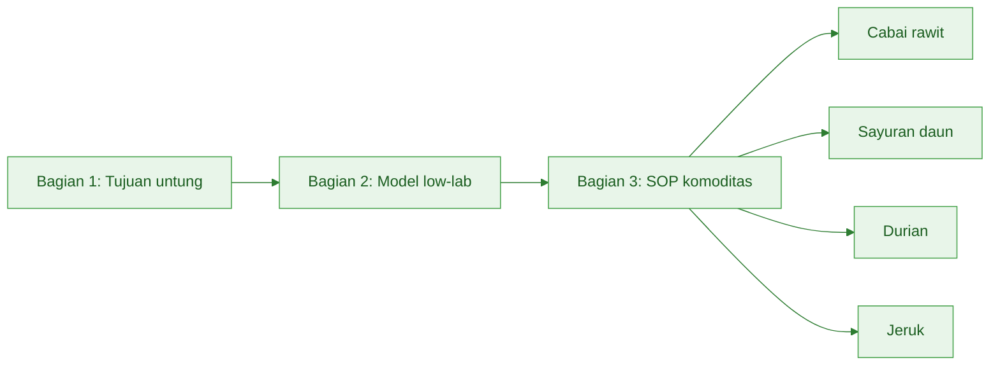
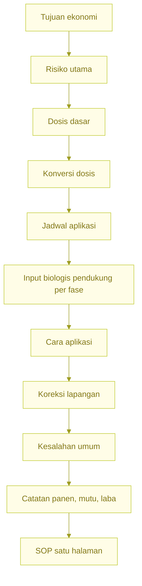
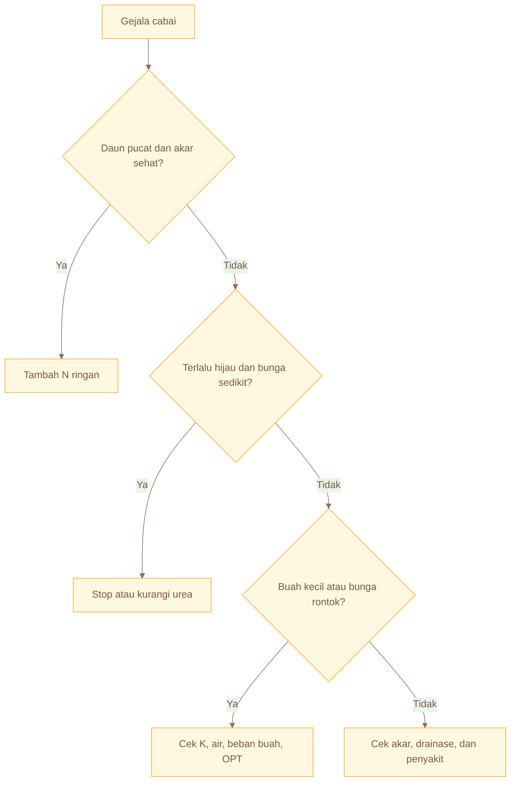
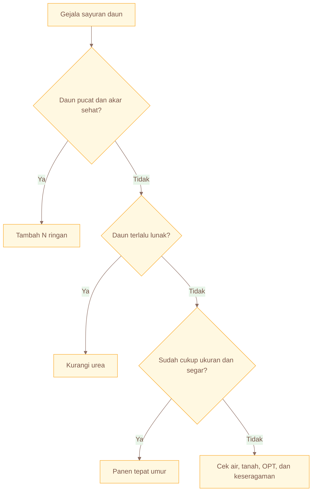
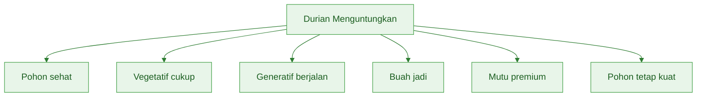
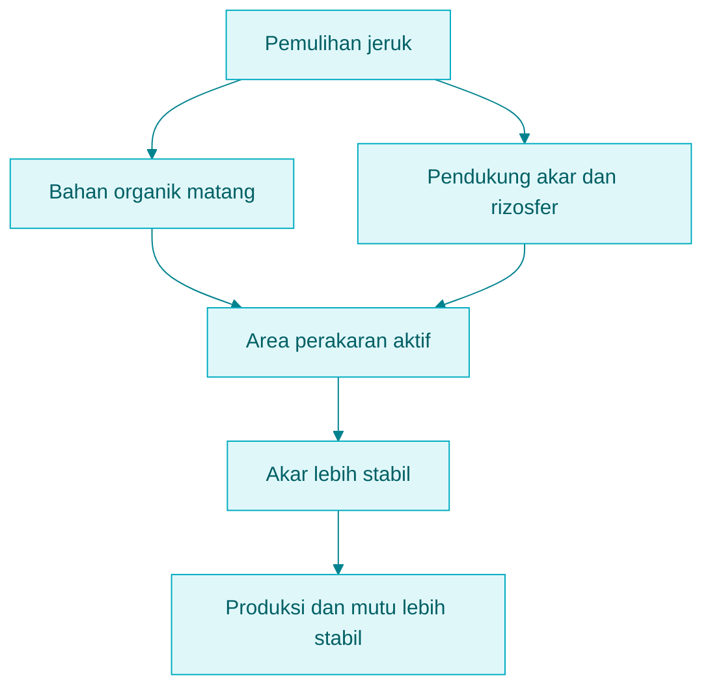
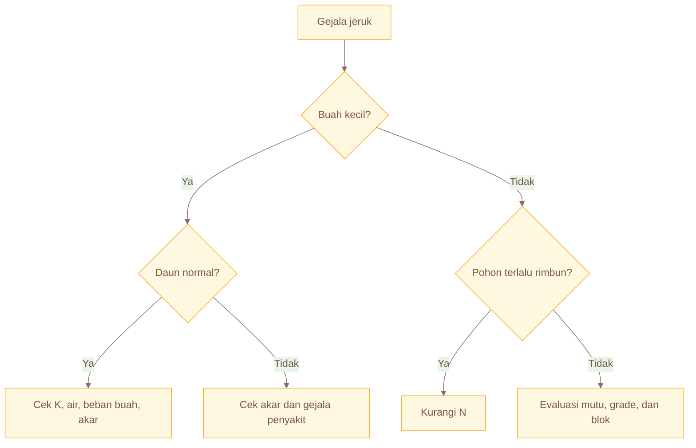

# **_SOP Pemupukan Praktis untuk Cabai Rawit, Sayuran Daun, Durian, dan Jeruk_**

---

- [**_SOP Pemupukan Praktis untuk Cabai Rawit, Sayuran Daun, Durian, dan Jeruk_**](#sop-pemupukan-praktis-untuk-cabai-rawit-sayuran-daun-durian-dan-jeruk)
  - [Pengantar Bagian 3](#pengantar-bagian-3)
  - [Cara Membaca SOP Komoditas](#cara-membaca-sop-komoditas)
    - [1. Mulai dari tujuan ekonomi](#1-mulai-dari-tujuan-ekonomi)
    - [2. Baca risiko utama](#2-baca-risiko-utama)
    - [3. Ambil dosis dasar](#3-ambil-dosis-dasar)
    - [4. Konversi dosis ke lahan nyata](#4-konversi-dosis-ke-lahan-nyata)
    - [5. Baca jadwal aplikasi](#5-baca-jadwal-aplikasi)
    - [6. Baca posisi input biologis pendukung per fase](#6-baca-posisi-input-biologis-pendukung-per-fase)
    - [7. Gunakan tabel koreksi lapangan](#7-gunakan-tabel-koreksi-lapangan)
    - [8. Baca kesalahan umum](#8-baca-kesalahan-umum)
    - [9. Gunakan SOP satu halaman](#9-gunakan-sop-satu-halaman)
  - [Format Umum SOP per Komoditas](#format-umum-sop-per-komoditas)
    - [1. Tujuan ekonomi](#1-tujuan-ekonomi)
    - [2. Risiko utama](#2-risiko-utama)
    - [3. Dosis dasar](#3-dosis-dasar)
    - [4. Konversi dosis](#4-konversi-dosis)
    - [5. Jadwal aplikasi](#5-jadwal-aplikasi)
    - [6. Posisi input biologis pendukung per fase](#6-posisi-input-biologis-pendukung-per-fase)
    - [7. Cara aplikasi](#7-cara-aplikasi)
    - [8. Koreksi lapangan](#8-koreksi-lapangan)
    - [9. Kesalahan umum](#9-kesalahan-umum)
    - [10. Catatan panen, mutu, dan laba](#10-catatan-panen-mutu-dan-laba)
    - [11. SOP satu halaman](#11-sop-satu-halaman)
  - [Ringkasan Pengantar Bagian 3](#ringkasan-pengantar-bagian-3)
  - [Output yang Harus Dihasilkan dari Bagian 3](#output-yang-harus-dihasilkan-dari-bagian-3)
- [Bab 7. SOP Pemupukan Cabai Rawit](#bab-7-sop-pemupukan-cabai-rawit)
  - [Tujuan Bab 7](#tujuan-bab-7)
  - [7.1 Tujuan Ekonomi Cabai Rawit](#71-tujuan-ekonomi-cabai-rawit)
  - [7.2 Risiko Utama Cabai Rawit](#72-risiko-utama-cabai-rawit)
    - [Harga fluktuatif](#harga-fluktuatif)
    - [Layu](#layu)
    - [Antraknosa](#antraknosa)
    - [Trips dan tungau](#trips-dan-tungau)
    - [Hujan lebat](#hujan-lebat)
    - [Kekeringan](#kekeringan)
  - [7.3 Dosis Dasar Cabai Rawit](#73-dosis-dasar-cabai-rawit)
    - [Tambahan bahan organik](#tambahan-bahan-organik)
    - [Koreksi dosis awal](#koreksi-dosis-awal)
  - [7.4 Jadwal Pemupukan Cabai Rawit](#74-jadwal-pemupukan-cabai-rawit)
    - [Diagram fase cabai dan fokus keputusan](#diagram-fase-cabai-dan-fokus-keputusan)
    - [Contoh pembagian untuk 1.000 m²](#contoh-pembagian-untuk-1000-m)
    - [Jadwal saat musim hujan](#jadwal-saat-musim-hujan)
    - [Jadwal saat kemarau](#jadwal-saat-kemarau)
  - [7.5 Posisi Input Biologis Pendukung per Fase — Cabai Rawit](#75-posisi-input-biologis-pendukung-per-fase--cabai-rawit)
    - [Persemaian: dukungan akar awal](#persemaian-dukungan-akar-awal)
    - [Pindah tanam: pemulihan akar dan adaptasi](#pindah-tanam-pemulihan-akar-dan-adaptasi)
    - [Vegetatif awal: dukungan rizosfer bila diperlukan](#vegetatif-awal-dukungan-rizosfer-bila-diperlukan)
    - [Panen berulang: jaga stabilitas akar, bukan kejar daun](#panen-berulang-jaga-stabilitas-akar-bukan-kejar-daun)
    - [Batasi campuran yang tidak jelas](#batasi-campuran-yang-tidak-jelas)
    - [Diagram posisi input biologis per fase — cabai rawit](#diagram-posisi-input-biologis-per-fase--cabai-rawit)
  - [7.6 Cara Aplikasi Cabai Rawit](#76-cara-aplikasi-cabai-rawit)
    - [Jarak aplikasi](#jarak-aplikasi)
    - [Setelah aplikasi](#setelah-aplikasi)
  - [7.7 Koreksi Lapangan Cabai Rawit](#77-koreksi-lapangan-cabai-rawit)
    - [Daun pucat dan tumbuh lambat](#daun-pucat-dan-tumbuh-lambat)
    - [Tanaman terlalu hijau dan bunga sedikit](#tanaman-terlalu-hijau-dan-bunga-sedikit)
    - [Bunga rontok](#bunga-rontok)
    - [Buah kecil](#buah-kecil)
    - [Daun keriting](#daun-keriting)
    - [Diagram koreksi cabai: tambah N / stop N / cek K-air-OPT](#diagram-koreksi-cabai-tambah-n--stop-n--cek-k-air-opt)
  - [7.8 Kesalahan Umum Cabai Rawit](#78-kesalahan-umum-cabai-rawit)
    - [Urea terus ditambah](#urea-terus-ditambah)
    - [Pupuk besar saat hujan](#pupuk-besar-saat-hujan)
    - [Bedengan rendah](#bedengan-rendah)
    - [Tanpa catatan panen](#tanpa-catatan-panen)
    - [Semua gejala dianggap kurang pupuk](#semua-gejala-dianggap-kurang-pupuk)
    - [Input biologis dipakai tanpa fungsi jelas](#input-biologis-dipakai-tanpa-fungsi-jelas)
  - [7.9 Catatan Panen, Mutu, dan Laba Cabai Rawit](#79-catatan-panen-mutu-dan-laba-cabai-rawit)
  - [7.10 SOP Satu Halaman Cabai Rawit](#710-sop-satu-halaman-cabai-rawit)
- [Bab 8. SOP Pemupukan Sayuran Daun](#bab-8-sop-pemupukan-sayuran-daun)
  - [Tujuan Bab 8](#tujuan-bab-8)
  - [8.1 Tujuan Ekonomi Sayuran Daun](#81-tujuan-ekonomi-sayuran-daun)
  - [8.2 Risiko Utama Sayuran Daun](#82-risiko-utama-sayuran-daun)
    - [Harga rendah](#harga-rendah)
    - [Kelebihan N](#kelebihan-n)
    - [Busuk daun](#busuk-daun)
    - [Panen terlambat](#panen-terlambat)
    - [Tanaman tidak seragam](#tanaman-tidak-seragam)
  - [8.3 Dosis Dasar Sayuran Daun](#83-dosis-dasar-sayuran-daun)
    - [Tambahan bahan organik](#tambahan-bahan-organik-1)
    - [Koreksi dosis awal](#koreksi-dosis-awal-1)
  - [8.4 Jadwal Pemupukan Sayuran Daun](#84-jadwal-pemupukan-sayuran-daun)
    - [Diagram fase pendek sayuran daun](#diagram-fase-pendek-sayuran-daun)
    - [Contoh pembagian untuk 1.000 m²](#contoh-pembagian-untuk-1000-m-1)
    - [Contoh pembagian untuk 500 m²](#contoh-pembagian-untuk-500-m)
    - [Saat musim hujan](#saat-musim-hujan)
    - [Saat kemarau](#saat-kemarau)
  - [8.5 Posisi Input Biologis Pendukung per Fase — Sayuran Daun](#85-posisi-input-biologis-pendukung-per-fase--sayuran-daun)
    - [Aktivasi media atau lahan sebelum tanam](#aktivasi-media-atau-lahan-sebelum-tanam)
    - [Awal pertumbuhan untuk dukungan akar](#awal-pertumbuhan-untuk-dukungan-akar)
    - [Kehati-hatian input cair pada umur pendek](#kehati-hatian-input-cair-pada-umur-pendek)
    - [Jangan menaikkan biaya tanpa dampak nyata](#jangan-menaikkan-biaya-tanpa-dampak-nyata)
    - [Uji kecil dulu](#uji-kecil-dulu)
    - [Diagram posisi input biologis awal tanam — sayuran daun](#diagram-posisi-input-biologis-awal-tanam--sayuran-daun)
  - [8.6 Cara Aplikasi Sayuran Daun](#86-cara-aplikasi-sayuran-daun)
    - [Aplikasi merata](#aplikasi-merata)
    - [Jangan terlalu pekat dekat bibit muda](#jangan-terlalu-pekat-dekat-bibit-muda)
    - [Tanah lembap dan drainase baik](#tanah-lembap-dan-drainase-baik)
    - [Hindari aplikasi menjelang hujan lebat](#hindari-aplikasi-menjelang-hujan-lebat)
  - [8.7 Koreksi Lapangan Sayuran Daun](#87-koreksi-lapangan-sayuran-daun)
    - [Daun pucat](#daun-pucat)
    - [Daun terlalu lunak](#daun-terlalu-lunak)
    - [Tanaman tidak seragam](#tanaman-tidak-seragam-1)
    - [Daun berlubang](#daun-berlubang)
    - [Busuk pangkal atau daun](#busuk-pangkal-atau-daun)
    - [Pertumbuhan lambat](#pertumbuhan-lambat)
    - [Diagram keputusan: tambah N / kurangi N / panen](#diagram-keputusan-tambah-n--kurangi-n--panen)
  - [8.8 Panen Tepat Umur](#88-panen-tepat-umur)
    - [Jangan menunda panen hanya untuk mengejar bobot](#jangan-menunda-panen-hanya-untuk-mengejar-bobot)
    - [Panen saat lahan basah](#panen-saat-lahan-basah)
    - [Panen tidak seragam](#panen-tidak-seragam)
  - [8.9 Rotasi dan Pemulihan Tanah](#89-rotasi-dan-pemulihan-tanah)
    - [Rotasi tanaman](#rotasi-tanaman)
    - [Pemulihan tanah](#pemulihan-tanah)
  - [8.10 Catatan Panen, Mutu, dan Laba Sayuran Daun](#810-catatan-panen-mutu-dan-laba-sayuran-daun)
  - [8.11 SOP Satu Halaman Sayuran Daun](#811-sop-satu-halaman-sayuran-daun)
- [Bab 9. SOP Pemupukan Durian](#bab-9-sop-pemupukan-durian)
  - [Tujuan Bab 9](#tujuan-bab-9)
  - [9.1 Tujuan Ekonomi Durian](#91-tujuan-ekonomi-durian)
  - [9.2 Risiko Utama Durian](#92-risiko-utama-durian)
    - [Pohon terlalu vegetatif](#pohon-terlalu-vegetatif)
    - [Bunga rontok](#bunga-rontok-1)
    - [Fruit set rendah](#fruit-set-rendah)
    - [Buah rontok](#buah-rontok)
    - [Akar rusak](#akar-rusak)
    - [Mutu tidak premium](#mutu-tidak-premium)
  - [9.3 Dosis Dasar Durian](#93-dosis-dasar-durian)
    - [Konversi ke per pohon](#konversi-ke-per-pohon)
    - [Kaitan dengan jarak tanam](#kaitan-dengan-jarak-tanam)
  - [9.4 Dosis Berdasarkan Umur Durian](#94-dosis-berdasarkan-umur-durian)
    - [Tanaman muda](#tanaman-muda)
    - [Tanaman remaja](#tanaman-remaja)
    - [Mulai menghasilkan](#mulai-menghasilkan)
    - [Pohon dewasa](#pohon-dewasa)
    - [Koreksi berdasarkan tajuk dan beban buah](#koreksi-berdasarkan-tajuk-dan-beban-buah)
  - [9.5 Jadwal Pemupukan Durian](#95-jadwal-pemupukan-durian)
    - [Diagram fase durian tahunan](#diagram-fase-durian-tahunan)
    - [Setelah panen](#setelah-panen)
    - [Vegetatif atau flush sehat](#vegetatif-atau-flush-sehat)
    - [Menjelang pembungaan](#menjelang-pembungaan)
    - [Setelah fruit set](#setelah-fruit-set)
    - [Pembesaran buah](#pembesaran-buah)
  - [9.6 Posisi Input Biologis Pendukung per Fase — Durian](#96-posisi-input-biologis-pendukung-per-fase--durian)
    - [Pemulihan akar setelah panen](#pemulihan-akar-setelah-panen)
    - [Area tajuk dan perakaran aktif](#area-tajuk-dan-perakaran-aktif)
    - [Integrasi dengan bahan organik](#integrasi-dengan-bahan-organik)
    - [Stabilitas pohon jangka panjang](#stabilitas-pohon-jangka-panjang)
    - [Jangan memaksa input biologis mengganti dasar hara](#jangan-memaksa-input-biologis-mengganti-dasar-hara)
    - [Uji kecil dan catat per pohon atau blok](#uji-kecil-dan-catat-per-pohon-atau-blok)
    - [Diagram posisi input biologis setelah panen hingga fruit set](#diagram-posisi-input-biologis-setelah-panen-hingga-fruit-set)
  - [9.7 Cara Aplikasi Durian](#97-cara-aplikasi-durian)
    - [Area bawah tajuk](#area-bawah-tajuk)
    - [Melingkar](#melingkar)
    - [Tugal dangkal bila perlu](#tugal-dangkal-bila-perlu)
    - [Jangan di batang](#jangan-di-batang)
    - [Sesuaikan umur dan zona akar](#sesuaikan-umur-dan-zona-akar)
  - [9.8 Koreksi Lapangan Durian](#98-koreksi-lapangan-durian)
    - [Pohon terlalu rimbun](#pohon-terlalu-rimbun)
    - [Flush tinggi, bunga rendah](#flush-tinggi-bunga-rendah)
    - [Bunga banyak, fruit set rendah](#bunga-banyak-fruit-set-rendah)
    - [Buah kecil](#buah-kecil-1)
    - [Akar lemah](#akar-lemah)
  - [9.9 Strategi Mutu Premium Durian](#99-strategi-mutu-premium-durian)
  - [9.10 Catatan Panen, Mutu, dan Laba Durian](#910-catatan-panen-mutu-dan-laba-durian)
  - [9.11 SOP Satu Halaman Durian](#911-sop-satu-halaman-durian)
- [Bab 10. SOP Pemupukan Jeruk](#bab-10-sop-pemupukan-jeruk)
  - [Tujuan Bab 10](#tujuan-bab-10)
  - [10.1 Tujuan Ekonomi Jeruk](#101-tujuan-ekonomi-jeruk)
  - [10.2 Risiko Utama Jeruk](#102-risiko-utama-jeruk)
    - [CVPD/greening](#cvpdgreening)
    - [Buah kecil](#buah-kecil-2)
    - [Kulit burik](#kulit-burik)
    - [Produksi tidak stabil](#produksi-tidak-stabil)
  - [10.3 Dosis Jeruk Belum Menghasilkan](#103-dosis-jeruk-belum-menghasilkan)
  - [10.4 Dosis Jeruk Menghasilkan](#104-dosis-jeruk-menghasilkan)
  - [10.5 Jadwal Pemupukan Jeruk](#105-jadwal-pemupukan-jeruk)
    - [Diagram fase jeruk dan target mutu](#diagram-fase-jeruk-dan-target-mutu)
    - [Setelah panen](#setelah-panen-1)
    - [Vegetatif](#vegetatif)
    - [Pembungaan](#pembungaan)
    - [Pembesaran buah](#pembesaran-buah-1)
    - [Menjelang panen](#menjelang-panen)
  - [10.6 Bahan Organik untuk Jeruk](#106-bahan-organik-untuk-jeruk)
  - [10.7 Posisi Input Biologis Pendukung per Fase — Jeruk](#107-posisi-input-biologis-pendukung-per-fase--jeruk)
    - [Dukungan akar](#dukungan-akar)
    - [Integrasi dengan bahan organik](#integrasi-dengan-bahan-organik-1)
    - [Pemulihan pohon](#pemulihan-pohon)
    - [Stabilitas produksi](#stabilitas-produksi)
    - [Jangan salah baca penyakit sebagai masalah hara semata](#jangan-salah-baca-penyakit-sebagai-masalah-hara-semata)
    - [Uji kecil dan catat per blok atau pohon](#uji-kecil-dan-catat-per-blok-atau-pohon)
    - [Diagram posisi input biologis dan bahan organik](#diagram-posisi-input-biologis-dan-bahan-organik)
  - [10.8 Cara Aplikasi Jeruk](#108-cara-aplikasi-jeruk)
  - [10.9 Koreksi Lapangan Jeruk](#109-koreksi-lapangan-jeruk)
    - [Daun pucat](#daun-pucat-1)
    - [Buah kecil](#buah-kecil-3)
    - [Buah tidak seragam](#buah-tidak-seragam)
    - [Gejala penyakit](#gejala-penyakit)
    - [Kulit burik](#kulit-burik-1)
    - [Diagram keputusan buah kecil / daun normal / cek K-air-akar](#diagram-keputusan-buah-kecil--daun-normal--cek-k-air-akar)
  - [10.10 Mutu, Sortasi, dan Grade Jeruk](#1010-mutu-sortasi-dan-grade-jeruk)
  - [10.11 Catatan Panen, Mutu, dan Laba Jeruk](#1011-catatan-panen-mutu-dan-laba-jeruk)
  - [10.12 SOP Satu Halaman Jeruk](#1012-sop-satu-halaman-jeruk)
- [Penutup Bagian 3](#penutup-bagian-3)
  - [Yang Harus Diingat dari Bagian 3](#yang-harus-diingat-dari-bagian-3)
  - [Tabel Ringkasan Cepat 4 Komoditas](#tabel-ringkasan-cepat-4-komoditas)
    - [Ringkasan dosis dasar](#ringkasan-dosis-dasar)
    - [Ringkasan keputusan lapangan](#ringkasan-keputusan-lapangan)
    - [Ringkasan SOP satu kalimat](#ringkasan-sop-satu-kalimat)

---

## Pengantar Bagian 3

Bagian 1 sudah menegaskan bahwa tujuan pemupukan bukan sekadar membuat tanaman hijau, tetapi membuat usaha tani lebih menguntungkan.

Bagian 2 sudah membangun model low-lab:

- mulai dari dosis acuan,
- membaca kelas lahan,
- menghitung dosis,
- melihat musim,
- membaca respons tanaman,
- lalu mengoreksi secara bertahap.

Bagian 3 adalah penerapan langsung model itu pada empat komoditas:

```text id="m0itah"
cabai rawit
sayuran daun
durian
jeruk
```

Keempat komoditas ini tidak bisa dipupuk dengan cara berpikir yang sama.

Cabai rawit mengejar panen panjang dan stabil.
Sayuran daun mengejar pertumbuhan cepat, seragam, segar, dan panen tepat umur.
Durian mengejar keseimbangan pohon, bunga jadi buah, dan mutu premium.
Jeruk mengejar produksi stabil, ukuran buah seragam, dan kesehatan pohon jangka panjang.

Karena tujuan ekonominya berbeda, maka SOP pupuknya juga berbeda.

Diagram hubungan dari model ke SOP komoditas:



Pesan utama bagian ini:

> Setiap komoditas punya strategi untung yang berbeda. Maka SOP pupuknya juga tidak boleh disamakan.

Bagian ini dibuat sebagai pegangan lapangan. Isinya harus bisa dibaca cepat, dibawa ke kebun, dipakai untuk diskusi kelompok tani, dan dijadikan dasar pengambilan keputusan sehari-hari.

Yang dicari bukan teori panjang, tetapi keputusan praktis:

```text id="ycwz7f"
berapa dosis dasarnya
kapan pupuk diberikan
bagaimana cara aplikasinya
kapan pupuk dikurangi
kapan pupuk ditambah
kapan pupuk ditahan
apa kesalahan yang harus dihindari
apa hubungan pupuk dengan hasil, mutu, dan laba
```

Dosis yang ditulis dalam SOP ini adalah **dosis dasar**. Artinya, dosis tersebut dipakai sebagai titik awal, bukan angka mati.

Dosis tetap perlu dikoreksi berdasarkan:

```text id="tyb19c"
kelas lahan
musim
kondisi air
respons tanaman
biaya
harga panen
risiko OPT
```

Dalam versi rewrite ini, setiap SOP komoditas juga memasukkan **posisi input biologis pendukung per fase**. Posisi ini harus dibaca dengan benar:

- bukan pengganti pupuk utama,
- bukan tambahan otomatis,
- tetapi alat pendukung akar, rizosfer, bahan organik, atau stabilitas sistem bila memang dibutuhkan dan diuji kecil lebih dulu.

<ResourceBox
  title="Artikel Terkait:"
  items={[
    {
      name: 'README - Pupuk Tepat, Panen Untung - Model Low-Lab untuk Petani Makmur di Gambiran',
      href: '/blog/agri/pupuk-terintegrasi/README',
    },
  ]}
/>

---

## Cara Membaca SOP Komoditas

Setiap SOP komoditas dalam bagian ini disusun dengan pola yang sama agar mudah dipakai.

Urutannya:

```text id="tqf2e4"
1. Tujuan ekonomi komoditas
2. Risiko utama
3. Dosis dasar
4. Konversi dosis ke luasan atau per pohon
5. Jadwal aplikasi
6. Posisi input biologis pendukung per fase
7. Cara aplikasi
8. Koreksi lapangan
9. Kesalahan yang harus dihindari
10. Catatan panen, mutu, dan laba
11. SOP satu halaman
```

Pola ini penting karena petani tidak selalu membaca manual dari awal sampai akhir. Bisa saja:

- petani cabai langsung membuka bab cabai,
- petani durian langsung membuka bab durian,
- penyuluh langsung mengambil tabel koreksi lapangan untuk diskusi kelompok.

Agar SOP mudah dipakai, gunakan cara baca berikut.

### 1. Mulai dari tujuan ekonomi

Jangan langsung bertanya:

```text id="lhv7ef"
Pupuknya berapa?
```

Mulailah dari:

```text id="9j2y7o"
Tujuan usaha komoditas ini apa?
```

Contoh:

| Komoditas    | Tujuan Ekonomi Utama             |
| ------------ | -------------------------------- |
| Cabai rawit  | Panen panjang dan stabil         |
| Sayuran daun | Cepat panen, seragam, segar      |
| Durian       | Mutu premium dan buah jadi       |
| Jeruk        | Produksi stabil dan buah seragam |

Tujuan ekonomi menentukan cara memupuk. Cabai rawit tidak boleh hanya dibuat rimbun. Durian tidak boleh hanya dipacu daun. Sayuran daun tidak boleh terlalu lunak. Jeruk tidak boleh dipaksa produksi tinggi sesaat tetapi pohon cepat menurun.

### 2. Baca risiko utama

Setiap komoditas memiliki risiko yang berbeda.

| Komoditas    | Risiko Utama                                                   |
| ------------ | -------------------------------------------------------------- |
| Cabai rawit  | Harga fluktuatif, layu, antraknosa, trips, tungau, hujan       |
| Sayuran daun | Harga rendah, daun lunak, busuk, panen terlambat               |
| Durian       | Pohon terlalu vegetatif, bunga rontok, buah rontok, akar rusak |
| Jeruk        | CVPD/greening, buah kecil, kulit burik, akar lemah             |

Risiko ini harus dibaca sebelum pupuk ditambah. Banyak kegagalan usaha tani bukan karena dosis pupuk kurang, tetapi karena akar rusak, air tidak stabil, OPT terlambat dikendalikan, atau harga tidak menutup biaya.

### 3. Ambil dosis dasar

Dosis dasar adalah titik awal.

Contoh:

| Komoditas           |                                         Dosis Dasar |
| ------------------- | --------------------------------------------------: |
| Cabai rawit         |              NPK 15-10-12 425 kg/ha + urea 75 kg/ha |
| Sayuran daun        |             NPK 15-10-12 325 kg/ha + urea 100 kg/ha |
| Durian menghasilkan | NPK 15-10-12 500 kg/ha/tahun + urea 150 kg/ha/tahun |
| Jeruk               |         Berdasarkan umur atau hasil panen per pohon |

Dosis dasar tidak langsung diberikan begitu saja. Dosis harus disesuaikan dengan luas lahan atau jumlah pohon, lalu dibagi sesuai fase tanaman.

### 4. Konversi dosis ke lahan nyata

Petani jarang memiliki lahan tepat 1 hektare. Karena itu, dosis harus diubah ke luas nyata.

Rumus:

```text id="2zrou1"
Kebutuhan pupuk = dosis kg/ha × luas lahan m² ÷ 10.000
```

Contoh:

```text id="7vxgtl"
Dosis NPK cabai = 425 kg/ha
Luas lahan = 1.000 m²

Kebutuhan NPK = 425 × 1.000 ÷ 10.000
              = 42,5 kg
```

Untuk tanaman tahunan, gunakan per pohon:

```text id="vjvlf9"
Pupuk per pohon = dosis kg/ha ÷ jumlah pohon per ha
```

### 5. Baca jadwal aplikasi

Dosis benar tetapi waktu salah tetap bisa gagal. Karena itu, setiap SOP komoditas menyediakan jadwal aplikasi.

Prinsip umum:

| Fase                       | Fokus                          |
| -------------------------- | ------------------------------ |
| Persiapan                  | Tanah, bahan organik, drainase |
| Awal tanam / setelah panen | Akar dan pemulihan             |
| Vegetatif                  | Pertumbuhan sehat              |
| Pembungaan                 | N jangan berlebihan            |
| Pembesaran buah / panen    | K, air, mutu, stamina tanaman  |

Pada tanaman semusim, jadwal biasanya berdasarkan hari setelah tanam. Pada tanaman tahunan, jadwal berdasarkan fase pohon: setelah panen, pertunasan, pembungaan, fruit set, dan pembesaran buah.

### 6. Baca posisi input biologis pendukung per fase

Ini tambahan penting dalam versi rewrite.

Setiap komoditas akan menunjukkan:

- fase mana input biologis boleh dipakai,
- tujuan penggunaannya,
- kapan sebaiknya tidak dipakai,
- dan bahwa input biologis bukan pengganti pupuk utama.

### 7. Gunakan tabel koreksi lapangan

Tabel koreksi lapangan adalah bagian paling penting dari SOP.

Contoh:

| Gejala                | Jangan Langsung   | Cek Dulu                 |
| --------------------- | ----------------- | ------------------------ |
| Daun pucat            | Tambah urea besar | Akar, air, fase tanaman  |
| Tanaman terlalu hijau | Tambah pupuk lagi | Bunga, buah, N berlebih  |
| Buah kecil            | Tambah N          | K, air, beban buah       |
| Tanaman layu          | Tambah pupuk      | Akar, penyakit, genangan |
| Daun rusak            | Tambah mikro      | OPT, cuaca, pestisida    |

Koreksi pupuk harus membaca gejala bersama kondisi air, akar, OPT, dan fase tanaman.

### 8. Baca kesalahan umum

Setiap komoditas punya kesalahan yang sering terjadi.

Contoh:

```text id="gkqz86"
Cabai rawit: urea terus ditambah saat tanaman sudah terlalu hijau.
Sayuran daun: panen terlambat dan daun terlalu lunak.
Durian: pohon dibuat terlalu rimbun menjelang pembungaan.
Jeruk: gejala penyakit dianggap hanya kurang pupuk.
```

### 9. Gunakan SOP satu halaman

Di akhir setiap bab komoditas, ada SOP satu halaman. Bagian ini bisa difotokopi dan dipakai untuk pendampingan lapangan.

Diagram alur membaca SOP komoditas:



Pesan penting:

> SOP yang baik harus bisa dibaca cepat, dipakai ulang, dan menghasilkan keputusan yang lebih tepat di lapangan.

---

## Format Umum SOP per Komoditas

Setiap komoditas akan ditulis dengan format tetap seperti berikut.

### 1. Tujuan ekonomi

Bagian ini menjelaskan apa yang sebenarnya dikejar dari komoditas tersebut.

Contoh:

| Komoditas    | Tujuan Ekonomi                                    |
| ------------ | ------------------------------------------------- |
| Cabai rawit  | Panen panjang, buah stabil, biaya terkendali      |
| Sayuran daun | Cepat panen, seragam, segar, biaya rendah         |
| Durian       | Pohon sehat, bunga jadi buah, mutu premium        |
| Jeruk        | Produksi stabil, ukuran buah seragam, pohon sehat |

Tujuan ekonomi penting karena menentukan arah pemupukan.

### 2. Risiko utama

Bagian ini menjelaskan risiko yang bisa menghilangkan laba.

Format tabel:

| Risiko | Dampak | Hubungan dengan Pemupukan |
| ------ | ------ | ------------------------- |

Contoh:

| Risiko                    | Dampak                      | Hubungan dengan Pemupukan    |
| ------------------------- | --------------------------- | ---------------------------- |
| Hujan lebat               | Pupuk hilang, penyakit naik | Dosis perlu dipecah          |
| Tanaman terlalu vegetatif | Bunga lambat                | N perlu dikendalikan         |
| Akar rusak                | Pupuk tidak terserap        | Drainase dan organik penting |

### 3. Dosis dasar

Bagian ini memberi angka awal.

Format:

```text id="t0zr0y"
NPK = ... kg/ha
Urea = ... kg/ha
Bahan organik = ... ton/ha
```

Untuk tanaman tahunan:

```text id="wi2wpg"
NPK = ... kg/ha/tahun
Urea = ... kg/ha/tahun
Konversi per pohon = ... kg/pohon/tahun
```

Catatan yang harus selalu ada:

> Dosis ini adalah titik awal. Koreksi dengan kelas lahan, musim, dan respons tanaman.

### 4. Konversi dosis

Untuk tanaman semusim, dosis dikonversi ke luas petak.

Format:

| Luas Lahan | NPK | Urea |
| ---------- | --: | ---: |

Untuk tanaman tahunan, dosis dikonversi ke per pohon.

Format:

| Jarak Tanam | Populasi | NPK/pohon/tahun | Urea/pohon/tahun |
| ----------- | -------: | --------------: | ---------------: |

### 5. Jadwal aplikasi

Bagian ini menjelaskan kapan pupuk diberikan.

Format tanaman semusim:

| Fase | Waktu | Fokus | Aplikasi |
| ---- | ----- | ----- | -------- |

Format tanaman tahunan:

| Fase Pohon | Fokus | Aplikasi |
| ---------- | ----- | -------- |

### 6. Posisi input biologis pendukung per fase

Ini bagian baru yang ditambahkan ke semua komoditas.

Format:

| Fase | Input Biologis Pendukung | Tujuan | Catatan |
| ---- | ------------------------ | ------ | ------- |

Prinsipnya:

- fungsi harus jelas,
- jangan mengganti pupuk utama,
- uji kecil dulu,
- catat batch jika produk buatan sendiri atau fermentasi.

### 7. Cara aplikasi

Bagian ini menjelaskan cara menempatkan pupuk.

Contoh:

```text id="ofbfsb"
pupuk tidak menempel batang
pupuk diberikan dekat zona akar
pupuk ditutup tanah
pupuk diberikan saat tanah cukup lembap
pupuk berat ditunda saat tanah becek
```

### 8. Koreksi lapangan

Bagian ini menjadi alat keputusan.

Format:

| Gejala | Kemungkinan | Tindakan |
| ------ | ----------- | -------- |

Contoh:

| Gejala                | Kemungkinan              | Tindakan                  |
| --------------------- | ------------------------ | ------------------------- |
| Daun pucat            | N kurang atau akar lemah | Tambah N ringan, cek akar |
| Tanaman terlalu hijau | N berlebih               | Kurangi urea              |
| Buah kecil            | K, air, beban buah       | Koreksi K dan air         |

### 9. Kesalahan umum

Bagian ini membantu petani menghindari keputusan yang sering merugikan.

Format:

| Kesalahan | Akibat |
| --------- | ------ |

Contoh:

| Kesalahan              | Akibat                    |
| ---------------------- | ------------------------- |
| Urea terus ditambah    | Tanaman terlalu vegetatif |
| Pupuk besar saat hujan | Banyak hilang             |
| Tidak mencatat panen   | Tidak tahu pola terbaik   |

### 10. Catatan panen, mutu, dan laba

Bagian ini menghubungkan pupuk dengan uang.

Hal yang dicatat:

```text id="i6x4h9"
tanggal aplikasi pupuk
jenis dan dosis pupuk
biaya pupuk
kondisi tanaman
hasil panen
mutu hasil
harga jual
```

Format sederhana:

| Tanggal | Kegiatan | Input | Biaya | Kondisi Tanaman | Panen | Harga |
| ------- | -------- | ----: | ----: | --------------- | ----: | ----: |
|         |          |       |       |                 |       |       |

### 11. SOP satu halaman

Setiap bab komoditas ditutup dengan SOP satu halaman.

Formatnya:

```text id="325o0n"
1. Siapkan lahan atau tanaman.
2. Gunakan dosis dasar.
3. Konversi dosis sesuai luas atau pohon.
4. Bagi aplikasi sesuai fase.
5. Koreksi dari respons tanaman.
6. Hindari kesalahan utama.
7. Catat biaya, hasil, mutu, dan harga.
```

Pesan penting format SOP:

> Format yang seragam membuat petani lebih mudah membandingkan komoditas dan lebih mudah memakai manual ini di lapangan.

---

## Ringkasan Pengantar Bagian 3

Hal yang harus diingat sebelum masuk ke SOP komoditas:

1. Setiap komoditas punya strategi untung berbeda.
2. Dosis dasar adalah titik awal, bukan angka mati.
3. Dosis harus dikonversi ke luas lahan atau per pohon.
4. Aplikasi harus mengikuti fase tanaman.
5. Koreksi lapangan harus membaca respons tanaman, air, akar, OPT, dan harga.
6. Pupuk tidak boleh menjadi jawaban untuk semua masalah.
7. Input biologis pendukung harus punya fungsi jelas per fase.
8. SOP satu halaman dipakai agar petani bisa bekerja praktis dan konsisten.

Tabel ringkas:

| Komoditas    | Fokus Untung      | Prinsip Pupuk                               |
| ------------ | ----------------- | ------------------------------------------- |
| Cabai rawit  | Panen panjang     | N dikendalikan, K dan air dijaga            |
| Sayuran daun | Cepat dan seragam | N cukup, tidak berlebihan                   |
| Durian       | Mutu premium      | Seimbang vegetatif-generatif                |
| Jeruk        | Produksi stabil   | Organik, K, air, dan kesehatan pohon dijaga |

Pesan penutup pengantar:

> Jangan menyamakan SOP pupuk semua komoditas. Cabai, sayuran daun, durian, dan jeruk memiliki tujuan ekonomi, risiko, dan pola respons yang berbeda.

---

## Output yang Harus Dihasilkan dari Bagian 3

Setelah membaca Bagian 3, pembaca harus bisa berkata:

```text id="hwn4tf"
Saya tahu dosis dasar komoditas saya.
Saya tahu cara mengubah dosis ke luas lahan atau per pohon.
Saya tahu kapan pupuk diberikan.
Saya tahu tanda kapan pupuk ditambah, dikurangi, atau ditahan.
Saya tahu posisi input biologis pendukung per fase.
Saya tahu kesalahan umum yang harus dihindari.
Saya bisa menjalankan SOP di lahan.
Saya bisa menghubungkan pupuk dengan hasil, mutu, dan laba.
```

Dengan begitu, Bagian 3 menjadi **pegangan kerja lapangan**, bukan sekadar penjelasan teori pemupukan.

Tabel output praktis:

| Setelah Membaca Bagian 3 | Pembaca Seharusnya Bisa                       |
| ------------------------ | --------------------------------------------- |
| Cabai rawit              | Menjaga panen panjang tanpa memaksa vegetatif |
| Sayuran daun             | Menjaga kecepatan, keseragaman, dan mutu      |
| Durian                   | Menjaga keseimbangan pohon dan mutu buah      |
| Jeruk                    | Menjaga produksi stabil dan kesehatan pohon   |
| Semua komoditas          | Menghubungkan pupuk dengan mutu dan laba      |

Penutup Respons 1:

> Bagian 3 bukan hanya menjawab “berapa pupuknya”, tetapi juga “bagaimana pupuk itu dipakai agar benar-benar menjadi panen, mutu, dan laba.”

---

Berikut **Respons 2** hasil re-writing **Bagian 3**, melanjutkan ke **Bab 7. SOP Pemupukan Cabai Rawit**. Struktur dasarnya mengikuti artikel asli cabai rawit, tetapi diperkuat agar SOP benar-benar membaca **fase tanaman, akar, air, risiko, harga, dan posisi input biologis pendukung per fase**. Diagram mermaid tetap dibuat **berwarna**.

# Bab 7. SOP Pemupukan Cabai Rawit

## Tujuan Bab 7

Bab ini membantu petani cabai rawit mengatur pemupukan agar tanaman tidak hanya subur, tetapi benar-benar menghasilkan panen yang menguntungkan.

Cabai rawit menguntungkan bila tanaman mampu:

```text id="drjqg5"
panen panjang
buah stabil
tanaman tidak terlalu rimbun
akar sehat
bunga dan buah terus berjalan
biaya pupuk dan pestisida terkendali
risiko layu dan penyakit berkurang
```

Cabai rawit tidak cukup hanya hijau dan besar. Tanaman yang terlalu hijau tetapi bunga sedikit belum tentu menguntungkan. Pada cabai rawit, uang masuk dari buah yang bisa dipanen berkali-kali, bukan dari daun yang terlalu rimbun.

Pesan utama bab ini:

> Cabai rawit harus seimbang: akar sehat, pertumbuhan cukup, bunga jalan, buah stabil, dan panen panjang.

---

## 7.1 Tujuan Ekonomi Cabai Rawit

Cabai rawit menguntungkan bukan hanya karena hasil tinggi sesaat, tetapi karena **masa panen panjang dan produksi stabil**.

Tanaman cabai yang baik tidak hanya dilihat dari tinggi tanaman atau warna daun. Tanaman harus mampu mempertahankan bunga, membentuk buah, dan tetap produktif dalam beberapa kali panen.

Target praktis cabai rawit:

| Target           | Makna Lapangan                            |
| ---------------- | ----------------------------------------- |
| Panen panjang    | Tanaman tidak cepat habis                 |
| Buah stabil      | Produksi tidak naik-turun tajam           |
| Tanaman seimbang | Tidak terlalu rimbun, tidak lemah         |
| Biaya terkendali | Pupuk dan pestisida tidak membengkak      |
| Mutu baik        | Buah segar, padat, ukuran relatif seragam |
| Akar sehat       | Tanaman mampu menyerap pupuk dan air      |
| Bunga berlanjut  | Produksi tetap berjalan selama masa panen |

Pada cabai rawit, kesalahan umum adalah terlalu mengejar pertumbuhan vegetatif. Tanaman dibuat sangat hijau, daun banyak, cabang rimbun, tetapi bunga sedikit dan buah lambat. Kondisi seperti itu harus dibaca sebagai tanda bahwa pemupukan belum mengarah ke uang.

Kalimat kunci:

> Pada cabai rawit, tanaman terlalu hijau tetapi bunga sedikit adalah tanda bahwa pemupukan belum mengarah ke panen.

Tujuan pemupukan cabai rawit adalah menjaga keseimbangan antara pertumbuhan dan produksi. Tanaman perlu cukup kuat, tetapi tidak boleh terlalu vegetatif. Tanaman perlu cukup N, tetapi tidak boleh kelebihan urea. Tanaman perlu K, air stabil, dan akar sehat agar buah tetap terbentuk dan masa panen panjang.

---

## 7.2 Risiko Utama Cabai Rawit

Cabai rawit termasuk komoditas yang menarik secara ekonomi, tetapi risikonya juga tinggi. Harga bisa berubah cepat, serangan OPT bisa datang mendadak, dan cuaca sangat memengaruhi hasil.

Tabel risiko utama cabai rawit:

| Risiko                    | Dampak                           | Hubungan dengan Pemupukan                   |
| ------------------------- | -------------------------------- | ------------------------------------------- |
| Harga fluktuatif          | Laba tidak pasti                 | Input harus bertahap                        |
| Layu                      | Tanaman mati atau produksi turun | Akar dan drainase penting                   |
| Antraknosa                | Buah busuk                       | Tajuk terlalu rimbun memperbesar risiko     |
| Trips/tungau              | Daun rusak, bunga terganggu      | Jangan salah diagnosis sebagai kurang pupuk |
| Hujan lebat               | Pupuk hilang, penyakit naik      | Dosis perlu dipecah                         |
| Kekeringan                | Bunga dan buah rontok            | Air stabil lebih penting dari tambah pupuk  |
| Tanaman terlalu vegetatif | Bunga sedikit                    | N harus dikendalikan                        |
| Buah kecil                | Mutu dan harga turun             | K, air, dan beban buah perlu dijaga         |

### Harga fluktuatif

Cabai rawit sangat dipengaruhi harga pasar. Saat harga tinggi, menjaga stamina tanaman dan panen panjang bisa sangat menguntungkan. Saat harga rendah, input tambahan harus dihitung hati-hati.

Karena itu, pemupukan cabai sebaiknya bertahap. Jangan semua input besar dikeluarkan di awal tanpa melihat kondisi tanaman dan peluang harga.

### Layu

Layu menjadi risiko besar pada cabai. Bila akar terganggu atau tanaman terserang penyakit layu, pupuk tidak akan terserap optimal. Menambah pupuk pada tanaman yang akarnya sakit sering tidak menyelesaikan masalah. Karena itu, bedengan, drainase, bahan organik matang, dan sanitasi lahan sangat penting.

### Antraknosa

Antraknosa menyebabkan buah busuk dan langsung menurunkan hasil layak jual. Tanaman yang terlalu rimbun dapat membuat kelembapan tajuk lebih tinggi. Kelembapan tinggi dapat memperbesar risiko penyakit, terutama pada musim hujan. Maka, N harus dikendalikan. Jangan membuat tanaman terlalu lebat bila sirkulasi udara buruk.

### Trips dan tungau

Daun keriting atau rusak sering langsung dianggap kurang hara. Padahal bisa disebabkan trips, tungau, virus, atau faktor lain. Bila salah diagnosis, petani menambah pupuk padahal masalahnya OPT.

### Hujan lebat

Hujan lebat dapat membuat N mudah hilang. Pada kondisi ini, dosis lebih baik dipecah. Aplikasi kecil tetapi lebih sering lebih aman daripada dosis besar yang hilang terbawa air.

### Kekeringan

Saat air tidak stabil, bunga dan buah bisa rontok. Menambah pupuk tidak banyak membantu bila tanaman kekurangan air. Pada fase bunga dan buah, air stabil sangat penting.

Pesan penting:

> Banyak masalah cabai bukan diselesaikan dengan menambah pupuk, tetapi dengan menjaga akar, air, drainase, dan OPT.

---

## 7.3 Dosis Dasar Cabai Rawit

Dosis dasar cabai rawit dalam manual ini:

```text id="wlmjlwm"
NPK 15-10-12 = 425 kg/ha
Urea = 75 kg/ha
```

Dosis ini adalah **dosis acuan**, bukan angka mati. Dosis harus dikoreksi berdasarkan kelas lahan, musim, kondisi tanaman, dan hasil pengamatan.

Konversi cepat:

| Luas Lahan | NPK 15-10-12 |    Urea |
| ---------- | -----------: | ------: |
| 1 ha       |       425 kg |   75 kg |
| 1.000 m²   |      42,5 kg |  7,5 kg |
| 500 m²     |     21,25 kg | 3,75 kg |
| 100 m²     |      4,25 kg | 0,75 kg |

Rumus konversi:

```text id="k9rpgn"
Kebutuhan pupuk = dosis kg/ha × luas lahan m² ÷ 10.000
```

Contoh untuk lahan 1.000 m²:

```text id="ilmc76"
NPK = 425 × 1.000 ÷ 10.000
    = 42,5 kg
```

```text id="e7j2eb"
Urea = 75 × 1.000 ÷ 10.000
     = 7,5 kg
```

### Tambahan bahan organik

Tambahkan bahan organik matang:

```text id="gve3lg"
Kompos/pupuk kandang matang = 10–20 ton/ha
atau 1–2 ton per 1.000 m²
```

Bahan organik bukan pengganti penuh NPK. Fungsinya lebih sebagai fondasi tanah.

Manfaat bahan organik:

```text id="d8e07r"
membantu struktur tanah
menjaga kelembapan
mendukung akar
meningkatkan efisiensi pupuk
membantu tanah tidak cepat keras
menyangga tanaman saat cuaca ekstrem
```

Catatan penting:

> Bahan organik bukan pengganti penuh NPK, tetapi fondasi agar tanah lebih stabil, akar lebih sehat, dan pupuk lebih efisien.

### Koreksi dosis awal

Gunakan koreksi sederhana:

| Kondisi Lahan |                                     Koreksi |
| ------------- | ------------------------------------------: |
| Lahan kuat    |               dosis acuan -10% sampai acuan |
| Lahan sedang  |                                 dosis acuan |
| Lahan lemah   | dosis acuan +10–20%, tetapi dibagi bertahap |

Namun pada cabai rawit, menaikkan dosis tidak boleh hanya menaikkan urea. Jika tanaman lemah karena akar, air, atau penyakit, tambahan urea tidak menyelesaikan masalah.

---

## 7.4 Jadwal Pemupukan Cabai Rawit

Dosis total harus dibagi sesuai fase tanaman. Cabai rawit tidak dianjurkan menerima pupuk besar sekaligus, terutama pada lahan yang rawan hujan, cepat kering, atau akar mudah terganggu.

Tabel jadwal dasar:

| Fase            | Waktu           | Fokus                    | Aplikasi                                 |
| --------------- | --------------- | ------------------------ | ---------------------------------------- |
| Persiapan       | H-14 sampai H-7 | Tanah, bedengan, organik | Kompos/pupuk kandang matang              |
| Awal tanam      | H0              | Akar dan adaptasi        | 25% NPK                                  |
| Vegetatif awal  | 10–15 HST       | Pertumbuhan awal         | 15% NPK + 25% urea                       |
| Vegetatif aktif | 25–30 HST       | Cabang dan calon bunga   | 20% NPK + 35% urea                       |
| Bunga/buah awal | 45–60 HST       | Bunga dan buah           | 20% NPK + 25% urea                       |
| Masa panen      | Mulai panen     | Stamina tanaman          | Sisa 20% NPK + 15% urea, dibagi 2–3 kali |

### Diagram fase cabai dan fokus keputusan


### Contoh pembagian untuk 1.000 m²

Dosis total:

```text id="8zy8bv"
NPK = 42,5 kg
Urea = 7,5 kg
```

Pembagian NPK:

| Fase       | Persentase | Jumlah NPK |
| ---------- | ---------: | ---------: |
| Awal tanam |        25% |    10,6 kg |
| 10–15 HST  |        15% |     6,4 kg |
| 25–30 HST  |        20% |     8,5 kg |
| 45–60 HST  |        20% |     8,5 kg |
| Masa panen |        20% |     8,5 kg |

Pembagian urea:

| Fase       | Persentase | Jumlah Urea |
| ---------- | ---------: | ----------: |
| 10–15 HST  |        25% |      1,9 kg |
| 25–30 HST  |        35% |      2,6 kg |
| 45–60 HST  |        25% |      1,9 kg |
| Masa panen |        15% |      1,1 kg |

Catatan penting:

Jika tanaman terlalu rimbun menjelang bunga, kurangi urea. Jika tanaman pucat dan lambat tetapi akar sehat, tambah N ringan, bukan sekaligus besar.

### Jadwal saat musim hujan

Pada musim hujan:

```text id="l2mmpe"
dosis jangan besar sekaligus
pupuk harus ditutup tanah
bedengan dan parit harus baik
susulan bisa dibuat lebih kecil tetapi lebih sering
jangan memupuk berat saat tanah becek
```

### Jadwal saat kemarau

Pada musim kemarau:

```text id="aqymfg"
tanah harus lembap sebelum pupuk
siram dulu bila tanah terlalu kering
jangan pupuk pekat dekat akar muda
mulsa membantu menjaga kelembapan
pupuk ringan lebih aman saat air terbatas
```

Pesan penting:

> Pada cabai rawit, jadwal pupuk harus fleksibel mengikuti fase, hujan, air, dan kondisi akar.

---

## 7.5 Posisi Input Biologis Pendukung per Fase — Cabai Rawit

Ini subbab baru yang wajib ada dalam versi rewrite.

Pada cabai rawit, input biologis **tidak** diposisikan sebagai pengganti pupuk utama. Posisinya adalah sebagai **pendukung akar, rizosfer, dan stabilitas tanaman** pada fase tertentu, bila memang dibutuhkan dan diuji kecil lebih dulu.

Tabel posisi input biologis pendukung:

| Fase            | Input Biologis Pendukung          | Tujuan                         | Catatan                         |
| --------------- | --------------------------------- | ------------------------------ | ------------------------------- |
| Persemaian      | Pendukung akar/rizosfer yang aman | Bantu akar awal                | Uji kecil dulu                  |
| Pindah tanam    | Pendukung adaptasi akar           | Pulihkan stres pindah tanam    | Jangan campur semua bahan       |
| Vegetatif awal  | Pendukung rizosfer bila perlu     | Jaga akar dan efisiensi awal   | Bukan alasan menaikkan campuran |
| Bunga/buah awal | Sangat selektif                   | Jangan mengganggu keseimbangan | Prioritas tetap K, air, akar    |
| Panen berulang  | Pendukung stabilitas akar         | Jaga stamina tanaman           | Jangan kejar daun               |

### Persemaian: dukungan akar awal

Pada persemaian, tujuan utamanya bukan mengejar hijau cepat, tetapi membangun bibit yang berakar baik dan tidak terlalu lemah saat pindah tanam.

Jika memakai input biologis pendukung, pilih yang fungsinya jelas untuk:

- akar awal,
- lingkungan rizosfer,
- atau aktivasi media persemaian.

Jangan pakai campuran banyak bahan tanpa tahu fungsi masing-masing.

### Pindah tanam: pemulihan akar dan adaptasi

Saat pindah tanam, cabai rawit sering mengalami stres. Pada fase ini, pendukung biologis boleh dipertimbangkan untuk membantu adaptasi akar, tetapi tetap:

- tidak mengganti pupuk utama,
- tidak dipakai berlebihan,
- dan tidak langsung digunakan di seluruh lahan tanpa uji kecil.

### Vegetatif awal: dukungan rizosfer bila diperlukan

Pada fase vegetatif awal, fokusnya tetap:

- akar sehat,
- air cukup,
- pertumbuhan awal seimbang.

Jika kondisi tanah kurang baik atau lahan cenderung lemah, pendukung biologis dapat dipakai untuk membantu kondisi rizosfer, tetapi tetap harus dibaca bersama air, bahan organik, dan dosis pupuk utama.

### Panen berulang: jaga stabilitas akar, bukan kejar daun

Pada fase panen berulang, keputusan yang paling penting adalah menjaga stamina tanaman. Bila memakai input biologis pendukung, arahkan untuk mendukung kestabilan akar dan lingkungan tanaman, **bukan** untuk memacu vegetatif.

Jika tanaman sudah terlalu hijau, tambahan input apa pun yang mendorong daun harus ditahan.

### Batasi campuran yang tidak jelas

Jangan campur semua produk hanya karena dianggap “alami” atau “organik”. Prinsipnya:

- fungsi harus jelas,
- dosis harus masuk akal,
- batch harus dicatat,
- produk meragukan jangan dipakai,
- dan uji kecil wajib dilakukan.

### Diagram posisi input biologis per fase — cabai rawit


Pesan penting:

> Pada cabai rawit, input biologis pendukung hanya berguna bila membantu akar dan kestabilan tanaman. Bila hanya menambah campuran dan biaya, lebih baik ditahan.

---

## 7.6 Cara Aplikasi Cabai Rawit

Pupuk cabai rawit harus diberikan di area yang bisa dijangkau akar, tetapi tidak menempel batang.

Prinsip aplikasi:

```text id="qdd5pq"
pupuk diberikan di samping tanaman
jangan menempel batang
pupuk ditugal atau dilarik dangkal
setelah aplikasi, pupuk ditutup tanah
tanah sebaiknya cukup lembap
pada musim hujan, dosis kecil tetapi lebih sering lebih aman
```

Tabel cara aplikasi:

| Kondisi             | Cara Aplikasi                     |
| ------------------- | --------------------------------- |
| Tanah cukup lembap  | Aplikasi normal                   |
| Tanah kering        | Siram dulu, lalu pupuk ringan     |
| Hujan sering        | Pecah dosis, tutup pupuk          |
| Tanaman muda        | Jangan pupuk terlalu dekat batang |
| Tanaman mulai bunga | Hati-hati urea berlebihan         |
| Tanaman mulai panen | Pupuk kecil bertahap              |
| Tanah becek         | Tunda pupuk berat                 |

### Jarak aplikasi

Untuk tanaman muda, pupuk jangan diberikan terlalu dekat dengan batang. Akar muda sensitif terhadap pupuk pekat. Aplikasi bisa dilakukan di sisi tanaman, lalu ditutup tanah.

Untuk tanaman yang lebih besar, pupuk bisa diberikan lebih jauh mengikuti perkembangan akar. Jangan menumpuk pupuk di satu titik terlalu dekat batang.

### Setelah aplikasi

Setelah pupuk diberikan:

```text id="61mjlwm"
tutup dengan tanah
siram ringan bila tanah kering
hindari pupuk terbuka saat hujan
catat tanggal dan dosis
amati respons 7–14 hari
```

Untuk input biologis cair yang dipakai sebagai pendukung, prinsip umum tetap:

- area akar,
- jangan overdosis,
- jangan dicampur sembarangan,
- dan lebih aman diuji dulu pada petak kecil.

Pesan penting:

> Pupuk yang benar tetapi ditaruh salah bisa kurang efektif atau melukai tanaman.

---

## 7.7 Koreksi Lapangan Cabai Rawit

Koreksi lapangan adalah bagian paling penting dari SOP cabai rawit. Dosis dasar tidak boleh dijalankan kaku. Tanaman harus diamati.

Tabel koreksi utama:

| Gejala                               | Kemungkinan                             | Tindakan                          |
| ------------------------------------ | --------------------------------------- | --------------------------------- |
| Daun pucat, tumbuh lambat            | N kurang, akar lemah, air kurang        | Tambah N ringan, cek air dan akar |
| Tanaman terlalu hijau, bunga sedikit | N berlebih                              | Kurangi/stop urea 1 putaran       |
| Bunga banyak rontok                  | Air tidak stabil, K/Ca-B kurang, OPT    | Cek air, OPT, koreksi K/Ca-B      |
| Buah kecil                           | K kurang, air kurang, beban buah tinggi | Perbaiki K dan air                |
| Daun keriting                        | Trips, tungau, virus, herbisida         | Jangan langsung tambah pupuk      |
| Daun bawah kuning setelah hujan      | N tercuci atau akar terganggu           | Susulan kecil bertahap            |
| Tanaman layu siang                   | Air, akar, penyakit                     | Cek akar dan drainase             |
| Buah busuk meningkat                 | Antraknosa, tajuk lembap                | Kelola tajuk, sanitasi, OPT       |

### Daun pucat dan tumbuh lambat

Jika daun pucat dan pertumbuhan lambat, jangan langsung menaikkan pupuk besar. Cek dulu:

```text id="t5et3q"
apakah tanah cukup lembap
apakah akar sehat
apakah tanaman tidak tergenang
apakah ada serangan penyakit
apakah pupuk sebelumnya tercuci hujan
```

Jika akar sehat dan air cukup, tambah N ringan.

### Tanaman terlalu hijau dan bunga sedikit

Ini tanda penting pada cabai rawit. Jika tanaman terlalu hijau, rimbun, tetapi bunga sedikit, kurangi urea satu putaran.

Arahkan tanaman ke fase generatif dengan menjaga K, air stabil, dan menghindari N berlebihan.

### Bunga rontok

Bunga rontok tidak selalu karena pupuk kurang. Penyebabnya bisa air tidak stabil, suhu, angin, OPT, K, Ca-B, atau tanaman terlalu stres.

Jangan langsung menambah urea. Cek air dan OPT dulu.

### Buah kecil

Buah kecil bisa berhubungan dengan K, air, beban buah, atau tanaman yang kelelahan. Tambahan N tidak selalu membantu. Pada fase panen, K dan air stabil lebih penting.

### Daun keriting

Daun keriting sering disebabkan trips, tungau, virus, herbisida, atau stres lingkungan. Jangan langsung menambah pupuk. Amati bagian bawah daun dan kondisi tanaman sekitar.

### Diagram koreksi cabai: tambah N / stop N / cek K-air-OPT



Pesan penting:

> Koreksi cabai rawit harus membaca daun, bunga, buah, akar, air, dan OPT bersama-sama.

---

## 7.8 Kesalahan Umum Cabai Rawit

Berikut kesalahan yang sering membuat biaya cabai naik tetapi hasil tidak selalu membaik.

| Kesalahan                                 | Akibat                               |
| ----------------------------------------- | ------------------------------------ |
| Urea terus ditambah                       | Tanaman rimbun, bunga lambat         |
| Pupuk besar saat hujan                    | Banyak pupuk hilang                  |
| Bedengan rendah                           | Akar mudah rusak                     |
| Tanpa catatan panen                       | Tidak tahu pola terbaik              |
| Semua gejala dianggap kurang pupuk        | OPT dan akar terlambat ditangani     |
| Kurang K saat panen                       | Buah kecil dan stamina turun         |
| Pupuk dekat batang                        | Risiko luka akar dan batang          |
| Tidak menutup pupuk                       | Pupuk hilang oleh hujan              |
| Tanaman terlalu rimbun dibiarkan          | Penyakit lebih mudah berkembang      |
| Tidak menghitung harga                    | Input bisa tidak tertutup oleh panen |
| Input biologis dipakai tanpa fungsi jelas | Biaya naik, hasil belum tentu ada    |

### Urea terus ditambah

Urea memberi respons cepat pada warna daun. Karena itu, petani sering merasa tanaman membaik setelah urea. Tetapi bila tanaman sudah terlalu hijau, tambahan urea justru bisa menunda bunga dan memperbesar risiko penyakit.

### Pupuk besar saat hujan

Saat hujan lebat, pupuk mudah hilang. Lebih baik memberi pupuk kecil tetapi lebih sering, sambil memastikan drainase baik.

### Bedengan rendah

Cabai rawit tidak menyukai akar yang tergenang. Bedengan rendah meningkatkan risiko akar terganggu, terutama pada musim hujan.

### Tanpa catatan panen

Cabai dipanen berkali-kali. Tanpa catatan, petani sulit tahu apakah pola pupuk tertentu benar-benar memperpanjang panen dan meningkatkan laba.

### Semua gejala dianggap kurang pupuk

Ini kesalahan besar. Daun keriting, layu, buah busuk, atau bunga rontok tidak selalu karena kurang pupuk. Bisa karena OPT, penyakit, air, atau cuaca.

### Input biologis dipakai tanpa fungsi jelas

Semua bahan cair atau fermentasi tidak boleh dipakai sekaligus tanpa tujuan. Prinsipnya tetap:

- fungsi jelas,
- batch dicatat,
- uji kecil dulu,
- evaluasi hasil.

Pesan penting:

> Pada cabai rawit, pupuk harus menjaga produksi, bukan sekadar memperbanyak daun.

---

## 7.9 Catatan Panen, Mutu, dan Laba Cabai Rawit

Cabai rawit harus dicatat karena panennya berulang dan harganya fluktuatif.

Catatan minimum:

| Tanggal | Kegiatan | Input | Biaya | Kondisi Tanaman | Panen | Harga |
| ------- | -------- | ----: | ----: | --------------- | ----: | ----: |
|         |          |       |       |                 |       |       |

Catatan yang penting untuk cabai:

```text id="h2fq0v"
tanggal pupuk
jenis pupuk
jumlah pupuk
biaya pupuk
tanggal panen
jumlah panen
harga jual
kondisi tanaman
serangan OPT
```

Mengapa penting?

Karena cabai rawit bisa terlihat menguntungkan saat harga tinggi, tetapi biaya pupuk dan pestisida bisa membengkak. Catatan membantu petani tahu apakah tambahan input benar-benar menghasilkan tambahan laba.

Rumus sederhana:

```text id="26xmxp"
Pendapatan = hasil panen × harga jual
```

```text id="0voqkx"
Laba kotor = pendapatan - biaya produksi
```

```text id="yckesr"
Tambahan laba = tambahan hasil × harga jual - tambahan biaya tambahan
```

Contoh keputusan:

| Kondisi Harga     | Keputusan                                  |
| ----------------- | ------------------------------------------ |
| Harga tinggi      | Jaga stamina tanaman dan mutu buah         |
| Harga sedang      | Gunakan input efisien                      |
| Harga rendah      | Hindari input tambahan yang tidak mendesak |
| Harga tidak pasti | Pupuk bertahap dan catat biaya             |

Catatan tambahan untuk versi rewrite:

- jika memakai input biologis pendukung, biaya dan hasilnya juga harus dicatat;
- jangan hanya mencatat bahwa “sudah dipakai”, tetapi lihat apakah benar membantu panen, mutu, atau umur produksi.

Pesan penting:

> Pada cabai rawit, tambahan pupuk atau input pendukung hanya layak bila benar-benar menambah hasil, mutu, atau umur panen.

---

## 7.10 SOP Satu Halaman Cabai Rawit

```text id="q7jfxh"
SOP Pemupukan Cabai Rawit

1. Siapkan bedengan dan drainase sebelum tanam.
2. Beri bahan organik matang 10–20 ton/ha atau 1–2 ton/1.000 m².
3. Gunakan dosis dasar:
   - NPK 15-10-12 = 425 kg/ha
   - Urea = 75 kg/ha
4. Konversi dosis sesuai luas lahan.
5. Untuk 1.000 m²:
   - NPK = 42,5 kg
   - Urea = 7,5 kg
6. Bagi aplikasi menjadi beberapa fase:
   - H0: 25% NPK
   - 10–15 HST: 15% NPK + 25% urea
   - 25–30 HST: 20% NPK + 35% urea
   - 45–60 HST: 20% NPK + 25% urea
   - Masa panen: sisa 20% NPK + 15% urea, dibagi 2–3 kali
7. Berikan pupuk di samping tanaman, bukan menempel batang.
8. Tutup pupuk dengan tanah.
9. Saat musim hujan, pecah dosis dan jaga drainase.
10. Saat kemarau, pastikan tanah cukup lembap sebelum pupuk.
11. Jangan tambah urea bila tanaman terlalu hijau dan bunga sedikit.
12. Jika daun pucat tetapi akar sehat, tambah N ringan.
13. Jika buah kecil, cek K, air, dan beban buah.
14. Jika daun keriting, cek trips, tungau, virus, atau herbisida.
15. Gunakan input biologis pendukung hanya bila fungsi jelas, batch tercatat, dan sudah diuji kecil.
16. Jaga K, air, dan akar saat mulai panen.
17. Catat tanggal pupuk, dosis, biaya, panen, harga, dan kondisi tanaman.
```

Versi ringkas keputusan cabai:

| Kondisi                               | Keputusan                             |
| ------------------------------------- | ------------------------------------- |
| Daun pucat + akar sehat               | Tambah N ringan                       |
| Tanaman terlalu hijau + bunga sedikit | Kurangi urea                          |
| Bunga rontok                          | Cek air, K/Ca-B, dan OPT              |
| Buah kecil                            | Perbaiki K dan air                    |
| Daun keriting                         | Cek OPT, jangan langsung tambah pupuk |
| Hujan lebat                           | Pecah dosis, jaga drainase            |
| Tanah becek                           | Tunda pupuk berat                     |
| Mulai panen                           | Jaga K, air, dan stamina tanaman      |
| Input biologis baru                   | Uji kecil dulu                        |

Pesan penutup Bab 7:

> Cabai rawit menguntungkan bila tanaman mampu panen panjang, buah stabil, dan biaya terkendali. Jangan mengejar daun terlalu hijau; kejar bunga, buah, mutu, dan laba.

---

Berikut **Respons 3** hasil re-writing **Bagian 3**, melanjutkan ke **Bab 8. SOP Pemupukan Sayuran Daun**. Struktur dasarnya mengikuti artikel asli sayuran daun, lalu diperkuat agar SOP benar-benar membaca **umur pendek tanaman, keseragaman, mutu, biaya, air, tanah, dan posisi input biologis pendukung per fase**. Diagram mermaid tetap dibuat **berwarna**.

# Bab 8. SOP Pemupukan Sayuran Daun

## Tujuan Bab 8

Bab ini membantu petani sayuran daun menghasilkan tanaman yang:

- cepat panen,
- seragam,
- segar,
- tidak terlalu lunak,
- tidak mudah busuk,
- dan tetap menguntungkan.

Sayuran daun berbeda dengan cabai rawit. Umurnya pendek, waktu koreksinya sempit, dan harga sering sangat dipengaruhi oleh kesegaran, ukuran, kebersihan, dan ketepatan panen. Tanaman yang terlalu kecil sulit dijual dengan harga baik. Tetapi tanaman yang terlalu tua, terlalu lunak, atau rusak juga bisa turun harga. Karena itu, pemupukan sayuran daun harus diarahkan pada pertumbuhan cepat, tetapi tetap menjaga mutu.

Target pemupukan sayuran daun:

```text id="c8k3lm"
cepat tumbuh
seragam
segar
tidak terlalu lunak
tidak mudah busuk
mudah dijual
biaya rendah karena siklus pendek
```

Pesan utama bab ini:

> Sayuran daun mengejar kecepatan, keseragaman, dan kesegaran. Kelebihan N bisa membuat daun terlalu lunak dan mudah rusak.

---

## 8.1 Tujuan Ekonomi Sayuran Daun

Sayuran daun menguntungkan bila perputaran modal cepat, hasil seragam, dan produk cepat keluar dari lahan ke pembeli.

Pada cabai rawit, petani mengejar panen panjang. Pada sayuran daun, petani mengejar **panen tepat waktu**. Terlambat beberapa hari saja bisa membuat daun terlalu tua, kasar, kuning, atau kurang menarik.

Target ekonomi sayuran daun:

| Target              | Makna Lapangan           |
| ------------------- | ------------------------ |
| Cepat panen         | Perputaran modal cepat   |
| Seragam             | Mudah dijual dan dipanen |
| Daun segar          | Harga lebih baik         |
| Tidak terlalu lunak | Tidak mudah rusak        |
| Biaya rendah        | Margin tetap aman        |
| Panen tepat umur    | Mutu tidak turun         |
| Produk bersih       | Lebih disukai pembeli    |

Sayuran daun umumnya memiliki margin yang lebih tipis dibanding komoditas seperti cabai atau durian. Karena itu, biaya harus dikendalikan. Pemupukan tidak boleh boros, tetapi juga tidak boleh terlambat.

Keterlambatan pupuk pada sayuran daun sering tidak sempat dikoreksi, karena umur tanaman pendek. Jika tanaman lambat pada awal pertumbuhan, hasil akhir bisa sulit mengejar.

Kalimat kunci:

> Pada sayuran daun, terlambat panen beberapa hari saja bisa menurunkan mutu dan harga.

---

## 8.2 Risiko Utama Sayuran Daun

Sayuran daun terlihat sederhana, tetapi risikonya banyak. Risiko utamanya bukan hanya hara, tetapi juga air, kelembapan, umur panen, dan harga.

Tabel risiko utama:

| Risiko                | Dampak                   | Catatan                          |
| --------------------- | ------------------------ | -------------------------------- |
| Harga rendah          | Margin tipis             | Biaya harus ketat                |
| Kelebihan N           | Daun lunak, mudah busuk  | Urea jangan berlebihan           |
| Busuk daun            | Hasil turun              | Tajuk terlalu lembap berisiko    |
| Panen terlambat       | Daun tua atau kasar      | Jadwal panen harus disiplin      |
| Tanaman tidak seragam | Panen sulit              | Sebar pupuk dan air harus merata |
| Hujan lebat           | Daun rusak, pupuk hilang | Dosis kecil dan drainase baik    |
| Tanah terlalu padat   | Akar sulit tumbuh        | Organik dan olah tanah penting   |
| Serangan ulat/OPT     | Daun rusak, mutu turun   | Jangan salahkan pupuk            |

### Harga rendah

Sayuran daun sering memiliki harga yang cepat berubah. Jika harga rendah, biaya pupuk dan tenaga kerja harus lebih hati-hati. Jangan menambah input yang tidak mendesak.

### Kelebihan N

N penting untuk sayuran daun, tetapi kelebihan N bisa membuat daun terlalu lunak. Daun yang terlalu lunak lebih mudah rusak saat panen, pengangkutan, atau terkena hujan.

### Busuk daun

Kelembapan tinggi, jarak terlalu rapat, drainase buruk, dan daun terlalu lunak dapat meningkatkan risiko busuk. Dalam kondisi seperti ini, menambah urea bukan solusi.

### Panen terlambat

Pada sayuran daun, panen tepat umur sangat penting. Tanaman yang terlambat panen bisa terlihat lebih besar, tetapi mutunya turun. Daun bisa kasar, tua, kuning, atau tidak disukai pembeli.

### Tanaman tidak seragam

Tanaman tidak seragam membuat panen sulit. Penyebabnya bisa bibit, air, tanah, atau pupuk yang tidak merata. Jangan langsung menambah pupuk sebelum mencari penyebabnya.

Pesan penting:

> Pada sayuran daun, pupuk harus mendukung pertumbuhan cepat dan seragam, tetapi tidak boleh membuat daun terlalu lunak.

---

## 8.3 Dosis Dasar Sayuran Daun

Dosis dasar sayuran daun dalam manual ini:

```text id="9q3zgh"
NPK 15-10-12 = 325 kg/ha
Urea = 100 kg/ha
```

Dosis ini adalah dosis acuan. Dosis tetap harus dikoreksi berdasarkan kelas lahan, musim, kondisi air, dan respons tanaman.

Konversi cepat:

| Luas Lahan | NPK 15-10-12 |   Urea |
| ---------- | -----------: | -----: |
| 1 ha       |       325 kg | 100 kg |
| 1.000 m²   |      32,5 kg |  10 kg |
| 500 m²     |     16,25 kg |   5 kg |
| 100 m²     |      3,25 kg |   1 kg |

Rumus konversi:

```text id="m9wknm"
Kebutuhan pupuk = dosis kg/ha × luas lahan m² ÷ 10.000
```

Contoh untuk lahan 500 m²:

```text id="c0wplm"
NPK = 325 × 500 ÷ 10.000
    = 16,25 kg
```

```text id="mqrsft"
Urea = 100 × 500 ÷ 10.000
     = 5 kg
```

### Tambahan bahan organik

Untuk sayuran daun, bahan organik sangat penting karena tanaman sering ditanam intensif dan siklusnya pendek.

Dosis praktis:

```text id="t2xs8d"
Kompos matang = 1–2 kg/m² bila tersedia
```

Atau untuk 1.000 m²:

```text id="nzy8df"
Kompos matang = 1–2 ton/1.000 m²
```

Gunakan bahan organik yang sudah matang. Bahan organik yang belum matang bisa menimbulkan panas, bau, atau mengganggu akar muda.

Manfaat bahan organik:

```text id="0pfwvu"
membuat tanah lebih gembur
membantu akar tumbuh cepat
menjaga kelembapan
membantu sebaran hara lebih stabil
mengurangi risiko tanah cepat padat
mendukung pemulihan tanah setelah beberapa siklus tanam
```

### Koreksi dosis awal

| Kondisi Lahan |                                                Koreksi |
| ------------- | -----------------------------------------------------: |
| Lahan kuat    |                          Dosis acuan -10% sampai acuan |
| Lahan sedang  |                                            Dosis acuan |
| Lahan lemah   | Dosis acuan +10–15%, tetapi dibagi dan dibantu organik |

Pada sayuran daun, koreksi lahan lemah jangan hanya menaikkan urea. Jika tanah keras, cepat kering, atau drainase buruk, perbaiki tanah lebih dulu. Tanaman daun sangat cepat menunjukkan dampak air dan struktur tanah.

---

## 8.4 Jadwal Pemupukan Sayuran Daun

Sayuran daun memiliki umur pendek. Karena itu, jadwal pupuk harus tepat. Pupuk yang terlambat sering tidak sempat memberi hasil.

Tabel jadwal dasar:

| Fase              | Waktu                  | Fokus                    | Aplikasi             |
| ----------------- | ---------------------- | ------------------------ | -------------------- |
| Persiapan         | H-7 sampai H-3         | Tanah gembur dan organik | Kompos matang        |
| Awal tanam        | H0                     | Pertumbuhan awal         | 50% NPK              |
| Pembesaran daun 1 | 10–14 HST              | Dorong pertumbuhan       | 25% NPK + 60% urea   |
| Pembesaran daun 2 | 18–24 HST              | Seragamkan tanaman       | 25% NPK + 40% urea   |
| Menjelang panen   | 5–7 hari sebelum panen | Jaga mutu                | Hentikan urea tinggi |

### Diagram fase pendek sayuran daun


### Contoh pembagian untuk 1.000 m²

Dosis total:

```text id="2rmfli"
NPK = 32,5 kg
Urea = 10 kg
```

Pembagian NPK:

| Fase       | Persentase | Jumlah NPK |
| ---------- | ---------: | ---------: |
| Awal tanam |        50% |   16,25 kg |
| 10–14 HST  |        25% |   8,125 kg |
| 18–24 HST  |        25% |   8,125 kg |

Pembagian urea:

| Fase      | Persentase | Jumlah Urea |
| --------- | ---------: | ----------: |
| 10–14 HST |        60% |        6 kg |
| 18–24 HST |        40% |        4 kg |

### Contoh pembagian untuk 500 m²

Dosis total:

```text id="q89ze1"
NPK = 16,25 kg
Urea = 5 kg
```

Pembagian NPK:

| Fase       | Persentase | Jumlah NPK |
| ---------- | ---------: | ---------: |
| Awal tanam |        50% |   8,125 kg |
| 10–14 HST  |        25% |    4,06 kg |
| 18–24 HST  |        25% |    4,06 kg |

Pembagian urea:

| Fase      | Persentase | Jumlah Urea |
| --------- | ---------: | ----------: |
| 10–14 HST |        60% |        3 kg |
| 18–24 HST |        40% |        2 kg |

Catatan:

> Karena umur sayuran daun pendek, keterlambatan pupuk sering tidak sempat dikoreksi.

### Saat musim hujan

Pada musim hujan:

```text id="rrx5l0"
pastikan drainase baik
hindari pupuk besar sebelum hujan lebat
pupuk ditutup tanah atau disiram ringan sesuai kondisi
jangan membuat daun terlalu lunak dengan N berlebihan
perhatikan busuk daun dan busuk pangkal
```

### Saat kemarau

Pada musim kemarau:

```text id="8cf9u1"
pastikan air cukup sebelum aplikasi
pupuk jangan diberikan saat tanah terlalu kering
gunakan bahan organik untuk menjaga kelembapan
pupuk kecil tetapi tepat waktu lebih aman
```

Pesan penting:

> Pada sayuran daun, waktu pupuk sering lebih menentukan daripada dosis besar.

---

## 8.5 Posisi Input Biologis Pendukung per Fase — Sayuran Daun

Ini subbab baru yang wajib ada dalam versi rewrite.

Pada sayuran daun, posisi input biologis harus lebih hati-hati dibanding cabai atau tanaman tahunan. Alasannya sederhana: umur tanaman pendek. Input yang terlalu banyak tahap, terlalu sering, atau terlalu rumit bisa menaikkan biaya tanpa memberi dampak nyata sebelum panen.

Tabel posisi input biologis pendukung:

| Fase             | Input Biologis Pendukung       | Tujuan                                   | Catatan                            |
| ---------------- | ------------------------------ | ---------------------------------------- | ---------------------------------- |
| Sebelum tanam    | Pendukung aktivasi media/lahan | Bantu kesiapan tanah dan akar awal       | Gunakan seperlunya                 |
| Awal tanam       | Pendukung akar awal            | Mempercepat adaptasi bibit atau kecambah | Uji kecil dulu                     |
| Pertumbuhan awal | Sangat selektif                | Dukung keseragaman awal                  | Jangan terlalu banyak tahapan cair |
| Menjelang panen  | Umumnya tidak jadi fokus       | Jaga mutu, bukan mengejar daun           | Hindari tambahan yang tidak jelas  |

### Aktivasi media atau lahan sebelum tanam

Pada sayuran daun, posisi terbaik input biologis adalah **sebelum tanam** atau pada **awal pertumbuhan**. Fokusnya bukan mengganti pupuk utama, tetapi membantu media/lahan lebih siap dan akar awal lebih baik.

Jika memakai bahan atau produk pendukung, arahkan untuk:

- mendukung kondisi media,
- membantu awal akar,
- atau mendampingi bahan organik matang.

### Awal pertumbuhan untuk dukungan akar

Pada fase awal, akar menentukan kecepatan tumbuh. Bila ingin memakai input biologis pendukung, inilah fase yang paling masuk akal. Setelah tanaman masuk pembesaran cepat, keputusan lebih banyak ditentukan oleh:

- ketepatan N,
- air,
- keseragaman,
- dan kesehatan daun.

### Kehati-hatian input cair pada umur pendek

Sayuran daun berumur pendek. Karena itu:

- jangan terlalu banyak tahapan input cair,
- jangan menambah biaya hanya untuk merasa “lebih lengkap”,
- dan jangan mengganggu mutu daun menjelang panen.

### Jangan menaikkan biaya tanpa dampak nyata

Kalau satu input tambahan tidak mempercepat pertumbuhan, tidak memperbaiki keseragaman, dan tidak memperbaiki mutu, maka pada sayuran daun input tersebut harus dievaluasi ketat. Margin sayuran daun sering tipis. Input tambahan yang tidak jelas hasilnya bisa langsung menggerus laba.

### Uji kecil dulu

Prinsipnya tetap:

- uji kecil,
- catat biaya,
- lihat respons,
- baru putuskan.

### Diagram posisi input biologis awal tanam — sayuran daun


Pesan penting:

> Pada sayuran daun, input biologis pendukung paling masuk akal dipakai di awal. Semakin pendek umur tanaman, semakin hati-hati menambah tahapan cair dan biaya.

---

## 8.6 Cara Aplikasi Sayuran Daun

Cara aplikasi sayuran daun harus sederhana, merata, dan aman untuk akar muda.

Prinsip umum:

```text id="r98707"
aplikasi merata
jangan terlalu pekat dekat bibit muda
tanah lembap
drainase baik
hindari aplikasi menjelang hujan lebat
```

Tabel cara aplikasi:

| Kondisi                  | Cara Aplikasi                                       |
| ------------------------ | --------------------------------------------------- |
| Awal tanam               | NPK diberikan merata sesuai sistem bedengan/barisan |
| Bibit atau kecambah muda | Jangan beri pupuk pekat terlalu dekat               |
| Tanah cukup lembap       | Aplikasi normal lebih aman                          |
| Tanah terlalu kering     | Basahi dulu sebelum pupuk susulan                   |
| Musim hujan              | Dosis lebih kecil dan hati-hati                     |
| Drainase buruk           | Benahi drainase sebelum aplikasi berat              |

### Aplikasi merata

Karena target sayuran daun adalah keseragaman, sebaran pupuk harus merata. Ketidakmerataan pupuk bisa langsung terlihat pada ukuran tanaman yang berbeda-beda.

### Jangan terlalu pekat dekat bibit muda

Bibit muda sensitif. Urea atau pupuk pekat yang terlalu dekat bisa menyebabkan tanaman kerdil, stres, atau tumbuh tidak seragam.

### Tanah lembap dan drainase baik

Aplikasi paling aman dilakukan saat tanah cukup lembap dan tidak tergenang. Pada sayuran daun, kelebihan air dan kelebihan N adalah kombinasi yang sering merusak mutu.

### Hindari aplikasi menjelang hujan lebat

Bila hujan lebat akan turun, aplikasi bisa hilang atau memicu kondisi terlalu lembap. Lebih aman menunggu atau memecah dosis.

Pesan penting:

> Pada sayuran daun, aplikasi yang merata dan waktu yang tepat sering lebih penting daripada pupuk yang terlalu banyak.

---

## 8.7 Koreksi Lapangan Sayuran Daun

Koreksi lapangan pada sayuran daun harus cepat karena umur tanaman pendek. Gejala yang muncul pada minggu kedua atau ketiga bisa langsung memengaruhi hasil panen.

Tabel koreksi utama:

| Gejala                  | Kemungkinan                          | Tindakan                          |
| ----------------------- | ------------------------------------ | --------------------------------- |
| Daun pucat              | N kurang, akar lemah                 | Tambah urea ringan                |
| Daun terlalu lunak      | N berlebih, air berlebih             | Kurangi urea                      |
| Tanaman tidak seragam   | Air/pupuk tidak rata                 | Perbaiki distribusi air dan pupuk |
| Daun cepat kuning       | N kurang, akar rusak, terlalu tua    | Cek umur dan akar                 |
| Daun berlubang          | Hama                                 | Jangan salahkan pupuk             |
| Busuk pangkal atau daun | Kelembapan tinggi                    | Perbaiki drainase dan jarak tanam |
| Pertumbuhan lambat      | Tanah keras, air kurang, hara kurang | Cek tanah, air, dan pupuk         |

### Daun pucat

Jika daun pucat dan pertumbuhan lambat, urea bisa ditambah ringan. Namun cek dulu apakah tanah cukup lembap dan akar sehat.

Jika tanah becek, jangan langsung menambah urea. Tanah becek bisa membuat akar lemah dan pupuk tidak terserap baik.

### Daun terlalu lunak

Daun terlalu lunak biasanya terkait N berlebih, air berlebih, atau kelembapan tinggi. Kurangi urea. Jangan mengejar hijau berlebihan bila daun menjadi mudah rusak.

### Tanaman tidak seragam

Tanaman tidak seragam bisa disebabkan oleh:

```text id="cgbkkb"
sebaran benih atau bibit tidak rata
air tidak merata
pupuk tidak merata
tanah berbeda dalam satu petak
serangan hama atau penyakit tidak merata
```

Jangan langsung menaikkan dosis seluruh lahan. Cari bagian yang bermasalah.

### Daun berlubang

Daun berlubang adalah masalah OPT, bukan masalah pupuk. Tambahan pupuk tidak memperbaiki daun yang dimakan hama.

### Busuk pangkal atau daun

Busuk sering berkaitan dengan kelembapan, drainase, jarak tanam, atau sanitasi. Kurangi kondisi terlalu lembap. Jangan menambah urea berlebihan karena jaringan daun yang terlalu lunak bisa makin rentan.

### Pertumbuhan lambat

Bila pertumbuhan lambat, cek berurutan:

1. tanah keras atau padat,
2. air cukup atau tidak,
3. akar sehat atau tidak,
4. pupuk awal tepat atau tidak.

### Diagram keputusan: tambah N / kurangi N / panen



Pesan penting:

> Pada sayuran daun, koreksi harus cepat, tetapi jangan tergesa-gesa menyalahkan hara.

---

## 8.8 Panen Tepat Umur

Panen tepat umur adalah kunci ekonomi sayuran daun.

Pada sayuran daun, hasil tidak hanya dihitung dari bobot. Kesegaran, warna, kebersihan, ukuran, dan tekstur daun sangat menentukan harga.

Tabel keputusan panen:

| Kondisi                     | Keputusan                           |
| --------------------------- | ----------------------------------- |
| Daun cukup ukuran dan segar | Panen                               |
| Daun mulai tua atau kasar   | Terlambat                           |
| Harga rendah                | Tetap hitung biaya tunda panen      |
| Lahan basah setelah hujan   | Panen hati-hati, hindari daun kotor |
| Tanaman tidak seragam       | Panen selektif bila memungkinkan    |
| Daun terlalu lunak          | Kurangi N pada siklus berikutnya    |
| Daun berlubang berat        | Sortasi, jangan campur semua grade  |

### Jangan menunda panen hanya untuk mengejar bobot

Menunda panen bisa menambah bobot, tetapi belum tentu menambah laba. Jika daun menjadi tua, kasar, kuning, berlubang, atau kurang segar, harga bisa turun.

Pada kondisi harga rendah, petani kadang menunda panen berharap harga naik. Keputusan ini harus dihitung. Menunda panen berarti menambah risiko:

```text id="fmjlwm"
daun tua
serangan hama meningkat
busuk meningkat
biaya tambahan
mutu turun
lahan terlambat dipakai siklus berikutnya
```

### Panen saat lahan basah

Jika panen dilakukan setelah hujan, hindari daun terlalu kotor. Produk yang kotor biasanya butuh tenaga tambahan untuk membersihkan dan bisa turun harga.

### Panen tidak seragam

Jika tanaman tidak seragam, panen selektif bisa dipertimbangkan. Namun untuk skala komersial, keseragaman sejak awal jauh lebih baik karena menghemat tenaga panen.

Kalimat kunci:

> Pada sayuran daun, panen tepat waktu sering lebih penting daripada menambah pupuk menjelang akhir.

---

## 8.9 Rotasi dan Pemulihan Tanah

Sayuran daun sering ditanam berulang di lahan yang sama. Siklus pendek membuat petani bisa panen cepat, tetapi tanah juga cepat lelah bila tidak dipulihkan.

Tanah yang terus dipakai tanpa perbaikan bisa menjadi:

```text id="96tysx"
keras
miskin bahan organik
mudah becek
cepat kering
penyakit tanah meningkat
respons pupuk menurun
tanaman makin tidak seragam
```

Karena itu, pemupukan sayuran daun harus disambungkan dengan pemulihan tanah.

Tindakan yang dianjurkan:

```text id="vrhj5g"
tambahkan bahan organik berkala
jangan tanam jenis sama terus-menerus
atur drainase
hindari tanah terlalu padat
buang sisa tanaman sakit
buat jeda atau rotasi bila penyakit meningkat
gunakan bedengan yang tidak mudah tergenang
jaga kebersihan lahan
```

### Rotasi tanaman

Rotasi membantu memutus siklus penyakit dan memperbaiki kondisi tanah. Jika lahan terus-menerus ditanami jenis sayuran daun yang sama, risiko OPT dan penyakit bisa meningkat.

Contoh rotasi sederhana:

| Kondisi Lahan                | Tindakan                              |
| ---------------------------- | ------------------------------------- |
| Penyakit mulai sering muncul | Ganti jenis tanaman sementara         |
| Tanah mulai keras            | Tambah organik dan olah tanah         |
| Drainase buruk               | Perbaiki parit sebelum tanam lagi     |
| Hama meningkat               | Sanitasi dan rotasi                   |
| Hasil turun beberapa siklus  | Evaluasi bahan organik dan pola tanam |

### Pemulihan tanah

Setiap beberapa siklus, tanah sebaiknya diberi bahan organik dan waktu pemulihan. Jika lahan terus dipaksa tanpa pemulihan, dosis pupuk kimia bisa naik tetapi hasil belum tentu naik.

Pesan penting:

> Pada sayuran daun, tanah yang sehat adalah modal utama untuk siklus tanam berikutnya.

---

## 8.10 Catatan Panen, Mutu, dan Laba Sayuran Daun

Sayuran daun memiliki siklus cepat, sehingga catatan harus sederhana.

Catatan minimum:

| Tanggal | Kegiatan | Input | Biaya | Kondisi Tanaman | Panen | Harga |
| ------- | -------- | ----: | ----: | --------------- | ----: | ----: |
|         |          |       |       |                 |       |       |

Hal yang perlu dicatat:

```text id="m4slqr"
tanggal tanam
tanggal pupuk
jumlah pupuk
biaya pupuk
biaya tenaga kerja
tanggal panen
jumlah panen
harga jual
mutu daun
catatan OPT
```

Rumus sederhana:

```text id="t6pjlwm"
Pendapatan = hasil panen × harga jual
```

```text id="u32mce"
Laba kotor = pendapatan - biaya produksi
```

Karena margin sayuran daun sering tipis, biaya kecil harus tetap dicatat. Biaya benih, pupuk, tenaga kerja, air, pestisida, dan transport bisa sangat memengaruhi laba.

Contoh keputusan:

| Kondisi                          | Keputusan                             |
| -------------------------------- | ------------------------------------- |
| Hasil tinggi tetapi daun lunak   | Kurangi N pada siklus berikutnya      |
| Hasil sedang tetapi mutu bagus   | Pertahankan pola, cek harga           |
| Biaya tinggi tetapi harga rendah | Efisiensi input                       |
| Tanaman tidak seragam            | Perbaiki sebaran pupuk dan air        |
| Banyak daun rusak                | Perbaiki pengendalian OPT dan sortasi |

Catatan tambahan versi rewrite:

- jika memakai input biologis pendukung, biaya dan dampaknya harus tetap dicatat;
- pada sayuran daun, tambahan biaya kecil yang tidak terasa pun bisa mengurangi margin.

Pesan penting:

> Pada sayuran daun, laba sering ditentukan oleh detail kecil: ketepatan waktu, keseragaman, mutu, dan biaya yang disiplin.

---

## 8.11 SOP Satu Halaman Sayuran Daun

```text id="ws8zdi"
SOP Pemupukan Sayuran Daun

1. Siapkan tanah gembur dan drainase baik.
2. Beri kompos matang sebelum tanam:
   - 1–2 kg/m² bila tersedia
   - atau 1–2 ton/1.000 m²
3. Gunakan dosis dasar:
   - NPK 15-10-12 = 325 kg/ha
   - Urea = 100 kg/ha
4. Konversi dosis sesuai luas petak.
5. Untuk 1.000 m²:
   - NPK = 32,5 kg
   - Urea = 10 kg
6. Untuk 500 m²:
   - NPK = 16,25 kg
   - Urea = 5 kg
7. Jadwal aplikasi:
   - H-7 sampai H-3: kompos matang
   - H0: 50% NPK
   - 10–14 HST: 25% NPK + 60% urea
   - 18–24 HST: 25% NPK + 40% urea
   - 5–7 hari sebelum panen: hentikan urea tinggi
8. Berikan pupuk merata dan jangan terlalu pekat dekat tanaman muda.
9. Pastikan tanah cukup lembap sebelum aplikasi.
10. Kurangi urea bila daun terlalu lunak.
11. Tambah N ringan bila daun pucat dan akar sehat.
12. Jika daun berlubang, cek hama; jangan langsung tambah pupuk.
13. Jika busuk pangkal atau daun, perbaiki drainase dan kelembapan.
14. Gunakan input biologis pendukung terutama sebelum tanam atau awal pertumbuhan, bila fungsi jelas dan sudah diuji kecil.
15. Panen tepat umur; jangan menunda panen hanya untuk mengejar bobot.
16. Catat biaya, hasil, mutu, dan harga.
```

Versi ringkas keputusan sayuran daun:

| Kondisi                     | Keputusan                        |
| --------------------------- | -------------------------------- |
| Daun pucat + akar sehat     | Tambah N ringan                  |
| Daun terlalu lunak          | Kurangi urea                     |
| Tanaman tidak seragam       | Perbaiki air dan sebaran pupuk   |
| Daun berlubang              | Tangani hama                     |
| Busuk pangkal/daun          | Perbaiki drainase dan kelembapan |
| Menjelang panen             | Hentikan N tinggi                |
| Input biologis baru         | Uji kecil dulu                   |
| Daun cukup ukuran dan segar | Panen                            |

Pesan penutup Bab 8:

> Sayuran daun menguntungkan bila tumbuh cepat, seragam, segar, dan dipanen tepat umur. Jangan mengejar hijau berlebihan; kejar keseragaman, mutu, dan perputaran usaha yang cepat.

---

Berikut **Respons 4** hasil re-writing **Bagian 3**, melanjutkan ke **Bab 9. SOP Pemupukan Durian**. Struktur dasarnya mengikuti artikel asli durian, lalu diperkuat agar SOP benar-benar membaca **umur pohon, tajuk, akar, fase tahunan, mutu premium, dan posisi input biologis pendukung per fase**. Diagram mermaid tetap dibuat **berwarna**.

# Bab 9. SOP Pemupukan Durian

## Tujuan Bab 9

Bab ini membantu petani durian mengatur pemupukan agar:

- pohon sehat,
- tajuk dan akar seimbang,
- bunga jadi buah,
- buah tidak mudah rontok,
- mutu premium tercapai,
- pohon tetap produktif jangka panjang.

Durian berbeda dari cabai rawit dan sayuran daun. Durian adalah investasi tahunan. Keputusan pupuk yang salah tidak hanya memengaruhi satu musim, tetapi bisa memengaruhi kekuatan pohon beberapa musim berikutnya. Karena itu, pemupukan durian tidak boleh hanya mengejar daun banyak atau buah banyak sesaat. Yang dikejar adalah **keseimbangan pohon, mutu buah, dan umur produktif yang panjang**.

Pesan utama bab ini:

> Pada durian, pemupukan yang baik adalah pemupukan yang menjaga pohon tetap sehat, mengubah bunga menjadi buah, dan menghasilkan mutu premium tanpa melemahkan pohon untuk musim berikutnya.

---

## 9.1 Tujuan Ekonomi Durian

Tujuan ekonomi durian bukan hanya menghasilkan buah. Durian menguntungkan bila pohon mampu menghasilkan buah yang layak jual tinggi, mutunya baik, dan tetap sehat untuk musim berikutnya.

Target ekonomi durian:

| Target                   | Makna Lapangan                              |
| ------------------------ | ------------------------------------------- |
| Pohon sehat              | Tajuk dan akar seimbang                     |
| Bunga jadi buah          | Fruit set cukup, rontok terkendali          |
| Mutu premium             | Rasa, ukuran, bentuk, dan kondisi buah baik |
| Buah layak jual tinggi   | Harga per buah atau per kg baik             |
| Produktif jangka panjang | Pohon tidak cepat lemah setelah panen       |

Durian tidak boleh dibaca seperti sayuran atau cabai. Pada durian, pohon yang sangat rimbun belum tentu baik. Jika terlalu vegetatif, pohon bisa sulit masuk ke fase generatif. Sebaliknya, pohon yang dipaksa berbuah tanpa pemulihan juga bisa cepat lemah.

Karena itu, tujuan pemupukan durian adalah menjaga **keseimbangan vegetatif-generatif**.

Diagram keseimbangan vegetatif-generatif:



Kalimat kunci:

> Pada durian, hasil banyak tidak cukup. Pohon harus tetap sehat, bunga harus jadi buah, dan mutu harus masuk pasar premium.

---

## 9.2 Risiko Utama Durian

Risiko durian berbeda dari komoditas semusim. Banyak kegagalan durian bukan karena pupuk kurang, tetapi karena pohon tidak seimbang.

Tabel risiko utama durian:

| Risiko                                 | Dampak                     | Hubungan dengan Pemupukan                   |
| -------------------------------------- | -------------------------- | ------------------------------------------- |
| Pohon terlalu vegetatif                | Bunga lemah atau terlambat | N harus dikendalikan                        |
| Bunga rontok                           | Produksi turun             | Air, K, Ca-B, stres pohon harus dibaca      |
| Fruit set rendah                       | Buah sedikit               | Keseimbangan pohon, air, dan akar penting   |
| Buah rontok                            | Hasil turun                | Air, beban buah, hara, dan kesehatan pohon  |
| Akar rusak                             | Pupuk tidak terserap       | Drainase, organik, dan area akar penting    |
| Mutu tidak premium                     | Harga turun                | Hara, air, beban buah, dan panen harus baik |
| Salah keseimbangan vegetatif-generatif | Pohon tidak stabil         | SOP fase harus disiplin                     |

### Pohon terlalu vegetatif

Ini salah satu masalah terbesar. Durian yang terlalu banyak flush, daun, dan tunas belum tentu siap berbunga. Bila N terus tinggi, pohon bisa “nyaman tumbuh” tetapi tidak didorong masuk fase generatif.

### Bunga rontok

Bunga rontok bisa disebabkan:

- air tidak stabil,
- stres pohon,
- K dan Ca-B tidak seimbang,
- akar lemah,
- cuaca,
- atau pohon terlalu lemah/terlalu rimbun.

Jangan langsung menyelesaikan bunga rontok dengan menambah pupuk besar.

### Fruit set rendah

Bunga banyak belum tentu jadi buah. Fruit set rendah berarti ada masalah pada keseimbangan pohon, air, akar, atau kondisi fase generatif.

### Buah rontok

Buah rontok bisa berhubungan dengan:

- air tidak stabil,
- beban buah terlalu tinggi,
- akar tidak kuat,
- atau cadangan pohon kurang.

### Akar rusak

Durian sangat bergantung pada akar yang aktif dan tanah yang sehat. Pohon dengan akar terganggu tidak akan merespons pupuk dengan baik.

### Mutu tidak premium

Durian bisa berbuah, tetapi belum tentu premium. Ukuran, rasa, keseragaman, dan kondisi buah sangat dipengaruhi oleh keseimbangan hara, air, dan kesehatan pohon.

Pesan penting:

> Pada durian, masalah utama sering bukan jumlah pupuk, tetapi ketidakseimbangan pohon antara vegetatif, generatif, akar, dan air.

---

## 9.3 Dosis Dasar Durian

Dosis dasar durian menghasilkan dalam manual ini:

```text id="n20anr"
NPK 15-10-12 = 500 kg/ha/tahun
Urea = 150 kg/ha/tahun
```

Ini adalah **dosis acuan**, bukan angka mati. Dosis harus dikaitkan dengan:

- jarak tanam,
- umur pohon,
- ukuran tajuk,
- dan beban buah.

### Konversi ke per pohon

| Jarak Tanam | Populasi/ha | NPK/pohon/tahun | Urea/pohon/tahun |
| ----------- | ----------: | --------------: | ---------------: |
| 10 × 10 m   |   100 pohon |          5,0 kg |           1,5 kg |
| 9 × 9 m     |   123 pohon |          4,1 kg |           1,2 kg |
| 8 × 8 m     |   156 pohon |          3,2 kg |           1,0 kg |
| 7 × 7 m     |   204 pohon |         2,45 kg |          0,75 kg |

Rumusnya:

```text id="jw1zpj"
Pupuk per pohon = dosis kg/ha ÷ jumlah pohon per ha
```

Contoh pada jarak tanam 10 × 10 m:

```text id="2025er"
NPK per pohon = 500 ÷ 100
              = 5 kg/pohon/tahun
```

```text id="trkmxx"
Urea per pohon = 150 ÷ 100
               = 1,5 kg/pohon/tahun
```

### Kaitan dengan jarak tanam

Semakin rapat jarak tanam, populasi pohon makin tinggi dan dosis per pohon makin kecil. Karena itu, menghitung per pohon sangat penting agar tidak terjadi:

- underdosis,
- overdosis,
- atau ketimpangan antar blok.

Pesan penting:

> Pada durian, lebih aman berpikir per pohon per tahun, lalu dibagi sesuai fase.

---

## 9.4 Dosis Berdasarkan Umur Durian

Tanaman muda tidak boleh langsung memakai dosis penuh seperti pohon dewasa.

Patokan praktis:

| Umur Durian |    Dosis dari Acuan Dewasa |
| ----------- | -------------------------: |
| 0–2 tahun   |                     25–40% |
| 3–4 tahun   |                     50–70% |
| 5–7 tahun   |                    70–100% |
| >8 tahun    | 100%, dikoreksi beban buah |

### Tanaman muda

Fokus utama:

- membangun akar,
- membangun batang dan tajuk sehat,
- bukan memaksa pertumbuhan berlebihan.

Contoh jika dosis dewasa 5 kg NPK/pohon/tahun dan 1,5 kg urea/pohon/tahun, maka untuk umur 2 tahun (30% dosis dewasa):

```text id="koihsm"
NPK = 5 × 0,30
    = 1,5 kg/pohon/tahun
```

```text id="gcdbjy"
Urea = 1,5 × 0,30
     = 0,45 kg/pohon/tahun
```

### Tanaman remaja

Pada umur 3–4 tahun, tajuk mulai dibentuk lebih kuat. Fokusnya tetap vegetatif sehat, tetapi jangan terlalu memacu N sehingga pohon terlalu lunak atau rimbun.

### Mulai menghasilkan

Pada umur mulai menghasilkan, keseimbangan mulai lebih penting. Jangan hanya menaikkan pupuk karena pohon mulai berbuah. Lihat:

- ukuran tajuk,
- respons pohon,
- dan beban buah.

### Pohon dewasa

Pohon dewasa memakai dosis penuh, tetapi tetap dikoreksi oleh:

- ukuran tajuk,
- hasil musim lalu,
- kondisi akar,
- beban buah musim ini.

### Koreksi berdasarkan tajuk dan beban buah

Tabel praktis:

| Kondisi Pohon                      | Koreksi                                |
| ---------------------------------- | -------------------------------------- |
| Tajuk kecil, pohon masih membangun | Jangan pakai dosis penuh dewasa        |
| Tajuk besar, pohon sehat           | Bisa pakai acuan penuh                 |
| Tajuk terlalu rimbun               | Kurangi N                              |
| Beban buah tinggi                  | Jaga K, air, dan pemulihan             |
| Pohon lemah setelah panen          | Fokus pemulihan, jangan paksa produksi |

Pesan penting:

> Pada durian, umur hanyalah awal. Keputusan akhir tetap harus melihat tajuk, akar, dan beban buah.

---

## 9.5 Jadwal Pemupukan Durian

Durian harus dipupuk mengikuti fase pohon, bukan tanggal tetap.

Fase pentingnya:

| Fase Pohon              | Fokus                    | Aplikasi                           |
| ----------------------- | ------------------------ | ---------------------------------- |
| Setelah panen           | Pemulihan pohon dan akar | NPK + bahan organik, N secukupnya  |
| Vegetatif / flush sehat | Bangun tajuk sehat       | NPK seimbang, N terkendali         |
| Menjelang pembungaan    | Arahkan generatif        | Kurangi N, jaga keseimbangan       |
| Setelah fruit set       | Jagakan buah             | Fokus K, air, dan stabilitas pohon |
| Pembesaran buah         | Mutu dan ketahanan buah  | K, air, dan keseimbangan hara      |

### Diagram fase durian tahunan


### Setelah panen

Ini fase sangat penting. Pohon harus dipulihkan:

- akar,
- cadangan energi,
- dan kesehatan tajuknya.

Jangan terlalu cepat memaksa fase berikutnya bila pohon belum pulih.

### Vegetatif atau flush sehat

Fase ini penting untuk membangun tajuk sehat. Tetapi vegetatif yang terlalu panjang harus diwaspadai.

### Menjelang pembungaan

Di fase ini, N harus lebih hati-hati. Pohon yang terlalu didorong vegetatif bisa gagal masuk generatif dengan baik.

### Setelah fruit set

Setelah buah mulai terbentuk, stabilitas air sangat penting. Beban buah dan kekuatan pohon harus dibaca.

### Pembesaran buah

Fase ini terkait langsung dengan mutu. K, air, dan keseimbangan hara sangat penting.

Pesan penting:

> Durian harus dipupuk mengikuti fase pohon. Pohon tahunan tidak bisa diperlakukan seperti tanaman semusim.

---

## 9.6 Posisi Input Biologis Pendukung per Fase — Durian

Ini subbab baru yang wajib ada dalam versi rewrite.

Pada durian, input biologis pendukung paling masuk akal diposisikan untuk:

- pemulihan akar,
- integrasi dengan bahan organik,
- area tajuk dan perakaran aktif,
- serta kestabilan pohon jangka panjang.

Tabel posisi input biologis pendukung:

| Fase                 | Input Biologis Pendukung    | Tujuan                               | Catatan                                |
| -------------------- | --------------------------- | ------------------------------------ | -------------------------------------- |
| Setelah panen        | Pendukung akar dan rizosfer | Pemulihan pohon                      | Sangat relevan                         |
| Vegetatif sehat      | Pendukung area akar         | Jaga aktivitas akar dan tanah        | Jangan berlebihan                      |
| Menjelang pembungaan | Sangat selektif             | Jangan ganggu keseimbangan generatif | Bukan fase untuk eksperimen berlebihan |
| Setelah fruit set    | Pendukung seperlunya        | Stabilitas pohon                     | Fokus utama tetap air dan hara         |
| Pembesaran buah      | Terbatas                    | Jaga kesehatan sistem                | Jangan mengganggu mutu                 |

### Pemulihan akar setelah panen

Ini fase paling strategis. Setelah panen, pohon perlu pulih. Bila input biologis pendukung dipakai, arahkan untuk:

- membantu area akar,
- mendukung bahan organik,
- dan memperbaiki lingkungan rizosfer.

### Area tajuk dan perakaran aktif

Aplikasi harus dipikirkan di area akar aktif, bukan di batang. Pada pohon tahunan, area di bawah proyeksi tajuk lebih penting daripada pangkal batang.

### Integrasi dengan bahan organik

Pada durian, bahan organik dan input biologis pendukung lebih logis bila dipadukan dengan perbaikan tanah. Artinya, input biologis bukan “berdiri sendiri”, tetapi masuk dalam sistem:

- bahan organik matang,
- area akar,
- kelembapan,
- dan kesehatan tanah.

### Stabilitas pohon jangka panjang

Durian adalah komoditas jangka panjang. Karena itu, nilai input biologis harus dibaca dari dampaknya terhadap stabilitas pohon, bukan dari efek visual sesaat.

### Jangan memaksa input biologis mengganti dasar hara

Ini aturan penting:

- input biologis pendukung **bukan** pengganti pupuk utama,
- **bukan** alasan menghapus NPK tanpa data,
- dan **bukan** solusi ajaib untuk pohon lemah.

### Uji kecil dan catat per pohon atau blok

Durian sangat cocok untuk uji kecil berbasis pohon atau blok. Catat:

- pohon mana yang diberi perlakuan,
- batch apa,
- kapan,
- dan bagaimana responsnya.

### Diagram posisi input biologis setelah panen hingga fruit set


Pesan penting:

> Pada durian, input biologis pendukung paling bernilai bila membantu akar, tanah, dan kestabilan pohon jangka panjang, bukan bila hanya menambah biaya dan campuran.

---

## 9.7 Cara Aplikasi Durian

Pupuk durian harus diberikan di area yang bisa dijangkau akar aktif.

Prinsip umum:

```text id="hfo3lm"
area bawah tajuk
melingkar
tugal dangkal bila perlu
jangan di batang
sesuaikan umur pohon dan zona akar
```

Tabel cara aplikasi:

| Kondisi Pohon   | Cara Aplikasi                                    |
| --------------- | ------------------------------------------------ |
| Pohon muda      | Dekat zona akar aktif, tidak menempel batang     |
| Pohon dewasa    | Sebar melingkar di bawah tajuk                   |
| Tanah keras     | Tugal dangkal atau lubang kecil lebih efektif    |
| Musim hujan     | Bagi dosis, hindari area tergenang               |
| Setelah panen   | Fokus area pemulihan akar                        |
| Menjelang bunga | Jaga keseimbangan, jangan pupuk kasar berlebihan |

### Area bawah tajuk

Pada pohon dewasa, akar aktif banyak berada di area bawah tajuk. Karena itu, pupuk sebaiknya tidak ditempatkan dekat batang.

### Melingkar

Aplikasi melingkar lebih sesuai untuk distribusi hara yang merata di area perakaran.

### Tugal dangkal bila perlu

Pada tanah keras atau permukaan padat, tugal dangkal bisa membantu pupuk masuk lebih baik.

### Jangan di batang

Pupuk yang terlalu dekat batang tidak efektif dan bisa merugikan.

### Sesuaikan umur dan zona akar

Pohon muda dan dewasa tidak memiliki zona akar aktif yang sama. Aplikasi harus mengikuti umur dan ukuran tajuk.

Pesan penting:

> Pada durian, menempatkan pupuk di area akar aktif lebih penting daripada sekadar menambah dosis.

---

## 9.8 Koreksi Lapangan Durian

Koreksi lapangan durian harus membaca pohon secara menyeluruh, bukan hanya daun.

Tabel koreksi utama:

| Gejala                         | Kemungkinan                    | Tindakan                             |
| ------------------------------ | ------------------------------ | ------------------------------------ |
| Pohon terlalu rimbun           | N berlebih                     | Kurangi N                            |
| Flush tinggi, bunga rendah     | Vegetatif dominan              | Hati-hati N, evaluasi keseimbangan   |
| Bunga banyak, fruit set rendah | Air, stres, K/Ca-B, akar       | Cek air, akar, dan keseimbangan hara |
| Buah kecil                     | K, air, beban buah             | Perbaiki K, air, dan beban           |
| Pohon lemah setelah panen      | Cadangan lemah, akar terganggu | Fokus pemulihan                      |
| Akar lemah                     | Drainase, tanah, penyakit      | Benahi akar dan area tanah           |

### Pohon terlalu rimbun

Jika tajuk terlalu rimbun dan flush berlebihan, kurangi N. Jangan terus mendorong vegetatif jika targetnya masuk ke generatif.

### Flush tinggi, bunga rendah

Ini tanda bahwa keseimbangan vegetatif-generatif tidak tepat. Periksa:

- N,
- air,
- umur flush,
- dan kesiapan pohon.

### Bunga banyak, fruit set rendah

Jangan langsung menambah pupuk besar. Cek:

- air stabil atau tidak,
- akar aktif atau tidak,
- pohon terlalu lelah atau tidak,
- keseimbangan hara pendukung generatif.

### Buah kecil

Buah kecil lebih sering terkait:

- K,
- air,
- beban buah,
- dan kekuatan pohon.

Tambahan N tidak selalu membantu.

### Akar lemah

Jika akar bermasalah, tahan koreksi pupuk berat. Benahi akar, drainase, dan tanah lebih dulu.

Pesan penting:

> Pada durian, koreksi yang benar sering dimulai dari membaca keseimbangan pohon, bukan langsung dari menambah pupuk.

---

## 9.9 Strategi Mutu Premium Durian

Mutu premium durian bukan hanya soal hasil banyak. Mutu premium adalah gabungan antara:

- rasa,
- ukuran,
- bentuk,
- keseragaman,
- kondisi buah,
- dan kesehatan pohon pascapanen.

Tabel fokus mutu premium:

| Unsur Mutu      | Makna                                  |
| --------------- | -------------------------------------- |
| Ukuran          | Menentukan kelas pasar                 |
| Keseragaman     | Memudahkan penjualan dan grading       |
| Kondisi buah    | Kulit baik, tidak banyak cacat         |
| Rasa            | Menentukan loyalitas pembeli           |
| Kesehatan pohon | Menentukan stabilitas musim berikutnya |

Strategi praktis:

1. jangan paksa pohon berbuah terlalu banyak bila akar dan tajuk belum siap,
2. jaga air stabil,
3. jaga K dan keseimbangan hara,
4. lakukan panen dengan tepat,
5. jangan abaikan pemulihan pohon setelah panen.

Mutu premium harus dibaca sebagai strategi ekonomi, bukan hanya prestise.

> Pada durian, mutu premium sering lebih menguntungkan daripada sekadar jumlah buah yang banyak tetapi mutunya sedang.

---

## 9.10 Catatan Panen, Mutu, dan Laba Durian

Durian perlu dicatat per pohon atau per blok bila memungkinkan.

Catatan minimum:

| Tanggal | Pohon/Blok | Kegiatan | Input | Biaya | Hasil | Mutu | Harga |
| ------- | ---------- | -------- | ----: | ----: | ----: | ---- | ----: |
|         |            |          |       |       |       |      |       |

Hal yang perlu dicatat:

```text id="c8bmzb"
pohon atau blok
umur pohon
jumlah pupuk
biaya tahunan
jumlah buah
grade atau mutu
harga per buah atau per kg
catatan kondisi pohon
```

Mengapa penting?

- untuk melihat pohon unggul,
- untuk mengetahui pola pupuk yang paling efisien,
- untuk membedakan hasil banyak dan hasil premium,
- dan untuk menentukan pohon mana yang perlu perhatian khusus.

Contoh keputusan:

| Kondisi                      | Keputusan                       |
| ---------------------------- | ------------------------------- |
| Hasil sedang, mutu tinggi    | Bisa lebih menguntungkan        |
| Hasil tinggi, mutu rendah    | Evaluasi keseimbangan dan pasar |
| Pohon lemah setelah panen    | Fokus pemulihan                 |
| Biaya naik, mutu tidak naik  | Evaluasi input                  |
| Pohon tertentu sangat stabil | Jadikan pembanding              |

Pesan penting:

> Pada durian, pencatatan per pohon membantu melihat pola yang sering tidak terlihat jika semua hasil dicampur.

---

## 9.11 SOP Satu Halaman Durian

```text id="sygvoe"
SOP Pemupukan Durian

1. Baca umur pohon, ukuran tajuk, dan beban buah.
2. Gunakan dosis dasar durian menghasilkan:
   - NPK 15-10-12 = 500 kg/ha/tahun
   - Urea = 150 kg/ha/tahun
3. Konversi ke per pohon sesuai jarak tanam.
4. Sesuaikan dosis dengan umur:
   - 0–2 tahun: 25–40%
   - 3–4 tahun: 50–70%
   - 5–7 tahun: 70–100%
   - >8 tahun: 100%, dikoreksi kondisi pohon
5. Bagi pupuk sesuai fase:
   - setelah panen
   - vegetatif/flush sehat
   - menjelang pembungaan
   - setelah fruit set
   - pembesaran buah
6. Kurangi N bila pohon terlalu rimbun atau flush berlebihan.
7. Fokus K, air, dan stabilitas pohon pada fase buah.
8. Beri pupuk di area bawah tajuk atau melingkar, bukan di batang.
9. Perbaiki bahan organik, drainase, dan kesehatan akar bila respons pupuk lemah.
10. Gunakan input biologis pendukung terutama untuk pemulihan akar dan integrasi dengan bahan organik, bukan sebagai pengganti pupuk utama.
11. Uji kecil dan catat per pohon atau blok bila mencoba input biologis baru.
12. Catat hasil, mutu, harga, dan kondisi pohon setelah panen.
13. Jangan hanya mengejar buah banyak; kejar mutu premium dan pohon yang tetap kuat.
```

Versi ringkas keputusan durian:

| Kondisi                        | Keputusan                                 |
| ------------------------------ | ----------------------------------------- |
| Pohon terlalu rimbun           | Kurangi N                                 |
| Flush tinggi, bunga rendah     | Evaluasi keseimbangan vegetatif-generatif |
| Bunga banyak, fruit set rendah | Cek air, akar, dan keseimbangan hara      |
| Buah kecil                     | Perbaiki K, air, dan beban buah           |
| Pohon lemah setelah panen      | Fokus pemulihan                           |
| Akar bermasalah                | Benahi tanah, drainase, dan akar          |
| Input biologis baru            | Uji kecil dulu                            |

Pesan penutup Bab 9:

> Durian menguntungkan bila pohon sehat, bunga jadi buah, mutu masuk kelas premium, dan pohon tetap kuat untuk musim berikutnya. Jangan hanya mengejar banyak buah; kejar keseimbangan, mutu, dan umur produktif pohon.

---

Berikut **Respons 5** hasil re-writing **Bagian 3**, melanjutkan ke **Bab 10. SOP Pemupukan Jeruk** lalu ditutup dengan **penutup Bagian 3**. Struktur dasarnya mengikuti artikel asli jeruk, lalu diperkuat agar SOP benar-benar membaca **umur pohon, hasil per pohon, mutu grade, kesehatan akar, bahan organik, risiko penyakit, dan posisi input biologis pendukung per fase**. Diagram mermaid tetap dibuat **berwarna**.

# Bab 10. SOP Pemupukan Jeruk

## Tujuan Bab 10

Bab ini membantu petani jeruk mengatur pemupukan agar:

- produksi stabil,
- ukuran buah seragam,
- kulit baik,
- pohon sehat,
- mutu grade membaik,
- dan sistem akar tetap kuat jangka panjang.

Jeruk berbeda dari cabai rawit dan sayuran daun karena jeruk adalah usaha jangka menengah-panjang. Pemupukan jeruk tidak boleh hanya mengejar panen banyak sesaat. Yang dikejar adalah **pohon yang stabil, buah yang seragam, mutu yang disukai pasar, dan akar yang tetap sehat**.

Pesan utama bab ini:

> Pada jeruk, pemupukan yang baik bukan hanya menambah buah, tetapi menjaga stabilitas pohon, mutu buah, dan umur produktif kebun.

---

## 10.1 Tujuan Ekonomi Jeruk

Jeruk menguntungkan bila pohon menghasilkan buah secara stabil, mutunya baik, dan pembeli mudah menerima hasilnya.

Target ekonomi jeruk:

| Target              | Makna Lapangan                         |
| ------------------- | -------------------------------------- |
| Produksi stabil     | Panen tidak naik-turun terlalu tajam   |
| Ukuran buah seragam | Sortasi lebih mudah, harga lebih baik  |
| Pohon sehat         | Produktivitas bisa dijaga lebih lama   |
| Grade baik          | Buah masuk kelas pasar yang lebih kuat |
| Pasar lebih kuat    | Hasil lebih mudah dijual               |

Jeruk tidak hanya dinilai dari banyaknya buah. Buah yang banyak tetapi kecil, burik, atau tidak seragam bisa turun kelas. Karena itu, pupuk harus diarahkan ke:

- ukuran,
- keseragaman,
- kesehatan pohon,
- dan mutu pasar.

Kalimat kunci:

> Pada jeruk, hasil banyak belum cukup. Yang dicari adalah hasil stabil, grade baik, dan pohon yang tetap sehat.

---

## 10.2 Risiko Utama Jeruk

Risiko utama jeruk tidak hanya pada pupuk, tetapi juga pada penyakit, akar, dan mutu buah.

Tabel risiko utama:

| Risiko                | Dampak                        | Hubungan dengan Pemupukan                   |
| --------------------- | ----------------------------- | ------------------------------------------- |
| CVPD/greening         | Produksi turun, pohon menurun | Jangan salah baca sebagai kurang hara biasa |
| Buah kecil            | Harga turun                   | K, air, beban buah, dan akar penting        |
| Kulit burik           | Grade turun                   | Mutu, kesehatan pohon, dan panen penting    |
| Produksi tidak stabil | Pendapatan tidak stabil       | Jadwal pupuk dan kesehatan akar penting     |
| Akar lemah            | Serapan turun                 | Organik, drainase, dan area akar penting    |
| Pohon menurun         | Umur produktif turun          | Jangan paksa produksi tanpa pemulihan       |

### CVPD/greening

Ini risiko besar pada jeruk. Daun bisa belang, pohon melemah, dan produksi turun. Gejala seperti ini tidak boleh langsung dianggap kurang pupuk biasa. Bila petani salah membaca penyakit sebagai hanya masalah hara, biaya pupuk naik tetapi masalah utama tetap jalan.

### Buah kecil

Buah kecil sering langsung disalahkan ke pupuk. Padahal penyebabnya bisa gabungan:

- K kurang,
- air tidak stabil,
- beban buah terlalu banyak,
- akar lemah,
- atau kesehatan pohon menurun.

### Kulit burik

Kulit buah yang kurang baik bisa menurunkan grade. Ini terkait dengan mutu, kesehatan tajuk, OPT, air, dan stabilitas kebun.

### Produksi tidak stabil

Pohon yang satu tahun bagus lalu turun tajam tahun berikutnya perlu dibaca ulang:

- apakah pemulihan pascapanen cukup,
- apakah pohon terlalu dipaksa,
- apakah akar kuat,
- dan apakah bahan organik cukup.

Pesan penting:

> Pada jeruk, jangan semua masalah dibaca sebagai kurang pupuk. Penyakit, akar, air, dan mutu pasar sama pentingnya.

---

## 10.3 Dosis Jeruk Belum Menghasilkan

Untuk jeruk belum menghasilkan, fokus utamanya adalah:

- membangun akar,
- membangun batang dan tajuk sehat,
- membentuk pohon yang siap produksi.

Dosis praktis berdasarkan umur:

| Umur    |      Urea |     SP-36 |       KCl |      Frekuensi |
| ------- | --------: | --------: | --------: | -------------: |
| 1 tahun |   20–40 g |   15–30 g |      ±8 g | 2–3 kali/tahun |
| 2 tahun |   55–90 g |   40–55 g |   17–25 g | 3–4 kali/tahun |
| 3 tahun |  90–160 g |  70–110 g |   33–50 g | 3–4 kali/tahun |
| 4 tahun | 175–260 g | 140–210 g |   67–83 g | 2–3 kali/tahun |
| 5 tahun | 270–325 g | 220–280 g | 100–130 g |   2 kali/tahun |

Catatan penting:

- dosis diberikan bertahap,
- jangan langsung besar,
- fokus pada pembentukan akar dan tajuk sehat,
- jangan membuat pohon terlalu lunak oleh N berlebih.

Contoh pembacaan:

- jeruk umur 1 tahun butuh pupuk kecil tetapi rutin,
- jeruk umur 3 tahun mulai dibangun lebih kuat,
- jeruk umur 5 tahun sudah mendekati fase produktif sehingga tajuk dan akar harus sehat.

Pesan penting:

> Pada jeruk muda, tujuan utama bukan memaksa produksi, tetapi membangun pohon yang siap menghasilkan dengan stabil.

---

## 10.4 Dosis Jeruk Menghasilkan

Untuk jeruk menghasilkan, pendekatan yang lebih praktis adalah mengaitkan pupuk dengan hasil per pohon.

Rumus awal:

```text id="8x5bdb"
Total pupuk tahunan ≈ 2–3% dari bobot buah per pohon per tahun
```

Contoh:
jika satu pohon menghasilkan 50 kg buah per tahun, maka:

```text id="qjlwm5"
Total pupuk tahunan = 2–3% × 50 kg
                    = 1–1,5 kg bahan pupuk utama/pohon/tahun
```

Angka ini **bukan angka mati**. Tetap harus dikoreksi dengan:

- kondisi tajuk,
- ukuran buah,
- grade buah,
- kesehatan akar,
- air,
- dan gejala penyakit.

Tabel pembacaan praktis:

| Kondisi Pohon                  | Arah Keputusan                  |
| ------------------------------ | ------------------------------- |
| Hasil baik, mutu baik          | Lanjutkan pola                  |
| Hasil tinggi, buah kecil       | Perbaiki K, air, dan beban buah |
| Hasil turun, daun tidak normal | Cek akar dan penyakit           |
| Tajuk terlalu rimbun           | Kurangi N                       |
| Pohon lemah setelah panen      | Fokus pemulihan, jangan paksa   |

Pesan penting:

> Pada jeruk menghasilkan, pupuk harus dikaitkan dengan hasil per pohon, mutu buah, dan kesehatan tanaman.

---

## 10.5 Jadwal Pemupukan Jeruk

Pupuk jeruk harus mengikuti fase pohon, bukan hanya tanggal tetap.

Tabel fase jeruk:

| Fase            | Fokus                      | Aplikasi                         |
| --------------- | -------------------------- | -------------------------------- |
| Setelah panen   | Pemulihan pohon            | Pupuk dasar + organik            |
| Vegetatif       | Tajuk sehat dan akar aktif | NPK seimbang, N terkendali       |
| Pembungaan      | Masuk generatif            | Hati-hati N                      |
| Pembesaran buah | Ukuran dan mutu            | K, air, dan stabilitas           |
| Menjelang panen | Mutu dan kesehatan pohon   | Sangat hati-hati, jangan agresif |

### Diagram fase jeruk dan target mutu


### Setelah panen

Fase ini penting untuk memulihkan pohon. Jeruk yang selesai panen harus dibantu pulih, bukan langsung dipaksa lagi tanpa cadangan cukup.

### Vegetatif

Di fase ini, pohon membangun tajuk dan akar. N tetap penting, tetapi jangan sampai berlebihan sehingga pohon terlalu rimbun.

### Pembungaan

Menjelang dan saat pembungaan, N harus lebih hati-hati. Fokusnya menjaga transisi vegetatif ke generatif.

### Pembesaran buah

Ini fase yang sangat menentukan ukuran dan mutu. K, air, dan kesehatan akar sangat penting.

### Menjelang panen

Menjelang panen, tambahan pupuk harus sangat hati-hati. Jangan membuat pohon terlalu aktif vegetatif atau membuat buah kehilangan mutu.

Pesan penting:

> Pada jeruk, jadwal pupuk harus mengikuti fase pohon dan target mutu buah, bukan sekadar kebiasaan bulanan.

---

## 10.6 Bahan Organik untuk Jeruk

Bahan organik sangat penting untuk jeruk, terutama untuk:

- akar,
- air,
- struktur tanah,
- dan kestabilan pohon jangka panjang.

Dosis praktis:

| Umur Tanaman | Kompos/Pupuk Kandang Matang |
| ------------ | --------------------------: |
| 1–4 tahun    |        20–40 kg/pohon/tahun |
| >4 tahun     |        40–60 kg/pohon/tahun |

Prinsip aplikasi:

- gunakan bahan organik yang matang,
- jangan menumpuk tepat di batang,
- letakkan di area tajuk atau perakaran aktif,
- kombinasikan dengan pengelolaan air dan drainase.

Manfaat bahan organik pada jeruk:

```text id="3bjlwm"
membantu akar
menjaga kelembapan
membuat tanah lebih stabil
membantu efisiensi pupuk kimia
mendukung umur produktif pohon
```

Pesan penting:

> Pada jeruk, bahan organik bukan pelengkap kecil. Ia adalah fondasi untuk akar, air, dan kestabilan kebun.

---

## 10.7 Posisi Input Biologis Pendukung per Fase — Jeruk

Ini subbab baru yang wajib ada dalam versi rewrite.

Pada jeruk, posisi input biologis pendukung paling masuk akal adalah untuk:

- dukungan akar,
- integrasi dengan bahan organik,
- pemulihan pohon,
- dan stabilitas produksi.

Tabel posisi input biologis pendukung:

| Fase            | Input Biologis Pendukung | Tujuan                         | Catatan                  |
| --------------- | ------------------------ | ------------------------------ | ------------------------ |
| Setelah panen   | Pendukung akar dan tanah | Pemulihan pohon                | Sangat logis             |
| Vegetatif       | Pendukung area akar      | Jaga aktivitas akar            | Jangan berlebihan        |
| Pembungaan      | Sangat selektif          | Jangan mengganggu keseimbangan | Hindari eksperimen luas  |
| Pembesaran buah | Terbatas                 | Jaga kestabilan pohon          | Fokus tetap mutu dan air |

### Dukungan akar

Jeruk sangat bergantung pada sistem akar yang sehat. Bila akar lemah, respons pupuk juga lemah. Maka, pendukung biologis paling masuk akal diposisikan untuk membantu area perakaran.

### Integrasi dengan bahan organik

Seperti durian, pada jeruk posisi terbaik pendukung biologis adalah ketika terhubung dengan bahan organik dan kondisi tanah, bukan berdiri sendiri.

### Pemulihan pohon

Setelah panen, pohon perlu dipulihkan. Di sinilah pendukung biologis bisa masuk sebagai bagian dari sistem pemulihan, bukan pengganti pupuk utama.

### Stabilitas produksi

Nilai input biologis pada jeruk harus dibaca dari kestabilan produksi, kesehatan akar, dan mutu buah dalam jangka lebih panjang.

### Jangan salah baca penyakit sebagai masalah hara semata

Ini sangat penting. Jeruk yang sakit, terutama terkait CVPD/greening, tidak boleh diperlakukan seolah-olah cukup dengan tambahan pupuk atau cairan pendukung.

### Uji kecil dan catat per blok atau pohon

Jika mencoba input baru:

- uji kecil dulu,
- catat blok atau pohonnya,
- catat batch,
- lihat hasil,
- baru putuskan.

### Diagram posisi input biologis dan bahan organik



Pesan penting:

> Pada jeruk, input biologis pendukung paling berguna bila membantu akar dan stabilitas kebun, bukan bila dipakai sebagai pengganti pupuk utama atau obat semua masalah.

---

## 10.8 Cara Aplikasi Jeruk

Pupuk jeruk harus diberikan di area perakaran aktif, bukan ditempelkan di batang.

Prinsip aplikasi:

```text id="7n7gfe"
area perakaran aktif
melingkar
tidak menempel batang
sesuaikan umur dan tajuk
```

Tabel cara aplikasi:

| Kondisi Pohon | Cara Aplikasi                          |
| ------------- | -------------------------------------- |
| Pohon muda    | Dekat zona akar aktif, tidak di batang |
| Pohon dewasa  | Sebar melingkar di bawah tajuk         |
| Tanah keras   | Tugal dangkal atau lubang kecil        |
| Musim hujan   | Bagi dosis dan hindari area tergenang  |
| Setelah panen | Fokus area pemulihan akar              |

Catatan:

- jangan tumpuk pupuk di satu titik,
- jangan menaruh pupuk tepat di batang,
- sesuaikan radius aplikasi dengan perkembangan tajuk.

Pesan penting:

> Pada jeruk, posisi pupuk di area akar aktif lebih menentukan daripada sekadar menambah dosis.

---

## 10.9 Koreksi Lapangan Jeruk

Koreksi lapangan jeruk harus hati-hati. Gejala pada jeruk tidak boleh langsung dianggap sebagai kurang pupuk biasa.

Tabel koreksi utama:

| Gejala               | Kemungkinan                             | Tindakan                       |
| -------------------- | --------------------------------------- | ------------------------------ |
| Daun pucat           | Hara rendah, akar lemah, atau penyakit  | Cek akar dan kesehatan pohon   |
| Buah kecil           | K kurang, air kurang, beban buah tinggi | Fokus K, air, dan beban buah   |
| Buah tidak seragam   | Pollinasi, beban, akar, atau mutu tajuk | Evaluasi kebun per blok        |
| Gejala penyakit      | CVPD/greening atau masalah lain         | Jangan langsung tambah N       |
| Kulit burik          | Mutu dan kesehatan kebun                | Evaluasi OPT, air, dan sortasi |
| Pohon terlalu rimbun | N berlebih                              | Kurangi N                      |
| Pohon menurun        | Akar, tanah, atau penyakit              | Fokus pemulihan                |

### Daun pucat

Daun pucat pada jeruk bisa berarti kurang hara, tetapi juga bisa berarti akar lemah atau penyakit. Jangan langsung memberi N tinggi tanpa diagnosis lapangan.

### Buah kecil

Jika buah kecil tetapi daun normal, fokuskan pemeriksaan pada:

- K,
- air,
- beban buah,
- dan akar.

### Buah tidak seragam

Buah tidak seragam menurunkan mutu pasar. Penyebabnya bisa campuran antara:

- pohon tidak seimbang,
- air tidak stabil,
- akar lemah,
- atau pembesaran buah yang tidak merata.

### Gejala penyakit

Bila ada gejala penyakit, terutama yang mencurigakan seperti CVPD/greening, tambahan pupuk tidak boleh menjadi jawaban utama.

### Kulit burik

Kulit buah yang kurang baik menurunkan grade. Ini terkait mutu kebun, air, OPT, dan kesehatan pohon.

### Diagram keputusan buah kecil / daun normal / cek K-air-akar



Pesan penting:

> Pada jeruk, jangan langsung tambah N saat buah kecil. Cek dulu K, air, akar, beban buah, dan kesehatan pohon.

---

## 10.10 Mutu, Sortasi, dan Grade Jeruk

Mutu jeruk sangat menentukan harga. Karena itu, pemupukan harus dikaitkan dengan mutu pasar, bukan hanya jumlah buah.

Faktor mutu utama:

| Unsur Mutu   | Makna                           |
| ------------ | ------------------------------- |
| Ukuran       | Menentukan grade                |
| Keseragaman  | Memudahkan sortasi              |
| Kulit        | Mempengaruhi penampilan         |
| Berat buah   | Berpengaruh pada pasar tertentu |
| Kondisi buah | Menentukan kelayakan jual       |

Sortasi penting untuk:

- memisahkan grade,
- menjaga kepercayaan pembeli,
- dan membaca mutu kebun secara lebih jujur.

Kaitan pupuk dengan mutu:

- pemupukan seimbang membantu ukuran dan kestabilan buah,
- air stabil membantu keseragaman,
- akar sehat membantu serapan,
- N berlebih tidak selalu memperbaiki mutu.

Pesan penting:

> Pada jeruk, mutu dan grade sering lebih menentukan uang masuk daripada sekadar banyak buah.

---

## 10.11 Catatan Panen, Mutu, dan Laba Jeruk

Jeruk sebaiknya dicatat per pohon atau per blok bila memungkinkan.

Catatan minimum:

| Tanggal | Pohon/Blok | Kegiatan | Input | Biaya | Hasil | Grade | Harga |
| ------- | ---------- | -------- | ----: | ----: | ----: | ----- | ----: |
|         |            |          |       |       |       |       |       |

Hal yang perlu dicatat:

```text id="f1r7dc"
hasil per pohon atau blok
grade buah
harga jual
biaya pupuk
biaya pemeliharaan
catatan gejala penyakit
catatan pohon unggul dan pohon menurun
```

Mengapa penting?

- agar pohon unggul bisa dikenali,
- agar pohon menurun tidak tertutup oleh rata-rata kebun,
- agar biaya kebun bisa dibaca lebih jujur,
- dan agar mutu benar-benar masuk hitungan ekonomi.

Contoh keputusan:

| Kondisi                      | Keputusan                              |
| ---------------------------- | -------------------------------------- |
| Grade naik, hasil tetap      | Pola bisa sangat menguntungkan         |
| Hasil tinggi, grade rendah   | Evaluasi mutu dan sortasi              |
| Pohon tertentu menurun       | Fokus pemulihan atau evaluasi penyakit |
| Biaya naik, hasil tidak naik | Efisiensi input                        |
| Pohon tertentu stabil        | Jadikan pembanding                     |

Pesan penting:

> Pada jeruk, catatan per blok atau per pohon membantu membaca stabilitas hasil dan mutu, bukan hanya rata-rata panen.

---

## 10.12 SOP Satu Halaman Jeruk

```text id="kqie6u"
SOP Pemupukan Jeruk

1. Baca umur pohon, hasil per pohon, dan kondisi tajuk.
2. Untuk jeruk belum menghasilkan, gunakan dosis bertahap sesuai umur.
3. Untuk jeruk menghasilkan, gunakan hasil per pohon sebagai dasar awal:
   - total pupuk tahunan ≈ 2–3% dari bobot buah per pohon per tahun
4. Koreksi dosis dengan mutu buah, kondisi pohon, dan kesehatan akar.
5. Bagi pupuk sesuai fase:
   - setelah panen
   - vegetatif
   - pembungaan
   - pembesaran buah
6. Gunakan bahan organik matang:
   - 20–40 kg/pohon/tahun untuk 1–4 tahun
   - 40–60 kg/pohon/tahun untuk >4 tahun
7. Letakkan pupuk di area perakaran aktif atau melingkar di bawah tajuk, bukan di batang.
8. Jangan langsung tambah N bila buah kecil.
9. Jika buah kecil, cek K, air, beban buah, dan akar.
10. Jika ada gejala penyakit, jangan anggap hanya kurang hara.
11. Gunakan input biologis pendukung hanya untuk akar, bahan organik, dan stabilitas pohon, bukan pengganti pupuk utama.
12. Uji kecil dulu dan catat per blok atau pohon.
13. Catat hasil, grade, harga, biaya, dan pohon unggul atau menurun.
14. Jaga mutu dan grade karena itulah penentu kuatnya pasar jeruk.
```

Versi ringkas keputusan jeruk:

| Kondisi                  | Keputusan                       |
| ------------------------ | ------------------------------- |
| Buah kecil + daun normal | Cek K, air, beban buah, akar    |
| Daun tidak normal        | Cek akar dan penyakit           |
| Pohon terlalu rimbun     | Kurangi N                       |
| Pohon menurun            | Fokus pemulihan                 |
| Grade turun              | Evaluasi mutu, air, dan sortasi |
| Input biologis baru      | Uji kecil dulu                  |

Pesan penutup Bab 10:

> Jeruk menguntungkan bila produksi stabil, grade baik, ukuran seragam, dan pohon tetap sehat. Jangan hanya mengejar hasil; kejar mutu, kestabilan, dan umur produktif kebun.

---

# Penutup Bagian 3

## Yang Harus Diingat dari Bagian 3

Bagian 3 menegaskan bahwa setiap komoditas punya strategi untung yang berbeda. Karena itu, SOP pupuk tidak boleh disamakan.

Hal-hal yang harus diingat:

1. Tiap komoditas punya tujuan ekonomi berbeda.
2. Dosis dasar adalah titik awal, bukan angka mati.
3. SOP harus dibaca per fase tanaman atau fase pohon.
4. Koreksi lapangan tidak boleh hanya melihat daun.
5. Air, akar, OPT, dan fase tanaman harus ikut dibaca.
6. Input biologis harus punya fungsi jelas.
7. Input biologis bukan pengganti pupuk utama.
8. Hasil, mutu, dan laba tetap menjadi penguji akhir.

Tabel ringkas pengingat:

| Hal yang Harus Diingat | Makna Praktis                                      |
| ---------------------- | -------------------------------------------------- |
| Cabai rawit            | Jaga panen panjang, jangan terlalu vegetatif       |
| Sayuran daun           | Jaga cepat, seragam, segar, jangan terlalu lunak   |
| Durian                 | Jaga keseimbangan pohon dan mutu premium           |
| Jeruk                  | Jaga produksi stabil, grade, dan akar sehat        |
| Semua komoditas        | Pupuk harus dikaitkan dengan hasil, mutu, dan laba |

Pesan utama Bagian 3:

> SOP komoditas yang baik bukan yang paling rumit, tetapi yang paling jelas, paling operasional, dan paling mudah dihubungkan dengan hasil nyata di lapangan.

---

## Tabel Ringkasan Cepat 4 Komoditas

### Ringkasan dosis dasar

| Komoditas           | Dosis Dasar                                             |
| ------------------- | ------------------------------------------------------- |
| Cabai rawit         | NPK 15-10-12 = 425 kg/ha + urea = 75 kg/ha              |
| Sayuran daun        | NPK 15-10-12 = 325 kg/ha + urea = 100 kg/ha             |
| Durian menghasilkan | NPK 15-10-12 = 500 kg/ha/tahun + urea = 150 kg/ha/tahun |
| Jeruk               | Berdasarkan umur atau hasil per pohon                   |

### Ringkasan keputusan lapangan

| Komoditas    | Keputusan Lapangan Utama                                                                 |
| ------------ | ---------------------------------------------------------------------------------------- |
| Cabai rawit  | Tambah N hanya bila pucat dan akar sehat; kurangi N bila terlalu hijau dan bunga sedikit |
| Sayuran daun | Tambah N ringan bila pucat; kurangi N bila daun terlalu lunak; panen tepat umur          |
| Durian       | Kurangi N bila terlalu vegetatif; fokus K, air, dan pemulihan akar                       |
| Jeruk        | Jangan langsung tambah N bila buah kecil; cek K, air, akar, beban buah, dan penyakit     |

### Ringkasan SOP satu kalimat

| Komoditas    | Fokus Untung      | Kunci Pupuk                     | Kunci Koreksi                                   |
| ------------ | ----------------- | ------------------------------- | ----------------------------------------------- |
| Cabai rawit  | Panen panjang     | N terkendali, K dan air dijaga  | Jangan salah baca OPT dan akar                  |
| Sayuran daun | Cepat dan seragam | N cukup, tidak berlebihan       | Jangan kejar hijau sampai daun lunak            |
| Durian       | Mutu premium      | Seimbang vegetatif-generatif    | Jangan paksa pohon tanpa pemulihan              |
| Jeruk        | Produksi stabil   | Organik, K, air, dan akar sehat | Jangan salah baca penyakit sebagai kurang pupuk |

Penutup Bagian 3:

> Bagian 3 harus membuat pembaca bisa menjalankan SOP pupuk per komoditas secara langsung. Bukan hanya tahu dosis, tetapi tahu tujuan ekonomi, tahu risiko, tahu kapan harus mengoreksi, dan tahu kapan pupuk benar-benar menjadi panen, mutu, dan laba.

---

<small>
  **_Catatan Penyusunan_** Artikel ini disusun sebagai materi edukasi dan
  referensi umum berdasarkan berbagai sumber pustaka, praktik lapangan, serta
  bantuan alat penulisan. Pembaca disarankan untuk melakukan verifikasi lanjutan
  dan penyesuaian sesuai dengan kondisi serta kebutuhan masing-masing sistem.
</small>
