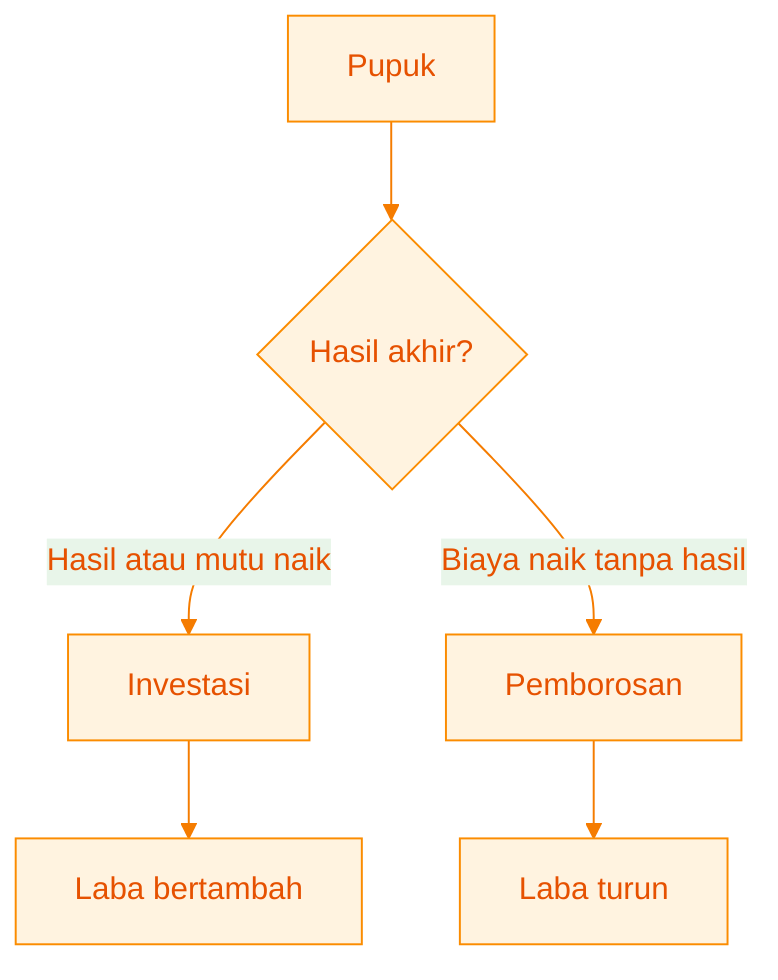
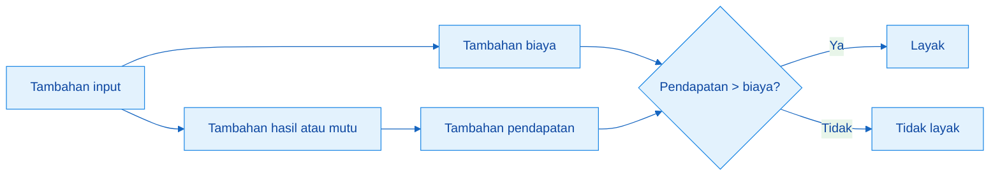
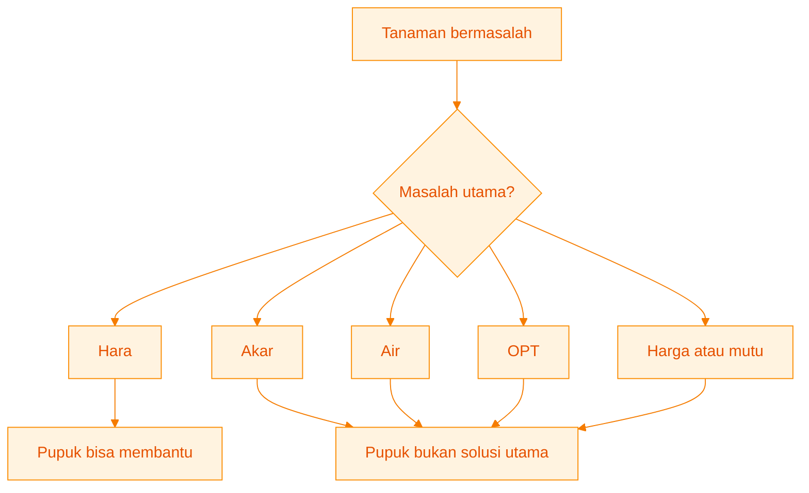
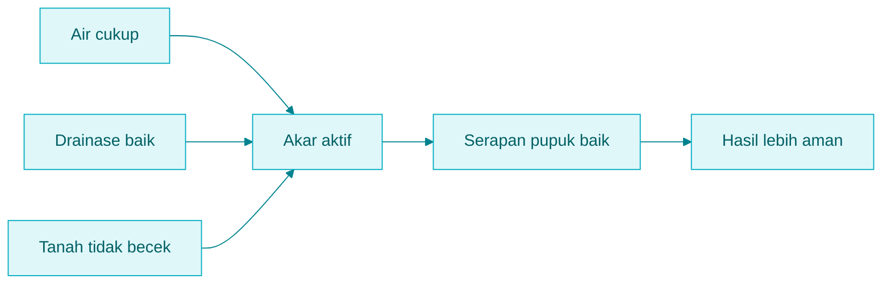
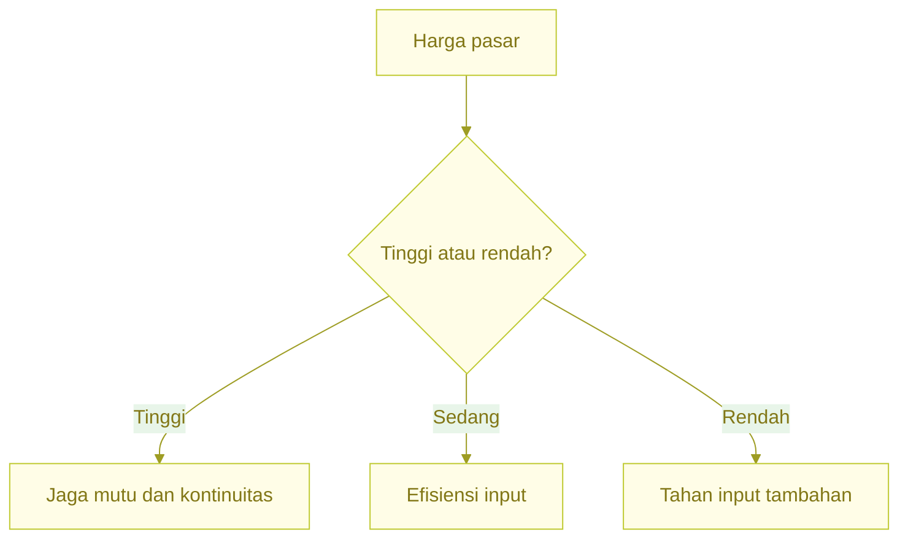
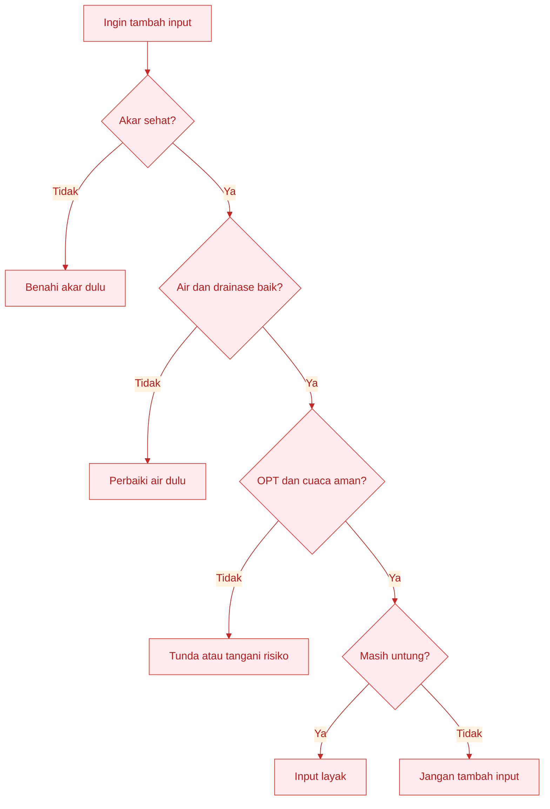
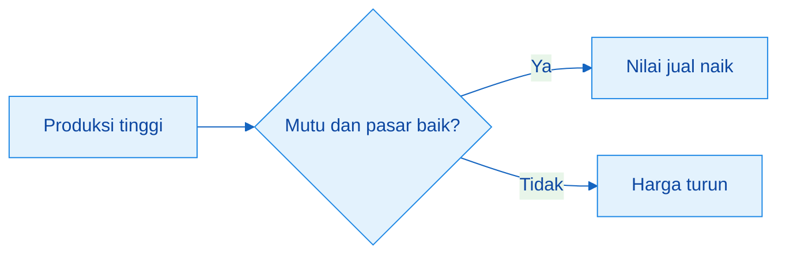
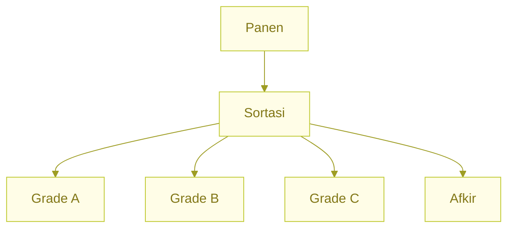

# **_Supaya Pupuk Menjadi Laba: Biaya, Risiko, Panen, dan Pasar_**

---

- [**_Supaya Pupuk Menjadi Laba: Biaya, Risiko, Panen, dan Pasar_**](#supaya-pupuk-menjadi-laba-biaya-risiko-panen-dan-pasar)
  - [Pengantar Bagian 4](#pengantar-bagian-4)
- [Bab 11. Menghitung Untung-Rugi Pemupukan](#bab-11-menghitung-untung-rugi-pemupukan)
  - [Tujuan Bab 11](#tujuan-bab-11)
  - [11.1 Pupuk adalah Investasi, Bukan Sekadar Biaya](#111-pupuk-adalah-investasi-bukan-sekadar-biaya)
  - [11.2 Rumus Dasar Ekonomi Usaha Tani](#112-rumus-dasar-ekonomi-usaha-tani)
    - [Pendapatan](#pendapatan)
    - [Laba kotor](#laba-kotor)
    - [R/C ratio](#rc-ratio)
  - [11.3 Menghitung Tambahan Laba dari Tambahan Pupuk](#113-menghitung-tambahan-laba-dari-tambahan-pupuk)
  - [11.4 Batas Aman Biaya Pupuk](#114-batas-aman-biaya-pupuk)
  - [11.5 Contoh Hitung Cabai Rawit](#115-contoh-hitung-cabai-rawit)
  - [11.6 Contoh Hitung Sayuran Daun](#116-contoh-hitung-sayuran-daun)
  - [11.7 Contoh Hitung Durian dan Jeruk](#117-contoh-hitung-durian-dan-jeruk)
    - [Contoh hitung durian](#contoh-hitung-durian)
    - [Contoh hitung jeruk](#contoh-hitung-jeruk)
  - [11.8 Menghitung Tambahan Laba dari Input Biologis](#118-menghitung-tambahan-laba-dari-input-biologis)
  - [11.9 Kesalahan Umum dalam Menghitung Untung](#119-kesalahan-umum-dalam-menghitung-untung)
    - [Hanya menghitung uang masuk](#hanya-menghitung-uang-masuk)
    - [Tidak mencatat tenaga kerja keluarga](#tidak-mencatat-tenaga-kerja-keluarga)
    - [Tidak mencatat biaya kecil](#tidak-mencatat-biaya-kecil)
    - [Harga jual hanya diingat saat tinggi](#harga-jual-hanya-diingat-saat-tinggi)
    - [Tidak memisahkan grade](#tidak-memisahkan-grade)
  - [Ringkasan Bab 11](#ringkasan-bab-11)
- [Bab 12. Manajemen Risiko: Air, OPT, Cuaca, dan Harga](#bab-12-manajemen-risiko-air-opt-cuaca-dan-harga)
  - [Tujuan Bab 12](#tujuan-bab-12)
  - [12.1 Pupuk Bukan Obat Semua Risiko](#121-pupuk-bukan-obat-semua-risiko)
  - [12.2 Risiko Air dan Drainase](#122-risiko-air-dan-drainase)
    - [Risiko air per komoditas](#risiko-air-per-komoditas)
  - [12.3 Risiko OPT](#123-risiko-opt)
  - [12.4 Risiko Cuaca](#124-risiko-cuaca)
    - [Hujan tinggi](#hujan-tinggi)
    - [Kemarau](#kemarau)
    - [Panas ekstrem](#panas-ekstrem)
    - [Angin](#angin)
    - [Peralihan musim](#peralihan-musim)
  - [12.5 Risiko Harga](#125-risiko-harga)
    - [Strategi harga per komoditas](#strategi-harga-per-komoditas)
  - [12.6 Risiko Input Biologis](#126-risiko-input-biologis)
  - [12.7 Matriks Risiko per Komoditas](#127-matriks-risiko-per-komoditas)
  - [12.8 Checklist Risiko Sebelum Menambah Pupuk](#128-checklist-risiko-sebelum-menambah-pupuk)
  - [Ringkasan Bab 12](#ringkasan-bab-12)
- [Bab 13. Strategi Panen, Mutu, dan Pemasaran](#bab-13-strategi-panen-mutu-dan-pemasaran)
  - [Tujuan Bab 13](#tujuan-bab-13)
  - [13.1 Produksi Tinggi Belum Cukup](#131-produksi-tinggi-belum-cukup)
  - [13.2 Mutu yang Dicari Pasar](#132-mutu-yang-dicari-pasar)
    - [Mutu cabai rawit](#mutu-cabai-rawit)
    - [Mutu sayuran daun](#mutu-sayuran-daun)
    - [Mutu durian](#mutu-durian)
    - [Mutu jeruk](#mutu-jeruk)
    - [Kaitan pupuk, air, akar, dan mutu](#kaitan-pupuk-air-akar-dan-mutu)
  - [13.3 Panen Tepat Waktu](#133-panen-tepat-waktu)
    - [Panen per komoditas](#panen-per-komoditas)
  - [13.4 Sortasi dan Grade](#134-sortasi-dan-grade)
    - [Mengapa sortasi penting](#mengapa-sortasi-penting)
  - [13.5 Strategi Pasar Cabai Rawit](#135-strategi-pasar-cabai-rawit)
  - [13.6 Strategi Pasar Sayuran Daun](#136-strategi-pasar-sayuran-daun)
  - [13.7 Strategi Pasar Durian](#137-strategi-pasar-durian)
  - [13.8 Strategi Pasar Jeruk](#138-strategi-pasar-jeruk)
  - [13.9 Membangun Pembeli Tetap](#139-membangun-pembeli-tetap)
  - [13.10 Nilai Input Biologis Dilihat dari Mutu dan Stabilitas](#1310-nilai-input-biologis-dilihat-dari-mutu-dan-stabilitas)
  - [13.11 Kesalahan Umum Panen dan Pemasaran](#1311-kesalahan-umum-panen-dan-pemasaran)
    - [Panen terlambat](#panen-terlambat)
    - [Tidak sortasi](#tidak-sortasi)
    - [Tidak catat harga](#tidak-catat-harga)
    - [Hanya satu pembeli](#hanya-satu-pembeli)
    - [Tidak tahu biaya panen](#tidak-tahu-biaya-panen)
    - [Mutu bagus dicampur mutu jelek](#mutu-bagus-dicampur-mutu-jelek)
    - [Tidak baca permintaan pembeli](#tidak-baca-permintaan-pembeli)
  - [Ringkasan Bab 13](#ringkasan-bab-13)
- [Penutup Bagian 4](#penutup-bagian-4)
  - [Yang Harus Diingat dari Bagian 4](#yang-harus-diingat-dari-bagian-4)
  - [Tabel Ringkasan Cepat Bagian 4](#tabel-ringkasan-cepat-bagian-4)
    - [Ringkasan kunci ekonomi per komoditas](#ringkasan-kunci-ekonomi-per-komoditas)
    - [Ringkasan rumus ekonomi](#ringkasan-rumus-ekonomi)
    - [Ringkasan keputusan ekonomi](#ringkasan-keputusan-ekonomi)
    - [Ringkasan risiko utama](#ringkasan-risiko-utama)
    - [Ringkasan hubungan mutu–pasar](#ringkasan-hubungan-mutupasar)

---

## Pengantar Bagian 4

Bagian 1 sudah menegaskan bahwa tujuan pemupukan adalah membuat petani lebih makmur, bukan sekadar membuat tanaman hijau.

Bagian 2 sudah menjelaskan model low-lab untuk membaca lahan, menghitung dosis, dan mengoreksi dari respons tanaman.

Bagian 3 sudah menerapkan SOP pemupukan pada cabai rawit, sayuran daun, durian, dan jeruk.

Bagian 4 menjawab pertanyaan yang paling menentukan:

```text id="kr5xq1"
Apakah pemupukan yang dilakukan benar-benar membuat petani lebih untung?
```

Pertanyaan ini penting karena pupuk yang benar secara teknis belum tentu benar secara ekonomi.

Tanaman bisa lebih hijau, tetapi laba belum tentu naik.
Hasil bisa naik, tetapi biaya juga bisa naik terlalu besar.
Produksi bisa tinggi, tetapi mutu rendah membuat harga turun.
Pupuk bisa diberikan sesuai jadwal, tetapi risiko air, OPT, cuaca, dan harga bisa menghapus keuntungan.

Karena itu, petani perlu melihat pemupukan sebagai bagian dari keputusan usaha tani.

Petani makmur tidak hanya ditentukan oleh dosis pupuk, tetapi oleh gabungan:

```text id="fe0s67"
hasil panen
mutu hasil
biaya produksi
risiko gagal
waktu panen
harga jual
akses pasar
```

Bagian ini akan membahas tiga hal:

1. Cara menghitung untung-rugi pemupukan.
2. Cara mengendalikan risiko yang bisa menghapus laba.
3. Cara menghubungkan pupuk dengan panen, mutu, dan pasar.

Alur berpikirnya:


Pesan utama Bagian 4:

> Pupuk yang benar secara teknis belum tentu benar secara ekonomi. Pupuk harus menghasilkan tambahan hasil, mutu, dan laba.

<ResourceBox
  title="Artikel Terkait:"
  items={[
    {
      name: 'README - Pupuk Tepat, Panen Untung - Model Low-Lab untuk Petani Makmur di Gambiran',
      href: '/blog/agri/pupuk-terintegrasi/README',
    },
  ]}
/>

---

# Bab 11. Menghitung Untung-Rugi Pemupukan

## Tujuan Bab 11

Bab ini mengajarkan cara menghitung pemupukan sebagai keputusan ekonomi.

Petani tidak cukup hanya bertanya:

```text id="dv7v5m"
Tanaman saya sudah dipupuk atau belum?
```

Petani juga perlu bertanya:

```text id="rm5m9k"
Apakah pupuk ini membuat saya lebih untung?
```

Bab ini membantu petani menjawab:

```text id="njf9oe"
Apakah tambahan pupuk membuat saya lebih untung?
Apakah biaya pupuk saya masih masuk akal?
Apakah hasil naik sebanding dengan biaya?
Apakah musim ini benar-benar lebih baik dari musim lalu?
```

Pesan utama Bab 11:

> Dosis pupuk terbaik bukan dosis terbesar, tetapi dosis yang memberi laba terbaik.

---

## 11.1 Pupuk adalah Investasi, Bukan Sekadar Biaya

Pupuk memang biaya. Setiap pupuk yang dibeli mengurangi uang tunai petani. Tetapi pupuk bisa menjadi investasi bila hasil akhirnya memberi tambahan nilai.

Pupuk disebut investasi bila mampu:

```text id="m4c1iw"
menambah hasil
memperbaiki mutu
memperpanjang masa panen
menjaga kesehatan tanaman
mengurangi risiko tanaman cepat habis
meningkatkan grade produk
membantu tanaman pulih setelah panen
```

Namun pupuk menjadi pemborosan bila:

```text id="cxcs7p"
tanaman tidak merespons
akar rusak
air tidak mendukung
dosis terlalu besar
harga panen rendah
mutu tidak naik
tanaman terlalu vegetatif
pupuk diberikan pada waktu yang salah
```

Contoh sederhana:

Jika cabai rawit diberi tambahan pupuk lalu panen bertambah, buah lebih stabil, dan masa panen lebih panjang, pupuk itu bisa disebut investasi.

Tetapi jika tambahan pupuk hanya membuat tanaman lebih hijau, bunga sedikit, buah tidak bertambah, dan biaya naik, pupuk itu menjadi pemborosan.

Pada sayuran daun, tambahan urea mungkin membuat daun lebih hijau. Tetapi bila daun menjadi terlalu lunak, mudah rusak, dan harga turun, tambahan urea belum tentu menguntungkan.

Pada durian, pupuk yang membuat pohon terlalu rimbun menjelang pembungaan bisa mengganggu tujuan ekonomi. Pohon terlihat subur, tetapi bunga lemah atau buah tidak jadi.

Pada jeruk, pupuk yang tidak dikaitkan dengan kesehatan akar, mutu buah, dan produksi stabil bisa membuat biaya naik tanpa memperbaiki grade.

Tabel sederhana:

| Kondisi Setelah Pemupukan                   | Makna Ekonomi            |
| ------------------------------------------- | ------------------------ |
| Hasil naik dan biaya naik sedikit           | Baik                     |
| Mutu naik dan harga jual naik               | Baik                     |
| Masa panen lebih panjang                    | Baik                     |
| Tanaman lebih hijau tetapi hasil tidak naik | Perlu dievaluasi         |
| Biaya pupuk naik besar tetapi laba kecil    | Tidak efisien            |
| Tanaman terlalu rimbun dan bunga sedikit    | Arah pupuk keliru        |
| Pupuk diberikan saat akar rusak             | Risiko pemborosan tinggi |

Diagram sederhana:



Kalimat kunci:

> Pupuk disebut investasi hanya jika hasil akhirnya menambah laba.

---

## 11.2 Rumus Dasar Ekonomi Usaha Tani

Perhitungan ekonomi tidak perlu rumit. Petani cukup mulai dari beberapa rumus sederhana.

Rumus pertama:

```text id="s9d33u"
Pendapatan = hasil panen × harga jual
```

Rumus kedua:

```text id="k5m2j8"
Laba kotor = pendapatan - biaya produksi
```

Rumus ketiga:

```text id="i3m62u"
R/C ratio = pendapatan ÷ biaya produksi
```

Rumus keempat:

```text id="jlwmvb"
Tambahan laba = tambahan hasil × harga jual - tambahan biaya input
```

### Pendapatan

Pendapatan adalah uang masuk dari hasil panen.

Contoh:

```text id="j86w84"
Hasil panen cabai = 800 kg
Harga jual = Rp18.000/kg

Pendapatan = 800 × 18.000
           = Rp14.400.000
```

### Laba kotor

Laba kotor adalah pendapatan dikurangi biaya produksi.

Contoh:

```text id="qo9f9b"
Pendapatan = Rp14.400.000
Biaya produksi = Rp8.000.000

Laba kotor = 14.400.000 - 8.000.000
           = Rp6.400.000
```

Biaya produksi meliputi:

```text id="hzcw8w"
benih atau bibit
pupuk
bahan organik
pestisida atau agens hayati
tenaga kerja
air atau irigasi
mulsa atau ajir
transport
panen dan pascapanen
```

### R/C ratio

R/C ratio adalah perbandingan antara pendapatan dan biaya produksi.

```text id="cc8qvr"
R/C ratio = pendapatan ÷ biaya produksi
```

Contoh:

```text id="l3jjc8"
Pendapatan = Rp14.400.000
Biaya produksi = Rp8.000.000

R/C ratio = 14.400.000 ÷ 8.000.000
          = 1,8
```

Artinya, setiap Rp1 biaya menghasilkan Rp1,8 pendapatan.

Tabel interpretasi R/C ratio:

| R/C Ratio | Arti Praktis  | Keputusan             |
| --------- | ------------- | --------------------- |
| < 1,0     | Rugi          | Pola harus diubah     |
| 1,0–1,3   | Terlalu tipis | Risiko tinggi         |
| 1,3–1,7   | Cukup         | Masih perlu efisiensi |
| > 1,7     | Menarik       | Bisa dikembangkan     |
| > 2,0     | Sangat baik   | Layak diperkuat       |

Catatan penting:

> R/C ratio tidak boleh dibaca sendirian. Lihat juga risiko, tenaga kerja, modal, dan kestabilan harga.

---

## 11.3 Menghitung Tambahan Laba dari Tambahan Pupuk

Bagian ini penting agar petani tidak asal menaikkan dosis.

Tambahan pupuk hanya layak bila tambahan hasil atau tambahan mutu lebih besar daripada tambahan biaya.

Rumusnya:

```text id="rjlwmh"
Tambahan laba = tambahan hasil × harga jual - tambahan biaya input
```

Contoh saat harga cabai tinggi:

```text id="u48v0a"
Tambahan pupuk = Rp300.000
Tambahan hasil = 40 kg cabai
Harga cabai = Rp20.000/kg

Tambahan pendapatan = 40 × 20.000
                    = Rp800.000

Tambahan laba = 800.000 - 300.000
              = Rp500.000
```

Artinya, tambahan pupuk layak karena memberi tambahan laba Rp500.000.

Tetapi bila harga cabai turun:

```text id="c7bjlwm"
Tambahan pupuk = Rp300.000
Tambahan hasil = 40 kg cabai
Harga cabai = Rp7.000/kg

Tambahan pendapatan = 40 × 7.000
                    = Rp280.000

Tambahan laba = 280.000 - 300.000
              = -Rp20.000
```

Artinya, tambahan pupuk tidak layak. Tanaman mungkin bertambah baik, tetapi uang yang masuk tidak cukup menutup biaya tambahan.

Diagram keputusan tambahan laba:



Tabel keputusan:

| Kondisi                                                 | Keputusan                             |
| ------------------------------------------------------- | ------------------------------------- |
| Tambahan hasil bernilai lebih besar dari tambahan biaya | Tambahan pupuk layak                  |
| Tambahan hasil lebih kecil dari tambahan biaya          | Tambahan pupuk tidak layak            |
| Harga panen tinggi dan tanaman sehat                    | Pupuk pemeliharaan bisa dipertahankan |
| Harga panen rendah                                      | Input tambahan harus dikurangi        |
| Tanaman sakit berat                                     | Jangan terus menambah biaya           |
| Mutu naik dan harga naik                                | Tambahan pupuk bisa layak             |

Contoh pada sayuran daun:

```text id="ejcb0t"
Tambahan pupuk Rp100.000 menghasilkan tambahan panen 50 kg
Harga jual Rp3.000/kg

Tambahan pendapatan = 50 × 3.000
                    = Rp150.000

Tambahan laba = 150.000 - 100.000
              = Rp50.000
```

Masih layak, tetapi margin tipis. Jika ada tambahan biaya tenaga kerja, transport, atau sortasi, laba bisa turun.

Contoh pada durian:

```text id="wmocao"
Tambahan perawatan dan pupuk Rp500.000
membuat 10 buah tambahan masuk grade baik
Harga rata-rata Rp75.000/buah

Tambahan pendapatan = 10 × 75.000
                    = Rp750.000

Tambahan laba = 750.000 - 500.000
              = Rp250.000
```

Contoh pada jeruk:

```text id="efnjlwm"
Tambahan pupuk dan perawatan Rp400.000
membuat tambahan hasil 80 kg
Harga Rp8.000/kg

Tambahan pendapatan = 80 × 8.000
                    = Rp640.000

Tambahan laba = 640.000 - 400.000
              = Rp240.000
```

Kalimat kunci:

> Tambahan pupuk yang layak saat harga tinggi bisa menjadi tidak layak saat harga rendah.

---

## 11.4 Batas Aman Biaya Pupuk

Petani perlu memiliki rem ekonomi. Tidak semua pupuk tambahan harus dibeli. Tidak semua input tambahan harus diberikan.

Prinsipnya:

```text id="2s6v5a"
Biaya pupuk boleh naik bila tambahan hasil dan mutu
memberi tambahan pendapatan yang lebih besar.
```

Tabel praktis:

| Kondisi                                    | Keputusan                                  |
| ------------------------------------------ | ------------------------------------------ |
| Harga panen tinggi, tanaman sehat          | Pupuk pemeliharaan boleh dipertahankan     |
| Harga panen sedang                         | Pakai dosis efisien                        |
| Harga panen rendah                         | Hindari input tambahan yang tidak mendesak |
| Tanaman stres atau akar rusak              | Jangan tambah pupuk besar                  |
| Mutu naik karena pupuk                     | Hitung tambahan harga atau grade           |
| Tanaman terlalu hijau                      | Kurangi N                                  |
| Hasil naik tetapi biaya naik terlalu besar | Evaluasi ulang pola pupuk                  |
| Hasil sama tetapi biaya turun              | Pola lebih efisien                         |

Jangan menghitung pupuk dari harga pupuk saja. Hitung dari tambahan uang yang bisa dihasilkan.

Contoh keputusan:

Jika pupuk tambahan harganya murah tetapi tidak menambah hasil, tetap saja tidak efisien.

Sebaliknya, pupuk atau bahan organik yang terlihat mahal bisa layak bila memperbaiki mutu, memperpanjang panen, atau menstabilkan produksi.

Pada cabai rawit, input tambahan bisa layak bila tanaman masih sehat dan harga mendukung. Tetapi jika tanaman mulai sakit berat, tambahan pupuk bisa memperbesar kerugian.

Pada sayuran daun, karena umur pendek dan margin sering tipis, biaya pupuk harus sangat efisien. Jangan memberi pupuk akhir bila tanaman sudah siap panen.

Pada durian, biaya perawatan bisa layak bila meningkatkan mutu premium. Tetapi jangan sampai pohon stres karena beban buah dan pupuk tidak seimbang.

Pada jeruk, pemupukan harus menjaga produksi stabil. Input tahunan harus dilihat sebagai investasi jangka panjang, bukan hanya biaya satu panen.

Catatan baru yang harus diingat:

```text id="qjlwm6"
input biologis buatan sendiri tetap punya biaya
bahan fermentasi harus dihitung
tenaga kerja membuat dan aplikasi harus dihitung
batch gagal adalah kerugian, bukan nol biaya
```

Pesan kunci:

> Jangan menghitung pupuk dari harga pupuk saja. Hitung dari tambahan uang yang bisa dihasilkan.

---

## 11.5 Contoh Hitung Cabai Rawit

Contoh:

```text id="n1mjly"
Luas lahan = 1.000 m²
Biaya produksi = Rp8.000.000
Hasil panen = 800 kg
Harga jual rata-rata = Rp18.000/kg
```

Hitung pendapatan:

```text id="2jlwmq"
Pendapatan = 800 × 18.000
           = Rp14.400.000
```

Hitung laba kotor:

```text id="vmjlwm"
Laba kotor = 14.400.000 - 8.000.000
           = Rp6.400.000
```

Hitung R/C ratio:

```text id="h8hjlwm"
R/C = 14.400.000 ÷ 8.000.000
    = 1,8
```

Interpretasi:

```text id="507ujd"
Usaha layak, tetapi tetap perlu dilihat
apakah biaya pestisida dan pupuk tidak terlalu tinggi.
```

Tabel keputusan cabai rawit:

| Kondisi                   | Keputusan Pupuk                           |
| ------------------------- | ----------------------------------------- |
| Harga cabai tinggi        | Jaga stamina tanaman dan panen panjang    |
| Harga cabai rendah        | Efisienkan input, jangan boros urea       |
| Tanaman masih sehat       | Pupuk bertahap masih layak                |
| Tanaman mulai sakit berat | Hitung ulang, jangan terus menambah biaya |
| Tanaman terlalu hijau     | Kurangi urea                              |
| Buah mulai kecil          | Cek K, air, dan beban buah                |

Catatan:

Cabai rawit harus dilihat dari panen berulang. Jangan hanya menghitung satu kali panen. Catat total panen, harga rata-rata, dan biaya selama satu siklus.

---

## 11.6 Contoh Hitung Sayuran Daun

Contoh:

```text id="jlwmgf"
Luas lahan = 500 m²
Biaya produksi = Rp1.200.000
Hasil panen = 600 kg
Harga jual = Rp3.000/kg
```

Hitung pendapatan:

```text id="hwjlwm"
Pendapatan = 600 × 3.000
           = Rp1.800.000
```

Hitung laba kotor:

```text id="jlwmvc"
Laba kotor = 1.800.000 - 1.200.000
           = Rp600.000
```

Hitung R/C ratio:

```text id="jlwmkw"
R/C = 1.800.000 ÷ 1.200.000
    = 1,5
```

Interpretasi:

```text id="z2ut3n"
Layak, tetapi margin tidak besar.
Kunci untung adalah biaya rendah,
panen tepat umur, dan kehilangan hasil kecil.
```

Tabel keputusan sayuran daun:

| Kondisi                   | Keputusan                             |
| ------------------------- | ------------------------------------- |
| Harga rendah              | Biaya harus ketat                     |
| Daun sudah siap panen     | Panen, jangan menunda terlalu lama    |
| Daun terlalu lunak        | Kurangi urea pada siklus berikutnya   |
| Tanaman tidak seragam     | Perbaiki sebaran air dan pupuk        |
| Banyak daun rusak         | Sortasi dan perbaiki pengendalian OPT |
| Biaya tenaga kerja tinggi | Sederhanakan pola kerja               |

Catatan:

Pada sayuran daun, keuntungan bisa hilang karena panen terlambat, daun rusak, harga rendah, atau biaya tenaga kerja terlalu besar.

---

## 11.7 Contoh Hitung Durian dan Jeruk

Untuk tanaman tahunan, perhitungan sebaiknya dilakukan per pohon atau per blok. Setiap pohon bisa berbeda hasil, mutu, dan harga.

### Contoh hitung durian

```text id="jlwmxy"
Jumlah pohon produktif = 20 pohon
Rata-rata buah layak jual = 25 buah/pohon
Harga rata-rata = Rp75.000/buah
```

Hitung pendapatan:

```text id="jlwmth"
Pendapatan = 20 × 25 × 75.000
           = Rp37.500.000
```

Jika biaya produksi dan perawatan selama periode tersebut Rp15.000.000:

```text id="jlwmno"
Laba kotor = 37.500.000 - 15.000.000
           = Rp22.500.000
```

R/C ratio:

```text id="jlwmqp"
R/C = 37.500.000 ÷ 15.000.000
    = 2,5
```

Interpretasi:

```text id="jlwmzk"
Usaha sangat menarik, tetapi mutu buah,
kesehatan pohon, dan kestabilan produksi musim berikutnya
tetap harus diperhatikan.
```

Catatan durian:

Durian tidak cukup dihitung dari jumlah buah. Pisahkan buah premium, sedang, kecil, dan rusak. Mutu menentukan harga.

### Contoh hitung jeruk

```text id="jlwmta"
Jumlah pohon produktif = 100 pohon
Hasil rata-rata = 40 kg/pohon
Harga rata-rata = Rp8.000/kg
```

Hitung pendapatan:

```text id="q3vglq"
Pendapatan = 100 × 40 × 8.000
           = Rp32.000.000
```

Jika biaya produksi dan perawatan Rp18.000.000:

```text id="cjlwmh"
Laba kotor = 32.000.000 - 18.000.000
           = Rp14.000.000
```

R/C ratio:

```text id="jlwmye"
R/C = 32.000.000 ÷ 18.000.000
    = 1,78
```

Interpretasi:

```text id="jlwmui"
Usaha menarik, tetapi perlu diperkuat
melalui stabilitas produksi, sortasi grade,
dan kesehatan tanaman.
```

Catatan penting:

> Untuk durian dan jeruk, catatan per pohon sangat berguna karena tiap pohon bisa berbeda produktivitas dan mutunya.

Format catatan sederhana tanaman tahunan:

| Nomor Pohon/Blok | Hasil | Mutu/Grade | Harga | Catatan |
| ---------------- | ----: | ---------- | ----: | ------- |
|                  |       |            |       |         |

---

## 11.8 Menghitung Tambahan Laba dari Input Biologis

Input biologis juga harus dihitung seperti input lain. Jangan menganggap otomatis murah hanya karena dibuat sendiri atau bahannya lokal.

Biaya input biologis bisa meliputi:

```text id="xjlwmm"
bahan fermentasi
wadah atau alat
tenaga kerja membuat
tenaga kerja aplikasi
air
transport
uji kecil
batch gagal
```

Rumus dasarnya tetap sama:

```text id="jlwmjn"
Tambahan laba = tambahan hasil × harga jual - tambahan biaya input
```

Contoh:

```text id="jlwmza"
Biaya membuat dan aplikasi input biologis = Rp150.000
Tambahan hasil sayuran daun = 40 kg
Harga jual = Rp3.000/kg

Tambahan pendapatan = 40 × 3.000
                    = Rp120.000

Tambahan laba = 120.000 - 150.000
              = -Rp30.000
```

Artinya, secara ekonomi belum layak, walaupun tanaman mungkin terlihat lebih segar.

Contoh lain pada durian:

```text id="jlwmcr"
Tambahan biaya input biologis dan bahan organik = Rp400.000
Tambahan buah grade baik = 8 buah
Harga rata-rata = Rp75.000/buah

Tambahan pendapatan = 8 × 75.000
                    = Rp600.000

Tambahan laba = 600.000 - 400.000
              = Rp200.000
```

Layak, bila benar-benar ada peningkatan mutu atau hasil.

Prinsip penting:

1. Input biologis dinilai dari hasil nyata, bukan dari kesan vegetatif.
2. Batch gagal tetap dihitung sebagai kerugian.
3. Tenaga kerja membuat dan aplikasi tetap bernilai biaya.
4. Jika tidak menambah hasil, mutu, atau stabilitas, nilainya lemah.

Tabel evaluasi cepat:

| Kondisi                                | Keputusan          |
| -------------------------------------- | ------------------ |
| Hasil naik dan biaya tertutup          | Layak              |
| Mutu naik dan grade naik               | Bisa layak         |
| Tanaman tampak bagus tetapi panen sama | Perlu evaluasi     |
| Batch gagal atau merusak tanaman       | Tidak layak        |
| Biaya tenaga kerja besar               | Hitung lebih ketat |

Pesan penting:

> Input biologis yang baik secara teknis belum tentu layak secara ekonomi. Nilainya harus dibaca dari tambahan hasil, mutu, stabilitas, dan laba.

---

## 11.9 Kesalahan Umum dalam Menghitung Untung

Banyak petani merasa untung karena melihat uang masuk saat panen. Padahal uang masuk belum tentu laba. Laba baru terlihat setelah biaya dihitung.

Tabel kesalahan umum:

| Kesalahan                                      | Akibat                               |
| ---------------------------------------------- | ------------------------------------ |
| Hanya menghitung hasil, tidak menghitung biaya | Merasa untung padahal tipis          |
| Tidak mencatat tenaga kerja keluarga           | Laba terlihat lebih besar            |
| Tidak mencatat pupuk kecil-kecil               | Biaya bocor                          |
| Harga jual hanya diingat saat tinggi           | Evaluasi bias                        |
| Tidak pisah grade hasil                        | Mutu tidak terbaca                   |
| Tidak menghitung tanaman mati atau gagal       | Risiko tidak terlihat                |
| Tidak mencatat biaya pestisida                 | Biaya produksi terlihat rendah palsu |
| Tidak menghitung transport dan panen           | Laba terlalu optimis                 |
| Tidak menghitung harga rata-rata               | Salah membaca pasar                  |
| Tidak menghitung batch gagal                   | Kerugian tersembunyi                 |
| Tidak menghitung biaya input biologis          | Pola terlihat murah padahal tidak    |

### Hanya menghitung uang masuk

Uang dari panen sering terlihat besar. Tetapi bila biaya benih, pupuk, pestisida, tenaga kerja, air, panen, dan transport tidak dihitung, petani tidak tahu laba sebenarnya.

### Tidak mencatat tenaga kerja keluarga

Tenaga kerja keluarga sering dianggap gratis. Padahal dari sisi usaha, tenaga kerja tetap punya nilai. Jika tidak dihitung, laba terlihat lebih besar dari kenyataan.

### Tidak mencatat biaya kecil

Biaya kecil yang sering keluar bisa menjadi besar bila dijumlahkan. Misalnya pupuk susulan, pestisida tambahan, bensin pompa, plastik, karung, dan transport.

### Harga jual hanya diingat saat tinggi

Petani sering mengingat harga tertinggi, bukan harga rata-rata. Padahal laba harus dihitung dari harga rata-rata seluruh panen.

### Tidak memisahkan grade

Produk grade A dan grade C tidak boleh dihitung sama. Jika tidak dipisah, petani sulit tahu apakah pemupukan dan manajemen mutu sudah membaik.

Kalimat kunci:

> Petani yang mencatat biaya dan hasil akan lebih cepat tahu mana pola yang benar-benar menguntungkan.

---

## Ringkasan Bab 11

1. Pemupukan harus dihitung sebagai keputusan ekonomi.
2. Pupuk disebut investasi hanya bila menambah hasil, mutu, atau laba.
3. Tanaman lebih hijau belum tentu usaha tani lebih untung.
4. Rumus dasar yang perlu dipakai adalah pendapatan, laba kotor, R/C ratio, dan tambahan laba.
5. Tambahan pupuk hanya layak bila tambahan hasil atau mutu lebih besar daripada tambahan biaya.
6. Harga panen menentukan apakah input tambahan masih masuk akal.
7. R/C ratio membantu membaca kelayakan usaha, tetapi tetap harus dilihat bersama risiko, modal, dan tenaga kerja.
8. Cabai rawit harus dihitung dari panen berulang dan harga rata-rata.
9. Sayuran daun harus dihitung ketat karena margin sering tipis.
10. Durian dan jeruk sebaiknya dihitung per pohon atau per blok.
11. Input biologis juga harus dihitung seperti input lain, termasuk bahan, tenaga kerja, dan batch gagal.
12. Dosis terbaik bukan dosis terbesar, tetapi dosis yang memberi laba terbaik.

Pesan penutup Bab 11:

> Petani yang menghitung akan lebih cepat tahu input mana yang benar-benar menambah laba, dan input mana yang hanya menambah biaya.

---

# Bab 12. Manajemen Risiko: Air, OPT, Cuaca, dan Harga

## Tujuan Bab 12

Bab ini menjelaskan bahwa laba dari pemupukan bisa hilang meskipun dosis sudah benar, bila risiko tidak dikelola.

Di lapangan, banyak petani merasa sudah memupuk dengan baik, tetapi hasil tetap turun atau laba tipis. Penyebabnya sering bukan karena pupuk salah, melainkan karena faktor lain yang lebih kuat, seperti:

- akar rusak,
- air tidak stabil,
- drainase buruk,
- OPT berat,
- cuaca ekstrem,
- atau harga pasar yang turun.

Karena itu, pemupukan harus selalu dibaca bersama risiko.

Pesan utama bab ini:

> Pemupukan yang benar tidak cukup. Risiko harus dikelola agar pupuk benar-benar berubah menjadi hasil, mutu, dan laba.

---

## 12.1 Pupuk Bukan Obat Semua Risiko

Pupuk sangat penting, tetapi pupuk bukan solusi untuk semua masalah.

Pupuk bukan solusi utama untuk:

- akar busuk,
- drainase buruk,
- OPT berat,
- harga jatuh,
- panen terlambat,
- atau mutu yang sudah telanjur turun.

Masalah di lapangan sering salah dibaca. Tanaman lemah langsung dianggap kurang pupuk. Daun pucat langsung dianggap kurang N. Padahal bisa jadi masalah utamanya ada pada akar, air, penyakit, atau cuaca.

Tabel pembacaan cepat:

| Masalah Utama                 | Apakah Pupuk Solusi Utama? | Tindakan yang Lebih Tepat       |
| ----------------------------- | -------------------------- | ------------------------------- |
| Akar busuk                    | Tidak                      | Benahi drainase, akar, sanitasi |
| Tanah becek                   | Tidak                      | Perbaiki air dan parit          |
| OPT berat                     | Tidak                      | Kendalikan OPT dulu             |
| Harga jatuh                   | Tidak                      | Efisiensi input, pilih pasar    |
| Panen terlambat               | Tidak                      | Perbaiki disiplin panen         |
| Mutu turun karena salah panen | Tidak                      | Benahi panen dan sortasi        |
| Kekurangan hara nyata         | Ya, bisa membantu          | Koreksi pupuk dengan tepat      |

Contoh praktis:

- cabai layu di lahan becek tidak selesai dengan tambahan urea,
- sayuran daun yang busuk karena kelembapan tinggi tidak selesai dengan tambahan pupuk,
- durian yang fruit set rendah karena pohon tidak seimbang tidak selesai hanya dengan menaikkan dosis,
- jeruk dengan gejala penyakit tidak boleh diperlakukan seolah hanya kurang pupuk.

Diagram salah baca masalah:



Kalimat kunci:

> Salah diagnosis membuat biaya naik tanpa hasil.

---

## 12.2 Risiko Air dan Drainase

Air menentukan apakah pupuk bisa bekerja. Tanaman hanya bisa memanfaatkan pupuk dengan baik bila akar aktif dan kondisi tanah mendukung.

Dua kondisi sama-sama berbahaya:

- tanah terlalu kering,
- tanah terlalu becek.

Tanah terlalu kering membuat hara sulit bergerak ke akar. Tanah terlalu becek membuat akar kekurangan oksigen dan serapan hara turun.

Tabel risiko air dan drainase:

| Kondisi              | Dampak pada Tanaman         | Dampak pada Pupuk                 |
| -------------------- | --------------------------- | --------------------------------- |
| Air cukup            | Akar aktif                  | Serapan baik                      |
| Tanah terlalu kering | Tanaman stres               | Hara sulit terserap               |
| Tanah becek          | Akar lemah                  | Pupuk kurang efektif              |
| Hujan lebat          | Tajuk lembap, penyakit naik | N mudah hilang                    |
| Drainase baik        | Risiko genangan rendah      | Pupuk lebih efisien               |
| Drainase buruk       | Akar terganggu              | Biaya pupuk lebih berisiko hilang |

Diagram air–akar–serapan:



### Risiko air per komoditas

| Komoditas    | Risiko Air Utama                    | Keputusan Praktis                   |
| ------------ | ----------------------------------- | ----------------------------------- |
| Cabai rawit  | Layu, bunga rontok, pupuk tercuci   | Bedengan tinggi, dosis dipecah      |
| Sayuran daun | Busuk daun, pertumbuhan tak seragam | Air merata, drainase baik           |
| Durian       | Akar stres, bunga/buah rontok       | Stabilkan kelembapan, jangan genang |
| Jeruk        | Buah kecil, produksi turun          | Jaga akar, air, dan bahan organik   |

Pesan penting:

> Air yang salah bisa membuat pupuk yang benar menjadi sia-sia.

---

## 12.3 Risiko OPT

OPT sering menjadi penyebab salah keputusan pupuk.

Gejala OPT sering mirip kekurangan hara:

- daun keriting bisa karena trips atau tungau,
- daun rusak bisa karena ulat,
- daun belang bisa karena penyakit,
- bunga rontok bisa karena serangga atau stres tanaman,
- pertumbuhan terhambat bisa karena akar sakit.

Karena itu, pengamatan rutin sangat penting.

Tabel contoh pembacaan OPT:

| Komoditas    | Gejala                            | Risiko Salah Baca                 |
| ------------ | --------------------------------- | --------------------------------- |
| Cabai rawit  | Daun keriting, bunga rusak        | Dianggap kurang pupuk             |
| Sayuran daun | Daun berlubang, busuk daun        | Dianggap kurang unsur             |
| Durian       | Akar lemah, pohon lesu            | Dianggap perlu pupuk lebih tinggi |
| Jeruk        | Daun belang, pucat, pohon menurun | Dianggap hanya kurang hara        |

Prinsip penting:

- pupuk tidak boleh dipakai untuk menutupi kerusakan OPT,
- tanaman yang rusak berat oleh OPT tidak otomatis akan pulih dengan tambahan pupuk,
- pengendalian OPT harus berjalan sendiri sebagai tindakan utama.

Catatan baru yang wajib diingat:

> Input biologis pendukung bukan otomatis pengganti manajemen OPT.

Artinya:

- pendukung biologis untuk akar atau rizosfer tidak sama dengan pengendalian hama atau penyakit,
- jangan menganggap semua cairan biologis bisa menyelesaikan serangan OPT,
- bila OPT berat, tindakan utama tetap pengendalian OPT.

Tabel keputusan cepat:

| Kondisi                    | Keputusan                                 |
| -------------------------- | ----------------------------------------- |
| Gejala jelas terkait hara  | Koreksi pupuk bisa dipertimbangkan        |
| Gejala mirip OPT           | Amati lebih teliti dulu                   |
| OPT berat                  | Tangani OPT dulu                          |
| Tanaman rusak + akar lemah | Jangan tambah pupuk berat                 |
| Gejala campuran            | Pecah masalah: akar, air, OPT, lalu pupuk |

Pesan penting:

> OPT yang tidak dikendalikan bisa menghapus keuntungan lebih cepat daripada salah dosis pupuk kecil.

---

## 12.4 Risiko Cuaca

Cuaca memengaruhi waktu, dosis, dan cara aplikasi pupuk.

Kondisi cuaca yang perlu diperhatikan:

- hujan tinggi,
- kemarau,
- panas ekstrem,
- angin,
- peralihan musim.

### Hujan tinggi

Risikonya:

- pupuk mudah hilang,
- kelembapan tinggi,
- penyakit naik,
- akar mudah terganggu.

Keputusan:

- dosis dipecah,
- pupuk ditutup tanah,
- drainase diperbaiki,
- hindari pupuk berat saat tanah becek.

### Kemarau

Risikonya:

- air kurang,
- hara sulit bergerak,
- bunga dan buah rontok,
- tanaman stres.

Keputusan:

- pastikan kelembapan cukup sebelum pupuk,
- jangan paksa pupuk tinggi saat air terbatas,
- gunakan bahan organik dan mulsa bila sesuai.

### Panas ekstrem

Risikonya:

- evapotranspirasi tinggi,
- stres daun,
- tanaman cepat lemah.

Keputusan:

- hindari pupuk berat saat tanaman sedang sangat stres,
- prioritaskan kestabilan air.

### Angin

Risikonya:

- bunga rontok,
- tajuk rusak,
- transpirasi meningkat.

Keputusan:

- jangan terburu-buru menyalahkan pupuk,
- cek kondisi tanaman dan fase kritis.

### Peralihan musim

Risikonya:

- pola air tidak stabil,
- pupuk mudah salah waktu,
- OPT bisa meningkat.

Keputusan:

- aplikasi lebih hati-hati,
- jangan terlalu agresif mengubah dosis tanpa pengamatan.

Tabel cepat strategi pupuk saat cuaca ekstrem:

| Cuaca           | Risiko                       | Strategi                 |
| --------------- | ---------------------------- | ------------------------ |
| Hujan tinggi    | Pupuk hilang, akar terganggu | Pecah dosis              |
| Kemarau         | Serapan turun                | Pupuk ringan, air cukup  |
| Panas ekstrem   | Tanaman stres                | Tahan pupuk berat        |
| Angin kuat      | Bunga rontok                 | Fokus stabilitas tanaman |
| Peralihan musim | Risiko campuran              | Observasi lebih rapat    |

Pesan penting:

> Cuaca menentukan kapan pupuk layak diberikan dan kapan pupuk harus ditahan.

---

## 12.5 Risiko Harga

Harga pasar adalah risiko nyata. Tambahan input yang layak saat harga tinggi bisa menjadi tidak layak saat harga rendah.

Karena itu, keputusan pupuk harus membaca harga.

Diagram keputusan berdasarkan harga:



### Strategi harga per komoditas

| Komoditas    | Risiko Harga                        | Strategi                                     |
| ------------ | ----------------------------------- | -------------------------------------------- |
| Cabai rawit  | Sangat fluktuatif                   | Input bertahap, jaga stamina saat harga baik |
| Sayuran daun | Margin tipis                        | Biaya harus ketat, panen cepat               |
| Durian       | Harga sangat dipengaruhi mutu       | Fokus grade premium                          |
| Jeruk        | Harga dipengaruhi grade dan pasokan | Sortasi dan mutu penting                     |

Jika harga tinggi:

- input pemeliharaan yang menjaga mutu dan kontinuitas bisa tetap layak.

Jika harga sedang:

- gunakan dosis efisien,
- tahan tambahan yang tidak mendesak.

Jika harga rendah:

- jangan agresif menambah input,
- utamakan menjaga tanaman tetap aman,
- hitung tambahan laba dengan ketat.

Pesan penting:

> Harga pasar harus masuk ke keputusan pupuk. Tanaman tidak hidup di buku panduan, tetapi di pasar nyata.

---

## 12.6 Risiko Input Biologis

Ini subbab baru yang sangat penting dalam versi rewrite.

Input biologis pendukung memang bisa bermanfaat, tetapi juga punya risiko nyata.

Risiko utamanya:

- batch gagal,
- kontaminasi,
- fitotoksik,
- salah dosis,
- salah fase,
- salah campur,
- biaya tenaga kerja tersembunyi.

Tabel risiko input biologis:

| Risiko                    | Dampak                             |
| ------------------------- | ---------------------------------- |
| Batch gagal               | Tidak efektif atau merusak tanaman |
| Kontaminasi               | Hasil tak terduga                  |
| Fitotoksik                | Tanaman stres atau rusak           |
| Salah dosis               | Respons buruk atau boros           |
| Salah fase                | Tidak memberi manfaat nyata        |
| Salah campur              | Risiko kerusakan meningkat         |
| Biaya tenaga kerja tinggi | Laba tergerus                      |
| Produk terlihat “alami”   | Belum tentu aman                   |

Beberapa prinsip penting:

1. Produk yang tampak alami belum tentu aman.
2. Produk buatan sendiri tetap harus diuji kecil.
3. Batch yang gagal adalah kerugian ekonomi.
4. Biaya membuat, mengaduk, menyaring, dan aplikasi tetap biaya usaha.
5. Input biologis tidak boleh dipakai hanya karena sedang populer.

Tabel keputusan cepat:

| Kondisi                      | Keputusan              |
| ---------------------------- | ---------------------- |
| Fungsi jelas, uji kecil baik | Bisa dipertimbangkan   |
| Batch meragukan              | Jangan dipakai         |
| Produk baru                  | Uji kecil dulu         |
| Campuran tidak jelas         | Jangan dipakai luas    |
| Tenaga kerja terlalu besar   | Hitung ulang kelayakan |

Pesan penting:

> Input biologis yang tidak disiplin bisa menambah risiko, bukan menambah laba.

---

## 12.7 Matriks Risiko per Komoditas

Setiap komoditas punya risiko dominan yang berbeda. Karena itu, strategi pengelolaannya juga berbeda.

| Komoditas    | Risiko Utama                       | Risiko Laba Hilang         | Strategi Utama                     |
| ------------ | ---------------------------------- | -------------------------- | ---------------------------------- |
| Cabai rawit  | Harga fluktuatif, penyakit, hujan  | Biaya naik, panen turun    | Jaga akar, drainase, panen panjang |
| Sayuran daun | Busuk, margin tipis, panen telat   | Mutu turun, harga turun    | Panen cepat, air rapi, biaya ketat |
| Durian       | Bunga/buah rontok, mutu rendah     | Harga premium hilang       | Jaga keseimbangan pohon            |
| Jeruk        | Grade rendah, penyakit, akar lemah | Harga turun, kebun menurun | Fokus mutu, akar, dan sortasi      |

Penjelasan singkat:

- cabai rawit sangat sensitif terhadap harga dan hujan,
- sayuran daun sensitif terhadap waktu panen dan mutu,
- durian sensitif terhadap keseimbangan vegetatif-generatif dan grade,
- jeruk sensitif terhadap mutu, grade, dan kesehatan jangka panjang pohon.

Pesan penting:

> Risiko utama tiap komoditas harus dikenali sebelum petani menambah input.

---

## 12.8 Checklist Risiko Sebelum Menambah Pupuk

Sebelum menambah pupuk atau input lain, lakukan pemeriksaan sederhana.

Pertanyaan wajib:

1. Apakah akar sehat?
2. Apakah tanah tidak becek?
3. Apakah air cukup?
4. Apakah OPT terkendali?
5. Apakah cuaca mendukung?
6. Apakah harga mendukung?
7. Apakah tambahan laba masih positif?
8. Apakah input biologis layak?
9. Apakah batch aman?
10. Apakah risiko sudah cukup rendah?

Diagram stop-check sebelum tambah pupuk:



Tabel checklist cepat:

| Pertanyaan                   | Jika Ya             | Jika Tidak             |
| ---------------------------- | ------------------- | ---------------------- |
| Akar sehat?                  | Lanjut              | Benahi akar dulu       |
| Tanah tidak becek?           | Lanjut              | Tunda pupuk berat      |
| Air cukup?                   | Lanjut              | Stabilkan air dulu     |
| OPT terkendali?              | Lanjut              | Tangani OPT dulu       |
| Cuaca mendukung?             | Lanjut              | Tunda atau pecah dosis |
| Harga mendukung?             | Hitung kelayakan    | Efisiensi input        |
| Tambahan laba masih positif? | Input layak         | Jangan tambah input    |
| Input biologis layak?        | Bisa diuji terbatas | Jangan asal pakai      |
| Batch aman?                  | Bisa lanjut         | Stop                   |
| Risiko terlalu tinggi?       | Hati-hati           | Jangan tambah input    |

Pesan penting:

> Jangan tambah input bila risiko terlalu tinggi. Menahan input pada saat yang salah bisa lebih menguntungkan daripada menambah input dengan panik.

---

## Ringkasan Bab 12

1. Pupuk bukan obat semua risiko.
2. Akar rusak, air salah, dan drainase buruk bisa membuat pupuk tidak efektif.
3. OPT jangan diselesaikan dengan pupuk.
4. Cuaca menentukan waktu, dosis, dan cara aplikasi.
5. Harga pasar harus masuk ke keputusan pupuk.
6. Tambahan input yang layak saat harga tinggi bisa tidak layak saat harga rendah.
7. Input biologis juga punya risiko: batch gagal, kontaminasi, fitotoksik, salah dosis, salah fase, dan biaya tersembunyi.
8. Setiap komoditas punya risiko dominan yang berbeda.
9. Sebelum menambah pupuk, petani harus memeriksa akar, air, OPT, cuaca, harga, dan kelayakan ekonomi.
10. Risiko yang tidak dikelola bisa menghapus laba meskipun dosis sudah benar.

Pesan penutup Bab 12:

> Laba dari pemupukan tidak hanya ditentukan oleh dosis yang tepat, tetapi oleh kemampuan petani mengelola risiko sebelum risiko itu menghapus hasil, mutu, dan uang masuk.

---

# Bab 13. Strategi Panen, Mutu, dan Pemasaran

## Tujuan Bab 13

Bab ini menghubungkan pemupukan dengan nilai jual hasil.

Pupuk tidak berhenti di daun, batang, bunga, atau buah. Ujian akhirnya ada di pasar. Bila hasil panen tidak sesuai mutu yang dicari pembeli, datang terlambat, tidak disortasi, atau tidak stabil, maka pupuk yang sudah diberikan belum tentu berubah menjadi laba.

Karena itu, pemupukan harus dibaca sampai ke:

- waktu panen,
- mutu hasil,
- sortasi,
- grade,
- kontinuitas,
- dan hubungan dengan pembeli.

Pesan utama bab ini:

> Panen adalah ujian akhir pemupukan. Hasil tinggi belum cukup bila mutu, waktu panen, dan pasar tidak mendukung.

---

## 13.1 Produksi Tinggi Belum Cukup

Produksi tinggi sering dianggap otomatis berarti untung. Padahal tidak selalu demikian.

Hasil tinggi belum tentu menguntungkan bila:

- mutu rendah,
- panen terlambat,
- produk banyak yang rusak,
- grade buruk,
- harga jatuh,
- atau biaya panen dan sortasi terlalu besar.

Contoh sederhana:

- cabai rawit bisa menghasilkan banyak, tetapi bila banyak buah busuk atau tidak seragam, harga turun;
- sayuran daun bisa berat panennya tinggi, tetapi bila daun layu, terlalu tua, atau terlalu lunak, pembeli tidak suka;
- durian bisa banyak buah, tetapi bila mutu rasa biasa, ukuran tidak seragam, dan panen tidak rapi, harga premium hilang;
- jeruk bisa banyak, tetapi bila buah kecil, kulit burik, dan grade campur, nilai jual turun.

Diagram produksi vs nilai jual:



Tabel pembacaan cepat:

| Kondisi                           | Hasil  | Nilai Ekonomi      |
| --------------------------------- | ------ | ------------------ |
| Produksi tinggi + mutu baik       | Tinggi | Baik               |
| Produksi tinggi + mutu rendah     | Tinggi | Bisa turun         |
| Produksi sedang + mutu premium    | Sedang | Bisa sangat baik   |
| Produksi tinggi + panen terlambat | Tinggi | Risiko harga turun |
| Produksi stabil + pembeli tetap   | Stabil | Lebih aman         |

Kalimat kunci:

> Yang dibayar pasar bukan hanya jumlah hasil, tetapi mutu dan konsistensinya.

---

## 13.2 Mutu yang Dicari Pasar

Setiap komoditas punya mutu yang dicari pasar berbeda. Karena itu, keberhasilan pemupukan tidak boleh dibaca hanya dari pertumbuhan tanaman, tetapi dari mutu hasil panen.

### Mutu cabai rawit

Yang dicari pasar umumnya:

- segar,
- tidak busuk,
- warna baik,
- ukuran relatif seragam,
- tidak terlalu banyak buah cacat.

### Mutu sayuran daun

Yang dicari pasar umumnya:

- segar,
- bersih,
- tidak layu,
- tidak terlalu tua,
- tidak terlalu lunak,
- ukuran seragam.

### Mutu durian

Yang dicari pasar umumnya:

- rasa baik,
- ukuran sesuai kelas pasar,
- kematangan tepat,
- konsistensi mutu,
- buah tidak rusak.

### Mutu jeruk

Yang dicari pasar umumnya:

- ukuran baik,
- kulit baik,
- rasa baik,
- bentuk cukup seragam,
- grade jelas.

Tabel mutu yang dicari pasar:

| Komoditas    | Mutu Utama yang Dicari                |
| ------------ | ------------------------------------- |
| Cabai rawit  | Segar, tidak busuk, relatif seragam   |
| Sayuran daun | Segar, bersih, tidak layu             |
| Durian       | Rasa, ukuran, kematangan, konsistensi |
| Jeruk        | Ukuran, kulit, rasa, keseragaman      |

### Kaitan pupuk, air, akar, dan mutu

Mutu hasil dipengaruhi oleh:

- pupuk yang seimbang,
- air yang stabil,
- akar yang sehat,
- waktu panen,
- dan pengelolaan kebun secara keseluruhan.

Contohnya:

- kelebihan N pada sayuran daun bisa membuat daun terlalu lunak;
- kekurangan kestabilan air pada cabai bisa memperbesar bunga rontok dan menurunkan mutu buah;
- durian dengan pohon tidak seimbang bisa menghasilkan mutu tidak konsisten;
- jeruk dengan akar lemah dan pembesaran buah tidak stabil bisa menghasilkan buah kecil dan grade rendah.

Catatan baru yang wajib diingat:

> Nilai input biologis harus dibaca dari mutu dan stabilitas hasil, bukan dari vegetatif sesaat.

Artinya, bila satu input hanya membuat tanaman tampak lebih hijau tetapi:

- mutu tidak membaik,
- hasil tidak lebih stabil,
- grade tidak naik,
- dan laba tidak berubah,

maka nilainya secara usaha tani masih lemah.

Pesan penting:

> Pupuk yang baik adalah pupuk yang ikut memperbaiki mutu hasil, bukan hanya penampilan tanaman.

---

## 13.3 Panen Tepat Waktu

Panen tepat waktu sering lebih penting daripada tambahan pupuk di akhir.

Panen terlalu cepat bisa membuat:

- ukuran belum cukup,
- rasa belum maksimal,
- mutu belum sesuai pasar.

Panen terlambat bisa membuat:

- cabai terlalu banyak buah rusak,
- sayuran daun terlalu tua,
- durian kehilangan mutu atau jatuh,
- jeruk melewati mutu terbaik atau banyak cacat.

Tabel dampak waktu panen:

| Kondisi                                | Dampak                       |
| -------------------------------------- | ---------------------------- |
| Panen terlalu cepat                    | Bobot dan mutu belum optimal |
| Panen tepat waktu                      | Mutu dan harga lebih baik    |
| Panen terlambat                        | Mutu turun, harga turun      |
| Panen saat basah tanpa penanganan baik | Risiko mutu turun            |
| Panen tidak seragam                    | Sortasi makin berat          |

### Panen per komoditas

| Komoditas    | Fokus Waktu Panen                                       |
| ------------ | ------------------------------------------------------- |
| Cabai rawit  | Panen rutin dan teratur agar mutu terjaga               |
| Sayuran daun | Panen tepat umur, jangan menunggu terlalu tua           |
| Durian       | Panen pada saat mutu dan kematangan sesuai target pasar |
| Jeruk        | Panen saat ukuran, warna, dan rasa sesuai pasar         |

Contoh praktis:

- pada sayuran daun, menunda panen demi bobot sering justru menurunkan kesegaran;
- pada cabai rawit, panen yang tidak rutin bisa membuat banyak buah lewat mutu terbaik;
- pada jeruk, panen yang tidak seragam tanpa sortasi menurunkan nilai;
- pada durian, mutu pasar premium sangat sensitif terhadap waktu panen.

Pesan penting:

> Panen tepat waktu menjaga mutu. Mutu menjaga harga.

---

## 13.4 Sortasi dan Grade

Sortasi adalah pemisahan hasil berdasarkan mutu. Grade adalah kelas hasil setelah dipisah.

Ini penting karena:

- produk bagus jangan dicampur produk jelek,
- pembeli bisa menilai lebih jujur,
- petani tahu hasil budidayanya benar-benar bermutu atau tidak.

Alur sortasi:



Tabel contoh grade sederhana:

| Grade | Ciri Umum                            |
| ----- | ------------------------------------ |
| A     | Mutu terbaik, seragam, minim cacat   |
| B     | Baik, ada sedikit kekurangan         |
| C     | Mutu rendah tetapi masih bisa dijual |
| Afkir | Tidak layak untuk pasar utama        |

### Mengapa sortasi penting

Tanpa sortasi:

- mutu bagus tertutup mutu jelek,
- harga rata-rata turun,
- pembeli kehilangan kepercayaan,
- petani sulit tahu keberhasilan kebun.

Dengan sortasi:

- grade A bisa dijual lebih tinggi,
- grade rendah bisa disalurkan ke pasar berbeda,
- hasil budidaya lebih terbaca.

Contoh:

- cabai busuk atau rusak jangan dicampur dengan yang baik,
- sayuran daun layu jangan dicampur dengan yang segar,
- durian mutu premium jangan dicampur dengan buah mutu sedang,
- jeruk ukuran kecil dan kulit buruk jangan dicampur dengan grade atas.

Pesan penting:

> Sortasi bukan pekerjaan tambahan yang sia-sia. Sortasi adalah alat menaikkan nilai jual dan membaca mutu kebun.

---

## 13.5 Strategi Pasar Cabai Rawit

Cabai rawit sangat dipengaruhi harga yang fluktuatif. Karena itu, strategi pasar cabai harus bertumpu pada:

- kontinuitas panen,
- mutu buah,
- sortasi,
- dan disiplin biaya.

Tabel strategi pasar cabai rawit:

| Fokus                          | Penjelasan                             |
| ------------------------------ | -------------------------------------- |
| Kontinuitas panen              | Panen stabil lebih bernilai            |
| Hadapi harga fluktuatif        | Input harus bertahap                   |
| Sortasi                        | Pisahkan buah baik dan rusak           |
| Jaga mutu buah                 | Kurangi busuk dan cacat                |
| Jangan boros saat harga rendah | Tahan input tambahan yang tak mendesak |

Strategi praktis:

1. panen rutin,
2. jaga buah tetap segar,
3. jangan biarkan buah rusak bercampur,
4. saat harga rendah, fokus efisiensi,
5. saat harga tinggi, jaga stamina tanaman dan mutu.

Pesan penting:

> Pada cabai rawit, keuntungan besar sering datang dari panen yang stabil dan mutu yang terjaga saat harga baik.

---

## 13.6 Strategi Pasar Sayuran Daun

Sayuran daun mengandalkan kecepatan jual dan kesegaran.

Tabel strategi pasar sayuran daun:

| Fokus                   | Penjelasan                   |
| ----------------------- | ---------------------------- |
| Kecepatan jual          | Produk harus cepat keluar    |
| Kesegaran               | Ini inti harga               |
| Biaya rendah            | Margin tipis harus dijaga    |
| Panen jangan terlambat  | Umur panen sangat menentukan |
| Sesuaikan ukuran/ikatan | Ikuti permintaan pembeli     |

Strategi praktis:

1. panen tepat umur,
2. hindari daun layu dan kotor,
3. jangan menunggu terlalu tua,
4. sesuaikan ikatan atau kemasan dengan pasar,
5. kurangi kehilangan hasil setelah panen.

Pesan penting:

> Pada sayuran daun, cepat laku dan tetap segar sering lebih penting daripada bobot yang sedikit lebih besar.

---

## 13.7 Strategi Pasar Durian

Pasar durian sangat sensitif terhadap mutu. Durian yang bermutu premium bisa dihargai jauh lebih tinggi.

Tabel strategi pasar durian:

| Fokus                 | Penjelasan                      |
| --------------------- | ------------------------------- |
| Mutu premium          | Kunci harga tinggi              |
| Pohon unggul          | Harus dikenali dan dijaga       |
| Reputasi rasa         | Sangat menentukan pembeli ulang |
| Jangan campur mutu    | Mutu premium harus dipisah      |
| Jual sebagai kualitas | Bukan sekadar banyak buah       |

Strategi praktis:

1. kenali pohon unggul,
2. catat mutu per pohon,
3. jangan campur buah premium dengan mutu sedang,
4. jaga reputasi rasa,
5. jual mutu, bukan sekadar volume.

Pesan penting:

> Pada durian, kualitas sering lebih menguntungkan daripada kuantitas.

---

## 13.8 Strategi Pasar Jeruk

Jeruk sangat bergantung pada grade, ukuran, dan penampilan.

Tabel strategi pasar jeruk:

| Fokus           | Penjelasan                    |
| --------------- | ----------------------------- |
| Sortasi ukuran  | Memudahkan harga yang jelas   |
| Kulit bersih    | Penampilan sangat berpengaruh |
| Produksi stabil | Menjaga hubungan pasar        |
| Pembeli tetap   | Memperkuat kepastian serapan  |
| Grade jelas     | Mengurangi campur mutu        |

Strategi praktis:

1. sortasi ukuran,
2. pisahkan buah bagus dan cacat,
3. jaga keseragaman,
4. bangun hubungan dengan pembeli yang menghargai grade,
5. jangan hanya mengejar volume.

Pesan penting:

> Pada jeruk, grade yang jelas bisa menaikkan nilai lebih besar daripada sekadar menambah jumlah buah.

---

## 13.9 Membangun Pembeli Tetap

Pembeli tetap memberi kestabilan usaha. Harga mungkin tidak selalu paling tinggi, tetapi kepastian pasar dan syarat mutu yang jelas sangat membantu petani.

Yang perlu dicatat:

- siapa pembelinya,
- mutu yang diminta,
- volume yang biasa diambil,
- waktu permintaan,
- syarat kemasan atau sortasi.

Tabel catatan pembeli:

| Pembeli | Komoditas | Syarat Mutu | Volume | Waktu Permintaan |
| ------- | --------- | ----------- | -----: | ---------------- |
|         |           |             |        |                  |

Prinsip membangun pembeli tetap:

1. jujur soal mutu,
2. jangan campur grade,
3. jaga kontinuitas,
4. penuhi ukuran atau bentuk yang diminta,
5. catat kebutuhan pembeli.

Jangan mengecewakan pembeli dengan:

- mutu campur,
- pengiriman tidak stabil,
- sortasi buruk,
- atau janji volume yang tidak dipenuhi.

Pesan penting:

> Pembeli tetap dibangun dari mutu yang konsisten, bukan dari satu kali panen bagus.

---

## 13.10 Nilai Input Biologis Dilihat dari Mutu dan Stabilitas

Ini subbab baru yang sangat penting dalam versi rewrite.

Input biologis tidak boleh dinilai dari efek vegetatif sesaat saja. Nilainya harus dibaca dari hasil nyata di kebun dan di pasar.

Input biologis dinilai baik bila membantu:

- mutu lebih baik,
- stabilitas panen lebih baik,
- akar lebih sehat,
- hasil lebih konsisten,
- biaya total lebih efisien.

Tabel evaluasi nilai input biologis:

| Kondisi                                       | Nilai Praktis |
| --------------------------------------------- | ------------- |
| Mutu naik                                     | Baik          |
| Grade naik                                    | Baik          |
| Panen lebih stabil                            | Baik          |
| Akar lebih sehat dan respons pupuk lebih baik | Baik          |
| Tanaman hanya tampak lebih hijau              | Belum cukup   |
| Biaya naik tetapi mutu tidak berubah          | Lemah         |
| Hasil tidak lebih stabil                      | Lemah         |

Contoh pembacaan:

- bila satu input pendukung membuat cabai terlihat lebih hijau tetapi buah tidak lebih baik, nilainya lemah;
- bila input pendukung membantu sayuran daun lebih seragam dan lebih tahan segar, nilainya bisa lebih kuat;
- bila pada durian input pendukung membantu kestabilan pohon dan mutu buah lebih konsisten, nilainya berarti;
- bila pada jeruk mutu grade lebih stabil, itu lebih bernilai daripada sekadar tajuk tampak subur.

Kalimat kunci:

> Input biologis yang baik harus terbukti pada mutu, stabilitas hasil, dan laba, bukan hanya pada penampilan vegetatif.

---

## 13.11 Kesalahan Umum Panen dan Pemasaran

Banyak kerugian tidak terjadi saat pemupukan, tetapi saat panen dan pemasaran.

Tabel kesalahan umum:

| Kesalahan                      | Dampak                     |
| ------------------------------ | -------------------------- |
| Panen terlambat                | Mutu turun                 |
| Tidak sortasi                  | Harga rata-rata turun      |
| Tidak catat harga              | Sulit evaluasi pasar       |
| Hanya satu pembeli             | Posisi tawar lemah         |
| Tidak tahu biaya panen         | Laba terbaca terlalu besar |
| Mutu bagus dicampur mutu jelek | Grade jatuh                |
| Tidak baca permintaan pembeli  | Produk sulit terserap      |

### Panen terlambat

Membuat mutu turun dan mengurangi nilai jual.

### Tidak sortasi

Membuat semua hasil dibayar rata-rata rendah.

### Tidak catat harga

Membuat petani sulit membaca strategi pasar yang benar.

### Hanya satu pembeli

Berisiko bila pembeli menekan harga atau menghentikan serapan.

### Tidak tahu biaya panen

Panen dan pascapanen juga biaya. Bila tidak dihitung, laba terlihat lebih besar dari kenyataan.

### Mutu bagus dicampur mutu jelek

Ini salah satu kesalahan paling mahal.

### Tidak baca permintaan pembeli

Ukuran, ikatan, kemasan, waktu kirim, dan mutu yang diminta pasar harus dipahami.

Pesan penting:

> Hasil yang bagus bisa kehilangan nilai bila panen dan pemasaran dikerjakan sembarangan.

---

## Ringkasan Bab 13

1. Hasil tinggi belum cukup.
2. Mutu dan waktu panen menentukan uang masuk.
3. Panen adalah ujian akhir pemupukan.
4. Sortasi dan grade meningkatkan nilai hasil.
5. Tiap komoditas punya strategi pasar berbeda.
6. Cabai rawit membutuhkan kontinuitas dan pengelolaan harga.
7. Sayuran daun membutuhkan kecepatan jual dan kesegaran.
8. Durian membutuhkan mutu premium dan reputasi kualitas.
9. Jeruk membutuhkan grade jelas, ukuran baik, dan pembeli tetap.
10. Pembeli tetap dibangun dari mutu yang konsisten.
11. Nilai input biologis harus dibaca dari mutu dan stabilitas hasil, bukan dari tampilan vegetatif semata.

Pesan penutup Bab 13:

> Pemupukan yang baik harus terlihat di pasar: hasil lebih laku, mutu lebih baik, harga lebih kuat, dan usaha lebih stabil.

---

# Penutup Bagian 4

## Yang Harus Diingat dari Bagian 4

Bagian 4 menegaskan bahwa pemupukan tidak boleh berhenti di dosis dan jadwal. Pemupukan harus diuji dengan angka, risiko, mutu, dan pasar.

Hal-hal yang harus diingat:

1. Pupuk harus dihitung sebagai investasi.
2. Tambahan input hanya layak bila menambah laba.
3. R/C ratio penting, tetapi tidak boleh dibaca sendirian.
4. Risiko air, akar, OPT, cuaca, harga, dan batch biologis bisa menghapus laba.
5. Produksi tinggi tidak cukup tanpa mutu dan pasar.
6. Sortasi, grade, dan pembeli tetap meningkatkan nilai jual.
7. Petani makmur adalah petani yang menghitung, mengendalikan risiko, dan menjual dengan strategi.

Tabel ringkas pengingat:

| Hal yang Harus Diingat | Makna Praktis                         |
| ---------------------- | ------------------------------------- |
| Pupuk = investasi      | Harus diuji dengan laba               |
| Tambahan input         | Hanya layak bila menambah nilai       |
| Risiko                 | Bisa menghapus laba meski dosis benar |
| Mutu dan panen         | Menentukan nilai jual                 |
| Sortasi dan grade      | Menaikkan harga rata-rata             |
| Pembeli tetap          | Memperkuat kestabilan usaha           |

Pesan utama Bagian 4:

> Pupuk baru benar-benar berhasil bila berubah menjadi hasil, mutu, harga yang baik, dan laba yang aman.

---

## Tabel Ringkasan Cepat Bagian 4

### Ringkasan kunci ekonomi per komoditas

| Komoditas    | Kunci Ekonomi                          | Risiko Laba Hilang                    | Strategi Pasar                      |
| ------------ | -------------------------------------- | ------------------------------------- | ----------------------------------- |
| Cabai rawit  | Panen panjang dan harga rata-rata baik | Harga jatuh, penyakit, hujan          | Jaga kontinuitas dan mutu buah      |
| Sayuran daun | Biaya rendah, panen cepat, mutu segar  | Panen telat, daun rusak, margin tipis | Cepat jual, segar, seragam          |
| Durian       | Mutu premium dan reputasi              | Fruit set rendah, mutu turun          | Jual kualitas, pisah mutu           |
| Jeruk        | Grade, ukuran, dan produksi stabil     | Penyakit, grade rendah, buah kecil    | Sortasi, grade jelas, pembeli tetap |

### Ringkasan rumus ekonomi

```text id="pr9k0o"
Pendapatan = hasil panen × harga jual
```

```text id="bq8p2m"
Laba kotor = pendapatan - biaya produksi
```

```text id="5vy2n3"
R/C ratio = pendapatan ÷ biaya produksi
```

```text id="m3z8t1"
Tambahan laba = tambahan hasil × harga jual - tambahan biaya input
```

### Ringkasan keputusan ekonomi

| Kondisi                                   | Keputusan                                |
| ----------------------------------------- | ---------------------------------------- |
| Tambahan input menambah laba              | Layak                                    |
| Tambahan input menambah biaya tanpa nilai | Tahan                                    |
| Harga tinggi                              | Jaga mutu dan kontinuitas                |
| Harga sedang                              | Efisiensi input                          |
| Harga rendah                              | Tahan input tambahan yang tidak mendesak |
| Mutu naik                                 | Bisa menaikkan harga                     |
| Grade turun                               | Evaluasi pupuk, panen, dan sortasi       |

### Ringkasan risiko utama

| Risiko               | Dampak Utama                      |
| -------------------- | --------------------------------- |
| Akar rusak           | Pupuk tidak efektif               |
| Air salah            | Serapan turun                     |
| OPT berat            | Hasil dan mutu turun              |
| Cuaca ekstrem        | Jadwal pupuk terganggu            |
| Harga jatuh          | Tambahan input bisa tidak layak   |
| Batch biologis gagal | Biaya naik, hasil belum tentu ada |

### Ringkasan hubungan mutu–pasar

| Faktor                | Dampak ke Pasar            |
| --------------------- | -------------------------- |
| Mutu baik             | Harga lebih kuat           |
| Sortasi baik          | Grade lebih jelas          |
| Panen tepat waktu     | Nilai jual terjaga         |
| Kontinuitas           | Pembeli lebih percaya      |
| Mutu campur           | Harga rata-rata turun      |
| Produk segar dan rapi | Pasar lebih mudah menerima |

Penutup Bagian 4:

> Bagian ini harus membuat pembaca tidak lagi melihat pupuk hanya sebagai input budidaya. Pupuk harus dibaca sebagai bagian dari strategi untung: dihitung dengan benar, dijaga dari risiko, diarahkan ke mutu, dan ditutup dengan panen serta pasar yang tepat.

---

<small>
  **_Catatan Penyusunan_** Artikel ini disusun sebagai materi edukasi dan
  referensi umum berdasarkan berbagai sumber pustaka, praktik lapangan, serta
  bantuan alat penulisan. Pembaca disarankan untuk melakukan verifikasi lanjutan
  dan penyesuaian sesuai dengan kondisi serta kebutuhan masing-masing sistem.
</small>
