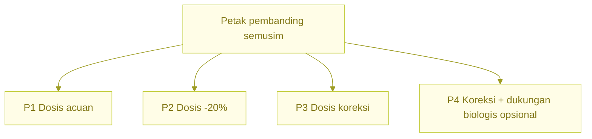
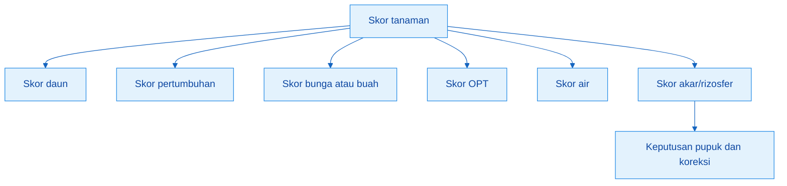
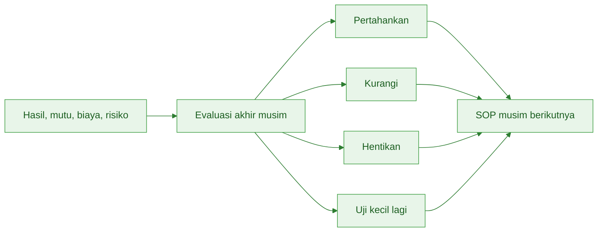

# **Belajar dari Lahan Sendiri: Catatan, Petak Pembanding, dan Evaluasi Musim**

---

- [**Belajar dari Lahan Sendiri: Catatan, Petak Pembanding, dan Evaluasi Musim**](#belajar-dari-lahan-sendiri-catatan-petak-pembanding-dan-evaluasi-musim)
  - [Pengantar Bagian 5](#pengantar-bagian-5)
- [Bab 14. Petak Pembanding: Laboratorium Murah di Lahan Sendiri](#bab-14-petak-pembanding-laboratorium-murah-di-lahan-sendiri)
  - [Tujuan Bab 14](#tujuan-bab-14)
  - [14.1 Mengapa Petak Pembanding Penting](#141-mengapa-petak-pembanding-penting)
  - [14.2 Prinsip Membuat Petak Pembanding](#142-prinsip-membuat-petak-pembanding)
    - [Jangan mengubah terlalu banyak hal](#jangan-mengubah-terlalu-banyak-hal)
    - [Bila ingin menguji input biologis](#bila-ingin-menguji-input-biologis)
  - [14.3 Desain Petak Pembanding Tanaman Semusim](#143-desain-petak-pembanding-tanaman-semusim)
    - [P1 = dosis acuan](#p1--dosis-acuan)
    - [P2 = dosis acuan -20%](#p2--dosis-acuan--20)
    - [P3 = dosis koreksi](#p3--dosis-koreksi)
    - [P4 opsional = pola biologis berbeda](#p4-opsional--pola-biologis-berbeda)
    - [Ukuran petak minimum](#ukuran-petak-minimum)
    - [Contoh desain cabai rawit](#contoh-desain-cabai-rawit)
    - [Contoh desain sayuran daun](#contoh-desain-sayuran-daun)
  - [14.4 Desain Pembanding Tanaman Tahunan](#144-desain-pembanding-tanaman-tahunan)
    - [Syarat pohon pembanding](#syarat-pohon-pembanding)
    - [P1 = dosis acuan](#p1--dosis-acuan-1)
    - [P2 = N dikurangi 20–25%](#p2--n-dikurangi-2025)
    - [P3 = acuan + organik/mulsa lebih baik](#p3--acuan--organikmulsa-lebih-baik)
    - [P4 opsional = pola biologis terpilih](#p4-opsional--pola-biologis-terpilih)
    - [Evaluasi tahunan perlu waktu](#evaluasi-tahunan-perlu-waktu)
  - [14.5 Form Catatan Petak Pembanding](#145-form-catatan-petak-pembanding)
    - [Form hasil dan biaya](#form-hasil-dan-biaya)
    - [Form kondisi tanaman](#form-kondisi-tanaman)
    - [Form mutu hasil](#form-mutu-hasil)
    - [Form perlakuan biologis bila ada](#form-perlakuan-biologis-bila-ada)
    - [Form tenaga kerja tambahan](#form-tenaga-kerja-tambahan)
  - [14.6 Cara Memilih Perlakuan Terbaik](#146-cara-memilih-perlakuan-terbaik)
    - [Contoh membaca perlakuan](#contoh-membaca-perlakuan)
  - [14.7 Kesalahan Umum Petak Pembanding](#147-kesalahan-umum-petak-pembanding)
    - [Beberapa kesalahan yang paling merugikan](#beberapa-kesalahan-yang-paling-merugikan)
  - [Ringkasan Bab 14](#ringkasan-bab-14)
- [Bab 15. Skor Tanaman: Cara Membaca Respons Tanpa Lab](#bab-15-skor-tanaman-cara-membaca-respons-tanpa-lab)
  - [Tujuan Bab 15](#tujuan-bab-15)
  - [15.1 Mengapa Pengamatan Perlu Dibuat Berskor](#151-mengapa-pengamatan-perlu-dibuat-berskor)
  - [15.2 Skor Umum 1–5](#152-skor-umum-15)
    - [Catatan penting: skor 5 tidak selalu baik](#catatan-penting-skor-5-tidak-selalu-baik)
    - [Khusus untuk OPT](#khusus-untuk-opt)
  - [15.3 Parameter Skor yang Diamati](#153-parameter-skor-yang-diamati)
    - [Skor warna daun](#skor-warna-daun)
    - [Skor pertumbuhan](#skor-pertumbuhan)
    - [Skor bunga](#skor-bunga)
    - [Skor buah](#skor-buah)
    - [Skor OPT](#skor-opt)
    - [Skor air](#skor-air)
    - [Skor akar/rizosfer lapangan](#skor-akarrizosfer-lapangan)
      - [Tanda akar aktif](#tanda-akar-aktif)
      - [Tanda area perakaran lemah](#tanda-area-perakaran-lemah)
    - [Tanda respons setelah input biologis](#tanda-respons-setelah-input-biologis)
  - [15.4 Skor Cabai Rawit](#154-skor-cabai-rawit)
    - [Cara membaca skor cabai](#cara-membaca-skor-cabai)
  - [15.5 Skor Sayuran Daun](#155-skor-sayuran-daun)
    - [Cara membaca skor sayuran daun](#cara-membaca-skor-sayuran-daun)
  - [15.6 Skor Durian](#156-skor-durian)
    - [Cara membaca skor durian](#cara-membaca-skor-durian)
  - [15.7 Skor Jeruk](#157-skor-jeruk)
    - [Cara membaca skor jeruk](#cara-membaca-skor-jeruk)
  - [15.8 Cara Memakai Skor untuk Keputusan Pupuk](#158-cara-memakai-skor-untuk-keputusan-pupuk)
    - [Skor sebelum aplikasi vs sesudah aplikasi](#skor-sebelum-aplikasi-vs-sesudah-aplikasi)
    - [Cara membaca respons setelah pupuk](#cara-membaca-respons-setelah-pupuk)
    - [Cara membaca respons setelah input biologis](#cara-membaca-respons-setelah-input-biologis)
    - [Ambil keputusan kecil, bukan ekstrem](#ambil-keputusan-kecil-bukan-ekstrem)
  - [Ringkasan Bab 15](#ringkasan-bab-15)
- [Bab 16. Pencatatan Usaha Tani Sederhana](#bab-16-pencatatan-usaha-tani-sederhana)
  - [Tujuan Bab 16](#tujuan-bab-16)
  - [16.1 Mengapa Catatan Penting](#161-mengapa-catatan-penting)
    - [Biaya kecil sering lupa](#biaya-kecil-sering-lupa)
    - [Harga sering diingat bias](#harga-sering-diingat-bias)
    - [Catatan membantu membaca laba, mutu, dan pola risiko](#catatan-membantu-membaca-laba-mutu-dan-pola-risiko)
  - [16.2 Catatan Minimum](#162-catatan-minimum)
    - [Format paling sederhana](#format-paling-sederhana)
    - [Jika sangat terbatas waktu](#jika-sangat-terbatas-waktu)
    - [Contoh pencatatan minimum](#contoh-pencatatan-minimum)
  - [16.3 Catatan Pemupukan](#163-catatan-pemupukan)
    - [Hal yang wajib dicatat](#hal-yang-wajib-dicatat)
    - [Mengapa respons 7–14 hari penting](#mengapa-respons-714-hari-penting)
    - [Contoh catatan pemupukan](#contoh-catatan-pemupukan)
  - [16.4 Catatan Biaya](#164-catatan-biaya)
    - [Biaya yang sering terlupakan](#biaya-yang-sering-terlupakan)
    - [Tenaga kerja keluarga](#tenaga-kerja-keluarga)
    - [Contoh catatan biaya](#contoh-catatan-biaya)
  - [16.5 Catatan Panen dan Harga](#165-catatan-panen-dan-harga)
    - [Harga rata-rata](#harga-rata-rata)
    - [Untuk tahunan](#untuk-tahunan)
    - [Mengapa grade harus dicatat](#mengapa-grade-harus-dicatat)
  - [16.6 Catatan Kondisi Tanaman](#166-catatan-kondisi-tanaman)
    - [Manfaat catatan kondisi tanaman](#manfaat-catatan-kondisi-tanaman)
    - [Contoh](#contoh)
  - [16.7 Catatan Batch JAKABA/MOL/POC/PGPM](#167-catatan-batch-jakabamolpocpgpm)
    - [Status batch](#status-batch)
    - [Contoh catatan batch](#contoh-catatan-batch)
    - [Mengapa ini penting](#mengapa-ini-penting)
  - [16.8 Uji Kecil](#168-uji-kecil)
    - [Yang wajib dicatat dalam uji kecil](#yang-wajib-dicatat-dalam-uji-kecil)
    - [Contoh uji kecil](#contoh-uji-kecil)
    - [Prinsip uji kecil](#prinsip-uji-kecil)
  - [16.9 Format Catatan Satu Halaman](#169-format-catatan-satu-halaman)
    - [Format gabungan satu halaman](#format-gabungan-satu-halaman)
    - [Versi sangat sederhana](#versi-sangat-sederhana)
    - [Contoh](#contoh-1)
  - [16.10 Kesalahan Umum Pencatatan](#1610-kesalahan-umum-pencatatan)
    - [Catatan hanya diingat](#catatan-hanya-diingat)
    - [Biaya kecil tidak dicatat](#biaya-kecil-tidak-dicatat)
    - [Panen dicampur antarblok](#panen-dicampur-antarblok)
    - [Catatan terlalu rumit](#catatan-terlalu-rumit)
    - [Tidak mengevaluasi catatan](#tidak-mengevaluasi-catatan)
  - [Ringkasan Bab 16](#ringkasan-bab-16)
- [Bab 17. Evaluasi Akhir Musim](#bab-17-evaluasi-akhir-musim)
  - [Tujuan Bab 17](#tujuan-bab-17)
  - [17.1 Evaluasi Bukan Mencari Salah, Tetapi Mencari Pola](#171-evaluasi-bukan-mencari-salah-tetapi-mencari-pola)
  - [17.2 Data yang Dikumpulkan untuk Evaluasi](#172-data-yang-dikumpulkan-untuk-evaluasi)
    - [Hasil](#hasil)
    - [Biaya](#biaya)
    - [Mutu dan harga](#mutu-dan-harga)
    - [Skor tanaman](#skor-tanaman)
    - [Catatan batch input biologis](#catatan-batch-input-biologis)
  - [17.3 Menghitung Evaluasi Ekonomi Akhir Musim](#173-menghitung-evaluasi-ekonomi-akhir-musim)
    - [Langkah evaluasi ekonomi](#langkah-evaluasi-ekonomi)
    - [Contoh semusim](#contoh-semusim)
    - [Contoh tahunan](#contoh-tahunan)
    - [Pertanyaan pembanding antar musim](#pertanyaan-pembanding-antar-musim)
  - [17.4 Membaca Efisiensi Pemupukan secara Praktis](#174-membaca-efisiensi-pemupukan-secara-praktis)
    - [Hasil sama tetapi biaya turun = lebih efisien](#hasil-sama-tetapi-biaya-turun--lebih-efisien)
    - [Hasil naik tetapi biaya meledak = belum tentu lebih baik](#hasil-naik-tetapi-biaya-meledak--belum-tentu-lebih-baik)
    - [Mutu naik = bisa lebih menguntungkan](#mutu-naik--bisa-lebih-menguntungkan)
    - [Stabilitas panen = nilai penting](#stabilitas-panen--nilai-penting)
    - [Beban kerja tambahan juga harus dinilai](#beban-kerja-tambahan-juga-harus-dinilai)
  - [17.5 Evaluasi Mutu](#175-evaluasi-mutu)
    - [Contoh per komoditas](#contoh-per-komoditas)
    - [Catatan baru: evaluasi input biologis harus dibaca dari mutu dan stabilitas](#catatan-baru-evaluasi-input-biologis-harus-dibaca-dari-mutu-dan-stabilitas)
  - [17.6 Evaluasi Risiko](#176-evaluasi-risiko)
    - [Risiko air](#risiko-air)
    - [Risiko OPT](#risiko-opt)
    - [Risiko harga](#risiko-harga)
    - [Risiko penyakit](#risiko-penyakit)
    - [Risiko batch biologis](#risiko-batch-biologis)
  - [17.7 Menyusun SOP Musim Berikutnya](#177-menyusun-sop-musim-berikutnya)
    - [Apa yang dipertahankan](#apa-yang-dipertahankan)
    - [Apa yang dikurangi](#apa-yang-dikurangi)
    - [Apa yang dihentikan](#apa-yang-dihentikan)
    - [Apa yang dicoba kecil lagi](#apa-yang-dicoba-kecil-lagi)
    - [Contoh revisi SOP cabai](#contoh-revisi-sop-cabai)
    - [Contoh revisi SOP sayuran daun](#contoh-revisi-sop-sayuran-daun)
    - [Contoh revisi SOP durian](#contoh-revisi-sop-durian)
    - [Contoh revisi SOP jeruk](#contoh-revisi-sop-jeruk)
  - [17.8 Apakah Input Biologis Benar-Benar Membantu?](#178-apakah-input-biologis-benar-benar-membantu)
    - [Kapan input biologis layak diteruskan](#kapan-input-biologis-layak-diteruskan)
    - [Kapan input biologis perlu ditahan atau dihentikan](#kapan-input-biologis-perlu-ditahan-atau-dihentikan)
    - [Contoh pembacaan jujur](#contoh-pembacaan-jujur)
  - [17.9 Evaluasi Khusus per Komoditas](#179-evaluasi-khusus-per-komoditas)
    - [Cabai rawit](#cabai-rawit)
    - [Sayuran daun](#sayuran-daun)
    - [Durian](#durian)
    - [Jeruk](#jeruk)
  - [17.10 Format Evaluasi Akhir Musim](#1710-format-evaluasi-akhir-musim)
    - [Tabel hasil](#tabel-hasil)
    - [Tabel biaya](#tabel-biaya)
    - [Tabel mutu](#tabel-mutu)
    - [Tabel risiko](#tabel-risiko)
    - [Tabel keputusan akhir](#tabel-keputusan-akhir)
    - [Contoh keputusan akhir](#contoh-keputusan-akhir)
  - [Ringkasan Bab 17](#ringkasan-bab-17)
- [Penutup Bagian 5](#penutup-bagian-5)
  - [Yang Harus Diingat dari Bagian 5](#yang-harus-diingat-dari-bagian-5)
  - [Tabel Ringkasan Cepat Bagian 5](#tabel-ringkasan-cepat-bagian-5)
    - [Ringkasan alat belajar petani](#ringkasan-alat-belajar-petani)
    - [Ringkasan kapan dipakai](#ringkasan-kapan-dipakai)
    - [Ringkasan keputusan akhir musim](#ringkasan-keputusan-akhir-musim)

---

## Pengantar Bagian 5

Bagian 2 sudah menjelaskan cara membaca lahan, menghitung dosis, dan mengoreksi keputusan pupuk secara low-lab. Bagian 3 sudah menerapkan SOP untuk cabai rawit, sayuran daun, durian, dan jeruk. Bagian 4 sudah menegaskan bahwa semua keputusan pupuk harus diuji dengan biaya, risiko, mutu, panen, dan pasar. Sekarang muncul pertanyaan yang paling menentukan untuk musim berikutnya:

```text id="c7f1kz"
Bagaimana petani tahu bahwa pola pemupukannya benar-benar membaik dari musim ke musim?
```

Jawabannya bukan menunggu laboratorium lengkap. Jawabannya adalah membuat sistem belajar di lahan sendiri:

```text id="t2m8pw"
uji kecil di lahan
→ amati respons tanaman
→ catat biaya dan hasil
→ evaluasi laba dan mutu
→ perbaiki SOP musim berikutnya
```

Itulah fungsi Bagian 5. Bagian ini membuat model low-lab tidak berhenti sebagai anjuran satu kali, tetapi menjadi pola kerja yang semakin tajam, semakin hemat, dan semakin sesuai dengan lahan petani sendiri.

Lahan petani sendiri harus menjadi tempat belajar. Petani tidak perlu membuat percobaan akademik yang rumit. Cukup mulai dari petak pembanding kecil, skor tanaman sederhana, catatan yang rutin, lalu evaluasi akhir musim yang jujur. Dengan cara ini, keputusan musim depan tidak lagi hanya berdasarkan kebiasaan atau ingatan, tetapi berdasarkan bukti dari lahan sendiri.

Diagram alur belajar musim ke musim:


Pesan utama Bagian 5:

> Petani yang mencatat akan lebih cepat tahu pola mana yang benar-benar menguntungkan.
> Petani yang membandingkan akan lebih cepat menemukan dosis dan pola kerja yang paling cocok untuk lahannya sendiri.

<ResourceBox
title="Artikel Terkait:"
items={[
{
name: 'README - Pupuk Tepat, Panen Untung - Model Low-Lab untuk Petani Makmur di Gambiran',
href: '/blog/agri/pupuk-terintegrasi/README',
},
]}
/>

---

# Bab 14. Petak Pembanding: Laboratorium Murah di Lahan Sendiri

## Tujuan Bab 14

Bab ini mengajarkan cara membuat pembanding sederhana di lahan sendiri agar keputusan pupuk tidak hanya berdasarkan ingatan, kebiasaan, atau kesan visual.

Petak pembanding bukan untuk menjadikan petani peneliti akademik. Petak pembanding dibuat agar petani bisa menjawab pertanyaan praktis:

```text id="zt79z8"
Dosis mana yang paling cocok dan paling menguntungkan di lahan saya?
```

Dalam versi rewrite ini, petak pembanding juga bisa dipakai untuk menjawab pertanyaan tambahan:

```text id="x1j1w0"
Apakah pola dukungan biologis tertentu benar-benar membantu?
Ataukah hanya menambah kerja dan biaya?
```

Artinya, petak pembanding bukan hanya alat untuk membandingkan pupuk, tetapi alat untuk membandingkan:

- hasil,
- mutu,
- biaya,
- laba,
- risiko,
- dan beban kerja tambahan.

---

## 14.1 Mengapa Petak Pembanding Penting

Tanpa pembanding, petani sulit tahu penyebab hasil naik atau turun.

Hasil bisa naik karena pupuk. Tetapi bisa juga karena:

- cuaca sedang bagus,
- air lebih stabil,
- bibit lebih baik,
- OPT lebih rendah,
- harga sedang tinggi,
- atau kebetulan musim sedang mendukung.

Sebaliknya, hasil bisa turun bukan berarti pupuk salah. Bisa jadi:

- hujan terlalu berat,
- akar terganggu,
- penyakit meningkat,
- panen terlambat,
- atau harga jatuh sehingga usaha tampak jelek walaupun teknis budidayanya cukup baik.

Petak pembanding membantu petani menjawab:

```text id="k8n3hj"
Apakah dosis sekarang terlalu tinggi?
Apakah dosis bisa dikurangi tanpa menurunkan hasil?
Apakah tambahan pupuk benar-benar menambah laba?
Apakah pola koreksi lebih baik daripada dosis standar?
Apakah dukungan biologis tertentu benar-benar membantu?
```

Tabel manfaat petak pembanding:

| Kondisi             | Tanpa Petak Pembanding      | Dengan Petak Pembanding               |
| ------------------- | --------------------------- | ------------------------------------- |
| Hasil naik          | Sulit tahu penyebabnya      | Bisa dibandingkan antarperlakuan      |
| Biaya pupuk naik    | Tidak tahu layak atau tidak | Bisa dihitung tambahan labanya        |
| Tanaman lebih hijau | Dianggap pasti baik         | Dicek apakah hasil dan laba ikut naik |
| Dosis dikurangi     | Takut hasil turun           | Bisa diuji di petak kecil             |
| Mutu membaik        | Tidak tahu penyebabnya      | Bisa dikaitkan dengan pola perlakuan  |

Yang sangat penting: petak pembanding **jangan dipakai hanya untuk membandingkan tinggi tanaman**. Tanaman yang paling tinggi atau paling hijau belum tentu paling untung. Pada cabai rawit, tanaman sangat hijau bisa justru terlalu vegetatif. Pada sayuran daun, daun terlalu hijau bisa terlalu lunak. Pada durian, flush terlalu aktif menjelang bunga bisa menjadi masalah. Pada jeruk, tajuk subur belum tentu buah dan grade membaik.

Karena itu, pembanding harus melihat:

- hasil,
- mutu,
- biaya,
- laba,
- risiko,
- dan stabilitas.

Kalimat kunci:

> Petak pembanding adalah laboratorium paling murah karena dilakukan langsung di lahan sendiri.

---

## 14.2 Prinsip Membuat Petak Pembanding

Petak pembanding tidak perlu rumit, tetapi harus jujur dan konsisten.

Kalau dibuat sembarangan, hasilnya menyesatkan. Misalnya:

- P1 berada di tanah lebih subur,
- P2 berada di petak yang sering kering,
- P3 mendapat air lebih baik,
- P4 mendapat semprotan atau perawatan berbeda.

Kalau itu terjadi, hasil tidak lagi mencerminkan perbedaan pupuk atau pola perlakuan, tetapi campuran banyak faktor.

Aturan sederhana petak pembanding:

```text id="d0k5jm"
1. Lokasi petak harus relatif seragam.
2. Varietas atau bibit harus sama.
3. Waktu tanam harus sama.
4. Perlakuan selain yang diuji harus dibuat sama.
5. Luas petak harus cukup untuk diukur hasilnya.
6. Panen harus dicatat terpisah.
7. Biaya tiap perlakuan harus dicatat.
8. Mutu hasil harus ikut dicatat.
```

Tabel prinsip dasar:

| Prinsip             | Tujuan                               |
| ------------------- | ------------------------------------ |
| Lahan seragam       | Hasil lebih adil dibandingkan        |
| Bibit sama          | Respons lebih bisa dibaca            |
| Waktu tanam sama    | Umur tanaman tidak mengacaukan hasil |
| Perlakuan lain sama | Yang diuji tetap jelas               |
| Panen terpisah      | Hasil bisa dihitung                  |
| Biaya dicatat       | Laba bisa dihitung                   |
| Mutu dicatat        | Nilai pasar ikut terbaca             |

### Jangan mengubah terlalu banyak hal

Ini kesalahan paling sering.

Misalnya:

- P1 beda pupuk, beda bibit, beda air,
- P2 beda pupuk, beda mulsa, beda pestisida,
- P3 beda pupuk, beda jarak tanam.

Kalau begitu, petani tidak tahu perlakuan mana yang sebenarnya membuat hasil berubah.

Lebih baik uji satu pembeda utama.

Contoh sederhana:

- P1 = dosis acuan
- P2 = dosis acuan -20%
- P3 = dosis koreksi
- P4 opsional = salah satu pola di atas + dukungan biologis tertentu

### Bila ingin menguji input biologis

Dalam versi rewrite ini, ada satu aturan tambahan:

> Bila ingin menguji input biologis, jangan ubah terlalu banyak hal sekaligus.

Cukup satu pembeda utama. Misalnya:

- semua sama, hanya P4 memakai dukungan biologis,
- atau semua sama, hanya P3 memakai bahan organik + dukungan biologis tertentu,
- bukan sekaligus beda pupuk, beda air, beda bahan organik, beda pola semprot, dan beda input biologis.

Kalimat kunci:

> Petak pembanding tidak perlu rumit, tetapi harus jujur dan konsisten.

---

## 14.3 Desain Petak Pembanding Tanaman Semusim

Untuk tanaman semusim seperti cabai rawit dan sayuran daun, gunakan tiga perlakuan dasar dan satu perlakuan opsional bila memang ingin menguji pola biologis.

Skema dasar:

| Perlakuan   | Pola                                | Tujuan                              |
| ----------- | ----------------------------------- | ----------------------------------- |
| P1          | Dosis acuan                         | Pembanding utama                    |
| P2          | Dosis acuan -20%                    | Melihat apakah dosis bisa dihemat   |
| P3          | Dosis koreksi                       | Melihat respons pola perbaikan      |
| P4 opsional | Salah satu pola + dukungan biologis | Menguji manfaat biologis bila perlu |

Diagram skema pembanding semusim:



### P1 = dosis acuan

Ini perlakuan standar. Menjadi titik pembanding utama.

Contoh:

- cabai rawit: NPK 15-10-12 = 425 kg/ha + urea = 75 kg/ha
- sayuran daun: NPK 15-10-12 = 325 kg/ha + urea = 100 kg/ha

### P2 = dosis acuan -20%

Perlakuan ini dibuat untuk menjawab:

```text id="uey8ti"
Apakah dosis pupuk bisa dihemat tanpa menurunkan hasil dan mutu?
```

Kalau hasil P2 hampir sama dengan P1, tetapi biaya lebih rendah, maka P2 bisa lebih efisien.

### P3 = dosis koreksi

P3 bukan berarti sekadar menaikkan pupuk.

P3 adalah pola koreksi lapangan. Contohnya:

- pada cabai rawit, N tidak dinaikkan, tetapi K, pembagian aplikasi, air, dan perbaikan akar diperkuat,
- pada sayuran daun, urea diturunkan sedikit bila daun terlalu lunak, tetapi aplikasi dibuat lebih merata dan panen lebih tepat umur.

### P4 opsional = pola biologis berbeda

Ini tidak wajib. Dipakai hanya bila memang ingin menguji apakah dukungan biologis memberi manfaat nyata.

Contoh:

- P4 = P3 + dukungan biologis di fase akar awal,
- atau P4 = P1 + pola bahan organik + dukungan biologis yang jelas fungsinya.

P4 hanya layak bila:

- fungsi perlakuannya jelas,
- batch dicatat,
- dosis dicatat,
- gejala setelah aplikasi dicatat,
- dan biaya tambahan juga dicatat.

### Ukuran petak minimum

| Komoditas    | Ukuran minimum praktis      |
| ------------ | --------------------------- |
| Cabai rawit  | 20–50 tanaman per perlakuan |
| Sayuran daun | 5–10 m² per perlakuan       |

Jangan memakai petak terlalu kecil. Bila petak terlalu kecil, hasil mudah bias.

### Contoh desain cabai rawit

| Perlakuan | Jumlah Tanaman | Pola                            |
| --------- | -------------: | ------------------------------- |
| P1        |     30 tanaman | Dosis acuan                     |
| P2        |     30 tanaman | Dosis acuan -20%                |
| P3        |     30 tanaman | Dosis koreksi                   |
| P4        |     30 tanaman | P3 + dukungan biologis opsional |

Semua harus memakai:

- varietas sama,
- umur bibit sama,
- jarak tanam sama,
- waktu tanam sama,
- air sama,
- pengendalian OPT sama.

### Contoh desain sayuran daun

| Perlakuan | Luas | Pola                            |
| --------- | ---: | ------------------------------- |
| P1        | 5 m² | Dosis acuan                     |
| P2        | 5 m² | Dosis acuan -20%                |
| P3        | 5 m² | Dosis koreksi                   |
| P4        | 5 m² | P3 + dukungan biologis opsional |

Catatan penting:

> Petak pembanding tanaman semusim harus dipanen terpisah. Jika panen dicampur, data hilang.

---

## 14.4 Desain Pembanding Tanaman Tahunan

Untuk tanaman tahunan seperti durian dan jeruk, pembanding dilakukan per kelompok pohon.

Karena durian dan jeruk memiliki siklus lebih panjang, petak pembanding tahunan tidak bisa dibaca secepat tanaman semusim. Yang dibandingkan bukan hanya jumlah buah, tetapi juga:

- mutu,
- stabilitas,
- respons pohon,
- dan kesehatan pohon musim berikutnya.

Skema sederhana:

| Perlakuan   | Jumlah Pohon | Tujuan                          |
| ----------- | -----------: | ------------------------------- |
| P1          |    3–5 pohon | Dosis acuan                     |
| P2          |    3–5 pohon | N dikurangi 20–25%              |
| P3          |    3–5 pohon | Acuan + perbaikan organik/mulsa |
| P4 opsional |    3–5 pohon | Pola dukungan biologis terpilih |

### Syarat pohon pembanding

Pohon yang dibandingkan harus semirip mungkin:

- umur mirip,
- ukuran tajuk mirip,
- riwayat hasil mirip,
- kondisi kesehatan mirip,
- kondisi tanah dan air relatif mirip.

Kalau terlalu berbeda, hasilnya tidak adil.

### P1 = dosis acuan

Dipakai sesuai SOP komoditas. Contoh durian menghasilkan:

- NPK 15-10-12 = 500 kg/ha/tahun
- urea = 150 kg/ha/tahun
  lalu dikonversi per pohon.

### P2 = N dikurangi 20–25%

Sangat berguna untuk melihat apakah selama ini N terlalu tinggi. Cocok terutama bila:

- pohon terlalu rimbun,
- flush terlalu aktif,
- bunga rendah,
- atau buah tidak seimbang.

### P3 = acuan + organik/mulsa lebih baik

Ini untuk melihat apakah masalah utama justru ada pada:

- bahan organik rendah,
- tanah cepat kering,
- akar lemah,
- area piringan kurang dirawat,
- atau tanah cepat keras.

### P4 opsional = pola biologis terpilih

Dipakai hanya bila ada dugaan kuat bahwa dukungan biologis tertentu membantu:

- pemulihan akar,
- integrasi bahan organik,
- atau kestabilan pohon.

Tetap harus dicatat:

- batch,
- dosis,
- fase aplikasi,
- biaya,
- dan respons.

### Evaluasi tahunan perlu waktu

Untuk tanaman tahunan, jangan mengambil keputusan besar dari satu musim saja. Minimal lihat pola 2–3 musim, terutama untuk durian dan jeruk.

Kalimat kunci:

> Pada tanaman tahunan, keputusan besar jangan diambil dari satu musim saja. Lihat pola minimal 2–3 musim.

---

## 14.5 Form Catatan Petak Pembanding

Petak pembanding hanya berguna bila datanya dicatat.

Yang harus bisa dijawab dari catatan:

- perlakuan mana yang hasilnya baik,
- perlakuan mana yang mutunya baik,
- perlakuan mana yang biayanya efisien,
- perlakuan mana yang labanya paling baik,
- perlakuan mana yang risikonya paling rendah.

### Form hasil dan biaya

| Perlakuan | Luas/Pohon | Dosis Pupuk | Biaya Pupuk | Biaya Tambahan | Hasil Panen | Harga | Pendapatan | Laba Kotor |
| --------- | ---------: | ----------: | ----------: | -------------: | ----------: | ----: | ---------: | ---------: |
| P1        |            |             |             |                |             |       |            |            |
| P2        |            |             |             |                |             |       |            |            |
| P3        |            |             |             |                |             |       |            |            |
| P4        |            |             |             |                |             |       |            |            |

### Form kondisi tanaman

| Perlakuan | Warna Daun | Vigor | Bunga/Buah | OPT | Air | Akar/Rizosfer | Catatan Khusus |
| --------- | ---------- | ----- | ---------- | --- | --- | ------------- | -------------- |
| P1        |            |       |            |     |     |               |                |
| P2        |            |       |            |     |     |               |                |
| P3        |            |       |            |     |     |               |                |
| P4        |            |       |            |     |     |               |                |

### Form mutu hasil

| Perlakuan | Grade A | Grade B | Grade C | Rusak/Afkir | Catatan Mutu |
| --------- | ------: | ------: | ------: | ----------: | ------------ |
| P1        |         |         |         |             |              |
| P2        |         |         |         |             |              |
| P3        |         |         |         |             |              |
| P4        |         |         |         |             |              |

### Form perlakuan biologis bila ada

| Perlakuan | Jenis Input Biologis | Batch | Dosis | Fase Aplikasi | Gejala Setelah Aplikasi | Hasil/Mutu Terkait |
| --------- | -------------------- | ----- | ----- | ------------- | ----------------------- | ------------------ |
| P4        |                      |       |       |               |                         |                    |

### Form tenaga kerja tambahan

| Perlakuan | Tenaga Kerja Tambahan | Waktu Kerja | Biaya atau Nilai Kerja | Catatan |
| --------- | --------------------- | ----------: | ---------------------: | ------- |
| P1        |                       |             |                        |         |
| P2        |                       |             |                        |         |
| P3        |                       |             |                        |         |
| P4        |                       |             |                        |         |

Catatan penting:

- form ini tidak harus diisi sangat rinci semua,
- tetapi minimal hasil, biaya, mutu, dan perlakuan utama harus tercatat,
- bila memakai input biologis, batch dan gejala sesudah aplikasi wajib dicatat.

Kalimat kunci:

> Petak terbaik bukan yang tanamannya paling hijau, tetapi yang labanya paling baik dan risikonya paling rendah.

---

## 14.6 Cara Memilih Perlakuan Terbaik

Jangan memilih perlakuan terbaik hanya dari:

- tanaman paling hijau,
- tajuk paling lebat,
- efek visual tercepat.

Gunakan minimal lima sampai tujuh kriteria:

1. hasil panen
2. mutu hasil
3. biaya pupuk
4. biaya tambahan lain
5. laba kotor
6. risiko
7. beban kerja tambahan

Tabel keputusan:

| Kondisi                           | Keputusan                  |
| --------------------------------- | -------------------------- |
| Hasil naik dan laba naik          | Pola bisa dipakai          |
| Hasil naik tetapi laba turun      | Biaya terlalu besar        |
| Hasil sama tetapi biaya turun     | Pola lebih efisien         |
| Tanaman hijau tetapi hasil rendah | Pola tidak tepat           |
| Mutu naik dan harga naik          | Pola kuat                  |
| Risiko penyakit turun             | Pola layak dipertimbangkan |
| Beban kerja terlalu tinggi        | Perlu ditimbang ulang      |

### Contoh membaca perlakuan

**Kasus 1: P2 hasil sama, biaya lebih rendah**
Kalau dosis -20% memberi hasil hampir sama dengan P1 dan mutu tidak turun, P2 bisa lebih efisien.

**Kasus 2: P1 hasil tertinggi, tetapi laba bukan tertinggi**
Artinya hasil tinggi itu dibayar terlalu mahal.

**Kasus 3: P3 mutu terbaik**
Bisa lebih menguntungkan walaupun hasil total tidak paling tinggi.

**Kasus 4: P4 biologis tampak bagus, tetapi biaya dan kerja bertambah**
Kalau mutu, hasil, dan laba tidak berubah nyata, maka nilainya lemah.

Aturan penting untuk perlakuan biologis:

> Perlakuan biologis hanya menang bila benar-benar membantu hasil, mutu, stabilitas, atau efisiensi. Bila hanya menambah kerja dan biaya, nilainya lemah.

Kalimat kunci:

> Perlakuan terbaik adalah yang memberi keuntungan terbaik, bukan penampilan tanaman terbaik.

---

## 14.7 Kesalahan Umum Petak Pembanding

Petak pembanding sederhana bisa sangat berguna, tetapi ada beberapa kesalahan yang harus dihindari.

| Kesalahan                              | Akibat                    |
| -------------------------------------- | ------------------------- |
| Petak tidak seragam                    | Hasil sulit dipercaya     |
| Perlakuan lain ikut berbeda            | Tidak tahu pengaruh utama |
| Panen dicampur                         | Data hilang               |
| Tidak mencatat biaya                   | Tidak tahu laba           |
| Hanya melihat warna daun               | Salah mengambil keputusan |
| Satu musim langsung dianggap final     | Keputusan terlalu cepat   |
| Petak terlalu kecil                    | Hasil mudah bias          |
| Tidak mencatat mutu                    | Nilai pasar tidak terbaca |
| Tidak mencatat batch biologis          | Sulit evaluasi            |
| Tidak menghitung tenaga kerja tambahan | Laba terlihat palsu       |

### Beberapa kesalahan yang paling merugikan

**Petak tidak seragam**
Ini membuat semua hasil sulit dipercaya.

**Panen dicampur**
Ini salah satu kesalahan paling besar. Begitu panen dicampur, fungsi pembanding hilang.

**Tidak mencatat mutu**
Padahal pada durian dan jeruk, mutu bisa lebih penting dari jumlah. Pada sayuran daun, kesegaran sangat menentukan. Pada cabai, mutu buah sangat terkait harga.

**Tidak mencatat batch input biologis**
Kalau respons tanaman berubah, petani tidak tahu itu karena batch berbeda atau karena faktor lain.

**Satu musim langsung dianggap final**
Untuk tanaman semusim, masih perlu dicek lagi pada musim berikutnya. Untuk tahunan, wajib lebih hati-hati lagi.

Pesan penting:

> Petak pembanding harus jujur, konsisten, dan cukup besar agar hasilnya bisa dipercaya.

---

## Ringkasan Bab 14

1. Petak pembanding adalah laboratorium murah di lahan sendiri.
2. Petak pembanding membantu petani tahu apakah dosis perlu dipertahankan, dikurangi, atau dikoreksi.
3. Untuk tanaman semusim, bandingkan dosis acuan, dosis -20%, dosis koreksi, dan perlakuan biologis opsional bila perlu.
4. Untuk tanaman tahunan, bandingkan beberapa pohon yang umur, tajuk, dan riwayat produksinya mirip.
5. Hasil harus dipanen dan dicatat terpisah.
6. Catatan petak pembanding harus mencakup dosis, biaya, hasil, mutu, harga, dan laba.
7. Perlakuan terbaik tidak selalu yang hasilnya paling tinggi.
8. Perlakuan terbaik adalah yang memberi hasil, mutu, laba, dan risiko paling baik.
9. Tanaman paling hijau belum tentu paling menguntungkan.
10. Perlakuan biologis harus dinilai dari manfaat nyata, bukan kesan visual.

Pesan penutup Bab 14:

> Kalau petani ingin menemukan pola pupuk yang paling cocok untuk lahannya sendiri, maka petak pembanding adalah langkah paling murah, paling jujur, dan paling bisa langsung dikerjakan di lapangan.

---

# Bab 15. Skor Tanaman: Cara Membaca Respons Tanpa Lab

## Tujuan Bab 15

Bab ini dibuat agar mata petani menjadi alat ukur yang lebih teratur melalui skor sederhana.

Banyak keputusan lapangan gagal bukan karena petani tidak melihat tanaman, tetapi karena pengamatan hanya berhenti pada kalimat seperti:

```text id="9q9n0x"
tanaman kelihatan bagus
tanaman agak pucat
bunga kurang banyak
buahnya kecil-kecil
tanah terasa kurang enak
```

Kalimat seperti itu berguna, tetapi sulit dibandingkan antarwaktu, antarpihak, dan antarpetak. Karena itu, pengamatan perlu dibuat lebih teratur dengan sistem skor. Skor tidak menggantikan pengalaman petani. Skor justru membantu pengalaman itu menjadi lebih tajam, lebih konsisten, dan lebih mudah dipakai untuk mengambil keputusan pupuk.

Pesan utama bab ini:

> Skor tanaman membuat pengamatan lapangan lebih jujur, lebih konsisten, dan lebih mudah dihubungkan dengan keputusan pupuk, air, akar, dan input pendukung.

---

## 15.1 Mengapa Pengamatan Perlu Dibuat Berskor

Tanpa skor, penilaian terlalu umum. Dua orang bisa melihat tanaman yang sama, tetapi memberi kesimpulan berbeda. Satu bilang “cukup hijau”, satu lagi bilang “masih kurang”. Satu bilang “sudah bagus”, satu lagi bilang “masih lemah”.

Dengan skor, pengamatan menjadi lebih teratur.

Manfaat skor:

| Manfaat                     | Penjelasan Praktis                                              |
| --------------------------- | --------------------------------------------------------------- |
| Membandingkan antarwaktu    | Skor minggu ini bisa dibandingkan dengan minggu lalu            |
| Membandingkan antarpetak    | P1, P2, P3, P4 bisa dinilai lebih adil                          |
| Mengurangi salah diagnosis  | Gejala tidak dibaca dari satu kesan saja                        |
| Membaca efek pupuk          | Sebelum dan sesudah aplikasi bisa dibandingkan                  |
| Membaca efek input biologis | Tidak berhenti pada kesan “tanaman tampak lebih segar”          |
| Membantu diskusi kelompok   | Penyuluh, petani, dan pendamping bicara dengan bahasa yang sama |

Contoh sederhana:

Tanpa skor:

- “cabai agak pucat”
- “sayur kurang rata”
- “durian terlalu rimbun”
- “jeruk kelihatan menurun”

Dengan skor:

- warna daun cabai = 2
- keseragaman sayuran = 3
- flush durian = 5
- grade jeruk = 2

Bahasa skor membuat keputusan lebih mudah.

Tabel perbandingan:

| Tanpa Skor        | Dengan Skor     |
| ----------------- | --------------- |
| Agak pucat        | Warna daun = 2  |
| Cukup normal      | Pertumbuhan = 3 |
| Sangat rimbun     | Tajuk/flush = 5 |
| Buah sedikit      | Buah = 2        |
| OPT lumayan berat | OPT = 1–2       |
| Air cukup baik    | Air = 3–4       |

Kalimat kunci:

> Skor membuat pengamatan tidak berhenti pada kesan, tetapi berubah menjadi dasar keputusan.

---

## 15.2 Skor Umum 1–5

Agar mudah dipakai di lapangan, gunakan skor 1–5.

Tabel arti skor umum:

| Skor | Arti Umum                   | Makna Praktis                          |
| ---: | --------------------------- | -------------------------------------- |
|    1 | Buruk / sangat kurang       | Masalah berat, perlu perhatian cepat   |
|    2 | Kurang                      | Ada masalah nyata, perlu koreksi       |
|    3 | Normal / cukup              | Masih aman, lanjut amati               |
|    4 | Baik / kuat                 | Kondisi baik, tetap dikontrol          |
|    5 | Sangat tinggi / sangat kuat | Belum tentu baik, tergantung parameter |

### Catatan penting: skor 5 tidak selalu baik

Ini titik penting.

Untuk beberapa parameter, skor 5 bisa berarti sangat baik. Misalnya:

- akar sangat aktif,
- air sangat cukup dan stabil,
- buah banyak dan seragam.

Tetapi untuk parameter lain, skor 5 justru bisa menjadi peringatan. Misalnya:

- daun terlalu hijau,
- flush terlalu tinggi,
- vegetatif terlalu dominan,
- tajuk terlalu rimbun.

Jadi, skor tinggi harus dibaca sesuai parameter.

### Khusus untuk OPT

Untuk OPT, skor dibalik maknanya agar lebih mudah dipakai dalam keputusan usaha tani.

Gunakan:

- skor 1 = serangan berat / kondisi tidak aman
- skor 3 = sedang
- skor 5 = aman / hampir tidak ada gangguan

Tabel arti khusus skor OPT:

| Skor OPT | Kondisi              |
| -------: | -------------------- |
|        1 | Serangan berat       |
|        2 | Serangan nyata       |
|        3 | Sedang               |
|        4 | Ringan               |
|        5 | Aman / sangat ringan |

Kalimat kunci:

> Skor 5 tidak selalu baik. Baca sesuai parameter yang diamati.

---

## 15.3 Parameter Skor yang Diamati

Dalam versi rewrite ini, skor tanaman tidak cukup hanya membaca daun dan pertumbuhan. Parameter wajib yang harus diamati adalah:

```text id="5i8r16"
warna daun
pertumbuhan
bunga
buah
OPT
air
akar atau rizosfer lapangan bila memungkinkan
```

Diagram hubungan skor ke keputusan:



### Skor warna daun

Dipakai untuk membaca:

- pucat,
- normal,
- terlalu hijau.

Contoh sederhana:

| Skor | Warna Daun                   |
| ---: | ---------------------------- |
|    1 | Sangat pucat / kuning        |
|    2 | Pucat                        |
|    3 | Hijau normal                 |
|    4 | Hijau baik                   |
|    5 | Sangat hijau / terlalu hijau |

Catatan:

- skor 1–2 bisa mengarah ke kurang hara atau akar lemah,
- skor 5 tidak otomatis baik, bisa berarti N terlalu tinggi.

### Skor pertumbuhan

Dipakai untuk membaca:

- kecepatan tumbuh,
- vigor,
- pembentukan tajuk atau daun,
- kekuatan umum tanaman.

| Skor | Pertumbuhan                |
| ---: | -------------------------- |
|    1 | Sangat lambat / lemah      |
|    2 | Kurang                     |
|    3 | Normal                     |
|    4 | Baik                       |
|    5 | Sangat cepat / sangat kuat |

### Skor bunga

Dipakai untuk komoditas generatif seperti cabai rawit, durian, dan jeruk.

| Skor | Bunga                             |
| ---: | --------------------------------- |
|    1 | Sangat sedikit / hampir tidak ada |
|    2 | Sedikit                           |
|    3 | Cukup                             |
|    4 | Banyak                            |
|    5 | Sangat banyak                     |

Catatan:

- skor 5 bunga belum tentu baik kalau fruit set rendah atau pohon terlalu stres.

### Skor buah

Dipakai untuk membaca:

- jumlah,
- ukuran,
- keseragaman,
- kelayakan panen.

| Skor | Buah                           |
| ---: | ------------------------------ |
|    1 | Sangat sedikit / sangat kecil  |
|    2 | Kurang                         |
|    3 | Cukup                          |
|    4 | Baik                           |
|    5 | Sangat baik / banyak / seragam |

### Skor OPT

Seperti dijelaskan sebelumnya, skor tinggi berarti kondisi lebih aman.

| Skor | Kondisi OPT    |
| ---: | -------------- |
|    1 | Serangan berat |
|    2 | Serangan nyata |
|    3 | Sedang         |
|    4 | Ringan         |
|    5 | Aman           |

### Skor air

Dipakai untuk membaca kondisi air dan kelembapan lapangan.

| Skor | Kondisi Air                     |
| ---: | ------------------------------- |
|    1 | Sangat kering atau sangat becek |
|    2 | Kurang mendukung                |
|    3 | Cukup                           |
|    4 | Baik                            |
|    5 | Sangat baik dan stabil          |

### Skor akar/rizosfer lapangan

Ini tambahan penting dalam versi rewrite.

Petani memang tidak selalu bisa membongkar akar atau menganalisis rizosfer seperti di laboratorium. Tetapi tanda lapangan tetap bisa dibaca.

#### Tanda akar aktif

- akar putih atau krem segar bila terlihat,
- tanah tidak berbau busuk,
- tanaman cepat pulih setelah siram atau hujan normal,
- respons pupuk masuk akal,
- pertumbuhan relatif stabil.

#### Tanda area perakaran lemah

- tanah becek atau keras,
- bau busuk,
- tanaman tidak merespons pupuk,
- layu berulang,
- pertumbuhan tertahan,
- perakaran sedikit atau mudah rusak.

Tabel skor akar/rizosfer lapangan:

| Skor | Kondisi Akar/Rizosfer      |
| ---: | -------------------------- |
|    1 | Sangat lemah / bermasalah  |
|    2 | Lemah                      |
|    3 | Cukup                      |
|    4 | Baik                       |
|    5 | Sangat aktif dan mendukung |

### Tanda respons setelah input biologis

Kalau petani memakai input biologis pendukung, perubahan yang layak dicatat bukan hanya “tanaman tampak segar”, tetapi:

- akar lebih aktif,
- respons pupuk lebih stabil,
- tanaman lebih seragam,
- skor air/akar lebih baik,
- skor mutu atau hasil akhirnya membaik.

Kalimat kunci:

> Skor yang baik harus mencakup daun, pertumbuhan, bunga, buah, OPT, air, dan akar/rizosfer lapangan.

---

## 15.4 Skor Cabai Rawit

Pada cabai rawit, skor harus membantu membaca keseimbangan antara vegetatif, bunga, buah, air, dan risiko layu atau OPT.

Parameter yang diamati:

- warna daun,
- tajuk,
- bunga,
- buah,
- OPT,
- air,
- tanda layu.

Tabel skor cabai rawit:

| Parameter  | 1              | 3            | 5             |
| ---------- | -------------- | ------------ | ------------- |
| Warna daun | Sangat pucat   | Hijau normal | Sangat hijau  |
| Tajuk      | Sangat lemah   | Cukup        | Sangat rimbun |
| Bunga      | Sangat sedikit | Cukup        | Sangat banyak |
| Buah       | Sedikit/kecil  | Cukup        | Banyak/baik   |
| OPT        | Berat          | Sedang       | Aman          |
| Air        | Sangat stres   | Cukup        | Stabil baik   |
| Tanda layu | Berat/sering   | Sedang       | Tidak tampak  |

### Cara membaca skor cabai

**Kasus 1: daun terlalu hijau + bunga sedikit**
Contoh skor:

- daun = 5
- tajuk = 5
- bunga = 2
- buah = 2

Makna:

- tanaman terlalu vegetatif

Keputusan:

- kurangi N atau tunda urea satu putaran,
- fokus ke K, air, dan keseimbangan generatif.

**Kasus 2: daun pucat + tumbuh lambat**
Contoh skor:

- daun = 2
- tajuk = 2
- air = 4
- OPT = 4

Makna:

- bisa kurang N

Keputusan:

- tambah N ringan bila akar dan air cukup.

**Kasus 3: buah kecil + daun normal**
Contoh skor:

- daun = 3
- buah = 2
- air = 2–3

Makna:

- masalah bukan selalu N

Keputusan:

- koreksi K, air, dan beban buah.

**Kasus 4: daun keriting + bunga rusak**
Contoh skor:

- daun = 2 atau 3
- OPT = 1–2

Makna:

- cek trips, tungau, atau virus

Keputusan:

- jangan langsung tambah pupuk.

Kalimat kunci:

> Skor cabai rawit harus membantu memisahkan masalah vegetatif berlebih, kurang hara, kekurangan air, dan gangguan OPT.

---

## 15.5 Skor Sayuran Daun

Pada sayuran daun, skor harus membantu membaca kecepatan tumbuh, keseragaman, tekstur daun, dan kesiapan panen.

Parameter yang diamati:

- warna daun,
- tekstur daun,
- keseragaman,
- kecepatan tumbuh,
- kerusakan daun,
- kesiapan panen,
- air.

Tabel skor sayuran daun:

| Parameter        | 1                    | 3            | 5              |
| ---------------- | -------------------- | ------------ | -------------- |
| Warna daun       | Sangat pucat         | Hijau normal | Sangat hijau   |
| Tekstur daun     | Kasar/rusak          | Cukup        | Sangat lunak   |
| Keseragaman      | Sangat tidak seragam | Cukup        | Sangat seragam |
| Kecepatan tumbuh | Sangat lambat        | Normal       | Sangat cepat   |
| Kerusakan daun   | Berat                | Sedang       | Aman           |
| Kesiapan panen   | Belum layak          | Hampir siap  | Siap optimal   |
| Air              | Sangat buruk         | Cukup        | Stabil baik    |

### Cara membaca skor sayuran daun

**Kasus 1: daun hijau terlalu tua + lunak**
Contoh skor:

- warna daun = 5
- tekstur daun = 5
- kesiapan panen = 4–5

Makna:

- N terlalu tinggi atau panen terlalu lambat

Keputusan:

- kurangi N pada siklus berikutnya,
- jangan tunda panen.

**Kasus 2: daun pucat + tumbuh lambat**
Contoh skor:

- warna daun = 2
- pertumbuhan = 2
- air = 4

Makna:

- bisa kurang N

Keputusan:

- tambah N ringan bila air cukup dan akar mendukung.

**Kasus 3: keseragaman rendah**
Contoh skor:

- keseragaman = 2
- air = 2–3

Makna:

- masalah tidak selalu pupuk

Keputusan:

- cek distribusi air, sebaran pupuk, dan kondisi tanah.

**Kasus 4: daun berlubang**
Contoh skor:

- kerusakan daun = 1–2
- OPT = 1–2 bila dicatat tambahan

Keputusan:

- jangan salahkan pupuk, periksa hama.

Kalimat kunci:

> Skor sayuran daun harus membantu membedakan mana masalah pertumbuhan, mana masalah mutu, dan mana masalah waktu panen.

---

## 15.6 Skor Durian

Pada durian, skor dipakai untuk membaca keseimbangan pohon, bukan sekadar subur atau tidak subur.

Parameter yang diamati:

- warna daun,
- flush,
- bunga,
- fruit set,
- buah,
- area akar atau piringan,
- kesehatan pohon.

Tabel skor durian:

| Parameter          | 1                | 3      | 5             |
| ------------------ | ---------------- | ------ | ------------- |
| Warna daun         | Sangat pucat     | Normal | Sangat hijau  |
| Flush              | Hampir tidak ada | Cukup  | Sangat tinggi |
| Bunga              | Sangat sedikit   | Cukup  | Sangat banyak |
| Fruit set          | Sangat rendah    | Cukup  | Tinggi        |
| Buah               | Sedikit/kecil    | Cukup  | Baik/seragam  |
| Area akar/piringan | Buruk            | Cukup  | Baik aktif    |
| Kesehatan pohon    | Lemah            | Cukup  | Sangat baik   |

### Cara membaca skor durian

**Kasus 1: flush tinggi + bunga rendah**
Contoh skor:

- flush = 5
- bunga = 2

Makna:

- vegetatif terlalu dominan

Keputusan:

- kurangi N,
- evaluasi keseimbangan vegetatif-generatif.

**Kasus 2: bunga banyak + fruit set rendah**
Contoh skor:

- bunga = 4–5
- fruit set = 2

Makna:

- masalah bisa pada air, akar, K, Ca-B, atau stres pohon

Keputusan:

- cek air, akar, keseimbangan hara, dan kondisi pohon.

**Kasus 3: area akar/piringan rendah**
Contoh skor:

- akar/piringan = 1–2

Makna:

- tanah, organik, atau drainase menjadi masalah utama

Keputusan:

- jangan langsung menambah pupuk besar,
- fokus pemulihan area akar.

**Kasus 4: buah cukup tetapi kesehatan pohon menurun**
Contoh skor:

- buah = 4
- kesehatan pohon = 2

Keputusan:

- musim berikutnya harus fokus pemulihan, bukan memaksa hasil.

Kalimat kunci:

> Skor durian harus membantu membaca apakah pohon sedang seimbang atau justru terlalu vegetatif, terlalu lelah, atau akar sedang lemah.

---

## 15.7 Skor Jeruk

Pada jeruk, skor harus membantu membaca mutu hasil, kesehatan pohon, dan risiko salah diagnosis penyakit.

Parameter yang diamati:

- daun,
- tunas,
- buah,
- ukuran buah,
- grade,
- akar/tanah,
- gejala penyakit.

Tabel skor jeruk:

| Parameter       | 1            | 3      | 5            |
| --------------- | ------------ | ------ | ------------ |
| Daun            | Sangat buruk | Normal | Sangat baik  |
| Tunas           | Lemah        | Cukup  | Aktif baik   |
| Buah            | Sedikit      | Cukup  | Banyak/baik  |
| Ukuran buah     | Sangat kecil | Sedang | Baik/seragam |
| Grade           | Rendah       | Sedang | Tinggi       |
| Akar/tanah      | Buruk        | Cukup  | Baik         |
| Gejala penyakit | Berat        | Sedang | Aman         |

### Cara membaca skor jeruk

**Kasus 1: buah kecil + daun normal**
Contoh skor:

- daun = 3–4
- ukuran buah = 2
- akar/tanah = 2–3

Makna:

- jangan langsung tambah N

Keputusan:

- cek K, air, dan beban buah.

**Kasus 2: gejala penyakit**
Contoh skor:

- gejala penyakit = 1–2

Makna:

- masalah bukan hara biasa

Keputusan:

- jangan langsung menambah N,
- evaluasi kesehatan pohon dan penyakit.

**Kasus 3: grade rendah tetapi buah ada**
Contoh skor:

- buah = 4
- grade = 2

Makna:

- hasil ada, tetapi mutu pasar belum baik

Keputusan:

- evaluasi air, akar, mutu kulit, sortasi, dan keseimbangan pemupukan.

**Kasus 4: tunas terlalu aktif tetapi mutu buah turun**
Contoh skor:

- tunas = 5
- ukuran buah = 2–3
- grade = 2–3

Makna:

- vegetatif terlalu kuat pada fase yang salah

Keputusan:

- hati-hati N.

Kalimat kunci:

> Skor jeruk harus membantu membedakan masalah mutu buah, masalah akar, dan masalah penyakit.

---

## 15.8 Cara Memakai Skor untuk Keputusan Pupuk

Skor berguna hanya bila dipakai dengan benar.

Aturan utama:

1. skor tidak boleh dipakai sendirian,
2. skor harus dibaca bersama fase tanaman,
3. skor harus dibaca bersama air, OPT, dan tujuan ekonomi,
4. keputusan diambil kecil-kecil, bukan ekstrem.

Tabel prinsip penggunaan skor:

| Prinsip                           | Makna Praktis                                 |
| --------------------------------- | --------------------------------------------- |
| Skor bukan keputusan tunggal      | Harus digabung dengan konteks lapangan        |
| Baca per fase                     | Vegetatif, bunga, buah, panen                 |
| Baca bersama air                  | Daun pucat + air buruk ≠ langsung kurang hara |
| Baca bersama OPT                  | Kerusakan daun ≠ otomatis perlu pupuk         |
| Baca sebelum dan sesudah aplikasi | Respons lebih jujur                           |
| Koreksi kecil                     | Hindari perubahan dosis ekstrem               |

### Skor sebelum aplikasi vs sesudah aplikasi

Ini penting.

Sebelum pupuk atau input biologis diberikan, buat skor awal.

Contoh format:

| Parameter     | Sebelum | 7 Hari Setelah | 14 Hari Setelah | Catatan        |
| ------------- | ------: | -------------: | --------------: | -------------- |
| Warna daun    |       2 |              3 |               3 | Membaik        |
| Pertumbuhan   |       2 |              2 |               3 | Mulai respons  |
| Air           |       3 |              3 |               3 | Stabil         |
| Akar/rizosfer |       2 |              2 |               3 | Diduga membaik |

Dengan pola ini, petani bisa melihat apakah ada perubahan yang bermakna.

### Cara membaca respons setelah pupuk

Contoh:

- warna daun dari 2 ke 3 setelah 7–14 hari = ada respons,
- pertumbuhan tetap 2 walau pupuk ditambah = cek akar atau air,
- bunga tetap rendah walau daun makin hijau = kemungkinan N terlalu dominan,
- buah tetap kecil walau daun membaik = cek K, air, dan beban buah.

### Cara membaca respons setelah input biologis

Input biologis tidak boleh dinilai dari kesan sesaat seperti:

- tanaman tampak segar,
- daun tampak lebih mengilap,
- tanah tampak “lebih hidup”.

Nilai input biologis harus dibaca dari perubahan skor yang bermakna, misalnya:

- skor akar/rizosfer membaik,
- skor pertumbuhan menjadi lebih stabil,
- skor keseragaman naik,
- skor buah atau mutu membaik,
- skor OPT tidak memburuk,
- hasil akhirnya lebih baik atau lebih stabil.

Kalau perubahan skornya kecil, tidak konsisten, atau hanya sementara, maka nilainya perlu dipertanyakan.

### Ambil keputusan kecil, bukan ekstrem

Contoh keputusan kecil:

- tambah N ringan,
- kurangi urea satu putaran,
- perbaiki K dan air,
- tunda pupuk berat,
- benahi drainase dulu,
- uji kecil lagi.

Bukan:

- langsung gandakan dosis,
- hentikan semua pupuk tanpa alasan,
- pakai semua input sekaligus.

Kalimat kunci:

> Skor membantu petani mengambil keputusan kecil yang lebih tepat, bukan keputusan besar yang tergesa-gesa.

---

## Ringkasan Bab 15

1. Skor membuat pengamatan lapangan lebih teratur.
2. Tanpa skor, penilaian sering terlalu umum dan sulit dibandingkan.
3. Skor 1–5 cukup sederhana untuk dipakai petani.
4. Skor 5 tidak selalu baik, tergantung parameter yang diamati.
5. Parameter skor harus mencakup daun, pertumbuhan, bunga, buah, OPT, air, dan akar/rizosfer lapangan.
6. Pada cabai rawit, skor membantu membaca keseimbangan vegetatif dan generatif.
7. Pada sayuran daun, skor membantu membaca kecepatan tumbuh, mutu daun, dan waktu panen.
8. Pada durian, skor membantu membaca keseimbangan pohon, fruit set, dan kesehatan akar.
9. Pada jeruk, skor membantu membaca mutu buah, grade, akar, dan risiko penyakit.
10. Skor harus dibaca bersama fase tanaman, air, OPT, dan tujuan ekonomi.
11. Skor sebelum dan sesudah aplikasi pupuk atau input biologis membantu membaca respons secara lebih jujur.
12. Input biologis harus dinilai dari perubahan skor yang bermakna, bukan dari kesan sesaat.

Pesan penutup Bab 15:

> Mata petani yang terlatih dengan skor sederhana bisa menjadi alat low-lab yang sangat kuat. Dengan skor, pengamatan tidak lagi kabur, dan keputusan pupuk bisa dibuat lebih tepat, lebih hemat, dan lebih masuk akal.

---

# Bab 16. Pencatatan Usaha Tani Sederhana

## Tujuan Bab 16

Bab ini memberi format pencatatan yang realistis dan benar-benar bisa diisi petani.

Tujuan pencatatan bukan membuat petani sibuk menulis. Tujuannya adalah supaya keputusan musim berikutnya tidak hanya berdasarkan ingatan, perasaan, atau cerita lisan. Catatan yang sederhana tetapi rutin jauh lebih berguna daripada ingatan yang terasa kuat tetapi sering bias.

Pesan utama bab ini:

> Catatan tidak harus rapi seperti kantor. Catatan harus cukup sederhana untuk diisi, tetapi cukup jelas untuk dipakai mengambil keputusan.

---

## 16.1 Mengapa Catatan Penting

Banyak petani sebenarnya sudah mengamati lahannya dengan baik. Masalahnya, pengamatan itu sering tidak ditulis. Akibatnya:

- biaya kecil sering lupa,
- harga hanya diingat saat tinggi,
- panen yang jelek cepat dilupakan,
- gejala tanaman tidak tersambung dengan pupuk atau cuaca,
- dan keputusan musim berikutnya kembali berdasarkan kebiasaan.

Tanpa catatan, usaha tani hanya berjalan dari ingatan ke ingatan.

Tabel manfaat catatan:

| Tanpa Catatan                           | Dengan Catatan                      |
| --------------------------------------- | ----------------------------------- |
| Keputusan berdasarkan ingatan           | Keputusan berdasarkan data lapangan |
| Biaya kecil sering hilang dari hitungan | Biaya lebih jujur terbaca           |
| Harga diingat bias                      | Harga rata-rata lebih jelas         |
| Sulit tahu pupuk mana yang efektif      | Respons pupuk bisa dilihat          |
| Sulit tahu pola risiko                  | Risiko lebih mudah dikenali         |
| Sulit membandingkan musim               | Evaluasi musim lebih kuat           |

### Biaya kecil sering lupa

Ini masalah besar. Biaya yang sering lupa dicatat antara lain:

- pupuk susulan kecil,
- ongkos semprot tambahan,
- tenaga kerja harian,
- transport kecil,
- bahan fermentasi,
- bensin pompa,
- karung, tali, plastik,
- dan biaya sortasi.

Secara satuan terlihat kecil, tetapi bila dijumlahkan bisa besar.

### Harga sering diingat bias

Petani sering paling ingat harga tertinggi. Padahal yang perlu dihitung adalah harga rata-rata seluruh panen. Ini sangat penting pada:

- cabai rawit yang harganya fluktuatif,
- sayuran daun yang cepat berubah,
- jeruk dengan grade campur,
- durian dengan mutu berbeda.

### Catatan membantu membaca laba, mutu, dan pola risiko

Dengan catatan, petani bisa mulai menjawab:

- kapan biaya membesar,
- kapan hasil turun,
- kapan mutu membaik,
- kapan OPT naik,
- kapan air bermasalah,
- kapan input biologis membantu atau justru menambah kerja.

Kalimat kunci:

> Catatan membuat petani lebih sulit tertipu oleh ingatan sendiri.

---

## 16.2 Catatan Minimum

Catatan minimum harus sederhana. Kalau terlalu rumit, biasanya berhenti di minggu pertama.

Minimal yang harus dicatat:

```text id="j8x9tt"
tanggal
kegiatan atau input
biaya
kondisi tanaman
panen
harga
```

Ini adalah inti pencatatan yang harus dipertahankan karena sangat praktis.

### Format paling sederhana

| Tanggal | Kegiatan/Input | Biaya | Kondisi Tanaman | Panen | Harga |
| ------- | -------------- | ----: | --------------- | ----: | ----: |
|         |                |       |                 |       |       |

Dengan format ini saja, petani sudah bisa mulai membaca:

- kapan pupuk diberikan,
- berapa biaya yang keluar,
- kondisi tanaman saat itu,
- berapa panen,
- dan berapa harga jual.

### Jika sangat terbatas waktu

Kalau benar-benar hanya mampu menulis sedikit, prioritaskan tiga hal:

1. biaya,
2. panen,
3. harga.

Tetapi bila bisa sedikit lebih lengkap, tambahkan: 4. kegiatan/input, 5. kondisi tanaman.

### Contoh pencatatan minimum

| Tanggal | Kegiatan/Input |   Biaya | Kondisi Tanaman | Panen |  Harga |
| ------- | -------------- | ------: | --------------- | ----: | -----: |
| 5 Jan   | NPK 10 kg      | 180.000 | daun normal     |     0 |      0 |
| 12 Jan  | Urea 2 kg      |  30.000 | daun agak pucat |     0 |      0 |
| 25 Jan  | Panen 1        |       0 | buah cukup baik | 35 kg | 18.000 |

Catatan seperti ini memang sederhana, tetapi sudah jauh lebih kuat daripada hanya mengingat.

Pesan penting:

> Catatan minimum yang benar-benar diisi lebih berguna daripada format bagus yang tidak pernah dipakai.

---

## 16.3 Catatan Pemupukan

Catatan pemupukan harus cukup jelas untuk menjawab:

- pupuk apa yang diberikan,
- berapa jumlahnya,
- kapan diberikan,
- pada fase apa,
- dan bagaimana respons tanaman sesudahnya.

Format yang disarankan:

| Tanggal | Komoditas/Blok | Fase Tanaman | Jenis Pupuk | Jumlah | Cara Aplikasi | Cuaca | Respons 7–14 Hari |
| ------- | -------------- | ------------ | ----------- | -----: | ------------- | ----- | ----------------- |
|         |                |              |             |        |               |       |                   |

### Hal yang wajib dicatat

```text id="mq1b4k"
tanggal aplikasi
komoditas atau blok
fase tanaman
jenis pupuk
jumlah pupuk
cara aplikasi
kondisi cuaca
respons tanaman 7–14 hari setelah aplikasi
```

### Mengapa respons 7–14 hari penting

Banyak petani mencatat pupuk, tetapi tidak mencatat respons setelahnya. Padahal ini inti keputusan low-lab.

Dengan mencatat respons, petani bisa mulai melihat:

- pupuk mana yang cepat memberi efek,
- pupuk mana yang tidak terlihat manfaatnya,
- apakah daun membaik,
- apakah pertumbuhan bergerak,
- apakah bunga atau buah membaik,
- apakah justru tanaman terlalu hijau.

### Contoh catatan pemupukan

| Tanggal | Komoditas/Blok | Fase Tanaman    | Jenis Pupuk  | Jumlah | Cara Aplikasi | Cuaca   | Respons 7–14 Hari                   |
| ------- | -------------- | --------------- | ------------ | -----: | ------------- | ------- | ----------------------------------- |
| 10 Feb  | Cabai Blok A   | Vegetatif awal  | NPK 15-10-12 |   8 kg | tugal dangkal | mendung | daun lebih hijau, pertumbuhan naik  |
| 18 Feb  | Cabai Blok A   | Menjelang bunga | Urea         | 1,5 kg | tugal dangkal | cerah   | tajuk lebih hijau, bunga belum naik |
| 22 Feb  | Sayur Blok B   | Pembesaran daun | Urea         |   2 kg | larikan       | lembap  | daun lebih hijau, mulai lunak       |

Catatan seperti ini membantu petani mengambil koreksi yang lebih tajam.

Pesan penting:

> Pupuk harus dicatat bersama responsnya, bukan hanya dicatat saat dibeli atau diberikan.

---

## 16.4 Catatan Biaya

Catatan biaya adalah dasar membaca laba. Kalau biaya tidak lengkap, laba juga tidak jujur.

Komponen biaya yang sebaiknya dicatat:

```text id="zgazg1"
pupuk
bahan organik
pestisida atau agens hayati
tenaga kerja
air
panen
sortasi
transport
kemasan
tenaga kerja keluarga bila memungkinkan
```

Format catatan biaya:

| Tanggal | Jenis Biaya | Keterangan | Jumlah Biaya |
| ------- | ----------- | ---------- | -----------: |
|         |             |            |              |

### Biaya yang sering terlupakan

| Biaya yang Sering Lupa | Dampaknya                                     |
| ---------------------- | --------------------------------------------- |
| Pupuk susulan kecil    | Laba terlihat lebih besar                     |
| Tenaga kerja keluarga  | Biaya kerja tidak terbaca                     |
| Transport kecil        | Margin terlihat palsu                         |
| Sortasi dan kemasan    | Biaya pascapanen tidak masuk                  |
| Bahan fermentasi       | Input biologis terlihat “murah” padahal tidak |
| Batch gagal            | Kerugian tidak terbaca                        |

### Tenaga kerja keluarga

Kalau memungkinkan, tenaga kerja keluarga tetap dicatat nilainya. Tidak harus dibayar tunai, tetapi dari sisi usaha tani nilainya tetap ada.

### Contoh catatan biaya

| Tanggal | Jenis Biaya  | Keterangan     | Jumlah Biaya |
| ------- | ------------ | -------------- | -----------: |
| 1 Mar   | Pupuk        | NPK 15 kg      |      270.000 |
| 2 Mar   | Tenaga kerja | aplikasi pupuk |       80.000 |
| 5 Mar   | Air          | solar pompa    |       50.000 |
| 9 Mar   | Panen        | tenaga panen   |      100.000 |
| 9 Mar   | Transport    | kirim pasar    |       40.000 |

Pesan penting:

> Biaya kecil yang tidak dicatat sering menjadi alasan mengapa petani merasa untung padahal labanya tipis.

---

## 16.5 Catatan Panen dan Harga

Catatan panen dan harga harus dibuat sesering panen terjadi.

Hal yang perlu dicatat:

- hasil per panen,
- harga per panen,
- mutu atau grade,
- pembeli,
- dan untuk tanaman tahunan, sebaiknya per pohon atau per blok.

Format yang disarankan:

| Tanggal Panen | Komoditas/Blok | Hasil | Grade/Mutu | Harga | Pembeli | Catatan |
| ------------- | -------------- | ----: | ---------- | ----: | ------- | ------- |
|               |                |       |            |       |         |         |

### Harga rata-rata

Untuk komoditas dengan banyak kali panen seperti cabai rawit, harga rata-rata harus dihitung.

Contoh:

| Panen | Hasil |  Harga |
| ----- | ----: | -----: |
| 1     | 20 kg | 22.000 |
| 2     | 30 kg | 15.000 |
| 3     | 25 kg | 18.000 |

Dari sini petani bisa menghitung total pendapatan dan harga rata-rata tertimbang, bukan hanya mengingat panen dengan harga tertinggi.

### Untuk tahunan

Pada durian dan jeruk, lebih baik mencatat:

- per pohon,
- atau per blok.

Contoh format:

| Pohon/Blok | Hasil | Grade | Harga | Catatan |
| ---------- | ----: | ----- | ----: | ------- |
|            |       |       |       |         |

### Mengapa grade harus dicatat

Kalau hanya mencatat berat atau jumlah total, mutu tidak terbaca. Padahal pada:

- durian, mutu premium bisa jauh lebih berharga,
- jeruk, grade menentukan harga,
- cabai, mutu segar menentukan nilai,
- sayuran daun, kesegaran dan kerusakan daun memengaruhi harga.

Pesan penting:

> Panen dan harga harus dicatat per kejadian, bukan diingat di akhir musim.

---

## 16.6 Catatan Kondisi Tanaman

Bab 15 sudah memberi sistem skor. Bab 16 mengubah skor itu menjadi catatan yang rutin.

Catatan kondisi tanaman sebaiknya memakai skor dari Bab 15 dan dicatat:

- mingguan,
- atau per fase,
- atau sebelum dan sesudah aplikasi penting.

Format catatan kondisi tanaman:

| Tanggal | Komoditas/Blok | Daun | Pertumbuhan | Bunga/Buah | OPT | Air | Akar/Rizosfer | Catatan |
| ------- | -------------- | ---: | ----------: | ---------: | --: | --: | ------------: | ------- |
|         |                |      |             |            |     |     |               |         |

### Manfaat catatan kondisi tanaman

Catatan ini membantu menghubungkan:

- pupuk dengan respons,
- air dengan pertumbuhan,
- OPT dengan mutu,
- akar dengan hasil,
- dan fase tanaman dengan keputusan lapangan.

### Contoh

| Tanggal | Komoditas/Blok | Daun | Pertumbuhan | Bunga/Buah | OPT | Air | Akar/Rizosfer | Catatan                         |
| ------- | -------------- | ---: | ----------: | ---------: | --: | --: | ------------: | ------------------------------- |
| 14 Apr  | Cabai A        |    2 |           2 |          1 |   4 |   4 |             3 | daun pucat, bunga rendah        |
| 21 Apr  | Cabai A        |    3 |           3 |          2 |   4 |   4 |             3 | mulai respons setelah pupuk     |
| 28 Apr  | Cabai A        |    5 |           4 |          1 |   4 |   4 |             3 | terlalu hijau, bunga belum naik |

Dari catatan seperti ini, petani bisa membaca bahwa pupuk memang menaikkan warna daun, tetapi belum tentu menaikkan bunga.

Pesan penting:

> Catatan kondisi tanaman membuat keputusan lapangan lebih tajam karena perubahan kecil bisa terlihat.

---

## 16.7 Catatan Batch JAKABA/MOL/POC/PGPM

Ini subbab baru yang wajib ada dalam versi rewrite.

Kalau petani memakai input biologis seperti JAKABA, MOL, POC, atau PGPM/PGPR, maka batch-nya harus dicatat dengan disiplin. Tanpa catatan batch, petani tidak tahu apakah satu respons disebabkan oleh:

- produk yang memang baik,
- batch yang berbeda,
- dosis yang berbeda,
- fase aplikasi yang salah,
- atau karena faktor lain di lapangan.

Pokok yang harus dicatat:

```text id="umwokk"
tanggal pembuatan
jenis input biologis
bahan utama
batch atau kode batch
bau, warna, dan kondisi visual
tanggal aplikasi
dosis
fase tanaman
hasil uji kecil
gejala setelah aplikasi
status: layak / diragukan / gagal
```

Format catatan batch:

| Tanggal Buat | Jenis | Bahan Utama | Batch/Kode | Bau/Warna/Kondisi | Tanggal Aplikasi | Dosis | Fase Tanaman | Hasil Uji Kecil | Gejala Setelah Aplikasi | Status |
| ------------ | ----- | ----------- | ---------- | ----------------- | ---------------- | ----- | ------------ | --------------- | ----------------------- | ------ |
|              |       |             |            |                   |                  |       |              |                 |                         |        |

### Status batch

Gunakan tiga status sederhana:

- **layak**,
- **diragukan**,
- **gagal**.

### Contoh catatan batch

| Tanggal Buat | Jenis | Bahan Utama        | Batch/Kode | Bau/Warna/Kondisi         | Tanggal Aplikasi | Dosis       | Fase Tanaman   | Hasil Uji Kecil     | Gejala Setelah Aplikasi  | Status    |
| ------------ | ----- | ------------------ | ---------- | ------------------------- | ---------------- | ----------- | -------------- | ------------------- | ------------------------ | --------- |
| 8 Mei        | POC   | bahan organik cair | POC-01     | cokelat, bau wajar        | 15 Mei           | 100 ml/10 L | vegetatif awal | aman di petak kecil | daun sedikit lebih segar | layak     |
| 12 Mei       | MOL   | bahan campuran     | MOL-02     | bau menyengat, warna aneh | belum            | -           | -              | belum diuji         | -                        | diragukan |

### Mengapa ini penting

Tanpa catatan batch:

- produk gagal bisa dipakai berulang,
- penyebab gejala tidak bisa ditelusuri,
- biaya batch gagal tidak terlihat,
- dan evaluasi akhir musim menjadi kabur.

Pesan penting:

> Input biologis yang tidak dicatat batch-nya akan sulit dievaluasi dengan jujur.

---

## 16.8 Uji Kecil

Produk atau pola baru jangan langsung dipakai luas. Cukup mulai dari petak kecil atau blok kecil.

Tujuan uji kecil:

- mengurangi risiko,
- membaca respons,
- menghitung biaya,
- melihat beban kerja tambahan,
- lalu menghubungkannya ke evaluasi akhir musim.

Format catatan uji kecil:

| Tanggal | Komoditas/Blok | Perlakuan | Pembanding | Hasil | Mutu | Biaya | Kerja Tambahan | Catatan |
| ------- | -------------- | --------- | ---------- | ----: | ---- | ----: | -------------: | ------- |
|         |                |           |            |       |      |       |                |         |

### Yang wajib dicatat dalam uji kecil

1. perlakuan yang diuji,
2. pembandingnya,
3. hasil,
4. mutu,
5. biaya,
6. tenaga kerja tambahan,
7. respons tanaman,
8. risiko atau gejala setelah aplikasi.

### Contoh uji kecil

| Tanggal | Komoditas/Blok | Perlakuan              | Pembanding   |                Hasil | Mutu        |  Biaya | Kerja Tambahan | Catatan                 |
| ------- | -------------- | ---------------------- | ------------ | -------------------: | ----------- | -----: | -------------: | ----------------------- |
| 4 Jun   | Sayur B        | P3 + POC batch POC-01  | P3 tanpa POC | sedikit lebih tinggi | sama        | 60.000 |          1 jam | mutu tidak berubah      |
| 8 Jun   | Cabai A        | dukungan biologis akar | dosis acuan  |     panen belum beda | belum jelas | 80.000 |          2 jam | akar tampak lebih aktif |

### Prinsip uji kecil

| Prinsip                     | Makna Praktis                      |
| --------------------------- | ---------------------------------- |
| Jangan uji di seluruh lahan | Risiko terlalu besar               |
| Harus ada pembanding        | Supaya hasil bisa dibaca           |
| Catat biaya                 | Supaya laba bisa dihitung          |
| Catat mutu                  | Supaya nilai pasar terbaca         |
| Catat kerja tambahan        | Supaya efisiensi jujur             |
| Hubungkan ke evaluasi musim | Supaya tidak berhenti di coba-coba |

Pesan penting:

> Uji kecil adalah cara murah untuk mencegah kerugian besar.

---

## 16.9 Format Catatan Satu Halaman

Format terbaik adalah format yang benar-benar diisi.

Karena itu, catatan satu halaman harus ringkas tetapi cukup memuat:

- input,
- biaya,
- skor tanaman,
- panen,
- harga,
- dan keputusan.

### Format gabungan satu halaman

| Tanggal | Blok/Komoditas | Kegiatan/Input | Biaya | Skor Tanaman | Panen | Harga | Catatan Keputusan |
| ------- | -------------- | -------------- | ----: | ------------ | ----: | ----: | ----------------- |
|         |                |                |       |              |       |       |                   |

### Versi sangat sederhana

Kalau ingin lebih ringkas lagi:

| Tanggal | Input/Biaya | Kondisi Tanaman | Panen/Harga | Keputusan |
| ------- | ----------- | --------------- | ----------- | --------- |
|         |             |                 |             |           |

### Contoh

| Tanggal | Blok/Komoditas | Kegiatan/Input |  Biaya | Skor Tanaman           | Panen |  Harga | Catatan Keputusan       |
| ------- | -------------- | -------------- | -----: | ---------------------- | ----: | -----: | ----------------------- |
| 10 Jul  | Cabai A        | NPK 5 kg       | 90.000 | daun 2, bunga 2, air 4 |     0 |      0 | evaluasi lagi 7 hari    |
| 18 Jul  | Cabai A        | cek respons    |      0 | daun 3, bunga 2, air 4 | 12 kg | 20.000 | jangan tambah urea dulu |

Dengan format seperti ini, petani bisa menghubungkan catatan harian dengan keputusan nyata.

Pesan penting:

> Format paling baik bukan yang paling lengkap, tetapi yang paling mungkin dipakai terus-menerus.

---

## 16.10 Kesalahan Umum Pencatatan

Ada beberapa kesalahan yang sering membuat catatan tidak berguna.

| Kesalahan                       | Akibat                          |
| ------------------------------- | ------------------------------- |
| Catatan hanya diingat           | Data cepat bias                 |
| Biaya kecil tidak dicatat       | Laba terlihat terlalu besar     |
| Panen dicampur antarblok        | Hasil sulit dibandingkan        |
| Harga hanya dicatat saat tinggi | Evaluasi pasar salah            |
| Tidak mencatat kondisi tanaman  | Respons input tidak terbaca     |
| Catatan terlalu rumit           | Berhenti di tengah jalan        |
| Tidak mencatat batch            | Input biologis sulit dievaluasi |
| Tidak mengevaluasi catatan      | Catatan jadi arsip mati         |

### Catatan hanya diingat

Ini kesalahan paling umum. Ingatan selalu cenderung memilih kejadian yang paling kuat dan melupakan detail kecil yang justru penting.

### Biaya kecil tidak dicatat

Biaya yang tampak kecil tetapi sering muncul akan membuat laba palsu.

### Panen dicampur antarblok

Kalau panen petak pembanding atau blok kebun dicampur, maka semua evaluasi menjadi lemah.

### Catatan terlalu rumit

Petani tidak membutuhkan format yang membuat lelah. Format yang terlalu panjang sering gagal dipakai.

### Tidak mengevaluasi catatan

Catatan tanpa evaluasi hanya menjadi tumpukan kertas. Catatan baru berguna bila di akhir musim petani benar-benar melihat:

- apa yang berhasil,
- apa yang boros,
- apa yang harus diubah.

Kalimat kunci:

> Catatan harus berakhir menjadi keputusan. Kalau tidak, catatan hanya menjadi arsip.

---

## Ringkasan Bab 16

1. Catatan sederhana lebih berguna daripada ingatan.
2. Minimal catat tanggal, kegiatan/input, biaya, kondisi tanaman, panen, dan harga.
3. Catatan pemupukan harus mencakup respons 7–14 hari sesudah aplikasi.
4. Catatan biaya harus cukup jujur untuk membaca laba.
5. Catatan panen dan harga harus dilakukan per kejadian, bukan diingat di akhir musim.
6. Catatan kondisi tanaman sebaiknya memakai skor dari Bab 15.
7. Batch JAKABA, MOL, POC, dan PGPM/PGPR harus dicatat dengan jelas.
8. Uji kecil harus terdokumentasi.
9. Format satu halaman lebih baik bila memang benar-benar diisi.
10. Catatan harus berakhir menjadi keputusan, bukan hanya arsip.

Pesan penutup Bab 16:

> Petani yang rajin mencatat tidak selalu langsung lebih kaya, tetapi ia lebih cepat tahu pola mana yang membuatnya untung, pola mana yang membuatnya boros, dan apa yang harus diperbaiki pada musim berikutnya.

---

# Bab 17. Evaluasi Akhir Musim

## Tujuan Bab 17

Bab ini menutup musim tanam dengan evaluasi yang menghasilkan revisi SOP, bukan sekadar perasaan bahwa “panen sudah selesai”.

Panen selesai belum berarti pekerjaan selesai. Justru di akhir musim, petani punya kesempatan paling besar untuk belajar. Di titik ini semua hal bisa dibaca bersama:

- hasil,
- biaya,
- mutu,
- harga,
- risiko,
- respons tanaman,
- dan manfaat nyata dari pupuk serta input pendukung.

Tujuan evaluasi akhir musim adalah menjawab:

```text id="e1m7q4"
Apa yang benar-benar berhasil?
Apa yang hanya terlihat bagus tetapi tidak menguntungkan?
Apa yang harus dipertahankan?
Apa yang harus dikurangi?
Apa yang harus dihentikan?
Apa yang perlu diuji kecil lagi?
```

Pesan utama bab ini:

> Musim tanam yang baik harus berakhir dengan pelajaran yang jelas, bukan hanya dengan ingatan samar.

---

## 17.1 Evaluasi Bukan Mencari Salah, Tetapi Mencari Pola

Evaluasi akhir musim bukan sidang untuk mencari siapa yang salah. Evaluasi dipakai untuk mencari pola yang:

- paling menguntungkan,
- paling stabil,
- paling bisa diulang,
- dan paling sesuai dengan lahan sendiri.

Kalau evaluasi dipakai untuk saling menyalahkan, biasanya hasilnya hanya defensif. Tetapi kalau evaluasi dipakai untuk mencari pola, hasilnya menjadi perbaikan nyata.

Tabel cara berpikir evaluasi:

| Cara Pikir Salah            | Cara Pikir Benar                                       |
| --------------------------- | ------------------------------------------------------ |
| Siapa yang salah?           | Pola mana yang paling baik?                            |
| Kenapa hasil turun?         | Faktor apa yang paling memengaruhi hasil?              |
| Pupuknya kurang atau tidak? | Apakah pupuk, air, akar, risiko, dan mutu sudah tepat? |
| Musim ini jelek             | Bagian mana yang masih bisa diperbaiki?                |
| Input ini populer           | Input ini benar-benar membantu atau tidak?             |

Satu musim harus menghasilkan pelajaran. Kalaupun hasil musim ini tidak ideal, tetap harus ada jawaban yang lebih jelas untuk musim berikutnya.

Contoh:

- pada cabai rawit, mungkin pelajarannya adalah urea terlalu tinggi saat fase bunga;
- pada sayuran daun, mungkin pelajarannya adalah panen terlambat 3 hari menurunkan mutu;
- pada durian, mungkin pelajarannya adalah pohon terlalu vegetatif menjelang pembungaan;
- pada jeruk, mungkin pelajarannya adalah grade turun karena buah kecil walau jumlah buah cukup banyak.

Kalimat kunci:

> Evaluasi yang baik tidak berhenti pada “musim ini bagus” atau “musim ini jelek”, tetapi sampai pada “mengapa” dan “apa yang harus diubah”.

---

## 17.2 Data yang Dikumpulkan untuk Evaluasi

Evaluasi akhir musim tidak boleh hanya mengandalkan perasaan umum. Data yang dipakai harus cukup lengkap untuk membaca pola utama.

Data yang perlu dikumpulkan:

```text id="v8q3nf"
hasil
biaya
mutu
harga
skor tanaman
catatan risiko
catatan panen
catatan batch input biologis
hasil uji kecil
```

Tabel data evaluasi:

| Jenis Data             | Fungsi                                  |
| ---------------------- | --------------------------------------- |
| Hasil                  | Melihat produktivitas                   |
| Biaya                  | Melihat efisiensi                       |
| Mutu                   | Melihat nilai jual                      |
| Harga                  | Melihat pendapatan nyata                |
| Skor tanaman           | Melihat respons lapangan                |
| Catatan risiko         | Melihat faktor pengganggu utama         |
| Catatan panen          | Melihat ritme hasil                     |
| Catatan batch biologis | Melihat konsistensi input biologis      |
| Hasil uji kecil        | Melihat perlakuan yang layak diteruskan |

### Hasil

Untuk semusim:

- total hasil,
- hasil per panen,
- hasil per petak.

Untuk tahunan:

- hasil per pohon,
- atau hasil per blok.

### Biaya

Biaya harus jujur, termasuk:

- pupuk,
- bahan organik,
- pestisida atau agens hayati,
- tenaga kerja,
- air,
- panen,
- sortasi,
- transport,
- kemasan,
- bahan fermentasi,
- batch gagal.

### Mutu dan harga

Mutu tidak boleh diabaikan. Dua petani bisa punya hasil total mirip, tetapi yang satu grade-nya lebih baik dan harga rata-ratanya lebih tinggi.

### Skor tanaman

Skor dari Bab 15 membantu membaca apakah:

- tanaman stabil,
- terlalu vegetatif,
- kurang respons,
- air cukup,
- atau area akar bermasalah.

### Catatan batch input biologis

Kalau petani memakai JAKABA, MOL, POC, PGPM/PGPR, atau input biologis lain, data batch wajib masuk evaluasi. Ini penting agar petani tidak tertipu oleh satu batch yang kebetulan terlihat baik atau satu batch yang gagal tetapi tidak diakui.

Pesan penting:

> Evaluasi yang jujur memerlukan data yang cukup. Tanpa data, evaluasi mudah berubah menjadi tebakan.

---

## 17.3 Menghitung Evaluasi Ekonomi Akhir Musim

Bagian ini mengubah seluruh catatan musim menjadi jawaban ekonomi.

Pertanyaan yang harus dijawab:

- apakah hasil naik?
- apakah laba naik?
- apakah biaya pupuk terkendali?
- apakah biaya total masih layak?
- apakah R/C ratio membaik?

Gunakan kembali rumus dasar:

```text id="w8vjxb"
Pendapatan = hasil panen × harga jual
```

```text id="z4j6js"
Laba kotor = pendapatan - biaya produksi
```

```text id="quqq79"
R/C ratio = pendapatan ÷ biaya produksi
```

### Langkah evaluasi ekonomi

1. Hitung total hasil.
2. Hitung total pendapatan.
3. Hitung total biaya produksi.
4. Hitung laba kotor.
5. Hitung R/C ratio.
6. Bandingkan dengan musim sebelumnya atau pembanding.

### Contoh semusim

```text id="t1f3wa"
Komoditas = cabai rawit
Total hasil = 920 kg
Harga rata-rata = Rp17.000/kg
Biaya produksi = Rp9.200.000
```

Hitung pendapatan:

```text id="q7h2ol"
Pendapatan = 920 × 17.000
           = Rp15.640.000
```

Hitung laba kotor:

```text id="p0m8xs"
Laba kotor = 15.640.000 - 9.200.000
           = Rp6.440.000
```

Hitung R/C ratio:

```text id="d4k1rv"
R/C ratio = 15.640.000 ÷ 9.200.000
          = 1,70
```

Interpretasi:

- usaha layak,
- tetapi perlu dilihat apakah biaya pestisida dan pupuk terlalu besar,
- dan apakah panen panjang memang memberi tambahan laba nyata.

### Contoh tahunan

```text id="n5e8cd"
Komoditas = jeruk
Hasil total = 4.500 kg
Harga rata-rata = Rp8.500/kg
Biaya produksi tahunan = Rp22.000.000
```

Hitung pendapatan:

```text id="c9u2jq"
Pendapatan = 4.500 × 8.500
           = Rp38.250.000
```

Hitung laba kotor:

```text id="x4r7nm"
Laba kotor = 38.250.000 - 22.000.000
           = Rp16.250.000
```

Hitung R/C ratio:

```text id="l6y5bt"
R/C ratio = 38.250.000 ÷ 22.000.000
          = 1,74
```

Interpretasi:

- usaha menarik,
- tetapi evaluasi tidak boleh berhenti di angka itu,
- mutu, grade, dan kesehatan pohon juga harus dinilai.

### Pertanyaan pembanding antar musim

| Pertanyaan                      | Jawaban yang Dicari |
| ------------------------------- | ------------------- |
| Apakah hasil naik?              | Ya / tidak / tetap  |
| Apakah biaya pupuk naik?        | Ya / tidak          |
| Apakah mutu membaik?            | Ya / tidak          |
| Apakah harga rata-rata membaik? | Ya / tidak          |
| Apakah laba naik?               | Ya / tidak          |
| Apakah R/C ratio membaik?       | Ya / tidak          |

Pesan penting:

> Evaluasi ekonomi akhir musim harus menjawab apakah pola usaha tani memang membaik, bukan hanya apakah panennya terasa lumayan.

---

## 17.4 Membaca Efisiensi Pemupukan secara Praktis

Efisiensi pemupukan tidak selalu berarti hasil tertinggi. Efisiensi berarti hubungan yang lebih baik antara:

- hasil,
- mutu,
- biaya,
- dan beban kerja.

Beberapa aturan praktis:

### Hasil sama tetapi biaya turun = lebih efisien

Ini sering menjadi kemenangan yang tidak disadari petani. Kalau hasil tetap, mutu tetap, tetapi biaya pupuk turun, maka pola baru lebih efisien.

### Hasil naik tetapi biaya meledak = belum tentu lebih baik

Misalnya hasil naik 5%, tetapi biaya naik 20%. Secara teknis terlihat lebih bagus, tetapi secara ekonomi belum tentu.

### Mutu naik = bisa lebih menguntungkan

Pada durian dan jeruk, mutu naik bisa menaikkan harga lebih besar daripada kenaikan hasil. Pada sayuran daun, kesegaran yang lebih baik bisa membuat penjualan lebih cepat. Pada cabai rawit, mutu buah yang lebih baik bisa menekan kerusakan dan menaikkan harga rata-rata.

### Stabilitas panen = nilai penting

Hasil yang stabil sering lebih aman daripada hasil sesekali tinggi tetapi sering jatuh. Ini terutama penting untuk:

- cabai rawit,
- jeruk,
- dan durian.

### Beban kerja tambahan juga harus dinilai

Kalau satu pola:

- menambah pencampuran,
- menambah aplikasi,
- menambah jam kerja,
- tetapi hasil dan mutu hampir tidak berubah,

maka pola itu belum tentu efisien.

Tabel membaca efisiensi:

| Kondisi                              | Kesimpulan               |
| ------------------------------------ | ------------------------ |
| Hasil sama, biaya turun              | Lebih efisien            |
| Hasil naik sedikit, biaya naik besar | Perlu dipertanyakan      |
| Mutu naik, harga naik                | Bisa lebih menguntungkan |
| Panen lebih stabil                   | Nilai positif            |
| Kerja bertambah, hasil tetap         | Efisiensi lemah          |
| Tanaman lebih hijau saja             | Belum cukup              |

Kalimat kunci:

> Pola yang paling efisien bukan yang paling ramai inputnya, tetapi yang paling baik hubungan antara hasil, mutu, biaya, dan kerja.

---

## 17.5 Evaluasi Mutu

Mutu adalah bagian penting dari evaluasi akhir musim. Banyak petani hanya menghitung hasil total, padahal perubahan mutu sering menentukan perubahan laba.

Pertanyaan evaluasi mutu:

- apakah mutu lebih baik?
- apakah grade naik?
- apakah pembeli lebih puas?
- apakah hasil lebih stabil?
- apakah panen lebih tepat?

Tabel evaluasi mutu:

| Aspek Mutu       | Pertanyaan                        |
| ---------------- | --------------------------------- |
| Grade            | Apakah proporsi grade bagus naik? |
| Keseragaman      | Apakah hasil lebih seragam?       |
| Kesegaran        | Apakah hasil lebih tahan segar?   |
| Kerusakan        | Apakah hasil rusak berkurang?     |
| Ketepatan panen  | Apakah panen lebih tepat umur?    |
| Kepuasan pembeli | Apakah komplain berkurang?        |

### Contoh per komoditas

**Cabai rawit**
Lihat:

- buah segar atau banyak busuk,
- ukuran relatif seragam atau tidak,
- panen stabil atau tidak.

**Sayuran daun**
Lihat:

- kesegaran,
- daun tidak layu,
- daun tidak terlalu lunak,
- panen tepat umur.

**Durian**
Lihat:

- mutu premium,
- ukuran,
- rasa,
- konsistensi mutu antar pohon.

**Jeruk**
Lihat:

- grade,
- ukuran,
- kulit,
- keseragaman,
- kelayakan pasar.

### Catatan baru: evaluasi input biologis harus dibaca dari mutu dan stabilitas

Kalau petani memakai input biologis, keberhasilannya tidak boleh hanya dibaca dari:

- daun lebih hijau,
- tanaman tampak segar,
- atau tanah tampak lebih aktif.

Keberhasilannya harus dibaca dari:

- mutu hasil lebih baik,
- grade lebih baik,
- panen lebih stabil,
- hasil lebih seragam,
- atau pembeli lebih puas.

Kalau hanya vegetatif membaik tetapi mutu dan stabilitas tidak berubah, maka nilainya secara usaha tani masih lemah.

Pesan penting:

> Mutu yang naik sering lebih bernilai daripada hasil yang naik sedikit tetapi mutunya tetap biasa.

---

## 17.6 Evaluasi Risiko

Evaluasi akhir musim juga harus membaca risiko. Ini penting agar petani tidak mengulangi pola yang secara hasil tampak baik, tetapi sebenarnya terlalu berisiko.

Risiko yang harus dibaca:

- risiko air,
- risiko OPT,
- risiko harga,
- risiko penyakit,
- risiko batch biologis.

Tabel evaluasi risiko:

| Jenis Risiko   | Pertanyaan Evaluasi                                |
| -------------- | -------------------------------------------------- |
| Air            | Apakah musim ini sering terlalu kering atau becek? |
| OPT            | Apakah serangan sering mengganggu hasil dan mutu?  |
| Harga          | Apakah harga mendukung atau justru menghapus laba? |
| Penyakit       | Apakah ada blok atau pohon yang makin bermasalah?  |
| Batch biologis | Apakah ada batch yang gagal atau meragukan?        |

### Risiko air

Lihat:

- apakah drainase cukup,
- apakah ada genangan,
- apakah tanaman sering stres kering,
- apakah pupuk sering hilang saat hujan.

### Risiko OPT

Lihat:

- apakah kerusakan daun, bunga, buah, atau akar banyak terjadi,
- apakah pengendalian OPT tepat waktu,
- apakah ada pola blok tertentu lebih rawan.

### Risiko harga

Lihat:

- apakah harga rata-rata cukup baik,
- apakah pola input terlalu agresif saat harga rendah,
- apakah ada komoditas yang harus lebih hati-hati biaya.

### Risiko penyakit

Lihat:

- apakah ada pola penyakit berulang,
- apakah masalah tanaman sebenarnya lebih banyak berasal dari penyakit daripada hara.

### Risiko batch biologis

Lihat:

- apakah ada batch yang gagal,
- apakah ada gejala setelah aplikasi,
- apakah ada biaya yang hilang karena produk tidak layak,
- apakah pencatatan batch cukup baik.

Pertanyaan akhir:

```text id="k3s0ev"
Musim ini lebih aman atau lebih berisiko daripada musim sebelumnya?
```

Pesan penting:

> Pola yang tampak bagus pada satu musim belum tentu layak diteruskan bila risikonya terlalu tinggi.

---

## 17.7 Menyusun SOP Musim Berikutnya

Evaluasi akhir musim harus berujung pada revisi SOP. Kalau tidak ada perubahan keputusan, maka evaluasi hanya menjadi cerita ulang.

Yang harus diputuskan:

```text id="m9q6hy"
apa yang dipertahankan
apa yang dikurangi
apa yang dihentikan
apa yang dicoba kecil lagi
```

Diagram alur evaluasi ke revisi SOP:



### Apa yang dipertahankan

Dipertahankan bila:

- hasil baik,
- mutu baik,
- biaya masuk akal,
- risiko terkendali,
- dan pola bisa diulang.

### Apa yang dikurangi

Dikurangi bila:

- biaya terlalu besar,
- tanaman terlalu vegetatif,
- mutu tidak membaik walau input bertambah,
- kerja terlalu berat.

### Apa yang dihentikan

Dihentikan bila:

- jelas tidak membantu,
- menambah biaya tanpa nilai,
- menambah risiko,
- atau batch/input sering gagal.

### Apa yang dicoba kecil lagi

Dicoba kecil lagi bila:

- ada tanda potensi,
- tetapi data belum cukup kuat,
- atau hasilnya belum konsisten.

### Contoh revisi SOP cabai

- kurangi urea menjelang bunga,
- pertahankan pembagian NPK,
- perkuat drainase,
- hentikan input cair yang tidak terbukti menaikkan panen.

### Contoh revisi SOP sayuran daun

- panen dimajukan 2–3 hari,
- kurangi N bila daun terlalu lunak,
- pertahankan organik di awal,
- uji kecil lagi satu pola biologis hanya di awal tanam.

### Contoh revisi SOP durian

- kurangi N pada pohon yang terlalu rimbun,
- pertahankan perbaikan organik di piringan,
- fokus pemulihan pascapanen,
- uji kecil lagi pola pendukung akar pada blok tertentu.

### Contoh revisi SOP jeruk

- fokus K dan air untuk buah kecil,
- pertahankan sortasi grade,
- perbaiki area akar dan organik,
- hentikan input tambahan yang tidak menaikkan grade.

Kalimat kunci:

> SOP musim berikutnya harus lahir dari data, bukan dari kebiasaan.

---

## 17.8 Apakah Input Biologis Benar-Benar Membantu?

Ini subbab penentu agar integrasi input biologis di seluruh serial berakhir dengan jujur.

Pertanyaan yang harus dijawab:

```text id="b7u2cj"
Apakah hasil naik?
Apakah laba naik?
Apakah mutu lebih baik?
Apakah akar lebih sehat?
Apakah panen lebih stabil?
Apakah biaya total lebih efisien?
Ataukah hanya menambah kerja?
```

Tabel evaluasi input biologis:

| Pertanyaan                 | Ya            | Tidak               |
| -------------------------- | ------------- | ------------------- |
| Hasil naik?                | Nilai positif | Nilai lemah         |
| Laba naik?                 | Layak         | Perlu dipertanyakan |
| Mutu membaik?              | Nilai kuat    | Belum cukup         |
| Akar lebih sehat?          | Positif       | Belum jelas         |
| Panen lebih stabil?        | Positif       | Lemah               |
| Biaya total lebih efisien? | Layak         | Tidak efisien       |
| Kerja bertambah besar?     | Hati-hati     | Lebih ringan        |

### Kapan input biologis layak diteruskan

Input biologis layak diteruskan bila:

- hasil naik,
- atau mutu naik,
- atau stabilitas panen lebih baik,
- atau akar lebih sehat,
- dan biaya tambahannya masih layak.

### Kapan input biologis perlu ditahan atau dihentikan

Input biologis perlu ditahan atau dihentikan bila:

- hasil tidak berubah,
- mutu tidak berubah,
- kerja bertambah besar,
- biaya bertambah,
- batch sering meragukan,
- atau manfaatnya hanya terasa di vegetatif.

### Contoh pembacaan jujur

**Kasus 1**
Tanaman lebih hijau, tetapi hasil sama, mutu sama, biaya naik, kerja bertambah.
Kesimpulan: nilainya lemah.

**Kasus 2**
Hasil tidak jauh naik, tetapi mutu lebih baik, kerusakan turun, dan harga rata-rata naik.
Kesimpulan: bisa layak.

**Kasus 3**
Akar tampak lebih aktif, tanaman lebih stabil di musim sulit, dan panen lebih seragam.
Kesimpulan: nilainya bisa cukup kuat walau efeknya tidak selalu langsung terlihat di minggu pertama.

Kalimat kunci:

> Input biologis harus lulus tiga ujian: hasil, mutu, dan efisiensi kerja. Kalau tidak, nilainya belum kuat.

---

## 17.9 Evaluasi Khusus per Komoditas

Setiap komoditas perlu dilihat dengan kacamata yang berbeda.

### Cabai rawit

Yang harus dievaluasi:

- panjang panen,
- harga rata-rata,
- stabilitas panen,
- serangan OPT,
- biaya susulan,
- apakah tanaman terlalu vegetatif,
- apakah drainase cukup.

Tabel fokus cabai rawit:

| Aspek           | Pertanyaan                               |
| --------------- | ---------------------------------------- |
| Panen panjang   | Apakah masa panen cukup panjang?         |
| Harga rata-rata | Apakah pendapatan terbaca jujur?         |
| OPT             | Apakah biaya pengendalian terlalu besar? |
| Biaya susulan   | Apakah pupuk susulan terlalu boros?      |

### Sayuran daun

Yang harus dievaluasi:

- kecepatan panen,
- mutu segar,
- keseragaman,
- margin tipis,
- kerusakan hasil,
- panen tepat umur atau tidak.

Tabel fokus sayuran daun:

| Aspek           | Pertanyaan                  |
| --------------- | --------------------------- |
| Kecepatan panen | Apakah panen tepat umur?    |
| Mutu segar      | Apakah hasil mudah dijual?  |
| Margin          | Apakah biaya terlalu besar? |
| Keseragaman     | Apakah petak rata?          |

### Durian

Yang harus dievaluasi:

- fruit set,
- mutu premium,
- kekuatan pohon pascapanen,
- keseimbangan vegetatif-generatif,
- mutu per pohon,
- stabilitas blok.

Tabel fokus durian:

| Aspek              | Pertanyaan                        |
| ------------------ | --------------------------------- |
| Fruit set          | Apakah bunga cukup jadi buah?     |
| Mutu premium       | Apakah grade premium naik?        |
| Pohon pascapanen   | Apakah pohon tetap kuat?          |
| Keseimbangan pohon | Apakah vegetatif terlalu dominan? |

### Jeruk

Yang harus dievaluasi:

- grade,
- stabilitas produksi,
- ukuran buah,
- kesehatan pohon,
- akar,
- risiko penyakit,
- hubungan mutu dengan harga.

Tabel fokus jeruk:

| Aspek               | Pertanyaan                             |
| ------------------- | -------------------------------------- |
| Grade               | Apakah proporsi grade baik naik?       |
| Stabilitas produksi | Apakah hasil tidak terlalu naik-turun? |
| Ukuran buah         | Apakah buah cukup seragam?             |
| Kesehatan pohon     | Apakah pohon tetap kuat?               |

Pesan penting:

> Evaluasi komoditas harus memakai ukuran sukses yang sesuai dengan tujuan ekonominya.

---

## 17.10 Format Evaluasi Akhir Musim

Evaluasi akhir musim harus dibuat sesederhana mungkin, tetapi cukup lengkap untuk mengambil keputusan.

### Tabel hasil

| Komoditas/Blok | Total Hasil | Hasil per Panen/Pohon | Catatan |
| -------------- | ----------: | --------------------: | ------- |
|                |             |                       |         |

### Tabel biaya

| Komoditas/Blok | Biaya Pupuk | Biaya Lain | Total Biaya | Catatan |
| -------------- | ----------: | ---------: | ----------: | ------- |
|                |             |            |             |         |

### Tabel mutu

| Komoditas/Blok | Grade Baik | Grade Sedang | Grade Rendah/Afkir | Catatan |
| -------------- | ---------: | -----------: | -----------------: | ------- |
|                |            |              |                    |         |

### Tabel risiko

| Risiko         | Ringan / Sedang / Berat | Dampak | Catatan |
| -------------- | ----------------------- | ------ | ------- |
| Air            |                         |        |         |
| OPT            |                         |        |         |
| Harga          |                         |        |         |
| Penyakit       |                         |        |         |
| Batch biologis |                         |        |         |

### Tabel keputusan akhir

| Aspek             | Keputusan |
| ----------------- | --------- |
| Dipertahankan     |           |
| Dikurangi         |           |
| Dihentikan        |           |
| Dicoba kecil dulu |           |

### Contoh keputusan akhir

| Aspek                        | Keputusan         |
| ---------------------------- | ----------------- |
| Pembagian NPK cabai          | dipertahankan     |
| Urea menjelang bunga         | dikurangi         |
| POC batch tertentu           | dihentikan        |
| Pola biologis pendukung akar | dicoba kecil dulu |

Format ini sederhana, tetapi cukup untuk menutup satu musim dengan keputusan yang jelas.

Pesan penting:

> Evaluasi akhir musim harus menghasilkan keputusan nyata. Kalau tidak ada keputusan, maka evaluasi belum selesai.

---

## Ringkasan Bab 17

1. Evaluasi akhir musim harus jujur.
2. Evaluasi bukan mencari siapa yang salah, tetapi mencari pola yang paling menguntungkan dan paling bisa diulang.
3. Data evaluasi harus mencakup hasil, biaya, mutu, harga, skor tanaman, risiko, panen, batch biologis, dan hasil uji kecil.
4. Evaluasi ekonomi harus menjawab apakah hasil, laba, biaya, dan R/C ratio membaik.
5. Efisiensi tidak selalu berarti hasil tertinggi.
6. Mutu, stabilitas panen, dan beban kerja tambahan juga harus dinilai.
7. SOP musim berikutnya harus lahir dari data.
8. Keputusan akhir harus jelas: dipertahankan, dikurangi, dihentikan, atau diuji kecil lagi.
9. Input biologis harus dievaluasi dari manfaat nyata, bukan asumsi.
10. Input biologis yang hanya menambah kerja tetapi tidak menaikkan hasil, mutu, atau laba, nilainya lemah.

Pesan penutup Bab 17:

> Akhir musim bukan akhir belajar. Justru di sanalah petani mulai menjadi lebih tajam, karena dari data musim ini lahir SOP yang lebih baik untuk musim berikutnya.

---

# Penutup Bagian 5

## Yang Harus Diingat dari Bagian 5

Bagian 5 menjadikan seluruh manual ini hidup. Tanpa Bagian 5, semua model bisa berhenti sebagai teori atau kebiasaan. Dengan Bagian 5, lahan sendiri menjadi tempat belajar yang terus memperbaiki keputusan.

Hal-hal yang harus diingat:

1. Petak pembanding adalah laboratorium murah di lahan sendiri.
2. Skor tanaman membuat observasi lebih teratur.
3. Catatan sederhana lebih berguna daripada ingatan.
4. Batch input biologis harus dicatat.
5. Uji kecil lebih aman daripada mencoba luas sekaligus.
6. Evaluasi akhir musim harus menghasilkan revisi SOP.
7. Pola terbaik dipilih dari hasil, mutu, biaya, laba, dan risiko.

Tabel ringkas pengingat:

| Hal yang Harus Diingat | Makna Praktis                      |
| ---------------------- | ---------------------------------- |
| Petak pembanding       | Membandingkan pola secara jujur    |
| Skor tanaman           | Membuat pengamatan lebih konsisten |
| Catatan sederhana      | Membuat evaluasi lebih jujur       |
| Batch biologis         | Mencegah evaluasi kabur            |
| Uji kecil              | Mengurangi risiko besar            |
| Evaluasi akhir musim   | Menghasilkan SOP yang lebih baik   |

Pesan utama Bagian 5:

> Petani yang mau membandingkan, mencatat, dan mengevaluasi akan lebih cepat menemukan pola yang benar-benar cocok untuk lahannya sendiri.

---

## Tabel Ringkasan Cepat Bagian 5

### Ringkasan alat belajar petani

| Alat                   | Fungsi                                 | Waktu Dipakai                          |
| ---------------------- | -------------------------------------- | -------------------------------------- |
| Petak pembanding       | Membandingkan hasil, mutu, biaya, laba | Saat musim berjalan                    |
| Skor tanaman           | Membaca respons tanaman lebih teratur  | Mingguan atau per fase                 |
| Catatan pupuk          | Melihat dosis dan respons              | Saat aplikasi dan 7–14 hari sesudahnya |
| Catatan biaya          | Membaca efisiensi                      | Sepanjang musim                        |
| Catatan panen          | Membaca hasil nyata                    | Setiap panen                           |
| Catatan mutu           | Membaca nilai pasar                    | Saat panen dan sortasi                 |
| Catatan batch biologis | Membaca konsistensi input biologis     | Saat buat, uji, dan aplikasi           |
| Evaluasi akhir musim   | Menyusun SOP berikutnya                | Akhir musim                            |

### Ringkasan kapan dipakai

| Alat                   | Kapan Dipakai                   |
| ---------------------- | ------------------------------- |
| Petak pembanding       | Sejak awal musim                |
| Skor tanaman           | Mingguan atau per fase          |
| Catatan pupuk          | Setiap aplikasi                 |
| Catatan biaya          | Setiap ada pengeluaran          |
| Catatan panen          | Setiap panen                    |
| Catatan mutu           | Saat sortasi atau penjualan     |
| Catatan batch biologis | Setiap batch dibuat dan dipakai |
| Evaluasi akhir musim   | Setelah seluruh panen selesai   |

### Ringkasan keputusan akhir musim

| Hasil Evaluasi                       | Keputusan         |
| ------------------------------------ | ----------------- |
| Baik dan efisien                     | Dipertahankan     |
| Baik tetapi terlalu mahal            | Dikurangi         |
| Tidak membantu                       | Dihentikan        |
| Menjanjikan tetapi belum cukup bukti | Dicoba kecil dulu |

Penutup Bagian 5:

> Bagian 5 harus membuat pembaca merasa bahwa ia tidak perlu menunggu laboratorium lengkap untuk belajar. Dengan petak pembanding, skor tanaman, catatan sederhana, dan evaluasi akhir musim, petani sudah punya sistem belajar yang cukup kuat untuk memperbaiki pemupukan dari musim ke musim.

---

<small>
  **_Catatan Penyusunan_** Artikel ini disusun sebagai materi edukasi dan
  referensi umum berdasarkan berbagai sumber pustaka, praktik lapangan, serta
  bantuan alat penulisan. Pembaca disarankan untuk melakukan verifikasi lanjutan
  dan penyesuaian sesuai dengan kondisi serta kebutuhan masing-masing sistem.
</small>
