# **_Dari Sekam Padi ke Booster K–Si: Pemanfaatan Arang Sekam, Abu Sekam, dan Ekstrak KOH untuk Budidaya Cabai_**

_Panduan praktis membedakan fungsi sekam, arang sekam, abu sekam, serta cara membuat ekstrak kalium–silika yang aman untuk tanaman cabai._

---

- [**_Dari Sekam Padi ke Booster K–Si: Pemanfaatan Arang Sekam, Abu Sekam, dan Ekstrak KOH untuk Budidaya Cabai_**](#dari-sekam-padi-ke-booster-ksi-pemanfaatan-arang-sekam-abu-sekam-dan-ekstrak-koh-untuk-budidaya-cabai)
- [**Pengantar**](#pengantar)
- [1. Pembuka: Masalah Lapang yang Ingin Dijawab](#1-pembuka-masalah-lapang-yang-ingin-dijawab)
  - [Diagram alur pemanfaatan sekam padi](#diagram-alur-pemanfaatan-sekam-padi)
- [2. Sekam Padi, Arang Sekam, dan Abu Sekam: Apa Bedanya?](#2-sekam-padi-arang-sekam-dan-abu-sekam-apa-bedanya)
  - [2.1 Sekam padi mentah](#21-sekam-padi-mentah)
  - [2.2 Arang sekam](#22-arang-sekam)
  - [2.3 Abu sekam](#23-abu-sekam)
  - [2.4 Perbedaan fungsi secara praktis](#24-perbedaan-fungsi-secara-praktis)
  - [2.5 Poin kritis yang harus diingat](#25-poin-kritis-yang-harus-diingat)
  - [Referensi](#referensi)
- [3. Proses Pembuatan: Arang Sekam vs Abu Sekam](#3-proses-pembuatan-arang-sekam-vs-abu-sekam)
- [3.1 Arang Sekam](#31-arang-sekam)
  - [Prinsip proses](#prinsip-proses)
  - [Alur proses pembuatan arang sekam](#alur-proses-pembuatan-arang-sekam)
  - [Cara kerja metode cerobong atau drum berlubang](#cara-kerja-metode-cerobong-atau-drum-berlubang)
  - [Zona proses pada pembuatan arang sekam](#zona-proses-pada-pembuatan-arang-sekam)
  - [Ciri hasil arang sekam yang baik](#ciri-hasil-arang-sekam-yang-baik)
  - [Kesalahan umum saat membuat arang sekam](#kesalahan-umum-saat-membuat-arang-sekam)
  - [Fungsi agronomis arang sekam](#fungsi-agronomis-arang-sekam)
- [3.2 Abu Sekam](#32-abu-sekam)
  - [Prinsip proses](#prinsip-proses-1)
  - [Alur proses pembuatan abu sekam](#alur-proses-pembuatan-abu-sekam)
  - [Ciri hasil abu sekam](#ciri-hasil-abu-sekam)
  - [Apa yang terjadi selama sekam menjadi abu?](#apa-yang-terjadi-selama-sekam-menjadi-abu)
  - [Mengapa abu sekam bersifat basa?](#mengapa-abu-sekam-bersifat-basa)
  - [Fungsi agronomis abu sekam](#fungsi-agronomis-abu-sekam)
  - [Risiko penggunaan abu sekam berlebihan](#risiko-penggunaan-abu-sekam-berlebihan)
- [3.3 Perbedaan Kunci: Arang Sekam vs Abu Sekam](#33-perbedaan-kunci-arang-sekam-vs-abu-sekam)
  - [Diagram keputusan praktis](#diagram-keputusan-praktis)
  - [3.4 Kesimpulan Bab 3](#34-kesimpulan-bab-3)
- [4. Penggunaan Sekam, Arang Sekam, dan Abu Sekam dalam Budidaya](#4-penggunaan-sekam-arang-sekam-dan-abu-sekam-dalam-budidaya)
- [4.1 Sekam Padi Mentah](#41-sekam-padi-mentah)
  - [Cocok untuk](#cocok-untuk)
  - [Kurang cocok untuk](#kurang-cocok-untuk)
  - [Alasan agronomis](#alasan-agronomis)
- [4.2 Arang Sekam](#42-arang-sekam)
  - [Cocok untuk](#cocok-untuk-1)
  - [Fungsi fisik-biologis arang sekam](#fungsi-fisik-biologis-arang-sekam)
  - [Contoh formula media](#contoh-formula-media)
  - [Catatan penggunaan arang sekam](#catatan-penggunaan-arang-sekam)
  - [Pesan utama](#pesan-utama)
- [4.3 Abu Sekam](#43-abu-sekam)
  - [Cocok untuk](#cocok-untuk-2)
  - [Tidak cocok untuk](#tidak-cocok-untuk)
  - [Fungsi kimia abu sekam](#fungsi-kimia-abu-sekam)
  - [Dosis prinsip](#dosis-prinsip)
  - [Pesan utama](#pesan-utama-1)
  - [4.4 Ringkasan Penggunaan Praktis](#44-ringkasan-penggunaan-praktis)
- [5. Kenapa Abu Sekam Menaikkan pH?](#5-kenapa-abu-sekam-menaikkan-ph)
  - [Penjelasan sederhana](#penjelasan-sederhana)
  - [5.1 Sumber kebasaan dalam abu](#51-sumber-kebasaan-dalam-abu)
  - [5.2 Reaksi oksida dengan air](#52-reaksi-oksida-dengan-air)
  - [5.3 Reaksi karbonat menetralkan asam](#53-reaksi-karbonat-menetralkan-asam)
  - [5.4 Diagram mekanisme kenaikan pH oleh abu sekam](#54-diagram-mekanisme-kenaikan-ph-oleh-abu-sekam)
  - [5.5 Efek positif kenaikan pH](#55-efek-positif-kenaikan-ph)
  - [5.6 Risiko jika pH naik terlalu tinggi](#56-risiko-jika-ph-naik-terlalu-tinggi)
  - [5.7 Hubungan pH dengan ekstrak abu sekam + KOH](#57-hubungan-ph-dengan-ekstrak-abu-sekam--koh)
  - [5.8 Pesan utama Bab 5](#58-pesan-utama-bab-5)
- [6. Mineral dalam Abu Sekam Cair: Total vs Tersedia](#6-mineral-dalam-abu-sekam-cair-total-vs-tersedia)
  - [6.1 Mineral total belum tentu tersedia](#61-mineral-total-belum-tentu-tersedia)
  - [6.2 Tabel mineral dalam ekstrak abu sekam cair](#62-tabel-mineral-dalam-ekstrak-abu-sekam-cair)
  - [6.3 Urutan ketersediaan mineral dalam ekstrak abu sekam](#63-urutan-ketersediaan-mineral-dalam-ekstrak-abu-sekam)
  - [6.4 Kalium: unsur yang paling mudah tersedia](#64-kalium-unsur-yang-paling-mudah-tersedia)
  - [6.5 Silikon: banyak di abu, tetapi harus larut dulu](#65-silikon-banyak-di-abu-tetapi-harus-larut-dulu)
  - [6.6 Kalsium dan magnesium: ada, tetapi bukan sumber utama](#66-kalsium-dan-magnesium-ada-tetapi-bukan-sumber-utama)
  - [6.7 Fosfor dan unsur mikro: hati-hati pada pH tinggi](#67-fosfor-dan-unsur-mikro-hati-hati-pada-ph-tinggi)
  - [6.8 Pesan utama Bab 6](#68-pesan-utama-bab-6)
- [7. Ekstraksi Si dari Abu Sekam dengan KOH](#7-ekstraksi-si-dari-abu-sekam-dengan-koh)
- [7.1 Tujuan Ekstraksi](#71-tujuan-ekstraksi)
  - [Mengapa KOH?](#mengapa-koh)
  - [7.1.1 Alur ekstraksi abu sekam dengan KOH](#711-alur-ekstraksi-abu-sekam-dengan-koh)
- [7.2 Reaksi Dasar](#72-reaksi-dasar)
  - [7.2.1 Stokiometri reaksi](#721-stokiometri-reaksi)
  - [7.2.2 Rumus rasio dasar](#722-rumus-rasio-dasar)
- [7.3 Kenapa Tidak Mengekstrak Semua SiO₂?](#73-kenapa-tidak-mengekstrak-semua-sio)
  - [7.3.1 Masalah jika KOH terlalu tinggi](#731-masalah-jika-koh-terlalu-tinggi)
  - [7.3.2 Target realistis ekstraksi](#732-target-realistis-ekstraksi)
- [7.4 Rumus Hitung KOH](#74-rumus-hitung-koh)
  - [7.4.1 Contoh hitung: target 1% SiO₂ larut](#741-contoh-hitung-target-1-sio-larut)
  - [7.4.2 Tabel kebutuhan KOH untuk 1 kg abu sekam](#742-tabel-kebutuhan-koh-untuk-1-kg-abu-sekam)
  - [7.4.3 Formula kerja yang direkomendasikan](#743-formula-kerja-yang-direkomendasikan)
  - [7.4.4 Perkiraan kontribusi K dari KOH](#744-perkiraan-kontribusi-k-dari-koh)
  - [7.4.5 Perkiraan Si teoritis dari KOH](#745-perkiraan-si-teoritis-dari-koh)
  - [7.5 Ringkasan Perhitungan Praktis](#75-ringkasan-perhitungan-praktis)
  - [7.6 Kesimpulan Bab 7](#76-kesimpulan-bab-7)
- [8. Formula Stok Ekstrak K–Si](#8-formula-stok-ekstrak-ksi)
  - [8.1 Formula Konservatif](#81-formula-konservatif)
  - [8.2 Perkiraan Isi Stok](#82-perkiraan-isi-stok)
  - [8.3 Alat dan Bahan](#83-alat-dan-bahan)
    - [Bahan](#bahan)
    - [Alat](#alat)
  - [8.4 Cara Membuat](#84-cara-membuat)
  - [8.5 Diagram Proses Pembuatan Stok](#85-diagram-proses-pembuatan-stok)
  - [8.6 Penjelasan Tiap Langkah](#86-penjelasan-tiap-langkah)
    - [1. Masukkan air terlebih dahulu](#1-masukkan-air-terlebih-dahulu)
    - [2. Masukkan KOH sedikit demi sedikit](#2-masukkan-koh-sedikit-demi-sedikit)
    - [3. Masukkan abu sekam setelah suhu turun](#3-masukkan-abu-sekam-setelah-suhu-turun)
    - [4. Diamkan 12–24 jam](#4-diamkan-1224-jam)
    - [5. Endapkan dan ambil cairan atas](#5-endapkan-dan-ambil-cairan-atas)
    - [6. Saring](#6-saring)
  - [8.7 Keselamatan Kerja](#87-keselamatan-kerja)
  - [Diagram Keselamatan Kerja](#diagram-keselamatan-kerja)
  - [8.8 Pemeriksaan Stok Setelah Jadi](#88-pemeriksaan-stok-setelah-jadi)
  - [8.9 Penyimpanan Stok](#89-penyimpanan-stok)
  - [8.10 Kesalahan yang Harus Dihindari](#810-kesalahan-yang-harus-dihindari)
  - [8.11 Ringkasan Bab 8](#811-ringkasan-bab-8)
- [9. Kebutuhan Mineral Cabai](#9-kebutuhan-mineral-cabai)
  - [9.1 Urutan Kebutuhan Umum](#91-urutan-kebutuhan-umum)
  - [9.2 Fungsi Tiap Unsur pada Cabai](#92-fungsi-tiap-unsur-pada-cabai)
  - [9.3 Nitrogen: Penggerak Vegetatif](#93-nitrogen-penggerak-vegetatif)
  - [9.4 Fosfor: Akar, Energi, dan Awal Pembungaan](#94-fosfor-akar-energi-dan-awal-pembungaan)
  - [9.5 Kalium: Kunci Buah, Air, dan Kualitas Hasil](#95-kalium-kunci-buah-air-dan-kualitas-hasil)
  - [9.6 Kalsium: Pucuk, Akar Muda, dan Kualitas Buah](#96-kalsium-pucuk-akar-muda-dan-kualitas-buah)
  - [9.7 Magnesium: Inti Klorofil dan Fotosintesis](#97-magnesium-inti-klorofil-dan-fotosintesis)
  - [9.8 Sulfur: Protein, Enzim, dan Metabolisme](#98-sulfur-protein-enzim-dan-metabolisme)
  - [9.9 Unsur Mikro: Kecil tetapi Menentukan](#99-unsur-mikro-kecil-tetapi-menentukan)
  - [9.10 Catatan tentang Silikon](#910-catatan-tentang-silikon)
  - [9.11 Kebutuhan Mineral Cabai Berdasarkan Fase](#911-kebutuhan-mineral-cabai-berdasarkan-fase)
  - [9.12 Kesimpulan Bab 9](#912-kesimpulan-bab-9)
- [10. Posisi Ekstrak Abu Sekam + KOH untuk Cabai](#10-posisi-ekstrak-abu-sekam--koh-untuk-cabai)
  - [10.1 Fungsi Utama](#101-fungsi-utama)
  - [10.2 Bukan untuk Menggantikan Pupuk Lengkap](#102-bukan-untuk-menggantikan-pupuk-lengkap)
  - [10.3 Manfaat Potensial untuk Cabai](#103-manfaat-potensial-untuk-cabai)
  - [10.4 Mengapa Rendah Klorida Penting?](#104-mengapa-rendah-klorida-penting)
  - [10.5 Kenapa Ekstrak Ini Cocok untuk Fase Generatif?](#105-kenapa-ekstrak-ini-cocok-untuk-fase-generatif)
  - [10.6 Hubungan K, Ca, dan Mg](#106-hubungan-k-ca-dan-mg)
  - [10.7 Hubungan Si dengan Ketahanan Tanaman](#107-hubungan-si-dengan-ketahanan-tanaman)
  - [10.8 Posisi Aplikasi dalam Program Budidaya Cabai](#108-posisi-aplikasi-dalam-program-budidaya-cabai)
  - [10.9 Kesalahan Pemahaman yang Harus Dihindari](#109-kesalahan-pemahaman-yang-harus-dihindari)
    - [Kesalahan 1: Menganggap ekstrak K–Si sebagai pupuk lengkap](#kesalahan-1-menganggap-ekstrak-ksi-sebagai-pupuk-lengkap)
    - [Kesalahan 2: Menganggap semakin pekat semakin bagus](#kesalahan-2-menganggap-semakin-pekat-semakin-bagus)
    - [Kesalahan 3: Menggunakan dosis sama untuk semua fase](#kesalahan-3-menggunakan-dosis-sama-untuk-semua-fase)
    - [Kesalahan 4: Mencampur langsung dengan pupuk mikro dan pupuk hayati](#kesalahan-4-mencampur-langsung-dengan-pupuk-mikro-dan-pupuk-hayati)
    - [Kesalahan 5: Melupakan Ca dan Mg](#kesalahan-5-melupakan-ca-dan-mg)
  - [10.10 Pesan Utama Bab 10](#1010-pesan-utama-bab-10)
- [11. Aplikasi Ekstrak K–Si untuk Cabai](#11-aplikasi-ekstrak-ksi-untuk-cabai)
  - [11.1 Jadwal Aplikasi](#111-jadwal-aplikasi)
  - [11.2 Diagram Jadwal Aplikasi Cabai](#112-diagram-jadwal-aplikasi-cabai)
  - [11.3 Fase Semai](#113-fase-semai)
  - [11.4 Fase Pra-Pindah Tanam](#114-fase-pra-pindah-tanam)
  - [11.5 Fase Adaptasi Tanam](#115-fase-adaptasi-tanam)
  - [11.6 Fase Vegetatif](#116-fase-vegetatif)
  - [11.7 Fase Awal Generatif](#117-fase-awal-generatif)
  - [11.8 Fase Pembesaran Buah](#118-fase-pembesaran-buah)
  - [11.9 Fase Panen Berulang](#119-fase-panen-berulang)
- [12. Perkiraan Kontribusi Si dan K dari Stok](#12-perkiraan-kontribusi-si-dan-k-dari-stok)
  - [12.1 Tabel Kontribusi Si dan K](#121-tabel-kontribusi-si-dan-k)
  - [12.2 Rumus Pengenceran](#122-rumus-pengenceran)
  - [12.3 Diagram Pengenceran Stok](#123-diagram-pengenceran-stok)
  - [12.4 Cara Membaca Angka ppm](#124-cara-membaca-angka-ppm)
  - [12.5 Catatan Penting](#125-catatan-penting)
- [13. Kombinasi dengan Pupuk Dasar](#13-kombinasi-dengan-pupuk-dasar)
  - [13.1 Prinsip](#131-prinsip)
  - [13.2 Diagram Posisi Ekstrak K–Si](#132-diagram-posisi-ekstrak-ksi)
  - [13.3 Jangan Dicampur Langsung dengan Bahan Tertentu](#133-jangan-dicampur-langsung-dengan-bahan-tertentu)
  - [13.4 Jeda Aplikasi](#134-jeda-aplikasi)
  - [13.5 Diagram Jeda Aplikasi](#135-diagram-jeda-aplikasi)
  - [13.6 Keseimbangan K, Ca, dan Mg](#136-keseimbangan-k-ca-dan-mg)
- [14. Parameter Aman: pH, EC, dan Gejala Overdosis](#14-parameter-aman-ph-ec-dan-gejala-overdosis)
  - [14.1 Target Larutan Akhir](#141-target-larutan-akhir)
  - [14.2 Diagram Keputusan Dosis Aman](#142-diagram-keputusan-dosis-aman)
  - [14.3 Gejala Dosis Terlalu Tinggi](#143-gejala-dosis-terlalu-tinggi)
  - [14.4 Penyebab Umum](#144-penyebab-umum)
  - [14.5 Cara Koreksi Jika Terjadi Overdosis](#145-cara-koreksi-jika-terjadi-overdosis)
    - [1. Hentikan aplikasi ekstrak K–Si sementara](#1-hentikan-aplikasi-ekstrak-ksi-sementara)
    - [2. Siram dengan air bersih](#2-siram-dengan-air-bersih)
    - [3. Perbaiki keseimbangan Ca dan Mg](#3-perbaiki-keseimbangan-ca-dan-mg)
    - [4. Cek pH media](#4-cek-ph-media)
  - [14.6 Batas Praktis Tanpa Alat Ukur](#146-batas-praktis-tanpa-alat-ukur)
  - [14.7 Ringkasan Bab 11–14](#147-ringkasan-bab-1114)
- [15. Penutup Artikel](#15-penutup-artikel)
  - [Kesimpulan utama](#kesimpulan-utama)
  - [Diagram ringkasan akhir](#diagram-ringkasan-akhir)
  - [Kalimat penutup](#kalimat-penutup)
- [16. Lampiran yang Disarankan dalam Artikel](#16-lampiran-yang-disarankan-dalam-artikel)
  - [Lampiran 1 — Rumus Stokiometri KOH](#lampiran-1--rumus-stokiometri-koh)
  - [Lampiran 2 — Formula Stok Standar](#lampiran-2--formula-stok-standar)
  - [Lampiran 3 — Dosis Cepat Cabai](#lampiran-3--dosis-cepat-cabai)
  - [Lampiran 4 — Diagram Alur](#lampiran-4--diagram-alur)
  - [Lampiran 5 — Checklist Keselamatan](#lampiran-5--checklist-keselamatan)
  - [Lampiran 6 — Desain Cerobong Arang Sekam Padi dengan Deflektor Tray Cincin](#lampiran-6--desain-cerobong-arang-sekam-padi-dengan-deflektor-tray-cincin)
  - [Prinsip desain](#prinsip-desain)
  - [Alur proses pengarangan](#alur-proses-pengarangan)
  - [Bagaimana arang sekam terbentuk?](#bagaimana-arang-sekam-terbentuk)
  - [Fungsi cerobong utama](#fungsi-cerobong-utama)
  - [Fungsi tray cincin](#fungsi-tray-cincin)
  - [Zona perpindahan panas](#zona-perpindahan-panas)
  - [Dimensi utama desain](#dimensi-utama-desain)
  - [Keunggulan desain](#keunggulan-desain)
  - [Risiko desain jika salah dibuat](#risiko-desain-jika-salah-dibuat)
  - [Indikator proses berjalan baik](#indikator-proses-berjalan-baik)
  - [Kesimpulan Lampiran 6](#kesimpulan-lampiran-6)
  - [Lampiran 7 — Referensi](#lampiran-7--referensi)

---

# **Pengantar**

Sekam padi sering dianggap limbah pertanian bernilai rendah. Padahal, jika dipahami dengan benar, sekam dapat menjadi bahan penting dalam sistem budidaya tanaman, terutama untuk media tanam, pembenah tanah, dan sumber mineral tertentu.

Namun ada satu kesalahan yang cukup sering terjadi di lapangan: **sekam padi, arang sekam, dan abu sekam dianggap sama**.

Padahal ketiganya berbeda.

Sekam padi masih berupa bahan organik mentah. Arang sekam adalah hasil karbonisasi dengan oksigen terbatas. Sementara abu sekam adalah hasil pembakaran sempurna yang menyisakan mineral terkonsentrasi.

Perbedaan proses ini membuat fungsi ketiganya juga berbeda. **Arang sekam lebih unggul sebagai pembenah fisik media tanam**, sedangkan **abu sekam lebih menarik sebagai sumber mineral alkalis, terutama silika dan sebagian kalium**.

Artikel ini membahas alur pemanfaatan sekam padi secara lebih tajam: mulai dari membedakan sekam, arang sekam, dan abu sekam, memahami proses pembuatannya, hingga menggunakan abu sekam dengan bantuan KOH untuk membuat ekstrak **K–Si** sebagai suplemen mineral bagi tanaman cabai.

<ResourceBox
  title="Artikel Terkait:"
  items={[
    {
      name: 'README — Framework Praktis Memulai Bisnis Agribisnis Terpadu di Lahan Gumuk Berlereng',
      href: '/blog/agri/kebon/agribisnis-gumuk/README',
    },
    {
      name: 'Isolasi Mikroba Lokal untuk PGPM dan Agen Pengendali Hayati (APH)',
      href: '/blog/agri/agen-hayati/isolasi-mikroba-lokal',
    },
    {
      name: 'Bioaktivator Rizosfer Bambu Kaya Silikat',
      href: '/blog/agri/kebon/biaktivator-rizosfer-bambu',
    },
    {
      name: 'Tanah Hidup untuk Budidaya Cabai: Meniru Rizosfer Rumpun Bambu untuk Akar yang Sehat dan Produktif',
      href: '/blog/agri/kebon/tanah-hidup-menirukan-rumpun-bambu',
    },
    {
      name: 'Membangun Rizosfer Cabai yang Tangguh dengan Mikroba dari Rumpun Bambu',
      href: '/blog/agri/kebon/rizosphere-cabai-tangguh-rumpun-bambu',
    },
    {
      name: 'Kompos Hidup Berbasis Rizosfer Bambu: Cara Membuat Kompos untuk Membangun Tanah Sehat dan Produktif',
      href: '/blog/agri/kebon/kompos-prinsip-rumpun-bambau',
    },
    {
      name: 'Menanam Cabai dengan Prinsip Pohon Bambu: Akar Kuat, Tanah Hidup, Tanaman Tahan Stres',
      href: '/blog/agri/kebon/budidaya-cabai-prinsip-rumpun-bambu',
    },
    {
      name: 'Rumah Mikroba Rizosfer: Cara Praktis Menyiapkan Tanah Cabai agar Mikroba Menguntungkan Bisa Bekerja',
      href: '/blog/agri/agen-hayati/rumah-mikroba-rizosphere',
    },
    {
      name: 'Keseimbangan Akar dan Tajuk: Fondasi Tanaman Sehat, Produktif, dan Tidak Terjebak Tipuan Input',
      href: '/blog/agri/kebon/keseimbangan-akar-dan-tajuk',
    },
    {
      name: 'Menanam Cabai dengan Prinsip Pohon Bambu: Akar Kuat, Tanah Hidup, Tanaman Tahan Stres',
      href: '/blog/agri/kebon/budidaya-cabai-prinsip-rumpun-bambu',
    },
    {
      name: 'Panduan Lengkap Pengendalian Lalat Buah di Kebun Campuran',
      href: '/blog/agri/kebon/lalat-buah',
    },
    {
      name: 'README - Pupuk Tepat, Panen Untung - Model Low-Lab untuk Petani Makmur di Gambiran',
      href: '/blog/agri/pupuk-terintegrasi/README',
    },
  ]}
/>

---

# 1. Pembuka: Masalah Lapang yang Ingin Dijawab

Di banyak sentra pertanian padi, sekam tersedia dalam jumlah besar. Bahan ini mudah ditemukan di penggilingan padi, murah, ringan, dan sering kali belum dimanfaatkan secara optimal.

Sebagian petani menggunakannya sebagai mulsa. Sebagian lain membakarnya menjadi arang sekam untuk media tanam. Ada juga yang membakarnya sampai menjadi abu, lalu menaburkannya ke tanah.

Semua cara tersebut bisa benar, tetapi hanya jika tujuan penggunaannya tepat.

Masalahnya, di lapangan sering terjadi penyederhanaan seperti berikut:

> “Sekam, arang sekam, dan abu sekam sama-sama dari padi, berarti fungsinya sama.”

Pernyataan itu keliru.

Bahan awalnya memang sama, yaitu sekam padi. Tetapi setelah diproses, sifat kimia dan fisiknya berubah drastis.

Sekam padi mentah masih membawa struktur serat organik yang keras dan sulit terurai. Arang sekam masih menyimpan karbon stabil dan pori-pori yang baik untuk media tanam. Abu sekam justru sudah kehilangan sebagian besar karbonnya, sehingga mineralnya menjadi lebih terkonsentrasi.

Dengan kata lain:

```text
Sekam padi  = bahan organik kasar + mineral
Arang sekam = karbon stabil + mineral
Abu sekam   = mineral terkonsentrasi
```

Perbedaan ini penting karena tanaman tidak hanya membutuhkan unsur hara, tetapi juga membutuhkan lingkungan akar yang sehat. Akar memerlukan udara, air, ruang tumbuh, pH yang sesuai, serta ketersediaan mineral dalam bentuk yang dapat diserap.

Karena itu, artikel ini tidak menempatkan sekam, arang sekam, dan abu sekam sebagai bahan yang saling menggantikan sepenuhnya. Ketiganya lebih tepat dipahami sebagai bahan dengan fungsi berbeda.

> **Pesan utama:**
> Arang sekam unggul sebagai media dan pembenah fisik akar, sedangkan abu sekam unggul sebagai sumber mineral alkalis, terutama silika dan kalium, jika digunakan secara terukur.

## Diagram alur pemanfaatan sekam padi

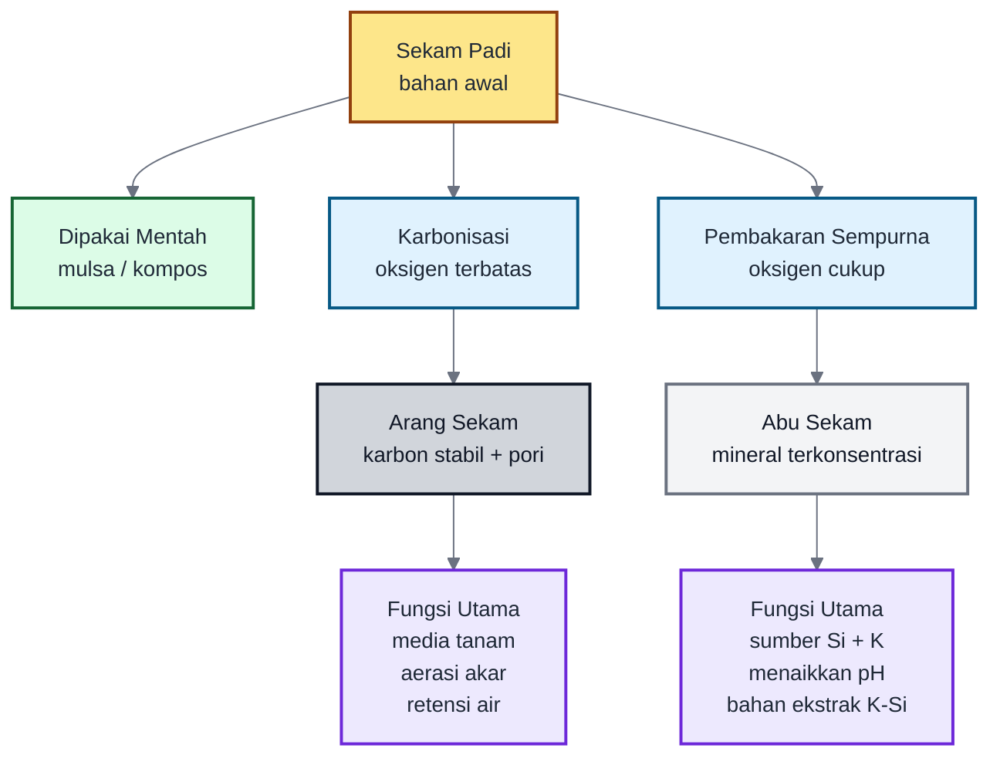
```mermaid
%%{init: {"theme": "base", "themeVariables": {
  "fontFamily": "Arial",
  "fontSize": "14px",
  "primaryColor": "#f8fafc",
  "primaryTextColor": "#1f2937",
  "lineColor": "#6b7280"
}}}%%
flowchart TD
    A["Sekam Padi<br/>bahan awal"]:::sekam

    A --> B["Dipakai Mentah<br/>mulsa / kompos"]:::mentah
    A --> C["Karbonisasi<br/>oksigen terbatas"]:::proses
    A --> D["Pembakaran Sempurna<br/>oksigen cukup"]:::proses

    C --> E["Arang Sekam<br/>karbon stabil + pori"]:::arang
    D --> F["Abu Sekam<br/>mineral terkonsentrasi"]:::abu

    E --> G["Fungsi Utama<br/>media tanam<br/>aerasi akar<br/>retensi air"]:::fungsi
    F --> H["Fungsi Utama<br/>sumber Si + K<br/>menaikkan pH<br/>bahan ekstrak K-Si"]:::fungsi

    classDef sekam fill:#FDE68A,stroke:#92400E,stroke-width:2px,color:#1F2937;
    classDef mentah fill:#DCFCE7,stroke:#166534,stroke-width:2px,color:#1F2937;
    classDef proses fill:#E0F2FE,stroke:#075985,stroke-width:2px,color:#1F2937;
    classDef arang fill:#D1D5DB,stroke:#111827,stroke-width:2px,color:#111827;
    classDef abu fill:#F3F4F6,stroke:#6B7280,stroke-width:2px,color:#111827;
    classDef fungsi fill:#EDE9FE,stroke:#6D28D9,stroke-width:2px,color:#1F2937;
```

[**Kembali ke Atas**](#dari-sekam-padi-ke-booster-ksi-pemanfaatan-arang-sekam-abu-sekam-dan-ekstrak-koh-untuk-budidaya-cabai)

---

# 2. Sekam Padi, Arang Sekam, dan Abu Sekam: Apa Bedanya?

Sekam padi, arang sekam, dan abu sekam berasal dari bahan yang sama. Namun proses yang berbeda menghasilkan bahan akhir dengan fungsi yang berbeda pula.

Perbedaan paling mendasar terletak pada **tingkat pembakaran dan jumlah oksigen**.

Sekam padi mentah belum mengalami pembakaran. Arang sekam dibuat melalui proses pemanasan dengan oksigen terbatas. Abu sekam terbentuk ketika sekam terbakar lebih sempurna dengan oksigen cukup.

Perbedaan proses ini menentukan apakah bahan akhirnya masih dominan sebagai bahan organik, berubah menjadi karbon stabil, atau tinggal menyisakan mineral.

| Bahan           | Proses                       | Kandungan dominan                       | Fungsi utama                                     |
| --------------- | ---------------------------- | --------------------------------------- | ------------------------------------------------ |
| **Sekam padi**  | Belum dibakar                | Serat organik, lignin, selulosa, silika | Mulsa, kompos, bahan baku                        |
| **Arang sekam** | Karbonisasi oksigen terbatas | Karbon stabil + mineral                 | Media tanam, aerasi, retensi air                 |
| **Abu sekam**   | Pembakaran sempurna          | Mineral terkonsentrasi, terutama silika | Sumber mineral, menaikkan pH, bahan ekstrak K–Si |

## 2.1 Sekam padi mentah

Sekam padi mentah masih berupa kulit gabah yang belum diproses. Bahan ini ringan, keras, dan sulit terurai karena mengandung serat, lignin, selulosa, serta silika.

Dalam budidaya tanaman, sekam mentah lebih cocok digunakan sebagai:

- mulsa permukaan,
- bahan campuran kompos,
- bahan alas ternak,
- bahan baku pembuatan arang sekam atau abu sekam.

Sekam mentah kurang ideal jika dijadikan media tanam utama, terutama untuk pembibitan atau polybag intensif. Penyebabnya adalah sekam mentah masih dapat membawa mikroba liar, mudah menjadi tempat jamur bila lembap, dan proses pelapukannya dapat mengikat nitrogen sementara.

Jadi, sekam mentah lebih tepat diposisikan sebagai **bahan awal**, bukan bahan media utama yang sudah siap pakai untuk budidaya intensif.

---

## 2.2 Arang sekam

Arang sekam adalah hasil pemanasan sekam dengan oksigen terbatas. Proses ini disebut karbonisasi atau pirolisis sederhana.

Pada proses ini, sekam tidak dibakar sampai habis. Sebagian besar struktur karbonnya masih tersisa, tetapi bahan menjadi lebih stabil, lebih ringan, dan lebih berpori.

Arang sekam memiliki nilai utama pada sifat fisiknya:

- memperbaiki aerasi media,
- membantu drainase,
- menjaga kelembapan tanpa membuat media terlalu becek,
- menyediakan ruang pori untuk akar dan mikroba,
- membuat media lebih ringan.

Karena itu, arang sekam sangat berguna untuk media tanam cabai, tomat, melon, sayuran daun, tanaman hias, pembibitan, dan sistem polybag.

Namun arang sekam bukan pupuk utama. Kandungan haranya tidak cukup untuk memenuhi kebutuhan tanaman secara penuh. Arang sekam lebih tepat disebut sebagai **pembenah media**.

> **Prinsip praktis:**
> Gunakan arang sekam untuk memperbaiki rumah akar, bukan sebagai sumber hara utama.

---

## 2.3 Abu sekam

Abu sekam adalah hasil pembakaran sekam secara lebih sempurna. Pada tahap ini, sebagian besar karbon dan bahan organik sudah hilang sebagai gas, asap, dan panas. Yang tertinggal terutama adalah mineral.

Karena bahan organiknya hilang, mineral yang awalnya tersebar dalam sekam menjadi lebih terkonsentrasi di dalam abu.

Inilah alasan abu sekam tampak “lebih mineral” dibanding sekam mentah. Bukan karena pembakaran menciptakan mineral baru, tetapi karena bagian organik hilang sehingga persentase mineral meningkat.

Secara sederhana:

```text
100 kg sekam padi
= bahan organik + air + mineral

setelah pembakaran sempurna:

bahan organik + air → hilang sebagai gas/asap/uap
mineral → tertinggal sebagai abu
```

Abu sekam banyak dilaporkan mengandung silika tinggi. Salah satu analisis menunjukkan abu sekam mengandung sekitar **80,26% silika**, disertai unsur P, K, Mg, dan Ca dalam jumlah lebih kecil [1].

Karena itu, abu sekam menarik digunakan sebagai:

- sumber mineral alkalis,
- sumber silika,
- sumber sebagian kalium,
- bahan untuk menaikkan pH tanah masam,
- bahan dasar ekstrak K–Si dengan bantuan KOH.

Namun abu sekam tidak cocok dijadikan media utama. Jika digunakan terlalu banyak, abu dapat menaikkan pH secara berlebihan, meningkatkan garam terlarut, dan mengganggu akar muda.

> **Prinsip praktis:**
> Gunakan abu sekam sebagai aditif mineral dosis kecil, bukan sebagai pengganti media tanam.

---

## 2.4 Perbedaan fungsi secara praktis

Agar mudah dipahami oleh praktisi, perbedaan ketiganya dapat diringkas seperti ini:

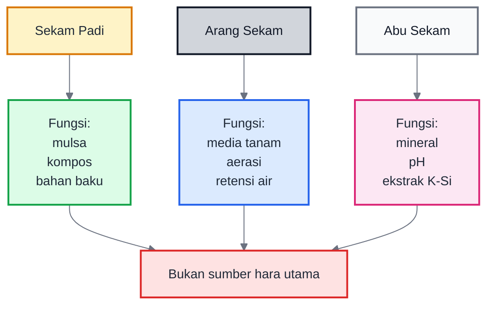
```mermaid
%%{init: {"theme": "base", "themeVariables": {
  "fontFamily": "Arial",
  "fontSize": "14px",
  "primaryColor": "#ffffff",
  "primaryTextColor": "#1f2937",
  "lineColor": "#6b7280"
}}}%%
flowchart TD
    A["Sekam Padi"]:::sekam
    B["Arang Sekam"]:::arang
    C["Abu Sekam"]:::abu

    A --> A1["Fungsi:<br/>mulsa<br/>kompos<br/>bahan baku"]:::fungsiA
    B --> B1["Fungsi:<br/>media tanam<br/>aerasi<br/>retensi air"]:::fungsiB
    C --> C1["Fungsi:<br/>mineral<br/>pH<br/>ekstrak K-Si"]:::fungsiC

    A1 --> D["Bukan sumber hara utama"]:::catatan
    B1 --> D
    C1 --> D

    classDef sekam fill:#FEF3C7,stroke:#D97706,stroke-width:2px,color:#1F2937;
    classDef arang fill:#D1D5DB,stroke:#111827,stroke-width:2px,color:#111827;
    classDef abu fill:#F9FAFB,stroke:#6B7280,stroke-width:2px,color:#111827;
    classDef fungsiA fill:#DCFCE7,stroke:#16A34A,stroke-width:2px,color:#1F2937;
    classDef fungsiB fill:#DBEAFE,stroke:#2563EB,stroke-width:2px,color:#1F2937;
    classDef fungsiC fill:#FCE7F3,stroke:#DB2777,stroke-width:2px,color:#1F2937;
    classDef catatan fill:#FEE2E2,stroke:#DC2626,stroke-width:2px,color:#1F2937;
```

---

## 2.5 Poin kritis yang harus diingat

Ada tiga poin penting yang perlu menjadi dasar pembahasan berikutnya.

Pertama, **abu sekam tidak memiliki mineral baru**. Mineral yang ada di abu berasal dari mineral yang memang sudah ada dalam sekam. Pembakaran hanya menghilangkan bagian organik sehingga mineral menjadi lebih pekat.

Kedua, **arang sekam dan abu sekam tidak bisa saling menggantikan secara penuh**. Arang sekam unggul pada fungsi fisik media, sedangkan abu sekam unggul pada fungsi kimia-mineral.

Ketiga, **silika dalam abu sekam tidak otomatis seluruhnya tersedia bagi tanaman**. Tanaman menyerap silikon terutama dalam bentuk terlarut, sedangkan sebagian besar silika dalam abu masih berada dalam bentuk padat. Karena itu, diperlukan pendekatan ekstraksi jika tujuan utamanya adalah menyediakan Si dalam bentuk yang lebih mudah dimanfaatkan tanaman.

Bagian berikutnya akan membahas proses pembuatan arang sekam dan abu sekam, karena kualitas proses sangat menentukan kualitas bahan akhir.

---

## Referensi

[1] Pertanika. Analisis komposisi abu sekam padi yang menunjukkan kandungan silika sekitar 80,26% disertai P, K, Mg, dan Ca dalam jumlah lebih kecil.

[**Kembali ke Atas**](#dari-sekam-padi-ke-booster-ksi-pemanfaatan-arang-sekam-abu-sekam-dan-ekstrak-koh-untuk-budidaya-cabai)

---

# 3. Proses Pembuatan: Arang Sekam vs Abu Sekam

Perbedaan utama antara **arang sekam** dan **abu sekam** terletak pada cara sekam dipanaskan dan jumlah oksigen yang tersedia selama proses berlangsung.

Secara sederhana:

```text
Arang sekam = sekam dipanaskan dengan oksigen terbatas
Abu sekam   = sekam dibakar dengan oksigen cukup sampai karbon habis
```

Keduanya sama-sama berasal dari sekam padi, tetapi hasil akhirnya sangat berbeda. Arang sekam masih menyimpan karbon stabil dan struktur berpori, sedangkan abu sekam hampir kehilangan seluruh karbonnya dan menyisakan mineral terkonsentrasi.

---

# 3.1 Arang Sekam

## Prinsip proses

Arang sekam dibuat melalui proses **karbonisasi**, yaitu pemanasan sekam pada kondisi oksigen terbatas.

```text
Sekam + panas + oksigen terbatas → arang sekam
```

Tujuan proses ini bukan membakar sekam sampai habis, tetapi mengubah sekam menjadi bahan hitam berpori yang masih menyimpan karbon.

Dalam praktik lapang, arang sekam biasanya dibuat dengan metode cerobong atau drum berlubang. Api ditempatkan di bagian tengah, sedangkan sekam ditumpuk di sekeliling sumber panas. Sekam tidak dibakar langsung dengan nyala api besar, melainkan dipanaskan sampai mengalami karbonisasi.

## Alur proses pembuatan arang sekam

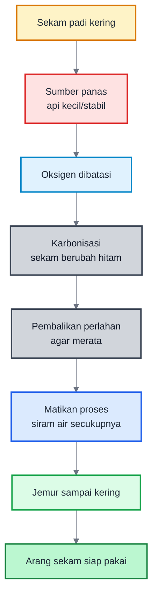
```mermaid
%%{init: {"theme": "base", "themeVariables": {
  "fontFamily": "Arial",
  "fontSize": "14px",
  "primaryTextColor": "#1f2937",
  "lineColor": "#6b7280"
}}}%%
flowchart TD
    A["Sekam padi kering"]:::sekam
    B["Sumber panas<br/>api kecil/stabil"]:::api
    C["Oksigen dibatasi"]:::kontrol
    D["Karbonisasi<br/>sekam berubah hitam"]:::proses
    E["Pembalikan perlahan<br/>agar merata"]:::proses
    F["Matikan proses<br/>siram air secukupnya"]:::pendinginan
    G["Jemur sampai kering"]:::kering
    H["Arang sekam siap pakai"]:::hasil

    A --> B --> C --> D --> E --> F --> G --> H

    classDef sekam fill:#FEF3C7,stroke:#D97706,stroke-width:2px,color:#1F2937;
    classDef api fill:#FEE2E2,stroke:#DC2626,stroke-width:2px,color:#1F2937;
    classDef kontrol fill:#E0F2FE,stroke:#0284C7,stroke-width:2px,color:#1F2937;
    classDef proses fill:#D1D5DB,stroke:#374151,stroke-width:2px,color:#111827;
    classDef pendinginan fill:#DBEAFE,stroke:#2563EB,stroke-width:2px,color:#1F2937;
    classDef kering fill:#DCFCE7,stroke:#16A34A,stroke-width:2px,color:#1F2937;
    classDef hasil fill:#BBF7D0,stroke:#15803D,stroke-width:2px,color:#1F2937;
```

## Cara kerja metode cerobong atau drum berlubang

Pada metode sederhana, drum atau cerobong berlubang diletakkan di tengah tumpukan sekam. Bagian bawah drum terbuka untuk masuknya udara, bagian atas terbuka untuk keluarnya gas panas dan asap, sedangkan dinding drum berlubang untuk menyalurkan panas ke sekam di sekitarnya.

Prinsipnya:

```text
Api di tengah → panas menyebar ke sekam → sekam menghitam → proses dihentikan sebelum jadi abu
```

Yang perlu dikontrol adalah **oksigen**. Jika oksigen terlalu banyak dan api terlalu besar, sekam akan terbakar habis menjadi abu putih. Jika oksigen terlalu sedikit, proses menjadi lambat dan sekam tidak matang merata.

## Zona proses pada pembuatan arang sekam

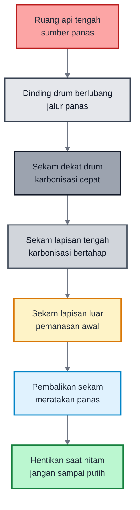
```mermaid
%%{init: {"theme": "base", "themeVariables": {
  "fontFamily": "Arial",
  "fontSize": "14px",
  "primaryTextColor": "#1f2937",
  "lineColor": "#6b7280"
}}}%%
flowchart TD
    A["Ruang api tengah<br/>sumber panas"]:::api
    B["Dinding drum berlubang<br/>jalur panas"]:::drum
    C["Sekam dekat drum<br/>karbonisasi cepat"]:::panas
    D["Sekam lapisan tengah<br/>karbonisasi bertahap"]:::sedang
    E["Sekam lapisan luar<br/>pemanasan awal"]:::awal
    F["Pembalikan sekam<br/>meratakan panas"]:::kontrol
    G["Hentikan saat hitam<br/>jangan sampai putih"]:::hasil

    A --> B --> C --> D --> E --> F --> G

    classDef api fill:#FCA5A5,stroke:#B91C1C,stroke-width:2px,color:#1F2937;
    classDef drum fill:#E5E7EB,stroke:#374151,stroke-width:2px,color:#111827;
    classDef panas fill:#9CA3AF,stroke:#111827,stroke-width:2px,color:#111827;
    classDef sedang fill:#D1D5DB,stroke:#4B5563,stroke-width:2px,color:#111827;
    classDef awal fill:#FEF3C7,stroke:#D97706,stroke-width:2px,color:#1F2937;
    classDef kontrol fill:#E0F2FE,stroke:#0284C7,stroke-width:2px,color:#1F2937;
    classDef hasil fill:#BBF7D0,stroke:#15803D,stroke-width:2px,color:#1F2937;
```

## Ciri hasil arang sekam yang baik

Arang sekam yang baik memiliki ciri sebagai berikut:

- hitam merata,
- ringan,
- berpori,
- tidak dominan abu putih,
- tidak masih menyala,
- tidak terlalu basah saat disimpan,
- tidak menggumpal keras.

Warna hitam menunjukkan sekam sudah mengalami karbonisasi. Sebaliknya, warna putih atau abu-abu muda menunjukkan sekam sudah terlalu jauh terbakar dan berubah menjadi abu.

Perbedaan warna ini penting.

```text
Hitam      = arang sekam
Abu putih  = abu sekam
Cokelat    = sekam belum matang
```

## Kesalahan umum saat membuat arang sekam

Beberapa kesalahan yang sering terjadi:

1. **Api terlalu besar**

   Sekam cepat berubah menjadi abu, bukan arang.

2. **Sekam tidak dibalik**

   Bagian dekat sumber panas matang, sedangkan bagian luar masih mentah.

3. **Terlambat memadamkan proses**

   Arang yang sudah jadi terus terbakar dan berubah menjadi abu.

4. **Disimpan saat masih panas**

   Arang bisa menyala kembali dan menimbulkan risiko kebakaran.

5. **Terlalu banyak disiram air**

   Arang menjadi terlalu basah, menggumpal, dan sulit disimpan.

## Fungsi agronomis arang sekam

Nilai utama arang sekam bukan pada kandungan haranya, tetapi pada sifat fisik dan biologisnya sebagai media tanam.

Arang sekam bermanfaat untuk:

- memperbaiki aerasi akar,
- membantu retensi air,
- membantu retensi hara,
- membuat media lebih ringan,
- mengurangi kepadatan media,
- menjadi ruang hidup mikroba,
- memperbaiki drainase,
- mengurangi risiko media terlalu becek.

Karena itu, arang sekam sangat cocok digunakan untuk:

```text
Media pot
Polybag
Persemaian
Greenhouse
Hidroponik substrat
Campuran kompos matang
Tanah berat/liat
```

Namun arang sekam tetap bukan pupuk lengkap. Tanaman tetap memerlukan sumber hara seperti nitrogen, fosfor, kalium, kalsium, magnesium, sulfur, dan unsur mikro.

> **Kesimpulan praktis:**
> Arang sekam adalah bahan untuk memperbaiki lingkungan akar. Gunakan arang sekam untuk membuat media lebih gembur, porous, dan stabil.

---

# 3.2 Abu Sekam

## Prinsip proses

Abu sekam dibuat melalui proses pembakaran sempurna. Pada proses ini, sekam dibakar dengan oksigen cukup sampai sebagian besar karbon dan bahan organik habis.

```text
Sekam + api + oksigen cukup → abu sekam
```

Jika pada arang sekam proses dihentikan saat sekam berwarna hitam, maka pada abu sekam proses dibiarkan berlanjut sampai bahan berubah menjadi abu-abu muda atau putih.

Secara kimia sederhana:

```text
Bahan organik + oksigen → CO₂ + H₂O + panas
Mineral → tertinggal sebagai abu
```

Itulah sebabnya abu sekam bersifat lebih mineral dibanding sekam mentah atau arang sekam. Bukan karena mineral baru terbentuk, tetapi karena karbon, air, dan senyawa organik hilang selama pembakaran.

## Alur proses pembuatan abu sekam

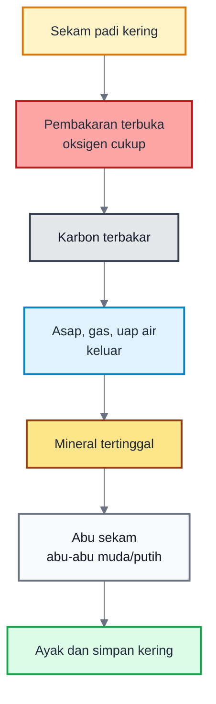
```mermaid
%%{init: {"theme": "base", "themeVariables": {
  "fontFamily": "Arial",
  "fontSize": "14px",
  "primaryTextColor": "#1f2937",
  "lineColor": "#6b7280"
}}}%%
flowchart TD
    A["Sekam padi kering"]:::sekam
    B["Pembakaran terbuka<br/>oksigen cukup"]:::api
    C["Karbon terbakar"]:::karbon
    D["Asap, gas, uap air<br/>keluar"]:::gas
    E["Mineral tertinggal"]:::mineral
    F["Abu sekam<br/>abu-abu muda/putih"]:::abu
    G["Ayak dan simpan kering"]:::simpan

    A --> B --> C --> D --> E --> F --> G

    classDef sekam fill:#FEF3C7,stroke:#D97706,stroke-width:2px,color:#1F2937;
    classDef api fill:#FCA5A5,stroke:#B91C1C,stroke-width:2px,color:#1F2937;
    classDef karbon fill:#E5E7EB,stroke:#374151,stroke-width:2px,color:#111827;
    classDef gas fill:#E0F2FE,stroke:#0284C7,stroke-width:2px,color:#1F2937;
    classDef mineral fill:#FDE68A,stroke:#92400E,stroke-width:2px,color:#1F2937;
    classDef abu fill:#F9FAFB,stroke:#6B7280,stroke-width:2px,color:#111827;
    classDef simpan fill:#DCFCE7,stroke:#16A34A,stroke-width:2px,color:#1F2937;
```

## Ciri hasil abu sekam

Abu sekam yang baik untuk bahan ekstrak mineral sebaiknya memiliki ciri:

- berwarna abu-abu muda sampai putih,
- kering,
- halus,
- tidak bercampur plastik, oli, logam, atau sampah lain,
- tidak mengandung arang hitam terlalu banyak,
- tidak menggumpal akibat lembap.

Warna abu-abu muda sampai putih menunjukkan bahwa pembakaran sudah lebih sempurna. Namun pembakaran yang terlalu ekstrem juga perlu dihindari karena suhu sangat tinggi dapat mengubah sifat reaktivitas silika.

Untuk kebutuhan pertanian, abu yang baik adalah abu yang **bersih, kering, dan berasal dari sekam padi murni**.

## Apa yang terjadi selama sekam menjadi abu?

Saat sekam dibakar sempurna, bagian organik habis sebagai gas dan panas, sedangkan mineral tertinggal.

Secara sederhana:

```text
Sekam padi
= karbon organik + air + mineral

Pembakaran sempurna
= karbon organik hilang
= air menguap
= mineral tertinggal sebagai abu
```

Mineral yang tertinggal antara lain:

```text
Si
K
Ca
Mg
P
Na
Fe
Mn
Zn
Cu
unsur mineral lain dalam jumlah kecil
```

Di antara mineral tersebut, komponen terbesar abu sekam umumnya adalah **silika**. Kalium, kalsium, magnesium, dan fosfor ada dalam jumlah lebih kecil, tetapi tetap penting dalam konteks nutrisi tanaman.

## Mengapa abu sekam bersifat basa?

Abu sekam cenderung bersifat basa karena mengandung senyawa mineral seperti oksida, karbonat, dan hidroksida.

Contoh bentuk mineral basa:

```text
K₂O
CaO
MgO
K₂CO₃
CaCO₃
MgCO₃
KOH
Ca(OH)₂
```

Saat terkena air, sebagian senyawa ini dapat menghasilkan ion hidroksida.

Contoh sederhana:

```text
K₂O + H₂O → 2KOH
KOH → K⁺ + OH⁻
```

Ion **OH⁻** inilah yang dapat menaikkan pH.

Karena itu, abu sekam dapat membantu tanah atau media yang terlalu asam. Namun jika digunakan berlebihan, pH bisa naik terlalu tinggi dan justru mengganggu penyerapan unsur mikro seperti Fe, Mn, Zn, dan Cu.

## Fungsi agronomis abu sekam

Abu sekam memiliki fungsi agronomis yang berbeda dari arang sekam.

Jika arang sekam berperan pada **struktur media**, maka abu sekam berperan pada **kimia media**.

Abu sekam bermanfaat sebagai:

- sumber silika total tinggi,
- sumber sebagian kalium,
- sumber sebagian kalsium,
- sumber sebagian magnesium,
- sumber sedikit fosfor,
- bahan untuk menaikkan pH tanah atau media masam,
- bahan dasar ekstrak mineral cair,
- bahan dasar ekstrak K–Si dengan bantuan KOH.

Namun abu sekam tidak boleh diperlakukan seperti media tanam utama. Abu terlalu halus dan terlalu aktif secara kimia jika digunakan berlebihan.

## Risiko penggunaan abu sekam berlebihan

Penggunaan abu sekam terlalu banyak dapat menyebabkan:

1. **pH media naik terlalu tinggi**

   Tanaman cabai umumnya tidak menyukai media yang terlalu basa. Jika pH terlalu tinggi, unsur mikro bisa sulit tersedia.

2. **EC atau garam terlarut meningkat**

   Abu mengandung mineral larut. Jika terlalu pekat, akar bisa stres.

3. **Media menjadi terlalu halus**

   Abu yang terlalu banyak dapat mengisi pori media dan mengganggu aerasi.

4. **Ketidakseimbangan hara**

   Kalium yang terlalu tinggi dapat mengganggu keseimbangan kalsium dan magnesium.

5. **Akar muda sensitif**

   Bibit dan tanaman muda lebih mudah terganggu oleh larutan atau media yang terlalu basa.

Karena itu, abu sekam lebih aman digunakan sebagai **aditif kecil** atau diolah menjadi **ekstrak cair terukur**, bukan ditabur dalam jumlah besar tanpa kontrol.

---

# 3.3 Perbedaan Kunci: Arang Sekam vs Abu Sekam

Perbedaan paling tajam antara arang sekam dan abu sekam dapat dilihat dari proses, warna, komposisi, dan fungsi.

| Aspek                    | Arang sekam                            | Abu sekam                     |
| ------------------------ | -------------------------------------- | ----------------------------- |
| Proses                   | Karbonisasi                            | Pembakaran sempurna           |
| Oksigen                  | Terbatas                               | Cukup/berlebih                |
| Warna                    | Hitam                                  | Abu-abu muda sampai putih     |
| Karbon                   | Masih tinggi                           | Hampir habis                  |
| Mineral                  | Ada, tetapi tidak terkonsentrasi penuh | Lebih terkonsentrasi          |
| Fungsi utama             | Media/pembenah fisik                   | Sumber mineral/pembenah kimia |
| Pengaruh pH              | Ringan sampai sedang                   | Lebih kuat menaikkan pH       |
| Cocok untuk bibit        | Ya, sebagai media campuran             | Hati-hati, dosis sangat kecil |
| Cocok untuk ekstrak K–Si | Kurang efisien                         | Lebih efisien                 |

## Diagram keputusan praktis

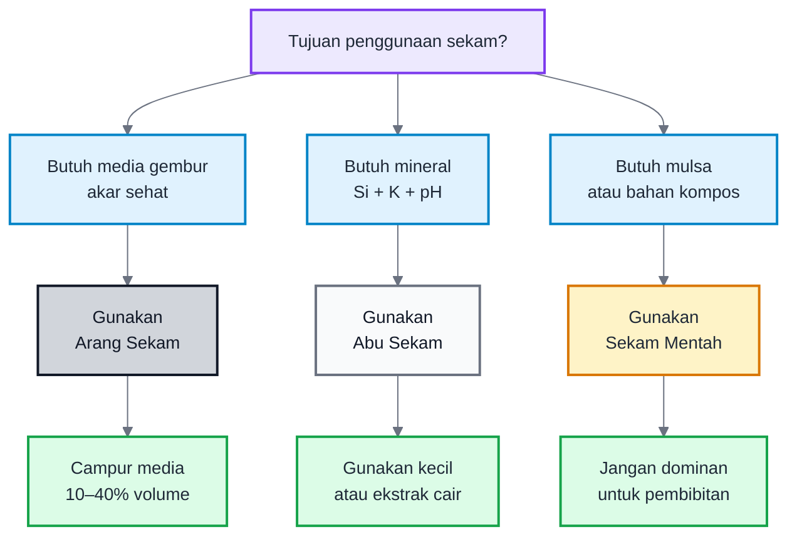
```mermaid
%%{init: {"theme": "base", "themeVariables": {
  "fontFamily": "Arial",
  "fontSize": "14px",
  "primaryTextColor": "#1f2937",
  "lineColor": "#6b7280"
}}}%%
flowchart TD
    A["Tujuan penggunaan sekam?"]:::tanya

    A --> B["Butuh media gembur<br/>akar sehat"]:::pilihan
    A --> C["Butuh mineral<br/>Si + K + pH"]:::pilihan
    A --> D["Butuh mulsa<br/>atau bahan kompos"]:::pilihan

    B --> E["Gunakan<br/>Arang Sekam"]:::arang
    C --> F["Gunakan<br/>Abu Sekam"]:::abu
    D --> G["Gunakan<br/>Sekam Mentah"]:::sekam

    E --> H["Campur media<br/>10–40% volume"]:::catatan
    F --> I["Gunakan kecil<br/>atau ekstrak cair"]:::catatan
    G --> J["Jangan dominan<br/>untuk pembibitan"]:::catatan

    classDef tanya fill:#EDE9FE,stroke:#7C3AED,stroke-width:2px,color:#1F2937;
    classDef pilihan fill:#E0F2FE,stroke:#0284C7,stroke-width:2px,color:#1F2937;
    classDef arang fill:#D1D5DB,stroke:#111827,stroke-width:2px,color:#111827;
    classDef abu fill:#F9FAFB,stroke:#6B7280,stroke-width:2px,color:#111827;
    classDef sekam fill:#FEF3C7,stroke:#D97706,stroke-width:2px,color:#1F2937;
    classDef catatan fill:#DCFCE7,stroke:#16A34A,stroke-width:2px,color:#1F2937;
```

---

## 3.4 Kesimpulan Bab 3

Arang sekam dan abu sekam sama-sama berasal dari sekam padi, tetapi berbeda proses dan berbeda fungsi.

```text
Arang sekam:
sekam dipanaskan dengan oksigen terbatas
hasil hitam
masih kaya karbon
fungsi utama sebagai media dan pembenah fisik

Abu sekam:
sekam dibakar dengan oksigen cukup
hasil abu-abu/putih
karbon hampir habis
fungsi utama sebagai sumber mineral dan pembenah kimia
```

Untuk budidaya cabai, keduanya dapat digunakan, tetapi dengan peran berbeda.

**Arang sekam** lebih cocok masuk ke media tanam untuk memperbaiki aerasi dan retensi air.
**Abu sekam** lebih cocok diolah menjadi ekstrak mineral, terutama untuk menyediakan kalium dan silika dalam dosis terukur.

Bab berikutnya akan membahas penggunaan sekam, arang sekam, dan abu sekam secara lebih praktis dalam budidaya tanaman.

Untuk melihat rancangan cerobong arang sekam dengan deflektor tray cincin secara visual, lihat:

[**Lihat Lampiran 6 — Desain Cerobong Arang Sekam Padi dengan Deflektor Tray Cincin**](#lampiran-6--desain-cerobong-arang-sekam-padi-dengan-deflektor-tray-cincin)

[**Kembali ke Atas**](#dari-sekam-padi-ke-booster-ksi-pemanfaatan-arang-sekam-abu-sekam-dan-ekstrak-koh-untuk-budidaya-cabai)

---

# 4. Penggunaan Sekam, Arang Sekam, dan Abu Sekam dalam Budidaya

Setelah memahami perbedaan proses pembuatannya, langkah berikutnya adalah menentukan **bahan mana yang digunakan untuk tujuan apa**.

Kesalahan umum di lapangan adalah memakai semua bahan berbasis sekam dengan cara yang sama. Padahal, **sekam mentah, arang sekam, dan abu sekam memiliki fungsi agronomis berbeda**.

Secara praktis:

```text
Sekam mentah  = bahan organik kasar
Arang sekam   = pembenah fisik-biologis media
Abu sekam     = pembenah kimia-mineral
```

Diagram ringkasnya sebagai berikut.

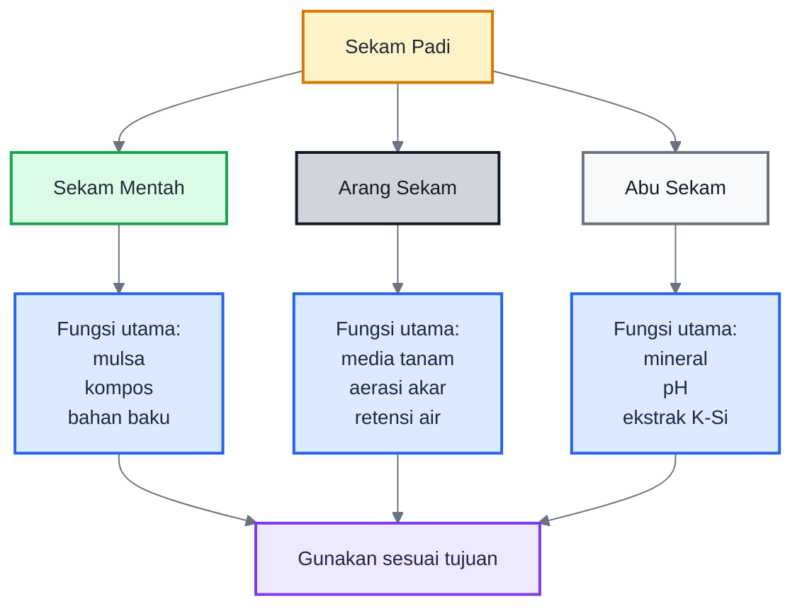
```mermaid
%%{init: {"theme": "base", "themeVariables": {
  "fontFamily": "Arial",
  "fontSize": "14px",
  "primaryTextColor": "#1f2937",
  "lineColor": "#6b7280"
}}}%%
flowchart TD
    A["Sekam Padi"]:::sekam

    A --> B["Sekam Mentah"]:::mentah
    A --> C["Arang Sekam"]:::arang
    A --> D["Abu Sekam"]:::abu

    B --> B1["Fungsi utama:<br/>mulsa<br/>kompos<br/>bahan baku"]:::fungsi
    C --> C1["Fungsi utama:<br/>media tanam<br/>aerasi akar<br/>retensi air"]:::fungsi
    D --> D1["Fungsi utama:<br/>mineral<br/>pH<br/>ekstrak K-Si"]:::fungsi

    B1 --> E["Gunakan sesuai tujuan"]:::catatan
    C1 --> E
    D1 --> E

    classDef sekam fill:#FEF3C7,stroke:#D97706,stroke-width:2px,color:#1F2937;
    classDef mentah fill:#DCFCE7,stroke:#16A34A,stroke-width:2px,color:#1F2937;
    classDef arang fill:#D1D5DB,stroke:#111827,stroke-width:2px,color:#111827;
    classDef abu fill:#F9FAFB,stroke:#6B7280,stroke-width:2px,color:#111827;
    classDef fungsi fill:#DBEAFE,stroke:#2563EB,stroke-width:2px,color:#1F2937;
    classDef catatan fill:#EDE9FE,stroke:#7C3AED,stroke-width:2px,color:#1F2937;
```

---

# 4.1 Sekam Padi Mentah

Sekam padi mentah adalah kulit gabah yang belum mengalami pembakaran. Bahan ini ringan, murah, mudah didapat, dan memiliki struktur keras. Karena sifatnya kasar dan sulit terurai, sekam mentah lebih tepat dipakai sebagai **bahan pendukung**, bukan sebagai media utama untuk budidaya intensif.

## Cocok untuk

Sekam padi mentah cocok digunakan sebagai:

- mulsa,
- bahan kompos,
- alas ternak,
- bahan baku arang sekam,
- bahan baku abu sekam.

Sebagai mulsa, sekam mentah dapat membantu menutup permukaan tanah, mengurangi penguapan air, mengurangi percikan tanah saat hujan, dan menjaga suhu permukaan tanah lebih stabil.

Sebagai bahan kompos, sekam mentah berfungsi sebagai sumber karbon dan bahan pembentuk struktur. Namun karena sulit terurai, sekam sebaiknya dicampur dengan bahan kaya nitrogen seperti kotoran ternak, hijauan, limbah sayur, atau aktivator mikroba.

## Kurang cocok untuk

Sekam padi mentah kurang cocok digunakan sebagai:

- media utama pembibitan,
- media utama polybag intensif,
- media tunggal untuk cabai, tomat, melon, atau sayuran daun.

Alasannya, sekam mentah belum stabil sebagai media akar. Pada kondisi lembap, sekam mentah bisa menjadi tempat berkembangnya jamur atau mikroba liar. Selain itu, proses pelapukan sekam dapat menyebabkan nitrogen di media sementara digunakan oleh mikroba pengurai.

## Alasan agronomis

Ada tiga alasan utama mengapa sekam mentah tidak ideal sebagai media utama.

Pertama, **sekam sulit terurai**. Kandungan lignin, selulosa, dan silika membuat sekam membutuhkan waktu lama untuk mengalami dekomposisi.

Kedua, **sekam dapat mengikat nitrogen sementara**. Saat mikroba mulai menguraikan sekam, mikroba membutuhkan nitrogen. Akibatnya, sebagian nitrogen yang seharusnya tersedia bagi tanaman bisa dipakai oleh mikroba terlebih dahulu.

Ketiga, **hara tersedia rendah**. Sekam mentah lebih berfungsi sebagai bahan struktur, bukan sebagai sumber hara utama.

Secara praktis:

```text
Sekam mentah = bagus sebagai mulsa dan bahan kompos
Sekam mentah ≠ media utama pembibitan intensif
```

---

# 4.2 Arang Sekam

Arang sekam adalah hasil karbonisasi sekam dengan oksigen terbatas. Bahan ini berwarna hitam, ringan, berpori, dan relatif stabil. Dalam budidaya tanaman, arang sekam jauh lebih aman dan lebih bermanfaat sebagai campuran media dibanding sekam mentah.

## Cocok untuk

Arang sekam cocok digunakan untuk:

- pembibitan,
- media tanam cabai,
- media tanam tomat,
- media tanam melon,
- media sayuran daun,
- campuran kompos,
- tanah berat atau tanah liat,
- hidroponik substrat,
- media greenhouse,
- media polybag.

Nilai utama arang sekam adalah pada sifat fisiknya. Arang sekam membuat media lebih porous, tidak terlalu padat, dan membantu akar mendapatkan oksigen.

Akar tanaman tidak hanya membutuhkan air dan pupuk, tetapi juga udara. Media yang terlalu padat akan menahan air berlebihan, kekurangan oksigen, dan membuat akar mudah rusak. Arang sekam membantu mengurangi masalah tersebut.

## Fungsi fisik-biologis arang sekam

Arang sekam bekerja melalui beberapa cara:

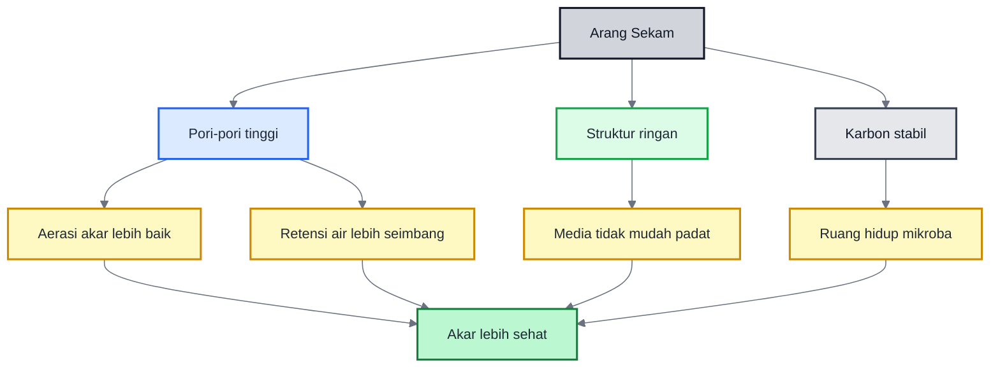
```mermaid
%%{init: {"theme": "base", "themeVariables": {
  "fontFamily": "Arial",
  "fontSize": "14px",
  "primaryTextColor": "#1f2937",
  "lineColor": "#6b7280"
}}}%%
flowchart TD
    A["Arang Sekam"]:::arang
    A --> B["Pori-pori tinggi"]:::biru
    A --> C["Struktur ringan"]:::hijau
    A --> D["Karbon stabil"]:::abu

    B --> E["Aerasi akar lebih baik"]:::fungsi
    B --> F["Retensi air lebih seimbang"]:::fungsi
    C --> G["Media tidak mudah padat"]:::fungsi
    D --> H["Ruang hidup mikroba"]:::fungsi

    E --> I["Akar lebih sehat"]:::hasil
    F --> I
    G --> I
    H --> I

    classDef arang fill:#D1D5DB,stroke:#111827,stroke-width:2px,color:#111827;
    classDef biru fill:#DBEAFE,stroke:#2563EB,stroke-width:2px,color:#1F2937;
    classDef hijau fill:#DCFCE7,stroke:#16A34A,stroke-width:2px,color:#1F2937;
    classDef abu fill:#E5E7EB,stroke:#374151,stroke-width:2px,color:#111827;
    classDef fungsi fill:#FEF9C3,stroke:#CA8A04,stroke-width:2px,color:#1F2937;
    classDef hasil fill:#BBF7D0,stroke:#15803D,stroke-width:2px,color:#1F2937;
```

## Contoh formula media

Untuk media tanam umum, arang sekam dapat dicampur dengan tanah dan kompos.

```text
Tanah : kompos : arang sekam
1     : 1      : 1
```

Formula ini cocok untuk banyak tanaman hortikultura, termasuk cabai, tomat, terong, dan sayuran daun.

Untuk media yang lebih ringan, terutama pada pembibitan atau sistem polybag yang membutuhkan aerasi baik, dapat digunakan formula berikut.

```text
Cocopeat : arang sekam : kompos matang
2        : 1           : 1
```

Formula ini memberi keseimbangan antara retensi air dari cocopeat, aerasi dari arang sekam, dan hara awal dari kompos matang.

## Catatan penggunaan arang sekam

Arang sekam sebaiknya dibasahi sebelum digunakan. Arang sekam yang terlalu kering kadang sulit menyerap air pada awal pemakaian. Setelah dibasahi, arang sekam akan lebih mudah tercampur merata dengan bahan media lain.

Dosis umum arang sekam dalam media:

```text
Pembibitan        : 10–30% dari volume media
Polybag cabai     : 20–40% dari volume media
Media sangat berat: 30–50% dari volume media
```

Namun dosis tinggi harus diimbangi dengan kompos, tanah mineral, atau sumber hara lain agar media tidak terlalu ringan dan miskin nutrisi.

## Pesan utama

> Arang sekam adalah bahan pembenah fisik-biologis media, bukan pupuk utama.

Artinya, arang sekam membantu membuat lingkungan akar lebih baik, tetapi tetap perlu dikombinasikan dengan sumber hara.

---

# 4.3 Abu Sekam

Abu sekam adalah hasil pembakaran sempurna sekam padi. Berbeda dengan arang sekam, abu sekam tidak lagi dominan sebagai bahan karbon. Abu sekam lebih tepat dipahami sebagai **bahan mineral alkalis**.

Nilai utama abu sekam terletak pada kandungan mineralnya, terutama silika, serta sebagian kalium, kalsium, magnesium, fosfor, dan mineral lain dalam jumlah lebih kecil.

## Cocok untuk

Abu sekam cocok digunakan sebagai:

- sumber mineral alkalis,
- sumber silika,
- sumber tambahan kalium,
- pembenah tanah masam,
- bahan ekstrak cair K–Si,
- campuran kecil dalam kompos atau pupuk organik padat.

Dalam konteks artikel ini, fungsi abu sekam yang paling menarik adalah sebagai bahan baku **ekstrak K–Si**. Dengan bantuan KOH, sebagian silika dalam abu dapat diubah menjadi bentuk silikat yang lebih mudah masuk ke larutan.

## Tidak cocok untuk

Abu sekam tidak cocok digunakan sebagai:

- media utama,
- dosis besar pada bibit,
- komponen dominan media polybag,
- bahan utama media semai,
- bahan untuk media yang sudah alkalis,
- campuran langsung dengan pupuk mikro atau pupuk hayati.

Abu sekam terlalu halus dan terlalu aktif secara kimia jika digunakan berlebihan. Pada dosis tinggi, abu bisa menaikkan pH terlalu kuat, meningkatkan garam terlarut, dan mengganggu akar muda.

## Fungsi kimia abu sekam

Secara praktis, abu sekam bekerja melalui tiga fungsi utama.

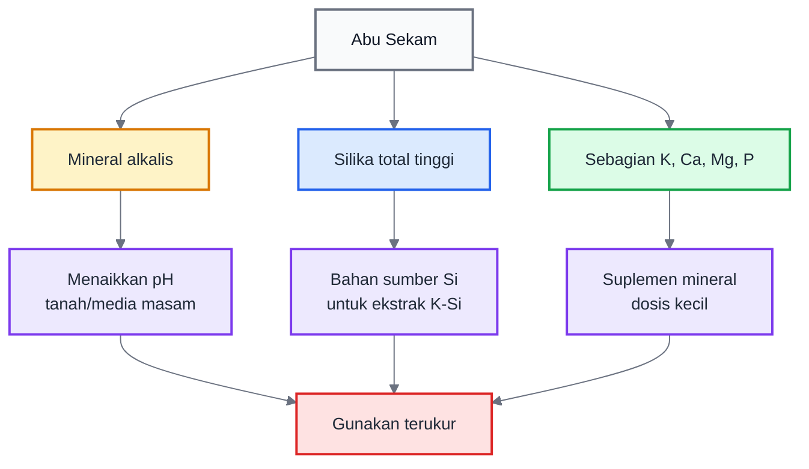
```mermaid
%%{init: {"theme": "base", "themeVariables": {
  "fontFamily": "Arial",
  "fontSize": "14px",
  "primaryTextColor": "#1f2937",
  "lineColor": "#6b7280"
}}}%%
flowchart TD
    A["Abu Sekam"]:::abu

    A --> B["Mineral alkalis"]:::kuning
    A --> C["Silika total tinggi"]:::biru
    A --> D["Sebagian K, Ca, Mg, P"]:::hijau

    B --> E["Menaikkan pH<br/>tanah/media masam"]:::fungsi
    C --> F["Bahan sumber Si<br/>untuk ekstrak K-Si"]:::fungsi
    D --> G["Suplemen mineral<br/>dosis kecil"]:::fungsi

    E --> H["Gunakan terukur"]:::hasil
    F --> H
    G --> H

    classDef abu fill:#F9FAFB,stroke:#6B7280,stroke-width:2px,color:#111827;
    classDef kuning fill:#FEF3C7,stroke:#D97706,stroke-width:2px,color:#1F2937;
    classDef biru fill:#DBEAFE,stroke:#2563EB,stroke-width:2px,color:#1F2937;
    classDef hijau fill:#DCFCE7,stroke:#16A34A,stroke-width:2px,color:#1F2937;
    classDef fungsi fill:#EDE9FE,stroke:#7C3AED,stroke-width:2px,color:#1F2937;
    classDef hasil fill:#FEE2E2,stroke:#DC2626,stroke-width:2px,color:#1F2937;
```

## Dosis prinsip

Untuk media pot atau polybag, abu sekam sebaiknya digunakan sangat rendah.

```text
Abu sekam dalam media:
0,5–2% dari volume media
```

Contoh:

```text
10 liter media tanam
+ 50–200 ml abu sekam
```

Untuk pembibitan, dosis abu harus lebih rendah lagi atau tidak digunakan sama sekali, kecuali sudah dibuat ekstrak sangat encer dan pH/EC larutan aman.

## Pesan utama

> Abu sekam harus dipakai sebagai aditif mineral, bukan sebagai pengganti media tanam.

Dalam artikel ini, abu sekam tidak diarahkan untuk ditabur banyak ke media, tetapi lebih diarahkan sebagai bahan baku ekstrak cair K–Si yang dosisnya lebih mudah dikontrol.

---

## 4.4 Ringkasan Penggunaan Praktis

| Bahan             | Fungsi terbaik                   | Hindari untuk               |
| ----------------- | -------------------------------- | --------------------------- |
| Sekam padi mentah | Mulsa, kompos, bahan baku        | Media utama pembibitan      |
| Arang sekam       | Media tanam, aerasi, retensi air | Pupuk utama                 |
| Abu sekam         | Sumber mineral, pH, ekstrak K–Si | Media utama dan dosis besar |

Ringkasan keputusan:

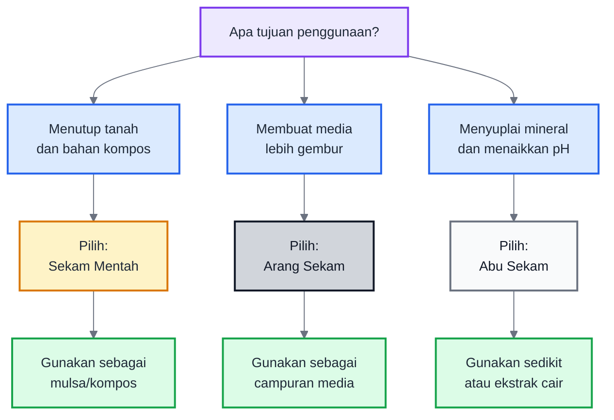
```mermaid
%%{init: {"theme": "base", "themeVariables": {
  "fontFamily": "Arial",
  "fontSize": "14px",
  "primaryTextColor": "#1f2937",
  "lineColor": "#6b7280"
}}}%%
flowchart TD
    A["Apa tujuan penggunaan?"]:::tanya

    A --> B["Menutup tanah<br/>dan bahan kompos"]:::opsi
    A --> C["Membuat media<br/>lebih gembur"]:::opsi
    A --> D["Menyuplai mineral<br/>dan menaikkan pH"]:::opsi

    B --> E["Pilih:<br/>Sekam Mentah"]:::sekam
    C --> F["Pilih:<br/>Arang Sekam"]:::arang
    D --> G["Pilih:<br/>Abu Sekam"]:::abu

    E --> H["Gunakan sebagai<br/>mulsa/kompos"]:::hasil
    F --> I["Gunakan sebagai<br/>campuran media"]:::hasil
    G --> J["Gunakan sedikit<br/>atau ekstrak cair"]:::hasil

    classDef tanya fill:#EDE9FE,stroke:#7C3AED,stroke-width:2px,color:#1F2937;
    classDef opsi fill:#DBEAFE,stroke:#2563EB,stroke-width:2px,color:#1F2937;
    classDef sekam fill:#FEF3C7,stroke:#D97706,stroke-width:2px,color:#1F2937;
    classDef arang fill:#D1D5DB,stroke:#111827,stroke-width:2px,color:#111827;
    classDef abu fill:#F9FAFB,stroke:#6B7280,stroke-width:2px,color:#111827;
    classDef hasil fill:#DCFCE7,stroke:#16A34A,stroke-width:2px,color:#1F2937;
```

[**Kembali ke Atas**](#dari-sekam-padi-ke-booster-ksi-pemanfaatan-arang-sekam-abu-sekam-dan-ekstrak-koh-untuk-budidaya-cabai)

---

# 5. Kenapa Abu Sekam Menaikkan pH?

Abu sekam cenderung menaikkan pH karena mengandung mineral basa. Saat sekam dibakar sempurna, bagian organik seperti karbon, lignin, selulosa, dan senyawa volatil hilang sebagai gas dan panas. Yang tertinggal adalah mineral.

Sebagian mineral dalam abu berada dalam bentuk **oksida, karbonat, dan hidroksida**. Bentuk-bentuk inilah yang menyebabkan abu bersifat alkalis.

## Penjelasan sederhana

Abu mengandung senyawa mineral seperti:

```text
K₂O, CaO, MgO
K₂CO₃, CaCO₃, MgCO₃
KOH, Ca(OH)₂
```

Saat terkena air, sebagian senyawa tersebut menghasilkan kondisi basa.

Contoh reaksi sederhana:

```text
K₂O + H₂O → 2KOH
KOH → K⁺ + OH⁻
```

Ion **OH⁻** menetralkan keasaman:

```text
OH⁻ + H⁺ → H₂O
```

Secara praktis, semakin banyak ion **OH⁻** yang terbentuk, semakin turun jumlah ion **H⁺** bebas di larutan tanah. Karena pH berhubungan dengan konsentrasi H⁺, maka pH naik.

---

## 5.1 Sumber kebasaan dalam abu

Kebasaan abu sekam terutama berasal dari mineral basa seperti kalium, kalsium, magnesium, dan natrium.

Bentuk mineralnya dapat berupa:

| Bentuk senyawa | Contoh              | Efek terhadap pH                   |
| -------------- | ------------------- | ---------------------------------- |
| Oksida         | K₂O, CaO, MgO       | Bereaksi dengan air membentuk basa |
| Hidroksida     | KOH, Ca(OH)₂        | Langsung menghasilkan OH⁻          |
| Karbonat       | K₂CO₃, CaCO₃, MgCO₃ | Menetralkan H⁺ dan menaikkan pH    |

Bentuk oksida dan hidroksida biasanya bereaksi lebih cepat, sedangkan karbonat bekerja lebih bertahap.

---

## 5.2 Reaksi oksida dengan air

Oksida mineral dapat bereaksi dengan air membentuk hidroksida.

Dalam format reaksi:

```text
K₂O + H₂O → 2KOH
CaO + H₂O → Ca(OH)₂
MgO + H₂O → Mg(OH)₂
```

Kemudian hidroksida terurai menghasilkan ion basa.

```text
KOH → K⁺ + OH⁻
Ca(OH)₂ → Ca²⁺ + 2OH⁻
Mg(OH)₂ → Mg²⁺ + 2OH⁻
```

Ion **OH⁻** inilah yang membuat larutan menjadi lebih basa.

---

## 5.3 Reaksi karbonat menetralkan asam

Selain oksida dan hidroksida, abu juga dapat mengandung karbonat. Karbonat juga membantu menaikkan pH karena dapat menetralkan ion asam.

Contoh:

```text
CaCO₃ + 2H⁺ → Ca²⁺ + CO₂ + H₂O
```

Untuk kalium karbonat:

```text
K₂CO₃ + H₂O ⇌ 2K⁺ + HCO₃⁻ + OH⁻
```

Reaksi ini menunjukkan bahwa karbonat dapat menghasilkan kondisi basa dan membantu menurunkan kemasaman.

---

## 5.4 Diagram mekanisme kenaikan pH oleh abu sekam

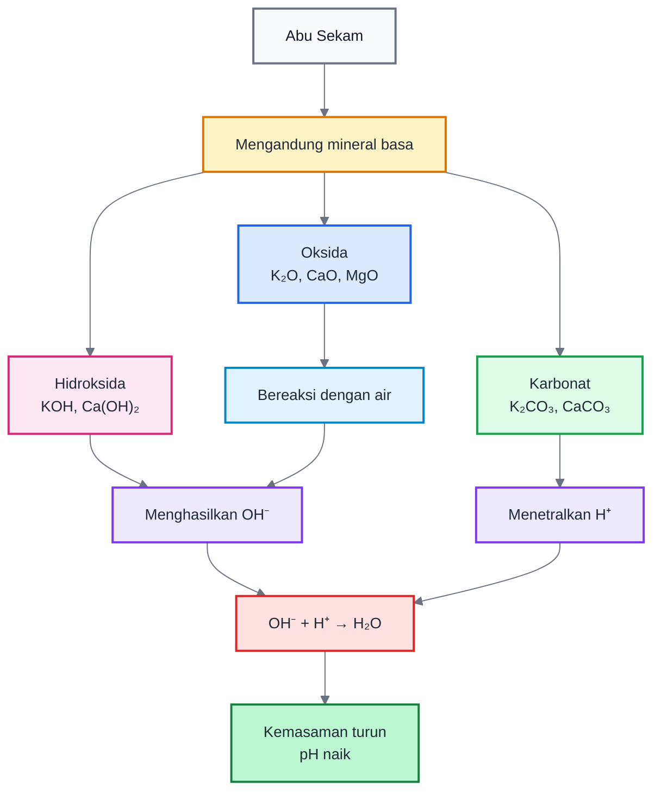
```mermaid
%%{init: {"theme": "base", "themeVariables": {
  "fontFamily": "Arial",
  "fontSize": "14px",
  "primaryTextColor": "#1f2937",
  "lineColor": "#6b7280"
}}}%%
flowchart TD
    A["Abu Sekam"]:::abu
    B["Mengandung mineral basa"]:::mineral
    C["Oksida<br/>K₂O, CaO, MgO"]:::oksida
    D["Karbonat<br/>K₂CO₃, CaCO₃"]:::karbonat
    E["Hidroksida<br/>KOH, Ca(OH)₂"]:::hidroksida

    A --> B
    B --> C
    B --> D
    B --> E

    C --> F["Bereaksi dengan air"]:::air
    D --> G["Menetralkan H⁺"]:::reaksi
    E --> H["Menghasilkan OH⁻"]:::reaksi

    F --> H
    H --> I["OH⁻ + H⁺ → H₂O"]:::netral
    G --> I
    I --> J["Kemasaman turun<br/>pH naik"]:::hasil

    classDef abu fill:#F9FAFB,stroke:#6B7280,stroke-width:2px,color:#111827;
    classDef mineral fill:#FEF3C7,stroke:#D97706,stroke-width:2px,color:#1F2937;
    classDef oksida fill:#DBEAFE,stroke:#2563EB,stroke-width:2px,color:#1F2937;
    classDef karbonat fill:#DCFCE7,stroke:#16A34A,stroke-width:2px,color:#1F2937;
    classDef hidroksida fill:#FCE7F3,stroke:#DB2777,stroke-width:2px,color:#1F2937;
    classDef air fill:#E0F2FE,stroke:#0284C7,stroke-width:2px,color:#1F2937;
    classDef reaksi fill:#EDE9FE,stroke:#7C3AED,stroke-width:2px,color:#1F2937;
    classDef netral fill:#FEE2E2,stroke:#DC2626,stroke-width:2px,color:#1F2937;
    classDef hasil fill:#BBF7D0,stroke:#15803D,stroke-width:2px,color:#1F2937;
```

---

## 5.5 Efek positif kenaikan pH

Kenaikan pH oleh abu sekam dapat bermanfaat pada tanah atau media yang terlalu asam.

Manfaatnya antara lain:

- mengurangi kemasaman tanah,
- membantu menetralkan ion H⁺ berlebih,
- mengurangi potensi toksisitas aluminium pada tanah masam,
- meningkatkan kejenuhan basa,
- membantu sebagian unsur hara menjadi lebih seimbang,
- menyediakan tambahan K, Ca, Mg, dan Si.

Pada tanah masam, efek ini dapat menguntungkan karena akar tanaman sering terganggu oleh pH rendah. Cabai umumnya tumbuh lebih baik pada media yang tidak terlalu asam dan tidak terlalu basa.

---

## 5.6 Risiko jika pH naik terlalu tinggi

Walaupun kenaikan pH dapat bermanfaat, pH yang terlalu tinggi juga berisiko.

Jika abu sekam diberikan terlalu banyak, beberapa masalah dapat muncul:

- unsur mikro seperti Fe, Mn, Zn, dan Cu menjadi kurang tersedia,
- akar muda terganggu,
- daun muda bisa menguning,
- pertumbuhan pucuk melambat,
- media menjadi terlalu alkalis,
- keseimbangan Ca, Mg, dan K terganggu.

Dengan kata lain, abu sekam bermanfaat pada dosis tepat, tetapi bisa merugikan pada dosis berlebihan.

```text
Dosis tepat      = pembenah kimia
Dosis berlebihan = risiko alkalis dan salinitas
```

---

## 5.7 Hubungan pH dengan ekstrak abu sekam + KOH

Dalam artikel ini, abu sekam tidak hanya dibahas sebagai bahan tabur, tetapi juga sebagai bahan ekstrak cair K–Si dengan KOH.

KOH adalah basa kuat. Karena itu, ketika KOH ditambahkan ke abu sekam dan air, larutan yang terbentuk dapat menjadi sangat basa. Ini membantu melarutkan sebagian silika, tetapi juga meningkatkan risiko jika larutan tidak diencerkan.

Prinsipnya:

```text
Abu sekam + air
= ekstrak mineral alkalis ringan-sedang

Abu sekam + KOH + air
= ekstrak K-Si lebih kuat dan lebih basa
```

Maka larutan hasil ekstraksi tidak boleh langsung diberikan ke tanaman. Larutan harus diencerkan sampai aman.

Target praktis larutan akhir untuk tanaman cabai:

```text
Bibit:
pH 6,5–7,5

Tanaman dewasa:
pH 6,5–8,0
```

Jika pH larutan akhir terlalu tinggi, terutama di atas 8,5, aplikasi ke bibit dan tanaman sensitif sebaiknya dihindari.

---

## 5.8 Pesan utama Bab 5

> Abu sekam menaikkan pH karena membawa mineral basa, terutama dari K, Ca, Mg, dan Na dalam bentuk oksida, karbonat, dan hidroksida.

Inti mekanismenya:

```text
Mineral basa + air → OH⁻
OH⁻ + H⁺ → H₂O
H⁺ turun → pH naik
```

Jadi abu sekam dapat menjadi pembenah kimia yang bermanfaat, terutama pada media atau tanah masam. Namun karena sifatnya basa, penggunaannya harus terukur, apalagi jika dikombinasikan dengan KOH untuk membuat ekstrak K–Si.

[**Kembali ke Atas**](#dari-sekam-padi-ke-booster-ksi-pemanfaatan-arang-sekam-abu-sekam-dan-ekstrak-koh-untuk-budidaya-cabai)

---

# 6. Mineral dalam Abu Sekam Cair: Total vs Tersedia

Abu sekam sering disebut sebagai sumber mineral karena mengandung silika tinggi serta beberapa unsur lain seperti kalium, kalsium, magnesium, fosfor, dan unsur mikro. Namun dalam konteks tanaman, ada hal penting yang harus dibedakan:

```text id="ujo3jj"
Mineral total dalam abu
≠
Mineral yang tersedia bagi tanaman
```

Tanaman tidak menyerap unsur hara hanya karena unsur tersebut ada di dalam bahan. Tanaman menyerap unsur hara jika unsur tersebut berada dalam bentuk yang **larut**, **stabil**, dan **dapat masuk ke akar**.

Karena itu, dalam membahas abu sekam cair, kita harus membedakan dua hal:

```text id="f80vyl"
1. Kandungan total mineral dalam abu sekam
2. Fraksi mineral yang benar-benar larut dan tersedia dalam ekstrak cair
```

---

## 6.1 Mineral total belum tentu tersedia

Abu sekam padat dapat mengandung silika dalam jumlah tinggi. Namun sebagian besar silika tersebut masih berada sebagai **SiO₂ padat** atau bentuk silikat yang belum tentu langsung larut dalam air.

Tanaman tidak menyerap SiO₂ padat secara langsung. Tanaman menyerap silikon terutama dalam bentuk:

```text id="pzw7lf"
H₄SiO₄
atau
Si(OH)₄
asam monosilikat / orthosilicic acid
```

Karena itu, walaupun abu sekam mengandung silika tinggi, tidak berarti seluruh silika tersebut langsung tersedia bagi akar tanaman.

Prinsipnya:

```text id="ms3iye"
SiO₂ padat dalam abu
harus larut dulu
menjadi H₄SiO₄ / Si(OH)₄
baru dapat dimanfaatkan tanaman
```

Hal yang sama juga berlaku untuk unsur lain. Kalium relatif mudah larut, tetapi kalsium, magnesium, fosfor, dan unsur mikro bisa larut terbatas atau mengendap kembali tergantung pH larutan.

---

## 6.2 Tabel mineral dalam ekstrak abu sekam cair

| Unsur              | Bentuk diserap tanaman | Ketersediaan dalam ekstrak abu    | Catatan praktis                                          |
| ------------------ | ---------------------- | --------------------------------- | -------------------------------------------------------- |
| **K**              | K⁺                     | Relatif mudah larut               | Salah satu unsur paling realistis tersedia dari abu cair |
| **Si**             | H₄SiO₄ / Si(OH)₄       | Larut sebagian, tergantung proses | Perlu kondisi basa atau ekstraksi agar lebih larut       |
| **Ca**             | Ca²⁺                   | Terbatas                          | Bisa mengendap sebagai karbonat, fosfat, atau silikat    |
| **Mg**             | Mg²⁺                   | Terbatas                          | Bisa mengendap pada pH tinggi                            |
| **P**              | H₂PO₄⁻ / HPO₄²⁻        | Bisa terikat Ca/Mg                | Bukan sumber P utama                                     |
| **Fe, Mn, Zn, Cu** | Ion mikro              | Rendah pada pH tinggi             | Mudah tidak tersedia pada larutan terlalu basa           |
| **Na**             | Na⁺                    | Mudah larut jika ada              | Tidak diinginkan berlebihan                              |
| **B, Mo**          | Borat / molibdat       | Ada jejak                         | Biasanya bukan sumber utama                              |

Dari tabel tersebut, dapat dilihat bahwa **abu sekam cair paling kuat sebagai sumber K, alkalinitas, dan Si larut sebagian**. Unsur lain memang ada, tetapi tidak cukup stabil atau tidak cukup tinggi untuk dianggap sebagai pupuk lengkap.

---

## 6.3 Urutan ketersediaan mineral dalam ekstrak abu sekam

Secara praktis, urutan mineral yang paling mungkin tersedia dari ekstrak abu sekam cair adalah:

```text id="uuyvlg"
K > Si larut sebagian > Ca/Mg terbatas > P terbatas > mikro rendah
```

Diagramnya sebagai berikut.

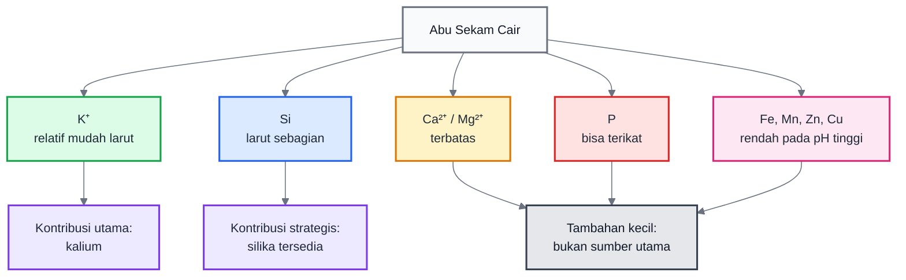
```mermaid id="3w8nrn"
%%{init: {"theme": "base", "themeVariables": {
  "fontFamily": "Arial",
  "fontSize": "14px",
  "primaryTextColor": "#1f2937",
  "lineColor": "#6b7280"
}}}%%
flowchart TD
    A["Abu Sekam Cair"]:::abu

    A --> B["K⁺<br/>relatif mudah larut"]:::tinggi
    A --> C["Si<br/>larut sebagian"]:::sedang
    A --> D["Ca²⁺ / Mg²⁺<br/>terbatas"]:::terbatas
    A --> E["P<br/>bisa terikat"]:::rendah
    A --> F["Fe, Mn, Zn, Cu<br/>rendah pada pH tinggi"]:::mikro

    B --> G["Kontribusi utama:<br/>kalium"]:::hasil
    C --> H["Kontribusi strategis:<br/>silika tersedia"]:::hasil
    D --> I["Tambahan kecil:<br/>bukan sumber utama"]:::catatan
    E --> I
    F --> I

    classDef abu fill:#F9FAFB,stroke:#6B7280,stroke-width:2px,color:#111827;
    classDef tinggi fill:#DCFCE7,stroke:#16A34A,stroke-width:2px,color:#1F2937;
    classDef sedang fill:#DBEAFE,stroke:#2563EB,stroke-width:2px,color:#1F2937;
    classDef terbatas fill:#FEF3C7,stroke:#D97706,stroke-width:2px,color:#1F2937;
    classDef rendah fill:#FEE2E2,stroke:#DC2626,stroke-width:2px,color:#1F2937;
    classDef mikro fill:#FCE7F3,stroke:#DB2777,stroke-width:2px,color:#1F2937;
    classDef hasil fill:#EDE9FE,stroke:#7C3AED,stroke-width:2px,color:#1F2937;
    classDef catatan fill:#E5E7EB,stroke:#374151,stroke-width:2px,color:#111827;
```

---

## 6.4 Kalium: unsur yang paling mudah tersedia

Kalium dalam abu sekam relatif mudah masuk ke larutan, terutama jika berada dalam bentuk garam mineral, karbonat, oksida, atau hidroksida.

Tanaman menyerap kalium sebagai:

```text id="tsz5jt"
K⁺
```

Bukan sebagai KOH.

Jika KOH berada dalam air, reaksinya adalah:

```text id="1qoj2s"
KOH → K⁺ + OH⁻
```

Ion K⁺ dapat dimanfaatkan tanaman, sedangkan OH⁻ berpengaruh terhadap pH larutan.

Pada tanaman cabai, kalium sangat penting untuk:

- mengatur bukaan stomata,
- membantu efisiensi penggunaan air,
- mendukung transport gula,
- memperbaiki pembesaran buah,
- meningkatkan kualitas buah,
- membantu ketahanan terhadap stres.

Karena itu, dari sisi agronomis, ekstrak abu sekam, terutama jika ditambah KOH, lebih tepat dipahami sebagai **sumber K + Si**, bukan hanya sumber Si.

---

## 6.5 Silikon: banyak di abu, tetapi harus larut dulu

Silika adalah komponen penting dalam abu sekam. Namun sebagian besar silika berada dalam bentuk padat. Tanaman tidak menyerap silika sebagai butiran abu atau SiO₂ padat.

Tanaman menyerap silikon terutama sebagai:

```text id="srrtqt"
H₄SiO₄
atau
Si(OH)₄
```

Sederhananya:

```text id="fsw67w"
SiO₂ padat → larut sebagian → H₄SiO₄ / Si(OH)₄ → diserap akar
```

Masalahnya, pelarutan SiO₂ dalam air biasa cenderung terbatas. Oleh karena itu, penambahan basa kuat seperti KOH dapat membantu membuka sebagian silika dari abu sekam dan membentuk larutan silikat.

Namun tetap harus dipahami bahwa targetnya bukan melarutkan seluruh SiO₂. Target praktisnya adalah melarutkan sebagian kecil Si dalam batas aman bagi tanaman.

---

## 6.6 Kalsium dan magnesium: ada, tetapi bukan sumber utama

Abu sekam dapat mengandung kalsium dan magnesium. Namun dalam ekstrak cair yang bersifat basa, Ca dan Mg tidak selalu larut tinggi. Keduanya dapat mengendap sebagai karbonat, fosfat, atau silikat.

Contoh kemungkinan pengendapan:

```text id="0fxyvi"
Ca²⁺ + CO₃²⁻ → CaCO₃
Mg²⁺ + CO₃²⁻ → MgCO₃
Ca²⁺ + silikat → kalsium silikat
```

Karena itu, ekstrak abu sekam tidak boleh dianggap sebagai sumber utama Ca dan Mg.

Untuk cabai, Ca dan Mg tetap perlu disediakan dari sumber lain seperti:

```text id="bekqdz"
Kalsium nitrat
Dolomit
Kieserite
Magnesium sulfat
Kompos matang
Pupuk lengkap seimbang
```

---

## 6.7 Fosfor dan unsur mikro: hati-hati pada pH tinggi

Fosfor dapat ada dalam abu sekam, tetapi pada pH tinggi fosfor mudah terikat oleh Ca dan Mg. Akibatnya, P tidak selalu tersedia tinggi dalam ekstrak cair.

Unsur mikro seperti Fe, Mn, Zn, dan Cu juga cenderung kurang tersedia pada pH tinggi. Ini penting karena larutan abu sekam, terutama yang ditambah KOH, bersifat basa.

Secara praktis:

```text id="hjnyjz"
pH terlalu tinggi
→ Fe, Mn, Zn, Cu lebih sulit tersedia
→ risiko daun muda menguning
→ pertumbuhan pucuk terganggu
```

Karena itu, ekstrak abu sekam + KOH tidak boleh dicampur langsung dengan pupuk mikro atau pupuk hayati. Aplikasinya sebaiknya dipisah.

---

## 6.8 Pesan utama Bab 6

Abu sekam cair bukan pupuk lengkap. Nilai utamanya adalah sebagai sumber **K**, **alkalinitas**, dan **Si larut sebagian**.

```text id="8zneft"
Abu sekam cair kuat pada:
K
Si larut sebagian
alkalinitas

Abu sekam cair lemah/tidak stabil pada:
N
P
Ca
Mg
unsur mikro
```

Maka posisi yang paling tepat adalah:

> Abu sekam cair paling kuat sebagai sumber K, alkalinitas, dan Si larut sebagian; bukan pupuk lengkap.

[**Kembali ke Atas**](#dari-sekam-padi-ke-booster-ksi-pemanfaatan-arang-sekam-abu-sekam-dan-ekstrak-koh-untuk-budidaya-cabai)

---

# 7. Ekstraksi Si dari Abu Sekam dengan KOH

Abu sekam mengandung banyak silika, tetapi sebagian besar silika masih berada sebagai SiO₂ padat atau bentuk silikat yang belum tentu mudah diserap akar.

Untuk meningkatkan fraksi Si yang masuk ke larutan, abu sekam dapat diekstrak dengan bantuan **KOH**.

Namun ini harus dilakukan hati-hati. KOH adalah basa kuat, korosif, dan dapat menghasilkan larutan dengan pH sangat tinggi. Tujuan ekstraksi bukan membuat larutan sepekat mungkin, tetapi membuat **stok K–Si** yang masih bisa diencerkan secara aman untuk tanaman.

---

# 7.1 Tujuan Ekstraksi

Tujuan utama ekstraksi adalah mengubah sebagian silika dalam abu sekam menjadi bentuk silikat yang lebih larut.

Secara praktis:

```text id="5nl60g"
Abu sekam + KOH + air
→ ekstrak K–Si
→ larutan kalium silikat sederhana
```

Ekstrak ini mengandung dua unsur penting:

```text id="z1ylbu"
K = dari KOH dan dari abu sekam
Si = dari silika abu sekam yang larut sebagian
```

Karena itu, ekstrak ini bukan hanya sumber Si, tetapi juga sumber K. Bahkan dalam banyak kasus, kontribusi K dari KOH bisa cukup besar.

## Mengapa KOH?

KOH dipilih karena memiliki dua fungsi sekaligus.

Pertama, KOH membantu melarutkan sebagian silika dari abu sekam.

Kedua, KOH menyumbang kalium, yaitu unsur hara penting bagi tanaman.

Secara agronomis, KOH lebih menarik dibanding NaOH karena hasil ekstraksinya membawa K, bukan Na.

Perbandingannya:

| Bahan alkali | Hasil utama            | Dampak agronomis                            |
| ------------ | ---------------------- | ------------------------------------------- |
| **KOH**      | Kalium silikat         | Menyumbang K, lebih sesuai untuk tanaman    |
| **NaOH**     | Natrium silikat        | Menyumbang Na, berisiko salinitas/sodisitas |
| **Air saja** | Ekstrak mineral ringan | Lebih aman, tetapi Si larut lebih rendah    |

Dengan demikian, untuk tujuan pupuk atau suplemen tanaman, KOH lebih relevan dibanding NaOH.

---

## 7.1.1 Alur ekstraksi abu sekam dengan KOH

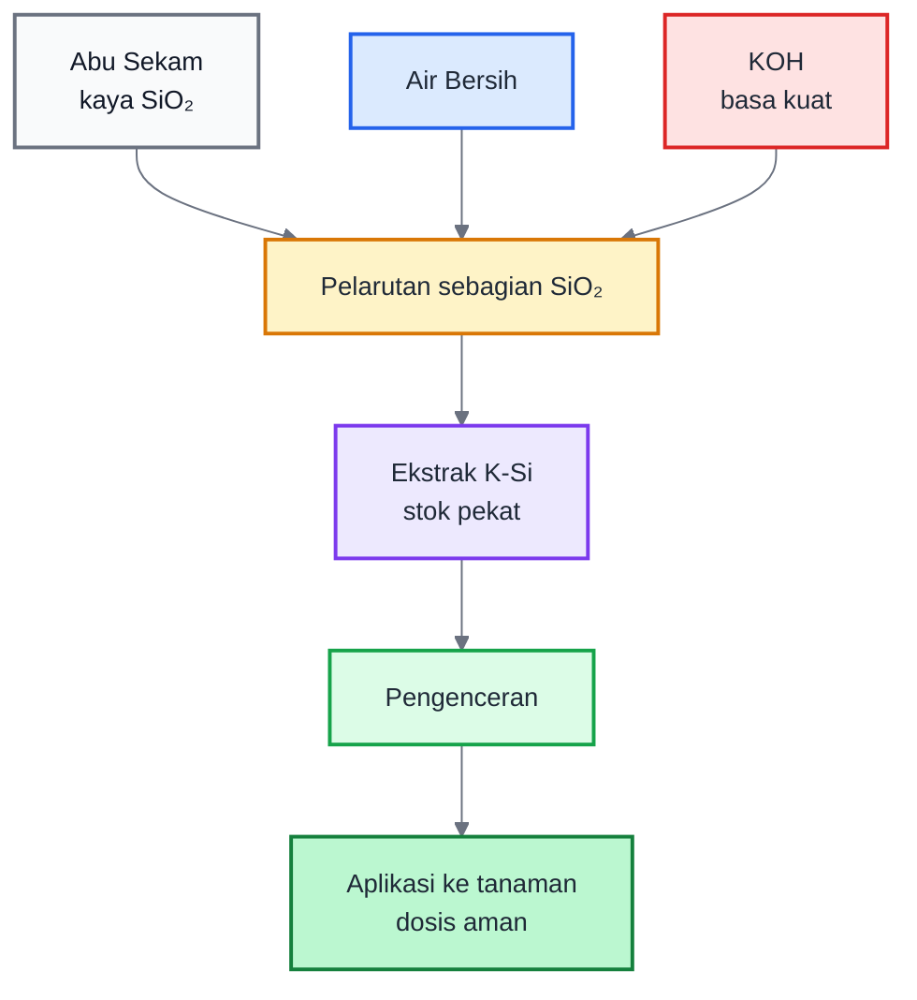
```mermaid id="po9ogd"
%%{init: {"theme": "base", "themeVariables": {
  "fontFamily": "Arial",
  "fontSize": "14px",
  "primaryTextColor": "#1f2937",
  "lineColor": "#6b7280"
}}}%%
flowchart TD
    A["Abu Sekam<br/>kaya SiO₂"]:::abu
    B["Air Bersih"]:::air
    C["KOH<br/>basa kuat"]:::koh
    D["Pelarutan sebagian SiO₂"]:::reaksi
    E["Ekstrak K-Si<br/>stok pekat"]:::stok
    F["Pengenceran"]:::encer
    G["Aplikasi ke tanaman<br/>dosis aman"]:::tanaman

    A --> D
    B --> D
    C --> D
    D --> E
    E --> F
    F --> G

    classDef abu fill:#F9FAFB,stroke:#6B7280,stroke-width:2px,color:#111827;
    classDef air fill:#DBEAFE,stroke:#2563EB,stroke-width:2px,color:#1F2937;
    classDef koh fill:#FEE2E2,stroke:#DC2626,stroke-width:2px,color:#1F2937;
    classDef reaksi fill:#FEF3C7,stroke:#D97706,stroke-width:2px,color:#1F2937;
    classDef stok fill:#EDE9FE,stroke:#7C3AED,stroke-width:2px,color:#1F2937;
    classDef encer fill:#DCFCE7,stroke:#16A34A,stroke-width:2px,color:#1F2937;
    classDef tanaman fill:#BBF7D0,stroke:#15803D,stroke-width:2px,color:#1F2937;
```

---

# 7.2 Reaksi Dasar

Reaksi sederhana antara silika dan KOH dapat ditulis sebagai berikut:

```text id="kbj32y"
SiO₂ + 2KOH → K₂SiO₃ + H₂O
```

Produk yang terbentuk adalah **kalium silikat**.

Kalium silikat di dalam air dapat menjadi sumber:

```text id="d4cd4v"
K⁺
dan
silikat larut
```

Dalam konteks tanaman, silikat larut ini kemudian berhubungan dengan bentuk Si yang dapat dimanfaatkan tanaman, yaitu:

```text id="0uxnal"
H₄SiO₄
atau
Si(OH)₄
```

---

## 7.2.1 Stokiometri reaksi

Untuk menghitung kebutuhan KOH, kita menggunakan massa molar.

```text id="khuwy6"
SiO₂ = 60,08 g/mol
KOH  = 56,11 g/mol
```

Dari reaksi:

```text id="q1b61u"
SiO₂ + 2KOH → K₂SiO₃ + H₂O
```

Artinya:

```text id="7axz4t"
1 mol SiO₂ membutuhkan 2 mol KOH
```

Maka:

```text id="glcrql"
60,08 g SiO₂ membutuhkan:
2 × 56,11 g KOH
= 112,22 g KOH
```

Rasio massanya:

```text id="k6d3h8"
112,22 ÷ 60,08 = 1,87
```

Jadi:

```text id="8b97v8"
1 g SiO₂ membutuhkan ±1,87 g KOH murni
```

Ini adalah dasar stokiometri utama dalam ekstraksi Si dari abu sekam menggunakan KOH.

---

## 7.2.2 Rumus rasio dasar

Dalam format praktis:

```text id="2c0bcp"
KOH murni = SiO₂ yang ingin dilarutkan × 1,87
```

Contoh sederhana:

```text id="zdhkz1"
Jika ingin melarutkan 5 g SiO₂:

KOH murni = 5 × 1,87
           = 9,35 g
```

Jika KOH teknis hanya 90% murni:

```text id="8drz8b"
KOH teknis = KOH murni ÷ 0,90

KOH teknis = 9,35 ÷ 0,90
            = 10,39 g
```

---

# 7.3 Kenapa Tidak Mengekstrak Semua SiO₂?

Secara teori, semua SiO₂ bisa dihitung kebutuhan KOH-nya. Namun secara praktik pertanian, mengekstrak semua SiO₂ dari abu sekam **tidak disarankan**.

Alasannya:

- kebutuhan KOH menjadi sangat besar,
- larutan menjadi sangat basa,
- EC atau garam terlarut sangat tinggi,
- biaya meningkat,
- risiko keselamatan meningkat,
- larutan tidak aman untuk tanaman,
- prosesnya lebih mirip produksi kimia industri, bukan praktik pupuk lapang.

Misal:

```text id="6zdvxp"
1 kg abu sekam
SiO₂ ±80%
SiO₂ total ±800 g
```

Jika semua SiO₂ ingin dilarutkan:

```text id="zzwsw4"
KOH murni = 800 g × 1,87
           = ±1.496 g KOH murni
```

Itu berarti untuk 1 kg abu sekam, diperlukan hampir 1,5 kg KOH murni.

Jumlah ini terlalu tinggi untuk tujuan aplikasi tanaman.

---

## 7.3.1 Masalah jika KOH terlalu tinggi

Jika KOH digunakan terlalu banyak, larutan menjadi sangat basa dan berbahaya.

Dampaknya:

```text id="f06rdt"
pH larutan sangat tinggi
EC meningkat
akar bisa terbakar
mikroba tanah terganggu
unsur mikro mengendap
tanaman stres
```

Pada tanaman cabai, risiko ini penting karena akar cabai sensitif terhadap larutan yang terlalu pekat dan terlalu basa, terutama pada fase semai dan awal pindah tanam.

---

## 7.3.2 Target realistis ekstraksi

Target yang lebih masuk akal adalah melarutkan hanya sebagian kecil dari total SiO₂ dalam abu.

```text id="n9r23w"
Target SiO₂ larut:
±0,25–1% dari total SiO₂
```

Target ini jauh lebih aman karena:

- kebutuhan KOH lebih rendah,
- larutan stok lebih mudah diencerkan,
- risiko pH ekstrem lebih kecil,
- biaya lebih rendah,
- masih cukup untuk menghasilkan suplemen K–Si.

Diagram logikanya:

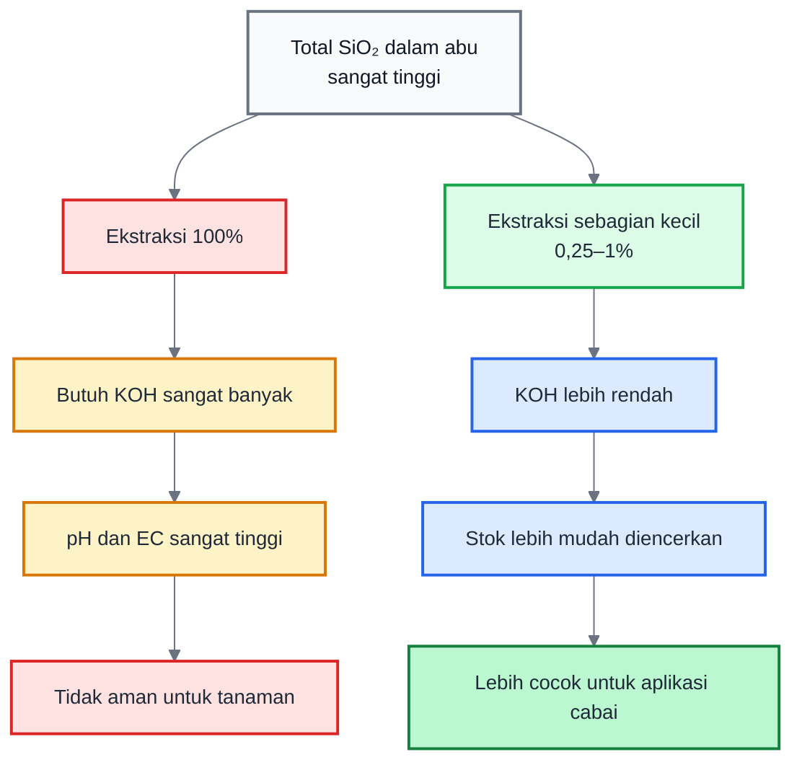
```mermaid id="2u3rn8"
%%{init: {"theme": "base", "themeVariables": {
  "fontFamily": "Arial",
  "fontSize": "14px",
  "primaryTextColor": "#1f2937",
  "lineColor": "#6b7280"
}}}%%
flowchart TD
    A["Total SiO₂ dalam abu<br/>sangat tinggi"]:::abu
    B["Ekstraksi 100%"]:::bahaya
    C["Ekstraksi sebagian kecil<br/>0,25–1%"]:::aman

    B --> D["Butuh KOH sangat banyak"]:::risiko
    D --> E["pH dan EC sangat tinggi"]:::risiko
    E --> F["Tidak aman untuk tanaman"]:::bahaya

    C --> G["KOH lebih rendah"]:::baik
    G --> H["Stok lebih mudah diencerkan"]:::baik
    H --> I["Lebih cocok untuk aplikasi cabai"]:::hasil

    A --> B
    A --> C

    classDef abu fill:#F9FAFB,stroke:#6B7280,stroke-width:2px,color:#111827;
    classDef bahaya fill:#FEE2E2,stroke:#DC2626,stroke-width:2px,color:#1F2937;
    classDef aman fill:#DCFCE7,stroke:#16A34A,stroke-width:2px,color:#1F2937;
    classDef risiko fill:#FEF3C7,stroke:#D97706,stroke-width:2px,color:#1F2937;
    classDef baik fill:#DBEAFE,stroke:#2563EB,stroke-width:2px,color:#1F2937;
    classDef hasil fill:#BBF7D0,stroke:#15803D,stroke-width:2px,color:#1F2937;
```

---

# 7.4 Rumus Hitung KOH

Untuk menghitung kebutuhan KOH, gunakan rumus berikut.

```text id="79kw6w"
KOH murni =
berat abu × fraksi SiO₂ × target fraksi SiO₂ larut × 1,87
```

Jika KOH teknis tidak murni 100%, misalnya hanya 90%, maka:

```text id="m56hce"
KOH teknis = KOH murni ÷ 0,90
```

Keterangan:

| Komponen                 | Arti                                                  |
| ------------------------ | ----------------------------------------------------- |
| Berat abu                | Berat abu sekam yang digunakan                        |
| Fraksi SiO₂              | Kandungan SiO₂ dalam abu, misalnya 80% = 0,80         |
| Target fraksi SiO₂ larut | Target SiO₂ yang ingin diekstrak, misalnya 1% = 0,01  |
| 1,87                     | Rasio KOH murni terhadap SiO₂ berdasarkan stokiometri |
| 0,90                     | Kemurnian KOH teknis 90%                              |

---

## 7.4.1 Contoh hitung: target 1% SiO₂ larut

Misal:

```text id="qxl6s2"
Abu sekam       = 1.000 g
SiO₂            = 80%
Target larut    = 1%
KOH teknis      = 90%
```

Langkah 1: hitung total SiO₂ dalam abu.

```text id="7jjq17"
Total SiO₂ = 1.000 × 0,80
           = 800 g
```

Langkah 2: hitung SiO₂ yang ditargetkan larut.

```text id="qu4it6"
SiO₂ target = 800 × 0,01
            = 8 g
```

Langkah 3: hitung KOH murni.

```text id="2uzq7u"
KOH murni = 8 × 1,87
           = 14,96 g
```

Langkah 4: koreksi kemurnian KOH teknis 90%.

```text id="jplba7"
KOH teknis = 14,96 ÷ 0,90
            = 16,62 g
```

Jadi, untuk 1 kg abu sekam dengan asumsi SiO₂ 80%, jika targetnya melarutkan 1% dari total SiO₂, kebutuhan KOH teknis 90% adalah sekitar:

```text id="xup2id"
±16,6 g KOH teknis 90%
```

---

## 7.4.2 Tabel kebutuhan KOH untuk 1 kg abu sekam

Asumsi:

```text id="p6l2jp"
Berat abu sekam = 1.000 g
Kandungan SiO₂  = 80%
KOH teknis      = 90%
```

| Target SiO₂ larut | SiO₂ target | KOH murni | KOH teknis 90% |
| ----------------: | ----------: | --------: | -------------: |
|             0,25% |         2 g |    3,74 g |         4,16 g |
|             0,50% |         4 g |    7,48 g |         8,31 g |
|             1,00% |         8 g |   14,96 g |        16,62 g |
|             2,00% |        16 g |   29,92 g |        33,24 g |
|             5,00% |        40 g |   74,80 g |        83,11 g |
|            10,00% |        80 g |  149,60 g |       166,22 g |
|           100,00% |       800 g |   1.496 g |        1.662 g |

Untuk aplikasi pertanian, target yang lebih masuk akal adalah:

```text id="6lqekg"
0,25–1% dari total SiO₂
```

Target di atas 2% mulai perlu kehati-hatian lebih tinggi karena larutan akan semakin basa dan semakin pekat.

---

## 7.4.3 Formula kerja yang direkomendasikan

Untuk praktik lapang, formula konservatif yang lebih aman adalah:

```text id="pknxdg"
Air bersih      : 10 liter
Abu sekam halus : 1 kg
KOH teknis 90%  : 15 gram
```

Formula ini mendekati target ekstraksi sekitar 1% SiO₂ total, tetapi sedikit lebih konservatif dibanding hasil hitung 16,6 g.

Mengapa dipilih 15 g?

```text id="6q0pim"
Karena lebih aman,
lebih mudah ditimbang,
lebih rendah risiko pH ekstrem,
dan cukup untuk membuat stok K-Si ringan.
```

---

## 7.4.4 Perkiraan kontribusi K dari KOH

KOH bukan hanya membantu melarutkan Si. KOH juga menyumbang K.

Massa atom relatif:

```text id="29q4fr"
K   = 39,10
KOH = 56,11
```

Fraksi K dalam KOH:

```text id="2xgiir"
K dalam KOH = 39,10 ÷ 56,11
            = 0,697
            = 69,7%
```

Jika memakai 15 g KOH teknis 90%:

```text id="r01wl0"
KOH murni = 15 × 0,90
           = 13,5 g
```

Kalium dari KOH:

```text id="p5a8fp"
K = 13,5 × 0,697
  = 9,41 g K
```

Jika dilarutkan dalam 10 liter stok:

```text id="zkl6nq"
K dari KOH dalam stok
= 9,41 g ÷ 10 L
= 0,941 g/L
= 941 mg/L
= ±941 ppm K
```

Jadi ekstrak ini memang membawa K cukup besar dari KOH, belum termasuk K yang larut dari abu sekam.

---

## 7.4.5 Perkiraan Si teoritis dari KOH

Dari reaksi:

```text id="tq6owh"
SiO₂ + 2KOH → K₂SiO₃ + H₂O
```

Hubungan massa KOH murni dengan Si sebagai unsur dapat dihitung sebagai berikut.

Massa Si dalam SiO₂:

```text id="cviz0o"
Si = 28,09 g/mol
SiO₂ = 60,08 g/mol
```

Dari reaksi:

```text id="mvk5gm"
2 mol KOH = 112,22 g KOH
mengikat 1 mol Si = 28,09 g Si
```

Maka:

```text id="yiwxt0"
1 g Si membutuhkan:
112,22 ÷ 28,09
= ±3,996 g KOH murni
```

Jika KOH murni yang digunakan 13,5 g:

```text id="i72mbh"
Si teoritis = 13,5 ÷ 3,996
            = 3,38 g Si
```

Dalam 10 liter stok:

```text id="sez1ug"
Si teoritis stok = 3,38 g ÷ 10 L
                 = 0,338 g/L
                 = 338 mg/L
                 = ±338 ppm Si
```

Catatan penting:

```text id="3ijtr0"
Angka ini adalah angka teoritis.
Si aktual bisa lebih rendah karena reaksi tidak selalu 100% efisien.
```

---

## 7.5 Ringkasan Perhitungan Praktis

Dengan formula:

```text id="xou8tn"
10 L air + 1 kg abu sekam + 15 g KOH teknis 90%
```

Perkiraan dari KOH saja:

| Parameter              | Nilai perkiraan |
| ---------------------- | --------------: |
| KOH murni              |          13,5 g |
| K dari KOH             |          9,41 g |
| K dalam stok           |      ±941 ppm K |
| Si teoritis            |          3,38 g |
| Si teoritis dalam stok |     ±338 ppm Si |

Namun perlu diingat:

```text id="f4dydy"
K aktual bisa lebih tinggi karena K dari abu ikut larut.
Si aktual bisa lebih rendah karena pelarutan Si tidak selalu sempurna.
```

Maka formula ini harus diperlakukan sebagai **stok pekat**, bukan larutan siap kocor.

---

## 7.6 Kesimpulan Bab 7

Ekstraksi abu sekam dengan KOH adalah cara untuk membuat suplemen **K–Si** sederhana.

Intinya:

```text id="yilr2o"
Abu sekam menyediakan SiO₂ dan mineral lain.
KOH membantu melarutkan sebagian Si.
KOH juga menyumbang K.
Hasilnya adalah stok K-Si basa.
```

Reaksi dasarnya:

```text id="c6pj0t"
SiO₂ + 2KOH → K₂SiO₃ + H₂O
```

Rumus praktis kebutuhan KOH:

```text id="t3io27"
KOH murni =
berat abu × fraksi SiO₂ × target fraksi SiO₂ larut × 1,87
```

Untuk praktik cabai, formula kerja yang direkomendasikan:

```text id="hy35w2"
Air bersih      : 10 liter
Abu sekam halus : 1 kg
KOH teknis 90%  : 15 gram
```

Targetnya bukan mengekstrak seluruh silika, melainkan membuat **stok K–Si ringan** yang bisa diencerkan secara aman.

> Ekstrak abu sekam + KOH berpotensi positif untuk cabai sebagai sumber K dan Si, tetapi harus dipakai sebagai suplemen, bukan pupuk lengkap, dan wajib diencerkan sebelum aplikasi.

[**Kembali ke Atas**](#dari-sekam-padi-ke-booster-ksi-pemanfaatan-arang-sekam-abu-sekam-dan-ekstrak-koh-untuk-budidaya-cabai)

---

# 8. Formula Stok Ekstrak K–Si

Bab ini adalah bagian praktik pembuatan **stok ekstrak K–Si** dari abu sekam dan KOH. Stok ini bukan larutan siap pakai untuk tanaman, melainkan larutan pekat yang harus diencerkan sebelum aplikasi.

Tujuan formulasi ini adalah menghasilkan ekstrak yang:

```text id="4ig7tn"
cukup kuat untuk membawa K dan Si,
tetapi tidak terlalu ekstrem sehingga sulit diencerkan secara aman.
```

---

## 8.1 Formula Konservatif

Formula stok yang direkomendasikan:

```text id="vf93vi"
Air bersih      : 10 liter
Abu sekam halus : 1 kg
KOH teknis 90%  : 15 gram
```

Formula ini dipilih karena masih berada pada batas konservatif. Targetnya bukan mengekstrak semua silika dalam abu, tetapi hanya membantu melarutkan sebagian kecil Si agar terbentuk stok **K–Si** yang bisa digunakan sebagai suplemen tanaman.

Secara prinsip:

```text id="of3zfc"
Abu sekam = sumber SiO₂ dan mineral
KOH       = pelarut sebagian Si + sumber K
Air       = media ekstraksi
```

---

## 8.2 Perkiraan Isi Stok

Dengan formula:

```text id="kig0f0"
10 L air + 1 kg abu sekam + 15 g KOH teknis 90%
```

Perkiraan dari KOH saja:

```text id="sglloj"
KOH murni = 15 g × 90%
           = 13,5 g
```

K dari KOH:

```text id="3s6miu"
Fraksi K dalam KOH = 39,10 ÷ 56,11
                   = 0,697
                   = 69,7%

K dari KOH = 13,5 × 0,697
           = 9,41 g K
```

Dalam 10 liter stok:

```text id="1rapu4"
K dari KOH = 9,41 g ÷ 10 L
           = 0,941 g/L
           = ±941 ppm K
```

Perkiraan Si teoritis dari reaksi KOH:

```text id="ifwdhh"
1 g Si membutuhkan ±3,996 g KOH murni

Si teoritis = 13,5 ÷ 3,996
             = 3,38 g Si
```

Dalam 10 liter stok:

```text id="ycm397"
Si teoritis = 3,38 g ÷ 10 L
             = 0,338 g/L
             = ±338 ppm Si
```

Catatan penting:

```text id="elfxqb"
K aktual bisa lebih tinggi karena abu sekam juga menyumbang K.
Si aktual bisa lebih rendah karena pelarutan Si tidak selalu 100% efisien.
```

Maka angka tersebut dipakai sebagai **perkiraan kerja**, bukan angka laboratorium.

---

## 8.3 Alat dan Bahan

### Bahan

```text id="83cbwj"
Air bersih      : 10 liter
Abu sekam halus : 1 kg
KOH teknis 90%  : 15 gram
```

### Alat

```text id="2z5s0a"
Wadah plastik/HDPE ukuran minimal 15–20 liter
Timbangan digital
Pengaduk plastik/kayu
Kain saring
Gayung plastik
Botol atau jeriken plastik untuk penyimpanan
Sarung tangan
Kacamata pelindung
Masker
```

Jangan menggunakan wadah aluminium, besi tipis, atau logam reaktif. Larutan basa kuat dapat bereaksi dengan beberapa logam dan merusak wadah.

---

## 8.4 Cara Membuat

Urutan pembuatan harus diikuti dengan benar. Kesalahan paling berbahaya adalah menuangkan air ke KOH. Yang benar adalah **KOH dimasukkan ke dalam air sedikit demi sedikit**.

```text id="l0kz7b"
1. Masukkan 10 L air ke wadah plastik/HDPE.
2. Masukkan KOH sedikit demi sedikit ke air.
3. Aduk perlahan.
4. Tunggu suhu turun.
5. Masukkan 1 kg abu sekam halus.
6. Aduk rata.
7. Diamkan 12–24 jam.
8. Aduk beberapa kali selama perendaman.
9. Endapkan.
10. Ambil cairan bagian atas.
11. Saring.
```

---

## 8.5 Diagram Proses Pembuatan Stok

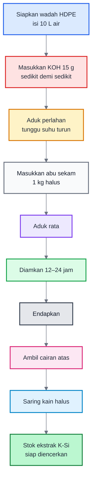
```mermaid id="4rxgoj"
%%{init: {"theme": "base", "themeVariables": {
  "fontFamily": "Arial",
  "fontSize": "14px",
  "primaryTextColor": "#1f2937",
  "lineColor": "#6b7280"
}}}%%
flowchart TD
    A["Siapkan wadah HDPE<br/>isi 10 L air"]:::air
    B["Masukkan KOH 15 g<br/>sedikit demi sedikit"]:::koh
    C["Aduk perlahan<br/>tunggu suhu turun"]:::aman
    D["Masukkan abu sekam<br/>1 kg halus"]:::abu
    E["Aduk rata"]:::proses
    F["Diamkan 12–24 jam"]:::waktu
    G["Endapkan"]:::endap
    H["Ambil cairan atas"]:::ambil
    I["Saring kain halus"]:::saring
    J["Stok ekstrak K-Si<br/>siap diencerkan"]:::stok

    A --> B --> C --> D --> E --> F --> G --> H --> I --> J

    classDef air fill:#DBEAFE,stroke:#2563EB,stroke-width:2px,color:#1F2937;
    classDef koh fill:#FEE2E2,stroke:#DC2626,stroke-width:2px,color:#1F2937;
    classDef aman fill:#FEF3C7,stroke:#D97706,stroke-width:2px,color:#1F2937;
    classDef abu fill:#F9FAFB,stroke:#6B7280,stroke-width:2px,color:#111827;
    classDef proses fill:#EDE9FE,stroke:#7C3AED,stroke-width:2px,color:#1F2937;
    classDef waktu fill:#DCFCE7,stroke:#16A34A,stroke-width:2px,color:#1F2937;
    classDef endap fill:#E5E7EB,stroke:#374151,stroke-width:2px,color:#111827;
    classDef ambil fill:#FCE7F3,stroke:#DB2777,stroke-width:2px,color:#1F2937;
    classDef saring fill:#E0F2FE,stroke:#0284C7,stroke-width:2px,color:#1F2937;
    classDef stok fill:#BBF7D0,stroke:#15803D,stroke-width:2px,color:#1F2937;
```

---

## 8.6 Penjelasan Tiap Langkah

### 1. Masukkan air terlebih dahulu

Air harus masuk dulu ke wadah. Ini penting karena KOH bereaksi kuat saat larut dalam air dan dapat menghasilkan panas.

```text id="0bkj71"
Benar:
air dulu → KOH masuk perlahan

Salah:
KOH dulu → air dituang ke KOH
```

Cara yang salah dapat menimbulkan panas mendadak, percikan, dan risiko luka bakar kimia.

---

### 2. Masukkan KOH sedikit demi sedikit

KOH jangan dimasukkan sekaligus. Masukkan perlahan sambil diaduk.

Tujuannya:

```text id="irhzxe"
mengurangi panas mendadak,
mencegah percikan,
membantu KOH larut merata.
```

Setelah KOH larut, larutan bisa terasa hangat. Tunggu sampai suhu turun sebelum memasukkan abu sekam.

---

### 3. Masukkan abu sekam setelah suhu turun

Abu sekam dimasukkan setelah larutan KOH lebih stabil. Abu sebaiknya halus, kering, bersih, dan tidak tercampur sampah.

Kualitas abu penting. Gunakan abu sekam yang:

```text id="a4j9tk"
berasal dari sekam padi murni,
tidak tercampur plastik,
tidak tercampur oli,
tidak tercampur logam,
tidak terlalu basah,
tidak menggumpal.
```

---

### 4. Diamkan 12–24 jam

Perendaman memberi waktu bagi larutan basa untuk berinteraksi dengan abu sekam. Pada tahap ini, sebagian mineral larut, termasuk sebagian K dan sebagian Si.

Selama perendaman, aduk beberapa kali agar kontak antara abu dan larutan lebih merata.

```text id="37u9j7"
Waktu minimal : 12 jam
Waktu ideal   : 24 jam
```

Tidak perlu merendam terlalu lama jika tidak ada kontrol pH dan EC, karena target proses ini adalah membuat stok praktis, bukan ekstraksi industri.

---

### 5. Endapkan dan ambil cairan atas

Setelah perendaman, biarkan abu mengendap. Ambil cairan bagian atas secara hati-hati.

Endapan padat tidak perlu ikut masuk ke botol stok karena dapat menyumbat alat semprot atau membuat larutan terlalu keruh.

---

### 6. Saring

Saring cairan dengan kain halus. Tujuannya untuk memisahkan partikel abu halus.

Hasil akhir yang diharapkan:

```text id="4cv1h2"
cairan relatif jernih sampai keruh ringan,
tidak banyak partikel kasar,
tidak menggumpal,
tidak berbau busuk.
```

---

## 8.7 Keselamatan Kerja

KOH adalah bahan basa kuat. Walaupun digunakan hanya 15 gram, tetap harus diperlakukan serius.

Aturan keselamatan:

- jangan menuang air ke KOH,
- selalu masukkan KOH ke air,
- gunakan sarung tangan,
- gunakan kacamata pelindung,
- gunakan masker,
- jangan gunakan wadah aluminium,
- jangan kena kulit,
- jangan kena mata,
- jauhkan dari anak-anak,
- jangan menghirup debu KOH,
- lakukan di tempat berventilasi baik.

## Diagram Keselamatan Kerja

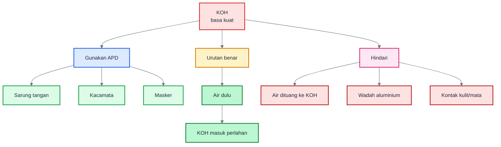
```mermaid id="7mp00y"
%%{init: {"theme": "base", "themeVariables": {
  "fontFamily": "Arial",
  "fontSize": "14px",
  "primaryTextColor": "#1f2937",
  "lineColor": "#6b7280"
}}}%%
flowchart TD
    A["KOH<br/>basa kuat"]:::bahaya

    A --> B["Gunakan APD"]:::apd
    B --> C["Sarung tangan"]:::aman
    B --> D["Kacamata"]:::aman
    B --> E["Masker"]:::aman

    A --> F["Urutan benar"]:::aturan
    F --> G["Air dulu"]:::benar
    G --> H["KOH masuk perlahan"]:::benar

    A --> I["Hindari"]:::hindari
    I --> J["Air dituang ke KOH"]:::salah
    I --> K["Wadah aluminium"]:::salah
    I --> L["Kontak kulit/mata"]:::salah

    classDef bahaya fill:#FEE2E2,stroke:#DC2626,stroke-width:2px,color:#1F2937;
    classDef apd fill:#DBEAFE,stroke:#2563EB,stroke-width:2px,color:#1F2937;
    classDef aman fill:#DCFCE7,stroke:#16A34A,stroke-width:2px,color:#1F2937;
    classDef aturan fill:#FEF3C7,stroke:#D97706,stroke-width:2px,color:#1F2937;
    classDef benar fill:#BBF7D0,stroke:#15803D,stroke-width:2px,color:#1F2937;
    classDef hindari fill:#FCE7F3,stroke:#DB2777,stroke-width:2px,color:#1F2937;
    classDef salah fill:#FEE2E2,stroke:#B91C1C,stroke-width:2px,color:#1F2937;
```

---

## 8.8 Pemeriksaan Stok Setelah Jadi

Stok ekstrak K–Si yang baik memiliki ciri:

```text id="hbitli"
Tidak berbau busuk
Tidak berbusa aktif
Tidak menggumpal
Tidak banyak endapan terapung
Tidak tercampur minyak atau kotoran
Disimpan dalam wadah plastik tertutup
```

Jika tersedia alat ukur, periksa:

```text id="xwbg18"
pH stok
EC stok
```

Namun perlu dipahami bahwa stok ini memang bisa sangat basa. Yang lebih penting untuk tanaman adalah **pH dan EC setelah pengenceran**, bukan stok pekatnya.

Target larutan akhir setelah diencerkan:

```text id="whkdzn"
Bibit:
pH 6,5–7,5

Tanaman dewasa:
pH 6,5–8,0
```

Jika pH larutan akhir masih terlalu tinggi, larutan harus diencerkan lagi.

---

## 8.9 Penyimpanan Stok

Simpan stok dalam jeriken atau botol plastik yang tertutup.

Syarat penyimpanan:

```text id="a8pa1a"
Gunakan wadah plastik/HDPE
Tutup rapat
Beri label jelas
Simpan di tempat teduh
Jauhkan dari anak-anak
Jauhkan dari pupuk hayati/mikroba
Jauhkan dari bahan asam kuat
```

Label minimal:

```text id="tltm3h"
STOK EKSTRAK K-Si
Abu sekam + KOH
Tanggal pembuatan:
Dosis aplikasi:
PERINGATAN: BASA, JANGAN DIMINUM
```

Sebaiknya stok digunakan dalam waktu **1–2 bulan**. Jika terjadi bau busuk, perubahan warna ekstrem, atau banyak endapan aneh, jangan digunakan langsung ke tanaman sensitif.

---

## 8.10 Kesalahan yang Harus Dihindari

Beberapa kesalahan yang sering terjadi:

| Kesalahan                                 | Risiko                          |
| ----------------------------------------- | ------------------------------- |
| KOH terlalu banyak                        | pH sangat tinggi, akar terbakar |
| Air dituangkan ke KOH                     | panas dan percikan berbahaya    |
| Memakai wadah aluminium                   | reaksi dengan basa, wadah rusak |
| Abu tercampur sampah                      | kontaminasi tanaman/media       |
| Stok langsung dikocor                     | tanaman stres atau mati         |
| Tidak disaring                            | menyumbat sprayer/irigasi       |
| Dicampur pupuk mikro/hayati               | pengendapan atau mikroba mati   |
| Dosis sama untuk bibit dan tanaman dewasa | bibit mudah rusak               |

---

## 8.11 Ringkasan Bab 8

Formula stok yang direkomendasikan:

```text id="pjvm5s"
Air bersih      : 10 liter
Abu sekam halus : 1 kg
KOH teknis 90%  : 15 gram
```

Urutan aman:

```text id="q9zxdo"
Air → KOH perlahan → tunggu suhu turun → abu sekam → aduk → diamkan → endapkan → saring
```

Prinsip keselamatan:

```text id="lgbw0d"
Jangan menuang air ke KOH.
Selalu masukkan KOH ke air.
Gunakan APD.
Jangan gunakan wadah aluminium.
Stok wajib diencerkan sebelum aplikasi.
```

Pesan utama:

> Stok ekstrak K–Si adalah bahan pekat. Manfaatnya muncul setelah digunakan dalam dosis kecil dan terukur, bukan dengan cara dikocor langsung ke tanaman.

[**Kembali ke Atas**](#dari-sekam-padi-ke-booster-ksi-pemanfaatan-arang-sekam-abu-sekam-dan-ekstrak-koh-untuk-budidaya-cabai)

---

# 9. Kebutuhan Mineral Cabai

Sebelum memakai ekstrak abu sekam + KOH, penting untuk memahami kebutuhan mineral cabai terlebih dahulu. Tujuannya agar ekstrak K–Si tidak diperlakukan sebagai pupuk lengkap.

Cabai membutuhkan unsur hara makro, sekunder, mikro, dan unsur fungsional. Setiap unsur memiliki peran berbeda. Jika salah satu unsur dominan berlebihan, tanaman bisa mengalami ketidakseimbangan hara.

Secara praktis, kebutuhan mineral cabai dapat dipahami seperti ini:

```text id="nq3q2k"
N ≈ K > Ca > Mg ≈ S > P > mikro
```

Artinya, cabai membutuhkan nitrogen dan kalium dalam jumlah besar. Setelah itu, kalsium juga sangat penting, terutama untuk pertumbuhan pucuk, akar muda, bunga, dan kualitas buah. Magnesium, sulfur, dan fosfor dibutuhkan dalam jumlah lebih rendah dibanding N dan K, tetapi tetap sangat penting. Unsur mikro dibutuhkan sedikit, tetapi kekurangannya dapat mengganggu pertumbuhan dan pembentukan buah.

Kalium adalah unsur penting untuk pertumbuhan, regulasi air, kualitas hasil, dan banyak proses fisiologis tanaman; secara umum tanaman menyerap K dalam jumlah besar, sering hanya kalah dari nitrogen. [3]

---

## 9.1 Urutan Kebutuhan Umum

Urutan kebutuhan mineral cabai tidak selalu sama pada setiap fase. Pada fase vegetatif, kebutuhan N lebih dominan. Pada fase berbunga dan berbuah, kebutuhan K, Ca, Mg, B, dan unsur pendukung lainnya menjadi semakin penting.

Namun secara umum, urutan kebutuhannya dapat diringkas sebagai berikut:

```text id="kxqdva"
N ≈ K > Ca > Mg ≈ S > P > mikro
```

Diagram sederhananya:

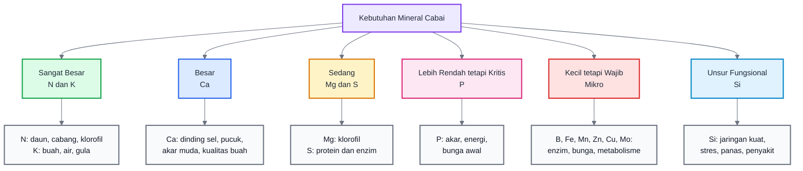
```mermaid id="r2f3zt"
%%{init: {"theme": "base", "themeVariables": {
  "fontFamily": "Arial",
  "fontSize": "14px",
  "primaryTextColor": "#1f2937",
  "lineColor": "#6b7280"
}}}%%
flowchart TD
    A["Kebutuhan Mineral Cabai"]:::utama

    A --> B["Sangat Besar<br/>N dan K"]:::tinggi
    A --> C["Besar<br/>Ca"]:::besar
    A --> D["Sedang<br/>Mg dan S"]:::sedang
    A --> E["Lebih Rendah tetapi Kritis<br/>P"]:::p
    A --> F["Kecil tetapi Wajib<br/>Mikro"]:::mikro
    A --> G["Unsur Fungsional<br/>Si"]:::si

    B --> H["N: daun, cabang, klorofil<br/>K: buah, air, gula"]:::fungsi
    C --> I["Ca: dinding sel, pucuk,<br/>akar muda, kualitas buah"]:::fungsi
    D --> J["Mg: klorofil<br/>S: protein dan enzim"]:::fungsi
    E --> K["P: akar, energi,<br/>bunga awal"]:::fungsi
    F --> L["B, Fe, Mn, Zn, Cu, Mo:<br/>enzim, bunga, metabolisme"]:::fungsi
    G --> M["Si: jaringan kuat,<br/>stres, panas, penyakit"]:::fungsi

    classDef utama fill:#EDE9FE,stroke:#7C3AED,stroke-width:2px,color:#1F2937;
    classDef tinggi fill:#DCFCE7,stroke:#16A34A,stroke-width:2px,color:#1F2937;
    classDef besar fill:#DBEAFE,stroke:#2563EB,stroke-width:2px,color:#1F2937;
    classDef sedang fill:#FEF3C7,stroke:#D97706,stroke-width:2px,color:#1F2937;
    classDef p fill:#FCE7F3,stroke:#DB2777,stroke-width:2px,color:#1F2937;
    classDef mikro fill:#FEE2E2,stroke:#DC2626,stroke-width:2px,color:#1F2937;
    classDef si fill:#E0F2FE,stroke:#0284C7,stroke-width:2px,color:#1F2937;
    classDef fungsi fill:#F9FAFB,stroke:#6B7280,stroke-width:2px,color:#111827;
```

---

## 9.2 Fungsi Tiap Unsur pada Cabai

| Unsur                  | Fungsi utama                                                   |
| ---------------------- | -------------------------------------------------------------- |
| **N**                  | Daun, cabang, klorofil, pertumbuhan vegetatif                  |
| **P**                  | Akar, energi, pembungaan awal                                  |
| **K**                  | Pembesaran buah, kualitas buah, transport gula, efisiensi air  |
| **Ca**                 | Dinding sel, pucuk, akar muda, kualitas buah                   |
| **Mg**                 | Klorofil dan fotosintesis                                      |
| **S**                  | Protein, enzim, metabolisme                                    |
| **Si**                 | Memperkuat jaringan, membantu ketahanan stres, panas, penyakit |
| **B**                  | Pembungaan, serbuk sari, pembentukan buah                      |
| **Fe, Mn, Zn, Cu, Mo** | Enzim, hormon, metabolisme                                     |

---

## 9.3 Nitrogen: Penggerak Vegetatif

Nitrogen adalah unsur utama untuk membentuk daun, cabang, dan klorofil. Pada fase vegetatif, cabai memerlukan N cukup agar tanaman tumbuh kuat dan memiliki kanopi yang mampu mendukung pembentukan bunga dan buah.

Fungsi utama N:

```text id="4o9bel"
Mendorong pertumbuhan daun
Membentuk cabang produktif
Membantu pembentukan klorofil
Mendukung fotosintesis
```

Namun N tidak boleh berlebihan. Kelebihan N dapat membuat tanaman terlalu vegetatif, daun terlalu rimbun, bunga mudah rontok, dan tanaman lebih rentan terhadap penyakit tertentu.

Secara praktis:

```text id="32yj6v"
N cukup     = tanaman kuat dan hijau sehat
N berlebih  = terlalu rimbun, bunga/buah terganggu
N kurang    = daun pucat, pertumbuhan lambat
```

---

## 9.4 Fosfor: Akar, Energi, dan Awal Pembungaan

Fosfor diperlukan untuk pembentukan akar, transfer energi, pembelahan sel, dan pembungaan awal. Walaupun jumlah kebutuhannya lebih rendah dibanding N dan K, kekurangan P dapat menghambat pertumbuhan awal.

Fungsi utama P:

```text id="h4mb4x"
Merangsang akar
Mendukung energi tanaman
Membantu pembungaan awal
Mendukung pembentukan biji
```

Pada cabai, P penting sejak awal pertumbuhan. Namun P juga tidak perlu diberikan berlebihan. Pada pH terlalu tinggi, P dapat terikat oleh Ca dan Mg sehingga tidak mudah tersedia.

Karena ekstrak abu sekam + KOH bersifat basa, maka ekstrak ini tidak ideal diposisikan sebagai sumber P.

---

## 9.5 Kalium: Kunci Buah, Air, dan Kualitas Hasil

Kalium adalah unsur utama yang sangat penting pada cabai, terutama saat tanaman mulai berbunga dan berbuah.

Tanaman menyerap kalium sebagai:

```text id="ky7pn6"
K⁺
```

Fungsi utama K pada cabai:

```text id="e8kktm"
Mengatur bukaan stomata
Meningkatkan efisiensi air
Membantu transport gula
Mendukung pembesaran buah
Meningkatkan kualitas buah
Membantu ketahanan terhadap stres
```

Pada fase generatif, kebutuhan K meningkat karena tanaman perlu mengisi buah, mempertahankan bunga, dan menjaga aktivitas fotosintesis tetap stabil.

Kekurangan K dapat menyebabkan:

```text id="oyjsaf"
tepi daun menguning atau terbakar,
buah kecil,
kualitas buah rendah,
tanaman mudah layu,
daya tahan terhadap stres menurun.
```

Namun K juga tidak boleh berlebihan. K yang terlalu tinggi dapat mengganggu keseimbangan Ca dan Mg.

Secara praktis:

```text id="50kshr"
K cukup     = buah lebih baik dan tanaman lebih tahan stres
K berlebih  = risiko gangguan Ca dan Mg
K kurang    = buah kecil, kualitas rendah, tanaman lemah
```

---

## 9.6 Kalsium: Pucuk, Akar Muda, dan Kualitas Buah

Kalsium sangat penting untuk pembentukan dinding sel, pertumbuhan pucuk, akar muda, dan kualitas buah. Pada cabai, Ca sangat penting karena tanaman terus membentuk pucuk, bunga, dan buah secara bertahap.

Fungsi utama Ca:

```text id="pf6p92"
Memperkuat dinding sel
Mendukung pertumbuhan pucuk
Membantu perkembangan akar muda
Menjaga kualitas buah
Mengurangi gangguan fisiologis tertentu
```

Kekurangan Ca sering terlihat pada jaringan muda karena Ca bergerak lambat di dalam tanaman. Jika suplai Ca terganggu, pucuk bisa lemah, akar muda tidak optimal, dan kualitas buah menurun.

Hal penting:

```text id="i59fqt"
Ekstrak abu sekam + KOH bukan sumber Ca utama.
```

Walaupun abu sekam dapat mengandung Ca, ketersediaannya dalam larutan basa bisa terbatas. Untuk cabai, Ca tetap perlu disediakan dari sumber lain seperti kalsium nitrat, dolomit, kapur pertanian, atau bahan lain sesuai sistem budidaya.

---

## 9.7 Magnesium: Inti Klorofil dan Fotosintesis

Magnesium adalah unsur penting dalam klorofil. Tanpa Mg yang cukup, fotosintesis terganggu.

Fungsi utama Mg:

```text id="2qjjxh"
Membentuk klorofil
Mendukung fotosintesis
Mengaktifkan enzim
Membantu metabolisme energi
```

Kekurangan Mg sering terlihat sebagai penguningan pada daun tua, terutama di antara tulang daun. Pada cabai produktif, Mg penting karena tanaman harus terus melakukan fotosintesis untuk mendukung pembentukan buah.

Namun K yang terlalu tinggi dapat menekan penyerapan Mg. Karena ekstrak abu sekam + KOH menyumbang K, maka penggunaan ekstrak ini harus tetap memperhatikan keseimbangan Mg.

---

## 9.8 Sulfur: Protein, Enzim, dan Metabolisme

Sulfur diperlukan untuk pembentukan asam amino, protein, enzim, dan beberapa senyawa metabolit tanaman.

Fungsi utama S:

```text id="3579qn"
Membantu pembentukan protein
Mendukung aktivitas enzim
Membantu metabolisme tanaman
Mendukung pertumbuhan daun muda
```

Kekurangan S dapat menyebabkan daun muda tampak pucat, mirip kekurangan N, tetapi gejalanya lebih terlihat pada pertumbuhan baru.

Ekstrak abu sekam + KOH bukan sumber sulfur utama. Jika tanaman membutuhkan S, sumber lain seperti magnesium sulfat, kalium sulfat, atau pupuk berbasis sulfat lebih tepat.

---

## 9.9 Unsur Mikro: Kecil tetapi Menentukan

Unsur mikro dibutuhkan dalam jumlah kecil, tetapi perannya sangat penting.

Beberapa unsur mikro penting untuk cabai:

| Unsur mikro | Fungsi utama                                      |
| ----------- | ------------------------------------------------- |
| **B**       | Pembungaan, serbuk sari, pembentukan buah         |
| **Fe**      | Pembentukan klorofil secara tidak langsung, enzim |
| **Mn**      | Fotosintesis dan enzim                            |
| **Zn**      | Hormon pertumbuhan dan enzim                      |
| **Cu**      | Enzim dan lignifikasi                             |
| **Mo**      | Metabolisme nitrogen                              |

Unsur mikro menjadi penting terutama saat cabai memasuki fase berbunga dan berbuah. Kekurangan B, misalnya, dapat mengganggu bunga dan pembentukan buah.

Namun unsur mikro sering kurang stabil pada pH tinggi. Karena ekstrak abu sekam + KOH bersifat basa, larutan ini tidak ideal dicampur langsung dengan pupuk mikro.

Prinsip praktis:

```text id="w6gvee"
Pupuk mikro sebaiknya diberikan terpisah
dari ekstrak K-Si yang bersifat basa.
```

---

## 9.10 Catatan tentang Silikon

Silikon bukan pengganti NPK. Silikon juga tidak selalu digolongkan sebagai unsur esensial untuk semua tanaman. Namun dalam praktik budidaya, Si sering dipandang sebagai **unsur fungsional** atau **beneficial element**.

Pada cabai, Si dapat membantu:

```text id="cjs9c2"
Memperkuat jaringan tanaman
Meningkatkan ketahanan terhadap stres panas
Membantu ketahanan terhadap kekeringan ringan
Mendukung ketahanan terhadap beberapa penyakit
Mengurangi tekanan lingkungan
Membantu tanaman lebih kokoh
```

Tanaman tidak menyerap Si sebagai pasir atau SiO₂ padat. Bentuk yang relevan bagi akar adalah:

```text id="jhb2z3"
H₄SiO₄
atau
Si(OH)₄
```

Karena itu, sumber Si harus masuk ke larutan terlebih dahulu agar dapat dimanfaatkan tanaman.

Pada pepper/cabai, studi terbaru menunjukkan sumber silikon dapat memengaruhi pertumbuhan, fisiologi, dan komposisi mineral tanaman. [4]

---

## 9.11 Kebutuhan Mineral Cabai Berdasarkan Fase

Kebutuhan mineral cabai berubah sesuai fase pertumbuhan. Oleh karena itu, penggunaan ekstrak K–Si juga harus mengikuti fase tanaman.

| Fase              | Kebutuhan dominan              | Catatan                                  |
| ----------------- | ------------------------------ | ---------------------------------------- |
| Semai             | P ringan, Ca, Mg, mikro rendah | Akar muda sensitif, jangan larutan pekat |
| Awal pindah tanam | P, Ca, N seimbang              | Fokus pemulihan akar                     |
| Vegetatif         | N, Mg, Ca, K sedang            | Bangun daun, cabang, akar                |
| Awal generatif    | K, Ca, B, P cukup              | Bunga dan bakal buah                     |
| Pembesaran buah   | K tinggi, Ca stabil, Mg cukup  | Fase paling relevan untuk K–Si           |
| Panen berulang    | K, Ca, Mg, N seimbang          | Menjaga produksi berkelanjutan           |

Diagram fase kebutuhan:

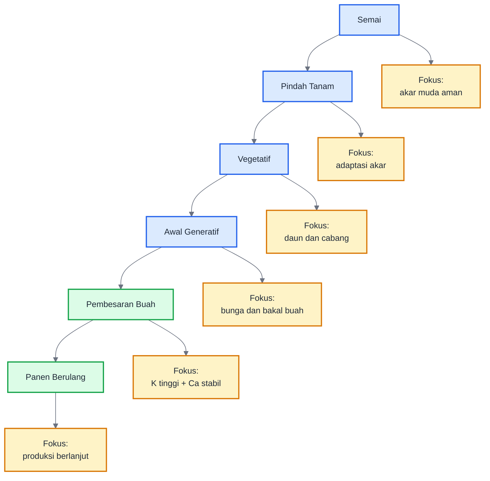
```mermaid id="7guh90"
%%{init: {"theme": "base", "themeVariables": {
  "fontFamily": "Arial",
  "fontSize": "14px",
  "primaryTextColor": "#1f2937",
  "lineColor": "#6b7280"
}}}%%
flowchart TD
    A["Semai"]:::fase
    B["Pindah Tanam"]:::fase
    C["Vegetatif"]:::fase
    D["Awal Generatif"]:::fase
    E["Pembesaran Buah"]:::buah
    F["Panen Berulang"]:::buah

    A --> B --> C --> D --> E --> F

    A1["Fokus:<br/>akar muda aman"]:::catatan
    B1["Fokus:<br/>adaptasi akar"]:::catatan
    C1["Fokus:<br/>daun dan cabang"]:::catatan
    D1["Fokus:<br/>bunga dan bakal buah"]:::catatan
    E1["Fokus:<br/>K tinggi + Ca stabil"]:::catatan
    F1["Fokus:<br/>produksi berlanjut"]:::catatan

    A --> A1
    B --> B1
    C --> C1
    D --> D1
    E --> E1
    F --> F1

    classDef fase fill:#DBEAFE,stroke:#2563EB,stroke-width:2px,color:#1F2937;
    classDef buah fill:#DCFCE7,stroke:#16A34A,stroke-width:2px,color:#1F2937;
    classDef catatan fill:#FEF3C7,stroke:#D97706,stroke-width:2px,color:#1F2937;
```

---

## 9.12 Kesimpulan Bab 9

Cabai tidak cukup hanya diberi K dan Si. Tanaman tetap membutuhkan nutrisi lengkap.

Ringkasnya:

```text id="cc0d3g"
N  = pertumbuhan daun dan cabang
P  = akar dan energi
K  = buah, air, gula, kualitas
Ca = pucuk, akar muda, dinding sel
Mg = klorofil dan fotosintesis
S  = protein dan enzim
Si = penguat jaringan dan ketahanan stres
Mikro = bunga, enzim, metabolisme
```

Maka ekstrak abu sekam + KOH harus ditempatkan sebagai:

```text id="m3htms"
suplemen K + Si
bukan pupuk lengkap
```

[**Kembali ke Atas**](#dari-sekam-padi-ke-booster-ksi-pemanfaatan-arang-sekam-abu-sekam-dan-ekstrak-koh-untuk-budidaya-cabai)

---

# 10. Posisi Ekstrak Abu Sekam + KOH untuk Cabai

Setelah memahami kebutuhan mineral cabai, posisi ekstrak abu sekam + KOH menjadi lebih jelas.

Ekstrak ini bukan pengganti pupuk dasar. Ekstrak ini lebih tepat disebut sebagai **booster K–Si** atau **suplemen K–Si rendah klorida**.

---

## 10.1 Fungsi Utama

Fungsi utama ekstrak abu sekam + KOH adalah:

```text id="enq7ic"
Booster K + Si
```

Artinya, larutan ini terutama menyuplai:

```text id="g38l8k"
K = kalium
Si = silikon tersedia sebagian
```

K berasal dari dua sumber:

```text id="w7fvf7"
1. K dari KOH
2. K dari abu sekam
```

Si berasal dari silika abu sekam yang larut sebagian melalui bantuan kondisi basa dari KOH.

---

## 10.2 Bukan untuk Menggantikan Pupuk Lengkap

Ekstrak abu sekam + KOH tidak boleh digunakan sebagai satu-satunya sumber nutrisi cabai.

Bahan ini bukan untuk menggantikan:

```text id="q4u3e8"
N
P
Ca
Mg
S
Mikro
```

Cabai tetap membutuhkan pupuk dasar yang menyediakan unsur-unsur tersebut secara seimbang.

Skema posisinya:

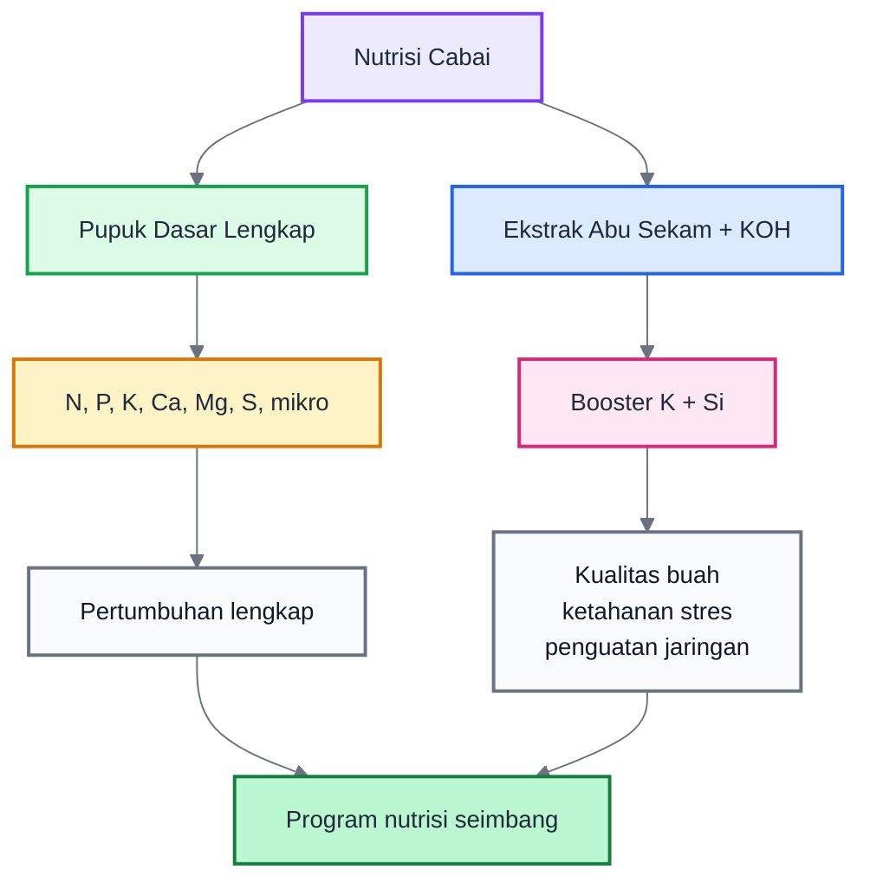
```mermaid id="cs76xp"
%%{init: {"theme": "base", "themeVariables": {
  "fontFamily": "Arial",
  "fontSize": "14px",
  "primaryTextColor": "#1f2937",
  "lineColor": "#6b7280"
}}}%%
flowchart TD
    A["Nutrisi Cabai"]:::utama

    A --> B["Pupuk Dasar Lengkap"]:::dasar
    A --> C["Ekstrak Abu Sekam + KOH"]:::ekstrak

    B --> D["N, P, K, Ca, Mg, S, mikro"]:::isi
    C --> E["Booster K + Si"]:::booster

    D --> F["Pertumbuhan lengkap"]:::hasil
    E --> G["Kualitas buah<br/>ketahanan stres<br/>penguatan jaringan"]:::hasil

    F --> H["Program nutrisi seimbang"]:::akhir
    G --> H

    classDef utama fill:#EDE9FE,stroke:#7C3AED,stroke-width:2px,color:#1F2937;
    classDef dasar fill:#DCFCE7,stroke:#16A34A,stroke-width:2px,color:#1F2937;
    classDef ekstrak fill:#DBEAFE,stroke:#2563EB,stroke-width:2px,color:#1F2937;
    classDef isi fill:#FEF3C7,stroke:#D97706,stroke-width:2px,color:#1F2937;
    classDef booster fill:#FCE7F3,stroke:#DB2777,stroke-width:2px,color:#1F2937;
    classDef hasil fill:#F9FAFB,stroke:#6B7280,stroke-width:2px,color:#111827;
    classDef akhir fill:#BBF7D0,stroke:#15803D,stroke-width:2px,color:#1F2937;
```

---

## 10.3 Manfaat Potensial untuk Cabai

Ekstrak K–Si berpotensi memberi beberapa manfaat bagi cabai, terutama jika dipakai pada fase yang tepat dan dosis yang aman.

Manfaat potensialnya:

- membantu pembesaran buah,
- mendukung efisiensi air,
- memperkuat jaringan tanaman,
- membantu ketahanan stres panas,
- membantu ketahanan terhadap tekanan lingkungan,
- mengurangi ketergantungan pada KCl,
- memberi sumber K rendah klorida,
- mendukung kualitas buah.

Pemberian K yang tepat dapat meningkatkan kualitas buah pepper/cabai, termasuk kekerasan buah, gula terlarut, dan asam askorbat. [5]

---

## 10.4 Mengapa Rendah Klorida Penting?

Salah satu keunggulan ekstrak abu sekam + KOH adalah tidak membawa beban klorida seperti KCl.

KCl memang sumber K yang umum, kuat, dan murah. Namun pada sistem tertentu, klorida berlebih bisa menjadi masalah, terutama jika:

```text id="hc9if5"
drainase buruk,
media terlalu salin,
air irigasi sudah tinggi garam,
tanaman sensitif,
aplikasi KCl terlalu sering,
sistem polybag/greenhouse intensif.
```

Ekstrak abu sekam + KOH memberi alternatif sumber K tanpa tambahan Cl⁻ tinggi.

Namun ini bukan berarti ekstrak K–Si bebas risiko. Jika terlalu pekat, larutan tetap dapat menaikkan pH dan EC.

Prinsipnya:

```text id="qndbop"
KCl:
K tinggi + membawa Cl⁻

Ekstrak abu + KOH:
K + Si + alkalinitas
tanpa beban Cl⁻ tinggi
tetapi harus kontrol pH dan EC
```

---

## 10.5 Kenapa Ekstrak Ini Cocok untuk Fase Generatif?

Pada fase generatif, cabai mulai membentuk bunga, bakal buah, dan buah panen. Di fase ini, kebutuhan K meningkat karena tanaman harus mengatur aliran gula, air, dan pembesaran buah.

K dan Si memiliki peran yang saling mendukung.

```text id="8yys57"
K  = transport gula, air, pembesaran buah
Si = kekuatan jaringan, ketahanan stres
```

Karena itu, ekstrak K–Si lebih relevan digunakan mulai:

```text id="n6b9kc"
vegetatif akhir
awal generatif
pembesaran buah
panen berulang
```

Pada fase semai, dosis harus sangat rendah karena akar masih sensitif.

---

## 10.6 Hubungan K, Ca, dan Mg

Satu catatan penting: karena ekstrak ini menyumbang K, maka penggunaannya harus memperhatikan keseimbangan dengan Ca dan Mg.

Jika K terlalu tinggi, penyerapan Ca dan Mg dapat terganggu.

Risikonya:

```text id="f9j1z6"
K berlebih → Ca/Mg terganggu
Ca kurang → pucuk dan kualitas buah terganggu
Mg kurang → fotosintesis melemah
```

Maka penggunaan ekstrak K–Si harus disertai program pemupukan dasar yang tetap menyediakan Ca dan Mg.

Diagram keseimbangannya:

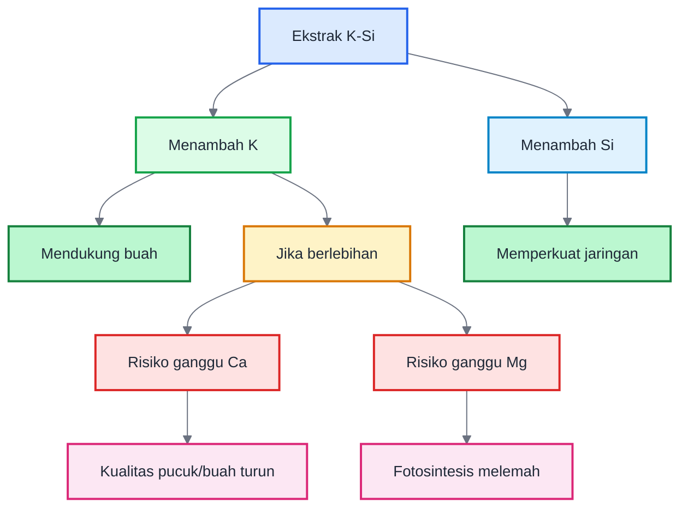
```mermaid id="yhpr72"
%%{init: {"theme": "base", "themeVariables": {
  "fontFamily": "Arial",
  "fontSize": "14px",
  "primaryTextColor": "#1f2937",
  "lineColor": "#6b7280"
}}}%%
flowchart TD
    A["Ekstrak K-Si"]:::ekstrak
    A --> B["Menambah K"]:::k
    A --> C["Menambah Si"]:::si

    B --> D["Mendukung buah"]:::baik
    C --> E["Memperkuat jaringan"]:::baik

    B --> F["Jika berlebihan"]:::waspada
    F --> G["Risiko ganggu Ca"]:::risiko
    F --> H["Risiko ganggu Mg"]:::risiko

    G --> I["Kualitas pucuk/buah turun"]:::akibat
    H --> J["Fotosintesis melemah"]:::akibat

    classDef ekstrak fill:#DBEAFE,stroke:#2563EB,stroke-width:2px,color:#1F2937;
    classDef k fill:#DCFCE7,stroke:#16A34A,stroke-width:2px,color:#1F2937;
    classDef si fill:#E0F2FE,stroke:#0284C7,stroke-width:2px,color:#1F2937;
    classDef baik fill:#BBF7D0,stroke:#15803D,stroke-width:2px,color:#1F2937;
    classDef waspada fill:#FEF3C7,stroke:#D97706,stroke-width:2px,color:#1F2937;
    classDef risiko fill:#FEE2E2,stroke:#DC2626,stroke-width:2px,color:#1F2937;
    classDef akibat fill:#FCE7F3,stroke:#DB2777,stroke-width:2px,color:#1F2937;
```

---

## 10.7 Hubungan Si dengan Ketahanan Tanaman

Si dalam cabai tidak diperlakukan seperti NPK. Si lebih tepat dipahami sebagai unsur pendukung ketahanan.

Manfaat Si lebih terasa pada kondisi tanaman menghadapi tekanan, misalnya:

```text id="hxw3c7"
cuaca panas,
transpirasi tinggi,
serangan penyakit,
stres air,
pertumbuhan generatif berat,
beban buah tinggi.
```

Si dapat membantu jaringan tanaman menjadi lebih kuat dan respons tanaman terhadap stres menjadi lebih baik.

Namun Si tidak akan memperbaiki tanaman yang kekurangan hara dasar. Jika cabai kekurangan N, Ca, Mg, atau mikro, pemberian Si saja tidak cukup.

---

## 10.8 Posisi Aplikasi dalam Program Budidaya Cabai

Secara praktis, ekstrak K–Si ditempatkan sebagai aplikasi tambahan di antara program pupuk dasar.

Contoh pola konsep:

```text id="ia56he"
Pupuk dasar:
menyediakan N, P, K, Ca, Mg, S, mikro

Ekstrak K-Si:
diberikan berkala sebagai booster K + Si

Pupuk hayati/mikroba:
diberikan terpisah agar tidak terganggu pH basa

Pupuk mikro:
diberikan terpisah agar tidak mengendap
```

Diagram posisinya:

```mermaid id="6huemf"
%%{init: {"theme": "base", "themeVariables": {
  "fontFamily": "Arial",
  "fontSize": "14px",
  "primaryTextColor": "#1f2937",
  "lineColor": "#6b7280"
}}}%%
flowchart TD
    A["Program Cabai"]:::utama

    A --> B["Pupuk Dasar"]:::dasar
    A --> C["Ekstrak K-Si"]:::ksi
    A --> D["Pupuk Mikro"]:::mikro
    A --> E["Pupuk Hayati"]:::hayati

    B --> F["N, P, K, Ca, Mg, S"]:::isi
    C --> G["K + Si"]:::isi
    D --> H["B, Fe, Mn, Zn, Cu, Mo"]:::isi
    E --> I["Mikroba menguntungkan"]:::isi

    C --> J["Berikan terpisah<br/>dari mikro dan hayati"]:::peringatan

    classDef utama fill:#EDE9FE,stroke:#7C3AED,stroke-width:2px,color:#1F2937;
    classDef dasar fill:#DCFCE7,stroke:#16A34A,stroke-width:2px,color:#1F2937;
    classDef ksi fill:#DBEAFE,stroke:#2563EB,stroke-width:2px,color:#1F2937;
    classDef mikro fill:#FCE7F3,stroke:#DB2777,stroke-width:2px,color:#1F2937;
    classDef hayati fill:#FEF3C7,stroke:#D97706,stroke-width:2px,color:#1F2937;
    classDef isi fill:#F9FAFB,stroke:#6B7280,stroke-width:2px,color:#111827;
    classDef peringatan fill:#FEE2E2,stroke:#DC2626,stroke-width:2px,color:#1F2937;
```

---

## 10.9 Kesalahan Pemahaman yang Harus Dihindari

Ada beberapa kesalahan yang perlu dihindari.

### Kesalahan 1: Menganggap ekstrak K–Si sebagai pupuk lengkap

Ini keliru. Ekstrak ini kuat pada K dan Si, tetapi tidak lengkap untuk N, P, Ca, Mg, S, dan mikro.

### Kesalahan 2: Menganggap semakin pekat semakin bagus

Ini berbahaya. Larutan terlalu pekat dapat menaikkan pH dan EC, lalu merusak akar.

### Kesalahan 3: Menggunakan dosis sama untuk semua fase

Bibit, tanaman muda, dan tanaman berbuah memiliki toleransi berbeda. Bibit harus mendapatkan dosis jauh lebih rendah.

### Kesalahan 4: Mencampur langsung dengan pupuk mikro dan pupuk hayati

Larutan basa dapat mengendapkan unsur mikro dan mengganggu mikroba.

### Kesalahan 5: Melupakan Ca dan Mg

Karena ekstrak ini menambah K, keseimbangan Ca dan Mg harus dijaga.

---

## 10.10 Pesan Utama Bab 10

Ekstrak abu sekam + KOH paling tepat diposisikan sebagai:

```text id="e8kfs9"
booster K + Si
suplemen generatif
sumber K rendah klorida
pendukung ketahanan stres
bukan pupuk lengkap
```

Manfaatnya akan lebih terasa jika:

```text id="321bxs"
dosis rendah sampai sedang,
aplikasi bertahap,
tidak dicampur langsung dengan pupuk mikro/hayati,
pH dan EC larutan akhir dikontrol,
pupuk dasar tetap lengkap.
```

Kesimpulan praktis:

> Ekstrak abu sekam + KOH berpotensi positif untuk cabai karena menyuplai K dan Si. Namun keberhasilannya bergantung pada dosis, fase aplikasi, dan keseimbangan dengan N, P, Ca, Mg, S, serta unsur mikro.

[**Kembali ke Atas**](#dari-sekam-padi-ke-booster-ksi-pemanfaatan-arang-sekam-abu-sekam-dan-ekstrak-koh-untuk-budidaya-cabai)

---

# 11. Aplikasi Ekstrak K–Si untuk Cabai

Aplikasi ekstrak K–Si pada cabai harus mengikuti fase pertumbuhan tanaman. Dosis untuk bibit tidak boleh disamakan dengan tanaman dewasa, karena akar bibit jauh lebih sensitif terhadap larutan alkalis dan garam terlarut.

Gunakan stok standar:

```text id="8k4qrl"
10 L air + 1 kg abu sekam + 15 g KOH teknis 90%
```

Stok ini harus diencerkan terlebih dahulu sebelum dikocorkan ke tanaman.

Prinsip umum aplikasinya:

```text id="4vyxl2"
Semai          = dosis sangat rendah
Vegetatif      = dosis rendah-sedang
Generatif      = dosis sedang
Pembesaran buah = dosis sedang-tinggi
Panen berulang = dosis menyesuaikan kondisi tanaman
```

---

## 11.1 Jadwal Aplikasi

| Fase                 |                   Umur | Dosis stok |       Volume kocor | Frekuensi         |
| -------------------- | ---------------------: | ---------: | -----------------: | ----------------- |
| **Semai**            |              10–14 HSS |     5 ml/L |     10–20 ml/bibit | 1 kali            |
| **Pra-pindah tanam** | 3–5 hari sebelum tanam |  5–10 ml/L |     20–30 ml/bibit | 1 kali            |
| **Adaptasi tanam**   |                  7 HST |    10 ml/L |  50–100 ml/tanaman | 1 kali            |
| **Vegetatif**        |               8–30 HST | 10–20 ml/L | 100–200 ml/tanaman | 10–14 hari sekali |
| **Awal generatif**   |              30–45 HST | 20–30 ml/L | 200–300 ml/tanaman | 10 hari sekali    |
| **Pembesaran buah**  |              45–70 HST | 30–40 ml/L | 300–500 ml/tanaman | 7–10 hari sekali  |
| **Panen berulang**   |                70 HST+ | 30–50 ml/L | 300–500 ml/tanaman | 7–14 hari sekali  |

Keterangan:

```text id="rq7ox9"
HSS = hari setelah semai
HST = hari setelah tanam
ml/L = mililiter stok per 1 liter air
```

---

## 11.2 Diagram Jadwal Aplikasi Cabai

```mermaid id="ko2ncp"
%%{init: {"theme": "base", "themeVariables": {
  "fontFamily": "Arial",
  "fontSize": "14px",
  "primaryTextColor": "#1f2937",
  "lineColor": "#6b7280"
}}}%%
flowchart TD
    A["Semai<br/>10–14 HSS<br/>5 ml/L"]:::rendah
    B["Pra-pindah tanam<br/>3–5 hari sebelum tanam<br/>5–10 ml/L"]:::rendah
    C["Adaptasi tanam<br/>7 HST<br/>10 ml/L"]:::sedang
    D["Vegetatif<br/>8–30 HST<br/>10–20 ml/L"]:::sedang
    E["Awal generatif<br/>30–45 HST<br/>20–30 ml/L"]:::generatif
    F["Pembesaran buah<br/>45–70 HST<br/>30–40 ml/L"]:::buah
    G["Panen berulang<br/>70 HST+<br/>30–50 ml/L"]:::panen

    A --> B --> C --> D --> E --> F --> G

    classDef rendah fill:#DCFCE7,stroke:#16A34A,stroke-width:2px,color:#1F2937;
    classDef sedang fill:#DBEAFE,stroke:#2563EB,stroke-width:2px,color:#1F2937;
    classDef generatif fill:#FEF3C7,stroke:#D97706,stroke-width:2px,color:#1F2937;
    classDef buah fill:#FCE7F3,stroke:#DB2777,stroke-width:2px,color:#1F2937;
    classDef panen fill:#EDE9FE,stroke:#7C3AED,stroke-width:2px,color:#1F2937;
```

---

## 11.3 Fase Semai

Pada fase semai, akar masih kecil dan sensitif. Tujuan pemberian ekstrak K–Si bukan untuk memacu pertumbuhan cepat, tetapi untuk memberi penguatan ringan.

Dosis:

```text id="c8j2tz"
5 ml stok / 1 L air
```

Volume kocor:

```text id="ac4qsi"
10–20 ml per bibit
```

Frekuensi:

```text id="oydhmp"
1 kali pada umur 10–14 HSS
```

Catatan penting:

```text id="9lujp4"
Jangan diberikan pada bibit yang baru berkecambah.
Gunakan setelah bibit memiliki daun sejati.
Jangan gunakan larutan pekat.
```

Jika bibit terlihat lemah atau media terlalu basah, aplikasi sebaiknya ditunda.

---

## 11.4 Fase Pra-Pindah Tanam

Aplikasi 3–5 hari sebelum pindah tanam bertujuan membantu bibit lebih siap menghadapi stres pindah tanam.

Dosis:

```text id="tv4nea"
5–10 ml stok / 1 L air
```

Volume kocor:

```text id="r0w5c0"
20–30 ml per bibit
```

Frekuensi:

```text id="bnr7yh"
1 kali sebelum pindah tanam
```

Tujuan aplikasi:

- membantu penguatan jaringan,
- memberi K ringan untuk keseimbangan air,
- membantu bibit lebih tahan stres setelah pindah tanam.

---

## 11.5 Fase Adaptasi Tanam

Setelah pindah tanam, cabai biasanya mengalami fase adaptasi. Akar perlu menyesuaikan diri dengan media atau lahan baru.

Pada fase 0–5 HST, sebaiknya hindari aplikasi ekstrak K–Si. Mulai aplikasi ringan pada sekitar 7 HST jika tanaman sudah terlihat segar.

Dosis:

```text id="ixar3a"
10 ml stok / 1 L air
```

Volume kocor:

```text id="6epcoi"
50–100 ml per tanaman
```

Frekuensi:

```text id="y9w467"
1 kali pada sekitar 7 HST
```

Catatan:

```text id="287dum"
Jika tanaman masih layu, tunda aplikasi.
Jika media terlalu basah, jangan dikocor.
Jika daun muda menguning, cek pH dan kondisi akar.
```

---

## 11.6 Fase Vegetatif

Fase vegetatif berlangsung saat tanaman membentuk akar, daun, batang, dan cabang produktif. Pada fase ini, ekstrak K–Si dapat diberikan dengan dosis rendah sampai sedang.

Dosis:

```text id="je9xlg"
10–20 ml stok / 1 L air
```

Volume kocor:

```text id="quqg1l"
100–200 ml per tanaman
```

Frekuensi:

```text id="m1iuo8"
1 kali setiap 10–14 hari
```

Contoh jadwal:

```text id="ob6qry"
10 HST : 10 ml/L
20 HST : 15 ml/L
30 HST : 20 ml/L
```

Tujuan aplikasi:

- memperkuat batang,
- mendukung efisiensi air,
- membantu jaringan tanaman lebih kokoh,
- menyiapkan tanaman masuk fase generatif.

Namun pada fase vegetatif, jangan berlebihan memberi K. Tanaman tetap membutuhkan N, Ca, Mg, dan P yang seimbang.

---

## 11.7 Fase Awal Generatif

Fase awal generatif adalah fase pembentukan bunga dan bakal buah. Pada tahap ini, kebutuhan K mulai meningkat, tetapi Ca, B, Mg, dan P tetap penting.

Dosis:

```text id="7j4sfh"
20–30 ml stok / 1 L air
```

Volume kocor:

```text id="fd2i3e"
200–300 ml per tanaman
```

Frekuensi:

```text id="wlx66r"
1 kali setiap 10 hari
```

Tujuan aplikasi:

- mendukung pembentukan bunga,
- membantu ketahanan terhadap stres panas,
- membantu tanaman menahan beban awal generatif,
- memberi K dan Si secara bertahap.

Catatan:

```text id="cff5u7"
Jangan mengabaikan Ca dan B.
Bunga dan bakal buah membutuhkan keseimbangan hara.
K berlebih tanpa Ca/Mg yang cukup dapat menimbulkan masalah.
```

---

## 11.8 Fase Pembesaran Buah

Fase ini adalah fase paling relevan untuk penggunaan ekstrak K–Si. Cabai membutuhkan K lebih tinggi untuk pembesaran buah, transport gula, dan kualitas panen.

Dosis normal:

```text id="o6i46c"
30 ml stok / 1 L air
```

Dosis lebih kuat untuk tanaman sehat:

```text id="zvz6qx"
40 ml stok / 1 L air
```

Volume kocor:

```text id="q9nrwl"
300–500 ml per tanaman
```

Frekuensi:

```text id="ggb77k"
1 kali setiap 7–10 hari
```

Gunakan dosis 40 ml/L hanya jika:

```text id="o3lfyd"
tanaman sehat,
akar kuat,
media tidak basa,
tidak ada gejala gosong daun,
tidak ada kerak putih berlebihan di media.
```

---

## 11.9 Fase Panen Berulang

Pada fase panen berulang, tanaman terus membentuk bunga dan buah baru. Nutrisi harus dijaga agar tanaman tidak cepat lelah.

Dosis normal:

```text id="jlrnhr"
30 ml stok / 1 L air
```

Dosis tinggi terbatas:

```text id="m9lpua"
40–50 ml stok / 1 L air
```

Volume kocor:

```text id="r51clj"
300–500 ml per tanaman
```

Frekuensi:

```text id="tigz5y"
1 kali setiap 7–14 hari
```

Dosis tinggi hanya digunakan sesekali, terutama saat:

- tanaman sehat,
- beban buah tinggi,
- cuaca panas,
- setelah panen besar,
- media tidak menunjukkan gejala salinitas atau pH terlalu tinggi.

[**Kembali ke Atas**](#dari-sekam-padi-ke-booster-ksi-pemanfaatan-arang-sekam-abu-sekam-dan-ekstrak-koh-untuk-budidaya-cabai)

---

# 12. Perkiraan Kontribusi Si dan K dari Stok

Stok ekstrak K–Si dibuat dengan formula:

```text id="9s8t92"
10 L air + 1 kg abu sekam + 15 g KOH teknis 90%
```

Dari perhitungan sebelumnya, stok ini memiliki perkiraan:

```text id="8fltfw"
Si teoritis dari KOH : ±338 ppm Si
K dari KOH           : ±941 ppm K
```

Angka ini terutama berasal dari KOH, belum menghitung tambahan K yang larut dari abu sekam.

---

## 12.1 Tabel Kontribusi Si dan K

Dengan stok 15 g KOH/10 L:

| Dosis stok | Si teoritis |  K dari KOH |
| ---------: | ----------: | ----------: |
|     5 ml/L | ±1,7 ppm Si |  ±4,7 ppm K |
|    10 ml/L | ±3,4 ppm Si |  ±9,4 ppm K |
|    20 ml/L | ±6,8 ppm Si | ±18,8 ppm K |
|    30 ml/L |  ±10 ppm Si |   ±28 ppm K |
|    50 ml/L |  ±17 ppm Si |   ±47 ppm K |

---

## 12.2 Rumus Pengenceran

Rumus sederhana untuk menghitung kontribusi unsur dari stok:

```text id="qkprvy"
ppm akhir =
ppm stok × dosis stok ml/L ÷ 1000
```

Contoh untuk Si pada dosis 30 ml/L:

```text id="fyasr6"
Si akhir = 338 × 30 ÷ 1000
         = 10,14 ppm Si
```

Contoh untuk K pada dosis 30 ml/L:

```text id="8olzat"
K akhir = 941 × 30 ÷ 1000
        = 28,23 ppm K
```

Jadi pada dosis 30 ml/L, kontribusi teoritis dari stok adalah sekitar:

```text id="g65zio"
±10 ppm Si
±28 ppm K dari KOH
```

K aktual dapat lebih tinggi karena abu sekam juga menyumbang K larut.

---

## 12.3 Diagram Pengenceran Stok

```mermaid id="vcjri4"
%%{init: {"theme": "base", "themeVariables": {
  "fontFamily": "Arial",
  "fontSize": "14px",
  "primaryTextColor": "#1f2937",
  "lineColor": "#6b7280"
}}}%%
flowchart TD
    A["Stok K-Si<br/>±338 ppm Si<br/>±941 ppm K dari KOH"]:::stok
    B["Dosis 5 ml/L"]:::rendah
    C["Dosis 10 ml/L"]:::rendah
    D["Dosis 20 ml/L"]:::sedang
    E["Dosis 30 ml/L"]:::sedang
    F["Dosis 50 ml/L"]:::tinggi

    A --> B
    A --> C
    A --> D
    A --> E
    A --> F

    B --> B1["±1,7 ppm Si<br/>±4,7 ppm K"]:::hasil
    C --> C1["±3,4 ppm Si<br/>±9,4 ppm K"]:::hasil
    D --> D1["±6,8 ppm Si<br/>±18,8 ppm K"]:::hasil
    E --> E1["±10 ppm Si<br/>±28 ppm K"]:::hasil
    F --> F1["±17 ppm Si<br/>±47 ppm K"]:::hasil

    classDef stok fill:#EDE9FE,stroke:#7C3AED,stroke-width:2px,color:#1F2937;
    classDef rendah fill:#DCFCE7,stroke:#16A34A,stroke-width:2px,color:#1F2937;
    classDef sedang fill:#DBEAFE,stroke:#2563EB,stroke-width:2px,color:#1F2937;
    classDef tinggi fill:#FEF3C7,stroke:#D97706,stroke-width:2px,color:#1F2937;
    classDef hasil fill:#F9FAFB,stroke:#6B7280,stroke-width:2px,color:#111827;
```

---

## 12.4 Cara Membaca Angka ppm

Angka ppm menunjukkan miligram unsur per liter larutan.

```text id="86r40x"
1 ppm = 1 mg/L
```

Jadi jika larutan akhir mengandung 10 ppm Si, artinya:

```text id="gofgpn"
10 mg Si dalam 1 liter larutan
```

Jika satu tanaman diberi 300 ml larutan dengan 10 ppm Si, maka Si yang diberikan secara teoritis:

```text id="e7d5pd"
10 mg/L × 0,3 L = 3 mg Si per tanaman
```

Untuk K pada larutan 28 ppm dan volume 300 ml:

```text id="uf7ag9"
28 mg/L × 0,3 L = 8,4 mg K per tanaman
```

Ini menunjukkan bahwa ekstrak K–Si bekerja sebagai **suplemen berkala**, bukan sumber utama seluruh kebutuhan K cabai.

---

## 12.5 Catatan Penting

Ada tiga catatan penting.

Pertama, **K aktual bisa lebih tinggi** karena abu sekam juga menyumbang K larut. K dari tabel hanya menghitung K yang berasal dari KOH.

Kedua, **Si aktual bisa lebih rendah** karena reaksi pelarutan Si tidak selalu 100% efisien. Sebagian Si tetap tertinggal sebagai padatan.

Ketiga, dosis harus disesuaikan dengan:

```text id="6p0pjw"
pupuk dasar,
umur tanaman,
kondisi media,
pH,
EC,
cuaca,
kesehatan akar.
```

Karena itu, angka dalam tabel digunakan sebagai panduan awal, bukan angka mutlak.

---

# 13. Kombinasi dengan Pupuk Dasar

Ekstrak K–Si tidak boleh berdiri sendiri. Cabai tetap membutuhkan pupuk dasar lengkap.

Ekstrak ini hanya berperan sebagai suplemen:

```text id="pvl0ql"
Ekstrak K-Si = tambahan K + Si
```

Bukan pengganti:

```text id="2y436d"
N, P, Ca, Mg, S, dan unsur mikro
```

---

## 13.1 Prinsip

Prinsip utama:

> Ekstrak K–Si digunakan sebagai **suplemen**, bukan pupuk tunggal.

Program pemupukan cabai yang baik tetap harus menyediakan unsur lengkap.

```text id="m97chq"
Pupuk dasar:
N + P + K + Ca + Mg + S + mikro

Suplemen:
Ekstrak abu sekam + KOH = K + Si
```

---

## 13.2 Diagram Posisi Ekstrak K–Si

```mermaid id="zd6n8e"
%%{init: {"theme": "base", "themeVariables": {
  "fontFamily": "Arial",
  "fontSize": "14px",
  "primaryTextColor": "#1f2937",
  "lineColor": "#6b7280"
}}}%%
flowchart TD
    A["Program Nutrisi Cabai"]:::utama

    A --> B["Pupuk Dasar"]:::dasar
    A --> C["Ekstrak K-Si"]:::ksi
    A --> D["Pupuk Mikro"]:::mikro
    A --> E["Pupuk Hayati"]:::hayati

    B --> B1["N, P, K<br/>Ca, Mg, S"]:::isi
    C --> C1["K + Si"]:::isi
    D --> D1["B, Fe, Mn<br/>Zn, Cu, Mo"]:::isi
    E --> E1["Mikroba baik"]:::isi

    C --> F["Aplikasi terpisah<br/>jangan dicampur pekat"]:::peringatan

    classDef utama fill:#EDE9FE,stroke:#7C3AED,stroke-width:2px,color:#1F2937;
    classDef dasar fill:#DCFCE7,stroke:#16A34A,stroke-width:2px,color:#1F2937;
    classDef ksi fill:#DBEAFE,stroke:#2563EB,stroke-width:2px,color:#1F2937;
    classDef mikro fill:#FCE7F3,stroke:#DB2777,stroke-width:2px,color:#1F2937;
    classDef hayati fill:#FEF3C7,stroke:#D97706,stroke-width:2px,color:#1F2937;
    classDef isi fill:#F9FAFB,stroke:#6B7280,stroke-width:2px,color:#111827;
    classDef peringatan fill:#FEE2E2,stroke:#DC2626,stroke-width:2px,color:#1F2937;
```

[**Kembali ke Atas**](#dari-sekam-padi-ke-booster-ksi-pemanfaatan-arang-sekam-abu-sekam-dan-ekstrak-koh-untuk-budidaya-cabai)

---

## 13.3 Jangan Dicampur Langsung dengan Bahan Tertentu

Ekstrak K–Si bersifat basa. Karena itu, jangan mencampurnya langsung dengan beberapa bahan berikut, terutama dalam larutan pekat.

```text id="nflnuw"
Kalsium nitrat
Magnesium sulfat
MKP
Pupuk mikro Fe/Zn/Mn/Cu
Pupuk hayati/mikroba
Pestisida sensitif pH
```

Alasannya:

| Bahan                 | Risiko jika dicampur langsung                               |
| --------------------- | ----------------------------------------------------------- |
| Kalsium nitrat        | Bisa bereaksi dengan silikat/fosfat dan membentuk endapan   |
| Magnesium sulfat      | Mg dapat mengendap pada pH tinggi                           |
| MKP                   | Fosfat bisa terikat oleh Ca/Mg dan pH tinggi                |
| Pupuk mikro           | Fe, Mn, Zn, Cu mudah tidak stabil pada pH tinggi            |
| Pupuk hayati          | Mikroba dapat terganggu oleh pH basa                        |
| Pestisida sensitif pH | Efektivitas bisa turun atau terjadi reaksi tidak diinginkan |

---

## 13.4 Jeda Aplikasi

Gunakan jeda aplikasi:

```text id="ve5p7i"
2–3 hari dari aplikasi Ca, Mg, mikro, atau pupuk hayati
```

Contoh pola mingguan sederhana:

```text id="la5c63"
Hari 1 : Pupuk dasar
Hari 3 : Ekstrak K-Si
Hari 5 : Pupuk mikro / hayati
Hari 7 : Evaluasi tanaman
```

Atau:

```text id="6auu8t"
Senin  : Pupuk dasar
Rabu   : Ekstrak K-Si
Jumat  : Mikro / hayati
Minggu : Air biasa atau evaluasi
```

---

## 13.5 Diagram Jeda Aplikasi

```mermaid id="uqjw2f"
%%{init: {"theme": "base", "themeVariables": {
  "fontFamily": "Arial",
  "fontSize": "14px",
  "primaryTextColor": "#1f2937",
  "lineColor": "#6b7280"
}}}%%
flowchart TD
    A["Hari 1<br/>Pupuk dasar"]:::dasar
    B["Jeda 2 hari"]:::jeda
    C["Hari 3<br/>Ekstrak K-Si"]:::ksi
    D["Jeda 2 hari"]:::jeda
    E["Hari 5<br/>Mikro / hayati"]:::mikro
    F["Hari 7<br/>Evaluasi tanaman"]:::evaluasi

    A --> B --> C --> D --> E --> F

    classDef dasar fill:#DCFCE7,stroke:#16A34A,stroke-width:2px,color:#1F2937;
    classDef jeda fill:#F9FAFB,stroke:#6B7280,stroke-width:2px,color:#111827;
    classDef ksi fill:#DBEAFE,stroke:#2563EB,stroke-width:2px,color:#1F2937;
    classDef mikro fill:#FCE7F3,stroke:#DB2777,stroke-width:2px,color:#1F2937;
    classDef evaluasi fill:#FEF3C7,stroke:#D97706,stroke-width:2px,color:#1F2937;
```

---

## 13.6 Keseimbangan K, Ca, dan Mg

Karena ekstrak K–Si menambah K, maka keseimbangan dengan Ca dan Mg harus dijaga.

Risiko jika K terlalu dominan:

```text id="0nnhds"
K berlebih → penyerapan Ca terganggu
K berlebih → penyerapan Mg terganggu
Ca kurang → pucuk dan buah bermasalah
Mg kurang → fotosintesis melemah
```

Karena itu, pada fase generatif dan pembesaran buah, program nutrisi harus tetap menyediakan:

```text id="bkuv31"
Ca stabil
Mg cukup
K terukur
```

Ekstrak K–Si dapat membantu kualitas buah, tetapi tidak boleh membuat K menjadi terlalu dominan.

---

# 14. Parameter Aman: pH, EC, dan Gejala Overdosis

Karena stok ekstrak K–Si berasal dari abu sekam dan KOH, larutan ini bersifat basa dan mengandung garam mineral. Dua parameter yang paling penting diperhatikan adalah **pH** dan **EC**.

```text id="1yuf2s"
pH = tingkat asam-basa larutan
EC = tingkat garam terlarut dalam larutan
```

pH terlalu tinggi dapat mengganggu ketersediaan unsur mikro. EC terlalu tinggi dapat membuat akar sulit menyerap air dan menyebabkan stres.

---

## 14.1 Target Larutan Akhir

Target aman untuk bibit:

```text id="lk7ds5"
Bibit:
pH 6,5–7,5
EC rendah
```

Target aman untuk tanaman dewasa:

```text id="sf03sl"
Tanaman dewasa:
pH 6,5–8,0
EC tidak melonjak drastis
```

Jika tidak memiliki pH meter dan EC meter, gunakan dosis terendah terlebih dahulu dan uji pada beberapa tanaman sebelum diaplikasikan ke seluruh lahan.

[**Kembali ke Atas**](#dari-sekam-padi-ke-booster-ksi-pemanfaatan-arang-sekam-abu-sekam-dan-ekstrak-koh-untuk-budidaya-cabai)

---

## 14.2 Diagram Keputusan Dosis Aman

```mermaid id="ikb4s8"
%%{init: {"theme": "base", "themeVariables": {
  "fontFamily": "Arial",
  "fontSize": "14px",
  "primaryTextColor": "#1f2937",
  "lineColor": "#6b7280"
}}}%%
flowchart TD
    A["Larutan ekstrak K-Si<br/>sudah diencerkan"]:::awal
    B["Cek pH / EC<br/>jika alat tersedia"]:::cek
    C["pH aman<br/>EC aman"]:::aman
    D["pH terlalu tinggi<br/>atau EC tinggi"]:::bahaya
    E["Aplikasikan<br/>sesuai fase tanaman"]:::aplikasi
    F["Encerkan lagi<br/>atau tunda aplikasi"]:::tunda
    G["Uji 3–5 tanaman<br/>amati 2–3 hari"]:::uji

    A --> B
    B --> C
    B --> D
    C --> E
    D --> F
    F --> G
    G --> E

    classDef awal fill:#DBEAFE,stroke:#2563EB,stroke-width:2px,color:#1F2937;
    classDef cek fill:#FEF3C7,stroke:#D97706,stroke-width:2px,color:#1F2937;
    classDef aman fill:#DCFCE7,stroke:#16A34A,stroke-width:2px,color:#1F2937;
    classDef bahaya fill:#FEE2E2,stroke:#DC2626,stroke-width:2px,color:#1F2937;
    classDef aplikasi fill:#BBF7D0,stroke:#15803D,stroke-width:2px,color:#1F2937;
    classDef tunda fill:#FCE7F3,stroke:#DB2777,stroke-width:2px,color:#1F2937;
    classDef uji fill:#EDE9FE,stroke:#7C3AED,stroke-width:2px,color:#1F2937;
```

---

## 14.3 Gejala Dosis Terlalu Tinggi

Turunkan dosis atau hentikan sementara jika muncul gejala berikut:

- tepi daun gosong,
- pucuk mengeriting,
- daun muda menguning,
- tanaman layu setelah kocor,
- media berkerak putih,
- bunga rontok meningkat,
- pertumbuhan vegetatif melemah,
- buah kecil tetapi tanaman tampak terlalu keras.

Gejala tersebut tidak selalu hanya disebabkan oleh ekstrak K–Si, tetapi menjadi tanda bahwa tanaman sedang mengalami ketidakseimbangan atau stres.

---

## 14.4 Penyebab Umum

Penyebab umum masalah setelah aplikasi ekstrak K–Si:

```text id="r610m7"
pH terlalu tinggi
EC terlalu tinggi
K berlebihan
ketidakseimbangan Ca/Mg
aplikasi terlalu dekat dengan pupuk lain
media sudah basa
drainase buruk
akar sedang stres
```

Diagram hubungan penyebab dan gejala:

```mermaid id="pp5fw8"
%%{init: {"theme": "base", "themeVariables": {
  "fontFamily": "Arial",
  "fontSize": "14px",
  "primaryTextColor": "#1f2937",
  "lineColor": "#6b7280"
}}}%%
flowchart TD
    A["Dosis ekstrak terlalu tinggi"]:::masalah
    B["pH naik"]:::sebab
    C["EC naik"]:::sebab
    D["K berlebihan"]:::sebab

    B --> E["Mikro sulit tersedia"]:::akibat
    C --> F["Akar stres osmotik"]:::akibat
    D --> G["Ca/Mg terganggu"]:::akibat

    E --> H["Daun muda menguning"]:::gejala
    F --> I["Tanaman layu"]:::gejala
    G --> J["Pucuk/fruit quality terganggu"]:::gejala

    classDef masalah fill:#FEE2E2,stroke:#DC2626,stroke-width:2px,color:#1F2937;
    classDef sebab fill:#FEF3C7,stroke:#D97706,stroke-width:2px,color:#1F2937;
    classDef akibat fill:#DBEAFE,stroke:#2563EB,stroke-width:2px,color:#1F2937;
    classDef gejala fill:#FCE7F3,stroke:#DB2777,stroke-width:2px,color:#1F2937;
```

---

## 14.5 Cara Koreksi Jika Terjadi Overdosis

Jika tanaman menunjukkan gejala overdosis, lakukan langkah berikut.

### 1. Hentikan aplikasi ekstrak K–Si sementara

```text id="zkntze"
Hentikan 1–2 siklus aplikasi
```

Jangan menambah dosis untuk “mengoreksi” gejala. Jika masalahnya pH/EC tinggi, penambahan larutan justru memperparah kondisi.

### 2. Siram dengan air bersih

Jika media polybag menunjukkan kerak putih atau tanaman layu setelah kocor, lakukan penyiraman air bersih untuk membantu menurunkan konsentrasi garam.

```text id="dhn82r"
Gunakan air bersih
Pastikan drainase lancar
Jangan membuat media becek berkepanjangan
```

### 3. Perbaiki keseimbangan Ca dan Mg

Jika gejala mengarah ke ketidakseimbangan Ca/Mg, perbaiki dengan pupuk Ca dan Mg secara terpisah dari ekstrak K–Si.

```text id="cw8jfm"
Ca diberikan terpisah
Mg diberikan terpisah
Jangan dicampur langsung dengan stok K-Si
```

### 4. Cek pH media

Jika tersedia alat, cek pH media. Jika media sudah terlalu basa, hentikan sementara semua bahan alkalis seperti abu, kapur, dan ekstrak K–Si.

---

## 14.6 Batas Praktis Tanpa Alat Ukur

Jika tidak memiliki pH meter dan EC meter, gunakan aturan konservatif berikut.

```text id="f0god4"
Semai:
maksimal 5 ml/L

Tanaman muda:
maksimal 10 ml/L

Vegetatif:
10–20 ml/L

Generatif:
20–30 ml/L

Buah aktif:
30 ml/L sebagai dosis normal
40–50 ml/L hanya jika tanaman sehat
```

Uji dulu pada beberapa tanaman:

```text id="3vbfqq"
Uji 3–5 tanaman
Amati 2–3 hari
Jika aman, lanjutkan ke populasi lebih luas
```

---

## 14.7 Ringkasan Bab 11–14

Ekstrak K–Si untuk cabai paling aman digunakan bertahap.

```text id="84fvfm"
Semai          : 5 ml/L
Pra-tanam      : 5–10 ml/L
Adaptasi       : 10 ml/L
Vegetatif      : 10–20 ml/L
Awal generatif : 20–30 ml/L
Buah aktif     : 30–40 ml/L
Panen berulang : 30–50 ml/L
```

Kontribusi unsur dari stok:

```text id="z0glt1"
30 ml/L ≈ 10 ppm Si + 28 ppm K dari KOH
50 ml/L ≈ 17 ppm Si + 47 ppm K dari KOH
```

Prinsip kombinasi pupuk:

```text id="tm4h6l"
Pupuk dasar lengkap tetap wajib.
Ekstrak K-Si hanya suplemen K + Si.
Jangan dicampur langsung dengan Ca, Mg, mikro, hayati, atau pestisida sensitif pH.
Beri jeda 2–3 hari.
```

Parameter aman:

```text id="3fk7pj"
Bibit:
pH 6,5–7,5

Tanaman dewasa:
pH 6,5–8,0

EC:
jangan melonjak drastis
```

Pesan utama:

> Ekstrak abu sekam + KOH dapat menjadi booster K–Si yang berguna untuk cabai, terutama pada fase generatif dan pembesaran buah. Namun keberhasilannya bergantung pada dosis bertahap, pengenceran yang benar, keseimbangan dengan pupuk dasar, serta kontrol pH dan EC.

[**Kembali ke Atas**](#dari-sekam-padi-ke-booster-ksi-pemanfaatan-arang-sekam-abu-sekam-dan-ekstrak-koh-untuk-budidaya-cabai)

---

# 15. Penutup Artikel

Pemanfaatan sekam padi untuk budidaya tanaman tidak bisa disamaratakan. Walaupun bahan awalnya sama, yaitu sekam padi, hasil akhirnya bisa memiliki fungsi yang sangat berbeda tergantung proses pengolahannya.

Sekam padi mentah, arang sekam, dan abu sekam memiliki posisi masing-masing dalam sistem budidaya.

```text id="8zm1aj"
Sekam padi  = bahan organik kasar
Arang sekam = pembenah fisik-biologis media
Abu sekam   = sumber mineral alkalis
Abu + KOH   = sumber K–Si cair
```

Sekam mentah lebih cocok digunakan sebagai mulsa, bahan kompos, alas ternak, atau bahan baku pembuatan arang dan abu. Arang sekam lebih tepat digunakan untuk memperbaiki media tanam karena poros, ringan, dan membantu aerasi akar. Abu sekam lebih menarik sebagai sumber mineral, terutama silika dan sebagian kalium, tetapi harus digunakan hati-hati karena sifatnya alkalis.

Dari seluruh pembahasan, poin terpenting adalah bahwa **abu sekam + KOH bukan pupuk lengkap**, melainkan **suplemen K–Si**. KOH membantu melarutkan sebagian silika dari abu sekam dan sekaligus menyumbang kalium. Karena itu, ekstrak yang dihasilkan berpotensi menjadi sumber K dan Si rendah klorida bagi tanaman cabai.

Namun manfaatnya hanya akan muncul jika digunakan dengan benar.

Prinsip utamanya:

```text id="iw9ygk"
Gunakan dosis rendah.
Naikkan bertahap.
Jangan gunakan stok langsung.
Jangan campur dengan pupuk mikro/hayati.
Tetap gunakan pupuk dasar lengkap.
Pantau pH, EC, dan respons tanaman.
```

Dalam budidaya cabai, ekstrak K–Si paling relevan digunakan mulai fase vegetatif akhir, awal generatif, pembesaran buah, hingga panen berulang. Pada fase semai dan awal pindah tanam, dosis harus sangat rendah karena akar masih sensitif.

## Kesimpulan utama

```text id="zedb1u"
Sekam padi:
bahan organik kasar, cocok untuk mulsa dan kompos.

Arang sekam:
pembenah fisik-biologis media, cocok untuk akar dan media tanam.

Abu sekam:
sumber mineral alkalis, terutama Si total dan sebagian K.

Abu sekam + KOH:
sumber K–Si cair, cocok sebagai suplemen rendah klorida untuk cabai.
```

## Diagram ringkasan akhir

```mermaid id="z7jje2"
%%{init: {"theme": "base", "themeVariables": {
  "fontFamily": "Arial",
  "fontSize": "14px",
  "primaryTextColor": "#1f2937",
  "lineColor": "#6b7280"
}}}%%
flowchart TD
    A["Sekam Padi"]:::sekam

    A --> B["Dipakai Mentah"]:::mentah
    A --> C["Karbonisasi"]:::proses
    A --> D["Pembakaran Sempurna"]:::proses

    B --> E["Mulsa<br/>Kompos<br/>Bahan baku"]:::fungsi
    C --> F["Arang Sekam"]:::arang
    D --> G["Abu Sekam"]:::abu

    F --> H["Media tanam<br/>Aerasi akar<br/>Retensi air"]:::media
    G --> I["Mineral alkalis<br/>Si + K<br/>Naikkan pH"]:::mineral

    I --> J["Abu + KOH + Air"]:::ekstrak
    J --> K["Ekstrak K-Si"]:::ksi
    K --> L["Suplemen cabai<br/>K + Si<br/>bukan pupuk lengkap"]:::hasil

    classDef sekam fill:#FEF3C7,stroke:#D97706,stroke-width:2px,color:#1F2937;
    classDef mentah fill:#DCFCE7,stroke:#16A34A,stroke-width:2px,color:#1F2937;
    classDef proses fill:#DBEAFE,stroke:#2563EB,stroke-width:2px,color:#1F2937;
    classDef fungsi fill:#F9FAFB,stroke:#6B7280,stroke-width:2px,color:#111827;
    classDef arang fill:#D1D5DB,stroke:#111827,stroke-width:2px,color:#111827;
    classDef abu fill:#F9FAFB,stroke:#6B7280,stroke-width:2px,color:#111827;
    classDef media fill:#E0F2FE,stroke:#0284C7,stroke-width:2px,color:#1F2937;
    classDef mineral fill:#FCE7F3,stroke:#DB2777,stroke-width:2px,color:#1F2937;
    classDef ekstrak fill:#FEF3C7,stroke:#D97706,stroke-width:2px,color:#1F2937;
    classDef ksi fill:#EDE9FE,stroke:#7C3AED,stroke-width:2px,color:#1F2937;
    classDef hasil fill:#BBF7D0,stroke:#15803D,stroke-width:2px,color:#1F2937;
```

## Kalimat penutup

> Ekstrak abu sekam + KOH adalah inovasi sederhana yang potensial untuk menyediakan K dan Si rendah klorida bagi cabai. Namun kekuatannya ada pada dosis rendah, aplikasi bertahap, dan integrasi dengan pupuk dasar yang seimbang.

[**Kembali ke Atas**](#dari-sekam-padi-ke-booster-ksi-pemanfaatan-arang-sekam-abu-sekam-dan-ekstrak-koh-untuk-budidaya-cabai)

---

# 16. Lampiran yang Disarankan dalam Artikel

Lampiran ini disusun sebagai bagian cepat pakai untuk praktisi. Isinya adalah rumus, formula, dosis, diagram alur, dan checklist keselamatan.

---

## Lampiran 1 — Rumus Stokiometri KOH

Reaksi dasar:

```text id="d4yick"
SiO₂ + 2KOH → K₂SiO₃ + H₂O
```

Massa molar:

```text id="d78db1"
SiO₂ = 60,08 g/mol
KOH  = 56,11 g/mol
```

Rasio kebutuhan KOH:

```text id="a8bupj"
60,08 g SiO₂ membutuhkan 112,22 g KOH

1 g SiO₂ membutuhkan ±1,87 g KOH murni
```

Rumus hitung:

```text id="cryfbt"
KOH murni =
berat abu × fraksi SiO₂ × target fraksi SiO₂ larut × 1,87
```

Jika KOH teknis 90%:

```text id="qt4e89"
KOH teknis = KOH murni ÷ 0,90
```

Contoh cepat:

```text id="s2mruw"
Abu sekam       = 1.000 g
SiO₂            = 80%
Target larut    = 1%
KOH teknis      = 90%

SiO₂ target = 1.000 × 0,80 × 0,01
            = 8 g

KOH murni   = 8 × 1,87
            = 14,96 g

KOH teknis  = 14,96 ÷ 0,90
            = ±16,6 g
```

---

## Lampiran 2 — Formula Stok Standar

Formula stok konservatif:

```text id="gitf7n"
10 L air + 1 kg abu sekam + 15 g KOH teknis 90%
```

Format rinci:

```text id="i6zc49"
Air bersih      : 10 liter
Abu sekam halus : 1 kg
KOH teknis 90%  : 15 gram
```

Urutan pembuatan:

```text id="li7dq1"
1. Masukkan 10 L air ke wadah plastik/HDPE.
2. Masukkan 15 g KOH sedikit demi sedikit ke air.
3. Aduk perlahan.
4. Tunggu suhu turun.
5. Masukkan 1 kg abu sekam halus.
6. Aduk rata.
7. Diamkan 12–24 jam.
8. Aduk beberapa kali.
9. Endapkan.
10. Ambil cairan bagian atas.
11. Saring.
12. Simpan sebagai stok pekat.
```

Catatan penting:

```text id="rkg0sn"
Stok tidak boleh langsung dikocor ke tanaman.
Stok harus diencerkan sesuai fase tanaman.
```

---

## Lampiran 3 — Dosis Cepat Cabai

Gunakan stok standar:

```text id="x4n0hc"
10 L air + 1 kg abu sekam + 15 g KOH teknis 90%
```

Dosis cepat:

```text id="9d6igl"
Semai          : 5 ml/L
Vegetatif      : 10–20 ml/L
Generatif awal : 20–30 ml/L
Buah/panen     : 30–50 ml/L
```

Tabel ringkas:

| Fase             | Dosis stok | Catatan                         |
| ---------------- | ---------: | ------------------------------- |
| Semai            |     5 ml/L | Sangat hati-hati, akar sensitif |
| Pra-pindah tanam |  5–10 ml/L | 1 kali sebelum tanam            |
| Adaptasi tanam   |    10 ml/L | Mulai sekitar 7 HST             |
| Vegetatif        | 10–20 ml/L | 10–14 hari sekali               |
| Awal generatif   | 20–30 ml/L | Fokus bunga dan bakal buah      |
| Pembesaran buah  | 30–40 ml/L | Fase paling relevan             |
| Panen berulang   | 30–50 ml/L | Sesuaikan kondisi tanaman       |

---

## Lampiran 4 — Diagram Alur

Alur utama pemanfaatan sekam:

```text id="e9ho39"
Sekam padi
├── Karbonisasi → arang sekam → media tanam
└── Pembakaran sempurna → abu sekam → ekstrak K–Si
```

Diagram berwarna:

```mermaid id="laf542"
%%{init: {"theme": "base", "themeVariables": {
  "fontFamily": "Arial",
  "fontSize": "14px",
  "primaryTextColor": "#1f2937",
  "lineColor": "#6b7280"
}}}%%
flowchart TD
    A["Sekam Padi"]:::sekam

    A --> B["Karbonisasi<br/>oksigen terbatas"]:::karbonisasi
    A --> C["Pembakaran Sempurna<br/>oksigen cukup"]:::pembakaran

    B --> D["Arang Sekam"]:::arang
    C --> E["Abu Sekam"]:::abu

    D --> F["Media Tanam<br/>aerasi + retensi air"]:::media
    E --> G["Abu + KOH + Air"]:::ekstraksi

    G --> H["Ekstrak K-Si"]:::ksi
    H --> I["Booster cabai<br/>K + Si"]:::cabai

    classDef sekam fill:#FEF3C7,stroke:#D97706,stroke-width:2px,color:#1F2937;
    classDef karbonisasi fill:#DBEAFE,stroke:#2563EB,stroke-width:2px,color:#1F2937;
    classDef pembakaran fill:#FEE2E2,stroke:#DC2626,stroke-width:2px,color:#1F2937;
    classDef arang fill:#D1D5DB,stroke:#111827,stroke-width:2px,color:#111827;
    classDef abu fill:#F9FAFB,stroke:#6B7280,stroke-width:2px,color:#111827;
    classDef media fill:#DCFCE7,stroke:#16A34A,stroke-width:2px,color:#1F2937;
    classDef ekstraksi fill:#FEF3C7,stroke:#D97706,stroke-width:2px,color:#1F2937;
    classDef ksi fill:#EDE9FE,stroke:#7C3AED,stroke-width:2px,color:#1F2937;
    classDef cabai fill:#BBF7D0,stroke:#15803D,stroke-width:2px,color:#1F2937;
```

---

## Lampiran 5 — Checklist Keselamatan

Checklist wajib saat membuat ekstrak abu sekam + KOH:

```text id="eji89b"
Sarung tangan
Kacamata
Masker
Wadah HDPE
KOH masuk ke air
Bukan air masuk ke KOH
Jauhkan dari anak-anak
Jangan gunakan wadah aluminium
```

Checklist versi operasional:

| Item                           | Status |
| ------------------------------ | ------ |
| Sarung tangan tersedia         | ☐      |
| Kacamata pelindung tersedia    | ☐      |
| Masker tersedia                | ☐      |
| Wadah plastik/HDPE tersedia    | ☐      |
| Timbangan tersedia             | ☐      |
| KOH ditimbang tepat            | ☐      |
| Air dimasukkan lebih dulu      | ☐      |
| KOH dimasukkan perlahan ke air | ☐      |
| Bukan air dituangkan ke KOH    | ☐      |
| Abu sekam bersih dan kering    | ☐      |
| Larutan disaring               | ☐      |
| Botol stok diberi label        | ☐      |
| Stok dijauhkan dari anak-anak  | ☐      |
| Stok tidak langsung dikocor    | ☐      |

Diagram keselamatan singkat:

```mermaid id="a808t2"
%%{init: {"theme": "base", "themeVariables": {
  "fontFamily": "Arial",
  "fontSize": "14px",
  "primaryTextColor": "#1f2937",
  "lineColor": "#6b7280"
}}}%%
flowchart TD
    A["Membuat Ekstrak K-Si"]:::utama

    A --> B["Gunakan APD"]:::aman
    A --> C["Urutan benar"]:::aturan
    A --> D["Hindari risiko"]:::risiko

    B --> B1["Sarung tangan<br/>Kacamata<br/>Masker"]:::detail
    C --> C1["Air dulu<br/>KOH masuk perlahan"]:::benar
    D --> D1["Jangan air ke KOH<br/>Jangan wadah aluminium<br/>Jangan kena kulit/mata"]:::salah

    classDef utama fill:#EDE9FE,stroke:#7C3AED,stroke-width:2px,color:#1F2937;
    classDef aman fill:#DCFCE7,stroke:#16A34A,stroke-width:2px,color:#1F2937;
    classDef aturan fill:#DBEAFE,stroke:#2563EB,stroke-width:2px,color:#1F2937;
    classDef risiko fill:#FEE2E2,stroke:#DC2626,stroke-width:2px,color:#1F2937;
    classDef detail fill:#F9FAFB,stroke:#6B7280,stroke-width:2px,color:#111827;
    classDef benar fill:#BBF7D0,stroke:#15803D,stroke-width:2px,color:#1F2937;
    classDef salah fill:#FCE7F3,stroke:#DB2777,stroke-width:2px,color:#1F2937;
```

---

## Lampiran 6 — Desain Cerobong Arang Sekam Padi dengan Deflektor Tray Cincin

Gambar berikut menunjukkan desain cerobong arang sekam padi dengan **cerobong utama berlubang**, **tray cincin berisi sekam**, dan **lubang tengah yang tetap terbuka**. Desain ini dikembangkan untuk meningkatkan pemanfaatan panas tanpa menghilangkan fungsi utama cerobong, yaitu menjaga aliran udara dan gas buang tetap stabil.

<figure>
  
  <figcaption>
    Design mesin arang sekam untuk proses pembakaran biomassa pertanian.
  </figcaption>
</figure>

---

## Prinsip desain

Desain ini terdiri dari beberapa bagian utama:

```text
1. Cerobong/drum utama berlubang
2. Ruang bakar di tengah drum
3. Kisi penahan bahan bakar
4. Celah udara masuk dari bawah
5. Gundukan sekam di sekeliling drum
6. Tray cincin berisi sekam di bagian atas
7. Lubang tengah tray yang tetap terbuka
```

Bagian paling penting dari desain ini adalah **tray cincin tidak menutup penuh mulut cerobong**. Lubang tengah harus tetap terbuka agar efek cerobong tetap bekerja.

Jika mulut atas ditutup penuh, aliran gas panas akan terganggu, api menjadi tidak stabil, asap bisa berbalik, dan proses pengarangan menjadi tidak merata.

---

## Alur proses pengarangan

Proses pembentukan arang sekam pada desain ini terjadi secara bertahap.

```text
Udara masuk dari bawah
↓
Kayu terbakar di ruang bakar tengah
↓
Gas panas naik di dalam drum
↓
Sebagian panas keluar melalui lubang dinding drum
↓
Sekam di sekitar drum mengalami karbonisasi
↓
Sebagian panas atas dimanfaatkan oleh tray cincin
↓
Gas buang tetap keluar melalui lubang tengah
```

Dengan desain ini, panas tidak hanya terbuang langsung ke atas, tetapi sebagian dimanfaatkan untuk memanaskan sekam pada tray cincin.

---

## Bagaimana arang sekam terbentuk?

Arang sekam terbentuk melalui proses **karbonisasi**, bukan pembakaran sempurna.

Pada karbonisasi, sekam menerima panas dalam kondisi oksigen terbatas. Sekam berubah dari cokelat kekuningan menjadi hitam karena sebagian komponen volatil keluar, sementara struktur karbonnya masih tertinggal.

Secara sederhana:

```text
Sekam + panas + oksigen terbatas → arang sekam
```

Yang diinginkan adalah **sekam hitam berpori**, bukan abu putih.

Jika oksigen terlalu banyak atau proses terlalu lama, reaksi akan berlanjut menjadi pembakaran sempurna:

```text
Arang sekam + oksigen berlebih → abu sekam
```

Karena itu, proses harus dihentikan ketika sebagian besar sekam sudah berubah hitam.

---

## Fungsi cerobong utama

Cerobong utama berfungsi sebagai pusat pembakaran dan pengatur aliran panas.

Perannya:

```text
1. Menahan bahan bakar agar tidak bercampur dengan sekam
2. Menyediakan ruang api di tengah
3. Menarik udara dari bawah
4. Mengarahkan gas panas ke atas
5. Mengalirkan sebagian panas ke samping melalui lubang dinding
```

Lubang-lubang pada dinding drum membuat panas dapat keluar ke arah sekam di sekeliling drum. Di area inilah zona pengarangan paling aktif terjadi.

---

## Fungsi tray cincin

Tray cincin berisi sekam berfungsi sebagai pemanfaat panas tambahan.

Pada desain cerobong biasa, sebagian besar gas panas langsung keluar dari mulut atas dan terbuang ke atmosfer. Dengan tray cincin, sebagian panas atas digunakan untuk memanaskan sekam tambahan.

Namun tray tidak boleh menutup penuh cerobong. Karena itu bentuknya dibuat seperti cincin.

```text
Tray cincin = memanfaatkan panas atas
Lubang tengah = menjaga draft/efek cerobong
```

Fungsi tray cincin:

```text
1. Menangkap sebagian panas yang naik
2. Memanaskan sekam di bagian atas
3. Mengurangi kehilangan panas ke atmosfer
4. Menambah area pengarangan
5. Tetap menjaga gas buang keluar lewat lubang tengah
```

---

## Zona perpindahan panas

Pada desain ini, perpindahan panas terjadi di beberapa zona.

```text
Zona 1: ruang api tengah
Sumber panas utama berasal dari pembakaran kayu.

Zona 2: dinding drum berlubang
Panas keluar ke arah samping melalui lubang drum.

Zona 3: sekam sekitar drum
Sekam menerima panas dan mengalami karbonisasi.

Zona 4: tray cincin atas
Sebagian panas yang naik dimanfaatkan untuk memanaskan sekam tambahan.

Zona 5: lubang tengah tray
Gas buang tetap keluar agar aliran cerobong tidak mati.
```

Diagram sederhananya:

```text
Ruang api → dinding berlubang → sekam samping → arang sekam
       ↓
   panas naik
       ↓
tray cincin → sekam atas ikut terpanaskan
       ↓
gas buang keluar melalui lubang tengah
```

---

## Dimensi utama desain

Dimensi pada gambar dapat dijadikan acuan awal untuk skala kecil-menengah.

```text
Tinggi total drum                  : 70 cm
Diameter luar/dalam drum           : 32 / 30 cm
Tinggi kaki dari tanah             : 9 cm
Tinggi kisi bahan bakar dari tanah : 11 cm
Tinggi ruang bakar efektif         : 45 cm
Diameter lubang dinding drum       : 1,2 cm
Jarak antar lubang dinding drum    : 5 cm
Diameter luar tray cincin          : 58 cm
Diameter lubang tengah tray        : 24 cm
Tinggi tray                        : 9 cm
Ketebalan isi sekam dalam tray     : 6 cm
Jarak tray dari bibir atas drum    : 10 cm
Tinggi gundukan sekam              : 85 cm
Diameter dasar gundukan sekam      : 110 cm
```

Dimensi ini tidak harus mutlak. Untuk skala lebih besar, diameter dan tinggi dapat disesuaikan. Namun prinsip desainnya harus tetap dijaga:

```text
lubang tengah tetap terbuka,
tray tidak menutup penuh mulut drum,
dinding drum tetap berlubang,
udara bawah tetap masuk,
gas buang tetap punya jalur keluar.
```

---

## Keunggulan desain

Dibanding cerobong biasa dengan deflektor plat datar, desain tray cincin memiliki beberapa keunggulan.

```text
1. Panas atas lebih termanfaatkan
2. Sekam pada tray ikut mengalami pemanasan
3. Kehilangan panas ke atmosfer berkurang
4. Proses pengarangan lebih merata
5. Efisiensi bahan bakar lebih baik
6. Lubang tengah tetap menjaga aliran cerobong
```

Namun desain ini tetap harus dikontrol. Jika tray terlalu rapat, terlalu penuh, atau lubang tengah terlalu kecil, aliran gas bisa terganggu.

---

## Risiko desain jika salah dibuat

Beberapa kesalahan yang harus dihindari:

```text
Tray menutup penuh mulut drum
→ draft melemah, asap balik, api tidak stabil

Lubang tengah terlalu kecil
→ gas buang tertahan, pembakaran tidak lancar

Dasar tray terlalu terbuka penuh
→ sekam atas bisa terbakar jadi abu

Sekam terlalu padat
→ panas tidak merata

Api terlalu besar
→ sekam dekat drum berubah menjadi abu putih
```

Jadi, tujuan desain bukan membuat api sebesar mungkin, tetapi membuat panas cukup stabil untuk menghasilkan karbonisasi.

---

## Indikator proses berjalan baik

Proses berjalan baik jika:

```text
Asap keluar stabil dari lubang tengah
Api tidak terlalu besar
Sekam dekat drum mulai menghitam
Sekam tidak dominan menjadi abu putih
Gundukan sekam menghitam bertahap
Tidak ada asap balik berlebihan
Tray atas ikut panas tetapi tidak terbakar hebat
```

Jika sekam sudah hitam merata, proses harus dihentikan dengan penyiraman air secukupnya, kemudian arang sekam dijemur sampai kering sebelum disimpan.

---

## Kesimpulan Lampiran 6

Desain cerobong dengan deflektor tray cincin bertujuan meningkatkan efisiensi pemanfaatan panas tanpa mengorbankan fungsi cerobong.

Kunci desainnya adalah:

```text
Panas samping tetap dominan untuk mengarangkan gundukan utama.
Panas atas dimanfaatkan sebagian oleh tray cincin.
Lubang tengah tetap terbuka agar draft tetap stabil.
Oksigen tetap dikontrol agar sekam menjadi arang, bukan abu.
```

Dengan desain ini, proses pembuatan arang sekam menjadi lebih efisien, lebih merata, dan lebih hemat bahan bakar dibanding cerobong sederhana tanpa pemanfaatan panas atas.

---

## Lampiran 7 — Referensi

```text id="lbfo9a"
[1] Pertanika — Nutrient Content in Rice Husk Ash of Some Malaysian Rice Varieties
[2] Repositori Kementerian Pertanian — Release of Silicon from Silicate Materials
[3] IntechOpen — Potassium Nutrition in Plants and Its Interactions with Other Nutrients
[4] ScienceDirect — The Effect of Bio and Nano Silicon Sources on Sweet Pepper
[5] ResearchGate — Potassium Fertilization Enhances Pepper Fruit Quality
```

[1]: https://www.pertanika.upm.edu.my/resources/files/Pertanika%20PAPERS/JTAS%20Vol.%2019%20%281%29%20Apr.%201996/JTAS%20Vol.19%20%281%29%201996%20%28Pg%2077-80%29.pdf?utm_source=chatgpt.com 'Nutrient Content in Rice Husk Ash of Some Malaysian Rice Varieties'
[2]: https://repository.pertanian.go.id/items/d010a035-ffb0-46cf-b28a-a336ad4a69e7?utm_source=chatgpt.com 'Release of Silicon from Silicate Materials'
[3]: https://www.intechopen.com/chapters/57874?utm_source=chatgpt.com 'Potassium Nutrition in Plants and Its Interactions with Other Nutrients'
[4]: https://www.sciencedirect.com/science/article/pii/S0304423824006332?utm_source=chatgpt.com 'The Effect of Bio and Nano Silicon Sources on Sweet Pepper'
[5]: https://www.researchgate.net/publication/305664350_Potassium_Fertilization_Enhances_Pepper_Fruit_Quality?utm_source=chatgpt.com 'Potassium Fertilization Enhances Pepper Fruit Quality'

[**Kembali ke Atas**](#dari-sekam-padi-ke-booster-ksi-pemanfaatan-arang-sekam-abu-sekam-dan-ekstrak-koh-untuk-budidaya-cabai)

---

<small>
  **_Catatan Penyusunan_** Artikel ini disusun sebagai materi edukasi dan
  referensi umum berdasarkan berbagai sumber pustaka, praktik lapangan, serta
  bantuan alat penulisan. Pembaca disarankan untuk melakukan verifikasi lanjutan
  dan penyesuaian sesuai dengan kondisi serta kebutuhan masing-masing sistem.
</small>
