# **_Panduan Praktis Perhitungan Fluida Dalam Pipa PVC_**

_Air, Udara, Pressure Drop, Nozzle, Needle dan Diffuser_

---

- [**_Panduan Praktis Perhitungan Fluida Dalam Pipa PVC_**](#panduan-praktis-perhitungan-fluida-dalam-pipa-pvc)
- [1. Pendahuluan](#1-pendahuluan)
  - [1.1 Mengapa Artikel Ini Ditulis](#11-mengapa-artikel-ini-ditulis)
    - [Diagram Ruang Lingkup Permasalahan](#diagram-ruang-lingkup-permasalahan)
  - [1.2 Permasalahan Yang Sering Terjadi](#12-permasalahan-yang-sering-terjadi)
    - [Debit Tidak Sesuai](#debit-tidak-sesuai)
    - [Pompa Tidak Mencapai Target](#pompa-tidak-mencapai-target)
    - [Blower Tidak Kuat](#blower-tidak-kuat)
    - [Aerasi Tidak Merata](#aerasi-tidak-merata)
    - [Pressure Drop Tidak Dihitung](#pressure-drop-tidak-dihitung)
  - [1.3 Tujuan Artikel](#13-tujuan-artikel)
  - [1.4 Ruang Lingkup](#14-ruang-lingkup)
    - [Air](#air)
    - [Udara](#udara)
    - [Pipa PVC](#pipa-pvc)
    - [Selang](#selang)
    - [Nozzle](#nozzle)
    - [Needle](#needle)
    - [Diffuser](#diffuser)
- [2. Dasar-Dasar Fluida](#2-dasar-dasar-fluida)
  - [2.1 Debit](#21-debit)
  - [2.2 Kecepatan](#22-kecepatan)
  - [2.3 Tekanan](#23-tekanan)
  - [2.4 Head](#24-head)
  - [2.5 Densitas](#25-densitas)
  - [2.6 Viskositas](#26-viskositas)
  - [2.7 Energi Fluida](#27-energi-fluida)
    - [Energi Tekanan](#energi-tekanan)
    - [Energi Kinetik](#energi-kinetik)
    - [Energi Potensial](#energi-potensial)
- [3. Pemilihan Model Perhitungan](#3-pemilihan-model-perhitungan)
  - [3.1 Mengapa Tidak Semua Kasus Menggunakan Rumus Yang Sama](#31-mengapa-tidak-semua-kasus-menggunakan-rumus-yang-sama)
  - [3.2 Decision Tree Pemilihan Model](#32-decision-tree-pemilihan-model)
  - [3.3 Model Bernoulli](#33-model-bernoulli)
  - [3.4 Model Darcy-Weisbach](#34-model-darcy-weisbach)
  - [3.5 Model Hagen-Poiseuille](#35-model-hagen-poiseuille)
  - [3.6 Model Orifice](#36-model-orifice)
  - [3.7 Model Two-Phase Flow](#37-model-two-phase-flow)
  - [3.8 Ringkasan Pemilihan Model](#38-ringkasan-pemilihan-model)
- [4. Persamaan Kontinuitas](#4-persamaan-kontinuitas)
  - [4.1 Konservasi Massa](#41-konservasi-massa)
  - [4.2 Persamaan Kontinuitas](#42-persamaan-kontinuitas)
  - [4.3 Pengaruh Diameter Pipa](#43-pengaruh-diameter-pipa)
  - [Kasus Penyempitan Pipa](#kasus-penyempitan-pipa)
  - [4.4 Contoh Perhitungan](#44-contoh-perhitungan)
    - [Contoh 1 — Menghitung Debit Dari Diameter dan Kecepatan](#contoh-1--menghitung-debit-dari-diameter-dan-kecepatan)
  - [Contoh 2 — Menghitung Kecepatan Pada Penyempitan Pipa](#contoh-2--menghitung-kecepatan-pada-penyempitan-pipa)
  - [Pelajaran Penting](#pelajaran-penting)
- [5. Persamaan Bernoulli](#5-persamaan-bernoulli)
  - [5.1 Konsep Kekekalan Energi](#51-konsep-kekekalan-energi)
  - [5.2 Energi Tekanan](#52-energi-tekanan)
  - [5.3 Energi Kinetik](#53-energi-kinetik)
  - [5.4 Energi Potensial](#54-energi-potensial)
  - [5.5 Bentuk Head Bernoulli](#55-bentuk-head-bernoulli)
  - [5.6 Contoh Tangki Gravitasi](#56-contoh-tangki-gravitasi)
  - [5.7 Contoh Pipa Menurun](#57-contoh-pipa-menurun)
  - [5.8 Contoh Pipa Naik](#58-contoh-pipa-naik)
- [6. Reynolds Number](#6-reynolds-number)
  - [6.1 Definisi Reynolds](#61-definisi-reynolds)
  - [6.2 Laminar](#62-laminar)
  - [6.3 Transitional](#63-transitional)
  - [6.4 Turbulen](#64-turbulen)
  - [6.5 Dampak Pada Perhitungan](#65-dampak-pada-perhitungan)
  - [6.6 Contoh Perhitungan](#66-contoh-perhitungan)
    - [Contoh 1 — Pipa PVC 25 mm](#contoh-1--pipa-pvc-25-mm)
  - [Contoh 2 — Needle Diameter 0.7 mm](#contoh-2--needle-diameter-07-mm)
  - [Pelajaran Penting](#pelajaran-penting-1)
- [7. Head Loss dan Pressure Drop](#7-head-loss-dan-pressure-drop)
  - [7.1 Major Loss](#71-major-loss)
  - [7.2 Minor Loss](#72-minor-loss)
  - [7.3 Equivalent Length](#73-equivalent-length)
  - [7.4 Faktor Gesekan Darcy](#74-faktor-gesekan-darcy)
  - [7.5 Diagram Moody](#75-diagram-moody)
  - [7.6 Kekasaran PVC](#76-kekasaran-pvc)
  - [7.7 Contoh Perhitungan](#77-contoh-perhitungan)
- [8. Aliran Air Dalam Pipa PVC](#8-aliran-air-dalam-pipa-pvc)
  - [8.1 Karakteristik Air](#81-karakteristik-air)
  - [8.2 Diameter vs Debit](#82-diameter-vs-debit)
  - [8.3 Diameter vs Velocity](#83-diameter-vs-velocity)
  - [8.4 Diameter vs Head Loss](#84-diameter-vs-head-loss)
  - [8.5 Diameter vs Daya Pompa](#85-diameter-vs-daya-pompa)
  - [8.6 Kecepatan Ideal Air Dalam Pipa](#86-kecepatan-ideal-air-dalam-pipa)
  - [8.7 Contoh Perhitungan](#87-contoh-perhitungan)
  - [8.8 Tabel Praktis Air](#88-tabel-praktis-air)
- [9. Aliran Udara Dalam Pipa PVC](#9-aliran-udara-dalam-pipa-pvc)
  - [9.1 Karakteristik Udara](#91-karakteristik-udara)
  - [9.2 Compressible dan Incompressible Flow](#92-compressible-dan-incompressible-flow)
  - [9.3 Densitas Udara](#93-densitas-udara)
  - [9.4 Debit Udara](#94-debit-udara)
  - [9.5 Pressure Drop Udara](#95-pressure-drop-udara)
  - [9.6 Kecepatan Ideal Udara Dalam Pipa](#96-kecepatan-ideal-udara-dalam-pipa)
  - [9.7 Contoh Perhitungan](#97-contoh-perhitungan)
  - [9.8 Tabel Praktis Udara](#98-tabel-praktis-udara)
- [10. Orifice, Nozzle, Needle dan Diffuser](#10-orifice-nozzle-needle-dan-diffuser)
  - [10.1 Definisi Orifice](#101-definisi-orifice)
  - [10.2 Definisi Nozzle](#102-definisi-nozzle)
  - [10.3 Definisi Needle](#103-definisi-needle)
  - [10.4 Definisi Diffuser](#104-definisi-diffuser)
  - [10.5 Rasio L/D](#105-rasio-ld)
  - [10.6 Vena Contracta](#106-vena-contracta)
  - [10.7 Discharge Coefficient](#107-discharge-coefficient)
  - [10.8 Kapan Menggunakan Persamaan Orifice](#108-kapan-menggunakan-persamaan-orifice)
  - [10.9 Kapan Menggunakan Persamaan Pipe](#109-kapan-menggunakan-persamaan-pipe)
  - [10.10 Orifice Untuk Air](#1010-orifice-untuk-air)
  - [10.11 Orifice Untuk Udara](#1011-orifice-untuk-udara)
  - [10.12 Choked Flow](#1012-choked-flow)
  - [10.13 Contoh Perhitungan Nozzle Air](#1013-contoh-perhitungan-nozzle-air)
  - [10.14 Contoh Perhitungan Needle Air](#1014-contoh-perhitungan-needle-air)
  - [10.15 Contoh Perhitungan Nozzle Udara](#1015-contoh-perhitungan-nozzle-udara)
  - [10.16 Contoh Perhitungan Diffuser Udara](#1016-contoh-perhitungan-diffuser-udara)
- [11. Tabel Praktis Lapangan](#11-tabel-praktis-lapangan)
  - [11.1 Tabel Air](#111-tabel-air)
    - [Tabel Air Pada Kecepatan 1 m/s](#tabel-air-pada-kecepatan-1-ms)
    - [Interpretasi Praktis](#interpretasi-praktis)
  - [11.2 Tabel Udara](#112-tabel-udara)
    - [Tabel Udara Pada Kecepatan 10 m/s](#tabel-udara-pada-kecepatan-10-ms)
    - [Interpretasi Praktis](#interpretasi-praktis-1)
  - [11.3 Tabel Orifice Air](#113-tabel-orifice-air)
    - [Debit Air Melalui Orifice](#debit-air-melalui-orifice)
    - [Pengaruh Tekanan](#pengaruh-tekanan)
  - [11.4 Tabel Orifice Udara](#114-tabel-orifice-udara)
    - [Debit Udara Melalui Orifice](#debit-udara-melalui-orifice)
    - [Catatan](#catatan)
  - [11.5 Tabel Diffuser](#115-tabel-diffuser)
  - [Debit Udara Per Lubang Diffuser](#debit-udara-per-lubang-diffuser)
  - [Estimasi Kebutuhan Blower](#estimasi-kebutuhan-blower)
  - [Ringkasan Praktis](#ringkasan-praktis)
- [12. Studi Kasus Lengkap](#12-studi-kasus-lengkap)
  - [12.1 Distribusi Air Gravitasi](#121-distribusi-air-gravitasi)
    - [Kasus](#kasus)
    - [Diagram Sistem](#diagram-sistem)
  - [12.2 Distribusi Air Dengan Pompa](#122-distribusi-air-dengan-pompa)
  - [12.3 Distribusi Udara Dengan Blower](#123-distribusi-udara-dengan-blower)
  - [12.4 Nozzle Air](#124-nozzle-air)
  - [12.5 Needle Thread Air](#125-needle-thread-air)
  - [12.6 Needle Thread Udara](#126-needle-thread-udara)
  - [12.7 Diffuser EPDM](#127-diffuser-epdm)
  - [12.8 Diffuser Lubang PVC](#128-diffuser-lubang-pvc)
- [13. Kesimpulan](#13-kesimpulan)
  - [13.1 Tidak Ada Satu Rumus Untuk Semua Kasus](#131-tidak-ada-satu-rumus-untuk-semua-kasus)
  - [13.2 Diameter Pipa Adalah Faktor Yang Sangat Dominan](#132-diameter-pipa-adalah-faktor-yang-sangat-dominan)
  - [13.3 Reynolds Number Selalu Menjadi Langkah Awal](#133-reynolds-number-selalu-menjadi-langkah-awal)
  - [13.4 Head Loss dan Pressure Drop Tidak Boleh Diabaikan](#134-head-loss-dan-pressure-drop-tidak-boleh-diabaikan)
  - [13.5 Air dan Udara Memiliki Karakteristik Yang Berbeda](#135-air-dan-udara-memiliki-karakteristik-yang-berbeda)
  - [13.6 Pemilihan Model Adalah Kunci Akurasi](#136-pemilihan-model-adalah-kunci-akurasi)
  - [13.7 Spreadsheet Adalah Alat Bantu, Bukan Pengganti Pemahaman](#137-spreadsheet-adalah-alat-bantu-bukan-pengganti-pemahaman)
  - [13.8 Pesan Untuk Praktisi](#138-pesan-untuk-praktisi)
- [Lampiran Teknis](#lampiran-teknis)
- [Lampiran A — Properti Air](#lampiran-a--properti-air)
  - [A.1 Densitas Air](#a1-densitas-air)
    - [Densitas Air vs Temperatur](#densitas-air-vs-temperatur)
  - [A.2 Viskositas Dinamis Air](#a2-viskositas-dinamis-air)
    - [Viskositas Air vs Temperatur](#viskositas-air-vs-temperatur)
  - [A.3 Viskositas Kinematik Air](#a3-viskositas-kinematik-air)
  - [A.4 Berat Jenis Air](#a4-berat-jenis-air)
  - [A.5 Tekanan Hidrostatik Air](#a5-tekanan-hidrostatik-air)
  - [A.6 Konversi Head dan Tekanan](#a6-konversi-head-dan-tekanan)
  - [A.7 Kecepatan Rekomendasi Air](#a7-kecepatan-rekomendasi-air)
- [Lampiran B — Properti Udara](#lampiran-b--properti-udara)
  - [B.1 Densitas Udara](#b1-densitas-udara)
  - [B.2 Viskositas Udara](#b2-viskositas-udara)
  - [B.3 Viskositas Kinematik Udara](#b3-viskositas-kinematik-udara)
  - [B.4 Berat Jenis Udara](#b4-berat-jenis-udara)
  - [B.5 Kecepatan Suara](#b5-kecepatan-suara)
  - [B.6 Bilangan Mach](#b6-bilangan-mach)
  - [B.7 Konversi Debit Udara](#b7-konversi-debit-udara)
  - [B.8 Kecepatan Rekomendasi Udara](#b8-kecepatan-rekomendasi-udara)
  - [B.9 Rasio Tekanan Choked Flow](#b9-rasio-tekanan-choked-flow)
  - [Lampiran C — Kekasaran Material Pipa](#lampiran-c--kekasaran-material-pipa)
    - [C.1 Kekasaran Absolut Material Pipa](#c1-kekasaran-absolut-material-pipa)
    - [Tabel Kekasaran Absolut](#tabel-kekasaran-absolut)
    - [C.2 Kekasaran Relatif](#c2-kekasaran-relatif)
    - [Contoh Perhitungan](#contoh-perhitungan)
  - [C.3 Pengaruh Kekasaran Terhadap Head Loss](#c3-pengaruh-kekasaran-terhadap-head-loss)
  - [C.4 Rekomendasi Praktis](#c4-rekomendasi-praktis)
- [Lampiran D — Reynolds Number](#lampiran-d--reynolds-number)
  - [D.1 Persamaan Reynolds](#d1-persamaan-reynolds)
  - [D.2 Klasifikasi Aliran](#d2-klasifikasi-aliran)
  - [D.3 Interpretasi Fisik](#d3-interpretasi-fisik)
  - [D.4 Reynolds Air Pada Kecepatan 1 m/s](#d4-reynolds-air-pada-kecepatan-1-ms)
  - [D.5 Reynolds Udara Pada Kecepatan 10 m/s](#d5-reynolds-udara-pada-kecepatan-10-ms)
  - [D.6 Rule of Thumb](#d6-rule-of-thumb)
- [Lampiran E — Faktor Gesekan Darcy](#lampiran-e--faktor-gesekan-darcy)
  - [E.1 Persamaan Darcy-Weisbach](#e1-persamaan-darcy-weisbach)
  - [E.2 Aliran Laminar](#e2-aliran-laminar)
  - [E.3 Aliran Turbulen](#e3-aliran-turbulen)
  - [E.4 Faktor Gesekan PVC](#e4-faktor-gesekan-pvc)
  - [E.5 Hubungan Reynolds dan Faktor Gesekan](#e5-hubungan-reynolds-dan-faktor-gesekan)
  - [E.6 Nilai Praktis Lapangan](#e6-nilai-praktis-lapangan)
  - [Lampiran F — Tabel Pressure Drop Air](#lampiran-f--tabel-pressure-drop-air)
  - [F.1 Hubungan Head Loss dan Pressure Drop](#f1-hubungan-head-loss-dan-pressure-drop)
  - [F.2 Tabel Pressure Drop Air](#f2-tabel-pressure-drop-air)
  - [F.3 Rule of Thumb](#f3-rule-of-thumb)
  - [Lampiran G — Tabel Pressure Drop Udara](#lampiran-g--tabel-pressure-drop-udara)
  - [G.1 Persamaan Pressure Drop Udara](#g1-persamaan-pressure-drop-udara)
  - [G.2 Tabel Pressure Drop Udara](#g2-tabel-pressure-drop-udara)
  - [G.3 Catatan Penting](#g3-catatan-penting)
  - [Lampiran H — Tabel Orifice Air](#lampiran-h--tabel-orifice-air)
  - [H.1 Debit Orifice Air](#h1-debit-orifice-air)
  - [H.2 Pengaruh Diameter](#h2-pengaruh-diameter)
  - [H.3 Pengaruh Tekanan](#h3-pengaruh-tekanan)
  - [Lampiran I — Tabel Orifice Udara](#lampiran-i--tabel-orifice-udara)
  - [I.1 Debit Orifice Udara](#i1-debit-orifice-udara)
  - [I.2 Choked Flow Check](#i2-choked-flow-check)
  - [I.3 Aplikasi Praktis](#i3-aplikasi-praktis)
  - [Lampiran J — Tabel Diffuser](#lampiran-j--tabel-diffuser)
  - [J.1 Debit Udara Per Lubang](#j1-debit-udara-per-lubang)
  - [J.2 Debit Total Diffuser](#j2-debit-total-diffuser)
  - [J.3 Tekanan Minimum Blower](#j3-tekanan-minimum-blower)
  - [J.4 Perbandingan Jenis Diffuser](#j4-perbandingan-jenis-diffuser)
  - [Lampiran K — Spreadsheet XLSX Praktisi](#lampiran-k--spreadsheet-xlsx-praktisi)
- [Sheet-01 Water Flow Calculator](#sheet-01-water-flow-calculator)
- [Sheet-02 Water Pressure Drop](#sheet-02-water-pressure-drop)
- [Sheet-03 Air Flow Calculator](#sheet-03-air-flow-calculator)
- [Sheet-04 Air Pressure Drop](#sheet-04-air-pressure-drop)
- [Sheet-05 Orifice Calculator](#sheet-05-orifice-calculator)
- [Sheet-06 Diffuser Calculator](#sheet-06-diffuser-calculator)
- [Sheet-07 Pipe Sizing Calculator](#sheet-07-pipe-sizing-calculator)
- [Sheet-08 Reynolds Calculator](#sheet-08-reynolds-calculator)
- [Sheet-09 Unit Converter](#sheet-09-unit-converter)
- [Sheet-10 Practical Tables](#sheet-10-practical-tables)
  - [Tabel Air](#tabel-air)
  - [Tabel Udara](#tabel-udara)
  - [Tabel Orifice Air](#tabel-orifice-air)
  - [Tabel Orifice Udara](#tabel-orifice-udara)
  - [Tabel Diffuser](#tabel-diffuser)
  - [Kegunaan](#kegunaan-8)
  - [Struktur Workbook Final](#struktur-workbook-final)

---

# 1. Pendahuluan

Fluida merupakan bagian yang tidak terpisahkan dari berbagai sistem teknik, mulai dari distribusi air rumah tangga, jaringan perpipaan industri, sistem pendingin, sistem aerasi, hingga instalasi aquaponik dan bioflok. Meskipun terlihat sederhana, kegagalan memahami perilaku fluida sering menjadi penyebab utama ketidaksesuaian performa sistem di lapangan. Banyak instalasi yang secara fisik terlihat benar, tetapi tidak mampu menghasilkan debit, tekanan, atau distribusi aliran yang sesuai dengan kebutuhan proses.

Pada praktiknya, banyak perancang maupun praktisi lapangan lebih fokus pada pemilihan pompa, blower, atau ukuran pipa tanpa melakukan perhitungan hidraulik dan pneumatik yang memadai. Akibatnya, sistem sering mengalami masalah seperti debit yang tidak sesuai desain, tekanan yang tidak mencukupi, aerasi yang tidak merata, konsumsi energi yang berlebihan, atau bahkan kegagalan operasi secara keseluruhan.

Artikel ini disusun untuk memberikan pemahaman yang sistematis mengenai perhitungan aliran fluida di dalam pipa PVC, baik untuk air maupun udara. Pembahasan dimulai dari konsep dasar hingga metode perhitungan yang umum digunakan dalam dunia engineering, termasuk pemilihan model yang tepat antara Bernoulli, Darcy-Weisbach, Hagen-Poiseuille, maupun Orifice Equation.

---

## 1.1 Mengapa Artikel Ini Ditulis

Banyak referensi mengenai aliran fluida tersedia dalam buku-buku teknik maupun standar industri. Namun sebagian besar referensi tersebut ditujukan untuk kalangan akademik atau engineer yang telah memiliki dasar mekanika fluida yang kuat. Di sisi lain, praktisi lapangan sering membutuhkan pendekatan yang lebih sederhana, aplikatif, dan langsung dapat digunakan untuk menjawab permasalahan nyata.

Sebagai contoh, seorang praktisi aquaponik mungkin ingin mengetahui mengapa debit aktual yang keluar dari pipa jauh lebih kecil dibandingkan spesifikasi pompa. Praktisi bioflok mungkin mengalami distribusi udara yang tidak merata pada jaringan diffuser. Sementara itu, seorang teknisi maintenance dapat menghadapi masalah pressure drop yang terlalu besar pada jalur distribusi udara tekan.

Meskipun kasus-kasus tersebut terlihat berbeda, akar masalahnya sering kali sama, yaitu kurangnya pemahaman terhadap hubungan antara:

- Debit aliran.
- Kecepatan fluida.
- Diameter pipa.
- Tekanan.
- Head loss.
- Pressure drop.
- Karakteristik fluida.

Artikel ini ditulis untuk menjembatani kebutuhan tersebut dengan menyajikan teori yang cukup kuat secara engineering namun tetap mudah diterapkan dalam pekerjaan sehari-hari.

### Diagram Ruang Lingkup Permasalahan

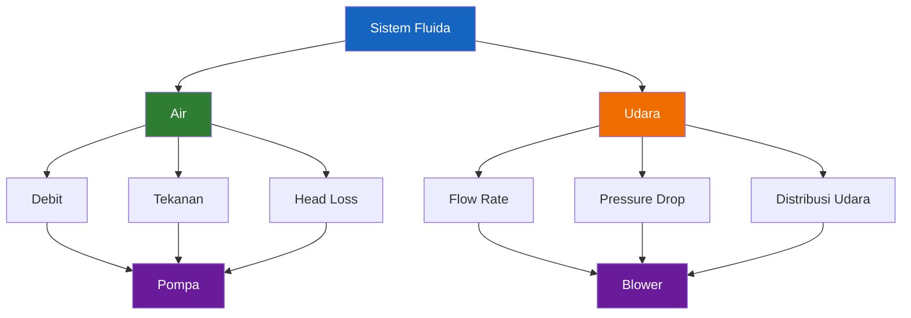

---

## 1.2 Permasalahan Yang Sering Terjadi

Dalam praktik lapangan, terdapat beberapa permasalahan yang berulang dan sering ditemukan pada berbagai sistem perpipaan maupun distribusi udara.

### Debit Tidak Sesuai

Masalah yang paling sering terjadi adalah debit aktual yang jauh lebih kecil dibandingkan debit teoritis atau spesifikasi peralatan. Penyebabnya dapat berupa:

- Diameter pipa terlalu kecil.
- Panjang pipa terlalu besar.
- Terlalu banyak elbow atau fitting.
- Head loss tidak diperhitungkan.
- Kurva pompa tidak dipahami.

Akibatnya, kapasitas sistem menjadi jauh di bawah yang diharapkan.

### Pompa Tidak Mencapai Target

Banyak pengguna membeli pompa berdasarkan nilai debit maksimum yang tercantum pada brosur tanpa memperhatikan head yang harus diatasi.

Sebagai contoh:

- Pompa memiliki spesifikasi 100 L/menit.
- Sistem memiliki total head 8 meter.

Ketika dipasang, debit aktual mungkin hanya mencapai 40–50 L/menit karena pompa bekerja pada titik operasi yang berbeda dari kondisi katalog.

### Blower Tidak Kuat

Kasus yang serupa juga sering terjadi pada sistem aerasi.

Blower mungkin memiliki kapasitas udara yang besar, tetapi ketika harus mengatasi:

- Kedalaman air.
- Pressure drop diffuser.
- Pressure drop manifold.
- Pressure drop selang.

kapasitas aktual yang sampai ke diffuser menjadi jauh lebih kecil.

### Aerasi Tidak Merata

Distribusi udara yang tidak merata merupakan masalah klasik pada sistem bioflok, akuakultur, maupun instalasi aerasi lainnya.

Gejala yang umum ditemukan:

- Diffuser terdekat menghasilkan gelembung paling besar.
- Diffuser terjauh hampir tidak mengeluarkan udara.
- Oksigen terlarut tidak merata.

Masalah ini sering berasal dari desain manifold yang tidak memperhitungkan pressure drop dan balancing aliran.

### Pressure Drop Tidak Dihitung

Banyak sistem dirancang hanya berdasarkan ukuran pipa dan kapasitas pompa tanpa menghitung kehilangan tekanan yang terjadi di sepanjang jalur.

Padahal setiap komponen menyebabkan kehilangan energi, antara lain:

- Pipa.
- Elbow.
- Tee.
- Valve.
- Reducer.
- Diffuser.
- Nozzle.

Akumulasi kehilangan tekanan tersebut dapat mengubah performa sistem secara signifikan.

---

## 1.3 Tujuan Artikel

Artikel ini bertujuan memberikan panduan praktis dan sistematis dalam melakukan perhitungan fluida pada sistem perpipaan PVC.

Secara khusus, artikel ini bertujuan untuk:

1. Memahami konsep dasar aliran fluida.
2. Memahami hubungan antara debit, kecepatan, tekanan, dan diameter pipa.
3. Memilih model perhitungan yang tepat untuk setiap kasus.
4. Menghitung head loss dan pressure drop.
5. Menghitung aliran air dalam pipa PVC.
6. Menghitung aliran udara dalam pipa PVC.
7. Menghitung debit melalui nozzle, needle, dan diffuser.
8. Menyediakan tabel praktis yang dapat digunakan langsung di lapangan.
9. Menyediakan spreadsheet pendukung untuk mempercepat proses desain dan verifikasi.

Dengan pendekatan tersebut, pembaca diharapkan mampu melakukan sizing awal terhadap sistem distribusi fluida secara lebih akurat dan terukur.

---

## 1.4 Ruang Lingkup

Agar pembahasan tetap fokus dan mendalam, artikel ini dibatasi pada beberapa komponen yang paling sering digunakan dalam aplikasi praktis.

### Air

Pembahasan meliputi:

- Debit air.
- Kecepatan aliran.
- Head loss.
- Distribusi air dalam pipa PVC.

### Udara

Pembahasan meliputi:

- Debit udara.
- Pressure drop.
- Distribusi udara.
- Perhitungan blower sederhana.

### Pipa PVC

Fokus utama artikel adalah penggunaan pipa PVC sebagai media transportasi fluida karena material ini paling banyak digunakan pada:

- Sistem air.
- Sistem aerasi.
- Aquaponik.
- Akuakultur.
- Instalasi utilitas ringan.

### Selang

Beberapa aplikasi menggunakan selang fleksibel sebagai penghubung antar peralatan. Oleh karena itu, pengaruh selang terhadap pressure drop juga akan dibahas.

### Nozzle

Nozzle digunakan untuk mengubah tekanan menjadi kecepatan aliran dan banyak ditemukan pada:

- Spray.
- Distribusi air.
- Pendinginan.
- Irigasi.

### Needle

Needle atau pipa berdiameter sangat kecil memiliki karakteristik yang berbeda dibandingkan pipa biasa sehingga memerlukan pendekatan perhitungan tersendiri.

### Diffuser

Diffuser merupakan komponen yang sangat umum digunakan pada sistem aerasi. Pembahasan akan mencakup:

- Lubang diffuser.
- Pressure drop diffuser.
- Distribusi udara.
- Dasar pemilihan ukuran diffuser.

---

[**Kembali ke Atas**](#panduan-praktis-perhitungan-fluida-dalam-pipa-pvc)

---

# 2. Dasar-Dasar Fluida

Sebelum membahas berbagai persamaan seperti Bernoulli, Darcy-Weisbach, Hagen-Poiseuille, maupun Orifice Equation, kita perlu memahami terlebih dahulu beberapa besaran dasar yang selalu muncul dalam perhitungan fluida. Besaran-besaran ini merupakan "bahasa dasar" yang digunakan dalam mekanika fluida dan sistem perpipaan.

Pemahaman yang baik terhadap debit, kecepatan, tekanan, head, densitas, viskositas, dan energi fluida akan sangat membantu dalam memahami mengapa suatu sistem bekerja dengan baik atau justru mengalami masalah seperti debit yang kecil, pressure drop yang besar, atau distribusi aliran yang tidak merata.

---

## 2.1 Debit

Debit adalah jumlah fluida yang mengalir melalui suatu penampang dalam satu satuan waktu.

Dalam sistem perpipaan, debit merupakan parameter yang paling sering digunakan karena secara langsung menunjukkan kapasitas sistem untuk mengalirkan fluida.

Secara matematis debit dirumuskan sebagai:

$$
Q = A \times V
$$

Dimana:

- $Q$ = debit aliran $\mathrm{m^3/s}$
- $A$ = luas penampang aliran $\mathrm{m^2}$
- $V$ = kecepatan fluida $\mathrm{m/s}$

Satuan debit yang umum digunakan:

| Satuan  | Keterangan               |
| ------- | ------------------------ |
| m³/s    | Standar SI               |
| m³/jam  | Industri proses          |
| L/s     | Sistem air               |
| L/menit | Aquaponik, bioflok       |
| CFM     | Sistem udara             |
| SCFM    | Sistem udara terkompresi |

Sebagai contoh:

Pipa diameter 25 mm dialiri air dengan kecepatan 1 m/s.

Luas penampang:

$$
A
=

\frac{\pi D^2}{4}
=

\frac{\pi (0.025)^2}{4}
=

0.000491 \ m^2
$$

Maka debitnya:

$$
Q
=

0.000491 \times 1
=

0.000491 \ m^3/s
$$

atau:

$$
Q
=

29.5 \ L/menit
$$

Dari contoh ini terlihat bahwa debit bergantung langsung pada luas penampang dan kecepatan fluida.

---

## 2.2 Kecepatan

Kecepatan adalah laju perpindahan fluida di dalam pipa.

Secara matematis:

$$
V = \frac{Q}{A}
$$

Dimana:

- $V$ = kecepatan $\mathrm{m/s}$
- $Q$ = debit $\mathrm{m^3/s}$
- $A$ = luas penampang $\mathrm{m^2}$

Kecepatan merupakan parameter yang sangat penting karena mempengaruhi:

- Reynolds Number.
- Head loss.
- Pressure drop.
- Erosi pipa.
- Distribusi aliran.

Hubungan antara diameter dan kecepatan dapat digambarkan sebagai berikut:

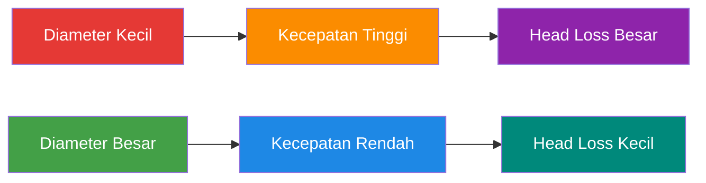

Sebagai aturan praktis:

| Fluida        | Kecepatan Umum |
| ------------- | -------------: |
| Air           |      1 – 2 m/s |
| Udara         |     5 – 20 m/s |
| Air gravitasi |  0.5 – 1.5 m/s |
| Aerasi udara  |     5 – 15 m/s |

---

## 2.3 Tekanan

Tekanan adalah gaya yang bekerja pada suatu luas permukaan.

Secara matematis:

$$
P = \frac{F}{A}
$$

Dimana:

- $P$ = tekanan $\mathrm{Pa}$
- $F$ = gaya $\mathrm{N}$
- $A$ = luas $\mathrm{m^2}$

Satuan tekanan yang sering digunakan:

| Satuan |      Nilai |
| ------ | ---------: |
| 1 Pa   |     1 N/m² |
| 1 kPa  |    1000 Pa |
| 1 bar  |  100000 Pa |
| 1 atm  |  101325 Pa |
| 1 psi  | 6894.76 Pa |

Dalam sistem fluida, tekanan merupakan sumber energi yang menggerakkan fluida dari satu titik ke titik lain.

Sebagai contoh:

- Pompa menghasilkan tekanan.
- Blower menghasilkan tekanan.
- Perbedaan ketinggian menghasilkan tekanan hidrostatik.

---

## 2.4 Head

Dalam mekanika fluida, energi sering dinyatakan dalam bentuk **head**.

Head dapat dianggap sebagai tinggi kolom fluida yang setara dengan energi yang dimiliki fluida tersebut.

Hubungan antara tekanan dan head adalah:

$$
h
=

\frac{P}{\rho g}
$$

Dimana:

- $h$ = head $\mathrm{m}$
- $P$ = tekanan $\mathrm{Pa}$
- $\rho$ = densitas fluida $\mathrm{kg/m^3}$
- $g$ = percepatan gravitasi $9.81\ \mathrm{m/s^2}$

Untuk air:

$$
1 \ mH_2O
\approx
9.81 \ kPa
$$

atau:

$$
10 \ mH_2O
\approx
0.981 \ bar
$$

Konsep head sangat penting karena sebagian besar perhitungan pompa dilakukan dalam satuan meter head, bukan tekanan.

---

## 2.5 Densitas

Densitas adalah massa per satuan volume.

Persamaannya:

$$
\rho
=

\frac{m}{V}
$$

Dimana:

- $\rho$ = densitas $\mathrm{kg/m^3}$
- (m) = massa $\mathrm{kg}$
- $V$ = volume ((m^3))

Nilai densitas beberapa fluida:

| Fluida     |   Densitas |
| ---------- | ---------: |
| Air 20°C   |  998 kg/m³ |
| Air laut   | 1025 kg/m³ |
| Udara 20°C | 1.20 kg/m³ |
| Oksigen    | 1.33 kg/m³ |

Perbedaan densitas inilah yang menyebabkan perhitungan air dan udara memiliki karakteristik yang berbeda.

Sebagai ilustrasi:

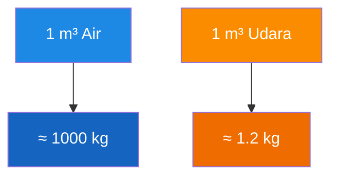

Perbedaan massa hampir 800 kali lipat ini menjadi salah satu alasan utama mengapa pressure drop udara dan air tidak dapat diperlakukan secara identik.

---

## 2.6 Viskositas

Viskositas adalah ukuran hambatan internal fluida terhadap aliran.

Secara sederhana, viskositas dapat dianggap sebagai "kekentalan" fluida.

Semakin tinggi viskositas:

- semakin sulit fluida mengalir,
- semakin besar pressure drop,
- semakin besar energi yang dibutuhkan.

Nilai viskositas dinamis:

| Fluida     |    Viskositas |
| ---------- | ------------: |
| Air 20°C   |    0.001 Pa·s |
| Air 40°C   |  0.00065 Pa·s |
| Udara 20°C | 0.000018 Pa·s |

Hubungan viskositas terhadap aliran:


Viskositas akan berperan penting saat membahas Reynolds Number dan Hagen-Poiseuille.

---

## 2.7 Energi Fluida

Pada dasarnya fluida yang mengalir membawa energi.

Energi inilah yang nantinya digunakan dalam Persamaan Bernoulli.

Secara umum terdapat tiga bentuk energi utama:

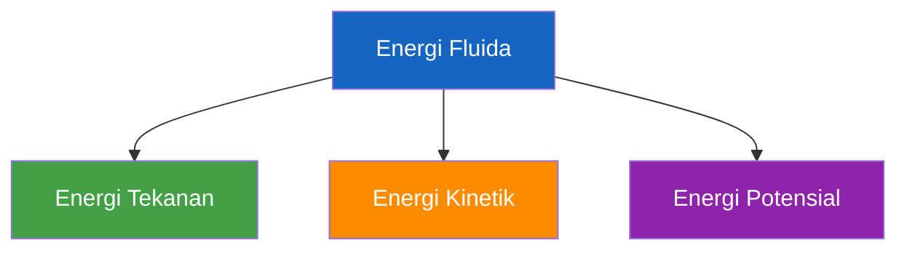

---

### Energi Tekanan

Energi tekanan berasal dari tekanan yang bekerja pada fluida.

Bentuk energinya:

$$
P
$$

atau dalam bentuk head:

$$
\frac{P}{\rho g}
$$

Contoh sumber energi tekanan:

- Pompa.
- Blower.
- Kompresor.

---

### Energi Kinetik

Energi kinetik berasal dari kecepatan fluida.

Bentuk energinya:

$$
\frac{1}{2}\rho V^2
$$

atau dalam bentuk head:

$$
\frac{V^2}{2g}
$$

Semakin tinggi kecepatan aliran, semakin besar energi kinetik yang dimiliki fluida.

---

### Energi Potensial

Energi potensial berasal dari posisi atau elevasi fluida terhadap suatu titik referensi.

Bentuk energinya:

$$
\rho g h
$$

atau dalam bentuk head:

$$
h
$$

Contoh:

- Tangki air di menara.
- Reservoir di bukit.
- Tandon air di atap bangunan.

Pada sistem gravitasi, energi potensial inilah yang menjadi penggerak utama aliran.

---

Pada bab berikutnya kita akan mempelajari bagaimana ketiga bentuk energi tersebut digunakan untuk memilih model perhitungan yang tepat sebelum masuk ke Persamaan Bernoulli, Darcy-Weisbach, Hagen-Poiseuille, maupun Orifice Equation.

---

[**Kembali ke Atas**](#panduan-praktis-perhitungan-fluida-dalam-pipa-pvc)

---

# 3. Pemilihan Model Perhitungan

Salah satu kesalahan paling umum dalam perhitungan fluida adalah menggunakan rumus yang benar pada kasus yang salah. Banyak praktisi memahami berbagai persamaan seperti Bernoulli, Darcy-Weisbach, Hagen-Poiseuille, atau Orifice Equation, tetapi tidak mengetahui kapan masing-masing persamaan tersebut harus digunakan.

Akibatnya, hasil perhitungan dapat menyimpang jauh dari kondisi aktual di lapangan. Dalam beberapa kasus, kesalahan pemilihan model dapat menghasilkan deviasi puluhan hingga ratusan persen terhadap debit atau pressure drop yang sebenarnya.

Bab ini membahas bagaimana memilih model perhitungan yang tepat sebelum melakukan analisis lebih lanjut.

---

## 3.1 Mengapa Tidak Semua Kasus Menggunakan Rumus Yang Sama

Secara fisik, aliran fluida dapat terjadi dalam berbagai bentuk dan geometri.

Sebagai contoh:

- Air mengalir di dalam pipa PVC sepanjang 20 meter.
- Udara mengalir melalui selang aerasi.
- Air keluar melalui nozzle berdiameter 1 mm.
- Udara keluar melalui lubang diffuser.
- Campuran udara dan air bergerak di dalam airlift.

Meskipun seluruh contoh tersebut merupakan aliran fluida, mekanisme kehilangan energi yang dominan berbeda pada setiap kasus.

Pada pipa panjang, kehilangan energi terutama berasal dari gesekan sepanjang dinding pipa.

Pada nozzle atau diffuser, kehilangan energi justru didominasi oleh kontraksi dan ekspansi aliran pada lubang kecil.

Pada airlift, terdapat dua fluida berbeda yang mengalir secara bersamaan sehingga perilakunya jauh lebih kompleks.

Diagram berikut memperlihatkan bagaimana geometri sistem menentukan model perhitungan yang digunakan.

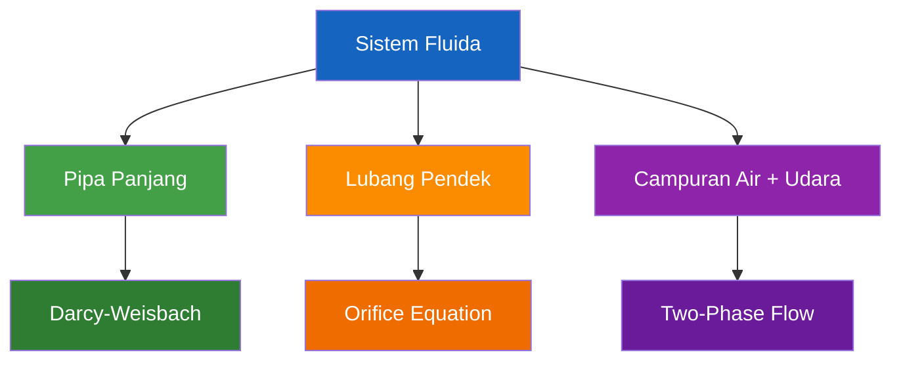

Karena itu, langkah pertama dalam setiap perhitungan fluida bukanlah memilih rumus, melainkan memahami karakteristik sistem yang sedang dianalisis.

---

## 3.2 Decision Tree Pemilihan Model

Untuk mempermudah pemilihan model, kita dapat menggunakan pendekatan bertahap.

Pertanyaan pertama yang harus dijawab adalah:

> Apakah aliran terjadi pada satu fluida atau lebih dari satu fluida?

Jika hanya terdapat satu fluida (air atau udara), maka analisis dapat dilanjutkan dengan melihat geometri aliran.

Salah satu parameter yang paling berguna adalah rasio:

$$
\frac{L}{D}
$$

dimana:

- $L$ = panjang saluran
- $D$ = diameter saluran

Rasio ini memberikan indikasi apakah sistem lebih menyerupai pipa atau lubang pendek.

Diagram keputusan berikut dapat digunakan sebagai panduan awal.

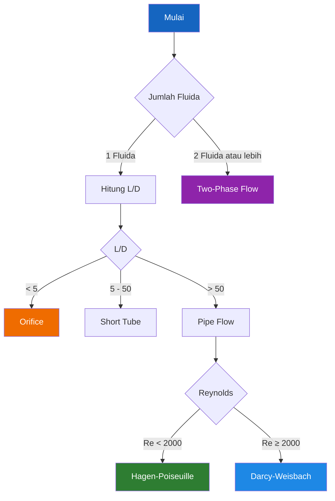

Diagram ini tidak menggantikan analisis teknik yang lebih rinci, tetapi sangat membantu untuk memilih model awal yang sesuai.

---

## 3.3 Model Bernoulli

Persamaan Bernoulli digunakan ketika fokus utama perhitungan adalah perubahan energi fluida akibat perubahan:

- tekanan,
- kecepatan,
- elevasi.

Persamaan Bernoulli merupakan bentuk penerapan hukum kekekalan energi pada fluida.

Bentuk umumnya:

$$
P
+
\frac{1}{2}\rho V^2
+
\rho g h
=

\text{konstan}
$$

atau dalam bentuk head:

$$
\frac{P}{\rho g}
+
\frac{V^2}{2g}
+
h
=

\text{konstan}
$$

Model Bernoulli cocok digunakan untuk:

- tangki gravitasi,
- pipa naik dan turun,
- venturi,
- nozzle ideal,
- analisis energi sistem.

Namun Bernoulli ideal tidak memperhitungkan kehilangan energi akibat gesekan. Oleh karena itu pada sistem nyata biasanya dikombinasikan dengan perhitungan head loss.

---

## 3.4 Model Darcy-Weisbach

Darcy-Weisbach merupakan model utama untuk menghitung kehilangan tekanan pada pipa panjang.

Model ini mengasumsikan bahwa kehilangan energi didominasi oleh gesekan antara fluida dan dinding pipa.

Persamaannya:

$$
h_f
=

f
\frac{L}{D}
\frac{V^2}{2g}
$$

dimana:

- $h_f$ = head loss
- $f$ = faktor gesekan Darcy
- $L$ = panjang pipa
- $D$ = diameter pipa
- $V$ = kecepatan aliran

Model ini digunakan untuk:

- pipa PVC,
- HDPE,
- stainless steel,
- carbon steel,
- manifold distribusi.

Dalam artikel ini, Darcy-Weisbach akan menjadi model yang paling sering digunakan karena sebagian besar sistem distribusi air dan udara menggunakan pipa panjang.

---

## 3.5 Model Hagen-Poiseuille

Model Hagen-Poiseuille digunakan untuk aliran laminar di dalam saluran yang relatif panjang dan berdiameter kecil.

Persamaannya:

$$
Q
=

\frac{\pi \Delta P D^4}
{128 \mu L}
$$

Persamaan ini menunjukkan bahwa debit sangat sensitif terhadap diameter karena diameter berpangkat empat.

Model ini cocok digunakan pada:

- capillary tube,
- needle panjang,
- infus,
- sistem dosing,
- tubing laboratorium.

Kondisi utama penggunaannya adalah:

$$
Re < 2000
$$

Jika aliran telah berubah menjadi turbulen, model ini tidak lagi akurat.

---

## 3.6 Model Orifice

Model orifice digunakan ketika aliran melewati lubang pendek yang panjangnya relatif kecil dibandingkan diameternya.

Karakteristik utama:

$$
\frac{L}{D}
<
5
$$

Pada kondisi ini kehilangan energi tidak lagi didominasi oleh gesekan sepanjang saluran, melainkan oleh:

- kontraksi aliran,
- vena contracta,
- ekspansi aliran.

Persamaan dasar orifice:

$$
Q
=

C_d A
\sqrt{
\frac{2 \Delta P}
{\rho}
}
$$

dimana:

- $C_d$ = discharge coefficient
- $A$ = luas lubang
- $\Delta P$ = beda tekanan

Model ini digunakan pada:

- nozzle,
- diffuser,
- spray,
- injector hole,
- lubang manifold,
- outlet tangki.

---

## 3.7 Model Two-Phase Flow

Pada beberapa sistem terdapat lebih dari satu fase fluida yang mengalir secara bersamaan.

Contoh paling umum adalah campuran:

- udara dan air,
- gas dan cairan,
- gelembung udara di dalam kolom air.

Pada kondisi tersebut, model satu fase seperti Darcy-Weisbach atau Bernoulli tidak lagi cukup.

Contoh aplikasinya:

- airlift pump,
- venturi aerator,
- foam fractionator,
- bubble column.

Diagram sederhana berikut menunjukkan konsep aliran dua fase.

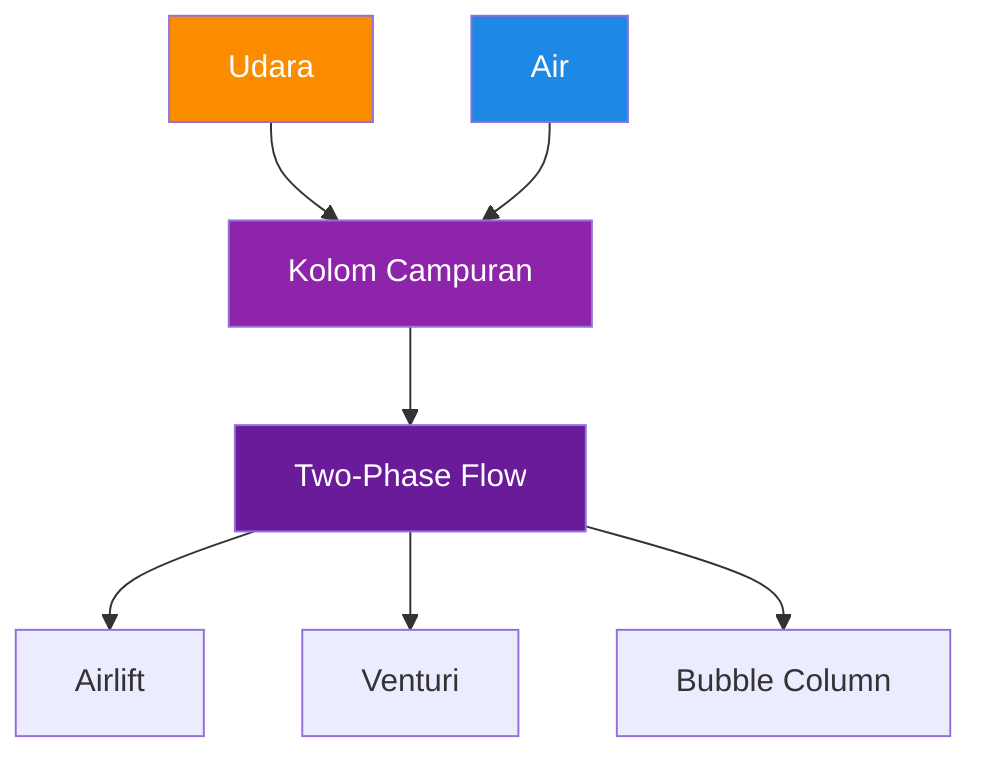

Perhitungan aliran dua fase biasanya memerlukan pendekatan empiris dan data eksperimen karena interaksi antara gas dan cairan jauh lebih kompleks dibandingkan aliran satu fase.

---

## 3.8 Ringkasan Pemilihan Model

Tabel berikut dapat digunakan sebagai panduan cepat untuk menentukan model yang paling sesuai.

| Kasus                 | Model               |
| --------------------- | ------------------- |
| Pipa PVC              | Darcy-Weisbach      |
| Selang                | Darcy-Weisbach      |
| Pipa distribusi udara | Darcy-Weisbach      |
| Needle panjang        | Hagen-Poiseuille    |
| Capillary tube        | Hagen-Poiseuille    |
| Nozzle                | Orifice             |
| Diffuser              | Orifice             |
| Spray                 | Orifice             |
| Lubang manifold       | Orifice             |
| Venturi               | Bernoulli + Orifice |
| Airlift               | Two-Phase Flow      |
| Bubble column         | Two-Phase Flow      |

Sebagai aturan praktis:

- Jika fluida mengalir dalam pipa panjang → gunakan Darcy-Weisbach.
- Jika aliran laminar dalam tube kecil → gunakan Hagen-Poiseuille.
- Jika fluida melewati lubang pendek → gunakan Orifice Equation.
- Jika fokus pada perubahan energi → gunakan Bernoulli.
- Jika terdapat campuran udara dan air → gunakan Two-Phase Flow.

Dengan memahami pemilihan model ini, kita dapat menghindari kesalahan paling mendasar dalam analisis fluida, yaitu menggunakan persamaan yang benar untuk kasus yang salah.

---

[**Kembali ke Atas**](#panduan-praktis-perhitungan-fluida-dalam-pipa-pvc)

---

# 4. Persamaan Kontinuitas

Persamaan kontinuitas merupakan salah satu hukum paling fundamental dalam mekanika fluida. Sebelum membahas tekanan, head loss, pressure drop, maupun pemilihan pompa dan blower, seorang engineer harus memahami terlebih dahulu bagaimana massa fluida berpindah dari satu titik ke titik lainnya.

Konsep ini terlihat sederhana, tetapi hampir seluruh perhitungan perpipaan dibangun di atas prinsip yang sama, yaitu:

> **Massa tidak dapat diciptakan dan tidak dapat dimusnahkan.**

Jika tidak ada kebocoran, penambahan fluida, atau pengurangan fluida di dalam sistem, maka jumlah massa yang masuk harus sama dengan jumlah massa yang keluar.

Prinsip inilah yang dikenal sebagai **hukum konservasi massa**.

---

## 4.1 Konservasi Massa

Konservasi massa menyatakan bahwa massa fluida yang melewati suatu sistem harus tetap terjaga.

Secara umum:

$$
\dot m_{\text{masuk}}
=

\dot m_{\text{keluar}}
$$

Dimana:

- $\dot m$ = laju alir massa ((kg/s))

Untuk fluida yang tidak mengalami akumulasi massa:

$$
\rho_1 A_1 V_1
=

\rho_2 A_2 V_2
$$

Persamaan tersebut berlaku untuk semua jenis fluida, baik:

- air,
- udara,
- gas,
- cairan lainnya.

Untuk fluida yang dapat dianggap **incompressible**, seperti air, densitas hampir konstan sehingga:

$$
\rho_1
=

\rho_2
$$

Maka persamaan menjadi lebih sederhana:

$$
A_1 V_1
=

A_2 V_2
$$

Inilah bentuk persamaan kontinuitas yang paling sering digunakan dalam sistem perpipaan air.

Diagram berikut memperlihatkan konsep dasar konservasi massa.


Selama tidak ada kebocoran atau penambahan fluida, massa yang masuk harus sama dengan massa yang keluar.

---

## 4.2 Persamaan Kontinuitas

Untuk sebagian besar perhitungan air dalam pipa PVC, bentuk yang digunakan adalah:

$$
Q
=

A V
$$

Karena:

$$
Q
=

A_1 V_1
=

A_2 V_2
$$

dimana:

- $Q$ = debit $\mathrm{m^3/s}$
- $A$ = luas penampang $\mathrm{m^2}$
- $V$ = kecepatan aliran $\mathrm{m/s}$

Luas penampang lingkaran dihitung dengan:

$$
A
=

\frac{\pi D^2}{4}
$$

dimana:

- $D$ = diameter dalam pipa $\mathrm{m}$

Dengan menggabungkan kedua persamaan tersebut diperoleh:

$$
Q
=

\frac{\pi D^2}{4}
V
$$

Persamaan ini merupakan salah satu persamaan yang paling sering digunakan dalam artikel ini karena menjadi dasar untuk menghitung:

- debit,
- kecepatan,
- diameter pipa,
- kapasitas pompa,
- kapasitas blower.

Hubungan antar parameter dapat digambarkan sebagai berikut:

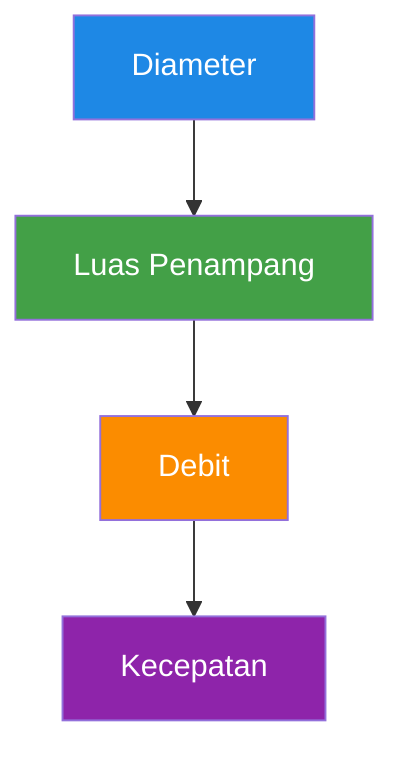

---

## 4.3 Pengaruh Diameter Pipa

Salah satu implikasi paling penting dari persamaan kontinuitas adalah pengaruh diameter terhadap kecepatan aliran.

Karena luas penampang berbanding lurus dengan kuadrat diameter:

$$
A
=

\frac{\pi D^2}{4}
$$

maka perubahan diameter yang terlihat kecil dapat menghasilkan perubahan yang signifikan terhadap debit maupun kecepatan.

Sebagai contoh:

| Diameter | Luas Penampang |
| -------: | -------------: |
|    25 mm |        491 mm² |
|    50 mm |       1963 mm² |
|   100 mm |       7854 mm² |

Terlihat bahwa:

- diameter naik 2 kali,
- luas naik 4 kali.

Akibatnya:

- pada kecepatan yang sama, debit naik 4 kali,
- pada debit yang sama, kecepatan turun 4 kali.

Diagram berikut memperlihatkan hubungan tersebut.

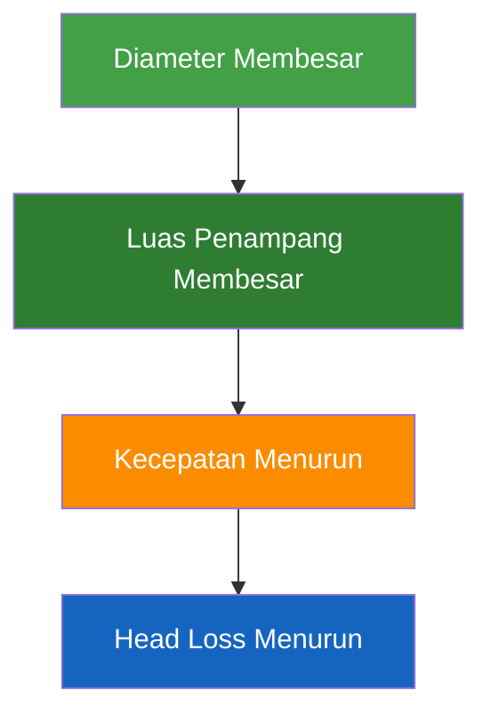

Inilah alasan mengapa pemilihan diameter pipa sangat mempengaruhi:

- pressure drop,
- head loss,
- konsumsi energi pompa,
- distribusi udara,
- performa aerasi.

---

### Kasus Penyempitan Pipa

Persamaan kontinuitas juga menjelaskan apa yang terjadi ketika aliran melewati bagian pipa yang menyempit.

Misalnya:

- pipa utama 50 mm,
- reducer menuju pipa 25 mm.

Karena debit harus tetap:

$$
Q_1
=

Q_2
$$

maka:

$$
A_1V_1
=

A_2V_2
$$

Karena:

$$
A_1

>

A_2
$$

maka:

$$
V_2

>

V_1
$$

Artinya:

> Ketika diameter pipa mengecil, kecepatan fluida harus meningkat.

Konsep ini akan menjadi sangat penting saat membahas:

- venturi,
- nozzle,
- diffuser,
- orifice.

---

## 4.4 Contoh Perhitungan

### Contoh 1 — Menghitung Debit Dari Diameter dan Kecepatan

Diketahui:

- Diameter pipa = 25 mm
- Kecepatan air = 1 m/s

Hitung debit aliran.

#### Langkah 1 — Hitung Luas Penampang

$$
D
=

25 \ mm
=

0.025 \ m
$$

$$
A
=

\frac{\pi D^2}{4}
$$

$$
A
=

\frac{\pi (0.025)^2}{4}
$$

$$
A
=

0.000491 \ m^2
$$

#### Langkah 2 — Hitung Debit

$$
Q
=

A V
$$

$$
Q
=

0.000491 \times 1
$$

$$
Q
=

0.000491 \ m^3/s
$$

#### Langkah 3 — Konversi ke Liter per Menit

Karena:

$$
1 \ m^3
=

1000 \ L
$$

maka:

$$
Q
=

0.000491 \times 1000 \times 60
$$

$$
Q
=

29.45 \ L/menit
$$

Jadi debit aliran adalah:

$$
\boxed{
Q
=

29.45 \ L/menit
}
$$

---

### Contoh 2 — Menghitung Kecepatan Pada Penyempitan Pipa

Diketahui:

- Diameter awal = 50 mm
- Diameter akhir = 25 mm
- Kecepatan awal = 1 m/s

Hitung kecepatan pada pipa 25 mm.

Persamaan kontinuitas:

$$
A_1V_1
=

A_2V_2
$$

Karena luas berbanding dengan kuadrat diameter:

$$
V_2
=

V_1
\left(
\frac{D_1}{D_2}
\right)^2
$$

Substitusi:

$$
V_2
=

1
\left(
\frac{50}{25}
\right)^2
$$

$$
V_2
=

4 \ m/s
$$

Jadi:

$$
\boxed{
V_2
=

4 \ m/s
}
$$

Artinya ketika pipa diperkecil dari 50 mm menjadi 25 mm, kecepatan meningkat empat kali lipat.

---

### Pelajaran Penting

Dari kedua contoh tersebut dapat disimpulkan bahwa:

1. Debit ditentukan oleh luas penampang dan kecepatan.
2. Diameter sangat berpengaruh karena luas penampang berbanding dengan kuadrat diameter.
3. Jika diameter diperkecil, kecepatan meningkat.
4. Jika diameter diperbesar, kecepatan menurun.
5. Perubahan kecepatan akan mempengaruhi pressure drop, head loss, Reynolds Number, dan performa sistem secara keseluruhan.

Pemahaman ini akan menjadi fondasi saat memasuki pembahasan Persamaan Bernoulli pada bab berikutnya.

---

[**Kembali ke Atas**](#panduan-praktis-perhitungan-fluida-dalam-pipa-pvc)

---

# 5. Persamaan Bernoulli

Setelah memahami konsep debit, kecepatan, tekanan, head, dan persamaan kontinuitas, langkah berikutnya adalah memahami bagaimana energi fluida berpindah dari satu titik ke titik lainnya.

Persamaan Bernoulli merupakan salah satu persamaan paling penting dalam mekanika fluida karena menjelaskan hubungan antara:

- tekanan,
- kecepatan,
- elevasi,

dalam suatu sistem aliran.

Jika Persamaan Kontinuitas menjelaskan **konservasi massa**, maka Persamaan Bernoulli menjelaskan **konservasi energi**.

Pemahaman terhadap Bernoulli sangat penting karena menjadi dasar bagi berbagai aplikasi engineering seperti:

- tangki gravitasi,
- jaringan perpipaan,
- venturi,
- nozzle,
- flow meter,
- pompa,
- airlift,
- sistem distribusi air.

---

## 5.1 Konsep Kekekalan Energi

Salah satu hukum dasar fisika menyatakan bahwa energi tidak dapat diciptakan maupun dimusnahkan.

Energi hanya dapat berubah bentuk.

Prinsip yang sama berlaku pada fluida yang mengalir.

Ketika fluida bergerak dari satu titik ke titik lain, energi dapat berubah dari:

- energi tekanan menjadi energi kecepatan,
- energi potensial menjadi energi tekanan,
- energi potensial menjadi energi kecepatan,

namun jumlah energi total tetap.

Diagram berikut menggambarkan konsep tersebut.

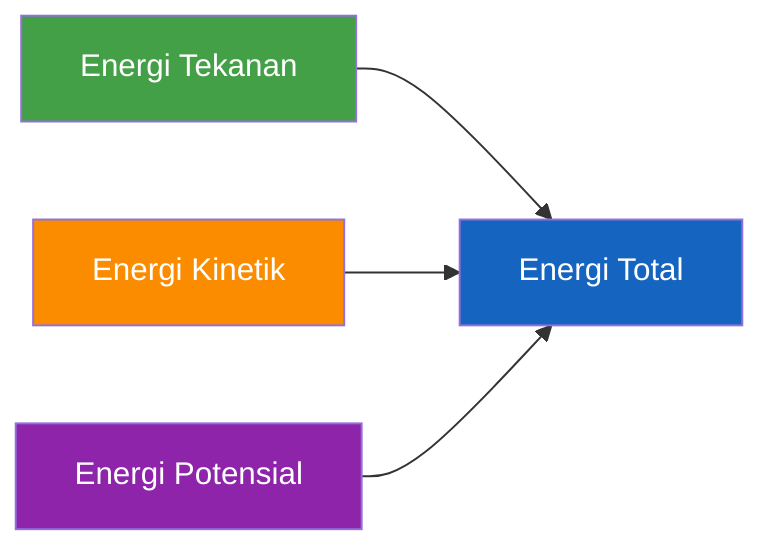

Persamaan Bernoulli dalam bentuk energi per satuan volume adalah:

$$
P
+
\frac{1}{2}\rho V^2
+
\rho g h
=

\text{konstan}
$$

dimana:

- $P$ = tekanan fluida
- $\rho$ = densitas fluida
- $V$ = kecepatan fluida
- $g$ = percepatan gravitasi
- $h$ = elevasi

Persamaan tersebut menyatakan bahwa jumlah energi tekanan, energi kinetik, dan energi potensial selalu tetap sepanjang aliran ideal.

---

## 5.2 Energi Tekanan

Energi tekanan merupakan energi yang tersimpan karena adanya tekanan pada fluida.

Semakin besar tekanan, semakin besar kemampuan fluida untuk melakukan kerja.

Contoh sumber energi tekanan:

- pompa air,
- blower,
- kompresor,
- tangki bertekanan.

Dalam Persamaan Bernoulli, energi tekanan dituliskan sebagai:

$$
P
$$

atau dalam bentuk head:

$$
\frac{P}{\rho g}
$$

Besaran tersebut disebut **pressure head**.

Sebagai contoh:

Tekanan:

$$
P = 98.1 \ kPa
$$

untuk air:

$$
\rho = 1000 \ kg/m^3
$$

maka:

$$
\frac{P}{\rho g}
=

\frac{98100}
{1000 \times 9.81}
=

10 \ m
$$

Artinya tekanan tersebut setara dengan kolom air setinggi 10 meter.

---

## 5.3 Energi Kinetik

Energi kinetik adalah energi yang dimiliki fluida karena bergerak.

Semakin tinggi kecepatan aliran, semakin besar energi kinetiknya.

Dalam Persamaan Bernoulli:

$$
\frac{1}{2}\rho V^2
$$

atau dalam bentuk head:

$$
\frac{V^2}{2g}
$$

Besaran ini disebut **velocity head**.

Hubungan antara kecepatan dan energi kinetik bersifat kuadrat.

Artinya:

- kecepatan naik 2 kali,
- energi kinetik naik 4 kali.

Diagram berikut memperlihatkan hubungan tersebut.

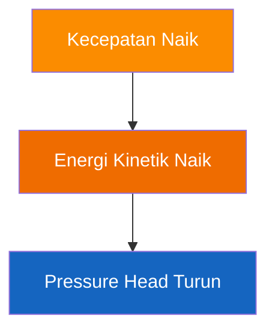

Konsep ini sangat penting saat membahas:

- venturi,
- nozzle,
- penyempitan pipa,
- flow meter.

---

## 5.4 Energi Potensial

Energi potensial berasal dari posisi atau ketinggian fluida terhadap titik referensi.

Semakin tinggi posisi fluida, semakin besar energi potensial yang dimiliki.

Dalam Persamaan Bernoulli:

$$
\rho g h
$$

atau dalam bentuk head:

$$
h
$$

Besaran ini disebut **elevation head**.

Contoh sumber energi potensial:

- tangki air di atap bangunan,
- reservoir di bukit,
- menara air.

Diagram berikut memperlihatkan konsep tersebut.

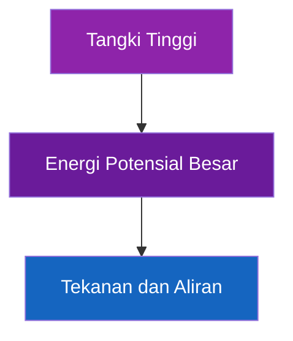

Pada sistem gravitasi, energi potensial sering menjadi satu-satunya sumber energi yang menggerakkan fluida.

---

## 5.5 Bentuk Head Bernoulli

Dalam praktik engineering, Persamaan Bernoulli lebih sering digunakan dalam bentuk head.

Bentuk ini lebih intuitif karena seluruh energi dinyatakan dalam satuan meter.

Persamaan Bernoulli menjadi:

$$
\frac{P}{\rho g}
+
\frac{V^2}{2g}
+
h
=

\text{konstan}
$$

atau antara dua titik:

$$
\frac{P_1}{\rho g}
+
\frac{V_1^2}{2g}
+
h_1
=

\frac{P_2}{\rho g}
+
\frac{V_2^2}{2g}
+
h_2
$$

Komponen-komponennya dapat diringkas sebagai:

| Komponen     | Nama           |
| ------------ | -------------- |
| $P/(\rho g)$ | Pressure Head  |
| $V^2/(2g)$   | Velocity Head  |
| $h$          | Elevation Head |

Diagram berikut memperlihatkan ketiga komponen tersebut.

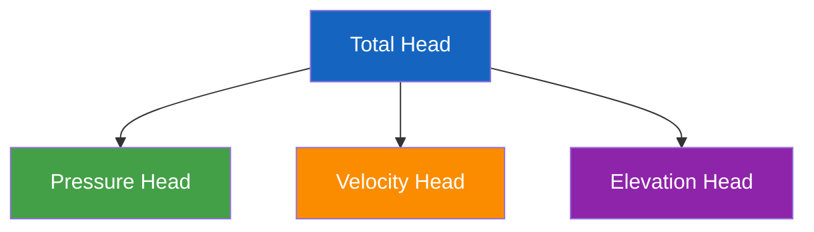

---

## 5.6 Contoh Tangki Gravitasi

Misalkan terdapat tangki air dengan permukaan air berada 10 meter di atas titik keluaran.

Asumsi:

- tekanan atmosfer pada kedua titik,
- kecepatan permukaan tangki mendekati nol,
- kehilangan energi diabaikan.

Data:

$$
h_1
=

10 \ m
$$

$$
h_2
=

0 \ m
$$

Persamaan Bernoulli:

$$
h_1
=

\frac{V_2^2}{2g}
$$

Substitusi:

$$
10
=

\frac{V_2^2}
{2 \times 9.81}
$$

$$
V_2
=

14.0 \ m/s
$$

Jadi kecepatan teoritis air yang keluar adalah:

$$
\boxed{
V
=

14.0 \ m/s
}
$$

Persamaan ini dikenal juga sebagai **Persamaan Torricelli**.

---

## 5.7 Contoh Pipa Menurun

Misalkan air mengalir dari titik A menuju titik B.

Data:

- Elevasi A = 15 m
- Elevasi B = 5 m
- Diameter pipa sama
- Kehilangan energi diabaikan

Karena diameter sama:

$$
V_1
=

V_2
$$

maka komponen energi kinetik saling menghilangkan.

Bernoulli menjadi:

$$
\frac{P_1}{\rho g}
+
15
=

\frac{P_2}{\rho g}
+
5
$$

Sehingga:

$$
P_2
=

P_1
+
10\rho g
$$

Artinya:

> Ketika fluida mengalir turun, sebagian energi potensial berubah menjadi energi tekanan.

Akibatnya tekanan pada titik yang lebih rendah menjadi lebih besar.

---

## 5.8 Contoh Pipa Naik

Sekarang kondisi dibalik.

Data:

- Elevasi A = 5 m
- Elevasi B = 15 m
- Diameter sama
- Kehilangan energi diabaikan

Bernoulli:

$$
\frac{P_1}{\rho g}
+
5
=

\frac{P_2}{\rho g}
+
15
$$

Sehingga:

$$
P_2
=

P_1
-

10\rho g
$$

Artinya:

> Ketika fluida naik, sebagian energi tekanan berubah menjadi energi potensial.

Akibatnya tekanan pada titik yang lebih tinggi menjadi lebih kecil.

Diagram berikut memperlihatkan perbedaan kedua kasus.


Dalam sistem nyata, Persamaan Bernoulli hampir selalu dikombinasikan dengan perhitungan head loss dan pressure drop. Oleh karena itu, pada bab berikutnya kita akan membahas Reynolds Number yang menjadi dasar untuk menentukan jenis aliran dan metode perhitungan kehilangan energi yang tepat.

---

[**Kembali ke Atas**](#panduan-praktis-perhitungan-fluida-dalam-pipa-pvc)

---

# 6. Reynolds Number

Setelah memahami Persamaan Kontinuitas dan Persamaan Bernoulli, langkah berikutnya adalah memahami karakteristik aliran fluida itu sendiri. Dua fluida yang mengalir dengan debit dan tekanan yang sama belum tentu memiliki perilaku yang sama. Sebagian aliran bergerak dengan tenang dan teratur, sementara sebagian lainnya bergerak secara acak dan penuh pusaran.

Perbedaan perilaku ini sangat penting karena akan mempengaruhi:

- pressure drop,
- head loss,
- distribusi aliran,
- efisiensi sistem,
- pemilihan model perhitungan.

Untuk mengidentifikasi karakteristik tersebut digunakan suatu bilangan tak berdimensi yang dikenal sebagai **Reynolds Number** atau **Bilangan Reynolds**.

Bilangan Reynolds merupakan salah satu parameter paling penting dalam mekanika fluida karena menjadi dasar untuk menentukan apakah aliran bersifat laminar, transisi, atau turbulen.

---

## 6.1 Definisi Reynolds

Bilangan Reynolds diperkenalkan oleh Osborne Reynolds pada tahun 1883 melalui eksperimen aliran air di dalam pipa transparan.

Dalam eksperimennya, Reynolds menginjeksikan zat pewarna ke dalam aliran air dan mengamati pola gerakannya.

Hasil eksperimen menunjukkan bahwa pola aliran berubah sesuai kombinasi:

- kecepatan fluida,
- diameter pipa,
- densitas fluida,
- viskositas fluida.

Hubungan tersebut dirumuskan sebagai:

$$
Re
=

\frac{\rho V D}{\mu}
$$

Dimana:

- $\mathrm{Re}$ = Reynolds Number
- $\rho$ = densitas fluida $\mathrm{kg/m^3}$
- $V$ = kecepatan fluida $\mathrm{m/s}$
- $D$ = diameter dalam pipa $\mathrm{m}$
- $\mu$ = viskositas dinamis $\mathrm{Pa\cdot s}$

Untuk air pada temperatur normal:

$$
\rho
\approx
1000 \ kg/m^3
$$

$$
\mu
\approx
0.001 \ Pa \cdot s
$$

Sehingga persamaan sering disederhanakan menjadi:

$$
Re
\approx
1{,}000{,}000 \times V \times D
$$

dengan:

- $V$ dalam m/s
- $D$ dalam meter

Persamaan ini sangat berguna untuk estimasi cepat di lapangan.

---

## 6.2 Laminar

Aliran laminar adalah aliran yang bergerak secara teratur dalam lapisan-lapisan sejajar.

Setiap partikel fluida bergerak mengikuti jalur yang relatif lurus tanpa banyak pencampuran dengan lapisan lainnya.

Kriteria umum:

$$
Re < 2000
$$

Karakteristik aliran laminar:

- Aliran tenang.
- Hampir tidak ada pusaran.
- Pencampuran sangat kecil.
- Head loss relatif rendah.
- Distribusi kecepatan berbentuk parabola.

Diagram berikut memperlihatkan karakteristik aliran laminar.


Profil kecepatan pada aliran laminar:

```text
Dinding Pipa
|            |
|  /\        |
| /  \       |
|/    \      |
|            |
```

Kecepatan maksimum berada di tengah pipa, sedangkan kecepatan di dinding mendekati nol akibat efek gesekan.

Contoh aplikasi aliran laminar:

- Infus medis.
- Kapiler laboratorium.
- Needle dosing.
- Sistem mikrofluida.
- Pipa berdiameter sangat kecil.

Pada artikel ini, model yang digunakan untuk aliran laminar adalah **Persamaan Hagen-Poiseuille**.

---

## 6.3 Transitional

Zona transisi merupakan wilayah di antara aliran laminar dan turbulen.

Kriteria umum:

$$
2000
<
Re
<
4000
$$

Pada daerah ini aliran menjadi tidak stabil.

Kadang-kadang:

- tampak laminar,
- kemudian muncul pusaran,
- lalu kembali tenang.

Karena sifatnya yang tidak stabil, daerah transisi merupakan zona yang paling sulit diprediksi.

Diagram berikut memperlihatkan kondisi transisi.


Dalam praktik engineering, sebisa mungkin sistem dirancang untuk bekerja jelas di wilayah:

- laminar,
- atau turbulen,

agar hasil perhitungan lebih akurat dan dapat diprediksi.

---

## 6.4 Turbulen

Aliran turbulen ditandai oleh gerakan fluida yang tidak teratur dan penuh pusaran.

Kriteria umum:

$$
Re > 4000
$$

Karakteristiknya:

- Banyak pusaran.
- Pencampuran sangat kuat.
- Distribusi kecepatan lebih merata.
- Head loss lebih besar.
- Transfer panas dan massa lebih baik.

Diagram berikut menggambarkan aliran turbulen.


Profil kecepatan turbulen:

```text
Dinding Pipa
|            |
| ________   |
||        |  |
||        |  |
||________|  |
|            |
```

Distribusi kecepatan menjadi lebih rata dibandingkan aliran laminar.

Sebagian besar sistem perpipaan industri beroperasi pada kondisi turbulen.

Contoh:

- Jaringan distribusi air.
- Sistem hydrant.
- Pipa proses industri.
- Sistem cooling water.
- Sistem aerasi udara.

Pada kondisi ini model yang umum digunakan adalah:

- Darcy-Weisbach.
- Moody Diagram.

---

## 6.5 Dampak Pada Perhitungan

Menentukan Reynolds Number bukan sekadar klasifikasi aliran.

Nilai Reynolds menentukan model perhitungan yang harus digunakan.

Diagram berikut memperlihatkan hubungan tersebut.

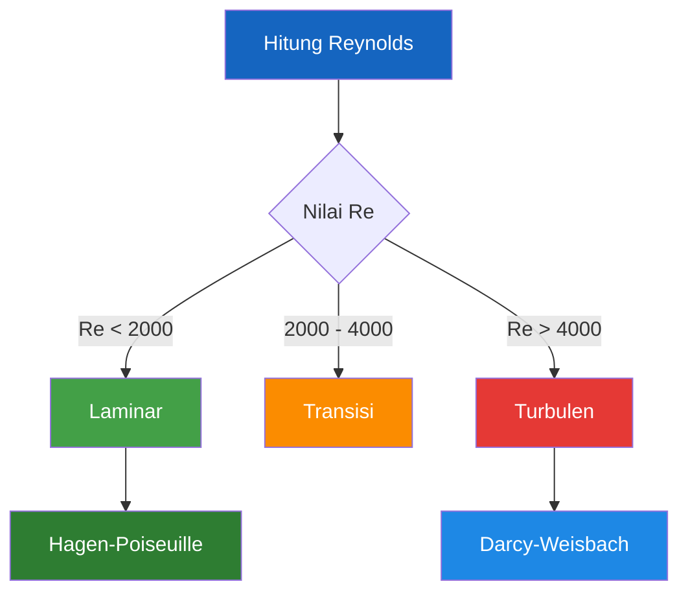

Selain itu Reynolds juga mempengaruhi:

### Faktor Gesekan

Pada aliran laminar:

$$
f
=

\frac{64}{Re}
$$

Sedangkan pada aliran turbulen, faktor gesekan bergantung pada:

- Reynolds Number,
- kekasaran pipa.

### Head Loss

Semakin besar Reynolds:

- turbulensi meningkat,
- kehilangan energi meningkat.

### Distribusi Aliran

Aliran turbulen menghasilkan distribusi kecepatan yang lebih seragam dibandingkan aliran laminar.

### Pencampuran Fluida

Aliran turbulen memberikan pencampuran yang jauh lebih baik dibandingkan aliran laminar.

Karena itu sistem aerasi dan pencampuran biasanya dioperasikan pada kondisi turbulen.

---

## 6.6 Contoh Perhitungan

### Contoh 1 — Pipa PVC 25 mm

Data:

- Diameter = 25 mm
- Kecepatan = 1 m/s
- Air 20°C

Diketahui:

$$
D
=

0.025 \ m
$$

$$
\rho
=

1000 \ kg/m^3
$$

$$
\mu
=

0.001 \ Pa \cdot s
$$

Hitung Reynolds Number.

Substitusi:

$$
Re
=

\frac{\rho V D}{\mu}
$$

$$
Re
=

\frac{
1000 \times 1 \times 0.025
}
{0.001}
$$

$$
Re
=

25000
$$

Sehingga:

$$
\boxed{
Re
=

25{,}000
}
$$

Karena:

$$
Re > 4000
$$

maka aliran bersifat:

$$
\boxed{
\text{Turbulen}
}
$$

---

### Contoh 2 — Needle Diameter 0.7 mm

Data:

- Diameter = 0.7 mm
- Kecepatan = 0.1 m/s

Konversi:

$$
D
=

0.0007 \ m
$$

Substitusi:

$$
Re
=

\frac{
1000 \times 0.1 \times 0.0007
}
{0.001}
$$

$$
Re
=

70
$$

Sehingga:

$$
\boxed{
Re
=

70
}
$$

Karena:

$$
Re < 2000
$$

maka aliran bersifat:

$$
\boxed{
\text{Laminar}
}
$$

Pada kondisi ini Persamaan Hagen-Poiseuille menjadi pilihan yang tepat.

---

### Pelajaran Penting

Dari contoh di atas dapat dilihat bahwa:

1. Diameter kecil tidak selalu berarti debit kecil.
2. Diameter kecil cenderung menghasilkan aliran laminar.
3. Sebagian besar pipa PVC umum bekerja pada kondisi turbulen.
4. Reynolds Number harus dihitung sebelum memilih model perhitungan.
5. Kesalahan menentukan jenis aliran akan menghasilkan kesalahan pada perhitungan head loss dan pressure drop.

Pada bab berikutnya kita akan membahas **Head Loss dan Pressure Drop**, yaitu konsekuensi langsung dari gesekan fluida terhadap dinding pipa dan berbagai fitting yang ada di dalam sistem.

---

[**Kembali ke Atas**](#panduan-praktis-perhitungan-fluida-dalam-pipa-pvc)

---

# 7. Head Loss dan Pressure Drop

Pada bab sebelumnya telah dibahas bahwa fluida dapat membawa energi dalam bentuk:

- energi tekanan,
- energi kinetik,
- energi potensial.

Dalam dunia nyata, energi tersebut tidak dapat dipertahankan sepenuhnya selama fluida mengalir di dalam sistem perpipaan. Sebagian energi akan hilang akibat gesekan antara fluida dan dinding pipa maupun akibat gangguan aliran yang disebabkan oleh fitting dan komponen lainnya.

Kehilangan energi inilah yang dikenal sebagai **head loss** atau **pressure drop**.

Pemahaman mengenai head loss merupakan salah satu aspek paling penting dalam desain sistem fluida karena secara langsung mempengaruhi:

- pemilihan pompa,
- pemilihan blower,
- ukuran pipa,
- konsumsi energi,
- kapasitas sistem.

Dalam banyak kasus, kegagalan sistem bukan disebabkan oleh kapasitas pompa yang kurang, tetapi karena head loss tidak dihitung dengan benar.

---

## 7.1 Major Loss

Major loss adalah kehilangan energi yang terjadi akibat gesekan fluida dengan dinding pipa sepanjang jalur aliran.

Semakin panjang pipa, semakin besar kehilangan energi yang terjadi.

Diagram berikut memperlihatkan konsep major loss.

```mermaid id="majorloss"
flowchart LR

A["Energi Awal"] --> B["Gesekan Sepanjang Pipa"]

B --> C["Energi Berkurang"]

style A fill:#43A047,color:#fff
style B fill:#FB8C00,color:#fff
style C fill:#E53935,color:#fff
```

Untuk menghitung major loss digunakan Persamaan Darcy-Weisbach:

$$
h_f
=

f
\frac{L}{D}
\frac{V^2}{2g}
$$

Dimana:

- $h_f$ = head loss (m)
- $f$ = faktor gesekan Darcy
- $L$ = panjang pipa (m)
- $D$ = diameter dalam pipa (m)
- $V$ = kecepatan aliran (m/s)
- $g$ = percepatan gravitasi (9.81 m/s²)

Jika ingin dinyatakan sebagai pressure drop:

$$
\Delta P
=

\rho g h_f
$$

atau:

$$
\Delta P
=

f
\frac{L}{D}
\frac{\rho V^2}{2}
$$

Persamaan ini berlaku baik untuk:

- air,
- udara,
- gas,
- cairan lainnya.

Dengan syarat aliran berada pada satu fase (single phase flow).

---

## 7.2 Minor Loss

Selain kehilangan energi akibat panjang pipa, terdapat pula kehilangan energi akibat perubahan arah dan perubahan geometri aliran.

Kehilangan energi ini disebut **minor loss**.

Meskipun disebut "minor", pada sistem yang memiliki banyak fitting nilainya dapat melebihi major loss.

Secara umum:

$$
h_m
=

K
\frac{V^2}{2g}
$$

Dimana:

- $h_m$ = minor loss (m)
- $K$ = loss coefficient

---

### Elbow

Elbow menyebabkan perubahan arah aliran.

Perubahan arah tersebut menghasilkan pusaran (eddy) dan turbulensi.

```mermaid id="elbowloss"
flowchart LR

A["Aliran Masuk"] --> B["Elbow 90°"]

B --> C["Pusaran"]

C --> D["Energi Hilang"]

style B fill:#FB8C00,color:#fff
style D fill:#E53935,color:#fff
```

Nilai $K$ tipikal:

| Elbow           |         K |
| --------------- | --------: |
| Long Radius 90° | 0.2 – 0.4 |
| Standard 90°    | 0.7 – 1.5 |
| Sharp 90°       | 1.5 – 2.0 |

---

### Tee

Tee menyebabkan pembelahan atau penggabungan aliran.

Kerugian energinya sangat bergantung pada arah aliran.

Nilai tipikal:

| Konfigurasi  |         K |
| ------------ | --------: |
| Straight Run | 0.2 – 0.6 |
| Branch Flow  |     1 – 2 |

---

### Valve

Valve digunakan untuk mengontrol aliran.

Saat terbuka penuh, kerugiannya relatif kecil.

Saat sebagian tertutup, kerugiannya dapat menjadi sangat besar.

| Valve                 |      K |
| --------------------- | -----: |
| Gate Valve Fully Open |   0.15 |
| Ball Valve Fully Open |   0.05 |
| Globe Valve           | 6 – 12 |

Perhatikan bahwa globe valve dapat menghasilkan pressure drop yang jauh lebih besar dibandingkan gate valve.

---

### Reducer

Reducer menyebabkan perubahan diameter pipa.

Jika perubahan dilakukan secara bertahap (gradual reducer), kehilangan energi relatif kecil.

Jika perubahan mendadak, terbentuk pusaran yang meningkatkan kehilangan energi.

```mermaid id="reducerloss"
flowchart LR

A["Diameter Besar"]

A --> B["Reducer"]

B --> C["Diameter Kecil"]

style B fill:#FB8C00,color:#fff
```

---

### Expander

Expander atau diffuser memperbesar diameter aliran.

Meskipun kecepatan turun, sebagian energi hilang akibat pemisahan aliran (flow separation).

Loss coefficient expander biasanya bergantung pada:

- sudut ekspansi,
- rasio diameter.

Semakin tajam ekspansi, semakin besar kehilangan energinya.

---

## 7.3 Equivalent Length

Dalam praktik engineering, minor loss sering dikonversi menjadi panjang pipa ekuivalen.

Metode ini memudahkan perhitungan karena seluruh sistem dapat dihitung menggunakan Darcy-Weisbach.

Konsepnya:

```mermaid id="equivalentlength"
flowchart LR

A["Elbow"]

A --> B["Panjang Pipa Ekuivalen"]

style A fill:#FB8C00,color:#fff
style B fill:#1E88E5,color:#fff
```

Contoh:

Elbow 90° pada pipa 1 inch dapat dianggap setara dengan:

$$
L_e
=

30D
$$

Artinya:

Jika:

$$
D
=

25 \ mm
$$

maka:

$$
L_e
=

30 \times 0.025
=

0.75 \ m
$$

Sehingga satu elbow setara dengan tambahan panjang pipa sekitar 0.75 meter.

---

## 7.4 Faktor Gesekan Darcy

Faktor gesekan Darcy $f$ merupakan parameter yang menentukan besarnya major loss.

Nilainya bergantung pada:

- Reynolds Number,
- kekasaran relatif pipa.

### Untuk Aliran Laminar

Jika:

$$
Re < 2000
$$

maka:

$$
f
=

\frac{64}{Re}
$$

Contoh:

$$
Re = 1000
$$

maka:

$$
f
=

0.064
$$

---

### Untuk Aliran Turbulen

Jika:

$$
Re > 4000
$$

maka:

nilai $f$ diperoleh dari:

- Diagram Moody,
- Persamaan Colebrook,
- Persamaan Swamee-Jain.

Salah satu pendekatan praktis:

$$
f
=

\frac{0.25}
{
\left[
\log_{10}
\left(
\frac{\varepsilon}{3.7D}
+
\frac{5.74}
{Re^{0.9}}
\right)
\right]^2
}
$$

Persamaan ini cukup akurat untuk sebagian besar aplikasi teknik.

---

## 7.5 Diagram Moody

Diagram Moody merupakan grafik yang menghubungkan:

- Reynolds Number,
- faktor gesekan Darcy,
- kekasaran relatif.

Diagram ini menjadi alat standar dalam desain sistem perpipaan.

Hubungannya dapat diringkas sebagai berikut.

```mermaid id="moodyconcept"
flowchart TD

A["Reynolds Number"]

A --> B["Faktor Gesekan Darcy"]

C["Kekasaran Pipa"]

C --> B

B --> D["Head Loss"]

style A fill:#43A047,color:#fff
style B fill:#1565C0,color:#fff
style C fill:#FB8C00,color:#fff
style D fill:#E53935,color:#fff
```

Secara umum:

- Reynolds naik → faktor gesekan turun.
- Kekasaran naik → faktor gesekan naik.
- Faktor gesekan naik → head loss naik.

---

## 7.6 Kekasaran PVC

Kekasaran permukaan pipa sangat mempengaruhi head loss.

PVC memiliki salah satu permukaan paling halus dibandingkan material perpipaan lainnya.

Nilai kekasaran absolut tipikal:

| Material          | Kekasaran $\varepsilon$ |
| ----------------- | ----------------------: |
| PVC               |               0.0015 mm |
| HDPE              |                0.007 mm |
| Stainless Steel   |                0.015 mm |
| Carbon Steel Baru |                0.045 mm |
| Cast Iron         |                 0.26 mm |

Perbandingan ini menunjukkan mengapa pipa PVC sangat populer pada:

- distribusi air,
- aquaponik,
- aerasi,
- sistem utilitas.

Diagram berikut menunjukkan pengaruh kekasaran.

```mermaid id="roughness"
flowchart LR

A["PVC Halus"]

A --> B["Gesekan Rendah"]

B --> C["Head Loss Kecil"]

style A fill:#43A047,color:#fff
style B fill:#1E88E5,color:#fff
style C fill:#1565C0,color:#fff
```

---

## 7.7 Contoh Perhitungan

### Data

Pipa PVC:

- Diameter = 25 mm
- Panjang = 10 m
- Kecepatan = 1 m/s
- Faktor gesekan = 0.02

Hitung head loss.

---

### Langkah 1 — Hitung Rasio Panjang terhadap Diameter

$$
\frac{L}{D}
=

\frac{10}{0.025}
=

400
$$

---

### Langkah 2 — Hitung Velocity Head

$$
\frac{V^2}{2g}
=

\frac{1^2}
{2 \times 9.81}
$$

$$
0.05097
\ m
$$

---

### Langkah 3 — Hitung Head Loss

$$
h_f
=

f
\frac{L}{D}
\frac{V^2}{2g}
$$

$$
0.02
\times
400
\times
0.05097
$$

$$
0.408
\ m
$$

Jadi:

$$
\boxed{
h_f
=

0.408 \ m
}
$$

---

### Langkah 4 — Konversi Menjadi Pressure Drop

$$
\Delta P
=

\rho g h_f
$$

$$
1000
\times
9.81
\times
0.408
$$

$$
4002
\ Pa
$$

atau:

$$
\boxed{
\Delta P
=

4.0 \ kPa
}
$$

---

### Pelajaran Penting

Dari contoh tersebut dapat dilihat bahwa:

1. Head loss meningkat sebanding dengan panjang pipa.
2. Head loss meningkat ketika diameter mengecil.
3. Head loss meningkat sangat cepat ketika kecepatan naik.
4. Fitting dapat memberikan tambahan kehilangan energi yang signifikan.
5. PVC memiliki keuntungan karena kekasarannya sangat rendah.

Pada bab berikutnya kita akan menerapkan seluruh konsep yang telah dipelajari untuk menganalisis aliran air di dalam pipa PVC dan memahami hubungan antara diameter, debit, kecepatan, Reynolds Number, dan head loss.

---

[**Kembali ke Atas**](#panduan-praktis-perhitungan-fluida-dalam-pipa-pvc)

---

# 8. Aliran Air Dalam Pipa PVC

Air merupakan fluida yang paling sering dijumpai dalam sistem perpipaan. Mulai dari distribusi air bersih, sistem pendingin, irigasi, aquaponik, bioflok, hingga utilitas industri menggunakan air sebagai media utama transport energi maupun massa.

Meskipun sifat air relatif mudah dipahami dibandingkan gas, desain sistem perpipaan air tetap memerlukan perhatian khusus. Pemilihan diameter yang tidak tepat dapat menyebabkan:

- debit tidak tercapai,
- head loss berlebihan,
- konsumsi energi pompa meningkat,
- distribusi aliran tidak merata.

Bab ini membahas bagaimana diameter pipa mempengaruhi debit, kecepatan, head loss, dan daya pompa sehingga dapat digunakan sebagai dasar pemilihan ukuran pipa yang tepat.

---

## 8.1 Karakteristik Air

Air pada kondisi normal memiliki sifat yang relatif stabil sehingga sering dianggap sebagai fluida incompressible.

Karakteristik tipikal air pada temperatur sekitar 20°C:

| Parameter            |           Nilai |
| -------------------- | --------------: |
| Densitas             |       998 kg/m³ |
| Berat jenis          |      9.79 kN/m³ |
| Viskositas dinamis   |      0.001 Pa·s |
| Viskositas kinematik | 1.0 × 10⁻⁶ m²/s |
| Bulk Modulus         |         2.2 GPa |

Karena densitasnya hampir konstan, maka:

$$
\rho_1
\approx
\rho_2
$$

sehingga Persamaan Kontinuitas dapat ditulis:

$$
Q
=

A V
$$

tanpa perlu memperhitungkan perubahan densitas.

Diagram berikut memperlihatkan posisi air sebagai fluida incompressible.

```mermaid
flowchart TD

A["Fluida"]

A --> B["Air"]

A --> C["Udara"]

B --> D["Incompressible"]

C --> E["Compressible"]

style B fill:#1E88E5,color:#fff
style D fill:#1565C0,color:#fff
style C fill:#FB8C00,color:#fff
style E fill:#EF6C00,color:#fff
```

---

## 8.2 Diameter vs Debit

Persamaan dasar debit:

$$
Q
=

A V
$$

Karena:

$$
A
=

\frac{\pi D^2}{4}
$$

maka:

$$
Q
=

\frac{\pi D^2}{4}
V
$$

Persamaan tersebut menunjukkan bahwa:

> Debit berbanding lurus terhadap kuadrat diameter.

Jika kecepatan tetap:

- diameter naik 2 kali,
- debit naik 4 kali.

Contoh:

| Diameter | Debit pada 1 m/s |
| -------: | ---------------: |
|    25 mm |       29.5 L/min |
|    50 mm |      117.8 L/min |
|   100 mm |      471.2 L/min |

Diagram hubungan tersebut:

```mermaid
flowchart TD

A["Diameter Naik"]

A --> B["Luas Penampang Naik"]

B --> C["Debit Naik"]

style A fill:#43A047,color:#fff
style B fill:#1E88E5,color:#fff
style C fill:#1565C0,color:#fff
```

---

## 8.3 Diameter vs Velocity

Pada debit yang sama:

$$
V
=

\frac{Q}{A}
$$

Karena luas penampang meningkat terhadap kuadrat diameter, maka:

> Semakin besar diameter pipa, semakin rendah kecepatan aliran.

Contoh:

Debit tetap:

$$
Q
=

50 \ L/min
$$

| Diameter | Kecepatan |
| -------: | --------: |
|    25 mm |  1.70 m/s |
|    40 mm |  0.66 m/s |
|    50 mm |  0.42 m/s |

Diagram hubungan tersebut:

```mermaid
flowchart TD

A["Diameter Membesar"]

A --> B["Luas Membesar"]

B --> C["Kecepatan Menurun"]

style A fill:#43A047,color:#fff
style B fill:#2E7D32,color:#fff
style C fill:#FB8C00,color:#fff
```

---

## 8.4 Diameter vs Head Loss

Salah satu alasan utama penggunaan diameter lebih besar adalah untuk menurunkan head loss.

Persamaan Darcy-Weisbach:

$$
h_f
=

f
\frac{L}{D}
\frac{V^2}{2g}
$$

Karena:

$$
V
\propto
\frac{1}{D^2}
$$

maka secara keseluruhan:

$$
h_f
\propto
\frac{1}{D^5}
\quad \text{(untuk debit tetap)}
$$

Artinya:

> Perubahan diameter kecil dapat menghasilkan perubahan head loss yang sangat besar.

Diagram berikut memperlihatkan pengaruh diameter terhadap kehilangan energi.

```mermaid
flowchart TD

A["Diameter Membesar"]

A --> B["Kecepatan Turun"]

B --> C["Gesekan Turun"]

C --> D["Head Loss Turun"]

style A fill:#43A047,color:#fff
style B fill:#FB8C00,color:#fff
style C fill:#1E88E5,color:#fff
style D fill:#1565C0,color:#fff
```

---

## 8.5 Diameter vs Daya Pompa

Daya hidraulik pompa:

$$
P
=

\rho g Q H
$$

Dimana:

- $P$ = daya $W$
- $H$ = total head (m)

Karena head loss merupakan bagian dari total head:

$$
H
=

H_s
+
h_f
+
h_m
$$

maka:

> Semakin besar head loss, semakin besar daya pompa yang dibutuhkan.

Konsekuensinya:

- diameter kecil → daya pompa besar,
- diameter besar → daya pompa kecil.

Namun diameter yang terlalu besar meningkatkan biaya instalasi.

Karena itu pemilihan diameter selalu merupakan kompromi antara:

- biaya investasi,
- biaya operasi.

---

## 8.6 Kecepatan Ideal Air Dalam Pipa

Kecepatan yang terlalu rendah dapat menyebabkan:

- sedimentasi,
- distribusi tidak merata,
- pipa mudah kotor.

Kecepatan yang terlalu tinggi menyebabkan:

- head loss besar,
- konsumsi energi naik,
- kebisingan meningkat.

Nilai praktis yang umum digunakan:

| Aplikasi            | Kecepatan Ideal |
| ------------------- | --------------: |
| Gravitasi           |   0.5 – 1.0 m/s |
| Distribusi air umum |       1 – 2 m/s |
| Cooling water       |     1.5 – 3 m/s |
| Aquaponik           |   0.5 – 1.5 m/s |
| Bioflok             |   0.8 – 1.5 m/s |

Sebagai rule of thumb:

$$
V
=

1 \ m/s
$$

sering digunakan sebagai titik awal desain.

---

## 8.7 Contoh Perhitungan

Diketahui:

- Diameter pipa = 25 mm
- Kecepatan = 1 m/s

Hitung debit.

### Langkah 1

$$
A
=

\frac{\pi D^2}{4}
$$

$$
\frac{\pi (0.025)^2}{4}
$$

$$
0.000491 \ m^2
$$

### Langkah 2

$$
Q
=

A V
$$

$$
0.000491 \times 1
$$

$$
0.000491 \ m^3/s
$$

### Langkah 3

Konversi:

$$
Q
=

29.45 \ L/min
$$

Jadi:

$$
\boxed{
Q
=

29.45 \ L/min
}
$$

---

## 8.8 Tabel Praktis Air

Tabel berikut menggunakan:

$$
V
=

1 \ m/s
$$

| Diameter (mm) | Debit (L/min) |
| ------------: | ------------: |
|             4 |          0.75 |
|             8 |          3.02 |
|            10 |          4.71 |
|            14 |          9.24 |
|            19 |         17.01 |
|          22.4 |         23.64 |
|            28 |         36.95 |
|          37.4 |         65.93 |
|          43.4 |         88.74 |
|          55.4 |        144.64 |
|          70.8 |        236.25 |
|          82.8 |        323.04 |
|         105.8 |        527.26 |

---

[**Kembali ke Atas**](#panduan-praktis-perhitungan-fluida-dalam-pipa-pvc)

---

# 9. Aliran Udara Dalam Pipa PVC

Berbeda dengan air, udara merupakan fluida yang dapat mengalami perubahan densitas secara signifikan akibat perubahan tekanan dan temperatur.

Karena itu analisis aliran udara sering lebih kompleks dibandingkan aliran air.

Meskipun demikian, untuk banyak aplikasi praktis seperti:

- aerasi,
- blower,
- distribusi udara tekanan rendah,

udara masih dapat dianalisis menggunakan pendekatan yang relatif sederhana.

---

## 9.1 Karakteristik Udara

Karakteristik tipikal udara pada kondisi atmosfer:

| Parameter            |         Nilai |
| -------------------- | ------------: |
| Densitas             |    1.20 kg/m³ |
| Viskositas           | 1.8×10⁻⁵ Pa·s |
| Tekanan atmosfer     |     101.3 kPa |
| Temperatur referensi |          20°C |

Perbandingan dengan air:

| Parameter | Air |  Udara |
| --------- | --: | -----: |
| Densitas  | 998 |    1.2 |
| Rasio     |   1 | 0.0012 |

Artinya:

> Massa udara hanya sekitar 0.12% massa air untuk volume yang sama.

---

## 9.2 Compressible dan Incompressible Flow

Udara dapat bersifat:

### Incompressible

Jika:

$$
\Delta P
<
10\%
P_{\text{absolute}}
$$

perubahan densitas dapat diabaikan.

### Compressible

Jika perubahan tekanan besar, densitas berubah dan harus diperhitungkan.

Diagram sederhana:

```mermaid
flowchart TD

A["Aliran Udara"]

A --> B["Pressure Rendah"]

A --> C["Pressure Tinggi"]

B --> D["Incompressible Approximation"]

C --> E["Compressible Flow"]

style D fill:#43A047,color:#fff
style E fill:#E53935,color:#fff
```

---

## 9.3 Densitas Udara

Persamaan gas ideal:

$$
\rho
=

\frac{P}{RT}
$$

Dimana:

- $P$ = tekanan absolut
- $R$ = konstanta gas
- $T$ = temperatur mutlak

Akibatnya:

- tekanan naik → densitas naik,
- temperatur naik → densitas turun.

---

## 9.4 Debit Udara

Berbagai satuan debit udara digunakan dalam praktik.

### LPM

Liter per menit.

$$
LPM
=

L/min
$$

Paling umum pada blower dan aerasi.

---

### CFM

Cubic Feet per Minute.

$$
1 \ CFM
=

28.317 \ L/min
$$

---

### SCFM

Standard Cubic Feet per Minute.

Debit dinyatakan pada kondisi standar.

Digunakan pada:

- kompresor,
- udara tekan,
- pneumatic system.

---

### Nm³/jam

Normal Cubic Meter per Hour.

Kondisi referensi:

- 1 atm
- 0°C atau 20°C tergantung standar

Konversi:

$$
1 \ Nm^3/h
=

16.67 \ L/min
$$

---

## 9.5 Pressure Drop Udara

Secara umum:

$$
\Delta P
=

f
\frac{L}{D}
\frac{\rho V^2}{2}
$$

Karena densitas udara kecil:

$$
\rho
\approx
1.2
\ kg/m^3
$$

pressure drop biasanya jauh lebih kecil dibanding air pada kecepatan yang sama.

Namun sistem udara sering menggunakan kecepatan lebih tinggi sehingga pressure drop tetap menjadi faktor penting.

---

## 9.6 Kecepatan Ideal Udara Dalam Pipa

Rekomendasi praktis:

| Sistem           |   Kecepatan |
| ---------------- | ----------: |
| Aerasi           |  5 – 10 m/s |
| Blower           |  5 – 15 m/s |
| Pneumatic ringan | 10 – 20 m/s |
| Kompresor        | 15 – 30 m/s |

Untuk sistem aerasi:

$$
V
=

5\text{–}10 \ m/s
$$

umumnya memberikan hasil yang baik.

---

## 9.7 Contoh Perhitungan

Pipa:

- Diameter = 25 mm
- Kecepatan = 10 m/s

Hitung debit udara.

### Luas Penampang

$$
A
=

0.000491
\ m^2
$$

### Debit

$$
Q
=

A V
$$

$$
0.000491
\times
10
$$

$$
0.00491
\ m^3/s
$$

Konversi:

$$
Q
=

294.5
\ L/min
$$

---

## 9.8 Tabel Praktis Udara

Tabel berikut menggunakan:

$$
V
=

10 \ m/s
$$

| Diameter (mm) | Debit (L/min) |
| ------------: | ------------: |
|             4 |          7.54 |
|             8 |         30.16 |
|            10 |         47.12 |
|            14 |         92.36 |
|            19 |        170.12 |
|          22.4 |        236.39 |
|            28 |        369.45 |
|          37.4 |        659.30 |
|          43.4 |        887.40 |
|          55.4 |       1446.40 |
|          70.8 |       2362.50 |
|          82.8 |       3230.40 |
|         105.8 |       5272.60 |

Pada bab berikutnya kita akan memasuki pembahasan yang sangat penting dalam aplikasi praktis, yaitu **Orifice, Nozzle, Needle, dan Diffuser**, termasuk kapan harus menggunakan model pipa dan kapan harus menggunakan model orifice.

---

[**Kembali ke Atas**](#panduan-praktis-perhitungan-fluida-dalam-pipa-pvc)

---

# 10. Orifice, Nozzle, Needle dan Diffuser

Pada bab-bab sebelumnya kita telah membahas aliran fluida di dalam pipa menggunakan Persamaan Kontinuitas, Bernoulli, Reynolds Number, serta Darcy-Weisbach. Seluruh pembahasan tersebut berfokus pada aliran yang terjadi di dalam saluran dengan panjang yang relatif besar dibandingkan diameternya.

Namun dalam praktik engineering terdapat banyak komponen yang tidak dapat dianalisis menggunakan model pipa biasa, antara lain:

- nozzle,
- diffuser,
- lubang injeksi,
- orifice plate,
- needle,
- outlet tangki,
- lubang manifold.

Komponen-komponen tersebut memiliki geometri yang berbeda sehingga mekanisme kehilangan energinya juga berbeda.

Kesalahan memilih model perhitungan merupakan salah satu sumber kesalahan terbesar dalam desain sistem fluida. Oleh karena itu, sebelum melakukan perhitungan debit maupun pressure drop, engineer harus memahami apakah suatu komponen lebih tepat dimodelkan sebagai pipa atau sebagai orifice.

---

## 10.1 Definisi Orifice

Orifice adalah sebuah lubang atau bukaan yang relatif pendek dibandingkan diameternya sehingga aliran yang melewatinya mengalami kontraksi dan ekspansi yang signifikan.

Contoh orifice:

- Lubang bor pada pipa PVC.
- Orifice plate.
- Lubang manifold aerasi.
- Outlet tangki.
- Lubang diffuser sederhana.

Diagram sederhana orifice:

```mermaid
flowchart LR

A["Aliran Masuk"] --> B["Orifice"]

B --> C["Aliran Keluar"]

style A fill:#1E88E5,color:#fff
style B fill:#E53935,color:#fff
style C fill:#43A047,color:#fff
```

Pada orifice, sebagian besar kehilangan energi terjadi karena:

- kontraksi aliran,
- vena contracta,
- ekspansi aliran.

Bukan karena gesekan sepanjang saluran.

---

## 10.2 Definisi Nozzle

Nozzle adalah saluran yang dirancang untuk mengubah energi tekanan menjadi energi kecepatan.

Tujuan utama nozzle:

- meningkatkan kecepatan fluida,
- membentuk pola semprotan,
- menghasilkan jet.

Contoh penggunaan:

- spray nozzle,
- jet aerator,
- water jet,
- cooling nozzle,
- firefighting nozzle.

Diagram nozzle:

```mermaid
flowchart LR

A["Tekanan Tinggi"]

A --> B["Nozzle"]

B --> C["Kecepatan Tinggi"]

style A fill:#1565C0,color:#fff
style B fill:#FB8C00,color:#fff
style C fill:#43A047,color:#fff
```

Secara prinsip, nozzle merupakan aplikasi langsung dari Persamaan Bernoulli.

---

## 10.3 Definisi Needle

Needle adalah saluran berdiameter sangat kecil dengan panjang yang relatif besar dibandingkan diameternya.

Contoh:

- jarum infus,
- dosing tube,
- injector tube,
- capillary tube.

Berbeda dengan orifice, pada needle:

- gesekan sepanjang saluran dominan,
- aliran sering bersifat laminar,
- Persamaan Hagen-Poiseuille menjadi relevan.

Diagram needle:

```mermaid
flowchart LR

A["Diameter Sangat Kecil"]

A --> B["Panjang Relatif Besar"]

B --> C["Gesekan Dominan"]

style A fill:#1E88E5,color:#fff
style B fill:#FB8C00,color:#fff
style C fill:#E53935,color:#fff
```

---

## 10.4 Definisi Diffuser

Dalam konteks aerasi, diffuser adalah perangkat yang digunakan untuk menyebarkan udara ke dalam air dalam bentuk gelembung.

Contoh:

- diffuser EPDM,
- air stone,
- ceramic diffuser,
- perforated pipe diffuser.

Tujuan diffuser:

- memperbesar luas kontak udara-air,
- meningkatkan transfer oksigen,
- mendistribusikan udara secara merata.

Diagram diffuser:

```mermaid
flowchart TD

A["Udara"]

A --> B["Diffuser"]

B --> C["Gelembung Kecil"]

C --> D["Transfer Oksigen"]

style A fill:#FB8C00,color:#fff
style B fill:#1E88E5,color:#fff
style C fill:#43A047,color:#fff
style D fill:#1565C0,color:#fff
```

---

## 10.5 Rasio L/D

Parameter terpenting dalam menentukan model perhitungan adalah:

$$
\frac{L}{D}
$$

Dimana:

- $L$ = panjang saluran
- $D$ = diameter saluran

Rasio ini menunjukkan apakah geometri lebih menyerupai:

- lubang pendek,
- short tube,
- pipa.

Tabel praktis:

| Rasio L/D | Model Dominan             |
| --------: | ------------------------- |
|       < 5 | Orifice                   |
|    5 – 20 | Short Tube                |
|   20 – 50 | Transitional              |
|      > 50 | Pipe                      |
|     > 100 | Fully Developed Pipe Flow |

Diagram keputusan:

```mermaid
flowchart TD

A["Hitung L/D"]

A --> B{"L/D"}

B -->|" < 5 "| C["Orifice"]

B -->|" 5 - 50 "| D["Short Tube"]

B -->|" > 50 "| E["Pipe"]

style C fill:#E53935,color:#fff
style D fill:#FB8C00,color:#fff
style E fill:#43A047,color:#fff
```

---

## 10.6 Vena Contracta

Ketika fluida melewati orifice, aliran tidak langsung mengisi seluruh diameter lubang setelah keluar.

Justru aliran akan terus menyempit terlebih dahulu sebelum kembali melebar.

Titik penyempitan maksimum ini disebut:

> **Vena Contracta**

Diagram sederhana:

```mermaid
flowchart LR

A["Orifice"]

A --> B["Vena Contracta"]

B --> C["Ekspansi"]

style A fill:#1E88E5,color:#fff
style B fill:#E53935,color:#fff
style C fill:#43A047,color:#fff
```

Pada titik ini:

- kecepatan maksimum,
- tekanan minimum.

Sebagian besar kehilangan energi orifice berasal dari fenomena ini.

---

## 10.7 Discharge Coefficient

Karena adanya vena contracta dan berbagai ketidaksempurnaan aliran, debit aktual selalu lebih kecil dibandingkan debit teoritis.

Hubungannya dinyatakan dengan:

$$
C_d
=

\frac{Q_{\text{actual}}}
{Q_{\text{theoretical}}}
$$

dimana:

- $C_d$ = discharge coefficient

Nilai tipikal:

| Komponen           |          Cd |
| ------------------ | ----------: |
| Sharp Edge Orifice | 0.60 – 0.65 |
| Rounded Nozzle     | 0.90 – 0.99 |
| Diffuser Hole      | 0.60 – 0.80 |
| Lubang Bor PVC     | 0.60 – 0.75 |

Semakin baik desain geometri, semakin mendekati 1.

---

## 10.8 Kapan Menggunakan Persamaan Orifice

Gunakan model orifice jika:

- (L/D < 5)
- kontraksi aliran dominan
- lubang relatif pendek

Contoh:

- Lubang diffuser.
- Orifice plate.
- Lubang manifold.
- Outlet tangki.
- Lubang bor PVC.

Persamaan dasar:

$$
Q
=

C_d A
\sqrt{
\frac{2\Delta P}
{\rho}
}
$$

---

## 10.9 Kapan Menggunakan Persamaan Pipe

Gunakan model pipa jika:

- (L/D > 50)
- gesekan sepanjang saluran dominan

Contoh:

- Pipa PVC.
- Selang.
- Needle panjang.
- Capillary tube.

Persamaan yang digunakan:

- Hagen-Poiseuille.
- Darcy-Weisbach.

Diagram pemilihan model:

```mermaid
flowchart TD

A["Hitung L/D"]

A --> B{"L/D"}

B -->|" < 5 "| C["Orifice"]

B -->|" > 50 "| D["Pipe"]

style C fill:#E53935,color:#fff
style D fill:#43A047,color:#fff
```

---

## 10.10 Orifice Untuk Air

Untuk air yang bersifat incompressible:

$$
Q
=

C_d A
\sqrt{
\frac{2\Delta P}
{\rho}
}
$$

Dimana:

$$
A
=

\frac{\pi d^2}{4}
$$

Persamaan ini digunakan untuk:

- nozzle air,
- outlet tangki,
- lubang manifold,
- irigasi sederhana.

---

## 10.11 Orifice Untuk Udara

Untuk udara tekanan rendah, pendekatan yang sama masih dapat digunakan:

$$
Q
=

C_d A
\sqrt{
\frac{2\Delta P}
{\rho}
}
$$

Namun ketika tekanan meningkat, efek kompresibilitas mulai signifikan.

Pada kondisi tersebut diperlukan koreksi compressible flow.

---

## 10.12 Choked Flow

Pada aliran gas, terdapat kondisi dimana kecepatan fluida di orifice mencapai kecepatan suara.

Kondisi ini disebut:

> **Choked Flow**

Pada udara:

$$
\frac{P_2}{P_1}
<
0.528
$$

maka aliran dapat menjadi choked.

Konsekuensinya:

- debit tidak lagi bertambah meskipun tekanan downstream diturunkan,
- debit hanya bergantung pada tekanan upstream.

Diagram:

```mermaid
flowchart LR

A["Tekanan Naik"]

A --> B["Kecepatan Naik"]

B --> C["Mach 1"]

C --> D["Choked Flow"]

style D fill:#E53935,color:#fff
```

Untuk sistem aerasi tekanan rendah, kondisi ini jarang terjadi.

---

## 10.13 Contoh Perhitungan Nozzle Air

Data:

- Diameter nozzle = 1 mm
- Tekanan = 10 mH₂O
- $C_d = 0.62$

Hitung debit.

Luas:

$$
A
=

\frac{\pi (0.001)^2}{4}
=

7.85\times10^{-7}
\ m^2
$$

Tekanan:

$$
\Delta P
=

1000 \times 9.81 \times 10
=

98100
\ Pa
$$

Debit:

$$
Q
=

0.62
\times
7.85\times10^{-7}
\times
\sqrt{
\frac{2\times98100}
{1000}
}
$$

$$
Q
=

6.82\times10^{-6}
\ m^3/s
$$

atau:

$$
Q
=

0.409
\ L/min
$$

---

## 10.14 Contoh Perhitungan Needle Air

Data:

- Diameter = 0.7 mm
- Panjang = 30 cm
- Head = 10 m

Karena:

$$
L/D
=

\frac{300}{0.7}
=

429
$$

maka:

$$
L/D > 50
$$

Gunakan Hagen-Poiseuille.

Hasil perhitungan mendekati:

$$
Q
\approx
0.15
\ L/min
$$

Nilai ini jauh lebih kecil dibanding perhitungan orifice karena gesekan sepanjang needle menjadi dominan.

---

## 10.15 Contoh Perhitungan Nozzle Udara

Data:

- Diameter = 1 mm
- Tekanan = 5 kPa
- $C_d = 0.62$

Dengan:

$$
\rho
=

1.2
\ kg/m^3
$$

Maka:

$$
Q
=

C_d A
\sqrt{
\frac{2\Delta P}
{\rho}
}
$$

Hasil:

$$
Q
\approx
0.000044
\ m^3/s
$$

atau:

$$
Q
\approx
2.64
\ L/min
$$

---

## 10.16 Contoh Perhitungan Diffuser Udara

Data:

- Diameter hole = 1 mm
- Kedalaman air = 0.5 m
- $C_d = 0.65$

Tekanan hidrostatik:

$$
\Delta P
=

1000 \times 9.81 \times 0.5
=

4905
\ Pa
$$

Debit per lubang:

$$
Q
=

0.65
A
\sqrt{
\frac{2\times4905}
{1.2}
}
$$

Hasil:

$$
Q
\approx
2.0
\ L/min
\ per\ hole
$$

Jika diffuser memiliki 20 lubang:

$$
Q_{\text{total}}
=

40
\ L/min
$$

Perhitungan seperti ini sangat berguna untuk:

- sizing blower,
- sizing diffuser,
- desain manifold aerasi.

---

[**Kembali ke Atas**](#panduan-praktis-perhitungan-fluida-dalam-pipa-pvc)

---

# 11. Tabel Praktis Lapangan

Bab-bab sebelumnya telah membahas berbagai konsep dan metode perhitungan yang diperlukan untuk menganalisis aliran fluida. Namun dalam praktik sehari-hari, engineer maupun teknisi sering membutuhkan jawaban yang cepat tanpa harus mengulangi seluruh proses perhitungan dari awal.

Oleh karena itu, bagian ini menyajikan beberapa tabel praktis yang dapat digunakan sebagai acuan awal dalam melakukan:

- sizing pipa,
- estimasi debit,
- estimasi Reynolds Number,
- estimasi head loss,
- sizing nozzle,
- sizing diffuser,
- sizing blower.

Tabel-tabel berikut bukan pengganti perhitungan detail, namun sangat berguna untuk tahap awal desain maupun verifikasi lapangan.

---

## 11.1 Tabel Air

Asumsi:

- Air 20°C
- Kecepatan:

$$
V = 1 \ m/s
$$

- PVC halus
- Faktor gesekan:

$$
f = 0.02
$$

- Head loss dihitung per meter pipa

### Tabel Air Pada Kecepatan 1 m/s

| Diameter (mm) | Velocity (m/s) | Q (L/min) |      Re | hf (m/m) |
| ------------: | -------------: | --------: | ------: | -------: |
|           4.0 |            1.0 |     0.754 |   4,000 |   2.5484 |
|           8.0 |            1.0 |     3.016 |   8,000 |   1.2742 |
|          10.0 |            1.0 |     4.712 |  10,000 |   1.0194 |
|          14.0 |            1.0 |     9.236 |  14,000 |   0.7281 |
|          19.0 |            1.0 |    17.012 |  19,000 |   0.5365 |
|          22.4 |            1.0 |    23.639 |  22,400 |   0.4552 |
|          28.0 |            1.0 |    36.945 |  28,000 |   0.3641 |
|          37.4 |            1.0 |    65.930 |  37,400 |   0.2726 |
|          43.4 |            1.0 |    88.740 |  43,400 |   0.2349 |
|          55.4 |            1.0 |   144.640 |  55,400 |   0.1839 |
|          70.8 |            1.0 |   236.250 |  70,800 |   0.1439 |
|          82.8 |            1.0 |   323.040 |  82,800 |   0.1230 |
|         105.8 |            1.0 |   527.260 | 105,800 |   0.0963 |

### Interpretasi Praktis

Terlihat bahwa:

- Diameter kecil menghasilkan head loss yang sangat tinggi.
- Diameter besar menghasilkan head loss yang jauh lebih rendah.
- Pada kecepatan 1 m/s hampir seluruh ukuran pipa berada pada kondisi turbulen.

---

## 11.2 Tabel Udara

Asumsi:

- Udara 20°C
- Tekanan atmosfer
- Densitas:

$$
\rho = 1.2 \ kg/m^3
$$

- Kecepatan:

$$
V = 10 \ m/s
$$

- Faktor gesekan:

$$
f = 0.02
$$

### Tabel Udara Pada Kecepatan 10 m/s

| Diameter (mm) | Velocity (m/s) | Q (L/min) |     Re | ΔP (Pa/m) |
| ------------: | -------------: | --------: | -----: | --------: |
|           4.0 |             10 |      7.54 |  2,667 |     60.00 |
|           8.0 |             10 |     30.16 |  5,333 |     30.00 |
|          10.0 |             10 |     47.12 |  6,667 |     24.00 |
|          14.0 |             10 |     92.36 |  9,333 |     17.14 |
|          19.0 |             10 |    170.12 | 12,667 |     12.63 |
|          22.4 |             10 |    236.39 | 14,933 |     10.71 |
|          28.0 |             10 |    369.45 | 18,667 |      8.57 |
|          37.4 |             10 |    659.30 | 24,933 |      6.42 |
|          43.4 |             10 |    887.40 | 28,933 |      5.53 |
|          55.4 |             10 |   1446.40 | 36,933 |      4.33 |
|          70.8 |             10 |   2362.50 | 47,200 |      3.39 |
|          82.8 |             10 |   3230.40 | 55,200 |      2.90 |
|         105.8 |             10 |   5272.60 | 70,533 |      2.27 |

### Interpretasi Praktis

Walaupun kecepatan udara 10 kali lebih besar dibanding tabel air, pressure drop per meter tetap relatif rendah karena densitas udara sangat kecil.

---

## 11.3 Tabel Orifice Air

Asumsi:

- Air
- $C_d = 0.62$
- Tekanan:

$$
\Delta P = 10 \ mH_2O
\approx 98.1 \ kPa
$$

### Debit Air Melalui Orifice

| Diameter (mm) | Debit (L/min) |
| ------------: | ------------: |
|           0.5 |         0.102 |
|           0.7 |         0.200 |
|           1.0 |         0.409 |
|           1.5 |         0.920 |
|           2.0 |         1.636 |
|           3.0 |         3.681 |
|           4.0 |         6.544 |
|           5.0 |        10.226 |

### Pengaruh Tekanan

Karena:

$$
Q
\propto
\sqrt{\Delta P}
$$

maka:

- Tekanan 4 kali lebih besar.
- Debit hanya naik 2 kali.

Ini merupakan karakteristik dasar semua aliran orifice.

---

## 11.4 Tabel Orifice Udara

Asumsi:

- Udara atmosfer
- $C_d = 0.62$
- Tekanan diferensial:

$$
\Delta P = 5 \ kPa
$$

### Debit Udara Melalui Orifice

| Diameter (mm) | Debit (L/min) |
| ------------: | ------------: |
|           0.5 |          0.66 |
|           0.7 |          1.29 |
|           1.0 |          2.64 |
|           1.5 |          5.94 |
|           2.0 |         10.56 |
|           3.0 |         23.76 |
|           4.0 |         42.24 |
|           5.0 |         66.00 |

### Catatan

Untuk tekanan yang lebih tinggi:

- efek kompresibilitas meningkat,
- koreksi compressible flow diperlukan,
- kemungkinan choked flow harus diperiksa.

---

## 11.5 Tabel Diffuser

Tabel berikut menggunakan asumsi:

- Kedalaman air:

$$
h = 0.5 \ m
$$

- Tekanan hidrostatik:

$$
\Delta P
=

4.9 \ kPa
$$

- $C_d = 0.65$

### Debit Udara Per Lubang Diffuser

| Diameter Hole (mm) | Debit Udara (L/min) | Pressure Drop (kPa) |
| -----------------: | ------------------: | ------------------: |
|                0.5 |                0.50 |                 4.9 |
|                0.7 |                0.98 |                 4.9 |
|                1.0 |                2.00 |                 4.9 |
|                1.5 |                4.50 |                 4.9 |
|                2.0 |                8.00 |                 4.9 |

### Estimasi Kebutuhan Blower

Sebagai contoh:

Diffuser:

- Diameter hole = 1 mm
- Jumlah hole = 20

Maka:

$$
Q_{\text{total}}
=

20
\times
2
$$

$$
40
\ L/min
$$

Blower yang dipilih harus mampu menyediakan:

$$
Q
\ge
40
\ L/min
$$

pada tekanan minimal:

$$
\Delta P
\ge
4.9
\ kPa
$$

ditambah pressure drop:

- manifold,
- selang,
- fitting,
- valve.

---

## Ringkasan Praktis

Untuk desain awal:

### Air

- Kecepatan awal desain:

$$
V
=

1 \ m/s
$$

### Udara

- Kecepatan awal desain:

$$
V
=

10 \ m/s
$$

### Nozzle Air

- Gunakan model orifice.
- Mulai dari:

$$
C_d
=

0.62
$$

### Diffuser

- Gunakan model orifice.
- Tambahkan tekanan hidrostatik berdasarkan kedalaman air.

### Needle

- Periksa rasio:

$$
L/D
$$

Jika:

$$
L/D > 50
$$

gunakan model pipa.

Jika:

$$
L/D < 5
$$

gunakan model orifice.

Tabel-tabel di atas memberikan titik awal yang sangat baik sebelum melakukan perhitungan detail menggunakan spreadsheet atau software desain yang akan dibahas pada lampiran.

---

[**Kembali ke Atas**](#panduan-praktis-perhitungan-fluida-dalam-pipa-pvc)

---

# 12. Studi Kasus Lengkap

Pada bab-bab sebelumnya, setiap konsep telah dijelaskan secara terpisah mulai dari Persamaan Kontinuitas, Bernoulli, Reynolds Number, Darcy-Weisbach, hingga Orifice Equation. Dalam praktik engineering, berbagai konsep tersebut jarang digunakan secara terpisah. Sebuah sistem nyata biasanya memerlukan kombinasi beberapa metode perhitungan sekaligus.

Bab ini menyajikan beberapa studi kasus yang sering dijumpai di lapangan. Tujuannya bukan hanya memperoleh hasil numerik, tetapi juga memahami cara berpikir yang sistematis dalam menyelesaikan masalah fluida.

---

## 12.1 Distribusi Air Gravitasi

### Kasus

Sebuah tangki air ditempatkan pada ketinggian:

$$
H = 5 \ m
$$

Air dialirkan melalui:

- Pipa PVC 25 mm
- Panjang pipa 20 m

Tentukan:

- Kecepatan teoritis
- Debit teoritis

---

### Diagram Sistem

```mermaid
flowchart TD

A["Tangki Air<br>Elevasi 5 m"]

A --> B["Pipa PVC 25 mm<br>20 m"]

B --> C["Outlet"]

style A fill:#1E88E5,color:#fff
style B fill:#43A047,color:#fff
style C fill:#FB8C00,color:#fff
```

---

### Langkah 1 — Bernoulli

Persamaan Torricelli:

$$
V
=

\sqrt{2gH}
$$

$$
\sqrt{2\times9.81\times5}
$$

$$
9.90
\ m/s
$$

---

### Langkah 2 — Debit

Luas penampang:

$$
A
=

\frac{\pi (0.025)^2}{4}
$$

$$
0.000491
\ m^2
$$

Debit:

$$
Q
=

AV
$$

$$
0.000491\times9.90
$$

$$
0.00486
\ m^3/s
$$

atau:

$$
Q
=

291.6
\ L/min
$$

Nilai aktual akan lebih kecil karena adanya head loss.

---

## 12.2 Distribusi Air Dengan Pompa

### Kasus

Pompa:

- Kapasitas nominal = 100 L/min
- Head tersedia = 15 m

Pipa:

- Diameter = 32 mm
- Panjang = 50 m

Hitung perkiraan head loss.

---

### Diagram Sistem

```mermaid
flowchart LR

A["Pompa"]

A --> B["PVC 32 mm<br>50 m"]

B --> C["Konsumen"]

style A fill:#1565C0,color:#fff
style B fill:#43A047,color:#fff
style C fill:#FB8C00,color:#fff
```

---

### Langkah 1 — Debit

$$
Q
=

100
\ L/min
=

0.00167
\ m^3/s
$$

---

### Langkah 2 — Kecepatan

$$
A
=

\frac{\pi (0.032)^2}{4}
$$

$$
0.000804
\ m^2
$$

$$
V
=

\frac{Q}{A}
$$

$$
2.08
\ m/s
$$

---

### Langkah 3 — Darcy-Weisbach

Asumsi:

$$
f
=

0.02
$$

$$
h_f
=

0.02
\times
\frac{50}{0.032}
\times
\frac{2.08^2}{2\times9.81}
$$

$$
h_f
=

6.9
\ m
$$

Sisa head untuk sistem:

$$
15-6.9
=

8.1
\ m
$$

---

## 12.3 Distribusi Udara Dengan Blower

### Kasus

Blower:

$$
Q
=

100
\ L/min
$$

Pipa:

- Diameter = 19 mm
- Panjang = 20 m

---

### Diagram Sistem

```mermaid
flowchart LR

A["Blower"]

A --> B["PVC 19 mm"]

B --> C["Diffuser"]

style A fill:#FB8C00,color:#fff
style B fill:#43A047,color:#fff
style C fill:#1E88E5,color:#fff
```

---

### Kecepatan

$$
Q
=

0.00167
\ m^3/s
$$

$$
A
=

2.835\times10^{-4}
\ m^2
$$

$$
V
=

5.89
\ m/s
$$

Nilai ini masih berada pada rentang yang baik untuk distribusi udara tekanan rendah.

---

## 12.4 Nozzle Air

### Kasus

Nozzle:

$$
d
=

1
\ mm
$$

Tekanan:

$$
10
\ mH_2O
$$

---

### Diagram

```mermaid
flowchart LR

A["Tekanan"]

A --> B["Nozzle 1 mm"]

B --> C["Jet Air"]

style A fill:#1565C0,color:#fff
style B fill:#FB8C00,color:#fff
style C fill:#43A047,color:#fff
```

---

### Debit

Persamaan orifice:

$$
Q
=

C_dA
\sqrt{
\frac{2\Delta P}
{\rho}
}
$$

Dengan:

$$
C_d
=

0.62
$$

diperoleh:

$$
Q
=

0.409
\ L/min
$$

---

## 12.5 Needle Thread Air

### Kasus

Needle:

- Diameter = 0.7 mm
- Panjang = 300 mm

Tekanan:

$$
10
\ mH_2O
$$

---

### Evaluasi L/D

$$
L/D
=

300/0.7
=

429
$$

Karena:

$$
L/D > 50
$$

maka model yang digunakan:

$$
\boxed{
\text{Hagen-Poiseuille}
}
$$

---

### Hasil

Debit:

$$
Q
\approx
0.15
\ L/min
$$

Perhatikan bahwa debit jauh lebih kecil dibandingkan nozzle 1 mm walaupun tekanan sama.

---

## 12.6 Needle Thread Udara

### Kasus

Needle:

- Diameter = 0.7 mm
- Panjang = 300 mm

Blower:

$$
10
\ kPa
$$

---

### Diagram

```mermaid
flowchart LR

A["Blower"]

A --> B["Needle 0.7 mm"]

B --> C["Udara Keluar"]

style A fill:#FB8C00,color:#fff
style B fill:#43A047,color:#fff
style C fill:#1E88E5,color:#fff
```

---

### Analisis

Karena:

$$
L/D
=

429
$$

gesekan sepanjang saluran menjadi dominan.

Pendekatan pipa lebih tepat dibandingkan pendekatan orifice.

Kasus seperti ini banyak dijumpai pada:

- dosing udara,
- mikro aerasi,
- laboratorium.

---

## 12.7 Diffuser EPDM

### Kasus

Diffuser EPDM:

- Diameter membran = 9 inch
- Debit udara = 40 L/min
- Kedalaman = 0.8 m

---

### Diagram

```mermaid
flowchart TD

A["Blower"]

A --> B["Diffuser EPDM"]

B --> C["Gelembung Halus"]

style A fill:#FB8C00,color:#fff
style B fill:#43A047,color:#fff
style C fill:#1E88E5,color:#fff
```

---

### Tekanan Hidrostatik

$$
\Delta P
=

1000
\times
9.81
\times
0.8
$$

$$
7.85
\ kPa
$$

Tambahkan:

- pressure drop diffuser,
- pressure drop manifold,
- pressure drop selang.

Sehingga blower biasanya dipilih untuk tekanan:

$$
10-15
\ kPa
$$

agar tersedia margin operasi.

---

## 12.8 Diffuser Lubang PVC

### Kasus

Pipa PVC diffuser:

- Diameter hole = 1 mm
- Jumlah hole = 30
- Kedalaman = 0.5 m

---

### Diagram

```mermaid
flowchart TD

A["Blower"]

A --> B["PVC Diffuser"]

B --> C["30 Hole x 1 mm"]

C --> D["Gelembung"]

style A fill:#FB8C00,color:#fff
style B fill:#43A047,color:#fff
style C fill:#1565C0,color:#fff
style D fill:#1E88E5,color:#fff
```

---

### Debit Per Lubang

Dari Bab 10:

$$
Q_{\text{hole}}
=

2
\ L/min
$$

---

### Debit Total

$$
Q_{\text{total}}
=

30
\times
2
$$

$$
60
\ L/min
$$

---

### Kebutuhan Blower

Minimum:

$$
Q
=

60
\ L/min
$$

Pada tekanan:

$$
\Delta P

>

5
\ kPa
$$

ditambah seluruh pressure drop sistem.

---

## Ringkasan Studi Kasus

| Kasus                 | Model Utama           |
| --------------------- | --------------------- |
| Tangki gravitasi      | Bernoulli             |
| Pipa distribusi air   | Darcy-Weisbach        |
| Pipa distribusi udara | Darcy-Weisbach        |
| Nozzle air            | Orifice               |
| Needle air            | Hagen-Poiseuille      |
| Needle udara          | Hagen-Poiseuille      |
| Diffuser EPDM         | Orifice + Hidrostatik |
| Diffuser PVC          | Orifice + Hidrostatik |

Melalui studi kasus di atas dapat dilihat bahwa pemilihan model merupakan langkah pertama yang paling penting dalam setiap perhitungan fluida. Setelah model dipilih dengan benar, barulah perhitungan debit, head loss, pressure drop, dan kebutuhan energi dapat dilakukan dengan akurat.

---

[**Kembali ke Atas**](#panduan-praktis-perhitungan-fluida-dalam-pipa-pvc)

---

# 13. Kesimpulan

Perhitungan aliran fluida sering dianggap sebagai topik yang rumit karena melibatkan banyak persamaan, parameter, dan asumsi. Namun setelah diuraikan secara sistematis, terlihat bahwa sebagian besar permasalahan lapangan sebenarnya dapat diselesaikan dengan memahami beberapa konsep dasar yang saling berkaitan, yaitu:

- Debit.
- Kecepatan aliran.
- Tekanan.
- Head.
- Reynolds Number.
- Head Loss.
- Pressure Drop.

Seluruh parameter tersebut pada akhirnya membentuk satu kesatuan yang menentukan apakah suatu sistem perpipaan mampu bekerja sesuai target atau tidak.

---

## 13.1 Tidak Ada Satu Rumus Untuk Semua Kasus

Salah satu kesalahan paling umum dalam desain sistem fluida adalah menggunakan satu persamaan untuk seluruh kasus.

Padahal setiap geometri memiliki mekanisme aliran yang berbeda.

Sebagai contoh:

| Kasus          | Model Yang Tepat |
| -------------- | ---------------- |
| Pipa PVC       | Darcy-Weisbach   |
| Selang         | Darcy-Weisbach   |
| Needle panjang | Hagen-Poiseuille |
| Nozzle         | Orifice          |
| Diffuser       | Orifice          |
| Airlift        | Two-Phase Flow   |

Karena itu langkah pertama yang harus dilakukan engineer bukan langsung menghitung debit, tetapi terlebih dahulu menentukan model yang sesuai.

---

## 13.2 Diameter Pipa Adalah Faktor Yang Sangat Dominan

Dari seluruh parameter yang dibahas dalam artikel ini, diameter pipa merupakan salah satu faktor yang paling berpengaruh.

Diameter mempengaruhi:

- Debit.
- Kecepatan.
- Reynolds Number.
- Head Loss.
- Pressure Drop.
- Daya Pompa.
- Daya Blower.

Perubahan diameter yang tampak kecil sering kali menghasilkan perubahan performa sistem yang sangat besar.

Dalam banyak kasus, mengganti diameter pipa menjadi sedikit lebih besar jauh lebih efektif dibandingkan mengganti pompa atau blower dengan kapasitas yang lebih besar.

---

## 13.3 Reynolds Number Selalu Menjadi Langkah Awal

Sebelum memilih metode perhitungan, Reynolds Number harus dihitung terlebih dahulu.

Bilangan Reynolds memberikan informasi mengenai karakteristik aliran:

$$
Re < 2000
$$

Laminar.

$$
2000 < Re < 4000
$$

Transisional.

$$
Re > 4000
$$

Turbulen.

Pengetahuan ini penting karena menentukan:

- Persamaan yang digunakan.
- Faktor gesekan yang digunakan.
- Akurasi hasil perhitungan.

Tanpa mengetahui Reynolds Number, hasil perhitungan berpotensi menyesatkan.

---

## 13.4 Head Loss dan Pressure Drop Tidak Boleh Diabaikan

Banyak kegagalan sistem perpipaan bukan disebabkan oleh kesalahan pemilihan pompa atau blower, tetapi karena kehilangan energi tidak dihitung.

Kehilangan energi dapat berasal dari:

- Panjang pipa.
- Elbow.
- Tee.
- Valve.
- Reducer.
- Expander.
- Diffuser.
- Nozzle.

Pada sistem yang kompleks, total pressure drop sering kali lebih besar dibandingkan tekanan yang dibutuhkan oleh proses itu sendiri.

Karena itu setiap desain harus selalu diawali dengan neraca energi yang lengkap.

---

## 13.5 Air dan Udara Memiliki Karakteristik Yang Berbeda

Walaupun keduanya mengalir di dalam pipa yang sama, air dan udara memiliki sifat fisik yang sangat berbeda.

Air:

- Hampir incompressible.
- Densitas tinggi.
- Pressure drop relatif besar.

Udara:

- Compressible.
- Densitas rendah.
- Sensitif terhadap perubahan tekanan dan temperatur.

Akibatnya metode perhitungan udara tidak selalu dapat disamakan dengan metode perhitungan air.

---

## 13.6 Pemilihan Model Adalah Kunci Akurasi

Salah satu pesan terpenting dari artikel ini adalah:

> Sebelum menghitung, tentukan dahulu model fisiknya.

Sebagai contoh:

- Lubang diffuser PVC harus dihitung sebagai orifice.
- Needle thread harus dihitung sebagai pipa.
- Pipa distribusi harus dihitung menggunakan Darcy-Weisbach.
- Airlift tidak dapat dihitung menggunakan model pipa biasa karena merupakan aliran dua fase.

Dengan memilih model yang benar, hasil perhitungan akan jauh lebih mendekati kondisi nyata.

---

## 13.7 Spreadsheet Adalah Alat Bantu, Bukan Pengganti Pemahaman

Lampiran K telah menunjukkan bagaimana seluruh persamaan dalam artikel ini dapat diimplementasikan ke dalam workbook Excel.

Spreadsheet sangat membantu untuk:

- Mengurangi waktu perhitungan.
- Mengurangi kesalahan input.
- Membandingkan berbagai alternatif desain.

Namun spreadsheet tidak dapat menggantikan pemahaman terhadap prinsip dasar fluida.

Engineer tetap harus memahami:

- Dari mana persamaan berasal.
- Kapan persamaan digunakan.
- Kapan persamaan tidak boleh digunakan.

---

## 13.8 Pesan Untuk Praktisi

Jika harus mengingat satu hal dari seluruh artikel ini, maka ingatlah urutan berikut:

```mermaid
flowchart LR

A["Tentukan Fluida"]

--> B["Tentukan Geometri"]

--> C["Pilih Model"]

--> D["Hitung Reynolds"]

--> E["Hitung Debit"]

--> F["Hitung Head Loss"]

--> G["Hitung Pressure Drop"]

--> H["Pilih Pompa atau Blower"]

style A fill:#1565C0,color:#fff
style B fill:#43A047,color:#fff
style C fill:#FB8C00,color:#fff
style D fill:#8E24AA,color:#fff
style E fill:#1E88E5,color:#fff
style F fill:#E53935,color:#fff
style G fill:#6D4C41,color:#fff
style H fill:#2E7D32,color:#fff
```

Dengan mengikuti alur tersebut, sebagian besar permasalahan desain dan troubleshooting sistem air maupun udara dapat diselesaikan secara sistematis dan dapat dipertanggungjawabkan secara engineering.

Artikel ini diharapkan dapat menjadi panduan praktis bagi engineer, teknisi, praktisi aquaponik, praktisi bioflok, maupun siapa saja yang terlibat dalam perancangan dan pengoperasian sistem perpipaan air dan udara menggunakan pipa PVC, selang, nozzle, needle, dan diffuser.

---

[**Kembali ke Atas**](#panduan-praktis-perhitungan-fluida-dalam-pipa-pvc)

---

# Lampiran Teknis

Lampiran ini berisi data properti fisik fluida yang sering digunakan dalam perhitungan sistem perpipaan, pressure drop, head loss, nozzle, diffuser, maupun sizing pompa dan blower.

Seluruh data pada lampiran ini dapat digunakan sebagai referensi awal untuk perhitungan teknik praktis. Untuk desain detail yang bersifat kritikal, tetap disarankan menggunakan data properti aktual pada temperatur dan tekanan operasi yang sebenarnya.

---

# Lampiran A — Properti Air

Air merupakan fluida yang paling umum digunakan dalam sistem perpipaan. Pada rentang temperatur normal (10–40°C), perubahan sifat fisiknya relatif kecil sehingga sering dianggap sebagai fluida incompressible.

---

## A.1 Densitas Air

Densitas mempengaruhi:

- Head.
- Tekanan hidrostatik.
- Reynolds Number.
- Daya pompa.

### Densitas Air vs Temperatur

| Temperatur (°C) | Densitas (kg/m³) |
| --------------: | ---------------: |
|               0 |           999.84 |
|               5 |           999.97 |
|              10 |           999.70 |
|              15 |           999.10 |
|              20 |           998.20 |
|              25 |           997.05 |
|              30 |           995.65 |
|              35 |           994.00 |
|              40 |           992.20 |
|              50 |           988.10 |
|              60 |           983.20 |
|              70 |           977.80 |
|              80 |           971.80 |
|              90 |           965.30 |
|             100 |           958.40 |

Untuk sebagian besar perhitungan:

$$
\rho
=

1000
\ kg/m^3
$$

sudah cukup akurat.

---

## A.2 Viskositas Dinamis Air

Viskositas menentukan:

- Reynolds Number.
- Head loss.
- Pressure drop.
- Debit pada needle dan capillary tube.

### Viskositas Air vs Temperatur

| Temperatur (°C) | μ (Pa·s) |
| --------------: | -------: |
|               0 |  0.00179 |
|              10 |  0.00131 |
|              20 |  0.00100 |
|              25 |  0.00089 |
|              30 |  0.00080 |
|              40 |  0.00065 |
|              50 |  0.00055 |
|              60 |  0.00047 |
|              80 |  0.00036 |
|             100 |  0.00028 |

Nilai yang paling sering digunakan:

$$
\mu
=

0.001
\ Pa \cdot s
$$

---

## A.3 Viskositas Kinematik Air

Persamaan:

$$
\nu
=

\frac{\mu}{\rho}
$$

Dimana:

- $\nu$ = viskositas kinematik

Pada 20°C:

$$
\nu
=

1.0\times10^{-6}
\ m^2/s
$$

---

## A.4 Berat Jenis Air

Berat jenis:

$$
\gamma
=

\rho g
$$

Untuk air:

$$
\gamma
=

9810
\ N/m^3
$$

atau:

$$
9.81
\ kN/m^3
$$

---

## A.5 Tekanan Hidrostatik Air

Persamaan:

$$
P
=

\rho g h
$$

Tabel praktis:

| Kedalaman Air (m) | Tekanan (kPa) |
| ----------------: | ------------: |
|               0.1 |          0.98 |
|               0.2 |          1.96 |
|               0.3 |          2.94 |
|               0.4 |          3.92 |
|               0.5 |          4.91 |
|               1.0 |          9.81 |
|               2.0 |         19.62 |
|               3.0 |         29.43 |
|               5.0 |         49.05 |
|              10.0 |         98.10 |

Rule of thumb:

$$
1
\ mH_2O
=

9.81
\ kPa
$$

---

## A.6 Konversi Head dan Tekanan

| Head Air |   Tekanan |
| -------: | --------: |
|   1 mH₂O |  9.81 kPa |
|   5 mH₂O | 49.05 kPa |
|  10 mH₂O | 98.10 kPa |
|  20 mH₂O | 196.2 kPa |
|  50 mH₂O | 490.5 kPa |

Pendekatan cepat:

$$
10
\ mH_2O
\approx
1
\ bar
$$

---

## A.7 Kecepatan Rekomendasi Air

| Sistem         | Kecepatan (m/s) |
| -------------- | --------------: |
| Gravitasi      |       0.5 – 1.0 |
| Aquaponik      |       0.5 – 1.5 |
| Bioflok        |       0.8 – 1.5 |
| Distribusi Air |           1 – 2 |
| Cooling Water  |         1.5 – 3 |
| Fire Water     |           2 – 5 |

---

# Lampiran B — Properti Udara

Udara memiliki karakteristik yang berbeda secara signifikan dibandingkan air.

Perbedaan utama:

- Densitas jauh lebih kecil.
- Compressible.
- Sensitif terhadap tekanan.
- Sensitif terhadap temperatur.

Karena itu perhitungan udara sering memerlukan koreksi tambahan dibandingkan perhitungan air.

---

## B.1 Densitas Udara

Pada tekanan atmosfer:

$$
P
=

101.325
\ kPa
$$

### Densitas Udara vs Temperatur

| Temperatur (°C) | Densitas (kg/m³) |
| --------------: | ---------------: |
|               0 |            1.293 |
|              10 |            1.247 |
|              20 |            1.204 |
|              25 |            1.184 |
|              30 |            1.165 |
|              40 |            1.127 |
|              50 |            1.092 |

Nilai praktis:

$$
\rho
=

1.2
\ kg/m^3
$$

---

## B.2 Viskositas Udara

| Temperatur (°C) |  μ (Pa·s) |
| --------------: | --------: |
|               0 | 1.71×10⁻⁵ |
|              10 | 1.76×10⁻⁵ |
|              20 | 1.81×10⁻⁵ |
|              30 | 1.86×10⁻⁵ |
|              40 | 1.91×10⁻⁵ |

Nilai praktis:

$$
\mu
=

1.8\times10^{-5}
\ Pa \cdot s
$$

---

## B.3 Viskositas Kinematik Udara

Pada 20°C:

$$
\nu
=

1.5\times10^{-5}
\ m^2/s
$$

Nilai ini sekitar:

$$
15
\times
$$

lebih besar dibandingkan air.

Akibatnya Reynolds Number udara sering berbeda walaupun diameter dan kecepatan sama.

---

## B.4 Berat Jenis Udara

Persamaan:

$$
\gamma
=

\rho g
$$

Untuk udara:

$$
\gamma
=

11.8
\ N/m^3
$$

Bandingkan:

| Fluida | Berat Jenis |
| ------ | ----------: |
| Air    |   9810 N/m³ |
| Udara  |   11.8 N/m³ |

Perbedaannya hampir:

$$
830
\times
$$

---

## B.5 Kecepatan Suara

Kecepatan suara pada udara:

| Temperatur (°C) | Kecepatan Suara (m/s) |
| --------------: | --------------------: |
|               0 |                   331 |
|              20 |                   343 |
|              40 |                   355 |

Nilai praktis:

$$
a
=

343
\ m/s
$$

---

## B.6 Bilangan Mach

Persamaan:

$$
Mach
=

\frac{V}{a}
$$

Dimana:

- $V$ = kecepatan aliran
- $a$ = kecepatan suara

Kategori:

|    Mach | Kategori                     |
| ------: | ---------------------------- |
|   < 0.3 | Incompressible Approximation |
| 0.3–0.8 | Compressible                 |
| 0.8–1.0 | Transonic                    |
|     1.0 | Sonic                        |
|   > 1.0 | Supersonic                   |

---

## B.7 Konversi Debit Udara

### Liter per Menit

$$
LPM
=

L/min
$$

---

### Cubic Feet per Minute

$$
1
\ CFM
=

28.317
\ L/min
$$

---

### Normal Cubic Meter per Hour

$$
1
\ Nm^3/h
=

16.67
\ L/min
$$

---

### Standard Cubic Feet per Minute

SCFM adalah debit pada kondisi standar tertentu.

Digunakan pada:

- kompresor,
- pneumatic system,
- instrument air.

---

## B.8 Kecepatan Rekomendasi Udara

| Sistem           | Kecepatan (m/s) |
| ---------------- | --------------: |
| Aerasi           |          5 – 10 |
| Manifold Aerasi  |          5 – 15 |
| Blower           |          5 – 15 |
| Pneumatic Ringan |         10 – 20 |
| Compressed Air   |         15 – 30 |

Untuk desain awal:

$$
V
=

10
\ m/s
$$

merupakan titik awal yang baik.

---

## B.9 Rasio Tekanan Choked Flow

Untuk udara:

$$
\frac{P_2}{P_1}
<
0.528
$$

maka kemungkinan terjadi:

$$
\boxed{
\text{Choked Flow}
}
$$

Pada kondisi tersebut debit tidak lagi bertambah walaupun tekanan downstream terus diturunkan.

---

[**Kembali ke Atas**](#panduan-praktis-perhitungan-fluida-dalam-pipa-pvc)

---

## Lampiran C — Kekasaran Material Pipa

Kekasaran permukaan pipa merupakan salah satu parameter penting dalam perhitungan head loss menggunakan Persamaan Darcy-Weisbach.

Kekasaran mempengaruhi:

- Faktor gesekan Darcy $f$.
- Pressure drop.
- Konsumsi energi pompa.
- Konsumsi energi blower.

Semakin kasar permukaan pipa:

- turbulensi meningkat,
- faktor gesekan meningkat,
- head loss meningkat.

Sebaliknya, pipa dengan permukaan sangat halus seperti PVC dan HDPE menghasilkan kehilangan energi yang lebih kecil.

---

### C.1 Kekasaran Absolut Material Pipa

Kekasaran absolut dilambangkan:

$$
\varepsilon
$$

dengan satuan:

$$
mm
$$

atau

$$
m
$$

---

### Tabel Kekasaran Absolut

| Material               | Kekasaran (mm) |
| ---------------------- | -------------: |
| Kaca                   |         0.0015 |
| PVC                    |         0.0015 |
| CPVC                   |         0.0015 |
| HDPE                   |          0.007 |
| Stainless Steel        |          0.015 |
| Copper                 |          0.015 |
| Carbon Steel Baru      |          0.045 |
| Carbon Steel Komersial |     0.045–0.15 |
| Galvanized Steel       |           0.15 |
| Cast Iron Baru         |           0.26 |
| Cast Iron Tua          |        0.8–3.0 |
| Concrete Halus         |            0.3 |
| Concrete Kasar         |        1.0–3.0 |

---

### C.2 Kekasaran Relatif

Pada Diagram Moody digunakan:

$$
\frac{\varepsilon}{D}
$$

dimana:

- $\varepsilon$ = kekasaran absolut
- $D$ = diameter dalam pipa

---

### Contoh Perhitungan

Pipa PVC:

$$
D
=

25 \ mm
$$

$$
\varepsilon
=

0.0015 \ mm
$$

Maka:

$$
\frac{\varepsilon}{D}
=

\frac{0.0015}{25}
$$

$$
0.00006
$$

Nilai ini sangat kecil sehingga PVC termasuk kategori pipa sangat halus.

---

### C.3 Pengaruh Kekasaran Terhadap Head Loss

```mermaid
flowchart TD

A["Kekasaran Naik"]

A --> B["Turbulensi Naik"]

B --> C["Faktor Gesekan Naik"]

C --> D["Head Loss Naik"]

D --> E["Daya Pompa Naik"]

style A fill:#E53935,color:#fff
style B fill:#FB8C00,color:#fff
style C fill:#8E24AA,color:#fff
style D fill:#1565C0,color:#fff
style E fill:#2E7D32,color:#fff
```

---

### C.4 Rekomendasi Praktis

Untuk perhitungan sistem:

| Material     | Nilai Praktis |
| ------------ | ------------: |
| PVC          |     0.0015 mm |
| HDPE         |      0.007 mm |
| Stainless    |      0.015 mm |
| Carbon Steel |      0.045 mm |

Pada sebagian besar sistem aquaponik, bioflok, dan distribusi air PVC:

$$
\varepsilon
=

0.0015
\ mm
$$

dapat digunakan secara langsung.

---

# Lampiran D — Reynolds Number

Reynolds Number merupakan parameter utama yang digunakan untuk menentukan karakteristik aliran fluida.

Konsep ini diperkenalkan oleh Osborne Reynolds pada tahun 1883 dan hingga saat ini menjadi dasar seluruh analisis perpipaan.

---

### D.1 Persamaan Reynolds

$$
Re
=

\frac{\rho V D}{\mu}
$$

atau:

$$
Re
=

\frac{V D}{\nu}
$$

Dimana:

- $\mathrm{Re}$ = Reynolds Number
- $\rho$ = densitas
- $V$ = kecepatan
- $D$ = diameter
- $\mu$ = viskositas dinamis
- $\nu$ = viskositas kinematik

---

### D.2 Klasifikasi Aliran

| Reynolds Number | Jenis Aliran |
| --------------: | ------------ |
|       Re < 2000 | Laminar      |
|       2000–4000 | Transitional |
|       Re > 4000 | Turbulen     |

---

### D.3 Interpretasi Fisik

```mermaid
flowchart LR

A["Re Kecil"]

A --> B["Laminar"]

C["Re Sedang"]

C --> D["Transisi"]

E["Re Besar"]

E --> F["Turbulen"]

style B fill:#43A047,color:#fff
style D fill:#FB8C00,color:#fff
style F fill:#E53935,color:#fff
```

---

### D.4 Reynolds Air Pada Kecepatan 1 m/s

Asumsi:

$$
\rho
=

1000
\ kg/m^3
$$

$$
\mu
=

0.001
\ Pa.s
$$

| Diameter (mm) | Reynolds |
| ------------: | -------: |
|             4 |    4,000 |
|             8 |    8,000 |
|            10 |   10,000 |
|            14 |   14,000 |
|            19 |   19,000 |
|          22.4 |   22,400 |
|            28 |   28,000 |
|          37.4 |   37,400 |
|          43.4 |   43,400 |
|          55.4 |   55,400 |
|          70.8 |   70,800 |
|          82.8 |   82,800 |
|         105.8 |  105,800 |

Terlihat bahwa hampir seluruh pipa PVC umum berada pada kondisi turbulen jika kecepatan mencapai 1 m/s.

---

### D.5 Reynolds Udara Pada Kecepatan 10 m/s

Asumsi:

$$
\rho
=

1.2
\ kg/m^3
$$

$$
\mu
=

1.8\times10^{-5}
\ Pa.s
$$

| Diameter (mm) | Reynolds |
| ------------: | -------: |
|             4 |    2,667 |
|             8 |    5,333 |
|            10 |    6,667 |
|            14 |    9,333 |
|            19 |   12,667 |
|          22.4 |   14,933 |
|            28 |   18,667 |
|          37.4 |   24,933 |
|          43.4 |   28,933 |
|          55.4 |   36,933 |
|          70.8 |   47,200 |
|          82.8 |   55,200 |
|         105.8 |   70,533 |

---

### D.6 Rule of Thumb

Air:

$$
Re
\approx
1{,}000{,}000
\times
V
\times
D
$$

Udara:

$$
Re
\approx
66{,}700
\times
V
\times
D
$$

Dengan:

- $V$ dalam m/s
- $D$ dalam meter

Pendekatan ini sangat berguna untuk estimasi cepat di lapangan.

---

# Lampiran E — Faktor Gesekan Darcy

Faktor gesekan Darcy merupakan parameter utama dalam Persamaan Darcy-Weisbach.

Nilainya dipengaruhi oleh:

- Reynolds Number.
- Kekasaran relatif.

---

### E.1 Persamaan Darcy-Weisbach

$$
h_f
=

f
\frac{L}{D}
\frac{V^2}{2g}
$$

dimana:

$$
f
=

\text{Faktor Gesekan Darcy}
$$

---

### E.2 Aliran Laminar

Jika:

$$
Re < 2000
$$

maka:

$$
f
=

\frac{64}{Re}
$$

---

### Tabel Faktor Gesekan Laminar

| Reynolds |      f |
| -------: | -----: |
|      500 |  0.128 |
|     1000 |  0.064 |
|     1500 | 0.0427 |
|     2000 |  0.032 |

---

### E.3 Aliran Turbulen

Jika:

$$
Re > 4000
$$

digunakan:

- Diagram Moody.
- Persamaan Colebrook.
- Persamaan Swamee-Jain.

---

### Persamaan Swamee-Jain

$$
f
=

\frac{0.25}
{
\left[
\log_{10}
\left(
\frac{\varepsilon}{3.7D}
+
\frac{5.74}
{Re^{0.9}}
\right)
\right]^2
}
$$

Persamaan ini sangat populer karena tidak memerlukan iterasi.

---

### E.4 Faktor Gesekan PVC

PVC:

$$
\varepsilon
=

0.0015
\ mm
$$

Untuk sebagian besar aplikasi:

| Reynolds | f PVC |
| -------: | ----: |
|    4,000 | 0.040 |
|   10,000 | 0.031 |
|   20,000 | 0.026 |
|   50,000 | 0.021 |
|  100,000 | 0.018 |

---

### E.5 Hubungan Reynolds dan Faktor Gesekan

```mermaid
flowchart LR

A["Reynolds Naik"]

A --> B["Faktor Gesekan Turun"]

B --> C["Head Loss Turun"]

style A fill:#43A047,color:#fff
style B fill:#1565C0,color:#fff
style C fill:#FB8C00,color:#fff
```

Perlu diperhatikan bahwa pada aliran turbulen penuh, pengaruh kekasaran pipa akhirnya menjadi lebih dominan dibanding Reynolds Number.

---

### E.6 Nilai Praktis Lapangan

Untuk desain awal:

| Kondisi           |     Nilai f |
| ----------------- | ----------: |
| PVC Halus         | 0.018–0.022 |
| HDPE              | 0.020–0.025 |
| Stainless         | 0.020–0.025 |
| Carbon Steel Baru | 0.025–0.035 |
| Carbon Steel Tua  | 0.040–0.080 |

Rule of thumb yang paling sering digunakan dalam artikel ini:

$$
\boxed{
f
=

0.02
}
$$

untuk pipa PVC dengan aliran turbulen normal.

---

[**Kembali ke Atas**](#panduan-praktis-perhitungan-fluida-dalam-pipa-pvc)

---

## Lampiran F — Tabel Pressure Drop Air

Lampiran ini menyediakan tabel estimasi pressure drop untuk air pada pipa PVC halus menggunakan Persamaan Darcy-Weisbach.

Asumsi:

- Air 20°C
- Densitas:

$$
\rho
=

1000
\ kg/m^3
$$

- Faktor gesekan:

$$
f
=

0.02
$$

- Kecepatan:

$$
V
=

1
\ m/s
$$

- Pressure drop dihitung per meter pipa.

---

### F.1 Hubungan Head Loss dan Pressure Drop

Persamaan:

$$
\Delta P
=

\rho g h_f
$$

Untuk air:

$$
\Delta P
=

9810
\times
h_f
$$

---

### F.2 Tabel Pressure Drop Air

| Diameter (mm) | hf (m/m) | ΔP (Pa/m) | ΔP (kPa/m) |
| ------------: | -------: | --------: | ---------: |
|           4.0 |   2.5484 |    25,000 |      25.00 |
|           8.0 |   1.2742 |    12,500 |      12.50 |
|          10.0 |   1.0194 |    10,000 |      10.00 |
|          14.0 |   0.7281 |     7,142 |       7.14 |
|          19.0 |   0.5365 |     5,263 |       5.26 |
|          22.4 |   0.4552 |     4,467 |       4.47 |
|          28.0 |   0.3641 |     3,571 |       3.57 |
|          37.4 |   0.2726 |     2,674 |       2.67 |
|          43.4 |   0.2349 |     2,304 |       2.30 |
|          55.4 |   0.1839 |     1,804 |       1.80 |
|          70.8 |   0.1439 |     1,411 |       1.41 |
|          82.8 |   0.1230 |     1,207 |       1.21 |
|         105.8 |   0.0963 |       945 |       0.95 |

---

### F.3 Rule of Thumb

Untuk sistem air:

- Diameter kecil → pressure drop sangat tinggi.
- Diameter besar → pressure drop rendah.
- Pengaruh diameter jauh lebih signifikan dibanding perubahan kecil pada faktor gesekan.

---

## Lampiran G — Tabel Pressure Drop Udara

Lampiran ini digunakan untuk estimasi awal distribusi udara pada:

- blower,
- aerasi,
- diffuser,
- manifold udara.

Asumsi:

$$
\rho
=

1.2
\ kg/m^3
$$

$$
f
=

0.02
$$

$$
V
=

10
\ m/s
$$

---

### G.1 Persamaan Pressure Drop Udara

$$
\Delta P
=

f
\frac{L}{D}
\frac{\rho V^2}{2}
$$

---

### G.2 Tabel Pressure Drop Udara

| Diameter (mm) | ΔP (Pa/m) | ΔP (kPa/m) |
| ------------: | --------: | ---------: |
|           4.0 |      60.0 |      0.060 |
|           8.0 |      30.0 |      0.030 |
|          10.0 |      24.0 |      0.024 |
|          14.0 |      17.1 |      0.017 |
|          19.0 |      12.6 |      0.013 |
|          22.4 |      10.7 |      0.011 |
|          28.0 |       8.6 |      0.009 |
|          37.4 |       6.4 |      0.006 |
|          43.4 |       5.5 |      0.006 |
|          55.4 |       4.3 |      0.004 |
|          70.8 |       3.4 |      0.003 |
|          82.8 |       2.9 |      0.003 |
|         105.8 |       2.3 |      0.002 |

---

### G.3 Catatan Penting

Pressure drop udara sering terlihat kecil.

Namun dalam sistem aerasi nyata harus ditambahkan:

- tekanan hidrostatik,
- pressure drop diffuser,
- pressure drop selang,
- pressure drop valve,
- pressure drop manifold.

Sering kali tekanan diffuser jauh lebih besar dibanding pressure drop pipa.

---

## Lampiran H — Tabel Orifice Air

Tabel berikut menggunakan:

$$
C_d
=

0.62
$$

Tekanan diferensial:

$$
\Delta P
=

10
\ mH_2O
$$

atau:

$$
98.1
\ kPa
$$

---

### H.1 Debit Orifice Air

| Diameter (mm) | Debit (L/min) |
| ------------: | ------------: |
|           0.3 |         0.037 |
|           0.5 |         0.102 |
|           0.7 |         0.200 |
|           1.0 |         0.409 |
|           1.5 |         0.920 |
|           2.0 |         1.636 |
|           3.0 |         3.681 |
|           4.0 |         6.544 |
|           5.0 |        10.226 |

---

### H.2 Pengaruh Diameter

Karena:

$$
Q
=

C_d A
\sqrt{
\frac{2\Delta P}
{\rho}
}
$$

dan:

$$
A
\propto
D^2
$$

maka:

$$
Q
\propto
D^2
$$

Diameter 2 kali lebih besar menghasilkan debit sekitar 4 kali lebih besar.

---

### H.3 Pengaruh Tekanan

Karena:

$$
Q
\propto
\sqrt{\Delta P}
$$

maka:

| Tekanan | Faktor Debit |
| ------: | -----------: |
|      1× |           1× |
|      4× |           2× |
|      9× |           3× |
|     16× |           4× |

---

## Lampiran I — Tabel Orifice Udara

Asumsi:

$$
C_d
=

0.62
$$

$$
\rho
=

1.2
\ kg/m^3
$$

$$
\Delta P
=

5
\ kPa
$$

---

### I.1 Debit Orifice Udara

| Diameter (mm) | Debit (L/min) |
| ------------: | ------------: |
|           0.3 |          0.24 |
|           0.5 |          0.66 |
|           0.7 |          1.29 |
|           1.0 |          2.64 |
|           1.5 |          5.94 |
|           2.0 |         10.56 |
|           3.0 |         23.76 |
|           4.0 |         42.24 |
|           5.0 |         66.00 |

---

### I.2 Choked Flow Check

Untuk udara:

$$
\frac{P_2}{P_1}
<
0.528
$$

berpotensi menghasilkan:

$$
\boxed{
\text{Choked Flow}
}
$$

Pada kondisi tersebut tabel ini tidak lagi berlaku dan harus digunakan model compressible flow.

---

### I.3 Aplikasi Praktis

Tabel ini cocok digunakan untuk:

- manifold aerasi,
- diffuser PVC,
- lubang distribusi udara,
- nozzle udara tekanan rendah.

---

## Lampiran J — Tabel Diffuser

Lampiran ini digunakan untuk estimasi cepat desain diffuser.

Asumsi:

- Kedalaman air:

$$
h
=

0.5
\ m
$$

- Tekanan hidrostatik:

$$
\Delta P
=

4.9
\ kPa
$$

- Koefisien discharge:

$$
C_d
=

0.65
$$

---

### J.1 Debit Udara Per Lubang

| Diameter Hole (mm) | Debit (L/min) |
| -----------------: | ------------: |
|                0.5 |          0.50 |
|                0.7 |          0.98 |
|                1.0 |          2.00 |
|                1.5 |          4.50 |
|                2.0 |          8.00 |

---

### J.2 Debit Total Diffuser

Persamaan:

$$
Q_{\text{total}}
=

N
\times
Q_{\text{hole}}
$$

Dimana:

- (N) = jumlah hole
- $Q_{\text{hole}}$ = debit per hole

---

### Contoh

Diffuser:

- Diameter hole = 1 mm
- Jumlah hole = 30

Maka:

$$
Q_{\text{total}}
=

30
\times
2
$$

$$
60
\ L/min
$$

---

### J.3 Tekanan Minimum Blower

Tekanan minimum blower:

$$
P_{\text{blower}}
=

P_{\text{hydrostatic}}
+
P_{\text{diffuser}}
+
P_{\text{piping}}
,+,
Margin
$$

Rule of thumb:

| Kedalaman Air | Tekanan Minimum Blower |
| ------------: | ---------------------: |
|         0.3 m |                5–8 kPa |
|         0.5 m |               8–10 kPa |
|         1.0 m |              12–15 kPa |
|         1.5 m |              18–25 kPa |

---

### J.4 Perbandingan Jenis Diffuser

| Jenis Diffuser      | Diameter Bubble | Pressure Drop |
| ------------------- | --------------: | ------------: |
| Lubang PVC          |           Besar |        Rendah |
| Air Stone           |          Sedang |        Sedang |
| EPDM Fine Bubble    |           Kecil |        Tinggi |
| Ceramic Fine Bubble |    Sangat Kecil |        Tinggi |

Semakin kecil ukuran gelembung:

- transfer oksigen meningkat,
- pressure drop meningkat,
- kebutuhan blower meningkat.

---

[**Kembali ke Atas**](#panduan-praktis-perhitungan-fluida-dalam-pipa-pvc)

---

## Lampiran K — Spreadsheet XLSX Praktisi

Salah satu tujuan utama artikel ini adalah agar seluruh perhitungan dapat digunakan secara praktis di lapangan tanpa harus mengulang proses perhitungan secara manual.

Oleh karena itu disarankan membuat sebuah workbook Excel yang terdiri dari beberapa sheet terintegrasi. Workbook ini dapat digunakan oleh:

- Engineer proses.
- Engineer maintenance.
- Engineer utilitas.
- Praktisi aquaponik.
- Praktisi bioflok.
- Teknisi lapangan.

Struktur workbook yang direkomendasikan terdiri dari 10 sheet.

---

# Sheet-01 Water Flow Calculator

Digunakan untuk menghitung hubungan antara:

- Diameter pipa.
- Debit.
- Kecepatan.

---

### Input

| Parameter | Satuan |
| --------- | ------ |
| Diameter  | mm     |
| Debit     | L/min  |
| Velocity  | m/s    |

---

### Formula

Luas penampang:

$$
A
=

\frac{\pi D^2}{4}
$$

Debit:

$$
Q
=

A V
$$

Kecepatan:

$$
V
=

\frac{Q}{A}
$$

---

### Output

| Parameter      |
| -------------- |
| Luas Penampang |
| Debit          |
| Velocity       |

---

### Kegunaan

- Sizing pipa air.
- Sizing pipa aquaponik.
- Sizing pipa bioflok.
- Verifikasi debit pompa.

---

# Sheet-02 Water Pressure Drop

Digunakan untuk menghitung:

- Head loss.
- Pressure drop.
- Total dynamic head.

---

### Input

| Parameter      | Satuan |
| -------------- | ------ |
| Diameter       | mm     |
| Panjang Pipa   | m      |
| Debit          | L/min  |
| Faktor Gesekan | -      |
| Jumlah Elbow   | pcs    |
| Jumlah Tee     | pcs    |
| Jumlah Valve   | pcs    |

---

### Formula

Darcy-Weisbach:

$$
h_f
=

f
\frac{L}{D}
\frac{V^2}{2g}
$$

Pressure Drop:

$$
\Delta P
=

\rho g h_f
$$

---

### Output

| Parameter       |
| --------------- |
| Reynolds        |
| Velocity        |
| Major Loss      |
| Minor Loss      |
| Total Head Loss |
| Pressure Drop   |

---

### Kegunaan

- Pemilihan pompa.
- Verifikasi sistem distribusi air.
- Analisis kehilangan energi.

---

# Sheet-03 Air Flow Calculator

Digunakan untuk menghitung debit udara.

---

### Input

| Parameter | Satuan |
| --------- | ------ |
| Diameter  | mm     |
| Velocity  | m/s    |

---

### Formula

$$
Q
=

A V
$$

---

### Output

| Parameter |
| --------- |
| LPM       |
| CFM       |
| Nm³/jam   |

---

### Kegunaan

- Sizing blower.
- Distribusi aerasi.
- Perhitungan manifold udara.

---

# Sheet-04 Air Pressure Drop

Digunakan untuk menghitung pressure drop udara.

---

### Input

| Parameter      | Satuan |
| -------------- | ------ |
| Diameter       | mm     |
| Panjang Pipa   | m      |
| Velocity       | m/s    |
| Densitas Udara | kg/m³  |

---

### Formula

$$
\Delta P
=

f
\frac{L}{D}
\frac{\rho V^2}{2}
$$

---

### Output

| Parameter               |
| ----------------------- |
| Reynolds                |
| Pressure Drop           |
| Pressure Drop per Meter |

---

### Kegunaan

- Distribusi blower.
- Sistem aerasi.
- Pneumatic tekanan rendah.

---

# Sheet-05 Orifice Calculator

Digunakan untuk:

- Nozzle.
- Lubang manifold.
- Diffuser.
- Outlet tangki.

---

### Input

| Parameter       | Satuan |
| --------------- | ------ |
| Diameter Hole   | mm     |
| Cd              | -      |
| ΔP              | kPa    |
| Densitas Fluida | kg/m³  |

---

### Formula

$$
Q
=

C_d A
\sqrt{
\frac{2\Delta P}
{\rho}
}
$$

---

### Output

| Parameter    |
| ------------ |
| Debit        |
| Velocity Jet |

---

### Kegunaan

- Nozzle air.
- Nozzle udara.
- Diffuser PVC.

---

# Sheet-06 Diffuser Calculator

Digunakan untuk menghitung kapasitas diffuser.

---

### Input

| Parameter     | Satuan |
| ------------- | ------ |
| Diameter Hole | mm     |
| Jumlah Hole   | pcs    |
| Kedalaman Air | m      |
| Cd            | -      |

---

### Formula

Tekanan hidrostatik:

$$
P
=

\rho g h
$$

Debit total:

$$
Q_{\text{total}}
=

N
\times
Q_{\text{hole}}
$$

---

### Output

| Parameter              |
| ---------------------- |
| Debit per Hole         |
| Debit Total            |
| Tekanan Minimum Blower |

---

### Kegunaan

- Diffuser EPDM.
- Diffuser PVC.
- Aerasi bioflok.
- Aerasi aquaponik.

---

# Sheet-07 Pipe Sizing Calculator

Digunakan untuk menentukan diameter pipa yang sesuai.

---

### Input

| Parameter       | Satuan |
| --------------- | ------ |
| Debit Target    | L/min  |
| Velocity Target | m/s    |

---

### Formula

$$
D
=

\sqrt{
\frac{4Q}
{\pi V}
}
$$

---

### Output

| Parameter                     |
| ----------------------------- |
| Diameter Minimum              |
| Diameter Nominal PVC Terdekat |

---

### Kegunaan

- Desain awal sistem.
- Evaluasi ukuran pipa.

---

# Sheet-08 Reynolds Calculator

Digunakan untuk menentukan jenis aliran.

---

### Input

| Parameter  | Satuan |
| ---------- | ------ |
| Densitas   | kg/m³  |
| Viskositas | Pa.s   |
| Diameter   | m      |
| Velocity   | m/s    |

---

### Formula

$$
Re
=

\frac{\rho V D}{\mu}
$$

---

### Output

| Parameter    |
| ------------ |
| Reynolds     |
| Laminar      |
| Transitional |
| Turbulen     |

---

### Logika Excel

```text
IF(Re<2000,"Laminar",
IF(Re<4000,"Transition",
"Turbulent"))
```

---

# Sheet-09 Unit Converter

Digunakan untuk konversi satuan.

---

### Debit

| Dari    | Ke      |
| ------- | ------- |
| L/min   | m³/s    |
| L/min   | CFM     |
| L/min   | Nm³/jam |
| CFM     | L/min   |
| Nm³/jam | L/min   |

---

### Tekanan

| Dari | Ke  |
| ---- | --- |
| Pa   | kPa |
| kPa  | bar |
| bar  | psi |
| mH₂O | kPa |

---

### Panjang

| Dari | Ke  |
| ---- | --- |
| mm   | m   |
| inch | mm  |
| ft   | m   |

---

### Kegunaan

Mengurangi kesalahan konversi satuan saat desain.

---

# Sheet-10 Practical Tables

Sheet ini berisi tabel referensi cepat.

---

### Tabel Air

| Diameter | Q   | Re  | hf  |
| -------- | --- | --- | --- |

---

### Tabel Udara

| Diameter | Q   | Re  | ΔP  |
| -------- | --- | --- | --- |

---

### Tabel Orifice Air

| Diameter | Debit |
| -------- | ----- |

---

### Tabel Orifice Udara

| Diameter | Debit |
| -------- | ----- |

---

### Tabel Diffuser

| Hole | Debit |
| ---- | ----- |

---

### Kegunaan

Sheet ini berfungsi sebagai:

- Quick Reference.
- Lookup Table.
- Verifikasi cepat lapangan.

Tanpa harus melakukan perhitungan ulang.

---

## Struktur Workbook Final

```text
Workbook
│
├── Sheet-01 Water Flow Calculator
├── Sheet-02 Water Pressure Drop
├── Sheet-03 Air Flow Calculator
├── Sheet-04 Air Pressure Drop
├── Sheet-05 Orifice Calculator
├── Sheet-06 Diffuser Calculator
├── Sheet-07 Pipe Sizing Calculator
├── Sheet-08 Reynolds Calculator
├── Sheet-09 Unit Converter
└── Sheet-10 Practical Tables
```

Workbook ini pada dasarnya sudah mencakup hampir seluruh kebutuhan praktis untuk:

- Sistem perpipaan air.
- Sistem perpipaan udara.
- Aquaponik.
- Bioflok.
- Distribusi aerasi.
- Nozzle.
- Needle.
- Diffuser.
- Sizing pompa.
- Sizing blower.

---

[**Kembali ke Atas**](#panduan-praktis-perhitungan-fluida-dalam-pipa-pvc)

---

<small>
  **_Catatan Penyusunan_** Artikel ini disusun sebagai materi edukasi dan
  referensi umum berdasarkan berbagai sumber pustaka, praktik lapangan, serta
  bantuan alat penulisan. Pembaca disarankan untuk melakukan verifikasi lanjutan
  dan penyesuaian sesuai dengan kondisi serta kebutuhan masing-masing sistem.
</small>
