# **_Panduan Praktis Perhitungan Fluida Dalam Pipa PVC_**

_Air, Udara, Pressure Drop, Nozzle, Needle dan Diffuser_

---

- [**_Panduan Praktis Perhitungan Fluida Dalam Pipa PVC_**](#panduan-praktis-perhitungan-fluida-dalam-pipa-pvc)
- [0. Cara Menggunakan Artikel Ini](#0-cara-menggunakan-artikel-ini)
- [1. Mengapa Sistem Pipa Sering Tidak Sesuai Desain](#1-mengapa-sistem-pipa-sering-tidak-sesuai-desain)
  - [1.1 Gejala lapangan](#11-gejala-lapangan)
  - [1.2 Penyebab fisik](#12-penyebab-fisik)
  - [1.3 Peta keputusan awal](#13-peta-keputusan-awal)
- [2. Data Dasar yang Harus Dikumpulkan Sebelum Menghitung](#2-data-dasar-yang-harus-dikumpulkan-sebelum-menghitung)
  - [2.1 Geometri sistem](#21-geometri-sistem)
  - [2.2 Kondisi operasi](#22-kondisi-operasi)
  - [2.3 Data peralatan](#23-data-peralatan)
- [3. Dasar Fluida yang Relevan untuk Perhitungan](#3-dasar-fluida-yang-relevan-untuk-perhitungan)
  - [3.1 Debit, laju massa, dan kecepatan](#31-debit-laju-massa-dan-kecepatan)
  - [3.2 Tekanan, head, dan elevasi](#32-tekanan-head-dan-elevasi)
  - [3.3 Sifat fluida](#33-sifat-fluida)
- [4. Memilih Model Perhitungan yang Tepat](#4-memilih-model-perhitungan-yang-tepat)
  - [4.1 Pipa panjang: Darcy–Weisbach](#41-pipa-panjang-darcyweisbach)
  - [4.2 Fitting dan komponen lokal](#42-fitting-dan-komponen-lokal)
  - [4.3 Aliran laminar dalam tube kecil](#43-aliran-laminar-dalam-tube-kecil)
  - [4.4 Nozzle, orifice, dan lubang pendek](#44-nozzle-orifice-dan-lubang-pendek)
  - [4.5 Udara dan gas](#45-udara-dan-gas)
  - [4.6 Sistem dua fase](#46-sistem-dua-fase)
- [5. Reynolds Number dan Faktor Gesekan](#5-reynolds-number-dan-faktor-gesekan)
  - [5.1 Reynolds number](#51-reynolds-number)
  - [5.2 Faktor gesekan Darcy](#52-faktor-gesekan-darcy)
  - [5.3 Prosedur iteratif](#53-prosedur-iteratif)
- [6. Perhitungan Sistem Air dalam Pipa PVC](#6-perhitungan-sistem-air-dalam-pipa-pvc)
  - [6.1 Menentukan diameter pipa dari target debit](#61-menentukan-diameter-pipa-dari-target-debit)
  - [6.2 Menghitung rugi tekan pipa dan fitting](#62-menghitung-rugi-tekan-pipa-dan-fitting)
  - [6.3 Membentuk system curve](#63-membentuk-system-curve)
  - [6.4 Menentukan titik operasi pompa](#64-menentukan-titik-operasi-pompa)
  - [6.5 Daya pompa](#65-daya-pompa)
  - [6.6 NPSH dan risiko kavitasi](#66-npsh-dan-risiko-kavitasi)
- [7. Perhitungan Sistem Udara, Blower, dan Selang Aerasi](#7-perhitungan-sistem-udara-blower-dan-selang-aerasi)
  - [7.1 Definisi debit udara](#71-definisi-debit-udara)
  - [7.2 Pressure loss pada pipa dan selang](#72-pressure-loss-pada-pipa-dan-selang)
  - [7.3 Total pressure requirement blower](#73-total-pressure-requirement-blower)
  - [7.4 Titik operasi blower](#74-titik-operasi-blower)
  - [7.5 Daya blower](#75-daya-blower)
- [8. Nozzle, Needle, Lubang Manifold, dan Diffuser](#8-nozzle-needle-lubang-manifold-dan-diffuser)
  - [8.1 Nozzle air](#81-nozzle-air)
  - [8.2 Needle dan tubing kecil](#82-needle-dan-tubing-kecil)
  - [8.3 Lubang manifold udara](#83-lubang-manifold-udara)
  - [8.4 Diffuser aerasi](#84-diffuser-aerasi)
- [9. Desain Manifold dan Balancing Aliran](#9-desain-manifold-dan-balancing-aliran)
  - [9.1 Mengapa cabang terdekat sering menerima debit terbesar](#91-mengapa-cabang-terdekat-sering-menerima-debit-terbesar)
  - [9.2 Prinsip desain manifold](#92-prinsip-desain-manifold)
  - [9.3 Metode perhitungan jaringan sederhana](#93-metode-perhitungan-jaringan-sederhana)
  - [9.4 Contoh desain](#94-contoh-desain)
- [10. Tabel Praktis yang Terverifikasi](#10-tabel-praktis-yang-terverifikasi)
  - [10.1 Tabel diameter dalam PVC](#101-tabel-diameter-dalam-pvc)
  - [10.2 Tabel kecepatan terhadap debit air](#102-tabel-kecepatan-terhadap-debit-air)
  - [10.3 Tabel estimasi head loss air](#103-tabel-estimasi-head-loss-air)
  - [10.4 Tabel estimasi pressure drop udara](#104-tabel-estimasi-pressure-drop-udara)
  - [10.5 Tabel (K)-factor fitting](#105-tabel-k-factor-fitting)
- [11. Studi Kasus Terintegrasi](#11-studi-kasus-terintegrasi)
  - [Studi Kasus 1 — Pompa air ke tangki atap](#studi-kasus-1--pompa-air-ke-tangki-atap)
  - [Studi Kasus 2 — Jaringan aerasi bioflok](#studi-kasus-2--jaringan-aerasi-bioflok)
  - [Studi Kasus 3 — Manifold air dengan banyak outlet](#studi-kasus-3--manifold-air-dengan-banyak-outlet)
  - [Studi Kasus 4 — Needle dosing](#studi-kasus-4--needle-dosing)
- [12. Validasi Lapangan dan Ketidakpastian](#12-validasi-lapangan-dan-ketidakpastian)
  - [12.1 Instrumen minimum](#121-instrumen-minimum)
  - [12.2 Metode validasi](#122-metode-validasi)
  - [12.3 Sumber deviasi umum](#123-sumber-deviasi-umum)
- [13. Spreadsheet Desain](#13-spreadsheet-desain)
  - [13.1 Input](#131-input)
  - [13.2 Perhitungan otomatis](#132-perhitungan-otomatis)
  - [13.3 Keluaran](#133-keluaran)
- [14. Kesimpulan dan Checklist Desain](#14-kesimpulan-dan-checklist-desain)

---

# Panduan Praktis Perhitungan Fluida dalam Pipa PVC

## 0. Cara Menggunakan Artikel Ini

Artikel ini disusun untuk membantu praktisi pertanian, irigasi, fertigation, aquaponik, bioflok, peternakan, dan utilitas air memahami perilaku aliran dalam pipa PVC, selang, manifold, nozzle, serta jaringan aerasi.

Fokus utamanya bukan sekadar memperoleh angka debit atau tekanan, melainkan membantu pembaca mengambil keputusan praktis:

- Menentukan apakah diameter pipa sudah memadai.
- Memperkirakan apakah pompa mampu mencapai target debit.
- Memilih blower berdasarkan tekanan sistem yang nyata.
- Mengidentifikasi penyebab aliran tidak merata.
- Memvalidasi hasil perhitungan dengan pengukuran lapangan.

Perhitungan dalam artikel ini digunakan sebagai **estimasi desain awal** dan alat troubleshooting. Hasil akhir tetap harus dibandingkan dengan kurva pompa, blower, diffuser, atau komponen aktual yang dipakai di lapangan. Prinsip tersebut sejalan dengan praktik desain sistem perpipaan: rugi energi sistem menentukan titik operasi aktual peralatan, bukan angka debit maksimum pada label produk saja [R1][R3].

### 0.1 Tujuan Penggunaan

Artikel ini dapat digunakan untuk tiga kebutuhan utama.

| Kebutuhan            | Contoh aplikasi pertanian                                     |
| -------------------- | ------------------------------------------------------------- |
| Estimasi desain awal | Menentukan diameter pipa utama irigasi dari tandon ke lahan   |
| Verifikasi lapangan  | Memeriksa penyebab debit sprinkler lebih kecil dari target    |
| Pemilihan peralatan  | Memilih pompa kolam, pompa transfer pupuk, atau blower aerasi |

Dalam praktiknya, satu sistem sering memiliki lebih dari satu tujuan. Contohnya, sistem aquaponik dapat memerlukan pompa untuk sirkulasi air sekaligus blower untuk aerasi. Sistem fertigation dapat memakai pompa utama, filter, venturi, manifold, valve zona, dan nozzle atau emitter.

Karena itu, analisis tidak boleh berhenti pada satu komponen. Seluruh jalur energi perlu diperiksa, mulai dari sumber fluida sampai titik keluarnya.

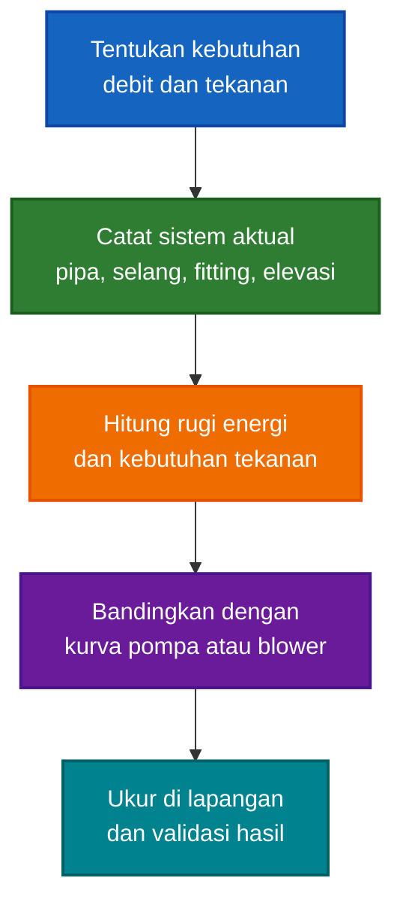
```mermaid
flowchart TB
    A["Tentukan kebutuhan<br/>debit dan tekanan"] --> B["Catat sistem aktual<br/>pipa, selang, fitting, elevasi"]
    B --> C["Hitung rugi energi<br/>dan kebutuhan tekanan"]
    C --> D["Bandingkan dengan<br/>kurva pompa atau blower"]
    D --> E["Ukur di lapangan<br/>dan validasi hasil"]

    classDef start fill:#1565C0,color:#FFFFFF,stroke:#0D47A1,stroke-width:2px;
    classDef data fill:#2E7D32,color:#FFFFFF,stroke:#1B5E20,stroke-width:2px;
    classDef calc fill:#EF6C00,color:#FFFFFF,stroke:#E65100,stroke-width:2px;
    classDef equip fill:#6A1B9A,color:#FFFFFF,stroke:#4A148C,stroke-width:2px;
    classDef check fill:#00838F,color:#FFFFFF,stroke:#006064,stroke-width:2px;

    class A start;
    class B data;
    class C calc;
    class D equip;
    class E check;
```

### 0.2 Batas Penggunaan Artikel

Pembahasan utama mencakup sistem satu fase:

- Air bersih, air irigasi, air kolam, atau larutan pupuk dengan karakteristik yang masih mendekati air.
- Udara dari blower, aerator, atau kompresor tekanan rendah.
- Pipa PVC, selang fleksibel, fitting, valve, manifold, nozzle, dan diffuser.

Beberapa kondisi memerlukan kehati-hatian lebih tinggi atau model khusus:

| Kondisi                               | Status dalam artikel                                          |
| ------------------------------------- | ------------------------------------------------------------- |
| Air bercampur pasir atau lumpur pekat | Hanya dibahas secara umum                                     |
| Fluida sangat kental                  | Memerlukan data viskositas aktual                             |
| Airlift dan venturi aerator           | Dibahas sebagai pengantar two-phase flow                      |
| Campuran udara-air dalam pipa         | Tidak dapat dihitung hanya dengan model satu fase             |
| Tekanan tinggi atau udara tekan       | Memerlukan evaluasi compressible flow dan standar keselamatan |
| Water hammer atau lonjakan tekanan    | Tidak dibahas secara rinci                                    |
| Kompatibilitas PVC dengan bahan kimia | Harus merujuk data produsen pipa dan bahan kimia              |

Untuk instalasi bertekanan, bahan kimia, pupuk pekat, pestisida, atau udara tekan, penggunaan artikel ini tidak menggantikan spesifikasi produsen, standar keselamatan, dan ketentuan lokal.

### 0.3 Prinsip Utama: Hitungan Harus Bertemu Pengukuran

Sistem nyata selalu memiliki ketidakpastian. Diameter dalam pipa dapat berbeda dari asumsi, valve mungkin tidak terbuka penuh, filter dapat kotor, diffuser dapat mengalami fouling, dan kurva pompa dapat berubah karena putaran motor atau kondisi listrik.

Karena itu, hasil hitungan harus diperlakukan sebagai hipotesis engineering yang perlu diuji.

Untuk sistem air yang dipompa, kebutuhan head secara umum dapat ditulis sebagai:

$$
H_{\text{system}}
=

H_{\text{static}}
+
h_f
+
h_m
+
H_{\text{required}}
$$

Dengan:

- $H_{\text{system}}$ = total head sistem.
- $H_{\text{static}}$ = beda elevasi atau head statis.
- $h_f$ = rugi gesek sepanjang pipa.
- $h_m$ = rugi akibat fitting, valve, filter, reducer, dan komponen lokal.
- $H_{\text{required}}$ = head minimum yang dibutuhkan di outlet, nozzle, atau peralatan.

Pompa akan bekerja pada titik saat kemampuan pompa bertemu dengan kebutuhan sistem. Titik inilah yang disebut **titik operasi**.

Pada blower, konsepnya sama, tetapi satuan yang paling umum digunakan adalah pressure drop atau tekanan diferensial:

$$
\Delta P_{\text{system}}
=

\Delta P_{\text{hydrostatic}}
+
\Delta P_{\text{pipe}}
+
\Delta P_{\text{hose}}
+
\Delta P_{\text{fitting}}
+
\Delta P_{\text{diffuser}}
$$

Contoh sederhana: blower untuk aerasi kolam harus mengatasi tekanan air di kedalaman diffuser, rugi tekanan pipa utama, selang, valve, dan diffuser. Kapasitas “free air” blower tidak dapat langsung dianggap sebagai debit udara yang benar-benar sampai ke diffuser.

### 0.4 Konvensi Satuan

Gunakan satuan secara konsisten sejak awal. Kesalahan satuan sering menghasilkan kesalahan desain yang lebih besar daripada kesalahan rumus.

| Besaran          |    Simbol | Satuan utama | Satuan praktis |
| ---------------- | --------: | -----------: | -------------: |
| Debit volumetrik |       $Q$ |         m³/s |    L/min, m³/h |
| Laju alir massa  | $\dot{m}$ |         kg/s |           kg/h |
| Kecepatan aliran |       $V$ |          m/s |            m/s |
| Tekanan          |       $P$ |           Pa |       kPa, bar |
| Head air         |       $H$ |            m |           mH₂O |
| Daya             |       $P$ |            W |             kW |
| Diameter dalam   |     $D_i$ |            m |             mm |
| Panjang pipa     |       $L$ |            m |              m |

Konversi dasar yang sering diperlukan:

$$
1\ \text{m}^3
=

1000\ \text{L}
$$

$$
1\ \text{m}^3/\text{h}
=

16.67\ \text{L}/\text{min}
$$

$$
1\ \text{bar}
=

100\ \text{kPa}
$$

Untuk air pada kondisi mendekati 20°C:

$$
1\ \text{mH}_2\text{O}
\approx
9.81\ \text{kPa}
$$

Tekanan absolut dan tekanan gauge harus selalu dibedakan:

$$
P_{\text{absolute}}
=

P_{\text{gauge}}
+
P_{\text{atmospheric}}
$$

Keterangan:

- **bar(g)** atau gauge pressure adalah tekanan relatif terhadap atmosfer.
- **bar(a)** atau absolute pressure adalah tekanan terhadap vakum sempurna.
- Perhitungan densitas udara dan gas harus menggunakan tekanan absolut.

Untuk aliran udara, istilah berikut tidak boleh dicampur tanpa keterangan kondisi referensi:

| Istilah          | Makna praktis                                                  |
| ---------------- | -------------------------------------------------------------- |
| L/min aktual     | Debit udara pada tekanan dan temperatur aktual di lokasi       |
| NL/min atau SLPM | Debit yang dinyatakan pada kondisi referensi tertentu          |
| CFM              | Cubic feet per minute, perlu kondisi referensi                 |
| SCFM             | Standard cubic feet per minute, perlu definisi kondisi standar |

Nilai “100 L/min udara” tidak selalu sama dengan “100 NL/min udara”. Perbedaan tersebut menjadi penting saat udara mengalami perubahan tekanan atau temperatur.

### 0.5 Metode Kerja yang Direkomendasikan

Gunakan urutan berikut untuk setiap kasus desain atau troubleshooting.

1. Tentukan kebutuhan proses: debit air, debit udara, tekanan minimum, atau jumlah outlet.
2. Catat geometri aktual: diameter dalam, panjang, elevasi, fitting, valve, dan cabang.
3. Tentukan kondisi fluida: air atau udara, temperatur, tekanan, kebersihan fluida, serta kondisi operasi.
4. Pilih model fisik yang sesuai.
5. Hitung kecepatan, Reynolds number, friction factor, dan rugi energi.
6. Bentuk kebutuhan sistem atau system curve.
7. Bandingkan dengan kurva pompa atau blower.
8. Ukur hasil aktual di lapangan.
9. Koreksi asumsi bila prediksi dan pengukuran berbeda jauh.

> **Prinsip praktis:** jangan memilih pompa berdasarkan debit maksimum katalog saja. Jangan memilih blower berdasarkan “watt besar” saja. Pilih peralatan berdasarkan debit yang masih tersedia pada head atau pressure sistem yang nyata.

[**Kembali ke Atas**](#panduan-praktis-perhitungan-fluida-dalam-pipa-pvc)

---

## 1. Mengapa Sistem Pipa Sering Tidak Sesuai Desain

Sistem pipa pertanian sering terlihat sederhana: tangki, pompa, pipa PVC, valve, dan outlet. Namun performa aktual dapat jauh dari harapan karena energi yang tersedia dari pompa atau blower harus melewati banyak hambatan sebelum mencapai titik pemakaian.

Masalah tersebut sering muncul pada:

- Irigasi kebun atau greenhouse.
- Distribusi air dari tandon ke lahan.
- Sistem fertigation.
- Sirkulasi air kolam ikan.
- Aquaponik dan hidroponik.
- Aerasi bioflok atau kolam budidaya.
- Pencucian kandang dan distribusi air peternakan.

### 1.1 Gejala Lapangan

Gejala berikut perlu dianggap sebagai sinyal bahwa sistem harus diperiksa secara hidraulik atau pneumatik.

| Gejala                                   | Kemungkinan penyebab                                                  | Pemeriksaan pertama                            |
| ---------------------------------------- | --------------------------------------------------------------------- | ---------------------------------------------- |
| Debit pompa kecil                        | Head statis tinggi, pipa kecil, filter kotor, valve tertutup sebagian | Ukur tekanan dan cek kurva pompa               |
| Sprinkler atau nozzle lemah              | Tekanan ujung pipa kurang                                             | Ukur tekanan dekat pompa dan outlet            |
| Cabang terdekat deras, cabang jauh lemah | Pressure drop pada manifold terlalu besar                             | Cek diameter header dan panjang cabang         |
| Gelembung diffuser tidak merata          | Balancing buruk, selang berbeda panjang, diffuser fouling             | Bandingkan aliran pada tiap diffuser           |
| Pipa terasa “tercekik”                   | Kecepatan terlalu tinggi atau ada restriksi lokal                     | Cek filter, valve, reducer, dan diameter       |
| Daya listrik tinggi tetapi debit rendah  | Pompa bekerja jauh dari titik efisien, hambatan sistem besar          | Cek arus motor, tekanan, dan debit             |
| Blower panas atau bising                 | Tekanan sistem terlalu tinggi                                         | Bandingkan pressure aktual dengan kurva blower |

#### Debit Pompa Aktual Lebih Rendah dari Katalog

Nilai debit maksimum pada katalog pompa umumnya ditunjukkan pada kondisi head sangat rendah. Ketika pompa harus mengangkat air ke tangki, melewati pipa panjang, filter, elbow, valve, dan nozzle, debitnya turun.

Misalnya, pompa memiliki klaim:

$$
Q_{\text{max}}
=

100\ \text{L/min}
$$

Angka tersebut tidak berarti pompa akan selalu memberikan 100 L/min pada sistem nyata. Debit aktual harus dibaca dari kurva pompa pada total head sistem.

Pada sistem irigasi, penambahan filter atau valve kontrol dapat menggeser titik operasi secara signifikan. Pada sistem kolam, pipa return yang naik beberapa meter juga dapat mengurangi debit secara nyata.

#### Blower Menyala, Tetapi Gelembung Tidak Merata

Pada jaringan aerasi, diffuser terdekat dari blower sering menerima udara lebih besar dibanding diffuser paling jauh. Kondisi ini dapat terjadi karena:

- Header terlalu kecil.
- Cabang tidak seimbang.
- Panjang selang berbeda jauh.
- Diffuser memiliki tingkat fouling berbeda.
- Valve cabang tidak diatur.
- Kedalaman diffuser berbeda.

Distribusi udara yang tidak merata dapat menghasilkan daerah kolam dengan oksigen rendah atau pencampuran yang lemah.

#### Pipa Terasa “Terkekang” atau Tercekik

Istilah “pipa tercekik” biasanya berarti sistem mengalami hambatan aliran yang besar. Hambatan tersebut dapat berasal dari diameter terlalu kecil, filter kotor, valve belum terbuka penuh, elbow berlebihan, reducer tajam, atau selang yang tertekuk.

Pada debit yang sama, diameter kecil menyebabkan kecepatan naik secara tajam:

$$
V
=

\frac{4Q}{\pi D_i^2}
$$

Karena kecepatan meningkat, rugi tekanan juga meningkat. Pada aliran turbulen, rugi gesek umumnya sangat dipengaruhi oleh kecepatan kuadrat.

Secara kasar, untuk debit dan panjang pipa yang sama serta mengabaikan perubahan friction factor:

$$
h_f
\propto
\frac{1}{D^5}
$$

Artinya, penurunan diameter dalam sebesar 20% dapat meningkatkan rugi gesek sekitar:

$$
\left(
\frac{1}{0.8}
\right)^5
\approx
3.05
$$

atau sekitar tiga kali lipat. Karena itu, perbedaan kecil pada inside diameter dapat berdampak besar pada sistem.

#### Konsumsi Daya Tinggi, Tetapi Performa Rendah

Kondisi ini tidak selalu berarti pompa atau blower rusak. Penyebabnya dapat meliputi:

- Sistem memiliki pressure drop lebih besar dari desain.
- Pompa bekerja jauh dari titik efisiensi terbaik.
- Jalur discharge terlalu kecil.
- Filter atau strainer kotor.
- Valve dipakai sebagai pembatas utama aliran.
- Blower dipaksa bekerja pada tekanan terlalu tinggi.
- Diffuser atau nozzle mengalami penyumbatan.

Masalah mekanis juga perlu diperiksa, seperti bearing, impeller aus, putaran motor, tegangan listrik, dan kebocoran. Namun pemeriksaan hidraulik tetap penting agar penyebab tidak langsung disalahkan pada pompa atau blower.

### 1.2 Penyebab Fisik

#### Diameter Dalam Pipa Tidak Sesuai Asumsi

Ukuran nominal pipa PVC tidak selalu sama dengan diameter dalam aktual. Inside diameter dapat berbeda karena:

- Kelas tekanan pipa.
- Schedule atau SDR.
- Ketebalan dinding.
- Standar produsen.
- Penggunaan sleeve, fitting, reducer, atau sambungan.

Dalam perhitungan aliran, parameter yang dipakai adalah **diameter dalam**, bukan diameter luar dan bukan nama nominal pipa.

Luas penampang aliran dihitung dari:

$$
A
=

\frac{\pi D_i^2}{4}
$$

Kesalahan memakai diameter luar akan menghasilkan kesalahan kecepatan, Reynolds number, head loss, dan estimasi debit.

#### Head Statis dan Rugi Tekan Tidak Dihitung Bersamaan

Pada sistem air, head statis berasal dari beda elevasi antara sumber dan titik tujuan. Rugi tekan muncul ketika air mengalir melalui pipa, fitting, valve, filter, dan outlet.

Hubungan sederhananya:

$$
H_{\text{system}}
=

H_{\text{static}}
+
h_f
+
h_m
$$

Pada kondisi tanpa aliran, rugi gesek mendekati nol. Namun saat debit meningkat, rugi gesek meningkat.

Sebagai contoh, pipa dari tandon ke lahan dapat memiliki head statis kecil, tetapi tetap mengalami pressure drop besar jika jalur sangat panjang, diameter kecil, atau memiliki banyak fitting.

#### Fitting, Valve, Selang, dan Filter Diabaikan

Elbow, tee, reducer, valve, filter, water meter, venturi, dan diffuser bukan komponen tanpa rugi energi.

Rugi lokal secara umum ditulis:

$$
h_m
=

K
\frac{V^2}{2g}
$$

Dengan:

- $h_m$ = minor loss atau rugi lokal.
- $K$ = loss coefficient komponen.
- $V$ = kecepatan aliran.
- $g$ = percepatan gravitasi.

Pada jaringan pendek dengan banyak fitting, total minor loss dapat lebih besar daripada rugi gesek pipa lurus.

Contoh yang sering terjadi pada lapangan:

- Filter kecil dipasang pada debit tinggi.
- Valve globe dipakai sebagai pengatur debit utama.
- Banyak elbow 90° dipasang rapat.
- Selang aerasi kecil dan panjang dipakai untuk semua cabang.
- Reducer tajam dipasang dekat pompa atau blower.

#### Kurva Pompa atau Blower Tidak Digunakan

Pompa dan blower tidak menghasilkan kombinasi debit-tekanan yang tetap. Kapasitasnya berubah sesuai hambatan sistem.

Pada pompa, kurva umumnya menyatakan hubungan:

$$
Q
\text{ versus }
H
$$

Pada blower, kurva umumnya menyatakan hubungan:

$$
Q
\text{ versus }
\Delta P
$$

Label “1 HP”, “500 W”, atau “100 L/min” tidak cukup untuk menentukan kesesuaian peralatan. Yang diperlukan adalah kurva performa dan kondisi pengujian peralatan.

#### Debit Udara Aktual dan Debit Standar Tercampur

Air dapat dianggap hampir incompressible dalam banyak sistem pertanian. Udara tidak demikian.

Untuk aliran gas ideal pada laju massa yang sama:

$$
\frac{P_{\text{abs}}Q}{T}
=

\text{konstan}
$$

Artinya debit volumetrik udara berubah ketika tekanan absolut atau temperatur berubah.

Blower dapat diberi label dalam CFM, sedangkan diffuser mungkin direkomendasikan dalam NL/min. Kedua angka tersebut tidak boleh langsung dibandingkan tanpa mengetahui kondisi referensinya.

#### Fouling, Endapan, dan Penyumbatan

Sistem pertanian dan budidaya sering beroperasi dengan air yang mengandung sedimen, lumut, endapan mineral, pupuk, biofilm, atau partikel organik.

Komponen yang paling rentan terhadap fouling antara lain:

- Filter.
- Emitter drip.
- Nozzle kecil.
- Venturi.
- Batu aerasi.
- Diffuser membran.
- Needle atau tubing kecil.
- Valve kecil.

Perhitungan desain perlu menyisakan margin tekanan untuk menghadapi penurunan performa akibat fouling.

### 1.3 Peta Keputusan Awal

Sebelum memilih rumus, tentukan mekanisme dominan yang mengendalikan sistem.

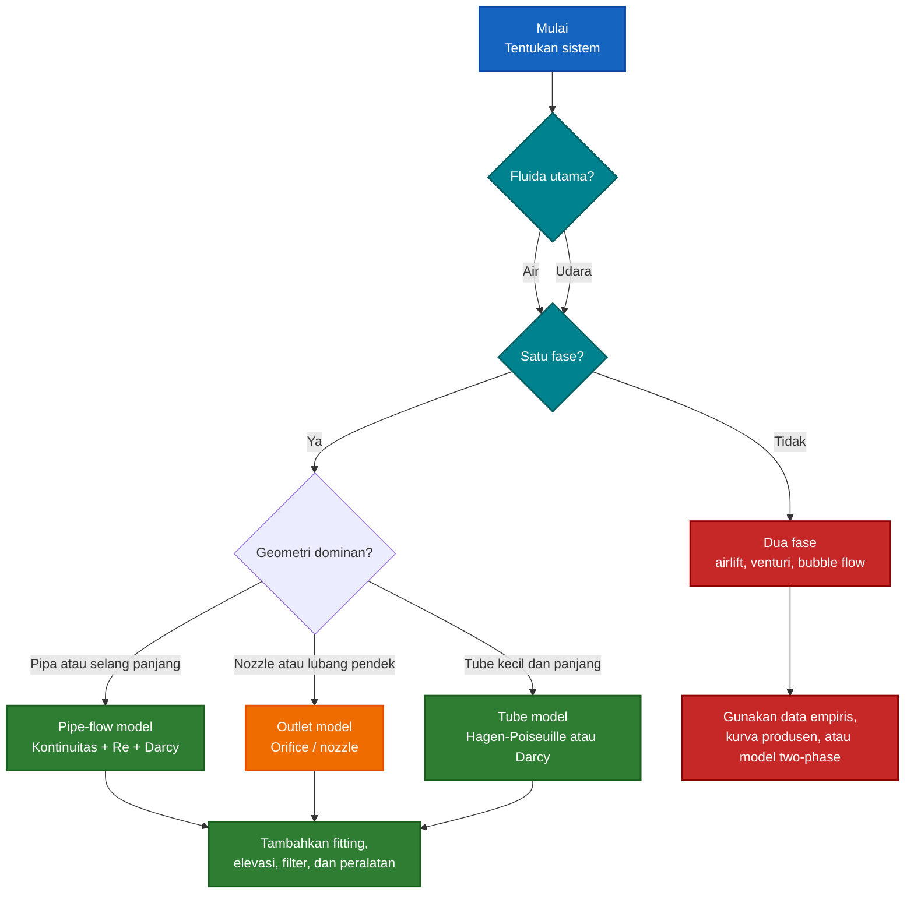
```mermaid
flowchart TB
    A["Mulai<br/>Tentukan sistem"] --> B{"Fluida utama?"}

    B -->|Air| C{"Satu fase?"}
    B -->|Udara| C

    C -->|Tidak| D["Dua fase<br/>airlift, venturi, bubble flow"]
    C -->|Ya| E{"Geometri dominan?"}

    E -->|Pipa atau selang panjang| F["Pipe-flow model<br/>Kontinuitas + Re + Darcy"]
    E -->|Nozzle atau lubang pendek| G["Outlet model<br/>Orifice / nozzle"]
    E -->|Tube kecil dan panjang| H["Tube model<br/>Hagen-Poiseuille atau Darcy"]

    F --> I["Tambahkan fitting,<br/>elevasi, filter, dan peralatan"]
    G --> I
    H --> I
    D --> J["Gunakan data empiris,<br/>kurva produsen, atau model two-phase"]

    classDef start fill:#1565C0,color:#FFFFFF,stroke:#0D47A1,stroke-width:2px;
    classDef fluid fill:#00838F,color:#FFFFFF,stroke:#006064,stroke-width:2px;
    classDef phase fill:#6A1B9A,color:#FFFFFF,stroke:#4A148C,stroke-width:2px;
    classDef model fill:#2E7D32,color:#FFFFFF,stroke:#1B5E20,stroke-width:2px;
    classDef outlet fill:#EF6C00,color:#FFFFFF,stroke:#E65100,stroke-width:2px;
    classDef warn fill:#C62828,color:#FFFFFF,stroke:#8E0000,stroke-width:2px;

    class A start;
    class B,C fluid;
    class F,H,I model;
    class G outlet;
    class D,J warn;
```

Peta keputusan tersebut bukan berarti seluruh sistem selalu hanya memakai satu model. Satu instalasi dapat memakai beberapa model sekaligus.

Contoh sistem irigasi:

- Pipa utama: Darcy–Weisbach.
- Elbow dan valve: minor loss coefficient.
- Nozzle sprinkler: orifice atau data pabrikan.
- Pompa: kurva $Q-H$.
- Tangki lebih tinggi: Bernoulli dan head statis.

Contoh sistem aerasi:

- Pipa blower: pressure drop gas.
- Selang cabang: rugi tekan selang.
- Diffuser: kurva pressure drop diffuser.
- Kedalaman air: tekanan hidrostatik.
- Airlift: pendekatan two-phase flow.

> **Catatan penting:** rasio panjang terhadap diameter membantu menentukan apakah gesekan pipa atau rugi lokal lebih dominan, tetapi bukan satu-satunya dasar pemilihan model. Bentuk geometri, Reynolds number, jenis fluida, dan kondisi tekanan tetap harus diperiksa.

[**Kembali ke Atas**](#panduan-praktis-perhitungan-fluida-dalam-pipa-pvc)

---

## 2. Data Dasar yang Harus Dikumpulkan Sebelum Menghitung

Perhitungan yang benar tidak dapat menggantikan data yang salah. Dalam banyak kasus, kesalahan terbesar bukan berasal dari persamaan, melainkan dari data lapangan yang tidak lengkap.

Sebelum menghitung debit, head loss, atau kebutuhan pompa, buat sketsa sistem dan kumpulkan data geometri, kondisi operasi, serta data peralatan.

### 2.1 Geometri Sistem

#### Diameter Dalam Pipa

Diameter dalam adalah data paling penting dalam perhitungan pipa.

Gunakan:

$$
D_i
=

\text{inside diameter}
$$

Bukan:

- Diameter luar pipa.
- Ukuran nominal pipa.
- Ukuran fitting yang tertulis pada kemasan.
- Perkiraan visual.

Luas penampang aliran dihitung dengan:

$$
A
=

\frac{\pi D_i^2}{4}
$$

Kecepatan aliran diperoleh dari:

$$
V
=

\frac{Q}{A}
$$

Sebagai ilustrasi, misalkan sebuah pipa memiliki inside diameter:

$$
D_i
=

# 26.6\ \text{mm}

0.0266\ \text{m}
$$

Maka luas alirannya:

$$
A
=

# \frac{\pi(0.0266)^2}{4}

5.56 \times 10^{-4}\ \text{m}^2
$$

Jika debit air:

$$
Q
=

# 40\ \text{L/min}

6.67 \times 10^{-4}\ \text{m}^3/\text{s}
$$

Maka kecepatan aliran:

$$
V
=

\frac{6.67 \times 10^{-4}}
{5.56 \times 10^{-4}}
=

1.20\ \text{m/s}
$$

Nilai ini hanya contoh. Diameter dalam aktual harus diambil dari katalog produsen atau diukur pada potongan pipa yang tidak sedang beroperasi.

#### Panjang Pipa dan Selang

Panjang yang dicatat adalah panjang jalur aliran, bukan jarak lurus antar titik.

Catat:

- Panjang pipa utama.
- Panjang pipa cabang.
- Panjang selang fleksibel.
- Panjang jalur vertikal.
- Panjang pipa menuju filter, venturi, nozzle, atau diffuser.
- Panjang setiap cabang manifold.

Untuk jaringan bercabang, buat sketsa sederhana dengan nomor titik dan arah aliran.

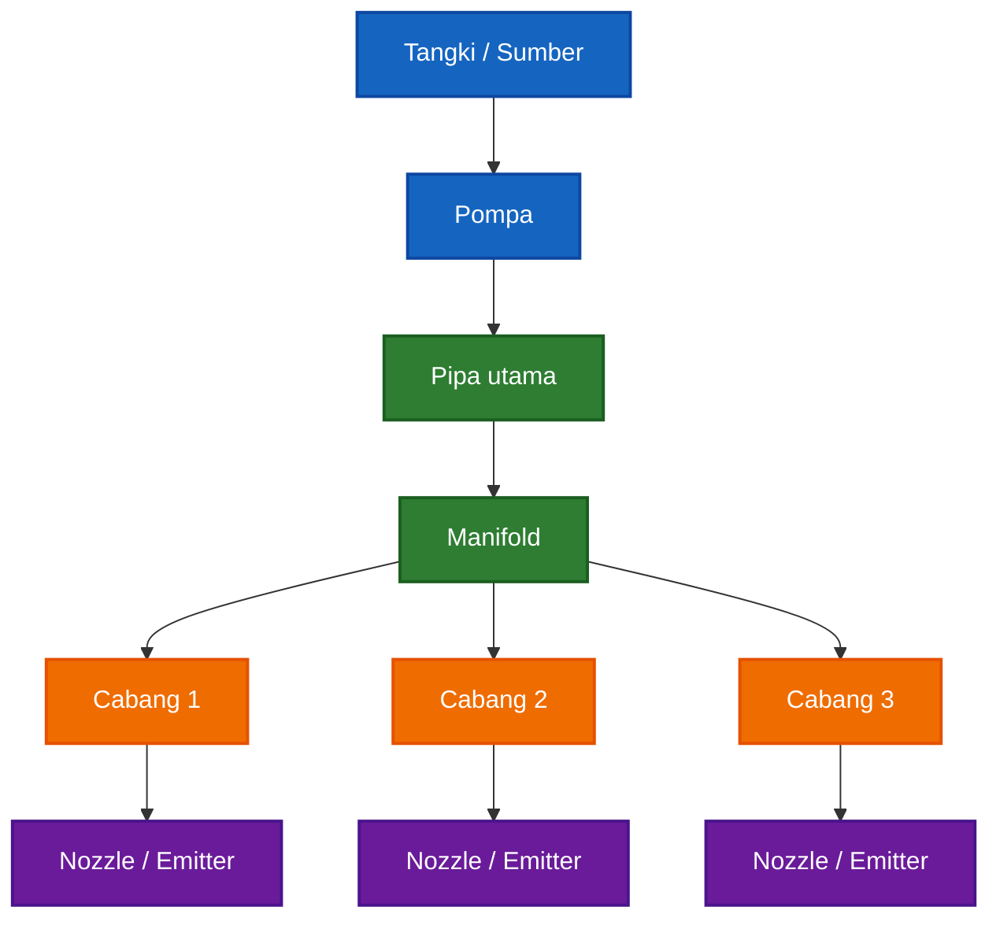
```mermaid
flowchart TB
    A["Tangki / Sumber"] --> B["Pompa"]
    B --> C["Pipa utama"]
    C --> D["Manifold"]

    D --> E["Cabang 1"]
    D --> F["Cabang 2"]
    D --> G["Cabang 3"]

    E --> H["Nozzle / Emitter"]
    F --> I["Nozzle / Emitter"]
    G --> J["Nozzle / Emitter"]

    classDef source fill:#1565C0,color:#FFFFFF,stroke:#0D47A1,stroke-width:2px;
    classDef pipe fill:#2E7D32,color:#FFFFFF,stroke:#1B5E20,stroke-width:2px;
    classDef branch fill:#EF6C00,color:#FFFFFF,stroke:#E65100,stroke-width:2px;
    classDef outlet fill:#6A1B9A,color:#FFFFFF,stroke:#4A148C,stroke-width:2px;

    class A,B source;
    class C,D pipe;
    class E,F,G branch;
    class H,I,J outlet;
```

#### Elevasi Sistem

Pilih satu titik referensi elevasi, misalnya permukaan tanah di dekat pompa.

Kemudian catat elevasi:

- Permukaan air sumber.
- Posisi pompa.
- Puncak pipa.
- Permukaan tangki tujuan.
- Nozzle tertinggi.
- Diffuser di dasar kolam.
- Outlet akhir.

Untuk pompa air, beda elevasi antara permukaan air sumber dan titik tujuan berpengaruh langsung terhadap head statis.

Untuk aerasi, kedalaman diffuser menentukan tekanan hidrostatik yang harus dilawan blower:

$$
\Delta P_{\text{hydrostatic}}
=

\rho_{\text{water}}gh
$$

Dengan:

- $\rho_{\text{water}}$ = densitas air.
- $g$ = percepatan gravitasi.
- $h$ = kedalaman diffuser dari permukaan air.

Tekanan ini bukan otomatis pressure drop diffuser. Pressure drop diffuser adalah tambahan tekanan yang diperlukan agar udara dapat benar-benar melewati diffuser pada debit tertentu.

#### Fitting dan Komponen Lokal

Catat jumlah dan jenis komponen berikut:

| Komponen    | Data yang perlu dicatat                  |
| ----------- | ---------------------------------------- |
| Elbow       | Sudut, radius, jumlah                    |
| Tee         | Aliran lurus atau menuju cabang          |
| Reducer     | Diameter masuk dan keluar                |
| Valve       | Jenis dan posisi operasi                 |
| Filter      | Ukuran, jenis, kondisi kebersihan        |
| Check valve | Ukuran dan arah aliran                   |
| Water meter | Tipe dan ukuran                          |
| Venturi     | Diameter throat dan fungsi               |
| Nozzle      | Diameter, jumlah, tekanan target         |
| Diffuser    | Jenis, jumlah, kedalaman, kurva pabrikan |

Setiap komponen dapat menyebabkan rugi energi tambahan. Data fitting yang lengkap akan membuat estimasi lebih realistis dibanding hanya menghitung pipa lurus.

### 2.2 Kondisi Operasi

#### Target Debit

Jangan hanya menulis “butuh air banyak” atau “blower harus kuat.” Target harus dinyatakan dalam angka dan kondisi operasi.

Contoh target yang baik:

| Sistem      | Target yang jelas                             |
| ----------- | --------------------------------------------- |
| Irigasi     | 2.5 m³/h untuk satu zona                      |
| Fertigation | 40 L/min pada tekanan outlet minimum tertentu |
| Kolam       | Sirkulasi 10 m³/h menuju filter               |
| Aerasi      | 15 NL/min per diffuser                        |
| Spray       | 1.2 L/min per nozzle pada tekanan tertentu    |

Untuk sistem bercabang, tentukan apakah semua cabang bekerja bersamaan atau bergantian.

Misalnya:

$$
Q_{\text{total}}
=

Q_1
+
Q_2
+
Q_3
+
\cdots
+
Q_n
$$

Persamaan ini berlaku jika seluruh cabang bekerja pada saat yang sama.

#### Temperatur Fluida

Temperatur memengaruhi densitas dan viskositas fluida.

Untuk air, perubahan temperatur memengaruhi viskositas dan dapat mengubah friction factor. Pada kebanyakan desain pertanian sederhana, asumsi air 20–30°C cukup untuk estimasi awal, tetapi harus dicatat bila air sangat panas atau sangat dingin.

Untuk udara, temperatur juga memengaruhi densitas. Karena itu, data blower idealnya mencantumkan kondisi udara masuk.

#### Tekanan Gauge dan Absolut

Tekanan gauge dibaca langsung dari pressure gauge biasa. Tekanan absolut diperlukan untuk perhitungan densitas udara dan konversi debit gas.

Hubungannya:

$$
P_{\text{abs}}
=

P_{\text{gauge}}
+
P_{\text{atm}}
$$

Contoh: bila pressure gauge menunjukkan:

$$
P_{\text{gauge}}
=

20\ \text{kPa}
$$

dan tekanan atmosfer diasumsikan:

$$
P_{\text{atm}}
=

101.3\ \text{kPa}
$$

maka tekanan absolut:

$$
P_{\text{abs}}
=

20
+
101.3
=

121.3\ \text{kPa(a)}
$$

Untuk udara ideal dengan laju massa sama, hubungan debit aktual dan debit standar dapat ditulis:

$$
Q_{\text{standard}}
=

Q_{\text{actual}}
\left(
\frac{P_{\text{actual}}}{P_{\text{standard}}}
\right)
\left(
\frac{T_{\text{standard}}}{T_{\text{actual}}}
\right)
$$

Gunakan persamaan tersebut hanya jika kondisi standar didefinisikan secara eksplisit. Jangan menganggap NL/min, SLPM, CFM, dan SCFM selalu menggunakan referensi yang sama.

#### Jenis dan Kondisi Fluida

Catat kondisi fluida secara praktis:

| Fluida        | Data tambahan yang relevan                       |
| ------------- | ------------------------------------------------ |
| Air bersih    | Temperatur dan sumber air                        |
| Air kolam     | Padatan, biofilm, lumpur, alga                   |
| Larutan pupuk | Konsentrasi, temperatur, kompatibilitas material |
| Air sumur     | Pasir, kerak mineral, kandungan besi             |
| Udara blower  | Temperatur udara masuk dan tekanan operasi       |
| Udara tekan   | Tekanan absolut dan kondisi kompresor            |

Air dengan pasir, lumpur, atau bahan organik dapat meningkatkan risiko penyumbatan dan abrasi. Larutan pupuk tertentu dapat memengaruhi material seal, valve, dan fitting. Dalam kondisi tersebut, desain perlu menyisakan margin lebih besar.

### 2.3 Data Peralatan

#### Kurva Pompa

Data minimum pompa yang perlu dikumpulkan:

| Data              | Kegunaan                                |
| ----------------- | --------------------------------------- |
| Kurva $Q-H$       | Menentukan titik operasi                |
| Kurva efisiensi   | Menilai konsumsi energi                 |
| Daya motor        | Memeriksa kecukupan motor               |
| Diameter impeller | Menentukan konfigurasi aktual           |
| Kecepatan putar   | Mempengaruhi kurva pompa                |
| NPSHr             | Menilai risiko kavitasi                 |
| Batas operasi     | Menghindari operasi di luar rekomendasi |

Kurva pompa harus berasal dari model pompa, ukuran impeller, dan putaran yang benar. Kurva pompa model lain tidak boleh dianggap setara hanya karena daya motor sama.

#### Kurva Blower

Untuk blower, kumpulkan:

| Data                | Kegunaan                                  |
| ------------------- | ----------------------------------------- |
| Kurva debit–tekanan | Menentukan debit pada pressure aktual     |
| Kondisi pengujian   | Memahami apakah debit aktual atau standar |
| Daya listrik        | Estimasi konsumsi energi                  |
| Tekanan maksimum    | Memastikan blower tidak overload          |
| Temperatur udara    | Menilai kondisi operasi                   |
| Batas duty cycle    | Menentukan kecocokan operasi kontinu      |

Pada sistem aerasi, blower harus dipilih berdasarkan total pressure requirement, bukan hanya berdasarkan daya listrik atau jumlah watt.

#### Kurva Diffuser

Diffuser, batu aerasi, dan membran EPDM memiliki karakteristik berbeda. Data yang ideal adalah kurva:

$$
\Delta P_{\text{diffuser}}
=

f(Q_{\text{air}})
$$

Kurva tersebut menunjukkan pressure drop diffuser pada debit udara tertentu.

Catat juga:

- Jumlah diffuser.
- Jenis diffuser.
- Kedalaman pemasangan.
- Panjang selang cabang.
- Diameter selang.
- Kondisi fouling atau umur pemakaian.

Tanpa data diffuser, perhitungan blower hanya dapat dianggap sebagai estimasi awal.

### 2.4 Pengukuran Lapangan yang Direkomendasikan

Pengukuran lapangan diperlukan untuk memvalidasi model.

| Alat                | Fungsi                                             |
| ------------------- | -------------------------------------------------- |
| Meteran             | Mengukur panjang pipa dan beda elevasi             |
| Jangka sorong       | Memeriksa diameter dalam atau komponen kecil       |
| Pressure gauge      | Mengukur tekanan pada pompa, manifold, atau blower |
| Manometer           | Mengukur pressure difference kecil                 |
| Ember dan stopwatch | Mengukur debit air sederhana                       |
| Flow meter          | Mengukur debit air atau udara                      |
| Clamp meter         | Mengukur arus motor                                |
| Termometer          | Mengukur temperatur air atau udara                 |

Untuk pengukuran debit air dengan metode volumetrik:

$$
Q
=

\frac{V_{\text{container}}}{t}
$$

Contoh: ember 20 L penuh dalam 15 detik.

$$
Q
=

# \frac{20}{15}

1.33\ \text{L/s}
$$

Konversi ke L/min:

$$
Q
=

1.33
\times
60
=

80\ \text{L/min}
$$

Lakukan pengukuran minimal tiga kali, lalu gunakan rata-rata. Pengukuran harus dilakukan pada kondisi operasi nyata, misalnya ketika seluruh zona irigasi yang direncanakan memang sedang terbuka.

Untuk udara, flow meter harus dipahami kondisi kalibrasinya. Rotameter dapat menunjukkan debit aktual pada kondisi tertentu. Jangan langsung menyamakan pembacaan flow meter dengan NL/min tanpa koreksi atau informasi referensi.

### 2.5 Template Pengumpulan Data

Gunakan tabel berikut sebelum masuk ke perhitungan.

| Kelompok data | Parameter             | Nilai | Satuan          | Sumber data      |
| ------------- | --------------------- | ----: | --------------- | ---------------- |
| Sistem        | Jenis fluida          |       |                 | Observasi        |
| Sistem        | Target debit          |       | L/min atau m³/h | Kebutuhan proses |
| Pipa          | Inside diameter       |       | mm              | Katalog/ukur     |
| Pipa          | Panjang pipa utama    |       | m               | Ukur             |
| Pipa          | Panjang cabang        |       | m               | Ukur             |
| Elevasi       | Permukaan sumber      |       | m               | Ukur             |
| Elevasi       | Titik outlet/diffuser |       | m               | Ukur             |
| Fitting       | Jumlah elbow          |       | unit            | Observasi        |
| Fitting       | Jenis valve           |       |                 | Observasi        |
| Fitting       | Filter dan kondisi    |       |                 | Observasi        |
| Pompa         | Kurva $Q-H$           |       |                 | Datasheet        |
| Blower        | Kurva $Q-\Delta P$    |       |                 | Datasheet        |
| Diffuser      | Kurva $\Delta P-Q$    |       |                 | Datasheet        |
| Fluida        | Temperatur            |       | °C              | Ukur             |
| Udara         | Tekanan absolut/gauge |       | kPa             | Gauge/manometer  |

> **Batas minimum data:** tanpa inside diameter, panjang pipa, beda elevasi, dan target debit, hasil perhitungan hanya dapat dianggap sebagai ilustrasi. Tanpa kurva pompa atau blower, pemilihan peralatan tidak dapat dianggap final.

### 2.6 Pemeriksaan Data Sebelum Menghitung

Sebelum menggunakan rumus, lakukan pemeriksaan singkat berikut.

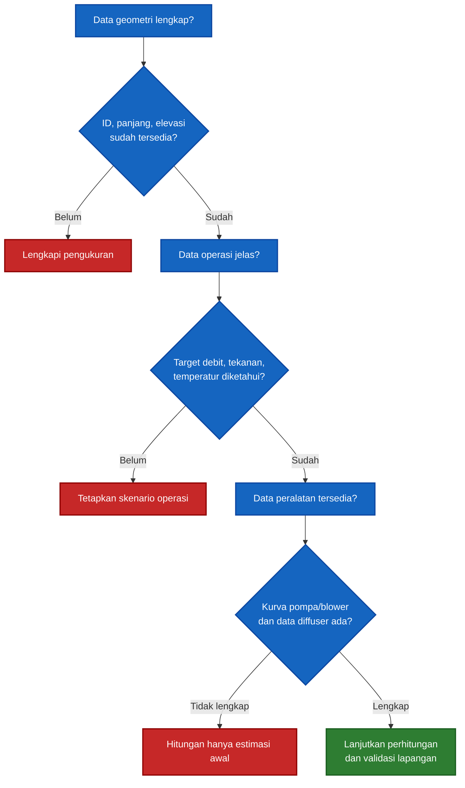
```mermaid
flowchart TB
    A["Data geometri lengkap?"] --> B{"ID, panjang, elevasi<br/>sudah tersedia?"}
    B -->|Belum| C["Lengkapi pengukuran"]
    B -->|Sudah| D["Data operasi jelas?"]

    D --> E{"Target debit, tekanan,<br/>temperatur diketahui?"}
    E -->|Belum| F["Tetapkan skenario operasi"]
    E -->|Sudah| G["Data peralatan tersedia?"]

    G --> H{"Kurva pompa/blower<br/>dan data diffuser ada?"}
    H -->|Tidak lengkap| I["Hitungan hanya estimasi awal"]
    H -->|Lengkap| J["Lanjutkan perhitungan<br/>dan validasi lapangan"]

    classDef check fill:#1565C0,color:#FFFFFF,stroke:#0D47A1,stroke-width:2px;
    classDef warn fill:#C62828,color:#FFFFFF,stroke:#8E0000,stroke-width:2px;
    classDef ready fill:#2E7D32,color:#FFFFFF,stroke:#1B5E20,stroke-width:2px;
    classDef process fill:#EF6C00,color:#FFFFFF,stroke:#E65100,stroke-width:2px;

    class A,B,D,E,G,H check;
    class C,F,I warn;
    class J ready;
```

Data lapangan yang lengkap tidak menjamin hasil sempurna, tetapi sangat mengurangi risiko kesalahan desain. Setelah data dasar tersedia, langkah berikutnya adalah memilih model perhitungan yang tepat untuk pipa panjang, nozzle, needle, diffuser, atau sistem dua fase.

[**Kembali ke Atas**](#panduan-praktis-perhitungan-fluida-dalam-pipa-pvc)

---

## Rujukan Bab 0–2

- [R1] Crane Co. _Flow of Fluids Through Valves, Fittings, and Pipe: Technical Paper No. 410._
- [R2] White, F. M. _Fluid Mechanics._ McGraw-Hill Education.
- [R3] Karassik, I. J., Messina, J. P., Cooper, P., dan Heald, C. C. _Pump Handbook._ McGraw-Hill.
- [R4] ASHRAE. _ASHRAE Handbook—Fundamentals._
- [R5] Keller, J., dan Bliesner, R. D. _Sprinkle and Trickle Irrigation._ Van Nostrand Reinhold.

---

# 3. Dasar Fluida yang Relevan untuk Perhitungan

Bab ini menetapkan besaran dasar yang akan digunakan dalam seluruh perhitungan berikutnya. Fokusnya adalah memahami perbedaan antara debit air dan udara, hubungan tekanan dengan head, serta pengaruh temperatur dan sifat material pipa terhadap rugi energi.

Untuk praktisi pertanian, kesalahan paling umum biasanya bukan pada rumus yang rumit, melainkan pada penggunaan satuan yang tidak konsisten, diameter pipa yang keliru, atau pencampuran tekanan gauge dengan tekanan absolut.

---

## 3.1 Debit, Laju Massa, dan Kecepatan

### 3.1.1 Debit Volumetrik

Debit volumetrik adalah volume fluida yang melewati suatu penampang per satuan waktu.

$$
Q
=

\frac{V_{\text{volume}}}{t}
$$

Dalam sistem pipa, debit juga dapat dihitung dari luas penampang dan kecepatan rata-rata fluida:

$$
Q
=

A V
$$

Dengan:

- $Q$ = debit volumetrik, dalam $\text{m}^3/\text{s}$.
- $A$ = luas penampang aliran, dalam $\text{m}^2$.
- $V$ = kecepatan rata-rata fluida, dalam $\text{m}/\text{s}$.

Untuk pipa berbentuk lingkaran:

$$
A
=

\frac{\pi D_i^2}{4}
$$

Sehingga:

$$
Q
=

\frac{\pi D_i^2}{4}V
$$

Dengan $D_i$ sebagai diameter dalam pipa.

> **Catatan:** gunakan diameter dalam pipa, bukan diameter luar dan bukan ukuran nominal pipa PVC.

### Contoh — Kecepatan Air dalam Pipa PVC

Diketahui:

- Debit air:

$$
Q
=

40\ \text{L/min}
$$

- Diameter dalam pipa:

$$
D_i
=

# 26.6\ \text{mm}

0.0266\ \text{m}
$$

Konversi debit:

$$
Q
=

# \frac{40}{1000 \times 60}

6.67 \times 10^{-4}\ \text{m}^3/\text{s}
$$

Luas penampang:

$$
A
=

# \frac{\pi(0.0266)^2}{4}

5.56 \times 10^{-4}\ \text{m}^2
$$

Kecepatan rata-rata:

$$
V
=

# \frac{Q}{A}

\frac{6.67 \times 10^{-4}}
{5.56 \times 10^{-4}}
=

1.20\ \text{m/s}
$$

Jadi, air mengalir dengan kecepatan sekitar:

$$
\boxed{
V
=

1.20\ \text{m/s}
}
$$

Kecepatan ini kemudian digunakan untuk menghitung Reynolds number, friction factor, dan head loss.

---

### 3.1.2 Laju Alir Massa

Debit volumetrik menunjukkan volume fluida yang bergerak. Namun, besaran yang selalu harus kekal pada sistem tertutup tanpa kebocoran adalah **laju alir massa**.

$$
\dot{m}
=

\rho Q
$$

Dengan:

- $\dot{m}$ = laju alir massa, dalam $\text{kg}/\text{s}$.
- $\rho$ = densitas fluida, dalam $\text{kg}/\text{m}^3$.
- $Q$ = debit volumetrik, dalam $\text{m}^3/\text{s}$.

Pada aliran tunak tanpa kebocoran:

$$
\dot{m}_1
=

\dot{m}_2
$$

Atau:

$$
\rho_1 A_1 V_1
=

\rho_2 A_2 V_2
$$

Untuk air, densitas biasanya dianggap hampir konstan. Maka persamaan kontinuitas dapat disederhanakan menjadi:

$$
A_1V_1
=

A_2V_2
$$

Untuk udara, densitas dapat berubah akibat perubahan tekanan dan temperatur. Karena itu, bentuk yang benar adalah:

$$
\rho_1 A_1V_1
=

\rho_2 A_2V_2
$$

### Perbedaan Debit Air dan Debit Udara

| Parameter                           | Air                                         | Udara                                       |
| ----------------------------------- | ------------------------------------------- | ------------------------------------------- |
| Sifat umum                          | Hampir incompressible                       | Compressible                                |
| Debit volumetrik sepanjang jalur    | Hampir tetap jika tidak bercabang           | Dapat berubah karena tekanan dan temperatur |
| Laju massa                          | Tetap tanpa kebocoran                       | Tetap tanpa kebocoran                       |
| Tekanan yang dipakai untuk densitas | Biasanya tidak kritis pada sistem sederhana | Harus memakai tekanan absolut               |
| Satuan lapangan umum                | L/min, m³/h                                 | L/min aktual, NL/min, CFM, SCFM             |

Pada sistem air, debit volumetrik biasanya dapat dianggap sama sepanjang pipa tunggal.

Pada sistem udara, debit aktual dapat meningkat ketika udara mengembang akibat tekanan turun. Walaupun debit volumetriknya berubah, laju massa tetap sama selama tidak ada kebocoran atau cabang tambahan.

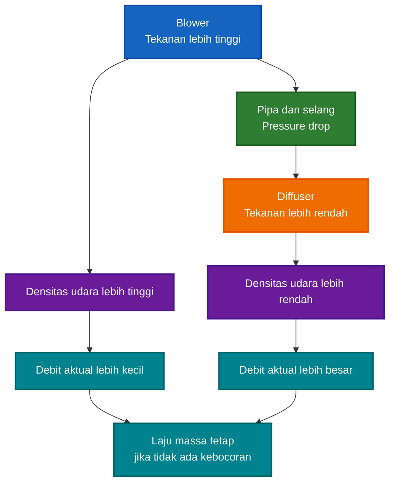
```mermaid id="r6s1yd"
flowchart TB
    A["Blower<br/>Tekanan lebih tinggi"] --> B["Pipa dan selang<br/>Pressure drop"]
    B --> C["Diffuser<br/>Tekanan lebih rendah"]

    A --> D["Densitas udara lebih tinggi"]
    C --> E["Densitas udara lebih rendah"]

    D --> F["Debit aktual lebih kecil"]
    E --> G["Debit aktual lebih besar"]

    F --> H["Laju massa tetap<br/>jika tidak ada kebocoran"]
    G --> H

    classDef source fill:#1565C0,color:#FFFFFF,stroke:#0D47A1,stroke-width:2px;
    classDef pipe fill:#2E7D32,color:#FFFFFF,stroke:#1B5E20,stroke-width:2px;
    classDef outlet fill:#EF6C00,color:#FFFFFF,stroke:#E65100,stroke-width:2px;
    classDef property fill:#6A1B9A,color:#FFFFFF,stroke:#4A148C,stroke-width:2px;
    classDef result fill:#00838F,color:#FFFFFF,stroke:#006064,stroke-width:2px;

    class A source;
    class B pipe;
    class C outlet;
    class D,E property;
    class F,G,H result;
```

### 3.1.3 Debit Udara Aktual dan Debit Standar

Untuk udara ideal:

$$
\rho
=

\frac{P_{\text{abs}}}
{R_{\text{air}}T}
$$

Dengan:

- $P_{\text{abs}}$ = tekanan absolut, dalam Pa.
- $R_{\text{air}}$ = konstanta gas udara kering.

$$
R_{\text{air}}
=

287.05\ \text{J/(kg·K)}
$$

- $T$ = temperatur absolut, dalam K.

Hubungan debit udara aktual dan debit standar dapat ditulis:

$$
Q_{\text{standard}}
=

Q_{\text{actual}}
\left(
\frac{P_{\text{actual}}}
{P_{\text{standard}}}
\right)
\left(
\frac{T_{\text{standard}}}
{T_{\text{actual}}}
\right)
$$

Atau:

$$
Q_{\text{actual}}
=

Q_{\text{standard}}
\left(
\frac{P_{\text{standard}}}
{P_{\text{actual}}}
\right)
\left(
\frac{T_{\text{actual}}}
{T_{\text{standard}}}
\right)
$$

### Contoh — Konversi Debit Udara

Misalkan blower memasok:

$$
Q_{\text{standard}}
=

100\ \text{NL/min}
$$

Kondisi standar diasumsikan:

$$
P_{\text{standard}}
=

101.325\ \text{kPa(a)}
$$

$$
T_{\text{standard}}
=

293.15\ \text{K}
$$

Udara berada pada tekanan:

$$
P_{\text{actual}}
=

121.325\ \text{kPa(a)}
$$

atau sekitar:

$$
20\ \text{kPa(g)}
$$

dengan temperatur sama.

Maka:

$$
Q_{\text{actual}}
=

100
\left(
\frac{101.325}{121.325}
\right)
=

83.5\ \text{L/min}
$$

Jadi 100 NL/min pada kondisi standar setara dengan sekitar:

$$
\boxed{
83.5\ \text{L/min aktual}
}
$$

pada tekanan 20 kPa(g), jika temperatur tetap.

> **Prinsip penting:** jangan membandingkan kapasitas blower, flow meter udara, dan rekomendasi diffuser sebelum memahami apakah debit yang digunakan adalah debit aktual atau debit standar.

### 3.1.4 Kecepatan Aliran dan Diameter Pipa

Untuk debit yang sama, diameter pipa lebih kecil akan menghasilkan kecepatan lebih tinggi.

$$
V
=

\frac{4Q}
{\pi D_i^2}
$$

Karena diameter berada pada pangkat dua, perubahan kecil diameter dapat menghasilkan perubahan kecepatan yang besar.

Misalnya, diameter dalam pipa diturunkan setengahnya:

$$
D_2
=

\frac{D_1}{2}
$$

Maka kecepatan meningkat sekitar empat kali:

$$
V_2
=

4V_1
$$

Kecepatan yang meningkat akan menaikkan rugi gesek, noise, getaran, risiko erosi, dan ketidakmerataan distribusi pada cabang sistem.

Pada sistem air pertanian, kecepatan desain awal yang umum dapat digunakan sebagai panduan kasar berikut.

| Aplikasi                      |                  Kisaran kecepatan awal |
| ----------------------------- | --------------------------------------: |
| Pipa gravitasi                |                             0.5–1.5 m/s |
| Pipa utama irigasi            |                             0.8–2.0 m/s |
| Pipa cabang irigasi           |                             0.5–1.5 m/s |
| Pipa sirkulasi kolam          |                             0.8–2.0 m/s |
| Selang kecil atau nozzle feed | Bergantung pressure drop yang diizinkan |
| Header udara blower           |                                5–15 m/s |
| Selang cabang aerasi          |                                3–10 m/s |

Nilai tersebut bukan batas universal. Sistem dengan banyak padatan, kebutuhan self-cleaning, batas kebisingan, atau kebutuhan tekanan outlet tertentu dapat memakai kisaran yang berbeda.

[**Kembali ke Atas**](#panduan-praktis-perhitungan-fluida-dalam-pipa-pvc)

---

## 3.2 Tekanan, Head, dan Elevasi

### 3.2.1 Tekanan

Tekanan adalah gaya yang bekerja pada suatu luas area.

$$
P
=

\frac{F}{A}
$$

Dengan:

- $P$ = tekanan, dalam Pa.
- $F$ = gaya, dalam N.
- $A$ = luas permukaan, dalam $\text{m}^2$.

Satuan tekanan yang umum digunakan:

| Satuan |         Konversi |
| ------ | ---------------: |
| 1 Pa   |           1 N/m² |
| 1 kPa  |         1,000 Pa |
| 1 bar  |          100 kPa |
| 1 psi  |        6.895 kPa |
| 1 mH₂O | sekitar 9.81 kPa |

Dalam desain sistem air, tekanan sering dinyatakan dalam meter head. Dalam sistem udara, tekanan lebih jelas dinyatakan dalam Pa, kPa, mbar, atau mmH₂O.

### 3.2.2 Tekanan Gauge dan Tekanan Absolut

Tekanan gauge adalah tekanan relatif terhadap atmosfer.

Tekanan absolut adalah tekanan relatif terhadap vakum sempurna.

Hubungannya:

$$
P_{\text{abs}}
=

P_{\text{gauge}}
+
P_{\text{atm}}
$$

Pada kondisi mendekati permukaan laut:

$$
P_{\text{atm}}
\approx
101.325\ \text{kPa(a)}
$$

Contoh: pressure gauge pada discharge pompa menunjukkan:

$$
P_{\text{gauge}}
=

150\ \text{kPa(g)}
$$

Maka tekanan absolutnya:

$$
P_{\text{abs}}
=

150
+
101.325
=

251.325\ \text{kPa(a)}
$$

| Jenis tekanan       | Kegunaan utama                                                       |
| ------------------- | -------------------------------------------------------------------- |
| Tekanan gauge       | Membaca pressure gauge pompa, manifold, filter, dan blower           |
| Tekanan absolut     | Menghitung densitas udara, konversi debit gas, dan kondisi gas ideal |
| Tekanan diferensial | Menghitung pressure drop komponen, filter, diffuser, atau pipa       |

> **Catatan:** tekanan gauge bernilai nol bukan berarti tidak ada tekanan. Tekanan gauge nol berarti tekanan sama dengan atmosfer. Tekanan absolutnya tetap sekitar 101.325 kPa(a) pada permukaan laut.

### 3.2.3 Pressure Head

Pressure head adalah energi tekanan per satuan berat fluida.

$$
h_p
=

\frac{P}{\rho g}
$$

Dengan:

- $h_p$ = pressure head, dalam m.
- $P$ = tekanan, dalam Pa.
- $\rho$ = densitas fluida, dalam kg/m³.
- $g$ = percepatan gravitasi.

$$
g
=

9.80665\ \text{m/s}^2
$$

Untuk air pada sekitar 20°C:

$$
1\ \text{mH}_2\text{O}
\approx
9.79\ \text{kPa}
$$

Dalam praktik lapangan, nilai berikut cukup untuk estimasi cepat:

$$
1\ \text{mH}_2\text{O}
\approx
9.81\ \text{kPa}
$$

### Contoh — Mengubah Tekanan Pompa Menjadi Head

Diketahui tekanan discharge pompa:

$$
P
=

150\ \text{kPa(g)}
$$

Densitas air pada 20°C:

$$
\rho
=

998\ \text{kg/m}^3
$$

Maka:

$$
h_p
=

\frac{150000}
{998 \times 9.80665}
=

15.3\ \text{m}
$$

Jadi tekanan 150 kPa(g) setara dengan sekitar:

$$
\boxed{
15.3\ \text{mH}_2\text{O}
}
$$

### 3.2.4 Velocity Head

Velocity head adalah energi kinetik fluida per satuan berat.

$$
h_v
=

\frac{V^2}{2g}
$$

Contoh untuk air yang mengalir dengan kecepatan:

$$
V
=

2\ \text{m/s}
$$

Maka:

$$
h_v
=

\frac{2^2}
{2 \times 9.80665}
=

0.204\ \text{m}
$$

Velocity head sering tampak kecil pada pipa diameter besar. Namun, nilainya meningkat terhadap kuadrat kecepatan.

Jika kecepatan naik dua kali:

$$
V_2
=

2V_1
$$

Maka velocity head meningkat empat kali:

$$
h_{v,2}
=

4h_{v,1}
$$

Karena itu, pipa kecil dengan kecepatan tinggi dapat menghasilkan rugi tekan yang besar.

### 3.2.5 Elevation Head

Elevation head adalah energi potensial akibat posisi fluida terhadap titik referensi.

$$
h_z
=

z
$$

Dengan $z$ sebagai elevasi titik fluida terhadap datum yang dipilih.

Pada tangki terbuka, setiap kenaikan elevasi air sebesar 1 meter membutuhkan tambahan energi sekitar 1 meter head.

Misalnya, permukaan air sumber berada pada elevasi 0 m dan tangki tujuan berada pada elevasi 12 m:

$$
H_{\text{static}}
=

12\ \text{m}
$$

Pompa harus menghasilkan head lebih besar dari 12 m karena masih ada rugi energi di pipa, valve, filter, dan outlet.

### 3.2.6 Total Energy Head

Energi fluida dapat dibagi menjadi tiga komponen utama:

$$
H
=

\frac{P}{\rho g}
+
\frac{V^2}{2g}
+
z
$$

Dengan:

- $\frac{P}{\rho g}$ = pressure head.
- $\frac{V^2}{2g}$ = velocity head.
- $z$ = elevation head.

Pada sistem nyata yang memiliki pompa dan rugi energi:

$$
\frac{P_1}{\rho g}
+
\alpha_1
\frac{V_1^2}{2g}
+
z_1
+
H_p
=

\frac{P_2}{\rho g}
+
\alpha_2
\frac{V_2^2}{2g}
+
z_2
+
h_L
$$

Dengan:

- $H_p$ = head yang ditambahkan pompa.
- $h_L$ = total head loss.
- $\alpha$ = kinetic energy correction factor.

Untuk sebagian besar perhitungan praktis pada aliran turbulen di pipa, nilai berikut dapat digunakan:

$$
\alpha
\approx
1
$$

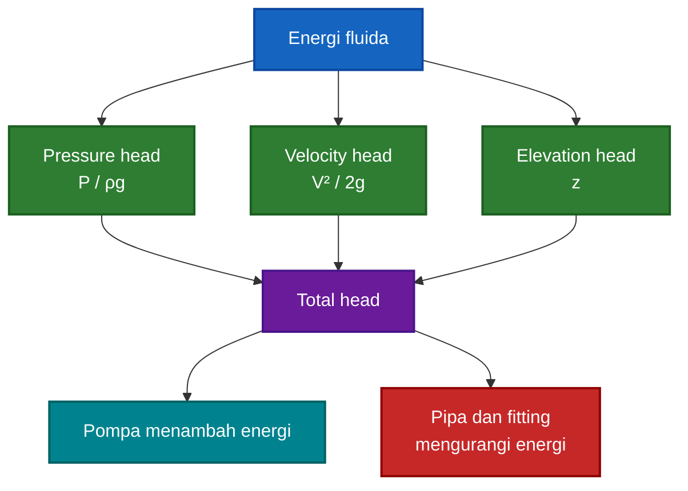
```mermaid id="e7qsw5"
flowchart TB
    A["Energi fluida"] --> B["Pressure head<br/>P / ρg"]
    A --> C["Velocity head<br/>V² / 2g"]
    A --> D["Elevation head<br/>z"]

    B --> E["Total head"]
    C --> E
    D --> E

    E --> F["Pompa menambah energi"]
    E --> G["Pipa dan fitting<br/>mengurangi energi"]

    classDef root fill:#1565C0,color:#FFFFFF,stroke:#0D47A1,stroke-width:2px;
    classDef energy fill:#2E7D32,color:#FFFFFF,stroke:#1B5E20,stroke-width:2px;
    classDef total fill:#6A1B9A,color:#FFFFFF,stroke:#4A148C,stroke-width:2px;
    classDef add fill:#00838F,color:#FFFFFF,stroke:#006064,stroke-width:2px;
    classDef loss fill:#C62828,color:#FFFFFF,stroke:#8E0000,stroke-width:2px;

    class A root;
    class B,C,D energy;
    class E total;
    class F add;
    class G loss;
```

### 3.2.7 Mengapa Meter Head Lebih Intuitif untuk Cairan

Untuk air, densitas berubah sangat kecil pada rentang tekanan sistem pertanian. Karena itu, tekanan dapat dengan mudah diterjemahkan menjadi tinggi kolom air.

Contoh:

$$
100\ \text{kPa}
\approx
10.2\ \text{mH}_2\text{O}
$$

Hubungan ini sangat berguna untuk pompa air, tangki, irigasi, dan distribusi air.

Untuk udara, densitas jauh lebih rendah dan berubah terhadap tekanan serta temperatur. Jika dihitung sebagai “meter kolom udara,” nilai head akan menjadi sangat besar dan berubah-ubah.

Pada udara dengan densitas sekitar:

$$
\rho_{\text{air}}
=

1.20\ \text{kg/m}^3
$$

tekanan:

$$
1\ \text{kPa}
$$

setara dengan:

$$
h
=

\frac{1000}
{1.20 \times 9.80665}
=

84.9\ \text{m udara}
$$

Nilai ini tidak praktis untuk desain blower.

Karena itu, pada blower biasanya digunakan:

- Pa.
- kPa.
- mbar.
- mmH₂O.
- mH₂O.

Satuan mmH₂O atau mH₂O pada blower berarti **tekanan yang setara dengan kolom air**, bukan tinggi udara yang benar-benar harus dinaikkan blower.

> **Prinsip praktis:** gunakan meter head untuk sistem air. Untuk sistem udara, gunakan Pa atau kPa; mH₂O dapat dipakai sebagai satuan tekanan, tetapi jangan ditafsirkan sebagai tinggi kolom udara.

[**Kembali ke Atas**](#panduan-praktis-perhitungan-fluida-dalam-pipa-pvc)

---

## 3.3 Sifat Fluida

Sifat fluida menentukan bagaimana fluida bergerak, seberapa besar rugi tekan yang terjadi, dan model perhitungan yang sesuai.

Tiga sifat utama yang paling sering digunakan adalah:

- Densitas.
- Viskositas dinamis.
- Viskositas kinematik.

### 3.3.1 Densitas

Densitas adalah massa per satuan volume.

$$
\rho
=

\frac{m}{V}
$$

Dengan:

- $\rho$ = densitas, dalam kg/m³.
- $m$ = massa, dalam kg.
- $V$ = volume, dalam m³.

Densitas air jauh lebih tinggi daripada densitas udara.

| Fluida pada sekitar 20°C |                       Densitas perkiraan |
| ------------------------ | ---------------------------------------: |
| Air bersih               |                                998 kg/m³ |
| Air kolam                | Mendekati air bersih, bergantung padatan |
| Air laut                 |                      sekitar 1,025 kg/m³ |
| Udara kering pada 1 atm  |                       sekitar 1.20 kg/m³ |

Perbedaan densitas ini menjelaskan mengapa:

- Pompa air umumnya dinyatakan dalam meter head.
- Blower umumnya dinyatakan dalam pressure drop.
- Air lebih stabil secara volumetrik dibanding udara.
- Tekanan hidrostatik di kedalaman kolam signifikan terhadap sistem aerasi.

### 3.3.2 Viskositas Dinamis dan Kinematik

Viskositas dinamis menunjukkan hambatan internal fluida terhadap aliran.

$$
\mu
=

\text{viskositas dinamis}
$$

Satuan:

$$
\text{Pa·s}
$$

Viskositas kinematik adalah viskositas dinamis dibagi densitas.

$$
\nu
=

\frac{\mu}{\rho}
$$

Dengan:

- $\nu$ = viskositas kinematik, dalam m²/s.
- $\mu$ = viskositas dinamis, dalam Pa·s.
- $\rho$ = densitas, dalam kg/m³.

Viskositas berperan langsung dalam Reynolds number:

$$
Re
=

# \frac{\rho VD_i}{\mu}

\frac{VD_i}{\nu}
$$

Pembahasan lengkap Reynolds number dan friction factor akan diberikan pada Bab 5.

### 3.3.3 Sifat Air terhadap Temperatur

Air menjadi kurang kental ketika temperatur meningkat. Artinya, air hangat lebih mudah mengalir dibanding air dingin pada kondisi geometri dan debit yang sama.

Tabel berikut menggunakan nilai representatif air bersih pada tekanan mendekati atmosfer.

| Temperatur | Densitas, $\rho$ | Viskositas dinamis, $\mu$ | Viskositas kinematik, $\nu$ |
| ---------: | ---------------: | ------------------------: | --------------------------: |
|        0°C |      999.8 kg/m³ |         1.792 × 10⁻³ Pa·s |           1.792 × 10⁻⁶ m²/s |
|       10°C |      999.7 kg/m³ |         1.307 × 10⁻³ Pa·s |           1.307 × 10⁻⁶ m²/s |
|       20°C |      998.2 kg/m³ |         1.002 × 10⁻³ Pa·s |           1.004 × 10⁻⁶ m²/s |
|       30°C |      995.7 kg/m³ |         0.798 × 10⁻³ Pa·s |           0.802 × 10⁻⁶ m²/s |
|       40°C |      992.2 kg/m³ |         0.653 × 10⁻³ Pa·s |           0.658 × 10⁻⁶ m²/s |
|       50°C |      988.0 kg/m³ |         0.547 × 10⁻³ Pa·s |           0.554 × 10⁻⁶ m²/s |

Nilai tersebut cukup akurat untuk desain awal air bersih. Untuk larutan pupuk pekat, sirup nutrisi, limbah organik, atau fluida yang mengandung padatan tinggi, sifat aktual dapat berbeda cukup besar.

> **Catatan lapangan:** temperatur air 20°C sering digunakan sebagai asumsi dasar. Namun pada kolam terbuka atau greenhouse, temperatur air dapat berubah sepanjang hari dan memengaruhi viskositas serta performa sistem.

### 3.3.4 Sifat Udara terhadap Temperatur dan Tekanan

Densitas udara sangat dipengaruhi oleh tekanan absolut dan temperatur.

$$
\rho_{\text{air}}
=

\frac{P_{\text{abs}}}
{R_{\text{air}}T}
$$

Untuk udara kering pada tekanan atmosfer standar:

| Temperatur | Densitas udara | Viskositas dinamis |
| ---------: | -------------: | -----------------: |
|        0°C |    1.292 kg/m³ |  17.16 × 10⁻⁶ Pa·s |
|       10°C |    1.247 kg/m³ |  17.67 × 10⁻⁶ Pa·s |
|       20°C |    1.204 kg/m³ |  18.14 × 10⁻⁶ Pa·s |
|       30°C |    1.165 kg/m³ |  18.61 × 10⁻⁶ Pa·s |
|       40°C |    1.127 kg/m³ |  19.07 × 10⁻⁶ Pa·s |

Densitas udara turun ketika temperatur meningkat. Densitas udara juga naik ketika tekanan absolut meningkat.

### Contoh — Densitas Udara pada Jalur Blower

Diketahui:

- Tekanan udara:

$$
P_{\text{gauge}}
=

30\ \text{kPa(g)}
$$

- Tekanan atmosfer:

$$
P_{\text{atm}}
=

101.325\ \text{kPa(a)}
$$

- Temperatur udara:

$$
T
=

# 30^\circ\text{C}

303.15\ \text{K}
$$

Tekanan absolut:

$$
P_{\text{abs}}
=

30
+
101.325
=

131.325\ \text{kPa(a)}
$$

Maka densitas udara:

$$
\rho
=

\frac{131325}
{287.05 \times 303.15}
=

1.51\ \text{kg/m}^3
$$

Jadi densitas udara pada kondisi tersebut adalah sekitar:

$$
\boxed{
1.51\ \text{kg/m}^3
}
$$

Nilai ini lebih tinggi daripada densitas udara atmosfer pada 30°C karena tekanan absolutnya lebih tinggi.

### 3.3.5 Pengaruh Kelembapan Udara

Udara lembap memiliki densitas sedikit lebih rendah dibanding udara kering pada tekanan dan temperatur yang sama.

Untuk sebagian besar desain awal blower pertanian atau aerasi kolam, asumsi udara kering biasanya cukup. Namun, kelembapan perlu dipertimbangkan bila:

- Sistem membutuhkan pengukuran debit udara presisi.
- Lokasi sangat panas dan lembap.
- Sistem memakai udara tekan untuk proses sensitif.
- Perbedaan hasil perhitungan dan pengukuran cukup besar.

### 3.3.6 Kekasaran PVC

Kekasaran absolut pipa dilambangkan dengan:

$$
\varepsilon
$$

Kekasaran relatif adalah:

$$
\frac{\varepsilon}{D_i}
$$

Pipa PVC baru dan bersih termasuk pipa yang sangat halus. Nilai desain awal yang sering digunakan untuk PVC bersih adalah:

$$
\varepsilon
=

# 0.0015\ \text{mm}

1.5 \times 10^{-6}\ \text{m}
$$

Contoh pipa dengan diameter dalam:

$$
D_i
=

# 26.6\ \text{mm}

0.0266\ \text{m}
$$

Maka kekasaran relatifnya:

$$
\frac{\varepsilon}{D_i}
=

\frac{1.5 \times 10^{-6}}
{0.0266}
=

5.64 \times 10^{-5}
$$

Nilai kekasaran relatif tersebut digunakan bersama Reynolds number untuk menentukan friction factor pada aliran turbulen.

| Kondisi pipa                 | Dampak terhadap rugi tekan                             |
| ---------------------------- | ------------------------------------------------------ |
| PVC baru dan bersih          | Kekasaran sangat rendah                                |
| PVC tua dengan biofilm       | Rugi tekan dapat meningkat                             |
| Pipa berkerak mineral        | Diameter efektif mengecil dan rugi tekan meningkat     |
| Pipa dengan banyak sambungan | Minor loss dapat lebih dominan daripada kekasaran pipa |
| Selang fleksibel beralur     | Rugi tekan dapat jauh lebih besar daripada PVC lurus   |

Pada aliran laminar, friction factor terutama ditentukan oleh Reynolds number:

$$
f_D
=

\frac{64}{Re}
$$

Pada aliran turbulen, friction factor dipengaruhi oleh Reynolds number dan kekasaran relatif.

> **Penting:** artikel ini menggunakan **Darcy friction factor**, bukan Fanning friction factor. Hubungannya adalah:

$$
f_D
=

4f_F
$$

Kesalahan membedakan Darcy dan Fanning friction factor dapat menghasilkan kesalahan head loss hingga faktor empat.

### 3.3.7 Kapan Data Sifat Fluida Harus Dikoreksi

Gunakan data default air 20°C atau udara atmosfer hanya untuk estimasi awal. Gunakan sifat fluida aktual bila kondisi berikut terjadi:

| Kondisi                         | Tindakan                                                |
| ------------------------------- | ------------------------------------------------------- |
| Air di atas 40°C                | Gunakan densitas dan viskositas sesuai temperatur       |
| Air sangat dingin               | Koreksi viskositas karena Reynolds number dapat berubah |
| Larutan pupuk pekat             | Cari atau ukur viskositas larutan                       |
| Air berlumpur atau kaya padatan | Gunakan margin desain dan pertimbangkan slurry flow     |
| Udara pada tekanan signifikan   | Gunakan tekanan absolut untuk densitas                  |
| Pressure drop udara besar       | Gunakan pendekatan compressible flow atau iterasi       |
| Udara panas dari blower         | Gunakan temperatur aktual udara                         |

Sebagai aturan penyaringan awal, pendekatan densitas udara konstan perlu dievaluasi kembali bila pressure drop diperkirakan melebihi sekitar 10% dari tekanan absolut rata-rata sistem.

---

## Ringkasan Bab 3

1. Debit volumetrik dihitung dari:

$$
Q
=

AV
$$

2. Laju massa dihitung dari:

$$
\dot{m}
=

\rho Q
$$

3. Untuk air, debit volumetrik umumnya hampir konstan dalam pipa tunggal.

4. Untuk udara, debit aktual dapat berubah akibat perubahan tekanan dan temperatur, tetapi laju massa tetap tanpa kebocoran.

5. Tekanan absolut diperlukan untuk perhitungan densitas dan debit gas.

6. Total energi fluida terdiri dari pressure head, velocity head, dan elevation head.

7. Meter head sangat intuitif untuk air, tetapi untuk udara lebih baik menggunakan Pa atau kPa.

8. Temperatur memengaruhi densitas dan viskositas air maupun udara.

9. PVC memiliki kekasaran rendah, tetapi fouling, sambungan, fitting, filter, dan selang dapat meningkatkan rugi tekan secara signifikan.

[**Kembali ke Atas**](#panduan-praktis-perhitungan-fluida-dalam-pipa-pvc)

---

## Rujukan Bab 3

- [R1] Crane Co. _Flow of Fluids Through Valves, Fittings, and Pipe: Technical Paper No. 410._
- [R2] White, F. M. _Fluid Mechanics._ McGraw-Hill Education.
- [R3] Munson, B. R., Okiishi, T. H., Huebsch, W. W., dan Rothmayer, A. P. _Fundamentals of Fluid Mechanics._ Wiley.
- [R4] IAPWS. _Revised Release on the IAPWS Formulation 2008 for the Viscosity of Ordinary Water Substance._
- [R5] ASHRAE. _ASHRAE Handbook—Fundamentals._
- [R6] Perry, R. H., dan Green, D. W. _Perry’s Chemical Engineers’ Handbook._ McGraw-Hill.

---

# 4. Memilih Model Perhitungan yang Tepat

Rumus fluida tidak boleh dipilih hanya karena paling terkenal atau paling mudah digunakan. Kesalahan paling berbahaya dalam desain pipa pertanian biasanya terjadi ketika persamaan yang benar diterapkan pada mekanisme aliran yang salah.

Contoh:

- Pipa PVC sepanjang 50 m tidak dapat diperlakukan sebagai orifice.
- Lubang diffuser tidak dapat diperlakukan sebagai pipa panjang.
- Needle pendek belum tentu mengikuti Hagen–Poiseuille.
- Debit udara dari blower tidak selalu dapat dihitung dengan asumsi densitas konstan.
- Airlift tidak dapat disederhanakan menjadi Darcy–Weisbach satu fase.

Prinsip pemilihan model adalah:

> Tentukan terlebih dahulu geometri, jenis fluida, kondisi tekanan, dan mekanisme rugi energi yang dominan. Setelah itu baru pilih persamaan.

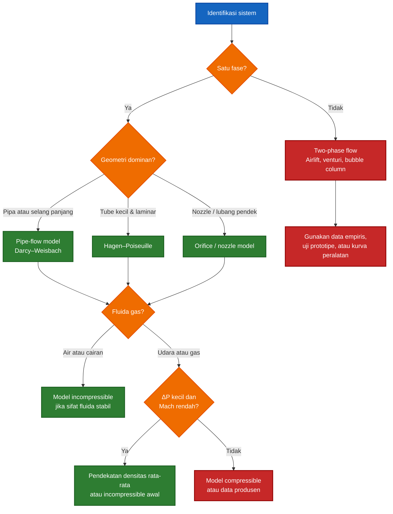
```mermaid id="w0oovv"
flowchart TB
    A["Identifikasi sistem"] --> B{"Satu fase?"}

    B -->|"Tidak"| C["Two-phase flow<br/>Airlift, venturi, bubble column"]
    B -->|"Ya"| D{"Geometri dominan?"}

    D -->|"Pipa atau selang panjang"| E["Pipe-flow model<br/>Darcy–Weisbach"]
    D -->|"Tube kecil & laminar"| F["Hagen–Poiseuille"]
    D -->|"Nozzle / lubang pendek"| G["Orifice / nozzle model"]

    E --> H{"Fluida gas?"}
    F --> H
    G --> H

    H -->|"Air atau cairan"| I["Model incompressible<br/>jika sifat fluida stabil"]
    H -->|"Udara atau gas"| J{"ΔP kecil dan<br/>Mach rendah?"}

    J -->|"Ya"| K["Pendekatan densitas rata-rata<br/>atau incompressible awal"]
    J -->|"Tidak"| L["Model compressible<br/>atau data produsen"]

    C --> M["Gunakan data empiris,<br/>uji prototipe, atau kurva peralatan"]

    classDef start fill:#1565C0,color:#FFFFFF,stroke:#0D47A1,stroke-width:2px;
    classDef decision fill:#EF6C00,color:#FFFFFF,stroke:#E65100,stroke-width:2px;
    classDef model fill:#2E7D32,color:#FFFFFF,stroke:#1B5E20,stroke-width:2px;
    classDef warning fill:#C62828,color:#FFFFFF,stroke:#8E0000,stroke-width:2px;
    classDef result fill:#6A1B9A,color:#FFFFFF,stroke:#4A148C,stroke-width:2px;

    class A start;
    class B,D,H,J decision;
    class E,F,G,I,K model;
    class C,L,M warning;
```

## 4.1 Pipa Panjang: Darcy–Weisbach

Darcy–Weisbach adalah model utama untuk menghitung rugi energi akibat gesekan fluida dengan dinding pipa atau selang.

Persamaan head loss akibat gesekan adalah:

$$
h_f
=

f_D
\frac{L}{D_i}
\frac{V^2}{2g}
$$

Dengan:

- $h_f$ = head loss akibat gesekan, dalam m.
- $f_D$ = Darcy friction factor.
- $L$ = panjang pipa atau selang, dalam m.
- $D_i$ = diameter dalam pipa, dalam m.
- $V$ = kecepatan rata-rata fluida, dalam m/s.
- $g$ = percepatan gravitasi, sekitar $9.80665\ \text{m/s}^2$.

Dalam bentuk pressure drop:

$$
\Delta P_f
=

\rho g h_f
$$

atau:

$$
\Delta P_f
=

f_D
\frac{L}{D_i}
\frac{\rho V^2}{2}
$$

Persamaan ini digunakan untuk:

- Pipa PVC dan HDPE.
- Pipa PE untuk irigasi.
- Selang air.
- Pipa utama dan cabang manifold.
- Jalur air dari pompa ke filter.
- Pipa sirkulasi kolam.
- Jalur udara blower, dengan perhatian khusus pada densitas udara dan compressibility.

### 4.1.1 Kapan Darcy–Weisbach Tepat Digunakan

Gunakan Darcy–Weisbach ketika rugi energi dominan berasal dari gesekan sepanjang saluran.

Karakteristik sistem yang sesuai:

- Jalur pipa atau selang cukup panjang dibandingkan diameter.
- Aliran satu fase.
- Diameter saluran relatif seragam.
- Kecepatan rata-rata dapat dihitung.
- Fluida Newtonian, seperti air atau udara.
- Tidak ada perubahan fase dominan di sepanjang jalur.

Contoh aplikasi:

| Sistem                                       | Model utama                        |
| -------------------------------------------- | ---------------------------------- |
| Pipa PVC 1 inch sepanjang 30 m untuk irigasi | Darcy–Weisbach                     |
| Selang 8 mm sepanjang 15 m untuk air nutrisi | Darcy–Weisbach                     |
| Header udara dari blower menuju manifold     | Darcy–Weisbach dengan evaluasi gas |
| Pipa sirkulasi kolam menuju filter           | Darcy–Weisbach                     |
| Pipa distribusi air dari tandon ke kebun     | Darcy–Weisbach                     |

Darcy–Weisbach menghitung rugi gesek pada pipa lurus. Persamaan ini tidak otomatis memasukkan:

- Beda elevasi.
- Elbow.
- Tee.
- Valve.
- Filter.
- Nozzle.
- Diffuser.
- Pressure outlet yang dibutuhkan alat.

Komponen tersebut harus ditambahkan secara terpisah.

### 4.1.2 Input Minimum Darcy–Weisbach

Sebelum menghitung, data berikut harus tersedia.

| Data           |           Simbol | Catatan                          |
| -------------- | ---------------: | -------------------------------- |
| Debit          |              $Q$ | Target atau hasil iterasi        |
| Diameter dalam |            $D_i$ | Bukan ukuran nominal pipa        |
| Panjang        |              $L$ | Panjang jalur aliran aktual      |
| Densitas       |           $\rho$ | Bergantung fluida dan temperatur |
| Viskositas     | $\mu$ atau $\nu$ | Untuk Reynolds number            |
| Kekasaran      |    $\varepsilon$ | Penting pada aliran turbulen     |
| Fitting        |   $K$ atau $L_e$ | Dihitung sebagai rugi lokal      |
| Elevasi        |              $z$ | Untuk total head sistem          |

Kecepatan dihitung dari:

$$
V
=

# \frac{Q}{A}

\frac{4Q}{\pi D_i^2}
$$

Reynolds number:

$$
Re
=

\frac{\rho V D_i}{\mu}
$$

Friction factor kemudian ditentukan dari Reynolds number dan kekasaran relatif:

$$
\frac{\varepsilon}{D_i}
$$

Pembahasan detail friction factor diberikan pada Bab 5.

### 4.1.3 Contoh Awal — Pipa PVC Irigasi

Diketahui:

- Debit air:

$$
Q
=

60\ \text{L/min}
$$

- Diameter dalam pipa:

$$
D_i
=

# 26.6\ \text{mm}

0.0266\ \text{m}
$$

- Panjang pipa:

$$
L
=

40\ \text{m}
$$

- Air pada sekitar 20°C.
- Perkiraan Darcy friction factor:

$$
f_D
=

0.025
$$

Konversi debit:

$$
Q
=

# \frac{60}{1000 \times 60}

0.001\ \text{m}^3/\text{s}
$$

Luas penampang:

$$
A
=

# \frac{\pi(0.0266)^2}{4}

5.56 \times 10^{-4}\ \text{m}^2
$$

Kecepatan:

$$
V
=

\frac{0.001}
{5.56 \times 10^{-4}}
=

1.80\ \text{m/s}
$$

Head loss pipa lurus:

$$
h_f
=

0.025
\left(
\frac{40}{0.0266}
\right)
\left(
\frac{1.80^2}{2 \times 9.80665}
\right)
$$

$$
h_f
\approx
6.2\ \text{m}
$$

Pressure drop yang setara untuk air:

$$
\Delta P_f
=

998
\times
9.80665
\times
6.2
$$

$$
\Delta P_f
\approx
60.6\ \text{kPa}
$$

Nilai tersebut hanya berasal dari pipa lurus. Filter, valve, elbow, dan nozzle belum dihitung.

> **Interpretasi praktis:** pipa yang tampak cukup besar dapat tetap menghasilkan pressure drop besar jika debit tinggi dan jalurnya panjang.

### 4.1.4 Kesalahan Umum Saat Menggunakan Darcy–Weisbach

| Kesalahan                                               | Dampak                                         |
| ------------------------------------------------------- | ---------------------------------------------- |
| Menggunakan diameter nominal, bukan inside diameter     | Kecepatan dan rugi tekan meleset               |
| Menganggap friction factor selalu 0.02                  | Hasil dapat terlalu tinggi atau terlalu rendah |
| Mengabaikan selang fleksibel                            | Pressure drop sering diremehkan                |
| Mengabaikan filter atau valve                           | Titik operasi pompa tidak akurat               |
| Menggunakan densitas udara atmosfer untuk semua kondisi | Pressure drop udara dapat meleset              |
| Menganggap Darcy menghitung head statis                 | Head pompa menjadi terlalu kecil               |
| Memakai Fanning friction factor pada persamaan Darcy    | Head loss bisa salah faktor empat              |

Persamaan dalam artikel ini menggunakan **Darcy friction factor**:

$$
f_D
=

4f_F
$$

Dengan $f_F$ sebagai Fanning friction factor.

[**Kembali ke Atas**](#panduan-praktis-perhitungan-fluida-dalam-pipa-pvc)

---

## 4.2 Fitting dan Komponen Lokal

Selain gesekan sepanjang pipa, energi juga hilang ketika aliran berubah arah, bercabang, menyempit, melebar, melewati valve, filter, atau memasuki dan keluar dari pipa.

Rugi energi ini disebut **minor loss** atau **local loss**. Istilah “minor” tidak berarti nilainya selalu kecil. Pada sistem pendek dengan banyak fitting, total minor loss dapat lebih besar daripada rugi pipa lurus.

Persamaannya:

$$
h_m
=

K
\frac{V^2}{2g}
$$

Dengan:

- $h_m$ = head loss lokal, dalam m.
- $K$ = loss coefficient.
- $V$ = kecepatan referensi, dalam m/s.
- $g$ = percepatan gravitasi.

Dalam bentuk pressure drop:

$$
\Delta P_m
=

K
\frac{\rho V^2}{2}
$$

### 4.2.1 Komponen yang Menyebabkan Minor Loss

| Komponen    | Mekanisme rugi energi                              |
| ----------- | -------------------------------------------------- |
| Elbow       | Perubahan arah dan pembentukan pusaran             |
| Tee lurus   | Gangguan aliran pada junction                      |
| Tee cabang  | Pembelokan dan pembagian aliran                    |
| Reducer     | Percepatan aliran saat diameter mengecil           |
| Expander    | Separation dan pusaran saat diameter membesar      |
| Valve       | Penyempitan, throttling, dan gangguan internal     |
| Check valve | Hambatan disk, spring, atau flap                   |
| Filter      | Media filter, screen, dan housing                  |
| Inlet pipa  | Kontraksi aliran saat masuk pipa                   |
| Outlet pipa | Energi kecepatan hilang ke reservoir atau atmosfer |
| Flow meter  | Hambatan internal alat                             |
| Venturi     | Perubahan area dan pressure recovery               |
| Diffuser    | Hambatan membran, pori, atau lubang keluaran       |

Nilai $K$ tidak bersifat universal. Nilainya dipengaruhi oleh:

- Geometri komponen.
- Diameter pipa.
- Radius elbow.
- Bukaan valve.
- Reynolds number.
- Arah aliran melalui tee.
- Kondisi pipa masuk dan keluar.
- Kondisi filter atau diffuser.

### 4.2.2 Kecepatan Referensi untuk Nilai $K$

Setiap nilai $K$ harus memakai kecepatan referensi yang sesuai dengan definisi sumber datanya.

Pada elbow dengan diameter pipa sama:

$$
V
=

V_{\text{pipe}}
$$

Pada reducer atau expander, sumber data dapat menggunakan kecepatan sisi kecil, sisi besar, atau kecepatan tertentu yang didefinisikan oleh referensi.

Karena itu, jangan memakai nilai $K$ reducer atau expander tanpa membaca basis kecepatannya.

> **Aturan aman:** gunakan data $K$ dari sumber yang menyebutkan geometri dan basis kecepatan. Bila tidak jelas, gunakan pendekatan konservatif atau data produsen.

### 4.2.3 Metode K-Factor

Metode $K$ menghitung setiap komponen secara langsung.

Misalnya sistem memiliki:

- Dua elbow.
- Satu ball valve terbuka penuh.
- Satu tee menuju cabang.
- Satu filter.

Total loss coefficient:

$$
K_{\text{total}}
=

K_1
+
K_2
+
K_3
+
\cdots
+
K_n
$$

Maka:

$$
h_{m,\text{total}}
=

K_{\text{total}}
\frac{V^2}{2g}
$$

Jika kecepatan setiap komponen berbeda karena diameter berubah, hitung rugi masing-masing pada kecepatan lokalnya:

$$
h_{m,\text{total}}
=

\sum_i
K_i
\frac{V_i^2}{2g}
$$

Pendekatan ini lebih akurat untuk sistem yang memiliki reducer, ekspander, atau cabang dengan ukuran berbeda.

### 4.2.4 Metode Equivalent Length

Minor loss dapat dikonversi menjadi panjang pipa ekuivalen.

Hubungannya diperoleh dengan menyamakan:

$$
h_m
=

K
\frac{V^2}{2g}
$$

dengan:

$$
h_f
=

f_D
\frac{L_e}{D_i}
\frac{V^2}{2g}
$$

Sehingga:

$$
L_e
=

\frac{K D_i}{f_D}
$$

Dengan:

- $L_e$ = equivalent length.
- $K$ = loss coefficient komponen.
- $D_i$ = diameter dalam.
- $f_D$ = Darcy friction factor.

Contoh: bila sebuah fitting memiliki:

$$
K
=

1.0
$$

Pipa memiliki:

$$
D_i
=

0.0266\ \text{m}
$$

dan:

$$
f_D
=

0.025
$$

Maka:

$$
L_e
=

# \frac{1.0 \times 0.0266}{0.025}

1.06\ \text{m}
$$

Artinya fitting tersebut memberi rugi energi yang setara dengan sekitar 1.06 m pipa lurus pada kondisi aliran tersebut.

### 4.2.5 Batas Metode Equivalent Length

Equivalent length praktis digunakan untuk estimasi cepat, tetapi memiliki keterbatasan.

| Kondisi                               | Kelayakan equivalent length                  |
| ------------------------------------- | -------------------------------------------- |
| Pipa diameter seragam dan fluida cair | Baik untuk estimasi awal                     |
| Banyak fitting sederhana              | Praktis                                      |
| Debit berubah besar                   | Perlu dihitung ulang karena $f_D$ berubah    |
| Reducer atau expander besar           | Lebih baik memakai $K$ langsung              |
| Sistem gas dengan densitas berubah    | Gunakan hati-hati                            |
| Valve sebagian tertutup               | Gunakan data $K$ atau kurva valve            |
| Filter kotor                          | Lebih baik ukur differential pressure aktual |

Equivalent length bukan panjang fisik pipa tambahan. Nilainya dapat berubah karena friction factor berubah terhadap Reynolds number.

### 4.2.6 Filter dan Valve Memerlukan Perhatian Khusus

Filter sering menjadi sumber pressure drop terbesar dalam sistem irigasi, fertigation, dan sirkulasi kolam.

Pressure drop filter tidak boleh dianggap tetap. Nilainya meningkat ketika filter kotor.

Untuk filter, gunakan:

- Kurva pressure drop versus debit dari produsen.
- Differential pressure gauge sebelum dan sesudah filter.
- Batas pressure drop untuk backwash atau pembersihan.

Untuk valve, posisi bukaan sangat menentukan. Ball valve yang benar-benar terbuka penuh memiliki rugi relatif kecil. Valve yang dipakai untuk throttling dapat menghasilkan rugi tekanan besar.

> **Prinsip desain:** gunakan valve sebagai alat isolasi atau balancing ringan. Jangan menjadikan valve setengah tertutup sebagai solusi utama untuk pipa yang terlalu kecil.

[**Kembali ke Atas**](#panduan-praktis-perhitungan-fluida-dalam-pipa-pvc)

---

## 4.3 Aliran Laminar dalam Tube Kecil

Hagen–Poiseuille digunakan untuk aliran laminar dalam tube atau pipa kecil yang lurus, bulat, cukup panjang, dan memiliki diameter seragam.

Persamaannya:

$$
Q
=

\frac{\pi \Delta P D_i^4}
{128 \mu L}
$$

Dengan:

- $Q$ = debit volumetrik, dalam $\text{m}^3/\text{s}$.
- $\Delta P$ = beda tekanan sepanjang tube, dalam Pa.
- $D_i$ = diameter dalam tube, dalam m.
- $\mu$ = viskositas dinamis, dalam Pa·s.
- $L$ = panjang tube, dalam m.

Bentuk lain yang sering lebih berguna untuk desain adalah:

$$
\Delta P
=

\frac{128 \mu LQ}
{\pi D_i^4}
$$

### 4.3.1 Mengapa Diameter Sangat Penting

Diameter berada pada pangkat empat:

$$
Q
\propto
D_i^4
$$

Artinya perubahan diameter kecil dapat menghasilkan perubahan debit yang sangat besar.

Jika diameter turun menjadi 80% dari ukuran awal:

$$
D_2
=

0.8D_1
$$

Maka debit pada beda tekanan yang sama menjadi:

$$
\frac{Q_2}{Q_1}
=

# (0.8)^4

0.4096
$$

Debit hanya sekitar 41% dari kondisi awal.

Sebaliknya, pressure drop untuk debit yang sama meningkat sekitar:

$$
\frac{\Delta P_2}{\Delta P_1}
=

\left(
\frac{1}{0.8}
\right)^4
=

2.44
$$

Karena itu, needle, tubing kecil, drip line kecil, dan jalur dosing sangat sensitif terhadap diameter dalam.

### 4.3.2 Syarat Penerapan Hagen–Poiseuille

Persamaan Hagen–Poiseuille berlaku dengan baik bila seluruh kondisi berikut mendekati terpenuhi:

1. Fluida Newtonian.
2. Aliran laminar.
3. Tube lurus dan berbentuk lingkaran.
4. Diameter dalam seragam.
5. Dinding tube relatif kaku.
6. Aliran sudah berkembang penuh.
7. Fluida hampir incompressible.
8. Efek entrance, exit, dan fitting kecil dibandingkan rugi gesek sepanjang tube.

Kriteria awal aliran laminar:

$$
Re
<
2100
$$

Namun nilai Reynolds number saja belum cukup. Panjang masuk laminar dapat diperkirakan:

$$
L_{\text{entry}}
\approx
0.05ReD_i
$$

Agar Hagen–Poiseuille layak digunakan, panjang tube sebaiknya jauh lebih besar dibanding panjang masuk tersebut.

### 4.3.3 Hubungan dengan Darcy–Weisbach

Pada aliran laminar yang berkembang penuh:

$$
f_D
=

\frac{64}{Re}
$$

Jika nilai tersebut dimasukkan ke Darcy–Weisbach, hasilnya identik dengan Hagen–Poiseuille.

Karena itu, Hagen–Poiseuille bukan model yang bertentangan dengan Darcy–Weisbach. Hagen–Poiseuille adalah bentuk khusus untuk aliran laminar berkembang penuh pada tube bulat.

### 4.3.4 Kapan Tidak Boleh Menggunakan Hagen–Poiseuille

Jangan menggunakan persamaan ini secara langsung pada kondisi berikut:

| Kondisi                                 | Alasan                                       |
| --------------------------------------- | -------------------------------------------- |
| Aliran turbulen                         | Profil kecepatan dan friction factor berubah |
| Tube pendek                             | Entrance dan exit loss dapat dominan         |
| Needle tirus                            | Diameter tidak seragam                       |
| Selang elastis                          | Diameter berubah akibat tekanan              |
| Fluida non-Newtonian                    | Viskositas bergantung shear rate             |
| Aliran udara dengan pressure drop besar | Densitas berubah signifikan                  |
| Banyak fitting kecil                    | Rugi lokal tidak dapat diabaikan             |
| Cairan mengandung padatan               | Risiko penyumbatan dan sifat fluida berubah  |

### 4.3.5 Contoh Aplikasi yang Sesuai

| Aplikasi                                | Kelayakan Hagen–Poiseuille                            |
| --------------------------------------- | ----------------------------------------------------- |
| Needle dosing panjang untuk air bersih  | Cocok bila aliran laminar                             |
| Tube kapiler laboratorium               | Sangat cocok                                          |
| Tubing kecil untuk nutrisi encer        | Dapat digunakan setelah cek $Re$                      |
| Selang panjang kecil pada sistem dosing | Dapat digunakan bila diameter seragam                 |
| Nozzle pendek                           | Tidak cocok                                           |
| Lubang diffuser                         | Tidak cocok                                           |
| Pipa PVC utama                          | Biasanya tidak cocok karena aliran cenderung turbulen |

> **Catatan untuk udara:** Hagen–Poiseuille dasar diturunkan untuk fluida incompressible. Untuk udara dalam tube kecil dengan pressure drop signifikan, gunakan model laminar compressible atau pendekatan iteratif berbasis tekanan absolut.

[**Kembali ke Atas**](#panduan-praktis-perhitungan-fluida-dalam-pipa-pvc)

---

## 4.4 Nozzle, Orifice, dan Lubang Pendek

Nozzle, orifice, lubang manifold, dan lubang diffuser memiliki mekanisme aliran yang berbeda dari pipa panjang.

Pada lubang pendek, rugi energi terutama dipengaruhi oleh:

- Kontraksi aliran.
- Vena contracta.
- Bentuk tepi lubang.
- Ketebalan pelat atau dinding.
- Ekspansi setelah lubang.
- Kondisi tekanan hulu dan hilir.

Untuk cairan incompressible, bentuk umum persamaannya:

$$
Q
=

C_dA
\sqrt{
\frac{2\Delta P}{\rho}
}
$$

Dengan:

- $Q$ = debit volumetrik.
- $C_d$ = discharge coefficient.
- $A$ = luas lubang.
- $\Delta P$ = beda tekanan hulu dan hilir.
- $\rho$ = densitas fluida.

Luas lubang bulat:

$$
A
=

\frac{\pi d^2}{4}
$$

Dengan $d$ sebagai diameter lubang.

### 4.4.1 Arti Discharge Coefficient

Discharge coefficient mengoreksi perbedaan antara aliran ideal dan aliran nyata.

$$
C_d
=

\frac{Q_{\text{actual}}}
{Q_{\text{ideal}}}
$$

Nilai $C_d$ dipengaruhi oleh:

- Ketebalan lubang terhadap diameter, $t/d$.
- Ketajaman atau pembulatan tepi.
- Reynolds number.
- Kekasaran permukaan.
- Bentuk nozzle.
- Kondisi aliran masuk.
- Tekanan hulu dan hilir.
- Kavitasi atau flashing pada cairan.
- Kondisi submerged discharge.

Karena itu, nilai $C_d$ generik hanya layak untuk estimasi awal. Untuk komponen penting, gunakan data produsen atau hasil uji.

### 4.4.2 Beda Tekanan Harus Didefinisikan dengan Benar

Beda tekanan dalam persamaan orifice adalah:

$$
\Delta P
=

## P_{\text{upstream}}

P_{\text{downstream}}
$$

Tekanan tersebut harus diambil pada sisi hulu dan sisi hilir lubang yang sebenarnya.

Pada nozzle air yang membuang ke atmosfer:

$$
P_{\text{downstream}}
\approx
P_{\text{atm}}
$$

Jika menggunakan tekanan gauge:

$$
\Delta P
\approx
P_{\text{upstream,gauge}}
$$

Pada diffuser terendam air, kondisi berbeda.

Tekanan air di luar diffuser pada kedalaman $h$ adalah:

$$
P_{\text{outside}}
=

P_{\text{atm}}
+
\rho_{\text{water}}gh
$$

Sedangkan beda tekanan yang benar-benar mendorong udara melewati lubang adalah:

$$
\Delta P_{\text{hole}}
=

## P_{\text{inside}}

P_{\text{outside}}
$$

Artinya, tekanan hidrostatik bukan otomatis pressure drop lubang.

> **Kesalahan umum:** memakai $\rho gh$ sebagai $\Delta P$ orifice diffuser. Nilai $\rho gh$ hanya menunjukkan tekanan eksternal minimum yang harus dilawan agar udara mulai keluar pada kedalaman tersebut.

### 4.4.3 Orifice, Short Tube, dan Pipa Panjang

Tidak ada satu batas $L/D$ universal yang berlaku untuk semua geometri. Namun secara praktis, klasifikasinya dapat dipahami seperti berikut.

| Geometri                  | Mekanisme dominan                           | Pendekatan awal                        |
| ------------------------- | ------------------------------------------- | -------------------------------------- |
| Pelat tipis dengan lubang | Kontraksi dan vena contracta                | Orifice equation                       |
| Lubang pendek berdinding  | Kombinasi entrance, wall friction, dan exit | Data $C_d$ atau $K$ empiris            |
| Tube cukup panjang        | Gesekan dinding sepanjang tube              | Darcy atau Hagen–Poiseuille            |
| Nozzle berbentuk kontur   | Konversi tekanan menjadi kecepatan          | Data nozzle atau $C_d$ sesuai geometri |

Lubang pendek pada PVC yang dibor untuk aerasi bukan selalu orifice ideal. Ketebalan dinding pipa, burr hasil bor, bentuk ujung lubang, dan kondisi aliran udara dapat mengubah debit secara besar.

### 4.4.4 Contoh — Nozzle Air ke Atmosfer

Diketahui:

- Diameter nozzle:

$$
d
=

# 3\ \text{mm}

0.003\ \text{m}
$$

- Discharge coefficient:

$$
C_d
=

0.62
$$

- Tekanan gauge sebelum nozzle:

$$
\Delta P
=

# 100\ \text{kPa}

100000\ \text{Pa}
$$

- Densitas air:

$$
\rho
=

998\ \text{kg/m}^3
$$

Luas lubang:

$$
A
=

# \frac{\pi(0.003)^2}{4}

7.07 \times 10^{-6}\ \text{m}^2
$$

Debit:

$$
Q
=

0.62
\times
7.07 \times 10^{-6}
\times
\sqrt{
\frac{2 \times 100000}
{998}
}
$$

$$
Q
\approx
6.20 \times 10^{-5}\ \text{m}^3/\text{s}
$$

Konversi ke L/min:

$$
Q
=

6.20 \times 10^{-5}
\times
1000
\times
60
$$

$$
Q
\approx
3.72\ \text{L/min}
$$

Jadi estimasi debit nozzle adalah:

$$
\boxed{
Q
\approx
3.7\ \text{L/min}
}
$$

Nilai aktual dapat berbeda karena bentuk nozzle, tekanan aktual saat beroperasi, dan kondisi aliran sebelum nozzle.

### 4.4.5 Kapan Data Produsen Lebih Baik daripada Rumus Orifice

Gunakan data produsen bila komponen memiliki desain khusus, seperti:

- Sprinkler.
- Emitter drip.
- Nozzle kabut.
- Venturi injector.
- Diffuser EPDM.
- Batu aerasi.
- Microbubble diffuser.
- Pressure-compensating emitter.
- Nozzle dengan swirl chamber.

Komponen tersebut sering memiliki aliran internal yang kompleks. Satu nilai $C_d$ tidak cukup menggambarkan karakteristiknya.

[**Kembali ke Atas**](#panduan-praktis-perhitungan-fluida-dalam-pipa-pvc)

---

## 4.5 Udara dan Gas

Aliran udara memerlukan perhatian tambahan karena densitas udara berubah terhadap tekanan absolut dan temperatur.

Model air incompressible masih dapat dipakai sebagai estimasi awal pada beberapa kondisi udara, tetapi tidak selalu aman.

### 4.5.1 Kapan Pendekatan Incompressible Masih Layak

Pendekatan densitas konstan dapat dipakai untuk estimasi awal jika:

- Pressure drop kecil dibanding tekanan absolut rata-rata.
- Perubahan temperatur kecil.
- Kecepatan gas rendah.
- Tidak ada nozzle atau restriksi tajam dengan pressure ratio besar.
- Tidak mendekati kondisi choked flow.

Pemeriksaan awal yang umum digunakan:

$$
\frac{\Delta P}
{P_{\text{abs,avg}}}
\lesssim
0.1
$$

dan:

$$
M
=

\frac{V}{a}
<
0.3
$$

Dengan:

- $M$ = Mach number.
- $V$ = kecepatan gas.
- $a$ = kecepatan suara.

Untuk udara ideal:

$$
a
=

\sqrt{\gamma RT}
$$

Dengan:

- $\gamma$ = rasio panas spesifik, sekitar 1.4 untuk udara.
- $R$ = konstanta gas udara.
- $T$ = temperatur absolut.

Batas 10% dan $M<0.3$ adalah panduan engineering awal, bukan batas absolut untuk semua aplikasi.

### 4.5.2 Kapan Harus Menggunakan Model Compressible

Gunakan model gas compressible atau data empiris bila:

- Pressure drop besar terhadap tekanan absolut.
- Udara melewati nozzle, orifice, atau restriksi kecil.
- Kecepatan gas tinggi.
- Tekanan upstream jauh lebih tinggi dari tekanan downstream.
- Terdapat kompresor atau udara tekan.
- Temperatur berubah signifikan.
- Dibutuhkan akurasi debit udara yang baik.
- Sistem berisiko mengalami choked flow.

Pada pipa gas panjang dengan pressure drop signifikan, densitas dan kecepatan berubah sepanjang pipa. Perhitungan dapat dilakukan secara iteratif menggunakan tekanan absolut rata-rata atau dengan membagi pipa menjadi beberapa segmen.

### 4.5.3 Choked Flow pada Nozzle atau Orifice Gas

Choked flow terjadi ketika kecepatan gas di penampang terkecil mencapai kecepatan suara. Setelah kondisi ini tercapai, penurunan tekanan downstream lebih lanjut tidak lagi menaikkan laju massa secara signifikan, selama tekanan dan temperatur upstream tetap.

Untuk nozzle konvergen atau orifice ideal, kondisi kritis ideal gas adalah:

$$
\frac{P_d}{P_u}
\le
\left(
\frac{2}{\gamma+1}
\right)^{\frac{\gamma}{\gamma-1}}
$$

Dengan:

- $P_d$ = tekanan absolut downstream.
- $P_u$ = tekanan absolut upstream.
- $\gamma$ = rasio panas spesifik.

Untuk udara:

$$
\gamma
\approx
1.4
$$

Sehingga:

$$
\frac{P_d}{P_u}
\lesssim
0.528
$$

Jika rasio tekanan downstream terhadap upstream lebih kecil dari sekitar 0.528, aliran pada throat dapat mengalami choking.

Laju massa maksimum ideal untuk gas melalui orifice atau nozzle konvergen dapat ditulis:

$$
\dot{m}_{\max}
=

C_d A P_u
\sqrt{
\frac{\gamma}
{RT_u}
}
\left(
\frac{2}{\gamma+1}
\right)^{
\frac{\gamma+1}
{2(\gamma-1)}
}
$$

Persamaan tersebut hanya digunakan untuk:

- Gas ideal.
- Nozzle atau orifice yang sesuai.
- Kondisi aliran satu dimensi.
- Tekanan dan temperatur absolut upstream yang diketahui.
- Geometri yang dapat direpresentasikan oleh $C_d$.

Persamaan ini tidak langsung berlaku untuk diffuser membran, batu aerasi, pipa panjang, atau komponen dengan geometri kompleks.

### 4.5.4 Tekanan Absolut Wajib untuk Gas

Untuk udara:

$$
P_{\text{abs}}
=

P_{\text{gauge}}
+
P_{\text{atm}}
$$

Contoh blower menghasilkan:

$$
P_{\text{gauge}}
=

25\ \text{kPa(g)}
$$

Pada tekanan atmosfer:

$$
P_{\text{atm}}
=

101.325\ \text{kPa(a)}
$$

Maka:

$$
P_{\text{abs}}
=

126.325\ \text{kPa(a)}
$$

Jika perhitungan densitas udara menggunakan 25 kPa sebagai tekanan absolut, hasilnya akan salah secara besar.

### 4.5.5 Rekomendasi Praktis untuk Sistem Blower Pertanian

| Kondisi sistem                                                | Pendekatan yang disarankan                             |
| ------------------------------------------------------------- | ------------------------------------------------------ |
| Blower aerasi tekanan rendah, pipa besar, pressure drop kecil | Densitas rata-rata dapat dipakai sebagai estimasi awal |
| Header panjang dengan banyak cabang                           | Iterasi pressure drop dan debit cabang                 |
| Selang kecil menuju banyak diffuser                           | Gunakan pressure drop tiap cabang                      |
| Diffuser EPDM                                                 | Pakai kurva produsen                                   |
| Orifice udara kecil                                           | Evaluasi compressibility dan kemungkinan choked flow   |
| Udara tekan dari kompresor                                    | Gunakan model compressible                             |
| Sistem dengan hasil tidak seragam                             | Ukur tekanan manifold dan tiap cabang                  |

> **Prinsip praktis:** untuk blower aerasi, hitung dulu tekanan hidrostatik, rugi pipa, rugi selang, rugi fitting, dan pressure drop diffuser. Setelah itu cari debit blower pada total pressure tersebut melalui kurva blower.

[**Kembali ke Atas**](#panduan-praktis-perhitungan-fluida-dalam-pipa-pvc)

---

## 4.6 Sistem Dua Fase

Sistem dua fase adalah sistem yang mengalirkan dua fase secara bersamaan, biasanya air dan udara.

Contoh utama dalam aplikasi pertanian, akuakultur, dan bioflok:

- Airlift pump.
- Venturi aerator.
- Bubble column.
- Pipa yang membawa campuran air dan udara.
- Foam fractionator.
- Jalur return kolam dengan aerasi injeksi.

Pada sistem dua fase, udara dan air tidak selalu bergerak dengan kecepatan yang sama. Gelembung udara dapat naik lebih cepat dari air, berubah ukuran, bergabung, pecah, atau terkumpul pada bagian pipa tertentu.

Karena itu, sistem dua fase tidak boleh dihitung hanya dengan satu nilai densitas rata-rata dan Darcy–Weisbach satu fase.

### 4.6.1 Mengapa Model Satu Fase Tidak Cukup

Pada aliran dua fase, pressure drop total dapat terdiri dari:

$$
\Delta P_{\text{two-phase}}
=

\Delta P_{\text{friction}}
+
\Delta P_{\text{gravity}}
+
\Delta P_{\text{acceleration}}
+
\Delta P_{\text{local}}
$$

Dengan:

- $\Delta P_{\text{friction}}$ = rugi gesek campuran.
- $\Delta P_{\text{gravity}}$ = efek perbedaan densitas dan elevasi.
- $\Delta P_{\text{acceleration}}$ = perubahan kecepatan atau fraksi gas.
- $\Delta P_{\text{local}}$ = rugi pada elbow, injector, separator, atau outlet.

Nilai setiap komponen dipengaruhi oleh:

- Gas holdup atau fraksi volume gas.
- Ukuran gelembung.
- Flow regime.
- Diameter pipa.
- Orientasi pipa.
- Kedalaman injeksi udara.
- Debit air dan udara.
- Temperatur.
- Tekanan lokal.

### 4.6.2 Airlift Pump

Airlift bekerja karena kolom air yang mengandung gelembung udara memiliki densitas rata-rata lebih rendah daripada kolom air tanpa udara.

Secara konseptual, gaya penggerak dapat diperkirakan:

$$
\Delta P_{\text{drive}}
\approx
gH
\left(
\rho_{\text{downcomer}}
-----------------------

\bar{\rho}_{\text{riser}}
\right)
$$

Dengan:

- $H$ = tinggi efektif kolom cairan.
- $\rho_{\text{downcomer}}$ = densitas rata-rata kolom tanpa aerasi.
- $\bar{\rho}_{\text{riser}}$ = densitas rata-rata campuran air-udara pada riser.

Persamaan tersebut hanya menunjukkan mekanisme dasar. Debit airlift aktual tetap bergantung pada:

- Submergence ratio.
- Diameter riser.
- Kedalaman injeksi udara.
- Debit udara.
- Ukuran gelembung.
- Rugi gesek riser.
- Rugi outlet.
- Geometri separator.

Untuk desain awal, gunakan data eksperimen, kurva airlift yang sejenis, atau pengujian prototipe.

### 4.6.3 Venturi Aerator

Venturi aerator menggunakan energi aliran air untuk menurunkan tekanan di throat dan menghisap udara.

Kinerja venturi tidak cukup dihitung dengan persamaan Bernoulli ideal karena:

- Ada rugi energi pada converging section.
- Ada rugi energi pada throat.
- Ada rugi energi pada diffuser section.
- Debit udara yang masuk mengubah kondisi aliran air.
- Pressure recovery tidak sempurna.
- Kinerja sangat bergantung pada geometri venturi.

Data paling berguna adalah kurva produsen atau hasil uji:

$$
Q_{\text{air}}
=

f
\left(
Q_{\text{water}},
P_{\text{inlet}},
P_{\text{outlet}}
\right)
$$

### 4.6.4 Bubble Column dan Diffused Aeration

Pada bubble column atau aerasi kolam, gelembung udara naik melalui air dan menghasilkan pencampuran serta transfer oksigen.

Kinerja sistem dipengaruhi oleh:

- Kedalaman diffuser.
- Ukuran gelembung.
- Jumlah diffuser.
- Distribusi udara.
- Gas holdup.
- Pola sirkulasi air.
- Salinitas atau kandungan bahan organik.
- Fouling diffuser.

Perhitungan pressure blower masih dapat dipisah menjadi:

$$
\Delta P_{\text{blower}}
=

\Delta P_{\text{hydrostatic}}
+
\Delta P_{\text{dry-line}}
+
\Delta P_{\text{diffuser}}
+
\Delta P_{\text{margin}}
$$

Namun prediksi pencampuran air dan transfer oksigen memerlukan data empiris, pengujian lapangan, atau model khusus.

### 4.6.5 Metode Estimasi Awal Sistem Dua Fase

Untuk tahap desain awal, gunakan prosedur berikut.

1. Hitung jalur air sebelum titik injeksi dengan model satu fase.
2. Hitung jalur udara kering sebelum diffuser atau injector.
3. Hitung tekanan hidrostatik pada titik injeksi udara.
4. Gunakan data diffuser, venturi, atau airlift dari produsen atau eksperimen.
5. Jangan menjumlahkan seluruh sistem sebagai satu pipa air tunggal.
6. Validasi dengan pressure gauge, flow meter air, dan pengamatan pola gelembung.

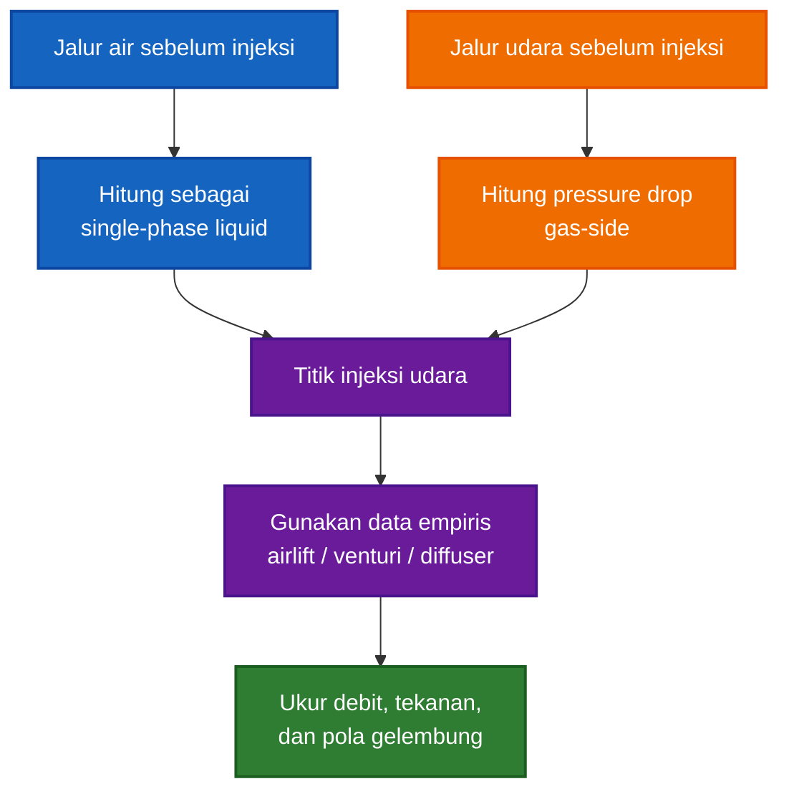
```mermaid id="ezq0mw"
flowchart TB
    A["Jalur air sebelum injeksi"] --> B["Hitung sebagai<br/>single-phase liquid"]
    C["Jalur udara sebelum injeksi"] --> D["Hitung pressure drop<br/>gas-side"]
    B --> E["Titik injeksi udara"]
    D --> E

    E --> F["Gunakan data empiris<br/>airlift / venturi / diffuser"]
    F --> G["Ukur debit, tekanan,<br/>dan pola gelembung"]

    classDef liquid fill:#1565C0,color:#FFFFFF,stroke:#0D47A1,stroke-width:2px;
    classDef gas fill:#EF6C00,color:#FFFFFF,stroke:#E65100,stroke-width:2px;
    classDef inject fill:#6A1B9A,color:#FFFFFF,stroke:#4A148C,stroke-width:2px;
    classDef test fill:#2E7D32,color:#FFFFFF,stroke:#1B5E20,stroke-width:2px;

    class A,B liquid;
    class C,D gas;
    class E,F inject;
    class G test;
```

> **Prinsip desain:** gunakan rumus satu fase untuk bagian sistem yang memang satu fase. Gunakan data empiris atau model khusus pada bagian yang sudah menjadi campuran udara-air.

[**Kembali ke Atas**](#panduan-praktis-perhitungan-fluida-dalam-pipa-pvc)

---

## Ringkasan Bab 4

| Jenis sistem                    | Model utama                                  | Catatan penting                                       |
| ------------------------------- | -------------------------------------------- | ----------------------------------------------------- |
| Pipa atau selang panjang        | Darcy–Weisbach                               | Tambahkan fitting, elevasi, dan outlet                |
| Elbow, tee, valve, filter       | $K$-factor                                   | Gunakan basis kecepatan yang benar                    |
| Estimasi cepat fitting          | Equivalent length                            | Nilainya berubah bersama friction factor              |
| Tube kecil, panjang, laminar    | Hagen–Poiseuille                             | Harus memenuhi asumsi aliran laminar berkembang penuh |
| Nozzle dan orifice cairan       | Orifice equation                             | Gunakan $C_d$ yang sesuai geometri                    |
| Lubang diffuser terendam        | Pressure internal minus tekanan air luar     | Kedalaman bukan langsung pressure drop lubang         |
| Pipa udara tekanan rendah       | Darcy dengan densitas rata-rata atau iterasi | Gunakan tekanan absolut                               |
| Nozzle udara atau udara tekan   | Compressible flow                            | Periksa pressure ratio dan choking                    |
| Airlift, venturi, bubble column | Two-phase / empiris                          | Jangan gunakan Darcy satu fase untuk seluruh sistem   |

Pemilihan model yang benar akan menentukan apakah hasil perhitungan dapat dipakai sebagai dasar desain, hanya sebagai estimasi kasar, atau harus diganti dengan data produsen dan pengujian lapangan.

---

## Rujukan Bab 4

- [R1] Crane Co. _Flow of Fluids Through Valves, Fittings, and Pipe: Technical Paper No. 410._
- [R2] Idelchik, I. E. _Handbook of Hydraulic Resistance._ CRC Press.
- [R3] White, F. M. _Fluid Mechanics._ McGraw-Hill Education.
- [R4] Munson, B. R., Okiishi, T. H., Huebsch, W. W., dan Rothmayer, A. P. _Fundamentals of Fluid Mechanics._ Wiley.
- [R5] Perry, R. H., dan Green, D. W. _Perry’s Chemical Engineers’ Handbook._ McGraw-Hill.
- [R6] ISO 5167. _Measurement of Fluid Flow by Means of Pressure Differential Devices Inserted in Circular Cross-Section Conduits Running Full._
- [R7] Chisti, Y. “Airlift Bioreactors.” _Elsevier Encyclopedia of Bioprocess Technology._

---

# 5. Reynolds Number dan Faktor Gesekan

Setelah debit, diameter dalam, temperatur, dan geometri pipa diketahui, langkah berikutnya adalah menentukan karakter aliran dan faktor gesekan. Dua parameter ini menjadi dasar perhitungan rugi tekan dengan Darcy–Weisbach.

Kesalahan yang sering terjadi di lapangan adalah memakai nilai faktor gesekan tetap, misalnya:

$$
f
=

0.02
$$

untuk semua diameter, semua debit, dan semua fluida. Pendekatan tersebut hanya boleh digunakan untuk estimasi sangat kasar. Nilai faktor gesekan berubah menurut Reynolds number, kekasaran pipa, diameter, dan kondisi aliran.

---

## 5.1 Reynolds Number

Reynolds number atau bilangan Reynolds adalah bilangan tak berdimensi yang membandingkan efek gaya inersia terhadap gaya viskos dalam aliran.

$$
Re
=

\frac{\rho V D_i}{\mu}
$$

Atau, dengan viskositas kinematik:

$$
Re
=

\frac{V D_i}{\nu}
$$

Dengan:

- $Re$ = Reynolds number.
- $\rho$ = densitas fluida, dalam $\text{kg/m}^3$.
- $V$ = kecepatan rata-rata fluida, dalam $\text{m/s}$.
- $D_i$ = diameter dalam pipa, dalam m.
- $\mu$ = viskositas dinamis, dalam $\text{Pa·s}$.
- $\nu$ = viskositas kinematik, dalam $\text{m}^2/\text{s}$.

Reynolds number tidak langsung menunjukkan berapa besar head loss. Namun, nilai ini menentukan jenis aliran dan metode untuk menghitung Darcy friction factor.

### 5.1.1 Laminar, Transisi, dan Turbulen

Untuk aliran internal dalam pipa bulat yang cukup panjang dan berkembang penuh, klasifikasi praktis berikut dapat digunakan.

| Rentang Reynolds number | Karakter aliran | Pendekatan praktis                           |
| ----------------------: | --------------- | -------------------------------------------- |
|             $Re < 2100$ | Laminar         | Gunakan $f_D=64/Re$                          |
|  $2100 \le Re \le 4000$ | Transisi        | Hindari desain pada zona ini                 |
|             $Re > 4000$ | Turbulen        | Gunakan Colebrook, Swamee–Jain, atau Haaland |

Batas tersebut bukan garis fisik yang mutlak. Transisi aliran dapat terjadi lebih awal atau lebih lambat karena:

- Kekasaran pipa.
- Gangguan dari elbow atau valve di hulu.
- Getaran pompa atau blower.
- Perubahan diameter mendadak.
- Aliran masuk yang belum berkembang penuh.
- Pulsasi tekanan.
- Ketidakseragaman aliran dalam manifold.

Karena itu, sistem yang beroperasi dekat:

$$
Re
\approx
2100
\text{ sampai }
4000
$$

sebaiknya tidak dihitung dengan asumsi tunggal tanpa margin. Pada zona ini, hasil perhitungan dapat lebih sensitif terhadap kondisi nyata.

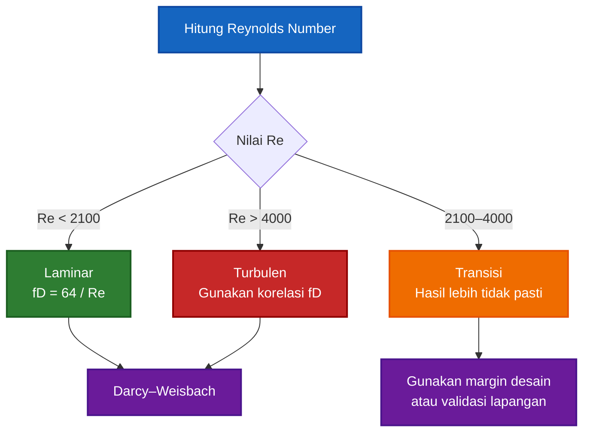
```mermaid id="i0b31o"
flowchart TB
    A["Hitung Reynolds Number"] --> B{"Nilai Re"}

    B -->|"Re < 2100"| C["Laminar<br/>fD = 64 / Re"]
    B -->|"2100–4000"| D["Transisi<br/>Hasil lebih tidak pasti"]
    B -->|"Re > 4000"| E["Turbulen<br/>Gunakan korelasi fD"]

    C --> F["Darcy–Weisbach"]
    D --> G["Gunakan margin desain<br/>atau validasi lapangan"]
    E --> F

    classDef start fill:#1565C0,color:#FFFFFF,stroke:#0D47A1,stroke-width:2px;
    classDef laminar fill:#2E7D32,color:#FFFFFF,stroke:#1B5E20,stroke-width:2px;
    classDef trans fill:#EF6C00,color:#FFFFFF,stroke:#E65100,stroke-width:2px;
    classDef turbulent fill:#C62828,color:#FFFFFF,stroke:#8E0000,stroke-width:2px;
    classDef result fill:#6A1B9A,color:#FFFFFF,stroke:#4A148C,stroke-width:2px;

    class A start;
    class C laminar;
    class D trans;
    class E turbulent;
    class F,G result;
```

### 5.1.2 Makna Fisik Reynolds Number

Reynolds number rendah menunjukkan viskositas dominan. Aliran bergerak relatif teratur dan berlapis.

Reynolds number tinggi menunjukkan gaya inersia dominan. Aliran menjadi lebih tidak teratur, memiliki pusaran, dan mengalami pencampuran lebih kuat.

| Karakteristik      | Laminar                        | Turbulen                                 |
| ------------------ | ------------------------------ | ---------------------------------------- |
| Pola aliran        | Teratur dan berlapis           | Pusaran dan fluktuatif                   |
| Profil kecepatan   | Parabolik                      | Lebih rata                               |
| Pengaruh kekasaran | Kecil                          | Dapat signifikan                         |
| Faktor gesekan     | Hanya bergantung pada $Re$     | Bergantung pada $Re$ dan $\varepsilon/D$ |
| Contoh praktis     | Needle, kapiler, tubing dosing | Pipa irigasi, pipa pompa, header udara   |

Pada jaringan pipa PVC untuk irigasi, kolam, fertigation, atau distribusi air, sebagian besar aliran biasanya turbulen.

Sebaliknya, tube kecil untuk dosing pupuk, needle, drip line tertentu, atau selang diameter sangat kecil dapat berada pada kondisi laminar atau transisi.

### 5.1.3 Contoh Reynolds Number untuk Pipa Air

Diketahui:

- Debit air:

$$
Q
=

60\ \text{L/min}
$$

- Diameter dalam pipa:

$$
D_i
=

# 26.6\ \text{mm}

0.0266\ \text{m}
$$

- Densitas air pada sekitar 20°C:

$$
\rho
=

998.2\ \text{kg/m}^3
$$

- Viskositas dinamis air:

$$
\mu
=

1.002
\times
10^{-3}\ \text{Pa·s}
$$

Konversi debit:

$$
Q
=

# \frac{60}{1000 \times 60}

0.001\ \text{m}^3/\text{s}
$$

Luas penampang:

$$
A
=

# \frac{\pi(0.0266)^2}{4}

5.56
\times
10^{-4}\ \text{m}^2
$$

Kecepatan rata-rata:

$$
V
=

# \frac{Q}{A}

\frac{0.001}
{5.56 \times 10^{-4}}
=

1.80\ \text{m/s}
$$

Reynolds number:

$$
Re
=

\frac{
998.2
\times
1.80
\times
0.0266
}
{
1.002
\times
10^{-3}
}
$$

$$
Re
\approx
4.77
\times
10^4
$$

Jadi:

$$
\boxed{
Re
\approx
47{,}700
}
$$

Aliran tersebut tergolong turbulen.

### 5.1.4 Contoh Reynolds Number untuk Tube Kecil

Diketahui:

- Diameter dalam tube:

$$
D_i
=

# 1.0\ \text{mm}

0.001\ \text{m}
$$

- Kecepatan air:

$$
V
=

0.50\ \text{m/s}
$$

Dengan air pada sekitar 20°C:

$$
Re
=

\frac{
998.2
\times
0.50
\times
0.001
}
{
1.002
\times
10^{-3}
}
$$

$$
Re
\approx
498
$$

Jadi:

$$
\boxed{
Re
\approx
500
}
$$

Aliran ini dapat dianggap laminar, sehingga Hagen–Poiseuille atau Darcy–Weisbach dengan:

$$
f_D
=

\frac{64}{Re}
$$

dapat digunakan apabila asumsi tube lurus, bulat, dan aliran berkembang penuh terpenuhi.

### 5.1.5 Reynolds Number untuk Udara

Untuk udara, persamaan Reynolds number tetap sama:

$$
Re
=

\frac{\rho V D_i}{\mu}
$$

Namun densitas udara harus ditentukan dari tekanan absolut dan temperatur aktual.

$$
\rho_{\text{air}}
=

\frac{P_{\text{abs}}}
{R_{\text{air}}T}
$$

Untuk udara, jangan langsung memakai densitas:

$$
\rho
=

1.20\ \text{kg/m}^3
$$

jika tekanan jalur blower jauh di atas tekanan atmosfer atau temperatur udara berubah cukup besar.

> **Catatan praktis:** pada sistem aerasi tekanan rendah, penggunaan densitas rata-rata dapat memadai untuk estimasi awal. Namun, untuk selang kecil, manifold panjang, atau orifice udara, perubahan densitas harus diperiksa lebih hati-hati.

[**Kembali ke Atas**](#panduan-praktis-perhitungan-fluida-dalam-pipa-pvc)

---

## 5.2 Faktor Gesekan Darcy

Faktor gesekan Darcy dilambangkan dengan:

$$
f_D
$$

Nilai ini digunakan dalam persamaan Darcy–Weisbach:

$$
h_f
=

f_D
\frac{L}{D_i}
\frac{V^2}{2g}
$$

Faktor gesekan Darcy tidak memiliki satuan.

Nilainya bergantung pada:

- Reynolds number.
- Kekasaran relatif pipa.
- Jenis aliran.
- Geometri saluran.
- Kondisi permukaan pipa.

> **Penting:** persamaan dalam artikel ini menggunakan Darcy friction factor. Jangan mencampurkannya dengan Fanning friction factor.

$$
f_D
=

4f_F
$$

Dengan $f_F$ sebagai Fanning friction factor.

### 5.2.1 Faktor Gesekan untuk Aliran Laminar

Untuk aliran laminar berkembang penuh dalam pipa bulat:

$$
f_D
=

\frac{64}{Re}
$$

Contoh untuk:

$$
Re
=

500
$$

maka:

$$
f_D
=

# \frac{64}{500}

0.128
$$

Nilai friction factor pada aliran laminar dapat terlihat lebih besar dibanding aliran turbulen. Namun, kecepatan dan debit aliran laminar biasanya rendah, sehingga head loss aktual belum tentu besar.

Pada aliran laminar, kekasaran pipa umumnya tidak memberi pengaruh besar terhadap faktor gesekan. Faktor utama adalah Reynolds number.

### 5.2.2 Kekasaran Absolut dan Kekasaran Relatif

Kekasaran absolut dilambangkan dengan:

$$
\varepsilon
$$

Kekasaran relatif:

$$
\frac{\varepsilon}{D_i}
$$

Dengan:

- $\varepsilon$ = kekasaran absolut dinding pipa, dalam m.
- $D_i$ = diameter dalam pipa, dalam m.

Untuk PVC baru dan bersih, nilai desain awal yang sering digunakan adalah:

$$
\varepsilon
=

1.5
\times
10^{-6}\ \text{m}
$$

atau:

$$
\varepsilon
=

0.0015\ \text{mm}
$$

Contoh pipa PVC dengan diameter dalam:

$$
D_i
=

# 26.6\ \text{mm}

0.0266\ \text{m}
$$

Kekasaran relatifnya:

$$
\frac{\varepsilon}{D_i}
=

\frac{
1.5
\times
10^{-6}
}
{0.0266}
$$

$$
\frac{\varepsilon}{D_i}
=

5.64
\times
10^{-5}
$$

Pipa kecil memiliki kekasaran relatif yang lebih tinggi walaupun nilai kekasaran absolutnya sama.

| Diameter dalam | Kekasaran PVC, $\varepsilon$ | Kekasaran relatif, $\varepsilon/D_i$ |
| -------------: | ---------------------------: | -----------------------------------: |
|           4 mm |         $1.5\times10^{-6}$ m |                  $3.75\times10^{-4}$ |
|          10 mm |         $1.5\times10^{-6}$ m |                  $1.50\times10^{-4}$ |
|        26.6 mm |         $1.5\times10^{-6}$ m |                  $5.64\times10^{-5}$ |
|          50 mm |         $1.5\times10^{-6}$ m |                  $3.00\times10^{-5}$ |

Pada pipa PVC baru, pengaruh kekasaran sering kecil dibanding pengaruh diameter, panjang, debit, dan fitting. Namun, kondisi tersebut dapat berubah jika pipa mengalami:

- Biofilm.
- Lumut.
- Kerak mineral.
- Endapan pupuk.
- Lumpur atau pasir.
- Penyempitan di sambungan.
- Kerusakan dinding atau deformasi selang.

### 5.2.3 Faktor Gesekan untuk Aliran Turbulen

Pada aliran turbulen, faktor gesekan Darcy dipengaruhi oleh Reynolds number dan kekasaran relatif.

Persamaan Colebrook–White adalah persamaan standar yang digunakan secara luas:

$$
\frac{1}{\sqrt{f_D}}
=

-2
\log_{10}
\left[
\frac{\varepsilon}
{3.7D_i}
+
\frac{2.51}
{Re\sqrt{f_D}}
\right]
$$

Persamaan tersebut bersifat implisit karena:

$$
f_D
$$

muncul pada kedua sisi persamaan. Karena itu, Colebrook–White biasanya diselesaikan secara iteratif.

Untuk desain praktis, korelasi eksplisit sering lebih mudah digunakan.

### 5.2.4 Persamaan Swamee–Jain

Persamaan Swamee–Jain untuk Darcy friction factor:

$$
f_D
=

\frac{0.25}
{
\left[
\log_{10}
\left(
\frac{\varepsilon}{3.7D_i}
+
\frac{5.74}{Re^{0.9}}
\right)
\right]^2
}
$$

Persamaan ini sesuai untuk estimasi praktis aliran turbulen dalam pipa dan menghindari iterasi Colebrook–White secara langsung.

Gunakan dengan hati-hati pada zona transisi. Untuk desain awal, gunakan ketika:

$$
Re
\gtrsim
5000
$$

### 5.2.5 Persamaan Haaland

Alternatif eksplisit lain adalah persamaan Haaland:

$$
\frac{1}{\sqrt{f_D}}
=

-1.8
\log_{10}
\left[
\left(
\frac{\varepsilon}
{3.7D_i}
\right)^{1.11}
+
\frac{6.9}{Re}
\right]
$$

Atau:

$$
f_D
=

\left{
-1.8
\log_{10}
\left[
\left(
\frac{\varepsilon}
{3.7D_i}
\right)^{1.11}
+
\frac{6.9}{Re}
\right]
\right}^{-2}
$$

Hasil Haaland dan Swamee–Jain biasanya cukup dekat untuk kebutuhan desain awal pipa pertanian.

### 5.2.6 Pemilihan Metode Faktor Gesekan

| Kondisi                  | Metode yang disarankan                                    |
| ------------------------ | --------------------------------------------------------- |
| $Re < 2100$              | $f_D=64/Re$                                               |
| $2100 \le Re \le 4000$   | Hindari operasi; gunakan margin dan validasi              |
| $Re > 4000$, desain awal | Swamee–Jain atau Haaland                                  |
| Perhitungan rinci        | Colebrook–White iteratif                                  |
| Spreadsheet              | Swamee–Jain atau Haaland                                  |
| Pipa tua atau berkerak   | Gunakan roughness konservatif dan validasi tekanan        |
| Selang fleksibel beralur | Gunakan data produsen atau hasil pengukuran jika tersedia |

### 5.2.7 Contoh Faktor Gesekan Pipa PVC

Gunakan data contoh sebelumnya:

- Diameter dalam:

$$
D_i
=

0.0266\ \text{m}
$$

- Debit:

$$
Q
=

60\ \text{L/min}
$$

- Kecepatan:

$$
V
=

1.80\ \text{m/s}
$$

- Reynolds number:

$$
Re
=

47{,}700
$$

- Kekasaran PVC:

$$
\varepsilon
=

1.5
\times
10^{-6}\ \text{m}
$$

Kekasaran relatif:

$$
\frac{\varepsilon}{D_i}
=

5.64
\times
10^{-5}
$$

Dengan persamaan Swamee–Jain:

$$
f_D
=

\frac{0.25}
{
\left[
\log_{10}
\left(
\frac{1.5\times10^{-6}}
{3.7 \times 0.0266}
+
\frac{5.74}
{47700^{0.9}}
\right)
\right]^2
}
$$

Hasilnya:

$$
\boxed{
f_D
\approx
0.021
}
$$

Nilai tersebut dapat dipakai pada Darcy–Weisbach untuk menghitung rugi gesek pipa lurus.

### 5.2.8 Pengaruh Faktor Gesekan terhadap Head Loss

Dengan data berikut:

- Panjang pipa:

$$
L
=

40\ \text{m}
$$

- Diameter dalam:

$$
D_i
=

0.0266\ \text{m}
$$

- Kecepatan:

$$
V
=

1.80\ \text{m/s}
$$

- Darcy friction factor:

$$
f_D
=

0.021
$$

Maka:

$$
h_f
=

0.021
\left(
\frac{40}{0.0266}
\right)
\left(
\frac{1.80^2}
{2 \times 9.80665}
\right)
$$

$$
h_f
\approx
5.2\ \text{m}
$$

Pressure drop setara untuk air:

$$
\Delta P_f
=

\rho gh_f
$$

$$
\Delta P_f
=

998.2
\times
9.80665
\times
5.2
$$

$$
\Delta P_f
\approx
51\ \text{kPa}
$$

Nilai tersebut hanya mencakup pipa lurus. Semua elbow, tee, valve, filter, nozzle, dan beda elevasi harus ditambahkan pada perhitungan total sistem.

[**Kembali ke Atas**](#panduan-praktis-perhitungan-fluida-dalam-pipa-pvc)

---

## 5.3 Prosedur Iteratif

Perhitungan pipa dapat dilakukan dengan dua cara utama.

1. Debit sudah diketahui atau ditetapkan sebagai target.
2. Tekanan atau head tersedia diketahui, tetapi debit aktual belum diketahui.

Pada kondisi pertama, perhitungan relatif langsung.

Pada kondisi kedua, debit harus dicari secara iteratif karena:

$$
Q
\rightarrow
V
\rightarrow
Re
\rightarrow
f_D
\rightarrow
h_f
$$

dan hasil head loss akan menentukan apakah tebakan debit benar.

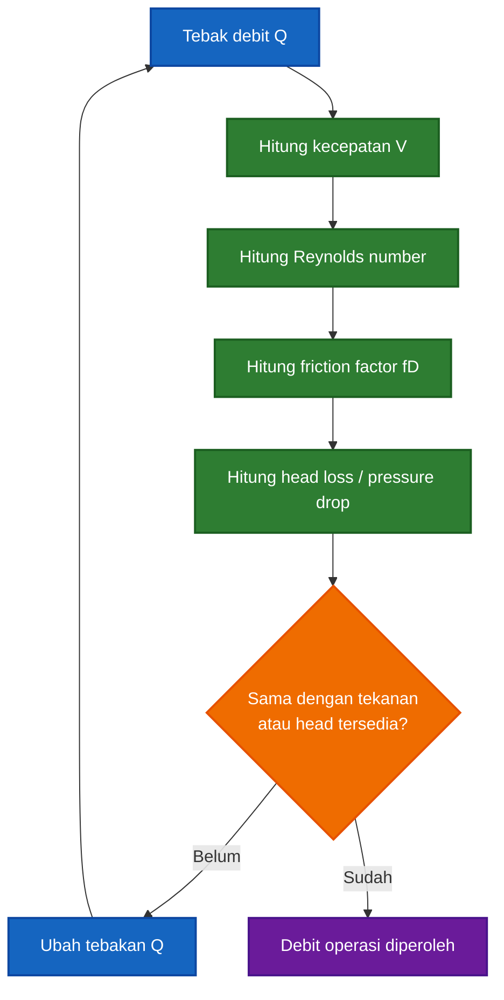
```mermaid id="vssqr2"
flowchart TB
    A["Tebak debit Q"] --> B["Hitung kecepatan V"]
    B --> C["Hitung Reynolds number"]
    C --> D["Hitung friction factor fD"]
    D --> E["Hitung head loss / pressure drop"]
    E --> F{"Sama dengan tekanan<br/>atau head tersedia?"}

    F -->|"Belum"| G["Ubah tebakan Q"]
    G --> A

    F -->|"Sudah"| H["Debit operasi diperoleh"]

    classDef start fill:#1565C0,color:#FFFFFF,stroke:#0D47A1,stroke-width:2px;
    classDef calc fill:#2E7D32,color:#FFFFFF,stroke:#1B5E20,stroke-width:2px;
    classDef decision fill:#EF6C00,color:#FFFFFF,stroke:#E65100,stroke-width:2px;
    classDef result fill:#6A1B9A,color:#FFFFFF,stroke:#4A148C,stroke-width:2px;

    class A,G start;
    class B,C,D,E calc;
    class F decision;
    class H result;
```

### 5.3.1 Kasus A — Debit Target Sudah Diketahui

Contoh: sistem irigasi memerlukan debit:

$$
Q
=

60\ \text{L/min}
$$

Urutan perhitungannya:

1. Konversi debit ke $\text{m}^3/\text{s}$.
2. Hitung kecepatan dari diameter dalam pipa.
3. Tentukan sifat fluida sesuai temperatur.
4. Hitung Reynolds number.
5. Tentukan kekasaran relatif.
6. Hitung Darcy friction factor.
7. Hitung rugi gesek pipa lurus.
8. Tambahkan rugi fitting, valve, filter, dan outlet.
9. Tambahkan beda elevasi.
10. Bandingkan total head sistem dengan kurva pompa.

Pada kasus ini, iterasi umumnya hanya diperlukan bila menggunakan Colebrook–White secara langsung atau bila ada hubungan kompleks antara debit, valve, nozzle, dan pompa.

### 5.3.2 Kasus B — Head Tersedia Diketahui, Debit Belum Diketahui

Contoh: tersedia head sebesar:

$$
H_{\text{available}}
=

5.0\ \text{m}
$$

untuk mengalirkan air melalui pipa lurus PVC.

Data:

- Panjang pipa:

$$
L
=

40\ \text{m}
$$

- Diameter dalam:

$$
D_i
=

0.0266\ \text{m}
$$

- Kekasaran PVC:

$$
\varepsilon
=

1.5
\times
10^{-6}\ \text{m}
$$

- Air sekitar 20°C.
- Tidak ada beda elevasi dan fitting dalam contoh ini.

Kondisi target iterasi:

$$
h_f
=

H_{\text{available}}
$$

atau:

$$
h_f
=

5.0\ \text{m}
$$

Gunakan Swamee–Jain untuk menghitung $f_D$ pada setiap tebakan debit.

| Iterasi | Tebakan debit | Kecepatan |    Reynolds number |  $f_D$ | Head loss pipa |
| ------: | ------------: | --------: | -----------------: | -----: | -------------: |
|       1 |    70.0 L/min |  2.10 m/s | $\approx 55{,}600$ | 0.0205 |          6.9 m |
|       2 |    60.0 L/min |  1.80 m/s | $\approx 47{,}700$ | 0.0212 |          5.3 m |
|       3 |    58.3 L/min |  1.75 m/s | $\approx 46{,}300$ | 0.0214 |          5.0 m |

Maka debit yang mendekati kondisi head tersedia adalah:

$$
\boxed{
Q
\approx
58.3\ \text{L/min}
}
$$

Hasil tersebut hanya berlaku untuk pipa lurus pada contoh ini. Bila sistem memiliki fitting, filter, valve, outlet bertekanan, atau beda elevasi, debit aktual akan lebih kecil.

### 5.3.3 Iterasi untuk Sistem Pompa

Untuk sistem yang memakai pompa, titik operasi terjadi ketika:

$$
H_{\text{pump}}(Q)
=

H_{\text{system}}(Q)
$$

Dengan:

$$
H_{\text{system}}(Q)
=

H_{\text{static}}
+
h_f(Q)
+
h_m(Q)
+
H_{\text{required}}(Q)
$$

Langkah praktisnya:

1. Ambil beberapa titik debit dari kurva pompa.
2. Pada setiap debit, hitung head sistem.
3. Bandingkan head pompa dan head sistem.
4. Cari titik ketika keduanya hampir sama.
5. Validasi dengan pressure gauge dan pengukuran debit lapangan.

Contoh tabel sederhana:

|             Debit |   Head pompa |  Head sistem | Interpretasi                     |
| ----------------: | -----------: | -----------: | -------------------------------- |
|      Debit rendah | Lebih tinggi | Lebih rendah | Debit masih dapat naik           |
|      Debit tinggi | Lebih rendah | Lebih tinggi | Debit terlalu besar untuk sistem |
| Titik perpotongan |  Hampir sama |  Hampir sama | Titik operasi                    |

Bab 6 membahas pembentukan system curve dan pemilihan pompa secara lebih rinci.

### 5.3.4 Kriteria Berhenti pada Iterasi

Untuk desain awal, iterasi dapat dihentikan ketika salah satu kondisi berikut tercapai:

$$
\left|
\frac{
H_{\text{calculated}}
---------------------

H_{\text{target}}
}
{
H_{\text{target}}
}
\right|
<
0.02
$$

atau:

$$
\text{Error head}
<
2%
$$

Selain itu, perubahan debit antariterasi dapat dibuat kecil:

$$
\left|
\frac{
Q_{n+1}
-------

Q_n
}
{Q_n}
\right|
<
0.01
$$

atau sekitar 1%.

Untuk sistem sederhana di lapangan, akurasi 2–5% biasanya lebih realistis dibanding akurasi matematis yang sangat tinggi tetapi memakai data diameter, kekasaran, atau fitting yang tidak pasti.

### 5.3.5 Metode Pembaruan Debit

Beberapa metode sederhana untuk mengubah tebakan debit:

| Metode                       | Karakteristik                                    |
| ---------------------------- | ------------------------------------------------ |
| Trial-and-error              | Mudah dilakukan dengan kalkulator                |
| Bisection                    | Stabil jika batas debit bawah dan atas diketahui |
| Secant                       | Lebih cepat, tetapi perlu dua tebakan awal       |
| Solver spreadsheet           | Praktis untuk sistem kompleks                    |
| Kurva sistem dan kurva pompa | Visual dan mudah dipahami praktisi               |

Untuk praktisi, metode bisection sering paling aman.

Misalnya:

- Jika head loss lebih besar dari head tersedia, turunkan debit.
- Jika head loss lebih kecil dari head tersedia, naikkan debit.
- Ulangi sampai perbedaan cukup kecil.

### 5.3.6 Spreadsheet yang Direkomendasikan

Spreadsheet untuk Bab 5 minimal memiliki kolom berikut.

| Kolom                    | Rumus atau input                               |
| ------------------------ | ---------------------------------------------- |
| Debit, $Q$               | Input atau hasil iterasi                       |
| Diameter dalam, $D_i$    | Input                                          |
| Luas penampang, $A$      | $\pi D_i^2/4$                                  |
| Kecepatan, $V$           | $Q/A$                                          |
| Densitas, $\rho$         | Input berdasarkan fluida dan temperatur        |
| Viskositas, $\mu$        | Input berdasarkan fluida dan temperatur        |
| Reynolds number, $Re$    | $\rho VD_i/\mu$                                |
| Kekasaran, $\varepsilon$ | Input material pipa                            |
| Kekasaran relatif        | $\varepsilon/D_i$                              |
| Friction factor, $f_D$   | Laminar atau Swamee–Jain                       |
| Major loss               | Darcy–Weisbach                                 |
| Minor loss               | $\sum K V^2/(2g)$                              |
| Total head               | Head statis + major + minor + kebutuhan outlet |

> **Prinsip penting:** spreadsheet yang baik tidak hanya menghasilkan angka. Spreadsheet harus menampilkan asumsi, satuan, status aliran, dan peringatan bila sistem berada pada zona transisi atau di luar rentang validitas rumus.

[**Kembali ke Atas**](#panduan-praktis-perhitungan-fluida-dalam-pipa-pvc)

---

## Ringkasan Bab 5

1. Reynolds number menentukan apakah aliran laminar, transisi, atau turbulen.

$$
Re
=

\frac{\rho VD_i}{\mu}
$$

2. Untuk pipa bulat yang berkembang penuh:

$$
Re
<
2100
$$

umumnya laminar, sedangkan:

$$
Re

>

4000
$$

umumnya turbulen.

3. Untuk aliran laminar:

$$
f_D
=

\frac{64}{Re}
$$

4. Untuk aliran turbulen, gunakan Colebrook–White, Swamee–Jain, atau Haaland.

5. Faktor gesekan turbulen bergantung pada Reynolds number dan kekasaran relatif:

$$
\frac{\varepsilon}{D_i}
$$

6. PVC baru memiliki kekasaran rendah, tetapi fouling, kerak, biofilm, filter, valve, dan selang dapat meningkatkan rugi tekan sistem secara nyata.

7. Jika debit tidak diketahui tetapi head tersedia diketahui, gunakan iterasi hingga:

$$
H_{\text{available}}
\approx
H_{\text{system}}
$$

8. Hindari mendesain sistem pada zona transisi tanpa margin dan tanpa validasi lapangan.

[**Kembali ke Atas**](#panduan-praktis-perhitungan-fluida-dalam-pipa-pvc)

---

## Rujukan Bab 5

- [R1] Crane Co. _Flow of Fluids Through Valves, Fittings, and Pipe: Technical Paper No. 410._
- [R2] Colebrook, C. F. “Turbulent Flow in Pipes, with Particular Reference to the Transition Region Between the Smooth and Rough Pipe Laws.” _Journal of the Institution of Civil Engineers_.
- [R3] Moody, L. F. “Friction Factors for Pipe Flow.” _Transactions of the ASME_.
- [R4] Swamee, P. K., dan Jain, A. K. “Explicit Equations for Pipe-Flow Problems.” _Journal of the Hydraulics Division_.
- [R5] Haaland, S. E. “Simple and Explicit Formulas for the Friction Factor in Turbulent Pipe Flow.” _Journal of Fluids Engineering_.
- [R6] White, F. M. _Fluid Mechanics._ McGraw-Hill Education.

---

# 6. Perhitungan Sistem Air dalam Pipa PVC

Bab ini menggabungkan seluruh komponen sistem air menjadi satu perhitungan praktis: target debit, pemilihan diameter pipa, rugi gesek, fitting, elevasi, tekanan outlet, kurva sistem, titik operasi pompa, daya, dan risiko kavitasi.

Untuk sistem pertanian, pendekatan ini dapat diterapkan pada:

- Distribusi air dari tandon ke lahan.
- Irigasi sprinkler dan nozzle.
- Fertigation.
- Sirkulasi air kolam dan filter.
- Pengisian tangki.
- Sistem pencucian kandang.
- Distribusi air aquaponik dan hidroponik.

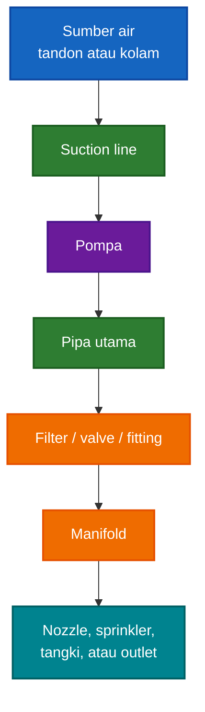
```mermaid id="z6a4p7"
flowchart TB
    A["Sumber air<br/>tandon atau kolam"] --> B["Suction line"]
    B --> C["Pompa"]
    C --> D["Pipa utama"]
    D --> E["Filter / valve / fitting"]
    E --> F["Manifold"]
    F --> G["Nozzle, sprinkler,<br/>tangki, atau outlet"]

    classDef source fill:#1565C0,color:#FFFFFF,stroke:#0D47A1,stroke-width:2px;
    classDef pipe fill:#2E7D32,color:#FFFFFF,stroke:#1B5E20,stroke-width:2px;
    classDef pump fill:#6A1B9A,color:#FFFFFF,stroke:#4A148C,stroke-width:2px;
    classDef component fill:#EF6C00,color:#FFFFFF,stroke:#E65100,stroke-width:2px;
    classDef outlet fill:#00838F,color:#FFFFFF,stroke:#006064,stroke-width:2px;

    class A source;
    class B,D pipe;
    class C pump;
    class E,F component;
    class G outlet;
```

## 6.1 Menentukan Diameter Pipa dari Target Debit

Diameter pipa bukan dipilih hanya dari ukuran nominal yang tersedia di toko. Diameter harus dipilih berdasarkan target debit, batas kecepatan yang diinginkan, rugi tekan yang dapat diterima, biaya pipa, dan kebutuhan tekanan di titik pemakaian.

Hubungan dasar debit, luas penampang, dan kecepatan adalah:

$$
Q
=

AV
$$

Untuk pipa lingkaran:

$$
A
=

\frac{\pi D_i^2}{4}
$$

Sehingga diameter minimum awal dapat diperkirakan dari:

$$
D_i
=

\sqrt{
\frac{4Q}{\pi V}
}
$$

Dengan:

- $D_i$ = diameter dalam pipa, dalam m.
- $Q$ = target debit, dalam $\text{m}^3/\text{s}$.
- $V$ = kecepatan desain awal, dalam m/s.

> Diameter hasil rumus adalah diameter hidraulik minimum awal. Setelah itu, pilih ukuran pipa komersial berdasarkan **inside diameter aktual** dari katalog produsen, lalu hitung ulang kecepatan dan head loss.

### 6.1.1 Kisaran Kecepatan Praktis

Kisaran berikut digunakan sebagai titik awal desain, bukan batas mutlak.

| Aplikasi                            |                           Kisaran kecepatan awal |
| ----------------------------------- | -----------------------------------------------: |
| Suction line pompa                  |                                      0.6–1.2 m/s |
| Pipa gravitasi                      |                                      0.3–1.0 m/s |
| Pipa utama irigasi                  |                                      0.8–2.0 m/s |
| Pipa cabang irigasi                 |                                      0.5–1.5 m/s |
| Pipa sirkulasi kolam                |                                      0.8–2.0 m/s |
| Jalur fertigation                   |                                      0.5–1.5 m/s |
| Jalur dengan air mengandung padatan | Ditentukan menurut risiko sedimentasi dan abrasi |

Kecepatan terlalu rendah dapat menyebabkan endapan lebih mudah terbentuk pada jalur yang membawa lumpur atau padatan. Sebaliknya, kecepatan terlalu tinggi meningkatkan rugi tekan, konsumsi energi, kebisingan, getaran, dan risiko tekanan tidak merata di cabang sistem.

### 6.1.2 Contoh Menentukan Diameter Awal

Diketahui target debit irigasi:

$$
Q
=

3.0\ \text{m}^3/\text{h}
$$

Konversi ke satuan SI:

$$
Q
=

# \frac{3.0}{3600}

8.33
\times
10^{-4}\ \text{m}^3/\text{s}
$$

Pilih kecepatan desain awal:

$$
V
=

1.2\ \text{m/s}
$$

Maka diameter minimum awal:

$$
D_i
=

\sqrt{
\frac{
4
\left(
8.33
\times
10^{-4}
\right)
}
{
\pi
\left(
1.2
\right)
}
}
$$

$$
D_i
=

0.0297\ \text{m}
$$

$$
\boxed{
D_i
\approx
29.7\ \text{mm}
}
$$

Artinya, pilih pipa dengan diameter dalam sekitar 30 mm atau lebih besar, kemudian periksa kembali kecepatan dan rugi tekan berdasarkan ukuran pipa aktual.

### 6.1.3 Perbandingan Diameter pada Debit Sama

Untuk debit:

$$
Q
=

3.0\ \text{m}^3/\text{h}
$$

hasil kecepatan pada beberapa diameter dalam adalah:

| Diameter dalam | Kecepatan air |
| -------------: | ------------: |
|          20 mm |      2.65 m/s |
|          25 mm |      1.70 m/s |
|          32 mm |      1.04 m/s |
|          40 mm |      0.66 m/s |

Diameter 20 mm mungkin masih dapat mengalirkan debit tersebut, tetapi kecepatan dan rugi tekannya akan jauh lebih tinggi daripada pipa 32 mm atau 40 mm.

Pada aliran turbulen, dengan pendekatan sederhana bahwa friction factor tidak banyak berubah:

$$
h_f
\propto
\frac{Q^2}{D_i^5}
$$

Artinya, kenaikan diameter kecil dapat menghasilkan penurunan rugi tekan yang sangat besar.

### 6.1.4 Trade-Off Diameter Besar dan Diameter Kecil

| Faktor                           | Diameter lebih kecil   | Diameter lebih besar   |
| -------------------------------- | ---------------------- | ---------------------- |
| Biaya pipa awal                  | Lebih rendah           | Lebih tinggi           |
| Kecepatan aliran                 | Lebih tinggi           | Lebih rendah           |
| Pressure drop                    | Lebih besar            | Lebih kecil            |
| Daya pompa                       | Cenderung lebih tinggi | Cenderung lebih rendah |
| Distribusi cabang                | Lebih sulit merata     | Lebih mudah merata     |
| Risiko sumbatan                  | Lebih tinggi           | Lebih rendah           |
| Risiko endapan pada debit rendah | Lebih rendah           | Dapat meningkat        |
| Fleksibilitas ekspansi sistem    | Terbatas               | Lebih baik             |

Pemilihan diameter sebaiknya mempertimbangkan biaya siklus hidup, bukan hanya biaya pembelian pipa. Pipa yang terlalu kecil memang lebih murah saat instalasi, tetapi dapat membuat pompa bekerja lebih berat selama bertahun-tahun.

> **Prinsip praktis:** diameter besar tidak dapat mengurangi head statis, tetapi dapat mengurangi rugi tekan secara signifikan.

[**Kembali ke Atas**](#panduan-praktis-perhitungan-fluida-dalam-pipa-pvc)

---

## 6.2 Menghitung Rugi Tekan Pipa dan Fitting

Total kebutuhan head pompa berasal dari beberapa komponen energi yang harus diatasi.

Secara umum:

$$
H_{\text{system}}
=

H_{\text{static}}
+
h_f
+
h_m
+
H_{\text{filter}}
+
H_{\text{outlet}}
$$

Dengan:

- $H_{\text{static}}$ = beda elevasi antara sumber dan titik tujuan.
- $h_f$ = major loss akibat gesekan sepanjang pipa.
- $h_m$ = minor loss akibat elbow, tee, valve, reducer, dan komponen lokal.
- $H_{\text{filter}}$ = pressure drop filter atau komponen khusus.
- $H_{\text{outlet}}$ = tekanan minimum yang dibutuhkan pada nozzle, sprinkler, manifold, atau outlet.

Semua rugi energi ditambahkan. Tanda negatif hanya muncul bila persamaan energi ditulis dari sudut pandang penurunan tekanan sepanjang arah aliran.

### 6.2.1 Major Loss

Major loss dihitung menggunakan Darcy–Weisbach:

$$
h_f
=

f_D
\frac{L}{D_i}
\frac{V^2}{2g}
$$

Dengan:

- $f_D$ = Darcy friction factor.
- $L$ = panjang pipa.
- $D_i$ = diameter dalam pipa.
- $V$ = kecepatan rata-rata.
- $g$ = percepatan gravitasi.

Dalam sistem dengan beberapa diameter, setiap segmen harus dihitung sendiri:

$$
h_{f,\text{total}}
=

\sum_i
f_{D,i}
\frac{L_i}{D_{i}}
\frac{V_i^2}{2g}
$$

### 6.2.2 Minor Loss

Rugi lokal dihitung dengan:

$$
h_m
=

K
\frac{V^2}{2g}
$$

Untuk beberapa fitting:

$$
h_{m,\text{total}}
=

\sum_i
K_i
\frac{V_i^2}{2g}
$$

Gunakan kecepatan lokal pada fitting yang bersangkutan. Hal ini penting pada reducer, tee cabang, expander, dan komponen yang memiliki diameter berbeda.

### 6.2.3 Head Statis

Head statis adalah perbedaan elevasi antara permukaan air sumber dan titik tujuan.

Untuk dua tangki terbuka:

$$
H_{\text{static}}
=

## z_2

z_1
$$

Dengan:

- $z_1$ = elevasi permukaan air sumber.
- $z_2$ = elevasi permukaan air tujuan.

Jika tangki tujuan lebih tinggi, nilai head statis positif dan pompa harus mengangkat air.

Jika sistem mengalir turun karena gravitasi, head statis dapat bernilai negatif atau menjadi energi penggerak.

> Head statis tidak berubah ketika debit berubah. Yang berubah terhadap debit adalah rugi gesek pipa, fitting, filter, dan komponen dinamis lainnya.

### 6.2.4 Pressure Outlet atau Nozzle

Banyak sistem pertanian membutuhkan tekanan minimum di titik pemakaian.

Contoh:

- Sprinkler memerlukan tekanan operasi tertentu.
- Nozzle spray membutuhkan tekanan agar pola semprotan sesuai.
- Emitter tertentu membutuhkan rentang tekanan tertentu.
- Venturi injector membutuhkan pressure differential tertentu.
- Manifold dapat memerlukan tekanan minimum agar distribusi antar cabang memadai.

Tekanan minimum tersebut dapat diubah menjadi head:

$$
H_{\text{outlet}}
=

\frac{\Delta P_{\text{required}}}
{\rho g}
$$

Contoh tekanan minimum nozzle:

$$
\Delta P_{\text{required}}
=

150\ \text{kPa}
$$

Untuk air:

$$
H_{\text{outlet}}
=

\frac{150000}
{998.2
\times
9.80665}
$$

$$
H_{\text{outlet}}
\approx
15.3\ \text{m}
$$

Jadi tekanan 150 kPa di inlet nozzle setara dengan sekitar 15.3 m head air.

> Bila nozzle atau sprinkler memakai kurva dari produsen, gunakan kurva tersebut. Jangan menghitung pressure requirement dengan $K$ dan sekaligus memasukkan tekanan minimum nozzle yang sama karena akan terjadi double counting.

### 6.2.5 Contoh Perhitungan Total Head

Diketahui sistem irigasi memiliki data berikut:

| Parameter                     |    Nilai |
| ----------------------------- | -------: |
| Target debit                  | 3.0 m³/h |
| Diameter dalam pipa           |    32 mm |
| Panjang pipa lurus            |     50 m |
| Head statis                   |    8.0 m |
| Darcy friction factor         |    0.023 |
| Jumlah elbow 90°              |   4 buah |
| Total $K$ elbow               |     3.60 |
| Ball valve terbuka penuh      | $K=0.05$ |
| Tee lurus                     | $K=0.40$ |
| Filter bersih                 |   15 kPa |
| Tekanan minimum pada manifold |  150 kPa |

Konversi debit:

$$
Q
=

# \frac{3.0}{3600}

8.33
\times
10^{-4}\ \text{m}^3/\text{s}
$$

Luas penampang pipa:

$$
A
=

\frac{
\pi
\left(
0.032
\right)^2
}{4}
$$

$$
A
=

8.04
\times
10^{-4}\ \text{m}^2
$$

Kecepatan aliran:

$$
V
=

\frac{Q}{A}
$$

$$
V
=

\frac{
8.33
\times
10^{-4}
}{
8.04
\times
10^{-4}
}
$$

$$
V
=

1.04\ \text{m/s}
$$

Velocity head:

$$
\frac{V^2}{2g}
=

\frac{
1.04^2
}{
2
\times
9.80665
}
$$

$$
\frac{V^2}{2g}
=

0.055\ \text{m}
$$

Major loss:

$$
h_f
=

0.023
\left(
\frac{50}{0.032}
\right)
\left(
0.055
\right)
$$

$$
h_f
\approx
2.0\ \text{m}
$$

Total loss coefficient fitting:

$$
K_{\text{total}}
=

3.60
+
0.05
+
0.40
$$

$$
K_{\text{total}}
=

4.05
$$

Minor loss:

$$
h_m
=

4.05
\times
0.055
$$

$$
h_m
\approx
0.22\ \text{m}
$$

Head loss filter:

$$
H_{\text{filter}}
=

\frac{15000}
{998.2
\times
9.80665}
$$

$$
H_{\text{filter}}
\approx
1.53\ \text{m}
$$

Head outlet minimum:

$$
H_{\text{outlet}}
=

\frac{150000}
{998.2
\times
9.80665}
$$

$$
H_{\text{outlet}}
\approx
15.3\ \text{m}
$$

Total head sistem:

$$
H_{\text{system}}
=

8.0
+
2.0
+
0.22
+
1.53
+
15.3
$$

$$
\boxed{
H_{\text{system}}
\approx
27.1\ \text{m}
}
$$

Pompa harus mampu memberikan sekitar 3.0 m³/h pada head sedikit di atas 27.1 m, setelah mempertimbangkan margin yang sesuai dengan ketidakpastian data, fouling filter, dan variasi kondisi operasi.

### 6.2.6 Hindari Double Counting

Kesalahan umum dalam perhitungan sistem:

| Kesalahan                                              | Cara yang benar                         |
| ------------------------------------------------------ | --------------------------------------- |
| Menambah pressure outlet dan juga $K$ nozzle yang sama | Gunakan salah satu pendekatan           |
| Menganggap filter bersih tidak memiliki loss           | Gunakan data pressure drop filter       |
| Menghitung pipa utama tetapi mengabaikan cabang        | Hitung setiap jalur kritis              |
| Menggunakan diameter nominal                           | Gunakan inside diameter aktual          |
| Menghitung head statis dua kali                        | Pilih satu datum elevasi yang konsisten |
| Memakai tekanan gauge sebagai tekanan absolut gas      | Tambahkan tekanan atmosfer untuk gas    |

[**Kembali ke Atas**](#panduan-praktis-perhitungan-fluida-dalam-pipa-pvc)

---

## 6.3 Membentuk System Curve

System curve menunjukkan hubungan antara debit dan head yang dibutuhkan sistem.

Bentuk umumnya:

$$
H_{\text{system}}(Q)
=

H_{\text{static}}
+
h_f(Q)
+
h_m(Q)
+
H_{\text{filter}}(Q)
+
H_{\text{outlet}}(Q)
$$

Untuk sistem pipa sederhana dengan diameter tetap, rugi gesek dan rugi fitting sering mendekati hubungan kuadrat terhadap debit:

$$
h_f
+
h_m
\approx
K_{\text{system}}Q^2
$$

Maka bentuk pendekatan awalnya:

$$
H_{\text{system}}
\approx
H_{\text{static}}
+
K_{\text{system}}Q^2
$$

Namun, hubungan ini tidak selalu persis kuadrat karena:

- Friction factor berubah terhadap Reynolds number.
- Filter dapat memiliki karakteristik nonlinier.
- Nozzle dan sprinkler memiliki kurva tekanan-debit sendiri.
- Valve dapat berubah posisi.
- Cabang sistem dapat dibuka atau ditutup.
- Diameter pipa dapat berbeda antar segmen.

### 6.3.1 Kurva Sistem Tangki ke Tangki

Untuk sistem dari tangki sumber menuju tangki tujuan terbuka:

$$
H_{\text{system}}
=

H_{\text{static}}
+
h_f
+
h_m
$$

Pada debit nol:

$$
Q
=

0
$$

maka:

$$
h_f
=

0
$$

dan:

$$
h_m
=

0
$$

Sehingga:

$$
H_{\text{system}}
=

H_{\text{static}}
$$

Artinya, kurva sistem dimulai dari head statis.

### 6.3.2 Kurva Sistem dengan Nozzle atau Sprinkler

Untuk sistem sprinkler atau nozzle, tekanan outlet merupakan bagian dari kebutuhan sistem.

$$
H_{\text{system}}
=

H_{\text{static}}
+
h_f
+
h_m
+
H_{\text{filter}}
+
H_{\text{nozzle}}
$$

Jika nozzle membutuhkan tekanan tertentu agar pola semprotan tetap baik, pressure requirement tersebut dapat menjadi offset tambahan pada kurva sistem.

Pada banyak nozzle, debit meningkat ketika tekanan naik. Karena itu, sistem nozzle sebaiknya dianalisis memakai kurva produsen:

$$
Q_{\text{nozzle}}
=

f
\left(
\Delta P_{\text{nozzle}}
\right)
$$

### 6.3.3 Contoh Tabel System Curve

Misalkan sistem memindahkan air dari sumber ke tangki terbuka dengan data:

- Head statis:

$$
H_{\text{static}}
=

8.0\ \text{m}
$$

- Dynamic head pada debit 3.0 m³/h:

$$
h_f
+
h_m
=

2.19\ \text{m}
$$

Sebagai estimasi awal:

$$
H_{\text{system}}
=

8.0
+
2.19
\left(
\frac{Q}{3.0}
\right)^2
$$

dengan $Q$ dalam m³/h.

|  Debit | Head statis | Dynamic head | Total head sistem |
| -----: | ----------: | -----------: | ----------------: |
| 0 m³/h |      8.00 m |       0.00 m |            8.00 m |
| 1 m³/h |      8.00 m |       0.24 m |            8.24 m |
| 2 m³/h |      8.00 m |       0.97 m |            8.97 m |
| 3 m³/h |      8.00 m |       2.19 m |           10.19 m |
| 4 m³/h |      8.00 m |       3.89 m |           11.89 m |
| 5 m³/h |      8.00 m |       6.08 m |           14.08 m |

Tabel tersebut adalah contoh estimasi untuk sistem sederhana. Pada desain akhir, friction factor, filter, valve, dan pressure outlet perlu dihitung ulang pada setiap debit.

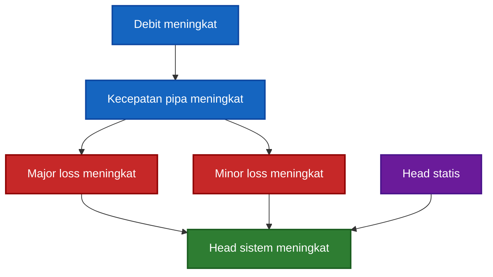
```mermaid id="n1mblj"
flowchart TB
    A["Debit meningkat"] --> B["Kecepatan pipa meningkat"]
    B --> C["Major loss meningkat"]
    B --> D["Minor loss meningkat"]
    C --> E["Head sistem meningkat"]
    D --> E
    F["Head statis"] --> E

    classDef flow fill:#1565C0,color:#FFFFFF,stroke:#0D47A1,stroke-width:2px;
    classDef loss fill:#C62828,color:#FFFFFF,stroke:#8E0000,stroke-width:2px;
    classDef static fill:#6A1B9A,color:#FFFFFF,stroke:#4A148C,stroke-width:2px;
    classDef result fill:#2E7D32,color:#FFFFFF,stroke:#1B5E20,stroke-width:2px;

    class A,B flow;
    class C,D loss;
    class F static;
    class E result;
```

### 6.3.4 Jalur Kritis dalam Sistem Bercabang

Untuk sistem bercabang, pompa harus mampu memenuhi jalur yang paling berat secara hidraulik.

Jalur kritis biasanya memiliki kombinasi:

- Elevasi paling tinggi.
- Panjang pipa paling besar.
- Diameter cabang paling kecil.
- Jumlah fitting terbesar.
- Tekanan outlet paling tinggi.
- Filter atau komponen tambahan.
- Debit cabang yang relatif besar.

Jalur terjauh secara fisik belum tentu jalur kritis. Cabang yang lebih dekat dapat menjadi jalur kritis bila memiliki nozzle lebih banyak, diameter lebih kecil, atau pressure requirement lebih tinggi.

> Dalam sistem manifold, perhitungan setiap cabang diperlukan untuk memastikan distribusi debit dan tekanan tetap memadai.

[**Kembali ke Atas**](#panduan-praktis-perhitungan-fluida-dalam-pipa-pvc)

---

## 6.4 Menentukan Titik Operasi Pompa

Pompa tidak bekerja pada satu debit yang tetap. Debit aktual ditentukan oleh pertemuan antara kurva pompa dan kurva sistem.

Secara matematis:

$$
H_{\text{pump}}(Q)
=

H_{\text{system}}(Q)
$$

Titik perpotongan tersebut disebut **titik operasi**.

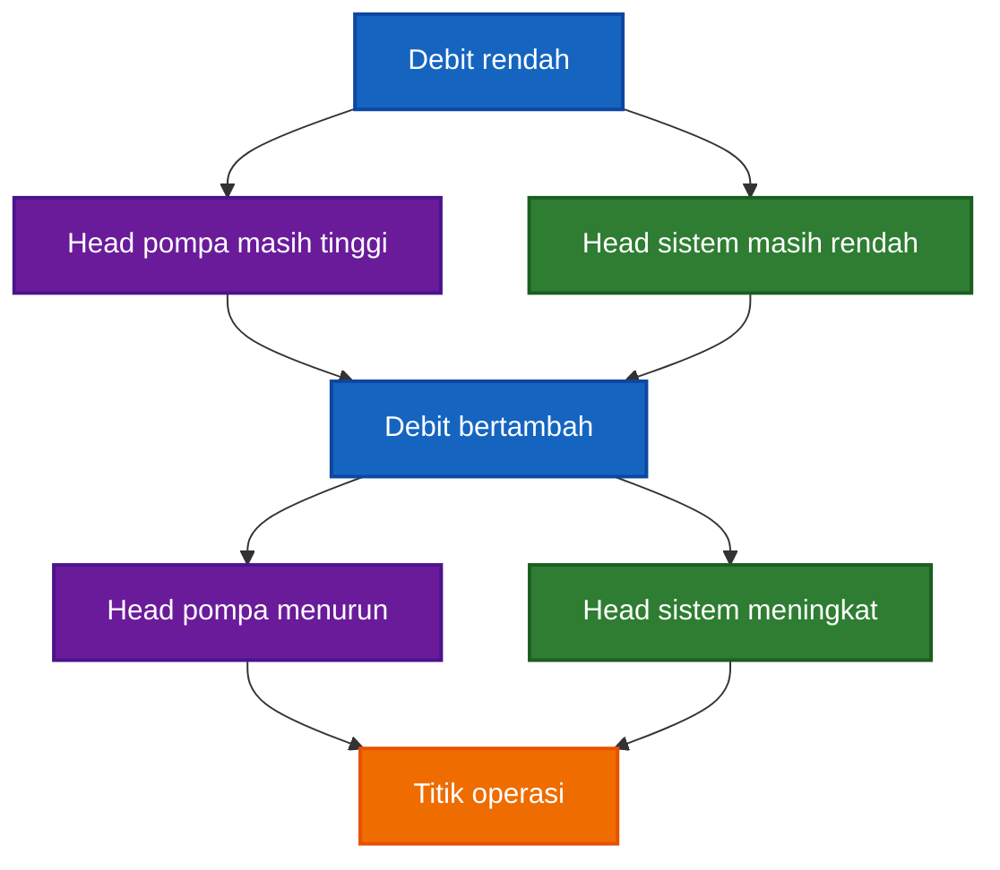
```mermaid id="tm4r6s"
flowchart TB
    A["Debit rendah"] --> B["Head pompa masih tinggi"]
    A --> C["Head sistem masih rendah"]

    B --> D["Debit bertambah"]
    C --> D

    D --> E["Head pompa menurun"]
    D --> F["Head sistem meningkat"]

    E --> G["Titik operasi"]
    F --> G

    classDef low fill:#1565C0,color:#FFFFFF,stroke:#0D47A1,stroke-width:2px;
    classDef pump fill:#6A1B9A,color:#FFFFFF,stroke:#4A148C,stroke-width:2px;
    classDef system fill:#2E7D32,color:#FFFFFF,stroke:#1B5E20,stroke-width:2px;
    classDef operating fill:#EF6C00,color:#FFFFFF,stroke:#E65100,stroke-width:2px;

    class A,D low;
    class B,E pump;
    class C,F system;
    class G operating;
```

### 6.4.1 Mengapa Debit Katalog Bukan Debit Aktual

Spesifikasi pompa sering mencantumkan:

- Debit maksimum.
- Head maksimum.
- Daya motor.
- Diameter inlet dan outlet.

Debit maksimum biasanya mendekati kondisi head sangat rendah. Head maksimum atau shut-off head terjadi ketika debit mendekati nol.

Pompa tidak dapat memberikan debit maksimum dan head maksimum secara bersamaan.

| Informasi katalog | Makna praktis                             |
| ----------------- | ----------------------------------------- |
| Maximum flow      | Debit saat hambatan sistem sangat rendah  |
| Maximum head      | Head saat debit mendekati nol             |
| Kurva $Q-H$       | Data utama untuk menentukan titik operasi |
| Efisiensi         | Menentukan kebutuhan daya aktual          |
| NPSHr             | Digunakan untuk pemeriksaan kavitasi      |

### 6.4.2 Langkah Menentukan Pompa

1. Tentukan target debit.
2. Hitung total head sistem pada target debit.
3. Dapatkan kurva pompa untuk model, impeller, dan putaran yang benar.
4. Cari titik pada kurva pompa yang mendekati target debit dan total head.
5. Periksa efisiensi pompa pada titik tersebut.
6. Periksa daya motor.
7. Periksa NPSH.
8. Pastikan material pompa sesuai dengan air, pupuk, atau kondisi fluida.
9. Validasi melalui pengukuran debit dan tekanan setelah instalasi.

### 6.4.3 Contoh Interpretasi Kurva

Misalkan hasil perhitungan sistem menunjukkan:

$$
Q_{\text{target}}
=

3.0\ \text{m}^3/\text{h}
$$

dan:

$$
H_{\text{system}}
=

27.1\ \text{m}
$$

Pompa yang dipilih harus menunjukkan kemampuan mendekati atau sedikit di atas:

$$
3.0\ \text{m}^3/\text{h}
\text{ pada }
27.1\ \text{m}
$$

Bila pompa hanya mampu memberikan 3.0 m³/h pada 18 m head, maka debit aktual akan lebih rendah dari target.

Bila pompa mampu memberikan 3.0 m³/h pada 45 m head, sistem mungkin akan bekerja pada debit lebih besar dari target atau membutuhkan pengaturan aliran. Kondisi tersebut dapat meningkatkan konsumsi energi, tekanan berlebih, dan risiko kerusakan pada nozzle atau emitter.

### 6.4.4 Pengaruh Valve Throttling

Valve yang ditutup sebagian meningkatkan loss coefficient:

$$
K_{\text{valve}}
\uparrow
$$

Akibatnya:

$$
h_m
=

K_{\text{valve}}
\frac{V^2}{2g}
$$

meningkat.

Kurva sistem bergeser ke atas dan debit pompa turun.

Valve throttling dapat digunakan untuk:

- Mengatur debit.
- Menyeimbangkan cabang.
- Menurunkan tekanan berlebih.
- Menyesuaikan sistem sementara.

Namun, throttling membuang energi sebagai rugi tekanan. Metode ini bukan solusi ideal untuk pipa utama yang terlalu kecil.

### 6.4.5 Pengaruh Perubahan Diameter Pipa

Memperbesar diameter pipa mengurangi kecepatan dan rugi gesek.

Akibatnya:

$$
h_f
\downarrow
$$

dan:

$$
H_{\text{system}}
\downarrow
$$

Kurva sistem bergeser ke bawah. Pompa kemudian dapat bekerja pada debit lebih besar.

Sebaliknya, diameter pipa yang terlalu kecil menggeser kurva sistem ke atas dan menurunkan debit aktual.

> Perubahan diameter pipa memengaruhi dynamic head, tetapi tidak mengubah head statis dan kebutuhan tekanan minimum pada nozzle.

### 6.4.6 Pengaruh Filter Kotor

Filter bersih memiliki pressure drop tertentu. Ketika filter kotor:

$$
H_{\text{filter}}
\uparrow
$$

Akibatnya:

$$
H_{\text{system}}
\uparrow
$$

dan debit aktual turun.

Karena itu, pressure gauge sebelum dan sesudah filter sangat berguna. Differential pressure filter dapat dihitung:

$$
\Delta P_{\text{filter}}
=

## P_{\text{upstream}}

P_{\text{downstream}}
$$

Pembersihan atau backwash dilakukan sesuai rekomendasi produsen atau ketika pressure drop filter sudah melewati batas operasi yang ditetapkan.

[**Kembali ke Atas**](#panduan-praktis-perhitungan-fluida-dalam-pipa-pvc)

---

## 6.5 Daya Pompa

Daya hidraulik adalah energi per satuan waktu yang benar-benar diberikan pompa kepada air.

$$
P_{\text{hydraulic}}
=

\rho gQH
$$

Dengan:

- $P_{\text{hydraulic}}$ = daya hidraulik, dalam W.
- $\rho$ = densitas air, dalam kg/m³.
- $g$ = percepatan gravitasi.
- $Q$ = debit, dalam m³/s.
- $H$ = total head, dalam m.

Daya poros pompa harus lebih besar dari daya hidraulik karena pompa tidak 100% efisien.

$$
P_{\text{shaft}}
=

\frac{
P_{\text{hydraulic}}
}{
\eta_{\text{pump}}
}
$$

Daya listrik masuk ke motor adalah:

$$
P_{\text{input}}
=

\frac{
\rho gQH
}{
\eta_{\text{pump}}
\eta_{\text{motor}}
}
$$

Dengan:

- $\eta_{\text{pump}}$ = efisiensi pompa pada titik operasi.
- $\eta_{\text{motor}}$ = efisiensi motor pada beban operasi.

Bila sistem memakai inverter atau variable frequency drive, efisiensi inverter juga dapat dimasukkan:

$$
P_{\text{input}}
=

\frac{
\rho gQH
}{
\eta_{\text{pump}}
\eta_{\text{motor}}
\eta_{\text{VFD}}
}
$$

### 6.5.1 Contoh Daya Pompa

Gunakan hasil contoh sebelumnya:

$$
Q
=

# 3.0\ \text{m}^3/\text{h}

8.33
\times
10^{-4}\ \text{m}^3/\text{s}
$$

$$
H
=

27.1\ \text{m}
$$

$$
\rho
=

998.2\ \text{kg/m}^3
$$

Daya hidraulik:

$$
P_{\text{hydraulic}}
=

998.2
\times
9.80665
\times
8.33
\times
10^{-4}
\times
27.1
$$

$$
P_{\text{hydraulic}}
\approx
221\ \text{W}
$$

Misalkan efisiensi pompa:

$$
\eta_{\text{pump}}
=

0.55
$$

dan efisiensi motor:

$$
\eta_{\text{motor}}
=

0.80
$$

Maka:

$$
P_{\text{input}}
=

\frac{221}
{0.55
\times
0.80}
$$

$$
P_{\text{input}}
\approx
502\ \text{W}
$$

Jadi konsumsi daya listrik pada kondisi tersebut diperkirakan sekitar:

$$
\boxed{
0.50\ \text{kW}
}
$$

Nilai ini adalah estimasi. Pemilihan motor harus tetap mengacu pada kurva daya pompa, faktor servis motor, arus start, sistem kontrol, dan kondisi operasi aktual.

### 6.5.2 Interpretasi Daya Pompa

| Kondisi                       | Dampak pada daya                        |
| ----------------------------- | --------------------------------------- |
| Debit naik                    | Daya umumnya naik                       |
| Head naik                     | Daya naik                               |
| Diameter pipa diperbesar      | Dynamic head turun, daya dapat turun    |
| Filter kotor                  | Head sistem naik, titik operasi berubah |
| Valve ditutup sebagian        | Energi terbuang sebagai pressure drop   |
| Efisiensi pompa rendah        | Daya listrik naik                       |
| Pompa jauh dari titik efisien | Risiko pemborosan energi meningkat      |

> Daya motor besar tidak menjamin pompa tepat untuk sistem. Yang penting adalah kemampuan pompa pada titik debit dan head yang dibutuhkan.

[**Kembali ke Atas**](#panduan-praktis-perhitungan-fluida-dalam-pipa-pvc)

---

## 6.6 NPSH dan Risiko Kavitasi

Kavitasi terjadi ketika tekanan lokal di dalam pompa turun hingga mendekati atau berada di bawah tekanan uap cairan. Gelembung uap kemudian terbentuk dan dapat runtuh ketika masuk ke daerah bertekanan lebih tinggi.

Runtuhnya gelembung dapat menimbulkan:

- Suara seperti kerikil atau kerikil pecah.
- Getaran.
- Penurunan debit dan head.
- Kerusakan impeller.
- Kerusakan casing.
- Pitting pada permukaan logam.
- Penurunan umur bearing dan seal.

NPSH paling penting diperiksa pada pompa sentrifugal, terutama saat kondisi suction sulit.

### 6.6.1 NPSHa dan NPSHr

NPSH tersedia dari sistem disebut:

$$
NPSH_A
$$

NPSH yang dibutuhkan pompa disebut:

$$
NPSH_R
$$

Syarat dasar:

$$
NPSH_A

>

NPSH_R
$$

Dalam praktik desain, gunakan margin sesuai rekomendasi produsen pompa dan standar engineering yang berlaku. Nilai sedikit lebih besar dari $NPSH_R$ belum selalu cukup aman untuk seluruh variasi operasi.

### 6.6.2 Persamaan NPSHa untuk Tangki Terbuka

Untuk pompa yang mengambil air dari tangki terbuka:

$$
NPSH_A
=

\frac{
P_{\text{atm}}
}{
\rho g
}
+
\left(
z_{\text{surface}}
------------------

z_{\text{pump}}
\right)
-------

## h_{L,\text{suction}}

\frac{
P_v
}{
\rho g
}
$$

Dengan:

- $P_{\text{atm}}$ = tekanan atmosfer absolut.
- $z_{\text{surface}}$ = elevasi permukaan air sumber.
- $z_{\text{pump}}$ = elevasi centerline pompa.
- $h_{L,\text{suction}}$ = total rugi tekan suction line.
- $P_v$ = tekanan uap air pada temperatur operasi.

Jika pompa berada di atas permukaan air, maka:

$$
z_{\text{surface}}
------------------

z_{\text{pump}}
<
0
$$

yang akan menurunkan NPSHa.

Jika pompa berada di bawah permukaan air, kondisi ini disebut flooded suction dan NPSHa meningkat.

### 6.6.3 Contoh NPSHa

Diketahui:

- Tangki terbuka pada kondisi mendekati permukaan laut.
- Temperatur air:

$$
T
=

20^\circ\text{C}
$$

- Tekanan atmosfer:

$$
P_{\text{atm}}
=

101.325\ \text{kPa(a)}
$$

- Tekanan uap air pada 20°C, pendekatan:

$$
P_v
\approx
2.34\ \text{kPa(a)}
$$

- Pompa berada 2 m di atas permukaan air.
- Rugi tekanan suction line:

$$
h_{L,\text{suction}}
=

0.5\ \text{m}
$$

Head atmosfer:

$$
\frac{P_{\text{atm}}}{\rho g}
=

\frac{101325}
{998.2
\times
9.80665}
$$

$$
\frac{P_{\text{atm}}}{\rho g}
\approx
10.36\ \text{m}
$$

Head tekanan uap:

$$
\frac{P_v}{\rho g}
=

\frac{2340}
{998.2
\times
9.80665}
$$

$$
\frac{P_v}{\rho g}
\approx
0.24\ \text{m}
$$

Maka:

$$
NPSH_A
=

## 10.36

## 2.0

## 0.5

0.24
$$

$$
\boxed{
NPSH_A
\approx
7.62\ \text{m}
}
$$

Apabila data produsen menunjukkan:

$$
NPSH_R
=

3.0\ \text{m}
$$

maka secara dasar sistem memiliki margin:

$$
7.62
----

# 3.0

4.62\ \text{m}
$$

Margin aktual tetap harus dievaluasi terhadap variasi muka air, temperatur, filter suction, kecepatan pompa, dan kondisi operasi terburuk.

### 6.6.4 Kapan NPSH Harus Diperiksa

Pemeriksaan NPSH sangat penting bila terdapat kondisi berikut:

| Kondisi                            | Dampak terhadap NPSHa        |
| ---------------------------------- | ---------------------------- |
| Pompa berada di atas sumber air    | NPSHa turun                  |
| Suction line panjang               | Rugi tekan suction naik      |
| Diameter suction kecil             | Kecepatan dan loss naik      |
| Banyak elbow atau valve di suction | Rugi lokal naik              |
| Strainer atau filter suction kotor | Pressure drop naik           |
| Air panas                          | Tekanan uap naik             |
| Lokasi dataran tinggi              | Tekanan atmosfer turun       |
| Debit pompa tinggi                 | NPSHr pompa sering meningkat |
| VFD menaikkan putaran              | NPSHr dapat meningkat        |

### 6.6.5 Cara Mengurangi Risiko Kavitasi

| Tindakan                                        | Dampak                            |
| ----------------------------------------------- | --------------------------------- |
| Tempatkan pompa lebih rendah dari permukaan air | Meningkatkan static suction head  |
| Pendekkan suction line                          | Mengurangi rugi tekan             |
| Gunakan diameter suction lebih besar            | Menurunkan kecepatan dan loss     |
| Kurangi elbow dan fitting suction               | Mengurangi minor loss             |
| Gunakan valve full-bore pada suction            | Mengurangi hambatan               |
| Bersihkan strainer secara berkala               | Mengurangi pressure drop          |
| Kurangi temperatur air bila memungkinkan        | Menurunkan tekanan uap            |
| Kurangi debit atau putaran pompa                | Menurunkan NPSHr dan suction loss |
| Hindari kebocoran udara di suction              | Menjaga performa suction          |

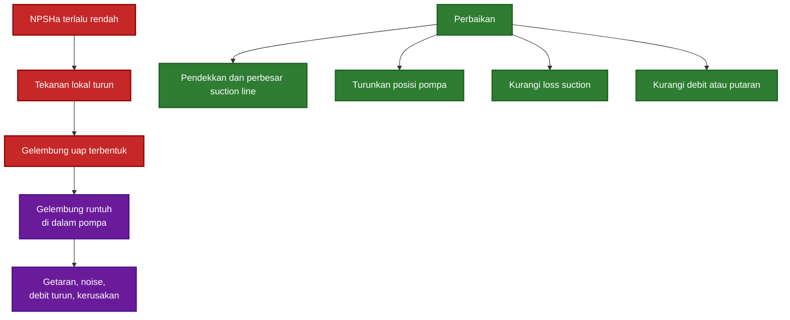
```mermaid id="kv7n5s"
flowchart TB
    A["NPSHa terlalu rendah"] --> B["Tekanan lokal turun"]
    B --> C["Gelembung uap terbentuk"]
    C --> D["Gelembung runtuh<br/>di dalam pompa"]
    D --> E["Getaran, noise,<br/>debit turun, kerusakan"]

    F["Perbaikan"] --> G["Pendekkan dan perbesar suction line"]
    F --> H["Turunkan posisi pompa"]
    F --> I["Kurangi loss suction"]
    F --> J["Kurangi debit atau putaran"]

    classDef risk fill:#C62828,color:#FFFFFF,stroke:#8E0000,stroke-width:2px;
    classDef cause fill:#EF6C00,color:#FFFFFF,stroke:#E65100,stroke-width:2px;
    classDef result fill:#6A1B9A,color:#FFFFFF,stroke:#4A148C,stroke-width:2px;
    classDef fix fill:#2E7D32,color:#FFFFFF,stroke:#1B5E20,stroke-width:2px;

    class A,B,C risk;
    class D,E result;
    class F,G,H,I,J fix;
```

> **Prinsip suction line:** jalur suction harus sesingkat, selurus, dan selapang mungkin. Kerugian energi pada suction lebih berbahaya dibanding kerugian yang sama pada discharge line karena dapat memicu kavitasi.

[**Kembali ke Atas**](#panduan-praktis-perhitungan-fluida-dalam-pipa-pvc)

---

## Ringkasan Bab 6

1. Diameter pipa ditentukan dari target debit, kecepatan praktis, pressure drop, dan kebutuhan distribusi.

2. Gunakan diameter dalam aktual:

$$
D_i
=

\sqrt{
\frac{4Q}{\pi V}
}
$$

3. Total head sistem dihitung dari:

$$
H_{\text{system}}
=

H_{\text{static}}
+
h_f
+
h_m
+
H_{\text{filter}}
+
H_{\text{outlet}}
$$

4. Rugi pipa lurus dihitung dengan Darcy–Weisbach:

$$
h_f
=

f_D
\frac{L}{D_i}
\frac{V^2}{2g}
$$

5. Rugi fitting dihitung dengan:

$$
h_m
=

K
\frac{V^2}{2g}
$$

6. Titik operasi pompa terjadi ketika:

$$
H_{\text{pump}}(Q)
=

H_{\text{system}}(Q)
$$

7. Daya hidraulik pompa adalah:

$$
P_{\text{hydraulic}}
=

\rho gQH
$$

8. Daya listrik aktual harus memperhitungkan efisiensi pompa dan motor:

$$
P_{\text{input}}
=

\frac{
\rho gQH
}{
\eta_{\text{pump}}
\eta_{\text{motor}}
}
$$

9. NPSH harus diperiksa terutama pada suction lift, air panas, pipa suction kecil, filter kotor, debit tinggi, dan lokasi dataran tinggi.

[**Kembali ke Atas**](#panduan-praktis-perhitungan-fluida-dalam-pipa-pvc)

---

## Rujukan Bab 6

- [R1] Crane Co. _Flow of Fluids Through Valves, Fittings, and Pipe: Technical Paper No. 410._
- [R2] Karassik, I. J., Messina, J. P., Cooper, P., dan Heald, C. C. _Pump Handbook._ McGraw-Hill.
- [R3] Hydraulic Institute. _Rotodynamic Pumps: Guideline for NPSH Margin._
- [R4] White, F. M. _Fluid Mechanics._ McGraw-Hill Education.
- [R5] Keller, J., dan Bliesner, R. D. _Sprinkle and Trickle Irrigation._ Van Nostrand Reinhold.
- [R6] Munson, B. R., Okiishi, T. H., Huebsch, W. W., dan Rothmayer, A. P. _Fundamentals of Fluid Mechanics._ Wiley.

---

# 7. Perhitungan Sistem Udara, Blower, dan Selang Aerasi

Sistem udara untuk aerasi kolam, bioflok, akuakultur, airlift, atau pengadukan sering terlihat lebih sederhana dibanding sistem air. Namun, kesalahan desain pada jalur udara dapat membuat blower bekerja berat, konsumsi listrik meningkat, dan distribusi gelembung menjadi tidak merata.

Perbedaan utama antara sistem air dan sistem udara adalah bahwa udara bersifat compressible. Debit volumetrik udara dapat berubah sepanjang pipa akibat perubahan tekanan dan temperatur, sedangkan laju massa tetap selama tidak ada kebocoran atau cabang tambahan.

Bab ini membahas cara menentukan kebutuhan tekanan blower, rugi tekanan pipa dan selang, titik operasi, serta estimasi daya blower.

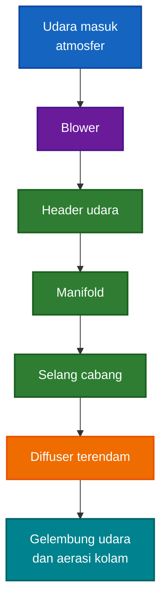
```mermaid id="air-system-overview"
flowchart TB
    A["Udara masuk<br/>atmosfer"] --> B["Blower"]
    B --> C["Header udara"]
    C --> D["Manifold"]
    D --> E["Selang cabang"]
    E --> F["Diffuser terendam"]

    F --> G["Gelembung udara<br/>dan aerasi kolam"]

    classDef source fill:#1565C0,color:#FFFFFF,stroke:#0D47A1,stroke-width:2px;
    classDef blower fill:#6A1B9A,color:#FFFFFF,stroke:#4A148C,stroke-width:2px;
    classDef pipe fill:#2E7D32,color:#FFFFFF,stroke:#1B5E20,stroke-width:2px;
    classDef outlet fill:#EF6C00,color:#FFFFFF,stroke:#E65100,stroke-width:2px;
    classDef result fill:#00838F,color:#FFFFFF,stroke:#006064,stroke-width:2px;

    class A source;
    class B blower;
    class C,D,E pipe;
    class F outlet;
    class G result;
```

## 7.1 Definisi Debit Udara

Debit udara harus selalu dinyatakan bersama kondisi referensinya. Angka “100 L/min” tidak cukup untuk desain blower sebelum diketahui apakah angka tersebut adalah debit aktual atau debit standar.

### 7.1.1 Actual L/min

Actual L/min adalah debit udara pada tekanan dan temperatur aktual di titik pengukuran.

Contoh:

$$
Q_{\text{actual}}
=

80\ \text{L/min}
$$

pada kondisi:

$$
P
=

120\ \text{kPa(a)}
$$

dan:

$$
T
=

30^\circ\text{C}
$$

Nilai tersebut hanya berlaku pada kondisi tekanan dan temperatur tersebut.

Debit aktual di dekat blower dapat berbeda dari debit aktual di diffuser karena udara mengembang saat tekanannya turun.

### 7.1.2 NL/min dan SLPM

NL/min berarti normal litre per minute. SLPM berarti standard litre per minute.

Kedua istilah tersebut menyatakan debit pada kondisi referensi. Namun, kondisi referensi tidak selalu sama antar produsen atau negara.

Contoh kondisi referensi yang mungkin digunakan:

| Istilah       | Contoh kondisi referensi       |
| ------------- | ------------------------------ |
| NL/min        | 0°C dan 101.325 kPa(a)         |
| SLPM          | 20°C dan 101.325 kPa(a)        |
| SCFM          | 60°F dan 14.7 psia             |
| Standard flow | Harus diperiksa pada datasheet |

Karena definisinya dapat berbeda, tulis kondisi referensi secara eksplisit.

Contoh penulisan yang benar:

$$
90\ \text{NL/min}
\text{ pada }
20^\circ\text{C},
101.325\ \text{kPa(a)},
\text{ udara kering}
$$

Contoh penulisan yang belum cukup:

$$
90\ \text{L/min}
$$

### 7.1.3 CFM dan SCFM

| Istilah | Arti                                                                         |
| ------- | ---------------------------------------------------------------------------- |
| CFM     | Cubic feet per minute pada kondisi aktual atau kondisi yang harus disebutkan |
| SCFM    | Standard cubic feet per minute pada kondisi standar tertentu                 |
| ACFM    | Actual cubic feet per minute pada kondisi aktual                             |
| NL/min  | Debit normal dalam litre per minute                                          |
| SLPM    | Standard litre per minute                                                    |

Konversi kasar:

$$
1\ \text{CFM}
\approx
28.32\ \text{L/min}
$$

Tetapi konversi ini hanya mengubah volume. Untuk membandingkan kapasitas blower dan diffuser, kondisi tekanan dan temperatur tetap harus diperiksa.

### 7.1.4 Hubungan Debit Aktual dan Debit Standar

Untuk udara ideal:

$$
\dot{m}
=

\rho Q
$$

Dengan:

$$
\rho
=

\frac{P_{\text{abs}}}
{R_{\text{air}}T}
$$

Maka hubungan antara debit standar dan debit aktual adalah:

$$
Q_{\text{actual}}
=

Q_{\text{standard}}
\left(
\frac{P_{\text{standard}}}
{P_{\text{actual}}}
\right)
\left(
\frac{T_{\text{actual}}}
{T_{\text{standard}}}
\right)
$$

Dengan:

- $Q_{\text{actual}}$ = debit udara pada tekanan dan temperatur aktual.
- $Q_{\text{standard}}$ = debit udara pada kondisi referensi.
- $P$ = tekanan absolut.
- $T$ = temperatur absolut.
- $R_{\text{air}} = 287.05\ \text{J/(kg·K)}$.

### Contoh Konversi Debit Udara

Diketahui kebutuhan sistem:

$$
Q_{\text{standard}}
=

90\ \text{NL/min}
$$

Kondisi referensi:

$$
P_{\text{standard}}
=

101.325\ \text{kPa(a)}
$$

$$
T_{\text{standard}}
=

293.15\ \text{K}
$$

Tekanan rata-rata jalur blower:

$$
P_{\text{actual}}
=

114\ \text{kPa(a)}
$$

Temperatur dianggap sama:

$$
T_{\text{actual}}
=

293.15\ \text{K}
$$

Maka:

$$
Q_{\text{actual}}
=

90
\left(
\frac{101.325}{114}
\right)
$$

$$
Q_{\text{actual}}
\approx
80.0\ \text{L/min}
$$

Jadi:

$$
\boxed{
90\ \text{NL/min}
\approx
80\ \text{L/min aktual}
}
$$

pada tekanan 114 kPa(a) dan temperatur yang sama.

> Untuk menghitung kecepatan dan pressure loss pipa udara, gunakan debit aktual pada tekanan lokal atau gunakan laju massa secara langsung.

[**Kembali ke Atas**](#panduan-praktis-perhitungan-fluida-dalam-pipa-pvc)

---

## 7.2 Pressure Loss pada Pipa dan Selang

Pressure loss udara terjadi karena gesekan sepanjang pipa atau selang, perubahan arah, valve, tee, check valve, manifold, dan diffuser.

Pada aliran gas dengan pressure drop kecil, Darcy–Weisbach dapat digunakan dengan densitas rata-rata.

$$
\Delta P_{\text{line}}
=

f_D
\frac{L}{D_i}
\frac{\rho_{\text{avg}}V_{\text{avg}}^2}{2}
$$

Dengan:

- $\Delta P_{\text{line}}$ = pressure loss pipa atau selang.
- $f_D$ = Darcy friction factor.
- $L$ = panjang pipa atau selang.
- $D_i$ = diameter dalam.
- $\rho_{\text{avg}}$ = densitas udara rata-rata.
- $V_{\text{avg}}$ = kecepatan rata-rata udara.

Kecepatan dihitung dari debit aktual:

$$
V
=

\frac{Q_{\text{actual}}}{A}
$$

Dengan:

$$
A
=

\frac{\pi D_i^2}{4}
$$

### 7.2.1 Diameter Kecil Sangat Meningkatkan Pressure Loss

Pada debit udara yang sama, diameter kecil meningkatkan kecepatan. Karena pressure loss dipengaruhi kecepatan kuadrat dan rasio panjang terhadap diameter, dampaknya sangat besar.

Secara pendekatan kasar untuk aliran turbulen:

$$
\Delta P
\propto
\frac{Q^2}{D_i^5}
$$

Persamaan tersebut mengasumsikan perubahan friction factor kecil. Dalam praktik, $f_D$ juga berubah, tetapi kecenderungan utamanya tetap sama: sedikit penurunan diameter dapat menaikkan pressure loss secara drastis.

### Contoh Pengaruh Diameter Selang

Asumsi:

- Debit udara:

$$
Q_{\text{standard}}
=

60\ \text{NL/min}
$$

- Tekanan udara rata-rata:

$$
P_{\text{avg}}
=

115\ \text{kPa(a)}
$$

- Temperatur:

$$
T
=

20^\circ\text{C}
$$

- Debit aktual sekitar:

$$
Q_{\text{actual}}
\approx
52.9\ \text{L/min}
$$

- Panjang selang:

$$
L
=

10\ \text{m}
$$

- Selang dianggap lurus dan halus.

| Diameter dalam selang | Kecepatan | Estimasi pressure loss |
| --------------------: | --------: | ---------------------: |
|                  8 mm |  17.5 m/s |        sekitar 8.1 kPa |
|                 10 mm |  11.2 m/s |        sekitar 2.8 kPa |
|                 16 mm |   4.4 m/s |        sekitar 0.3 kPa |

Tabel tersebut menunjukkan bahwa meningkatkan diameter selang dari 8 mm menjadi 16 mm dapat menurunkan pressure loss puluhan kali lipat.

Nilai aktual pada selang fleksibel dapat lebih tinggi karena:

- Dinding bagian dalam tidak sehalus PVC.
- Selang melengkung atau tertekuk.
- Sambungan memiliki penyempitan.
- Selang mengalami deformasi.
- Diameter dalam aktual lebih kecil dari spesifikasi.
- Ada air atau kondensat di dalam jalur udara.

> Untuk selang fleksibel, gunakan data pressure loss produsen bila tersedia. Jangan selalu menggunakan roughness PVC sebagai asumsi akhir.

### 7.2.2 Densitas Udara dan Tekanan Absolut

Densitas udara harus dihitung dari tekanan absolut.

$$
P_{\text{abs}}
=

P_{\text{gauge}}
+
P_{\text{atm}}
$$

Untuk udara ideal:

$$
\rho_{\text{air}}
=

\frac{P_{\text{abs}}}
{R_{\text{air}}T}
$$

Contoh:

$$
P_{\text{gauge}}
=

15\ \text{kPa(g)}
$$

$$
P_{\text{atm}}
=

101.325\ \text{kPa(a)}
$$

Maka:

$$
P_{\text{abs}}
=

116.325\ \text{kPa(a)}
$$

Pada temperatur:

$$
T
=

293.15\ \text{K}
$$

densitas udara:

$$
\rho
=

\frac{116325}
{287.05
\times
293.15}
$$

$$
\rho
\approx
1.38\ \text{kg/m}^3
$$

Menggunakan densitas udara atmosfer:

$$
\rho
\approx
1.20\ \text{kg/m}^3
$$

pada kondisi tersebut akan menghasilkan error pada kecepatan aktual, Reynolds number, dan pressure loss.

### 7.2.3 Kapan Pendekatan Densitas Rata-Rata Masih Layak

Pendekatan densitas rata-rata biasanya cukup untuk estimasi awal bila:

$$
\frac{\Delta P}
{P_{\text{abs,avg}}}
\lesssim
0.1
$$

dan kecepatan udara tidak mendekati kecepatan suara.

Sebagai panduan:

$$
M
=

\frac{V}{a}
<
0.3
$$

Dengan:

- $M$ = Mach number.
- $V$ = kecepatan udara.
- $a$ = kecepatan suara.

Pada kondisi tersebut, perhitungan Darcy–Weisbach dengan densitas rata-rata umumnya cukup untuk desain awal sistem aerasi tekanan rendah.

### 7.2.4 Perhitungan Bertahap untuk Pressure Drop Lebih Besar

Jika pressure drop cukup besar, pipa panjang, atau diameter kecil, jangan gunakan satu nilai densitas untuk seluruh jalur.

Gunakan prosedur bertahap:

1. Tentukan debit standar atau laju massa udara.
2. Tebak tekanan pada tiap segmen.
3. Hitung densitas lokal dari tekanan absolut dan temperatur.
4. Hitung debit aktual pada segmen tersebut.
5. Hitung kecepatan, Reynolds number, dan friction factor.
6. Hitung pressure loss tiap segmen.
7. Perbarui tekanan pada titik berikutnya.
8. Ulangi sampai tekanan dan debit konsisten.

Untuk aliran gas ideal, isothermal, pipa diameter konstan, dan friction factor yang dianggap tetap, hubungan pressure-squared dapat digunakan:

$$
P_1^2
-----

# P_2^2

f_D
\frac{L}{D_i}
\frac{
\dot{m}^2RT
}{
A^2
}
$$

Dengan:

- $P_1$ = tekanan absolut upstream.
- $P_2$ = tekanan absolut downstream.
- $\dot{m}$ = laju massa udara.
- $R$ = konstanta gas udara.
- $T$ = temperatur absolut.
- $A$ = luas penampang pipa.

Persamaan tersebut tidak mencakup fitting, perubahan temperatur besar, atau kondisi mendekati choked flow. Untuk sistem tersebut, gunakan segmentasi, model compressible flow yang lebih lengkap, atau data produsen.

### 7.2.5 Rugi Tekan pada Manifold Bercabang

Pada manifold, debit header tidak tetap sepanjang jalur.

Misalnya terdapat enam diffuser dengan debit sama. Aliran di segmen header pertama membawa seluruh debit. Setelah cabang pertama, debit header berkurang. Setelah cabang kedua, debit berkurang lagi.

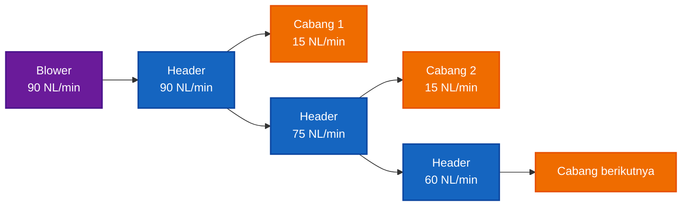
```mermaid id="air-manifold-flow"
flowchart LR
    A["Blower<br/>90 NL/min"] --> B["Header<br/>90 NL/min"]
    B --> C["Cabang 1<br/>15 NL/min"]
    B --> D["Header<br/>75 NL/min"]
    D --> E["Cabang 2<br/>15 NL/min"]
    D --> F["Header<br/>60 NL/min"]
    F --> G["Cabang berikutnya"]

    classDef blower fill:#6A1B9A,color:#FFFFFF,stroke:#4A148C,stroke-width:2px;
    classDef header fill:#1565C0,color:#FFFFFF,stroke:#0D47A1,stroke-width:2px;
    classDef branch fill:#EF6C00,color:#FFFFFF,stroke:#E65100,stroke-width:2px;

    class A blower;
    class B,D,F header;
    class C,E,G branch;
```

Setiap segmen header harus dihitung memakai debit lokalnya.

Menganggap seluruh panjang header membawa debit total akan menghasilkan hasil konservatif, tetapi dapat terlalu tinggi. Sebaliknya, memakai debit cabang untuk seluruh header akan menghasilkan pressure loss terlalu rendah.

[**Kembali ke Atas**](#panduan-praktis-perhitungan-fluida-dalam-pipa-pvc)

---

## 7.3 Total Pressure Requirement Blower

Blower harus menghasilkan tekanan yang cukup untuk mengatasi seluruh hambatan sistem pada debit target.

Persamaan dasar:

$$
\Delta P_{\text{total}}
=

\Delta P_{\text{hydrostatic}}
+
\Delta P_{\text{pipe}}
+
\Delta P_{\text{hose}}
+
\Delta P_{\text{fitting}}
+
\Delta P_{\text{diffuser}}
$$

Dengan:

- $\Delta P_{\text{hydrostatic}}$ = tekanan air pada kedalaman diffuser.
- $\Delta P_{\text{pipe}}$ = pressure loss header atau pipa utama.
- $\Delta P_{\text{hose}}$ = pressure loss selang cabang.
- $\Delta P_{\text{fitting}}$ = loss dari elbow, tee, valve, check valve, manifold, dan komponen lain.
- $\Delta P_{\text{diffuser}}$ = pressure drop diffuser pada debit tertentu.

### 7.3.1 Tekanan Hidrostatik

Tekanan hidrostatik pada kedalaman diffuser:

$$
\Delta P_{\text{hydrostatic}}
=

\rho_{\text{water}}gh
$$

Dengan:

- $\rho_{\text{water}}$ = densitas air.
- $g$ = percepatan gravitasi.
- $h$ = kedalaman diffuser dari permukaan air.

Untuk air sekitar 20°C:

$$
1\ \text{m kedalaman}
\approx
9.79\ \text{kPa}
$$

Contoh diffuser pada kedalaman:

$$
h
=

1.2\ \text{m}
$$

Maka:

$$
\Delta P_{\text{hydrostatic}}
=

998.2
\times
9.80665
\times
1.2
$$

$$
\Delta P_{\text{hydrostatic}}
\approx
11.75\ \text{kPa}
$$

Tekanan hidrostatik adalah tekanan minimum agar udara dapat mulai keluar dari diffuser pada kedalaman tersebut.

### 7.3.2 Pressure Drop Diffuser

Pressure drop diffuser adalah tambahan tekanan yang diperlukan agar udara dapat melewati membran, pori, batu aerasi, atau lubang diffuser.

Hubungan yang benar:

$$
\Delta P_{\text{diffuser}}
=

## P_{\text{inside diffuser}}

P_{\text{outside water}}
$$

Tekanan air luar diffuser adalah:

$$
P_{\text{outside water}}
=

P_{\text{atm}}
+
\rho_{\text{water}}gh
$$

Jadi tekanan hidrostatik dan pressure drop diffuser adalah dua komponen berbeda.

> Jangan menggunakan tekanan hidrostatik sebagai beda tekanan orifice diffuser. Tekanan hidrostatik hanya menunjukkan tekanan air di luar diffuser.

Untuk diffuser membran EPDM, batu aerasi, dan microbubble diffuser, gunakan kurva produsen:

$$
\Delta P_{\text{diffuser}}
=

f(Q_{\text{air}})
$$

Nilai pressure drop meningkat ketika diffuser mengalami:

- Fouling.
- Kerak mineral.
- Biofilm.
- Penuaan membran.
- Penyumbatan pori.
- Kerusakan mekanis.

### 7.3.3 Contoh Kebutuhan Tekanan Blower

Diketahui sistem aerasi:

| Parameter                     |                      Nilai |
| ----------------------------- | -------------------------: |
| Jumlah diffuser               |                     6 unit |
| Target udara per diffuser     |                  15 NL/min |
| Total kebutuhan udara         |                  90 NL/min |
| Kedalaman diffuser            |                      1.0 m |
| Header PVC                    |             20 mm ID, 12 m |
| Selang cabang                 | 12 mm ID, 3 m per diffuser |
| Pressure drop diffuser bersih |     2.0 kPa pada 15 NL/min |
| Pressure loss header          |           sekitar 0.11 kPa |
| Pressure loss selang cabang   |           sekitar 0.10 kPa |
| Fitting, valve, tee           |           sekitar 0.10 kPa |

Kebutuhan tekanan hidrostatik:

$$
\Delta P_{\text{hydrostatic}}
=

998.2
\times
9.80665
\times
1.0
$$

$$
\Delta P_{\text{hydrostatic}}
\approx
9.79\ \text{kPa}
$$

Total pressure bersih:

$$
\Delta P_{\text{total,clean}}
=

9.79
+
2.00
+
0.11
+
0.10
+
0.10
$$

$$
\Delta P_{\text{total,clean}}
\approx
12.10\ \text{kPa}
$$

Misalkan data produsen atau pengalaman operasi menunjukkan kebutuhan margin fouling:

$$
\Delta P_{\text{margin}}
=

1.5\ \text{kPa}
$$

Maka pressure requirement desain:

$$
\Delta P_{\text{design}}
=

12.10
+
1.50
$$

$$
\boxed{
\Delta P_{\text{design}}
\approx
13.6\ \text{kPa(g)}
}
$$

Blower harus mampu memberikan:

$$
90\ \text{NL/min}
$$

pada sekitar:

$$
13.6\ \text{kPa(g)}
$$

bukan hanya pada kondisi free air.

### 7.3.4 Variasi Kedalaman Air

Perubahan kedalaman air memengaruhi kebutuhan tekanan blower secara langsung.

Untuk perubahan kedalaman:

$$
\Delta h
=

0.1\ \text{m}
$$

maka perubahan tekanan hidrostatik sekitar:

$$
\Delta P
=

998.2
\times
9.80665
\times
0.1
$$

$$
\Delta P
\approx
0.98\ \text{kPa}
$$

Artinya, perubahan muka air 10 cm dapat mengubah kebutuhan tekanan hampir 1 kPa.

Pada sistem aerasi dangkal, perubahan tersebut mungkin kecil. Pada kolam dalam atau sistem dengan blower bertekanan rendah, pengaruhnya dapat cukup signifikan.

### 7.3.5 Margin Desain

Margin desain harus berbasis penyebab fisik, bukan sekadar menambah angka arbitrer.

| Sumber margin                  | Dasar penambahan                                            |
| ------------------------------ | ----------------------------------------------------------- |
| Fouling diffuser               | Kurva clean-to-dirty dari produsen atau pengalaman lapangan |
| Penuaan selang                 | Kenaikan roughness, deformasi, atau penyempitan             |
| Kenaikan muka air              | Kedalaman operasi maksimum                                  |
| Filter udara kotor             | Pressure drop filter intake                                 |
| Ketidakpastian fitting         | Data $K$ yang belum pasti                                   |
| Penambahan diffuser masa depan | Target ekspansi sistem                                      |
| Variasi temperatur             | Perubahan densitas udara dan performa blower                |

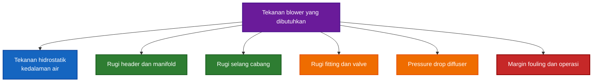
```mermaid id="blower-pressure-components"
flowchart TB
    A["Tekanan blower yang dibutuhkan"] --> B["Tekanan hidrostatik<br/>kedalaman air"]
    A --> C["Rugi header dan manifold"]
    A --> D["Rugi selang cabang"]
    A --> E["Rugi fitting dan valve"]
    A --> F["Pressure drop diffuser"]
    A --> G["Margin fouling dan operasi"]

    classDef root fill:#6A1B9A,color:#FFFFFF,stroke:#4A148C,stroke-width:2px;
    classDef hydro fill:#1565C0,color:#FFFFFF,stroke:#0D47A1,stroke-width:2px;
    classDef line fill:#2E7D32,color:#FFFFFF,stroke:#1B5E20,stroke-width:2px;
    classDef component fill:#EF6C00,color:#FFFFFF,stroke:#E65100,stroke-width:2px;
    classDef margin fill:#C62828,color:#FFFFFF,stroke:#8E0000,stroke-width:2px;

    class A root;
    class B hydro;
    class C,D line;
    class E,F component;
    class G margin;
```

[**Kembali ke Atas**](#panduan-praktis-perhitungan-fluida-dalam-pipa-pvc)

---

## 7.4 Titik Operasi Blower

Blower tidak menghasilkan debit yang tetap pada semua tekanan. Debit aktual ditentukan oleh pertemuan antara kurva blower dan kurva sistem.

Secara prinsip:

$$
\Delta P_{\text{blower}}(Q)
=

\Delta P_{\text{system}}(Q)
$$

Titik tersebut disebut titik operasi blower.

### 7.4.1 Kurva Sistem Blower

Kurva sistem aerasi dapat ditulis:

$$
\Delta P_{\text{system}}(Q)
=

\Delta P_{\text{hydrostatic}}
+
\Delta P_{\text{diffuser}}(Q)
+
\Delta P_{\text{line}}(Q)
+
\Delta P_{\text{fitting}}(Q)
$$

Tekanan hidrostatik tetap selama kedalaman air tetap.

Pressure loss pipa, selang, dan fitting umumnya meningkat mendekati kuadrat debit:

$$
\Delta P_{\text{line}}
\propto
Q^2
$$

Pressure drop diffuser harus mengikuti kurva produsen atau hasil pengujian.

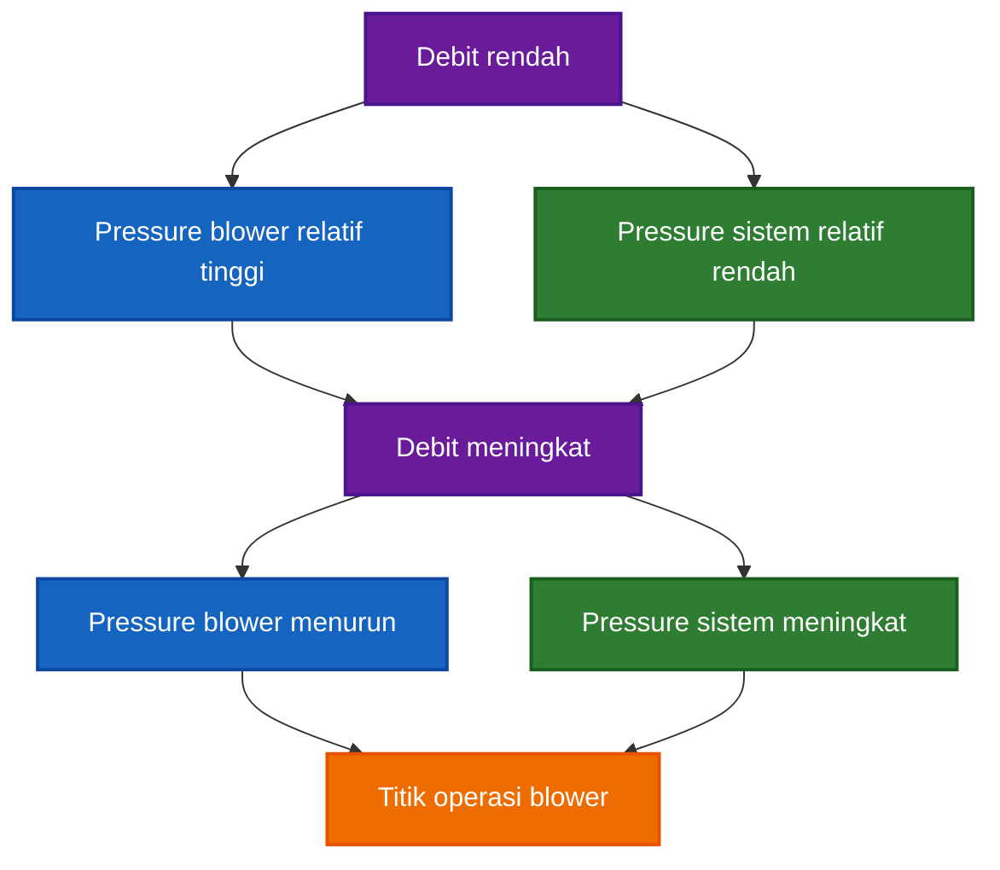
```mermaid id="blower-operating-point"
flowchart TB
    A["Debit rendah"] --> B["Pressure blower relatif tinggi"]
    A --> C["Pressure sistem relatif rendah"]

    B --> D["Debit meningkat"]
    C --> D

    D --> E["Pressure blower menurun"]
    D --> F["Pressure sistem meningkat"]

    E --> G["Titik operasi blower"]
    F --> G

    classDef source fill:#6A1B9A,color:#FFFFFF,stroke:#4A148C,stroke-width:2px;
    classDef blower fill:#1565C0,color:#FFFFFF,stroke:#0D47A1,stroke-width:2px;
    classDef system fill:#2E7D32,color:#FFFFFF,stroke:#1B5E20,stroke-width:2px;
    classDef result fill:#EF6C00,color:#FFFFFF,stroke:#E65100,stroke-width:2px;

    class A,D source;
    class B,E blower;
    class C,F system;
    class G result;
```

### 7.4.2 Free Air Flow Bukan Debit Operasi

Blower sering memiliki spesifikasi “free air flow” atau debit pada tekanan sangat rendah.

Contoh:

$$
Q_{\text{free air}}
=

150\ \text{L/min}
$$

Nilai tersebut tidak berarti blower akan tetap memberikan 150 L/min ketika harus mengatasi:

- Kedalaman air.
- Pressure drop diffuser.
- Header dan selang panjang.
- Valve.
- Check valve.
- Filter intake.
- Fouling diffuser.

Yang dibutuhkan adalah debit blower pada pressure requirement aktual.

### 7.4.3 Konsistensi Basis Debit

Saat membaca kurva blower, periksa apakah kapasitas blower dinyatakan sebagai:

- Actual flow di inlet blower.
- Actual flow pada discharge.
- Standard flow.
- CFM.
- SCFM.
- L/min.
- m³/h.

Kurva blower dan kebutuhan diffuser harus dibandingkan dalam basis yang sama.

Pendekatan paling aman adalah menggunakan laju massa:

$$
\dot{m}
=

\rho Q
$$

Atau, gunakan debit standar dengan kondisi referensi yang jelas.

### 7.4.4 Dampak Valve

Valve pada jalur udara dapat digunakan untuk balancing cabang atau mengurangi debit berlebih.

Ketika valve ditutup sebagian:

$$
K_{\text{valve}}
\uparrow
$$

Maka:

$$
\Delta P_{\text{valve}}
=

K_{\text{valve}}
\frac{\rho V^2}{2}
$$

meningkat.

Akibatnya kurva sistem bergeser ke atas dan debit total blower berubah.

Pada manifold bercabang, penutupan valve cabang tertentu dapat meningkatkan aliran pada cabang lain. Oleh karena itu balancing harus dilakukan bertahap sambil mengamati gelembung, pressure manifold, dan bila memungkinkan flow meter tiap cabang.

> Valve dapat dipakai untuk balancing, tetapi bukan pengganti diameter header atau selang yang benar.

### 7.4.5 Dampak Fouling Diffuser

Fouling diffuser meningkatkan:

$$
\Delta P_{\text{diffuser}}
$$

Kurva sistem bergeser ke atas. Titik operasi blower akan berubah menjadi debit yang lebih rendah atau tekanan yang lebih tinggi, tergantung karakteristik blower.

Gejala lapangan:

- Gelembung semakin kecil atau tidak merata.
- Diffuser jauh mulai lemah.
- Temperatur blower meningkat.
- Arus motor berubah.
- Tekanan discharge blower naik.
- Dissolved oxygen atau mixing kolam menurun.

Untuk sistem kritis, pasang pressure gauge pada discharge blower atau manifold utama. Tekanan yang meningkat dari waktu ke waktu dapat menjadi indikator fouling.

### 7.4.6 Pemilihan Blower

Blower dipilih berdasarkan kemampuan memberi debit target pada pressure desain.

| Parameter pemilihan  | Pertanyaan yang harus dijawab                                  |
| -------------------- | -------------------------------------------------------------- |
| Debit target         | Berapa NL/min atau actual L/min yang dibutuhkan?               |
| Kondisi referensi    | Pada tekanan dan temperatur berapa debit dinyatakan?           |
| Tekanan desain       | Berapa kPa(g) total sistem saat kondisi terburuk?              |
| Kurva blower         | Apakah blower memberi debit target pada tekanan tersebut?      |
| Daya                 | Berapa konsumsi listrik pada titik operasi?                    |
| Duty cycle           | Apakah cocok untuk operasi kontinu?                            |
| Margin               | Apakah masih cukup saat diffuser fouling atau air lebih dalam? |
| Kebisingan dan panas | Apakah sesuai lokasi pemasangan?                               |

[**Kembali ke Atas**](#panduan-praktis-perhitungan-fluida-dalam-pipa-pvc)

---

## 7.5 Daya Blower

Daya blower berbeda dari daya pompa air karena udara mengalami kompresi. Untuk sistem aerasi bertekanan rendah, pendekatan daya fluida berikut dapat digunakan sebagai estimasi awal.

$$
P_{\text{air}}
\approx
\Delta P_{\text{total}}
Q_{\text{actual}}
$$

Dengan:

- $P_{\text{air}}$ = daya yang diberikan ke udara.
- $\Delta P_{\text{total}}$ = tekanan diferensial sistem.
- $Q_{\text{actual}}$ = debit aktual pada kondisi tekanan rata-rata.

Pendekatan tersebut cukup baik untuk pressure ratio rendah.

### 7.5.1 Daya Kompresi Isothermal

Untuk kompresi udara ideal secara isothermal:

$$
P_{\text{isothermal}}
=

\dot{m}
R_{\text{air}}
T_1
\ln
\left(
\frac{P_2}{P_1}
\right)
$$

Dengan:

- $\dot{m}$ = laju massa udara.
- $R_{\text{air}}$ = konstanta gas udara.
- $T_1$ = temperatur udara inlet.
- $P_1$ = tekanan absolut inlet.
- $P_2$ = tekanan absolut outlet.

Persamaan tersebut memberi batas teoritis yang optimistis karena proses nyata tidak sepenuhnya isothermal.

### 7.5.2 Daya Kompresi Adiabatik Ideal

Untuk kompresi adiabatik ideal:

$$
P_{\text{adiabatic}}
=

\dot{m}
\frac{\gamma}{\gamma-1}
R_{\text{air}}
T_1
\left[
\left(
\frac{P_2}{P_1}
\right)^{
\frac{\gamma-1}{\gamma}
}
-

1
\right]
$$

Dengan:

$$
\gamma
\approx
1.4
$$

untuk udara.

Nilai nyata berada di atas kebutuhan teoritis karena kerugian mekanis, kebocoran internal, slip, panas, dan efisiensi blower.

### 7.5.3 Daya Listrik Blower

Estimasi daya listrik dapat ditulis:

$$
P_{\text{input}}
=

\frac{
P_{\text{air}}
}{
\eta_{\text{blower}}
\eta_{\text{motor}}
}
$$

Dengan:

- $\eta_{\text{blower}}$ = efisiensi blower.
- $\eta_{\text{motor}}$ = efisiensi motor.

Jika memakai belt drive atau inverter:

$$
P_{\text{input}}
=

\frac{
P_{\text{air}}
}{
\eta_{\text{blower}}
\eta_{\text{motor}}
\eta_{\text{drive}}
}
$$

Nilai efisiensi harus diambil dari kurva atau datasheet peralatan bila tersedia.

### 7.5.4 Contoh Estimasi Daya Blower

Gunakan contoh sebelumnya:

$$
Q_{\text{standard}}
=

90\ \text{NL/min}
$$

Pada kondisi referensi 20°C dan 101.325 kPa(a):

$$
Q_{\text{standard}}
=

0.0015\ \text{m}^3/\text{s}
$$

Laju massa udara:

$$
\dot{m}
=

\frac{
P_{\text{standard}}
Q_{\text{standard}}
}{
R_{\text{air}}T
}
$$

$$
\dot{m}
=

\frac{
101325
\times
0.0015
}{
287.05
\times
293.15
}
$$

$$
\dot{m}
\approx
0.00181\ \text{kg/s}
$$

Pressure desain:

$$
\Delta P_{\text{design}}
=

13.6\ \text{kPa(g)}
$$

Maka:

$$
P_1
=

101.325\ \text{kPa(a)}
$$

$$
P_2
=

101.325
+
13.6
=

114.925\ \text{kPa(a)}
$$

Daya isothermal ideal:

$$
P_{\text{isothermal}}
=

0.00181
\times
287.05
\times
293.15
\times
\ln
\left(
\frac{114.925}{101.325}
\right)
$$

$$
P_{\text{isothermal}}
\approx
19.1\ \text{W}
$$

Misalkan:

$$
\eta_{\text{blower}}
=

0.45
$$

dan:

$$
\eta_{\text{motor}}
=

0.80
$$

Maka estimasi daya listrik:

$$
P_{\text{input}}
=

\frac{
19.1
}{
0.45
\times
0.80
}
$$

$$
P_{\text{input}}
\approx
53\ \text{W}
$$

Nilai ini hanya menunjukkan orde kebutuhan energi teoritis. Pemilihan blower tetap harus menggunakan kurva daya produsen pada titik operasi aktual.

### 7.5.5 Blower Aerasi dan Kompresor Udara Tekan

| Karakteristik        | Blower aerasi                     | Kompresor udara tekan                   |
| -------------------- | --------------------------------- | --------------------------------------- |
| Fokus utama          | Debit besar pada tekanan rendah   | Tekanan lebih tinggi                    |
| Aplikasi umum        | Diffuser, kolam, bioflok, airlift | Pneumatic tools, tangki udara, aktuator |
| Pressure ratio       | Relatif rendah                    | Lebih tinggi                            |
| Debit                | Umumnya besar secara volumetrik   | Bergantung tipe kompresor               |
| Temperatur discharge | Tetap perlu diperhatikan          | Cenderung lebih kritis                  |
| Dasar pemilihan      | Kurva debit–tekanan aerasi        | Tekanan kerja, kapasitas, duty cycle    |

Blower aerasi tidak otomatis cocok untuk udara tekan. Sebaliknya, kompresor udara tekan tidak selalu efisien untuk aerasi volume besar bertekanan rendah.

> Pilih peralatan berdasarkan titik operasi, bukan hanya berdasarkan watt, HP, atau debit free-air.

---

## Ringkasan Bab 7

1. Debit udara harus selalu menyebutkan basisnya: actual L/min, NL/min, SLPM, CFM, atau SCFM.

2. Tekanan absolut wajib digunakan untuk menghitung densitas udara:

$$
P_{\text{abs}}
=

P_{\text{gauge}}
+
P_{\text{atm}}
$$

3. Pressure loss pipa dan selang udara dapat dihitung dengan Darcy–Weisbach pada pressure drop kecil:

$$
\Delta P_{\text{line}}
=

f_D
\frac{L}{D_i}
\frac{\rho V^2}{2}
$$

4. Diameter kecil pada selang dapat meningkatkan pressure loss secara sangat besar.

5. Total pressure blower terdiri dari tekanan hidrostatik, rugi pipa, rugi selang, fitting, diffuser, dan margin operasi:

$$
\Delta P_{\text{total}}
=

\Delta P_{\text{hydrostatic}}
+
\Delta P_{\text{pipe}}
+
\Delta P_{\text{hose}}
+
\Delta P_{\text{fitting}}
+
\Delta P_{\text{diffuser}}
$$

6. Tekanan hidrostatik kedalaman air tidak sama dengan pressure drop diffuser.

7. Blower bekerja pada titik perpotongan kurva blower dan kurva sistem:

$$
\Delta P_{\text{blower}}(Q)
=

\Delta P_{\text{system}}(Q)
$$

8. Daya teoritis blower dapat diperkirakan dari kompresi udara, tetapi kurva daya produsen tetap menjadi dasar pemilihan akhir.

[**Kembali ke Atas**](#panduan-praktis-perhitungan-fluida-dalam-pipa-pvc)

---

## Rujukan Bab 7

- [R1] Crane Co. _Flow of Fluids Through Valves, Fittings, and Pipe: Technical Paper No. 410._
- [R2] Perry, R. H., dan Green, D. W. _Perry’s Chemical Engineers’ Handbook._ McGraw-Hill.
- [R3] ASHRAE. _ASHRAE Handbook—Fundamentals._
- [R4] CAGI. _Compressed Air and Gas Handbook._
- [R5] ISO 1217. _Displacement Compressors — Acceptance Tests._
- [R6] Idelchik, I. E. _Handbook of Hydraulic Resistance._
- [R7] Water Environment Federation. _Design of Water Resource Recovery Facilities._

---

# 8. Nozzle, Needle, Lubang Manifold, dan Diffuser

Nozzle, needle, lubang manifold, dan diffuser sama-sama memiliki bukaan kecil, tetapi tidak boleh dihitung dengan satu rumus yang sama tanpa memeriksa geometri dan kondisi alirannya.

Perbedaan utamanya adalah mekanisme dominan:

| Komponen                         | Mekanisme dominan                          | Pendekatan awal                                   |
| -------------------------------- | ------------------------------------------ | ------------------------------------------------- |
| Nozzle air                       | Konversi tekanan menjadi kecepatan jet     | Orifice/nozzle equation atau kurva produsen       |
| Needle atau tubing kecil panjang | Gesekan sepanjang dinding tube             | Hagen–Poiseuille atau Darcy–Weisbach              |
| Lubang manifold udara            | Kontraksi aliran gas melalui lubang pendek | Orifice gas, dengan pemeriksaan tekanan absolut   |
| Diffuser batu atau EPDM          | Media berpori atau membran elastis         | Kurva pressure drop produsen                      |
| Lubang PVC terendam              | Orifice pendek dengan tekanan air luar     | Orifice pendek, data uji, atau pendekatan empiris |

> **Prinsip utama:** tekanan hidrostatik air di luar diffuser bukan otomatis beda tekanan yang melintasi lubang. Beda tekanan aktual harus dihitung dari tekanan internal manifold dikurangi tekanan air di sisi luar lubang.

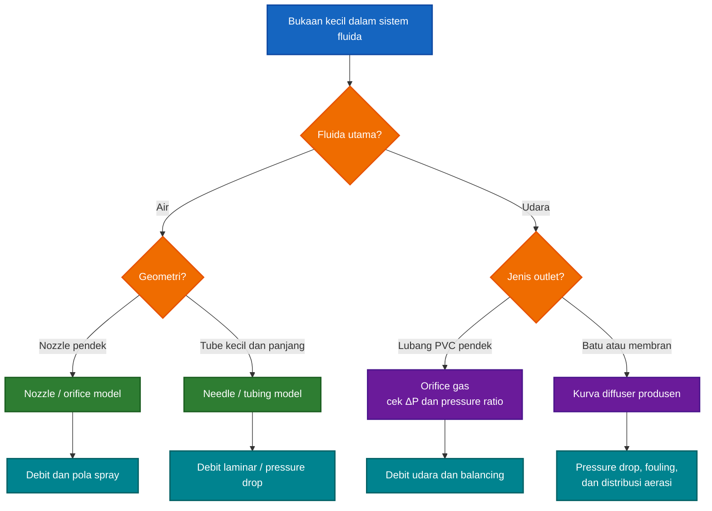
```mermaid id="component-selection-map"
flowchart TB
    A["Bukaan kecil dalam sistem fluida"] --> B{"Fluida utama?"}

    B -->|"Air"| C{"Geometri?"}
    B -->|"Udara"| D{"Jenis outlet?"}

    C -->|"Nozzle pendek"| E["Nozzle / orifice model"]
    C -->|"Tube kecil dan panjang"| F["Needle / tubing model"]

    D -->|"Lubang PVC pendek"| G["Orifice gas<br/>cek ΔP dan pressure ratio"]
    D -->|"Batu atau membran"| H["Kurva diffuser produsen"]

    E --> I["Debit dan pola spray"]
    F --> J["Debit laminar / pressure drop"]
    G --> K["Debit udara dan balancing"]
    H --> L["Pressure drop, fouling,<br/>dan distribusi aerasi"]

    classDef start fill:#1565C0,color:#FFFFFF,stroke:#0D47A1,stroke-width:2px;
    classDef decision fill:#EF6C00,color:#FFFFFF,stroke:#E65100,stroke-width:2px;
    classDef liquid fill:#2E7D32,color:#FFFFFF,stroke:#1B5E20,stroke-width:2px;
    classDef gas fill:#6A1B9A,color:#FFFFFF,stroke:#4A148C,stroke-width:2px;
    classDef result fill:#00838F,color:#FFFFFF,stroke:#006064,stroke-width:2px;

    class A start;
    class B,C,D decision;
    class E,F liquid;
    class G,H gas;
    class I,J,K,L result;
```

## 8.1 Nozzle Air

Nozzle air digunakan untuk mengubah energi tekanan menjadi kecepatan aliran. Dalam pertanian, nozzle umum digunakan pada:

- Sprayer pestisida.
- Sistem kabut atau misting.
- Pendinginan greenhouse.
- Pencucian kandang.
- Penyiraman tanaman.
- Spray aeration.
- Jet pencampuran air atau nutrisi.

### 8.1.1 Konversi Tekanan Menjadi Kecepatan

Untuk nozzle ideal, tekanan diferensial dikonversi menjadi kecepatan jet:

$$
V_{\text{ideal}}
=

\sqrt{
\frac{2\Delta P}{\rho}
}
$$

Dengan:

- $V_{\text{ideal}}$ = kecepatan jet ideal, dalam m/s.
- $\Delta P$ = beda tekanan antara inlet nozzle dan sisi keluar, dalam Pa.
- $\rho$ = densitas cairan, dalam kg/m³.

Untuk nozzle membuang air ke atmosfer:

$$
\Delta P
\approx
P_{\text{upstream,gauge}}
$$

dengan syarat tekanan diukur saat sistem sedang mengalir.

Pada nozzle nyata, sebagian energi hilang akibat kontraksi, gesekan internal, dan bentuk nozzle. Debit aktual dihitung menggunakan discharge coefficient:

$$
Q
=

C_dA
\sqrt{
\frac{2\Delta P}{\rho}
}
$$

Luas penampang nozzle bulat:

$$
A
=

\frac{\pi d^2}{4}
$$

Dengan:

- $Q$ = debit nozzle, dalam $\text{m}^3/\text{s}$.
- $C_d$ = discharge coefficient.
- $A$ = luas bukaan nozzle.
- $d$ = diameter lubang nozzle.
- $\Delta P$ = beda tekanan aktual.
- $\rho$ = densitas cairan.

### 8.1.2 Koefisien Discharge

Koefisien discharge didefinisikan sebagai:

$$
C_d
=

\frac{Q_{\text{actual}}}
{Q_{\text{ideal}}}
$$

Nilai $C_d$ bukan angka universal. Nilainya dipengaruhi oleh:

- Bentuk nozzle.
- Ketebalan dinding nozzle.
- Tepi lubang tajam atau membulat.
- Kekasaran internal.
- Reynolds number.
- Kondisi aliran sebelum nozzle.
- Adanya swirl chamber.
- Viskositas cairan.
- Kotoran atau penyumbatan.

Untuk lubang tajam sederhana, nilai awal:

$$
C_d
\approx
0.60
\text{ sampai }
0.65
$$

dapat digunakan sebagai estimasi kasar. Namun, untuk nozzle sprayer, misting nozzle, emitter, atau nozzle dengan pola semprot tertentu, gunakan kurva produsen.

> Debit dapat diprediksi dengan persamaan orifice. Pola semprot, ukuran droplet, sudut semprotan, dan kualitas atomisasi tidak dapat diprediksi hanya dari persamaan tersebut.

### 8.1.3 Contoh Perhitungan Spray Sederhana

Diketahui:

- Diameter nozzle:

$$
d
=

# 2.0\ \text{mm}

0.002\ \text{m}
$$

- Tekanan operasi nozzle:

$$
\Delta P
=

# 200\ \text{kPa}

200000\ \text{Pa}
$$

- Densitas air:

$$
\rho
=

998.2\ \text{kg/m}^3
$$

- Discharge coefficient:

$$
C_d
=

0.62
$$

Luas nozzle:

$$
A
=

\frac{
\pi
\left(
0.002
\right)^2
}{4}
$$

$$
A
=

3.142
\times
10^{-6}\ \text{m}^2
$$

Kecepatan jet ideal:

$$
V_{\text{ideal}}
=

\sqrt{
\frac{
2
\times
200000
}{
998.2
}
}
$$

$$
V_{\text{ideal}}
\approx
20.0\ \text{m/s}
$$

Debit aktual:

$$
Q
=

0.62
\times
3.142
\times
10^{-6}
\times
20.0
$$

$$
Q
=

3.90
\times
10^{-5}\ \text{m}^3/\text{s}
$$

Konversi ke L/min:

$$
Q
=

3.90
\times
10^{-5}
\times
1000
\times
60
$$

$$
\boxed{
Q
\approx
2.34\ \text{L/min}
}
$$

Jadi, estimasi debit satu nozzle adalah sekitar 2.34 L/min pada tekanan 200 kPa(g).

Bila terdapat delapan nozzle identik yang bekerja bersamaan pada tekanan sama:

$$
Q_{\text{total}}
=

8
\times
2.34
$$

$$
Q_{\text{total}}
\approx
18.7\ \text{L/min}
$$

Pompa harus dipilih berdasarkan debit total tersebut pada tekanan nozzle yang diperlukan, ditambah rugi pipa, fitting, filter, dan head statis.

### 8.1.4 Hubungan Tekanan dan Debit Nozzle

Jika $C_d$ dianggap tetap:

$$
Q
\propto
\sqrt{
\Delta P
}
$$

Sehingga:

$$
\frac{Q_2}{Q_1}
=

\sqrt{
\frac{
\Delta P_2
}{
\Delta P_1
}
}
$$

Contoh: tekanan nozzle dinaikkan dari:

$$
100\ \text{kPa}
\text{ menjadi }
200\ \text{kPa}
$$

Maka debitnya bukan naik dua kali, melainkan:

$$
\frac{Q_2}{Q_1}
=

\sqrt{
\frac{200}{100}
}
=

1.414
$$

Debit naik sekitar 41%.

Artinya, menaikkan tekanan dapat meningkatkan debit dan kecepatan jet, tetapi konsekuensinya adalah kebutuhan energi pompa yang lebih besar.

### 8.1.5 Pemeriksaan Lapangan Nozzle

| Pemeriksaan                         | Tujuan                                           |
| ----------------------------------- | ------------------------------------------------ |
| Ukur tekanan dekat nozzle           | Memastikan pressure outlet sesuai desain         |
| Ukur debit tiap nozzle              | Memeriksa penyumbatan atau keausan               |
| Bandingkan pola spray               | Mengidentifikasi kerusakan atau ketidakseragaman |
| Bersihkan filter sebelum nozzle     | Mengurangi risiko sumbatan                       |
| Periksa tekanan pada nozzle terjauh | Memastikan pressure drop pipa tidak berlebihan   |
| Gunakan nozzle identik              | Membantu distribusi yang seragam                 |

[**Kembali ke Atas**](#panduan-praktis-perhitungan-fluida-dalam-pipa-pvc)

---

## 8.2 Needle dan Tubing Kecil

Needle, tube kapiler, dan tubing kecil digunakan pada sistem:

- Dosing pupuk cair.
- Injeksi nutrisi.
- Pengaturan debit kecil.
- Sistem infus atau dosing presisi.
- Jalur sampel air.
- Micro-irrigation tertentu.
- Pengisian perlahan pada peralatan.

Berbeda dari nozzle, needle sering memiliki panjang yang jauh lebih besar daripada diameternya. Pada kondisi tersebut, rugi gesek sepanjang dinding tube dapat menjadi mekanisme dominan.

### 8.2.1 Pemeriksaan Rasio Panjang terhadap Diameter

Rasio geometrik awal:

$$
\frac{L}{D_i}
$$

dapat digunakan untuk menilai apakah tube berpotensi berperilaku seperti pipa panjang atau lubang pendek.

|         Rasio $L/D_i$ | Pendekatan awal                | Catatan                                    |
| --------------------: | ------------------------------ | ------------------------------------------ |
| Kurang dari sekitar 5 | Orifice atau short restriction | Entrance dan exit loss dominan             |
|          Sekitar 5–50 | Short tube                     | Gesekan dan rugi lokal sama-sama penting   |
| Lebih dari sekitar 50 | Tube atau pipe flow            | Periksa Reynolds number dan panjang masuk  |
|          Sangat besar | Tube panjang                   | Hagen–Poiseuille dapat sesuai bila laminar |

Nilai tersebut hanya panduan awal. Geometri aktual tetap harus diperiksa, terutama bila needle berbentuk tirus, memiliki ulir, sambungan kecil, atau permukaan internal tidak seragam.

### 8.2.2 Pemeriksaan Reynolds Number

Reynolds number untuk tube kecil:

$$
Re
=

\frac{\rho V D_i}{\mu}
$$

Atau:

$$
Re
=

\frac{V D_i}{\nu}
$$

Kriteria awal:

|             Nilai $Re$ | Kondisi  |
| ---------------------: | -------- |
|            $Re < 2100$ | Laminar  |
| $2100 \le Re \le 4000$ | Transisi |
|            $Re > 4000$ | Turbulen |

Jika aliran laminar, diameter seragam, dan tube cukup panjang, Hagen–Poiseuille dapat digunakan:

$$
Q
=

\frac{
\pi
\Delta P
D_i^4
}{
128
\mu
L
}
$$

Atau untuk mencari pressure drop:

$$
\Delta P
=

\frac{
128
\mu
LQ
}{
\pi D_i^4
}
$$

### 8.2.3 Panjang Masuk Aliran Laminar

Hagen–Poiseuille mengasumsikan aliran sudah berkembang penuh.

Panjang masuk laminar dapat diestimasi:

$$
L_{\text{entry}}
\approx
0.05ReD_i
$$

Jika panjang tube jauh lebih besar dibanding panjang masuk, penggunaan Hagen–Poiseuille menjadi lebih layak.

Jika tube terlalu pendek, rugi masuk dan keluar dapat menjadi penting. Dalam kondisi tersebut, gunakan model short tube, loss coefficient, atau data uji.

### 8.2.4 Contoh Needle untuk Dosing Air atau Nutrisi Encer

Diketahui:

- Diameter dalam needle:

$$
D_i
=

# 1.0\ \text{mm}

0.001\ \text{m}
$$

- Panjang needle:

$$
L
=

0.50\ \text{m}
$$

- Beda tekanan:

$$
\Delta P
=

# 20\ \text{kPa}

20000\ \text{Pa}
$$

- Viskositas air pada sekitar 20°C:

$$
\mu
=

1.002
\times
10^{-3}\ \text{Pa·s}
$$

Debit Hagen–Poiseuille:

$$
Q
=

\frac{
\pi
\times
20000
\times
(0.001)^4
}{
128
\times
1.002
\times
10^{-3}
\times
0.50
}
$$

$$
Q
\approx
9.80
\times
10^{-7}\ \text{m}^3/\text{s}
$$

Konversi:

$$
Q
=

9.80
\times
10^{-7}
\times
1000
\times
60
$$

$$
\boxed{
Q
\approx
58.8\ \text{mL/min}
}
$$

Luas penampang tube:

$$
A
=

\frac{
\pi
(0.001)^2
}{4}
=

7.854
\times
10^{-7}\ \text{m}^2
$$

Kecepatan:

$$
V
=

\frac{Q}{A}
$$

$$
V
\approx
1.25\ \text{m/s}
$$

Reynolds number:

$$
Re
=

\frac{
998.2
\times
1.25
\times
0.001
}{
1.002
\times
10^{-3}
}
$$

$$
Re
\approx
1240
$$

Karena:

$$
Re
<
2100
$$

aliran dapat dianggap laminar.

Panjang masuk:

$$
L_{\text{entry}}
\approx
0.05
\times
1240
\times
0.001
$$

$$
L_{\text{entry}}
\approx
0.062\ \text{m}
$$

Panjang needle 0.50 m lebih besar daripada panjang masuk 0.062 m, sehingga pendekatan aliran berkembang penuh cukup layak sebagai estimasi awal.

### 8.2.5 Dampak Diameter Pangkat Empat

Pada Hagen–Poiseuille:

$$
Q
\propto
D_i^4
$$

Jika diameter needle diturunkan dari 1.0 mm menjadi 0.8 mm:

$$
\frac{Q_{0.8}}{Q_{1.0}}
=

\left(
\frac{0.8}{1.0}
\right)^4
$$

$$
\frac{Q_{0.8}}{Q_{1.0}}
=

0.4096
$$

Maka debit berubah menjadi:

$$
Q_{0.8}
=

0.4096
\times
58.8
$$

$$
\boxed{
Q_{0.8}
\approx
24.1\ \text{mL/min}
}
$$

Penurunan diameter 0.2 mm menghasilkan penurunan debit hampir 59%.

Inilah sebabnya needle, tubing kecil, dan jalur dosing sangat sensitif terhadap:

- Toleransi manufaktur.
- Kerak mineral.
- Endapan pupuk.
- Biofilm.
- Penyumbatan partikel kecil.
- Perubahan diameter akibat selang elastis.

### 8.2.6 Batas Penggunaan Hagen–Poiseuille

Jangan gunakan Hagen–Poiseuille secara langsung jika:

- Aliran turbulen.
- Tube sangat pendek.
- Diameter tidak seragam.
- Needle berbentuk tirus.
- Cairan sangat kental atau non-Newtonian.
- Selang fleksibel berubah bentuk saat tekanan naik.
- Banyak fitting kecil atau sambungan.
- Fluida mengandung padatan.
- Udara mengalami pressure drop besar.

Untuk udara dalam needle kecil, densitas berubah ketika tekanan turun. Gunakan pendekatan compressible flow atau data hasil uji jika:

$$
\frac{\Delta P}{P_{\text{abs}}}
$$

sudah tidak kecil.

[**Kembali ke Atas**](#panduan-praktis-perhitungan-fluida-dalam-pipa-pvc)

---

## 8.3 Lubang Manifold Udara

Lubang pada manifold PVC sering digunakan sebagai outlet udara sederhana untuk aerasi kolam atau bioflok. Secara biaya, metode ini murah dan mudah dibuat. Namun, distribusi udara dan pressure drop sangat bergantung pada diameter lubang, jumlah lubang, kedalaman, tekanan manifold, dan kualitas pengeboran.

### 8.3.1 Tekanan Internal Manifold

Tekanan di dalam manifold tidak selalu sama dengan tekanan di outlet blower.

Tekanan manifold dipengaruhi oleh:

- Pressure loss pipa dari blower ke manifold.
- Pressure loss sepanjang header.
- Valve, check valve, elbow, dan tee.
- Debit yang keluar dari lubang-lubang sebelumnya.
- Perbedaan elevasi.
- Kondisi blower pada titik operasi.

Secara sederhana:

$$
P_{\text{manifold}}
=

## P_{\text{blower}}

\Delta P_{\text{upstream losses}}
$$

Persamaan tersebut harus memakai basis tekanan yang konsisten, yaitu seluruhnya gauge atau seluruhnya absolut.

### 8.3.2 Tekanan Air di Luar Lubang

Jika lubang manifold berada pada kedalaman $h$, tekanan air di sisi luar lubang adalah:

$$
P_{\text{outside}}
=

P_{\text{atm}}
+
\rho_{\text{water}}gh
$$

Dalam basis gauge:

$$
P_{\text{outside,gauge}}
=

\rho_{\text{water}}gh
$$

Contoh pada kedalaman:

$$
h
=

1.0\ \text{m}
$$

$$
P_{\text{outside,gauge}}
=

998.2
\times
9.80665
\times
1.0
$$

$$
P_{\text{outside,gauge}}
\approx
9.79\ \text{kPa(g)}
$$

Tekanan ini adalah tekanan air yang menekan sisi luar lubang.

### 8.3.3 Beda Tekanan Aktual Melintasi Lubang

Beda tekanan yang mendorong udara keluar adalah:

$$
\Delta P_{\text{orifice}}
=

## P_{\text{manifold}}

P_{\text{outside}}
$$

Dalam basis gauge, jika permukaan air terbuka ke atmosfer:

$$
\Delta P_{\text{orifice}}
=

## P_{\text{manifold,gauge}}

\rho_{\text{water}}gh
$$

Persamaan ini hanya valid bila kedua tekanan dibandingkan pada elevasi lubang yang sama.

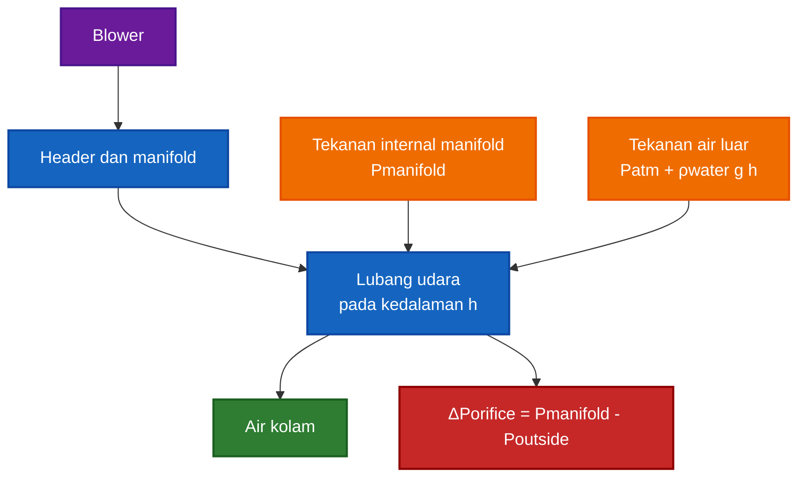
```mermaid id="submerged-manifold-pressure"
flowchart TB
    A["Blower"] --> B["Header dan manifold"]
    B --> C["Lubang udara<br/>pada kedalaman h"]
    C --> D["Air kolam"]

    E["Tekanan internal manifold<br/>Pmanifold"] --> C
    F["Tekanan air luar<br/>Patm + ρwater g h"] --> C
    C --> G["ΔPorifice = Pmanifold - Poutside"]

    classDef blower fill:#6A1B9A,color:#FFFFFF,stroke:#4A148C,stroke-width:2px;
    classDef pipe fill:#1565C0,color:#FFFFFF,stroke:#0D47A1,stroke-width:2px;
    classDef water fill:#2E7D32,color:#FFFFFF,stroke:#1B5E20,stroke-width:2px;
    classDef pressure fill:#EF6C00,color:#FFFFFF,stroke:#E65100,stroke-width:2px;
    classDef result fill:#C62828,color:#FFFFFF,stroke:#8E0000,stroke-width:2px;

    class A blower;
    class B,C pipe;
    class D water;
    class E,F pressure;
    class G result;
```

> **Kesalahan yang harus dihindari:** menggunakan tekanan hidrostatik $\rho gh$ sebagai beda tekanan orifice. Nilai $\rho gh$ hanya menjelaskan tekanan eksternal air, bukan driving pressure aktual pada lubang.

### 8.3.4 Estimasi Debit Lubang Udara

Jika pressure ratio kecil, Mach number rendah, dan perubahan densitas dapat dianggap terbatas, debit aktual dapat diestimasi sebagai:

$$
Q_{\text{actual}}
=

C_dA
\sqrt{
\frac{
2
\Delta P_{\text{orifice}}
}{
\rho_{\text{air,avg}}
}
}
$$

Dengan:

- $Q_{\text{actual}}$ = debit aktual udara.
- $C_d$ = discharge coefficient lubang.
- $A$ = luas lubang.
- $\Delta P_{\text{orifice}}$ = beda tekanan aktual antara sisi dalam dan luar.
- $\rho_{\text{air,avg}}$ = densitas udara rata-rata pada lubang.

Luas lubang:

$$
A
=

\frac{\pi d^2}{4}
$$

Untuk udara, densitas dihitung dari tekanan absolut:

$$
\rho_{\text{air}}
=

\frac{
P_{\text{abs}}
}{
R_{\text{air}}T
}
$$

Jika pressure ratio besar atau kecepatan mendekati kecepatan suara, gunakan model gas compressible dan periksa risiko choked flow.

### 8.3.5 Contoh Lubang Udara Terendam

Diketahui:

- Diameter lubang:

$$
d
=

# 1.0\ \text{mm}

0.001\ \text{m}
$$

- Kedalaman lubang:

$$
h
=

1.0\ \text{m}
$$

- Tekanan gauge manifold:

$$
P_{\text{manifold,gauge}}
=

12.5\ \text{kPa(g)}
$$

- Temperatur udara:

$$
T
=

# 20^\circ\text{C}

293.15\ \text{K}
$$

- Discharge coefficient awal:

$$
C_d
=

0.65
$$

Tekanan air luar:

$$
P_{\text{outside,gauge}}
=

9.79\ \text{kPa(g)}
$$

Beda tekanan aktual pada lubang:

$$
\Delta P_{\text{orifice}}
=

## 12.5

9.79
$$

$$
\Delta P_{\text{orifice}}
=

2.71\ \text{kPa}
$$

Tekanan absolut rata-rata di sekitar lubang dapat diperkirakan:

$$
P_{\text{avg}}
\approx
101.325
+
9.79
+
\frac{2.71}{2}
$$

$$
P_{\text{avg}}
\approx
112.47\ \text{kPa(a)}
$$

Densitas udara rata-rata:

$$
\rho_{\text{air,avg}}
=

\frac{
112470
}{
287.05
\times
293.15
}
$$

$$
\rho_{\text{air,avg}}
\approx
1.34\ \text{kg/m}^3
$$

Luas lubang:

$$
A
=

\frac{
\pi
(0.001)^2
}{4}
$$

$$
A
=

7.854
\times
10^{-7}\ \text{m}^2
$$

Debit aktual:

$$
Q_{\text{actual}}
=

0.65
\times
7.854
\times
10^{-7}
\times
\sqrt{
\frac{
2
\times
2710
}{
1.34
}
}
$$

$$
Q_{\text{actual}}
\approx
3.25
\times
10^{-5}\ \text{m}^3/\text{s}
$$

Konversi:

$$
Q_{\text{actual}}
=

3.25
\times
10^{-5}
\times
1000
\times
60
$$

$$
\boxed{
Q_{\text{actual}}
\approx
1.95\ \text{L/min per lubang}
}
$$

Untuk mengubah ke debit standar pada temperatur yang sama:

$$
Q_{\text{standard}}
=

Q_{\text{actual}}
\left(
\frac{
P_{\text{avg}}
}{
P_{\text{standard}}
}
\right)
$$

$$
Q_{\text{standard}}
=

1.95
\left(
\frac{
112.47
}{
101.325
}
\right)
$$

$$
\boxed{
Q_{\text{standard}}
\approx
2.16\ \text{NL/min per lubang}
}
$$

Nilai tersebut adalah **estimasi awal**, bukan angka desain final. Debit aktual dapat berubah karena:

- Burr atau geram hasil pengeboran.
- Ketebalan dinding PVC.
- Bentuk tepi lubang.
- Ketidakseragaman diameter.
- Tekanan manifold yang berubah.
- Distribusi pressure loss header.
- Fluktuasi blower.
- Adanya air yang masuk ke lubang.
- Variasi kedalaman antar lubang.

### 8.3.6 Balancing Lubang Manifold

Bila $C_d$ dan densitas dianggap tetap:

$$
Q
\propto
\sqrt{
\Delta P_{\text{orifice}}
}
$$

Karena itu, dua lubang identik tetap dapat menghasilkan debit sangat berbeda bila tekanan internal manifold atau kedalaman airnya berbeda.

Contoh: satu lubang berada 10 cm lebih dalam daripada lubang lain.

Perbedaan tekanan hidrostatik:

$$
\Delta P
=

998.2
\times
9.80665
\times
0.1
$$

$$
\Delta P
\approx
0.98\ \text{kPa}
$$

Pada sistem dengan beda tekanan lubang hanya sekitar 2–3 kPa, perubahan kedalaman 10 cm dapat memengaruhi pembagian udara secara nyata.

Praktik yang membantu balancing:

| Tindakan                               | Tujuan                                      |
| -------------------------------------- | ------------------------------------------- |
| Samakan kedalaman diffuser atau lubang | Mengurangi perbedaan tekanan hidrostatik    |
| Gunakan cabang dengan panjang serupa   | Mengurangi perbedaan pressure loss          |
| Perbesar diameter header               | Mengurangi pressure drop sepanjang manifold |
| Gunakan valve cabang                   | Mengatur distribusi                         |
| Gunakan ukuran lubang konsisten        | Mengurangi variasi debit                    |
| Hilangkan burr setelah pengeboran      | Menjaga karakter aliran lebih seragam       |
| Ukur tekanan manifold                  | Memvalidasi asumsi desain                   |
| Uji gelembung tiap titik               | Mengidentifikasi ketidakseragaman           |

[**Kembali ke Atas**](#panduan-praktis-perhitungan-fluida-dalam-pipa-pvc)

---

## 8.4 Diffuser Aerasi

Diffuser aerasi adalah komponen yang memasukkan udara ke dalam air dalam bentuk gelembung. Fungsi utamanya bukan hanya mengeluarkan udara, tetapi juga mendukung:

- Transfer oksigen.
- Pencampuran air.
- Pelepasan gas terlarut.
- Sirkulasi kolam.
- Pencegahan zona mati.
- Pengendalian kualitas air.

Debit udara tinggi tidak selalu berarti transfer oksigen tertinggi. Kinerja transfer oksigen juga dipengaruhi oleh ukuran gelembung, kedalaman, pola aliran air, temperatur, salinitas, dan kondisi diffuser.

### 8.4.1 Jenis Diffuser Umum

| Jenis                | Karakteristik                                 | Kelebihan                                                | Keterbatasan                                                      |
| -------------------- | --------------------------------------------- | -------------------------------------------------------- | ----------------------------------------------------------------- |
| Lubang PVC           | Lubang sederhana pada pipa                    | Murah, mudah dibuat, kuat                                | Gelembung cenderung besar, distribusi dapat tidak merata          |
| Batu aerasi          | Media berpori keramik atau sintered           | Gelembung relatif lebih kecil                            | Dapat tersumbat atau retak                                        |
| Diffuser EPDM        | Membran elastomer berlubang/slit              | Umum untuk aerasi efisien, tersedia dalam disk atau tube | Karakteristik berubah akibat umur, fouling, dan deformasi membran |
| Diffuser silikon     | Membran elastis dengan sifat material berbeda | Fleksibel pada aplikasi tertentu                         | Tetap membutuhkan data produsen                                   |
| Microbubble diffuser | Dirancang menghasilkan gelembung lebih kecil  | Potensi transfer oksigen tinggi                          | Sensitif terhadap fouling dan pressure drop                       |

### 8.4.2 Diffuser Lubang PVC

Lubang PVC yang dibor dapat dianggap sebagai short orifice. Karakteristiknya dipengaruhi oleh:

- Diameter lubang.
- Ketebalan dinding PVC.
- Jumlah lubang.
- Arah lubang.
- Kualitas pengeboran.
- Tekanan internal manifold.
- Kedalaman air.
- Distribusi tekanan sepanjang pipa.

Lubang terlalu besar dapat menghasilkan gelembung besar dan aliran tidak merata. Lubang terlalu kecil dapat meningkatkan pressure drop, mudah tersumbat, dan membuat blower bekerja lebih berat.

Untuk sistem sederhana, lubang PVC dapat digunakan sebagai solusi praktis. Namun, performa transfer oksigennya tidak boleh diasumsikan sama dengan diffuser membran atau batu aerasi.

### 8.4.3 Batu Aerasi

Batu aerasi memiliki jalur internal berpori. Pressure drop-nya bukan sekadar fungsi diameter satu lubang, tetapi bergantung pada:

- Ukuran pori.
- Ketebalan batu.
- Distribusi pori.
- Kondisi penyumbatan.
- Material batu.
- Debit udara.
- Kedalaman air.

Karena jalur alirannya kompleks, satu nilai $C_d$ tidak cukup untuk menggambarkan batu aerasi.

Gunakan:

$$
\Delta P_{\text{stone}}
=

f(Q_{\text{air}})
$$

berdasarkan kurva produsen atau hasil pengujian.

### 8.4.4 Diffuser Membran EPDM

Diffuser EPDM biasanya memiliki slit atau pori yang membuka ketika tekanan udara cukup tinggi. Geometrinya berubah saat membran mengembang.

Karena itu, pressure drop diffuser EPDM dipengaruhi oleh:

- Tekanan pembukaan membran.
- Elastisitas membran.
- Bentuk dan jumlah slit.
- Debit udara.
- Temperatur.
- Fouling.
- Usia membran.
- Kedalaman pemasangan.

Hubungan tipikalnya:

$$
\Delta P_{\text{EPDM}}
=

f(Q_{\text{air}})
$$

Hubungan tersebut tidak selalu linier.

```mermaid id="diffuser-types"
flowchart TB
    A["Sumber udara"] --> B{"Jenis diffuser?"}

    B --> C["Lubang PVC"]
    B --> D["Batu aerasi"]
    B --> E["Membran EPDM"]

    C --> F["Short orifice<br/>Cd dan geometri penting"]
    D --> G["Media berpori<br/>kurva produsen penting"]
    E --> H["Membran elastis<br/>opening pressure dan kurva penting"]

    F --> I["Uji distribusi gelembung"]
    G --> I
    H --> I

    classDef source fill:#6A1B9A,color:#FFFFFF,stroke:#4A148C,stroke-width:2px;
    classDef choice fill:#EF6C00,color:#FFFFFF,stroke:#E65100,stroke-width:2px;
    classDef pvc fill:#1565C0,color:#FFFFFF,stroke:#0D47A1,stroke-width:2px;
    classDef stone fill:#2E7D32,color:#FFFFFF,stroke:#1B5E20,stroke-width:2px;
    classDef epdm fill:#00838F,color:#FFFFFF,stroke:#006064,stroke-width:2px;
    classDef test fill:#C62828,color:#FFFFFF,stroke:#8E0000,stroke-width:2px;

    class A source;
    class B choice;
    class C,F pvc;
    class D,G stone;
    class E,H epdm;
    class I test;
```

### 8.4.5 Mengapa Kurva Produsen Lebih Andal daripada Satu Nilai $C_d$

Satu nilai discharge coefficient hanya cocok untuk geometri lubang yang relatif tetap dan sederhana.

Pada batu aerasi dan membran EPDM:

- Jalur aliran internal tidak sederhana.
- Luas bukaan efektif dapat berubah.
- Membran dapat membuka atau menutup secara elastis.
- Fouling mengubah karakteristik aliran.
- Gelembung memengaruhi kondisi hilir.
- Debit dapat menyebar ke banyak pori atau slit.

Karena itu, kurva produsen berikut jauh lebih berguna:

$$
\Delta P_{\text{diffuser}}
=

f(Q_{\text{air}})
$$

Kurva sebaiknya menunjukkan:

- Kondisi clean diffuser.
- Rentang debit minimum dan maksimum.
- Pressure drop pada tiap debit.
- Kedalaman pemasangan yang direkomendasikan.
- Kebutuhan udara minimum untuk membuka membran.
- Kondisi atau asumsi pengujian.

### 8.4.6 Pressure Drop Diffuser terhadap Debit

Pada diffuser bersih, pressure drop umumnya meningkat saat debit udara meningkat.

Secara konseptual:

$$
Q_{\text{air}}
\uparrow
\Rightarrow
\Delta P_{\text{diffuser}}
\uparrow
$$

Namun bentuk hubungan tidak selalu:

$$
\Delta P
\propto
Q^2
$$

karena diffuser dapat mengalami perubahan bukaan, deformasi membran, atau perubahan pola gelembung.

Untuk desain sistem, gunakan kurva pressure drop pada debit target.

Misalnya, kurva produsen menunjukkan:

$$
Q_{\text{air}}
=

15\ \text{NL/min}
$$

membutuhkan:

$$
\Delta P_{\text{diffuser}}
=

2.0\ \text{kPa}
$$

Maka nilai 2.0 kPa tersebut ditambahkan ke tekanan hidrostatik, pressure loss header, selang, fitting, dan margin fouling.

### 8.4.7 Fouling dan Umur Diffuser

Fouling dapat berasal dari:

- Kerak mineral.
- Biofilm.
- Lumpur.
- Padatan tersuspensi.
- Minyak atau bahan organik.
- Endapan pupuk.
- Kontaminan udara.
- Kondensat air dalam jalur udara.

Seiring waktu:

$$
\Delta P_{\text{diffuser}}
\uparrow
$$

Akibatnya, pada blower yang sama:

$$
Q_{\text{air}}
\downarrow
$$

atau distribusi udara bergeser ke diffuser yang lebih bersih atau lebih dekat ke blower.

Gejala fouling diffuser:

| Gejala                   | Kemungkinan penyebab                           |
| ------------------------ | ---------------------------------------------- |
| Tekanan blower meningkat | Diffuser atau selang mulai tersumbat           |
| Gelembung tidak merata   | Variasi fouling antar diffuser                 |
| Diffuser jauh melemah    | Pressure loss header atau cabang terlalu besar |
| Blower lebih panas       | Beroperasi pada pressure lebih tinggi          |
| Aerasi terlihat menurun  | Debit udara aktual turun                       |
| DO kolam turun           | Transfer oksigen atau mixing tidak mencukupi   |

### 8.4.8 Pemantauan Diffuser

Pengukuran sederhana yang direkomendasikan:

1. Pasang pressure gauge pada discharge blower atau manifold utama.
2. Catat tekanan bersih saat commissioning.
3. Catat tekanan secara berkala pada debit dan kedalaman yang sama.
4. Bandingkan perubahan tekanan dengan pola gelembung.
5. Bersihkan atau ganti diffuser berdasarkan kurva produsen dan kondisi aktual.

```mermaid id="diffuser-fouling-cycle"
flowchart TB
    A["Diffuser bersih"] --> B["Pressure drop normal"]
    B --> C["Distribusi udara stabil"]

    C --> D["Fouling, kerak,<br/>atau biofilm meningkat"]
    D --> E["Pressure drop diffuser naik"]
    E --> F["Debit udara dan distribusi berubah"]
    F --> G["Tekanan manifold dipantau"]
    G --> H["Bersihkan, servis,<br/>atau ganti diffuser"]
    H --> A

    classDef clean fill:#2E7D32,color:#FFFFFF,stroke:#1B5E20,stroke-width:2px;
    classDef normal fill:#1565C0,color:#FFFFFF,stroke:#0D47A1,stroke-width:2px;
    classDef foul fill:#C62828,color:#FFFFFF,stroke:#8E0000,stroke-width:2px;
    classDef monitor fill:#EF6C00,color:#FFFFFF,stroke:#E65100,stroke-width:2px;
    classDef action fill:#6A1B9A,color:#FFFFFF,stroke:#4A148C,stroke-width:2px;

    class A clean;
    class B,C normal;
    class D,E,F foul;
    class G monitor;
    class H action;
```

### 8.4.9 Prinsip Pemilihan Diffuser

| Kebutuhan                         | Pertimbangan utama                                                      |
| --------------------------------- | ----------------------------------------------------------------------- |
| Biaya minimum                     | Lubang PVC dapat dipertimbangkan, tetapi uji distribusi wajib dilakukan |
| Gelembung relatif halus           | Batu aerasi atau membran                                                |
| Operasi jangka panjang            | Kurva pressure drop, fouling, dan kemudahan perawatan                   |
| Kolam dalam                       | Tekanan hidrostatik menjadi dominan                                     |
| Banyak cabang                     | Header, selang, dan balancing sama pentingnya dengan diffuser           |
| Kebutuhan transfer oksigen tinggi | Gunakan data oxygen transfer, bukan hanya debit udara                   |
| Air kotor atau kaya mineral       | Pertimbangkan risiko fouling dan kemudahan pembersihan                  |

> **Catatan penting:** ukuran gelembung dan debit udara adalah bagian dari sistem aerasi. Kinerja oksigenasi juga dipengaruhi oleh kedalaman, pencampuran air, luas area aerasi, temperatur, salinitas, dan kondisi biologis kolam.

[**Kembali ke Atas**](#panduan-praktis-perhitungan-fluida-dalam-pipa-pvc)

---

## Ringkasan Bab 8

1. Nozzle air sederhana dapat dihitung sebagai:

$$
Q
=

C_dA
\sqrt{
\frac{
2\Delta P
}{
\rho
}
}
$$

2. Debit nozzle meningkat terhadap akar tekanan:

$$
Q
\propto
\sqrt{
\Delta P
}
$$

3. Needle dan tubing kecil panjang dapat mengikuti Hagen–Poiseuille bila aliran laminar dan telah berkembang penuh:

$$
Q
=

\frac{
\pi
\Delta P
D_i^4
}{
128
\mu
L
}
$$

4. Diameter needle sangat berpengaruh:

$$
Q
\propto
D_i^4
$$

5. Beda tekanan lubang udara terendam adalah:

$$
\Delta P_{\text{orifice}}
=

## P_{\text{manifold}}

P_{\text{outside}}
$$

6. Tekanan air luar pada kedalaman tertentu adalah:

$$
P_{\text{outside}}
=

P_{\text{atm}}
+
\rho_{\text{water}}gh
$$

7. Tekanan hidrostatik bukan pressure drop diffuser.

8. Diffuser batu dan membran EPDM sebaiknya dihitung memakai kurva produsen:

$$
\Delta P_{\text{diffuser}}
=

f(Q_{\text{air}})
$$

9. Fouling diffuser meningkatkan pressure drop, menurunkan debit udara, dan dapat menyebabkan distribusi aerasi tidak merata.

[**Kembali ke Atas**](#panduan-praktis-perhitungan-fluida-dalam-pipa-pvc)

---

## Rujukan Bab 8

- [R1] Crane Co. _Flow of Fluids Through Valves, Fittings, and Pipe: Technical Paper No. 410._
- [R2] Idelchik, I. E. _Handbook of Hydraulic Resistance._ CRC Press.
- [R3] White, F. M. _Fluid Mechanics._ McGraw-Hill Education.
- [R4] Munson, B. R., Okiishi, T. H., Huebsch, W. W., dan Rothmayer, A. P. _Fundamentals of Fluid Mechanics._ Wiley.
- [R5] ISO 5167. _Measurement of Fluid Flow by Means of Pressure Differential Devices Inserted in Circular Cross-Section Conduits Running Full._
- [R6] Metcalf & Eddy. _Wastewater Engineering: Treatment and Resource Recovery._ McGraw-Hill.
- [R7] Water Environment Federation. _Design of Water Resource Recovery Facilities._
- [R8] Datasheet produsen diffuser spesifik yang digunakan, terutama kurva debit udara terhadap pressure drop pada kondisi bersih dan kondisi operasi yang direkomendasikan.

---

# 9. Desain Manifold dan Balancing Aliran

Manifold membagi satu aliran utama menjadi beberapa cabang. Pada sistem pertanian, manifold digunakan untuk:

- Membagi air ke beberapa zona irigasi.
- Menyalurkan air ke beberapa sprinkler atau nozzle.
- Membagi nutrisi ke beberapa jalur hidroponik.
- Menyalurkan udara dari blower ke beberapa diffuser.
- Membagi aliran ke kolam, bak, atau bed tanam yang berbeda.

Tujuan manifold tidak selalu membuat semua cabang menerima debit yang sama. Pada beberapa sistem, debit tiap cabang memang sengaja berbeda. Namun, apabila seluruh cabang dirancang identik, maka distribusi debit harus mendekati target yang telah ditentukan.

Dasar fisiknya adalah keseimbangan massa dan energi.

Untuk air yang hampir incompressible:

$$
Q_{\text{in}}
=

\sum_{i=1}^{n}
Q_i
$$

Untuk udara, gunakan laju massa:

$$
\dot{m}_{\text{in}}
=

\sum_{i=1}^{n}
\dot{m}_i
$$

Setiap cabang akan menerima debit sesuai tekanan pada node manifold dan hambatan hidrauliknya.

$$
P_{\text{node},i}
-----------------

# P_{\text{sink},i}

\Delta P_{\text{branch},i}(Q_i)
$$

Dengan:

- $P_{\text{node},i}$ = tekanan pada node manifold cabang ke-$i$.
- $P_{\text{sink},i}$ = tekanan di ujung cabang.
- $\Delta P_{\text{branch},i}$ = total pressure loss cabang pada debit tertentu.

Untuk sistem air terbuka:

$$
P_{\text{sink}}
\approx
P_{\text{atm}}
$$

Untuk diffuser udara terendam:

$$
P_{\text{sink}}
=

P_{\text{atm}}
+
\rho_{\text{water}}gh
$$

```mermaid id="manifold-basic-concept"
flowchart TB
    A["Pompa atau blower"] --> B["Header utama"]
    B --> C["Node cabang 1"]
    B --> D["Node cabang 2"]
    B --> E["Node cabang 3"]
    B --> F["Node cabang n"]

    C --> G["Outlet / nozzle / diffuser"]
    D --> H["Outlet / nozzle / diffuser"]
    E --> I["Outlet / nozzle / diffuser"]
    F --> J["Outlet / nozzle / diffuser"]

    classDef source fill:#6A1B9A,color:#FFFFFF,stroke:#4A148C,stroke-width:2px;
    classDef header fill:#1565C0,color:#FFFFFF,stroke:#0D47A1,stroke-width:2px;
    classDef branch fill:#2E7D32,color:#FFFFFF,stroke:#1B5E20,stroke-width:2px;
    classDef outlet fill:#EF6C00,color:#FFFFFF,stroke:#E65100,stroke-width:2px;

    class A source;
    class B header;
    class C,D,E,F branch;
    class G,H,I,J outlet;
```

## 9.1 Mengapa Cabang Terdekat Sering Menerima Debit Terbesar

Cabang yang dekat dengan pompa atau blower sering menerima debit lebih besar karena hambatan alirannya lebih kecil. Namun, kondisi ini bukan hukum mutlak.

Pada header dengan banyak cabang, total energy head selalu turun sepanjang arah aliran akibat friction loss dan fitting loss. Akan tetapi, static pressure tidak selalu turun secara seragam karena kecepatan aliran header juga berkurang setelah sebagian fluida keluar melalui cabang.

Ketika debit header turun:

$$
Q_{\text{header}}
\downarrow
$$

maka kecepatan header juga turun:

$$
V_{\text{header}}
\downarrow
$$

Sebagian velocity head dapat berubah menjadi static pressure. Karena itu, static pressure di bagian hilir header dapat mengalami sedikit pressure recovery pada kondisi tertentu.

> Prinsip yang benar: total energy head selalu berkurang sepanjang header nyata, tetapi static pressure pada tiap node harus dihitung atau diukur. Jangan mengasumsikan cabang paling dekat selalu memiliki tekanan tertinggi tanpa analisis jaringan.

### 9.1.1 Penurunan Tekanan Sepanjang Header

Untuk setiap segmen header:

$$
\Delta P_{\text{header},j}
=

f_D
\frac{L_j}{D_j}
\frac{\rho V_j^2}{2}
+
\sum K_j
\frac{\rho V_j^2}{2}
$$

Debit pada segmen header berubah setelah setiap cabang.

Untuk manifold end-fed dengan $n$ cabang:

$$
Q_{\text{header},j}
=

\sum_{i=j}^{n}
Q_i
$$

Artinya, segmen header pertama membawa debit total. Segmen berikutnya membawa debit yang lebih kecil karena sebagian debit sudah keluar melalui cabang sebelumnya.

```mermaid id="header-flow-reduction"
flowchart TB
    A["Pompa / blower<br/>Debit total"] --> B["Segmen header 1<br/>Q = Q1 + Q2 + Q3 + Q4"]
    B --> C["Cabang 1<br/>Q1"]
    B --> D["Segmen header 2<br/>Q = Q2 + Q3 + Q4"]
    D --> E["Cabang 2<br/>Q2"]
    D --> F["Segmen header 3<br/>Q = Q3 + Q4"]
    F --> G["Cabang 3<br/>Q3"]
    F --> H["Segmen header 4<br/>Q = Q4"]
    H --> I["Cabang 4<br/>Q4"]

    classDef source fill:#6A1B9A,color:#FFFFFF,stroke:#4A148C,stroke-width:2px;
    classDef header fill:#1565C0,color:#FFFFFF,stroke:#0D47A1,stroke-width:2px;
    classDef branch fill:#EF6C00,color:#FFFFFF,stroke:#E65100,stroke-width:2px;

    class A source;
    class B,D,F,H header;
    class C,E,G,I branch;
```

### 9.1.2 Perbedaan Rugi Tekan Setiap Cabang

Cabang dapat memiliki hambatan yang berbeda karena:

- Panjang pipa atau selang berbeda.
- Diameter cabang berbeda.
- Jumlah elbow dan fitting berbeda.
- Valve tidak memiliki bukaan sama.
- Elevasi outlet berbeda.
- Nozzle atau diffuser tidak identik.
- Diffuser memiliki tingkat fouling berbeda.
- Kedalaman diffuser berbeda.
- Ada penyumbatan, kerak, atau selang tertekuk.

Secara umum:

$$
\Delta P_{\text{branch}}
=

\rho g\Delta z
+
\left(
f_D
\frac{L}{D}
+
\sum K
\right)
\frac{\rho V^2}{2}
+
\Delta P_{\text{device}}
$$

Dengan:

- $\rho g\Delta z$ = pengaruh perbedaan elevasi.
- Komponen dalam kurung = rugi pipa dan fitting.
- $\Delta P_{\text{device}}$ = pressure loss nozzle, diffuser, filter, emitter, atau komponen khusus.

Cabang dengan total resistance lebih kecil akan cenderung menerima debit lebih besar.

Untuk cabang yang didominasi aliran turbulen atau orifice:

$$
\Delta P_{\text{branch}}
\propto
Q^2
$$

Maka:

$$
Q
\propto
\sqrt{
\Delta P_{\text{available}}
}
$$

Artinya, perbedaan kecil pressure availability dapat menghasilkan perbedaan debit yang cukup besar.

### 9.1.3 Pengaruh Elevasi

Untuk sistem air, outlet yang lebih tinggi memerlukan tekanan lebih besar.

Jika satu outlet berada 1 m lebih tinggi daripada outlet lain:

$$
\Delta P
=

\rho g h
$$

Untuk air:

$$
\Delta P
\approx
9.81\ \text{kPa}
$$

Perbedaan elevasi 1 m dapat menjadi sangat signifikan pada sistem irigasi bertekanan rendah.

Untuk diffuser udara, kedalaman lebih besar juga meningkatkan kebutuhan tekanan.

$$
\Delta P_{\text{hydrostatic}}
=

\rho_{\text{water}}gh
$$

Perbedaan kedalaman diffuser 10 cm menghasilkan perubahan tekanan sekitar:

$$
\Delta P
\approx
0.98\ \text{kPa}
$$

Pada sistem aerasi kecil dengan pressure drop diffuser sekitar 2–3 kPa, perbedaan kedalaman 10 cm dapat memengaruhi pembagian udara secara nyata.

### 9.1.4 Interaksi Antar Cabang

Cabang tidak bekerja secara independen. Jika valve cabang pertama ditutup sebagian, tekanan header dapat meningkat dan debit pada cabang lain dapat berubah.

Karena itu, balancing sebaiknya dilakukan secara bertahap:

1. Buka semua cabang pada kondisi operasi normal.
2. Ukur tekanan manifold.
3. Periksa debit atau pola aliran tiap cabang.
4. Atur cabang dengan debit berlebih.
5. Ulangi pengamatan seluruh cabang.
6. Pastikan cabang terjauh tetap menerima debit minimum.

> Jangan menyeimbangkan satu cabang hanya berdasarkan visual sekali lihat. Penyesuaian pada satu cabang dapat memengaruhi seluruh jaringan.

[**Kembali ke Atas**](#panduan-praktis-perhitungan-fluida-dalam-pipa-pvc)

---

## 9.2 Prinsip Desain Manifold

Tujuan desain manifold adalah mengendalikan variasi tekanan antar cabang agar debit aktual mendekati target.

Prinsip utamanya bukan “semua pipa harus sama besar”, melainkan:

> Variasi pressure availability antar cabang harus kecil dibandingkan pressure drop yang dibutuhkan oleh cabang dan outlet.

Untuk outlet yang mengikuti hubungan orifice:

$$
Q
\propto
\sqrt{
\Delta P
}
$$

Perubahan debit kecil dapat diperkirakan:

$$
\frac{\delta Q}{Q}
\approx
\frac{1}{2}
\frac{\delta \Delta P}{\Delta P}
$$

Misalnya, jika pressure difference antar cabang sebesar 10% dari driving pressure outlet:

$$
\frac{\delta \Delta P}{\Delta P}
=

0.10
$$

maka perubahan debit awal dapat mendekati:

$$
\frac{\delta Q}{Q}
\approx
0.05
=

5%
$$

Hubungan ini hanya berlaku sebagai pendekatan untuk cabang yang didominasi karakteristik kuadrat. Diffuser membran, pressure-compensating emitter, dan valve tidak selalu mengikuti hubungan sederhana tersebut.

### 9.2.1 Header Lebih Besar dari Branch

Header umumnya dirancang memiliki pressure loss lebih kecil daripada cabang. Hal ini sering dicapai dengan diameter header yang lebih besar.

Namun, tidak ada rasio diameter universal seperti:

$$
D_{\text{header}}
=

2D_{\text{branch}}
$$

Ukuran header harus dihitung berdasarkan:

- Debit total.
- Panjang header.
- Jumlah cabang.
- Target variasi tekanan.
- Jenis fluida.
- Pressure drop outlet.
- Kemungkinan ekspansi sistem.

Header yang besar memiliki keuntungan:

- Kecepatan lebih rendah.
- Friction loss lebih kecil.
- Distribusi tekanan lebih seragam.
- Cabang jauh lebih mudah menerima aliran.
- Sistem lebih mudah dikembangkan.

Kelemahannya:

- Biaya awal lebih tinggi.
- Ruang instalasi lebih besar.
- Pada aliran air dengan padatan, kecepatan terlalu rendah dapat meningkatkan risiko endapan.

### 9.2.2 Header Bertaper

Header bertaper berarti diameter header berubah sepanjang arah aliran.

Karena debit header berkurang setelah setiap cabang:

$$
Q_{\text{header}}
\downarrow
$$

diameter dapat dikurangi secara bertahap agar kecepatan tetap dalam rentang yang diinginkan.

Jika target kecepatan header adalah:

$$
V_{\text{target}}
$$

maka diameter awal setiap segmen dapat diperkirakan:

$$
D_j
=

\sqrt{
\frac{
4Q_{\text{header},j}
}{
\pi V_{\text{target}}
}
}
$$

### Contoh Konsep Header Bertaper

Empat cabang air masing-masing membutuhkan:

$$
Q_{\text{branch}}
=

10\ \text{L/min}
$$

Debit header pada setiap segmen:

| Segmen header    | Debit yang dibawa |
| ---------------- | ----------------: |
| Sebelum cabang 1 |          40 L/min |
| Setelah cabang 1 |          30 L/min |
| Setelah cabang 2 |          20 L/min |
| Setelah cabang 3 |          10 L/min |

Jika target kecepatan sekitar:

$$
V_{\text{target}}
=

1.0\ \text{m/s}
$$

maka diameter hidraulik awal:

| Debit segmen | Diameter teoritis minimum |
| -----------: | ------------------------: |
|     40 L/min |                   29.1 mm |
|     30 L/min |                   25.2 mm |
|     20 L/min |                   20.6 mm |
|     10 L/min |                   14.6 mm |

Ukuran pipa aktual harus dipilih berdasarkan inside diameter katalog produsen.

> Header bertaper harus memakai reducer gradual bila memungkinkan. Reducer tajam dapat menambah minor loss dan mengurangi keuntungan desain.

Pada sistem kecil, header dengan diameter konstan yang cukup besar sering lebih mudah dibuat dan lebih mudah dirawat daripada header bertaper.

### 9.2.3 Panjang Cabang Seragam

Panjang cabang yang seragam membantu membuat pressure loss tiap cabang lebih serupa.

Namun, panjang fisik yang sama belum tentu menghasilkan resistance yang sama. Pastikan juga:

- Diameter cabang sama.
- Jumlah elbow sama.
- Jenis valve sama.
- Bukaan valve sama.
- Elevasi outlet sama.
- Nozzle atau diffuser identik.
- Kondisi fouling serupa.

Untuk aerasi, panjang selang cabang sebaiknya relatif seragam dan tidak tertekuk.

Untuk irigasi, cabang ke nozzle atau sprinkler sebaiknya memiliki jalur hidraulik yang setara bila target debitnya sama.

### 9.2.4 Layout End-Fed, Center-Fed, dan Ring Header

| Konfigurasi       | Kelebihan                               | Keterbatasan                                    |
| ----------------- | --------------------------------------- | ----------------------------------------------- |
| End-fed header    | Sederhana, murah, mudah dibuat          | Variasi tekanan lebih besar pada header panjang |
| Center-fed header | Distribusi lebih simetris               | Memerlukan layout lebih rapi                    |
| Ring header       | Tekanan lebih merata dan lebih redundan | Material dan perhitungan lebih banyak           |

Pada center-fed header, sumber dipasang dekat bagian tengah sehingga panjang hidraulik ke cabang ujung kiri dan kanan dapat dibuat lebih seimbang.

```mermaid id="header-layout-options"
flowchart TB
    A["End-fed"] --> B["Sumber → Header → Cabang berurutan"]
    C["Center-fed"] --> D["Sumber di tengah → Cabang kiri dan kanan"]
    E["Ring header"] --> F["Header melingkar → Aliran dapat datang dari dua arah"]

    classDef layout fill:#1565C0,color:#FFFFFF,stroke:#0D47A1,stroke-width:2px;
    classDef desc fill:#2E7D32,color:#FFFFFF,stroke:#1B5E20,stroke-width:2px;

    class A,C,E layout;
    class B,D,F desc;
```

### 9.2.5 Valve Balancing

Valve balancing digunakan untuk menambah resistance pada cabang yang menerima debit berlebih.

Prinsipnya:

$$
K_{\text{valve}}
\uparrow
\Rightarrow
\Delta P_{\text{branch}}
\uparrow
\Rightarrow
Q_{\text{branch}}
\downarrow
$$

Valve balancing cocok untuk:

- Manifold air atau air bersih.
- Cabang dengan kebutuhan debit berbeda.
- Sistem yang membutuhkan penyesuaian lapangan.
- Sistem yang mengalami perubahan setelah commissioning.

Keterbatasannya:

- Energi dibuang sebagai pressure drop.
- Posisi valve dapat berubah karena operator.
- Valve kecil mudah tersumbat pada air kotor.
- Valve tidak ideal sebagai solusi untuk header terlalu kecil.

Gunakan valve untuk fine-tuning, bukan sebagai pengganti desain diameter pipa yang benar.

### 9.2.6 Orifice Balancing

Orifice balancing menggunakan lubang pembatas dengan ukuran tertentu untuk memberi resistance tambahan pada cabang yang terlalu mudah menerima aliran.

Untuk air:

$$
Q
=

C_dA
\sqrt{
\frac{
2\Delta P
}{
\rho
}
}
$$

Orifice balancing dapat memberikan resistance yang lebih stabil daripada valve manual, tetapi memiliki syarat:

- Air harus relatif bersih.
- Ada strainer atau filter yang memadai.
- Diameter lubang tidak terlalu kecil.
- Geometri lubang konsisten.
- Pressure drop tambahan dapat diterima.

Untuk udara, orifice balancing dapat digunakan pada cabang tertentu, tetapi harus memperhatikan:

- Pressure ratio.
- Densitas udara.
- Potensi kebisingan.
- Risiko air masuk ke lubang.
- Risiko penyumbatan.
- Dampak pressure loss terhadap blower.

> Pada sistem aerasi tekanan rendah, jangan langsung menambahkan orifice besar ke setiap cabang. Pertama, kecilkan pressure variation dengan memperbesar header dan menyamakan selang. Orifice atau valve digunakan hanya untuk koreksi akhir.

### 9.2.7 Pressure-Compensating Emitter

Untuk irigasi tetes, pressure-compensating emitter sering lebih efektif daripada mencoba menyamakan seluruh pressure drop pipa secara sempurna.

Emitter jenis ini dirancang untuk menjaga debit lebih stabil pada rentang tekanan tertentu.

Namun, tetap perlu diperiksa:

- Rentang tekanan kerja emitter.
- Filtrasi minimum.
- Risiko penyumbatan.
- Keseragaman tekanan lateral.
- Perbedaan elevasi lahan.
- Kualitas air dan pupuk.

[**Kembali ke Atas**](#panduan-praktis-perhitungan-fluida-dalam-pipa-pvc)

---

## 9.3 Metode Perhitungan Jaringan Sederhana

Untuk manifold sederhana tanpa loop, metode node-by-node dapat digunakan.

Tujuan perhitungan adalah mencari debit setiap cabang sehingga seluruh kondisi berikut terpenuhi:

1. Konservasi massa.
2. Keseimbangan energi.
3. Hubungan pressure drop setiap cabang.
4. Karakteristik pompa atau blower.

### 9.3.1 Langkah Perhitungan

#### Langkah 1 — Buat Sketsa dan Nomor Node

Beri nomor pada:

- Sumber pompa atau blower.
- Header setiap segmen.
- Node tiap cabang.
- Outlet, nozzle, atau diffuser.
- Perubahan diameter.
- Valve dan fitting utama.

#### Langkah 2 — Tentukan Target Debit Cabang

Untuk cabang identik:

$$
Q_i
=

\frac{
Q_{\text{total}}
}{
n
}
$$

Untuk cabang dengan kebutuhan berbeda, tetapkan target masing-masing.

Contoh:

$$
Q_{\text{total}}
=

60\ \text{L/min}
$$

dengan empat cabang yang sama:

$$
Q_1
=

# Q_2

# Q_3

# Q_4

15\ \text{L/min}
$$

#### Langkah 3 — Tebak Pembagian Debit Awal

Tebakan awal paling sederhana:

$$
Q_i
=

\frac{
Q_{\text{total}}
}{
n
}
$$

Untuk sistem aerasi, gunakan basis debit yang konsisten, misalnya NL/min.

#### Langkah 4 — Hitung Debit Setiap Segmen Header

Untuk manifold end-fed:

$$
Q_{\text{header},j}
=

\sum_{i=j}^{n}
Q_i
$$

Untuk sistem air, gunakan debit volumetrik.

Untuk udara, gunakan laju massa atau debit aktual lokal yang sudah dikoreksi berdasarkan tekanan.

#### Langkah 5 — Hitung Pressure Loss Header

Untuk setiap segmen:

$$
\Delta P_{\text{header},j}
=

f_D
\frac{L_j}{D_j}
\frac{
\rho V_j^2
}{
2
}
+
\sum K_j
\frac{
\rho V_j^2
}{
2
}
$$

Pada sistem air, gunakan densitas air.

Pada sistem udara, gunakan densitas lokal atau densitas rata-rata jika pressure drop cukup kecil.

#### Langkah 6 — Hitung Tekanan Node

Untuk cairan, gunakan persamaan energi:

$$
\frac{P_j}{\rho g}
+
\frac{V_j^2}{2g}
+
z_j
=

\frac{P_{j+1}}{\rho g}
+
\frac{V_{j+1}^2}{2g}
+
z_{j+1}
+
h_{L,j}
$$

Dengan:

- $P_j$ dan $P_{j+1}$ = tekanan node.
- $V_j$ dan $V_{j+1}$ = kecepatan header.
- $z_j$ dan $z_{j+1}$ = elevasi node.
- $h_{L,j}$ = head loss segmen.

Untuk udara tekanan rendah, gunakan bentuk pressure drop per segmen dan perbarui densitas berdasarkan tekanan absolut.

#### Langkah 7 — Hitung Debit Cabang Baru

Untuk cabang yang didominasi resistance kuadrat:

$$
Q_{i,\text{new}}
=

Q_{i,\text{old}}
\left(
\frac{
\Delta P_{\text{available},i}
}{
\Delta P_{\text{required},i}
}
\right)^{1/2}
$$

Dengan:

- $\Delta P_{\text{available},i}$ = pressure difference aktual pada cabang.
- $\Delta P_{\text{required},i}$ = pressure drop cabang pada tebakan debit sebelumnya.

Untuk aliran laminar yang dominan:

$$
Q
\propto
\Delta P
$$

maka eksponen pendekatan menjadi:

$$
1
$$

Untuk diffuser membran, batu aerasi, pressure-compensating emitter, atau komponen nonlinier, gunakan kurva produsen atau interpolasi data.

#### Langkah 8 — Ulangi Sampai Konvergen

Perhitungan dihentikan ketika perubahan debit antariterasi cukup kecil.

Contoh kriteria:

$$
\left|
\frac{
Q_{i,\text{new}}
----------------

Q_{i,\text{old}}
}{
Q_{i,\text{old}}
}
\right|
<
0.01
$$

atau:

$$
\text{error}
<
1%
$$

### 9.3.2 Template Spreadsheet Manifold

| Kolom                 | Isi                            |
| --------------------- | ------------------------------ |
| Nomor cabang          | Branch ID                      |
| Target debit          | L/min, m³/h, NL/min, atau SLPM |
| Panjang branch        | m                              |
| Diameter dalam branch | mm                             |
| Jumlah fitting        | Unit dan nilai $K$             |
| Elevasi outlet        | m                              |
| Jenis nozzle/diffuser | Model atau data produsen       |
| Pressure drop device  | kPa                            |
| Debit header lokal    | L/min atau kg/s                |
| Kecepatan header      | m/s                            |
| Reynolds number       | Tak berdimensi                 |
| Friction factor       | Darcy friction factor          |
| Pressure node         | kPa(g) atau kPa(a)             |
| Debit hasil iterasi   | Sesuai basis debit             |
| Deviasi dari target   | %                              |

### 9.3.3 Sistem Ring atau Loop

Untuk jaringan dengan ring header atau loop, aliran dapat datang dari dua arah. Perhitungan manual menjadi lebih kompleks karena arah aliran pada beberapa segmen dapat berubah.

Metode yang dapat digunakan:

- Hardy Cross.
- Metode node pressure.
- Solver spreadsheet.
- Perangkat lunak jaringan seperti EPANET untuk sistem air.
- Model jaringan khusus atau spreadsheet iteratif untuk sistem udara.

Untuk sistem sederhana, ring header dapat dievaluasi dengan membagi jalur menjadi dua lintasan dari sumber menuju titik terjauh, lalu menghitung pressure loss kedua lintasan secara iteratif.

> Sistem loop sering memberi distribusi lebih seragam, tetapi tetap memerlukan valve isolasi, perencanaan maintenance, dan analisis aliran dua arah.

[**Kembali ke Atas**](#panduan-praktis-perhitungan-fluida-dalam-pipa-pvc)

---

## 9.4 Contoh Desain

Contoh berikut bersifat ilustratif untuk menunjukkan cara berpikir dan metode balancing. Nilai aktual harus dihitung ulang memakai inside diameter, panjang, fitting, kurva pompa atau blower, dan data peralatan yang benar.

### 9.4.1 Manifold Air dengan Empat Cabang

Diketahui sistem distribusi air memiliki:

- Empat cabang.
- Target debit setiap cabang:

$$
Q_{\text{target}}
=

10\ \text{L/min}
$$

- Total debit target:

$$
Q_{\text{total}}
=

40\ \text{L/min}
$$

- Header horizontal berdiameter besar sehingga variasi tekanan antar node kurang dari sekitar 1 kPa.
- Empat branch line dengan panjang dan fitting berbeda.
- Outlet setiap cabang memiliki karakteristik resistance mendekati kuadrat debit.

Pada debit target 10 L/min, hasil perhitungan pressure requirement tiap cabang adalah:

| Cabang   | Pressure drop cabang pada 10 L/min |
| -------- | ---------------------------------: |
| Cabang 1 |                             75 kPa |
| Cabang 2 |                             90 kPa |
| Cabang 3 |                            110 kPa |
| Cabang 4 |                            130 kPa |

Cabang 4 adalah jalur kritis karena memiliki resistance tertinggi.

#### Kondisi Tanpa Balancing

Misalkan tekanan tersedia pada manifold adalah:

$$
P_{\text{manifold}}
=

100\ \text{kPa(g)}
$$

Dengan asumsi:

$$
\Delta P
\propto
Q^2
$$

maka debit setiap cabang dapat diperkirakan:

$$
Q_i
=

Q_{\text{target}}
\sqrt{
\frac{
\Delta P_{\text{available}}
}{
\Delta P_{\text{branch,target}}
}
}
$$

| Cabang   | Debit estimasi | Deviasi dari target |
| -------- | -------------: | ------------------: |
| Cabang 1 |    11.55 L/min |              +15.5% |
| Cabang 2 |    10.54 L/min |               +5.4% |
| Cabang 3 |     9.53 L/min |               −4.7% |
| Cabang 4 |     8.77 L/min |              −12.3% |

Cabang terdekat atau cabang dengan resistance lebih kecil menerima debit lebih besar. Cabang paling berat menerima debit paling kecil.

#### Strategi Balancing

Agar cabang 4 mencapai target 10 L/min, tekanan manifold perlu mendekati:

$$
P_{\text{manifold}}
=

130\ \text{kPa(g)}
$$

Pada kondisi tersebut, cabang 1 hingga cabang 3 harus diberi resistance tambahan.

| Cabang   | Resistance awal pada 10 L/min | Resistance tambahan yang diperlukan |
| -------- | ----------------------------: | ----------------------------------: |
| Cabang 1 |                        75 kPa |                              55 kPa |
| Cabang 2 |                        90 kPa |                              40 kPa |
| Cabang 3 |                       110 kPa |                              20 kPa |
| Cabang 4 |                       130 kPa |                               0 kPa |

Resistance tambahan dapat dibuat dengan:

- Valve balancing.
- Orifice plate.
- Nozzle pembatas.
- Perubahan diameter cabang.
- Memperpanjang jalur cabang tertentu, meskipun cara ini jarang ideal.

Untuk cabang 1, bila menggunakan orifice air sederhana dengan:

$$
Q
=

10\ \text{L/min}
$$

$$
\Delta P
=

55\ \text{kPa}
$$

$$
C_d
=

0.62
$$

maka luas orifice estimasi:

$$
A
=

\frac{
Q
}{
C_d
\sqrt{
\frac{
2\Delta P
}{
\rho
}
}
}
$$

Diameter orifice perkiraan:

$$
\boxed{
d
\approx
5.7\ \text{mm}
}
$$

Nilai tersebut hanya estimasi awal. Diameter akhir harus divalidasi dengan pengukuran debit dan tekanan.

> Secara energi, solusi terbaik biasanya bukan langsung menambahkan resistance besar pada cabang dekat. Perbaiki dahulu cabang terjauh, misalnya dengan memperbesar diameter, memperpendek jalur, atau memperbesar header.

### 9.4.2 Manifold Aerasi dengan Enam Diffuser

Diketahui sistem aerasi memiliki:

- Enam diffuser membran identik.
- Kedalaman diffuser:

$$
h
=

1.0\ \text{m}
$$

- Target debit setiap diffuser:

$$
Q_{\text{target}}
=

15\ \text{NL/min}
$$

- Total kebutuhan udara:

$$
Q_{\text{total}}
=

90\ \text{NL/min}
$$

Tekanan hidrostatik:

$$
\Delta P_{\text{hydrostatic}}
=

998.2
\times
9.80665
\times
1.0
$$

$$
\Delta P_{\text{hydrostatic}}
\approx
9.79\ \text{kPa}
$$

Kurva diffuser bersih disederhanakan untuk contoh:

$$
\Delta P_{\text{diffuser}}
=

2.0
\left(
\frac{
Q_{\text{air}}
}{
15
}
\right)^2
\text{kPa}
$$

Persamaan tersebut hanya ilustrasi. Pada desain nyata, gunakan kurva produsen diffuser.

#### Konfigurasi Awal Tanpa Balancing

Konfigurasi awal:

- Header end-fed berdiameter dalam 16 mm.
- Enam selang cabang berdiameter dalam 6 mm.
- Panjang selang cabang: 1 m, 3 m, 5 m, 7 m, 9 m, dan 11 m.
- Semua diffuser berada pada kedalaman yang sama.

Hasil iterasi sederhana menghasilkan pembagian debit berikut.

| Diffuser | Debit udara | Deviasi dari target |
| -------- | ----------: | ------------------: |
| 1        | 18.3 NL/min |                +22% |
| 2        | 16.5 NL/min |                +10% |
| 3        | 15.2 NL/min |                 +1% |
| 4        | 14.1 NL/min |                 −6% |
| 5        | 13.3 NL/min |                −11% |
| 6        | 12.6 NL/min |                −16% |

Total debit tetap mendekati:

$$
Q_{\text{total}}
=

90\ \text{NL/min}
$$

Namun distribusi udara tidak merata.

Diffuser dekat menerima udara lebih besar karena:

- Selang lebih pendek.
- Pressure loss cabang lebih kecil.
- Tekanan header lebih tinggi atau resistance total lebih kecil.
- Diffuser jauh menerima pressure availability lebih kecil.

#### Konfigurasi Setelah Perbaikan

Perbaikan desain:

- Header diperbesar menjadi 25 mm inside diameter.
- Panjang selang cabang distandarkan menjadi 3 m.
- Diameter selang cabang diperbesar menjadi 8 mm.
- Semua diffuser dipasang pada kedalaman yang sama.
- Valve balancing digunakan hanya untuk koreksi kecil.

Hasil target setelah balancing:

| Diffuser | Debit udara setelah balancing |
| -------- | ----------------------------: |
| 1        |                   15.1 NL/min |
| 2        |                   15.0 NL/min |
| 3        |                   15.0 NL/min |
| 4        |                   14.9 NL/min |
| 5        |                   15.0 NL/min |
| 6        |                   15.0 NL/min |

Distribusi menjadi jauh lebih seragam tanpa membuang energi terlalu banyak pada valve.

```mermaid id="aeration-balancing-comparison"
flowchart TB
    A["Desain awal"] --> B["Header kecil"]
    A --> C["Selang cabang berbeda panjang"]
    A --> D["Debit diffuser tidak seragam"]

    E["Desain diperbaiki"] --> F["Header lebih besar"]
    E --> G["Selang cabang seragam"]
    E --> H["Valve balancing kecil"]
    F --> I["Distribusi udara lebih merata"]
    G --> I
    H --> I

    classDef poor fill:#C62828,color:#FFFFFF,stroke:#8E0000,stroke-width:2px;
    classDef improve fill:#1565C0,color:#FFFFFF,stroke:#0D47A1,stroke-width:2px;
    classDef action fill:#2E7D32,color:#FFFFFF,stroke:#1B5E20,stroke-width:2px;
    classDef result fill:#6A1B9A,color:#FFFFFF,stroke:#4A148C,stroke-width:2px;

    class A,B,C,D poor;
    class E,F,G,H improve;
    class F,G,H action;
    class I result;
```

### 9.4.3 Perbandingan Pendekatan

| Aspek           | Tanpa balancing                         | Dengan desain dan balancing            |
| --------------- | --------------------------------------- | -------------------------------------- |
| Diameter header | Sering terlalu kecil                    | Dipilih berdasarkan pressure variation |
| Panjang cabang  | Tidak seragam                           | Dibuat mendekati seragam               |
| Debit cabang    | Berbeda jauh                            | Mendekati target                       |
| Valve           | Tidak ada atau digunakan acak           | Digunakan untuk fine-tuning            |
| Energi          | Dapat terbuang akibat ketidakseimbangan | Lebih efisien                          |
| Cabang terjauh  | Berisiko kekurangan debit               | Lebih terjamin                         |
| Troubleshooting | Sulit                                   | Lebih mudah karena sistem terukur      |

### 9.4.4 Validasi Lapangan Manifold

Setelah sistem dipasang, lakukan validasi berikut.

| Sistem air                              | Sistem udara                               |
| --------------------------------------- | ------------------------------------------ |
| Ukur tekanan di awal dan ujung header   | Ukur tekanan discharge blower dan manifold |
| Ukur debit tiap cabang                  | Bandingkan pola gelembung tiap diffuser    |
| Periksa tekanan nozzle terjauh          | Periksa kedalaman diffuser                 |
| Uji semua zona terbuka                  | Uji seluruh diffuser aktif                 |
| Cek filter dan valve                    | Cek selang bocor, tertekuk, atau berair    |
| Catat perubahan setelah beberapa minggu | Catat kenaikan tekanan akibat fouling      |

> Sistem manifold yang baik tidak hanya dihitung sekali. Sistem harus diperiksa setelah commissioning, setelah perubahan layout, dan setelah terjadi fouling atau penambahan cabang.

[**Kembali ke Atas**](#panduan-praktis-perhitungan-fluida-dalam-pipa-pvc)

---

## Ringkasan Bab 9

1. Cabang dengan resistance lebih kecil cenderung menerima debit lebih besar.

2. Header harus dihitung per segmen karena debitnya berkurang setelah setiap cabang.

$$
Q_{\text{header},j}
=

\sum_{i=j}^{n}
Q_i
$$

3. Static pressure pada header tidak selalu turun monoton, tetapi total energy head selalu berkurang akibat rugi energi.

4. Variasi debit antar cabang dipengaruhi oleh:

- Diameter dan panjang pipa.
- Fitting dan valve.
- Elevasi.
- Pressure outlet.
- Kondisi nozzle atau diffuser.
- Kedalaman diffuser.
- Fouling.

5. Header besar, cabang seragam, layout center-fed, atau ring header dapat membantu meningkatkan keseragaman distribusi.

6. Valve dan orifice balancing dapat digunakan untuk koreksi, tetapi keduanya menambah pressure loss.

7. Untuk manifold udara, samakan kedalaman diffuser, diameter selang, panjang selang, dan kondisi diffuser sebelum melakukan balancing valve.

8. Sistem bercabang harus dihitung secara iteratif sampai debit, tekanan node, dan pressure loss saling konsisten.

[**Kembali ke Atas**](#panduan-praktis-perhitungan-fluida-dalam-pipa-pvc)

---

## Rujukan Bab 9

- [R1] Crane Co. _Flow of Fluids Through Valves, Fittings, and Pipe: Technical Paper No. 410._
- [R2] Idelchik, I. E. _Handbook of Hydraulic Resistance._ CRC Press.
- [R3] Rossman, L. A. _EPANET 2 Users Manual._ U.S. Environmental Protection Agency.
- [R4] Mays, L. W. _Water Distribution Systems Handbook._ McGraw-Hill.
- [R5] Keller, J., dan Bliesner, R. D. _Sprinkle and Trickle Irrigation._ Van Nostrand Reinhold.
- [R6] Metcalf & Eddy. _Wastewater Engineering: Treatment and Resource Recovery._ McGraw-Hill.

---

# 10. Tabel Praktis yang Terverifikasi

Bab ini menyediakan tabel cepat untuk estimasi awal desain pipa PVC, debit air, head loss, pressure drop udara, dan fitting.

Istilah **“terverifikasi”** dalam bab ini berarti setiap angka dapat ditelusuri ulang dari:

- Diameter dalam yang didefinisikan.
- Sifat fluida dan temperatur yang disebutkan.
- Kekasaran pipa yang dinyatakan.
- Persamaan faktor gesekan yang dinyatakan.
- Panjang pipa referensi yang jelas.

Tabel ini bukan jaminan performa universal di lapangan. Nilai aktual dapat berbeda karena kelas pipa lokal, diameter dalam aktual, umur pipa, sambungan, fouling, filter, valve, selang fleksibel, dan kondisi operasi.

```mermaid id="table-use-hierarchy"
flowchart TB
    A["Gunakan tabel praktis"] --> B["Cocokkan diameter dalam aktual"]
    B --> C["Pastikan kondisi fluida<br/>dan satuan debit benar"]
    C --> D["Tambahkan fitting, filter,<br/>elevasi, dan outlet"]
    D --> E["Bandingkan dengan kurva<br/>pompa atau blower"]
    E --> F["Validasi tekanan dan debit<br/>di lapangan"]

    classDef start fill:#1565C0,color:#FFFFFF,stroke:#0D47A1,stroke-width:2px;
    classDef check fill:#2E7D32,color:#FFFFFF,stroke:#1B5E20,stroke-width:2px;
    classDef calc fill:#EF6C00,color:#FFFFFF,stroke:#E65100,stroke-width:2px;
    classDef result fill:#6A1B9A,color:#FFFFFF,stroke:#4A148C,stroke-width:2px;

    class A start;
    class B,C check;
    class D,E calc;
    class F result;
```

## 10.1 Tabel Diameter Dalam PVC

Ukuran nominal pipa tidak sama dengan diameter dalam. Pipa PVC nominal 1 inch dapat memiliki diameter dalam berbeda karena Schedule, SDR, kelas tekanan, atau standar produsen.

Tabel berikut memakai referensi **PVC ASTM Schedule 40 dan Schedule 80**. Tabel ini berguna sebagai basis hidraulik yang konsisten, tetapi tidak boleh langsung dianggap sama dengan pipa PVC kelas lokal seperti AW, D, SDR, atau produk produsen tertentu.

Luas penampang dihitung dari:

$$
A
=

\frac{\pi D_i^2}{4}
$$

Dengan:

- $A$ = luas penampang aliran.
- $D_i$ = diameter dalam pipa.

| NPS nominal | Diameter dalam Schedule 40 | Luas Schedule 40 | Diameter dalam Schedule 80 | Luas Schedule 80 |
| ----------: | -------------------------: | ---------------: | -------------------------: | ---------------: |
|    1/2 inch |                   15.80 mm |         1.96 cm² |                   13.87 mm |         1.51 cm² |
|    3/4 inch |                   20.93 mm |         3.44 cm² |                   18.85 mm |         2.79 cm² |
|      1 inch |                   26.64 mm |         5.57 cm² |                   24.31 mm |         4.64 cm² |
|  1 1/4 inch |                   35.05 mm |         9.65 cm² |                   32.46 mm |         8.28 cm² |
|  1 1/2 inch |                   40.89 mm |        13.13 cm² |                   38.10 mm |        11.40 cm² |
|      2 inch |                   52.50 mm |        21.65 cm² |                   49.25 mm |        19.06 cm² |
|  2 1/2 inch |                   62.71 mm |        30.89 cm² |                   59.00 mm |        27.34 cm² |
|      3 inch |                   77.93 mm |        47.69 cm² |                   73.66 mm |        42.61 cm² |
|      4 inch |                  102.26 mm |        82.13 cm² |                   97.18 mm |        74.17 cm² |

### Cara Menggunakan Tabel Diameter

Gunakan urutan berikut:

1. Identifikasi standar dan kelas pipa yang dipakai.
2. Ambil diameter dalam dari datasheet produsen.
3. Hitung luas aliran.
4. Hitung kecepatan berdasarkan debit target.
5. Hitung Reynolds number dan pressure loss.

> **Catatan penting:** perbedaan diameter dalam 2–3 mm dapat mengubah head loss secara signifikan, terutama pada pipa kecil dan debit tinggi.

[**Kembali ke Atas**](#panduan-praktis-perhitungan-fluida-dalam-pipa-pvc)

---

## 10.2 Tabel Kecepatan terhadap Debit Air

Kecepatan air dihitung dari:

$$
V
=

\frac{Q}{A}
$$

Untuk penggunaan praktis dengan debit dalam L/min dan luas dalam mm²:

$$
V
=

\frac{
16.667Q
}{
A
}
$$

Dengan:

- $V$ = kecepatan air, m/s.
- $Q$ = debit air, L/min.
- $A$ = luas penampang pipa, mm².

Tabel berikut menggunakan diameter dalam **PVC Schedule 40** dari Tabel 10.1.

### Pipa Kecil hingga Menengah

| Diameter dalam | 5 L/min | 10 L/min | 20 L/min | 30 L/min | 40 L/min | 60 L/min |
| -------------: | ------: | -------: | -------: | -------: | -------: | -------: |
|       15.80 mm |    0.43 |     0.85 |     1.70 |     2.55 |     3.40 |     5.10 |
|       20.93 mm |    0.24 |     0.48 |     0.97 |     1.45 |     1.94 |     2.91 |
|       26.64 mm |    0.15 |     0.30 |     0.60 |     0.90 |     1.20 |     1.79 |
|       35.05 mm |    0.09 |     0.17 |     0.35 |     0.52 |     0.69 |     1.04 |
|       40.89 mm |    0.06 |     0.13 |     0.25 |     0.38 |     0.51 |     0.76 |

Semua nilai dalam tabel adalah kecepatan dalam m/s.

### Pipa Lebih Besar

| Diameter dalam | 20 L/min | 40 L/min | 60 L/min | 100 L/min | 150 L/min | 200 L/min |
| -------------: | -------: | -------: | -------: | --------: | --------: | --------: |
|       52.50 mm |     0.15 |     0.31 |     0.46 |      0.77 |      1.15 |      1.54 |
|       62.71 mm |     0.11 |     0.22 |     0.32 |      0.54 |      0.81 |      1.08 |
|       77.93 mm |     0.07 |     0.14 |     0.21 |      0.35 |      0.52 |      0.70 |
|      102.26 mm |     0.04 |     0.08 |     0.12 |      0.20 |      0.30 |      0.41 |

### Interpretasi Praktis Kecepatan Air

|        Kecepatan | Interpretasi awal                                             |
| ---------------: | ------------------------------------------------------------- |
| Di bawah 0.3 m/s | Sangat rendah; perlu cek risiko endapan pada air kotor        |
|      0.5–1.5 m/s | Umumnya baik untuk banyak jalur irigasi dan distribusi air    |
|      1.0–2.0 m/s | Umum untuk pipa utama dan sirkulasi air                       |
|  Di atas 2.0 m/s | Pressure drop perlu diperiksa lebih teliti                    |
|  Di atas 3.0 m/s | Umumnya perlu evaluasi diameter, daya pompa, dan water hammer |

Kecepatan bukan satu-satunya dasar desain. Pipa dengan kecepatan 1 m/s dapat tetap memiliki pressure drop tinggi bila sangat panjang, memiliki banyak fitting, atau diameter dalamnya kecil.

[**Kembali ke Atas**](#panduan-praktis-perhitungan-fluida-dalam-pipa-pvc)

---

## 10.3 Tabel Estimasi Head Loss Air

Tabel berikut menunjukkan major loss untuk **air bersih** dalam pipa PVC lurus.

Asumsi yang digunakan:

| Parameter                         |                          Nilai |
| --------------------------------- | -----------------------------: |
| Fluida                            |                     Air bersih |
| Temperatur air                    |                           20°C |
| Densitas air, $\rho$              |                    998.2 kg/m³ |
| Viskositas kinematik, $\nu$       |      $1.004\times10^{-6}$ m²/s |
| Kekasaran PVC baru, $\varepsilon$ |           $1.5\times10^{-6}$ m |
| Panjang pipa                      |                           10 m |
| Fitting                           |                 Tidak termasuk |
| Elevasi                           |                 Tidak termasuk |
| Metode friction factor            | Haaland, Darcy friction factor |

Persamaan faktor gesekan Haaland:

$$
\frac{1}{\sqrt{f_D}}
=

-1.8
\log_{10}
\left[
\left(
\frac{\varepsilon}{3.7D_i}
\right)^{1.11}
+
\frac{6.9}{Re}
\right]
$$

Head loss dihitung dengan:

$$
h_f
=

f_D
\frac{L}{D_i}
\frac{V^2}{2g}
$$

Tabel hanya menampilkan kondisi yang berada pada wilayah turbulen, atau mendekati turbulen dengan:

$$
Re

>

4000
$$

Untuk mengubah head loss menjadi pressure drop air:

$$
\Delta P
=

\rho gh_f
$$

Pada air sekitar 20°C:

$$
\Delta P\text{ [kPa]}
\approx
9.79h_f\text{ [m]}
$$

### Pipa PVC Kecil hingga Menengah

Nilai tabel adalah **meter head loss per 10 m pipa lurus**.

| Diameter dalam | 10 L/min | 20 L/min | 40 L/min | 60 L/min |
| -------------: | -------: | -------: | -------: | -------: |
|       20.93 mm |  0.177 m |  0.590 m |   2.00 m |   4.13 m |
|       26.64 mm |  0.056 m |  0.187 m |  0.633 m |   1.30 m |
|       35.05 mm |  0.015 m |  0.051 m |  0.171 m |  0.350 m |
|       40.89 mm |  0.008 m |  0.025 m |  0.082 m |  0.168 m |

### Pipa PVC Lebih Besar

Nilai tabel adalah **meter head loss per 10 m pipa lurus**.

| Diameter dalam | 20 L/min | 40 L/min | 60 L/min | 100 L/min | 200 L/min |
| -------------: | -------: | -------: | -------: | --------: | --------: |
|       52.50 mm |  0.008 m |  0.025 m |  0.051 m |   0.126 m |   0.432 m |
|       77.93 mm |  0.001 m |  0.004 m |  0.008 m |   0.019 m |   0.065 m |

### Contoh Membaca Tabel

Untuk pipa PVC dengan diameter dalam:

$$
D_i
=

26.64\ \text{mm}
$$

Debit:

$$
Q
=

40\ \text{L/min}
$$

Panjang pipa:

$$
L
=

50\ \text{m}
$$

Dari tabel:

$$
h_f
=

0.633\ \text{m per 10 m}
$$

Maka head loss pipa lurus:

$$
h_f
=

0.633
\times
\frac{50}{10}
$$

$$
h_f
=

3.17\ \text{m}
$$

Pressure drop setara:

$$
\Delta P
=

9.79
\times
3.17
$$

$$
\boxed{
\Delta P
\approx
31.0\ \text{kPa}
}
$$

Nilai tersebut belum mencakup elbow, tee, filter, valve, reducer, nozzle, dan head statis.

> **Batas tabel:** jangan memakai tabel ini untuk selang fleksibel, pipa berkerak, air berlumpur, atau aliran transisi tanpa melakukan perhitungan ulang.

[**Kembali ke Atas**](#panduan-praktis-perhitungan-fluida-dalam-pipa-pvc)

---

## 10.4 Tabel Estimasi Pressure Drop Udara

Tabel udara harus selalu menyatakan basis debit dan kondisi referensi.

Pada tabel ini, kondisi referensi debit standar adalah:

$$
T_{\text{standard}}
=

# 20^\circ\text{C}

293.15\ \text{K}
$$

$$
P_{\text{standard}}
=

101.325\ \text{kPa(a)}
$$

Udara dianggap kering.

Kondisi rata-rata di dalam pipa:

$$
T_{\text{pipe}}
=

20^\circ\text{C}
$$

$$
P_{\text{pipe,avg}}
=

115\ \text{kPa(a)}
$$

Densitas udara pada kondisi rata-rata pipa:

$$
\rho_{\text{air}}
=

\frac{
P_{\text{abs}}
}{
R_{\text{air}}T
}
$$

$$
\rho_{\text{air}}
=

\frac{
115000
}{
287.05
\times
293.15
}
$$

$$
\rho_{\text{air}}
\approx
1.367\ \text{kg/m}^3
$$

### Konversi Debit Standar ke Debit Aktual

Pada tekanan rata-rata:

$$
P_{\text{pipe,avg}}
=

115\ \text{kPa(a)}
$$

dan temperatur sama, hubungan debitnya:

$$
Q_{\text{actual}}
=

Q_{\text{standard}}
\left(
\frac{
101.325
}{
115
}
\right)
$$

| Debit standar | Debit aktual pada 115 kPa(a), 20°C |
| ------------: | ---------------------------------: |
|     30 NL/min |                         26.4 L/min |
|     60 NL/min |                         52.9 L/min |
|     90 NL/min |                         79.3 L/min |
|    150 NL/min |                        132.2 L/min |

### Pressure Drop Udara untuk Debit 150 NL/min

Tabel berikut memakai:

- Debit standar:

$$
Q_{\text{standard}}
=

150\ \text{NL/min}
$$

- Debit aktual di pipa:

$$
Q_{\text{actual}}
=

132.2\ \text{L/min}
$$

- Pipa PVC Schedule 40 lurus.
- Panjang pipa 10 m.
- Kekasaran PVC:

$$
\varepsilon
=

1.5
\times
10^{-6}\ \text{m}
$$

- Darcy friction factor dari persamaan Haaland.
- Tidak termasuk elbow, tee, valve, diffuser, filter udara, dan selang fleksibel.

| Diameter dalam | Kecepatan udara | Reynolds number |  $f_D$ | Pressure drop per 10 m |
| -------------: | --------------: | --------------: | -----: | ---------------------: |
|       15.80 mm |       11.24 m/s |          13,380 | 0.0287 |               1.57 kPa |
|       20.93 mm |        6.40 m/s |          10,095 | 0.0309 |              0.414 kPa |
|       26.64 mm |        3.95 m/s |           7,935 | 0.0330 |              0.132 kPa |
|       35.05 mm |        2.28 m/s |           6,032 | 0.0357 |              0.036 kPa |
|       40.89 mm |        1.68 m/s |           5,169 | 0.0374 |              0.018 kPa |
|       52.50 mm |        1.02 m/s |           4,027 | 0.0404 |              0.005 kPa |

Pressure drop dihitung dengan:

$$
\Delta P
=

f_D
\frac{L}{D_i}
\frac{\rho V^2}{2}
$$

### Cara Menggunakan Tabel Udara

Misalkan sistem memiliki:

- Pipa PVC 3/4 inch Schedule 40.
- Panjang pipa:

$$
L
=

30\ \text{m}
$$

- Debit udara:

$$
Q
=

150\ \text{NL/min}
$$

Dari tabel:

$$
\Delta P
=

0.414\ \text{kPa per 10 m}
$$

Maka pressure drop pipa lurus:

$$
\Delta P_{\text{pipe}}
=

0.414
\times
\frac{30}{10}
$$

$$
\boxed{
\Delta P_{\text{pipe}}
\approx
1.24\ \text{kPa}
}
$$

Nilai tersebut belum mencakup selang cabang, valve, tee, check valve, pressure drop diffuser, dan tekanan hidrostatik kedalaman air.

> **Batas tabel udara:** tabel ini hanya layak untuk estimasi awal ketika pressure drop kecil terhadap tekanan absolut rata-rata. Gunakan perhitungan bertahap atau model compressible bila pressure drop sistem besar, pipa sangat panjang, diameter sangat kecil, atau terdapat orifice udara berkecepatan tinggi.

[**Kembali ke Atas**](#panduan-praktis-perhitungan-fluida-dalam-pipa-pvc)

---

## 10.5 Tabel K-Factor Fitting

Rugi lokal dihitung dengan:

$$
h_m
=

K
\frac{V^2}{2g}
$$

Untuk air, pressure drop fitting:

$$
\Delta P_m
=

K
\frac{\rho V^2}{2}
$$

Nilai $K$ bergantung pada bentuk fitting, diameter, material, radius elbow, kondisi bukaan valve, Reynolds number, dan basis kecepatan.

Tabel berikut memberi rentang nilai awal yang umum digunakan dalam desain awal. Nilai akhir sebaiknya mengikuti data produsen, Crane TP-410, Idelchik, atau hasil pengukuran sistem aktual.

### Entrance, Exit, dan Elbow

| Komponen                           | Rentang $K$ awal | Basis kecepatan             | Catatan                               |
| ---------------------------------- | ---------------: | --------------------------- | ------------------------------------- |
| Entrance tajam dari tangki ke pipa |              0.5 | Kecepatan pipa              | Umum pada pipa masuk tanpa pembulatan |
| Entrance membulat baik             |        0.04–0.10 | Kecepatan pipa              | Rugi lebih rendah                     |
| Entrance re-entrant                |          0.8–1.0 | Kecepatan pipa              | Umumnya rugi lebih tinggi             |
| Exit pipa ke tangki besar          |              1.0 | Kecepatan pipa sebelum exit | Velocity head dianggap hilang         |
| Elbow 45° long radius              |          0.2–0.4 | Kecepatan pipa              | Bergantung radius dan geometri        |
| Elbow 90° long radius              |          0.2–0.4 | Kecepatan pipa              | Lebih baik daripada elbow tajam       |
| Elbow 90° standard                 |          0.7–1.5 | Kecepatan pipa              | Nilai aktual tergantung jenis fitting |
| Elbow 90° miter atau tajam         |          1.1–2.0 | Kecepatan pipa              | Hindari bila pressure drop kritis     |

### Tee, Reducer, dan Expander

| Komponen                  | Rentang atau persamaan | Basis kecepatan      | Catatan                                        |
| ------------------------- | ---------------------: | -------------------- | ---------------------------------------------- |
| Tee, aliran lurus         |                0.2–0.6 | Kecepatan run pipe   | Bergantung rasio aliran cabang                 |
| Tee, aliran menuju branch |                1.0–2.0 | Kecepatan cabang     | Nilai dapat lebih tinggi pada pembelokan tajam |
| Reducer gradual           |              0.05–0.20 | Sesuai basis sumber  | Gunakan reducer gradual bila memungkinkan      |
| Expander gradual          |              0.10–0.50 | Sesuai basis sumber  | Sangat dipengaruhi sudut diffuser              |
| Expansi mendadak          |      $K=(1-A_1/A_2)^2$ | Kecepatan sisi kecil | Gunakan luas sebelum dan sesudah ekspansi      |
| Kontraksi mendadak        |       Bergantung $C_c$ | Kecepatan sisi kecil | Perlu data rasio area dan bentuk tepi          |

Untuk kontraksi mendadak:

$$
K
=

\left(
\frac{1}{C_c}
-------------

1
\right)^2
$$

Dengan $C_c$ sebagai coefficient of contraction.

### Valve, Check Valve, dan Komponen Khusus

| Komponen                            |                    Rentang $K$ awal | Catatan                                            |
| ----------------------------------- | ----------------------------------: | -------------------------------------------------- |
| Ball valve full-port, terbuka penuh |                           0.05–0.10 | Nilai kecil bila benar-benar full-port             |
| Gate valve terbuka penuh            |                           0.10–0.20 | Jangan gunakan sebagai alat throttling utama       |
| Butterfly valve terbuka penuh       |                             0.2–1.0 | Bergantung desain disk dan diameter                |
| Globe valve terbuka penuh           |                                6–12 | Rugi tinggi dibanding ball atau gate valve         |
| Swing check valve                   |                                 2–5 | Bergantung desain flap dan kecepatan               |
| Foot valve dengan strainer          |                                2–10 | Data produsen lebih diutamakan                     |
| Filter irigasi                      | Gunakan kurva $\Delta P-Q$ produsen | Kondisi bersih dan kotor berbeda                   |
| Water meter                         |          Gunakan datasheet produsen | Geometri internal bervariasi                       |
| Venturi injector                    |              Gunakan kurva produsen | Jangan diasumsikan sebagai tee biasa               |
| Nozzle dan sprinkler                |              Gunakan kurva produsen | Pressure requirement termasuk karakteristik outlet |
| Diffuser aerasi                     | Gunakan kurva $\Delta P-Q$ produsen | Tidak cukup memakai satu nilai $K$                 |

### Contoh Penggunaan K-Factor

Diketahui jalur air memiliki:

- Dua elbow 90° standard:

$$
K_{\text{elbow}}
=

1.0
\text{ per elbow}
$$

- Satu ball valve full-port:

$$
K_{\text{ball}}
=

0.05
$$

- Satu tee aliran lurus:

$$
K_{\text{tee}}
=

0.40
$$

Total loss coefficient:

$$
K_{\text{total}}
=

2
\times
1.0
+
0.05
+
0.40
$$

$$
K_{\text{total}}
=

2.45
$$

Jika kecepatan air:

$$
V
=

1.5\ \text{m/s}
$$

Maka minor loss:

$$
h_m
=

2.45
\frac{
1.5^2
}{
2
\times
9.80665
}
$$

$$
h_m
\approx
0.281\ \text{m}
$$

Pressure drop setara:

$$
\Delta P
=

998.2
\times
9.80665
\times
0.281
$$

$$
\boxed{
\Delta P
\approx
2.75\ \text{kPa}
}
$$

> **Prinsip desain:** gunakan nilai $K$ untuk estimasi awal, tetapi gunakan kurva produsen untuk komponen yang memiliki geometri internal kompleks, seperti filter, venturi, nozzle, water meter, diffuser, dan pressure-compensating emitter.

[**Kembali ke Atas**](#panduan-praktis-perhitungan-fluida-dalam-pipa-pvc)

---

## Checklist Penggunaan Tabel Praktis

Sebelum menggunakan hasil tabel sebagai dasar pemilihan pompa atau blower, periksa hal berikut:

1. Apakah diameter yang digunakan adalah diameter dalam aktual?
2. Apakah debit air dan udara memakai satuan yang konsisten?
3. Apakah debit udara dinyatakan sebagai actual flow atau standard flow?
4. Apakah temperatur fluida sesuai asumsi tabel?
5. Apakah panjang pipa aktual sudah dihitung?
6. Apakah elbow, tee, valve, filter, dan reducer sudah ditambahkan?
7. Apakah head statis atau kedalaman diffuser sudah ditambahkan?
8. Apakah outlet, nozzle, atau diffuser memakai data produsen?
9. Apakah kurva pompa atau blower sudah dibandingkan dengan kebutuhan sistem?
10. Apakah hasil akhir sudah divalidasi dengan flow meter atau pressure gauge?

[**Kembali ke Atas**](#panduan-praktis-perhitungan-fluida-dalam-pipa-pvc)

---

## Rujukan Bab 10

- [R1] ASTM International. _ASTM D1785: Standard Specification for Poly(Vinyl Chloride) (PVC) Plastic Pipe, Schedules 40, 80, and 120._
- [R2] ISO. _ISO 1452-2: Plastics Piping Systems for Water Supply and for Buried and Above-Ground Drainage and Sewerage under Pressure — Unplasticized Poly(Vinyl Chloride) (PVC-U) — Part 2: Pipes._
- [R3] Crane Co. _Flow of Fluids Through Valves, Fittings, and Pipe: Technical Paper No. 410._
- [R4] Idelchik, I. E. _Handbook of Hydraulic Resistance._ CRC Press.
- [R5] Haaland, S. E. “Simple and Explicit Formulas for the Friction Factor in Turbulent Pipe Flow.” _Journal of Fluids Engineering_.
- [R6] IAPWS. _Revised Release on the IAPWS Formulation 2008 for the Viscosity of Ordinary Water Substance._
- [R7] ASHRAE. _ASHRAE Handbook—Fundamentals._

---

# 11. Studi Kasus Terintegrasi

Bab ini menggabungkan konsep debit, head loss, pressure drop, kurva sistem, kurva peralatan, manifold, diffuser, dan validasi lapangan.

Seluruh angka pada studi kasus adalah **ilustrasi engineering**. Kurva pompa, blower, diffuser, dan nilai pressure drop komponen harus diganti dengan data produsen serta hasil pengukuran sistem aktual sebelum digunakan sebagai dasar pembelian peralatan.

```mermaid id="integrated-case-workflow"
flowchart TB
    A["Tentukan kebutuhan proses<br/>debit, tekanan, distribusi"] --> B["Catat geometri aktual<br/>pipa, elevasi, fitting, outlet"]
    B --> C["Hitung head loss<br/>atau pressure drop"]
    C --> D["Bentuk kurva sistem"]
    D --> E["Bandingkan dengan kurva<br/>pompa atau blower"]
    E --> F["Validasi lapangan<br/>tekanan, debit, daya"]

    classDef start fill:#1565C0,color:#FFFFFF,stroke:#0D47A1,stroke-width:2px;
    classDef data fill:#2E7D32,color:#FFFFFF,stroke:#1B5E20,stroke-width:2px;
    classDef calc fill:#EF6C00,color:#FFFFFF,stroke:#E65100,stroke-width:2px;
    classDef select fill:#6A1B9A,color:#FFFFFF,stroke:#4A148C,stroke-width:2px;
    classDef validate fill:#00838F,color:#FFFFFF,stroke:#006064,stroke-width:2px;

    class A start;
    class B data;
    class C,D calc;
    class E select;
    class F validate;
```

## Studi Kasus 1 — Pompa Air ke Tangki Atap

### 11.1 Tujuan Sistem

Sebuah instalasi pertanian membutuhkan pompa untuk mengalirkan air dari reservoir tanah menuju tangki atap.

Target desain:

$$
Q_{\text{target}}
=

2.5\ \text{m}^3/\text{h}
$$

Konversi debit:

$$
Q
=

# \frac{2.5}{3600}

6.944
\times
10^{-4}\ \text{m}^3/\text{s}
$$

Tangki tujuan terbuka ke atmosfer. Tidak ada nozzle bertekanan; air hanya perlu mencapai tangki.

### 11.2 Data Sistem

| Komponen                  |                     Data |
| ------------------------- | -----------------------: |
| Debit target              |                 2.5 m³/h |
| Head statis               |                   12.0 m |
| Pipa discharge            |  PVC Schedule 40, 1 inch |
| Diameter dalam discharge  |                 26.64 mm |
| Panjang discharge         |                     45 m |
| Pipa suction              | PVC Schedule 40, 1¼ inch |
| Diameter dalam suction    |                 35.05 mm |
| Panjang suction           |                      3 m |
| Elbow discharge 90°       |                   3 buah |
| Ball valve full-port      |                   1 buah |
| Swing check valve         |                   1 buah |
| Outlet ke tangki          |                   1 buah |
| Elbow suction long-radius |                   1 buah |
| Entrance suction          |                   1 buah |
| Filter bersih             |      8 kPa pressure drop |
| Air                       |                     20°C |

Sifat air pada sekitar 20°C:

$$
\rho
=

998.2\ \text{kg/m}^3
$$

$$
\nu
=

1.004
\times
10^{-6}\ \text{m}^2/\text{s}
$$

Kekasaran PVC baru:

$$
\varepsilon
=

1.5
\times
10^{-6}\ \text{m}
$$

---

### 11.3 Perhitungan Jalur Discharge

Luas penampang discharge:

$$
A_d
=

\frac{
\pi
\left(
0.02664
\right)^2
}{4}
$$

$$
A_d
=

5.574
\times
10^{-4}\ \text{m}^2
$$

Kecepatan air pada pipa discharge:

$$
V_d
=

\frac{Q}{A_d}
$$

$$
V_d
=

\frac{
6.944
\times
10^{-4}
}{
5.574
\times
10^{-4}
}
$$

$$
V_d
=

1.25\ \text{m/s}
$$

Reynolds number:

$$
Re_d
=

\frac{
V_dD_i
}{
\nu
}
$$

$$
Re_d
=

\frac{
1.25
\times
0.02664
}{
1.004
\times
10^{-6}
}
$$

$$
Re_d
\approx
33{,}100
$$

Aliran tergolong turbulen.

Dengan persamaan Haaland, diperoleh pendekatan Darcy friction factor:

$$
f_D
\approx
0.0229
$$

Velocity head:

$$
\frac{V_d^2}{2g}
=

\frac{
1.25^2
}{
2
\times
9.80665
}
$$

$$
\frac{V_d^2}{2g}
\approx
0.079\ \text{m}
$$

Major loss discharge:

$$
h_{f,d}
=

f_D
\frac{L}{D_i}
\frac{V_d^2}{2g}
$$

$$
h_{f,d}
=

0.0229
\left(
\frac{45}{0.02664}
\right)
\left(
0.079
\right)
$$

$$
\boxed{
h_{f,d}
\approx
3.06\ \text{m}
}
$$

---

### 11.4 Perhitungan Rugi Fitting Discharge

Nilai $K$ yang dipakai untuk contoh ini:

| Komponen discharge   | Jumlah |      Nilai $K$ |
| -------------------- | -----: | -------------: |
| Elbow 90° standard   |      3 | 1.00 per elbow |
| Ball valve full-port |      1 |           0.05 |
| Swing check valve    |      1 |           2.00 |
| Exit ke tangki       |      1 |           1.00 |

Total loss coefficient:

$$
K_{\text{discharge}}
=

3
\times
1.00
+
0.05
+
2.00
+
1.00
$$

$$
K_{\text{discharge}}
=

6.05
$$

Minor loss discharge:

$$
h_{m,d}
=

K_{\text{discharge}}
\frac{V_d^2}{2g}
$$

$$
h_{m,d}
=

6.05
\times
0.079
$$

$$
\boxed{
h_{m,d}
\approx
0.48\ \text{m}
}
$$

---

### 11.5 Perhitungan Jalur Suction

Luas penampang pipa suction:

$$
A_s
=

\frac{
\pi
\left(
0.03505
\right)^2
}{4}
$$

$$
A_s
=

9.649
\times
10^{-4}\ \text{m}^2
$$

Kecepatan suction:

$$
V_s
=

\frac{Q}{A_s}
$$

$$
V_s
=

\frac{
6.944
\times
10^{-4}
}{
9.649
\times
10^{-4}
}
$$

$$
V_s
\approx
0.72\ \text{m/s}
$$

Velocity head suction:

$$
\frac{V_s^2}{2g}
=

\frac{
0.72^2
}{
2
\times
9.80665
}
$$

$$
\frac{V_s^2}{2g}
\approx
0.026\ \text{m}
$$

Dengan Reynolds number sekitar:

$$
Re_s
\approx
25{,}100
$$

dan faktor gesekan:

$$
f_{D,s}
\approx
0.0244
$$

maka major loss suction:

$$
h_{f,s}
=

0.0244
\left(
\frac{3}{0.03505}
\right)
\left(
0.026
\right)
$$

$$
h_{f,s}
\approx
0.055\ \text{m}
$$

Asumsi fitting suction:

| Komponen suction        | Nilai $K$ |
| ----------------------- | --------: |
| Entrance dari reservoir |      0.50 |
| Elbow long-radius       |      0.30 |

$$
K_{\text{suction}}
=

0.80
$$

Minor loss suction:

$$
h_{m,s}
=

0.80
\times
0.026
$$

$$
h_{m,s}
\approx
0.021\ \text{m}
$$

Total suction loss:

$$
h_{\text{suction,total}}
=

0.055
+
0.021
$$

$$
\boxed{
h_{\text{suction,total}}
\approx
0.076\ \text{m}
}
$$

---

### 11.6 Head Loss Filter

Filter bersih memiliki pressure drop:

$$
\Delta P_{\text{filter}}
=

8\ \text{kPa}
$$

Konversi menjadi head air:

$$
H_{\text{filter}}
=

\frac{
8000
}{
998.2
\times
9.80665
}
$$

$$
\boxed{
H_{\text{filter}}
\approx
0.82\ \text{m}
}
$$

---

### 11.7 Total Head Sistem

Total head sistem tanpa margin:

$$
H_{\text{system}}
=

H_{\text{static}}
+
h_{f,d}
+
h_{m,d}
+
h_{\text{suction,total}}
+
H_{\text{filter}}
$$

$$
H_{\text{system}}
=

12.0
+
3.06
+
0.48
+
0.076
+
0.82
$$

$$
\boxed{
H_{\text{system}}
\approx
16.44\ \text{m}
}
$$

Untuk mengantisipasi ketidakpastian fitting, perubahan filter, dan variasi kondisi operasi, dipakai margin 15% pada komponen dinamis:

$$
H_{\text{dynamic}}
=

3.06
+
0.48
+
0.076
+
0.82
$$

$$
H_{\text{dynamic}}
=

4.44\ \text{m}
$$

Margin:

$$
H_{\text{margin}}
=

0.15
\times
4.44
$$

$$
H_{\text{margin}}
\approx
0.67\ \text{m}
$$

Head desain:

$$
H_{\text{design}}
=

12.0
+
4.44
+
0.67
$$

$$
\boxed{
H_{\text{design}}
\approx
17.1\ \text{m}
}
$$

Pompa perlu mampu memberikan setidaknya:

$$
2.5\ \text{m}^3/\text{h}
\text{ pada }
17.1\ \text{m head}
$$

---

### 11.8 System Curve

Untuk estimasi awal, dynamic head dapat didekati sebagai fungsi kuadrat debit:

$$
H_{\text{system}}
\approx
12
+
5.10
\left(
\frac{
Q
}{
2.5
}
\right)^2
$$

dengan $Q$ dalam m³/h.

|    Debit | Head sistem desain |
| -------: | -----------------: |
| 0.0 m³/h |             12.0 m |
| 1.5 m³/h |             13.8 m |
| 2.0 m³/h |             15.3 m |
| 2.5 m³/h |             17.1 m |
| 3.0 m³/h |             19.3 m |
| 3.5 m³/h |             22.0 m |

Kurva tersebut hanya pendekatan. Filter, valve, dan friction factor dapat menghasilkan hubungan yang tidak sepenuhnya kuadrat.

---

### 11.9 Pemilihan Pompa

Misalkan kandidat pompa memiliki kurva ilustratif berikut.

|    Debit | Head pompa |
| -------: | ---------: |
| 1.5 m³/h |     25.0 m |
| 2.0 m³/h |     21.5 m |
| 2.5 m³/h |     18.0 m |
| 3.0 m³/h |     14.2 m |
| 3.5 m³/h |      9.5 m |

Pada:

$$
Q
=

2.5\ \text{m}^3/\text{h}
$$

pompa memberikan:

$$
H_{\text{pump}}
=

18.0\ \text{m}
$$

Sedangkan sistem membutuhkan:

$$
H_{\text{system}}
=

17.1\ \text{m}
$$

Pompa tersebut secara awal dapat memenuhi target. Namun titik operasi aktual diperkirakan sedikit lebih tinggi dari 2.5 m³/h karena head pompa masih lebih besar daripada head sistem pada debit target.

> Kurva di atas hanya contoh format. Kurva pompa aktual harus berasal dari model, diameter impeller, putaran motor, dan frekuensi listrik yang benar.

---

### 11.10 Estimasi Daya Pompa

Daya hidraulik:

$$
P_{\text{hydraulic}}
=

\rho gQH
$$

$$
P_{\text{hydraulic}}
=

998.2
\times
9.80665
\times
6.944
\times
10^{-4}
\times
17.1
$$

$$
\boxed{
P_{\text{hydraulic}}
\approx
116\ \text{W}
}
$$

Misalkan:

$$
\eta_{\text{pump}}
=

0.50
$$

$$
\eta_{\text{motor}}
=

0.75
$$

Maka estimasi daya listrik:

$$
P_{\text{input}}
=

\frac{
116
}{
0.50
\times
0.75
}
$$

$$
\boxed{
P_{\text{input}}
\approx
310\ \text{W}
}
$$

Daya motor nominal harus dipilih berdasarkan kurva daya pompa, service factor, arus start, kondisi listrik, dan margin operasi. Hasil 310 W bukan berarti motor 310 W dapat langsung dipilih tanpa memeriksa datasheet pompa.

---

### 11.11 Pemeriksaan NPSH Ringkas

Misalkan:

- Pompa berada 0.5 m di atas permukaan air reservoir.
- Total suction loss:

$$
h_{L,\text{suction}}
=

0.076\ \text{m}
$$

- Tekanan atmosfer:

$$
P_{\text{atm}}
=

101.325\ \text{kPa(a)}
$$

- Tekanan uap air pada 20°C:

$$
P_v
\approx
2.34\ \text{kPa(a)}
$$

NPSH available:

$$
NPSH_A
=

\frac{
P_{\text{atm}}
}{
\rho g
}
-

## 0.5

## h_{L,\text{suction}}

\frac{
P_v
}{
\rho g
}
$$

$$
NPSH_A
=

## 10.35

## 0.5

## 0.076

0.24
$$

$$
\boxed{
NPSH_A
\approx
9.53\ \text{m}
}
$$

Nilai tersebut harus dibandingkan dengan:

$$
NPSH_R
$$

dari kurva pompa pada debit aktual. Pompa hanya aman bila tersedia margin yang memadai di atas NPSHr sesuai rekomendasi produsen dan praktik desain.

[**Kembali ke Atas**](#panduan-praktis-perhitungan-fluida-dalam-pipa-pvc)

---

## Studi Kasus 2 — Jaringan Aerasi Bioflok

### 11.12 Tujuan Sistem

Sebuah kolam bioflok membutuhkan enam diffuser membran. Target udara untuk setiap diffuser adalah:

$$
Q_{\text{diffuser}}
=

15\ \text{NL/min}
$$

Total kebutuhan udara:

$$
Q_{\text{total}}
=

6
\times
15
$$

$$
\boxed{
Q_{\text{total}}
=

90\ \text{NL/min}
}
$$

Kondisi normal debit:

$$
T_{\text{standard}}
=

20^\circ\text{C}
$$

$$
P_{\text{standard}}
=

101.325\ \text{kPa(a)}
$$

---

### 11.13 Data Sistem Aerasi

| Parameter                       |                  Nilai |
| ------------------------------- | ---------------------: |
| Jumlah diffuser                 |                 6 unit |
| Target udara per diffuser       |              15 NL/min |
| Kedalaman diffuser              |                  1.2 m |
| Header                          | PVC 1 inch Schedule 40 |
| Diameter dalam header           |               26.64 mm |
| Panjang header                  |                   12 m |
| Jumlah segmen header            |               6 segmen |
| Panjang tiap segmen             |                    2 m |
| Selang cabang                   |                8 mm ID |
| Panjang selang cabang           |                    3 m |
| Pressure drop diffuser bersih   | 2.0 kPa pada 15 NL/min |
| Temperatur udara                |                   20°C |
| Pressure reference dalam header |             115 kPa(a) |
| Margin fouling                  |                2.0 kPa |

Laju massa udara dari debit standar:

$$
\dot{m}
=

\frac{
P_{\text{standard}}
Q_{\text{standard}}
}{
R_{\text{air}}T_{\text{standard}}
}
$$

$$
\dot{m}
=

\frac{
101325
\times
0.0015
}{
287.05
\times
293.15
}
$$

$$
\boxed{
\dot{m}
\approx
0.00181\ \text{kg/s}
}
$$

Densitas udara pada tekanan rata-rata header:

$$
\rho_{\text{air}}
=

\frac{
115000
}{
287.05
\times
293.15
}
$$

$$
\boxed{
\rho_{\text{air}}
\approx
1.367\ \text{kg/m}^3
}
$$

Debit aktual udara di header:

$$
Q_{\text{actual}}
=

\frac{
\dot{m}
}{
\rho_{\text{air}}
}
$$

$$
Q_{\text{actual}}
=

\frac{
0.00181
}{
1.367
}
$$

$$
\boxed{
Q_{\text{actual}}
\approx
79.3\ \text{L/min}
}
$$

---

### 11.14 Tekanan Hidrostatik Diffuser

Kedalaman diffuser:

$$
h
=

1.2\ \text{m}
$$

Tekanan hidrostatik:

$$
\Delta P_{\text{hydrostatic}}
=

\rho_{\text{water}}gh
$$

$$
\Delta P_{\text{hydrostatic}}
=

998.2
\times
9.80665
\times
1.2
$$

$$
\boxed{
\Delta P_{\text{hydrostatic}}
\approx
11.75\ \text{kPa}
}
$$

Tekanan ini adalah hambatan akibat kedalaman air. Nilai tersebut belum termasuk pressure drop diffuser.

---

### 11.15 Pressure Loss Header

Debit header berkurang setelah setiap diffuser.

| Segmen header | Debit standar | Debit aktual | Kecepatan udara |
| ------------- | ------------: | -----------: | --------------: |
| Segmen 1      |     90 NL/min |   79.3 L/min |        2.37 m/s |
| Segmen 2      |     75 NL/min |   66.1 L/min |        1.98 m/s |
| Segmen 3      |     60 NL/min |   52.9 L/min |        1.58 m/s |
| Segmen 4      |     45 NL/min |   39.7 L/min |        1.19 m/s |
| Segmen 5      |     30 NL/min |   26.4 L/min |        0.79 m/s |
| Segmen 6      |     15 NL/min |   13.2 L/min |        0.39 m/s |

Karena Reynolds number pada beberapa segmen berada dekat wilayah transisi, nilai friction factor harus dipakai secara hati-hati. Untuk estimasi konservatif, pressure loss total header dihitung sekitar:

$$
\boxed{
\Delta P_{\text{header}}
\approx
0.03\ \text{kPa}
}
$$

Nilai ini kecil karena header relatif besar dibanding debit udara.

> Pada header kecil, panjang, atau memiliki banyak elbow dan tee, pressure loss dapat menjadi jauh lebih besar. Header harus dihitung per segmen, bukan memakai debit total sepanjang seluruh panjang.

---

### 11.16 Pressure Loss Selang Cabang

Setiap cabang membawa:

$$
15\ \text{NL/min}
$$

atau sekitar:

$$
13.2\ \text{L/min aktual}
$$

pada kondisi tekanan referensi dalam header.

Diameter dalam selang:

$$
D_i
=

# 8\ \text{mm}

0.008\ \text{m}
$$

Kecepatan udara:

$$
V
=

\frac{
13.2
\times
10^{-3}/60
}{
\pi
(0.008)^2/4
}
$$

$$
V
\approx
4.38\ \text{m/s}
$$

Reynolds number berada dekat zona transisi. Untuk selang fleksibel, nilai pressure drop idealnya memakai kurva produsen. Sebagai estimasi konservatif dengan:

$$
f_D
=

0.045
$$

diperoleh:

$$
\Delta P_{\text{hose}}
=

f_D
\frac{L}{D_i}
\frac{\rho V^2}{2}
$$

$$
\Delta P_{\text{hose}}
=

0.045
\left(
\frac{3}{0.008}
\right)
\frac{
1.367
\times
4.38^2
}{
2
}
$$

$$
\boxed{
\Delta P_{\text{hose}}
\approx
0.22\ \text{kPa}
}
$$

Tambahkan allowance fitting branch:

$$
\Delta P_{\text{branch fitting}}
\approx
0.02\ \text{kPa}
$$

Total branch line loss:

$$
\boxed{
\Delta P_{\text{branch line}}
\approx
0.24\ \text{kPa}
}
$$

---

### 11.17 Total Pressure Requirement Blower

Pressure drop diffuser bersih dari kurva produsen:

$$
\Delta P_{\text{diffuser}}
=

2.0\ \text{kPa}
$$

Asumsi fitting header, valve, dan sambungan:

$$
\Delta P_{\text{fitting}}
=

0.10\ \text{kPa}
$$

Total pressure bersih:

$$
\Delta P_{\text{clean}}
=

\Delta P_{\text{hydrostatic}}
+
\Delta P_{\text{header}}
+
\Delta P_{\text{branch line}}
+
\Delta P_{\text{fitting}}
+
\Delta P_{\text{diffuser}}
$$

$$
\Delta P_{\text{clean}}
=

11.75
+
0.03
+
0.24
+
0.10
+
2.00
$$

$$
\boxed{
\Delta P_{\text{clean}}
\approx
14.12\ \text{kPa(g)}
}
$$

Tambahkan margin fouling dan variasi operasi:

$$
\Delta P_{\text{margin}}
=

2.0\ \text{kPa}
$$

Maka pressure requirement desain:

$$
\Delta P_{\text{design}}
=

14.12
+
2.0
$$

$$
\boxed{
\Delta P_{\text{design}}
\approx
16.1\ \text{kPa(g)}
}
$$

Blower harus mampu memberikan:

$$
90\ \text{NL/min}
$$

pada sedikitnya:

$$
16.1\ \text{kPa(g)}
$$

---

### 11.18 Pemilihan Blower dari Kurva

Misalkan kurva blower kandidat, pada kondisi referensi udara masuk 20°C dan 101.325 kPa(a), adalah sebagai berikut.

| Tekanan blower | Debit blower |
| -------------: | -----------: |
|      12 kPa(g) |   110 NL/min |
|      14 kPa(g) |   100 NL/min |
|      16 kPa(g) |    92 NL/min |
|      18 kPa(g) |    78 NL/min |

Pada kebutuhan desain:

$$
\Delta P_{\text{design}}
=

16.1\ \text{kPa(g)}
$$

blow­er tersebut diperkirakan dapat memasok sekitar:

$$
Q
\approx
90\ \text{NL/min}
$$

Kandidat ini berada sangat dekat dengan kebutuhan desain. Dalam proyek nyata, pemilihan dapat mempertimbangkan blower dengan margin kurva lebih nyaman, terutama jika:

- Diffuser mudah fouling.
- Kedalaman air dapat naik.
- Ada rencana menambah diffuser.
- Selang akan diperpanjang.
- Blower akan beroperasi kontinu.

> Jangan memilih blower hanya berdasarkan “free air delivery”. Yang relevan adalah debit blower pada total pressure sistem.

---

### 11.19 Estimasi Daya Blower

Tekanan absolut inlet:

$$
P_1
=

101.325\ \text{kPa(a)}
$$

Tekanan absolut outlet blower:

$$
P_2
=

101.325
+
16.1
$$

$$
P_2
=

117.425\ \text{kPa(a)}
$$

Daya kompresi isothermal ideal:

$$
P_{\text{isothermal}}
=

\dot{m}
R_{\text{air}}
T_1
\ln
\left(
\frac{P_2}{P_1}
\right)
$$

$$
P_{\text{isothermal}}
=

0.00181
\times
287.05
\times
293.15
\times
\ln
\left(
\frac{117.425}{101.325}
\right)
$$

$$
\boxed{
P_{\text{isothermal}}
\approx
22\ \text{W}
}
$$

Nilai tersebut adalah batas teoritis. Misalkan efisiensi blower dan motor:

$$
\eta_{\text{blower}}
=

0.40
$$

$$
\eta_{\text{motor}}
=

0.75
$$

Maka estimasi daya listrik ideal berbasis efisiensi:

$$
P_{\text{input}}
=

\frac{
22
}{
0.40
\times
0.75
}
$$

$$
\boxed{
P_{\text{input}}
\approx
73\ \text{W}
}
$$

Konsumsi listrik aktual dapat lebih tinggi karena panas, kebocoran internal, efisiensi rendah pada partial load, bearing, filter intake, dan karakteristik motor. Kurva daya produsen tetap menjadi rujukan utama.

---

### 11.20 Validasi Lapangan Sistem Aerasi

| Pemeriksaan                        | Tujuan                                            |
| ---------------------------------- | ------------------------------------------------- |
| Pressure gauge di discharge blower | Memeriksa total pressure aktual                   |
| Pressure gauge di manifold         | Mengidentifikasi loss sebelum manifold            |
| Pengamatan gelembung tiap diffuser | Memeriksa keseragaman distribusi                  |
| Pengukuran kedalaman diffuser      | Memastikan tekanan hidrostatik sama               |
| Pemeriksaan selang                 | Mendeteksi tekukan, kebocoran, atau air kondensat |
| Pencatatan tekanan berkala         | Mendeteksi fouling diffuser                       |
| Pengukuran DO dan pola mixing      | Memastikan aerasi memenuhi kebutuhan kolam        |

[**Kembali ke Atas**](#panduan-praktis-perhitungan-fluida-dalam-pipa-pvc)

---

## Studi Kasus 3 — Manifold Air dengan Banyak Outlet

### 11.21 Tujuan Sistem

Sebuah manifold air membagi aliran ke empat cabang irigasi. Setiap cabang dirancang menerima:

$$
Q_{\text{target}}
=

10\ \text{L/min}
$$

Total target:

$$
Q_{\text{total}}
=

4
\times
10
$$

$$
\boxed{
Q_{\text{total}}
=

40\ \text{L/min}
}
$$

Untuk menyederhanakan analisis balancing, tekanan pada manifold diasumsikan telah diukur dan dijaga sekitar:

$$
P_{\text{manifold}}
=

70\ \text{kPa(g)}
$$

Header diasumsikan cukup besar sehingga variasi tekanan node kecil. Kasus ini berfokus pada perbedaan resistance cabang.

### 11.22 Resistance Cabang pada Debit Target

Hasil perhitungan Darcy–Weisbach, fitting, elevasi, dan pressure requirement outlet menunjukkan kebutuhan tekanan setiap cabang pada debit 10 L/min sebagai berikut.

| Cabang   | Total pressure requirement pada 10 L/min |
| -------- | ---------------------------------------: |
| Cabang 1 |                                   40 kPa |
| Cabang 2 |                                   50 kPa |
| Cabang 3 |                                   60 kPa |
| Cabang 4 |                                   70 kPa |

Cabang 4 menjadi jalur kritis.

Perbedaan tersebut dapat berasal dari kombinasi:

- Panjang pipa berbeda.
- Elevasi outlet berbeda.
- Jumlah elbow berbeda.
- Diameter cabang tidak sama.
- Nozzle atau sprinkler memiliki kondisi berbeda.
- Valve cabang tidak terbuka sama.

---

### 11.23 Distribusi Debit Tanpa Balancing

Untuk cabang yang didominasi pressure loss kuadrat:

$$
\Delta P
\propto
Q^2
$$

Maka debit cabang dapat diestimasi:

$$
Q_i
=

Q_{\text{target}}
\sqrt{
\frac{
\Delta P_{\text{available}}
}{
\Delta P_{\text{branch,target}}
}
}
$$

Dengan tekanan manifold:

$$
\Delta P_{\text{available}}
=

70\ \text{kPa}
$$

#### Cabang 1

$$
Q_1
=

10
\sqrt{
\frac{70}{40}
}
$$

$$
Q_1
\approx
13.23\ \text{L/min}
$$

#### Cabang 2

$$
Q_2
=

10
\sqrt{
\frac{70}{50}
}
$$

$$
Q_2
\approx
11.83\ \text{L/min}
$$

#### Cabang 3

$$
Q_3
=

10
\sqrt{
\frac{70}{60}
}
$$

$$
Q_3
\approx
10.80\ \text{L/min}
$$

#### Cabang 4

$$
Q_4
=

10
\sqrt{
\frac{70}{70}
}
$$

$$
Q_4
=

10.00\ \text{L/min}
$$

Hasilnya:

| Cabang   | Debit tanpa balancing | Deviasi dari target |
| -------- | --------------------: | ------------------: |
| Cabang 1 |           13.23 L/min |              +32.3% |
| Cabang 2 |           11.83 L/min |              +18.3% |
| Cabang 3 |           10.80 L/min |               +8.0% |
| Cabang 4 |           10.00 L/min |                  0% |

Total debit:

$$
Q_{\text{total,actual}}
=

13.23
+
11.83
+
10.80
+
10.00
$$

$$
\boxed{
Q_{\text{total,actual}}
\approx
45.86\ \text{L/min}
}
$$

Distribusi tersebut tidak seragam. Cabang dengan resistance kecil menerima debit terlalu besar.

> Dalam sistem nyata, kenaikan debit total dapat membuat tekanan manifold turun sesuai kurva pompa. Karena itu, kasus ini harus diselesaikan bersama kurva pompa bila tekanan manifold tidak dikontrol.

---

### 11.24 Balancing Menggunakan Valve atau Orifice

Agar semua cabang menerima 10 L/min pada tekanan manifold 70 kPa, total resistance setiap cabang harus dibuat mendekati 70 kPa.

| Cabang   | Resistance awal | Resistance tambahan yang dibutuhkan |
| -------- | --------------: | ----------------------------------: |
| Cabang 1 |          40 kPa |                              30 kPa |
| Cabang 2 |          50 kPa |                              20 kPa |
| Cabang 3 |          60 kPa |                              10 kPa |
| Cabang 4 |          70 kPa |                               0 kPa |

### Valve Balancing

Misalkan diameter dalam branch line:

$$
D_i
=

15.8\ \text{mm}
$$

Kecepatan air pada 10 L/min:

$$
V
=

\frac{
10
\times
10^{-3}/60
}{
\pi
(0.0158)^2/4
}
$$

$$
V
\approx
0.85\ \text{m/s}
$$

Dynamic pressure:

$$
\frac{\rho V^2}{2}
=

\frac{
998.2
\times
0.85^2
}{
2
}
$$

$$
\frac{\rho V^2}{2}
\approx
361\ \text{Pa}
$$

Agar cabang 1 memperoleh tambahan pressure drop 30 kPa:

$$
K_{\text{balance}}
=

\frac{
30000
}{
361
}
$$

$$
\boxed{
K_{\text{balance}}
\approx
83
}
$$

Nilai $K$ sebesar itu menunjukkan valve harus ditutup cukup besar. Metode ini bekerja, tetapi membuang energi cukup besar.

### Orifice Balancing

Untuk cabang 1, dengan target debit 10 L/min dan tambahan pressure drop 30 kPa:

$$
Q
=

# 10\ \text{L/min}

1.667
\times
10^{-4}\ \text{m}^3/\text{s}
$$

Misalkan:

$$
C_d
=

0.62
$$

Persamaan orifice:

$$
Q
=

C_dA
\sqrt{
\frac{
2\Delta P
}{
\rho
}
}
$$

Luas orifice:

$$
A
=

\frac{
Q
}{
C_d
\sqrt{
\frac{
2\Delta P
}{
\rho
}
}
}
$$

$$
A
=

\frac{
1.667
\times
10^{-4}
}{
0.62
\sqrt{
\frac{
2
\times
30000
}{
998.2
}
}
}
$$

$$
A
\approx
3.47
\times
10^{-5}\ \text{m}^2
$$

Diameter orifice:

$$
d
=

\sqrt{
\frac{
4A
}{
\pi
}
}
$$

$$
\boxed{
d
\approx
6.6\ \text{mm}
}
$$

Estimasi ukuran orifice untuk cabang lain:

| Cabang   | Tambahan pressure drop | Diameter orifice perkiraan |
| -------- | ---------------------: | -------------------------: |
| Cabang 1 |                 30 kPa |                     6.6 mm |
| Cabang 2 |                 20 kPa |                     7.4 mm |
| Cabang 3 |                 10 kPa |                     8.7 mm |
| Cabang 4 |                  0 kPa |           Tidak diperlukan |

Orifice balancing harus memakai air yang cukup bersih dan filtrasi yang memadai. Lubang kecil dapat tersumbat oleh pasir, kerak, serpihan PVC, atau endapan pupuk.

---

### 11.25 Solusi yang Lebih Baik daripada Throttling Berlebihan

Menambah resistance pada cabang dekat memang dapat menyeimbangkan aliran, tetapi energi dibuang sebagai pressure drop.

Solusi yang lebih baik adalah memperbaiki geometri sistem:

- Memperbesar header.
- Menyamakan panjang cabang.
- Menyamakan diameter branch line.
- Mengurangi elbow pada cabang jauh.
- Menurunkan elevasi outlet yang terlalu tinggi bila memungkinkan.
- Membagi manifold menjadi dua zona.
- Menggunakan emitter atau nozzle yang pressure-compensating.
- Menempatkan pompa atau feed point lebih dekat ke tengah manifold.

```mermaid id="manifold-balancing-strategy"
flowchart TB
    A["Debit cabang tidak seragam"] --> B{"Penyebab utama?"}

    B --> C["Header terlalu kecil"]
    B --> D["Cabang berbeda panjang atau diameter"]
    B --> E["Elevasi atau outlet berbeda"]
    B --> F["Fouling, valve, atau penyumbatan"]

    C --> G["Perbesar atau taper header"]
    D --> H["Samakan resistance cabang"]
    E --> I["Koreksi desain atau gunakan balancing"]
    F --> J["Bersihkan dan validasi"]

    G --> K["Valve atau orifice hanya untuk fine-tuning"]
    H --> K
    I --> K
    J --> K

    classDef issue fill:#C62828,color:#FFFFFF,stroke:#8E0000,stroke-width:2px;
    classDef cause fill:#EF6C00,color:#FFFFFF,stroke:#E65100,stroke-width:2px;
    classDef design fill:#2E7D32,color:#FFFFFF,stroke:#1B5E20,stroke-width:2px;
    classDef tune fill:#6A1B9A,color:#FFFFFF,stroke:#4A148C,stroke-width:2px;

    class A issue;
    class B,C,D,E,F cause;
    class G,H,I,J design;
    class K tune;
```

---

### 11.26 Validasi Lapangan Manifold Air

| Langkah                         | Metode                                         |
| ------------------------------- | ---------------------------------------------- |
| Ukur tekanan manifold           | Pasang pressure gauge dekat manifold           |
| Ukur tekanan cabang terjauh     | Pastikan pressure availability cukup           |
| Ukur debit tiap cabang          | Metode wadah dan stopwatch atau flow meter     |
| Buka seluruh cabang bersamaan   | Meniru kondisi operasi nyata                   |
| Atur valve sedikit demi sedikit | Hindari perubahan ekstrem                      |
| Ulangi pengukuran semua cabang  | Cabang lain dapat berubah setelah balancing    |
| Catat posisi valve              | Memudahkan pengulangan setting                 |
| Periksa filter                  | Filter kotor dapat mengubah seluruh distribusi |

[**Kembali ke Atas**](#panduan-praktis-perhitungan-fluida-dalam-pipa-pvc)

---

## Studi Kasus 4 — Needle Dosing

### 11.27 Tujuan Sistem

Sistem dosing digunakan untuk menyalurkan larutan nutrisi encer melalui needle atau tubing kecil ke tangki pencampur.

Pertanyaan utama:

1. Apakah Hagen–Poiseuille dapat digunakan?
2. Berapa debit larutan yang dihasilkan?
3. Seberapa sensitif debit terhadap diameter dan viskositas?
4. Pada tekanan berapa aliran mulai keluar dari kondisi laminar?

### 11.28 Data Needle

| Parameter             |                                        Nilai |
| --------------------- | -------------------------------------------: |
| Diameter dalam needle |                                       1.0 mm |
| Panjang needle        |                                        1.0 m |
| Beda tekanan          |                                       30 kPa |
| Densitas larutan      |                                  1,000 kg/m³ |
| Viskositas dinamis    |                             1.20 × 10⁻³ Pa·s |
| Fluida                | Larutan nutrisi encer, diasumsikan Newtonian |
| Kondisi outlet        |                          Terbuka ke atmosfer |

Rasio panjang terhadap diameter:

$$
\frac{L}{D_i}
=

\frac{
1.0
}{
0.001
}
$$

$$
\boxed{
\frac{L}{D_i}
=

1000
}
$$

Nilai tersebut cukup besar sehingga efek gesekan sepanjang tube berpotensi dominan.

---

### 11.29 Perhitungan Debit Hagen–Poiseuille

Persamaan Hagen–Poiseuille:

$$
Q
=

\frac{
\pi
\Delta P
D_i^4
}{
128
\mu
L
}
$$

Substitusi:

$$
Q
=

\frac{
\pi
\times
30000
\times
(0.001)^4
}{
128
\times
1.20
\times
10^{-3}
\times
1.0
}
$$

$$
Q
=

6.14
\times
10^{-7}\ \text{m}^3/\text{s}
$$

Konversi ke mL/min:

$$
Q
=

6.14
\times
10^{-7}
\times
1000
\times
60
\times
1000
$$

$$
\boxed{
Q
\approx
36.8\ \text{mL/min}
}
$$

---

### 11.30 Pemeriksaan Reynolds Number

Luas penampang needle:

$$
A
=

\frac{
\pi
(0.001)^2
}{4}
$$

$$
A
=

7.854
\times
10^{-7}\ \text{m}^2
$$

Kecepatan:

$$
V
=

\frac{Q}{A}
$$

$$
V
=

\frac{
6.14
\times
10^{-7}
}{
7.854
\times
10^{-7}
}
$$

$$
V
\approx
0.78\ \text{m/s}
$$

Reynolds number:

$$
Re
=

\frac{
\rho VD_i
}{
\mu
}
$$

$$
Re
=

\frac{
1000
\times
0.78
\times
0.001
}{
1.20
\times
10^{-3}
}
$$

$$
\boxed{
Re
\approx
650
}
$$

Karena:

$$
Re
<
2100
$$

aliran dapat dianggap laminar.

---

### 11.31 Pemeriksaan Panjang Masuk

Panjang masuk laminar:

$$
L_{\text{entry}}
\approx
0.05ReD_i
$$

$$
L_{\text{entry}}
=

0.05
\times
650
\times
0.001
$$

$$
L_{\text{entry}}
\approx
0.033\ \text{m}
$$

Panjang needle:

$$
L
=

1.0\ \text{m}
$$

Karena:

$$
L
\gg
L_{\text{entry}}
$$

maka asumsi aliran berkembang penuh cukup layak.

Kesimpulan awal:

$$
\boxed{
\text{Hagen–Poiseuille layak digunakan sebagai estimasi awal}
}
$$

dengan syarat diameter needle seragam, cairan Newtonian, dan tidak ada penyumbatan.

---

### 11.32 Analisis Sensitivitas Diameter dan Viskositas

Hagen–Poiseuille menunjukkan:

$$
Q
\propto
\frac{
\Delta P
D_i^4
}{
\mu L
}
$$

Artinya debit sangat sensitif terhadap diameter dan viskositas.

#### Sensitivitas Diameter

| Diameter needle | Rasio terhadap baseline | Debit estimasi |
| --------------: | ----------------------: | -------------: |
|         0.95 mm |       $(0.95)^4=0.8145$ |    30.0 mL/min |
|         1.00 mm |                  1.0000 |    36.8 mL/min |
|         1.05 mm |       $(1.05)^4=1.2155$ |    44.7 mL/min |

Perubahan diameter dari 1.00 mm menjadi 1.05 mm meningkatkan debit sekitar:

$$
21.6%
$$

Sebaliknya, pengurangan diameter 5% menurunkan debit sekitar:

$$
18.5%
$$

#### Sensitivitas Viskositas

| Viskositas | Rasio terhadap baseline | Debit estimasi |
| ---------: | ----------------------: | -------------: |
| 0.90 mPa·s |             $1.20/0.90$ |    49.1 mL/min |
| 1.20 mPa·s |                    1.00 |    36.8 mL/min |
| 1.50 mPa·s |             $1.20/1.50$ |    29.4 mL/min |

Larutan nutrisi yang lebih dingin atau lebih pekat dapat memiliki viskositas lebih tinggi. Debit akan turun walaupun tekanan dan geometri needle tidak berubah.

#### Sensitivitas Panjang Needle

| Panjang needle | Debit estimasi |
| -------------: | -------------: |
|          0.5 m |    73.6 mL/min |
|          1.0 m |    36.8 mL/min |
|          1.5 m |    24.5 mL/min |

Karena:

$$
Q
\propto
\frac{1}{L}
$$

panjang needle memengaruhi debit secara linear, sedangkan diameter memengaruhi debit dengan pangkat empat.

---

### 11.33 Batas Tekanan untuk Kondisi Laminar

Pada:

$$
\Delta P
=

30\ \text{kPa}
$$

diperoleh:

$$
Re
\approx
650
$$

Jika beda tekanan dinaikkan menjadi:

$$
\Delta P
=

60\ \text{kPa}
$$

maka debit meningkat secara linear:

$$
Q
=

2
\times
36.8
$$

$$
Q
\approx
73.6\ \text{mL/min}
$$

Reynolds number juga meningkat sekitar dua kali:

$$
Re
\approx
1300
$$

Aliran masih laminar.

Namun, pada:

$$
\Delta P
=

100\ \text{kPa}
$$

debit diperkirakan:

$$
Q
\approx
122.7\ \text{mL/min}
$$

Reynolds number menjadi:

$$
Re
\approx
2170
$$

Nilai tersebut berada pada zona transisi.

$$
\boxed{
Re
\approx
2170
\Rightarrow
\text{Hagen–Poiseuille tidak lagi aman digunakan sebagai model tunggal}
}
$$

Pada kondisi tersebut, gunakan Darcy–Weisbach dengan friction factor yang sesuai atau lakukan kalibrasi eksperimental.

---

### 11.34 Validasi Sistem Dosing

Untuk dosing presisi, hasil hitungan harus dikalibrasi dengan pengukuran nyata.

| Pemeriksaan          | Metode                                                    |
| -------------------- | --------------------------------------------------------- |
| Debit aktual         | Timbang atau ukur volume selama interval waktu tertentu   |
| Tekanan upstream     | Pressure gauge dekat needle                               |
| Kondisi outlet       | Pastikan benar-benar ke atmosfer atau catat tekanan hilir |
| Temperatur larutan   | Catat karena memengaruhi viskositas                       |
| Kebersihan needle    | Periksa kerak, endapan, dan partikel                      |
| Konsentrasi larutan  | Pastikan tidak berubah dari asumsi                        |
| Keseragaman diameter | Gunakan needle atau tubing dengan spesifikasi jelas       |
| Pengulangan          | Lakukan minimal tiga kali pengukuran                      |

Contoh kalibrasi volumetrik:

$$
Q
=

\frac{
V_{\text{collected}}
}{
t
}
$$

Jika terkumpul:

$$
V_{\text{collected}}
=

184\ \text{mL}
$$

selama:

$$
t
=

5\ \text{min}
$$

maka:

$$
Q
=

\frac{184}{5}
$$

$$
\boxed{
Q
=

36.8\ \text{mL/min}
}
$$

Hasil ini sesuai dengan estimasi teoritis. Bila hasil lapangan berbeda jauh, periksa viskositas, diameter aktual, tekanan, kebocoran, dan penyumbatan.

[**Kembali ke Atas**](#panduan-praktis-perhitungan-fluida-dalam-pipa-pvc)

---

## Ringkasan Bab 11

| Studi kasus          | Pelajaran utama                                                       |
| -------------------- | --------------------------------------------------------------------- |
| Pompa ke tangki atap | Debit katalog pompa harus dibandingkan dengan total head sistem       |
| Aerasi bioflok       | Tekanan hidrostatik, diffuser, selang, dan fouling harus dijumlahkan  |
| Manifold air         | Cabang dengan resistance kecil menerima debit lebih besar             |
| Needle dosing        | Diameter kecil sangat memengaruhi debit karena hubungan pangkat empat |

Prinsip yang berlaku untuk semua studi kasus:

1. Tetapkan kebutuhan proses terlebih dahulu.
2. Gunakan diameter dalam aktual.
3. Hitung pressure loss atau head loss setiap komponen.
4. Gunakan kurva pompa atau blower yang benar.
5. Jangan menyamakan tekanan hidrostatik dengan pressure drop diffuser.
6. Validasi dengan pressure gauge, flow meter, atau pengukuran volumetrik.
7. Gunakan margin desain untuk fouling, umur komponen, dan variasi operasi.

[**Kembali ke Atas**](#panduan-praktis-perhitungan-fluida-dalam-pipa-pvc)

---

## Rujukan Bab 11

- [R1] Crane Co. _Flow of Fluids Through Valves, Fittings, and Pipe: Technical Paper No. 410._
- [R2] Karassik, I. J., Messina, J. P., Cooper, P., dan Heald, C. C. _Pump Handbook._
- [R3] Hydraulic Institute. _Rotodynamic Pumps: Guideline for NPSH Margin._
- [R4] Idelchik, I. E. _Handbook of Hydraulic Resistance._
- [R5] White, F. M. _Fluid Mechanics._
- [R6] Munson, B. R., Okiishi, T. H., Huebsch, W. W., dan Rothmayer, A. P. _Fundamentals of Fluid Mechanics._
- [R7] ASHRAE. _ASHRAE Handbook—Fundamentals._
- [R8] Data kurva pompa, blower, diffuser, filter, nozzle, dan valve dari produsen komponen yang benar-benar digunakan.

---

# 12. Validasi Lapangan dan Ketidakpastian

Perhitungan fluida yang baik harus berakhir pada pengukuran lapangan. Rumus, tabel, dan spreadsheet memberikan prediksi; pompa, blower, pipa, fitting, filter, valve, dan diffuser nyata menentukan hasil akhirnya.

Validasi lapangan bertujuan untuk menjawab empat pertanyaan:

1. Apakah debit aktual mendekati target?
2. Apakah pressure loss atau head loss sesuai prediksi?
3. Apakah pompa atau blower bekerja pada titik operasi yang benar?
4. Komponen mana yang menyebabkan selisih terbesar antara desain dan kondisi nyata?

> Hasil prediksi yang berbeda 5–15% dari kondisi lapangan belum tentu menunjukkan kesalahan rumus. Periksa terlebih dahulu diameter dalam, kondisi filter, posisi valve, fouling, instrumen, dan kondisi operasi saat pengukuran.

```mermaid id="field-validation-flow"
flowchart TB
    A["Tentukan kondisi uji<br/>semua valve dan outlet aktif"] --> B["Ukur debit, tekanan,<br/>temperatur, dan daya"]
    B --> C["Bandingkan dengan<br/>hasil prediksi"]
    C --> D{"Deviasi dapat dijelaskan?"}
    D -->|"Ya"| E["Perbarui data aktual<br/>dan dokumentasikan"]
    D -->|"Belum"| F["Periksa diameter, fitting,<br/>filter, valve, fouling, kebocoran"]
    F --> B
    E --> G["Tetapkan baseline<br/>operasi sistem"]

    classDef start fill:#1565C0,color:#FFFFFF,stroke:#0D47A1,stroke-width:2px;
    classDef measure fill:#2E7D32,color:#FFFFFF,stroke:#1B5E20,stroke-width:2px;
    classDef check fill:#EF6C00,color:#FFFFFF,stroke:#E65100,stroke-width:2px;
    classDef issue fill:#C62828,color:#FFFFFF,stroke:#8E0000,stroke-width:2px;
    classDef result fill:#6A1B9A,color:#FFFFFF,stroke:#4A148C,stroke-width:2px;

    class A start;
    class B measure;
    class C,D check;
    class F issue;
    class E,G result;
```

## 12.1 Instrumen Minimum

Instrumen tidak harus mahal, tetapi harus sesuai rentang pengukuran dan dipasang pada lokasi yang benar.

| Instrumen                         | Fungsi utama                         | Catatan penggunaan                                                                     |
| --------------------------------- | ------------------------------------ | -------------------------------------------------------------------------------------- |
| Pressure gauge                    | Mengukur tekanan air atau udara      | Pilih rentang sehingga tekanan operasi berada di bagian tengah skala bila memungkinkan |
| Differential manometer            | Mengukur pressure loss kecil         | Sangat berguna untuk blower, filter, dan diffuser                                      |
| Flow meter                        | Mengukur debit air atau udara        | Pastikan basis debit dan kondisi kalibrasi diketahui                                   |
| Wadah ukur dan stopwatch          | Mengukur debit air secara volumetrik | Cocok untuk debit kecil hingga menengah                                                |
| Clamp meter                       | Mengukur arus motor                  | Tidak langsung menunjukkan daya listrik tanpa data tegangan dan power factor           |
| Power meter                       | Mengukur daya listrik nyata          | Lebih baik daripada clamp meter untuk evaluasi energi                                  |
| Termometer                        | Mengukur temperatur air atau udara   | Penting untuk viskositas, densitas, dan debit udara                                    |
| Meteran atau laser distance meter | Mengukur panjang dan elevasi         | Gunakan untuk memeriksa geometri aktual                                                |
| Jangka sorong                     | Mengukur komponen kecil              | Berguna untuk tubing, nozzle, dan lubang manifold                                      |

### 12.1.1 Pressure Gauge dan Manometer

Pressure gauge digunakan untuk memeriksa:

- Tekanan discharge pompa.
- Tekanan sebelum dan sesudah filter.
- Tekanan pada manifold air.
- Tekanan discharge blower.
- Tekanan pada manifold udara.
- Pressure drop komponen tertentu.

Untuk sistem air, pressure gauge biasa umumnya cukup.

Untuk sistem udara bertekanan rendah, differential manometer sering lebih sensitif dibanding pressure gauge biasa. Misalnya, pressure drop selang atau diffuser hanya beberapa ratus Pa hingga beberapa kPa.

Hubungan pressure head dan tekanan air:

$$
H
=

\frac{P}{\rho g}
$$

Untuk air sekitar 20°C:

$$
1\ \text{mH}_2\text{O}
\approx
9.79\ \text{kPa}
$$

### Lokasi Pressure Tap

| Lokasi                    | Tujuan                                |
| ------------------------- | ------------------------------------- |
| Sebelum pompa             | Memeriksa kondisi suction             |
| Sesudah pompa             | Menentukan tekanan discharge          |
| Sebelum filter            | Menentukan tekanan inlet filter       |
| Sesudah filter            | Menghitung pressure drop filter       |
| Awal manifold             | Memeriksa tekanan suplai cabang       |
| Ujung manifold            | Menilai pressure variation header     |
| Sebelum diffuser          | Mengukur pressure availability cabang |
| Sebelum dan sesudah valve | Mengukur dampak throttling            |

Untuk pressure drop antar dua titik pada aliran air, gunakan persamaan energi:

$$
h_L
=

\frac{P_1-P_2}{\rho g}
+
\frac{V_1^2-V_2^2}{2g}
+
z_1-z_2
$$

Dengan:

- $h_L$ = head loss antar titik.
- $P_1$ dan $P_2$ = tekanan pada titik pengukuran.
- $V_1$ dan $V_2$ = kecepatan rata-rata.
- $z_1$ dan $z_2$ = elevasi titik pengukuran.

Apabila diameter, kecepatan, dan elevasi kedua titik hampir sama:

$$
h_L
\approx
\frac{P_1-P_2}{\rho g}
$$

### 12.1.2 Flow Meter dan Metode Volumetrik

Debit air dapat diukur sederhana dengan wadah ukur dan stopwatch.

$$
Q
=

\frac{V_{\text{container}}}{t}
$$

Contoh: wadah 50 L penuh dalam 35 detik.

$$
Q
=

# \frac{50}{35}

1.429\ \text{L/s}
$$

Konversi:

$$
Q
=

1.429
\times
60
$$

$$
\boxed{
Q
\approx
85.7\ \text{L/min}
}
$$

Lakukan pengukuran minimal tiga kali pada kondisi operasi yang sama.

Debit rata-rata:

$$
\bar{Q}
=

\frac{
Q_1+Q_2+Q_3+\cdots+Q_n
}{n}
$$

Untuk sistem udara, flow meter harus diperiksa lebih teliti.

Catat secara eksplisit:

- Apakah nilai yang ditampilkan adalah actual flow atau standard flow.
- Tekanan dan temperatur referensi alat.
- Arah pemasangan flow meter.
- Rentang kerja alat.
- Posisi pengukuran: inlet blower, discharge blower, header, atau cabang.

> Rotameter udara tidak selalu menunjukkan NL/min. Banyak rotameter menunjukkan debit aktual pada kondisi kalibrasinya.

### 12.1.3 Clamp Meter dan Pengukuran Daya

Clamp meter mengukur arus listrik. Nilai arus tidak sama dengan daya listrik.

Untuk motor satu fase, pendekatan daya listrik:

$$
P_{\text{electrical}}
\approx
VI\cdot PF
$$

Untuk motor tiga fase yang bebannya cukup seimbang:

$$
P_{\text{electrical}}
\approx
\sqrt{3}
V_{LL}
I
PF
$$

Dengan:

- $V$ = tegangan listrik.
- $V_{LL}$ = tegangan antar fasa.
- $I$ = arus.
- $PF$ = power factor.

Pada motor dengan inverter atau variable frequency drive, bentuk gelombang dapat tidak sinusoidal. Untuk evaluasi konsumsi energi yang lebih baik, gunakan power meter atau power analyzer.

> Arus yang tinggi dapat menjadi tanda beban meningkat, tetapi tidak cukup untuk menyimpulkan efisiensi pompa atau blower tanpa data tegangan, power factor, dan titik operasi.

### 12.1.4 Ketidakpastian Metode Volumetrik

Untuk metode wadah dan stopwatch:

$$
Q
=

\frac{V}{t}
$$

Ketidakpastian relatif awal dapat diperkirakan:

$$
\frac{u_Q}{Q}
\approx
\sqrt{
\left(
\frac{u_V}{V}
\right)^2
+
\left(
\frac{u_t}{t}
\right)^2
}
$$

Dengan:

- $u_Q$ = ketidakpastian debit.
- $u_V$ = ketidakpastian volume wadah.
- $u_t$ = ketidakpastian waktu.

Agar kesalahan stopwatch lebih kecil, gunakan waktu pengukuran cukup panjang. Mengisi wadah selama 3 detik lebih tidak stabil dibanding mengukur selama 30–60 detik.

[**Kembali ke Atas**](#panduan-praktis-perhitungan-fluida-dalam-pipa-pvc)

---

## 12.2 Metode Validasi

Validasi harus dilakukan pada kondisi operasi yang mewakili penggunaan nyata.

Contoh kondisi uji yang benar:

- Semua sprinkler pada satu zona aktif.
- Semua diffuser aerasi menyala.
- Filter dalam kondisi yang dicatat: bersih atau setelah beberapa hari operasi.
- Valve berada pada posisi operasi normal.
- Muka air kolam atau tangki dicatat.
- Temperatur air atau udara dicatat.

### 12.2.1 Membandingkan Debit Prediksi dan Aktual

Deviasi debit dapat dihitung:

$$
\text{Deviasi debit}
=

\frac{
Q_{\text{actual}}
-----------------

Q_{\text{predicted}}
}{
Q_{\text{predicted}}
}
\times
100%
$$

Contoh:

$$
Q_{\text{predicted}}
=

60\ \text{L/min}
$$

$$
Q_{\text{actual}}
=

52\ \text{L/min}
$$

Maka:

$$
\text{Deviasi}
=

\frac{
52-60
}{60}
\times
100%
$$

$$
\boxed{
\text{Deviasi}
=

-13.3%
}
$$

Deviasi negatif menunjukkan debit aktual lebih rendah daripada prediksi.

Selisih tersebut perlu dianalisis sebelum model diubah. Penyebab paling umum adalah:

- Diameter dalam lebih kecil dari asumsi.
- Filter lebih kotor dari kondisi desain.
- Valve belum terbuka penuh.
- Fitting lebih banyak dari gambar awal.
- Pressure outlet nozzle lebih tinggi.
- Kurva pompa tidak sesuai putaran aktual.
- Pipa atau selang memiliki penyempitan.

### 12.2.2 Mengukur Pressure Loss Tiap Segmen

Bagi sistem menjadi beberapa segmen.

Contoh sistem pompa air:

1. Reservoir ke inlet pompa.
2. Discharge pompa ke filter.
3. Filter.
4. Filter ke manifold.
5. Manifold ke cabang terjauh.
6. Cabang ke nozzle atau outlet.

Contoh sistem blower:

1. Inlet blower.
2. Discharge blower ke header.
3. Header ke manifold.
4. Manifold ke selang cabang.
5. Selang ke diffuser.
6. Diffuser.

Setiap segmen dapat dibandingkan dengan hasil perhitungan.

| Segmen        | Pressure drop prediksi | Pressure drop aktual | Interpretasi                            |
| ------------- | ---------------------: | -------------------: | --------------------------------------- |
| Pipa lurus    |                 Rendah |               Tinggi | Diameter atau roughness mungkin berbeda |
| Filter        |  Sesuai kondisi bersih |               Tinggi | Filter mulai kotor                      |
| Valve         |  Rendah saat full open |               Tinggi | Valve tidak full open atau rusak        |
| Selang aerasi |                 Rendah |               Tinggi | Selang tertekuk, kecil, atau berair     |
| Diffuser      |           Kurva bersih |               Tinggi | Fouling atau penuaan diffuser           |

### 12.2.3 Evaluasi Titik Operasi Pompa

Titik operasi pompa terjadi saat:

$$
H_{\text{pump}}(Q)
=

H_{\text{system}}(Q)
$$

Untuk memvalidasinya:

1. Ukur debit aktual.
2. Ukur tekanan discharge pompa.
3. Ukur tekanan suction bila tersedia.
4. Catat beda elevasi.
5. Hitung total head aktual.
6. Plot titik tersebut pada kurva pompa produsen.

Untuk sistem sederhana dari reservoir ke tangki terbuka, total head aktual dapat diperkirakan:

$$
H_{\text{actual}}
\approx
H_{\text{static}}
+
h_{L,\text{measured}}
$$

Untuk sistem bertekanan di outlet:

$$
H_{\text{actual}}
=

H_{\text{static}}
+
h_{L,\text{measured}}
+
H_{\text{outlet}}
$$

Titik hasil pengukuran seharusnya berada dekat kurva pompa. Bila jauh dari kurva, periksa:

- Putaran motor.
- Tegangan atau frekuensi listrik.
- Diameter impeller.
- Kondisi impeller.
- Arah putaran.
- Udara masuk ke suction.
- Kebocoran.
- Keausan internal pompa.

### 12.2.4 Evaluasi Titik Operasi Blower

Titik operasi blower terjadi saat:

$$
\Delta P_{\text{blower}}(Q)
=

\Delta P_{\text{system}}(Q)
$$

Langkah validasi:

1. Ukur tekanan discharge blower.
2. Ukur tekanan manifold utama.
3. Catat kedalaman diffuser.
4. Catat jumlah diffuser aktif.
5. Ukur atau estimasikan debit udara.
6. Bandingkan dengan kurva blower pada basis debit yang sama.

Total pressure sistem:

$$
\Delta P_{\text{system}}
=

\Delta P_{\text{hydrostatic}}
+
\Delta P_{\text{line}}
+
\Delta P_{\text{fitting}}
+
\Delta P_{\text{diffuser}}
$$

Untuk diffuser terendam:

$$
\Delta P_{\text{hydrostatic}}
=

\rho_{\text{water}}gh
$$

Pada sistem aerasi, pengukuran debit udara saja belum cukup. Periksa juga:

- Keseragaman gelembung.
- Tekanan manifold.
- Kondisi selang.
- Perbedaan kedalaman diffuser.
- Dissolved oxygen apabila tujuan sistem adalah oksigenasi.
- Pola pencampuran air apabila tujuan sistem adalah mixing.

### 12.2.5 Kalibrasi Model

Kalibrasi bukan berarti mengubah angka hingga model cocok dengan hasil yang diinginkan. Kalibrasi harus dilakukan secara bertahap dan dapat dijelaskan secara fisik.

Urutan yang disarankan:

1. Periksa satuan.
2. Verifikasi diameter dalam.
3. Verifikasi panjang dan elevasi.
4. Verifikasi posisi valve.
5. Verifikasi jumlah fitting.
6. Periksa filter, diffuser, dan nozzle.
7. Periksa kondisi fluida dan temperatur.
8. Baru evaluasi nilai roughness, $K$-factor, atau kurva komponen.

Untuk fitting tertentu, nilai efektif dapat dihitung:

$$
K_{\text{effective}}
=

\frac{
\Delta P_{\text{measured}}
}{
\rho V^2/2
}
$$

Nilai tersebut hanya berlaku untuk konfigurasi, debit, dan kondisi komponen yang diuji. Jangan langsung menganggapnya sebagai nilai universal.

Untuk diffuser:

$$
\Delta P_{\text{diffuser,actual}}
=

## P_{\text{inside}}

P_{\text{outside}}
$$

Dengan:

$$
P_{\text{outside}}
=

P_{\text{atm}}
+
\rho_{\text{water}}gh
$$

Hasil pengukuran dapat dipakai untuk membangun kurva diffuser aktual:

$$
\Delta P_{\text{diffuser}}
=

f(Q_{\text{air}})
$$

[**Kembali ke Atas**](#panduan-praktis-perhitungan-fluida-dalam-pipa-pvc)

---

## 12.3 Sumber Deviasi Umum

Tabel berikut membantu mendiagnosis hasil lapangan yang berbeda dari prediksi.

| Gejala                             | Kemungkinan penyebab                                         | Tindakan awal                                      |
| ---------------------------------- | ------------------------------------------------------------ | -------------------------------------------------- |
| Debit air lebih rendah             | Diameter aktual kecil, filter kotor, valve tertutup sebagian | Ukur tekanan sebelum-sesudah filter dan cek valve  |
| Debit air lebih tinggi             | Pompa oversize, pressure outlet lebih rendah dari asumsi     | Periksa titik operasi dan tekanan nozzle           |
| Tekanan pompa tinggi, debit rendah | Pipa kecil, filter kotor, head statis tinggi                 | Periksa system curve dan pressure drop komponen    |
| Pompa berisik                      | Kavitasi, udara pada suction, bearing bermasalah             | Periksa NPSH, suction line, dan muka air           |
| Cabang dekat terlalu deras         | Resistance cabang kecil                                      | Perbesar header atau lakukan balancing             |
| Cabang jauh lemah                  | Pressure loss header atau cabang besar                       | Periksa diameter header, panjang cabang, dan valve |
| Diffuser tidak merata              | Selang berbeda, fouling, kedalaman berbeda                   | Samakan geometri dan ukur tekanan manifold         |
| Tekanan blower meningkat           | Diffuser atau selang tersumbat                               | Periksa fouling, kondensat, dan valve              |
| Daya listrik meningkat             | Head sistem naik atau blower bekerja berat                   | Periksa filter, valve, diffuser, dan titik operasi |
| Prediksi udara tidak cocok         | Actual flow dan standard flow tercampur                      | Samakan basis debit dan tekanan absolut            |

### 12.3.1 Diameter Dalam Aktual Berbeda

Kesalahan diameter kecil dapat memberi dampak besar karena:

$$
V
=

\frac{4Q}{\pi D_i^2}
$$

dan secara kasar pada aliran turbulen:

$$
h_f
\propto
\frac{Q^2}{D_i^5}
$$

Pipa nominal sama dapat memiliki diameter dalam berbeda karena:

- Schedule.
- SDR.
- Kelas tekanan.
- Ketebalan dinding.
- Standar produk.
- Pipa lama atau pipa bekas.
- Penyempitan sambungan.

### 12.3.2 Fitting Tidak Sesuai Asumsi

Model dapat meleset bila:

- Elbow yang dipakai lebih tajam dari asumsi.
- Tee mengalir ke cabang, bukan lurus.
- Valve bukan tipe full-bore.
- Reducer terlalu tajam.
- Check valve memiliki spring atau hambatan tinggi.
- Filter memiliki media lebih rapat dari asumsi.
- Selang fleksibel memiliki diameter dalam kecil.

### 12.3.3 Pipa Kotor atau Berkerak

Pipa PVC baru relatif halus, tetapi kondisi lapangan berubah akibat:

- Biofilm.
- Lumut.
- Kerak mineral.
- Endapan pupuk.
- Lumpur.
- Pasir.
- Korosi komponen logam.
- Kotoran pada filter.

Dampaknya bukan hanya menaikkan kekasaran efektif. Endapan juga dapat mengurangi diameter dalam efektif.

### 12.3.4 Valve Tidak Benar-Benar Full Open

Valve yang terlihat terbuka belum tentu memberikan hambatan kecil.

Penyebab umum:

- Ball valve belum diputar penuh.
- Butterfly valve masih berada pada sudut tertentu.
- Globe valve digunakan untuk throttling.
- Valve rusak atau macet.
- Handle tidak menunjukkan posisi aktual.
- Debris menghambat bagian internal valve.

### 12.3.5 Diffuser Berubah karena Fouling

Pada diffuser, penuaan dan fouling dapat meningkatkan:

$$
\Delta P_{\text{diffuser}}
$$

Akibatnya:

$$
Q_{\text{air}}
\downarrow
$$

atau aliran berpindah ke diffuser lain yang lebih bersih.

Fouling diffuser perlu diperlakukan sebagai perubahan kurva komponen, bukan hanya sebagai penambahan angka pressure loss tetap.

### 12.3.6 Ketidakpastian yang Harus Dicatat

Setiap laporan validasi minimal mencatat:

| Parameter                         | Dicatat sebagai                             |
| --------------------------------- | ------------------------------------------- |
| Tanggal dan waktu                 | Kondisi pengujian                           |
| Temperatur air atau udara         | °C                                          |
| Tekanan atmosfer bila relevan     | kPa(a)                                      |
| Muka air tangki atau kolam        | m                                           |
| Posisi valve                      | Terbuka penuh, sebagian, atau posisi persen |
| Kondisi filter                    | Bersih, sedang, atau kotor                  |
| Jumlah diffuser atau nozzle aktif | Unit                                        |
| Debit terukur                     | Nilai, metode, dan basis satuan             |
| Tekanan terukur                   | Lokasi, gauge atau absolut                  |
| Daya listrik                      | Metode pengukuran                           |
| Kondisi visual                    | Kebocoran, gelembung, vibrasi, noise        |

> Ketidakpastian tidak dapat dihilangkan sepenuhnya. Tujuan engineering adalah membuat ketidakpastian terlihat, dicatat, dan cukup kecil untuk keputusan yang akan diambil.

[**Kembali ke Atas**](#panduan-praktis-perhitungan-fluida-dalam-pipa-pvc)

---

# 13. Spreadsheet Desain

Spreadsheet desain membantu menjaga perhitungan tetap konsisten, dapat ditelusuri, dan mudah diperbarui ketika debit, panjang pipa, diameter, atau peralatan berubah.

Spreadsheet yang baik tidak hanya memberikan satu angka head atau pressure drop. Spreadsheet harus menunjukkan:

- Input.
- Asumsi.
- Satuan.
- Persamaan.
- Status validitas model.
- Hasil.
- Peringatan.
- Data validasi lapangan.

```mermaid id="spreadsheet-structure"
flowchart TB
    A["Input dan asumsi"] --> B["Properti fluida"]
    A --> C["Geometri pipa dan fitting"]
    A --> D["Kurva pompa / blower"]

    B --> E["Perhitungan segmen"]
    C --> E
    D --> F["Kurva sistem dan titik operasi"]
    E --> F

    F --> G["Output desain"]
    G --> H["Validasi lapangan"]
    H --> I["Kalibrasi dan revisi input"]

    classDef input fill:#1565C0,color:#FFFFFF,stroke:#0D47A1,stroke-width:2px;
    classDef calc fill:#2E7D32,color:#FFFFFF,stroke:#1B5E20,stroke-width:2px;
    classDef curve fill:#EF6C00,color:#FFFFFF,stroke:#E65100,stroke-width:2px;
    classDef output fill:#6A1B9A,color:#FFFFFF,stroke:#4A148C,stroke-width:2px;
    classDef validate fill:#00838F,color:#FFFFFF,stroke:#006064,stroke-width:2px;

    class A,B,C,D input;
    class E calc;
    class F curve;
    class G output;
    class H,I validate;
```

## 13.1 Input

Pisahkan input dari hasil perhitungan. Jangan memasukkan angka manual ke sel yang seharusnya dihitung otomatis.

### 13.1.1 Lembar Input Fluida

| Parameter            | Air                                  | Udara                                     |
| -------------------- | ------------------------------------ | ----------------------------------------- |
| Jenis fluida         | Air bersih, air kolam, larutan pupuk | Udara atmosfer, udara blower, udara tekan |
| Temperatur           | °C                                   | °C                                        |
| Densitas             | kg/m³                                | kg/m³ dari tekanan absolut dan temperatur |
| Viskositas dinamis   | Pa·s                                 | Pa·s                                      |
| Viskositas kinematik | m²/s                                 | m²/s                                      |
| Tekanan absolut      | Umumnya tidak kritis untuk air biasa | Wajib untuk gas                           |
| Kekasaran pipa       | m atau mm                            | m atau mm                                 |

Untuk udara ideal:

$$
\rho_{\text{air}}
=

\frac{
P_{\text{abs}}
}{
R_{\text{air}}T
}
$$

Dengan:

$$
P_{\text{abs}}
=

P_{\text{gauge}}
+
P_{\text{atm}}
$$

### 13.1.2 Lembar Geometri Pipa

Setiap segmen pipa dibuat dalam satu baris.

| Kolom          | Keterangan                                 |
| -------------- | ------------------------------------------ |
| Segment ID     | Nomor atau nama segmen                     |
| Fluida         | Air atau udara                             |
| Diameter dalam | mm atau m                                  |
| Panjang        | m                                          |
| Material       | PVC, HDPE, PE, selang                      |
| Kekasaran      | m                                          |
| Debit lokal    | L/min, m³/h, NL/min, atau kg/s             |
| Elevasi awal   | m                                          |
| Elevasi akhir  | m                                          |
| Keterangan     | Header, branch, suction, discharge, selang |

Untuk manifold, debit tiap segmen header harus mengikuti debit lokal setelah sebagian aliran keluar melalui cabang.

### 13.1.3 Lembar Fitting dan Komponen

| Kolom           | Keterangan                                |
| --------------- | ----------------------------------------- |
| Segment ID      | Hubungkan ke segmen pipa                  |
| Jenis fitting   | Elbow, tee, valve, reducer, check valve   |
| Jumlah          | Unit                                      |
| Nilai $K$       | Berdasarkan sumber atau datasheet         |
| Basis kecepatan | Diameter segmen yang digunakan            |
| Sumber data     | Crane, produsen, hasil uji                |
| Catatan         | Posisi valve, jenis elbow, kondisi filter |

Untuk filter, nozzle, venturi, sprinkler, diffuser, atau emitter, gunakan kurva pressure drop terhadap debit bila tersedia.

### 13.1.4 Lembar Kurva Peralatan

Kurva pompa atau blower sebaiknya dimasukkan sebagai tabel data, bukan hanya sebagai gambar.

|   Debit | Head pompa atau pressure blower | Efisiensi |    Daya |
| ------: | ------------------------------: | --------: | ------: |
| Nilai 1 |                         Nilai 1 |   Nilai 1 | Nilai 1 |
| Nilai 2 |                         Nilai 2 |   Nilai 2 | Nilai 2 |
| Nilai 3 |                         Nilai 3 |   Nilai 3 | Nilai 3 |

Pastikan basis debit kurva blower diketahui:

- Actual flow.
- NL/min.
- SLPM.
- CFM.
- SCFM.

Jangan membandingkan kurva blower dengan kebutuhan diffuser sebelum basis debitnya disamakan.

[**Kembali ke Atas**](#panduan-praktis-perhitungan-fluida-dalam-pipa-pvc)

---

## 13.2 Perhitungan Otomatis

### 13.2.1 Luas dan Kecepatan

Luas penampang:

$$
A
=

\frac{\pi D_i^2}{4}
$$

Kecepatan:

$$
V
=

\frac{Q}{A}
$$

Untuk udara, gunakan debit aktual pada tekanan lokal atau laju massa.

$$
Q_{\text{actual}}
=

\frac{\dot{m}}{\rho}
$$

### 13.2.2 Reynolds Number

$$
Re
=

\frac{\rho VD_i}{\mu}
$$

Atau:

$$
Re
=

\frac{VD_i}{\nu}
$$

Spreadsheet perlu memberi status otomatis:

$$
Re
<
2100
\Rightarrow
\text{Laminar}
$$

$$
2100
\leq
Re
\leq
4000
\Rightarrow
\text{Transisi}
$$

$$
Re

>

4000
\Rightarrow
\text{Turbulen}
$$

### 13.2.3 Darcy Friction Factor

Gunakan logika bertahap:

$$
f_D
=

\begin{cases}
\dfrac{64}{Re},
&
Re<2100
[12pt]
\text{Perlu evaluasi atau validasi},
&
2100\leq Re\leq4000
[12pt]
\left[
-1.8
\log_{10}
\left(
\left(
\dfrac{\varepsilon}{3.7D_i}
\right)^{1.11}
+
\dfrac{6.9}{Re}
\right)
\right]^{-2},
&
Re>4000
\end{cases}
$$

Persamaan turbulen di atas menggunakan korelasi Haaland.

### 13.2.4 Major Loss

Untuk cairan:

$$
h_f
=

f_D
\frac{L}{D_i}
\frac{V^2}{2g}
$$

Konversi menjadi pressure drop:

$$
\Delta P_f
=

\rho gh_f
$$

Untuk udara dengan pressure drop kecil:

$$
\Delta P_f
=

f_D
\frac{L}{D_i}
\frac{\rho V^2}{2}
$$

Untuk gas dengan pressure drop yang tidak kecil, spreadsheet perlu memakai segmentasi atau perhitungan tekanan absolut bertahap.

### 13.2.5 Minor Loss

$$
h_m
=

K
\frac{V^2}{2g}
$$

Atau:

$$
\Delta P_m
=

K
\frac{\rho V^2}{2}
$$

Untuk beberapa fitting:

$$
K_{\text{total}}
=

\sum_iK_i
$$

### 13.2.6 System Curve Air

Untuk sistem air:

$$
H_{\text{system}}(Q)
=

H_{\text{static}}
+
h_f(Q)
+
h_m(Q)
+
H_{\text{filter}}(Q)
+
H_{\text{outlet}}(Q)
$$

Spreadsheet sebaiknya menghitung system curve pada beberapa titik debit, misalnya:

|       Debit | Head statis | Major loss | Minor loss | Filter | Outlet | Total head |
| ----------: | ----------: | ---------: | ---------: | -----: | -----: | ---------: |
|   0% target |             |            |            |        |        |            |
|  50% target |             |            |            |        |        |            |
|  75% target |             |            |            |        |        |            |
| 100% target |             |            |            |        |        |            |
| 125% target |             |            |            |        |        |            |
| 150% target |             |            |            |        |        |            |

### 13.2.7 System Curve Udara

Untuk sistem blower:

$$
\Delta P_{\text{system}}(Q)
=

\Delta P_{\text{hydrostatic}}
+
\Delta P_{\text{pipe}}(Q)
+
\Delta P_{\text{hose}}(Q)
+
\Delta P_{\text{fitting}}(Q)
+
\Delta P_{\text{diffuser}}(Q)
$$

Untuk diffuser, gunakan tabel atau kurva produsen:

$$
\Delta P_{\text{diffuser}}
=

f(Q_{\text{air}})
$$

### 13.2.8 Titik Operasi

Titik operasi pompa:

$$
H_{\text{pump}}(Q)
=

H_{\text{system}}(Q)
$$

Titik operasi blower:

$$
\Delta P_{\text{blower}}(Q)
=

\Delta P_{\text{system}}(Q)
$$

Spreadsheet dapat mencari titik operasi dengan:

- Tabel debit bertahap.
- Interpolasi linear antar titik kurva.
- Goal Seek.
- Solver.
- Perpotongan grafik.

Jangan melakukan ekstrapolasi jauh di luar rentang kurva produsen.

[**Kembali ke Atas**](#panduan-praktis-perhitungan-fluida-dalam-pipa-pvc)

---

## 13.3 Keluaran Spreadsheet

Keluaran harus mudah dibaca oleh praktisi, bukan hanya oleh orang yang membuat spreadsheet.

### 13.3.1 Keluaran Utama Sistem Air

| Keluaran                  | Kegunaan                            |
| ------------------------- | ----------------------------------- |
| Diameter rekomendasi      | Membandingkan beberapa opsi pipa    |
| Kecepatan tiap segmen     | Memeriksa batas praktis             |
| Major loss dan minor loss | Menentukan sumber hambatan terbesar |
| Total head sistem         | Dasar pemilihan pompa               |
| Titik operasi pompa       | Debit dan head aktual prediksi      |
| Daya hidraulik            | Menilai energi fluida               |
| Daya listrik estimasi     | Membandingkan biaya operasi         |
| NPSHa                     | Memeriksa risiko kavitasi           |
| Margin head               | Menilai kapasitas cadangan          |

Daya hidraulik pompa:

$$
P_{\text{hydraulic}}
=

\rho gQH
$$

Daya listrik estimasi:

$$
P_{\text{input}}
=

\frac{
\rho gQH
}{
\eta_{\text{pump}}
\eta_{\text{motor}}
}
$$

### 13.3.2 Keluaran Utama Sistem Udara

| Keluaran                 | Kegunaan                                    |
| ------------------------ | ------------------------------------------- |
| Debit udara per diffuser | Memeriksa keseragaman aerasi                |
| Debit aktual dan standar | Menghindari kesalahan basis debit           |
| Pressure loss header     | Menilai kebutuhan diameter header           |
| Pressure loss selang     | Menilai cabang kritis                       |
| Tekanan hidrostatik      | Menentukan tekanan minimum akibat kedalaman |
| Pressure drop diffuser   | Menentukan kebutuhan blower                 |
| Total pressure desain    | Dasar pemilihan blower                      |
| Titik operasi blower     | Debit aktual pada pressure sistem           |
| Margin fouling           | Menilai ketahanan operasi jangka panjang    |

### 13.3.3 Peringatan Otomatis

Spreadsheet sebaiknya memberi peringatan bila kondisi berikut muncul.

| Kondisi                                            | Peringatan                                 |
| -------------------------------------------------- | ------------------------------------------ |
| $Re$ berada pada zona transisi                     | Hasil friction factor tidak pasti          |
| Kecepatan air terlalu tinggi                       | Risiko pressure drop dan energi tinggi     |
| Kecepatan suction terlalu tinggi                   | Risiko kavitasi dan pressure loss suction  |
| Pressure drop filter besar                         | Filter mungkin kotor atau terlalu kecil    |
| Diameter dalam belum diisi                         | Perhitungan tidak valid                    |
| Debit udara tidak memiliki basis                   | Actual flow dan standard flow belum jelas  |
| Tekanan udara masih gauge saat menghitung densitas | Gunakan tekanan absolut                    |
| Pressure ratio udara besar                         | Gunakan model compressible atau segmentasi |
| Pressure outlet diffuser negatif                   | Blower tidak cukup menekan air luar        |
| Kurva pompa/blower tidak mencakup titik operasi    | Jangan melakukan ekstrapolasi              |
| NPSHa terlalu kecil                                | Risiko kavitasi                            |
| Data diffuser tidak tersedia                       | Hasil blower hanya estimasi awal           |

### 13.3.4 Lembar Validasi Lapangan

Tambahkan lembar khusus untuk membandingkan desain dan hasil aktual.

| Parameter            | Prediksi | Aktual | Deviasi | Catatan |
| -------------------- | -------: | -----: | ------: | ------- |
| Debit total          |          |        |         |         |
| Tekanan discharge    |          |        |         |         |
| Pressure drop filter |          |        |         |         |
| Tekanan manifold     |          |        |         |         |
| Debit cabang terjauh |          |        |         |         |
| Daya listrik         |          |        |         |         |
| Temperatur fluida    |          |        |         |         |
| Kedalaman diffuser   |          |        |         |         |

> Spreadsheet terbaik adalah spreadsheet yang dapat diperbarui setelah pengukuran lapangan, bukan spreadsheet yang hanya digunakan saat desain awal.

[**Kembali ke Atas**](#panduan-praktis-perhitungan-fluida-dalam-pipa-pvc)

---

# 14. Kesimpulan dan Checklist Desain

Perhitungan fluida dalam pipa PVC bukan sekadar memasukkan debit ke dalam rumus. Desain yang dapat diandalkan dibangun dari data geometri aktual, model fisik yang sesuai, kurva peralatan, serta pengukuran lapangan.

Pada sistem air, fokus utama adalah:

- Debit target.
- Diameter dalam.
- Head statis.
- Major loss.
- Minor loss.
- Tekanan outlet.
- Kurva pompa.
- NPSH.

Pada sistem udara, fokus utama adalah:

- Basis debit udara.
- Tekanan absolut.
- Kedalaman diffuser.
- Pressure loss header dan selang.
- Kurva diffuser.
- Kurva blower.
- Fouling dan balancing.

Pada sistem manifold, fokus utamanya adalah menjaga pressure availability antar cabang agar sesuai dengan kebutuhan debit tiap outlet.

```mermaid id="final-design-check"
flowchart TB
    A["Data aktual"] --> B["Model fisik sesuai"]
    B --> C["Head loss / pressure drop"]
    C --> D["Kurva sistem"]
    D --> E["Kurva pompa atau blower"]
    E --> F["Titik operasi"]
    F --> G["Validasi lapangan"]
    G --> H["Operasi dan perawatan"]

    classDef data fill:#1565C0,color:#FFFFFF,stroke:#0D47A1,stroke-width:2px;
    classDef model fill:#2E7D32,color:#FFFFFF,stroke:#1B5E20,stroke-width:2px;
    classDef calc fill:#EF6C00,color:#FFFFFF,stroke:#E65100,stroke-width:2px;
    classDef equipment fill:#6A1B9A,color:#FFFFFF,stroke:#4A148C,stroke-width:2px;
    classDef field fill:#00838F,color:#FFFFFF,stroke:#006064,stroke-width:2px;

    class A data;
    class B model;
    class C,D calc;
    class E,F equipment;
    class G,H field;
```

## 14.1 Prinsip Utama Desain

### Gunakan Diameter Dalam Aktual

Gunakan:

$$
D_i
=

\text{inside diameter}
$$

Bukan diameter nominal atau diameter luar pipa.

Perbedaan diameter dalam kecil dapat memberi dampak besar karena:

$$
V
=

\frac{4Q}{\pi D_i^2}
$$

dan pressure loss meningkat tajam ketika diameter mengecil.

### Pilih Model Sesuai Geometri

| Kondisi                           | Model utama                                    |
| --------------------------------- | ---------------------------------------------- |
| Pipa atau selang panjang          | Darcy–Weisbach                                 |
| Fitting dan valve                 | $K$-factor atau equivalent length              |
| Tube kecil panjang dan laminar    | Hagen–Poiseuille                               |
| Nozzle air                        | Orifice/nozzle equation atau data produsen     |
| Lubang udara pendek               | Orifice gas dengan pemeriksaan tekanan absolut |
| Diffuser membran atau batu aerasi | Kurva produsen                                 |
| Airlift dan venturi aerator       | Model two-phase atau data empiris              |

### Hitung Seluruh Sistem

Untuk sistem air:

$$
H_{\text{system}}
=

H_{\text{static}}
+
h_f
+
h_m
+
H_{\text{filter}}
+
H_{\text{outlet}}
$$

Untuk sistem udara:

$$
\Delta P_{\text{total}}
=

\Delta P_{\text{hydrostatic}}
+
\Delta P_{\text{pipe}}
+
\Delta P_{\text{hose}}
+
\Delta P_{\text{fitting}}
+
\Delta P_{\text{diffuser}}
$$

### Pilih Pompa atau Blower dari Titik Operasi

Pompa:

$$
H_{\text{pump}}(Q)
=

H_{\text{system}}(Q)
$$

Blower:

$$
\Delta P_{\text{blower}}(Q)
=

\Delta P_{\text{system}}(Q)
$$

Debit maksimum pada katalog bukan debit operasi nyata. Free-air flow blower juga bukan debit udara yang pasti sampai ke diffuser.

### Validasi Hasil

Hasil hitungan harus dibandingkan dengan:

- Debit aktual.
- Tekanan aktual.
- Differential pressure filter.
- Tekanan manifold.
- Daya listrik.
- Kondisi outlet.
- Distribusi aliran cabang.
- Pola gelembung diffuser.

[**Kembali ke Atas**](#panduan-praktis-perhitungan-fluida-dalam-pipa-pvc)

---

## 14.2 Checklist Akhir Desain

### Data dan Satuan

1. Apakah inside diameter sudah benar?
2. Apakah panjang pipa dan selang diukur sepanjang jalur aliran?
3. Apakah elevasi sumber, pompa, tangki, nozzle, atau diffuser sudah dicatat?
4. Apakah debit air memakai satuan yang konsisten?
5. Apakah debit udara memakai kondisi actual atau standard?
6. Apakah tekanan udara untuk perhitungan densitas sudah memakai tekanan absolut?

### Perhitungan Hidraulik

7. Apakah head statis sudah dimasukkan?
8. Apakah major loss pipa sudah dihitung dengan Darcy–Weisbach?
9. Apakah semua fitting, valve, filter, reducer, dan check valve sudah dihitung?
10. Apakah Reynolds number dan friction factor konsisten?
11. Apakah nilai roughness, $K$-factor, dan sifat fluida memiliki sumber yang jelas?
12. Apakah nozzle, emitter, atau outlet memakai pressure requirement yang sesuai?

### Sistem Blower dan Aerasi

13. Apakah tekanan hidrostatik dihitung dari kedalaman diffuser?

$$
\Delta P_{\text{hydrostatic}}
=

\rho_{\text{water}}gh
$$

14. Apakah tekanan hidrostatik dibedakan dari pressure drop diffuser?
15. Apakah diffuser memakai data kurva yang sesuai?
16. Apakah pressure loss header dan selang cabang sudah dihitung?
17. Apakah seluruh diffuser berada pada kedalaman yang mendekati sama?
18. Apakah panjang dan diameter selang cabang cukup seragam?

### Pompa, Blower, dan Manifold

19. Apakah system curve sudah dibandingkan dengan kurva pompa atau blower?
20. Apakah titik operasi berada dalam rentang rekomendasi peralatan?
21. Apakah daya motor cukup untuk kondisi operasi?
22. Apakah NPSH diperiksa bila pompa memiliki suction lift atau air panas?
23. Apakah cabang terjauh masih menerima tekanan atau debit minimum?
24. Apakah valve balancing hanya digunakan sebagai fine-tuning, bukan sebagai solusi utama pipa yang terlalu kecil?

### Validasi Lapangan

25. Apakah hasil sudah divalidasi dengan pengukuran lapangan?
26. Apakah debit aktual diukur pada kondisi operasi nyata?
27. Apakah tekanan sebelum dan sesudah filter dicatat?
28. Apakah tekanan manifold dan cabang terjauh diperiksa?
29. Apakah kondisi fouling, kerak, dan posisi valve dicatat?
30. Apakah baseline tekanan, debit, dan daya disimpan untuk perawatan berikutnya?

## 14.3 Penutup

Perhitungan yang paling berguna bukan perhitungan yang paling rumit, melainkan perhitungan yang:

- Memakai data aktual.
- Menggunakan model yang sesuai.
- Menjelaskan asumsi.
- Menghubungkan pipa dengan kurva pompa atau blower.
- Dapat diverifikasi dengan pengukuran sederhana.
- Dapat diperbarui ketika kondisi lapangan berubah.

Untuk praktisi pertanian, pendekatan tersebut membantu menghindari dua kesalahan mahal: membeli pompa atau blower yang terlalu kecil, atau membeli peralatan terlalu besar lalu membuang energi melalui valve dan pressure drop yang tidak perlu.

> Mulailah dari debit dan tekanan yang benar-benar dibutuhkan proses. Setelah itu, pilih diameter pipa, kurva peralatan, dan strategi balancing yang membuat sistem bekerja stabil, hemat energi, dan mudah dirawat.

[**Kembali ke Atas**](#panduan-praktis-perhitungan-fluida-dalam-pipa-pvc)

---

## Rujukan Bab 12–14

- [R1] Crane Co. _Flow of Fluids Through Valves, Fittings, and Pipe: Technical Paper No. 410._
- [R2] Hydraulic Institute. _Pump Standards and Application Guidelines._
- [R3] Karassik, I. J., Messina, J. P., Cooper, P., dan Heald, C. C. _Pump Handbook._
- [R4] White, F. M. _Fluid Mechanics._
- [R5] Idelchik, I. E. _Handbook of Hydraulic Resistance._
- [R6] ASHRAE. _ASHRAE Handbook—Fundamentals._
- [R7] CAGI. _Compressed Air and Gas Handbook._
- [R8] Datasheet produsen pompa, blower, filter, nozzle, valve, selang, emitter, dan diffuser yang benar-benar digunakan.

---

<small>
  **_Catatan Penyusunan_** Artikel ini disusun sebagai materi edukasi dan
  referensi umum berdasarkan berbagai sumber pustaka, praktik lapangan, serta
  bantuan alat penulisan. Pembaca disarankan untuk melakukan verifikasi lanjutan
  dan penyesuaian sesuai dengan kondisi serta kebutuhan masing-masing sistem.
</small>
