# **_Panduan Beginner: Menulis Mermaid Diagram untuk Dokumentasi Teknis_**

---

- [**_Panduan Beginner: Menulis Mermaid Diagram untuk Dokumentasi Teknis_**](#panduan-beginner-menulis-mermaid-diagram-untuk-dokumentasi-teknis)
  - [Pengantar](#pengantar)
- [1. Apa Itu Mermaid Diagram?](#1-apa-itu-mermaid-diagram)
- [2. Mengapa Mermaid Cocok untuk Dokumentasi Teknis?](#2-mengapa-mermaid-cocok-untuk-dokumentasi-teknis)
- [3. Struktur Dasar Penulisan Mermaid](#3-struktur-dasar-penulisan-mermaid)
- [4. Mengenal `flowchart TD`, `LR`, dan Arah Diagram](#4-mengenal-flowchart-td-lr-dan-arah-diagram)
- [5. Cara Menulis Node](#5-cara-menulis-node)
  - [5.1 Node Proses Biasa](#51-node-proses-biasa)
  - [5.2 Node Keputusan](#52-node-keputusan)
  - [5.3 Node Hasil Akhir](#53-node-hasil-akhir)
  - [5.4 Node Penyimpanan Data](#54-node-penyimpanan-data)
- [6. Cara Menulis Panah](#6-cara-menulis-panah)
  - [6.1 Panah Biasa](#61-panah-biasa)
  - [6.2 Panah dengan Label](#62-panah-dengan-label)
  - [6.3 Panah Putus-putus](#63-panah-putus-putus)
  - [6.4 Panah Tebal](#64-panah-tebal)
- [7. Menulis Teks Panjang dan Line Break](#7-menulis-teks-panjang-dan-line-break)
- [8. Contoh Lengkap Flowchart PGPM](#8-contoh-lengkap-flowchart-pgpm)
- [9. Menambahkan Warna pada Mermaid Diagram](#9-menambahkan-warna-pada-mermaid-diagram)
  - [9.1 Struktur Dasar Warna](#91-struktur-dasar-warna)
  - [9.2 Standar Warna untuk Artikel Teknis](#92-standar-warna-untuk-artikel-teknis)
  - [9.3 Contoh Diagram PGPM dengan Warna](#93-contoh-diagram-pgpm-dengan-warna)
- [10. Template Mermaid untuk Beginner](#10-template-mermaid-untuk-beginner)
  - [10.1 Template Alur Proses](#101-template-alur-proses)
  - [10.2 Template Decision Tree](#102-template-decision-tree)
  - [10.3 Template Hubungan Sistem](#103-template-hubungan-sistem)
  - [10.4 Template Sebab-Akibat](#104-template-sebab-akibat)
  - [10.5 Template Dengan Subgraph](#105-template-dengan-subgraph)
- [11. Sequence Diagram untuk Interaksi Antar Sistem](#11-sequence-diagram-untuk-interaksi-antar-sistem)
- [12. Gantt Chart untuk Jadwal Kerja](#12-gantt-chart-untuk-jadwal-kerja)
- [13. Standar Penulisan Mermaid di Artikel MDX](#13-standar-penulisan-mermaid-di-artikel-mdx)
  - [13.1 Penamaan ID Diagram](#131-penamaan-id-diagram)
  - [13.2 Struktur Penulisan di Artikel](#132-struktur-penulisan-di-artikel)
- [14. Kesalahan Umum Beginner](#14-kesalahan-umum-beginner)
  - [14.1 Lupa Menulis Jenis Diagram](#141-lupa-menulis-jenis-diagram)
  - [14.2 Node ID Menggunakan Spasi](#142-node-id-menggunakan-spasi)
  - [14.3 Teks Terlalu Panjang dalam Satu Node](#143-teks-terlalu-panjang-dalam-satu-node)
  - [14.4 Diagram Terlalu Besar](#144-diagram-terlalu-besar)
  - [14.5 Warna Terlalu Banyak](#145-warna-terlalu-banyak)
- [15. Praktik Terbaik untuk Artikel Engineering](#15-praktik-terbaik-untuk-artikel-engineering)
- [16. Checklist Sebelum Publish Diagram](#16-checklist-sebelum-publish-diagram)
- [17. Rekomendasi Standar untuk Beginner](#17-rekomendasi-standar-untuk-beginner)
  - [Tahap 1 — Flowchart Dasar](#tahap-1--flowchart-dasar)
  - [Tahap 2 — Decision Point](#tahap-2--decision-point)
  - [Tahap 3 — Line Break](#tahap-3--line-break)
  - [Tahap 4 — Warna](#tahap-4--warna)
  - [Tahap 5 — Subgraph](#tahap-5--subgraph)
- [Kesimpulan](#kesimpulan)

---

## Pengantar

Dalam dokumentasi teknis, gambar sering kali lebih mudah dipahami daripada uraian panjang. Alur kerja, proses investigasi, hubungan antar komponen, decision point, jadwal kerja, dan logika sistem akan lebih jelas jika divisualisasikan dalam bentuk diagram.

Namun, membuat diagram secara manual menggunakan aplikasi desain kadang memakan waktu. Setiap revisi harus membuka file gambar, mengubah layout, mengekspor ulang, lalu memasukkan kembali ke artikel. Untuk dokumentasi berbasis Markdown atau MDX, cara ini kurang efisien.

Di sinilah **Mermaid diagram** menjadi sangat berguna.

Mermaid memungkinkan penulis membuat diagram hanya dengan teks. Diagram ditulis langsung di dalam artikel, lalu dirender otomatis oleh sistem menjadi gambar diagram. Untuk proyek berbasis **Next.js, Contentlayer, MDX, dan blog teknis**, Mermaid sangat cocok karena mudah diedit, mudah disimpan di Git, dan sangat praktis untuk dokumentasi engineering.

---

# 1. Apa Itu Mermaid Diagram?

**Mermaid diagram** adalah diagram yang dibuat menggunakan syntax teks sederhana. Penulis tidak menggambar secara manual, tetapi menulis struktur diagram menggunakan kode.

Contoh sederhana:

````mdx
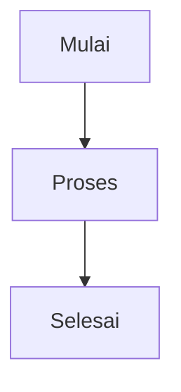
````

Kode di atas akan dibaca sebagai:

```text
Mulai → Proses → Selesai
```

Dalam artikel teknis, Mermaid dapat digunakan untuk membuat:

- flowchart proses;
- decision tree;
- sequence diagram;
- Gantt chart;
- state diagram;
- mind map;
- hubungan antar sistem;
- alur troubleshooting;
- workflow proyek;
- alur approval dokumen;
- diagram sebab-akibat.

Untuk beginner, jenis diagram yang paling mudah dipelajari adalah **flowchart**.

---

# 2. Mengapa Mermaid Cocok untuk Dokumentasi Teknis?

Mermaid sangat cocok untuk artikel teknis karena:

1. **Ditulis langsung di artikel MDX/Markdown**
   Tidak perlu membuat file gambar terpisah.

2. **Mudah direvisi**
   Cukup ubah teks diagram, tidak perlu membuka software desain.

3. **Cocok untuk Git**
   Karena diagram berupa teks, perubahannya bisa dilacak melalui version control.

4. **Ringan dan cepat**
   Tidak perlu menyimpan banyak file gambar.

5. **Ideal untuk dokumentasi engineering**
   Sangat berguna untuk menjelaskan alur investigasi, hubungan sistem, interlock, troubleshooting, dan proses kerja.

6. **Mendukung warna dan styling**
   Node dapat diberi warna berbeda untuk membedakan input, proses, risiko, decision point, dan output.

---

# 3. Struktur Dasar Penulisan Mermaid

Format dasar penulisan Mermaid di artikel `.mdx` adalah sebagai berikut:

````mdx
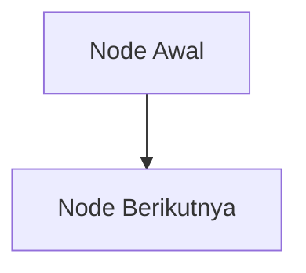
````

Dalam project yang sudah mendukung metadata code fence, diagram juga bisa ditulis dengan `id`:

````mdx

````

Bagian pentingnya adalah:

| Bagian                   | Fungsi                                         |
| ------------------------ | ---------------------------------------------- |
| ` ```mermaid `           | Menandai bahwa blok ini adalah diagram Mermaid |
| `id="contoh-diagram-01"` | Identitas diagram, opsional                    |
| `flowchart TD`           | Jenis dan arah diagram                         |
| `A[Node Awal]`           | Node atau kotak diagram                        |
| `-->`                    | Panah hubungan antar node                      |
| `B[Node Berikutnya]`     | Node tujuan                                    |

---

# 4. Mengenal `flowchart TD`, `LR`, dan Arah Diagram

Untuk beginner, gunakan `flowchart` terlebih dahulu.

Formatnya:

```mdx
flowchart TD
```

Huruf setelah `flowchart` menunjukkan arah diagram.

| Syntax | Arah Diagram                  | Penggunaan                                    |
| ------ | ----------------------------- | --------------------------------------------- |
| `TD`   | Top Down / atas ke bawah      | Alur proses, troubleshooting, sebab-akibat    |
| `TB`   | Top to Bottom / atas ke bawah | Sama seperti `TD`                             |
| `LR`   | Left to Right / kiri ke kanan | Hubungan sistem, aliran energi, aliran sinyal |
| `RL`   | Right to Left / kanan ke kiri | Jarang digunakan                              |
| `BT`   | Bottom to Top / bawah ke atas | Jarang digunakan                              |

Contoh `TD`:

````mdx
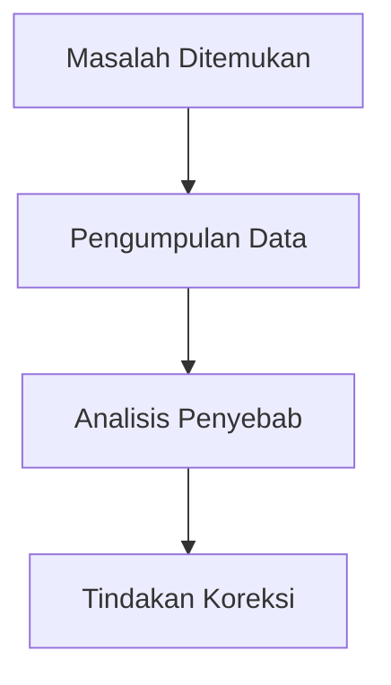
````

Contoh `LR`:

````mdx
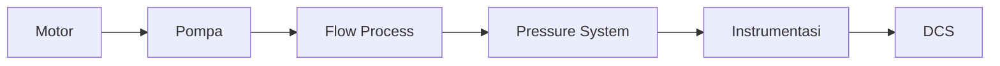
````

Untuk artikel maintenance, `LR` sangat cocok untuk menjelaskan hubungan sistem seperti:

```text
Motor → Pump → Flow → Pressure → Transmitter → DCS → Interlock
```

---

# 5. Cara Menulis Node

Node adalah kotak, lingkaran, atau simbol yang mewakili langkah proses, kondisi, keputusan, atau hasil.

## 5.1 Node Proses Biasa

Format:

```mdx
A[Proses]
```

Contoh:

```mdx
A[Kebutuhan PGPM Meningkat]
```

Contoh diagram:

````mdx
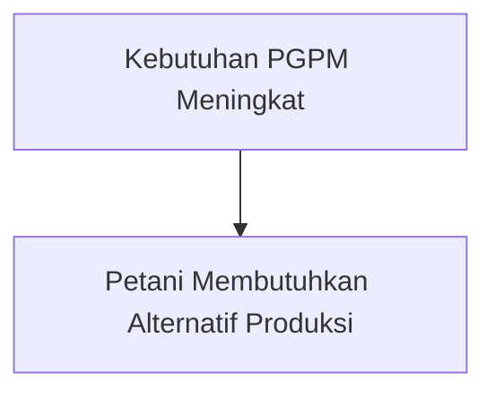
````

## 5.2 Node Keputusan

Node keputusan menggunakan kurung kurawal `{ }`.

Format:

```mdx
A{Pertanyaan Keputusan}
```

Contoh:

```mdx
E{Metode Pembiakan}
```

Contoh diagram:

````mdx
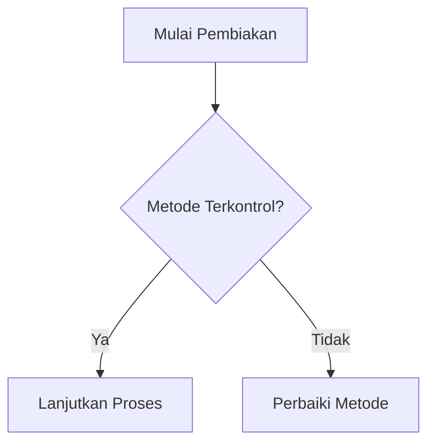
````

Node keputusan sangat penting untuk artikel troubleshooting karena menunjukkan **decision point**.

## 5.3 Node Hasil Akhir

Untuk hasil akhir, bisa menggunakan bentuk terminal:

```mdx
A([Hasil Akhir])
```

Contoh:

````mdx
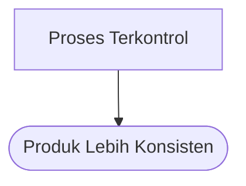
````

## 5.4 Node Penyimpanan Data

Untuk data, catatan batch, database, atau log:

```mdx
A[(Database)]
```

Contoh:

````mdx
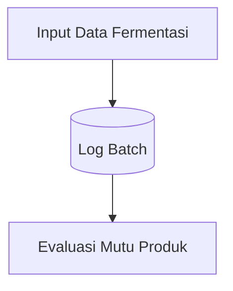
````

---

# 6. Cara Menulis Panah

Panah menunjukkan hubungan antar node.

## 6.1 Panah Biasa

```mdx
A --> B
```

Contoh:

````mdx

````

## 6.2 Panah dengan Label

Format:

```mdx
A -->|Label| B
```

Contoh:

````mdx
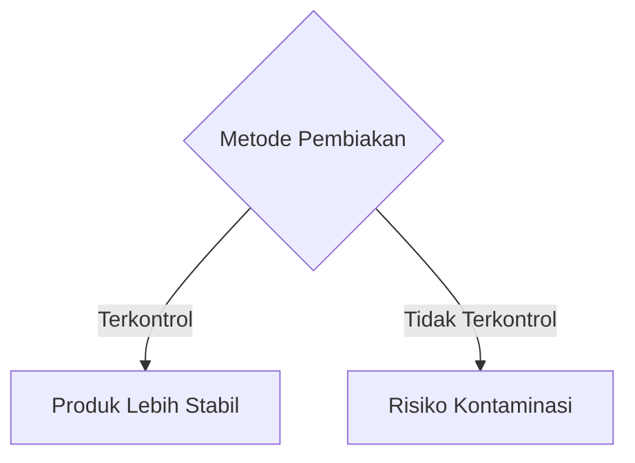
````

Panah berlabel sangat berguna untuk membedakan kondisi:

```text
Ya / Tidak
Normal / Abnormal
Terkontrol / Tidak Terkontrol
Lulus / Tidak Lulus
Aman / Tidak Aman
```

## 6.3 Panah Putus-putus

Format:

```mdx
A -.-> B
```

Contoh:

````mdx
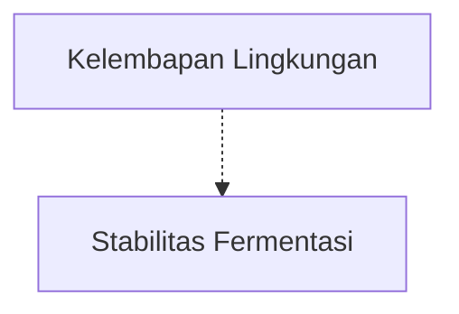
````

Gunakan panah putus-putus untuk hubungan tidak langsung.

## 6.4 Panah Tebal

Format:

```mdx
A ==> B
```

Contoh:

````mdx
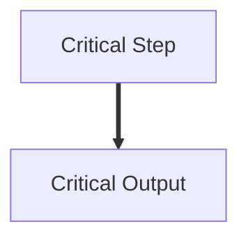
````

Gunakan panah tebal untuk jalur utama atau jalur kritis.

---

# 7. Menulis Teks Panjang dan Line Break

Kadang node terlalu panjang. Untuk memecah baris, gunakan `<br/>`.

Contoh:

````mdx
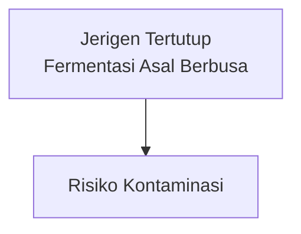
````

Namun untuk standar yang lebih aman, terutama pada teks panjang, gunakan tanda kutip:

````mdx
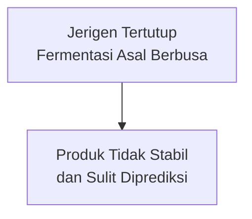
````

Rekomendasi standar:

```mdx
A["Teks baris pertama<br/>Teks baris kedua"]
```

---

# 8. Contoh Lengkap Flowchart PGPM

Berikut contoh diagram yang cocok untuk artikel tentang bioreactor, PGPM, atau pembiakan mikroba:

````mdx
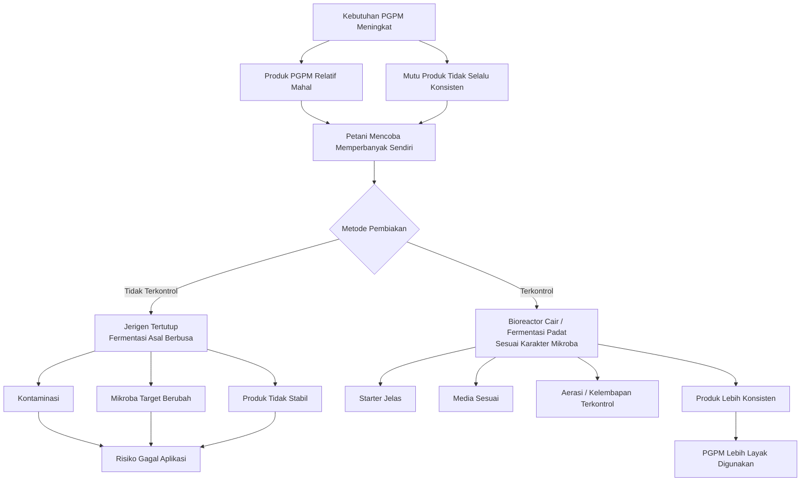
````

Diagram di atas menjelaskan perbedaan antara pembiakan PGPM yang tidak terkontrol dan pembiakan yang dilakukan secara lebih terarah.

---

# 9. Menambahkan Warna pada Mermaid Diagram

Mermaid mendukung warna menggunakan `classDef` dan `class`.

## 9.1 Struktur Dasar Warna

Format:

```mdx
classDef namaClass fill:#warnaIsi,stroke:#warnaGaris,color:#warnaTeks,stroke-width:2px;
class A,B,C namaClass;
```

Contoh:

````mdx
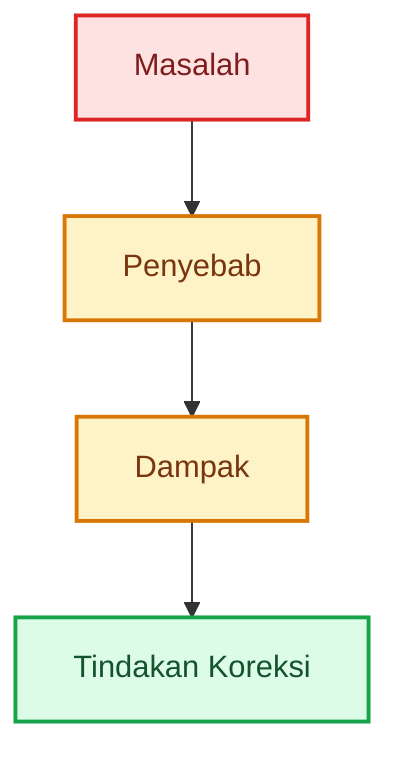
````

## 9.2 Standar Warna untuk Artikel Teknis

Gunakan warna sebagai kode makna, bukan dekorasi berlebihan.

| Kategori       | Warna     | Makna                                |
| -------------- | --------- | ------------------------------------ |
| Input          | Biru muda | Kondisi awal atau data awal          |
| Proses benar   | Hijau     | Praktik baik atau kondisi terkendali |
| Decision point | Kuning    | Titik keputusan                      |
| Warning        | Oranye    | Deviasi atau perhatian               |
| Risiko         | Merah     | Bahaya, kegagalan, kontaminasi       |
| Output         | Biru tua  | Hasil akhir atau rekomendasi         |

Template warna yang bisa dipakai ulang:

```mdx
classDef input fill:#e0f2fe,stroke:#0284c7,color:#0c4a6e,stroke-width:2px;
classDef process fill:#dcfce7,stroke:#16a34a,color:#14532d,stroke-width:2px;
classDef decision fill:#fef9c3,stroke:#ca8a04,color:#713f12,stroke-width:2px;
classDef warning fill:#ffedd5,stroke:#ea580c,color:#7c2d12,stroke-width:2px;
classDef risk fill:#fee2e2,stroke:#dc2626,color:#7f1d1d,stroke-width:2px;
classDef output fill:#dbeafe,stroke:#2563eb,color:#1e3a8a,stroke-width:3px;
```

## 9.3 Contoh Diagram PGPM dengan Warna

````mdx
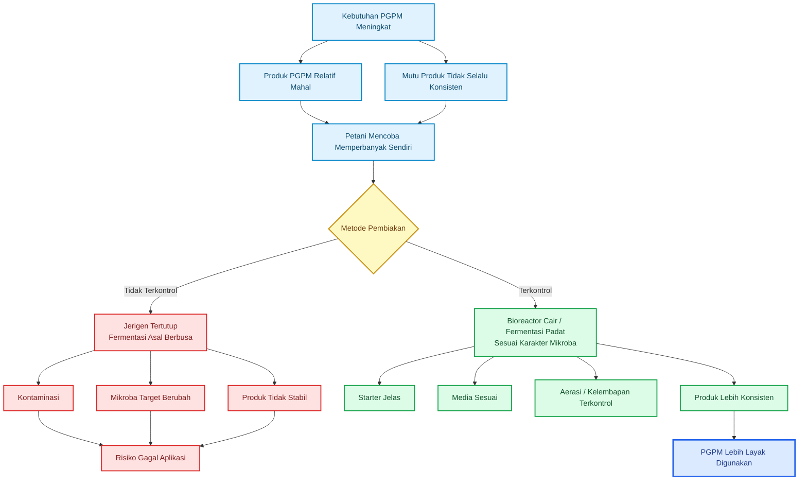
````

---

# 10. Template Mermaid untuk Beginner

## 10.1 Template Alur Proses

Gunakan untuk menjelaskan tahapan kerja.

````mdx
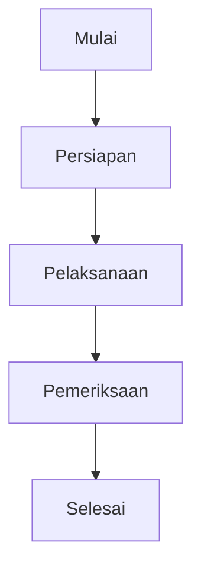
````

## 10.2 Template Decision Tree

Gunakan untuk troubleshooting atau pengambilan keputusan.

````mdx
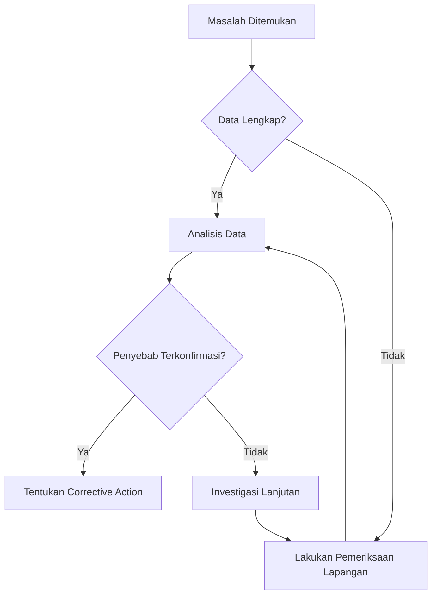
````

## 10.3 Template Hubungan Sistem

Gunakan untuk menggambarkan hubungan antar komponen.

````mdx
```mermaid id="template-hubungan-sistem-01"
flowchart LR
    A[Input] --> B[Process]
    B --> C[Control]
    C --> D[Output]
    D --> E[Monitoring]
    E --> F[Feedback]
    F --> C
```
````

## 10.4 Template Sebab-Akibat

Gunakan untuk RCA sederhana.

````mdx
```mermaid id="template-sebab-akibat-01"
flowchart TD
    A[Masalah Utama] --> B[Penyebab 1]
    A --> C[Penyebab 2]
    A --> D[Penyebab 3]

    B --> E[Dampak 1]
    C --> F[Dampak 2]
    D --> G[Dampak 3]

    E --> H[Konsekuensi Akhir]
    F --> H
    G --> H
```
````

## 10.5 Template Dengan Subgraph

Gunakan jika diagram mulai besar dan perlu dikelompokkan.

````mdx
```mermaid id="template-subgraph-01"
flowchart TD
    subgraph INPUT[Input]
        A[Starter]
        B[Media]
        C[Air]
    end

    subgraph PROCESS[Proses]
        D[Sanitasi]
        E[Fermentasi]
        F[Monitoring]
    end

    subgraph OUTPUT[Output]
        G[Produk Jadi]
        H[Penyimpanan]
    end

    A --> E
    B --> E
    C --> E
    D --> E
    E --> F
    F --> G
    G --> H
```
````

---

# 11. Sequence Diagram untuk Interaksi Antar Sistem

Selain flowchart, Mermaid juga bisa digunakan untuk membuat sequence diagram.

Sequence diagram cocok untuk menjelaskan interaksi antar aktor atau sistem, misalnya:

```text
Petani → Starter → Media → Bioreactor → Produk
```

Contoh:

````mdx
```mermaid id="sequence-pgpm-01"
sequenceDiagram
    participant Petani
    participant Starter
    participant Media
    participant Bioreactor
    participant Produk

    Petani->>Starter: Memilih starter mikroba
    Petani->>Media: Menyiapkan media nutrisi
    Starter->>Bioreactor: Inokulasi
    Media->>Bioreactor: Pengisian media
    Bioreactor->>Produk: Fermentasi terkontrol
    Produk->>Petani: PGPM siap aplikasi
```
````

Untuk beginner, sequence diagram sebaiknya digunakan setelah menguasai flowchart.

---

# 12. Gantt Chart untuk Jadwal Kerja

Mermaid juga mendukung Gantt chart. Ini berguna untuk artikel tentang jadwal proyek, fermentasi, Turn Around, atau pekerjaan lapangan.

Contoh:

````mdx
```mermaid id="gantt-pgpm-01"
gantt
    title Jadwal Pembiakan PGPM Cair
    dateFormat  YYYY-MM-DD

    section Persiapan
    Sanitasi alat dan wadah      :a1, 2026-05-01, 1d
    Persiapan media              :a2, after a1, 1d

    section Fermentasi
    Inokulasi starter            :b1, after a2, 1d
    Fermentasi terkontrol        :b2, after b1, 5d

    section Pascapanen
    Penyaringan dan pengemasan   :c1, after b2, 1d
    Penyimpanan awal             :c2, after c1, 2d
```
````

Untuk dokumentasi engineering, Gantt chart Mermaid bisa digunakan untuk jadwal sederhana. Namun untuk proyek kompleks seperti Turn Around besar, Primavera P6, Microsoft Project, atau OpenProject tetap lebih tepat.

---

# 13. Standar Penulisan Mermaid di Artikel MDX

Agar konsisten, gunakan standar berikut.

## 13.1 Penamaan ID Diagram

Gunakan format:

```txt
topik-bab-nomor
```

Contoh:

```txt
bioreactor-bab1-01
bioreactor-bab1-02
pgpm-bab2-01
fermentasi-padat-bab3-01
motor-trip-bab4-01
```

Aturan:

- gunakan huruf kecil;
- gunakan tanda hubung `-`;
- hindari spasi;
- hindari karakter khusus;
- buat ID unik dalam satu artikel.

## 13.2 Struktur Penulisan di Artikel

Format yang disarankan:

````mdx
## Judul Subbab

Paragraf pembuka yang menjelaskan fungsi diagram.

```mermaid id="nama-diagram"
flowchart TD
    A[Node Awal] --> B[Node Proses]
    B --> C{Decision Point}
    C -->|Ya| D[Tindakan 1]
    C -->|Tidak| E[Tindakan 2]
```

**Gambar X.** Keterangan singkat diagram.
````

Contoh:

````mdx
## Mengapa Pembiakan PGPM Perlu Dikontrol

Pembiakan PGPM tidak cukup hanya mencampur starter, molase, dan air. Proses perlu memperhatikan karakter mikroba, jenis media, aerasi, sanitasi, dan risiko kontaminasi.

```mermaid id="bioreactor-bab1-01"
flowchart TD
    A[Kebutuhan PGPM Meningkat] --> B[Produk PGPM Relatif Mahal]
    A --> C[Mutu Produk Tidak Selalu Konsisten]
    B --> D[Petani Mencoba Memperbanyak Sendiri]
    C --> D

    D --> E{Metode Pembiakan}
    E -->|Tidak Terkontrol| F["Jerigen Tertutup<br/>Fermentasi Asal Berbusa"]
    E -->|Terkontrol| G["Bioreactor Cair / Fermentasi Padat<br/>Sesuai Karakter Mikroba"]

    F --> H[Kontaminasi]
    F --> I[Mikroba Target Berubah]
    F --> J[Produk Tidak Stabil]

    G --> K[Starter Jelas]
    G --> L[Media Sesuai]
    G --> M[Aerasi / Kelembapan Terkontrol]
    G --> N[Produk Lebih Konsisten]

    H --> O[Risiko Gagal Aplikasi]
    I --> O
    J --> O
    N --> P[PGPM Lebih Layak Digunakan]
```

**Gambar 1.** Perbedaan antara pembiakan PGPM tidak terkontrol dan pembiakan terkontrol menggunakan bioreactor cair atau fermentasi padat.
````

---

# 14. Kesalahan Umum Beginner

## 14.1 Lupa Menulis Jenis Diagram

Salah:

````mdx
```mermaid
A --> B
```
````

Benar:

````mdx
```mermaid
flowchart TD
    A --> B
```
````

Mermaid perlu tahu jenis diagramnya, misalnya `flowchart TD`, `sequenceDiagram`, atau `gantt`.

## 14.2 Node ID Menggunakan Spasi

Salah:

```mdx
Masalah Utama[Masalah Utama] --> Penyebab Awal[Penyebab Awal]
```

Lebih aman:

```mdx
A[Masalah Utama] --> B[Penyebab Awal]
```

Gunakan ID node sederhana seperti `A`, `B`, `C`, `A1`, `A2`.

## 14.3 Teks Terlalu Panjang dalam Satu Node

Kurang baik:

```mdx
A[Proses pembiakan PGPM dilakukan tanpa kontrol aerasi kelembapan sanitasi starter media dan kondisi penyimpanan]
```

Lebih baik:

```mdx
A["Pembiakan PGPM<br/>tanpa kontrol proses"]
```

## 14.4 Diagram Terlalu Besar

Diagram yang terlalu besar sulit dibaca. Pecah menjadi beberapa diagram:

```text
Diagram 1: Latar belakang masalah
Diagram 2: Alur proses
Diagram 3: Risiko dan kontrol mutu
Diagram 4: Output dan aplikasi
```

## 14.5 Warna Terlalu Banyak

Warna harus membantu pemahaman. Jangan semua node diberi warna berbeda tanpa makna teknis.

Gunakan maksimal 5–6 kategori warna:

```text
Input, Process, Decision, Warning, Risk, Output
```

---

# 15. Praktik Terbaik untuk Artikel Engineering

Untuk artikel teknis, Mermaid sebaiknya tidak hanya menjadi dekorasi. Diagram harus membantu pembaca memahami sistem.

Gunakan Mermaid untuk menjelaskan:

1. **alur proses**
   Contoh: tahapan fermentasi, tahapan inspeksi, tahapan commissioning.

2. **decision point**
   Contoh: “apakah data cukup?”, “apakah parameter abnormal?”, “apakah perlu corrective action?”

3. **hubungan sistem**
   Contoh: motor, pompa, proses, transmitter, DCS, interlock.

4. **risiko dan kontrol**
   Contoh: kontaminasi, gagal aplikasi, parameter tidak stabil.

5. **critical path sederhana**
   Contoh: urutan pekerjaan yang menentukan durasi proyek.

6. **alur troubleshooting**
   Contoh: gejala, data awal, hipotesis, verifikasi, root cause, tindakan.

Contoh untuk maintenance:

````mdx
```mermaid id="motor-trip-troubleshooting-01"
flowchart TD
    A[Motor Trip] --> B{Alarm DCS Tersedia?}

    B -->|Ya| C[Cek Alarm Historian]
    B -->|Tidak| D[Cek MCC dan Protection Relay]

    C --> E[Cek Current Trend]
    D --> F[Cek Overload / Earth Fault / Short Circuit]

    E --> G{Current Naik Bertahap?}
    G -->|Ya| H[Indikasi Beban Mekanik Naik]
    G -->|Tidak| I[Indikasi Gangguan Elektrikal Mendadak]

    H --> J[Cek Pompa / Coupling / Bearing]
    I --> K[Cek Kabel / Motor Winding / Relay]
```
````

---

# 16. Checklist Sebelum Publish Diagram

Sebelum artikel dipublish, periksa hal berikut:

| Item                        | Checklist                                                       |     |           |       |     |
| --------------------------- | --------------------------------------------------------------- | --- | --------- | ----- | --- |
| Jenis diagram sudah ditulis | `flowchart TD`, `flowchart LR`, `sequenceDiagram`, atau `gantt` |     |           |       |     |
| ID diagram unik             | Tidak duplikat dalam satu artikel                               |     |           |       |     |
| Node ID sederhana           | A, B, C, A1, B1                                                 |     |           |       |     |
| Node tidak terlalu panjang  | Gunakan `<br/>` jika perlu                                      |     |           |       |     |
| Decision point jelas        | Gunakan `{ }`                                                   |     |           |       |     |
| Panah berlabel jelas        | Gunakan `-->                                                    | Ya  | `atau`--> | Tidak | `   |
| Warna punya makna           | Bukan sekadar dekorasi                                          |     |           |       |     |
| Caption tersedia            | Ada keterangan “Gambar X”                                       |     |           |       |     |
| Diagram tidak terlalu besar | Pecah jika terlalu kompleks                                     |     |           |       |     |
| Render lokal sudah dites    | Jalankan `pnpm dev` atau `npm run dev`                          |     |           |       |     |

---

# 17. Rekomendasi Standar untuk Beginner

Untuk tahap awal, kuasai urutan berikut:

## Tahap 1 — Flowchart Dasar

Pelajari:

```mdx
flowchart TD
A --> B
```

## Tahap 2 — Decision Point

Pelajari:

```mdx
A{Pertanyaan?}
A -->|Ya| B
A -->|Tidak| C
```

## Tahap 3 — Line Break

Pelajari:

```mdx
A["Teks panjang<br/>baris kedua"]
```

## Tahap 4 — Warna

Pelajari:

```mdx
classDef risk fill:#fee2e2,stroke:#dc2626,color:#7f1d1d;
class A risk;
```

## Tahap 5 — Subgraph

Pelajari:

```mdx
subgraph INPUT[Input]
A[Starter]
B[Media]
end
```

Setelah lima tahap ini dikuasai, penulis sudah cukup kuat untuk membuat diagram teknis yang jelas dan layak dipakai dalam artikel engineering.

---

# Kesimpulan

Mermaid diagram adalah cara praktis membuat diagram menggunakan teks di dalam artikel Markdown atau MDX. Untuk beginner, jenis diagram yang paling mudah dipelajari adalah flowchart. Dengan memahami node, panah, decision point, line break, warna, dan subgraph, penulis dapat membuat diagram yang cukup kuat untuk dokumentasi teknis.

Dalam artikel engineering, Mermaid sangat membantu menjelaskan proses, hubungan sistem, alur troubleshooting, risiko, dan keputusan teknis. Kekuatan utamanya adalah mudah ditulis, mudah direvisi, dan cocok untuk project berbasis Next.js, Contentlayer, serta dokumentasi modern berbasis Git.

---

<small>
  **_Catatan Penyusunan_** Artikel ini disusun sebagai materi edukasi dan
  referensi umum berdasarkan berbagai sumber pustaka, praktik lapangan, serta
  bantuan alat penulisan. Pembaca disarankan untuk melakukan verifikasi lanjutan
  dan penyesuaian sesuai dengan kondisi serta kebutuhan masing-masing sistem.
</small>
