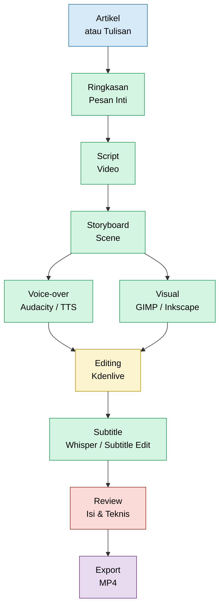

# **_Mengubah Artikel Menjadi Video Edukasi dengan Bantuan AI di Windows 10/11_**

---

- [**_Mengubah Artikel Menjadi Video Edukasi dengan Bantuan AI di Windows 10/11_**](#mengubah-artikel-menjadi-video-edukasi-dengan-bantuan-ai-di-windows-1011)
  - [Pengantar](#pengantar)
  - [1. Prinsip Dasar: Artikel Tidak Langsung Dibaca Menjadi Video](#1-prinsip-dasar-artikel-tidak-langsung-dibaca-menjadi-video)
  - [2. Workflow Praktis di Windows 10/11](#2-workflow-praktis-di-windows-1011)
  - [3. Software Open Source yang Direkomendasikan](#3-software-open-source-yang-direkomendasikan)
  - [4. Peran AI dalam Pembuatan Video](#4-peran-ai-dalam-pembuatan-video)
  - [5. Contoh Alur Pembuatan Video dari Artikel](#5-contoh-alur-pembuatan-video-dari-artikel)
  - [6. Catatan Penting untuk Artikel Teknis](#6-catatan-penting-untuk-artikel-teknis)
  - [Kesimpulan](#kesimpulan)
  - [Lampiran A — Daftar Link Aplikasi untuk Membuat Video dari Artikel di Windows 10/11](#lampiran-a--daftar-link-aplikasi-untuk-membuat-video-dari-artikel-di-windows-1011)
    - [A.1 Paket Utama yang Direkomendasikan](#a1-paket-utama-yang-direkomendasikan)
    - [A.2 Alternatif Editor Video](#a2-alternatif-editor-video)
    - [A.3 AI, Voice-over, dan Subtitle Otomatis](#a3-ai-voice-over-dan-subtitle-otomatis)
    - [A.4 Tool Lanjutan untuk Otomatisasi dan Animasi](#a4-tool-lanjutan-untuk-otomatisasi-dan-animasi)
    - [A.5 Rekomendasi Urutan Instalasi untuk Windows 10/11](#a5-rekomendasi-urutan-instalasi-untuk-windows-1011)

---

## Pengantar

Artikel yang baik tidak harus berhenti sebagai tulisan. Dengan bantuan software open source dan AI, sebuah artikel dapat dikembangkan menjadi video edukasi yang lebih menarik, mudah dipahami, dan cocok dipublikasikan di YouTube, media sosial, website, maupun materi training internal. Bagi pengguna **Windows 10/11**, proses ini dapat dilakukan dengan kombinasi beberapa aplikasi seperti **Kdenlive**, **Audacity**, **GIMP**, **Inkscape**, **Subtitle Edit**, **FFmpeg**, serta bantuan AI untuk membuat script, storyboard, voice-over, visual, dan subtitle.

<ResourceBox
  title="Artikel Terkait:"
  items={[
    {
      name: 'Cara Menampilkan Gambar pada File MDX',
      href: '/blog/markdown/figure-image-guide',
    },
    {
      name: 'Panduan Markdown',
      href: '/blog/markdown/github-markdown-guide',
    },
    {
      name: 'Panduan Penulisan Formula Matematika dalam Block Markdown',
      href: '/blog/markdown/math-formula-guide',
    },
    {
      name: 'Panduan Beginner: Menulis Mermaid Diagram untuk Dokumentasi Teknis',
      href: '/blog/markdown/mermaid-diagram-guide',
    },
  ]}
/>

[**Kembali ke Atas**](#mengubah-artikel-menjadi-video-edukasi-dengan-bantuan-ai-di-windows-1011)

---

## 1. Prinsip Dasar: Artikel Tidak Langsung Dibaca Menjadi Video

Kesalahan umum dalam membuat video dari artikel adalah langsung membaca seluruh isi artikel. Padahal, artikel biasanya panjang dan detail, sedangkan video membutuhkan narasi yang lebih ringkas, visual, dan mengalir.

Alur yang lebih tepat adalah:

```text
Artikel
→ Ringkasan pesan inti
→ Script video
→ Storyboard
→ Voice-over
→ Visual pendukung
→ Editing
→ Subtitle
→ Review
→ Export video
```

Dengan alur ini, artikel tetap menjadi sumber utama, tetapi bentuk penyajiannya disesuaikan agar cocok sebagai media audio-visual.

[**Kembali ke Atas**](#mengubah-artikel-menjadi-video-edukasi-dengan-bantuan-ai-di-windows-1011)

---

## 2. Workflow Praktis di Windows 10/11

Untuk pengguna Windows 10/11, workflow yang direkomendasikan adalah sebagai berikut:



Diagram tersebut menunjukkan bahwa proses pembuatan video bukan hanya pekerjaan editing, tetapi merupakan rangkaian produksi konten mulai dari pengolahan artikel sampai finalisasi video.

[**Kembali ke Atas**](#mengubah-artikel-menjadi-video-edukasi-dengan-bantuan-ai-di-windows-1011)

---

## 3. Software Open Source yang Direkomendasikan

Untuk kebutuhan dasar, kombinasi software berikut sudah cukup kuat:

| Kebutuhan         | Software                  | Fungsi                                                          |
| ----------------- | ------------------------- | --------------------------------------------------------------- |
| Editing video     | **Kdenlive**              | Menyusun audio, gambar, video, teks, transisi, dan export video |
| Alternatif editor | **Shotcut / OpenShot**    | Editing video yang lebih sederhana                              |
| Audio             | **Audacity**              | Merekam dan membersihkan voice-over                             |
| Gambar            | **GIMP**                  | Membuat thumbnail dan mengedit gambar                           |
| Diagram           | **Inkscape**              | Membuat ilustrasi teknis, ikon, dan SVG                         |
| Subtitle          | **Subtitle Edit**         | Mengedit file subtitle SRT/VTT                                  |
| Transkripsi       | **Whisper / whisper.cpp** | Membuat subtitle otomatis dari audio                            |
| Rendering         | **FFmpeg**                | Konversi, kompresi, dan encoding video                          |
| Screen recording  | **OBS Studio**            | Merekam layar untuk demo software atau presentasi               |

Untuk tahap awal, paket minimum yang cukup adalah:

```text
Kdenlive + Audacity + GIMP + Inkscape + Subtitle Edit + FFmpeg
```

Jika ingin lebih maju, dapat ditambahkan **OBS Studio**, **Whisper**, **Piper TTS**, **Blender**, atau **Manim**.

[**Kembali ke Atas**](#mengubah-artikel-menjadi-video-edukasi-dengan-bantuan-ai-di-windows-1011)

---

## 4. Peran AI dalam Pembuatan Video

AI dapat mempercepat proses produksi video, terutama pada tahap persiapan konten. AI dapat membantu membuat:

- ringkasan artikel,
- script video,
- storyboard,
- ide visual per scene,
- teks layar,
- caption,
- voice-over,
- subtitle,
- bahkan klip visual pendek.

Namun, untuk artikel teknis, AI sebaiknya tidak dipakai tanpa review. Misalnya pada artikel tentang **pemeliharaan pabrik**, **Turn Around**, **Critical Path Method**, atau **SHE**, bagian seperti angka teknis, standar industri, prosedur kerja, dan visual equipment tetap harus dicek secara manual.

Prinsip yang aman adalah:

```text
AI membantu produksi,
manusia memastikan akurasi.
```

[**Kembali ke Atas**](#mengubah-artikel-menjadi-video-edukasi-dengan-bantuan-ai-di-windows-1011)

---

## 5. Contoh Alur Pembuatan Video dari Artikel

Misalnya ada artikel berjudul:

> “Penerapan Predictive Maintenance pada Pompa Proses di Pabrik Petrokimia”

Artikel tersebut dapat diubah menjadi video dengan langkah berikut:

1. Ambil pesan inti artikel.
2. Buat script video berdurasi 3–5 menit.
3. Susun storyboard berisi scene, narasi, visual, dan teks layar.
4. Rekam voice-over menggunakan Audacity atau gunakan TTS.
5. Buat visual pendukung seperti diagram pompa, tren vibrasi, atau workflow inspeksi.
6. Susun video di Kdenlive.
7. Tambahkan subtitle.
8. Review kembali dari sisi teknis, SHE, dan kerahasiaan data.
9. Export menjadi MP4.

Contoh narasi singkat:

```text
Satu pompa proses yang gagal dapat menyebabkan shutdown, loss production, bahkan risiko SHE.

Karena itu, pemeliharaan tidak cukup hanya menunggu equipment rusak.

Dengan predictive maintenance, engineer dapat membaca gejala awal melalui data vibrasi, temperatur bearing, arus motor, dan histori failure.
```

Narasi seperti ini lebih cocok untuk video dibandingkan paragraf artikel yang terlalu panjang.

[**Kembali ke Atas**](#mengubah-artikel-menjadi-video-edukasi-dengan-bantuan-ai-di-windows-1011)

---

## 6. Catatan Penting untuk Artikel Teknis

Jika video dibuat dari artikel teknis industri, beberapa hal wajib diperhatikan:

| Aspek            | Catatan                                                          |
| ---------------- | ---------------------------------------------------------------- |
| Akurasi teknis   | Jangan biarkan AI mengubah makna engineering                     |
| SHE              | Hindari visual yang menunjukkan praktik unsafe                   |
| Confidentiality  | Jangan tampilkan data internal plant tanpa izin                  |
| Standar          | Pastikan rujukan standar tidak salah konteks                     |
| Visual equipment | Pastikan gambar tidak menyesatkan                                |
| Durasi           | Artikel panjang lebih baik dipecah menjadi beberapa video pendek |

Untuk konten edukasi industri, video yang baik bukan hanya menarik, tetapi juga harus **aman, akurat, dan dapat dipertanggungjawabkan**.

[**Kembali ke Atas**](#mengubah-artikel-menjadi-video-edukasi-dengan-bantuan-ai-di-windows-1011)

---

## Kesimpulan

Membuat video dari artikel di Windows 10/11 dapat dilakukan dengan workflow sederhana menggunakan software open source. Stack yang paling praktis adalah **Kdenlive untuk editing**, **Audacity untuk audio**, **GIMP dan Inkscape untuk visual**, **Subtitle Edit atau Whisper untuk subtitle**, serta **FFmpeg untuk rendering dan konversi**.

AI dapat membantu mempercepat penyusunan script, storyboard, voice-over, dan subtitle. Namun, untuk artikel teknis seperti pemeliharaan pabrik, Turn Around, CPM, dan SHE, review manusia tetap wajib dilakukan. Dengan pendekatan ini, artikel tidak hanya menjadi tulisan, tetapi dapat berkembang menjadi video edukasi yang lebih komunikatif, profesional, dan mudah dipahami.

[**Kembali ke Atas**](#mengubah-artikel-menjadi-video-edukasi-dengan-bantuan-ai-di-windows-1011)

---

## Lampiran A — Daftar Link Aplikasi untuk Membuat Video dari Artikel di Windows 10/11

Lampiran ini berisi link resmi aplikasi yang dapat digunakan untuk mengubah artikel/tulisan menjadi video edukasi. Untuk keamanan, unduh aplikasi dari **website resmi, GitHub resmi, atau Microsoft Store**, bukan dari situs mirror yang tidak jelas.

### A.1 Paket Utama yang Direkomendasikan

|  No | Aplikasi          | Fungsi                          | Link Resmi                                                                                             | Catatan                                                                                                                                                                             |
| --: | ----------------- | ------------------------------- | ------------------------------------------------------------------------------------------------------ | ----------------------------------------------------------------------------------------------------------------------------------------------------------------------------------- |
|   1 | **Kdenlive**      | Editor video utama              | [kdenlive.org/download](https://kdenlive.org/download/)                                                | Cocok sebagai editor utama untuk menyusun audio, visual, teks, transisi, dan export video. Versi Windows membutuhkan Windows 10 atau lebih baru. ([Kdenlive][1])                    |
|   2 | **Audacity**      | Rekam dan edit voice-over       | [audacityteam.org/download/windows](https://www.audacityteam.org/download/windows/)                    | Digunakan untuk merekam suara, memotong audio, normalisasi volume, dan membersihkan noise. Audacity diuji pada Windows 10 dan Windows 11. ([Audacity][2])                           |
|   3 | **GIMP**          | Edit gambar dan thumbnail       | [gimp.org/downloads](https://www.gimp.org/downloads/)                                                  | Digunakan untuk membuat thumbnail, crop gambar, edit visual, dan kebutuhan grafis raster. ([GIMP][3])                                                                               |
|   4 | **Inkscape**      | Diagram dan ilustrasi vektor    | [inkscape.org/release](https://inkscape.org/release/)                                                  | Cocok untuk membuat diagram teknis, ikon, flow diagram, dan ilustrasi berbasis SVG. Untuk Windows, pilih installer 64-bit/MSI. ([Inkscape Wiki][4])                                 |
|   5 | **Subtitle Edit** | Edit subtitle SRT/VTT           | [github.com/SubtitleEdit/subtitleedit/releases](https://github.com/SubtitleEdit/subtitleedit/releases) | Digunakan untuk koreksi timing, sinkronisasi, dan ekspor subtitle. Subtitle Edit adalah aplikasi offline dan open source. ([GitHub][5])                                             |
|   6 | **FFmpeg**        | Render, convert, compress video | [ffmpeg.org/download](https://ffmpeg.org/download.html)                                                | Digunakan untuk konversi audio-video, kompresi MP4, merge audio-video, dan encoding. FFmpeg menyediakan source code; untuk Windows biasanya memakai build siap pakai. ([FFmpeg][6]) |
|   7 | **OBS Studio**    | Screen recording                | [obsproject.com/download](https://obsproject.com/download)                                             | Dipakai untuk merekam layar, demo software, presentasi, dashboard, atau tutorial. OBS Studio mendukung Windows 10 dan 11. ([OBS Studio][7])                                         |

[**Kembali ke Atas**](#mengubah-artikel-menjadi-video-edukasi-dengan-bantuan-ai-di-windows-1011)

---

### A.2 Alternatif Editor Video

|  No | Aplikasi     | Fungsi                  | Link Resmi                                                  | Catatan                                                                                                                                     |
| --: | ------------ | ----------------------- | ----------------------------------------------------------- | ------------------------------------------------------------------------------------------------------------------------------------------- |
|   1 | **Shotcut**  | Alternatif editor video | [shotcut.org/download](https://www.shotcut.org/download/)   | Editor video open source, cross-platform, mendukung Windows, Mac, dan Linux. Cocok bila ingin editor yang relatif sederhana. ([Shotcut][8]) |
|   2 | **OpenShot** | Editor video sederhana  | [openshot.org/download](https://www.openshot.org/download/) | Cocok untuk pemula, drag-and-drop, dan editing sederhana. Tersedia untuk Windows, Linux, dan macOS. ([OpenShot Video Editor][9])            |

[**Kembali ke Atas**](#mengubah-artikel-menjadi-video-edukasi-dengan-bantuan-ai-di-windows-1011)

---

### A.3 AI, Voice-over, dan Subtitle Otomatis

|  No | Aplikasi / Tool                 | Fungsi                                          | Link Resmi                                                                 | Catatan                                                                                                                                                                   |
| --: | ------------------------------- | ----------------------------------------------- | -------------------------------------------------------------------------- | ------------------------------------------------------------------------------------------------------------------------------------------------------------------------- |
|   1 | **ChatGPT / AI Text Assistant** | Membantu ringkasan, script, storyboard, caption | [openai.com/chatgpt](https://openai.com/chatgpt/overview/)                 | Digunakan untuk membantu menyusun script video, storyboard, CTA, dan ide visual. Ini bukan open source, tetapi dapat dipakai sebagai asisten penulisan. ([OpenAI][10])    |
|   2 | **Piper TTS**                   | Text-to-speech lokal/offline                    | [github.com/OHF-Voice/piper1-gpl](https://github.com/OHF-Voice/piper1-gpl) | Digunakan untuk mengubah script menjadi voice-over. Piper adalah text-to-speech lokal; repositori OHF-Voice menjelaskan instalasi `pip install piper-tts`. ([GitHub][11]) |
|   3 | **Whisper**                     | Transkripsi audio ke teks                       | [github.com/openai/whisper](https://github.com/openai/whisper)             | Dipakai untuk membuat subtitle otomatis dari audio. Whisper mendukung multilingual speech recognition, translation, dan language identification. ([GitHub][12])           |
|   4 | **whisper.cpp**                 | Whisper versi ringan berbasis C/C++             | [github.com/ggml-org/whisper.cpp](https://github.com/ggml-org/whisper.cpp) | Cocok untuk menjalankan transkripsi lokal dengan performa lebih ringan; mendukung Windows melalui MSVC/MinGW. ([GitHub][13])                                              |

[**Kembali ke Atas**](#mengubah-artikel-menjadi-video-edukasi-dengan-bantuan-ai-di-windows-1011)

---

### A.4 Tool Lanjutan untuk Otomatisasi dan Animasi

|  No | Aplikasi / Library         | Fungsi                                     | Link Resmi                                                                                                                     | Catatan                                                                                                                                                                            |
| --: | -------------------------- | ------------------------------------------ | ------------------------------------------------------------------------------------------------------------------------------ | ---------------------------------------------------------------------------------------------------------------------------------------------------------------------------------- |
|   1 | **MoviePy**                | Otomatisasi video dengan Python            | [zulko.github.io/moviepy](https://zulko.github.io/moviepy/)                                                                    | Cocok jika ingin membuat video otomatis dari artikel, gambar, teks, dan audio menggunakan Python. MoviePy berjalan di Windows/Mac/Linux. ([Zulko][14])                             |
|   2 | **Remotion**               | Membuat video dengan React                 | [remotion.dev](https://www.remotion.dev/)                                                                                      | Cocok untuk pengguna React/Next.js yang ingin membuat video secara programmatic dan render massal dari data artikel. ([Remotion][15])                                              |
|   3 | **Blender**                | Animasi 3D dan video editing lanjutan      | [blender.org/download](https://www.blender.org/download/)                                                                      | Digunakan untuk animasi 3D, equipment, layout plant, motion graphic, dan visual teknis yang lebih kompleks. ([blender.org][16])                                                    |
|   4 | **Manim Community**        | Animasi formula, grafik, dan konsep teknis | [manim.community](https://www.manim.community/)                                                                                | Cocok untuk membuat animasi edukasi berbasis formula, grafik, proses engineering, CPM, atau konsep matematis. ([Manim Community][17])                                              |
|   5 | **ComfyUI**                | Workflow AI visual berbasis node           | [github.com/comfy-org/comfyui](https://github.com/comfy-org/comfyui)                                                           | Digunakan untuk membuat visual AI, image generation, video generation, audio, dan workflow kreatif berbasis node. Membutuhkan spesifikasi komputer yang lebih kuat. ([GitHub][18]) |
|   6 | **Stable Video Diffusion** | Image-to-video AI                          | [huggingface.co/stabilityai/stable-video-diffusion-img2vid](https://huggingface.co/stabilityai/stable-video-diffusion-img2vid) | Mengubah gambar menjadi video pendek. Untuk penggunaan komersial, periksa lisensi Stability AI terlebih dahulu. ([Hugging Face][19])                                               |

[**Kembali ke Atas**](#mengubah-artikel-menjadi-video-edukasi-dengan-bantuan-ai-di-windows-1011)

---

### A.5 Rekomendasi Urutan Instalasi untuk Windows 10/11

Untuk mulai produksi video dari artikel, urutan instalasi yang paling praktis adalah:

```text
1. Kdenlive
2. Audacity
3. GIMP
4. Inkscape
5. Subtitle Edit
6. FFmpeg
7. OBS Studio
```

Setelah workflow dasar stabil, baru tambahkan:

```text
8. Whisper / whisper.cpp
9. Piper TTS
10. MoviePy atau Remotion
11. Blender atau Manim
12. ComfyUI / Stable Video Diffusion
```

Untuk artikel teknis industri, terutama yang menyangkut **pemeliharaan pabrik, SHE, equipment, Turn Around, CPM, atau RBM**, aplikasi AI sebaiknya dipakai sebagai alat bantu produksi, sedangkan akurasi teknis tetap harus direview manusia sebelum video dipublikasikan.

[1]: https://kdenlive.org/download/?utm_source=chatgpt.com 'Downloads'
[2]: https://www.audacityteam.org/download/windows/?utm_source=chatgpt.com 'Audacity ® | Download for Windows'
[3]: https://www.gimp.org/downloads/?utm_source=chatgpt.com 'Downloads'
[4]: https://wiki.inkscape.org/wiki/Installing_Inkscape?utm_source=chatgpt.com 'Installing Inkscape'
[5]: https://github.com/SubtitleEdit/subtitleedit/releases?utm_source=chatgpt.com 'Releases · SubtitleEdit/subtitleedit'
[6]: https://ffmpeg.org/download.html?utm_source=chatgpt.com 'Download FFmpeg'
[7]: https://obsproject.com/download?utm_source=chatgpt.com 'Download OBS Studio'
[8]: https://www.shotcut.org/download/?utm_source=chatgpt.com 'Download'
[9]: https://www.openshot.org/download/?utm_source=chatgpt.com 'OpenShot Video Editor | Download'
[10]: https://openai.com/chatgpt/overview/?utm_source=chatgpt.com 'ChatGPT | AI Chatbot to Discover, Learn & Create'
[11]: https://github.com/OHF-Voice/piper1-gpl 'GitHub - OHF-Voice/piper1-gpl: Fast and local neural text-to-speech engine · GitHub'
[12]: https://github.com/openai/whisper?utm_source=chatgpt.com 'openai/whisper: Robust Speech Recognition via Large- ...'
[13]: https://github.com/ggml-org/whisper.cpp?utm_source=chatgpt.com 'ggml-org/whisper.cpp'
[14]: https://zulko.github.io/moviepy/?utm_source=chatgpt.com 'MoviePy documentation'
[15]: https://www.remotion.dev/?utm_source=chatgpt.com 'Remotion | Make videos programmatically'
[16]: https://www.blender.org/download/?utm_source=chatgpt.com 'Download — Blender'
[17]: https://www.manim.community/?utm_source=chatgpt.com 'Manim Community'
[18]: https://github.com/comfy-org/comfyui?utm_source=chatgpt.com 'Comfy-Org/ComfyUI: The most powerful and modular ...'
[19]: https://huggingface.co/stabilityai/stable-video-diffusion-img2vid?utm_source=chatgpt.com 'stabilityai/stable-video-diffusion-img2vid'

[**Kembali ke Atas**](#mengubah-artikel-menjadi-video-edukasi-dengan-bantuan-ai-di-windows-1011)

---

<small>
  **_Catatan Penyusunan_** Artikel ini disusun sebagai materi edukasi dan
  referensi umum berdasarkan berbagai sumber pustaka, praktik lapangan, serta
  bantuan alat penulisan. Pembaca disarankan untuk melakukan verifikasi lanjutan
  dan penyesuaian sesuai dengan kondisi serta kebutuhan masing-masing sistem.
</small>
