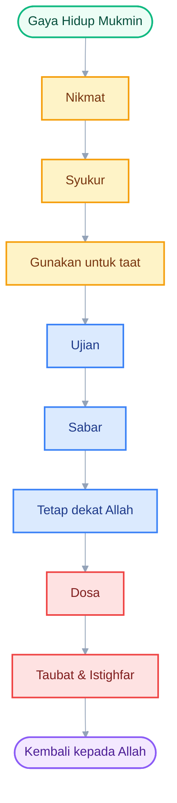
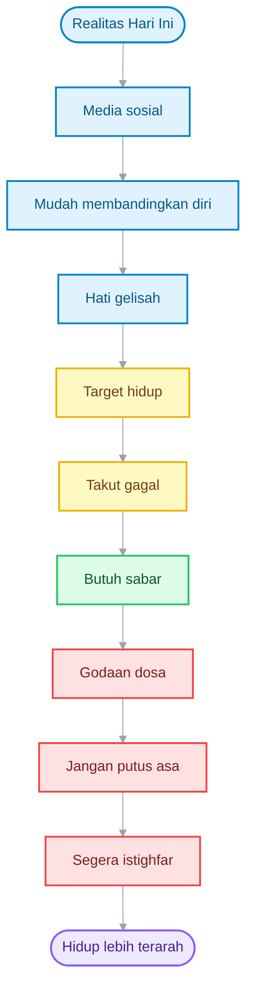
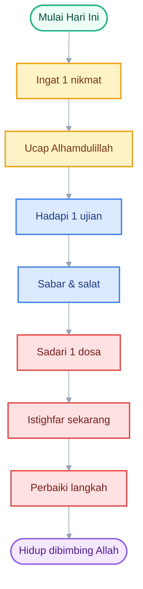

**Prolog**

Dalam bahasa sehari-hari, “galau” merujuk pada kondisi jiwa yang gundah, gelisah, tidak tenang, bahkan kadang tanpa sebab yang jelas. Bagi sebagian orang, galau hanyalah perasaan sesaat, namun bagi yang lain, galau bisa menjadi pintu masuk pada kecemasan berkepanjangan, depresi, atau kehilangan arah hidup.

Islam — sebagai dien yang sempurna — tidak membiarkan manusia larut dalam galau tanpa solusi. Tapi Islam juga tidak memberi “obat imajinatif”, melainkan penyelesaian berbasis wahyu. Maka dalam artikel ini, kita akan fokus membahas satu “obat galau” yang disebut secara eksplisit oleh Allah dalam Al-Qur’an — bukan asumsi, bukan pengalaman, tapi firman Rabb semesta alam.

---

# 🌿 **_Gaya Hidup Mukmin untuk Milenial dan Gen Z_**

_Bersyukur Saat Diberi, Bersabar Saat Diuji, Beristighfar Saat Terjatuh_

---

- [🌿 **_Gaya Hidup Mukmin untuk Milenial dan Gen Z_**](#-gaya-hidup-mukmin-untuk-milenial-dan-gen-z)
- [1. Pendahuluan](#1-pendahuluan)
- [2. Definisi dan Konsep Dasar](#2-definisi-dan-konsep-dasar)
- [3. Dalil Utama Al-Qur’an 📖](#3-dalil-utama-al-quran-)
- [4. Hadis Shahih Terkait](#4-hadis-shahih-terkait)
- [5. Pandangan Ulama](#5-pandangan-ulama)
- [6. Realitas Milenial dan Gen Z Hari Ini](#6-realitas-milenial-dan-gen-z-hari-ini)
- [7. Refleksi dan Muhasabah](#7-refleksi-dan-muhasabah)
- [8. Kesimpulan](#8-kesimpulan)
- [🔔 CTA — AJAKAN UNTUK MULAI HARI INI](#-cta--ajakan-untuk-mulai-hari-ini)

---

# 1. Pendahuluan

Hidup generasi hari ini bergerak sangat cepat. Milenial dan Gen Z tumbuh di tengah dunia yang penuh persaingan, tekanan sosial, target karier, perbandingan hidup di media sosial, kecemasan masa depan, dan pencarian jati diri.

Kadang kita bahagia ketika mendapat sesuatu. Namun tidak lama kemudian, hati kembali gelisah karena melihat orang lain tampak lebih berhasil. Kadang kita berusaha kuat saat diuji, tetapi batin tetap lelah. Kadang pula kita jatuh dalam dosa, lalu merasa terlalu jauh untuk kembali kepada Allah.

Di tengah semua keadaan itu, Islam mengajarkan gaya hidup yang sederhana, tetapi sangat dalam:

**Ketika diberi nikmat → bersyukur. 🌸**
**Ketika diuji musibah → bersabar. 🕊️**
**Ketika jatuh dalam dosa → bertaubat dan beristighfar. 🤲**

Tiga sikap ini bukan sekadar nasihat agama. Ini adalah cara hidup seorang mukmin agar tetap tenang, kuat, dan terarah dalam setiap keadaan.

<ResourceBox
  title="Beberapa rujukan yang menarik :"
  items={[
    {
      name: 'Upgrade Akal, Biar Hidup Nggak Asal',
      href: '/blog/motivasi/akal',
    },
    {
      name: 'Ilmu yang Bikin Hidup Makin Berarti',
      href: '/blog/motivasi/ilmu-manfaat',
    },
    {
      name: 'Kalo Hati Lagi Kusut',
      href: '/blog/religy/obat-anti-galau',
    },
    {
      name: 'Fokus Tanpa Overthinking',
      href: '/blog/motivasi/fokus-moscow',
    },
    {
      name: 'Lelah Jadi Manusia? Coba Jalan Sunyi Bernama Syukur',
      href: '/blog/religy/syukur',
    },
    {
      name: 'Sabar yang Aktif: Antara Iman, Emosi, dan Jalan Pulang kepada Allah',
      href: '/blog/religy/sabar',
    },
    {
      name: 'Berdoa Bukan Backup Plan',
      href: '/blog/religy/doa',
    },
    {
      name: 'Tiga Is yang Bikin Hati Kuat',
      href: '/blog/religy/tiga-is',
    },
    {
      name: 'Berjuang Tanpa Baper',
      href: '/blog/religy/tawakal',
    },
    {
      name: 'Mental Tangguh Menurut Islam',
      href: '/blog/religy/ujian',
    },
  ]}
/>

---

# 2. Definisi dan Konsep Dasar

**Syukur** bukan hanya mengucapkan _alhamdulillah_. Syukur berarti sadar bahwa semua nikmat berasal dari Allah, lalu menggunakan nikmat itu untuk kebaikan.

**Sabar** bukan berarti diam tanpa usaha. Sabar adalah keteguhan hati untuk tetap taat, tidak berputus asa, dan tidak melakukan hal yang Allah murkai saat hidup terasa berat.

**Taubat dan istighfar** bukan tanda bahwa seseorang gagal menjadi baik. Justru itu tanda bahwa hatinya masih hidup. Orang yang berdosa lalu kembali kepada Allah lebih baik daripada orang yang berdosa tetapi merasa biasa saja.

---

# 3. Dalil Utama Al-Qur’an 📖

Tentang syukur, Allah berfirman:

**وَإِذْ تَأَذَّنَ رَبُّكُمْ لَئِنْ شَكَرْتُمْ لَأَزِيدَنَّكُمْ وَلَئِنْ كَفَرْتُمْ إِنَّ عَذَابِي لَشَدِيدٌ**

“Sesungguhnya jika kamu bersyukur, niscaya Aku akan menambah nikmat kepadamu; tetapi jika kamu mengingkari nikmat-Ku, maka sungguh azab-Ku sangat berat.”
**QS. Ibrahim: 7**

Tentang sabar, Allah berfirman:

**يَا أَيُّهَا الَّذِينَ آمَنُوا اسْتَعِينُوا بِالصَّبْرِ وَالصَّلَاةِ إِنَّ اللَّهَ مَعَ الصَّابِرِينَ**

“Wahai orang-orang yang beriman, mohonlah pertolongan dengan sabar dan salat. Sesungguhnya Allah bersama orang-orang yang sabar.”
**QS. Al-Baqarah: 153**

Tentang istighfar setelah berdosa, Allah berfirman:

**وَالَّذِينَ إِذَا فَعَلُوا فَاحِشَةً أَوْ ظَلَمُوا أَنْفُسَهُمْ ذَكَرُوا اللَّهَ فَاسْتَغْفَرُوا لِذُنُوبِهِمْ وَمَنْ يَغْفِرُ الذُّنُوبَ إِلَّا اللَّهُ وَلَمْ يُصِرُّوا عَلَىٰ مَا فَعَلُوا وَهُمْ يَعْلَمُونَ**

“Dan orang-orang yang apabila mengerjakan perbuatan keji atau menzalimi diri sendiri, mereka mengingat Allah, lalu memohon ampun atas dosa-dosa mereka. Dan siapa lagi yang dapat mengampuni dosa selain Allah? Dan mereka tidak meneruskan perbuatan dosa itu, sedang mereka mengetahui.”
**QS. Ali ‘Imran: 135**

Ayat ini mengajarkan bahwa orang bertakwa bukan berarti tidak pernah salah. Namun ketika salah, ia segera ingat kepada Allah, memohon ampun, dan tidak terus-menerus dalam dosa.

---

# 4. Hadis Shahih Terkait

Rasulullah ﷺ bersabda:

**عَجَبًا لِأَمْرِ الْمُؤْمِنِ، إِنَّ أَمْرَهُ كُلَّهُ خَيْرٌ، وَلَيْسَ ذَاكَ لِأَحَدٍ إِلَّا لِلْمُؤْمِنِ، إِنْ أَصَابَتْهُ سَرَّاءُ شَكَرَ فَكَانَ خَيْرًا لَهُ، وَإِنْ أَصَابَتْهُ ضَرَّاءُ صَبَرَ فَكَانَ خَيْرًا لَهُ**

“Sungguh menakjubkan urusan seorang mukmin. Sesungguhnya seluruh urusannya adalah kebaikan, dan hal itu tidak dimiliki kecuali oleh seorang mukmin. Jika ia mendapatkan kesenangan, ia bersyukur, maka itu baik baginya. Jika ia tertimpa kesusahan, ia bersabar, maka itu pun baik baginya.”
**HR. Muslim no. 2999**

Rasulullah ﷺ juga bersabda:

**كُلُّ بَنِي آدَمَ خَطَّاءٌ، وَخَيْرُ الْخَطَّائِينَ التَّوَّابُونَ**

“Setiap anak Adam banyak berbuat salah, dan sebaik-baik orang yang bersalah adalah yang banyak bertaubat.”
**HR. At-Tirmidzi no. 2499, hasan**

---

# 5. Pandangan Ulama

Ibnu Katsir menjelaskan bahwa orang-orang yang disebut dalam QS. Ali ‘Imran: 135 adalah mereka yang ketika jatuh dalam dosa segera mengingat Allah dan memohon ampun kepada-Nya. Mereka tidak membiarkan dosa menjadi kebiasaan dan tidak merasa aman dari akibat maksiat.

Para ulama juga menjelaskan bahwa kehidupan seorang hamba selalu berputar dalam tiga keadaan besar: menerima nikmat, menghadapi ujian, dan terjatuh dalam kekurangan atau dosa. Karena itu, seorang mukmin membutuhkan tiga bekal utama: **syukur, sabar, dan taubat**.

Inilah tanda taufik dari Allah. Bukan karena hidupnya selalu nyaman, tetapi karena hatinya selalu diarahkan untuk kembali kepada Allah dalam setiap keadaan.

---

# 6. Realitas Milenial dan Gen Z Hari Ini

Ketika mendapat pekerjaan, penghasilan, prestasi, relasi yang baik, kesempatan belajar, atau kehidupan yang lebih lapang, jangan biarkan nikmat itu berubah menjadi kesombongan. Banyak orang kehilangan arah bukan karena kekurangan, tetapi karena tidak mampu mengelola kelebihan.

Saat Allah memberi nikmat, syukurilah. Gunakan nikmat itu untuk hal yang Allah ridhai. 🌿

Ketika diuji dengan kegagalan, penolakan, kehilangan, tekanan keluarga, kecemasan masa depan, atau rasa tertinggal dari orang lain, jangan langsung merasa hidup sedang hancur. Bisa jadi Allah sedang mendidik hati agar lebih kuat, lebih matang, dan lebih dekat kepada-Nya.

Saat hidup terasa berat, bersabarlah. Jangan berhenti berdoa. Jangan tinggalkan salat. Jangan biarkan ujian membuatmu jauh dari Allah. 🕊️

Ketika jatuh dalam dosa, lalai salat, terjebak kebiasaan buruk, melihat hal yang haram, berkata kasar, iri, riya, atau menjauh dari ketaatan, jangan biarkan setan membuatmu putus asa.

Jangan berkata, “Aku sudah terlalu jauh.”

Selama masih hidup, pintu taubat masih terbuka. Maka kembalilah sekarang. Ucapkan dengan hati yang sadar:

**أَسْتَغْفِرُ اللهَ وَأَتُوبُ إِلَيْهِ**

_Astaghfirullāha wa atūbu ilaih._

“Aku memohon ampun kepada Allah dan aku bertaubat kepada-Nya.” 🤲

---

# 7. Refleksi dan Muhasabah

Sebelum hari ini berakhir, coba berhenti sejenak dan tanyakan kepada diri sendiri:

Nikmat apa yang selama ini belum benar-benar aku syukuri?

Ujian apa yang sedang Allah jadikan jalan agar aku lebih sabar?

Dosa apa yang harus segera aku tinggalkan sebelum hatiku semakin keras?

Perubahan besar sering dimulai dari kesadaran kecil. Banyak orang ingin hidupnya berubah, tetapi tidak pernah mulai memperbaiki respons hatinya kepada Allah.

Maka jangan hanya ingin terlihat baik di hadapan manusia. Jadilah baik di hadapan Allah. Jangan hanya mengejar validasi, pencapaian, dan pengakuan. Kejarlah ridha Allah, karena hati yang dekat dengan Allah akan lebih kuat menghadapi dunia.

---

# 8. Kesimpulan

Gaya hidup mukmin bukan sekadar simbol luar. Ia bukan hanya tentang penampilan, komunitas, atau kata-kata religius di media sosial.

Gaya hidup mukmin adalah bagaimana hati merespons hidup.

**Saat diberi nikmat, ia tidak sombong, tetapi bersyukur.**
**Saat diuji, ia tidak menyerah, tetapi bersabar.**
**Saat berdosa, ia tidak menjauh dari Allah, tetapi bertaubat dan beristighfar.**

Inilah tiga pilar ketenangan hidup:

**syukur, sabar, dan taubat.**

---

# 🔔 CTA — AJAKAN UNTUK MULAI HARI INI

Mulai hari ini, jadikan tiga respons iman ini sebagai gaya hidup harianmu:

**Syukuri nikmatmu. 🌸**
Jangan tunggu kehilangan baru sadar bahwa selama ini Allah sudah banyak memberi. Mulailah dari hal sederhana: kesehatan, waktu, keluarga, ilmu, makanan, udara, dan kesempatan untuk memperbaiki diri.

**Sabari ujianmu. 🕊️**
Jangan menyerah hanya karena hidup sedang tidak mudah. Ujian bukan tanda Allah meninggalkanmu. Bisa jadi itu cara Allah menguatkanmu, membersihkan dosamu, dan menaikkan derajatmu.

**Istighfari dosamu. 🤲**
Jangan tunggu nanti. Jangan tunggu merasa suci. Jangan tunggu Ramadan. Jangan tunggu tua. Saat sadar telah salah, segera kembali kepada Allah.

Ucapkan:

**أَسْتَغْفِرُ اللهَ وَأَتُوبُ إِلَيْهِ**

Lalu mulai perbaiki langkahmu, sedikit demi sedikit.

Jangan biarkan nikmat membuatmu lalai.
Jangan biarkan ujian membuatmu menyerah.
Jangan biarkan dosa membuatmu semakin jauh dari Allah.

Jadilah generasi yang kuat imannya:

**bersyukur saat diberi,
bersabar saat diuji,
dan segera kembali kepada Allah saat berdosa.**

Karena hidup yang bahagia bukanlah hidup yang selalu mudah, tetapi hidup yang selalu dibimbing oleh Allah. 🌿

---

- Quran.com[^1]. Rujukan penulisan Qur'an berikut terjemahan diambil dari Quran.com

- Qur’an Kemenag[^2]. Rujukan tafsir Qur’an Kemenag

[^1]: [Quran.com](https://quran.com/id)
[^2]: [Qur’an Kemenag](https://quran.kemenag.go.id)
