# **_Desain Implementatif PLTS Hybrid 3.000 Wp untuk Sistem PLN 1 Fasa: PV, MPPT, Smart Battery, Proteksi, Integrasi Grid, dan Analisis Ekonomi_**

---

- [**_Desain Implementatif PLTS Hybrid 3.000 Wp untuk Sistem PLN 1 Fasa: PV, MPPT, Smart Battery, Proteksi, Integrasi Grid, dan Analisis Ekonomi_**](#desain-implementatif-plts-hybrid-3000-wp-untuk-sistem-pln-1-fasa-pv-mppt-smart-battery-proteksi-integrasi-grid-dan-analisis-ekonomi)
- [1. Pendahuluan](#1-pendahuluan)
- [2. Tujuan dan Batasan Desain](#2-tujuan-dan-batasan-desain)
  - [2.1 Tujuan teknis](#21-tujuan-teknis)
  - [2.2 Tujuan ekonomi](#22-tujuan-ekonomi)
  - [2.3 Batasan desain](#23-batasan-desain)
- [3. Regulasi, Perizinan, dan Standar](#3-regulasi-perizinan-dan-standar)
- [4. Survei Lapangan dan Pengumpulan Data](#4-survei-lapangan-dan-pengumpulan-data)
  - [4.1 Survei beban](#41-survei-beban)
  - [4.2 Survei atap](#42-survei-atap)
  - [4.3 Survei ruang inverter dan baterai](#43-survei-ruang-inverter-dan-baterai)
- [5. Load List dan Profil Energi](#5-load-list-dan-profil-energi)
- [6. Filosofi Operasi PLTS Hybrid](#6-filosofi-operasi-plts-hybrid)
  - [Siang hari](#siang-hari)
  - [PV tidak mencukupi](#pv-tidak-mencukupi)
  - [Malam hari](#malam-hari)
  - [PLN padam](#pln-padam)
- [7. Arsitektur Sistem PLN 1 Fasa](#7-arsitektur-sistem-pln-1-fasa)
- [8. Desain PV Array 3.000 Wp](#8-desain-pv-array-3000-wp)
  - [Alternatif A — 6 × 500 Wp](#alternatif-a--6--500-wp)
  - [Alternatif B — 5 × 600 Wp](#alternatif-b--5--600-wp)
- [9. Pemilihan Inverter Hybrid 1 Fasa](#9-pemilihan-inverter-hybrid-1-fasa)
  - [Hybrid off-grid dengan AC bypass](#hybrid-off-grid-dengan-ac-bypass)
  - [True grid-interactive hybrid](#true-grid-interactive-hybrid)
- [10. Desain Smart Battery](#10-desain-smart-battery)
- [11. Integrasi dengan PLN 1 Fasa](#11-integrasi-dengan-pln-1-fasa)
  - [11.1 Point of Common Coupling](#111-point-of-common-coupling)
  - [11.2 Zero-export control](#112-zero-export-control)
  - [11.3 Neutral dan grounding](#113-neutral-dan-grounding)
  - [11.4 Load segregation](#114-load-segregation)
- [12. Cable Sizing dan Voltage Drop](#12-cable-sizing-dan-voltage-drop)
- [13. Proteksi DC, AC, dan Baterai](#13-proteksi-dc-ac-dan-baterai)
  - [Sisi PV](#sisi-pv)
  - [Sisi baterai](#sisi-baterai)
  - [Sisi AC](#sisi-ac)
- [14. Desain Mekanikal dan Layout](#14-desain-mekanikal-dan-layout)
- [15. Energy Balance dan Performance Simulation](#15-energy-balance-dan-performance-simulation)
- [16. Analisis Ekonomi](#16-analisis-ekonomi)
- [16.1 Struktur CAPEX](#161-struktur-capex)
- [16.2 Tarif PLN sebagai dasar penghematan](#162-tarif-pln-sebagai-dasar-penghematan)
- [16.3 Self-consumption ratio](#163-self-consumption-ratio)
- [16.4 Penghematan kotor tahunan](#164-penghematan-kotor-tahunan)
- [16.5 OPEX](#165-opex)
- [16.6 Simple Payback Period](#166-simple-payback-period)
- [16.7 Perbandingan skenario ekonomi](#167-perbandingan-skenario-ekonomi)
- [16.8 Analisis sensitivitas](#168-analisis-sensitivitas)
- [16.9 Battery replacement reserve](#169-battery-replacement-reserve)
- [17. Instalasi dan Quality Control](#17-instalasi-dan-quality-control)
- [18. Commissioning dan Performance Test](#18-commissioning-dan-performance-test)
- [19. Operation dan Maintenance](#19-operation-dan-maintenance)
- [20. Lampiran Artikel](#20-lampiran-artikel)
- [Lampiran A — Design Basis Memorandum](#lampiran-a--design-basis-memorandum)
- [Lampiran B — Load List dan Profil Beban](#lampiran-b--load-list-dan-profil-beban)
- [Lampiran C — Perhitungan String PV](#lampiran-c--perhitungan-string-pv)
- [Lampiran D — Single-Line Diagram](#lampiran-d--single-line-diagram)
- [Lampiran E — Cable Sizing](#lampiran-e--cable-sizing)
- [Lampiran F — Protection Schedule](#lampiran-f--protection-schedule)
- [Lampiran G — Bill of Materials](#lampiran-g--bill-of-materials)
- [Lampiran H — CAPEX dan Analisis Ekonomi](#lampiran-h--capex-dan-analisis-ekonomi)
- [Lampiran I — Inspection and Test Plan](#lampiran-i--inspection-and-test-plan)
- [Lampiran J — Commissioning Checklist](#lampiran-j--commissioning-checklist)

---

# 1. Pendahuluan

Panel surya sering diperkenalkan melalui penjelasan yang terlalu sederhana: panel menerima cahaya matahari, menghasilkan listrik DC, kemudian inverter mengubahnya menjadi listrik AC untuk digunakan oleh peralatan rumah. Penjelasan tersebut benar secara prinsip, tetapi belum cukup untuk digunakan sebagai dasar desain dan instalasi di lapangan.

Pada implementasi nyata, sistem Pembangkit Listrik Tenaga Surya atau PLTS tidak hanya terdiri atas panel dan inverter. Sistem harus memperhitungkan interaksi antara:

- profil pemakaian listrik;
- kapasitas dan karakteristik modul PV;
- konfigurasi seri-paralel panel;
- rentang kerja MPPT;
- kapasitas inverter;
- kemampuan charge dan discharge baterai;
- komunikasi Battery Management System;
- karakteristik jaringan PLN;
- pembagian beban prioritas;
- proteksi DC dan AC;
- sistem pembumian;
- kondisi struktur atap;
- serta kelayakan ekonominya.

<figure>
  
  <figcaption>
    Ilustrasi desain sistem PLTS berkapasitas 3000 Wp, mencakup susunan panel
    surya, pengaturan daya, dan integrasi komponen utama sistem.
  </figcaption>
</figure>

Karena itu, artikel ini tidak diposisikan sebagai artikel pengantar teori panel surya. Artikel ini disusun sebagai **panduan desain implementatif** untuk membangun sistem PLTS hybrid berkapasitas nominal 3.000 Wp yang terhubung dengan PLN 1 fasa dan dilengkapi smart battery.

> PLTS 3.000 Wp tidak cukup didesain dengan memilih panel 3.000 Wp dan inverter 3.000 W. Sistem harus direkayasa berdasarkan profil beban, karakteristik MPPT, kemampuan baterai, proteksi, integrasi PLN, dan tujuan ekonominya.

---

## 1.1 PLTS Bukan Sekadar Kumpulan Komponen

Kesalahan paling umum dalam merencanakan PLTS adalah memulai pemilihan komponen dari daftar produk yang tersedia di pasar.

Urutan yang sering dilakukan adalah:

1. memilih panel berdasarkan harga per watt-peak;
2. memilih inverter berdasarkan angka watt yang tertulis pada kemasan;
3. memilih baterai berdasarkan kapasitas ampere-hour;
4. membeli kabel dan MCB berdasarkan ukuran yang biasa digunakan;
5. menghubungkan seluruh komponen;
6. berharap sistem bekerja dengan baik.

Pendekatan tersebut berisiko menghasilkan sistem yang secara nominal terlihat sesuai, tetapi tidak stabil atau tidak aman saat dioperasikan.

Contohnya:

- tegangan string PV berada di bawah tegangan start MPPT;
- tegangan open-circuit string melebihi batas maksimum inverter;
- arus modul lebih besar daripada kemampuan input MPPT;
- satu baterai tidak mampu menyuplai arus yang diperlukan inverter;
- inverter memiliki input PLN tetapi sebenarnya tidak dirancang untuk bekerja paralel dengan grid;
- sistem tidak memiliki proteksi anti-islanding;
- CT zero-export dipasang dengan arah terbalik;
- MCB AC digunakan pada jalur DC;
- kabel baterai terlalu kecil untuk arus lebih dari 100 A;
- beban prioritas dan nonprioritas tidak dipisahkan;
- baterai habis karena seluruh beban rumah tetap tersambung saat PLN padam.

Oleh sebab itu, PLTS harus diperlakukan sebagai satu sistem rekayasa yang saling terintegrasi.

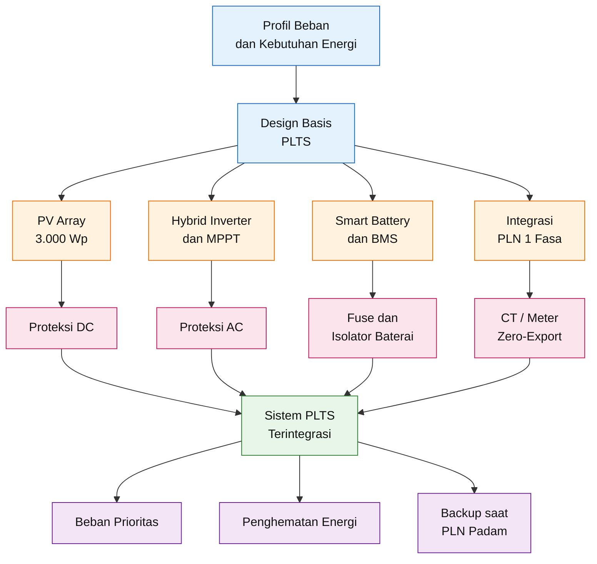

Diagram tersebut menunjukkan bahwa pemilihan PV, inverter, baterai, dan proteksi tidak dapat dilakukan secara terpisah. Semua komponen harus dikembangkan dari satu **design basis** yang sama.

---

## 1.2 Perbedaan Wp, W, kW, dan kWh

Empat satuan yang sering tertukar dalam pembahasan PLTS adalah:

- watt-peak atau Wp;
- watt atau W;
- kilowatt atau kW;
- kilowatt-hour atau kWh.

Masing-masing mewakili besaran yang berbeda.

### 1.2.1 Watt-peak atau Wp

Watt-peak adalah kapasitas nominal modul PV pada kondisi uji standar atau **Standard Test Conditions**.

Kondisi uji standar umumnya menggunakan:

- irradiance sebesar 1.000 W/m²;
- temperatur sel sebesar 25°C;
- spektrum cahaya AM 1.5.

Jika sistem menggunakan enam panel berkapasitas 500 Wp, maka kapasitas nominal array adalah:

$$
P_{\text{PV,rated}}
=

6
\times
500\ \text{Wp}
$$

$$
P_{\text{PV,rated}}
=

3{,}000\ \text{Wp}
$$

Nilai 3.000 Wp tidak berarti panel selalu menghasilkan 3.000 W selama matahari bersinar.

Daya aktual dipengaruhi oleh:

- intensitas radiasi matahari;
- temperatur sel;
- sudut datang cahaya;
- orientasi panel;
- kemiringan panel;
- bayangan;
- kotoran;
- ketidaksesuaian antar-panel;
- rugi kabel;
- efisiensi MPPT;
- dan pembatasan daya oleh inverter atau baterai.

Secara sederhana:

$$
P_{\text{PV,actual}}
=

P_{\text{PV,rated}}
\times
f_{\text{irradiance}}
\times
f_{\text{temperature}}
\times
f_{\text{system}}
$$

dengan:

- $f_{\text{irradiance}}$ adalah faktor intensitas radiasi;
- $f_{\text{temperature}}$ adalah faktor koreksi temperatur;
- $f_{\text{system}}$ adalah gabungan rugi-rugi sistem.

Pada kondisi lapangan, nilai ketiga faktor tersebut berubah sepanjang hari.

---

### 1.2.2 Watt dan kilowatt

Watt menunjukkan daya sesaat yang sedang diproduksi atau digunakan.

Hubungan dasar daya listrik adalah:

$$
P
=

V
\times
I
$$

dengan:

- $P$ = daya dalam watt;
- $V$ = tegangan dalam volt;
- $I$ = arus dalam ampere.

Untuk sistem AC 1 fasa dengan faktor daya yang diperhitungkan:

$$
P
=

V
\times
I
\times
\cos \varphi
$$

dengan:

- $\cos \varphi$ = faktor daya beban.

Sebagai contoh, inverter yang menyuplai daya aktif 3.000 W pada tegangan 230 V dan faktor daya mendekati 1 akan menghasilkan arus sekitar:

$$
I
=

\frac{P}{V}
$$

$$
I
=

\frac{3{,}000}{230}
$$

$$
I
\approx
13{,}04\ \text{A}
$$

Sementara itu, inverter 5.000 W pada beban penuh akan menghasilkan arus AC sekitar:

$$
I
=

\frac{5{,}000}{230}
$$

$$
I
\approx
21{,}74\ \text{A}
$$

Nilai arus tersebut digunakan untuk menentukan:

- ukuran kabel;
- rating MCB atau RCBO;
- kapasitas terminal;
- rating contactor atau bypass switch;
- dan kemampuan panel distribusi.

---

### 1.2.3 Kilowatt-hour atau kWh

Kilowatt-hour adalah satuan energi.

Energi merupakan daya yang digunakan selama periode tertentu:

$$
E
=

P
\times
t
$$

dengan:

- $E$ = energi;
- $P$ = daya;
- $t$ = waktu.

Jika beban 1.000 W bekerja selama lima jam:

$$
E
=

1{,}000\ \text{W}
\times
5\ \text{jam}
$$

$$
E
=

5{,}000\ \text{Wh}
$$

$$
E
=

5\ \text{kWh}
$$

Dengan demikian:

- **Wp** menunjukkan kapasitas nominal PV;
- **W atau kW** menunjukkan daya sesaat;
- **kWh** menunjukkan energi yang diproduksi atau dikonsumsi selama periode tertentu.

| Parameter          |      Satuan | Menjelaskan                                      |
| ------------------ | ----------: | ------------------------------------------------ |
| Kapasitas PV       | Wp atau kWp | Kapasitas nominal modul pada kondisi uji standar |
| Kapasitas inverter |   W atau kW | Daya AC kontinu yang dapat disuplai inverter     |
| Kapasitas baterai  | Wh atau kWh | Energi nominal yang dapat disimpan               |
| Konsumsi PLN       |         kWh | Energi yang dibeli dan digunakan pelanggan       |
| Beban sesaat       |   W atau kW | Daya yang sedang digunakan pada saat tertentu    |

Kesalahan membedakan daya dan energi dapat menyebabkan kapasitas sistem menjadi tidak tepat.

Sebagai contoh, beban 3 kW bukan berarti kebutuhan energi hariannya 3 kWh. Apabila beban tersebut bekerja selama enam jam:

$$
E_{\text{load}}
=

3\ \text{kW}
\times
6\ \text{jam}
$$

$$
E_{\text{load}}
=

18\ \text{kWh}
$$

Artinya, PLTS 3 kWp dengan satu baterai 5,12 kWh tidak akan cukup menyuplai beban 3 kW selama enam jam tanpa bantuan PLN.

---

## 1.3 Kapasitas PV Tidak Sama dengan Kapasitas Inverter

Kapasitas PV dan kapasitas inverter tidak harus selalu sama.

Pada desain ini digunakan:

$$
P_{\text{PV}}
=

3{,}000\ \text{Wp}
$$

dan:

$$
P_{\text{inverter}}
=

5{,}000\ \text{W}
$$

Pemilihan inverter 5 kW tidak berarti PV harus menghasilkan 5 kW.

Pada sistem hybrid, inverter dapat menerima energi dari beberapa sumber:

$$
P_{\text{load}}
=

P_{\text{PV}}
+
P_{\text{battery}}
+
P_{\text{grid}}
-

P_{\text{loss}}
$$

dengan:

- $P_{\text{PV}}$ = daya dari panel;
- $P_{\text{battery}}$ = daya dari baterai;
- $P_{\text{grid}}$ = daya dari PLN;
- $P_{\text{loss}}$ = rugi-rugi konversi dan distribusi.

Sebagai contoh, ketika beban mencapai 4 kW, sumber energi dapat terbagi menjadi:

$$
P_{\text{PV}}
=

2{,}5\ \text{kW}
$$

$$
P_{\text{battery}}
=

1{,}0\ \text{kW}
$$

$$
P_{\text{grid}}
=

0{,}7\ \text{kW}
$$

dan rugi-rugi sistem:

$$
P_{\text{loss}}
=

0{,}2\ \text{kW}
$$

Maka:

$$
P_{\text{load}}
=

2{,}5
+
1{,}0
+
0{,}7
-

0{,}2
$$

$$
P_{\text{load}}
=

4{,}0\ \text{kW}
$$

Pemilihan inverter 5 kW pada sistem PV 3 kWp memberikan beberapa keuntungan:

- tersedia margin untuk beban puncak;
- inverter tidak selalu bekerja pada batas maksimum;
- tersedia kapasitas untuk menangani starting current;
- beban dapat disuplai oleh kombinasi PV, baterai, dan PLN;
- tersedia kemungkinan ekspansi PV jika diizinkan oleh datasheet inverter.

Namun, kapasitas inverter yang lebih besar tidak otomatis meningkatkan produksi energi PV. Produksi energi tetap dibatasi oleh kapasitas array, radiasi matahari, dan rugi-rugi sistem.

---

## 1.4 PLTS sebagai Satu Kesatuan Sistem Energi

Dalam sistem hybrid, setiap komponen mempunyai fungsi yang berbeda.

### 1.4.1 Modul PV

Modul PV mengubah energi radiasi matahari menjadi listrik DC.

Parameter utama modul meliputi:

- $P_{\text{max}}$;
- $V_{\text{mp}}$;
- $I_{\text{mp}}$;
- $V_{\text{oc}}$;
- $I_{\text{sc}}$;
- koefisien temperatur;
- maximum series fuse;
- maximum system voltage.

Pemilihan modul tidak boleh hanya berdasarkan kapasitas Wp.

---

### 1.4.2 MPPT

Maximum Power Point Tracker mengatur titik kerja PV agar panel beroperasi di sekitar titik daya maksimum.

Daya PV dinyatakan sebagai:

$$
P_{\text{PV}}
=

V_{\text{PV}}
\times
I_{\text{PV}}
$$

MPPT mengubah titik operasi tegangan dan arus untuk mencari nilai:

$$
P_{\text{PV,max}}
=

V_{\text{mp}}
\times
I_{\text{mp}}
$$

MPPT mempunyai batas:

- tegangan start;
- rentang tegangan operasi;
- tegangan maksimum;
- arus operasi maksimum;
- arus short-circuit maksimum;
- dan kapasitas daya PV.

Jika satu saja batas tersebut dilampaui, konfigurasi panel dapat menjadi tidak kompatibel.

---

### 1.4.3 Inverter hybrid

Inverter hybrid mempunyai beberapa fungsi sekaligus:

- mengubah listrik DC menjadi AC;
- menerima energi dari PV;
- melakukan pengisian baterai;
- melakukan discharge baterai;
- menerima suplai PLN;
- melakukan transfer sumber;
- mengatur prioritas energi;
- mengendalikan zero-export;
- dan menyediakan backup output.

Namun, tidak semua inverter yang disebut “hybrid” mempunyai fungsi yang sama.

Perlu dibedakan antara:

1. inverter hybrid off-grid dengan AC bypass;
2. inverter hybrid grid-interactive yang dapat bekerja sinkron dengan PLN;
3. inverter grid-tie tanpa baterai;
4. inverter battery-only atau inverter charger.

---

### 1.4.4 Smart battery

Smart battery tidak hanya menyimpan energi. Di dalamnya terdapat Battery Management System atau BMS yang mengawasi:

- tegangan total baterai;
- tegangan setiap sel;
- arus charge;
- arus discharge;
- temperatur;
- state of charge;
- state of health;
- cell balancing;
- overvoltage;
- undervoltage;
- overcurrent;
- short circuit;
- dan komunikasi dengan inverter.

Komunikasi biasanya menggunakan:

- CAN;
- RS485;
- atau protokol lain yang ditentukan produsen.

Kesamaan port fisik tidak menjamin kompatibilitas protokol.

---

### 1.4.5 PLN

Dalam sistem ini, PLN tetap menjadi salah satu sumber energi.

Fungsinya dapat berupa:

- menyuplai kekurangan daya;
- menyuplai beban ketika baterai mencapai SOC minimum;
- mengisi baterai jika fungsi AC charging diaktifkan;
- menjadi sumber bypass saat inverter atau PV tidak tersedia;
- menjaga continuity of supply.

Sistem dirancang dengan filosofi zero-export sehingga energi PV tidak secara sengaja dikirim ke jaringan sebagai sumber pendapatan.

---

### 1.4.6 Beban

Beban harus dibagi menjadi dua kelompok:

#### Beban prioritas

Beban yang tetap perlu beroperasi ketika PLN padam, seperti:

- lampu tertentu;
- kulkas;
- router;
- CCTV;
- komputer;
- peralatan komunikasi;
- pompa kecil tertentu.

#### Beban nonprioritas

Beban yang tidak harus disuplai baterai saat PLN padam, seperti:

- water heater;
- kompor listrik;
- AC berkapasitas besar;
- pompa besar;
- mesin las;
- beban pemanas;
- peralatan dengan konsumsi tinggi.

Pemisahan ini mencegah baterai terkuras terlalu cepat dan mengurangi risiko inverter mengalami overload.

---

## 1.5 Dua Tujuan Utama: Penghematan dan Backup

PLTS hybrid dalam artikel ini mempunyai dua tujuan yang berbeda tetapi saling berkaitan.

### 1.5.1 Penghematan energi

Penghematan terjadi ketika energi PV menggantikan energi yang seharusnya dibeli dari PLN.

Secara sederhana:

$$
E_{\text{saving}}
=

E_{\text{PV,self-consumed}}
$$

Nilai penghematan biaya:

$$
S_{\text{gross}}
=

E_{\text{saving}}
\times
T_{\text{PLN}}
$$

dengan:

- $S_{\text{gross}}$ = penghematan kotor;
- $E_{\text{saving}}$ = energi PLN yang berhasil digantikan;
- $T_{\text{PLN}}$ = tarif energi PLN.

Penghematan terbesar diperoleh apabila produksi PV dapat langsung digunakan oleh beban pada siang hari.

---

### 1.5.2 Backup dan continuity

Baterai memberikan kemampuan menyuplai beban ketika:

- matahari tidak tersedia;
- produksi PV lebih rendah daripada beban;
- atau PLN padam.

Manfaat backup tidak selalu dapat dinilai hanya dari jumlah kWh yang dihemat.

Backup dapat mempunyai nilai ekonomi lain, misalnya:

- mencegah gangguan aktivitas kerja;
- menjaga koneksi internet;
- menjaga sistem CCTV;
- mencegah makanan di kulkas rusak;
- menjaga sistem kontrol atau komunikasi tetap hidup;
- mengurangi ketergantungan pada genset kecil.

Karena itu, evaluasi ekonomi baterai harus membedakan:

$$
\text{manfaat penghematan energi}
$$

dan:

$$
\text{manfaat keandalan atau continuity}
$$

Sistem tanpa baterai umumnya mempunyai biaya investasi lebih rendah dan payback lebih cepat. Sebaliknya, sistem dengan baterai memberikan fungsi backup dan fleksibilitas operasi yang lebih tinggi.

---

## 1.6 Risiko Pemilihan Komponen Berdasarkan Daya Nominal

Angka daya nominal tidak cukup untuk menentukan kesesuaian peralatan.

| Pemilihan berdasarkan                   | Risiko yang dapat terjadi                        |
| --------------------------------------- | ------------------------------------------------ |
| Panel hanya berdasarkan Wp              | Arus atau tegangan tidak sesuai MPPT             |
| Inverter hanya berdasarkan watt         | Tidak mendukung grid, baterai, atau zero-export  |
| Baterai hanya berdasarkan Ah            | BMS tidak mampu menyuplai arus inverter          |
| MCB hanya berdasarkan ampere            | Breaking capacity atau rating DC tidak sesuai    |
| Kabel hanya berdasarkan ukuran umum     | Voltage drop dan pemanasan berlebihan            |
| SPD hanya berdasarkan jumlah pole       | Tegangan kontinu dan konfigurasi tidak sesuai    |
| Rack hanya berdasarkan ukuran 19 inci   | Tidak mampu menahan berat baterai                |
| CT hanya berdasarkan diameter           | Tidak kompatibel dengan inverter atau salah arah |
| Connector hanya karena “MC4 compatible” | Kontak longgar dan pemanasan lokal               |

Sebagai contoh, dua baterai sama-sama berkapasitas 51,2 V–100 Ah dapat mempunyai kemampuan berbeda:

- baterai A memiliki discharge kontinu 100 A;
- baterai B memiliki discharge kontinu 50 A.

Energi nominal keduanya sama:

$$
E_{\text{battery}}
=

51{,}2
\times
100
$$

$$
E_{\text{battery}}
=

5{,}120\ \text{Wh}
$$

$$
E_{\text{battery}}
=

5{,}12\ \text{kWh}
$$

Namun kemampuan dayanya berbeda.

Untuk baterai A:

$$
P_{\text{battery,A}}
=

51{,}2
\times
100
$$

$$
P_{\text{battery,A}}
=

5{,}12\ \text{kW}
$$

Untuk baterai B:

$$
P_{\text{battery,B}}
=

51{,}2
\times
50
$$

$$
P_{\text{battery,B}}
=

2{,}56\ \text{kW}
$$

Keduanya sama-sama 5,12 kWh, tetapi baterai B tidak dapat menyuplai daya sebesar baterai A.

Inilah alasan kapasitas energi dan kemampuan daya harus dianalisis secara terpisah.

---

## 1.7 Pendekatan Engineering dalam Artikel Ini

Artikel ini menggunakan alur desain sebagai berikut:

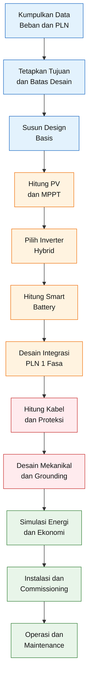

Alur tersebut menempatkan pemilihan merek dan model peralatan setelah kebutuhan sistem diketahui.

Dengan demikian, daftar alternatif brand pada lampiran tidak berfungsi sebagai katalog belanja, tetapi sebagai pilihan yang harus disaring berdasarkan:

- design basis;
- parameter listrik;
- compatibility list;
- sertifikasi;
- ketersediaan support;
- harga;
- dan biaya siklus hidup.

[**Kembali ke Atas**](#desain-implementatif-plts-hybrid-3000-wp-untuk-sistem-pln-1-fasa-pv-mppt-smart-battery-proteksi-integrasi-grid-dan-analisis-ekonomi)

---

# 2. Tujuan dan Batasan Desain

Tujuan dan batasan desain harus ditetapkan sebelum konfigurasi panel, merek inverter, kapasitas baterai, dan rating proteksi dipilih.

Tanpa batasan yang jelas, desain akan terus berubah mengikuti produk yang ditemukan di pasar. Akibatnya, sistem dapat kehilangan konsistensi antara kebutuhan beban, kapasitas pembangkitan, kemampuan baterai, dan anggaran investasi.

Bab ini menetapkan parameter dasar yang dikunci untuk seluruh pembahasan selanjutnya.

---

## 2.1 Tujuan Teknis

### 2.1.1 Menghasilkan energi dari PV sekitar 3 kWp

Kapasitas nominal PV ditetapkan:

$$
P_{\text{PV,rated}}
=

3{,}000\ \text{Wp}
$$

Kapasitas tersebut dapat dicapai menggunakan beberapa konfigurasi, misalnya:

$$
6
\times
500\ \text{Wp}
=

3{,}000\ \text{Wp}
$$

atau:

$$
5
\times
600\ \text{Wp}
=

3{,}000\ \text{Wp}
$$

Pemilihan final tidak hanya ditentukan oleh jumlah Wp, tetapi juga:

- $V_{\text{mp}}$;
- $V_{\text{oc}}$;
- $I_{\text{mp}}$;
- $I_{\text{sc}}$;
- koefisien temperatur;
- luas atap;
- orientasi;
- shading;
- dan batas input inverter.

Target 3.000 Wp adalah kapasitas nominal DC, bukan energi harian dan bukan daya AC yang tersedia secara konstan.

---

### 2.1.2 Menyuplai beban ketika matahari tersedia

Prioritas pertama energi PV adalah menyuplai beban aktif.

Filosofinya:

$$
P_{\text{PV}}
\rightarrow
P_{\text{load}}
$$

Jika daya PV lebih besar daripada daya beban:

$$
P_{\text{PV}}

>

P_{\text{load}}
$$

maka surplus dapat digunakan untuk mengisi baterai:

$$
P_{\text{surplus}}
=

P_{\text{PV}}
-

P_{\text{load}}
$$

Jika baterai sudah penuh dan ekspor ke grid tidak diizinkan, inverter harus mengurangi atau membatasi produksi melalui fungsi zero-export atau curtailment.

---

### 2.1.3 Mengisi smart battery

Baseline baterai ditetapkan:

$$
V_{\text{battery,nom}}
=

51{,}2\ \text{V}
$$

$$
C_{\text{battery}}
=

100\ \text{Ah}
$$

Energi nominalnya:

$$
E_{\text{battery,nom}}
=

V_{\text{battery,nom}}
\times
C_{\text{battery}}
$$

$$
E_{\text{battery,nom}}
=

51{,}2
\times
100
$$

$$
E_{\text{battery,nom}}
=

5{,}120\ \text{Wh}
$$

$$
E_{\text{battery,nom}}
=

5{,}12\ \text{kWh}
$$

Energi yang benar-benar dapat digunakan lebih kecil daripada energi nominal karena dipengaruhi oleh:

- batas Depth of Discharge;
- efisiensi inverter;
- efisiensi charge-discharge;
- konsumsi internal;
- cut-off BMS;
- temperatur;
- dan degradasi baterai.

Jika digunakan DoD 80% dan efisiensi inverter 92%:

$$
E_{\text{battery,usable}}
=

5{,}12
\times
0{,}80
\times
0{,}92
$$

$$
E_{\text{battery,usable}}
\approx
3{,}77\ \text{kWh}
$$

Nilai tersebut akan diverifikasi kembali pada bab desain baterai.

---

### 2.1.4 Menggunakan PLN ketika energi PV dan baterai tidak mencukupi

PLN tetap menjadi sumber energi pendukung.

Kondisi kekurangan daya dapat dinyatakan sebagai:

$$
P_{\text{deficit}}
=

P_{\text{load}}
-

P_{\text{PV}}
-

P_{\text{battery}}
$$

Jika:

$$
P_{\text{deficit}}

>

0
$$

maka kekurangan tersebut disuplai oleh PLN:

$$
P_{\text{grid}}
=

P_{\text{deficit}}
$$

Filosofi ini mencegah sistem mengalami overload atau memutus beban hanya karena produksi PV menurun.

Penggunaan PLN juga memungkinkan baterai dipertahankan pada SOC minimum tertentu sebagai cadangan ketika terjadi pemadaman.

---

### 2.1.5 Menyediakan backup untuk beban prioritas

Ketika PLN padam, inverter tidak dirancang untuk menyuplai seluruh beban tanpa batas.

Beban dibagi menjadi:

1. essential load atau beban prioritas;
2. nonessential load atau beban nonprioritas.

Baseline daya beban backup ditetapkan sekitar:

$$
P_{\text{backup,target}}
\leq
3\ \text{kW}
$$

Batas ini tidak hanya ditentukan oleh kapasitas inverter, tetapi terutama oleh:

- arus maksimum BMS;
- kemampuan discharge baterai;
- kapasitas kabel baterai;
- rating fuse;
- starting current beban;
- dan durasi backup yang diinginkan.

Jika beban backup rata-rata 1 kW dan energi baterai yang dapat digunakan sekitar 3,77 kWh:

$$
t_{\text{backup}}
=

\frac{E_{\text{battery,usable}}}
{P_{\text{load}}}
$$

$$
t_{\text{backup}}
=

\frac{3{,}77}
{1}
$$

$$
t_{\text{backup}}
\approx
3{,}77\ \text{jam}
$$

Jika beban menjadi 3 kW:

$$
t_{\text{backup}}
=

\frac{3{,}77}
{3}
$$

$$
t_{\text{backup}}
\approx
1{,}26\ \text{jam}
$$

Nilai tersebut merupakan pendekatan awal dan belum memasukkan konsumsi standby inverter, variasi tegangan, serta transient load.

---

### 2.1.6 Mencegah backfeed ke jaringan PLN

Ketika inverter bekerja bersama PLN, sistem harus mencegah pengiriman energi yang tidak dikehendaki ke jaringan.

Target operasi:

$$
P_{\text{export}}
\approx
0
$$

Fungsi tersebut dicapai menggunakan:

- CT sensor;
- smart meter;
- export power control

  ;

- dan setting inverter.

Selain zero-export, inverter wajib mempunyai fungsi anti-islanding.

Ketika PLN padam:

$$
P_{\text{grid}}
=

0
$$

dan inverter harus memutus hubungan terhadap jaringan sebelum menyuplai essential-load output.

Tujuannya adalah:

- mencegah jaringan PLN yang seharusnya tidak bertegangan menjadi kembali bertegangan;
- melindungi petugas pemeliharaan;
- mencegah kerusakan inverter;
- mencegah operasi paralel yang tidak terkontrol;
- menjaga stabilitas frekuensi dan tegangan sistem backup.

---

## 2.2 Tujuan Ekonomi

Desain PLTS tidak hanya dinilai dari keberhasilan teknis. Sistem juga perlu dinilai dari biaya investasi, biaya operasi, umur peralatan, penghematan, dan manfaat keandalan.

---

### 2.2.1 Mengurangi pembelian energi PLN

Penghematan diperoleh dari energi PV yang benar-benar digunakan untuk menggantikan energi PLN.

$$
E_{\text{grid,avoided}}
=

E_{\text{PV,direct}}
+
E_{\text{battery,discharged}}
$$

Namun, energi yang masuk ke baterai tidak seluruhnya kembali menjadi energi AC karena terdapat rugi-rugi.

Secara umum:

$$
E_{\text{battery,out}}
=

E_{\text{battery,in}}
\times
\eta_{\text{round-trip}}
$$

Dengan demikian, penggunaan langsung energi PV pada siang hari biasanya lebih efisien daripada menyimpan dan mengeluarkannya kembali melalui baterai.

---

### 2.2.2 Memaksimalkan self-consumption

Self-consumption ratio menunjukkan proporsi energi PV yang digunakan sendiri.

$$
SCR
=

\frac{
E_{\text{PV,self-consumed}}
}{
E_{\text{PV,generated}}
}
\times
100\%
$$

Energi yang digunakan sendiri dapat terdiri atas:

$$
E_{\text{PV,self-consumed}}
=

E_{\text{PV,direct}}
+
E_{\text{PV,to-battery-used}}
$$

Self-consumption yang tinggi mengurangi energi yang harus dibatasi oleh zero-export.

Strategi peningkatan self-consumption meliputi:

- memindahkan penggunaan beban ke siang hari;
- menjadwalkan pompa saat produksi PV tinggi;
- mengisi baterai dari surplus PV;
- menghindari baterai penuh terlalu pagi;
- mengatur SOC reserve secara tepat;
- menggunakan smart load control.

---

### 2.2.3 Menghindari energi PV terbuang

Jika beban rendah, baterai penuh, dan ekspor tidak diizinkan, sebagian potensi produksi PV tidak dapat digunakan.

Energi tersebut disebut curtailed energy:

$$
E_{\text{curtailed}}
=

E_{\text{PV,potential}}
-

E_{\text{PV,utilized}}
$$

Tujuan desain bukan menghilangkan curtailment sampai nol dalam semua kondisi, karena hal tersebut dapat membutuhkan baterai yang terlalu besar dan tidak ekonomis.

Tujuannya adalah mencari keseimbangan antara:

- kapasitas PV;
- profil beban;
- kapasitas baterai;
- harga baterai;
- dan energi yang berpotensi tidak termanfaatkan.

---

### 2.2.4 Menilai kelayakan baterai

Baterai menambah biaya investasi cukup besar.

Karena itu, manfaat baterai harus dinilai dari dua sisi:

#### Sisi energi

- meningkatkan self-consumption;
- memindahkan energi siang ke malam;
- mengurangi pembelian energi PLN;
- mengurangi curtailment.

#### Sisi keandalan

- menyediakan backup;
- menjaga continuity;
- mengurangi dampak pemadaman;
- menjaga beban prioritas tetap beroperasi.

Baterai tidak boleh dianggap ekonomis hanya karena mampu menyimpan energi. Biaya penggantian, degradasi, dan siklus pemakaian harus dimasukkan dalam evaluasi.

---

### 2.2.5 Menentukan simple payback

Simple payback menunjukkan waktu yang diperlukan agar akumulasi penghematan bersih sama dengan investasi awal.

$$
SPP
=

\frac{
C_{\text{initial}}
}{
S_{\text{annual,net}}
}
$$

dengan:

- $SPP$ = simple payback period;
- $C_{\text{initial}}$ = investasi awal;
- $S_{\text{annual,net}}$ = penghematan bersih tahunan.

Metode ini mudah dipahami, tetapi tidak memperhitungkan:

- nilai waktu uang;
- degradasi;
- kenaikan tarif;
- penggantian baterai;
- penggantian inverter;
- dan residual value.

---

### 2.2.6 Menentukan Net Present Value

Net Present Value memperhitungkan nilai waktu uang.

$$
NPV
=

\sum_{t=0}^{n}
\frac{
CF_t
}{
(1+r)^t
}
$$

dengan:

- $CF_t$ = arus kas pada tahun ke-$t$;
- $r$ = discount rate;
- $n$ = umur analisis.

Investasi secara ekonomi lebih menarik apabila:

$$
NPV

>

0
$$

---

### 2.2.7 Menentukan Internal Rate of Return

Internal Rate of Return adalah tingkat diskonto yang menghasilkan:

$$
NPV
=

0
$$

Secara matematis:

$$
0
=

\sum_{t=0}^{n}
\frac{
CF_t
}{
(1+IRR)^t
}
$$

IRR kemudian dibandingkan dengan:

- biaya modal;
- tingkat pengembalian minimum;
- alternatif investasi;
- dan risiko proyek.

---

### 2.2.8 Menentukan Levelized Cost of Energy

Levelized Cost of Energy menunjukkan biaya rata-rata energi selama umur sistem.

$$
LCOE
=

\frac{
\displaystyle
\sum_{t=0}^{n}
\frac{
C_t
}{
(1+r)^t
}
}{
\displaystyle
\sum_{t=0}^{n}
\frac{
E_t
}{
(1+r)^t
}
}
$$

dengan:

- $C_t$ = biaya pada tahun ke-$t$;
- $E_t$ = energi yang dihasilkan pada tahun ke-$t$;
- $r$ = discount rate;
- $n$ = periode analisis.

Perhitungan rinci seluruh indikator ekonomi akan dilakukan pada bab analisis ekonomi.

---

## 2.3 Batasan Desain

Batasan berikut dikunci agar seluruh bab menggunakan basis yang sama.

### 2.3.1 Sistem PLN 1 fasa

Sistem dirancang untuk jaringan:

$$
V_{\text{grid}}
=

220
-

230\ \text{V AC}
$$

$$
f_{\text{grid}}
=

50\ \text{Hz}
$$

Konfigurasi dasar:

- satu konduktor fasa;
- satu konduktor netral;
- satu protective-earth conductor.

Daya kontrak PLN belum dikunci dan akan menjadi hold point untuk:

- rating AC input;
- kapasitas bypass;
- pembatasan charge dari PLN;
- rating MCB;
- dan koordinasi proteksi.

---

### 2.3.2 Kapasitas PV 3.000 Wp

Kapasitas PV dikunci:

$$
P_{\text{PV,rated}}
=

3{,}000\ \text{Wp}
$$

Toleransi kecil dapat diterima jika ukuran modul yang tersedia tidak menghasilkan tepat 3.000 Wp, tetapi perubahannya harus dicatat dalam design basis.

Sebagai contoh:

$$
6
\times
505\ \text{Wp}
=

3{,}030\ \text{Wp}
$$

Kapasitas 3.030 Wp masih dapat diperlakukan sebagai sistem sekitar 3 kWp selama seluruh parameter inverter sesuai.

---

### 2.3.3 Tidak mendesain ekspor sebagai pendapatan

Energi yang dikirim ke jaringan tidak digunakan sebagai dasar manfaat ekonomi.

Asumsi analisis:

$$
Revenue_{\text{export}}
=

0
$$

Oleh sebab itu, desain diarahkan untuk:

- direct self-consumption;
- battery charging;
- load shifting;
- dan curtailment yang terkendali.

---

### 2.3.4 Satu smart battery sebagai baseline

Baseline menggunakan satu baterai:

$$
51{,}2\ \text{V}
-

100\ \text{Ah}
$$

atau:

$$
5{,}12\ \text{kWh}
$$

Satu baterai dipilih sebagai konfigurasi minimum untuk:

- mengendalikan biaya investasi;
- menyediakan backup dasar;
- mengevaluasi kecukupan arus;
- menjadi basis analisis ekonomi.

Konfigurasi dua baterai akan dibahas sebagai alternatif apabila:

- diperlukan backup lebih lama;
- diperlukan daya discharge lebih besar;
- inverter akan dioperasikan mendekati 5 kW;
- atau satu BMS tidak mampu memasok arus kontinu yang diperlukan.

---

### 2.3.5 Inverter 5 kW

Kapasitas inverter ditetapkan:

$$
P_{\text{inverter,rated}}
=

5\ \text{kW}
$$

Alasan pemilihannya:

- menyediakan margin terhadap beban 3 kW;
- menangani starting current;
- memungkinkan operasi dari kombinasi PV, baterai, dan PLN;
- mengurangi kemungkinan inverter bekerja terus-menerus pada kapasitas maksimum;
- memberikan ruang ekspansi yang terkontrol.

Namun, satu baterai 100 Ah tidak otomatis mampu menyuplai daya inverter 5 kW secara kontinu.

Jika efisiensi inverter 92%:

$$
I_{\text{battery}}
=

\frac{
P_{\text{AC}}
}{
V_{\text{battery}}
\times
\eta_{\text{inverter}}
}
$$

Untuk daya 5 kW:

$$
I_{\text{battery}}
=

\frac{
5{,}000
}{
51{,}2
\times
0{,}92
}
$$

$$
I_{\text{battery}}
\approx
106{,}15\ \text{A}
$$

Nilai tersebut sudah melebihi batas kontinu baterai yang hanya mampu menyediakan 100 A.

Karena itu:

> Inverter 5 kW digunakan untuk menyediakan kapasitas dan margin sistem, sedangkan daya backup kontinu dengan satu baterai dibatasi sekitar 3 kW sampai kemampuan baterai, BMS, kabel, dan proteksi diverifikasi.

---

## 2.4 Baseline Design yang Dikunci

| Parameter               |                              Baseline |
| ----------------------- | ------------------------------------: |
| Sistem PLN              |                                1 fasa |
| Tegangan PLN            |                          220–230 V AC |
| Frekuensi               |                                 50 Hz |
| Kapasitas PV            |                              3.000 Wp |
| Kapasitas inverter      |                               5.000 W |
| Jenis inverter          |               Hybrid grid-interactive |
| Bentuk gelombang        |                        Pure sine wave |
| MPPT                    |                   Minimum dua tracker |
| Sistem baterai          |                             48/51,2 V |
| Kapasitas baterai       |                         51,2 V–100 Ah |
| Energi baterai          |                              5,12 kWh |
| Beban backup target     |                 Maksimum sekitar 3 kW |
| Filosofi ekspor         |                           Zero-export |
| Panel beban             | Prioritas dan nonprioritas dipisahkan |
| Fungsi backup           |                 Essential-load output |
| Jumlah baterai baseline |                             Satu unit |
| Analisis ekonomi        |                              20 tahun |
| Pendapatan ekspor       |                  Tidak diperhitungkan |

---

## 2.5 Parameter Tetap dan Hold Point

Tidak seluruh parameter dapat dikunci pada tahap awal.

### 2.5.1 Parameter tetap

Parameter berikut harus dipertahankan selama pengembangan artikel:

- PV sekitar 3.000 Wp;
- PLN 1 fasa;
- inverter hybrid 5 kW;
- smart battery 51,2 V–100 Ah;
- zero-export;
- essential-load panel;
- analisis ekonomi;
- satu baterai sebagai baseline.

### 2.5.2 Hold point

Parameter berikut harus diverifikasi sebelum desain dinyatakan final:

1. daya kontrak PLN;
2. golongan tarif PLN;
3. konsumsi energi 12 bulan;
4. profil beban 24 jam;
5. beban puncak;
6. starting current motor;
7. kebutuhan durasi backup;
8. model panel final;
9. model inverter final;
10. model smart battery final;
11. compatibility list inverter-baterai;
12. maximum charge current;
13. maximum discharge current;
14. rentang tegangan MPPT;
15. maximum PV current;
16. luas dan kondisi atap;
17. orientasi dan shading;
18. jarak kabel;
19. sistem grounding eksisting;
20. fault level panel AC.

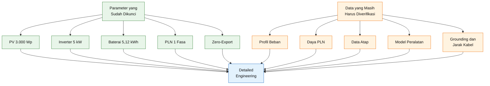

Hold point mencegah data yang belum tersedia diganti dengan asumsi tersembunyi.

Setiap asumsi harus:

- dinyatakan secara tertulis;
- diberi dasar;
- diuji melalui sensitivitas;
- dan diganti dengan data aktual sebelum konstruksi.

---

## 2.6 Kriteria Keberhasilan Desain

Desain dinilai berhasil apabila memenuhi kriteria berikut.

### Kinerja teknis

- PV beroperasi di dalam rentang MPPT;
- tegangan open-circuit tidak melebihi batas inverter;
- arus PV tidak melebihi kemampuan tracker;
- baterai dapat berkomunikasi dengan inverter;
- charge dan discharge tidak melampaui batas BMS;
- essential-load panel bekerja saat PLN padam;
- inverter tidak melakukan backfeed ketika grid padam;
- zero-export bekerja sesuai setting;
- kabel dan proteksi tidak mengalami overheating;
- voltage drop berada dalam batas desain.

### Kinerja keselamatan

- tersedia isolator PV;
- tersedia proteksi baterai;
- tersedia SPD DC dan AC;
- tersedia proteksi arus lebih;
- sistem grounding dan bonding kontinu;
- terminal aktif terlindungi;
- polaritas dan labeling jelas;
- maintenance dapat dilakukan dengan aman;
- tidak terjadi islanding terhadap jaringan PLN.

### Kinerja ekonomi

- produksi energi dapat diukur;
- penghematan dapat diverifikasi;
- biaya O&M diperhitungkan;
- penggantian baterai dan inverter dimasukkan;
- NPV, IRR, dan LCOE dihitung;
- keputusan baterai mempertimbangkan nilai backup;
- sensitivity analysis dilakukan terhadap variabel utama.

---

## 2.7 Filosofi Keputusan Desain

Setiap keputusan dalam artikel ini harus menjawab urutan pertanyaan berikut:

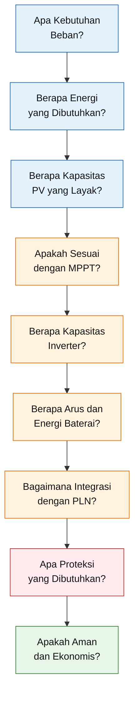

Urutan tersebut memastikan bahwa desain tidak dimulai dari merek atau harga produk.

Merek hanya dipilih setelah:

- kebutuhan diketahui;
- konfigurasi ditentukan;
- parameter listrik dihitung;
- risiko diidentifikasi;
- dan persyaratan keselamatan ditetapkan.

---

## 2.8 Posisi Desain pada Tahapan Engineering

Artikel ini menghasilkan **basic engineering design** yang cukup rinci untuk digunakan sebagai dasar:

- survei lapangan;
- permintaan penawaran;
- evaluasi teknis vendor;
- estimasi biaya;
- single-line diagram;
- perhitungan string;
- cable schedule;
- protection schedule;
- Bill of Materials;
- dan commissioning checklist.

Namun, desain belum dapat langsung dinyatakan sebagai _Issued for Construction_ sebelum hold point diselesaikan.

Urutan kematangan desain adalah:

1. conceptual design;
2. design basis;
3. basic engineering;
4. detailed engineering;
5. procurement;
6. installation;
7. commissioning;
8. operation and maintenance.

Dengan demikian, hasil artikel harus digunakan secara proporsional. Artikel memberikan struktur teknis, metode perhitungan, kriteria pemilihan, dan baseline desain, tetapi kondisi aktual lapangan tetap harus diverifikasi oleh personel kompeten sebelum instalasi.

[**Kembali ke Atas**](#desain-implementatif-plts-hybrid-3000-wp-untuk-sistem-pln-1-fasa-pv-mppt-smart-battery-proteksi-integrasi-grid-dan-analisis-ekonomi)

---

Bab 3 membedakan dengan tegas antara **persetujuan koneksi PLN, kewajiban pelaporan, pemenuhan SLO, dan persyaratan teknis**. Bab 4 disusun sebagai prosedur survei yang menghasilkan data terukur, bukan sekadar daftar pemeriksaan visual.

# 3. Regulasi, Perizinan, dan Standar

Sistem PLTS hybrid yang tetap terhubung secara elektrik dengan jaringan PLN tidak dapat diperlakukan sebagai instalasi listrik rumah biasa. Walaupun sistem diatur dalam mode **zero-export**, inverter tetap berinteraksi dengan jaringan PLN untuk:

- melakukan sinkronisasi tegangan dan frekuensi;
- menerima energi ketika PV dan baterai tidak mencukupi;
- melakukan bypass atau grid-assist;
- mengukur arah dan besar aliran energi;
- serta memutus hubungan terhadap jaringan ketika PLN padam.

Karena itu, desain PLTS hybrid 3.000 Wp dalam artikel ini harus memenuhi dua kelompok persyaratan secara bersamaan:

1. **persyaratan administratif dan interkoneksi dengan PLN**;
2. **persyaratan teknis dan keselamatan instalasi tenaga listrik**.

Dasar regulasi utama yang digunakan adalah **Peraturan Menteri ESDM Nomor 2 Tahun 2024 tentang PLTS Atap yang Terhubung pada Jaringan Tenaga Listrik Pemegang IUPTLU**. Regulasi tersebut menggantikan Permen ESDM Nomor 26 Tahun 2021 dan menjadi dasar pengaturan kuota, permohonan, pemasangan, pemeriksaan, advanced meter, serta ketentuan keselamatan PLTS atap. [R1]

> **Zero-export adalah strategi pengendalian aliran energi, bukan pengecualian terhadap kewajiban perizinan dan keselamatan.** Selama inverter masih terhubung dengan jaringan PLN, sistem tetap termasuk PLTS atap yang terhubung pada jaringan Pemegang IUPTLU.

---

## 3.1 Ruang Lingkup Regulasi terhadap Desain Ini

Baseline sistem yang digunakan dalam artikel adalah:

| Parameter          |                   Baseline |
| ------------------ | -------------------------: |
| Kapasitas modul PV |                   3.000 Wp |
| Kapasitas inverter |                    5.000 W |
| Jaringan PLN       |          1 fasa, 220–230 V |
| Baterai            |      LiFePO₄ 51,2 V–100 Ah |
| Energi baterai     |                   5,12 kWh |
| Mode operasi       |    Hybrid grid-interactive |
| Ekspor energi      | Dikendalikan mendekati nol |
| Output backup      |      Essential-load output |
| Jumlah inverter    |                     1 unit |

Dalam konteks teknis, sistem ini disebut PLTS 3.000 Wp karena kapasitas nominal modul PV-nya sebesar 3 kWp.

Namun, dalam beberapa ketentuan perizinan dan pemenuhan SLO, Permen ESDM Nomor 2 Tahun 2024 menentukan kapasitas sistem berdasarkan **kapasitas total inverter**. [R1]

Dengan demikian, untuk konteks tersebut:

$$
P_{\text{regulatory}}
=

P_{\text{inverter,total}}
$$

Pada desain ini:

$$
P_{\text{regulatory}}
=

5\ \text{kW}
$$

Ini merupakan perbedaan yang penting.

> Sistem yang secara teknis disebut “PLTS 3 kWp” dapat diperlakukan sebagai sistem 5 kW untuk klasifikasi perizinan atau pemeriksaan apabila menggunakan inverter 5 kW.

Oleh karena itu, formulir permohonan, pelaporan, penilaian kuota, dan dokumen teknis harus mencantumkan kedua data secara jelas:

- kapasitas modul PV: 3.000 Wp;
- kapasitas inverter: 5.000 W.

Jangan menggunakan istilah “kapasitas PLTS 3 kW” tanpa menjelaskan apakah angka tersebut mengacu pada kapasitas modul DC atau inverter AC.

---

## 3.2 Hierarki Persyaratan yang Digunakan

Desain PLTS tidak cukup hanya mengacu pada satu dokumen. Persyaratannya tersusun dalam beberapa lapisan.

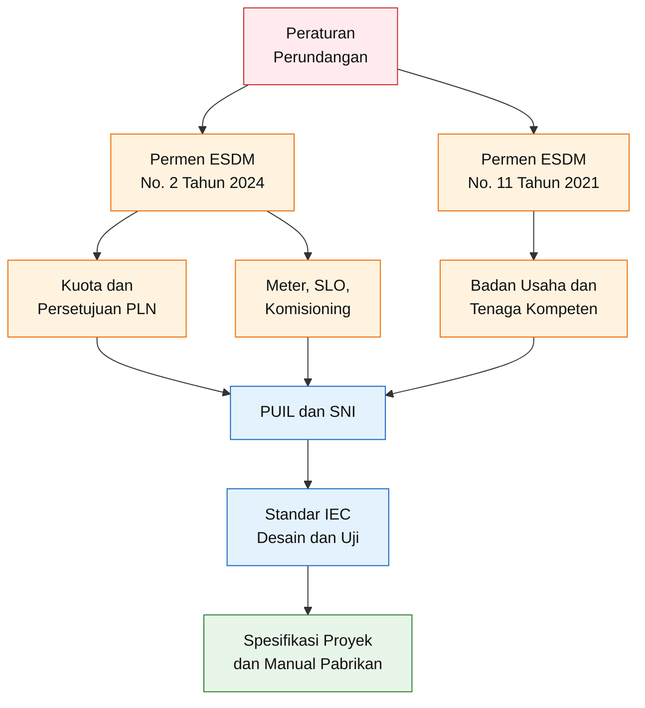

Urutan penerapannya adalah:

1. regulasi nasional dan persyaratan Pemegang IUPTLU;
2. SNI dan PUIL yang dirujuk regulasi;
3. standar IEC untuk desain, pengujian, dan praktik teknis;
4. manual resmi pabrikan;
5. spesifikasi proyek.

Jika terdapat perbedaan persyaratan, gunakan persyaratan yang:

- diwajibkan oleh regulasi;
- diterima oleh PLN;
- sesuai dengan sertifikasi produk;
- dan memberikan tingkat keselamatan lebih tinggi.

Edisi standar yang digunakan dalam kontrak harus dikunci dalam **compliance register**. Standar tidak boleh hanya ditulis sebagai “sesuai IEC” tanpa menyebutkan nomor, bagian, edisi, dan ruang lingkupnya.

---

## 3.3 Kuota Pengembangan PLTS Atap

Permen ESDM Nomor 2 Tahun 2024 mengubah pendekatan kapasitas PLTS atap dari sekadar batas berdasarkan daya langganan menjadi pendekatan yang mempertimbangkan:

- kebutuhan calon pelanggan;
- kuota pengembangan PLTS atap;
- kondisi sistem tenaga listrik;
- dan clustering unit pelayanan pelanggan. [R1]

Secara konseptual:

$$
P_{\text{PLTS,approved}}
\leq
P_{\text{customer,need}}
$$

dan:

$$
P_{\text{PLTS,approved}}
\leq
Q_{\text{cluster,available}}
$$

dengan:

- $P_{\text{PLTS,approved}}$ = kapasitas PLTS yang disetujui;
- $P_{\text{customer,need}}$ = kapasitas berdasarkan kebutuhan pelanggan;
- $Q_{\text{cluster,available}}$ = sisa kuota pada cluster pelayanan.

Kuota disusun berdasarkan clustering sistem tenaga listrik pada unit pelayanan pelanggan dan dipublikasikan oleh Pemegang IUPTLU melalui laman, aplikasi, atau media resmi. Sisa kuota yang belum terpakai pada akhir tahun dapat menjadi tambahan kuota pada tahun berikutnya. [R1]

### Konsekuensi praktis

Sebelum menetapkan pembelian inverter dan panel, calon pemilik harus memperoleh informasi:

1. unit pelayanan PLN yang melayani lokasi;
2. cluster sistem tenaga listrik;
3. kuota PLTS atap yang tersedia;
4. kapasitas yang masih dapat diajukan;
5. periode permohonan yang sedang dibuka;
6. status daftar tunggu jika kuota tidak tersedia.

### Hold point regulasi

Pembelian peralatan utama sebaiknya belum dilakukan sebelum tersedia kepastian bahwa:

- permohonan dapat diajukan;
- kapasitas inverter yang direncanakan dapat diterima;
- dan tidak ada kendala kuota pada cluster lokasi.

Pengadaan dini dapat menimbulkan risiko inverter 5 kW telah dibeli, tetapi kapasitas yang disetujui lebih kecil.

---

## 3.4 Periode dan Prosedur Permohonan

Permohonan pembangunan dan pemasangan PLTS atap diajukan kepada Pemegang IUPTLU dengan tembusan kepada Direktorat Jenderal EBTKE dan Direktorat Jenderal Ketenagalistrikan.

Permohonan reguler disampaikan pada:

- bulan Januari; atau
- bulan Juli.

Pemegang IUPTLU harus memberikan persetujuan atau penolakan paling lambat 30 hari kalender setelah batas periode permohonan berakhir. Jika tidak terdapat keputusan dalam batas waktu tersebut, regulasi mengatur mekanisme permohonan dianggap disetujui dan pemberitahuan dilakukan melalui Direktorat Jenderal EBTKE. [R1]

Alur regulasinya dapat diringkas sebagai berikut.

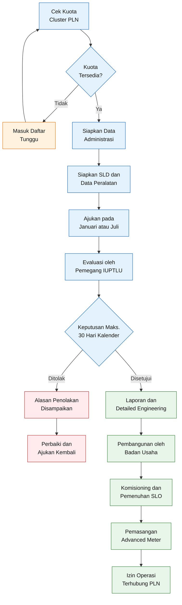

### Dokumen permohonan awal

Untuk sistem rumah tangga 1 fasa, paket permohonan setidaknya perlu memuat:

- identitas pelanggan;
- nomor pelanggan PLN;
- alamat instalasi;
- golongan tarif;
- daya tersambung;
- mekanisme pembayaran prabayar atau pascabayar;
- kapasitas modul PV;
- kapasitas total inverter;
- merek dan model inverter;
- baterai jika digunakan;
- diagram satu garis;
- Badan Usaha yang ditunjuk;
- rencana titik interkoneksi;
- data teknis yang diminta aplikasi atau Pemegang IUPTLU.

Nama menu dan jalur pengajuan elektronik dapat berubah mengikuti implementasi sistem pelayanan. Karena itu, artikel ini tidak mengunci nama aplikasi atau tampilan menu tertentu. Yang harus dikunci adalah **substansi data dan dokumennya**.

---

## 3.5 Pelanggan Prabayar dan Advanced Meter

Permen ESDM Nomor 2 Tahun 2024 mendefinisikan **Advanced Meter** sebagai meter kWh yang:

- disediakan dan dipasang oleh Pemegang IUPTLU;
- dapat melakukan komunikasi;
- dan dapat melakukan pengukuran dua arah. [R1]

Sistem PLTS atap wajib dilengkapi Advanced Meter.

Apabila calon pelanggan masih menggunakan mekanisme prabayar, pengajuan PLTS atap sekaligus berlaku sebagai permohonan perubahan dari:

$$
\text{prabayar}
\rightarrow
\text{pascabayar}
$$

Perubahan dilakukan bersamaan dengan pemasangan Advanced Meter.

Advanced Meter disediakan dan dipasang oleh Pemegang IUPTLU. Berdasarkan regulasi, biaya penyediaan dan pemasangannya ditanggung oleh Pemegang IUPTLU. Pemasangan dilakukan paling lambat 15 hari kerja setelah bukti pemenuhan SLO atau nomor registrasi diterima oleh Pemegang IUPTLU. [R1]

### Penegasan terhadap zero-export

Walaupun sistem diatur agar:

$$
P_{\text{export}}
\approx
0
$$

advanced meter tetap diperlukan karena meter tersebut tidak hanya berfungsi menghitung energi ekspor. Meter juga berfungsi untuk:

- memantau arah aliran energi;
- mendukung verifikasi operasi;
- melakukan pengukuran dua arah;
- dan menjaga administrasi interkoneksi.

CT zero-export milik inverter tidak menggantikan Advanced Meter milik PLN.

Kedua perangkat mempunyai fungsi berbeda:

| Perangkat                    | Fungsi                                                                       |
| ---------------------------- | ---------------------------------------------------------------------------- |
| CT atau smart meter inverter | Pengendalian real-time agar ekspor mendekati nol                             |
| Advanced Meter PLN           | Meter transaksi, komunikasi, dan pengukuran dua arah pada titik interkoneksi |

---

## 3.6 Pelaporan Kegiatan Penyediaan Tenaga Listrik untuk Kepentingan Sendiri

Untuk sistem dengan total kapasitas sampai dengan 500 kW yang terhubung dalam satu instalasi tenaga listrik, regulasi mengatur kewajiban pelaporan kegiatan penyediaan tenaga listrik untuk kepentingan sendiri.

Laporan dilakukan sebelum pembangunan dan pemasangan, satu kali, kepada Menteri atau gubernur sesuai kewenangannya. [R1]

Untuk desain 3.000 Wp dengan inverter 5 kW:

$$
P_{\text{inverter,total}}
=

5\ \text{kW}
<
500\ \text{kW}
$$

Dengan demikian, proyek berada dalam kelompok kapasitas sampai dengan 500 kW.

Dokumen pelaporan umumnya memuat:

- identitas pemilik;
- Nomor Induk Kependudukan atau Nomor Induk Berusaha;
- alamat;
- NPWP jika dipersyaratkan;
- data modul;
- data inverter;
- data baterai;
- kapasitas;
- jumlah unit;
- lokasi instalasi;
- dan pernyataan tanggung jawab kebenaran data.

Untuk sistem lebih dari 500 kW, kewajiban berubah menjadi izin usaha penyediaan tenaga listrik untuk kepentingan sendiri. Meskipun batas tersebut jauh di atas kapasitas desain artikel ini, prinsipnya perlu dipahami agar pembaca tidak menggeneralisasi prosedur sistem rumah tangga untuk sistem industri yang besar.

---

## 3.7 Pembangunan Hanya Setelah Persetujuan

Pembangunan dan pemasangan PLTS atap hanya boleh dimulai setelah memperoleh persetujuan dari Pemegang IUPTLU.

Sistem yang telah dipasang sebelum memperoleh persetujuan belum boleh dioperasikan terhubung dengan jaringan PLN. [R1]

Mengoperasikan PLTS paralel dengan jaringan tanpa persetujuan dapat menyebabkan:

- perintah pemutusan sistem PLTS dari jaringan;
- kewajiban membayar penalti;
- dan pemutusan sementara layanan pelanggan apabila kewajiban tidak dipenuhi.

Regulasi menyatakan dasar penalti sebagai kapasitas total inverter dikalikan 240 jam dan tarif tenaga listrik. [R1]

Secara matematis:

$$
C_{\text{penalty}}
=

P_{\text{inverter,total}}
\times
240\ \text{jam}
\times
T_{\text{PLN}}
$$

dengan:

- $C_{\text{penalty}}$ = nilai penalti;
- $P_{\text{inverter,total}}$ = kapasitas total inverter dalam kW;
- $T_{\text{PLN}}$ = tarif listrik dalam rupiah per kWh.

Untuk inverter 5 kW:

$$
C_{\text{penalty}}
=

5
\times
240
\times
T_{\text{PLN}}
$$

$$
C_{\text{penalty}}
=

1{,}200
\times
T_{\text{PLN}}
$$

Perhitungan administratif final tetap mengikuti metode dan tarif yang digunakan Pemegang IUPTLU.

> Memasang fungsi zero-export setelah sistem beroperasi tanpa izin tidak menghapus pelanggaran karena sumber persoalannya adalah operasi paralel tanpa persetujuan, bukan hanya jumlah energi yang diekspor.

---

## 3.8 Badan Usaha dan Tenaga Teknik Kompeten

Permen ESDM Nomor 2 Tahun 2024 mewajibkan pembangunan dan pemasangan PLTS atap dilakukan oleh **Badan Usaha** yang memenuhi ketentuan usaha jasa penunjang tenaga listrik. [R1]

Permen ESDM Nomor 11 Tahun 2021 mengatur bahwa unsur pelaksana Badan Usaha terdiri atas:

- penanggung jawab teknik;
- tenaga teknik.

Penanggung jawab teknik dan tenaga teknik harus memiliki sertifikat kompetensi sesuai bidang pekerjaan. Badan Usaha juga wajib menggunakan tenaga teknik dengan sertifikat kompetensi ketenagalistrikan yang masih berlaku dan sesuai ruang lingkup perizinannya. [R2]

### Dokumen vendor yang perlu diverifikasi

Sebelum kontrak pemasangan ditandatangani, pemilik perlu meminta:

1. Nomor Induk Berusaha;
2. Sertifikat Badan Usaha;
3. klasifikasi dan subklasifikasi pekerjaan;
4. ruang lingkup izin pembangunan dan pemasangan instalasi tenaga listrik;
5. identitas penanggung jawab teknik;
6. sertifikat kompetensi penanggung jawab teknik;
7. sertifikat kompetensi tenaga teknik;
8. masa berlaku sertifikat;
9. daftar proyek sejenis;
10. prosedur keselamatan kerja;
11. prosedur commissioning;
12. jaminan pekerjaan dan garansi instalasi.

### Pemeriksaan ruang lingkup

Keberadaan sertifikat saja belum cukup.

Harus diperiksa kesesuaiannya terhadap:

- jenis instalasi pembangkit;
- tegangan instalasi;
- pembangunan dan pemasangan;
- pengujian atau commissioning;
- serta kapasitas pekerjaan.

Badan Usaha yang hanya memiliki ruang lingkup perdagangan peralatan tidak otomatis berwenang melaksanakan pembangunan instalasi tenaga listrik.

---

## 3.9 Sertifikat Laik Operasi dan Pemenuhan Kewajiban SLO

SLO adalah bukti pengakuan formal bahwa instalasi tenaga listrik telah memenuhi persyaratan dan dinyatakan laik dioperasikan.

Namun, Permen ESDM Nomor 2 Tahun 2024 membedakan dua jalur:

1. **SLO yang diterbitkan lembaga inspeksi teknik**;
2. **sistem yang dinyatakan telah memenuhi ketentuan wajib SLO** melalui mekanisme surat pernyataan dan registrasi.

### 3.9.1 Jalur SLO melalui lembaga inspeksi teknik

SLO formal diperlukan antara lain untuk:

- sistem lebih dari 500 kW;
- atau sistem sampai dengan 500 kW yang menggunakan control panel sebagai bagian terpisah.

SLO diterbitkan oleh lembaga inspeksi teknik sesuai kewenangan dan ketentuan ketenagalistrikan. [R1]

### 3.9.2 Jalur dinyatakan memenuhi ketentuan wajib SLO

Sistem sampai dengan 500 kW dapat dinyatakan telah memenuhi ketentuan wajib SLO apabila control panel:

- menjadi satu bagian yang tidak terpisahkan;
- dapat dioperasikan secara plug-and-play;
- menggunakan satu inverter; atau
- menggunakan lebih dari satu inverter dengan total kapasitas kurang dari 10 kW;
- seluruh modul berada pada bagian konstruksi bangunan yang sama;
- menggunakan pembumian yang sama;
- dan melayani satu instalasi pemanfaatan yang sama. [R1]

Sistem tersebut tetap wajib dilengkapi:

- surat pernyataan tanggung jawab keselamatan ketenagalistrikan;
- sertifikat produk;
- garansi pabrikan yang masih berlaku;
- hasil uji commissioning dari teknisi distributor atau Badan Usaha, atau dokumen lain yang diperkenankan;
- dan nomor registrasi dari Menteri.

Alur penentuannya adalah sebagai berikut.

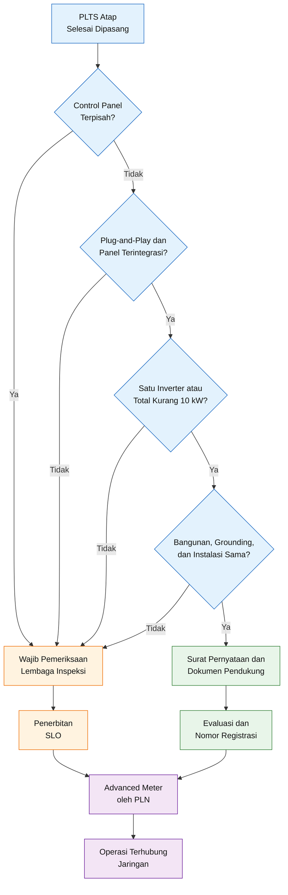

### Posisi baseline desain

Baseline menggunakan:

- satu inverter;
- kapasitas inverter 5 kW;
- modul pada satu atap;
- satu sistem pembumian;
- satu instalasi pelanggan.

Secara awal sistem ini berpotensi masuk jalur dinyatakan memenuhi ketentuan wajib SLO.

Namun, kesimpulan final belum dapat dibuat sebelum dipastikan bahwa:

- control panel merupakan bagian tidak terpisahkan;
- konfigurasi diterima sebagai plug-and-play;
- tidak terdapat panel kontrol terpisah yang mengubah klasifikasi;
- dan seluruh persyaratan Pasal 25 terpenuhi.

Karena itu, status SLO tetap menjadi **hold point** dalam evaluasi vendor.

---

## 3.10 Batas Waktu Pemenuhan SLO atau Registrasi

Setelah persetujuan diberikan, calon pelanggan harus menyelesaikan kewajiban pemeriksaan dalam batas waktu.

Regulasi menetapkan:

- paling lambat enam bulan untuk memperoleh SLO pada jalur lembaga inspeksi teknik;
- paling lambat tiga bulan untuk memperoleh nomor registrasi pada jalur pemenuhan wajib SLO.

Jika batas tersebut tidak dipenuhi, persetujuan dapat dibatalkan. [R1]

Jadwal proyek harus memasukkan aktivitas:

1. engineering;
2. pengadaan;
3. pemasangan;
4. pengujian;
5. penyusunan dokumen;
6. pengajuan SLO atau registrasi;
7. pemasangan advanced meter.

Peralatan yang mempunyai lead time panjang harus diperhitungkan agar proyek tidak melewati batas persetujuan.

---

## 3.11 Anti-Islanding dan Mode Backup

Anti-islanding adalah fungsi keselamatan yang memastikan inverter menghentikan penyaluran energi ke jaringan PLN ketika sumber jaringan hilang.

Ketika PLN padam:

$$
V_{\text{grid}}
\rightarrow
0
$$

maka inverter harus membuka hubungan terhadap jaringan:

$$
S_{\text{grid-interface}}
\rightarrow
\text{open}
$$

Namun, inverter hybrid dapat tetap menyuplai essential load melalui terminal backup yang sudah dipisahkan dari jaringan:

$$
\text{PV}
+
\text{Battery}
\rightarrow
\text{Essential Load}
$$

Kondisi tersebut tidak bertentangan dengan anti-islanding selama tidak terdapat energi yang mengalir kembali menuju jaringan PLN.

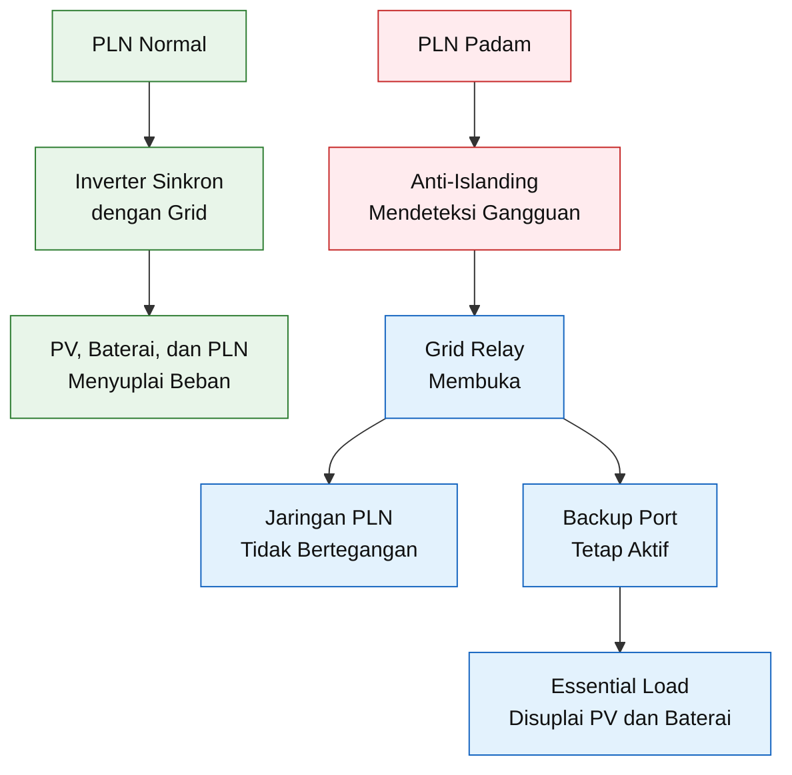

### Fungsi proteksi minimum inverter

Lampiran Permen ESDM Nomor 2 Tahun 2024 mensyaratkan fungsi proteksi inverter minimum berupa:

- anti-islanding;
- over-frequency dan under-frequency;
- overvoltage dan undervoltage;
- overtemperature;
- surge protection;
- proteksi arus lebih;
- DC ground-fault detector. [R1]

Sertifikat atau datasheet inverter harus menunjukkan fungsi-fungsi tersebut.

Pernyataan pemasaran seperti “support PLN” atau “hybrid inverter” tidak cukup.

Vendor harus menyerahkan:

- datasheet resmi;
- installation manual;
- grid-interconnection certificate;
- anti-islanding test report atau sertifikat;
- setting proteksi;
- dan daftar standar pengujiannya.

IEC 62116 memberikan prosedur pengujian kinerja pencegahan islanding pada inverter yang terhubung dengan jaringan, sedangkan IEC 61727 membahas karakteristik antarmuka sistem PV dengan jaringan utilitas. [R10] [R11]

---

## 3.12 Keselamatan Ketenagalistrikan

Keselamatan ketenagalistrikan tidak hanya berarti pemasangan MCB.

Persyaratan keselamatan mencakup:

- kesesuaian peralatan;
- proteksi terhadap kejut listrik;
- proteksi arus lebih;
- proteksi gangguan tanah;
- proteksi surja;
- proteksi efek termal;
- pemisahan yang aman;
- pembumian;
- equipotential bonding;
- akses operasi;
- pelabelan;
- dan pengujian sebelum energisasi.

Permen ESDM Nomor 2 Tahun 2024 juga mensyaratkan bahwa PLTS dengan baterai harus tetap dapat beroperasi dengan fungsi proteksi inverter yang dipersyaratkan. [R1]

Artinya, penambahan baterai tidak boleh:

- menonaktifkan anti-islanding;
- meniadakan proteksi tegangan;
- melewati sistem disconnect;
- atau membuat output backup terhubung kembali ke jaringan melalui jalur netral atau bypass yang salah.

Semua Bagian Konduktif Terbuka yang dibumikan harus terhubung secara equipotential sesuai rancangan pembumian. [R1]

---

## 3.13 PUIL dan SNI yang Relevan

Lampiran Permen ESDM Nomor 2 Tahun 2024 secara eksplisit merujuk:

- SNI IEC 61215 untuk kualifikasi desain modul PV;
- SNI 0225:2020 atau PUIL 2020 untuk combiner box;
- penghantar AC;
- penghantar DC;
- gawai proteksi;
- perangkat sakelar dan kendali;
- serta sistem pembumian. [R1]

PUIL 2020 terdiri atas beberapa bagian. Bagian yang relevan terhadap desain ini antara lain:

| Bagian          | Fokus                                                   |
| --------------- | ------------------------------------------------------- |
| SNI 0225-1:2020 | Prinsip fundamental dan definisi                        |
| SNI 0225-2:2020 | Desain instalasi listrik                                |
| SNI 0225-3:2020 | Asesmen karakteristik umum                              |
| SNI 0225-4-41   | Proteksi terhadap kejut listrik                         |
| SNI 0225-4-42   | Proteksi terhadap efek termal                           |
| SNI 0225-4-43   | Proteksi terhadap arus lebih                            |
| SNI 0225-4-44   | Proteksi terhadap gangguan tegangan dan elektromagnetik |
| SNI 0225-5-51   | Pemilihan dan pemasangan peralatan                      |
| SNI 0225-5-52   | Sistem perkawatan                                       |
| SNI 0225-5-54   | Pembumian dan konduktor proteksi                        |

BSN mencatat bagian-bagian PUIL tersebut sebagai standar yang berlaku, meskipun beberapa bagian dapat mengalami pembaruan edisi. Karena itu, proyek harus memverifikasi status edisi ketika dokumen engineering diterbitkan. [R3]

---

## 3.14 Standar IEC sebagai Acuan Engineering

Selain SNI dan PUIL, standar IEC digunakan untuk memperkuat desain, commissioning, keselamatan produk, dan maintenance.

| Standar                      | Penerapan utama                                                             |
| ---------------------------- | --------------------------------------------------------------------------- |
| IEC 61215 series             | Kualifikasi desain dan pengujian modul PV                                   |
| IEC 61730-1 dan IEC 61730-2  | Kualifikasi keselamatan modul PV                                            |
| IEC 62548-1:2023 + AMD1:2025 | Desain keselamatan array PV, kabel DC, switching, proteksi, dan pembumian   |
| IEC 60364-7-712:2025         | Instalasi listrik PV tegangan rendah, termasuk integrasi penyimpanan energi |
| IEC 62446-1                  | Dokumentasi, inspeksi, dan commissioning PLTS grid-connected                |
| IEC 62446-2                  | Preventive maintenance, corrective maintenance, dan keselamatan kerja       |
| IEC 62109-1 dan IEC 62109-2  | Keselamatan power converter dan inverter PV                                 |
| IEC 62116                    | Pengujian anti-islanding                                                    |
| IEC 61727                    | Karakteristik antarmuka PV dengan jaringan                                  |
| IEC 62933-5-1                | Pertimbangan keselamatan sistem penyimpanan energi terintegrasi grid        |
| IEC 61724-1                  | Monitoring dan evaluasi performa sistem PV                                  |

IEC 62548-1 mengatur aspek desain keselamatan array dan perangkat konversi terkait pada sisi PV. IEC 60364-7-712 edisi 2025 mencakup instalasi PV dari modul sampai titik koneksi dan sudah memasukkan persyaratan terkait energy storage dan island mode. [R4] [R5]

IEC 62446-1 digunakan sebagai dasar dokumentasi, inspeksi, dan pengujian commissioning, sedangkan IEC 62446-2 digunakan untuk pemeliharaan, troubleshooting, reliabilitas, keselamatan, dan pencegahan kebakaran. [R6] [R7]

### Prinsip penggunaan standar

Standar IEC tidak boleh digunakan dengan cara:

> “Sistem ini sesuai IEC.”

Pernyataan harus lebih spesifik, misalnya:

> “Perhitungan string dan perlindungan sisi DC dikembangkan mengacu pada IEC 62548-1:2023 beserta Amendment 1:2025.”

atau:

> “Inspection and commissioning checklist dikembangkan mengacu pada IEC 62446-1:2016 beserta amendment yang berlaku.”

---

## 3.15 Kepatuhan Struktural

Penambahan modul, rail, clamp, kabel, dan walkway menambah:

- beban mati;
- beban angin;
- gaya uplift;
- gaya pada sambungan;
- dan potensi konsentrasi beban pada rangka atap.

Evaluasi struktur setidaknya mempertimbangkan:

- SNI 1727:2020 untuk beban desain minimum;
- SNI 1726:2019 apabila aspek ketahanan gempa relevan;
- SNI 1729:2020 untuk elemen baja struktural;
- standar material struktur lain sesuai konstruksi bangunan. [R12]

Keberadaan ruang kosong di atap tidak membuktikan bahwa struktur mampu menerima PLTS.

Persetujuan struktur harus berdasarkan:

- data geometri;
- material;
- kondisi aktual;
- beban panel;
- beban mounting;
- beban angin;
- dan kapasitas sambungan.

---

## 3.16 Compliance Register Proyek

Proyek harus mempunyai **compliance register** yang diperbarui sepanjang engineering, procurement, installation, dan commissioning.

Format minimumnya:

| No. | Persyaratan         | Sumber             | Bukti kepatuhan         | Status      |
| --: | ------------------- | ------------------ | ----------------------- | ----------- |
|   1 | Kuota tersedia      | PLN/IUPTLU         | Bukti kuota             | Open/Closed |
|   2 | Persetujuan PLTS    | Permen ESDM        | Surat persetujuan       | Open/Closed |
|   3 | Badan Usaha berizin | Permen ESDM        | SBU dan NIB             | Open/Closed |
|   4 | Tenaga kompeten     | Permen ESDM        | Sertifikat kompetensi   | Open/Closed |
|   5 | Modul memenuhi SNI  | Lampiran Permen    | Sertifikat produk       | Open/Closed |
|   6 | Anti-islanding      | Lampiran Permen    | Test certificate        | Open/Closed |
|   7 | SLO atau registrasi | Permen ESDM        | SLO/nomor registrasi    | Open/Closed |
|   8 | Advanced Meter      | Permen ESDM        | Berita acara pemasangan | Open/Closed |
|   9 | Commissioning       | IEC 62446-1        | Test report             | Open/Closed |
|  10 | As-built document   | Spesifikasi proyek | Dokumen final           | Open/Closed |

---

## 3.17 Dokumen Legal dan Teknis Sebelum Energization

Sistem belum boleh dioperasikan paralel dengan PLN sebelum tersedia dokumen minimum:

- persetujuan Pemegang IUPTLU;
- bukti pelaporan yang dipersyaratkan;
- kontrak atau surat penunjukan Badan Usaha;
- SLD yang disetujui;
- sertifikat produk;
- datasheet dan manual;
- hasil inspeksi instalasi;
- hasil uji commissioning;
- SLO atau nomor registrasi sesuai jalur;
- berita acara pemasangan Advanced Meter;
- setting proteksi inverter;
- hasil uji anti-islanding;
- hasil uji pembumian;
- hasil uji tahanan isolasi;
- hasil uji fungsi sakelar dan proteksi;
- as-built drawing.

---

## 3.18 Kesalahan Regulasi yang Harus Dihindari

Beberapa kesalahan umum adalah:

1. menganggap zero-export berarti tidak perlu persetujuan PLN;
2. memasang sistem sebelum permohonan disetujui;
3. membeli inverter sebelum kuota dikonfirmasi;
4. menganggap kapasitas regulasi selalu sama dengan kapasitas Wp panel;
5. menganggap sistem di bawah 10 kW otomatis tidak memerlukan proses SLO;
6. menggunakan installer tanpa ruang lingkup izin yang sesuai;
7. tidak mengubah pelanggan prabayar menjadi pascabayar;
8. menganggap CT inverter menggantikan Advanced Meter;
9. tidak menyimpan sertifikat produk dan garansi;
10. tidak melakukan uji anti-islanding;
11. mengoperasikan backup output dengan wiring yang memungkinkan backfeed;
12. tidak menyelesaikan registrasi dalam masa berlaku persetujuan.

---

## 3.19 Konsekuensi terhadap Filosofi Desain

Kelebihan energi yang masuk ke jaringan Pemegang IUPTLU tidak diperhitungkan sebagai pengurang tagihan listrik pelanggan. [R1]

Karena itu, energi yang sengaja diproduksi melebihi kebutuhan siang hari tidak otomatis mempunyai nilai ekonomi.

Neraca energi dapat dinyatakan sebagai:

$$
E_{\text{PV}}
=

E_{\text{direct}}
+
E_{\text{battery,in}}
+
E_{\text{export}}
+
E_{\text{curtailed}}
+
E_{\text{loss}}
$$

Karena:

$$
Value_{\text{export}}
=

0
$$

maka strategi desain harus mengutamakan:

$$
E_{\text{direct}}
+
E_{\text{battery,used}}
$$

dan menekan:

$$
E_{\text{export}}
+
E_{\text{curtailed}}
$$

Konsekuensi desainnya adalah:

- meningkatkan konsumsi langsung pada siang hari;
- mengatur charge baterai dari surplus PV;
- memindahkan sebagian beban ke jam produksi PV;
- mempertahankan ruang SOC baterai pada pagi dan siang hari;
- menggunakan zero-export control;
- dan tidak melakukan oversizing PV tanpa studi neraca energi.

> Sistem perlu diarahkan pada **self-consumption tinggi, battery charging, load shifting, dan zero-export**, bukan sengaja menghasilkan energi berlebih pada siang hari.

[**Kembali ke Atas**](#desain-implementatif-plts-hybrid-3000-wp-untuk-sistem-pln-1-fasa-pv-mppt-smart-battery-proteksi-integrasi-grid-dan-analisis-ekonomi)

---

# 4. Survei Lapangan dan Pengumpulan Data

Survei lapangan merupakan tahap pengumpulan **design input**, bukan kegiatan dokumentasi foto semata.

Tujuan survei adalah memperoleh data yang cukup untuk menentukan:

- kelayakan kapasitas PLTS;
- konfigurasi PV;
- lokasi inverter dan baterai;
- titik interkoneksi;
- ukuran kabel;
- sistem proteksi;
- kapasitas struktur;
- kebutuhan backup;
- dan dasar analisis ekonomi.

> Desain yang dibangun dari data survei yang lemah hanya menghasilkan perhitungan yang terlihat presisi, tetapi tidak mewakili kondisi lapangan.

Survei harus membedakan empat kategori data:

| Kode | Kategori   | Makna                                                    |
| ---- | ---------- | -------------------------------------------------------- |
| M    | Measured   | Diukur langsung di lapangan                              |
| D    | Documented | Diperoleh dari tagihan, drawing, atau datasheet          |
| C    | Confirmed  | Dikonfirmasi oleh pemilik atau PLN                       |
| A    | Assumed    | Masih berupa asumsi dan wajib ditutup sebagai hold point |

Setiap data penting harus mempunyai:

- nilai;
- satuan;
- sumber;
- tanggal;
- metode pengukuran;
- nama pemeriksa;
- tingkat kepercayaan;
- dan bukti foto atau dokumen.

---

## 4.1 Tahapan Survei Lapangan

Survei dilakukan dalam lima alur utama.

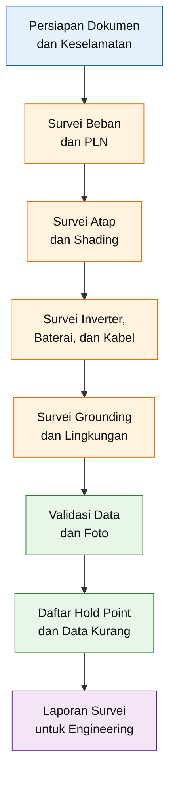

Survei tidak boleh dilakukan hanya oleh tenaga pemasaran. Tim idealnya melibatkan:

- engineer atau teknisi listrik;
- personel struktur atau sipil apabila atap perlu dikaji;
- personel keselamatan kerja;
- perwakilan pemilik;
- dan installer berkompeten.

---

## 4.2 Persiapan Sebelum Survei

### 4.2.1 Dokumen yang diminta dari pemilik

Sebelum datang ke lokasi, tim survei meminta:

- tagihan PLN minimal 12 bulan;
- foto kWh meter dan MCB PLN;
- single-line diagram instalasi eksisting jika tersedia;
- denah bangunan;
- gambar struktur atap;
- gambar penangkal petir;
- data grounding;
- daftar peralatan listrik;
- riwayat perubahan daya PLN;
- riwayat gangguan dan pemadaman;
- informasi renovasi atap;
- rencana penambahan beban.

### 4.2.2 Peralatan survei

Peralatan minimum dapat mencakup:

- multimeter True RMS;
- clamp meter;
- power quality logger atau energy logger;
- insulation tester untuk personel berwenang;
- earth resistance tester;
- thermal camera;
- laser distance meter;
- meteran;
- inclinometer;
- kompas atau alat ukur azimuth;
- kamera;
- drone jika diizinkan;
- shading assessment tool;
- alat ukur temperatur dan kelembapan;
- torque reference jika inspeksi terminal dilakukan;
- alat pelindung diri.

### 4.2.3 Keselamatan survei

Sebelum survei atap dan panel listrik dilakukan, harus tersedia:

- identifikasi bahaya;
- JSA atau analisis keselamatan kerja;
- izin kerja jika dipersyaratkan;
- prosedur bekerja di ketinggian;
- akses tangga atau scaffolding yang aman;
- fall protection;
- larangan membuka panel bertegangan tanpa kewenangan;
- prosedur isolasi dan LOTO;
- pemeriksaan cuaca;
- batas penghentian kerja.

Survei visual tidak membenarkan personel yang tidak berwenang membuka panel, menyentuh terminal, atau melakukan pengukuran langsung pada konduktor aktif.

---

## 4.3 Survei Beban

Survei beban bertujuan memperoleh tiga informasi yang berbeda:

1. **energi harian dan bulanan**;
2. **daya maksimum atau peak demand**;
3. **karakteristik transient dan starting load**.

Ketiganya tidak dapat digantikan satu sama lain.

---

## 4.3.1 Tagihan PLN 12 Bulan

Data tagihan sekurang-kurangnya meliputi:

- bulan;
- konsumsi kWh;
- nilai tagihan;
- tarif;
- daya tersambung;
- kategori pelanggan;
- jumlah hari penagihan;
- biaya lain;
- riwayat perubahan konsumsi.

Konsumsi rata-rata bulanan:

$$
E_{\text{month,avg}}
=

\frac{
\displaystyle\sum_{m=1}^{12} E_m
}{
12
}
$$

Konsumsi rata-rata harian:

$$
E_{\text{day,avg}}
=

\frac{
\displaystyle\sum_{m=1}^{12} E_m
}{
365
}
$$

Beban rata-rata tahunan:

$$
P_{\text{avg}}
=

\frac{
E_{\text{annual}}
}{
8{,}760
}
$$

dengan:

- $E_m$ = konsumsi bulan ke-$m$;
- $E_{\text{annual}}$ = konsumsi tahunan dalam kWh;
- $P_{\text{avg}}$ = daya rata-rata dalam kW.

### Keterbatasan tagihan bulanan

Tagihan PLN tidak menunjukkan:

- kapan energi digunakan;
- seberapa tinggi daya puncak;
- berapa beban pada siang hari;
- berapa beban pada malam hari;
- atau apakah terjadi starting current tinggi.

Dua rumah dapat menggunakan 300 kWh per bulan, tetapi mempunyai profil yang sangat berbeda.

---

## 4.3.2 Profil Beban per Jam

Untuk desain hybrid, profil beban harus dibagi sekurang-kurangnya menjadi:

- 00.00–06.00;
- 06.00–09.00;
- 09.00–15.00;
- 15.00–18.00;
- 18.00–24.00.

Idealnya digunakan interval 15 menit atau 30 menit.

Energi harian dihitung:

$$
E_{\text{load,day}}
=

\sum_{i=1}^{n}
P_i
\times
\Delta t_i
$$

dengan:

- $P_i$ = daya rata-rata interval ke-$i$;
- $\Delta t_i$ = durasi interval dalam jam.

Untuk interval 15 menit:

$$
\Delta t
=

0{,}25\ \text{jam}
$$

Maka:

$$
E_{\text{load,day}}
=

\sum_{i=1}^{96}
P_i
\times
0{,}25
$$

Pengukuran sebaiknya dilakukan pada periode yang mewakili:

- hari kerja;
- akhir pekan;
- kondisi cuaca normal;
- kondisi penggunaan normal;
- dan variasi musiman jika signifikan.

Jika data logger tidak tersedia, profil dapat dibangun dari load list dan wawancara pengguna, tetapi hasilnya harus diberi status **assumed** sampai diverifikasi.

---

## 4.3.3 Load List

Format load list minimum:

| No. | Beban        | Jumlah | Daya/unit | Jam operasi | Energi/hari | Start | Prioritas    |
| --: | ------------ | -----: | --------: | ----------: | ----------: | ----: | ------------ |
|   1 | Lampu        |      — |         — |           — |           — | Tidak | Essential    |
|   2 | Kulkas       |      — |         — |           — |           — |    Ya | Essential    |
|   3 | Router       |      — |         — |           — |           — | Tidak | Essential    |
|   4 | CCTV         |      — |         — |           — |           — | Tidak | Essential    |
|   5 | Pompa        |      — |         — |           — |           — |    Ya | Selektif     |
|   6 | AC           |      — |         — |           — |           — |    Ya | Nonessential |
|   7 | Water heater |      — |         — |           — |           — | Tidak | Nonessential |

Energi setiap beban:

$$
E_j
=

N_j
\times
P_j
\times
t_j
\times
f_j
$$

dengan:

- $N_j$ = jumlah unit;
- $P_j$ = daya tiap unit;
- $t_j$ = durasi operasi;
- $f_j$ = duty factor atau faktor pemakaian.

Total energi:

$$
E_{\text{total}}
=

\sum_{j=1}^{n} E_j
$$

---

## 4.3.4 Daya Puncak dan Faktor Keserempakan

Daya terpasang tidak sama dengan daya puncak aktual karena tidak semua peralatan bekerja bersamaan.

Daya tersambung total:

$$
P_{\text{connected}}
=

\sum_{j=1}^{n}
N_j
\times
P_j
$$

Daya puncak desain:

$$
P_{\text{peak,design}}
=

\sum_{j=1}^{n}
N_j
\times
P_j
\times
C_j
$$

dengan $C_j$ sebagai coincidence factor.

Untuk sistem rumah tangga, faktor keserempakan tidak boleh ditentukan hanya berdasarkan perkiraan umum. Nilainya perlu dikaitkan dengan kebiasaan pengguna.

Contohnya:

- AC dan water heater mungkin bekerja bersamaan;
- pompa dapat start ketika kulkas sedang aktif;
- mesin cuci dapat beroperasi ketika PV tinggi;
- beban masak dapat menciptakan puncak pada pagi atau malam hari.

---

## 4.3.5 Starting Current

Motor, pompa, kompresor kulkas, dan AC dapat memerlukan arus awal beberapa kali arus operasinya.

Daya semu starting:

$$
S_{\text{start}}
=

V
\times
I_{\text{start}}
$$

Jika datasheet memberikan starting-current multiplier:

$$
I_{\text{start}}
=

k_{\text{start}}
\times
I_{\text{rated}}
$$

dengan:

- $k_{\text{start}}$ = faktor starting;
- $I_{\text{rated}}$ = arus nominal.

Data yang harus dikumpulkan:

- jenis motor;
- daya;
- arus nominal;
- metode starting;
- locked-rotor current jika tersedia;
- lama starting;
- frekuensi start;
- kemungkinan beberapa motor start bersamaan.

Kapasitas surge inverter harus dibandingkan dengan:

$$
P_{\text{simultaneous,start}}
$$

bukan hanya daya nominal motor.

---

## 4.3.6 Beban Siang dan Malam

Pembagian energi:

$$
E_{\text{load,total}}
=

E_{\text{day}}
+
E_{\text{night}}
$$

Beban siang menentukan seberapa besar energi PV dapat langsung digunakan:

$$
E_{\text{PV,direct}}
\leq
E_{\text{day}}
$$

Beban malam memengaruhi kebutuhan baterai:

$$
E_{\text{battery,required}}
\approx
\frac{
E_{\text{night,target}}
}{
DoD
\times
\eta_{\text{battery}}
\times
\eta_{\text{inverter}}
}
$$

Survei harus mengidentifikasi beban yang dapat dipindahkan ke siang hari, seperti:

- pompa air;
- mesin cuci;
- pengisian perangkat;
- beban pendinginan tertentu;
- kegiatan produksi rumah tangga.

---

## 4.3.7 Pemisahan Beban Prioritas

Setiap beban diberi klasifikasi:

### Kelas E1 — sangat penting

Harus tetap hidup selama PLN padam, misalnya:

- router;
- sistem komunikasi;
- CCTV;
- lampu darurat;
- alat kesehatan tertentu.

### Kelas E2 — penting tetapi dapat dibatasi

- kulkas;
- komputer;
- pompa air kecil;
- beberapa lampu.

### Kelas N — nonessential

- water heater;
- kompor listrik;
- AC besar;
- pompa besar;
- mesin las;
- peralatan pemanas.

Daya essential load:

$$
P_{\text{essential}}
=

\sum P_{\text{E1}}
+
\sum P_{\text{E2,selected}}
$$

Energi backup:

$$
E_{\text{backup}}
=

\sum
P_{\text{essential},j}
\times
t_j
$$

Hasil survei harus menunjukkan bahwa:

$$
P_{\text{essential}}
\leq
P_{\text{backup,inverter}}
$$

dan:

$$
I_{\text{battery,required}}
\leq
I_{\text{BMS,continuous}}
$$

---

## 4.4 Survei Data PLN dan Instalasi Eksisting

Data berikut wajib dicatat:

| Parameter         | Data yang diperlukan       |
| ----------------- | -------------------------- |
| Sistem            | 1 fasa                     |
| Tegangan nominal  | 220–230 V                  |
| Daya tersambung   | Dari tagihan dan MCB       |
| Golongan tarif    | Dari tagihan               |
| Sistem pembayaran | Prabayar/pascabayar        |
| Nomor pelanggan   | Dicatat                    |
| MCB PLN           | Merek, kurva, rating       |
| kWh meter         | Tipe dan foto              |
| Frekuensi         | Pengukuran bila diperlukan |
| Main panel        | Rating dan kondisi         |
| RCD/RCBO          | Ada/tidak, tipe dan rating |
| SPD               | Ada/tidak                  |
| Sistem pembumian  | Diidentifikasi             |
| Netral            | Konfigurasi dan kondisi    |
| Ruang panel       | Clearance dan akses        |

### Validasi daya PLN

Arus nominal satu fasa:

$$
I_{\text{grid}}
=

\frac{
S_{\text{PLN}}
}{
V_{\text{grid}}
}
$$

Sebagai contoh, untuk 5.500 VA dan 230 V:

$$
I_{\text{grid}}
=

\frac{
5{,}500
}{
230
}
$$

$$
I_{\text{grid}}
\approx
23{,}91\ \text{A}
$$

Nilai tersebut perlu dibandingkan dengan:

- rating MCB pelanggan;
- maksimum AC input inverter;
- maksimum bypass current;
- dan kabel eksisting.

### Point of Common Coupling

Survei harus menentukan calon titik sambung atau **Point of Common Coupling**.

Lokasi CT zero-export harus memenuhi kondisi:

- dapat membaca seluruh impor dan ekspor;
- berada pada konduktor fasa yang benar;
- tidak ter-bypass oleh cabang lain;
- arah CT dapat dipastikan;
- tersedia jalur komunikasi ke inverter.

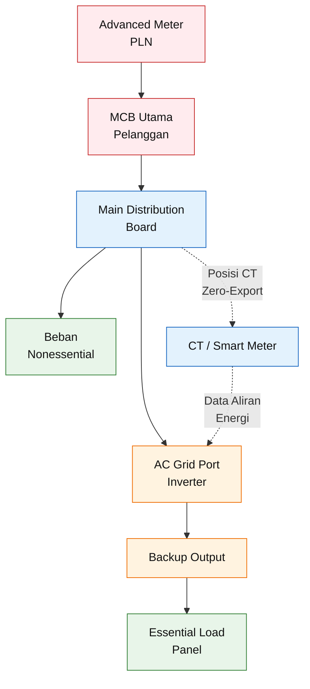

Diagram di atas masih merupakan konsep. Posisi aktual ditentukan dari panel eksisting dan topologi inverter.

---

## 4.5 Survei Atap

Survei atap harus menghasilkan:

- roof plan;
- area yang dapat digunakan;
- orientasi;
- kemiringan;
- peta bayangan;
- posisi rafter atau struktur penopang;
- kondisi material;
- jalur akses;
- lokasi kabel;
- dan data risiko angin.

---

## 4.5.1 Orientasi dan Azimuth

Azimuth panel diukur terhadap arah acuan geografis.

Data yang dicatat:

- arah bidang atap;
- deviasi dari utara atau selatan sesuai konvensi yang digunakan;
- adanya beberapa bidang atap;
- kemungkinan pembagian string berdasarkan orientasi.

Orientasi yang berbeda sebaiknya tidak langsung digabungkan dalam satu MPPT tanpa analisis.

Jika terdapat dua orientasi:

- bidang A menghadap timur;
- bidang B menghadap barat;

maka opsi yang lebih baik adalah menggunakan MPPT terpisah.

---

## 4.5.2 Kemiringan Atap

Kemiringan diukur menggunakan inclinometer.

Kemiringan panel:

$$
\beta_{\text{PV}}
=

\beta_{\text{roof}}
+
\beta_{\text{mounting}}
$$

Jika mounting mengikuti bidang atap:

$$
\beta_{\text{mounting}}
=

0
$$

sehingga:

$$
\beta_{\text{PV}}
=

\beta_{\text{roof}}
$$

Data tilt digunakan untuk:

- simulasi produksi energi;
- analisis aliran air;
- penentuan mounting;
- wind-load assessment;
- dan kemudahan pembersihan.

---

## 4.5.3 Luas Atap Bruto dan Efektif

Luas geometris atap:

$$
A_{\text{gross}}
=

L_{\text{roof}}
\times
W_{\text{roof}}
$$

Luas yang tidak dapat dipakai:

$$
A_{\text{excluded}}
=

A_{\text{edge}}
+
A_{\text{obstruction}}
+
A_{\text{access}}
+
A_{\text{shaded}}
$$

Luas efektif:

$$
A_{\text{effective}}
=

A_{\text{gross}}
-

A_{\text{excluded}}
$$

Jumlah panel maksimum secara geometris:

$$
N_{\text{panel,max}}
=

\left\lfloor
\frac{
A_{\text{effective}}
}{
A_{\text{panel,installed}}
}
\right\rfloor
$$

Namun, formula luas saja tidak cukup. Tata letak harus memperhitungkan:

- orientasi panel portrait atau landscape;
- jarak antar-modul;
- clamp zone;
- posisi rail;
- area aman dari tepi;
- akses inspeksi;
- jalur evakuasi;
- objek atap;
- bayangan;
- dan titik anchoring.

---

## 4.5.4 Pembagian Zona Atap

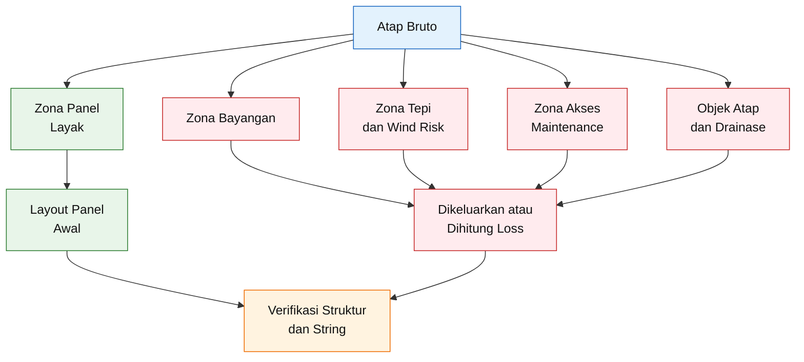

Zona panel tidak boleh menghalangi:

- talang;
- roof drain;
- ventilasi;
- akses inspeksi;
- jalur penangkal petir;
- skylight;
- hatch;
- atau peralatan rooftop.

---

## 4.5.5 Survei Bayangan Pukul 08.00–16.00

PV sensitif terhadap bayangan parsial. Dampaknya tidak selalu sebanding dengan luas modul yang tertutup karena satu bagian yang terbayang dapat membatasi arus rangkaian sel atau string. Analisis shading diperlukan untuk menentukan konfigurasi string dan estimasi energi. [R13]

Objek yang dicatat:

- pohon;
- bangunan tetangga;
- parapet;
- tangki air;
- antena;
- cerobong;
- tiang;
- kabel udara;
- struktur penangkal petir;
- panel lain;
- pertumbuhan vegetasi di masa depan.

Data shading minimum:

| Waktu | Objek | Area terkena | Modul terdampak | Durasi | Catatan |
| ----- | ----- | -----------: | --------------: | -----: | ------- |
| 08.00 | —     |            — |               — |      — | —       |
| 10.00 | —     |            — |               — |      — | —       |
| 12.00 | —     |            — |               — |      — | —       |
| 14.00 | —     |            — |               — |      — | —       |
| 16.00 | —     |            — |               — |      — | —       |

Energi akibat shading secara konseptual:

$$
E_{\text{after,shade}}
=

E_{\text{unshaded}}
\times
\left(
1
-

L_{\text{shade}}
\right)
$$

dengan $L_{\text{shade}}$ diperoleh dari model shading, bukan hanya perkiraan persentase luas bayangan.

Jika shading berbeda signifikan antarzona, alternatifnya:

- memindahkan modul;
- membagi string;
- menggunakan MPPT terpisah;
- menggunakan module-level power electronics;
- atau mengurangi jumlah panel.

---

## 4.5.6 Kondisi Struktur Atap

Survei visual harus mencatat:

- material rangka;
- dimensi elemen;
- jarak antar-rafter atau purlin;
- kondisi baut;
- kondisi sambungan las;
- korosi;
- retak;
- deformasi;
- kebocoran;
- umur atap;
- riwayat perbaikan;
- dan tanda penurunan kapasitas struktur.

Berat tambahan PLTS:

$$
W_{\text{PV,total}}
=

W_{\text{modules}}
+
W_{\text{rails}}
+
W_{\text{clamps}}
+
W_{\text{anchors}}
+
W_{\text{cables}}
+
W_{\text{accessories}}
$$

Beban merata tambahan:

$$
q_{\text{PV}}
=

\frac{
W_{\text{PV,total}}
}{
A_{\text{support}}
}
$$

Namun, beberapa beban bekerja sebagai beban titik pada:

- roof hook;
- L-foot;
- clamp;
- ballast;
- atau anchoring.

Karena itu, pemeriksaan tidak boleh hanya menggunakan beban rata-rata kg/m².

Evaluasi struktur juga harus mempertimbangkan gaya uplift angin. SNI 1727:2020 digunakan sebagai salah satu acuan beban desain minimum untuk bangunan dan struktur. [R12]

### Kriteria wajib pemeriksaan struktur lebih lanjut

Pemeriksaan oleh engineer struktur diperlukan apabila ditemukan:

- korosi berat;
- atap lama atau rapuh;
- rangka baja ringan tanpa drawing;
- lendutan;
- sambungan tidak standar;
- penambahan beban lain;
- bentang panjang;
- area angin tinggi;
- elevasi bangunan tinggi;
- atau mounting yang meningkatkan sudut terhadap atap.

---

## 4.5.7 Jenis Penutup Atap dan Penetrasi

Jenis atap memengaruhi mounting:

- metal standing seam;
- metal trapezoidal;
- genteng tanah liat;
- genteng beton;
- atap beton;
- atap membran;
- sandwich panel.

Data yang dikumpulkan:

- profil atap;
- tebal material;
- jenis coating;
- kondisi waterproofing;
- posisi rangka;
- metode pengikatan yang diperbolehkan;
- compatibility material;
- risiko korosi galvanik;
- prosedur sealing.

Setiap penetrasi harus mempunyai detail:

- lokasi;
- diameter;
- tipe fastener;
- lapisan seal;
- flashing;
- metode inspeksi;
- dan tanggung jawab garansi kebocoran.

---

## 4.5.8 Akses dan Maintenance

Layout harus memungkinkan:

- inspeksi visual;
- penggantian modul;
- pemeriksaan connector;
- pembersihan;
- inspeksi mounting;
- akses ke roof drain;
- akses aman menuju isolator atau jalur kabel.

Tidak boleh diasumsikan bahwa teknisi dapat menginjak modul.

Lokasi panel juga harus dinilai terhadap:

- risiko jatuh;
- jarak aman dari tepi;
- akses alat kerja;
- kemungkinan rescue;
- dan pembatasan kerja saat hujan atau angin.

---

## 4.6 Survei Jalur Kabel

Survei jalur kabel dilakukan dari:

1. PV ke inverter;
2. baterai ke inverter;
3. PLN atau main panel ke inverter;
4. inverter ke essential-load panel;
5. komunikasi CT atau smart meter;
6. grounding dan bonding.

Data yang dicatat:

- panjang aktual;
- panjang vertikal dan horizontal;
- jumlah belokan;
- metode pemasangan;
- temperatur sekitar;
- grouping;
- material tray atau conduit;
- area basah;
- paparan UV;
- penetrasi dinding atau atap;
- potensi gigitan hewan;
- kedekatan dengan sumber panas;
- kedekatan dengan kabel komunikasi.

Panjang sirkuit DC harus dihitung sebagai panjang loop:

$$
L_{\text{loop}}
=

L_{\text{positive}}
+
L_{\text{negative}}
$$

Jika kedua konduktor mempunyai panjang yang sama:

$$
L_{\text{loop}}
=

2
\times
L_{\text{one-way}}
$$

Kesalahan menggunakan panjang satu arah dalam perhitungan voltage drop akan menghasilkan kabel yang terlalu kecil.

---

## 4.7 Survei Ruang Inverter

Lokasi inverter harus diperiksa terhadap:

- temperatur;
- sirkulasi udara;
- paparan matahari;
- kelembapan;
- debu;
- air;
- banjir;
- gas korosif;
- akses servis;
- kebisingan;
- jarak ke panel utama;
- jarak ke baterai;
- dan clearance pabrikan.

### Panas yang dilepaskan inverter

Jika efisiensi inverter:

$$
\eta_{\text{inv}}
=

\frac{
P_{\text{out}}
}{
P_{\text{in}}
}
$$

maka rugi daya:

$$
P_{\text{loss}}
=

P_{\text{in}}
-

P_{\text{out}}
$$

atau:

$$
P_{\text{loss}}
=

P_{\text{out}}
\left(
\frac{1}{\eta_{\text{inv}}}
-

1
\right)
$$

Sebagai contoh, pada output 3.000 W dan efisiensi 95%:

$$
P_{\text{loss}}
=

3{,}000
\left(
\frac{1}{0{,}95}
-

1
\right)
$$

$$
P_{\text{loss}}
\approx
157{,}9\ \text{W}
$$

Panas tersebut harus dibuang oleh ventilasi ruang.

Jangan menempatkan inverter:

- di dalam kabinet tanpa ventilasi;
- di bawah paparan matahari langsung;
- dekat sumber panas;
- di lokasi yang rawan bocor;
- atau pada dinding yang tidak mampu menahan beratnya.

---

## 4.8 Survei Ruang Smart Battery

Survei baterai harus mencakup aspek mekanik, elektrikal, termal, kebakaran, dan akses darurat.

### 4.8.1 Data mekanik

- dimensi baterai;
- berat per unit;
- tipe rackmount atau wall-mounted;
- kapasitas rack;
- titik anchoring;
- kapasitas lantai;
- stabilitas terhadap guling;
- akses pengangkatan.

Beban total rack:

$$
W_{\text{rack,total}}
=

W_{\text{rack}}
+
\sum_{j=1}^{n}
W_{\text{battery},j}
+
W_{\text{accessories}}
$$

Kapasitas rack harus memenuhi:

$$
W_{\text{rack,rated}}

>

W_{\text{rack,total}}
$$

dengan margin yang ditentukan melalui desain mekanik.

### 4.8.2 Data elektrikal

- tegangan nominal;
- tegangan maksimum;
- arus charge;
- arus discharge;
- short-circuit capability;
- tipe terminal;
- ukuran stud;
- jenis fuse;
- isolator;
- port komunikasi;
- CAN atau RS485;
- prosedur shutdown;
- emergency isolation.

### 4.8.3 Kondisi lingkungan

- temperatur minimum dan maksimum;
- kelembapan;
- ventilasi;
- paparan air;
- paparan matahari;
- debu;
- bahan kimia;
- sumber api;
- material mudah terbakar;
- jalur evakuasi.

### 4.8.4 Penempatan

Baterai tidak ditempatkan:

- di jalur evakuasi;
- di bawah sumber air;
- di area mudah banjir;
- dekat kompor atau sumber panas;
- dalam ruang yang juga digunakan menyimpan bahan mudah terbakar;
- atau pada rack yang tidak dibonding ke grounding.

---

## 4.9 Jarak Inverter–Baterai

Arus DC baterai cukup tinggi sehingga jarak harus dibuat sesingkat mungkin.

Arus baterai:

$$
I_{\text{battery}}
=

\frac{
P_{\text{AC}}
}{
V_{\text{battery}}
\times
\eta_{\text{inv}}
}
$$

Untuk beban 3.000 W:

$$
I_{\text{battery}}
=

\frac{
3{,}000
}{
51{,}2
\times
0{,}92
}
$$

$$
I_{\text{battery}}
\approx
63{,}69\ \text{A}
$$

Untuk beban 5.000 W:

$$
I_{\text{battery}}
=

\frac{
5{,}000
}{
51{,}2
\times
0{,}92
}
$$

$$
I_{\text{battery}}
\approx
106{,}15\ \text{A}
$$

Semakin panjang kabel:

- semakin besar voltage drop;
- semakin besar rugi daya;
- semakin besar kebutuhan penampang;
- semakin besar energi gangguan yang harus diputus.

Survei harus mencari lokasi yang memungkinkan inverter dan baterai berdekatan tanpa mengorbankan:

- ventilasi;
- keselamatan kebakaran;
- akses servis;
- dan clearance.

---

## 4.10 Survei Grounding dan Bonding

Data grounding minimum:

- jumlah earth electrode;
- jenis electrode;
- lokasi;
- ukuran konduktor;
- earth bar;
- sambungan bonding;
- hasil pengukuran tahanan;
- kondisi korosi;
- hubungan dengan panel utama;
- hubungan dengan penangkal petir;
- dan sistem netral.

Bagian yang perlu dibonding meliputi:

- frame modul;
- rail;
- mounting structure;
- inverter;
- DCDB;
- ACDB;
- rack baterai;
- enclosure logam;
- dan SPD.

Survei harus menentukan apakah sistem eksisting dapat digunakan atau memerlukan perbaikan.

Jangan menetapkan satu angka tahanan grounding generik tanpa mempertimbangkan:

- sistem pembumian;
- fungsi proteksi;
- karakteristik RCD;
- impedansi fault loop;
- proteksi petir;
- dan PUIL.

### Pengukuran

Pengukuran tahanan grounding dilakukan dengan metode dan alat yang sesuai oleh personel kompeten.

Hasil dicatat bersama:

- metode uji;
- kondisi tanah;
- cuaca;
- konfigurasi electrode;
- posisi probe;
- tanggal;
- dan kalibrasi alat.

---

## 4.11 Survei Penangkal Petir dan Surge

Data yang perlu diperoleh:

- apakah bangunan mempunyai sistem proteksi petir;
- posisi air terminal;
- jalur down conductor;
- titik grounding LPS;
- jarak modul dari konduktor;
- posisi existing SPD;
- tipe SPD;
- status indikator SPD;
- panjang konduktor SPD;
- koordinasi SPD AC dan DC.

PLTS tidak boleh dipasang sehingga:

- modul menghalangi air terminal;
- rail terhubung sembarangan ke down conductor;
- cable loop memperbesar induksi;
- atau jalur DC diletakkan menempel pada konduktor petir tanpa kajian.

Evaluasi lightning protection dan separation distance memerlukan perhitungan tersendiri apabila bangunan mempunyai LPS.

---

## 4.12 Survei Lingkungan

Kondisi lingkungan memengaruhi pemilihan material.

Data yang dicatat:

- temperatur maksimum dan minimum;
- kelembapan;
- curah hujan;
- banjir;
- paparan garam;
- area pantai;
- debu;
- asap;
- bahan kimia;
- gas korosif;
- aktivitas burung;
- hewan pengerat;
- vegetasi;
- risiko kebakaran;
- tingkat petir;
- dan angin.

Untuk lokasi dekat industri atau pantai, periksa:

- coating modul;
- material fastener;
- jenis aluminium;
- compatibility logam;
- enclosure;
- cable gland;
- connector;
- dan interval inspeksi korosi.

---

## 4.13 Risiko Angin

Panel PV membentuk permukaan yang menerima tekanan dan hisapan angin.

Gaya angin konseptual:

$$
F_{\text{wind}}
=

q_{\text{wind}}
\times
C
\times
A
$$

dengan:

- $q_{\text{wind}}$ = tekanan kecepatan angin;
- $C$ = koefisien aerodinamik dan faktor terkait;
- $A$ = luas efektif.

Nilai final harus dihitung sesuai standar struktur, geometri atap, zona tepi, tinggi bangunan, lokasi, dan konfigurasi mounting.

Survei harus mencatat:

- tinggi bangunan;
- kondisi sekitar;
- keterbukaan medan;
- posisi panel terhadap tepi;
- parapet;
- kemiringan;
- tipe anchor;
- dan kondisi struktur penahan.

Panel di dekat sudut dan tepi atap dapat mengalami uplift lebih tinggi daripada panel di bagian tengah.

---

## 4.14 Survei Akses Instalasi dan Pengangkutan

Periksa jalur pengangkutan untuk:

- modul;
- inverter;
- baterai;
- rack;
- rail;
- dan panel listrik.

Data yang dicatat:

- lebar pintu;
- tangga;
- lift;
- akses crane;
- ketinggian;
- kapasitas lantai;
- jalur belok;
- area staging;
- tempat penyimpanan sementara.

Smart battery 5,12 kWh dapat mempunyai berat puluhan kilogram. Metode pengangkatan harus direncanakan agar tidak merusak baterai atau mencederai pekerja.

---

## 4.15 Survei Komunikasi dan Monitoring

Sistem hybrid memerlukan jalur komunikasi untuk:

- BMS;
- CT atau smart meter;
- data logger;
- Wi-Fi;
- Ethernet;
- RS485;
- CAN.

Data yang dicatat:

- posisi router;
- kekuatan sinyal;
- jalur kabel data;
- panjang maksimum menurut manual;
- kebutuhan shielding;
- grounding shield;
- terminasi;
- potensi interferensi;
- dan pemisahan dari kabel daya.

Kabel BMS tidak boleh diasumsikan dapat diperpanjang menggunakan kabel jaringan sembarang tanpa memeriksa:

- pinout;
- impedansi;
- terminasi;
- dan panjang maksimum pabrikan.

---

## 4.16 Dokumentasi Foto

Setiap foto diberi identitas:

$$
\text{Kode Foto}
=

\text{Area}
-

\text{Objek}
-

\text{Nomor}
$$

Contoh:

```text
ROOF-PURLIN-01
MDB-MCB-01
PLN-METER-01
EARTH-PIT-01
BATTERY-ROOM-01
```

Foto wajib mencakup:

- tampilan umum atap;
- setiap bidang atap;
- seluruh objek bayangan;
- struktur bawah atap;
- meter PLN;
- MCB PLN;
- main panel;
- earth bar;
- earth pit;
- lokasi inverter;
- lokasi baterai;
- jalur kabel;
- penetrasi;
- penangkal petir;
- dan area essential-load panel.

Foto tanpa orientasi, ukuran pembanding, atau kode lokasi mempunyai nilai engineering yang rendah.

---

## 4.17 Formulir Ringkas Survei Beban

| Parameter        | Nilai | Satuan   | Sumber        | Status |
| ---------------- | ----: | -------- | ------------- | ------ |
| Daya PLN         |     — | VA       | Tagihan/MCB   | D/C    |
| Tarif            |     — | Rp/kWh   | Tagihan       | D      |
| Konsumsi tahunan |     — | kWh      | Tagihan       | D      |
| Konsumsi siang   |     — | kWh/hari | Logger        | M      |
| Konsumsi malam   |     — | kWh/hari | Logger        | M      |
| Peak demand      |     — | kW       | Logger        | M      |
| Essential load   |     — | kW       | Load list     | C      |
| Energi backup    |     — | kWh      | Load list     | C      |
| Motor terbesar   |     — | kW       | Nameplate     | D      |
| Starting current |     — | A        | Datasheet/uji | D/M    |

---

## 4.18 Formulir Ringkas Survei Atap

| Parameter       | Bidang A | Bidang B | Status        |
| --------------- | -------: | -------: | ------------- |
| Panjang         |        — |        — | M             |
| Lebar           |        — |        — | M             |
| Luas bruto      |        — |        — | M             |
| Luas efektif    |        — |        — | Calculated    |
| Azimuth         |        — |        — | M             |
| Tilt            |        — |        — | M             |
| Material atap   |        — |        — | C             |
| Jarak rafter    |        — |        — | M             |
| Kondisi korosi  |        — |        — | Visual        |
| Bayangan        |        — |        — | M/Model       |
| Jumlah panel    |        — |        — | Calculated    |
| Status struktur |        — |        — | Hold/Approved |

---

## 4.19 Formulir Ruang Inverter dan Baterai

| Parameter                | Inverter | Baterai | Status     |
| ------------------------ | -------: | ------: | ---------- |
| Lokasi                   |        — |       — | C          |
| Temperatur               |        — |       — | M          |
| Kelembapan               |        — |       — | M          |
| Ventilasi                |        — |       — | Visual     |
| Risiko air               |        — |       — | Visual     |
| Jarak ke MDB             |        — |       — | M          |
| Jarak inverter–baterai   |        — |       — | M          |
| Kapasitas dinding/lantai |        — |       — | Hold       |
| Clearance                |        — |       — | Datasheet  |
| Akses isolator           |        — |       — | Visual     |
| Jalur evakuasi           |        — |       — | Visual     |
| Potensi kebakaran        |        — |       — | Assessment |

---

## 4.20 Kriteria Penerimaan Survei

Survei dinyatakan cukup untuk basic engineering apabila:

- tagihan 12 bulan tersedia;
- daya PLN terverifikasi;
- profil beban representatif tersedia;
- essential load telah disepakati;
- atap telah diukur;
- shading telah dipetakan;
- kondisi struktur telah dinilai;
- lokasi inverter dan baterai telah ditentukan;
- jalur kabel telah diukur;
- titik interkoneksi dan CT telah ditentukan;
- grounding telah diidentifikasi;
- dokumen dan foto lengkap;
- seluruh asumsi diberi status hold point.

Survei belum cukup apabila hanya tersedia:

- foto atap dari bawah;
- total kWh satu bulan;
- ukuran atap perkiraan;
- dan daftar produk yang akan dibeli.

---

## 4.21 Hold Point Hasil Survei

Data berikut harus ditutup sebelum detailed engineering:

1. daya kontrak dan tarif PLN;
2. ketersediaan kuota cluster;
3. profil beban per interval;
4. peak demand;
5. starting load;
6. essential-load list;
7. durasi backup;
8. azimuth dan tilt;
9. shading loss;
10. hasil evaluasi struktur;
11. metode anchoring;
12. jalur dan panjang kabel;
13. sistem pembumian;
14. fault level panel;
15. tipe RCD;
16. posisi CT zero-export;
17. lokasi inverter;
18. kapasitas rack baterai;
19. kondisi ventilasi;
20. integrasi dengan penangkal petir.

---

## 4.22 Output Wajib Survei

Laporan survei sekurang-kurangnya menghasilkan:

- site survey report;
- load list;
- profil beban;
- daftar essential load;
- roof plan;
- preliminary PV layout;
- shading assessment;
- laporan kondisi struktur;
- foto teridentifikasi;
- jalur kabel;
- lokasi inverter dan baterai;
- preliminary single-line diagram;
- data grounding;
- daftar risiko;
- daftar hold point;
- dan rekomendasi kelayakan.

Keputusan akhir survei dibagi menjadi:

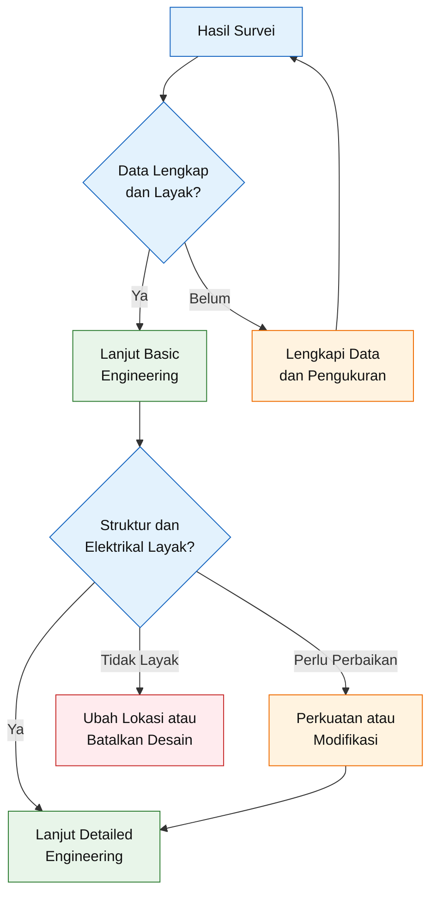

---

## 4.23 Kesimpulan Bab Survei

Survei lapangan bukan kegiatan untuk membuktikan bahwa enam panel dapat dimuat di atap.

Survei harus membuktikan bahwa:

- produksi PV dapat digunakan oleh profil beban;
- konfigurasi grid sesuai dengan inverter;
- essential load dapat dipisahkan;
- atap mampu menahan sistem;
- bayangan dapat diterima;
- jalur kabel aman;
- baterai dan inverter dapat ditempatkan dengan benar;
- grounding dan proteksi dapat diterapkan;
- dan proyek layak dilanjutkan secara teknis serta ekonomi.

Data hasil survei menjadi satu-satunya dasar yang sah untuk mengubah baseline artikel menjadi:

- final PV layout;
- final string configuration;
- cable sizing;
- protection schedule;
- single-line diagram;
- bill of materials;
- estimasi produksi;
- dan analisis ekonomi.

[**Kembali ke Atas**](#desain-implementatif-plts-hybrid-3000-wp-untuk-sistem-pln-1-fasa-pv-mppt-smart-battery-proteksi-integrasi-grid-dan-analisis-ekonomi)

---

## Referensi Bab 3 dan Bab 4

**[R1]** Kementerian Energi dan Sumber Daya Mineral Republik Indonesia. _Peraturan Menteri ESDM Nomor 2 Tahun 2024 tentang Pembangkit Listrik Tenaga Surya Atap yang Terhubung pada Jaringan Tenaga Listrik Pemegang IUPTLU._

**[R2]** Kementerian Energi dan Sumber Daya Mineral Republik Indonesia. _Peraturan Menteri ESDM Nomor 11 Tahun 2021 tentang Pelaksanaan Usaha Ketenagalistrikan._

**[R3]** Badan Standardisasi Nasional. _SNI 0225:2020 — Persyaratan Umum Instalasi Listrik atau PUIL 2020_, beserta bagian-bagiannya dan pembaruan yang berlaku.

**[R4]** International Electrotechnical Commission. _IEC 62548-1:2023 dan Amendment 1:2025 — Photovoltaic Arrays, Design Requirements._

**[R5]** International Electrotechnical Commission. _IEC 60364-7-712:2025 — Low-Voltage Electrical Installations, Solar Photovoltaic Power Supply Installations._

**[R6]** International Electrotechnical Commission. _IEC 62446-1:2016 dan Amendment 1:2018 — Documentation, Commissioning Tests and Inspection._

**[R7]** International Electrotechnical Commission. _IEC 62446-2:2020 — Maintenance of Grid-Connected PV Systems._

**[R8]** International Electrotechnical Commission. _IEC 62109-1:2010 — General Safety Requirements for PV Power Conversion Equipment._

**[R9]** International Electrotechnical Commission. _IEC 62109-2:2011 — Particular Safety Requirements for Inverters._

**[R10]** International Electrotechnical Commission. _IEC 62116:2014 — Test Procedure of Islanding Prevention Measures._

**[R11]** International Electrotechnical Commission. _IEC 61727:2004 — Characteristics of the Utility Interface._

**[R12]** Badan Standardisasi Nasional. _SNI 1727:2020, SNI 1726:2019, dan SNI 1729:2020_ untuk beban dan evaluasi struktur yang relevan.

**[R13]** National Renewable Energy Laboratory. _Detailed Site Evaluation, Project Validation, and Permitting_ serta publikasi teknis terkait pengaruh partial shading terhadap sistem PV.

### Verifikasi sumber utama

Permen ESDM Nomor 2 Tahun 2024 menetapkan kuota berbasis clustering, permohonan pada Januari atau Juli, keputusan paling lambat 30 hari kalender setelah periode pengajuan, dan tidak memperhitungkan energi berlebih yang masuk jaringan sebagai pengurang tagihan. Regulasi yang sama mengatur installer Badan Usaha, SLO/registrasi, Advanced Meter, anti-islanding, dan standar teknis minimum.

Untuk sistem sampai 500 kW dengan panel kontrol terintegrasi dan plug-and-play, satu inverter atau beberapa inverter dengan total kurang dari 10 kW, satu konstruksi, satu pembumian, dan satu instalasi pemanfaatan, regulasi menyediakan jalur “dinyatakan memenuhi ketentuan wajib SLO”; jalur ini tetap memerlukan surat pernyataan, dokumen pendukung, commissioning, evaluasi, dan nomor registrasi.

Permen ESDM Nomor 11 Tahun 2021 mengatur penanggung jawab teknik dan tenaga teknik bersertifikat kompetensi serta kewajiban Badan Usaha menggunakan sertifikat yang masih berlaku dan sesuai ruang lingkup izin.

BSN mencatat PUIL 2020 sebagai rangkaian SNI 0225 yang mencakup desain instalasi, proteksi, perkawatan, serta pembumian; BSN juga mencatat SNI 1727:2020, SNI 1726:2019, dan SNI 1729:2020 sebagai standar struktur yang berlaku. ([Pesta BSN][1])

IEC 62548-1 mencakup desain array, kabel DC, switching, proteksi, dan pembumian; IEC 60364-7-712 edisi 2025 mencakup instalasi PV, energy storage, serta island mode. IEC 62446-1 dan IEC 62446-2 masing-masing menjadi acuan dokumentasi/commissioning dan maintenance. ([IEC Webstore][2])

IEC 62109-1/-2 membahas keselamatan power converter dan inverter, IEC 62116 membahas pengujian pencegahan islanding, sedangkan IEC 61727 membahas karakteristik antarmuka PV dengan jaringan utilitas. ([IEC Webstore][3])

NREL menekankan pentingnya evaluasi shading dan karakteristik atap dalam detailed site evaluation karena bayangan parsial dapat memengaruhi konfigurasi dan performa sistem PV. ([nrel.gov][4])

[1]: https://pesta.bsn.go.id/produk/index?key=Puil&utm_source=chatgpt.com '(PUIL) 2020'
[2]: https://webstore.iec.ch/en/publication/64171 'IEC 62548-1:2023 | IEC'
[3]: https://webstore.iec.ch/en/publication/6470?utm_source=chatgpt.com 'IEC 62109-1:2010'
[4]: https://www.nrel.gov/docs/fy15osti/64570.pdf?utm_source=chatgpt.com 'Simplified Method for Modeling the Impact of Arbitrary ...'

---

# 5. Load List dan Profil Energi

Load list merupakan dasar utama untuk menentukan kapasitas PV, inverter, baterai, panel beban prioritas, kabel, proteksi, serta filosofi operasi sistem. Kapasitas PLTS tidak boleh ditentukan hanya berdasarkan daya kontrak PLN atau total daya yang tertulis pada nameplate peralatan.

Tiga besaran yang harus diperoleh dari analisis beban adalah:

1. **energi**, dinyatakan dalam kWh per hari;
2. **daya kontinu dan daya puncak**, dinyatakan dalam kW;
3. **starting load atau surge load**, dinyatakan dalam W, VA, A, atau kVA sesuai karakteristik beban.

Ketiga besaran tersebut mempunyai fungsi desain yang berbeda.

| Besaran         | Digunakan untuk                                            |
| --------------- | ---------------------------------------------------------- |
| Energi harian   | Menentukan kecukupan produksi PV dan kapasitas penyimpanan |
| Beban rata-rata | Menilai pola konsumsi dan estimasi durasi backup           |
| Beban puncak    | Menentukan kapasitas inverter dan panel distribusi         |
| Starting load   | Memeriksa kemampuan surge inverter dan baterai             |
| Energi malam    | Menentukan kebutuhan baterai                               |
| Beban siang     | Menentukan potensi direct self-consumption                 |
| Essential load  | Menentukan kapasitas panel backup                          |

> Sistem PLTS yang didesain hanya berdasarkan total kWh dapat gagal ketika menghadapi daya puncak. Sebaliknya, sistem yang hanya didesain berdasarkan daya puncak dapat mempunyai PV dan baterai yang tidak sesuai kebutuhan energi harian.

---

## 5.1 Tujuan Penyusunan Load List

Load list dalam artikel ini digunakan untuk menghasilkan:

- total konsumsi energi per hari;
- pembagian konsumsi siang dan malam;
- beban rata-rata;
- beban maksimum;
- beban puncak yang terjadi bersamaan;
- starting load;
- essential-load list;
- kapasitas minimum backup panel;
- durasi backup;
- dan potensi pemindahan beban ke periode produksi PV.

Alur analisisnya adalah sebagai berikut.

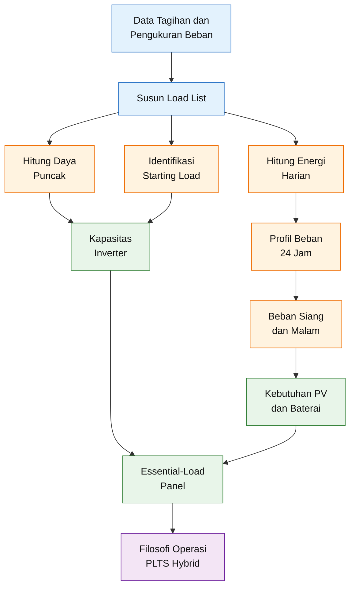

---

## 5.2 Sumber Data Beban

Load list harus disusun dari kombinasi beberapa sumber.

### 5.2.1 Nameplate peralatan

Nameplate memberikan informasi:

- tegangan;
- arus;
- daya;
- frekuensi;
- faktor daya;
- kapasitas motor;
- dan kadang-kadang starting current.

Namun, daya nameplate tidak selalu sama dengan konsumsi rata-rata.

Sebagai contoh, kulkas dengan daya kompresor 120 W tidak selalu menggunakan 120 W selama 24 jam karena kompresor bekerja secara siklik.

---

### 5.2.2 Pengukuran langsung

Pengukuran dapat dilakukan menggunakan:

- power meter;
- plug-in energy meter;
- clamp power meter;
- smart meter;
- energy logger;
- atau power-quality logger.

Parameter yang sebaiknya direkam adalah:

- daya aktif;
- daya semu;
- arus;
- tegangan;
- faktor daya;
- energi;
- peak demand;
- dan waktu terjadinya puncak.

Profil interval 15 menit lebih berguna dibanding hanya total kWh bulanan karena dapat menunjukkan variasi beban dan kesesuaiannya terhadap kurva produksi PV.

---

### 5.2.3 Tagihan PLN

Tagihan PLN digunakan untuk memvalidasi:

- konsumsi bulanan;
- konsumsi tahunan;
- daya kontrak;
- golongan tarif;
- dan kecenderungan musiman.

Load list yang dibuat dari survei harus direkonsiliasi dengan tagihan.

Jika energi tahunan hasil load list berbeda jauh dari tagihan, penyebabnya harus dicari sebelum desain diteruskan.

---

### 5.2.4 Wawancara pengguna

Wawancara diperlukan untuk mengetahui:

- waktu penggunaan peralatan;
- kebiasaan akhir pekan;
- musim penggunaan AC;
- waktu pompa bekerja;
- kemungkinan penambahan beban;
- dan beban yang harus tetap hidup ketika PLN padam.

Data wawancara diberi status **assumed** sampai diverifikasi oleh pengukuran.

---

## 5.3 Struktur Load List

Load list yang implementatif tidak cukup hanya berisi daya dan jam operasi. Tabel harus membedakan energi, daya puncak, starting load, waktu penggunaan, dan klasifikasi prioritas.

Format yang direkomendasikan adalah:

| No. | Beban        | Jumlah | Daya/unit | Faktor pakai | Jam aktif | Energi/hari | Start factor | Prioritas |
| --: | ------------ | -----: | --------: | -----------: | --------: | ----------: | -----------: | --------- |
|   1 | Lampu        |      — |         — |            — |         — |           — |          1,0 | E1/E2     |
|   2 | Kulkas       |      — |         — |            — |         — |           — |            — | E1/E2     |
|   3 | Router/CCTV  |      — |         — |            — |         — |           — |          1,0 | E1        |
|   4 | Pompa        |      — |         — |            — |         — |           — |            — | E2/N      |
|   5 | AC           |      — |         — |            — |         — |           — |            — | N         |
|   6 | Water heater |      — |         — |            — |         — |           — |          1,0 | N         |

Keterangan:

- **faktor pakai** menunjukkan rata-rata fraksi daya selama periode aktif;
- **jam aktif** menunjukkan durasi peralatan tersedia atau digunakan;
- **start factor** menunjukkan rasio kebutuhan awal terhadap daya normal;
- **E1** adalah beban sangat penting;
- **E2** adalah beban penting yang dapat dibatasi;
- **N** adalah beban nonprioritas.

---

## 5.4 Perhitungan Energi Setiap Beban

Untuk peralatan yang bekerja pada daya relatif konstan:

$$
E_j
=

\frac{
N_j
\times
P_j
\times
t_j
}{
1{,}000
}
$$

dengan:

- $E_j$ = energi beban ke-$j$ dalam kWh;
- $N_j$ = jumlah peralatan;
- $P_j$ = daya tiap peralatan dalam W;
- $t_j$ = waktu operasi dalam jam.

Untuk peralatan yang tidak bekerja terus-menerus selama periode aktif, digunakan faktor pakai atau duty factor:

$$
E_j
=

\frac{
N_j
\times
P_j
\times
t_j
\times
DF_j
}{
1{,}000
}
$$

dengan:

- $DF_j$ = duty factor antara 0 dan 1.

Total energi harian:

$$
E_{\text{day,total}}
=

\sum_{j=1}^{n}
E_j
$$

### Contoh kulkas

Misalnya satu kulkas mempunyai:

- daya kompresor 120 W;
- waktu terhubung 24 jam;
- duty factor hasil pengukuran 0,35.

Maka:

$$
E_{\text{kulkas}}
=

\frac{
1
\times
120
\times
24
\times
0{,}35
}{
1{,}000
}
$$

$$
E_{\text{kulkas}}
=

1{,}008\ \text{kWh/hari}
$$

Nilai duty factor tidak boleh digunakan sebagai angka universal. Duty factor dipengaruhi oleh:

- temperatur ruang;
- setting thermostat;
- frekuensi membuka pintu;
- isi kulkas;
- kondisi seal;
- efisiensi unit;
- dan umur peralatan.

---

## 5.5 Contoh Load List Design Case

Tabel berikut digunakan sebagai **contoh perhitungan awal** untuk menunjukkan metode. Nilainya harus diganti dengan data lokasi aktual sebelum detailed engineering.

| Beban                       | Daya/unit | Jumlah |       Jam aktif | Faktor pakai |  Energi/hari | Prioritas |
| --------------------------- | --------: | -----: | --------------: | -----------: | -----------: | --------- |
| Lampu LED                   |      10 W |      8 |           6 jam |         1,00 |     0,48 kWh | E2        |
| Kulkas                      |     120 W |      1 |          24 jam |         0,35 |     1,01 kWh | E1        |
| Router dan CCTV             |      45 W |  1 set |          24 jam |         1,00 |     1,08 kWh | E1        |
| Televisi dan perangkat IT   |     250 W |  1 set |           5 jam |         0,60 |     0,75 kWh | E2        |
| Pompa air                   |     250 W |      1 |        0,75 jam |         1,00 |     0,19 kWh | E2        |
| AC                          |     900 W |      1 |           6 jam |         0,65 |     3,51 kWh | N         |
| Water heater                |     800 W |      1 |         1,5 jam |         1,00 |     1,20 kWh | N         |
| Rice cooker dan dapur kecil |     400 W |  1 set | 2 jam ekuivalen |         1,00 |     0,80 kWh | N         |
| Beban kecil lainnya         |     150 W |  1 set |           4 jam |         1,00 |     0,60 kWh | N         |
| **Total**                   |           |        |                 |              | **9,62 kWh** |           |

Perhitungan lampu:

$$
E_{\text{lampu}}
=

\frac{
8
\times
10
\times
6
}{
1{,}000
}
$$

$$
E_{\text{lampu}}
=

0{,}48\ \text{kWh/hari}
$$

Perhitungan AC:

$$
E_{\text{AC}}
=

\frac{
1
\times
900
\times
6
\times
0{,}65
}{
1{,}000
}
$$

$$
E_{\text{AC}}
=

3{,}51\ \text{kWh/hari}
$$

Total contoh konsumsi:

$$
E_{\text{day,total}}
=

0{,}48
+
1{,}01
+
1{,}08
+
0{,}75
+
0{,}19
+
3{,}51
+
1{,}20
+
0{,}80
+
0{,}60
$$

$$
E_{\text{day,total}}
=

9{,}62\ \text{kWh/hari}
$$

Perkiraan konsumsi bulanan:

$$
E_{\text{month}}
=

9{,}62
\times
30
$$

$$
E_{\text{month}}
\approx
288{,}6\ \text{kWh/bulan}
$$

Perkiraan konsumsi tahunan:

$$
E_{\text{annual}}
=

9{,}62
\times
365
$$

$$
E_{\text{annual}}
\approx
3{,}511\ \text{kWh/tahun}
$$

Nilai tersebut harus dibandingkan dengan konsumsi aktual pada tagihan PLN.

---

## 5.6 Rekonsiliasi dengan Tagihan PLN

Perbedaan antara hasil load list dan tagihan dinyatakan sebagai:

$$
\Delta E
=

E_{\text{bill}}
-

E_{\text{load-list}}
$$

Persentase deviasi:

$$
\text{Deviasi}
=

\frac{
\left|
E_{\text{bill}}
-

E_{\text{load-list}}
\right|
}{
E_{\text{bill}}
}
\times
100\%
$$

Deviasi dapat berasal dari:

- beban yang belum dicatat;
- estimasi jam operasi yang salah;
- duty factor yang tidak sesuai;
- perubahan penggunaan musiman;
- konsumsi standby;
- rugi instalasi;
- atau data tagihan yang tidak mewakili bulan normal.

Untuk desain awal, load list dapat dianggap cukup representatif setelah:

- seluruh beban besar telah dicatat;
- profil waktunya sesuai;
- dan deviasi terhadap konsumsi rata-rata dapat dijelaskan.

Tidak ada satu batas deviasi universal untuk seluruh proyek. Kriteria penerimaan harus ditetapkan dalam design basis berdasarkan kualitas data dan tujuan analisis.

---

## 5.7 Profil Beban 24 Jam

Total energi harian tidak menunjukkan kapan energi digunakan. Padahal, waktu penggunaan menentukan:

- direct self-consumption;
- kebutuhan baterai;
- impor PLN;
- dan kemungkinan curtailment.

Profil beban disusun dalam interval:

- 60 menit untuk studi awal;
- 30 menit untuk evaluasi yang lebih baik;
- 15 menit untuk desain dan simulasi yang lebih representatif.

Energi interval:

$$
E_i
=

P_i
\times
\Delta t
$$

Untuk interval 15 menit:

$$
\Delta t
=

0{,}25\ \text{jam}
$$

Total energi harian:

$$
E_{\text{day}}
=

\sum_{i=1}^{96}
P_i
\times
0{,}25
$$

### Pembagian periode operasi

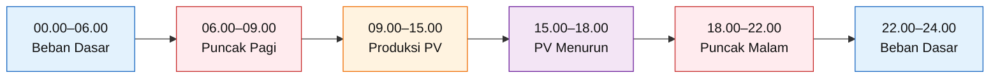

### Karakteristik setiap periode

| Periode     | Karakteristik umum                | Implikasi desain                  |
| ----------- | --------------------------------- | --------------------------------- |
| 00.00–06.00 | Kulkas, router, CCTV, standby     | Beban dasar baterai               |
| 06.00–09.00 | Lampu, pompa, dapur, water heater | Produksi PV masih terbatas        |
| 09.00–15.00 | Produksi PV maksimum              | Waktu terbaik untuk load shifting |
| 15.00–18.00 | PV mulai turun                    | Transisi ke baterai atau PLN      |
| 18.00–22.00 | Lampu, AC, TV, dapur              | Puncak energi malam               |
| 22.00–24.00 | Beban menurun                     | Baterai menyuplai beban dasar     |

---

## 5.8 Energi Siang dan Energi Malam

Energi siang didefinisikan sesuai jendela produksi PV yang relevan terhadap lokasi.

Sebagai pendekatan awal:

$$
E_{\text{daylight}}
=

\sum_{i \in \text{periode PV}}
E_i
$$

Energi malam:

$$
E_{\text{night}}
=

E_{\text{day,total}}
-

E_{\text{daylight}}
$$

Rasio konsumsi siang:

$$
R_{\text{day}}
=

\frac{
E_{\text{daylight}}
}{
E_{\text{day,total}}
}
\times
100\%
$$

Rasio konsumsi malam:

$$
R_{\text{night}}
=

\frac{
E_{\text{night}}
}{
E_{\text{day,total}}
}
\times
100\%
$$

Semakin besar konsumsi siang, semakin besar peluang energi PV digunakan langsung tanpa melalui baterai.

---

## 5.9 Direct Self-Consumption Potential

Energi PV yang dapat digunakan langsung pada interval tertentu dibatasi oleh nilai yang lebih kecil antara produksi PV dan beban:

$$
E_{\text{PV,direct},i}
=

\min
\left(
E_{\text{PV},i},
E_{\text{load},i}
\right)
$$

Total direct self-consumption:

$$
E_{\text{PV,direct}}
=

\sum_{i=1}^{n}
E_{\text{PV,direct},i}
$$

Surplus PV:

$$
E_{\text{PV,surplus},i}
=

\max
\left(
0,
E_{\text{PV},i}
-

E_{\text{load},i}
\right)
$$

Defisit beban:

$$
E_{\text{deficit},i}
=

\max
\left(
0,
E_{\text{load},i}
-

E_{\text{PV},i}
\right)
$$

Surplus dapat digunakan untuk:

- mengisi baterai;
- menyuplai smart load;
- atau dikurangi oleh inverter melalui curtailment.

Defisit dapat dipenuhi oleh:

- baterai;
- PLN;
- atau kombinasi keduanya.

---

## 5.10 Load Shifting

Load shifting adalah pemindahan jadwal operasi beban dari periode produksi PV rendah ke periode produksi PV tinggi.

Contoh beban yang dapat dipindahkan:

- pompa air;
- mesin cuci;
- pengisian perangkat;
- sebagian beban pendinginan;
- pengisian kendaraan listrik;
- proses rumah tangga yang tidak sensitif waktu.

Energi yang dipindahkan:

$$
E_{\text{shift}}
=

\sum
E_{\text{load,relocated}}
$$

Peningkatan direct self-consumption secara pendekatan:

$$
\Delta E_{\text{direct}}
\leq
E_{\text{shift}}
$$

Load shifting umumnya lebih efisien daripada menyimpan seluruh surplus ke baterai karena tidak melewati rugi charge-discharge.

---

## 5.11 Beban Rata-Rata

Beban rata-rata harian:

$$
P_{\text{avg,24h}}
=

\frac{
E_{\text{day,total}}
}{
24
}
$$

Untuk contoh konsumsi 9,62 kWh:

$$
P_{\text{avg,24h}}
=

\frac{
9{,}62
}{
24
}
$$

$$
P_{\text{avg,24h}}
\approx
0{,}401\ \text{kW}
$$

atau:

$$
P_{\text{avg,24h}}
\approx
401\ \text{W}
$$

Nilai rata-rata 401 W tidak berarti inverter 500 W cukup. Beban aktual dapat mencapai beberapa kilowatt pada periode puncak.

---

## 5.12 Beban Tersambung

Total connected load:

$$
P_{\text{connected}}
=

\sum_{j=1}^{n}
N_j
\times
P_j
$$

Untuk contoh load list:

$$
P_{\text{connected}}
=

80
+
120
+
45
+
250
+
250
+
900
+
800
+
400
+
150
$$

$$
P_{\text{connected}}
=

2{,}995\ \text{W}
$$

Connected load sekitar 3 kW tidak berarti seluruh beban selalu bekerja bersamaan.

---

## 5.13 Beban Puncak

Beban puncak harus dihitung berdasarkan kombinasi operasi yang mungkin terjadi.

Secara umum:

$$
P_{\text{peak}}
=

\sum_{j=1}^{n}
N_j
\times
P_j
\times
C_j
$$

dengan:

- $C_j$ = coincidence factor pada periode puncak.

Sebagai contoh, puncak malam dapat terdiri atas:

| Beban        | Daya pada saat puncak |
| ------------ | --------------------: |
| Lampu        |                  80 W |
| Kulkas       |                 120 W |
| Router/CCTV  |                  45 W |
| TV/IT        |                 250 W |
| AC           |                 900 W |
| Water heater |                 800 W |
| Beban kecil  |                 150 W |
| **Total**    |           **2.345 W** |

Maka:

$$
P_{\text{peak,normal}}
=

2{,}345\ \text{W}
$$

Nilai tersebut belum memasukkan transient starting.

---

## 5.14 Load Factor

Load factor menunjukkan rasio beban rata-rata terhadap beban puncak:

$$
LF
=

\frac{
P_{\text{avg}}
}{
P_{\text{peak}}
}
$$

Dengan:

$$
P_{\text{avg}}
=

0{,}401\ \text{kW}
$$

dan:

$$
P_{\text{peak}}
=

2{,}345\ \text{kW}
$$

maka:

$$
LF
=

\frac{
0{,}401
}{
2{,}345
}
$$

$$
LF
\approx
0{,}171
$$

atau:

$$
LF
\approx
17{,}1\%
$$

Load factor yang rendah menunjukkan bahwa sistem mengalami puncak jauh lebih tinggi daripada beban rata-ratanya.

Konsekuensinya:

- inverter harus mampu menanggung puncak;
- tetapi kapasitas energi tidak boleh dihitung dari puncak selama 24 jam;
- dan baterai harus dinilai dari energi serta daya secara terpisah.

---

## 5.15 Starting Load

Beban motor dan kompresor memerlukan perhatian khusus karena arus awal dapat beberapa kali arus normal.

Starting current:

$$
I_{\text{start},j}
=

k_{\text{start},j}
\times
I_{\text{rated},j}
$$

Starting apparent power:

$$
S_{\text{start},j}
=

V
\times
I_{\text{start},j}
$$

Pada satu fasa:

$$
S_{\text{start},j}
=

V
\times
k_{\text{start},j}
\times
I_{\text{rated},j}
$$

Untuk pendekatan berbasis daya:

$$
P_{\text{start,approx},j}
=

k_{\text{start},j}
\times
P_{\text{rated},j}
$$

Pendekatan tersebut hanya digunakan untuk screening awal. Evaluasi final sebaiknya menggunakan:

- locked-rotor current;
- starting VA;
- kurva arus terhadap waktu;
- metode start;
- dan surge rating inverter.

### Contoh screening pompa

Misalnya pompa:

- daya normal 250 W;
- faktor starting sementara 3.

Maka:

$$
P_{\text{start,pump}}
\approx
3
\times
250
$$

$$
P_{\text{start,pump}}
\approx
750\ \text{W}
$$

Tambahan starting di atas daya normal:

$$
\Delta P_{\text{start,pump}}
=

750
-

250
$$

$$
\Delta P_{\text{start,pump}}
=

500\ \text{W}
$$

Jika pompa start saat beban normal lain sebesar 1.500 W sedang aktif:

$$
P_{\text{system,start}}
\approx
1{,}500
+
750
$$

$$
P_{\text{system,start}}
\approx
2{,}250\ \text{W}
$$

Jika kulkas juga start pada waktu bersamaan, kebutuhan surge dapat menjadi lebih tinggi.

---

## 5.16 Simultaneous Starting

Kondisi terburuk tidak selalu berarti semua motor start bersamaan. Namun, kombinasi yang masuk akal harus dianalisis.

Starting load sistem:

$$
P_{\text{start,total}}
=

P_{\text{running,other}}
+
\sum
P_{\text{start,motor}}
$$

Kondisi desain dapat dibagi menjadi:

1. **normal peak**;
2. **single-largest-motor start**;
3. **credible simultaneous start**;
4. **abnormal all-load condition**.

Inverter tidak harus didesain untuk skenario yang secara operasional dicegah, asalkan terdapat:

- interlock;
- load shedding;
- jadwal start;
- atau prosedur operasi yang jelas.

---

## 5.17 Klasifikasi Essential Load

Beban backup dibagi menjadi tiga kelas.

### 5.17.1 Kelas E1 — wajib dipertahankan

Contoh:

- router;
- modem;
- CCTV;
- lampu darurat;
- sistem alarm;
- perangkat medis tertentu.

### 5.17.2 Kelas E2 — dipertahankan secara selektif

Contoh:

- kulkas;
- komputer;
- televisi tertentu;
- pompa kecil;
- beberapa lampu ruangan.

### 5.17.3 Kelas N — tidak masuk backup

Contoh:

- AC besar;
- water heater;
- kompor listrik;
- mesin las;
- pompa besar;
- beban pemanas.

Klasifikasi harus disepakati dengan pemilik.

Beban yang penting bagi kenyamanan belum tentu penting bagi keselamatan atau continuity.

---

## 5.18 Contoh Essential-Load List

Dari contoh load list, essential load dapat dipilih sebagai berikut:

| Beban                | Daya normal |     Jumlah | Status backup |
| -------------------- | ----------: | ---------: | ------------- |
| Lampu terpilih       |        40 W | 1 kelompok | E2            |
| Kulkas               |       120 W |          1 | E1            |
| Router dan CCTV      |        45 W |      1 set | E1            |
| Komputer/TV terpilih |       150 W |      1 set | E2            |
| Pompa kecil          |       250 W |          1 | E2, dibatasi  |
| **Total normal**     |   **605 W** |            |               |

Beban normal essential:

$$
P_{\text{essential,normal}}
=

40
+
120
+
45
+
150
+
250
$$

$$
P_{\text{essential,normal}}
=

605\ \text{W}
$$

Jika pompa tidak bekerja:

$$
P_{\text{essential,base}}
=

605
-

250
$$

$$
P_{\text{essential,base}}
=

355\ \text{W}
$$

Kapasitas panel essential tidak ditentukan hanya oleh 605 W karena masih perlu memperhitungkan:

- starting pompa;
- starting kulkas;
- kemungkinan tambahan beban;
- margin desain;
- rating inverter;
- kemampuan BMS;
- dan proteksi.

---

## 5.19 Batas Daya Essential-Load Panel

Batas daya panel backup harus memenuhi:

$$
P_{\text{essential,design}}
\leq
P_{\text{backup,inverter}}
$$

Selain itu:

$$
P_{\text{essential,design}}
\leq
P_{\text{battery,continuous}}
$$

Kemampuan daya baterai pada batas arus BMS:

$$
P_{\text{battery,DC,max}}
=

V_{\text{battery}}
\times
I_{\text{BMS,max}}
$$

Kemampuan AC setelah rugi inverter:

$$
P_{\text{battery,AC,max}}
=

V_{\text{battery}}
\times
I_{\text{BMS,max}}
\times
\eta_{\text{inv}}
$$

Untuk baterai 51,2 V, batas kontinu 100 A, dan efisiensi inverter 92%:

$$
P_{\text{battery,AC,max}}
=

51{,}2
\times
100
\times
0{,}92
$$

$$
P_{\text{battery,AC,max}}
\approx
4{,}71\ \text{kW}
$$

Namun, operasi terus-menerus tepat pada batas BMS tidak dianjurkan sebagai target desain.

Baseline artikel membatasi target beban backup sekitar:

$$
P_{\text{backup,target}}
\leq
3\ \text{kW}
$$

Pada 3 kW, arus baterai:

$$
I_{\text{battery}}
=

\frac{
3{,}000
}{
51{,}2
\times
0{,}92
}
$$

$$
I_{\text{battery}}
\approx
63{,}69\ \text{A}
$$

Nilai tersebut memberikan margin terhadap batas 100 A, meskipun kemampuan surge tetap harus diverifikasi.

---

## 5.20 Design Margin Essential Load

Jika digunakan faktor margin:

$$
P_{\text{essential,design}}
=

P_{\text{essential,peak}}
\times
SF
$$

dengan:

- $SF$ = design margin yang ditentukan proyek.

Sebagai contoh screening dengan margin 20%:

$$
SF
=

1{,}20
$$

Jika essential peak normal 605 W:

$$
P_{\text{essential,design}}
=

605
\times
1{,}20
$$

$$
P_{\text{essential,design}}
=

726\ \text{W}
$$

Margin ini tidak menggantikan pemeriksaan starting load. Surge harus diperiksa secara terpisah.

---

## 5.21 Energi Essential Load

Energi backup dihitung dari beban dan durasi target.

Contoh:

| Beban          |           Daya rata-rata | Durasi backup |        Energi |
| -------------- | -----------------------: | ------------: | ------------: |
| Lampu terpilih |                     40 W |         5 jam |      0,20 kWh |
| Kulkas         | 120 W × duty factor 0,35 |         5 jam |      0,21 kWh |
| Router/CCTV    |                     45 W |         5 jam |     0,225 kWh |
| Komputer/TV    |                    150 W |         3 jam |      0,45 kWh |
| Pompa          |                    250 W |      0,25 jam |     0,063 kWh |
| **Total**      |                          |               | **1,148 kWh** |

Kebutuhan energi backup:

$$
E_{\text{essential,5h}}
=

0{,}20
+
0{,}21
+
0{,}225
+
0{,}45
+
0{,}063
$$

$$
E_{\text{essential,5h}}
\approx
1{,}148\ \text{kWh}
$$

Nilai tersebut belum memasukkan rugi inverter dan margin.

Jika energi beban dihitung pada sisi AC dan efisiensi inverter 92%:

$$
E_{\text{battery,DC,required}}
=

\frac{
E_{\text{essential,AC}}
}{
\eta_{\text{inv}}
}
$$

$$
E_{\text{battery,DC,required}}
=

\frac{
1{,}148
}{
0{,}92
}
$$

$$
E_{\text{battery,DC,required}}
\approx
1{,}248\ \text{kWh}
$$

---

## 5.22 Energi Baterai yang Tersedia Berdasarkan SOC

Ketersediaan energi baterai harus dihitung dari SOC awal dan SOC minimum operasi, bukan hanya kapasitas nominal.

$$
E_{\text{available,AC}}
=

E_{\text{battery,nom}}
\times
\left(
SOC_{\text{initial}}
-

SOC_{\text{minimum}}
\right)
\times
\eta_{\text{inv}}
$$

Misalnya:

- kapasitas nominal = 5,12 kWh;
- SOC awal = 90%;
- SOC minimum = 20%;
- efisiensi inverter = 92%.

Maka:

$$
E_{\text{available,AC}}
=

5{,}12
\times
\left(
0{,}90
-

0{,}20
\right)
\times
0{,}92
$$

$$
E_{\text{available,AC}}
=

5{,}12
\times
0{,}70
\times
0{,}92
$$

$$
E_{\text{available,AC}}
\approx
3{,}30\ \text{kWh}
$$

Jika baterai mulai pada SOC 100% dan minimum SOC 20%:

$$
E_{\text{available,AC}}
=

5{,}12
\times
0{,}80
\times
0{,}92
$$

$$
E_{\text{available,AC}}
\approx
3{,}77\ \text{kWh}
$$

---

## 5.23 Durasi Backup

Durasi backup pendekatan:

$$
t_{\text{backup}}
=

\frac{
E_{\text{available,AC}}
}{
P_{\text{essential,avg}}
}
$$

Jika energi tersedia 3,30 kWh dan beban rata-rata 500 W:

$$
t_{\text{backup}}
=

\frac{
3{,}30
}{
0{,}50
}
$$

$$
t_{\text{backup}}
\approx
6{,}60\ \text{jam}
$$

Jika beban rata-rata 1 kW:

$$
t_{\text{backup}}
=

\frac{
3{,}30
}{
1{,}00
}
$$

$$
t_{\text{backup}}
\approx
3{,}30\ \text{jam}
$$

Jika beban rata-rata 2 kW:

$$
t_{\text{backup}}
=

\frac{
3{,}30
}{
2{,}00
}
$$

$$
t_{\text{backup}}
\approx
1{,}65\ \text{jam}
$$

Estimasi tersebut belum memasukkan:

- variasi efisiensi pada beban rendah;
- konsumsi internal inverter;
- temperatur;
- degradasi baterai;
- respons BMS;
- dan penurunan tegangan.

Untuk desain konservatif, gunakan margin tambahan atau simulasi berbasis kurva peralatan aktual.

---

## 5.24 Kecukupan Energi terhadap Target Backup

Kriteria kecukupan:

$$
E_{\text{available,AC}}
\geq
E_{\text{essential,required}}
$$

Untuk contoh:

$$
3{,}30\ \text{kWh}

>

1{,}148\ \text{kWh}
$$

Secara energi, satu baterai 5,12 kWh cukup untuk target beban tersebut selama lima jam.

Namun, kecukupan energi tidak membuktikan kecukupan daya.

Masih harus diperiksa:

$$
P_{\text{essential,peak}}
\leq
P_{\text{backup,inverter}}
$$

dan:

$$
I_{\text{battery,peak}}
\leq
I_{\text{BMS,allowed}}
$$

serta:

$$
S_{\text{starting}}
\leq
S_{\text{inverter,surge}}
$$

---

## 5.25 Battery Autonomy Tidak Sama dengan Backup Guarantee

Durasi hasil perhitungan merupakan estimasi berdasarkan kondisi tertentu.

Backup aktual dapat lebih pendek apabila:

- baterai tidak penuh saat PLN padam;
- beban tambahan dimasukkan ke panel essential;
- AC atau water heater tidak berhasil dipisahkan;
- temperatur baterai tinggi;
- baterai telah mengalami degradasi;
- PV tidak tersedia;
- atau BMS membatasi arus.

Karena itu, target backup harus dinyatakan bersama kondisi desainnya.

Contoh:

> Sistem ditargetkan memberikan backup selama lima jam pada beban rata-rata 500 W, dengan SOC awal minimal 90%, SOC minimum 20%, tanpa AC, water heater, dan beban pemanas.

---

## 5.26 Peak Load dan Energy Load Tidak Boleh Dicampur

Contoh sistem:

- peak essential load = 2 kW;
- energy essential load = 1,5 kWh;
- target backup = 4 jam.

Sistem mungkin memerlukan inverter yang mampu menanggung 2 kW, tetapi tidak berarti baterai harus menyediakan:

$$
2
\times
4
=

8\ \text{kWh}
$$

apabila beban 2 kW hanya terjadi beberapa menit.

Sebaliknya, sistem dapat mempunyai beban rata-rata 500 W selama delapan jam:

$$
E
=

0{,}5
\times
8
$$

$$
E
=

4\ \text{kWh}
$$

Meskipun daya puncaknya kecil, kebutuhan energinya cukup besar.

---

## 5.27 Hasil Wajib Bab Load List

Bab ini harus menghasilkan angka berikut:

| Parameter                 | Simbol                                     | Status     |
| ------------------------- | ------------------------------------------ | ---------- |
| Total energi harian       | $E_{\text{day,total}}$                     | Wajib      |
| Energi siang              | $E_{\text{daylight}}$                      | Wajib      |
| Energi malam              | $E_{\text{night}}$                         | Wajib      |
| Beban rata-rata           | $P_{\text{avg}}$                           | Wajib      |
| Connected load            | $P_{\text{connected}}$                     | Wajib      |
| Normal peak               | $P_{\text{peak}}$                          | Wajib      |
| Starting load             | $P_{\text{start}}$ atau $S_{\text{start}}$ | Wajib      |
| Essential peak            | $P_{\text{essential,peak}}$                | Wajib      |
| Energi backup             | $E_{\text{essential}}$                     | Wajib      |
| Durasi backup             | $t_{\text{backup}}$                        | Wajib      |
| Beban yang dapat dipindah | $E_{\text{shift}}$                         | Disarankan |

---

## 5.28 Hold Point Bab Load List

Detailed engineering belum boleh dimulai jika data berikut belum diselesaikan:

1. tagihan PLN 12 bulan;
2. load list lengkap;
3. profil beban interval;
4. peak demand;
5. beban motor terbesar;
6. starting current;
7. klasifikasi E1, E2, dan N;
8. target backup;
9. SOC awal desain;
10. minimum SOC;
11. beban yang dapat dipindahkan;
12. rencana penambahan beban.

---

## 5.29 Acceptance Criteria Load List

Load list dapat digunakan sebagai dasar desain apabila:

- total energi telah direkonsiliasi dengan tagihan;
- beban besar telah diukur atau diverifikasi;
- waktu operasi telah dikonfirmasi;
- peak demand tersedia;
- starting load telah dianalisis;
- essential load telah disetujui;
- dan target backup dinyatakan dengan kondisi yang jelas.

[**Kembali ke Atas**](#desain-implementatif-plts-hybrid-3000-wp-untuk-sistem-pln-1-fasa-pv-mppt-smart-battery-proteksi-integrasi-grid-dan-analisis-ekonomi)

---

# 6. Filosofi Operasi PLTS Hybrid

Filosofi operasi menjelaskan bagaimana inverter mengatur aliran energi antara:

- PV;
- baterai;
- PLN;
- essential load;
- dan nonessential load.

Filosofi ini harus ditentukan sebelum konfigurasi inverter dilakukan. Tanpa filosofi yang jelas, sistem dapat mengalami kondisi berikut:

- baterai penuh terlalu pagi sehingga surplus PV terbuang;
- baterai habis sebelum periode pemadaman;
- PLN mengisi baterai pada waktu yang tidak diperlukan;
- beban nonprioritas menghabiskan energi backup;
- atau inverter mengekspor energi meskipun mode zero-export diinginkan.

Baseline artikel menggunakan filosofi:

> **PV-first, self-consumption, battery reserve, zero-export, dan essential-load backup.**

---

## 6.1 Tujuan Filosofi Operasi

Filosofi operasi mempunyai enam tujuan:

1. memaksimalkan pemakaian langsung energi PV;
2. mengisi baterai dari surplus PV;
3. mempertahankan SOC cadangan;
4. menggunakan PLN ketika energi lokal tidak cukup;
5. menjaga essential load ketika PLN padam;
6. mencegah backfeed ke jaringan PLN.

---

## 6.2 Batas Sistem

Secara konseptual, sistem terdiri atas:

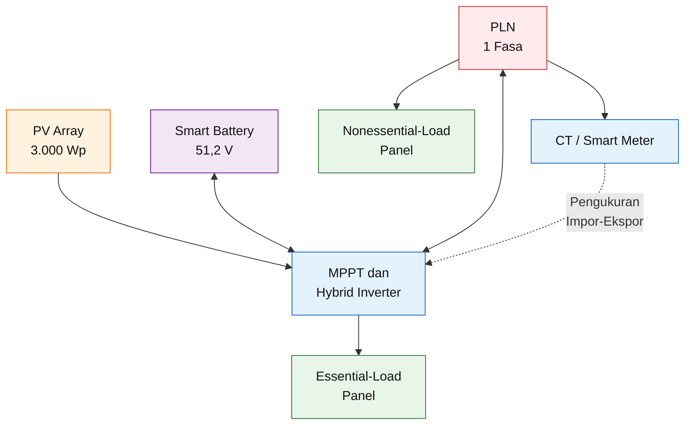

Arah aliran energi aktual bergantung pada:

- daya PV;
- beban;
- SOC baterai;
- status PLN;
- batas charge-discharge;
- jadwal operasi;
- dan mode inverter.

---

## 6.3 Konvensi Neraca Daya

Pada kondisi grid-connected:

$$
P_{\text{PV}}
+
P_{\text{grid}}
+
P_{\text{battery,dis}}
=

P_{\text{load}}
+
P_{\text{battery,ch}}
+
P_{\text{export}}
+
P_{\text{loss}}
$$

dengan:

- $P_{\text{PV}}$ = daya PV;
- $P_{\text{grid}}$ = daya impor PLN;
- $P_{\text{battery,dis}}$ = daya discharge baterai;
- $P_{\text{load}}$ = daya beban;
- $P_{\text{battery,ch}}$ = daya pengisian baterai;
- $P_{\text{export}}$ = daya yang mengalir ke grid;
- $P_{\text{loss}}$ = rugi sistem.

Dalam mode zero-export:

$$
P_{\text{export}}
\approx
0
$$

Sehingga:

$$
P_{\text{PV}}
+
P_{\text{grid}}
+
P_{\text{battery,dis}}
\approx
P_{\text{load}}
+
P_{\text{battery,ch}}
+
P_{\text{loss}}
$$

Pada kondisi island atau PLN padam:

$$
P_{\text{grid}}
=

0
$$

dan:

$$
P_{\text{PV}}
+
P_{\text{battery,dis}}
=

P_{\text{essential}}
+
P_{\text{battery,ch}}
+
P_{\text{loss}}
$$

Nonessential load tidak disuplai dari backup output.

---

## 6.4 Parameter Pengendalian Utama

Sebelum inverter dioperasikan, parameter berikut harus ditetapkan.

| Parameter                 | Fungsi                                       |
| ------------------------- | -------------------------------------------- |
| Minimum on-grid SOC       | Batas discharge saat PLN tersedia            |
| Minimum off-grid SOC      | Batas discharge saat PLN padam               |
| Maximum charge SOC        | Batas target pengisian                       |
| Maximum charge current    | Melindungi baterai dan kabel                 |
| Maximum discharge current | Melindungi BMS dan inverter                  |
| Grid-charge enable        | Menentukan apakah PLN boleh mengisi baterai  |
| Charge schedule           | Jadwal pengisian                             |
| Discharge schedule        | Jadwal discharge                             |
| Export limit              | Batas daya ekspor                            |
| Backup power limit        | Batas output essential load                  |
| Low-SOC load shedding     | Pelepasan beban saat energi rendah           |
| Reconnection delay        | Penundaan sebelum kembali sinkron dengan PLN |

Parameter final harus mengikuti:

- manual inverter;
- manual baterai;
- battery compatibility list;
- garansi;
- dan hasil commissioning.

---

## 6.5 Minimum SOC Operasional dan BMS Cut-Off

Minimum SOC inverter tidak boleh disamakan dengan hard cut-off BMS.

### Minimum SOC inverter

Batas operasional yang digunakan inverter untuk menghentikan discharge normal.

Contoh:

$$
SOC_{\text{on-grid,min}}
=

30\%
$$

### Emergency or off-grid minimum SOC

Jika inverter mendukung pengaturan terpisah, baterai dapat digunakan lebih dalam saat PLN padam.

Contoh:

$$
SOC_{\text{off-grid,min}}
=

15\%
$$

### BMS hard cut-off

Batas proteksi terakhir untuk mencegah cell mengalami undervoltage.

Urutan yang benar:

$$
SOC_{\text{on-grid,min}}

>

SOC_{\text{off-grid,min}}

>

SOC_{\text{BMS,cut-off}}
$$

BMS cut-off bukan titik operasi normal.

Jika sistem sering mencapai hard cut-off:

- desain energi tidak cukup;
- essential load terlalu besar;
- setting SOC salah;
- atau battery state estimation perlu diperiksa.

---

## 6.6 Mode Operasi yang Direkomendasikan

Mode dasar yang direkomendasikan adalah **self-use with backup reserve**.

Urutan prioritasnya:

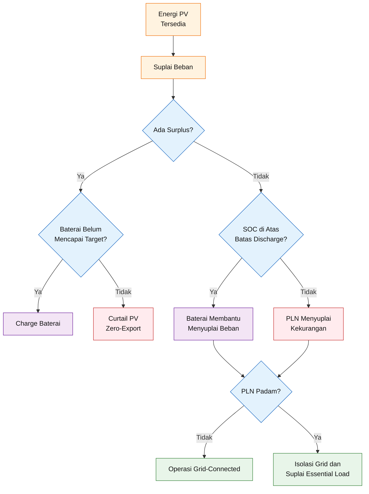

---

## 6.7 Operasi Siang Hari: PV Lebih Besar daripada Beban

Kondisi:

$$
P_{\text{PV}}

>

P_{\text{load}}
+
P_{\text{loss}}
$$

Prioritas pertama:

$$
PV
\rightarrow
Beban
$$

Surplus:

$$
P_{\text{surplus}}
=

P_{\text{PV}}
-

P_{\text{load}}
-

P_{\text{loss}}
$$

Jika baterai belum mencapai target SOC:

$$
PV
\rightarrow
Baterai
$$

Daya charge aktual dibatasi oleh nilai minimum dari:

- surplus PV;
- kemampuan charger inverter;
- batas charge BMS;
- batas kabel;
- dan batas temperatur.

Secara konseptual:

$$
P_{\text{battery,ch}}
=

\min
\left(
P_{\text{surplus}},
P_{\text{charger,max}},
P_{\text{BMS,ch,max}}
\right)
$$

---

## 6.8 Baterai Penuh dan Zero-Export

Jika:

$$
SOC
\geq
SOC_{\text{charge,target}}
$$

dan:

$$
P_{\text{PV}}

>

P_{\text{load}}
+
P_{\text{loss}}
$$

maka tidak ada lagi ruang yang cukup untuk menyimpan surplus.

Karena sistem tidak mengandalkan ekspor, inverter harus membatasi daya PV:

$$
P_{\text{PV,accepted}}
\approx
P_{\text{load}}
+
P_{\text{loss}}
$$

Energi potensial yang tidak digunakan menjadi curtailed energy.

$$
P_{\text{curtailed}}
=

P_{\text{PV,potential}}
-

P_{\text{PV,accepted}}
$$

Curtailment bukan selalu tanda kerusakan. Ia dapat menjadi konsekuensi normal dari:

- baterai penuh;
- beban rendah;
- zero-export;
- dan kapasitas PV lebih besar daripada kebutuhan saat itu.

Namun, curtailment yang terlalu sering menunjukkan perlunya:

- load shifting;
- perubahan strategi SOC;
- penambahan smart load;
- atau evaluasi ulang kapasitas PV dan baterai.

---

## 6.9 Operasi Siang Hari: PV Tidak Mencukupi

Kondisi:

$$
P_{\text{PV}}
<
P_{\text{load}}
+
P_{\text{loss}}
$$

Defisit:

$$
P_{\text{deficit}}
=

P_{\text{load}}
+
P_{\text{loss}}
-

P_{\text{PV}}
$$

Terdapat dua strategi utama.

### 6.9.1 Battery-first

$$
PV
+
Baterai
\rightarrow
Beban
$$

PLN hanya digunakan ketika:

- SOC mencapai batas;
- discharge current mencapai batas;
- atau daya beban melebihi kemampuan PV dan baterai.

Kelebihan:

- impor PLN lebih rendah;
- self-consumption lebih tinggi.

Kekurangan:

- SOC cadangan dapat berkurang sebelum pemadaman;
- cycle baterai meningkat.

---

### 6.9.2 Grid-support

$$
PV
+
PLN
\rightarrow
Beban
$$

Baterai ditahan sebagai reserve.

Kelebihan:

- baterai tetap tersedia untuk backup;
- cycle baterai lebih sedikit.

Kekurangan:

- penghematan energi lebih kecil;
- lebih banyak energi dibeli dari PLN.

---

### 6.9.3 Strategi baseline

Strategi baseline adalah **battery-first dengan reserve SOC**.

Baterai dapat membantu beban selama:

$$
SOC

>

SOC_{\text{on-grid,min}}
$$

Ketika:

$$
SOC
\leq
SOC_{\text{on-grid,min}}
$$

maka:

$$
PLN
\rightarrow
Beban
$$

Dengan demikian, baterai tidak dikosongkan sepenuhnya untuk mengejar penghematan.

---

## 6.10 Operasi Malam Hari

Pada malam hari:

$$
P_{\text{PV}}
\approx
0
$$

Selama SOC masih di atas batas:

$$
Baterai
\rightarrow
Beban\ Prioritas
$$

atau, jika inverter mengelola seluruh beban rumah:

$$
Baterai
\rightarrow
Beban
$$

sampai batas daya dan SOC yang ditentukan.

Ketika SOC minimum tercapai:

$$
SOC
\leq
SOC_{\text{on-grid,min}}
$$

maka:

$$
PLN
\rightarrow
Beban
$$

Baterai dipertahankan sebagai cadangan.

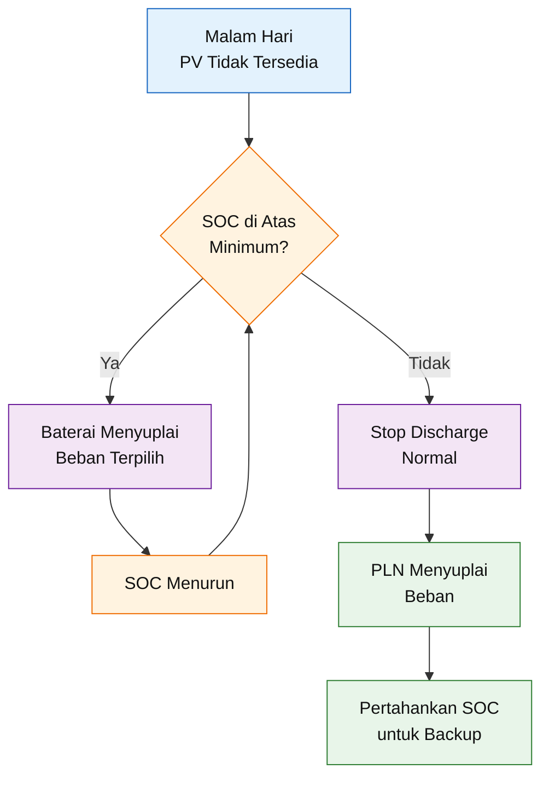

---

## 6.11 Grid Charging

Pengisian baterai dari PLN dapat digunakan untuk:

- menjaga reserve sebelum perkiraan pemadaman;
- memulihkan baterai setelah kondisi darurat;
- menjalankan jadwal tarif waktu pemakaian jika tersedia;
- atau memenuhi kebutuhan operasi khusus.

Namun, grid charging tidak selalu ekonomis karena energi melewati rugi charger dan baterai.

Energi PLN yang diperlukan:

$$
E_{\text{grid,ch}}
=

\frac{
E_{\text{battery,stored}}
}{
\eta_{\text{charger}}
}
$$

Energi yang dapat kembali ke beban:

$$
E_{\text{load,out}}
=

E_{\text{battery,stored}}
\times
\eta_{\text{discharge}}
\times
\eta_{\text{inv}}
$$

Pengisian dari PLN sebaiknya dikendalikan dengan:

- jadwal;
- target SOC;
- batas arus;
- dan tujuan yang jelas.

Baseline normal:

> PLN tidak digunakan untuk mengisi baterai setiap hari kecuali diperlukan untuk reserve, recovery, atau strategi tarif yang telah dianalisis.

---

## 6.12 Operasi ketika PLN Padam

Ketika jaringan hilang, inverter harus:

1. mendeteksi kondisi abnormal grid;
2. membuka grid relay;
3. mencegah backfeed;
4. membentuk jaringan lokal pada backup output;
5. menyuplai essential load dari baterai dan PV.

Urutannya:

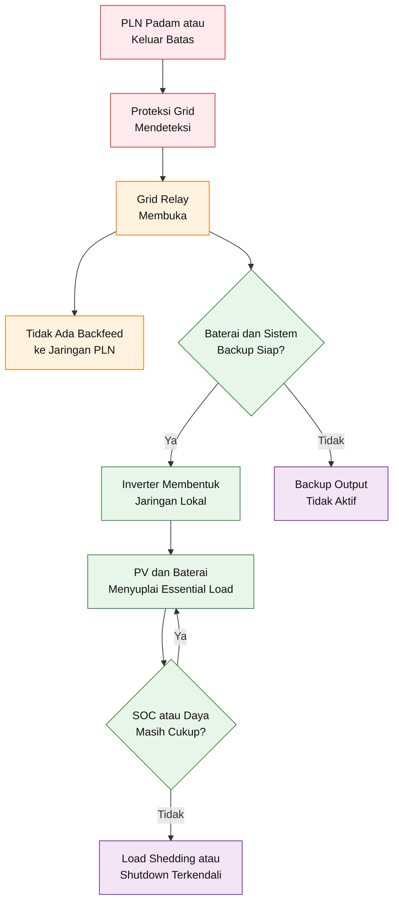

Pada kondisi island:

$$
P_{\text{grid}}
=

0
$$

Neraca daya:

$$
P_{\text{PV}}
+
P_{\text{battery,dis}}
=

P_{\text{essential}}
+
P_{\text{battery,ch}}
+
P_{\text{loss}}
$$

---

## 6.13 Peran Baterai pada Island Mode

Sebagian inverter hybrid memerlukan baterai untuk:

- membentuk referensi tegangan;
- membentuk frekuensi lokal;
- menyerap perubahan cepat produksi PV;
- dan menangani transient beban.

Karena itu, desain baseline tidak mengasumsikan bahwa PV dapat menyuplai backup secara stabil tanpa baterai.

Kemampuan operasi PV-only saat grid padam harus dibuktikan melalui manual model inverter yang dipilih.

---

## 6.14 Kondisi PV Berlebih Saat Island Mode

Ketika PLN padam dan:

$$
P_{\text{PV}}

>

P_{\text{essential}}
+
P_{\text{battery,ch}}
+
P_{\text{loss}}
$$

inverter harus mengurangi produksi PV.

Dalam island mode tidak terdapat jaringan besar yang dapat menyerap perubahan daya. Karena itu, kemampuan inverter mengendalikan PV dan baterai menjadi lebih kritis.

Jika baterai penuh dan beban kecil:

$$
P_{\text{PV,accepted}}
\downarrow
$$

agar keseimbangan daya tetap terjaga.

---

## 6.15 Kondisi PV Tidak Cukup Saat Island Mode

Jika:

$$
P_{\text{PV}}
<
P_{\text{essential}}
+
P_{\text{loss}}
$$

maka baterai menyuplai defisit:

$$
P_{\text{battery,dis}}
=

P_{\text{essential}}
+
P_{\text{loss}}
-

P_{\text{PV}}
$$

Jika daya yang diperlukan melebihi batas:

$$
P_{\text{battery,dis}}

>

P_{\text{battery,max}}
$$

maka inverter harus:

- membatasi output;
- melepaskan beban;
- atau shutdown untuk melindungi baterai dan inverter.

---

## 6.16 Load Shedding

Load shedding diperlukan untuk menjaga beban yang paling penting.

Urutan pelepasan yang direkomendasikan:

1. beban N;
2. beban E2 dengan konsumsi tinggi;
3. pompa atau motor nonkritis;
4. sebagian lampu;
5. beban E1 tetap dipertahankan selama memungkinkan.

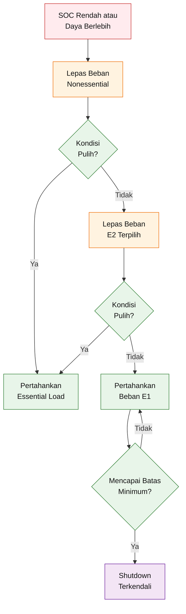

Load shedding dapat dilakukan melalui:

- pemisahan panel;
- contactor;
- smart relay;
- dry contact inverter;
- energy-management system;
- atau prosedur manual.

---

## 6.17 Overload pada Backup Output

Jika:

$$
P_{\text{essential}}

>

P_{\text{backup,rated}}
$$

atau starting VA melebihi surge rating, inverter dapat:

- menurunkan tegangan;
- memberikan alarm;
- trip;
- atau shutdown.

Karena itu, essential-load panel tidak boleh dihubungkan ke seluruh panel rumah tanpa pembatasan.

Beban seperti:

- water heater;
- AC besar;
- electric cooker;
- dan pompa besar

harus dipisahkan secara fisik atau dikendalikan agar tidak ikut menyala pada mode backup.

---

## 6.18 Operasi Saat BMS Membatasi Arus

BMS dapat menurunkan charge-current limit atau discharge-current limit karena:

- temperatur tinggi;
- temperatur rendah;
- cell imbalance;
- SOC tinggi;
- SOC rendah;
- tegangan cell mendekati batas;
- atau alarm internal.

Jika BMS memberikan:

$$
I_{\text{discharge,allowed}}
<
I_{\text{load,required}}
$$

inverter harus mengurangi daya baterai.

Saat PLN tersedia:

$$
PLN
\rightarrow
Kekurangan\ Beban
$$

Saat PLN padam:

- load shedding dilakukan;
- atau backup shutdown.

Sistem tidak boleh mengabaikan perintah BMS hanya untuk mempertahankan beban.

---

## 6.19 Operasi Saat Komunikasi BMS Hilang

Kehilangan komunikasi CAN atau RS485 harus mempunyai respons fail-safe.

Pilihan respons bergantung manual inverter:

- stop charge-discharge;
- berpindah ke mode tegangan terbatas;
- mempertahankan beban dari PLN;
- atau shutdown baterai.

Baseline yang direkomendasikan:

> Kehilangan komunikasi BMS tidak boleh menyebabkan inverter terus melakukan charge atau discharge tanpa batas yang tervalidasi.

Alarm berikut harus direkam:

- BMS communication lost;
- battery unavailable;
- charge prohibited;
- discharge prohibited;
- overtemperature;
- cell-voltage alarm.

---

## 6.20 Zero-Export Control

Zero-export menggunakan CT atau smart meter untuk mengukur aliran daya pada point of common coupling.

Jika sensor mendeteksi ekspor:

$$
P_{\text{export}}

>

P_{\text{export,setpoint}}
$$

inverter mengurangi output PV atau meningkatkan charge baterai selama masih diperbolehkan.

Respons kontrol:

$$
P_{\text{PV,command}}
\downarrow
$$

atau:

$$
P_{\text{battery,ch}}
\uparrow
$$

sampai:

$$
P_{\text{export}}
\approx
0
$$

### Catatan praktis

Zero-export tidak selalu berarti pembacaan setiap milidetik tepat 0 W.

Perubahan beban dan respons kontrol dapat menghasilkan transient kecil. Acceptance criteria harus mengikuti:

- kemampuan inverter;
- akurasi meter;
- respons komunikasi;
- persyaratan PLN;
- dan hasil commissioning.

---

## 6.21 Posisi dan Arah CT

Kesalahan arah CT dapat menyebabkan inverter:

- meningkatkan ekspor ketika seharusnya menguranginya;
- membaca impor sebagai ekspor;
- atau menghasilkan kontrol yang tidak stabil.

Verifikasi CT mencakup:

- fasa yang benar;
- arah panah;
- posisi sebelum atau sesudah cabang;
- polaritas terminal;
- komunikasi meter;
- dan pembacaan dibanding meter referensi.

Uji sederhana dilakukan dengan:

1. mematikan PV;
2. menyalakan beban;
3. memastikan meter membaca impor;
4. menyalakan PV;
5. memastikan nilai impor turun;
6. memastikan ekspor dibatasi.

---

## 6.22 Fail-Safe Zero-Export

Jika komunikasi smart meter hilang, respons yang disarankan adalah:

- membatasi output;
- menghentikan ekspor;
- atau menggunakan fallback yang disetujui pabrikan.

Sistem tidak boleh beralih secara diam-diam ke unlimited export apabila komunikasi CT atau meter gagal.

Respons ini harus diuji saat commissioning.

---

## 6.23 Grid Recovery

Ketika PLN kembali, inverter tidak boleh langsung menutup relay tanpa verifikasi.

Tahapan recovery:

1. tegangan terdeteksi;
2. frekuensi terdeteksi;
3. grid berada dalam batas;
4. waktu stabilisasi terpenuhi;
5. inverter melakukan sinkronisasi;
6. grid relay menutup;
7. beban kembali ke mode normal;
8. baterai kembali ke strategi SOC normal.

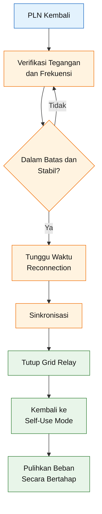

Beban besar sebaiknya tidak seluruhnya dipulihkan pada waktu yang sama untuk mencegah:

- inrush;
- overload;
- dan penurunan tegangan.

---

## 6.24 Maintenance Bypass

Maintenance bypass memungkinkan essential load menerima PLN ketika inverter:

- mengalami gangguan;
- dimatikan;
- atau sedang dipelihara.

Bypass harus dirancang agar tidak menghubungkan sumber secara salah.

Persyaratan:

- posisi normal dan bypass jelas;
- tersedia interlock;
- tidak memungkinkan backfeed;
- neutral switching mengikuti desain;
- rating sesuai arus;
- diberi label;
- dan dilengkapi prosedur switching.

Urutan switching harus ditetapkan oleh vendor dan diverifikasi pada SLD.

---

## 6.25 Emergency Shutdown

Sistem harus mempunyai cara aman untuk mengisolasi:

- PV;
- baterai;
- AC grid;
- dan backup output.

Emergency shutdown tidak selalu berarti satu tombol memutus seluruh energi internal PV karena modul tetap menghasilkan tegangan selama terkena cahaya.

Prosedur harus menjelaskan:

1. memutus beban;
2. memutus AC grid;
3. memutus baterai;
4. memutus PV melalui DC isolator;
5. menunggu waktu discharge internal;
6. memverifikasi absence of voltage sesuai prosedur.

---

## 6.26 Baseline Setting Operasional

Nilai berikut merupakan **baseline konseptual**, bukan setting final.

| Parameter             |                           Baseline awal | Catatan                                |
| --------------------- | --------------------------------------: | -------------------------------------- |
| Mode                  |                                Self-use | Dengan backup reserve                  |
| Export limit          |   0 W atau nilai minimum yang diizinkan | Diverifikasi saat commissioning        |
| On-grid minimum SOC   |                                  20–30% | Ikuti manual dan kebutuhan reserve     |
| Off-grid minimum SOC  |                                  10–20% | Hanya jika didukung inverter           |
| Target charge SOC     |                   Sesuai manual baterai | Tidak dipaksakan generik               |
| Max charge current    | Maksimum 50 A untuk operasi normal awal | Di bawah limit BMS, final by datasheet |
| Max discharge current |               Disesuaikan beban dan BMS | Target backup sekitar 3 kW             |
| Grid charging         |             Disable pada operasi normal | Enable bila diperlukan                 |
| Essential-load limit  |            Sekitar 3 kW maksimum target | Starting load diverifikasi             |
| Load shedding         |                     E2 lalu E1 terakhir | Sesuai klasifikasi                     |

Nilai charge current 50 A tidak boleh diterapkan pada semua baterai tanpa memeriksa datasheet.

---

## 6.27 Contoh Operasi Harian

### 06.00–09.00

- PV mulai meningkat;
- beban pagi mungkin tinggi;
- PLN membantu kekurangan;
- baterai tidak langsung dikosongkan jika reserve diperlukan.

### 09.00–15.00

- PV menyuplai beban;
- surplus mengisi baterai;
- pompa dan beban fleksibel dijadwalkan;
- zero-export membatasi surplus setelah baterai penuh.

### 15.00–18.00

- produksi PV menurun;
- baterai mulai membantu;
- PLN membantu jika SOC mencapai reserve.

### 18.00–22.00

- beban malam meningkat;
- baterai menyuplai beban terpilih;
- beban nonprioritas tetap dapat menggunakan PLN;
- essential-load panel disiapkan untuk kondisi outage.

### 22.00–06.00

- baterai menyuplai beban dasar selama SOC cukup;
- setelah batas SOC, PLN mengambil alih;
- reserve dijaga.

---

## 6.28 Matriks Kondisi Operasi

| Kondisi                             |        PV |    PLN |              SOC | Respons                          |
| ----------------------------------- | --------: | -----: | ---------------: | -------------------------------- |
| Siang, surplus, baterai belum penuh |    Tinggi | Normal |  Rendah-menengah | PV ke beban dan baterai          |
| Siang, surplus, baterai penuh       |    Tinggi | Normal |           Tinggi | PV ke beban, sisanya curtailed   |
| Siang, PV kurang                    |    Rendah | Normal |  Di atas reserve | PV dan baterai ke beban          |
| Siang, PV kurang                    |    Rendah | Normal | Di bawah reserve | PV dan PLN ke beban              |
| Malam                               |       Nol | Normal |  Di atas reserve | Baterai ke beban terpilih        |
| Malam                               |       Nol | Normal | Di bawah reserve | PLN ke beban                     |
| PLN padam                           |       Ada |  Padam |            Cukup | PV dan baterai ke essential load |
| PLN padam                           | Tidak ada |  Padam |            Cukup | Baterai ke essential load        |
| PLN padam                           | Tidak ada |  Padam |           Rendah | Load shedding lalu shutdown      |
| BMS alarm                           |   Beragam | Normal |          Beragam | Batasi baterai, PLN membantu     |
| Meter zero-export gagal             |       Ada | Normal |          Beragam | Fail-safe pembatasan output      |

---

## 6.29 KPI Operasional

Parameter yang dipantau:

- energi PV;
- energi direct self-consumption;
- energi charge baterai;
- energi discharge baterai;
- impor PLN;
- ekspor terukur;
- curtailed energy jika tersedia;
- minimum dan maximum SOC;
- jumlah cycle;
- maximum battery current;
- peak load;
- backup duration;
- alarm;
- availability.

Self-consumption ratio:

$$
SCR
=

\frac{
E_{\text{PV,direct}}
+
E_{\text{PV,battery-used}}
}{
E_{\text{PV,generated}}
}
\times
100\%
$$

Self-sufficiency ratio:

$$
SSR
=

\frac{
E_{\text{PV,direct}}
+
E_{\text{battery,to-load}}
}{
E_{\text{load,total}}
}
\times
100\%
$$

Grid dependency:

$$
R_{\text{grid}}
=

\frac{
E_{\text{grid,import}}
}{
E_{\text{load,total}}
}
\times
100\%
$$

Secara ideal:

$$
SSR
+
R_{\text{grid}}
\approx
100\%
$$

setelah batas sistem dan rugi-rugi didefinisikan secara konsisten.

---

## 6.30 Pengujian Filosofi Operasi

Commissioning harus menguji:

1. PV menyuplai beban;
2. surplus PV mengisi baterai;
3. baterai berhenti charge pada batas;
4. zero-export bekerja;
5. baterai discharge sesuai SOC;
6. PLN mengambil alih pada minimum SOC;
7. PLN padam dan grid relay membuka;
8. essential load tetap aktif;
9. nonessential load terputus dari backup;
10. overload menyebabkan respons yang aman;
11. BMS alarm diterima inverter;
12. komunikasi BMS hilang menghasilkan fail-safe;
13. CT terbalik terdeteksi;
14. grid recovery bekerja;
15. maintenance bypass bekerja tanpa backfeed.

---

## 6.31 Acceptance Criteria Filosofi Operasi

Filosofi operasi dinyatakan berhasil apabila:

- aliran energi sesuai prioritas;
- baterai tidak melampaui limit;
- minimum SOC bekerja;
- zero-export memenuhi acceptance criteria;
- anti-islanding bekerja;
- essential load bertahan sesuai target;
- load shedding bekerja;
- grid recovery stabil;
- seluruh alarm tercatat;
- dan mode operasi dapat dijelaskan kepada pengguna.

---

## 6.32 Kesimpulan Filosofi Operasi

PLTS hybrid bukan sekadar sistem yang memilih sumber energi termurah setiap saat. Sistem harus menyeimbangkan:

- penghematan;
- kesiapan backup;
- umur baterai;
- keselamatan;
- dan keterbatasan daya.

Filosofi baseline dapat diringkas sebagai:

$$
PV
\rightarrow
Beban
$$

Surplus:

$$
PV
\rightarrow
Baterai
$$

Defisit selama SOC cukup:

$$
PV
+
Baterai
\rightarrow
Beban
$$

Defisit setelah reserve tercapai:

$$
PV
+
PLN
\rightarrow
Beban
$$

Malam hari:

$$
Baterai
\rightarrow
Beban\ Terpilih
$$

Setelah SOC minimum:

$$
PLN
\rightarrow
Beban
$$

PLN padam:

$$
PV
+
Baterai
\rightarrow
Essential\ Load
$$

dengan syarat:

$$
P_{\text{export}}
=

0
$$

dan grid relay terbuka untuk mencegah backfeed.

[**Kembali ke Atas**](#desain-implementatif-plts-hybrid-3000-wp-untuk-sistem-pln-1-fasa-pv-mppt-smart-battery-proteksi-integrasi-grid-dan-analisis-ekonomi)

---

## Referensi Bab 5 dan Bab 6

**[R1]** National Renewable Energy Laboratory. _Framework for Extracting and Characterizing Load Profile Variability._

**[R2]** National Renewable Energy Laboratory. _How to Model Batteries with PV, Stand-Alone, or Hybrid Systems._

**[R3]** National Renewable Energy Laboratory. _Technoeconomic Modeling of Battery Energy Storage in the System Advisor Model._

**[R4]** GoodWe. _ES G2 Series Single-Phase Hybrid Inverter — Datasheet and User Manual._

**[R5]** Solis. _Hybrid Inverter Operating Modes and Battery Configuration Guides._

**[R6]** International Electrotechnical Commission. _IEC 62446-1 — Grid-Connected PV Systems: Documentation, Commissioning Tests and Inspection._

**[R7]** International Electrotechnical Commission. _IEC 62446-2 — Maintenance of Grid-Connected PV Systems._

**[R8]** Kementerian Energi dan Sumber Daya Mineral Republik Indonesia. _Peraturan Menteri ESDM Nomor 2 Tahun 2024 tentang PLTS Atap yang Terhubung pada Jaringan Tenaga Listrik Pemegang IUPTLU._

**[R9]** Datasheet dan installation manual resmi inverter serta smart battery yang dipilih pada detailed engineering.

### Verifikasi sumber utama

NREL menggunakan profil beban berbasis _time series_ dan antara lain mengembangkan profil pada resolusi 15 menit untuk menangkap variasi konsumsi yang tidak terlihat dari total energi bulanan. Hal ini mendukung penggunaan data interval untuk menentukan peak load, kesesuaian beban terhadap produksi PV, dan strategi baterai. ([NREL Docs][1])

Dokumentasi pemodelan baterai NREL membahas sistem PV-battery dari sisi dispatch, termasuk pengisian dari kelebihan energi PV dan pelepasan baterai untuk melayani beban ketika produksi PV tidak mencukupi. ([NREL Docs][2])

GoodWe ES G2 secara resmi diposisikan sebagai inverter hybrid satu fasa untuk meningkatkan _self-consumption_. Dokumentasi resmi GoodWe juga mendeskripsikan _self-use mode_ sebagai mode dasar pengelolaan energi sistem hybrid. ([GoodWe][3])

Dokumentasi resmi Solis membedakan mode Self-Use, Feed-In Priority, Backup, dan Off-Grid, serta menekankan bahwa pemilihan mode dan konfigurasi baterai harus mengikuti model dan panduan sistem yang digunakan. ([Service Center][4])

IEC 62446-1 menetapkan kebutuhan dokumentasi, inspeksi, dan pengujian commissioning untuk membuktikan bahwa sistem grid-connected terpasang dengan aman dan bekerja dengan benar. IEC 62446-2 melanjutkannya pada preventive maintenance, corrective maintenance, troubleshooting, keselamatan pekerja, dan pencegahan kebakaran. ([webstore.iec.ch][5])

[1]: https://docs.nrel.gov/docs/fy21osti/78449.pdf?utm_source=chatgpt.com 'Framework for Extracting and Characterizing Load Profile ...'
[2]: https://docs.nrel.gov/docs/fy25osti/93555.pdf?utm_source=chatgpt.com 'How to Model Batteries (with PV, Stand-Alone, or Hybrids) ...'
[3]: https://en.goodwe.com/Ftp/EN/Downloads/Datasheet/GW_ES%20G2_Datasheet-EN.pdf?utm_source=chatgpt.com 'ES G2 Series'
[4]: https://solis-service.solisinverters.com/en/support/solutions/articles/44002547273-dyness-b4850-solis-s5-eh1p-3-6-k-l-rhi-3-4-6-k-48es-5g-setup-guide-?utm_source=chatgpt.com 'Solis S5-EH1P(3-6)K-L / RHI-(3-4.6)K-48ES-5G Setup Guide'
[5]: https://webstore.iec.ch/en/publication/24057?utm_source=chatgpt.com 'IEC 62446-1:2016'

---

# 7. Arsitektur Sistem PLN 1 Fasa

Arsitektur sistem menjelaskan bagaimana seluruh sumber energi, peralatan konversi, proteksi, pengukuran, dan beban saling dihubungkan.

Pada tahap ini, diagram belum berfungsi sebagai gambar instalasi _Issued for Construction_. Namun, arsitektur harus cukup detail untuk menetapkan:

- batas setiap subsistem;
- arah aliran energi;
- titik interkoneksi dengan PLN;
- lokasi CT atau smart meter;
- pemisahan beban prioritas;
- lokasi alat isolasi;
- kebutuhan proteksi;
- hubungan netral dan pembumian;
- serta tanggung jawab masing-masing perangkat.

Baseline desain menggunakan:

$$
P_{\text{PV}}
=

3{,}000\ \text{Wp}
$$

$$
P_{\text{inverter}}
=

5\ \text{kW}
$$

$$
V_{\text{battery}}
=

51{,}2\ \text{V}
$$

$$
C_{\text{battery}}
=

100\ \text{Ah}
$$

$$
V_{\text{grid}}
=

220
-

230\ \text{V AC}
$$

dengan jaringan:

$$
1\ \text{fasa}
+
N
+
PE
$$

Sistem dirancang sebagai **hybrid grid-interactive** dengan:

- PV sebagai sumber energi utama;
- smart battery sebagai penyimpan energi dan sumber backup;
- PLN sebagai sumber pendukung;
- zero-export control;
- serta essential-load distribution board yang terpisah dari beban nonprioritas.

---

## 7.1 Arsitektur Dasar Sistem

```mermaid
flowchart TD
    A["PV Array<br/>3.000 Wp"] --> B["DC Isolator<br/>dan SPD DC"]
    B --> C["PV Input dan MPPT<br/>Hybrid Inverter 5 kW"]

    D["Smart Battery<br/>51,2 V, 100 Ah"] --> E["Battery Fuse dan<br/>DC Isolator"]
    E <--> C

    F["PLN 1 Fasa<br/>230 V, 50 Hz"] --> G["Advanced Meter<br/>dan MCB PLN"]
    G --> H["Point of Common<br/>Coupling"]
    H <--> I["Grid Port<br/>Hybrid Inverter"]
    I --- C

    H --> J["Main Distribution<br/>Board"]
    J --> K["Beban<br/>Nonprioritas"]

    C --> L["Backup / EPS<br/>Output"]
    L --> M["Essential-Load<br/>Distribution Board"]
    M --> N["Lampu, Kulkas,<br/>IT, CCTV, Pompa Kecil"]

    H -. "Pengukuran arah<br/>impor dan ekspor" .-> O["CT / Smart Meter<br/>Zero-Export"]
    O -. "Data kontrol" .-> C

    P["Protective Earth dan<br/>Equipotential Bonding"] -.-> A
    P -.-> B
    P -.-> C
    P -.-> D
    P -.-> J
    P -.-> M

    classDef pv fill:#FFF3CD,stroke:#B8860B,color:#111;
    classDef inverter fill:#D5F5E3,stroke:#239B56,color:#111;
    classDef battery fill:#F3E5F5,stroke:#6A1B9A,color:#111;
    classDef grid fill:#FFEBEE,stroke:#C62828,color:#111;
    classDef load fill:#E3F2FD,stroke:#1565C0,color:#111;
    classDef meter fill:#FFF8E1,stroke:#F9A825,color:#111;
    classDef earth fill:#E0F2F1,stroke:#00796B,color:#111;

    class A,B pv;
    class C,I,L inverter;
    class D,E battery;
    class F,G,H grid;
    class J,K,M,N load;
    class O meter;
    class P earth;
```

Diagram tersebut menggambarkan dua keluaran listrik yang berbeda:

1. **jalur grid atau main distribution board**, yang tetap terhubung dengan PLN;
2. **jalur backup atau EPS**, yang dapat tetap hidup ketika PLN padam.

Kedua jalur tidak boleh disatukan kembali tanpa sistem bypass yang mempunyai interlock.

---

## 7.2 Batas Sistem dan Interface

Sistem dapat dibagi menjadi enam subsistem.

| Subsistem            | Batas awal             | Batas akhir                  |
| -------------------- | ---------------------- | ---------------------------- |
| PV array             | Modul PV               | Terminal PV inverter         |
| Battery system       | Terminal baterai       | Terminal baterai inverter    |
| Grid interface       | MCB/advanced meter PLN | Grid port inverter           |
| Backup system        | Backup port inverter   | Essential-load panel         |
| Zero-export control  | CT/smart meter         | Port komunikasi inverter     |
| Earthing and bonding | Earth bar utama        | Seluruh bagian logam terbuka |

Setiap interface harus mempunyai:

- tegangan;
- arus;
- jenis konduktor;
- alat isolasi;
- proteksi;
- jenis terminal;
- komunikasi;
- dan acceptance criteria.

---

## 7.3 Arsitektur Sisi PV

Sisi PV terdiri atas:

1. modul PV;
2. string;
3. kabel PV;
4. connector;
5. DC isolator;
6. SPD DC;
7. terminal MPPT inverter.

Aliran dayanya:

$$
PV
\rightarrow
DC\ Isolator
\rightarrow
SPD
\rightarrow
MPPT
$$

DC isolator digunakan untuk memisahkan array dari inverter selama:

- inspeksi;
- pemeliharaan;
- pengujian;
- atau kondisi darurat.

Namun, membuka DC isolator tidak menghilangkan tegangan pada kabel di antara modul dan isolator. Selama modul terkena cahaya:

$$
V_{\text{PV}}

>

0
$$

Karena itu, sisi modul harus tetap diperlakukan sebagai rangkaian bertegangan.

---

## 7.4 DC Isolator dan SPD PV

Untuk sistem satu string per MPPT, konfigurasi dasarnya dapat berupa:

```mermaid
flowchart TD
    A["String PV"] --> B["DC Isolator<br/>2 Pole"]
    B --> C["SPD DC<br/>Type 2"]
    C --> D["MPPT Inverter"]

    E["PE / Earth Bar"] -.-> C
    E -.-> D
    E -.-> F["Frame dan Rail PV"]

    classDef pv fill:#FFF3CD,stroke:#B8860B,color:#111;
    classDef protection fill:#FFEBEE,stroke:#C62828,color:#111;
    classDef inverter fill:#D5F5E3,stroke:#239B56,color:#111;
    classDef earth fill:#E0F2F1,stroke:#00796B,color:#111;

    class A,F pv;
    class B,C protection;
    class D inverter;
    class E earth;
```

Urutan fisik SPD dan isolator dapat mengikuti:

- desain panel;
- manual inverter;
- standar instalasi;
- serta filosofi pemeliharaan.

Prinsip utamanya adalah:

- isolator harus dapat memutus kedua konduktor aktif bila sistem PV tidak dibumikan;
- SPD harus mempunyai jalur ke PE yang pendek;
- rating tegangan DC harus lebih tinggi daripada tegangan maksimum string;
- dan seluruh perangkat harus benar-benar mempunyai rating DC-PV.

MCB atau isolator AC tidak boleh digunakan untuk memutus rangkaian PV hanya karena mempunyai nilai ampere yang sama.

---

## 7.5 Apakah Diperlukan Combiner Box?

Pada alternatif desain:

$$
3S1P
+
3S1P
$$

masing-masing MPPT menerima satu string.

Pada alternatif:

$$
5S1P
$$

satu MPPT menerima satu string.

Karena tidak terdapat beberapa string paralel pada satu MPPT, combiner box dengan beberapa fuse string belum tentu diperlukan.

Keputusan pemasangan combiner box bergantung pada:

- jumlah string paralel;
- kebutuhan isolasi;
- lokasi inverter;
- panjang kabel;
- kebutuhan SPD;
- akses pemeliharaan;
- dan filosofi proteksi.

Untuk sistem kecil, DC protection box dapat tetap digunakan untuk menggabungkan:

- DC isolator;
- SPD;
- terminal;
- dan monitoring sederhana,

meskipun tidak mempunyai fungsi menggabungkan beberapa string.

---

## 7.6 Arsitektur Sisi Baterai

Baterai terhubung secara dua arah dengan inverter.

Saat charge:

$$
Inverter
\rightarrow
Baterai
$$

Saat discharge:

$$
Baterai
\rightarrow
Inverter
$$

Arsitektur dasarnya:

```mermaid
flowchart TD
    A["Smart Battery<br/>51,2 V, 100 Ah"] --> B["Battery Fuse"]
    B --> C["DC Battery<br/>Isolator"]
    C <--> D["Hybrid Inverter"]

    A -. "CAN / RS485" .-> D

    E["Protective Earth"] -.-> A
    E -.-> D
    E -.-> F["Battery Rack"]

    classDef battery fill:#F3E5F5,stroke:#6A1B9A,color:#111;
    classDef protection fill:#FFEBEE,stroke:#C62828,color:#111;
    classDef inverter fill:#D5F5E3,stroke:#239B56,color:#111;
    classDef earth fill:#E0F2F1,stroke:#00796B,color:#111;

    class A battery;
    class B,C protection;
    class D inverter;
    class E,F earth;
```

Battery fuse dipasang sedekat mungkin dengan terminal positif baterai agar panjang kabel yang tidak terlindungi dapat diminimalkan.

Baseline awal:

$$
I_{\text{battery,continuous}}
\approx
64\ \text{A}
$$

untuk beban AC 3 kW dan efisiensi inverter 92%.

Pada output 5 kW:

$$
I_{\text{battery}}
=

\frac{
5{,}000
}{
51{,}2
\times
0{,}92
}
$$

$$
I_{\text{battery}}
\approx
106{,}15\ \text{A}
$$

Karena satu baterai baseline mempunyai kemampuan kontinu sekitar 100 A, operasi 5 kW secara terus-menerus belum dapat diterima tanpa:

- verifikasi BMS;
- derating;
- atau penambahan baterai paralel.

---

## 7.7 Battery Fuse dan Isolator

Battery fuse dan isolator mempunyai fungsi yang berbeda.

### Battery fuse

Berfungsi memutus arus gangguan yang sangat tinggi akibat:

- short circuit;
- kerusakan kabel;
- kegagalan terminal;
- atau fault internal pada jalur DC.

### Battery isolator

Berfungsi sebagai sarana:

- pemisahan;
- lockout;
- pemeliharaan;
- dan pemadaman terkontrol.

Pendekatan baseline:

$$
Battery\ Fuse
+
DC\ Isolator
$$

bukan:

$$
DC\ Isolator
\text{ saja}
$$

Rating final harus mempertimbangkan:

- arus maksimum inverter;
- arus maksimum BMS;
- ampacity kabel;
- breaking capacity fuse;
- prospective short-circuit current;
- serta rekomendasi produsen baterai.

---

## 7.8 Komunikasi BMS

Kabel daya baterai tidak cukup untuk membentuk sistem smart battery.

Diperlukan komunikasi:

$$
BMS
\leftrightarrow
Inverter
$$

melalui:

- CAN;
- RS485;
- atau protokol yang ditentukan produsen.

Data yang dapat dikirim meliputi:

- SOC;
- tegangan baterai;
- temperatur;
- charge-current limit;
- discharge-current limit;
- alarm;
- dan status contactor BMS.

Port RJ45 tidak membuktikan bahwa komunikasi kompatibel.

Harus diverifikasi:

- protokol;
- pinout;
- baud rate;
- terminasi;
- jenis kabel;
- panjang maksimum;
- setting address;
- dan firmware.

---

## 7.9 Arsitektur Grid Port

Grid port inverter dihubungkan ke main distribution board melalui:

- dedicated AC breaker;
- kabel AC;
- alat isolasi jika diperlukan;
- dan titik interkoneksi yang disetujui.

Grid port mempunyai fungsi dua arah:

### Arah impor

$$
PLN
\rightarrow
Inverter
$$

untuk:

- bypass;
- menyuplai beban;
- atau mengisi baterai jika diaktifkan.

### Arah ekspor internal

$$
Inverter
\rightarrow
Main\ DB
$$

untuk menyuplai beban pada sisi pelanggan.

Pada mode zero-export, daya tidak boleh sengaja diteruskan melewati point of common coupling menuju jaringan PLN.

---

## 7.10 Arus Keluaran Inverter

Untuk inverter 5 kW pada 230 V:

$$
I_{\text{AC,rated}}
=

\frac{
P_{\text{inverter}}
}{
V_{\text{AC}}
}
$$

$$
I_{\text{AC,rated}}
=

\frac{
5{,}000
}{
230
}
$$

$$
I_{\text{AC,rated}}
\approx
21{,}74\ \text{A}
$$

Jika tegangan 220 V:

$$
I_{\text{AC,rated}}
=

\frac{
5{,}000
}{
220
}
$$

$$
I_{\text{AC,rated}}
\approx
22{,}73\ \text{A}
$$

Namun, rating grid-input breaker tidak boleh langsung dipilih hanya dari arus 21,74 A.

Beberapa inverter mempunyai:

- maksimum grid-input current;
- maksimum backup current;
- dan maksimum AC passthrough current

yang lebih tinggi daripada rated inverter output.

Sebagai contoh, satu inverter hybrid 5 kW dapat mempunyai:

- rated output sekitar 21,8 A pada 230 V;
- maximum grid-input current 32 A;
- maximum AC passthrough current 40 A.

Karena itu, desain kabel dan breaker harus mengikuti nilai terbesar yang benar-benar dapat mengalir pada jalur tersebut, bukan hanya:

$$
\frac{
5{,}000
}{
230
}
$$

---

## 7.11 Point of Common Coupling

Point of Common Coupling atau PCC adalah titik tempat:

- jaringan PLN;
- inverter;
- dan instalasi beban pelanggan

berinteraksi.

Pada sistem 1 fasa, PCC berada setelah:

- advanced meter;
- dan MCB pelanggan,

tetapi sebelum percabangan yang harus dibaca oleh zero-export meter.

```mermaid
flowchart TD
    A["Jaringan PLN"] --> B["Advanced Meter"]
    B --> C["MCB PLN"]
    C --> D["PCC"]

    D --> E["Main DB dan<br/>Beban Normal"]
    D <--> F["Grid Port<br/>Inverter"]

    D -.-> G["CT / Smart Meter"]
    G -. "Data" .-> F

    classDef grid fill:#FFEBEE,stroke:#C62828,color:#111;
    classDef point fill:#FFF3E0,stroke:#EF6C00,color:#111;
    classDef load fill:#E3F2FD,stroke:#1565C0,color:#111;
    classDef inverter fill:#D5F5E3,stroke:#239B56,color:#111;
    classDef meter fill:#F3E5F5,stroke:#6A1B9A,color:#111;

    class A,B,C grid;
    class D point;
    class E load;
    class F inverter;
    class G meter;
```

PCC harus dipilih sehingga seluruh aliran yang menuju atau berasal dari PLN dapat diukur.

---

## 7.12 Posisi CT atau Smart Meter

CT atau smart meter zero-export harus mampu mengukur:

$$
P_{\text{PCC}}
$$

secara menyeluruh.

Lokasi yang salah dapat menyebabkan sebagian beban tidak terbaca.

### Posisi yang benar

CT dipasang pada konduktor fasa utama sehingga seluruh cabang berikut berada di sisi pelanggan:

- inverter;
- beban normal;
- dan essential-load system.

### Posisi yang salah

CT dipasang hanya pada:

- cabang inverter;
- cabang essential load;
- atau salah satu bagian main DB.

Akibatnya, kontrol zero-export tidak melihat neraca energi keseluruhan.

---

## 7.13 Arah CT

Arah CT harus mengikuti manual pabrikan.

Pada beberapa sistem, panah CT diarahkan menuju grid. Pada sistem lain, konvensinya dapat berbeda.

Karena itu, tidak boleh dibuat aturan universal bahwa:

> Panah CT selalu mengarah ke PLN.

Yang wajib dilakukan adalah uji polaritas.

### Uji polaritas dasar

1. PV dimatikan.
2. Baterai tidak melakukan discharge.
3. Beban pelanggan dinyalakan.
4. Meter harus membaca impor dari PLN.
5. PV kemudian dinyalakan.
6. Nilai impor harus turun.
7. Jika PV lebih besar daripada beban, export control harus membatasi aliran keluar.

Apabila nilai berubah dengan arah yang tidak logis, periksa:

- arah CT;
- terminal CT;
- fasa;
- setting meter;
- dan arah komunikasi.

---

## 7.14 CT Inverter Tidak Sama dengan Advanced Meter PLN

Terdapat dua sistem metering yang berbeda.

| Meter                   | Pemilik/fungsi                                    |
| ----------------------- | ------------------------------------------------- |
| Advanced meter          | Meter transaksi dan pengukuran dua arah milik PLN |
| CT/smart meter inverter | Perangkat kontrol energi dan zero-export          |

CT inverter tidak menggantikan advanced meter.

Sebaliknya, advanced meter PLN belum tentu dapat digunakan langsung sebagai sensor kontrol inverter karena:

- protokol berbeda;
- akses data berbeda;
- sampling time berbeda;
- dan tidak terhubung ke controller inverter.

---

## 7.15 Arsitektur Beban Nonprioritas

Beban nonprioritas tetap berada pada main distribution board.

Contoh:

- AC besar;
- water heater;
- electric cooker;
- pompa besar;
- mesin las;
- dan beban pemanas.

Ketika PLN tersedia, beban tersebut dapat disuplai oleh kombinasi:

$$
PV
+
Baterai
+
PLN
$$

sesuai mode inverter dan topologi instalasi.

Ketika PLN padam, beban tersebut tidak menerima suplai karena tidak terhubung ke backup output.

---

## 7.16 Arsitektur Essential-Load Panel

Essential-load panel menerima suplai dari backup output inverter.

Beban yang dapat dimasukkan:

- lampu terpilih;
- kulkas;
- router;
- CCTV;
- komputer tertentu;
- alarm;
- dan pompa kecil yang telah diverifikasi.

```mermaid
flowchart TD
    A["Backup Output<br/>Inverter"] --> B["Main Isolator /<br/>Breaker Essential DB"]
    B --> C["RCBO Lampu"]
    B --> D["RCBO Kulkas"]
    B --> E["RCBO IT dan CCTV"]
    B --> F["RCBO Pompa Kecil"]
    B --> G["Spare Circuit"]

    classDef source fill:#D5F5E3,stroke:#239B56,color:#111;
    classDef panel fill:#E3F2FD,stroke:#1565C0,color:#111;
    classDef load fill:#FFF3E0,stroke:#EF6C00,color:#111;

    class A source;
    class B panel;
    class C,D,E,F,G load;
```

Essential-load panel harus mempunyai:

- incomer;
- busbar;
- neutral bar;
- earth bar;
- branch protection;
- circuit identification;
- label sumber ganda;
- dan spare capacity.

---

## 7.17 Larangan Menggabungkan Kembali Grid dan Backup Output

Grid port dan backup output tidak boleh disatukan secara langsung.

Konfigurasi yang dilarang:

```text
Grid Port ─────┐
               ├──── Satu Bus Tanpa Interlock
Backup Port ───┘
```

Kondisi tersebut dapat menyebabkan:

- backfeed;
- sirkulasi arus;
- kerusakan inverter;
- kegagalan anti-islanding;
- dan bahaya bagi petugas PLN.

Jika diperlukan maintenance bypass, gunakan:

- changeover switch;
- mechanical interlock;
- electrical interlock;
- atau sistem bypass resmi sesuai desain pabrikan.

---

## 7.18 Maintenance Bypass

Maintenance bypass memungkinkan essential load disuplai langsung dari PLN saat inverter dipelihara.

Arsitektur konseptual:

```mermaid
flowchart TD
    A["PLN / Main DB"] --> B["Interlocked<br/>Bypass Switch"]
    C["Backup Output<br/>Inverter"] --> B
    B --> D["Essential-Load<br/>Distribution Board"]

    classDef grid fill:#FFEBEE,stroke:#C62828,color:#111;
    classDef inverter fill:#D5F5E3,stroke:#239B56,color:#111;
    classDef switch fill:#FFF3E0,stroke:#EF6C00,color:#111;
    classDef load fill:#E3F2FD,stroke:#1565C0,color:#111;

    class A grid;
    class C inverter;
    class B switch;
    class D load;
```

Switch harus mencegah dua sumber menutup secara bersamaan.

Operasinya:

| Posisi | Sumber essential DB    |
| ------ | ---------------------- |
| Normal | Backup output inverter |
| Off    | Tidak ada sumber       |
| Bypass | PLN langsung           |

Desain harus memeriksa apakah netral ikut dipindahkan.

---

## 7.19 Netral pada Sistem 1 Fasa

Hubungan netral merupakan salah satu aspek paling kritis dalam instalasi hybrid.

Tidak boleh diasumsikan bahwa netral grid dan netral backup selalu dapat dihubungkan permanen.

Hal ini bergantung pada:

- topologi inverter;
- relay internal;
- sistem pembumian;
- kebutuhan RCD;
- dan aturan lokal.

Beberapa inverter menggunakan relay internal untuk:

- menghubungkan neutral dan PE ketika bekerja dalam backup mode;
- lalu membuka hubungan tersebut ketika kembali grid-connected.

Inverter lain menggunakan konfigurasi berbeda.

Karena itu, desain harus mengikuti diagram pabrikan model spesifik.

---

## 7.20 Risiko Multiple Neutral–Earth Bond

Neutral–earth bond yang dipasang di beberapa titik dapat menghasilkan:

- arus netral mengalir pada PE;
- nuisance trip RCD;
- tegangan sentuh;
- pembacaan meter tidak benar;
- dan kegagalan proteksi.

Prinsip umum:

$$
N
\neq
PE
$$

di sepanjang instalasi, kecuali pada titik bonding yang memang ditentukan oleh sistem pembumian dan desain sumber.

Jangan memasang jumper:

$$
N
-

PE
$$

pada essential-load panel tanpa dasar dari manual inverter dan studi pembumian.

---

## 7.21 Switching Neutral

Maintenance bypass atau transfer switch dapat berupa:

- 1-pole;
- 2-pole;
- atau konfigurasi lain.

Untuk sistem 1 fasa, switching dua pole berarti:

- fasa dipindahkan;
- netral juga dipindahkan.

Kebutuhan switching neutral ditentukan oleh:

- apakah sumber dianggap separately derived;
- apakah inverter membentuk neutral reference;
- internal N–PE relay;
- tipe RCD;
- dan persyaratan pabrikan.

Keputusan tidak boleh dibuat hanya berdasarkan praktik umum panel PLN.

---

## 7.22 RCD dan RCBO

RCD pada sisi grid dan backup harus dipilih berdasarkan:

- jenis inverter;
- internal residual-current monitoring;
- kemungkinan residual DC;
- sistem pembumian;
- dan manual pabrikan.

Jenis RCD dapat berupa:

- Type A;
- Type F;
- Type B;
- atau tipe lain yang diizinkan.

Type AC tidak boleh dipilih otomatis untuk inverter elektronik modern tanpa verifikasi.

RCD pada backup output juga harus tetap dapat bekerja saat sistem berada dalam island mode. Karena itu, neutral reference dan earth-fault loop harus diuji pada:

1. mode grid-connected;
2. mode backup;
3. mode bypass.

---

## 7.23 Protective Earth dan Equipotential Bonding

Bagian berikut harus dibonding ke protective-earth system:

- frame modul;
- rail;
- mounting structure;
- body inverter;
- DC protection enclosure;
- AC panel;
- essential-load panel;
- battery rack;
- dan enclosure logam.

```mermaid
flowchart TD
    A["Main Earth Bar"] --> B["Inverter PE"]
    A --> C["PV Frame dan Rail"]
    A --> D["Main DB"]
    A --> E["Essential DB"]
    A --> F["Battery Rack"]
    A --> G["SPD AC dan DC"]

    classDef earth fill:#E0F2F1,stroke:#00796B,color:#111;
    classDef equipment fill:#E3F2FD,stroke:#1565C0,color:#111;

    class A earth;
    class B,C,D,E,F,G equipment;
```

Pembumian frame tidak berarti konduktor PV negatif harus dibumikan.

PV negative dan battery negative tidak boleh dihubungkan ke earth secara sembarangan.

Hubungan tersebut hanya dilakukan jika:

- topologi inverter mengharuskan;
- manual mengizinkan;
- dan desain proteksi telah memperhitungkannya.

---

## 7.24 Integrasi dengan Sistem Penangkal Petir

PV array dapat berada dekat:

- air terminal;
- down conductor;
- atau metallic roof.

Survei harus menentukan:

- separation distance;
- kebutuhan bonding;
- posisi SPD;
- jalur kabel;
- dan risiko induksi.

Kabel PV tidak boleh diletakkan membentuk loop besar di sekitar:

- down conductor;
- struktur logam;
- atau area yang berpotensi menerima arus petir.

Konduktor positif dan negatif harus dirutekan berdekatan untuk memperkecil loop area.

---

## 7.25 Pemisahan Kabel Daya dan Komunikasi

Jalur berikut perlu dipisahkan atau dikelola sesuai EMC:

- kabel PV DC;
- kabel baterai DC;
- kabel grid AC;
- kabel backup AC;
- kabel CT;
- CAN;
- RS485;
- Ethernet.

Kabel komunikasi tidak boleh dirutekan sejajar dalam jarak panjang dengan kabel berarus tinggi tanpa:

- separation;
- shielding;
- conduit;
- atau ketentuan lain dari pabrikan.

Crossing sebaiknya dilakukan mendekati:

$$
90^\circ
$$

jika harus menyilang.

---

## 7.26 Titik Isolasi Sistem

Titik isolasi minimum:

| Subsistem          | Titik isolasi              |
| ------------------ | -------------------------- |
| PV                 | DC isolator                |
| Baterai            | Battery isolator dan fuse  |
| Grid input         | Dedicated AC breaker       |
| Backup output      | Backup output breaker      |
| Essential DB       | Main incomer               |
| Maintenance bypass | Interlocked changeover     |
| Communication      | Disconnect sesuai prosedur |

Diagram isolasi:

```mermaid
flowchart TD
    A["PV"] --> B["ISO-PV"]
    B --> C["Inverter"]

    D["Battery"] --> E["ISO-BAT"]
    E --> C

    F["PLN"] --> G["ISO-GRID"]
    G --> C

    C --> H["ISO-BACKUP"]
    H --> I["Essential DB"]

    classDef source fill:#E3F2FD,stroke:#1565C0,color:#111;
    classDef iso fill:#FFEBEE,stroke:#C62828,color:#111;
    classDef system fill:#E8F5E9,stroke:#2E7D32,color:#111;

    class A,D,F source;
    class B,E,G,H iso;
    class C,I system;
```

Setiap isolator harus:

- mudah diakses;
- diberi label;
- mempunyai rating sesuai;
- dapat dikunci jika diperlukan;
- dan dicantumkan pada SLD.

---

## 7.27 Urutan Energization

Urutan energization mengikuti manual model inverter. Baseline konseptual:

1. seluruh sambungan diperiksa;
2. polaritas PV diverifikasi;
3. baterai diperiksa;
4. komunikasi BMS dikonfirmasi;
5. battery isolator ditutup;
6. inverter melakukan boot dari baterai;
7. grid AC dihubungkan;
8. PV DC dihubungkan;
9. meter/CT diverifikasi;
10. mode operasi dikonfigurasi;
11. backup output diaktifkan;
12. beban ditambahkan bertahap.

Urutan aktual dapat berbeda. Instruksi pabrikan mempunyai prioritas.

---

## 7.28 Urutan Shutdown

Baseline konseptual:

1. hentikan beban besar;
2. nonaktifkan output sesuai menu;
3. buka breaker backup;
4. buka breaker grid;
5. buka DC isolator PV;
6. buka battery isolator;
7. tunggu discharge internal;
8. verifikasi tegangan sebelum bekerja.

PV tetap menghasilkan tegangan di sisi array setelah isolator dibuka.

---

## 7.29 Label dan Identifikasi

Label minimum:

- PV DC voltage;
- dual supply warning;
- battery DC hazard;
- grid input;
- backup output;
- essential loads only;
- main isolator;
- battery isolator;
- PV isolator;
- SPD;
- zero-export meter;
- earthing point;
- emergency shutdown sequence.

Main DB dan essential DB harus diberi peringatan bahwa instalasi mempunyai lebih dari satu sumber.

---

## 7.30 Interface Schedule

| Interface           | Parameter utama           | Dokumen verifikasi            |
| ------------------- | ------------------------- | ----------------------------- |
| PV–inverter         | Voc, Vmp, Isc, Imp        | Module dan inverter datasheet |
| Battery–inverter    | 40–60 V, current, BMS     | Compatibility list            |
| Grid–inverter       | 230 V, current, frequency | Inverter manual               |
| Backup–essential DB | Power, current, neutral   | SLD dan manual                |
| Meter–inverter      | CT ratio, protocol        | Meter compatibility           |
| PE–equipment        | Conductor dan continuity  | Grounding drawing             |
| Communication       | CAN/RS485 pinout          | BMS manual                    |

---

## 7.31 Failure Modes Arsitektur

| Kegagalan                  | Dampak                            | Pengendalian         |
| -------------------------- | --------------------------------- | -------------------- |
| CT terbalik                | Kontrol ekspor salah              | Polarity test        |
| Grid dan backup terhubung  | Backfeed                          | Interlock            |
| BMS communication lost     | Charge/discharge tidak terkendali | Fail-safe            |
| Neutral salah              | RCD gagal/trip                    | Neutral study        |
| Battery fuse terlalu besar | Kabel tidak terlindungi           | Coordination         |
| PV isolator AC-rated       | Gagal memutus arc DC              | DC-PV rated device   |
| Essential DB overload      | Inverter trip                     | Load segregation     |
| PE tidak kontinu           | Tegangan sentuh                   | Bonding test         |
| SPD lead terlalu panjang   | Proteksi surja lemah              | Layout yang benar    |
| Bypass tanpa interlock     | Dua sumber paralel                | Mechanical interlock |

---

## 7.32 Hold Point Arsitektur

Sebelum SLD final diterbitkan, harus tersedia:

1. model inverter final;
2. manual wiring;
3. metode neutral switching;
4. battery compatibility list;
5. model CT/smart meter;
6. titik PCC;
7. daya kontrak PLN;
8. rating MCB PLN;
9. maximum grid-input current;
10. maximum passthrough current;
11. backup output rating;
12. starting-load study;
13. sistem pembumian;
14. tipe RCD;
15. kebutuhan maintenance bypass;
16. posisi isolation devices;
17. lokasi SPD;
18. cable route;
19. fault-current data;
20. persetujuan interkoneksi.

---

## 7.33 Acceptance Criteria Arsitektur

Arsitektur dinyatakan dapat dilanjutkan ke detailed engineering apabila:

- titik interkoneksi jelas;
- CT membaca seluruh aliran PCC;
- grid dan backup tidak dapat terhubung paralel secara tidak sengaja;
- essential load telah dipisahkan;
- neutral philosophy terdokumentasi;
- grounding dan bonding terdokumentasi;
- titik isolasi tersedia;
- arus grid-input dan passthrough telah diperhitungkan;
- komunikasi BMS kompatibel;
- dan seluruh mode operasi dapat diuji.

[**Kembali ke Atas**](#desain-implementatif-plts-hybrid-3000-wp-untuk-sistem-pln-1-fasa-pv-mppt-smart-battery-proteksi-integrasi-grid-dan-analisis-ekonomi)

---

# 8. Desain PV Array 3.000 Wp

PV array harus didesain sebagai rangkaian listrik, bukan sekadar penjumlahan kapasitas Wp.

Dua konfigurasi dengan kapasitas sama dapat mempunyai:

- tegangan berbeda;
- arus berbeda;
- kebutuhan MPPT berbeda;
- sensitivitas shading berbeda;
- kebutuhan area berbeda;
- dan risiko instalasi berbeda.

Dua alternatif yang dianalisis adalah:

### Alternatif A

$$
6
\times
500\ \text{Wp}
=

3{,}000\ \text{Wp}
$$

dengan konfigurasi:

$$
3S1P
+
3S1P
$$

### Alternatif B

$$
5
\times
600\ \text{Wp}
=

3{,}000\ \text{Wp}
$$

dengan konfigurasi:

$$
5S1P
$$

Simbol:

- $S$ = jumlah modul seri;
- $P$ = jumlah string paralel.

---

## 8.1 Parameter Listrik Modul

Parameter utama pada datasheet:

| Parameter                   | Simbol                   | Fungsi                            |
| --------------------------- | ------------------------ | --------------------------------- |
| Maximum power               | $P_{\text{max}}$         | Daya nominal STC                  |
| Voltage at maximum power    | $V_{\text{mp}}$          | Tegangan titik daya maksimum      |
| Current at maximum power    | $I_{\text{mp}}$          | Arus titik daya maksimum          |
| Open-circuit voltage        | $V_{\text{oc}}$          | Tegangan tanpa beban              |
| Short-circuit current       | $I_{\text{sc}}$          | Arus hubung singkat               |
| Voc temperature coefficient | $\beta_{V_{\text{oc}}}$  | Perubahan Voc terhadap temperatur |
| Vmp temperature coefficient | $\beta_{V_{\text{mp}}}$  | Perubahan Vmp terhadap temperatur |
| Isc temperature coefficient | $\alpha_{I_{\text{sc}}}$ | Perubahan Isc terhadap temperatur |
| NOCT/NMOT                   | —                        | Estimasi temperatur operasi sel   |
| Maximum series fuse         | —                        | Batas fuse seri modul             |
| Maximum system voltage      | —                        | Batas isolasi modul               |

Hubungan dasar:

$$
P_{\text{max}}
=

V_{\text{mp}}
\times
I_{\text{mp}}
$$

Nilai tersebut berlaku pada STC dan dapat berbeda dari output lapangan.

---

## 8.2 Perbedaan Modul, String, dan Array

### Modul

Satu unit panel PV.

### String

Beberapa modul yang disusun seri.

### Array

Satu atau lebih string yang terhubung ke inverter.

```mermaid
flowchart TD
    A1["Modul 1"] --> A2["Modul 2"]
    A2 --> A3["Modul 3"]
    A3 --> B["Satu String<br/>3S1P"]

    C1["String MPPT-1"] --> D["PV Array<br/>3.000 Wp"]
    C2["String MPPT-2"] --> D

    classDef module fill:#FFF3CD,stroke:#B8860B,color:#111;
    classDef string fill:#E3F2FD,stroke:#1565C0,color:#111;
    classDef array fill:#E8F5E9,stroke:#2E7D32,color:#111;

    class A1,A2,A3 module;
    class B,C1,C2 string;
    class D array;
```

---

## 8.3 Pengaruh Sambungan Seri

Pada sambungan seri:

$$
V_{\text{string}}
=

N_s
\times
V_{\text{module}}
$$

Arus tetap:

$$
I_{\text{string}}
=

I_{\text{module}}
$$

Maka:

$$
V_{\text{mp,string}}
=

N_s
\times
V_{\text{mp,module}}
$$

$$
V_{\text{oc,string}}
=

N_s
\times
V_{\text{oc,module}}
$$

$$
I_{\text{mp,string}}
=

I_{\text{mp,module}}
$$

$$
I_{\text{sc,string}}
=

I_{\text{sc,module}}
$$

---

## 8.4 Pengaruh Sambungan Paralel

Pada string paralel:

$$
V_{\text{array}}
=

V_{\text{string}}
$$

Arus dijumlahkan:

$$
I_{\text{array}}
=

N_p
\times
I_{\text{string}}
$$

Sehingga:

$$
I_{\text{mp,array}}
=

N_p
\times
I_{\text{mp,string}}
$$

$$
I_{\text{sc,array}}
=

N_p
\times
I_{\text{sc,string}}
$$

String yang diparalelkan sebaiknya mempunyai:

- tipe modul sama;
- jumlah modul seri sama;
- orientasi sama;
- tilt sama;
- dan kondisi shading yang sebanding.

---

## 8.5 Kriteria Kesesuaian dengan MPPT

Setiap konfigurasi harus memenuhi lima kriteria.

### Kriteria 1 — tegangan maksimum

$$
V_{\text{oc,string,cold}}
<
V_{\text{DC,max,inverter}}
$$

### Kriteria 2 — tegangan operasi panas

$$
V_{\text{mp,string,hot}}

>

V_{\text{MPPT,min}}
$$

### Kriteria 3 — arus operasi

$$
I_{\text{mp,array}}
\leq
I_{\text{MPPT,max}}
$$

### Kriteria 4 — arus hubung singkat

$$
I_{\text{sc,array}}
\leq
I_{\text{SC,max,inverter}}
$$

### Kriteria 5 — daya PV

$$
P_{\text{array}}
\leq
P_{\text{PV,allowed}}
$$

Seluruh kriteria harus dipenuhi secara bersamaan.

---

## 8.6 Maximum Input Current dan Maximum Short-Circuit Current

Dua parameter inverter sering tertukar.

### Maximum input current

Membatasi arus operasi yang dapat diproses MPPT.

### Maximum short-circuit current

Membatasi nilai $I_{\text{sc}}$ yang boleh terhubung ke input.

Syaratnya:

$$
I_{\text{mp,array}}
\leq
I_{\text{input,max}}
$$

dan:

$$
I_{\text{sc,array}}
\leq
I_{\text{SC,max}}
$$

Modul dengan:

$$
I_{\text{mp}}
=

17{,}45\ \text{A}
$$

tidak ideal dipasangkan dengan MPPT yang hanya mampu memproses 13 A atau 16 A apabila targetnya adalah memanfaatkan seluruh daya modul.

Inverter mungkin tetap bekerja, tetapi arus akan dibatasi sehingga terjadi clipping pada sisi DC.

---

## 8.7 Batas Per Input dan Per MPPT

Beberapa inverter mempunyai:

- dua MPPT;
- setiap MPPT mempunyai satu input;

sedangkan model lain mempunyai:

- dua MPPT;
- setiap MPPT mempunyai dua input string.

Data berikut harus dibedakan:

- maximum current per input;
- maximum current per MPPT;
- maximum short-circuit current per input;
- jumlah string maksimum per MPPT.

Dua connector pada satu MPPT tidak selalu berarti masing-masing dapat menerima arus maksimum penuh secara independen.

---

## 8.8 Koreksi Tegangan terhadap Temperatur

Tegangan PV meningkat ketika temperatur turun.

Tegangan menurun ketika temperatur naik.

Karena itu:

- $V_{\text{oc}}$ maksimum diperiksa pada kondisi dingin;
- $V_{\text{mp}}$ minimum diperiksa pada kondisi sel panas.

---

## 8.9 Koreksi Voc pada Temperatur Minimum

Jika koefisien temperatur Voc dinyatakan dalam fraksi per °C:

$$
V_{\text{oc},T}
=

V_{\text{oc,STC}}
\left[
1
+
\beta_{V_{\text{oc}}}
\left(
T
-

25
\right)
\right]
$$

Untuk string:

$$
V_{\text{oc,string},T}
=

N_s
\times
V_{\text{oc,STC}}
\left[
1
+
\beta_{V_{\text{oc}}}
\left(
T
-

25
\right)
\right]
$$

Jika datasheet memberikan:

$$
\beta_{V_{\text{oc}}}
=

-0{,}210\%/^\circ\text{C}
$$

maka dalam bentuk desimal:

$$
\beta_{V_{\text{oc}}}
=

-0{,}00210/^\circ\text{C}
$$

Untuk temperatur di bawah 25°C, hasil koreksi menjadi lebih besar daripada Voc STC.

---

## 8.10 Koreksi Vmp pada Temperatur Maksimum

Jika koefisien Vmp tersedia:

$$
V_{\text{mp},T}
=

V_{\text{mp,STC}}
\left[
1
+
\beta_{V_{\text{mp}}}
\left(
T
-

25
\right)
\right]
$$

Untuk string:

$$
V_{\text{mp,string},T}
=

N_s
\times
V_{\text{mp,STC}}
\left[
1
+
\beta_{V_{\text{mp}}}
\left(
T
-

25
\right)
\right]
$$

Jika datasheet tidak memberikan $\beta_{V_{\text{mp}}}$, nilainya tidak boleh dikarang.

Alternatifnya:

- minta data pabrikan;
- gunakan design software resmi;
- gunakan kurva I–V pada temperatur berbeda;
- atau gunakan sensitivity range hanya untuk screening awal.

---

## 8.11 Estimasi Temperatur Sel

Temperatur sel dapat diperkirakan menggunakan NOCT atau NMOT:

$$
T_{\text{cell}}
\approx
T_{\text{ambient}}
+
\left(
\frac{
NOCT
-

20
}{
800
}
\right)
G
$$

dengan:

- $T_{\text{cell}}$ = temperatur sel;
- $T_{\text{ambient}}$ = temperatur udara;
- $G$ = irradiance dalam W/m²;
- $NOCT$ = nominal operating cell temperature.

Contoh:

$$
T_{\text{ambient}}
=

35^\circ\text{C}
$$

$$
NOCT
=

45^\circ\text{C}
$$

$$
G
=

1{,}000\ \text{W/m}^2
$$

Maka:

$$
T_{\text{cell}}
\approx
35
+
\left(
\frac{
45
-

20
}{
800
}
\right)
1{,}000
$$

$$
T_{\text{cell}}
\approx
66{,}25^\circ\text{C}
$$

Nilai tersebut merupakan estimasi. Temperatur aktual dipengaruhi oleh:

- ventilasi bawah modul;
- warna atap;
- jarak modul dari atap;
- kecepatan angin;
- dan metode mounting.

---

# 8.12 Alternatif A — Enam Modul 500 Wp

Kapasitas array:

$$
P_{\text{array}}
=

6
\times
500
$$

$$
P_{\text{array}}
=

3{,}000\ \text{Wp}
$$

Konfigurasi:

$$
3S1P
+
3S1P
$$

- tiga modul seri ke MPPT-1;
- tiga modul seri ke MPPT-2.

---

## 8.13 Data Modul Referensi Alternatif A

Sebagai contoh implementatif digunakan data modul kelas 500 W berikut:

| Parameter               |            Nilai |
| ----------------------- | ---------------: |
| $P_{\text{max}}$        |            500 W |
| $V_{\text{mp}}$         |          34,27 V |
| $I_{\text{mp}}$         |          14,59 A |
| $V_{\text{oc}}$         |          41,45 V |
| $I_{\text{sc}}$         |          15,26 A |
| $\beta_{V_{\text{oc}}}$ |       −0,210%/°C |
| NOCT                    |         45 ± 2°C |
| Dimensi                 | 1.800 × 1.134 mm |
| Berat                   |          23,5 kg |

Data tersebut digunakan sebagai contoh perhitungan. Procurement harus menggunakan datasheet model yang benar-benar dibeli.

---

## 8.14 Tegangan MPPT Alternatif A

Untuk tiga modul seri:

$$
V_{\text{mp,string}}
=

3
\times
34{,}27
$$

$$
V_{\text{mp,string}}
=

102{,}81\ \text{V}
$$

Karena setiap MPPT menerima satu string:

$$
V_{\text{mp,MPPT-1}}
=

102{,}81\ \text{V}
$$

$$
V_{\text{mp,MPPT-2}}
=

102{,}81\ \text{V}
$$

---

## 8.15 Tegangan Open-Circuit Alternatif A

$$
V_{\text{oc,string}}
=

3
\times
41{,}45
$$

$$
V_{\text{oc,string}}
=

124{,}35\ \text{V}
$$

---

## 8.16 Koreksi Voc Dingin Alternatif A

Sebagai screening, gunakan temperatur minimum sel:

$$
T_{\text{cell,min}}
=

10^\circ\text{C}
$$

Koefisien:

$$
\beta_{V_{\text{oc}}}
=

-0{,}00210/^\circ\text{C}
$$

Maka:

$$
V_{\text{oc,string,cold}}
=

124{,}35
\left[
1
+
\left(
-0{,}00210
\right)
\left(
10
-

25
\right)
\right]
$$

$$
V_{\text{oc,string,cold}}
=

124{,}35
\left(
1
+
0{,}0315
\right)
$$

$$
V_{\text{oc,string,cold}}
\approx
128{,}27\ \text{V}
$$

Nilai tersebut jauh di bawah batas inverter 500 V pada contoh inverter.

Namun, batas final harus memakai temperatur minimum lokasi aktual.

---

## 8.17 Arus Alternatif A

Karena satu string per MPPT:

$$
I_{\text{mp,MPPT}}
=

14{,}59\ \text{A}
$$

$$
I_{\text{sc,MPPT}}
=

15{,}26\ \text{A}
$$

Kriteria minimum:

$$
I_{\text{MPPT,max}}
\geq
14{,}59\ \text{A}
$$

dan:

$$
I_{\text{SC,max}}
\geq
15{,}26\ \text{A}
$$

Secara praktis, inverter dengan minimum:

- 16 A operating input;
- 20 A short-circuit input

dapat lolos screening awal untuk modul front-side 500 W tersebut.

---

## 8.18 Risiko Rear-Side Gain atau Bifacial Gain

Jika modul mempunyai sisi belakang aktif, arus dapat meningkat akibat rear-side irradiance.

Sebagai contoh, pada rear-side gain 10%, datasheet modul referensi menunjukkan arus lebih besar daripada nilai front-only.

Karena itu, pengecekan tidak boleh berhenti pada:

$$
I_{\text{mp}}
=

14{,}59\ \text{A}
$$

Jika rear gain diperkirakan signifikan, gunakan nilai arus yang telah dikoreksi.

Modul bifacial pada permukaan reflektif dapat membuat MPPT 16 A menjadi terlalu sempit.

---

## 8.19 Tegangan Panas Alternatif A

Pada STC:

$$
V_{\text{mp,string}}
=

102{,}81\ \text{V}
$$

Jika inverter mempunyai:

$$
V_{\text{MPPT,min}}
=

90\ \text{V}
$$

maka margin STC hanya:

$$
\Delta V
=

102{,}81
-

90
$$

$$
\Delta V
=

12{,}81\ \text{V}
$$

Pada temperatur sel tinggi, $V_{\text{mp}}$ turun.

Karena datasheet contoh tidak mencantumkan koefisien $V_{\text{mp}}$, dilakukan sensitivity screening.

Misalnya:

$$
\beta_{V_{\text{mp}}}
=

-0{,}25\%
\text{ sampai }
-0{,}30\%/^\circ\text{C}
$$

dan:

$$
T_{\text{cell,max}}
=

66{,}25^\circ\text{C}
$$

Kenaikan temperatur:

$$
\Delta T
=

66{,}25
-

25
$$

$$
\Delta T
=

41{,}25^\circ\text{C}
$$

Untuk koefisien −0,25%/°C:

$$
V_{\text{mp,hot}}
\approx
102{,}81
\left[
1
-

0{,}0025
\times
41{,}25
\right]
$$

$$
V_{\text{mp,hot}}
\approx
92{,}21\ \text{V}
$$

Untuk koefisien −0,30%/°C:

$$
V_{\text{mp,hot}}
\approx
102{,}81
\left[
1
-

0{,}0030
\times
41{,}25
\right]
$$

$$
V_{\text{mp,hot}}
\approx
90{,}09\ \text{V}
$$

Hasilnya sangat dekat dengan batas MPPT 90 V.

> Konfigurasi 3S1P tidak boleh dinyatakan cocok hanya karena $V_{\text{mp}}$ STC lebih besar daripada tegangan start inverter.

Final verification wajib menggunakan:

- koefisien Vmp aktual;
- temperatur sel desain;
- minimum MPPT voltage;
- dan startup behavior inverter.

---

## 8.20 Implikasi Alternatif A

Jika inverter mempunyai:

$$
V_{\text{MPPT,min}}
\leq
70
-

80\ \text{V}
$$

konfigurasi 3S1P mempunyai margin lebih baik.

Jika inverter mempunyai:

$$
V_{\text{MPPT,min}}
=

90\ \text{V}
$$

maka konfigurasi 3S1P dapat menjadi marginal pada atap panas.

Alternatif teknis jika semua panel berada pada satu orientasi adalah:

$$
6S1P
$$

Maka:

$$
V_{\text{mp,string}}
=

6
\times
34{,}27
$$

$$
V_{\text{mp,string}}
=

205{,}62\ \text{V}
$$

$$
V_{\text{oc,string}}
=

6
\times
41{,}45
$$

$$
V_{\text{oc,string}}
=

248{,}70\ \text{V}
$$

Konfigurasi 6S1P memberikan margin tegangan lebih baik, tetapi:

- hanya menggunakan satu MPPT;
- kurang fleksibel untuk dua orientasi atap;
- dan satu string menjadi lebih sensitif terhadap shading.

---

## 8.21 Daya per MPPT Alternatif A

Setiap MPPT menerima:

$$
P_{\text{MPPT}}
=

3
\times
500
$$

$$
P_{\text{MPPT}}
=

1{,}500\ \text{Wp}
$$

Total:

$$
P_{\text{array}}
=

1{,}500
+
1{,}500
$$

$$
P_{\text{array}}
=

3{,}000\ \text{Wp}
$$

Pembagian seimbang memudahkan:

- monitoring;
- troubleshooting;
- dan identifikasi perbedaan performa dua bidang atap.

---

## 8.22 Layout Alternatif A

```mermaid
flowchart TD
    A1["PV-1<br/>500 Wp"] --> A2["PV-2<br/>500 Wp"]
    A2 --> A3["PV-3<br/>500 Wp"]
    A3 --> B["MPPT-1<br/>3S1P, 1.500 Wp"]

    C1["PV-4<br/>500 Wp"] --> C2["PV-5<br/>500 Wp"]
    C2 --> C3["PV-6<br/>500 Wp"]
    C3 --> D["MPPT-2<br/>3S1P, 1.500 Wp"]

    B --> E["Hybrid Inverter<br/>5 kW"]
    D --> E

    classDef module fill:#FFF3CD,stroke:#B8860B,color:#111;
    classDef mppt fill:#E3F2FD,stroke:#1565C0,color:#111;
    classDef inverter fill:#D5F5E3,stroke:#239B56,color:#111;

    class A1,A2,A3,C1,C2,C3 module;
    class B,D mppt;
    class E inverter;
```

Jika menggunakan dua bidang atap:

- seluruh modul MPPT-1 harus berada pada bidang yang sama;
- seluruh modul MPPT-2 harus berada pada bidang yang sama.

Jangan mencampur orientasi berbeda dalam satu string.

---

## 8.23 Luas dan Berat Alternatif A

Luas satu modul:

$$
A_{\text{module}}
=

1{,}800
\times
1{,}134
$$

dalam meter:

$$
A_{\text{module}}
=

1{,}800
\times
1{,}134
$$

$$
A_{\text{module}}
\approx
2{,}041\ \text{m}^2
$$

Total luas permukaan modul:

$$
A_{\text{module,total}}
=

6
\times
2{,}041
$$

$$
A_{\text{module,total}}
\approx
12{,}25\ \text{m}^2
$$

Total berat modul:

$$
W_{\text{module,total}}
=

6
\times
23{,}5
$$

$$
W_{\text{module,total}}
=

141\ \text{kg}
$$

Luas praktis atap harus lebih besar karena memerlukan:

- gap;
- clamp;
- akses;
- edge clearance;
- dan objek atap.

---

# 8.24 Alternatif B — Lima Modul SOLANA 600 Wp

Kapasitas array:

$$
P_{\text{array}}
=

5
\times
600
$$

$$
P_{\text{array}}
=

3{,}000\ \text{Wp}
$$

Konfigurasi:

$$
5S1P
$$

Satu string dihubungkan ke satu MPPT.

---

## 8.25 Data Modul SOLANA 600 Wp

Data publik pabrikan:

| Parameter        |                 Nilai |
| ---------------- | --------------------: |
| $P_{\text{max}}$ |                 600 W |
| $V_{\text{mp}}$  |                34,4 V |
| $I_{\text{mp}}$  |               17,45 A |
| $V_{\text{oc}}$  |                41,5 V |
| $I_{\text{sc}}$  |               18,52 A |
| Dimensi          | 2.172 × 1.303 × 35 mm |
| Berat            |               30,5 kg |

Koefisien temperatur harus diambil dari datasheet model final sebelum approval.

---

## 8.26 Tegangan MPPT Alternatif B

$$
V_{\text{mp,string}}
=

5
\times
34{,}4
$$

$$
V_{\text{mp,string}}
=

172\ \text{V}
$$

---

## 8.27 Tegangan Open-Circuit Alternatif B

$$
V_{\text{oc,string}}
=

5
\times
41{,}5
$$

$$
V_{\text{oc,string}}
=

207{,}5\ \text{V}
$$

Nilai tersebut memberikan margin tegangan operasi yang lebih besar dibanding konfigurasi 3S1P pada Alternatif A.

---

## 8.28 Screening Voc Dingin Alternatif B

Karena koefisien aktual belum tersedia dalam data ringkas, gunakan asumsi screening saja:

$$
\beta_{V_{\text{oc}}}
=

-0{,}25\%/^\circ\text{C}
$$

atau:

$$
\beta_{V_{\text{oc}}}
=

-0{,}0025/^\circ\text{C}
$$

Untuk:

$$
T_{\text{cell,min}}
=

10^\circ\text{C}
$$

maka:

$$
V_{\text{oc,string,cold}}
=

207{,}5
\left[
1
+
\left(
-0{,}0025
\right)
\left(
10
--

25
\right)
\right]
$$

$$
V_{\text{oc,string,cold}}
=

207{,}5
\left(
1
+
0{,}0375
\right)
$$

$$
V_{\text{oc,string,cold}}
\approx
215{,}28\ \text{V}
$$

Jika temperatur minimum 0°C:

$$
V_{\text{oc,string,cold}}
=

207{,}5
\left[
1
+
\left(
-0{,}0025
\right)
\left(
0
-

25
\right)
\right]
$$

$$
V_{\text{oc,string,cold}}
\approx
220{,}47\ \text{V}
$$

Nilai tersebut masih di bawah batas 500 V pada contoh inverter.

Namun, hasil ini belum boleh digunakan untuk dokumen final karena koefisiennya masih asumsi.

---

## 8.29 Arus Alternatif B

Karena satu string:

$$
I_{\text{mp,string}}
=

17{,}45\ \text{A}
$$

$$
I_{\text{sc,string}}
=

18{,}52\ \text{A}
$$

Kriteria minimum:

$$
I_{\text{MPPT,max}}
\geq
17{,}45\ \text{A}
$$

$$
I_{\text{SC,max}}
\geq
18{,}52\ \text{A}
$$

Secara praktis, pilih inverter dengan:

$$
I_{\text{MPPT,max}}
\geq
20\ \text{A}
$$

dan short-circuit limit yang lebih tinggi daripada:

$$
18{,}52\ \text{A}
$$

Inverter dengan batas operating current 16 A tidak menjadi pasangan ideal untuk modul tersebut.

---

## 8.30 Tegangan Panas Alternatif B

Pada STC:

$$
V_{\text{mp,string}}
=

172\ \text{V}
$$

Gunakan sensitivity range:

$$
\beta_{V_{\text{mp}}}
=

-0{,}25\%
\text{ sampai }
-0{,}30\%/^\circ\text{C}
$$

dengan:

$$
T_{\text{cell,max}}
=

66{,}25^\circ\text{C}
$$

Untuk −0,25%/°C:

$$
V_{\text{mp,hot}}
\approx
172
\left[
1
-

0{,}0025
\times
41{,}25
\right]
$$

$$
V_{\text{mp,hot}}
\approx
154{,}27\ \text{V}
$$

Untuk −0,30%/°C:

$$
V_{\text{mp,hot}}
\approx
172
\left[
1
-

0{,}0030
\times
41{,}25
\right]
$$

$$
V_{\text{mp,hot}}
\approx
150{,}72\ \text{V}
$$

Dibanding MPPT minimum 90 V:

$$
150{,}72

>

90
$$

Alternatif B mempunyai margin hot-voltage yang lebih kuat.

---

## 8.31 Penggunaan MPPT pada Alternatif B

Konfigurasi:

$$
5S1P
$$

menggunakan satu MPPT.

MPPT kedua dapat:

- dibiarkan kosong;
- digunakan untuk ekspansi;
- atau digunakan untuk array lain setelah studi ulang.

Lima modul tidak ideal dibagi menjadi:

$$
3S1P
+
2S1P
$$

pada inverter dengan tegangan start 90 V karena string dua modul hanya mempunyai:

$$
V_{\text{mp,2S}}
=

2
\times
34{,}4
$$

$$
V_{\text{mp,2S}}
=

68{,}8\ \text{V}
$$

Nilai tersebut berada di bawah start voltage 90 V.

Karena itu, lima modul disusun:

$$
5S1P
$$

ke satu MPPT.

---

## 8.32 Layout Alternatif B

```mermaid
flowchart TD
    A1["PV-1<br/>600 Wp"] --> A2["PV-2<br/>600 Wp"]
    A2 --> A3["PV-3<br/>600 Wp"]
    A3 --> A4["PV-4<br/>600 Wp"]
    A4 --> A5["PV-5<br/>600 Wp"]

    A5 --> B["MPPT-1<br/>5S1P, 3.000 Wp"]
    B --> C["Hybrid Inverter<br/>5 kW"]

    D["MPPT-2"] --> E["Kosong /<br/>Ekspansi Terverifikasi"]
    E --> C

    classDef module fill:#FFF3CD,stroke:#B8860B,color:#111;
    classDef mppt fill:#E3F2FD,stroke:#1565C0,color:#111;
    classDef inverter fill:#D5F5E3,stroke:#239B56,color:#111;
    classDef reserve fill:#F3E5F5,stroke:#6A1B9A,color:#111;

    class A1,A2,A3,A4,A5 module;
    class B mppt;
    class C inverter;
    class D,E reserve;
```

---

## 8.33 Luas dan Berat Alternatif B

Luas satu modul:

$$
A_{\text{module}}
=

2{,}172
\times
1{,}303
$$

$$
A_{\text{module}}
\approx
2{,}830\ \text{m}^2
$$

Total:

$$
A_{\text{module,total}}
=

5
\times
2{,}830
$$

$$
A_{\text{module,total}}
\approx
14{,}15\ \text{m}^2
$$

Total berat:

$$
W_{\text{module,total}}
=

5
\times
30{,}5
$$

$$
W_{\text{module,total}}
=

152{,}5\ \text{kg}
$$

Meskipun jumlah modul lebih sedikit, total area dan beratnya lebih besar daripada contoh enam modul 500 W.

---

## 8.34 Sensitivitas terhadap Shading

Pada Alternatif B, seluruh modul berada dalam satu string.

Jika satu modul mengalami penurunan arus, output seluruh string dapat terdampak.

Bypass diode dapat mengurangi dampak, tetapi tidak menghilangkan seluruh kerugian.

Alternatif A membagi array menjadi dua MPPT:

- gangguan pada MPPT-1 tidak langsung menurunkan tracking MPPT-2;
- tetapi setiap string tetap sensitif terhadap shading internal.

---

## 8.35 Perbandingan Alternatif A dan B

| Parameter                   |     Alternatif A |              Alternatif B |
| --------------------------- | ---------------: | ------------------------: |
| Jumlah modul                |                6 |                         5 |
| Daya modul                  |           500 Wp |                    600 Wp |
| Total daya                  |         3.000 Wp |                  3.000 Wp |
| Konfigurasi                 |      3S1P + 3S1P |                      5S1P |
| MPPT digunakan              |                2 |                         1 |
| $V_{\text{mp}}$ per MPPT    |         102,81 V |                     172 V |
| $V_{\text{oc}}$ per MPPT    |         124,35 V |                   207,5 V |
| $I_{\text{mp}}$             |          14,59 A |                   17,45 A |
| $I_{\text{sc}}$             |          15,26 A |                   18,52 A |
| Margin tegangan panas       |    Relatif kecil |               Lebih besar |
| Kebutuhan arus MPPT         |       ≥16 A awal |          ≥20 A disarankan |
| Fleksibilitas dua orientasi |             Baik |                  Terbatas |
| Sensitivitas satu string    | Terbagi dua MPPT | Seluruh array satu string |
| Luas modul                  |        ±12,25 m² |                 ±14,15 m² |
| Berat modul                 |          ±141 kg |                 ±152,5 kg |

---

## 8.36 DC/AC Ratio

DC/AC ratio:

$$
R_{\text{DC/AC}}
=

\frac{
P_{\text{PV,DC}}
}{
P_{\text{inverter,AC}}
}
$$

Untuk desain:

$$
R_{\text{DC/AC}}
=

\frac{
3{,}000
}{
5{,}000
}
$$

$$
R_{\text{DC/AC}}
=

0{,}60
$$

Nilai tersebut menunjukkan bahwa daya PV STC hanya 60% dari rated output inverter.

---

## 8.37 Makna DC/AC Ratio 0,60

Pada inverter grid-tie tanpa baterai, rasio 0,60 dapat terlihat sebagai inverter yang terlalu besar terhadap array PV.

Namun pada hybrid inverter, kapasitas inverter juga digunakan untuk:

- discharge baterai;
- dukungan PLN;
- backup load;
- starting current;
- dan ekspansi PV.

Karena itu, inverter 5 kW tidak hanya berfungsi memproses PV 3 kWp.

Neraca output dapat berupa:

$$
P_{\text{inverter,AC}}
=

P_{\text{PV}}
+
P_{\text{battery}}
$$

dengan bantuan grid sesuai topologi.

Namun, energi PV maksimum tetap dibatasi oleh:

$$
3\ \text{kWp}
$$

Inverter 5 kW tidak meningkatkan produksi PV menjadi 5 kW.

---

## 8.38 Clipping

Karena:

$$
P_{\text{PV}}
<
P_{\text{inverter}}
$$

risiko clipping akibat batas daya AC inverter relatif kecil.

Namun, clipping masih dapat terjadi pada sisi lain apabila:

- arus modul melebihi input-current limit;
- daya per MPPT melebihi limit;
- baterai penuh;
- zero-export aktif;
- atau beban terlalu rendah.

Dengan demikian, tidak ada AC clipping bukan berarti seluruh energi PV pasti termanfaatkan.

---

## 8.39 Pemilihan Alternatif Berdasarkan Kondisi Atap

### Pilih Alternatif A apabila:

- tersedia dua bidang atap;
- orientasi berbeda;
- inverter mempunyai MPPT minimum cukup rendah;
- current limit memadai;
- dan temperatur panas telah diverifikasi.

### Pilih Alternatif B apabila:

- seluruh modul berada pada satu bidang;
- inverter mempunyai input current minimal sekitar 20 A;
- diinginkan tegangan string yang lebih tinggi;
- dan area atap cukup.

---

## 8.40 Rekomendasi Engineering Awal

Jika inverter mempunyai:

$$
V_{\text{MPPT,min}}
=

90\ \text{V}
$$

Alternatif B secara tegangan lebih kuat.

Alternatif A masih dapat digunakan jika:

$$
V_{\text{mp,string,hot}}

>

V_{\text{MPPT,min}}
$$

dengan margin yang dapat diterima.

Jika inverter mempunyai MPPT minimum lebih rendah, Alternatif A menjadi lebih menarik karena dua tracker dapat digunakan secara seimbang.

---

## 8.41 Kriteria Layout Panel

Layout harus mempertimbangkan:

- orientasi;
- tilt;
- shading;
- setback;
- akses;
- drainase;
- clamp zone;
- rail;
- cable route;
- dan wind zone.

Panel dalam satu string harus mempunyai kondisi yang seragam.

Jangan menyusun satu string yang berisi:

- sebagian panel timur;
- sebagian panel barat;
- sebagian panel terkena shading permanen.

---

## 8.42 Routing Kabel String

Kabel positif dan negatif harus:

- dirutekan berdekatan;
- diikat dengan sistem tahan UV;
- tidak menyentuh permukaan atap;
- tidak menggantung;
- tidak membentuk loop besar;
- dan tidak menerima tegangan mekanis pada connector.

Connector tidak boleh terletak di titik yang:

- tergenang;
- menyentuh atap panas;
- atau sulit diperiksa.

---

## 8.43 Matching Modul dalam Satu String

Modul dalam satu string sebaiknya mempunyai:

- merek sama;
- model sama;
- rating sama;
- teknologi sama;
- dan umur yang sebanding.

Mencampur modul berbeda dapat menyebabkan mismatch karena:

$$
I_{\text{string}}
$$

dibatasi oleh modul dengan kemampuan arus paling rendah.

---

## 8.44 Toleransi Daya Modul

Jika toleransi daya:

$$
0
\text{ sampai }
+3\%
$$

maka modul 500 W dapat menghasilkan rating aktual nameplate sedikit di atas 500 W.

Namun, toleransi daya tidak digunakan untuk mengabaikan batas arus inverter.

Periksa:

- flash-test report;
- serial number;
- dan actual nameplate data.

---

## 8.45 Ekspansi Masa Depan

MPPT kosong pada Alternatif B bukan izin otomatis untuk menambah panel.

Setiap ekspansi harus memeriksa:

- kapasitas yang disetujui PLN;
- total PV power;
- tegangan string;
- current limit;
- battery capacity;
- cable size;
- proteksi;
- dan struktur atap.

Setelah ekspansi:

$$
P_{\text{PV,new}}
=

P_{\text{PV,existing}}
+
P_{\text{PV,additional}}
$$

DC/AC ratio harus dihitung ulang.

---

## 8.46 Preliminary Selection Envelope

Untuk menerima kedua alternatif, inverter sebaiknya mempunyai:

| Parameter              |             Persyaratan awal |
| ---------------------- | ---------------------------: |
| Fasa                   |                       1 fasa |
| Rated AC output        |                         5 kW |
| Jumlah MPPT            |                    Minimum 2 |
| Start voltage          |                        ≤90 V |
| MPPT minimum           | Sebaiknya &lt; 90 V untuk 3S |
| MPPT maximum           |     &gt;220 V minimum desain |
| Maximum DC voltage     |     ≥300 V, lebih umum 500 V |
| Input current per MPPT |        ≥20 A lebih fleksibel |
| Short-circuit current  |                  &gt;18,52 A |
| Battery voltage        |                      40–60 V |
| Grid voltage           |                    220–230 V |
| Backup output          |                          Ada |
| Zero-export            |                          Ada |
| Anti-islanding         |                          Ada |

Persyaratan 20 A dipilih agar Alternatif B tidak dibatasi arus.

---

## 8.47 String Calculation Sheet

Format final:

| Parameter            |    MPPT-1 |    MPPT-2 |
| -------------------- | --------: | --------: |
| Module model         |         — |         — |
| Module power         |         — |         — |
| Number series        |         — |         — |
| Number parallel      |         — |         — |
| $V_{\text{mp,STC}}$  |         — |         — |
| $V_{\text{mp,hot}}$  |         — |         — |
| $V_{\text{oc,STC}}$  |         — |         — |
| $V_{\text{oc,cold}}$ |         — |         — |
| $I_{\text{mp}}$      |         — |         — |
| $I_{\text{sc}}$      |         — |         — |
| MPPT minimum         |         — |         — |
| MPPT maximum         |         — |         — |
| Input-current limit  |         — |         — |
| Short-circuit limit  |         — |         — |
| Status               | Pass/Fail | Pass/Fail |

---

## 8.48 Hold Point Desain PV

Sebelum pengadaan:

1. model modul final;
2. flash-data range;
3. koefisien temperatur Voc;
4. koefisien temperatur Vmp;
5. temperatur minimum lokasi;
6. temperatur sel maksimum;
7. model inverter final;
8. MPPT range;
9. start voltage;
10. current per MPPT;
11. short-circuit limit;
12. maximum PV power;
13. layout atap;
14. shading;
15. orientasi;
16. tilt;
17. mounting;
18. struktur;
19. connector type;
20. panjang kabel.

---

## 8.49 Acceptance Criteria PV Array

PV array dinyatakan layak jika:

$$
V_{\text{oc,cold}}
<
V_{\text{DC,max}}
$$

$$
V_{\text{mp,hot}}

>

V_{\text{MPPT,min}}
$$

$$
I_{\text{mp,array}}
\leq
I_{\text{MPPT,max}}
$$

$$
I_{\text{sc,array}}
\leq
I_{\text{SC,max}}
$$

$$
P_{\text{array}}
\leq
P_{\text{PV,allowed}}
$$

dan:

- layout sesuai atap;
- shading dapat diterima;
- struktur disetujui;
- string homogen;
- connector kompatibel;
- dan cable route aman.

---

## 8.50 Kesimpulan Desain PV Array

Kedua alternatif menghasilkan:

$$
3{,}000\ \text{Wp}
$$

tetapi karakteristiknya berbeda.

### Alternatif A

$$
3S1P
+
3S1P
$$

unggul dalam:

- penggunaan dual MPPT;
- fleksibilitas orientasi;
- pembagian monitoring.

Namun, tegangan hot-operation dapat terlalu dekat dengan minimum MPPT apabila inverter mempunyai batas 90 V.

### Alternatif B

$$
5S1P
$$

unggul dalam:

- margin tegangan;
- jumlah modul lebih sedikit;
- connector lebih sedikit.

Namun, memerlukan:

$$
I_{\text{MPPT,max}}
\geq
17{,}45\ \text{A}
$$

dan secara praktis inverter kelas 20 A atau lebih.

Keputusan final tidak boleh didasarkan pada jumlah panel atau harga per Wp saja.

Keputusan harus didasarkan pada:

$$
\text{Tegangan}
+
\text{Arus}
+
\text{Temperatur}
+
\text{Shading}
+
\text{Layout}
+
\text{Kompatibilitas MPPT}
$$

[**Kembali ke Atas**](#desain-implementatif-plts-hybrid-3000-wp-untuk-sistem-pln-1-fasa-pv-mppt-smart-battery-proteksi-integrasi-grid-dan-analisis-ekonomi)

---

## Referensi Bab 7 dan Bab 8

**[R1]** International Electrotechnical Commission. _IEC 62548-1:2023 beserta Amendment 1:2025 — Photovoltaic Arrays, Design Requirements._

**[R2]** International Electrotechnical Commission. _IEC 60364-7-712:2025 — Low-Voltage Electrical Installations, Solar Photovoltaic Power Supply Installations._

**[R3]** International Electrotechnical Commission. _IEC 62446-1 — Grid-Connected PV Systems, Documentation, Commissioning Tests and Inspection._

**[R4]** LONGi Solar. _LR7-54HJBB 490–505M Product Datasheet._

**[R5]** SOLANA Indonesia. _Monocrystalline Solar Panel 24V–600 Wp Product Data._

**[R6]** Solis. _S6-EH1P(3–8)K-L-PLUS Single-Phase Low-Voltage Energy Storage Inverter Datasheet._

**[R7]** Solis. _Zero-Export Setup, Meter, and CT Compatibility Guides._

**[R8]** GoodWe. _Single-Phase Hybrid Inverter Installation Manuals — Grid, Backup, Neutral, and Protective-Earth Arrangements._

**[R9]** Kementerian ESDM Republik Indonesia. _Peraturan Menteri ESDM Nomor 2 Tahun 2024._

**[R10]** SNI 0225:2020. _Persyaratan Umum Instalasi Listrik atau PUIL 2020._

### Verifikasi sumber utama

IEC 62548-1:2023 beserta Amendment 1:2025 mencakup persyaratan desain array PV, termasuk perkawatan DC, proteksi listrik, switching, dan pembumian. IEC 60364-7-712:2025 mencakup instalasi PV tegangan rendah, energy storage, serta operasi island mode. ([IEC Webstore][1])

Modul referensi LONGi 500 W mempunyai data STC sebagai berikut:

- $V_{\text{oc}} = 41{,}45\ \text{V}$;
- $I_{\text{sc}} = 15{,}26\ \text{A}$;
- $V_{\text{mp}} = 34{,}27\ \text{V}$;
- $I_{\text{mp}} = 14{,}59\ \text{A}$.

Datasheet tersebut juga mencantumkan dimensi $1.800 \times 1.134\ \text{mm}$, berat $23{,}5\ \text{kg}$, NOCT $45 \pm 2,^\circ\text{C}$, serta koefisien temperatur $V_{\text{oc}}$ sebesar $-0{,}210%/^\circ\text{C}$.

SOLANA Indonesia mencantumkan modul 600 Wp dengan data:

- $V_{\text{mp}} = 34{,}4\ \text{V}$;
- $I_{\text{mp}} = 17{,}45\ \text{A}$;
- $V_{\text{oc}} = 41{,}5\ \text{V}$;
- $I_{\text{sc}} = 18{,}52\ \text{A}$.

Modul tersebut mempunyai dimensi $2.172 \times 1.303 \times 35\ \text{mm}$ dan berat $30{,}5\ \text{kg}$. ([Solana Indonesia][2])

Sebagai contoh karakteristik inverter, datasheet resmi Solis S6-EH1P5K-L-PLUS mencantumkan:

- tegangan start $90\ \text{V}$;
- rentang MPPT $90$–$435\ \text{V}$;
- tegangan input maksimum $500\ \text{V}$;
- rated grid output $5\ \text{kW}$;
- rentang tegangan baterai $40$–$60\ \text{V}$;
- backup output terintegrasi.

Datasheet versi tersebut juga menunjukkan bahwa **grid-input current** dan **AC passthrough current** dapat lebih tinggi daripada **rated output current**. Oleh karena itu, rating circuit breaker tidak boleh ditentukan hanya berdasarkan perhitungan:

$$
I = \frac{P}{V}
= \frac{5.000}{230}
\approx 21{,}74\ \text{A}
$$

Perhitungan tersebut hanya menggambarkan arus keluaran nominal berdasarkan daya aktif $5\ \text{kW}$ pada tegangan $230\ \text{V}$ dan belum memperhitungkan kemampuan grid input, AC bypass atau passthrough, faktor daya, batas arus inverter, serta ketentuan proteksi dari pabrikan.

Panduan resmi Solis menyatakan bahwa CT untuk fungsi **zero-export** harus memonitor aliran daya pada titik koneksi grid. Arah pemasangan CT wajib mengikuti petunjuk model dan harus diverifikasi melalui pengujian fungsi. Solis juga menegaskan penggunaan meter yang kompatibel karena meter yang tidak sesuai dapat menyebabkan fungsi kontrol ekspor tidak bekerja sebagaimana dimaksud. ([Service Center][3])

Manual resmi GoodWe menunjukkan bahwa hubungan neutral–PE pada backup mode dapat dikendalikan oleh relay internal inverter dan dibuka kembali ketika sistem beroperasi pada grid-tied mode. Hal ini memperkuat prinsip bahwa konfigurasi **neutral bonding** dan **neutral switching** harus mengikuti topologi serta manual model inverter yang digunakan, bukan menggunakan jumper neutral–PE generik. ([fr.goodwe.com][4])

[1]: https://webstore.iec.ch/en/publication/110893?utm_source=chatgpt.com 'IEC 62548-1:2023+AMD1:2025 CSV'
[2]: https://solana.co.id/mono/ 'Mono – SOLANA Indonesia'
[3]: https://solis-service.solisinverters.com/en/support/solutions/articles/44002726917-episode-73-ct-detection-function-on-the-soliscloud-app?utm_source=chatgpt.com 'Episode 73: CT Detection Function on the SolisCloud App'
[4]: https://fr.goodwe.com/Ftp/EN/Downloads/User%20Manual/GW_BH%203-6K_User%20Manual-EN.pdf?utm_source=chatgpt.com 'User Manual'

---

# 9. Pemilihan Inverter Hybrid 1 Fasa

Inverter merupakan pusat pengendalian PLTS hybrid. Perangkat ini tidak hanya mengubah listrik DC menjadi AC, tetapi juga mengendalikan:

- titik kerja PV melalui MPPT;
- pengisian dan pelepasan baterai;
- sinkronisasi dengan PLN;
- pembagian daya antara PV, baterai, PLN, dan beban;
- zero-export;
- anti-islanding;
- backup output;
- serta monitoring sistem.

Karena itu, inverter tidak boleh dipilih hanya berdasarkan:

- daya 5 kW;
- tulisan _pure sine wave_;
- keberadaan terminal PV;
- atau keberadaan terminal AC input.

Dua inverter dengan kapasitas sama-sama 5 kW dapat mempunyai fungsi yang sangat berbeda. Satu unit mungkin hanya merupakan inverter off-grid dengan charger dan bypass PLN, sedangkan unit lain benar-benar dapat bekerja paralel secara sinkron dengan jaringan PLN.

> Keberadaan terminal AC input tidak membuktikan bahwa inverter dapat dioperasikan sebagai inverter grid-interactive.

---

## 9.1 Fungsi yang Harus Dipenuhi Inverter

Untuk baseline desain, inverter harus mampu menjalankan fungsi berikut:

1. menerima PV 3.000 Wp;
2. melakukan MPPT;
3. menyuplai listrik AC 1 fasa;
4. berkomunikasi dengan smart battery;
5. melakukan charge dan discharge baterai;
6. bekerja sinkron dengan PLN;
7. membatasi ekspor melalui CT atau smart meter;
8. memutus hubungan terhadap grid ketika PLN padam;
9. membentuk backup supply untuk essential load;
10. kembali sinkron secara aman ketika PLN pulih;
11. merekam energi dan alarm;
12. menyediakan proteksi internal yang terdokumentasi.

Arsitektur fungsi inverter dapat digambarkan sebagai berikut.

```mermaid
flowchart TD
    A["PV Array"] --> B["MPPT"]
    B --> C["DC Bus"]

    D["Smart Battery"] <--> E["Bidirectional<br/>DC Converter"]
    E <--> C

    F["PLN 1 Fasa"] <--> G["Grid Relay dan<br/>AC Interface"]
    G <--> H["Inverter Bridge"]
    H <--> C

    H --> I["Grid-Connected<br/>Load Support"]
    H --> J["Backup / EPS<br/>Output"]

    K["CT / Smart Meter"] -.-> L["Energy Management<br/>Controller"]
    D -. "CAN / RS485" .-> L
    L -.-> B
    L -.-> E
    L -.-> G
    L -.-> H

    classDef pv fill:#FFF3CD,stroke:#B8860B,color:#111;
    classDef dc fill:#E3F2FD,stroke:#1565C0,color:#111;
    classDef battery fill:#F3E5F5,stroke:#6A1B9A,color:#111;
    classDef grid fill:#FFEBEE,stroke:#C62828,color:#111;
    classDef control fill:#E8F5E9,stroke:#2E7D32,color:#111;

    class A,B pv;
    class C,E,H dc;
    class D battery;
    class F,G,I,J grid;
    class K,L control;
```

---

## 9.2 Kriteria Minimum

| Parameter          | Persyaratan minimum                               |
| ------------------ | ------------------------------------------------- |
| Sistem AC          | 1 fasa                                            |
| Tegangan nominal   | 220–230 V                                         |
| Frekuensi          | 50 Hz                                             |
| Daya kontinu       | 5 kW                                              |
| Bentuk gelombang   | Pure sine wave                                    |
| Battery bus        | Low-voltage 40–60 V, sesuai baterai 48/51,2 V     |
| MPPT               | Minimum 2 tracker                                 |
| Kapasitas PV       | Minimum 3,6 kWp                                   |
| Input current MPPT | Sesuai modul, target minimum 20 A per MPPT        |
| Komunikasi BMS     | CAN dan/atau RS485                                |
| Grid-interactive   | Wajib                                             |
| Zero-export        | CT atau smart meter resmi                         |
| Anti-islanding     | Wajib                                             |
| Backup output      | Ada dan terpisah                                  |
| Monitoring         | Wi-Fi, Ethernet, atau RS485                       |
| Proteksi grid      | Over/undervoltage dan over/underfrequency         |
| Grid code          | Sesuai persyaratan interkoneksi PLN               |
| Dokumentasi        | Datasheet, manual, sertifikat, compatibility list |

Persyaratan minimum tersebut masih harus dikembangkan menjadi **inverter technical datasheet** pada tahap pengadaan.

---

## 9.3 Empat Jenis Perangkat yang Sering Disebut Inverter Hybrid

Istilah _hybrid inverter_ digunakan secara luas di pasar, tetapi tidak selalu mempunyai arti yang sama.

### 9.3.1 Off-grid inverter

Off-grid inverter membentuk jaringan AC sendiri tanpa bekerja paralel dengan PLN.

Sumber energinya dapat berupa:

- PV;
- baterai;
- genset;
- atau charger eksternal.

Perangkat ini cocok untuk lokasi tanpa jaringan, tetapi bukan inverter yang dirancang mengekspor atau bekerja sinkron dengan PLN.

---

### 9.3.2 Off-grid hybrid dengan AC bypass

Perangkat ini mempunyai:

- input PV;
- MPPT;
- baterai;
- AC input PLN atau genset;
- transfer relay;
- dan AC output.

PLN berfungsi sebagai:

- charger;
- bypass;
- atau sumber cadangan.

Ketika PLN tersedia, beban dapat menerima daya melalui relay bypass.

Skemanya:

```mermaid
flowchart TD
    A["PV"] --> B["MPPT dan<br/>Off-Grid Inverter"]
    C["Battery"] <--> B

    D["PLN / Genset"] --> E["AC Input dan<br/>Transfer Relay"]
    E --> B

    B --> F["AC Output<br/>Beban"]
    E -. "Bypass" .-> F

    classDef pv fill:#FFF3CD,stroke:#B8860B,color:#111;
    classDef battery fill:#F3E5F5,stroke:#6A1B9A,color:#111;
    classDef grid fill:#FFEBEE,stroke:#C62828,color:#111;
    classDef inverter fill:#E3F2FD,stroke:#1565C0,color:#111;

    class A pv;
    class C battery;
    class D,E grid;
    class B,F inverter;
```

Ciri pentingnya:

- PLN berada pada sisi input;
- output inverter menyuplai panel beban tertentu;
- inverter belum tentu menyuntikkan energi ke main distribution board;
- belum tentu mempunyai CT zero-export;
- dan belum tentu memiliki sertifikasi anti-islanding untuk operasi paralel.

Contoh kategorinya adalah inverter yang secara resmi disebut **hybrid off-grid inverter**, walaupun mempunyai AC input dan MPPT.

---

### 9.3.3 Grid-tie inverter tanpa baterai

Grid-tie inverter:

- menerima PV;
- sinkron dengan PLN;
- menyuplai beban dan/atau jaringan;
- berhenti ketika PLN padam melalui anti-islanding.

Perangkat ini biasanya tidak mempunyai:

- battery port;
- atau backup output.

Grid-tie inverter bukan hybrid battery inverter.

---

### 9.3.4 True grid-interactive hybrid inverter

Inverter ini menggabungkan:

- PV;
- baterai;
- koneksi grid dua arah;
- energy management;
- zero-export;
- anti-islanding;
- dan backup output.

Skemanya:

```mermaid
flowchart TD
    A["PV"] --> B["Grid-Interactive<br/>Hybrid Inverter"]
    C["Smart Battery"] <--> B
    D["PLN"] <--> B

    B --> E["Main Load Support"]
    B --> F["Backup / EPS<br/>Essential Load"]

    G["CT / Smart Meter"] -.-> B

    classDef pv fill:#FFF3CD,stroke:#B8860B,color:#111;
    classDef battery fill:#F3E5F5,stroke:#6A1B9A,color:#111;
    classDef grid fill:#FFEBEE,stroke:#C62828,color:#111;
    classDef inverter fill:#D5F5E3,stroke:#239B56,color:#111;
    classDef load fill:#E3F2FD,stroke:#1565C0,color:#111;

    class A pv;
    class C battery;
    class D,G grid;
    class B inverter;
    class E,F load;
```

Jenis inilah yang menjadi baseline artikel.

---

## 9.4 Perbedaan Kritis Off-Grid Bypass dan Grid-Interactive

| Parameter                     | Off-grid dengan bypass        | True grid-interactive         |
| ----------------------------- | ----------------------------- | ----------------------------- |
| AC input PLN                  | Ada                           | Ada                           |
| Sinkronisasi paralel          | Belum tentu                   | Ada                           |
| Energi PV ke main DB          | Umumnya melalui output khusus | Dapat menyuplai bus pelanggan |
| Zero-export CT                | Umumnya tidak ada             | Ada                           |
| Anti-islanding tersertifikasi | Belum tentu                   | Wajib                         |
| Smart meter                   | Tidak selalu                  | Umumnya diperlukan            |
| Grid protection               | Terbatas pada input transfer  | Bagian dari interkoneksi      |
| Backup output                 | Output utama/off-grid         | Output EPS terpisah           |
| Penggunaan bersama PLN        | Bypass/charger                | Paralel dan energy management |
| Persetujuan interkoneksi      | Tidak otomatis memenuhi       | Tetap harus diverifikasi      |

> Inverter off-grid dengan AC bypass dapat bekerja “bersama PLN” dalam arti menerima PLN sebagai input. Namun, hal tersebut berbeda dengan inverter yang bekerja paralel dan sinkron dengan jaringan PLN.

---

## 9.5 Bukti bahwa Inverter Benar-Benar Grid-Interactive

Vendor harus menyerahkan bukti berikut:

1. datasheet resmi model lengkap;
2. installation manual;
3. single-line diagram internal atau functional diagram;
4. sertifikat anti-islanding;
5. sertifikat atau test report antarmuka jaringan;
6. grid-code setting list;
7. zero-export manual;
8. compatibility list smart meter;
9. compatibility list baterai;
10. declaration of conformity;
11. type-test report sesuai standar yang diklaim;
12. bukti bahwa kode model sertifikat sama dengan unit yang ditawarkan.

Standar yang relevan antara lain:

- IEC 62109-1 untuk keselamatan umum power converter;
- IEC 62109-2 untuk persyaratan khusus inverter;
- IEC 62116 untuk pengujian pencegahan islanding;
- IEC 61727 untuk karakteristik antarmuka PV dengan jaringan;
- standar grid code yang dipersyaratkan Pemegang IUPTLU. [R1] [R2] [R3]

Sertifikat CE saja tidak membuktikan bahwa inverter dapat diterima untuk interkoneksi dengan PLN.

---

## 9.6 Pemeriksaan Kode Model dan Revisi

Nama seri belum cukup untuk mengidentifikasi inverter.

Contohnya, satu keluarga inverter dapat mempunyai varian:

- 3 kW;
- 5 kW;
- 6 kW;
- low-voltage battery;
- high-voltage battery;
- satu MPPT;
- dua MPPT;
- revisi input current berbeda;
- grid code negara berbeda;
- firmware berbeda.

Maka, dokumen harus mencantumkan:

```text
Manufacturer:
Series:
Full model code:
Hardware version:
Firmware version:
Country/grid-code setting:
Serial number:
```

Sertifikat untuk satu model tidak boleh digunakan untuk model lain hanya karena casing dan nama serinya terlihat serupa.

---

## 9.7 Pemilihan Sistem AC

Baseline:

$$
V_{\text{AC}}
=

220
-

230\ \text{V}
$$

$$
f
=

50\ \text{Hz}
$$

$$
\text{System}
=

1\ \text{phase}
+
N
+
PE
$$

Rated output current pada 5 kW dan 230 V:

$$
I_{\text{AC,rated}}
=

\frac{
5{,}000
}{
230
}
$$

$$
I_{\text{AC,rated}}
\approx
21{,}74\ \text{A}
$$

Pada 220 V:

$$
I_{\text{AC,rated}}
=

\frac{
5{,}000
}{
220
}
$$

$$
I_{\text{AC,rated}}
\approx
22{,}73\ \text{A}
$$

Namun, empat arus berikut harus diperiksa secara terpisah:

1. rated grid output current;
2. maximum grid input current;
3. maximum backup output current;
4. maximum passthrough current.

Maximum passthrough current dapat lebih besar daripada rated inverter output karena PLN dapat melewati relay internal menuju beban.

---

## 9.8 Daya Aktif, Daya Semu, dan Faktor Daya

Inverter 5 kW belum tentu mempunyai rating daya semu tepat 5 kVA dalam seluruh kondisi.

Hubungan:

$$
P
=

S
\times
PF
$$

atau:

$$
S
=

\frac{
P
}{
PF
}
$$

dengan:

- $P$ = daya aktif dalam kW;
- $S$ = daya semu dalam kVA;
- $PF$ = power factor.

Untuk beban 5 kW dengan:

$$
PF
=

0{,}8
$$

maka:

$$
S
=

\frac{
5
}{
0{,}8
}
$$

$$
S
=

6{,}25\ \text{kVA}
$$

Karena itu, periksa:

- rated apparent power;
- maximum apparent power;
- power-factor range;
- reactive-power capability;
- dan batas backup output.

---

## 9.9 Pure Sine Wave dan Harmonik

_Pure sine wave_ berarti output inverter dirancang mendekati gelombang sinus.

Namun, istilah tersebut sering digunakan sebagai klaim pemasaran tanpa menyatakan:

- total harmonic distortion;
- kondisi pengujian;
- jenis beban;
- dan rentang daya.

Total harmonic distortion tegangan secara umum:

$$
THD_V
=

\frac{
\sqrt{
V_2^2
+
V_3^2
+
\cdots
+
V_n^2
}
}{
V_1
}
\times
100\%
$$

dengan:

- $V_1$ = komponen fundamental;
- $V_n$ = komponen harmonik ke-$n$.

Pemilihan harus menggunakan nilai yang dinyatakan dalam datasheet atau test report, bukan hanya tulisan _pure sine wave_.

Beban yang sensitif antara lain:

- motor;
- transformer;
- audio;
- power supply tertentu;
- peralatan kontrol;
- dan alat ukur.

---

## 9.10 Kapasitas Kontinu dan Surge

Daya kontinu:

$$
P_{\text{continuous}}
$$

adalah daya yang dapat disuplai dalam kondisi temperatur dan tegangan yang ditentukan.

Daya surge:

$$
P_{\text{surge}}
$$

adalah daya lebih tinggi yang hanya dapat disuplai dalam waktu terbatas.

Surge tidak cukup ditulis sebagai:

> dua kali daya nominal.

Harus diketahui:

- besar surge;
- durasi;
- tegangan baterai;
- temperatur;
- jenis beban;
- dan bentuk kurva waktu.

Contoh data yang diperlukan:

| Parameter              | Nilai yang harus diminta |
| ---------------------- | -----------------------: |
| Daya kontinu           |                       kW |
| Surge 10 detik         |              kW atau kVA |
| Surge 1 menit          |              kW atau kVA |
| Starting motor support |               A atau kVA |
| Overload 110%          |                   Durasi |
| Overload 150%          |                   Durasi |
| Respons overload       |      Alarm/trip/derating |

Kemampuan surge inverter tidak berguna jika baterai dan BMS tidak mampu menyediakan arus yang diperlukan.

---

## 9.11 Transformer Low-Frequency Tidak Otomatis Lebih Baik

Inverter low-frequency transformer umumnya mempunyai:

- transformer besar pada frekuensi 50/60 Hz;
- berat lebih tinggi;
- kemampuan surge yang dapat lebih baik;
- dan pada topologi tertentu memberikan isolasi galvanik.

Namun, kelemahannya dapat berupa:

- ukuran besar;
- berat tinggi;
- rugi standby lebih besar;
- efisiensi lebih rendah pada beban tertentu;
- serta keterbatasan fitur grid-interactive.

Sebaliknya, inverter high-frequency atau transformerless dapat mempunyai:

- efisiensi tinggi;
- ukuran lebih kecil;
- MPPT lebih fleksibel;
- grid protection;
- dan energy management yang lebih lengkap.

Karena itu, urutan pemilihan untuk desain ini adalah:

1. legal dan grid compatibility;
2. anti-islanding;
3. zero-export;
4. PV compatibility;
5. battery compatibility;
6. backup capability;
7. surge capability;
8. efisiensi;
9. baru kemudian topologi transformer.

> Inverter low-frequency dengan surge tinggi tetapi tidak mempunyai sertifikasi interkoneksi tidak dapat menggantikan true grid-interactive hybrid inverter.

---

## 9.12 Pemilihan Battery Bus

Baseline baterai:

$$
V_{\text{battery,nom}}
=

51{,}2\ \text{V}
$$

Inverter harus menerima rentang tegangan, bukan hanya tegangan nominal.

Contoh rentang umum:

$$
40
-

60\ \text{V DC}
$$

Periksa:

- minimum battery voltage;
- maximum battery voltage;
- maximum charging voltage;
- maximum charge current;
- maximum discharge current;
- reverse-polarity protection;
- dan pre-charge method.

Smart battery 51,2 V dapat mempunyai tegangan operasi, misalnya:

$$
44{,}8
-

57{,}6\ \text{V}
$$

atau rentang lain sesuai model.

Seluruh rentang harus berada dalam operating window inverter.

---

## 9.13 Kesesuaian MPPT dengan Alternatif PV

### Alternatif A

$$
3S1P
+
3S1P
$$

Data contoh per MPPT:

$$
V_{\text{mp}}
\approx
102{,}81\ \text{V}
$$

$$
I_{\text{mp}}
\approx
14{,}59\ \text{A}
$$

Risiko utama:

- tegangan operasi panas terlalu dekat dengan minimum MPPT.

### Alternatif B

$$
5S1P
$$

Data:

$$
V_{\text{mp}}
=

172\ \text{V}
$$

$$
I_{\text{mp}}
=

17{,}45\ \text{A}
$$

Risiko utama:

- current limit MPPT.

Agar dapat menerima kedua alternatif, target awal:

$$
I_{\text{MPPT,max}}
\geq
20\ \text{A per MPPT}
$$

dan minimum MPPT voltage harus cukup rendah untuk menerima string 3S pada temperatur panas.

---

## 9.14 Mengapa Minimum Dua MPPT?

Dua MPPT memberikan manfaat:

- pemisahan dua orientasi atap;
- pemisahan dua area shading;
- monitoring terpisah;
- troubleshooting lebih mudah;
- ekspansi lebih fleksibel.

Namun, dua MPPT tidak berarti kedua tracker harus selalu digunakan.

Pada konfigurasi 5S1P:

- MPPT-1 digunakan;
- MPPT-2 dapat kosong.

MPPT kosong harus ditutup dengan cap kedap air sesuai manual.

---

## 9.15 Kapasitas PV Input

Persyaratan minimum artikel:

$$
P_{\text{PV,input,allowed}}
\geq
3{,}6\ \text{kWp}
$$

Nilai tersebut memberikan margin terhadap array:

$$
P_{\text{array}}
=

3{,}0\ \text{kWp}
$$

Margin:

$$
M_{\text{PV}}
=

\frac{
3{,}6
-

3{,}0
}{
3{,}0
}
\times
100\%
$$

$$
M_{\text{PV}}
=

20\%
$$

Namun, kapasitas PV yang lebih besar dari 3 kWp tidak otomatis boleh dipasang. Ekspansi tetap harus memperhitungkan:

- persetujuan PLN;
- Voc;
- Vmp;
- input current;
- struktur;
- kabel;
- dan proteksi.

---

## 9.16 DC/AC Ratio

$$
R_{\text{DC/AC}}
=

\frac{
P_{\text{PV}}
}{
P_{\text{inverter}}
}
$$

$$
R_{\text{DC/AC}}
=

\frac{
3
}{
5
}
$$

$$
R_{\text{DC/AC}}
=

0{,}60
$$

Rasio tersebut relatif rendah jika inverter hanya dinilai sebagai PV inverter.

Namun, pada sistem hybrid, inverter 5 kW juga digunakan untuk:

- energi baterai;
- grid support;
- backup;
- dan starting load.

Karena itu, keputusan tidak boleh dibuat hanya berdasarkan rasio DC/AC.

---

## 9.17 Komunikasi BMS

Inverter harus mendukung komunikasi:

- CAN;
- RS485;
- atau keduanya.

Namun, jenis port belum cukup.

Kesesuaian harus dibuktikan oleh:

- battery compatibility list;
- protocol selection;
- pinout;
- firmware;
- dan kabel komunikasi yang benar.

```mermaid
flowchart TD
    A["Battery Model"] --> B{"Ada pada Compatibility<br/>List Inverter?"}
    B -->|Tidak| C["Jangan Asumsikan<br/>Kompatibel"]
    B -->|Ya| D["Periksa Firmware<br/>dan Protocol Code"]
    D --> E["Periksa Pinout<br/>CAN / RS485"]
    E --> F["Commissioning<br/>Communication Test"]
    F --> G["Verifikasi SOC, Alarm,<br/>dan Current Limit"]

    classDef data fill:#E3F2FD,stroke:#1565C0,color:#111;
    classDef fail fill:#FFEBEE,stroke:#C62828,color:#111;
    classDef pass fill:#E8F5E9,stroke:#2E7D32,color:#111;

    class A,B,D,E,F data;
    class C fail;
    class G pass;
```

Parameter yang harus muncul di inverter:

- SOC;
- battery voltage;
- battery current;
- battery temperature;
- charge-current limit;
- discharge-current limit;
- warning;
- fault;
- dan status contactor.

---

## 9.18 Closed-Loop dan Open-Loop Battery Control

### Closed-loop

Inverter menerima batas operasi langsung dari BMS.

Keunggulan:

- current limit dinamis;
- SOC lebih akurat;
- alarm terintegrasi;
- temperatur diperhitungkan;
- risiko setting tegangan salah lebih rendah.

### Open-loop

Inverter mengendalikan baterai berdasarkan:

- tegangan;
- arus;
- dan setting manual.

Open-loop hanya digunakan jika:

- produsen baterai mengizinkan;
- setting tersedia;
- proteksi BMS tetap aktif;
- dan risiko telah dinilai.

Untuk smart battery baru, closed-loop menjadi pilihan utama.

---

## 9.19 Charge dan Discharge Current Inverter

Inverter 5 kW dapat mempunyai kemampuan charge/discharge lebih dari 100 A.

Hal ini tidak berarti satu baterai 100 Ah boleh menerima seluruh arus tersebut.

Batas sistem:

$$
I_{\text{charge,system}}
=

\min
\left(
I_{\text{inverter,ch,max}},
I_{\text{BMS,ch,max}},
I_{\text{cable,ch,max}}
\right)
$$

$$
I_{\text{discharge,system}}
=

\min
\left(
I_{\text{inverter,dis,max}},
I_{\text{BMS,dis,max}},
I_{\text{cable,dis,max}}
\right)
$$

Jika baterai merekomendasikan charge 50 A, maka setting awal normal sebaiknya tidak langsung menggunakan 100 atau 120 A hanya karena inverter mampu melakukannya.

---

## 9.20 Zero-Export

Inverter harus mempunyai:

- CT atau smart meter yang kompatibel;
- export-power setting;
- fail-safe saat komunikasi meter hilang;
- dan logging daya PCC.

Kriteria fungsional:

$$
P_{\text{export}}
\approx
0
$$

Nilai residual export yang diperbolehkan harus ditetapkan berdasarkan:

- akurasi meter;
- respons kontrol;
- manual;
- dan acceptance criteria PLN.

---

## 9.21 Anti-Islanding

Saat PLN padam:

$$
V_{\text{grid}}
\rightarrow
0
$$

grid relay harus membuka:

$$
S_{\text{grid}}
\rightarrow
\text{open}
$$

Sementara backup output dapat tetap aktif:

$$
PV
+
Battery
\rightarrow
Essential\ Load
$$

Anti-islanding harus dibuktikan melalui:

- sertifikat;
- type test;
- dan functional test saat commissioning.

---

## 9.22 Grid Protection

Fungsi minimum:

- overvoltage;
- undervoltage;
- overfrequency;
- underfrequency;
- anti-islanding;
- overcurrent;
- overtemperature;
- DC ground-fault detection;
- surge protection atau interface ke SPD;
- insulation monitoring sesuai topologi.

Setting proteksi tidak boleh diubah sembarangan untuk mencegah nuisance trip.

Setiap perubahan setting harus:

- mempunyai otorisasi;
- terdokumentasi;
- dan sesuai grid code.

---

## 9.23 Backup Output

Parameter yang harus diperiksa:

| Parameter             | Pertanyaan teknis              |
| --------------------- | ------------------------------ |
| Rated backup power    | Apakah benar 5 kW?             |
| Rated backup current  | Berapa A?                      |
| Surge capability      | Berapa besar dan durasinya?    |
| Transfer time         | Berapa milidetik?              |
| Off-grid PV operation | Apakah baterai wajib tersedia? |
| Neutral behavior      | Bagaimana N–PE relay bekerja?  |
| Overload response     | Alarm, derating, atau trip?    |
| Restart               | Otomatis atau manual?          |
| Black-start           | Apakah didukung?               |

Backup output tidak otomatis mempunyai rating sama dengan grid output.

---

## 9.24 Transfer Time

Transfer time adalah waktu antara hilangnya PLN dan aktifnya backup supply.

Beban yang perlu diperiksa:

- komputer;
- router;
- CCTV;
- sistem kontrol;
- peralatan medis;
- contactor;
- dan motor.

Transfer kurang dari 10 atau 20 ms sering dipasarkan sebagai _UPS-level_, tetapi kompatibilitas tetap harus diuji pada beban aktual.

Beberapa perangkat dapat restart meskipun transfer time tampak sangat singkat karena:

- power supply sensitif;
- tegangan turun sesaat;
- atau bentuk gelombang transisi.

---

## 9.25 Efisiensi

Periksa:

- maximum efficiency;
- weighted efficiency;
- battery-to-AC efficiency;
- PV-to-battery efficiency;
- standby consumption;
- nighttime consumption;
- dan efficiency curve.

Rugi inverter:

$$
P_{\text{loss}}
=

P_{\text{in}}
-

P_{\text{out}}
$$

atau:

$$
P_{\text{loss}}
=

P_{\text{out}}
\left(
\frac{1}{\eta}
-

1
\right)
$$

Pada output 3 kW dan efisiensi 95%:

$$
P_{\text{loss}}
=

3{,}000
\left(
\frac{1}{0{,}95}
-

1
\right)
$$

$$
P_{\text{loss}}
\approx
158\ \text{W}
$$

Panas ini harus dibuang melalui ventilasi.

---

## 9.26 Standby Consumption

Konsumsi standby terjadi:

- malam hari;
- ketika PV tidak ada;
- saat baterai menyuplai beban kecil;
- atau saat inverter berada dalam mode siap.

Energi standby:

$$
E_{\text{standby}}
=

P_{\text{standby}}
\times
t
$$

Misalnya konsumsi 40 W selama 12 jam:

$$
E_{\text{standby}}
=

40
\times
12
$$

$$
E_{\text{standby}}
=

480\ \text{Wh}
$$

$$
E_{\text{standby}}
=

0{,}48\ \text{kWh}
$$

Untuk sistem baterai 5,12 kWh, konsumsi standby dapat mengurangi backup secara signifikan.

---

## 9.27 Derating Temperatur dan Ketinggian

Daya 5 kW biasanya berlaku pada:

- temperatur tertentu;
- tegangan tertentu;
- ventilasi tertentu;
- dan ketinggian tertentu.

Periksa kurva derating terhadap:

- temperatur;
- battery voltage;
- grid voltage;
- altitude;
- dan reactive power.

Inverter 5 kW yang dipasang di ruang panas belum tentu dapat mempertahankan 5 kW secara kontinu.

---

## 9.28 Tingkat Proteksi Enclosure

Lokasi pemasangan menentukan kebutuhan IP rating.

### Indoor bersih dan kering

IP20 atau lebih dapat diterima hanya jika manual mengizinkan dan ruangan terlindung.

### Semi-outdoor atau area berdebu

Diperlukan rating lebih tinggi sesuai lingkungan.

IP rating tidak membuktikan bahwa inverter boleh:

- terkena matahari langsung;
- terkena hujan bertekanan;
- terendam;
- atau dipasang di area bahan kimia.

---

## 9.29 Monitoring dan Data

Monitoring minimum:

- PV voltage, current, dan power;
- grid import dan export;
- load power;
- battery SOC;
- battery current;
- battery temperature;
- daily energy;
- cumulative energy;
- alarm history;
- status meter;
- status BMS;
- firmware.

Akses data yang lebih baik:

- local RS485;
- Modbus;
- Ethernet;
- export CSV

  ;

- API resmi;
- atau data logger lokal.

Cloud monitoring bukan pengganti proteksi lokal. Sistem harus tetap aman ketika:

- internet mati;
- server cloud tidak tersedia;
- atau akun tidak dapat diakses.

---

## 9.30 Keamanan Akses dan Firmware

Aspek yang perlu diperiksa:

- hak akses installer dan owner;
- penggantian password default;
- mekanisme firmware update;
- backup setting;
- audit perubahan parameter;
- akses jarak jauh vendor;
- penyimpanan data.

Parameter grid, baterai, dan proteksi tidak boleh dapat diubah oleh pengguna tanpa otorisasi yang sesuai.

---

## 9.31 Kandidat Inverter

Tabel berikut adalah **screening awal**, bukan persetujuan final.

| Merek/seri                 | Kategori                        |         Battery bus |                    MPPT | Catatan                                                 |
| -------------------------- | ------------------------------- | ------------------: | ----------------------: | ------------------------------------------------------- |
| Solis S6-EH1P5K-L-PLUS     | Grid-interactive hybrid         |             40–60 V | 2, hingga 21 A per MPPT | Sesuai screening modul arus tinggi                      |
| GoodWe GW5000-ES-20        | Grid-interactive hybrid         | Low-voltage battery |                       2 | Verifikasi arus per string dan revisi datasheet         |
| Deye SUN-5K-SG05LP1-EU     | Grid-interactive hybrid         |             40–60 V |                       2 | Charge/discharge current tinggi, tetap dibatasi baterai |
| Growatt SPH 5 kW LV series | Grid-interactive hybrid         |        Sesuai model |                       2 | Verifikasi input current dan battery list               |
| Samoto ILS6300             | Hybrid off-grid dengan AC input |                48 V |           MPPT internal | Bukan baseline true grid-parallel                       |

Solis menyatakan keluarga S6-EH1P-L-PLUS sebagai inverter hybrid satu fasa low-voltage battery dengan dua MPPT hingga 21 A. Deye menyatakan model 5 kW dengan battery range 40–60 V dan kemampuan charge/discharge hingga 120 A. Samoto mengategorikan ILS6300 sebagai hybrid off-grid inverter 48 V dengan rated output 5.000 W. [R4] [R5] [R6]

Daftar tersebut tidak menyatakan bahwa seluruh model otomatis disetujui PLN. Kode model, sertifikat interkoneksi, firmware, dan compatibility list tetap harus diverifikasi.

---

## 9.32 Evaluasi Alternatif Inverter

Format evaluasi:

| Kriteria              | Bobot proyek | Vendor A | Vendor B | Vendor C |
| --------------------- | -----------: | -------: | -------: | -------: |
| Grid compliance       |            — |        — |        — |        — |
| Anti-islanding        |            — |        — |        — |        — |
| PV compatibility      |            — |        — |        — |        — |
| Battery compatibility |            — |        — |        — |        — |
| Backup capability     |            — |        — |        — |        — |
| Efficiency            |            — |        — |        — |        — |
| Monitoring            |            — |        — |        — |        — |
| Warranty              |            — |        — |        — |        — |
| Service center        |            — |        — |        — |        — |
| Spare part            |            — |        — |        — |        — |
| Harga siklus hidup    |            — |        — |        — |        — |

Grid compliance, proteksi, dan kompatibilitas harus diperlakukan sebagai persyaratan **pass/fail**, bukan hanya faktor berbobot.

Inverter yang gagal pada persyaratan wajib tidak boleh menang hanya karena harga rendah.

---

## 9.33 Dokumen Pengadaan Inverter

Vendor wajib menyerahkan:

1. datasheet;
2. manual instalasi;
3. manual operasi;
4. wiring diagram;
5. grid certificate;
6. anti-islanding certificate;
7. zero-export manual;
8. smart-meter datasheet;
9. battery compatibility list;
10. backup output curve;
11. overload curve;
12. derating curve;
13. efficiency curve;
14. communication protocol;
15. warranty;
16. service-center statement;
17. spare-part list;
18. firmware release note;
19. serial-number traceability;
20. commissioning checklist.

---

## 9.34 Hold Point Pemilihan Inverter

Sebelum purchase order:

- model final dikunci;
- kuota dan persetujuan PLN dikonfirmasi;
- certificate model match diverifikasi;
- PV string calculation disetujui;
- arus MPPT sesuai;
- battery model masuk compatibility list;
- backup load diverifikasi;
- maximum passthrough current diketahui;
- neutral arrangement diketahui;
- RCD type diketahui;
- smart meter resmi tersedia;
- garansi lokal tersedia;
- firmware kompatibel;
- dan vendor menyetujui commissioning support.

---

## 9.35 Acceptance Criteria Inverter

Inverter dinyatakan memenuhi desain apabila:

1. benar-benar grid-interactive;
2. dapat dioperasikan pada PLN 1 fasa 230 V;
3. mempunyai rated output 5 kW;
4. menerima PV 3 kWp dengan margin;
5. menerima kedua alternatif string yang dipilih;
6. kompatibel dengan smart battery;
7. mempunyai zero-export;
8. mempunyai anti-islanding;
9. mempunyai backup output;
10. arus charge/discharge dapat dibatasi;
11. grid dan backup protection terdokumentasi;
12. monitoring dan alarm bekerja;
13. neutral arrangement dapat diterapkan;
14. sertifikat dan garansi dapat diverifikasi.

[**Kembali ke Atas**](#desain-implementatif-plts-hybrid-3000-wp-untuk-sistem-pln-1-fasa-pv-mppt-smart-battery-proteksi-integrasi-grid-dan-analisis-ekonomi)

---

# 10. Desain Smart Battery

Smart battery adalah battery pack yang dilengkapi Battery Management System atau BMS untuk:

- memonitor cell;
- mengendalikan charge dan discharge;
- melakukan proteksi;
- menyeimbangkan cell;
- menghitung SOC;
- merekam alarm;
- dan berkomunikasi dengan inverter.

Baseline menggunakan baterai LiFePO₄:

$$
V_{\text{battery,nom}}
=

51{,}2\ \text{V}
$$

$$
C_{\text{battery}}
=

100\ \text{Ah}
$$

Energi nominal:

$$
E_{\text{battery,nom}}
=

51{,}2\ \text{V}
\times
100\ \text{Ah}
$$

$$
E_{\text{battery,nom}}
=

5{,}120\ \text{Wh}
$$

$$
E_{\text{battery,nom}}
=

5{,}12\ \text{kWh}
$$

> Kapasitas 5,12 kWh menunjukkan energi nominal. Angka tersebut belum menunjukkan energi AC yang dapat digunakan, kemampuan daya, durasi backup, maupun umur baterai.

---

## 10.1 Mengapa LiFePO₄?

Lithium iron phosphate atau LiFePO₄ banyak digunakan pada stationary energy storage karena mempunyai:

- stabilitas kimia yang relatif baik;
- umur siklus tinggi;
- efisiensi tinggi;
- kemampuan discharge tinggi;
- dan kebutuhan maintenance rendah.

Namun, LiFePO₄ tidak berarti:

- bebas risiko kebakaran;
- boleh dipasang di sembarang tempat;
- tidak memerlukan fuse;
- atau dapat dioperasikan tanpa BMS.

Keselamatan baterai harus dinilai sebagai satu sistem yang mencakup:

- cell;
- module;
- BMS;
- enclosure;
- rack;
- kabel;
- fuse;
- inverter;
- ventilasi;
- deteksi;
- dan prosedur darurat.

Standar relevan antara lain IEC 62619, IEC 63056, IEC 62485-5, serta seri IEC 62933 untuk keselamatan sistem penyimpanan energi. [R7] [R8] [R9] [R10]

---

## 10.2 Konfigurasi Cell

Tegangan nominal cell LiFePO₄ umumnya sekitar:

$$
V_{\text{cell,nom}}
\approx
3{,}2\ \text{V}
$$

Baterai 51,2 V biasanya menggunakan 16 cell seri:

$$
16
\times
3{,}2
=

51{,}2\ \text{V}
$$

Konfigurasinya sering dinyatakan:

$$
16S
$$

Jika cell mempunyai kapasitas 100 Ah dan tidak diparalelkan secara internal:

$$
16S1P
$$

Energi nominal:

$$
E
=

16
\times
3{,}2
\times
100
$$

$$
E
=

5{,}120\ \text{Wh}
$$

Konfigurasi internal aktual harus mengikuti datasheet dan tidak boleh diasumsikan hanya dari label 51,2 V.

---

## 10.3 Tegangan Nominal Bukan Tegangan Tetap

Tegangan baterai berubah sesuai:

- SOC;
- arus;
- temperatur;
- resistansi internal;
- dan status charge/discharge.

Contoh rentang operasi satu produk dapat berupa:

$$
44{,}8
-

57{,}6\ \text{V}
$$

Produk lain dapat menggunakan:

- charge voltage;
- cut-off voltage;
- atau operating range

yang berbeda.

Inverter harus kompatibel dengan seluruh rentang, bukan hanya:

$$
51{,}2\ \text{V}
$$

---

## 10.4 State of Charge

State of Charge menunjukkan perkiraan energi atau kapasitas yang masih tersedia dibandingkan kondisi penuh.

Secara konseptual:

$$
SOC
=

\frac{
C_{\text{remaining}}
}{
C_{\text{full,current}}
}
\times
100\%
$$

BMS dapat menghitung SOC menggunakan:

- coulomb counting;
- tegangan;
- arus;
- temperatur;
- model cell;
- dan koreksi periodik.

SOC bukan hasil pengukuran langsung yang selalu sempurna.

Kesalahan SOC dapat meningkat akibat:

- drift coulomb counter;
- tidak pernah mencapai titik kalibrasi;
- cell imbalance;
- aging;
- atau firmware.

---

## 10.5 State of Health

State of Health menunjukkan kondisi baterai dibandingkan kondisi awal atau rating referensi.

Pendekatan berbasis kapasitas:

$$
SOH_C
=

\frac{
C_{\text{measured}}
}{
C_{\text{rated}}
}
\times
100\%
$$

Pendekatan berbasis energi:

$$
SOH_E
=

\frac{
E_{\text{measured}}
}{
E_{\text{rated}}
}
\times
100\%
$$

SOH juga dapat mempertimbangkan:

- peningkatan resistansi internal;
- kemampuan daya;
- self-discharge;
- dan cell imbalance.

SOH yang ditampilkan BMS harus dikonfirmasi terhadap metode perhitungannya.

---

## 10.6 Depth of Discharge

Depth of Discharge menunjukkan bagian kapasitas yang telah digunakan dari kondisi penuh.

Jika baterai turun dari 100% ke 20%:

$$
DoD
=

100\%
-

20\%
$$

$$
DoD
=

80\%
$$

Jika baterai turun dari 90% ke 20%:

$$
DoD_{\text{operation}}
=

90\%
-

20\%
$$

$$
DoD_{\text{operation}}
=

70\%
$$

DoD operasional memengaruhi:

- energi yang tersedia;
- cycle life;
- dan reserve untuk pemadaman.

---

## 10.7 Energi Nominal, Energi DC Terpakai, dan Energi AC

Energi nominal:

$$
E_{\text{nom}}
=

5{,}12\ \text{kWh}
$$

Energi DC berdasarkan DoD 80%:

$$
E_{\text{DC,usable}}
=

5{,}12
\times
0{,}80
$$

$$
E_{\text{DC,usable}}
=

4{,}096\ \text{kWh}
$$

Energi AC dengan efisiensi inverter 92%:

$$
E_{\text{AC,usable}}
=

5{,}12
\times
0{,}80
\times
0{,}92
$$

$$
E_{\text{AC,usable}}
\approx
3{,}77\ \text{kWh}
$$

Ini merupakan perhitungan screening.

Perhitungan lebih lengkap:

$$
E_{\text{AC,usable}}
=

E_{\text{nom}}
\times
DoD
\times
\eta_{\text{battery}}
\times
\eta_{\text{inverter}}
-

E_{\text{aux}}
$$

dengan:

- $\eta_{\text{battery}}$ = efisiensi discharge atau round-trip sesuai batas analisis;
- $E_{\text{aux}}$ = konsumsi inverter, BMS, fan, dan kontrol.

---

## 10.8 Energi Berdasarkan SOC Awal

Backup tidak selalu dimulai dari SOC 100%.

Energi AC tersedia:

$$
E_{\text{available,AC}}
=

E_{\text{nom}}
\times
\left(
SOC_{\text{initial}}
-

SOC_{\text{minimum}}
\right)
\times
\eta_{\text{battery}}
\times
\eta_{\text{inverter}}
$$

Jika:

$$
SOC_{\text{initial}}
=

90\%
$$

$$
SOC_{\text{minimum}}
=

20\%
$$

dan untuk screening awal efisiensi baterai belum dipisahkan:

$$
E_{\text{available,AC}}
=

5{,}12
\times
\left(
0{,}90
-

0{,}20
\right)
\times
0{,}92
$$

$$
E_{\text{available,AC}}
\approx
3{,}30\ \text{kWh}
$$

Ini lebih realistis daripada selalu mengasumsikan baterai mulai dari 100%.

---

## 10.9 Perkiraan Backup

Menggunakan energi sederhana:

$$
E_{\text{usable}}
=

3{,}77\ \text{kWh}
$$

Durasi:

$$
t_{\text{backup}}
=

\frac{
E_{\text{usable}}
}{
P_{\text{load}}
}
$$

| Beban rata-rata | Backup screening |
| --------------: | ---------------: |
|           500 W |         ±7,5 jam |
|         1.000 W |         ±3,8 jam |
|         2.000 W |         ±1,9 jam |
|         3.000 W |        ±1,25 jam |

Perhitungan 500 W:

$$
t_{\text{backup}}
=

\frac{
3{,}77
}{
0{,}50
}
$$

$$
t_{\text{backup}}
\approx
7{,}54\ \text{jam}
$$

Perhitungan 3.000 W:

$$
t_{\text{backup}}
=

\frac{
3{,}77
}{
3
}
$$

$$
t_{\text{backup}}
\approx
1{,}26\ \text{jam}
$$

Nilai tersebut belum memasukkan:

- standby consumption;
- variasi efisiensi;
- transient load;
- temperatur;
- aging;
- dan voltage sag.

---

## 10.10 Daya dan Energi Harus Diperiksa Terpisah

Dua baterai dapat mempunyai energi sama tetapi kemampuan daya berbeda.

Kemampuan daya DC:

$$
P_{\text{battery,DC}}
=

V_{\text{battery}}
\times
I_{\text{battery}}
$$

Pada 51,2 V dan 100 A:

$$
P_{\text{battery,DC}}
=

51{,}2
\times
100
$$

$$
P_{\text{battery,DC}}
=

5{,}12\ \text{kW}
$$

Kemampuan AC pada efisiensi 92%:

$$
P_{\text{battery,AC}}
=

5{,}12
\times
0{,}92
$$

$$
P_{\text{battery,AC}}
\approx
4{,}71\ \text{kW}
$$

Namun, angka tersebut berlaku pada tegangan nominal dan batas arus 100 A.

Pada tegangan minimum, kemampuan daya dapat lebih rendah.

---

## 10.11 Arus Baterai pada Tegangan Nominal

Arus discharge:

$$
I_{\text{battery}}
=

\frac{
P_{\text{AC}}
}{
V_{\text{battery}}
\times
\eta_{\text{inv}}
}
$$

Untuk beban 3 kW:

$$
I_{\text{battery}}
=

\frac{
3{,}000
}{
51{,}2
\times
0{,}92
}
$$

$$
I_{\text{battery}}
\approx
63{,}69\ \text{A}
$$

Untuk beban 5 kW:

$$
I_{\text{battery}}
=

\frac{
5{,}000
}{
51{,}2
\times
0{,}92
}
$$

$$
I_{\text{battery}}
\approx
106{,}15\ \text{A}
$$

Satu baterai dengan BMS 100 A tidak cukup untuk menjamin operasi 5 kW kontinu.

---

## 10.12 Arus pada Tegangan Baterai Minimum

Perhitungan konservatif menggunakan tegangan operasi minimum.

Misalnya:

$$
V_{\text{battery,min}}
=

44{,}8\ \text{V}
$$

Untuk beban 3 kW:

$$
I_{\text{battery,max}}
=

\frac{
3{,}000
}{
44{,}8
\times
0{,}92
}
$$

$$
I_{\text{battery,max}}
\approx
72{,}80\ \text{A}
$$

Untuk beban 5 kW:

$$
I_{\text{battery,max}}
=

\frac{
5{,}000
}{
44{,}8
\times
0{,}92
}
$$

$$
I_{\text{battery,max}}
\approx
121{,}33\ \text{A}
$$

Kesimpulan:

- target backup 3 kW masih berada di bawah batas 100 A;
- output 5 kW kontinu melampaui kemampuan satu baterai;
- starting load dapat tetap melampaui 100 A meskipun beban normal hanya 3 kW.

---

## 10.13 C-Rate

C-rate menyatakan arus terhadap kapasitas baterai.

$$
C_{\text{rate}}
=

\frac{
I
}{
C_{\text{Ah}}
}
$$

Untuk baterai 100 Ah:

### Arus 50 A

$$
C_{\text{rate}}
=

\frac{
50
}{
100
}
$$

$$
C_{\text{rate}}
=

0{,}5C
$$

### Arus 100 A

$$
C_{\text{rate}}
=

1C
$$

### Arus 150 A

$$
C_{\text{rate}}
=

1{,}5C
$$

Arus puncak 150 A tidak berarti baterai boleh dioperasikan terus-menerus pada 1,5C.

Harus diketahui:

- durasi peak;
- waktu recovery;
- temperatur;
- SOC;
- dan batas BMS.

---

## 10.14 Charge Current dari PV

Jika PV menghasilkan 3.000 W dan seluruhnya tersedia untuk charge:

$$
I_{\text{charge}}
\approx
\frac{
P_{\text{PV}}
}{
V_{\text{charge}}
}
$$

Jika:

$$
V_{\text{charge}}
=

55\ \text{V}
$$

maka:

$$
I_{\text{charge}}
\approx
\frac{
3{,}000
}{
55
}
$$

$$
I_{\text{charge}}
\approx
54{,}55\ \text{A}
$$

Setelah memperhitungkan rugi charger, arus aktual berubah.

Jika baterai merekomendasikan charge 50 A, inverter harus diset sekitar nilai tersebut untuk operasi normal.

---

## 10.15 Total Charge Current

Jika grid charging dan solar charging dapat aktif bersamaan:

$$
I_{\text{charge,total}}
=

I_{\text{PV,ch}}
+
I_{\text{grid,ch}}
$$

Batasnya:

$$
I_{\text{charge,total}}
\leq
I_{\text{BMS,ch,max}}
$$

Jangan mengatur:

- solar charge 60 A;
- grid charge 60 A;

jika inverter menjumlahkannya menjadi 120 A sementara batas baterai hanya 100 A.

Beberapa inverter menggunakan satu total-limit, sedangkan lainnya mempunyai setting terpisah. Manual harus diperiksa.

---

## 10.16 Standard, Maximum, dan Peak Current

Datasheet dapat memberikan:

- recommended current;
- standard current;
- maximum continuous current;
- peak current.

Contoh satu smart battery 51,2 V–100 Ah:

| Parameter            | Contoh nilai |
| -------------------- | -----------: |
| Standard charge      |         50 A |
| Maximum charge       |        100 A |
| Continuous discharge |        100 A |
| Peak discharge       |        150 A |

Filosofi desain:

- recommended current untuk operasi normal;
- maximum continuous untuk kondisi terbatas yang diizinkan;
- peak hanya untuk transient sesuai durasi pabrikan.

---

## 10.17 BMS

BMS mempunyai fungsi minimum:

- overvoltage protection;
- undervoltage protection;
- overcurrent protection;
- short-circuit protection;
- high-temperature protection;
- low-temperature protection;
- cell monitoring;
- cell balancing;
- SOC estimation;
- communication;
- dan alarm logging.

BMS bukan pengganti:

- battery fuse;
- external isolator;
- cable protection;
- atau emergency disconnect.

BMS dapat gagal, contactor dapat weld, dan kabel eksternal dapat mengalami short circuit sebelum proteksi elektronik merespons.

---

## 10.18 Struktur Proteksi Baterai

```mermaid
flowchart TD
    A["Cell LiFePO4"] --> B["Internal BMS"]
    B --> C["Battery Terminal"]
    C --> D["External Battery Fuse"]
    D --> E["DC Isolator"]
    E --> F["Cable DC"]
    F --> G["Hybrid Inverter"]

    H["CAN / RS485"] -.-> B
    H -.-> G

    classDef cell fill:#FFF3CD,stroke:#B8860B,color:#111;
    classDef bms fill:#E3F2FD,stroke:#1565C0,color:#111;
    classDef protect fill:#FFEBEE,stroke:#C62828,color:#111;
    classDef inverter fill:#D5F5E3,stroke:#239B56,color:#111;

    class A cell;
    class B,H bms;
    class C,D,E,F protect;
    class G inverter;
```

Proteksi berlapis diperlukan karena setiap lapisan melindungi kegagalan yang berbeda.

---

## 10.19 Cell Balancing

Cell balancing menjaga perbedaan SOC antar-cell agar tidak semakin besar.

### Passive balancing

Energi cell yang lebih tinggi dibuang melalui resistor.

Keunggulan:

- sederhana;
- umum digunakan.

Keterbatasan:

- arus balancing kecil;
- proses lambat;
- energi menjadi panas.

### Active balancing

Energi dipindahkan antar-cell.

Keunggulan:

- lebih efisien;
- dapat menangani imbalance lebih besar.

Keterbatasan:

- sistem lebih kompleks;
- tidak selalu tersedia.

Label “smart battery” tidak otomatis berarti active balancing.

---

## 10.20 Cell Imbalance

Jika satu cell mencapai batas tegangan lebih dahulu, BMS dapat:

- menghentikan charge;
- atau menghentikan discharge,

meskipun SOC total masih terlihat belum mencapai batas.

Gejala:

- kapasitas aktual rendah;
- charge cepat berhenti;
- SOC melonjak;
- discharge tiba-tiba trip;
- cell-voltage spread meningkat.

Pemeriksaan harus dilakukan:

- saat istirahat;
- saat charge;
- dan saat discharge.

Acceptance limit cell-voltage difference harus mengikuti manual baterai dan kondisi SOC.

---

## 10.21 Cycle Life

Satu cycle tidak selalu berarti satu kali charge penuh dan discharge penuh.

Equivalent Full Cycle dapat dihitung secara energi:

$$
EFC
=

\frac{
E_{\text{discharged,cumulative}}
}{
E_{\text{rated,usable}}
}
$$

Dua discharge masing-masing 40% dapat mendekati:

$$
0{,}4
+
0{,}4
=

0{,}8
\text{ cycle equivalent}
$$

tergantung metode pabrikan.

Cycle-life claim harus dibaca bersama:

- DoD;
- C-rate;
- temperatur;
- end-of-life criterion;
- charge voltage;
- dan test method.

Angka 6.000 cycle dari satu produk tidak dapat langsung dibandingkan dengan 3.500 cycle produk lain jika test condition berbeda.

---

## 10.22 End of Life

Battery end of life sering ditetapkan ketika kapasitas tersisa mencapai persentase tertentu dari kapasitas awal.

Contoh konsep:

$$
SOH_{\text{EOL}}
=

80\%
$$

Namun, nilai final mengikuti:

- warranty;
- datasheet;
- dan project requirement.

Baterai pada 80% SOH belum berarti tidak berfungsi. Artinya kapasitas dan kemampuan dayanya telah berkurang sehingga mungkin tidak lagi memenuhi kebutuhan desain.

---

## 10.23 Faktor yang Mempercepat Degradasi

- temperatur tinggi;
- SOC tinggi terlalu lama;
- DoD dalam;
- charge/discharge current tinggi;
- frequent hard cut-off;
- cell imbalance;
- penyimpanan kosong;
- dan kualitas cell.

Degradasi kalender dan degradasi siklus terjadi bersamaan.

Karena itu, baterai jarang digunakan pun tetap mengalami aging.

---

## 10.24 Temperatur Operasi

Setiap produk mempunyai batas temperatur berbeda.

Contoh battery rack 51,2 V–100 Ah dapat menetapkan:

- charge 0–45°C;
- discharge −15–60°C;
- storage 0–45°C.

Produk lain merekomendasikan rentang terbaik:

$$
15
--

30^\circ\text{C}
$$

Batas maksimum bukan target temperatur operasi kontinu.

> Untuk umur panjang, baterai sebaiknya ditempatkan pada ruang yang stabil, teduh, kering, dan memiliki pelepasan panas yang memadai.

---

## 10.25 Charging pada Temperatur Rendah

Sebagian baterai lithium melarang charging di bawah:

$$
0^\circ\text{C}
$$

kecuali:

- mempunyai heater;
- cell khusus;
- atau pabrikan secara eksplisit mengizinkan.

Di Indonesia, risiko ini kecil pada banyak lokasi, tetapi dapat relevan untuk:

- cold storage;
- dataran tinggi;
- atau ruang ber-AC sangat dingin.

BMS harus mampu memblokir charge ketika temperatur berada di luar batas.

---

## 10.26 Pengaruh Temperatur terhadap Umur

Temperatur tinggi mempercepat reaksi kimia dan degradasi.

Karena itu, jangan menempatkan baterai:

- di ruang atap yang sangat panas;
- di samping inverter tanpa clearance;
- dekat water heater;
- terkena matahari;
- atau dalam kabinet tertutup tanpa thermal assessment.

Temperatur baterai harus dapat dimonitor melalui BMS.

---

## 10.27 Ventilasi

LiFePO₄ tidak mempunyai kebutuhan ventilasi hidrogen seperti baterai lead-acid pada operasi normal.

Namun, ruang baterai tetap memerlukan:

- pelepasan panas;
- pengendalian temperatur;
- pencegahan akumulasi gas pada kondisi fault;
- dan akses inspeksi.

Jangan menginterpretasikan tidak adanya ventilasi hidrogen sebagai izin memasang baterai dalam kabinet kedap tanpa persetujuan produsen.

---

## 10.28 Enclosure dan IP Rating

Banyak baterai rackmount mempunyai:

- IP20;
- atau IP21.

Artinya baterai dirancang untuk area indoor yang terlindungi.

Baterai tersebut tidak cocok dipasang:

- di luar ruangan tanpa enclosure;
- di area terkena hujan;
- di lokasi rawan banjir;
- atau di area kondensasi.

Jika menggunakan enclosure tambahan, periksa:

- ventilasi;
- temperatur;
- akses isolator;
- jalur kabel;
- dan fire response.

---

## 10.29 Lokasi Baterai

Lokasi yang direkomendasikan:

- indoor;
- kering;
- berventilasi;
- tidak terkena matahari;
- terlindung dari banjir;
- jauh dari material mudah terbakar;
- dekat inverter;
- dan mudah diakses untuk emergency isolation.

Lokasi yang harus dihindari:

- jalur evakuasi;
- kamar tidur;
- ruang sangat lembap;
- di bawah pipa air;
- ruang penyimpanan bahan bakar;
- dan area yang rentan benturan kendaraan.

Pemilihan lokasi final harus mengikuti:

- manual;
- regulasi bangunan;
- penilaian kebakaran;
- dan standar keselamatan stationary lithium battery.

---

## 10.30 Fire and Emergency Safety

LiFePO₄ mempunyai stabilitas termal yang relatif baik, tetapi risiko berikut tetap ada:

- internal short circuit;
- external short circuit;
- overcharge;
- overheating;
- mechanical damage;
- propagation antar-module;
- dan produk dekomposisi saat kebakaran.

Fasilitas minimum yang perlu dikaji:

- deteksi asap atau panas;
- emergency disconnect;
- akses pemadam;
- signage;
- larangan material mudah terbakar;
- prosedur evakuasi;
- informasi untuk petugas darurat;
- dan isolation diagram.

Jenis deteksi dan pemadaman harus ditentukan melalui:

- klasifikasi produk;
- manual pabrikan;
- desain bangunan;
- dan fire-risk assessment.

---

## 10.31 Grounding Baterai

Bagian berikut dibonding ke PE:

- enclosure logam;
- rack;
- cabinet;
- dan body peralatan.

Battery negative tidak otomatis dihubungkan ke earth.

Prinsip:

$$
Battery\ Negative
\neq
PE
$$

kecuali desain inverter dan pabrikan secara eksplisit mengharuskan hubungan tersebut.

Grounding negatif sembarangan dapat menyebabkan:

- ground-fault alarm;
- arus sirkulasi;
- kerusakan monitoring isolasi;
- dan kegagalan proteksi.

---

## 10.32 Parallel Battery

Dua baterai paralel dapat meningkatkan:

- energi;
- kemampuan arus;
- dan durasi backup.

Untuk dua unit 51,2 V–100 Ah:

$$
C_{\text{total}}
=

2
\times
100
$$

$$
C_{\text{total}}
=

200\ \text{Ah}
$$

Energi:

$$
E_{\text{total}}
=

2
\times
5{,}12
$$

$$
E_{\text{total}}
=

10{,}24\ \text{kWh}
$$

Secara ideal, kemampuan arus:

$$
I_{\text{total}}
=

2
\times
100
$$

$$
I_{\text{total}}
=

200\ \text{A}
$$

Namun, hanya berlaku jika pabrikan mengizinkan dan pembagian arus seimbang.

---

## 10.33 Persyaratan Parallel Battery

Baterai paralel harus:

- merek dan model sama;
- chemistry sama;
- kapasitas sama;
- firmware kompatibel;
- umur relatif sama;
- SOC diseimbangkan sebelum koneksi;
- mempunyai address yang benar;
- menggunakan master-slave configuration jika diperlukan;
- dan memakai kabel dengan resistansi seimbang.

Jangan memparalelkan:

- baterai baru dengan baterai bekas yang sangat berbeda;
- 48 V dengan 51,2 V;
- chemistry berbeda;
- atau BMS protocol berbeda.

---

## 10.34 Topologi Kabel Paralel

Topologi yang lebih baik menggunakan busbar.

```mermaid
flowchart TD
    A["Battery-1"] --> B["Fuse-1"]
    C["Battery-2"] --> D["Fuse-2"]

    B --> E["Positive Busbar"]
    D --> E

    A --> F["Negative Busbar"]
    C --> F

    E --> G["Main Battery<br/>Isolator"]
    F --> H["Hybrid Inverter"]
    G --> H

    I["CAN / RS485<br/>Master-Slave"] -.-> A
    I -.-> C
    I -.-> H

    classDef battery fill:#F3E5F5,stroke:#6A1B9A,color:#111;
    classDef protect fill:#FFEBEE,stroke:#C62828,color:#111;
    classDef bus fill:#FFF3E0,stroke:#EF6C00,color:#111;
    classDef inverter fill:#D5F5E3,stroke:#239B56,color:#111;

    class A,C battery;
    class B,D,G protect;
    class E,F bus;
    class H inverter;
    class I battery;
```

Setiap cabang baterai sebaiknya mempunyai fuse tersendiri.

---

## 10.35 Equal-Length Cabling

Untuk dua baterai identik:

$$
R_{\text{path,1}}
\approx
R_{\text{path,2}}
$$

Hal ini dicapai melalui:

- ukuran kabel sama;
- panjang kabel sama;
- lug sama;
- dan torque sama.

Jika resistansi tidak seimbang:

$$
I_1
\neq
I_2
$$

Baterai dengan resistansi jalur lebih rendah akan menanggung arus lebih besar.

---

## 10.36 Mengapa Baterai Tidak Dipasang Seri?

Sebagian besar smart battery 48/51,2 V untuk inverter low-voltage tidak mengizinkan series connection.

Series connection akan menaikkan tegangan:

$$
V_{\text{series}}
=

N_s
\times
V_{\text{battery}}
$$

Dua baterai 51,2 V seri:

$$
V_{\text{series}}
=

2
\times
51{,}2
$$

$$
V_{\text{series}}
=

102{,}4\ \text{V}
$$

Nilai tersebut berada di luar battery input inverter 40–60 V.

Selain itu, BMS module belum tentu dirancang untuk series operation.

---

## 10.37 Sizing Jumlah Baterai Berdasarkan Energi

Jumlah baterai berdasarkan energi:

$$
N_E
=

\left\lceil
\frac{
E_{\text{load,required}}
}{
E_{\text{usable,unit}}
}
\right\rceil
$$

Jika kebutuhan backup:

$$
E_{\text{load,required}}
=

6\ \text{kWh}
$$

dan satu baterai menyediakan:

$$
E_{\text{usable,unit}}
=

3{,}77\ \text{kWh}
$$

maka:

$$
N_E
=

\left\lceil
\frac{
6
}{
3{,}77
}
\right\rceil
$$

$$
N_E
=

2
$$

---

## 10.38 Sizing Berdasarkan Daya

Jumlah baterai berdasarkan arus:

$$
N_P
=

\left\lceil
\frac{
I_{\text{required}}
}{
I_{\text{unit,allowable}}
}
\right\rceil
$$

Jika arus required pada tegangan minimum:

$$
I_{\text{required}}
=

121{,}33\ \text{A}
$$

dan satu baterai dibatasi:

$$
I_{\text{unit,allowable}}
=

100\ \text{A}
$$

maka:

$$
N_P
=

\left\lceil
\frac{
121{,}33
}{
100
}
\right\rceil
$$

$$
N_P
=

2
$$

Jumlah final:

$$
N_{\text{battery}}
=

\max
\left(
N_E,
N_P
\right)
$$

---

## 10.39 Design Derating

Untuk menghindari operasi kontinu tepat pada batas, dapat digunakan design factor:

$$
I_{\text{unit,design}}
=

I_{\text{unit,max}}
\times
k_{\text{derating}}
$$

dengan:

$$
k_{\text{derating}}
<
1
$$

Nilai $k_{\text{derating}}$ ditetapkan berdasarkan:

- manual;
- temperatur;
- umur;
- duty cycle;
- dan filosofi reliability.

Nilai tersebut tidak boleh dipilih tanpa dasar.

---

## 10.40 Proteksi Baterai

Proteksi eksternal minimum:

- branch fuse;
- main fuse jika diperlukan;
- DC isolator;
- kabel sesuai ampacity;
- terminal cover;
- busbar berpelindung;
- PE bonding;
- label;
- dan emergency isolation.

Fuse harus memenuhi:

$$
I_{\text{operating}}
<
I_{\text{fuse,rated}}
\leq
I_{\text{cable,allowable}}
$$

serta mempunyai breaking capacity:

$$
I_{\text{breaking}}

>

I_{\text{fault,prospective}}
$$

Rating fuse tidak boleh ditentukan hanya dengan mengalikan arus 100 A dengan satu faktor umum tanpa memeriksa kurva dan rekomendasi produsen.

---

## 10.41 Lokasi Fuse

Fuse ditempatkan sedekat mungkin dengan terminal positif baterai.

Tujuannya meminimalkan panjang kabel:

$$
L_{\text{unprotected}}
$$

Jika fuse dipasang dekat inverter, kabel panjang dari baterai ke inverter tidak terlindungi terhadap short circuit dekat baterai.

---

## 10.42 DC Isolator

DC isolator harus:

- mempunyai rating tegangan DC;
- mempunyai rating arus sesuai;
- mempunyai kategori pemakaian sesuai;
- mampu melakukan pemisahan;
- dan dapat dikunci.

Isolator bukan pengganti fuse kecuali perangkat tersebut juga mempunyai fungsi proteksi dengan breaking capacity yang sesuai.

---

## 10.43 Battery Cable

Kabel harus diperiksa terhadap:

- ampacity;
- voltage drop;
- temperatur;
- fleksibilitas;
- panjang;
- short-circuit withstand;
- dan terminal.

Voltage drop:

$$
\Delta V
=

I
\times
R
$$

Dengan:

$$
R
=

\rho
\frac{
L
}{
A
}
$$

maka:

$$
\Delta V
=

I
\times
\rho
\frac{
L
}{
A
}
$$

Untuk jalur positif dan negatif:

$$
L
=

L_{\text{positive}}
+
L_{\text{negative}}
$$

Battery cable harus dibuat sesingkat mungkin.

---

## 10.44 Torque dan Terminal

Kegagalan terminal dapat menyebabkan:

- panas lokal;
- voltage drop;
- arcing;
- kerusakan lug;
- dan kebakaran.

Setiap sambungan harus mempunyai:

- ukuran lug sesuai;
- hydraulic crimp;
- heat-shrink;
- torque sesuai manual;
- witness mark;
- dan torque record.

Thermography dilakukan setelah sistem berbeban.

---

## 10.45 Komunikasi CAN dan RS485

CAN dan RS485 bukan bahasa yang sama.

Keduanya hanya merupakan media atau lapisan komunikasi.

Masih diperlukan:

- protocol mapping;
- message identifier;
- register;
- baud rate;
- termination;
- dan pinout.

Port yang sama-sama berbentuk RJ45 tidak boleh dihubungkan berdasarkan warna kabel semata.

---

## 10.46 Addressing Parallel Battery

Pada baterai paralel biasanya diperlukan:

- DIP switch;
- rotary switch;
- software address;
- atau master battery selection.

Kesalahan address dapat menyebabkan:

- inverter hanya membaca satu baterai;
- SOC tidak benar;
- current limit salah;
- alarm komunikasi;
- dan pembagian arus tidak terkontrol.

---

## 10.47 Compatibility List

Baterai harus tercantum dalam daftar kompatibilitas inverter.

Compatibility list harus diperiksa terhadap:

- model;
- firmware inverter;
- firmware BMS;
- jumlah baterai;
- protocol selection;
- dan cable type.

Pernyataan:

> mendukung CAN dan RS485

belum cukup.

---

## 10.48 Contoh Smart Battery Baru

### SMT-Power SL5120

Data resmi mencantumkan:

| Parameter            |                        Nilai |
| -------------------- | ---------------------------: |
| Tegangan             |                       51,2 V |
| Kapasitas            |                       100 Ah |
| Energi               |                     5,12 kWh |
| Standard charge      |                         50 A |
| Maximum charge       |                        100 A |
| Continuous discharge |                        100 A |
| Peak discharge       |                        150 A |
| Komunikasi           |                    RS485/CAN |
| Proteksi             | OVP, UVP, OCP, OTP, UTP, SCP |
| Enclosure            |                         IP21 |
| Berat                |                       ±46 kg |

Data tersebut menunjukkan bahwa baterai cocok secara nominal dengan baseline, tetapi komunikasi dengan inverter tetap harus dibuktikan melalui compatibility list. [R11]

---

### Sacred Sun SLSIFP51100A

Contoh battery module 51,2 V–100 Ah mempunyai:

- energi 5,12 kWh;
- operating voltage 44,8–57,6 V;
- komunikasi CAN/RS485;
- recommended current 50 A;
- maximum charge/discharge 100 A;
- rack 19 inci;
- dan parallel expansion melalui pengendali yang ditentukan produsen. [R12]

---

### ZTE SmartLi ZXDC48

Produk ZTE SmartLi tertentu mempunyai:

- chemistry LiFePO₄;
- kapasitas 100 Ah;
- maksimum charge/discharge 100 A;
- rack format;
- serta fungsi anti-theft.

Banyak unit yang beredar merupakan baterai bekas telekomunikasi. Status BMS lock dan kapasitas aktual wajib diperiksa. [R13]

---

### Pylontech US5000

US5000 merupakan modul LFP 48 V dengan energi nominal sekitar 4,8 kWh dan desain modular.

Karena energinya bukan 5,12 kWh, seluruh perhitungan harus menggunakan:

$$
E_{\text{nom}}
=

4{,}8\ \text{kWh}
$$

bukan angka baseline 5,12 kWh. [R14]

---

## 10.49 Baterai Baru dan Bekas Telekomunikasi

| Parameter      | Baterai baru ESS         | Baterai bekas telecom               |
| -------------- | ------------------------ | ----------------------------------- |
| Kapasitas awal | Diketahui                | Harus diuji                         |
| SOH            | Mendekati spesifikasi    | Tidak pasti                         |
| Cycle history  | Diketahui/baru           | Sering tidak lengkap                |
| Garansi        | Ada                      | Terbatas/tidak ada                  |
| BMS lock       | Umumnya tidak            | Mungkin ada                         |
| Protocol       | Untuk ESS                | Dapat bersifat proprietari          |
| Compatibility  | Lebih mudah diverifikasi | Tidak otomatis                      |
| Cell matching  | Dari pabrik              | Dapat mengalami aging tidak seragam |
| Risiko proyek  | Lebih rendah             | Lebih tinggi                        |
| Harga          | Lebih tinggi             | Lebih rendah                        |

---

## 10.50 Risiko Baterai Bekas Telecom

Risiko utama:

1. kapasitas telah turun;
2. resistansi internal meningkat;
3. cell imbalance;
4. cycle history tidak tersedia;
5. produksi lama;
6. pernah mengalami temperatur tinggi;
7. BMS terkunci;
8. anti-theft aktif;
9. port komunikasi proprietari;
10. tidak ada warranty;
11. model 48 V berbeda dari 51,2 V;
12. unit yang diparalel tidak matching.

IEC 62933-5-3 membahas risiko perubahan atau penggunaan baterai reused/repurposed yang dapat memengaruhi kondisi keselamatan sistem. [R15]

---

## 10.51 Acceptance Test Baterai Bekas

Minimum pengujian:

- verifikasi model dan serial number;
- tahun produksi;
- pemeriksaan fisik;
- pemeriksaan terminal;
- pembacaan alarm BMS;
- pembacaan tegangan setiap cell;
- pembacaan cycle count jika tersedia;
- pemeriksaan anti-theft;
- charge test;
- discharge-capacity test;
- load test;
- thermal scan;
- self-discharge test;
- komunikasi inverter;
- dan parallel operation test.

SOH berbasis energi:

$$
SOH_E
=

\frac{
E_{\text{discharge,measured}}
}{
E_{\text{rated,test-basis}}
}
\times
100\%
$$

Pengujian harus menggunakan:

- temperatur;
- C-rate;
- cut-off voltage;
- dan rest period

yang terdokumentasi.

---

## 10.52 Capacity-Test Criterion

Project dapat menetapkan minimum residual capacity, misalnya:

$$
SOH_{\text{acceptance}}
\geq
80\%
$$

Namun, angka 80% adalah kriteria proyek, bukan nilai universal untuk seluruh baterai.

Kriteria juga harus memeriksa:

- cell spread;
- thermal behavior;
- current capability;
- dan stability under load.

Baterai dengan kapasitas 85% tetapi satu cell tidak stabil tetap tidak layak.

---

## 10.53 BMS Lock dan Anti-Theft

Beberapa baterai telecom mempunyai:

- software lock;
- gyroscope;
- buzzer;
- GPS;
- atau remote-disable function.

Sebelum membeli unit bekas, pastikan:

- output tidak terkunci;
- lock tidak muncul setelah reboot;
- remote management sudah dilepas;
- dan seller dapat memberikan akses BMS secara sah.

Bypass BMS atau modifikasi firmware tidak dapat diterima sebagai solusi desain standar.

---

## 10.54 Transportasi

Baterai lithium merupakan barang yang mempunyai persyaratan transportasi khusus.

Dokumen yang perlu diminta:

- UN 38.3 test summary;
- MSDS/SDS;
- packing instruction;
- label pengiriman;
- dan prosedur penanganan kerusakan.

UN Manual of Tests and Criteria bagian 38.3 menjadi dasar pengujian transportasi lithium battery. [R16]

UN 38.3 tidak menggantikan sertifikasi keselamatan stationary energy storage.

---

## 10.55 Penyimpanan Sebelum Instalasi

Periksa:

- storage SOC;
- temperatur;
- kelembapan;
- batas durasi penyimpanan;
- interval recharge;
- posisi penyimpanan;
- dan packaging.

Baterai tidak boleh disimpan:

- kosong terlalu lama;
- di area panas;
- terkena air;
- atau dengan terminal terbuka.

---

## 10.56 Garansi

Garansi harus menyatakan:

- masa garansi;
- batas cycle;
- batas throughput energy;
- minimum SOH;
- temperatur;
- DoD;
- C-rate;
- compatible inverter;
- syarat internet monitoring;
- dan tindakan yang membatalkan garansi.

Garansi “10 tahun” belum cukup jika terdapat:

- cycle limit rendah;
- throughput limit;
- atau syarat temperatur yang tidak dapat dipenuhi.

---

## 10.57 Throughput Energy

Energi kumulatif yang dipindahkan baterai:

$$
E_{\text{throughput}}
=

\sum
E_{\text{charge}}
$$

atau sesuai definisi garansi:

$$
E_{\text{throughput}}
=

\sum
E_{\text{discharge}}
$$

Jika baterai melakukan satu cycle 80% per hari:

$$
E_{\text{daily,throughput}}
=

5{,}12
\times
0{,}80
$$

$$
E_{\text{daily,throughput}}
=

4{,}096\ \text{kWh}
$$

Dalam setahun:

$$
E_{\text{annual,throughput}}
=

4{,}096
\times
365
$$

$$
E_{\text{annual,throughput}}
\approx
1{,}495\ \text{kWh/tahun}
$$

Nilai ini digunakan pada analisis umur dan ekonomi.

---

## 10.58 Capacity Fade dalam Analisis Backup

Jika SOH turun menjadi 80%:

$$
E_{\text{nom,aged}}
=

5{,}12
\times
0{,}80
$$

$$
E_{\text{nom,aged}}
=

4{,}096\ \text{kWh}
$$

Dengan DoD 80% dan efisiensi inverter 92%:

$$
E_{\text{usable,aged}}
=

4{,}096
\times
0{,}80
\times
0{,}92
$$

$$
E_{\text{usable,aged}}
\approx
3{,}01\ \text{kWh}
$$

Backup pada beban 1 kW turun dari sekitar:

$$
3{,}77\ \text{jam}
$$

menjadi:

$$
3{,}01\ \text{jam}
$$

Karena itu, target backup harus diperiksa pada kondisi end-of-life, bukan hanya kondisi baterai baru.

---

## 10.59 Redundancy

Satu baterai merupakan single point of failure.

Jika baterai trip:

- backup dapat hilang;
- inverter dapat pindah ke PLN;
- atau sistem shutdown saat grid padam.

Dua baterai paralel dapat memberikan fleksibilitas, tetapi belum otomatis memberikan redundancy penuh karena:

- busbar;
- main fuse;
- inverter;
- dan controller

tetap dapat menjadi single point of failure.

Redundancy harus ditetapkan secara eksplisit.

---

## 10.60 Monitoring Battery KPI

KPI yang dipantau:

- SOC minimum dan maksimum;
- SOH;
- cycle count;
- cumulative throughput;
- cell-voltage maximum;
- cell-voltage minimum;
- cell-voltage spread;
- maximum charge current;
- maximum discharge current;
- maximum temperature;
- alarm count;
- communication loss;
- dan time at high SOC.

Trend lebih penting daripada satu pembacaan.

---

## 10.61 Commissioning Battery

Tahapan:

1. incoming inspection;
2. serial-number verification;
3. tegangan awal;
4. SOC;
5. cell-voltage check;
6. alarm check;
7. fuse dan isolator check;
8. torque check;
9. PE continuity;
10. komunikasi BMS;
11. charge-current limit;
12. discharge-current limit;
13. emergency shutdown;
14. capacity functional test;
15. thermography.

---

## 10.62 Functional Test

Pengujian minimum:

- charge dari PV;
- charge dari PLN jika diaktifkan;
- discharge ke load;
- transition grid-to-battery;
- low-SOC cut-off;
- high-SOC charge stop;
- overcurrent response;
- BMS communication loss;
- temperature alarm simulation jika tersedia;
- parallel sharing;
- dan restart.

---

## 10.63 Contoh Baseline Setting

Untuk contoh SMT-Power SL5120:

| Parameter             |                        Setting awal |
| --------------------- | ----------------------------------: |
| Battery type          |                         Lithium/BMS |
| Communication         | CAN atau RS485 sesuai compatibility |
| Normal charge limit   |                                50 A |
| Maximum charge        |          Tidak lebih dari batas BMS |
| Discharge limit       |          Sesuai target 3 kW dan BMS |
| On-grid minimum SOC   |                              20–30% |
| Off-grid minimum SOC  |                       Sesuai manual |
| Grid charging         |  Disable normal, kecuali diperlukan |
| Maximum backup target |                               ±3 kW |
| Hard voltage setting  |                Mengikuti BMS/manual |

Setting final mengikuti inverter-battery compatibility document.

---

## 10.64 Batas Satu Baterai Baseline

Dengan satu baterai:

$$
E_{\text{nom}}
=

5{,}12\ \text{kWh}
$$

Target daya backup:

$$
P_{\text{backup}}
\leq
3\ \text{kW}
$$

Batas ini dipilih karena:

- arus pada tegangan minimum sekitar 73 A;
- masih terdapat margin terhadap 100 A;
- tersedia ruang untuk transient terbatas;
- dan backup lebih lama.

Namun, starting load tetap harus diuji.

---

## 10.65 Kapan Diperlukan Dua Baterai?

Dua baterai dipertimbangkan jika:

- output 5 kW ingin digunakan saat grid padam;
- beban motor mempunyai surge tinggi;
- target backup lebih dari sekitar 3–4 kWh AC;
- ingin mengurangi C-rate;
- atau dibutuhkan margin aging.

Untuk dua unit:

$$
E_{\text{nom,total}}
=

10{,}24\ \text{kWh}
$$

Energi usable screening:

$$
E_{\text{usable}}
=

10{,}24
\times
0{,}80
\times
0{,}92
$$

$$
E_{\text{usable}}
\approx
7{,}54\ \text{kWh}
$$

Pada beban 3 kW:

$$
t_{\text{backup}}
=

\frac{
7{,}54
}{
3
}
$$

$$
t_{\text{backup}}
\approx
2{,}51\ \text{jam}
$$

---

## 10.66 Single Battery versus Dual Battery

| Parameter               |           1 × 5,12 kWh |  2 × 5,12 kWh |
| ----------------------- | ---------------------: | ------------: |
| Energi nominal          |               5,12 kWh |     10,24 kWh |
| Usable screening        |               3,77 kWh |      7,54 kWh |
| Arus per unit pada 3 kW |               ±64–73 A |    ±32–36,5 A |
| Arus per unit pada 5 kW | ±53–61 A jika seimbang | Sama per unit |
| Cycle stress            |           Lebih tinggi |  Lebih rendah |
| Backup                  |           Lebih pendek | Lebih panjang |
| CAPEX                   |           Lebih rendah |  Lebih tinggi |
| Kompleksitas            |           Lebih rendah |  Lebih tinggi |
| Branch fuse             |                      1 |             2 |
| Parallel control        |            Tidak perlu |         Wajib |

---

## 10.67 Preliminary Battery Specification

| Parameter              | Persyaratan                                   |
| ---------------------- | --------------------------------------------- |
| Chemistry              | LiFePO₄                                       |
| Nominal voltage        | 51,2 V                                        |
| Nominal capacity       | 100 Ah                                        |
| Nominal energy         | 5,12 kWh                                      |
| BMS                    | Internal                                      |
| Communication          | CAN/RS485                                     |
| Recommended charge     | Sekitar 50 A atau sesuai pabrikan             |
| Continuous discharge   | Minimum 100 A untuk baseline                  |
| Peak discharge         | Harus mendukung starting study                |
| Parallel capability    | Minimum 2 unit, jika diperlukan               |
| Enclosure              | Indoor, IP sesuai lokasi                      |
| Certification          | IEC 62619/IEC 63056 atau setara yang diterima |
| Transport              | UN 38.3                                       |
| Warranty               | Tertulis                                      |
| Inverter compatibility | Wajib                                         |
| Service support        | Tersedia                                      |

---

## 10.68 Dokumen Pengadaan Baterai

Vendor wajib menyerahkan:

1. datasheet;
2. user manual;
3. installation manual;
4. BMS manual;
5. compatibility list;
6. communication pinout;
7. firmware information;
8. IEC safety certificate;
9. UN 38.3 test summary;
10. MSDS/SDS;
11. warranty;
12. cycle-life test condition;
13. current limit;
14. parallel installation guide;
15. storage guide;
16. emergency guide;
17. recycling or end-of-life guide;
18. serial-number traceability.

---

## 10.69 Hold Point Battery Design

Sebelum PO:

- inverter model dikunci;
- compatibility list tersedia;
- protocol dikonfirmasi;
- charge voltage dikonfirmasi;
- current limit dikonfirmasi;
- cycle-life condition diketahui;
- usable-energy definition diketahui;
- parallel limit diketahui;
- battery fuse dipilih;
- cable sizing selesai;
- rack capacity diverifikasi;
- room temperature diverifikasi;
- fire assessment selesai;
- warranty conditions diterima;
- dan local technical support tersedia.

---

## 10.70 Acceptance Criteria Smart Battery

Baterai dinyatakan memenuhi desain apabila:

1. chemistry LiFePO₄;
2. tegangan sesuai inverter;
3. energi nominal terverifikasi;
4. BMS tersedia;
5. komunikasi kompatibel;
6. charge/discharge current memenuhi;
7. backup target terpenuhi;
8. proteksi eksternal tersedia;
9. parallel method terdokumentasi;
10. sertifikat keselamatan tersedia;
11. UN 38.3 tersedia;
12. lokasi dan temperatur sesuai;
13. warranty dapat diklaim;
14. commissioning berhasil;
15. tidak ada alarm cell atau komunikasi.

---

## 10.71 Kesimpulan Desain Smart Battery

Baseline:

$$
51{,}2\ \text{V}
\times
100\ \text{Ah}
=

5{,}12\ \text{kWh}
$$

Energi AC screening:

$$
E_{\text{usable}}
\approx
3{,}77\ \text{kWh}
$$

Satu baterai cukup untuk:

- backup beban terkontrol;
- target output sekitar 3 kW;
- dan kebutuhan energi beberapa jam pada beban ringan.

Namun, satu baterai tidak cukup untuk menjamin operasi inverter 5 kW secara kontinu karena pada tegangan rendah arus dapat mencapai:

$$
I_{\text{battery}}
\approx
121\ \text{A}
$$

Sementara baseline BMS dibatasi sekitar:

$$
100\ \text{A}
$$

Karena itu, keputusan final harus didasarkan pada dua pemeriksaan:

$$
\text{Energy Requirement}
$$

dan:

$$
\text{Power / Current Requirement}
$$

Baterai tidak boleh dipilih hanya berdasarkan kWh, harga, atau jumlah cycle yang tertulis pada iklan.

[**Kembali ke Atas**](#desain-implementatif-plts-hybrid-3000-wp-untuk-sistem-pln-1-fasa-pv-mppt-smart-battery-proteksi-integrasi-grid-dan-analisis-ekonomi)

---

## Referensi Bab 9 dan Bab 10

**[R1]** International Electrotechnical Commission. _IEC 62109-1 — Safety of Power Converters for Use in Photovoltaic Power Systems, General Requirements._

**[R2]** International Electrotechnical Commission. _IEC 62109-2 — Particular Requirements for Inverters._

**[R3]** International Electrotechnical Commission. _IEC 62116 — Test Procedure of Islanding Prevention Measures_ dan _IEC 61727 — Characteristics of the Utility Interface._

**[R4]** Solis. _S6-EH1P(3–10)K-L-PLUS Single-Phase Low-Voltage Energy Storage Inverter._

**[R5]** Deye. _SUN-3.6/5/6/7/7.6/8/10K-SG05LP1-EU Single-Phase Low-Voltage Hybrid Inverter._

**[R6]** Samoto Mega Teknologi. _ILS6300 Hybrid Off-Grid Inverter._

**[R7]** International Electrotechnical Commission. _IEC 62619:2022 — Safety Requirements for Secondary Lithium Cells and Batteries for Industrial Applications._

**[R8]** International Electrotechnical Commission. _IEC 63056:2020 — Safety Requirements for Secondary Lithium Cells and Batteries for Electrical Energy Storage Systems._

**[R9]** International Electrotechnical Commission. _IEC 62933-5-1:2024 — Safety Considerations for Grid-Integrated EES Systems._

**[R10]** International Electrotechnical Commission. _IEC 62933-5-2:2025_ dan _IEC 62485-5:2020_ untuk keselamatan sistem elektrokimia dan baterai lithium stasioner.

**[R11]** Samoto Mega Teknologi. _SMT-Power SL5120 Product Datasheet._

**[R12]** Sacred Sun. _SLSIFP51100A 51.2 V–100 Ah Rack-Mounted LFP Battery._

**[R13]** ZTE Corporation. _ZXDC48 SmartLi Battery Product Data._

**[R14]** Pylon Technologies. _US5000 48 V LFP Battery._

**[R15]** International Electrotechnical Commission. _IEC 62933-5-3:2023 — Safety Requirements for Unplanned Modifications of Electrochemical BESS._

**[R16]** United Nations Economic Commission for Europe. _UN Manual of Tests and Criteria, Part III, Subsection 38.3._

### Verifikasi sumber utama

Solis menyatakan seri S6-EH1P-L-PLUS sebagai inverter hybrid satu fasa dengan battery range 40–60 V dan dua MPPT yang masing-masing mampu menerima arus hingga 21 A. GoodWe ES G2 merupakan inverter hybrid satu fasa 3–6 kW untuk self-consumption dan backup, sedangkan Deye SUN-5K-SG05LP1-EU menggunakan battery range 40–60 V serta mencantumkan maximum charge dan discharge current 120 A untuk model 5 kW. Data tersebut menunjukkan mengapa arus inverter tetap harus dibatasi mengikuti kemampuan baterai. ([Solis Inverters][1])

Samoto secara resmi menyebut ILS6300 sebagai **hybrid off-grid inverter** bertegangan baterai 48 V, MPPT internal, dan rated output 5.000 W. Karena klasifikasinya off-grid, keberadaan AC input pada unit tersebut tidak boleh langsung ditafsirkan sebagai kemampuan true grid-parallel atau zero-export. ([Samoto][2])

SMT-Power SL5120 mempunyai rating 51,2 V, 100 Ah, 5,12 kWh, standard charge 50 A, maximum charge/discharge 100 A, peak discharge 150 A, komunikasi RS485/CAN, IP21, dan berat sekitar 46 kg. Sacred Sun SLSIFP51100A juga mempunyai rating 51,2 V–100 Ah, CAN/RS485, recommended current 50 A, maximum current 100 A, dan operating voltage 44,8–57,6 V. ([Samoto][3])

ZTE mencantumkan SmartLi ZXDC48 FB100B3/FB100C2 sebagai LiFePO₄ 100 Ah dengan maximum charge/discharge current 100 A, cycle life 3.500 cycle, serta fungsi anti-theft. Pylontech menyatakan US5000 sebagai modul LFP 48 V dengan kapasitas nominal 4,8 kWh, sehingga tidak boleh dihitung sebagai baterai 5,12 kWh. ([ZTE][4])

IEC 62619:2022 mencakup persyaratan keselamatan secondary lithium cells dan batteries untuk aplikasi industri termasuk stationary ESS. IEC 63056:2020 menambahkan persyaratan keselamatan produk untuk baterai yang digunakan pada electrical energy storage system, termasuk PV dan residential energy storage. IEC 62485-5:2020 membahas keselamatan instalasi, penggunaan, inspeksi, maintenance, dan disposal baterai lithium stasioner. ([IEC Webstore][5])

IEC 62933-5-1:2024 dan IEC 62933-5-2:2025 membahas identifikasi bahaya, mitigasi risiko, serta keselamatan electrochemical energy storage sebagai satu sistem sepanjang siklus hidupnya. IEC 62933-5-3:2023 secara khusus memperingatkan bahwa modifikasi, penggantian non-OEM, perubahan mode, atau penggunaan baterai reused/repurposed dapat mengubah kondisi keselamatan awal BESS. ([IEC Webstore][6])

UN Manual of Tests and Criteria Revision 8 memuat pengujian lithium cell dan battery pada Subsection 38.3 untuk klasifikasi dan keselamatan transportasi. Pemenuhan UN 38.3 diperlukan untuk transportasi, tetapi tidak menggantikan sertifikasi keselamatan stationary ESS seperti IEC 62619 atau IEC 63056. ([unece.org][7])

[1]: https://www.solisinverters.com/ph/energy_storage_inverters19/S6-EH1P%283-8%29K-L-PLUS_ph.html?utm_source=chatgpt.com 'S6-EH1P(3-10)KL-PLUS'
[2]: https://samoto.co.id/products/ils-6300/?utm_source=chatgpt.com 'ILS 6300'
[3]: https://samoto.co.id/products/sl5120/?utm_source=chatgpt.com 'Baterai Lithium SL5120 Samoto | Daya Tahan Lama'
[4]: https://www.zte.com.cn/global/product_index/smart_energy/smart_li/smart_li0/padpower.html?utm_source=chatgpt.com 'SmartLi Battery'
[5]: https://webstore.iec.ch/en/publication/64073?utm_source=chatgpt.com 'IEC 62619:2022'
[6]: https://webstore.iec.ch/en/publication/72239?utm_source=chatgpt.com 'IEC 62933-5-1:2024'
[7]: https://unece.org/sites/default/files/2024-09/ST_SG_AC.10_11_Rev.8e_WEB.pdf?utm_source=chatgpt.com 'Manual of Tests and Criteria, Revision 8, English'

---

# 11. Integrasi dengan PLN 1 Fasa

Integrasi dengan PLN merupakan pembeda utama antara PLTS hybrid grid-interactive dan sistem off-grid biasa. Pada sistem ini, inverter tidak hanya menerima PLN sebagai sumber charger atau bypass, tetapi bekerja sinkron dengan jaringan untuk mengatur aliran energi antara:

- PV;
- smart battery;
- PLN;
- beban normal;
- dan essential load.

Kesalahan pada integrasi PLN dapat menyebabkan:

- energi mengalir kembali ke jaringan secara tidak terkendali;
- anti-islanding tidak bekerja;
- CT membaca arah daya secara terbalik;
- RCD gagal bekerja saat mode backup;
- neutral menjadi floating;
- muncul lebih dari satu titik hubungan neutral–earth;
- atau grid dan backup output terhubung kembali tanpa interlock.

Karena itu, integrasi tidak boleh hanya digambarkan sebagai:

```text
PLN → Inverter → Beban
```

Desain harus menjelaskan secara tegas:

1. letak Point of Common Coupling;
2. hubungan inverter terhadap main distribution board;
3. lokasi advanced meter PLN;
4. lokasi CT atau smart meter zero-export;
5. pembagian essential dan nonessential load;
6. perilaku neutral dan protective earth;
7. perpindahan grid-connected ke island mode;
8. serta respons sistem ketika alat ukur atau komunikasi gagal.

---

## 11.1 Batas Sistem Integrasi PLN

Baseline sistem:

$$
V_{\text{grid}}
=

220
-

230\ \text{V AC}
$$

$$
f_{\text{grid}}
=

50\ \text{Hz}
$$

$$
\text{System}
=

1\ \text{phase}
+
N
+
PE
$$

Kapasitas inverter:

$$
P_{\text{inverter}}
=

5\ \text{kW}
$$

Arus keluaran nominal pada 230 V:

$$
I_{\text{inverter}}
=

\frac{
5{,}000
}{
230
}
$$

$$
I_{\text{inverter}}
\approx
21{,}74\ \text{A}
$$

Pada 220 V:

$$
I_{\text{inverter}}
=

\frac{
5{,}000
}{
220
}
$$

$$
I_{\text{inverter}}
\approx
22{,}73\ \text{A}
$$

Namun, integrasi grid tidak boleh hanya dihitung dari arus keluaran nominal. Jalur AC tertentu dapat membawa:

- arus inverter;
- arus bypass PLN;
- arus charging;
- atau maximum passthrough current.

Karena itu, datasheet harus membedakan:

| Parameter                   | Fungsi                                      |
| --------------------------- | ------------------------------------------- |
| Rated grid-output current   | Arus keluaran inverter ke sistem AC         |
| Maximum grid-input current  | Arus maksimum dari PLN menuju inverter      |
| Maximum backup current      | Arus maksimum pada output EPS               |
| Maximum passthrough current | Arus PLN yang dapat melewati relay internal |
| Maximum charge current      | Arus yang digunakan untuk mengisi baterai   |
| Short-circuit contribution  | Kontribusi inverter saat terjadi gangguan   |

---

## 11.2 Arsitektur Interkoneksi

Arsitektur konseptual yang direkomendasikan:

```mermaid
flowchart TD
    A["Jaringan PLN<br/>1 Fasa"] --> B["Advanced Meter<br/>PLN"]
    B --> C["MCB Pembatas<br/>Pelanggan"]
    C --> D["Point of Common<br/>Coupling"]

    D --> E["Main Distribution<br/>Board"]
    E --> F["Beban<br/>Nonessential"]

    D <--> G["Grid Port<br/>Hybrid Inverter"]

    H["PV dan<br/>Smart Battery"] --> G

    G --> I["Backup / EPS<br/>Output"]
    I --> J["Essential-Load<br/>Distribution Board"]
    J --> K["Beban<br/>Essential"]

    D -. "Pengukuran impor<br/>dan ekspor" .-> L["CT / Smart Meter"]
    L -. "RS485 / Meter Bus" .-> G

    M["Main Earth Bar"] -.-> E
    M -.-> G
    M -.-> J
    M -.-> H

    classDef grid fill:#FFEBEE,stroke:#C62828,color:#111;
    classDef inverter fill:#D5F5E3,stroke:#239B56,color:#111;
    classDef load fill:#E3F2FD,stroke:#1565C0,color:#111;
    classDef meter fill:#FFF3E0,stroke:#EF6C00,color:#111;
    classDef earth fill:#E0F2F1,stroke:#00796B,color:#111;

    class A,B,C,D grid;
    class G,H,I inverter;
    class E,F,J,K load;
    class L meter;
    class M earth;
```

Diagram tersebut menunjukkan tiga bus yang tidak boleh dianggap sama:

1. **grid bus atau PCC**;
2. **main-load bus**;
3. **backup/EPS bus**.

Grid bus dan backup bus hanya boleh berinteraksi melalui switching internal inverter atau changeover system yang telah dirancang dan diuji.

---

## 11.3 Advanced Meter PLN

Advanced Meter PLN berada pada batas transaksi energi antara pelanggan dan jaringan.

Fungsinya antara lain:

- mencatat energi impor;
- mencatat energi dua arah;
- berkomunikasi dengan sistem Pemegang IUPTLU;
- dan menjadi meter resmi pada titik layanan pelanggan.

Advanced Meter tidak otomatis berfungsi sebagai sensor real-time untuk kontrol zero-export inverter.

Perangkat tersebut tetap berbeda dari:

- CT inverter;
- smart meter inverter;
- atau export power manager.

| Perangkat               | Fungsi utama                                      |
| ----------------------- | ------------------------------------------------- |
| Advanced Meter PLN      | Meter resmi dan pencatatan energi dua arah        |
| CT inverter             | Mengukur arah dan besar arus untuk kontrol        |
| Smart meter inverter    | Menghitung daya PCC dan mengirim data ke inverter |
| Internal inverter meter | Mengukur daya internal inverter                   |
| Energy logger           | Menyimpan data performa sistem                    |

---

# 11.4 Point of Common Coupling

Point of Common Coupling atau PCC adalah titik tempat:

- jaringan PLN;
- inverter;
- dan instalasi pelanggan

berinteraksi secara elektrik.

Untuk arsitektur baseline, PCC berada setelah:

- advanced meter;
- dan MCB pembatas pelanggan,

tetapi sebelum cabang instalasi yang harus dipantau oleh sistem zero-export.

Secara konseptual:

```text
PLN
  ↓
Advanced Meter
  ↓
MCB PLN
  ↓
PCC
  ├── Main Distribution Board
  ├── Nonessential Load
  └── Grid Port Inverter
```

Posisi final tetap harus mengikuti:

- gambar instalasi eksisting;
- persetujuan PLN;
- manual inverter;
- dan lokasi fisik main panel.

---

## 11.5 Mengapa PCC Harus Ditetapkan dengan Jelas?

Jika PCC tidak didefinisikan, dapat terjadi:

- CT hanya membaca sebagian beban;
- output inverter tidak terukur;
- beban di panel lain terlewat;
- ekspor sebenarnya terjadi tetapi tidak terdeteksi;
- atau inverter mengendalikan titik yang salah.

Neraca daya pada PCC:

$$
P_{\text{PCC}}
=

P_{\text{grid,import}}
-

P_{\text{grid,export}}
$$

Gunakan konvensi:

$$
P_{\text{PCC}}

>

0
$$

untuk impor dari PLN, dan:

$$
P_{\text{PCC}}
<
0
$$

untuk ekspor ke PLN.

Pada mode zero-export:

$$
P_{\text{PCC}}
\geq
0
$$

dengan target mendekati nol tanpa menghasilkan ekspor berkelanjutan.

---

## 11.6 Posisi Inverter terhadap Main Distribution Board

Grid port inverter dapat dihubungkan pada dedicated feeder dari main distribution board atau titik yang disetujui pada PCC.

Feeder inverter harus mempunyai:

- dedicated breaker;
- isolasi yang jelas;
- ukuran kabel sesuai arus maksimum;
- label sumber ganda;
- dan koordinasi proteksi.

Konfigurasi yang tidak diperbolehkan adalah menghubungkan inverter melalui:

- stopkontak umum;
- sambungan sementara;
- terminal yang tidak mempunyai rating;
- atau feeder yang tidak diketahui kapasitasnya.

Grid-interactive inverter merupakan sumber listrik aktif. Karena itu, main panel dapat tetap bertegangan dari sisi inverter meskipun arah suplai PLN dihentikan, sampai fungsi anti-islanding dan isolasi bekerja.

---

## 11.7 Inverter Supply Connection

Arus dapat mengalir dua arah pada grid feeder.

### Saat PV menyuplai beban

$$
Inverter
\rightarrow
PCC
\rightarrow
Beban
$$

### Saat PLN membantu beban

$$
PLN
\rightarrow
PCC
\rightarrow
Inverter/Beban
$$

### Saat grid charging diaktifkan

$$
PLN
\rightarrow
Inverter
\rightarrow
Baterai
$$

Dengan demikian, feeder inverter harus didesain untuk arah arus dua arah.

Proteksi arus lebih tetap harus bekerja terhadap arus gangguan dari arah yang relevan sesuai topologi perangkat.

---

## 11.8 Kapasitas Busbar Main Panel

Penambahan inverter dapat mengubah pembebanan busbar main distribution board.

Arus busbar tidak selalu hanya berasal dari MCB PLN.

Pada kondisi tertentu, bus dapat menerima kontribusi:

$$
I_{\text{bus}}
=

I_{\text{grid}}
+
I_{\text{inverter}}
$$

pada bagian bus tertentu, tergantung posisi feeder dan beban.

Karena itu, harus diperiksa:

- rating busbar;
- posisi feeder inverter;
- rating incomer;
- konfigurasi bus;
- dan pembagian beban.

Tidak boleh diasumsikan bahwa main panel yang aman sebelum ada PV otomatis tetap aman setelah menerima sumber tambahan.

---

# 11.9 Zero-Export Control

Zero-export adalah strategi pengendalian agar daya dari sistem pelanggan tidak mengalir secara berkelanjutan menuju jaringan PLN.

Target ideal:

$$
P_{\text{export}}
=

0
$$

Namun dalam sistem kontrol nyata, perubahan beban berlangsung cepat dan terdapat:

- waktu sampling;
- waktu komunikasi;
- waktu pemrosesan;
- serta waktu respons inverter.

Karena itu, target praktis adalah:

$$
P_{\text{export}}
\approx
0
$$

dalam batas penerimaan yang disetujui.

---

## 11.10 Prinsip Kerja Zero-Export

```mermaid
flowchart TD
    A["CT / Smart Meter<br/>Membaca PCC"] --> B{"Arah Daya?"}

    B -->|"Impor PLN"| C["Inverter Dapat<br/>Menaikkan Output"]
    B -->|"Mendekati Nol"| D["Pertahankan<br/>Output"]
    B -->|"Ekspor"| E["Kurangi Output PV<br/>atau Charge Battery"]

    C --> F["Hitung Ulang<br/>Neraca Daya"]
    D --> F
    E --> F
    F --> A

    classDef meter fill:#E3F2FD,stroke:#1565C0,color:#111;
    classDef decision fill:#FFF3E0,stroke:#EF6C00,color:#111;
    classDef action fill:#E8F5E9,stroke:#2E7D32,color:#111;
    classDef export fill:#FFEBEE,stroke:#C62828,color:#111;

    class A,F meter;
    class B decision;
    class C,D action;
    class E export;
```

Jika meter mendeteksi ekspor:

$$
P_{\text{export}}

>

P_{\text{export,set}}
$$

controller dapat:

1. menaikkan daya charge baterai;
2. menurunkan daya PV yang diterima;
3. membatasi discharge baterai;
4. atau melakukan kombinasi ketiganya.

---

## 11.11 Lokasi CT

CT dipasang pada konduktor fasa utama yang mewakili seluruh aliran menuju dan dari jaringan PLN.

Lokasi CT harus berada sedemikian rupa sehingga arus berikut terbaca:

- impor PLN ke seluruh beban;
- output inverter ke instalasi pelanggan;
- dan potensi ekspor menuju PLN.

```mermaid
flowchart TD
    A["Advanced Meter<br/>dan MCB PLN"] --> B["Konduktor Fasa<br/>Utama"]
    B --> C["PCC"]
    C --> D["Main Loads"]
    C <--> E["Hybrid Inverter"]

    B -. "CT di sini" .-> F["CT / Smart Meter"]
    F -.-> E

    classDef grid fill:#FFEBEE,stroke:#C62828,color:#111;
    classDef load fill:#E3F2FD,stroke:#1565C0,color:#111;
    classDef inverter fill:#D5F5E3,stroke:#239B56,color:#111;
    classDef meter fill:#FFF3E0,stroke:#EF6C00,color:#111;

    class A,B,C grid;
    class D load;
    class E inverter;
    class F meter;
```

CT tidak boleh dipasang hanya pada:

- output inverter;
- feeder essential load;
- atau salah satu cabang rumah,

jika tujuan pengendaliannya adalah mengukur net power pada PCC.

---

## 11.12 Posisi CT terhadap Cabang Inverter

Konfigurasi salah:

```mermaid
flowchart TD
    A["PLN"] --> B["PCC"]
    B --> C["Beban Rumah"]
    B --> D["Hybrid Inverter"]
    D --> E["CT Hanya pada<br/>Kabel Inverter"]

    classDef grid fill:#FFEBEE,stroke:#C62828,color:#111;
    classDef load fill:#E3F2FD,stroke:#1565C0,color:#111;
    classDef wrong fill:#FFCDD2,stroke:#B71C1C,color:#111;

    class A,B grid;
    class C load;
    class D inverter;
    class E wrong;
```

CT pada output inverter hanya membaca daya inverter, bukan neraca impor-ekspor PCC.

Akibatnya, controller tidak mengetahui:

- konsumsi total rumah;
- aliran ke PLN;
- atau daya dari cabang lain.

---

## 11.13 Arah CT

Arah pemasangan CT mengikuti:

- tanda panah;
- label K–L atau P1–P2;
- manual smart meter;
- dan setting inverter.

Tidak ada satu aturan visual yang berlaku untuk seluruh merek.

Sebagian pabrikan menggunakan arah:

```text
Grid → Load
```

Sebagian diagram lain menggunakan referensi:

```text
Load → Grid
```

karena perbedaan konvensi tanda.

Karena itu, pemasangan harus diverifikasi melalui pengujian fungsional, bukan hanya arah panah.

---

## 11.14 Pengujian Arah CT

Urutan pengujian:

1. PV dimatikan.
2. Discharge baterai dihentikan.
3. Beban dinyalakan.
4. Sistem harus membaca impor.
5. PV dinyalakan bertahap.
6. Nilai impor harus menurun.
7. Ketika output PV mendekati beban, pembacaan mendekati nol.
8. Jika output PV lebih besar, inverter harus mengurangi output atau mengisi baterai.
9. Tidak boleh terjadi peningkatan ekspor akibat aksi kontrol yang terbalik.

Kondisi awal:

$$
P_{\text{PV}}
=

0
$$

$$
P_{\text{battery}}
=

0
$$

Maka:

$$
P_{\text{PCC}}
\approx
P_{\text{load}}
$$

Jika meter menunjukkan nilai negatif, periksa:

- arah CT;
- polaritas terminal;
- fasa;
- dan parameter meter.

---

## 11.15 CT Ratio dan Range

Jika menggunakan CT terpisah, periksa:

- primary current;
- secondary current atau secondary voltage;
- accuracy class;
- burden;
- window diameter;
- dan kompatibilitas meter.

CT yang terlalu besar terhadap arus aktual dapat menurunkan resolusi.

Contoh:

- beban maksimum hanya 25 A;
- tetapi digunakan CT 600 A tanpa alasan.

Pembacaan beban rendah dapat menjadi kurang akurat.

Gunakan CT resmi atau yang tercantum dalam compatibility list inverter.

---

## 11.16 Smart Meter dengan Voltage Reference

Smart meter tidak hanya membaca arus. Perangkat juga memerlukan referensi tegangan untuk menghitung daya.

Pada satu fasa:

$$
P
=

V
\times
I
\times
PF
$$

Tanpa referensi tegangan dan arah fasa yang benar, meter tidak dapat menghitung:

- daya aktif;
- faktor daya;
- dan arah energi

secara benar.

Wiring meter harus memverifikasi:

- terminal L;
- terminal N;
- fuse atau proteksi supply meter;
- CT polarity;
- RS485 A/B;
- dan termination resistor jika dipersyaratkan.

---

## 11.17 Komunikasi Smart Meter ke Inverter

Komunikasi dapat menggunakan:

- RS485;
- CAN;
- Ethernet;
- atau protokol pabrikan.

Hal yang diverifikasi:

- jenis protokol;
- alamat meter;
- baud rate;
- parity;
- stop bit;
- termination;
- kabel shielded;
- panjang maksimum;
- dan routing kabel.

Kesalahan menukar:

$$
A
\leftrightarrow
B
$$

pada RS485 dapat mengakibatkan tidak ada komunikasi.

Namun, pemberian label A dan B tidak selalu konsisten antarpabrikan. Gunakan manual kedua perangkat.

---

## 11.18 Fail-Safe Kehilangan Komunikasi

Jika komunikasi smart meter hilang, inverter tidak boleh secara otomatis beralih ke unlimited export.

Respons fail-safe yang dapat digunakan:

- membatasi output ke nilai aman;
- menghentikan ekspor;
- menghentikan discharge baterai ke grid;
- menampilkan alarm;
- atau shutdown grid-interactive output.

Filosofi yang direkomendasikan:

> Kehilangan data PCC harus mengarahkan sistem ke kondisi yang tidak meningkatkan risiko ekspor.

Kondisi kegagalan:

$$
\text{Meter Communication}
=

\text{Lost}
$$

Respons target:

$$
P_{\text{export,command}}
\rightarrow
0
$$

atau output dibatasi sesuai mode aman pabrikan.

---

## 11.19 Gangguan Komunikasi Tidak Boleh Disembunyikan

Alarm berikut harus tersedia:

- meter communication lost;
- CT reversed;
- meter reading invalid;
- RS485 timeout;
- export control unavailable

  ;

- abnormal power direction.

Alarm harus:

- tampil lokal;
- tercatat dalam event log;
- dikirim ke monitoring;
- dan mempunyai tindakan koreksi.

---

## 11.20 Residual Export

Residual export adalah energi atau daya kecil yang dapat sesaat mengalir menuju grid akibat respons dinamis.

Contoh kejadian:

- beban 2 kW tiba-tiba mati;
- inverter masih menghasilkan 2 kW selama beberapa siklus kontrol;
- meter mendeteksi ekspor;
- controller kemudian menurunkan output.

Energi transient:

$$
E_{\text{transient}}
=

\int_{t_1}^{t_2}
P_{\text{export}}(t)
,dt
$$

Residual export tidak boleh dinilai hanya dari satu pembacaan layar yang lambat.

Pengujian memerlukan:

- logger dengan sampling cukup;
- event recorder;
- atau data commissioning inverter.

---

## 11.21 Pengujian Zero-Export

Pengujian dilakukan pada beberapa kondisi.

### Test 1 — beban stabil rendah

- PV tinggi;
- baterai penuh;
- beban rendah.

Tujuan:

- memastikan curtailment bekerja.

### Test 2 — beban stabil tinggi

- PV mendekati maksimum;
- beban besar.

Tujuan:

- memastikan inverter mengurangi impor tanpa ekspor.

### Test 3 — pelepasan beban mendadak

- beban besar dimatikan.

Tujuan:

- mengukur residual export dan waktu pemulihan.

### Test 4 — penambahan beban mendadak

- beban besar dinyalakan.

Tujuan:

- memastikan impor PLN meningkat tanpa osilasi kontrol.

### Test 5 — baterai penuh

Tujuan:

- memastikan surplus PV dibatasi.

### Test 6 — komunikasi meter diputus

Tujuan:

- memverifikasi fail-safe.

### Test 7 — CT dibalik secara terkontrol

Dilakukan hanya sebagai bagian prosedur commissioning yang aman.

Tujuan:

- memastikan sistem mendeteksi arah salah.

---

## 11.22 Acceptance Criteria Zero-Export

Acceptance criteria harus ditetapkan berdasarkan:

- persyaratan PLN;
- spesifikasi inverter;
- akurasi smart meter;
- sampling interval;
- dan metode uji.

Parameter yang direkam:

| Parameter                         |     Hasil |
| --------------------------------- | --------: |
| Steady-state export               |         W |
| Maximum transient export          |         W |
| Durasi transient                  | ms atau s |
| Exported energy selama uji        |        Wh |
| Recovery time                     | ms atau s |
| Meter communication-loss response | Pass/Fail |
| Alarm operation                   | Pass/Fail |

Jangan menetapkan nilai maksimum residual export secara sepihak tanpa dasar dari Pemegang IUPTLU atau pabrikan.

---

# 11.23 Neutral dan Protective Earth

Dalam sistem satu fasa terdapat tiga konduktor dengan fungsi berbeda:

| Konduktor | Fungsi                   |
| --------- | ------------------------ |
| L         | Membawa tegangan fasa    |
| N         | Jalur balik arus operasi |
| PE        | Jalur proteksi gangguan  |

Prinsip dasarnya:

$$
N
\neq
PE
$$

di sepanjang instalasi, kecuali pada titik hubungan yang memang ditentukan oleh sistem pembumian.

PE tidak boleh digunakan sebagai pengganti neutral.

Neutral tidak boleh digunakan sebagai pengganti PE.

---

## 11.24 Identifikasi Sistem Pembumian Eksisting

Sebelum menghubungkan inverter, sistem pembumian harus diidentifikasi.

Kemungkinan sistem meliputi:

- TT;
- TN-S;
- TN-C-S;
- atau konfigurasi lain yang diterapkan pada instalasi.

Tidak boleh langsung mengasumsikan sistem rumah adalah TN-C-S atau TT hanya berdasarkan jumlah kabel yang terlihat.

Survei harus memeriksa:

- asal konduktor PE;
- hubungan N–PE;
- earth electrode;
- main earth bar;
- kontinuitas PE;
- dan proteksi instalasi eksisting.

---

## 11.25 Neutral Tidak Boleh Diputus Sembarangan

Neutral dapat membawa arus penuh pada sistem 1 fasa.

Membuka neutral sementara fasa tetap terhubung dapat:

- menyebabkan tegangan tidak stabil;
- menghilangkan referensi tegangan;
- mengganggu proteksi;
- dan menghasilkan tegangan sentuh yang berbahaya.

Perangkat switching neutral harus:

- mempunyai urutan kerja yang sesuai;
- tidak memutus neutral terlalu awal;
- tidak menyambung neutral terlalu lambat;
- dan sesuai manual inverter.

---

## 11.26 Grid Neutral dan Backup Neutral

Hubungan antara grid neutral dan backup neutral bergantung pada topologi inverter.

Beberapa inverter:

- menggunakan neutral bersama;
- tidak memutus neutral;
- dan hanya memutus fasa.

Inverter lain:

- memutus fasa dan neutral;
- membentuk neutral reference baru pada island mode;
- atau menggunakan relay internal N–PE.

Karena itu, wiring tidak dapat digeneralisasi.

```mermaid
flowchart TD
    A["Grid Neutral"] --> B{"Topologi<br/>Inverter?"}

    B -->|"Neutral kontinu"| C["Grid N dan Backup N<br/>Terhubung sesuai manual"]
    B -->|"Neutral switched"| D["Grid N Dipisahkan<br/>Saat Island Mode"]

    C --> E["Verifikasi RCD<br/>dan N–PE Bond"]
    D --> E

    E --> F["Uji Grid Mode"]
    E --> G["Uji Backup Mode"]
    E --> H["Uji Bypass Mode"]

    classDef neutral fill:#E3F2FD,stroke:#1565C0,color:#111;
    classDef decision fill:#FFF3E0,stroke:#EF6C00,color:#111;
    classDef test fill:#E8F5E9,stroke:#2E7D32,color:#111;

    class A,C,D neutral;
    class B decision;
    class E,F,G,H test;
```

---

## 11.27 Multiple Neutral–Earth Bond

Jika neutral dihubungkan ke earth pada lebih dari satu titik, sebagian arus neutral dapat mengalir melalui:

- protective conductor;
- enclosure logam;
- bonding conductor;
- atau struktur.

Akibatnya:

- RCD dapat nuisance trip;
- touch voltage meningkat;
- pembacaan meter terganggu;
- dan PE membawa arus operasi.

Secara konseptual:

$$
I_N
=

I_{\text{neutral conductor}}
+
I_{PE,\text{undesired}}
$$

Target normal:

$$
I_{PE,\text{operational}}
\approx
0
$$

kecuali arus bocor normal peralatan.

Hubungan N–PE tambahan tidak boleh dipasang di essential-load panel tanpa analisis dan instruksi pabrikan.

---

## 11.28 Neutral Floating pada Mode Backup

Jika inverter memutus neutral dari grid tetapi tidak menyediakan neutral reference pada output EPS, neutral dapat menjadi floating.

Dampaknya:

- tegangan L–PE tidak stabil;
- RCD mungkin tidak memperoleh jalur gangguan yang benar;
- alat ukur memberikan pembacaan tidak konsisten;
- dan proteksi automatic disconnection dapat gagal.

Karena itu, saat island mode harus dipastikan:

- sumber mempunyai referensi neutral yang benar;
- N–PE bonding dilakukan hanya pada titik yang dirancang;
- dan RCD bekerja.

---

## 11.29 Internal N–PE Relay

Sebagian inverter hybrid mempunyai internal relay yang:

- menutup hubungan N–PE saat island mode;
- membuka hubungan tersebut saat grid-connected;
- atau bekerja mengikuti konfigurasi negara.

Fungsi ini harus diverifikasi dari:

- installation manual;
- wiring diagram;
- firmware;
- grid-code setting;
- dan pengujian.

Jangan menambahkan external N–PE relay jika inverter sudah mempunyai fungsi tersebut tanpa coordination study.

Sebaliknya, jangan mengasumsikan internal relay tersedia jika manual tidak menyatakannya.

---

## 11.30 Transfer Switch dan Neutral

Maintenance bypass dapat berupa:

- 1-pole switching;
- atau 2-pole switching.

Untuk sistem 1 fasa, 2-pole berarti:

- fasa dipindahkan;
- neutral dipindahkan.

Pemilihan ditentukan oleh:

- topologi inverter;
- sistem pembumian;
- status sumber;
- RCD;
- dan aturan instalasi.

Changeover switch harus mempunyai posisi:

```text
NORMAL – OFF – BYPASS
```

atau sistem interlock yang setara.

Grid dan EPS tidak boleh menutup bersamaan.

---

## 11.31 RCD pada Grid dan Backup Mode

RCD membandingkan arus fasa dan neutral.

Pada kondisi normal:

$$
I_L
\approx
I_N
$$

Jika terdapat arus bocor ke earth:

$$
I_{\Delta}
=

\left|
I_L
-

I_N
\right|
$$

RCD trip ketika residual current memenuhi karakteristik operasinya.

Namun, RCD hanya efektif jika:

- neutral reference benar;
- PE kontinu;
- fault loop tersedia;
- dan tipe RCD sesuai inverter.

---

## 11.32 Tipe RCD

Pemilihan dapat melibatkan:

- Type A;
- Type F;
- Type B;
- atau tipe khusus yang disyaratkan pabrikan.

Keputusan dipengaruhi oleh:

- residual DC;
- topology inverter;
- residual-current monitoring unit internal;
- karakteristik beban;
- dan ketentuan PUIL.

Type AC tidak boleh dipilih secara otomatis untuk inverter elektronik modern.

Manual inverter harus menyatakan:

- tipe RCD;
- rated residual current;
- dan apakah perangkat mempunyai internal DC residual-current detection.

---

## 11.33 Uji RCD Tiga Mode

RCD harus diuji pada:

1. grid-connected mode;
2. island/EPS mode;
3. maintenance-bypass mode.

Pengujian meliputi:

- test button;
- instrumented trip test;
- trip current;
- trip time;
- dan continuity of protective conductor.

RCD yang bekerja pada grid mode belum tentu otomatis bekerja pada backup mode jika neutral configuration berubah.

---

## 11.34 Protective Earth Tidak Boleh Diswitch

Protective-earth conductor umumnya tidak diputus oleh:

- transfer switch;
- isolator operasi;
- atau relay inverter.

PE harus tetap kontinu selama:

- grid mode;
- backup mode;
- bypass;
- maintenance;
- dan shutdown.

Semua enclosure logam tetap dibonding ke main earth bar.

---

## 11.35 Automatic Disconnection of Supply

Tujuan sistem proteksi adalah memastikan gangguan ke bagian logam menyebabkan pemutusan otomatis dalam waktu yang dipersyaratkan.

Untuk sistem yang menggunakan fault-loop impedance:

$$
Z_s
\times
I_a
\leq
U_0
$$

dengan:

- $Z_s$ = impedansi loop gangguan;
- $I_a$ = arus yang menyebabkan proteksi bekerja;
- $U_0$ = tegangan nominal terhadap earth.

Untuk sistem yang bergantung pada RCD dan earth electrode, penilaian menggunakan hubungan yang sesuai terhadap:

- tahanan pembumian;
- residual operating current;
- dan touch-voltage limit.

Metode final mengikuti sistem pembumian aktual dan PUIL.

---

# 11.36 Load Segregation

Load segregation adalah pemisahan fisik beban berdasarkan tingkat kepentingan dan kemampuan backup.

Tanpa segregasi, seluruh beban rumah dapat tersambung ke EPS.

Akibatnya:

- inverter overload;
- baterai cepat habis;
- motor besar menyebabkan trip;
- dan beban kritis ikut padam.

---

## 11.37 Klasifikasi Beban

### Kelas E1 — essential kritis

- router;
- modem;
- CCTV;
- sistem alarm;
- lampu darurat;
- peralatan komunikasi;
- perangkat kesehatan tertentu.

### Kelas E2 — essential selektif

- kulkas;
- komputer;
- televisi tertentu;
- beberapa lampu;
- pompa kecil;
- stopkontak khusus.

### Kelas N — nonessential

- water heater;
- kompor listrik;
- AC besar;
- pompa besar;
- welding machine;
- pemanas resistif;
- mesin dengan starting current tinggi.

---

## 11.38 Arsitektur Essential dan Nonessential Panel

```mermaid
flowchart TD
    A["PCC / Main DB"] --> B["Nonessential DB"]
    B --> C["AC Besar"]
    B --> D["Water Heater"]
    B --> E["Kompor / Heater"]
    B --> F["Pompa Besar"]

    A <--> G["Grid Port<br/>Hybrid Inverter"]
    G --> H["EPS Output"]
    H --> I["Essential DB"]

    I --> J["Lampu Terpilih"]
    I --> K["Kulkas"]
    I --> L["Router / CCTV"]
    I --> M["IT"]
    I --> N["Pompa Kecil"]

    classDef main fill:#FFEBEE,stroke:#C62828,color:#111;
    classDef non fill:#FFF3E0,stroke:#EF6C00,color:#111;
    classDef inverter fill:#D5F5E3,stroke:#239B56,color:#111;
    classDef essential fill:#E3F2FD,stroke:#1565C0,color:#111;

    class A main;
    class B,C,D,E,F non;
    class G,H inverter;
    class I,J,K,L,M,N essential;
```

---

## 11.39 Kapasitas Essential-Load Panel

Target beban backup:

$$
P_{\text{backup,target}}
\leq
3\ \text{kW}
$$

Arus pada 230 V:

$$
I_{\text{backup,target}}
=

\frac{
3{,}000
}{
230
}
$$

$$
I_{\text{backup,target}}
\approx
13{,}04\ \text{A}
$$

Pada 220 V:

$$
I_{\text{backup,target}}
=

\frac{
3{,}000
}{
220
}
$$

$$
I_{\text{backup,target}}
\approx
13{,}64\ \text{A}
$$

Namun, panel tidak boleh hanya dinilai dari arus rata-rata tersebut.

Perlu memperhitungkan:

- starting current;
- branch load;
- diversity;
- overload curve inverter;
- dan minimum battery voltage.

---

## 11.40 Branch Circuit Essential

Essential-load panel sebaiknya mempunyai feeder terpisah untuk:

- lighting;
- kulkas;
- IT/CCTV;
- stopkontak essential;
- pompa kecil;
- dan spare.

Keuntungan pemisahan:

- gangguan satu beban tidak memadamkan semua beban;
- load shedding lebih mudah;
- pengukuran lebih jelas;
- dan troubleshooting lebih cepat.

---

## 11.41 Beban Campuran pada Satu Circuit

Jangan menggabungkan:

- stopkontak essential;
- water heater;
- dan AC

pada satu circuit.

Jika satu circuit mencampur essential dan nonessential load, pemisahan tidak dapat dilakukan tanpa modifikasi instalasi.

Setiap stopkontak backup harus diberi label:

```text
ESSENTIAL LOAD ONLY
```

---

## 11.42 Load Shedding

Load shedding dapat dilakukan melalui:

- pemisahan manual;
- contactor;
- relay prioritas;
- output dry contact inverter;
- smart energy management;
- atau BMS-based control.

Urutan pelepasan:

```mermaid
flowchart TD
    A["Beban Melebihi Batas<br/>atau SOC Rendah"] --> B["Lepas Beban N"]
    B --> C{"Kondisi Pulih?"}

    C -->|Ya| D["Pertahankan<br/>E1 dan E2"]
    C -->|Tidak| E["Lepas E2<br/>Berdaya Besar"]

    E --> F{"Kondisi Pulih?"}
    F -->|Ya| G["Pertahankan<br/>Beban E1"]
    F -->|Tidak| H["Shutdown<br/>Terkendali"]

    classDef alarm fill:#FFEBEE,stroke:#C62828,color:#111;
    classDef action fill:#FFF3E0,stroke:#EF6C00,color:#111;
    classDef safe fill:#E8F5E9,stroke:#2E7D32,color:#111;

    class A alarm;
    class B,E action;
    class C,D,F,G safe;
    class H alarm;
```

---

## 11.43 Pompa pada Essential Panel

Pompa kecil dapat dimasukkan jika:

- daya nominal diketahui;
- starting current diketahui;
- surge inverter cukup;
- baterai mampu menyuplai arus;
- dan start tidak bersamaan dengan motor lain.

Jika pompa menyebabkan trip saat island mode, pilih salah satu:

- pindahkan ke nonessential;
- gunakan soft starter atau variable-speed drive yang kompatibel;
- buat interlock;
- atau naikkan kapasitas sistem.

---

## 11.44 AC pada Essential Panel

AC tidak selalu harus dilarang secara mutlak. Namun, untuk baseline satu baterai 5,12 kWh, AC besar tidak direkomendasikan pada EPS karena:

- energi tinggi;
- starting current;
- durasi backup turun cepat;
- dan risiko overload.

AC inverter kecil hanya dapat dipertimbangkan setelah:

- pengukuran aktual;
- surge test;
- battery-current study;
- dan energy autonomy calculation.

---

## 11.45 Welding Machine

Welding machine tidak dimasukkan ke essential panel karena:

- arus berubah cepat;
- harmonic current;
- peak demand tinggi;
- dan dapat mengganggu inverter.

Jika penggunaan welding diperlukan, suplai harus:

- dari grid atau genset yang sesuai;
- dipisahkan;
- dan dianalisis khusus.

---

## 11.46 Maintenance Bypass

Essential-load panel memerlukan opsi bypass jika continuity tetap dibutuhkan ketika inverter dipelihara.

```mermaid
flowchart TD
    A["PLN"] --> B["Interlocked<br/>Changeover"]
    C["EPS Output"] --> B
    B --> D["Essential DB"]

    E["Posisi Normal"] -.-> C
    F["Posisi OFF"] -.-> B
    G["Posisi Bypass"] -.-> A

    classDef source fill:#E3F2FD,stroke:#1565C0,color:#111;
    classDef inverter fill:#D5F5E3,stroke:#239B56,color:#111;
    classDef switch fill:#FFF3E0,stroke:#EF6C00,color:#111;
    classDef load fill:#F3E5F5,stroke:#6A1B9A,color:#111;

    class A source;
    class C inverter;
    class B,E,F,G switch;
    class D load;
```

Interlock harus memastikan:

$$
S_{\text{PLN}}
+
S_{\text{EPS}}
\neq
\text{closed simultaneously}
$$

---

## 11.47 Mode Operasi Integrasi

| Mode               | Grid relay        | EPS                | Essential load            | Nonessential load    |
| ------------------ | ----------------- | ------------------ | ------------------------- | -------------------- |
| PLN normal         | Closed            | Active/standby     | Disuplai sistem           | Disuplai grid/system |
| PV surplus         | Closed            | Active             | PV prioritas              | PV/grid              |
| Baterai discharge  | Closed            | Active             | Battery/PV                | Tergantung mode      |
| PLN padam          | Open              | Active             | PV + baterai              | Padam                |
| SOC minimum        | Open              | Shutdown/load shed | Terbatas/padam            | Padam                |
| Maintenance bypass | Inverter isolated | Bypass PLN         | PLN                       | PLN                  |
| Meter failure      | Sesuai fail-safe  | Tetap aman         | Tidak kehilangan proteksi | Export dibatasi      |

---

## 11.48 Pengujian Integrasi PLN

Commissioning minimum:

1. pemeriksaan wiring PCC;
2. CT direction test;
3. meter communication test;
4. import reading test

   ;

5. zero-export steady-state test;
6. load-step test;
7. meter-loss fail-safe test;
8. grid-loss anti-islanding test;
9. EPS supply test;
10. N–PE arrangement test;
11. RCD test pada grid mode;
12. RCD test pada island mode;
13. bypass-interlock test;
14. grid-recovery test;
15. load-restoration test.

---

## 11.49 Dokumen Integrasi

Dokumen minimum:

- single-line diagram;
- wiring diagram;
- PCC drawing;
- CT location drawing;
- CT polarity;
- meter communication diagram;
- neutral philosophy;
- grounding drawing;
- RCD schedule;
- load-segregation schedule;
- bypass operation procedure;
- protection setting;
- commissioning report;
- dan as-built drawing.

---

## 11.50 Hold Point Integrasi PLN

Sebelum energization:

1. persetujuan PLN tersedia;
2. advanced meter terpasang;
3. PCC disetujui;
4. CT berada di lokasi benar;
5. smart meter kompatibel;
6. komunikasi stabil;
7. neutral arrangement dikonfirmasi pabrikan;
8. sistem pembumian diketahui;
9. RCD dipilih;
10. essential load dipisahkan;
11. bypass mempunyai interlock;
12. export limit dikonfigurasi

    ;

13. anti-islanding diuji;
14. residual export diuji;
15. seluruh label terpasang.

---

## 11.51 Acceptance Criteria Integrasi

Integrasi dinyatakan berhasil apabila:

- inverter sinkron dengan PLN;
- arah daya meter benar;
- zero-export bekerja;
- kehilangan meter menghasilkan fail-safe;
- grid relay membuka saat PLN padam;
- tidak terjadi backfeed;
- EPS tetap menyuplai essential load;
- neutral tidak floating;
- tidak terdapat multiple N–PE bond;
- RCD bekerja pada seluruh mode;
- nonessential load tidak masuk EPS;
- bypass tidak dapat memparalelkan sumber;
- dan grid recovery berlangsung stabil.

[**Kembali ke Atas**](#desain-implementatif-plts-hybrid-3000-wp-untuk-sistem-pln-1-fasa-pv-mppt-smart-battery-proteksi-integrasi-grid-dan-analisis-ekonomi)

---

# 12. Cable Sizing dan Voltage Drop

Ukuran kabel tidak boleh ditentukan hanya dari arus nominal.

Kabel harus lolos terhadap seluruh kriteria berikut:

1. tegangan kerja;
2. current-carrying capacity;
3. faktor koreksi temperatur;
4. grouping;
5. metode pemasangan;
6. voltage drop;
7. short-circuit withstand;
8. mechanical strength;
9. jenis terminal;
10. kondisi lingkungan;
11. fleksibilitas;
12. dan ketentuan pabrikan.

Baseline awal:

| Jalur            |                    Ukuran awal |
| ---------------- | -----------------------------: |
| PV string        |                     4–6 mm² Cu |
| Baterai          |                   35–50 mm² Cu |
| AC inverter 5 kW |                     4–6 mm² Cu |
| Protective earth | Mengikuti PUIL dan fault study |

Nilai tersebut belum merupakan ukuran final.

---

## 12.1 Alur Penentuan Ukuran Kabel

```mermaid
flowchart TD
    A["Tentukan Arus<br/>Desain"] --> B["Pilih Jenis Kabel<br/>dan Metode Instalasi"]
    B --> C["Ambil Ampacity<br/>Referensi"]
    C --> D["Terapkan Faktor<br/>Derating"]
    D --> E{"Ampacity<br/>Memenuhi?"}

    E -->|Tidak| F["Perbesar Kabel atau<br/>Ubah Instalasi"]
    E -->|Ya| G["Hitung<br/>Voltage Drop"]

    G --> H{"Voltage Drop<br/>Memenuhi?"}
    H -->|Tidak| F
    H -->|Ya| I["Periksa Short-Circuit<br/>Withstand"]

    I --> J{"Ketahanan Fault<br/>Memenuhi?"}
    J -->|Tidak| F
    J -->|Ya| K["Periksa Terminal,<br/>Bending, dan Proteksi"]
    K --> L["Ukuran Kabel<br/>Final"]

    classDef input fill:#E3F2FD,stroke:#1565C0,color:#111;
    classDef calculate fill:#FFF3E0,stroke:#EF6C00,color:#111;
    classDef decision fill:#FFEBEE,stroke:#C62828,color:#111;
    classDef pass fill:#E8F5E9,stroke:#2E7D32,color:#111;

    class A,B,C,D,G,I,K input;
    class E,H,J decision;
    class F calculate;
    class L pass;
```

---

## 12.2 Simbol Arus dalam Cable Sizing

| Simbol          | Makna                                                         |
| --------------- | ------------------------------------------------------------- |
| $I_b$           | Arus desain beban                                             |
| $I_n$           | Rating nominal perangkat proteksi                             |
| $I_z$           | Current-carrying capacity kabel setelah koreksi               |
| $I_2$           | Arus operasi efektif perangkat proteksi pada kondisi tertentu |
| $I_{\text{sc}}$ | Arus hubung singkat                                           |
| $I_f$           | Arus gangguan                                                 |
| $I_{\Delta n}$  | Rated residual operating current RCD                          |

Hubungan dasar overload protection:

$$
I_b
\leq
I_n
\leq
I_z
$$

Kabel tidak cukup hanya mempunyai:

$$
I_z

>

I_b
$$

Proteksi juga harus terkoordinasi terhadap kabel.

---

## 12.3 Current-Carrying Capacity Setelah Derating

Ampacity terkoreksi:

$$
I_z
=

I_{z,\text{ref}}
\times
k_T
\times
k_G
\times
k_I
\times
k_{\text{soil}}
\times
k_{\text{other}}
$$

dengan:

- $I_{z,\text{ref}}$ = ampacity referensi;
- $k_T$ = faktor temperatur;
- $k_G$ = faktor grouping;
- $k_I$ = faktor metode instalasi;
- $k_{\text{soil}}$ = faktor thermal resistivity tanah jika relevan;
- $k_{\text{other}}$ = faktor koreksi lain.

Karena faktor koreksi umumnya:

$$
k
\leq
1
$$

maka ampacity aktual dapat jauh lebih rendah daripada nilai katalog pada kondisi referensi.

---

## 12.4 Faktor Temperatur

Temperatur tinggi meningkatkan resistansi konduktor dan menurunkan kemampuan membawa arus.

Faktor temperatur dipengaruhi oleh:

- jenis isolasi;
- temperatur ambient;
- temperatur atap;
- ventilasi;
- dan kedekatan dengan sumber panas.

Kabel di bawah modul PV dapat mengalami temperatur lebih tinggi daripada temperatur udara.

Kabel di ruang baterai dapat dipanaskan oleh:

- inverter;
- busbar;
- dan kabel lain.

---

## 12.5 Grouping Factor

Beberapa kabel dalam satu conduit atau tray saling memanaskan.

Contoh grouping:

- kabel PV positif dan negatif;
- kabel AC input dan output;
- beberapa circuit essential;
- kabel baterai paralel;
- kabel dalam trunking tertutup.

Grouping factor tidak ditentukan dari jumlah inti semata. Harus diperiksa:

- jumlah circuit loaded;
- jarak antarkabel;
- tray arrangement;
- dan ventilasi.

---

## 12.6 Metode Instalasi

Metode instalasi dapat berupa:

- kabel terbuka di udara;
- conduit pada dinding;
- conduit dalam insulasi termal;
- cable tray;
- buried;
- trunking;
- atau dalam enclosure.

Ukuran kabel yang cukup pada tray terbuka belum tentu cukup jika dipasang dalam conduit tertutup di ruang panas.

---

## 12.7 Tegangan Kerja Kabel

Kabel harus mempunyai voltage rating yang sesuai.

### PV DC

Kabel PV harus mempunyai rating terhadap:

$$
V_{\text{oc,string,cold}}
$$

dan maximum system voltage.

### Baterai

Walaupun tegangan baterai hanya sekitar 60 V maksimum, kabel harus sesuai terhadap:

- DC duty;
- fault current;
- temperatur;
- dan fleksibilitas.

### AC

Kabel AC harus sesuai dengan:

- 230 V;
- insulation system;
- instalasi tetap;
- dan fault level.

Voltage rating saja tidak membuktikan bahwa kabel cocok untuk aplikasi PV atau baterai.

---

# 12.8 Pemilihan Jenis Kabel PV

Untuk pengadaan baru, spesifikasi yang lebih tepat adalah kabel PV yang memenuhi:

- IEC 62930;
- dan/atau EN 50618.

Penandaan yang umum:

```text
H1Z2Z2-K
```

Karakteristik:

- single-core;
- conductor fleksibel;
- tahan UV;
- tahan cuaca;
- double insulated;
- cocok untuk tegangan DC PV;
- dan mempunyai temperatur operasi sesuai sertifikat.

Istilah **PV1-F** masih ditemukan pada produk lama atau katalog pasar, tetapi desain baru sebaiknya memverifikasi kesesuaian aktual terhadap IEC 62930 atau EN 50618.

---

## 12.9 Kabel Umum Tidak Boleh Menggantikan Kabel PV

Kabel NYAF, NYY, atau kabel umum lain tidak otomatis cocok untuk jalur modul di atap karena belum tentu mempunyai:

- ketahanan UV;
- ozone resistance;
- temperature rating;
- water resistance;
- double insulation;
- dan sertifikasi PV.

Kabel umum dapat digunakan pada bagian tertentu hanya jika:

- lingkungannya sesuai;
- voltage rating sesuai;
- metode instalasi sesuai;
- dan standard compliance dibuktikan.

---

# 12.10 Perhitungan Voltage Drop DC

Untuk sirkuit dua konduktor:

$$
\Delta V_{\text{DC}}
=

2
\times
L
\times
I
\times
R'
$$

dengan:

- $L$ = panjang satu arah;
- $I$ = arus;
- $R'$ = resistansi konduktor per meter.

Pendekatan menggunakan resistivitas:

$$
\Delta V_{\text{DC}}
=

\frac{
2
\times
\rho
\times
L
\times
I
}{
A
}
$$

dengan:

- $\rho$ = resistivitas konduktor;
- $A$ = luas penampang.

Untuk screening tembaga pada 20°C:

$$
\rho_{20}
\approx
0{,}0175\
\Omega\ \text{mm}^2/\text{m}
$$

Final calculation sebaiknya menggunakan maximum DC resistance dari datasheet kabel.

---

## 12.11 Koreksi Resistansi terhadap Temperatur

Resistansi pada temperatur operasi:

$$
R_T
=

R_{20}
\left[
1
+
\alpha
\left(
T
-

20
\right)
\right]
$$

Untuk tembaga:

$$
\alpha
\approx
0{,}00393/^\circ\text{C}
$$

Jika kabel beroperasi pada 70°C:

$$
R_{70}
=

R_{20}
\left[
1
+
0{,}00393
\left(
70
--

20
\right)
\right]
$$

$$
R_{70}
\approx
1{,}1965
R_{20}
$$

Resistansi menjadi sekitar 19,7% lebih tinggi daripada pada 20°C.

Karena itu, perhitungan menggunakan:

$$
\rho_{20}
$$

hanya sesuai untuk preliminary comparison.

---

## 12.12 Persentase Voltage Drop

$$
\Delta V\%
=

\frac{
\Delta V
}{
V_{\text{operating}}
}
\times
100\%
$$

Untuk PV, gunakan:

$$
V_{\text{mp,string}}
$$

bukan maximum inverter voltage.

Untuk baterai, gunakan tegangan operasi minimum saat melakukan pemeriksaan kondisi terburuk.

---

## 12.13 Power Loss Kabel

$$
P_{\text{loss}}
=

I^2
R_{\text{loop}}
$$

Karena:

$$
\Delta V
=

I
R_{\text{loop}}
$$

maka:

$$
P_{\text{loss}}
=

I
\Delta V
$$

Energi hilang:

$$
E_{\text{loss}}
=

P_{\text{loss}}
\times
t
$$

Voltage drop dan loss harus dievaluasi karena memengaruhi:

- produksi PV;
- backup duration;
- temperatur kabel;
- dan efisiensi ekonomi.

---

# 12.14 Arus Desain Kabel PV

Arus desain kabel PV tidak hanya menggunakan:

$$
I_{\text{mp}}
$$

Karena kabel harus mampu menghadapi kondisi arus tinggi dan short-circuit.

Secara konseptual:

$$
I_{b,\text{PV}}
=

k_{\text{PV}}
\times
I_{\text{sc,array}}
$$

dengan $k_{\text{PV}}$ mencakup faktor yang dipersyaratkan oleh:

- standar;
- irradiance enhancement;
- bifacial gain;
- dan kondisi proyek.

Untuk screening awal dapat digunakan:

$$
k_{\text{PV}}
=

1{,}25
$$

Namun, faktor final harus mengikuti IEC 62548-1, PUIL, dan karakteristik modul.

---

## 12.15 Arus Desain Alternatif A

Data:

$$
I_{\text{sc}}
=

15{,}26\ \text{A}
$$

Screening:

$$
I_{b,\text{PV}}
=

1{,}25
\times
15{,}26
$$

$$
I_{b,\text{PV}}
\approx
19{,}08\ \text{A}
$$

Kabel harus mempunyai ampacity terkoreksi:

$$
I_z
\geq
19{,}08\ \text{A}
$$

Nilai ini belum memasukkan rear-side bifacial gain jika ada.

---

## 12.16 Arus Desain Alternatif B

Data:

$$
I_{\text{sc}}
=

18{,}52\ \text{A}
$$

Screening:

$$
I_{b,\text{PV}}
=

1{,}25
\times
18{,}52
$$

$$
I_{b,\text{PV}}
\approx
23{,}15\ \text{A}
$$

Maka:

$$
I_z
\geq
23{,}15\ \text{A}
$$

setelah seluruh derating.

Kabel 4 mm² mungkin mempunyai ampacity nominal yang cukup pada kondisi tertentu, tetapi dapat gagal setelah:

- temperatur atap;
- grouping;
- conduit;
- dan installation factor

diterapkan.

---

# 12.17 Contoh Voltage Drop PV Alternatif A

Asumsi screening:

- konfigurasi 3S1P;
- $V_{\text{mp}}=102{,}81\ \text{V}$;
- $I_{\text{mp}}=14{,}59\ \text{A}$;
- panjang satu arah 20 m;
- tembaga 20°C.

### Kabel 4 mm²

$$
\Delta V
=

\frac{
2
\times
0{,}0175
\times
20
\times
14{,}59
}{
4
}
$$

$$
\Delta V
\approx
2{,}55\ \text{V}
$$

Persentase:

$$
\Delta V\%
=

\frac{
2{,}55
}{
102{,}81
}
\times
100\%
$$

$$
\Delta V\%
\approx
2{,}48\%
$$

Loss:

$$
P_{\text{loss}}
=

14{,}59
\times
2{,}55
$$

$$
P_{\text{loss}}
\approx
37{,}3\ \text{W}
$$

### Kabel 6 mm²

$$
\Delta V
=

\frac{
2
\times
0{,}0175
\times
20
\times
14{,}59
}{
6
}
$$

$$
\Delta V
\approx
1{,}70\ \text{V}
$$

$$
\Delta V\%
\approx
1{,}66\%
$$

$$
P_{\text{loss}}
\approx
24{,}8\ \text{W}
$$

### Evaluasi

Pada string bertegangan relatif rendah, kabel 6 mm² memberikan hasil lebih baik.

Namun, final selection tetap memerlukan:

- resistance pada temperatur operasi;
- route aktual;
- derating;
- connector;
- dan economic loss analysis.

---

# 12.18 Contoh Voltage Drop PV Alternatif B

Asumsi:

- konfigurasi 5S1P;
- $V_{\text{mp}}=172\ \text{V}$;
- $I_{\text{mp}}=17{,}45\ \text{A}$;
- panjang satu arah 20 m.

### Kabel 4 mm²

$$
\Delta V
=

\frac{
2
\times
0{,}0175
\times
20
\times
17{,}45
}{
4
}
$$

$$
\Delta V
\approx
3{,}05\ \text{V}
$$

$$
\Delta V\%
=

\frac{
3{,}05
}{
172
}
\times
100\%
$$

$$
\Delta V\%
\approx
1{,}78\%
$$

$$
P_{\text{loss}}
\approx
53{,}3\ \text{W}
$$

### Kabel 6 mm²

$$
\Delta V
\approx
2{,}04\ \text{V}
$$

$$
\Delta V\%
\approx
1{,}18\%
$$

$$
P_{\text{loss}}
\approx
35{,}5\ \text{W}
$$

Meskipun arus Alternatif B lebih tinggi, persentase drop lebih rendah karena tegangan string lebih tinggi.

---

## 12.19 Perbandingan PV 4 mm² dan 6 mm²

| Konfigurasi           | Kabel | Drop 20 m | Drop % |   Loss |
| --------------------- | ----: | --------: | -----: | -----: |
| 3S, 102,81 V, 14,59 A | 4 mm² |    2,55 V |  2,48% | 37,3 W |
| 3S, 102,81 V, 14,59 A | 6 mm² |    1,70 V |  1,66% | 24,8 W |
| 5S, 172 V, 17,45 A    | 4 mm² |    3,05 V |  1,78% | 53,3 W |
| 5S, 172 V, 17,45 A    | 6 mm² |    2,04 V |  1,18% | 35,5 W |

Tabel tersebut hanya membandingkan voltage drop pada resistansi 20°C.

Final loss akan lebih tinggi pada temperatur operasi.

---

## 12.20 Target Voltage Drop PV

Sebagai target engineering proyek, sisi PV dapat dirancang agar voltage drop berada sekitar:

$$
\Delta V_{\text{PV,target}}
\leq
1{,}5\%
$$

atau nilai lain yang disetujui.

Target 1,5% bukan angka universal yang menggantikan PUIL. Nilai ini digunakan untuk menyeimbangkan:

- biaya kabel;
- kehilangan energi;
- dan performa jangka panjang.

Untuk string 3S dengan jarak 20 m, 6 mm² masih sedikit di atas 1,5% pada pendekatan 20°C. Maka opsi yang dapat dipertimbangkan:

- memperpendek jalur;
- menggunakan penampang lebih besar;
- atau memilih string dengan tegangan lebih tinggi.

---

# 12.21 Kabel Baterai

Kabel baterai membawa arus tinggi pada tegangan rendah.

Akibatnya:

- voltage drop kecil secara volt dapat menjadi signifikan;
- rugi daya tinggi;
- temperatur terminal meningkat;
- dan short-circuit energy sangat besar.

Kabel baterai harus:

- fleksibel;
- menggunakan tembaga;
- mempunyai temperature rating sesuai;
- mempunyai insulation voltage sesuai;
- mempunyai lug yang kompatibel;
- dan sependek mungkin.

---

## 12.22 Arus Desain Baterai

Perhitungan pada tegangan minimum:

$$
I_{\text{battery}}
=

\frac{
P_{\text{AC}}
}{
V_{\text{battery,min}}
\times
\eta_{\text{inv}}
}
$$

Gunakan:

$$
V_{\text{battery,min}}
=

44{,}8\ \text{V}
$$

dan:

$$
\eta_{\text{inv}}
=

0{,}92
$$

### Beban 3 kW

$$
I_{\text{battery,3kW}}
=

\frac{
3{,}000
}{
44{,}8
\times
0{,}92
}
$$

$$
I_{\text{battery,3kW}}
\approx
72{,}79\ \text{A}
$$

### Beban 5 kW

$$
I_{\text{battery,5kW}}
=

\frac{
5{,}000
}{
44{,}8
\times
0{,}92
}
$$

$$
I_{\text{battery,5kW}}
\approx
121{,}31\ \text{A}
$$

Nilai 121 A sudah melampaui BMS 100 A baseline.

Artinya, cable sizing 5 kW tidak menghilangkan keterbatasan baterai.

---

# 12.23 Contoh Voltage Drop Kabel Baterai

Asumsi:

- panjang satu arah 2 m;
- loop positif dan negatif 4 m;
- tegangan minimum 44,8 V;
- resistivitas tembaga 20°C.

---

### 12.23.1 Beban 3 kW, kabel 35 mm²

$$
\Delta V
=

\frac{
2
\times
0{,}0175
\times
2
\times
72{,}79
}{
35
}
$$

$$
\Delta V
\approx
0{,}146\ \text{V}
$$

$$
\Delta V\%
=

\frac{
0{,}146
}{
44{,}8
}
\times
100\%
$$

$$
\Delta V\%
\approx
0{,}325\%
$$

$$
P_{\text{loss}}
=

72{,}79
\times
0{,}146
$$

$$
P_{\text{loss}}
\approx
10{,}6\ \text{W}
$$

---

### 12.23.2 Beban 3 kW, kabel 50 mm²

$$
\Delta V
\approx
0{,}102\ \text{V}
$$

$$
\Delta V\%
\approx
0{,}227\%
$$

$$
P_{\text{loss}}
\approx
7{,}4\ \text{W}
$$

---

### 12.23.3 Beban 5 kW, kabel 35 mm²

$$
\Delta V
\approx
0{,}243\ \text{V}
$$

$$
\Delta V\%
\approx
0{,}542\%
$$

$$
P_{\text{loss}}
\approx
29{,}4\ \text{W}
$$

---

### 12.23.4 Beban 5 kW, kabel 50 mm²

$$
\Delta V
\approx
0{,}170\ \text{V}
$$

$$
\Delta V\%
\approx
0{,}379\%
$$

$$
P_{\text{loss}}
\approx
20{,}6\ \text{W}
$$

---

## 12.24 Kesimpulan Kabel Baterai

Secara voltage drop, 35 mm² terlihat cukup pada jarak pendek.

Namun, ukuran final dapat tetap menjadi 50 mm² karena:

- ampacity;
- temperatur;
- terminal;
- margin;
- current peak;
- dan short-circuit withstand.

Sebaliknya, kabel 50 mm² tidak membuat satu baterai 100 A menjadi mampu menyuplai 121 A terus-menerus.

Urutannya:

1. batasi beban berdasarkan BMS;
2. tentukan arus desain;
3. pilih fuse;
4. baru tentukan kabel.

---

## 12.25 Target Voltage Drop Baterai

Target engineering:

$$
\Delta V_{\text{battery,target}}
\leq
1\%
$$

Target yang lebih rendah diinginkan karena:

- tegangan sistem rendah;
- inverter dapat membaca undervoltage lebih cepat;
- dan cable loss langsung mengurangi backup.

Jika jalur baterai harus panjang, solusi utama bukan hanya memperbesar kabel. Evaluasi ulang lokasi inverter dan baterai.

---

# 12.26 Kabel AC Grid Input

Arus nominal inverter pada 230 V:

$$
I_{\text{AC}}
=

21{,}74\ \text{A}
$$

Namun, jika maximum grid-input atau passthrough current:

$$
I_{\text{pass}}
=

32\ \text{A}
$$

maka cable sizing menggunakan:

$$
I_b
=

32\ \text{A}
$$

bukan 21,74 A.

Nilai final diambil dari datasheet inverter.

---

## 12.27 Voltage Drop AC Satu Fasa

Perhitungan lebih lengkap:

$$
\Delta V_{\text{AC}}
=

2
\times
L
\times
I
\left(
R'
\cos\varphi
+
X'
\sin\varphi
\right)
$$

dengan:

- $R'$ = resistansi per meter;
- $X'$ = reaktansi per meter;
- $\cos\varphi$ = faktor daya.

Untuk preliminary calculation dan kabel pendek, reaktansi kadang kecil dibanding resistansi.

Pendekatan resistif:

$$
\Delta V_{\text{AC}}
\approx
\frac{
2
\times
\rho
\times
L
\times
I
}{
A
}
$$

Final calculation harus menggunakan data kabel dan faktor daya.

---

# 12.28 Contoh Kabel AC 5 kW

Asumsi:

- daya 5 kW;
- tegangan 220 V;
- arus 22,73 A;
- panjang satu arah 20 m;
- tembaga 20°C;
- power factor mendekati 1.

### Kabel 4 mm²

$$
\Delta V
=

\frac{
2
\times
0{,}0175
\times
20
\times
22{,}73
}{
4
}
$$

$$
\Delta V
\approx
3{,}98\ \text{V}
$$

$$
\Delta V\%
=

\frac{
3{,}98
}{
220
}
\times
100\%
$$

$$
\Delta V\%
\approx
1{,}81\%
$$

$$
P_{\text{loss}}
\approx
90{,}4\ \text{W}
$$

### Kabel 6 mm²

$$
\Delta V
\approx
2{,}65\ \text{V}
$$

$$
\Delta V\%
\approx
1{,}21\%
$$

$$
P_{\text{loss}}
\approx
60{,}3\ \text{W}
$$

Untuk jalur 20 m, 6 mm² memberikan margin voltage drop lebih baik.

---

## 12.29 Contoh Maximum Passthrough 32 A

Jika jalur dapat membawa 32 A:

### Kabel 4 mm²

$$
\Delta V
=

\frac{
2
\times
0{,}0175
\times
20
\times
32
}{
4
}
$$

$$
\Delta V
=

5{,}60\ \text{V}
$$

$$
\Delta V\%
\approx
2{,}55\%
$$

### Kabel 6 mm²

$$
\Delta V
\approx
3{,}73\ \text{V}
$$

$$
\Delta V\%
\approx
1{,}70\%
$$

Hasil ini menunjukkan mengapa maximum passthrough current harus diketahui sebelum menentukan kabel.

---

## 12.30 Kabel Backup Output

Backup output didesain berdasarkan nilai terbesar antara:

- continuous essential load;
- backup rating inverter;
- dan credible starting load.

Jika target normal:

$$
P_{\text{essential}}
=

3\ \text{kW}
$$

maka:

$$
I_{\text{essential}}
\approx
13{,}6\ \text{A}
$$

pada 220 V.

Namun, jika backup output inverter dapat memberikan 5 kW dan panel tidak dibatasi secara fisik, feeder dapat mengalami:

$$
I_{\text{backup,max}}
\approx
22{,}7\ \text{A}
$$

Oleh karena itu, terdapat dua pilihan desain:

### Opsi 1 — feeder mengikuti rating inverter

Kabel dan breaker dibuat untuk 5 kW, sedangkan beban dikendalikan melalui load management.

### Opsi 2 — feeder dibatasi untuk 3 kW

Breaker dan load segregation membatasi penggunaan mendekati 3 kW.

Opsi final harus konsisten dengan:

- inverter;
- battery capability;
- branch circuits;
- dan overload coordination.

---

## 12.31 Neutral Conductor

Pada sistem satu fasa:

$$
I_N
\approx
I_L
$$

Karena itu, neutral umumnya menggunakan penampang yang sama dengan fasa.

Neutral tidak boleh diperkecil hanya karena dianggap tidak membawa arus penuh.

Beban elektronik dapat menghasilkan:

- harmonic current;
- nonsinusoidal waveform;
- dan arus neutral yang signifikan.

Baseline:

$$
A_N
=

A_L
$$

kecuali terdapat engineering calculation yang mengizinkan nilai lain.

---

## 12.32 Kabel Komunikasi

Kabel komunikasi untuk:

- CT meter;
- BMS;
- RS485;
- CAN;
- Ethernet

tidak ditentukan dengan metode ampacity daya.

Namun, tetap harus memeriksa:

- characteristic impedance;
- shielding;
- conductor size;
- voltage rating;
- temperature;
- panjang;
- dan EMC.

Routing harus dipisahkan dari kabel daya.

Jika kabel data menyilang kabel daya:

$$
\theta
\approx
90^\circ
$$

lebih disukai daripada routing paralel panjang.

---

# 12.33 Protective-Earth Conductor

PE conductor melindungi manusia dan peralatan saat terjadi insulation fault.

Ukuran PE ditentukan melalui:

1. metode tabel PUIL/IEC;
2. atau perhitungan adiabatik;
3. serta minimum mechanical size.

Formula adiabatik:

$$
S_{\text{PE}}
\geq
\frac{
I_f
\sqrt{t}
}{
k
}
$$

dengan:

- $S_{\text{PE}}$ = penampang PE;
- $I_f$ = arus gangguan;
- $t$ = waktu pemutusan;
- $k$ = faktor material, isolasi, dan temperatur.

Nilai $k$ tidak boleh dipilih tanpa melihat:

- conductor material;
- insulation;
- initial temperature;
- final permissible temperature.

---

## 12.34 Contoh Konsep Adiabatik

Jika:

$$
I_f
=

1{,}000\ \text{A}
$$

$$
t
=

0{,}20\ \text{s}
$$

dan nilai $k$ yang sah dari standar/material telah ditentukan, maka:

$$
S_{\text{PE}}
\geq
\frac{
1{,}000
\sqrt{0{,}20}
}{
k
}
$$

Angka final tidak dihitung sebelum $k$ dikunci.

Contoh ini menunjukkan bahwa fault current dan clearing time sama pentingnya dengan arus beban.

---

## 12.35 Bonding PV Frame

Bonding conductor PV frame harus:

- tahan korosi;
- sesuai aluminium rail;
- menggunakan lug atau bonding clip yang kompatibel;
- kontinu;
- dan terlindung terhadap kerusakan mekanis.

Jangan hanya mengandalkan:

- kontak mekanis clamp;
- lapisan anodized rail;
- atau baut tanpa bonding washer

sebagai jalur PE, kecuali sistem mounting telah diuji dan disertifikasi untuk tujuan tersebut.

---

## 12.36 PE Inverter dan Battery Rack

PE inverter mengikuti:

- terminal yang disediakan;
- manual;
- dan penampang minimum.

Battery rack logam harus dibonding.

Battery negative tidak otomatis dibonding ke PE.

Perbedaannya:

```text
Battery enclosure/rack → PE
Battery negative       → mengikuti desain inverter
```

---

# 12.37 Short-Circuit Withstand

Kabel harus bertahan secara termal sampai proteksi memutus gangguan.

Formula adiabatik:

$$
S
\geq
\frac{
I_{\text{sc}}
\sqrt{t}
}{
k
}
$$

atau:

$$
I_{\text{sc}}^2
t
\leq
k^2
S^2
$$

Kondisi ini diperiksa untuk:

- kabel AC;
- kabel baterai;
- busbar;
- dan konduktor proteksi.

---

## 12.38 Short-Circuit pada Sisi AC

Fault current AC berasal dari:

- jaringan PLN;
- dan kemungkinan kontribusi inverter.

Data yang diperlukan:

- prospective short-circuit current pada PCC;
- breaking capacity breaker;
- clearing time;
- cable withstand;
- dan inverter fault contribution.

Breaker harus memenuhi:

$$
I_{\text{breaking}}
\geq
I_{\text{sc,prospective}}
$$

---

## 12.39 Short-Circuit pada Sisi Baterai

Baterai lithium dapat menghasilkan arus gangguan sangat tinggi.

Arus fault tidak boleh dihitung hanya dari:

$$
\frac{
V
}{
R_{\text{cable}}
}
$$

karena dipengaruhi oleh:

- internal resistance cell;
- BMS;
- contactor;
- busbar;
- fuse;
- dan connection resistance.

Vendor harus memberikan:

- prospective short-circuit current;
- recommended fuse;
- dan interrupting rating.

Fuse baterai harus mempunyai breaking capacity yang cukup untuk memutus arus DC tersebut.

---

## 12.40 Short-Circuit pada Sisi PV

PV mempunyai karakteristik arus terbatas oleh irradiance dan modul.

Namun, arc DC dapat tetap bertahan karena:

- arus tidak melewati titik nol alami;
- string tetap menghasilkan energi selama terkena cahaya;
- dan koneksi longgar dapat menciptakan arc.

Cable sizing PV tetap harus memperhitungkan:

- $I_{\text{sc}}$;
- reverse current dari string paralel;
- dan maximum series-fuse rating modul.

---

# 12.41 Koordinasi Kabel dan Proteksi

Hubungan dasar:

$$
I_b
\leq
I_n
\leq
I_z
$$

dan breaking capacity:

$$
I_{cn}
\geq
I_{\text{sc}}
$$

Kabel tidak terlindungi apabila breaker dipilih lebih besar daripada ampacity terkoreksi.

Contoh salah:

- cable ampacity terkoreksi 24 A;
- breaker 32 A;
- tidak ada analisis lain.

Meskipun beban normal hanya 20 A, kabel dapat mengalami overload tanpa breaker trip tepat waktu.

---

## 12.42 Fuse Baterai terhadap Kabel

Rating fuse harus memenuhi:

$$
I_{\text{operating}}
<
I_{\text{fuse,rated}}
\leq
I_{z,\text{cable}}
$$

Namun, fuse juga harus:

- tidak putus pada transient normal;
- melindungi kabel pada short circuit;
- mempunyai DC voltage rating;
- dan breaking capacity memadai.

Pemilihan dilakukan menggunakan:

- time-current curve;
- inverter surge;
- BMS peak current;
- dan cable withstand.

---

## 12.43 Terminal Capacity

Kabel lebih besar belum tentu dapat masuk ke terminal inverter.

Periksa:

- maximum conductor size;
- jenis conductor;
- lug atau bare conductor;
- ferrule;
- stud diameter;
- bending radius;
- dan tightening torque.

Jika inverter hanya menerima 35 mm² tetapi calculation memerlukan 50 mm², solusinya bukan memotong serabut.

Solusi dapat berupa:

- terminal adapter yang disetujui;
- external busbar;
- mengurangi panjang kabel;
- atau memilih inverter lain.

---

## 12.44 Bending Radius

Kabel besar memerlukan radius belok.

Ruang panel harus memungkinkan:

- kabel tidak tertarik;
- lug tidak menerima gaya samping;
- insulation tidak rusak;
- dan terminal tidak mengalami stress.

Bending radius mengikuti datasheet kabel.

---

## 12.45 Lug dan Crimping

Lug harus sesuai:

- material conductor;
- cross-section;
- stud;
- dan jenis terminal.

Crimping menggunakan:

- hydraulic tool;
- die yang benar;
- jumlah crimp sesuai;
- dan inspection mark.

Sambungan ditutup dengan:

- heat-shrink;
- terminal boot;
- atau cover.

---

## 12.46 Torque

Torque terlalu rendah menyebabkan:

- resistansi kontak;
- panas;
- dan arcing.

Torque terlalu tinggi dapat:

- merusak stud;
- meretakkan terminal;
- dan merusak lug.

Setiap terminal dicatat:

| Terminal | Torque | Alat | Tanggal | Teknisi | Witness |
| -------- | -----: | ---- | ------- | ------- | ------- |

Setelah commissioning dilakukan:

- thermal scan;
- dan retorque hanya jika diperbolehkan prosedur pabrikan.

---

## 12.47 Fire Performance Kabel

Untuk jalur dalam bangunan, periksa:

- flame propagation;
- low-smoke requirement;
- halogen content;
- fire compartment;
- dan penetrasi dinding.

Penetrasi harus menggunakan fire stopping apabila melewati fire-rated barrier.

Kabel PV outdoor yang tahan UV belum tentu memenuhi seluruh persyaratan kabel dalam escape route.

---

## 12.48 Separation AC dan DC

Kabel berikut harus dipisahkan:

- PV DC;
- battery DC;
- grid AC;
- backup AC;
- communication;
- dan fire-alarm cable.

Pemisahan mencegah:

- salah identifikasi;
- induksi;
- kerusakan bersama;
- dan kesulitan maintenance.

Jika berada dalam tray yang sama, gunakan:

- divider;
- spacing;
- dan aturan yang berlaku.

---

## 12.49 Penetrasi Atap dan Dinding

Cable entry harus mempunyai:

- gland;
- drip loop;
- UV resistance;
- sealing;
- mechanical protection;
- dan label.

Jalur dari atap harus menghindari:

- titik genangan;
- talang;
- tepi tajam;
- dan area panas.

Penetrasi tidak boleh mengorbankan waterproofing.

---

# 12.50 Preliminary Cable Schedule

| Circuit         |  Arus desain awal | Panjang contoh |               Ukuran screening | Catatan                      |
| --------------- | ----------------: | -------------: | -----------------------------: | ---------------------------- |
| PV Alternatif A |    19,08 A design |           20 m |                          6 mm² | 3S bertegangan rendah        |
| PV Alternatif B |    23,15 A design |           20 m |                          6 mm² | Verifikasi ampacity hot roof |
| Battery 3 kW    |           72,79 A |            2 m |                      35–50 mm² | 50 mm² lebih robust          |
| Battery 5 kW    |          121,31 A |            2 m | Tidak cukup hanya sizing kabel | Tambah baterai/batasi daya   |
| Grid AC rated   |           22,73 A |           20 m |                          6 mm² | Cek passthrough              |
| Grid AC 32 A    |              32 A |           20 m |        Minimum screening 6 mm² | Ampacity final by method     |
| EPS 3 kW        |           13,64 A |    Sesuai site |                     4 mm² awal | Starting load diperiksa      |
| PE              | Berdasarkan fault |              — |              By PUIL/adiabatic | Tidak boleh ditebak          |

Tabel tersebut bukan pengganti cable schedule final.

---

## 12.51 Target Voltage Drop Proyek

Target preliminary:

| Jalur                    |                   Target engineering |
| ------------------------ | -----------------------------------: |
| PV DC                    |                                ≤1,5% |
| Battery DC               |                                ≤1,0% |
| Grid AC feeder           |                                ≤1,5% |
| Backup AC feeder         |                                ≤1,5% |
| Total hingga beban akhir | Mengikuti PUIL dan project criterion |

Target harus dikaji bersama total instalasi eksisting.

Sebagai contoh, feeder inverter mungkin hanya 1,5%, tetapi branch circuit menuju beban sudah mengalami drop lain.

Total:

$$
\Delta V_{\text{total}}
=

\Delta V_{\text{service}}
+
\Delta V_{\text{feeder}}
+
\Delta V_{\text{branch}}
$$

---

## 12.52 Voltage Drop saat Starting

Voltage drop saat motor start:

$$
\Delta V_{\text{start}}
=

I_{\text{start}}
\times
Z_{\text{loop}}
$$

Tegangan di beban:

$$
V_{\text{load,start}}
=

V_{\text{source}}
-

\Delta V_{\text{start}}
$$

Jika tegangan turun terlalu jauh:

- motor gagal start;
- inverter trip;
- kontaktor drop;
- atau perangkat lain restart.

Karena itu, kabel EPS harus diperiksa terhadap starting current, bukan hanya arus normal.

---

## 12.53 Efek Kabel terhadap Battery Undervoltage

Inverter membaca tegangan di terminalnya:

$$
V_{\text{inv}}
=

V_{\text{battery}}
-

\Delta V_{\text{cable}}
$$

Saat arus tinggi, voltage drop dapat menyebabkan inverter melihat:

$$
V_{\text{inv}}
<
V_{\text{low-cutoff}}
$$

meskipun tegangan baterai sebenarnya masih lebih tinggi.

Akibatnya:

- inverter shutdown lebih awal;
- kapasitas baterai tidak termanfaatkan;
- dan backup berkurang.

---

## 12.54 Efek Kabel terhadap MPPT

Tegangan di inverter:

$$
V_{\text{MPPT,input}}
=

V_{\text{string}}
-

\Delta V_{\text{PV,cable}}
$$

Pada konfigurasi 3S yang sudah dekat dengan minimum MPPT, cable drop dapat memperkecil margin.

Kriteria yang lebih tepat:

$$
V_{\text{mp,string,hot}}
-

\Delta V_{\text{PV,hot}}

>

V_{\text{MPPT,min}}
$$

Bukan hanya:

$$
V_{\text{mp,string,hot}}

>

V_{\text{MPPT,min}}
$$

---

## 12.55 Ampacity Lebih Penting daripada Voltage Drop pada Jalur Pendek

Jalur baterai yang pendek dapat mempunyai voltage drop kecil bahkan dengan kabel relatif kecil.

Namun, kabel tetap dapat gagal terhadap:

- ampacity;
- terminal heating;
- short-circuit withstand;
- dan mechanical strength.

Karena itu, hasil:

$$
\Delta V
<
1\%
$$

tidak otomatis berarti kabel lolos.

---

## 12.56 Penggunaan Kabel Paralel

Kabel paralel tidak direkomendasikan untuk sistem kecil kecuali:

- terminal mendukung;
- pembagian arus seimbang;
- panjang dan ukuran identik;
- proteksi sesuai;
- dan standar mengizinkan.

Dua kabel 25 mm² tidak otomatis identik dengan satu kabel 50 mm² dalam hal:

- pembagian arus;
- termination;
- fault protection;
- dan installation.

---

## 12.57 Cable Identification

Warna dan label harus mengikuti PUIL dan project standard.

Setiap ujung diberi:

- circuit number;
- source;
- destination;
- polarity;
- voltage;
- dan hazard marking.

PV:

```text
PV1+ / PV1-
PV2+ / PV2-
```

Baterai:

```text
BAT+ / BAT-
```

AC:

```text
GRID-L / GRID-N / GRID-PE
EPS-L / EPS-N / EPS-PE
```

---

## 12.58 Cable Schedule Final

Format:

| Cable ID | From      | To           | System | Voltage | Design current | Length | Type        | Size |  VD | Protection |
| -------- | --------- | ------------ | ------ | ------: | -------------: | -----: | ----------- | ---: | --: | ---------- |
| PV1-DC   | String-1  | MPPT-1       | DC     |       — |              — |      — | H1Z2Z2-K    |    — |   — | —          |
| PV2-DC   | String-2  | MPPT-2       | DC     |       — |              — |      — | H1Z2Z2-K    |    — |   — | —          |
| BAT-DC   | Battery   | Inverter     | DC     |       — |              — |      — | Flexible Cu |    — |   — | Fuse       |
| GRID-AC  | MDB       | Inverter     | AC     |   230 V |              — |      — | Cu cable    |    — |   — | MCB        |
| EPS-AC   | Inverter  | Essential DB | AC     |   230 V |              — |      — | Cu cable    |    — |   — | MCB        |
| PE-INV   | Earth bar | Inverter     | PE     |       — |          Fault |      — | Cu          |    — |   — | —          |

---

## 12.59 Cable Calculation Sheet

Setiap circuit harus memiliki lembar perhitungan:

1. source voltage;
2. load;
3. design current;
4. cable type;
5. installation method;
6. ambient temperature;
7. grouping;
8. reference ampacity;
9. corrected ampacity;
10. protection rating;
11. one-way length;
12. voltage drop;
13. percentage drop;
14. short-circuit current;
15. clearing time;
16. adiabatic check;
17. terminal capacity;
18. final selection.

---

## 12.60 Hold Point Cable Sizing

Ukuran final belum boleh diterbitkan sebelum tersedia:

1. model inverter;
2. maximum passthrough current;
3. battery minimum voltage;
4. BMS current limit;
5. cable route aktual;
6. one-way length;
7. ambient temperature;
8. grouping;
9. installation method;
10. cable datasheet;
11. conductor resistance;
12. breaker rating;
13. fault current PCC;
14. battery fault current;
15. clearing time;
16. terminal capacity;
17. grounding system;
18. RCD type;
19. cable tray/conduit;
20. fire requirement.

---

## 12.61 Acceptance Criteria Cable Sizing

Kabel dinyatakan memenuhi apabila:

$$
I_b
\leq
I_n
\leq
I_z
$$

dan:

$$
\Delta V
\leq
\Delta V_{\text{allowed}}
$$

serta:

$$
I_{\text{sc}}^2
t
\leq
k^2
S^2
$$

dan:

- voltage rating sesuai;
- terminal mampu menerima;
- bending radius terpenuhi;
- insulation sesuai lingkungan;
- connector kompatibel;
- PE kontinu;
- fire requirement terpenuhi;
- dan seluruh hasil terdokumentasi.

---

## 12.62 Kesimpulan Cable Sizing

Ukuran awal:

- PV 4–6 mm²;
- baterai 35–50 mm²;
- AC 4–6 mm²;

hanya berfungsi sebagai screening.

Untuk baseline ini, hasil awal menunjukkan:

1. kabel PV 6 mm² lebih sesuai daripada 4 mm² untuk jalur 20 m, terutama pada string 3S;
2. kabel baterai 35 mm² dapat mempunyai voltage drop rendah pada jalur pendek, tetapi 50 mm² memberi margin termal dan daya lebih baik;
3. kabel AC 6 mm² memberikan voltage drop lebih baik untuk inverter 5 kW pada jalur 20 m;
4. maximum passthrough current dapat menjadi dasar sizing yang lebih berat daripada rated inverter output;
5. PE harus dihitung berdasarkan sistem pembumian dan fault current;
6. kabel yang lolos voltage drop belum tentu lolos ampacity dan short-circuit withstand.

Urutan final:

$$
\text{Arus Desain}
\rightarrow
\text{Ampacity}
\rightarrow
\text{Derating}
\rightarrow
\text{Voltage Drop}
\rightarrow
\text{Short-Circuit}
\rightarrow
\text{Terminal}
\rightarrow
\text{Ukuran Final}
$$

[**Kembali ke Atas**](#desain-implementatif-plts-hybrid-3000-wp-untuk-sistem-pln-1-fasa-pv-mppt-smart-battery-proteksi-integrasi-grid-dan-analisis-ekonomi)

---

## Referensi Bab 11 dan Bab 12

**[R1]** Kementerian Energi dan Sumber Daya Mineral Republik Indonesia. _Peraturan Menteri ESDM Nomor 2 Tahun 2024 tentang PLTS Atap yang Terhubung pada Jaringan Tenaga Listrik Pemegang IUPTLU._

**[R2]** SNI 0225:2020. _Persyaratan Umum Instalasi Listrik atau PUIL 2020_, beserta bagian terkait proteksi, sistem perkawatan, pembumian, dan verifikasi.

**[R3]** International Electrotechnical Commission. _IEC 60364-7-712:2025 — Solar Photovoltaic Power Supply Installations._

**[R4]** International Electrotechnical Commission. _IEC 60364-8-82:2022 — Prosumer’s Low-Voltage Electrical Installations._

**[R5]** International Electrotechnical Commission. _IEC 60364-5-52:2009 beserta Amendment 1:2024 — Wiring Systems._

**[R6]** International Electrotechnical Commission. _IEC 60364-5-54:2011 beserta Amendment 1:2021 — Earthing Arrangements and Protective Conductors._

**[R7]** International Electrotechnical Commission. _IEC 60364-4-43:2023 — Protection Against Overcurrent._

**[R8]** International Electrotechnical Commission. _IEC 60364-5-53:2019 beserta amendment yang berlaku — Isolation, Switching, Control and Monitoring._

**[R9]** International Electrotechnical Commission. _IEC 60364-6:2016 — Initial and Periodic Verification._

**[R10]** International Electrotechnical Commission. _IEC 62548-1:2023 beserta Amendment 1:2025 — Photovoltaic Array Design Requirements._

**[R11]** International Electrotechnical Commission. _IEC 62930:2017 — Electric Cables for Photovoltaic Systems._

**[R12]** International Electrotechnical Commission. _IEC 60228:2023 — Conductors of Insulated Cables._

**[R13]** International Electrotechnical Commission. _IEC 60287-1-1:2023 — Calculation of Cable Current Rating and Losses._

**[R14]** GoodWe. _ES Series Hybrid Inverter Installation and System Connection Manual._

**[R15]** Solis. _Hybrid Inverter Zero-Export, CT Polarity, Meter Installation, and Export Power Management Guides._

**[R16]** Deye. _Single-Phase Low-Voltage Hybrid Inverter User Manual and Zero-Export Configuration._

### Verifikasi sumber utama

Permen ESDM Nomor 2 Tahun 2024 mengatur PLTS atap yang terhubung ke jaringan Pemegang IUPTLU dan mensyaratkan advanced meter, fungsi proteksi, keselamatan instalasi, serta proses persetujuan sebelum operasi paralel. Karena itu, zero-export tidak mengubah kebutuhan untuk merancang titik interkoneksi dan proteksi secara formal. ([JDIH ESDM][1])

IEC 60364-7-712 edisi 2025 mencakup instalasi PV sampai titik koneksinya dengan bagian instalasi lain atau utility connection point. Edisi tersebut juga mencakup integrasi penyimpanan energi dan island-mode operation. IEC 60364-8-82 secara khusus membahas instalasi prosumer yang mempunyai sumber lokal, storage, kontrol energi, dan interaksi dengan jaringan. ([IEC Webstore][2])

Dokumentasi resmi Solis menegaskan bahwa CT dan smart meter digunakan untuk export-power management, bahwa posisi serta polaritas CT memengaruhi pembacaan arah daya, dan bahwa komunikasi meter diperlukan agar export control berfungsi. Solis juga mencatat alarm komunikasi ketika Export Power Manager kehilangan hubungan RS485 dengan inverter. ([Service Center][3])

Manual resmi Deye membedakan mode “Zero Export to Load” dan “Zero Export to CT”; mode CT menggunakan pengukuran aliran menuju grid untuk mengurangi output inverter dan mencegah penjualan energi ke jaringan. Manual GoodWe menunjukkan bahwa hubungan neutral grid, backup neutral, PE, dan RCD dapat berbeda menurut negara dan topologi produk, sehingga konfigurasi neutral–earth harus mengikuti manual model spesifik, bukan aturan generik. ([GoodWe][4])

IEC 60364-5-52 mengatur pemilihan dan pemasangan sistem perkawatan, sementara Amendment 1:2024 merupakan pembaruan terbaru pada standar tersebut. IEC 60364-5-54 membahas earthing arrangement, protective conductor, dan protective bonding. IEC 60364-4-43:2023 membahas proteksi konduktor terhadap efek arus lebih dan koordinasi proteksinya. ([IEC Webstore][5])

IEC 62548-1 mencakup desain sisi DC array PV, termasuk wiring, protection, switching, dan earthing. IEC 62930 menetapkan kabel single-core untuk sisi DC sistem PV sampai 1,5 kV DC. IEC 60228:2023 menetapkan penampang nominal, konstruksi konduktor, dan nilai resistansi, sedangkan IEC 60287-1-1:2023 memberikan metode perhitungan current rating serta rugi-rugi kabel. ([IEC Webstore][6])

[1]: https://jdih.esdm.go.id/common/dokumen-external/Permen%20ESDM%20Nomor%202%20Tahun%202024.pdf?utm_source=chatgpt.com 'Permen ESDM Nomor 2 Tahun 2024.pdf'
[2]: https://webstore.iec.ch/en/publication/65748?utm_source=chatgpt.com 'IEC 60364-7-712:2025'
[3]: https://solis-service.solisinverters.com/en/support/solutions/articles/44002759320-seminar-76-export-power-management-and-load-monitoring-by-ct?utm_source=chatgpt.com 'Export Power Management and Load Monitoring By CT'
[4]: https://en.goodwe.com/Ftp/EN/Downloads/User%20Manual/GW_ES_User%20Manual-EN.pdf?utm_source=chatgpt.com 'User Manual'
[5]: https://webstore.iec.ch/en/publication/1878?utm_source=chatgpt.com 'IEC 60364-5-52:2009'
[6]: https://webstore.iec.ch/en/publication/25949?utm_source=chatgpt.com 'IEC 62548:2016'

---

# 13. Proteksi DC, AC, dan Baterai

Sistem PLTS hybrid mempunyai beberapa sumber energi yang dapat tetap aktif secara bersamaan:

- PV menghasilkan tegangan selama terkena cahaya;
- baterai dapat menghasilkan arus gangguan sangat tinggi;
- PLN tetap menjadi sumber arus hubung singkat pada sisi AC;
- inverter mempunyai kapasitor internal dan perangkat konversi daya;
- output EPS dapat tetap bertegangan ketika PLN padam.

Karena itu, membuka MCB PLN belum berarti seluruh instalasi bebas tegangan.

Filosofi proteksi harus dapat menjawab lima kebutuhan yang berbeda:

1. **proteksi arus lebih**;
2. **proteksi hubung singkat**;
3. **proteksi tegangan lebih transien**;
4. **isolasi untuk operasi dan maintenance**;
5. **proteksi manusia terhadap kejut listrik dan energi termal**.

> Fuse, MCB, isolator, SPD, RCD, dan BMS mempunyai fungsi berbeda. Satu perangkat tidak boleh dianggap dapat menggantikan seluruh fungsi proteksi lainnya.

---

## 13.1 Zona Proteksi Sistem

Sistem dibagi menjadi tiga zona utama:

```mermaid
flowchart TD
    A["Zona PV DC"] --> B["DC Isolator"]
    B --> C["SPD DC"]
    C --> D["MPPT Inverter"]

    E["Zona Baterai DC"] --> F["Battery Fuse"]
    F --> G["Battery Isolator"]
    G --> D

    H["Zona PLN AC"] --> I["MCB / RCBO<br/>Grid Input"]
    I --> D

    D --> J["MCB / RCBO<br/>EPS Output"]
    J --> K["Essential-Load DB"]

    L["SPD AC"] --> I
    M["PE dan<br/>Equipotential Bonding"] -.-> C
    M -.-> D
    M -.-> E
    M -.-> K

    classDef pv fill:#FFF3CD,stroke:#B8860B,color:#111;
    classDef battery fill:#F3E5F5,stroke:#6A1B9A,color:#111;
    classDef ac fill:#E3F2FD,stroke:#1565C0,color:#111;
    classDef protect fill:#FFEBEE,stroke:#C62828,color:#111;
    classDef earth fill:#E0F2F1,stroke:#00796B,color:#111;

    class A pv;
    class E battery;
    class H,K ac;
    class B,C,F,G,I,J,L protect;
    class D ac;
    class M earth;
```

Setiap zona mempunyai:

- jenis sumber gangguan yang berbeda;
- karakteristik arus yang berbeda;
- perangkat pemutus yang berbeda;
- dan prosedur isolasi yang berbeda.

---

## 13.2 Hierarki Fungsi Proteksi

| Fungsi                  | Contoh perangkat        | Tujuan                                              |
| ----------------------- | ----------------------- | --------------------------------------------------- |
| Pemisahan               | Isolator                | Membuat bagian instalasi terpisah untuk maintenance |
| Proteksi overload       | MCB, MCCB, fuse         | Mencegah pemanasan konduktor                        |
| Proteksi short circuit  | Fuse, MCB, MCCB         | Memutus arus gangguan                               |
| Proteksi surge          | SPD                     | Membatasi tegangan transien                         |
| Proteksi kejut listrik  | RCD/RCBO, PE            | Memutus gangguan ke earth                           |
| Proteksi baterai        | BMS                     | Melindungi cell dan battery pack                    |
| Proteksi anti-islanding | Relay internal inverter | Mencegah backfeed ke jaringan mati                  |
| Proteksi arc PV         | AFCI/DC arc detector    | Mendeteksi arc seri pada rangkaian PV               |
| Isolasi darurat         | Emergency disconnect    | Memudahkan pemadaman sistem                         |

Perangkat baru dinyatakan sesuai jika:

- mempunyai rating tegangan yang benar;
- mempunyai rating arus yang benar;
- mempunyai breaking capacity yang cukup;
- cocok untuk AC atau DC;
- sesuai dengan polaritas dan topologi;
- serta mempunyai sertifikasi yang dapat diverifikasi.

---

## 13.3 Dasar Koordinasi Proteksi

Hubungan dasar antara beban, perangkat proteksi, dan kabel:

$$
I_b
\leq
I_n
\leq
I_z
$$

dengan:

- $I_b$ = arus desain;
- $I_n$ = rating nominal perangkat proteksi;
- $I_z$ = ampacity kabel setelah derating.

Breaking capacity harus memenuhi:

$$
I_{\text{breaking}}
\geq
I_{\text{sc,prospective}}
$$

Energi yang diteruskan perangkat proteksi juga tidak boleh melebihi ketahanan konduktor:

$$
I^2t_{\text{device}}
\leq
k^2S^2
$$

Koordinasi tidak cukup hanya dengan memilih:

- fuse 125 A;
- kabel 35 mm²;
- atau MCB 32 A

tanpa memeriksa kurva waktu–arus dan kondisi instalasi.

---

# 13.4 Proteksi Sisi PV

Sisi PV mempunyai karakteristik khusus:

- tetap menghasilkan tegangan selama terkena cahaya;
- arus hubung singkat tidak jauh lebih besar daripada arus operasi;
- arc DC tidak mempunyai titik nol alami seperti AC;
- polaritas tetap;
- dan beberapa string dapat saling memberikan reverse current.

Perangkat sisi PV harus didesain khusus untuk aplikasi DC fotovoltaik sesuai persyaratan desain array dan perangkat proteksi PV. [R1]

---

## 13.5 DC Isolator

DC isolator menyediakan sarana pemisahan antara array PV dan inverter.

Fungsinya:

- mengisolasi inverter saat maintenance;
- memutus string dalam keadaan normal;
- menyediakan titik LOTO;
- mendukung prosedur emergency shutdown.

DC isolator bukan alat yang membuat seluruh array bebas tegangan.

Ketika isolator terbuka:

```mermaid
flowchart TD
    A["Modul PV<br/>Terkena Cahaya"] --> B["Kabel dari Modul<br/>Tetap Bertegangan"]
    B --> C["DC Isolator<br/>Terbuka"]
    C --> D["Sisi Inverter<br/>Terisolasi"]

    classDef live fill:#FFEBEE,stroke:#C62828,color:#111;
    classDef iso fill:#FFF3E0,stroke:#EF6C00,color:#111;
    classDef safe fill:#E8F5E9,stroke:#2E7D32,color:#111;

    class A,B live;
    class C iso;
    class D safe;
```

Karena itu, label harus menyatakan:

> Konduktor PV pada sisi array dapat tetap bertegangan setelah isolator dibuka.

---

## 13.6 Persyaratan DC Isolator

DC isolator harus diperiksa terhadap:

- rated operational voltage;
- rated operational current;
- jumlah pole;
- kategori penggunaan DC;
- breaking capability;
- polaritas jika perangkat polarised;
- indoor atau outdoor duty;
- IP rating;
- temperatur;
- dan compatibility dengan sistem PV.

Tegangan minimum perangkat:

$$
U_{e,\text{isolator}}

>

V_{\text{oc,string,cold}}
$$

Arus minimum:

$$
I_{e,\text{isolator}}
\geq
I_{b,\text{PV}}
$$

Untuk sistem floating tanpa salah satu konduktor dibumikan, kedua konduktor aktif umumnya perlu dipisahkan:

$$
PV+
\quad\text{dan}\quad
PV-
$$

Perangkat harus merupakan switch-disconnector yang mempunyai rating DC sesuai IEC 60947-3 atau standar yang diterima. [R2]

---

## 13.7 Rating DC Tidak Sama dengan Rating AC

Arc pada DC lebih sulit dipadamkan karena arus tidak melewati nol setiap setengah siklus.

Akibatnya, perangkat yang mempunyai rating:

```text
32 A, 230 V AC
```

tidak otomatis dapat digunakan sebagai:

```text
32 A, 230 V DC
```

Periksa secara eksplisit:

- jumlah pole yang harus diseri;
- arah polaritas;
- diagram wiring;
- tegangan per pole;
- dan kategori aplikasi.

Jangan mengimprovisasi penyusunan pole seri jika konfigurasi tersebut tidak terdapat pada manual pabrikan.

---

## 13.8 Lokasi DC Isolator

Lokasi dapat berupa:

1. isolator terintegrasi pada inverter;
2. isolator eksternal dekat inverter;
3. isolator dekat array;
4. kombinasi beberapa titik.

Penentuan mempertimbangkan:

- panjang kabel;
- akses darurat;
- kemampuan petugas mengisolasi;
- jalur kabel dalam bangunan;
- ketentuan inverter;
- dan penilaian risiko kebakaran.

Jika inverter mempunyai isolator terintegrasi, perlu dipastikan apakah isolator tersebut memisahkan:

- seluruh input MPPT;
- setiap tracker;
- atau hanya bagian internal tertentu.

---

## 13.9 SPD DC Type 2

SPD DC membatasi tegangan lebih transien akibat:

- induksi sambaran petir;
- switching;
- dan gangguan elektromagnetik.

SPD untuk sisi PV harus sesuai dengan tegangan DC fotovoltaik dan standar perangkat SPD PV. IEC 61643-31 mengatur persyaratan serta pengujian SPD yang digunakan pada sisi DC instalasi PV, sementara IEC 61643-32 membahas prinsip pemilihan dan koordinasinya. [R3] [R4]

Baseline:

- SPD DC Type 2;
- dua atau tiga mode proteksi sesuai topologi;
- cartridge replaceable;
- indikator kondisi;
- dan remote contact jika monitoring diperlukan.

---

## 13.10 Kapan Type 1+2 Diperlukan?

Type 2 merupakan baseline untuk perlindungan terhadap induced surge.

Type 1 atau kombinasi Type 1+2 dipertimbangkan jika:

- bangunan mempunyai external lightning protection system;
- separation distance tidak dapat dipertahankan;
- kabel PV terpapar risiko arus petir parsial;
- atau lightning-risk assessment mensyaratkannya.

Pemilihan tidak boleh hanya didasarkan pada asumsi:

> Daerah sering hujan, maka selalu harus Type 1.

Keputusan harus mengikuti:

- sistem proteksi petir bangunan;
- zona proteksi petir;
- routing kabel;
- dan kajian surge coordination.

---

## 13.11 Tegangan Kontinu SPD DC

Parameter penting SPD DC adalah maximum continuous operating voltage:

$$
U_{CPV}
$$

Kriteria dasarnya:

$$
U_{CPV}

>

V_{\text{oc,string,cold}}
$$

Namun, SPD tidak boleh dipilih terlalu dekat dengan tegangan maksimum string karena variasi temperatur dan toleransi modul dapat menyebabkan stress berulang.

Pemilihan final mengikuti:

- IEC 61643-32;
- topologi sistem;
- datasheet SPD;
- dan tegangan array maksimum.

---

## 13.12 Contoh Screening SPD DC

Alternatif A:

$$
V_{\text{oc,string,cold}}
\approx
128{,}27\ \text{V}
$$

Alternatif B, berdasarkan screening awal:

$$
V_{\text{oc,string,cold}}
\approx
215
-

220\ \text{V}
$$

SPD dengan:

```text
UCPV = 600 V DC
```

secara tegangan dapat mempunyai margin yang cukup, tetapi keputusan final tetap harus memeriksa:

- protection level;
- short-circuit current rating;
- disconnecting device;
- topologi Y atau mode lain;
- dan koordinasi dengan insulation withstand inverter.

SPD dengan rating terlalu tinggi dapat mempunyai protection level yang kurang optimal terhadap peralatan bertegangan lebih rendah.

---

## 13.13 Protection Level SPD

Protection level:

$$
U_p
$$

harus lebih rendah daripada impulse withstand voltage peralatan yang dilindungi.

Secara konseptual:

$$
U_p
<
U_{\text{withstand,equipment}}
$$

SPD bukan perangkat yang menghilangkan seluruh surge. Perangkat membatasi surge ke level yang masih dapat ditahan peralatan.

---

## 13.14 Jalur Koneksi SPD

Efektivitas SPD sangat dipengaruhi oleh:

- panjang kabel;
- loop area;
- belokan;
- routing ke PE;
- dan kualitas grounding.

Jalur SPD harus:

- sependek mungkin;
- langsung menuju earth bar;
- tidak membentuk loop besar;
- tidak mempunyai belokan tajam yang tidak diperlukan;
- dan terpisah dari kabel yang dilindungi setelah titik proteksi.

Induktansi konduktor menambah tegangan:

$$
V_L
=

L
\frac{di}{dt}
$$

Walaupun SPD mempunyai nilai $U_p$ rendah, kabel panjang dapat menambah tegangan yang muncul pada terminal peralatan.

---

## 13.15 Backup Protection SPD

Sebagian SPD memerlukan:

- fuse;
- MCB;
- atau perangkat pemutus internal.

Rating backup protection mengikuti:

- datasheet SPD;
- prospective short-circuit current;
- dan koordinasi instalasi.

Jangan memasang fuse generik tanpa memeriksa maximum backup fuse dari pabrikan SPD.

---

## 13.16 Fuse String PV

Fuse string melindungi modul dan kabel dari reverse current yang berasal dari string lain yang diparalelkan.

Fuse yang digunakan harus bertipe:

```text
gPV
```

sesuai IEC 60269-6 atau standar setara. [R5]

Fuse AC umum tidak mempunyai karakteristik yang sama dengan fuse gPV.

---

## 13.17 Kapan Fuse String Diperlukan?

Untuk:

$$
1P
$$

atau satu string tunggal tanpa string paralel pada satu sumber, tidak terdapat kontribusi reverse current dari string lain.

Karena itu, string fuse umumnya tidak diperlukan hanya untuk melindungi terhadap reverse current antarsenar.

Untuk beberapa string paralel:

$$
N_p

>

1
$$

perkiraan reverse current:

$$
I_{\text{reverse,max}}
\approx
\left(
N_p
-

1
\right)
I_{\text{sc,string}}
k_{\text{design}}
$$

Fuse diperlukan apabila reverse current yang mungkin terjadi dapat melebihi:

- maximum series-fuse rating modul;
- ampacity kabel;
- atau batas yang ditentukan standar.

Keputusan final mengikuti IEC 62548-1 dan manual modul.

---

## 13.18 Maximum Series-Fuse Rating Modul

Setiap modul mempunyai nilai:

```text
Maximum series-fuse rating
```

Rating fuse string harus memenuhi:

$$
I_{\text{fuse}}
\leq
I_{\text{series-fuse,max,module}}
$$

dan:

$$
I_{\text{fuse}}

>

I_{\text{operating,string}}
$$

dengan tetap memperhitungkan:

- irradiance enhancement;
- temperatur;
- bifacial gain;
- dan kurva fuse.

Fuse yang terlalu kecil dapat nuisance operation.

Fuse yang terlalu besar tidak melindungi modul.

---

## 13.19 Holder Fuse PV

Fuse holder harus mempunyai:

- rating DC;
- voltage rating sesuai array;
- breaking capacity;
- temperatur;
- finger-safe construction;
- dan compatibility dengan fuse-link.

Fuse holder tidak boleh dibuka ketika membawa beban kecuali memang mempunyai fungsi switching dan rating yang sesuai.

Fuse holder bukan pengganti DC isolator.

---

## 13.20 Reverse-Polarity Protection

Reverse polarity dapat terjadi akibat:

- connector salah;
- kabel salah label;
- pengukuran tidak dilakukan;
- atau kesalahan saat maintenance.

Pengendalian utama adalah:

1. connector keyed;
2. identifikasi kabel;
3. pemeriksaan continuity;
4. pemeriksaan polaritas;
5. pengukuran Voc;
6. commissioning checklist.

Proteksi internal inverter terhadap reverse polarity hanya merupakan lapisan tambahan.

Tidak boleh sengaja menghubungkan string terbalik untuk menguji proteksi inverter.

---

## 13.21 Pengujian Polaritas

Sebelum string dihubungkan ke inverter:

$$
V_{\text{PV+ to PV-}}

>

0
$$

dengan probe positif pada konduktor yang diberi label positif.

Periksa juga:

- nilai Voc masuk akal;
- polaritas connector;
- polaritas setiap string;
- dan tidak terdapat short ke PE.

Hasil dicatat dalam string commissioning sheet.

---

## 13.22 Connector PV

Connector harus:

- berasal dari keluarga produk yang sama;
- mempunyai rating tegangan dan arus;
- sesuai ukuran kabel;
- sesuai diameter isolasi;
- mempunyai seal;
- dan dipasang dengan tool yang benar.

Jangan mencampur connector hanya karena secara visual disebut:

```text
MC4 compatible
```

Perbedaan kecil pada:

- dimensi pin;
- gaya kontak;
- material;
- seal;
- dan toleransi

dapat menyebabkan resistansi kontak dan overheating.

---

## 13.23 Crimping Connector PV

Crimping harus menggunakan:

- die yang benar;
- locator;
- cable-strip length yang benar;
- dan compression force yang sesuai.

Pemeriksaan:

- visual;
- pull test;
- gland torque;
- sealing;
- dan polarity.

Connector tidak boleh:

- menggantung;
- terendam;
- menyentuh atap panas;
- atau menerima tegangan tarik.

---

## 13.24 Enclosure Sisi PV

Enclosure DC outdoor harus mempunyai:

- IP rating sesuai lingkungan;
- UV resistance;
- material tahan korosi;
- gland yang sesuai;
- drain/anti-condensation jika diperlukan;
- pemisahan konduktor;
- earth bar;
- dan ruang pelepasan panas.

IP Code mengikuti IEC 60529. [R6]

Contoh baseline:

- indoor terlindung: minimum sesuai kondisi ruang;
- outdoor atau semi-outdoor: IP65 atau hasil environment assessment.

IP65 tidak berarti enclosure boleh terendam.

---

## 13.25 Kondensasi dalam Enclosure

Enclosure tertutup dapat mengalami kondensasi akibat:

- perubahan temperatur;
- kelembapan;
- dan tekanan udara.

Pengendalian dapat berupa:

- breathable drain;
- anti-condensation vent;
- heater;
- atau desain drain.

Setiap tambahan ventilasi harus mempertahankan IP rating yang dibutuhkan.

---

## 13.26 DC Arc-Fault Protection

Arc DC dapat terjadi akibat:

- connector longgar;
- crimp buruk;
- kabel rusak;
- terminal panas;
- atau sambungan yang terlepas sebagian.

Jika inverter menyediakan AFCI atau DC arc-detection, fungsi tersebut sebaiknya dipertimbangkan sebagai lapisan proteksi tambahan.

IEC 63027 memberikan persyaratan pengujian perangkat deteksi dan interupsi arc DC pada sistem PV. [R7]

AFCI tidak menggantikan:

- kualitas connector;
- torque;
- inspeksi;
- dan thermography.

---

## 13.27 Label Bahaya DC

Label minimum sisi PV:

```text
BAHAYA — TEGANGAN DC
```

```text
KONDUKTOR PV DAPAT TETAP BERTEGANGAN
SAAT ISOLATOR TERBUKA
```

```text
PV ARRAY DC ISOLATOR
```

```text
JANGAN MEMBUKA CONNECTOR DALAM KONDISI BERBEBAN
```

Label harus:

- tahan UV;
- tahan air;
- terbaca;
- dan ditempatkan pada titik isolasi serta enclosure.

---

# 13.28 Proteksi Sisi Baterai

Baterai 51,2 V mempunyai tegangan relatif rendah, tetapi kemampuan arusnya tinggi.

Energi nominal:

$$
E_{\text{battery}}
=

5{,}12\ \text{kWh}
$$

BMS kontinu:

$$
I_{\text{BMS}}
\approx
100\ \text{A}
$$

Arus short circuit dapat jauh lebih tinggi daripada arus operasi.

Karena itu, proteksi baterai berfokus pada:

- pembatasan energi fault;
- perlindungan kabel;
- pemisahan;
- terminal aktif;
- dan shutdown darurat.

---

## 13.29 Arsitektur Proteksi Baterai

```mermaid
flowchart TD
    A["Cell dan<br/>Internal BMS"] --> B["Terminal Battery"]
    B --> C["Branch Fuse<br/>DC"]
    C --> D["Battery Isolator"]
    D --> E["Kabel DC"]
    E --> F["Hybrid Inverter"]

    G["Emergency<br/>Disconnect"] -.-> D
    H["CAN / RS485"] -.-> A
    H -.-> F

    I["Terminal Cover"] -.-> B
    I -.-> C

    classDef battery fill:#F3E5F5,stroke:#6A1B9A,color:#111;
    classDef protect fill:#FFEBEE,stroke:#C62828,color:#111;
    classDef inverter fill:#D5F5E3,stroke:#239B56,color:#111;
    classDef control fill:#E3F2FD,stroke:#1565C0,color:#111;

    class A,B battery;
    class C,D,G,I protect;
    class E,F inverter;
    class H control;
```

---

## 13.30 BMS Bukan Pengganti Fuse

BMS dapat:

- membuka MOSFET;
- membuka contactor;
- atau mengirim perintah berhenti.

Namun, external short circuit dapat terjadi pada:

- kabel;
- lug;
- isolator;
- busbar;
- atau terminal inverter.

BMS mungkin tidak dapat memutus seluruh jenis fault dengan breaking capacity yang dibutuhkan.

Karena itu:

$$
BMS
+
Fuse
+
Isolator
$$

merupakan fungsi yang berbeda dan saling melengkapi.

---

## 13.31 Preliminary Battery Fuse

Outline awal memberikan rentang:

$$
125
-

160\ \text{A DC}
$$

Rentang tersebut bukan rating final.

Untuk target backup 3 kW pada tegangan minimum:

$$
I_{\text{battery,design}}
\approx
72{,}8\ \text{A}
$$

Pada batas BMS:

$$
I_{\text{BMS,continuous}}
=

100\ \text{A}
$$

Kandidat awal fuse dapat berada di atas arus kontinu normal, tetapi harus tetap melindungi kabel dan sesuai dengan rekomendasi baterai.

Hubungan:

$$
I_{\text{operating}}
<
I_{\text{fuse,rated}}
\leq
I_{z,\text{cable}}
$$

serta:

$$
I_{\text{fuse,rated}}
\leq
I_{\text{recommended,max}}
$$

jika produsen baterai menetapkan batas.

---

## 13.32 Kapan 125 A atau 160 A Digunakan?

### Fuse 125 A

Lebih logis sebagai kandidat awal jika:

- baterai kontinu 100 A;
- operasi normal dibatasi sekitar 70–80 A;
- kabel memenuhi;
- dan surge tidak menyebabkan nuisance operation.

### Fuse 160 A

Hanya dapat digunakan jika:

- produsen baterai mengizinkan;
- time-current curve tetap melindungi kabel;
- inverter surge memerlukannya;
- breaking capacity cukup;
- dan BMS peak current sesuai.

Fuse 160 A tidak boleh digunakan hanya agar sistem tidak mudah trip.

Jika fuse 125 A sering bekerja saat starting, penyebab harus dianalisis:

- starting load terlalu besar;
- kabel terlalu kecil;
- baterai kurang;
- atau karakteristik fuse tidak tepat.

---

## 13.33 Time–Current Coordination Fuse Baterai

Fuse mempunyai waktu operasi yang bergantung arus.

Hubungan yang perlu dibandingkan:

```mermaid
flowchart TD
    A["Kurva Arus<br/>Beban Normal"] --> D["Evaluasi<br/>Koordinasi"]
    B["Kurva Starting<br/>Inverter / Motor"] --> D
    C["Kurva Fuse<br/>Pre-Arcing dan Total"] --> D
    E["Batas Thermal<br/>Kabel"] --> D
    F["Batas BMS"] --> D

    D --> G{"Koordinasi<br/>Memenuhi?"}
    G -->|Ya| H["Rating Fuse<br/>Diterima"]
    G -->|Tidak| I["Ubah Fuse, Kabel,<br/>atau Beban"]

    classDef input fill:#E3F2FD,stroke:#1565C0,color:#111;
    classDef decision fill:#FFF3E0,stroke:#EF6C00,color:#111;
    classDef pass fill:#E8F5E9,stroke:#2E7D32,color:#111;
    classDef fail fill:#FFEBEE,stroke:#C62828,color:#111;

    class A,B,C,E,F input;
    class D,G decision;
    class H pass;
    class I fail;
```

Fuse tidak boleh putus pada transient yang diizinkan, tetapi harus memutus sebelum kabel mengalami kerusakan termal.

---

## 13.34 Breaking Capacity Fuse Baterai

Breaking capacity harus lebih besar daripada prospective short-circuit current:

$$
I_{\text{breaking,fuse}}

>

I_{\text{sc,battery}}
$$

Arus fault baterai harus diperoleh dari:

- produsen baterai;
- resistansi internal;
- konfigurasi paralel;
- panjang kabel;
- dan busbar.

Fuse otomotif berbiaya rendah belum tentu mempunyai interrupting rating yang cukup untuk battery ESS.

---

## 13.35 Lokasi Battery Fuse

Battery fuse dipasang sedekat mungkin dengan terminal positif.

Tujuannya meminimalkan:

$$
L_{\text{unprotected}}
$$

Jangan menempatkan satu-satunya fuse di dekat inverter jika kabel baterai cukup panjang.

Bagian kabel sebelum fuse tetap tidak terlindungi oleh fuse tersebut.

---

## 13.36 Battery Isolator

Battery isolator digunakan untuk:

- pemisahan saat maintenance;
- emergency shutdown;
- lockout;
- dan penggantian baterai.

Persyaratan:

- rated DC voltage;
- rated current;
- kemampuan membuat dan memutus arus;
- lockable;
- terminal tertutup;
- dan akses aman.

Isolator tidak harus digunakan untuk memutus fault jika fuse menjadi perangkat utama fault interruption.

---

## 13.37 Emergency Disconnect

Emergency disconnect harus:

- mudah ditemukan;
- diberi label;
- dapat dioperasikan tanpa membuka terminal aktif;
- dapat dikunci;
- dan tidak berada tepat di atas baterai sehingga sulit dijangkau saat terjadi panas atau asap.

Emergency disconnect tidak boleh memutus PE.

Prosedur harus menjelaskan bahwa baterai mungkin tetap bertegangan di sisi terminal internal setelah disconnect dibuka.

---

## 13.38 Terminal Cover

Terminal baterai dan busbar harus ditutup untuk mencegah:

- alat jatuh;
- kontak tidak sengaja;
- short circuit;
- dan sentuhan benda logam.

Terminal cover harus tetap memungkinkan:

- inspeksi;
- thermography;
- dan maintenance

setelah sistem diisolasi.

---

## 13.39 Busbar untuk Baterai Paralel

Jika menggunakan dua baterai:

```mermaid
flowchart TD
    A["Battery-1"] --> B["Fuse-1"]
    C["Battery-2"] --> D["Fuse-2"]

    B --> E["Positive Busbar"]
    D --> E

    A --> F["Negative Busbar"]
    C --> F

    E --> G["Main Isolator"]
    G --> H["Hybrid Inverter"]
    F --> H

    classDef battery fill:#F3E5F5,stroke:#6A1B9A,color:#111;
    classDef protect fill:#FFEBEE,stroke:#C62828,color:#111;
    classDef bus fill:#FFF3E0,stroke:#EF6C00,color:#111;
    classDef inverter fill:#D5F5E3,stroke:#239B56,color:#111;

    class A,C battery;
    class B,D,G protect;
    class E,F bus;
    class H inverter;
```

Setiap battery branch mempunyai fuse sendiri.

Tujuannya agar fault pada satu cabang tidak menerima energi tak terbatas dari seluruh baterai paralel.

---

## 13.40 Rating Busbar

Busbar diperiksa terhadap:

- continuous current;
- short-circuit withstand;
- temperature rise;
- material;
- plating;
- creepage and clearance;
- enclosure;
- dan jumlah connection point.

Arus total dua baterai:

$$
I_{\text{total}}
=

I_1
+
I_2
$$

Jika masing-masing 100 A:

$$
I_{\text{total,max}}
=

200\ \text{A}
$$

Busbar tidak dipilih tepat 200 A tanpa margin dan temperature-rise verification.

---

## 13.41 Equal-Length Battery Cables

Untuk pembagian arus:

$$
R_1
\approx
R_2
$$

Maka kabel setiap battery branch harus mempunyai:

- ukuran sama;
- panjang sama;
- lug sama;
- dan torque sama.

Jika:

$$
R_1
<
R_2
$$

maka:

$$
I_1

>

I_2
$$

Baterai pertama akan bekerja lebih berat dan mengalami aging lebih cepat.

---

## 13.42 Lug Terkompresi

Kabel baterai menggunakan lug yang dipasang dengan hydraulic crimping.

Persyaratan:

- material lug sesuai conductor;
- ukuran lug sesuai kabel;
- stud hole sesuai terminal;
- die sesuai;
- tidak ada serabut dipotong;
- adhesive heat-shrink;
- torque record;
- dan terminal boot.

Jangan memasukkan kabel fleksibel besar langsung ke terminal yang tidak dirancang tanpa lug atau ferrule yang sesuai.

---

## 13.43 Pre-Charge

Kapasitor DC-link inverter dapat menarik inrush current ketika baterai pertama kali dihubungkan.

Beberapa baterai atau inverter mempunyai pre-charge internal.

Jika tidak, contactor atau prosedur pre-charge mungkin diperlukan.

Gejala tidak adanya pre-charge yang memadai:

- percikan besar;
- pitting terminal;
- fuse nuisance operation;
- atau BMS trip.

Jangan menambahkan resistor pre-charge improvisasi tanpa desain pabrikan.

---

## 13.44 Battery Grounding

Yang dihubungkan ke PE:

- rack;
- cabinet;
- enclosure logam;
- dan body baterai jika tersedia terminal PE.

Battery negative tidak otomatis dihubungkan ke PE.

$$
BAT-
\neq
PE
$$

kecuali topologi inverter dan manual mengharuskannya.

---

## 13.45 Label Sisi Baterai

Label minimum:

```text
BAHAYA — BATERAI LITHIUM
```

```text
TEGANGAN DC TETAP TERSEDIA
```

```text
BATTERY ISOLATOR
```

```text
EMERGENCY BATTERY DISCONNECT
```

```text
JANGAN MELETAKKAN BENDA LOGAM DI ATAS BATERAI
```

Label juga mencantumkan:

- nominal voltage;
- maximum current;
- battery chemistry;
- dan emergency contact jika diperlukan.

---

# 13.46 Proteksi Sisi AC

Sisi AC terdiri atas:

- grid-input feeder;
- inverter-output connection;
- EPS output;
- essential-load DB;
- SPD;
- RCD/RCBO;
- dan maintenance bypass.

Proteksi AC harus mempertimbangkan bahwa sistem mempunyai lebih dari satu sumber.

---

## 13.47 MCB Grid Input

MCB grid input melindungi:

- kabel dari main DB ke inverter;
- terminal grid inverter;
- dan menyediakan isolasi feeder.

Rating tidak hanya mengikuti:

$$
I_{\text{rated,inverter}}
=

21{,}74\ \text{A}
$$

Tetapi juga:

- maximum grid-input current;
- maximum passthrough current;
- charging current;
- cable ampacity;
- dan manual inverter.

Jika maximum grid-input current:

$$
I_{\text{grid,max}}
=

32\ \text{A}
$$

maka kandidat breaker dapat berada pada:

```text
32 A
```

atau rating lain yang ditentukan manual dan cable coordination.

---

## 13.48 Breaking Capacity MCB

MCB harus mempunyai:

$$
I_{cn}
\geq
I_{\text{sc,PCC}}
$$

Rating 4,5 kA, 6 kA, 10 kA, atau lebih tidak boleh dipilih tanpa data prospective fault current.

Jika fault level tidak diketahui:

- ukur;
- hitung;
- atau dapatkan data dari sumber yang sah.

---

## 13.49 Kurva Trip MCB

Kurva B, C, atau D memengaruhi instantaneous trip.

Pemilihan mempertimbangkan:

- inrush inverter;
- charging capacitor;
- motor load;
- dan fault-loop impedance.

Kurva C sering menjadi titik awal untuk feeder inverter, tetapi tidak boleh dianggap universal.

Kurva yang terlalu lambat dapat menyebabkan:

- proteksi gangguan tidak memenuhi waktu pemutusan.

Kurva terlalu sensitif dapat menyebabkan:

- nuisance trip saat energization.

---

## 13.50 MCB atau MCCB?

Pada arus sekitar 25–32 A, MCB/RCBO umumnya lebih proporsional.

MCCB dipertimbangkan jika:

- fault level tinggi;
- diperlukan adjustable trip;
- selektivitas diperlukan;
- panel utama menggunakan MCCB;
- atau ekspansi sistem direncanakan.

Ukuran fisik MCCB yang lebih besar tidak otomatis membuat proteksi lebih baik.

---

## 13.51 MCB EPS Output

EPS output harus mempunyai breaker terpisah.

Ratingnya berdasarkan:

- maximum backup current;
- kabel EPS;
- essential-load panel;
- dan kemampuan baterai.

Jika target operasional:

$$
P_{\text{backup,target}}
=

3\ \text{kW}
$$

arus pada 230 V:

$$
I_{\text{backup}}
=

\frac{
3{,}000
}{
230
}
$$

$$
I_{\text{backup}}
\approx
13{,}04\ \text{A}
$$

Namun, jika inverter dapat memberi 5 kW dan tidak ada pembatasan internal, feeder dapat mengalami sekitar:

$$
21{,}74\ \text{A}
$$

Oleh karena itu, rating breaker harus konsisten dengan strategi pembatasan beban.

---

## 13.52 RCBO dan RCD

RCBO menggabungkan:

- proteksi arus lebih;
- dan residual-current protection.

RCD hanya menyediakan residual-current protection.

Pemilihan mempertimbangkan:

- sistem pembumian;
- neutral arrangement;
- inverter residual-current monitoring;
- kemungkinan residual DC;
- dan manual pabrikan.

---

## 13.53 Tipe RCD

Tipe yang mungkin digunakan:

- Type A;
- Type F;
- Type B;
- atau tipe khusus.

Type AC tidak boleh dipilih otomatis untuk inverter elektronik.

Manual inverter harus menentukan apakah:

- internal DC residual-current monitoring tersedia;
- Type A diperbolehkan;
- atau Type B diperlukan.

RCD harus tetap bekerja pada:

1. grid-connected mode;
2. EPS/island mode;
3. maintenance bypass mode.

---

## 13.54 Selectivity RCD

Jika terdapat beberapa tingkat RCD:

- main RCD;
- feeder RCD;
- branch RCBO,

harus dihindari semua perangkat trip bersamaan.

Selectivity dapat dicapai melalui:

- rated residual current;
- time delay;
- circuit separation;
- dan koordinasi pabrikan.

Namun, time-delayed RCD tidak boleh digunakan pada circuit yang memerlukan proteksi tambahan cepat tanpa evaluasi.

---

## 13.55 SPD AC Type 2

SPD AC Type 2 dipasang pada distribusi AC untuk membatasi surge menuju:

- inverter;
- essential DB;
- dan beban.

IEC 60364-4-44 mengatur perlindungan instalasi terhadap gangguan tegangan dan elektromagnetik, sedangkan IEC 61643-12 membahas prinsip pemilihan dan koordinasi SPD pada sistem AC. [R8] [R9]

Baseline satu fasa:

- SPD Type 2;
- konfigurasi sesuai L–N–PE;
- $U_c$ sesuai sistem 230 V;
- $U_p$ sesuai withstand equipment;
- status indicator;
- dan backup protection sesuai datasheet.

---

## 13.56 Type 1+2 pada Sisi AC

SPD Type 1+2 dipertimbangkan jika:

- bangunan mempunyai external LPS;
- service entrance berisiko membawa lightning current;
- atau lightning-risk assessment mensyaratkan.

Type 1+2 tidak menggantikan Type 2 lokal jika jarak dan koordinasi menuntut perlindungan bertingkat.

---

## 13.57 Posisi SPD AC

SPD dapat dipasang pada:

- main DB;
- panel inverter;
- essential DB;
- atau beberapa tingkat.

Kebutuhan SPD tambahan dipengaruhi oleh:

- panjang kabel;
- jarak antar-panel;
- jalur kabel outdoor;
- dan sensitivitas peralatan.

Koordinasi harus menghindari:

- SPD yang tidak bekerja berurutan;
- $U_p$ terlalu tinggi;
- dan jalur PE terlalu panjang.

---

## 13.58 Maintenance Bypass

Maintenance bypass memungkinkan essential DB menerima PLN saat inverter diisolasi.

Arsitektur:

```mermaid
flowchart TD
    A["PLN / Main DB"] --> B["Interlocked<br/>Changeover"]
    C["EPS Output<br/>Inverter"] --> B
    B --> D["Essential-Load DB"]

    E["NORMAL"] -.-> C
    F["OFF"] -.-> B
    G["BYPASS"] -.-> A

    classDef grid fill:#FFEBEE,stroke:#C62828,color:#111;
    classDef inverter fill:#D5F5E3,stroke:#239B56,color:#111;
    classDef switch fill:#FFF3E0,stroke:#EF6C00,color:#111;
    classDef load fill:#E3F2FD,stroke:#1565C0,color:#111;

    class A grid;
    class C inverter;
    class B,E,F,G switch;
    class D load;
```

Interlock harus memastikan:

$$
S_{\text{PLN}}
+
S_{\text{EPS}}
\neq
\text{closed simultaneously}
$$

---

## 13.59 Switching Neutral pada Bypass

Jika desain memerlukan switching neutral, changeover harus memindahkan:

- fasa;
- dan neutral.

Konfigurasi:

```text
2-pole changeover
```

digunakan jika ditentukan oleh:

- topologi inverter;
- internal N–PE relay;
- dan sistem pembumian.

PE tidak boleh ikut diswitch.

---

## 13.60 Essential-Load Distribution Board

Essential DB harus mempunyai:

- main isolator;
- incomer protection;
- branch RCBO;
- neutral bar;
- earth bar;
- spare circuit;
- dan label sumber.

Contoh pembagian:

| Circuit | Beban           | Proteksi awal        |
| ------- | --------------- | -------------------- |
| EDB-01  | Lampu essential | RCBO                 |
| EDB-02  | Kulkas          | RCBO                 |
| EDB-03  | Router/CCTV     | RCBO                 |
| EDB-04  | IT/komputer     | RCBO                 |
| EDB-05  | Pompa kecil     | RCBO sesuai starting |
| EDB-06  | Spare           | Disiapkan            |

Rating final mengikuti cable and load calculation.

---

## 13.61 Label Sumber Ganda

Main DB dan essential DB harus diberi label bahwa instalasi mempunyai beberapa sumber.

Contoh:

```text
PERINGATAN
INSTALASI MEMPUNYAI SUMBER PLN,
PV, INVERTER, DAN BATERAI
```

```text
JANGAN MENGANGGAP PANEL BEBAS TEGANGAN
HANYA DENGAN MEMBUKA MCB PLN
```

```text
ESSENTIAL DB DAPAT TETAP BERTEGANGAN
SAAT PLN PADAM
```

---

## 13.62 Emergency Shutdown Matrix

| Tindakan              |                       PV |   Baterai |      Grid |                 EPS |
| --------------------- | -----------------------: | --------: | --------: | ------------------: |
| Buka MCB PLN          |                    Aktif |     Aktif |  Terputus |         Dapat aktif |
| Buka DC isolator PV   | Terisolasi dari inverter |     Aktif |     Aktif |         Dapat aktif |
| Buka battery isolator |                    Aktif |  Terputus |     Aktif | Tergantung inverter |
| Buka EPS breaker      |                    Aktif |     Aktif |     Aktif |  Beban EPS terputus |
| Full shutdown         |                Diisolasi | Diisolasi | Diisolasi |            Terputus |

Matriks tersebut harus disesuaikan dengan inverter final.

---

## 13.63 Preliminary Protection Schedule

| Circuit            | Perangkat   | Preliminary requirement               |
| ------------------ | ----------- | ------------------------------------- |
| PV string          | DC isolator | 2-pole, DC-PV rated                   |
| PV string          | SPD         | Type 2 PV DC                          |
| PV string          | Fuse        | gPV jika diperlukan                   |
| Battery            | Fuse        | Kandidat 125–160 A DC, final by study |
| Battery            | Isolator    | DC rated, lockable                    |
| Grid input         | MCB/RCBO    | Berdasarkan max grid current          |
| EPS output         | MCB/RCBO    | Berdasarkan backup rating             |
| Main AC            | SPD         | Type 2 AC                             |
| Bypass             | Changeover  | Interlocked                           |
| Essential branches | RCBO        | Berdasarkan beban dan kabel           |

---

## 13.64 Protection Coordination Study

Studi koordinasi sekurang-kurangnya memeriksa:

- breaker PLN;
- grid-input breaker;
- EPS breaker;
- branch RCBO;
- battery fuse;
- BMS limit;
- PV fuse;
- SPD backup protection;
- dan cable withstand.

Tujuannya:

- fault pada satu branch tidak memadamkan seluruh sistem;
- kabel terlindungi;
- dan upstream protection tidak selalu bekerja lebih dahulu.

---

## 13.65 Failure Mode Proteksi

| Kegagalan                    | Dampak                             | Pengendalian               |
| ---------------------------- | ---------------------------------- | -------------------------- |
| DC isolator AC-rated         | Arc tidak padam                    | Gunakan DC-PV rated        |
| SPD salah UCPV               | SPD rusak atau tidak efektif       | String-voltage study       |
| Fuse string terlalu besar    | Modul tidak terlindungi            | Max-series-fuse check      |
| Connector campuran           | Overheating                        | Same manufacturer/family   |
| Battery fuse terlalu besar   | Kabel rusak sebelum fuse           | Time-current coordination  |
| Battery fuse terlalu kecil   | Nuisance operation                 | Surge study                |
| MCB breaking capacity rendah | Gagal memutus fault                | Fault-level study          |
| RCD salah tipe               | Tidak mendeteksi residual tertentu | Ikuti manual inverter      |
| Bypass tanpa interlock       | Grid dan EPS paralel               | Mechanical interlock       |
| PE terputus                  | Tegangan sentuh                    | Continuity test            |
| SPD PE lead panjang          | Tegangan residual tinggi           | Layout pendek dan langsung |

---

## 13.66 Pemeriksaan dan Pengujian Proteksi

Commissioning meliputi:

1. pemeriksaan model dan rating;
2. torque;
3. polaritas;
4. insulation resistance;
5. continuity PE;
6. DC isolator operation;
7. battery isolator operation;
8. fuse verification;
9. RCD trip test;
10. SPD status;
11. bypass interlock;
12. anti-islanding;
13. emergency shutdown;
14. thermography;
15. label verification.

---

## 13.67 Thermography

Thermography dilakukan setelah sistem mencapai beban representatif.

Lokasi pemeriksaan:

- connector PV;
- terminal isolator;
- fuse holder;
- SPD terminal;
- battery lug;
- busbar;
- breaker;
- neutral bar;
- dan changeover switch.

Anomali temperatur dievaluasi terhadap:

- ambient;
- beban;
- komponen sejenis;
- dan batas pabrikan.

Thermography bukan pengganti torque check atau contact-resistance assessment.

---

## 13.68 Hold Point Proteksi

Sebelum PO:

1. Voc cold final;
2. Isc design;
3. fault level PCC;
4. battery fault current;
5. cable ampacity;
6. cable short-circuit withstand;
7. inverter current;
8. passthrough current;
9. RCD type;
10. SPD coordination;
11. lightning protection status;
12. neutral arrangement;
13. breaker curve;
14. fuse time-current curve;
15. breaking capacity;
16. enclosure IP;
17. bypass philosophy;
18. label schedule;
19. emergency shutdown philosophy;
20. manufacturer recommendations.

---

## 13.69 Acceptance Criteria Proteksi

Sistem proteksi dinyatakan memenuhi apabila:

- seluruh perangkat mempunyai rating AC/DC yang benar;
- isolator dapat diakses dan dikunci;
- SPD sesuai tegangan dan topologi;
- fuse string digunakan hanya bila diperlukan;
- fuse baterai terkoordinasi dengan kabel dan BMS;
- breaking capacity memadai;
- RCD bekerja pada grid dan EPS mode;
- bypass mempunyai interlock;
- PE kontinu;
- emergency shutdown bekerja;
- label lengkap;
- dan hasil uji terdokumentasi.

---

## 13.70 Catatan tentang NFPA

Untuk proyek di Indonesia, dasar utama tetap:

- regulasi nasional;
- PUIL/SNI;
- dan standar IEC yang diadopsi atau dipersyaratkan.

NFPA 30 berfokus pada cairan mudah terbakar dan cairan mudah menyala, sehingga bukan standar utama untuk stationary lithium battery.

Apabila pemilik, perusahaan asuransi, atau kontrak mewajibkan referensi NFPA untuk energy storage, standar yang lebih relevan adalah NFPA 855 tentang instalasi stationary energy storage system. [R10]

Persyaratan NFPA tambahan tidak boleh menggantikan ketentuan nasional yang berlaku.

[**Kembali ke Atas**](#desain-implementatif-plts-hybrid-3000-wp-untuk-sistem-pln-1-fasa-pv-mppt-smart-battery-proteksi-integrasi-grid-dan-analisis-ekonomi)

---

# 14. Desain Mekanikal dan Layout

Desain mekanikal memastikan bahwa peralatan listrik yang sudah dipilih dapat dipasang secara:

- aman;
- stabil;
- tahan cuaca;
- dapat dipelihara;
- dan tidak merusak bangunan.

Keberhasilan desain elektrikal tidak cukup jika:

- struktur atap tidak mampu menahan beban;
- panel terangkat angin;
- clamp dipasang di luar zona yang diizinkan;
- penetrasi atap menyebabkan kebocoran;
- inverter mengalami overheating;
- baterai terendam banjir;
- atau teknisi tidak mempunyai akses maintenance.

> Ruang kosong di atas atap bukan bukti bahwa atap layak menerima PLTS.

---

## 14.1 Batas Desain Mekanikal

Desain mencakup:

1. layout modul;
2. luas efektif;
3. beban mati;
4. beban angin;
5. beban gempa jika relevan;
6. rail;
7. clamp;
8. attachment;
9. roof penetration;
10. cable support;
11. akses maintenance;
12. ventilasi inverter;
13. battery rack;
14. perlindungan banjir dan kebocoran.

Alur desain:

```mermaid
flowchart TD
    A["Data Atap dan<br/>Bangunan"] --> B["Layout PV"]
    B --> C["Dead Load"]
    B --> D["Wind Uplift"]
    B --> E["Akses dan<br/>Setback"]

    C --> F["Rail dan<br/>Attachment"]
    D --> F
    E --> F

    F --> G["Verifikasi Struktur"]
    G --> H["Cable Route dan<br/>Roof Penetration"]
    H --> I["Lokasi Inverter<br/>dan Battery"]
    I --> J["Mechanical Layout<br/>Final"]

    classDef data fill:#E3F2FD,stroke:#1565C0,color:#111;
    classDef calculate fill:#FFF3E0,stroke:#EF6C00,color:#111;
    classDef verify fill:#FFEBEE,stroke:#C62828,color:#111;
    classDef final fill:#E8F5E9,stroke:#2E7D32,color:#111;

    class A,B data;
    class C,D,E,F,H,I calculate;
    class G verify;
    class J final;
```

---

## 14.2 Referensi Struktur

Evaluasi bangunan menggunakan standar yang berlaku di Indonesia.

Referensi utama antara lain:

- SNI 1727:2020 untuk beban desain minimum dan kriteria terkait;
- SNI 1726:2019 untuk ketahanan gempa;
- SNI 1729:2020 untuk struktur baja jika relevan;
- standar beton, baja ringan, kayu, atau material lain sesuai struktur aktual;
- manual modul;
- dan manual mounting system. [R11]

SNI 1727:2020 tercatat berstatus berlaku dan menjadi dasar beban desain bangunan serta struktur lain. [R11]

---

# 14.3 Luas Modul Alternatif A

Alternatif A menggunakan enam modul 500 Wp dengan dimensi contoh:

$$
L_{\text{module}}
=

1{,}800\ \text{m}
$$

$$
W_{\text{module}}
=

1{,}134\ \text{m}
$$

Luas satu modul:

$$
A_{\text{module}}
=

1{,}800
\times
1{,}134
$$

$$
A_{\text{module}}
\approx
2{,}041\ \text{m}^2
$$

Total luas permukaan modul:

$$
A_{\text{total,module}}
=

6
\times
2{,}041
$$

$$
A_{\text{total,module}}
\approx
12{,}25\ \text{m}^2
$$

Nilai tersebut belum memasukkan:

- gap;
- rail;
- setback;
- akses;
- dan area kosong di sekitar objek atap.

---

## 14.4 Contoh Layout Alternatif A

Sebagai screening, panel disusun:

$$
3
\times
2
$$

dengan orientasi portrait.

Gunakan gap contoh:

$$
g
=

0{,}020\ \text{m}
$$

Lebar layout:

$$
W_{\text{layout}}
=

3
\times
1{,}134
+
2
\times
0{,}020
$$

$$
W_{\text{layout}}
=

3{,}442\ \text{m}
$$

Panjang layout:

$$
L_{\text{layout}}
=

2
\times
1{,}800
+
1
\times
0{,}020
$$

$$
L_{\text{layout}}
=

3{,}620\ \text{m}
$$

Envelope minimum:

$$
A_{\text{envelope}}
=

3{,}442
\times
3{,}620
$$

$$
A_{\text{envelope}}
\approx
12{,}46\ \text{m}^2
$$

Nilai 20 mm hanya contoh layout. Gap aktual mengikuti sistem mounting dan manual modul.

---

## 14.5 Diagram Layout Alternatif A

```mermaid
flowchart TD
    subgraph R1["Baris Atas"]
        A1["PV-1<br/>500 Wp"]
        A2["PV-2<br/>500 Wp"]
        A3["PV-3<br/>500 Wp"]
    end

    subgraph R2["Baris Bawah"]
        B1["PV-4<br/>500 Wp"]
        B2["PV-5<br/>500 Wp"]
        B3["PV-6<br/>500 Wp"]
    end

    A1 --- A2
    A2 --- A3
    B1 --- B2
    B2 --- B3

    classDef pv fill:#FFF3CD,stroke:#B8860B,color:#111;
    class A1,A2,A3,B1,B2,B3 pv;
```

Layout aktual harus mengidentifikasi pembagian:

- MPPT-1;
- MPPT-2;
- dan cable route.

---

# 14.6 Luas Modul Alternatif B

Alternatif B menggunakan lima modul SOLANA 600 Wp dengan dimensi:

$$
L_{\text{module}}
=

2{,}172\ \text{m}
$$

$$
W_{\text{module}}
=

1{,}303\ \text{m}
$$

Luas satu modul:

$$
A_{\text{module}}
=

2{,}172
\times
1{,}303
$$

$$
A_{\text{module}}
\approx
2{,}830\ \text{m}^2
$$

Total luas:

$$
A_{\text{total,module}}
=

5
\times
2{,}830
$$

$$
A_{\text{total,module}}
\approx
14{,}15\ \text{m}^2
$$

---

## 14.7 Contoh Layout Alternatif B

Jika lima panel dipasang dalam satu baris portrait:

$$
W_{\text{layout}}
=

5
\times
1{,}303
+
4
\times
0{,}020
$$

$$
W_{\text{layout}}
=

6{,}595\ \text{m}
$$

Panjang:

$$
L_{\text{layout}}
=

2{,}172\ \text{m}
$$

Envelope:

$$
A_{\text{envelope}}
=

6{,}595
\times
2{,}172
$$

$$
A_{\text{envelope}}
\approx
14{,}33\ \text{m}^2
$$

Konfigurasi satu baris memerlukan bidang atap yang cukup lebar.

Alternatif layout dapat berupa tiga panel dan dua panel pada dua baris, tetapi menghasilkan envelope dengan satu posisi kosong.

---

## 14.8 Layout Bukan Hanya Luas Total

Atap dengan luas 20 m² belum tentu dapat menerima modul seluas 14 m² jika:

- bentuknya tidak beraturan;
- terdapat talang;
- terdapat tangki;
- terdapat shading;
- struktur tidak berada di bawah titik attachment;
- atau setback menyisakan area yang tidak cukup.

Kelayakan layout harus diperiksa secara geometris.

---

# 14.9 Beban Mati Modul

Alternatif A:

$$
M_{\text{module,A}}
=

6
\times
23{,}5
$$

$$
M_{\text{module,A}}
=

141\ \text{kg}
$$

Beban massa modul per luas modul:

$$
m_{A}
=

\frac{
141
}{
12{,}25
}
$$

$$
m_{A}
\approx
11{,}51\ \text{kg/m}^2
$$

Beban gravitasi:

$$
q_{A}
=

\frac{
141
\times
9{,}81
}{
12{,}25
}
$$

$$
q_{A}
\approx
112{,}9\ \text{N/m}^2
$$

$$
q_{A}
\approx
0{,}113\ \text{kN/m}^2
$$

Nilai tersebut hanya berat modul.

---

## 14.10 Beban Mati Alternatif B

$$
M_{\text{module,B}}
=

5
\times
30{,}5
$$

$$
M_{\text{module,B}}
=

152{,}5\ \text{kg}
$$

Massa per luas modul:

$$
m_B
=

\frac{
152{,}5
}{
14{,}15
}
$$

$$
m_B
\approx
10{,}78\ \text{kg/m}^2
$$

Beban gravitasi:

$$
q_B
=

\frac{
152{,}5
\times
9{,}81
}{
14{,}15
}
$$

$$
q_B
\approx
0{,}106\ \text{kN/m}^2
$$

Meskipun jumlah panel lebih sedikit, berat total Alternatif B lebih tinggi.

---

## 14.11 Total Dead Load

Total massa:

$$
M_{\text{total}}
=

M_{\text{module}}
+
M_{\text{rail}}
+
M_{\text{clamp}}
+
M_{\text{attachment}}
+
M_{\text{cable}}
+
M_{\text{tray}}
+
M_{\text{walkway}}
+
M_{\text{ballast}}
$$

Total beban mati:

$$
W_{\text{dead}}
=

M_{\text{total}}
g
$$

Beban area:

$$
q_{\text{dead}}
=

\frac{
W_{\text{dead}}
}{
A_{\text{support}}
}
$$

Untuk sistem ballast pada flat roof, ballast dapat menjadi komponen berat terbesar.

Untuk pitched roof, beban mungkin rendah secara area tetapi terkonsentrasi pada attachment.

---

## 14.12 Beban Titik Attachment

Reaksi pada satu attachment tidak dapat dihitung hanya dengan membagi total berat secara merata.

Setiap attachment dapat menerima:

- gaya tekan;
- gaya tarik akibat uplift;
- gaya geser;
- dan momen.

Demand pada attachment dipengaruhi oleh:

- posisi;
- tributary area;
- roof zone;
- rail span;
- dan kekakuan struktur.

---

# 14.13 Wind Uplift

Angin dapat menghasilkan:

- tekanan ke bawah;
- hisapan ke atas;
- gaya geser;
- dan momen.

Gaya uplift konseptual:

$$
F_{\text{uplift}}
=

p_{\text{net}}
A_{\text{tributary}}
$$

dengan:

- $p_{\text{net}}$ = tekanan bersih;
- $A_{\text{tributary}}$ = luas tributari attachment atau bagian mounting.

Tekanan bersih ditentukan dari:

- kecepatan angin;
- exposure;
- topografi;
- tinggi bangunan;
- bentuk atap;
- internal pressure;
- external pressure coefficient;
- dan roof zone.

Perhitungan final mengikuti SNI 1727:2020. [R11]

---

## 14.14 Roof Wind Zone

Bagian atap mempunyai tingkat suction yang berbeda.

Secara umum:

```mermaid
flowchart TD
    A["Zona Tengah Atap"] --> D["Wind Demand<br/>Relatif Lebih Rendah"]
    B["Zona Tepi Atap"] --> E["Wind Demand<br/>Lebih Tinggi"]
    C["Zona Sudut Atap"] --> F["Wind Demand<br/>Paling Kritis"]

    D --> G["Attachment Spacing<br/>sesuai desain"]
    E --> H["Attachment Lebih Rapat<br/>atau Setback"]
    F --> I["Hindari / Perkuat<br/>sesuai kalkulasi"]

    classDef low fill:#E8F5E9,stroke:#2E7D32,color:#111;
    classDef med fill:#FFF3E0,stroke:#EF6C00,color:#111;
    classDef high fill:#FFEBEE,stroke:#C62828,color:#111;

    class A,D,G low;
    class B,E,H med;
    class C,F,I high;
```

Diagram tersebut hanya menunjukkan prinsip.

Dimensi zona harus dihitung sesuai standar dan geometri bangunan.

---

## 14.15 Jarak Panel dari Tepi Atap

Tidak ada satu angka setback yang selalu berlaku untuk seluruh bangunan.

Jarak ditentukan oleh:

- wind zone;
- fire access;
- jalur maintenance;
- parapet;
- roof geometry;
- dan regulasi lokal.

Angka seperti:

```text
0,5 m dari semua tepi
```

tidak boleh digunakan sebagai aturan universal.

Panel dapat tetap berada dalam edge zone jika mounting dirancang untuk gaya yang lebih tinggi, tetapi akses dan keselamatan tetap harus dipenuhi.

---

## 14.16 Attachment Demand

Jika satu attachment mempunyai tributary area:

$$
A_t
$$

maka uplift demand:

$$
F_t
=

p_{\text{net}}
A_t
$$

Dengan load factor:

$$
F_{u,\text{design}}
=

\gamma
F_t
$$

Kapasitas attachment harus memenuhi:

$$
R_{\text{allowable}}
\geq
F_{u,\text{design}}
$$

Periksa:

- fastener pull-out;
- pull-over;
- shear;
- substrate failure;
- rail connection;
- dan roof-member capacity.

Nilai $\gamma$ dan metode resistance mengikuti standar desain yang digunakan.

---

## 14.17 Fastener Tidak Boleh Hanya Menempel pada Penutup Atap

Pada banyak sistem, gaya harus diteruskan ke:

- rafter;
- purlin;
- structural deck;
- atau elemen penahan yang telah diverifikasi.

Penutup atap tipis belum tentu mampu menahan:

- screw pull-out;
- uplift;
- dan cyclic wind load.

K2 dan produsen mounting lain mensyaratkan verifikasi kapasitas atap dan kondisi statik lokasi sebelum pemasangan. [R13]

---

## 14.18 Rail

Rail berfungsi:

- menahan panel;
- mendistribusikan beban;
- dan meneruskan gaya ke attachment.

Rail diperiksa terhadap:

- bending;
- shear;
- deflection;
- local buckling;
- splice;
- cantilever;
- dan thermal expansion.

Untuk ilustrasi sederhana, defleksi balok sederhana dengan beban merata:

$$
\delta_{\text{max}}
=

\frac{
5wL^4
}{
384EI
}
$$

dengan:

- $w$ = beban merata;
- $L$ = span;
- $E$ = modulus elastisitas;
- $I$ = momen inersia.

Formula ini hanya ilustrasi. Rail aktual biasanya merupakan balok kontinu dengan kondisi tumpuan yang lebih kompleks.

---

## 14.19 Rail Span

Rail span ditentukan dari:

- section property;
- material;
- wind load;
- dead load;
- module support;
- dan allowable deflection.

Jangan menentukan jarak attachment hanya berdasarkan:

```text
setiap satu meter
```

tanpa structural table atau vendor calculation.

---

## 14.20 Rail Cantilever

Cantilever berlebihan dapat meningkatkan:

- momen;
- defleksi;
- dan vibration.

Panjang maksimum cantilever mengikuti:

- manufacturer structural table;
- desain rail;
- dan load case.

Rail tidak boleh diperpanjang hanya agar attachment dapat mencapai posisi yang lebih mudah.

---

## 14.21 Rail Splice

Rail splice harus ditempatkan pada posisi yang diizinkan.

Splice tidak boleh otomatis ditempatkan:

- tepat pada titik momen maksimum;
- atau tepat di bawah clamp

jika manual melarang.

Periksa kebutuhan:

- expansion joint;
- electrical bonding;
- dan fastener torque.

---

# 14.22 Clamp Modul

Clamp memegang frame modul pada rail.

Jenis:

- end clamp;
- mid clamp;
- dan clamp khusus sisi pendek atau panjang.

Clamp harus sesuai:

- ketebalan frame;
- clamp zone;
- material frame;
- dan beban yang diizinkan.

---

## 14.23 Clamp Zone

Setiap model modul mempunyai zona pemasangan yang diperbolehkan.

Clamp di luar zona dapat:

- membengkokkan frame;
- meningkatkan stress kaca;
- menurunkan mechanical-load rating;
- dan membatalkan garansi.

Manual LONGi, sebagai contoh, menetapkan panjang dan overlap clamp minimum serta posisi clamp berdasarkan metode mounting dan load rating model. Nilai tersebut tidak boleh digeneralisasi ke semua modul. [R12]

---

## 14.24 Panjang dan Overlap Clamp

Sebagai contoh satu manual LONGi menyatakan clamp framed-module perlu mempunyai panjang minimum sekitar 50 mm dan overlap tertentu terhadap frame.

Namun, final requirement harus diambil dari manual model yang digunakan.

Format verifikasi:

| Parameter       | Persyaratan model | As-built |
| --------------- | ----------------: | -------: |
| Clamp length    |                 — |        — |
| Frame overlap   |                 — |        — |
| Clamp position  |                 — |        — |
| Clamp torque    |                 — |        — |
| Frame thickness |                 — |        — |

---

## 14.25 Drain Hole Modul

Clamp, rail, dan cable tie tidak boleh menutup:

- drain hole;
- grounding hole;
- atau mounting hole yang diperlukan.

Drain hole yang tertutup dapat menyebabkan air tertahan dalam frame.

---

## 14.26 Torque Clamp

Torque terlalu rendah:

- clamp longgar;
- panel bergeser;
- dan vibration meningkat.

Torque terlalu tinggi:

- frame rusak;
- thread rusak;
- dan clamp deform.

Setiap clamp dikencangkan menggunakan calibrated torque wrench.

Torque dicatat dalam inspection sheet.

---

## 14.27 Mid Clamp dan End Clamp

Mid clamp menerima dua frame modul.

End clamp menerima satu frame pada ujung array.

Ketinggian clamp harus sesuai frame.

Menggunakan clamp 35 mm pada frame 30 mm tanpa compatibility tidak dapat diterima.

---

# 14.28 Jenis Atap dan Metode Attachment

| Jenis atap        | Metode umum                 | Risiko utama              |
| ----------------- | --------------------------- | ------------------------- |
| Metal trapezoidal | Direct attachment/mini rail | Pull-out, leakage         |
| Standing seam     | Seam clamp                  | Seam capacity, slippage   |
| Genteng           | Roof hook ke rafter         | Genteng pecah, uplift     |
| Beton             | Anchor atau ballast         | Waterproofing, point load |
| Membran           | Ballast/anchor khusus       | Membrane damage           |
| Sandwich panel    | Fastener khusus             | Skin/core capacity        |

Metode harus sesuai struktur, bukan hanya penutup atap.

---

## 14.29 Metal Trapezoidal Roof

Periksa:

- ketebalan sheet;
- profil;
- jarak purlin;
- screw eksisting;
- coating;
- korosi;
- dan pull-out capacity.

Direct attachment ke sheet hanya dapat digunakan jika:

- sistem mounting mengizinkan;
- sheet thickness memenuhi;
- dan structural calculation tersedia.

---

## 14.30 Standing Seam Roof

Seam clamp dapat menghindari penetrasi.

Namun, perlu verifikasi:

- bentuk seam;
- material;
- ketebalan;
- slip resistance;
- dan seam capacity.

Clamp tidak boleh dipukul atau dimodifikasi di lapangan tanpa persetujuan pabrikan.

---

## 14.31 Genteng

Roof hook harus meneruskan beban ke rafter.

Risiko:

- genteng tertekan hook;
- genteng retak;
- jarak hook tidak sesuai;
- dan flashing buruk.

Harus tersedia clearance agar hook tidak menumpu langsung pada genteng saat beban bekerja.

---

## 14.32 Flat Concrete Roof

Opsi:

- penetrative anchoring;
- ballast;
- kombinasi ballast dan anchor.

Ballast mengurangi penetrasi tetapi menambah beban mati.

Periksa:

- kapasitas slab;
- waterproofing;
- drainase;
- sliding;
- uplift;
- dan seismic movement.

---

# 14.33 Korosi dan Compatibility Material

Material yang umum:

- aluminium rail;
- stainless-steel fastener;
- galvanized steel attachment;
- copper grounding conductor;
- coated roof sheet.

Kontak logam berbeda dapat menyebabkan galvanic corrosion.

Pengendalian:

- material compatibility;
- isolation washer;
- coating;
- sealant;
- dan drainage.

Lokasi pantai atau industri memerlukan perhatian lebih terhadap:

- garam;
- bahan kimia;
- dan coating degradation.

---

## 14.34 Korosi pada Area Petrokimia atau Pesisir

Untuk lokasi dengan atmosfer korosif, periksa:

- klasifikasi lingkungan;
- coating system;
- grade stainless;
- ketahanan aluminium;
- connector housing;
- cable gland;
- dan interval inspeksi.

Jangan menganggap stainless steel selalu bebas korosi.

Pemilihan material mengikuti corrosion assessment lokasi.

---

# 14.35 Akses Maintenance

Layout harus memungkinkan:

- inspeksi panel;
- pemeriksaan clamp;
- penggantian modul;
- pembersihan;
- akses connector;
- akses roof drain;
- dan akses isolator.

Teknisi tidak boleh berjalan di atas modul.

---

## 14.36 Jalur Akses

Jalur akses ditentukan berdasarkan:

- bentuk atap;
- fall hazard;
- fire access;
- dan kebutuhan O&M.

```mermaid
flowchart TD
    A["Titik Akses Atap"] --> B["Jalur Aman<br/>Maintenance"]
    B --> C["PV Array"]
    B --> D["DC Isolator"]
    B --> E["Roof Drain"]
    B --> F["Lightning<br/>Protection Point"]

    G["Zona Tepi Atap"] --> H["Fall Protection"]
    H --> B

    classDef access fill:#E3F2FD,stroke:#1565C0,color:#111;
    classDef equipment fill:#FFF3E0,stroke:#EF6C00,color:#111;
    classDef safety fill:#FFEBEE,stroke:#C62828,color:#111;

    class A,B access;
    class C,D,E,F equipment;
    class G,H safety;
```

---

## 14.37 Fall Protection

Survei dan instalasi atap memerlukan:

- safe access;
- anchor point;
- lifeline;
- guardrail;
- atau sistem fall arrest lain sesuai risiko.

Anchor fall-protection tidak boleh menggunakan rail PV kecuali sistem tersebut memang dirancang dan disertifikasi untuk tujuan tersebut.

---

## 14.38 Roof Drain dan Talang

Panel, rail, kabel, dan walkway tidak boleh:

- menutup roof drain;
- menghambat aliran air;
- menjebak daun;
- atau menyebabkan genangan.

Jarak ke talang harus mempertimbangkan:

- akses pembersihan;
- aliran air;
- dan risiko kabel terkena air.

---

# 14.39 Cable Tray dan Cable Support

Cable tray atau conduit harus:

- tahan UV;
- tahan korosi;
- mempunyai support spacing yang benar;
- tidak menghalangi drainase;
- dan tidak mempunyai tepi tajam.

Kabel PV tidak boleh dibiarkan menggantung di bawah modul.

---

## 14.40 Routing Kabel PV

Prinsip routing:

- konduktor positif dan negatif berdekatan;
- loop area minimum;
- tidak bersentuhan dengan atap;
- tidak berada di area genangan;
- terlindung dari hewan;
- dan mempunyai slack terkontrol.

```mermaid
flowchart TD
    A["PV Module"] --> B["Cable Clip<br/>Tahan UV"]
    B --> C["Rail / Cable Tray"]
    C --> D["Roof Penetration"]
    D --> E["DC Protection Box"]
    E --> F["Hybrid Inverter"]

    classDef pv fill:#FFF3CD,stroke:#B8860B,color:#111;
    classDef route fill:#E3F2FD,stroke:#1565C0,color:#111;
    classDef equipment fill:#E8F5E9,stroke:#2E7D32,color:#111;

    class A pv;
    class B,C,D route;
    class E,F equipment;
```

---

## 14.41 Cable Tie

Cable tie umum dapat mengalami:

- UV degradation;
- brittleness;
- dan failure.

Gunakan:

- UV-rated cable clip;
- stainless clip dengan isolasi;
- atau sistem support yang disetujui.

Cable tie tidak boleh terlalu ketat hingga merusak isolasi.

---

## 14.42 Thermal Expansion Kabel dan Rail

Perubahan temperatur menyebabkan ekspansi:

$$
\Delta L
=

\alpha
L
\Delta T
$$

dengan:

- $\alpha$ = coefficient of thermal expansion;
- $L$ = panjang awal;
- $\Delta T$ = perubahan temperatur.

Rail panjang mungkin memerlukan:

- expansion gap;
- splice khusus;
- atau segmentasi.

Kabel memerlukan slack agar tidak tertarik saat rail bergerak.

---

# 14.43 Penetrasi Atap

Penetrasi atap menjadi salah satu sumber kebocoran terbesar jika tidak dirancang.

Setiap penetrasi harus mempunyai:

- posisi;
- sleeve;
- flashing;
- gland;
- sealant yang kompatibel;
- drip loop;
- dan leak-test requirement.

---

## 14.44 Prinsip Drip Loop

```mermaid
flowchart TD
    A["Kabel dari Atap"] --> B["Drip Loop<br/>di Bawah Entry"]
    B --> C["Cable Gland"]
    C --> D["Interior Bangunan"]

    E["Air Mengalir"] --> B
    B --> F["Air Menetes<br/>Sebelum Gland"]

    classDef cable fill:#E3F2FD,stroke:#1565C0,color:#111;
    classDef water fill:#E0F7FA,stroke:#00838F,color:#111;
    classDef safe fill:#E8F5E9,stroke:#2E7D32,color:#111;

    class A,B,C,D cable;
    class E water;
    class F safe;
```

Drip loop mengurangi kemungkinan air mengikuti kabel menuju gland.

---

## 14.45 Waterproofing

Sealant saja bukan selalu sistem waterproofing yang memadai.

Gunakan metode yang sesuai dengan:

- metal roof;
- membrane;
- concrete;
- atau tile roof.

Periksa compatibility sealant dengan:

- coating atap;
- aluminium;
- EPDM;
- dan cable sheath.

Garansi atap harus diklarifikasi sebelum penetrasi.

---

## 14.46 Leak Test

Setelah pemasangan:

- lakukan inspeksi visual;
- water test jika metode bangunan mengizinkan;
- dan inspeksi setelah hujan pertama.

Dokumentasikan:

- setiap penetrasi;
- material sealing;
- installer;
- dan tanggal.

---

## 14.47 Fire Stopping

Jika kabel melewati:

- fire-rated wall;
- shaft;
- atau compartment,

penetrasi harus dikembalikan ke rating tahan api yang sesuai menggunakan fire-stop system.

PU foam biasa belum tentu mempunyai fire rating yang dibutuhkan.

---

# 14.48 Lokasi Inverter

Inverter harus ditempatkan pada lokasi yang:

- teduh;
- kering;
- berventilasi;
- mudah diakses;
- dekat panel dan baterai;
- tidak terkena banjir;
- dan tidak mengganggu jalur evakuasi.

Lokasi yang tidak disarankan:

- terkena matahari langsung;
- di bawah talang;
- di ruang atap sangat panas;
- dekat sumber uap;
- dan dalam kabinet tertutup tanpa ventilasi.

---

## 14.49 Clearance Inverter

Clearance mengikuti manual model final.

Periksa jarak:

- atas;
- bawah;
- kiri;
- kanan;
- depan;
- dan antar-inverter.

Clearance diperlukan untuk:

- aliran udara;
- akses terminal;
- penggantian unit;
- dan pelepasan panas.

Nilai clearance satu merek tidak boleh digunakan untuk merek lain.

---

## 14.50 Beban Dinding

Dinding harus mampu menahan:

- berat inverter;
- bracket;
- gaya pemasangan;
- dan maintenance load.

Fastener harus sesuai:

- beton;
- bata;
- hollow block;
- atau struktur baja.

Wall plug ringan tidak boleh digunakan untuk inverter berat tanpa verifikasi kapasitas.

---

# 14.51 Panas Inverter

Rugi panas:

$$
P_{\text{loss}}
=

P_{\text{out}}
\left(
\frac{
1
}{
\eta
}
-

1
\right)
$$

Untuk output 5 kW dan efisiensi 95%:

$$
P_{\text{loss}}
=

5{,}000
\left(
\frac{
1
}{
0{,}95
}
-

1
\right)
$$

$$
P_{\text{loss}}
\approx
263\ \text{W}
$$

Panas sekitar 263 W harus dibuang pada kondisi beban penuh.

---

## 14.52 Estimasi Airflow

Estimasi airflow:

$$
\dot{V}
=

\frac{
P_{\text{loss}}
}{
\rho_{\text{air}}
c_p
\Delta T
}
$$

Gunakan:

$$
\rho_{\text{air}}
=

1{,}2\ \text{kg/m}^3
$$

$$
c_p
=

1{,}005\ \text{kJ/kg K}
$$

$$
\Delta T
=

10^\circ\text{C}
$$

Maka:

$$
\dot{V}
=

\frac{
263
}{
1{,}2
\times
1{,}005
\times
1{,}000
\times
10
}
$$

$$
\dot{V}
\approx
0{,}0218\ \text{m}^3/\text{s}
$$

Konversi:

$$
\dot{V}
\approx
78{,}5\ \text{m}^3/\text{jam}
$$

Nilai tersebut merupakan pendekatan thermal balance.

Ventilasi final mengikuti:

- heat-dissipation data pabrikan;
- fan internal;
- enclosure;
- ambient temperature;
- dan derating curve.

---

## 14.53 Natural dan Forced Ventilation

Natural ventilation dapat cukup jika:

- ruang besar;
- suhu rendah;
- dan tidak terdapat enclosure tertutup.

Forced ventilation dipertimbangkan jika:

- temperatur tinggi;
- ruang kecil;
- beberapa peralatan berada bersama;
- atau terjadi derating.

Fan harus mempunyai:

- supply yang andal;
- filter;
- maintenance access;
- dan alarm jika kritis.

---

# 14.54 Battery Rack

Battery rack harus mampu menahan:

- berat statis;
- beban pemasangan;
- gaya horizontal;
- seismic demand;
- dan kemungkinan penambahan baterai.

Satu baterai contoh:

$$
M_{\text{battery}}
\approx
46\ \text{kg}
$$

Dua baterai:

$$
M_{\text{battery,total}}
=

2
\times
46
$$

$$
M_{\text{battery,total}}
=

92\ \text{kg}
$$

Nilai tersebut belum termasuk rack, busbar, fuse, dan kabel.

---

## 14.55 Total Load Rack

$$
M_{\text{rack,total}}
=

M_{\text{rack}}
+
N_{\text{battery}}
M_{\text{battery}}
+
M_{\text{busbar}}
+
M_{\text{protection}}
+
M_{\text{cable}}
$$

Kapasitas rack:

$$
M_{\text{rack,rated}}

>

SF
\times
M_{\text{rack,total}}
$$

dengan $SF$ ditentukan dalam mechanical design.

Rack rating harus diperoleh dari pabrikan, bukan hanya asumsi berdasarkan ukuran 19 inci.

---

## 14.56 Distribusi Baterai pada Rack

Baterai berat ditempatkan pada bagian bawah.

Tujuannya:

- menurunkan center of gravity;
- mengurangi risiko guling;
- dan memudahkan pengangkatan.

```mermaid
flowchart TD
    A["Top Rack"] --> B["Communication /<br/>Monitoring"]
    B --> C["Protection Panel"]
    C --> D["Battery Module-2"]
    D --> E["Battery Module-1"]
    E --> F["Bottom Rack<br/>dan Anchorage"]

    classDef light fill:#E3F2FD,stroke:#1565C0,color:#111;
    classDef battery fill:#F3E5F5,stroke:#6A1B9A,color:#111;
    classDef anchor fill:#FFEBEE,stroke:#C62828,color:#111;

    class A,B,C light;
    class D,E battery;
    class F anchor;
```

---

## 14.57 Rack Anchorage

Rack harus di-anchor jika terdapat risiko:

- guling;
- gempa;
- benturan;
- atau kabel menarik rack.

Periksa:

- base plate;
- anchor bolt;
- slab capacity;
- edge distance;
- dan pull-out.

Evaluasi seismik mengacu pada SNI 1726:2019 jika relevan. [R14]

---

## 14.58 Shelf dan Rail Capacity

Rack 19 inci untuk server belum tentu mempunyai shelf yang cukup untuk baterai 46 kg.

Periksa:

- load per shelf;
- load per rail;
- total static load;
- dynamic load;
- dan mounting-hole capacity.

Gunakan shelf/rail heavy-duty yang disetujui battery manufacturer.

---

## 14.59 Open Rack dan Cabinet

### Open rack

Kelebihan:

- ventilasi baik;
- akses mudah;
- harga lebih rendah.

Kekurangan:

- terminal perlu cover tambahan;
- akses orang lebih terbuka;
- perlindungan debu dan air rendah.

### Cabinet

Kelebihan:

- proteksi mekanis;
- terminal lebih terlindungi;
- dapat dikunci.

Kekurangan:

- ventilasi harus dianalisis;
- panas dapat terakumulasi;
- dan ruang kabel lebih sempit.

Pemilihan mengikuti lokasi dan IP requirement.

---

# 14.60 Perlindungan Banjir

Peralatan tidak boleh ditempatkan hanya berdasarkan elevasi lantai saat survei kering.

Periksa:

- riwayat banjir;
- elevasi pintu;
- drainase;
- kebocoran atap;
- pipa air;
- dan level genangan terburuk.

Posisi minimum peralatan:

$$
H_{\text{equipment}}

>

H_{\text{design flood}}
+
M_{\text{freeboard}}
$$

Nilai margin ditetapkan berdasarkan risiko lokasi.

---

## 14.61 IP Rating Bukan Proteksi Banjir

Perangkat IP65 dapat tahan debu dan semprotan air sesuai pengujian, tetapi tidak otomatis tahan terendam.

Peralatan hanya dianggap tahan perendaman jika mempunyai rating dan sertifikasi yang secara eksplisit sesuai.

Strategi utama tetap:

- memilih elevasi aman;
- bukan mengandalkan enclosure.

---

## 14.62 Proteksi Kebocoran

Jangan menempatkan:

- inverter;
- battery rack;
- DCDB;
- atau ACDB

di bawah:

- pipa air;
- sambungan plumbing;
- drain AC;
- talang;
- atau roof penetration.

Jika tidak dapat dihindari, lakukan redesign lokasi.

Drip shield bukan solusi utama untuk sumber bocor permanen.

---

## 14.63 Drainase Ruang

Ruang inverter/baterai harus mempunyai:

- lantai kering;
- jalur drainase;
- tidak ada floor drain yang dapat meluap;
- dan tidak ada air mengalir menuju peralatan.

Cable trench harus dicegah menjadi jalur masuk air.

---

# 14.64 Pemisahan Inverter dan Baterai

Inverter menghasilkan panas.

Baterai sensitif terhadap temperatur.

Karena itu:

- jangan menempelkan inverter langsung di atas baterai;
- pertahankan clearance;
- dan hindari aliran udara panas menuju battery intake.

Layout:

```mermaid
flowchart TD
    A["Hybrid Inverter"] --> B["Zona Ventilasi<br/>Inverter"]
    C["Battery Rack"] --> D["Zona Temperatur<br/>Stabil"]

    B --> E["Tidak Membuang Udara Panas<br/>Langsung ke Baterai"]
    D --> E

    F["DC Cable Pendek"] --> A
    F --> C

    classDef inverter fill:#D5F5E3,stroke:#239B56,color:#111;
    classDef battery fill:#F3E5F5,stroke:#6A1B9A,color:#111;
    classDef safety fill:#FFF3E0,stroke:#EF6C00,color:#111;

    class A,B inverter;
    class C,D battery;
    class E,F safety;
```

Tujuannya mencari keseimbangan antara:

- kabel baterai pendek;
- dan pemisahan termal.

---

## 14.65 Jalur Evakuasi

Peralatan tidak ditempatkan pada:

- koridor sempit;
- tangga;
- pintu keluar;
- atau jalur evakuasi.

Pintu panel dan cabinet harus dapat dibuka tanpa menutup jalur keluar.

---

## 14.66 Akses Emergency Responder

Lokasi harus mempunyai:

- label;
- shutdown diagram;
- jalur akses;
- dan informasi jenis baterai.

Emergency responder harus dapat mengetahui bahwa:

- PV dapat tetap bertegangan;
- baterai menyimpan energi;
- dan EPS dapat tetap aktif.

---

## 14.67 Jarak dari Material Mudah Terbakar

Jarak mengikuti:

- manual baterai;
- fire-risk assessment;
- enclosure;
- dan peraturan bangunan.

Jangan menyimpan:

- bahan bakar;
- thinner;
- cat;
- karton dalam jumlah besar;
- atau material mudah terbakar

di sekitar baterai dan inverter.

---

## 14.68 NFPA untuk Battery Room

Jika persyaratan perusahaan atau asuransi meminta standar NFPA, gunakan NFPA 855 sebagai referensi tambahan untuk stationary ESS.

NFPA 30 hanya relevan jika lokasi juga menyimpan cairan mudah terbakar atau mudah menyala.

Keduanya mempunyai ruang lingkup berbeda.

---

# 14.69 Layout Ruang Inverter dan Baterai

```mermaid
flowchart TD
    A["Pintu Akses"] --> B["Area Kerja<br/>Tetap Kosong"]

    B --> C["Hybrid Inverter<br/>di Dinding"]
    B --> D["Battery Rack<br/>di Lantai"]

    C --> E["DC/AC Protection<br/>Panel"]
    D --> E

    E --> F["Main DB /<br/>Essential DB"]

    G["Ventilasi Atas"] --> C
    H["Tidak Ada Pipa Air<br/>di Atas Peralatan"] --> C
    H --> D

    I["Emergency Disconnect"] --> B

    classDef access fill:#E3F2FD,stroke:#1565C0,color:#111;
    classDef equipment fill:#FFF3E0,stroke:#EF6C00,color:#111;
    classDef battery fill:#F3E5F5,stroke:#6A1B9A,color:#111;
    classDef safety fill:#FFEBEE,stroke:#C62828,color:#111;

    class A,B access;
    class C,E,F equipment;
    class D battery;
    class G,H,I safety;
```

---

## 14.70 Ergonomi Maintenance

Peralatan harus dapat dipelihara tanpa:

- membungkuk berlebihan;
- mengangkat baterai di atas bahu;
- melepas peralatan lain;
- atau menyentuh terminal aktif.

Pertimbangkan:

- tinggi inverter;
- tinggi isolator;
- berat baterai;
- penggunaan lifting aid;
- dan clearance depan.

---

## 14.71 Pengangkutan Baterai

Baterai sekitar 46 kg memerlukan:

- minimal jumlah pekerja yang sesuai;
- lifting trolley;
- shelf yang mudah dimasuki;
- dan jalur bebas hambatan.

Jangan mengangkat baterai menggunakan terminal atau kabel.

---

# 14.72 Mechanical Bill of Materials

BOM mekanikal mencakup:

- rail;
- end clamp;
- mid clamp;
- roof attachment;
- splice;
- fastener;
- bonding clip;
- cable clip;
- cable tray;
- conduit;
- gland;
- flashing;
- sealant;
- rack;
- shelf;
- anchor bolt;
- label;
- dan ventilation accessory.

Setiap item mempunyai:

- material;
- coating;
- quantity;
- torque;
- dan compatibility.

---

## 14.73 Drawing yang Diperlukan

1. roof layout;
2. module numbering;
3. string layout;
4. rail layout;
5. attachment layout;
6. clamp-zone drawing;
7. roof-penetration detail;
8. cable-route drawing;
9. inverter wall layout;
10. battery rack layout;
11. equipment-clearance drawing;
12. grounding/bonding detail;
13. drainage detail;
14. structural calculation;
15. emergency-access drawing.

---

## 14.74 Installation Quality Control

QC mekanikal meliputi:

- verifikasi atap;
- attachment position;
- fastener type;
- torque;
- rail alignment;
- rail span;
- cantilever;
- clamp position;
- panel gap;
- cable support;
- bonding;
- penetrasi;
- sealing;
- dan final cleanliness.

---

## 14.75 Torque Register

Format:

| Item            | Tag | Torque required | Actual | Tool ID | Teknisi | Witness |
| --------------- | --- | --------------: | -----: | ------- | ------- | ------- |
| Roof attachment | —   |               — |      — | —       | —       | —       |
| Rail splice     | —   |               — |      — | —       | —       | —       |
| Mid clamp       | —   |               — |      — | —       | —       | —       |
| End clamp       | —   |               — |      — | —       | —       | —       |
| Earth lug       | —   |               — |      — | —       | —       | —       |
| Rack anchor     | —   |               — |      — | —       | —       | —       |

Torque wrench harus mempunyai status kalibrasi.

---

## 14.76 As-Built Verification

Setelah instalasi:

- ukur posisi panel;
- dokumentasikan serial number;
- foto clamp;
- foto attachment;
- foto penetration;
- foto cable support;
- dan update layout.

As-built tidak boleh hanya menyalin drawing design jika terdapat perubahan lapangan.

---

## 14.77 Failure Mode Mekanikal

| Kegagalan                 | Dampak                   | Pengendalian                              |
| ------------------------- | ------------------------ | ----------------------------------------- |
| Struktur atap lemah       | Deformasi/runtuh         | Structural assessment                     |
| Attachment ke sheet tipis | Panel terangkat          | Connect ke structure atau approved system |
| Clamp di luar zona        | Frame/kaca rusak         | Module manual                             |
| Torque salah              | Longgar atau frame rusak | Torque register                           |
| Rail span berlebih        | Defleksi                 | Structural table                          |
| Penetrasi buruk           | Kebocoran                | Flashing dan leak test                    |
| Kabel menggantung         | Abrasi/arc               | Cable support                             |
| Drain tertutup            | Genangan                 | Layout review                             |
| Inverter panas            | Derating/trip            | Ventilation                               |
| Rack tidak cukup          | Gagal struktur           | Rack-load verification                    |
| Battery di area banjir    | Short circuit            | Elevation and relocation                  |
| Corrosion mismatch        | Kegagalan mounting       | Material assessment                       |

---

## 14.78 Hold Point Desain Mekanikal

Sebelum pengadaan dan instalasi:

1. roof drawing;
2. site measurement;
3. module dimensions;
4. module weight;
5. clamp zone;
6. structural condition;
7. wind design data;
8. roof zone;
9. rail calculation;
10. attachment capacity;
11. roof-sheet thickness;
12. corrosion environment;
13. setback;
14. maintenance route;
15. drain location;
16. penetration method;
17. inverter weight;
18. wall capacity;
19. ventilation requirement;
20. battery rack rating;
21. floor capacity;
22. flood level;
23. fire and evacuation assessment;
24. final mechanical layout.

---

## 14.79 Acceptance Criteria Desain Mekanikal

Desain mekanikal dinyatakan memenuhi apabila:

- seluruh modul dapat ditempatkan tanpa mengganggu akses;
- struktur atap disetujui;
- wind uplift telah dihitung;
- rail dan attachment mempunyai kapasitas;
- clamp berada dalam zona pabrikan;
- torque terdokumentasi;
- drainase tidak terganggu;
- penetrasi kedap air;
- kabel didukung dengan benar;
- inverter kedap air;
- kabel didukung dengan benar;
- inverter mempunyai clearance dan ventilasi;
- rack mampu menahan seluruh baterai;
- peralatan terlindung dari banjir dan kebocoran;
- serta akses emergency tersedia.

---

## 14.80 Kesimpulan Desain Mekanikal

Desain mekanikal tidak boleh dihentikan pada pernyataan:

> Enam panel muat di atap.

Desain harus membuktikan bahwa:

$$
\text{Kapasitas Struktur}
\geq
\text{Dead Load}
+
\text{Wind Demand}
+
\text{Load Combination}
$$

dan:

$$
\text{Kapasitas Attachment}
\geq
\text{Uplift dan Shear Demand}
$$

serta:

$$
\text{Kapasitas Rack}

>

\text{Total Beban Baterai dan Aksesori}
$$

Keseluruhan layout harus memenuhi:

$$
\text{Electrical Safety}
+
\text{Structural Safety}
+
\text{Waterproofing}
+
\text{Maintenance Access}
+
\text{Emergency Access}
$$

Dengan pendekatan tersebut, sistem PLTS tidak hanya dapat dipasang, tetapi juga dapat bertahan, dipelihara, dan dioperasikan secara aman selama umur layan proyek.

[**Kembali ke Atas**](#desain-implementatif-plts-hybrid-3000-wp-untuk-sistem-pln-1-fasa-pv-mppt-smart-battery-proteksi-integrasi-grid-dan-analisis-ekonomi)

---

## Referensi Bab 13 dan Bab 14

**[R1]** International Electrotechnical Commission. _IEC 62548-1:2023 beserta Amendment 1:2025 — Photovoltaic Arrays, Design Requirements._

**[R2]** International Electrotechnical Commission. _IEC 60947-3:2020 beserta Amendment 1:2025 — Switches, Disconnectors, Switch-Disconnectors and Fuse-Combination Units._

**[R3]** International Electrotechnical Commission. _IEC 61643-31:2018 beserta corrigendum yang berlaku — SPDs for Photovoltaic Installations._

**[R4]** International Electrotechnical Commission. _IEC 61643-32:2017 — Selection and Application Principles for PV DC SPDs._

**[R5]** International Electrotechnical Commission. _IEC 60269-6:2010 beserta Amendment 1:2021 — Fuse-Links for Solar Photovoltaic Energy Systems._

**[R6]** International Electrotechnical Commission. _IEC 60529 — Degrees of Protection Provided by Enclosures._

**[R7]** International Electrotechnical Commission. _IEC 63027:2023 — Photovoltaic Power Systems, DC Arc Detection and Interruption._

**[R8]** International Electrotechnical Commission. _IEC 60364-4-44:2024 — Protection Against Voltage Disturbances and Electromagnetic Disturbances._

**[R9]** International Electrotechnical Commission. _IEC 61643-12:2020 — Selection and Application Principles for AC SPDs._

**[R10]** National Fire Protection Association. _NFPA 855 — Standard for the Installation of Stationary Energy Storage Systems._

**[R11]** Badan Standardisasi Nasional. _SNI 1727:2020 — Beban Desain Minimum dan Kriteria Terkait untuk Bangunan Gedung dan Struktur Lain._

**[R12]** LONGi Solar. _Installation Manual for LONGi Photovoltaic Modules_, edisi yang berlaku untuk model final.

**[R13]** K2 Systems. _Assembly Instructions and Structural Requirements for Roof-Mounted PV Systems._

**[R14]** Badan Standardisasi Nasional. _SNI 1726:2019 — Tata Cara Perencanaan Ketahanan Gempa untuk Struktur Bangunan Gedung dan Nongedung._

**[R15]** SNI 0225 atau PUIL 2020, bagian proteksi terhadap kejut listrik, efek termal, arus lebih, gangguan tegangan, perangkat switching, sistem perkawatan, dan pembumian.

**[R16]** International Electrotechnical Commission. _IEC 60364-5-53:2019 — Devices for Protection, Isolation, Switching, Control and Monitoring._

### Verifikasi sumber utama

IEC 62548-1:2023 beserta Amendment 1:2025 mencakup wiring DC array, perangkat proteksi, switching, earthing, serta revisi persyaratan mounting structure dan keselamatan array. IEC 60947-3:2020 beserta Amendment 1:2025 mencakup sw([IEC Webstore][1])500 V DC. citeturn836831search5turn836831search12

IEC 61643-31 berlaku untuk SPD pada sisi DC PV sampai 1.500 V DC, sedangkan IEC 61643-32 menjelaskan prinsip pemilihan, instalasi, dan koordinasi SPD pada sisi DC dan AC sistem PV. Fuse gPV untuk string([IEC Webstore][2])urn836831search1turn836831search7turn836831search2

IEC 60364-4-44:2024 membahas proteksi terhadap gangguan tegangan dan gangguan elektromagnetik serta memperbarui pembahasan DC SPD. IEC 60364-5-53:2019 mengatur pemilihan dan pemasangan perangkat pr([IEC Webstore][3])nitoring. citeturn318236search0turn318236search24

IEC 60529 mengklasifikasikan derajat proteksi enclosure melalui IP Code, sedangkan IEC 63027:2023 mencakup pengujian peran([IEC Webstore][4])gkaian PV. citeturn318236search2turn318236search3

BSN mencatat SNI 1727:2020 dan SNI 1726:2019 sebagai standar yang berlaku untuk beban desain bangunan dan ketahanan gempa. PUIL 2020 juga mempunyai bagian aktif mengenai proteksi arus lebih, gangguan ([Pesta BSN][5])n188036search3turn188036search14turn188036search25

Manual resmi LONGi mensyaratkan posisi clamp, panjang clamp, overlap terhadap frame, dan larangan menghalangi drain hole berdasarkan model serta metode pemasangan. Petunjuk K2 juga menegaskan bahwa kapasitas atap dan kondisi static loading lokasi haru([LONGi][6]) dipasang. citeturn482693search0turn482693search4

NFPA menyatakan NFPA 855 sebagai standar yang memberikan persyaratan minimum mitigasi bahaya stationary energy storage system, termasuk instalasi penyimpanan energi lithium. Karena itu, NFPA 855 l([nfpa.org][7]) NFPA 30. citeturn492756search0turn492756search2

[1]: https://webstore.iec.ch/en/publication/110893?utm_source=chatgpt.com 'IEC 62548-1:2023+AMD1:2025 CSV'
[2]: https://webstore.iec.ch/en/publication/26931?utm_source=chatgpt.com 'IEC 61643-31:2018'
[3]: https://webstore.iec.ch/en/publication/73668?utm_source=chatgpt.com 'IEC 60364-4-44:2024'
[4]: https://webstore.iec.ch/en/publication/2452?utm_source=chatgpt.com 'IEC 60529:1989+AMD1:1999+AMD2:2013 CSV'
[5]: https://pesta.bsn.go.id/produk/detail/12927-sni17272020?utm_source=chatgpt.com 'SNI 1727:2020'
[6]: https://static.longi.com/Installation_Manual_for_LON_Gi_Solar_PV_Modules_V19_EN_8324ec0aa5.pdf?utm_source=chatgpt.com 'Installation Manual for LONGi Solar PV Modules V19 -EN'
[7]: https://www.nfpa.org/codes-and-standards/nfpa-855-standard-development/855?utm_source=chatgpt.com 'NFPA 855 Standard Development'

---

# 15. Energy Balance dan Performance Simulation

Energy balance menjelaskan ke mana seluruh energi dari PV dialirkan dan berapa bagian kebutuhan beban yang masih harus dipenuhi oleh PLN.

Analisis ini tidak cukup hanya menghasilkan angka:

$$
E_{\text{PV}}
=

9{,}36\ \text{kWh/hari}
$$

Angka tersebut harus diuraikan menjadi:

- energi PV yang langsung digunakan beban;
- energi PV yang masuk ke baterai;
- energi yang kembali dari baterai ke beban;
- rugi pengisian dan pelepasan baterai;
- rugi kabel dan inverter;
- energi yang dikurangi melalui curtailment;
- energi yang diekspor;
- serta energi yang diimpor dari PLN.

Neraca energi harus memenuhi prinsip konservasi energi:

$$
\text{Energi Masuk}
=

\text{Energi Berguna}
+
\text{Energi Hilang}
+
\text{Perubahan Energi Tersimpan}
$$

Untuk simulasi satu hari dengan SOC awal dan SOC akhir yang sama:

$$
\Delta E_{\text{battery}}
=

0
$$

sehingga seluruh energi yang masuk dapat direkonsiliasi tanpa menyisakan selisih yang tidak dapat dijelaskan.

> Simulasi yang menghasilkan produksi PV, penghematan, dan durasi backup tanpa memperlihatkan neraca energi lengkap belum cukup untuk digunakan sebagai dasar investasi.

---

## 15.1 Tujuan Energy Balance

Bab ini bertujuan menghasilkan:

1. estimasi produksi PV harian dan tahunan;
2. pembagian energi PV;
3. kebutuhan impor PLN;
4. kebutuhan charge dan discharge baterai;
5. rugi-rugi sistem;
6. curtailment akibat zero-export;
7. self-consumption ratio;
8. self-sufficiency ratio;
9. specific yield;
10. performance ratio;
11. capacity factor;
12. dasar perhitungan penghematan dan analisis ekonomi.

Alur energi sistem:

```mermaid
flowchart TD
    A["Iradiasi Matahari"] --> B["Energi Ideal<br/>PV Array"]
    B --> C["Rugi Temperatur,<br/>Shading, Kabel, Inverter"]
    C --> D["Energi PV<br/>Tersedia pada AC Bus"]

    D --> E["Direct<br/>Self-Consumption"]
    D --> F["Battery<br/>Charging"]
    D --> G["Curtailment"]
    D --> H["Export"]

    F --> I["Energi Tersimpan"]
    I --> J["Battery<br/>Discharge"]
    J --> K["Beban"]

    E --> K
    L["Impor PLN"] --> K

    classDef solar fill:#FFF3CD,stroke:#B8860B,color:#111;
    classDef loss fill:#FFEBEE,stroke:#C62828,color:#111;
    classDef pv fill:#D5F5E3,stroke:#239B56,color:#111;
    classDef battery fill:#F3E5F5,stroke:#6A1B9A,color:#111;
    classDef grid fill:#E3F2FD,stroke:#1565C0,color:#111;
    classDef unused fill:#FFF3E0,stroke:#EF6C00,color:#111;

    class A,B solar;
    class C loss;
    class D,E pv;
    class F,I,J battery;
    class G,H unused;
    class K,L grid;
```

---

## 15.2 Batas Neraca Energi

Sebelum melakukan perhitungan, titik pengukuran atau _energy boundary_ harus ditetapkan.

Energy balance dapat menggunakan beberapa batas:

### Boundary A — energi ideal modul

Energi teoritis dari kapasitas STC dan iradiasi ekuivalen:

$$
E_{\text{PV,ideal}}
=

P_{\text{PV,STC}}
\times
PSH
$$

### Boundary B — energi DC array

Energi setelah rugi:

- temperatur;
- shading;
- soiling;
- mismatch;
- kabel DC;
- dan availability array.

### Boundary C — energi AC inverter

Energi setelah konversi DC ke AC.

### Boundary D — energi yang sampai ke beban

Energi setelah:

- kabel AC;
- battery cycling;
- standby;
- dan auxiliary consumption.

```mermaid
flowchart LR
    A["Boundary A<br/>PV Ideal"] --> B["Boundary B<br/>Array DC"]
    B --> C["Boundary C<br/>Inverter AC"]
    C --> D["Boundary D<br/>Beban"]

    A -.-> E["Optical dan<br/>Thermal Loss"]
    B -.-> F["DC Wiring dan<br/>Mismatch Loss"]
    C -.-> G["Inverter dan<br/>AC Wiring Loss"]
    D -.-> H["Battery dan<br/>Auxiliary Loss"]

    classDef boundary fill:#E3F2FD,stroke:#1565C0,color:#111;
    classDef loss fill:#FFEBEE,stroke:#C62828,color:#111;

    class A,B,C,D boundary;
    class E,F,G,H loss;
```

Semua angka pada laporan harus menyatakan boundary-nya.

Contoh:

- `PV generation` dapat berarti energi DC array;
- dapat pula berarti energi AC keluaran inverter;
- sedangkan `PV to load` berarti energi yang benar-benar sampai ke beban.

---

## 15.3 Peak Sun Hour

Peak Sun Hour atau PSH bukan lamanya matahari terbit sampai terbenam.

PSH adalah jumlah jam ekuivalen ketika irradiance dianggap sebesar:

$$
1\ \text{kW/m}^2
$$

Hubungannya:

$$
PSH
=

\frac{
H_{\text{POA}}
}{
1\ \text{kW/m}^2
}
$$

dengan:

- $H_{\text{POA}}$ = iradiasi harian pada bidang modul dalam kWh/m²/hari.

Jika:

$$
H_{\text{POA}}
=

4\ \text{kWh/m}^2/\text{hari}
$$

maka:

$$
PSH
=

4\ \text{jam/hari}
$$

Walaupun radiasi aktual diterima selama lebih dari empat jam.

---

## 15.4 Performance Ratio

Performance Ratio atau PR menyatakan perbandingan produksi aktual atau estimasi terhadap energi referensi berdasarkan kapasitas nominal PV dan iradiasi.

Secara sederhana:

$$
PR
=

\frac{
E_{\text{PV,AC}}
}{
P_{\text{PV,STC}}
\times
PSH
}
$$

Maka:

$$
E_{\text{PV,AC}}
=

P_{\text{PV,STC}}
\times
PSH
\times
PR
$$

PR menggabungkan berbagai rugi, antara lain:

- temperatur modul;
- shading;
- soiling;
- mismatch;
- kabel DC;
- efisiensi MPPT;
- efisiensi inverter;
- clipping;
- kabel AC;
- dan availability,

sesuai batas sistem yang digunakan.

---

## 15.5 Baseline Produksi Harian

Gunakan:

$$
P_{\text{PV}}
=

3\ \text{kWp}
$$

$$
PSH
=

4\ \text{jam/hari}
$$

$$
PR
=

0{,}78
$$

Energi PV ideal:

$$
E_{\text{PV,ideal}}
=

3
\times
4
$$

$$
E_{\text{PV,ideal}}
=

12\ \text{kWh/hari}
$$

Energi AC setelah performance ratio:

$$
E_{\text{PV,AC}}
=

3
\times
4
\times
0{,}78
$$

$$
E_{\text{PV,AC}}
=

9{,}36\ \text{kWh/hari}
$$

Total rugi sistem yang telah tercakup dalam PR:

$$
E_{\text{PV,loss}}
=

E_{\text{PV,ideal}}
-

E_{\text{PV,AC}}
$$

$$
E_{\text{PV,loss}}
=

12
-

9{,}36
$$

$$
E_{\text{PV,loss}}
=

2{,}64\ \text{kWh/hari}
$$

Persentase rugi:

$$
L_{\text{PV,total}}
=

1
-

PR
$$

$$
L_{\text{PV,total}}
=

22\%
$$

---

## 15.6 Larangan Menghitung Rugi Dua Kali

Karena:

$$
PR
=

0{,}78
$$

sudah menghasilkan:

$$
E_{\text{PV,AC}}
=

9{,}36\ \text{kWh/hari}
$$

maka rugi PV yang sudah terkandung dalam PR tidak boleh dikurangi lagi.

Contoh perhitungan yang salah:

$$
E_{\text{wrong}}
=

3
\times
4
\times
0{,}78
\times
\eta_{\text{inverter}}
$$

jika efisiensi inverter sudah termasuk dalam PR.

Hal tersebut menyebabkan inverter loss dihitung dua kali.

Terdapat dua metode yang sah.

### Metode A — aggregate PR

$$
E_{\text{PV,AC}}
=

P_{\text{PV}}
\times
PSH
\times
PR
$$

Seluruh rugi PV sampai AC bus sudah digabungkan.

### Metode B — detailed loss tree

$$
E_{\text{PV,AC}}
=

E_{\text{ideal}}
\prod_{j=1}^{n}
\left(
1
-

L_j
\right)
$$

dengan setiap komponen rugi dihitung satu per satu.

Kedua metode tidak boleh dicampur tanpa definisi boundary yang jelas.

---

## 15.7 Detailed Loss Tree

Pada detailed simulation, rugi dapat dipisahkan menjadi:

```mermaid
flowchart TD
    A["Energi PV Ideal"] --> B["Soiling dan<br/>Shading Loss"]
    B --> C["Temperature<br/>Loss"]
    C --> D["Module Quality dan<br/>Mismatch Loss"]
    D --> E["DC Wiring<br/>Loss"]
    E --> F["MPPT dan Inverter<br/>Conversion Loss"]
    F --> G["AC Wiring dan<br/>Auxiliary Loss"]
    G --> H["Energi PV AC<br/>Tersedia"]

    classDef input fill:#FFF3CD,stroke:#B8860B,color:#111;
    classDef loss fill:#FFEBEE,stroke:#C62828,color:#111;
    classDef output fill:#E8F5E9,stroke:#2E7D32,color:#111;

    class A input;
    class B,C,D,E,F,G loss;
    class H output;
```

Secara matematis:

$$
E_{\text{PV,AC}}
=

E_{\text{PV,ideal}}
\left(
1
-

L_{\text{shade}}
\right)
\left(
1
-

L_{\text{soil}}
\right)
\left(
1
-

L_{\text{temperature}}
\right)
\left(
1
-

L_{\text{mismatch}}
\right)
\left(
1
-

L_{\text{DC}}
\right)
\left(
1
-

L_{\text{inverter}}
\right)
\left(
1
-

L_{\text{AC}}
\right)
$$

Karena faktor rugi dikalikan, total loss tidak selalu sama dengan penjumlahan langsung seluruh persentase.

---

## 15.8 Produksi Tahunan Baseline

$$
E_{\text{PV,annual}}
=

E_{\text{PV,day}}
\times
365
$$

$$
E_{\text{PV,annual}}
=

9{,}36
\times
365
$$

$$
E_{\text{PV,annual}}
=

3{,}416{,}4\ \text{kWh/tahun}
$$

Dibulatkan:

$$
E_{\text{PV,annual}}
\approx
3{,}416\ \text{kWh/tahun}
$$

Energi ideal tahunan:

$$
E_{\text{ideal,annual}}
=

12
\times
365
$$

$$
E_{\text{ideal,annual}}
=

4{,}380\ \text{kWh/tahun}
$$

Rugi PV tahunan:

$$
E_{\text{PV,loss,annual}}
=

4{,}380
-

3{,}416{,}4
$$

$$
E_{\text{PV,loss,annual}}
=

963{,}6\ \text{kWh/tahun}
$$

---

## 15.9 Estimasi Sederhana Bukan Guaranteed Yield

Perhitungan:

$$
3
\times
4
\times
0{,}78
$$

merupakan estimasi awal.

Nilai tersebut belum menangkap secara rinci:

- perubahan radiasi bulanan;
- awan;
- temperatur per jam;
- orientasi;
- tilt;
- horizon;
- shading per jam;
- curtailment;
- battery dispatch;
- dan variasi penggunaan beban.

Untuk detailed engineering, produksi harus dihitung menggunakan data cuaca:

- hourly;
- atau subhourly;

untuk sekurang-kurangnya satu Typical Meteorological Year.

---

# 15.10 Simulasi Berbasis Interval Waktu

Energy balance hybrid harus dilakukan per interval waktu, bukan hanya menggunakan total harian.

Pilihan resolusi:

| Resolusi                 | Penggunaan                                        |
| ------------------------ | ------------------------------------------------- |
| 1 jam                    | Studi energi awal                                 |
| 30 menit                 | Evaluasi profil beban                             |
| 15 menit                 | Baseline desain hybrid                            |
| 5 menit atau lebih rapat | Analisis perubahan beban cepat                    |
| Subdetik                 | Proteksi, transient, dan zero-export dynamic test |

Untuk interval ke-$i$:

$$
E_{\text{PV},i}
=

P_{\text{PV},i}
\times
\Delta t
$$

$$
E_{\text{load},i}
=

P_{\text{load},i}
\times
\Delta t
$$

Untuk interval 15 menit:

$$
\Delta t
=

0{,}25\ \text{jam}
$$

Jumlah interval per hari:

$$
N
=

\frac{
24
}{
0{,}25
}
$$

$$
N
=

96
$$

Jumlah interval per tahun:

$$
N_{\text{annual}}
=

96
\times
365
$$

$$
N_{\text{annual}}
=

35{,}040
$$

---

## 15.11 Urutan Perhitungan Setiap Interval

```mermaid
flowchart TD
    A["Baca PV, Beban,<br/>dan SOC Interval-i"] --> B["PV Langsung<br/>ke Beban"]
    B --> C{"PV<br/>Surplus?"}

    C -->|Ya| D["Charge Baterai<br/>sesuai Limit"]
    D --> E{"Masih Ada<br/>Surplus?"}
    E -->|Ya| F["Curtailment atau<br/>Export"]
    E -->|Tidak| G["Selesai Interval"]

    C -->|Tidak| H["Hitung Defisit"]
    H --> I{"SOC dan Daya<br/>Baterai Cukup?"}
    I -->|Ya| J["Discharge Baterai"]
    I -->|Tidak| K["Impor PLN"]

    J --> K
    F --> G
    K --> G
    G --> L["Update SOC<br/>ke Interval-i+1"]

    classDef input fill:#E3F2FD,stroke:#1565C0,color:#111;
    classDef decision fill:#FFF3E0,stroke:#EF6C00,color:#111;
    classDef battery fill:#F3E5F5,stroke:#6A1B9A,color:#111;
    classDef grid fill:#FFEBEE,stroke:#C62828,color:#111;
    classDef output fill:#E8F5E9,stroke:#2E7D32,color:#111;

    class A,B,H input;
    class C,E,I decision;
    class D,J,L battery;
    class F,K grid;
    class G output;
```

---

# 15.12 Direct Self-Consumption

Energi PV yang langsung menyuplai beban:

$$
E_{\text{direct},i}
=

\min
\left(
E_{\text{PV},i},
E_{\text{load},i}
\right)
$$

Total harian:

$$
E_{\text{direct}}
=

\sum_{i=1}^{N}
E_{\text{direct},i}
$$

Direct self-consumption merupakan jalur paling efisien karena tidak melewati siklus charge-discharge baterai.

Jalurnya:

$$
PV
\rightarrow
Inverter
\rightarrow
Beban
$$

---

## 15.13 Surplus PV

Surplus pada interval:

$$
E_{\text{surplus},i}
=

\max
\left[
0,
E_{\text{PV},i}
-

E_{\text{load},i}
\right]
$$

Surplus digunakan untuk:

1. charge baterai;
2. menyuplai smart load;
3. ekspor jika diizinkan;
4. atau curtailment.

Dalam baseline zero-export:

$$
E_{\text{export}}
\approx
0
$$

sehingga surplus setelah baterai penuh menjadi curtailment.

---

# 15.14 Battery Charging

Energi maksimum yang dapat dikirim ke battery converter pada interval:

$$
E_{\text{battery,ch,in},i}
=

\min
\left[
E_{\text{surplus},i},
P_{\text{battery,ch,max}}
\Delta t,
E_{\text{room},i}
\right]
$$

Ruang energi baterai harus memperhitungkan efisiensi charge:

$$
E_{\text{room},i}
=

\frac{
E_{\text{battery,max}}
-

E_{\text{stored},i-1}
}{
\eta_{\text{ch}}
}
$$

Energi yang benar-benar bertambah dalam baterai:

$$
E_{\text{stored,ch},i}
=

\eta_{\text{ch}}
E_{\text{battery,ch,in},i}
$$

dengan:

- $\eta_{\text{ch}}$ = efisiensi jalur charging;
- $P_{\text{battery,ch,max}}$ = batas charger, BMS, dan kabel.

---

## 15.15 Battery Discharge

Defisit setelah direct PV:

$$
E_{\text{deficit},i}
=

\max
\left[
0,
E_{\text{load},i}
-

E_{\text{PV},i}
\right]
$$

Energi maksimum yang dapat disuplai baterai ke AC bus:

$$
E_{\text{battery,dis,out},i}
=

\min
\left[
E_{\text{deficit},i},
P_{\text{battery,dis,max}}
\Delta t,
E_{\text{available},i}
\right]
$$

Energi tersedia berdasarkan SOC minimum:

$$
E_{\text{available},i}
=

\left(
E_{\text{stored},i-1}
-

E_{\text{battery,min}}
\right)
\eta_{\text{dis}}
$$

Energi internal yang diambil dari baterai:

$$
E_{\text{stored,dis},i}
=

\frac{
E_{\text{battery,dis,out},i}
}{
\eta_{\text{dis}}
}
$$

---

## 15.16 Persamaan Update Energi Baterai

Jika charge dan discharge dinyatakan pada AC/DC bus di luar baterai:

$$
E_{\text{stored},i}
=

E_{\text{stored},i-1}
+
\eta_{\text{ch}}
E_{\text{battery,ch,in},i}
-

\frac{
E_{\text{battery,dis,out},i}
}{
\eta_{\text{dis}}
}
$$

State of Charge:

$$
SOC_i
=

\frac{
E_{\text{stored},i}
}{
E_{\text{battery,nom}}
}
\times
100\%
$$

Batas:

$$
SOC_{\text{min}}
\leq
SOC_i
\leq
SOC_{\text{max}}
$$

Jika grid tersedia dan SOC telah mencapai batas minimum normal:

$$
E_{\text{battery,dis,out},i}
=

0
$$

dan kekurangan dipenuhi PLN.

---

## 15.17 Battery Round-Trip Efficiency

Round-trip efficiency:

$$
\eta_{\text{RT}}
=

\frac{
E_{\text{battery,dis,out}}
}{
E_{\text{battery,ch,in}}
}
$$

dengan syarat:

- SOC awal sama dengan SOC akhir;
- tidak terdapat grid charging;
- dan boundary pengukuran charge-discharge konsisten.

Rugi battery cycle:

$$
E_{\text{battery,loss}}
=

E_{\text{battery,ch,in}}
-

E_{\text{battery,dis,out}}
$$

Rugi tersebut tidak boleh dimasukkan lagi ke dalam PV performance ratio jika PR hanya dihitung sampai AC bus sebelum battery cycling.

---

# 15.18 Curtailment

Curtailment terjadi ketika energi PV secara teknis dapat dihasilkan, tetapi inverter mengurangi produksinya karena:

- baterai penuh;
- beban rendah;
- zero-export aktif;
- batas daya inverter;
- batas arus MPPT;
- atau batas interkoneksi.

Energi curtailed:

$$
E_{\text{curtail},i}
=

\max
\left[
0,
E_{\text{surplus},i}
-

E_{\text{battery,ch,in},i}
-

E_{\text{export},i}
\right]
$$

Total:

$$
E_{\text{curtail}}
=

\sum_{i=1}^{N}
E_{\text{curtail},i}
$$

Curtailment bukan conversion loss.

Perbedaannya:

| Parameter       | Makna                                                   |
| --------------- | ------------------------------------------------------- |
| Conversion loss | Energi masuk tetapi hilang sebagai panas/rugi konversi  |
| Curtailment     | Energi potensial sengaja tidak diproduksi atau diterima |
| Export          | Energi keluar menuju grid                               |
| Auxiliary load  | Energi digunakan oleh inverter, fan, BMS, dan kontrol   |

---

## 15.19 Export

Energi ekspor:

$$
E_{\text{export},i}
=

\max
\left[
0,
E_{\text{surplus},i}
-

E_{\text{battery,ch,in},i}
-

E_{\text{curtail},i}
\right]
$$

Pada zero-export:

$$
E_{\text{export}}
\approx
0
$$

Residual export yang berlangsung sangat singkat akibat respons kontrol harus dibedakan dari ekspor energi berkelanjutan.

Energy simulation tahunan tidak dapat menggantikan dynamic zero-export test saat commissioning.

---

## 15.20 Impor PLN

Energi impor:

$$
E_{\text{grid,import},i}
=

\max
\left[
0,
E_{\text{deficit},i}
-

E_{\text{battery,dis,out},i}
\right]
$$

Total:

$$
E_{\text{grid,import}}
=

\sum_{i=1}^{N}
E_{\text{grid,import},i}
$$

Impor akan meningkat jika:

- beban malam besar;
- SOC reserve tinggi;
- kapasitas baterai kecil;
- produksi PV rendah;
- atau grid charging digunakan.

---

## 15.21 Neraca Energi PV

Pada boundary AC keluaran inverter:

$$
E_{\text{PV,AC}}
=

E_{\text{direct}}
+
E_{\text{battery,ch,in}}
+
E_{\text{curtail}}
+
E_{\text{export}}
$$

Jika terdapat beban auxiliary sebelum titik pengukuran:

$$
E_{\text{PV,AC}}
=

E_{\text{direct}}
+
E_{\text{battery,ch,in}}
+
E_{\text{curtail}}
+
E_{\text{export}}
+
E_{\text{aux,PV}}
$$

---

## 15.22 Neraca Energi Beban

Energi beban:

$$
E_{\text{load}}
=

E_{\text{direct}}
+
E_{\text{battery,dis,out}}
+
E_{\text{grid,import}}
+
E_{\text{other-source}}
$$

Untuk desain tanpa genset:

$$
E_{\text{other-source}}
=

0
$$

Maka:

$$
E_{\text{load}}
=

E_{\text{direct}}
+
E_{\text{battery,dis,out}}
+
E_{\text{grid,import}}
$$

---

## 15.23 Neraca Energi Baterai

$$
E_{\text{battery,ch,in}}
=

E_{\text{battery,dis,out}}
+
E_{\text{battery,loss}}
+
\Delta E_{\text{battery}}
$$

Untuk SOC awal sama dengan SOC akhir:

$$
\Delta E_{\text{battery}}
=

0
$$

Maka:

$$
E_{\text{battery,ch,in}}
=

E_{\text{battery,dis,out}}
+
E_{\text{battery,loss}}
$$

---

# 15.24 Design Case Harian

Gunakan design case Bab 5:

$$
E_{\text{load}}
=

9{,}62\ \text{kWh/hari}
$$

Produksi PV:

$$
E_{\text{PV,AC}}
=

9{,}36\ \text{kWh/hari}
$$

Untuk menunjukkan metode, digunakan pembagian energi berikut:

| Aliran energi           |    Nilai |
| ----------------------- | -------: |
| PV langsung ke beban    | 4,80 kWh |
| PV masuk ke baterai     | 3,60 kWh |
| PV curtailment          | 0,96 kWh |
| PV export               | 0,00 kWh |
| Baterai keluar ke beban | 3,20 kWh |
| Battery cycle loss      | 0,40 kWh |
| Impor PLN               | 1,62 kWh |
| Total beban             | 9,62 kWh |

Angka tersebut merupakan **contoh energy dispatch**, bukan hasil simulasi lokasi final.

---

## 15.25 Verifikasi Neraca PV Design Case

$$
E_{\text{PV,AC}}
=

E_{\text{direct}}
+
E_{\text{battery,ch}}
+
E_{\text{curtail}}
+
E_{\text{export}}
$$

$$
E_{\text{PV,AC}}
=

4{,}80
+
3{,}60
+
0{,}96
+
0
$$

$$
E_{\text{PV,AC}}
=

9{,}36\ \text{kWh/hari}
$$

Neraca PV memenuhi.

---

## 15.26 Verifikasi Neraca Baterai

$$
E_{\text{battery,ch}}
=

E_{\text{battery,dis}}
+
E_{\text{battery,loss}}
$$

$$
3{,}60
=

3{,}20
+
0{,}40
$$

Neraca baterai memenuhi.

Round-trip path efficiency:

$$
\eta_{\text{battery,path}}
=

\frac{
3{,}20
}{
3{,}60
}
$$

$$
\eta_{\text{battery,path}}
\approx
0{,}889
$$

$$
\eta_{\text{battery,path}}
\approx
88{,}9\%
$$

Nilai tersebut digunakan sebagai contoh. Nilai final diperoleh dari model baterai, inverter, dan hasil pengukuran.

---

## 15.27 Verifikasi Neraca Beban

$$
E_{\text{load}}
=

E_{\text{direct}}
+
E_{\text{battery,dis}}
+
E_{\text{grid,import}}
$$

$$
E_{\text{load}}
=

4{,}80
+
3{,}20
+
1{,}62
$$

$$
E_{\text{load}}
=

9{,}62\ \text{kWh/hari}
$$

Neraca beban memenuhi.

---

## 15.28 Rekonsiliasi Energi Matahari Ideal

Energi ideal:

$$
E_{\text{PV,ideal}}
=

12\ \text{kWh/hari}
$$

Energi berguna dari PV yang sampai ke beban:

$$
E_{\text{PV,useful}}
=

4{,}80
+
3{,}20
$$

$$
E_{\text{PV,useful}}
=

8{,}00\ \text{kWh/hari}
$$

Rekonsiliasi penuh:

$$
E_{\text{PV,ideal}}
=

E_{\text{PV,useful}}
+
E_{\text{PV,system loss}}
+
E_{\text{battery loss}}
+
E_{\text{curtail}}
+
E_{\text{export}}
$$

$$
12
=

8{,}00
+
2{,}64
+
0{,}40
+
0{,}96
+
0
$$

$$
12
=

12\ \text{kWh/hari}
$$

Dengan demikian, tidak terdapat energi yang hilang tanpa penjelasan.

---

## 15.29 Diagram Sankey Konseptual Design Case

```mermaid
flowchart TD
    A["Energi PV Ideal<br/>12,00 kWh"] --> B["PV System Loss<br/>2,64 kWh"]
    A --> C["Energi PV AC<br/>9,36 kWh"]

    C --> D["Direct Load<br/>4,80 kWh"]
    C --> E["Battery Charge<br/>3,60 kWh"]
    C --> F["Curtailment<br/>0,96 kWh"]

    E --> G["Battery Loss<br/>0,40 kWh"]
    E --> H["Battery to Load<br/>3,20 kWh"]

    D --> I["Total Load<br/>9,62 kWh"]
    H --> I
    J["PLN Import<br/>1,62 kWh"] --> I

    classDef solar fill:#FFF3CD,stroke:#B8860B,color:#111;
    classDef loss fill:#FFEBEE,stroke:#C62828,color:#111;
    classDef pv fill:#D5F5E3,stroke:#239B56,color:#111;
    classDef battery fill:#F3E5F5,stroke:#6A1B9A,color:#111;
    classDef grid fill:#E3F2FD,stroke:#1565C0,color:#111;
    classDef unused fill:#FFF3E0,stroke:#EF6C00,color:#111;

    class A solar;
    class B,G loss;
    class C,D pv;
    class E,H battery;
    class F unused;
    class I,J grid;
```

---

# 15.30 Energy Balance Tahunan Design Case

Jika hari representatif digunakan secara sederhana selama 365 hari:

| Aliran energi           |    Harian |     Tahunan |
| ----------------------- | --------: | ----------: |
| PV ideal                | 12,00 kWh | 4.380,0 kWh |
| PV system loss          |  2,64 kWh |   963,6 kWh |
| PV AC tersedia          |  9,36 kWh | 3.416,4 kWh |
| Direct self-consumption |  4,80 kWh | 1.752,0 kWh |
| PV ke baterai           |  3,60 kWh | 1.314,0 kWh |
| Baterai ke beban        |  3,20 kWh | 1.168,0 kWh |
| Battery cycle loss      |  0,40 kWh |   146,0 kWh |
| Curtailment             |  0,96 kWh |   350,4 kWh |
| Export                  |  0,00 kWh |     0,0 kWh |
| Impor PLN               |  1,62 kWh |   591,3 kWh |
| Total beban             |  9,62 kWh | 3.511,3 kWh |

Perkalian hari representatif selama 365 hari hanya digunakan untuk menjelaskan neraca.

Detailed annual simulation harus memakai variasi:

- bulanan;
- harian;
- cuaca;
- dan profil beban.

---

## 15.31 Mengapa Produksi Bulanan Tidak Boleh Dibagi Rata?

Perhitungan berikut tidak cukup untuk membuat proyeksi bulanan:

$$
E_{\text{month}}
=

\frac{
3{,}416
}{
12
}
$$

karena:

- radiasi setiap bulan berbeda;
- hari per bulan berbeda;
- temperatur berbeda;
- musim hujan memengaruhi radiasi;
- dan profil beban dapat berubah.

Produksi bulanan harus dihitung dari data cuaca per bulan atau per jam.

---

# 15.32 Self-Consumption Ratio

Terdapat dua definisi yang perlu dibedakan.

### Gross PV absorption ratio

Menghitung energi PV yang langsung digunakan atau masuk ke baterai:

$$
SCR_{\text{gross}}
=

\frac{
E_{\text{direct}}
+
E_{\text{battery,ch}}
}{
E_{\text{PV,AC}}
}
\times
100\%
$$

Untuk design case:

$$
SCR_{\text{gross}}
=

\frac{
4{,}80
+
3{,}60
}{
9{,}36
}
\times
100\%
$$

$$
SCR_{\text{gross}}
\approx
89{,}7\%
$$

Nilai ini memasukkan battery loss sebagai energi yang diserap di lokasi.

---

## 15.33 Useful Self-Consumption Ratio

Menghitung energi PV yang benar-benar sampai ke beban:

$$
SCR_{\text{useful}}
=

\frac{
E_{\text{direct}}
+
E_{\text{battery,dis}}
}{
E_{\text{PV,AC}}
}
\times
100\%
$$

$$
SCR_{\text{useful}}
=

\frac{
4{,}80
+
3{,}20
}{
9{,}36
}
\times
100\%
$$

$$
SCR_{\text{useful}}
\approx
85{,}5\%
$$

Laporan harus menyebutkan definisi yang digunakan agar angka self-consumption tidak menyesatkan.

---

## 15.34 Self-Sufficiency Ratio

Self-sufficiency menunjukkan bagian kebutuhan beban yang dipenuhi PV dan baterai.

$$
SSR
=

\frac{
E_{\text{direct}}
+
E_{\text{battery,dis}}
}{
E_{\text{load}}
}
\times
100\%
$$

$$
SSR
=

\frac{
4{,}80
+
3{,}20
}{
9{,}62
}
\times
100\%
$$

$$
SSR
\approx
83{,}2\%
$$

Artinya, pada design case ini sekitar 83,2% kebutuhan energi dipenuhi dari energi PV secara langsung atau melalui baterai.

---

## 15.35 Grid Dependency Ratio

$$
GDR
=

\frac{
E_{\text{grid,import}}
}{
E_{\text{load}}
}
\times
100\%
$$

$$
GDR
=

\frac{
1{,}62
}{
9{,}62
}
\times
100\%
$$

$$
GDR
\approx
16{,}8\%
$$

Dengan boundary yang konsisten:

$$
SSR
+
GDR
=

100\%
$$

$$
83{,}2\%
+
16{,}8\%
=

100\%
$$

---

## 15.36 Curtailment Ratio

$$
CR
=

\frac{
E_{\text{curtail}}
}{
E_{\text{PV,AC}}
}
\times
100\%
$$

$$
CR
=

\frac{
0{,}96
}{
9{,}36
}
\times
100\%
$$

$$
CR
\approx
10{,}3\%
$$

Curtailment sekitar 10,3% menunjukkan bahwa masih terdapat energi PV yang tidak digunakan karena:

- zero-export;
- baterai penuh;
- atau mismatch waktu produksi dan konsumsi.

---

## 15.37 Export Ratio

$$
ER
=

\frac{
E_{\text{export}}
}{
E_{\text{PV,AC}}
}
\times
100\%
$$

Untuk baseline:

$$
ER
=

0\%
$$

Pada data aktual, nilai tersebut dapat sangat kecil tetapi tidak selalu tepat nol karena residual export.

---

# 15.38 Specific Yield

Specific yield:

$$
Y_f
=

\frac{
E_{\text{PV,annual}}
}{
P_{\text{PV,STC}}
}
$$

$$
Y_f
=

\frac{
3{,}416{,}4
}{
3
}
$$

$$
Y_f
=

1{,}138{,}8\ \text{kWh/kWp/tahun}
$$

Specific yield memungkinkan perbandingan sistem dengan kapasitas berbeda.

---

## 15.39 Reference Yield

Reference yield tahunan:

$$
Y_r
=

PSH_{\text{annual}}
$$

Dengan:

$$
PSH_{\text{annual}}
=

4
\times
365
$$

$$
Y_r
=

1{,}460\ \text{jam/tahun}
$$

Performance ratio:

$$
PR
=

\frac{
Y_f
}{
Y_r
}
$$

$$
PR
=

\frac{
1{,}138{,}8
}{
1{,}460
}
$$

$$
PR
=

0{,}78
$$

---

## 15.40 Capacity Factor

Capacity factor:

$$
CF
=

\frac{
E_{\text{PV,annual}}
}{
P_{\text{PV,STC}}
\times
8{,}760
}
\times
100\%
$$

$$
CF
=

\frac{
3{,}416{,}4
}{
3
\times
8{,}760
}
\times
100\%
$$

$$
CF
\approx
13{,}0\%
$$

Capacity factor tidak sama dengan performance ratio.

| Parameter         | Pembanding                                      |
| ----------------- | ----------------------------------------------- |
| Performance ratio | Iradiasi referensi aktual                       |
| Capacity factor   | Operasi pada kapasitas nominal selama 8.760 jam |

---

# 15.41 Battery Utilization

Battery utilization ratio dapat didefinisikan:

$$
BUR
=

\frac{
E_{\text{battery,dis}}
}{
E_{\text{battery,usable}}
}
\times
100\%
$$

Dengan:

$$
E_{\text{battery,dis}}
=

3{,}20\ \text{kWh}
$$

dan:

$$
E_{\text{battery,usable}}
=

3{,}77\ \text{kWh}
$$

maka:

$$
BUR
=

\frac{
3{,}20
}{
3{,}77
}
\times
100\%
$$

$$
BUR
\approx
84{,}9\%
$$

Nilai tinggi menunjukkan baterai mengalami penggunaan harian cukup dalam.

Analisis umur harus menggunakan data DC aktual dari BMS, bukan hanya energi AC keluaran inverter.

---

## 15.42 Battery Throughput

Energi charge tahunan:

$$
E_{\text{battery,ch,annual}}
=

3{,}60
\times
365
$$

$$
E_{\text{battery,ch,annual}}
=

1{,}314\ \text{kWh/tahun}
$$

Energi discharge tahunan:

$$
E_{\text{battery,dis,annual}}
=

3{,}20
\times
365
$$

$$
E_{\text{battery,dis,annual}}
=

1{,}168\ \text{kWh/tahun}
$$

Battery throughput harus dibandingkan dengan:

- cycle-life condition;
- warranty throughput;
- DoD;
- dan temperatur.

---

# 15.43 Pengaruh Reserve SOC

Minimum SOC yang lebih tinggi meningkatkan kesiapan backup, tetapi mengurangi energi yang dapat digunakan untuk penghematan.

Jika:

$$
SOC_{\text{min}}
\uparrow
$$

maka:

$$
E_{\text{battery,available}}
\downarrow
$$

Akibatnya:

$$
E_{\text{grid,import}}
\uparrow
$$

dan kemungkinan:

$$
E_{\text{curtail}}
\uparrow
$$

jika baterai lebih cepat mencapai batas atas.

---

## 15.44 Pengaruh Grid Charging

Jika PLN digunakan untuk charge baterai:

$$
E_{\text{battery,ch}}
=

E_{\text{PV to battery}}
+
E_{\text{grid to battery}}
$$

Energi baterai ke beban tidak boleh seluruhnya diklaim berasal dari PV.

Renewable contribution harus dihitung menggunakan pelacakan sumber energi atau boundary yang jelas.

Jika grid charging digunakan, useful PV self-consumption menjadi:

$$
E_{\text{PV,battery to load}}
<
E_{\text{battery,total to load}}
$$

kecuali source tracking membuktikan sebaliknya.

---

## 15.45 PV-Only Savings dan Battery Savings

Penghematan PV langsung:

$$
E_{\text{savings,direct}}
=

E_{\text{direct}}
$$

Energi baterai yang berasal dari PV:

$$
E_{\text{savings,battery}}
=

E_{\text{PV,battery to load}}
$$

Total energi PLN yang dihindari:

$$
E_{\text{grid,avoided}}
=

E_{\text{direct}}
+
E_{\text{PV,battery to load}}
$$

Untuk design case:

$$
E_{\text{grid,avoided}}
=

4{,}80
+
3{,}20
$$

$$
E_{\text{grid,avoided}}
=

8{,}00\ \text{kWh/hari}
$$

Penghematan biaya final harus memperhitungkan:

- struktur tarif;
- biaya tetap;
- grid charging;
- dan degradasi baterai.

---

# 15.46 Sensitivitas terhadap PSH

Dengan:

$$
PR
=

0{,}78
$$

|     PSH | Produksi harian | Produksi tahunan |
| ------: | --------------: | ---------------: |
| 3,5 jam |        8,19 kWh |        2.989 kWh |
| 4,0 jam |        9,36 kWh |        3.416 kWh |
| 4,5 jam |       10,53 kWh |        3.843 kWh |
| 5,0 jam |       11,70 kWh |        4.271 kWh |

Contoh untuk PSH 3,5:

$$
E_{\text{PV}}
=

3
\times
3{,}5
\times
0{,}78
$$

$$
E_{\text{PV}}
=

8{,}19\ \text{kWh/hari}
$$

Perubahan PSH memengaruhi produksi secara langsung.

---

## 15.47 Sensitivitas terhadap Performance Ratio

Dengan:

$$
PSH
=

4\ \text{jam/hari}
$$

|   PR | Produksi harian | Produksi tahunan |
| ---: | --------------: | ---------------: |
| 0,72 |        8,64 kWh |        3.154 kWh |
| 0,75 |        9,00 kWh |        3.285 kWh |
| 0,78 |        9,36 kWh |        3.416 kWh |
| 0,82 |        9,84 kWh |        3.592 kWh |

Performance ratio yang lebih rendah dapat disebabkan oleh:

- atap panas;
- shading;
- kabel panjang;
- soiling;
- mismatch;
- availability rendah;
- atau inverter tidak beroperasi pada window optimal.

---

## 15.48 Sensitivitas terhadap Profil Beban

Produksi PV yang sama dapat menghasilkan penghematan berbeda.

### Profil A — beban tinggi siang hari

- direct self-consumption tinggi;
- battery cycling lebih rendah;
- curtailment rendah;
- efisiensi sistem tinggi.

### Profil B — beban dominan malam hari

- direct self-consumption rendah;
- battery cycling tinggi;
- storage loss meningkat;
- baterai lebih cepat mencapai batas siklus.

### Profil C — beban total rendah

- baterai cepat penuh;
- curtailment tinggi;
- payback PV memburuk jika ekspor tidak bernilai.

```mermaid
flowchart TD
    A["Produksi PV Sama"] --> B["Beban Tinggi<br/>Siang Hari"]
    A --> C["Beban Tinggi<br/>Malam Hari"]
    A --> D["Beban Total<br/>Rendah"]

    B --> E["Direct Use Tinggi<br/>Curtailment Rendah"]
    C --> F["Battery Cycling Tinggi<br/>Loss Lebih Besar"]
    D --> G["Baterai Cepat Penuh<br/>Curtailment Tinggi"]

    classDef source fill:#FFF3CD,stroke:#B8860B,color:#111;
    classDef profile fill:#E3F2FD,stroke:#1565C0,color:#111;
    classDef result fill:#E8F5E9,stroke:#2E7D32,color:#111;
    classDef warning fill:#FFEBEE,stroke:#C62828,color:#111;

    class A source;
    class B,C,D profile;
    class E result;
    class F,G warning;
```

---

# 15.49 Pengaruh Load Shifting

Jika beban:

$$
E_{\text{shift}}
$$

dipindahkan dari malam ke siang, direct self-consumption dapat meningkat.

Secara ideal:

$$
\Delta E_{\text{direct}}
\leq
E_{\text{shift}}
$$

Contoh beban yang dapat dipindahkan:

- pompa;
- mesin cuci;
- pengisian perangkat;
- water treatment;
- sebagian pendinginan;
- dan smart load lain.

Manfaat:

- battery loss turun;
- curtailment turun;
- battery cycle turun;
- dan umur baterai berpotensi meningkat.

---

## 15.50 Curtailment versus Penambahan Baterai

Penambahan baterai dapat menurunkan curtailment, tetapi tidak otomatis ekonomis.

Energi tambahan yang dapat diserap:

$$
E_{\text{curtail,recovered}}
\leq
E_{\text{battery,additional,usable}}
$$

Namun, nilai ekonomi harus dibandingkan dengan:

- CAPEX baterai;
- cycle life;
- round-trip loss;
- replacement;
- dan nilai energi PLN yang dihindari.

Jika curtailment hanya kecil dan terjadi beberapa hari, penambahan baterai dapat tidak layak.

---

# 15.51 Degradasi Produksi PV

Produksi tahun ke-$n$:

$$
E_{\text{PV},n}
=

E_{\text{PV},1}
\left(
1
-

d_{\text{PV}}
\right)^{n-1}
$$

dengan:

- $d_{\text{PV}}$ = degradasi tahunan berdasarkan datasheet atau asumsi proyek.

Nilai degradasi tidak boleh dipilih tanpa dasar produk.

Energi kumulatif:

$$
E_{\text{PV,cumulative}}
=

\sum_{n=1}^{N}
E_{\text{PV},n}
$$

---

## 15.52 Degradasi Baterai

Usable battery energy tahun ke-$n$:

$$
E_{\text{battery,usable},n}
=

E_{\text{battery,usable},1}
\times
SOH_n
$$

Jika SOH menjadi 80%:

$$
E_{\text{battery,usable},n}
=

3{,}77
\times
0{,}80
$$

$$
E_{\text{battery,usable},n}
\approx
3{,}02\ \text{kWh}
$$

Penurunan usable energy akan meningkatkan:

- impor PLN;
- curtailment;
- dan kemungkinan gagal mencapai target backup.

Lifetime simulation harus memodelkan degradasi PV dan baterai secara terpisah.

---

# 15.53 Input Performance Simulation

| Kelompok     | Data minimum                         |
| ------------ | ------------------------------------ |
| Lokasi       | Latitude, longitude, elevasi         |
| Cuaca        | GHI, DNI, DHI, temperatur, angin     |
| Atap         | Tilt, azimuth, horizon               |
| Shading      | Profil per jam/bulan                 |
| PV           | Model, daya, koefisien temperatur    |
| String       | Jumlah seri dan paralel              |
| Inverter     | Efficiency curve, MPPT, clipping     |
| Kabel        | DC dan AC loss                       |
| Beban        | Profil 15 menit atau per jam         |
| Baterai      | kWh, kW, SOC, efficiency             |
| Dispatch     | PV-first, reserve SOC, grid charging |
| Grid         | Zero-export, import limit            |
| Availability | Planned dan forced outage            |
| Degradasi    | PV dan baterai                       |
| Tarif        | Untuk tahap analisis ekonomi         |

---

## 15.54 Output Performance Simulation

| Output             |  Satuan |
| ------------------ | ------: |
| PV DC generation   |     kWh |
| PV AC generation   |     kWh |
| Direct PV to load  |     kWh |
| PV to battery      |     kWh |
| Battery to load    |     kWh |
| Grid to battery    |     kWh |
| Battery loss       |     kWh |
| Inverter loss      |     kWh |
| Curtailment        |     kWh |
| Export             |     kWh |
| Import PLN         |     kWh |
| Peak import        |      kW |
| Peak export        |      kW |
| Minimum SOC        |       % |
| Maximum SOC        |       % |
| Battery throughput |     kWh |
| Equivalent cycles  |   cycle |
| Self-consumption   |       % |
| Self-sufficiency   |       % |
| Performance ratio  |       % |
| Specific yield     | kWh/kWp |
| Capacity factor    |       % |

---

# 15.55 Software Simulation

Beberapa alat yang dapat digunakan:

### PVWatts

Digunakan untuk estimasi awal produksi PV grid-connected berdasarkan:

- lokasi;
- kapasitas;
- tilt;
- azimuth;
- array type;
- dan system loss.

PVWatts sesuai untuk screening PV, tetapi energy dispatch baterai perlu dimodelkan secara terpisah.

### PVGIS

Dapat digunakan untuk memperoleh:

- data radiasi;
- profil produksi PV;
- Typical Meteorological Year;
- dan data per jam.

### System Advisor Model

SAM dapat digunakan untuk:

- detailed PV;
- battery storage;
- self-consumption dispatch;
- interconnection limits;
- curtailment;
- degradation;
- serta analisis ekonomi.

### Perangkat lunak vendor

Dapat digunakan untuk:

- verifikasi string;
- kompatibilitas inverter;
- dan simulasi produk tertentu.

Namun, hasil vendor tetap harus diperiksa terhadap asumsi dan boundary.

---

## 15.56 Urutan Simulasi yang Direkomendasikan

```mermaid
flowchart TD
    A["Data Cuaca<br/>Hourly / TMY"] --> B["Simulasi PV-Only"]
    B --> C["Validasi Produksi,<br/>PR, dan Loss Tree"]

    D["Profil Beban<br/>15 Menit"] --> E["Gabungkan PV<br/>dan Beban"]
    C --> E

    F["Model Baterai,<br/>SOC, dan Limit"] --> G["Simulasi Dispatch"]
    E --> G

    H["Zero-Export dan<br/>Grid Constraint"] --> G

    G --> I["Energy Balance<br/>8760 / 35040 Interval"]
    I --> J["KPI Teknis"]
    I --> K["Analisis Ekonomi"]
    I --> L["Sensitivity dan<br/>Worst Case"]

    classDef data fill:#E3F2FD,stroke:#1565C0,color:#111;
    classDef model fill:#FFF3E0,stroke:#EF6C00,color:#111;
    classDef result fill:#E8F5E9,stroke:#2E7D32,color:#111;

    class A,D,F,H data;
    class B,C,E,G,I model;
    class J,K,L result;
```

---

# 15.57 Skenario Simulasi Minimum

Simulasi tidak boleh hanya menggunakan satu kondisi.

Minimum skenario:

### Skenario 1 — baseline

- PSH dan TMY normal;
- load normal;
- baterai baru;
- zero-export;
- SOC reserve normal.

### Skenario 2 — musim radiasi rendah

- produksi PV rendah;
- beban tetap.

### Skenario 3 — beban tinggi

- penggunaan AC atau peralatan meningkat;
- peak load lebih tinggi.

### Skenario 4 — baterai end-of-life

- SOH sekitar batas akhir desain.

### Skenario 5 — tanpa baterai

Digunakan untuk mengukur nilai tambah baterai.

### Skenario 6 — load shifting

Digunakan untuk membandingkan perubahan jadwal beban dengan penambahan baterai.

### Skenario 7 — grid charging

Hanya jika strategi tersebut dipertimbangkan.

---

## 15.58 Perbandingan dengan dan Tanpa Baterai

| Parameter               |  PV tanpa baterai | PV dengan baterai |
| ----------------------- | ----------------: | ----------------: |
| Direct self-consumption |     Lebih dominan |         Tetap ada |
| Battery charging        |                 0 |               Ada |
| Battery loss            |                 0 |               Ada |
| Curtailment             |      Dapat tinggi |       Dapat turun |
| Night-time PV use       |         Tidak ada |               Ada |
| Self-sufficiency        |      Lebih rendah |      Lebih tinggi |
| Backup                  |         Tidak ada |               Ada |
| CAPEX                   |      Lebih rendah |      Lebih tinggi |
| Replacement cost        | Tidak ada baterai |               Ada |
| Complexity              |      Lebih rendah |      Lebih tinggi |

Nilai ekonomi baterai harus dihitung dari selisih kedua skenario, bukan dari seluruh penghematan PLTS.

---

# 15.59 Data Monitoring untuk Verifikasi

IEC 61724-1 digunakan sebagai acuan terminologi dan sistem monitoring performa PV.

Parameter lapangan minimum:

- irradiance jika dipasang sensor;
- ambient temperature;
- module temperature jika tersedia;
- PV DC voltage;
- PV DC current;
- PV DC energy;
- inverter AC energy;
- load energy;
- grid import;
- grid export;
- battery charge;
- battery discharge;
- SOC;
- alarm;
- dan availability.

Resolusi dan kelas monitoring disesuaikan dengan tujuan serta biaya sistem.

---

## 15.60 Rekonsiliasi Meter

Pada interval pelaporan:

$$
\epsilon_{\text{PV}}
=

E_{\text{PV,AC}}
-

\left(
E_{\text{direct}}
+
E_{\text{battery,ch}}
+
E_{\text{curtail}}
+
E_{\text{export}}
\right)
$$

Target:

$$
\epsilon_{\text{PV}}
\approx
0
$$

Untuk beban:

$$
\epsilon_{\text{load}}
=

E_{\text{load}}
-

\left(
E_{\text{direct}}
+
E_{\text{battery,dis}}
+
E_{\text{grid,import}}
\right)
$$

Target:

$$
\epsilon_{\text{load}}
\approx
0
$$

Selisih dapat berasal dari:

- akurasi meter;
- perbedaan timestamp;
- lokasi meter;
- auxiliary load;
- dan pembulatan.

---

## 15.61 Normalized Energy-Balance Error

$$
NEBE
=

\frac{
\left|
\epsilon
\right|
}{
E_{\text{reference}}
}
\times
100\%
$$

Batas penerimaan ditentukan berdasarkan:

- accuracy class meter;
- sampling interval;
- sinkronisasi waktu;
- dan boundary.

Selisih tidak boleh langsung disebut sebagai system loss sebelum penyebab metering dianalisis.

---

## 15.62 Sinkronisasi Waktu

Seluruh meter dan logger harus menggunakan waktu yang konsisten.

Periksa:

- time zone;
- daylight-saving setting;
- timestamp;
- interval start/end;
- dan clock drift.

Untuk Indonesia:

```text
Asia/Jakarta
UTC+7
```

Kesalahan waktu satu jam dapat membuat kurva PV dan beban terlihat tidak selaras dan menghasilkan perhitungan self-consumption yang salah.

---

# 15.63 KPI Harian dan Bulanan

Dashboard minimum:

| KPI               | Harian | Bulanan | Tahunan |
| ----------------- | -----: | ------: | ------: |
| PV generation     |      ✓ |       ✓ |       ✓ |
| Load energy       |      ✓ |       ✓ |       ✓ |
| Direct PV         |      ✓ |       ✓ |       ✓ |
| Battery charge    |      ✓ |       ✓ |       ✓ |
| Battery discharge |      ✓ |       ✓ |       ✓ |
| Grid import       |      ✓ |       ✓ |       ✓ |
| Grid export       |      ✓ |       ✓ |       ✓ |
| Curtailment       |      ✓ |       ✓ |       ✓ |
| Self-consumption  |      ✓ |       ✓ |       ✓ |
| Self-sufficiency  |      ✓ |       ✓ |       ✓ |
| Minimum SOC       |      ✓ |       ✓ |       ✓ |
| Alarm count       |      ✓ |       ✓ |       ✓ |

---

## 15.64 Actual versus Expected Performance

Performance index:

$$
PI
=

\frac{
E_{\text{actual}}
}{
E_{\text{expected}}
}
\times
100\%
$$

Jika:

$$
PI
<
100\%
$$

penyebab dapat berupa:

- cuaca berbeda dari TMY;
- soiling;
- shading baru;
- inverter derating;
- equipment outage;
- cable fault;
- atau modelling assumption yang salah.

Expected energy harus dikoreksi terhadap cuaca aktual jika digunakan untuk menilai kondisi teknis sistem.

---

## 15.65 Availability

Availability berbasis waktu:

$$
A_t
=

\frac{
T_{\text{available}}
}{
T_{\text{period}}
}
\times
100\%
$$

Namun, outage pada malam hari tidak mempunyai dampak energi sebesar outage tengah hari.

Energy-weighted availability dapat memberikan gambaran yang lebih relevan untuk PV.

---

# 15.66 Acceptance Criteria Performance Simulation

Simulasi dinyatakan layak digunakan apabila:

1. menggunakan data cuaca yang dapat ditelusuri;
2. tilt dan azimuth sesuai layout;
3. shading dimasukkan;
4. model modul dan inverter sesuai;
5. profil beban menggunakan interval waktu;
6. SOC awal dan akhir direkonsiliasi;
7. charge-discharge limit diterapkan;
8. grid charging dibedakan dari PV charging;
9. zero-export dimodelkan;
10. curtailment dilaporkan;
11. seluruh loss tidak dihitung dua kali;
12. energy balance dapat ditutup;
13. sensitivity analysis dilakukan;
14. output tahunan tidak hanya berasal dari satu hari rata-rata;
15. asumsi dicantumkan secara transparan.

---

## 15.67 Hold Point Performance Simulation

Sebelum hasil digunakan untuk analisis ekonomi:

1. koordinat lokasi;
2. sumber data cuaca;
3. TMY period;
4. tilt;
5. azimuth;
6. shading profile;
7. model modul;
8. model inverter;
9. loss assumptions;
10. availability;
11. load profile;
12. battery model;
13. SOC reserve;
14. charge/discharge efficiency;
15. power limits;
16. grid-charging rule;
17. zero-export limit;
18. degradation;
19. meter boundary;
20. definition of KPI.

---

## 15.68 Hasil Baseline Bab 15

Untuk screening awal:

$$
P_{\text{PV}}
=

3\ \text{kWp}
$$

$$
PSH
=

4\ \text{jam/hari}
$$

$$
PR
=

0{,}78
$$

menghasilkan:

$$
E_{\text{PV}}
=

9{,}36\ \text{kWh/hari}
$$

dan:

$$
E_{\text{PV,annual}}
\approx
3{,}416\ \text{kWh/tahun}
$$

Untuk contoh beban:

$$
E_{\text{load}}
=

9{,}62\ \text{kWh/hari}
$$

design case menghasilkan:

| KPI                     |          Hasil contoh |
| ----------------------- | --------------------: |
| Direct PV               |         4,80 kWh/hari |
| PV ke baterai           |         3,60 kWh/hari |
| Baterai ke beban        |         3,20 kWh/hari |
| Battery loss            |         0,40 kWh/hari |
| Curtailment             |         0,96 kWh/hari |
| Export                  |         0,00 kWh/hari |
| Impor PLN               |         1,62 kWh/hari |
| Useful self-consumption |                 85,5% |
| Self-sufficiency        |                 83,2% |
| Grid dependency         |                 16,8% |
| Curtailment ratio       |                 10,3% |
| Specific yield          | 1.138,8 kWh/kWp/tahun |
| Capacity factor         |                 13,0% |

Angka pembagian energi tersebut belum boleh digunakan sebagai jaminan performa sebelum simulasi 8.760 atau 35.040 interval dilakukan menggunakan data lokasi dan beban aktual.

---

## 15.69 Kesimpulan Energy Balance

Perhitungan sederhana:

$$
E_{\text{PV}}
=

P_{\text{PV}}
\times
PSH
\times
PR
$$

cukup untuk screening produksi, tetapi belum cukup untuk menilai PLTS hybrid.

Desain implementatif harus membuktikan:

$$
E_{\text{PV,AC}}
=

E_{\text{direct}}
+
E_{\text{battery,ch}}
+
E_{\text{curtail}}
+
E_{\text{export}}
$$

$$
E_{\text{load}}
=

E_{\text{direct}}
+
E_{\text{battery,dis}}
+
E_{\text{grid,import}}
$$

dan:

$$
E_{\text{battery,ch}}
=

E_{\text{battery,dis}}
+
E_{\text{battery,loss}}
+
\Delta E_{\text{battery}}
$$

Dengan demikian, setiap kWh dapat ditelusuri.

Keputusan desain harus didasarkan pada:

$$
\text{Produksi PV}
+
\text{Profil Beban}
+
\text{Battery Dispatch}
+
\text{Loss}
+
\text{Curtailment}
+
\text{Grid Import}
$$

bukan hanya perbandingan antara:

$$
3\ \text{kWp}
$$

dan:

$$
9{,}62\ \text{kWh/hari}
$$

[**Kembali ke Atas**](#desain-implementatif-plts-hybrid-3000-wp-untuk-sistem-pln-1-fasa-pv-mppt-smart-battery-proteksi-integrasi-grid-dan-analisis-ekonomi)

---

## Referensi Bab 15

**[R1]** National Laboratory of the Rockies. _PVWatts Version 8 API and PVWatts Calculator Documentation._

**[R2]** National Renewable Energy Laboratory. _System Advisor Model — PV and Battery Performance and Dispatch Documentation._

**[R3]** National Renewable Energy Laboratory. _How to Model Batteries with PV, Stand-Alone, or Hybrid Systems._

**[R4]** European Commission Joint Research Centre. _Photovoltaic Geographical Information System — PVGIS Tools, Hourly Radiation, TMY, and Calculation Methods._

**[R5]** International Electrotechnical Commission. _IEC 61724-1:2021 — Photovoltaic System Performance, Part 1: Monitoring._

**[R6]** International Electrotechnical Commission. _IEC TS 61724-2:2016 — Photovoltaic System Power Performance Capacity Evaluation Method._

**[R7]** International Electrotechnical Commission. _IEC TS 61724-3:2016 — Energy Evaluation Method._

**[R8]** International Electrotechnical Commission. _IEC 62446-1 — Grid-Connected PV Systems, Documentation, Commissioning Tests and Inspection._

**[R9]** Datasheet modul, inverter, smart battery, smart meter, dan monitoring system yang digunakan pada detailed engineering.

### Verifikasi sumber utama

PVWatts Version 8 merupakan versi API PVWatts yang berlaku saat ini dan menyediakan input kapasitas DC, jenis array, tilt, azimuth, serta _system losses_. Model ini ditujukan untuk memperkirakan produksi energi sistem PV grid-connected; karena itu, dispatch baterai dan pembagian energi hybrid perlu dimodelkan pada tahap berikutnya. ([NREL Developer Network][1])

PVGIS menyediakan data radiasi dan daya PV per jam, Typical Meteorological Year, profil horizon, serta estimasi performa PV berdasarkan lokasi. Data per jam tersebut lebih tepat untuk menggabungkan produksi PV dengan profil beban dan SOC baterai dibanding hanya memakai satu nilai PSH rata-rata. ([Joint Research Centre][2])

System Advisor Model dikembangkan untuk memodelkan performa dan ekonomi sistem energi, termasuk PV dan baterai. Dokumentasi NREL membahas _self-consumption dispatch_, batas interkoneksi, curtailment, serta simulasi baterai dan degradasinya. ([NREL Docs][3])

IEC 61724-1:2021 menetapkan terminologi, metode, kelas sistem monitoring, parameter terukur, pemeriksaan kualitas data, dan metrik analisis performa PV. Edisi 2021 menggantikan edisi 2017. ([IEC Webstore][4])

IEC TS 61724-2 memberikan prosedur evaluasi kapasitas daya sistem PV dalam periode uji yang relatif singkat, sedangkan IEC TS 61724-3 menetapkan prosedur membandingkan energi terukur dengan energi yang diharapkan. ([IEC Webstore][5])

[1]: https://developer.nrel.gov/docs/solar/pvwatts/v8/?utm_source=chatgpt.com 'PVWatts V8 API - NLR: Developer Network'
[2]: https://joint-research-centre.ec.europa.eu/photovoltaic-geographical-information-system-pvgis/pvgis-tools/hourly-radiation_en?utm_source=chatgpt.com 'Hourly radiation - Joint Research Centre - European Union'
[3]: https://docs.nrel.gov/docs/fy24osti/89821.pdf?utm_source=chatgpt.com 'System Advisor Model (SAM)'
[4]: https://webstore.iec.ch/en/publication/65561?utm_source=chatgpt.com 'IEC 61724-1:2021'
[5]: https://webstore.iec.ch/en/publication/25466?utm_source=chatgpt.com 'IEC TS 61724-3:2016'

---

# 16. Analisis Ekonomi

Analisis ekonomi PLTS hybrid tidak boleh berhenti pada perhitungan:

$$
\text{Harga Paket}
\div
\text{Penghematan Tahunan}
$$

Perhitungan tersebut hanya menghasilkan _simple payback_ awal dan belum memperhitungkan:

- penurunan produksi PV;
- perubahan tarif PLN;
- OPEX;
- penggantian baterai;
- penggantian inverter;
- nilai waktu uang;
- biaya modal;
- residual value;
- serta manfaat kontinuitas ketika PLN padam.

PLTS hybrid mempunyai dua kelompok manfaat yang harus dipisahkan.

### Manfaat energi

Manfaat yang berasal dari pengurangan pembelian energi PLN:

$$
\text{PV}
\rightarrow
\text{Beban}
$$

dan:

$$
\text{PV}
\rightarrow
\text{Baterai}
\rightarrow
\text{Beban}
$$

### Manfaat keandalan

Manfaat yang berasal dari kemampuan sistem mempertahankan essential load ketika PLN padam:

$$
\text{PV}
+
\text{Baterai}
\rightarrow
\text{Essential Load}
$$

Manfaat energi dapat dihitung berdasarkan kWh dan tarif PLN. Manfaat backup harus dihitung berdasarkan biaya gangguan yang benar-benar dapat dihindari.

> Nilai backup tidak boleh dimasukkan secara sembarangan hanya agar proyek terlihat ekonomis. Sebaliknya, manfaat backup juga tidak boleh dianggap bernilai nol apabila pemadaman menyebabkan kehilangan produksi, kerusakan produk, gangguan komunikasi, atau risiko keselamatan.

---

## 16.1 Tujuan Analisis Ekonomi

Bab ini bertujuan menghasilkan:

1. struktur CAPEX;
2. struktur OPEX;
3. penghematan energi tahunan;
4. nilai manfaat backup;
5. simple payback;
6. discounted payback;
7. Net Present Value;
8. Internal Rate of Return;
9. Levelized Cost of Energy;
10. Savings-to-Investment Ratio;
11. kebutuhan replacement reserve;
12. perbandingan tiga skenario;
13. analisis sensitivitas;
14. dasar keputusan investasi.

Alurnya:

```mermaid
flowchart TD
    A["CAPEX Awal"] --> F["Model Arus Kas"]
    B["Produksi PV dan<br/>Energi Offset"] --> F
    C["Tarif PLN"] --> F
    D["OPEX dan<br/>Replacement"] --> F
    E["Nilai Backup"] --> F

    F --> G["Simple Payback"]
    F --> H["Discounted Payback"]
    F --> I["NPV dan IRR"]
    F --> J["LCOE dan SIR"]

    G --> K["Analisis<br/>Sensitivitas"]
    H --> K
    I --> K
    J --> K

    K --> L["Keputusan:<br/>Investasi / Revisi / Tolak"]

    classDef input fill:#E3F2FD,stroke:#1565C0,color:#111;
    classDef model fill:#FFF3E0,stroke:#EF6C00,color:#111;
    classDef metric fill:#F3E5F5,stroke:#6A1B9A,color:#111;
    classDef decision fill:#E8F5E9,stroke:#2E7D32,color:#111;

    class A,B,C,D,E input;
    class F,K model;
    class G,H,I,J metric;
    class L decision;
```

---

# 16.2 Struktur CAPEX

CAPEX adalah seluruh biaya yang diperlukan sampai sistem:

- terpasang;
- diuji;
- memperoleh dokumen yang diwajibkan;
- dan siap dioperasikan.

Baseline budgetary:

| Komponen                              |        Perkiraan |
| ------------------------------------- | ---------------: |
| PV module 3.000 Wp                    |     Rp10–15 juta |
| Hybrid inverter 5 kW                  |     Rp10–18 juta |
| Smart battery 5,12 kWh                |     Rp15–18 juta |
| Mounting dan struktur                 |       Rp4–7 juta |
| DC/AC protection                      |       Rp4–7 juta |
| Kabel, connector, grounding           |       Rp3–5 juta |
| Engineering, instalasi, commissioning |       Rp5–8 juta |
| **Total awal**                        | **Rp51–78 juta** |

Untuk studi awal digunakan:

$$
\boxed{
CAPEX_0
=

\text{Rp}60.000.000
}
$$

Nilai Rp60 juta berada di dalam rentang budgetary, tetapi belum merupakan harga kontrak.

---

## 16.2.1 CAPEX Tidak Sama dengan Harga Peralatan

Total installed cost:

$$
CAPEX_0
=

C_{\text{equipment}}
+
C_{\text{engineering}}
+
C_{\text{installation}}
+
C_{\text{testing}}
+
C_{\text{documentation}}
+
C_{\text{contingency}}
$$

Harga pembelian panel, inverter, dan baterai belum mencakup seluruh biaya proyek.

Komponen yang sering terlewat:

- structural assessment;
- modifikasi main distribution board;
- essential-load panel;
- CT atau smart meter;
- maintenance bypass;
- grounding electrode;
- cable tray;
- penetrasi atap;
- scaffolding atau akses;
- mobilisasi;
- pengiriman baterai;
- commissioning;
- SLO atau dokumen terkait;
- as-built drawing;
- training operator;
- dan contingency.

---

## 16.2.2 Direct dan Indirect Cost

### Direct cost

- PV module;
- inverter;
- baterai;
- mounting;
- panel proteksi;
- kabel;
- connector;
- isolator;
- SPD;
- breaker;
- dan tenaga instalasi.

### Indirect cost

- engineering;
- supervisi;
- project management;
- perizinan;
- pengujian;
- mobilisasi;
- dokumentasi;
- dan contingency.

Rasio indirect cost dapat berbeda cukup besar tergantung:

- kondisi atap;
- panjang kabel;
- lokasi proyek;
- modifikasi instalasi eksisting;
- dan kualitas dokumentasi.

---

## 16.2.3 Contingency

Contingency digunakan untuk ketidakpastian yang belum dapat dihilangkan pada tahap budgetary.

$$
C_{\text{contingency}}
=

f_{\text{contingency}}
\times
C_{\text{base}}
$$

Contoh:

$$
f_{\text{contingency}}
=

5\%
$$

Jika biaya dasar:

$$
C_{\text{base}}
=

\text{Rp}57.000.000
$$

maka:

$$
C_{\text{contingency}}
=

0{,}05
\times
57.000.000
$$

$$
C_{\text{contingency}}
=

\text{Rp}2.850.000
$$

Contingency bukan dana untuk menutup kesalahan desain yang seharusnya sudah dapat dicegah.

---

## 16.2.4 Benchmark Pasar

Benchmark harga pasar dapat digunakan untuk menguji kewajaran CAPEX.

Berdasarkan data pembanding yang telah dikumpulkan untuk studi awal:

- paket sekitar 3,48 kWp, baterai 5,12 kWh, dan inverter hybrid 3,5 kW pernah ditawarkan sekitar Rp58,87 juta;
- paket dengan inverter 5 kW dan array lebih besar pernah ditawarkan sekitar Rp76,31 juta.

Harga tersebut hanya berfungsi sebagai _market snapshot_.

Sebelum digunakan, harus diperiksa apakah harga mencakup:

- instalasi;
- pengiriman;
- grounding;
- proteksi;
- mounting;
- panel essential;
- commissioning;
- perizinan;
- garansi pekerjaan;
- dan pajak.

Dua paket dengan harga sama belum tentu mempunyai ruang lingkup dan kualitas yang sama.

---

## 16.2.5 Normalisasi Benchmark

Harga paket perlu dinormalisasi agar dapat dibandingkan.

### Harga per kapasitas PV

$$
C_{\text{PV-specific}}
=

\frac{
CAPEX
}{
P_{\text{PV}}
}
$$

Namun, indikator ini kurang tepat untuk hybrid karena CAPEX juga mencakup baterai.

### Harga per kWh baterai

$$
C_{\text{battery-specific}}
=

\frac{
C_{\text{battery}}
}{
E_{\text{battery,nom}}
}
$$

### Harga sistem hybrid

Perbandingan lebih baik menggunakan:

- kapasitas PV;
- daya inverter;
- kapasitas baterai;
- usable energy;
- backup power;
- ruang lingkup instalasi;
- dan warranty.

---

# 16.3 Struktur OPEX

OPEX adalah biaya tahunan untuk mempertahankan:

- keselamatan;
- availability;
- performa;
- dan kepatuhan sistem.

Baseline:

$$
OPEX_1
=

1\%
\times
CAPEX_0
$$

Untuk:

$$
CAPEX_0
=

\text{Rp}60.000.000
$$

maka:

$$
OPEX_1
=

0{,}01
\times
60.000.000
$$

$$
OPEX_1
=

\text{Rp}600.000/\text{tahun}
$$

---

## 16.3.1 Ruang Lingkup OPEX

OPEX dapat mencakup:

- inspeksi visual;
- pembersihan panel;
- thermography;
- torque checking;
- pemeriksaan connector;
- pemeriksaan grounding;
- pengujian RCD;
- pengujian isolator;
- penggantian fuse;
- penggantian SPD cartridge;
- monitoring;
- biaya komunikasi;
- minor repair;
- firmware support;
- dan administrasi.

OPEX 1% merupakan asumsi awal, bukan angka universal.

---

## 16.3.2 OPEX Tahun Berikutnya

Jika OPEX mengalami eskalasi:

$$
OPEX_t
=

OPEX_1
\left(
1
+
g_{\text{OPEX}}
\right)^{t-1}
$$

dengan:

- $g_{\text{OPEX}}$ = tingkat eskalasi tahunan.

Jika:

$$
g_{\text{OPEX}}
=

3\%
$$

maka OPEX tahun ke-10:

$$
OPEX_{10}
=

600.000
\left(
1{,}03
\right)^9
$$

$$
OPEX_{10}
\approx
\text{Rp}782.864
$$

---

## 16.3.3 Planned dan Unplanned OPEX

### Planned OPEX

Biaya yang dijadwalkan:

- inspeksi;
- cleaning;
- testing;
- dan preventive maintenance.

### Unplanned OPEX

Biaya akibat:

- connector terbakar;
- fan inverter rusak;
- kerusakan communication board;
- kebocoran atap;
- kerusakan breaker;
- atau corrective maintenance.

Unplanned OPEX dapat dimodelkan melalui:

- allowance tahunan;
- contingency;
- atau probabilistic maintenance cost.

---

# 16.4 Dasar Tarif PLN

Untuk model awal digunakan dua skenario tarif:

| Golongan acuan                | Tarif simulasi |
| ----------------------------- | -------------: |
| R-1 nonsubsidi 1.300/2.200 VA | Rp1.444,70/kWh |
| Rumah tangga 3.500 VA ke atas | Rp1.699,53/kWh |

Pemerintah menetapkan tarif listrik Triwulan II 2026, yaitu periode April–Juni 2026, tidak mengalami kenaikan.

Tarif aktual proyek tetap harus diambil dari:

- tagihan pelanggan;
- PLN Mobile;
- atau dokumen tarif resmi yang berlaku pada waktu analisis.

> Menggunakan tarif yang tidak sesuai golongan pelanggan dapat mengubah hasil NPV, IRR, dan payback secara material.

---

## 16.4.1 Biaya yang Dapat Dihindari

Tidak seluruh tagihan PLN dapat dihilangkan oleh PLTS.

Komponen penghematan utama adalah energi:

$$
C_{\text{avoided,energy}}
=

E_{\text{grid,avoided}}
\times
T_{\text{PLN}}
$$

Biaya tetap, biaya minimum, atau komponen lain yang tetap dibayar tidak boleh dianggap sebagai penghematan.

---

## 16.4.2 Tidak Ada Nilai Ekonomi Ekspor dalam Baseline

Permen ESDM Nomor 2 Tahun 2024 menyatakan bahwa kelebihan energi yang masuk ke jaringan Pemegang IUPTLU tidak diperhitungkan dalam penentuan jumlah tagihan listrik pelanggan PLTS atap.

Karena itu, baseline ekonomi menggunakan:

$$
V_{\text{export}}
=

0
$$

Artinya:

- energi yang diekspor tidak menghasilkan pengurangan tagihan;
- energi yang curtailed tidak mempunyai pendapatan;
- manfaat ekonomi berasal dari self-consumption.

Konsekuensinya:

$$
\text{Nilai Energi PV}
\neq
E_{\text{PV,total}}
\times
T_{\text{PLN}}
$$

Nilai energi PV hanya berasal dari bagian yang benar-benar mengurangi impor PLN.

---

# 16.5 Self-Consumption dan Energi Offset

Asumsi awal:

- 55% energi PV digunakan langsung;
- 35% diarahkan ke baterai;
- 10% curtailed;
- round-trip efficiency baterai 90%;
- ekspor bernilai ekonomi nol.

Produksi PV:

$$
E_{\text{PV,annual}}
=

3.416{,}4\ \text{kWh/tahun}
$$

Energi langsung:

$$
E_{\text{direct}}
=

3.416{,}4
\times
0{,}55
$$

$$
E_{\text{direct}}
\approx
1.879{,}0\ \text{kWh/tahun}
$$

Energi yang masuk jalur baterai:

$$
E_{\text{battery,in}}
=

3.416{,}4
\times
0{,}35
$$

$$
E_{\text{battery,in}}
\approx
1.195{,}7\ \text{kWh/tahun}
$$

Energi baterai yang kembali ke beban:

$$
E_{\text{battery,out}}
=

1.195{,}7
\times
0{,}90
$$

$$
E_{\text{battery,out}}
\approx
1.076{,}1\ \text{kWh/tahun}
$$

---

## 16.5.1 Energi yang Menggantikan PLN

$$
E_{\text{offset}}
=

E_{\text{direct}}
+
E_{\text{battery,out}}
$$

atau:

$$
E_{\text{offset}}
=

E_{\text{PV,annual}}
\left[
f_{\text{direct}}
+
f_{\text{battery}}
\eta_{\text{RT}}
\right]
$$

Maka:

$$
E_{\text{offset}}
=

3.416{,}4
\left[
0{,}55
+
0{,}35
\times
0{,}90
\right]
$$

$$
E_{\text{offset}}
=

3.416{,}4
\times
0{,}865
$$

$$
E_{\text{offset}}
\approx
2.955{,}2\ \text{kWh/tahun}
$$

Dibulatkan:

$$
\boxed{
E_{\text{offset}}
\approx
2.955\ \text{kWh/tahun}
}
$$

---

## 16.5.2 Energi yang Tidak Menghasilkan Penghematan

Curtailment:

$$
E_{\text{curtail}}
=

3.416{,}4
\times
0{,}10
$$

$$
E_{\text{curtail}}
\approx
341{,}6\ \text{kWh/tahun}
$$

Battery loss:

$$
E_{\text{battery,loss}}
=

1.195{,}7
-

1.076{,}1
$$

$$
E_{\text{battery,loss}}
\approx
119{,}6\ \text{kWh/tahun}
$$

Rekonsiliasi:

$$
3.416{,}4
=

1.879{,}0
+
1.076{,}1
+
119{,}6
+
341{,}6
$$

Selisih kecil hanya berasal dari pembulatan.

---

# 16.6 Penghematan Kotor Tahunan

Penghematan kotor:

$$
S_{\text{gross},t}
=

E_{\text{offset},t}
\times
T_{\text{PLN},t}
$$

---

## 16.6.1 Tarif Rp1.444,70/kWh

$$
S_{\text{gross}}
=

2.955{,}2
\times
1.444{,}70
$$

$$
S_{\text{gross}}
\approx
\text{Rp}4.269.357/\text{tahun}
$$

Dibulatkan:

$$
\boxed{
S_{\text{gross}}
\approx
\text{Rp}4{,}27\ \text{juta/tahun}
}
$$

---

## 16.6.2 Tarif Rp1.699,53/kWh

$$
S_{\text{gross}}
=

2.955{,}2
\times
1.699{,}53
$$

$$
S_{\text{gross}}
\approx
\text{Rp}5.022.427/\text{tahun}
$$

Dibulatkan:

$$
\boxed{
S_{\text{gross}}
\approx
\text{Rp}5{,}02\ \text{juta/tahun}
}
$$

---

## 16.6.3 Penghematan Bersih Tahun Pertama

$$
S_{\text{net},1}
=

S_{\text{gross},1}
-

OPEX_1
$$

### Tarif Rp1.444,70/kWh

$$
S_{\text{net},1}
=

4{,}269
-

0{,}600
$$

$$
S_{\text{net},1}
\approx
\text{Rp}3{,}669\ \text{juta}
$$

### Tarif Rp1.699,53/kWh

$$
S_{\text{net},1}
=

5{,}022
-

0{,}600
$$

$$
S_{\text{net},1}
\approx
\text{Rp}4{,}422\ \text{juta}
$$

---

# 16.7 Simple Payback Period

Simple Payback Period:

$$
SPP
=

\frac{
CAPEX_0
}{
S_{\text{net,annual}}
}
$$

Metode ini mengasumsikan:

- penghematan tahunan tetap;
- tidak ada degradasi;
- tidak ada replacement;
- tidak ada discount rate;
- dan tidak ada perubahan tarif.

Karena itu, SPP hanya digunakan untuk screening awal.

---

## 16.7.1 Tarif Rp1.444,70/kWh

$$
SPP
=

\frac{
60
}{
4{,}269
-

0{,}600
}
$$

$$
SPP
=

\frac{
60
}{
3{,}669
}
$$

$$
SPP
\approx
16{,}35\ \text{tahun}
$$

Dibulatkan:

$$
\boxed{
SPP
\approx
16{,}4\ \text{tahun}
}
$$

---

## 16.7.2 Tarif Rp1.699,53/kWh

$$
SPP
=

\frac{
60
}{
5{,}022
-

0{,}600
}
$$

$$
SPP
=

\frac{
60
}{
4{,}422
}
$$

$$
SPP
\approx
13{,}57\ \text{tahun}
$$

Dibulatkan:

$$
\boxed{
SPP
\approx
13{,}6\ \text{tahun}
}
$$

---

## 16.7.3 Keterbatasan Simple Payback

SPP tidak menjawab:

- apakah baterai harus diganti sebelum payback;
- berapa nilai uang pada tahun ke-15;
- apakah proyek memenuhi biaya modal;
- apakah cash flow setelah payback cukup;
- dan apakah investasi lebih baik daripada alternatif lain.

Sistem dengan SPP 13 tahun dapat tetap mempunyai:

$$
NPV
<
0
$$

jika discount rate tinggi atau replacement cost besar.

---

# 16.8 Manfaat Energi dan Manfaat Backup

Manfaat tahunan total:

$$
B_t
=

B_{\text{energy},t}
+
B_{\text{backup},t}
+
B_{\text{other},t}
$$

### Manfaat energi

$$
B_{\text{energy},t}
=

E_{\text{offset},t}
T_{\text{PLN},t}
$$

### Manfaat backup

$$
B_{\text{backup},t}
=

C_{\text{outage,without system},t}
-

C_{\text{outage,with system},t}
$$

### Manfaat lainnya

Dapat meliputi:

- pengurangan penggunaan genset;
- pengurangan bahan bakar;
- pengurangan kehilangan produk;
- pengurangan restart peralatan;
- atau peningkatan availability.

Setiap manfaat harus:

- memiliki dasar;
- dapat ditelusuri;
- dan tidak dihitung dua kali.

---

## 16.8.1 Model Value of Lost Load

Nilai backup dapat diperkirakan:

$$
B_{\text{backup}}
=

H_{\text{outage}}
\times
P_{\text{critical}}
\times
VOLL
\times
A_{\text{backup}}
$$

dengan:

- $H_{\text{outage}}$ = durasi pemadaman per tahun;
- $P_{\text{critical}}$ = rata-rata beban kritis;
- $VOLL$ = Value of Lost Load;
- $A_{\text{backup}}$ = probabilitas atau proporsi sistem berhasil menyediakan backup.

Contoh konseptual:

$$
H_{\text{outage}}
=

40\ \text{jam/tahun}
$$

$$
P_{\text{critical}}
=

0{,}5\ \text{kW}
$$

$$
VOLL
=

\text{Rp}10.000/\text{kWh}
$$

$$
A_{\text{backup}}
=

0{,}95
$$

Maka:

$$
B_{\text{backup}}
=

40
\times
0{,}5
\times
10.000
\times
0{,}95
$$

$$
B_{\text{backup}}
=

\text{Rp}190.000/\text{tahun}
$$

Nilai VOLL pada contoh tersebut hanya ilustrasi, bukan nilai standar.

---

## 16.8.2 Backup untuk Rumah dan Bisnis Berbeda

Untuk rumah tinggal, kerugian pemadaman dapat berupa:

- gangguan internet;
- makanan rusak;
- pompa tidak bekerja;
- lampu padam;
- dan ketidaknyamanan.

Untuk usaha, kerugian dapat berupa:

- kehilangan penjualan;
- kehilangan data;
- downtime mesin;
- kerusakan produk;
- gagal memenuhi layanan;
- atau biaya restart.

Karena itu:

$$
VOLL_{\text{business}}
$$

dapat jauh lebih besar daripada:

$$
VOLL_{\text{residential}}
$$

Nilai backup harus dihitung sesuai konteks pengguna.

---

## 16.8.3 Avoided Genset Cost

Jika alternatif backup adalah genset:

$$
B_{\text{genset}}
=

C_{\text{fuel avoided}}
+
C_{\text{maintenance avoided}}
+
C_{\text{mobilization avoided}}
+
C_{\text{operator avoided}}
$$

Biaya bahan bakar:

$$
C_{\text{fuel}}
=

H_{\text{operation}}
\times
F_{\text{fuel}}
\times
P_{\text{fuel}}
$$

dengan:

- $F_{\text{fuel}}$ = konsumsi liter per jam;
- $P_{\text{fuel}}$ = harga bahan bakar.

Nilai ini tidak dimasukkan jika pengguna memang tidak memiliki atau tidak akan menggunakan genset.

---

# 16.9 Model Arus Kas

Arus kas tahun ke-$t$:

$$
CF_t
=

B_{\text{energy},t}
+
B_{\text{backup},t}
+
V_{\text{residual},t}
-

OPEX_t

- C_{\text{replacement},t}

C_{\text{other},t}
$$

Pada tahun nol:

$$
CF_0
=

-CAPEX_0
$$

Arus kas proyek:

```mermaid
flowchart LR
    A["Tahun 0<br/>CAPEX"] --> B["Tahun 1–9<br/>Savings - OPEX"]
    B --> C["Tahun 10<br/>Battery Replacement"]
    C --> D["Tahun 11<br/>Savings - OPEX"]
    D --> E["Tahun 12<br/>Inverter Replacement"]
    E --> F["Tahun 13–20<br/>Savings - OPEX"]
    F --> G["Akhir Proyek<br/>Residual Value"]

    classDef capex fill:#FFEBEE,stroke:#C62828,color:#111;
    classDef operation fill:#E8F5E9,stroke:#2E7D32,color:#111;
    classDef replacement fill:#FFF3E0,stroke:#EF6C00,color:#111;
    classDef residual fill:#E3F2FD,stroke:#1565C0,color:#111;

    class A capex;
    class B,D,F operation;
    class C,E replacement;
    class G residual;
```

---

## 16.9.1 Degradasi Energi

Energi offset tahun ke-$t$:

$$
E_{\text{offset},t}
=

E_{\text{offset},1}
\left(
1
-

d_{\text{PV}}
\right)^{t-1}
$$

dengan:

- $d_{\text{PV}}$ = degradasi produksi tahunan.

Nilai final harus menggunakan:

- warranty modul;
- hasil simulasi;
- atau asumsi proyek yang disetujui.

---

## 16.9.2 Eskalasi Tarif

$$
T_{\text{PLN},t}
=

T_{\text{PLN},1}
\left(
1
+
g_T
\right)^{t-1}
$$

dengan:

- $g_T$ = eskalasi tarif tahunan.

Eskalasi tarif merupakan asumsi, bukan jaminan.

Analisis harus menyediakan skenario:

- tarif tetap;
- eskalasi moderat;
- dan eskalasi tinggi.

---

## 16.9.3 Consistency Nominal dan Real

Terdapat dua pendekatan yang sah.

### Model nominal

Memakai:

- cash flow dengan inflasi;
- tarif yang meningkat;
- OPEX meningkat;
- nominal discount rate.

### Model real

Memakai:

- cash flow pada nilai uang konstan;
- tanpa inflasi umum;
- real discount rate.

Hubungan pendekatan:

$$
1
+
r_{\text{nominal}}
=

\left(
1
+
r_{\text{real}}
\right)
\left(
1
+
i
\right)
$$

atau:

$$
r_{\text{real}}
=

\frac{
1+r_{\text{nominal}}
}{
1+i
}
-

1
$$

Model tidak boleh mencampur:

- cash flow nominal;
- dengan real discount rate,

karena hasil NPV menjadi tidak konsisten.

---

# 16.10 Net Present Value

NPV:

$$
NPV
=

-CAPEX_0
+
\sum_{t=1}^{N}
\frac{
CF_t
}{
\left(
1+r
\right)^t
}
$$

dengan:

- $r$ = discount rate;
- $N$ = periode analisis.

Kriteria:

$$
NPV

>

0
$$

menunjukkan proyek menghasilkan nilai di atas discount rate yang digunakan.

$$
NPV
=

0
$$

menunjukkan proyek tepat memenuhi required return.

$$
NPV
<
0
$$

menunjukkan return proyek lebih rendah daripada required return.

---

## 16.10.1 Discount Rate

Discount rate dapat mencerminkan:

- biaya modal;
- opportunity cost;
- risiko proyek;
- inflasi;
- dan kebijakan pemilik.

Untuk rumah tangga, pembanding dapat berupa:

- bunga deposito setelah pajak;
- biaya pinjaman;
- atau required return pribadi.

Untuk perusahaan, pembanding dapat berupa:

- cost of debt;
- cost of equity;
- atau WACC.

Tidak ada satu discount rate yang berlaku untuk semua pemilik.

---

# 16.11 Internal Rate of Return

IRR adalah tingkat diskonto yang membuat:

$$
NPV
=

0
$$

Secara matematis:

$$
0
=

-CAPEX_0
+
\sum_{t=1}^{N}
\frac{
CF_t
}{
\left(
1+IRR
\right)^t
}
$$

Kriteria umum:

$$
IRR

>

r_{\text{required}}
$$

menunjukkan proyek memenuhi target return.

Namun, IRR harus dibaca bersama NPV karena:

- skala investasi dapat berbeda;
- cash flow dapat berubah tanda beberapa kali;
- dan IRR tidak menunjukkan nilai rupiah yang diciptakan.

---

# 16.12 Discounted Payback Period

Discounted payback menggunakan present value arus kas.

Kondisi payback:

$$
-CAPEX_0
+
\sum_{t=1}^{m}
\frac{
CF_t
}{
\left(
1+r
\right)^t
}
\geq
0
$$

Nilai $m$ adalah discounted payback period.

Discounted payback selalu:

$$
DPB
\geq
SPP
$$

untuk cash flow normal dan discount rate positif.

Jika cumulative discounted cash flow belum mencapai nol sampai akhir studi:

```text
Discounted payback > umur analisis
```

---

# 16.13 Savings-to-Investment Ratio

Savings-to-Investment Ratio:

$$
SIR
=

\frac{
PV\left(
\text{Benefits}
\right)
}{
PV\left(
\text{Costs}
\right)
}
$$

Kriteria:

$$
SIR

>

1
$$

menunjukkan present value manfaat lebih besar daripada present value biaya.

Hubungannya dengan NPV:

$$
NPV
=

PV\left(
\text{Benefits}
\right)
-

PV\left(
\text{Costs}
\right)
$$

---

# 16.14 Levelized Cost of Energy

LCOE:

$$
LCOE
=

\frac{
\displaystyle
\sum_{t=0}^{N}
\frac{
C_t
}{
\left(
1+r
\right)^t
}
}{
\displaystyle
\sum_{t=1}^{N}
\frac{
E_t
}{
\left(
1+r
\right)^t
}
}
$$

dengan:

- $C_t$ = CAPEX, OPEX, dan replacement;
- $E_t$ = energi berguna yang menjadi basis perhitungan.

Untuk sistem zero-export behind-the-meter, basis energi yang paling relevan adalah:

$$
E_t
=

E_{\text{offset},t}
$$

bukan seluruh energi PV potensial.

Dengan demikian, hasilnya lebih tepat disebut:

> levelized cost of useful energy atau levelized cost of saved electricity.

---

## 16.14.1 LCOE Tidak Sama dengan Tarif PLN

LCOE merupakan biaya produksi atau penyediaan energi sistem.

Tarif PLN merupakan harga energi yang dibeli pelanggan.

Secara screening:

$$
LCOE
<
T_{\text{PLN}}
$$

mendukung kelayakan energi.

Namun, perbandingan harus konsisten terhadap:

- discount rate;
- eskalasi;
- pajak;
- replacement;
- dan basis energi.

---

## 16.14.2 LCOE Hybrid Dapat Lebih Tinggi

Baterai menambah:

- CAPEX;
- OPEX;
- replacement;
- dan conversion loss.

Karena itu:

$$
LCOE_{\text{hybrid}}

>

LCOE_{\text{PV-only}}
$$

dapat terjadi walaupun self-sufficiency sistem hybrid lebih tinggi.

Hal ini bukan kegagalan desain. Sistem hybrid juga membeli:

- kemampuan backup;
- load shifting;
- dan ketahanan terhadap pemadaman.

---

# 16.15 Battery Replacement Reserve

Baterai tidak boleh dianggap otomatis bertahan selama 20–25 tahun.

Replacement cost dimasukkan pada tahun:

$$
t_{\text{battery,replacement}}
$$

berdasarkan:

- warranty;
- cycle life;
- throughput;
- DoD;
- temperatur;
- SOH;
- dan data aktual BMS.

Present value biaya penggantian:

$$
PV_{\text{replacement}}
=

\frac{
C_{\text{replacement},t}
}{
\left(
1+r
\right)^t
}
$$

---

## 16.15.1 Skenario Tahun Penggantian

Minimum sensitivity:

- tahun ke-8;
- tahun ke-10;
- tahun ke-12;
- tanpa penggantian dalam horizon analisis.

Tanpa replacement cost, analisis hybrid cenderung terlalu optimistis.

---

## 16.15.2 Replacement Cost Masa Depan

Biaya penggantian dapat dimodelkan:

$$
C_{\text{replacement},t}
=

C_{\text{replacement},0}
\left(
1+g_C
\right)^t
$$

Nilai $g_C$ dapat:

- positif akibat inflasi;
- nol;
- atau negatif secara real akibat penurunan harga teknologi.

Penurunan harga baterai tidak boleh diasumsikan sebagai kepastian tanpa sensitivity analysis.

---

## 16.15.3 Annual Sinking Fund

Jika pemilik ingin membentuk dana penggantian:

$$
A_{\text{reserve}}
=

C_{\text{future}}
\frac{
i
}{
\left(
1+i
\right)^n
-

1
}
$$

dengan:

- $A_{\text{reserve}}$ = setoran tahunan;
- $C_{\text{future}}$ = kebutuhan dana pada tahun penggantian;
- $i$ = imbal hasil dana reserve;
- $n$ = jumlah tahun.

Replacement reserve bukan OPEX teknis, tetapi penting untuk kesiapan kas.

---

# 16.16 Inverter Replacement

Inverter juga tidak selalu bertahan selama umur modul PV.

Analisis dapat memasukkan replacement atau major overhaul pada:

- tahun ke-10;
- tahun ke-12;
- atau tahun ke-15,

sesuai:

- warranty;
- kualitas produk;
- temperatur ruang;
- duty cycle;
- dan support suku cadang.

Biaya dapat mencakup:

- inverter;
- mobilisasi;
- commissioning ulang;
- konfigurasi grid;
- dan integrasi BMS.

---

# 16.17 Residual Value

Pada akhir periode analisis, sebagian peralatan mungkin masih mempunyai nilai.

Residual value:

$$
V_{\text{residual},N}
=

V_{\text{equipment}}
-

C_{\text{decommissioning}}
-

C_{\text{disposal}}
$$

Residual value dapat:

- positif;
- nol;
- atau negatif.

Baterai bekas belum tentu mempunyai nilai jual positif setelah memperhitungkan:

- transportasi;
- pengujian;
- recycling;
- dan disposal.

Untuk model konservatif awal:

$$
V_{\text{residual}}
=

0
$$

---

# 16.18 Tiga Skenario Teknologi

| Skenario           |    PV |   Baterai | Fokus                |
| ------------------ | ----: | --------: | -------------------- |
| A. On-grid         | 3 kWp | Tidak ada | Penghematan energi   |
| B. Hybrid minimum  | 3 kWp |  5,12 kWh | Penghematan + backup |
| C. Hybrid extended | 3 kWp | 10,24 kWh | Backup lebih lama    |

---

## 16.18.1 Skenario A — On-Grid

Karakteristik:

- CAPEX paling rendah;
- tidak mempunyai backup saat PLN padam;
- tidak mempunyai battery replacement;
- conversion loss rendah;
- self-consumption bergantung pada beban siang;
- curtailment dapat tinggi jika zero-export.

Skenario A paling menarik apabila:

- beban siang tinggi;
- PLN relatif andal;
- backup bukan kebutuhan utama;
- dan tujuan utama adalah ROI.

---

## 16.18.2 Skenario B — Hybrid Minimum

Karakteristik:

- satu baterai 5,12 kWh;
- target backup sekitar 3 kW;
- self-consumption lebih tinggi;
- mampu mempertahankan essential load;
- memerlukan battery replacement reserve.

Skenario B sesuai apabila:

- pengguna membutuhkan penghematan;
- dan backup beberapa jam untuk beban prioritas.

---

## 16.18.3 Skenario C — Hybrid Extended

Karakteristik:

- dua baterai dengan total 10,24 kWh;
- backup lebih lama;
- C-rate per baterai lebih rendah;
- peak capability lebih baik;
- CAPEX dan replacement cost lebih tinggi.

Skenario C sesuai apabila:

- pemadaman mempunyai dampak besar;
- continuity lebih penting daripada payback;
- atau essential load mempunyai energi tinggi.

---

# 16.19 Asumsi Model Perbandingan

Tabel berikut merupakan **screening model**, bukan hasil final proyek.

| Parameter                   |       Skenario A |       Skenario B |       Skenario C |
| --------------------------- | ---------------: | ---------------: | ---------------: |
| CAPEX awal                  |        Rp38 juta |        Rp60 juta |        Rp76 juta |
| PV                          |            3 kWp |            3 kWp |            3 kWp |
| Energi PV tahun pertama     |      3.416,4 kWh |      3.416,4 kWh |      3.416,4 kWh |
| Useful offset fraction      |              65% |            86,5% |              91% |
| Energi offset tahun pertama |      2.220,7 kWh |      2.955,2 kWh |      3.108,9 kWh |
| Tarif awal                  |   Rp1.699,53/kWh |             Sama |             Sama |
| Eskalasi tarif              |         3%/tahun |             Sama |             Sama |
| Degradasi PV                |       0,5%/tahun |             Sama |             Sama |
| OPEX tahun pertama          |         1% CAPEX |             Sama |             Sama |
| Eskalasi OPEX               |         3%/tahun |             Sama |             Sama |
| Discount rate nominal       |               8% |             Sama |             Sama |
| Periode analisis            |         20 tahun |             Sama |             Sama |
| Battery replacement         |        Tidak ada |      Tahun ke-10 |      Tahun ke-10 |
| Inverter replacement        |      Tahun ke-12 |      Tahun ke-12 |      Tahun ke-12 |
| Nilai backup                | Tidak dimasukkan | Tidak dimasukkan | Tidak dimasukkan |
| Residual value              |              Nol |              Nol |              Nol |

Asumsi replacement dalam screening:

- Skenario A: inverter replacement setara Rp7 juta dalam nilai uang tahun dasar;
- Skenario B: battery replacement Rp9,9 juta dalam nilai uang tahun dasar;
- Skenario C: battery replacement Rp19,8 juta dalam nilai uang tahun dasar;
- biaya replacement dieskalasikan 3% sampai tahun terjadinya.

Angka tersebut hanya digunakan untuk menunjukkan mekanisme analisis.

---

# 16.20 Hasil Screening Tiga Skenario

| Parameter                   |   A. On-grid | B. Hybrid minimum | C. Hybrid extended |
| --------------------------- | -----------: | ----------------: | -----------------: |
| CAPEX                       |    Rp38 juta |         Rp60 juta |          Rp76 juta |
| Energi offset tahun pertama |    2.221 kWh |         2.955 kWh |          3.109 kWh |
| Cash-flow payback           |    ±11 tahun |         ±16 tahun |          ±20 tahun |
| Discounted payback          | &gt;20 tahun |      &gt;20 tahun |       &gt;20 tahun |
| NPV pada 8%                 | −Rp2,17 juta |     −Rp18,33 juta |      −Rp39,38 juta |
| IRR                         |        7,26% |             3,74% |              0,20% |
| LCOE useful energy          |  Rp2.214/kWh |       Rp2.765/kWh |        Rp3.447/kWh |
| SIR                         |         0,95 |              0,76 |               0,61 |
| Backup                      |    Tidak ada |            Sedang |         Lebih lama |

Nilai tersebut belum memasukkan manfaat backup.

---

## 16.20.1 Interpretasi Skenario A

Skenario A hampir mencapai kelayakan pada required return 8%.

$$
IRR_A
\approx
7{,}26\%
$$

dan:

$$
NPV_A
\approx
-\text{Rp}2{,}17\ \text{juta}
$$

Artinya, sedikit perubahan pada:

- CAPEX;
- tarif;
- self-consumption;
- atau umur inverter

dapat membuat NPV menjadi positif.

---

## 16.20.2 Interpretasi Skenario B

Skenario B menghasilkan:

$$
IRR_B
\approx
3{,}74\%
$$

dan:

$$
NPV_B
\approx
-\text{Rp}18{,}33\ \text{juta}
$$

jika hanya manfaat energi yang dihitung.

Sistem ini belum kompetitif terhadap discount rate 8% dalam baseline, tetapi memberikan manfaat backup yang tidak dimiliki Skenario A.

---

## 16.20.3 Interpretasi Skenario C

Skenario C menghasilkan nilai ekonomi energi paling lemah karena tambahan energi offset relatif kecil dibanding tambahan CAPEX baterai.

Perubahan dari B ke C:

$$
\Delta E_{\text{offset}}
=

3.108{,}9
-

2.955{,}2
$$

$$
\Delta E_{\text{offset}}
\approx
153{,}7\ \text{kWh/tahun}
$$

Sementara CAPEX bertambah:

$$
\Delta CAPEX
=

76
-

60
$$

$$
\Delta CAPEX
=

\text{Rp}16\ \text{juta}
$$

Tambahan baterai lebih banyak membeli:

- durasi backup;
- power margin;
- dan reliability,

bukan penghematan energi yang besar.

---

# 16.21 Nilai Backup yang Diperlukan untuk Break-Even

Dalam screening 20 tahun, Skenario B mempunyai:

$$
NPV_B
=

-\text{Rp}18{,}33\ \text{juta}
$$

Agar NPV menjadi nol, diperlukan manfaat backup tahunan tambahan.

Dengan:

- discount rate 8%;
- eskalasi manfaat backup 3%;
- periode 20 tahun,

manfaat backup tahun pertama yang diperlukan sekitar:

$$
\boxed{
B_{\text{backup},1}
\approx
\text{Rp}1{,}50\ \text{juta/tahun}
}
$$

Untuk Skenario C:

$$
\boxed{
B_{\text{backup},1}
\approx
\text{Rp}3{,}21\ \text{juta/tahun}
}
$$

Nilai tersebut adalah _break-even reliability value_ berdasarkan seluruh asumsi screening.

---

## 16.21.1 Makna Break-Even Reliability Value

Skenario B dapat layak pada NPV 8% apabila pemilik menilai bahwa kemampuan backup menghindari kerugian setidaknya sekitar:

$$
\text{Rp}1{,}50\ \text{juta}
$$

pada tahun pertama dan meningkat 3% per tahun.

Nilai tersebut dapat berasal dari:

- avoided genset cost;
- avoided spoilage;
- avoided downtime;
- avoided communication loss;
- atau willingness to pay untuk kontinuitas.

Jika nilai backup aktual lebih kecil, proyek tetap dapat dipilih atas dasar nonfinansial, tetapi keputusan tersebut harus dinyatakan secara transparan.

---

# 16.22 Incremental Analysis Baterai

Nilai ekonomi baterai harus dianalisis dari perbedaan antara Skenario B dan A.

Tambahan CAPEX:

$$
\Delta CAPEX_{B-A}
=

60
-

38
$$

$$
\Delta CAPEX_{B-A}
=

\text{Rp}22\ \text{juta}
$$

Tambahan energi offset tahun pertama:

$$
\Delta E_{B-A}
=

2.955{,}2
-

2.220{,}7
$$

$$
\Delta E_{B-A}
\approx
734{,}5\ \text{kWh/tahun}
$$

Nilai energi tambahan pada tarif Rp1.699,53/kWh:

$$
\Delta S_{\text{energy}}
=

734{,}5
\times
1.699{,}53
$$

$$
\Delta S_{\text{energy}}
\approx
\text{Rp}1{,}25\ \text{juta/tahun}
$$

Tambahan CAPEX baterai tidak dapat dinilai menggunakan seluruh penghematan sistem B. Yang relevan adalah manfaat tambahan dibanding sistem PV tanpa baterai.

---

## 16.22.1 Incremental Simple Payback Baterai

Tanpa memasukkan OPEX tambahan dan replacement:

$$
SPP_{\text{battery,incremental}}
=

\frac{
22
}{
1{,}25
}
$$

$$
SPP_{\text{battery,incremental}}
\approx
17{,}6\ \text{tahun}
$$

Setelah memasukkan:

- battery loss;
- OPEX;
- dan replacement,

payback incremental menjadi lebih panjang.

Kesimpulannya:

> Nilai utama baterai baseline bukan hanya penghematan energi, tetapi backup dan peningkatan self-consumption.

---

# 16.23 Analisis Sensitivitas Skenario B

Sensitivity analysis dilakukan satu variabel pada satu waktu terhadap baseline Skenario B.

| Kondisi                         |           NPV |    IRR | Cash-flow payback |        LCOE |
| ------------------------------- | ------------: | -----: | ----------------: | ----------: |
| CAPEX −20%                      |  −Rp2,84 juta |  7,23% |          13 tahun | Rp2.212/kWh |
| Baseline                        | −Rp18,33 juta |  3,74% |          16 tahun | Rp2.765/kWh |
| CAPEX +20%                      | −Rp33,83 juta |  1,04% |          19 tahun | Rp3.318/kWh |
| Tarif Rp1.444,70/kWh            | −Rp27,20 juta |  1,33% |          19 tahun | Rp2.765/kWh |
| Useful self-consumption 60%     | −Rp36,45 juta | −1,62% |      &gt;20 tahun | Rp3.986/kWh |
| Useful self-consumption 95%     | −Rp12,52 juta |  5,18% |          15 tahun | Rp2.518/kWh |
| Produksi PV −15%                | −Rp27,20 juta |  1,33% |          19 tahun | Rp3.253/kWh |
| Produksi PV +15%                |  −Rp9,46 juta |  5,90% |          14 tahun | Rp2.404/kWh |
| Discount rate 6%                | −Rp11,03 juta |  3,74% |          16 tahun | Rp2.485/kWh |
| Discount rate 10%               | −Rp23,98 juta |  3,74% |          16 tahun | Rp3.062/kWh |
| Battery replacement tahun ke-8  | −Rp18,94 juta |  3,72% |          16 tahun | Rp2.787/kWh |
| Battery replacement tahun ke-12 | −Rp17,77 juta |  3,77% |          16 tahun | Rp2.745/kWh |
| Tanpa replacement baterai       | −Rp12,17 juta |  5,29% |          14 tahun | Rp2.545/kWh |

Hasil tersebut menunjukkan bahwa variabel paling berpengaruh adalah:

- CAPEX;
- tarif listrik;
- produksi PV;
- self-consumption;
- dan replacement cost.

---

## 16.23.1 Diagram Sensitivitas

```mermaid
flowchart TD
    A["NPV Hybrid Minimum"] --> B["CAPEX"]
    A --> C["Tarif PLN"]
    A --> D["Produksi PV"]
    A --> E["Self-Consumption"]
    A --> F["Battery Replacement"]
    A --> G["Discount Rate"]

    B --> H["Pengaruh Sangat Tinggi"]
    C --> H
    D --> I["Pengaruh Tinggi"]
    E --> I
    F --> J["Pengaruh Menengah-Tinggi"]
    G --> J

    classDef base fill:#E3F2FD,stroke:#1565C0,color:#111;
    classDef high fill:#FFEBEE,stroke:#C62828,color:#111;
    classDef medium fill:#FFF3E0,stroke:#EF6C00,color:#111;

    class A base;
    class B,C,H high;
    class D,E,I high;
    class F,G,J medium;
```

---

# 16.24 Sensitivitas CAPEX

CAPEX harus diuji:

$$
CAPEX_{\text{low}}
=

0{,}8
CAPEX_{\text{base}}
$$

$$
CAPEX_{\text{high}}
=

1{,}2
CAPEX_{\text{base}}
$$

Untuk baseline Rp60 juta:

$$
CAPEX_{\text{low}}
=

\text{Rp}48\ \text{juta}
$$

$$
CAPEX_{\text{high}}
=

\text{Rp}72\ \text{juta}
$$

CAPEX rendah dapat berasal dari:

- negosiasi;
- standardisasi;
- desain lebih sederhana;
- atau pembelian langsung.

Namun, CAPEX rendah tidak boleh diperoleh dengan menghilangkan:

- proteksi;
- struktur;
- engineering;
- atau commissioning.

---

# 16.25 Sensitivitas Self-Consumption

Useful self-consumption:

$$
f_{\text{useful}}
=

\frac{
E_{\text{direct}}
+
E_{\text{PV,battery to load}}
}{
E_{\text{PV}}
}
$$

Sensitivity range:

$$
60\%
\leq
f_{\text{useful}}
\leq
95\%
$$

Self-consumption rendah menyebabkan:

- lebih banyak curtailment;
- penghematan turun;
- LCOE useful energy meningkat;
- dan baterai kurang dimanfaatkan.

Self-consumption dapat ditingkatkan melalui:

- load shifting;
- sizing PV yang tepat;
- battery dispatch;
- dan smart load.

---

# 16.26 Sensitivitas Produksi PV

Produksi diuji:

$$
E_{\text{PV,low}}
=

0{,}85
E_{\text{PV,base}}
$$

$$
E_{\text{PV,high}}
=

1{,}15
E_{\text{PV,base}}
$$

Rentang ±15% dapat mewakili:

- ketidakpastian cuaca;
- shading;
- soiling;
- orientasi;
- dan perbedaan model.

Analisis investasi final sebaiknya menggunakan:

- P50;
- dan skenario konservatif seperti P90 jika tersedia.

---

# 16.27 Sensitivitas Tarif PLN

Minimum tiga skenario:

### Tarif rendah

$$
T_1
=

\text{Rp}1.444{,}70/\text{kWh}
$$

### Tarif dasar

$$
T_2
=

\text{Rp}1.699{,}53/\text{kWh}
$$

### Tarif dengan eskalasi

$$
T_t
=

T_1
\left(
1+g_T
\right)^{t-1}
$$

Tarif yang lebih tinggi meningkatkan manfaat energi, tetapi keputusan investasi tidak boleh bergantung hanya pada asumsi kenaikan tarif yang agresif.

---

# 16.28 Sensitivitas Battery Replacement

Variabel:

- tahun penggantian;
- kapasitas pengganti;
- harga pengganti;
- residual value;
- dan biaya instalasi.

Skenario:

| Skenario    |  Tahun |                   Biaya |
| ----------- | -----: | ----------------------: |
| Buruk       |      8 |                  Tinggi |
| Dasar       |     10 |                 Moderat |
| Baik        |     12 |                  Rendah |
| Sangat baik | &gt;20 | Tidak ada dalam horizon |

Baterai baru pada tahun ke-10 belum tentu mempunyai:

- chemistry;
- form factor;
- atau protokol

yang sama dengan unit awal.

Biaya replacement harus memasukkan kemungkinan integrasi ulang.

---

# 16.29 Sensitivitas Umur Inverter

Inverter dapat dimodelkan:

- tidak diganti;
- diganti tahun ke-10;
- tahun ke-12;
- atau tahun ke-15.

Replacement probability dapat pula dimodelkan sebagai expected cost:

$$
C_{\text{expected}}
=

p_{\text{failure}}
\times
C_{\text{replacement}}
$$

Pendekatan probabilistik lebih kompleks, tetapi dapat lebih realistis daripada mengasumsikan kegagalan pasti pada satu tahun.

---

# 16.30 Downtime dan Availability

Energi aktual:

$$
E_{\text{actual}}
=

E_{\text{expected}}
\times
A_E
$$

dengan:

- $A_E$ = energy availability.

Jika availability turun dari 99% menjadi 95%:

$$
E_{\text{actual}}
\downarrow
$$

dan:

$$
S_{\text{energy}}
\downarrow
$$

Downtime dapat disebabkan oleh:

- inverter fault;
- BMS lock;
- komunikasi gagal;
- menunggu spare part;
- atau keterlambatan teknisi.

Keberadaan service center dan spare part mempunyai nilai ekonomi.

---

# 16.31 Financing Cost

Jika proyek dibiayai pinjaman:

$$
CF_t
$$

harus memasukkan:

- pembayaran bunga;
- pokok;
- biaya administrasi;
- dan jadwal pencairan.

Debt service:

$$
DS_t
=

Principal_t
+
Interest_t
$$

Untuk analisis proyek murni, financing dapat dipisahkan dari project economics.

Untuk analisis pemilik, financing harus dimasukkan karena menentukan cash flow aktual.

---

## 16.31.1 Debt Service Coverage

Untuk usaha:

$$
DSCR
=

\frac{
CFADS
}{
Debt\ Service
}
$$

dengan:

- $CFADS$ = Cash Flow Available for Debt Service.

Metrik ini lebih relevan untuk proyek komersial yang dibiayai pinjaman daripada sistem rumah tangga yang dibayar tunai.

---

# 16.32 Pajak dan Insentif

Analisis final perlu memeriksa:

- PPN;
- pajak penghasilan;
- depresiasi aset;
- insentif;
- hibah;
- atau skema pembiayaan hijau.

Model rumah tangga dapat berbeda dari model badan usaha.

Jika pajak tidak dimasukkan, laporan harus menyatakan:

```text
Analisis sebelum pajak
```

atau:

```text
Analisis setelah pajak
```

secara tegas.

---

# 16.33 Nilai Karbon

Nilai pengurangan emisi dapat dihitung secara terpisah:

$$
ER_{\text{CO2}}
=

E_{\text{PV,useful}}
\times
EF_{\text{grid}}
$$

Nilai ekonomi karbon:

$$
B_{\text{carbon}}
=

ER_{\text{CO2}}
\times
P_{\text{carbon}}
$$

Namun, nilai tersebut hanya boleh dimasukkan jika:

- faktor emisi valid;
- mekanisme klaim jelas;
- tidak terjadi double counting;
- dan manfaat benar-benar dapat direalisasikan.

Untuk sistem rumah tinggal, nilai karbon biasanya lebih relevan sebagai indikator lingkungan daripada sumber pendapatan langsung.

---

# 16.34 LCOE dan LCOS Baterai

Selain LCOE sistem, baterai dapat dinilai menggunakan Levelized Cost of Storage.

$$
LCOS
=

\frac{
PV\left(
C_{\text{battery}}
+
OPEX_{\text{battery}}
+
C_{\text{replacement}}
+
C_{\text{charging energy}}
\right)
}{
PV\left(
E_{\text{battery,discharged}}
\right)
}
$$

LCOS menunjukkan biaya setiap kWh yang keluar dari baterai.

Baterai layak secara arbitrase energi apabila:

$$
\text{Nilai energi setelah penyimpanan}

>

LCOS
$$

Namun, baterai dapat tetap layak karena backup walaupun LCOS lebih tinggi daripada tarif PLN.

---

# 16.35 Monetisasi Backup secara Terpisah

Format laporan yang direkomendasikan:

| Komponen manfaat            |                          Nilai |
| --------------------------- | -----------------------------: |
| Penghematan energi          |                       Rp/tahun |
| Avoided genset cost         |                       Rp/tahun |
| Avoided downtime            |                       Rp/tahun |
| Avoided product loss        |                       Rp/tahun |
| Nilai kenyamanan            | Disajikan sebagai sensitivitas |
| Nilai karbon                |             Disajikan terpisah |
| Total manfaat terverifikasi |                       Rp/tahun |

Jangan menggabungkan seluruh komponen menjadi satu angka tanpa menjelaskan dasar masing-masing.

---

# 16.36 Economic Decision Matrix

| Kondisi pengguna                      | Skenario yang lebih rasional         |
| ------------------------------------- | ------------------------------------ |
| Beban siang tinggi, PLN andal         | On-grid                              |
| Beban malam sedang, backup dibutuhkan | Hybrid minimum                       |
| Pemadaman sering, beban kritis tinggi | Hybrid extended                      |
| Tarif rendah, PLN sangat andal        | Tunda atau kecilkan sistem           |
| Curtailed energy tinggi               | Load shifting sebelum tambah baterai |
| CAPEX baterai tinggi                  | PV-first atau battery-ready inverter |
| Backup sangat penting                 | Nilai reliability dimasukkan         |
| Target ROI utama                      | Minimalkan kapasitas baterai         |

---

# 16.37 Strategi Battery-Ready

Alternatif pengembangan bertahap:

### Tahap 1

- PV 3 kWp;
- hybrid inverter 5 kW;
- tanpa baterai atau baterai minimum;
- zero-export;
- load shifting.

### Tahap 2

- baterai ditambahkan setelah profil energi terukur;
- capacity ditentukan dari curtailment dan kebutuhan backup aktual.

Keuntungan:

- CAPEX awal lebih rendah;
- data dispatch tersedia;
- risiko oversizing baterai turun.

Risiko:

- compatibility baterai masa depan;
- perubahan model;
- dan warranty inverter.

---

# 16.38 Optimasi Sebelum Menambah Baterai

Urutan ekonomi yang direkomendasikan:

```mermaid
flowchart TD
    A["Kurangi Beban<br/>Tidak Efisien"] --> B["Pindahkan Beban<br/>ke Siang Hari"]
    B --> C["Optimalkan Ukuran<br/>PV"]
    C --> D["Ukur Curtailment<br/>Aktual"]
    D --> E{"Curtailment dan<br/>Kebutuhan Backup Tinggi?"}

    E -->|Tidak| F["Pertahankan<br/>Baterai Minimum"]
    E -->|Ya| G["Evaluasi Tambahan<br/>Baterai"]

    G --> H["Hitung Incremental<br/>NPV dan Backup Value"]

    classDef efficiency fill:#E8F5E9,stroke:#2E7D32,color:#111;
    classDef analysis fill:#E3F2FD,stroke:#1565C0,color:#111;
    classDef decision fill:#FFF3E0,stroke:#EF6C00,color:#111;
    classDef battery fill:#F3E5F5,stroke:#6A1B9A,color:#111;

    class A,B,C efficiency;
    class D,H analysis;
    class E decision;
    class F,G battery;
```

Load shifting sering lebih murah daripada menyimpan energi melalui baterai tambahan.

---

# 16.39 Cash-Flow Table Minimum

| Tahun | PV offset | Tarif | Energy savings | Backup benefit | OPEX | Battery replacement | Inverter replacement | Net cash flow | Discounted CF |
| ----: | --------: | ----: | -------------: | -------------: | ---: | ------------------: | -------------------: | ------------: | ------------: |
|     0 |         — |     — |              — |              — |    — |                   — |                    — |        −CAPEX |        −CAPEX |
|     1 |         — |     — |              — |              — |    — |                   — |                    — |             — |             — |
|     2 |         — |     — |              — |              — |    — |                   — |                    — |             — |             — |
|     … |         … |     … |              … |              … |    … |                   … |                    … |             … |             … |
|    10 |         — |     — |              — |              — |    — |               Repl. |                    — |             — |             — |
|    12 |         — |     — |              — |              — |    — |                   — |                Repl. |             — |             — |
|    20 |         — |     — |              — |              — |    — |                   — |                    — |             — |             — |

Seluruh metrik finansial dihitung dari tabel yang sama agar hasil konsisten.

---

# 16.40 Rumus Spreadsheet

### Energi tahun ke-$t$

```text
=Energy_Year1*(1-PV_Degradation)^(Year-1)
```

### Tarif tahun ke-$t$

```text
=Tariff_Year1*(1+Tariff_Escalation)^(Year-1)
```

### Penghematan

```text
=Energy_Offset*Tariff
```

### OPEX

```text
=OPEX_Year1*(1+OPEX_Escalation)^(Year-1)
```

### Net cash flow

```text
=Energy_Savings+Backup_Benefit+Residual_Value-OPEX-Replacement
```

### Discounted cash flow

```text
=Net_Cash_Flow/(1+Discount_Rate)^Year
```

### NPV

```text
=NPV(Discount_Rate,CF_Year1:CF_YearN)+CF_Year0
```

### IRR

```text
=IRR(CF_Year0:CF_YearN)
```

Pengguna spreadsheet harus memastikan bahwa fungsi NPV tidak mendiskontokan CAPEX tahun nol dua kali.

---

# 16.41 Monte Carlo atau Probabilistic Analysis

Untuk proyek yang membutuhkan tingkat keyakinan lebih tinggi, variabel dapat dimodelkan sebagai distribusi:

- produksi PV;
- CAPEX;
- replacement year;
- tarif;
- availability;
- dan battery life.

Output:

- probabilitas NPV positif;
- P10, P50, P90;
- distribusi IRR;
- dan probability of payback.

Metode ini lebih informatif daripada satu angka deterministik, tetapi memerlukan data distribusi yang dapat dipertanggungjawabkan.

---

# 16.42 Kesalahan Umum Analisis Ekonomi

### Kesalahan 1 — seluruh produksi PV dikalikan tarif

Padahal tidak seluruh energi digunakan.

### Kesalahan 2 — energi baterai tidak dikurangi round-trip loss

Menyebabkan offset terlalu besar.

### Kesalahan 3 — OPEX diabaikan

Payback menjadi terlalu pendek.

### Kesalahan 4 — baterai dianggap bertahan 20 tahun

NPV menjadi terlalu optimistis.

### Kesalahan 5 — manfaat backup dicampur tanpa dasar

Benefit menjadi artifisial.

### Kesalahan 6 — nominal dan real cash flow dicampur

NPV menjadi tidak konsisten.

### Kesalahan 7 — harga paket dianggap total installed cost

Biaya proyek terestimasi terlalu rendah.

### Kesalahan 8 — LCOE dihitung menggunakan seluruh energi PV

Padahal energi curtailed atau ekspor tidak mempunyai nilai ekonomi.

### Kesalahan 9 — menggunakan tarif yang salah

Penghematan tidak sesuai tagihan pelanggan.

### Kesalahan 10 — menilai baterai dari seluruh penghematan sistem

Seharusnya menggunakan incremental analysis terhadap PV-only.

---

# 16.43 Hold Point Analisis Ekonomi

Sebelum keputusan investasi:

1. CAPEX quotation minimum dua atau tiga vendor;
2. ruang lingkup penawaran;
3. tarif pelanggan aktual;
4. profil beban;
5. hasil performance simulation;
6. useful self-consumption;
7. curtailment;
8. battery efficiency;
9. OPEX plan;
10. battery warranty;
11. inverter warranty;
12. replacement assumption;
13. discount rate;
14. tariff escalation;
15. PV degradation;
16. battery degradation;
17. residual value;
18. nilai backup;
19. tax treatment;
20. financing structure.

---

# 16.44 Acceptance Criteria Analisis Ekonomi

Analisis dinyatakan memadai apabila:

- seluruh asumsi tertulis;
- CAPEX dan OPEX dapat ditelusuri;
- produksi berasal dari simulasi teknis;
- ekspor bernilai nol dalam baseline;
- battery loss dimasukkan;
- replacement dimasukkan;
- nilai backup dipisahkan;
- nominal dan real basis konsisten;
- NPV, IRR, LCOE, SIR, dan payback dihitung dari satu cash-flow model;
- sensitivity analysis dilakukan;
- dan hasil tidak disajikan sebagai jaminan.

---

# 16.45 Kesimpulan Ekonomi

Hasil screening statis untuk hybrid minimum menghasilkan:

$$
SPP
\approx
16{,}4\ \text{tahun}
$$

pada tarif:

$$
\text{Rp}1.444{,}70/\text{kWh}
$$

dan:

$$
SPP
\approx
13{,}6\ \text{tahun}
$$

pada tarif:

$$
\text{Rp}1.699{,}53/\text{kWh}
$$

Namun, ketika analisis diperluas menjadi arus kas 20 tahun dengan:

- degradasi PV;
- OPEX;
- discount rate 8%;
- battery replacement;
- dan inverter replacement,

Skenario B menghasilkan pada screening:

$$
NPV
\approx
-\text{Rp}18{,}33\ \text{juta}
$$

$$
IRR
\approx
3{,}74\%
$$

$$
SIR
\approx
0{,}76
$$

Hasil ini menunjukkan bahwa:

> **PLTS hybrid dengan baterai tidak selalu mempunyai kelayakan finansial yang kuat apabila hanya dinilai dari penghematan energi PLN.**

Kesimpulan per skenario:

### Skenario A — on-grid

Paling kuat dari sisi:

- ROI;
- IRR;
- LCOE;
- dan payback.

Namun, tidak memberikan backup ketika PLN padam.

### Skenario B — hybrid minimum

Paling seimbang antara:

- penghematan;
- self-consumption;
- dan kontinuitas essential load.

Kelayakannya sangat bergantung pada:

- CAPEX;
- tarif;
- umur baterai;
- dan nilai backup.

### Skenario C — hybrid extended

Tidak unggul jika hanya dihitung dari energi.

Skenario ini lebih tepat apabila:

- biaya pemadaman tinggi;
- essential load besar;
- atau continuity merupakan requirement utama.

Keputusan akhir harus membandingkan:

$$
\text{Nilai Penghematan Energi}
+
\text{Nilai Backup}
$$

terhadap:

$$
\text{CAPEX}
+
\text{OPEX}
+
\text{Replacement}
+
\text{Cost of Capital}
$$

Dengan demikian, proyek tidak dipaksakan terlihat layak melalui asumsi yang terlalu optimistis, tetapi dinilai berdasarkan manfaat teknis dan ekonomi yang benar-benar dibutuhkan pemilik.

[**Kembali ke Atas**](#desain-implementatif-plts-hybrid-3000-wp-untuk-sistem-pln-1-fasa-pv-mppt-smart-battery-proteksi-integrasi-grid-dan-analisis-ekonomi)

---

## Referensi Bab 16

**[R1]** Kementerian Energi dan Sumber Daya Mineral Republik Indonesia. _Tarif Listrik Triwulan II 2026 Tidak Naik._

**[R2]** Kementerian Energi dan Sumber Daya Mineral Republik Indonesia. _Penyesuaian Tarif Listrik Pelanggan Rumah Tangga 3.500 VA ke Atas._

**[R3]** Kementerian Energi dan Sumber Daya Mineral Republik Indonesia. _Peraturan Menteri ESDM Nomor 2 Tahun 2024 tentang PLTS Atap._

**[R4]** Warung Energi. _Katalog dan Paket PLTS Off-Grid/Hybrid Berbaterai Lithium_, harga yang berlaku pada tanggal pengambilan data.

**[R5]** National Renewable Energy Laboratory. _A Manual for the Economic Evaluation of Energy Efficiency and Renewable Energy Technologies._

**[R6]** National Renewable Energy Laboratory. _System Advisor Model — Financial Models._

**[R7]** National Renewable Energy Laboratory. _System Advisor Model — PV and Battery Performance and Financial Analysis._

**[R8]** National Renewable Energy Laboratory. _LCOE and IRR of PV Projects._

**[R9]** National Renewable Energy Laboratory. _Impact of Different Economic Performance Metrics on the Perceived Value of Solar Photovoltaics._

**[R10]** Datasheet, warranty, dan quotation aktual modul PV, inverter, baterai, mounting, proteksi, serta jasa instalasi yang digunakan pada detailed engineering.

Kementerian ESDM menetapkan tarif listrik Triwulan II 2026, periode April–Juni 2026, tidak mengalami kenaikan. Nilai Rp1.699,53/kWh untuk rumah tangga 3.500 VA ke atas berasal dari penyesuaian tarif resmi, sedangkan Rp1.444,70/kWh tetap relevan sebagai nilai simulasi untuk kelompok nonsubsidi tertentu; tarif proyek harus dikonfirmasi dari tagihan aktual pelanggan. ([Kementerian ESDM RI][1])

Permen ESDM Nomor 2 Tahun 2024 menyatakan bahwa kelebihan energi PLTS atap yang masuk ke jaringan Pemegang IUPTLU tidak diperhitungkan dalam tagihan. Karena itu, model ekonomi baseline tidak memberikan pendapatan pada ekspor dan memusatkan manfaat pada _self-consumption_. ([JDIH ESDM][2])

SAM menggunakan hasil model performa untuk membentuk arus kas tahunan dan menghitung metrik seperti NPV, IRR, dan LCOE. Pendekatan tersebut mendukung pemisahan antara simulasi energi dan model finansial, serta penggunaan analisis parametrik untuk menguji ketidakpastian. ([System Advisor Model][3])

Harga paket vendor bersifat dinamis dan ruang lingkupnya dapat berbeda. Pencarian saat ini menemukan kategori paket berbaterai lithium Warung Energi dengan rentang harga yang berbeda dari dua angka benchmark dalam premis; karena itu, Rp58,87 juta dan Rp76,31 juta sebaiknya diperlakukan sebagai _market snapshot_ dari sumber awal dan diverifikasi kembali berikut tanggal akses, spesifikasi, instalasi, grounding, serta biaya pengirimannya sebelum artikel diterbitkan. ([warungenergi.com][4])

[1]: https://www.esdm.go.id/id/media-center/arsip-berita/lebaran-tenang-tarif-listrik-triwulan-ii-2026-tidak-naik?utm_source=chatgpt.com 'Lebaran Tenang, Tarif Listrik Triwulan II 2026 Tidak Naik'
[2]: https://jdih.esdm.go.id/common/dokumen-external/Permen%20ESDM%20Nomor%202%20Tahun%202024.pdf?utm_source=chatgpt.com 'Permen ESDM Nomor 2 Tahun 2024.pdf'
[3]: https://sam.nrel.gov/financial-models.html?utm_source=chatgpt.com 'Financial Models - System Advisor Model - SAM'
[4]: https://www.warungenergi.com/product/paket-residensial-plts-off-grid-baterai-lithium/?srsltid=AfmBOooSfv1FwgFNyof9LwCE-UvC1Cig4qoLTSOgjWxFt6Wy3kbo380S&utm_source=chatgpt.com 'Paket PLTS Off-Grid - Baterai Lithium'

---

# 17. Instalasi dan Quality Control

Tahap instalasi mengubah desain menjadi sistem fisik. Pada tahap inilah kesalahan desain, pengadaan, fabrikasi, dan pekerjaan lapangan dapat muncul dalam bentuk:

- modul rusak;
- string salah konfigurasi;
- connector berbeda merek;
- crimping buruk;
- clamp berada di luar zona;
- kabel terjepit;
- polaritas terbalik;
- terminal tidak dikencangkan sesuai torque;
- hubungan neutral dan protective earth salah;
- baterai paralel tidak seimbang;
- atau dokumentasi tidak sesuai kondisi lapangan.

Karena itu, kualitas instalasi tidak boleh hanya dinilai dari kondisi:

> Panel terpasang, inverter menyala, dan baterai dapat diisi.

Sistem baru dapat dinyatakan siap commissioning setelah seluruh pekerjaan:

1. sesuai gambar dan spesifikasi;
2. dapat ditelusuri melalui serial number;
3. telah diperiksa secara visual dan dimensional;
4. telah diuji tanpa tegangan;
5. tidak mempunyai _open punch item_ kritis;
6. mempunyai rekaman torque, crimping, dan pengujian;
7. serta telah dituangkan dalam _red-line drawing_.

---

## 17.1 Filosofi Quality Assurance dan Quality Control

Quality Assurance atau QA berfokus pada sistem yang mencegah terjadinya kesalahan.

Contohnya:

- prosedur kerja;
- persetujuan material;
- kompetensi tenaga kerja;
- Inspection and Test Plan;
- penggunaan alat terkalibrasi;
- dan pengendalian dokumen.

Quality Control atau QC berfokus pada pemeriksaan hasil pekerjaan.

Contohnya:

- inspeksi modul;
- pengukuran posisi clamp;
- pemeriksaan crimp;
- torque verification;
- continuity test;
- polarity check;
- dan pemeriksaan _as-built_.

Hubungannya:

```mermaid
flowchart TD
    A["Engineering dan<br/>Spesifikasi"] --> B["Quality Assurance"]
    B --> C["Metode Kerja,<br/>ITP, Kompetensi"]
    C --> D["Pekerjaan Instalasi"]
    D --> E["Quality Control"]
    E --> F{"Memenuhi<br/>Acceptance Criteria?"}

    F -->|Ya| G["Mechanical<br/>Completion"]
    F -->|Tidak| H["NCR / Corrective<br/>Action"]
    H --> D

    classDef input fill:#E3F2FD,stroke:#1565C0,color:#111;
    classDef qa fill:#FFF3E0,stroke:#EF6C00,color:#111;
    classDef work fill:#F3E5F5,stroke:#6A1B9A,color:#111;
    classDef decision fill:#FFEBEE,stroke:#C62828,color:#111;
    classDef pass fill:#E8F5E9,stroke:#2E7D32,color:#111;

    class A input;
    class B,C qa;
    class D,E work;
    class F,H decision;
    class G pass;
```

---

## 17.2 Organisasi dan Tanggung Jawab

Peran minimum:

| Peran                           | Tanggung jawab utama                                     |
| ------------------------------- | -------------------------------------------------------- |
| Owner/User                      | Menetapkan requirement dan menerima hasil                |
| Engineer/Designer               | Menjawab technical query dan mengendalikan perubahan     |
| Project Manager                 | Mengendalikan biaya, waktu, mutu, dan interface          |
| Site Supervisor                 | Mengendalikan pekerjaan harian                           |
| QA/QC Inspector                 | Melakukan inspeksi dan mengelola rekaman                 |
| SHE Officer                     | Mengendalikan risiko keselamatan dan lingkungan          |
| Installer                       | Melaksanakan pekerjaan sesuai prosedur                   |
| Commissioning Engineer          | Menyiapkan dan melaksanakan commissioning                |
| Vendor inverter/baterai         | Memberikan setting, compatibility, dan technical support |
| Structural Engineer             | Memverifikasi atap dan mounting                          |
| Authorized Electrical Personnel | Mengendalikan pekerjaan listrik dan energization         |

Pekerjaan kritis tidak boleh diperiksa hanya oleh pekerja yang memasangnya.

---

## 17.3 Inspection and Test Plan

Inspection and Test Plan atau ITP menentukan:

- pekerjaan yang diperiksa;
- tahap inspeksi;
- acceptance criteria;
- pihak yang melakukan;
- dokumen yang dihasilkan;
- dan status hold atau witness point.

Kode umum:

| Kode | Makna                                                       |
| ---- | ----------------------------------------------------------- |
| H    | Hold point; pekerjaan tidak boleh dilanjutkan tanpa release |
| W    | Witness point; pihak terkait diberi kesempatan menyaksikan  |
| R    | Review dokumen                                              |
| S    | Surveillance atau inspeksi sewaktu-waktu                    |

Contoh ITP:

| Aktivitas             | Karakteristik            | Kode | Rekaman             |
| --------------------- | ------------------------ | ---: | ------------------- |
| Material datang       | Model, jumlah, kerusakan |    H | Incoming inspection |
| Struktur atap         | Kondisi dan kapasitas    |    H | Structural release  |
| Attachment pertama    | Metode, seal, torque     |    W | Installation report |
| Rail dan clamp        | Posisi dan torque        |  S/W | Torque register     |
| Cable pulling         | Route dan kerusakan      |    S | Cable checklist     |
| Crimping pertama      | Tool, die, pull test     |    W | Crimping record     |
| Battery installation  | Polaritas, fuse, rack    |    H | Battery checklist   |
| Pre-energization      | Continuity, polarity, IR |    H | Test sheet          |
| Red-line drawing      | Kondisi aktual           |    R | Red-line drawing    |
| Mechanical completion | Punch list               |    H | MC certificate      |

---

## 17.4 Prasyarat Sebelum Memulai Instalasi

Pekerjaan belum boleh dimulai sebelum tersedia:

1. approved-for-construction drawing;
2. single-line diagram;
3. module layout;
4. string layout;
5. mounting layout;
6. cable schedule;
7. protection schedule;
8. grounding drawing;
9. battery wiring diagram;
10. neutral philosophy;
11. method statement;
12. Job Safety Analysis;
13. work permit;
14. lifting plan jika diperlukan;
15. approved material;
16. alat kerja sesuai;
17. alat ukur terkalibrasi;
18. tenaga kerja kompeten;
19. kondisi cuaca aman;
20. area kerja telah dibatasi.

---

## 17.5 Safety Hold Point

Bahaya utama instalasi:

- jatuh dari ketinggian;
- modul tertiup angin;
- tertimpa material;
- luka akibat tepi logam;
- sengatan listrik;
- short circuit baterai;
- DC arc;
- kebakaran;
- dan kerusakan atap.

Sebelum pekerjaan atap:

```mermaid
flowchart TD
    A["Rencana Pekerjaan"] --> B["JSA dan<br/>Toolbox Meeting"]
    B --> C["Periksa Cuaca dan<br/>Kecepatan Angin"]
    C --> D["Fall Protection dan<br/>Safe Access"]
    D --> E["Barricade Area<br/>di Bawah"]
    E --> F{"Kondisi<br/>Aman?"}

    F -->|Ya| G["Mulai Pekerjaan"]
    F -->|Tidak| H["Tunda dan<br/>Kendalikan Risiko"]

    classDef plan fill:#E3F2FD,stroke:#1565C0,color:#111;
    classDef safety fill:#FFF3E0,stroke:#EF6C00,color:#111;
    classDef decision fill:#FFEBEE,stroke:#C62828,color:#111;
    classDef pass fill:#E8F5E9,stroke:#2E7D32,color:#111;

    class A plan;
    class B,C,D,E safety;
    class F,H decision;
    class G pass;
```

Modul yang terkena cahaya dapat menghasilkan tegangan meskipun belum terhubung ke inverter.

Connector PV tidak boleh dilepas ketika membawa arus.

Terminal baterai harus diperlakukan sebagai sumber energi tinggi meskipun tegangannya sekitar 51,2 V.

---

# 17.6 Incoming Inspection

Incoming inspection dilakukan sebelum material dipindahkan ke lokasi instalasi.

Tujuannya:

- memastikan material sesuai purchase order;
- mendeteksi kerusakan transportasi;
- memastikan dokumen lengkap;
- dan menghindari material tidak sesuai terpasang di lapangan.

Material diklasifikasikan:

```mermaid
flowchart TD
    A["Material Datang"] --> B["Pemeriksaan Dokumen"]
    B --> C["Pemeriksaan Fisik"]
    C --> D["Verifikasi Model dan<br/>Serial Number"]
    D --> E{"Status?"}

    E -->|Accepted| F["Released untuk<br/>Instalasi"]
    E -->|Conditional| G["Quarantine dan<br/>Technical Review"]
    E -->|Rejected| H["Return / Replace"]

    classDef material fill:#E3F2FD,stroke:#1565C0,color:#111;
    classDef inspect fill:#FFF3E0,stroke:#EF6C00,color:#111;
    classDef decision fill:#FFEBEE,stroke:#C62828,color:#111;
    classDef accepted fill:#E8F5E9,stroke:#2E7D32,color:#111;

    class A material;
    class B,C,D inspect;
    class E,G,H decision;
    class F accepted;
```

---

## 17.7 Pemeriksaan Dokumen Material

Dokumen minimum:

- packing list;
- delivery order;
- purchase order;
- approved datasheet;
- certificate of conformity;
- warranty;
- test certificate;
- serial-number list;
- installation manual;
- dan safety data sheet baterai.

Untuk baterai lithium, periksa juga:

- UN 38.3 test summary;
- MSDS/SDS;
- production date;
- transport condition;
- dan battery compatibility document.

---

## 17.8 Incoming Inspection Modul PV

Periksa:

- merek dan model;
- rated power;
- Voc;
- Isc;
- Vmp;
- Imp;
- serial number;
- barcode;
- frame;
- kaca;
- backsheet;
- junction box;
- kabel;
- connector;
- dan label.

Kondisi yang tidak dapat diterima:

- kaca retak;
- frame bengkok;
- junction box lepas;
- kabel terpotong;
- connector pecah;
- backsheet robek;
- delaminasi yang terlihat;
- atau bekas benturan berat.

Modul yang dicurigai rusak dipindahkan ke area karantina.

---

## 17.9 Verifikasi Flash-Test Data

Jika tersedia, flash-test report dicocokkan dengan serial number.

Data yang diperiksa:

- actual maximum power;
- Voc;
- Isc;
- Vmp;
- Imp;
- dan test date.

Modul dalam satu string sebaiknya mempunyai karakteristik yang relatif seragam.

Namun, pengelompokan modul berdasarkan flash data harus mempertimbangkan biaya dan ukuran sistem. Untuk sistem enam modul, setidaknya pastikan seluruh unit:

- model sama;
- power class sama;
- dan tidak mempunyai anomali mencolok.

---

## 17.10 Incoming Inspection Inverter

Periksa:

- full model code;
- rated power;
- battery-voltage range;
- jumlah MPPT;
- MPPT current;
- grid voltage;
- country/grid-code capability;
- enclosure;
- terminal;
- communication accessories;
- CT atau smart meter;
- Wi-Fi/Ethernet dongle;
- dan firmware information.

Pastikan paket mencakup:

- mounting bracket;
- connector PV;
- communication cable;
- temperature sensor jika diperlukan;
- meter;
- CT;
- dan manual.

---

## 17.11 Incoming Inspection Baterai

Periksa:

- merek dan model;
- chemistry;
- tegangan;
- Ah;
- kWh;
- BMS current;
- communication port;
- serial number;
- production date;
- casing;
- terminal;
- SOC pengiriman;
- alarm;
- dan kerusakan transportasi.

Tegangan awal dicatat:

$$
V_{\text{battery,incoming}}
$$

Jika beberapa baterai akan diparalelkan, perbedaan SOC dan tegangan harus ditinjau sebelum penyambungan.

Baterai yang:

- menggembung;
- berbau;
- mengalami kebocoran;
- casing retak;
- terminal panas;
- atau mempunyai alarm internal

tidak boleh dipasang.

---

## 17.12 Incoming Inspection Proteksi dan Kabel

Untuk breaker, fuse, isolator, dan SPD:

- model;
- rating AC/DC;
- rated voltage;
- rated current;
- breaking capacity;
- curve;
- type;
- pole;
- dan certificate.

Untuk kabel:

- jenis;
- penampang;
- voltage rating;
- standard;
- drum length;
- batch;
- insulation condition;
- dan conductor material.

Untuk connector:

- produsen;
- tipe male/female;
- compatible cable range;
- rated current;
- rated voltage;
- sealing parts;
- dan crimp contacts.

---

## 17.13 Serial-Number Traceability

Serial number digunakan untuk:

- warranty;
- recall;
- asset register;
- lokasi pemasangan;
- dan troubleshooting.

Format register:

| Tag    | Peralatan | Model | Serial number | Lokasi         | String/MPPT | Tanggal |
| ------ | --------- | ----- | ------------- | -------------- | ----------- | ------- |
| PV-01  | Modul PV  | —     | —             | Atap           | MPPT-1      | —       |
| PV-02  | Modul PV  | —     | —             | Atap           | MPPT-1      | —       |
| PV-03  | Modul PV  | —     | —             | Atap           | MPPT-1      | —       |
| PV-04  | Modul PV  | —     | —             | Atap           | MPPT-2      | —       |
| INV-01 | Inverter  | —     | —             | Ruang inverter | —           | —       |
| BAT-01 | Baterai   | —     | —             | Rack           | Master      | —       |

Foto nameplate disimpan sebagai bagian dossier.

---

## 17.14 Penyimpanan Material

Modul disimpan:

- tegak atau sesuai manual;
- di tempat kering;
- tidak langsung menyentuh tanah;
- terlindung dari benturan;
- dan tidak ditumpuk melebihi ketentuan.

Baterai disimpan:

- sesuai SOC storage;
- pada temperatur yang diizinkan;
- terhindar dari air;
- terminal tertutup;
- dan tidak dekat sumber panas.

Kabel ditutup pada kedua ujung untuk mencegah masuknya:

- air;
- debu;
- dan kontaminan.

---

# 17.15 Inspeksi Struktur Sebelum Pemasangan

Sebelum mounting dipasang, verifikasi:

- kondisi penutup atap;
- korosi;
- retak;
- kebocoran;
- posisi rafter atau purlin;
- ketebalan material;
- jarak struktur;
- lokasi talang;
- drain;
- dan area lemah.

Temuan dicatat pada roof survey.

Jika kondisi aktual berbeda dari gambar:

```mermaid
flowchart TD
    A["Kondisi Aktual<br/>Berbeda"] --> B["Hentikan Pekerjaan<br/>di Area Tersebut"]
    B --> C["Buat Technical Query<br/>dan Red-Line"]
    C --> D["Review Structural<br/>Engineer"]
    D --> E{"Disetujui?"}

    E -->|Ya| F["Terbitkan Revisi<br/>atau Site Instruction"]
    E -->|Tidak| G["Ubah Layout /<br/>Perkuat Struktur"]

    classDef issue fill:#FFEBEE,stroke:#C62828,color:#111;
    classDef review fill:#FFF3E0,stroke:#EF6C00,color:#111;
    classDef pass fill:#E8F5E9,stroke:#2E7D32,color:#111;

    class A,B issue;
    class C,D,E review;
    class F,G pass;
```

Pekerja lapangan tidak boleh memindahkan attachment berdasarkan kemudahan semata.

---

## 17.16 QC Attachment dan Waterproofing

Periksa:

- attachment mengenai struktur yang benar;
- jenis fastener;
- diameter;
- panjang penetrasi;
- edge distance;
- washer;
- seal;
- flashing;
- dan torque.

Setiap penetrasi kritis dapat diberi nomor dan foto.

Rekaman:

| Attachment ID | Lokasi | Struktur | Fastener | Torque | Sealing | Status |
| ------------- | ------ | -------- | -------- | -----: | ------- | ------ |
| ATT-01        | —      | Purlin   | —        |      — | Pass    | —      |

Sealant tidak boleh menjadi satu-satunya sistem penahan air jika detail membutuhkan flashing atau gasket.

---

## 17.17 QC Rail

Periksa:

- rail type;
- span;
- cantilever;
- alignment;
- level;
- splice;
- expansion gap;
- bonding;
- dan torque.

Rail yang dipotong harus:

- dirapikan;
- dibersihkan;
- dan diberi perlindungan korosi jika material memerlukannya.

Serpihan logam tidak boleh dibiarkan di atap karena dapat:

- menimbulkan korosi;
- menyumbat drain;
- dan merusak membran.

---

## 17.18 QC Clamp dan Modul

Periksa:

- posisi clamp;
- clamp zone;
- panjang overlap;
- frame thickness;
- mid/end clamp;
- torque;
- panel gap;
- alignment;
- dan drain hole.

Clamp tidak boleh:

- menutup drain hole;
- berada di luar zona pabrikan;
- menekan kaca;
- atau miring terhadap rail.

Setiap modul diberi tag sesuai string layout.

---

## 17.19 Pemeriksaan Kerusakan Setelah Instalasi

Setelah modul dipasang, inspeksi ulang:

- kaca;
- frame;
- backsheet;
- junction box;
- connector;
- dan kabel.

Kerusakan dapat terjadi saat:

- pengangkatan;
- penempatan;
- pemasangan clamp;
- atau pekerja menginjak modul.

Modul tidak boleh diinjak.

---

# 17.20 Cable Pulling

Cable pulling harus mencegah:

- abrasi;
- tarikan berlebihan;
- bending terlalu kecil;
- insulation damage;
- kontaminasi;
- dan salah route.

Sebelum penarikan:

1. route diperiksa;
2. tray atau conduit selesai;
3. tepi tajam dihilangkan;
4. cable length diverifikasi;
5. ujung kabel diberi identitas;
6. pulling tension ditentukan;
7. personel dan komunikasi siap.

---

## 17.21 Minimum Bending Radius

Radius tekuk:

$$
R_{\text{bend}}
\geq
R_{\text{minimum,manufacturer}}
$$

Nilai bergantung pada:

- diameter kabel;
- jenis kabel;
- kondisi saat ditarik;
- dan kondisi tetap.

Kabel baterai besar tidak boleh dipaksa masuk ke terminal dengan tikungan tajam.

Gaya mekanis tidak boleh diteruskan ke:

- connector;
- lug;
- gland;
- atau terminal inverter.

---

## 17.22 Pemisahan Jalur Kabel

Jalur dipisahkan berdasarkan fungsi:

- PV DC;
- battery DC;
- grid AC;
- EPS AC;
- PE;
- CAN/RS485;
- CT;
- dan Ethernet.

Kabel komunikasi tidak dirutekan sejajar panjang dengan kabel daya tanpa:

- separation;
- shielding;
- atau conduit yang sesuai.

PV positif dan negatif satu string dirutekan berdekatan untuk memperkecil loop area.

---

## 17.23 Cable Support

Kabel harus didukung menggunakan:

- clip tahan UV;
- cable tray;
- conduit;
- cleat;
- atau support sesuai lingkungan.

Kabel tidak boleh:

- menyentuh atap;
- menggantung;
- menyentuh tepi tajam;
- berada dalam genangan;
- atau tertarik oleh beratnya sendiri.

Jarak support mengikuti sistem kabel dan rekomendasi pabrikan.

---

## 17.24 Cable Gland

Periksa:

- ukuran gland;
- material;
- IP rating;
- sealing ring;
- locknut;
- earth continuity untuk metal gland jika diperlukan;
- dan strain relief.

Lubang enclosure yang tidak digunakan harus ditutup menggunakan blanking plug dengan IP rating setara.

---

## 17.25 Cable Identification

Kabel diberi label pada:

- kedua ujung;
- setiap panel;
- setiap penetrasi;
- dan lokasi antara jika route panjang.

Contoh:

```text
PV1+
PV1-
PV2+
PV2-
BAT+
BAT-
GRID-L
GRID-N
GRID-PE
EPS-L
EPS-N
EPS-PE
```

Label harus tahan:

- panas;
- UV;
- kelembapan;
- dan bahan pembersih yang digunakan.

---

# 17.26 Crimping Connector PV

Crimping harus menggunakan:

- contact resmi;
- tool yang kompatibel;
- die sesuai;
- locator;
- strip length sesuai;
- dan prosedur pabrikan.

Tahapan:

```mermaid
flowchart TD
    A["Potong Kabel<br/>Tegak Lurus"] --> B["Strip Insulasi<br/>sesuai Dimensi"]
    B --> C["Periksa Serabut<br/>Tidak Rusak"]
    C --> D["Masukkan Contact"]
    D --> E["Crimp dengan<br/>Tool yang Benar"]
    E --> F["Visual dan<br/>Pull Check"]
    F --> G["Pasang Housing<br/>dan Seal"]
    G --> H["Torque Gland<br/>sesuai Manual"]

    classDef process fill:#E3F2FD,stroke:#1565C0,color:#111;
    classDef inspect fill:#FFF3E0,stroke:#EF6C00,color:#111;
    classDef finish fill:#E8F5E9,stroke:#2E7D32,color:#111;

    class A,B,C,D,E process;
    class F,G inspect;
    class H finish;
```

Serabut yang terpotong mengurangi luas penampang dan dapat meningkatkan resistansi.

---

## 17.27 Pull Test Crimp

Pull test digunakan untuk memverifikasi hasil crimp, terutama pada:

- first-off sample;
- pergantian operator;
- pergantian tool;
- pergantian batch connector;
- dan setelah tool diperbaiki.

Nilai acceptance mengikuti connector manufacturer.

Pull test tidak berarti menarik setiap connector terpasang sampai rusak.

---

## 17.28 Larangan Mencampur Connector

Connector dari produsen berbeda tidak boleh dicampur hanya karena bentuknya dapat disambungkan.

Pasangan connector harus:

- produsen sama;
- family sama;
- rating sama;
- dan dinyatakan kompatibel.

Adaptor atau transisi hanya digunakan jika:

- disetujui;
- mempunyai rating;
- dan dipasang pada lokasi yang dapat diinspeksi.

---

# 17.29 Crimping Lug Kabel Baterai

Tahapan lug:

1. kabel dipotong bersih;
2. insulation dikupas tanpa merusak serabut;
3. lug sesuai penampang;
4. lug dimasukkan penuh;
5. hydraulic crimp menggunakan die yang sesuai;
6. hasil crimp diperiksa;
7. heat-shrink dipasang;
8. terminal dibersihkan;
9. sambungan diberi torque;
10. terminal cover dipasang.

Lug tidak boleh diperbesar lubangnya secara sembarangan.

Serabut tidak boleh dipotong agar kabel masuk ke lug yang lebih kecil.

---

## 17.30 Penandaan Hasil Crimp

Setiap crimp kritis dapat diberi:

- operator ID;
- tool ID;
- tanggal;
- dan inspection status.

Format:

| Joint ID | Cable  | Lug | Tool/Die | Operator | Inspector | Status |
| -------- | ------ | --- | -------- | -------- | --------- | ------ |
| BAT-P-01 | 50 mm² | M8  | —        | —        | —         | Pass   |

---

# 17.31 Torque Control

Sambungan listrik dan mekanikal kritis harus dikencangkan menggunakan calibrated torque tool.

Jenis sambungan:

- module clamp;
- rail splice;
- roof attachment;
- inverter terminal;
- battery terminal;
- fuse holder;
- busbar;
- breaker;
- earth lug;
- dan changeover switch.

Torque yang terlalu rendah menyebabkan:

- resistansi kontak;
- panas;
- arcing;
- dan sambungan longgar.

Torque terlalu tinggi menyebabkan:

- thread rusak;
- terminal retak;
- conductor terdeformasi;
- atau frame modul rusak.

---

## 17.32 Torque Register

| Joint ID  | Equipment | Terminal  | Required torque | Actual torque | Tool ID | Operator | Witness |
| --------- | --------- | --------- | --------------: | ------------: | ------- | -------- | ------- |
| INV-AC-L  | Inverter  | Grid-L    |               — |             — | —       | —        | —       |
| BAT-01-P  | Battery   | Positive  |               — |             — | —       | —        | —       |
| SPD-DC-PE | DCDB      | PE        |               — |             — | —       | —        | —       |
| MC-PV-01  | Module    | Mid clamp |               — |             — | —       | —        | —       |

Setelah torque diberikan, dapat dipasang _witness mark_ jika diizinkan.

Witness mark bukan bukti nilai torque. Bukti utamanya adalah:

- calibrated tool;
- prosedur;
- dan record.

---

## 17.33 Retorque

Retorque tidak boleh dilakukan secara rutin tanpa dasar.

Retorque yang tidak terkendali dapat:

- melebihi nilai maksimum;
- merusak terminal;
- dan mengubah gaya kontak.

Retorque hanya dilakukan jika:

- manual mengharuskan;
- ditemukan kelonggaran;
- hasil thermography menunjukkan anomali;
- atau setelah perbaikan.

Sebelum retorque, sistem harus diisolasi sesuai prosedur.

---

# 17.34 Instalasi Baterai

Pemeriksaan instalasi baterai:

- rack level dan anchored;
- baterai berada pada shelf yang sesuai;
- terminal terlindungi;
- fuse dekat baterai;
- isolator dapat diakses;
- polaritas benar;
- kabel positif dan negatif sesuai;
- PE terhubung ke rack;
- communication cable benar;
- dan ventilasi tidak terhalang.

Baterai berat ditempatkan pada bagian bawah rack.

---

## 17.35 Baterai Paralel

Sebelum diparalelkan:

- model sama;
- firmware sesuai;
- SOC diseimbangkan;
- tegangan diperiksa;
- address ditetapkan;
- master-slave dipilih;
- dan kabel cabang mempunyai panjang setara.

Kondisi awal:

$$
\left|
V_{\text{battery,1}}
-

V_{\text{battery,2}}
\right|
\leq
\Delta V_{\text{allowed,manufacturer}}
$$

Baterai dengan perbedaan tegangan besar tidak boleh langsung diparalelkan karena dapat menghasilkan arus equalization tinggi.

---

## 17.36 Battery Branch Protection

Setiap baterai paralel mempunyai fuse cabang:

```mermaid
flowchart TD
    A["Battery-1"] --> B["Fuse-1"]
    C["Battery-2"] --> D["Fuse-2"]

    B --> E["Positive Busbar"]
    D --> E

    A --> F["Negative Busbar"]
    C --> F

    E --> G["Main Isolator"]
    G --> H["Inverter"]
    F --> H

    classDef battery fill:#F3E5F5,stroke:#6A1B9A,color:#111;
    classDef protection fill:#FFEBEE,stroke:#C62828,color:#111;
    classDef bus fill:#FFF3E0,stroke:#EF6C00,color:#111;
    classDef inverter fill:#D5F5E3,stroke:#239B56,color:#111;

    class A,C battery;
    class B,D,G protection;
    class E,F bus;
    class H inverter;
```

Kabel cabang harus mempunyai:

$$
R_{\text{branch,1}}
\approx
R_{\text{branch,2}}
$$

agar pembagian arus lebih seimbang.

---

# 17.37 Instalasi Panel AC dan DC

Panel diperiksa terhadap:

- enclosure;
- IP rating;
- mounting;
- gland;
- breaker;
- SPD;
- fuse;
- earth bar;
- neutral bar;
- busbar cover;
- internal wiring;
- ferrule;
- label;
- dan clearance.

Panel tidak boleh mempunyai:

- serabut kabel terbuka;
- terminal kosong tanpa cover;
- lubang tidak tertutup;
- atau kabel tanpa ferrule jika terminal memerlukannya.

---

## 17.38 Neutral dan PE

Periksa:

- neutral bar terpisah dari PE;
- N–PE bond hanya pada titik yang ditentukan;
- PE tidak diswitch;
- grid neutral dan EPS neutral mengikuti desain;
- dan bypass tidak menciptakan multiple bond.

Pengujian visual dan continuity belum cukup. Konfigurasi harus dicocokkan terhadap:

- wiring diagram inverter;
- grounding philosophy;
- dan mode operasi.

---

# 17.39 Polarity Check

Polarity check dilakukan sebelum hubungan akhir.

Untuk string PV:

$$
V_{\text{PV+ to PV-}}

>

0
$$

Untuk baterai:

$$
V_{\text{BAT+ to BAT-}}

>

0
$$

Untuk AC, periksa:

- L;
- N;
- PE;
- dan phase-neutral voltage.

Polarity tester atau multimeter harus:

- mempunyai rating sesuai;
- lead dalam kondisi baik;
- dan status kalibrasi valid.

---

## 17.40 Continuity Protective Conductor

Continuity test memastikan jalur PE tidak terputus.

Periksa:

- frame modul;
- rail;
- inverter enclosure;
- DCDB;
- ACDB;
- essential DB;
- battery rack;
- dan main earth bar.

Hasil dicatat sebagai:

$$
R_{\text{PE}}
$$

Nilai acceptance mengikuti:

- panjang;
- penampang;
- metode pengujian;
- PUIL;
- dan desain protective conductor.

Pembacaan “beep” multimeter saja belum cukup untuk membuktikan kualitas protective conductor.

---

# 17.41 Insulation-Resistance Test

Insulation-resistance test digunakan untuk mendeteksi:

- kerusakan isolasi;
- konduktor menyentuh earth;
- kabel terjepit;
- kelembapan;
- atau kesalahan instalasi.

Namun, test voltage dapat merusak:

- inverter;
- SPD;
- BMS;
- communication module;
- meter;
- dan perangkat elektronik lain.

> Insulation-resistance tester tidak boleh dihubungkan ke inverter, baterai, SPD, atau perangkat elektronik tanpa memastikan bahwa perangkat tersebut telah dipisahkan dan prosedur pabrikan mengizinkannya.

---

## 17.42 Boundary Insulation Test

Sebelum test:

1. inverter diisolasi;
2. baterai diputus;
3. SPD dipisahkan jika prosedur mengharuskan;
4. beban elektronik dilepas;
5. conductor identification diverifikasi;
6. test voltage ditetapkan;
7. area diamankan.

Test boundary dapat dibagi:

- PV string terhadap earth;
- kabel baterai terhadap earth tanpa baterai dan inverter;
- feeder AC terhadap earth;
- branch circuit;
- dan panel.

---

## 17.43 Test Voltage dan Acceptance

Test voltage dan minimum insulation resistance mengikuti:

- PUIL;
- IEC 60364-6;
- IEC 62446-1 untuk PV;
- nominal voltage;
- dan manual peralatan.

Nilai tidak boleh dipilih hanya berdasarkan kebiasaan:

```text
Semua kabel selalu diuji 1.000 V DC.
```

Sebagian rangkaian dan peralatan memerlukan test voltage berbeda.

Rekaman:

| Circuit     | Test boundary    | Test voltage | Result | Minimum | Status |
| ----------- | ---------------- | -----------: | -----: | ------: | ------ |
| PV-1        | PV+/PV− to PE    |            — |      — |       — | —      |
| BAT cable   | Conductors to PE |            — |      — |       — | —      |
| GRID feeder | L+N to PE        |            — |      — |       — | —      |
| EPS feeder  | L+N to PE        |            — |      — |       — | —      |

---

## 17.44 Discharge Setelah Insulation Test

Setelah test, circuit dapat menyimpan muatan kapasitif.

Lakukan:

- discharge sesuai alat;
- tunggu waktu yang diperlukan;
- ukur ulang;
- dan pastikan tegangan aman sebelum menyentuh conductor.

Hal ini penting pada:

- kabel panjang;
- filter;
- dan input inverter.

---

# 17.45 Visual Inspection

Visual inspection minimum mencakup:

- kesesuaian peralatan;
- proteksi terhadap sentuhan;
- fire stopping;
- cable route;
- conductor identification;
- PE;
- isolator;
- label;
- enclosure;
- waterproofing;
- dan akses maintenance.

Visual inspection dilakukan sebelum test listrik karena banyak kegagalan dapat ditemukan tanpa energization.

---

## 17.46 Labeling

Label minimum:

- equipment tag;
- source;
- destination;
- voltage;
- AC/DC;
- isolator;
- emergency disconnect;
- multiple-source warning;
- PV live warning;
- battery warning;
- EPS warning;
- dan circuit schedule.

Label harus konsisten dengan drawing.

Contoh:

```text
PERINGATAN
PANEL MEMPUNYAI SUMBER DARI PLN,
PV, INVERTER, DAN BATERAI
```

```text
EPS OUTPUT DAPAT TETAP BERTEGANGAN
SAAT PLN PADAM
```

---

# 17.47 Red-Line Drawing

Red-line drawing mencatat seluruh perubahan lapangan terhadap drawing approved.

Perubahan yang dicatat:

- posisi modul;
- nomor modul;
- string;
- route kabel;
- panjang kabel;
- posisi isolator;
- posisi CT;
- posisi panel;
- ukuran kabel;
- breaker;
- grounding;
- penetrasi;
- dan battery configuration.

Red-line dibuat selama pekerjaan, bukan diingat kembali setelah instalasi selesai.

---

## 17.48 Engineering Change Control

Perubahan diklasifikasikan:

### Minor field adjustment

Tidak mengubah:

- kapasitas;
- rating;
- proteksi;
- dan keselamatan.

Tetap dicatat pada red-line.

### Technical change

Mengubah:

- string configuration;
- cable size;
- breaker;
- battery number;
- CT location;
- neutral;
- grounding;
- atau mounting.

Harus melalui:

1. technical query;
2. engineering review;
3. approval;
4. revised calculation;
5. dan document update.

---

# 17.49 Non-Conformance Report

NCR diterbitkan jika pekerjaan atau material tidak memenuhi:

- drawing;
- specification;
- standard;
- atau acceptance criteria.

Alur:

```mermaid
flowchart TD
    A["Ketidaksesuaian<br/>Ditemukan"] --> B["Stop / Isolate<br/>Jika Berisiko"]
    B --> C["Terbitkan NCR"]
    C --> D["Root Cause dan<br/>Disposition"]
    D --> E{"Keputusan?"}

    E -->|Repair| F["Perbaikan dan<br/>Reinspection"]
    E -->|Replace| G["Penggantian"]
    E -->|Use as-is| H["Engineering Approval<br/>dan Justification"]
    E -->|Reject| I["Remove dari Site"]

    F --> J["Close NCR"]
    G --> J
    H --> J
    I --> J

    classDef issue fill:#FFEBEE,stroke:#C62828,color:#111;
    classDef review fill:#FFF3E0,stroke:#EF6C00,color:#111;
    classDef close fill:#E8F5E9,stroke:#2E7D32,color:#111;

    class A,B,C issue;
    class D,E,F,G,H,I review;
    class J close;
```

_Use as-is_ tidak boleh digunakan hanya untuk menghindari pekerjaan perbaikan.

---

## 17.50 Punch List

Punch item diklasifikasikan:

| Kategori | Definisi                                                                        |
| -------- | ------------------------------------------------------------------------------- |
| A        | Menghambat energization atau berisiko keselamatan                               |
| B        | Tidak menghambat energization terbatas, tetapi harus ditutup sebelum acceptance |
| C        | Minor documentation, finishing, atau housekeeping                               |

Contoh kategori A:

- polaritas salah;
- PE tidak kontinu;
- fuse salah rating;
- battery terminal terbuka;
- CT salah posisi;
- interlock bypass gagal;
- atau kebocoran atap aktif.

Mechanical completion tidak boleh diterbitkan dengan punch A terbuka.

---

# 17.51 Mechanical Completion

Mechanical completion berarti:

- instalasi fisik selesai;
- inspeksi selesai;
- cold test selesai;
- punch kritis ditutup;
- dan sistem siap memasuki commissioning.

Mechanical completion bukan berarti sistem telah membuktikan:

- zero-export;
- anti-islanding;
- transfer time;
- performance;
- atau backup duration.

Dokumen MC:

- MC certificate;
- completed checklist;
- punch list;
- test record;
- red-line drawing;
- dan release for commissioning.

---

## 17.52 Quality Dossier

Quality dossier minimum:

1. approved drawings;
2. approved material submittal;
3. incoming inspection;
4. serial-number register;
5. structural release;
6. mounting inspection;
7. torque register;
8. crimping record;
9. cable inspection;
10. continuity test;
11. insulation-resistance test;
12. polarity check;
13. grounding record;
14. label checklist;
15. NCR;
16. punch list;
17. red-line drawing;
18. calibration certificates;
19. photographs;
20. MC certificate.

---

## 17.53 Acceptance Criteria Bab 17

Instalasi dinyatakan siap commissioning apabila:

- material sesuai approved datasheet;
- serial number lengkap;
- tidak ada kerusakan kritis;
- struktur dan mounting disetujui;
- clamp sesuai zona;
- cable route aman;
- connector kompatibel;
- crimping diterima;
- torque tercatat;
- polarity benar;
- insulation resistance memenuhi;
- PE kontinu;
- panel dan terminal tertutup;
- label lengkap;
- red-line drawing tersedia;
- NCR kritis ditutup;
- dan mechanical completion diterbitkan.

[**Kembali ke Atas**](#desain-implementatif-plts-hybrid-3000-wp-untuk-sistem-pln-1-fasa-pv-mppt-smart-battery-proteksi-integrasi-grid-dan-analisis-ekonomi)

---

# 18. Commissioning dan Performance Test

Commissioning adalah proses terencana untuk membuktikan bahwa sistem:

- dipasang dengan benar;
- dapat dioperasikan dengan aman;
- memenuhi filosofi desain;
- mempunyai proteksi yang bekerja;
- dapat berinteraksi dengan PLN;
- dapat menyuplai essential load;
- dan menghasilkan performa yang dapat diterima.

Commissioning bukan hanya:

> Menyalakan inverter dan melihat aplikasi menunjukkan PV menghasilkan daya.

Commissioning harus mencakup:

1. document verification;
2. cold test;
3. controlled energization;
4. functional test;
5. protection test;
6. grid-integration test;
7. battery test;
8. performance verification;
9. alarm test;
10. dan handover.

---

## 18.1 Tahapan Commissioning

```mermaid
flowchart TD
    A["Mechanical<br/>Completion"] --> B["Pre-Commissioning<br/>Cold Test"]
    B --> C["Ready for<br/>Energization"]
    C --> D["Controlled<br/>Energization"]
    D --> E["Functional Test"]
    E --> F["Grid dan Battery<br/>Integration Test"]
    F --> G["Performance Test"]
    G --> H{"Acceptance<br/>Criteria Terpenuhi?"}

    H -->|Ya| I["Provisional<br/>Acceptance"]
    H -->|Tidak| J["Defect Correction<br/>dan Retest"]
    J --> E

    classDef stage fill:#E3F2FD,stroke:#1565C0,color:#111;
    classDef energize fill:#FFF3E0,stroke:#EF6C00,color:#111;
    classDef test fill:#F3E5F5,stroke:#6A1B9A,color:#111;
    classDef decision fill:#FFEBEE,stroke:#C62828,color:#111;
    classDef pass fill:#E8F5E9,stroke:#2E7D32,color:#111;

    class A,B,C stage;
    class D energize;
    class E,F,G test;
    class H,J decision;
    class I pass;
```

---

## 18.2 Commissioning Team

Minimum:

- commissioning manager;
- electrical commissioning engineer;
- inverter vendor;
- battery vendor jika diperlukan;
- QA/QC;
- SHE;
- owner representative;
- authorized electrical person;
- dan operator penerima.

Untuk pengujian PLN atau meter, libatkan pihak berwenang sesuai kebutuhan.

---

## 18.3 Prasyarat Energization

Sebelum energization:

1. mechanical completion disetujui;
2. punch A ditutup;
3. SLD final tersedia;
4. protection setting tersedia;
5. grid approval tersedia;
6. advanced meter tersedia;
7. CT terpasang;
8. baterai kompatibel;
9. firmware diverifikasi;
10. neutral arrangement disetujui;
11. grounding selesai;
12. RCD terpasang;
13. emergency disconnect berfungsi;
14. area aman;
15. alat pemadam dan emergency response siap;
16. komunikasi tim jelas;
17. switching procedure disetujui;
18. rollback plan tersedia;
19. permit energization diterbitkan;
20. owner memberi otorisasi.

---

## 18.4 Alat Ukur Commissioning

| Alat                                | Penggunaan                                 |
| ----------------------------------- | ------------------------------------------ |
| Digital multimeter                  | Tegangan, polaritas                        |
| DC clamp meter                      | Arus string dan baterai                    |
| AC power analyzer                   | Daya, PF, harmonik                         |
| Insulation tester                   | Insulation resistance                      |
| Low-resistance ohmmeter             | Continuity/bonding                         |
| RCD tester                          | Trip current dan time                      |
| Earth tester                        | Sistem pembumian                           |
| Thermal camera                      | Hotspot dan terminal                       |
| Irradiance meter                    | Performance test                           |
| Module-temperature sensor           | Koreksi temperatur                         |
| Data logger                         | Load step dan zero-export                  |
| Oscilloscope/power-quality analyzer | Transfer time dan waveform jika diperlukan |

Semua alat harus:

- mempunyai range sesuai;
- CAT rating sesuai;
- status kalibrasi valid;
- dan pemeriksaan fungsi sebelum digunakan.

---

## 18.5 Commissioning Procedure dan Test Sheet

Setiap test sheet harus berisi:

- test number;
- tujuan;
- prasyarat;
- konfigurasi sistem;
- alat ukur;
- prosedur;
- expected result;
- actual result;
- acceptance criteria;
- status;
- defect;
- operator;
- witness;
- tanggal;
- dan tanda tangan.

Tidak cukup hanya menulis:

```text
Test OK.
```

---

# 18.6 Pre-Commissioning PV Array

Pengujian string minimum:

- visual inspection;
- continuity of PE;
- polarity;
- Voc;
- insulation resistance;
- string identification;
- dan connector check.

Pengujian dilakukan dengan prosedur aman karena string dapat bertegangan saat terkena cahaya.

---

## 18.7 Voc Setiap String

Tegangan open circuit teoritis:

$$
V_{\text{oc,string}}
=

N_s
\times
V_{\text{oc,module}}
$$

Tegangan aktual dipengaruhi oleh temperatur cell:

$$
V_{\text{oc,expected}}
=

N_s
V_{\text{oc,STC}}
\left[
1
+
\beta_{V_{\text{oc}}}
\left(
T_{\text{cell}}
-

25
\right)
\right]
$$

Bandingkan:

$$
V_{\text{oc,measured}}
$$

dengan:

$$
V_{\text{oc,expected}}
$$

dan dengan string identik lainnya.

---

## 18.8 Interpretasi Voc

Voc terlalu rendah dapat menunjukkan:

- satu modul tidak terhubung;
- connector terbuka;
- modul ter-bypass secara salah;
- atau string count berbeda.

Voc mendekati nol dapat menunjukkan:

- short circuit;
- salah titik ukur;
- atau tidak ada kontinuitas.

Voc negatif menunjukkan:

- polaritas terbalik.

Batas deviasi final mengikuti:

- ketidakpastian alat;
- temperatur;
- datasheet;
- dan commissioning procedure.

Sebagai _trigger_ investigasi proyek, perbedaan string identik yang tidak dapat dijelaskan harus diperiksa sebelum koneksi ke inverter.

---

## 18.9 Form Pengujian String

| String    | Modul | Voc expected | Voc measured | Polarity |  IR | Status |
| --------- | ----: | -----------: | -----------: | -------- | --: | ------ |
| PV-STR-01 |     3 |            — |            — | Pass     |   — | —      |
| PV-STR-02 |     3 |            — |            — | Pass     |   — | —      |

Untuk konfigurasi 5S1P hanya terdapat satu string aktif, sehingga perbandingan menggunakan:

- expected value;
- module data;
- dan pengukuran berulang.

---

# 18.10 Energization Sequence

Urutan harus mengikuti manual inverter dan baterai.

Contoh konseptual:

```mermaid
flowchart TD
    A["Periksa Semua<br/>Isolator Open"] --> B["Aktifkan Battery<br/>sesuai Prosedur"]
    B --> C["Verifikasi BMS dan<br/>Tegangan DC"]
    C --> D["Aktifkan Inverter<br/>Control Supply"]
    D --> E["Hubungkan Grid AC"]
    E --> F["Verifikasi Grid<br/>Synchronization"]
    F --> G["Hubungkan PV DC"]
    G --> H["Aktifkan EPS<br/>secara Bertahap"]
    H --> I["Tambah Beban dan<br/>Monitor"]

    classDef check fill:#E3F2FD,stroke:#1565C0,color:#111;
    classDef power fill:#FFF3E0,stroke:#EF6C00,color:#111;
    classDef verify fill:#E8F5E9,stroke:#2E7D32,color:#111;

    class A,C check;
    class B,D,E,G,H power;
    class F,I verify;
```

Urutan aktual dapat berbeda.

Manual produk mempunyai prioritas terhadap urutan generik ini.

---

## 18.11 Abort Criteria

Commissioning dihentikan jika ditemukan:

- bau terbakar;
- asap;
- terminal panas;
- suara tidak normal;
- tegangan di luar batas;
- arus tidak normal;
- polaritas salah;
- komunikasi BMS gagal;
- ground fault;
- RCD trip berulang;
- isolator mengalami arcing;
- atau proteksi tidak bekerja.

Setelah abort:

1. isolasi sumber;
2. verifikasi zero energy;
3. buat defect report;
4. analisis penyebab;
5. perbaiki;
6. dan lakukan retest dari tahap yang sesuai.

---

# 18.12 Pengujian Operating Voltage dan Current

Setelah PV terhubung:

- ukur Vmp;
- ukur Imp;
- baca daya per MPPT;
- bandingkan dua tracker;
- dan bandingkan terhadap irradiance.

Daya:

$$
P_{\text{PV}}
=

V_{\text{mp}}
\times
I_{\text{mp}}
$$

Untuk dua MPPT:

$$
P_{\text{PV,total}}
=

P_{\text{MPPT-1}}
+
P_{\text{MPPT-2}}
$$

Perbedaan daya antardua string identik dapat berasal dari:

- irradiance;
- orientasi;
- shading;
- temperatur;
- mismatch;
- connector;
- atau kesalahan instalasi.

---

## 18.13 MPPT Tracking Test

Tujuan MPPT test:

- memastikan inverter mencapai operating window;
- tidak berada di bawah minimum MPPT;
- current tidak ter-clipping secara tidak terduga;
- dan tracker bekerja independen.

Periksa:

- start-up voltage;
- operating voltage;
- current;
- power;
- tracker status;
- dan alarm.

Untuk konfigurasi 3S:

$$
V_{\text{mp,string,hot}}
-

\Delta V_{\text{cable}}

>

V_{\text{MPPT,min}}
$$

harus tetap terpenuhi.

Jika inverter sering keluar dari MPPT pada siang panas, konfigurasi string harus ditinjau ulang.

---

# 18.14 Battery Commissioning

Battery commissioning mencakup:

- visual inspection;
- tegangan;
- SOC;
- cell voltage;
- temperature;
- BMS alarm;
- communication;
- charge;
- discharge;
- current limit;
- dan shutdown.

Sebelum test, pastikan:

- fuse sesuai;
- isolator sesuai;
- kabel dan torque selesai;
- communication cable benar;
- serta chemistry dan protocol dipilih dengan tepat.

---

## 18.15 BMS Communication Test

Parameter yang harus terbaca pada inverter:

- battery voltage;
- battery current;
- SOC;
- temperature;
- maximum charge current;
- maximum discharge current;
- warning;
- fault;
- dan number of modules.

Lakukan pemeriksaan:

```mermaid
flowchart TD
    A["BMS Terhubung"] --> B["Inverter Membaca<br/>SOC dan Tegangan"]
    B --> C["Verifikasi Current<br/>Limit"]
    C --> D["Verifikasi Temperatur<br/>dan Alarm"]
    D --> E["Putus Komunikasi<br/>secara Terkontrol"]
    E --> F{"Fail-Safe<br/>Bekerja?"}

    F -->|Ya| G["Communication Test<br/>Pass"]
    F -->|Tidak| H["Corrective Action"]

    classDef test fill:#E3F2FD,stroke:#1565C0,color:#111;
    classDef decision fill:#FFF3E0,stroke:#EF6C00,color:#111;
    classDef pass fill:#E8F5E9,stroke:#2E7D32,color:#111;
    classDef fail fill:#FFEBEE,stroke:#C62828,color:#111;

    class A,B,C,D,E test;
    class F decision;
    class G pass;
    class H fail;
```

Kehilangan komunikasi tidak boleh menyebabkan inverter menggunakan arus charge atau discharge yang tidak terkendali.

---

## 18.16 Charge Test

Charge test memverifikasi:

- arah arus;
- sumber charge;
- charge-current limit;
- kenaikan SOC;
- cell balance;
- temperatur;
- dan penghentian charge.

Daya charge DC:

$$
P_{\text{charge}}
=

V_{\text{battery}}
\times
I_{\text{charge}}
$$

Energi charge:

$$
E_{\text{charge}}
=

\int
P_{\text{charge}}(t)
,dt
$$

Periksa apakah inverter membatasi arus pada nilai yang diperintahkan BMS.

---

## 18.17 Discharge Test

Discharge test memverifikasi:

- arah arus;
- discharge-current limit;
- kemampuan menyuplai essential load;
- SOC reduction;
- temperatur;
- dan low-SOC response.

Arus perkiraan:

$$
I_{\text{battery}}
=

\frac{
P_{\text{load}}
}{
V_{\text{battery}}
\eta_{\text{inv}}
}
$$

Hasil aktual dibandingkan dengan:

- load power;
- battery voltage;
- dan inverter efficiency.

---

## 18.18 SOC Minimum Test

SOC minimum diuji untuk memastikan:

- discharge berhenti sesuai setting;
- sistem beralih ke PLN saat grid tersedia;
- essential load dilepas secara terkontrol saat island mode;
- dan BMS tidak harus melakukan hard trip sebagai kontrol normal.

Normal operation sebaiknya berhenti berdasarkan energy-management setting sebelum:

- cell undervoltage protection;
- atau BMS hard cut-off.

---

## 18.19 Parallel Battery Test

Untuk dua baterai, ukur arus cabang:

$$
I_1
$$

dan:

$$
I_2
$$

Pembagian ideal:

$$
I_1
\approx
I_2
$$

Perbedaan dianalisis terhadap:

- SOC;
- internal resistance;
- cable resistance;
- temperature;
- dan BMS control.

Arus yang sangat tidak seimbang menunjukkan:

- kabel tidak setara;
- torque buruk;
- baterai tidak matching;
- atau configuration error.

---

# 18.20 Grid Synchronization Test

Periksa sebelum inverter menutup grid relay:

- voltage;
- frequency;
- phase;
- neutral;
- dan grid-code setting.

Setelah synchronization:

- tidak ada alarm;
- arus grid masuk akal;
- power factor sesuai;
- dan arah daya benar.

Country/grid code tidak boleh dipilih sembarang hanya agar inverter dapat menyala.

---

## 18.21 CT dan Meter Direction Test

Kondisi awal:

- PV off;
- battery discharge off;
- beban aktif.

Meter harus membaca:

$$
P_{\text{grid}}

>

0
$$

sebagai impor.

Kemudian PV diaktifkan.

Pembacaan impor harus menurun.

Jika output PV bertambah tetapi meter menunjukkan impor juga bertambah, periksa:

- CT direction;
- CT phase;
- meter wiring;
- RS485;
- dan sign convention.

---

# 18.22 Zero-Export Test

Pengujian dilakukan pada:

1. beban stabil;
2. baterai dapat charge;
3. baterai penuh;
4. pelepasan beban mendadak;
5. penambahan beban;
6. dan kehilangan komunikasi meter.

Target steady state:

$$
P_{\text{export}}
\approx
0
$$

Pengukuran residual export menggunakan data logger dengan resolusi yang cukup.

---

## 18.23 Load-Rejection Test

Kondisi:

- PV menghasilkan daya;
- beban cukup tinggi;
- kemudian sebagian beban dimatikan cepat.

Rekam:

- maximum export;
- durasi;
- recovery time;
- oscillation;
- dan alarm.

Energi residual:

$$
E_{\text{export,transient}}
=

\int_{t_1}^{t_2}
P_{\text{export}}(t)
,dt
$$

Acceptance criteria mengikuti:

- persyaratan PLN;
- inverter;
- dan commissioning specification.

---

## 18.24 Meter Communication-Loss Test

Komunikasi meter diputus secara terkontrol.

Expected result:

- alarm muncul;
- export control masuk fail-safe

  ;

- inverter membatasi output atau menggunakan mode aman;
- dan sistem tidak beralih ke unlimited export.

Setelah komunikasi kembali:

- alarm clear;
- control pulih;
- dan tidak terjadi lonjakan tidak terkendali.

---

# 18.25 Grid-Loss dan Anti-Islanding Test

Saat PLN diputus:

$$
V_{\text{grid}}
\rightarrow
0
$$

inverter harus membuka koneksi grid dan tidak menyuplai jaringan eksternal.

Pada saat yang sama:

$$
PV
+
Battery
\rightarrow
EPS
$$

dapat tetap berlangsung.

```mermaid
flowchart TD
    A["PLN Normal"] --> B["Grid Relay<br/>Closed"]
    B --> C["PLN Diputus"]
    C --> D["Grid Relay<br/>Open"]
    D --> E["Tidak Ada Backfeed<br/>ke PCC"]
    D --> F["EPS Membentuk<br/>Island Lokal"]
    F --> G["Essential Load<br/>Tetap Disuplai"]

    classDef grid fill:#FFEBEE,stroke:#C62828,color:#111;
    classDef relay fill:#FFF3E0,stroke:#EF6C00,color:#111;
    classDef safe fill:#E8F5E9,stroke:#2E7D32,color:#111;
    classDef eps fill:#E3F2FD,stroke:#1565C0,color:#111;

    class A,C grid;
    class B,D relay;
    class E safe;
    class F,G eps;
```

Anti-islanding test tidak boleh dilakukan dengan metode improvisasi yang berisiko terhadap jaringan.

---

## 18.26 Verifikasi Tidak Ada Backfeed

Periksa pada PCC:

- voltage;
- current;
- dan power flow.

Saat grid source telah diisolasi, sisi jaringan tidak boleh menerima energi dari inverter.

Grid port dan EPS port tidak boleh dianggap sama.

---

# 18.27 Grid-Recovery Test

Saat PLN pulih, inverter harus:

1. mendeteksi tegangan;
2. memeriksa frequency;
3. menunggu waktu stabilisasi;
4. melakukan synchronization;
5. menutup grid relay;
6. mengalihkan dispatch secara terkendali;
7. dan tetap menjaga essential load.

Periksa:

- tidak ada flicker berlebihan;
- tidak ada trip;
- tidak ada backfeed abnormal;
- dan battery current tetap dalam batas.

---

## 18.28 Repeated Transfer Test

Grid loss dan recovery diuji beberapa kali sesuai prosedur untuk memastikan hasil konsisten.

Namun, pengujian berulang tidak boleh dilakukan secara berlebihan sehingga:

- contactor cepat aus;
- motor mengalami repeated restart;
- atau baterai menerima stress tidak perlu.

---

# 18.29 Transfer-Time Test

Transfer time:

$$
t_{\text{transfer}}
=

t_{\text{EPS stable}}
-

t_{\text{grid loss}}
$$

Pengukuran menggunakan:

- power-quality analyzer;
- oscilloscope;
- atau data logger yang mempunyai resolusi memadai.

Pembacaan aplikasi cloud tidak cukup untuk mengukur transfer dalam milidetik.

Test dilakukan dengan beban representatif:

- router;
- komputer;
- CCTV;
- dan power supply.

Selain nilai waktu, catat apakah beban:

- tetap hidup;
- restart;
- atau trip.

---

# 18.30 Load-Step Test

Load-step test memeriksa respons inverter dan baterai ketika beban berubah cepat.

Tahapan contoh:

1. 0%;
2. 25%;
3. 50%;
4. 75%;
5. target maksimum;
6. turun kembali.

Pada setiap step catat:

- voltage;
- frequency;
- battery current;
- SOC;
- inverter temperature;
- alarm;
- dan recovery.

Voltage deviation:

$$
\Delta V\%
=

\frac{
V_{\text{before}}
-

V_{\text{minimum}}
}{
V_{\text{before}}
}
\times
100\%
$$

Acceptance mengikuti:

- inverter specification;
- load tolerance;
- dan project requirement.

---

## 18.31 Overload Test

Overload tidak dilakukan melebihi batas tanpa prosedur vendor.

Tujuannya bukan merusak inverter, tetapi memverifikasi:

- alarm;
- derating;
- dan controlled trip.

Jika project tidak memerlukan overload test fisik, verifikasi dapat menggunakan:

- type-test certificate;
- manufacturer curve;
- dan functional alarm simulation.

---

# 18.32 Motor-Starting Test

Motor-starting test dilakukan pada pompa kecil yang akan masuk essential load.

Data:

- rated power;
- running current;
- starting current;
- start duration;
- voltage dip;
- battery current;
- dan inverter response.

Starting apparent power:

$$
S_{\text{start}}
=

V
\times
I_{\text{start}}
$$

Untuk motor satu fasa, faktor daya saat starting dapat rendah. Karena itu, kW nominal motor tidak cukup untuk menilai kemampuan start.

---

## 18.33 Urutan Motor-Starting Test

```mermaid
flowchart TD
    A["EPS Stabil dan<br/>Beban Dasar Aktif"] --> B["Rekam Tegangan,<br/>Frekuensi, SOC"]
    B --> C["Start Pompa"]
    C --> D["Rekam Inrush dan<br/>Voltage Dip"]
    D --> E{"Motor Mencapai<br/>Kecepatan Normal?"}

    E -->|Ya| F["Run dan Monitor<br/>Temperatur"]
    E -->|Tidak| G["Stop Test dan<br/>Evaluasi"]

    classDef prepare fill:#E3F2FD,stroke:#1565C0,color:#111;
    classDef test fill:#FFF3E0,stroke:#EF6C00,color:#111;
    classDef decision fill:#FFEBEE,stroke:#C62828,color:#111;
    classDef pass fill:#E8F5E9,stroke:#2E7D32,color:#111;

    class A,B prepare;
    class C,D test;
    class E,G decision;
    class F pass;
```

Jika pompa gagal start, jangan mengulang berkali-kali tanpa analisis karena motor dan inverter dapat mengalami overheating.

---

# 18.34 RCD Test

RCD/RCBO diuji pada:

1. grid-connected mode;
2. EPS/island mode;
3. bypass mode.

Parameter:

- test button;
- trip time;
- trip current;
- correct circuit interruption;
- dan reset.

Test instrument harus sesuai jenis RCD:

- Type A;
- Type F;
- Type B;
- atau tipe lain.

RCD yang bekerja dalam grid mode belum tentu bekerja benar dalam island mode jika neutral reference salah.

---

## 18.35 Protective-Conductor Test Saat Beroperasi

Setelah energization, periksa:

- tidak ada tegangan abnormal antara enclosure dan PE;
- tidak ada current abnormal pada bonding conductor;
- dan tidak ada multiple N–PE bond.

Clamp meter sensitif dapat digunakan untuk menilai arus tidak wajar pada PE, tetapi interpretasi harus mempertimbangkan leakage current normal peralatan elektronik.

---

# 18.36 Maintenance-Bypass Test

Verifikasi posisi:

- Normal;
- Off;
- Bypass.

Interlock harus mencegah:

$$
S_{\text{PLN}}
=

\text{closed}
$$

bersamaan dengan:

$$
S_{\text{EPS}}
=

\text{closed}
$$

jika desain tidak mengizinkan paralleling.

Test juga memeriksa:

- neutral switching;
- circuit labeling;
- dan continuity essential load.

---

# 18.37 Thermography Commissioning

Thermography dilakukan ketika sistem membawa beban representatif.

Objek:

- connector PV;
- junction box;
- isolator;
- fuse;
- SPD;
- breaker;
- terminal inverter;
- battery lug;
- busbar;
- neutral bar;
- dan changeover.

Kondisi dicatat:

- irradiance;
- load;
- ambient temperature;
- waktu;
- emissivity;
- dan jarak.

Anomali dinilai melalui:

- perbandingan komponen sejenis;
- temperature rise;
- dan manufacturer limit.

---

## 18.38 Thermography Modul

Outdoor module thermography harus mempertimbangkan:

- irradiance cukup;
- kondisi cuaca relatif stabil;
- sudut pengambilan;
- refleksi;
- angin;
- dan beban operasi.

Temuan dapat berupa:

- hotspot cell;
- diode anomaly;
- connector heating;
- junction-box heating;
- atau string inactive.

Thermography tidak otomatis menentukan akar penyebab. Temuan perlu dikonfirmasi dengan pengujian listrik dan inspeksi.

---

# 18.39 Performance Ratio Awal

Performance Ratio:

$$
PR
=

\frac{
Y_f
}{
Y_r
}
$$

dengan:

$$
Y_f
=

\frac{
E_{\text{AC}}
}{
P_{\text{PV,STC}}
}
$$

dan:

$$
Y_r
=

\frac{
H_{\text{POA}}
}{
G_{\text{STC}}
}
$$

Sehingga:

$$
PR
=

\frac{
E_{\text{AC}}
}{
P_{\text{PV,STC}}
}
\div
\frac{
H_{\text{POA}}
}{
1\ \text{kW/m}^2
}
$$

PR awal digunakan untuk:

- baseline performa;
- membandingkan hasil simulasi;
- dan mendeteksi gross defect.

---

## 18.40 Boundary Performance Ratio

Harus dinyatakan apakah energi yang digunakan:

- PV inverter AC output;
- energi setelah auxiliary load;
- atau energi yang sampai ke PCC.

Untuk commissioning PV, PR sebaiknya dinilai sebelum:

- battery dispatch;
- zero-export curtailment;
- dan load limitation

mengaburkan performa array.

Jika output dibatasi karena baterai penuh dan zero-export, PR yang rendah belum tentu menunjukkan kerusakan PV.

---

## 18.41 Kondisi Unconstrained

Performance test ideal dilakukan saat:

- inverter tidak clipping;
- zero-export tidak membatasi;
- baterai dapat menyerap surplus atau tersedia test load;
- tidak ada grid limitation;
- dan tidak ada alarm.

Jika output constrained:

$$
P_{\text{measured}}
<
P_{\text{available}}
$$

bukan karena kerusakan, tetapi karena control limit.

Data constrained harus dikeluarkan atau dianalisis terpisah.

---

## 18.42 Power Performance Index

Selain PR, dapat digunakan Power Performance Index:

$$
PPI
=

\frac{
P_{\text{measured}}
}{
P_{\text{expected}}
}
$$

Expected power dihitung berdasarkan:

- irradiance;
- module temperature;
- array design;
- loss model;
- dan inverter model.

Untuk contractual capacity evaluation, metode PPI jangka pendek lebih tepat daripada hanya membandingkan energi harian kasar.

---

## 18.43 Test Duration

Performance test dapat dilakukan:

- beberapa jam untuk functional screening;
- beberapa hari untuk capacity/performance evaluation;
- dan beberapa minggu untuk provisional baseline.

Semakin singkat test, semakin besar pengaruh:

- awan;
- temperatur;
- dan ketidakpastian alat.

---

## 18.44 Baseline Performance Table

| Parameter         |         Design | Measured | Deviation | Status |
| ----------------- | -------------: | -------: | --------: | ------ |
| PV capacity       |          3 kWp |        — |         — | —      |
| Daily irradiation |              — |        — |         — | —      |
| Expected energy   |              — |        — |         — | —      |
| AC energy         |              — |        — |         — | —      |
| PR                | 0,78 screening |        — |         — | —      |
| PPI               |              — |        — |         — | —      |
| Direct PV         |              — |        — |         — | —      |
| Battery charge    |              — |        — |         — | —      |
| Grid import       |              — |        — |         — | —      |
| Export            |             ~0 |        — |         — | —      |

Nilai PR 0,78 adalah asumsi desain awal, bukan acceptance guarantee otomatis.

---

# 18.45 Alarm and Interlock Test

Alarm minimum:

- PV insulation fault;
- grid over/undervoltage;
- grid over/underfrequency;
- BMS communication loss;
- meter communication loss;
- overtemperature;
- battery low SOC;
- battery overcurrent;
- SPD status jika dimonitor;
- fan failure;
- dan EPS overload.

Alarm diuji melalui:

- controlled simulation;
- parameter manipulation yang diizinkan;
- atau manufacturer diagnostic mode.

Tidak semua fault boleh dipaksakan secara fisik.

---

## 18.46 Emergency Shutdown Test

Verifikasi tindakan:

- buka PV isolator;
- buka battery isolator;
- buka grid breaker;
- buka EPS breaker;
- dan full shutdown.

Catat:

- sumber mana yang masih bertegangan;
- waktu shutdown;
- alarm;
- dan restart procedure.

Emergency shutdown diagram ditempatkan dekat peralatan.

---

# 18.47 Commissioning Punch List

Temuan diklasifikasikan:

### Kategori A

- safety;
- anti-islanding;
- backfeed;
- grounding;
- battery protection;
- atau interlock.

Harus ditutup sebelum operation.

### Kategori B

- fungsi monitoring;
- minor control;
- atau dokumentasi penting.

Ditutup sebelum provisional acceptance atau sesuai kesepakatan tertulis.

### Kategori C

- finishing;
- label minor;
- atau dokumen pendukung.

Tetap mempunyai target penutupan.

---

## 18.48 Commissioning Dossier

Minimum:

1. commissioning procedure;
2. approved SLD;
3. protection setting;
4. calibration certificates;
5. PV string test;
6. battery test;
7. BMS communication test;
8. grid synchronization test;
9. CT/meter test;
10. zero-export test;
11. anti-islanding test;
12. transfer-time test;
13. load-step test;
14. motor-start test;
15. RCD test;
16. thermography report;
17. performance report;
18. alarm test;
19. punch list;
20. commissioning certificate.

---

## 18.49 Provisional Acceptance

Provisional acceptance dapat diterbitkan jika:

- sistem aman;
- fungsi utama bekerja;
- output memenuhi acceptance;
- dokumen tersedia;
- dan hanya punch minor tersisa.

Tanggal provisional acceptance menjadi dasar:

- awal garansi pekerjaan;
- baseline performance;
- dan dimulainya O&M.

---

## 18.50 Acceptance Criteria Bab 18

Commissioning dinyatakan berhasil apabila:

- seluruh string mempunyai polaritas benar;
- Voc sesuai konfigurasi;
- insulation resistance memenuhi;
- operating voltage berada dalam MPPT range;
- current masuk akal;
- battery dapat charge dan discharge;
- BMS communication stabil;
- current limit bekerja;
- grid synchronization berhasil;
- CT direction benar;
- zero-export bekerja;
- meter-loss fail-safe bekerja;
- anti-islanding bekerja;
- EPS tetap menyuplai essential load;
- transfer time memenuhi kebutuhan beban;
- motor terpilih dapat start;
- RCD bekerja pada seluruh mode;
- bypass mempunyai interlock;
- tidak ada hotspot kritis;
- dan baseline performance dapat dipertanggungjawabkan.

[**Kembali ke Atas**](#desain-implementatif-plts-hybrid-3000-wp-untuk-sistem-pln-1-fasa-pv-mppt-smart-battery-proteksi-integrasi-grid-dan-analisis-ekonomi)

---

# 19. Operation dan Maintenance

Operation and Maintenance atau O&M bertujuan mempertahankan:

- keselamatan;
- availability;
- produksi energi;
- kemampuan backup;
- umur baterai;
- integritas struktur;
- dan validitas garansi.

PLTS tidak benar-benar bebas maintenance.

Sistem dapat terus menghasilkan energi meskipun mulai mengalami:

- soiling;
- connector heating;
- degradasi kabel;
- SPD failure;
- fan failure;
- battery imbalance;
- communication loss;
- atau penurunan performa.

Karena itu, O&M harus berbasis:

1. monitoring;
2. inspeksi periodik;
3. preventive maintenance;
4. condition-based maintenance;
5. corrective maintenance;
6. record keeping;
7. dan performance review.

---

## 19.1 Filosofi O&M

```mermaid
flowchart TD
    A["Monitoring Harian"] --> B["Deteksi Deviasi"]
    C["Inspeksi Periodik"] --> B
    D["Data BMS dan<br/>Inverter"] --> B

    B --> E{"Kondisi?"}
    E -->|Normal| F["Lanjut Operasi"]
    E -->|Degradasi| G["Condition-Based<br/>Maintenance"]
    E -->|Fault| H["Corrective<br/>Maintenance"]
    E -->|Safety Critical| I["Shutdown dan<br/>Emergency Response"]

    G --> J["Verifikasi Hasil"]
    H --> J
    J --> A

    classDef monitor fill:#E3F2FD,stroke:#1565C0,color:#111;
    classDef decision fill:#FFF3E0,stroke:#EF6C00,color:#111;
    classDef normal fill:#E8F5E9,stroke:#2E7D32,color:#111;
    classDef warning fill:#F3E5F5,stroke:#6A1B9A,color:#111;
    classDef critical fill:#FFEBEE,stroke:#C62828,color:#111;

    class A,C,D,B monitor;
    class E decision;
    class F normal;
    class G,H,J warning;
    class I critical;
```

---

## 19.2 O&M Manual

O&M manual minimum memuat:

- system description;
- SLD;
- normal operating mode;
- shutdown;
- startup;
- emergency procedure;
- maintenance schedule;
- alarm matrix;
- troubleshooting;
- spare part;
- warranty;
- contact vendor;
- dan form inspeksi.

Manual harus sesuai kondisi _as-built_, bukan hanya manual produk.

---

## 19.3 Asset Register

| Tag       | Equipment       | Model | Serial number | Commissioning date | Warranty end | Location      |
| --------- | --------------- | ----- | ------------- | ------------------ | ------------ | ------------- |
| PV-01     | Module          | —     | —             | —                  | —            | Roof          |
| INV-01    | Hybrid inverter | —     | —             | —                  | —            | Inverter room |
| BAT-01    | LFP battery     | —     | —             | —                  | —            | Rack          |
| SPD-DC-01 | DC SPD          | —     | —             | —                  | —            | DCDB          |
| MTR-01    | Smart meter     | —     | —             | —                  | —            | MDB           |

Asset register dihubungkan dengan:

- alarm history;
- maintenance history;
- dan spare part.

---

# 19.4 Inspeksi Harian melalui Monitoring

Monitoring harian dapat dilakukan secara remote.

Periksa:

- PV generation;
- grid import;
- grid export;
- load;
- battery SOC;
- battery charge/discharge;
- communication;
- dan active alarm.

Checklist:

| Parameter                       | Kondisi normal           |
| ------------------------------- | ------------------------ |
| Inverter online                 | Ya                       |
| BMS online                      | Ya                       |
| Meter online                    | Ya                       |
| PV menghasilkan pada siang hari | Ya                       |
| Export berkelanjutan            | Tidak                    |
| Battery temperature             | Dalam batas              |
| SOC                             | Sesuai strategy          |
| Alarm aktif                     | Tidak ada critical alarm |

---

## 19.5 Daily Energy Check

Bandingkan produksi dengan:

- hari sebelumnya;
- hari cuaca serupa;
- expected model;
- dan string lain.

Indeks sederhana:

$$
PI_{\text{day}}
=

\frac{
E_{\text{actual,day}}
}{
E_{\text{expected,day}}
}
\times
100\%
$$

Nilai rendah tidak langsung berarti fault karena dapat dipengaruhi:

- cuaca;
- curtailment;
- shading;
- atau baterai penuh.

Analisis harus menggunakan data irradiance atau cuaca yang sesuai.

---

## 19.6 Alarm Severity

| Level    | Definisi                                    | Respons                  |
| -------- | ------------------------------------------- | ------------------------ |
| Critical | Risiko keselamatan atau kehilangan proteksi | Shutdown/response segera |
| High     | Sistem atau fungsi utama gagal              | Tindakan cepat           |
| Medium   | Degradasi performa                          | Jadwalkan inspeksi       |
| Low      | Informasi atau minor warning                | Monitor                  |
| Advisory | Rekomendasi                                 | Review saat inspeksi     |

Contoh critical:

- battery overtemperature;
- smoke;
- ground fault;
- repeated arc-fault alarm;
- atau loss of anti-islanding protection.

---

# 19.7 Inspeksi Bulanan

Ruang lingkup:

- review alarm;
- review trend energi;
- review SOC;
- review temperature;
- pemeriksaan visual inverter;
- kebersihan ruang;
- ventilasi;
- indikator SPD;
- kebocoran air;
- suara fan;
- dan kondisi battery rack.

Untuk atap yang dapat diakses aman:

- lihat kerusakan modul;
- kabel menggantung;
- objek menutupi panel;
- dan akumulasi kotoran.

---

## 19.8 Monthly Performance Review

| KPI                | Bulan ini | Bulan lalu | Expected | Deviasi |
| ------------------ | --------: | ---------: | -------: | ------: |
| PV energy          |         — |          — |        — |       — |
| Specific yield     |         — |          — |        — |       — |
| Grid import        |         — |          — |        — |       — |
| Curtailment        |         — |          — |        — |       — |
| Battery throughput |         — |          — |        — |       — |
| Minimum SOC        |         — |          — |        — |       — |
| Alarm count        |         — |          — |        — |       — |
| Availability       |         — |          — |        — |       — |

Deviasi yang berulang lebih penting daripada satu pembacaan anomali.

---

# 19.9 Pembersihan Modul

Pembersihan dilakukan berdasarkan:

- tingkat soiling;
- penurunan produksi;
- jenis kontaminan;
- curah hujan;
- dan biaya pembersihan.

Tidak selalu ekonomis membersihkan panel berdasarkan jadwal tetap jika hujan sudah cukup membersihkan.

Sebaliknya, lokasi dengan:

- debu;
- jelaga;
- kotoran burung;
- garam;
- atau emisi industri

dapat memerlukan frekuensi lebih tinggi.

---

## 19.10 Kriteria Pembersihan

Pembersihan dilakukan jika:

- inspeksi menunjukkan kotoran signifikan;
- soiling loss melewati batas proyek;
- hotspot terbentuk karena kotoran lokal;
- atau hasil ekonomi membenarkan.

Soiling ratio secara konseptual:

$$
SR
=

\frac{
Y_{\text{soiled}}
}{
Y_{\text{clean}}
}
$$

Soiling loss:

$$
L_{\text{soiling}}
=

1
-

SR
$$

Untuk sistem kecil tanpa soiling sensor, keputusan dapat berdasarkan:

- visual inspection;
- normalized yield;
- dan perbandingan sebelum–sesudah pembersihan.

---

## 19.11 Metode Pembersihan

Gunakan:

- air dengan kualitas sesuai;
- kain atau brush lembut;
- tekanan rendah;
- dan metode pabrikan.

Hindari:

- abrasive;
- bahan kimia tidak disetujui;
- air sangat dingin pada modul sangat panas;
- high-pressure jet ke connector;
- dan berjalan di atas modul.

Pembersihan dilakukan pada kondisi:

- temperatur modul lebih rendah;
- akses atap aman;
- dan risiko listrik terkendali.

---

# 19.12 Inspeksi Enam Bulanan

Ruang lingkup:

- struktur;
- attachment;
- korosi;
- clamp;
- cable support;
- connector;
- enclosure;
- isolator;
- SPD;
- grounding;
- ventilasi;
- fan/filter;
- battery rack;
- dan label.

Pemeriksaan juga mencakup:

- perubahan lingkungan;
- bangunan baru yang menimbulkan shading;
- pohon;
- antenna;
- dan benda di atap.

---

## 19.13 Inspeksi Struktur dan Atap

Periksa:

- rail bergeser;
- clamp longgar;
- fastener korosi;
- sealant retak;
- flashing;
- kebocoran;
- roof sheet deform;
- drain tersumbat;
- dan cable tray.

Setelah badai atau angin ekstrem, lakukan inspeksi tambahan.

---

## 19.14 Torque Checking Berkala

Torque checking tidak berarti mengencangkan ulang semua terminal secara rutin.

Metode yang lebih tepat:

1. visual witness mark;
2. inspeksi kelonggaran;
3. thermography;
4. contact-resistance check jika diperlukan;
5. dan retorque hanya sesuai prosedur.

Sambungan yang harus dibuka untuk inspeksi hanya dikerjakan setelah:

- LOTO;
- zero-energy verification;
- dan izin kerja.

---

# 19.15 Pemeriksaan SPD

Periksa:

- status indicator;
- remote alarm;
- casing;
- discoloration;
- terminal;
- dan upstream protection.

SPD dengan indicator failure diganti.

Setelah kejadian petir atau surge besar:

- periksa SPD DC;
- SPD AC;
- inverter;
- communication device;
- dan grounding.

SPD yang tampak normal belum selalu membuktikan seluruh sistem proteksi petir tidak mengalami kerusakan.

---

## 19.16 Pemeriksaan Fuse dan Isolator

Periksa:

- fuse status;
- holder heating;
- isolator operation;
- mekanisme lock;
- terminal;
- dan label.

Fuse tidak diuji dengan mengganti rating lebih besar untuk mencegah trip.

Repeated fuse operation harus dianalisis terhadap:

- fault;
- overload;
- surge;
- dan koordinasi proteksi.

---

## 19.17 Pemeriksaan RCD

Pengujian periodik:

- test button;
- instrument test;
- trip time;
- trip current;
- dan fungsi pada grid/EPS.

Frekuensi mengikuti:

- manufacturer;
- PUIL;
- environment;
- dan criticality.

Hasil disimpan dalam test register.

---

# 19.18 Review Alarm Inverter

Alarm dianalisis berdasarkan:

- jenis;
- waktu;
- frekuensi;
- duration;
- operating condition;
- dan corrective action.

Contoh:

| Alarm                      | Kemungkinan penyebab                | Tindakan                    |
| -------------------------- | ----------------------------------- | --------------------------- |
| Grid overvoltage           | Tegangan jaringan tinggi/cable rise | Ukur dan review setting     |
| PV insulation low          | Kelembapan/kabel rusak              | Isolate dan test            |
| Meter communication lost   | RS485/power meter                   | Periksa komunikasi          |
| Battery communication lost | Cable/protocol/BMS                  | Masuk mode aman             |
| Overtemperature            | Ventilasi/fan/debu                  | Bersihkan dan periksa ruang |
| EPS overload               | Beban terlalu besar                 | Load shedding               |
| Arc fault                  | Connector/kabel                     | Shutdown dan inspeksi       |

Alarm tidak boleh hanya di-_reset_ tanpa mencari penyebab jika berulang.

---

# 19.19 Firmware Management

Firmware update dilakukan jika:

- memperbaiki safety issue;
- compatibility;
- grid-code issue;
- atau bug yang relevan.

Sebelum update:

1. backup setting;
2. catat firmware lama;
3. review release note;
4. konfirmasi compatibility baterai;
5. siapkan recovery;
6. dan jadwalkan outage.

Setelah update, ulangi fungsi kritis:

- BMS communication;
- zero-export;
- EPS;
- meter;
- dan grid setting.

Firmware tidak diperbarui hanya karena versi baru tersedia.

---

# 19.20 Review SOC

Pantau:

- SOC minimum;
- SOC maximum;
- time at high SOC;
- frequency low-SOC;
- dan SOC drift.

Jika SOC sering:

$$
SOC
\approx
100\%
$$

dalam waktu lama, evaluasi:

- reserve strategy;
- load shifting;
- dan kebutuhan penyimpanan.

Jika SOC sering mencapai minimum:

- kapasitas baterai mungkin kurang;
- beban terlalu tinggi;
- atau produksi PV rendah.

---

## 19.21 Review SOH

SOH:

$$
SOH_E
=

\frac{
E_{\text{measured}}
}{
E_{\text{rated,test basis}}
}
\times
100\%
$$

atau berdasarkan kapasitas:

$$
SOH_C
=

\frac{
C_{\text{measured}}
}{
C_{\text{rated}}
}
\times
100\%
$$

BMS SOH merupakan estimasi yang harus dipahami metodenya.

SOH dapat diverifikasi melalui:

- controlled capacity test;
- throughput;
- internal resistance;
- dan cell behavior.

---

## 19.22 Cell-Voltage Spread

Cell spread:

$$
\Delta V_{\text{cell}}
=

V_{\text{cell,max}}
-

V_{\text{cell,min}}
$$

Pantau pada:

- rest;
- charge;
- dan discharge.

Peningkatan $\Delta V_{\text{cell}}$ dapat menunjukkan:

- imbalance;
- weak cell;
- connection issue;
- atau calibration problem.

Batas alarm mengikuti battery manufacturer.

---

## 19.23 Battery-Temperature Review

Pantau:

- maximum temperature;
- minimum temperature;
- difference antar-module;
- dan time above recommended range.

Perbedaan temperatur dapat menunjukkan:

- airflow tidak merata;
- current imbalance;
- terminal heating;
- atau cell problem.

Baterai yang sering panas akan mengalami degradasi lebih cepat.

---

# 19.24 Capacity Test Baterai

Capacity test dilakukan:

- saat commissioning jika diperlukan;
- ketika SOH diragukan;
- sebelum akhir garansi;
- atau sesuai interval berbasis criticality.

Tahapan:

1. charge sesuai prosedur;
2. rest;
3. discharge dengan current yang ditentukan;
4. berhenti pada cut-off;
5. ukur Ah dan kWh;
6. catat temperatur;
7. charge kembali;
8. analisis.

Energi:

$$
E_{\text{discharge}}
=

\int
V(t)
I(t)
,dt
$$

Kapasitas Ah:

$$
C_{\text{Ah}}
=

\int
I(t)
,dt
$$

---

## 19.25 Capacity-Test Boundary

Harus jelas apakah energi diukur:

- pada terminal baterai;
- pada DC bus;
- atau pada AC output inverter.

Jika menguji battery capacity, pengukuran pada AC output mencakup:

- inverter loss;
- cable loss;
- dan auxiliary consumption.

Hasil tidak dapat langsung dibandingkan dengan rated DC kWh tanpa koreksi.

---

## 19.26 Risiko Capacity Test

Capacity test dapat:

- menghabiskan reserve backup;
- menambah cycle;
- menimbulkan panas;
- dan menyebabkan downtime.

Test harus:

- direncanakan;
- mempunyai backup alternatif;
- mempunyai abort criteria;
- dan tidak dilakukan hanya sebagai rutinitas tanpa manfaat.

---

# 19.27 Thermography Tahunan

Thermography tahunan mencakup:

- modul;
- connector;
- junction box;
- isolator;
- SPD;
- fuse;
- breaker;
- busbar;
- inverter terminal;
- battery lug;
- dan neutral bar.

Thermography tambahan dilakukan setelah:

- perbaikan;
- penambahan baterai;
- perubahan panel;
- surge event;
- dan repeated alarm.

---

## 19.28 Kondisi Thermography

Agar hasil dapat dibandingkan, catat:

- load;
- irradiance;
- ambient temperature;
- wind;
- emissivity;
- distance;
- dan equipment state.

Foto termal tanpa data operasi dapat menyesatkan.

---

# 19.29 Performance Monitoring

KPI:

- energy yield;
- specific yield;
- PR;
- PPI jika diterapkan;
- self-consumption;
- self-sufficiency;
- curtailment;
- availability;
- battery throughput;
- dan alarm frequency.

Specific yield:

$$
Y_f
=

\frac{
E_{\text{PV}}
}{
P_{\text{PV,STC}}
}
$$

Performance Ratio:

$$
PR
=

\frac{
Y_f
}{
Y_r
}
$$

Availability:

$$
A
=

\frac{
T_{\text{available}}
}{
T_{\text{period}}
}
\times
100\%
$$

---

## 19.30 Performance Deviation

Normalized deviation:

$$
D_{\text{performance}}
=

\frac{
E_{\text{actual}}
-

E_{\text{expected}}
}{
E_{\text{expected}}
}
\times
100\%
$$

Deviasi negatif dianalisis terhadap:

- cuaca;
- soiling;
- shading;
- curtailment;
- inverter downtime;
- battery dispatch;
- dan meter error.

Expected energy harus menyesuaikan cuaca aktual jika digunakan untuk diagnosis.

---

## 19.31 Baseline dan Control Limit

Baseline diambil dari:

- commissioning;
- initial operation;
- dan model.

Control limit dapat ditetapkan secara statistik atau engineering.

Contoh konsep:

$$
PI_{\text{warning}}
<
PI_{\text{baseline}}
-

\Delta PI_{\text{allowed}}
$$

Nilai batas harus ditentukan dari:

- accuracy data;
- variabilitas cuaca;
- dan risiko kehilangan energi.

---

# 19.32 Preventive, Predictive, dan Corrective Maintenance

### Preventive maintenance

Berdasarkan interval:

- inspeksi;
- cleaning;
- RCD test;
- dan functional operation.

### Predictive atau condition-based maintenance

Berdasarkan kondisi:

- thermography;
- trend temperature;
- alarm frequency;
- cell imbalance;
- dan performance deviation.

### Corrective maintenance

Setelah kegagalan:

- connector replacement;
- inverter repair;
- battery module replacement;
- SPD replacement;
- atau roof repair.

Kombinasi ketiganya lebih efektif daripada menggunakan satu metode saja.

---

## 19.33 Corrective-Maintenance Workflow

```mermaid
flowchart TD
    A["Alarm / Defect"] --> B["Risk Assessment"]
    B --> C{"Safety<br/>Critical?"}

    C -->|Ya| D["Shutdown dan<br/>Isolate"]
    C -->|Tidak| E["Lanjut Operasi<br/>dengan Batas"]

    D --> F["Troubleshooting"]
    E --> F
    F --> G["Repair / Replace"]
    G --> H["Inspection dan<br/>Functional Test"]
    H --> I["Return to Service"]
    I --> J["Update History dan<br/>Root Cause"]

    classDef issue fill:#FFEBEE,stroke:#C62828,color:#111;
    classDef assess fill:#FFF3E0,stroke:#EF6C00,color:#111;
    classDef work fill:#E3F2FD,stroke:#1565C0,color:#111;
    classDef close fill:#E8F5E9,stroke:#2E7D32,color:#111;

    class A,C,D issue;
    class B,E assess;
    class F,G,H work;
    class I,J close;
```

---

# 19.34 Spare-Part Strategy

Spare part dipilih berdasarkan:

- failure consequence;
- lead time;
- probability;
- obsolescence;
- dan interchangeability.

Klasifikasi:

| Kelas                    | Definisi                                                  |
| ------------------------ | --------------------------------------------------------- |
| Critical insurance spare | Kegagalan menghentikan fungsi utama dan lead time panjang |
| Operational spare        | Sering diganti atau penting untuk recovery cepat          |
| Consumable               | Fuse, label, filter, gland                                |
| Vendor-supported         | Disimpan vendor dengan SLA                                |
| Non-stock                | Dapat dibeli cepat                                        |

---

## 19.35 Recommended Spare

Untuk sistem kecil:

- fuse gPV;
- battery fuse sesuai model;
- SPD cartridge DC;
- SPD cartridge AC;
- connector PV satu family;
- cable gland;
- fan/filter jika replaceable;
- communication cable;
- smart-meter spare bila kritis;
- MCB/RCBO tertentu;
- dan label.

Modul PV spare dapat dipertimbangkan karena:

- model dan dimensi dapat obsolete;
- warna dan karakteristik pengganti dapat berbeda;
- dan satu modul pengganti sulit diperoleh beberapa tahun kemudian.

---

## 19.36 Inverter Spare Strategy

Menyimpan satu inverter penuh untuk sistem rumah tangga mungkin tidak ekonomis.

Alternatif:

- warranty replacement;
- service-center SLA;
- loan unit;
- repair agreement;
- atau standardisasi merek.

Yang penting adalah mengetahui:

$$
MTTR
=

\text{Waktu Diagnosis}
+
\text{Waktu Logistik}
+
\text{Waktu Perbaikan}
+
\text{Waktu Recommissioning}
$$

---

# 19.37 Obsolescence Management

Peralatan yang berisiko obsolete:

- inverter;
- battery protocol;
- Wi-Fi dongle;
- smart meter;
- communication module;
- dan cloud platform.

Review periodik:

- firmware support;
- server support;
- availability spare;
- compatible battery;
- dan cybersecurity.

Sebelum menambah baterai baru ke sistem lama, lakukan management of change.

---

## 19.38 Management of Change

Perubahan yang memerlukan MOC:

- menambah panel;
- mengubah string;
- menambah baterai;
- mengganti chemistry;
- mengganti inverter;
- mengubah grid mode;
- mengubah neutral;
- mengganti non-OEM BMS;
- atau memindahkan lokasi baterai.

MOC harus menilai:

- safety;
- protection;
- compatibility;
- cable;
- structure;
- performance;
- warranty;
- dan regulasi.

---

# 19.39 Emergency Response

Kondisi darurat:

- asap;
- kebakaran;
- battery overheating;
- banjir;
- kebocoran air;
- roof damage;
- electric shock;
- dan severe arc fault.

Prinsip:

1. jangan mendekati jika tidak aman;
2. aktifkan emergency response;
3. isolasi sumber jika aman;
4. evakuasi;
5. hubungi petugas;
6. informasikan keberadaan PV dan lithium battery;
7. jangan melakukan restart sebelum inspeksi.

---

## 19.40 Battery Emergency

Tanda:

- temperatur meningkat cepat;
- bau;
- suara mendesis;
- casing membengkak;
- smoke;
- atau repeated BMS trip.

Tindakan:

- hentikan charge/discharge jika aman;
- buka isolator sesuai prosedur;
- jangan menyentuh casing panas;
- evakuasi area;
- dan ikuti emergency guidance pabrikan.

Baterai yang mengalami event termal tidak boleh langsung digunakan kembali.

---

## 19.41 Flood Response

Jika air mencapai peralatan:

- jangan menyentuh;
- jangan mengoperasikan isolator yang terendam;
- isolasi dari upstream jika aman;
- tunggu tenaga kompeten;
- dan perlakukan baterai sebagai energized.

Setelah banjir, peralatan tidak dinyalakan hanya karena tampak kering.

Diperlukan:

- inspection;
- insulation test;
- battery assessment;
- dan replacement jika diperlukan.

---

# 19.42 Record Keeping

Rekaman minimum:

- energy data;
- alarm;
- inspection;
- cleaning;
- test;
- thermography;
- capacity test;
- firmware;
- replacement;
- warranty claim;
- dan MOC.

Data disimpan selama umur sistem atau sesuai kebijakan pemilik.

---

## 19.43 CMMS atau Maintenance Register

Untuk sistem kecil dapat menggunakan spreadsheet terkontrol.

Untuk organisasi industri, gunakan CMMS dengan:

- asset hierarchy;
- preventive-maintenance plan;
- work order;
- spare part;
- failure code;
- dan history.

Contoh hierarchy:

```text
PLTS-HYBRID-01
├── PV-ARRAY
│   ├── STRING-01
│   └── STRING-02
├── INVERTER-01
├── BATTERY-SYSTEM
│   └── BATTERY-01
├── DC-PROTECTION
├── AC-PROTECTION
├── ESSENTIAL-DB
└── MONITORING-SYSTEM
```

---

# 19.44 Maintenance KPI

| KPI                 | Formula/tujuan                    |
| ------------------- | --------------------------------- |
| Availability        | Waktu tersedia/total waktu        |
| Energy availability | Energi aktual/energi tanpa outage |
| PR                  | Performa terhadap irradiance      |
| Specific yield      | kWh/kWp                           |
| MTBF                | Waktu operasi/jumlah failure      |
| MTTR                | Total repair time/jumlah repair   |
| Alarm recurrence    | Alarm berulang per periode        |
| Battery SOH         | Kapasitas aktual/rated            |
| Battery throughput  | Total charge/discharge energy     |
| Corrective ratio    | Corrective WO/total WO            |
| Schedule compliance | PM selesai/PM terjadwal           |

---

## 19.45 MTBF dan MTTR

Mean Time Between Failures:

$$
MTBF
=

\frac{
T_{\text{operating}}
}{
N_{\text{failure}}
}
$$

Mean Time to Repair:

$$
MTTR
=

\frac{
T_{\text{repair,total}}
}{
N_{\text{repair}}
}
$$

Availability pendekatan:

$$
A
=

\frac{
MTBF
}{
MTBF
+
MTTR
}
$$

Untuk sistem kecil dengan failure sedikit, interpretasi statistik harus hati-hati.

---

# 19.46 Jadwal O&M Baseline

| Frekuensi             | Aktivitas                                     |
| --------------------- | --------------------------------------------- |
| Harian                | Remote monitoring dan alarm                   |
| Mingguan              | Review abnormal trend bila diperlukan         |
| Bulanan               | Performance, SOC, temperatur, visual ruang    |
| Kondisional           | Cleaning berdasarkan soiling                  |
| Enam bulanan          | Struktur, kabel, proteksi, label, ventilasi   |
| Tahunan               | Electrical test, thermography, grounding, RCD |
| Sesuai kondisi        | Battery capacity test                         |
| Setelah petir         | SPD, inverter, grounding inspection           |
| Setelah badai         | Roof dan mounting inspection                  |
| Setelah banjir        | Full safety assessment                        |
| Sebelum garansi habis | Detailed condition and performance test       |

Jadwal final mengikuti:

- manual;
- lingkungan;
- criticality;
- dan data kegagalan.

---

# 19.47 Annual Shutdown Maintenance

Jika diperlukan shutdown tahunan:

1. review work scope;
2. LOTO;
3. isolate PV, battery, grid, dan EPS;
4. verify zero energy;
5. inspect terminal;
6. inspect fuse/isolator;
7. test PE;
8. test RCD;
9. inspect inverter;
10. inspect battery;
11. close enclosure;
12. controlled restart;
13. functional test;
14. update records.

PV cable pada sisi array tetap dapat bertegangan saat terkena cahaya.

---

## 19.48 Post-Maintenance Test

Setelah maintenance:

- polarity;
- continuity;
- communication;
- alarm;
- zero-export;
- battery function;
- EPS;
- dan grid synchronization

diperiksa sesuai pekerjaan yang dilakukan.

Maintenance belum selesai sampai sistem kembali berfungsi dan record ditutup.

---

# 19.49 Warranty Management

Simpan:

- purchase date;
- commissioning date;
- registration;
- serial number;
- invoice;
- installation record;
- compatible equipment;
- operating data;
- dan maintenance history.

Warranty claim dapat ditolak jika:

- setting tidak sesuai;
- baterai tidak kompatibel;
- firmware dimodifikasi;
- terminal rusak;
- atau tidak ada bukti instalasi.

Sebelum warranty berakhir, lakukan:

- performance review;
- battery SOH;
- thermography;
- alarm review;
- dan inspection.

---

# 19.50 End-of-Life Planning

Peralatan yang mencapai EOL:

- modul;
- inverter;
- baterai;
- SPD;
- dan cable accessory.

EOL decision berdasarkan:

- safety;
- performance;
- repair cost;
- availability spare;
- compatibility;
- dan economics.

Baterai tidak dibuang bersama limbah domestik.

Gunakan:

- vendor take-back;
- pengelola limbah berizin;
- atau jalur recycling yang sesuai.

---

## 19.51 Acceptance Criteria Program O&M

Program O&M dinyatakan memadai apabila:

- tanggung jawab jelas;
- O&M manual tersedia;
- monitoring berfungsi;
- alarm mempunyai respons;
- inspeksi terjadwal;
- cleaning berbasis kondisi;
- proteksi diperiksa;
- SOC/SOH dipantau;
- thermography dilakukan;
- capacity test mempunyai prosedur;
- spare strategy tersedia;
- emergency response tersedia;
- MOC diterapkan;
- dan seluruh history dapat ditelusuri.

---

## 19.52 Kesimpulan Bab 17–19

Keberhasilan PLTS hybrid tidak ditentukan hanya oleh kualitas komponennya.

Sistem yang menggunakan peralatan baik dapat gagal apabila:

- instalasi tidak dikendalikan;
- connector buruk;
- torque tidak tercatat;
- CT terbalik;
- neutral salah;
- commissioning tidak lengkap;
- dan O&M hanya dilakukan saat terjadi kerusakan.

Siklus pengendalian yang benar adalah:

$$
\text{Approved Design}
\rightarrow
\text{Controlled Installation}
\rightarrow
\text{Verified Commissioning}
\rightarrow
\text{Condition-Based O&M}
$$

Quality Control harus menghasilkan bukti:

$$
\text{Inspection Record}
+
\text{Test Record}
+
\text{Red-Line Drawing}
+
\text{As-Built Document}
$$

Commissioning harus membuktikan:

$$
\text{Safety}
+
\text{Protection}
+
\text{Grid Integration}
+
\text{Battery Function}
+
\text{Performance}
$$

Operation and Maintenance harus mempertahankan:

$$
\text{Availability}
+
\text{Energy Yield}
+
\text{Battery Health}
+
\text{Structural Integrity}
+
\text{Emergency Readiness}
$$

Dengan demikian, proyek PLTS 3.000 Wp tidak berhenti sebagai paket peralatan yang dapat menyala, tetapi menjadi sistem tenaga yang:

- dapat diuji;
- dapat diaudit;
- dapat dipelihara;
- dan dapat dipertanggungjawabkan selama umur operasinya.

[**Kembali ke Atas**](#desain-implementatif-plts-hybrid-3000-wp-untuk-sistem-pln-1-fasa-pv-mppt-smart-battery-proteksi-integrasi-grid-dan-analisis-ekonomi)

---

## Referensi Bab 17, Bab 18, dan Bab 19

**[R1]** International Electrotechnical Commission. _IEC 62446-1:2016 beserta Amendment 1:2018 — Grid-Connected PV Systems, Documentation, Commissioning Tests and Inspection._

**[R2]** International Electrotechnical Commission. _IEC 60364-6:2016 — Low-Voltage Electrical Installations, Verification._

**[R3]** International Electrotechnical Commission. _IEC 62548-1:2023 beserta Amendment 1:2025 — Photovoltaic Arrays, Design Requirements._

**[R4]** International Electrotechnical Commission. _IEC 60364-7-712:2025 — Solar Photovoltaic Power Supply Installations._

**[R5]** International Electrotechnical Commission. _IEC 61724-1:2021 — Photovoltaic System Performance, Monitoring._

**[R6]** International Electrotechnical Commission. _IEC TS 61724-2:2025 — Power Performance Index and Capacity Evaluation Method._

**[R7]** International Electrotechnical Commission. _IEC TS 61724-3:2016 — Energy Evaluation Method._

**[R8]** International Electrotechnical Commission. _IEC 62446-2:2020 — Maintenance of Grid-Connected PV Systems._

**[R9]** International Electrotechnical Commission. _IEC TS 62446-3:2017 — Outdoor Infrared Thermography of PV Modules and Plants._

**[R10]** International Electrotechnical Commission. _IEC 62619:2022 — Safety Requirements for Secondary Lithium Cells and Batteries for Industrial Applications._

**[R11]** International Electrotechnical Commission. _IEC 62933-5-1:2024 — Safety Considerations for Grid-Integrated Energy Storage Systems._

**[R12]** International Electrotechnical Commission. _IEC 62933-5-2:2025 — Safety Requirements for Grid-Integrated Electrochemical Energy Storage Systems._

**[R13]** International Electrotechnical Commission. _IEC 62933-5-3:2023 — Safety Requirements for Unplanned Modification of Electrochemical BESS._

**[R14]** National Renewable Energy Laboratory. _Best Practices for Operation and Maintenance of Photovoltaic and Energy Storage Systems, Third Edition._

**[R15]** SNI 0225:2020 atau PUIL 2020, termasuk ketentuan verifikasi instalasi, proteksi, pembumian, dan sistem perkawatan.

**[R16]** Manual instalasi, commissioning, O&M, warranty, serta compatibility list dari modul, inverter, smart battery, mounting, smart meter, dan protection device yang digunakan.

IEC 62446-1:2016+A1:2018 menetapkan dokumentasi, inspeksi, dan pengujian commissioning yang diperlukan untuk memverifikasi keselamatan serta operasi yang benar pada sistem PV grid-connected. IEC 60364-6:2016 melengkapi prinsip tersebut dengan persyaratan verifikasi awal dan periodik instalasi tegangan rendah. ([IEC Webstore][1])

IEC 62548-1:2023+A1:2025 merupakan rujukan desain sisi array PV yang berlaku, sedangkan IEC 60364-7-712:2025 telah mencakup instalasi PV, kemungkinan integrasi penyimpanan energi, dan operasi _island mode_. ([IEC Webstore][2])

IEC 61724-1:2021 menetapkan terminologi dan metode monitoring performa. Untuk uji penerimaan, IEC TS 61724-2:2025 menggunakan Power Performance Index dan dirancang untuk pengujian singkat, umumnya sekitar tiga sampai lima hari, pada periode ketika output sistem tidak sedang dibatasi clipping atau curtailment. ([IEC Webstore][3])

IEC 62446-2:2020 mencakup preventive, corrective, dan performance-related maintenance untuk sistem PV, termasuk aspek keselamatan pekerja serta pencegahan kebakaran. IEC TS 62446-3:2017 secara khusus membahas prosedur dan pelaporan thermography luar ruang pada modul serta instalasi PV. ([IEC Webstore][4])

Untuk smart battery, IEC 62619:2022 mencakup keselamatan baterai lithium pada aplikasi industri dan stasioner. Keselamatan sistem secara menyeluruh sepanjang siklus hidup BESS dibahas lebih lanjut dalam IEC 62933-5-1:2024 dan IEC 62933-5-2:2025. ([IEC Webstore][5])h0turn879750search9turn879750search3

Panduan NREL menempatkan O&M sebagai sistem terpadu yang meliputi perencanaan, dokumentasi, preventive dan corrective maintenance, monitoring performa, serta pengelolaan biaya u([docs.nrel.gov][6])turn378394search3turn378394search23

[1]: https://webstore.iec.ch/en/publication/63726?utm_source=chatgpt.com 'IEC 62446-1:2016+AMD1:2018 CSV'
[2]: https://webstore.iec.ch/en/publication/98955?utm_source=chatgpt.com 'IEC 62548-1:2023/AMD1:2025'
[3]: https://webstore.iec.ch/en/publication/65561?utm_source=chatgpt.com 'IEC 61724-1:2021'
[4]: https://webstore.iec.ch/en/publication/27382?utm_source=chatgpt.com 'IEC 62446-2:2020'
[5]: https://webstore.iec.ch/en/publication/64073?utm_source=chatgpt.com 'IEC 62619:2022'
[6]: https://docs.nrel.gov/docs/fy19osti/73822.pdf?utm_source=chatgpt.com 'Best Practices for Operation and Maintenance of ...'

---

# 20. Lampiran Artikel

Lampiran berikut merupakan perangkat kerja teknis untuk mengubah konsep PLTS hybrid 3.000 Wp menjadi desain yang:

- dapat diperiksa;
- dapat dihitung ulang;
- dapat ditenderkan;
- dapat dipasang;
- dapat diuji;
- dan dapat dipertanggungjawabkan.

Urutan penggunaannya:

```mermaid
flowchart TD
    A["Lampiran A<br/>Design Basis"] --> B["Lampiran B<br/>Load List"]
    B --> C["Lampiran C<br/>String PV"]
    C --> D["Lampiran D<br/>Single-Line Diagram"]
    D --> E["Lampiran E<br/>Cable Sizing"]
    E --> F["Lampiran F<br/>Protection Schedule"]

    F --> G["Material Requisition<br/>dan Pengadaan"]
    G --> H["Instalasi dan<br/>Commissioning"]

    classDef basis fill:#E3F2FD,stroke:#1565C0,color:#111;
    classDef calculation fill:#FFF3E0,stroke:#EF6C00,color:#111;
    classDef drawing fill:#E8F5E9,stroke:#2E7D32,color:#111;
    classDef execution fill:#F3E5F5,stroke:#6A1B9A,color:#111;

    class A,B basis;
    class C,E,F calculation;
    class D drawing;
    class G,H execution;
```

Lampiran tidak boleh diisi secara terpisah tanpa pengendalian revisi. Perubahan pada satu dokumen dapat memengaruhi dokumen lainnya.

Contoh:

- perubahan modul mengubah Lampiran C, D, E, dan F;
- perubahan inverter mengubah Lampiran A, C, D, E, dan F;
- perubahan beban essential mengubah Lampiran B, D, E, dan F;
- penambahan baterai mengubah Lampiran A, D, E, F, dan analisis ekonomi.

---

# Lampiran A — Design Basis Memorandum

## A.1 Tujuan Design Basis Memorandum

Design Basis Memorandum atau DBM menetapkan:

- tujuan sistem;
- data masukan;
- asumsi;
- batas desain;
- filosofi operasi;
- standard;
- kondisi lingkungan;
- kapasitas peralatan;
- dan kriteria penerimaan.

DBM menjadi acuan bagi:

- perhitungan teknis;
- pemilihan material;
- penyusunan drawing;
- evaluasi vendor;
- instalasi;
- commissioning;
- dan pengendalian perubahan.

> Peralatan tidak boleh dipilih terlebih dahulu, kemudian design basis disesuaikan agar cocok dengan peralatan yang sudah dibeli.

---

## A.2 Document Control

| Parameter      | Isi                                                        |
| -------------- | ---------------------------------------------------------- |
| Nama proyek    | PLTS Hybrid 3.000 Wp                                       |
| Nomor dokumen  | —                                                          |
| Nomor proyek   | —                                                          |
| Lokasi         | —                                                          |
| Pemilik        | —                                                          |
| Disusun oleh   | —                                                          |
| Diperiksa oleh | —                                                          |
| Disetujui oleh | —                                                          |
| Revisi         | —                                                          |
| Tanggal        | —                                                          |
| Status dokumen | Draft/Review/Approved for Design/Approved for Construction |
| Klasifikasi    | Internal/Project/Public                                    |

---

## A.3 Revision History

| Revisi | Tanggal | Uraian perubahan | Disusun | Diperiksa | Disetujui |
| -----: | ------- | ---------------- | ------- | --------- | --------- |
|      0 | —       | Terbit pertama   | —       | —         | —         |
|      1 | —       | —                | —       | —         | —         |
|      2 | —       | —                | —       | —         | —         |

Setiap perubahan yang memengaruhi keselamatan, kapasitas, interkoneksi PLN, atau proteksi harus melalui _Management of Change_.

---

## A.4 Identitas Proyek

| Parameter               | Design basis                                         |
| ----------------------- | ---------------------------------------------------- |
| Jenis sistem            | PLTS hybrid grid-interactive                         |
| Sistem PLN              | 1 fasa                                               |
| Tegangan nominal        | 220–230 V AC                                         |
| Frekuensi               | 50 Hz                                                |
| Kapasitas PV            | 3.000 Wp                                             |
| Daya inverter           | 5 kW                                                 |
| Bentuk gelombang EPS    | Pure sine wave                                       |
| Battery bus             | 48/51,2 V DC                                         |
| Baterai baseline        | LiFePO₄ 51,2 V, 100 Ah                               |
| Energi baterai nominal  | 5,12 kWh                                             |
| Jumlah baterai baseline | 1 unit                                               |
| MPPT                    | Minimum 2 tracker                                    |
| Mode operasi            | Self-consumption, battery charging, EPS, zero-export |
| Ekspor energi           | Tidak menjadi sumber pendapatan                      |
| Essential load target   | Maksimum sekitar 3 kW                                |
| Umur studi ekonomi      | 20–25 tahun                                          |
| Lokasi inverter         | Indoor/semi-outdoor sesuai survei                    |
| Lokasi baterai          | Indoor, terlindung air dan panas                     |

---

## A.5 Tujuan Sistem

Tujuan teknis:

1. menghasilkan energi dari PV sekitar 3 kWp;
2. meningkatkan penggunaan energi PV di lokasi;
3. mengurangi pembelian energi PLN;
4. mengisi smart battery dari surplus PV;
5. mempertahankan essential load saat PLN padam;
6. menghindari backfeed yang tidak diizinkan;
7. melindungi manusia, bangunan, dan peralatan;
8. menyediakan data monitoring dan histori alarm.

Tujuan ekonomi:

1. memaksimalkan direct self-consumption;
2. mengurangi curtailment;
3. menghindari oversizing baterai;
4. memisahkan manfaat energi dan manfaat backup;
5. menghitung payback, NPV, IRR, LCOE, dan SIR;
6. memasukkan replacement baterai dan inverter.

---

## A.6 Batas Desain

Desain mencakup:

- PV module;
- mounting;
- string;
- kabel PV;
- DC protection;
- hybrid inverter;
- smart battery;
- battery protection;
- grid feeder;
- CT atau smart meter;
- EPS output;
- essential-load panel;
- grounding dan bonding;
- monitoring;
- commissioning;
- dan dokumentasi.

Desain tidak otomatis mencakup:

- perbaikan besar struktur bangunan;
- penggantian instalasi PLN eksisting secara menyeluruh;
- sistem proteksi petir eksternal baru;
- genset;
- smart-home system;
- perubahan daya kontrak PLN;
- atau ekspor energi komersial.

Item di luar batas desain harus dicatat sebagai:

```text
Owner Scope
Third-Party Scope
Future Scope
Excluded Scope
```

---

## A.7 Regulatory dan Standard Basis

| Kelompok                         | Rujukan utama                          |
| -------------------------------- | -------------------------------------- |
| Interkoneksi PLTS atap           | Permen ESDM Nomor 2 Tahun 2024         |
| Instalasi listrik Indonesia      | PUIL/SNI yang berlaku                  |
| Desain array PV                  | IEC 62548-1                            |
| Instalasi PV                     | IEC 60364-7-712                        |
| Verifikasi instalasi             | IEC 60364-6                            |
| Dokumentasi dan commissioning PV | IEC 62446-1                            |
| O&M PV                           | IEC 62446-2                            |
| Monitoring performa              | IEC 61724-1                            |
| Keselamatan inverter             | IEC 62109-1 dan IEC 62109-2            |
| Anti-islanding                   | IEC 62116                              |
| Baterai lithium industrial       | IEC 62619                              |
| Baterai untuk ESS                | IEC 63056                              |
| Keselamatan BESS                 | IEC 62933 series                       |
| Kabel PV                         | IEC 62930/EN 50618                     |
| SPD PV                           | IEC 61643-31 dan IEC 61643-32          |
| Fuse PV                          | IEC 60269-6                            |
| Struktur dan beban               | SNI 1727 dan standard struktur terkait |
| Gempa                            | SNI 1726                               |
| Keselamatan ESS tambahan         | NFPA 855 jika dipersyaratkan           |

Edisi standard harus dicantumkan dalam _project standard register_.

---

## A.8 Data Lokasi

| Parameter                        |                Nilai |
| -------------------------------- | -------------------: |
| Alamat proyek                    |                    — |
| Koordinat                        |                    — |
| Elevasi                          |                  — m |
| Zona waktu                       |         Asia/Jakarta |
| Temperatur minimum ambient       |                 — °C |
| Temperatur maksimum ambient      |                 — °C |
| Temperatur desain ruang inverter |                 — °C |
| Kelembapan                       |                — %RH |
| Curah hujan                      |                    — |
| Kecepatan angin desain           |                — m/s |
| Kategori korosi                  |                    — |
| Jarak dari pantai                |                 — km |
| Riwayat banjir                   |             Ya/Tidak |
| Elevasi banjir desain            |                  — m |
| Risiko petir                     |                    — |
| Sistem proteksi petir bangunan   |            Ada/Tidak |
| Kondisi debu/soiling             | Rendah/Sedang/Tinggi |

---

## A.9 Data Atap

| Parameter                 | Nilai                |
| ------------------------- | -------------------- |
| Jenis atap                | —                    |
| Material                  | —                    |
| Kemiringan                | —°                   |
| Azimuth                   | —°                   |
| Luas bruto                | — m²                 |
| Luas efektif              | — m²                 |
| Umur atap                 | — tahun              |
| Kondisi korosi            | —                    |
| Struktur penyangga        | Rafter/Purlin/Slab/— |
| Spacing struktur          | — mm                 |
| Kapasitas struktur        | —                    |
| Zona tepi/sudut           | —                    |
| Shading pukul 08.00–16.00 | —                    |
| Roof drain/talang         | —                    |
| Akses maintenance         | —                    |
| Fall-protection system    | —                    |
| Metode attachment         | —                    |
| Penetrasi atap            | Ya/Tidak             |
| Metode waterproofing      | —                    |

---

## A.10 Data PLN

| Parameter                     | Nilai                             |
| ----------------------------- | --------------------------------- |
| Golongan tarif                | —                                 |
| Daya kontrak                  | — VA                              |
| Tegangan terukur minimum      | — V                               |
| Tegangan terukur maksimum     | — V                               |
| Frekuensi terukur             | — Hz                              |
| MCB pembatas                  | — A                               |
| Advanced meter                | Ada/Belum                         |
| Jenis sistem pembumian        | TT/TN-S/TN-C-S/Belum dikonfirmasi |
| Prospective fault current PCC | — kA                              |
| Posisi PCC                    | —                                 |
| Lokasi CT/smart meter         | —                                 |
| Export limit                  | 0 W atau nilai disetujui          |
| Grid-code setting             | —                                 |
| Persetujuan PLN               | Nomor/tanggal —                   |

---

## A.11 Basis Beban

| Parameter                    |       Nilai |
| ---------------------------- | ----------: |
| Konsumsi harian rata-rata    |  — kWh/hari |
| Konsumsi bulanan rata-rata   | — kWh/bulan |
| Peak demand                  |        — kW |
| Beban rata-rata              |        — kW |
| Beban siang                  |       — kWh |
| Beban malam                  |       — kWh |
| Essential-load continuous    |        — kW |
| Essential-load peak          |        — kW |
| Motor starting requirement   |       — kVA |
| Target backup                |       — jam |
| Beban yang dilarang pada EPS |           — |
| Load-growth allowance        |         — % |

Semua data rinci dipindahkan ke Lampiran B.

---

## A.12 Basis PV

| Parameter                | Design basis                          |
| ------------------------ | ------------------------------------- |
| Kapasitas nominal        | 3.000 Wp                              |
| Alternatif A             | 6 × 500 Wp                            |
| Konfigurasi A            | 3S1P pada MPPT-1 dan 3S1P pada MPPT-2 |
| Alternatif B             | 5 × 600 Wp                            |
| Konfigurasi B            | 5S1P pada satu MPPT                   |
| Maximum system voltage   | Sesuai modul dan inverter             |
| Minimum MPPT voltage     | Sesuai inverter                       |
| Maximum MPPT voltage     | Sesuai inverter                       |
| Maximum current per MPPT | Target minimum sekitar 20 A           |
| DC/AC ratio              | Sekitar 0,60                          |
| Kabel PV awal            | 4–6 mm²; final sesuai Lampiran E      |
| Connector                | Satu produsen dan satu family         |
| Target voltage drop PV   | ≤1,5% sebagai kriteria proyek         |
| Design life modul        | Sesuai warranty produk                |
| Degradasi PV             | Sesuai datasheet dan analisis ekonomi |

---

## A.13 Basis Inverter

| Parameter            | Persyaratan                  |
| -------------------- | ---------------------------- |
| Jenis                | True grid-interactive hybrid |
| Output               | 1 fasa                       |
| Rated power          | 5 kW                         |
| AC nominal           | 220–230 V, 50 Hz             |
| Battery system       | Low-voltage 48/51,2 V        |
| MPPT                 | Minimum 2                    |
| PV input             | Minimum 3,6 kWp              |
| Current per MPPT     | Sesuai modul                 |
| BMS communication    | CAN/RS485                    |
| Zero-export          | CT atau smart meter          |
| Anti-islanding       | Wajib                        |
| EPS output           | Wajib                        |
| Monitoring           | Wi-Fi/Ethernet/RS485         |
| Grid protection      | Wajib                        |
| Maximum passthrough  | Vendor data                  |
| Backup transfer time | Vendor data dan load test    |
| RCD requirement      | Sesuai manual                |
| Internal N–PE relay  | Harus dikonfirmasi           |
| Compatibility list   | Wajib                        |

---

## A.14 Basis Baterai

| Parameter                     | Design basis                               |
| ----------------------------- | ------------------------------------------ |
| Chemistry                     | LiFePO₄                                    |
| Nominal voltage               | 51,2 V                                     |
| Capacity                      | 100 Ah                                     |
| Nominal energy                | 5,12 kWh                                   |
| Usable DoD baseline           | 80%                                        |
| Inverter efficiency screening | 92%                                        |
| Usable AC screening           | Sekitar 3,77 kWh                           |
| Recommended charge current    | Sekitar 50 A atau data vendor              |
| Maximum continuous current    | Minimum 100 A baseline                     |
| BMS                           | Internal                                   |
| Communication                 | CAN/RS485                                  |
| Operating SOC                 | Sekitar 20–90% atau sesuai strategi        |
| Maximum backup target         | Sekitar 3 kW untuk satu baterai            |
| Parallel expansion            | Minimum 2 unit jika diperlukan             |
| Location                      | Indoor                                     |
| External fuse                 | Wajib                                      |
| External isolator             | Wajib                                      |
| Replacement assumption        | Tahun ke-8, 10, atau 12 untuk sensitivitas |

Energi nominal:

$$
E_{\text{battery,nom}}
=

V_{\text{nom}}
\times
C_{\text{Ah}}
$$

$$
E_{\text{battery,nom}}
=

51{,}2
\times
100
$$

$$
E_{\text{battery,nom}}
=

5{,}12\ \text{kWh}
$$

Energi AC screening:

$$
E_{\text{usable,AC}}
=

E_{\text{battery,nom}}
\times
DoD
\times
\eta_{\text{inv}}
$$

$$
E_{\text{usable,AC}}
=

5{,}12
\times
0{,}80
\times
0{,}92
$$

$$
E_{\text{usable,AC}}
\approx
3{,}77\ \text{kWh}
$$

---

## A.15 Filosofi Operasi

Urutan prioritas:

```mermaid
flowchart TD
    A["Energi PV"] --> B["Beban Aktif"]
    B --> C{"PV Masih<br/>Surplus?"}

    C -->|Ya| D["Charge Baterai"]
    D --> E{"Baterai Penuh?"}
    E -->|Ya| F["Curtailment<br/>Zero Export"]
    E -->|Tidak| G["Lanjut Charge"]

    C -->|Tidak| H{"PV Kurang?"}
    H -->|Ya| I["Discharge Baterai<br/>sesuai SOC"]
    I --> J{"SOC Minimum?"}
    J -->|Ya| K["Impor PLN"]
    J -->|Tidak| L["PV + Baterai<br/>ke Beban"]

    M["PLN Padam"] --> N["Grid Relay Open"]
    N --> O["PV + Baterai<br/>ke Essential Load"]

    classDef pv fill:#FFF3CD,stroke:#B8860B,color:#111;
    classDef battery fill:#F3E5F5,stroke:#6A1B9A,color:#111;
    classDef grid fill:#FFEBEE,stroke:#C62828,color:#111;
    classDef load fill:#E3F2FD,stroke:#1565C0,color:#111;
    classDef decision fill:#FFF3E0,stroke:#EF6C00,color:#111;

    class A pv;
    class D,G,I,L,O battery;
    class K,M,N grid;
    class B load;
    class C,E,H,J decision;
    class F decision;
```

---

## A.16 Mode Operasi

| Mode                 | PV                    | Baterai                           | PLN                         | EPS            |
| -------------------- | --------------------- | --------------------------------- | --------------------------- | -------------- |
| Normal siang         | Menyuplai beban       | Charge/discharge sesuai kebutuhan | Membantu jika kurang        | Aktif          |
| PV surplus           | Menyuplai beban       | Charge                            | Import minimum              | Aktif          |
| Baterai penuh        | Dibatasi              | Standby                           | Zero-export                 | Aktif          |
| Malam                | Tidak tersedia        | Menyuplai sesuai SOC              | Membantu                    | Aktif          |
| SOC minimum          | Tidak tersedia/kurang | Stop discharge                    | Menyuplai                   | Aktif          |
| PLN padam            | Tersedia sesuai cuaca | Menyuplai                         | Terputus                    | Essential load |
| Meter failure        | Dibatasi fail-safe    | Sesuai mode aman                  | Tidak boleh menerima ekspor | Tetap aman     |
| Maintenance inverter | Terisolasi            | Terisolasi                        | Melalui bypass              | PLN bypass     |

---

## A.17 Basis Proteksi

| Sisi        | Proteksi                                               |
| ----------- | ------------------------------------------------------ |
| PV          | DC isolator, SPD DC, fuse gPV jika diperlukan          |
| Baterai     | Fuse DC, isolator, BMS, terminal cover                 |
| Grid AC     | MCB/RCBO, SPD AC                                       |
| EPS         | MCB/RCBO, essential-load panel                         |
| Manusia     | PE, bonding, RCD, enclosure                            |
| Grid        | Anti-islanding, over/undervoltage, over/underfrequency |
| Export      | CT/smart meter dan fail-safe                           |
| Maintenance | Lockable isolator dan bypass interlock                 |

Rincian dipindahkan ke Lampiran F.

---

## A.18 Basis Kabel

| Circuit    |                  Ukuran screening |
| ---------- | --------------------------------: |
| PV string  |               4–6 mm² Cu PV cable |
| Baterai    |                      35–50 mm² Cu |
| Grid AC    |                        4–6 mm² Cu |
| EPS        |          4–6 mm² Cu sesuai rating |
| PE         | Sesuai PUIL dan fault calculation |
| Komunikasi |         Sesuai CAN/RS485/Ethernet |

Kriteria minimum:

$$
I_b
\leq
I_n
\leq
I_z
$$

$$
\Delta V
\leq
\Delta V_{\text{allowed}}
$$

$$
I^2t
\leq
k^2S^2
$$

Rincian dipindahkan ke Lampiran E.

---

## A.19 Basis Performa

| Parameter               |          Baseline |
| ----------------------- | ----------------: |
| Kapasitas PV            |             3 kWp |
| PSH screening           |        4 jam/hari |
| Performance Ratio       |              0,78 |
| Energi PV harian        |     9,36 kWh/hari |
| Energi PV tahunan       | 3.416,4 kWh/tahun |
| Export value            |           Rp0/kWh |
| Target zero-export      |     Mendekati 0 W |
| Direct self-consumption |    Hasil simulasi |
| Battery throughput      |    Hasil simulasi |
| Curtailment             |    Hasil simulasi |
| Grid import             |    Hasil simulasi |

$$
E_{\text{PV,day}}
=

P_{\text{PV}}
\times
PSH
\times
PR
$$

$$
E_{\text{PV,day}}
=

3
\times
4
\times
0{,}78
$$

$$
E_{\text{PV,day}}
=

9{,}36\ \text{kWh/hari}
$$

---

## A.20 Basis Ekonomi

| Parameter            |          Baseline |
| -------------------- | ----------------: |
| CAPEX hybrid minimum |      Rp60.000.000 |
| OPEX tahun pertama   |          1% CAPEX |
| Periode analisis     |          20 tahun |
| Tarif skenario 1     |    Rp1.444,70/kWh |
| Tarif skenario 2     |    Rp1.699,53/kWh |
| Discount rate        |      Sensitivitas |
| Eskalasi tarif       |      Sensitivitas |
| Degradasi PV         |      Sensitivitas |
| Battery replacement  |  Tahun ke-8/10/12 |
| Inverter replacement |   Sesuai skenario |
| Residual value       |   Konservatif nol |
| Nilai backup         | Dihitung terpisah |

---

## A.21 Interface Register

| Interface          | Pihak terkait       | Data yang dibutuhkan     | Status |
| ------------------ | ------------------- | ------------------------ | ------ |
| PLN/PCC            | PLN/installer       | Approval dan meter       | —      |
| Struktur atap      | Structural engineer | Capacity assessment      | —      |
| Main DB            | Electrical engineer | Rating dan fault level   | —      |
| BMS-inverter       | Vendor              | Compatibility protocol   | —      |
| CT/meter           | Vendor inverter     | Wiring dan communication | —      |
| Monitoring         | Owner/IT            | Network dan access       | —      |
| Roof warranty      | Owner/roofer        | Penetration approval     | —      |
| Emergency response | Owner/SHE           | Shutdown procedure       | —      |

---

## A.22 Assumption Register

| No. | Asumsi                  | Dasar         | Risiko jika salah  | Tindakan verifikasi |
| --: | ----------------------- | ------------- | ------------------ | ------------------- |
|   1 | PSH 4 jam/hari          | Screening     | Yield berubah      | Simulasi lokasi     |
|   2 | PR 0,78                 | Screening     | Yield berubah      | Loss study          |
|   3 | Battery DoD 80%         | Design        | Backup berubah     | Vendor data         |
|   4 | Inverter efficiency 92% | Screening     | Backup berubah     | Efficiency curve    |
|   5 | Essential load ≤3 kW    | Design        | BMS overload       | Load survey         |
|   6 | Atap mampu menerima PV  | Belum final   | Risiko struktur    | Structural check    |
|   7 | Zero-export diterima    | Project basis | Compliance         | Approval PLN        |
|   8 | Satu baterai cukup      | Screening     | Backup tidak cukup | Energy/power study  |

---

## A.23 Open Item Register

| No. | Open item             | Penanggung jawab | Target | Dampak             |
| --: | --------------------- | ---------------- | ------ | ------------------ |
|   1 | Model modul final     | Procurement      | —      | String calculation |
|   2 | Model inverter final  | Engineering      | —      | Proteksi dan kabel |
|   3 | Model baterai final   | Engineering      | —      | BMS dan fuse       |
|   4 | Fault current PCC     | Electrical       | —      | Breaking capacity  |
|   5 | Sistem pembumian      | Electrical       | —      | RCD dan neutral    |
|   6 | Struktur atap         | Structural       | —      | Mounting           |
|   7 | Profil beban 15 menit | Owner            | —      | Energy simulation  |
|   8 | Approval PLN          | Owner            | —      | Energization       |

---

## A.24 Approval

| Fungsi            | Nama | Tanda tangan | Tanggal |
| ----------------- | ---- | ------------ | ------- |
| Prepared by       | —    | —            | —       |
| Electrical review | —    | —            | —       |
| Structural review | —    | —            | —       |
| SHE review        | —    | —            | —       |
| Owner approval    | —    | —            | —       |

[**Kembali ke Atas**](#desain-implementatif-plts-hybrid-3000-wp-untuk-sistem-pln-1-fasa-pv-mppt-smart-battery-proteksi-integrasi-grid-dan-analisis-ekonomi)

---

# Lampiran B — Load List dan Profil Beban

## B.1 Tujuan

Lampiran B digunakan untuk menentukan:

- energi harian;
- beban puncak;
- beban rata-rata;
- essential load;
- starting load;
- kebutuhan backup;
- kapasitas EPS;
- dan pola konsumsi per interval.

Load list tidak boleh hanya berisi nilai watt dari nameplate. Data harus memasukkan:

- jumlah;
- duty;
- waktu operasi;
- faktor daya;
- efisiensi;
- starting current;
- dan prioritas.

---

## B.2 Sumber Data

Urutan kualitas data:

1. pengukuran interval 1–15 menit;
2. data smart meter;
3. data logger;
4. nameplate dan jam operasi aktual;
5. estimasi pengguna;
6. asumsi engineering.

Data asumsi harus diberi tanda:

```text
A = Assumed
M = Measured
N = Nameplate
V = Vendor Data
```

---

## B.3 Master Load List

| Tag    | Beban           | Qty | Daya/unit |   PF | Jam/hari | Duty | Energi/hari | Kelas |
| ------ | --------------- | --: | --------: | ---: | -------: | ---: | ----------: | ----- |
| LGT-01 | Lampu           |   — |       — W |    — |        — |    — |       — kWh | E1    |
| REF-01 | Kulkas          |   — |       — W |    — |        — |    — |       — kWh | E1    |
| IT-01  | Router/CCTV     |   — |       — W |    — |        — |    — |       — kWh | E1    |
| PC-01  | Komputer        |   — |       — W |    — |        — |    — |       — kWh | E2    |
| PMP-01 | Pompa kecil     |   — |       — W |    — |        — |    — |       — kWh | E2    |
| AC-01  | AC              |   — |       — W |    — |        — |    — |       — kWh | N     |
| WH-01  | Water heater    |   — |       — W | 1,00 |        — |    — |       — kWh | N     |
| CKR-01 | Kompor listrik  |   — |       — W |    — |        — |    — |       — kWh | N     |
| WLD-01 | Welding machine |   — |      — VA |    — |        — |    — |       — kWh | N     |

Klasifikasi:

- **E1:** essential kritis;
- **E2:** essential selektif;
- **N:** nonessential.

---

## B.4 Perhitungan Daya Terhubung

Daya aktif terhubung:

$$
P_{\text{connected}}
=

\sum_{j=1}^{m}
P_{\text{rated},j}
N_j
$$

Daya semu:

$$
S_j
=

\frac{
P_j
}{
PF_j
}
$$

Total daya semu:

$$
S_{\text{connected}}
=

\sum_{j=1}^{m}
S_j
$$

Untuk motor dengan efisiensi:

$$
P_{\text{input}}
=

\frac{
P_{\text{output}}
}{
\eta_{\text{motor}}
}
$$

Jangan menggunakan daya mekanis poros sebagai daya listrik tanpa koreksi efisiensi.

---

## B.5 Demand Load

Daya demand:

$$
P_{\text{demand},j}
=

P_{\text{connected},j}
\times
F_{\text{demand},j}
$$

Total:

$$
P_{\text{demand,total}}
=

\sum_{j=1}^{m}
P_{\text{demand},j}
$$

Demand factor harus didasarkan pada:

- data operasi;
- kemungkinan keserempakan;
- dan profil waktu.

Demand factor tidak boleh digunakan untuk mengecilkan feeder jika seluruh beban memang dapat bekerja bersamaan.

---

## B.6 Energi Harian

Energi setiap beban:

$$
E_j
=

P_{\text{input},j}
\times
N_j
\times
t_j
\times
F_{\text{duty},j}
$$

Jika daya dalam watt:

$$
E_j
=

\frac{
P_j
N_j
t_j
F_{\text{duty},j}
}{
1.000
}
$$

dengan hasil dalam kWh/hari.

Total:

$$
E_{\text{day}}
=

\sum_{j=1}^{m}
E_j
$$

---

## B.7 Contoh Perhitungan

Misalnya satu beban:

$$
P
=

120\ \text{W}
$$

$$
t
=

10\ \text{jam/hari}
$$

$$
F_{\text{duty}}
=

0{,}40
$$

Maka:

$$
E
=

\frac{
120
\times
10
\times
0{,}40
}{
1.000
}
$$

$$
E
=

0{,}48\ \text{kWh/hari}
$$

---

## B.8 Starting Load

Data motor:

| Tag    | Rated W | Running A | Starting A | Start time | Start method | Essential |
| ------ | ------: | --------: | ---------: | ---------: | ------------ | --------- |
| PMP-01 |       — |         — |          — |        — s | DOL/VSD/—    | Ya        |
| REF-01 |       — |         — |          — |        — s | Compressor   | Ya        |
| AC-01  |       — |         — |          — |        — s | Inverter/DOL | Tidak     |

Starting apparent power:

$$
S_{\text{start}}
=

V
\times
I_{\text{start}}
$$

Starting energy:

$$
E_{\text{start}}
=

S_{\text{start}}
\times
t_{\text{start}}
$$

Walaupun starting energy kecil, starting power dapat menentukan kemampuan inverter dan baterai.

---

## B.9 Profil Beban 24 Jam

### Periode 00.00–11.00

|   Jam | Essential kW | Nonessential kW | Total kW | Energi interval | Catatan             |
| ----: | -----------: | --------------: | -------: | --------------: | ------------------- |
| 00–01 |            — |               — |        — |           — kWh | —                   |
| 01–02 |            — |               — |        — |           — kWh | —                   |
| 02–03 |            — |               — |        — |           — kWh | —                   |
| 03–04 |            — |               — |        — |           — kWh | —                   |
| 04–05 |            — |               — |        — |           — kWh | —                   |
| 05–06 |            — |               — |        — |           — kWh | —                   |
| 06–07 |            — |               — |        — |           — kWh | —                   |
| 07–08 |            — |               — |        — |           — kWh | —                   |
| 08–09 |            — |               — |        — |           — kWh | PV mulai signifikan |
| 09–10 |            — |               — |        — |           — kWh | —                   |
| 10–11 |            — |               — |        — |           — kWh | —                   |
| 11–12 |            — |               — |        — |           — kWh | —                   |

### Periode 12.00–23.00

|   Jam | Essential kW | Nonessential kW | Total kW | Energi interval | Catatan   |
| ----: | -----------: | --------------: | -------: | --------------: | --------- |
| 12–13 |            — |               — |        — |           — kWh | PV tinggi |
| 13–14 |            — |               — |        — |           — kWh | —         |
| 14–15 |            — |               — |        — |           — kWh | —         |
| 15–16 |            — |               — |        — |           — kWh | —         |
| 16–17 |            — |               — |        — |           — kWh | —         |
| 17–18 |            — |               — |        — |           — kWh | PV turun  |
| 18–19 |            — |               — |        — |           — kWh | —         |
| 19–20 |            — |               — |        — |           — kWh | —         |
| 20–21 |            — |               — |        — |           — kWh | —         |
| 21–22 |            — |               — |        — |           — kWh | —         |
| 22–23 |            — |               — |        — |           — kWh | —         |
| 23–24 |            — |               — |        — |           — kWh | —         |

Untuk resolusi 15 menit, gunakan 96 baris per hari.

---

## B.10 Energi per Interval

$$
E_i
=

P_i
\times
\Delta t
$$

Untuk interval 15 menit:

$$
\Delta t
=

0{,}25\ \text{jam}
$$

Jika:

$$
P_i
=

1{,}2\ \text{kW}
$$

maka:

$$
E_i
=

1{,}2
\times
0{,}25
$$

$$
E_i
=

0{,}30\ \text{kWh}
$$

---

## B.11 Ringkasan Profil Beban

| KPI                      | Nilai |
| ------------------------ | ----: |
| Total energi harian      | — kWh |
| Energi siang 08.00–17.00 | — kWh |
| Energi malam             | — kWh |
| Essential energy         | — kWh |
| Nonessential energy      | — kWh |
| Peak demand              |  — kW |
| Waktu peak               |     — |
| Beban rata-rata          |  — kW |
| Minimum load             |  — kW |
| Load factor              |   — % |
| Motor starting tertinggi | — kVA |

Beban rata-rata:

$$
P_{\text{average}}
=

\frac{
E_{\text{day}}
}{
24
}
$$

Load factor:

$$
LF
=

\frac{
P_{\text{average}}
}{
P_{\text{peak}}
}
\times
100\%
$$

---

## B.12 Essential-Load List

| Tag   | Beban          | Running W | Starting W/VA | Durasi backup | Energi | Prioritas |
| ----- | -------------- | --------: | ------------: | ------------: | -----: | --------- |
| LGT-E | Lampu terpilih |         — |             — |         — jam |  — kWh | 1         |
| REF-E | Kulkas         |         — |             — |         — jam |  — kWh | 1         |
| IT-E  | Router/CCTV    |         — |             — |         — jam |  — kWh | 1         |
| PC-E  | Komputer       |         — |             — |         — jam |  — kWh | 2         |
| PMP-E | Pompa kecil    |         — |             — |         — jam |  — kWh | 2         |

Total daya essential:

$$
P_{\text{essential}}
=

\sum
P_{\text{essential},j}
$$

Total energi backup:

$$
E_{\text{backup,load}}
=

\sum
P_j
t_j
$$

---

## B.13 Kebutuhan Baterai Berdasarkan Energi

Energi baterai nominal yang diperlukan:

$$
E_{\text{battery,nom,required}}
=

\frac{
E_{\text{backup,load}}
}{
DoD
\times
\eta_{\text{battery}}
\times
\eta_{\text{inverter}}
}
$$

Jumlah baterai:

$$
N_E
=

\left\lceil
\frac{
E_{\text{battery,nom,required}}
}{
E_{\text{battery,unit}}
}
\right\rceil
$$

---

## B.14 Kebutuhan Baterai Berdasarkan Daya

Arus baterai:

$$
I_{\text{battery}}
=

\frac{
P_{\text{backup}}
}{
V_{\text{battery,min}}
\times
\eta_{\text{inverter}}
}
$$

Jumlah berdasarkan arus:

$$
N_P
=

\left\lceil
\frac{
I_{\text{battery}}
}{
I_{\text{battery,unit,allowable}}
}
\right\rceil
$$

Jumlah final:

$$
N_{\text{battery}}
=

\max
\left(
N_E,
N_P
\right)
$$

---

## B.15 Load-Shedding Matrix

| Kondisi               | E1                      | E2       | Nonessential     |
| --------------------- | ----------------------- | -------- | ---------------- |
| PLN normal            | ON                      | ON       | ON               |
| PV tersedia           | ON                      | ON       | ON sesuai energi |
| PLN padam, SOC tinggi | ON                      | ON       | OFF              |
| SOC warning           | ON                      | Selektif | OFF              |
| SOC minimum           | Shutdown terkontrol     | OFF      | OFF              |
| Inverter overload     | Tetap jika memungkinkan | Shed     | OFF              |

---

## B.16 Data Logger Sheet

| Parameter         | Nilai        |
| ----------------- | ------------ |
| Lokasi logger     | —            |
| Meter type        | —            |
| Sampling interval | — menit      |
| Start date        | —            |
| End date          | —            |
| Duration          | — hari       |
| Accuracy          | —            |
| Time zone         | Asia/Jakarta |
| Missing data      | — %          |
| Maximum demand    | — kW         |
| Minimum demand    | — kW         |
| Daily average     | — kWh        |

Minimum data yang disarankan adalah beberapa hari kerja dan hari libur yang representatif. Untuk studi tahunan yang lebih kuat, gunakan data lebih panjang.

---

## B.17 Acceptance Criteria Lampiran B

Load list diterima apabila:

- seluruh beban utama teridentifikasi;
- sumber data ditandai;
- beban essential dan nonessential dipisahkan;
- starting current tersedia untuk motor;
- profil waktu tersedia;
- total energi dapat direkonsiliasi dengan tagihan;
- peak demand dapat ditelusuri;
- dan kebutuhan backup dapat dihitung.

Rekonsiliasi bulanan:

$$
\epsilon_E
=

\frac{
E_{\text{calculated,month}}
-

E_{\text{bill,month}}
}{
E_{\text{bill,month}}
}
\times
100\%
$$

Selisih harus dianalisis sebelum load profile digunakan untuk sizing final.

[**Kembali ke Atas**](#desain-implementatif-plts-hybrid-3000-wp-untuk-sistem-pln-1-fasa-pv-mppt-smart-battery-proteksi-integrasi-grid-dan-analisis-ekonomi)

---

# Lampiran C — Perhitungan String PV

## C.1 Tujuan

Lampiran C membuktikan bahwa konfigurasi PV:

- tidak melebihi tegangan maksimum inverter;
- tetap berada dalam MPPT window ketika panas;
- tidak melebihi arus setiap tracker;
- tidak melebihi short-circuit current input;
- sesuai kapasitas PV inverter;
- dan dapat dioperasikan pada seluruh kondisi temperatur desain.

---

## C.2 Data Modul

| Parameter              | Simbol                   | Nilai | Satuan | Sumber       |
| ---------------------- | ------------------------ | ----: | ------ | ------------ |
| Model                  | —                        |     — | —      | Datasheet    |
| Daya maksimum          | $P_{\text{max}}$         |     — | Wp     | Datasheet    |
| Tegangan open circuit  | $V_{\text{oc,STC}}$      |     — | V      | Datasheet    |
| Tegangan maksimum      | $V_{\text{mp,STC}}$      |     — | V      | Datasheet    |
| Arus short circuit     | $I_{\text{sc,STC}}$      |     — | A      | Datasheet    |
| Arus maksimum          | $I_{\text{mp,STC}}$      |     — | A      | Datasheet    |
| Koefisien Voc          | $\beta_{V_{\text{oc}}}$  |     — | %/°C   | Datasheet    |
| Koefisien Vmp          | $\beta_{V_{\text{mp}}}$  |     — | %/°C   | Datasheet    |
| Koefisien Isc          | $\alpha_{I_{\text{sc}}}$ |     — | %/°C   | Datasheet    |
| Maximum system voltage | —                        |     — | V DC   | Datasheet    |
| Maximum series fuse    | —                        |     — | A      | Datasheet    |
| Connector              | —                        |     — | —      | Datasheet    |
| Bifacial factor        | —                        |     — | %      | Jika relevan |

Jika koefisien diberikan dalam persen:

$$
\beta_{\text{decimal}}
=

\frac{
\beta_{\%}
}{
100
}
$$

---

## C.3 Data Inverter

| Parameter                     | Simbol                    |   Nilai |
| ----------------------------- | ------------------------- | ------: |
| Model inverter                | —                         |       — |
| Maximum DC voltage            | $V_{\text{DC,max}}$       |     — V |
| Start voltage                 | $V_{\text{start}}$        |     — V |
| Minimum MPPT voltage          | $V_{\text{MPPT,min}}$     |     — V |
| Maximum MPPT voltage          | $V_{\text{MPPT,max}}$     |     — V |
| Jumlah MPPT                   | $N_{\text{MPPT}}$         |       — |
| Maximum current per MPPT      | $I_{\text{MPPT,max}}$     |     — A |
| Maximum short-circuit current | $I_{\text{sc,input,max}}$ |     — A |
| Maximum PV power              | $P_{\text{PV,max}}$       |    — Wp |
| Rated AC power                | $P_{\text{AC,rated}}$     | 5.000 W |

---

## C.4 Data Temperatur

| Parameter           | Simbol                | Nilai |
| ------------------- | --------------------- | ----: |
| Minimum ambient     | $T_{\text{amb,min}}$  |  — °C |
| Maximum ambient     | $T_{\text{amb,max}}$  |  — °C |
| Minimum cell design | $T_{\text{cell,min}}$ |  — °C |
| Maximum cell design | $T_{\text{cell,max}}$ |  — °C |
| Reference STC       | $T_{\text{STC}}$      |  25°C |

Temperatur cell maksimum tidak sama dengan temperatur udara maksimum.

Nilai harus diperoleh dari:

- data lokasi;
- installation condition;
- mounting;
- dan metode estimasi temperatur modul.

---

## C.5 Koreksi Voc Temperatur Rendah

Jika koefisien dinyatakan negatif:

$$
V_{\text{oc,cold,module}}
=

V_{\text{oc,STC}}
\left[
1
+
\beta_{V_{\text{oc}}}
\left(
T_{\text{cell,min}}
-

25
\right)
\right]
$$

Karena:

$$
\beta_{V_{\text{oc}}}
<
0
$$

dan:

$$
T_{\text{cell,min}}
<
25^\circ\text{C}
$$

maka:

$$
V_{\text{oc,cold,module}}

>

V_{\text{oc,STC}}
$$

String:

$$
V_{\text{oc,cold,string}}
=

N_s
V_{\text{oc,cold,module}}
$$

Kriteria:

$$
V_{\text{oc,cold,string}}
<
V_{\text{DC,max,inverter}}
$$

dan:

$$
V_{\text{oc,cold,string}}
<
V_{\text{system,max,module}}
$$

---

## C.6 Jumlah Modul Seri Maksimum

$$
N_{s,\text{max}}
=

\left\lfloor
\frac{
V_{\text{DC,max,inverter}}
}{
V_{\text{oc,cold,module}}
}
\right\rfloor
$$

Margin desain tetap harus diperiksa. Jangan merancang string tepat pada batas maksimum tanpa mempertimbangkan:

- toleransi modul;
- ketidakpastian temperatur;
- dan measurement tolerance.

---

## C.7 Koreksi Vmp Temperatur Tinggi

$$
V_{\text{mp,hot,module}}
=

V_{\text{mp,STC}}
\left[
1
+
\beta_{V_{\text{mp}}}
\left(
T_{\text{cell,max}}
-

25
\right)
\right]
$$

String:

$$
V_{\text{mp,hot,string}}
=

N_s
V_{\text{mp,hot,module}}
$$

Tegangan pada terminal inverter:

$$
V_{\text{MPPT,input,hot}}
=

V_{\text{mp,hot,string}}
-

\Delta V_{\text{cable}}
$$

Kriteria:

$$
V_{\text{MPPT,input,hot}}

>

V_{\text{MPPT,min}}
$$

---

## C.8 Jumlah Modul Seri Minimum

Pendekatan:

$$
N_{s,\text{min}}
=

\left\lceil
\frac{
V_{\text{MPPT,min}}
+
\Delta V_{\text{cable}}
}{
V_{\text{mp,hot,module}}
}
\right\rceil
$$

Selain minimum MPPT, periksa start voltage:

$$
V_{\text{oc,string,operating}}

>

V_{\text{start}}
$$

Inverter dapat gagal start pada irradiance rendah jika string terlalu pendek.

---

## C.9 Pemeriksaan MPPT Voltage Maksimum

Pada kondisi dingin saat inverter beroperasi:

$$
V_{\text{mp,cold,string}}
<
V_{\text{MPPT,max}}
$$

Walaupun maximum DC voltage masih aman, inverter dapat keluar dari MPPT range jika tegangan operasi melebihi batas tracker.

---

## C.10 Arus Operasi Tracker

Untuk:

$$
N_p
$$

string paralel:

$$
I_{\text{mp,array}}
=

N_p
I_{\text{mp,module}}
$$

Kriteria:

$$
I_{\text{mp,array}}
\leq
I_{\text{MPPT,max}}
$$

Jika modul bifacial:

$$
I_{\text{mp,design}}
=

I_{\text{mp,module}}
\left(
1
+
G_{\text{bifacial}}
\right)
$$

dengan _gain_ yang dapat dipertanggungjawabkan.

---

## C.11 Short-Circuit Current Input

$$
I_{\text{sc,array}}
=

N_p
I_{\text{sc,module}}
$$

Design current screening:

$$
I_{\text{sc,design}}
=

k_I
N_p
I_{\text{sc,module}}
$$

Faktor $k_I$ mengikuti standard, kondisi irradiance, dan bifacial gain.

Kriteria inverter:

$$
I_{\text{sc,design}}
\leq
I_{\text{sc,input,max}}
$$

Kriteria kabel:

$$
I_z
\geq
I_{\text{design,PV}}
$$

---

## C.12 Daya Array

$$
P_{\text{array}}
=

N_s
N_p
P_{\text{module}}
$$

DC/AC ratio:

$$
R_{\text{DC/AC}}
=

\frac{
P_{\text{array}}
}{
P_{\text{AC,rated}}
}
$$

Untuk:

$$
P_{\text{array}}
=

3.000\ \text{Wp}
$$

dan:

$$
P_{\text{AC,rated}}
=

5.000\ \text{W}
$$

maka:

$$
R_{\text{DC/AC}}
=

0{,}60
$$

---

# C.13 Alternatif A — 6 × 500 Wp

Konfigurasi:

$$
3S1P
+
3S1P
$$

Pembagian:

| MPPT   | Jumlah seri | Jumlah paralel | Jumlah modul |     Daya |
| ------ | ----------: | -------------: | -----------: | -------: |
| MPPT-1 |           3 |              1 |            3 | 1.500 Wp |
| MPPT-2 |           3 |              1 |            3 | 1.500 Wp |
| Total  |           — |              — |            6 | 3.000 Wp |

Daya:

$$
P_{\text{array}}
=

6
\times
500
$$

$$
P_{\text{array}}
=

3.000\ \text{Wp}
$$

---

## C.14 Worksheet Alternatif A

| Pemeriksaan            | Formula               |    Hasil |                 Limit | Status |
| ---------------------- | --------------------- | -------: | --------------------: | ------ |
| Voc cold per modul     | —                     |      — V |                     — | —      |
| Voc cold 3S            | $3V_{\text{oc,cold}}$ |      — V |   $V_{\text{DC,max}}$ | —      |
| Vmp hot per modul      | —                     |      — V |                     — | —      |
| Vmp hot 3S             | $3V_{\text{mp,hot}}$  |      — V | $V_{\text{MPPT,min}}$ | —      |
| Vmp setelah cable drop | —                     |      — V | $V_{\text{MPPT,min}}$ | —      |
| Imp per MPPT           | $1I_{\text{mp}}$      |      — A | $I_{\text{MPPT,max}}$ | —      |
| Isc design per MPPT    | $k_II_{\text{sc}}$    |      — A |   $I_{\text{sc,max}}$ | —      |
| PV power               | $3 \times 500$        | 1.500 Wp |         Tracker limit | —      |

Risiko utama Alternatif A adalah tegangan string 3S saat modul panas.

---

# C.15 Alternatif B — 5 × 600 Wp

Konfigurasi:

$$
5S1P
$$

| MPPT   | Jumlah seri | Jumlah paralel | Jumlah modul |     Daya |
| ------ | ----------: | -------------: | -----------: | -------: |
| MPPT-1 |           5 |              1 |            5 | 3.000 Wp |
| MPPT-2 |           0 |              0 |            0 |        0 |
| Total  |           — |              — |            5 | 3.000 Wp |

$$
P_{\text{array}}
=

5
\times
600
$$

$$
P_{\text{array}}
=

3.000\ \text{Wp}
$$

---

## C.16 Worksheet Alternatif B

| Pemeriksaan        | Formula               |    Hasil |                 Limit | Status |
| ------------------ | --------------------- | -------: | --------------------: | ------ |
| Voc cold per modul | —                     |      — V |                     — | —      |
| Voc cold 5S        | $5V_{\text{oc,cold}}$ |      — V |   $V_{\text{DC,max}}$ | —      |
| Vmp hot per modul  | —                     |      — V |                     — | —      |
| Vmp hot 5S         | $5V_{\text{mp,hot}}$  |      — V |           MPPT window | —      |
| Imp per MPPT       | $I_{\text{mp}}$       |      — A | $I_{\text{MPPT,max}}$ | —      |
| Isc design         | $k_II_{\text{sc}}$    |      — A |   $I_{\text{sc,max}}$ | —      |
| PV power           | $5 \times 600$        | 3.000 Wp |         Tracker power | —      |

Risiko utama Alternatif B adalah arus modul yang relatif tinggi dan seluruh array bergantung pada satu tracker.

---

## C.17 Pemeriksaan Dua Orientasi

Modul dengan orientasi berbeda tidak boleh berada dalam string seri yang sama.

Gunakan:

```mermaid
flowchart TD
    A["Atap Timur<br/>3 Modul"] --> B["MPPT-1"]
    C["Atap Barat<br/>3 Modul"] --> D["MPPT-2"]

    B --> E["Hybrid Inverter"]
    D --> E

    classDef roof fill:#FFF3CD,stroke:#B8860B,color:#111;
    classDef mppt fill:#E3F2FD,stroke:#1565C0,color:#111;
    classDef inverter fill:#D5F5E3,stroke:#239B56,color:#111;

    class A,C roof;
    class B,D mppt;
    class E inverter;
```

Jangan menggabungkan modul dengan:

- orientasi berbeda;
- tilt berbeda;
- shading berbeda;
- atau tipe berbeda

pada string seri yang sama tanpa analisis.

---

## C.18 Fuse String

Untuk satu string pada satu MPPT:

$$
N_p
=

1
$$

tidak terdapat reverse current dari string paralel lain.

Fuse string belum tentu diperlukan.

Untuk beberapa string paralel:

$$
I_{\text{reverse}}
\approx
\left(
N_p
-

1
\right)
I_{\text{sc,string}}
k_I
$$

Fuse diperlukan jika reverse current dapat melebihi:

- maximum series-fuse rating modul;
- ampacity kabel;
- atau kriteria standard.

---

## C.19 String Calculation Summary

| Parameter         |             Alternatif A |         Alternatif B |
| ----------------- | -----------------------: | -------------------: |
| Modul             |               6 × 500 Wp |           5 × 600 Wp |
| Konfigurasi       |              3S1P + 3S1P |                 5S1P |
| MPPT digunakan    |                        2 |                    1 |
| Total daya        |                 3.000 Wp |             3.000 Wp |
| Risiko utama      |  Minimum MPPT saat panas | Maximum MPPT current |
| Toleransi shading | Lebih baik jika dua area |         Lebih rendah |
| Connector         |             Lebih banyak |        Lebih sedikit |
| Kebutuhan area    |             Sesuai modul |         Sesuai modul |
| Status final      |                        — |                    — |

---

## C.20 Acceptance Criteria Lampiran C

Konfigurasi diterima jika:

$$
V_{\text{oc,cold,string}}
<
V_{\text{DC,max}}
$$

$$
V_{\text{mp,hot,string}}
-

\Delta V_{\text{cable}}

>

V_{\text{MPPT,min}}
$$

$$
V_{\text{mp,cold,string}}
<
V_{\text{MPPT,max}}
$$

$$
I_{\text{mp,array}}
\leq
I_{\text{MPPT,max}}
$$

$$
I_{\text{sc,design}}
\leq
I_{\text{sc,input,max}}
$$

$$
P_{\text{array}}
\leq
P_{\text{PV,max,inverter}}
$$

dan seluruh modul dalam satu string:

- model sama;
- orientasi sama;
- tilt sama;
- serta kondisi shading yang setara.

[**Kembali ke Atas**](#desain-implementatif-plts-hybrid-3000-wp-untuk-sistem-pln-1-fasa-pv-mppt-smart-battery-proteksi-integrasi-grid-dan-analisis-ekonomi)

---

# Lampiran D — Single-Line Diagram

## D.1 Tujuan

Single-Line Diagram atau SLD menunjukkan:

- sumber;
- peralatan proteksi;
- titik isolasi;
- arah aliran daya;
- rating utama;
- grounding;
- neutral;
- CT;
- panel essential;
- dan interface PLN.

Mermaid berikut merupakan diagram konseptual untuk artikel.

SLD konstruksi tetap harus dibuat menggunakan drawing engineering yang memuat:

- tag;
- rating;
- nomor kabel;
- terminal;
- dan referensi drawing.

---

## D.2 Single-Line Diagram Utama

```mermaid
flowchart TD
    A["PV Array<br/>3.000 Wp"] --> B["PV-ISO-01<br/>DC Isolator"]
    B --> C["SPD-DC-01<br/>Type 2 DC"]
    C --> D["MPPT-1 / MPPT-2<br/>Hybrid Inverter 5 kW"]

    E["BAT-01<br/>51,2 V 100 Ah"] --> F["F-BAT-01<br/>DC Fuse"]
    F --> G["BAT-ISO-01<br/>Battery Isolator"]
    G --> D

    H["Jaringan PLN<br/>1 Fasa"] --> I["Advanced Meter<br/>PLN"]
    I --> J["MCB Pembatas<br/>PLN"]
    J --> K["PCC / Main Bus"]

    K --> L["MDB<br/>Main Distribution Board"]
    L --> M["Beban<br/>Nonessential"]

    K <--> N["MCB-GRID-01<br/>Grid Feeder"]
    N <--> D

    K -.-> O["CT / Smart Meter<br/>Zero Export"]
    O -. "RS485" .-> D

    D --> P["MCB-EPS-01<br/>EPS Feeder"]
    P --> Q["Changeover<br/>Normal-Off-Bypass"]
    K --> Q

    Q --> R["EDB<br/>Essential-Load DB"]
    R --> S["Lampu Essential"]
    R --> T["Kulkas"]
    R --> U["Router / CCTV"]
    R --> V["Komputer"]
    R --> W["Pompa Kecil"]

    X["Main Earth Bar"] -.-> A
    X -.-> B
    X -.-> C
    X -.-> D
    X -.-> E
    X -.-> L
    X -.-> R

    classDef pv fill:#FFF3CD,stroke:#B8860B,color:#111;
    classDef battery fill:#F3E5F5,stroke:#6A1B9A,color:#111;
    classDef grid fill:#FFEBEE,stroke:#C62828,color:#111;
    classDef inverter fill:#D5F5E3,stroke:#239B56,color:#111;
    classDef load fill:#E3F2FD,stroke:#1565C0,color:#111;
    classDef protection fill:#FFF3E0,stroke:#EF6C00,color:#111;
    classDef earth fill:#E0F2F1,stroke:#00796B,color:#111;

    class A pv;
    class E battery;
    class H,I,J,K grid;
    class D inverter;
    class M,R,S,T,U,V,W load;
    class B,C,F,G,N,P,Q protection;
    class X earth;
```

---

## D.3 Aliran Daya Normal

### Siang hari

$$
PV
\rightarrow
Beban
$$

Surplus:

$$
PV
\rightarrow
Baterai
$$

Kekurangan:

$$
PV
+
PLN
\rightarrow
Beban
$$

### Malam hari

$$
Baterai
+
PLN
\rightarrow
Beban
$$

sesuai setting SOC.

---

## D.4 Aliran Daya Saat PLN Padam

```mermaid
flowchart TD
    A["PLN Padam"] --> B["Grid Relay<br/>Open"]
    B --> C["PCC Tidak<br/>Disuplai Inverter"]

    D["PV"] --> E["Hybrid Inverter<br/>Island Mode"]
    F["Baterai"] --> E
    E --> G["EPS Output"]
    G --> H["Essential-Load DB"]

    I["Nonessential DB"] --> J["Padam"]

    classDef grid fill:#FFEBEE,stroke:#C62828,color:#111;
    classDef inverter fill:#D5F5E3,stroke:#239B56,color:#111;
    classDef battery fill:#F3E5F5,stroke:#6A1B9A,color:#111;
    classDef load fill:#E3F2FD,stroke:#1565C0,color:#111;
    classDef off fill:#ECEFF1,stroke:#455A64,color:#111;

    class A,B,C grid;
    class D inverter;
    class F battery;
    class E,G inverter;
    class H load;
    class I,J off;
```

---

## D.5 Neutral dan PE Concept

```mermaid
flowchart TD
    A["Grid Neutral"] --> B["Hybrid Inverter<br/>Neutral Interface"]
    B --> C["EPS Neutral"]
    C --> D["Essential DB<br/>Neutral Bar"]

    E["Main Earth Bar"] --> F["Inverter PE"]
    E --> G["Essential DB PE"]
    E --> H["PV Frame / Rail"]
    E --> I["Battery Rack"]
    E --> J["MDB PE"]

    K["Internal atau External<br/>N-PE Relay"] -.-> B

    classDef neutral fill:#E3F2FD,stroke:#1565C0,color:#111;
    classDef earth fill:#E0F2F1,stroke:#00796B,color:#111;
    classDef control fill:#FFF3E0,stroke:#EF6C00,color:#111;

    class A,B,C,D neutral;
    class E,F,G,H,I,J earth;
    class K control;
```

Catatan desain:

- konfigurasi neutral mengikuti inverter final;
- internal N–PE relay harus dikonfirmasi;
- tidak boleh terdapat multiple N–PE bond;
- PE tidak boleh diputus;
- RCD harus bekerja pada grid dan island mode.

---

## D.6 Equipment Tag List

| Tag         | Peralatan        | Rating utama      |
| ----------- | ---------------- | ----------------- |
| PV-ARR-01   | PV array         | 3.000 Wp          |
| PV-ISO-01   | DC isolator      | — V DC, — A       |
| SPD-DC-01   | SPD DC           | Type 2, UCPV — V  |
| INV-01      | Hybrid inverter  | 5 kW, 1 fasa      |
| BAT-01      | Smart battery    | 51,2 V, 100 Ah    |
| F-BAT-01    | Battery fuse     | — A DC            |
| BAT-ISO-01  | Battery isolator | — V DC, — A       |
| MTR-01      | Smart meter      | 1 fasa            |
| CT-01       | CT               | —/—               |
| MCB-GRID-01 | Grid breaker     | — A               |
| MCB-EPS-01  | EPS breaker      | — A               |
| SPD-AC-01   | SPD AC           | Type 2            |
| MDB-01      | Main DB          | —                 |
| EDB-01      | Essential DB     | —                 |
| COS-01      | Changeover       | Normal-Off-Bypass |
| MEB-01      | Main Earth Bar   | —                 |

---

## D.7 Source Isolation Matrix

| Isolator/breaker      |                       PV |    Baterai |       Grid |                EPS |
| --------------------- | -----------------------: | ---------: | ---------: | -----------------: |
| PV isolator open      | Terisolasi dari inverter |      Aktif |      Aktif |        Dapat aktif |
| Battery isolator open |                    Aktif | Terisolasi |      Aktif |    Tergantung mode |
| Grid breaker open     |                    Aktif |      Aktif |   Terputus |        Dapat aktif |
| EPS breaker open      |                    Aktif |      Aktif |      Aktif | Beban EPS terputus |
| Full shutdown         |               Terisolasi | Terisolasi | Terisolasi |           Terputus |

---

## D.8 Drawing Notes

1. Semua rating pada SLD harus konsisten dengan datasheet final.
2. CT dipasang pada konduktor fasa utama di PCC.
3. Arah CT diverifikasi melalui commissioning.
4. Fuse baterai ditempatkan dekat terminal positif.
5. PE seluruh enclosure dihubungkan ke main earth bar.
6. Battery negative tidak otomatis dihubungkan ke PE.
7. Grid dan EPS tidak boleh diparalelkan melalui bypass.
8. Neutral switching mengikuti desain inverter.
9. Label sumber ganda dipasang pada MDB dan EDB.
10. SLD diperbarui menjadi _as-built_ setelah instalasi.

---

## D.9 Acceptance Criteria Lampiran D

SLD diterima jika:

- seluruh sumber terlihat;
- seluruh titik isolasi terlihat;
- seluruh perangkat proteksi terlihat;
- PCC terdefinisi;
- CT berada pada lokasi yang benar;
- grid dan EPS dibedakan;
- essential dan nonessential load dipisahkan;
- neutral philosophy jelas;
- grounding dan bonding ditunjukkan;
- rating sesuai calculation;
- dan tag konsisten dengan cable serta protection schedule.

[**Kembali ke Atas**](#desain-implementatif-plts-hybrid-3000-wp-untuk-sistem-pln-1-fasa-pv-mppt-smart-battery-proteksi-integrasi-grid-dan-analisis-ekonomi)

---

# Lampiran E — Cable Sizing

## E.1 Tujuan

Lampiran E membuktikan bahwa setiap kabel memenuhi:

1. ampacity;
2. derating;
3. voltage drop;
4. short-circuit withstand;
5. voltage rating;
6. installation method;
7. terminal compatibility;
8. dan mechanical strength.

Ukuran kabel tidak boleh dipilih hanya berdasarkan arus nominal.

---

## E.2 Cable Data Input

| Parameter           | Isi   |
| ------------------- | ----- |
| Cable ID            | —     |
| From                | —     |
| To                  | —     |
| AC/DC               | —     |
| Voltage             | — V   |
| Design current      | — A   |
| Length one-way      | — m   |
| Material            | Cu/Al |
| Insulation          | —     |
| Number of cores     | —     |
| Installation method | —     |
| Ambient temperature | — °C  |
| Grouping            | —     |
| Protection          | —     |
| Fault current       | — kA  |
| Clearing time       | — s   |
| Terminal maximum    | — mm² |

---

## E.3 Design Current

### PV

$$
I_{b,\text{PV}}
=

k_I
N_p
I_{\text{sc,module}}
$$

### Baterai

$$
I_{b,\text{battery}}
=

\frac{
P_{\text{AC,max}}
}{
V_{\text{battery,min}}
\eta_{\text{inverter}}
}
$$

### AC satu fasa

$$
I_{b,\text{AC}}
=

\frac{
P
}{
V
PF
}
$$

Untuk inverter:

$$
I_b
=

\max
\left(
I_{\text{rated}},
I_{\text{grid,max}},
I_{\text{passthrough,max}}
\right)
$$

sesuai circuit yang dihitung.

---

## E.4 Ampacity dan Derating

Corrected current-carrying capacity:

$$
I_z
=

I_{z,\text{reference}}
k_T
k_G
k_I
k_{\text{other}}
$$

Kriteria:

$$
I_b
\leq
I_n
\leq
I_z
$$

Alternatif perhitungan minimum tabulated ampacity:

$$
I_{z,\text{reference,required}}
\geq
\frac{
I_n
}{
k_T
k_G
k_I
k_{\text{other}}
}
$$

Faktor yang bernilai satu tidak boleh diasumsikan tanpa memeriksa kondisi aktual.

---

## E.5 Voltage Drop DC

$$
\Delta V_{\text{DC}}
=

\frac{
2
\rho
L
I
}{
A
}
$$

Persentase:

$$
\Delta V\%
=

\frac{
\Delta V
}{
V_{\text{operating}}
}
\times
100\%
$$

Loss:

$$
P_{\text{loss}}
=

I
\Delta V
$$

Untuk perhitungan final, gunakan resistance kabel pada temperatur operasi dari datasheet.

---

## E.6 Voltage Drop AC Satu Fasa

$$
\Delta V_{\text{AC}}
=

2LI
\left(
R'\cos\varphi
+
X'\sin\varphi
\right)
$$

Untuk screening resistif:

$$
\Delta V_{\text{AC}}
\approx
\frac{
2\rho LI
}{
A
}
$$

---

## E.7 Koreksi Resistansi Temperatur

$$
R_T
=

R_{20}
\left[
1
+
\alpha
\left(
T-20
\right)
\right]
$$

Untuk tembaga:

$$
\alpha
\approx
0{,}00393/^\circ\text{C}
$$

Perhitungan pada 20°C hanya digunakan untuk screening.

---

## E.8 Short-Circuit Withstand

$$
S
\geq
\frac{
I_{\text{sc}}
\sqrt{t}
}{
k
}
$$

atau:

$$
I_{\text{sc}}^2t
\leq
k^2S^2
$$

Nilai $k$ mengikuti:

- material konduktor;
- insulation;
- initial temperature;
- dan final permissible temperature.

---

## E.9 Protective-Earth Conductor

PE ditentukan melalui:

- tabel PUIL/IEC;
- atau perhitungan adiabatik.

$$
S_{\text{PE}}
\geq
\frac{
I_f
\sqrt{t}
}{
k
}
$$

Selain ketahanan termal, periksa minimum mechanical cross-section.

---

## E.10 Project Voltage-Drop Target

| Circuit            |                          Target |
| ------------------ | ------------------------------: |
| PV DC              |                           ≤1,5% |
| Battery DC         |                           ≤1,0% |
| Grid AC feeder     |                           ≤1,5% |
| EPS feeder         |                           ≤1,5% |
| Total hingga beban | Sesuai PUIL dan kriteria proyek |

Target engineering tidak menggantikan batas regulasi.

---

# E.11 Cable Calculation Sheet

| Cable ID | $I_b$ | $I_n$ | Reference ampacity | Derating | $I_z$ |  VD | SC check  |  Size |
| -------- | ----: | ----: | -----------------: | -------: | ----: | --: | --------- | ----: |
| PV1-DC   |     — |     — |                  — |        — |     — |  —% | Pass/Fail | — mm² |
| PV2-DC   |     — |     — |                  — |        — |     — |  —% | Pass/Fail | — mm² |
| BAT-DC   |     — |     — |                  — |        — |     — |  —% | Pass/Fail | — mm² |
| GRID-AC  |     — |     — |                  — |        — |     — |  —% | Pass/Fail | — mm² |
| EPS-AC   |     — |     — |                  — |        — |     — |  —% | Pass/Fail | — mm² |
| PE-INV   | Fault |     — |                  — |        — |     — |   — | Pass/Fail | — mm² |

---

# E.12 PV Cable Worksheet

| Parameter              |                      Nilai |
| ---------------------- | -------------------------: |
| String                 |                    PV1/PV2 |
| Imp                    |                        — A |
| Isc                    |                        — A |
| Design factor          |                          — |
| Design current         |                        — A |
| One-way length         |                        — m |
| Cable size             |                      — mm² |
| Cable type             | H1Z2Z2-K/approved PV cable |
| Reference resistance   |                     — Ω/km |
| Operating resistance   |                     — Ω/km |
| Voltage drop           |                        — V |
| Voltage drop           |                        — % |
| Corrected ampacity     |                        — A |
| Maximum system voltage |                        — V |
| Result                 |                  Pass/Fail |

Kabel PV harus sesuai terhadap:

$$
V_{\text{oc,cold,string}}
$$

dan environmental exposure.

---

# E.13 Battery Cable Worksheet

| Parameter           |     Nilai |
| ------------------- | --------: |
| Battery nominal     |    51,2 V |
| Battery minimum     |       — V |
| Maximum AC load     |       — W |
| Inverter efficiency |         — |
| Design current      |       — A |
| One-way length      |       — m |
| Cable size          |     — mm² |
| Fuse rating         |       — A |
| Corrected ampacity  |       — A |
| Voltage drop        |       — V |
| Voltage drop        |       — % |
| Loss                |       — W |
| Terminal maximum    |     — mm² |
| Result              | Pass/Fail |

Arus:

$$
I_{\text{battery}}
=

\frac{
P_{\text{AC}}
}{
V_{\text{battery,min}}
\eta_{\text{inv}}
}
$$

Untuk satu baterai, hasil juga harus memenuhi:

$$
I_{\text{battery}}
\leq
I_{\text{BMS,continuous}}
$$

Kabel yang cukup besar tidak dapat menghilangkan batas BMS.

---

# E.14 AC Grid Feeder Worksheet

| Parameter               |     Nilai |
| ----------------------- | --------: |
| Rated inverter current  |       — A |
| Maximum grid input      |       — A |
| Maximum passthrough     |       — A |
| Selected design current |       — A |
| One-way length          |       — m |
| Installation method     |         — |
| Cable size              |     — mm² |
| Breaker                 |       — A |
| Corrected ampacity      |       — A |
| Voltage drop            |       — V |
| Voltage drop            |       — % |
| Fault current PCC       |      — kA |
| Breaker capacity        |      — kA |
| Result                  | Pass/Fail |

---

# E.15 EPS Feeder Worksheet

| Parameter                 |     Nilai |
| ------------------------- | --------: |
| EPS rated power           |      — kW |
| EPS target operating load |      3 kW |
| EPS rated current         |       — A |
| Motor starting current    |       — A |
| One-way length            |       — m |
| Cable size                |     — mm² |
| Breaker                   |       — A |
| Corrected ampacity        |       — A |
| Running voltage drop      |       — % |
| Starting voltage drop     |       — % |
| Result                    | Pass/Fail |

Starting voltage:

$$
V_{\text{load,start}}
=

V_{\text{source}}
-

I_{\text{start}}
Z_{\text{loop}}
$$

---

# E.16 Preliminary Cable Schedule

| Cable ID | From         | To              | Type           | Preliminary size | Final status       |
| -------- | ------------ | --------------- | -------------- | ---------------: | ------------------ |
| PV1-DC   | String-1     | Inverter MPPT-1 | PV Cu          |            6 mm² | By calculation     |
| PV2-DC   | String-2     | Inverter MPPT-2 | PV Cu          |            6 mm² | By calculation     |
| BAT-DC-P | Battery fuse | Inverter        | Flexible Cu    |        35–50 mm² | By calculation     |
| BAT-DC-N | Battery      | Inverter        | Flexible Cu    |        35–50 mm² | By calculation     |
| GRID-AC  | MDB          | Inverter        | Cu AC cable    |            6 mm² | By calculation     |
| EPS-AC   | Inverter     | EDB             | Cu AC cable    |          4–6 mm² | By calculation     |
| PE-INV   | MEB          | Inverter        | Cu PE          |                — | By fault study     |
| PE-PV    | MEB          | PV frame        | Cu PE          |                — | By standard        |
| COM-BMS  | Battery      | Inverter        | Vendor cable   |                — | Compatibility      |
| COM-MTR  | Meter        | Inverter        | Shielded RS485 |                — | Vendor requirement |

---

## E.17 Cable Termination Schedule

| Cable ID | End A        | End B              | Termination A      | Termination B    | Torque |
| -------- | ------------ | ------------------ | ------------------ | ---------------- | -----: |
| PV1-DC   | PV connector | Inverter connector | Approved connector | Vendor connector |      — |
| BAT-DC-P | Fuse         | Inverter           | Crimp lug          | Crimp lug        |      — |
| GRID-AC  | MDB          | Inverter           | Ferrule/lug        | Ferrule/lug      |      — |
| EPS-AC   | Inverter     | EDB                | Ferrule/lug        | Ferrule/lug      |      — |
| PE-INV   | MEB          | Inverter           | Earth lug          | Earth terminal   |      — |

---

## E.18 Cable Installation Factors

Checklist:

- [ ] temperatur ambient terverifikasi;
- [ ] temperatur atap terverifikasi;
- [ ] grouping dihitung;
- [ ] conduit/tray teridentifikasi;
- [ ] bending radius memenuhi;
- [ ] pulling tension memenuhi;
- [ ] UV resistance memenuhi;
- [ ] cable gland sesuai;
- [ ] fire stopping tersedia;
- [ ] terminal menerima ukuran kabel;
- [ ] conductor tidak dipotong agar masuk terminal;
- [ ] cable support tersedia;
- [ ] cable route tercantum pada drawing.

---

## E.19 Acceptance Criteria Lampiran E

Kabel diterima jika:

$$
I_b
\leq
I_n
\leq
I_z
$$

$$
\Delta V
\leq
\Delta V_{\text{allowed}}
$$

$$
I_{\text{sc}}^2t
\leq
k^2S^2
$$

serta:

- voltage rating sesuai;
- insulation sesuai lingkungan;
- terminal compatible;
- bending radius memenuhi;
- fire performance sesuai lokasi;
- PE memenuhi;
- dan seluruh data dapat ditelusuri ke datasheet.

[**Kembali ke Atas**](#desain-implementatif-plts-hybrid-3000-wp-untuk-sistem-pln-1-fasa-pv-mppt-smart-battery-proteksi-integrasi-grid-dan-analisis-ekonomi)

---

# Lampiran F — Protection Schedule

## F.1 Tujuan

Protection Schedule mendefinisikan:

- jenis perangkat;
- tag;
- lokasi;
- rating;
- breaking capacity;
- setting;
- koordinasi;
- dan acceptance criteria.

Proteksi tidak boleh hanya ditulis:

```text
MCB 32 A
Fuse 125 A
SPD Type 2
```

Setiap perangkat harus dihubungkan dengan:

- arus desain;
- tegangan;
- fault level;
- kabel;
- dan peralatan yang dilindungi.

---

## F.2 Prinsip Koordinasi

$$
I_b
\leq
I_n
\leq
I_z
$$

Breaking capacity:

$$
I_{\text{breaking}}
\geq
I_{\text{sc,prospective}}
$$

Cable withstand:

$$
I^2t_{\text{device}}
\leq
k^2S^2
$$

Selectivity:

- gangguan branch sebaiknya diputus branch protection;
- upstream tidak trip lebih dahulu jika koordinasi memungkinkan.

---

# F.3 Master Protection Schedule

| Tag         | Circuit     | Device      |                Rating | Breaking capacity | Setting          | Status      |
| ----------- | ----------- | ----------- | --------------------: | ----------------: | ---------------- | ----------- |
| PV-ISO-01   | PV array    | DC isolator |              — V, — A |                 — | Fixed            | —           |
| SPD-DC-01   | PV input    | SPD Type 2  |              UCPV — V |                 — | —                | —           |
| F-PV-01     | String-1    | gPV fuse    |                   — A |              — kA | Fixed            | If required |
| F-PV-02     | String-2    | gPV fuse    |                   — A |              — kA | Fixed            | If required |
| F-BAT-01    | Battery     | DC fuse     | 125–160 A preliminary |              — kA | Fixed            | By study    |
| BAT-ISO-01  | Battery     | DC isolator |              — V, — A |                 — | Fixed            | —           |
| MCB-GRID-01 | Grid feeder | MCB/RCBO    |                   — A |              — kA | Curve —          | —           |
| SPD-AC-01   | Main AC     | SPD Type 2  |                     — |                 — | —                | —           |
| MCB-EPS-01  | EPS feeder  | MCB/RCBO    |                   — A |              — kA | Curve —          | —           |
| RCBO-E01    | Lighting    | RCBO        |                   — A |              — kA | $I_{\Delta n}$ — | —           |
| RCBO-E02    | Kulkas      | RCBO        |                   — A |              — kA | $I_{\Delta n}$ — | —           |
| RCBO-E03    | IT/CCTV     | RCBO        |                   — A |              — kA | $I_{\Delta n}$ — | —           |
| RCBO-E04    | Pompa       | RCBO        |                   — A |              — kA | Curve —          | —           |
| COS-01      | EPS bypass  | Changeover  |             — A, 2P/— |                 — | Interlocked      | —           |

---

# F.4 PV DC Isolator Schedule

| Parameter            | Requirement                      |
| -------------------- | -------------------------------- |
| Tag                  | PV-ISO-01                        |
| Type                 | Switch-disconnector              |
| Application          | PV DC                            |
| Pole                 | 2-pole atau sesuai topologi      |
| Rated voltage        | Lebih tinggi dari Voc cold       |
| Rated current        | Lebih tinggi dari design current |
| Utilization category | Sesuai PV DC                     |
| IP rating            | Sesuai lokasi                    |
| Lockable             | Ya                               |
| Polarity             | Sesuai device                    |
| Standard             | Sesuai spesifikasi proyek        |
| Mounting             | Accessible                       |
| Label                | PV ARRAY DC ISOLATOR             |

Kriteria:

$$
U_{e,\text{isolator}}

>

V_{\text{oc,cold,string}}
$$

$$
I_{e,\text{isolator}}
\geq
I_{\text{PV,design}}
$$

---

# F.5 SPD DC Schedule

| Parameter                 | Requirement                       |
| ------------------------- | --------------------------------- |
| Tag                       | SPD-DC-01                         |
| Type                      | Type 2 PV DC                      |
| Type 1+2                  | Jika lightning study mensyaratkan |
| UCPV                      | > Voc cold                        |
| Protection level          | Sesuai withstand inverter         |
| Nominal discharge current | Vendor/project basis              |
| Maximum discharge current | Vendor/project basis              |
| Short-circuit rating      | Sesuai array                      |
| Disconnector              | Internal/external sesuai vendor   |
| Status indicator          | Wajib                             |
| Remote contact            | Opsional                          |
| PE connection             | Pendek dan langsung               |
| Replaceable cartridge     | Direkomendasikan                  |

Kriteria dasar:

$$
U_{\text{CPV}}

>

V_{\text{oc,cold,string}}
$$

dan:

$$
U_p
<
U_{\text{withstand,inverter}}
$$

---

# F.6 String Fuse Schedule

Fuse:

```text
gPV
```

digunakan jika reverse-current assessment menunjukkan kebutuhan.

| Parameter           | Requirement                 |
| ------------------- | --------------------------- |
| Tag                 | F-PV-01/F-PV-02             |
| Type                | gPV                         |
| Rated voltage       | ≥ maximum array voltage     |
| Rated current       | By calculation              |
| Breaking capacity   | ≥ prospective fault         |
| Holder              | PV DC rated                 |
| Maximum module fuse | Tidak boleh terlampaui      |
| Location            | Combiner/DC enclosure       |
| Spare               | Minimum sesuai O&M strategy |

Kriteria:

$$
I_{\text{operating,string}}
<
I_{\text{fuse}}
\leq
I_{\text{series-fuse,max,module}}
$$

Jika:

$$
N_p
=

1
$$

fuse string dapat dinyatakan:

```text
Not Required
```

setelah justifikasi tertulis.

---

# F.7 Battery Fuse Schedule

Baseline kandidat:

$$
125
-

160\ \text{A DC}
$$

Namun, rating final ditentukan dari:

- arus operasi;
- peak current;
- BMS;
- cable ampacity;
- fault current;
- dan fuse curve.

| Parameter          | Requirement                 |
| ------------------ | --------------------------- |
| Tag                | F-BAT-01                    |
| Type               | DC battery fuse             |
| Rated voltage      | > maximum battery voltage   |
| Rated current      | By coordination study       |
| Breaking capacity  | > battery prospective fault |
| Time-current curve | Wajib tersedia              |
| Location           | Dekat terminal positif      |
| Cable protected    | — mm²                       |
| BMS continuous     | — A                         |
| BMS peak           | — A selama — s              |
| Inverter peak      | — A selama — s              |
| Status             | —                           |

Kriteria:

$$
I_{\text{operating}}
<
I_{\text{fuse}}
\leq
I_{z,\text{battery cable}}
$$

---

## F.8 Battery Fuse Branch untuk Paralel

Untuk dua baterai:

| Tag        | Battery  | Branch cable |            Fuse | Busbar        |
| ---------- | -------- | -----------: | --------------: | ------------- |
| F-BAT-01A  | BAT-01   |        — mm² |             — A | Positive bus  |
| F-BAT-01B  | BAT-02   |        — mm² |             — A | Positive bus  |
| F-BAT-MAIN | Main bus |        — mm² | Jika diperlukan | Main isolator |

Setiap cabang harus mempunyai fuse tersendiri.

---

# F.9 Battery Isolator Schedule

| Parameter        | Requirement                 |
| ---------------- | --------------------------- |
| Tag              | BAT-ISO-01                  |
| Application      | Battery DC                  |
| Rated voltage    | > maximum battery voltage   |
| Rated current    | ≥ maximum permitted current |
| Breaking duty    | Sesuai fungsi               |
| Pole             | Sesuai topologi             |
| Lockable         | Ya                          |
| Terminal cover   | Ya                          |
| Emergency access | Ya                          |
| PE switching     | Tidak                       |
| Label            | BATTERY ISOLATOR            |

---

# F.10 Grid MCB/RCBO Schedule

| Parameter         | Requirement                          |
| ----------------- | ------------------------------------ |
| Tag               | MCB-GRID-01                          |
| Circuit           | MDB to inverter grid port            |
| Pole              | 1P+N/2P sesuai neutral philosophy    |
| Rated current     | Berdasarkan maximum grid/passthrough |
| Curve             | B/C/D sesuai study                   |
| Breaking capacity | ≥ fault current PCC                  |
| Voltage           | 230 V AC                             |
| Isolation         | Lockable jika diperlukan             |
| RCD function      | Sesuai inverter manual               |
| Cable             | — mm²                                |
| Result            | —                                    |

Design current:

$$
I_b
=

\max
\left(
I_{\text{inverter,rated}},
I_{\text{grid,input,max}},
I_{\text{passthrough,max}}
\right)
$$

---

# F.11 EPS MCB/RCBO Schedule

| Parameter         | Requirement                      |
| ----------------- | -------------------------------- |
| Tag               | MCB-EPS-01                       |
| Circuit           | Inverter EPS to EDB              |
| Rated current     | Berdasarkan EPS rating           |
| Target operation  | Sekitar 3 kW                     |
| Pole              | Sesuai neutral design            |
| Curve             | Berdasarkan load and motor start |
| Breaking capacity | Sesuai source fault level        |
| RCD               | Sesuai inverter manual           |
| Cable             | — mm²                            |
| Load-shedding     | Jika diperlukan                  |
| Result            | —                                |

Target arus 3 kW pada 230 V:

$$
I_{\text{EPS,target}}
=

\frac{
3.000
}{
230
}
$$

$$
I_{\text{EPS,target}}
\approx
13{,}04\ \text{A}
$$

Breaker tetap harus memperhitungkan rated EPS output dan credible overload.

---

# F.12 RCD/RCBO Schedule

| Circuit     | Device type | Rated current | $I_{\Delta n}$ | RCD type | Trip time | Test mode |
| ----------- | ----------- | ------------: | -------------: | -------- | --------: | --------- |
| Grid feeder | —           |           — A |           — mA | A/F/B/—  |      — ms | Grid      |
| EPS incomer | —           |           — A |           — mA | A/F/B/—  |      — ms | Island    |
| Lighting    | RCBO        |           — A |           — mA | —        |      — ms | All       |
| Kulkas      | RCBO        |           — A |           — mA | —        |      — ms | All       |
| IT/CCTV     | RCBO        |           — A |           — mA | —        |      — ms | All       |
| Pompa       | RCBO        |           — A |           — mA | —        |      — ms | All       |

RCD type mengikuti:

- inverter topology;
- internal residual-current monitoring;
- dan manual model final.

Type AC tidak dipilih otomatis.

---

# F.13 SPD AC Schedule

| Parameter          | Requirement                       |
| ------------------ | --------------------------------- |
| Tag                | SPD-AC-01                         |
| Type               | Type 2 AC                         |
| Type 1+2           | Jika lightning study mensyaratkan |
| System             | 1P+N, 230 V                       |
| Uc                 | Sesuai system voltage             |
| Up                 | Sesuai equipment withstand        |
| In                 | Vendor/project basis              |
| Imax               | Vendor/project basis              |
| Backup protection  | Sesuai datasheet                  |
| Status indicator   | Wajib                             |
| Remote contact     | Opsional                          |
| PE conductor       | Pendek dan langsung               |
| Installation point | MDB/inverter panel                |

---

# F.14 Maintenance Bypass Schedule

| Parameter            | Requirement                          |
| -------------------- | ------------------------------------ |
| Tag                  | COS-01                               |
| Function             | Normal-Off-Bypass                    |
| Source-1             | EPS inverter                         |
| Source-2             | PLN                                  |
| Rated current        | ≥ EDB feeder rating                  |
| Pole                 | 2P jika neutral switching diperlukan |
| Interlock            | Mechanical/electrical                |
| Simultaneous closing | Tidak diperbolehkan                  |
| PE switching         | Tidak                                |
| Lockable             | Direkomendasikan                     |
| Label                | NORMAL–OFF–BYPASS                    |

Kondisi:

$$
S_{\text{PLN}}
+
S_{\text{EPS}}
\neq
\text{closed simultaneously}
$$

---

# F.15 Inverter Protection Setting Register

Nilai berikut tidak boleh diisi berdasarkan tebakan.

| Fungsi                    |      Setting | Delay | Sumber setting       | Locked   |
| ------------------------- | -----------: | ----: | -------------------- | -------- |
| Grid overvoltage stage 1  |          — V |   — s | PLN/grid code        | Ya       |
| Grid overvoltage stage 2  |          — V |   — s | PLN/grid code        | Ya       |
| Grid undervoltage         |          — V |   — s | PLN/grid code        | Ya       |
| Overfrequency             |         — Hz |   — s | PLN/grid code        | Ya       |
| Underfrequency            |         — Hz |   — s | PLN/grid code        | Ya       |
| Anti-islanding            |      Enabled |     — | Certificate          | Ya       |
| Reconnection time         |          — s |     — | Grid code            | Ya       |
| Export limit              | 0 W/approved |     — | PLN                  | Ya       |
| Battery charge current    |          — A |     — | BMS/vendor           | Ya       |
| Battery discharge current |          — A |     — | BMS/vendor           | Ya       |
| Minimum SOC               |          — % |     — | Operation philosophy | Operator |
| EPS overload              |       Vendor |     — | Datasheet            | Fixed    |
| Meter-loss action         |    Fail-safe |     — | Project requirement  | Ya       |
| BMS-loss action           |    Fail-safe |     — | Project requirement  | Ya       |

---

# F.16 Alarm and Trip Matrix

| Condition                | Alarm | Limit output | Trip grid        | Trip EPS       | Manual reset      |
| ------------------------ | ----- | ------------ | ---------------- | -------------- | ----------------- |
| Grid overvoltage         | Ya    | —            | Ya               | Tidak selalu   | Auto/manual       |
| Grid undervoltage        | Ya    | —            | Ya               | EPS active     | Auto              |
| Grid frequency abnormal  | Ya    | —            | Ya               | EPS active     | Auto              |
| Meter communication lost | Ya    | Ya           | Sesuai fail-safe | Tidak          | Auto/manual       |
| BMS communication lost   | Ya    | Ya           | Tidak selalu     | Dapat trip     | Manual/auto       |
| Battery overtemperature  | Ya    | Ya           | —                | Trip discharge | Manual            |
| Battery low SOC          | Ya    | Ya           | —                | Load shed/trip | Auto              |
| EPS overload             | Ya    | Ya           | —                | Trip/derate    | Auto/manual       |
| PV insulation fault      | Ya    | Ya           | —                | —              | Manual            |
| Arc-fault detection      | Ya    | —            | —                | —              | Manual inspection |
| Inverter overtemperature | Ya    | Derate       | —                | Dapat trip     | Auto              |

---

# F.17 Selectivity Review

| Downstream   | Upstream            | Fault type            | Downstream trip first? | Status |
| ------------ | ------------------- | --------------------- | ---------------------- | ------ |
| Branch RCBO  | EPS incomer         | Overload              | —                      | —      |
| Branch RCBO  | EPS incomer         | Short circuit         | —                      | —      |
| Grid MCB     | PLN MCB             | Inverter feeder fault | —                      | —      |
| Battery fuse | BMS                 | Battery cable fault   | —                      | —      |
| PV fuse      | Inverter protection | Reverse-current fault | —                      | —      |
| SPD backup   | Main breaker        | SPD failure           | —                      | —      |

Jika full selectivity tidak dapat dicapai, keterbatasan harus dinyatakan.

---

# F.18 Protection Verification Test

| Device           | Test                    | Acceptance                  |
| ---------------- | ----------------------- | --------------------------- |
| DC isolator      | Mechanical operation    | Open/close dan lock bekerja |
| Battery isolator | Mechanical operation    | Tidak overheating           |
| Battery fuse     | Model/rating            | Sesuai schedule             |
| RCD/RCBO         | Trip current/time       | Sesuai requirement          |
| MCB              | Model/curve             | Sesuai schedule             |
| SPD              | Status indicator        | Healthy                     |
| Bypass           | Interlock test          | Tidak parallel              |
| Anti-islanding   | Grid-loss test          | Grid relay open             |
| Zero-export      | Load-rejection test     | Sesuai acceptance           |
| Meter fail-safe  | Communication-loss test | Output masuk mode aman      |

---

# F.19 Preliminary Protection Summary

| Circuit            | Preliminary selection  | Catatan                           |
| ------------------ | ---------------------- | --------------------------------- |
| PV DC              | 2-pole PV DC isolator  | Rating setelah string calculation |
| PV surge           | SPD Type 2 DC          | Type 1+2 jika lightning study     |
| PV fuse            | gPV jika diperlukan    | Tidak otomatis untuk 1P           |
| Battery            | 125–160 A DC fuse      | Final by coordination             |
| Battery isolation  | DC isolator            | Lockable                          |
| Grid feeder        | MCB/RCBO               | By max grid/passthrough           |
| AC surge           | SPD Type 2 AC          | Koordinasi dengan main SPD        |
| EPS feeder         | MCB/RCBO               | By EPS and cable                  |
| Essential branches | RCBO                   | Individual circuits               |
| Bypass             | Interlocked changeover | Neutral sesuai design             |

---

## F.20 Hold Point Protection Design

Protection Schedule belum boleh difinalkan sebelum tersedia:

1. model modul;
2. Voc cold;
3. Isc design;
4. model inverter;
5. maximum grid input;
6. maximum passthrough;
7. EPS rating;
8. battery model;
9. BMS current;
10. battery fault current;
11. cable size;
12. fault current PCC;
13. grounding system;
14. neutral arrangement;
15. RCD requirement;
16. lightning-protection assessment;
17. SPD coordination;
18. grid-code setting;
19. PLN approval;
20. time-current curves.

---

## F.21 Acceptance Criteria Lampiran F

Protection Schedule diterima jika:

- setiap perangkat mempunyai tag;
- rating AC/DC benar;
- voltage rating benar;
- current rating terkoordinasi;
- breaking capacity memadai;
- kabel terlindungi;
- SPD sesuai tegangan dan topologi;
- RCD sesuai inverter;
- battery fuse sesuai BMS dan kabel;
- bypass terinterlock;
- grid setting bersumber resmi;
- alarm dan fail-safe terdefinisi;
- serta seluruh setting terdokumentasi.

[**Kembali ke Atas**](#desain-implementatif-plts-hybrid-3000-wp-untuk-sistem-pln-1-fasa-pv-mppt-smart-battery-proteksi-integrasi-grid-dan-analisis-ekonomi)

---

# Kesimpulan Lampiran A–F

Enam lampiran ini membentuk rantai engineering:

$$
\text{Design Basis}
\rightarrow
\text{Load}
\rightarrow
\text{PV String}
\rightarrow
\text{SLD}
\rightarrow
\text{Cable}
\rightarrow
\text{Protection}
$$

Lampiran A menetapkan **apa yang harus dirancang**.

Lampiran B menentukan **berapa besar beban dan energi yang harus dilayani**.

Lampiran C membuktikan **modul kompatibel dengan MPPT dan inverter**.

Lampiran D menggambarkan **bagaimana seluruh komponen dihubungkan**.

Lampiran E membuktikan **kabel mampu membawa arus, membatasi voltage drop, dan menahan fault**.

Lampiran F membuktikan **setiap circuit mempunyai proteksi yang tepat dan terkoordinasi**.

Tidak satu pun lampiran boleh berdiri sendiri.

Perubahan pada data utama harus memicu pemeriksaan ulang:

```mermaid
flowchart TD
    A["Perubahan Data atau<br/>Peralatan"] --> B["Review Design Basis"]
    B --> C["Review Load dan<br/>Energy Balance"]
    C --> D["Review String PV"]
    D --> E["Update SLD"]
    E --> F["Recalculate Cable"]
    F --> G["Recoordinate Protection"]
    G --> H["Update Drawing,<br/>BOM, dan Test Sheet"]

    classDef change fill:#FFEBEE,stroke:#C62828,color:#111;
    classDef review fill:#FFF3E0,stroke:#EF6C00,color:#111;
    classDef update fill:#E3F2FD,stroke:#1565C0,color:#111;
    classDef final fill:#E8F5E9,stroke:#2E7D32,color:#111;

    class A change;
    class B,C,D,F,G review;
    class E,H update;
```

Dengan lampiran ini, artikel tidak hanya menjelaskan teori PLTS hybrid, tetapi menyediakan struktur dokumen yang dapat digunakan untuk:

- survei;
- _front-end engineering_;
- evaluasi vendor;
- pengadaan;
- instalasi;
- commissioning;
- dan operasi jangka panjang.

Format Lampiran C–F selaras dengan ruang lingkup desain array PV, pengawatan DC, proteksi, switching, dan earthing dalam IEC 62548-1:2023 beserta Amendment 1:2025. ([IEC Webstore][1])

Struktur dokumentasi, inspeksi, dan pengujian commissioning pada lampiran juga mengikuti tujuan IEC 62446-1, sedangkan verifikasi awal serta periodik instalasi tegangan rendah dicakup IEC 60364-6. ([IEC Webstore][2])

Untuk konteks Indonesia, Design Basis dan SLD tetap harus dikunci terhadap Permen ESDM Nomor 2 Tahun 2024 mengenai PLTS atap yang terhubung pada jaringan Pemegang IUPTLU. ([jdih.esdm.go.id][3])

[1]: https://webstore.iec.ch/en/publication/64171?utm_source=chatgpt.com 'IEC 62548-1:2023'
[2]: https://webstore.iec.ch/en/publication/24057?utm_source=chatgpt.com 'IEC 62446-1:2016'
[3]: https://jdih.esdm.go.id/dokumen/view?id=2428&utm_source=chatgpt.com 'Peraturan Menteri Energi dan Sumber Daya Mineral'

Berikut naskah penuh **Lampiran G sampai Lampiran J**. Struktur BOM menggunakan dua tingkat: **spesifikasi minimum yang mengikat** dan **merek kandidat yang tetap wajib melewati evaluasi teknis model-spesifik**.

# Lampiran G — Bill of Materials

## G.1 Tujuan Bill of Materials

Bill of Materials atau BOM digunakan sebagai dasar untuk:

- permintaan penawaran;
- evaluasi teknis vendor;
- estimasi CAPEX;
- pengadaan;
- penerimaan material;
- instalasi;
- pengendalian stok;
- commissioning;
- dan penyediaan spare part.

BOM tidak boleh hanya berisi nama umum seperti:

```text
Panel surya
Inverter
Baterai
Kabel
MCB
```

Setiap item harus memiliki:

1. tag atau nomor item;
2. uraian;
3. spesifikasi minimum;
4. satuan;
5. quantity;
6. allowance;
7. merek kandidat;
8. dokumen vendor yang diwajibkan;
9. dan status persetujuan.

> Merek kandidat bukan berarti seluruh produk dari merek tersebut otomatis dapat digunakan. Persetujuan tetap diberikan pada model, rating, sertifikat, compatibility, dan layanan purnajual yang spesifik.

---

## G.2 Hubungan BOM dengan Dokumen Engineering

```mermaid
flowchart TD
    A["Design Basis<br/>Lampiran A"] --> B["Load dan Energy<br/>Lampiran B"]
    B --> C["String Calculation<br/>Lampiran C"]
    C --> D["SLD<br/>Lampiran D"]
    D --> E["Cable Sizing<br/>Lampiran E"]
    D --> F["Protection Schedule<br/>Lampiran F"]

    E --> G["Bill of Materials<br/>Lampiran G"]
    F --> G

    G --> H["RFQ dan<br/>Evaluasi Vendor"]
    H --> I["Purchase Order"]
    I --> J["Incoming Inspection"]

    classDef basis fill:#E3F2FD,stroke:#1565C0,color:#111;
    classDef calculation fill:#FFF3E0,stroke:#EF6C00,color:#111;
    classDef bom fill:#F3E5F5,stroke:#6A1B9A,color:#111;
    classDef procurement fill:#E8F5E9,stroke:#2E7D32,color:#111;

    class A,B,C,D basis;
    class E,F calculation;
    class G bom;
    class H,I,J procurement;
```

BOM harus direvisi jika terdapat perubahan pada:

- model modul;
- jumlah modul;
- konfigurasi string;
- inverter;
- baterai;
- panjang kabel;
- sistem pembumian;
- rating proteksi;
- atau layout mekanikal.

---

## G.3 Document Control

| Parameter         | Isi                                          |
| ----------------- | -------------------------------------------- |
| Nama proyek       | PLTS Hybrid 3.000 Wp                         |
| Nomor BOM         | —                                            |
| Nomor proyek      | —                                            |
| Revisi            | —                                            |
| Tanggal           | —                                            |
| Status            | Budgetary/RFQ/Approved for Purchase/As-Built |
| Prepared by       | —                                            |
| Checked by        | —                                            |
| Approved by       | —                                            |
| Currency basis    | Rupiah                                       |
| Price basis date  | —                                            |
| Tax basis         | Included/Excluded                            |
| Delivery location | —                                            |

---

## G.4 Definisi Quantity

| Istilah            | Definisi                                     |
| ------------------ | -------------------------------------------- |
| Design quantity    | Jumlah yang dibutuhkan berdasarkan desain    |
| Purchase quantity  | Design quantity ditambah allowance           |
| Installed quantity | Jumlah yang benar-benar dipasang             |
| Spare quantity     | Jumlah yang disimpan sebagai spare           |
| Returned quantity  | Material tidak terpakai yang dikembalikan    |
| Damaged quantity   | Material rusak selama transportasi/instalasi |
| As-built quantity  | Jumlah final berdasarkan kondisi terpasang   |

Hubungan dasar:

$$
Q_{\text{purchase}}
=

Q_{\text{design}}
+
Q_{\text{waste}}
+
Q_{\text{spare}}
$$

Allowance:

$$
Q_{\text{waste}}
=

f_{\text{allowance}}
Q_{\text{design}}
$$

---

## G.5 Klasifikasi Status Material

| Status | Makna                       |
| ------ | --------------------------- |
| A      | Approved                    |
| AWC    | Approved with comments      |
| R      | Rejected                    |
| H      | Hold                        |
| TBE    | To be evaluated             |
| VDR    | Vendor data required        |
| EQ     | Approved equivalent allowed |

Material berstatus:

```text
TBE
```

tidak boleh langsung dipesan untuk item kritis tanpa evaluasi teknis.

---

# G.6 Master BOM Summary

| Kelompok                  | Jumlah item | Budgetary share |
| ------------------------- | ----------: | --------------: |
| PV module                 |           — |              —% |
| Hybrid inverter           |           — |              —% |
| Smart battery             |           — |              —% |
| Mounting dan struktur     |           — |              —% |
| Proteksi DC               |           — |              —% |
| Proteksi baterai          |           — |              —% |
| Proteksi AC               |           — |              —% |
| Kabel dan connector       |           — |              —% |
| Panel dan enclosure       |           — |              —% |
| Grounding dan bonding     |           — |              —% |
| Monitoring dan komunikasi |           — |              —% |
| Label dan keselamatan     |           — |              —% |
| Spare part                |           — |              —% |
| Jasa dan dokumentasi      |           — |              —% |

---

# G.7 BOM PV Module

Dua konfigurasi alternatif tidak dibeli secara bersamaan.

## G.7.1 Alternatif A — 6 × 500 Wp

| Item              | Tag              | Spesifikasi minimum                                          | Qty desain | Spare | Qty pembelian |
| ----------------- | ---------------- | ------------------------------------------------------------ | ---------: | ----: | ------------: |
| PV module         | PV-01 s.d. PV-06 | 500 Wp nominal, mono-crystalline, model dan power class sama |     6 unit |   0–1 |      6–7 unit |
| Connector module  | Included         | Factory-installed, satu family                               |      6 set |     — |      Included |
| Flash-test report | DOC-PV-01        | Sesuai serial number                                         |      6 set |     — |         6 set |

Total daya:

$$
P_{\text{PV}}
=

6
\times
500
$$

$$
P_{\text{PV}}
=

3.000\ \text{Wp}
$$

---

## G.7.2 Alternatif B — 5 × 600 Wp

| Item              | Tag              | Spesifikasi minimum                       | Qty desain | Spare | Qty pembelian |
| ----------------- | ---------------- | ----------------------------------------- | ---------: | ----: | ------------: |
| PV module         | PV-01 s.d. PV-05 | 600 Wp nominal, arus sesuai MPPT inverter |     5 unit |   0–1 |      5–6 unit |
| Connector module  | Included         | Factory-installed, satu family            |      5 set |     — |      Included |
| Flash-test report | DOC-PV-01        | Sesuai serial number                      |      5 set |     — |         5 set |

Total daya:

$$
P_{\text{PV}}
=

5
\times
600
$$

$$
P_{\text{PV}}
=

3.000\ \text{Wp}
$$

---

## G.7.3 Spesifikasi Minimum Modul PV

| Parameter              | Persyaratan                                      |
| ---------------------- | ------------------------------------------------ |
| Teknologi              | Mono-crystalline                                 |
| Daya                   | Sesuai Alternatif A atau B                       |
| Power tolerance        | Tidak negatif atau sesuai project requirement    |
| Maximum system voltage | Sesuai string dan inverter                       |
| Connector              | Model dan produsen teridentifikasi               |
| Frame                  | Aluminium anodized atau setara                   |
| Mechanical-load rating | Sesuai structural design                         |
| Fire classification    | Sesuai lokasi dan ketentuan                      |
| Product certification  | IEC 61215 dan IEC 61730 atau adopsi yang berlaku |
| Junction box           | IP-rated                                         |
| Warranty produk        | Dinyatakan vendor                                |
| Warranty performa      | Dinyatakan vendor                                |
| Flash-test data        | Wajib per serial number                          |
| Installation manual    | Wajib                                            |
| Clamp-zone drawing     | Wajib                                            |

---

## G.7.4 Merek Kandidat Modul PV

| Kategori             | Kandidat       | Catatan evaluasi                                                              |
| -------------------- | -------------- | ----------------------------------------------------------------------------- |
| Global documented    | LONGi          | Pilih model 500/600 Wp yang sesuai string calculation                         |
| Global documented    | JinkoSolar     | Verifikasi arus modul dan connector                                           |
| Global documented    | Trina Solar    | Verifikasi dimensi, arus, dan clamp zone                                      |
| Global documented    | JA Solar       | Verifikasi datasheet model final                                              |
| Global documented    | Canadian Solar | Verifikasi sertifikat dan ketersediaan                                        |
| Kandidat pasar lokal | SOLANA         | Diterima hanya jika datasheet, sertifikat, warranty, dan traceability lengkap |
| Equivalent           | Merek lain     | Melalui Technical Bid Evaluation                                              |

Modul 600 Wp dengan arus tinggi tidak boleh dipilih sebelum:

$$
I_{\text{mp,module}}
\leq
I_{\text{MPPT,max}}
$$

dan:

$$
I_{\text{sc,design}}
\leq
I_{\text{sc,input,max}}
$$

terbukti.

---

# G.8 BOM Hybrid Inverter

| Item                   | Tag        | Spesifikasi minimum                             |    Qty | Spare |
| ---------------------- | ---------- | ----------------------------------------------- | -----: | ----: |
| Hybrid inverter        | INV-01     | 5 kW, 1 fasa, LV battery, true grid-interactive | 1 unit |     0 |
| Smart meter            | MTR-01     | Compatible dengan inverter                      | 1 unit |   0–1 |
| Current transformer    | CT-01      | Rating sesuai arus PCC                          | 1 unit |   0–1 |
| Communication dongle   | COM-INV-01 | Wi-Fi/Ethernet/RS485                            | 1 unit |     0 |
| BMS cable              | COM-BMS-01 | Compatible dengan baterai                       |  1 set | 1 set |
| Mounting bracket       | Included   | Original vendor                                 |  1 set |     — |
| Connector/terminal kit | Included   | Original vendor                                 |  1 set |     — |

---

## G.8.1 Spesifikasi Minimum Inverter

| Parameter                  | Persyaratan                    |
| -------------------------- | ------------------------------ |
| Output                     | 1 fasa, 220–230 V              |
| Rated power                | 5 kW                           |
| Waveform                   | Pure sine wave                 |
| Topologi                   | True grid-interactive hybrid   |
| Battery voltage            | 40–60 V atau kompatibel 51,2 V |
| MPPT                       | Minimum 2 tracker              |
| PV input capacity          | Minimum 3,6 kWp                |
| Current per MPPT           | Sesuai modul final             |
| BMS communication          | CAN/RS485                      |
| Zero-export                | CT atau smart meter            |
| Anti-islanding             | Wajib                          |
| EPS output                 | Wajib                          |
| Transfer time              | Vendor data dan diuji          |
| Monitoring                 | Wi-Fi/RS485/Ethernet           |
| Maximum passthrough        | Dinyatakan                     |
| Maximum charge current     | Dinyatakan                     |
| Maximum discharge current  | Dinyatakan                     |
| Grid-code setting          | Sesuai persyaratan PLN         |
| RCD requirement            | Dinyatakan dalam manual        |
| Internal N–PE relay        | Dinyatakan dalam manual        |
| Battery compatibility list | Wajib                          |
| Warranty                   | Dinyatakan                     |
| Local technical support    | Wajib dievaluasi               |

---

## G.8.2 Merek Kandidat Inverter

| Kandidat       | Keluarga produk yang dapat dievaluasi                                                | Status                |
| -------------- | ------------------------------------------------------------------------------------ | --------------------- |
| Deye           | Single-phase low-voltage hybrid 5 kW, dual MPPT                                      | Kandidat utama        |
| GoodWe         | ES Uniq atau seri hybrid LV 5 kW yang setara                                         | Kandidat utama        |
| Solis          | S6 single-phase low-voltage hybrid 5 kW                                              | Kandidat utama        |
| Growatt        | Hanya model true grid-interactive hybrid yang sesuai                                 | Conditional           |
| Victron Energy | Sistem berbasis inverter/charger dan MPPT terpisah                                   | Arsitektur alternatif |
| SMA            | Hanya konfigurasi yang kompatibel dengan LV battery dan grid lokal                   | Conditional           |
| Zamdon         | Wajib membuktikan true grid-interactive, anti-islanding, zero-export, dan sertifikat | Conditional           |
| Samoto         | Wajib membuktikan fungsi dan sertifikat yang sama                                    | Conditional           |
| SMT-Power      | Wajib membuktikan fungsi dan sertifikat yang sama                                    | Conditional           |

Inverter berikut tidak boleh dianggap ekuivalen:

- off-grid inverter dengan AC bypass;
- UPS inverter;
- low-frequency inverter tanpa grid synchronization;
- atau inverter yang hanya mempunyai terminal AC input.

---

# G.9 BOM Smart Battery

| Item                    | Tag               | Spesifikasi minimum       | Qty baseline | Qty extended |
| ----------------------- | ----------------- | ------------------------- | -----------: | -----------: |
| LFP smart battery       | BAT-01            | 51,2 V, 100 Ah, 5,12 kWh  |       1 unit |       2 unit |
| Battery power cable     | BAT-CBL           | Sesuai arus dan terminal  |        1 set |        2 set |
| BMS communication cable | COM-BMS           | CAN/RS485                 |        1 set |        2 set |
| Rack shelf/rail         | RCK-BAT           | Rated untuk berat baterai |        1 set |        2 set |
| Terminal cover          | Included/external | Finger-safe               |        1 set |        2 set |
| Battery branch fuse     | F-BAT             | DC rated                  |       1 unit |       2 unit |

---

## G.9.1 Spesifikasi Minimum Baterai

| Parameter                 | Persyaratan                                 |
| ------------------------- | ------------------------------------------- |
| Chemistry                 | LiFePO₄                                     |
| Nominal voltage           | 51,2 V                                      |
| Nominal capacity          | 100 Ah                                      |
| Nominal energy            | 5,12 kWh                                    |
| Internal BMS              | Wajib                                       |
| Communication             | CAN/RS485                                   |
| Continuous current        | Minimum sesuai target load                  |
| Peak current              | Dinyatakan beserta durasi                   |
| Cycle life                | Dinyatakan pada DoD dan temperatur tertentu |
| Round-trip efficiency     | Dinyatakan                                  |
| Parallel capability       | Minimum 2 unit jika ekspansi                |
| Cell balancing            | Wajib                                       |
| Temperature monitoring    | Wajib                                       |
| Event/alarm log           | Direkomendasikan                            |
| External fuse requirement | Dinyatakan                                  |
| Pre-charge                | Internal atau prosedur resmi                |
| Rack mounting             | 19 inci atau cabinet khusus                 |
| Certifications            | Sesuai penggunaan ESS                       |
| Warranty                  | Dinyatakan dalam tahun/throughput           |
| Compatibility             | Terdaftar untuk inverter final              |

---

## G.9.2 Merek Kandidat Smart Battery

| Kandidat                 |             Kapasitas kelas | Catatan                                                  |
| ------------------------ | --------------------------: | -------------------------------------------------------- |
| Sacred Sun/FNS           |    51,2 V, 100 Ah, 5,12 kWh | Rack-mounted LFP dengan BMS                              |
| Pytes                    |    51,2 V, 100 Ah, 5,12 kWh | Verifikasi compatibility inverter                        |
| Dyness                   |            Sekitar 5,12 kWh | Verifikasi model dan arus                                |
| Pylontech                | Sekitar 4,8–5 kWh per modul | Kapasitas tidak selalu tepat 5,12 kWh                    |
| GoodWe Lynx              |    Sesuai keluarga inverter | Verifikasi tegangan dan protocol                         |
| Deye-compatible battery  |   Sesuai compatibility list | Jangan hanya mengandalkan komunikasi fisik               |
| AW Battery               |                 Conditional | Wajib datasheet cell, BMS, cycle, warranty, dan protocol |
| Smart battery lokal lain |                 Conditional | Harus lulus Technical Bid Evaluation                     |

Baterai bekas telecom tidak menjadi baseline karena:

- SOH tidak selalu diketahui;
- tidak selalu mempunyai communication BMS;
- discharge profile berbeda;
- dan warranty tidak setara baterai ESS baru.

---

# G.10 BOM Battery Rack dan Enclosure

| Item                      | Spesifikasi minimum                  |     Qty |
| ------------------------- | ------------------------------------ | ------: |
| Open rack/cabinet         | 19 inci atau sesuai baterai          |   1 set |
| Heavy-duty shelf/rail     | Rating minimum di atas berat baterai | 1–2 set |
| Rack anchor               | Sesuai lantai dan seismic assessment |   1 set |
| PE bonding kit            | Copper conductor dan lug             |   1 set |
| Terminal protection panel | Finger-safe                          |   1 set |
| Ventilation accessory     | Jika cabinet tertutup                |   1 set |
| Label battery hazard      | Tahan lama                           |   1 set |

Merek kandidat:

- Indorack;
- Rittal;
- Schneider Electric/APC;
- rack original produsen baterai;
- custom heavy-duty rack dengan perhitungan struktur.

> Open rack IT biasa tidak otomatis disetujui sebagai battery rack. Kapasitas shelf, rail, total static load, anchoring, ventilasi, dan perlindungan terminal harus diverifikasi.

---

# G.11 BOM Mounting dan Struktur

Quantity final ditentukan oleh:

- layout modul;
- jenis atap;
- wind-uplift calculation;
- rail span;
- attachment spacing;
- dan manual modul.

| Item                   | Spesifikasi minimum             |            Qty basis |
| ---------------------- | ------------------------------- | -------------------: |
| Aluminium rail         | Structural grade dan compatible |            By layout |
| Mid clamp              | Sesuai frame module             |            By layout |
| End clamp              | Sesuai frame module             |            By layout |
| Rail splice            | Original/approved               |            By layout |
| Roof attachment        | Sesuai jenis atap               | By structural design |
| Stainless fastener     | Grade sesuai lingkungan         |            By design |
| Bonding washer/clip    | Compatible rail-module          |      By module count |
| End cap                | Compatible rail                 |          By rail end |
| Cable clip             | UV-resistant                    |            By module |
| Flashing/gasket        | Sesuai atap                     |       By penetration |
| Sealant                | Compatible dengan atap          |       By penetration |
| Walkway/step           | Jika diperlukan                 |            By layout |
| Fall-protection anchor | Jika scope proyek               |     By safety design |

Merek kandidat:

- K2 Systems;
- Schletter;
- Clenergy;
- Renusol;
- mounting lokal dengan structural calculation;
- aluminium profile custom yang memenuhi perhitungan.

---

## G.11.1 Rumus Quantity Clamp

Untuk satu baris yang terdiri atas:

$$
N_m
$$

modul:

Mid clamp:

$$
Q_{\text{mid}}
=

2
\left(
N_m-1
\right)
$$

End clamp:

$$
Q_{\text{end}}
=

4
$$

Rumus berlaku untuk konfigurasi dua rail per modul dan harus disesuaikan jika:

- tiga rail;
- landscape;
- short-side clamping;
- atau metode mounting lain.

---

# G.12 BOM Kabel PV dan Connector

## G.12.1 Quantity Kabel PV

Untuk setiap string:

$$
L_{\text{PV,string}}
=

2
L_{\text{route,one-way}}
+
L_{\text{module interconnection}}
+
L_{\text{slack}}
$$

Total pembelian:

$$
L_{\text{purchase}}
=

L_{\text{design}}
\left(
1+f_{\text{waste}}
\right)
$$

Contoh dua string, panjang satu arah masing-masing 20 m:

$$
L_{\text{route}}
=

2
\times
2
\times
20
$$

$$
L_{\text{route}}
=

80\ \text{m}
$$

Dengan allowance 10%:

$$
L_{\text{purchase}}
=

80
\times
1{,}10
$$

$$
L_{\text{purchase}}
=

88\ \text{m}
$$

Interconnection module dan layout aktual tetap harus ditambahkan jika belum termasuk.

---

## G.12.2 BOM Kabel PV

| Item                 | Spesifikasi minimum                |        Qty awal |
| -------------------- | ---------------------------------- | --------------: |
| PV cable positive    | H1Z2Z2-K/IEC 62930, 6 mm²          |        By route |
| PV cable negative    | H1Z2Z2-K/IEC 62930, 6 mm²          |        By route |
| Connector male       | Satu family dengan connector modul |  By termination |
| Connector female     | Satu family dengan connector modul |  By termination |
| Branch connector     | Hanya jika string paralel          | Jika diperlukan |
| Cable clip           | UV-resistant                       |       By layout |
| Cable marker         | UV-resistant                       |  By termination |
| Conduit/tray         | UV/corrosion resistant             |        By route |
| Cable gland          | IP-rated                           |        By entry |
| Spare connector pair | Sama dengan installed connector    |        2–4 pair |

Merek kandidat kabel:

- LAPP;
- Prysmian;
- Nexans;
- HELUKABEL;
- TÜV/IEC-certified equivalent;
- produsen lokal dengan sertifikat IEC 62930/EN 50618 yang dapat diverifikasi.

Merek kandidat connector:

- Stäubli;
- Amphenol;
- TE Connectivity;
- connector original module;
- approved equivalent dalam satu family.

Connector dari produsen berbeda tidak boleh dicampur hanya karena dapat tersambung secara fisik.

---

# G.13 BOM Kabel Baterai

| Item                   | Spesifikasi minimum             |                    Qty |
| ---------------------- | ------------------------------- | ---------------------: |
| Battery positive cable | Flexible Cu, 35–50 mm²          |               By route |
| Battery negative cable | Flexible Cu, 35–50 mm²          |               By route |
| Compression lug        | Sesuai cable dan stud           | By termination + spare |
| Adhesive heat-shrink   | Merah/hitam atau label          |         By termination |
| Terminal boot          | Finger-safe                     |            By terminal |
| Cable cleat/support    | Sesuai ukuran                   |               By route |
| Battery connector      | Original vendor jika applicable |             By battery |
| Spare lug              | Sesuai installed size           |               2–4 unit |

Quantity:

$$
L_{\text{battery,total}}
=

L_{+}
+
L_{-}
+
L_{\text{service loop}}
$$

Kabel dua baterai paralel harus:

- penampang sama;
- panjang sama;
- lug sama;
- dan route yang setara.

---

# G.14 BOM Kabel AC dan Komunikasi

| Item                   | Spesifikasi minimum             |            Qty |
| ---------------------- | ------------------------------- | -------------: |
| Grid feeder cable      | Cu, 4–6 mm² preliminary         |       By route |
| EPS feeder cable       | Cu, 4–6 mm² preliminary         |       By route |
| Essential branch cable | Sesuai beban                    |     By circuit |
| Protective-earth cable | By fault calculation            |       By route |
| RS485 cable            | Shielded twisted pair           |       By route |
| CAN cable              | Vendor-approved                 |       By route |
| Ethernet cable         | Industrial/indoor sesuai lokasi |       By route |
| CT cable               | Vendor-specified                |       By route |
| Ferrule                | Sesuai conductor                | By termination |
| Cable marker           | Permanent                       | By termination |

---

# G.15 BOM Proteksi PV DC

| Item          | Tag         | Spesifikasi minimum |     Qty |
| ------------- | ----------- | ------------------- | ------: |
| DC isolator   | PV-ISO-01   | PV DC-rated, 2-pole |  1 unit |
| SPD DC        | SPD-DC-01   | Type 2 PV DC        |   1 set |
| gPV fuse      | F-PV-01/02  | Jika diperlukan     | 0–2 set |
| Fuse holder   | FH-PV-01/02 | PV DC-rated         | 0–2 set |
| DC enclosure  | DCDB-01     | IP-rated            |  1 unit |
| Earth bar     | EB-DC-01    | Copper/tinned       |  1 unit |
| Warning label | —           | DC live warning     |   1 set |

Merek kandidat:

- Schneider Electric;
- ABB;
- Eaton;
- CHINT;
- Noark;
- Socomec;
- Mersen untuk fuse;
- DEHN, Phoenix Contact, CITEL, OBO Bettermann untuk SPD;
- equivalent yang mempunyai rating PV DC.

---

# G.16 BOM Proteksi Baterai

| Item             | Tag        | Spesifikasi minimum             | Qty baseline |
| ---------------- | ---------- | ------------------------------- | -----------: |
| Battery fuse     | F-BAT-01   | 125–160 A preliminary, DC-rated |            1 |
| Fuse holder/base | FH-BAT-01  | Breaking capacity sesuai        |            1 |
| Battery isolator | BAT-ISO-01 | Lockable DC switch              |            1 |
| Positive busbar  | BUS-BAT-P  | Jika parallel/future ready      |          0–1 |
| Negative busbar  | BUS-BAT-N  | Jika parallel/future ready      |          0–1 |
| Busbar cover     | —          | Finger-safe                     |      0–1 set |
| Emergency label  | —          | Battery disconnect              |        1 set |

Kandidat:

- Mersen;
- Eaton/Bussmann;
- Littelfuse;
- Socomec;
- Schneider Electric;
- Blue Sea Systems untuk aplikasi yang ratingnya sesuai;
- vendor-approved battery protection.

Fuse otomotif generik tidak diterima tanpa:

- DC voltage rating;
- breaking capacity;
- time-current curve;
- dan kesesuaian terhadap fault current baterai.

---

# G.17 BOM Proteksi AC

| Item              | Tag               | Spesifikasi minimum             |   Qty |
| ----------------- | ----------------- | ------------------------------- | ----: |
| Grid MCB/RCBO     | MCB-GRID-01       | By max grid/passthrough current |     1 |
| EPS MCB/RCBO      | MCB-EPS-01        | By EPS rating                   |     1 |
| SPD AC            | SPD-AC-01         | Type 2, 1P+N                    | 1 set |
| Main isolator EDB | ISO-EDB-01        | 2-pole jika diperlukan          |     1 |
| Branch RCBO       | RCBO-E01 s.d. E06 | Individual branch               |   5–6 |
| Changeover        | COS-01            | Normal-Off-Bypass, interlocked  |     1 |
| AC enclosure      | EDB-01            | DIN rail, earth/neutral bar     |     1 |
| Warning label     | —                 | Multiple-source warning         | 1 set |

Merek kandidat:

- Schneider Electric;
- ABB;
- Eaton;
- Siemens;
- Hager;
- Legrand;
- CHINT;
- Noark;
- Fuji Electric;
- equivalent dengan breaking capacity dan sertifikat yang sesuai.

Semua breaker dalam satu panel sebaiknya berasal dari sistem produk yang:

- kompatibel;
- mempunyai busbar yang sesuai;
- dan didukung data koordinasi.

---

# G.18 BOM Main dan Essential-Load Panel

| Item              | Spesifikasi minimum |            Qty |
| ----------------- | ------------------- | -------------: |
| Essential-load DB | Minimum 8–12 way    |              1 |
| DIN rail          | Galvanized          |       Included |
| Neutral bar       | Terisolasi          |              1 |
| Earth bar         | Bonded ke enclosure |              1 |
| Incomer           | Sesuai EPS feeder   |              1 |
| RCBO branch       | Sesuai circuit      |            5–6 |
| Spare way         | Minimum 20%         |            2–3 |
| Circuit label     | Permanent           |          1 set |
| SLD pocket        | Dalam panel         |              1 |
| Blank cover       | Untuk spare way     | By requirement |

---

# G.19 BOM Grounding dan Bonding

| Item                       | Spesifikasi minimum                  |            Qty |
| -------------------------- | ------------------------------------ | -------------: |
| Main earth bar             | Copper/tinned copper                 |              1 |
| Earth electrode            | Copper-bonded rod atau sesuai desain |       By study |
| Earth conductor            | Cu, ukuran sesuai fault study        |       By route |
| PV-frame bonding conductor | UV/corrosion resistant               |       By array |
| Bonding clip/washer        | Compatible mounting                  | By module/rail |
| Earth lug                  | Bimetallic jika diperlukan           | By termination |
| Test link                  | Accessible                           |              1 |
| Inspection pit             | Jika electrode baru                  |              1 |
| Earth label                | Permanent                            |          1 set |
| Corrosion protection       | Sesuai lingkungan                    |       By joint |

Merek kandidat:

- nVent ERICO;
- DEHN;
- OBO Bettermann;
- Furse;
- grounding material lokal dengan certificate dan material traceability.

---

# G.20 BOM Monitoring dan Metering

| Item                      | Spesifikasi minimum        |        Qty |
| ------------------------- | -------------------------- | ---------: |
| Smart meter               | Compatible dengan inverter |          1 |
| CT                        | Rating sesuai PCC          |          1 |
| Data logger               | Internal/external          |          1 |
| Wi-Fi/Ethernet dongle     | Original vendor            |          1 |
| Router connection         | Existing/new               |          1 |
| Irradiance sensor         | Opsional                   |        0–1 |
| Module-temperature sensor | Opsional                   |        0–1 |
| Energy meter EDB          | Opsional                   |        0–1 |
| Communication SPD         | Jika required              |   By study |
| RS485 termination         | Sesuai vendor              | By network |

Untuk performance monitoring yang lebih kuat, tambahkan:

- plane-of-array irradiance sensor;
- module-temperature sensor;
- dan independent revenue-grade energy meter.

---

# G.21 BOM Label dan Safety Sign

| Label                          | Lokasi            |        Qty |
| ------------------------------ | ----------------- | ---------: |
| Bahaya tegangan DC             | DCDB/inverter     |   By point |
| PV tetap bertegangan           | PV isolator       |          1 |
| Battery hazard                 | Battery rack      |          1 |
| Emergency battery disconnect   | Isolator          |          1 |
| Multiple-source warning        | MDB/EDB           |          2 |
| EPS tetap aktif saat PLN padam | EDB               |          1 |
| Grid isolator                  | MCB grid          |          1 |
| PV isolator                    | DC isolator       |          1 |
| Circuit identification         | Semua kabel/panel | By circuit |
| Shutdown procedure             | Ruang peralatan   |          1 |
| Emergency contact              | Ruang peralatan   |          1 |

Label harus:

- tahan UV jika outdoor;
- tahan kelembapan;
- permanen;
- dan sesuai drawing.

---

# G.22 BOM Consumable Instalasi

| Item                    | Spesifikasi              |      Quantity basis |
| ----------------------- | ------------------------ | ------------------: |
| Cable tie               | UV-rated                 |   By layout + spare |
| Cable clip              | UV/corrosion resistant   |           By module |
| Ferrule                 | Sesuai conductor         | By termination +10% |
| Lug                     | Sesuai cable/stud        | By termination +10% |
| Heat-shrink             | Adhesive-lined           |              By lug |
| Gland                   | IP-rated                 |      By cable entry |
| Blanking plug           | IP-rated                 |      By unused hole |
| Sealant                 | Roof-compatible          |      By penetration |
| Fire-stop               | Certified system         |      By penetration |
| Anti-oxidation compound | Jika material memerlukan |            By joint |
| Stainless bolt/nut      | Grade sesuai lingkungan  |         By mounting |
| Witness-mark paint      | Compatible               |               1 set |
| Cleaning material       | Nonabrasive              |               1 set |

---

# G.23 Recommended Spare Parts

| Spare part           |  Minimum quantity | Alasan                  |
| -------------------- | ----------------: | ----------------------- |
| gPV fuse             | 2 unit per rating | Recovery cepat          |
| Battery fuse         |            1 unit | Critical spare          |
| SPD DC cartridge     |             1 set | Surge event             |
| SPD AC cartridge     |             1 set | Surge event             |
| PV connector pair    |          2–4 pair | Repair connector        |
| RCBO critical branch |            1 unit | Recovery essential load |
| Communication cable  |             1 set | BMS/meter fault         |
| Smart meter          |          0–1 unit | Berdasarkan lead time   |
| CT                   |          0–1 unit | Berdasarkan lead time   |
| Cooling fan/filter   |  Jika replaceable | Inverter maintenance    |
| PV module            |          0–1 unit | Obsolescence risk       |

Spare battery atau inverter penuh ditentukan berdasarkan:

- criticality;
- lead time;
- SLA vendor;
- dan nilai downtime.

---

# G.24 Jasa dan Dokumen dalam BOM

| Jasa/dokumen          | Ruang lingkup                 |   Qty |
| --------------------- | ----------------------------- | ----: |
| Site survey           | Beban, atap, panel, grounding | 1 lot |
| Structural assessment | Atap dan mounting             | 1 lot |
| Detailed engineering  | Drawing dan calculation       | 1 lot |
| PLN/perizinan support | Sesuai scope                  | 1 lot |
| Installation          | Mechanical dan electrical     | 1 lot |
| Testing               | Cold test dan energization    | 1 lot |
| Commissioning         | Functional/performance        | 1 lot |
| Training              | Operator dan owner            | 1 lot |
| As-built dossier      | Drawing, manual, test         | 1 lot |
| Warranty support      | Sesuai kontrak                | 1 lot |
| O&M initial period    | Opsional                      | 1 lot |

---

# G.25 Vendor Data Requirement

| Dokumen             | Modul | Inverter | Baterai | Proteksi | Mounting |
| ------------------- | ----: | -------: | ------: | -------: | -------: |
| Datasheet           |     ✓ |        ✓ |       ✓ |        ✓ |        ✓ |
| Installation manual |     ✓ |        ✓ |       ✓ |        ✓ |        ✓ |
| Certificate         |     ✓ |        ✓ |       ✓ |        ✓ |        ✓ |
| Warranty            |     ✓ |        ✓ |       ✓ |        ✓ |        ✓ |
| Dimension drawing   |     ✓ |        ✓ |       ✓ |        ✓ |        ✓ |
| Weight              |     ✓ |        ✓ |       ✓ |        ✓ |        ✓ |
| Torque data         |     ✓ |        ✓ |       ✓ |        ✓ |        ✓ |
| Compatibility list  |     — |        ✓ |       ✓ |        — |        ✓ |
| Type-test report    |     ✓ |        ✓ |       ✓ |        ✓ |        ✓ |
| Country of origin   |     ✓ |        ✓ |       ✓ |        ✓ |        ✓ |
| Local support       |     ✓ |        ✓ |       ✓ |        ✓ |        ✓ |
| Spare-part list     |     — |        ✓ |       ✓ |        ✓ |        ✓ |

---

# G.26 Technical Bid Evaluation

| Kriteria               |    Bobot | Vendor A | Vendor B | Vendor C |
| ---------------------- | -------: | -------: | -------: | -------: |
| Compliance spesifikasi |      25% |        — |        — |        — |
| Sertifikasi            |      10% |        — |        — |        — |
| Compatibility          |      15% |        — |        — |        — |
| Warranty               |      10% |        — |        — |        — |
| Local support          |      10% |        — |        — |        — |
| Lead time              |      10% |        — |        — |        — |
| Reference installation |       5% |        — |        — |        — |
| Spare part             |       5% |        — |        — |        — |
| Documentation          |       5% |        — |        — |        — |
| Lifecycle cost         |       5% |        — |        — |        — |
| **Total**              | **100%** |        — |        — |        — |

Harga komersial sebaiknya dibuka setelah minimum technical compliance terpenuhi.

---

## G.27 Acceptance Criteria Lampiran G

BOM dapat diterbitkan untuk pengadaan apabila:

- quantity berasal dari drawing;
- spesifikasi minimum lengkap;
- kabel berasal dari route dan calculation;
- proteksi berasal dari Protection Schedule;
- kandidat merek memiliki dokumen teknis;
- equivalent clause tidak menurunkan spesifikasi;
- spare part telah dipertimbangkan;
- jasa dan dokumentasi termasuk;
- serta setiap item dapat ditelusuri ke tag dan dokumen engineering.

[**Kembali ke Atas**](#desain-implementatif-plts-hybrid-3000-wp-untuk-sistem-pln-1-fasa-pv-mppt-smart-battery-proteksi-integrasi-grid-dan-analisis-ekonomi)

---

# Lampiran H — CAPEX dan Analisis Ekonomi

## H.1 Tujuan

Lampiran H menyediakan format perhitungan untuk:

- unit price;
- material cost;
- installation cost;
- total installed cost;
- annual energy saving;
- OPEX;
- replacement;
- simple payback;
- discounted payback;
- NPV;
- IRR;
- LCOE;
- SIR;
- dan sensitivity analysis.

Model harus membedakan:

1. manfaat penghematan energi;
2. manfaat backup;
3. biaya investasi;
4. biaya operasi;
5. dan biaya replacement.

---

## H.2 Cost-Estimate Classification

| Tahap                | Basis                   | Akurasi      | Penggunaan           |
| -------------------- | ----------------------- | ------------ | -------------------- |
| Conceptual           | Harga indikatif         | Rendah       | Screening            |
| Budgetary            | BOM awal dan quotation  | Menengah     | Persetujuan anggaran |
| Control estimate     | Detailed BOM            | Lebih tinggi | Pengadaan            |
| Committed cost       | Purchase order/contract | Tinggi       | Cost control         |
| Final installed cost | Invoice dan variation   | Aktual       | Close-out            |

Rentang akurasi tidak ditetapkan tanpa mengikuti sistem klasifikasi estimasi yang digunakan organisasi.

---

## H.3 Basis Harga

| Parameter                 | Nilai             |
| ------------------------- | ----------------- |
| Currency                  | Rupiah            |
| Base date                 | —                 |
| Price validity            | — hari            |
| PPN                       | Included/Excluded |
| Delivery                  | Included/Excluded |
| Insurance                 | Included/Excluded |
| Installation              | Included/Excluded |
| Testing                   | Included/Excluded |
| Contingency               | —%                |
| Escalation during project | —%                |
| Exchange-rate basis       | —                 |
| Import duty               | Included/Excluded |

Seluruh quotation harus dinormalisasi ke basis komersial yang sama.

---

# H.4 CAPEX Detail

## H.4.1 Budgetary Baseline Hybrid Minimum

| WBS | Komponen                              |    Qty |   Unit price |            Total |
| --- | ------------------------------------- | -----: | -----------: | ---------------: |
| 1.1 | PV module 3.000 Wp                    |  1 lot | Rp11.000.000 |     Rp11.000.000 |
| 1.2 | Hybrid inverter 5 kW                  | 1 unit | Rp13.000.000 |     Rp13.000.000 |
| 1.3 | Smart battery 5,12 kWh                | 1 unit | Rp16.000.000 |     Rp16.000.000 |
| 1.4 | Mounting dan struktur                 |  1 lot |  Rp5.000.000 |      Rp5.000.000 |
| 1.5 | DC/AC/battery protection              |  1 lot |  Rp5.000.000 |      Rp5.000.000 |
| 1.6 | Kabel, connector, grounding           |  1 lot |  Rp4.000.000 |      Rp4.000.000 |
| 1.7 | Engineering, instalasi, commissioning |  1 lot |  Rp6.000.000 |      Rp6.000.000 |
|     | **Total baseline**                    |        |              | **Rp60.000.000** |

$$
\boxed{
CAPEX_0
=

\text{Rp}60.000.000
}
$$

Nilai tersebut merupakan baseline model, bukan harga final proyek.

---

## H.4.2 CAPEX Expanded Format

| Cost code | Description           | Material | Labour | Equipment | Subcontract | Total |
| --------- | --------------------- | -------: | -----: | --------: | ----------: | ----: |
| PV-MOD    | PV module             |        — |      — |         — |           — |     — |
| INV       | Inverter              |        — |      — |         — |           — |     — |
| BAT       | Battery               |        — |      — |         — |           — |     — |
| MOUNT     | Mounting              |        — |      — |         — |           — |     — |
| DC-PROT   | DC protection         |        — |      — |         — |           — |     — |
| AC-PROT   | AC protection         |        — |      — |         — |           — |     — |
| BAT-PROT  | Battery protection    |        — |      — |         — |           — |     — |
| CABLE     | Cable dan termination |        — |      — |         — |           — |     — |
| GROUND    | Grounding             |        — |      — |         — |           — |     — |
| MON       | Monitoring            |        — |      — |         — |           — |     — |
| ENG       | Engineering           |        — |      — |         — |           — |     — |
| INSTALL   | Installation          |        — |      — |         — |           — |     — |
| COMM      | Commissioning         |        — |      — |         — |           — |     — |
| PERMIT    | Perizinan/dokumen     |        — |      — |         — |           — |     — |
| CONT      | Contingency           |        — |      — |         — |           — |     — |

---

## H.5 Total Installed Cost

$$
TIC
=

C_{\text{equipment}}
+
C_{\text{bulk material}}
+
C_{\text{installation}}
+
C_{\text{engineering}}
+
C_{\text{testing}}
+
C_{\text{permit}}
+
C_{\text{contingency}}
$$

Biaya paket vendor belum dapat disebut TIC jika tidak mencakup seluruh komponen tersebut.

---

## H.6 Contingency

$$
C_{\text{contingency}}
=

f_c
C_{\text{base}}
$$

Jika:

$$
C_{\text{base}}
=

\text{Rp}57.000.000
$$

dan:

$$
f_c
=

5\%
$$

maka:

$$
C_{\text{contingency}}
=

0{,}05
\times
57.000.000
$$

$$
C_{\text{contingency}}
=

\text{Rp}2.850.000
$$

Contingency harus dipisahkan dari:

- spare part;
- escalation;
- dan allowance quantity.

---

# H.7 Produksi dan Energi Offset

Produksi tahun pertama:

$$
E_{\text{PV},1}
=

3.416{,}4\ \text{kWh/tahun}
$$

Asumsi distribusi:

$$
f_{\text{direct}}
=

0{,}55
$$

$$
f_{\text{battery}}
=

0{,}35
$$

$$
f_{\text{curtail}}
=

0{,}10
$$

Round-trip efficiency:

$$
\eta_{\text{RT}}
=

0{,}90
$$

Energi offset:

$$
E_{\text{offset},1}
=

E_{\text{PV},1}
\left(
f_{\text{direct}}
+
f_{\text{battery}}
\eta_{\text{RT}}
\right)
$$

$$
E_{\text{offset},1}
=

3.416{,}4
\left(
0{,}55
+
0{,}35
\times
0{,}90
\right)
$$

$$
E_{\text{offset},1}
\approx
2.955{,}2\ \text{kWh/tahun}
$$

---

# H.8 Annual Gross Saving

$$
S_{\text{gross},1}
=

E_{\text{offset},1}
T_{\text{PLN},1}
$$

## H.8.1 Tarif Rp1.444,70/kWh

$$
S_{\text{gross},1}
=

2.955{,}2
\times
1.444{,}70
$$

$$
S_{\text{gross},1}
\approx
\text{Rp}4.269.357
$$

---

## H.8.2 Tarif Rp1.699,53/kWh

$$
S_{\text{gross},1}
=

2.955{,}2
\times
1.699{,}53
$$

$$
S_{\text{gross},1}
\approx
\text{Rp}5.022.427
$$

Tarif aktual harus diambil dari tagihan pelanggan pada saat analisis.

---

# H.9 OPEX

Baseline:

$$
OPEX_1
=

1\%
\times
CAPEX_0
$$

$$
OPEX_1
=

0{,}01
\times
60.000.000
$$

$$
OPEX_1
=

\text{Rp}600.000/\text{tahun}
$$

Detail OPEX:

| Komponen             |          Tahun pertama |
| -------------------- | ---------------------: |
| Inspeksi             |                      — |
| Cleaning             |                      — |
| Thermography         |                      — |
| Electrical testing   |                      — |
| Monitoring/data      |                      — |
| Minor spare          |                      — |
| Corrective allowance |                      — |
| Administrasi         |                      — |
| **Total**            | **Rp600.000 baseline** |

---

## H.9.1 OPEX Escalation

$$
OPEX_t
=

OPEX_1
\left(
1+g_{\text{OPEX}}
\right)^{t-1}
$$

---

# H.10 Degradasi Produksi

$$
E_{\text{offset},t}
=

E_{\text{offset},1}
\left(
1-d_{\text{PV}}
\right)^{t-1}
$$

dengan:

- $d_{\text{PV}}$ = degradasi tahunan.

Nilai final mengikuti:

- product warranty;
- simulasi;
- dan asumsi ekonomi yang disetujui.

---

# H.11 Eskalasi Tarif

$$
T_{\text{PLN},t}
=

T_{\text{PLN},1}
\left(
1+g_T
\right)^{t-1}
$$

Annual energy saving:

$$
S_{\text{energy},t}
=

E_{\text{offset},t}
T_{\text{PLN},t}
$$

---

# H.12 Replacement Cost

## H.12.1 Baterai

$$
C_{\text{BAT,repl},t}
=

C_{\text{BAT,repl},0}
\left(
1+g_{\text{BAT}}
\right)^t
$$

Minimum scenario:

| Skenario   |           Tahun replacement |
| ---------- | --------------------------: |
| Buruk      |                           8 |
| Baseline   |                          10 |
| Baik       |                          12 |
| Optimistis | Tidak diganti dalam periode |

---

## H.12.2 Inverter

| Skenario   | Tahun replacement |
| ---------- | ----------------: |
| Buruk      |              8–10 |
| Baseline   |                12 |
| Baik       |                15 |
| Optimistis |     Tidak diganti |

Replacement harus mencakup:

- equipment;
- mobilisasi;
- dismantling;
- installation;
- configuration;
- commissioning;
- dan disposal.

---

# H.13 Nilai Backup

Nilai backup dipisahkan dari penghematan energi.

$$
B_{\text{backup},t}
=

C_{\text{outage,without},t}
-

C_{\text{outage,with},t}
$$

Metode VOLL:

$$
B_{\text{backup}}
=

H_{\text{outage}}
P_{\text{critical}}
VOLL
A_{\text{backup}}
$$

Input:

| Parameter           |       Nilai |
| ------------------- | ----------: |
| Outage hours        | — jam/tahun |
| Critical load       |        — kW |
| VOLL                |     Rp—/kWh |
| Backup availability |          —% |
| Avoided genset fuel |         Rp— |
| Avoided spoilage    |         Rp— |
| Avoided downtime    |         Rp— |

Manfaat backup tidak dimasukkan jika tidak mempunyai dasar yang dapat dipertanggungjawabkan.

---

# H.14 Cash-Flow Model

Arus kas tahun nol:

$$
CF_0
=

-CAPEX_0
$$

Arus kas tahun ke-$t$:

$$
CF_t
=

S_{\text{energy},t}
+
B_{\text{backup},t}
+
V_{\text{residual},t}
-

OPEX_t
-
 C_{\text{BAT,repl},t}
-
C_{\text{INV,repl},t}

C_{\text{other},t}
$$

---

## H.14.1 Cash-Flow Table

| Tahun | Energy offset | Tarif | Energy saving | Backup value | OPEX | Battery repl. | Inverter repl. |     Net CF |
| ----: | ------------: | ----: | ------------: | -----------: | ---: | ------------: | -------------: | ---------: |
|     0 |             — |     — |             — |            — |    — |             — |              — | $-CAPEX_0$ |
|     1 |             — |     — |             — |            — |    — |             — |              — |          — |
|     2 |             — |     — |             — |            — |    — |             — |              — |          — |
|     3 |             — |     — |             — |            — |    — |             — |              — |          — |
|     4 |             — |     — |             — |            — |    — |             — |              — |          — |
|     5 |             — |     — |             — |            — |    — |             — |              — |          — |
|     6 |             — |     — |             — |            — |    — |             — |              — |          — |
|     7 |             — |     — |             — |            — |    — |             — |              — |          — |
|     8 |             — |     — |             — |            — |    — |      Scenario |              — |          — |
|     9 |             — |     — |             — |            — |    — |             — |              — |          — |
|    10 |             — |     — |             — |            — |    — |      Baseline |              — |          — |
|    11 |             — |     — |             — |            — |    — |             — |              — |          — |
|    12 |             — |     — |             — |            — |    — |      Scenario |       Scenario |          — |
| 13–19 |             — |     — |             — |            — |    — |             — |              — |          — |
|    20 |             — |     — |             — |            — |    — |             — |              — |          — |

---

# H.15 Simple Payback

$$
SPP
=

\frac{
CAPEX_0
}{
S_{\text{gross},1}
-

OPEX_1
}
$$

## Tarif Rp1.444,70/kWh

$$
SPP
=

\frac{
60.000.000
}{
4.269.357
-

600.000
}
$$

$$
SPP
\approx
16{,}4\ \text{tahun}
$$

## Tarif Rp1.699,53/kWh

$$
SPP
=

\frac{
60.000.000
}{
5.022.427
-

600.000
}
$$

$$
SPP
\approx
13{,}6\ \text{tahun}
$$

SPP belum memperhitungkan replacement dan nilai waktu uang.

---

# H.16 Net Present Value

$$
NPV
=

-CAPEX_0
+
\sum_{t=1}^{N}
\frac{
CF_t
}{
\left(
1+r
\right)^t
}
$$

Kriteria:

$$
NPV

>

0
$$

menunjukkan proyek memenuhi required return yang digunakan.

---

# H.17 Internal Rate of Return

$$
0
=

-CAPEX_0
+
\sum_{t=1}^{N}
\frac{
CF_t
}{
\left(
1+IRR
\right)^t
}
$$

Kriteria:

$$
IRR

>

r_{\text{required}}
$$

---

# H.18 Discounted Payback

Discounted cumulative cash flow:

$$
CCF_m
=

-CAPEX_0
+
\sum_{t=1}^{m}
\frac{
CF_t
}{
\left(
1+r
\right)^t
}
$$

Discounted payback terjadi ketika:

$$
CCF_m
\geq
0
$$

---

# H.19 Levelized Cost of Useful Energy

$$
LCOE_{\text{useful}}
=

\frac{
\displaystyle
\sum_{t=0}^{N}
\frac{
C_t
}{
\left(
1+r
\right)^t
}
}{
\displaystyle
\sum_{t=1}^{N}
\frac{
E_{\text{offset},t}
}{
\left(
1+r
\right)^t
}
}
$$

Gunakan energi offset, bukan seluruh energi PV, karena:

- curtailment tidak menggantikan pembelian PLN;
- export tidak mempunyai nilai dalam baseline

  ;

- battery loss tidak sampai ke beban.

---

# H.20 Savings-to-Investment Ratio

$$
SIR
=

\frac{
PV\left(
\text{benefit}
\right)
}{
PV\left(
\text{cost}
\right)
}
$$

Kriteria:

$$
SIR

>

1
$$

---

# H.21 Incremental Analysis Baterai

Tambahan CAPEX baterai:

$$
\Delta CAPEX_{\text{BAT}}
=

CAPEX_{\text{hybrid}}
-

CAPEX_{\text{PV-only}}
$$

Tambahan penghematan:

$$
\Delta S_{\text{BAT}}
=

S_{\text{hybrid}}
-

S_{\text{PV-only}}
$$

Incremental payback:

$$
SPP_{\text{BAT,incremental}}
=

\frac{
\Delta CAPEX_{\text{BAT}}
}{
\Delta S_{\text{BAT}}
}
$$

Analisis baterai tidak boleh menggunakan seluruh penghematan sistem hybrid sebagai manfaat baterai.

---

# H.22 Perbandingan Tiga Skenario

| Parameter           | A. On-grid |  B. Hybrid minimum | C. Hybrid extended |
| ------------------- | ---------: | -----------------: | -----------------: |
| PV                  |      3 kWp |              3 kWp |              3 kWp |
| Battery             |          0 |           5,12 kWh |          10,24 kWh |
| CAPEX               |          — | Rp60 juta baseline |                  — |
| Energy offset       |          — |    2.955 kWh/tahun |                  — |
| Backup              |  Tidak ada |             Sedang |         Lebih lama |
| Battery replacement |  Tidak ada |              1 set |              2 set |
| Simple payback      |          — |    13,6–16,4 tahun |                  — |
| NPV                 |          — |                  — |                  — |
| IRR                 |          — |                  — |                  — |
| LCOE                |          — |                  — |                  — |
| SIR                 |          — |                  — |                  — |

Semua skenario menggunakan:

- profil beban yang sama;
- lokasi yang sama;
- tarif yang sama;
- dan periode analisis yang sama.

---

# H.23 Sensitivity Variables

| Variable                |        Low |       Base |      High |
| ----------------------- | ---------: | ---------: | --------: |
| CAPEX                   |       −20% |       Base |      +20% |
| PV production           |       −15% |       Base |      +15% |
| Useful self-consumption |        60% |      86,5% |       95% |
| PLN tariff              | Rp1.444,70 | Rp1.699,53 | Escalated |
| Tariff escalation       |         0% |         3% |        5% |
| OPEX                    | 0,5% CAPEX |         1% |        2% |
| Discount rate           |         6% |         8% |       10% |
| PV degradation          |        Low |       Base |      High |
| Battery replacement     |    Year 12 |    Year 10 |    Year 8 |
| Inverter replacement    |    Year 15 |    Year 12 |   Year 10 |
| Backup value            |        Rp0 |   Verified | High case |
| Residual value          |        Rp0 |       Base |  Positive |

---

## H.23.1 Sensitivity Flow

```mermaid
flowchart TD
    A["Baseline Cash Flow"] --> B["CAPEX ±20%"]
    A --> C["Produksi PV ±15%"]
    A --> D["Self-Consumption"]
    A --> E["Tarif PLN"]
    A --> F["Replacement"]
    A --> G["Discount Rate"]
    A --> H["Backup Value"]

    B --> I["NPV"]
    C --> I
    D --> I
    E --> I
    F --> I
    G --> I
    H --> I

    I --> J["IRR"]
    I --> K["Payback"]
    I --> L["LCOE dan SIR"]

    classDef base fill:#E3F2FD,stroke:#1565C0,color:#111;
    classDef input fill:#FFF3E0,stroke:#EF6C00,color:#111;
    classDef result fill:#E8F5E9,stroke:#2E7D32,color:#111;

    class A base;
    class B,C,D,E,F,G,H input;
    class I,J,K,L result;
```

---

# H.24 Sensitivity Output Table

| Case                  | SPP | Discounted payback | NPV | IRR | LCOE | SIR |
| --------------------- | --: | -----------------: | --: | --: | ---: | --: |
| Baseline              |   — |                  — |   — |   — |    — |   — |
| CAPEX −20%            |   — |                  — |   — |   — |    — |   — |
| CAPEX +20%            |   — |                  — |   — |   — |    — |   — |
| PV −15%               |   — |                  — |   — |   — |    — |   — |
| PV +15%               |   — |                  — |   — |   — |    — |   — |
| Self-consumption 60%  |   — |                  — |   — |   — |    — |   — |
| Self-consumption 95%  |   — |                  — |   — |   — |    — |   — |
| Battery year 8        |   — |                  — |   — |   — |    — |   — |
| Battery year 12       |   — |                  — |   — |   — |    — |   — |
| Backup value included |   — |                  — |   — |   — |    — |   — |

---

# H.25 Tornado Data Format

| Variable         | NPV low | NPV high | Swing |
| ---------------- | ------: | -------: | ----: |
| CAPEX            |       — |        — |     — |
| Tarif PLN        |       — |        — |     — |
| Production       |       — |        — |     — |
| Self-consumption |       — |        — |     — |
| Replacement      |       — |        — |     — |
| Discount rate    |       — |        — |     — |
| OPEX             |       — |        — |     — |

Urutkan berdasarkan:

$$
\text{Swing}
=

NPV_{\text{high}}
-

NPV_{\text{low}}
$$

dari nilai absolut terbesar.

---

# H.26 Spreadsheet Formula

### Energi tahun ke-$t$

```text
=Energy_Year1*(1-PV_Degradation)^(Year-1)
```

### Tarif tahun ke-$t$

```text
=Tariff_Year1*(1+Tariff_Escalation)^(Year-1)
```

### Penghematan energi

```text
=Energy_Offset*PLN_Tariff
```

### OPEX

```text
=OPEX_Year1*(1+OPEX_Escalation)^(Year-1)
```

### Net cash flow

```text
=Energy_Saving+Backup_Value+Residual_Value-OPEX-Battery_Replacement-Inverter_Replacement
```

### Discounted cash flow

```text
=Net_Cash_Flow/(1+Discount_Rate)^Year
```

### NPV

```text
=NPV(Discount_Rate,CF_Year1:CF_YearN)+CF_Year0
```

### IRR

```text
=IRR(CF_Year0:CF_YearN)
```

CAPEX tahun nol tidak boleh dimasukkan lagi ke dalam rentang fungsi NPV jika telah ditambahkan secara terpisah.

---

# H.27 Economic Decision Gate

| Kriteria                   |                Target | Hasil | Status |
| -------------------------- | --------------------: | ----: | ------ |
| CAPEX within budget        |                   Rp— |     — | —      |
| NPV energy-only            | ≥0 atau sesuai policy |     — | —      |
| NPV including backup       |                    ≥0 |     — | —      |
| IRR                        |         ≥ hurdle rate |     — | —      |
| SIR                        |                 &gt;1 |     — | —      |
| Simple payback             |              ≤ target |     — | —      |
| Discounted payback         |        ≤ project life |     — | —      |
| LCOE                       |            Kompetitif |     — | —      |
| Battery replacement funded |                    Ya |     — | —      |
| Downside case acceptable   |                    Ya |     — | —      |

Proyek dapat tetap dipilih meskipun NPV energi negatif jika:

- backup merupakan requirement;
- risiko pemadaman besar;
- atau terdapat manfaat strategis.

Keputusan tersebut harus dinyatakan sebagai keputusan keandalan, bukan diklaim sebagai ROI energi yang tinggi.

---

## H.28 Acceptance Criteria Lampiran H

Analisis ekonomi diterima apabila:

- CAPEX diturunkan dari BOM;
- basis harga dan pajak jelas;
- produksi berasal dari performance simulation;
- self-consumption tidak diasumsikan tanpa profil beban;
- export bernilai nol dalam baseline

  ;

- battery loss dimasukkan;
- OPEX dimasukkan;
- replacement dimasukkan;
- backup dipisahkan;
- basis nominal atau real konsisten;
- NPV, IRR, LCOE, SIR, dan payback berasal dari satu model;
- serta sensitivity analysis tersedia.

[**Kembali ke Atas**](#desain-implementatif-plts-hybrid-3000-wp-untuk-sistem-pln-1-fasa-pv-mppt-smart-battery-proteksi-integrasi-grid-dan-analisis-ekonomi)

---

# Lampiran I — Inspection and Test Plan

## I.1 Tujuan

Inspection and Test Plan atau ITP menetapkan:

- aktivitas yang diperiksa;
- tahap inspeksi;
- acceptance criteria;
- tanggung jawab;
- hold point;
- witness point;
- rekaman;
- dan persyaratan release.

ITP mencegah pekerjaan kritis tertutup atau dilanjutkan sebelum diperiksa.

---

## I.2 Kode Intervensi

| Kode | Definisi                                                             |
| ---- | -------------------------------------------------------------------- |
| H    | Hold point; pekerjaan tidak boleh dilanjutkan tanpa release tertulis |
| W    | Witness point; pihak terkait diberi pemberitahuan untuk menyaksikan  |
| R    | Review dokumen                                                       |
| S    | Surveillance                                                         |
| M    | Monitoring                                                           |
| A    | Approval                                                             |

Jika pihak yang diberi kesempatan menyaksikan tidak hadir pada waktu yang telah disepakati, pekerjaan dapat dilanjutkan hanya sesuai ketentuan kontrak dan bukti pemberitahuan.

---

## I.3 Pihak yang Terlibat

| Kode | Pihak                  |
| ---- | ---------------------- |
| OWN  | Owner                  |
| ENG  | Design engineer        |
| PM   | Project manager        |
| QA   | QA/QC inspector        |
| SHE  | SHE officer            |
| INS  | Installer              |
| VEN  | Vendor                 |
| COM  | Commissioning engineer |
| STR  | Structural engineer    |
| PLN  | PLN/pihak interkoneksi |
| OPR  | Operator penerima      |

---

## I.4 Status Inspection

| Status                | Makna                                |
| --------------------- | ------------------------------------ |
| Accepted              | Memenuhi                             |
| Accepted with comment | Dapat dilanjutkan dengan catatan     |
| Rejected              | Tidak memenuhi                       |
| Hold                  | Menunggu data/perbaikan              |
| NCR                   | Ketidaksesuaian formal               |
| Retest                | Pengujian ulang diperlukan           |
| Not applicable        | Tidak relevan dan diberi justifikasi |

---

# I.5 Master ITP

## I.5.1 Engineering dan Dokumen

| No. | Aktivitas               | Kode | Acceptance criteria                      | Rekaman             | Pihak   |
| --: | ----------------------- | ---: | ---------------------------------------- | ------------------- | ------- |
|   1 | Design Basis approval   |    H | Seluruh asumsi dan interface terdefinisi | Approved DBM        | OWN/ENG |
|   2 | Load-list review        |    R | Data dapat direkonsiliasi                | Load report         | ENG     |
|   3 | String calculation      |    H | Voc, Vmp, current memenuhi               | Calculation sheet   | ENG/QA  |
|   4 | SLD approval            |    H | Proteksi, PCC, neutral, PE jelas         | Approved SLD        | ENG/OWN |
|   5 | Cable calculation       |    R | Ampacity, VD, fault pass                 | Cable calculation   | ENG     |
|   6 | Protection coordination |    H | Rating dan breaking capacity pass        | Protection schedule | ENG     |
|   7 | Structural calculation  |    H | Mounting dan atap memenuhi               | Structural report   | STR     |
|   8 | BOM approval            |    R | Quantity dan specification lengkap       | Approved BOM        | ENG/PM  |
|   9 | Method statement        |    H | Langkah, alat, acceptance jelas          | Approved method     | QA/SHE  |
|  10 | JSA/work permit         |    H | Risiko dikendalikan                      | JSA/permit          | SHE     |

---

## I.5.2 Incoming Inspection

| No. | Material           | Kode | Acceptance criteria                      | Rekaman            |
| --: | ------------------ | ---: | ---------------------------------------- | ------------------ |
|  11 | PV module          |    H | Model, quantity, fisik, serial sesuai    | Incoming report    |
|  12 | Inverter           |    H | Model, accessories, damage-free          | Incoming report    |
|  13 | Battery            |    H | Model, voltage, casing, BMS, SOC sesuai  | Battery report     |
|  14 | Mounting           |    W | Material dan quantity sesuai             | Material checklist |
|  15 | Cable              |    W | Type, size, standard, drum condition     | Cable report       |
|  16 | Connector          |    H | Produsen/family sesuai                   | Connector report   |
|  17 | Protection device  |    H | AC/DC rating dan breaking capacity benar | Device checklist   |
|  18 | Panel/enclosure    |    W | IP, dimension, workmanship sesuai        | Panel inspection   |
|  19 | Grounding material |    W | Material dan size sesuai                 | Material report    |
|  20 | Documentation      |    R | Datasheet, manual, certificates lengkap  | VDR register       |

---

## I.5.3 Struktur dan Mounting

| No. | Aktivitas               | Kode | Acceptance criteria                     | Rekaman              |
| --: | ----------------------- | ---: | --------------------------------------- | -------------------- |
|  21 | Roof condition survey   |    H | Tidak ada defect kritis                 | Roof survey          |
|  22 | Setting-out             |    W | Posisi sesuai layout dan wind zone      | Setting report       |
|  23 | First attachment        |    H | Substrate, fastener, seal, torque benar | First-off report     |
|  24 | Attachment installation |    S | Spacing dan structure engagement sesuai | Attachment checklist |
|  25 | Waterproofing           |    W | Gasket/flashing/seal complete           | Photo report         |
|  26 | Rail installation       |    W | Span, cantilever, alignment sesuai      | Rail checklist       |
|  27 | Rail splice             |    S | Posisi dan torque sesuai                | Torque record        |
|  28 | Bonding rail            |    W | Electrical continuity tersedia          | Bonding record       |
|  29 | Module lifting          |    S | Tidak ada kerusakan dan prosedur aman   | Daily report         |
|  30 | Module clamp            |    W | Clamp zone dan torque sesuai            | Clamp checklist      |
|  31 | Module alignment        |    S | Gap dan orientation sesuai              | Visual record        |
|  32 | Roof housekeeping       |    H | Serpihan dan material sisa bersih       | Release sheet        |

---

## I.5.4 Cable Tray, Conduit, dan Cable Pulling

| No. | Aktivitas                 | Kode | Acceptance criteria                      | Rekaman             |
| --: | ------------------------- | ---: | ---------------------------------------- | ------------------- |
|  33 | Cable-route inspection    |    W | Route aman dan sesuai drawing            | Route checklist     |
|  34 | Tray/conduit installation |    S | Support, corrosion, segregation sesuai   | Installation report |
|  35 | Roof penetration          |    H | Sleeve, flashing, gland, sealing lengkap | Penetration report  |
|  36 | Cable drum inspection     |    W | Tidak rusak dan data sesuai              | Cable report        |
|  37 | Cable pulling             |    S | Tension dan bending radius memenuhi      | Pulling record      |
|  38 | Cable support             |    W | Tidak menggantung/menyentuh atap         | Cable checklist     |
|  39 | AC/DC segregation         |    W | Separation sesuai desain                 | Inspection sheet    |
|  40 | Cable identification      |    W | Kedua ujung dan intermediate label       | Label checklist     |
|  41 | Fire stopping             |    H | Sistem approved dan lengkap              | Fire-stop record    |

---

## I.5.5 Termination dan Crimping

| No. | Aktivitas                | Kode | Acceptance criteria                      | Rekaman             |
| --: | ------------------------ | ---: | ---------------------------------------- | ------------------- |
|  42 | PV first-off crimp       |    H | Tool, die, strip, pull test pass         | Crimp report        |
|  43 | PV connector assembly    |    S | Satu family, seal, gland torque sesuai   | Connector checklist |
|  44 | Battery-lug first-off    |    H | Lug dan hydraulic crimp sesuai           | Lug report          |
|  45 | Battery lug installation |    W | Heat-shrink dan terminal cover lengkap   | Termination record  |
|  46 | AC ferrule/lug           |    S | Size sesuai dan tidak ada strand terbuka | Termination record  |
|  47 | Terminal cleaning        |    S | Surface bersih dan tidak rusak           | Checklist           |
|  48 | Torque application       |    W | Nilai sesuai vendor                      | Torque register     |
|  49 | Witness marking          |    S | Setelah torque, jika dipersyaratkan      | Visual record       |
|  50 | Enclosure closure        |    H | Cover, gland, blanking plug lengkap      | Panel release       |

---

## I.5.6 Inverter dan Baterai

| No. | Aktivitas                | Kode | Acceptance criteria                 | Rekaman             |
| --: | ------------------------ | ---: | ----------------------------------- | ------------------- |
|  51 | Inverter location        |    H | Clearance, wall, ventilation sesuai | Installation report |
|  52 | Inverter mounting        |    W | Level, fastener, bracket sesuai     | Checklist           |
|  53 | Battery rack             |    H | Capacity, anchoring, PE sesuai      | Rack report         |
|  54 | Battery placement        |    W | Lower shelf, secure, undamaged      | Battery checklist   |
|  55 | Battery branch fuse      |    H | Dekat terminal, rating sesuai       | Protection record   |
|  56 | Battery isolator         |    W | Accessible dan lockable             | Checklist           |
|  57 | Battery polarity         |    H | Positif-negatif benar               | Test sheet          |
|  58 | BMS cable                |    W | Port dan pinout benar               | Communication sheet |
|  59 | Parallel battery balance |    H | Voltage/SOC dalam batas             | Battery report      |
|  60 | Terminal cover           |    H | Seluruh terminal aktif tertutup     | Safety release      |

---

## I.5.7 AC Integration, CT, dan Panel

| No. | Aktivitas           | Kode | Acceptance criteria            | Rekaman              |
| --: | ------------------- | ---: | ------------------------------ | -------------------- |
|  61 | MDB modification    |    H | Busbar dan feeder sesuai       | MDB report           |
|  62 | Grid feeder breaker |    W | Rating dan curve sesuai        | Protection checklist |
|  63 | EPS feeder          |    W | Cable dan breaker sesuai       | Inspection sheet     |
|  64 | Essential DB        |    H | Neutral/PE, RCBO, label sesuai | Panel report         |
|  65 | Load segregation    |    W | Nonessential tidak masuk EPS   | Circuit test         |
|  66 | CT position         |    H | Membaca seluruh PCC            | CT drawing/checklist |
|  67 | CT direction        |    W | Sesuai manufacturer reference  | Test sheet           |
|  68 | Smart-meter wiring  |    W | Voltage, current, RS485 sesuai | Meter checklist      |
|  69 | Maintenance bypass  |    H | Interlock dan pole sesuai      | Bypass test          |
|  70 | Neutral arrangement |    H | Tidak ada multiple N–PE bond   | Neutral report       |

---

## I.5.8 Grounding dan Bonding

| No. | Aktivitas         | Kode | Acceptance criteria              | Rekaman           |
| --: | ----------------- | ---: | -------------------------------- | ----------------- |
|  71 | Main earth bar    |    W | Material, mounting, label sesuai | Grounding report  |
|  72 | Inverter PE       |    W | Size dan termination sesuai      | Continuity record |
|  73 | PV frame bonding  |    W | Seluruh frame/rail bonded        | Bonding record    |
|  74 | Battery rack PE   |    W | Rack bonded                      | Continuity record |
|  75 | DB grounding      |    W | Enclosure dan earth bar bonded   | Panel report      |
|  76 | Earth electrode   |    H | Instalasi dan test sesuai        | Earth-test report |
|  77 | PE continuity     |    H | Resistance memenuhi              | Test sheet        |
|  78 | N–PE verification |    H | Titik bond sesuai philosophy     | Test sheet        |

---

## I.5.9 Pre-Commissioning Test

| No. | Test                      | Kode | Acceptance criteria           | Rekaman           |
| --: | ------------------------- | ---: | ----------------------------- | ----------------- |
|  79 | Visual inspection         |    H | Seluruh item lengkap          | Checklist         |
|  80 | PV polarity               |    H | Semua string benar            | PV test sheet     |
|  81 | PV Voc                    |    W | Sesuai expected value         | PV test sheet     |
|  82 | PV insulation resistance  |    H | Sesuai standard/procedure     | IR report         |
|  83 | AC insulation resistance  |    H | Sesuai standard/procedure     | IR report         |
|  84 | PE continuity             |    H | Sesuai desain                 | Continuity report |
|  85 | Battery voltage           |    H | Sesuai BMS/vendor             | Battery sheet     |
|  86 | Breaker/fuse verification |    H | Model dan rating sesuai       | Checklist         |
|  87 | RCD pre-test              |    W | Device dan type sesuai        | RCD sheet         |
|  88 | Red-line review           |    R | Perubahan tercatat            | Red-line drawing  |
|  89 | Punch-list review         |    H | Punch A ditutup               | Punch register    |
|  90 | Mechanical completion     |    H | MC certificate ditandatangani | MC certificate    |

---

# I.6 First-Off Inspection

First-off inspection dilakukan pada pekerjaan pertama untuk:

- roof attachment;
- module clamp;
- PV connector;
- battery lug;
- cable gland;
- dan panel termination.

Tujuannya memastikan metode benar sebelum pekerjaan diulang dalam jumlah besar.

```mermaid
flowchart TD
    A["Pekerjaan Pertama"] --> B["Hold Point"]
    B --> C["Inspector Memeriksa<br/>Metode dan Hasil"]
    C --> D{"Diterima?"}

    D -->|Ya| E["Metode Dilepas<br/>untuk Produksi"]
    D -->|Tidak| F["Perbaiki Metode<br/>dan Ulangi First-Off"]
    F --> B

    classDef work fill:#E3F2FD,stroke:#1565C0,color:#111;
    classDef hold fill:#FFF3E0,stroke:#EF6C00,color:#111;
    classDef decision fill:#FFEBEE,stroke:#C62828,color:#111;
    classDef pass fill:#E8F5E9,stroke:#2E7D32,color:#111;

    class A work;
    class B,C hold;
    class D,F decision;
    class E pass;
```

---

# I.7 Acceptance Criteria Detail

## I.7.1 PV Module

- model dan power class sama;
- serial number tercatat;
- tidak ada retak;
- frame tidak bengkok;
- junction box aman;
- kabel dan connector tidak rusak;
- clamp sesuai zona;
- drain hole tidak tertutup;
- dan modul tidak diinjak.

---

## I.7.2 Mounting

- rail span sesuai calculation;
- attachment mengenai struktur yang disetujui;
- fastener sesuai;
- torque sesuai;
- waterproofing lengkap;
- tidak ada galvanic incompatibility;
- dan seluruh serpihan logam dibersihkan.

---

## I.7.3 Cable

- type dan size benar;
- tidak ada kerusakan sheath;
- bending radius memenuhi;
- tidak menggantung;
- tidak terkena tepi tajam;
- segregation benar;
- label lengkap;
- dan gland sesuai.

---

## I.7.4 Crimping

- tool dan die teridentifikasi;
- tidak ada strand terpotong;
- conductor masuk penuh;
- crimp geometry sesuai;
- pull test first-off pass;
- seal terpasang;
- dan connector berasal dari family yang sama.

---

## I.7.5 Torque

- nilai berasal dari manual;
- alat terkalibrasi;
- operator tercatat;
- hasil dicatat;
- terminal tidak rusak;
- dan witness mark hanya diberikan setelah torque selesai.

---

## I.7.6 Insulation Resistance

- test boundary jelas;
- elektronik sensitif dipisahkan;
- test voltage sesuai;
- hasil minimum memenuhi standard/procedure;
- circuit didischarge setelah test;
- dan hasil terdokumentasi.

---

## I.7.7 Grounding Continuity

- seluruh enclosure bonded;
- PV frame/rail kontinu;
- PE tidak diswitch;
- resistance sesuai panjang dan penampang;
- serta tidak ada hubungan N–PE tambahan yang tidak dirancang.

---

# I.8 Non-Conformance Workflow

```mermaid
flowchart TD
    A["Defect Ditemukan"] --> B{"Risiko<br/>Keselamatan?"}
    B -->|Ya| C["Stop Work dan<br/>Isolasi"]
    B -->|Tidak| D["Catat Defect"]

    C --> E["Terbitkan NCR"]
    D --> E
    E --> F["Root Cause dan<br/>Disposition"]
    F --> G["Repair / Replace /<br/>Approved Use-As-Is"]
    G --> H["Reinspection dan<br/>Retest"]
    H --> I{"Pass?"}

    I -->|Ya| J["Close NCR"]
    I -->|Tidak| F

    classDef issue fill:#FFEBEE,stroke:#C62828,color:#111;
    classDef process fill:#FFF3E0,stroke:#EF6C00,color:#111;
    classDef pass fill:#E8F5E9,stroke:#2E7D32,color:#111;

    class A,B,C,D,E issue;
    class F,G,H,I process;
    class J pass;
```

---

# I.9 Punch Classification

| Kategori | Definisi                                           | Energization                           |
| -------- | -------------------------------------------------- | -------------------------------------- |
| A        | Safety, protection, interlock, backfeed, grounding | Tidak diperbolehkan                    |
| B        | Fungsi penting atau dokumentasi utama              | Conditional sesuai approval            |
| C        | Finishing/minor document                           | Dapat setelah acceptance dengan target |

Contoh Punch A:

- CT salah posisi;
- polaritas salah;
- battery fuse tidak sesuai;
- PE terputus;
- bypass dapat memparalelkan sumber;
- neutral floating;
- atau terminal aktif terbuka.

---

# I.10 Inspection Release Note

| Parameter         | Isi                        |
| ----------------- | -------------------------- |
| Area/system       | —                          |
| Activity          | —                          |
| Drawing reference | —                          |
| ITP item          | —                          |
| Inspection date   | —                          |
| Result            | Accepted/Rejected          |
| Punch item        | —                          |
| Released for      | Next activity/Energization |
| Inspector         | —                          |
| Owner witness     | —                          |
| Signature         | —                          |

---

## I.11 Acceptance Criteria Lampiran I

ITP diterima apabila:

- seluruh aktivitas kritis tercakup;
- H/W/R/S jelas;
- acceptance criteria dapat diukur;
- tanggung jawab jelas;
- record ditentukan;
- first-off inspection tersedia;
- NCR dan punch workflow tersedia;
- serta tidak ada pekerjaan kritis yang dapat tertutup sebelum inspeksi.

[**Kembali ke Atas**](#desain-implementatif-plts-hybrid-3000-wp-untuk-sistem-pln-1-fasa-pv-mppt-smart-battery-proteksi-integrasi-grid-dan-analisis-ekonomi)

---

# Lampiran J — Commissioning Checklist

## J.1 Tujuan

Lampiran J digunakan sebagai form lapangan untuk membuktikan bahwa sistem:

- aman untuk diberi tegangan;
- terpasang sesuai desain;
- proteksinya bekerja;
- dapat berinteraksi dengan PLN;
- dapat mengisi dan melepaskan baterai;
- dapat mempertahankan essential load;
- dan mempunyai performa awal yang dapat diterima.

Checklist harus diisi berdasarkan:

- pengukuran;
- observasi;
- rekaman logger;
- dan bukti dokumen.

Kolom tidak boleh diisi hanya dengan:

```text
OK
```

tanpa nilai aktual untuk parameter yang seharusnya diukur.

---

## J.2 Document Control

| Parameter                   | Isi                  |
| --------------------------- | -------------------- |
| Project                     | PLTS Hybrid 3.000 Wp |
| Location                    | —                    |
| Commissioning procedure no. | —                    |
| Revision                    | —                    |
| Date                        | —                    |
| Weather                     | —                    |
| Commissioning engineer      | —                    |
| Installer                   | —                    |
| Owner witness               | —                    |
| Vendor witness              | —                    |
| PLN/interconnection witness | —                    |
| Start time                  | —                    |
| Finish time                 | —                    |

---

## J.3 System Identification

| Equipment   | Model | Serial number      | Firmware |
| ----------- | ----- | ------------------ | -------- |
| PV module   | —     | Register reference | —        |
| Inverter    | —     | —                  | —        |
| Battery-1   | —     | —                  | —        |
| Battery-2   | —     | —                  | —        |
| Smart meter | —     | —                  | —        |
| CT          | —     | —                  | —        |
| Data logger | —     | —                  | —        |

---

## J.4 Test Instrument Register

| Instrument               | Model | Serial | Range | Calibration due |
| ------------------------ | ----- | ------ | ----- | --------------- |
| Multimeter               | —     | —      | —     | —               |
| DC clamp meter           | —     | —      | —     | —               |
| Insulation tester        | —     | —      | —     | —               |
| Low-resistance meter     | —     | —      | —     | —               |
| RCD tester               | —     | —      | —     | —               |
| Earth tester             | —     | —      | —     | —               |
| Power-quality analyzer   | —     | —      | —     | —               |
| Thermal camera           | —     | —      | —     | —               |
| Irradiance meter         | —     | —      | —     | —               |
| Temperature sensor       | —     | —      | —     | —               |
| Data logger/oscilloscope | —     | —      | —     | —               |

---

# J.5 Pre-Energization Document Checklist

| No. | Dokumen                           | Status | Catatan |
| --: | --------------------------------- | ------ | ------- |
|   1 | Approved Design Basis             | —      | —       |
|   2 | Approved SLD                      | —      | —       |
|   3 | String calculation                | —      | —       |
|   4 | Cable calculation                 | —      | —       |
|   5 | Protection Schedule               | —      | —       |
|   6 | Structural release                | —      | —       |
|   7 | PLN/interconnection approval      | —      | —       |
|   8 | Mechanical Completion Certificate | —      | —       |
|   9 | Punch-list status                 | —      | —       |
|  10 | Red-line drawing                  | —      | —       |
|  11 | Torque register                   | —      | —       |
|  12 | Insulation-test record            | —      | —       |
|  13 | PE-continuity record              | —      | —       |
|  14 | Battery compatibility             | —      | —       |
|  15 | Switching procedure               | —      | —       |
|  16 | Emergency procedure               | —      | —       |
|  17 | Test instrument calibration       | —      | —       |

Energization tidak diperbolehkan jika Punch A masih terbuka.

---

# J.6 Safety Checklist

| No. | Pemeriksaan                          | Pass/Fail | Catatan |
| --: | ------------------------------------ | --------- | ------- |
|   1 | Permit energization disetujui        | —         | —       |
|   2 | JSA/toolbox meeting selesai          | —         | —       |
|   3 | Area dibatasi                        | —         | —       |
|   4 | PPE sesuai                           | —         | —       |
|   5 | Emergency disconnect accessible      | —         | —       |
|   6 | Fire response tersedia               | —         | —       |
|   7 | Communication team tersedia          | —         | —       |
|   8 | Rollback/shutdown plan tersedia      | —         | —       |
|   9 | Tidak ada personel di area berbahaya | —         | —       |
|  10 | Semua cover dan enclosure terpasang  | —         | —       |
|  11 | Terminal baterai tertutup            | —         | —       |
|  12 | Weather aman untuk pekerjaan atap    | —         | —       |

---

# J.7 Visual Inspection Final

| Sistem    | Item                         | Status | Catatan |
| --------- | ---------------------------- | ------ | ------- |
| PV        | Modul tidak rusak            | —      | —       |
| PV        | Clamp dan rail lengkap       | —      | —       |
| PV        | Kabel tidak menggantung      | —      | —       |
| PV        | Connector terkunci           | —      | —       |
| PV        | DC isolator berlabel         | —      | —       |
| Inverter  | Clearance tersedia           | —      | —       |
| Inverter  | Terminal tertutup            | —      | —       |
| Battery   | Rack anchored                | —      | —       |
| Battery   | Fuse dan isolator accessible | —      | —       |
| AC        | Breaker sesuai schedule      | —      | —       |
| AC        | EDB terlabel                 | —      | —       |
| Grounding | PE lengkap                   | —      | —       |
| CT        | Posisi sesuai drawing        | —      | —       |
| Bypass    | Interlock tersedia           | —      | —       |
| General   | Red-line sesuai kondisi      | —      | —       |

---

# J.8 PV String Test Sheet

## J.8.1 Environmental Data

| Parameter           |        Nilai |
| ------------------- | -----------: |
| Time                |            — |
| Irradiance          |       — W/m² |
| Ambient temperature |         — °C |
| Module temperature  |         — °C |
| Weather             | Clear/Cloudy |
| Wind                |            — |

---

## J.8.2 String Measurement

| Parameter                     | String-1 | String-2 | Acceptance       |
| ----------------------------- | -------: | -------: | ---------------- |
| Number of modules             |        — |        — | Sesuai drawing   |
| Expected Voc                  |      — V |      — V | By calculation   |
| Measured Voc                  |      — V |      — V | Within tolerance |
| Polarity                      |      +/− |      +/− | Correct          |
| Insulation resistance + to PE |     — MΩ |     — MΩ | Pass             |
| Insulation resistance − to PE |     — MΩ |     — MΩ | Pass             |
| Connector inspection          |        — |        — | Pass             |
| Cable label                   |        — |        — | Pass             |
| Final status                  |        — |        — | Pass/Fail        |

Expected Voc:

$$
V_{\text{oc,expected}}
=

N_s
V_{\text{oc,STC}}
\left[
1+
\beta_{V_{\text{oc}}}
\left(
T_{\text{cell}}-25
\right)
\right]
$$

Deviation:

$$
D_{V_{\text{oc}}}
=

\frac{
V_{\text{measured}}
-

V_{\text{expected}}
}{
V_{\text{expected}}
}
\times
100\%
$$

---

# J.9 Protective-Earth dan Grounding Test

| Test point          | Resistance/continuity | Acceptance     | Status |
| ------------------- | --------------------: | -------------- | ------ |
| PV frame to MEB     |                   — Ω | By design      | —      |
| Rail to MEB         |                   — Ω | By design      | —      |
| Inverter PE to MEB  |                   — Ω | By design      | —      |
| DCDB to MEB         |                   — Ω | By design      | —      |
| EDB to MEB          |                   — Ω | By design      | —      |
| Battery rack to MEB |                   — Ω | By design      | —      |
| Earth electrode     |                   — Ω | By design/PUIL | —      |

Tambahan verifikasi:

- PE tidak diswitch;
- tidak ada N–PE bond tambahan;
- enclosure tidak mempunyai tegangan sentuh abnormal.

---

# J.10 Battery Pre-Energization

| Parameter            |   Battery-1 |   Battery-2 |
| -------------------- | ----------: | ----------: |
| Visual condition     |           — |           — |
| Terminal condition   |           — |           — |
| Terminal torque      |       — N·m |       — N·m |
| Open-circuit voltage |         — V |         — V |
| SOC                  |          —% |          —% |
| Temperature          |        — °C |        — °C |
| Alarm                |           — |           — |
| Address              |           — |           — |
| Master/slave         |           — |           — |
| Fuse rating          |         — A |         — A |
| Isolator             | Open/Closed | Open/Closed |

Untuk baterai paralel:

$$
\left|
V_1-V_2
\right|
\leq
\Delta V_{\text{vendor}}
$$

---

# J.11 Energization Sequence Record

| Step | Tindakan                            | Time | Result | Initial |
| ---: | ----------------------------------- | ---- | ------ | ------- |
|    1 | Semua isolator diverifikasi open    | —    | —      | —       |
|    2 | Battery diaktifkan                  | —    | —      | —       |
|    3 | BMS status diperiksa                | —    | —      | —       |
|    4 | Inverter control diaktifkan         | —    | —      | —       |
|    5 | Grid AC dihubungkan                 | —    | —      | —       |
|    6 | Grid synchronization selesai        | —    | —      | —       |
|    7 | PV isolator ditutup                 | —    | —      | —       |
|    8 | MPPT mulai bekerja                  | —    | —      | —       |
|    9 | EPS diaktifkan tanpa beban          | —    | —      | —       |
|   10 | Essential load ditambahkan bertahap | —    | —      | —       |

Urutan final mengikuti manual inverter dan baterai.

---

# J.12 Inverter Initial Setting

| Parameter             |        Setting | Source               | Locked |
| --------------------- | -------------: | -------------------- | ------ |
| Country/grid code     |              — | PLN/vendor           | —      |
| Export limit          |            — W | Project basis        | —      |
| Meter type            |              — | Vendor               | —      |
| CT direction          |              — | Test                 | —      |
| Battery type          |    Lithium/LFP | Vendor               | —      |
| Battery protocol      |              — | Compatibility list   | —      |
| Max charge current    |            — A | BMS                  | —      |
| Max discharge current |            — A | BMS                  | —      |
| Minimum SOC           |             —% | Operation philosophy | —      |
| Backup reserve SOC    |             —% | Owner                | —      |
| Grid charging         | Enable/Disable | Economic strategy    | —      |
| EPS mode              |              — | Project basis        | —      |
| Reconnection time     |            — s | Grid code            | —      |
| Meter-loss fail-safe  |              — | Project basis        | —      |
| BMS-loss fail-safe    |              — | Project basis        | —      |

Screenshot atau configuration export disimpan dalam dossier.

---

# J.13 MPPT Functional Test

| Parameter         | MPPT-1 | MPPT-2 | Acceptance       |
| ----------------- | -----: | -----: | ---------------- |
| Start-up status   |      — |      — | Running          |
| DC voltage        |    — V |    — V | Dalam MPPT range |
| DC current        |    — A |    — A | Dalam limit      |
| DC power          |    — W |    — W | Masuk akal       |
| Tracker alarm     |      — |      — | None             |
| Clipping          |      — |      — | Explained        |
| Shading condition |      — |      — | Recorded         |

Daya:

$$
P_{\text{MPPT}}
=

V_{\text{MPPT}}
I_{\text{MPPT}}
$$

Total:

$$
P_{\text{PV,total}}
=

P_{\text{MPPT-1}}
+
P_{\text{MPPT-2}}
$$

---

# J.14 Battery Communication Test

| Parameter       | Inverter display | BMS display | Deviation | Status |
| --------------- | ---------------: | ----------: | --------: | ------ |
| Voltage         |              — V |         — V |         — | —      |
| Current         |              — A |         — A |         — | —      |
| SOC             |               —% |          —% |         — | —      |
| Temperature     |             — °C |        — °C |         — | —      |
| Charge limit    |              — A |         — A |         — | —      |
| Discharge limit |              — A |         — A |         — | —      |
| Alarm           |                — |           — |         — | —      |
| Module count    |                — |           — |         — | —      |

---

## J.14.1 Communication-Loss Test

| Step                               | Expected result | Actual | Status |
| ---------------------------------- | --------------- | ------ | ------ |
| Putus komunikasi secara terkendali | Alarm muncul    | —      | —      |
| Charge/discharge dibatasi          | Fail-safe       | —      | —      |
| Tidak ada overcurrent              | Aman            | —      | —      |
| Komunikasi dipulihkan              | Data kembali    | —      | —      |
| Alarm clear                        | Normal          | —      | —      |

---

# J.15 Battery Charge Test

| Parameter           | Start |   End | Acceptance   |
| ------------------- | ----: | ----: | ------------ |
| SOC                 |    —% |    —% | Naik         |
| Voltage             |   — V |   — V | Dalam limit  |
| Charge current      |   — A |   — A | ≤ BMS limit  |
| Battery temperature |  — °C |  — °C | Dalam limit  |
| Cell max            |   — V |   — V | Vendor limit |
| Cell min            |   — V |   — V | Vendor limit |
| Cell spread         |  — mV |  — mV | Vendor limit |
| Energy charged      | — kWh | — kWh | Recorded     |
| Alarm               |     — |     — | None         |

Charge power:

$$
P_{\text{charge}}
=

V_{\text{battery}}
I_{\text{charge}}
$$

---

# J.16 Battery Discharge Test

| Parameter         | Start |   End | Acceptance       |
| ----------------- | ----: | ----: | ---------------- |
| SOC               |    —% |    —% | Turun terkendali |
| AC load           |  — kW |  — kW | Target           |
| Battery current   |   — A |   — A | ≤ BMS limit      |
| Voltage           |   — V |   — V | Above cut-off    |
| Temperature       |  — °C |  — °C | Within limit     |
| Energy discharged | — kWh | — kWh | Recorded         |
| Inverter alarm    |     — |     — | None             |
| BMS alarm         |     — |     — | None             |

Arus expected:

$$
I_{\text{expected}}
=

\frac{
P_{\text{load}}
}{
V_{\text{battery}}
\eta_{\text{inverter}}
}
$$

---

# J.17 Minimum-SOC Test

| Parameter                 |                    Setting | Actual | Status |
| ------------------------- | -------------------------: | -----: | ------ |
| Minimum SOC               |                         —% |     —% | —      |
| Grid available            |                   Ya/Tidak |      — | —      |
| Discharge stopped         |                   Expected |      — | —      |
| Transfer to grid          |                   Expected |      — | —      |
| Load shedding island mode |                   Expected |      — | —      |
| BMS hard trip             | Tidak untuk operasi normal |      — | —      |

---

# J.18 Smart Meter dan CT Test

## J.18.1 CT Direction

Kondisi:

- PV off;
- battery discharge off;
- load on.

| Parameter        |               Expected | Actual | Status |
| ---------------- | ---------------------: | -----: | ------ |
| Load power       |                   — kW |   — kW | —      |
| Meter grid power |         Positif/import |   — kW | —      |
| Inverter display |                 Import |      — | —      |
| CT phase         |                      L |      — | —      |
| CT direction     | Grid-to-load reference |      — | —      |

Setelah PV aktif, nilai import harus turun.

---

## J.18.2 Meter Communication

| Parameter             | Setting/expected | Actual | Status |
| --------------------- | ---------------- | ------ | ------ |
| Address               | —                | —      | —      |
| Baud rate             | —                | —      | —      |
| Parity                | —                | —      | —      |
| RS485 A/B             | Correct          | —      | —      |
| Communication quality | Stable           | —      | —      |
| Timeout alarm         | None             | —      | —      |

---

# J.19 Zero-Export Test

## J.19.1 Test Matrix

| Test   | PV       | Battery            | Load                     | Expected                 |
| ------ | -------- | ------------------ | ------------------------ | ------------------------ |
| ZEX-01 | High     | Charging available | Low                      | Charge battery           |
| ZEX-02 | High     | Full               | Low                      | Curtail PV               |
| ZEX-03 | High     | Normal             | High                     | Reduce grid import       |
| ZEX-04 | High     | Full               | Sudden load rejection    | Transient export limited |
| ZEX-05 | Variable | Normal             | Sudden load addition     | Grid import rises        |
| ZEX-06 | High     | Full               | Meter communication lost | Fail-safe                |

---

## J.19.2 Zero-Export Result

| Parameter                   |               Acceptance | Actual |
| --------------------------- | -----------------------: | -----: |
| Steady-state export         |    Project/PLN criterion |    — W |
| Maximum transient export    |    Project/PLN criterion |    — W |
| Transient duration          |        Project criterion | — ms/s |
| Recovery time               | Vendor/project criterion | — ms/s |
| Exported energy during test |                 Recorded |   — Wh |
| Oscillation                 |        None/unacceptable |      — |
| Meter-loss response         |                Fail-safe |      — |
| Alarm                       |                  Correct |      — |

Transient energy:

$$
E_{\text{export}}
=

\int_{t_1}^{t_2}
P_{\text{export}}(t),dt
$$

---

# J.20 Anti-Islanding Test

| Step                | Expected result         | Actual | Status |
| ------------------- | ----------------------- | ------ | ------ |
| PLN normal          | Grid relay closed       | —      | —      |
| Grid breaker opened | Grid detected lost      | —      | —      |
| Grid relay opens    | No backfeed             | —      | —      |
| PCC grid side       | De-energized            | —      | —      |
| EPS remains active  | Essential load supplied | —      | —      |
| Alarm/event log     | Grid-loss recorded      | —      | —      |

Anti-islanding acceptance harus mengikuti:

- persyaratan interkoneksi;
- sertifikat inverter;
- dan prosedur yang disetujui.

---

# J.21 Grid-Recovery Test

| Parameter             | Expected                     | Actual | Status |
| --------------------- | ---------------------------- | ------ | ------ |
| Grid voltage restored | Detected                     | —      | —      |
| Grid frequency        | Within setting               | —      | —      |
| Reconnection delay    | According setting            | — s    | —      |
| Synchronization       | Successful                   | —      | —      |
| Grid relay closes     | Controlled                   | —      | —      |
| EPS continuity        | No unacceptable interruption | —      | —      |
| Battery current       | Within limit                 | — A    | —      |
| Alarm                 | Cleared                      | —      | —      |

---

# J.22 Transfer-Time Test

$$
t_{\text{transfer}}
=

t_{\text{EPS stable}}
-

t_{\text{grid loss}}
$$

| Load     | Grid-loss time | EPS-stable time | Transfer | Load response   |
| -------- | -------------: | --------------: | -------: | --------------- |
| Router   |              — |               — |     — ms | Stay on/Restart |
| CCTV     |              — |               — |     — ms | Stay on/Restart |
| Computer |              — |               — |     — ms | Stay on/Restart |
| Lampu    |              — |               — |     — ms | Flicker/Normal  |
| Kulkas   |              — |               — |     — ms | Remain/Restart  |

Aplikasi cloud tidak digunakan sebagai alat utama untuk mengukur transfer dalam milidetik.

---

# J.23 Load-Step Test

| Step |             Load | Voltage min. | Frequency min. | Battery current | Recovery | Status |
| ---: | ---------------: | -----------: | -------------: | --------------: | -------: | ------ |
|    0 |               0% |            — |              — |               — |        — | —      |
|    1 |              25% |            — |              — |               — |        — | —      |
|    2 |              50% |            — |              — |               — |        — | —      |
|    3 |              75% |            — |              — |               — |        — | —      |
|    4 |   Target maximum |            — |              — |               — |        — | —      |
|    5 | Sudden reduction |            — |              — |               — |        — | —      |

Voltage dip:

$$
\Delta V\%
=

\frac{
V_{\text{pre}}
-

V_{\text{min}}
}{
V_{\text{pre}}
}
\times
100\%
$$

---

# J.24 Motor-Starting Test

| Parameter            |     Nilai |
| -------------------- | --------: |
| Motor/pump tag       |         — |
| Rated power          |       — W |
| Running current      |       — A |
| Starting current     |       — A |
| Start duration       |       — s |
| Pre-start voltage    |       — V |
| Minimum voltage      |       — V |
| Battery peak current |       — A |
| Inverter overload    |        —% |
| Motor reached speed  |  Ya/Tidak |
| Other loads affected |         — |
| Status               | Pass/Fail |

Starting apparent power:

$$
S_{\text{start}}
=

V
I_{\text{start}}
$$

Jika motor gagal start, test dihentikan dan sistem tidak diuji berulang tanpa analisis.

---

# J.25 RCD/RCBO Test

| Device        | Mode           | $I_{\Delta n}$ | Test current | Trip time | Status |
| ------------- | -------------- | -------------: | -----------: | --------: | ------ |
| Grid RCD      | Grid-connected |           — mA |            — |      — ms | —      |
| EPS RCD       | Island         |           — mA |            — |      — ms | —      |
| Branch RCBO-1 | Grid           |           — mA |            — |      — ms | —      |
| Branch RCBO-1 | Island         |           — mA |            — |      — ms | —      |
| Branch RCBO-2 | Grid/Island    |           — mA |            — |      — ms | —      |

Test button juga diperiksa, tetapi tidak menggantikan instrumented trip test.

---

# J.26 Maintenance-Bypass Test

| Position | Expected source | Grid-EPS parallel | Essential load | Status |
| -------- | --------------- | ----------------- | -------------- | ------ |
| Normal   | EPS inverter    | Tidak             | Supplied       | —      |
| Off      | Tidak ada       | Tidak             | Off            | —      |
| Bypass   | PLN             | Tidak             | Supplied       | —      |

Tambahan:

- neutral switching sesuai desain;
- PE tetap kontinu;
- interlock tidak dapat dikalahkan secara normal.

---

# J.27 Alarm dan Interlock Test

| Alarm/interlock          | Method                 | Expected          | Actual | Status |
| ------------------------ | ---------------------- | ----------------- | ------ | ------ |
| Grid loss                | Open grid              | Alarm dan island  | —      | —      |
| Meter loss               | Disconnect RS485       | Fail-safe         | —      | —      |
| BMS loss                 | Controlled disconnect  | Limit/trip safe   | —      | —      |
| Low SOC                  | Controlled discharge   | Stop/load shed    | —      | —      |
| EPS overload             | Controlled load        | Alarm/derate/trip | —      | —      |
| Inverter overtemperature | Simulation/vendor mode | Alarm             | —      | —      |
| SPD status               | Inspection/simulation  | Alarm if provided | —      | —      |
| Emergency stop           | Operate disconnect     | Correct isolation | —      | —      |

Fault berbahaya tidak boleh dipaksakan secara fisik jika dapat diverifikasi melalui:

- diagnostic mode;
- relay simulation;
- atau certificate.

---

# J.28 Thermography Test

## J.28.1 Operating Condition

| Parameter           |  Nilai |
| ------------------- | -----: |
| PV power            |   — kW |
| AC load             |   — kW |
| Battery current     |    — A |
| Irradiance          | — W/m² |
| Ambient temperature |   — °C |
| Wind condition      |      — |
| Camera emissivity   |      — |
| Inspection time     |      — |

---

## J.28.2 Thermal Inspection

| Component            | Temperature | Reference | Delta T | Status |
| -------------------- | ----------: | --------: | ------: | ------ |
| PV connector-1       |        — °C |      — °C |    — °C | —      |
| DC isolator          |        — °C |      — °C |    — °C | —      |
| DC SPD terminal      |        — °C |      — °C |    — °C | —      |
| Battery positive lug |        — °C |      — °C |    — °C | —      |
| Battery negative lug |        — °C |      — °C |    — °C | —      |
| Battery fuse         |        — °C |      — °C |    — °C | —      |
| Grid breaker         |        — °C |      — °C |    — °C | —      |
| EPS breaker          |        — °C |      — °C |    — °C | —      |
| Neutral bar          |        — °C |      — °C |    — °C | —      |
| Inverter terminal    |        — °C |      — °C |    — °C | —      |

Acceptance berdasarkan:

- perbandingan komponen sejenis;
- load;
- ambient;
- manufacturer limit;
- dan engineering judgement.

---

# J.29 Initial Performance Test

## J.29.1 Test Boundary

Tentukan boundary:

- PV array DC;
- inverter AC output;
- PCC;
- atau useful load.

Performance test PV sebaiknya dilakukan dalam kondisi tidak dibatasi oleh:

- zero-export;
- battery-full curtailment;
- atau AC clipping.

---

## J.29.2 Performance Data

| Parameter                  |      Nilai |
| -------------------------- | ---------: |
| PV rated capacity          |      3 kWp |
| Test duration              | — jam/hari |
| Plane-of-array irradiation |   — kWh/m² |
| Module temperature         |       — °C |
| Expected AC energy         |      — kWh |
| Measured AC energy         |      — kWh |
| Performance Ratio          |         —% |
| Power Performance Index    |         —% |
| Curtailment during test    |      — kWh |
| Inverter downtime          |          — |
| Data completeness          |         —% |

Performance Ratio:

$$
PR
=

\frac{
E_{\text{AC}}/P_{\text{PV,STC}}
}{
H_{\text{POA}}/G_{\text{STC}}
}
$$

Power Performance Index:

$$
PPI
=

\frac{
P_{\text{measured}}
}{
P_{\text{expected}}
}
$$

---

# J.30 Energy-Balance Verification

| Energy flow          | Meter reading |
| -------------------- | ------------: |
| PV AC generation     |         — kWh |
| Direct PV to load    |         — kWh |
| PV to battery        |         — kWh |
| Battery to load      |         — kWh |
| Grid import          |         — kWh |
| Grid export          |         — kWh |
| Curtailment estimate |         — kWh |
| Auxiliary/loss       |         — kWh |

PV balance:

$$
\epsilon_{\text{PV}}
=

E_{\text{PV}}
-

\left(
E_{\text{direct}}
+
E_{\text{battery,ch}}
+
E_{\text{curtail}}
+
E_{\text{export}}
\right)
$$

Load balance:

$$
\epsilon_{\text{load}}
=

E_{\text{load}}
-

\left(
E_{\text{direct}}
+
E_{\text{battery,dis}}
+
E_{\text{grid,import}}
\right)
$$

Selisih dianalisis terhadap:

- meter accuracy;
- timestamp;
- auxiliary load;
- dan boundary.

---

# J.31 Emergency-Shutdown Test

| Action                | Expected effect                       | Actual | Status |
| --------------------- | ------------------------------------- | ------ | ------ |
| Open PV isolator      | PV terisolasi dari inverter           | —      | —      |
| Open battery isolator | Battery terisolasi                    | —      | —      |
| Open grid breaker     | Grid terputus                         | —      | —      |
| Open EPS breaker      | Essential load terputus               | —      | —      |
| Full shutdown         | Semua sumber terisolasi sesuai matrix | —      | —      |
| Restart               | Controlled sequence                   | —      | —      |

Catat bagian yang tetap bertegangan setelah setiap tindakan.

---

# J.32 Commissioning Punch List

| No. | Defect | Category | Responsible | Target | Retest | Status |
| --: | ------ | -------- | ----------- | ------ | ------ | ------ |
|   1 | —      | A/B/C    | —           | —      | —      | —      |
|   2 | —      | A/B/C    | —           | —      | —      | —      |

Punch A harus ditutup sebelum operasi normal.

---

# J.33 Handover Documentation

| Dokumen                   | Diserahkan | Diterima | Catatan |
| ------------------------- | ---------- | -------- | ------- |
| Approved Design Basis     | —          | —        | —       |
| As-built SLD              | —          | —        | —       |
| As-built layout           | —          | —        | —       |
| Cable schedule            | —          | —        | —       |
| Protection setting        | —          | —        | —       |
| Serial-number register    | —          | —        | —       |
| Test reports              | —          | —        | —       |
| Thermography report       | —          | —        | —       |
| Performance baseline      | —          | —        | —       |
| Inverter manual           | —          | —        | —       |
| Battery manual            | —          | —        | —       |
| Warranty certificates     | —          | —        | —       |
| Spare-part list           | —          | —        | —       |
| O&M manual                | —          | —        | —       |
| Emergency procedure       | —          | —        | —       |
| Training record           | —          | —        | —       |
| Access/password handover  | —          | —        | —       |
| PLN approval/meter record | —          | —        | —       |

Password dan cloud access harus diserahkan melalui metode yang aman, bukan ditulis pada drawing publik.

---

# J.34 Operator Training

| Materi               | Completed | Trainer | Participant |
| -------------------- | --------- | ------- | ----------- |
| Normal operation     | —         | —       | —           |
| Monitoring dashboard | —         | —       | —           |
| Alarm response       | —         | —       | —           |
| Battery SOC/SOH      | —         | —       | —           |
| Shutdown/startup     | —         | —       | —           |
| Emergency response   | —         | —       | —           |
| Maintenance bypass   | —         | —       | —           |
| Cleaning safety      | —         | —       | —           |
| Warranty process     | —         | —       | —           |
| Contact vendor       | —         | —       | —           |

---

# J.35 Final Acceptance Matrix

| Fungsi               | Acceptance          | Result | Status |
| -------------------- | ------------------- | ------ | ------ |
| PV polarity          | Correct             | —      | —      |
| Voc                  | Sesuai calculation  | —      | —      |
| MPPT                 | Stable              | —      | —      |
| Battery charge       | Dalam limit         | —      | —      |
| Battery discharge    | Dalam limit         | —      | —      |
| BMS communication    | Stable              | —      | —      |
| Grid synchronization | Successful          | —      | —      |
| Anti-islanding       | Pass                | —      | —      |
| Zero-export          | Pass                | —      | —      |
| Meter fail-safe      | Pass                | —      | —      |
| Grid recovery        | Pass                | —      | —      |
| EPS transfer         | Sesuai load         | —      | —      |
| Load step            | Stable              | —      | —      |
| Motor starting       | Successful          | —      | —      |
| RCD grid mode        | Pass                | —      | —      |
| RCD island mode      | Pass                | —      | —      |
| Bypass interlock     | Pass                | —      | —      |
| Thermography         | No critical hotspot | —      | —      |
| Initial performance  | Sesuai criterion    | —      | —      |
| Documentation        | Complete            | —      | —      |
| Training             | Complete            | —      | —      |

---

# J.36 Commissioning Certificate

```text
Sistem PLTS Hybrid 3.000 Wp telah diperiksa dan diuji
berdasarkan prosedur commissioning yang disetujui.

Status:
[ ] Accepted
[ ] Accepted with Punch B/C
[ ] Rejected / Retest Required

Tanggal mulai operasi:
____________________

Batasan operasi:
____________________

Punch item tersisa:
____________________
```

| Fungsi                  | Nama | Tanda tangan | Tanggal |
| ----------------------- | ---- | ------------ | ------- |
| Commissioning Engineer  | —    | —            | —       |
| QA/QC Inspector         | —    | —            | —       |
| Installer               | —    | —            | —       |
| Inverter/Battery Vendor | —    | —            | —       |
| Owner Representative    | —    | —            | —       |
| Operator                | —    | —            | —       |

---

## J.37 Acceptance Criteria Lampiran J

Commissioning dapat ditutup apabila:

- seluruh test kritis selesai;
- nilai aktual tercatat;
- anti-islanding bekerja;
- zero-export bekerja;
- meter-loss dan BMS-loss fail-safe;
- battery charge-discharge dalam limit;
- EPS memenuhi essential load;
- RCD bekerja pada grid dan island mode;
- bypass tidak memparalelkan sumber;
- tidak terdapat hotspot kritis;
- performance baseline tersedia;
- Punch A ditutup;
- dokumen as-built lengkap;
- operator telah dilatih;
- dan Commissioning Certificate ditandatangani.

[**Kembali ke Atas**](#desain-implementatif-plts-hybrid-3000-wp-untuk-sistem-pln-1-fasa-pv-mppt-smart-battery-proteksi-integrasi-grid-dan-analisis-ekonomi)

---

# Kesimpulan Lampiran G–J

Lampiran G sampai Lampiran J membentuk tahapan perubahan desain menjadi fasilitas yang siap dioperasikan:

$$
\text{BOM}
\rightarrow
\text{CAPEX}
\rightarrow
\text{Pengadaan}
\rightarrow
\text{Inspection}
\rightarrow
\text{Commissioning}
\rightarrow
\text{Handover}
$$

Lampiran G memastikan bahwa:

- barang yang dibeli sesuai desain;
- quantity dapat dipertanggungjawabkan;
- dan merek tidak menggantikan spesifikasi.

Lampiran H memastikan bahwa:

- investasi dihitung dari total installed cost;
- manfaat energi dan backup dipisahkan;
- replacement tidak diabaikan;
- serta keputusan tidak hanya menggunakan simple payback.

Lampiran I memastikan bahwa:

- pekerjaan kritis tidak tertutup tanpa pemeriksaan;
- hold dan witness point jelas;
- serta setiap hasil mempunyai rekaman.

Lampiran J memastikan bahwa:

- sistem tidak hanya dapat menyala;
- tetapi proteksi, baterai, grid integration, EPS, zero-export, dan performanya telah diuji.

Keseluruhan paket dokumen artikel menjadi:

```mermaid
flowchart TD
    A["Lampiran A<br/>Design Basis"] --> B["Lampiran B<br/>Load List"]
    B --> C["Lampiran C<br/>PV String"]
    C --> D["Lampiran D<br/>SLD"]
    D --> E["Lampiran E<br/>Cable Sizing"]
    D --> F["Lampiran F<br/>Protection"]

    E --> G["Lampiran G<br/>BOM"]
    F --> G

    G --> H["Lampiran H<br/>CAPEX dan Ekonomi"]
    G --> I["Lampiran I<br/>ITP"]

    I --> J["Lampiran J<br/>Commissioning"]
    J --> K["Operation dan<br/>Maintenance"]

    classDef design fill:#E3F2FD,stroke:#1565C0,color:#111;
    classDef execution fill:#FFF3E0,stroke:#EF6C00,color:#111;
    classDef operation fill:#E8F5E9,stroke:#2E7D32,color:#111;

    class A,B,C,D,E,F design;
    class G,H,I,J execution;
    class K operation;
```

Dengan struktur tersebut, artikel telah bergerak dari penjelasan konseptual menjadi paket desain implementatif yang dapat digunakan sebagai dasar:

- survei;
- detailed engineering;
- RFQ;
- Technical Bid Evaluation;
- pengadaan;
- instalasi;
- Quality Control;
- commissioning;
- serah terima;
- dan O&M.

Contoh merek kandidat pada Lampiran G tetap harus dievaluasi per model. Deye saat ini memiliki keluarga inverter hybrid satu fasa tegangan baterai rendah dengan dua MPPT, GoodWe menawarkan ES Uniq sebagai inverter hybrid LV satu fasa, dan Solis mempunyai seri S6 hybrid LV satu fasa dalam kelas daya yang mencakup 5 kW. ([Deye Inverter][1])

Untuk baterai, Sacred Sun memublikasikan modul rack-mounted LiFePO₄ 51,2 V, 100 Ah, sementara Pytes E-BOX-48100R juga mempunyai rating 51,2 V, 100 Ah, dan 5,12 kWh. Model final tetap harus tercantum dalam _battery compatibility list_ inverter yang dipilih. ([Sacred Sun][2])

K2 menyediakan sistem mounting dan dokumentasi untuk berbagai tipe atap, sedangkan kabel LAPP H1Z2Z2-K merupakan contoh kabel PV dengan konduktor tembaga fleksibel, selubung tahan UV, dan kesesuaian EN 50618. DEHN menyediakan konsep proteksi surge, grounding, dan equipotential bonding untuk sistem PV; contoh ini menunjukkan jenis dokumentasi produsen yang seharusnya diminta dalam evaluasi teknis. ([K2 Systems][3])

Struktur ITP dan Commissioning Checklist mengacu pada ruang lingkup IEC 62446-1 untuk dokumentasi, inspeksi, dan commissioning sistem PV, serta IEC 60364-6 untuk verifikasi awal dan periodik instalasi listrik. IEC 62446-2 membahas preventive, corrective, dan performance-related maintenance, sedangkan IEC TS 61724-2:2025 menetapkan evaluasi performa daya pada kondisi keluaran PV tidak sedang dibatasi. ([IEC Webstore][4])

Model ekonomi tetap menggunakan ekspor bernilai nol dalam baseline karena Permen ESDM Nomor 2 Tahun 2024 menyatakan kelebihan energi yang masuk ke jaringan tidak diperhitungkan dalam tagihan pelanggan. Pemerintah juga menetapkan tarif tenaga listrik Triwulan II 2026, periode April–Juni 2026, tidak mengalami kenaikan; tarif nominal proyek tetap harus diambil dari tagihan pelanggan aktual. ([JDIH ESDM][5])

[1]: https://www.deyeinverter.com/product/single-phase-low-voltage-hybrid-inverter/sun3-6-5-6-7-6-8ksg05lp1eu-3-68kw-single-phase-2-mppt-hybrid-inverter-lv-battery-supported-336.html?utm_source=chatgpt.com 'SUN-3.6/5/6/7/7.6/8/10K-SG05LP1-EU Inverter ...'
[2]: https://www.sacredsun.com/Product/Battery/2020/1117/Energy-Storage-Lithium.html?utm_source=chatgpt.com 'Energy Storage Li-ion Battery'
[3]: https://k2-systems.com/en/?utm_source=chatgpt.com 'K2 Systems: Home'
[4]: https://webstore.iec.ch/en/publication/24057?utm_source=chatgpt.com 'IEC 62446-1:2016'
[5]: https://jdih.esdm.go.id/common/dokumen-external/Permen%20ESDM%20Nomor%202%20Tahun%202024.pdf?utm_source=chatgpt.com 'Permen ESDM Nomor 2 Tahun 2024.pdf'

[**Kembali ke Atas**](#desain-implementatif-plts-hybrid-3000-wp-untuk-sistem-pln-1-fasa-pv-mppt-smart-battery-proteksi-integrasi-grid-dan-analisis-ekonomi)

---

<small>
  **_Catatan Penyusunan_** Artikel ini disusun sebagai materi edukasi dan
  referensi umum berdasarkan berbagai sumber pustaka, praktik lapangan, serta
  bantuan alat penulisan. Pembaca disarankan untuk melakukan verifikasi lanjutan
  dan penyesuaian sesuai dengan kondisi serta kebutuhan masing-masing sistem.
</small>
