# **_Merancang Drone Pertanian Kapasitas 20 Kg_**

---

- [**_Merancang Drone Pertanian Kapasitas 20 Kg_**](#merancang-drone-pertanian-kapasitas-20-kg)
- [1. Requirement dan Design Envelope](#1-requirement-dan-design-envelope)
  - [Gambaran hubungan requirement terhadap desain](#gambaran-hubungan-requirement-terhadap-desain)
  - [1.1 Tujuan sistem](#11-tujuan-sistem)
    - [1.1.1 Fungsi utama sistem](#111-fungsi-utama-sistem)
    - [1.1.2 Ruang lingkup fungsi sistem](#112-ruang-lingkup-fungsi-sistem)
    - [1.1.3 Fungsi yang tidak menjadi baseline](#113-fungsi-yang-tidak-menjadi-baseline)
    - [1.1.4 Pernyataan tujuan sistem](#114-pernyataan-tujuan-sistem)
    - [1.1.5 Sasaran engineering](#115-sasaran-engineering)
  - [1.2 Definisi kapasitas payload](#12-definisi-kapasitas-payload)
    - [1.2.1 Definisi formal](#121-definisi-formal)
  - [1.2.2 Batas volume dan massa](#122-batas-volume-dan-massa)
  - [1.2.3 Batas isi maksimum berdasarkan densitas](#123-batas-isi-maksimum-berdasarkan-densitas)
  - [1.2.4 Definisi payload pada artikel ini](#124-definisi-payload-pada-artikel-ini)
  - [1.2.5 Catatan desain penting](#125-catatan-desain-penting)
  - [1.3 Persyaratan kinerja](#13-persyaratan-kinerja)
  - [Peta persyaratan kinerja](#peta-persyaratan-kinerja)
    - [1.3.1 Target waktu terbang](#131-target-waktu-terbang)
    - [1.3.2 Kecepatan semprot](#132-kecepatan-semprot)
    - [1.3.3 Lebar kerja](#133-lebar-kerja)
    - [1.3.4 Application rate](#134-application-rate)
  - [1.3.5 Tinggi penerbangan](#135-tinggi-penerbangan)
  - [1.3.6 Akurasi jalur](#136-akurasi-jalur)
  - [1.3.7 Batas angin](#137-batas-angin)
  - [1.3.8 Batas temperatur](#138-batas-temperatur)
  - [1.3.9 Battery reserve](#139-battery-reserve)
  - [1.3.10 Tabel ringkas design envelope kinerja](#1310-tabel-ringkas-design-envelope-kinerja)
  - [1.4 Batas keselamatan](#14-batas-keselamatan)
    - [1.4.1 Batas payload](#141-batas-payload)
    - [1.4.2 Batas baterai](#142-batas-baterai)
    - [1.4.3 Batas kecepatan angin](#143-batas-kecepatan-angin)
    - [1.4.4 Batas operasi dekat manusia](#144-batas-operasi-dekat-manusia)
    - [1.4.5 Batas ketinggian](#145-batas-ketinggian)
    - [1.4.6 Batas penggunaan bahan kimia](#146-batas-penggunaan-bahan-kimia)
    - [1.4.7 Prinsip fail-safe level sistem](#147-prinsip-fail-safe-level-sistem)
    - [1.4.8 Tabel safety limits awal](#148-tabel-safety-limits-awal)
  - [1.5 Requirement Traceability Matrix awal](#15-requirement-traceability-matrix-awal)
    - [1.5.1 Struktur requirement ID](#151-struktur-requirement-id)
    - [1.5.2 Matriks requirement awal](#152-matriks-requirement-awal)
    - [1.5.3 Status awal requirement](#153-status-awal-requirement)
    - [1.5.4 Aturan penggunaan RTM](#154-aturan-penggunaan-rtm)
- [2. Konfigurasi Referensi dan Mass Budget](#2-konfigurasi-referensi-dan-mass-budget)
  - [2.1 Arsitektur sistem referensi](#21-arsitektur-sistem-referensi)
    - [2.1.1 Arsitektur tingkat sistem](#211-arsitektur-tingkat-sistem)
    - [2.1.2 Pemisahan domain sistem](#212-pemisahan-domain-sistem)
    - [2.1.3 Arsitektur kontrol semprot](#213-arsitektur-kontrol-semprot)
  - [2.2 Design freeze](#22-design-freeze)
    - [2.2.1 Prinsip design freeze](#221-prinsip-design-freeze)
    - [2.2.2 Konfigurasi final `DF-01`](#222-konfigurasi-final-df-01)
    - [2.2.3 Frame dan tangki](#223-frame-dan-tangki)
    - [2.2.4 Propulsi](#224-propulsi)
  - [2.2.5 Baterai](#225-baterai)
  - [2.2.6 Flight controller dan GNSS](#226-flight-controller-dan-gnss)
  - [2.2.7 Rangefinder](#227-rangefinder)
  - [2.2.8 Pompa](#228-pompa)
  - [2.2.9 Flowmeter](#229-flowmeter)
  - [2.2.10 Nozzle](#2210-nozzle)
  - [2.3 Mass budget](#23-mass-budget)
    - [2.3.1 Definisi massa](#231-definisi-massa)
  - [2.3.2 Klasifikasi data massa](#232-klasifikasi-data-massa)
  - [2.3.3 Mass budget `AGHEX-20-R1`](#233-mass-budget-aghex-20-r1)
  - [2.3.4 Perhitungan massa kosong](#234-perhitungan-massa-kosong)
  - [2.3.5 Massa operasional kosong](#235-massa-operasional-kosong)
  - [2.3.6 Predicted MTOW](#236-predicted-mtow)
  - [2.3.7 Mass growth allowance](#237-mass-growth-allowance)
  - [2.3.8 Pemeriksaan awal terhadap propulsi](#238-pemeriksaan-awal-terhadap-propulsi)
  - [2.3.9 Mass budget gate](#239-mass-budget-gate)
  - [2.4 Center of gravity](#24-center-of-gravity)
    - [2.4.1 Sistem koordinat](#241-sistem-koordinat)
    - [2.4.2 Persamaan CG](#242-persamaan-cg)
  - [2.4.3 Posisi komponen referensi](#243-posisi-komponen-referensi)
  - [2.4.4 Kondisi tangki kosong](#244-kondisi-tangki-kosong)
  - [2.4.5 Kondisi tangki setengah](#245-kondisi-tangki-setengah)
  - [2.4.6 Kondisi tangki penuh](#246-kondisi-tangki-penuh)
  - [2.4.7 Ringkasan perubahan CG](#247-ringkasan-perubahan-cg)
  - [2.4.8 CG design envelope](#248-cg-design-envelope)
  - [2.4.9 Metode verifikasi fisik CG](#249-metode-verifikasi-fisik-cg)
  - [2.5 Pengaruh sloshing](#25-pengaruh-sloshing)
    - [2.5.1 Pergeseran CG akibat sloshing](#251-pergeseran-cg-akibat-sloshing)
    - [2.5.2 Momen gangguan](#252-momen-gangguan)
    - [2.5.3 Screening frekuensi slosh](#253-screening-frekuensi-slosh)
  - [2.5.4 Desain baffle](#254-desain-baffle)
  - [2.5.5 Bentuk tangki](#255-bentuk-tangki)
  - [2.5.6 Lokasi outlet](#256-lokasi-outlet)
  - [2.5.7 Tank restraint](#257-tank-restraint)
  - [2.5.8 Pengujian slosh](#258-pengujian-slosh)
  - [2.6 Design decisions yang dikunci](#26-design-decisions-yang-dikunci)
- [3. Geometri Frame dan Sizing Propulsi](#3-geometri-frame-dan-sizing-propulsi)
  - [3.1 Geometri hexacopter](#31-geometri-hexacopter)
    - [3.1.1 Geometri hexacopter reguler](#311-geometri-hexacopter-reguler)
  - [3.1.2 Koordinat motor ideal](#312-koordinat-motor-ideal)
  - [3.1.3 Geometri frame aktual](#313-geometri-frame-aktual)
  - [3.1.4 Dimensional inspection](#314-dimensional-inspection)
  - [3.1.5 Toleransi geometris internal](#315-toleransi-geometris-internal)
  - [3.2 Clearance propeller](#32-clearance-propeller)
    - [3.2.1 Diameter propeller](#321-diameter-propeller)
  - [3.2.2 Clearance statis ideal](#322-clearance-statis-ideal)
  - [3.2.4 Clearance operasional](#324-clearance-operasional)
  - [3.2.5 Batas clearance internal](#325-batas-clearance-internal)
  - [3.2.6 Rotor sweep envelope](#326-rotor-sweep-envelope)
  - [3.2.7 Keputusan release](#327-keputusan-release)
  - [3.3 Desain struktur](#33-desain-struktur)
    - [3.3.1 Arm](#331-arm)
  - [3.3.2 Center plate](#332-center-plate)
  - [3.3.3 Motor mount](#333-motor-mount)
  - [3.3.4 Landing gear](#334-landing-gear)
  - [3.3.5 Tangki dan tank support](#335-tangki-dan-tank-support)
  - [3.3.6 Battery tray](#336-battery-tray)
  - [3.3.7 Folding joint](#337-folding-joint)
  - [3.3.8 Spray boom](#338-spray-boom)
  - [3.4 Analisis beban](#34-analisis-beban)
    - [3.4.1 Berat desain](#341-berat-desain)
  - [3.4.2 Load case](#342-load-case)
  - [3.4.3 Beban hover](#343-beban-hover)
  - [3.4.4 Beban manuver](#344-beban-manuver)
  - [3.4.5 Ultimate structural load](#345-ultimate-structural-load)
  - [3.4.6 Landing load](#346-landing-load)
  - [3.4.7 Defleksi dan clearance](#347-defleksi-dan-clearance)
  - [3.4.8 Fatigue](#348-fatigue)
  - [3.5 Kebutuhan thrust](#35-kebutuhan-thrust)
    - [3.5.1 Persamaan dasar](#351-persamaan-dasar)
    - [3.5.2 Definisi thrust margin](#352-definisi-thrust-margin)
    - [3.5.3 Rated thrust ratio](#353-rated-thrust-ratio)
  - [3.5.4 Recommended propeller ratio](#354-recommended-propeller-ratio)
  - [3.5.6 Catalog maximum ratio](#356-catalog-maximum-ratio)
  - [3.5.7 Koreksi densitas udara](#357-koreksi-densitas-udara)
  - [3.6 Titik operasi hover](#36-titik-operasi-hover)
    - [3.6.1 Hover berdasarkan predicted MTOW](#361-hover-berdasarkan-predicted-mtow)
  - [3.6.2 Hover berdasarkan massa sizing](#362-hover-berdasarkan-massa-sizing)
  - [3.6.3 Estimasi daya hover](#363-estimasi-daya-hover)
  - [3.6.4 Disk loading](#364-disk-loading)
  - [3.6.5 Interpretasi hover point](#365-interpretasi-hover-point)
  - [3.7 Pemilihan motor dan propeller](#37-pemilihan-motor-dan-propeller)
    - [3.7.1 Spesifikasi yang dikunci](#371-spesifikasi-yang-dikunci)
    - [3.7.2 Data performa propeller](#372-data-performa-propeller)
    - [3.7.3 Interpretasi tabel](#373-interpretasi-tabel)
    - [3.7.4 Bench-test matrix](#374-bench-test-matrix)
    - [3.7.5 Thermal test-abort criterion](#375-thermal-test-abort-criterion)
    - [3.7.6 Keputusan pemilihan](#376-keputusan-pemilihan)
  - [3.8 Pemilihan ESC](#38-pemilihan-esc)
    - [3.8.1 Spesifikasi ESC](#381-spesifikasi-esc)
    - [3.8.2 Tegangan maksimum](#382-tegangan-maksimum)
  - [3.8.3 Continuous current utilization](#383-continuous-current-utilization)
  - [3.8.4 Peak current](#384-peak-current)
  - [3.8.5 Pendinginan](#385-pendinginan)
  - [3.8.6 Telemetri dan fault log](#386-telemetri-dan-fault-log)
  - [3.8.7 ESC acceptance criteria](#387-esc-acceptance-criteria)
  - [3.9 Motor-out analysis](#39-motor-out-analysis)
    - [3.9.1 Scalar thrust setelah satu motor gagal](#391-scalar-thrust-setelah-satu-motor-gagal)
  - [3.9.2 Yaw torque balance](#392-yaw-torque-balance)
  - [3.9.3 Kondisi predicted MTOW](#393-kondisi-predicted-mtow)
  - [3.9.4 Maximum yaw-balanced thrust](#394-maximum-yaw-balanced-thrust)
  - [3.9.5 Payload untuk motor-out rated envelope](#395-payload-untuk-motor-out-rated-envelope)
  - [3.9.6 Payload berdasarkan recommended propeller thrust](#396-payload-berdasarkan-recommended-propeller-thrust)
  - [3.9.7 Ringkasan motor-out](#397-ringkasan-motor-out)
  - [3.9.8 Saturasi control allocator](#398-saturasi-control-allocator)
  - [3.9.9 Strategi kegagalan motor](#399-strategi-kegagalan-motor)
  - [3.9.10 Verifikasi motor-out](#3910-verifikasi-motor-out)
  - [3.9.11 Keputusan motor-out](#3911-keputusan-motor-out)
  - [3.10 Design review dan release gate](#310-design-review-dan-release-gate)
    - [3.10.1 Status geometri](#3101-status-geometri)
    - [3.10.2 Status propulsi](#3102-status-propulsi)
    - [3.10.3 Release gate](#3103-release-gate)
- [4. Battery dan Power Architecture](#4-battery-dan-power-architecture)
  - [4.1 Energy budget](#41-energy-budget)
    - [4.1.1 Energi nominal baterai](#411-energi-nominal-baterai)
  - [4.1.2 Energi nominal bukan energi misi](#412-energi-nominal-bukan-energi-misi)
  - [4.1.3 Battery reserve](#413-battery-reserve)
  - [4.1.4 Power budget subsystem](#414-power-budget-subsystem)
  - [4.1.5 Arus full-payload hover](#415-arus-full-payload-hover)
  - [4.1.6 Batas arus baterai yang digunakan](#416-batas-arus-baterai-yang-digunakan)
  - [4.1.7 C-rating](#417-c-rating)
  - [4.2 Estimasi endurance](#42-estimasi-endurance)
    - [4.2.1 Persamaan dasar](#421-persamaan-dasar)
  - [4.2.2 Endurance full-payload static hover](#422-endurance-full-payload-static-hover)
  - [4.2.3 Durasi penyemprotan satu tangki](#423-durasi-penyemprotan-satu-tangki)
  - [4.2.5 Sisa energi setelah misi](#425-sisa-energi-setelah-misi)
  - [4.2.6 Endurance berdasarkan daya misi rata-rata](#426-endurance-berdasarkan-daya-misi-rata-rata)
  - [4.2.7 Interpretasi endurance](#427-interpretasi-endurance)
  - [4.2.8 Kriteria acceptance endurance](#428-kriteria-acceptance-endurance)
  - [4.3 Konfigurasi baterai](#43-konfigurasi-baterai)
    - [4.3.1 Konfigurasi baseline](#431-konfigurasi-baseline)
    - [4.3.2 Tegangan nominal dan penuh](#432-tegangan-nominal-dan-penuh)
  - [4.3.3 Margin tegangan ESC](#433-margin-tegangan-esc)
  - [4.3.4 Seri dan paralel](#434-seri-dan-paralel)
  - [4.3.5 Internal resistance](#435-internal-resistance)
  - [4.3.6 Pengukuran internal resistance](#436-pengukuran-internal-resistance)
  - [4.4 Sistem proteksi](#44-sistem-proteksi)
    - [4.4.1 Main fuse](#441-main-fuse)
  - [4.4.2 Fuse per battery branch](#442-fuse-per-battery-branch)
  - [4.4.3 Branch protection ESC](#443-branch-protection-esc)
  - [4.4.4 Pre-charge](#444-pre-charge)
  - [4.4.5 Anti-spark](#445-anti-spark)
  - [4.4.6 Main isolator](#446-main-isolator)
  - [4.4.7 Emergency disconnect](#447-emergency-disconnect)
  - [4.4.8 Current sensor](#448-current-sensor)
  - [4.4.9 Temperature monitoring](#449-temperature-monitoring)
  - [4.5 Power distribution](#45-power-distribution)
    - [4.5.1 Main high-voltage bus](#451-main-high-voltage-bus)
  - [4.5.2 Kore carrier board tidak digunakan](#452-kore-carrier-board-tidak-digunakan)
  - [4.5.3 PDB baseline](#453-pdb-baseline)
  - [4.5.4 Avionics DC-DC](#454-avionics-dc-dc)
  - [4.5.5 Batas redundansi](#455-batas-redundansi)
  - [4.5.6 Herelink supply](#456-herelink-supply)
  - [4.5.7 Payload DC-DC](#457-payload-dc-dc)
  - [4.5.8 Power-tree summary](#458-power-tree-summary)
  - [4.6 Kabel dan konektor](#46-kabel-dan-konektor)
    - [4.6.1 Voltage drop](#461-voltage-drop)
  - [4.6.2 Kabel utama](#462-kabel-utama)
  - [4.6.3 Kabel branch ESC](#463-kabel-branch-esc)
  - [4.6.4 Temperature correction](#464-temperature-correction)
  - [4.6.5 Connector utama](#465-connector-utama)
  - [4.6.6 Connector acceptance](#466-connector-acceptance)
    - [4.6.7 Routing](#467-routing)
    - [4.6.8 Grounding](#468-grounding)
  - [4.7 Prosedur baterai paralel](#47-prosedur-baterai-paralel)
    - [4.7.1 Status paralel pada desain baseline](#471-status-paralel-pada-desain-baseline)
    - [4.7.2 Risiko equalization current](#472-risiko-equalization-current)
  - [4.7.3 Persyaratan sebelum parallel design](#473-persyaratan-sebelum-parallel-design)
  - [4.7.4 Pemeriksaan beda tegangan](#474-pemeriksaan-beda-tegangan)
  - [4.7.5 Urutan koneksi dua pack](#475-urutan-koneksi-dua-pack)
  - [4.7.6 Current sharing](#476-current-sharing)
  - [4.7.7 Fuse cabang paralel](#477-fuse-cabang-paralel)
  - [4.7.8 Battery retirement criteria](#478-battery-retirement-criteria)
  - [4.7.9 Aturan penyimpanan dan charging](#479-aturan-penyimpanan-dan-charging)
  - [4.8 Power architecture release gate](#48-power-architecture-release-gate)
- [5. Flight Controller, Sensor, dan Komunikasi](#5-flight-controller-sensor-dan-komunikasi)
  - [5.1 Flight controller final](#51-flight-controller-final)
    - [5.1.1 Model dan identitas hardware](#511-model-dan-identitas-hardware)
    - [5.1.2 Revisi hardware](#512-revisi-hardware)
    - [5.1.3 Firmware target](#513-firmware-target)
    - [5.1.4 Port yang digunakan](#514-port-yang-digunakan)
    - [5.1.5 Orientasi pemasangan](#515-orientasi-pemasangan)
    - [5.1.6 Offset flight controller](#516-offset-flight-controller)
  - [5.1.7 Mounting dan vibrasi](#517-mounting-dan-vibrasi)
  - [5.2 Sensor navigasi](#52-sensor-navigasi)
    - [5.2.1 Sensor-fusion architecture](#521-sensor-fusion-architecture)
    - [5.2.2 GNSS dan RTK](#522-gnss-dan-rtk)
  - [5.2.3 RTK correction path](#523-rtk-correction-path)
  - [5.2.4 Posisi antenna GNSS](#524-posisi-antenna-gnss)
  - [5.2.5 Magnetometer](#525-magnetometer)
  - [5.2.6 Barometer](#526-barometer)
  - [5.2.7 Rangefinder](#527-rangefinder)
  - [5.2.8 Rangefinder geometry](#528-rangefinder-geometry)
  - [5.2.9 ESC telemetry](#529-esc-telemetry)
  - [5.2.10 Power monitor](#5210-power-monitor)
  - [5.3 Wiring avionik](#53-wiring-avionik)
    - [5.3.1 Tabel port final](#531-tabel-port-final)
    - [5.3.2 Wiring Herelink](#532-wiring-herelink)
    - [5.3.3 UART throughput](#533-uart-throughput)
  - [5.3.4 Harness identification](#534-harness-identification)
  - [5.4 CAN, UART, dan PWM](#54-can-uart-dan-pwm)
    - [5.4.1 Pembagian interface](#541-pembagian-interface)
    - [5.4.2 CAN](#542-can)
    - [5.4.3 CAN termination](#543-can-termination)
  - [5.4.4 Topologi CAN1](#544-topologi-can1)
  - [5.4.5 Topologi CAN2](#545-topologi-can2)
  - [5.4.6 CAN bus utilization](#546-can-bus-utilization)
  - [5.4.7 UART](#547-uart)
  - [5.4.8 PWM](#548-pwm)
  - [5.4.9 Dual command PWM dan CAN](#549-dual-command-pwm-dan-can)
  - [5.5 EMI dan grounding](#55-emi-dan-grounding)
    - [5.5.1 Sumber gangguan](#551-sumber-gangguan)
    - [5.5.2 Induced voltage dan loop area](#552-induced-voltage-dan-loop-area)
  - [5.5.3 Zoning avionik](#553-zoning-avionik)
  - [5.5.4 Twisted pair](#554-twisted-pair)
  - [5.5.5 Shielding](#555-shielding)
  - [5.5.6 Grounding](#556-grounding)
  - [5.5.7 Penempatan Here4](#557-penempatan-here4)
  - [5.5.8 Penempatan antenna Herelink](#558-penempatan-antenna-herelink)
  - [5.5.9 EMI acceptance test](#559-emi-acceptance-test)
  - [5.6 RC dan telemetry](#56-rc-dan-telemetry)
    - [5.6.1 RC sebagai manual control dan abort](#561-rc-sebagai-manual-control-dan-abort)
    - [5.6.2 Telemetry](#562-telemetry)
    - [5.6.3 Pemisahan RC dan telemetry](#563-pemisahan-rc-dan-telemetry)
    - [5.6.4 RC override dari GCS](#564-rc-override-dari-gcs)
    - [5.6.5 Link monitoring](#565-link-monitoring)
    - [5.6.6 Link-loss philosophy](#566-link-loss-philosophy)
  - [5.7 Control authority matrix](#57-control-authority-matrix)
    - [5.7.1 Prinsip otoritas](#571-prinsip-otoritas)
    - [5.7.2 Matriks otoritas](#572-matriks-otoritas)
    - [5.7.3 Prioritas kondisi darurat](#573-prioritas-kondisi-darurat)
    - [5.7.4 RC mode allocation](#574-rc-mode-allocation)
    - [5.7.5 Failsafe decision logic](#575-failsafe-decision-logic)
  - [5.8 Keamanan komunikasi](#58-keamanan-komunikasi)
    - [5.8.1 Threat model](#581-threat-model)
    - [5.8.2 MAVLink 2 signing](#582-mavlink-2-signing)
  - [5.8.3 Signing-key provisioning](#583-signing-key-provisioning)
  - [5.8.4 Authentication dan encryption layers](#584-authentication-dan-encryption-layers)
  - [5.8.5 Enkripsi jaringan](#585-enkripsi-jaringan)
  - [5.8.6 LTE link](#586-lte-link)
  - [5.8.7 Firewall policy](#587-firewall-policy)
  - [5.8.8 GCS hardening](#588-gcs-hardening)
  - [5.8.9 Mission dan parameter protection](#589-mission-dan-parameter-protection)
  - [5.8.10 Security incident response](#5810-security-incident-response)
  - [5.9 Avionics failure analysis](#59-avionics-failure-analysis)
  - [5.10 Acceptance test avionik](#510-acceptance-test-avionik)
    - [5.10.1 Flight-controller acceptance](#5101-flight-controller-acceptance)
    - [5.10.2 GNSS dan compass acceptance](#5102-gnss-dan-compass-acceptance)
    - [5.10.3 Rangefinder acceptance](#5103-rangefinder-acceptance)
    - [5.10.4 Communication acceptance](#5104-communication-acceptance)
    - [5.10.5 CAN acceptance](#5105-can-acceptance)
- [6. Sistem Semprot Closed-Loop](#6-sistem-semprot-closed-loop)
  - [Koreksi konfigurasi nozzle](#koreksi-konfigurasi-nozzle)
  - [6.1 Requirement sistem semprot](#61-requirement-sistem-semprot)
    - [6.1.1 Fungsi utama](#611-fungsi-utama)
    - [6.1.2 Design envelope sistem semprot](#612-design-envelope-sistem-semprot)
    - [6.1.3 Rentang application rate](#613-rentang-application-rate)
    - [6.1.4 Akurasi sistem](#614-akurasi-sistem)
    - [6.1.5 Uniformitas antar-nozzle](#615-uniformitas-antar-nozzle)
    - [6.1.6 Chemical compatibility](#616-chemical-compatibility)
  - [6.2 Diagram hidraulik](#62-diagram-hidraulik)
    - [6.2.1 Arsitektur hidraulik baseline](#621-arsitektur-hidraulik-baseline)
    - [6.2.2 Fungsi setiap komponen](#622-fungsi-setiap-komponen)
    - [6.2.3 Jalur return](#623-jalur-return)
    - [6.2.4 Fail-safe valve](#624-fail-safe-valve)
  - [6.3 Pemilihan pompa](#63-pemilihan-pompa)
    - [6.3.1 Pompa final](#631-pompa-final)
    - [6.3.2 Maximum flow bukan operating point](#632-maximum-flow-bukan-operating-point)
  - [6.3.3 System-pressure model](#633-system-pressure-model)
  - [6.3.4 Tekanan kerja normal](#634-tekanan-kerja-normal)
  - [6.3.5 PWM command](#635-pwm-command)
  - [6.3.6 Pump characterization test](#636-pump-characterization-test)
  - [6.3.7 Duty cycle](#637-duty-cycle)
  - [6.3.8 Pump current monitor](#638-pump-current-monitor)
  - [6.4 Pemilihan nozzle](#64-pemilihan-nozzle)
    - [6.4.1 Nozzle final](#641-nozzle-final)
    - [6.4.2 Hubungan debit dan tekanan](#642-hubungan-debit-dan-tekanan)
  - [6.4.3 Operating point pada 20 psi](#643-operating-point-pada-20-psi)
  - [6.4.4 Tabel pressure–flow](#644-tabel-pressureflow)
  - [6.4.5 Nozzle spacing](#645-nozzle-spacing)
  - [6.4.6 Spray footprint geometris](#646-spray-footprint-geometris)
    - [6.4.7 Downwash dan effective swath](#647-downwash-dan-effective-swath)
    - [6.4.8 Konflik tinggi semprot](#648-konflik-tinggi-semprot)
    - [6.4.9 Penempatan nozzle](#649-penempatan-nozzle)
  - [6.5 Perhitungan application rate](#65-perhitungan-application-rate)
    - [6.5.1 Persamaan dasar](#651-persamaan-dasar)
  - [6.5.2 Titik desain nominal](#652-titik-desain-nominal)
  - [6.5.4 Pengaruh lebar efektif](#654-pengaruh-lebar-efektif)
  - [6.5.5 Pengaruh kecepatan](#655-pengaruh-kecepatan)
  - [6.5.6 Minimum controllable speed](#656-minimum-controllable-speed)
  - [6.5.7 Luas per tangki](#657-luas-per-tangki)
  - [6.6 Flowmeter](#66-flowmeter)
    - [6.6.1 Flowmeter final](#661-flowmeter-final)
    - [6.6.2 Frequency relationship](#662-frequency-relationship)
  - [6.6.3 Pulse factor](#663-pulse-factor)
  - [6.6.4 Akurasi flowmeter](#664-akurasi-flowmeter)
  - [6.6.5 Input capture STM32](#665-input-capture-stm32)
  - [6.6.6 Piping requirement](#666-piping-requirement)
  - [6.6.7 Pressure loss](#667-pressure-loss)
  - [6.6.8 Kalibrasi gravimetrik](#668-kalibrasi-gravimetrik)
  - [6.6.9 Calibration points](#669-calibration-points)
  - [6.6.10 Calibration model](#6610-calibration-model)
  - [6.6.11 Conductivity dan fluid validation](#6611-conductivity-dan-fluid-validation)
  - [6.7 Closed-loop controller](#67-closed-loop-controller)
    - [6.7.1 Arsitektur kontrol](#671-arsitektur-kontrol)
    - [6.7.2 Flow error](#672-flow-error)
    - [6.7.3 PI controller](#673-pi-controller)
  - [6.7.4 Feedforward](#674-feedforward)
  - [6.7.5 Anti-windup](#675-anti-windup)
    - [6.7.7 Flow filtering](#677-flow-filtering)
  - [6.7.8 Controller states](#678-controller-states)
  - [6.7.9 Enable conditions](#679-enable-conditions)
  - [6.7.10 Turn compensation](#6710-turn-compensation)
  - [6.7.11 Pressure measurement](#6711-pressure-measurement)
    - [6.7.12 Controller pseudocode](#6712-controller-pseudocode)
  - [6.8 Fault detection](#68-fault-detection)
    - [6.8.1 Residual flow](#681-residual-flow)
    - [6.8.2 Expected nozzle flow dari pressure](#682-expected-nozzle-flow-dari-pressure)
    - [6.8.3 Fault matrix](#683-fault-matrix)
    - [6.8.4 No-flow detection](#684-no-flow-detection)
  - [6.8.5 Low-flow detection](#685-low-flow-detection)
  - [6.8.6 Nozzle blockage](#686-nozzle-blockage)
  - [6.8.7 Hose rupture](#687-hose-rupture)
  - [6.8.8 Pump overcurrent](#688-pump-overcurrent)
  - [6.8.9 Tank-empty detection](#689-tank-empty-detection)
    - [6.8.10 Pressure abnormal](#6810-pressure-abnormal)
    - [6.8.11 Fault severity](#6811-fault-severity)
    - [6.8.12 Fault supervisor](#6812-fault-supervisor)
  - [6.9 Sistem granular opsional](#69-sistem-granular-opsional)
    - [6.9.1 Arsitektur modular](#691-arsitektur-modular)
    - [6.9.2 Granular application rate](#692-granular-application-rate)
  - [6.9.3 Required validation](#693-required-validation)
  - [6.10 Verification dan acceptance plan](#610-verification-dan-acceptance-plan)
    - [6.10.1 Hydraulic proof test](#6101-hydraulic-proof-test)
  - [6.10.2 Leak test](#6102-leak-test)
  - [6.10.3 Flow-response test](#6103-flow-response-test)
  - [6.10.4 Dynamic-speed simulation](#6104-dynamic-speed-simulation)
  - [6.10.5 Pattern test](#6105-pattern-test)
  - [6.10.6 Chemical qualification](#6106-chemical-qualification)
  - [6.10.7 Acceptance criteria](#6107-acceptance-criteria)
- [7. BOM dan Drawing Konstruksi](#7-bom-dan-drawing-konstruksi)
  - [7.1 Bill of Materials final](#71-bill-of-materials-final)
    - [7.1.1 Tingkat BOM](#711-tingkat-bom)
    - [7.1.2 Kode status validasi](#712-kode-status-validasi)
    - [7.1.3 BOM mekanik dan propulsi](#713-bom-mekanik-dan-propulsi)
    - [7.1.4 BOM sistem daya](#714-bom-sistem-daya)
    - [7.1.5 BOM avionik dan komunikasi](#715-bom-avionik-dan-komunikasi)
    - [7.1.6 BOM sistem semprot](#716-bom-sistem-semprot)
    - [7.1.7 Rekonsiliasi massa BOM](#717-rekonsiliasi-massa-bom)
  - [7.2 Mechanical drawings](#72-mechanical-drawings)
    - [7.2.1 Drawing register](#721-drawing-register)
    - [7.2.2 Drawing convention](#722-drawing-convention)
    - [7.2.3 General arrangement — top view](#723-general-arrangement--top-view)
  - [7.2.4 Tabel koordinat motor nominal](#724-tabel-koordinat-motor-nominal)
  - [7.2.5 Rotor envelope](#725-rotor-envelope)
  - [7.2.6 General arrangement — side view](#726-general-arrangement--side-view)
  - [7.2.7 Arm dimension](#727-arm-dimension)
  - [7.2.8 Motor mount dan hole pattern](#728-motor-mount-dan-hole-pattern)
  - [7.2.9 Battery tray](#729-battery-tray)
  - [7.2.10 Tank bracket](#7210-tank-bracket)
  - [7.2.11 Landing gear](#7211-landing-gear)
  - [7.2.12 Spray boom](#7212-spray-boom)
  - [7.3 Electrical drawings](#73-electrical-drawings)
    - [7.3.1 Drawing register](#731-drawing-register)
    - [7.3.2 Main power schematic](#732-main-power-schematic)
    - [7.3.3 Avionics power](#733-avionics-power)
    - [7.3.4 Flight-controller wiring](#734-flight-controller-wiring)
    - [7.3.5 CAN topology](#735-can-topology)
  - [7.3.6 UART, SBUS, dan PWM](#736-uart-sbus-dan-pwm)
  - [7.3.7 Pump driver](#737-pump-driver)
  - [7.3.8 Emergency disconnect](#738-emergency-disconnect)
  - [7.4 Hydraulic drawings](#74-hydraulic-drawings)
    - [7.4.1 Drawing register](#741-drawing-register)
    - [7.4.2 Hydraulic P\&ID](#742-hydraulic-pid)
    - [7.4.3 Hose schedule](#743-hose-schedule)
    - [7.4.4 Flowmeter installation](#744-flowmeter-installation)
  - [7.4.5 Manifold balance](#745-manifold-balance)
  - [7.5 Harness table](#75-harness-table)
    - [7.5.1 Design rules](#751-design-rules)
  - [7.5.2 Power harness](#752-power-harness)
  - [7.5.3 Avionics and signal harness](#753-avionics-and-signal-harness)
  - [7.5.4 Harness acceptance](#754-harness-acceptance)
  - [7.6 Torque table](#76-torque-table)
    - [7.6.1 Prinsip penetapan torque](#761-prinsip-penetapan-torque)
  - [7.6.2 Released torque values](#762-released-torque-values)
  - [7.6.3 Self-tapping and plastic joints](#763-self-tapping-and-plastic-joints)
  - [7.6.4 Carbon clamp joints](#764-carbon-clamp-joints)
    - [7.6.5 Threadlocker](#765-threadlocker)
    - [7.6.6 Torque marking](#766-torque-marking)
  - [7.7 Drawing and BOM change control](#77-drawing-and-bom-change-control)
  - [7.8 Construction release checklist](#78-construction-release-checklist)
- [8. Firmware dan Parameter Final](#8-firmware-dan-parameter-final)
  - [8.1 Firmware version pinning](#81-firmware-version-pinning)
    - [8.1.1 Firmware autopilot](#811-firmware-autopilot)
    - [8.1.2 Ground Control Station](#812-ground-control-station)
    - [8.1.3 Identitas release](#813-identitas-release)
    - [8.1.4 Tanggal pengujian](#814-tanggal-pengujian)
    - [8.1.5 Parameter checksum](#815-parameter-checksum)
  - [8.2 Frame configuration](#82-frame-configuration)
    - [8.2.1 Frame class dan frame type](#821-frame-class-dan-frame-type)
    - [8.2.2 Motor order](#822-motor-order)
    - [8.2.3 Output mapping](#823-output-mapping)
    - [8.2.4 Motor-test sequence](#824-motor-test-sequence)
    - [8.2.5 Motor-order inspection record](#825-motor-order-inspection-record)
  - [8.3 ESC configuration](#83-esc-configuration)
    - [8.3.1 Command protocol](#831-command-protocol)
    - [8.3.2 Spool dan takeoff slew](#832-spool-dan-takeoff-slew)
    - [8.3.3 Telemetri ESC](#833-telemetri-esc)
    - [8.3.4 Pole count dan RPM](#834-pole-count-dan-rpm)
    - [8.3.5 ESC node identity](#835-esc-node-identity)
    - [8.3.6 ESC acceptance](#836-esc-acceptance)
  - [8.4 Sensor configuration](#84-sensor-configuration)
    - [8.4.1 CAN1 dan Here4](#841-can1-dan-here4)
    - [8.4.2 GNSS configuration](#842-gnss-configuration)
    - [8.4.3 Compass configuration](#843-compass-configuration)
    - [8.4.4 TF03 rangefinder](#844-tf03-rangefinder)
    - [8.4.5 Battery monitor utama](#845-battery-monitor-utama)
    - [8.4.6 Smart-battery telemetry](#846-smart-battery-telemetry)
    - [8.4.7 Flowmeter configuration](#847-flowmeter-configuration)
    - [8.4.8 Payload UART](#848-payload-uart)
  - [8.5 Failsafe](#85-failsafe)
    - [8.5.1 Failsafe hierarchy](#851-failsafe-hierarchy)
    - [8.5.2 RC loss](#852-rc-loss)
    - [8.5.3 GCS and telemetry loss](#853-gcs-and-telemetry-loss)
    - [8.5.4 Battery low dan critical](#854-battery-low-dan-critical)
  - [8.5.5 Voltage thresholds](#855-voltage-thresholds)
    - [8.5.6 EKF failsafe](#856-ekf-failsafe)
    - [8.5.7 Geofence](#857-geofence)
    - [8.5.8 GNSS failure](#858-gnss-failure)
    - [8.5.9 Failsafe matrix](#859-failsafe-matrix)
  - [8.6 RTL dan LAND](#86-rtl-dan-land)
    - [8.6.1 RTL strategy](#861-rtl-strategy)
    - [8.6.2 RTL altitude selection](#862-rtl-altitude-selection)
  - [8.6.3 Return strategy](#863-return-strategy)
  - [8.6.4 Landing parameters](#864-landing-parameters)
  - [8.6.5 Rangefinder-assisted landing](#865-rangefinder-assisted-landing)
  - [8.6.6 Payload state selama RTL dan LAND](#866-payload-state-selama-rtl-dan-land)
  - [8.7 Sprayer parameters](#87-sprayer-parameters)
    - [8.7.1 Pemisahan ArduPilot dan payload controller](#871-pemisahan-ardupilot-dan-payload-controller)
    - [8.7.2 Pump output](#872-pump-output)
  - [8.7.3 Valve output](#873-valve-output)
  - [8.7.4 Flow limits](#874-flow-limits)
  - [8.7.5 Speed compensation](#875-speed-compensation)
  - [8.7.6 PI gains](#876-pi-gains)
  - [8.7.7 Enable logic](#877-enable-logic)
  - [8.8 Parameter release file](#88-parameter-release-file)
    - [8.8.1 Core release-candidate file](#881-core-release-candidate-file)
    - [8.8.2 Commissioning overlay](#882-commissioning-overlay)
    - [8.8.3 File package](#883-file-package)
    - [8.8.4 Parameter-release gate](#884-parameter-release-gate)
- [9. Prosedur Assembly](#9-prosedur-assembly)
  - [9.1 Incoming inspection](#91-incoming-inspection)
    - [9.1.1 Receiving area](#911-receiving-area)
    - [9.1.2 Verifikasi part number](#912-verifikasi-part-number)
    - [9.1.3 Mass inspection](#913-mass-inspection)
    - [9.1.4 Frame inspection](#914-frame-inspection)
    - [9.1.5 Motor dan ESC inspection](#915-motor-dan-esc-inspection)
    - [9.1.6 Propeller inspection](#916-propeller-inspection)
    - [9.1.7 Battery inspection](#917-battery-inspection)
    - [9.1.8 Avionics inspection](#918-avionics-inspection)
    - [9.1.9 Hydraulic components inspection](#919-hydraulic-components-inspection)
    - [9.1.10 Incoming inspection record](#9110-incoming-inspection-record)
  - [9.2 Perakitan frame](#92-perakitan-frame)
    - [9.2.1 Structural hold](#921-structural-hold)
    - [9.2.2 Workbench setup](#922-workbench-setup)
    - [9.2.3 Center-plate inspection](#923-center-plate-inspection)
    - [9.2.4 Arm installation](#924-arm-installation)
    - [9.2.5 Folding mechanism](#925-folding-mechanism)
    - [9.2.6 Landing gear](#926-landing-gear)
    - [9.2.7 Frame alignment](#927-frame-alignment)
  - [9.3 Instalasi motor dan ESC](#93-instalasi-motor-dan-esc)
    - [9.3.1 Motor allocation](#931-motor-allocation)
    - [9.3.2 Clamp installation](#932-clamp-installation)
  - [9.3.3 Motor direction](#933-motor-direction)
  - [9.3.4 Cable routing](#934-cable-routing)
  - [9.3.5 Strain relief](#935-strain-relief)
  - [9.3.6 Pendinginan](#936-pendinginan)
  - [9.3.7 Propeller installation hold](#937-propeller-installation-hold)
  - [9.4 Instalasi tangki dan boom](#94-instalasi-tangki-dan-boom)
    - [9.4.1 Tank installation](#941-tank-installation)
    - [9.4.2 Secondary restraint](#942-secondary-restraint)
    - [9.4.3 CG inspection](#943-cg-inspection)
  - [9.4.4 Boom installation](#944-boom-installation)
  - [9.4.5 Nozzle spacing](#945-nozzle-spacing)
  - [9.4.6 Propeller clearance](#946-propeller-clearance)
  - [9.4.7 Leak test awal](#947-leak-test-awal)
  - [9.5 Instalasi power system](#95-instalasi-power-system)
    - [9.5.1 Installation order](#951-installation-order)
    - [9.5.2 Main disconnect dan fuse](#952-main-disconnect-dan-fuse)
    - [9.5.3 PDB dan busbar](#953-pdb-dan-busbar)
    - [9.5.4 DC-DC converters](#954-dc-dc-converters)
  - [9.5.5 Power monitor](#955-power-monitor)
  - [9.5.6 Continuity dan polarity](#956-continuity-dan-polarity)
  - [9.5.7 Current-limited first power](#957-current-limited-first-power)
  - [9.5.8 Battery installation](#958-battery-installation)
  - [9.6 Instalasi avionik](#96-instalasi-avionik)
    - [9.6.1 Flight controller](#961-flight-controller)
    - [9.6.2 Here4](#962-here4)
    - [9.6.3 Herelink Air Unit](#963-herelink-air-unit)
    - [9.6.4 TF03](#964-tf03)
    - [9.6.5 Antenna separation](#965-antenna-separation)
    - [9.6.6 Avionics connection sequence](#966-avionics-connection-sequence)
  - [9.7 Instalasi sistem semprot](#97-instalasi-sistem-semprot)
    - [9.7.1 Hydraulic installation sequence](#971-hydraulic-installation-sequence)
    - [9.7.2 Suction line](#972-suction-line)
    - [9.7.3 Pump installation](#973-pump-installation)
    - [9.7.4 Flowmeter installation](#974-flowmeter-installation)
  - [9.7.5 Valve dan manifold](#975-valve-dan-manifold)
  - [9.7.6 Nozzle installation](#976-nozzle-installation)
  - [9.7.7 Return line](#977-return-line)
  - [9.7.8 Flush and drain](#978-flush-and-drain)
  - [9.7.9 Hydraulic leak test](#979-hydraulic-leak-test)
  - [9.7.10 Flow and pressure sensor check](#9710-flow-and-pressure-sensor-check)
  - [9.8 Inspection gate](#98-inspection-gate)
    - [9.8.1 Gate structure](#981-gate-structure)
    - [9.8.2 Mechanical inspection](#982-mechanical-inspection)
    - [9.8.3 Fastener audit](#983-fastener-audit)
    - [9.8.4 Electrical inspection](#984-electrical-inspection)
    - [9.8.5 CAN inspection](#985-can-inspection)
    - [9.8.6 Avionics inspection](#986-avionics-inspection)
    - [9.8.7 Hydraulic inspection](#987-hydraulic-inspection)
    - [9.8.8 Propeller-clearance inspection](#988-propeller-clearance-inspection)
    - [9.8.9 Integrated CG check](#989-integrated-cg-check)
  - [9.8.10 Nonconformance classes](#9810-nonconformance-classes)
  - [9.8.11 Release certificate](#9811-release-certificate)
  - [Ringkasan Bab 9](#ringkasan-bab-9)
  - [Referensi Bab 8 dan 9](#referensi-bab-8-dan-9)
- [10. Verification and Validation Plan](#10-verification-and-validation-plan)
  - [10.1 Verification strategy](#101-verification-strategy)
    - [10.1.1 Prinsip umum](#1011-prinsip-umum)
    - [10.1.2 Metode verification](#1012-metode-verification)
    - [10.1.3 Analysis](#1013-analysis)
    - [10.1.4 Inspection](#1014-inspection)
    - [10.1.5 Bench test](#1015-bench-test)
    - [10.1.6 Ground test](#1016-ground-test)
    - [10.1.7 Flight test](#1017-flight-test)
    - [10.1.8 Operational validation](#1018-operational-validation)
    - [10.1.9 Test-article pedigree](#1019-test-article-pedigree)
    - [10.1.10 Qualification, verification, dan acceptance](#10110-qualification-verification-dan-acceptance)
    - [10.1.11 Measurement uncertainty dan guard band](#10111-measurement-uncertainty-dan-guard-band)
  - [10.1.12 Repeatability](#10112-repeatability)
  - [10.2 Requirement Traceability Matrix](#102-requirement-traceability-matrix)
    - [10.2.1 Alur traceability](#1021-alur-traceability)
    - [10.2.2 Status code](#1022-status-code)
    - [10.2.3 Test catalogue](#1023-test-catalogue)
    - [10.2.4 RTM — system dan mechanical requirements](#1024-rtm--system-dan-mechanical-requirements)
    - [10.2.5 RTM — propulsion dan power requirements](#1025-rtm--propulsion-dan-power-requirements)
    - [10.2.6 RTM — avionik, navigasi, dan komunikasi](#1026-rtm--avionik-navigasi-dan-komunikasi)
    - [10.2.7 RTM — sprayer requirements](#1027-rtm--sprayer-requirements)
    - [10.2.8 RTM — safety requirements](#1028-rtm--safety-requirements)
    - [10.2.9 RTM — BOM dan documentation requirements](#1029-rtm--bom-dan-documentation-requirements)
    - [10.2.10 RTM completeness](#10210-rtm-completeness)
  - [10.3 Test equipment](#103-test-equipment)
    - [10.3.1 Prinsip pengelolaan alat](#1031-prinsip-pengelolaan-alat)
    - [10.3.2 Daftar alat minimum](#1032-daftar-alat-minimum)
    - [10.3.3 Multimeter](#1033-multimeter)
    - [10.3.4 Clamp meter](#1034-clamp-meter)
  - [10.3.5 Oscilloscope](#1035-oscilloscope)
  - [10.3.6 Thrust stand](#1036-thrust-stand)
    - [10.3.7 Timbangan](#1037-timbangan)
  - [10.3.8 Tachometer](#1038-tachometer)
    - [10.3.9 Thermal camera dan thermocouple](#1039-thermal-camera-dan-thermocouple)
    - [10.3.10 Pressure dan flow calibration](#10310-pressure-dan-flow-calibration)
    - [10.3.11 Equipment calibration register](#10311-equipment-calibration-register)
  - [10.4 Test safety](#104-test-safety)
    - [10.4.1 Test Readiness Review](#1041-test-readiness-review)
    - [10.4.2 Test roles](#1042-test-roles)
    - [10.4.3 Exclusion zone](#1043-exclusion-zone)
    - [10.4.4 Propeller safety](#1044-propeller-safety)
    - [10.4.5 Emergency stop architecture](#1045-emergency-stop-architecture)
    - [10.4.6 Battery dan fire protection](#1046-battery-dan-fire-protection)
    - [10.4.7 PPE](#1047-ppe)
    - [10.4.8 Wind dan weather](#1048-wind-dan-weather)
    - [10.4.9 General abort criteria](#1049-general-abort-criteria)
    - [10.4.10 Vibration abort criteria](#10410-vibration-abort-criteria)
    - [10.4.11 Hydraulic-test abort](#10411-hydraulic-test-abort)
    - [10.4.12 Fault-injection safety](#10412-fault-injection-safety)
  - [10.5 Test documentation](#105-test-documentation)
    - [10.5.1 Configuration baseline](#1051-configuration-baseline)
  - [10.5.2 Test procedure](#1052-test-procedure)
  - [10.5.3 Raw data](#1053-raw-data)
  - [10.5.4 Foto dan video](#1054-foto-dan-video)
  - [10.5.5 ArduPilot logs](#1055-ardupilot-logs)
  - [10.5.6 Time synchronization](#1056-time-synchronization)
  - [10.5.7 Test report](#1057-test-report)
  - [10.5.8 Nonconformance report](#1058-nonconformance-report)
  - [10.5.9 Corrective action](#1059-corrective-action)
  - [10.5.10 Data-folder structure](#10510-data-folder-structure)
  - [10.5.11 File naming](#10511-file-naming)
  - [10.5.12 Evidence linkage](#10512-evidence-linkage)
  - [10.6 Verification execution sequence](#106-verification-execution-sequence)
    - [10.6.1 Phase 0 — configuration audit](#1061-phase-0--configuration-audit)
    - [10.6.2 Phase 1 — analysis review](#1062-phase-1--analysis-review)
    - [10.6.3 Phase 2 — component and subsystem bench tests](#1063-phase-2--component-and-subsystem-bench-tests)
    - [10.6.4 Phase 3 — integrated ground test](#1064-phase-3--integrated-ground-test)
    - [10.6.5 Phase 4 — initial flight](#1065-phase-4--initial-flight)
    - [10.6.6 Phase 5 — progressive payload](#1066-phase-5--progressive-payload)
    - [10.6.7 Phase 6 — navigation dan failsafe](#1067-phase-6--navigation-dan-failsafe)
    - [10.6.8 Phase 7 — operational validation](#1068-phase-7--operational-validation)
  - [10.7 Test release gates](#107-test-release-gates)
  - [10.8 Acceptance board](#108-acceptance-board)
- [11. Ground Test dan Flight Test](#11-ground-test-dan-flight-test)
  - [Status sebelum pengujian](#status-sebelum-pengujian)
  - [Configuration lock](#configuration-lock)
  - [11.1 Component test](#111-component-test)
    - [11.1.1 Matriks component test](#1111-matriks-component-test)
    - [11.1.2 Motor test](#1112-motor-test)
    - [11.1.3 ESC test](#1113-esc-test)
    - [11.1.4 Propeller test](#1114-propeller-test)
  - [11.1.5 Battery test](#1115-battery-test)
  - [11.1.6 Pump test](#1116-pump-test)
  - [11.2.3 SITL mission](#1123-sitl-mission)
  - [11.2.4 AUTO test](#1124-auto-test)
  - [11.2.5 RTL test](#1125-rtl-test)
  - [11.2.6 LAND test](#1126-land-test)
  - [11.2.7 Geofence test](#1127-geofence-test)
  - [11.2.8 RC-loss simulation](#1128-rc-loss-simulation)
  - [11.2.9 Telemetry-loss simulation](#1129-telemetry-loss-simulation)
  - [11.2.10 GNSS and EKF fault simulation](#11210-gnss-and-ekf-fault-simulation)
  - [11.2.11 SITL test matrix](#11211-sitl-test-matrix)
  - [11.3 Dry integration test](#113-dry-integration-test)
    - [11.3.1 Preconditions](#1131-preconditions)
    - [11.3.2 Dry-integration sequence](#1132-dry-integration-sequence)
    - [11.3.3 Flight-controller power test](#1133-flight-controller-power-test)
    - [11.3.4 Sensor enumeration](#1134-sensor-enumeration)
    - [11.3.5 RC test](#1135-rc-test)
    - [11.3.6 Telemetry test](#1136-telemetry-test)
  - [11.3.7 Motor output test](#1137-motor-output-test)
  - [11.3.8 ESC synchronization without propellers](#1138-esc-synchronization-without-propellers)
  - [11.3.9 Pump and valve output](#1139-pump-and-valve-output)
  - [11.3.10 Logging test](#11310-logging-test)
  - [11.4 Propulsion bench test](#114-propulsion-bench-test)
    - [11.4.1 Test cell](#1141-test-cell)
    - [11.4.2 Instrumentation](#1142-instrumentation)
    - [11.4.3 Load-cell calibration](#1143-load-cell-calibration)
    - [11.4.4 Test points](#1144-test-points)
    - [11.4.5 Thrust and power](#1145-thrust-and-power)
  - [11.4.6 Thrust repeatability](#1146-thrust-repeatability)
  - [11.4.7 Six-unit matching](#1147-six-unit-matching)
  - [11.4.8 Temperature](#1148-temperature)
  - [11.4.9 Vibration](#1149-vibration)
  - [11.4.10 Bench-test abort criteria](#11410-bench-test-abort-criteria)
  - [11.5 Restrained ground test](#115-restrained-ground-test)
    - [11.5.1 Fixture bukan tether](#1151-fixture-bukan-tether)
    - [11.5.2 Fixture load rating](#1152-fixture-load-rating)
  - [11.5.3 Test configuration](#1153-test-configuration)
  - [11.5.4 Test sequence](#1154-test-sequence)
  - [11.5.5 Parameters recorded](#1155-parameters-recorded)
  - [11.5.6 Arm deflection](#1156-arm-deflection)
    - [11.5.7 Restrained-test acceptance](#1157-restrained-test-acceptance)
  - [11.6 Empty flight test](#116-empty-flight-test)
    - [11.6.1 Preconditions](#1161-preconditions)
    - [11.6.2 Flight-mode progression](#1162-flight-mode-progression)
    - [11.6.3 First-lift procedure](#1163-first-lift-procedure)
    - [11.6.4 Stabilize test](#1164-stabilize-test)
    - [11.6.5 AltHold test](#1165-althold-test)
  - [11.6.7 RTL test](#1167-rtl-test)
  - [11.6.8 LAND test](#1168-land-test)
  - [11.6.9 AUTO test](#1169-auto-test)
  - [11.6.10 Empty-flight acceptance](#11610-empty-flight-acceptance)
  - [11.7 Progressive payload test](#117-progressive-payload-test)
    - [11.7.1 Payload medium](#1171-payload-medium)
    - [11.7.2 CG verification](#1172-cg-verification)
  - [11.7.3 Test profile per stage](#1173-test-profile-per-stage)
  - [11.7.4 Hover thrust utilization](#1174-hover-thrust-utilization)
    - [11.7.5 Motor balance](#1175-motor-balance)
    - [11.7.6 Payload-stage gate](#1176-payload-stage-gate)
    - [11.7.7 Water slosh test](#1177-water-slosh-test)
  - [11.8 Water spray test](#118-water-spray-test)
    - [11.8.1 Static test](#1181-static-test)
  - [11.8.2 Flow-control test](#1182-flow-control-test)
  - [11.8.3 Step response](#1183-step-response)
    - [11.8.4 Shutoff test](#1184-shutoff-test)
  - [11.8.5 Coverage test](#1185-coverage-test)
  - [11.8.6 Deposition uniformity](#1186-deposition-uniformity)
  - [11.8.7 Effective swath](#1187-effective-swath)
  - [11.8.8 Application-rate validation](#1188-application-rate-validation)
    - [11.8.9 Drift test](#1189-drift-test)
  - [11.8.10 Water-spray flight acceptance](#11810-water-spray-flight-acceptance)
  - [11.9 Full mission test](#119-full-mission-test)
    - [11.9.1 Mission profile](#1191-mission-profile)
    - [11.9.2 Preflight conditions](#1192-preflight-conditions)
    - [11.9.3 Mission segments](#1193-mission-segments)
    - [11.9.4 Cross-track error](#1194-cross-track-error)
  - [11.9.5 Height tracking](#1195-height-tracking)
  - [11.9.6 Energy and reserve](#1196-energy-and-reserve)
    - [11.9.7 Full-mission repeatability](#1197-full-mission-repeatability)
  - [11.9.8 Full-mission acceptance](#1198-full-mission-acceptance)
  - [11.10 Log analysis](#1110-log-analysis)
    - [11.10.1 Data sources](#11101-data-sources)
    - [11.10.2 Time synchronization](#11102-time-synchronization)
  - [11.10.3 Vibration](#11103-vibration)
  - [11.10.4 EKF analysis](#11104-ekf-analysis)
  - [11.10.5 Compass analysis](#11105-compass-analysis)
  - [11.10.6 Motor-output analysis](#11106-motor-output-analysis)
  - [11.10.7 RPM analysis](#11107-rpm-analysis)
  - [11.10.8 Voltage sag](#11108-voltage-sag)
    - [11.10.9 Current and power](#11109-current-and-power)
    - [11.10.10 Temperature](#111010-temperature)
  - [11.10.11 Position error](#111011-position-error)
    - [11.10.12 Flow error](#111012-flow-error)
  - [11.10.13 Pump and hydraulic fault analysis](#111013-pump-and-hydraulic-fault-analysis)
  - [11.10.14 Flight-test review flow](#111014-flight-test-review-flow)
  - [11.11 Test-result register](#1111-test-result-register)
  - [11.12 Release gate](#1112-release-gate)
- [12. Acceptance Criteria](#12-acceptance-criteria)
  - [12.0 Aturan keputusan acceptance](#120-aturan-keputusan-acceptance)
    - [12.0.1 Status acceptance](#1201-status-acceptance)
    - [12.0.2 Acceptance dengan measurement uncertainty](#1202-acceptance-dengan-measurement-uncertainty)
    - [12.0.3 Hierarki acceptance criteria](#1203-hierarki-acceptance-criteria)
    - [12.0.4 Mandatory acceptance evidence](#1204-mandatory-acceptance-evidence)
- [12.1 Mechanical acceptance](#121-mechanical-acceptance)
  - [12.1.1 Visual acceptance](#1211-visual-acceptance)
  - [12.1.2 Fastener acceptance](#1212-fastener-acceptance)
  - [12.1.3 Permanent deflection](#1213-permanent-deflection)
  - [12.1.4 Arm deflection](#1214-arm-deflection)
  - [12.1.5 Static propeller clearance](#1215-static-propeller-clearance)
  - [12.1.6 Folding-joint acceptance](#1216-folding-joint-acceptance)
  - [12.1.7 Tank restraint](#1217-tank-restraint)
  - [12.1.8 Battery restraint](#1218-battery-restraint)
  - [12.1.9 Landing gear](#1219-landing-gear)
  - [12.1.10 Mechanical acceptance matrix](#12110-mechanical-acceptance-matrix)
- [12.2 Propulsion acceptance](#122-propulsion-acceptance)
  - [12.2.1 Measured thrust-to-weight ratio](#1221-measured-thrust-to-weight-ratio)
  - [12.2.2 Hover operating point](#1222-hover-operating-point)
  - [12.2.3 Hover command reserve](#1223-hover-command-reserve)
  - [12.2.4 Motor-output balance](#1224-motor-output-balance)
  - [12.2.5 Current acceptance](#1225-current-acceptance)
  - [12.2.6 Desynchronization](#1226-desynchronization)
  - [12.2.7 RPM acceptance](#1227-rpm-acceptance)
  - [12.2.8 Propulsion temperature](#1228-propulsion-temperature)
  - [12.2.9 Vibration acceptance](#1229-vibration-acceptance)
  - [12.2.10 Propulsion acceptance matrix](#12210-propulsion-acceptance-matrix)
- [12.3 Power acceptance](#123-power-acceptance)
  - [12.3.1 Main-bus voltage drop](#1231-main-bus-voltage-drop)
  - [12.3.2 Connector temperature](#1232-connector-temperature)
  - [12.3.3 Main-bus temperature](#1233-main-bus-temperature)
  - [12.3.4 Current sharing](#1234-current-sharing)
  - [12.3.5 Battery-monitor accuracy](#1235-battery-monitor-accuracy)
  - [12.3.6 Pre-charge acceptance](#1236-pre-charge-acceptance)
  - [12.3.7 Battery failsafe](#1237-battery-failsafe)
  - [12.3.8 Battery reserve](#1238-battery-reserve)
  - [12.3.9 Power acceptance matrix](#1239-power-acceptance-matrix)
- [12.4 Navigation acceptance](#124-navigation-acceptance)
  - [12.4.1 Navigation preconditions](#1241-navigation-preconditions)
  - [12.4.2 Position hold](#1242-position-hold)
  - [12.4.3 Path tracking](#1243-path-tracking)
  - [12.4.4 Altitude tracking](#1244-altitude-tracking)
  - [12.4.5 Terrain dan surface following](#1245-terrain-dan-surface-following)
  - [12.4.6 RTL acceptance](#1246-rtl-acceptance)
  - [12.4.7 LAND acceptance](#1247-land-acceptance)
  - [12.4.8 GNSS failure acceptance](#1248-gnss-failure-acceptance)
  - [12.4.9 Navigation acceptance matrix](#1249-navigation-acceptance-matrix)
- [12.5 Sprayer acceptance](#125-sprayer-acceptance)
  - [12.5.1 Flow accuracy](#1251-flow-accuracy)
  - [12.5.2 Dynamic response](#1252-dynamic-response)
  - [12.5.3 Pressure stability](#1253-pressure-stability)
  - [12.5.4 Nozzle uniformity](#1254-nozzle-uniformity)
  - [12.5.5 Leak acceptance](#1255-leak-acceptance)
  - [12.5.6 Shutoff delay](#1256-shutoff-delay)
  - [12.5.7 Effective swath dan uniformity](#1257-effective-swath-dan-uniformity)
  - [12.5.8 Application-rate acceptance](#1258-application-rate-acceptance)
  - [12.5.9 Fault shutdown](#1259-fault-shutdown)
  - [12.5.10 Sprayer acceptance matrix](#12510-sprayer-acceptance-matrix)
- [12.6 Endurance acceptance](#126-endurance-acceptance)
  - [12.6.1 Mission duration](#1261-mission-duration)
  - [12.6.2 Energy calculation](#1262-energy-calculation)
  - [12.6.3 Reserve acceptance](#1263-reserve-acceptance)
  - [12.6.4 Voltage reserve](#1264-voltage-reserve)
  - [12.6.5 Repeatability](#1265-repeatability)
  - [12.6.6 Worst-case mission](#1266-worst-case-mission)
  - [12.6.7 Endurance acceptance matrix](#1267-endurance-acceptance-matrix)
- [12.7 FMEA](#127-fmea)
  - [12.7.1 FMEA process](#1271-fmea-process)
  - [12.7.2 Severity classification](#1272-severity-classification)
  - [12.7.3 Likelihood classification](#1273-likelihood-classification)
  - [12.7.4 Risk rule](#1274-risk-rule)
  - [12.7.5 Motor failure](#1275-motor-failure)
  - [12.7.6 ESC failure](#1276-esc-failure)
  - [12.7.7 Battery branch failure](#1277-battery-branch-failure)
  - [12.7.8 GNSS failure](#1278-gnss-failure)
  - [12.7.9 RC loss](#1279-rc-loss)
  - [12.7.10 Telemetry loss](#12710-telemetry-loss)
  - [12.7.11 Pump jam](#12711-pump-jam)
  - [12.7.12 Hose rupture](#12712-hose-rupture)
  - [12.7.13 Nozzle blockage](#12713-nozzle-blockage)
  - [12.7.14 FMEA summary](#12714-fmea-summary)
- [12.8 Final release criteria](#128-final-release-criteria)
  - [12.8.1 Mandatory release conditions](#1281-mandatory-release-conditions)
  - [12.8.2 Final acceptance register](#1282-final-acceptance-register)
  - [12.8.3 Release designation](#1283-release-designation)
  - [12.8.4 Post-release change control](#1284-post-release-change-control)
  - [Final acceptance summary](#final-acceptance-summary)
- [13. Operasi, Perawatan, dan Regulasi](#13-operasi-perawatan-dan-regulasi)
  - [13.1 Site survey](#131-site-survey)
    - [13.1.1 Site-survey workflow](#1311-site-survey-workflow)
    - [13.1.2 Ruang udara](#1312-ruang-udara)
  - [13.1.3 Batas khusus operasi pertanian](#1313-batas-khusus-operasi-pertanian)
  - [13.1.4 Obstacle](#1314-obstacle)
  - [13.1.5 Jalur listrik](#1315-jalur-listrik)
  - [13.1.6 Manusia dan hewan](#1316-manusia-dan-hewan)
  - [13.1.7 Emergency landing area](#1317-emergency-landing-area)
  - [13.1.8 Kondisi GNSS](#1318-kondisi-gnss)
  - [13.1.9 Coverage RC dan telemetry](#1319-coverage-rc-dan-telemetry)
    - [13.1.10 Site-release form](#13110-site-release-form)
  - [13.2 Pre-flight checklist](#132-pre-flight-checklist)
    - [13.2.1 Legal gate](#1321-legal-gate)
    - [13.2.2 Weather gate](#1322-weather-gate)
    - [13.2.3 Struktur](#1323-struktur)
    - [13.2.4 Propeller](#1324-propeller)
    - [13.2.5 Motor dan ESC](#1325-motor-dan-esc)
    - [13.2.6 Baterai](#1326-baterai)
  - [13.2.7 Avionik](#1327-avionik)
  - [13.2.8 GNSS dan compass](#1328-gnss-dan-compass)
  - [13.2.9 RC dan telemetry](#1329-rc-dan-telemetry)
  - [13.2.10 Sistem semprot](#13210-sistem-semprot)
  - [13.2.11 Mission](#13211-mission)
  - [13.2.12 Pre-flight decision](#13212-pre-flight-decision)
  - [13.3 Prosedur pengisian cairan](#133-prosedur-pengisian-cairan)
    - [13.3.1 Chemical-release gate](#1331-chemical-release-gate)
    - [13.3.2 PPE](#1332-ppe)
    - [13.3.3 Mixing area](#1333-mixing-area)
    - [13.3.4 Filtrasi](#1334-filtrasi)
    - [13.3.5 Densitas cairan](#1335-densitas-cairan)
  - [13.3.6 Fill-mass verification](#1336-fill-mass-verification)
  - [13.3.7 Fill sequence](#1337-fill-sequence)
  - [13.3.8 Mixing record](#1338-mixing-record)
  - [13.3.9 Spill prevention](#1339-spill-prevention)
  - [13.4 Pelaksanaan misi](#134-pelaksanaan-misi)
    - [13.4.1 Operating roles](#1341-operating-roles)
    - [13.4.2 Arming](#1342-arming)
    - [13.4.3 Takeoff](#1343-takeoff)
    - [13.4.4 Transisi AUTO](#1344-transisi-auto)
    - [13.4.5 Sprayer activation](#1345-sprayer-activation)
  - [13.4.6 Monitoring](#1346-monitoring)
  - [13.4.7 Operational abort criteria](#1347-operational-abort-criteria)
  - [13.4.8 RTL versus LAND](#1348-rtl-versus-land)
  - [13.4.9 VLOS dan BVLOS](#1349-vlos-dan-bvlos)
  - [13.4.10 Daylight operation](#13410-daylight-operation)
  - [13.5 Post-flight](#135-post-flight)
    - [13.5.1 Shutdown sequence](#1351-shutdown-sequence)
    - [13.5.2 Battery removal](#1352-battery-removal)
    - [13.5.3 Thermal inspection](#1353-thermal-inspection)
    - [13.5.4 Mechanical inspection](#1354-mechanical-inspection)
    - [13.5.5 Download log](#1355-download-log)
    - [13.5.6 Flush system](#1356-flush-system)
    - [13.5.7 Flight record](#1357-flight-record)
  - [13.6 Maintenance schedule](#136-maintenance-schedule)
    - [13.6.1 Setiap penerbangan](#1361-setiap-penerbangan)
    - [13.6.2 Harian](#1362-harian)
    - [13.6.3 Setiap 10 jam](#1363-setiap-10-jam)
    - [13.6.4 Setiap 25 jam](#1364-setiap-25-jam)
    - [13.6.5 Setiap 50 jam](#1365-setiap-50-jam)
    - [13.6.6 Unscheduled inspection triggers](#1366-unscheduled-inspection-triggers)
    - [13.6.7 Component trend monitoring](#1367-component-trend-monitoring)
  - [13.6.8 Maintenance record](#1368-maintenance-record)
  - [13.7 Emergency response](#137-emergency-response)
    - [13.7.1 Prioritas respons](#1371-prioritas-respons)
    - [13.7.2 Fly-away](#1372-fly-away)
    - [13.7.3 Motor anomaly](#1373-motor-anomaly)
    - [13.7.4 Battery fire or thermal event](#1374-battery-fire-or-thermal-event)
    - [13.7.5 Hard landing](#1375-hard-landing)
    - [13.7.6 Chemical spill](#1376-chemical-spill)
    - [13.7.7 Operator exposure](#1377-operator-exposure)
    - [13.7.8 Propeller strike](#1378-propeller-strike)
    - [13.7.9 Emergency contact card](#1379-emergency-contact-card)
  - [13.8 Regulasi](#138-regulasi)
    - [13.8.1 Hierarki compliance](#1381-hierarki-compliance)
    - [13.8.2 Ruang udara dan izin operasi](#1382-ruang-udara-dan-izin-operasi)
    - [13.8.3 Batas ketinggian](#1383-batas-ketinggian)
    - [13.8.4 Kompetensi operator](#1384-kompetensi-operator)
    - [13.8.5 VLOS dan BVLOS](#1385-vlos-dan-bvlos)
    - [13.8.6 Daylight dan malam](#1386-daylight-dan-malam)
    - [13.8.7 Koordinasi pelayanan navigasi](#1387-koordinasi-pelayanan-navigasi)
    - [13.8.8 Radio frequency dan telekomunikasi](#1388-radio-frequency-dan-telekomunikasi)
    - [13.8.9 Penggunaan pestisida](#1389-penggunaan-pestisida)
    - [13.8.10 SDS dan K3](#13810-sds-dan-k3)
    - [13.8.11 Limbah](#13811-limbah)
    - [13.8.12 Dokumentasi penerbangan](#13812-dokumentasi-penerbangan)
    - [13.8.13 Regulatory compliance matrix](#13813-regulatory-compliance-matrix)
  - [13.9 Cost dan spare strategy](#139-cost-dan-spare-strategy)
    - [13.9.1 Cost structure](#1391-cost-structure)
    - [13.9.2 Cost per mission](#1392-cost-per-mission)
  - [13.9.3 Depreciation](#1393-depreciation)
    - [13.9.4 Downtime cost](#1394-downtime-cost)
  - [13.9.5 Spare classification](#1395-spare-classification)
  - [13.9.6 Minimum commissioning stock](#1396-minimum-commissioning-stock)
  - [13.9.7 Reorder point](#1397-reorder-point)
  - [13.9.8 Spare traceability](#1398-spare-traceability)
  - [13.9.9 Supplier strategy](#1399-supplier-strategy)
  - [13.9.10 Battery spare strategy](#13910-battery-spare-strategy)
  - [13.10 Operational release checklist](#1310-operational-release-checklist)
- [14. Lampiran Teknis](#14-lampiran-teknis)
- [Lampiran A — Bill of Materials](#lampiran-a--bill-of-materials)
  - [A.1 Aturan penggunaan BOM](#a1-aturan-penggunaan-bom)
  - [A.2 Kode status BOM](#a2-kode-status-bom)
  - [A.3 BOM struktur dan propulsi](#a3-bom-struktur-dan-propulsi)
  - [A.4 BOM sistem daya](#a4-bom-sistem-daya)
  - [A.5 BOM avionik dan komunikasi](#a5-bom-avionik-dan-komunikasi)
  - [A.6 BOM sistem semprot](#a6-bom-sistem-semprot)
  - [A.7 Ground-support equipment](#a7-ground-support-equipment)
  - [A.8 As-built mass record](#a8-as-built-mass-record)
- [Lampiran B — Mechanical Drawings](#lampiran-b--mechanical-drawings)
  - [B.1 Drawing register](#b1-drawing-register)
  - [B.2 Title block minimum](#b2-title-block-minimum)
  - [B.3 Coordinate system](#b3-coordinate-system)
  - [B.4 Top-view arrangement](#b4-top-view-arrangement)
  - [B.5 Motor-coordinate table](#b5-motor-coordinate-table)
  - [B.6 Rotor envelope](#b6-rotor-envelope)
  - [B.7 Critical dimension schedule](#b7-critical-dimension-schedule)
  - [B.8 Battery-tray drawing requirements](#b8-battery-tray-drawing-requirements)
  - [B.9 Tank restraint](#b9-tank-restraint)
  - [B.10 Spray-boom drawing](#b10-spray-boom-drawing)
  - [B.11 As-built mechanical inspection sheet](#b11-as-built-mechanical-inspection-sheet)
- [Lampiran C — Electrical Schematics](#lampiran-c--electrical-schematics)
  - [C.1 Main-power single-line diagram](#c1-main-power-single-line-diagram)
  - [C.2 Avionics power](#c2-avionics-power)
  - [C.3 Flight-controller interface diagram](#c3-flight-controller-interface-diagram)
  - [C.4 Here4 interface hold](#c4-here4-interface-hold)
  - [C.5 TF03 interface](#c5-tf03-interface)
  - [C.6 Pump and valve control](#c6-pump-and-valve-control)
  - [C.7 Port schedule](#c7-port-schedule)
  - [C.8 Grounding and shielding](#c8-grounding-and-shielding)
- [Lampiran D — Hydraulic Diagram](#lampiran-d--hydraulic-diagram)
  - [D.1 Hydraulic P\&ID](#d1-hydraulic-pid)
  - [D.2 Hydraulic line schedule](#d2-hydraulic-line-schedule)
  - [D.3 VN10S installation](#d3-vn10s-installation)
  - [D.4 Sensor-output configuration](#d4-sensor-output-configuration)
  - [D.5 Hydraulic setpoints](#d5-hydraulic-setpoints)
  - [D.6 Hydraulic tag register](#d6-hydraulic-tag-register)
- [Lampiran E — Wiring Harness Table](#lampiran-e--wiring-harness-table)
  - [E.1 Harness-identification format](#e1-harness-identification-format)
  - [E.2 Voltage-class code](#e2-voltage-class-code)
  - [E.3 Main-power harness](#e3-main-power-harness)
  - [E.4 Auxiliary-power harness](#e4-auxiliary-power-harness)
  - [E.5 Signal harness](#e5-signal-harness)
  - [E.6 VN10S wire assignment](#e6-vn10s-wire-assignment)
  - [E.7 Voltage-drop verification](#e7-voltage-drop-verification)
  - [E.8 Harness workmanship acceptance](#e8-harness-workmanship-acceptance)
- [Lampiran F — Parameter File](#lampiran-f--parameter-file)
  - [F.1 Prinsip release parameter](#f1-prinsip-release-parameter)
  - [F.2 Status correction](#f2-status-correction)
  - [F.3 Core release-candidate file](#f3-core-release-candidate-file)
  - [F.4 Parameters intentionally excluded](#f4-parameters-intentionally-excluded)
  - [F.5 Payload-controller release configuration](#f5-payload-controller-release-configuration)
  - [F.6 Release manifest](#f6-release-manifest)
  - [F.7 Parameter checksum script](#f7-parameter-checksum-script)
  - [F.8 Parameter-release checklist](#f8-parameter-release-checklist)
  - [F.9 Release decision](#f9-release-decision)
  - [Lampiran G — Test Procedures](#lampiran-g--test-procedures)
    - [G.1 Daftar prosedur pengujian](#g1-daftar-prosedur-pengujian)
    - [G.2 Format wajib prosedur](#g2-format-wajib-prosedur)
    - [G.3 Aturan eksekusi](#g3-aturan-eksekusi)
  - [G.4 Test Readiness Review](#g4-test-readiness-review)
  - [G.5 `TP-000` — Configuration and Test Readiness Audit](#g5-tp-000--configuration-and-test-readiness-audit)
  - [G.6 `TP-001` — Motor, ESC, dan Propeller Inspection](#g6-tp-001--motor-esc-dan-propeller-inspection)
  - [G.7 `TP-002` — Battery Capacity, Resistance, dan Load Test](#g7-tp-002--battery-capacity-resistance-dan-load-test)
  - [G.8 `TP-003` — Power Bus dan DC-DC Bench Test](#g8-tp-003--power-bus-dan-dc-dc-bench-test)
    - [G.9 `TP-004` — Hydraulic Bench Test](#g9-tp-004--hydraulic-bench-test)
    - [G.10 `TP-005` — GNSS, Compass, dan Rangefinder Test](#g10-tp-005--gnss-compass-dan-rangefinder-test)
    - [G.11 `TP-006` — SITL Mission and Failsafe Test](#g11-tp-006--sitl-mission-and-failsafe-test)
    - [G.12 `TP-007` — Dry Integration Test](#g12-tp-007--dry-integration-test)
    - [G.13 `TP-008` — Single Propulsion Bench Test](#g13-tp-008--single-propulsion-bench-test)
  - [G.14 `TP-009` — Restrained Ground Test](#g14-tp-009--restrained-ground-test)
    - [G.15 `TP-010` — Empty Flight Test](#g15-tp-010--empty-flight-test)
    - [G.16 `TP-011` — Progressive Payload Flight Test](#g16-tp-011--progressive-payload-flight-test)
    - [G.17 `TP-012` — Water Spray and Pattern Test](#g17-tp-012--water-spray-and-pattern-test)
  - [G.18 `TP-013` — Full Mission and Endurance Test](#g18-tp-013--full-mission-and-endurance-test)
    - [G.19 `TP-014` — Hardware Failsafe Test](#g19-tp-014--hardware-failsafe-test)
    - [G.20 `TP-015` — Log Analysis](#g20-tp-015--log-analysis)
    - [G.21 Deviation during test](#g21-deviation-during-test)
  - [Lampiran H — Test Reports](#lampiran-h--test-reports)
    - [H.1 Test-report register](#h1-test-report-register)
    - [H.2 Report structure](#h2-report-structure)
    - [H.3 Cover template](#h3-cover-template)
    - [H.4 Configuration section](#h4-configuration-section)
    - [H.5 Test-equipment section](#h5-test-equipment-section)
    - [H.6 Environmental section](#h6-environmental-section)
    - [H.7 Raw-data manifest](#h7-raw-data-manifest)
    - [H.8 Data-processing record](#h8-data-processing-record)
    - [H.9 Measurement uncertainty](#h9-measurement-uncertainty)
  - [H.10 Required plots](#h10-required-plots)
  - [H.11 Result classification](#h11-result-classification)
  - [H.12 Anomaly record](#h12-anomaly-record)
  - [H.13 Report conclusion](#h13-report-conclusion)
  - [H.14 Approval](#h14-approval)
  - [Lampiran I — Checklists](#lampiran-i--checklists)
    - [I.1 Checklist rules](#i1-checklist-rules)
    - [I.2 Test Readiness Review checklist](#i2-test-readiness-review-checklist)
    - [I.3 Pre-power checklist](#i3-pre-power-checklist)
    - [I.4 Motor-test checklist](#i4-motor-test-checklist)
    - [I.5 Restrained-test checklist](#i5-restrained-test-checklist)
    - [I.6 First-flight checklist](#i6-first-flight-checklist)
    - [I.7 Progressive-payload checklist](#i7-progressive-payload-checklist)
    - [I.8 Water-spray checklist](#i8-water-spray-checklist)
    - [I.9 Full-mission checklist](#i9-full-mission-checklist)
    - [I.10 Post-test checklist](#i10-post-test-checklist)
  - [Lampiran J — FMEA](#lampiran-j--fmea)
    - [J.1 FMEA workflow](#j1-fmea-workflow)
    - [J.2 Rating scales](#j2-rating-scales)
  - [J.3 Risk rules](#j3-risk-rules)
  - [J.4 FMEA master table — flight vehicle](#j4-fmea-master-table--flight-vehicle)
  - [J.5 FMEA master table — sprayer](#j5-fmea-master-table--sprayer)
  - [J.6 Residual-risk acceptance](#j6-residual-risk-acceptance)
  - [Lampiran K — Requirement Traceability Matrix](#lampiran-k--requirement-traceability-matrix)
    - [K.1 RTM field definitions](#k1-rtm-field-definitions)
    - [K.2 Verification-method code](#k2-verification-method-code)
    - [K.3 System and mass requirements](#k3-system-and-mass-requirements)
    - [K.4 Mechanical requirements](#k4-mechanical-requirements)
    - [K.5 Propulsion requirements](#k5-propulsion-requirements)
    - [K.6 Power requirements](#k6-power-requirements)
    - [K.7 Navigation and communication requirements](#k7-navigation-and-communication-requirements)
    - [K.8 Sprayer requirements](#k8-sprayer-requirements)
    - [K.9 Safety, operations, and documentation requirements](#k9-safety-operations-and-documentation-requirements)
    - [K.10 RTM completeness](#k10-rtm-completeness)
  - [Lampiran L — Maintenance Record](#lampiran-l--maintenance-record)
    - [L.1 Serviceability states](#l1-serviceability-states)
    - [L.2 Master aircraft record](#l2-master-aircraft-record)
    - [L.3 Flight and utilization record](#l3-flight-and-utilization-record)
  - [L.4 Scheduled-maintenance record](#l4-scheduled-maintenance-record)
  - [L.5 Defect record](#l5-defect-record)
  - [L.6 Battery record](#l6-battery-record)
  - [L.7 Motor and ESC record](#l7-motor-and-esc-record)
  - [L.8 Propeller record](#l8-propeller-record)
  - [L.9 Hydraulic-maintenance record](#l9-hydraulic-maintenance-record)
  - [L.10 Calibration record](#l10-calibration-record)
  - [L.11 Firmware and parameter change record](#l11-firmware-and-parameter-change-record)
  - [L.12 Return-to-service record](#l12-return-to-service-record)
  - [L.13 Life-limited item register](#l13-life-limited-item-register)
  - [Lampiran M — Revision History](#lampiran-m--revision-history)
    - [M.1 Revision designation](#m1-revision-designation)
    - [M.2 Change classification](#m2-change-classification)
    - [M.3 Engineering change process](#m3-engineering-change-process)
    - [M.4 Change-request template](#m4-change-request-template)
    - [M.5 Revision-history table](#m5-revision-history-table)
    - [M.6 Known technical corrections](#m6-known-technical-corrections)
    - [M.7 Configuration Deviation Register](#m7-configuration-deviation-register)
    - [M.8 Final Technical-Package Gate](#m8-final-technical-package-gate)
  - [M.9 Document compatibility matrix](#m9-document-compatibility-matrix)
  - [M.10 Release manifest](#m10-release-manifest)

---

# 1. Requirement dan Design Envelope

Bab ini menetapkan **kebutuhan dasar** dan **batas desain** untuk drone pertanian kapasitas 20 kg yang akan dibahas pada bab-bab selanjutnya. Tujuannya bukan sekadar membuat daftar keinginan, tetapi mengunci **fungsi sistem**, **target kinerja**, **batas keselamatan**, dan **parameter desain awal** agar seluruh proses konstruksi, pengujian, dan validasi memiliki acuan yang konsisten.

Pada artikel ini, sistem diasumsikan menggunakan ekosistem **ArduPilot Copter** sebagai platform autopilot terbuka. Asumsi ini relevan karena ArduPilot mendukung mode operasi manual dan otomatis, fitur crop sprayer dengan kontrol pompa berbasis PWM, mode semi-otomatis seperti ZigZag untuk penyemprotan lapangan, serta terrain following pada mode-mode otonom melalui data terrain atau downward rangefinder. ([ArduPilot.org][1])

## Gambaran hubungan requirement terhadap desain

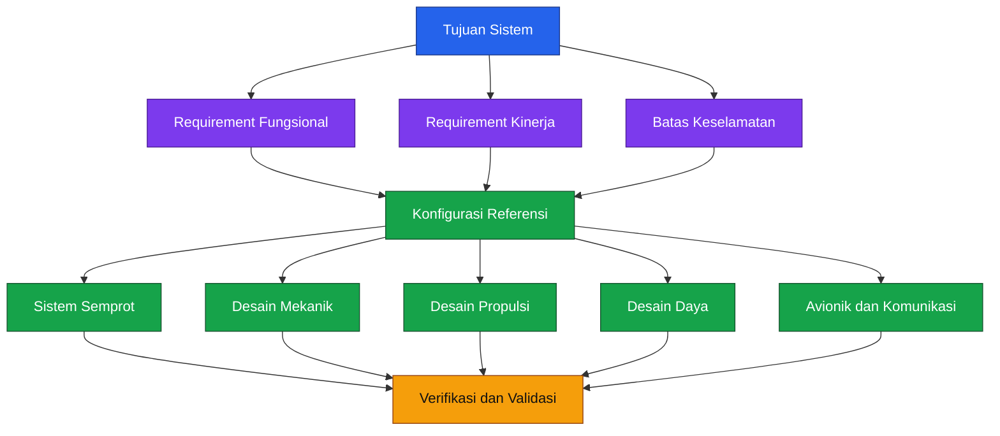

Diagram di atas menegaskan satu hal penting: **setiap keputusan desain pada bab-bab berikutnya harus diturunkan dari requirement, bukan dari kebiasaan memilih komponen**. Dengan demikian, pilihan motor, baterai, frame, autopilot, nozzle, dan flow control akan selalu dapat ditelusuri kembali ke kebutuhan sistem.

---

## 1.1 Tujuan sistem

Drone pada artikel ini didefinisikan sebagai **hexacopter pertanian untuk aplikasi penyemprotan cairan**, dengan orientasi penggunaan oleh praktisi lapangan dan pengembang sistem. Sistem tidak dirancang sebagai drone rekreasi, bukan pula sekadar platform demonstrasi. Fokus utamanya adalah menghasilkan **kendaraan udara kerja** yang dapat dibangun, diuji, dan divalidasi secara terstruktur.

### 1.1.1 Fungsi utama sistem

Fungsi utama yang wajib dipenuhi adalah:

- Membawa dan menyemprotkan cairan pertanian.
- Memiliki kapasitas tangki maksimum $20\ \mathrm{L}$.
- Menetapkan payload maksimum berdasarkan **massa**, bukan hanya volume.
- Mendukung operasi **manual**, **semiotomatis**, dan **otomatis**.
- Mendukung **terrain following** dan **variable flow** apabila fitur ini diaktifkan dalam konfigurasi final.

Pada platform ArduPilot, kebutuhan tersebut realistis karena:

- **Crop Sprayer** memungkinkan autopilot mengontrol pompa PWM dan, bila diperlukan, spinner PWM berdasarkan kecepatan kendaraan.
- **ZigZag Mode** mendukung operasi semi-otomatis back-and-forth yang relevan untuk penyemprotan lahan.
- **AUTO mode** dan **terrain following** mendukung misi waypoint serta penjagaan tinggi terhadap permukaan tanah atau tanaman pada mode otonom. ([ArduPilot.org][1])

### 1.1.2 Ruang lingkup fungsi sistem

Agar tajam dan tidak melebar, sistem baseline pada artikel ini dibatasi pada:

1. **Payload cairan** untuk penyemprotan.
2. **Autopilot multirotor** berbasis ArduPilot Copter.
3. **Mission execution** dengan RC sebagai manual override.
4. **Sprayer control** berbasis pompa dan nozzle.
5. **Pengoperasian ketinggian rendah** di area pertanian.

### 1.1.3 Fungsi yang tidak menjadi baseline

Beberapa fitur berikut **tidak dijadikan baseline** pada desain referensi, meskipun dapat ditambahkan di revisi lanjutan:

- Penyebaran granular sebagai fungsi utama.
- BVLOS sebagai mode operasi utama.
- Swarm operation.
- Obstacle avoidance 3D penuh.
- Precision landing berbasis vision.
- Variable-rate spraying berbasis peta resep (prescription map).

Pendekatan ini penting agar requirement awal tetap terkendali dan desain tidak kehilangan fokus.

### 1.1.4 Pernyataan tujuan sistem

Secara formal, tujuan sistem dapat ditulis sebagai berikut:

> Merancang drone pertanian hexacopter kapasitas cairan maksimum $20\ \mathrm{L}$ yang mampu melakukan penyemprotan presisi pada ketinggian rendah, dengan dukungan operasi manual, semiotomatis, dan otomatis, serta memenuhi batas keselamatan dan envelope operasi yang didefinisikan pada bab ini.

### 1.1.5 Sasaran engineering

Agar tujuan sistem dapat diterjemahkan menjadi keputusan desain, sasaran engineering awal ditetapkan sebagai berikut:

| Kategori        | Sasaran                                        |
| --------------- | ---------------------------------------------- |
| Platform        | Multirotor hexacopter                          |
| Fungsi utama    | Sprayer cairan                                 |
| Muatan kerja    | Tangki maksimum $20\ \mathrm{L}$               |
| Basis payload   | Massa cairan                                   |
| Mode operasi    | Manual, semiotomatis, otomatis                 |
| Kontrol semprot | ON/OFF dan variable flow                       |
| Height control  | Altitude hold + terrain/surface following      |
| Ground control  | RC + telemetry + GCS                           |
| Validasi        | Analysis, bench test, ground test, flight test |

---

## 1.2 Definisi kapasitas payload

Pada desain drone pertanian, istilah **20 L** sering disalahartikan sebagai **20 kg**. Padahal, volume dan massa adalah dua besaran yang berbeda. Bagian ini mengunci definisi agar perhitungan pada bab propulsi, baterai, dan struktur tidak ambigu.

### 1.2.1 Definisi formal

Massa payload cairan didefinisikan sebagai:

$$
m_{\text{payload}}
=

\rho_{\text{liquid}}V_{\text{tank}}
$$

dengan:

- $m_{\text{payload}}$: massa cairan di dalam tangki, dalam $\mathrm{kg}$
- $\rho_{\text{liquid}}$: densitas cairan, dalam $\mathrm{kg/L}$
- $V_{\text{tank}}$: volume cairan yang diisikan, dalam $\mathrm{L}$

Jika cairan diasumsikan setara air:

$$
\rho_{\text{liquid}} \approx 1.0\ \mathrm{kg/L}
$$

maka untuk tangki penuh $20\ \mathrm{L}$:

$$
m_{\text{payload}} \approx 20\ \mathrm{kg}
$$

Namun, untuk cairan dengan densitas lebih tinggi dari air, volume isi maksimum harus dikurangi agar tidak melampaui batas massa payload.

### 1.2.2 Batas volume dan massa

Agar desain aman dan konsisten, sistem harus membedakan lima besaran berikut:

| Istilah          | Simbol                | Makna                                                  |
| ---------------- | --------------------- | ------------------------------------------------------ |
| Kapasitas tangki | $V_{\text{tank,max}}$ | Volume fisik maksimum tangki                           |
| Massa payload    | $m_{\text{payload}}$  | Massa cairan aktual yang dibawa                        |
| Massa kosong     | $m_{\text{empty}}$    | Massa drone tanpa baterai dan tanpa payload            |
| Massa baterai    | $m_{\text{battery}}$  | Massa seluruh pack baterai yang digunakan saat terbang |
| MTOW             | $m_{\text{MTOW}}$     | Massa total saat take-off                              |

Hubungan MTOW dinyatakan dengan:

$$
m_{\text{MTOW}}
=

m_{\text{empty}}
+
m_{\text{battery}}
+
m_{\text{payload}}
$$

Persamaan ini **wajib** digunakan pada seluruh bab selanjutnya. Tidak boleh ada bagian artikel yang mencampuradukkan MTOW dengan “berat drone kosong” atau “berat dengan tangki penuh”.

### 1.2.3 Batas isi maksimum berdasarkan densitas

Untuk mencegah operator mengisi penuh tangki dengan cairan yang terlalu padat, volume isi maksimum yang diizinkan dapat ditentukan dengan:

$$
V_{\text{fill,max}}
=

\min
\left(
V_{\text{tank,max}},
\frac{m_{\text{payload,max}}}{\rho_{\text{liquid}}}
\right)
$$

dengan:

- $V_{\text{fill,max}}$: volume isi cairan maksimum yang diizinkan
- $m_{\text{payload,max}}$: batas massa payload desain

Sebagai contoh, jika:

$$
m_{\text{payload,max}} = 20\ \mathrm{kg}
$$

dan cairan memiliki densitas:

$$
\rho_{\text{liquid}} = 1.1\ \mathrm{kg/L}
$$

maka:

$$
V_{\text{fill,max}}
=

\frac{20}{1.1}
\approx
18.18\ \mathrm{L}
$$

Artinya, tangki **tidak boleh diisi penuh 20 L** untuk cairan dengan densitas tersebut.

### 1.2.4 Definisi payload pada artikel ini

Untuk konsistensi, artikel ini menggunakan definisi berikut:

- **Kapasitas tangki maksimum**: $20\ \mathrm{L}$
- **Payload massa maksimum baseline**: $20\ \mathrm{kg}$
- **Asumsi cairan nominal**: $\rho_{\text{liquid}} = 1.0\ \mathrm{kg/L}$

Dengan demikian, frase **“drone pertanian kapasitas 20 kg”** dalam artikel ini dibaca sebagai:

> drone dengan **payload cairan maksimum 20 kg**, yang dalam kasus cairan setara air ekuivalen dengan **volume tangki penuh 20 L**.

### 1.2.5 Catatan desain penting

Bagian ini memberi implikasi langsung pada desain downstream:

- Jika $m_{\text{payload,max}}$ dinaikkan, maka kebutuhan thrust dan energi ikut naik.
- Jika $\rho_{\text{liquid}}$ lebih tinggi, maka volume isi aman turun.
- Jika tangki tidak memiliki baffle, efek sloshing meningkat saat volume parsial.
- Jika operator menganggap 20 L selalu sama dengan 20 kg, desain keselamatan menjadi tidak valid.

Untuk praktisi, ini berarti **label tangki harus selalu disertai label massa isi maksimum**, bukan hanya volume.

---

## 1.3 Persyaratan kinerja

Persyaratan kinerja atau **performance requirements** merupakan target terukur yang akan menjadi basis sizing sistem propulsi, baterai, semprot, serta kontrol penerbangan. Seluruh angka pada bagian ini adalah **design target awal** yang nantinya wajib diverifikasi pada bab pengujian dan acceptance.

## Peta persyaratan kinerja

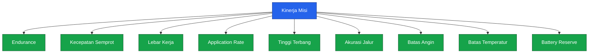

### 1.3.1 Target waktu terbang

Drone penyemprot tidak memerlukan endurance sepanjang drone observasi, tetapi harus cukup untuk:

- takeoff,
- transisi ke area kerja,
- eksekusi lintasan semprot,
- manuver belok,
- kembali,
- dan mendarat dengan **cadangan energi aman**.

Target awal ditetapkan:

| Kondisi                        |     Target waktu terbang |
| ------------------------------ | -----------------------: |
| Tangki penuh, payload maksimum | $\ge 10\ \mathrm{menit}$ |
| Payload 50%                    | $\ge 14\ \mathrm{menit}$ |
| Tanpa payload                  | $\ge 18\ \mathrm{menit}$ |

Nilai ini adalah target desain, bukan klaim akhir. Realisasi aktual harus dibuktikan melalui flight test.

### 1.3.2 Kecepatan semprot

Kecepatan semprot nominal harus cukup tinggi untuk efisiensi area, tetapi tidak terlalu tinggi hingga menurunkan akurasi deposisi dan memperbesar drift. Target awal:

| Parameter                 |               Nilai target |
| ------------------------- | -------------------------: |
| Kecepatan semprot nominal |          $5\ \mathrm{m/s}$ |
| Envelope operasi          | $4$ s.d. $7\ \mathrm{m/s}$ |

Kecepatan ini dipilih agar kompatibel dengan konsep sprayer control berbasis kecepatan kendaraan yang tersedia pada ArduPilot Crop Sprayer. Pada implementasi tersebut, laju pompa dapat disesuaikan dengan kecepatan kendaraan untuk menjaga flow relatif konstan terhadap gerak maju. ([ArduPilot.org][1])

### 1.3.3 Lebar kerja

Lebar kerja atau **effective swath width** dipengaruhi oleh:

- tipe nozzle,
- sudut nozzle,
- tinggi terbang,
- overlap semprotan,
- distribusi droplet,
- dan efek downwash rotor.

Sebagai requirement awal:

| Parameter           |             Nilai target |
| ------------------- | -----------------------: |
| Lebar kerja nominal |          $5\ \mathrm{m}$ |
| Envelope desain     | $4$ s.d. $6\ \mathrm{m}$ |

Nilai ini harus divalidasi dengan **water-sensitive paper test** atau metode distribusi semprotan lain pada bab pengujian.

### 1.3.4 Application rate

Application rate adalah jumlah cairan yang diaplikasikan per satuan luas, biasanya dinyatakan dalam $\mathrm{L/ha}$. Untuk kecepatan dalam $\mathrm{m/s}$, debit dalam $\mathrm{L/min}$, dan lebar kerja dalam meter:

$$
R
=

\frac{10000Q}{60vw}
$$

dengan:

- $R$: application rate dalam $\mathrm{L/ha}$
- $Q$: debit total nozzle dalam $\mathrm{L/min}$
- $v$: kecepatan terbang dalam $\mathrm{m/s}$
- $w$: lebar kerja dalam $\mathrm{m}$

Target requirement awal:

| Parameter                 |                  Nilai target |
| ------------------------- | ----------------------------: |
| Envelope application rate | $10$ s.d. $40\ \mathrm{L/ha}$ |
| Titik desain nominal      |           $20\ \mathrm{L/ha}$ |

Dari target tersebut, debit target dapat dihitung:

$$
Q_{\text{target}}
=

\frac{Rvw60}{10000}
$$

Sebagai contoh, untuk:

- $R = 20\ \mathrm{L/ha}$
- $v = 5\ \mathrm{m/s}$
- $w = 5\ \mathrm{m}$

maka:

$$
Q_{\text{target}}
=

\frac{20 \times 5 \times 5 \times 60}{10000}
=

3.0\ \mathrm{L/min}
$$

Angka ini akan menjadi titik awal desain pompa dan nozzle pada bab sistem semprot.

### 1.3.5 Tinggi penerbangan

Untuk aplikasi semprot, tinggi penerbangan harus rendah agar drift terkendali, tetapi cukup aman terhadap tajuk tanaman, kontur tanah, dan efek downwash. Target requirement awal:

| Parameter                            |                 Nilai target |
| ------------------------------------ | ---------------------------: |
| Tinggi semprot nominal di atas tajuk |            $2.5\ \mathrm{m}$ |
| Envelope operasi                     | $2.0$ s.d. $4.0\ \mathrm{m}$ |

Platform target mendukung **terrain following** di mode otomatis dan **surface tracking** melalui downward rangefinder. Dokumentasi ArduPilot menyebutkan terrain following tersedia pada mode otonom seperti AUTO, Guided, RTL, dan Land, serta rangefinder digunakan pada mode-mode dengan kontrol ketinggian selama masih berada dalam rentang sensor yang tervalidasi. ([ArduPilot.org][2])

### 1.3.6 Akurasi jalur

Karena misi penyemprotan memerlukan overlap yang konsisten, akurasi jalur menjadi parameter kritis. Target awal:

| Parameter             |           Nilai target |
| --------------------- | ---------------------: |
| Cross-track error RMS | $\le 0.30\ \mathrm{m}$ |
| Maksimum error sesaat | $\le 0.75\ \mathrm{m}$ |

Target ini mensyaratkan penggunaan GNSS presisi tinggi, idealnya **RTK** atau konfigurasi positioning setara.

### 1.3.7 Batas angin

Angin adalah faktor kinerja dan keselamatan sekaligus. Untuk misi semprot, batas angin harus lebih konservatif daripada misi ferry biasa karena drift dan stabilitas semprot menjadi isu utama.

| Kondisi                         |                 Batas target |
| ------------------------------- | ---------------------------: |
| Operasi penyemprotan            |        $\le 5\ \mathrm{m/s}$ |
| Ferry/return tanpa penyemprotan |        $\le 8\ \mathrm{m/s}$ |
| Gust di atas nilai ini          | Misi ditunda atau dihentikan |

Nilai ini adalah target operasi awal dan harus dikonfirmasi lewat uji terbang.

### 1.3.8 Batas temperatur

Performa baterai, ESC, pompa, dan sensor dipengaruhi temperatur lingkungan. Requirement awal:

| Parameter                      |                          Nilai target |
| ------------------------------ | ------------------------------------: |
| Temperatur operasi lingkungan  |      $10$ s.d. $40\ ^\circ\mathrm{C}$ |
| Temperatur penyimpanan baterai |           mengikuti datasheet baterai |
| Overtemperature perangkat      | tidak boleh melampaui batas datasheet |

### 1.3.9 Battery reserve

Drone tidak boleh menyelesaikan misi pada batas energi nol. Harus ada cadangan energi untuk:

- RTL,
- missed approach,
- koreksi posisi,
- dan landing aman.

Reserve pendaratan didefinisikan sebagai:

$$
\text{Reserve}_{\text{landing}}
=

\frac{E_{\text{remaining}}}{E_{\text{nominal}}}
\times 100\%
$$

Target awal:

| Parameter                      | Nilai target |
| ------------------------------ | -----------: |
| Minimum reserve saat touchdown |    $\ge 25%$ |
| Reserve perencanaan misi       |    $\ge 30%$ |

### 1.3.10 Tabel ringkas design envelope kinerja

| Parameter               |       Target nominal |          Envelope desain | Catatan                 |
| ----------------------- | -------------------: | -----------------------: | ----------------------- |
| Payload cairan          |    $20\ \mathrm{kg}$ |  maks. $20\ \mathrm{kg}$ | bergantung densitas     |
| Volume tangki           |     $20\ \mathrm{L}$ |   maks. $20\ \mathrm{L}$ | volume fisik            |
| Kecepatan semprot       |    $5\ \mathrm{m/s}$ |    $4$–$7\ \mathrm{m/s}$ | untuk sizing flow       |
| Lebar kerja             |      $5\ \mathrm{m}$ |      $4$–$6\ \mathrm{m}$ | validasi lapangan wajib |
| Application rate        |  $20\ \mathrm{L/ha}$ | $10$–$40\ \mathrm{L/ha}$ | closed-loop target      |
| Tinggi semprot          |    $2.5\ \mathrm{m}$ |      $2$–$4\ \mathrm{m}$ | di atas tajuk           |
| Waktu terbang penuh     | $10\ \mathrm{menit}$ |                  minimum | divalidasi saat uji     |
| Batas angin semprot     |                    — |    $\le 5\ \mathrm{m/s}$ | konservatif             |
| Battery reserve landing |            $\ge 25%$ |                  minimum | wajib                   |

---

## 1.4 Batas keselamatan

Batas keselamatan atau **safety limits** adalah syarat keras yang tidak boleh dilanggar, bahkan jika target kinerja belum tercapai. Prinsipnya sederhana: **lebih baik misi dibatalkan daripada sistem dioperasikan di luar envelope aman**.

## Hubungan safety envelope

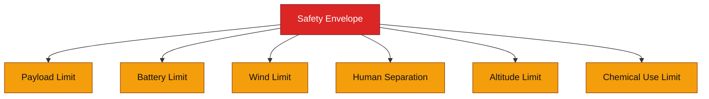

### 1.4.1 Batas payload

Payload maksimum baseline ditetapkan:

$$
m_{\text{payload,max}} = 20\ \mathrm{kg}
$$

Aturan operasionalnya:

- Tangki **tidak boleh diisi melebihi** batas volume aman.
- Cairan berdensitas tinggi harus menggunakan derating volume.
- Payload aktual harus ditimbang atau dihitung berdasarkan densitas dan volume isi.

### 1.4.2 Batas baterai

Untuk mencegah over-discharge, requirement keselamatan baterai ditetapkan:

- Tidak terbang jika kondisi baterai tidak lolos pemeriksaan pre-flight.
- Tidak memulai misi jika SOC awal di bawah batas operasi penuh.
- Tidak melanjutkan misi bila estimasi reserve turun di bawah ambang abort.
- Landing wajib dengan reserve minimum sesuai requirement.

Batas detail tegangan per sel dan ambang failsafe akan dikunci di bab firmware dan power architecture.

### 1.4.3 Batas kecepatan angin

Aturan keselamatan awal:

- Misi semprot **dilarang** jika kecepatan angin rata-rata melebihi $5\ \mathrm{m/s}$.
- Misi juga harus dihentikan bila gust menyebabkan kendaraan keluar dari stabilitas lintasan atau memicu drift berlebihan.
- Wind limit bukan hanya isu kontrol, tetapi juga isu kualitas aplikasi cairan.

### 1.4.4 Batas operasi dekat manusia

Drone penyemprot heavy-lift tidak boleh dioperasikan seperti drone hobi. Batas keselamatan awal:

- Tidak boleh terbang di atas manusia yang tidak terlibat operasi.
- Harus ada **zona steril** untuk takeoff dan landing.
- Operator dan observer harus berada di luar disk propeller dan di posisi aman relatif terhadap arah semprotan.
- Akses personel ke area kerja harus dikendalikan selama misi berlangsung.

### 1.4.5 Batas ketinggian

Untuk baseline sistem ini:

- Tinggi penyemprotan dibatasi ke envelope rendah yang telah ditetapkan.
- Hard ceiling operasional harus ditetapkan di flight controller.
- Misi tidak boleh melampaui batas ketinggian yang diizinkan oleh area operasi dan regulasi setempat.

Nilai numerik hard ceiling final akan dikunci pada bab firmware dan operasi.

### 1.4.6 Batas penggunaan bahan kimia

Karena sistem membawa bahan kimia pertanian, batas keselamatan juga mencakup:

- Hanya bahan yang kompatibel dengan material tangki, hose, seal, pompa, dan nozzle yang boleh digunakan.
- Bahan dengan viskositas atau korosivitas di luar spesifikasi sistem dilarang.
- Pengisian, flushing, dan pembuangan residu wajib mengikuti prosedur keselamatan kimia.
- Operator wajib menggunakan PPE yang sesuai.

### 1.4.7 Prinsip fail-safe level sistem

Bila salah satu batas keselamatan dilanggar, sistem harus memiliki perilaku berikut:

1. **Prevent**
   Cegah misi dimulai jika kondisi awal tidak aman.

2. **Detect**
   Deteksi deviasi selama operasi, misalnya low battery, loss of flow, atau kecepatan angin yang berlebihan.

3. **Respond**
   Lakukan respons yang telah ditentukan:

   - stop spraying,
   - abort mission,
   - return to launch,
   - atau controlled landing.

4. **Record**
   Simpan log kejadian untuk analisis pasca-operasi.

ArduPilot mendukung konsep pre-arm checks, failsafe, serta pemetaan fungsi output dan auxiliary functions untuk fitur-fitur seperti sprayer, rangefinder, dan mission reset, yang relevan untuk implementasi lapisan keselamatan ini. ([ArduPilot.org][3])

### 1.4.8 Tabel safety limits awal

| Kategori                     | Batas awal                              | Tindakan jika dilanggar |
| ---------------------------- | --------------------------------------- | ----------------------- |
| Payload                      | $m_{\text{payload}} > 20\ \mathrm{kg}$  | dilarang takeoff        |
| Volume isi                   | $V_{\text{fill}} > V_{\text{fill,max}}$ | kurangi isi             |
| Wind spray                   | $> 5\ \mathrm{m/s}$                     | tunda/batalkan misi     |
| Reserve landing              | $< 25%$                                 | misi invalid            |
| Operasi dekat manusia        | ada personel di zona steril             | hold mission            |
| Ketinggian                   | melebihi envelope/desain                | abort/limit             |
| Bahan kimia tidak kompatibel | ya                                      | dilarang digunakan      |

---

## 1.5 Requirement Traceability Matrix awal

Requirement Traceability Matrix atau **RTM** adalah alat pengendali agar setiap requirement dapat ditelusuri ke:

- keputusan desain,
- metode verifikasi,
- hasil uji,
- dan status akhir.

Tanpa RTM, artikel mudah berubah menjadi kumpulan opini teknis yang sulit diaudit.

### 1.5.1 Struktur requirement ID

Untuk artikel ini, requirement dikelompokkan sebagai berikut:

- `SYS-xxx` untuk requirement sistem umum
- `PWR-xxx` untuk requirement daya dan baterai
- `PROP-xxx` untuk propulsi
- `NAV-xxx` untuk navigasi dan guidance
- `SPR-xxx` untuk sistem semprot
- `SAF-xxx` untuk keselamatan

### 1.5.2 Matriks requirement awal

Berikut requirement baseline yang akan menjadi acuan bab-bab selanjutnya.

| ID         | Requirement                                             | Target awal                    | Metode verifikasi                  | Bab lanjutan |
| ---------- | ------------------------------------------------------- | ------------------------------ | ---------------------------------- | ------------ |
| `SYS-001`  | Drone harus berfungsi sebagai hexacopter sprayer cairan | Ya                             | Inspection + configuration review  | 2, 3, 8      |
| `SYS-002`  | Kapasitas tangki fisik maksimum                         | $20\ \mathrm{L}$               | Inspection + measurement           | 2, 7, 9      |
| `SYS-003`  | Payload cairan maksimum                                 | $20\ \mathrm{kg}$              | Mass calculation + weighing        | 2, 12        |
| `SYS-004`  | Mode operasi                                            | manual, semiotomatis, otomatis | Configuration review + flight test | 5, 8, 11     |
| `SYS-005`  | Terrain following tersedia                              | wajib pada konfigurasi final   | Bench + flight test                | 5, 8, 11     |
| `PWR-001`  | Waktu terbang payload penuh                             | $\ge 10\ \mathrm{menit}$       | Flight test                        | 4, 11, 12    |
| `PWR-002`  | Reserve landing minimum                                 | $\ge 25%$                      | Log analysis                       | 4, 11, 12    |
| `PROP-001` | Sistem propulsi harus mendukung MTOW desain             | wajib                          | Analysis + thrust test             | 3, 11, 12    |
| `NAV-001`  | Cross-track error RMS                                   | $\le 0.30\ \mathrm{m}$         | Flight log analysis                | 5, 11, 12    |
| `NAV-002`  | Tinggi semprot di atas tajuk                            | $2$–$4\ \mathrm{m}$            | Rangefinder log + flight test      | 5, 11        |
| `SPR-001`  | Application rate nominal                                | $20\ \mathrm{L/ha}$            | Flow test + coverage test          | 6, 11, 12    |
| `SPR-002`  | Envelope application rate                               | $10$–$40\ \mathrm{L/ha}$       | Flow test                          | 6, 11        |
| `SPR-003`  | Variable flow                                           | wajib                          | Bench + flight test                | 6, 8, 11     |
| `SAF-001`  | Batas angin penyemprotan                                | $\le 5\ \mathrm{m/s}$          | Operational check                  | 11, 12       |
| `SAF-002`  | Overpayload prevention                                  | wajib                          | Procedure + inspection             | 9, 11, 12    |
| `SAF-003`  | Batas bahan kimia kompatibel                            | wajib                          | Compatibility review               | 6, 13        |

### 1.5.3 Status awal requirement

Pada tahap ini, seluruh requirement masih berstatus:

- `Defined`: requirement telah didefinisikan
- `Allocated`: akan dipetakan ke subsystem pada bab berikutnya
- `Verified`: belum, sampai ada bukti uji
- `Accepted`: belum, sampai acceptance test selesai

Matriks status awal:

| Status    | Makna pada Bab 1                         |
| --------- | ---------------------------------------- |
| Defined   | requirement sudah dituliskan             |
| Allocated | akan dipetakan ke subsystem pada bab 2–8 |
| Verified  | menunggu hasil pengujian                 |
| Accepted  | menunggu acceptance review               |

### 1.5.4 Aturan penggunaan RTM

Agar RTM berguna secara praktis, artikel ini menggunakan aturan berikut:

1. **Setiap angka penting harus memiliki ID requirement.**
2. **Setiap requirement harus memiliki metode verifikasi.**
3. **Jika requirement berubah, revisi dokumen wajib diperbarui.**
4. **Tidak ada klaim “final” tanpa status verified dan accepted.**

---

## Ringkasan Bab 1

Bab ini telah mengunci fondasi desain untuk drone pertanian kapasitas 20 kg, yaitu:

- Sistem baseline adalah **hexacopter sprayer cairan**.
- Kapasitas tangki maksimum adalah $20\ \mathrm{L}$.
- Payload maksimum baseline adalah $20\ \mathrm{kg}$, sehingga volume dan massa tidak boleh dicampuradukkan.
- MTOW didefinisikan secara formal sebagai penjumlahan massa kosong, massa baterai, dan massa payload.
- Design envelope awal telah ditetapkan untuk kecepatan, tinggi semprot, application rate, waktu terbang, batas angin, dan cadangan baterai.
- Safety limits awal telah ditetapkan agar seluruh keputusan desain selanjutnya tetap berada dalam koridor aman.
- Requirement Traceability Matrix awal telah dibangun untuk menjamin semua keputusan desain dan hasil uji dapat ditelusuri secara formal.

Dengan Bab 1 ini, seluruh pembahasan pada bab berikutnya—mulai dari mass budget, propulsi, baterai, avionik, hingga sistem semprot—memiliki **basis requirement yang eksplisit** dan tidak berubah-ubah.

---

## Referensi bab

1. ArduPilot Copter Documentation — **Crop Sprayer**. Mendukung kontrol pompa PWM dan optional spinner untuk aplikasi semprot. ([ArduPilot.org][1])
2. ArduPilot Copter Documentation — **ZigZag Mode**. Menjelaskan mode semi-otomatis untuk lintasan bolak-balik yang relevan untuk crop spraying. ([ArduPilot.org][4])
3. ArduPilot Copter Documentation — **Terrain Following (in Auto, Guided, etc)**. Menjelaskan terrain following pada mode otonom. ([ArduPilot.org][2])
4. ArduPilot Copter Documentation — **Rangefinders**. Menjelaskan penggunaan downward rangefinder pada mode dengan kontrol ketinggian dan pentingnya pengaturan `RNGFNDx_MAX` yang tervalidasi. ([ArduPilot.org][5])
5. ArduPilot Copter Documentation — **Auxiliary Functions** dan **Autopilot Output Functions**. Menjelaskan pemetaan output/fungsi tambahan seperti sprayer dan rangefinder. ([ArduPilot.org][3])
6. ArduPilot Copter Documentation — **Parameter List / AUTO_OPTIONS**. Menjelaskan opsi konfigurasi mode otomatis dan behaviour terkait. ([ArduPilot.org][6])

---

[**Kembali ke Atas**](#merancang-drone-pertanian-kapasitas-20-kg)

[1]: https://ardupilot.org/copter/docs/common-sprayer.html?utm_source=chatgpt.com 'Crop Sprayer — Copter documentation'
[2]: https://ardupilot.org/copter/docs/terrain-following.html?utm_source=chatgpt.com 'Terrain Following (in Auto, Guided, etc)'
[3]: https://ardupilot.org/copter/docs/common-auxiliary-functions.html?utm_source=chatgpt.com 'Auxiliary Functions — Copter documentation'
[4]: https://ardupilot.org/copter/docs/zigzag-mode.html?utm_source=chatgpt.com 'ZigZag Mode — Copter documentation'
[5]: https://ardupilot.org/copter/docs/common-rangefinder-landingpage.html?utm_source=chatgpt.com 'Rangefinders (landing page) — Copter documentation'
[6]: https://ardupilot.org/copter/docs/parameters-Copter-stable-V4.6.3.html?utm_source=chatgpt.com 'Complete Parameter List — Copter documentation'

---

# 2. Konfigurasi Referensi dan Mass Budget

Bab ini membekukan satu konfigurasi referensi agar seluruh perhitungan pada bab berikutnya menggunakan **frame, propulsi, baterai, avionik, dan sistem semprot yang sama**. Tanpa konfigurasi yang dibekukan, angka MTOW, kebutuhan thrust, arus baterai, posisi pusat massa, serta endurance tidak dapat dibandingkan secara konsisten.

Konfigurasi dalam bab ini diberi identitas:

| Atribut          | Nilai                        |
| ---------------- | ---------------------------- |
| Kode desain      | `AGHEX-20-R1`                |
| Design freeze    | `DF-01`                      |
| Baseline payload | Sprayer cairan               |
| Kapasitas tangki | $20\ \mathrm{L}$             |
| Payload maksimum | $20\ \mathrm{kg}$            |
| Konfigurasi      | Flat hexacopter              |
| Status           | Reference design freeze      |
| Status validasi  | Menunggu pengujian Bab 10–12 |

> **Penting:** `DF-01` berarti konfigurasi telah dibekukan untuk keperluan analisis dan konstruksi artikel. Status ini belum berarti kendaraan telah lulus acceptance test. Status “final tervalidasi” baru dapat diberikan setelah massa aktual, thrust, temperatur, endurance, stabilitas, dan pola semprot telah diuji.

---

## 2.1 Arsitektur sistem referensi

Arsitektur `AGHEX-20-R1` dibagi menjadi delapan subsistem utama:

1. Struktur dan tangki.
2. Propulsi.
3. Baterai dan distribusi daya.
4. Flight controller.
5. Sensor navigasi dan terrain following.
6. RC, telemetri, dan ground station.
7. Payload controller.
8. Sistem hidraulik penyemprotan.

Pembagian ini penting karena jalur **daya**, **data**, dan **fluida** memiliki kebutuhan keselamatan yang berbeda.

### 2.1.1 Arsitektur tingkat sistem

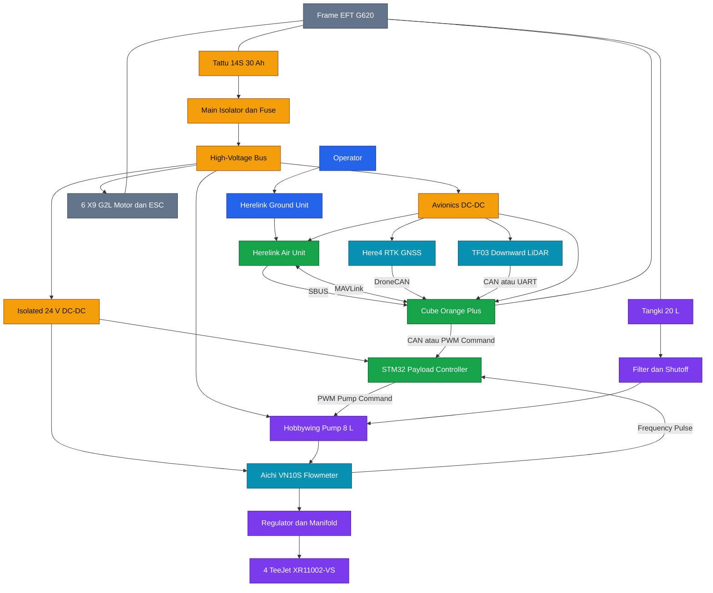

### 2.1.2 Pemisahan domain sistem

Arsitektur tersebut memiliki tiga domain utama.

#### Domain daya

Jalur daya dimulai dari baterai $14\mathrm{S}$ menuju:

- Enam sistem propulsi.
- Pompa bertegangan tinggi.
- Regulator avionik.
- Regulator terisolasi untuk payload controller dan flowmeter.

Flight controller tidak boleh disuplai langsung dari high-voltage bus. Sistem avionik menggunakan regulator dan power module yang memiliki proteksi serta pengukuran tegangan dan arus.

#### Domain data

Jalur data meliputi:

- SBUS dari Herelink ke flight controller.
- MAVLink antara flight controller dan Herelink.
- DroneCAN antara Here4 dan flight controller.
- CAN atau UART dari rangefinder.
- CAN atau PWM dari flight controller ke payload controller.
- Pulsa frekuensi dari flowmeter ke payload controller.

Herelink berfungsi sebagai sistem RC, telemetri, dan ground station terintegrasi. Air Unit Herelink 1.1 menyediakan SBUS dan UART 3,3 V, memiliki massa sekitar 98 g termasuk antena, serta membutuhkan suplai sekitar 6–12 V. ([docs.cubepilot.org][1])

#### Domain fluida

Jalur cairan dibuat terpisah dari avionik:

$$
\text{Tangki}
\rightarrow
\text{Filter}
\rightarrow
\text{Pompa}
\rightarrow
\text{Flowmeter}
\rightarrow
\text{Regulator}
\rightarrow
\text{Manifold}
\rightarrow
\text{Nozzle}
$$

Pemisahan tersebut bertujuan mengurangi risiko cairan mencapai:

- Flight controller.
- Power distribution.
- Konektor baterai.
- Telemetry air unit.
- Regulator avionik.

### 2.1.3 Arsitektur kontrol semprot

Flight controller tidak mengontrol debit hanya dengan perintah ON/OFF. Perintah debit target dikirimkan ke payload controller berbasis STM32, sedangkan flowmeter menyediakan umpan balik debit aktual.

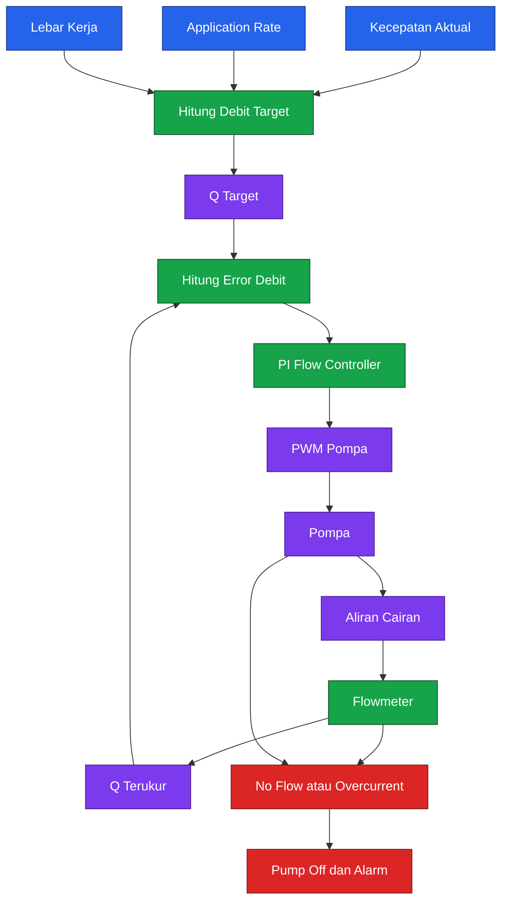

Persamaan debit target tetap mengikuti requirement Bab 1:

$$
Q_{\text{target}}
=

\frac{Rvw60}{10000}
$$

dengan:

- $R$ dalam $\mathrm{L/ha}$
- $v$ dalam $\mathrm{m/s}$
- $w$ dalam $\mathrm{m}$
- $Q_{\text{target}}$ dalam $\mathrm{L/min}$

---

## 2.2 Design freeze

### 2.2.1 Prinsip design freeze

Design freeze menetapkan komponen yang digunakan dalam baseline konstruksi. Komponen alternatif tidak boleh dimasukkan ke prosedur utama karena perubahan satu komponen dapat memengaruhi:

- Massa total.
- Posisi pusat massa.
- Kebutuhan daya.
- Arus maksimum.
- Konektor.
- Dimensi dudukan.
- Parameter firmware.
- Dinamika penerbangan.
- Debit sistem semprot.

Setiap perubahan setelah `DF-01` harus melalui **Engineering Change Request** atau ECR.

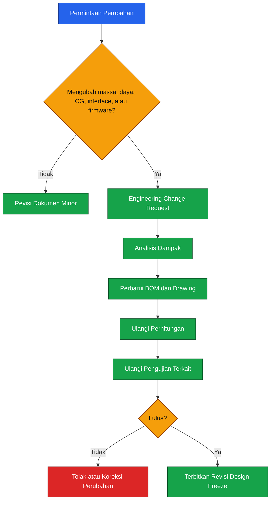

### 2.2.2 Konfigurasi final `DF-01`

| Subsystem          | Komponen yang dibekukan   | Konfigurasi                                   |
| ------------------ | ------------------------- | --------------------------------------------- |
| Frame              | EFT G620                  | Hexacopter, wheelbase $2028\ \mathrm{mm}$     |
| Tangki             | EFT G620 20 L tank        | Quick-release, internal baffle ditambahkan    |
| Motor dan ESC      | Hobbywing X9 G2L          | Enam integrated propulsion unit               |
| Propeller          | Hobbywing MFP 36 × 11     | Folding propeller                             |
| Baterai            | Tattu 4.0 30000 mAh       | $14\mathrm{S}1\mathrm{P}$, $53.2\ \mathrm{V}$ |
| Flight controller  | Cube Orange+ Standard Set | ArduPilot Copter                              |
| GNSS               | CubePilot Here4           | Dual-band RTK, DroneCAN                       |
| Rangefinder        | Benewake TF03             | Downward, CAN/UART                            |
| RC dan telemetry   | CubePilot Herelink 1.1    | Ground Unit + Air Unit                        |
| Pump               | Hobbywing Pump 8 L        | $12$–$14\mathrm{S}$, PWM                      |
| Flowmeter          | Aichi ATZTA VN10S         | NPN frequency output                          |
| Nozzle             | TeeJet XR11002-VS         | Empat nozzle, stainless steel                 |
| Payload controller | `AGHEX-SPRAY-CTRL-R1`     | STM32G474RET6                                 |
| Firmware autopilot | ArduPilot Copter          | Versi dikunci pada Bab 8                      |

### 2.2.3 Frame dan tangki

EFT G620 memiliki wheelbase $2028\ \mathrm{mm}$, kapasitas tangki $20\ \mathrm{L}$, massa frame bersih $9.66\ \mathrm{kg}$, dan massa tangki $1.62\ \mathrm{kg}$. Pabrikan menetapkan diameter arm $40\ \mathrm{mm}$ serta merekomendasikan sistem propulsi keluarga X9 dan baterai $14\mathrm{S}$. ([Effort Tech][2])

Frame dipilih karena:

- Kapasitas tangki sesuai requirement.
- Konfigurasi hexacopter.
- Diameter arm kompatibel dengan X9 G2L.
- Tersedia ruang untuk baterai, tangki, boom, dan avionik.
- Geometri frame dapat dianalisis tanpa merancang seluruh struktur dari nol.

Namun, battery tray standar tidak diasumsikan langsung kompatibel dengan baterai 30 Ah. Drawing Bab 7 harus menggunakan tray khusus yang sesuai dengan dimensi baterai aktual.

### 2.2.4 Propulsi

Sistem propulsi dibekukan pada Hobbywing X9 G2L dengan propeller MFP 36 × 11. Unit ini menggunakan arm $40\ \mathrm{mm}$, mendukung baterai $12$–$14\mathrm{S}$, mempunyai massa sekitar $1.532\ \mathrm{kg}$ termasuk kabel dan propeller, serta rentang recommended takeoff weight $7$–$12\ \mathrm{kg}$ per rotor. Data pabrikan mencantumkan maximum thrust $24\ \mathrm{kg}$ per rotor pada permukaan laut. ([HOBBYWING][3])

Penggunaan propeller 36 inci memberi diameter:

$$
D_{\text{prop}}
=

36 \times 25.4
=

914.4\ \mathrm{mm}
$$

Untuk wheelbase berseberangan $2028\ \mathrm{mm}$, jarak motor bersebelahan pada hexacopter reguler adalah:

$$
d_{\text{adjacent}}
=

\frac{2028}{2}
=

1014\ \mathrm{mm}
$$

Clearance statis antartip:

$$
c_{\text{static}}
=

1014 - 914.4
=

99.6\ \mathrm{mm}
$$

Nilai tersebut masih harus dikurangi oleh:

- Defleksi arm.
- Defleksi propeller.
- Toleransi joint.
- Ketidaksejajaran motor.
- Pergerakan saat folding mechanism terkunci.

Clearance final akan diverifikasi pada Bab 3 dan Bab 9.

### 2.2.5 Baterai

Baterai final adalah Tattu 4.0 30000 mAh, $14\mathrm{S}1\mathrm{P}$, dengan tegangan nominal $53.2\ \mathrm{V}$ dan energi nominal $1596\ \mathrm{Wh}$. Massa nominalnya $11.4\ \mathrm{kg}$, arus kontinu maksimum $270\ \mathrm{A}$, dan arus puncak $350\ \mathrm{A}$ selama maksimum tiga detik. ([Genstattu][4])

Energi nominal sesuai:

$$
E_{\text{nom}}
=

V_{\text{nom}}C
$$

$$
E_{\text{nom}}
=

53.2 \times 30
=

1596\ \mathrm{Wh}
$$

Baterai 30 Ah dipilih karena baterai 20–22 Ah dengan BMS berarus kontinu rendah dapat menjadi bottleneck pada hover payload penuh. Baterai ini juga memberikan ruang yang lebih realistis untuk memenuhi target waktu terbang dan reserve Bab 1.

### 2.2.6 Flight controller dan GNSS

Cube Orange+ dibekukan sebagai flight controller utama. Dokumentasi CubePilot mencantumkan prosesor STM32H757, sedangkan Here4 menggunakan u-blox F9P, STM32H757, komunikasi DroneCAN, dan mendukung pembaruan RTK hingga 20 Hz. Here4 memiliki massa sekitar 60 g termasuk kabel. ([docs.cubepilot.org][5])

Here4 hanya digunakan sebagai:

- GNSS RTK.
- Magnetometer eksternal.
- Sumber navigasi melalui DroneCAN.

Fungsi flight controller tetap dijalankan oleh Cube Orange+.

### 2.2.7 Rangefinder

Benewake TF03 dipilih sebagai downward rangefinder. Perangkat ini mempunyai enclosure IP67, antarmuka CAN atau UART, rentang minimum sekitar $0.1\ \mathrm{m}$, konsumsi daya maksimum sekitar $1\ \mathrm{W}$, dan massa sekitar $86\ \mathrm{g}$. ([Benewake][6])

Walaupun jangkauan maksimum sensor jauh melebihi tinggi operasi sprayer, parameter maksimum rangefinder di firmware tidak boleh diisi berdasarkan jangkauan katalog semata. Nilainya harus dibatasi berdasarkan hasil uji terhadap:

- Tanah.
- Rumput.
- Kanopi tanaman.
- Air.
- Permukaan sangat reflektif.
- Kondisi debu dan kabut semprot.

### 2.2.8 Pompa

Pompa dibekukan pada Hobbywing Pump 8 L dengan:

- Tegangan kerja $12$–$14\mathrm{S}$.
- Open-flow maksimum $8\ \mathrm{L/min}$.
- Daya nominal sekitar $120\ \mathrm{W}$.
- Arus kerja maksimum sekitar $2.5\ \mathrm{A}$.
- Pressure rating sekitar $0.8$–$1.0\ \mathrm{MPa}$.
- Massa $698\ \mathrm{g}$.
- Proteksi IP67. ([HOBBYWING][7])

Debit maksimum pompa tidak digunakan sebagai debit operasi nominal. Titik operasi aktual ditentukan oleh:

- Kurva tekanan–debit.
- Restriksi filter.
- Flowmeter.
- Selang.
- Regulator.
- Manifold.
- Nozzle.

### 2.2.9 Flowmeter

Flowmeter final adalah Aichi Tokei Denki ATZTA VN10S dengan nominal diameter 10 mm dan koneksi R1/2. Rentang flow dengan akurasi terjamin adalah sekitar $0.5$–$10\ \mathrm{L/min}$. Output standar dapat dikonfigurasi sebagai frequency pulse dan alarm, sehingga dapat dibaca langsung oleh timer input capture pada STM32. ([Aichitokei][8])

Dokumentasi pabrikan menetapkan media ukur referensi berupa air dengan konduktivitas minimum $50\ \mu\mathrm{S/cm}$. Karena itu:

> Flowmeter ini tidak boleh dianggap kompatibel dengan semua pestisida hanya karena disebutkan untuk aplikasi drone pertanian.

Setiap campuran akhir harus diverifikasi terhadap:

- Konduktivitas.
- Viskositas.
- Material PPS dan m-PPO.
- Seal FKM.
- Elektroda SUS316L.
- Residu dan kecenderungan membentuk deposit.

Flowmeter ditempatkan dalam enclosure payload dan disuplai dari regulator $24\ \mathrm{V}$ terisolasi.

### 2.2.10 Nozzle

Empat TeeJet XR11002-VS dibekukan sebagai nozzle baseline. TeeJet memasukkan seri XR11002-VS dalam pilihan untuk aplikasi drone. Nilai nominal ukuran `02` adalah $0.20\ \mathrm{US\ gal/min}$ pada $40\ \mathrm{psi}$ dengan air. ([TeeJet][9])

Konversi debit per nozzle:

$$
Q_{\text{tip}}
=

0.20 \times 3.78541
$$

$$
Q_{\text{tip}}
\approx
0.757\ \mathrm{L/min}
$$

Untuk empat nozzle:

$$
Q_{\text{total}}
=

4 \times 0.757
\approx
3.03\ \mathrm{L/min}
$$

Dengan target Bab 1:

- $v=5\ \mathrm{m/s}$
- $w=5\ \mathrm{m}$

application rate teoritis menjadi:

$$
R
=

\frac{10000Q}{60vw}
$$

$$
R
=

\frac{10000 \times 3.03}
{60 \times 5 \times 5}
\approx
20.2\ \mathrm{L/ha}
$$

Kesesuaian tersebut menjadi alasan utama pemilihan nozzle `02`. Lebar kerja $5\ \mathrm{m}$ masih bersifat target dan wajib dibuktikan melalui pattern test; tidak boleh disimpulkan hanya dari sudut semprot nozzle.

---

## 2.3 Mass budget

### 2.3.1 Definisi massa

Artikel ini menggunakan definisi berikut:

#### Massa kosong kering

Massa kendaraan tanpa baterai penerbangan dan tanpa cairan:

$$
m_{\text{empty}}
=

\sum_{i=1}^{n}m_i
$$

#### Massa operasional kosong

Massa kendaraan dengan baterai, tetapi tanpa cairan:

$$
m_{\text{operational-empty}}
=

m_{\text{empty}}
+
m_{\text{battery}}
$$

#### Predicted MTOW

Massa kendaraan dengan baterai dan payload maksimum:

$$
m_{\text{MTOW,pred}}
=

m_{\text{empty}}
+
m_{\text{battery}}
+
m_{\text{payload,max}}
$$

#### Massa sizing

Massa yang digunakan untuk analisis awal dengan mass growth allowance:

$$
m_{\text{design}}
=

m_{\text{MTOW,pred}}
+
m_{\text{MGA}}
$$

Mass growth allowance tidak ditambahkan ke label MTOW aktual. Nilai tersebut hanya digunakan untuk mencegah desain propulsi dan struktur tepat berada pada batas hasil estimasi.

### 2.3.2 Klasifikasi data massa

Tiga status digunakan pada mass budget:

| Kode   | Arti                     |
| ------ | ------------------------ |
| `MFG`  | Nilai dari pabrikan      |
| `ENG`  | Alokasi engineering      |
| `MEAS` | Hasil penimbangan aktual |

Pada tahap `DF-01`, sebagian item masih menggunakan `ENG`. Sebelum acceptance test, seluruh nilai harus diganti atau dikonfirmasi dengan `MEAS`.

### 2.3.3 Mass budget `AGHEX-20-R1`

| No. | Komponen                          | Jumlah |          Massa satuan |               Massa total | Status      |
| --: | --------------------------------- | -----: | --------------------: | ------------------------: | ----------- |
|   1 | EFT G620 frame                    |      1 |  $9.660\ \mathrm{kg}$ |      $9.660\ \mathrm{kg}$ | `MFG`       |
|   2 | Tangki EFT 20 L                   |      1 |  $1.620\ \mathrm{kg}$ |      $1.620\ \mathrm{kg}$ | `MFG`       |
|   3 | X9 G2L + MFP 36 × 11              |      6 |  $1.532\ \mathrm{kg}$ |      $9.192\ \mathrm{kg}$ | `MFG`       |
|   4 | Cube Orange+, carrier, enclosure  |      1 |  $0.300\ \mathrm{kg}$ |      $0.300\ \mathrm{kg}$ | `ENG`       |
|   5 | Here4, mast, dan harness          |      1 |  $0.150\ \mathrm{kg}$ |      $0.150\ \mathrm{kg}$ | `ENG`       |
|   6 | TF03, bracket, dan cable          |      1 |  $0.150\ \mathrm{kg}$ |      $0.150\ \mathrm{kg}$ | `ENG`       |
|   7 | Herelink Air Unit dan mounting    |      1 |  $0.150\ \mathrm{kg}$ |      $0.150\ \mathrm{kg}$ | `ENG`       |
|   8 | Hobbywing Pump 8 L                |      1 |  $0.698\ \mathrm{kg}$ |      $0.698\ \mathrm{kg}$ | `MFG`       |
|   9 | Aichi VN10S                       |      1 |  $0.190\ \mathrm{kg}$ |      $0.190\ \mathrm{kg}$ | `MFG/ENG`   |
|  10 | Boom, manifold, hose, dan nozzle  |  1 set |  $1.200\ \mathrm{kg}$ |      $1.200\ \mathrm{kg}$ | `ENG`       |
|  11 | Filter, regulator, valve, fitting |  1 set |  $0.650\ \mathrm{kg}$ |      $0.650\ \mathrm{kg}$ | `ENG`       |
|  12 | PDB, fuse, isolator, DC-DC        |  1 set |  $1.200\ \mathrm{kg}$ |      $1.200\ \mathrm{kg}$ | `ENG`       |
|  13 | Wiring, fastener, cover, bracket  |  1 set |  $1.300\ \mathrm{kg}$ |      $1.300\ \mathrm{kg}$ | `ENG`       |
|  14 | STM32 payload controller          |      1 |  $0.200\ \mathrm{kg}$ |      $0.200\ \mathrm{kg}$ | `ENG`       |
|     | **Massa kosong kering**           |        |                       | **$26.660\ \mathrm{kg}$** |             |
|  15 | Tattu 4.0 14S 30 Ah               |      1 | $11.400\ \mathrm{kg}$ |     $11.400\ \mathrm{kg}$ | `MFG`       |
|     | **Massa operasional kosong**      |        |                       | **$38.060\ \mathrm{kg}$** |             |
|  16 | Payload cairan maksimum           |      1 | $20.000\ \mathrm{kg}$ |     $20.000\ \mathrm{kg}$ | Requirement |
|     | **Predicted MTOW**                |        |                       | **$58.060\ \mathrm{kg}$** |             |

Massa pabrikan utama berasal dari EFT, Hobbywing, dan Tattu. Nilai `ENG` merupakan allowance rancangan artikel dan harus digantikan oleh hasil timbangan komponen fisik. ([Effort Tech][2])

### 2.3.4 Perhitungan massa kosong

$$
m_{\text{empty}}
=

9.660
+
1.620
+
9.192
+
0.300
+
0.150
+
0.150
+
0.150
+
0.698
+
0.190
+
1.200
+
0.650
+
1.200
+
1.300
+
0.200
$$

$$
\boxed{
m_{\text{empty}}
=

26.660\ \mathrm{kg}
}
$$

### 2.3.5 Massa operasional kosong

$$
m_{\text{operational-empty}}
=

26.660 + 11.400
$$

$$
\boxed{
m_{\text{operational-empty}}
=

38.060\ \mathrm{kg}
}
$$

### 2.3.6 Predicted MTOW

$$
m_{\text{MTOW,pred}}
=

26.660
+
11.400
+
20.000
$$

$$
\boxed{
m_{\text{MTOW,pred}}
=

58.060\ \mathrm{kg}
}
$$

### 2.3.7 Mass growth allowance

Untuk fase desain awal, artikel ini menetapkan internal mass growth allowance sebesar 5% dari massa operasional kosong:

$$
m_{\text{MGA}}
=

0.05
m_{\text{operational-empty}}
$$

$$
m_{\text{MGA}}
=

0.05
\times
38.060
=

1.903\ \mathrm{kg}
$$

Massa sizing:

$$
m_{\text{design}}
=

58.060
+
1.903
$$

$$
\boxed{
m_{\text{design}}
=

59.963\ \mathrm{kg}
}
$$

Nilai 5% merupakan keputusan internal desain `AGHEX-20-R1`, bukan nilai universal atau ketentuan regulasi.

### 2.3.8 Pemeriksaan awal terhadap propulsi

Beban prediksi per rotor pada MTOW:

$$
m_{\text{rotor,pred}}
=

\frac{58.060}{6}
$$

$$
m_{\text{rotor,pred}}
\approx
9.677\ \mathrm{kg/rotor}
$$

Beban per rotor menggunakan massa sizing:

$$
m_{\text{rotor,design}}
=

\frac{59.963}{6}
$$

$$
m_{\text{rotor,design}}
\approx
9.994\ \mathrm{kg/rotor}
$$

Kedua nilai berada di dalam rentang recommended takeoff weight X9 G2L, yaitu $7$–$12\ \mathrm{kg}$ per rotor. Ini hanya merupakan **consistency check**; kelayakan final tetap ditentukan oleh thrust stand, temperatur, vibration, current, dan flight test. ([HOBBYWING][3])

### 2.3.9 Mass budget gate

Design freeze tidak boleh dinaikkan ke release konstruksi sebelum:

- Setiap komponen telah ditimbang.
- Massa kabel aktual telah dicatat.
- Massa cairan ditentukan berdasarkan densitas.
- Massa bracket dan enclosure tidak lagi berupa estimasi.
- Selisih massa aktual terhadap budget telah dianalisis.
- Predicted MTOW diperbarui menjadi measured MTOW.

Kriteria internal:

$$
\left|
m_{\text{measured}}
-

m_{\text{budget}}
\right|
\le
0.02m_{\text{budget}}
$$

Jika selisih lebih dari 2%, mass budget, CG, thrust, dan endurance harus dihitung ulang.

---

## 2.4 Center of gravity

Center of gravity atau CG merupakan titik resultan massa kendaraan. Pada drone sprayer, CG berubah selama cairan dikeluarkan. Karena itu, menghitung CG hanya saat tangki penuh tidak cukup.

### 2.4.1 Sistem koordinat

Datum `AGHEX-20-R1` ditetapkan sebagai berikut:

- Titik origin berada di pusat geometris hexacopter.
- Origin berada pada bidang pusat motor.
- Sumbu $+x$ mengarah ke depan.
- Sumbu $+y$ mengarah ke kanan.
- Sumbu $+z$ mengarah ke atas.

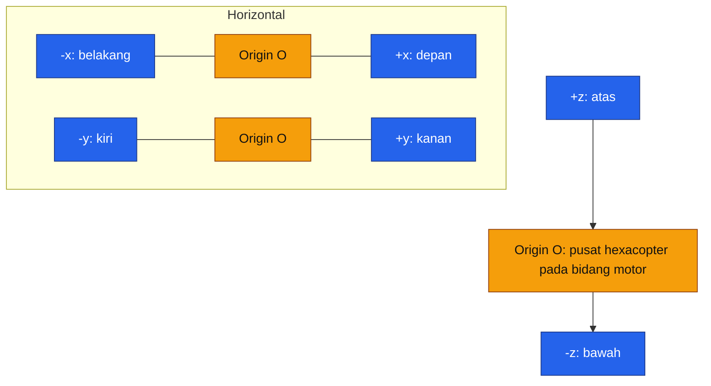

### 2.4.2 Persamaan CG

Untuk sumbu $x$:

$$
x_{\text{CG}}
=

\frac{\sum_{i=1}^{n}m_i x_i}
{\sum_{i=1}^{n}m_i}
$$

Untuk sumbu $y$:

$$
y_{\text{CG}}
=

\frac{\sum_{i=1}^{n}m_i y_i}
{\sum_{i=1}^{n}m_i}
$$

Untuk sumbu $z$:

$$
z_{\text{CG}}
=

\frac{\sum_{i=1}^{n}m_i z_i}
{\sum_{i=1}^{n}m_i}
$$

Secara vektor:

$$
\mathbf{r}_{\text{CG}}
=

\frac{
\sum_{i=1}^{n}
m_i\mathbf{r}_i
}{
\sum_{i=1}^{n}m_i
}
$$

### 2.4.3 Posisi komponen referensi

Tabel berikut merupakan posisi desain awal yang harus diterapkan pada drawing Bab 7.

| Komponen                   |                 Massa |    $x_i$ |   $y_i$ |    $z_i$ |
| -------------------------- | --------------------: | -------: | ------: | -------: |
| Frame                      |  $9.660\ \mathrm{kg}$ |  $0.000$ | $0.000$ | $-0.080$ |
| Tangki kosong              |  $1.620\ \mathrm{kg}$ |  $0.020$ | $0.000$ | $-0.300$ |
| Enam unit propulsi         |  $9.192\ \mathrm{kg}$ |  $0.000$ | $0.000$ |  $0.000$ |
| Flight controller assembly |  $0.300\ \mathrm{kg}$ |  $0.020$ | $0.000$ |  $0.020$ |
| Here4 assembly             |  $0.150\ \mathrm{kg}$ |  $0.000$ | $0.000$ |  $0.260$ |
| TF03 assembly              |  $0.150\ \mathrm{kg}$ |  $0.000$ | $0.000$ | $-0.460$ |
| Herelink Air Unit          |  $0.150\ \mathrm{kg}$ | $-0.030$ | $0.000$ |  $0.060$ |
| Pompa                      |  $0.698\ \mathrm{kg}$ |  $0.180$ | $0.000$ | $-0.360$ |
| Flowmeter                  |  $0.190\ \mathrm{kg}$ |  $0.100$ | $0.000$ | $-0.370$ |
| Boom dan nozzle            |  $1.200\ \mathrm{kg}$ |  $0.000$ | $0.000$ | $-0.420$ |
| Filter dan regulator       |  $0.650\ \mathrm{kg}$ |  $0.080$ | $0.000$ | $-0.350$ |
| Power distribution         |  $1.200\ \mathrm{kg}$ | $-0.020$ | $0.000$ | $-0.070$ |
| Wiring dan hardware        |  $1.300\ \mathrm{kg}$ |  $0.000$ | $0.000$ | $-0.050$ |
| Payload controller         |  $0.200\ \mathrm{kg}$ |  $0.030$ | $0.000$ | $-0.120$ |
| Baterai                    | $11.400\ \mathrm{kg}$ | $-0.090$ | $0.000$ | $-0.120$ |

Seluruh posisi dinyatakan dalam meter terhadap datum.

Jumlah momen untuk kondisi tanpa cairan:

$$
\sum m_ix_i
=

-0.81346\ \mathrm{kg,m}
$$

$$
\sum m_iz_i
=

-3.86788\ \mathrm{kg,m}
$$

Dalam model ideal, seluruh komponen dipasang simetris terhadap sumbu longitudinal sehingga:

$$
\sum m_iy_i
=

0
$$

Pada kendaraan aktual, nilai tersebut tidak boleh diasumsikan nol dan harus diukur.

### 2.4.4 Kondisi tangki kosong

Massa total:

$$
m_{\text{empty-tank}}
=

38.060\ \mathrm{kg}
$$

Posisi CG longitudinal:

$$
x_{\text{CG,empty}}
=

\frac{-0.81346}{38.060}
$$

$$
\boxed{
x_{\text{CG,empty}}
=

-0.0214\ \mathrm{m}
}
$$

Posisi CG vertikal:

$$
z_{\text{CG,empty}}
=

\frac{-3.86788}{38.060}
$$

$$
\boxed{
z_{\text{CG,empty}}
=

-0.1016\ \mathrm{m}
}
$$

CG berada sekitar 21,4 mm di belakang origin dan 101,6 mm di bawah bidang motor.

### 2.4.5 Kondisi tangki setengah

Untuk tangki setengah, diasumsikan:

$$
m_{\text{liquid,half}}
=

10.000\ \mathrm{kg}
$$

Pusat massa cairan setengah isi ditetapkan sementara pada:

$$
x_{\text{liquid,half}}
=

0
$$

$$
z_{\text{liquid,half}}
=

-0.390\ \mathrm{m}
$$

Massa total:

$$
m_{\text{half}}
=

38.060 + 10.000
=

48.060\ \mathrm{kg}
$$

CG longitudinal:

$$
x_{\text{CG,half}}
=

\frac{-0.81346}{48.060}
$$

$$
\boxed{
x_{\text{CG,half}}
=

-0.0169\ \mathrm{m}
}
$$

CG vertikal:

$$
z_{\text{CG,half}}
=

\frac{-3.86788 + 10(-0.390)}
{48.060}
$$

$$
\boxed{
z_{\text{CG,half}}
=

-0.1616\ \mathrm{m}
}
$$

### 2.4.6 Kondisi tangki penuh

Untuk tangki penuh:

$$
m_{\text{liquid,full}}
=

20.000\ \mathrm{kg}
$$

Pusat massa cairan penuh ditetapkan sementara pada:

$$
x_{\text{liquid,full}}
=

0
$$

$$
z_{\text{liquid,full}}
=

-0.310\ \mathrm{m}
$$

Massa total:

$$
m_{\text{full}}
=

38.060 + 20.000
=

58.060\ \mathrm{kg}
$$

CG longitudinal:

$$
x_{\text{CG,full}}
=

\frac{-0.81346}{58.060}
$$

$$
\boxed{
x_{\text{CG,full}}
=

-0.0140\ \mathrm{m}
}
$$

CG vertikal:

$$
z_{\text{CG,full}}
=

\frac{-3.86788 + 20(-0.310)}
{58.060}
$$

$$
\boxed{
z_{\text{CG,full}}
=

-0.1734\ \mathrm{m}
}
$$

### 2.4.7 Ringkasan perubahan CG

| Kondisi         |           Massa total |      $x_{\text{CG}}$ | $y_{\text{CG}}$ ideal |       $z_{\text{CG}}$ |
| --------------- | --------------------: | -------------------: | --------------------: | --------------------: |
| Tangki kosong   | $38.060\ \mathrm{kg}$ | $-21.4\ \mathrm{mm}$ |                   $0$ | $-101.6\ \mathrm{mm}$ |
| Tangki setengah | $48.060\ \mathrm{kg}$ | $-16.9\ \mathrm{mm}$ |                   $0$ | $-161.6\ \mathrm{mm}$ |
| Tangki penuh    | $58.060\ \mathrm{kg}$ | $-14.0\ \mathrm{mm}$ |                   $0$ | $-173.4\ \mathrm{mm}$ |

Hasil menunjukkan bahwa perubahan terbesar terjadi pada sumbu $z$. Ini wajar karena cairan berada di bawah bidang motor. CG yang lebih rendah dapat membantu stabilitas statis, tetapi juga meningkatkan momen akibat percepatan lateral dan sloshing.

### 2.4.8 CG design envelope

Artikel ini menetapkan internal CG envelope:

$$
\left|x_{\text{CG}}\right|
\le
0.030\ \mathrm{m}
$$

$$
\left|y_{\text{CG}}\right|
\le
0.030\ \mathrm{m}
$$

atau radial horizontal:

$$
r_{\text{CG}}
=

\sqrt{
x_{\text{CG}}^2
+
y_{\text{CG}}^2
}
$$

$$
\boxed{
r_{\text{CG}}
\le
0.030\ \mathrm{m}
}
$$

Envelope vertikal internal:

$$
-0.200\ \mathrm{m}
\le
z_{\text{CG}}
\le
-0.080\ \mathrm{m}
$$

Nilai tersebut adalah requirement internal `AGHEX-20-R1`, bukan batas universal multirotor.

### 2.4.9 Metode verifikasi fisik CG

Setelah kendaraan selesai dirakit, CG harus diverifikasi dengan salah satu metode berikut:

1. **Three-point scale method**
   Kendaraan diletakkan pada tiga load cell dengan posisi yang diketahui.

2. **Suspension method**
   Kendaraan digantung pada dua atau lebih titik berbeda, tanpa baterai terhubung dan tanpa propeller.

3. **CAD plus measured mass**
   Model CAD diperbarui menggunakan massa aktual dan posisi aktual setiap komponen.

Untuk kendaraan heavy-lift, three-point scale method lebih mudah dikontrol daripada menggantung seluruh kendaraan.

---

## 2.5 Pengaruh sloshing

Sloshing adalah gerakan permukaan bebas cairan akibat percepatan kendaraan. Pada drone sprayer, sloshing terjadi ketika kendaraan:

- Melakukan akselerasi.
- Menghentikan gerak maju.
- Berbelok pada ujung lintasan.
- Mengoreksi posisi akibat angin.
- Mengubah pitch atau roll.
- Mengalami landing impact.

Kondisi setengah penuh sering lebih kritis daripada penuh karena tersedia ruang lebih besar bagi permukaan cairan untuk bergerak. Studi analitis dan eksperimental NASA menunjukkan bahwa respons sloshing dipengaruhi oleh geometri tangki, fill level, amplitudo eksitasi, dan nonlinearitas. Model linier sederhana berguna untuk screening, tetapi harus dikonfirmasi melalui pengujian pada geometri aktual.

### 2.5.1 Pergeseran CG akibat sloshing

Jika massa cairan efektif yang bergerak adalah $m_s$ dan berpindah sejauh $\Delta x_s$, perubahan CG kendaraan secara sederhana dapat diperkirakan:

$$
\Delta x_{\text{CG}}
\approx
\frac{
m_s\Delta x_s
}{
m_{\text{total}}
}
$$

Sebagai contoh, pada kondisi tangki setengah:

- $m_{\text{total}}=48.06\ \mathrm{kg}$
- massa slosh efektif $m_s=8\ \mathrm{kg}$
- perpindahan efektif $\Delta x_s=0.12\ \mathrm{m}$

maka:

$$
\Delta x_{\text{CG}}
\approx
\frac{
8 \times 0.12
}{
48.06
}
$$

$$
\boxed{
\Delta x_{\text{CG}}
\approx
0.020\ \mathrm{m}
}
$$

Pergeseran sekitar 20 mm sudah menggunakan sebagian besar CG envelope horizontal 30 mm.

### 2.5.2 Momen gangguan

Untuk screening awal, momen roll atau pitch akibat massa cairan dapat diperkirakan:

$$
M_{\text{slosh}}
\approx
m_s a h
$$

dengan:

- $m_s$: massa cairan efektif yang bergerak
- $a$: percepatan lateral atau longitudinal
- $h$: jarak vertikal massa cairan terhadap CG kendaraan

Sebagai contoh:

- $m_s=8\ \mathrm{kg}$
- $a=2\ \mathrm{m/s^2}$
- $h=0.20\ \mathrm{m}$

maka:

$$
M_{\text{slosh}}
\approx
8 \times 2 \times 0.20
$$

$$
\boxed{
M_{\text{slosh}}
\approx
3.2\ \mathrm{N,m}
}
$$

Model ini belum memasukkan:

- Impact cairan ke dinding.
- Nonlinear free surface.
- Viskositas.
- Damping.
- Bentuk tangki.
- Lubang baffle.
- Coupling dengan mode frame.

### 2.5.3 Screening frekuensi slosh

Untuk tangki persegi panjang sederhana, first lateral slosh mode dapat diperkirakan dengan:

$$
k_1
=

\frac{\pi}{L}
$$

$$
\omega_1
=

\sqrt{
gk_1
\tanh
\left(
k_1h_l
\right)
}
$$

$$
f_1
=

\frac{\omega_1}{2\pi}
$$

dengan:

- $L$: panjang internal tangki pada arah eksitasi
- $h_l$: kedalaman cairan
- $g$: percepatan gravitasi
- $k_1$: wave number mode pertama

Sebagai screening, gunakan:

$$
L=0.45\ \mathrm{m}
$$

$$
h_l=0.20\ \mathrm{m}
$$

Maka:

$$
k_1
=

\frac{\pi}{0.45}
\approx
6.98\ \mathrm{m^{-1}}
$$

$$
\omega_1
\approx
7.78\ \mathrm{rad/s}
$$

$$
\boxed{
f_1
\approx
1.24\ \mathrm{Hz}
}
$$

Frekuensi tersebut berpotensi berinteraksi dengan respons attitude dan manuver ujung lintasan. Karena tangki aktual tidak berbentuk balok ideal dan menggunakan baffle, angka ini hanya digunakan untuk menentukan rentang frekuensi pengujian slosh.

### 2.5.4 Desain baffle

Tangki baseline harus dimodifikasi menggunakan cross-baffle yang membatasi gerakan cairan pada sumbu longitudinal dan lateral.

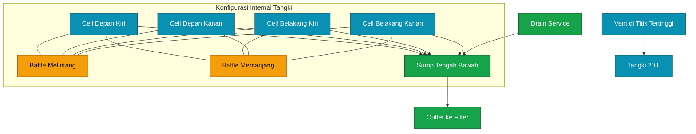

Persyaratan baffle internal:

- Membagi tangki setidaknya menjadi empat cell efektif.
- Menahan gerak cairan pada arah pitch dan roll.
- Memiliki bukaan bawah untuk equalization.
- Memiliki jalur udara agar tidak terjadi air lock.
- Tidak membentuk ruang mati yang sulit dibersihkan.
- Tidak menghalangi drain dan outlet.
- Tahan terhadap bahan kimia yang digunakan.
- Dapat diinspeksi atau dibersihkan.

Tidak ada persentase luas lubang baffle yang dianggap universal. Ukuran bukaan harus ditentukan melalui:

- Fill test.
- Drain test.
- Slosh bench test.
- Pump starvation test.
- Cleaning test.

Target internalnya adalah membatasi perjalanan free surface efektif menjadi:

$$
\Delta x_{\text{free-surface}}
\le
\frac{L_{\text{tank}}}{4}
$$

### 2.5.5 Bentuk tangki

Bentuk tangki yang disukai memiliki:

- Simetri terhadap sumbu $x$ dan $y$.
- Bagian bawah mengarah ke central sump.
- Tidak memiliki pocket lateral.
- Sudut internal yang dapat dikeringkan.
- Luas permukaan bebas yang tidak terlalu lebar pada volume menengah.
- Struktur yang tidak berubah bentuk saat diikat.

Tangki yang sangat lebar tetapi dangkal meningkatkan perjalanan lateral permukaan bebas. Tangki tinggi dan sempit mengurangi luas permukaan bebas, tetapi dapat meningkatkan posisi CG. Pemilihan akhir merupakan kompromi antara:

- Sloshing.
- CG vertikal.
- Ground clearance.
- Kemudahan isi.
- Kemudahan pembersihan.
- Ruang baterai.

### 2.5.6 Lokasi outlet

Outlet ditempatkan:

- Di central sump.
- Sedekat mungkin dengan sumbu $x=0$ dan $y=0$.
- Pada titik terendah tangki.
- Dengan shutoff valve sebelum filter.
- Dengan jalur selang yang tidak membentuk air pocket.

Outlet yang berada di sisi kiri atau kanan dapat menyebabkan:

- Cairan tersisa di satu sisi.
- Pump starvation saat roll.
- Perubahan CG yang tidak simetris.
- Pembacaan flowmeter tidak stabil karena udara.

### 2.5.7 Tank restraint

Tangki wajib memiliki:

1. **Primary restraint**
   Bracket kaku yang menahan beban normal.

2. **Secondary restraint**
   Strap atau pengunci independen yang tetap menahan tangki jika primary latch gagal.

3. **Positive locking**
   Pengunci tidak boleh hanya mengandalkan friction fit.

4. **Elastomer interface**
   Pad digunakan untuk mencegah abrasion, tetapi tidak boleh memungkinkan tangki bergerak bebas.

Massa assembly tangki penuh:

$$
m_{\text{tank,full}}
=

1.62 + 20
=

21.62\ \mathrm{kg}
$$

Untuk baseline internal, digunakan preliminary load case:

- $3g$ vertikal.
- $2g$ longitudinal.
- $2g$ lateral.

Beban limit vertikal:

$$
F_{z,\text{limit}}
=

3m_{\text{tank,full}}g
$$

$$
F_{z,\text{limit}}
=

3 \times 21.62 \times 9.80665
$$

$$
\boxed{
F_{z,\text{limit}}
\approx
636\ \mathrm{N}
}
$$

Beban limit longitudinal atau lateral:

$$
F_{xy,\text{limit}}
=

2m_{\text{tank,full}}g
$$

$$
\boxed{
F_{xy,\text{limit}}
\approx
424\ \mathrm{N}
}
$$

Dengan safety factor internal $1.5$:

$$
F_{z,\text{ultimate}}
=

1.5 \times 636
\approx
954\ \mathrm{N}
$$

$$
F_{xy,\text{ultimate}}
=

1.5 \times 424
\approx
636\ \mathrm{N}
$$

Load factor dan safety factor tersebut merupakan target internal desain, bukan pengganti standar struktur atau ketentuan regulator.

### 2.5.8 Pengujian slosh

Sebelum terbang, tangki harus diuji pada volume:

- 20%.
- 40%.
- 50%.
- 60%.
- 80%.
- 100%.

Setiap kondisi diuji menggunakan:

- Impulse longitudinal.
- Impulse lateral.
- Simulasi braking.
- Simulasi turn reversal.
- Vibrasi pompa.
- Tilt statis.

Parameter yang direkam:

- Perpindahan tangki.
- Gaya restraint.
- Amplitudo cairan.
- Waktu redam.
- Pump starvation.
- Gelembung pada flowmeter.
- Pergeseran CG.
- Kebocoran.
- Deformasi bracket.

NASA menunjukkan bahwa model slosh sederhana dapat kehilangan akurasi ketika perpindahan cairan menjadi besar dan respons nonlinear mulai dominan. Karena itu, data bench test aktual lebih penting daripada mengandalkan satu formula frekuensi.

---

## 2.6 Design decisions yang dikunci

Hasil utama Bab 2 adalah:

| Parameter                |                  Nilai yang dikunci |
| ------------------------ | ----------------------------------: |
| Frame                    |                            EFT G620 |
| Wheelbase                |                 $2028\ \mathrm{mm}$ |
| Tangki                   |                    $20\ \mathrm{L}$ |
| Propulsi                 |                6 × Hobbywing X9 G2L |
| Propeller                |                         MFP 36 × 11 |
| Baterai                  |                 Tattu 4.0 14S 30 Ah |
| Payload maksimum         |               $20.000\ \mathrm{kg}$ |
| Massa kosong prediksi    |               $26.660\ \mathrm{kg}$ |
| Massa operasional kosong |               $38.060\ \mathrm{kg}$ |
| Predicted MTOW           |               $58.060\ \mathrm{kg}$ |
| Massa sizing             |               $59.963\ \mathrm{kg}$ |
| Beban sizing per rotor   |                $9.994\ \mathrm{kg}$ |
| CG kosong                | $(-21.4,\ 0,\ -101.6)\ \mathrm{mm}$ |
| CG setengah              | $(-16.9,\ 0,\ -161.6)\ \mathrm{mm}$ |
| CG penuh                 | $(-14.0,\ 0,\ -173.4)\ \mathrm{mm}$ |
| Pompa                    |                  Hobbywing Pump 8 L |
| Flowmeter                |                         Aichi VN10S |
| Nozzle                   |                      4 × XR11002-VS |
| Debit nominal teoritis   |              $3.03\ \mathrm{L/min}$ |
| Application rate nominal |               $20.2\ \mathrm{L/ha}$ |

---

## Requirement update

| ID         | Requirement                  | Hasil Bab 2                        | Status           |
| ---------- | ---------------------------- | ---------------------------------- | ---------------- |
| `SYS-001`  | Hexacopter sprayer           | EFT G620                           | Allocated        |
| `SYS-002`  | Tangki $20\ \mathrm{L}$      | EFT 20 L tank                      | Allocated        |
| `SYS-003`  | Payload $20\ \mathrm{kg}$    | MTOW prediksi $58.06\ \mathrm{kg}$ | Calculated       |
| `PWR-001`  | Waktu terbang $\ge 10$ menit | Baterai 1596 Wh dipilih            | Open             |
| `PROP-001` | Propulsi mendukung MTOW      | $9.994\ \mathrm{kg/rotor}$         | Preliminary pass |
| `NAV-001`  | Navigasi presisi             | Here4 RTK                          | Allocated        |
| `NAV-002`  | Terrain following            | TF03                               | Allocated        |
| `SPR-001`  | $20\ \mathrm{L/ha}$          | Teoritis $20.2\ \mathrm{L/ha}$     | Preliminary pass |
| `SPR-003`  | Variable flow                | STM32 controller + VN10S           | Allocated        |
| `SAF-002`  | Overpayload prevention       | Mass budget dan fill limit         | Defined          |

---

## Referensi bab

1. EFT — spesifikasi resmi G620, termasuk wheelbase, massa frame, massa tangki, arm, dan rekomendasi propulsi. ([Effort Tech][2])
2. Hobbywing — spesifikasi X9 G2L, massa, thrust, rentang beban, tegangan, dan propeller. ([HOBBYWING][3])
3. Tattu — spesifikasi baterai 4.0 30000 mAh 14S, energi, massa, dan batas arus. ([Genstattu][4])
4. CubePilot — spesifikasi Cube Orange+, Here4, dan Herelink 1.1. ([docs.cubepilot.org][5])
5. Benewake — spesifikasi TF03 IP67 CAN/UART. ([Benewake][6])
6. Hobbywing — spesifikasi Pump 8 L. ([HOBBYWING][7])
7. Aichi Tokei Denki — spesifikasi dan application note VN10S. ([Aichitokei][8])
8. TeeJet — nozzle untuk drone dan informasi debit nozzle. ([TeeJet][9])
9. NASA Technical Reports Server — model, nonlinearitas, dan pengujian sloshing.

---

[**Kembali ke Atas**](#merancang-drone-pertanian-kapasitas-20-kg)

[1]: https://docs.cubepilot.org/user-guides/herelink/herelink-overview 'Herelink Overview | CubePilot'
[2]: https://www.effort-tech.com/enm/gxs 'EFT G420 G620 G630 Specifications | EFT'
[3]: https://www.hobbywing.com/en/products/x9-g2l 'X9 G2L - Next-Gen Agriculture Drone Motor'
[4]: https://genstattu.com/tattu-4-0-30000mah-53-2v-14s1p-35c-lipo-smart-battery-pack-with-molex-plug/?srsltid=AfmBOorxSlMWrlE4xKdndL4SZWU_ps3ePj3vENfhDC7qOd4n_S6-SS8j&utm_source=chatgpt.com 'Tattu 4.0 30000mAh 53.2V 35C 14S1P Lipo Smart Battery ...'
[5]: https://docs.cubepilot.org/user-guides/autopilot/the-cube/introduction/flight-management-unit-fmu?utm_source=chatgpt.com 'Flight Management Unit (FMU)'
[6]: https://en.benewake.com/TF03/index.html?utm_source=chatgpt.com 'TF03 IP67 Long Range LiDAR Sensor'
[7]: https://www.hobbywing.com/products/xrotor-8l?utm_source=chatgpt.com 'PUMP 8L'
[8]: https://www.aichitokei.net/products/flowsensor/vn/?utm_source=chatgpt.com 'Small Electromagnetic Flow Sensor ATZTA VN'
[9]: https://www.teejet.com/-/media/dam/agricultural/usa/sales-material/product-market-bulletin/li-tj445_drone_bulletin.pdf?utm_source=chatgpt.com 'Spray Products for Drone Applications'

---

# 3. Geometri Frame dan Sizing Propulsi

Bab ini memverifikasi apakah geometri frame, struktur, motor, ESC, dan propeller yang dibekukan pada `DF-01` mampu mendukung massa desain `AGHEX-20-R1`.

Parameter masukan dari Bab 2 adalah:

| Parameter                 |                 Simbol |                 Nilai |
| ------------------------- | ---------------------: | --------------------: |
| Predicted MTOW            | $m_{\text{MTOW,pred}}$ | $58.060\ \mathrm{kg}$ |
| Massa sizing              |    $m_{\text{design}}$ | $59.963\ \mathrm{kg}$ |
| Jumlah rotor              |                    $N$ |                   $6$ |
| Wheelbase nominal         |  $D_{\text{opposite}}$ |   $2028\ \mathrm{mm}$ |
| Diameter arm              |       $D_{\text{arm}}$ |     $40\ \mathrm{mm}$ |
| Propeller baseline        |                      — |           MFP 36 × 11 |
| Diameter propeller        | $D_{\text{propeller}}$ |  $914.4\ \mathrm{mm}$ |
| Propulsi                  |                      — |      Hobbywing X9 G2L |
| Baterai                   |                      — |   $14\mathrm{S}$ LiPo |
| Tegangan nominal propulsi |       $V_{\text{nom}}$ |      $54\ \mathrm{V}$ |

Hobbywing menyatakan X9 G2L kompatibel dengan baterai $12\mathrm{S}$–$14\mathrm{S}$, arm berdiameter $40\ \mathrm{mm}$, propeller MFP 36 × 11, maximum thrust $24\ \mathrm{kgf}$ per rotor, dan recommended takeoff weight $7$–$12\ \mathrm{kg}$ per rotor pada permukaan laut. Sistem ini menggunakan motor $110\ \mathrm{KV}$ dan ESC terintegrasi.

> **Temuan design review:** katalog EFT memasangkan G620 dengan sistem X9 34 inci, sedangkan konfigurasi `DF-01` menggunakan X9 G2L dengan propeller 36 inci. Oleh karena itu, kompatibilitas geometris G620 dan MFP 36 × 11 belum boleh dianggap final hanya berdasarkan wheelbase. Design freeze untuk interface frame–propeller diberi status **conditional hold** sampai koordinat setiap motor dan clearance dinamis diverifikasi. ([Effort Tech][1])

---

## 3.1 Geometri hexacopter

### 3.1.1 Geometri hexacopter reguler

Pada hexacopter reguler, keenam motor berada pada lingkaran dengan radius $R$ dan dipisahkan oleh sudut:

$$
\Delta\theta
=

60^\circ
$$

Jarak antara dua motor yang saling berseberangan adalah:

$$
D_{\text{opposite}}
=

2R
$$

Sehingga:

$$
R
=

\frac{D_{\text{opposite}}}{2}
$$

Jarak antara dua motor bersebelahan merupakan panjang chord:

$$
d_{\text{adjacent}}
=

2R
\sin
\left(
\frac{60^\circ}{2}
\right)
$$

Karena:

$$
\sin 30^\circ
=

\frac{1}{2}
$$

maka:

$$
d_{\text{adjacent}}
=

R
$$

atau:

$$
\boxed{
d_{\text{adjacent}}
=

\frac{D_{\text{opposite}}}{2}
}
$$

Untuk wheelbase:

$$
D_{\text{opposite}}
=

2028\ \mathrm{mm}
$$

diperoleh:

$$
d_{\text{adjacent}}
=

\frac{2028}{2}
$$

$$
\boxed{
d_{\text{adjacent}}
=

1014\ \mathrm{mm}
}
$$

### 3.1.2 Koordinat motor ideal

Koordinat setiap motor pada hexacopter reguler dapat ditentukan dengan:

$$
\theta_i
=

\theta_0
+
i\frac{\pi}{3}
$$

$$
x_i
=

R\cos\theta_i
$$

$$
y_i
=

R\sin\theta_i
$$

dengan:

- $i=0,1,2,3,4,5$
- $\theta_0$: orientasi frame terhadap sumbu depan
- $R$: jarak pusat frame ke pusat motor

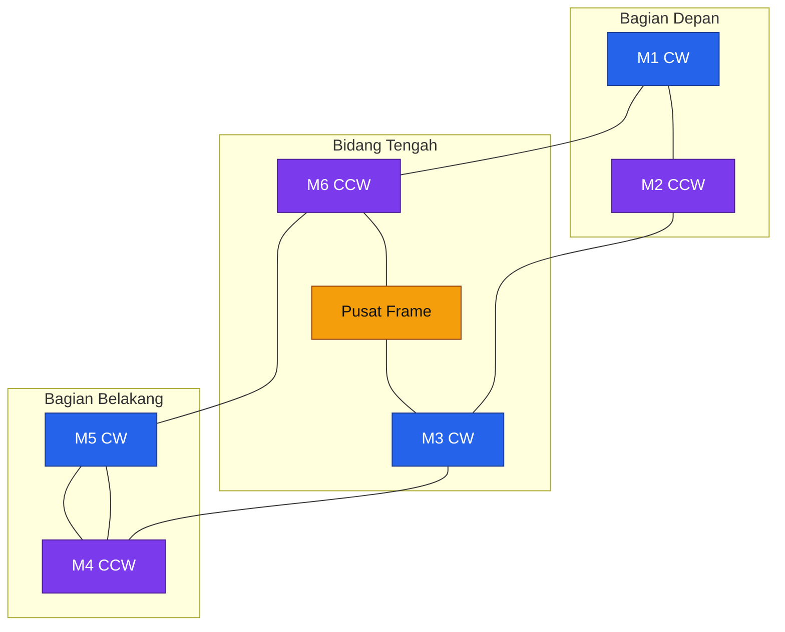

Urutan CW dan CCW pada diagram masih merupakan representasi konseptual. Nomor dan arah motor final harus mengikuti mixer ArduPilot yang dikunci pada Bab 8.

### 3.1.3 Geometri frame aktual

Rumus:

$$
d_{\text{adjacent}}
=

\frac{D_{\text{opposite}}}{2}
$$

hanya valid bila posisi motor membentuk segienam reguler.

Frame pertanian folding dapat memiliki:

- Sudut arm tidak tepat $60^\circ$.
- Panjang arm depan dan belakang berbeda.
- Offset folding joint.
- Posisi motor yang tidak berada pada satu lingkaran ideal.
- Toleransi joint dan clamp.

Karena itu, koordinat aktual setiap motor harus diukur atau diambil dari drawing CAD.

Jarak dua motor aktual dihitung dengan:

$$
d_{ij}
=

\sqrt{
\left(
x_i-x_j
\right)^2
+
\left(
y_i-y_j
\right)^2
}
$$

Jarak minimum antarmotor adalah:

$$
d_{\text{motor,min}}
=

\min
\left(
d_{ij}
\right)
$$

untuk semua pasangan rotor yang bersebelahan.

### 3.1.4 Dimensional inspection

Sebelum propeller dipasang, ukur:

| Parameter                   | Metode                                       |
| --------------------------- | -------------------------------------------- |
| Koordinat pusat motor       | Laser tracker, jig, atau pengukuran diagonal |
| Jarak setiap pasangan motor | Meteran presisi atau jig                     |
| Jarak motor berseberangan   | Pengukuran center-to-center                  |
| Ketinggian motor            | Height gauge                                 |
| Sudut arm                   | Digital angle gauge                          |
| Kesamaan bidang motor       | Straight edge dan feeler gauge               |
| Play folding joint          | Dial indicator                               |
| Runout motor mount          | Dial indicator                               |

Hasil pengukuran harus disimpan dalam drawing `AGHEX-MECH-001`.

### 3.1.5 Toleransi geometris internal

Target internal konfigurasi `AGHEX-20-R1`:

| Parameter                             |             Batas awal |
| ------------------------------------- | ---------------------: |
| Selisih jarak pasangan motor simetris |   $\le 3\ \mathrm{mm}$ |
| Perbedaan tinggi bidang motor         |   $\le 2\ \mathrm{mm}$ |
| Kesalahan sudut arm                   |        $\le 0.5^\circ$ |
| Play radial folding joint             | $\le 0.5\ \mathrm{mm}$ |
| Play angular folding joint            |       $\le 0.25^\circ$ |

Nilai tersebut merupakan batas engineering internal, bukan spesifikasi resmi EFT. Batas akhir harus dikonfirmasi melalui pengukuran unit aktual dan pengujian getaran.

---

## 3.2 Clearance propeller

### 3.2.1 Diameter propeller

Propeller MFP 36 × 11 mempunyai diameter nominal:

$$
D_{\text{propeller}}
=

36\ \mathrm{inch}
$$

Konversi ke milimeter:

$$
D_{\text{propeller}}
=

36
\times
25.4
$$

$$
\boxed{
D_{\text{propeller}}
=

914.4\ \mathrm{mm}
}
$$

Hobbywing mencantumkan rentang RPM yang direkomendasikan sebesar $1600$–$3100\ \mathrm{RPM}$, recommended thrust $4$–$14.5\ \mathrm{kgf}$, maximum RPM $4150\ \mathrm{RPM}$, dan maximum thrust propeller $25\ \mathrm{kgf}$. Untuk sistem X9 G2L, maximum thrust sistem tetap dibatasi pada $24\ \mathrm{kgf}$. ([HOBBYWING][2])

### 3.2.2 Clearance statis ideal

Untuk dua propeller dengan diameter sama:

$$
c_{\text{static}}
=

d_{\text{adjacent}}
-

D_{\text{propeller}}
$$

Menggunakan geometri hexacopter reguler:

$$
c_{\text{static}}
=

1014
-

914.4
$$

$$
\boxed{
c_{\text{static}}
=

99.6\ \mathrm{mm}
}
$$

Nilai $99.6\ \mathrm{mm}$ hanya merupakan clearance ideal berdasarkan asumsi segienam reguler.

### 3.2.3 Perbandingan propeller 34 dan 36 inci

Diameter propeller 34 inci:

$$
D_{34}
=

34
\times
25.4
=

863.6\ \mathrm{mm}
$$

Clearance ideal dengan propeller 34 inci:

$$
c_{34}
=

1014
-

863.6
$$

$$
\boxed{
c_{34}
=

150.4\ \mathrm{mm}
}
$$

Perubahan dari 34 menjadi 36 inci mengurangi clearance sebesar:

$$
\Delta c
=

150.4
-

99.6
$$

$$
\boxed{
\Delta c
=

50.8\ \mathrm{mm}
}
$$

Katalog EFT secara eksplisit mencantumkan G620 dengan X9 34 inci. Oleh sebab itu, tambahan diameter 2 inci pada setiap propeller harus diverifikasi terhadap geometri frame aktual, bukan hanya menggunakan persamaan ideal. ([Effort Tech][1])

### 3.2.4 Clearance operasional

Propeller dan arm mengalami defleksi saat menghasilkan thrust. Clearance operasional harus memperhitungkan:

- Defleksi radial propeller.
- Defleksi arm.
- Play folding joint.
- Toleransi pemasangan.
- Ketidaksejajaran motor.
- Deformasi akibat temperatur.
- Getaran dinamis.

Untuk dua rotor $i$ dan $j$:

$$
c_{\text{oper},ij}
=

d_{ij}
-

\left(
R_i+R_j
\right)
-

\delta_{\text{prop},i}
-

\delta_{\text{prop},j}
-

\delta_{\text{frame},ij}
-

\delta_{\text{joint},ij}
-

t_{\text{assembly}}
$$

Untuk propeller dengan ukuran sama:

$$
R_i
=

R_j
=

\frac{D_{\text{propeller}}}{2}
$$

Clearance minimum operasional:

$$
c_{\text{oper,min}}
=

\min
\left(
c_{\text{oper},ij}
\right)
$$

### 3.2.5 Batas clearance internal

Batas awal `AGHEX-20-R1`:

$$
c_{\text{static,min}}
\ge
50\ \mathrm{mm}
$$

dan:

$$
c_{\text{oper,min}}
\ge
25\ \mathrm{mm}
$$

Nilai tersebut merupakan margin internal. Clearance operasional harus tetap positif pada:

- Thrust maksimum yang diuji.
- Manuver roll dan pitch.
- Folding joint dengan toleransi terburuk.
- Temperatur operasi maksimum.
- Kondisi propeller baru dan setelah siklus penggunaan.

### 3.2.6 Rotor sweep envelope

Setiap motor harus memiliki rotor sweep envelope:

$$
R_{\text{sweep}}
=

\frac{D_{\text{propeller}}}{2}
+
c_{\text{component}}
$$

Untuk internal inspection digunakan:

$$
c_{\text{component}}
=

25\ \mathrm{mm}
$$

Sehingga:

$$
R_{\text{sweep}}
=

457.2
+
25
$$

$$
\boxed{
R_{\text{sweep}}
=

482.2\ \mathrm{mm}
}
$$

Tidak boleh ada komponen berikut yang masuk ke envelope tersebut:

- Selang.
- Kabel.
- Boom semprot.
- Landing gear.
- Antena.
- Tangki.
- Battery restraint.
- Handle.
- Fastener yang menonjol.

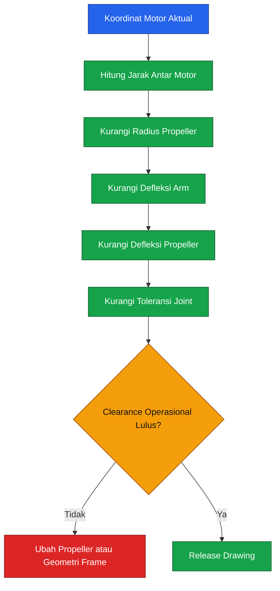

### 3.2.7 Keputusan release

Kombinasi G620 dan MFP 36 × 11 hanya boleh dirilis bila:

1. Koordinat motor aktual tersedia.
2. Semua $d_{ij}$ telah diukur.
3. $c_{\text{static,min}}$ memenuhi batas.
4. Defleksi arm dan propeller telah diuji.
5. Tidak ada komponen memasuki rotor sweep envelope.
6. Folding joint tetap terkunci saat load test.

Jika salah satu syarat gagal, tindakan yang diterima adalah:

- Kembali ke propeller 34 inci dengan sistem propulsi yang kompatibel.
- Menggunakan frame yang secara eksplisit divalidasi untuk 36 inci.
- Mengubah panjang atau sudut arm melalui drawing dan structural requalification.

Memotong propeller, menambah spacer tidak tervalidasi, atau mengubah clamp tanpa analisis tidak diperbolehkan.

---

## 3.3 Desain struktur

Struktur drone meneruskan gaya dari rotor menuju center plate, tangki, baterai, dan landing gear.

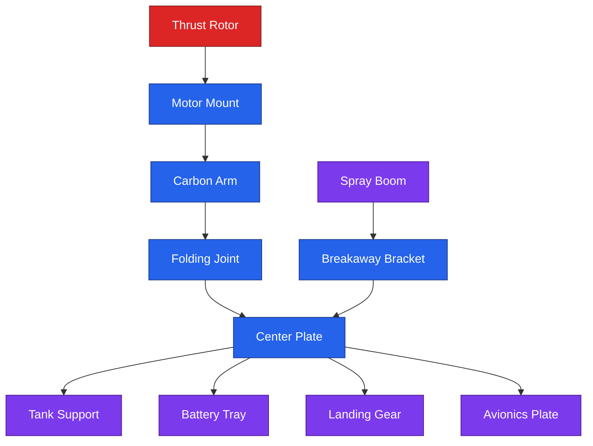

### 3.3.1 Arm

G620 menggunakan arm nominal $40\ \mathrm{mm}$, sedangkan X9 G2L dirancang untuk tube diameter luar $40\ \mathrm{mm}$. ([Effort Tech][1])

Untuk tube lingkaran berongga:

$$
I
=

\frac{\pi}{64}
\left(
D_o^4-D_i^4
\right)
$$

dengan:

- $D_o$: diameter luar
- $D_i$: diameter dalam
- $I$: second moment of area

Polar moment:

$$
J
=

\frac{\pi}{32}
\left(
D_o^4-D_i^4
\right)
$$

Untuk model cantilever sederhana, bending moment pada root:

$$
M_{\text{root}}
=

F_{\text{rotor}}L_{\text{eff}}
$$

Bending stress screening:

$$
\sigma_{\text{b}}
=

\frac{
M_{\text{root}}c
}{
I
}
$$

dengan:

$$
c
=

\frac{D_o}{2}
$$

Defleksi ujung:

$$
\delta_{\text{arm}}
=

\frac{
F_{\text{rotor}}L_{\text{eff}}^3
}{
3EI
}
$$

Persamaan tersebut hanya cocok untuk screening awal. Arm aktual memiliki:

- Clamp.
- Folding joint.
- Lubang atau insert.
- Orientasi serat.
- Ketebalan laminate.
- Stiffness anisotropik.

Karena itu, data berikut wajib diperoleh:

| Data                         | Status                        |
| ---------------------------- | ----------------------------- |
| Diameter luar                | Diketahui, $40\ \mathrm{mm}$  |
| Diameter dalam               | Harus diukur                  |
| Ketebalan tube               | Harus diukur                  |
| Material dan layup           | Harus diperoleh dari supplier |
| Modulus longitudinal         | Harus diperoleh               |
| Allowable bending            | Harus diperoleh atau diuji    |
| Allowable bearing pada clamp | Harus diuji                   |
| Effective arm length         | Harus diukur                  |

### 3.3.2 Center plate

Center plate harus:

- Menerima beban enam arm.
- Menyebarkan beban tangki.
- Menahan baterai.
- Menyediakan mounting avionik.
- Tidak mengalami local buckling.
- Menjaga arm tetap pada sudut yang benar.

Lubang baru tidak boleh dibuat tanpa memperhatikan load path. Lubang di dekat:

- Clamp arm.
- Folding joint.
- Tank support.
- Battery support.

dapat meningkatkan konsentrasi tegangan.

Untuk fastener yang menahan dua pelat, konfigurasi double shear lebih disukai daripada single shear bila geometri memungkinkan.

### 3.3.3 Motor mount

X9 G2L merupakan integrated propulsion unit yang menggunakan clamp pada tube $40\ \mathrm{mm}$. Motor mount harus:

- Duduk penuh pada arm.
- Tidak menekan tube hingga oval.
- Tidak bergeser saat thrust test.
- Tidak memiliki kontaminasi oli atau bahan kimia.
- Menggunakan torque sesuai manual pabrikan.
- Memiliki torque witness mark.

Ketidaksejajaran motor sebesar sudut $\alpha$ menghasilkan komponen thrust lateral:

$$
T_{\text{lateral}}
=

T\sin\alpha
$$

Untuk sudut kecil:

$$
T_{\text{lateral}}
\approx
T\alpha
$$

dengan $\alpha$ dalam radian.

Karena itu, motor plane tidak boleh disejajarkan hanya secara visual.

### 3.3.4 Landing gear

Landing gear membawa:

- Beban statis kendaraan.
- Impact landing.
- Beban lateral.
- Beban akibat permukaan tidak rata.
- Reaksi saat pompa atau tangki bergerak.

Landing gear yang terlalu fleksibel dapat berinteraksi dengan attitude controller dan menyebabkan ground oscillation ketika kendaraan berada di tanah atau mendekati takeoff. Dokumentasi ArduPilot mengidentifikasi interaksi antara controller, frame fleksibel, dan landing gear sebagai salah satu penyebab ground resonance. ([ArduPilot.org][3])

Persyaratan landing gear:

- Titik kontak cukup lebar.
- Tidak masuk rotor sweep envelope.
- Tidak menyentuh boom.
- Tidak menutup pandangan rangefinder.
- Dapat menahan landing load case.
- Memiliki skid atau foot yang tidak mudah tenggelam di tanah lunak.

### 3.3.5 Tangki dan tank support

Tank support harus mempertahankan:

- Posisi CG.
- Posisi outlet.
- Clearance terhadap battery tray.
- Clearance terhadap landing gear.
- Akses pengisian dan drain.

Tangki penuh memiliki massa assembly sekitar:

$$
m_{\text{tank,full}}
=

21.62\ \mathrm{kg}
$$

sehingga primary dan secondary restraint wajib tersedia sebagaimana dibahas pada Bab 2.

### 3.3.6 Battery tray

Battery tray membawa baterai $14\mathrm{S}$ dengan massa sekitar $11.4\ \mathrm{kg}$ pada baseline Bab 2.

Tray harus memiliki:

- Primary restraint.
- Secondary restraint.
- Stopper longitudinal.
- Stopper lateral.
- Insulator.
- Drain path.
- Ventilasi.
- Akses emergency disconnect.

Baterai tidak boleh hanya ditahan oleh satu hook-and-loop strap.

### 3.3.7 Folding joint

Folding joint merupakan area kritis karena menerima:

- Bending.
- Torsion.
- Bearing load.
- Fretting.
- Siklus buka–tutup.
- Getaran.

Persyaratan:

- Positive lock.
- Secondary retention.
- Tidak bergantung pada friction saja.
- Pin tidak bekerja sebagai cantilever panjang.
- Tidak ada play progresif.
- Dapat diinspeksi tanpa membongkar seluruh frame.

### 3.3.8 Spray boom

Spray boom bukan anggota struktur utama.

Boom sebaiknya menggunakan:

- Breakaway mount.
- Secondary tether.
- Quick disconnect hose.
- Posisi simetris.
- Massa kiri–kanan seimbang.
- Routing selang yang tidak mendekati rotor.

Jika boom tersangkut tanaman, bracket harus gagal secara terkendali sebelum center plate atau arm mengalami kerusakan.

---

## 3.4 Analisis beban

### 3.4.1 Berat desain

Berat kendaraan:

$$
W
=

m_{\text{design}}g
$$

Dengan:

$$
m_{\text{design}}
=

59.963\ \mathrm{kg}
$$

dan:

$$
g
=

9.80665\ \mathrm{m/s^2}
$$

diperoleh:

$$
W
=

59.963
\times
9.80665
$$

$$
\boxed{
W
=

588.04\ \mathrm{N}
}
$$

### 3.4.2 Load case

Load case awal:

| ID           | Kondisi                     |         Load factor |
| ------------ | --------------------------- | ------------------: |
| `LC-HOV`     | Hover simetris              |               $1.0$ |
| `LC-MAN`     | Manuver vertikal simetris   |               $1.5$ |
| `LC-ULT`     | Ultimate structural check   | $1.5 \times LC-MAN$ |
| `LC-LDG`     | Landing limit               |               $2.5$ |
| `LC-LDG-ULT` | Landing ultimate            | $1.5 \times LC-LDG$ |
| `LC-MO`      | Satu motor gagal            |           Asimetris |
| `LC-SLSH`    | Tangki setengah dan manuver |             Dinamis |

Load factor di atas merupakan baseline engineering internal, bukan pengganti standar sertifikasi.

### 3.4.3 Beban hover

Total thrust saat hover:

$$
T_{\text{hover,total}}
=

W
$$

Per rotor:

$$
T_{\text{hover,motor}}
=

\frac{W}{6}
$$

$$
T_{\text{hover,motor}}
=

\frac{588.04}{6}
$$

$$
\boxed{
T_{\text{hover,motor}}
=

98.01\ \mathrm{N}
}
$$

Dalam satuan praktis:

$$
\boxed{
T_{\text{hover,motor}}
=

9.994\ \mathrm{kgf}
}
$$

### 3.4.4 Beban manuver

Dengan limit load factor:

$$
n_{\text{man}}
=

1.5
$$

total thrust:

$$
T_{\text{man,total}}
=

n_{\text{man}}W
$$

$$
T_{\text{man,total}}
=

1.5
\times
588.04
$$

$$
\boxed{
T_{\text{man,total}}
=

882.05\ \mathrm{N}
}
$$

Per rotor:

$$
T_{\text{man,motor}}
=

\frac{882.05}{6}
$$

$$
\boxed{
T_{\text{man,motor}}
=

147.01\ \mathrm{N}
}
$$

atau:

$$
\boxed{
T_{\text{man,motor}}
=

14.991\ \mathrm{kgf}
}
$$

### 3.4.5 Ultimate structural load

Dengan ultimate safety factor:

$$
SF_{\text{ult}}
=

1.5
$$

maka:

$$
T_{\text{ult,motor}}
=

SF_{\text{ult}}
T_{\text{man,motor}}
$$

$$
T_{\text{ult,motor}}
=

1.5
\times
147.01
$$

$$
\boxed{
T_{\text{ult,motor}}
=

220.51\ \mathrm{N}
}
$$

atau:

$$
\boxed{
T_{\text{ult,motor}}
=

22.49\ \mathrm{kgf}
}
$$

Nilai ini mendekati maximum thrust X9 G2L sebesar $24\ \mathrm{kgf}$, sehingga structural proof test tidak boleh dilakukan menggunakan propulsion system sebagai actuator tanpa fixture, instrumentation, dan exclusion zone.

### 3.4.6 Landing load

Landing limit:

$$
F_{\text{landing,limit}}
=

2.5W
$$

$$
F_{\text{landing,limit}}
=

2.5
\times
588.04
$$

$$
\boxed{
F_{\text{landing,limit}}
=

1470.09\ \mathrm{N}
}
$$

Landing ultimate:

$$
F_{\text{landing,ult}}
=

1.5
F_{\text{landing,limit}}
$$

$$
\boxed{
F_{\text{landing,ult}}
=

2205.14\ \mathrm{N}
}
$$

Pembagian beban ke setiap kaki tidak boleh diasumsikan selalu sama. Pengujian harus mencakup:

- Semua kaki menyentuh.
- Satu skid menyentuh lebih dahulu.
- Satu sudut menyentuh lebih dahulu.
- Permukaan miring.
- Beban lateral.

### 3.4.7 Defleksi dan clearance

Defleksi arm yang diizinkan diturunkan dari clearance propeller:

$$
2\delta_{\text{arm}}
+
2\delta_{\text{prop}}
+
\delta_{\text{joint}}
+
t_{\text{assembly}}
\le
c_{\text{static,min}}
-

c_{\text{oper,min}}
$$

Dengan target:

$$
c_{\text{static,min}}
=

50\ \mathrm{mm}
$$

dan:

$$
c_{\text{oper,min}}
=

25\ \mathrm{mm}
$$

maka total allowance deformasi dan toleransi maksimum:

$$
\boxed{
25\ \mathrm{mm}
}
$$

Allowance tersebut harus dibagi antara:

- Arm.
- Propeller.
- Joint.
- Assembly tolerance.

### 3.4.8 Fatigue

Komponen fatigue-critical:

- Folding pin.
- Arm clamp.
- Motor clamp.
- Propeller hinge.
- Center plate joint.
- Landing gear joint.
- Tank restraint.

Jumlah siklus rotor sangat besar, tetapi beban struktur utama juga dipengaruhi oleh siklus yang lebih rendah seperti:

- Takeoff.
- Landing.
- Turn reversal.
- Pump activation.
- Sloshing.
- Folding dan unfolding.

Tanpa data laminate dan kurva fatigue supplier, struktur harus diperlakukan dengan pendekatan:

- Qualification test.
- Inspection interval.
- Flight-hour limit sementara.
- Replacement on condition.
- Log acceleration review.

Tidak boleh menggunakan yield strength aluminium sebagai pengganti allowable carbon composite.

---

## 3.5 Kebutuhan thrust

### 3.5.1 Persamaan dasar

Kebutuhan thrust maksimum total:

$$
T_{\text{max,total}}
\ge
k_TW
$$

Untuk enam motor:

$$
T_{\text{max,motor}}
\ge
\frac{k_TW}{6}
$$

Dalam satuan $\mathrm{kgf}$:

$$
T_{\text{max,motor,kgf}}
\ge
\frac{
k_Tm_{\text{design}}
}{
6
}
$$

### 3.5.2 Definisi thrust margin

Satu nilai $k_T$ tidak cukup untuk menggambarkan seluruh envelope. Artikel ini membedakan:

| Simbol                   | Makna                                                 |
| ------------------------ | ----------------------------------------------------- |
| $k_{\text{rated}}$       | Rasio menggunakan recommended takeoff weight maksimum |
| $k_{\text{prop-rec}}$    | Rasio menggunakan recommended thrust propeller        |
| $k_{\text{transient}}$   | Target transient control reserve                      |
| $k_{\text{catalog,max}}$ | Rasio menggunakan maximum thrust katalog              |

### 3.5.3 Rated thrust ratio

Recommended takeoff weight maksimum X9 G2L:

$$
T_{\text{rated,motor}}
=

12\ \mathrm{kgf}
$$

Total:

$$
T_{\text{rated,total}}
=

6
\times
12
=

72\ \mathrm{kgf}
$$

Rasio:

$$
k_{\text{rated}}
=

\frac{72}{59.963}
$$

$$
\boxed{
k_{\text{rated}}
=

1.201
}
$$

Artinya, hover pada massa sizing menggunakan sekitar:

$$
\frac{9.994}{12}
\times
100\%
\approx
83.3\%
$$

dari batas recommended takeoff weight per rotor.

### 3.5.4 Recommended propeller ratio

Recommended thrust maksimum MFP 36 × 11:

$$
T_{\text{prop-rec,motor}}
=

14.5\ \mathrm{kgf}
$$

Rasio:

$$
k_{\text{prop-rec}}
=

\frac{
6 \times 14.5
}{
59.963
}
$$

$$
\boxed{
k_{\text{prop-rec}}
=

1.451
}
$$

### 3.5.5 Target transient reserve

Untuk `AGHEX-20-R1`, target transient control reserve awal ditetapkan:

$$
k_{\text{transient,req}}
=

1.4
$$

Thrust per motor:

$$
T_{\text{transient,motor}}
=

\frac{
1.4
\times
59.963
}{
6
}
$$

$$
\boxed{
T_{\text{transient,motor}}
=

13.991\ \mathrm{kgf}
}
$$

Nilai tersebut:

- Di atas recommended takeoff weight per axis $12\ \mathrm{kg}$.
- Masih di bawah recommended thrust propeller $14.5\ \mathrm{kgf}$.
- Harus diperlakukan sebagai transient, bukan continuous operating point.

### 3.5.6 Catalog maximum ratio

Maximum thrust sistem:

$$
T_{\text{catalog,max,total}}
=

6
\times
24
=

144\ \mathrm{kgf}
$$

Rasio katalog:

$$
k_{\text{catalog,max}}
=

\frac{144}{59.963}
$$

$$
\boxed{
k_{\text{catalog,max}}
=

2.401
}
$$

Rasio $2.401$ tidak boleh digunakan sebagai continuous thrust-to-weight ratio. Maximum thrust katalog merupakan batas statis pada kondisi tertentu dan tidak memasukkan:

- Battery sag.
- Density altitude.
- Temperatur.
- Durasi.
- Ketidakseimbangan motor.
- Control allocation.
- Margin ESC.
- Umur propeller.

### 3.5.7 Koreksi densitas udara

Thrust pada RPM yang sama secara pendekatan awal berbanding dengan densitas udara:

$$
T
\propto
\rho
$$

Density ratio:

$$
\sigma
=

\frac{\rho}{\rho_0}
$$

Approximate derated thrust:

$$
T_{\rho}
\approx
\sigma
T_{\text{sea-level}}
$$

Data maximum thrust Hobbywing dinyatakan pada permukaan laut. Oleh karena itu, kendaraan yang dioperasikan pada lokasi tinggi atau udara panas harus diuji menggunakan kondisi density altitude yang mewakili area operasi.

---

## 3.6 Titik operasi hover

### 3.6.1 Hover berdasarkan predicted MTOW

Untuk predicted MTOW:

$$
T_{\text{hover,motor,pred}}
=

\frac{
58.060
}{
6
}
$$

$$
\boxed{
T_{\text{hover,motor,pred}}
=

9.677\ \mathrm{kgf}
}
$$

### 3.6.2 Hover berdasarkan massa sizing

Untuk massa sizing:

$$
T_{\text{hover,motor,design}}
=

\frac{
59.963
}{
6
}
$$

$$
\boxed{
T_{\text{hover,motor,design}}
=

9.994\ \mathrm{kgf}
}
$$

Titik pada kurva MFP 36 × 11 yang paling dekat adalah $10.05\ \mathrm{kgf}$.

Data grafik Hobbywing pada titik tersebut:

| Parameter |                 Nilai |
| --------- | --------------------: |
| Thrust    | $10.05\ \mathrm{kgf}$ |
| RPM       |  $2570\ \mathrm{RPM}$ |
| Efisiensi |   $9.7\ \mathrm{g/W}$ |
| Torque    |   $3.8\ \mathrm{N,m}$ |

Data tersebut berasal dari grafik speed–thrust–torque MFP 36 × 11.

### 3.6.3 Estimasi daya hover

Daya dari data efisiensi:

$$
P
=

\frac{
T_{\mathrm{g}}
}{
\eta_{\mathrm{g/W}}
}
$$

Untuk:

$$
T_{\mathrm{g}}
=

10050\ \mathrm{g}
$$

dan:

$$
\eta
=

9.7\ \mathrm{g/W}
$$

maka:

$$
P_{\text{hover,motor}}
=

\frac{10050}{9.7}
$$

$$
\boxed{
P_{\text{hover,motor}}
\approx
1036\ \mathrm{W}
}
$$

Pada tegangan nominal $54\ \mathrm{V}$:

$$
I_{\text{hover,motor}}
\approx
\frac{
1036
}{
54
}
$$

$$
\boxed{
I_{\text{hover,motor}}
\approx
19.2\ \mathrm{A}
}
$$

Total enam rotor:

$$
P_{\text{hover,total}}
\approx
6
\times
1036
$$

$$
\boxed{
P_{\text{hover,total}}
\approx
6.22\ \mathrm{kW}
}
$$

Total arus nominal:

$$
I_{\text{hover,total}}
\approx
6
\times
19.2
$$

$$
\boxed{
I_{\text{hover,total}}
\approx
115\ \mathrm{A}
}
$$

Nilai arus merupakan estimasi pada $54\ \mathrm{V}$. Arus aktual meningkat ketika tegangan pack turun.

### 3.6.4 Disk loading

Luas disk satu rotor:

$$
A_{\text{rotor}}
=

\pi
\left(
\frac{
D_{\text{propeller}}
}{
2
}
\right)^2
$$

Total area:

$$
A_{\text{total}}
=

6A_{\text{rotor}}
$$

$$
A_{\text{total}}
=

6\pi
\left(
\frac{0.9144}{2}
\right)^2
$$

$$
\boxed{
A_{\text{total}}
=

3.940\ \mathrm{m^2}
}
$$

Disk loading:

$$
DL
=

\frac{
W
}{
A_{\text{total}}
}
$$

$$
DL
=

\frac{
588.04
}{
3.940
}
$$

$$
\boxed{
DL
=

149.2\ \mathrm{N/m^2}
}
$$

atau:

$$
\boxed{
DL
=

15.22\ \mathrm{kg/m^2}
}
$$

### 3.6.5 Interpretasi hover point

Hover point sekitar $2570\ \mathrm{RPM}$ berada di dalam rentang recommended RPM MFP 36 × 11 sebesar $1600$–$3100\ \mathrm{RPM}$. Arus estimasi $19.2\ \mathrm{A}$ juga berada di bawah rating continuous ESC $30\ \mathrm{A}$. Namun, data tersebut belum menggantikan bench test integrated propulsion pada baterai, wiring, dan temperatur aktual. ([HOBBYWING][2])

---

## 3.7 Pemilihan motor dan propeller

### 3.7.1 Spesifikasi yang dikunci

| Parameter                   |                                   X9 G2L |
| --------------------------- | ---------------------------------------: |
| Motor KV                    |                       $110\ \mathrm{KV}$ |
| Slot dan pole               |                                   36N40P |
| Tegangan                    |            $12\mathrm{S}$–$14\mathrm{S}$ |
| Input voltage               |                    $18$–$63\ \mathrm{V}$ |
| Rated input power           |                       $1600\ \mathrm{W}$ |
| Rated output power          |                       $1370\ \mathrm{W}$ |
| Continuous ESC current      |                         $30\ \mathrm{A}$ |
| Peak ESC current            | $120\ \mathrm{A}$ selama $3\ \mathrm{s}$ |
| Propeller                   |                              MFP 36 × 11 |
| Maximum thrust sistem       |                       $24\ \mathrm{kgf}$ |
| Recommended weight per axis |                    $7$–$12\ \mathrm{kg}$ |
| Ingress protection          |                                     IPX6 |
| Operating environment       |      $-20$ sampai $50\ ^\circ\mathrm{C}$ |

Spesifikasi tersebut berasal dari datasheet resmi X9 G2L.

### 3.7.2 Data performa propeller

Tabel berikut menggunakan grafik resmi MFP 36 × 11. Daya dihitung dari efisiensi grafik, sedangkan arus merupakan estimasi pada $54\ \mathrm{V}$. Temperatur tidak dipublikasikan pada grafik dan harus diukur saat bench test.

|                Thrust |    RPM |            Efisiensi |              Torque |      Daya estimasi | Arus estimasi pada $54\ \mathrm{V}$ | Temperatur   |
| --------------------: | -----: | -------------------: | ------------------: | -----------------: | ----------------------------------: | ------------ |
|  $7.35\ \mathrm{kgf}$ | $2200$ | $11.4\ \mathrm{g/W}$ | $2.8\ \mathrm{N,m}$ |  $645\ \mathrm{W}$ |                  $11.9\ \mathrm{A}$ | Wajib diukur |
| $10.05\ \mathrm{kgf}$ | $2570$ |  $9.7\ \mathrm{g/W}$ | $3.8\ \mathrm{N,m}$ | $1036\ \mathrm{W}$ |                  $19.2\ \mathrm{A}$ | Wajib diukur |
| $11.40\ \mathrm{kgf}$ | $2740$ |  $9.2\ \mathrm{g/W}$ | $4.3\ \mathrm{N,m}$ | $1239\ \mathrm{W}$ |                  $22.9\ \mathrm{A}$ | Wajib diukur |
| $12.75\ \mathrm{kgf}$ | $2900$ |  $8.7\ \mathrm{g/W}$ | $4.8\ \mathrm{N,m}$ | $1466\ \mathrm{W}$ |                  $27.1\ \mathrm{A}$ | Wajib diukur |
| $14.10\ \mathrm{kgf}$ | $3060$ |  $8.3\ \mathrm{g/W}$ | $5.3\ \mathrm{N,m}$ | $1699\ \mathrm{W}$ |                  $31.5\ \mathrm{A}$ | Wajib diukur |
| $15.45\ \mathrm{kgf}$ | $3200$ |  $7.9\ \mathrm{g/W}$ | $5.8\ \mathrm{N,m}$ | $1956\ \mathrm{W}$ |                  $36.2\ \mathrm{A}$ | Wajib diukur |
| $19.50\ \mathrm{kgf}$ | $3620$ |  $7.0\ \mathrm{g/W}$ | $7.3\ \mathrm{N,m}$ | $2786\ \mathrm{W}$ |                  $51.6\ \mathrm{A}$ | Wajib diukur |
| $23.55\ \mathrm{kgf}$ | $4020$ |  $6.4\ \mathrm{g/W}$ | $8.8\ \mathrm{N,m}$ | $3680\ \mathrm{W}$ |                  $68.1\ \mathrm{A}$ | Wajib diukur |

### 3.7.3 Interpretasi tabel

Pada thrust sekitar $10\ \mathrm{kgf}$:

- RPM masih berada dalam recommended range.
- Daya sekitar $1.04\ \mathrm{kW}$.
- Arus sekitar $19.2\ \mathrm{A}$.
- ESC memiliki margin terhadap continuous current $30\ \mathrm{A}$.

Pada thrust $14.1\ \mathrm{kgf}$:

- RPM sudah mendekati batas recommended $3100\ \mathrm{RPM}$.
- Daya estimasi melampaui rated input power $1600\ \mathrm{W}$.
- Arus estimasi sedikit melampaui continuous current $30\ \mathrm{A}$.

Dengan demikian, thrust $14\ \mathrm{kgf}$ tidak boleh digunakan sebagai continuous operating point tanpa data temperatur dan durasi.

### 3.7.4 Bench-test matrix

Data final harus diperoleh menggunakan integrated X9 G2L, baterai $14\mathrm{S}$, kabel final, dan propeller produksi aktual.

| Test point |      Target thrust |           Durasi minimum |
| ---------- | -----------------: | -----------------------: |
| `PT-01`    |  $4\ \mathrm{kgf}$ |        $3\ \mathrm{min}$ |
| `PT-02`    |  $7\ \mathrm{kgf}$ |        $5\ \mathrm{min}$ |
| `PT-03`    | $10\ \mathrm{kgf}$ |       $10\ \mathrm{min}$ |
| `PT-04`    | $12\ \mathrm{kgf}$ |        $5\ \mathrm{min}$ |
| `PT-05`    | $14\ \mathrm{kgf}$ |         $30\ \mathrm{s}$ |
| `PT-06`    | $16\ \mathrm{kgf}$ |         $10\ \mathrm{s}$ |
| `PT-07`    |     Peak transient | Maksimum $3\ \mathrm{s}$ |

Parameter yang direkam:

- Pack voltage.
- ESC input voltage.
- Current.
- Electrical power.
- RPM.
- Thrust.
- Torque.
- Motor case temperature.
- ESC case temperature.
- Ambient temperature.
- Vibration.
- Propeller deflection.
- Arm deflection.
- CAN fault.
- Black-box event.

### 3.7.5 Thermal test-abort criterion

Karena datasheet yang tersedia tidak mempublikasikan batas case temperature motor dan ESC, final thermal acceptance limit harus diperoleh dari Hobbywing atau pengujian yang disetujui.

Sebelum nilai tersebut tersedia, gunakan test-abort sementara:

- Hentikan test jika temperatur meningkat tak terkendali.
- Hentikan test jika terjadi thermal protection.
- Hentikan test jika terdapat bau, discoloration, atau suara abnormal.
- Hentikan test bila case temperature mencapai batas sementara yang ditetapkan dalam test procedure.
- Jangan menganggap operating ambient range $-20$ sampai $50^\circ\mathrm{C}$ sebagai allowable case temperature.

### 3.7.6 Keputusan pemilihan

X9 G2L dan MFP 36 × 11 secara thrust mampu menopang hover `AGHEX-20-R1`. Namun, release final masih bergantung pada:

- Clearance aktual G620.
- Thrust stand.
- Temperatur.
- Arus.
- Propeller deflection.
- Density altitude.
- Battery sag.
- Vibration.

---

## 3.8 Pemilihan ESC

ESC merupakan bagian terintegrasi dari X9 G2L sehingga tidak dipilih sebagai komponen terpisah.

### 3.8.1 Spesifikasi ESC

| Parameter            |                                    Nilai |
| -------------------- | ---------------------------------------: |
| Rated voltage        |       $12\mathrm{S}$ atau $14\mathrm{S}$ |
| Input voltage system |                    $18$–$63\ \mathrm{V}$ |
| Continuous current   |                         $30\ \mathrm{A}$ |
| Peak current         | $120\ \mathrm{A}$ selama $3\ \mathrm{s}$ |
| Throttle source      |                              PWM dan CAN |
| Communication        |                       Cyphal atau UAVCAN |
| Pulse width          |             $1050$–$1950\ \mu\mathrm{s}$ |
| Throttle calibration |                           Tidak didukung |
| Fault storage        |                                 Didukung |
| Log                  |                                 Didukung |

Spesifikasi tersebut berasal dari datasheet resmi X9 G2L.

### 3.8.2 Tegangan maksimum

LiPo $14\mathrm{S}$ penuh:

$$
V_{\text{pack,max}}
=

14
\times
4.2
$$

$$
\boxed{
V_{\text{pack,max}}
=

58.8\ \mathrm{V}
}
$$

Margin terhadap input maksimum ESC:

$$
V_{\text{margin}}
=

63
-

58.8
$$

$$
\boxed{
V_{\text{margin}}
=

4.2\ \mathrm{V}
}
$$

Persentase margin:

$$
V_{\text{margin,\%}}
=

\frac{4.2}{63}
\times
100\%
$$

$$
\boxed{
V_{\text{margin,\%}}
\approx
6.7\%
}
$$

Margin tersebut tidak besar. Voltage overshoot akibat wiring inductance, switching, atau regenerative event harus diukur pada ground test menggunakan probe yang sesuai.

### 3.8.3 Continuous current utilization

Pada hover:

$$
I_{\text{hover}}
\approx
19.2\ \mathrm{A}
$$

ESC utilization:

$$
U_{\text{ESC,hover}}
=

\frac{
19.2
}{
30
}
\times
100\%
$$

$$
\boxed{
U_{\text{ESC,hover}}
\approx
64\%
}
$$

Pada thrust $12.75\ \mathrm{kgf}$:

$$
U_{\text{ESC}}
=

\frac{
27.1
}{
30
}
\times
100\%
$$

$$
\boxed{
U_{\text{ESC}}
\approx
90.3\%
}
$$

Pada thrust $14.1\ \mathrm{kgf}$:

$$
U_{\text{ESC}}
=

\frac{
31.5
}{
30
}
\times
100\%
$$

$$
\boxed{
U_{\text{ESC}}
\approx
105\%
}
$$

Ini menunjukkan bahwa transient thrust reserve harus dibatasi oleh durasi dan temperatur.

### 3.8.4 Peak current

Rating $120\ \mathrm{A}$ selama tiga detik tidak boleh digunakan untuk:

- Menentukan current continuous battery.
- Menentukan current continuous PDB.
- Menentukan ukuran kabel berdasarkan operasi normal.
- Membenarkan thrust maksimum terus-menerus.

Peak current hanya digunakan sebagai batas short transient dan protection coordination.

### 3.8.5 Pendinginan

ESC terintegrasi harus:

- Mendapat aliran udara bebas.
- Tidak dibungkus enclosure tanpa analisis termal.
- Tidak terkena cairan kimia secara langsung.
- Tidak berdekatan dengan sumber panas baterai.
- Tidak terhalang cable bundle.
- Diinspeksi setelah chemical exposure.

IPX6 bukan jaminan chemical compatibility.

### 3.8.6 Telemetri dan fault log

X9 G2L menyediakan CAN, fault storage, dan operating log. ([HOBBYWING][4])

Data yang sebaiknya dikirim atau direkam:

- RPM.
- Voltage.
- Current.
- Temperature.
- Fault flags.
- Desynchronization.
- Communication loss.
- Motor start anomaly.

Integrasi final antara Cyphal/UAVCAN dan versi ArduPilot harus diverifikasi pada Bab 5 dan Bab 8. PWM tetap dipertahankan sebagai jalur command baseline sampai integrasi CAN terbukti stabil.

### 3.8.7 ESC acceptance criteria

| Parameter          | Acceptance                              |
| ------------------ | --------------------------------------- |
| Hover current      | Sesuai model dengan toleransi pengujian |
| Continuous current | Tidak melebihi $30\ \mathrm{A}$         |
| Peak event         | Tidak melebihi durasi $3\ \mathrm{s}$   |
| Voltage            | Tidak melebihi $63\ \mathrm{V}$         |
| Fault log          | Tidak ada fault kritis                  |
| Temperature        | Di bawah limit yang disetujui           |
| RPM mismatch       | Dalam batas antarrotor                  |
| CAN communication  | Tidak ada packet loss kritis            |

---

## 3.9 Motor-out analysis

Hexacopter mempunyai enam rotor, tetapi keberadaan enam rotor **tidak otomatis menjamin** kendaraan dapat melanjutkan penerbangan aman setelah satu motor gagal.

Analisis harus membedakan:

1. Total thrust scalar.
2. Roll dan pitch moment.
3. Yaw torque balance.
4. Saturasi motor.
5. Temperatur.
6. Kemampuan control allocator.
7. Kondisi angin.
8. Payload dan sisa baterai.

ArduPilot memiliki thrust-loss dan yaw-imbalance warning, tetapi dokumentasinya menekankan bahwa warning tersebut sering menunjukkan masalah hardware selection atau setup. Fitur warning bukan sertifikasi bahwa kendaraan mampu pulih dari kegagalan motor. ([ArduPilot.org][5])

### 3.9.1 Scalar thrust setelah satu motor gagal

Dengan lima motor tersisa:

$$
T_{\text{5,max}}
=

5
\times
24
$$

$$
\boxed{
T_{\text{5,max}}
=

120\ \mathrm{kgf}
}
$$

Scalar ratio:

$$
k_{\text{5,scalar}}
=

\frac{
120
}{
59.963
}
$$

$$
\boxed{
k_{\text{5,scalar}}
=

2.001
}
$$

Angka ini terlihat memadai, tetapi menyesatkan karena tidak memasukkan yaw balance.

### 3.9.2 Yaw torque balance

Pada kondisi normal terdapat:

- Tiga rotor CW.
- Tiga rotor CCW.

Jika satu motor gagal, tersisa:

- Dua rotor pada satu arah.
- Tiga rotor pada arah berlawanan.

Dengan asumsi rasio reaction torque terhadap thrust sama untuk semua propeller:

$$
\sum T_{\text{CW}}
\approx
\sum T_{\text{CCW}}
$$

Agar yaw torque mendekati nol, masing-masing kelompok rotasi harus menghasilkan setengah total thrust.

Kelompok dengan dua motor:

$$
T_{\text{2-group,motor}}
=

\frac{
m_{\text{design}}
}{
4
}
$$

$$
T_{\text{2-group,motor}}
=

\frac{
59.963
}{
4
}
$$

$$
\boxed{
T_{\text{2-group,motor}}
=

14.991\ \mathrm{kgf}
}
$$

Kelompok dengan tiga motor:

$$
T_{\text{3-group,motor}}
=

\frac{
m_{\text{design}}
}{
6
}
$$

$$
\boxed{
T_{\text{3-group,motor}}
=

9.994\ \mathrm{kgf}
}
$$

### 3.9.3 Kondisi predicted MTOW

Pada predicted MTOW $58.060\ \mathrm{kg}$:

$$
T_{\text{2-group,motor}}
=

\frac{
58.060
}{
4
}
$$

$$
\boxed{
T_{\text{2-group,motor}}
=

14.515\ \mathrm{kgf}
}
$$

Sementara:

$$
T_{\text{3-group,motor}}
=

\frac{
58.060
}{
6
}
$$

$$
\boxed{
T_{\text{3-group,motor}}
=

9.677\ \mathrm{kgf}
}
$$

Thrust $14.515\ \mathrm{kgf}$ berada:

- Di atas recommended takeoff weight per axis $12\ \mathrm{kg}$.
- Sangat dekat dengan recommended thrust maksimum propeller $14.5\ \mathrm{kgf}$.
- Tanpa margin praktis untuk roll, pitch, gust, atau climb.

### 3.9.4 Maximum yaw-balanced thrust

Jika dua motor pada kelompok yang kekurangan rotor masing-masing dibatasi maximum thrust sistem:

$$
T_{\text{group,max}}
=

2
\times
24
=

48\ \mathrm{kgf}
$$

Kelompok tiga motor harus menghasilkan total yang sama:

$$
T_{\text{other-group}}
=

48\ \mathrm{kgf}
$$

Total yaw-balanced thrust:

$$
T_{\text{MO,max,yaw-balanced}}
=

96\ \mathrm{kgf}
$$

Rasio:

$$
k_{\text{MO,yaw-balanced}}
=

\frac{
96
}{
59.963
}
$$

$$
\boxed{
k_{\text{MO,yaw-balanced}}
=

1.601
}
$$

Nilai ini tetap merupakan peak theoretical value dan belum memasukkan roll–pitch control allocation.

### 3.9.5 Payload untuk motor-out rated envelope

Agar dua motor pada kelompok kritis tidak melebihi recommended takeoff weight $12\ \mathrm{kg}$:

$$
\frac{
m_{\text{vehicle}}
}{
4
}
\le
12
$$

Sehingga:

$$
m_{\text{vehicle}}
\le
48\ \mathrm{kg}
$$

Massa operasional kosong Bab 2:

$$
m_{\text{operational-empty}}
=

38.060\ \mathrm{kg}
$$

Payload motor-out dalam recommended envelope:

$$
m_{\text{payload,MO,rated}}
=

48
-

38.060
$$

$$
\boxed{
m_{\text{payload,MO,rated}}
=

9.940\ \mathrm{kg}
}
$$

Artinya, untuk tetap berada dalam recommended $12\ \mathrm{kg}$ per rotor setelah satu motor gagal, payload harus dibatasi sekitar $9.94\ \mathrm{kg}$.

### 3.9.6 Payload berdasarkan recommended propeller thrust

Jika menggunakan batas recommended propeller:

$$
T_{\text{prop-rec}}
=

14.5\ \mathrm{kgf}
$$

maka:

$$
m_{\text{vehicle,max}}
=

4
\times
14.5
=

58.0\ \mathrm{kg}
$$

Payload maksimum:

$$
m_{\text{payload}}
=

58.0
-

38.060
$$

$$
\boxed{
m_{\text{payload}}
=

19.940\ \mathrm{kg}
}
$$

Angka tersebut hampir sama dengan payload penuh, tetapi tidak menyediakan margin untuk:

- Angin.
- Roll dan pitch.
- Climb.
- Temperatur.
- Battery sag.
- Density altitude.

Karena itu, payload penuh tidak dapat diklaim memiliki continuous motor-out capability.

### 3.9.7 Ringkasan motor-out

| Kondisi                   |           Dua rotor kritis |           Tiga rotor lain | Penilaian                     |
| ------------------------- | -------------------------: | ------------------------: | ----------------------------- |
| Massa desain              |     $14.991\ \mathrm{kgf}$ |     $9.994\ \mathrm{kgf}$ | Di atas recommended axis load |
| Predicted MTOW            |     $14.515\ \mathrm{kgf}$ |     $9.677\ \mathrm{kgf}$ | Hampir tanpa margin           |
| Payload sekitar 10 kg     | $\approx 12\ \mathrm{kgf}$ | $\approx 8\ \mathrm{kgf}$ | Dalam recommended axis range  |
| Absolute peak theoretical |   Maks. $24\ \mathrm{kgf}$ |  Maks. $16\ \mathrm{kgf}$ | Bukan continuous condition    |

### 3.9.8 Saturasi control allocator

Scalar thrust yang cukup tidak menjamin attitude control karena rotor yang tersisa juga harus menghasilkan:

- Roll moment.
- Pitch moment.
- Yaw moment.

Control allocation dapat memerlukan satu motor naik sementara motor lain turun. Bila motor kritis telah berada dekat $14.5\ \mathrm{kgf}$, ruang koreksi menjadi sangat kecil.

Saturasi ditandai oleh:

- Motor output mencapai maksimum.
- Altitude turun meskipun throttle naik.
- Yaw tidak terkendali.
- Roll atau pitch error meningkat.
- Thrust-loss warning.
- Yaw-imbalance warning.

### 3.9.9 Strategi kegagalan motor

Untuk baseline `AGHEX-20-R1`, satu motor gagal bukan kondisi untuk melanjutkan misi atau melakukan RTL panjang.

Strategi yang ditetapkan:

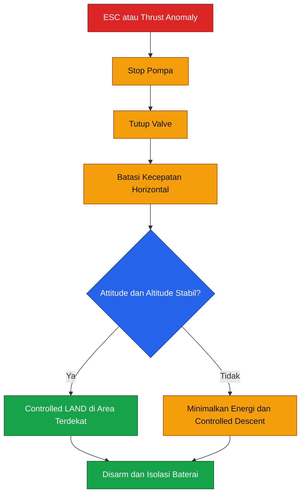

Urutan tindakan:

1. Matikan sistem semprot.
2. Kurangi kecepatan horizontal.
3. Hindari turn agresif.
4. Jangan melakukan climb kecuali dibutuhkan untuk menghindari obstacle.
5. Pilih area landing aman terdekat.
6. Lakukan LAND atau controlled descent.
7. Simpan log ESC dan flight controller.

### 3.9.10 Verifikasi motor-out

Motor-out tidak boleh langsung diuji dengan payload penuh.

Urutan verifikasi:

1. Control-allocation simulation.
2. SITL.
3. Hardware-in-the-loop.
4. Thrust rig dengan satu channel dinonaktifkan.
5. Reduced-mass restrained test.
6. Reduced-payload flight test pada area khusus.
7. Review log dan saturation.
8. Peningkatan payload hanya bila review formal menyetujui.

### 3.9.11 Keputusan motor-out

Kesimpulan untuk `DF-01`:

> X9 G2L memiliki total thrust yang cukup besar secara scalar, tetapi konfigurasi G620 pada payload penuh tidak memiliki continuous motor-out margin yang memadai pada kelompok dua rotor. Oleh sebab itu, sistem tidak boleh dipasarkan atau didokumentasikan sebagai mampu terbang normal setelah satu motor gagal.

Baseline keselamatan adalah:

> **Satu motor gagal → hentikan penyemprotan → controlled LAND atau controlled descent.**

Jika full-payload motor-out redundancy menjadi requirement wajib, desain harus diubah menggunakan:

- Propulsi dengan recommended continuous thrust lebih besar.
- Frame dengan rotor lebih besar dan clearance memadai.
- Octocopter.
- Konfigurasi coaxial yang dianalisis khusus.
- Pengurangan MTOW.

---

## 3.10 Design review dan release gate

Bab ini menghasilkan beberapa keputusan kritis.

### 3.10.1 Status geometri

| Item                              | Status              |
| --------------------------------- | ------------------- |
| Geometri reguler teoritis         | Lulus analisis      |
| Ideal clearance 36 inci           | $99.6\ \mathrm{mm}$ |
| Geometri G620 aktual              | Belum diverifikasi  |
| Pairing resmi G620 dengan 36 inci | Belum dibuktikan    |
| Rotor sweep envelope              | Menunggu drawing    |
| Interface frame–propeller         | Conditional hold    |

### 3.10.2 Status propulsi

| Item                     | Status             |
| ------------------------ | ------------------ |
| Hover thrust             | Preliminary pass   |
| Hover RPM                | Preliminary pass   |
| Hover current            | Preliminary pass   |
| Continuous ESC current   | Preliminary pass   |
| Transient thrust $k=1.4$ | Wajib bench test   |
| Thermal margin           | Open               |
| Density-altitude margin  | Open               |
| Full-payload motor-out   | Tidak diklaim aman |

### 3.10.3 Release gate

Bab 3 hanya dinyatakan lulus bila tersedia:

- Drawing koordinat motor.
- Measured propeller clearance.
- Arm wall thickness.
- Material data arm.
- Folding-joint load test.
- Motor-mount slip test.
- Propeller deflection test.
- Thrust stand data.
- ESC thermal data.
- Voltage-overshoot data.
- Reduced-payload motor-out simulation.

---

## Requirement update

| ID         | Requirement                           | Hasil Bab 3                           | Status                     |
| ---------- | ------------------------------------- | ------------------------------------- | -------------------------- |
| `GEO-001`  | Jarak motor harus mendukung propeller | Ideal $1014\ \mathrm{mm}$             | Conditional                |
| `GEO-002`  | Static clearance minimum              | Target $\ge 50\ \mathrm{mm}$          | Open                       |
| `GEO-003`  | Operational clearance minimum         | Target $\ge 25\ \mathrm{mm}$          | Open                       |
| `STR-001`  | Struktur menahan hover load           | $98.01\ \mathrm{N}$ per arm           | Calculated                 |
| `STR-002`  | Struktur menahan maneuver load        | $147.01\ \mathrm{N}$ per arm          | Calculated                 |
| `STR-003`  | Landing ultimate load                 | $2205.14\ \mathrm{N}$                 | Calculated                 |
| `PROP-001` | Propulsi mendukung MTOW               | Hover $9.994\ \mathrm{kgf}$ per motor | Preliminary pass           |
| `PROP-002` | Transient thrust reserve              | $k_T=1.4$                             | Test required              |
| `PROP-003` | Hover current within ESC rating       | Estimasi $19.2\ \mathrm{A}$           | Preliminary pass           |
| `PROP-004` | Full-payload motor-out                | Tidak continuous-safe                 | Failed as redundancy claim |
| `SAF-004`  | Motor-out response                    | Controlled LAND                       | Defined                    |

---

## Ringkasan Bab 3

Bab ini menghasilkan kesimpulan berikut:

- Rumus $d_{\text{adjacent}}=D_{\text{opposite}}/2$ valid untuk hexacopter reguler.
- Geometri folding G620 tidak boleh diasumsikan sebagai segienam reguler tanpa koordinat motor.
- Ideal clearance MFP 36 × 11 adalah $99.6\ \mathrm{mm}$, tetapi nilai aktual masih harus diukur.
- G620 secara resmi dipasangkan dengan propeller 34 inci pada katalog yang tersedia, sehingga pairing 36 inci memerlukan requalification.
- Hover pada massa sizing membutuhkan sekitar $9.994\ \mathrm{kgf}$ per rotor.
- Titik hover awal berada sekitar $2570\ \mathrm{RPM}$, $1.04\ \mathrm{kW}$, dan $19.2\ \mathrm{A}$ per rotor.
- ESC $30\ \mathrm{A}$ memiliki margin pada hover, tetapi thrust di atas sekitar $14\ \mathrm{kgf}$ memasuki area transient.
- Struktur harus dianalisis terhadap maneuver, landing, sloshing, joint play, dan fatigue.
- Full-payload motor-out tidak memiliki continuous margin yang memadai.
- Strategi kegagalan satu motor adalah menghentikan semprotan dan melakukan controlled LAND, bukan melanjutkan misi.

---

## Referensi bab

1. EFT — spesifikasi dan drawing G620, termasuk wheelbase, arm diameter, frame mass, serta rekomendasi X9 34 inci. ([Effort Tech][1])
2. Hobbywing — datasheet X9 G2L, termasuk thrust, tegangan, motor, ESC, power, current, CAN, dan propeller.
3. Hobbywing — spesifikasi MFP 36 × 11 dan batas RPM serta thrust. ([HOBBYWING][2])
4. Hobbywing — grafik speed, thrust, efficiency, dan torque MFP 36 × 11.
5. ArduPilot — thrust-loss dan yaw-imbalance warning. ([ArduPilot.org][5])
6. ArduPilot — ground oscillation akibat interaksi controller, frame, dan landing gear. ([ArduPilot.org][3])

---

[**Kembali ke Atas**](#merancang-drone-pertanian-kapasitas-20-kg)

[1]: https://c.effort-tech.com/yft/service/t9pfu2ax8fcwpyk2bxw2.pdf '1017-英文版'
[2]: https://www.hobbywing.com/en/products/mfp-36x11 'MFP 36x11 Drone Propellers, 36 inch Quiet UAV Props'
[3]: https://ardupilot.org/copter/docs/common-ground-resonance.html 'Preventing Ground Oscillation — Copter  documentation'
[4]: https://www.hobbywing.com/en/products/x9-g2l?utm_source=chatgpt.com 'X9 G2L - Next-Gen Agriculture Drone Motor'
[5]: https://ardupilot.org/copter/docs/thrust_loss_yaw_imbalance.html 'Thrust Loss and Yaw Imbalance Warnings — Copter  documentation'

---

# 4. Battery dan Power Architecture

Bab ini menetapkan sumber energi, batas arus, sistem proteksi, distribusi daya, suplai avionik redundan, serta aturan pengoperasian baterai untuk konfigurasi `AGHEX-20-R1`.

Sistem menggunakan satu smart battery Tattu 4.0 dengan konfigurasi $14\mathrm{S}1\mathrm{P}$, kapasitas minimum $30\ \mathrm{Ah}$, tegangan nominal $53.2\ \mathrm{V}$, dan energi nominal $1596\ \mathrm{Wh}$. Baterai tersebut menggunakan sel LiHV, bukan LiPo konvensional. Sel LiHV dapat diisi hingga $4.35\ \mathrm{V}$ per sel, sehingga tegangan pack penuh adalah $60.9\ \mathrm{V}$, bukan $58.8\ \mathrm{V}$. ([Genstattu][1])

> **Koreksi terhadap Bab 3:** nilai tegangan penuh $58.8\ \mathrm{V}$ yang berasal dari asumsi $4.2\ \mathrm{V/cell}$ tidak berlaku untuk baterai Tattu 4.0 LiHV. Seluruh perangkat yang terhubung ke high-voltage bus harus dievaluasi menggunakan $60.9\ \mathrm{V}$ ditambah margin transient.

Implikasi koreksi tersebut cukup besar:

- Power distribution untuk $12\mathrm{S}$ maksimum $50.4\ \mathrm{V}$ tidak boleh digunakan.
- Sensor tegangan dengan batas $60\ \mathrm{V}$ tidak memiliki margin yang memadai.
- DC-DC converter dengan input maksimum $60\ \mathrm{V}$ tidak boleh digunakan.
- Fuse, connector, isolator, current sensor, dan PCB clearance harus memiliki rating di atas $60.9\ \mathrm{V}$.
- Margin tegangan X9 G2L terhadap batas input $63\ \mathrm{V}$ hanya sekitar $2.1\ \mathrm{V}$.

Arsitektur daya dibagi menjadi:

1. High-voltage propulsion bus.
2. Jalur pompa.
3. Jalur avionik utama.
4. Jalur avionik redundan.
5. Jalur Herelink.
6. Jalur payload controller dan flowmeter.
7. Jalur sensor serta monitoring.

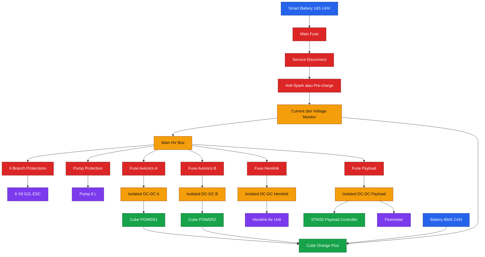

---

## 4.1 Energy budget

### 4.1.1 Energi nominal baterai

Energi nominal dihitung dari tegangan nominal dan kapasitas:

$$
E_{\text{nom}}
=

V_{\text{nom}}C
$$

Dengan:

$$
V_{\text{nom}}
=

53.2\ \mathrm{V}
$$

$$
C
=

30\ \mathrm{Ah}
$$

maka:

$$
E_{\text{nom}}
=

53.2
\times
30
$$

$$
\boxed{
E_{\text{nom}}
=

1596\ \mathrm{Wh}
}
$$

Nilai tersebut sesuai dengan spesifikasi resmi baterai Tattu 4.0 14S 30 Ah. Baterai memiliki massa sekitar $11.4\ \mathrm{kg}$ dan menggunakan connector Molex 46562-2657. Tattu juga menyebutkan BMS dengan Bluetooth, DroneCAN, self-balancing, fault diagnosis, log storage, cycle statistics, dan fungsi anti-spark ketika baterai dimatikan sebelum dihubungkan. ([Genstattu][2])

### 4.1.2 Energi nominal bukan energi misi

Seluruh energi nominal tidak boleh digunakan untuk misi. Sebagian energi harus dipertahankan untuk:

- Battery reserve.
- RTL atau controlled landing.
- Voltage sag saat arus tinggi.
- Penurunan kapasitas karena umur.
- Variasi temperatur.
- Ketidakseimbangan sel.
- Ketidakpastian estimasi SOC.

Energi yang dapat digunakan untuk perencanaan misi didefinisikan sebagai:

$$
E_{\text{usable}}
=

E_{\text{nom}}
\eta_{\text{usable}}
$$

Faktor usable dapat diuraikan menjadi:

$$
\eta_{\text{usable}}
=

\eta_{\text{reserve}}
\eta_{\text{age}}
\eta_{\text{temperature}}
\eta_{\text{uncertainty}}
$$

Untuk tahap desain, dua tingkat perhitungan digunakan.

#### Mission reserve saja

Dengan reserve perencanaan 30%:

$$
\eta_{\text{reserve}}
=

0.70
$$

maka:

$$
E_{\text{usable,new}}
=

1596
\times
0.70
$$

$$
\boxed{
E_{\text{usable,new}}
=

1117.2\ \mathrm{Wh}
}
$$

#### Perencanaan konservatif dengan aging allowance

Dengan allowance kapasitas 90%:

$$
\eta_{\text{age}}
=

0.90
$$

maka:

$$
E_{\text{usable,design}}
=

1596
\times
0.70
\times
0.90
$$

$$
\boxed{
E_{\text{usable,design}}
=

1005.5\ \mathrm{Wh}
}
$$

Nilai $1005.5\ \mathrm{Wh}$ digunakan untuk perencanaan misi awal. Faktor 90% merupakan kebijakan desain internal, bukan klaim umur baterai dari produsen.

### 4.1.3 Battery reserve

Battery reserve berbasis energi didefinisikan sebagai:

$$
R_E
=

\frac{
E_{\text{remaining}}
}{
E_{\text{available,start}}
}
\times
100\%
$$

Reserve berbasis kapasitas:

$$
R_C
=

\frac{
C_{\text{remaining}}
}{
C_{\text{measured}}
}
\times
100\%
$$

Kedua nilai tidak selalu identik karena tegangan dan efisiensi baterai berubah terhadap:

- Arus.
- Temperatur.
- SOC.
- Umur.
- Internal resistance.

Untuk sistem final, battery failsafe tidak boleh hanya menggunakan satu ambang tegangan. Keputusan harus mempertimbangkan:

- Tegangan pack.
- Tegangan sel minimum.
- Arus.
- Consumed capacity.
- BMS SOC.
- Temperatur.
- Prediksi energi untuk kembali dan mendarat.

### 4.1.4 Power budget subsystem

Power budget awal dibagi sebagai berikut:

| Subsystem                        |                       Kondisi normal |           Kondisi desain |
| -------------------------------- | -----------------------------------: | -----------------------: |
| Enam rotor pada MTOW             |          $\approx 6.22\ \mathrm{kW}$ | berdasarkan hover sizing |
| Pompa                            |                $\le 120\ \mathrm{W}$ |          rating pabrikan |
| Flight controller dan sensor     |                $15$–$25\ \mathrm{W}$ |    diukur saat integrasi |
| Herelink Air Unit                |              $\approx 4\ \mathrm{W}$ |      sesuai mode operasi |
| Payload controller dan flowmeter |                 $5$–$15\ \mathrm{W}$ |        tergantung sensor |
| DC-DC dan wiring loss            |               $80$–$150\ \mathrm{W}$ |          tergantung arus |
| **Total full-payload hover**     | **$\approx 6.4$–$6.5\ \mathrm{kW}$** |            estimasi awal |

Pompa Hobbywing 8 L beroperasi pada $12$–$14\mathrm{S}$ atau sekitar $44.4$–$60.9\ \mathrm{V}$, dengan daya nominal $120\ \mathrm{W}$ dan arus kerja maksimum sekitar $2.5\ \mathrm{A}$. ([HOBBYWING][3])

### 4.1.5 Arus full-payload hover

Menggunakan daya total awal:

$$
P_{\text{full}}
=

6.50\ \mathrm{kW}
$$

Pada tegangan nominal:

$$
I_{\text{full,nom}}
=

\frac{
P_{\text{full}}
}{
V_{\text{nom}}
}
$$

$$
I_{\text{full,nom}}
=

\frac{
6500
}{
53.2
}
$$

$$
\boxed{
I_{\text{full,nom}}
\approx
122.2\ \mathrm{A}
}
$$

Jika tegangan pack turun ke $47\ \mathrm{V}$:

$$
I_{\text{full,lowV}}
=

\frac{
6500
}{
47
}
$$

$$
\boxed{
I_{\text{full,lowV}}
\approx
138.3\ \mathrm{A}
}
$$

Karena beban propulsi mendekati constant-power load, arus cenderung meningkat ketika tegangan turun.

### 4.1.6 Batas arus baterai yang digunakan

Halaman resmi Tattu memuat dua angka berbeda:

- Deskripsi produk menyebut continuous discharge maksimum $180\ \mathrm{A}$.
- Tabel spesifikasi menyebut maximum continuous current $270\ \mathrm{A}$.
- Peak current dicantumkan $350\ \mathrm{A}$ selama maksimum tiga detik. ([Genstattu][2])

Karena terdapat konflik internal pada sumber pabrikan, konfigurasi `AGHEX-20-R1` menggunakan nilai konservatif:

$$
\boxed{
I_{\text{battery,continuous-design}}
=

180\ \mathrm{A}
}
$$

Nilai $270\ \mathrm{A}$ tidak digunakan sebelum terdapat konfirmasi tertulis dari produsen untuk SKU:

```text
TA-4.0-35C-30000-14S1P-HV
```

### 4.1.7 C-rating

Secara matematis, label $35\mathrm{C}$ menghasilkan:

$$
I_{35C}
=

35
\times
30
$$

$$
I_{35C}
=

1050\ \mathrm{A}
$$

Angka tersebut tidak digunakan untuk sizing sistem karena jauh lebih tinggi daripada rating arus eksplisit pada halaman produk.

Urutan prioritas yang digunakan adalah:

1. Rating arus eksplisit pabrikan.
2. Rating BMS dan connector.
3. Rating kabel.
4. Rating fuse.
5. Rating current sensor.
6. Hasil thermal test.
7. C-rating label.

---

## 4.2 Estimasi endurance

### 4.2.1 Persamaan dasar

Estimasi endurance:

$$
t_{\text{flight,min}}
=

60
\frac{
E_{\text{usable}}
}{
P_{\text{average}}
}
$$

dengan:

- $t_{\text{flight,min}}$ dalam menit.
- $E_{\text{usable}}$ dalam $\mathrm{Wh}$.
- $P_{\text{average}}$ dalam $\mathrm{W}$.

Menggunakan daya maksimum atau daya hover penuh untuk seluruh misi menghasilkan estimasi konservatif. Sebaliknya, menggunakan daya saat tangki kosong akan menghasilkan estimasi terlalu optimistis.

### 4.2.2 Endurance full-payload static hover

Dengan baterai baru, reserve 30%, dan:

$$
P_{\text{average}}
=

6500\ \mathrm{W}
$$

maka:

$$
t_{\text{hover,new}}
=

60
\frac{
1117.2
}{
6500
}
$$

$$
\boxed{
t_{\text{hover,new}}
\approx
10.31\ \mathrm{menit}
}
$$

Dengan aging allowance:

$$
t_{\text{hover,design}}
=

60
\frac{
1005.5
}{
6500
}
$$

$$
\boxed{
t_{\text{hover,design}}
\approx
9.28\ \mathrm{menit}
}
$$

Hasil ini menunjukkan bahwa target 10 menit **tidak memiliki margin kuat** apabila kendaraan dipaksa mempertahankan payload penuh sepanjang penerbangan. Dalam misi semprot nyata, massa cairan berkurang sehingga kebutuhan daya ikut turun.

### 4.2.3 Durasi penyemprotan satu tangki

Debit nominal dari Bab 2:

$$
Q
=

3.03\ \mathrm{L/min}
$$

Untuk tangki $20\ \mathrm{L}$:

$$
t_{\text{spray}}
=

\frac{
V_{\text{tank}}
}{
Q
}
$$

$$
t_{\text{spray}}
=

\frac{
20
}{
3.03
}
$$

$$
\boxed{
t_{\text{spray}}
\approx
6.60\ \mathrm{menit}
}
$$

Karena payload berkurang dari sekitar $20\ \mathrm{kg}$ menjadi mendekati nol selama 6,6 menit, daya propulsi rata-rata misi lebih rendah daripada full-payload hover.

### 4.2.4 Mission profile awal

Mission profile per tangki:

| Segmen                  |                  Durasi |      Daya rata-rata |                   Energi |
| ----------------------- | ----------------------: | ------------------: | -----------------------: |
| Takeoff dan stabilisasi |     $0.5\ \mathrm{min}$ | $6.50\ \mathrm{kW}$ |      $54.2\ \mathrm{Wh}$ |
| Penyemprotan            |     $6.6\ \mathrm{min}$ | $4.85\ \mathrm{kW}$ |     $533.5\ \mathrm{Wh}$ |
| Return                  |     $1.0\ \mathrm{min}$ | $3.30\ \mathrm{kW}$ |      $55.0\ \mathrm{Wh}$ |
| Landing                 |     $0.5\ \mathrm{min}$ | $3.20\ \mathrm{kW}$ |      $26.7\ \mathrm{Wh}$ |
| **Total**               | **$8.6\ \mathrm{min}$** |                   — | **$669.4\ \mathrm{Wh}$** |

Energi setiap segmen dihitung dengan:

$$
E_i
=

P_i
\frac{
t_i
}{
60
}
$$

Energi misi:

$$
E_{\text{mission}}
=

\sum E_i
$$

$$
\boxed{
E_{\text{mission}}
\approx
669.4\ \mathrm{Wh}
}
$$

### 4.2.5 Sisa energi setelah misi

Terhadap energi nominal:

$$
E_{\text{remaining,nom}}
=

1596
-

669.4
$$

$$
\boxed{
E_{\text{remaining,nom}}
=

926.6\ \mathrm{Wh}
}
$$

Reserve nominal:

$$
R_{\text{nom}}
=

\frac{
926.6
}{
1596
}
\times
100\%
$$

$$
\boxed{
R_{\text{nom}}
\approx
58.1\%
}
$$

Dengan kapasitas baterai diasumsikan telah turun menjadi 90%:

$$
E_{\text{available,aged}}
=

0.9
\times
1596
=

1436.4\ \mathrm{Wh}
$$

$$
E_{\text{remaining,aged}}
=

1436.4
-

669.4
$$

$$
\boxed{
E_{\text{remaining,aged}}
=

767.0\ \mathrm{Wh}
}
$$

Reserve:

$$
R_{\text{aged}}
=

\frac{
767.0
}{
1436.4
}
\times
100\%
$$

$$
\boxed{
R_{\text{aged}}
\approx
53.4\%
}
$$

### 4.2.6 Endurance berdasarkan daya misi rata-rata

Daya misi rata-rata:

$$
P_{\text{mission,avg}}
=

\frac{
E_{\text{mission}}
}{
t_{\text{mission}}/60
}
$$

$$
P_{\text{mission,avg}}
=

\frac{
669.4
}{
8.6/60
}
$$

$$
\boxed{
P_{\text{mission,avg}}
\approx
4.67\ \mathrm{kW}
}
$$

Endurance baterai baru dengan reserve 30%:

$$
t_{\text{mission,new}}
=

60
\frac{
1117.2
}{
4670
}
$$

$$
\boxed{
t_{\text{mission,new}}
\approx
14.35\ \mathrm{menit}
}
$$

Endurance dengan aging allowance:

$$
t_{\text{mission,design}}
=

60
\frac{
1005.5
}{
4670
}
$$

$$
\boxed{
t_{\text{mission,design}}
\approx
12.92\ \mathrm{menit}
}
$$

### 4.2.7 Interpretasi endurance

Kesimpulan awal:

- Target misi $\ge 10$ menit dapat dicapai secara analitis.
- Target full-payload static hover 10 menit tidak mempunyai aging margin.
- Misi semprot satu tangki diperkirakan selesai sekitar 8,6 menit termasuk takeoff dan landing.
- Hasil akhir harus ditentukan melalui coulomb counting dan flight log.
- Nilai endurance tidak boleh dipublikasikan sebagai hasil final sebelum uji terbang.

### 4.2.8 Kriteria acceptance endurance

Requirement `PWR-001` dinyatakan lulus bila:

1. Drone lepas landas dengan payload $20\ \mathrm{kg}$.
2. Menjalankan profile misi yang ditentukan.
3. Menyelesaikan misi tanpa battery warning kritis.
4. Mendarat dengan reserve energi minimum 25%.
5. Tidak ada sel yang melewati batas BMS.
6. Tidak ada connector, fuse, atau kabel mengalami overtemperature.
7. Hasil dapat diulang sekurangnya tiga kali.

---

## 4.3 Konfigurasi baterai

### 4.3.1 Konfigurasi baseline

Konfigurasi yang dibekukan adalah:

$$
\boxed{
14\mathrm{S}1\mathrm{P}
}
$$

Artinya:

- 14 kelompok sel disusun seri.
- Tidak ada pack kedua yang diparalelkan.
- Kapasitas pack tetap $30\ \mathrm{Ah}$.
- Tegangan meningkat berdasarkan jumlah sel seri.
- Arus yang sama mengalir melalui seluruh cell group.

### 4.3.2 Tegangan nominal dan penuh

Tegangan nominal per sel:

$$
V_{\text{cell,nom}}
=

\frac{
53.2
}{
14
}
$$

$$
\boxed{
V_{\text{cell,nom}}
=

3.8\ \mathrm{V}
}
$$

Tegangan penuh per sel LiHV:

$$
V_{\text{cell,max}}
=

4.35\ \mathrm{V}
$$

Tegangan pack penuh:

$$
V_{\text{pack,max}}
=

14
\times
4.35
$$

$$
\boxed{
V_{\text{pack,max}}
=

60.9\ \mathrm{V}
}
$$

Tattu menjelaskan bahwa LiHV dapat diisi hingga $4.35\ \mathrm{V/cell}$, sementara X9 G2L dan Pump 8 L mencantumkan rentang hingga $60.9\ \mathrm{V}$. ([Genstattu][1])

### 4.3.3 Margin tegangan ESC

Batas input X9 G2L:

$$
V_{\text{ESC,max}}
=

63\ \mathrm{V}
$$

Margin:

$$
V_{\text{margin}}
=

63
-

60.9
$$

$$
\boxed{
V_{\text{margin}}
=

2.1\ \mathrm{V}
}
$$

Persentase margin:

$$
V_{\text{margin,\%}}
=

\frac{
2.1
}{
63
}
\times
100\%
$$

$$
\boxed{
V_{\text{margin,\%}}
\approx
3.33\%
}
$$

Margin 3,33% tergolong kecil. Karena itu:

- Panjang kabel baterai harus diminimalkan.
- Loop area kabel positif dan negatif harus kecil.
- Voltage overshoot harus diukur.
- Komponen bus sebaiknya memiliki rating minimal $70\ \mathrm{VDC}$.
- Perangkat $60\ \mathrm{V}$ tidak digunakan.

### 4.3.4 Seri dan paralel

Untuk pack yang disusun seri:

$$
V_{\text{series}}
=

\sum V_i
$$

dan kapasitas tetap:

$$
C_{\text{series}}
=

C_{\text{pack}}
$$

Untuk pack identik yang disusun paralel:

$$
V_{\text{parallel}}
=

V_{\text{pack}}
$$

$$
C_{\text{parallel}}
=

\sum C_i
$$

Namun, baseline `DF-01` menggunakan satu smart battery. Paralel tidak diterapkan karena:

- BMS pack belum dikonfirmasi mendukung operasi paralel.
- Sinkronisasi contactor internal belum dikonfirmasi.
- Perilaku DroneCAN dua pack belum diverifikasi.
- Current sharing belum diuji.
- Massa dan CG akan berubah.
- Battery tray harus didesain ulang.

### 4.3.5 Internal resistance

Internal resistance pack dapat diestimasi:

$$
R_{\text{pack}}
=

\frac{
V_{\text{OC}}
-

V_{\text{load}}
}{
I_{\text{load}}
}
$$

dengan:

- $V_{\text{OC}}$: open-circuit voltage pada SOC dan temperatur tertentu.
- $V_{\text{load}}$: tegangan ketika diberi beban.
- $I_{\text{load}}$: arus uji.

Daya hilang di dalam baterai:

$$
P_{\text{battery,loss}}
=

I^2R_{\text{pack}}
$$

Sebagai contoh, jika:

$$
V_{\text{OC}}
=

56.5\ \mathrm{V}
$$

$$
V_{\text{load}}
=

54.8\ \mathrm{V}
$$

$$
I
=

120\ \mathrm{A}
$$

maka:

$$
R_{\text{pack}}
=

\frac{
56.5-54.8
}{
120
}
$$

$$
\boxed{
R_{\text{pack}}
\approx
14.2\ \mathrm{m\Omega}
}
$$

Daya hilang:

$$
P_{\text{battery,loss}}
=

120^2
\times
0.0142
$$

$$
\boxed{
P_{\text{battery,loss}}
\approx
204\ \mathrm{W}
}
$$

Contoh tersebut hanya menunjukkan metode. Nilai baseline aktual harus diukur pada baterai fisik.

### 4.3.6 Pengukuran internal resistance

Pengukuran harus dilakukan pada:

- SOC yang sama.
- Temperatur yang sama.
- Beban yang sama.
- Waktu pengambilan data yang sama.
- Connector dan kabel yang sama.

Data minimum:

| Parameter             |               Unit |
| --------------------- | -----------------: |
| Cycle count           |              cycle |
| SOC                   |                $%$ |
| Battery temperature   | $^\circ\mathrm{C}$ |
| Open-circuit voltage  |       $\mathrm{V}$ |
| Loaded voltage        |       $\mathrm{V}$ |
| Load current          |       $\mathrm{A}$ |
| Calculated resistance | $\mathrm{m\Omega}$ |
| Cell delta            |      $\mathrm{mV}$ |

---

## 4.4 Sistem proteksi

Sistem proteksi harus membatasi konsekuensi dari:

- Short circuit.
- Reverse polarity.
- Connector arc.
- Cable abrasion.
- ESC short.
- Pump fault.
- DC-DC failure.
- Battery overtemperature.
- Bus overvoltage.
- Kesalahan maintenance.

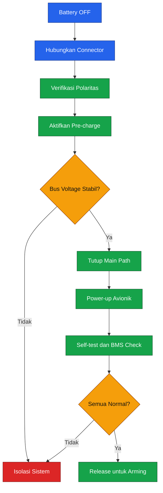

### 4.4.1 Main fuse

Main fuse melindungi:

- Kabel baterai.
- Main bus.
- Current sensor.
- PDB.
- Downstream wiring.

Fuse bukan alat untuk melindungi baterai dari seluruh jenis kegagalan internal.

Kandidat baseline:

```text
Eaton Bussmann AMG-200
```

Karakteristik seri AMG:

- Rating $70\ \mathrm{VDC}$.
- Rentang $60$–$500\ \mathrm{A}$.
- Interrupting rating $2500\ \mathrm{A}$ pada $70\ \mathrm{VDC}$.
- Bolt-in mounting.
- Housing UL 94V-0.
- Tersedia kurva time-current. ([Eaton][4])

Rating awal:

$$
I_{\text{fuse}}
=

200\ \mathrm{A}
$$

Rasio terhadap design continuous current:

$$
\frac{
180
}{
200
}
=

0.90
$$

Fuse bekerja pada sekitar 90% rating ketika sistem mencapai batas continuous design.

> Pemilihan AMG-200 masih harus dikonfirmasi melalui fuse coordination. Fuse harus mampu melewati transient normal tanpa nuisance opening, tetapi membuka sebelum kabel, connector, atau bus mencapai energi kerusakan.

### 4.4.2 Fuse per battery branch

Karena baseline hanya menggunakan satu pack, terdapat satu battery-branch fuse.

Jika dua pack digunakan paralel, setiap cabang wajib memiliki fuse sendiri:

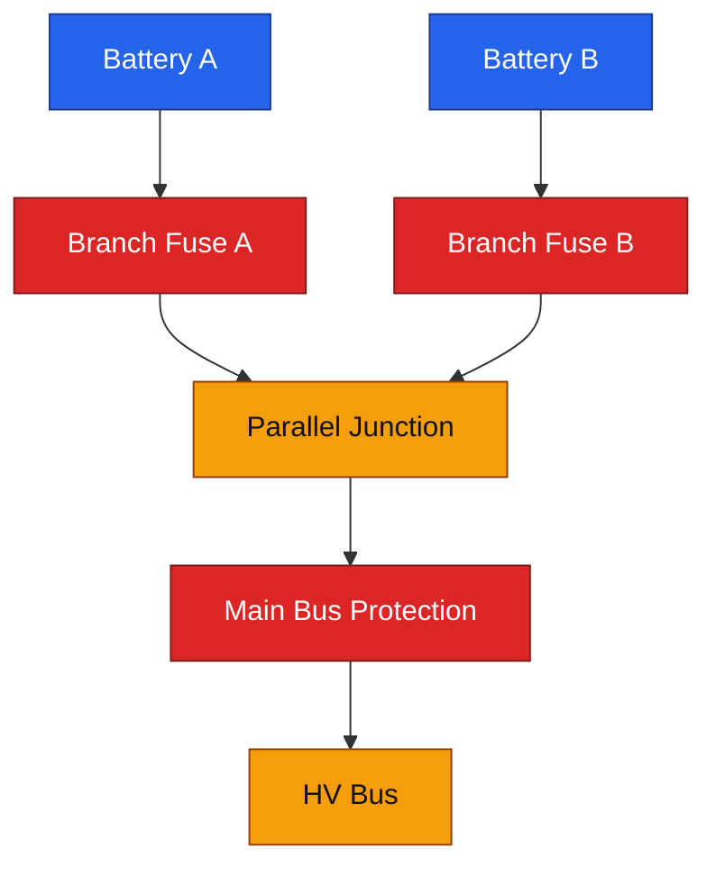

Tanpa branch fuse, short circuit pada Battery A dapat disuplai oleh Battery B melalui parallel junction.

### 4.4.3 Branch protection ESC

Setiap ESC X9 G2L memiliki rating continuous $30\ \mathrm{A}$ dan peak $120\ \mathrm{A}$ selama tiga detik. Branch protection tidak boleh dipilih hanya sebagai kelipatan $30\ \mathrm{A}$ karena harus mempertimbangkan startup serta transient motor. ([HOBBYWING][5])

Kandidat awal:

- Fuse DC-rated.
- Voltage rating minimal $70\ \mathrm{VDC}$.
- Rating awal $60$–$80\ \mathrm{A}$ per branch.
- Final rating berdasarkan time-current test.

Branch fuse bukan pengganti ESC protection internal.

### 4.4.4 Pre-charge

Pre-charge membatasi charging current menuju kapasitor input enam ESC dan perangkat lain.

Resistor awal:

$$
R_{\text{pre}}
=

\frac{
V_{\text{battery,max}}
}{
I_{\text{pre,target}}
}
$$

Jika:

$$
V_{\text{battery,max}}
=

60.9\ \mathrm{V}
$$

dan target:

$$
I_{\text{pre,target}}
=

1\ \mathrm{A}
$$

maka:

$$
R_{\text{pre}}
=

\frac{
60.9
}{
1
}
$$

$$
\boxed{
R_{\text{pre}}
\approx
60.9\ \Omega
}
$$

Time constant:

$$
\tau
=

R_{\text{pre}}C_{\text{bus}}
$$

Waktu hingga sekitar 99%:

$$
t_{99}
\approx
5\tau
$$

Jika total bus capacitance:

$$
C_{\text{bus}}
=

6000\ \mu\mathrm{F}
$$

maka:

$$
\tau
=

60.9
\times
0.006
$$

$$
\tau
=

0.365\ \mathrm{s}
$$

$$
\boxed{
t_{99}
\approx
1.83\ \mathrm{s}
}
$$

Energi yang harus ditangani resistor:

$$
E_C
=

\frac{1}{2}
CV^2
$$

$$
E_C
=

\frac{1}{2}
\times
0.006
\times
60.9^2
$$

$$
\boxed{
E_C
\approx
11.1\ \mathrm{J}
}
$$

Resistor harus dipilih berdasarkan pulse-energy rating, bukan hanya continuous wattage.

### 4.4.5 Anti-spark

Baterai Tattu 4.0 mempunyai fungsi ON/OFF yang menurut produsen dapat mencegah percikan jika pack dimatikan sebelum koneksi. Fungsi tersebut dianggap sebagai lapisan pertama anti-spark, tetapi efektivitasnya tetap harus diuji terhadap total bus capacitance aktual. ([Genstattu][2])

Prosedur:

1. Baterai dalam status OFF.
2. Hubungkan main connector.
3. Verifikasi connector terkunci.
4. Aktifkan baterai.
5. Pantau kenaikan tegangan bus.
6. Hentikan proses jika terjadi arc, fault BMS, atau voltage oscillation.

Jika inrush masih terlalu besar, external pre-charge wajib ditambahkan.

### 4.4.6 Main isolator

Main isolator adalah perangkat ground-service, bukan flight control.

Persyaratan:

| Parameter          |                                  Requirement |
| ------------------ | -------------------------------------------: |
| Voltage rating     |                       $\ge 70\ \mathrm{VDC}$ |
| Continuous current |                        $\ge 200\ \mathrm{A}$ |
| Short transient    | $\ge 350\ \mathrm{A}$ selama $3\ \mathrm{s}$ |
| Contact resistance |                             serendah mungkin |
| Environmental      |                 tahan getaran dan kelembapan |
| Locking            |                                positive lock |
| Access             |              dapat dijangkau setelah landing |

Membuka isolator saat drone terbang akan menghilangkan seluruh thrust. Karena itu, emergency disconnect tidak digunakan sebagai respons in-flight biasa.

### 4.4.7 Emergency disconnect

Emergency disconnect digunakan ketika kendaraan:

- Sudah mendarat.
- Crash.
- Motor tidak berhenti.
- Terjadi short atau smoke.
- Tidak merespons perintah disarm.

Urutan prioritas:

1. Gunakan disarm atau motor emergency stop dari jarak aman.
2. Jangan mendekati rotor yang masih bergerak.
3. Setelah rotor berhenti, gunakan emergency disconnect.
4. Pindahkan baterai ke area isolasi jika aman.
5. Catat fault sebelum reset.

### 4.4.8 Current sensor

Current sensor baseline diubah menjadi:

```text
Mauch PL-200/8 120V Sensor Board
```

Spesifikasi utama:

- Pengukuran arus $200\ \mathrm{A}$.
- Sensor Hall ACS770-250U.
- Pengukuran tegangan hingga $120\ \mathrm{V}$.
- Kabel $8\ \mathrm{AWG}$.
- Enclosure opsional.
- Memiliki margin terhadap pack penuh $60.9\ \mathrm{V}$. ([MAUCH Electronic][6])

Versi Mauch $60\ \mathrm{V}$ tidak digunakan karena:

$$
V_{\text{pack,max}}
=

60.9\ \mathrm{V}

>

60\ \mathrm{V}
$$

Mauch memang menyediakan varian 14S $60\ \mathrm{V}$, tetapi tidak mempunyai margin untuk baterai LiHV ini. ([MAUCH Electronic][7])

### 4.4.9 Temperature monitoring

Titik temperatur minimum:

- Battery enclosure.
- Main connector.
- Main fuse.
- Current sensor.
- Main bus.
- DC-DC A.
- DC-DC B.
- Herelink converter.
- Pump branch.
- ESC telemetry setiap arm.

Tattu menyatakan operation temperature $-20$ sampai $60^\circ\mathrm{C}$, dengan batas discharge yang lebih rendah pada temperatur dingin. Pada $-20$ sampai $0^\circ\mathrm{C}$, produsen membatasi discharge ke $0.2\mathrm{C}$; pada $0$ sampai $10^\circ\mathrm{C}$, batasnya $0.5\mathrm{C}$. ([Genstattu][8])

Karena Bab 1 menetapkan envelope lingkungan $10$–$40^\circ\mathrm{C}$, baseline tidak melakukan takeoff di bawah $10^\circ\mathrm{C}$ tanpa prosedur pemanasan dan validasi khusus.

Internal battery temperature limits:

| Kondisi                                     | Tindakan                          |
| ------------------------------------------- | --------------------------------- |
| $T_{\text{battery}} < 10^\circ\mathrm{C}$   | hold misi                         |
| $T_{\text{battery}} \ge 50^\circ\mathrm{C}$ | warning                           |
| $T_{\text{battery}} \ge 55^\circ\mathrm{C}$ | abort dan land                    |
| $T_{\text{battery}} \ge 60^\circ\mathrm{C}$ | critical, isolasi setelah landing |

Nilai warning dan abort adalah margin internal terhadap batas operasi pabrikan.

---

## 4.5 Power distribution

### 4.5.1 Main high-voltage bus

High-voltage bus harus mendukung:

$$
V_{\text{bus,max}}
\ge
70\ \mathrm{VDC}
$$

$$
I_{\text{bus,continuous}}
\ge
200\ \mathrm{A}
$$

$$
I_{\text{bus,transient}}
\ge
350\ \mathrm{A}
\quad
\text{selama}
\quad
3\ \mathrm{s}
$$

Rating 200 A dipilih dari:

$$
I_{\text{ESC,total}}
=

6
\times
30
=

180\ \mathrm{A}
$$

Tambahkan pompa dan auxiliary load:

$$
I_{\text{system,continuous}}
\approx
180
+
2.5
+
I_{\text{aux}}
$$

Dengan auxiliary allowance sekitar $2$–$3\ \mathrm{A}$:

$$
\boxed{
I_{\text{system,continuous}}
\approx
185\ \mathrm{A}
}
$$

Margin menuju bus rating 200 A hanya sekitar 8%. Karena itu, bus wajib melalui thermal validation.

### 4.5.2 Kore carrier board tidak digunakan

CubePilot Kore Carrier Board mendukung hingga 12S atau $50.4\ \mathrm{V}$ dan arus kontinu $140\ \mathrm{A}$. Nilai tersebut lebih rendah dari:

- Tegangan penuh $60.9\ \mathrm{V}$.
- Design continuous current sekitar $185\ \mathrm{A}$.

Dengan demikian, Kore Carrier Board tidak boleh digunakan sebagai PDB utama `AGHEX-20-R1`. ([CubePilot][9])

### 4.5.3 PDB baseline

PDB utama harus berupa:

- Copper busbar atau laminated bus.
- Rating minimum $70\ \mathrm{VDC}$.
- Continuous current minimum $200\ \mathrm{A}$.
- Short transient minimum $350\ \mathrm{A}$.
- Enclosure tahan cairan.
- Branch output terpisah untuk enam ESC.
- Branch pompa terpisah.
- Auxiliary branch terpisah.
- Cover pada seluruh live conductor.
- Strain relief pada setiap kabel.

PDB tidak boleh berupa PCB tipis dengan solder track yang tidak memiliki thermal analysis.

### 4.5.4 Avionics DC-DC

Dua converter independen dipilih:

```text
2 × RECOM REC30E-4805SZ
```

Spesifikasi relevan:

- Input $18$–$75\ \mathrm{VDC}$.
- Output nominal $5\ \mathrm{V}$.
- Daya $30\ \mathrm{W}$.
- Isolasi $2\ \mathrm{kVDC}$.
- Efisiensi lebih dari 90%.
- OVP, OLP, OTP, UVLO, dan short-circuit protection.
- Output dapat ditrim dalam rentang yang sesuai. ([RECOM][10])

Konfigurasi:

- Converter A menuju `POWER1`.
- Converter B menuju `POWER2`.
- Input masing-masing menggunakan fuse sendiri.
- Kabel input dan output tidak berbagi connector.
- Output converter tidak diparalelkan.
- Setpoint awal $5.2\ \mathrm{V}$ setelah memperhitungkan cable drop.

Cube menerima suplai sekitar $4.0$–$5.5\ \mathrm{V}$ pada rentang operasi yang sesuai dan menyediakan redundant power inputs dengan automatic failover. ([CubePilot][11])

### 4.5.5 Batas redundansi

Dua converter memberikan proteksi terhadap:

- Kegagalan satu converter.
- Putusnya satu fuse auxiliary.
- Putusnya satu harness.
- Kegagalan satu POWER input.

Namun, keduanya tetap berasal dari satu main battery.

Dengan demikian:

> Arsitektur ini mempunyai **converter and harness redundancy**, tetapi tidak mempunyai **independent energy-source redundancy**.

Jika main battery atau main bus terputus, kedua converter akan kehilangan input.

### 4.5.6 Herelink supply

Herelink Air Unit tidak boleh berbagi converter dengan flight controller.

Herelink menerima sekitar $6$–$12.6\ \mathrm{V}$ dan dokumentasi menyarankan agar catu tidak dibagi dengan servo. Konsumsi rata-ratanya sekitar $4\ \mathrm{W}$. ([CubePilot][12])

Converter:

```text
RECOM REC30E-4812SZ
```

Konfigurasi:

- Input $18$–$75\ \mathrm{V}$.
- Output ditrim ke sekitar $10.8$–$11.0\ \mathrm{V}$.
- Fuse input independen.
- LC filter sesuai datasheet.
- Ground dan signal interface diverifikasi sebelum koneksi UART/SBUS.

Output tidak disetel ke $12.6\ \mathrm{V}$ karena nilai tersebut merupakan batas maksimum Herelink.

### 4.5.7 Payload DC-DC

Payload controller menggunakan rail terpisah agar gangguan flowmeter atau aktuator tidak menjatuhkan flight controller.

Pilihan:

```text
REC30E-4805SZ
```

untuk rail $5\ \mathrm{V}$ payload controller, serta:

```text
REC30E-4824SZ
```

untuk rail $24\ \mathrm{V}$ flowmeter jika dibutuhkan.

Pompa tidak disuplai melalui converter karena Pump 8 L mendukung high-voltage bus secara langsung. ([HOBBYWING][3])

### 4.5.8 Power-tree summary

| Rail          | Sumber        |                   Tegangan | Proteksi  | Beban         |
| ------------- | ------------- | -------------------------: | --------- | ------------- |
| HV bus        | Tattu 14S     |    $44$–$60.9\ \mathrm{V}$ | main fuse | ESC dan pompa |
| FC A          | REC30E-4805SZ |          $5.2\ \mathrm{V}$ | fuse A    | Cube POWER1   |
| FC B          | REC30E-4805SZ |          $5.2\ \mathrm{V}$ | fuse B    | Cube POWER2   |
| Herelink      | REC30E-4812SZ | $\approx 10.8\ \mathrm{V}$ | fuse H    | Air Unit      |
| Payload logic | REC30E-4805SZ |            $5\ \mathrm{V}$ | fuse P1   | STM32         |
| Flowmeter     | REC30E-4824SZ |           $24\ \mathrm{V}$ | fuse P2   | VN10S         |
| Pump          | HV bus        |    $44$–$60.9\ \mathrm{V}$ | pump fuse | Pump 8 L      |

---

## 4.6 Kabel dan konektor

### 4.6.1 Voltage drop

Voltage drop:

$$
V_{\text{drop}}
=

IR
$$

Power loss:

$$
P_{\text{loss}}
=

I^2R
$$

Resistance konduktor:

$$
R
=

\rho
\frac{
L
}{
A
}
$$

Untuk loop positif dan negatif:

$$
R_{\text{loop}}
=

\rho
\frac{
2L_{\text{one-way}}
}{
A
}
$$

Dengan resistivitas tembaga pada sekitar $20^\circ\mathrm{C}$:

$$
\rho_{\text{Cu}}
\approx
1.724
\times
10^{-8}
\ \Omega\mathrm{m}
$$

### 4.6.2 Kabel utama

Baseline:

- Luas penampang minimum $35\ \mathrm{mm^2}$.
- Kira-kira setara $2\ \mathrm{AWG}$.
- Panjang one-way target $0.30\ \mathrm{m}$.
- Positive dan negative routed berdekatan.

Resistance loop:

$$
R_{\text{loop}}
=

1.724
\times
10^{-8}
\frac{
0.60
}{
35
\times
10^{-6}
}
$$

$$
\boxed{
R_{\text{loop}}
\approx
0.296\ \mathrm{m\Omega}
}
$$

Pada $180\ \mathrm{A}$:

$$
V_{\text{drop}}
=

180
\times
0.000296
$$

$$
\boxed{
V_{\text{drop}}
\approx
0.053\ \mathrm{V}
}
$$

Loss:

$$
P_{\text{loss}}
=

180^2
\times
0.000296
$$

$$
\boxed{
P_{\text{loss}}
\approx
9.59\ \mathrm{W}
}
$$

Pada $200\ \mathrm{A}$:

$$
P_{\text{loss}}
=

200^2
\times
0.000296
$$

$$
\boxed{
P_{\text{loss}}
\approx
11.84\ \mathrm{W}
}
$$

Loss tersebut belum memasukkan:

- Connector.
- Fuse.
- Current sensor.
- Busbar joint.
- Crimp resistance.
- Contact aging.

### 4.6.3 Kabel branch ESC

Contoh screening untuk kabel $8\ \mathrm{AWG}$:

$$
A
\approx
8.37\ \mathrm{mm^2}
$$

Dengan panjang one-way:

$$
L_{\text{one-way}}
=

0.60\ \mathrm{m}
$$

maka:

$$
R_{\text{loop}}
=

1.724
\times
10^{-8}
\frac{
1.20
}{
8.37
\times
10^{-6}
}
$$

$$
\boxed{
R_{\text{loop}}
\approx
2.47\ \mathrm{m\Omega}
}
$$

Pada $30\ \mathrm{A}$:

$$
V_{\text{drop}}
=

30
\times
0.00247
$$

$$
\boxed{
V_{\text{drop}}
\approx
0.074\ \mathrm{V}
}
$$

$$
P_{\text{loss}}
=

30^2
\times
0.00247
$$

$$
\boxed{
P_{\text{loss}}
\approx
2.22\ \mathrm{W}
}
$$

Kabel final harus mengikuti harness X9 G2L atau hasil validasi pabrikan. Perhitungan di atas hanya menunjukkan metode.

### 4.6.4 Temperature correction

Resistance tembaga meningkat terhadap temperatur:

$$
R_T
=

R_{20}
\left[
1
+
\alpha
\left(
T-20
\right)
\right]
$$

dengan:

$$
\alpha_{\text{Cu}}
\approx
0.00393/^\circ\mathrm{C}
$$

Pada $80^\circ\mathrm{C}$:

$$
R_{80}
=

R_{20}
\left[
1
+
0.00393
\left(
80-20
\right)
\right]
$$

$$
\boxed{
R_{80}
\approx
1.236R_{20}
}
$$

Resistance naik sekitar 23,6%, sehingga loss juga meningkat.

### 4.6.5 Connector utama

Tattu menggunakan:

```text
Molex 46562-2657
```

Connector tidak boleh diganti dengan adaptor generik tanpa verifikasi. Seri Molex 46562 merupakan keluarga EXTreme Ten60Power dengan kombinasi power dan signal contacts. Mating connector, contact arrangement, crimp terminal, dan tooling harus mengikuti drawing pabrikan. ([Genstattu][2])

Persyaratan connector:

- Positive locking.
- Keyed polarity.
- Tidak dapat tersambung terbalik.
- Strain relief.
- Finger-safe enclosure.
- Tidak ada exposed conductor.
- Contact temperature dipantau saat qualification test.
- Crimp dilakukan menggunakan tooling yang disetujui.
- Tidak menggunakan solder sebagai pengganti crimp kecuali drawing mengizinkan.

### 4.6.6 Connector acceptance

Connector dinyatakan lulus bila:

$$
\Delta T_{\text{connector}}
=

T_{\text{connector}}
-

T_{\text{ambient}}
$$

tetap di bawah batas qualification yang ditentukan setelah:

- Hover penuh.
- Misi semprot penuh.
- Transient maneuver.
- Tiga siklus penerbangan berurutan.
- Kontaminasi lapangan yang disimulasikan.

Acceptance juga membutuhkan:

- Tidak ada discoloration.
- Tidak ada pelunakan housing.
- Tidak ada contact pitting.
- Tidak ada peningkatan resistance signifikan.
- Locking mechanism tetap bekerja.

### 4.6.7 Routing

Aturan routing:

- Positive dan negative main cable dipasang berdekatan.
- Kabel HV dipisahkan dari GNSS, compass, dan analog sensor.
- Kabel tidak melewati tepi carbon tanpa grommet.
- Tidak ada cable tie langsung pada hose kimia.
- Sediakan service loop secukupnya.
- Jangan membentuk loop besar.
- Connector tidak menopang berat kabel.
- Gunakan strain relief pada arm folding section.
- Hindari sambungan kabel di area yang menerima spray.

### 4.6.8 Grounding

Grounding architecture:

- HV return menggunakan dedicated conductor.
- Avionics ground mengikuti output isolated DC-DC.
- Signal ground hanya dihubungkan sesuai interface requirement.
- Chassis carbon tidak digunakan sebagai current return.
- Shield di-ground-kan pada titik yang ditentukan, bukan sembarang kedua ujung.
- Pump current tidak kembali melalui flight-controller ground.

---

## 4.7 Prosedur baterai paralel

### 4.7.1 Status paralel pada desain baseline

Konfigurasi `AGHEX-20-R1 DF-01`:

$$
\boxed{
\text{Satu baterai 14S1P}
}
$$

Penggunaan dua smart battery secara paralel tidak diizinkan pada baseline.

Alasannya:

- Halaman produk tidak menyatakan dukungan operasi paralel.
- Sinkronisasi BMS belum dibuktikan.
- Current sharing belum diuji.
- Smart switch dan anti-spark dapat berinteraksi.
- Dua node DroneCAN dapat membutuhkan konfigurasi khusus.
- Massa bertambah sekitar $11.4\ \mathrm{kg}$.
- MTOW, CG, propulsi, landing gear, dan tray harus dihitung ulang.

### 4.7.2 Risiko equalization current

Ketika dua baterai dengan tegangan berbeda disambungkan paralel:

$$
I_{\text{equalize}}
=

\frac{
\Delta V
}{
R_1+R_2+R_{\text{connection}}
}
$$

Sebagai contoh:

$$
\Delta V
=

0.5\ \mathrm{V}
$$

dan:

$$
R_{\text{total}}
=

10\ \mathrm{m\Omega}
$$

maka:

$$
I_{\text{equalize}}
=

\frac{
0.5
}{
0.010
}
$$

$$
\boxed{
I_{\text{equalize}}
=

50\ \mathrm{A}
}
$$

Arus tersebut terjadi sebelum drone diaktifkan dan tidak dikendalikan flight controller.

### 4.7.3 Persyaratan sebelum parallel design

Parallel pack hanya boleh dievaluasi bila:

1. Produsen menyatakan pack mendukung parallel discharge.
2. Model, SKU, kapasitas, dan chemistry identik.
3. Firmware BMS identik.
4. Cycle count berada dalam kelompok yang sama.
5. Temperatur pack hampir sama.
6. SOC hampir sama.
7. Internal resistance telah dicocokkan.
8. Setiap branch memiliki fuse.
9. Terdapat pre-charge atau controlled contactor.
10. Current sharing dapat dimonitor.
11. DroneCAN node dan battery instance dikonfigurasi.
12. Tray, CG, MTOW, dan struktur dikualifikasi ulang.

### 4.7.4 Pemeriksaan beda tegangan

Sebelum parallel connection:

$$
\Delta V_{\text{pack}}
=

\left|
V_A-V_B
\right|
$$

Internal target awal:

$$
\boxed{
\Delta V_{\text{pack}}
\le
0.10\ \mathrm{V}
}
$$

Per-cell equivalent:

$$
\Delta V_{\text{cell,eq}}
=

\frac{
0.10
}{
14
}
$$

$$
\boxed{
\Delta V_{\text{cell,eq}}
\approx
7.1\ \mathrm{mV}
}
$$

Nilai tersebut merupakan target konservatif internal, bukan spesifikasi Tattu. Pack tetap tidak boleh diparalelkan tanpa persetujuan produsen.

### 4.7.5 Urutan koneksi dua pack

Prosedur konseptual:

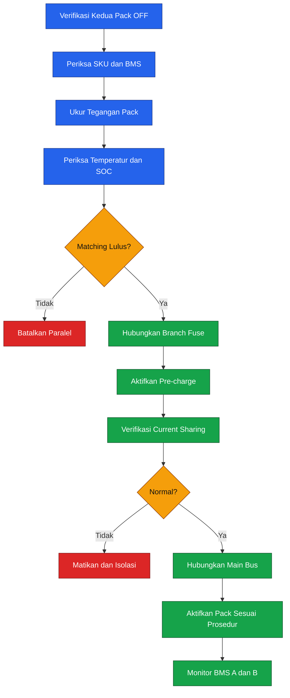

Prosedur tersebut belum merupakan release instruction dan tidak boleh diterapkan sampai desain paralel memiliki revisi resmi.

### 4.7.6 Current sharing

Current sharing ideal:

$$
I_A
\approx
I_B
\approx
\frac{
I_{\text{total}}
}{
2
}
$$

Current imbalance:

$$
\epsilon_I
=

\frac{
\left|
I_A-I_B
\right|
}{
I_A+I_B
}
\times
100\%
$$

Target awal:

$$
\epsilon_I
\le
10\%
$$

Current imbalance dapat disebabkan oleh:

- Internal resistance berbeda.
- Cable length berbeda.
- Fuse resistance berbeda.
- Connector aging.
- SOC berbeda.
- BMS current limit berbeda.
- Temperatur berbeda.

### 4.7.7 Fuse cabang paralel

Setiap pack harus mempunyai:

- Fuse sedekat mungkin dengan positive terminal.
- Rating tegangan minimal $70\ \mathrm{VDC}$.
- Rating arus berdasarkan kemampuan pack dan kabel.
- Interrupting rating yang sesuai.
- Enclosure tahan sentuh.
- Tidak berbagi fuse sebelum parallel junction.

### 4.7.8 Battery retirement criteria

Baterai langsung dikarantina jika ditemukan:

- Swelling.
- Retak.
- Deformasi.
- Kebocoran.
- Bau elektrolit.
- Corrosion.
- Connector meleleh.
- Contact discoloration.
- BMS critical fault.
- Riwayat overtemperature.
- Riwayat overcurrent berat.
- Dampak crash.
- Water atau chemical intrusion.

Internal performance criteria:

$$
C_{\text{measured}}
<
0.80
C_{\text{nominal}}
$$

Dengan:

$$
C_{\text{nominal}}
=

30\ \mathrm{Ah}
$$

maka:

$$
\boxed{
C_{\text{retirement}}
<
24\ \mathrm{Ah}
}
$$

Internal-resistance investigation threshold:

$$
R_{\text{pack,current}}

>

1.30
R_{\text{pack,baseline}}
$$

Peningkatan di atas 30% memicu:

- Re-test.
- Capacity test.
- Connector inspection.
- Cell-balance review.
- Keputusan quarantine atau retirement.

Angka 80% dan 30% merupakan maintenance policy internal. BMS warning dan batas produsen tetap mempunyai prioritas lebih tinggi.

### 4.7.9 Aturan penyimpanan dan charging

- Gunakan charger yang kompatibel dengan smart LiHV 14S.
- Jangan menggunakan profile LiPo $4.2\ \mathrm{V/cell}$ sebagai profile LiHV.
- Jangan menggunakan charger tanpa cell monitoring.
- Jangan mengisi baterai di dalam drone.
- Charging dilakukan di area tahan api dengan pengawasan.
- Data cycle dan fault disimpan.
- Baterai panas setelah penerbangan harus didinginkan sebelum charging.
- Connector diperiksa sebelum setiap siklus.
- Baterai tidak dibongkar atau diperbaiki di lapangan.

---

## 4.8 Power architecture release gate

Power architecture tidak boleh dirilis ke assembly sebelum seluruh item berikut selesai:

| Gate                  | Bukti yang diperlukan                        |
| --------------------- | -------------------------------------------- |
| Battery specification | SKU dan manual dikonfirmasi                  |
| Voltage correction    | Semua komponen valid pada $60.9\ \mathrm{V}$ |
| Main fuse             | Fuse coordination selesai                    |
| Main cable            | Thermal test pada $180\ \mathrm{A}$          |
| Connector             | Temperature-rise test selesai                |
| Current sensor        | Kalibrasi 0–180 A selesai                    |
| DC-DC A/B             | Load, dropout, dan failover test             |
| Herelink rail         | Output tidak melebihi $12.6\ \mathrm{V}$     |
| PDB                   | $200\ \mathrm{A}$ continuous validation      |
| Pre-charge            | Inrush current direkam                       |
| BMS CAN               | Telemetry diverifikasi                       |
| Temperature sensors   | Seluruh channel berfungsi                    |
| Fault response        | Fuse, BMS, dan autopilot response diuji      |

---

## Keputusan desain yang dikunci

| Parameter                  | Keputusan                                       |
| -------------------------- | ----------------------------------------------- |
| Battery baseline           | Tattu 4.0 14S1P 30 Ah                           |
| Chemistry                  | LiHV                                            |
| Tegangan nominal           | $53.2\ \mathrm{V}$                              |
| Tegangan penuh             | $60.9\ \mathrm{V}$                              |
| Energi nominal             | $1596\ \mathrm{Wh}$                             |
| Usable energy baru         | $1117.2\ \mathrm{Wh}$                           |
| Usable energy desain       | $1005.5\ \mathrm{Wh}$                           |
| Arus continuous design     | $180\ \mathrm{A}$                               |
| Main bus rating            | $\ge 70\ \mathrm{VDC}$, $\ge 200\ \mathrm{A}$   |
| Main fuse candidate        | Eaton AMG-200                                   |
| Current sensor             | Mauch PL-200/8 120V                             |
| Avionics power             | 2 × REC30E-4805SZ                               |
| Herelink power             | REC30E-4812SZ, ditrim $\approx10.8\ \mathrm{V}$ |
| Payload power              | Rail terpisah                                   |
| FC redundancy              | Dua converter dan dua harness                   |
| Parallel battery           | Tidak diizinkan pada `DF-01`                    |
| Estimated mission duration | $\approx 8.6\ \mathrm{min}$                     |
| Estimated design endurance | $\approx 12.9\ \mathrm{min}$                    |

---

## Requirement update

| ID        | Requirement                                | Hasil Bab 4                                   | Status           |
| --------- | ------------------------------------------ | --------------------------------------------- | ---------------- |
| `PWR-001` | Waktu terbang payload penuh $\ge 10$ menit | Analitis $12.9$ menit untuk mission profile   | Preliminary pass |
| `PWR-002` | Reserve landing $\ge 25%$                  | Mission model menghasilkan $>50%$             | Preliminary pass |
| `PWR-003` | Main bus mendukung tegangan penuh          | Rating minimum $70\ \mathrm{VDC}$             | Defined          |
| `PWR-004` | Main bus mendukung arus                    | Rating minimum $200\ \mathrm{A}$              | Defined          |
| `PWR-005` | Redundant FC power                         | Dua REC30E-4805SZ                             | Allocated        |
| `PWR-006` | Current monitoring                         | Mauch 200 A, 120 V                            | Allocated        |
| `PWR-007` | Inrush control                             | Smart anti-spark + pre-charge bila diperlukan | Test required    |
| `PWR-008` | Thermal monitoring                         | Battery, connector, fuse, PDB, DC-DC          | Defined          |
| `PWR-009` | Parallel battery safety                    | Parallel dilarang pada `DF-01`                | Closed           |
| `SAF-005` | Emergency isolation                        | Ground-service disconnect                     | Defined          |

---

## Ringkasan Bab 4

Bab ini menghasilkan beberapa koreksi dan keputusan penting:

- Baterai Tattu 4.0 adalah LiHV dengan tegangan penuh $60.9\ \mathrm{V}$.
- Perangkat dengan rating maksimum $60\ \mathrm{V}$ tidak mempunyai margin yang cukup.
- CubePilot Kore PDB tidak kompatibel karena hanya mendukung $50.4\ \mathrm{V}$ dan $140\ \mathrm{A}$.
- Main bus harus mempunyai rating sekurangnya $70\ \mathrm{VDC}$ dan $200\ \mathrm{A}$ kontinu.
- Current sensor menggunakan Mauch PL-200/8 versi $120\ \mathrm{V}$.
- Flight controller menggunakan dua isolated converter independen.
- Herelink dan payload tidak berbagi rail dengan flight controller.
- Estimasi mission endurance memenuhi target, tetapi full-payload static hover tidak memiliki margin aging yang kuat.
- Sistem paralel dua baterai tidak menjadi bagian design freeze.
- Main fuse, connector, cable, busbar, dan pre-charge wajib melalui thermal serta transient test.

---

## Referensi bab

1. Tattu — spesifikasi Tattu 4.0 30000 mAh 14S1P, energi, massa, BMS, connector, arus, dan temperatur. ([Genstattu][2])
2. Tattu — karakteristik LiHV dan batas charge $4.35\ \mathrm{V/cell}$. ([Genstattu][1])
3. Hobbywing — rentang baterai dan input X9 G2L. ([HOBBYWING][5])
4. Hobbywing — spesifikasi Pump 8 L. ([HOBBYWING][3])
5. Eaton Bussmann — seri fuse AMG $70\ \mathrm{VDC}$. ([Eaton][4])
6. Mauch Electronic — PL-200/8 120V current and voltage sensor. ([MAUCH Electronic][6])
7. Mauch Electronic — batas varian sensor 14S $60\ \mathrm{V}$. ([MAUCH Electronic][7])
8. CubePilot — batas Kore Carrier Board. ([CubePilot][9])
9. CubePilot — power architecture dan redundant input Cube. ([ArduPilot.org][13])
10. RECOM — REC30E-Z isolated converter, termasuk varian $18$–$75\ \mathrm{V}$ untuk output 5 V, 12 V, dan 24 V. ([RECOM][10])
11. CubePilot — batas suplai dan konsumsi Herelink Air Unit. ([CubePilot][12])
12. Molex — keluarga connector 46562 EXTreme Ten60Power. ([Molex][14])

---

[**Kembali ke Atas**](#merancang-drone-pertanian-kapasitas-20-kg)

[1]: https://genstattu.com/high-voltage-lipo.html?page=3&srsltid=AfmBOopRFnrRitvK3Ol0dbwMj3LqUvqzxqjTG-kCLdbCmPbQSpVKa_Qi&utm_source=chatgpt.com 'High Voltage Lipo Battery (LiHV) - Page 3'
[2]: https://genstattu.com/tattu-4-0-30000mah-53-2v-14s1p-35c-lipo-smart-battery-pack-with-molex-plug/?srsltid=AfmBOoq4aqn-FsfsotYJhyyHgI7yDAiPllyn6-8wQkikqkE1ulyORpk8&utm_source=chatgpt.com 'Tattu 4.0 30000mAh 53.2V 35C 14S1P Lipo Smart Battery ...'
[3]: https://www.hobbywing.com/en/products/one-piece-brushless-water-pump-8l106?utm_source=chatgpt.com 'One-piece Brushless Water Pump 8L for Agri Spray Drones'
[4]: https://www.eaton.com/content/dam/eaton/products/electrical-circuit-protection/fuses/data-sheets/bus-ele-ds-11320-amg-series.pdf?utm_source=chatgpt.com 'AMG series bolt in automotive fuses'
[5]: https://www.hobbywing.com/en/uploads/file/20250908/a2a09e8ac035aef35ff98aaf4c7c02e0.pdf?utm_source=chatgpt.com 'XRotor Pro Combo-X9-G2L-Manuals-250905'
[6]: https://mauch-electronic.com/products/004-pl-200-8-sensor-board-delivery-january-2025-copy?utm_source=chatgpt.com '005: PL-200/8 120V Sensor Board'
[7]: https://mauch-electronic.com/products/004-pl-200-8-sensor-board?utm_source=chatgpt.com '004: PL-200/8 Sensor Board'
[8]: https://genstattu.com/tattu-4-0-30000mah-53-2v-14s1p-35c-lipo-smart-battery-pack-with-molex-plug/?srsltid=AfmBOorwSzCNY-OZMQ_M25JqaRwZ0dfGfPW5bhjsfTD8ZjkmDXMtdE1M&utm_source=chatgpt.com 'Tattu 4.0 30000mAh 53.2V 35C 14S1P Lipo Smart Battery ...'
[9]: https://docs.cubepilot.org/user-guides/carrier-boards/kore-carrier-board?utm_source=chatgpt.com 'Kore Carrier Board'
[10]: https://recom-power.com/en/rec-s-REC30E-Z.html 'REC30E-Z Series - DC/DC, THT, 30W | RECOM'
[11]: https://docs.cubepilot.org/user-guides/autopilot/the-cube/introduction/interface-specifications?utm_source=chatgpt.com 'Interface Specifications'
[12]: https://docs.cubepilot.org/user-guides/cubepilot-ecosystem/cubepilot-partners/union-robotics/herelink-blue?utm_source=chatgpt.com 'HereLink Blue'
[13]: https://ardupilot.org/copter/docs/common-thecubeorange-overview.html?utm_source=chatgpt.com 'The Cube Orange/+ With ADSB-In Overview'
[14]: https://www.molex.com/en-us/products/series-chart/46562?utm_source=chatgpt.com '46562 - Series Chart'

---

# 5. Flight Controller, Sensor, dan Komunikasi

Bab ini membekukan arsitektur avionik `AGHEX-20-R1`, mencakup flight controller, sensor navigasi, rangefinder, power monitor, ESC telemetry, RC, GCS, serta keamanan komunikasi.

Tujuan arsitektur avionik bukan sekadar membuat seluruh perangkat terhubung. Sistem harus memastikan bahwa:

- Gangguan pada payload tidak menjatuhkan flight controller.
- Kehilangan telemetry tidak langsung menghilangkan kendali autopilot.
- Kehilangan RC menghasilkan respons failsafe yang deterministik.
- Sensor navigasi tidak terganggu arus propulsi.
- Setiap interface memiliki jalur diagnosis.
- Konfigurasi perangkat dapat direproduksi dari wiring table dan parameter release.
- Kegagalan satu peripheral tidak merusak seluruh bus avionik.

Konfigurasi avionik yang dikunci adalah:

| Fungsi              | Perangkat                                |
| ------------------- | ---------------------------------------- |
| Flight controller   | Cube Orange+ Standard Set                |
| Firmware target     | ArduPilot Copter 4.6.3 stable            |
| GNSS dan RTK rover  | CubePilot Here4                          |
| Magnetometer utama  | RM3100 pada Here4                        |
| Barometer utama     | MS5611 internal Cube Orange+             |
| Terrain rangefinder | Benewake TF03 UART/CAN                   |
| Power monitor utama | Mauch PL-200/8 120 V                     |
| Battery telemetry   | Tattu smart BMS DroneCAN                 |
| ESC command         | PWM dari MAIN OUT 1–6                    |
| ESC telemetry       | DroneCAN pada CAN2                       |
| RC dan GCS          | Herelink 1.1                             |
| Payload controller  | STM32G474 melalui MAVLink 2              |
| Ground station      | Herelink Ground Unit dan Mission Planner |

Arsitektur tingkat tinggi:

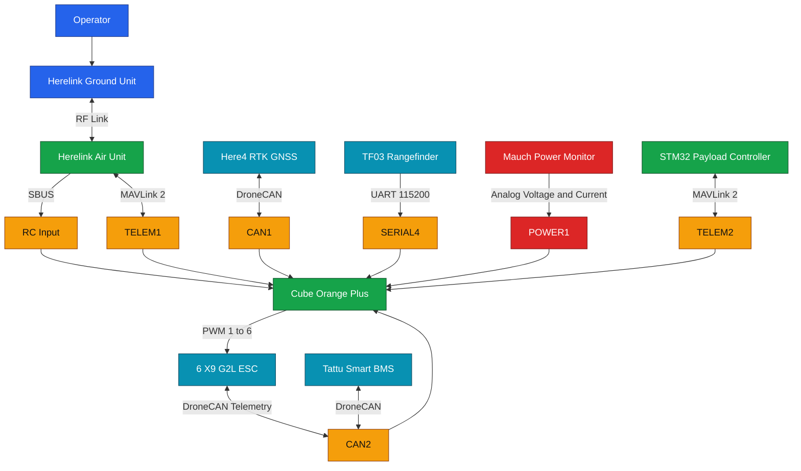

---

## 5.1 Flight controller final

### 5.1.1 Model dan identitas hardware

Flight controller final adalah:

```text
CubePilot Cube Orange+ Standard Set
```

Cube Orange+ menggunakan mikrokontroler STM32H757 dengan flash $2\ \mathrm{MB}$, RAM $1\ \mathrm{MB}$, sensor inersial ICM-20649, barometer MS5611, serta microSD melalui SDIO. Standard carrier menyediakan dua CAN, beberapa UART, dua input daya, RC input, USB, dan output PWM. ([CubePilot][1])

Identitas konfigurasi:

| Parameter                 | Nilai                            |
| ------------------------- | -------------------------------- |
| Model                     | Cube Orange+                     |
| Carrier                   | CubePilot Standard Carrier Board |
| Processor                 | STM32H757                        |
| Flash                     | $2\ \mathrm{MB}$                 |
| RAM                       | $1\ \mathrm{MB}$                 |
| IMU yang didokumentasikan | ICM-20649                        |
| Barometer internal        | MS5611                           |
| Firmware board target     | `CubeOrangePlus`                 |
| Firmware kendaraan        | ArduPilot Copter                 |
| Firmware baseline         | `4.6.3 stable`                   |

Firmware resmi ArduPilot Copter 4.6.3 tersedia untuk target `CubeOrangePlus`. Binary, parameter file, dan hash firmware yang digunakan dalam pengujian harus disimpan bersama release package desain. ([ArduPilot.org][2])

### 5.1.2 Revisi hardware

Dokumentasi publik CubePilot tidak menetapkan satu kode revisi PCB universal yang aman untuk diasumsikan pada seluruh unit Cube Orange+ Standard Set. Oleh karena itu, revisi tidak boleh ditentukan hanya dari nama produk atau warna enclosure.

Incoming inspection wajib mencatat:

- Nomor seri Cube.
- Cube ID.
- Nomor revisi pada PCB atau label.
- Nomor revisi carrier board.
- Tanggal produksi bila tersedia.
- Bootloader version.
- Hardware ID yang dilaporkan Mission Planner.
- Firmware version.
- Firmware Git hash.
- Service bulletin yang berlaku.

Format identitas:

```yaml
flightController:
  model: Cube Orange+
  boardTarget: CubeOrangePlus
  serialNumber: '<record-at-inspection>'
  cubeId: '<record-at-inspection>'
  hardwareRevision: '<record-at-inspection>'
  carrierRevision: '<record-at-inspection>'
  bootloaderVersion: '<record-at-inspection>'
  firmwareVersion: 'ArduCopter 4.6.3'
  firmwareGitHash: '<record-after-flashing>'
```

Unit dengan revisi yang berbeda harus diperlakukan sebagai configuration item berbeda sampai kompatibilitasnya dikonfirmasi.

### 5.1.3 Firmware target

Firmware yang dibekukan untuk tahap konstruksi adalah:

```text
ArduPilot Copter 4.6.3 stable
Board target: CubeOrangePlus
```

Alasan penggunaan stable release:

- Memiliki parameter list yang dapat diaudit.
- Binary resmi tersedia untuk target hardware.
- Perilaku dapat dikunci terhadap satu versi.
- Pengujian ulang dapat dilakukan menggunakan binary yang sama.

Firmware tidak boleh diperbarui otomatis setelah acceptance test. Perubahan dari 4.6.3 ke versi lain diperlakukan sebagai Engineering Change Request karena dapat mengubah:

- Parameter.
- Driver sensor.
- Perilaku failsafe.
- Mixer.
- DroneCAN.
- EKF.
- Terrain following.
- Logging.
- MAVLink routing.

### 5.1.4 Port yang digunakan

| Port Cube      | Fungsi                                                         |
| -------------- | -------------------------------------------------------------- |
| `POWER1`       | Power A dan analog voltage/current monitor                     |
| `POWER2`       | Redundant power B                                              |
| `CAN1`         | Here4 RTK GNSS dan external compass                            |
| `CAN2`         | Enam X9 G2L ESC dan smart battery telemetry                    |
| `TELEM1`       | Herelink MAVLink 2                                             |
| `TELEM2`       | STM32 payload controller                                       |
| `SERIAL4`      | TF03 UART                                                      |
| `RCIN`         | Herelink SBUS                                                  |
| `MAIN OUT 1–6` | PWM motor 1–6                                                  |
| `AUX OUT`      | Reserved untuk valve, service, dan test output                 |
| `GPS1`         | External safety switch atau service interface                  |
| `USB`          | Firmware, parameter, signing-key provisioning, dan log service |

Cube menyediakan dua CAN dan empat UART utama melalui interface carrier. Connector high-density pada carrier menggunakan JST-GH, sedangkan power-module interface menggunakan Molex Clik-Mate. ([CubePilot][3])

### 5.1.5 Orientasi pemasangan

Baseline memasang Cube dengan:

- Arrow menghadap depan kendaraan.
- Permukaan carrier sejajar bidang motor.
- `AHRS_ORIENTATION = 0`.
- Tidak ada rotasi yaw, pitch, atau roll terhadap frame.
- Flight controller ditempatkan sedekat mungkin dengan CG horizontal.

ArduPilot mengharuskan `AHRS_ORIENTATION` disetel sesuai orientasi fisik sebelum accelerometer calibration apabila autopilot tidak dipasang dengan arah standar. Baseline sengaja memakai arah standar untuk mengurangi risiko salah konfigurasi. ([ArduPilot.org][4])

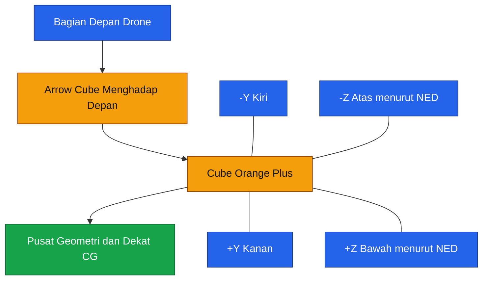

> ArduPilot menggunakan koordinat body-frame NED untuk parameter sensor: $+x$ ke depan, $+y$ ke kanan, dan $+z$ ke bawah. Ini berbeda dari konvensi $+z$ ke atas yang digunakan pada sebagian drawing mekanik Bab 2. Konversi koordinat wajib dilakukan ketika mengisi parameter offset.

### 5.1.6 Offset flight controller

Posisi flight controller terhadap CG memengaruhi pengukuran percepatan rotasional. Posisi IMU harus dicatat dengan:

$$
\mathbf{r}_{\text{FC}}
=

\begin{bmatrix}
x_{\text{FC}} \
y_{\text{FC}} \
z_{\text{FC}}
\end{bmatrix}
$$

Dalam body-frame ArduPilot:

- $x>0$: ke depan.
- $y>0$: ke kanan.
- $z>0$: ke bawah.

Parameter yang terkait:

```text
INS_POS1_X
INS_POS1_Y
INS_POS1_Z
INS_POS2_X
INS_POS2_Y
INS_POS2_Z
INS_POS3_X
INS_POS3_Y
INS_POS3_Z
```

ArduPilot merekomendasikan IMU ditempatkan sedekat mungkin dengan CG. Jika tidak memungkinkan, offset sensor dapat dikompensasi melalui parameter posisi. ([ArduPilot.org][5])

### 5.1.7 Mounting dan vibrasi

Carrier board dipasang pada avionics plate yang:

- Kaku terhadap center plate.
- Tidak berdekatan dengan pompa.
- Tidak berada langsung di atas PDB.
- Tidak menggunakan foam sangat lunak.
- Tidak menyentuh harness atau hose.
- Terlindung dari cairan tetapi tidak tertutup kedap tanpa ventilasi termal.

Mounting terlalu lunak dapat menghasilkan resonansi frekuensi rendah. Mounting terlalu kaku dapat meneruskan frekuensi motor dan propeller. Solusi final ditentukan melalui log vibrasi, bukan hanya berdasarkan sentuhan atau inspeksi visual.

Acceptance awal:

| Parameter                      | Target                   |
| ------------------------------ | ------------------------ |
| Cube tidak menyentuh enclosure | Wajib                    |
| Harness tidak menarik Cube     | Wajib                    |
| Mounting tidak bergeser        | Wajib                    |
| Tidak ada clipping IMU         | Wajib                    |
| Vibration log                  | Di dalam batas ArduPilot |
| Enclosure tidak kedap tekanan  | Wajib                    |

---

## 5.2 Sensor navigasi

### 5.2.1 Sensor-fusion architecture

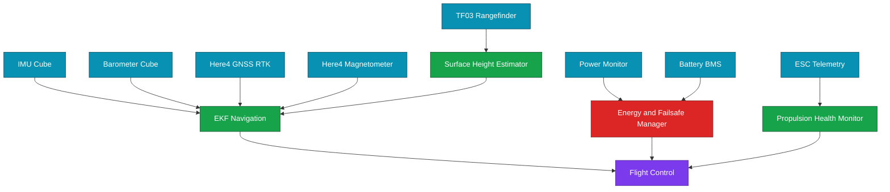

### 5.2.2 GNSS dan RTK

GNSS final adalah CubePilot Here4 dengan:

- u-blox NEO-F9P.
- Multi-constellation GNSS.
- Dual-frequency reception.
- DroneCAN.
- RTK update sampai $20\ \mathrm{Hz}$.
- Nominal positioning accuracy $0.01\ \mathrm{m}+1\ \mathrm{ppm}$ CEP.
- STM32H757 peripheral processor.
- Integrated RM3100 magnetometer.
- Integrated ICM42688 IMU.
- Integrated MS5611 barometer. ([CubePilot][6])

Nominal RTK accuracy dapat ditulis:

$$
e_{\text{RTK}}
=

0.01
+
10^{-6}L
$$

dengan:

- $e_{\text{RTK}}$ dalam meter.
- $L$ adalah baseline base-to-rover dalam meter.

Untuk baseline:

$$
L
=

5000\ \mathrm{m}
$$

maka:

$$
e_{\text{RTK}}
=

0.01
+
10^{-6}
\times
5000
$$

$$
\boxed{
e_{\text{RTK}}
=

0.015\ \mathrm{m}
}
$$

Nilai $15\ \mathrm{mm}$ adalah angka nominal CEP berdasarkan spesifikasi, bukan jaminan cross-track error kendaraan. Akurasi lintasan juga dipengaruhi:

- Multipath.
- RTK correction age.
- Antenna placement.
- EKF tuning.
- Wind.
- Frame flex.
- Control response.
- Mission geometry.
- GNSS interference.

### 5.2.3 RTK correction path

RTK correction mengikuti jalur:

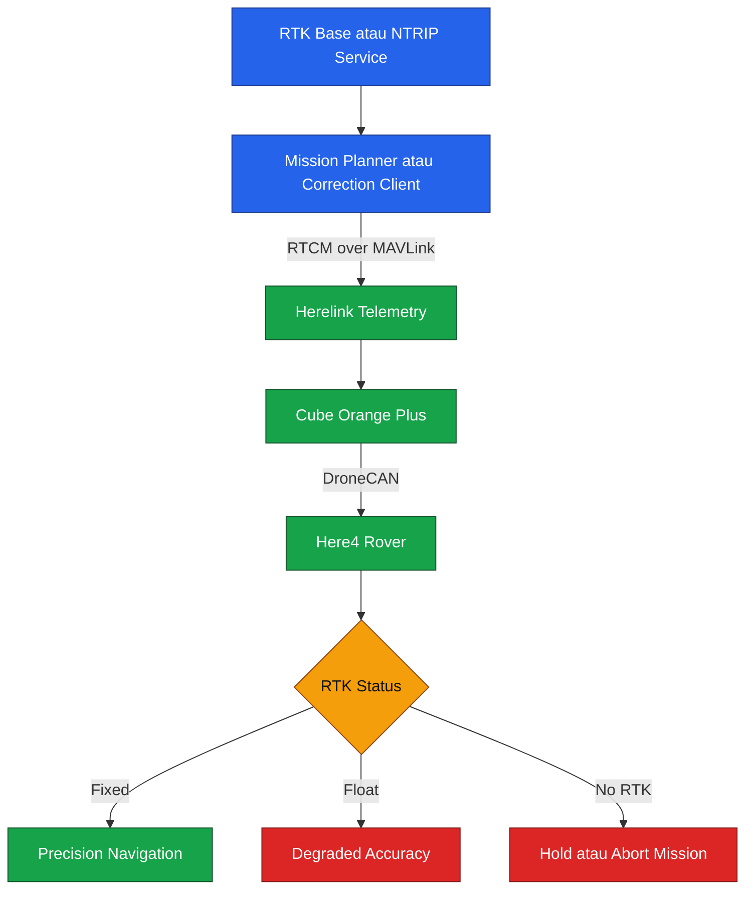

Here4 dapat menerima RTK correction melalui autopilot dan telemetry link. Dokumentasi CubePilot menjelaskan base station data diteruskan melalui telemetry menuju rover Here4, dengan status seperti RTK Float dan RTK Fixed ditampilkan pada GCS. ([CubePilot][6])

Requirement operasi:

| Kondisi                  | Respons                                         |
| ------------------------ | ----------------------------------------------- |
| RTK Fixed                | Misi presisi diizinkan                          |
| RTK Float                | Hold atau lanjut dengan batas lebih konservatif |
| 3D Fix tanpa RTK         | Penyemprotan presisi tidak dimulai              |
| GPS unhealthy            | Abort atau failsafe                             |
| Correction age berlebih  | Hold mission                                    |
| Position variance tinggi | Abort mission                                   |

### 5.2.4 Posisi antenna GNSS

Here4 ditempatkan:

- Di atas center plate.
- Sedekat mungkin dengan sumbu $x=0$ dan $y=0$.
- Jauh dari battery cable.
- Jauh dari ESC dan pompa.
- Dengan pandangan langit terbuka.
- Tidak tertutup carbon plate.
- Tidak berdekatan dengan antenna Herelink.

Posisi phase center dicatat:

$$
\mathbf{r}_{\text{GNSS}}
=

\begin{bmatrix}
x_{\text{GNSS}} \
y_{\text{GNSS}} \
z_{\text{GNSS}}
\end{bmatrix}
$$

dan dimasukkan pada:

```text
GPS_POS1_X
GPS_POS1_Y
GPS_POS1_Z
```

ArduPilot menyediakan parameter offset antenna GNSS agar posisi sensor terhadap vehicle origin dapat diperhitungkan. ([ArduPilot.org][7])

### 5.2.5 Magnetometer

Magnetometer utama adalah RM3100 pada Here4.

Alasan menggunakan external magnetometer sebagai primary:

- Lebih jauh dari PDB.
- Lebih jauh dari battery connector.
- Lebih jauh dari kabel phase motor.
- Lebih mudah ditempatkan pada mast.
- Lebih sedikit terkena magnetic field lokal.

Here4 melalui DroneCAN terdeteksi sebagai external compass, dan dokumentasi CubePilot menyatakan external CAN compass menjadi pilihan default pada Cube Orange+ dalam konfigurasi Here4. ([CubePilot][6])

Magnetic field ideal dari konduktor lurus:

$$
B
=

\frac{
\mu_0I
}{
2\pi r
}
$$

Untuk:

$$
I
=

180\ \mathrm{A}
$$

$$
r
=

0.20\ \mathrm{m}
$$

maka:

$$
B
=

\frac{
4\pi
\times
10^{-7}
\times
180
}{
2\pi
\times
0.20
}
$$

$$
\boxed{
B
\approx
180\ \mu\mathrm{T}
}
$$

Nilai tersebut dapat lebih besar daripada medan magnet bumi lokal. Dalam kabel positif dan negatif yang dipasang berdekatan, sebagian medan saling mengurangi. Karena itu, loop area kabel utama harus sekecil mungkin.

Acceptance magnetometer:

- Heading stabil saat disarmed.
- Heading tidak berubah berlebihan ketika pompa diaktifkan.
- Heading tidak berubah berlebihan ketika motor dinaikkan.
- External compass menjadi primary.
- Internal compass hanya digunakan bila lulus interference test.
- Compass calibration dilakukan setelah seluruh wiring final selesai.

### 5.2.6 Barometer

Barometer utama adalah MS5611 internal Cube Orange+. CubePilot mendokumentasikan MS5611 sebagai barometer pada Cube Orange+. ([CubePilot][8])

Barometer digunakan untuk:

- Altitude estimation.
- Vertical velocity.
- Altitude hold.
- EKF fusion.

Barometer tidak digunakan sebagai satu-satunya sensor tinggi terhadap tanaman. Pada operasi rendah, tinggi terhadap permukaan diperoleh dari rangefinder.

Instalasi harus:

- Terlindung dari propeller wash langsung.
- Tidak terkena cairan.
- Tidak tertutup kedap.
- Tidak berada dekat kipas Herelink.
- Tidak memiliki pressure pulse dari pompa.
- Memiliki vent yang memungkinkan tekanan ambient berubah.

Barometer Here4 tidak ditetapkan sebagai primary altitude source dalam `DF-01`. Penggunaan sensor tambahan tersebut hanya diaktifkan setelah device enumeration, noise, dan priority behavior diverifikasi.

### 5.2.7 Rangefinder

Rangefinder final adalah Benewake TF03.

Spesifikasi yang relevan:

| Parameter                       |                         Nilai |
| ------------------------------- | ----------------------------: |
| Interface baseline              |                          UART |
| Logic level                     |       $3.3\ \mathrm{V}$ LVTTL |
| Baud rate                       |                      $115200$ |
| Frame format                    |                           8N1 |
| Supply                          |        $5$–$24\ \mathrm{VDC}$ |
| Power                           |           $\le 1\ \mathrm{W}$ |
| Minimum distance                |             $0.1\ \mathrm{m}$ |
| Accuracy di bawah 10 m          | sekitar $\pm 0.1\ \mathrm{m}$ |
| Enclosure                       |                          IP67 |
| Frame rate baseline             |            $100\ \mathrm{Hz}$ |
| Maximum UART length pada 115200 |     sekitar $1.5\ \mathrm{m}$ |

TF03 mendukung UART dan CAN, tetapi keduanya tidak aktif bersamaan. Baseline menggunakan UART agar CAN1 dapat didedikasikan ke Here4 dan CAN2 ke propulsion telemetry.

Rangefinder disuplai dari rail payload terisolasi $12\ \mathrm{V}$, bukan dari port serial Cube. Signal UART tetap menggunakan level $3.3\ \mathrm{V}$.

Kabel:

- TX TF03 ke RX flight controller.
- RX TF03 ke TX flight controller.
- Signal ground dihubungkan.
- Supply dari DC-DC payload.
- Shield diterminasi sesuai hasil EMI test.

### 5.2.8 Rangefinder geometry

TF03 harus dipasang:

- Menghadap vertikal ke bawah.
- Tidak melihat landing gear.
- Tidak melihat spray boom.
- Tidak berada di belakang plume nozzle.
- Tidak tertutup droplet.
- Dekat sumbu CG horizontal.

Jika sensor memiliki sudut pemasangan $\theta$, jarak vertikal adalah:

$$
h
=

d
\cos\theta
$$

dengan:

- $d$: jarak sepanjang beam.
- $h$: tinggi vertikal.
- $\theta$: sudut beam terhadap vertikal.

Untuk:

$$
d
=

2.5\ \mathrm{m}
$$

$$
\theta
=

5^\circ
$$

maka:

$$
h
=

2.5
\cos 5^\circ
$$

$$
\boxed{
h
\approx
2.49\ \mathrm{m}
}
$$

Kesalahan vertikal kecil pada $5^\circ$, tetapi beam dapat berpindah lateral:

$$
x_{\text{beam}}
=

d
\sin\theta
$$

$$
x_{\text{beam}}
=

2.5
\sin 5^\circ
$$

$$
\boxed{
x_{\text{beam}}
\approx
0.218\ \mathrm{m}
}
$$

Karena itu, alignment sensor tetap penting pada tanaman dengan kanopi tidak seragam.

### 5.2.9 ESC telemetry

X9 G2L mendukung PWM dan CAN digital throttle serta protokol DroneCAN dan HWCAN. Default pabrikan adalah HWCAN, sehingga setiap ESC harus dipindahkan ke DroneCAN sebelum disambungkan ke CAN2 ArduPilot. ([HOBBYWING][9])

Baseline menggunakan:

- PWM sebagai command utama.
- DroneCAN untuk telemetry.
- CAN digital throttle belum diaktifkan sebagai command primary.
- Dual-throttle operation hanya diaktifkan setelah conflict-resolution dan failover behavior diuji.

Data telemetry yang dibutuhkan:

- RPM.
- Bus voltage.
- Bus current.
- ESC temperature.
- Motor temperature jika tersedia.
- Fault state.
- Desynchronization.
- Throttle feedback.
- Communication state.

ArduPilot dapat mencatat ESC telemetry dalam log dan mengirimkan data ESC ke GCS melalui MAVLink 2. ([ArduPilot.org][10])

### 5.2.10 Power monitor

Power monitor utama adalah Mauch PL-200/8 120 V:

- Hall-effect current sensor.
- Range arus nominal $200\ \mathrm{A}$.
- Pengukuran tegangan sampai $120\ \mathrm{V}$.
- Dipasang pada main battery output.
- Menjadi sumber utama voltage dan current untuk battery failsafe.

Power monitor memungkinkan autopilot memantau tegangan, arus, dan consumed capacity untuk memicu battery failsafe. ArduPilot mendukung power monitor analog dan calibration melalui scaling parameter. ([ArduPilot.org][11])

Calibration relationship:

$$
V_{\text{battery}}
=

V_{\text{ADC}}
K_V
$$

$$
I_{\text{battery}}
=

V_{\text{current-sense}}
K_I
$$

dengan:

- $K_V$: voltage multiplier.
- $K_I$: ampere-per-volt coefficient.

Nilai parameter tidak diambil langsung dari label sensor. Nilai akhir diperoleh melalui kalibrasi menggunakan:

- Multimeter referensi.
- Clamp meter DC.
- Electronic load atau propulsion load.
- Beberapa titik arus.

---

## 5.3 Wiring avionik

### 5.3.1 Tabel port final

| Port flight controller | Perangkat                | Protokol             |      Tegangan peripheral |            Baud atau bit rate | Connector                     |
| ---------------------- | ------------------------ | -------------------- | -----------------------: | ----------------------------: | ----------------------------- |
| `POWER1`               | DC-DC A + Mauch V/I      | Analog power monitor |     $5.2\ \mathrm{V}$ FC |                 Tidak berlaku | Molex Clik-Mate               |
| `POWER2`               | DC-DC B                  | Power only           |     $5.2\ \mathrm{V}$ FC |                 Tidak berlaku | Molex Clik-Mate               |
| `CAN1`                 | Here4                    | DroneCAN             |      $5\ \mathrm{V}$ bus | $1\ \mathrm{Mbit/s}$ baseline | JST-GH 4-pin                  |
| `CAN2`                 | X9 G2L × 6 + Tattu BMS   | DroneCAN             |       Self-powered nodes | $1\ \mathrm{Mbit/s}$ baseline | JST-GH/custom harness         |
| `TELEM1`               | Herelink Air Unit        | MAVLink 2 UART       |  $3.3\ \mathrm{V}$ logic |      $115200\ \mathrm{bit/s}$ | JST-GH 6-pin to Herelink UART |
| `TELEM2`               | STM32 payload controller | MAVLink 2 UART       |  $3.3\ \mathrm{V}$ logic |      $115200\ \mathrm{bit/s}$ | JST-GH 6-pin                  |
| `SERIAL4`              | TF03                     | UART 8N1             |  $3.3\ \mathrm{V}$ logic |      $115200\ \mathrm{bit/s}$ | JST-GH to Molex harness       |
| `RCIN`                 | Herelink SBUS1           | SBUS                 | $3.3\ \mathrm{V}$ signal |                  SBUS framing | RCIN connector                |
| `MAIN1`                | X9 G2L motor 1           | PWM                  |             Logic signal |     $400\ \mathrm{Hz}$ target | Servo connector               |
| `MAIN2`                | X9 G2L motor 2           | PWM                  |             Logic signal |     $400\ \mathrm{Hz}$ target | Servo connector               |
| `MAIN3`                | X9 G2L motor 3           | PWM                  |             Logic signal |     $400\ \mathrm{Hz}$ target | Servo connector               |
| `MAIN4`                | X9 G2L motor 4           | PWM                  |             Logic signal |     $400\ \mathrm{Hz}$ target | Servo connector               |
| `MAIN5`                | X9 G2L motor 5           | PWM                  |             Logic signal |     $400\ \mathrm{Hz}$ target | Servo connector               |
| `MAIN6`                | X9 G2L motor 6           | PWM                  |             Logic signal |     $400\ \mathrm{Hz}$ target | Servo connector               |
| `GPS1`                 | External safety switch   | Digital input        |          $5\ \mathrm{V}$ |                 Tidak berlaku | JST-GH                        |
| `USB`                  | Service computer         | USB                  |  $5\ \mathrm{V}$ service |                           USB | Micro-USB                     |

CubePilot mendokumentasikan dua CAN, beberapa UART, RCIN, power connectors, dan JST-GH sebagai interface utama Cube carrier. Herelink Air Unit menyediakan UART $3.3\ \mathrm{V}$ TTL dan dua output SBUS. ([CubePilot][3])

### 5.3.2 Wiring Herelink

Wiring:

```text
Herelink SBUS1  -> Cube RCIN
Herelink TX     -> Cube TELEM1 RX
Herelink RX     -> Cube TELEM1 TX
Herelink GND    -> Cube TELEM1 GND
Herelink Power  -> Dedicated 10.8 V DC-DC
```

CubePilot menginstruksikan SBUS Air Unit ke RCIN dan UART Air Unit ke TELEM1 atau TELEM2. Air Unit menerima suplai sekitar $7$–$12.6\ \mathrm{V}$ dan menggunakan UART level $3.3\ \mathrm{V}$. ([CubePilot][12])

### 5.3.3 UART throughput

Untuk UART 8N1, setiap byte memerlukan:

- 1 start bit.
- 8 data bit.
- 1 stop bit.

Total:

$$
n_{\text{bit/byte}}
=

10
$$

Maximum theoretical byte rate:

$$
R_{\text{byte}}
=

\frac{
R_{\text{baud}}
}{
10
}
$$

Untuk:

$$
R_{\text{baud}}
=

115200\ \mathrm{bit/s}
$$

maka:

$$
R_{\text{byte}}
=

\frac{
115200
}{
10
}
$$

$$
\boxed{
R_{\text{byte}}
=

11520\ \mathrm{byte/s}
}
$$

Actual payload throughput lebih rendah karena:

- MAVLink framing.
- CRC.
- Message signing.
- Retransmission pada mission protocol.
- Multiple data streams.

Target normal UART utilization:

$$
U_{\text{UART}}
\le
60\%
$$

agar tersedia margin untuk burst parameter, mission upload, dan status text.

### 5.3.4 Harness identification

Setiap harness diberi label:

```text
AV-CAN1-H4
AV-CAN2-ESC
AV-UART1-HL
AV-UART2-PAY
AV-UART4-RNG
AV-RCIN-HL
AV-PWR1
AV-PWR2
AV-PWM-M1 ... AV-PWM-M6
```

Setiap label dicatat dalam harness table dengan:

- Source.
- Destination.
- Pin.
- Signal.
- Voltage.
- Wire gauge.
- Length.
- Shield termination.
- Connector part number.
- Test result.

---

## 5.4 CAN, UART, dan PWM

### 5.4.1 Pembagian interface

| Interface    | Digunakan untuk    | Alasan                                 |
| ------------ | ------------------ | -------------------------------------- |
| CAN1         | Here4              | Differential, robust, device discovery |
| CAN2         | ESC dan BMS        | Multi-node telemetry                   |
| UART TELEM1  | Herelink           | Native MAVLink serial                  |
| UART TELEM2  | Payload controller | Deterministic point-to-point           |
| UART SERIAL4 | TF03               | Menghindari campuran protocol pada CAN |
| PWM MAIN1–6  | Motor command      | Jalur command sederhana dan langsung   |
| SBUS RCIN    | RC control         | Frame multi-channel khusus RC          |

### 5.4.2 CAN

Keunggulan CAN:

- Differential signaling.
- Multi-node bus.
- Error detection.
- Arbitration.
- Device telemetry dua arah.
- Lebih tahan common-mode noise daripada single-ended UART.

CAN tidak kebal terhadap kesalahan wiring. Masalah umum:

- Terminator terlalu banyak.
- Stub terlalu panjang.
- CAN_H dan CAN_L tertukar.
- Bit rate berbeda.
- Ground reference tidak terhubung.
- Duplicate node ID.
- Protocol HWCAN tercampur dengan DroneCAN.

### 5.4.3 CAN termination

Bus CAN linear memerlukan terminator $120\ \Omega$ pada dua ujung fisik.

Equivalent resistance ketika daya mati:

$$
R_{\text{eq}}
=

120
\parallel
120
$$

$$
R_{\text{eq}}
=

\frac{
120
\times
120
}{
120+120
}
$$

$$
\boxed{
R_{\text{eq}}
=

60\ \Omega
}
$$

Pengukuran sekitar $60\ \Omega$ antara CAN_H dan CAN_L menunjukkan dua terminator terpasang. Nilai sekitar $120\ \Omega$ menunjukkan hanya satu terminator, sedangkan nilai jauh di bawah $60\ \Omega$ dapat menunjukkan terlalu banyak terminator.

DroneCAN menetapkan CAN_H dan CAN_L sebagai twisted pair dan merekomendasikan topologi bus dengan stub minimal. ([DroneCAN][13])

### 5.4.4 Topologi CAN1

CAN1 menggunakan topologi point-to-point:

```mermaid
flowchart LR
    T1[120 Ohm] --- FC[Cube CAN1]
    FC === H4[Here4]
    H4 --- T2[120 Ohm]

    classDef term fill:#dc2626,color:#fff,stroke:#7f1d1d
    classDef node fill:#2563eb,color:#fff,stroke:#1e3a8a

    class T1,T2 term
    class FC,H4 node
```

Terminator internal pada carrier atau Here4 harus diperiksa sebelum terminator eksternal ditambahkan.

### 5.4.5 Topologi CAN2

CAN2 menggunakan trunk linear:

```mermaid
flowchart LR
    T1[120 Ohm] --- FC[Cube CAN2]
    FC === E1[ESC 1]
    E1 === E2[ESC 2]
    E2 === E3[ESC 3]
    E3 === BMS[Smart BMS]
    BMS === E4[ESC 4]
    E4 === E5[ESC 5]
    E5 === E6[ESC 6]
    E6 --- T2[120 Ohm]

    classDef term fill:#dc2626,color:#fff,stroke:#7f1d1d
    classDef node fill:#2563eb,color:#fff,stroke:#1e3a8a
    classDef battery fill:#f59e0b,color:#111,stroke:#92400e

    class T1,T2 term
    class FC,E1,E2,E3,E4,E5,E6 node
    class BMS battery
```

Star topology tidak digunakan.

### 5.4.6 CAN bus utilization

Bus utilization:

$$
U_{\text{CAN}}
=

\frac{
\sum_{i=1}^{n}
f_iN_i
}{
R_{\text{CAN}}
}
$$

dengan:

- $f_i$: message frequency.
- $N_i$: jumlah bit per frame termasuk overhead.
- $R_{\text{CAN}}$: bus bit rate.

Target internal:

| Kondisi     |                          Utilization |
| ----------- | -----------------------------------: |
| Normal      |                            $\le 30%$ |
| Peak        |                            $\le 50%$ |
| Fault burst | Tidak menyebabkan command starvation |

CAN2 harus diuji dengan seluruh enam ESC dan BMS aktif.

### 5.4.7 UART

UART digunakan untuk point-to-point link:

- Herelink.
- Payload controller.
- TF03.

Keunggulan:

- Sederhana.
- Mudah dianalisis dengan logic analyzer.
- Tidak membutuhkan node ID.
- Mudah diuji secara terpisah.

Keterbatasan:

- Single-ended.
- Lebih rentan ground offset.
- Tidak ideal untuk kabel panjang.
- Tidak memiliki arbitration.
- TX/RX dapat tertukar.
- Satu perangkat per port.

TF03 menetapkan panjang kabel maksimum referensi sekitar $1.5\ \mathrm{m}$ pada $115200\ \mathrm{bit/s}$ dan merekomendasikan shielded cable.

### 5.4.8 PWM

PWM digunakan sebagai command motor primary karena:

- Jalur langsung.
- Tidak memerlukan bus arbitration.
- Tidak bergantung node discovery.
- Dapat diuji motor per motor.
- Didukung oleh X9 G2L.

Keterbatasannya:

- Tidak membawa telemetry.
- Single-ended.
- Tidak memiliki CRC.
- Rentan terhadap ground noise.
- Memerlukan satu jalur per ESC.

PWM cable harus:

- Dipisahkan dari phase wires.
- Memiliki signal ground.
- Tidak melewati PDB.
- Memiliki connector locking.
- Tidak disambung dengan jumper longgar.

### 5.4.9 Dual command PWM dan CAN

X9 G2L mendukung analog PWM dan digital CAN throttle. Namun, simultaneous dual-command operation dapat menciptakan ambiguity bila:

- Kedua command tidak sama.
- Salah satu link tertunda.
- CAN node reboot.
- PWM stuck.
- Flight controller dan ESC menggunakan prioritas berbeda.

Baseline:

```text
PWM = command authority
CAN = telemetry only
```

Digital CAN throttle baru diaktifkan setelah:

- Prioritas command diketahui.
- Failover behavior diuji.
- Latency dibandingkan.
- Command mismatch diuji.
- Loss-of-CAN diuji.
- Loss-of-PWM diuji.
- ESC firmware dibekukan.

---

## 5.5 EMI dan grounding

### 5.5.1 Sumber gangguan

Sumber EMI utama:

- Switching ESC.
- Phase wires motor.
- Main battery loop.
- DC-DC converter.
- Pump controller.
- Herelink radio.
- High-current connector.
- PWM edge.
- CAN edge.
- Relay atau valve inductive load.

Perangkat paling sensitif:

- GNSS antenna.
- Magnetometer.
- Barometer.
- Analog current/voltage monitor.
- UART rangefinder.
- RC input.
- Flight-controller IMU.

### 5.5.2 Induced voltage dan loop area

Menurut Faraday:

$$
V_{\text{induced}}
=

-N
\frac{
d\Phi
}{
dt
}
$$

Magnetic flux:

$$
\Phi
=

BA
$$

Sehingga, untuk perubahan medan yang sama, induced voltage meningkat terhadap loop area $A$.

Implikasi praktis:

- Positive dan negative battery cable dipasang berdekatan.
- CAN_H dan CAN_L dipilin.
- UART TX dan ground dapat dipasang berdekatan.
- PWM signal dan ground dipasangkan.
- Jangan membuat service loop besar pada signal cable.

### 5.5.3 Zoning avionik

```mermaid
flowchart TB
    Z1[Zone A GNSS dan Compass] --> Z2[Zone B Flight Controller]
    Z2 --> Z3[Zone C Low Voltage Avionics]
    Z3 --> Z4[Zone D High Voltage Distribution]
    Z4 --> Z5[Zone E ESC dan Motor]

    classDef clean fill:#16a34a,color:#fff,stroke:#14532d
    classDef medium fill:#f59e0b,color:#111,stroke:#92400e
    classDef noisy fill:#dc2626,color:#fff,stroke:#7f1d1d

    class Z1,Z2 clean
    class Z3 medium
    class Z4,Z5 noisy
```

Aturan:

- Here4 berada pada zone paling bersih.
- Cube berada pada center avionics plate.
- DC-DC ditempatkan lebih jauh dari Here4.
- PDB berada di bawah atau terpisah secara lateral.
- Kabel phase tetap pada arm.
- Kabel HV tidak melintas di bawah magnetometer.
- Pump controller tidak dipasang satu bracket dengan Cube.

### 5.5.4 Twisted pair

Wajib twisted pair:

- CAN_H dan CAN_L.
- Battery voltage sense dan return bila remote sensing digunakan.
- PWM signal dan signal ground untuk kabel panjang.
- UART TX/GND dan RX/GND bila harness memungkinkan.
- Differential Ethernet pair Herelink.

DroneCAN secara eksplisit mengharuskan CAN_H dan CAN_L berada dalam twisted pair. ([DroneCAN][13])

### 5.5.5 Shielding

Shield digunakan pada:

- TF03 UART.
- Long external UART.
- Sensitive analog sense.
- Harness yang melewati area switching.

Baseline shield termination:

- Shield diterminasi pada satu sisi di avionics enclosure.
- Shield tidak digunakan sebagai current return.
- Shield tidak disambungkan ke carbon frame secara sembarang.
- Perubahan ke dual-ended termination hanya dilakukan setelah common-mode test.

### 5.5.6 Grounding

Ground architecture:

```mermaid
flowchart TD
    BATN[Battery Negative] --> STAR[Main Power Star Point]

    STAR --> ESCG[ESC Power Returns]
    STAR --> PUMPG[Pump Power Return]
    STAR --> DCG[DC-DC Input Returns]

    DCG --> ISOA[Isolated Avionics A]
    DCG --> ISOB[Isolated Avionics B]
    DCG --> ISOP[Isolated Payload]

    ISOA --> FCG[Flight Controller Ground]
    ISOB --> FCG
    ISOP --> PAYG[Payload Ground]

    FCG --> SIG[CAN UART PWM Signal References]

    classDef power fill:#dc2626,color:#fff,stroke:#7f1d1d
    classDef isolate fill:#f59e0b,color:#111,stroke:#92400e
    classDef signal fill:#16a34a,color:#fff,stroke:#14532d

    class BATN,STAR,ESCG,PUMPG,DCG power
    class ISOA,ISOB,ISOP isolate
    class FCG,PAYG,SIG signal
```

Prinsip:

- Carbon frame tidak digunakan sebagai conductor.
- Pump return tidak melewati avionics ground.
- ESC power current tidak melewati signal ground.
- Ground reference UART tetap tersedia.
- CAN nodes mempunyai common reference sesuai harness.
- Shield tidak menggantikan signal ground.

### 5.5.7 Penempatan Here4

Internal placement target:

| Parameter                    |                 Target |
| ---------------------------- | ---------------------: |
| Jarak dari battery connector | $\ge 300\ \mathrm{mm}$ |
| Jarak dari PDB               | $\ge 300\ \mathrm{mm}$ |
| Jarak dari DC-DC             | $\ge 200\ \mathrm{mm}$ |
| Jarak dari Herelink Air Unit | $\ge 200\ \mathrm{mm}$ |
| Jarak dari phase wire        |     semaksimal mungkin |
| Pandangan langit             |        tidak terhalang |

Nilai tersebut merupakan target internal layout, bukan spesifikasi universal.

CubePilot menekankan antenna RTK memerlukan pandangan langit yang baik dan tidak ditempatkan dekat perangkat elektronik berdaya tinggi. ([CubePilot][6])

### 5.5.8 Penempatan antenna Herelink

Herelink Air Unit menggunakan dua antenna. CubePilot menginstruksikan agar antenna tidak ditempelkan pada metal atau material konduktif, termasuk carbon fiber, dan ditempatkan sesuai orientasi yang disarankan. ([CubePilot][12])

Aturan layout:

- Antenna tidak berada di belakang battery.
- Antenna tidak sejajar dan saling menutupi.
- Coax tidak dilipat tajam.
- Antenna tidak berada dalam spray plume.
- Antenna tidak menyentuh carbon arm.
- Connector MMCX diberi strain relief.

### 5.5.9 EMI acceptance test

Pengujian dilakukan dalam tahapan:

1. Avionik saja.
2. Pompa aktif.
3. Satu motor aktif.
4. Tiga motor aktif.
5. Enam motor aktif.
6. Full-thrust transient.
7. Herelink transmit.
8. RTK correction aktif.
9. Semua subsystem aktif.

Parameter direkam:

- Compass field.
- Compass innovation.
- GNSS satellite count.
- GNSS noise.
- RTK fix state.
- UART framing error.
- CAN error count.
- Power-monitor noise.
- Barometer noise.
- RC frame loss.
- Telemetry packet loss.

---

## 5.6 RC dan telemetry

### 5.6.1 RC sebagai manual control dan abort

RC digunakan untuk:

- Arming dan disarming.
- Manual takeoff bila prosedur mengharuskan.
- Flight-mode selection.
- AUTO activation.
- Mission abort.
- LAND.
- RTL.
- Sprayer manual inhibit.
- Emergency response.

RC tidak digunakan untuk menggantikan fungsi autopilot stabilization. Bahkan pada mode manual seperti Stabilize, autopilot tetap menjalankan attitude control.

### 5.6.2 Telemetry

Telemetry digunakan untuk:

- Mission upload.
- Parameter configuration.
- RTK correction injection.
- Position monitoring.
- Battery monitoring.
- ESC health monitoring.
- Sprayer monitoring.
- Log status.
- Failsafe notification.
- Command acknowledgement.

GCS dapat menampilkan kondisi kendaraan, mengunggah misi, mengubah parameter, dan mengirim command ke autopilot. ([ArduPilot.org][14])

### 5.6.3 Pemisahan RC dan telemetry

Pada Herelink:

- RC keluar melalui SBUS.
- Telemetry keluar melalui UART.
- Keduanya masuk ke port Cube yang berbeda.
- RC tidak dikirim sebagai MAVLink RC override.
- Telemetry congestion tidak boleh memblokir SBUS input pada carrier.

Namun, SBUS dan telemetry Herelink berbagi:

- Air Unit yang sama.
- Ground Unit yang sama.
- RF transport yang sama.
- Power supply Air Unit yang sama.

Dengan demikian:

> Herelink memberikan **pemisahan interface**, tetapi tidak memberikan **independent RF redundancy**.

Kehilangan Herelink RF dapat menyebabkan RC dan GCS telemetry hilang bersamaan. Sistem harus mengandalkan radio failsafe dan autonomous flight controller response, bukan menganggap telemetry tetap tersedia.

### 5.6.4 RC override dari GCS

Joystick GCS menggunakan MAVLink RC channel override. ArduPilot merekomendasikan regular transmitter tetap tersedia sebagai backup saat joystick GCS digunakan. Baseline tidak menggunakan joystick GCS sebagai primary control. ([ArduPilot.org][15])

Aturan:

- Herelink SBUS adalah RC primary.
- MAVLink RC override dinonaktifkan atau dibatasi untuk operasi normal.
- GCS tidak digunakan untuk continuous stick control.
- Guided commands hanya digunakan pada mode dan prosedur yang disetujui.

### 5.6.5 Link monitoring

Link health indicators:

| Link        | Parameter yang dipantau                        |
| ----------- | ---------------------------------------------- |
| SBUS RC     | Frame-loss, failsafe flag, channel validity    |
| MAVLink     | Heartbeat age, packet loss, round-trip latency |
| CAN1        | Node health, transfer error, GNSS state        |
| CAN2        | ESC node count, BMS state, CAN error           |
| RTK         | Correction age, RTK Float/Fixed                |
| Herelink RF | Link quality, disconnect events                |

Packet-loss ratio:

$$
L_{\text{packet}}
=

\frac{
N_{\text{expected}}
-

N_{\text{received}}
}{
N_{\text{expected}}
}
\times
100\%
$$

Heartbeat age:

$$
t_{\text{HB-age}}
=

t_{\text{now}}
-

t_{\text{last-heartbeat}}
$$

GCS failsafe ArduPilot memantau waktu sejak MAVLink heartbeat terakhir dan dapat memicu tindakan ketika `FS_GCS_TIMEOUT` terlampaui. ([ArduPilot.org][16])

### 5.6.6 Link-loss philosophy

| Kegagalan                            | Sistem yang masih tersedia      | Respons                       |
| ------------------------------------ | ------------------------------- | ----------------------------- |
| Telemetry UART putus, SBUS masih ada | RC manual                       | Operator abort                |
| SBUS putus, MAVLink masih ada        | Autopilot dan GCS               | Radio failsafe                |
| Herelink RF putus total              | Autopilot onboard               | Radio dan GCS failsafe        |
| GCS aplikasi crash                   | SBUS RC                         | Operator tetap dapat abort    |
| Air Unit power loss                  | Tidak ada RC/telemetry Herelink | Autonomous failsafe           |
| GNSS loss                            | RC dan autopilot attitude       | EKF/GPS failsafe              |
| CAN2 loss                            | PWM command tetap tersedia      | Land berdasarkan health logic |

---

## 5.7 Control authority matrix

### 5.7.1 Prinsip otoritas

Otoritas tidak ditentukan berdasarkan “input terakhir”. Otoritas ditentukan oleh:

- Flight mode.
- RC mode switch.
- Mission state.
- MAVLink command.
- Failsafe state.
- EKF health.
- Battery health.
- Geofence.
- Arming state.

Flight controller tetap menjadi eksekutor akhir. RC dan GCS tidak mengontrol ESC secara langsung.

```mermaid
stateDiagram-v2
    [*] --> Disarmed
    Disarmed --> ManualReady: Arm
    ManualReady --> AutoMission: RC pilih AUTO
    AutoMission --> ManualAbort: RC ubah mode
    AutoMission --> Failsafe: RC GCS Battery atau EKF fault
    ManualReady --> Failsafe: Fault
    ManualAbort --> Land: Operator pilih LAND
    Failsafe --> RTL: Position valid dan energi cukup
    Failsafe --> Land: RTL tidak aman
    RTL --> Land
    Land --> Disarmed
```

### 5.7.2 Matriks otoritas

| Kondisi          | RC                                | GCS                            | Mission                 | Autopilot              | Failsafe                     |
| ---------------- | --------------------------------- | ------------------------------ | ----------------------- | ---------------------- | ---------------------------- |
| Disarmed         | Arming request                    | Parameter dan mission upload   | Tidak aktif             | Pre-arm validation     | Mencegah arming              |
| Stabilize        | Stick command utama               | Monitoring                     | Tidak aktif             | Attitude stabilization | RC/battery protection        |
| AltHold          | Roll, pitch, yaw, climb demand    | Monitoring                     | Tidak aktif             | Altitude control       | RC/battery protection        |
| Loiter           | Position demand melalui stick     | Monitoring                     | Tidak aktif             | Position hold          | GPS/EKF protection           |
| AUTO             | Mode abort dan limited override   | Monitoring dan mission command | Navigation authority    | Executes mission       | Dapat memaksa mode change    |
| Guided           | Abort dan mode change             | Position command               | Tidak aktif             | Executes guided target | Timeout/failsafe             |
| RTL              | Mode change terbatas              | Monitoring                     | Tidak aktif             | Return and land        | Tetap pada safe mode         |
| LAND             | Limited reposition bila diizinkan | Monitoring                     | Tidak aktif             | Controlled descent     | Prioritas landing            |
| RC loss          | Tidak tersedia                    | Monitoring bila link ada       | Bergantung konfigurasi  | Failsafe execution     | Primary authority            |
| GCS loss         | RC tetap tersedia bila SBUS hidup | Tidak tersedia                 | Dapat lanjut atau abort | Sesuai parameter       | GCS failsafe                 |
| Battery critical | Override dibatasi                 | Monitoring                     | Dibatalkan              | LAND/RTL               | Highest operational priority |
| EKF unhealthy    | Manual mode mungkin tersedia      | Monitoring                     | Dibatalkan              | Safe-mode transition   | Highest navigation priority  |

ArduPilot menyediakan radio, GCS, battery, GPS, dan EKF failsafe. Setelah failsafe mengubah mode, kendaraan umumnya tetap berada pada mode tersebut sampai pilot melakukan perubahan mode yang valid. ([ArduPilot.org][17])

### 5.7.3 Prioritas kondisi darurat

Priority order internal:

1. Motor or propulsion critical fault.
2. Battery critical.
3. EKF or position critical.
4. Geofence breach.
5. RC loss.
6. GCS loss.
7. RTK degradation.
8. Payload fault.

Payload fault tidak boleh mengambil alih attitude control. Respons payload adalah:

- Pump off.
- Valve close.
- Notify FC/GCS.
- Continue, abort, atau land sesuai severity.

### 5.7.4 RC mode allocation

Minimum switch allocation:

| Fungsi               | Input                      |
| -------------------- | -------------------------- |
| Flight mode          | 3-position switch          |
| AUTO enable          | Dedicated position         |
| LAND                 | Dedicated reachable switch |
| RTL                  | Dedicated reachable switch |
| Sprayer inhibit      | Dedicated switch           |
| Arming               | Protected action           |
| Emergency motor stop | Guarded switch             |

Emergency motor stop tidak boleh ditempatkan pada switch yang mudah tersentuh.

### 5.7.5 Failsafe decision logic

```mermaid
flowchart TD
    F[Fault Detected] --> P{Position Valid?}
    P -- Ya --> E{Energy untuk RTL?}
    P -- Tidak --> L[LAND atau Controlled Descent]

    E -- Ya --> O{Obstacle dan Route Aman?}
    E -- Tidak --> L

    O -- Ya --> R[RTL]
    O -- Tidak --> L

    R --> D[LAND]
    L --> D

    classDef fault fill:#dc2626,color:#fff,stroke:#7f1d1d
    classDef decision fill:#f59e0b,color:#111,stroke:#92400e
    classDef action fill:#16a34a,color:#fff,stroke:#14532d

    class F fault
    class P,E,O decision
    class R,L,D action
```

---

## 5.8 Keamanan komunikasi

### 5.8.1 Threat model

Ancaman yang dipertimbangkan:

- Command injection.
- Unauthorized mission upload.
- Unauthorized parameter changes.
- Replay attack.
- Telemetry interception.
- Compromised GCS.
- Malware pada Android ground unit.
- Exposed MAVLink UDP port.
- Stolen signing key.
- Unauthorized USB access.
- LTE tunnel misconfiguration.

### 5.8.2 MAVLink 2 signing

MAVLink 2 signing menyediakan autentikasi pesan. Penerima dapat memverifikasi bahwa pesan berasal dari sumber yang memiliki shared secret dan bahwa packet tidak dimodifikasi.

MAVLink signing **bukan enkripsi**. Isi telemetry masih dapat dibaca oleh pihak yang dapat menangkap transport link. Dokumentasi MAVLink secara eksplisit membedakan message authentication dan encryption. ([MAVLink][18])

Signing menggunakan secret key:

$$
K_{\text{sign}}
=

32\ \mathrm{byte}
$$

Signature dihitung dari key, packet, link ID, dan timestamp:

$$
S
=

\operatorname{SHA256}_{48}
\left(
K_{\text{sign}}
\Vert
H
\Vert
P
\Vert
CRC
\Vert
ID_{\text{link}}
\Vert
t
\right)
$$

MAVLink menggunakan 32-byte secret key dan menambahkan signing block pada MAVLink 2 packet. Key harus disebarkan melalui secure channel dan tidak boleh muncul pada parameter atau public log. ([MAVLink][19])

### 5.8.3 Signing-key provisioning

Key provisioning dilakukan melalui:

- USB langsung.
- Wired Ethernet lokal.
- Service laptop yang dipercaya.
- Kendaraan dalam kondisi disarmed.
- RF link dinonaktifkan bila memungkinkan.

Prosedur:

1. Generate random 32-byte key.
2. Simpan master key pada encrypted credential store.
3. Hubungkan Cube melalui USB.
4. Provision key ke autopilot.
5. Provision key ke GCS.
6. Uji signed communication.
7. Tolak unsigned command pada operational link.
8. Simpan key ID, bukan key material, pada dokumentasi.
9. Jangan memasukkan key ke Git.
10. Jangan memasukkan key ke screenshot atau log.

MAVLink merekomendasikan `SETUP_SIGNING` hanya dikirim melalui secure link seperti USB atau wired Ethernet dan tidak dibroadcast. ([MAVLink][19])

### 5.8.4 Authentication dan encryption layers

```mermaid
flowchart TD
    APP[Mission Planner atau GCS] --> ENC[VPN Encryption]
    ENC --> NET[Wi-Fi LTE atau Ethernet]
    NET --> DEC[VPN Decryption]
    DEC --> SIGN[MAVLink 2 Signing Verification]
    SIGN --> FC[Autopilot Command Processor]

    BAD1[Unsigned atau Bad Signature] --> DROP[Reject Packet]
    SIGN -->|Invalid| DROP

    classDef application fill:#2563eb,color:#fff,stroke:#1e3a8a
    classDef security fill:#16a34a,color:#fff,stroke:#14532d
    classDef network fill:#f59e0b,color:#111,stroke:#92400e
    classDef risk fill:#dc2626,color:#fff,stroke:#7f1d1d

    class APP,FC application
    class ENC,DEC,SIGN security
    class NET network
    class BAD1,DROP risk
```

Fungsi tiap lapisan:

| Lapisan            | Fungsi                                         |
| ------------------ | ---------------------------------------------- |
| MAVLink signing    | Autentikasi command dan anti-tampering         |
| VPN                | Enkripsi transport dan peer authentication     |
| Firewall           | Membatasi endpoint dan port                    |
| GCS access control | Membatasi operator                             |
| Physical access    | Melindungi USB, SD card, dan service connector |

### 5.8.5 Enkripsi jaringan

Karena MAVLink tidak mengenkripsi payload, link berbasis IP harus menggunakan:

- WireGuard.
- IPsec.
- TLS tunnel yang sesuai.
- Private APN dengan VPN tambahan.

MAVLink UDP tidak boleh diekspos langsung ke internet.

Larangan:

```text
Public IP -> UDP 14550 -> Autopilot
```

Arsitektur yang diterima:

```text
GCS -> Authenticated VPN -> Private Vehicle Gateway -> MAVLink Router -> Autopilot
```

### 5.8.6 LTE link

LTE tidak menjadi bagian `DF-01`. Jika ditambahkan melalui ECR:

- Modem tidak boleh terhubung langsung ke flight-controller UART tanpa firewall gateway.
- Modem menggunakan outbound VPN.
- Tidak ada inbound public port.
- SIM management dan APN dicatat.
- Link latency dan jitter diuji.
- LTE bukan pengganti RC.
- Kehilangan LTE tidak boleh mengubah attitude control.
- GCS failsafe ditetapkan sesuai mission concept.
- OTA update dinonaktifkan selama operasi.

### 5.8.7 Firewall policy

Minimum allowlist:

| Traffic                        | Policy                      |
| ------------------------------ | --------------------------- |
| GCS VPN peer ke MAVLink router | Allow                       |
| Public internet ke MAVLink     | Deny                        |
| Unknown local client           | Deny                        |
| SSH service                    | Allow hanya maintenance VPN |
| Firmware update                | Maintenance mode only       |
| NTP                            | Allow ke trusted source     |
| DNS                            | Allow terbatas              |
| Android application install    | Admin only                  |

### 5.8.8 GCS hardening

Herelink Ground Unit harus:

- Menggunakan PIN atau password.
- Tidak digunakan untuk browsing umum.
- Tidak menginstal APK tidak tervalidasi.
- Menonaktifkan unknown sources.
- Menggunakan Wi-Fi hanya untuk jaringan tepercaya.
- Tidak menyimpan signing key dalam plain text.
- Menonaktifkan cloud backup untuk credential.
- Mencatat versi firmware.
- Memisahkan akun operator dan maintenance bila tersedia.

### 5.8.9 Mission dan parameter protection

Operational policy:

- Mission dapat di-upload hanya saat disarmed, kecuali prosedur khusus.
- Parameter critical tidak diubah selama flight.
- Parameter file memiliki checksum.
- Mission file memiliki revision ID.
- GCS menyimpan audit log.
- Command acknowledgement diperiksa.
- Parameter compare dilakukan sebelum arming.

Checksum konsep:

$$
H_{\text{config}}
=

\operatorname{SHA256}
\left(
\text{parameter file}
\Vert
\text{mission file}
\Vert
\text{firmware hash}
\right)
$$

Release record menyimpan:

```yaml
configuration:
  firmwareHash: '<sha256>'
  parameterHash: '<sha256>'
  missionHash: '<sha256>'
  signingKeyId: '<identifier-only>'
```

### 5.8.10 Security incident response

Jika signing key diduga bocor:

1. Ground seluruh kendaraan.
2. Revoke key.
3. Generate key baru.
4. Provision melalui USB.
5. Audit GCS.
6. Audit log dan mission.
7. Re-flash bila integrity diragukan.
8. Uji ulang signed link.
9. Catat incident report.

---

## 5.9 Avionics failure analysis

| Failure mode           | Efek                          | Deteksi                  | Respons               |
| ---------------------- | ----------------------------- | ------------------------ | --------------------- |
| Cube power A gagal     | POWER1 hilang                 | Power status             | Failover ke POWER2    |
| Cube power B gagal     | Redundansi hilang             | Power status             | Land setelah evaluasi |
| Here4 CAN putus        | Position dan compass loss     | Node timeout, EKF        | Abort atau LAND       |
| RTK correction hilang  | Akurasi menurun               | RTK status               | Hold atau abort spray |
| TF03 gagal             | Terrain height hilang         | Rangefinder unhealthy    | Stop spray, mode aman |
| Mauch monitor gagal    | Energy estimate invalid       | Voltage/current mismatch | Abort mission         |
| CAN2 putus             | ESC telemetry dan BMS hilang  | Node timeout             | PWM tetap aktif, LAND |
| PWM motor putus        | Satu motor kehilangan command | RPM mismatch             | Motor-out response    |
| Herelink UART putus    | GCS telemetry hilang          | Heartbeat timeout        | RC tetap tersedia     |
| Herelink SBUS putus    | RC hilang                     | Radio failsafe           | RTL atau LAND         |
| Herelink Air Unit mati | RC dan telemetry hilang       | Dual timeout             | Autonomous failsafe   |
| Payload UART putus     | Closed-loop spray hilang      | Heartbeat timeout        | Pump off              |
| GCS compromised        | Command tidak sah             | Signing failure          | Reject packet         |

---

## 5.10 Acceptance test avionik

### 5.10.1 Flight-controller acceptance

- Hardware identity tercatat.
- Firmware hash sesuai release.
- SD card sehat.
- IMU terdeteksi.
- Barometer sehat.
- POWER1 dan POWER2 failover lulus.
- Orientation benar.
- Accelerometer calibration lulus.
- Tidak ada pre-arm sensor error.

### 5.10.2 GNSS dan compass acceptance

- Here4 terdeteksi pada CAN1.
- Node ID stabil.
- RTK Fixed tercapai.
- Correction age sesuai batas.
- External compass primary.
- Compass interference test lulus.
- GNSS offset tercatat.
- No unexpected node reboot.

### 5.10.3 Rangefinder acceptance

- UART tidak menghasilkan framing error.
- Distance akurat pada 1, 2, 3, dan 4 m.
- Permukaan tanah dan tanaman diuji.
- Pump spray tidak mengganggu pembacaan.
- Beam tidak mengenai landing gear.
- Loss-of-sensor response sesuai requirement.

### 5.10.4 Communication acceptance

- SBUS channel stabil.
- Radio failsafe lulus.
- MAVLink heartbeat stabil.
- GCS failsafe lulus.
- Mission upload lulus.
- RTK injection lulus.
- Payload-controller heartbeat lulus.
- MAVLink signing menolak packet invalid.
- Packet loss berada dalam batas.

### 5.10.5 CAN acceptance

- Resistance bus sekitar $60\ \Omega$ saat power off.
- Seluruh node muncul.
- Tidak ada duplicate node ID.
- Bus utilization sesuai target.
- Tidak ada CAN error selama full-load test.
- Disconnect satu node tidak menjatuhkan seluruh bus.
- HWCAN tidak tersisa pada ESC.
- ESC DroneCAN configuration terdokumentasi.

---

## Keputusan desain yang dikunci

| Parameter               | Keputusan                               |
| ----------------------- | --------------------------------------- |
| Flight controller       | Cube Orange+ Standard Set               |
| Firmware                | ArduPilot Copter 4.6.3 stable           |
| Board orientation       | Arrow forward, `AHRS_ORIENTATION=0`     |
| GNSS                    | Here4 pada CAN1                         |
| GNSS mode               | RTK rover                               |
| External compass        | Here4 RM3100 primary                    |
| Primary barometer       | Cube MS5611                             |
| Rangefinder             | TF03 UART $115200$                      |
| ESC command             | PWM MAIN1–6                             |
| ESC telemetry           | DroneCAN CAN2                           |
| Battery monitor         | Mauch analog primary                    |
| Battery BMS             | DroneCAN secondary                      |
| RC                      | Herelink SBUS                           |
| Telemetry               | Herelink MAVLink 2                      |
| Payload interface       | TELEM2 MAVLink 2                        |
| MAVLink security        | Signing wajib pada operational link     |
| Encryption              | VPN untuk semua external IP link        |
| LTE                     | Tidak termasuk `DF-01`                  |
| RC/telemetry redundancy | Interface terpisah, RF tidak independen |

---

## Requirement update

| ID        | Requirement                                  | Hasil Bab 5            | Status               |
| --------- | -------------------------------------------- | ---------------------- | -------------------- |
| `NAV-001` | Cross-track error RMS $\le 0.30\ \mathrm{m}$ | Here4 RTK dialokasikan | Test required        |
| `NAV-002` | Tinggi semprot $2$–$4\ \mathrm{m}$           | TF03 UART dialokasikan | Test required        |
| `NAV-003` | External compass                             | Here4 RM3100           | Allocated            |
| `NAV-004` | RTK Fixed untuk precision mission            | Ditetapkan             | Defined              |
| `AV-001`  | Flight controller final                      | Cube Orange+           | Allocated            |
| `AV-002`  | Firmware dikunci                             | Copter 4.6.3           | Defined              |
| `AV-003`  | Redundant FC power                           | POWER1 dan POWER2      | Test required        |
| `AV-004`  | ESC health telemetry                         | DroneCAN CAN2          | Integration required |
| `COM-001` | RC manual dan abort                          | Herelink SBUS          | Allocated            |
| `COM-002` | Mission dan monitoring                       | Herelink MAVLink 2     | Allocated            |
| `COM-003` | RC dan telemetry interface terpisah          | SBUS dan UART          | Pass                 |
| `COM-004` | Independent RF redundancy                    | Tidak tersedia         | Explicit limitation  |
| `SEC-001` | MAVLink authentication                       | MAVLink 2 signing      | Required             |
| `SEC-002` | IP-link encryption                           | VPN                    | Required             |
| `SEC-003` | Public MAVLink exposure                      | Dilarang               | Defined              |
| `SAF-006` | Herelink total-loss response                 | Autonomous failsafe    | Test required        |

---

## Ringkasan Bab 5

Bab ini menetapkan bahwa:

- Cube Orange+ menggunakan ArduPilot Copter 4.6.3 stable.
- Hardware revision dan firmware hash harus dicatat per unit.
- Here4 digunakan sebagai RTK GNSS dan external compass melalui CAN1.
- TF03 menggunakan UART terpisah pada $115200\ \mathrm{bit/s}$.
- Enam X9 G2L menggunakan PWM sebagai motor command dan DroneCAN sebagai telemetry.
- Power monitoring utama menggunakan Mauch analog sensor.
- Herelink menyediakan SBUS untuk RC dan UART untuk MAVLink.
- RC dan telemetry Herelink terpisah pada level interface, tetapi berbagi RF transport dan bukan redundant link.
- CAN menggunakan twisted pair, linear trunk, dan dua terminator.
- GNSS dan compass ditempatkan jauh dari high-current wiring.
- MAVLink signing memberikan autentikasi, bukan enkripsi.
- Link berbasis IP harus menggunakan VPN dan firewall.
- Public MAVLink port tidak diperbolehkan.
- Kehilangan avionik atau link harus menghasilkan respons failsafe yang deterministik dan telah diuji.

---

## Referensi bab

1. CubePilot — Cube Orange+ FMU dan STM32H757. ([CubePilot][1])
2. CubePilot — interface Cube, CAN, UART, connector, dan power input. ([CubePilot][3])
3. ArduPilot — firmware stable 4.6.3 untuk CubeOrangePlus. ([ArduPilot.org][2])
4. CubePilot — Here4 specifications dan konfigurasi ArduPilot. ([CubePilot][6])
5. Benewake — TF03 UART/CAN manual dan electrical specification.
6. Hobbywing — X9 G2L PWM, DroneCAN, dan HWCAN. ([HOBBYWING][9])
7. DroneCAN — hardware design dan twisted-pair bus recommendation. ([DroneCAN][13])
8. CubePilot — Herelink UART, SBUS, dan installation. ([CubePilot][20])
9. ArduPilot — ESC telemetry dan MAVLink 2. ([ArduPilot.org][10])
10. ArduPilot — power monitor dan Mauch sensor. ([ArduPilot.org][11])
11. ArduPilot — radio, GCS, battery, GPS, dan EKF failsafe. ([ArduPilot.org][16])
12. MAVLink — message signing, secret key, dan perbedaan signing dengan encryption. ([MAVLink][19])

---

[**Kembali ke Atas**](#merancang-drone-pertanian-kapasitas-20-kg)

[1]: https://docs.cubepilot.org/user-guides/autopilot/the-cube/introduction/flight-management-unit-fmu?utm_source=chatgpt.com 'Flight Management Unit (FMU)'
[2]: https://ardupilot.org/copter/docs/parameters-Copter-stable-V4.6.3.html?utm_source=chatgpt.com 'Complete Parameter List — Copter documentation'
[3]: https://docs.cubepilot.org/user-guides/autopilot/the-cube/introduction/interface-specifications 'Interface Specifications | CubePilot'
[4]: https://ardupilot.org/copter/docs/common-mounting-the-flight-controller.html?utm_source=chatgpt.com 'Mounting the Autopilot — Copter documentation'
[5]: https://ardupilot.org/copter/docs/common-sensor-offset-compensation.html?utm_source=chatgpt.com 'Sensor Position Offset Compensation'
[6]: https://docs.cubepilot.org/user-guides/here-4/here-4-manual 'Here 4 Manual | CubePilot'
[7]: https://ardupilot.org/copter/docs/parameters-Copter-stable-V4.3.6.html?utm_source=chatgpt.com 'Complete Parameter List — Copter documentation'
[8]: https://docs.cubepilot.org/user-guides/autopilot/the-cube/introduction/flight-management-unit-fmu 'Flight Management Unit (FMU) | CubePilot'
[9]: https://www.hobbywing.com/en/products/x9-g2l?utm_source=chatgpt.com 'X9 G2L - Next-Gen Agriculture Drone Motor'
[10]: https://ardupilot.org/copter/docs/common-esc-telemetry.html?utm_source=chatgpt.com 'ESC Telemetry — Copter documentation'
[11]: https://ardupilot.org/copter/docs/common-powermodule-landingpage.html?utm_source=chatgpt.com 'Battery Monitors (aka Power Monitors/Modules)'
[12]: https://docs.cubepilot.org/user-guides/herelink/herelink-user-guides/assembly-and-connection?utm_source=chatgpt.com 'Assembly and Connection'
[13]: https://dronecan.github.io/Specification/8._Hardware_design_recommendations/ '8. Hardware design recommendations - DroneCAN'
[14]: https://ardupilot.org/copter/docs/common-choosing-a-ground-station.html?utm_source=chatgpt.com 'Choosing a Ground Station — Copter documentation'
[15]: https://ardupilot.org/copter/docs/common-joystick.html?utm_source=chatgpt.com 'Joystick/Gamepad — Copter documentation'
[16]: https://ardupilot.org/copter/docs/gcs-failsafe.html?utm_source=chatgpt.com 'GCS Failsafe — Copter documentation'
[17]: https://ardupilot.org/copter/docs/radio-failsafe.html?utm_source=chatgpt.com 'Radio Failsafe — Copter documentation'
[18]: https://mavlink.io/en/about/faq.html 'Frequently Asked Questions (FAQ) | MAVLink Guide'
[19]: https://mavlink.io/en/guide/message_signing.html 'Message Signing (Authentication) | MAVLink Guide'
[20]: https://docs.cubepilot.org/user-guides/herelink/herelink-overview 'Herelink Overview | CubePilot'

---

# 6. Sistem Semprot Closed-Loop

Bab ini menetapkan arsitektur hidraulik, komponen, model perhitungan, algoritma kontrol, serta mekanisme diagnosis untuk sistem penyemprotan `AGHEX-20-R1`.

Sistem semprot tidak dikendalikan hanya dengan menyalakan pompa pada duty cycle tetap. Debit aktual harus mengikuti:

- Application rate yang diperintahkan.
- Kecepatan horizontal kendaraan.
- Lebar kerja efektif.
- Kondisi belok dan akselerasi.
- Tekanan manifold.
- Kondisi filter dan nozzle.
- Perubahan tegangan baterai.
- Karakteristik cairan.

ArduPilot mempunyai fitur crop sprayer yang dapat mengubah command pompa berdasarkan kecepatan kendaraan. Namun, fungsi tersebut pada dasarnya merupakan **speed-based feedforward**. Pada desain ini, pengukuran flowmeter dan pressure transmitter diproses oleh payload controller STM32 untuk membentuk **closed-loop flow controller**. ([ArduPilot.org][1])

## Koreksi konfigurasi nozzle

Bab 2 membekukan empat nozzle `XR11002-VS`. Setelah dilakukan evaluasi debit dan kategori droplet, konfigurasi tersebut tidak dipertahankan.

Pada tekanan $40\ \mathrm{psi}$, empat `XR11002-VS` menghasilkan debit total sekitar $3.03\ \mathrm{L/min}$, tetapi nozzle tersebut menghasilkan kategori droplet **Fine** pada tekanan $30$–$60\ \mathrm{psi}$. Droplet halus meningkatkan sensitivitas terhadap drift, terutama ketika digunakan pada drone dengan downwash kuat dan tinggi semprot relatif besar. Data TeeJet menunjukkan `XR11002` menghasilkan kategori Medium pada $15$–$20\ \mathrm{psi}$ dan Fine mulai sekitar $30\ \mathrm{psi}$. ([TeeJet][2])

Konfigurasi diperbarui melalui:

```text
ECR-006-01
XR11002-VS -> XR11003-VS
```

`XR11003-VS` memberikan debit yang mendekati target $3\ \mathrm{L/min}$ pada tekanan sekitar $17$–$20\ \mathrm{psi}$ dengan kategori droplet Medium. Perubahan ini menurunkan tekanan kerja normal dan memberikan kompromi yang lebih baik antara cakupan dan risiko drift.

Perubahan tambahan:

```text
ECR-006-02
Tambahkan pressure transmitter WIKA A-10
```

Pressure transmitter dibutuhkan untuk membedakan kegagalan seperti:

- Filter tersumbat.
- Nozzle tersumbat.
- Selang pecah.
- Tangki kosong.
- Pompa kehilangan priming.
- Regulator gagal.

Massa pressure transmitter dan fitting masih berada di dalam alokasi engineering untuk regulator, valve, dan fitting pada mass budget Bab 2. Nilai akhirnya harus dikoreksi menggunakan hasil penimbangan aktual.

---

## 6.1 Requirement sistem semprot

### 6.1.1 Fungsi utama

Sistem semprot harus:

1. Mengambil cairan dari tangki tanpa memasukkan udara secara berlebihan.
2. Menyaring partikel sebelum cairan memasuki pompa dan nozzle.
3. Menghasilkan tekanan yang stabil.
4. Mengukur debit cairan aktual.
5. Mengatur debit berdasarkan kecepatan kendaraan.
6. Mematikan aliran ketika kendaraan berhenti atau keluar dari area semprot.
7. Mendeteksi kegagalan hidraulik.
8. Menutup aliran ketika daya atau komunikasi payload controller hilang.
9. Dapat dikuras dan dibersihkan setelah operasi.
10. Tidak menyebabkan perubahan CG yang asimetris.

### 6.1.2 Design envelope sistem semprot

| Parameter                        |              Nilai baseline |                   Batas desain |
| -------------------------------- | --------------------------: | -----------------------------: |
| Kapasitas tangki                 |            $20\ \mathrm{L}$ |               $20\ \mathrm{L}$ |
| Debit nominal                    |       $3.0\ \mathrm{L/min}$ |                              — |
| Rentang debit tervalidasi        | $0.5$–$8.0\ \mathrm{L/min}$ | maksimum $8.0\ \mathrm{L/min}$ |
| Application rate nominal         |         $20\ \mathrm{L/ha}$ |       $10$–$40\ \mathrm{L/ha}$ |
| Tekanan nozzle nominal           | $\approx 1.2\ \mathrm{bar}$ |                              — |
| Tekanan manifold normal          |   $1.0$–$1.5\ \mathrm{bar}$ |                              — |
| Alarm tekanan tinggi             |         $2.5\ \mathrm{bar}$ |             internal threshold |
| Mechanical relief                |         $3.0\ \mathrm{bar}$ |               internal setting |
| Working-pressure rating komponen |      $\ge 10\ \mathrm{bar}$ |                          wajib |
| Akurasi steady-state flow        |        $\pm 5%$ dari target |                          wajib |
| Rise time flow                   |       $\le 1.5\ \mathrm{s}$ |                         target |
| Settling time                    |       $\le 2.0\ \mathrm{s}$ |                         target |
| Overshoot debit                  |                   $\le 10%$ |                         target |
| Shutoff time                     |       $\le 0.5\ \mathrm{s}$ |                         target |
| Leakage setelah shutoff          | Tidak menetes berkelanjutan |                          wajib |

Pressure rating minimum $10\ \mathrm{bar}$ diturunkan dari maximum working pressure flowmeter VN10S dan rentang tekanan yang dinyatakan untuk pompa. Sistem tetap menggunakan relief yang jauh lebih rendah agar operasi normal tidak mendekati rating maksimum komponen. Pompa Hobbywing 8 L mencantumkan maximum flow $8\ \mathrm{L/min}$, working pressure $0.8$–$1.0\ \mathrm{MPa}$, tegangan $12$–$14\mathrm{S}$, daya $120\ \mathrm{W}$, arus maksimum sekitar $2.5\ \mathrm{A}$, PWM $1050$–$1950\ \mu\mathrm{s}$, serta enclosure IP67. ([HOBBYWING][3])

### 6.1.3 Rentang application rate

Application rate diperintahkan oleh GCS atau mission profile:

$$
10
\le
R_{\text{command}}
\le
40
\ \mathrm{L/ha}
$$

Nilai command harus memenuhi label penggunaan bahan kimia dan prosedur agronomi. Controller hanya memastikan sistem menghasilkan debit yang diminta; controller tidak menentukan sendiri dosis bahan kimia yang aman atau legal.

### 6.1.4 Akurasi sistem

Flow-control error didefinisikan sebagai:

$$
\epsilon_Q
=

\frac{
Q_{\text{measured}}
-

Q_{\text{target}}
}{
Q_{\text{target}}
}
\times
100\%
$$

Requirement steady state:

$$
\boxed{
\left|
\epsilon_Q
\right|
\le
5\%
}
$$

Requirement ini mencakup gabungan:

- Kesalahan flowmeter.
- Pulse quantization.
- Kalibrasi.
- Pump nonlinearity.
- Regulator variation.
- Cairan.
- Temperatur.
- Noise.
- Controller residual error.

### 6.1.5 Uniformitas antar-nozzle

Debit setiap nozzle diuji secara individual:

$$
\overline{Q}_{\text{tip}}
=

\frac{
1
}{
N
}
\sum_{i=1}^{N}
Q_i
$$

Deviasi nozzle:

$$
\epsilon_{Q,i}
=

\frac{
Q_i
-

\overline{Q}_{\text{tip}}
}{
\overline{Q}_{\text{tip}}
}
\times
100\%
$$

Acceptance internal:

$$
\boxed{
\left|
\epsilon_{Q,i}
\right|
\le
5\%
}
$$

Nozzle yang menyimpang lebih dari 5% harus:

- Dibersihkan.
- Diperiksa strainer-nya.
- Diuji ulang.
- Diganti jika masih menyimpang.

### 6.1.6 Chemical compatibility

Tidak ada satu istilah “tahan pestisida” yang berlaku untuk seluruh campuran. Kompatibilitas dipengaruhi oleh:

- Bahan aktif.
- Solvent.
- Surfactant.
- Adjuvant.
- Konsentrasi.
- pH.
- Temperatur.
- Lama kontak.
- Prosedur flushing.

Flowmeter Aichi VN10S secara resmi dispesifikasikan untuk **air keran**, dengan konduktivitas minimum $50\ \mu\mathrm{S/cm}$. Material wetted yang dicantumkan meliputi PPS atau m-PPO, SUS316L, SUS316, dan FKM. Karena itu, VN10S tidak boleh dianggap kompatibel dengan seluruh herbisida, fungisida, atau emulsi hanya berdasarkan material konstruksinya.

Baseline qualification dibagi menjadi:

| Tingkat    | Media                                                            |
| ---------- | ---------------------------------------------------------------- |
| `FLUID-Q0` | Air bersih                                                       |
| `FLUID-Q1` | Air dengan tracer nonkorosif                                     |
| `FLUID-Q2` | Formulasi operasional yang telah mendapat compatibility approval |
| `FLUID-QX` | Cairan tidak disetujui                                           |

Penerbangan pengembangan menggunakan `FLUID-Q0` atau `FLUID-Q1`. Bahan kimia pertanian hanya digunakan setelah:

- SDS diperiksa.
- Material compatibility disetujui.
- Conductivity memenuhi sensor.
- Seal test selesai.
- Soak test selesai.
- Flow calibration selesai.
- Prosedur pembuangan tersedia.

---

## 6.2 Diagram hidraulik

### 6.2.1 Arsitektur hidraulik baseline

```mermaid
flowchart TD
    T[Tangki 20 L dengan Baffle] --> SV[Manual Shutoff Valve]
    SV --> STR[50 Mesh Suction Strainer]
    STR --> P[Hobbywing Pump 8 L]

    P --> PD[Pressure Damper]
    PD --> BR[Bypass Pressure Regulator]

    BR --> FM[Aichi VN10S Flowmeter]
    FM --> PS[WIKA A-10 Pressure Sensor]
    PS --> M[Manifold]

    M --> MV[Normally Closed Master Valve]

    MV --> C1[Check Valve 1]
    MV --> C2[Check Valve 2]
    MV --> C3[Check Valve 3]
    MV --> C4[Check Valve 4]

    C1 --> N1[XR11003-VS 1]
    C2 --> N2[XR11003-VS 2]
    C3 --> N3[XR11003-VS 3]
    C4 --> N4[XR11003-VS 4]

    BR --> RL[Return Line]
    RL --> T

    D[Drain dan Flush Port] --> T
    M --> D

    classDef tank fill:#2563eb,color:#fff,stroke:#1e3a8a
    classDef protect fill:#f59e0b,color:#111,stroke:#92400e
    classDef process fill:#16a34a,color:#fff,stroke:#14532d
    classDef sensor fill:#0891b2,color:#fff,stroke:#164e63
    classDef output fill:#7c3aed,color:#fff,stroke:#4c1d95

    class T tank
    class SV,STR,PD,BR,MV,C1,C2,C3,C4 protect
    class P,M,RL,D process
    class FM,PS sensor
    class N1,N2,N3,N4 output
```

### 6.2.2 Fungsi setiap komponen

| Komponen             | Fungsi                                                    |
| -------------------- | --------------------------------------------------------- |
| Tangki               | Menyimpan cairan dan mengurangi sloshing                  |
| Manual shutoff valve | Mengisolasi tangki ketika maintenance                     |
| Suction strainer     | Menahan partikel sebelum pompa                            |
| Pompa                | Menghasilkan flow dan pressure                            |
| Pressure damper      | Mengurangi pulsation dan pressure transient               |
| Bypass regulator     | Menetapkan pressure ceiling dan mengembalikan excess flow |
| Flowmeter            | Mengukur debit aktual                                     |
| Pressure transmitter | Mengukur pressure manifold                                |
| Manifold             | Membagi flow ke empat nozzle                              |
| Master valve         | Fail-closed flow isolation                                |
| Check valve          | Mencegah dripping dan backflow                            |
| Nozzle               | Membentuk fan pattern dan droplet                         |
| Return line          | Mengembalikan excess flow ke tangki                       |
| Drain/flush port     | Menguras dan membersihkan sistem                          |

### 6.2.3 Jalur return

Return line harus:

- Masuk kembali ke tangki jauh dari suction outlet.
- Berakhir di bawah permukaan cairan pada volume kerja normal.
- Tidak mengarahkan jet langsung ke outlet.
- Tidak menghasilkan aerasi berlebihan.
- Tidak menciptakan gerakan cairan lateral.
- Tidak mengganggu sensor level bila digunakan.

Return yang jatuh bebas dari atas tangki dapat menghasilkan busa dan udara terlarut. Udara dalam cairan dapat menyebabkan:

- Flowmeter tidak stabil.
- Pump cavitation.
- Pressure oscillation.
- Nozzle sputtering.
- Kesalahan volume aplikasi.

### 6.2.4 Fail-safe valve

Master valve menggunakan konfigurasi **normally closed**:

```text
Power hilang -> valve menutup
Controller reset -> valve menutup
UART hilang -> valve menutup
Mission abort -> valve menutup
```

Pompa dan valve menggunakan dua output terpisah. Menutup valve tidak boleh menjadi satu-satunya metode stop flow karena deadheading pompa dapat meningkatkan tekanan. Sequence normal:

1. Turunkan command pompa.
2. Buka jalur bypass.
3. Tutup master valve.
4. Verifikasi flow mendekati nol.
5. Matikan pompa.

Untuk emergency:

1. Tutup master valve.
2. Matikan pompa.
3. Verifikasi pressure turun.
4. Laporkan fault.

---

## 6.3 Pemilihan pompa

### 6.3.1 Pompa final

Pompa baseline:

```text
Hobbywing Brushless Water Pump Combo Pump 8 L
Brushless 10A 14S V1 HW
```

Spesifikasi resmi:

| Parameter        |                        Nilai |
| ---------------- | ---------------------------: |
| Tegangan kerja   |          $12$–$14\mathrm{S}$ |
| Rentang DC       |      $44$–$60.9\ \mathrm{V}$ |
| Rated power      |            $120\ \mathrm{W}$ |
| Working pressure |    $0.8$–$1.0\ \mathrm{MPa}$ |
| Working current  |        $\le 2.5\ \mathrm{A}$ |
| Maximum flow     |          $8\ \mathrm{L/min}$ |
| PWM              | $1050$–$1950\ \mu\mathrm{s}$ |
| Inlet            |         ID $12\ \mathrm{mm}$ |
| Outlet           |         ID $12\ \mathrm{mm}$ |
| Massa            |            $698\ \mathrm{g}$ |
| Protection       |                         IP67 |

Pompa mempunyai proteksi overcurrent dan overtemperature internal. Pabrikan menyatakan controller pompa akan melakukan proteksi ketika terjadi blockage atau temperatur berlebih. ([HOBBYWING][3])

### 6.3.2 Maximum flow bukan operating point

Angka berikut tidak boleh dianggap terjadi bersamaan:

$$
Q_{\max}
=

8\ \mathrm{L/min}
$$

dan:

$$
p_{\text{working}}
=

0.8
\text{ sampai }
1.0\ \mathrm{MPa}
$$

Halaman produk tidak menyediakan tabel lengkap $Q$ terhadap $p$ untuk setiap PWM dan tegangan. Karena itu, kemampuan menghasilkan $3\ \mathrm{L/min}$ pada tekanan target tidak boleh hanya disimpulkan dari dua angka katalog.

Operating point diperoleh dari perpotongan:

$$
H_{\text{pump}}
\left(
Q,u,V
\right)
=

H_{\text{system}}
\left(
Q
\right)
$$

dengan:

- $H_{\text{pump}}$: head yang dihasilkan pompa.
- $H_{\text{system}}$: head loss sistem.
- $u$: command pompa.
- $V$: tegangan baterai.

### 6.3.3 System-pressure model

Pressure yang dibutuhkan:

$$
\Delta p_{\text{pump}}
=

\Delta p_{\text{filter}}
+
\Delta p_{\text{damper}}
+
\Delta p_{\text{regulator}}
+
\Delta p_{\text{flowmeter}}
+
\Delta p_{\text{hose}}
+
\Delta p_{\text{manifold}}
+
\Delta p_{\text{nozzle}}
$$

Untuk nozzle, pressure target menjadi komponen dominan.

Pressure loss pipa secara umum dapat diperkirakan:

$$
\Delta p_{\text{pipe}}
=

f
\frac{
L
}{
D
}
\frac{
\rho v_f^2
}{
2
}
$$

dengan:

- $f$: Darcy friction factor.
- $L$: panjang hose.
- $D$: diameter internal hose.
- $\rho$: densitas cairan.
- $v_f$: kecepatan cairan di hose.

Minor loss:

$$
\Delta p_{\text{minor}}
=

K
\frac{
\rho v_f^2
}{
2
}
$$

Total minor loss:

$$
\Delta p_{\text{minor,total}}
=

\sum K_i
\frac{
\rho v_f^2
}{
2
}
$$

Perhitungan akhir menggunakan diameter dan panjang hose aktual pada drawing hidraulik.

### 6.3.4 Tekanan kerja normal

Dengan nozzle final `XR11003-VS`, pressure target nominal berada sekitar:

$$
p_{\text{nozzle,target}}
\approx
1.2\ \mathrm{bar}
$$

atau:

$$
p_{\text{nozzle,target}}
\approx
0.12\ \mathrm{MPa}
$$

Pressure manifold disetel:

$$
1.0
\le
p_{\text{manifold}}
\le
1.5
\ \mathrm{bar}
$$

Bypass regulator mengendalikan pressure ceiling. Closed-loop controller tetap mengendalikan debit melalui command pompa.

### 6.3.5 PWM command

Command normalisasi:

$$
0
\le
u
\le
1
$$

Mapping awal:

$$
PWM_{\mu s}
=

1050
+
900u
$$

Sehingga:

$$
u=0
\Rightarrow
PWM=1050\ \mu\mathrm{s}
$$

$$
u=1
\Rightarrow
PWM=1950\ \mu\mathrm{s}
$$

Mapping ini hanya menunjukkan rentang electrical command. Pump dead zone dan hubungan PWM–flow harus diidentifikasi melalui bench test.

### 6.3.6 Pump characterization test

Pump test menggunakan air bersih dan mencatat:

- Battery voltage.
- PWM.
- Flow.
- Pressure.
- Current.
- Pump temperature.
- Fluid temperature.
- Noise.
- Vibration.

Test matrix:

|                   PWM | Valve condition      | Data                |
| --------------------: | -------------------- | ------------------- |
| $1050\ \mu\mathrm{s}$ | Bypass open          | Verify zero/minimum |
| $1150\ \mu\mathrm{s}$ | Variable restriction | $Q$, $p$, $I$       |
| $1250\ \mu\mathrm{s}$ | Variable restriction | $Q$, $p$, $I$       |
| $1350\ \mu\mathrm{s}$ | Variable restriction | $Q$, $p$, $I$       |
| $1450\ \mu\mathrm{s}$ | Variable restriction | $Q$, $p$, $I$       |
| $1550\ \mu\mathrm{s}$ | Variable restriction | $Q$, $p$, $I$       |
| $1650\ \mu\mathrm{s}$ | Variable restriction | $Q$, $p$, $I$       |
| $1750\ \mu\mathrm{s}$ | Variable restriction | $Q$, $p$, $I$       |
| $1850\ \mu\mathrm{s}$ | Variable restriction | $Q$, $p$, $I$       |
| $1950\ \mu\mathrm{s}$ | Variable restriction | $Q$, $p$, $I$       |

Setiap PWM diuji pada beberapa pressure:

$$
p
\in
{
0.5,,
1.0,,
1.5,,
2.0,,
2.5,,
3.0
}
\ \mathrm{bar}
$$

Hasilnya membentuk map:

$$
Q
=

f
\left(
PWM,p,V_{\text{battery}}
\right)
$$

Map tersebut digunakan sebagai feedforward controller.

### 6.3.7 Duty cycle

Pompa harus lulus:

- 10 menit pada operating point nominal.
- 20 menit pada $75%$ duty.
- 30 detik pada high-flow command.
- 50 siklus start–stop.
- Dry-run protection test terbatas sesuai prosedur.
- Blockage-response test.
- Thermal soak pada ambient tinggi.

Dry-run tidak dilakukan tanpa prosedur khusus karena dapat merusak pump head dan menghasilkan hasil yang tidak representatif.

### 6.3.8 Pump current monitor

Pump branch menggunakan Hall current sensor:

```text
ACS724LLCTR-05AU atau varian tervalidasi setara
```

Kebutuhan sensing:

| Parameter           |                 Target |
| ------------------- | ---------------------: |
| Range               |    $0$–$5\ \mathrm{A}$ |
| Sample rate         | $\ge 100\ \mathrm{Hz}$ |
| Isolation           |               Galvanic |
| Overcurrent warning |    hasil karakterisasi |
| Blockage detection  |    hasil karakterisasi |

ACS724 merupakan isolated Hall-effect current sensor untuk pengukuran arus AC atau DC. Varian unidirectional tersedia untuk aplikasi current monitoring dan fault protection. ([allegromicro.com][4])

---

## 6.4 Pemilihan nozzle

### 6.4.1 Nozzle final

Nozzle final setelah `ECR-006-01`:

```text
4 × TeeJet XR11003-VS
```

Identitas:

| Parameter            |                                                Nilai |
| -------------------- | ---------------------------------------------------: |
| Series               |                                    XR Extended Range |
| Spray angle          |                                          $110^\circ$ |
| Size code            |                                                 `03` |
| Material suffix      |                                                 `VS` |
| Material tip         |                                      Stainless steel |
| Nominal flow         | $0.30\ \mathrm{US\ gal/min}$ pada $40\ \mathrm{psi}$ |
| Recommended strainer |                                              50 mesh |
| Jumlah               |                                                    4 |

Seri XR menggunakan tapered-edge flat-fan pattern dan tersedia dalam beberapa material. TeeJet mengklasifikasikan `XR11003` sebagai Medium pada tekanan rendah, kemudian Fine pada tekanan yang lebih tinggi. ([TeeJet][2])

### 6.4.2 Hubungan debit dan tekanan

Untuk nozzle yang sama dan cairan dengan karakteristik serupa:

$$
Q_2
=

Q_1
\sqrt{
\frac{
p_2
}{
p_1
}
}
$$

Debit nominal `XR11003`:

$$
Q_1
=

0.30\ \mathrm{US\ gal/min}
$$

pada:

$$
p_1
=

40\ \mathrm{psi}
$$

Target debit total:

$$
Q_{\text{total,target}}
=

3.0\ \mathrm{L/min}
$$

Debit per nozzle:

$$
Q_{\text{tip,target}}
=

\frac{
3.0
}{
4
}
$$

$$
\boxed{
Q_{\text{tip,target}}
=

0.75\ \mathrm{L/min}
}
$$

Konversi ke US gallon:

$$
Q_{\text{tip,target}}
=

\frac{
0.75
}{
3.78541
}
$$

$$
Q_{\text{tip,target}}
\approx
0.1981\ \mathrm{US\ gal/min}
$$

Pressure yang diperlukan:

$$
p_2
=

p_1
\left(
\frac{
Q_2
}{
Q_1
}
\right)^2
$$

$$
p_2
=

40
\left(
\frac{
0.1981
}{
0.30
}
\right)^2
$$

$$
\boxed{
p_2
\approx
17.4\ \mathrm{psi}
}
$$

Dalam bar:

$$
p_2
=

17.4
\times
0.0689476
$$

$$
\boxed{
p_2
\approx
1.20\ \mathrm{bar}
}
$$

### 6.4.3 Operating point pada 20 psi

Pada $20\ \mathrm{psi}$, tabel TeeJet menunjukkan `XR11003` menghasilkan sekitar:

$$
Q_{\text{tip}}
=

0.21\ \mathrm{US\ gal/min}
$$

Konversi:

$$
Q_{\text{tip}}
=

0.21
\times
3.78541
$$

$$
Q_{\text{tip}}
\approx
0.795\ \mathrm{L/min}
$$

Debit total:

$$
Q_{\text{total}}
=

4
\times
0.795
$$

$$
\boxed{
Q_{\text{total}}
\approx
3.18\ \mathrm{L/min}
}
$$

Operating pressure $17$–$20\ \mathrm{psi}$ mempertahankan nozzle pada kategori Medium menurut tabel XR. ([TeeJet][2])

### 6.4.4 Tabel pressure–flow

|             Pressure |                Flow per nozzle |             Total empat nozzle | Kategori droplet baseline |
| -------------------: | -----------------------------: | -----------------------------: | ------------------------- |
|   $15\ \mathrm{psi}$ | $\approx 0.68\ \mathrm{L/min}$ | $\approx 2.73\ \mathrm{L/min}$ | Medium                    |
| $17.4\ \mathrm{psi}$ | $\approx 0.75\ \mathrm{L/min}$ | $\approx 3.00\ \mathrm{L/min}$ | Medium                    |
|   $20\ \mathrm{psi}$ | $\approx 0.80\ \mathrm{L/min}$ | $\approx 3.18\ \mathrm{L/min}$ | Medium                    |
|   $30\ \mathrm{psi}$ | $\approx 0.98\ \mathrm{L/min}$ | $\approx 3.94\ \mathrm{L/min}$ | Medium                    |
|   $40\ \mathrm{psi}$ | $\approx 1.14\ \mathrm{L/min}$ | $\approx 4.54\ \mathrm{L/min}$ | Fine                      |

Nilai debit selain titik katalog dihitung menggunakan square-root pressure law dan harus diverifikasi dengan collection test.

### 6.4.5 Nozzle spacing

Empat nozzle dipasang pada boom dengan spacing awal:

$$
s_{\text{nozzle}}
=

0.50\ \mathrm{m}
$$

Total jarak nozzle paling luar:

$$
L_{\text{outer}}
=

3s_{\text{nozzle}}
$$

$$
\boxed{
L_{\text{outer}}
=

1.50\ \mathrm{m}
}
$$

TeeJet merekomendasikan sekitar $20$ inci atau $0.51\ \mathrm{m}$ optimum spray height untuk nozzle $110^\circ$ pada spacing $20$ inci dalam konfigurasi conventional boom. ([TeeJet][2])

### 6.4.6 Spray footprint geometris

Lebar geometris satu fan:

$$
b_{\text{geom}}
=

2h
\tan
\left(
\frac{
\theta
}{
2
}
\right)
$$

Untuk:

$$
\theta
=

110^\circ
$$

dan:

$$
h
=

0.50\ \mathrm{m}
$$

maka:

$$
b_{\text{geom}}
=

2
\times
0.50
\tan 55^\circ
$$

$$
\boxed{
b_{\text{geom}}
\approx
1.43\ \mathrm{m}
}
$$

Overlap geometris antar-nozzle:

$$
O
=

1
-

\frac{
s_{\text{nozzle}}
}{
b_{\text{geom}}
}
$$

$$
O
=

1
-

\frac{
0.50
}{
1.43
}
$$

$$
\boxed{
O
\approx
65\%
}
$$

Nilai ini konsisten dengan kebutuhan overlap substantial untuk flat-fan boom, tetapi tidak langsung berlaku pada drone.

### 6.4.7 Downwash dan effective swath

Pada drone, pattern aktual dipengaruhi oleh:

- Rotor downwash.
- Vortex ujung propeller.
- Kecepatan maju.
- Tinggi terhadap tanaman.
- Posisi nozzle terhadap rotor.
- Wind.
- Droplet spectrum.
- Canopy penetration.

Karena itu:

$$
w_{\text{effective}}
\ne
L_{\text{boom}}
$$

dan:

$$
w_{\text{effective}}
\ne
b_{\text{geom}}
$$

Lebar kerja efektif harus diperoleh dari:

- Water-sensitive paper.
- Collection tray.
- Tracer deposition.
- Cross-track uniformity.
- Repeat test pada beberapa kecepatan dan tinggi.

Target $5\ \mathrm{m}$ dari Bab 1 tetap berstatus **unverified requirement**.

### 6.4.8 Konflik tinggi semprot

Bab 1 menetapkan tinggi kendaraan sekitar $2$–$4\ \mathrm{m}$ di atas tajuk. Sementara itu, conventional boom chart untuk nozzle $110^\circ$ menggunakan tinggi sekitar $0.5\ \mathrm{m}$ pada spacing yang sama.

Perbedaan ini berarti pola konvensional TeeJet tidak boleh diterapkan langsung pada drone. Tiga tindakan diwajibkan:

1. Ukur tinggi aktual nozzle terhadap tajuk, bukan tinggi flight controller.
2. Validasi pattern dalam downwash aktif.
3. Turunkan effective swath di controller apabila edge deposition tidak memenuhi acceptance.

### 6.4.9 Penempatan nozzle

Nozzle ditempatkan:

- Di bawah bidang propeller.
- Simetris terhadap sumbu kendaraan.
- Tidak berada tepat pada tip vortex.
- Tidak menyemprot landing gear.
- Tidak menyemprot rangefinder.
- Tidak menyemprot baterai atau avionik.
- Mudah dilepas untuk inspeksi.

Nozzle orientation ditetapkan melalui pattern test, bukan hanya tegak lurus terhadap tanah.

---

## 6.5 Perhitungan application rate

### 6.5.1 Persamaan dasar

Untuk:

- $R$ dalam $\mathrm{L/ha}$.
- $Q$ dalam $\mathrm{L/min}$.
- $v$ dalam $\mathrm{m/s}$.
- $w$ dalam $\mathrm{m}$.

Application rate:

$$
R
=

\frac{
10000Q
}{
60vw
}
$$

Target debit:

$$
Q_{\text{target}}
=

\frac{
Rvw60
}{
10000
}
$$

### 6.5.2 Titik desain nominal

Dengan:

$$
R
=

20\ \mathrm{L/ha}
$$

$$
v
=

5\ \mathrm{m/s}
$$

$$
w
=

5\ \mathrm{m}
$$

maka:

$$
Q_{\text{target}}
=

\frac{
20
\times
5
\times
5
\times
60
}{
10000
}
$$

$$
\boxed{
Q_{\text{target}}
=

3.0\ \mathrm{L/min}
}
$$

### 6.5.3 Application rate pada pressure 20 psi

Dengan:

$$
Q
=

3.18\ \mathrm{L/min}
$$

maka:

$$
R
=

\frac{
10000
\times
3.18
}{
60
\times
5
\times
5
}
$$

$$
\boxed{
R
\approx
21.2\ \mathrm{L/ha}
}
$$

Controller mengurangi command pompa untuk mencapai $3.0\ \mathrm{L/min}$ apabila target tetap $20\ \mathrm{L/ha}$.

### 6.5.4 Pengaruh lebar efektif

Jika pattern test menunjukkan:

$$
w_{\text{effective}}
=

4.0\ \mathrm{m}
$$

maka target flow untuk $20\ \mathrm{L/ha}$ pada $5\ \mathrm{m/s}$ menjadi:

$$
Q_{\text{target}}
=

\frac{
20
\times
5
\times
4
\times
60
}{
10000
}
$$

$$
\boxed{
Q_{\text{target}}
=

2.4\ \mathrm{L/min}
}
$$

Menggunakan $3.0\ \mathrm{L/min}$ dengan effective swath hanya $4\ \mathrm{m}$ akan menghasilkan:

$$
R
=

\frac{
10000
\times
3
}{
60
\times
5
\times
4
}
$$

$$
\boxed{
R
=

25\ \mathrm{L/ha}
}
$$

Karena itu, controller harus menggunakan **effective swath tervalidasi**, bukan target swath teoretis.

### 6.5.5 Pengaruh kecepatan

Untuk $R$ dan $w$ konstan:

$$
Q_{\text{target}}
\propto
v
$$

Jika kecepatan turun dari:

$$
5\ \mathrm{m/s}
$$

menjadi:

$$
3\ \mathrm{m/s}
$$

maka:

$$
Q_{\text{target}}
=

\frac{
20
\times
3
\times
5
\times
60
}{
10000
}
$$

$$
\boxed{
Q_{\text{target}}
=

1.8\ \mathrm{L/min}
}
$$

### 6.5.6 Minimum controllable speed

Karena flowmeter mempunyai accuracy-guaranteed range mulai $0.5\ \mathrm{L/min}$, kecepatan minimum untuk target tertentu dapat ditentukan:

$$
v_{\min}
=

\frac{
10000Q_{\min}
}{
60Rw
}
$$

Dengan:

$$
Q_{\min}
=

0.5\ \mathrm{L/min}
$$

$$
R
=

20\ \mathrm{L/ha}
$$

$$
w
=

5\ \mathrm{m}
$$

maka:

$$
v_{\min}
=

\frac{
10000
\times
0.5
}{
60
\times
20
\times
5
}
$$

$$
\boxed{
v_{\min}
\approx
0.83\ \mathrm{m/s}
}
$$

Untuk margin kontrol, baseline menggunakan:

$$
\boxed{
v_{\text{spray-enable,min}}
=

1.5\ \mathrm{m/s}
}
$$

Ketika kecepatan turun di bawah nilai tersebut:

- Pompa diramp down.
- Master valve ditutup.
- Integrator di-reset.
- Sprayer masuk status `HOLD`.

### 6.5.7 Luas per tangki

Untuk application rate:

$$
R
=

20\ \mathrm{L/ha}
$$

dan volume:

$$
V_{\text{tank}}
=

20\ \mathrm{L}
$$

luas teoritis:

$$
A
=

\frac{
V_{\text{tank}}
}{
R
}
$$

$$
A
=

\frac{
20
}{
20
}
$$

$$
\boxed{
A
=

1\ \mathrm{ha}
}
$$

Nilai ini belum memperhitungkan:

- Priming.
- Return flow.
- Flush loss.
- Edge overlap.
- Turn overlap.
- Residual volume.
- Abort.

---

## 6.6 Flowmeter

### 6.6.1 Flowmeter final

Flowmeter baseline:

```text
Aichi Tokei Denki VN10S
NPN output
Output 1: Frequency pulse
Output 2: Alarm
```

Spesifikasi utama:

| Parameter                 |                                       Nilai |
| ------------------------- | ------------------------------------------: |
| Nominal diameter          |                           $10\ \mathrm{mm}$ |
| Accuracy-guaranteed range |                  $0.5$–$10\ \mathrm{L/min}$ |
| Low-flow cutoff           |                      $0.25\ \mathrm{L/min}$ |
| Maximum working pressure  | $1\ \mathrm{MPa}$ pada $25^\circ\mathrm{C}$ |
| Pressure loss             |    $\le 0.02\ \mathrm{MPa}$ pada upper flow |
| Supply                    |                    $24\ \mathrm{VDC}\pm10%$ |
| Consumption               |                      $\le 100\ \mathrm{mA}$ |
| Default damping           |                           $0.5\ \mathrm{s}$ |
| Standard span frequency   |                          $200\ \mathrm{Hz}$ |
| Output                    |                                NPN atau PNP |
| Protection                |                             IP64 equivalent |
| Massa                     |                   sekitar $190\ \mathrm{g}$ |

Spesifikasi tersebut berasal dari product specification resmi VN series.

### 6.6.2 Frequency relationship

Span flow:

$$
Q_{\text{span}}
=

10\ \mathrm{L/min}
$$

Span frequency:

$$
f_{\text{span}}
=

200\ \mathrm{Hz}
$$

Frequency coefficient:

$$
K_f
=

\frac{
f_{\text{span}}
}{
Q_{\text{span}}
}
$$

$$
K_f
=

\frac{
200
}{
10
}
$$

$$
\boxed{
K_f
=

20\
\frac{
\mathrm{Hz}
}{
\mathrm{L/min}
}
}
$$

Flow:

$$
Q_{\text{raw}}
=

\frac{
f
}{
K_f
}
$$

atau:

$$
\boxed{
Q_{\text{raw}}
=

\frac{
f
}{
20
}
\ \mathrm{L/min}
}
$$

Pada target $3.0\ \mathrm{L/min}$:

$$
f
=

20
\times
3.0
$$

$$
\boxed{
f
=

60\ \mathrm{Hz}
}
$$

### 6.6.3 Pulse factor

Pada $10\ \mathrm{L/min}$:

$$
Q
=

\frac{
10
}{
60
}
=

0.1667\ \mathrm{L/s}
$$

Pulse factor:

$$
K_P
=

\frac{
200
}{
0.1667
}
$$

$$
\boxed{
K_P
\approx
1200\ \mathrm{pulse/L}
}
$$

Volume dari jumlah pulse:

$$
V
=

\frac{
N_{\text{pulse}}
}{
K_P
}
$$

### 6.6.4 Akurasi flowmeter

Untuk frequency output VN10S:

- Pada 5%–20% full-scale, standard accuracy adalah sekitar $\pm0.5%$ full scale.
- Pada 20%–100% full-scale, standard accuracy adalah sekitar $\pm2.5%$ reading.

Pada target:

$$
Q
=

3.0\ \mathrm{L/min}
$$

atau 30% dari span, theoretical sensor accuracy:

$$
\Delta Q
\approx
\pm2.5\%
\times
3.0
$$

$$
\boxed{
\Delta Q
\approx
\pm0.075\ \mathrm{L/min}
}
$$

System target $\pm5%$ masih menyediakan margin untuk controller, installation, dan fluid effects.

### 6.6.5 Input capture STM32

Frequency output dibaca menggunakan timer input capture.

Jika timer clock:

$$
f_{\text{timer}}
=

1\ \mathrm{MHz}
$$

dan flow frequency:

$$
f
=

60\ \mathrm{Hz}
$$

periode:

$$
T
=

\frac{
1
}{
60
}
$$

$$
T
\approx
16.667\ \mathrm{ms}
$$

Timer count:

$$
N
=

f_{\text{timer}}T
$$

$$
\boxed{
N
\approx
16667
}
$$

Period measurement memberikan resolusi lebih baik daripada menghitung hanya beberapa pulse dalam window pendek.

### 6.6.6 Piping requirement

Aichi mensyaratkan sensor:

- Selalu terisi cairan.
- Tidak dipasang pada lokasi yang menahan udara.
- Mengikuti arah panah.
- Menghindari water hammer.
- Memiliki straight-run yang memadai.
- Menempatkan regulating valve pada downstream sensor.
- Menggunakan tightening torque sekitar $5.0\pm0.5\ \mathrm{N,m}$ untuk VN10S.

Baseline layout menempatkan:

- Pressure regulator sebelum flowmeter sebagai bypass pressure limiter.
- Final restriction dan master valve setelah flowmeter.
- Sensor pada bagian pipa yang selalu penuh.
- Discharge lebih tinggi daripada sensor bila diperlukan untuk menjaga wet pipe.

### 6.6.7 Pressure loss

VN10S mencantumkan:

$$
\Delta p_{\text{VN,max}}
\le
0.02\ \mathrm{MPa}
$$

pada maximum accuracy-guaranteed flow.

Dalam bar:

$$
0.02\ \mathrm{MPa}
=

0.2\ \mathrm{bar}
$$

Pressure loss pada $3\ \mathrm{L/min}$ harus diukur karena datasheet tidak memberikan lengkap $\Delta p$ terhadap $Q$.

### 6.6.8 Kalibrasi gravimetrik

Reference flow diperoleh dari massa cairan:

$$
V_{\text{ref}}
=

\frac{
m_{\text{collected}}
}{
\rho_{\text{liquid}}
}
$$

Reference flow:

$$
Q_{\text{ref}}
=

60
\frac{
m_{\text{collected}}
}{
\rho_{\text{liquid}}t
}
$$

dengan:

- $m_{\text{collected}}$ dalam $\mathrm{kg}$.
- $\rho_{\text{liquid}}$ dalam $\mathrm{kg/L}$.
- $t$ dalam $\mathrm{s}$.
- $Q_{\text{ref}}$ dalam $\mathrm{L/min}$.

Correction factor:

$$
K_{\text{corr}}
=

\frac{
Q_{\text{ref}}
}{
Q_{\text{raw}}
}
$$

Corrected flow:

$$
Q_{\text{measured}}
=

K_{\text{corr}}
Q_{\text{raw}}
$$

### 6.6.9 Calibration points

| Point     |                Target |
| --------- | --------------------: |
| `FCAL-01` | $0.5\ \mathrm{L/min}$ |
| `FCAL-02` | $1.0\ \mathrm{L/min}$ |
| `FCAL-03` | $2.0\ \mathrm{L/min}$ |
| `FCAL-04` | $3.0\ \mathrm{L/min}$ |
| `FCAL-05` | $4.0\ \mathrm{L/min}$ |
| `FCAL-06` | $6.0\ \mathrm{L/min}$ |
| `FCAL-07` | $8.0\ \mathrm{L/min}$ |

Setiap titik diuji minimal tiga kali.

### 6.6.10 Calibration model

Jika satu correction factor tidak cukup:

$$
Q_{\text{measured}}
=

a_2f^2
+
a_1f
+
a_0
$$

Model polynomial hanya digunakan bila:

- Residual linear calibration terlalu besar.
- Koefisien stabil antar-pengujian.
- Tidak menghasilkan nonmonotonic mapping.
- Rentang di luar kalibrasi dibatasi.

### 6.6.11 Conductivity dan fluid validation

VN10S memerlukan:

$$
\sigma_{\text{fluid}}
\ge
50\ \mu\mathrm{S/cm}
$$

Sebelum bahan operasional digunakan:

1. Ukur conductivity.
2. Lakukan no-water and bubble test.
3. Bandingkan gravimetric flow.
4. Lakukan soak test material.
5. Periksa zero drift.
6. Periksa deposit pada electrode.
7. Periksa seal swelling.

Cairan nonconductive atau sangat rendah conductivity tidak boleh menggunakan VN10S.

---

## 6.7 Closed-loop controller

### 6.7.1 Arsitektur kontrol

```mermaid
flowchart TD
    R[Application Rate Command] --> QT[Target Flow Calculator]
    V[Ground Speed] --> QT
    W[Validated Effective Swath] --> QT

    QT --> LIM[Flow and Mode Limits]
    LIM --> FF[Pump Feedforward Map]

    QM[Measured Flow] --> ERR[Flow Error]
    LIM --> ERR

    ERR --> PI[PI Controller]
    FF --> SUM[Command Sum]
    PI --> SUM

    SUM --> AW[Clamp Anti-Windup and Slew Limit]
    AW --> PWM[PWM Pump Command]

    PWM --> PUMP[Pump and Hydraulic Plant]
    PUMP --> FLOW[Actual Flow]
    FLOW --> FM[Flowmeter]
    FM --> QM

    PRESS[Pressure Measurement] --> SAFE[Fault Supervisor]
    CURRENT[Pump Current] --> SAFE
    QM --> SAFE
    SAFE --> AW
    SAFE --> VALVE[Master Valve]

    classDef input fill:#2563eb,color:#fff,stroke:#1e3a8a
    classDef control fill:#16a34a,color:#fff,stroke:#14532d
    classDef plant fill:#7c3aed,color:#fff,stroke:#4c1d95
    classDef safety fill:#dc2626,color:#fff,stroke:#7f1d1d

    class R,V,W input
    class QT,LIM,FF,ERR,PI,SUM,AW,PWM control
    class PUMP,FLOW,FM,QM plant
    class PRESS,CURRENT,SAFE,VALVE safety
```

### 6.7.2 Flow error

$$
e_Q
=

Q_{\text{target}}
-

Q_{\text{measured}}
$$

### 6.7.3 PI controller

Continuous form:

$$
u_{\text{PI}}
=

K_Pe_Q
+
K_I
\int
e_Q,dt
$$

Discrete form:

$$
I_k
=

I_{k-1}
+
K_IT_se_k
$$

$$
u_{\text{PI},k}
=

K_Pe_k
+
I_k
$$

dengan:

- $T_s$: sample period.
- $K_P$: proportional gain.
- $K_I$: integral gain.

### 6.7.4 Feedforward

Feedforward diperoleh dari pump map:

$$
u_{\text{FF}}
=

f_{\text{pump}}^{-1}
\left(
Q_{\text{target}},
p,
V_{\text{battery}}
\right)
$$

Total command:

$$
u_{\text{raw}}
=

u_{\text{FF}}
+
u_{\text{PI}}
$$

Output clamp:

$$
u_{\text{pump}}
=

\operatorname{clamp}
\left(
u_{\text{raw}},
u_{\min},
u_{\max}
\right)
$$

Feedforward mempercepat respons ketika kecepatan berubah. PI mengoreksi:

- Variasi tegangan.
- Filter loading.
- Nozzle wear.
- Fluid viscosity.
- Pump temperature.
- Manufacturing tolerance.

### 6.7.5 Anti-windup

Integrator tidak boleh terus bertambah ketika output saturasi.

Conditional integration:

$$
I_k
=

\begin{cases}
I_{k-1}+K_IT_se_k,
&
u_{\min}
<
u_{\text{raw}}
<
u_{\max}
\
I_{k-1},
&
\text{lainnya}
\end{cases}
$$

Alternatif back-calculation:

$$
I_k
=

I_{k-1}
+
K_IT_se_k
+
K_{AW}
\left(
u_{\text{pump}}
-

u_{\text{raw}}
\right)
$$

### 6.7.6 Slew-rate limiting

Command pump dibatasi:

$$
\left|
\frac{
du
}{
dt
}
\right|
\le
S_u
$$

Tujuannya:

- Mengurangi pressure spike.
- Mengurangi current transient.
- Mengurangi overshoot.
- Mengurangi hose movement.
- Memperpanjang umur valve.

Emergency pump-off tidak dibatasi oleh normal slew rate.

### 6.7.7 Flow filtering

First-order filter:

$$
Q_{f,k}
=

Q_{f,k-1}
+
\alpha
\left(
Q_{\text{raw},k}
-

Q_{f,k-1}
\right)
$$

dengan:

$$
\alpha
=

\frac{
T_s
}{
\tau_f+T_s
}
$$

Baseline:

$$
T_s
=

0.05\ \mathrm{s}
$$

$$
\tau_f
=

0.5\ \mathrm{s}
$$

maka:

$$
\alpha
=

\frac{
0.05
}{
0.5+0.05
}
$$

$$
\boxed{
\alpha
\approx
0.0909
}
$$

Nilai damping VN10S standar juga sekitar $0.5\ \mathrm{s}$, sehingga tuning controller harus memperhitungkan measurement lag tersebut.

### 6.7.8 Controller states

```mermaid
stateDiagram-v2
    [*] --> Disabled
    Disabled --> Priming: Enable dan vehicle disarmed
    Priming --> Ready: Flow dan pressure sehat
    Ready --> Spraying: In area dan speed valid
    Spraying --> Hold: Speed terlalu rendah atau turn
    Hold --> Spraying: Kondisi valid
    Spraying --> Fault: Flow pressure atau current fault
    Hold --> Fault: Fault
    Fault --> Disabled: Reset dan inspeksi
    Spraying --> Disabled: Mission selesai
```

### 6.7.9 Enable conditions

Sprayer hanya masuk `Spraying` bila:

- Vehicle armed.
- Mission berada dalam spray segment.
- Ground speed di atas minimum.
- Position valid.
- Terrain height valid.
- Flowmeter sehat.
- Pressure sensor sehat.
- Pump current sensor sehat.
- Master valve feedback valid.
- Tidak ada payload fault.
- Operator sprayer inhibit tidak aktif.

### 6.7.10 Turn compensation

Pada ujung lintasan:

- Sprayer dimatikan sebelum vehicle melakukan turn.
- Controller tidak mencoba mempertahankan application rate ketika ground speed mendekati nol.
- Sprayer kembali aktif setelah kendaraan stabil pada lintasan baru.
- Integrator di-reset atau di-hold.

Enable delay dapat ditentukan dari:

$$
d_{\text{lead}}
=

v
t_{\text{response}}
$$

Jika:

$$
v
=

5\ \mathrm{m/s}
$$

dan:

$$
t_{\text{response}}
=

1.5\ \mathrm{s}
$$

maka:

$$
\boxed{
d_{\text{lead}}
=

7.5\ \mathrm{m}
}
$$

Pompa perlu diramp sebelum memasuki polygon agar flow mencapai target tepat pada batas area aplikasi.

### 6.7.11 Pressure measurement

Pressure transmitter:

```text
WIKA A-10
0–10 bar gauge
4–20 mA
316L wetted parts
G 1/4 connection
```

WIKA A-10 tersedia dalam range hingga dan melampaui $10\ \mathrm{bar}$, output $4$–$20\ \mathrm{mA}$, serta wetted part 316L. Untuk range di atas $1.6\ \mathrm{bar}$, datasheet mencantumkan overpressure limit sampai dua kali span, bergantung process connection dan seal.

Current-loop conversion menggunakan shunt:

$$
V_{\text{ADC}}
=

I_{\text{loop}}
R_s
$$

Untuk:

$$
R_s
=

165\ \Omega
$$

pada $4\ \mathrm{mA}$:

$$
V_{\min}
=

0.004
\times
165
$$

$$
\boxed{
V_{\min}
=

0.66\ \mathrm{V}
}
$$

Pada $20\ \mathrm{mA}$:

$$
V_{\max}
=

0.020
\times
165
$$

$$
\boxed{
V_{\max}
=

3.30\ \mathrm{V}
}
$$

Pressure:

$$
p
=

p_{\max}
\frac{
I_{\text{loop}}
-

4\ \mathrm{mA}
}{
16\ \mathrm{mA}
}
$$

Untuk range $0$–$10\ \mathrm{bar}$:

$$
p
=

10
\frac{
I_{\text{loop}}
-

4
}{
16
}
\ \mathrm{bar}
$$

### 6.7.12 Controller pseudocode

```cpp
enum class SprayState : uint8_t {
    Disabled,
    Priming,
    Ready,
    Spraying,
    Hold,
    Fault
};

struct SprayInputs {
    float groundSpeedMps;
    float effectiveWidthM;
    float applicationRateLHa;
    float measuredFlowLMin;
    float manifoldPressureBar;
    float pumpCurrentA;
    bool vehicleArmed;
    bool insideSprayArea;
    bool rangefinderHealthy;
    bool flowmeterHealthy;
    bool pressureSensorHealthy;
    bool operatorInhibit;
};

struct SprayCommand {
    uint16_t pumpPwmUs;
    bool masterValveOpen;
    SprayState state;
};

[[nodiscard]]
float calculateTargetFlowLMin(
    const float rateLHa,
    const float speedMps,
    const float widthM
) noexcept {
    if (rateLHa <= 0.0F || speedMps <= 0.0F || widthM <= 0.0F) {
        return 0.0F;
    }

    return rateLHa * speedMps * widthM * 60.0F / 10000.0F;
}
```

Pseudocode produksi harus menambahkan:

- Range check.
- NaN protection.
- Sensor timeout.
- Anti-windup.
- Persistent fault code.
- Watchdog.
- Output safe state.
- Unit test.
- Hardware-in-loop test.

---

## 6.8 Fault detection

Fault detection menggunakan kombinasi:

- Flow target.
- Flow measured.
- Pressure.
- Pump current.
- Valve command.
- Tank-level estimate.
- Consumed volume.
- Vehicle state.

### 6.8.1 Residual flow

$$
r_Q
=

Q_{\text{measured}}
-

Q_{\text{target}}
$$

Normalized residual:

$$
r_{Q,n}
=

\frac{
Q_{\text{measured}}
-

Q_{\text{target}}
}{
\max
\left(
Q_{\text{target}},
Q_{\epsilon}
\right)
}
$$

### 6.8.2 Expected nozzle flow dari pressure

Untuk $N$ nozzle identik:

$$
Q_{\text{expected}}
=

N
K_N
\sqrt{
p
}
$$

Nozzle coefficient diperoleh dari calibration:

$$
K_N
=

\frac{
Q_{\text{tip,ref}}
}{
\sqrt{
p_{\text{ref}}
}
}
$$

Pressure-flow residual:

$$
r_{QP}
=

Q_{\text{measured}}
-

Q_{\text{expected}}
\left(
p_{\text{measured}}
\right)
$$

Residual ini membantu membedakan flowmeter error dan nozzle restriction.

### 6.8.3 Fault matrix

| Fault                   | Flow            | Pressure           | Current       | Indikasi utama                           |
| ----------------------- | --------------- | ------------------ | ------------- | ---------------------------------------- |
| No-flow                 | Sangat rendah   | Rendah atau tinggi | Aktif         | Tangki kosong, air lock, valve, blockage |
| Low-flow                | Di bawah target | Normal atau tinggi | Normal/tinggi | Filter atau nozzle tersumbat             |
| Nozzle blockage         | Rendah          | Tinggi             | Normal/tinggi | Restriction downstream                   |
| Hose rupture            | Tinggi/abnormal | Rendah             | Normal        | Kebocoran downstream                     |
| Pump overcurrent        | Rendah          | Tinggi             | Tinggi        | Pump jam atau blocked line               |
| Tank empty              | Turun ke nol    | Rendah             | Dapat turun   | Suction kehilangan cairan                |
| Regulator stuck closed  | Rendah          | Tinggi             | Tinggi        | Return restriction                       |
| Regulator stuck open    | Rendah          | Rendah             | Normal        | Excess bypass                            |
| Flowmeter bubble        | Fluktuatif      | Relatif stabil     | Stabil        | Air dalam line                           |
| Pressure sensor failure | Normal          | Invalid/fixed      | Normal        | Electrical/sensor fault                  |

### 6.8.4 No-flow detection

Condition:

$$
Q_{\text{target}}

>

Q_{\text{enable}}
$$

dan:

$$
Q_{\text{measured}}
<
Q_{\text{no-flow}}
$$

selama:

$$
t

>

t_{\text{no-flow}}
$$

Baseline:

$$
Q_{\text{enable}}
=

0.5\ \mathrm{L/min}
$$

$$
Q_{\text{no-flow}}
=

0.2\ \mathrm{L/min}
$$

$$
t_{\text{no-flow}}
=

1.0\ \mathrm{s}
$$

Respons:

1. Pump off.
2. Valve close.
3. Latch fault.
4. Stop spray mission.
5. Notify GCS.
6. Allow flight controller to continue or land berdasarkan mission policy.

### 6.8.5 Low-flow detection

Condition:

$$
Q_{\text{measured}}
<
0.8Q_{\text{target}}
$$

selama:

$$
t

>

2\ \mathrm{s}
$$

Respons tahap pertama:

- Naikkan command sesuai PI limit.
- Periksa pressure.
- Periksa current.

Jika tidak pulih:

- Stop spray.
- Set `SPRAY_LOW_FLOW`.
- Abort spray segment.

### 6.8.6 Nozzle blockage

Nozzle blockage cenderung menghasilkan:

$$
Q_{\text{measured}}
<
Q_{\text{expected}}
$$

dan:

$$
p_{\text{measured}}

>

p_{\text{normal}}
$$

Diagnostic condition:

$$
r_{QP}
<
-r_{\text{blockage}}
$$

Jika satu nozzle tersumbat penuh, theoretical total-flow reduction:

$$
\frac{
1
}{
4
}
\times
100\%
=

25\%
$$

Satu nozzle blockage seharusnya terlihat jelas oleh total flowmeter, tetapi partial blockage memerlukan threshold yang lebih sensitif.

### 6.8.7 Hose rupture

Hose rupture downstream flowmeter:

- Pressure turun cepat.
- Flow dapat naik.
- Pump command tetap tinggi.
- Application pattern hilang.

Condition:

$$
p_{\text{measured}}
<
p_{\text{rupture}}
$$

dan:

$$
Q_{\text{measured}}

>

Q_{\text{target}}
+
\Delta Q_{\text{rupture}}
$$

Respons:

- Valve close.
- Pump off.
- Abort spray.
- Land di area aman jika chemical leak berlanjut.

### 6.8.8 Pump overcurrent

Pump-current baseline harus diperoleh dari test map.

Condition:

$$
I_{\text{pump}}

>

I_{\text{limit}}
$$

selama:

$$
t

>

t_I
$$

Protection internal pompa tidak menggantikan monitoring eksternal. Internal protection dapat melakukan restart, yang dapat menyebabkan cycling berulang bila blockage masih ada. ([HOBBYWING][3])

Respons payload controller:

- Pump command off.
- Jangan auto-restart berulang.
- Tutup valve.
- Latch fault.
- Require operator acknowledgement.

### 6.8.9 Tank-empty detection

Consumed volume:

$$
V_{\text{used}}
=

\int
Q_{\text{measured}}
dt
$$

Estimated remaining volume:

$$
V_{\text{remaining}}
=

V_{\text{initial}}
-

V_{\text{used}}
$$

Tank empty dinyatakan bila salah satu kondisi terjadi:

- $V_{\text{remaining}}$ di bawah residual threshold.
- Flow jatuh ketika pump command tinggi.
- Pressure jatuh.
- Bubble/no-water alarm muncul.
- Tank-level sensor, bila tersedia, menyatakan kosong.

Flowmeter VN10S menyediakan opsi alarm termasuk no-water detection dan low-voltage detection. Output alarm dapat dibaca sebagai jalur diagnosis independen.

### 6.8.10 Pressure abnormal

Pressure high:

$$
p

>

2.5\ \mathrm{bar}
$$

selama lebih dari delay yang ditentukan.

Pressure critical:

$$
p

>

3.0\ \mathrm{bar}
$$

Respons:

- Pump off.
- Bypass open.
- Valve close.
- Latch critical fault.

Pressure low ketika spraying:

$$
p
<
0.5\ \mathrm{bar}
$$

dengan command tinggi menunjukkan:

- Tangki kosong.
- Suction leak.
- Regulator stuck open.
- Pump damage.
- Hose rupture.

### 6.8.11 Fault severity

| Level      | Contoh                         | Respons                            |
| ---------- | ------------------------------ | ---------------------------------- |
| `INFO`     | Flow settling                  | Log                                |
| `WARN`     | Flow error sementara           | Continue dengan monitor            |
| `DEGRADED` | RTK float atau pressure drift  | Hold spraying                      |
| `ABORT`    | Persistent low flow            | Stop spray mission                 |
| `CRITICAL` | Hose rupture atau overpressure | Pump off, valve close, land policy |

### 6.8.12 Fault supervisor

```mermaid
flowchart TD
    CMD[Pump Command Active] --> QOK{Flow Valid?}

    QOK -- Tidak --> PCHK{Pressure High?}
    PCHK -- Ya --> BLOCK[Blockage Fault]
    PCHK -- Tidak --> CCHK{Pump Current High?}
    CCHK -- Ya --> JAM[Pump Jam Fault]
    CCHK -- Tidak --> EMPTY[Tank Empty or Suction Leak]

    QOK -- Ya --> PLOW{Pressure Too Low?}
    PLOW -- Ya --> RUPTURE[Hose Rupture or Bypass Fault]
    PLOW -- Tidak --> NORMAL[Normal Operation]

    BLOCK --> SAFE[Pump Off and Valve Close]
    JAM --> SAFE
    EMPTY --> SAFE
    RUPTURE --> SAFE

    classDef decision fill:#f59e0b,color:#111,stroke:#92400e
    classDef fault fill:#dc2626,color:#fff,stroke:#7f1d1d
    classDef safe fill:#16a34a,color:#fff,stroke:#14532d

    class QOK,PCHK,CCHK,PLOW decision
    class BLOCK,JAM,EMPTY,RUPTURE fault
    class CMD,NORMAL,SAFE safe
```

---

## 6.9 Sistem granular opsional

Sistem granular tidak menjadi bagian baseline sprayer `DF-01`. Modul granular hanya dapat dipasang melalui design revision tersendiri karena mengubah:

- Payload type.
- Mass budget.
- CG.
- Power requirement.
- Aerodynamics.
- Mission logic.
- Failure modes.
- Cleaning procedure.

### 6.9.1 Arsitektur modular

```mermaid
flowchart TD
    FC[Flight Controller] --> PC[Payload Controller]

    PC --> SPR[Liquid Sprayer Module]
    PC --> GRN[Granular Module Optional]

    SPR --> PUMP[Pump and Valve]
    GRN --> GATE[Gate Actuator]
    GRN --> SPIN[Spinner Motor]
    GRN --> MASS[Mass Flow Estimator]

    classDef control fill:#2563eb,color:#fff,stroke:#1e3a8a
    classDef liquid fill:#0891b2,color:#fff,stroke:#164e63
    classDef granular fill:#f59e0b,color:#111,stroke:#92400e

    class FC,PC control
    class SPR,PUMP liquid
    class GRN,GATE,SPIN,MASS granular
```

Liquid dan granular module tidak dioperasikan bersamaan pada baseline.

### 6.9.2 Granular application rate

Jika mass flow:

$$
\dot{m}
\quad
\text{dalam}
\quad
\mathrm{kg/min}
$$

maka granular application rate:

$$
R_m
=

\frac{
10000\dot{m}
}{
60vw
}
$$

dengan:

- $R_m$ dalam $\mathrm{kg/ha}$.
- $\dot{m}$ dalam $\mathrm{kg/min}$.
- $v$ dalam $\mathrm{m/s}$.
- $w$ dalam $\mathrm{m}$.

Target mass flow:

$$
\dot{m}_{\text{target}}
=

\frac{
R_mvw60
}{
10000
}
$$

### 6.9.3 Required validation

Modul granular memerlukan:

- Hopper mass measurement.
- Material bulk density.
- Granule-size distribution.
- Moisture test.
- Gate calibration.
- Spinner-speed calibration.
- Jam detection.
- Spread-pattern test.
- Mass-flow test.
- CG test penuh dan kosong.
- Structural requalification.

Servo hobi tidak dapat langsung dianggap layak untuk gate utama tanpa:

- Torque calculation.
- Stall-current test.
- Duty-cycle test.
- Environmental sealing.
- Position feedback.
- Fail-safe return.

---

## 6.10 Verification dan acceptance plan

### 6.10.1 Hydraulic proof test

Sistem diisi air dan diuji pada:

$$
p_{\text{proof}}
=

1.5
p_{\text{design}}
$$

Dengan:

$$
p_{\text{design}}
=

10\ \mathrm{bar}
$$

maka:

$$
\boxed{
p_{\text{proof}}
=

15\ \mathrm{bar}
}
$$

Proof test hanya diterapkan pada komponen dan assembly yang memang memiliki rating sesuai. Tangki atmosferik tidak dipressurize ke nilai tersebut. Jalur suction dan tangki diuji menggunakan metode terpisah.

### 6.10.2 Leak test

Leak test dilakukan pada:

- Shutoff valve.
- Filter housing.
- Pump fitting.
- Damper.
- Regulator.
- Flowmeter.
- Pressure transmitter.
- Manifold.
- Master valve.
- Nozzle bodies.
- Return line.

Acceptance:

- Tidak ada visible leak.
- Tidak ada pressure decay abnormal.
- Tidak ada air ingress.
- Tidak ada hose movement.
- Tidak ada fitting rotation.

### 6.10.3 Flow-response test

Command steps:

| Test      |  Dari |                    Ke |
| --------- | ----: | --------------------: |
| `STEP-01` |   $0$ | $1.0\ \mathrm{L/min}$ |
| `STEP-02` | $1.0$ | $2.0\ \mathrm{L/min}$ |
| `STEP-03` | $2.0$ | $3.0\ \mathrm{L/min}$ |
| `STEP-04` | $3.0$ | $4.0\ \mathrm{L/min}$ |
| `STEP-05` | $4.0$ | $2.0\ \mathrm{L/min}$ |
| `STEP-06` | $3.0$ |                   $0$ |

Data:

- Rise time.
- Settling time.
- Overshoot.
- Steady-state error.
- Pressure peak.
- Current peak.
- Valve response.

### 6.10.4 Dynamic-speed simulation

Ground-speed input disimulasikan:

$$
v
\in
{
1.5,,
2,,
3,,
4,,
5,,
6,,
7
}
\ \mathrm{m/s}
$$

Controller harus menghasilkan target flow yang benar untuk setiap:

- Application rate.
- Effective swath.
- Acceleration.
- Deceleration.
- Turn entry.
- Turn exit.

### 6.10.5 Pattern test

Pattern test dilakukan dengan:

- Air dan tracer.
- Rotor aktif pada restrained test rig yang aman.
- Beberapa tinggi.
- Beberapa kecepatan simulasi atau flight pass.
- Beberapa wind conditions.

Parameter:

- Effective swath.
- Edge deposition.
- Coefficient of variation.
- Center accumulation.
- Left–right asymmetry.
- Driftable fraction.
- Rotor-to-rotor consistency.

Coefficient of variation:

$$
CV
=

\frac{
s
}{
\overline{x}
}
\times
100\%
$$

dengan:

- $s$: standard deviation deposition.
- $\overline{x}$: mean deposition.

Internal acceptance awal:

$$
\boxed{
CV
\le
15\%
}
$$

Nilai final harus disesuaikan dengan metode uji dan kebutuhan agronomi.

### 6.10.6 Chemical qualification

Untuk setiap formulasi:

1. Catat SDS.
2. Ukur density.
3. Ukur conductivity.
4. Ukur viscosity.
5. Lakukan material soak test.
6. Lakukan static leak test.
7. Lakukan flow calibration.
8. Lakukan flush test.
9. Periksa seal dan electrode.
10. Terbitkan compatibility record.

### 6.10.7 Acceptance criteria

| Parameter               | Acceptance                             |
| ----------------------- | -------------------------------------- |
| Flow steady-state       | $\pm5%$                                |
| Individual nozzle flow  | $\pm5%$ dari mean                      |
| Rise time               | $\le1.5\ \mathrm{s}$                   |
| Settling time           | $\le2.0\ \mathrm{s}$                   |
| Overshoot               | $\le10%$                               |
| Shutoff                 | $\le0.5\ \mathrm{s}$                   |
| Pressure normal         | $1.0$–$1.5\ \mathrm{bar}$              |
| Pressure alarm response | Pump off dan valve close               |
| No-flow response        | $\le1.0\ \mathrm{s}$ setelah threshold |
| Chemical compatibility  | Approved record                        |
| Effective swath         | Hasil pattern test                     |
| Pattern CV              | $\le15%$ baseline                      |

---

## Keputusan desain yang dikunci

| Parameter                    | Keputusan                          |
| ---------------------------- | ---------------------------------- |
| Pump                         | Hobbywing Pump 8 L                 |
| Pump supply                  | Main $14\mathrm{S}$ bus            |
| Pump command                 | PWM $1050$–$1950\ \mu\mathrm{s}$   |
| Nominal total flow           | $3.0\ \mathrm{L/min}$              |
| Nozzle                       | 4 × TeeJet XR11003-VS              |
| Nominal nozzle pressure      | $\approx1.2\ \mathrm{bar}$         |
| Normal manifold pressure     | $1.0$–$1.5\ \mathrm{bar}$          |
| Strainer                     | 50 mesh                            |
| Regulator                    | Mechanical bypass regulator        |
| Relief setting               | $3.0\ \mathrm{bar}$                |
| Flowmeter                    | Aichi VN10S NPN                    |
| Flow output                  | Frequency, $200\ \mathrm{Hz}$ span |
| Flow coefficient             | $20\ \mathrm{Hz/(L/min)}$          |
| Pressure sensor              | WIKA A-10, $0$–$10\ \mathrm{bar}$  |
| Master valve                 | Normally closed                    |
| Controller                   | STM32G474 payload controller       |
| Control algorithm            | Feedforward + PI                   |
| Effective swath              | Wajib diperoleh dari pattern test  |
| Baseline qualification fluid | Water                              |
| Granular payload             | Optional, bukan baseline           |

---

## Requirement update

| ID        | Requirement                                  | Hasil Bab 6                             | Status        |
| --------- | -------------------------------------------- | --------------------------------------- | ------------- |
| `SPR-001` | Application rate nominal $20\ \mathrm{L/ha}$ | $Q_{\text{target}}=3.0\ \mathrm{L/min}$ | Calculated    |
| `SPR-002` | Envelope $10$–$40\ \mathrm{L/ha}$            | Controller formula ditetapkan           | Defined       |
| `SPR-003` | Variable flow                                | Feedforward + PI                        | Defined       |
| `SPR-004` | Flow accuracy                                | $\pm5%$                                 | Test required |
| `SPR-005` | Flow range                                   | $0.5$–$8.0\ \mathrm{L/min}$             | Allocated     |
| `SPR-006` | Pressure monitoring                          | WIKA A-10                               | Added         |
| `SPR-007` | Nozzle droplet strategy                      | XR11003-VS at low pressure              | Revised       |
| `SPR-008` | Effective swath                              | Harus diuji                             | Open          |
| `SPR-009` | Chemical compatibility                       | Per-formulation approval                | Required      |
| `SPR-010` | Fail-closed valve                            | Normally closed                         | Defined       |
| `SAF-007` | Hose rupture detection                       | Flow-pressure residual                  | Defined       |
| `SAF-008` | Pump blockage detection                      | Current-pressure-flow logic             | Defined       |
| `SAF-009` | Tank-empty detection                         | Integrated flow + no-water logic        | Defined       |

---

## Ringkasan Bab 6

Bab ini menghasilkan koreksi dan keputusan berikut:

- `XR11002-VS` diganti menjadi `XR11003-VS`.
- Perubahan nozzle memungkinkan debit sekitar $3\ \mathrm{L/min}$ pada tekanan sekitar $1.2\ \mathrm{bar}$ dengan kategori droplet Medium.
- Lebar kerja $5\ \mathrm{m}$ belum boleh dianggap valid sebelum pattern test.
- Sistem menggunakan bypass regulator, pressure damper, flowmeter, pressure transmitter, dan normally closed master valve.
- Aichi VN10S memberikan frequency output sekitar $60\ \mathrm{Hz}$ pada debit $3\ \mathrm{L/min}$.
- Closed-loop controller menggunakan feedforward pump map dan PI feedback.
- Sensor flow, pressure, dan current digunakan bersama untuk diagnosis fault.
- VN10S hanya dispesifikasikan resmi untuk air konduktif; setiap formulasi bahan kimia memerlukan compatibility approval.
- Kehilangan daya atau komunikasi payload harus menutup valve dan mematikan pompa.
- Sistem granular bukan bagian baseline liquid sprayer.

---

## Referensi bab

1. ArduPilot — Crop Sprayer dan speed-based pump control. ([ArduPilot.org][1])
2. Hobbywing — Pump 8 L, tegangan, daya, pressure, flow, current, PWM, dan protection. ([HOBBYWING][3])
3. TeeJet — XR extended-range nozzle, flow, pressure, droplet category, strainer, dan spray-height guidance. ([TeeJet][2])
4. Aichi Tokei Denki — VN10S range, pressure, supply, response, material, accuracy, output, dan installation requirements.
5. WIKA — A-10 pressure-transmitter range, output signal, accuracy, process connection, dan wetted materials.
6. Allegro MicroSystems — ACS724 isolated Hall-effect current sensor. ([allegromicro.com][4])

---

[**Kembali ke Atas**](#merancang-drone-pertanian-kapasitas-20-kg)

[1]: https://ardupilot.org/copter/docs/common-sprayer.html?utm_source=chatgpt.com 'Crop Sprayer — Copter documentation'
[2]: https://www.teejet.com/-/media/dam/agricultural/usa/technical-documentation/product-data-sheet/26235_tj.pdf '26235 B-Size (1)'
[3]: https://www.hobbywing.com/en/products/one-piece-brushless-water-pump-8l106 'One-piece Brushless Water Pump 8L for Agri Spray Drones'
[4]: https://www.allegromicro.com/-/media/files/datasheets/acs724-datasheet.ashx?utm_source=chatgpt.com 'ACS724 Datasheet'

---

# 7. BOM dan Drawing Konstruksi

Bab ini mengubah keputusan desain pada Bab 2–6 menjadi paket konstruksi terkendali yang terdiri atas:

- Bill of Materials.
- Drawing mekanik.
- Drawing elektrikal.
- Drawing hidraulik.
- Tabel harness.
- Tabel torque.
- Daftar hold point.
- Configuration-control record.

Setiap item diberi identitas unik agar dapat ditelusuri dari pembelian, inspeksi, pemasangan, hingga pengujian.

## Status release sebelum konstruksi

Sebelum BOM dinyatakan final, terdapat konflik konfigurasi yang harus diselesaikan.

Manual resmi EFT G620 mencantumkan:

$$
m_{\text{MTOW,G620}}
=

51.2\ \mathrm{kg}
$$

Sementara predicted MTOW `AGHEX-20-R1` pada Bab 2 adalah:

$$
m_{\text{MTOW,pred}}
=

58.060\ \mathrm{kg}
$$

Selisihnya:

$$
\Delta m
=

58.060-51.2
$$

$$
\boxed{
\Delta m
=

6.860\ \mathrm{kg}
}
$$

Persentase kelebihan:

$$
\epsilon_m
=

\frac{
6.860
}{
51.2
}
\times100\%
$$

$$
\boxed{
\epsilon_m
\approx
13.4\%
}
$$

Manual G620 yang sama merekomendasikan propeller 34 inci, sedangkan baseline Bab 2–6 menggunakan X9 G2L dengan propeller 36 inci. Katalog EFT yang lebih baru juga tetap memasangkan G620 dengan X9 34 inci. Selain itu, manual lama mencantumkan frame weight $10.85\ \mathrm{kg}$ tanpa sistem semprot, sedangkan katalog yang lebih baru mencantumkan frame net weight $9.66\ \mathrm{kg}$ dan tank weight $1.62\ \mathrm{kg}$. Perbedaan revisi tersebut harus diselesaikan melalui identifikasi unit fisik dan konfirmasi tertulis dari EFT. ([Effort Tech][1])

Dengan demikian, status paket konstruksi pada akhir Bab 7 adalah:

```text
DESIGN PACKAGE: AGHEX-20-R1
BOM REVISION: BOM-A
DRAWING REVISION: DRW-A
CONSTRUCTION RELEASE: HOLD
HOLD ID: HOLD-STR-001
```

`HOLD-STR-001` hanya dapat ditutup melalui salah satu jalur berikut:

1. EFT memberikan persetujuan tertulis bahwa revisi G620 yang dibeli dapat membawa MTOW minimal $60\ \mathrm{kg}$ dan menggunakan rotor 36 inci.
2. MTOW diturunkan hingga tidak melebihi rating frame yang disetujui.
3. Frame diganti dengan platform yang secara resmi mendukung massa dan propeller tersebut, kemudian Bab 2–7 dihitung ulang.

Bab ini tetap menyusun BOM dan drawing karena keduanya diperlukan untuk design review, tetapi **pemesanan dan fabrikasi struktur utama tidak boleh dilakukan sebelum hold ditutup**.

---

## 7.1 Bill of Materials final

### 7.1.1 Tingkat BOM

BOM dibagi menjadi tiga tingkat:

| Tingkat | Isi                                   |
| ------- | ------------------------------------- |
| `L0`    | Kendaraan lengkap                     |
| `L1`    | Subassembly utama                     |
| `L2`    | Komponen yang dibeli atau difabrikasi |

Struktur produknya:

```mermaid
flowchart TD
    UAV[AGHEX-20-R1 Complete UAV] --> MEC[Mechanical Assembly]
    UAV --> PROP[Propulsion Assembly]
    UAV --> PWR[Power Assembly]
    UAV --> AV[Avionics Assembly]
    UAV --> SPR[Sprayer Assembly]
    UAV --> GSE[Ground Support Equipment]

    MEC --> FRAME[Frame and Landing Gear]
    MEC --> TANK[Tank and Restraint]
    MEC --> BTRAY[Battery Tray]
    MEC --> BOOM[Spray Boom]

    PROP --> MOT[6 Integrated Propulsion Units]
    PROP --> PROPS[6 Folding Propellers]

    PWR --> BAT[14S Smart Battery]
    PWR --> BUS[HV Bus and Protection]
    PWR --> DCDC[DC-DC Converters]

    AV --> FC[Flight Controller]
    AV --> NAV[Navigation Sensors]
    AV --> COM[RC and Telemetry]
    AV --> PAY[Payload Controller]

    SPR --> PUMP[Pump]
    SPR --> FLOW[Flow and Pressure Sensors]
    SPR --> VALVE[Valves and Regulator]
    SPR --> NOZ[Nozzles]

    classDef root fill:#2563eb,color:#fff,stroke:#1e3a8a
    classDef assembly fill:#16a34a,color:#fff,stroke:#14532d
    classDef component fill:#7c3aed,color:#fff,stroke:#4c1d95

    class UAV root
    class MEC,PROP,PWR,AV,SPR,GSE assembly
    class FRAME,TANK,BTRAY,BOOM,MOT,PROPS,BAT,BUS,DCDC,FC,NAV,COM,PAY,PUMP,FLOW,VALVE,NOZ component
```

### 7.1.2 Kode status validasi

| Status       | Makna                                      |
| ------------ | ------------------------------------------ |
| `MFG-VER`    | Spesifikasi pabrikan telah diverifikasi    |
| `FIT-OPEN`   | Kesesuaian mekanik belum diverifikasi      |
| `ELEC-OPEN`  | Integrasi listrik belum diuji              |
| `BENCH-OPEN` | Belum lulus bench test                     |
| `CHEM-OPEN`  | Kompatibilitas bahan kimia belum disetujui |
| `MEAS-REQ`   | Massa aktual wajib ditimbang               |
| `HOLD`       | Tidak boleh dirilis untuk konstruksi       |
| `RELEASED`   | Seluruh acceptance terkait telah lulus     |

### 7.1.3 BOM mekanik dan propulsi

| Item ID    | Manufacturer | Part number           | Deskripsi                           |   Qty |                             Massa acuan | Rating atau dimensi                             | Supplier             | Status                 |
| ---------- | ------------ | --------------------- | ----------------------------------- | ----: | --------------------------------------: | ----------------------------------------------- | -------------------- | ---------------------- |
| `MEC-001`  | EFT          | `G620`                | Hexacopter frame                    |     1 |             $9.66\ \mathrm{kg}$ katalog | Wheelbase $2028\ \mathrm{mm}$                   | EFT resmi/authorized | `HOLD`                 |
| `MEC-002`  | EFT          | G620 20 L tank        | Tangki plug-in                      |     1 |                     $1.62\ \mathrm{kg}$ | $20\ \mathrm{L}$                                | EFT resmi/authorized | `MFG-VER`, `CHEM-OPEN` |
| `MEC-003`  | Internal     | `AGH-MECH-BAT-R1`     | Battery tray                        |     1 |           Target $\le0.80\ \mathrm{kg}$ | Baterai $333\times237\times92.5\ \mathrm{mm}$   | Fabricator approved  | `FIT-OPEN`             |
| `MEC-004`  | Internal     | `AGH-MECH-TANK-R1`    | Secondary tank restraint            |     1 |           Target $\le0.45\ \mathrm{kg}$ | Ultimate vertical $\ge954\ \mathrm{N}$          | Fabricator approved  | `BENCH-OPEN`           |
| `MEC-005`  | Internal     | `AGH-MECH-BOOM-R1`    | Spray boom assembly                 |     1 |           Target $\le1.20\ \mathrm{kg}$ | Nozzle spacing $500\ \mathrm{mm}$               | Fabricator approved  | `BENCH-OPEN`           |
| `MEC-006`  | Internal     | `AGH-MECH-AV-R1`      | Avionics plate                      |     1 |           Target $\le0.25\ \mathrm{kg}$ | Isolated mounting                               | Fabricator approved  | `FIT-OPEN`             |
| `PROP-001` | Hobbywing    | `X9 G2L`              | Integrated motor and ESC            |     6 | $1.532\ \mathrm{kg}$ termasuk propeller | $12$–$14\mathrm{S}$; $7$–$12\ \mathrm{kg}$/axis | Hobbywing authorized | `MFG-VER`, `FIT-OPEN`  |
| `PROP-002` | Hobbywing    | `MFP 36x11`           | Folding propeller                   |     6 |                     Termasuk `PROP-001` | Diameter nominal 36 inci                        | Hobbywing authorized | `FIT-OPEN`             |
| `PROP-003` | Hobbywing    | X9 G2L clamp hardware | Tube clamp and fasteners            | 6 set |                     Termasuk `PROP-001` | Tube OD $40\ \mathrm{mm}$                       | Hobbywing authorized | `MFG-VER`              |
| `PROP-004` | Internal     | `AGH-PROP-GUARD-R1`   | Cable and hose rotor-envelope guard |     6 |                              `MEAS-REQ` | Tidak masuk rotor envelope                      | Fabricator approved  | `FIT-OPEN`             |

G620 mempunyai expanded envelope sekitar $2641\times2568\times885\ \mathrm{mm}$ pada katalog terbaru, sedangkan manual sebelumnya mencantumkan $2642\times2569\times885\ \mathrm{mm}$. Nilai final pada drawing harus berasal dari pengukuran unit yang diterima. X9 G2L menggunakan tube $40\ \mathrm{mm}$, motor berdiameter sekitar $104\ \mathrm{mm}$, kabel daya 12 AWG sepanjang $1000\pm10\ \mathrm{mm}$, kabel sinyal sekitar $1090\pm10\ \mathrm{mm}$, dan massa total $1532\pm10\ \mathrm{g}$ termasuk propeller. ([Effort Tech][2])

### 7.1.4 BOM sistem daya

| Item ID   | Manufacturer   | Part number                       | Deskripsi                        |   Qty |                   Massa acuan | Rating                                                     | Supplier            | Status                  |
| --------- | -------------- | --------------------------------- | -------------------------------- | ----: | ----------------------------: | ---------------------------------------------------------- | ------------------- | ----------------------- |
| `BAT-001` | Tattu          | `TA-4.0-35C-30000-14S1P-HV` Molex | Smart LiHV battery               |     1 |          $11.40\ \mathrm{kg}$ | $53.2\ \mathrm{V}$, $30\ \mathrm{Ah}$, $1596\ \mathrm{Wh}$ | Tattu resmi         | `MFG-VER`               |
| `BAT-002` | Molex          | Mating set untuk `46562-2657`     | Battery mating connector         | 1 set |                    `MEAS-REQ` | EXTreme Ten60Power                                         | Molex authorized    | `FIT-OPEN`              |
| `PWR-001` | Eaton Bussmann | `AMG-200`                         | Main fuse                        |     1 |   $\approx0.013\ \mathrm{kg}$ | $200\ \mathrm{A}$, $70\ \mathrm{VDC}$                      | Eaton authorized    | `MFG-VER`, `BENCH-OPEN` |
| `PWR-002` | Eaton Bussmann | `HMEG`                            | Main fuse holder                 |     1 |                    `MEAS-REQ` | Compatible AMG                                             | Eaton authorized    | `FIT-OPEN`              |
| `PWR-003` | Mauch          | `PL-200/8 120V`                   | Main current/voltage sensor      |     1 |                    `MEAS-REQ` | $200\ \mathrm{A}$, $120\ \mathrm{V}$                       | Mauch direct        | `MFG-VER`, `BENCH-OPEN` |
| `PWR-004` | Internal       | `AGH-PWR-BUS-R1`                  | Enclosed HV busbar               |     1 | Target $\le0.45\ \mathrm{kg}$ | $70\ \mathrm{VDC}$, $200\ \mathrm{A}$                      | Fabricator approved | `BENCH-OPEN`            |
| `PWR-005` | Internal       | `AGH-PWR-DISC-R1`                 | Main service disconnect          |     1 |                    `MEAS-REQ` | $\ge70\ \mathrm{VDC}$, $\ge200\ \mathrm{A}$                | Approved vendor     | `BENCH-OPEN`            |
| `PWR-006` | Internal       | `AGH-PWR-PRE-R1`                  | Pre-charge assembly              |     1 |                    `MEAS-REQ` | $60.9\ \mathrm{V}$ bus                                     | Fabricator approved | `BENCH-OPEN`            |
| `PWR-007` | RECOM          | `REC30E-4805SZ`                   | Isolated $5\ \mathrm{V}$ DC-DC   |     3 |                    `MEAS-REQ` | Input $18$–$75\ \mathrm{V}$, $30\ \mathrm{W}$              | RECOM authorized    | `MFG-VER`, `BENCH-OPEN` |
| `PWR-008` | RECOM          | `REC30E-4812SZ`                   | Isolated $12\ \mathrm{V}$ DC-DC  |     2 |                    `MEAS-REQ` | Input $18$–$75\ \mathrm{V}$, $30\ \mathrm{W}$              | RECOM authorized    | `MFG-VER`, `BENCH-OPEN` |
| `PWR-009` | RECOM          | `REC30E-4824SZ`                   | Isolated $24\ \mathrm{V}$ DC-DC  |     1 |                    `MEAS-REQ` | Input $18$–$75\ \mathrm{V}$, $30\ \mathrm{W}$              | RECOM authorized    | `MFG-VER`, `BENCH-OPEN` |
| `PWR-010` | Internal       | `AGH-PWR-FUSE6-R1`                | Six ESC branch-protection module |     1 |                    `MEAS-REQ` | $70\ \mathrm{VDC}$                                         | Fabricator approved | `BENCH-OPEN`            |
| `PWR-011` | Internal       | `AGH-PWR-FUSEAUX-R1`              | Auxiliary fuse block             |     1 |                    `MEAS-REQ` | $70\ \mathrm{VDC}$                                         | Fabricator approved | `BENCH-OPEN`            |

Tattu mencantumkan dimensi baterai $333\times237\times92.5\ \mathrm{mm}$, massa sekitar $11.4\ \mathrm{kg}$, dan connector Molex 46562-2657. Eaton AMG-200 mempunyai rating $200\ \mathrm{A}$, $70\ \mathrm{VDC}$, dan interrupt rating $2.5\ \mathrm{kA}$ pada $70\ \mathrm{VDC}$. Mauch PL-200/8 120 V menggunakan Hall sensor ACS770-250U dan dilengkapi kabel 8 AWG. RECOM REC30E-Z menggunakan input $18$–$75\ \mathrm{VDC}$, isolasi $2\ \mathrm{kVDC}$, dan output hingga $30\ \mathrm{W}$. ([Genstattu][3])

### 7.1.5 BOM avionik dan komunikasi

| Item ID  | Manufacturer | Part number               | Deskripsi                    |   Qty |                               Massa acuan | Rating atau fungsi           | Supplier             | Status                  |
| -------- | ------------ | ------------------------- | ---------------------------- | ----: | ----------------------------------------: | ---------------------------- | -------------------- | ----------------------- |
| `AV-001` | CubePilot    | Cube Orange+ Standard Set | Flight controller            |     1 |       Target assembly $0.30\ \mathrm{kg}$ | STM32H757                    | CubePilot authorized | `MFG-VER`, `BENCH-OPEN` |
| `AV-002` | CubePilot    | Here4                     | RTK GNSS and compass         |     1 | $\approx0.060\ \mathrm{kg}$ tanpa bracket | DroneCAN                     | CubePilot authorized | `MFG-VER`, `BENCH-OPEN` |
| `AV-003` | Benewake     | TF03                      | Downward rangefinder         |     1 |               $\approx0.086\ \mathrm{kg}$ | UART/CAN, IP67               | Benewake authorized  | `MFG-VER`, `BENCH-OPEN` |
| `AV-004` | CubePilot    | Herelink 1.1              | Air and Ground Unit          | 1 set |      Air Unit $\approx0.098\ \mathrm{kg}$ | RC, video, MAVLink           | CubePilot authorized | `MFG-VER`, `BENCH-OPEN` |
| `AV-005` | Internal     | `AGH-SPR-CTRL-R1`         | STM32G474 payload controller |     1 |             Target $\le0.20\ \mathrm{kg}$ | Closed-loop flow control     | Internal fabrication | `BENCH-OPEN`            |
| `AV-006` | Internal     | `AGH-PWM-ISO-R1`          | Isolated pump PWM interface  |     1 |                                `MEAS-REQ` | $1050$–$1950\ \mu\mathrm{s}$ | Internal fabrication | `BENCH-OPEN`            |
| `AV-007` | Internal     | `AGH-CAN2-HUB-R1`         | Passive CAN2 trunk junction  |     1 |                                `MEAS-REQ` | DroneCAN, no star wiring     | Internal fabrication | `BENCH-OPEN`            |
| `AV-008` | Internal     | `AGH-AV-ENC-R1`           | Avionics enclosure           |     1 |             Target $\le0.30\ \mathrm{kg}$ | Splash resistant and vented  | Fabricator approved  | `FIT-OPEN`              |

CubePilot mendokumentasikan Standard Carrier Board footprint dan connector interface terpisah untuk power, CAN, telemetry, RC, dan PWM. Housing atau plate custom harus mempertahankan akses terhadap SD card, USB, safety input, dan connector locking. ([CubePilot][4])

### 7.1.6 BOM sistem semprot

| Item ID   | Manufacturer      | Part number                    | Deskripsi                        |   Qty |                 Massa acuan | Rating                                       | Supplier             | Status                    |
| --------- | ----------------- | ------------------------------ | -------------------------------- | ----: | --------------------------: | -------------------------------------------- | -------------------- | ------------------------- |
| `SPR-001` | Hobbywing         | Pump 8 L                       | Brushless pump                   |     1 |        $0.698\ \mathrm{kg}$ | $44$–$60.9\ \mathrm{V}$, $8\ \mathrm{L/min}$ | Hobbywing authorized | `MFG-VER`, `CHEM-OPEN`    |
| `SPR-002` | Aichi Tokei Denki | `VN10S-NPN`                    | Electromagnetic flowmeter        |     1 | $\approx0.190\ \mathrm{kg}$ | $0.5$–$10\ \mathrm{L/min}$                   | Aichi authorized     | `MFG-VER`, `CHEM-OPEN`    |
| `SPR-003` | WIKA              | `A-10`, $0$–$10\ \mathrm{bar}$ | Pressure transmitter             |     1 |                  `MEAS-REQ` | $4$–$20\ \mathrm{mA}$                        | WIKA authorized      | `MFG-VER`, `CHEM-OPEN`    |
| `SPR-004` | TeeJet            | `XR11003-VS`                   | Flat-fan nozzle                  |     4 |                  `MEAS-REQ` | $110^\circ$, stainless steel                 | TeeJet authorized    | `MFG-VER`, `CHEM-OPEN`    |
| `SPR-005` | TeeJet            | 50/80-mesh strainer assembly   | Suction or line strainer         |     1 |                  `MEAS-REQ` | $\ge10\ \mathrm{bar}$ pressure-side rating   | TeeJet authorized    | `FIT-OPEN`                |
| `SPR-006` | TeeJet            | `23120-1/2-PP-60` candidate    | Bypass pressure relief/regulator |     1 |                  `MEAS-REQ` | $1/2$-inch port                              | TeeJet authorized    | `BENCH-OPEN`, `CHEM-OPEN` |
| `SPR-007` | Internal          | `AGH-SPR-DAMP-R1`              | Pressure damper                  |     1 |                  `MEAS-REQ` | $\ge10\ \mathrm{bar}$                        | Approved vendor      | `BENCH-OPEN`              |
| `SPR-008` | Internal          | `AGH-SPR-MANI-R1`              | Four-way manifold                |     1 |                  `MEAS-REQ` | Four balanced branches                       | Fabricator approved  | `BENCH-OPEN`              |
| `SPR-009` | TeeJet            | Quick TeeJet diaphragm body    | Nozzle check-valve body          |     4 |                  `MEAS-REQ` | FKM or approved seal                         | TeeJet authorized    | `CHEM-OPEN`               |
| `SPR-010` | Internal          | `AGH-SPR-VALVE-R1`             | Normally closed master valve     |     1 |                  `MEAS-REQ` | $12$ atau $24\ \mathrm{VDC}$                 | Approved vendor      | `HOLD`                    |
| `SPR-011` | Internal          | `AGH-SPR-HOSE-R1`              | Pressure hose set                | 1 set |                  `MEAS-REQ` | Chemical-compatible                          | Approved vendor      | `CHEM-OPEN`               |
| `SPR-012` | Internal          | `AGH-SPR-RETURN-R1`            | Return and drain set             | 1 set |                  `MEAS-REQ` | Low-aeration return                          | Approved vendor      | `CHEM-OPEN`               |

Pompa mempunyai envelope sekitar $139\times95\times70\ \mathrm{mm}$ dengan inlet dan outlet untuk hose ID $12\ \mathrm{mm}$. VN10S menggunakan nominal diameter $10\ \mathrm{mm}$, koneksi R1/2, suplai $24\ \mathrm{VDC}$, kabel shielded $0.5\ \mathrm{m}$, dan massa sekitar $190\ \mathrm{g}$. TeeJet menyediakan relief valve seri 23120 dan nozzle-body diaphragm check valves, tetapi kecocokan seal terhadap cairan aktual tetap harus diverifikasi. ([HOBBYWING][5])

### 7.1.7 Rekonsiliasi massa BOM

Massa aktual kendaraan:

$$
m_{\text{BOM}}
=

\sum_{i=1}^{n}
q_im_i
$$

dengan:

- $q_i$: quantity.
- $m_i$: measured mass satu item.

Acceptance mass-budget:

$$
\left|
m_{\text{BOM}}
-

m_{\text{budget}}
\right|
\le
0.02m_{\text{budget}}
$$

Setiap nilai `MEAS-REQ` harus ditimbang sebelum BOM berstatus `RELEASED`. Spreadsheet mass-budget harus menggunakan:

- Massa aktual.
- Toleransi pabrikan.
- Posisi CG.
- Nomor seri.
- Revisi hardware.
- Foto timbangan.

---

## 7.2 Mechanical drawings

### 7.2.1 Drawing register

| Drawing ID     | Judul                                | Revisi | Status       |
| -------------- | ------------------------------------ | -----: | ------------ |
| `AGH-MECH-001` | General Arrangement                  |      A | `HOLD`       |
| `AGH-MECH-002` | Motor Coordinates and Rotor Envelope |      A | `FIT-OPEN`   |
| `AGH-MECH-003` | Arm and X9 G2L Interface             |      A | `FIT-OPEN`   |
| `AGH-MECH-004` | Battery Tray                         |      A | `BENCH-OPEN` |
| `AGH-MECH-005` | Tank Primary and Secondary Restraint |      A | `BENCH-OPEN` |
| `AGH-MECH-006` | Landing Gear Inspection Drawing      |      A | `FIT-OPEN`   |
| `AGH-MECH-007` | Spray Boom and Nozzle Coordinates    |      A | `BENCH-OPEN` |
| `AGH-MECH-008` | Avionics Plate and Sensor Locations  |      A | `FIT-OPEN`   |
| `AGH-MECH-009` | Folded Configuration Envelope        |      A | `FIT-OPEN`   |

### 7.2.2 Drawing convention

Seluruh drawing menggunakan:

- Unit linear: $\mathrm{mm}$.
- Sudut: derajat.
- Massa: $\mathrm{kg}$.
- Koordinat body: $+x$ ke depan, $+y$ ke kanan.
- Datum mekanik $O$: pusat geometris keenam motor pada bidang rotor.
- Datum vertikal $Z_0$: bidang pusat motor.
- Toleransi umum nonkritis: $\pm1\ \mathrm{mm}$.
- Toleransi posisi motor: sesuai Bab 3.
- Toleransi lubang interface: ditentukan per drawing.
- Tidak boleh mengukur dimensi dari ilustrasi Mermaid.

### 7.2.3 General arrangement — top view

```mermaid
flowchart TB
    subgraph FWD[+X Depan]
        M6[M6 x +878 y -507] --- M1[M1 x +878 y +507]
    end

    subgraph MID[Bidang Tengah]
        M5[M5 x 0 y -1014] --- O[Datum O]
        O --- M2[M2 x 0 y +1014]
    end

    subgraph REAR[-X Belakang]
        M4[M4 x -878 y -507] --- M3[M3 x -878 y +507]
    end

    M6 --- M5
    M1 --- M2
    M5 --- M4
    M2 --- M3
    M4 --- M3

    TANK[Tangki di bawah pusat] --- O
    BAT[Baterai pada rear bay] --- O
    GNSS[GNSS di atas pusat] --- O

    classDef motor fill:#2563eb,color:#fff,stroke:#1e3a8a
    classDef center fill:#f59e0b,color:#111,stroke:#92400e
    classDef payload fill:#16a34a,color:#fff,stroke:#14532d

    class M1,M2,M3,M4,M5,M6 motor
    class O center
    class TANK,BAT,GNSS payload
```

Koordinat nominal menggunakan radius:

$$
R
=

\frac{
2028
}{
2
}
=

1014\ \mathrm{mm}
$$

Untuk konfigurasi dengan dua motor depan dan dua motor belakang:

$$
x
=

R\cos30^\circ
$$

$$
x
=

1014
\times
0.866025
$$

$$
\boxed{
x
\approx
878.1\ \mathrm{mm}
}
$$

Koordinat lateral:

$$
y
=

R\sin30^\circ
$$

$$
\boxed{
y
=

507.0\ \mathrm{mm}
}
$$

### 7.2.4 Tabel koordinat motor nominal

| Geometric ID |      $x$ |       $y$ | Radius | Catatan     |
| ------------ | -------: | --------: | -----: | ----------- |
| `M1`         | $+878.1$ |  $+507.0$ | $1014$ | Front-right |
| `M2`         |      $0$ | $+1014.0$ | $1014$ | Right       |
| `M3`         | $-878.1$ |  $+507.0$ | $1014$ | Rear-right  |
| `M4`         | $-878.1$ |  $-507.0$ | $1014$ | Rear-left   |
| `M5`         |      $0$ | $-1014.0$ | $1014$ | Left        |
| `M6`         | $+878.1$ |  $-507.0$ | $1014$ | Front-left  |

Geometric ID belum otomatis sama dengan nomor motor ArduPilot. Mapping output final ditetapkan pada Bab 8.

Koordinat aktual:

$$
x_{i,\text{meas}}
=

x_{i,\text{nom}}
+
\Delta x_i
$$

$$
y_{i,\text{meas}}
=

y_{i,\text{nom}}
+
\Delta y_i
$$

Acceptance:

$$
\sqrt{
\Delta x_i^2+
\Delta y_i^2
}
\le
3\ \mathrm{mm}
$$

### 7.2.5 Rotor envelope

Radius propeller:

$$
R_{\text{prop}}
=

\frac{
914.4
}{
2
}
$$

$$
R_{\text{prop}}
=

457.2\ \mathrm{mm}
$$

Rotor keep-out radius:

$$
R_{\text{keep-out}}
=

R_{\text{prop}}
+
25
$$

$$
\boxed{
R_{\text{keep-out}}
=

482.2\ \mathrm{mm}
}
$$

Seluruh hose, kabel, landing gear, boom, antena, bracket, dan fastener harus berada di luar cylindrical keep-out volume.

### 7.2.6 General arrangement — side view

```mermaid
flowchart TB
    GNSS[Here4 GNSS z +260] --> ROTOR[Bidang Rotor z 0]
    FC[Cube z +20] --> ROTOR

    ROTOR --> BAT[Baterai z -120]
    ROTOR --> TANK[Tangki CG penuh z -310]
    ROTOR --> PUMP[Pompa z -360]
    ROTOR --> BOOM[Spray Boom z -420]
    ROTOR --> RNG[TF03 z -460]
    ROTOR --> GROUND[Landing Gear Ground Plane]

    classDef upper fill:#2563eb,color:#fff,stroke:#1e3a8a
    classDef reference fill:#f59e0b,color:#111,stroke:#92400e
    classDef lower fill:#16a34a,color:#fff,stroke:#14532d

    class GNSS,FC upper
    class ROTOR reference
    class BAT,TANK,PUMP,BOOM,RNG,GROUND lower
```

Nilai $z$ di atas adalah design coordinates dari Bab 2, bukan hasil pengukuran. Seluruhnya harus diganti dengan measured values pada `AGH-MECH-001 Rev B`.

### 7.2.7 Arm dimension

Manual EFT menunjukkan penggunaan tube arm $\phi40\ \mathrm{mm}$ dan pada langkah tertentu menyebut komponen arm $\phi40\times750\ \mathrm{mm}$. Panjang aktual setiap posisi arm harus mengikuti kit dan drawing supplier; tube tidak boleh dipotong berdasarkan angka artikel tanpa verifikasi.

Tabel inspeksi arm:

| Arm ID |   OD | Wall thickness | Total length | Motor-center radius | Status |
| ------ | ---: | -------------: | -----------: | ------------------: | ------ |
| `A1`   | $40$ |        Measure |      Measure |      $1014$ nominal | Open   |
| `A2`   | $40$ |        Measure |      Measure |      $1014$ nominal | Open   |
| `A3`   | $40$ |        Measure |      Measure |      $1014$ nominal | Open   |
| `A4`   | $40$ |        Measure |      Measure |      $1014$ nominal | Open   |
| `A5`   | $40$ |        Measure |      Measure |      $1014$ nominal | Open   |
| `A6`   | $40$ |        Measure |      Measure |      $1014$ nominal | Open   |

Wall thickness diperlukan untuk menghitung:

$$
I
=

\frac{
\pi
}{
64
}
\left(
D_o^4-D_i^4
\right)
$$

### 7.2.8 Motor mount dan hole pattern

X9 G2L menggunakan clamp untuk tube diameter $40\ \mathrm{mm}$. Manual menunjukkan:

- Tiga baut M4 pada tube clamp.
- Torque clamp $2.3\ \mathrm{N,m}$.
- Optional anti-slip rivet holes.
- Diameter rivet hole sekitar $\phi4.1$ atau prep hole $\phi4.2\ \mathrm{mm}$ sesuai drawing pabrikan.
- Motor envelope sekitar $\phi104\times49.3\ \mathrm{mm}$.
- Mount body envelope sekitar $\phi130.4\ \mathrm{mm}$. ([HOBBYWING][6])

```mermaid
flowchart LR
    ARM[Carbon Tube OD 40] --> CLAMP[X9 G2L Tube Clamp]
    CLAMP --> M4[3 x M4 at 2.3 N m]
    CLAMP --> MOTOR[Motor 9616]
    MOTOR --> ADAPTER[Propeller Adapter]
    ADAPTER --> PROP[MFP 36 x 11]

    RIVET[Optional Approved Rivet] --> CLAMP

    classDef tube fill:#64748b,color:#fff,stroke:#334155
    classDef joint fill:#f59e0b,color:#111,stroke:#92400e
    classDef motor fill:#2563eb,color:#fff,stroke:#1e3a8a

    class ARM tube
    class CLAMP,M4,RIVET joint
    class MOTOR,ADAPTER,PROP motor
```

Larangan:

- Jangan mengebor carbon tube tanpa jig.
- Jangan mengebor di luar hole pattern pabrikan.
- Jangan memperbesar lubang rivet.
- Jangan menggunakan rivet sebagai pengganti clamp preload.
- Jangan memindahkan motor tanpa mengulang clearance inspection.

### 7.2.9 Battery tray

Dimensi baterai:

$$
L_b
=

333\ \mathrm{mm}
$$

$$
W_b
=

237\ \mathrm{mm}
$$

$$
H_b
=

92.5\ \mathrm{mm}
$$

Internal clear envelope tray:

$$
L_t
=

345\ \mathrm{mm}
$$

$$
W_t
=

249\ \mathrm{mm}
$$

$$
H_t
=

105\ \mathrm{mm}
$$

Clearance longitudinal per sisi:

$$
c_L
=

\frac{
345-333
}{
2
}
$$

$$
\boxed{
c_L
=

6\ \mathrm{mm}
}
$$

Clearance lateral:

$$
c_W
=

\frac{
249-237
}{
2
}
$$

$$
\boxed{
c_W
=

6\ \mathrm{mm}
}
$$

Battery tray specification:

| Parameter                 |                                Nilai |
| ------------------------- | -----------------------------------: |
| Internal envelope         | $345\times249\times105\ \mathrm{mm}$ |
| Primary straps            |                                    2 |
| Secondary restraint       |                        1 independent |
| End stop                  |                       Front and rear |
| Side stop                 |                       Left and right |
| Pad                       |         Chemical-resistant elastomer |
| Drain holes               |                            Minimum 4 |
| Connector clearance       |            Minimum $40\ \mathrm{mm}$ |
| Battery removal direction |  Rear or vertical per frame revision |

Ultimate vertical battery load:

$$
F_{z,\text{ult}}
=

1.5
\times
3
\times
11.4
\times
9.80665
$$

$$
\boxed{
F_{z,\text{ult}}
\approx
503\ \mathrm{N}
}
$$

Ultimate longitudinal/lateral load:

$$
F_{xy,\text{ult}}
=

1.5
\times
2
\times
11.4
\times
9.80665
$$

$$
\boxed{
F_{xy,\text{ult}}
\approx
335\ \mathrm{N}
}
$$

### 7.2.10 Tank bracket

Tank restraint harus menahan load case Bab 2:

$$
F_{z,\text{ult}}
\ge
954\ \mathrm{N}
$$

$$
F_{xy,\text{ult}}
\ge
636\ \mathrm{N}
$$

Konfigurasi:

```mermaid
flowchart TB
    T[Tangki 20 L] --> P[Primary Quick-Lock Bracket]
    T --> S[Independent Secondary Strap]

    P --> F[Frame Load Path]
    S --> F

    O[Central Outlet] --> H[12 mm Suction Hose]
    V[Top Vent] --> T

    classDef tank fill:#2563eb,color:#fff,stroke:#1e3a8a
    classDef restraint fill:#dc2626,color:#fff,stroke:#7f1d1d
    classDef frame fill:#16a34a,color:#fff,stroke:#14532d

    class T,O,V tank
    class P,S restraint
    class F,H frame
```

Secondary restraint tidak boleh menggunakan latch, fastener, atau anchor point yang sama dengan primary restraint.

### 7.2.11 Landing gear

Landing gear baseline menggunakan komponen EFT yang termasuk frame kit. Drawing inspeksi harus mencatat:

- Jarak antar-foot.
- Ground clearance tangki.
- Ground clearance nozzle.
- Sudut tipping.
- Clearance rangefinder.
- Clearance rotor.
- Deformasi di bawah load.

Landing gear tidak boleh dimodifikasi sebelum load test karena manual frame menggabungkan landing gear dengan diagonal brace dan radar crossbar.

### 7.2.12 Spray boom

Boom baseline:

| Parameter         |                        Nilai |
| ----------------- | ---------------------------: |
| Jumlah nozzle     |                            4 |
| Spacing           |           $500\ \mathrm{mm}$ |
| Outer-nozzle span |          $1500\ \mathrm{mm}$ |
| Hose branch       |          ID $6\ \mathrm{mm}$ |
| Mount type        |                    Breakaway |
| Secondary tether  |                        Wajib |
| Height adjustment | $\pm100\ \mathrm{mm}$ target |
| Roll alignment    |                 $\le1^\circ$ |

Nozzle coordinates relatif terhadap boom center:

| Nozzle |                 $y$ |
| ------ | ------------------: |
| `N1`   | $-750\ \mathrm{mm}$ |
| `N2`   | $-250\ \mathrm{mm}$ |
| `N3`   | $+250\ \mathrm{mm}$ |
| `N4`   | $+750\ \mathrm{mm}$ |

Boom tidak boleh masuk ke rotor keep-out volume pada kondisi:

- Normal.
- Terdefleksi.
- Breakaway partially released.
- Landing gear compressed.
- Hose under pressure.

---

## 7.3 Electrical drawings

### 7.3.1 Drawing register

| Drawing ID     | Judul                          |
| -------------- | ------------------------------ |
| `AGH-ELEC-001` | Main Power Single-Line Diagram |
| `AGH-ELEC-002` | HV Bus and ESC Branches        |
| `AGH-ELEC-003` | Avionics Power                 |
| `AGH-ELEC-004` | Flight Controller Wiring       |
| `AGH-ELEC-005` | CAN1 and CAN2                  |
| `AGH-ELEC-006` | UART, SBUS, and PWM            |
| `AGH-ELEC-007` | Pump Driver and Valve Driver   |
| `AGH-ELEC-008` | Emergency Disconnect           |
| `AGH-ELEC-009` | Grounding and Shielding        |
| `AGH-ELEC-010` | Connector and Pinout Schedule  |

### 7.3.2 Main power schematic

```mermaid
flowchart TD
    BAT[Tattu 14S LiHV] --> CONN[Molex Main Connector]
    CONN --> DISC[Service Disconnect]
    DISC --> FMAIN[AMG-200 Main Fuse]
    FMAIN --> PRE[Pre-charge Path]
    PRE --> MON[Mauch 200 A 120 V Monitor]
    MON --> BUS[70 V 200 A HV Bus]

    BUS --> F1[ESC Fuse 1]
    BUS --> F2[ESC Fuse 2]
    BUS --> F3[ESC Fuse 3]
    BUS --> F4[ESC Fuse 4]
    BUS --> F5[ESC Fuse 5]
    BUS --> F6[ESC Fuse 6]

    F1 --> E1[X9 G2L 1]
    F2 --> E2[X9 G2L 2]
    F3 --> E3[X9 G2L 3]
    F4 --> E4[X9 G2L 4]
    F5 --> E5[X9 G2L 5]
    F6 --> E6[X9 G2L 6]

    BUS --> FP[Pump Fuse]
    FP --> PK[Pump Power Kill]
    PK --> PUMP[Pump 8 L]

    BUS --> FAUX[Auxiliary Fuse Block]
    FAUX --> DCA[FC DC-DC A]
    FAUX --> DCB[FC DC-DC B]
    FAUX --> DCH[Herelink DC-DC]
    FAUX --> DCP[Payload DC-DC]
    FAUX --> DCF[Flowmeter DC-DC]

    classDef source fill:#2563eb,color:#fff,stroke:#1e3a8a
    classDef protect fill:#dc2626,color:#fff,stroke:#7f1d1d
    classDef bus fill:#f59e0b,color:#111,stroke:#92400e
    classDef load fill:#7c3aed,color:#fff,stroke:#4c1d95

    class BAT,CONN source
    class DISC,FMAIN,PRE,F1,F2,F3,F4,F5,F6,FP,PK,FAUX protect
    class MON,BUS,DCA,DCB,DCH,DCP,DCF bus
    class E1,E2,E3,E4,E5,E6,PUMP load
```

### 7.3.3 Avionics power

```mermaid
flowchart TD
    HV[HV Auxiliary Bus] --> FA[Fuse FC A]
    HV --> FB[Fuse FC B]
    HV --> FH[Fuse Herelink]
    HV --> FL[Fuse Payload Logic]
    HV --> FF[Fuse Flow Sensors]

    FA --> CA[REC30E 5 V A]
    FB --> CB[REC30E 5 V B]
    FH --> CH[REC30E 12 V]
    FL --> CL[REC30E 5 V]
    FF --> CF[REC30E 24 V]

    CA --> P1[Cube POWER1]
    CB --> P2[Cube POWER2]
    CH --> HL[Herelink Air Unit]
    CL --> STM[STM32 Payload Controller]
    CF --> VN[VN10S]
    CF --> PT[Pressure Transmitter]

    classDef protect fill:#dc2626,color:#fff,stroke:#7f1d1d
    classDef converter fill:#f59e0b,color:#111,stroke:#92400e
    classDef control fill:#16a34a,color:#fff,stroke:#14532d

    class FA,FB,FH,FL,FF protect
    class CA,CB,CH,CL,CF converter
    class P1,P2,HL,STM,VN,PT control
```

FC A dan FC B tidak boleh berbagi:

- Input fuse.
- Connector.
- Output harness.
- Solder joint.
- DC-DC converter.

Keduanya tetap berbagi satu main battery dan bukan independent energy sources.

### 7.3.4 Flight-controller wiring

```mermaid
flowchart LR
    H4[Here4] <-->|CAN1| FC[Cube Orange Plus]
    ESC[6 ESC Telemetry] <-->|CAN2| FC
    BMS[Battery BMS] <-->|CAN2| FC

    HL[Herelink UART] <-->|TELEM1| FC
    PC[Payload Controller] <-->|TELEM2| FC
    TF[TF03] -->|SERIAL4| FC
    SB[Herelink SBUS] -->|RCIN| FC

    FC -->|MAIN1 to MAIN6 PWM| ESC

    PM[Mauch V and I] -->|POWER1 Analog| FC
    PA[5 V A] -->|POWER1| FC
    PB[5 V B] -->|POWER2| FC

    classDef controller fill:#2563eb,color:#fff,stroke:#1e3a8a
    classDef sensor fill:#0891b2,color:#fff,stroke:#164e63
    classDef bus fill:#f59e0b,color:#111,stroke:#92400e

    class FC,PC controller
    class H4,ESC,BMS,HL,TF,SB,PM,PA,PB sensor
```

### 7.3.5 CAN topology

CAN1:

```text
Cube CAN1 ---- Here4
termination only at both physical ends
```

CAN2:

```text
Cube CAN2 -- ESC1 -- ESC2 -- ESC3 -- BMS -- ESC4 -- ESC5 -- ESC6
```

Bus-off resistance ketika tanpa daya:

$$
R_{\text{CAN}}
\approx
60\ \Omega
$$

Manual X9 G2L menyatakan setiap ESC tidak mempunyai terminal resistor internal dan default CAN baud rate $500\ \mathrm{kbit/s}$. Karena Bab 5 sebelumnya menggunakan asumsi $1\ \mathrm{Mbit/s}$, parameter CAN2 harus dikoreksi agar sama dengan konfigurasi ESC atau ESC harus dikonfigurasi ulang secara eksplisit. Tidak boleh ada node dengan bit rate berbeda pada bus yang sama. ([HOBBYWING][6])

Keputusan baseline yang lebih konservatif:

$$
\boxed{
R_{\text{CAN2}}
=

500\ \mathrm{kbit/s}
}
$$

sampai seluruh node, termasuk BMS, terbukti mendukung bit rate lain.

### 7.3.6 UART, SBUS, dan PWM

| Interface     | Cable           | Shield          |                 Maximum design length |
| ------------- | --------------- | --------------- | ------------------------------------: |
| Herelink UART | TX/RX/GND       | Optional shield |                    $0.40\ \mathrm{m}$ |
| Payload UART  | TX/RX/GND       | Shielded        |                    $0.50\ \mathrm{m}$ |
| TF03 UART     | TX/RX/GND       | Shielded        |                     $1.0\ \mathrm{m}$ |
| SBUS          | Signal/GND      | Twisted pair    |                    $0.40\ \mathrm{m}$ |
| Motor PWM     | Signal/GND      | Paired          | Integrated $1.09\ \mathrm{m}$ harness |
| CAN           | CAN_H/CAN_L/GND | Twisted pair    |              Trunk $\le3\ \mathrm{m}$ |

### 7.3.7 Pump driver

Pump driver mempunyai dua lapisan shutdown:

1. PWM command.
2. Pump-power kill device.

```mermaid
flowchart TD
    MCU[STM32 Timer PWM] --> ISO[Isolated PWM Interface]
    ISO --> CMD[Pump PWM Input]

    MCU --> WD[Hardware Watchdog]
    WD --> KILL[Normally Open Pump Power Switch]

    HV[HV Pump Branch] --> FUSE[Pump Fuse]
    FUSE --> KILL
    KILL --> PUMP[Pump 8 L]

    PUMP --> CURRENT[Pump Current Sensor]
    CURRENT --> MCU

    FLOW[Flowmeter] --> MCU
    PRESS[Pressure Sensor] --> MCU

    classDef control fill:#2563eb,color:#fff,stroke:#1e3a8a
    classDef safety fill:#dc2626,color:#fff,stroke:#7f1d1d
    classDef power fill:#f59e0b,color:#111,stroke:#92400e

    class MCU,ISO,CMD,CURRENT,FLOW,PRESS control
    class WD,KILL,FUSE safety
    class HV,PUMP power
```

Safe state:

```text
MCU reset       -> pump-power switch opens
PWM missing     -> pump command becomes OFF
Payload timeout -> pump-power switch opens
Overpressure    -> pump-power switch opens
```

Pump-power switch harus mempunyai rating:

$$
V_{\text{switch}}
\ge
70\ \mathrm{VDC}
$$

$$
I_{\text{switch}}
\ge
5\ \mathrm{A}
$$

dan telah diuji terhadap inductive/transient behavior pump electronics.

### 7.3.8 Emergency disconnect

```mermaid
flowchart LR
    BAT[Battery] --> C[Main Connector]
    C --> D[Service Disconnect]
    D --> F[Main Fuse]
    F --> BUS[HV Bus]

    HANDLE[External Mechanical Handle] --> D

    classDef source fill:#2563eb,color:#fff,stroke:#1e3a8a
    classDef safety fill:#dc2626,color:#fff,stroke:#7f1d1d
    classDef bus fill:#f59e0b,color:#111,stroke:#92400e

    class BAT,C source
    class D,F,HANDLE safety
    class BUS bus
```

Emergency disconnect:

- Harus dapat dijangkau tanpa memasuki rotor disk.
- Diberi label merah.
- Mempunyai physical guard terhadap accidental activation.
- Tidak digunakan sebagai normal in-flight motor stop.
- Hanya dioperasikan setelah rotor berhenti atau ketika prosedur crash recovery mengizinkan.

---

## 7.4 Hydraulic drawings

### 7.4.1 Drawing register

| Drawing ID    | Judul                                         |
| ------------- | --------------------------------------------- |
| `AGH-HYD-001` | Hydraulic Process and Instrumentation Diagram |
| `AGH-HYD-002` | Suction Hose Routing                          |
| `AGH-HYD-003` | Pressure Line Routing                         |
| `AGH-HYD-004` | Manifold and Nozzle Branches                  |
| `AGH-HYD-005` | Return and Drain                              |
| `AGH-HYD-006` | Flowmeter Installation Detail                 |
| `AGH-HYD-007` | Pressure Sensor Installation                  |
| `AGH-HYD-008` | Cleaning and Flush Connections                |

### 7.4.2 Hydraulic P&ID

```mermaid
flowchart TD
    TK[TK-01 Tangki 20 L] --> H01[H01 ID 12 mm]
    H01 --> HV1[HV-01 Manual Shutoff]
    HV1 --> H02[H02 ID 12 mm]
    H02 --> STR[STR-01 Strainer]

    STR --> H03[H03 ID 12 mm]
    H03 --> P[P-01 Pump 8 L]
    P --> H04[H04 ID 12 mm]
    H04 --> PD[PD-01 Pressure Damper]

    PD --> H05[H05 ID 12 mm]
    H05 --> PR[PR-01 Bypass Regulator]

    PR --> H06[H06 ID 12 mm]
    H06 --> FM[FT-01 VN10S]
    FM --> H07[H07 ID 10 or 12 mm]
    H07 --> PT[PT-01 Pressure Sensor]

    PT --> M[M-01 Four-Way Manifold]

    M --> V1[V-01 NC Valve]
    M --> V2[V-02 NC Valve]
    M --> V3[V-03 NC Valve]
    M --> V4[V-04 NC Valve]

    V1 --> H11[H11 ID 6 mm]
    V2 --> H12[H12 ID 6 mm]
    V3 --> H13[H13 ID 6 mm]
    V4 --> H14[H14 ID 6 mm]

    H11 --> N1[N-01 XR11003]
    H12 --> N2[N-02 XR11003]
    H13 --> N3[N-03 XR11003]
    H14 --> N4[N-04 XR11003]

    PR --> H08[H08 Return ID 10 or 12 mm]
    H08 --> TK

    TK --> H09[H09 Drain ID 10 mm]
    M --> H10[H10 Flush ID 10 mm]

    classDef tank fill:#2563eb,color:#fff,stroke:#1e3a8a
    classDef hose fill:#64748b,color:#fff,stroke:#334155
    classDef device fill:#16a34a,color:#fff,stroke:#14532d
    classDef sensor fill:#0891b2,color:#fff,stroke:#164e63
    classDef output fill:#7c3aed,color:#fff,stroke:#4c1d95

    class TK tank
    class H01,H02,H03,H04,H05,H06,H07,H08,H09,H10,H11,H12,H13,H14 hose
    class HV1,STR,P,PD,PR,M,V1,V2,V3,V4 device
    class FM,PT sensor
    class N1,N2,N3,N4 output
```

### 7.4.3 Hose schedule

| Hose ID | From      | To                |             ID nominal |        Pressure class | Requirement         |
| ------- | --------- | ----------------- | ---------------------: | --------------------: | ------------------- |
| `H01`   | Tank      | Shutoff           |      $12\ \mathrm{mm}$ |               Suction | Anti-collapse       |
| `H02`   | Shutoff   | Strainer          |      $12\ \mathrm{mm}$ |               Suction | Anti-collapse       |
| `H03`   | Strainer  | Pump              |      $12\ \mathrm{mm}$ |               Suction | Minimum bends       |
| `H04`   | Pump      | Damper            |      $12\ \mathrm{mm}$ | $\ge10\ \mathrm{bar}$ | Reinforced          |
| `H05`   | Damper    | Regulator         |      $12\ \mathrm{mm}$ | $\ge10\ \mathrm{bar}$ | Reinforced          |
| `H06`   | Regulator | Flowmeter         |      $12\ \mathrm{mm}$ | $\ge10\ \mathrm{bar}$ | Straight approach   |
| `H07`   | Flowmeter | Pressure/manifold | $10$–$12\ \mathrm{mm}$ | $\ge10\ \mathrm{bar}$ | No air pocket       |
| `H08`   | Regulator | Return            | $10$–$12\ \mathrm{mm}$ | $\ge10\ \mathrm{bar}$ | Low-aeration return |
| `H09`   | Tank      | Drain             |      $10\ \mathrm{mm}$ |          Low pressure | Capped              |
| `H10`   | Manifold  | Flush             |      $10\ \mathrm{mm}$ | $\ge10\ \mathrm{bar}$ | Capped              |
| `H11`   | Manifold  | Nozzle 1          |       $6\ \mathrm{mm}$ | $\ge10\ \mathrm{bar}$ | Equal length target |
| `H12`   | Manifold  | Nozzle 2          |       $6\ \mathrm{mm}$ | $\ge10\ \mathrm{bar}$ | Equal length target |
| `H13`   | Manifold  | Nozzle 3          |       $6\ \mathrm{mm}$ | $\ge10\ \mathrm{bar}$ | Equal length target |
| `H14`   | Manifold  | Nozzle 4          |       $6\ \mathrm{mm}$ | $\ge10\ \mathrm{bar}$ | Equal length target |

### 7.4.4 Flowmeter installation

VN10S installation requirements:

- Flow direction mengikuti arrow.
- Measuring tube selalu terisi cairan.
- Tidak dipasang pada lokasi yang menahan udara.
- Upstream straight run sekurangnya $5D$ untuk kondisi akurasi datasheet.
- Regulating restriction ditempatkan downstream bila memungkinkan.
- R1/2 connection dikencangkan sesuai torque pabrikan.
- Kabel tidak menjadi penahan massa sensor.

Dengan:

$$
D
=

10\ \mathrm{mm}
$$

minimum upstream straight length:

$$
L_{\text{straight}}
\ge
5D
$$

$$
\boxed{
L_{\text{straight}}
\ge
50\ \mathrm{mm}
}
$$

Pada desain final gunakan target:

$$
\boxed{
L_{\text{straight,target}}
=

100\ \mathrm{mm}
}
$$

untuk memberi margin terhadap fitting dan disturbance.

### 7.4.5 Manifold balance

Branch lengths ditargetkan sama:

$$
\left|
L_i-\overline{L}
\right|
\le
50\ \mathrm{mm}
$$

Diameter dan fitting setiap branch harus identik. Flow masing-masing nozzle tetap diverifikasi dengan collection test karena equal hose length tidak menjamin equal flow sepenuhnya.

---

## 7.5 Harness table

### 7.5.1 Design rules

Voltage-drop limits:

| Circuit              |                                             Batas |
| -------------------- | ------------------------------------------------: |
| Main HV              |                                           $\le1%$ |
| ESC branch           |                                           $\le1%$ |
| Avionics input       |                                           $\le2%$ |
| $5\ \mathrm{V}$ rail |                                           $\le3%$ |
| Signal               | Tidak boleh menyebabkan logic-threshold violation |

Resistance loop:

$$
R_{\text{loop}}
=

\rho
\frac{
2L
}{
A
}
$$

Voltage drop:

$$
V_{\text{drop}}
=

IR_{\text{loop}}
$$

Power loss:

$$
P_{\text{loss}}
=

I^2R_{\text{loop}}
$$

### 7.5.2 Power harness

| Wire ID      | Source       | Destination            |                 Voltage |              Design current |                                       Gauge |            Length target | Connector                 | Fuse                      |
| ------------ | ------------ | ---------------------- | ----------------------: | --------------------------: | ------------------------------------------: | -----------------------: | ------------------------- | ------------------------- |
| `PW-BAT-01`  | Battery      | Service disconnect     | $44$–$60.9\ \mathrm{V}$ |           $200\ \mathrm{A}$ |                         $35\ \mathrm{mm^2}$ |       $250\ \mathrm{mm}$ | Molex mating / bolted lug | Main branch               |
| `PW-MAIN-01` | Disconnect   | AMG holder             | $44$–$60.9\ \mathrm{V}$ |           $200\ \mathrm{A}$ |                         $35\ \mathrm{mm^2}$ |       $150\ \mathrm{mm}$ | M8 lug                    | `AMG-200`                 |
| `PW-MAIN-02` | AMG holder   | Mauch sensor           | $44$–$60.9\ \mathrm{V}$ |           $200\ \mathrm{A}$ | $35\ \mathrm{mm^2}$ or validated transition |       $150\ \mathrm{mm}$ | M8/crimp                  | `AMG-200`                 |
| `PW-MAIN-03` | Mauch sensor | HV bus                 | $44$–$60.9\ \mathrm{V}$ |           $200\ \mathrm{A}$ |                         $35\ \mathrm{mm^2}$ |       $200\ \mathrm{mm}$ | Bolted lug                | `AMG-200`                 |
| `PW-ESC-01`  | HV bus       | ESC 1                  | $44$–$60.9\ \mathrm{V}$ | $30\ \mathrm{A}$ continuous |                           12 AWG integrated | $1000\pm10\ \mathrm{mm}$ | Approved HV connector     | Branch fuse               |
| `PW-ESC-02`  | HV bus       | ESC 2                  |                    Sama |                        Sama |                                      12 AWG | $1000\pm10\ \mathrm{mm}$ | Same                      | Branch fuse               |
| `PW-ESC-03`  | HV bus       | ESC 3                  |                    Sama |                        Sama |                                      12 AWG | $1000\pm10\ \mathrm{mm}$ | Same                      | Branch fuse               |
| `PW-ESC-04`  | HV bus       | ESC 4                  |                    Sama |                        Sama |                                      12 AWG | $1000\pm10\ \mathrm{mm}$ | Same                      | Branch fuse               |
| `PW-ESC-05`  | HV bus       | ESC 5                  |                    Sama |                        Sama |                                      12 AWG | $1000\pm10\ \mathrm{mm}$ | Same                      | Branch fuse               |
| `PW-ESC-06`  | HV bus       | ESC 6                  |                    Sama |                        Sama |                                      12 AWG | $1000\pm10\ \mathrm{mm}$ | Same                      | Branch fuse               |
| `PW-PUMP-01` | HV bus       | Pump-power switch      | $44$–$60.9\ \mathrm{V}$ |      $5\ \mathrm{A}$ design |                                      16 AWG |       $500\ \mathrm{mm}$ | Locking connector         | $5\ \mathrm{A}$ candidate |
| `PW-PUMP-02` | Pump switch  | Pump                   | $44$–$60.9\ \mathrm{V}$ |      $5\ \mathrm{A}$ design |                                      16 AWG |       $300\ \mathrm{mm}$ | Pump connector            | Branch fuse               |
| `PW-DCA-01`  | Aux fuse     | DC-DC A                |                      HV |             $1\ \mathrm{A}$ |                                      20 AWG |       $400\ \mathrm{mm}$ | Locking                   | $2\ \mathrm{A}$           |
| `PW-DCB-01`  | Aux fuse     | DC-DC B                |                      HV |             $1\ \mathrm{A}$ |                                      20 AWG |       $400\ \mathrm{mm}$ | Locking                   | $2\ \mathrm{A}$           |
| `PW-HL-01`   | Aux fuse     | Herelink DC-DC         |                      HV |             $1\ \mathrm{A}$ |                                      20 AWG |       $400\ \mathrm{mm}$ | Locking                   | $2\ \mathrm{A}$           |
| `PW-PAY-01`  | Aux fuse     | Payload DC-DC          |                      HV |             $1\ \mathrm{A}$ |                                      20 AWG |       $400\ \mathrm{mm}$ | Locking                   | $2\ \mathrm{A}$           |
| `PW-FLOW-01` | Aux fuse     | $24\ \mathrm{V}$ DC-DC |                      HV |             $1\ \mathrm{A}$ |                                      20 AWG |       $400\ \mathrm{mm}$ | Locking                   | $2\ \mathrm{A}$           |

X9 G2L menyediakan kabel daya 12 AWG sepanjang sekitar $1000\ \mathrm{mm}$. Kabel bawaan tidak boleh dipanjangkan sebelum voltage-drop dan EMI impact dianalisis. ([HOBBYWING][6])

### 7.5.3 Avionics and signal harness

| Wire ID        | Source             | Destination        |                      Voltage |               Current |           Gauge |                   Length | Connector           | Fuse              |
| -------------- | ------------------ | ------------------ | ---------------------------: | --------------------: | --------------: | -----------------------: | ------------------- | ----------------- |
| `AV-PWR1`      | DC-DC A            | Cube POWER1        |            $5.2\ \mathrm{V}$ |    $\le3\ \mathrm{A}$ |     22 AWG pair |       $250\ \mathrm{mm}$ | Molex Clik-Mate     | Input-side fuse   |
| `AV-PWR2`      | DC-DC B            | Cube POWER2        |            $5.2\ \mathrm{V}$ |    $\le3\ \mathrm{A}$ |     22 AWG pair |       $250\ \mathrm{mm}$ | Molex Clik-Mate     | Input-side fuse   |
| `AV-CAN1-H4`   | Cube CAN1          | Here4              |        $5\ \mathrm{V}$ + CAN |            Per device |  24 AWG twisted |    $\le700\ \mathrm{mm}$ | JST-GH              | Protected rail    |
| `AV-CAN2-01`   | Cube CAN2          | ESC/BMS trunk      |                       Signal |                   Low |  24 AWG twisted | Total $\le3\ \mathrm{m}$ | Locking             | None              |
| `AV-UART1-HL`  | Cube TELEM1        | Herelink           |      $3.3\ \mathrm{V}$ logic |                   Low |          26 AWG |       $400\ \mathrm{mm}$ | JST-GH              | None              |
| `AV-RCIN-HL`   | Herelink SBUS      | Cube RCIN          |      $3.3\ \mathrm{V}$ logic |                   Low |   26 AWG paired |       $400\ \mathrm{mm}$ | RCIN/JST            | None              |
| `AV-UART2-PAY` | Cube TELEM2        | Payload controller |      $3.3\ \mathrm{V}$ logic |                   Low | 26 AWG shielded |       $500\ \mathrm{mm}$ | JST-GH              | None              |
| `AV-UART4-RNG` | Cube SERIAL4       | TF03               |      $3.3\ \mathrm{V}$ logic |                   Low | 26 AWG shielded |       $\le1\ \mathrm{m}$ | JST-GH/custom       | None              |
| `AV-PWM-M1`    | Cube MAIN1         | ESC 1              |                          PWM |                   Low |  Harness bawaan | $1090\pm10\ \mathrm{mm}$ | JR/locking retrofit | None              |
| `AV-PWM-M2`    | Cube MAIN2         | ESC 2              |                          PWM |                   Low |  Harness bawaan |                     Sama | Same                | None              |
| `AV-PWM-M3`    | Cube MAIN3         | ESC 3              |                          PWM |                   Low |  Harness bawaan |                     Sama | Same                | None              |
| `AV-PWM-M4`    | Cube MAIN4         | ESC 4              |                          PWM |                   Low |  Harness bawaan |                     Sama | Same                | None              |
| `AV-PWM-M5`    | Cube MAIN5         | ESC 5              |                          PWM |                   Low |  Harness bawaan |                     Sama | Same                | None              |
| `AV-PWM-M6`    | Cube MAIN6         | ESC 6              |                          PWM |                   Low |  Harness bawaan |                     Sama | Same                | None              |
| `AV-FLOW-01`   | VN10S              | Payload controller | $24\ \mathrm{V}$ + NPN pulse |  $\le0.1\ \mathrm{A}$ |  AWG28 supplied |       $500\ \mathrm{mm}$ | Sealed custom       | $0.5\ \mathrm{A}$ |
| `AV-PRES-01`   | WIKA A-10          | Payload controller |        $24\ \mathrm{V}$ loop | $4$–$20\ \mathrm{mA}$ | 24 AWG shielded |       $500\ \mathrm{mm}$ | M12/cable           | $0.5\ \mathrm{A}$ |
| `AV-PUMP-PWM`  | Payload controller | Pump interface     |                          PWM |                   Low |   24 AWG paired |       $400\ \mathrm{mm}$ | Locking             | None              |
| `AV-VALVE-01`  | Payload controller | Valve driver       |   $12$ atau $24\ \mathrm{V}$ |             Per valve |       20–22 AWG |           Route-measured | Sealed locking      | Branch fuse       |

### 7.5.4 Harness acceptance

Setiap harness harus lulus:

- Point-to-point continuity.
- Pinout inspection.
- Polarity.
- Short-to-ground test.
- Insulation inspection.
- Pull test.
- Connector-lock test.
- Label inspection.
- Shield-termination check.
- Voltage-drop test.
- Temperature-rise test untuk power harness.

Minimum crimp pull-test acceptance harus ditetapkan dari terminal manufacturer, bukan dari nilai umum.

---

## 7.6 Torque table

### 7.6.1 Prinsip penetapan torque

Torque bukan hanya fungsi diameter baut. Nilainya dipengaruhi oleh:

- Property class fastener.
- Lubrication.
- Threadlocker.
- Washer.
- Parent material.
- Thread engagement.
- Carbon-tube crush limit.
- Plastic strip torque.
- Joint stiffness.

Hubungan perkiraan:

$$
T
=

KF_pd
$$

dengan:

- $T$: tightening torque.
- $K$: nut factor.
- $F_p$: target preload.
- $d$: nominal bolt diameter.

Bossard menyatakan tabel torque merupakan nilai pendekatan dan tidak menggantikan analisis joint sesuai metode seperti VDI 2230. Karena banyak joint G620 melibatkan plastic housing, carbon tube, dan self-tapping screws, torque generik berdasarkan ukuran baut tidak boleh diterapkan secara otomatis. ([Bossard][7])

### 7.6.2 Released torque values

| Joint ID | Lokasi                        | Fastener atau fitting |                         Torque | Sumber                | Status     |
| -------- | ----------------------------- | --------------------- | -----------------------------: | --------------------- | ---------- |
| `TQ-001` | X9 G2L tube clamp             | 3 × M4                |            $2.3\ \mathrm{N,m}$ | Hobbywing manual      | `RELEASED` |
| `TQ-002` | VN10S R1/2 connection         | R1/2 fitting          |      $5.0\pm0.5\ \mathrm{N,m}$ | Aichi manual          | `RELEASED` |
| `TQ-003` | EFT flight-controller plate   | M3 × 6                | Manufacturer value unavailable | Joint qualification   | `HOLD`     |
| `TQ-004` | EFT arm and center-body bolts | Supplier hardware     | Manufacturer value unavailable | EFT confirmation      | `HOLD`     |
| `TQ-005` | Landing-gear tripod           | M3 × 10/12            | Manufacturer value unavailable | Strip/preload test    | `HOLD`     |
| `TQ-006` | Pump mount                    | M4 × 10 self-tapping  | Manufacturer value unavailable | Strip-torque test     | `HOLD`     |
| `TQ-007` | Boom bracket                  | M4 custom             |               Drawing-specific | Joint qualification   | `HOLD`     |
| `TQ-008` | Battery tray                  | M6 custom             |               Drawing-specific | Joint qualification   | `HOLD`     |
| `TQ-009` | Tank primary restraint        | Custom latch bolts    |               Drawing-specific | Load test             | `HOLD`     |
| `TQ-010` | AMG fuse M8 studs             | M8                    |   Per Eaton holder instruction | Eaton controlled data | `HOLD`     |
| `TQ-011` | Main busbar terminals         | M6/M8                 |  Per lug and stud manufacturer | Joint qualification   | `HOLD`     |
| `TQ-012` | WIKA pressure fitting         | Process fitting       | Per fitting/seal specification | WIKA/fitting supplier | `HOLD`     |

Hobbywing secara eksplisit menetapkan $2.3\ \mathrm{N,m}$ untuk tiga baut M4 tube clamp X9 G2L. Aichi menetapkan $5.0\pm0.5\ \mathrm{N,m}$ untuk VN10S dan melarang sekadar menambah torque ketika fitting masih bocor; thread dan sealing method harus diperiksa. ([HOBBYWING][6])

### 7.6.3 Self-tapping and plastic joints

Untuk joint self-tapping, lakukan strip-torque test pada minimum lima sample.

Internal release criterion:

$$
T_{\text{assembly}}
\le
0.50T_{\text{strip,min}}
$$

dengan:

- $T_{\text{strip,min}}$: strip torque terendah dari sample.
- $T_{\text{assembly}}$: production assembly torque.

Nilai 50% merupakan kebijakan konservatif internal dan harus dikaji ulang terhadap clamp-load requirement.

### 7.6.4 Carbon clamp joints

Untuk carbon-tube clamp:

- Gunakan torque wrench terkalibrasi.
- Kencangkan secara bertahap.
- Pastikan clamp gap tetap seragam.
- Jangan menggunakan grease pada interface clamp.
- Jangan meningkatkan torque untuk mengatasi slip.
- Gunakan optional rivet hanya sesuai drawing Hobbywing.
- Periksa tube ovalization.

Ovalization:

$$
\Delta D
=

D_{\max}
-

D_{\min}
$$

Internal acceptance setelah tightening:

$$
\boxed{
\Delta D
\le
0.20\ \mathrm{mm}
}
$$

Nilai ini harus dikonfirmasi dengan clamp qualification test.

### 7.6.5 Threadlocker

Manual EFT meminta medium-strength screw glue selama pemasangan frame. Jenis threadlocker harus:

- Sesuai material.
- Kompatibel dengan plastic.
- Tidak merusak carbon composite.
- Tidak digunakan pada self-tapping plastic joint tanpa persetujuan.
- Tidak masuk ke bearing atau hinge.
- Mempunyai curing record.

Threadlocker application dicatat:

| Record       | Isi                    |
| ------------ | ---------------------- |
| Product      | Manufacturer dan grade |
| Batch        | Batch number           |
| Expiry       | Tanggal kedaluwarsa    |
| Surface prep | Cleaning method        |
| Cure         | Minimum cure time      |
| Witness      | Inspector initials     |

### 7.6.6 Torque marking

Setelah torque:

1. Beri witness mark.
2. Catat tool ID.
3. Catat calibration expiry.
4. Catat actual torque.
5. Catat operator.
6. Catat tanggal.
7. Jangan melakukan re-torque tanpa prosedur.

Format:

```yaml
jointRecord:
  jointId: TQ-001-M1
  fastener: M4 X9 clamp
  targetTorqueNm: 2.3
  toolId: TW-003
  calibrationExpiry: 'YYYY-MM-DD'
  operator: '<id>'
  witnessMark: true
  inspectionResult: pass
```

---

## 7.7 Drawing and BOM change control

Perubahan berikut memerlukan ECR:

- Frame.
- Arm length.
- Propeller diameter.
- Motor position.
- Battery model.
- Battery tray.
- Tank or baffle.
- Pump.
- Nozzle.
- Hose diameter.
- Valve.
- Fuse.
- Connector.
- Wire gauge.
- DC-DC converter.
- Flight controller carrier.
- Sensor location.

```mermaid
flowchart TD
    A[Change Request] --> B[Impact Analysis]
    B --> C{Affects Mass CG Power Structure or Firmware?}

    C -- No --> D[Minor Drawing Revision]
    C -- Yes --> E[Engineering Change Request]

    E --> F[Update BOM]
    F --> G[Update Drawings]
    G --> H[Recalculate]
    H --> I[Repeat Affected Tests]
    I --> J{Accepted?}

    J -- No --> K[Reject or Rework]
    J -- Yes --> L[Release New Revision]

    classDef input fill:#2563eb,color:#fff,stroke:#1e3a8a
    classDef process fill:#16a34a,color:#fff,stroke:#14532d
    classDef decision fill:#f59e0b,color:#111,stroke:#92400e
    classDef reject fill:#dc2626,color:#fff,stroke:#7f1d1d

    class A input
    class B,D,E,F,G,H,I,L process
    class C,J decision
    class K reject
```

---

## 7.8 Construction release checklist

BOM dan drawing hanya dapat berubah dari `HOLD` menjadi `RELEASED` jika seluruh kondisi berikut terpenuhi:

| Gate                    | Acceptance                                 |
| ----------------------- | ------------------------------------------ |
| Frame rating            | Manufacturer approval untuk MTOW dan rotor |
| Actual frame revision   | Identified and recorded                    |
| Frame mass              | Measured                                   |
| Motor coordinates       | Measured                                   |
| Static rotor clearance  | Lulus                                      |
| Dynamic rotor clearance | Lulus                                      |
| Arm wall thickness      | Measured                                   |
| Battery tray load       | Lulus                                      |
| Tank restraint load     | Lulus                                      |
| Landing gear load       | Lulus                                      |
| BOM mass                | Dalam 2% budget                            |
| Main bus thermal test   | Lulus                                      |
| Fuse coordination       | Lulus                                      |
| Pre-charge              | Lulus                                      |
| Harness continuity      | Lulus                                      |
| CAN topology            | Lulus                                      |
| Pump shutdown           | Lulus                                      |
| Hydraulic leak test     | Lulus                                      |
| Flowmeter installation  | Lulus                                      |
| Chemical compatibility  | Approved                                   |
| Torque table            | Seluruh critical joint released            |

---

## Keputusan desain Bab 7

| Area                 | Keputusan                                              |
| -------------------- | ------------------------------------------------------ |
| BOM baseline         | `BOM-A` diterbitkan                                    |
| Drawing baseline     | `DRW-A` diterbitkan                                    |
| Frame                | EFT G620 masih `HOLD`                                  |
| MTOW conflict        | Kelebihan $6.86\ \mathrm{kg}$ terhadap manual          |
| Propeller conflict   | 36 inci belum disetujui untuk G620                     |
| Motor coordinates    | Nominal tersedia, pengukuran wajib                     |
| Battery tray         | Internal envelope $345\times249\times105\ \mathrm{mm}$ |
| Spray boom           | Empat nozzle, spacing $500\ \mathrm{mm}$               |
| Main bus             | $70\ \mathrm{VDC}$, $200\ \mathrm{A}$                  |
| CAN2 baseline        | $500\ \mathrm{kbit/s}$                                 |
| Pump shutdown        | PWM + independent power kill                           |
| Hydraulic main line  | ID $12\ \mathrm{mm}$                                   |
| Nozzle branch        | ID $6\ \mathrm{mm}$                                    |
| Released torque      | X9 clamp dan VN10S fitting                             |
| Construction release | `HOLD-STR-001`                                         |

---

## Requirement update

| ID         | Requirement                                | Hasil Bab 7                          | Status               |
| ---------- | ------------------------------------------ | ------------------------------------ | -------------------- |
| `BOM-001`  | Seluruh COTS memiliki manufacturer dan P/N | Baseline tersedia                    | Partial              |
| `BOM-002`  | Seluruh massa diketahui                    | Beberapa custom item belum ditimbang | Open                 |
| `DRW-001`  | General arrangement tersedia               | Rev A                                | Conditional          |
| `DRW-002`  | Motor coordinates tersedia                 | Nominal tersedia                     | Measurement required |
| `DRW-003`  | Battery tray tersedia                      | Design requirement defined           | Test required        |
| `DRW-004`  | Hydraulic P&ID tersedia                    | Rev A                                | Pass                 |
| `ELEC-001` | Main power schematic tersedia              | Rev A                                | Pass                 |
| `ELEC-002` | Harness table tersedia                     | Rev A                                | Test required        |
| `MECH-001` | Frame mendukung MTOW                       | Belum terbukti                       | Hold                 |
| `MECH-002` | Frame mendukung 36-inch propeller          | Belum terbukti                       | Hold                 |
| `TQ-001`   | Critical torque values tersedia            | Sebagian                             | Open                 |
| `SAF-010`  | Independent pump shutdown                  | Defined                              | Test required        |
| `SAF-011`  | Emergency disconnect                       | Defined                              | Test required        |

---

## Ringkasan Bab 7

Bab ini menghasilkan paket BOM, drawing, harness, dan torque baseline. Namun, design review menemukan konflik yang tidak boleh diabaikan:

- Manual resmi G620 mencantumkan MTOW $51.2\ \mathrm{kg}$.
- Predicted MTOW desain adalah $58.06\ \mathrm{kg}$.
- Konfigurasi melebihi angka tersebut sekitar $13.4%$.
- G620 direkomendasikan untuk propeller 34 inci, bukan 36 inci.
- Massa dan dimensi G620 berbeda antara manual lama dan katalog baru.
- CAN2 harus menggunakan bit rate yang sama dengan node X9 G2L; default ESC adalah $500\ \mathrm{kbit/s}$.
- Sebagian torque belum dapat dilepas karena pabrikan frame tidak memberi nilai numerik.
- Komponen custom wajib ditimbang dan diuji sebelum BOM disebut final tervalidasi.

Karena itu, status profesional yang benar adalah:

> **BOM-A dan DRW-A merupakan paket design review, bukan paket fabrication release.**

Konstruksi struktur utama hanya boleh dimulai setelah `HOLD-STR-001` ditutup dan perubahan terkait direfleksikan kembali pada mass budget, CG, propulsi, baterai, BOM, dan drawing.

---

## Referensi bab

1. EFT — G620 installation manual, frame configuration, installation hardware, dan MTOW. ([Effort Tech][1])
2. EFT — katalog G420/G620/G630, dimensi, massa, motor, baterai, dan propeller yang direkomendasikan. ([Effort Tech][8])
3. Hobbywing — X9 G2L dimensions, cable lengths, tube diameter, torque clamp, dan CAN configuration. ([HOBBYWING][6])
4. Tattu — dimensi, massa, energi, dan connector baterai 14S 30 Ah. ([Genstattu][3])
5. Eaton Bussmann — AMG-200 fuse specification. ([Eaton][9])
6. Mauch — PL-200/8 120 V current sensor. ([MAUCH Electronic][10])
7. RECOM — REC30E-Z isolated DC-DC converters. ([RECOM][11])
8. CubePilot — Standard Carrier dimensions, interface, dan ecosystem wiring. ([CubePilot][4])
9. Hobbywing — Pump 8 L dimensions dan electrical/hydraulic ratings. ([HOBBYWING][5])
10. Aichi Tokei Denki — VN10S specifications, installation, wiring, dan tightening torque.
11. TeeJet — spray components, relief valve, strainers, dan diaphragm check valves. ([TeeJet][12])
12. Bossard — preload dan tightening-torque engineering guidance. ([Bossard][7])

---

[**Kembali ke Atas**](#merancang-drone-pertanian-kapasitas-20-kg)

[1]: https://c.effort-tech.com/yft/service/qfx632yyjhfhu9js3z1r.pdf?utm_source=chatgpt.com '© 2021 Hefei Effort all rights reserved'
[2]: https://www.effort-tech.com/enm/gxs?utm_source=chatgpt.com 'EFT G420 G620 G630 Specifications'
[3]: https://genstattu.com/tattu-4-0-30000mah-53-2v-14s1p-35c-lipo-smart-battery-pack-with-molex-plug/?srsltid=AfmBOorwSzCNY-OZMQ_M25JqaRwZ0dfGfPW5bhjsfTD8ZjkmDXMtdE1M&utm_source=chatgpt.com 'Tattu 4.0 30000mAh 53.2V 35C 14S1P Lipo Smart Battery ...'
[4]: https://docs.cubepilot.org/user-guides/carrier-boards/standard-carrier-board-footprint-and-dimensions?utm_source=chatgpt.com 'Standard Carrier Board Footprint & Dimensions'
[5]: https://www.hobbywing.com/en/products/one-piece-brushless-water-pump-8l106?utm_source=chatgpt.com 'One-piece Brushless Water Pump 8L for Agri Spray Drones'
[6]: https://www.hobbywing.com/en/uploads/file/20250908/a2a09e8ac035aef35ff98aaf4c7c02e0.pdf 'XRotor Pro Combo-X9-G2L-Manuals-250905'
[7]: https://www.bossard.com/global-en/knowledge-hub/resources/technical-information/preload-and-tightening-torque/?utm_source=chatgpt.com 'Technical Information on Preload and Tightening Torques'
[8]: https://c.effort-tech.com/yft/service/t9pfu2ax8fcwpyk2bxw2.pdf?utm_source=chatgpt.com 'PRODUCT CATALOG'
[9]: https://www.eaton.com/us/en-us/skuPage.AMG-200.html?utm_source=chatgpt.com 'AMG-200 | Eaton Bussmann series AMG stud-mount fuse'
[10]: https://mauch-electronic.com/products/004-pl-200-8-sensor-board-delivery-january-2025-copy?utm_source=chatgpt.com '005: PL-200/8 120V Sensor Board'
[11]: https://recom-power.com/en/rec-s-REC30E-Z.html?utm_source=chatgpt.com 'REC30E-Z Series - DC/DC, THT, 30W'
[12]: https://www.teejet.com/-/media/dam/agricultural/usa/sales-material/catalog/cat51a_us.pdf?utm_source=chatgpt.com 'Catalog 51A'

---

# 8. Firmware dan Parameter Final

Bab ini membekukan konfigurasi firmware, pemetaan output, sensor, failsafe, RTL, LAND, serta antarmuka payload untuk `AGHEX-20-R1`.

Istilah **final** pada bab ini harus dibaca dalam konteks configuration control. Paket parameter hanya dapat berstatus final setelah:

- Revisi hardware seluruh perangkat telah dicatat.
- `HOLD-STR-001` pada Bab 7 ditutup.
- Seluruh sensor telah dikalibrasi pada kendaraan aktual.
- Nilai battery-voltage failsafe telah diperoleh dari load test.
- Motor order dan arah putaran telah diverifikasi tanpa propeller.
- SITL, ground test, dan flight acceptance test telah lulus.
- Parameter export akhir telah diberi checksum.

Sebelum syarat tersebut terpenuhi, status yang benar adalah:

```text
Firmware package : FW-RC1
Parameter package: PRM-RC1
Release status   : COMMISSIONING ONLY
Flight release   : HOLD
```

Paket firmware mengikuti prinsip berikut:

```mermaid
flowchart TD
    H[Hardware Revision] --> F[Firmware Binary]
    F --> P[Core Parameter File]
    P --> C[Commissioning Parameters]
    C --> T[Ground and Flight Tests]
    T --> D{Acceptance Lulus}

    D -- Tidak --> R[Corrective Action]
    R --> C

    D -- Ya --> X[Export Final Parameters]
    X --> S[SHA-256 Checksum]
    S --> REL[Release Package]

    classDef input fill:#2563eb,color:#fff,stroke:#1e3a8a
    classDef process fill:#16a34a,color:#fff,stroke:#14532d
    classDef decision fill:#f59e0b,color:#111,stroke:#92400e
    classDef hold fill:#dc2626,color:#fff,stroke:#7f1d1d

    class H input
    class F,P,C,T,X,S,REL process
    class D decision
    class R hold
```

---

## 8.1 Firmware version pinning

### 8.1.1 Firmware autopilot

Konfigurasi baseline menggunakan:

| Atribut           | Nilai                                            |
| ----------------- | ------------------------------------------------ |
| Autopilot         | ArduPilot Copter                                 |
| Versi             | `4.6.3 stable`                                   |
| Board target      | `CubeOrangePlus`                                 |
| Flight controller | Cube Orange+                                     |
| Carrier           | CubePilot Standard Carrier                       |
| Bootloader        | Dicatat dari unit aktual                         |
| Firmware binary   | Disimpan dalam release package                   |
| Firmware hash     | Dihitung setelah binary diunduh                  |
| Automatic update  | Dinonaktifkan untuk kendaraan yang telah dirilis |

ArduPilot menyediakan build Copter 4.6.3 dan parameter metadata untuk target Cube Orange+. Parameter release harus selalu dikaitkan dengan versi firmware yang sama karena nama, unit, nilai enum, serta perilaku parameter dapat berubah antarversi. ([ArduPilot.org][1])

### 8.1.2 Ground Control Station

Ground Control Station yang dibekukan adalah:

| Atribut             | Nilai                     |
| ------------------- | ------------------------- |
| GCS utama           | Mission Planner           |
| Versi release       | `1.3.83`                  |
| Platform baseline   | Windows                   |
| QGroundControl      | Tidak menjadi baseline    |
| Mission-file format | Mission Planner / MAVLink |
| Parameter export    | Mission Planner `.param`  |
| Log download        | Mission Planner           |

Mission Planner 1.3.83 merupakan release stabil yang ditandai sebagai `Latest` pada repositori resmi, sedangkan development dan beta build tidak digunakan untuk acceptance test. ([GitHub][2])

Jika versi Mission Planner berubah, lakukan minimal:

- Parameter read-back.
- Mission upload/download.
- Motor test.
- RTK correction test.
- MAVLink signing test.
- Log download test.
- Parameter comparison.

### 8.1.3 Identitas release

Manifest release:

```yaml
design:
  code: AGHEX-20-R1
  designRevision: R1
  bomRevision: BOM-A
  drawingRevision: DRW-A

flightController:
  model: Cube Orange+
  boardTarget: CubeOrangePlus
  hardwareRevision: PENDING-INCOMING-INSPECTION
  serialNumber: PENDING-INCOMING-INSPECTION
  bootloaderVersion: PENDING-COMMISSIONING

firmware:
  family: ArduPilot Copter
  version: 4.6.3
  binaryFile: arducopter.apj
  binarySha256: PENDING-DOWNLOAD-AND-HASH

groundStation:
  application: Mission Planner
  version: 1.3.83

parameterPackage:
  releaseCandidate: PRM-RC1
  finalFile: aghex-20-r1-final.param
  sha256: PENDING-ACCEPTANCE

testing:
  commissioningDate: PENDING
  groundTestReport: PENDING
  flightTestReport: PENDING

releaseStatus: HOLD
holdReference: HOLD-STR-001
```

### 8.1.4 Tanggal pengujian

Tanggal artikel tidak boleh dipakai sebagai tanggal pengujian. Gunakan tiga tanggal terpisah:

| Tanggal            | Makna                              |
| ------------------ | ---------------------------------- |
| Document date      | Tanggal penerbitan artikel         |
| Commissioning date | Tanggal konfigurasi dan kalibrasi  |
| Acceptance date    | Tanggal kendaraan dinyatakan lulus |

Format ISO:

```text
YYYY-MM-DD
```

Contoh:

```yaml
documentDate: '2026-06-11'
commissioningDate: 'PENDING'
acceptanceDate: 'PENDING'
```

### 8.1.5 Parameter checksum

Checksum dihitung dari parameter export yang telah dinormalisasi.

Proses normalisasi:

1. Export seluruh parameter.
2. Hapus baris kosong.
3. Hapus komentar.
4. Gunakan line ending LF.
5. Urutkan berdasarkan nama parameter.
6. Simpan sebagai UTF-8 tanpa BOM.
7. Hitung SHA-256.

Secara konseptual:

$$
H_{\text{param}}
=

\operatorname{SHA256}
\left(
\operatorname{sort}
\left(
\operatorname{normalize}
\left(
P
\right)
\right)
\right)
$$

Contoh Python:

```python
from __future__ import annotations

import hashlib
from pathlib import Path


def normalize_parameter_file(source: Path) -> bytes:
    lines: list[str] = []

    for raw_line in source.read_text(encoding="utf-8-sig").splitlines():
        line = raw_line.strip()

        if not line or line.startswith("#"):
            continue

        lines.append(line)

    lines.sort(key=lambda item: item.split(",", maxsplit=1)[0])
    return ("\n".join(lines) + "\n").encode("utf-8")


def calculate_sha256(source: Path) -> str:
    normalized = normalize_parameter_file(source)
    return hashlib.sha256(normalized).hexdigest()


if __name__ == "__main__":
    parameter_file = Path("aghex-20-r1-final.param")

    if not parameter_file.is_file():
        raise FileNotFoundError(parameter_file)

    print(calculate_sha256(parameter_file))
```

Output checksum dicatat dalam:

```yaml
parameterFile:
  name: aghex-20-r1-final.param
  normalization: sorted-name-lf-utf8
  sha256: '<64-hexadecimal-characters>'
```

---

## 8.2 Frame configuration

### 8.2.1 Frame class dan frame type

`AGHEX-20-R1` menggunakan flat hexacopter dengan geometri X:

```text
FRAME_CLASS = 2
FRAME_TYPE  = 1
```

Pada ArduPilot, `FRAME_CLASS=2` memilih Hexa, sedangkan `FRAME_TYPE=1` memilih konfigurasi X. ([ArduPilot.org][1])

### 8.2.2 Motor order

Motor order ArduPilot untuk Hexa X:

| Motor ArduPilot | Posisi geometris |        Sudut | Arah propeller dilihat dari atas |  Output |
| --------------: | ---------------- | -----------: | -------------------------------- | ------: |
|         Motor 1 | Front-right      |  $+30^\circ$ | CCW                              | `MAIN1` |
|         Motor 2 | Right            |  $+90^\circ$ | CW                               | `MAIN2` |
|         Motor 3 | Rear-right       | $+150^\circ$ | CCW                              | `MAIN3` |
|         Motor 4 | Rear-left        | $-150^\circ$ | CW                               | `MAIN4` |
|         Motor 5 | Left             |  $-90^\circ$ | CCW                              | `MAIN5` |
|         Motor 6 | Front-left       |  $-30^\circ$ | CW                               | `MAIN6` |

Urutan dan arah tersebut berasal dari motor matrix Hexa X ArduPilot. ([GitHub][3])

```mermaid
flowchart TB
    subgraph FRONT[Depan]
        M6[M6 CCW] --- M1[M1 CCW]
    end

    subgraph MID[Tengah]
        M5[M5 CCW] --- C[Pusat]
        C --- M2[M2 CW]
    end

    subgraph REAR[Belakang]
        M4[M4 CW] --- M3[M3 CCW]
    end

    M6 --- M5
    M1 --- M2
    M5 --- M4
    M2 --- M3
    M4 --- M3

    classDef ccw fill:#2563eb,color:#fff,stroke:#1e3a8a
    classDef cw fill:#7c3aed,color:#fff,stroke:#4c1d95
    classDef center fill:#f59e0b,color:#111,stroke:#92400e

    class M1,M3,M5,M6 ccw
    class M2,M4 cw
    class C center
```

> Diagram harus diverifikasi terhadap diagram motor resmi di Mission Planner. Jangan memasang propeller hanya berdasarkan warna kabel atau nomor arm mekanik.

### 8.2.3 Output mapping

```text
SERVO1_FUNCTION = 33
SERVO2_FUNCTION = 34
SERVO3_FUNCTION = 35
SERVO4_FUNCTION = 36
SERVO5_FUNCTION = 37
SERVO6_FUNCTION = 38
```

Function ID `33` sampai `38` memetakan output menjadi Motor 1 sampai Motor 6. ([ArduPilot.org][4])

Output lain tetap dinonaktifkan sampai fungsi dan wiring-nya dikunci:

```text
SERVO7_FUNCTION = 0
SERVO8_FUNCTION = 0
```

### 8.2.4 Motor-test sequence

Motor test dilakukan tanpa propeller.

Urutan:

1. Arm tetap dinonaktifkan.
2. Baterai terhubung melalui current-limited commissioning procedure.
3. Buka Mission Planner Motor Test.
4. Jalankan motor pada throttle rendah.
5. Verifikasi motor yang bergerak sesuai posisi.
6. Verifikasi arah putaran dengan marker atau airflow indicator.
7. Catat hasil.
8. Hentikan bila satu motor salah posisi atau arah.

ArduPilot secara eksplisit mengharuskan propeller dilepas ketika melakukan motor test. Motor-test order digunakan untuk memverifikasi posisi, bukan untuk menguji thrust. ([ArduPilot.org][5])

### 8.2.5 Motor-order inspection record

```yaml
motorMapping:
  motor1:
    position: front-right
    output: MAIN1
    rotation: CCW
    verified: false
  motor2:
    position: right
    output: MAIN2
    rotation: CW
    verified: false
  motor3:
    position: rear-right
    output: MAIN3
    rotation: CCW
    verified: false
  motor4:
    position: rear-left
    output: MAIN4
    rotation: CW
    verified: false
  motor5:
    position: left
    output: MAIN5
    rotation: CCW
    verified: false
  motor6:
    position: front-left
    output: MAIN6
    rotation: CW
    verified: false
```

---

## 8.3 ESC configuration

### 8.3.1 Command protocol

Baseline ESC command:

```text
PWM standard
```

Parameter:

```text
MOT_PWM_TYPE = 0
MOT_PWM_MIN  = 1050
MOT_PWM_MAX  = 1950
RC_SPEED     = 400
```

X9 G2L menerima PWM dengan rentang tetap sekitar $1050$–$1950\ \mu\mathrm{s}$ dan frequency $50$–$500\ \mathrm{Hz}$. ESC tersebut tidak memerlukan dan tidak mendukung throttle-range calibration seperti ESC konvensional. ArduPilot menggunakan `MOT_PWM_TYPE=0` untuk normal PWM output. ([HOBBYWING][6])

Karena rentang input ESC tetap, prosedur berikut dilarang:

- ESC calibration menggunakan full-throttle power-up.
- Mengubah `MOT_PWM_MIN` berdasarkan eksperimen tanpa data.
- Menggunakan DShot tanpa dukungan eksplisit X9 G2L.
- Menggunakan PWM lebih dari $500\ \mathrm{Hz}$.

### 8.3.2 Spool dan takeoff slew

X9 G2L memiliki startup delay sekitar ratusan milidetik. Manualnya merekomendasikan nilai spool dan takeoff slew sekitar dua detik untuk integrasi ArduPilot. ([HOBBYWING][6])

Baseline:

```text
MOT_SPOOL_TIME = 2.0
TKOFF_SLEW_TIME = 2.0
```

Nilai tersebut mengurangi lonjakan command ketika:

- Arming.
- Takeoff.
- Perubahan mode.
- Recovery dari low command.

### 8.3.3 Telemetri ESC

Baseline telemetry:

```text
Protocol : DroneCAN
Bus      : CAN2
Bit rate : 500000 bit/s
```

X9 G2L mendukung HWCAN dan DroneCAN, tetapi default perangkat dapat berada pada HWCAN. Setiap unit harus dikonfigurasi menjadi DroneCAN sebelum dipasang pada bus ArduPilot. Manual X9 G2L menyatakan default CAN rate sekitar $500\ \mathrm{kbit/s}$ dan tidak menyediakan termination resistor internal. ([HOBBYWING][6])

Parameter:

```text
CAN_P2_DRIVER  = 2
CAN_P2_BITRATE = 500000
CAN_D2_PROTOCOL = 1
```

CAN1 dan CAN2 menggunakan driver logis terpisah agar:

- Here4 dapat berjalan pada bit rate yang sesuai.
- Traffic ESC/BMS tidak bercampur dengan navigation bus.
- Diagnosis bus lebih mudah.
- Kegagalan CAN2 tidak otomatis memutus GNSS CAN1.

### 8.3.4 Pole count dan RPM

Motor X9 G2L menggunakan konfigurasi 36N40P, sehingga jumlah kutub magnet adalah:

$$
N_{\text{pole}}
=

40
$$

Jumlah pole-pair:

$$
N_{\text{pair}}
=

\frac{
N_{\text{pole}}
}{
2
}
$$

$$
\boxed{
N_{\text{pair}}
=

20
}
$$

Jika perangkat melaporkan electrical RPM:

$$
RPM_{\text{mechanical}}
=

\frac{
RPM_{\text{electrical}}
}{
N_{\text{pair}}
}
$$

Namun, DroneCAN ESC telemetry dapat melaporkan RPM dalam format yang telah dinormalisasi oleh firmware ESC. Karena itu, parameter BLHeli pole count tidak digunakan secara otomatis pada baseline ini.

Verifikasi dilakukan menggunakan tachometer:

$$
\epsilon_{\text{RPM}}
=

\frac{
RPM_{\text{CAN}}
-

RPM_{\text{tachometer}}
}{
RPM_{\text{tachometer}}
}
\times100\%
$$

Acceptance awal:

$$
\boxed{
\left|
\epsilon_{\text{RPM}}
\right|
\le
5\%
}
$$

Jika error mendekati faktor 20, telemetry kemungkinan masih berupa electrical RPM.

### 8.3.5 ESC node identity

Setiap ESC harus mempunyai identitas unik:

| ESC   |  Node ID | Motor | Serial number | Firmware |
| ----- | -------: | ----: | ------------- | -------- |
| ESC 1 | Assigned |     1 | Record        | Record   |
| ESC 2 | Assigned |     2 | Record        | Record   |
| ESC 3 | Assigned |     3 | Record        | Record   |
| ESC 4 | Assigned |     4 | Record        | Record   |
| ESC 5 | Assigned |     5 | Record        | Record   |
| ESC 6 | Assigned |     6 | Record        | Record   |

Duplicate node ID harus dianggap sebagai commissioning failure.

### 8.3.6 ESC acceptance

| Pemeriksaan | Kriteria                      |
| ----------- | ----------------------------- |
| PWM idle    | Tidak ada unexpected start    |
| Startup     | Keenam motor start konsisten  |
| CAN nodes   | Enam ESC terdeteksi           |
| RPM         | Sesuai tachometer             |
| Current     | Sesuai thrust-map             |
| Temperature | Di bawah limit yang disetujui |
| Fault log   | Tidak ada critical fault      |
| CAN error   | Tidak ada bus-off             |
| Desync      | Tidak terjadi                 |
| Direction   | Sesuai motor matrix           |

---

## 8.4 Sensor configuration

### 8.4.1 CAN1 dan Here4

Baseline:

```text
CAN_P1_DRIVER   = 1
CAN_P1_BITRATE  = 1000000
CAN_D1_PROTOCOL = 1
GPS_TYPE        = 9
NTF_LED_TYPES   = 231
```

Dokumentasi Here4 untuk ArduPilot menggunakan DroneCAN, `GPS_TYPE=9`, dan pengaktifan CAN driver/protocol. Here4 membawa GNSS RTK dan magnetometer eksternal pada satu node. ([CubePilot][7])

Bit rate CAN1 harus dikonfirmasi pada node Here4 aktual. Jika perangkat atau AP_Periph firmware menggunakan nilai berbeda, seluruh node pada CAN1 harus disamakan.

### 8.4.2 GNSS configuration

Requirement:

- Here4 menjadi primary GNSS.
- RTK Fixed diwajibkan untuk precision spraying.
- Antenna offset dimasukkan setelah diukur.
- GPS blending tidak diaktifkan tanpa GNSS kedua.
- Home tidak ditetapkan sebelum position health stabil.

Parameter posisi:

```text
GPS_POS1_X = MEASURED
GPS_POS1_Y = MEASURED
GPS_POS1_Z = MEASURED
```

Nilai tidak dimasukkan ke core parameter file sebelum pengukuran aktual karena coordinate sign mengikuti body-frame ArduPilot.

### 8.4.3 Compass configuration

External RM3100 pada Here4 digunakan sebagai primary compass.

Prosedur:

1. Pastikan Here4 terdeteksi.
2. Catat `COMPASS_DEV_ID`.
3. Kalibrasikan setelah semua wiring dan power system final.
4. Jalankan motor-interference test.
5. Jadikan external compass sebagai priority 1.
6. Nonaktifkan internal compass yang gagal interference test.

Parameter seperti `COMPASS_PRIO1_ID` tidak boleh dicopy dari kendaraan lain karena device ID bersifat unit-specific.

### 8.4.4 TF03 rangefinder

Baseline:

```text
SERIAL4_PROTOCOL = 9
SERIAL4_BAUD     = 115
RNGFND1_TYPE     = 20
RNGFND1_MIN      = 0.10
RNGFND1_MAX      = 6.00
RNGFND1_ORIENT   = 25
RNGFND1_GNDCLR   = MEASURED
```

ArduPilot menggunakan protocol 9 untuk lidar serial, baud code 115 untuk $115200\ \mathrm{bit/s}$, dan type 20 untuk Benewake serial. Untuk penggunaan outdoor, dokumentasi menyarankan maximum range konservatif sekitar $6\ \mathrm{m}$ daripada memakai angka maksimum katalog sensor. ([ArduPilot.org][8])

`RNGFND1_GNDCLR` dihitung dari:

$$
h_{\text{ground-clearance}}
=

z_{\text{ground}}
-

z_{\text{sensor}}
$$

Nilainya diukur ketika kendaraan berada pada permukaan datar dengan landing gear terpasang.

### 8.4.5 Battery monitor utama

Mauch analog monitor menjadi sumber utama battery failsafe:

```text
BATT_MONITOR  = 4
BATT_VOLT_PIN = 2
BATT_CURR_PIN = 3
BATT_CAPACITY = 30000
```

ArduPilot menggunakan battery monitor type 4 untuk analog voltage and current monitoring. Voltage multiplier dan current scaling harus dikalibrasi terhadap alat ukur referensi. ([ArduPilot.org][9])

Parameter berikut tidak dibekukan sebelum kalibrasi:

```text
BATT_VOLT_MULT = CALIBRATION_REQUIRED
BATT_AMP_PERVLT = CALIBRATION_REQUIRED
BATT_AMP_OFFSET = CALIBRATION_REQUIRED
```

Calibration error:

$$
\epsilon_V
=

\frac{
V_{\text{AP}}
-

V_{\text{DMM}}
}{
V_{\text{DMM}}
}
\times100\%
$$

$$
\epsilon_I
=

\frac{
I_{\text{AP}}
-

I_{\text{reference}}
}{
I_{\text{reference}}
}
\times100\%
$$

Acceptance:

$$
\left|
\epsilon_V
\right|
\le
1\%
$$

$$
\left|
\epsilon_I
\right|
\le
3\%
$$

### 8.4.6 Smart-battery telemetry

Tattu smart BMS mempunyai interface DroneCAN, tetapi kompatibilitas message set, battery instance, current sign, capacity, dan failsafe integration harus diuji pada unit aktual. Karena itu:

```text
BATT2_MONITOR = 0
```

pada `PRM-RC1`.

Setelah integrasi tervalidasi, kandidatnya:

```text
BATT2_MONITOR = 8
```

untuk DroneCAN BatteryInfo. ArduPilot mendukung multiple battery monitors dan DroneCAN battery telemetry, tetapi secondary monitor tidak boleh diaktifkan hanya karena connector CAN tersedia. ([ArduPilot.org][10])

### 8.4.7 Flowmeter configuration

VN10S tidak dihubungkan langsung sebagai ArduPilot flow sensor. Flowmeter dibaca oleh payload controller STM32.

Arsitektur:

```mermaid
flowchart LR
    VN[VN10S Pulse Output] --> TIM[STM32 Timer Capture]
    TIM --> CTRL[Closed Loop Controller]
    CTRL --> TEL[MAVLink Telemetry]
    TEL --> FC[Cube Orange Plus]
    FC --> GCS[Mission Planner]

    classDef sensor fill:#0891b2,color:#fff,stroke:#164e63
    classDef process fill:#16a34a,color:#fff,stroke:#14532d
    classDef link fill:#f59e0b,color:#111,stroke:#92400e

    class VN sensor
    class TIM,CTRL process
    class TEL,FC,GCS link
```

Data minimum yang dikirim:

- Target flow.
- Measured flow.
- Pressure.
- Pump current.
- Pump command.
- Valve state.
- Consumed volume.
- Fault code.
- Payload heartbeat.

### 8.4.8 Payload UART

```text
SERIAL2_PROTOCOL = 2
SERIAL2_BAUD     = 115
```

TELEM2 menggunakan MAVLink 2 pada $115200\ \mathrm{bit/s}$.

Payload controller harus mengirim heartbeat. Jika heartbeat hilang:

- Pump power kill dibuka.
- Master valve ditutup.
- Flight controller menerima payload-fault status.
- Mission spraying dihentikan.

---

## 8.5 Failsafe

### 8.5.1 Failsafe hierarchy

```mermaid
flowchart TD
    F[Fault Detected] --> M{Motor or Power Critical}
    M -- Ya --> L[Immediate LAND or Controlled Descent]
    M -- Tidak --> P{Position Healthy}

    P -- Tidak --> L
    P -- Ya --> E{Energy Sufficient for RTL}

    E -- Tidak --> L
    E -- Ya --> R[RTL]

    R --> H[Hover over Home]
    H --> D[LAND]
    L --> D

    classDef fault fill:#dc2626,color:#fff,stroke:#7f1d1d
    classDef decision fill:#f59e0b,color:#111,stroke:#92400e
    classDef action fill:#16a34a,color:#fff,stroke:#14532d

    class F fault
    class M,P,E decision
    class R,H,L,D action
```

Failsafe tidak boleh diarahkan untuk melanjutkan penyemprotan.

### 8.5.2 RC loss

Baseline:

```text
FS_THR_ENABLE = 1
FS_OPTIONS    = 0
```

`FS_THR_ENABLE=1` memerintahkan RTL ketika radio failsafe terjadi; jika posisi tidak dapat mendukung RTL, ArduPilot menggunakan tindakan yang lebih aman seperti LAND. `FS_OPTIONS=0` berarti tidak ada pengecualian untuk melanjutkan AUTO atau mode lain selama failsafe. ([ArduPilot.org][1])

RC-loss acceptance:

- Matikan Ground Unit atau putuskan RF pada test procedure.
- Verifikasi failsafe terdeteksi.
- Verifikasi sprayer off.
- Verifikasi mode berubah sesuai parameter.
- Verifikasi tidak ada RC override tersisa.
- Verifikasi recovery tidak otomatis melanjutkan spray segment.

### 8.5.3 GCS and telemetry loss

Baseline:

```text
FS_GCS_ENABLE  = 1
FS_GCS_TIMEOUT = 5
```

ArduPilot GCS failsafe memonitor MAVLink heartbeat. Timeout hanya berlaku setelah heartbeat pernah diterima. ([ArduPilot.org][11])

Karena Herelink membawa SBUS dan MAVLink pada RF system yang sama, total link loss dapat memicu RC dan GCS failsafe hampir bersamaan. Hasil akhir harus diverifikasi dalam SITL dan hardware test.

### 8.5.4 Battery low dan critical

Kapasitas nominal:

$$
C_{\text{nom}}
=

30000\ \mathrm{mAh}
$$

Low threshold pada 30% remaining:

$$
C_{\text{low}}
=

0.30
\times
30000
$$

$$
\boxed{
C_{\text{low}}
=

9000\ \mathrm{mAh}
}
$$

Critical threshold pada 25% remaining:

$$
C_{\text{critical}}
=

0.25
\times
30000
$$

$$
\boxed{
C_{\text{critical}}
=

7500\ \mathrm{mAh}
}
$$

Parameter:

```text
BATT_LOW_MAH    = 9000
BATT_CRT_MAH    = 7500
BATT_FS_LOW_ACT = 2
BATT_FS_CRT_ACT = 1
```

Baseline action:

- Low battery: RTL.
- Critical battery: LAND.

ArduPilot menyediakan tindakan battery failsafe terpisah untuk low dan critical threshold. ([ArduPilot.org][12])

### 8.5.5 Voltage thresholds

Nilai berikut tidak boleh dibuat dari nominal cell voltage:

```text
BATT_LOW_VOLT
BATT_CRT_VOLT
```

Nilai final diperoleh dari flight-load test karena pack voltage dipengaruhi oleh:

- SOC.
- Current.
- Internal resistance.
- Temperature.
- Connector loss.
- Cell imbalance.
- Battery age.

Loaded pack voltage:

$$
V_{\text{load}}
=

V_{\text{OC}}
-

IR_{\text{total}}
$$

Commissioning requirement:

```text
PWR-COMM-001:
Determine low and critical voltage thresholds
from full-payload hover and mission load data.
```

Sebelum `PWR-COMM-001` selesai, kendaraan tidak boleh menerima flight-release status.

### 8.5.6 EKF failsafe

Baseline:

```text
FS_EKF_ACTION = 1
```

Untuk multirotor, action tersebut diarahkan ke LAND ketika EKF failsafe terjadi pada mode yang bergantung pada position estimate. ([ArduPilot.org][13])

Dead-reckoning failsafe tidak diaktifkan sebagai baseline karena memerlukan validasi wind estimation, attitude health, dan maximum dead-reckoning time. ([ArduPilot.org][14])

### 8.5.7 Geofence

Baseline:

```text
FENCE_ENABLE = 1
FENCE_ACTION = 1
```

Geofence harus mencakup:

- Altitude ceiling.
- Circular containment.
- Polygon area kerja.
- Exclusion zone.
- Buffer terhadap manusia dan obstacle.

ArduPilot mendukung altitude, circular, dan polygon fence serta tindakan RTL/LAND ketika breach terjadi. ([ArduPilot.org][15])

Nilai berikut merupakan site-specific mission package dan tidak dimasukkan permanen ke core parameter:

```text
FENCE_ALT_MAX
FENCE_RADIUS
Polygon vertices
Inclusion zones
Exclusion zones
```

### 8.5.8 GNSS failure

GNSS failure dideteksi melalui:

- GPS health.
- EKF status.
- Innovation.
- Position variance.
- RTK state.
- Correction age.

Respons:

| Kondisi                             | Respons                               |
| ----------------------------------- | ------------------------------------- |
| RTK Fixed menjadi Float             | Hold spray atau abort segment         |
| RTK hilang tetapi 3D position sehat | Stop precision spray                  |
| Position estimate unhealthy         | LAND                                  |
| Compass inconsistent                | Stop AUTO, transition sesuai failsafe |
| GNSS node hilang                    | EKF/GPS failsafe                      |
| Correction age tinggi               | Jangan mulai spray segment            |

GNSS degradation bukan alasan untuk melanjutkan AUTO dengan effective swath yang sama.

### 8.5.9 Failsafe matrix

| Fault                  | Pump | Valve  | Flight response                   |
| ---------------------- | ---- | ------ | --------------------------------- |
| RC loss                | Off  | Closed | RTL                               |
| GCS loss               | Off  | Closed | RTL                               |
| Battery low            | Off  | Closed | RTL                               |
| Battery critical       | Off  | Closed | LAND                              |
| EKF unhealthy          | Off  | Closed | LAND                              |
| Fence breach           | Off  | Closed | RTL/LAND                          |
| GNSS precision lost    | Off  | Closed | Hold or abort                     |
| Motor fault            | Off  | Closed | LAND                              |
| Payload heartbeat lost | Off  | Closed | Flight continues or aborts safely |
| Flow/pressure fault    | Off  | Closed | Abort spraying                    |

---

## 8.6 RTL dan LAND

### 8.6.1 RTL strategy

RTL baseline menggunakan altitude relative to Home, bukan terrain-relative RTL.

Alasannya:

- TF03 dibatasi pada sekitar $6\ \mathrm{m}$ untuk outdoor validation.
- Return altitude lebih tinggi daripada rangefinder envelope.
- Terrain map availability tidak boleh diasumsikan.
- Farm obstacle profile harus disurvey sebelum misi.

Baseline untuk ArduCopter 4.6.3:

```text
RTL_ALT        = 1000
RTL_CLIMB_MIN  = 300
RTL_ALT_TYPE   = 0
RTL_ALT_FINAL  = 0
RTL_LOIT_TIME  = 2000
```

Pada firmware 4.6.3, `RTL_ALT` menggunakan sentimeter pada file parameter. Nilai $1000$ berarti $10\ \mathrm{m}$. ArduPilot RTL naik menuju minimum return altitude, kembali ke Home, menunggu `RTL_LOIT_TIME`, lalu mendarat ketika final altitude disetel ke nol. ([ArduPilot.org][16])

### 8.6.2 RTL altitude selection

Return altitude harus memenuhi:

$$
h_{\text{RTL}}
\ge
h_{\text{obstacle,max}}
+
h_{\text{margin}}
$$

Contoh:

$$
h_{\text{obstacle,max}}
=

6\ \mathrm{m}
$$

$$
h_{\text{margin}}
=

4\ \mathrm{m}
$$

maka:

$$
h_{\text{RTL}}
\ge
10\ \mathrm{m}
$$

Nilai 10 m hanya berlaku bila site survey menunjukkan obstacle maksimum tidak lebih dari 6 m. Jika obstacle lebih tinggi, `RTL_ALT` harus disesuaikan dalam site-specific configuration package.

### 8.6.3 Return strategy

Urutan RTL:

```mermaid
flowchart TD
    A[RTL Trigger] --> B[Stop Pump]
    B --> C[Close Valve]
    C --> D[Stabilize Vehicle]
    D --> E[Climb to RTL Altitude]
    E --> F[Return to Home]
    F --> G[Loiter 2 Seconds]
    G --> H[Descend]
    H --> I[Rangefinder-Assisted Final Landing]
    I --> J[Disarm]

    classDef safety fill:#dc2626,color:#fff,stroke:#7f1d1d
    classDef flight fill:#16a34a,color:#fff,stroke:#14532d
    classDef final fill:#2563eb,color:#fff,stroke:#1e3a8a

    class A,B,C safety
    class D,E,F,G,H,I flight
    class J final
```

### 8.6.4 Landing parameters

Initial commissioning values:

```text
LAND_SPEED      = 50
LAND_SPEED_HIGH = 100
```

Pada parameter legacy ArduCopter, nilai tersebut menggunakan $\mathrm{cm/s}$:

$$
LAND_SPEED
=

50\ \mathrm{cm/s}
=

0.5\ \mathrm{m/s}
$$

$$
LAND_SPEED_HIGH
=

100\ \mathrm{cm/s}
=

1.0\ \mathrm{m/s}
$$

Nilai tersebut merupakan starting point. Final landing speed harus diperoleh dari progressive-payload test karena landing gear, tank slosh, ground effect, dan payload mass memengaruhi touchdown.

### 8.6.5 Rangefinder-assisted landing

Rangefinder digunakan pada fase rendah ketika:

- Sensor sehat.
- Jarak berada dalam range tervalidasi.
- Beam tidak terhalang tanaman.
- Permukaan tidak menghasilkan invalid return.

Jika rangefinder menjadi invalid, autopilot tidak boleh menganggap nilai terakhir tetap benar.

### 8.6.6 Payload state selama RTL dan LAND

Payload state diwajibkan:

```text
Pump        : OFF
Master valve: CLOSED
Integrator  : RESET
Flow target : 0 L/min
Fault log   : PRESERVED
```

Pump tidak boleh restart otomatis ketika:

- RC link kembali.
- GCS heartbeat kembali.
- RTK berubah dari Float menjadi Fixed.
- Vehicle kembali memasuki polygon saat RTL.
- Mission resume command diterima tanpa operator acknowledgement.

---

## 8.7 Sprayer parameters

### 8.7.1 Pemisahan ArduPilot dan payload controller

Fitur crop sprayer bawaan ArduPilot dapat mengendalikan output pompa berdasarkan kecepatan dan menggunakan output function `SprayerPump`. Namun, baseline `AGHEX-20-R1` memakai STM32 closed-loop controller dengan flow dan pressure feedback. Mengaktifkan kedua controller sekaligus dapat membentuk dua loop kontrol yang saling bertentangan. ([ArduPilot.org][17])

Karena itu:

```text
SPRAY_ENABLE = 0
```

ArduPilot berfungsi sebagai:

- Source ground speed.
- Source mission state.
- Source armed state.
- Source navigation health.
- Source operator inhibit.
- Recipient payload status.

STM32 berfungsi sebagai:

- Flow-target calculator.
- Feedforward pump mapper.
- PI controller.
- Pressure monitor.
- Current monitor.
- Valve controller.
- Payload fault supervisor.

### 8.7.2 Pump output

Payload-controller parameters:

```yaml
pump:
  pwmMinUs: 1050
  pwmMaxUs: 1950
  pwmOffUs: 1050
  normalMaxCommand: 0.85
  emergencyOffBypassSlewLimit: true
  spoolTimeS: 1.0
```

Normalized command:

$$
u_{\text{pump}}
\in
[0,1]
$$

PWM:

$$
PWM
=

1050
+
900u_{\text{pump}}
$$

Normal command dibatasi:

$$
0
\le
u_{\text{pump}}
\le
0.85
$$

sampai full-range pump test selesai.

### 8.7.3 Valve output

```yaml
masterValve:
  type: normallyClosed
  energizedState: open
  safeState: closed
  feedbackRequired: true
  closeOnControllerReset: true
  closeOnHeartbeatLoss: true
```

Valve tidak boleh bergantung pada satu software command. Hardware output harus kembali ke safe state ketika MCU reset.

### 8.7.4 Flow limits

```yaml
flow:
  minimumValidatedLMin: 0.5
  nominalLMin: 3.0
  maximumValidatedLMin: 8.0
  steadyStateTolerancePercent: 5.0
  noFlowThresholdLMin: 0.2
  lowFlowRatio: 0.8
```

### 8.7.5 Speed compensation

Target flow:

$$
Q_{\text{target}}
=

\frac{
Rvw60
}{
10000
}
$$

Baseline:

```yaml
speedCompensation:
  enabled: true
  minimumEnableSpeedMps: 1.5
  nominalSpeedMps: 5.0
  maximumValidatedSpeedMps: 7.0
  effectiveWidthM: PENDING-PATTERN-TEST
```

Spraying hanya aktif bila:

$$
v
\ge
1.5\ \mathrm{m/s}
$$

dan:

$$
Q_{\text{target}}
\ge
0.5\ \mathrm{L/min}
$$

### 8.7.6 PI gains

Gains tidak boleh dibuat tanpa hydraulic step test.

```yaml
controller:
  kp: PENDING-HYD-STEP-TEST
  ki: PENDING-HYD-STEP-TEST
  samplePeriodS: 0.05
  measurementFilterTimeConstantS: 0.5
  antiWindup: backCalculation
```

Parameter final diperoleh dari:

- Open-loop pump map.
- Step-response data.
- Flowmeter delay.
- Pressure dynamics.
- Voltage variation.
- Fluid type.

### 8.7.7 Enable logic

Spray enable:

$$
S_{\text{enable}}
=

A
\land
M
\land
V
\land
N
\land
H
\land
\neg I
\land
\neg F
$$

dengan:

- $A$: vehicle armed.
- $M$: mission berada pada spray segment.
- $V$: speed valid.
- $N$: navigation healthy.
- $H$: height sensor healthy.
- $I$: operator inhibit.
- $F$: payload fault.

```mermaid
flowchart TD
    A[Vehicle Armed] --> B{Mission Spray Segment}
    B -- Tidak --> OFF[Pump Off Valve Closed]
    B -- Ya --> C{Speed Valid}
    C -- Tidak --> OFF
    C -- Ya --> D{Navigation and Height Healthy}
    D -- Tidak --> OFF
    D -- Ya --> E{Operator Inhibit}
    E -- Ya --> OFF
    E -- Tidak --> F{Payload Fault}
    F -- Ya --> OFF
    F -- Tidak --> ON[Closed Loop Spraying]

    classDef decision fill:#f59e0b,color:#111,stroke:#92400e
    classDef safe fill:#dc2626,color:#fff,stroke:#7f1d1d
    classDef active fill:#16a34a,color:#fff,stroke:#14532d

    class B,C,D,E,F decision
    class OFF safe
    class ON active
```

---

## 8.8 Parameter release file

### 8.8.1 Core release-candidate file

File berikut hanya memuat parameter yang dapat ditetapkan sebelum commissioning.

```text
AHRS_ORIENTATION,0
FRAME_CLASS,2
FRAME_TYPE,1

SERVO1_FUNCTION,33
SERVO2_FUNCTION,34
SERVO3_FUNCTION,35
SERVO4_FUNCTION,36
SERVO5_FUNCTION,37
SERVO6_FUNCTION,38
SERVO7_FUNCTION,0
SERVO8_FUNCTION,0

MOT_PWM_TYPE,0
MOT_PWM_MIN,1050
MOT_PWM_MAX,1950
RC_SPEED,400
MOT_SPOOL_TIME,2.0
TKOFF_SLEW_TIME,2.0

CAN_P1_DRIVER,1
CAN_P1_BITRATE,1000000
CAN_D1_PROTOCOL,1
CAN_P2_DRIVER,2
CAN_P2_BITRATE,500000
CAN_D2_PROTOCOL,1

GPS_TYPE,9
NTF_LED_TYPES,231

SERIAL1_PROTOCOL,2
SERIAL1_BAUD,115
SERIAL2_PROTOCOL,2
SERIAL2_BAUD,115
SERIAL4_PROTOCOL,9
SERIAL4_BAUD,115

RNGFND1_TYPE,20
RNGFND1_MIN,0.10
RNGFND1_MAX,6.00
RNGFND1_ORIENT,25

BATT_MONITOR,4
BATT_VOLT_PIN,2
BATT_CURR_PIN,3
BATT_CAPACITY,30000
BATT2_MONITOR,0

FS_THR_ENABLE,1
FS_GCS_ENABLE,1
FS_GCS_TIMEOUT,5
FS_OPTIONS,0

BATT_LOW_MAH,9000
BATT_CRT_MAH,7500
BATT_FS_LOW_ACT,2
BATT_FS_CRT_ACT,1

FS_EKF_ACTION,1
FENCE_ENABLE,1
FENCE_ACTION,1

RTL_ALT,1000
RTL_CLIMB_MIN,300
RTL_ALT_TYPE,0
RTL_ALT_FINAL,0
RTL_LOIT_TIME,2000

LAND_SPEED,50
LAND_SPEED_HIGH,100

SPRAY_ENABLE,0
```

### 8.8.2 Commissioning overlay

Parameter berikut harus berasal dari pengukuran dan tidak boleh diisi menggunakan contoh:

```yaml
commissioningRequired:
  - GPS_POS1_X
  - GPS_POS1_Y
  - GPS_POS1_Z
  - INS_POS1_X
  - INS_POS1_Y
  - INS_POS1_Z
  - RNGFND1_GNDCLR
  - COMPASS_PRIO1_ID
  - compass device enable states
  - BATT_VOLT_MULT
  - BATT_AMP_PERVLT
  - BATT_AMP_OFFSET
  - BATT_LOW_VOLT
  - BATT_CRT_VOLT
  - FENCE_ALT_MAX
  - FENCE_RADIUS
  - flight mode channel mapping
  - RC calibration values
  - attitude and position-control gains
  - notch-filter parameters
  - payload PI gains
  - effective spray width
```

### 8.8.3 File package

```text
AGHEX-20-R1/
├── firmware/
│   ├── arducopter-4.6.3-CubeOrangePlus.apj
│   └── firmware.sha256
├── parameters/
│   ├── aghex-20-r1-core-rc1.param
│   ├── aghex-20-r1-final.param
│   ├── aghex-20-r1-default-diff.txt
│   └── parameters.sha256
├── payload/
│   ├── spray-controller.bin
│   ├── spray-controller.yaml
│   └── payload-firmware.sha256
├── missions/
│   ├── acceptance-test.waypoints
│   └── site-mission.waypoints
├── manifests/
│   └── release-manifest.yaml
└── reports/
    ├── commissioning-report.pdf
    ├── ground-test-report.pdf
    └── flight-test-report.pdf
```

### 8.8.4 Parameter-release gate

| Gate                | Kriteria                              |
| ------------------- | ------------------------------------- |
| Firmware binary     | Hash tercatat                         |
| Board identity      | Serial dan hardware revision tercatat |
| Parameter read-back | Sama dengan file                      |
| Reboot test         | Parameter bertahan                    |
| Motor mapping       | Lulus                                 |
| Sensor health       | Lulus                                 |
| Battery calibration | Lulus                                 |
| Failsafe            | Lulus                                 |
| RTL                 | Lulus                                 |
| LAND                | Lulus                                 |
| Payload inhibit     | Lulus                                 |
| Parameter checksum  | Tercatat                              |
| Test report         | Disetujui                             |
| Structural hold     | Ditutup                               |

---

## Ringkasan Bab 8

Bab ini menetapkan:

- ArduPilot Copter 4.6.3 pada target `CubeOrangePlus`.
- Mission Planner 1.3.83 sebagai GCS baseline.
- Hexa X menggunakan `FRAME_CLASS=2` dan `FRAME_TYPE=1`.
- Motor 1–6 dipetakan ke `MAIN1`–`MAIN6`.
- X9 G2L menggunakan PWM $1050$–$1950\ \mu\mathrm{s}$ dan tidak dikalibrasi seperti ESC biasa.
- CAN1 digunakan untuk Here4 dan CAN2 untuk ESC/BMS.
- TF03 menggunakan UART $115200\ \mathrm{bit/s}$.
- Mauch analog monitor menjadi sumber utama battery failsafe.
- Low battery memicu RTL dan critical battery memicu LAND.
- Voltage thresholds menunggu full-load test.
- RTL baseline adalah 10 m relative Home.
- Built-in ArduPilot sprayer dinonaktifkan agar tidak berkonflik dengan STM32 closed-loop controller.
- Paket parameter tetap berstatus `PRM-RC1` sampai acceptance test dan structural hold selesai.

---

[**Kembali ke Atas**](#merancang-drone-pertanian-kapasitas-20-kg)

---

# 9. Prosedur Assembly

Bab ini menetapkan prosedur perakitan `AGHEX-20-R1` dari incoming inspection sampai integrated inspection gate.

Assembly dilakukan berdasarkan work package terkendali:

```mermaid
flowchart TD
    A[Incoming Inspection] --> B{HOLD STR 001 Closed}
    B -- Tidak --> H[Stop Structural Fabrication]
    B -- Ya --> C[Frame Assembly]

    C --> D[Propulsion Installation]
    D --> E[Tank and Boom Installation]
    E --> F[Power-System Installation]
    F --> G[Avionics Installation]
    G --> I[Sprayer Installation]
    I --> J[Integrated Inspection]

    J --> K{Inspection Gate Pass}
    K -- Tidak --> R[Nonconformance and Rework]
    R --> J
    K -- Ya --> L[Release to Ground Test]

    classDef process fill:#16a34a,color:#fff,stroke:#14532d
    classDef decision fill:#f59e0b,color:#111,stroke:#92400e
    classDef hold fill:#dc2626,color:#fff,stroke:#7f1d1d
    classDef release fill:#2563eb,color:#fff,stroke:#1e3a8a

    class A,C,D,E,F,G,I,J process
    class B,K decision
    class H,R hold
    class L release
```

## Assembly safety rules

Sebelum pekerjaan dimulai:

- Propeller tidak dipasang.
- Baterai tidak terhubung.
- Main fuse dilepas.
- Tangki kosong dan bersih.
- Sistem semprot hanya menggunakan air pada tahap commissioning.
- Torque tools memiliki kalibrasi valid.
- Seluruh komponen diberi label.
- Area kerja bebas benda logam lepas.
- Emergency fire equipment tersedia.
- Setiap penyimpangan dicatat sebagai nonconformance.

Manual EFT mengarahkan urutan umum berupa unpacking inspection, frame, arm, landing gear, propulsion, spray system, flight controller, dan option installation. Manual tersebut juga menyatakan power baru boleh dihubungkan setelah seluruh instalasi dan koneksi selesai.

---

## 9.1 Incoming inspection

### 9.1.1 Receiving area

Incoming inspection dilakukan pada area terpisah dari assembly bench.

Setiap komponen menerima:

- Item ID.
- Manufacturer.
- Part number.
- Serial number.
- Lot number.
- Supplier.
- Purchase-order number.
- Tanggal penerimaan.
- Status inspeksi.
- Foto.

Status:

```text
QUARANTINE
ACCEPTED
REJECTED
CONDITIONAL
```

Komponen tidak boleh masuk assembly area sebelum berstatus `ACCEPTED` atau `CONDITIONAL` dengan concession tertulis.

### 9.1.2 Verifikasi part number

| Item              | Verifikasi                                |
| ----------------- | ----------------------------------------- |
| Frame             | `EFT G620`, revisi dan manual yang sesuai |
| Motor/ESC         | `X9 G2L`, bukan X9 Plus atau varian lain  |
| Propeller         | `MFP 36x11`, CW/CCW correct pair          |
| Battery           | Tattu 4.0 14S 30 Ah LiHV Molex            |
| Flight controller | Cube Orange+                              |
| GNSS              | Here4                                     |
| Rangefinder       | TF03                                      |
| Pump              | Hobbywing Pump 8 L                        |
| Flowmeter         | VN10S NPN frequency output                |
| Nozzle            | XR11003-VS                                |
| Pressure sensor   | WIKA A-10, correct range/output           |

### 9.1.3 Mass inspection

Setiap item ditimbang dengan scale yang sesuai.

Measurement uncertainty:

$$
m_{\text{reported}}
=

m_{\text{measured}}
\pm
u_m
$$

Scale resolution:

| Massa item                  | Minimum resolution |
| --------------------------- | -----------------: |
| Di bawah $0.5\ \mathrm{kg}$ |    $1\ \mathrm{g}$ |
| $0.5$–$5\ \mathrm{kg}$      |    $5\ \mathrm{g}$ |
| Di atas $5\ \mathrm{kg}$    |   $10\ \mathrm{g}$ |

Mass deviation:

$$
\epsilon_m
=

\frac{
m_{\text{measured}}
-

m_{\text{BOM}}
}{
m_{\text{BOM}}
}
\times100\%
$$

Jika:

$$
\left|
\epsilon_m
\right|

>

2\%
$$

lakukan:

- Part-number recheck.
- Packaging exclusion check.
- Supplier clarification.
- Mass-budget update.

### 9.1.4 Frame inspection

Periksa:

- Carbon tube retak.
- Delamination.
- Crushed tube.
- Hole damage.
- Center-plate warp.
- Folding-joint play.
- Locking-buckle operation.
- Landing-gear damage.
- Tank bracket.
- Thread damage.
- Missing hardware.

Manual EFT menyebut arm lateral dan front/rear memiliki panjang tube berbeda dan menggunakan M8 attachment hardware. Posisi dan jenis arm tidak boleh dipertukarkan.

### 9.1.5 Motor dan ESC inspection

Untuk setiap X9 G2L:

- Catat serial number.
- Periksa clamp.
- Periksa motor bell.
- Putar motor dengan tangan.
- Periksa bearing roughness.
- Periksa phase wire.
- Periksa power cable.
- Periksa PWM/CAN harness.
- Periksa connector.
- Periksa prop adapter.
- Verifikasi firmware ESC bila alat tersedia.

Acceptance:

- Tidak ada axial play abnormal.
- Tidak ada suara gesekan.
- Tidak ada magnet rubbing.
- Tidak ada potongan insulation.
- Tidak ada connector pin mundur.
- Tidak ada contamination.

### 9.1.6 Propeller inspection

Untuk setiap propeller:

- Verifikasi diameter dan pitch.
- Verifikasi CW atau CCW.
- Periksa root.
- Periksa hinge.
- Periksa blade edge.
- Periksa delamination.
- Periksa warpage.
- Timbang blade pair.
- Catat pair ID.

X9 G2L menggunakan paired folding propeller; blade yang rusak tidak boleh diganti dengan blade acak dari pair lain tanpa rebalancing dan approval. ([HOBBYWING][6])

Propeller tetap disimpan terpisah sampai seluruh motor test selesai.

### 9.1.7 Battery inspection

Periksa:

- SKU.
- Chemistry LiHV.
- Pack voltage.
- Cell voltage.
- Cell delta.
- BMS fault.
- Connector.
- Housing.
- Swelling.
- Impact damage.
- Temperature.
- Cycle count.

Cell-voltage spread:

$$
\Delta V_{\text{cell}}
=

V_{\max}
-

V_{\min}
$$

Batas penerimaan harus mengikuti manual BMS dan supplier record. Pack dengan BMS fault atau mechanical damage dikarantina.

Tattu 4.0 14S 30 Ah menggunakan smart BMS dan connector khusus; produk mendukung high-current heavy-payload operation, tetapi rating aktual harus mengikuti SKU dan dokumentasi yang diterima bersama pack. ([genstattu.com][18])

### 9.1.8 Avionics inspection

Cube Orange+:

- Periksa housing.
- Periksa carrier.
- Periksa connector.
- Catat hardware ID.
- Verifikasi SD card.
- Periksa USB.
- Periksa pin damage.

Here4:

- Periksa radome.
- Periksa CAN cable.
- Periksa mounting surface.
- Catat node firmware.

Herelink:

- Periksa air unit.
- Periksa antenna connector.
- Periksa antenna.
- Periksa UART/SBUS harness.
- Jangan mengoperasikan tanpa antenna.

CubePilot mensyaratkan pemasangan antenna Herelink dengan benar dan melarang pemaksaan rotasi antenna di luar mekanisme yang disediakan. ([CubePilot][19])

### 9.1.9 Hydraulic components inspection

Periksa:

- Flow direction arrow.
- Thread damage.
- Seal material.
- Pressure rating.
- Hose rating.
- Valve fail state.
- Nozzle code.
- Filter mesh.
- Pump inlet/outlet.
- Chemical compatibility record.

VN10S harus sesuai dengan ordered model, output type, dan range. Aichi meminta label produk serta output configuration diperiksa sebelum instalasi. ([aichitokei.net][20])

### 9.1.10 Incoming inspection record

```yaml
incomingInspection:
  itemId: PROP-001-04
  manufacturer: Hobbywing
  partNumber: X9-G2L
  serialNumber: '<record>'
  measuredMassKg: '<record>'
  visualInspection: pass
  connectorInspection: pass
  rotationInspection: pass
  firmwareVersion: '<record>'
  disposition: accepted
  inspector: '<id>'
  date: 'YYYY-MM-DD'
```

---

## 9.2 Perakitan frame

### 9.2.1 Structural hold

Sebelum frame assembly:

```text
VERIFY HOLD-STR-001 = CLOSED
```

Jika hold masih terbuka, pekerjaan yang diizinkan hanya:

- Incoming inspection.
- Measurement.
- CAD mockup.
- Harness fabrication.
- Avionics bench test.
- Hydraulic bench test.

Penerbangan, structural proof loading, dan full assembly tidak diizinkan.

### 9.2.2 Workbench setup

Gunakan:

- Flat assembly table.
- Protective nonconductive mat.
- Soft jaws.
- Calibrated torque wrench.
- Digital level.
- Angle gauge.
- Vernier caliper.
- Thread gauge.
- Witness marker.
- Approved threadlocker.

### 9.2.3 Center-plate inspection

Sebelum assembly:

1. Tempatkan center assembly pada meja datar.
2. Periksa warp.
3. Periksa hole alignment.
4. Periksa arm socket.
5. Periksa landing-gear interfaces.
6. Bersihkan contact surface.
7. Jangan melakukan drilling tambahan.

### 9.2.4 Arm installation

Urutan:

1. Identifikasi arm depan, belakang, kiri, dan kanan.
2. Masukkan folding or threaded components sesuai posisi.
3. Pasang hardware finger-tight.
4. Bentangkan seluruh arm.
5. Verifikasi radius motor nominal.
6. Verifikasi sudut arm.
7. Kencangkan bertahap secara simetris.
8. Verifikasi folding lock.
9. Beri witness mark.

Manual EFT menggunakan arm $\phi40\ \mathrm{mm}$ dengan panjang berbeda untuk posisi lateral dan front/rear serta mengharuskan locking buckle pada keenam arm.

### 9.2.5 Folding mechanism

Periksa setiap joint pada kondisi:

- Terbuka.
- Terkunci.
- Dilipat.
- Diberi beban ringan.
- Digetarkan secara manual.

Acceptance:

- Lock engages penuh.
- Tidak ada false lock.
- Tidak ada cable pinch.
- Tidak ada hose pinch.
- Tidak ada excessive radial play.
- Secondary lock terpasang.

Play angular diukur:

$$
\theta_{\text{play}}
=

\theta_{\max}
-

\theta_{\min}
$$

Target internal:

$$
\boxed{
\theta_{\text{play}}
\le
0.25^\circ
}
$$

### 9.2.6 Landing gear

Urutan:

1. Balik frame dengan fixture.
2. Pasang landing-gear support.
3. Pasang diagonal braces.
4. Pasang radar/rangefinder crossbar.
5. Kencangkan sesuai released torque.
6. Verifikasi seluruh foot menyentuh plane yang sama.
7. Periksa lateral stiffness.

Manual G620 memasang diagonal brace dan radar crossbar sebagai bagian dari landing-gear structure.

### 9.2.7 Frame alignment

Dengan frame terbentang:

- Level center plate.
- Ukur center-to-center setiap motor.
- Ukur opposite wheelbase.
- Ukur motor-plane height.
- Ukur diagonal.
- Catat coordinate correction.

Distance:

$$
d_{ij}
=

\sqrt{
\left(
x_i-x_j
\right)^2
+
\left(
y_i-y_j
\right)^2
}
$$

Frame tidak boleh dilanjutkan ke motor installation bila coordinate tolerance Bab 3 gagal.

---

## 9.3 Instalasi motor dan ESC

### 9.3.1 Motor allocation

Sebelum pemasangan, tempel permanent label:

```text
M1
M2
M3
M4
M5
M6
```

Label harus ada pada:

- Motor mount.
- Power branch.
- PWM cable.
- CAN node record.
- PDB output.
- Arm.

### 9.3.2 Clamp installation

X9 G2L dipasang pada tube $40\ \mathrm{mm}$.

Urutan:

1. Bersihkan tube dan clamp.
2. Pastikan tidak ada grease.
3. Pasang unit pada posisi CAD.
4. Align motor axis vertikal.
5. Kencangkan tiga M4 secara bertahap.
6. Gunakan torque:

$$
\boxed{
T_{\text{clamp}}
=

2.3\ \mathrm{N,m}
}
$$

7. Periksa clamp-gap symmetry.
8. Ukur tube ovalization.
9. Beri witness mark.

Torque $2.3\ \mathrm{N,m}$ untuk tiga M4 merupakan nilai manual X9 G2L. ([HOBBYWING][6])

### 9.3.3 Motor direction

Jangan memasang propeller untuk memeriksa arah.

Gunakan:

- Marker pada motor bell.
- Low-speed motor test.
- Video slow-motion.
- Airflow ribbon yang aman.

Direction record:

| Motor | Required | Measured |
| ----: | -------- | -------- |
|    M1 | CCW      | Record   |
|    M2 | CW       | Record   |
|    M3 | CCW      | Record   |
|    M4 | CW       | Record   |
|    M5 | CCW      | Record   |
|    M6 | CW       | Record   |

Jika arah salah:

- Jangan menukar phase wire internal integrated propulsion tanpa instruksi pabrikan.
- Gunakan konfigurasi ESC yang disetujui.
- Jangan memindahkan propeller CW ke motor yang salah untuk menyamarkan direction error.

### 9.3.4 Cable routing

Power cable:

- Mengikuti sisi arm.
- Dijepit pada interval teratur.
- Tidak tertarik ketika arm dilipat.
- Tidak berada pada sharp edge.
- Tidak masuk rotor envelope.
- Positive dan negative berdekatan.

PWM/CAN cable:

- Dipisahkan dari power conductor sejauh praktis.
- Signal dan ground dipasangkan.
- CAN_H dan CAN_L tetap twisted.
- Tidak mempunyai unsupported connector.
- Tidak melintasi folding hinge tanpa strain relief.

### 9.3.5 Strain relief

Strain relief disediakan pada:

- Motor exit.
- Arm root.
- Folding joint.
- Entry ke fuselage.
- PDB connector.
- CAN junction.

Cable bend radius:

$$
R_{\text{bend}}
\ge
R_{\text{manufacturer,min}}
$$

Jika manufacturer tidak memberikan nilai, cable tidak boleh dibengkokkan hingga insulation berubah bentuk atau conductor terasa tertahan.

### 9.3.6 Pendinginan

Integrated ESC harus:

- Terpapar airflow.
- Tidak tertutup tape.
- Tidak bersentuhan dengan hose panas.
- Tidak terkena spray langsung.
- Tidak dibungkus foam.
- Tidak berada di bawah thermal cover tanpa test.

### 9.3.7 Propeller installation hold

```text
PROP-INSTALL-HOLD = ACTIVE
```

Propeller baru dipasang setelah:

- Motor order lulus.
- Direction lulus.
- PWM response lulus.
- CAN telemetry lulus.
- Emergency stop lulus.
- Ground vibration test tanpa propeller lulus.
- Semua personnel keluar dari exclusion area.

---

## 9.4 Instalasi tangki dan boom

### 9.4.1 Tank installation

Urutan:

1. Pasang primary tank bracket.
2. Pasang elastomer interface.
3. Masukkan tangki kosong.
4. Aktifkan primary lock.
5. Pasang secondary restraint.
6. Verifikasi outlet di titik terendah.
7. Verifikasi vent.
8. Periksa removal path.
9. Timbang assembly.
10. Catat posisi CG tangki kosong.

### 9.4.2 Secondary restraint

Secondary restraint harus:

- Independen dari primary latch.
- Mempunyai anchor terpisah.
- Tidak mengompresi tangki berlebihan.
- Tidak menghalangi vent.
- Tidak menyentuh hose.
- Tetap terpasang pada vibration test.

### 9.4.3 CG inspection

CG dihitung kembali:

$$
x_{\text{CG}}
=

\frac{
\sum m_ix_i
}{
\sum m_i
}
$$

$$
y_{\text{CG}}
=

\frac{
\sum m_iy_i
}{
\sum m_i
}
$$

Horizontal radial CG:

$$
r_{\text{CG}}
=

\sqrt{
x_{\text{CG}}^2+
y_{\text{CG}}^2
}
$$

Requirement:

$$
\boxed{
r_{\text{CG}}
\le
30\ \mathrm{mm}
}
$$

Uji pada:

- Tangki kosong.
- Tangki setengah.
- Tangki penuh.
- Baterai terpasang.
- Seluruh avionik dan boom terpasang.

### 9.4.4 Boom installation

Urutan:

1. Pasang breakaway mounts.
2. Pasang boom.
3. Set nozzle coordinates.
4. Level boom.
5. Pasang secondary tether.
6. Route hose.
7. Pastikan hose tidak tertarik ketika breakaway bergerak.
8. Periksa rotor clearance.
9. Periksa ground clearance.
10. Periksa landing-gear clearance.

### 9.4.5 Nozzle spacing

Baseline coordinates:

```text
N1 = -750 mm
N2 = -250 mm
N3 = +250 mm
N4 = +750 mm
```

Spacing:

$$
s
=

500\ \mathrm{mm}
$$

Maximum spacing error:

$$
\boxed{
\left|
\Delta s
\right|
\le
5\ \mathrm{mm}
}
$$

### 9.4.6 Propeller clearance

Static clearance:

$$
c_{\text{static}}
=

d_{\text{adjacent}}
-

D_{\text{propeller}}
$$

Measured clearance harus dicatat pada setiap pasangan rotor, bukan hanya menggunakan wheelbase nominal.

Boom clearance:

$$
c_{\text{boom}}
=

d_{\text{minimum from boom to rotor sweep}}
$$

Acceptance:

$$
\boxed{
c_{\text{boom}}
\ge
25\ \mathrm{mm}
}
$$

pada worst-case boom deflection dan joint tolerance.

### 9.4.7 Leak test awal

Tangki diisi air bertahap:

```text
5 L -> 10 L -> 15 L -> 20 L
```

Pada setiap tahap:

- Periksa bracket.
- Periksa deformation.
- Periksa outlet.
- Periksa vent.
- Periksa leak.
- Periksa CG.
- Periksa landing-gear deflection.

Tidak menggunakan bahan kimia pada tahap ini.

---

## 9.5 Instalasi power system

### 9.5.1 Installation order

```mermaid
flowchart TD
    A[Install Service Disconnect] --> B[Install Main Fuse Holder]
    B --> C[Install Current Sensor]
    C --> D[Install HV Bus]
    D --> E[Install ESC Branches]
    E --> F[Install Pump Branch]
    F --> G[Install Auxiliary Fuse Block]
    G --> H[Install DC-DC Converters]
    H --> I[Continuity and Polarity Test]
    I --> J[Current-Limited First Power]
    J --> K[Install Flight Battery Last]

    classDef process fill:#16a34a,color:#fff,stroke:#14532d
    classDef test fill:#f59e0b,color:#111,stroke:#92400e
    classDef source fill:#2563eb,color:#fff,stroke:#1e3a8a

    class A,B,C,D,E,F,G,H process
    class I,J test
    class K source
```

### 9.5.2 Main disconnect dan fuse

Pasang dengan urutan:

```text
Battery
-> service disconnect
-> main fuse
-> current sensor
-> HV bus
```

Tujuannya agar downstream bus dapat diisolasi dan dilindungi.

Fuse holder harus:

- Terlindung dari sentuhan.
- Tidak membawa structural load kabel.
- Dapat diinspeksi.
- Tidak dekat tangki outlet.
- Memiliki arc-resistant enclosure yang sesuai.

### 9.5.3 PDB dan busbar

PDB dipasang:

- Dekat center of current distribution.
- Jauh dari GNSS.
- Dengan cover.
- Dengan positive dan negative bus berdekatan.
- Dengan branch labels.
- Dengan strain relief.
- Dengan thermal access untuk inspection.

Larangan:

- Exposed copper.
- Unsupported busbar.
- Solder-only high-current joint.
- Carbon frame sebagai return.
- Connector tanpa locking.

### 9.5.4 DC-DC converters

DC-DC A dan B:

- Dipasang pada lokasi berbeda bila memungkinkan.
- Memiliki fuse input terpisah.
- Memiliki output harness terpisah.
- Tidak diparalelkan.
- Diuji pada load dummy sebelum Cube dihubungkan.

Output no-load dan load:

$$
V_{\text{reg}}
=

5.2\ \mathrm{V}
$$

Acceptance rail:

$$
4.9
\le
V_{\text{FC}}
\le
5.3\ \mathrm{V}
$$

Nilai harus tetap berada dalam operating range Cube dan menyisakan margin cable drop.

### 9.5.5 Power monitor

Mauch sensor dipasang:

- Sesuai arah current.
- Dengan cable lug yang sesuai.
- Tidak diberi mechanical load.
- Jauh dari compass.
- Dengan signal cable terpisah dari HV.
- Dengan enclosure.

### 9.5.6 Continuity dan polarity

Sebelum baterai:

- Main fuse dilepas.
- Periksa positive-to-negative resistance.
- Periksa positive-to-frame.
- Periksa negative-to-frame.
- Periksa branch polarity.
- Periksa DC-DC input polarity.
- Periksa output polarity.
- Periksa connector keying.

Tidak ada satu resistance threshold universal karena input capacitor dan converter memengaruhi reading. Yang dicari adalah:

- Tidak ada hard short.
- Resistance tidak tetap mendekati nol.
- Charging response capacitor terlihat normal.
- Tidak ada continuity ke carbon frame.

### 9.5.7 Current-limited first power

Urutan:

1. Lepas ESC branches.
2. Gunakan bench supply dengan current limit.
3. Aktifkan auxiliary bus.
4. Verifikasi DC-DC A.
5. Verifikasi DC-DC B.
6. Verifikasi Herelink rail.
7. Verifikasi payload rail.
8. Hubungkan Cube.
9. Periksa current.
10. Hubungkan peripheral satu per satu.

Jika current melonjak melebihi expected value:

- Matikan supply.
- Jangan menaikkan current limit.
- Cari reverse polarity atau short.
- Catat nonconformance.

### 9.5.8 Battery installation

Baterai dipasang setelah seluruh low-voltage test lulus.

Urutan:

1. Battery OFF.
2. Main disconnect open.
3. Main fuse installed.
4. Connector inspected.
5. Battery inserted pada tray.
6. Primary straps dikencangkan.
7. Secondary restraint dipasang.
8. Connector dihubungkan.
9. Pre-charge dijalankan.
10. Main path ditutup.
11. Battery/BMS diaktifkan.

---

## 9.6 Instalasi avionik

### 9.6.1 Flight controller

Cube dipasang:

- Arrow forward.
- Sejajar motor plane.
- Dekat CG.
- Pada mounting yang tervalidasi.
- Tanpa harness tension.
- Dengan akses SD card dan USB.
- Terlindung dari spray.
- Tidak kedap tekanan.

Setelah pemasangan:

```text
AHRS_ORIENTATION = 0
```

ArduPilot meminta orientation parameter sesuai pemasangan fisik dan accelerometer calibration dilakukan setelah orientasi ditetapkan. ([ArduPilot.org][11])

### 9.6.2 Here4

Here4 dipasang:

- Di atas avionics deck.
- Dengan clear sky view.
- Jauh dari PDB.
- Jauh dari main connector.
- Jauh dari Herelink Air Unit.
- Dengan CAN cable ber-strain relief.
- Dengan mounting surface kaku.

CubePilot mendokumentasikan Here4 sebagai dual-band RTK device dengan DroneCAN, integrated magnetometer, dan centimeter-level nominal positioning ketika RTK tersedia. ([CubePilot][7])

### 9.6.3 Herelink Air Unit

Air Unit:

- Mendapat dedicated DC-DC.
- UART ke TELEM1.
- SBUS ke RCIN.
- Antenna terhubung sebelum power.
- Antenna tidak menempel carbon.
- Coax tidak dilipat tajam.
- Air unit mendapat airflow.
- Tidak dipasang dekat pump controller.

Assembly dan antenna orientation mengikuti panduan CubePilot. ([CubePilot][19])

### 9.6.4 TF03

TF03 dipasang:

- Beam ke bawah.
- Dekat centerline.
- Tidak melihat landing gear.
- Tidak melihat boom.
- Tidak berada dalam nozzle spray.
- Dengan window yang dapat dibersihkan.
- Dengan UART shielded cable.
- Dengan supply eksternal.

Alignment:

$$
\left|
\theta_{\text{sensor}}
\right|
\le
2^\circ
$$

Target tersebut merupakan internal installation tolerance.

### 9.6.5 Antenna separation

Lakukan layout inspection:

- GNSS tidak tertutup.
- Herelink antenna tidak saling shadowing.
- Antenna tidak masuk rotor disk.
- RF cable tidak melintasi HV bus.
- Antenna tidak terkena chemical spray.
- Compass jauh dari magnetic fastener dan high-current conductor.

### 9.6.6 Avionics connection sequence

1. POWER1.
2. POWER2.
3. CAN1 Here4.
4. TELEM1 Herelink.
5. RCIN.
6. SERIAL4 TF03.
7. TELEM2 payload controller.
8. CAN2 ESC/BMS trunk.
9. MAIN1–MAIN6 PWM.
10. USB service connection.

Setiap koneksi dilakukan tanpa power.

---

## 9.7 Instalasi sistem semprot

### 9.7.1 Hydraulic installation sequence

```mermaid
flowchart TD
    T[Tank] --> S[Manual Shutoff]
    S --> F[Strainer]
    F --> P[Pump]
    P --> D[Pressure Damper]
    D --> R[Bypass Regulator]
    R --> M[Flowmeter]
    M --> PS[Pressure Sensor]
    PS --> MAN[Manifold]
    MAN --> V[Master Valve]
    V --> N[Nozzles]
    R --> RET[Return Line]
    RET --> T

    classDef liquid fill:#0891b2,color:#fff,stroke:#164e63
    classDef protect fill:#f59e0b,color:#111,stroke:#92400e
    classDef output fill:#7c3aed,color:#fff,stroke:#4c1d95

    class T,P,D,M,PS,MAN,RET liquid
    class S,F,R,V protect
    class N output
```

### 9.7.2 Suction line

Requirements:

- ID $12\ \mathrm{mm}$.
- Anti-collapse hose.
- Minimum bends.
- No high loop.
- No air pocket.
- Shutoff accessible.
- Filter accessible.
- Hose clamp tidak memotong hose.

Manual EFT juga menggunakan hose $12\ \mathrm{mm}$ pada pump inlet dan outlet, tetapi layout final mengikuti P&ID `AGH-HYD-001`, bukan layout sprayer lama EFT.

### 9.7.3 Pump installation

Pump:

- Arrow flow direction benar.
- Mounting tidak mentransmisikan vibration ke Cube.
- Power connector terlindung.
- PWM cable terpisah dari HV.
- Current sensor terpasang.
- Pump body dapat didinginkan.
- Tidak menerima structural load dari hose.

### 9.7.4 Flowmeter installation

VN10S:

- Arrow sesuai flow.
- Tube selalu penuh.
- Tidak berada pada air trap.
- Straight run tersedia.
- Downstream restriction.
- Cable tidak menopang sensor.
- Fitting dikencangkan:

$$
\boxed{
T_{\text{VN10S}}
=

5.0
\pm
0.5\ \mathrm{N,m}
}
$$

Jika masih bocor pada torque tersebut, fitting tidak boleh sekadar dikencangkan lebih keras. Periksa thread, seal tape, dan fitting. Aichi juga meminta udara dikeluarkan dan sensor tidak dipasang pada lokasi yang mudah menahan bubble.

### 9.7.5 Valve dan manifold

Master valve:

- Normally closed.
- Dipasang setelah measurement section.
- Memiliki feedback.
- Dapat diganti tanpa membongkar tangki.
- Tidak menyebabkan hose kink.

Manifold:

- Empat branch.
- Branch diameter sama.
- Branch length mendekati sama.
- Fitting identik.
- Dapat di-flush.
- Tidak menahan udara.

### 9.7.6 Nozzle installation

Untuk setiap nozzle:

- Verifikasi `XR11003-VS`.
- Verifikasi orientation.
- Verifikasi check valve.
- Verifikasi strainer.
- Verifikasi seal.
- Verifikasi spacing.
- Verifikasi tidak tersumbat.
- Beri nozzle ID `N1`–`N4`.

Nozzle tidak dibersihkan menggunakan kawat atau benda keras karena dapat mengubah orifice.

### 9.7.7 Return line

Return line:

- Kembali ke tangki.
- Tidak mengarah langsung ke suction outlet.
- Tidak jatuh bebas dari tinggi besar.
- Tidak menciptakan foam.
- Tidak menggeser cairan lateral.
- Tidak terlipat saat tangki dilepas.

### 9.7.8 Flush and drain

Sediakan:

- Tank drain.
- Manifold flush.
- Hose drain.
- Capped service port.
- Collection container.
- Label direction.

Sistem harus dapat dikuras tanpa memiringkan seluruh drone.

### 9.7.9 Hydraulic leak test

Tahap:

1. Isi air $5\ \mathrm{L}$.
2. Buka manual shutoff.
3. Prime pump.
4. Jalankan pada low command.
5. Naikkan pressure bertahap.
6. Tahan pada normal pressure.
7. Uji alarm pressure.
8. Matikan pump.
9. Periksa pressure decay.
10. Periksa seluruh fitting.

Acceptance:

- Tidak ada visible leak.
- Tidak ada air ingress.
- Tidak ada hose ballooning.
- Tidak ada fitting movement.
- Nozzle berhenti menetes setelah shutoff delay.
- Flowmeter stabil.

### 9.7.10 Flow and pressure sensor check

Flowmeter:

$$
Q_{\text{measured}}
\approx
Q_{\text{collection}}
$$

Pressure transmitter:

$$
p_{\text{sensor}}
\approx
p_{\text{reference}}
$$

Error:

$$
\epsilon_p
=

\frac{
p_{\text{sensor}}
-

p_{\text{reference}}
}{
p_{\text{reference}}
}
\times100\%
$$

Acceptance awal:

$$
\left|
\epsilon_p
\right|
\le
2\%
$$

atau sesuai accuracy class transmitter dan reference instrument.

---

## 9.8 Inspection gate

### 9.8.1 Gate structure

```mermaid
flowchart TD
    A[Mechanical Inspection] --> B[Electrical Inspection]
    B --> C[Avionics Inspection]
    C --> D[Hydraulic Inspection]
    D --> E[Configuration Audit]
    E --> F{All Critical Items Pass}

    F -- Tidak --> N[Nonconformance]
    N --> R[Rework and Reinspection]
    R --> A

    F -- Ya --> G[Release to Ground Test]

    classDef inspect fill:#2563eb,color:#fff,stroke:#1e3a8a
    classDef decision fill:#f59e0b,color:#111,stroke:#92400e
    classDef reject fill:#dc2626,color:#fff,stroke:#7f1d1d
    classDef release fill:#16a34a,color:#fff,stroke:#14532d

    class A,B,C,D,E inspect
    class F decision
    class N,R reject
    class G release
```

### 9.8.2 Mechanical inspection

| Item                       | Acceptance          |
| -------------------------- | ------------------- |
| Structural hold            | Closed              |
| Frame revision             | Recorded            |
| Arm position               | Correct             |
| Folding locks              | Fully engaged       |
| Motor coordinates          | Within tolerance    |
| Motor plane                | Within tolerance    |
| X9 clamp torque            | $2.3\ \mathrm{N,m}$ |
| Witness marks              | Present             |
| Tank primary restraint     | Pass                |
| Tank secondary restraint   | Pass                |
| Battery restraint          | Pass                |
| Landing gear               | Pass                |
| Boom                       | Pass                |
| Rotor clearance            | Pass                |
| Cable/hose rotor clearance | Pass                |
| CG empty/half/full         | Within envelope     |

### 9.8.3 Fastener audit

Setiap critical fastener diperiksa untuk:

- Correct part number.
- Correct length.
- Washer.
- Nut.
- Thread engagement.
- Torque record.
- Threadlocker record.
- Witness mark.
- No interference.

Tidak ada fastener boleh hanya diberi witness mark tanpa torque record.

### 9.8.4 Electrical inspection

| Item                    | Acceptance      |
| ----------------------- | --------------- |
| Main polarity           | Correct         |
| Main fuse               | Correct rating  |
| Service disconnect      | Functional      |
| Pre-charge              | Functional      |
| Bus cover               | Installed       |
| Positive-to-frame short | None            |
| Negative-to-frame short | None            |
| Branch labels           | Correct         |
| Cable gauge             | Matches drawing |
| Connector lock          | Engaged         |
| Strain relief           | Present         |
| POWER1                  | Correct voltage |
| POWER2                  | Correct voltage |
| Herelink rail           | Correct voltage |
| Payload rail            | Correct voltage |
| Current monitor         | Calibratable    |
| Temperature sensors     | Functional      |

### 9.8.5 CAN inspection

Dengan power off:

$$
R_{\text{CAN}}
\approx
60\ \Omega
$$

Periksa:

- CAN_H/CAN_L tidak tertukar.
- Dua terminator per bus.
- Tidak ada star topology.
- No duplicate node.
- CAN1 bit rate benar.
- CAN2 $500\ \mathrm{kbit/s}$.
- Here4 hanya pada CAN1.
- ESC/BMS hanya pada CAN2.

### 9.8.6 Avionics inspection

| Item               | Acceptance                  |
| ------------------ | --------------------------- |
| Cube arrow         | Forward                     |
| Cube mounting      | Secure                      |
| SD card            | Installed                   |
| Here4              | Clear sky                   |
| TF03               | Vertical and unobstructed   |
| Herelink antennas  | Correct                     |
| RCIN               | Valid                       |
| TELEM1             | MAVLink valid               |
| TELEM2             | Payload heartbeat           |
| Sensor health      | No critical error           |
| Firmware           | 4.6.3                       |
| Parameter core     | Correct                     |
| Parameter checksum | Recorded after final export |

### 9.8.7 Hydraulic inspection

| Item                | Acceptance                |
| ------------------- | ------------------------- |
| Hose ID             | Matches drawing           |
| Hose routing        | No kink                   |
| Shutoff             | Functional                |
| Filter              | Installed                 |
| Pump direction      | Correct                   |
| Flowmeter direction | Correct                   |
| VN10S torque        | $5.0\pm0.5\ \mathrm{N,m}$ |
| Regulator           | Functional                |
| Pressure sensor     | Calibrated                |
| Valve safe state    | Closed                    |
| Nozzles             | XR11003-VS                |
| Return line         | Correct                   |
| Leak test           | Pass                      |
| Flush port          | Accessible                |

### 9.8.8 Propeller-clearance inspection

Dengan propeller dummy gauge atau actual propeller tanpa power:

- Unfold blade.
- Putar rotor manual.
- Ukur tip clearance.
- Deflect boom.
- Deflect hose.
- Move folding joint through tolerance.
- Check landing gear.
- Check antenna.

Minimum measured static clearance:

$$
\boxed{
c_{\text{static,min}}
\ge
50\ \mathrm{mm}
}
$$

Operational clearance tetap harus dibuktikan melalui structural deflection test.

### 9.8.9 Integrated CG check

Three-point scale:

$$
m_{\text{total}}
=

m_1+m_2+m_3
$$

CG dapat dihitung dari reaction forces dan scale coordinates. Hasil harus dibandingkan dengan CAD model.

Kondisi:

| Condition                     | Required |
| ----------------------------- | -------- |
| Battery installed, tank empty | Yes      |
| Battery installed, 10 L water | Yes      |
| Battery installed, 20 L water | Yes      |
| Boom installed                | Yes      |
| All covers installed          | Yes      |

### 9.8.10 Nonconformance classes

| Class       | Contoh                                      | Disposition            |
| ----------- | ------------------------------------------- | ---------------------- |
| Critical    | Reverse polarity, frame rating unresolved   | Stop work              |
| Major       | Wrong motor mapping, leak, CG outside limit | Rework                 |
| Minor       | Label missing, cosmetic damage              | Correct before release |
| Observation | Improvement suggestion                      | Record                 |

### 9.8.11 Release certificate

```yaml
assemblyRelease:
  vehicleId: AGHEX-20-R1-001
  bomRevision: BOM-A
  drawingRevision: DRW-A
  firmwarePackage: FW-RC1
  parameterPackage: PRM-RC1

  structuralHoldClosed: false
  mechanicalInspection: pending
  electricalInspection: pending
  avionicsInspection: pending
  hydraulicInspection: pending
  cgInspection: pending
  rotorClearanceInspection: pending

  releaseToGroundTest: false
  inspector: PENDING
  approver: PENDING
  date: PENDING
```

`releaseToGroundTest` hanya boleh berubah menjadi `true` ketika seluruh critical dan major item ditutup.

---

## Ringkasan Bab 9

Prosedur assembly menetapkan bahwa:

- Seluruh komponen masuk melalui incoming inspection.
- Struktur tidak boleh dirakit untuk penerbangan sebelum `HOLD-STR-001` selesai.
- Propeller tetap dilepas selama assembly dan motor commissioning.
- Motor, power branch, PWM, dan CAN node diberi ID yang sama.
- X9 G2L clamp dikencangkan ke $2.3\ \mathrm{N,m}$.
- Tangki menggunakan primary dan independent secondary restraint.
- Baterai dipasang setelah continuity, polarity, DC-DC, dan current-limited power test lulus.
- Cube dipasang arrow-forward dan dekat CG.
- Here4, Herelink, dan TF03 dipasang dengan mempertimbangkan EMI, antenna clearance, dan sensor field of view.
- VN10S dipasang pada jalur yang selalu penuh dan dikencangkan $5.0\pm0.5\ \mathrm{N,m}$.
- Sistem semprot diuji dengan air sebelum menggunakan bahan kimia.
- Release ke ground test memerlukan mechanical, electrical, avionics, hydraulic, CG, dan clearance inspection yang lengkap.

---

## Referensi Bab 8 dan 9

1. ArduPilot — parameter list Copter 4.6.3, frame, failsafe, battery, RTL, dan output configuration. ([ArduPilot.org][1])
2. ArduPilot — RTL behavior dan parameter return/landing. ([ArduPilot.org][16])
3. ArduPilot — motor output functions, ESC configuration, dan motor test. ([ArduPilot.org][4])
4. Hobbywing — X9 G2L PWM range, CAN, bit rate, motor specification, startup, wiring, dan clamp torque. ([HOBBYWING][6])
5. CubePilot — Here4 specifications dan DroneCAN integration. ([CubePilot][7])
6. ArduPilot — Benewake serial rangefinder configuration. ([ArduPilot.org][8])
7. ArduPilot — analog battery monitor configuration dan calibration. ([ArduPilot.org][9])
8. ArduPilot — RC, GCS, EKF, geofence, dan battery failsafe. ([ArduPilot.org][13])
9. ArduPilot — crop-sprayer function and speed compensation. ([ArduPilot.org][17])
10. Mission Planner — release 1.3.83. ([GitHub][2])
11. EFT — G620 installation sequence, arm, landing gear, propulsion, spray system, dan flight-controller installation.
12. CubePilot — Herelink antenna and connection guidance. ([CubePilot][19])
13. Aichi Tokei Denki — VN10S installation, air removal, flow direction, fitting torque, dan piping precautions.
14. Tattu — 14S 30 Ah smart-battery identity and BMS features. ([genstattu.com][18])

---

[**Kembali ke Atas**](#merancang-drone-pertanian-kapasitas-20-kg)

[1]: https://ardupilot.org/copter/docs/parameters-Copter-stable-V4.6.3.html?utm_source=chatgpt.com 'Complete Parameter List — Copter documentation'
[2]: https://github.com/ArduPilot/MissionPlanner/releases?utm_source=chatgpt.com 'Releases · ArduPilot/MissionPlanner'
[3]: https://github.com/ArduPilot/ardupilot/blob/master/libraries/AP_Motors/AP_MotorsMatrix.cpp 'ardupilot/libraries/AP_Motors/AP_MotorsMatrix.cpp at master · ArduPilot/ardupilot · GitHub'
[4]: https://ardupilot.org/copter/docs/common-rcoutput-mapping.html?utm_source=chatgpt.com 'Autopilot Output Functions — Copter documentation'
[5]: https://ardupilot.org/copter/docs/connect-escs-and-motors.html 'Connect ESCs and Motors — Copter  documentation'
[6]: https://www.hobbywing.com/en/uploads/file/20250908/a2a09e8ac035aef35ff98aaf4c7c02e0.pdf 'XRotor Pro Combo-X9-G2L-Manuals-250905'
[7]: https://docs.cubepilot.org/user-guides/here-4/here-4-manual 'Here 4 Manual | CubePilot'
[8]: https://ardupilot.org/copter/docs/common-benewake-tfmini-lidar.html?utm_source=chatgpt.com 'Benewake TFmini / TFmini Plus lidar'
[9]: https://ardupilot.org/copter/docs/common-3dr-power-module.html?utm_source=chatgpt.com 'Common Power Module — Copter documentation'
[10]: https://ardupilot.org/copter/docs/common-powermodule-landingpage.html?utm_source=chatgpt.com 'Battery Monitors (aka Power Monitors/Modules)'
[11]: https://ardupilot.org/copter/docs/parameters.html?utm_source=chatgpt.com 'Complete Parameter List — Copter documentation'
[12]: https://ardupilot.org/copter/docs/failsafe-battery.html?utm_source=chatgpt.com 'Battery Failsafe — Copter documentation'
[13]: https://ardupilot.org/copter/docs/ekf-inav-failsafe.html?utm_source=chatgpt.com 'EKF Failsafe — Copter documentation'
[14]: https://ardupilot.org/copter/docs/deadreckoning-failsafe.html?utm_source=chatgpt.com 'Dead Reckoning Failsafe — Copter documentation'
[15]: https://ardupilot.org/copter/docs/common-geofencing-landing-page.html?utm_source=chatgpt.com 'Fences — Copter documentation'
[16]: https://ardupilot.org/copter/docs/rtl-mode.html?utm_source=chatgpt.com 'RTL Mode — Copter documentation'
[17]: https://ardupilot.org/copter/docs/common-sprayer.html?utm_source=chatgpt.com 'Crop Sprayer — Copter documentation'
[18]: https://genstattu.com/tattu-4-0-30000mah-53-2v-14s1p-35c-lipo-smart-battery-pack-with-molex-plug/?srsltid=AfmBOoqulgHmTbVY9JcevP8Hjt8RUw0wiMvUYx3izxJZ1mEtt5i6MYzT&utm_source=chatgpt.com 'Tattu 4.0 30000mAh 53.2V 35C 14S1P Lipo Smart Battery ...'
[19]: https://docs.cubepilot.org/user-guides/herelink/herelink-user-guides/assembly-and-connection?utm_source=chatgpt.com 'Assembly and Connection'
[20]: https://www.aichitokei.net/wp/wp-content/uploads/vn_spec_en.pdf?utm_source=chatgpt.com 'Product Specifications FZ01-390E1 1'

---

# 10. Verification and Validation Plan

Bab ini menetapkan strategi **Verification and Validation** atau V&V untuk membuktikan bahwa `AGHEX-20-R1`:

1. Dibangun sesuai requirement dan drawing.
2. Memenuhi batas struktur, daya, propulsi, navigasi, komunikasi, dan sistem semprot.
3. Berperilaku aman ketika terjadi kegagalan.
4. Mampu menjalankan misi penyemprotan dalam kondisi operasi yang telah ditentukan.
5. Memiliki bukti pengujian yang dapat diaudit dan direproduksi.

Verification menjawab pertanyaan:

> **Apakah sistem dibuat sesuai requirement dan desain?**

Validation menjawab pertanyaan:

> **Apakah sistem yang dibuat benar-benar sesuai untuk menjalankan operasi penyemprotan yang dimaksud?**

NASA memisahkan V&V tingkat komponen, subsistem, integrasi, dan sistem lengkap, serta menggunakan metode test, analysis, inspection, dan demonstration. NASA juga menekankan bahwa acceptance unit akhir harus membuktikan kesesuaian desain, workmanship, serta fungsi unit aktual. ([NASA][1])

## Status awal V&V

Pada awal Bab 10, status kendaraan adalah:

```yaml
vehicle:
  designCode: AGHEX-20-R1
  bomRevision: BOM-A
  drawingRevision: DRW-A
  firmwarePackage: FW-RC1
  parameterPackage: PRM-RC1

verificationStatus: planned
validationStatus: not-started
flightRelease: false

activeHold:
  id: HOLD-STR-001
  description: >
    Rating MTOW dan kompatibilitas propeller 36 inci
    pada frame EFT G620 belum diselesaikan.
```

Selama `HOLD-STR-001` masih terbuka, aktivitas yang tetap diizinkan adalah:

- Review analisis.
- Verifikasi BOM.
- Pengujian payload controller.
- Pengujian hidraulik.
- Pengujian power subsystem dengan dummy load.
- SITL.
- Pengujian avionik tanpa propeller.
- Pengujian satu unit propulsi pada thrust stand independen.

Aktivitas berikut tidak diizinkan:

- Full-vehicle restrained thrust test.
- Flight test.
- Progressive payload test.
- Operational spraying validation.
- Penerbitan acceptance certificate.

---

## 10.1 Verification strategy

### 10.1.1 Prinsip umum

Strategi V&V menggunakan alur bertingkat. Pengujian dengan energi atau risiko lebih tinggi hanya boleh dilakukan setelah tahap sebelumnya lulus.

```mermaid
flowchart TD
    R[Requirement Baseline] --> A[Analysis]
    A --> I[Inspection]
    I --> B[Bench Test]
    B --> G[Ground Test]
    G --> F[Flight Test]
    F --> O[Operational Validation]

    O --> C{Seluruh Evidence Lengkap?}

    C -- Tidak --> N[Nonconformance]
    N --> X[Corrective Action]
    X --> A

    C -- Ya --> AC[Acceptance Review]
    AC --> REL[Validated Release]

    classDef input fill:#2563eb,color:#fff,stroke:#1e3a8a
    classDef verify fill:#16a34a,color:#fff,stroke:#14532d
    classDef decision fill:#f59e0b,color:#111,stroke:#92400e
    classDef fault fill:#dc2626,color:#fff,stroke:#7f1d1d
    classDef release fill:#7c3aed,color:#fff,stroke:#4c1d95

    class R input
    class A,I,B,G,F,O verify
    class C decision
    class N,X fault
    class AC,REL release
```

Urutan tersebut tidak boleh dibalik. Sebagai contoh:

- Flight test tidak digunakan untuk menemukan kesalahan polaritas.
- Full-load hover tidak digunakan untuk pertama kali menguji motor order.
- Bahan kimia tidak digunakan untuk pertama kali menguji kebocoran.
- Propeller tidak dipasang untuk pertama kali menguji PWM.
- Motor-out tidak diuji di udara sebelum simulator dan control-allocation analysis selesai.

### 10.1.2 Metode verification

Metode verification diberi kode berikut:

| Kode | Metode                 | Tujuan                                                       |
| ---- | ---------------------- | ------------------------------------------------------------ |
| `A`  | Analysis               | Membuktikan requirement melalui perhitungan atau model       |
| `I`  | Inspection             | Membuktikan dimensi, konfigurasi, workmanship, dan identitas |
| `BT` | Bench test             | Menguji komponen atau subsistem pada fixture                 |
| `GT` | Ground test            | Menguji kendaraan terintegrasi tanpa penerbangan bebas       |
| `FT` | Flight test            | Menguji performa dan perilaku selama penerbangan             |
| `OV` | Operational validation | Membuktikan kesesuaian untuk misi pertanian aktual           |

Satu requirement dapat menggunakan lebih dari satu metode. Sebagai contoh, kemampuan propulsi memerlukan:

$$
A
+
BT
+
GT
+
FT
$$

bukan hanya data katalog.

### 10.1.3 Analysis

Analysis digunakan untuk:

- Mass budget.
- Center of gravity.
- Propeller clearance.
- Struktur.
- Thrust requirement.
- Energy budget.
- Endurance.
- Voltage drop.
- Fuse coordination.
- CAN utilization.
- Hydraulic pressure loss.
- Application rate.
- Motor-out capability.
- Failure Modes and Effects Analysis.

Analysis hanya sah bila:

- Input data mempunyai sumber.
- Asumsi dicatat.
- Satuan konsisten.
- Calculation sheet mempunyai revision ID.
- Perhitungan diperiksa oleh reviewer kedua.
- Hasil tidak diekstrapolasi di luar domain data tanpa justifikasi.

Analysis record:

```yaml
analysisRecord:
  analysisId: ANA-PROP-001
  title: Full-MTOW thrust sizing
  inputRevision: BOM-A
  calculationRevision: CALC-PROP-A
  software: '<name-and-version>'
  author: '<id>'
  independentReviewer: '<id>'
  assumptionsApproved: false
  result: pending
```

### 10.1.4 Inspection

Inspection membuktikan kondisi yang dapat diamati atau diukur tanpa mengoperasikan sistem pada beban penuh.

Inspection mencakup:

- Part number.
- Serial number.
- Firmware version.
- Massa.
- Dimensi.
- Motor coordinates.
- Propeller clearance.
- Connector locking.
- Wire gauge.
- Hose diameter.
- Torque witness mark.
- Valve orientation.
- Flow direction.
- Nozzle code.
- Label keselamatan.
- Configuration checksum.

Inspection tidak dapat membuktikan:

- Kemampuan thrust.
- Endurance.
- Thermal margin.
- Flow-control accuracy.
- Failsafe behavior.
- Flight stability.

### 10.1.5 Bench test

Bench test menguji komponen atau subsystem secara terisolasi.

Contoh:

- Motor–ESC–propeller pada thrust stand.
- Battery bus pada programmable load.
- DC-DC pada electronic load.
- Flow controller pada hydraulic bench.
- Rangefinder pada target terukur.
- GNSS dan RTK pada static survey point.
- Payload controller dengan simulated MAVLink input.
- CAN bus dengan seluruh node aktif.
- Failsafe dengan injected link loss.

Bench test digunakan untuk menemukan kegagalan sebelum energi sistem lengkap digunakan.

### 10.1.6 Ground test

Ground test menggunakan kendaraan yang telah terintegrasi, tetapi tidak dalam penerbangan bebas.

Ground test mencakup:

- First power-up.
- Motor order tanpa propeller.
- Motor direction tanpa propeller.
- Full-system communication.
- EMI test.
- Pump test.
- Failsafe test.
- Restrained propulsion test.
- Tank slosh test.
- Landing-gear proof test.
- CG measurement.
- Rangefinder field-of-view test.

Ground test dengan propeller hanya boleh dilakukan pada test rig yang dirancang dan dianalisis secara khusus.

> Tether sederhana pada landing gear tidak dianggap sebagai restrained test rig. Tether dapat menambah mode osilasi, menyebabkan kendaraan terbalik, atau menyimpan energi elastis yang berbahaya.

### 10.1.7 Flight test

Flight test dilakukan bertahap:

```mermaid
flowchart TD
    E[Empty Configuration] --> P25[Payload 25 Percent]
    P25 --> P50[Payload 50 Percent]
    P50 --> P75[Payload 75 Percent]
    P75 --> P100[Payload 100 Percent]

    P100 --> NAV[Navigation and AUTO]
    NAV --> RTL[RTL and LAND]
    RTL --> SPR[Water Spray Flight]
    SPR --> MIS[Full Mission Profile]

    classDef initial fill:#2563eb,color:#fff,stroke:#1e3a8a
    classDef payload fill:#f59e0b,color:#111,stroke:#92400e
    classDef advanced fill:#16a34a,color:#fff,stroke:#14532d
    classDef mission fill:#7c3aed,color:#fff,stroke:#4c1d95

    class E initial
    class P25,P50,P75,P100 payload
    class NAV,RTL,SPR advanced
    class MIS mission
```

Payload progression:

$$
0\%
\rightarrow
25\%
\rightarrow
50\%
\rightarrow
75\%
\rightarrow
100\%
$$

Setiap tahap membutuhkan:

- Review log.
- Pemeriksaan struktur.
- Pemeriksaan temperatur.
- Pemeriksaan baterai.
- Pemeriksaan propeller.
- Pemeriksaan motor dan ESC.
- Persetujuan Test Director.

ArduPilot menyarankan mode penerbangan dikembangkan secara bertahap: stabilitas dasar diuji sebelum mode position hold, RTL diuji sebelum AUTO, dan pre-arm failure harus diselesaikan sebelum penerbangan. ([ArduPilot.org][2])

### 10.1.8 Operational validation

Operational validation dilakukan setelah technical verification lulus.

Operational validation membuktikan bahwa sistem dapat:

- Disiapkan oleh operator terlatih.
- Mengisi dan menguras tangki dengan aman.
- Mengunggah misi.
- Memperoleh RTK Fixed.
- Menjaga tinggi di atas tanaman.
- Menjaga jalur.
- Menghasilkan application rate.
- Menutup aliran pada turn.
- Menyelesaikan satu tangki.
- Mendarat dengan reserve.
- Di-flush dan dibersihkan.
- Menghasilkan dokumentasi operasi.

Operational validation menggunakan:

- Lingkungan representatif.
- Operator representatif.
- Mission profile representatif.
- Payload air atau tracer yang telah disetujui.
- Prosedur operasi final.
- Checklist final.

Bahan kimia pertanian aktual tidak digunakan sebelum chemical-compatibility approval, prosedur keselamatan, dan izin operasi yang relevan tersedia.

### 10.1.9 Test-article pedigree

NASA merekomendasikan V&V plan menjelaskan pedigree test article, misalnya engineering unit, qualification unit, atau flight unit, agar hasil tidak salah diterapkan pada konfigurasi yang berbeda. ([NASA][3])

Test article `AGHEX-20-R1` didefinisikan sebagai:

| ID           | Test article               | Fungsi                           |
| ------------ | -------------------------- | -------------------------------- |
| `TA-SIM-01`  | SITL model                 | Software dan failsafe simulation |
| `TA-PROP-01` | Single propulsion unit     | Thrust, current, RPM, thermal    |
| `TA-PWR-01`  | Power-bus engineering unit | Fuse, bus, pre-charge, DC-DC     |
| `TA-HYD-01`  | Hydraulic bench            | Pump, valve, flow, pressure      |
| `TA-AV-01`   | Avionics integration rig   | CAN, UART, RC, telemetry         |
| `TA-GTV-01`  | Ground test vehicle        | Integrated ground test           |
| `TA-FTV-01`  | Flight test vehicle        | Progressive flight test          |
| `TA-OPV-01`  | Operational configuration  | Mission validation               |

Hasil `TA-PROP-01` hanya dapat digunakan untuk `TA-FTV-01` bila:

- Motor part number sama.
- ESC firmware sama.
- Propeller part number sama.
- Battery voltage sama.
- Wiring resistance sebanding.
- Temperatur dan density altitude dicatat.
- Tidak ada perubahan mounting yang signifikan.

### 10.1.10 Qualification, verification, dan acceptance

Ketiga istilah dibedakan:

| Jenis              | Tujuan                                                    |
| ------------------ | --------------------------------------------------------- |
| Qualification test | Membuktikan desain mempunyai margin                       |
| Verification test  | Membuktikan requirement terpenuhi                         |
| Acceptance test    | Membuktikan unit aktual dibuat dan berfungsi dengan benar |

Contoh:

- Satu arm dapat diuji sampai ultimate load untuk qualification.
- Arm flight unit diuji pada acceptance load yang tidak merusak.
- Setiap kendaraan produksi menerima acceptance inspection.
- Tidak setiap flight unit diuji sampai failure.

### 10.1.11 Measurement uncertainty dan guard band

Pass/fail tidak boleh hanya membandingkan angka display terhadap limit tanpa mempertimbangkan uncertainty.

Combined standard uncertainty:

$$
u_c
=

\sqrt{
u_1^2
+
u_2^2
+
\cdots
+
u_n^2
}
$$

Expanded uncertainty:

$$
U
=

ku_c
$$

Untuk coverage factor:

$$
k
=

2
$$

umumnya digunakan sebagai pendekatan interval cakupan tinggi, tetapi nilai final harus mengikuti certificate dan metode calibration.

Untuk requirement dua sisi:

$$
L_{\min}
\le
x
\le
L_{\max}
$$

guard-banded acceptance:

$$
\boxed{
L_{\min}+U
\le
x
\le
L_{\max}-U
}
$$

Untuk batas maksimum:

$$
\boxed{
x+U
\le
L_{\max}
}
$$

Untuk batas minimum:

$$
\boxed{
x-U
\ge
L_{\min}
}
$$

Peralatan pengujian dan kalibrasi harus mempunyai hasil yang dapat dipercaya, status kalibrasi yang jelas, serta rekaman uncertainty. Prinsip tersebut sejalan dengan ISO/IEC 17025 untuk kompetensi dan validitas hasil laboratorium. ([ISO][4])

### 10.1.12 Repeatability

Untuk $n$ pengukuran:

$$
\overline{x}
=

\frac{1}{n}
\sum_{i=1}^{n}x_i
$$

Standard deviation:

$$
s
=

\sqrt{
\frac{
\sum_{i=1}^{n}
\left(
x_i-\overline{x}
\right)^2
}{
n-1
}
}
$$

Coefficient of variation:

$$
CV
=

\frac{s}{\overline{x}}
\times100\%
$$

Performance requirement utama seperti endurance, application rate, dan cross-track error diuji minimal tiga kali dalam kondisi yang sebanding.

---

## 10.2 Requirement Traceability Matrix

### 10.2.1 Alur traceability

```mermaid
flowchart TD
    R[Requirement ID] --> M[Verification Method]
    M --> T[Test or Analysis ID]
    T --> C[Acceptance Criteria]
    C --> E[Evidence]
    E --> S[Pass or Fail Status]
    S --> REL[Release Decision]

    classDef requirement fill:#2563eb,color:#fff,stroke:#1e3a8a
    classDef process fill:#16a34a,color:#fff,stroke:#14532d
    classDef evidence fill:#f59e0b,color:#111,stroke:#92400e
    classDef decision fill:#7c3aed,color:#fff,stroke:#4c1d95

    class R requirement
    class M,T,C process
    class E evidence
    class S,REL decision
```

Tidak ada requirement yang boleh ditandai `PASS` tanpa evidence reference.

### 10.2.2 Status code

| Status       | Makna                                              |
| ------------ | -------------------------------------------------- |
| `PLANNED`    | Metode dan test sudah ditentukan                   |
| `READY`      | Test article dan prosedur siap                     |
| `HOLD`       | Test diblokir oleh unresolved issue                |
| `IN-TEST`    | Pengujian sedang berlangsung                       |
| `PASS`       | Acceptance criteria terpenuhi                      |
| `FAIL`       | Acceptance criteria tidak terpenuhi                |
| `PARTIAL`    | Sebagian bukti tersedia                            |
| `CLOSED-NCR` | Pernah gagal, corrective action telah diverifikasi |

Kolom hasil menggunakan:

- `PENDING`.
- Nilai pengukuran.
- Reference analysis report.
- Reference test report.
- Nomor NCR jika gagal.

### 10.2.3 Test catalogue

#### Analysis dan inspection

| Test ID   | Aktivitas                               |
| --------- | --------------------------------------- |
| `ANA-001` | Requirement dan configuration audit     |
| `ANA-002` | Mass budget dan CG                      |
| `ANA-003` | Struktur, thrust, dan clearance         |
| `ANA-004` | Power, energy, dan endurance            |
| `ANA-005` | Hydraulic dan application-rate analysis |
| `ANA-006` | Motor-out dan failure analysis          |
| `INS-001` | BOM dan part identity                   |
| `INS-002` | Mechanical dimensions dan clearance     |
| `INS-003` | Wiring, connector, dan harness          |
| `INS-004` | Hydraulic installation                  |
| `INS-005` | Torque dan fastener audit               |

#### Bench test

| Test ID       | Aktivitas                                   |
| ------------- | ------------------------------------------- |
| `BT-PROP-001` | Propulsion thrust, current, RPM, efficiency |
| `BT-PROP-002` | Propulsion thermal endurance                |
| `BT-STR-001`  | Arm, joint, tray, dan restraint proof test  |
| `BT-PWR-001`  | Main bus, fuse, dan voltage-drop test       |
| `BT-PWR-002`  | Pre-charge dan voltage-transient test       |
| `BT-PWR-003`  | Battery-monitor calibration                 |
| `BT-AV-001`   | Avionics integration                        |
| `BT-CAN-001`  | CAN node, utilization, dan fault isolation  |
| `BT-COM-001`  | RC, telemetry, signing, dan link-loss test  |
| `BT-SPR-001`  | Pump curve dan hydraulic pressure test      |
| `BT-SPR-002`  | Flowmeter calibration                       |
| `BT-SPR-003`  | Closed-loop step response                   |
| `BT-SPR-004`  | Hydraulic fault injection                   |
| `BT-SIM-001`  | SITL mission dan failsafe simulation        |

#### Ground test

| Test ID  | Aktivitas                                 |
| -------- | ----------------------------------------- |
| `GT-001` | Current-limited first power               |
| `GT-002` | Motor order dan direction tanpa propeller |
| `GT-003` | Full-system EMI dan sensor interference   |
| `GT-004` | Integrated restrained propulsion test     |
| `GT-005` | Integrated failsafe test                  |
| `GT-006` | CG, tank, slosh, dan landing-gear test    |
| `GT-007` | Integrated sprayer water test             |

#### Flight test

| Test ID  | Aktivitas                                |
| -------- | ---------------------------------------- |
| `FT-001` | Empty hover dan basic control            |
| `FT-002` | 25% payload                              |
| `FT-003` | 50% payload                              |
| `FT-004` | 75% payload                              |
| `FT-005` | 100% payload                             |
| `FT-006` | Loiter, AUTO, RTK, dan terrain-following |
| `FT-007` | RTL, LAND, dan link failsafe             |
| `FT-008` | Endurance dan battery reserve            |
| `FT-009` | Water-spray flight                       |

#### Operational validation

| Test ID  | Aktivitas                                       |
| -------- | ----------------------------------------------- |
| `OV-001` | Spray-pattern dan effective-swath validation    |
| `OV-002` | Full mission satu tangki                        |
| `OV-003` | Repeatability tiga misi                         |
| `OV-004` | Operator, turnaround, flushing, dan maintenance |
| `OV-005` | Representative field operation                  |

ArduPilot SITL dapat digunakan untuk mengubah lingkungan, menguji konfigurasi optional equipment, dan menyimulasikan failure mode sebelum hardware test. ([ArduPilot.org][5])

---

### 10.2.4 RTM — system dan mechanical requirements

| Requirement | Metode               | Test ID                            | Acceptance criteria                                 | Hasil              | Status    |
| ----------- | -------------------- | ---------------------------------- | --------------------------------------------------- | ------------------ | --------- |
| `SYS-001`   | I, GT, FT            | `INS-001`, `GT-001`, `FT-001`      | Kendaraan terkonfigurasi sebagai hexacopter sprayer | PENDING            | `HOLD`    |
| `SYS-002`   | I                    | `INS-001`                          | Tangki nominal $20\ \mathrm{L}$                     | PENDING            | `PLANNED` |
| `SYS-003`   | A, I                 | `ANA-002`, `INS-001`               | Payload tidak melebihi $20\ \mathrm{kg}$            | PENDING            | `PLANNED` |
| `SYS-004`   | BT, FT               | `BT-SIM-001`, `FT-006`             | Manual, semiotomatis, dan AUTO berfungsi            | PENDING            | `HOLD`    |
| `SYS-005`   | BT, FT               | `BT-AV-001`, `FT-006`              | Terrain/surface following lulus envelope            | PENDING            | `HOLD`    |
| `GEO-001`   | A, I                 | `ANA-003`, `INS-002`               | Motor coordinates sesuai drawing                    | PENDING            | `HOLD`    |
| `GEO-002`   | I                    | `INS-002`                          | Static propeller clearance $\ge50\ \mathrm{mm}$     | PENDING            | `HOLD`    |
| `GEO-003`   | BT, GT               | `BT-STR-001`, `GT-004`             | Operational clearance $\ge25\ \mathrm{mm}$          | PENDING            | `HOLD`    |
| `STR-001`   | A, BT                | `ANA-003`, `BT-STR-001`            | Struktur menahan hover limit load                   | PENDING            | `HOLD`    |
| `STR-002`   | A, BT                | `ANA-003`, `BT-STR-001`            | Struktur menahan maneuver limit load                | PENDING            | `HOLD`    |
| `STR-003`   | A, BT                | `ANA-003`, `BT-STR-001`            | Landing structure menahan required load             | PENDING            | `HOLD`    |
| `MECH-001`  | A, supplier evidence | `ANA-003`                          | Frame disetujui untuk MTOW final                    | Belum ada approval | `HOLD`    |
| `MECH-002`  | A, I, BT             | `ANA-003`, `INS-002`, `BT-STR-001` | Frame disetujui untuk propeller 36 inci             | Belum ada approval | `HOLD`    |
| `DRW-001`   | I                    | `INS-002`                          | General arrangement sesuai unit aktual              | PENDING            | `PLANNED` |
| `DRW-002`   | I                    | `INS-002`                          | Seluruh motor coordinate terukur                    | PENDING            | `PLANNED` |
| `DRW-003`   | BT                   | `BT-STR-001`                       | Battery tray lulus proof load                       | PENDING            | `PLANNED` |
| `DRW-004`   | I                    | `INS-004`                          | Hydraulic installation sesuai P&ID                  | PENDING            | `PLANNED` |
| `TQ-001`    | I                    | `INS-005`                          | Seluruh critical torque mempunyai record            | PENDING            | `PLANNED` |

### 10.2.5 RTM — propulsion dan power requirements

| Requirement | Metode    | Test ID                            | Acceptance criteria                                   | Hasil                | Status    |
| ----------- | --------- | ---------------------------------- | ----------------------------------------------------- | -------------------- | --------- |
| `PROP-001`  | A, BT, FT | `ANA-003`, `BT-PROP-001`, `FT-005` | Hover pada MTOW tanpa saturation                      | PENDING              | `HOLD`    |
| `PROP-002`  | BT, FT    | `BT-PROP-001`, `FT-005`            | Transient thrust reserve tervalidasi                  | PENDING              | `HOLD`    |
| `PROP-003`  | BT, FT    | `BT-PROP-001`, `FT-008`            | Current dan temperatur dalam limit                    | PENDING              | `PLANNED` |
| `PROP-004`  | A, BT-SIM | `ANA-006`, `BT-SIM-001`            | Tidak ada klaim full-payload motor-out tanpa evidence | Analysis preliminary | `PARTIAL` |
| `PWR-001`   | A, FT     | `ANA-004`, `FT-008`                | Mission endurance $\ge10\ \mathrm{min}$               | PENDING              | `HOLD`    |
| `PWR-002`   | FT        | `FT-008`                           | Reserve saat touchdown $\ge25%$                       | PENDING              | `HOLD`    |
| `PWR-003`   | I, BT     | `INS-003`, `BT-PWR-001`            | Semua komponen bus valid pada $60.9\ \mathrm{V}$      | PENDING              | `PLANNED` |
| `PWR-004`   | BT        | `BT-PWR-001`                       | Main bus lulus $200\ \mathrm{A}$ thermal test         | PENDING              | `PLANNED` |
| `PWR-005`   | BT, GT    | `BT-AV-001`, `GT-005`              | POWER1/POWER2 failover lulus                          | PENDING              | `PLANNED` |
| `PWR-006`   | BT        | `BT-PWR-003`                       | Voltage error $\le1%$, current error $\le3%$          | PENDING              | `PLANNED` |
| `PWR-007`   | BT        | `BT-PWR-002`                       | Inrush dan overshoot dalam rating komponen            | PENDING              | `PLANNED` |
| `PWR-008`   | BT, GT    | `BT-PWR-001`, `GT-004`             | Semua temperature channel berfungsi                   | PENDING              | `PLANNED` |
| `PWR-009`   | I         | `INS-001`                          | Tidak ada battery parallel pada `DF-01`               | PENDING              | `PLANNED` |
| `ELEC-001`  | I         | `INS-003`                          | Main-power wiring sesuai schematic                    | PENDING              | `PLANNED` |
| `ELEC-002`  | I, BT     | `INS-003`, `BT-PWR-001`            | Harness continuity, polarity, dan drop lulus          | PENDING              | `PLANNED` |

### 10.2.6 RTM — avionik, navigasi, dan komunikasi

| Requirement | Metode | Test ID                 | Acceptance criteria                             | Hasil                 | Status    |
| ----------- | ------ | ----------------------- | ----------------------------------------------- | --------------------- | --------- |
| `AV-001`    | I      | `INS-001`               | Cube Orange+ dan carrier teridentifikasi        | PENDING               | `PLANNED` |
| `AV-002`    | I      | `INS-001`               | Firmware dan hash sesuai release                | PENDING               | `PLANNED` |
| `AV-003`    | BT, GT | `BT-AV-001`, `GT-005`   | Redundant power failover tidak me-reset FC      | PENDING               | `PLANNED` |
| `AV-004`    | BT, GT | `BT-CAN-001`, `GT-003`  | Enam ESC telemetry node stabil                  | PENDING               | `PLANNED` |
| `NAV-001`   | FT     | `FT-006`                | Cross-track RMS $\le0.30\ \mathrm{m}$           | PENDING               | `HOLD`    |
| `NAV-002`   | FT     | `FT-006`                | Tinggi $2$–$4\ \mathrm{m}$ sesuai command       | PENDING               | `HOLD`    |
| `NAV-003`   | BT, GT | `BT-AV-001`, `GT-003`   | Here4 compass primary dan interference lulus    | PENDING               | `PLANNED` |
| `NAV-004`   | FT     | `FT-006`                | Precision segment hanya saat RTK Fixed          | PENDING               | `HOLD`    |
| `COM-001`   | BT, FT | `BT-COM-001`, `FT-007`  | RC mampu mode change dan abort                  | PENDING               | `HOLD`    |
| `COM-002`   | BT, FT | `BT-COM-001`, `FT-006`  | Mission upload dan monitoring stabil            | PENDING               | `PLANNED` |
| `COM-003`   | I, BT  | `INS-003`, `BT-COM-001` | RC menggunakan SBUS, telemetry menggunakan UART | PENDING               | `PLANNED` |
| `COM-004`   | A      | `ANA-001`               | RF link dicatat sebagai nonredundant            | Limitation documented | `PARTIAL` |
| `SEC-001`   | BT     | `BT-COM-001`            | Packet dengan signature invalid ditolak         | PENDING               | `PLANNED` |
| `SEC-002`   | BT     | `BT-COM-001`            | External IP link hanya melalui VPN              | PENDING               | `PLANNED` |
| `SEC-003`   | I, BT  | `INS-003`, `BT-COM-001` | Tidak ada public MAVLink port                   | PENDING               | `PLANNED` |

### 10.2.7 RTM — sprayer requirements

| Requirement | Metode    | Test ID                           | Acceptance criteria                           | Hasil   | Status    |
| ----------- | --------- | --------------------------------- | --------------------------------------------- | ------- | --------- |
| `SPR-001`   | A, BT, OV | `ANA-005`, `BT-SPR-003`, `OV-002` | Nominal $20\ \mathrm{L/ha}$                   | PENDING | `PLANNED` |
| `SPR-002`   | BT        | `BT-SPR-003`                      | Control valid pada $10$–$40\ \mathrm{L/ha}$   | PENDING | `PLANNED` |
| `SPR-003`   | BT, FT    | `BT-SPR-003`, `FT-009`            | Variable flow mengikuti speed                 | PENDING | `PLANNED` |
| `SPR-004`   | BT, OV    | `BT-SPR-003`, `OV-003`            | Steady-state flow error $\le5%$               | PENDING | `PLANNED` |
| `SPR-005`   | BT        | `BT-SPR-001`, `BT-SPR-002`        | Rentang tervalidasi $0.5$–$8\ \mathrm{L/min}$ | PENDING | `PLANNED` |
| `SPR-006`   | BT        | `BT-SPR-001`                      | Pressure reading dan alarm lulus              | PENDING | `PLANNED` |
| `SPR-007`   | BT, OV    | `BT-SPR-001`, `OV-001`            | XR11003-VS bekerja pada pressure target       | PENDING | `PLANNED` |
| `SPR-008`   | OV        | `OV-001`                          | Effective swath diperoleh dari pattern test   | PENDING | `PLANNED` |
| `SPR-009`   | I, BT     | `INS-004`, `BT-SPR-001`           | Fluid mempunyai compatibility approval        | PENDING | `PLANNED` |
| `SPR-010`   | BT, GT    | `BT-SPR-004`, `GT-007`            | Kehilangan daya menutup valve                 | PENDING | `PLANNED` |

### 10.2.8 RTM — safety requirements

| Requirement | Metode        | Test ID                           | Acceptance criteria                              | Hasil   | Status    |
| ----------- | ------------- | --------------------------------- | ------------------------------------------------ | ------- | --------- |
| `SAF-001`   | I, OV         | `INS-001`, `OV-005`               | Spraying tidak dimulai di atas $5\ \mathrm{m/s}$ | PENDING | `PLANNED` |
| `SAF-002`   | I             | `INS-001`                         | Overpayload terdeteksi sebelum arming            | PENDING | `PLANNED` |
| `SAF-003`   | I             | `INS-004`                         | Hanya cairan approved digunakan                  | PENDING | `PLANNED` |
| `SAF-004`   | A, BT-SIM, FT | `ANA-006`, `BT-SIM-001`, `FT-007` | Motor fault menghasilkan LAND strategy           | PENDING | `HOLD`    |
| `SAF-005`   | GT            | `GT-001`                          | Emergency disconnect dapat diakses aman          | PENDING | `PLANNED` |
| `SAF-006`   | BT, FT        | `BT-COM-001`, `FT-007`            | Total Herelink loss memicu failsafe              | PENDING | `HOLD`    |
| `SAF-007`   | BT            | `BT-SPR-004`                      | Hose rupture terdeteksi dan flow dihentikan      | PENDING | `PLANNED` |
| `SAF-008`   | BT            | `BT-SPR-004`                      | Pump blockage terdeteksi                         | PENDING | `PLANNED` |
| `SAF-009`   | BT            | `BT-SPR-004`                      | Tank-empty response lulus                        | PENDING | `PLANNED` |
| `SAF-010`   | BT, GT        | `BT-SPR-004`, `GT-007`            | Independent pump shutdown lulus                  | PENDING | `PLANNED` |
| `SAF-011`   | GT            | `GT-001`, `GT-005`                | Emergency isolation procedure lulus              | PENDING | `PLANNED` |

### 10.2.9 RTM — BOM dan documentation requirements

| Requirement | Metode | Test ID      | Acceptance criteria                            | Hasil   | Status    |
| ----------- | ------ | ------------ | ---------------------------------------------- | ------- | --------- |
| `BOM-001`   | I      | `INS-001`    | Semua COTS mempunyai manufacturer dan P/N      | PENDING | `PLANNED` |
| `BOM-002`   | I      | `INS-001`    | Semua installed mass telah diukur              | PENDING | `PLANNED` |
| `DRW-001`   | I      | `INS-002`    | General arrangement sesuai as-built            | PENDING | `PLANNED` |
| `DRW-002`   | I      | `INS-002`    | As-built motor coordinates tercatat            | PENDING | `PLANNED` |
| `DRW-003`   | BT     | `BT-STR-001` | Battery tray lulus load test                   | PENDING | `PLANNED` |
| `DRW-004`   | I      | `INS-004`    | Hydraulic P&ID sesuai instalasi                | PENDING | `PLANNED` |
| `ELEC-001`  | I      | `INS-003`    | Power schematic sesuai as-built                | PENDING | `PLANNED` |
| `ELEC-002`  | I      | `INS-003`    | Harness table lengkap dan benar                | PENDING | `PLANNED` |
| `TQ-001`    | I      | `INS-005`    | Semua critical joint mempunyai torque evidence | PENDING | `PLANNED` |

### 10.2.10 RTM completeness

RTM coverage:

$$
C_{\text{RTM}}
=

\frac{
N_{\text{requirement-with-evidence}}
}{
N_{\text{total-requirement}}
}
\times100\%
$$

Release requirement:

$$
\boxed{
C_{\text{RTM}}
=

100\%
}
$$

Requirement dengan waiver tidak dianggap otomatis lulus. Waiver harus mempunyai:

- Identitas requirement.
- Alasan.
- Risk assessment.
- Compensating control.
- Approver.
- Batas waktu.
- Configuration applicability.

---

## 10.3 Test equipment

### 10.3.1 Prinsip pengelolaan alat

Setiap alat uji harus mempunyai:

- Equipment ID.
- Manufacturer.
- Model.
- Serial number.
- Range.
- Accuracy atau uncertainty.
- Calibration certificate.
- Calibration date.
- Due date.
- Status label.
- Environmental limitations.
- Pre-use inspection.

Alat dengan calibration expired tidak boleh digunakan untuk acceptance data.

### 10.3.2 Daftar alat minimum

| Equipment ID   | Alat                     | Capability minimum                              | Target accuracy                | Penggunaan                       |
| -------------- | ------------------------ | ----------------------------------------------- | ------------------------------ | -------------------------------- |
| `TE-DMM-01`    | Digital multimeter       | $\ge100\ \mathrm{VDC}$                          | $\le0.5%$ reading              | Tegangan, resistance, continuity |
| `TE-CLAMP-01`  | DC clamp meter           | $0$–$300\ \mathrm{A}$                           | $\le2%$ reading                | Main-bus current                 |
| `TE-SCOPE-01`  | Oscilloscope             | $\ge100\ \mathrm{MHz}$                          | Timebase calibrated            | PWM, transient, CAN              |
| `TE-DIFF-01`   | HV differential probe    | $\ge100\ \mathrm{V}$ common-mode                | Per certificate                | Bus overshoot                    |
| `TE-CURR-01`   | Current probe            | $\ge300\ \mathrm{A}$ peak                       | Per certificate                | Inrush dan transient             |
| `TE-THRUST-01` | Thrust stand             | $\ge300\ \mathrm{N}$                            | $\le1%$ full scale             | Rotor thrust                     |
| `TE-SCALE-01`  | Platform scale           | $\ge100\ \mathrm{kg}$                           | Resolution $\le10\ \mathrm{g}$ | Vehicle mass                     |
| `TE-SCALE-02`  | Precision scale          | $\ge5\ \mathrm{kg}$                             | Resolution $\le1\ \mathrm{g}$  | Components dan flow              |
| `TE-TACH-01`   | Optical tachometer       | $0$–$5000\ \mathrm{RPM}$                        | $\le1%$ reading                | Propeller RPM                    |
| `TE-THERM-01`  | Thermal camera           | $-20$–$150^\circ\mathrm{C}$                     | $\pm2^\circ\mathrm{C}$ target  | Bus, ESC, connector              |
| `TE-TC-01`     | Thermocouple logger      | Minimum 16 channel                              | $\pm1^\circ\mathrm{C}$ target  | Long-duration thermal            |
| `TE-ANEM-01`   | Anemometer               | $0$–$15\ \mathrm{m/s}$                          | $\pm0.3\ \mathrm{m/s}$ target  | Wind                             |
| `TE-PRES-01`   | Reference pressure gauge | $0$–$10\ \mathrm{bar}$                          | $\le0.5%$ full scale           | Hydraulic calibration            |
| `TE-FLOW-01`   | Calibration vessel       | $\ge10\ \mathrm{L}$                             | Traceable volume               | Flow calibration                 |
| `TE-LOAD-01`   | Electronic load          | Input sesuai DC-DC                              | $\le1%$                        | DC-DC test                       |
| `TE-MEGOHM-01` | Insulation tester        | Sesuai low-voltage assembly                     | Controlled use                 | Wiring insulation                |
| `TE-LCR-01`    | LCR meter                | Capacitance dan resistance                      | Per certificate                | Pre-charge model                 |
| `TE-RTK-01`    | Survey reference         | Known position                                  | Traceable survey               | GNSS validation                  |
| `TE-CAN-01`    | CAN analyzer             | $500\ \mathrm{kbit/s}$ dan $1\ \mathrm{Mbit/s}$ | Timestamped                    | CAN diagnosis                    |
| `TE-LOG-01`    | Time-synchronized logger | $\ge1\ \mathrm{kHz}$ selected channel           | Calibrated                     | Integrated data                  |

Angka capability pada tabel adalah requirement internal test equipment, bukan spesifikasi produk tertentu.

### 10.3.3 Multimeter

Multimeter digunakan untuk:

- Battery voltage.
- DC-DC output.
- Continuity.
- CAN termination resistance.
- Signal reference.
- Connector polarity.

Multimeter tidak digunakan untuk mengukur arus propulsion secara seri kecuali perangkat dan fixture dirancang untuk arus tersebut.

### 10.3.4 Clamp meter

Clamp meter digunakan sebagai reference check untuk Mauch current sensor.

Current-monitor calibration dilakukan pada beberapa titik:

$$
I
\in
{
0,,
20,,
50,,
100,,
150,,
180
}
\ \mathrm{A}
$$

Linear-fit error:

$$
e_i
=

I_{\text{autopilot},i}
-

I_{\text{reference},i}
$$

Maximum normalized error:

$$
e_{\max}
=

\max_i
\left|
\frac{
e_i
}{
I_{\text{reference},i}
}
\right|
\times100\%
$$

Acceptance:

$$
\boxed{
e_{\max}
\le
3\%
}
$$

### 10.3.5 Oscilloscope

Oscilloscope digunakan untuk:

- Pre-charge transient.
- HV-bus overshoot.
- PWM pulse width.
- UART signal integrity.
- CAN differential waveform.
- DC-DC ripple.
- Valve-driver transient.
- Pump shutdown timing.

Untuk pengukuran high-side bus:

- Gunakan differential probe.
- Jangan menghubungkan ground clip oscilloscope secara langsung ke high-voltage node tanpa memahami earth reference.
- Probe rating harus melebihi maximum bus dan transient.
- Loop probe harus pendek.

### 10.3.6 Thrust stand

Thrust stand harus mengukur:

- Thrust.
- Torque bila tersedia.
- RPM.
- Voltage.
- Current.
- Input power.
- Temperature.
- Vibration.

Efficiency:

$$
\eta_T
=

\frac{
T
}{
P_{\text{electrical}}
}
$$

Jika thrust dalam gram-force dan power dalam watt:

$$
\eta_{g/W}
=

\frac{
T_g
}{
P
}
$$

Load cell harus dikalibrasi menggunakan sekurangnya lima titik naik dan lima titik turun untuk memeriksa hysteresis.

Hysteresis:

$$
H
=

\max
\left|
T_{\text{up}}
-

T_{\text{down}}
\right|
$$

### 10.3.7 Timbangan

Three-point CG measurement menggunakan tiga scale yang telah diperiksa zero dan span.

Total mass:

$$
m_{\text{total}}
=

m_1+m_2+m_3
$$

Posisi CG dihitung dari reaction forces dan koordinat scale:

$$
x_{\text{CG}}
=

\frac{
m_1x_1+m_2x_2+m_3x_3
}{
m_1+m_2+m_3
}
$$

$$
y_{\text{CG}}
=

\frac{
m_1y_1+m_2y_2+m_3y_3
}{
m_1+m_2+m_3
}
$$

### 10.3.8 Tachometer

Tachometer digunakan untuk memvalidasi ESC telemetry.

RPM error:

$$
\epsilon_{\text{RPM}}
=

\frac{
RPM_{\text{telemetry}}
-

RPM_{\text{reference}}
}{
RPM_{\text{reference}}
}
\times100\%
$$

Acceptance:

$$
\boxed{
\left|
\epsilon_{\text{RPM}}
\right|
\le
5\%
}
$$

### 10.3.9 Thermal camera dan thermocouple

Thermal camera digunakan untuk screening, sedangkan thermocouple digunakan untuk quantitative acceptance pada komponen critical.

Emissivity error dapat menghasilkan temperature reading yang salah. Karena itu:

- Gunakan emissivity setting yang sesuai.
- Gunakan reference tape pada permukaan reflektif bila aman.
- Catat ambient temperature.
- Catat airflow.
- Catat waktu sejak start.
- Jangan hanya mengambil satu gambar setelah power dimatikan.

Temperature rise:

$$
\Delta T
=

T_{\text{component}}
-

T_{\text{ambient}}
$$

### 10.3.10 Pressure dan flow calibration

Flow reference gravimetrik:

$$
Q_{\text{ref}}
=

60
\frac{
m_{\text{collected}}
}{
\rho t
}
$$

dengan:

- $m_{\text{collected}}$ dalam $\mathrm{kg}$.
- $\rho$ dalam $\mathrm{kg/L}$.
- $t$ dalam $\mathrm{s}$.
- $Q_{\text{ref}}$ dalam $\mathrm{L/min}$.

Untuk air, density harus disesuaikan dengan temperatur jika accuracy target memerlukannya.

Flow error:

$$
\epsilon_Q
=

\frac{
Q_{\text{sensor}}
-

Q_{\text{ref}}
}{
Q_{\text{ref}}
}
\times100\%
$$

### 10.3.11 Equipment calibration register

```yaml
testEquipment:
  equipmentId: TE-DMM-01
  manufacturer: '<record>'
  model: '<record>'
  serialNumber: '<record>'
  range: '0-100 VDC minimum'
  calibrationCertificate: '<certificate-id>'
  calibrationLaboratory: '<record>'
  calibrationDate: 'YYYY-MM-DD'
  dueDate: 'YYYY-MM-DD'
  expandedUncertainty: '<record>'
  status: in-calibration
```

---

## 10.4 Test safety

### 10.4.1 Test Readiness Review

Setiap test berenergi tinggi harus melalui **Test Readiness Review** atau TRR.

TRR memastikan:

- Procedure telah disetujui.
- Test article sesuai revision.
- Risiko telah dinilai.
- Alat uji siap.
- Calibration valid.
- Emergency response tersedia.
- Cuaca sesuai.
- Exclusion zone dapat dikendalikan.
- Abort criteria dipahami.
- Seluruh personel mempunyai peran.

```mermaid
flowchart TD
    P[Test Procedure] --> R[Risk Assessment]
    R --> E[Equipment Check]
    E --> C[Configuration Audit]
    C --> B[Safety Briefing]
    B --> D{TRR Approved?}

    D -- Tidak --> H[Test Hold]
    D -- Ya --> T[Execute Test]

    T --> A{Abort Trigger?}
    A -- Ya --> S[Safe Shutdown]
    A -- Tidak --> F[Complete Test]

    classDef process fill:#16a34a,color:#fff,stroke:#14532d
    classDef decision fill:#f59e0b,color:#111,stroke:#92400e
    classDef stop fill:#dc2626,color:#fff,stroke:#7f1d1d
    classDef complete fill:#2563eb,color:#fff,stroke:#1e3a8a

    class P,R,E,C,B,T process
    class D,A decision
    class H,S stop
    class F complete
```

### 10.4.2 Test roles

| Peran                     | Tanggung jawab                                    |
| ------------------------- | ------------------------------------------------- |
| Test Director             | Otoritas memulai, menghentikan, dan menerima test |
| Pilot in Command          | Mengendalikan kendaraan selama flight test        |
| Safety Officer            | Memantau risiko dan exclusion zone                |
| Test Engineer             | Menjalankan procedure dan instrumentation         |
| Data Engineer             | Memastikan logging dan time synchronization       |
| Payload Engineer          | Mengawasi hydraulic system                        |
| Electrical Safety Officer | Mengawasi HV bus dan battery                      |
| Visual Observer           | Memantau udara dan area operasi                   |
| Fire Watch                | Siap menjalankan battery-emergency procedure      |

Satu orang tidak boleh merangkap terlalu banyak peran pada first-flight test.

### 10.4.3 Exclusion zone

Baseline internal:

| Aktivitas                          |                  Sterile zone awal |
| ---------------------------------- | ---------------------------------: |
| Low-voltage avionics bench         |              Controlled bench area |
| Hydraulic pressure test            |             Radius $5\ \mathrm{m}$ |
| Single-rotor thrust stand          |            Radius $15\ \mathrm{m}$ |
| Full-vehicle test dengan propeller |            Radius $30\ \mathrm{m}$ |
| Initial free hover                 |            Radius $50\ \mathrm{m}$ |
| Progressive-payload flight         | Radius $50\ \mathrm{m}$ atau lebih |
| AUTO mission test                  |     Site-specific containment zone |

Nilai tersebut merupakan minimum planning value internal. Risk assessment dapat memperbesar zona dan tidak boleh memperkecilnya tanpa approval.

Exclusion zone harus mempertimbangkan:

- Rotor fragment.
- Vehicle runaway.
- Hose rupture.
- Battery event.
- Downwash.
- Chemical release.
- Wind direction.
- Landing approach.
- Emergency landing area.

### 10.4.4 Propeller safety

Untuk seluruh motor test di meja:

- Propeller dilepas.
- Safety state diaktifkan.
- Area motor clear.
- Power hanya diberikan ketika procedure memerintahkan.
- Main disconnect dapat dijangkau.

ArduPilot secara eksplisit meminta propeller dilepas saat motor-range test dan failsafe ground test yang menggunakan flight battery. Pre-arm checks juga tidak boleh dinonaktifkan untuk penerbangan; penyebab failure harus diselesaikan. ([ArduPilot.org][6])

### 10.4.5 Emergency stop architecture

Tiga tingkat stop:

```mermaid
flowchart TD
    L1[Level 1 Software Abort] --> D1[Pump Off Valve Closed Mode LAND]
    L2[Level 2 Motor Emergency Stop] --> D2[Motor Output Disabled]
    L3[Level 3 Ground Isolation] --> D3[Main Service Disconnect]

    D1 --> SAFE[Safe State]
    D2 --> SAFE
    D3 --> SAFE

    classDef level fill:#f59e0b,color:#111,stroke:#92400e
    classDef action fill:#dc2626,color:#fff,stroke:#7f1d1d
    classDef safe fill:#16a34a,color:#fff,stroke:#14532d

    class L1,L2,L3 level
    class D1,D2,D3 action
    class SAFE safe
```

Penggunaan:

| Level   | Kondisi                                                |
| ------- | ------------------------------------------------------ |
| Level 1 | Fault normal yang masih dapat dikendalikan             |
| Level 2 | Motor behavior berbahaya atau control loss dekat tanah |
| Level 3 | Setelah rotor berhenti atau pada crash recovery        |

Main service disconnect tidak boleh dioperasikan oleh personel yang harus memasuki rotor envelope.

### 10.4.6 Battery dan fire protection

Sebelum test:

- Battery condition diperiksa.
- Cell voltage diperiksa.
- BMS fault diperiksa.
- Battery temperature dicatat.
- Fire-response plan tersedia.
- Jalur evakuasi tersedia.
- Area quarantine battery tersedia.
- Emergency contact tersedia.

Media dan metode pemadaman harus mengikuti:

- Battery SDS.
- Instruksi pabrikan.
- Local fire authority.
- Site emergency plan.

Jangan mengasumsikan satu jenis extinguisher cocok untuk seluruh battery event. Personel tidak boleh menyentuh battery yang swelling, venting, atau mengalami thermal runaway.

### 10.4.7 PPE

| Aktivitas           | PPE minimum                                                              |
| ------------------- | ------------------------------------------------------------------------ |
| Electrical bench    | Safety glasses dan insulated tools                                       |
| HV-bus test         | Face shield, eye protection, dan insulated gloves sesuai risk assessment |
| Hydraulic test      | Face shield dan chemical-resistant gloves                                |
| Propulsion test     | Eye, hearing, dan impact protection                                      |
| Flight test         | Eye protection dan high-visibility vest                                  |
| Chemical validation | PPE berdasarkan SDS                                                      |
| Battery incident    | PPE berdasarkan emergency plan                                           |

Loose clothing, lanyard, dan aksesori yang dapat masuk ke rotor atau machinery dilarang.

### 10.4.8 Wind dan weather

Sebelum flight test, catat:

- Mean wind.
- Gust.
- Wind direction.
- Temperature.
- Humidity.
- Visibility.
- Precipitation.
- Density altitude.

Abort jika:

$$
v_{\text{wind}}

>

5\ \mathrm{m/s}
$$

untuk test penyemprotan, atau bila gust menyebabkan kendaraan keluar dari test envelope.

Untuk early hover test, batas yang lebih rendah dapat ditetapkan oleh Test Director.

### 10.4.9 General abort criteria

Test dihentikan segera bila:

- Personel memasuki exclusion zone.
- Kehilangan komunikasi yang tidak direncanakan.
- Emergency-stop link tidak tersedia.
- Sensor critical unhealthy.
- Pre-arm failure muncul.
- Part atau fastener terlepas.
- Propeller menunjukkan crack atau delamination.
- Vibration abnormal.
- ESC fault.
- Current melebihi limit.
- Voltage turun di bawah abort threshold.
- Temperature melebihi test limit.
- Smoke, smell, atau discoloration muncul.
- Hydraulic leak.
- Pressure abnormal.
- Flow abnormal.
- Wind melebihi limit.
- Aircraft keluar dari geofence.
- Test data tidak direkam.
- Konfigurasi tidak sama dengan test procedure.

### 10.4.10 Vibration abort criteria

ArduPilot menggunakan log `VIBE` dan clipping counters untuk menilai vibrasi. Dokumentasinya menyebut vibration level yang sebagian besar di bawah sekitar $30\ \mathrm{m/s^2}$ sebagai kisaran normal, sedangkan level lebih tinggi memerlukan investigasi; clipping yang terus bertambah menunjukkan masalah serius. ([ArduPilot.org][7])

Baseline early-flight abort:

$$
\max
\left(
VIBE_X,
VIBE_Y,
VIBE_Z
\right)

>

30\ \mathrm{m/s^2}
$$

secara berkelanjutan, atau:

$$
\frac{
dN_{\text{clip}}
}{
dt
}

>

0
$$

secara terus-menerus selama hover stabil.

Peak singkat harus dianalisis terhadap event seperti touchdown, tetapi clipping yang terus bertambah tidak boleh diterima.

### 10.4.11 Hydraulic-test abort

Hentikan hydraulic test jika:

- Visible leak.
- Hose ballooning.
- Fitting bergerak.
- Pump current abnormal.
- Pressure melebihi test limit.
- Sensor membaca invalid.
- Valve gagal menutup.
- Flowmeter kehilangan cairan.
- Tangki berubah bentuk.
- Return menghasilkan aerasi berat.

### 10.4.12 Fault-injection safety

Fault injection dilakukan dari risiko terendah menuju tertinggi:

1. Software heartbeat loss pada SITL.
2. Simulated sensor timeout.
3. CAN-node disconnect tanpa propeller.
4. RC/GCS loss tanpa propeller.
5. Hydraulic blockage pada pressure-limited bench.
6. Full-system failsafe tanpa propeller.
7. Controlled flight-link test pada altitude dan area yang disetujui.

Motor failure tidak diinjeksi dengan memutus motor pada full-payload free flight sebagai pengujian awal.

---

## 10.5 Test documentation

### 10.5.1 Configuration baseline

Sebelum test, simpan:

- BOM revision.
- Drawing revision.
- Firmware binary.
- Firmware hash.
- Parameter file.
- Parameter hash.
- Payload firmware.
- Mission file.
- Mission hash.
- ESC firmware.
- Sensor firmware.
- Battery ID.
- Propeller pair ID.

Configuration fingerprint:

$$
H_{\text{test-config}}
=

\operatorname{SHA256}
\left(
H_{\text{firmware}}
\Vert
H_{\text{parameter}}
\Vert
H_{\text{payload}}
\Vert
H_{\text{mission}}
\right)
$$

Test report tanpa configuration fingerprint tidak boleh digunakan untuk release final.

### 10.5.2 Test procedure

Setiap procedure harus memuat:

```yaml
testProcedure:
  testId: BT-SPR-003
  title: Closed-loop flow step-response test
  revision: A
  requirementIds:
    - SPR-003
    - SPR-004

  testArticle:
    id: TA-HYD-01
    configurationRevision: HYD-A

  prerequisites:
    - Flowmeter calibration valid
    - Pressure gauge calibration valid
    - Water only
    - Relief valve verified

  equipment:
    - TE-PRES-01
    - TE-SCALE-02
    - TE-LOG-01

  safety:
    exclusionZoneM: 5
    requiredPPE:
      - eye-protection
      - face-shield
    abortCriteria:
      - visible-leak
      - pressure-limit
      - valve-failure

  steps:
    - '<controlled-step>'
  acceptanceCriteria:
    steadyStateErrorPercent: 5
    riseTimeS: 1.5
    settlingTimeS: 2.0
    overshootPercent: 10
```

Procedure harus disetujui sebelum test. Perubahan langkah saat test berlangsung dicatat sebagai deviation.

### 10.5.3 Raw data

Raw data tidak boleh diedit atau ditimpa.

Aturan:

- Gunakan UTC.
- Gunakan unit SI.
- Simpan original binary.
- Simpan export CSV terpisah.
- Simpan checksum.
- Catat sample rate.
- Catat sensor scaling.
- Catat time offset.
- Catat missing sample.
- Jangan menghapus outlier tanpa justifikasi.

Raw-data manifest:

```yaml
rawData:
  testId: FT-005
  files:
    - name: flight.bin
      type: ArduPilotDataflash
      sha256: '<hash>'
    - name: telemetry.tlog
      type: MAVLinkTelemetry
      sha256: '<hash>'
    - name: thermal.csv
      type: TemperatureLog
      sha256: '<hash>'
    - name: weather.csv
      type: WeatherLog
      sha256: '<hash>'
```

### 10.5.4 Foto dan video

Foto minimum:

- Test article sebelum test.
- Equipment setup.
- Equipment calibration label.
- Wiring.
- Safety zone.
- Payload condition.
- Test result.
- Post-test inspection.
- Setiap kerusakan atau anomaly.

Video minimum:

- Propulsion test.
- Restrained ground test.
- First hover.
- Progressive payload.
- Failsafe test.
- Spray-pattern test.

Video harus mempunyai:

- Timestamp.
- Test ID.
- Camera location.
- Orientation reference.
- Tidak menggantikan raw instrumentation.

### 10.5.5 ArduPilot logs

ArduPilot DataFlash log disimpan pada autopilot dan secara default dibuat setelah kendaraan di-arm. Mission Planner dapat mengunduh log tersebut, sementara telemetry log atau `tlog` menyimpan data yang diterima GCS. Keduanya harus disimpan karena DataFlash dan tlog mempunyai cakupan serta timing yang berbeda. ([ArduPilot.org][8])

Minimum log groups yang dianalisis:

| Area        | Log data                            |
| ----------- | ----------------------------------- |
| Attitude    | Desired dan actual roll/pitch/yaw   |
| Navigation  | Position, velocity, EKF innovations |
| Vibration   | `VIBE` dan clipping                 |
| Motors      | Motor output dan saturation         |
| ESC         | RPM, current, voltage, temperature  |
| Battery     | Voltage, current, consumed capacity |
| GNSS        | Fix, accuracy, RTK status           |
| Rangefinder | Distance dan health                 |
| Failsafe    | Mode changes dan event              |
| Mission     | Command execution                   |
| Sprayer     | Payload telemetry dan target flow   |

### 10.5.6 Time synchronization

Seluruh data source harus disinkronkan.

Reference:

```text
UTC time from GNSS or trusted test clock
```

Untuk source $i$:

$$
t_{\text{UTC}}
=

t_i
+
\Delta t_i
$$

Offset $\Delta t_i$ ditentukan sebelum atau sesudah test menggunakan common event, misalnya:

- Pump-command step.
- LED flash.
- Audible marker.
- Digital trigger.
- Power-on edge.

Maximum allowed synchronization error bergantung test:

| Test              |         Maximum time offset |
| ----------------- | --------------------------: |
| Endurance         |             $1\ \mathrm{s}$ |
| Flight dynamics   |    $20\ \mathrm{ms}$ target |
| Pump response     |    $20\ \mathrm{ms}$ target |
| Power transient   | Sesuai oscilloscope trigger |
| Video correlation |   $100\ \mathrm{ms}$ target |

### 10.5.7 Test report

Test report minimum:

1. Cover.
2. Test ID.
3. Revision.
4. Objective.
5. Requirement references.
6. Test article.
7. Configuration.
8. Equipment.
9. Environmental conditions.
10. Safety controls.
11. Procedure.
12. Deviations.
13. Raw-data references.
14. Calculations.
15. Uncertainty.
16. Results.
17. Acceptance comparison.
18. Anomalies.
19. Conclusion.
20. Approval signatures.

Result table:

| Requirement | Measured result | Uncertainty |                     Limit | Decision |
| ----------- | --------------: | ----------: | ------------------------: | -------- |
| `SPR-004`   |         PENDING |     PENDING |                   $\pm5%$ | PENDING  |
| `PWR-002`   |         PENDING |     PENDING |                  $\ge25%$ | PENDING  |
| `NAV-001`   |         PENDING |     PENDING | $\le0.30\ \mathrm{m}$ RMS | PENDING  |

### 10.5.8 Nonconformance report

NCR dibuat jika:

- Acceptance criterion gagal.
- Procedure tidak diikuti.
- Alat calibration expired.
- Configuration salah.
- Data hilang.
- Hardware rusak.
- Safety limit terlampaui.
- Hasil tidak dapat diulang.

Template:

```yaml
nonconformance:
  ncrId: NCR-2026-001
  testId: BT-PWR-002
  requirementId: PWR-007

  description: '<objective-description>'
  detectionTimeUtc: '<timestamp>'
  configurationHash: '<hash>'

  immediateAction:
    - test-stopped
    - battery-isolated

  disposition: pending
  rootCause: pending
  correctiveAction: pending
  verificationTestId: pending
  closureApproval: pending
```

### 10.5.9 Corrective action

Alur corrective action:

```mermaid
flowchart TD
    N[NCR Opened] --> C[Containment]
    C --> R[Root Cause Analysis]
    R --> A[Corrective Action]
    A --> I[Implementation]
    I --> V[Verification of Effectiveness]
    V --> D{Effective?}

    D -- Tidak --> R
    D -- Ya --> U[Update BOM Drawing Firmware or Procedure]
    U --> CL[Close NCR]

    classDef fault fill:#dc2626,color:#fff,stroke:#7f1d1d
    classDef process fill:#16a34a,color:#fff,stroke:#14532d
    classDef decision fill:#f59e0b,color:#111,stroke:#92400e
    classDef close fill:#2563eb,color:#fff,stroke:#1e3a8a

    class N fault
    class C,R,A,I,V,U process
    class D decision
    class CL close
```

Corrective action tidak cukup berupa:

- “Test diulang.”
- “Operator lebih berhati-hati.”
- “Parameter dinaikkan sampai berhasil.”

Root cause harus dikaitkan dengan:

- Requirement.
- Design.
- Component.
- Workmanship.
- Procedure.
- Software.
- Test setup.
- Measurement system.

### 10.5.10 Data-folder structure

```text
AGHEX-20-R1-VV/
├── 00_configuration/
│   ├── release-manifest.yaml
│   ├── firmware/
│   ├── parameters/
│   ├── payload-firmware/
│   ├── bom/
│   └── drawings/
├── 01_analysis/
│   ├── ANA-001/
│   ├── ANA-002/
│   ├── ANA-003/
│   ├── ANA-004/
│   ├── ANA-005/
│   └── ANA-006/
├── 02_inspection/
├── 03_bench-test/
├── 04_ground-test/
├── 05_flight-test/
├── 06_operational-validation/
├── 07_ncr/
├── 08_calibration-certificates/
├── 09_rtm/
└── 10_acceptance/
```

### 10.5.11 File naming

Format:

```text
<TestID>_<VehicleID>_<UTC-DateTime>_<DataType>_<Revision>.<ext>
```

Contoh:

```text
FT-005_AGHEX-20-R1-001_2026-09-18T031500Z_DATAFLASH_A.bin
BT-SPR-003_TA-HYD-01_2026-08-04T080000Z_FLOW_A.csv
```

### 10.5.12 Evidence linkage

Setiap RTM row mempunyai evidence link:

```yaml
requirementEvidence:
  requirementId: SPR-004
  method:
    - BT
    - OV
  evidence:
    - report: TR-BT-SPR-003-A
    - rawData: BT-SPR-003_TA-HYD-01_FLOW_A.csv
    - calibration: CAL-FLOW-2026-04
    - operationalReport: TR-OV-003-A
  result: pending
  status: planned
```

---

## 10.6 Verification execution sequence

### 10.6.1 Phase 0 — configuration audit

Activities:

- Close requirement baseline.
- Audit BOM.
- Audit drawing.
- Audit firmware.
- Audit parameter file.
- Audit open holds.
- Audit test-equipment calibration.

Exit criteria:

```text
No unidentified component
No uncontrolled drawing
No expired critical calibration
No unknown firmware
No missing requirement owner
```

### 10.6.2 Phase 1 — analysis review

Required reports:

| Analysis            | Report      |
| ------------------- | ----------- |
| Mass and CG         | `AR-MASS-A` |
| Propulsion sizing   | `AR-PROP-A` |
| Structural loads    | `AR-STR-A`  |
| Power and endurance | `AR-PWR-A`  |
| Hydraulic sizing    | `AR-HYD-A`  |
| Motor-out           | `AR-MO-A`   |
| FMEA                | `AR-FMEA-A` |

Exit criteria:

- Independent review complete.
- Units checked.
- Assumptions approved.
- No unresolved calculation error.
- `HOLD-STR-001` resolved before complete-system testing.

### 10.6.3 Phase 2 — component and subsystem bench tests

Sequence:

1. Payload controller.
2. DC-DC.
3. Power monitor.
4. CAN.
5. Rangefinder.
6. GNSS and RTK.
7. Pump and flowmeter.
8. Propulsion unit.
9. Structural fixtures.
10. Integrated avionics.

Exit criteria:

- No critical NCR.
- Component calibration complete.
- All safety outputs return to safe state.
- Test results within requirements.

### 10.6.4 Phase 3 — integrated ground test

Sequence:

1. Current-limited first power.
2. FC power failover.
3. Sensor enumeration.
4. CAN termination.
5. RC and telemetry.
6. Motor order without propellers.
7. Motor direction without propellers.
8. Pump and valve.
9. Failsafe.
10. EMI.
11. Restrained propulsion.
12. Post-test inspection.

Exit criteria:

- No unexpected reset.
- No wiring overtemperature.
- No CAN instability.
- No sensor-health loss.
- No structural movement.
- No hydraulic leak.
- Emergency shutdown verified.

### 10.6.5 Phase 4 — initial flight

Initial flight uses:

- Empty tank.
- No chemical.
- Sprayer inhibited.
- Stabilize as initial mode.
- Large containment area.
- Conservative altitude.
- Short duration.

Exit criteria:

- Stable attitude.
- No excessive vibration.
- No motor saturation.
- No thrust-loss warning.
- Battery and temperature normal.
- Landing controlled.
- Log accepted.

### 10.6.6 Phase 5 — progressive payload

Payload test progression:

| Test     |           Payload |
| -------- | ----------------: |
| `FT-002` |  $5\ \mathrm{kg}$ |
| `FT-003` | $10\ \mathrm{kg}$ |
| `FT-004` | $15\ \mathrm{kg}$ |
| `FT-005` | $20\ \mathrm{kg}$ |

Setiap payload diulang bila:

- Tuning berubah.
- Propeller berubah.
- Battery berubah.
- CG berubah.
- Frame berubah.
- Firmware control behavior berubah.

### 10.6.7 Phase 6 — navigation dan failsafe

Urutan mode:

$$
\text{Stabilize}
\rightarrow
\text{AltHold}
\rightarrow
\text{Loiter}
\rightarrow
\text{RTL}
\rightarrow
\text{AUTO}
$$

AUTO tidak diuji sebelum RTL lulus. Pendekatan bertahap tersebut sejalan dengan checklist first-flight ArduPilot. ([ArduPilot.org][9])

### 10.6.8 Phase 7 — operational validation

Operational validation mencakup:

- Site survey.
- Pre-flight.
- Water filling.
- Mission upload.
- RTK acquisition.
- One-hectare-equivalent mission.
- Application-rate measurement.
- Pattern evaluation.
- Landing reserve.
- Draining.
- Flushing.
- Post-flight inspection.
- Log review.
- Turnaround time.

---

## 10.7 Test release gates

### Gate `VG-0` — Analysis release

| Requirement             | Status   |
| ----------------------- | -------- |
| Requirement baseline    | Approved |
| Mass budget             | Reviewed |
| Structural rating       | Approved |
| Propeller compatibility | Approved |
| Power analysis          | Reviewed |
| Hydraulic analysis      | Reviewed |

### Gate `VG-1` — Bench release

| Requirement           | Status |
| --------------------- | ------ |
| Propulsion bench      | Pass   |
| Power bench           | Pass   |
| Avionics bench        | Pass   |
| Hydraulic bench       | Pass   |
| Safety shutdown       | Pass   |
| Equipment calibration | Valid  |

### Gate `VG-2` — Ground-test release

| Requirement                | Status |
| -------------------------- | ------ |
| Assembly inspection        | Pass   |
| Wiring inspection          | Pass   |
| CG                         | Pass   |
| Static clearance           | Pass   |
| Motor order                | Pass   |
| Motor direction            | Pass   |
| Failsafe without propeller | Pass   |

### Gate `VG-3` — Flight-test release

| Requirement              | Status |
| ------------------------ | ------ |
| Structural hold          | Closed |
| Restrained test          | Pass   |
| EMI test                 | Pass   |
| Full-system failsafe     | Pass   |
| Test site approved       | Yes    |
| Weather within limit     | Yes    |
| Pilot and observer ready | Yes    |

### Gate `VG-4` — Operational-validation release

| Requirement         | Status |
| ------------------- | ------ |
| Empty flight        | Pass   |
| Progressive payload | Pass   |
| Full-payload hover  | Pass   |
| RTL/LAND            | Pass   |
| Endurance           | Pass   |
| Water spraying      | Pass   |

### Gate `VG-5` — Final acceptance

Final acceptance membutuhkan:

$$
C_{\text{RTM}}
=

100\%
$$

dan:

$$
N_{\text{critical-NCR-open}}
=

0
$$

serta:

$$
N_{\text{major-NCR-open}}
=

0
$$

Minor NCR hanya dapat tetap terbuka jika:

- Tidak memengaruhi keselamatan.
- Tidak memengaruhi requirement.
- Mempunyai batas waktu.
- Disetujui acceptance board.

---

## 10.8 Acceptance board

Acceptance board minimum terdiri atas:

- Chief engineer.
- Test director.
- Flight-test pilot.
- Safety officer.
- Mechanical engineer.
- Electrical/avionics engineer.
- Payload engineer.
- Quality representative.

Board meninjau:

- RTM.
- Test reports.
- Raw-data integrity.
- Calibration records.
- NCR.
- Corrective actions.
- As-built BOM.
- As-built drawings.
- Firmware hash.
- Parameter hash.
- Maintenance limitations.
- Operational limitations.

Output board:

```yaml
acceptanceDecision:
  vehicleId: AGHEX-20-R1-001
  decision: pending
  approvedConfigurationHash: pending
  openCriticalNcr: 0
  openMajorNcr: 0
  operatingLimitations: []
  approvalDate: pending
  signatures: []
```

---

## Keputusan desain yang dikunci

| Area                   | Keputusan                                                     |
| ---------------------- | ------------------------------------------------------------- |
| V&V strategy           | Analysis → Inspection → Bench → Ground → Flight → Operational |
| Technical verification | Harus selesai sebelum operational validation                  |
| Progressive payload    | $0%$, $25%$, $50%$, $75%$, $100%$                             |
| Minimum repeat         | Tiga kali untuk performance validation                        |
| RTM coverage           | $100%$                                                        |
| Critical open NCR      | Nol                                                           |
| Calibration            | Valid dan traceable                                           |
| Raw data               | Immutable dan diberi checksum                                 |
| SITL                   | Wajib sebelum flight failsafe test                            |
| Propeller motor test   | Selalu dilepas                                                |
| Initial flight fluid   | Tidak ada chemical                                            |
| First spray validation | Air atau approved tracer                                      |
| Flight test            | Diblokir sampai `HOLD-STR-001` selesai                        |
| Final status           | Hanya setelah acceptance board                                |

---

## Requirement update

| ID       | Requirement                                     | Hasil Bab 10                  | Status    |
| -------- | ----------------------------------------------- | ----------------------------- | --------- |
| `VV-001` | Setiap requirement memiliki metode verification | RTM ditetapkan                | `PLANNED` |
| `VV-002` | Setiap requirement memiliki Test ID             | Test catalogue ditetapkan     | `PLANNED` |
| `VV-003` | Setiap test mempunyai acceptance criteria       | Struktur procedure ditetapkan | `PLANNED` |
| `VV-004` | Seluruh alat mempunyai calibration record       | Register ditetapkan           | `PLANNED` |
| `VV-005` | Test berisiko tinggi melalui TRR                | Proses ditetapkan             | `PLANNED` |
| `VV-006` | Raw data tidak diubah                           | Data policy ditetapkan        | `PLANNED` |
| `VV-007` | Setiap kegagalan mempunyai NCR                  | NCR process ditetapkan        | `PLANNED` |
| `VV-008` | Corrective action diuji efektivitasnya          | CAPA flow ditetapkan          | `PLANNED` |
| `VV-009` | RTM coverage final                              | Wajib $100%$                  | `PLANNED` |
| `VV-010` | Final acceptance melalui review board           | Board ditetapkan              | `PLANNED` |

---

## Ringkasan Bab 10

Bab ini menetapkan bahwa:

- Verification dan validation merupakan dua aktivitas yang berbeda.
- Verification membuktikan kesesuaian terhadap requirement.
- Validation membuktikan kesesuaian terhadap operasi pertanian.
- Pengujian dilakukan bertingkat dari analysis sampai operational validation.
- Tidak ada flight test sebelum analysis, inspection, bench, dan ground gate selesai.
- Setiap requirement telah dipetakan ke metode, Test ID, acceptance criteria, hasil, dan status.
- Seluruh alat ukur harus mempunyai identitas, calibration status, dan uncertainty.
- Pass/fail mempertimbangkan measurement uncertainty.
- Test berenergi tinggi membutuhkan Test Readiness Review.
- Propeller dilepas selama motor commissioning.
- Raw data, log, foto, video, configuration hash, dan calibration certificate menjadi bagian evidence.
- Kegagalan menghasilkan NCR dan corrective action yang harus diverifikasi.
- Flight test tetap berstatus `HOLD` sampai konflik rating frame dan propeller diselesaikan.
- Status “final tervalidasi” hanya dapat diterbitkan ketika RTM mencapai $100%$, tidak ada critical atau major NCR terbuka, dan acceptance board menyetujui konfigurasi.

---

## Referensi bab

1. NASA Systems Engineering Handbook — verification, validation, integration, acceptance, dan technical review. ([NASA][1])
2. NASA Systems Engineering Handbook Appendix — struktur V&V plan, verification method, test article, qualification, acceptance, dan evidence package. ([NASA][3])
3. ISO/IEC 17025 — kompetensi laboratorium serta validitas hasil testing dan calibration. ([ISO][4])
4. ArduPilot — SITL untuk konfigurasi, environmental variation, dan failure-mode simulation. ([ArduPilot.org][5])
5. ArduPilot — DataFlash dan telemetry-log collection melalui Mission Planner. ([ArduPilot.org][8])
6. ArduPilot — pre-arm safety checks dan larangan menerbangkan kendaraan dengan unresolved arming failure. ([ArduPilot.org][2])
7. ArduPilot — motor test dan radio-failsafe test dengan propeller dilepas. ([ArduPilot.org][6])
8. ArduPilot — initial tuning dan urutan pengujian mode penerbangan. ([ArduPilot.org][10])
9. ArduPilot — vibration measurement, clipping, dan vibration-failsafe implications. ([ArduPilot.org][7])
10. ArduPilot — GCS, battery, EKF, dan general failsafe behavior. ([ArduPilot.org][11])

---

[**Kembali ke Atas**](#merancang-drone-pertanian-kapasitas-20-kg)

[1]: https://www.nasa.gov/wp-content/uploads/2018/09/nasa_systems_engineering_handbook_0.pdf 'NASA Systems Engineering Handbook'
[2]: https://ardupilot.org/copter/docs/common-prearm-safety-checks.html?utm_source=chatgpt.com 'Pre-Arm Safety Checks — Copter documentation'
[3]: https://www.nasa.gov/reference/system-engineering-handbook-appendix/ 'System Engineering Handbook: Appendix - NASA'
[4]: https://www.iso.org/ISO-IEC-17025-testing-and-calibration-laboratories.html 'ISO - ISO/IEC 17025 — Testing and calibration laboratories'
[5]: https://ardupilot.org/dev/docs/using-sitl-for-ardupilot-testing.html 'Using SITL — Dev  documentation'
[6]: https://ardupilot.org/copter/docs/set-motor-range.html?utm_source=chatgpt.com 'Setting Motor Range — Copter documentation'
[7]: https://ardupilot.org/copter/docs/common-measuring-vibration.html?utm_source=chatgpt.com 'Measuring Vibration — Copter documentation'
[8]: https://ardupilot.org/copter/docs/common-downloading-and-analyzing-data-logs-in-mission-planner.html 'Downloading and Analyzing Data Logs in Mission Planner — Copter  documentation'
[9]: https://ardupilot.org/copter/docs/checklist.html?utm_source=chatgpt.com 'Pre-Flight Checklist (Copter)'
[10]: https://ardupilot.org/copter/docs/initial-tuning-flight.html?utm_source=chatgpt.com 'Initial Tuning Flight — Copter documentation'
[11]: https://ardupilot.org/copter/docs/gcs-failsafe.html?utm_source=chatgpt.com 'GCS Failsafe — Copter documentation'

---

# 11. Ground Test dan Flight Test

Bab ini menerjemahkan Verification and Validation Plan pada Bab 10 menjadi prosedur pengujian yang dapat dilaksanakan untuk `AGHEX-20-R1`.

Pengujian dilakukan secara bertingkat:

```mermaid
flowchart TD
    A[Component Test] --> B[SITL]
    B --> C[Dry Integration]
    C --> D[Propulsion Bench]
    D --> E[Restrained Ground Test]
    E --> F[Empty Flight]
    F --> G[Progressive Payload]
    G --> H[Water Spray Test]
    H --> I[Full Mission]
    I --> J[Log Analysis]
    J --> K{Seluruh Gate Lulus}

    K -- Tidak --> N[NCR dan Corrective Action]
    N --> A

    K -- Ya --> R[Release ke Operational Validation]

    classDef test fill:#2563eb,color:#fff,stroke:#1e3a8a
    classDef decision fill:#f59e0b,color:#111,stroke:#92400e
    classDef reject fill:#dc2626,color:#fff,stroke:#7f1d1d
    classDef release fill:#16a34a,color:#fff,stroke:#14532d

    class A,B,C,D,E,F,G,H,I,J test
    class K decision
    class N reject
    class R release
```

Setiap tahap harus menghasilkan:

- Test report.
- Raw data.
- Foto dan video.
- DataFlash log.
- Telemetry log.
- Configuration manifest.
- Daftar anomaly.
- Keputusan `PASS`, `FAIL`, atau `HOLD`.

## Status sebelum pengujian

Konfigurasi struktural masih mempunyai hold dari Bab 7:

```yaml
vehicle:
  designCode: AGHEX-20-R1
  firmwarePackage: FW-RC1
  parameterPackage: PRM-RC1
  bomRevision: BOM-A
  drawingRevision: DRW-A

activeHold:
  id: HOLD-STR-001
  reason: >
    Rating MTOW dan kompatibilitas propeller 36 inci
    pada frame EFT G620 belum dibuktikan.

allowedTests:
  - component-test
  - SITL
  - dry-integration-without-propellers
  - single-propulsion-bench
  - power-bench
  - hydraulic-bench
  - avionics-bench

prohibitedTests:
  - full-vehicle-propeller-test
  - restrained-full-vehicle-test
  - flight-test
  - full-mission-test
```

> Seluruh prosedur penerbangan pada bab ini merupakan prosedur yang telah direncanakan, bukan bukti bahwa kendaraan telah lulus uji.

## Configuration lock

Sebelum setiap test, catat:

```yaml
testConfiguration:
  vehicleId: AGHEX-20-R1-001
  testId: PENDING
  bomRevision: BOM-A
  drawingRevision: DRW-A
  firmwareVersion: ArduCopter-4.6.3
  firmwareHash: PENDING
  parameterFile: aghex-20-r1-final.param
  parameterHash: PENDING
  payloadFirmwareHash: PENDING
  missionHash: PENDING
  batteryId: PENDING
  propellerPairIds: []
  dateUtc: PENDING
```

ArduPilot 4.6.3 tetap menjadi firmware yang dikunci. Parameter yang dipakai selama test harus berasal dari metadata versi tersebut, bukan dari dokumentasi versi lain yang mungkin memiliki enum atau perilaku berbeda. ([ArduPilot.org][1])

---

## 11.1 Component test

Component test membuktikan bahwa setiap komponen berfungsi sebelum dipasang pada kendaraan lengkap.

### 11.1.1 Matriks component test

| Komponen    | Test ID        | Parameter utama                           |
| ----------- | -------------- | ----------------------------------------- |
| Motor       | `CT-MOT-001`   | Bearing, rotation, winding, RPM           |
| ESC         | `CT-ESC-001`   | Startup, PWM, CAN, fault log              |
| Propeller   | `CT-PROP-001`  | Dimensi, massa, balance, damage           |
| Battery     | `CT-BAT-001`   | Capacity, resistance, sag, temperature    |
| Pompa       | `CT-PUMP-001`  | Flow, pressure, current, temperature      |
| Flowmeter   | `CT-FLOW-001`  | Pulse, accuracy, zero, alarm              |
| Valve       | `CT-VALVE-001` | Response, leakage, fail-closed            |
| GNSS        | `CT-GNSS-001`  | Fix, RTK, update rate, position stability |
| Rangefinder | `CT-RNG-001`   | Accuracy, dropout, target response        |

### 11.1.2 Motor test

Motor diuji tanpa propeller pada tahap awal.

Pemeriksaan mekanik:

- Housing tidak retak.
- Motor bell tidak bergesekan.
- Bearing berputar halus.
- Tidak ada axial play abnormal.
- Clamp tidak rusak.
- Kabel tidak terpotong.
- Connector pin tidak mundur.
- Motor serial number tercatat.

Winding resistance diukur antarfasa bila terminal motor dapat diakses tanpa membongkar integrated propulsion system:

$$
R_{AB}
\approx
R_{BC}
\approx
R_{CA}
$$

Normalized phase-resistance deviation:

$$
\epsilon_R
=

\frac{
R_{\max}
-

R_{\min}
}{
\overline{R}
}
\times100\%
$$

Internal investigation threshold:

$$
\boxed{
\epsilon_R

>

5\%
}
$$

Nilai resistance yang sangat rendah membutuhkan metode four-wire Kelvin. Multimeter dua-kawat tidak cukup untuk acceptance measurement pada winding dengan resistance mendekati resistance test lead.

No-load test:

| Test point  |       Command |           Durasi |
| ----------- | ------------: | ---------------: |
| `MOT-NL-01` | Minimum start | $10\ \mathrm{s}$ |
| `MOT-NL-02` |         $20%$ | $30\ \mathrm{s}$ |
| `MOT-NL-03` |         $30%$ | $30\ \mathrm{s}$ |

Parameter:

- Startup consistency.
- Rotation direction.
- RPM.
- No-load current.
- Suara.
- Vibration.
- ESC fault.

Propeller harus dilepas selama motor-number dan direction test. ArduPilot dan manual X9 G2L sama-sama menekankan bahwa pengujian motor tanpa flight load harus dilakukan tanpa propeller terpasang. ([ArduPilot.org][2])

Acceptance:

- Motor start pada command yang konsisten.
- Tidak ada intermittent start.
- Tidak ada suara gesekan.
- Tidak ada fault CAN.
- Tidak ada fault ESC.
- Rotation sesuai motor matrix.
- Current antarunit berada dalam repeatability band.

### 11.1.3 ESC test

ESC X9 G2L diuji terhadap:

- PWM $1050$–$1950\ \mu\mathrm{s}$.
- Frequency command $400\ \mathrm{Hz}$.
- DroneCAN pada $500\ \mathrm{kbit/s}$.
- Telemetry RPM.
- Voltage.
- Current.
- Temperature.
- Fault logging.
- Loss-of-throttle behavior.

X9 G2L mendukung PWM dan CAN, mempunyai continuous-current rating $30\ \mathrm{A}$, peak rating $120\ \mathrm{A}$ selama tiga detik, tidak mendukung throttle-range calibration, dan default CAN bit rate $500\ \mathrm{kbit/s}$. ([HOBBYWING][3])

PWM verification:

$$
t_{\text{high}}
=

PWM_{\mu s}
$$

Acceptance pulse-width error:

$$
\boxed{
\left|
t_{\text{measured}}
-

t_{\text{command}}
\right|
\le
5\ \mu\mathrm{s}
}
$$

Nilai tersebut merupakan acceptance internal pada output flight controller dan isolator, bukan spesifikasi Hobbywing.

CAN acceptance:

- Node terdeteksi.
- Node ID unik.
- Protocol DroneCAN aktif.
- Tidak ada HWCAN node pada bus ArduPilot.
- CAN error counter tidak meningkat.
- Telemetry update stabil.
- Disconnect satu node tidak menyebabkan seluruh bus berhenti.

Throttle-loss test:

1. Jalankan motor tanpa propeller pada command rendah.
2. Putuskan PWM melalui test switch.
3. Verifikasi ESC masuk kondisi aman.
4. Verifikasi event tersimpan.
5. Sambungkan kembali PWM.
6. Pastikan motor tidak restart pada command nonzero tanpa sequence yang disetujui.

### 11.1.4 Propeller test

Setiap folding propeller diperlakukan sebagai matched pair.

Periksa:

- Part number `MFP 36x11`.
- Arah CW atau CCW.
- Blade-pair code.
- Root.
- Hinge.
- Fastener.
- Leading edge.
- Trailing edge.
- Delamination.
- Warpage.
- Chemical damage.
- Impact damage.

Manual X9 G2L menyatakan jika satu blade dari satu pasangan rusak, kedua blade dalam pasangan harus diganti. ([HOBBYWING][4])

Massa blade:

$$
\Delta m_b
=

\left|
m_{b1}
-

m_{b2}
\right|
$$

Static balance:

$$
M_{\text{imbalance}}
=

\Delta m_b r_b
$$

dengan:

- $\Delta m_b$: selisih massa blade.
- $r_b$: jarak effective mass dari sumbu.

Tidak ditetapkan batas universal hanya dari massa karena distribusi massa sepanjang blade juga berpengaruh. Acceptance final menggunakan propeller balancer dan vibration result pada propulsion bench.

Propeller ditolak jika ditemukan:

- Crack.
- Bent blade root.
- Hinge binding.
- Loose adapter.
- Permanent twist.
- Delamination.
- Blade-pair code berbeda.
- Repair lapangan.

### 11.1.5 Battery test

Battery test dilakukan pada Tattu smart LiHV $14\mathrm{S}$.

Pemeriksaan awal:

- Housing.
- Swelling.
- Connector.
- Contact discoloration.
- BMS status.
- Cycle count.
- Cell voltage.
- Pack temperature.
- Fault history.

Cell spread:

$$
\Delta V_{\text{cell}}
=

V_{\max}
-

V_{\min}
$$

Nilai acceptance mengikuti manual baterai dan BMS. Jika produsen tidak memberikan limit numerik, nilai baseline harus dibentuk dari battery acceptance fleet dan tidak dibuat sembarang dari satu pack.

#### Capacity test

Measured capacity:

$$
C_{\text{measured}}
=

\int I(t),dt
$$

Dalam ampere-hour:

$$
C_{\text{measured,Ah}}
=

\frac{1}{3600}
\int I(t),dt
$$

Capacity ratio:

$$
\eta_C
=

\frac{
C_{\text{measured}}
}{
C_{\text{rated}}
}
\times100\%
$$

Acceptance battery baru:

$$
\boxed{
\eta_C
\ge
95\%
}
$$

Acceptance maintenance:

$$
\boxed{
\eta_C
\ge
80\%
}
$$

Nilai 95% dan 80% merupakan kebijakan internal. Test harus mengikuti charge, temperature, current, dan cutoff procedure yang disetujui produsen.

#### Internal resistance

Pulse method:

$$
R_{\text{pack}}
=

\frac{
V_0-V_1
}{
I_1-I_0
}
$$

Gunakan beberapa pulse pada SOC dan temperatur yang sama.

Temperature-normalized comparison hanya dilakukan jika hubungan temperatur telah dikarakterisasi. Resistance pack dingin tidak boleh dibandingkan langsung dengan baseline pack hangat.

#### Voltage sag

$$
V_{\text{sag}}
=

V_{\text{OC}}
-

V_{\text{load}}
$$

Sag percentage:

$$
S_V
=

\frac{
V_{\text{sag}}
}{
V_{\text{OC}}
}
\times100\%
$$

Acceptance tidak hanya didasarkan pada persentase sag. Loaded voltage harus tetap:

- Di atas low-voltage protection ESC.
- Di atas DC-DC undervoltage lockout.
- Di atas battery-critical threshold.
- Stabil selama hover-current equivalent load.

#### Thermal test

Battery heat generation:

$$
P_{\text{loss}}
=

I^2R_{\text{pack}}
$$

Test points:

| Point       |           Current |                         Durasi |
| ----------- | ----------------: | -----------------------------: |
| `BAT-LD-01` |  $30\ \mathrm{A}$ |              $5\ \mathrm{min}$ |
| `BAT-LD-02` |  $60\ \mathrm{A}$ |              $5\ \mathrm{min}$ |
| `BAT-LD-03` | $120\ \mathrm{A}$ |             Mission equivalent |
| `BAT-LD-04` | $150\ \mathrm{A}$ |                 Short duration |
| `BAT-LD-05` |         Transient | Berdasarkan propulsion profile |

Test dihentikan jika:

- BMS critical fault.
- Cell voltage divergence abnormal.
- Connector overheating.
- Swelling.
- Smoke.
- Odor.
- Temperature melewati internal limit Bab 4.

### 11.1.6 Pump test

Pompa diuji menggunakan air bersih.

Test loop:

```mermaid
flowchart LR
    T[Tank] --> F[Filter]
    F --> P[Pump]
    P --> PG[Reference Pressure]
    PG --> FM[Reference Flow]
    FM --> V[Restriction Valve]
    V --> T

    classDef source fill:#2563eb,color:#fff,stroke:#1e3a8a
    classDef process fill:#16a34a,color:#fff,stroke:#14532d
    classDef instrument fill:#f59e0b,color:#111,stroke:#92400e

    class T source
    class F,P,V process
    class PG,FM instrument
```

Parameter:

- PWM.
- Flow.
- Pressure.
- Voltage.
- Current.
- Power.
- Pump temperature.
- Fluid temperature.
- Noise.
- Fault state.

Pump map:

$$
Q
=

f
\left(
u,p,V,T
\right)
$$

Electrical power:

$$
P_{\text{pump}}
=

VI
$$

Hydraulic power:

$$
P_{\text{hyd}}
=

\Delta p Q
$$

Dalam SI, $Q$ harus dikonversi menjadi $\mathrm{m^3/s}$.

Pump efficiency:

$$
\eta_{\text{pump}}
=

\frac{
P_{\text{hyd}}
}{
P_{\text{pump}}
}
$$

Test matrix:

|         Command | Pressure                                 |
| --------------: | ---------------------------------------- |
|  Minimum stable | $0.5$, $1.0$, $1.5\ \mathrm{bar}$        |
|           $25%$ | $0.5$, $1.0$, $1.5$, $2.0\ \mathrm{bar}$ |
|           $50%$ | $0.5$, $1.0$, $1.5$, $2.0\ \mathrm{bar}$ |
|           $75%$ | $0.5$, $1.0$, $1.5$, $2.5\ \mathrm{bar}$ |
| Maximum allowed | Sesuai test procedure                    |

Pompa tidak dijalankan kering kecuali terdapat prosedur yang disetujui produsen.

### 11.1.7 Flowmeter test

VN10S mempunyai accuracy-guaranteed flow range $0.5$–$10\ \mathrm{L/min}$, low-flow cutoff nominal $0.25\ \mathrm{L/min}$, supply $24\ \mathrm{VDC}$, serta frequency output standar $200\ \mathrm{Hz}$ pada full-scale. Sensor membutuhkan cairan konduktif dan spesifikasi resminya menggunakan air sebagai media.

Calibration points:

$$
Q
\in
{
0.5,,
1,,
2,,
3,,
4,,
6,,
8
}
\ \mathrm{L/min}
$$

Gravimetric reference:

$$
Q_{\text{ref}}
=

60
\frac{
m_2-m_1
}{
\rho\Delta t
}
$$

Flow error:

$$
\epsilon_Q
=

\frac{
Q_{\text{measured}}
-

Q_{\text{ref}}
}{
Q_{\text{ref}}
}
\times100\%
$$

Acceptance:

$$
\boxed{
\left|
\epsilon_Q
\right|
\le
3\%
}
$$

untuk flowmeter subsystem setelah calibration, sehingga system-level controller masih mempunyai margin terhadap requirement $\pm5%$.

Test tambahan:

- Empty-pipe.
- Bubble.
- Reverse flow.
- Supply undervoltage.
- Pulse loss.
- Electrical noise.
- Zero-flow.
- Power cycle.

### 11.1.8 Valve test

Master valve harus fail-closed.

Opening time:

$$
t_{\text{open}}
=

t_{\text{flow-start}}
-

t_{\text{command-open}}
$$

Closing time:

$$
t_{\text{close}}
=

t_{\text{flow-stop}}
-

t_{\text{command-close}}
$$

Acceptance:

$$
\boxed{
t_{\text{close}}
\le
0.5\ \mathrm{s}
}
$$

Leakage test:

$$
Q_{\text{leak}}
=

\frac{
V_{\text{collected}}
}{
t
}
$$

Acceptance internal:

$$
\boxed{
Q_{\text{leak}}
\le
0.01\ \mathrm{L/min}
}
$$

atau tidak ada tetesan berkelanjutan setelah pressure decay, whichever is more restrictive.

Test cases:

- Command open.
- Command close.
- Loss of power.
- Loss of MCU heartbeat.
- Driver short diagnostic.
- Pressure at normal limit.
- Pressure at relief setting.
- Repeated cycle test.

Minimum cycle test:

$$
N_{\text{cycle}}
=

500
$$

untuk engineering qualification awal.

### 11.1.9 GNSS test

Here4 diuji sebagai RTK rover melalui DroneCAN. Here4 menggunakan u-blox F9P dan mendukung multi-constellation dual-band RTK positioning. ([CubePilot][5])

Static test dilakukan pada titik referensi yang telah disurvey.

Horizontal error:

$$
e_h
=

\sqrt{
\left(
x-x_{\text{ref}}
\right)^2
+
\left(
y-y_{\text{ref}}
\right)^2
}
$$

Mean horizontal error:

$$
\overline{e}_h
=

\frac{1}{N}
\sum_{i=1}^{N}e_{h,i}
$$

Position repeatability:

$$
\sigma_h
=

\sqrt{
\sigma_x^2+\sigma_y^2
}
$$

Test sequence:

1. Cold start.
2. Warm start.
3. RTK correction enabled.
4. Time to 3D fix.
5. Time to RTK Float.
6. Time to RTK Fixed.
7. Correction interruption.
8. Correction restoration.
9. CAN power cycle.
10. Full avionics EMI state.

Acceptance internal:

| Parameter             |                             Kriteria |
| --------------------- | -----------------------------------: |
| Node discovery        |                            Konsisten |
| RTK Fixed             |         Tercapai pada clear-sky site |
| Position jump         |              Tidak ada jump abnormal |
| CAN reset             |                        Tidak terjadi |
| Correction recovery   |                             Otomatis |
| Static horizontal RMS | $\le0.10\ \mathrm{m}$ pada RTK Fixed |

Target $0.10\ \mathrm{m}$ merupakan acceptance sistem terintegrasi; target tersebut lebih longgar daripada nominal GNSS agar mencakup antenna, correction path, dan installation effects.

### 11.1.10 Rangefinder test

TF03 diuji pada target dengan jarak referensi:

$$
d_{\text{ref}}
\in
{
0.5,,
1,,
2,,
3,,
4,,
5,,
6
}
\ \mathrm{m}
$$

Error:

$$
e_d
=

d_{\text{measured}}
-

d_{\text{ref}}
$$

Relative error:

$$
\epsilon_d
=

\frac{
e_d
}{
d_{\text{ref}}
}
\times100\%
$$

Test target:

- Matte board.
- Dark surface.
- Soil.
- Grass.
- Crop canopy.
- Wet leaves.
- Oblique surface.
- Partial obstruction.
- Spray mist.

Acceptance:

$$
\boxed{
\left|
e_d
\right|
\le
0.15\ \mathrm{m}
}
$$

pada range $1$–$6\ \mathrm{m}$ untuk target operasi yang tervalidasi.

Sensor harus ditandai unhealthy bila:

- Data timeout.
- Out-of-range.
- Reading stuck.
- Sudden impossible jump.
- Signal quality buruk bila field tersedia.

---

## 11.2 SITL

SITL digunakan untuk memverifikasi mission logic, mode transition, failsafe, geofence, dan interaksi sprayer sebelum hardware dioperasikan.

SITL tidak membuktikan:

- Structural strength.
- Propeller clearance.
- EMI.
- Sensor mounting.
- Motor thrust.
- Battery sag.
- Pump dynamics aktual.
- Real RF loss.
- Real CAN failure.

ArduPilot menyediakan SITL untuk menguji vehicle behavior, mission, perubahan lingkungan, dan failure injection. Simulation parameters juga menyediakan mekanisme seperti `SIM_RC_FAIL` untuk mensimulasikan kehilangan RC. ([ArduPilot.org][6])

### 11.2.1 SITL architecture

```mermaid
flowchart TD
    SITL[ArduCopter 4.6.3 SITL] <-->|MAVLink| GCS[Mission Planner]
    SITL <-->|MAVLink| PAY[Sprayer Simulator]
    SITL --> SIM[Physics Simulator]

    PAY --> FLOW[Virtual Flow Plant]
    PAY --> PRESS[Virtual Pressure Plant]
    PAY --> VALVE[Virtual Valve]

    INJ[Fault Injector] --> SITL
    INJ --> PAY

    SITL --> LOG[DataFlash Log]
    GCS --> TLOG[Telemetry Log]
    PAY --> PLOG[Payload Log]

    classDef core fill:#2563eb,color:#fff,stroke:#1e3a8a
    classDef sim fill:#16a34a,color:#fff,stroke:#14532d
    classDef fault fill:#dc2626,color:#fff,stroke:#7f1d1d
    classDef log fill:#f59e0b,color:#111,stroke:#92400e

    class SITL,GCS core
    class PAY,SIM,FLOW,PRESS,VALVE sim
    class INJ fault
    class LOG,TLOG,PLOG log
```

### 11.2.2 Model sprayer

Simplified pump-flow plant:

$$
\tau_Q
\frac{
dQ
}{
dt
}
+
Q
=

K_uu
-

K_pp
$$

Valve state:

$$
Q_{\text{out}}
=

\begin{cases}
Q, & \text{valve open} \
0, & \text{valve closed}
\end{cases}
$$

Pressure approximation:

$$
p
=

K_QQ^2
+
p_0
$$

Fault injection:

- No-flow.
- Partial blockage.
- Valve stuck.
- Hose rupture.
- Flowmeter stuck.
- Pressure sensor stuck.
- Pump overcurrent.
- Payload heartbeat loss.

### 11.2.3 SITL mission

Mission minimum:

1. Takeoff.
2. Transit.
3. Enter spray polygon.
4. Activate sprayer.
5. Fly parallel lines.
6. Disable sprayer before turn.
7. Turn.
8. Reactivate sprayer.
9. Exit polygon.
10. Disable sprayer.
11. RTL.
12. LAND.

```mermaid
flowchart TD
    A[Arm] --> B[Takeoff]
    B --> C[Transit]
    C --> D[Spray Entry]
    D --> E[Valve Open and Pump Active]
    E --> F[Grid Line]
    F --> G[Spray Off]
    G --> H[Turn]
    H --> I{Line Berikutnya}
    I -- Ya --> D
    I -- Tidak --> J[Transit Home]
    J --> K[RTL]
    K --> L[LAND]
    L --> M[Disarm]

    classDef flight fill:#2563eb,color:#fff,stroke:#1e3a8a
    classDef spray fill:#16a34a,color:#fff,stroke:#14532d
    classDef decision fill:#f59e0b,color:#111,stroke:#92400e

    class A,B,C,J,K,L,M flight
    class D,E,F,G,H spray
    class I decision
```

### 11.2.4 AUTO test

AUTO hanya dinyatakan layak untuk test hardware setelah:

- Takeoff command benar.
- Altitude frame benar.
- Waypoint order benar.
- Speed command benar.
- Turn geometry benar.
- RTL command benar.
- Sprayer command tidak aktif di luar polygon.

ArduPilot AUTO menggabungkan altitude control dari AltHold dan position control dari Loiter, sehingga AUTO tidak boleh digunakan pada flight test sebelum AltHold dan Loiter berfungsi baik. ([ArduPilot.org][7])

### 11.2.5 RTL test

SITL RTL harus memverifikasi:

- Sprayer berhenti sebelum climb.
- Valve menutup.
- Integrator payload reset.
- Vehicle climb ke `RTL_ALT`.
- Vehicle kembali ke Home.
- Vehicle loiter sesuai parameter.
- Vehicle mendarat.
- Pump tidak restart ketika melewati spray polygon.

RTL ArduPilot kembali menuju posisi Home dan behavior-nya dikendalikan oleh parameter RTL yang telah ditetapkan pada Bab 8. ([ArduPilot.org][8])

### 11.2.6 LAND test

LAND test memverifikasi:

- Descent rate.
- Payload off.
- Valve closed.
- Landing detection.
- Automatic disarm.
- No mission resume.

ArduPilot menentukan landing berdasarkan kombinasi motor command, climb rate, throttle, attitude request, dan attitude error; karena itu landing detection harus diverifikasi pada log, bukan hanya dari kontak visual dengan tanah. ([ArduPilot.org][9])

### 11.2.7 Geofence test

Test cases:

- Maximum altitude breach.
- Circular fence breach.
- Polygon inclusion breach.
- Polygon exclusion entry.
- Fence active during AUTO.
- Fence active during RTL.
- Rally or Home inside fence.
- Return path not crossing exclusion zone.

ArduPilot mendukung altitude, circular, dan polygon fences melalui parameter `FENCE_` serta configuration interface GCS. ([ArduPilot.org][10])

Acceptance:

- Sprayer off pada breach.
- Action sesuai parameter.
- No uncontrolled mission continuation.
- GCS menerima fence event.
- Log mencatat event.
- Return path tetap berada dalam area aman.

### 11.2.8 RC-loss simulation

MAVProxy example:

```text
param set SIM_RC_FAIL 1
```

Recovery:

```text
param set SIM_RC_FAIL 0
```

Test harus memverifikasi:

- RC failsafe terdeteksi.
- Sprayer off.
- Valve closed.
- Flight mode berubah ke RTL atau LAND sesuai health.
- Mission tidak langsung resume setelah RC kembali.
- Operator harus memberikan mode command yang disengaja.

`SIM_RC_FAIL` memodelkan kehilangan input RC dalam simulator. Hasilnya tetap harus diverifikasi pada Herelink hardware karena SITL tidak memodelkan seluruh RF transport dan SBUS timing aktual. ([ArduPilot.org][6])

### 11.2.9 Telemetry-loss simulation

Telemetry loss disimulasikan dengan:

- Menghentikan GCS heartbeat.
- Memutus UDP endpoint.
- Menghentikan MAVLink router.
- Menutup GCS connection.

Test:

1. Mulai AUTO.
2. Pastikan GCS heartbeat aktif.
3. Putuskan telemetry.
4. Tunggu `FS_GCS_TIMEOUT`.
5. Verifikasi action.
6. Pulihkan link.
7. Verifikasi mode tidak berubah tanpa command yang disengaja.

### 11.2.10 GNSS and EKF fault simulation

Fault cases:

- GPS disabled.
- Position jump.
- GPS delay.
- Compass offset.
- High vibration.
- Rangefinder loss.
- Barometer bias.

ArduPilot simulation parameters dapat digunakan untuk menginjeksikan sensor failure dan vibration effects. ([ArduPilot.org][6])

Acceptance:

- Precision spray tidak dimulai tanpa navigation health.
- Sprayer berhenti ketika position solution tidak memenuhi requirement.
- EKF failsafe action sesuai parameter.
- Vehicle tidak meneruskan grid mission dengan invalid position.

### 11.2.11 SITL test matrix

| Test ID    | Kondisi                | Acceptance                        |
| ---------- | ---------------------- | --------------------------------- |
| `SITL-001` | Nominal mission        | Mission selesai                   |
| `SITL-002` | RC loss saat transit   | RTL atau LAND                     |
| `SITL-003` | RC loss saat spraying  | Sprayer off, safe flight action   |
| `SITL-004` | GCS loss               | Action sesuai configuration       |
| `SITL-005` | Geofence breach        | Sprayer off, fence action         |
| `SITL-006` | GNSS loss              | Spray abort                       |
| `SITL-007` | Rangefinder loss       | Spray abort atau mode degradation |
| `SITL-008` | Payload heartbeat loss | Pump off, valve closed            |
| `SITL-009` | Hose rupture           | Pump off, valve closed            |
| `SITL-010` | Battery low            | RTL                               |
| `SITL-011` | Battery critical       | LAND                              |
| `SITL-012` | RTL crossing polygon   | Pump remains off                  |

---

## 11.3 Dry integration test

Dry integration dilakukan pada kendaraan terintegrasi tanpa propeller.

Istilah dry integration berarti rotor tidak menghasilkan thrust. Hydraulic subsystem tetap harus berisi air jika pompa dioperasikan.

### 11.3.1 Preconditions

- Propeller tidak terpasang.
- Kendaraan di atas maintenance stand.
- Tank berisi air secukupnya untuk pump test.
- Main disconnect dapat dijangkau.
- Current-limited supply digunakan untuk tahap awal.
- Firmware dan parameter hash tercatat.
- Semua output mempunyai label.
- Emergency stop telah diuji.

### 11.3.2 Dry-integration sequence

```mermaid
flowchart TD
    A[Continuity dan Polarity] --> B[Auxiliary Power]
    B --> C[Flight Controller Boot]
    C --> D[Sensor Enumeration]
    D --> E[RC dan Telemetry]
    E --> F[CAN Nodes]
    F --> G[Motor Output tanpa Propeller]
    G --> H[Pump dan Valve]
    H --> I[Failsafe Injection]
    I --> J[Logging Verification]
    J --> K[Post-Test Inspection]

    classDef test fill:#2563eb,color:#fff,stroke:#1e3a8a
    classDef safety fill:#dc2626,color:#fff,stroke:#7f1d1d

    class A,B,C,D,E,F,G,H,J,K test
    class I safety
```

### 11.3.3 Flight-controller power test

Test cases:

| Test         | POWER1  | POWER2  | Acceptance     |
| ------------ | ------- | ------- | -------------- |
| `DRY-PWR-01` | On      | Off     | FC tetap aktif |
| `DRY-PWR-02` | Off     | On      | FC tetap aktif |
| `DRY-PWR-03` | On      | On      | Normal         |
| `DRY-PWR-04` | Putus A | On      | Tidak reset    |
| `DRY-PWR-05` | On      | Putus B | Tidak reset    |

Record:

- Rail voltage.
- Rail current.
- Power-source flags.
- Brownout.
- Reboot.
- Log continuity.

### 11.3.4 Sensor enumeration

Wajib terdeteksi:

- Internal IMUs.
- Barometer.
- Here4 GNSS.
- Here4 compass.
- TF03.
- Mauch voltage/current monitor.
- Six ESC nodes.
- Payload controller.
- RC input.
- GCS heartbeat.

Sensor-health record:

```yaml
sensorStatus:
  imu1: pass
  imu2: pass
  imu3: pass
  barometer: pass
  gnssHere4: pass
  compassExternal: pass
  rangefinder: pass
  powerMonitor: pass
  escNodesDetected: 6
  payloadHeartbeat: pass
```

### 11.3.5 RC test

Verify:

- Channel direction.
- Endpoint.
- Trim.
- Mode switch.
- RTL switch.
- LAND switch.
- Sprayer inhibit.
- Emergency motor stop.
- Failsafe flag.

No channel may jump when:

- Pump starts.
- Herelink video transmits.
- CAN traffic increases.
- DC-DC load changes.

### 11.3.6 Telemetry test

Verify:

- MAVLink heartbeat.
- Parameter download.
- Mission upload.
- Mission read-back.
- RTK correction.
- Payload status.
- ESC status.
- Signing.
- Invalid-signature rejection.
- Data rate.

Mission read-back must be identical to uploaded mission:

$$
H_{\text{mission,upload}}
=

H_{\text{mission,readback}}
$$

### 11.3.7 Motor output test

Mission Planner Motor Test digunakan tanpa propeller.

Untuk setiap output:

1. Command Motor 1.
2. Verifikasi physical motor.
3. Verifikasi rotation.
4. Verifikasi RPM telemetry source.
5. Verifikasi current channel.
6. Verifikasi node ID.
7. Ulangi Motor 2–6.

Motor test tidak boleh diteruskan jika:

- Dua motor berputar bersamaan.
- Motor salah posisi.
- Rotation salah.
- RPM tidak sesuai.
- CAN node salah mapping.
- ESC fault muncul.

### 11.3.8 ESC synchronization without propellers

Pada command yang sama:

$$
\overline{RPM}
=

\frac{1}{6}
\sum_{i=1}^{6}RPM_i
$$

RPM spread:

$$
\epsilon_{\text{RPM},i}
=

\frac{
RPM_i-\overline{RPM}
}{
\overline{RPM}
}
\times100\%
$$

Acceptance no-load:

$$
\boxed{
\max
\left|
\epsilon_{\text{RPM},i}
\right|
\le
5\%
}
$$

No-load RPM bukan bukti thrust matching, tetapi dapat menemukan:

- Incorrect settings.
- Bearing drag.
- Sensor scaling error.
- Wrong motor mode.
- Electrical anomaly.

### 11.3.9 Pump and valve output

Pump test dilakukan dengan water loop.

Verify:

- Pump PWM output.
- Independent power kill.
- Valve open command.
- Valve close command.
- Valve feedback.
- Flow pulse.
- Pressure reading.
- Pump current.
- Fault response.

Reset test:

1. Pump running pada flow rendah.
2. Reset payload MCU.
3. Pump power harus terputus.
4. Valve harus menutup.
5. Flight controller menerima loss-of-heartbeat.
6. GCS menampilkan payload fault.

### 11.3.10 Logging test

DataFlash logs umumnya dibuat setelah vehicle di-arm; telemetry logs menyimpan data yang diterima GCS. Keduanya harus diuji karena kehilangan SD card logging tidak selalu berarti telemetry log juga hilang. ([ArduPilot.org][11])

Verify log groups:

- `ATT`.
- `RATE`.
- `VIBE`.
- `BAT`.
- `POWR`.
- `GPS`.
- `XKF`.
- `MAG`.
- `RNGF`.
- `ESC`.
- `RCIN`.
- `RCOU`.
- `MODE`.
- `EV`.
- Payload telemetry.

Acceptance:

- DataFlash file tersedia.
- Timestamps monotonic.
- Tidak ada log gap abnormal.
- SD-card error tidak muncul.
- Payload log dapat disinkronkan.

---

## 11.4 Propulsion bench test

Propulsion bench test menguji satu integrated propulsion unit pada satu waktu.

X9 G2L mempunyai maximum static thrust katalog $24\ \mathrm{kgf}$ pada sea level dan rated single-axis load $7$–$12\ \mathrm{kg}$. Data tersebut merupakan batas pabrikan, bukan operating clearance kendaraan. ([HOBBYWING][3])

### 11.4.1 Test cell

Test cell harus:

- Berada di luar ruangan atau ruang khusus yang dirancang untuk propeller test.
- Dioperasikan jarak jauh.
- Mempunyai physical barrier.
- Mempunyai fragment containment sesuai risk assessment.
- Mempunyai rigid foundation.
- Tidak mengarahkan prop wash ke personel.
- Mempunyai emergency power isolation.
- Mempunyai camera dan instrumentation remote.

Manual X9 G2L melarang indoor motor testing dengan propeller terpasang kecuali propeller dilepas. Karena itu, bench dengan propeller hanya dilakukan di test cell yang memang dirancang sebagai propulsion-test facility.

### 11.4.2 Instrumentation

Minimum channels:

| Channel       |           Sample rate |
| ------------- | --------------------: |
| Thrust        | $\ge200\ \mathrm{Hz}$ |
| Torque        | $\ge200\ \mathrm{Hz}$ |
| Voltage       |  $\ge1\ \mathrm{kHz}$ |
| Current       |  $\ge1\ \mathrm{kHz}$ |
| RPM           | $\ge100\ \mathrm{Hz}$ |
| ESC telemetry |     Maximum available |
| Temperature   |   $\ge1\ \mathrm{Hz}$ |
| Vibration     |  $\ge2\ \mathrm{kHz}$ |
| PWM command   |          Oscilloscope |

### 11.4.3 Load-cell calibration

Calibration model:

$$
T
=

aV+b
$$

dengan:

- $V$: load-cell amplifier output.
- $a$: scale.
- $b$: offset.

Use at least five points:

$$
T
\in
{
0,,
50,,
100,,
150,,
200,,
250
}
\ \mathrm{N}
$$

Linearity error:

$$
\epsilon_L
=

\frac{
T_{\text{measured}}
-

T_{\text{reference}}
}{
T_{\text{full-scale}}
}
\times100\%
$$

Acceptance:

$$
\boxed{
\left|
\epsilon_L
\right|
\le
1\%
}
$$

### 11.4.4 Test points

Initial test points:

| Point   |      Thrust target |           Duration |
| ------- | -----------------: | -----------------: |
| `PB-01` |  $4\ \mathrm{kgf}$ |   $60\ \mathrm{s}$ |
| `PB-02` |  $7\ \mathrm{kgf}$ |  $180\ \mathrm{s}$ |
| `PB-03` | $10\ \mathrm{kgf}$ |  $600\ \mathrm{s}$ |
| `PB-04` | $12\ \mathrm{kgf}$ |  $300\ \mathrm{s}$ |
| `PB-05` | $14\ \mathrm{kgf}$ |   $30\ \mathrm{s}$ |
| `PB-06` | $16\ \mathrm{kgf}$ |   $10\ \mathrm{s}$ |
| `PB-07` |      Approved peak | $\le3\ \mathrm{s}$ |

Point di atas $12\ \mathrm{kgf}$ diperlakukan sebagai transient characterization karena berada di atas rated single-axis operating load.

### 11.4.5 Thrust and power

Thrust:

$$
T
=

F_{\text{load-cell}}
$$

Electrical power:

$$
P_e
=

VI
$$

Thrust efficiency:

$$
\eta_T
=

\frac{
T_{\mathrm{gf}}
}{
P_e
}
$$

dengan satuan:

$$
\eta_T
\quad
\text{dalam}
\quad
\mathrm{g/W}
$$

Mechanical propeller power jika torque diukur:

$$
P_m
=

\tau\omega
$$

Angular velocity:

$$
\omega
=

2\pi
\frac{
RPM
}{
60
}
$$

Drive efficiency:

$$
\eta_{\text{drive}}
=

\frac{
P_m
}{
P_e
}
$$

### 11.4.6 Thrust repeatability

Untuk setiap set point, lakukan minimum tiga run.

Mean thrust:

$$
\overline{T}
=

\frac{1}{n}
\sum_{i=1}^{n}T_i
$$

Coefficient of variation:

$$
CV_T
=

\frac{
s_T
}{
\overline{T}
}
\times100\%
$$

Acceptance:

$$
\boxed{
CV_T
\le
3\%
}
$$

### 11.4.7 Six-unit matching

Setelah seluruh unit diuji, pada nominal hover thrust:

$$
T_{\text{hover}}
\approx
10\ \mathrm{kgf}
$$

Hitung:

$$
\epsilon_{T,i}
=

\frac{
T_i-\overline{T}
}{
\overline{T}
}
\times100\%
$$

Initial acceptance:

$$
\boxed{
\max
\left|
\epsilon_{T,i}
\right|
\le
5\%
}
$$

RPM mismatch:

$$
\epsilon_{\text{RPM},i}
=

\frac{
RPM_i-\overline{RPM}
}{
\overline{RPM}
}
\times100\%
$$

Current mismatch:

$$
\epsilon_{I,i}
=

\frac{
I_i-\overline{I}
}{
\overline{I}
}
\times100\%
$$

Unit yang menyimpang harus diperiksa terhadap:

- Propeller pair.
- Bearing.
- ESC mode.
- CAN RPM scaling.
- Supply cable resistance.
- Temperature.
- Load-cell repeatability.

### 11.4.8 Temperature

Temperature rise:

$$
\Delta T_i
=

T_i-T_{\text{ambient}}
$$

Monitor:

- ESC MOS area.
- ESC capacitor area.
- Motor winding proxy.
- Motor bearing housing.
- Connector.
- Power cable.
- Clamp.

Test dihentikan jika:

- ESC temperature warning.
- Motor temperature warning.
- Temperature slope tidak menurun pada steady condition.
- Connector temperature meningkat abnormal.
- Odor atau discoloration.

Temperature slope:

$$
\frac{
dT
}{
dt
}
$$

Operating point belum dianggap thermal steady state jika:

$$
\left|
\frac{
dT
}{
dt
}
\right|

>

0.5^\circ\mathrm{C/min}
$$

Nilai tersebut merupakan screening criterion internal.

### 11.4.9 Vibration

Acceleration RMS:

$$
a_{\text{RMS}}
=

\sqrt{
\frac{1}{N}
\sum_{k=1}^{N}a_k^2
}
$$

Frequency spectrum digunakan untuk menemukan:

- Fundamental rotor frequency.
- Blade-pass frequency.
- Motor electrical frequency.
- Structural resonance.

Rotor frequency:

$$
f_r
=

\frac{
RPM
}{
60
}
$$

Blade-pass frequency untuk dua blade:

$$
f_{\text{BPF}}
=

2f_r
$$

ArduPilot dynamic harmonic notch dapat menggunakan rotor-speed atau ESC telemetry untuk mengikuti motor rotational frequency dan harmonics. Filter baru dikonfigurasi setelah RPM telemetry dan FFT benar-benar diverifikasi. ([ArduPilot.org][12])

### 11.4.10 Bench-test abort criteria

Hentikan test bila:

- Propeller crack.
- Blade hinge abnormal.
- Fixture movement.
- Load-cell overload.
- Current di atas limit test point.
- Voltage di luar envelope.
- ESC fault.
- RPM dropout.
- Excessive vibration.
- Temperature warning.
- CAN loss.
- Smoke.
- Abnormal sound.
- Personel masuk exclusion zone.

---

## 11.5 Restrained ground test

Restrained ground test menggunakan kendaraan lengkap dengan propeller, tetapi hanya setelah:

- `HOLD-STR-001` ditutup.
- Single-propulsion bench lulus.
- Dry integration lulus.
- Fixture analysis disetujui.
- TRR disetujui.

### 11.5.1 Fixture bukan tether

Fixture harus:

- Menahan translasi $x$, $y$, dan $z$.
- Membatasi roll, pitch, dan yaw.
- Tidak memberi preload asimetris pada frame.
- Tidak menggunakan landing gear sebagai satu-satunya load path.
- Tidak memiliki elastic line panjang.
- Tidak memungkinkan rotor menyentuh fixture.
- Tidak mengganggu prop wash secara asimetris.
- Mempunyai load monitoring.

```mermaid
flowchart TD
    UAV[Vehicle Structure] --> IF[Approved Structural Interfaces]
    IF --> LF[Load Frame]
    LF --> LCZ[Vertical Load Cells]
    LF --> LCX[Lateral Load Cells]
    LF --> GND[Anchored Foundation]

    ESTOP[Remote Emergency Stop] --> HV[HV Isolation]
    HV --> UAV

    classDef vehicle fill:#2563eb,color:#fff,stroke:#1e3a8a
    classDef structure fill:#16a34a,color:#fff,stroke:#14532d
    classDef safety fill:#dc2626,color:#fff,stroke:#7f1d1d

    class UAV vehicle
    class IF,LF,LCZ,LCX,GND structure
    class ESTOP,HV safety
```

### 11.5.2 Fixture load rating

Maximum catalog total thrust:

$$
T_{\text{catalog,total}}
=

6
\times
24
\ \mathrm{kgf}
$$

$$
T_{\text{catalog,total}}
=

144\ \mathrm{kgf}
$$

Dalam newton:

$$
T_{\text{catalog,total}}
=

144
\times
9.80665
$$

$$
T_{\text{catalog,total}}
\approx
1412\ \mathrm{N}
$$

Dengan fixture dynamic factor:

$$
k_f
=

1.5
$$

minimum vertical design load:

$$
F_{z,\text{fixture}}
\ge
k_fT_{\text{catalog,total}}
$$

$$
\boxed{
F_{z,\text{fixture}}
\ge
2118\ \mathrm{N}
}
$$

Nilai tersebut merupakan minimum preliminary load. Final fixture rating harus memasukkan:

- Vehicle weight.
- Asymmetric rotor load.
- Emergency shutdown transient.
- Resonance.
- Lateral load.
- Attachment geometry.
- Safety factor.

### 11.5.3 Test configuration

Initial restrained test:

- Tank kosong.
- Pump disabled.
- Propeller inspected.
- Battery fully restrained.
- Vehicle level.
- All personnel outside exclusion zone.
- Remote operation.
- Multiple cameras.
- Real-time current, RPM, and temperature.

Progressive configuration:

1. Empty.
2. $5\ \mathrm{kg}$ water.
3. $10\ \mathrm{kg}$ water.
4. $15\ \mathrm{kg}$ water.
5. $20\ \mathrm{kg}$ water.

Full water load hanya digunakan jika fixture and frame approval mencakup mass tersebut.

### 11.5.4 Test sequence

| Stage    |                    Command |         Duration |
| -------- | -------------------------: | ---------------: |
| `RGT-01` |                   Arm idle | $20\ \mathrm{s}$ |
| `RGT-02` |               $10%$ thrust | $20\ \mathrm{s}$ |
| `RGT-03` |               $25%$ thrust | $30\ \mathrm{s}$ |
| `RGT-04` | $50%$ expected hover power | $30\ \mathrm{s}$ |
| `RGT-05` |    Near empty-hover thrust | $60\ \mathrm{s}$ |
| `RGT-06` | Full-MTOW hover equivalent | $60\ \mathrm{s}$ |
| `RGT-07` |    Controlled roll command |            Short |
| `RGT-08` |   Controlled pitch command |            Short |
| `RGT-09` |     Controlled yaw command |            Short |
| `RGT-10` |       Emergency motor stop |             Once |

Control commands harus kecil agar tidak menerapkan load tak teranalisis pada fixture.

### 11.5.5 Parameters recorded

- Total vertical reaction.
- Lateral reactions.
- Motor commands.
- RPM per motor.
- Current per ESC.
- Total current.
- Voltage.
- ESC temperature.
- Motor temperature.
- Arm deflection.
- Folding-joint displacement.
- Propeller-tip clearance.
- IMU vibration.
- Compass field.
- CAN errors.
- Fixture vibration.

### 11.5.6 Arm deflection

Measure displacement at each motor:

$$
\delta_i
=

z_{i,\text{loaded}}
-

z_{i,\text{unloaded}}
$$

Differential deflection:

$$
\Delta\delta
=

\delta_{\max}
-

\delta_{\min}
$$

Operational propeller clearance:

$$
c_{\text{oper}}
=

c_{\text{static}}
-

\delta_{\text{frame}}
-

\delta_{\text{prop}}
-

\delta_{\text{joint}}
$$

Acceptance:

$$
\boxed{
c_{\text{oper,min}}
\ge
25\ \mathrm{mm}
}
$$

### 11.5.7 Restrained-test acceptance

- Fixture remains stable.
- No fastener movement.
- No joint slip.
- No progressive arm deflection.
- No propeller contact.
- No motor saturation at hover-equivalent point.
- No thrust-loss warning.
- No CAN fault.
- No ESC overtemperature.
- No connector overheating.
- No abnormal vibration mode.
- Emergency stop works.

Restrained test cannot fully validate free-flight stability because fixture alters vehicle dynamics. Hasil control-loop attitude pada fixture tidak digunakan untuk final PID tuning.

---

## 11.6 Empty flight test

Empty flight test berarti:

- Tangki kosong.
- Sprayer inhibited.
- Boom tetap terpasang jika merupakan configuration item final.
- Battery final terpasang.
- Semua cover final terpasang.

### 11.6.1 Preconditions

- `VG-3` flight-test release lulus.
- Weather within limit.
- Site approved.
- Geofence loaded.
- RTL altitude verified.
- Home position verified.
- Emergency landing area clear.
- Pilot in Command siap.
- Observer siap.
- Data logging siap.
- Sprayer physically inhibited.
- No critical or major NCR open.

### 11.6.2 Flight-mode progression

Urutan:

$$
\text{Stabilize}
\rightarrow
\text{AltHold}
\rightarrow
\text{Loiter}
\rightarrow
\text{RTL}
\rightarrow
\text{LAND}
\rightarrow
\text{AUTO}
$$

Advanced tuning ArduPilot juga merekomendasikan pengembangan bertahap dari Stabilize, kemudian altitude control, Loiter, dan waypoint navigation. ([ArduPilot.org][13])

### 11.6.3 First-lift procedure

1. Arm pada Stabilize.
2. Naikkan thrust secara perlahan.
3. Lift-off hingga sekitar $0.5\ \mathrm{m}$.
4. Periksa yaw tendency.
5. Periksa roll/pitch tendency.
6. Naik ke sekitar $2\ \mathrm{m}$.
7. Hover $20$–$30\ \mathrm{s}$.
8. Land.
9. Disarm.
10. Review log sebelum flight kedua.

Abort immediately jika:

- Rapid yaw.
- Large roll/pitch.
- Oscillation.
- Motor warning.
- Vibration abnormal.
- Throttle near saturation.
- Position jump.
- Battery sag abnormal.

Initial-tuning guidance ArduPilot menekankan motor numbering, orientation, frame type, dan takeoff behavior harus diverifikasi sebelum tuning lebih lanjut. ([ArduPilot.org][14])

### 11.6.4 Stabilize test

Test maneuvers:

- Hover.
- Small roll input.
- Small pitch input.
- Small yaw input.
- Return to level.
- Climb and descent.

Acceptance internal:

| Parameter              |            Kriteria |
| ---------------------- | ------------------: |
| No uncontrolled yaw    |               Wajib |
| Attitude oscillation   | Tidak berkelanjutan |
| Hover motor saturation |       Tidak terjadi |
| Stick response         |         Predictable |
| Vibration clipping     | Tidak berkelanjutan |
| Landing                |          Controlled |

### 11.6.5 AltHold test

AltHold automatically controls throttle to maintain altitude while roll, pitch, and yaw remain pilot-controlled. ([ArduPilot.org][15])

Test:

1. Enter AltHold at stable hover.
2. Release throttle near center.
3. Hold for $20\ \mathrm{s}$.
4. Command climb.
5. Stop climb.
6. Command descent.
7. Stop descent.
8. Land.

Altitude error:

$$
e_h
=

h_{\text{measured}}
-

h_{\text{command}}
$$

Hover segment RMS:

$$
e_{h,\text{RMS}}
=

\sqrt{
\frac{1}{N}
\sum_{i=1}^{N}e_{h,i}^2
}
$$

Initial acceptance empty flight:

$$
\boxed{
e_{h,\text{RMS}}
\le
0.30\ \mathrm{m}
}
$$

pada calm-air test segment, excluding takeoff and landing.

### 11.6.6 Loiter test

Loiter maintains location, heading, dan altitude ketika sticks dilepas. Kinerja Loiter bergantung pada GNSS health, compass interference, dan vibration. ([ArduPilot.org][16])

Test:

- Enter Loiter.
- Hold $30\ \mathrm{s}$.
- Translate $5\ \mathrm{m}$.
- Release sticks.
- Repeat four directions.
- Apply yaw.
- Repeat hold.

Horizontal position error:

$$
e_p
=

\sqrt{
\left(
x-x_{\text{target}}
\right)^2
+
\left(
y-y_{\text{target}}
\right)^2
}
$$

RMS:

$$
e_{p,\text{RMS}}
=

\sqrt{
\frac{1}{N}
\sum_{i=1}^{N}e_{p,i}^2
}
$$

Initial empty-flight acceptance:

$$
\boxed{
e_{p,\text{RMS}}
\le
0.50\ \mathrm{m}
}
$$

Precision mission requirement $\le0.30\ \mathrm{m}$ diuji kemudian dengan RTK Fixed dan mission path.

### 11.6.7 RTL test

RTL test pertama dilakukan:

- Dari jarak pendek.
- Pada altitude rendah tetapi aman.
- Dengan clear return path.
- Tanpa active sprayer.
- Dengan pilot siap mengambil alih.

Verify:

- Vehicle climbs correctly.
- Return heading stabil.
- Return path benar.
- Vehicle reaches Home.
- Hover delay benar.
- Descent stabil.
- LAND occurs.
- Disarm occurs.

### 11.6.8 LAND test

LAND tested both:

- Manual mode switch to LAND.
- RTL final descent.

Verify:

- Descent rate.
- Horizontal drift.
- Rangefinder transition.
- Ground effect.
- Touchdown.
- Landing detection.
- Motor shutdown.
- Disarm.

### 11.6.9 AUTO test

AUTO pertama menggunakan mission sederhana:

1. Takeoff.
2. Waypoint $10\ \mathrm{m}$ ke depan.
3. Waypoint $10\ \mathrm{m}$ ke kanan.
4. Return waypoint.
5. LAND.

Tidak menggunakan:

- Sprayer.
- Terrain following.
- Complex spline.
- Tight turns.
- Large altitude changes.

AUTO baru diperluas setelah flight sederhana lulus.

### 11.6.10 Empty-flight acceptance

- All requested modes function.
- No EKF failsafe.
- No thrust-loss warning.
- No yaw-imbalance warning.
- No sustained vibration issue.
- No motor saturation.
- No temperature exceedance.
- Battery telemetry valid.
- RTL and LAND successful.
- Data logs complete.
- Post-flight fastener inspection pass.

---

## 11.7 Progressive payload test

Payload dinaikkan bertahap:

| Stage    |           Payload | Persentase |
| -------- | ----------------: | ---------: |
| `PL-00`  |  $0\ \mathrm{kg}$ |       $0%$ |
| `PL-25`  |  $5\ \mathrm{kg}$ |      $25%$ |
| `PL-50`  | $10\ \mathrm{kg}$ |      $50%$ |
| `PL-75`  | $15\ \mathrm{kg}$ |      $75%$ |
| `PL-100` | $20\ \mathrm{kg}$ |     $100%$ |

### 11.7.1 Payload medium

Gunakan dua tahap:

1. Secured solid ballast untuk initial control assessment.
2. Water payload untuk slosh and operational behavior.

Solid ballast harus:

- Terletak pada CG tangki.
- Terkunci.
- Tidak mengubah load path.
- Tidak menjadi projectile.
- Mempunyai massa terukur.

Water test wajib karena solid ballast tidak memodelkan sloshing.

### 11.7.2 CG verification

Sebelum setiap stage:

$$
x_{\text{CG}}
=

\frac{
\sum m_ix_i
}{
\sum m_i
}
$$

$$
y_{\text{CG}}
=

\frac{
\sum m_iy_i
}{
\sum m_i
}
$$

Requirement:

$$
\boxed{
\sqrt{
x_{\text{CG}}^2+y_{\text{CG}}^2
}
\le
30\ \mathrm{mm}
}
$$

### 11.7.3 Test profile per stage

Each payload stage:

1. Short Stabilize hover.
2. AltHold.
3. Loiter.
4. Slow translation.
5. Controlled stop.
6. Small yaw.
7. Small climb.
8. Small descent.
9. LAND.
10. Post-flight review.

After initial pass:

11. RTL.
12. Short AUTO.
13. Turn maneuver.
14. Simulated spray-speed pass.

### 11.7.4 Hover thrust utilization

Measured hover utilization:

$$
U_i
=

\frac{
u_{i,\text{hover}}
}{
u_{\max}
}
\times100\%
$$

Mean utilization:

$$
\overline{U}
=

\frac{1}{6}
\sum_{i=1}^{6}U_i
$$

Control reserve:

$$
R_u
=

100\%
-

U_{\max,\text{hover}}
$$

Initial full-payload target:

$$
\boxed{
R_u
\ge
20\%
}
$$

Target ini merupakan internal control-authority requirement. Jika motor hover command telah berada di atas 80%, gust dan attitude correction margin menjadi terlalu kecil.

### 11.7.5 Motor balance

Motor-output spread:

$$
\Delta u
=

u_{\max}
-

u_{\min}
$$

Normalized spread:

$$
\epsilon_u
=

\frac{
u_{\max}
-

u_{\min}
}{
\overline{u}
}
\times100\%
$$

Large persistent spread dapat menunjukkan:

- CG error.
- Motor mismatch.
- Arm geometry error.
- Motor tilt.
- Propeller mismatch.
- Wind.
- Yaw torque imbalance.

Initial steady-hover acceptance:

$$
\boxed{
\epsilon_u
\le
15\%
}
$$

pada calm-air segment.

### 11.7.6 Payload-stage gate

Stage berikutnya hanya dilakukan jika:

- Hover stable.
- Motor reserve sufficient.
- No thermal anomaly.
- No vibration growth.
- No fastener movement.
- No arm/joint damage.
- Battery sag acceptable.
- Landing controlled.
- Log reviewed.
- Test Director approves.

```mermaid
flowchart TD
    A[Payload Stage Complete] --> B[Download Logs]
    B --> C[Mechanical Inspection]
    C --> D[Thermal Inspection]
    D --> E{Acceptance Lulus}

    E -- Tidak --> F[NCR dan Stop Progression]
    E -- Ya --> G[Approve Next Payload Stage]

    classDef process fill:#2563eb,color:#fff,stroke:#1e3a8a
    classDef decision fill:#f59e0b,color:#111,stroke:#92400e
    classDef reject fill:#dc2626,color:#fff,stroke:#7f1d1d
    classDef pass fill:#16a34a,color:#fff,stroke:#14532d

    class A,B,C,D process
    class E decision
    class F reject
    class G pass
```

### 11.7.7 Water slosh test

At 50% tank volume, perform:

- Straight acceleration.
- Straight deceleration.
- $90^\circ$ turn.
- $180^\circ$ turn.
- Short hover after stop.

Analyze:

- Attitude overshoot.
- Position overshoot.
- Motor imbalance.
- Oscillation duration.
- Tank restraint movement.

Settling time:

$$
t_s
=

t
\left(
\left|
e(t)
\right|
\le
e_{\text{band}}
\right)
-

t_{\text{maneuver-end}}
$$

Initial target:

$$
\boxed{
t_s
\le
3\ \mathrm{s}
}
$$

for attitude and position to return to the defined steady-state band after moderate maneuver.

---

## 11.8 Water spray test

Water spray test dilakukan sebelum seluruh chemical validation.

Test dibagi menjadi:

1. Static hydraulic test.
2. Restrained rotor-on pattern test.
3. Free-flight water test.
4. Deposition and drift test.

### 11.8.1 Static test

Verify:

- Priming.
- Flow.
- Pressure.
- Valve.
- Shutoff.
- Return line.
- Leakage.
- Individual nozzle flow.

Nozzle flow mean:

$$
\overline{Q}_{n}
=

\frac{
1
}{
4
}
\sum_{i=1}^{4}Q_i
$$

Nozzle deviation:

$$
\epsilon_{n,i}
=

\frac{
Q_i-\overline{Q}_{n}
}{
\overline{Q}_{n}
}
\times100\%
$$

Acceptance:

$$
\boxed{
\left|
\epsilon_{n,i}
\right|
\le
5\%
}
$$

### 11.8.2 Flow-control test

Target flow generated from:

$$
Q_{\text{target}}
=

\frac{
Rvw60
}{
10000
}
$$

Steady-state error:

$$
e_Q
=

Q_{\text{measured}}
-

Q_{\text{target}}
$$

Percentage error:

$$
\epsilon_Q
=

\frac{
e_Q
}{
Q_{\text{target}}
}
\times100\%
$$

Acceptance:

$$
\boxed{
\left|
\epsilon_Q
\right|
\le
5\%
}
$$

### 11.8.3 Step response

Flow step:

$$
Q_1
\rightarrow
Q_2
$$

Evaluate:

- Delay time.
- Rise time.
- Peak flow.
- Overshoot.
- Settling time.
- Steady-state error.

Overshoot:

$$
M_p
=

\frac{
Q_{\text{peak}}
-

Q_{\text{target}}
}{
Q_{\text{target}}
}
\times100\%
$$

Acceptance:

$$
\boxed{
M_p
\le
10\%
}
$$

$$
\boxed{
t_r
\le
1.5\ \mathrm{s}
}
$$

$$
\boxed{
t_s
\le
2.0\ \mathrm{s}
}
$$

### 11.8.4 Shutoff test

Shutoff distance:

$$
d_{\text{shutoff}}
=

v
t_{\text{shutoff}}
$$

Pada:

$$
v
=

5\ \mathrm{m/s}
$$

dan:

$$
t_{\text{shutoff}}
=

0.5\ \mathrm{s}
$$

diperoleh:

$$
\boxed{
d_{\text{shutoff}}
=

2.5\ \mathrm{m}
}
$$

Mission boundary lead and lag harus memasukkan jarak tersebut.

### 11.8.5 Coverage test

Coverage test menggunakan:

- Water-sensitive paper.
- Collection trays.
- Approved tracer.
- Grid sampling.

Test matrix:

| Variable         | Levels                            |
| ---------------- | --------------------------------- |
| Height           | $2$, $3$, $4\ \mathrm{m}$         |
| Speed            | $3$, $5$, $7\ \mathrm{m/s}$       |
| Flow             | Sesuai application rate           |
| Wind             | Calm dan approved upper condition |
| Tank state       | Full, half, low                   |
| Flight direction | Upwind, downwind, crosswind       |

Tidak seluruh kombinasi harus diterbangkan sekaligus. Gunakan Design of Experiments yang mengutamakan worst cases.

### 11.8.6 Deposition uniformity

Untuk collection points $x_i$:

$$
\overline{x}
=

\frac{1}{N}
\sum_{i=1}^{N}x_i
$$

Standard deviation:

$$
s
=

\sqrt{
\frac{
\sum_{i=1}^{N}
\left(
x_i-\overline{x}
\right)^2
}{
N-1
}
}
$$

Coefficient of variation:

$$
CV
=

\frac{
s
}{
\overline{x}
}
\times100\%
$$

Initial acceptance:

$$
\boxed{
CV
\le
15\%
}
$$

inside validated effective swath.

Edge samples di luar swath tidak dimasukkan untuk membuat nilai CV terlihat lebih baik. Batas effective swath harus didefinisikan sebelum menghitung CV final.

### 11.8.7 Effective swath

Define minimum accepted deposition:

$$
x_{\min}
=

k_d\overline{x}_{\text{center}}
$$

Dengan internal initial value:

$$
k_d
=

0.70
$$

Effective swath adalah interval lintas jalur tempat:

$$
x(y)
\ge
0.70\overline{x}_{\text{center}}
$$

Nilai 70% merupakan initial engineering criterion. Final criterion harus disetujui agronomist dan sesuai metode aplikasi.

### 11.8.8 Application-rate validation

Applied volume:

$$
V_{\text{applied}}
=

\int Q(t),dt
$$

Treated area:

$$
A_{\text{treated}}
=

\int v(t)w_{\text{effective}},dt
$$

Actual application rate:

$$
R_{\text{actual}}
=

10000
\frac{
V_{\text{applied}}
}{
A_{\text{treated}}
}
$$

dengan $V$ dalam liter dan $A$ dalam $\mathrm{m^2}$.

Application-rate error:

$$
\epsilon_R
=

\frac{
R_{\text{actual}}
-

R_{\text{command}}
}{
R_{\text{command}}
}
\times100\%
$$

Acceptance:

$$
\boxed{
\left|
\epsilon_R
\right|
\le
10\%
}
$$

System flow loop tetap ditargetkan $\pm5%$, sedangkan field application-rate tolerance lebih luas karena mencakup swath, turn, wind, dan deposition uncertainty.

### 11.8.9 Drift test

Place collectors:

- Inside swath.
- At swath edge.
- Downwind $1$, $2$, $5$, dan $10\ \mathrm{m}$.
- Upwind control point.

Drift fraction:

$$
D_f
=

\frac{
M_{\text{outside-target}}
}{
M_{\text{total-collected}}
}
\times100\%
$$

Karena allowable drift bergantung label chemical, crop, nozzle, jurisdiction, dan risk assessment, bab ini tidak menetapkan satu universal numerical limit.

Water/tracer validation harus menentukan:

- Relative drift versus height.
- Relative drift versus speed.
- Relative drift versus wind.
- Relative drift versus flow.
- Edge deposition.

### 11.8.10 Water-spray flight acceptance

- Flow error within limit.
- Pressure stable.
- No nozzle blockage.
- No air ingestion.
- No leak.
- Sprayer stops at turn.
- Sprayer remains off outside polygon.
- Rangefinder remains healthy.
- GNSS remains healthy.
- No compass interference.
- Flight stability unchanged.
- Coverage CV within target.
- Effective swath established.
- Drift envelope documented.

---

## 11.9 Full mission test

Full mission test merupakan pengujian satu siklus operasi lengkap menggunakan air atau approved tracer.

### 11.9.1 Mission profile

```mermaid
flowchart TD
    A[Preflight] --> B[Fill 20 L Water]
    B --> C[RTK Fixed]
    C --> D[Arm]
    D --> E[Takeoff]
    E --> F[Transit]
    F --> G[Spray Entry]
    G --> H[Grid Mission]
    H --> I[Turn and Re-entry]
    I --> J{Tank or Mission Complete}
    J -- Tidak --> H
    J -- Ya --> K[Sprayer Shutdown]
    K --> L[RTL]
    L --> M[LAND]
    M --> N[Disarm]
    N --> O[Postflight and Log Review]

    classDef prep fill:#2563eb,color:#fff,stroke:#1e3a8a
    classDef spray fill:#16a34a,color:#fff,stroke:#14532d
    classDef decision fill:#f59e0b,color:#111,stroke:#92400e
    classDef end fill:#7c3aed,color:#fff,stroke:#4c1d95

    class A,B,C,D,E,F prep
    class G,H,I,K,L spray
    class J decision
    class M,N,O end
```

### 11.9.2 Preflight conditions

- Battery approved.
- Cell balance approved.
- Tank filled to measured $20\ \mathrm{L}$ or specified mission volume.
- CG within envelope.
- Wind below limit.
- RTK Fixed.
- Geofence active.
- Mission read-back verified.
- Sprayer calibration valid.
- Flowmeter zero valid.
- Pressure sensor zero valid.
- Valve feedback valid.
- Emergency landing zone clear.

### 11.9.3 Mission segments

| Segment        | Data utama                          |
| -------------- | ----------------------------------- |
| Takeoff        | Peak current, attitude, CG response |
| Transit        | Speed, power, position              |
| Entry          | Flow rise time, lead distance       |
| Straight spray | Flow error, height, cross-track     |
| Turn           | Flow shutoff, overshoot, slosh      |
| Re-entry       | Flow settling, position             |
| Exit           | Shutoff response                    |
| RTL            | Energy, path, payload off           |
| LAND           | Descent, rangefinder, reserve       |

### 11.9.4 Cross-track error

For each sample:

$$
e_{\text{XT},i}
=

d
\left(
\mathbf{p}_i,
\text{planned path}
\right)
$$

RMS cross-track error:

$$
e_{\text{XT,RMS}}
=

\sqrt{
\frac{1}{N}
\sum_{i=1}^{N}
e_{\text{XT},i}^2
}
$$

Requirement:

$$
\boxed{
e_{\text{XT,RMS}}
\le
0.30\ \mathrm{m}
}
$$

Maximum cross-track error juga dicatat:

$$
e_{\text{XT,max}}
=

\max
\left|
e_{\text{XT},i}
\right|
$$

Initial maximum target:

$$
\boxed{
e_{\text{XT,max}}
\le
0.75\ \mathrm{m}
}
$$

excluding intentional turns.

### 11.9.5 Height tracking

Surface-height error:

$$
e_h
=

h_{\text{measured}}
-

h_{\text{command}}
$$

RMS:

$$
e_{h,\text{RMS}}
=

\sqrt{
\frac{1}{N}
\sum_{i=1}^{N}e_{h,i}^2
}
$$

Initial acceptance:

$$
\boxed{
e_{h,\text{RMS}}
\le
0.30\ \mathrm{m}
}
$$

and:

$$
\boxed{
\left|
e_h
\right|_{\max}
\le
0.75\ \mathrm{m}
}
$$

for validated surface types.

Surface tracking uses rangefinder at low altitude, while autonomous terrain following can use terrain data. These two functions are not interchangeable and must be tested separately. ([ArduPilot.org][17])

### 11.9.6 Energy and reserve

Battery energy used:

$$
E_{\text{used}}
=

\int V(t)I(t),dt
$$

When $t$ is in seconds:

$$
E_{\text{used,Wh}}
=

\frac{1}{3600}
\int V(t)I(t),dt
$$

Capacity used:

$$
C_{\text{used,Ah}}
=

\frac{1}{3600}
\int I(t),dt
$$

Landing reserve:

$$
R_C
=

1
-

\frac{
C_{\text{used}}
}{
C_{\text{available}}
}
$$

Requirement:

$$
\boxed{
R_C
\ge
25\%
}
$$

Battery failsafe depends on working voltage/current measurement and can be configured from voltage or remaining capacity thresholds. ([ArduPilot.org][18])

### 11.9.7 Full-mission repeatability

Perform minimum three complete runs:

$$
n
\ge
3
$$

Metrics:

- Mission time.
- Energy used.
- Volume applied.
- Application rate.
- Cross-track RMS.
- Height RMS.
- Flow error.
- Landing reserve.

For metric $x$:

$$
CV_x
=

\frac{
s_x
}{
\overline{x}
}
\times100\%
$$

Initial repeatability target:

$$
\boxed{
CV_x
\le
10\%
}
$$

for energy, mission time, and applied volume under comparable conditions.

### 11.9.8 Full-mission acceptance

- Takeoff stable.
- RTK remains acceptable.
- Cross-track RMS within limit.
- Height RMS within limit.
- Flow error within limit.
- Sprayer off during turns.
- Sprayer off outside polygon.
- No uncontrolled leak.
- Mission completes.
- RTL and LAND complete.
- Landing reserve $\ge25%$.
- No critical warning.
- No hardware damage.
- Three-run repeatability acceptable.

---

## 11.10 Log analysis

Log analysis dilakukan setelah setiap ground test dengan propeller dan setiap flight test.

ArduPilot menyediakan DataFlash onboard logs dan Mission Planner telemetry logs. DataFlash menyimpan flight-controller data dengan detail tinggi, sedangkan telemetry log hanya memuat data yang berhasil dikirim ke GCS. ([ArduPilot.org][11])

### 11.10.1 Data sources

| Source                    | File                |
| ------------------------- | ------------------- |
| ArduPilot DataFlash       | `.bin`              |
| Mission Planner telemetry | `.tlog`             |
| ESC internal log          | Vendor format       |
| Payload controller        | `.csv` atau binary  |
| Thermal logger            | `.csv`              |
| Thrust stand              | `.csv`              |
| Weather station           | `.csv`              |
| Video                     | `.mp4`              |
| Test notes                | `.yaml` atau `.pdf` |

### 11.10.2 Time synchronization

For source $i$:

$$
t_{\text{UTC}}
=

t_i
+
\Delta t_i
$$

Alignment event:

- Arm event.
- Pump-command edge.
- LED flash.
- Audible marker.
- Digital trigger.

All plots must state:

- Time base.
- Applied offset.
- Sampling frequency.
- Missing-data treatment.

### 11.10.3 Vibration

ArduPilot vibration analysis uses `VIBE` and clipping counts. High vibration can corrupt altitude and horizontal position estimates and degrade AltHold, Loiter, and AUTO performance. ([ArduPilot.org][19])

Analyze:

- `VibeX`.
- `VibeY`.
- `VibeZ`.
- `Clip0`.
- `Clip1`.
- `Clip2`.
- FFT.
- RPM correlation.

RMS vibration:

$$
V_{\text{RMS}}
=

\sqrt{
\frac{1}{N}
\sum_{i=1}^{N}V_i^2
}
$$

Peak:

$$
V_{\text{peak}}
=

\max
\left|
V_i
\right|
$$

Initial acceptance:

- Most stable-hover vibration below approximately $30\ \mathrm{m/s^2}$.
- Clipping does not continuously increase.
- No narrow structural resonance causing attitude oscillation.

The $30\ \mathrm{m/s^2}$ value follows ArduPilot guidance as a diagnostic region, not as a structural qualification limit. ([ArduPilot.org][20])

### 11.10.4 EKF analysis

Analyze:

- Position innovation.
- Velocity innovation.
- Height innovation.
- Magnetometer innovation.
- Innovation variances.
- Lane switches.
- EKF failsafe flags.
- GPS quality.

Normalized innovation:

$$
\nu_n
=

\frac{
\nu
}{
\sqrt{S}
}
$$

dengan:

- $\nu$: innovation.
- $S$: innovation variance.

Large sustained normalized innovation menunjukkan measurement tidak konsisten dengan filter estimate.

Acceptance:

- No EKF failsafe.
- No unexplained lane switching.
- Innovation remains bounded.
- GNSS transition does not create position jump.
- Rangefinder fusion does not produce height discontinuity.

### 11.10.5 Compass analysis

Analyze:

- Field magnitude.
- Heading.
- Current correlation.
- Pump correlation.
- Motor-command correlation.
- Compass priority.
- Compass variance.

Current-correlation coefficient:

$$
r_{BI}
=

\frac{
\operatorname{cov}
\left(
B,I
\right)
}{
\sigma_B\sigma_I
}
$$

Strong correlation between magnetic field and propulsion current indicates installation interference.

Compass interference test phases:

1. Avionics only.
2. Pump on.
3. Low motor command.
4. Hover command.
5. High transient.

Acceptance:

- External compass remains primary.
- No compass variance warning.
- Heading does not jump with pump operation.
- Magnetic field remains consistent enough for EKF.

Loiter performance requires good GPS, low compass interference, and low vibration. ([ArduPilot.org][16])

### 11.10.6 Motor-output analysis

Motor command mean:

$$
\overline{u}
=

\frac{1}{6}
\sum_{i=1}^{6}u_i
$$

Motor-output imbalance:

$$
\epsilon_{u,i}
=

\frac{
u_i-\overline{u}
}{
\overline{u}
}
\times100\%
$$

Check:

- Persistent high motor.
- Persistent low motor.
- Saturation.
- Roll/pitch correction.
- Yaw correction.
- Correlation with wind and CG.

Thrust-loss or yaw-imbalance messages must trigger engineering review even if the flight appeared visually stable.

### 11.10.7 RPM analysis

Mean RPM:

$$
\overline{RPM}
=

\frac{1}{6}
\sum_{i=1}^{6}RPM_i
$$

RPM residual:

$$
r_{\text{RPM},i}
=

RPM_i-\widehat{RPM}_i
$$

where $\widehat{RPM}_i$ is the expected RPM from command, voltage, and thrust map.

RPM mismatch:

$$
\epsilon_{\text{RPM},i}
=

\frac{
RPM_i-\overline{RPM}
}{
\overline{RPM}
}
\times100\%
$$

Analyze:

- RPM dropout.
- Telemetry scaling.
- Sudden RPM loss.
- RPM-command hysteresis.
- RPM-current mismatch.
- RPM-temperature trend.

### 11.10.8 Voltage sag

Instantaneous sag:

$$
V_{\text{sag}}
=

V_{\text{baseline}}
-

V_{\text{load}}
$$

Estimated total resistance:

$$
R_{\text{total}}
=

\frac{
\Delta V
}{
\Delta I
}
$$

Trend resistance across flights:

$$
\Delta R
=

R_{\text{current}}
-

R_{\text{baseline}}
$$

Analyze:

- Takeoff sag.
- Full-payload hover sag.
- Turn transient.
- Pump startup.
- End-of-flight sag.
- Connector contribution.
- Cell-level minimum if available.

Voltage threshold final harus didasarkan pada loaded behavior, bukan open-circuit voltage saja.

### 11.10.9 Current and power

Power:

$$
P(t)
=

V(t)I(t)
$$

Mean power over segment:

$$
P_{\text{avg}}
=

\frac{
1
}{
t_2-t_1
}
\int_{t_1}^{t_2}P(t),dt
$$

Peak current:

$$
I_{\text{peak}}
=

\max I(t)
$$

Analyze:

- Full-payload hover.
- Climb.
- Turn.
- Pump operation.
- RTL.
- Landing.

Compare total current with sum of ESC telemetry:

$$
I_{\text{residual}}
=

I_{\text{main}}
-

\sum_{i=1}^{6}I_{\text{ESC},i}
-

I_{\text{aux}}
$$

Large residual can indicate:

- Sensor calibration error.
- Missing ESC telemetry.
- Auxiliary load.
- Sign convention error.
- Time misalignment.

### 11.10.10 Temperature

Analyze:

- Battery.
- Main connector.
- Main fuse.
- Busbar.
- Current sensor.
- ESCs.
- Motors.
- DC-DC.
- Pump.
- Payload electronics.

Temperature rise:

$$
\Delta T_i
=

T_i-T_{\text{ambient}}
$$

Maximum temperature:

$$
T_{i,\max}
=

\max T_i(t)
$$

Temperature slope:

$$
\dot{T}_i
=

\frac{
dT_i
}{
dt
}
$$

A component that remains under an absolute temperature limit but has continuously increasing $\dot{T}$ may still fail on a longer mission.

### 11.10.11 Position error

Cross-track RMS:

$$
e_{\text{XT,RMS}}
=

\sqrt{
\frac{1}{N}
\sum_{i=1}^{N}
e_{\text{XT},i}^2
}
$$

Along-track error:

$$
e_{\text{AT}}
=

s_{\text{actual}}
-

s_{\text{command}}
$$

Analyze separately:

- Straight segments.
- Entry.
- Exit.
- Turns.
- RTL.
- Landing.

Do not combine turn errors into straight-line cross-track requirement.

### 11.10.12 Flow error

Flow error:

$$
e_Q(t)
=

Q_{\text{target}}(t)
-

Q_{\text{measured}}(t)
$$

Mean absolute error:

$$
MAE_Q
=

\frac{1}{N}
\sum_{i=1}^{N}
\left|
e_{Q,i}
\right|
$$

RMS error:

$$
RMSE_Q
=

\sqrt{
\frac{1}{N}
\sum_{i=1}^{N}
e_{Q,i}^2
}
$$

Normalized RMS:

$$
NRMSE_Q
=

\frac{
RMSE_Q
}{
\overline{Q}_{\text{target}}
}
\times100\%
$$

Steady-state acceptance:

$$
\boxed{
NRMSE_Q
\le
5\%
}
$$

Analyze separately:

- Flow rise.
- Steady spray.
- Turn shutoff.
- Re-entry.
- Tank-near-empty.
- Pressure transient.

### 11.10.13 Pump and hydraulic fault analysis

Correlate:

- Pump PWM.
- Flow.
- Pressure.
- Current.
- Valve command.
- Valve feedback.
- Tank volume estimate.

Examples:

| Pattern                               | Possible cause               |
| ------------------------------------- | ---------------------------- |
| Command high, flow low, pressure high | Blockage                     |
| Command high, flow low, pressure low  | Empty tank or suction leak   |
| Flow high, pressure low               | Hose rupture or bypass fault |
| Current high, flow low                | Pump jam                     |
| Flow oscillatory, pressure stable     | Bubble or sensor noise       |
| Flow zero, valve feedback open        | Valve or pump failure        |

### 11.10.14 Flight-test review flow

```mermaid
flowchart TD
    A[Download Logs] --> B[Verify File Integrity]
    B --> C[Align Time Sources]
    C --> D[Vibration and EKF]
    D --> E[Motor RPM and Power]
    E --> F[Navigation and Position]
    F --> G[Sprayer Flow and Pressure]
    G --> H[Thermal Review]
    H --> I{All Acceptance Criteria Pass}

    I -- Tidak --> N[Open NCR]
    N --> R[Root Cause and Corrective Action]
    R --> T[Repeat Affected Test]

    I -- Ya --> P[Approve Next Test Stage]

    classDef process fill:#2563eb,color:#fff,stroke:#1e3a8a
    classDef decision fill:#f59e0b,color:#111,stroke:#92400e
    classDef fail fill:#dc2626,color:#fff,stroke:#7f1d1d
    classDef pass fill:#16a34a,color:#fff,stroke:#14532d

    class A,B,C,D,E,F,G,H,T process
    class I decision
    class N,R fail
    class P pass
```

---

## 11.11 Test-result register

| Test ID          | Test             | Status sebelum eksekusi |
| ---------------- | ---------------- | ----------------------- |
| `CT-MOT-001`     | Motor            | `PLANNED`               |
| `CT-ESC-001`     | ESC              | `PLANNED`               |
| `CT-PROP-001`    | Propeller        | `PLANNED`               |
| `CT-BAT-001`     | Battery          | `PLANNED`               |
| `CT-PUMP-001`    | Pump             | `PLANNED`               |
| `CT-FLOW-001`    | Flowmeter        | `PLANNED`               |
| `CT-VALVE-001`   | Valve            | `PLANNED`               |
| `CT-GNSS-001`    | GNSS             | `PLANNED`               |
| `CT-RNG-001`     | Rangefinder      | `PLANNED`               |
| `SITL-001`–`012` | Simulation suite | `PLANNED`               |
| `DIT-001`        | Dry integration  | `PLANNED`               |
| `PB-001`         | Propulsion bench | `PLANNED`               |
| `RGT-001`        | Restrained test  | `HOLD`                  |
| `FT-EMPTY-001`   | Empty flight     | `HOLD`                  |
| `FT-PL-25`       | 25% payload      | `HOLD`                  |
| `FT-PL-50`       | 50% payload      | `HOLD`                  |
| `FT-PL-75`       | 75% payload      | `HOLD`                  |
| `FT-PL-100`      | 100% payload     | `HOLD`                  |
| `FT-SPR-001`     | Water spray      | `HOLD`                  |
| `FT-MIS-001`     | Full mission     | `HOLD`                  |

---

## 11.12 Release gate

Bab 11 dinyatakan lulus jika:

| Area                | Acceptance                                   |
| ------------------- | -------------------------------------------- |
| Component test      | Seluruh critical component pass              |
| SITL                | Seluruh nominal dan failsafe scenarios pass  |
| Dry integration     | No wrong mapping atau unsafe output          |
| Propulsion bench    | Thrust, current, RPM, thermal pass           |
| Restrained test     | Fixture dan vehicle pass                     |
| Empty flight        | Stabilize sampai AUTO pass                   |
| Progressive payload | Seluruh tahap pass                           |
| Water spray         | Flow, coverage, shutoff, drift characterized |
| Full mission        | Tiga mission repeatable                      |
| Log analysis        | No unresolved anomaly                        |
| NCR                 | Zero critical dan major open                 |
| Configuration       | Hash dan revisions recorded                  |
| Structural hold     | Closed                                       |

---

## Requirement update

| ID         | Requirement                           | Verification Bab 11                    | Status    |
| ---------- | ------------------------------------- | -------------------------------------- | --------- |
| `PROP-001` | Hover pada MTOW                       | Bench, restrained, full-payload flight | `HOLD`    |
| `PROP-002` | Thrust reserve                        | Propulsion bench dan flight log        | `HOLD`    |
| `PROP-003` | Current dan thermal margin            | Bench dan flight                       | `PLANNED` |
| `PWR-001`  | Endurance $\ge10\ \mathrm{min}$       | Full mission                           | `HOLD`    |
| `PWR-002`  | Landing reserve $\ge25%$              | Full mission                           | `HOLD`    |
| `PWR-005`  | FC power failover                     | Dry integration                        | `PLANNED` |
| `PWR-006`  | Power-monitor accuracy                | Component test                         | `PLANNED` |
| `NAV-001`  | Cross-track RMS $\le0.30\ \mathrm{m}$ | AUTO/full mission                      | `HOLD`    |
| `NAV-002`  | Height control                        | Water flight/full mission              | `HOLD`    |
| `NAV-004`  | RTK Fixed precision mission           | GNSS and flight test                   | `HOLD`    |
| `COM-001`  | RC abort                              | SITL, dry, flight                      | `HOLD`    |
| `COM-002`  | Mission monitoring                    | SITL and AUTO                          | `PLANNED` |
| `SPR-001`  | $20\ \mathrm{L/ha}$                   | Water mission                          | `HOLD`    |
| `SPR-003`  | Variable flow                         | Hydraulic and flight test              | `PLANNED` |
| `SPR-004`  | Flow accuracy $\pm5%$                 | Bench and flight                       | `PLANNED` |
| `SPR-008`  | Effective swath                       | Coverage test                          | `HOLD`    |
| `SAF-004`  | Motor-fault response                  | SITL only pada tahap ini               | `PARTIAL` |
| `SAF-006`  | Total Herelink loss                   | SITL, dry, flight                      | `HOLD`    |
| `SAF-007`  | Hose-rupture response                 | Fault-injection bench                  | `PLANNED` |
| `SAF-008`  | Pump-blockage response                | Fault-injection bench                  | `PLANNED` |
| `SAF-010`  | Independent pump shutdown             | Dry and water test                     | `PLANNED` |

---

## Ringkasan Bab 11

Bab ini menetapkan bahwa:

- Pengujian dimulai dari komponen dan SITL sebelum kendaraan lengkap diberi energi tinggi.
- Propeller harus dilepas selama dry integration dan motor-mapping test.
- Motor, ESC, propeller, battery, pompa, flowmeter, valve, GNSS, dan rangefinder mempunyai test procedure tersendiri.
- SITL menguji mission, AUTO, RTL, LAND, geofence, link loss, navigation fault, dan sprayer logic.
- SITL tidak menggantikan hardware test.
- Propulsion bench mengukur thrust, current, RPM, efficiency, thermal behavior, dan vibration.
- Restrained test wajib menggunakan fixture yang dianalisis, bukan tether sederhana.
- Flight test dimulai dari tangki kosong dan mode Stabilize.
- AltHold dan Loiter harus lulus sebelum AUTO.
- Payload dinaikkan menjadi $5$, $10$, $15$, dan $20\ \mathrm{kg}$ secara bertahap.
- Water spray test memverifikasi flow, pressure, shutoff, coverage, effective swath, uniformity, dan drift.
- Full mission harus mencakup takeoff sampai landing serta menghasilkan reserve minimum 25%.
- DataFlash, telemetry, ESC, payload, thermal, dan weather logs harus dianalisis bersama.
- Flight progression hanya boleh dilanjutkan setelah log dan post-test inspection disetujui.
- Seluruh flight test tetap `HOLD` sampai konflik struktur G620 dan propeller 36 inci diselesaikan.

---

## Referensi bab

1. ArduPilot — motor connection, motor-number test, dan larangan memasang propeller selama motor test. ([ArduPilot.org][2])
2. ArduPilot — SITL simulation dan simulation fault parameters. ([ArduPilot.org][21])
3. ArduPilot — Stabilize, AltHold, Loiter, AUTO, RTL, dan LAND. ([ArduPilot.org][22])
4. ArduPilot — initial flight, tuning order, dan motor-orientation checks. ([ArduPilot.org][14])
5. ArduPilot — DataFlash, telemetry logs, vibration, dan log-message definitions. ([ArduPilot.org][11])
6. ArduPilot — battery monitor dan battery failsafe. ([ArduPilot.org][18])
7. ArduPilot — surface tracking serta autonomous terrain following. ([ArduPilot.org][17])
8. Hobbywing — X9 G2L thrust, current, voltage, PWM, CAN, motor, propeller, dan test precautions. ([HOBBYWING][3])
9. Aichi Tokei Denki — VN10S flow range, supply, response, frequency output, dan fluid requirements.
10. CubePilot — Here4 GNSS dan RTK capability. ([CubePilot][5])

---

[**Kembali ke Atas**](#merancang-drone-pertanian-kapasitas-20-kg)

[1]: https://ardupilot.org/copter/docs/parameters-Copter-stable-V4.6.3.html?utm_source=chatgpt.com 'Complete Parameter List — Copter documentation'
[2]: https://ardupilot.org/copter/docs/connect-escs-and-motors.html?utm_source=chatgpt.com 'Connect ESCs and Motors — Copter documentation'
[3]: https://www.hobbywing.com/en/products/x9-g2l?utm_source=chatgpt.com 'X9 G2L - Next-Gen Agriculture Drone Motor'
[4]: https://www.hobbywing.com/en/uploads/file/20250908/a2a09e8ac035aef35ff98aaf4c7c02e0.pdf 'XRotor Pro Combo-X9-G2L-Manuals-250905'
[5]: https://docs.cubepilot.org/user-guides/here-4/here-4-manual?utm_source=chatgpt.com 'Here 4 Manual'
[6]: https://ardupilot.org/dev/docs/SITL_simulation_parameters.html?utm_source=chatgpt.com 'Using Simulation Parameters to Control the Simulation'
[7]: https://ardupilot.org/copter/docs/auto-mode.html?utm_source=chatgpt.com 'Auto Mode — Copter documentation'
[8]: https://ardupilot.org/copter/docs/rtl-mode.html?utm_source=chatgpt.com 'RTL Mode — Copter documentation'
[9]: https://ardupilot.org/copter/docs/land-mode.html?utm_source=chatgpt.com 'Land Mode — Copter documentation'
[10]: https://ardupilot.org/copter/docs/common-geofencing-landing-page.html?utm_source=chatgpt.com 'Fences — Copter documentation'
[11]: https://ardupilot.org/copter/docs/common-downloading-and-analyzing-data-logs-in-mission-planner.html?utm_source=chatgpt.com 'Downloading and Analyzing Data Logs in Mission Planner'
[12]: https://ardupilot.org/copter/docs/common-imu-notch-filtering.html?utm_source=chatgpt.com 'Managing Gyro Noise with the Dynamic Harmonic Notch ...'
[13]: https://ardupilot.org/copter/docs/tuning.html?utm_source=chatgpt.com 'Advanced Tuning — Copter documentation'
[14]: https://ardupilot.org/copter/docs/initial-tuning-flight.html?utm_source=chatgpt.com 'Initial Tuning Flight — Copter documentation'
[15]: https://ardupilot.org/copter/docs/altholdmode.html?utm_source=chatgpt.com 'Altitude Hold Mode — Copter documentation'
[16]: https://ardupilot.org/copter/docs/loiter-mode.html?utm_source=chatgpt.com 'Loiter Mode — Copter documentation'
[17]: https://ardupilot.org/copter/docs/terrain-following-manual-modes.html?utm_source=chatgpt.com 'Surface Tracking — Copter documentation'
[18]: https://ardupilot.org/copter/docs/failsafe-battery.html?utm_source=chatgpt.com 'Battery Failsafe — Copter documentation'
[19]: https://ardupilot.org/copter/docs/common-diagnosing-problems-using-logs.html?utm_source=chatgpt.com 'Diagnosing some common problems using Logs'
[20]: https://ardupilot.org/copter/docs/common-measuring-vibration.html?utm_source=chatgpt.com 'Measuring Vibration — Copter documentation'
[21]: https://ardupilot.org/dev/docs/sim-on-hardware.html?utm_source=chatgpt.com 'Simulation on Hardware — Dev documentation'
[22]: https://ardupilot.org/copter/docs/stabilize-mode.html?utm_source=chatgpt.com 'Stabilize Mode — Copter documentation'

---

# 12. Acceptance Criteria

Bab ini menetapkan batas kelulusan final untuk kendaraan `AGHEX-20-R1`. Acceptance bukan sekadar pernyataan bahwa kendaraan “dapat terbang” atau “pompa bekerja”. Setiap keputusan harus didukung oleh:

- Requirement yang telah disetujui.
- Metode pengujian yang terkendali.
- Data pengukuran.
- Measurement uncertainty.
- Configuration fingerprint.
- Test report yang disetujui.
- Tidak adanya defect kritis atau mayor yang masih terbuka.

Status akhir hanya dapat diberikan kepada satu konfigurasi spesifik:

```yaml
acceptanceConfiguration:
  vehicleId: AGHEX-20-R1-001
  designRevision: R1
  bomRevision: PENDING-AS-BUILT
  drawingRevision: PENDING-AS-BUILT
  firmwareVersion: ArduCopter-4.6.3
  parameterRevision: PENDING-FINAL
  payloadFirmwareRevision: PENDING-FINAL
  configurationHash: PENDING
  acceptanceStatus: HOLD
```

Acceptance mengikuti alur berikut:

```mermaid
flowchart TD
    R[Requirement] --> T[Test Evidence]
    T --> U[Measurement Uncertainty]
    U --> C[Acceptance Comparison]
    C --> D{Criteria Terpenuhi}

    D -- Tidak --> N[NCR]
    N --> A[Corrective Action]
    A --> T

    D -- Ya --> E[Evidence Approved]
    E --> G{Semua Gate Lulus}

    G -- Tidak --> H[Release Hold]
    G -- Ya --> F[Final Release]

    classDef input fill:#2563eb,color:#fff,stroke:#1e3a8a
    classDef process fill:#16a34a,color:#fff,stroke:#14532d
    classDef decision fill:#f59e0b,color:#111,stroke:#92400e
    classDef reject fill:#dc2626,color:#fff,stroke:#7f1d1d
    classDef release fill:#7c3aed,color:#fff,stroke:#4c1d95

    class R input
    class T,U,C,A,E process
    class D,G decision
    class N,H reject
    class F release
```

---

## 12.0 Aturan keputusan acceptance

### 12.0.1 Status acceptance

| Status       | Makna                                                       |
| ------------ | ----------------------------------------------------------- |
| `PASS`       | Seluruh acceptance criteria terpenuhi                       |
| `FAIL`       | Satu atau lebih criteria tidak terpenuhi                    |
| `HOLD`       | Evidence belum cukup atau terdapat unresolved dependency    |
| `N/A`        | Requirement tidak berlaku dan telah disetujui secara formal |
| `CLOSED-NCR` | Pernah gagal, corrective action dan retest telah lulus      |

`CONDITIONAL PASS` tidak digunakan untuk item keselamatan kritis. Item kritis hanya boleh berstatus:

```text
PASS
FAIL
HOLD
```

### 12.0.2 Acceptance dengan measurement uncertainty

Untuk requirement maksimum:

$$
x
\le
L_{\max}
$$

kelulusan diberikan jika:

$$
\boxed{
x+U
\le
L_{\max}
}
$$

Untuk requirement minimum:

$$
x
\ge
L_{\min}
$$

kelulusan diberikan jika:

$$
\boxed{
x-U
\ge
L_{\min}
}
$$

Untuk requirement dua sisi:

$$
L_{\min}
\le
x
\le
L_{\max}
$$

kelulusan diberikan jika:

$$
\boxed{
L_{\min}+U
\le
x
\le
L_{\max}-U
}
$$

dengan:

- $x$: hasil pengukuran.
- $U$: expanded measurement uncertainty.
- $L_{\min}$: batas minimum requirement.
- $L_{\max}$: batas maksimum requirement.

Jika uncertainty tidak diketahui, data tidak dapat digunakan sebagai final acceptance evidence.

### 12.0.3 Hierarki acceptance criteria

Urutan prioritas:

1. Batas wajib hukum atau regulator.
2. Batas eksplisit pabrikan.
3. Requirement sistem yang disetujui.
4. Batas hasil qualification test.
5. Internal engineering limit.
6. Advisory atau target optimasi.

Jika dua batas berbeda, gunakan batas yang lebih ketat.

### 12.0.4 Mandatory acceptance evidence

Setiap item `PASS` harus mempunyai:

```yaml
acceptanceEvidence:
  requirementId: PENDING
  testId: PENDING
  testReport: PENDING
  rawDataHash: PENDING
  equipmentCalibrationIds: []
  measuredResult: PENDING
  measurementUncertainty: PENDING
  acceptanceLimit: PENDING
  decision: PENDING
  reviewer: PENDING
  approvalDate: PENDING
```

---

# 12.1 Mechanical acceptance

Mechanical acceptance membuktikan bahwa struktur:

- Tidak rusak.
- Tidak mengalami permanent deformation yang berbahaya.
- Tidak mempunyai joint yang bergeser.
- Mampu mempertahankan geometri rotor.
- Mampu menahan baterai dan tangki.
- Tidak memungkinkan kabel, hose, boom, atau landing gear masuk ke rotor envelope.

## 12.1.1 Visual acceptance

Kendaraan dinyatakan lulus hanya jika tidak ditemukan:

- Retak pada carbon tube.
- Delamination.
- Crushing pada arm.
- Retak pada center plate.
- Retak pada motor mount.
- Deformasi landing gear.
- Crack pada battery tray.
- Crack pada tank bracket.
- Damage pada folding joint.
- Corrosion.
- Chemical attack.
- Heat discoloration.
- Fastener hole elongation.
- Propeller damage.

Acceptance:

$$
\boxed{
N_{\text{critical-structural-defect}}
=

0
}
$$

Defect kosmetik hanya dapat diterima jika terbukti tidak memengaruhi:

- Strength.
- Stiffness.
- Environmental protection.
- Fatigue life.
- Inspection visibility.

## 12.1.2 Fastener acceptance

Setiap critical fastener harus mempunyai:

- Correct part number.
- Correct length.
- Correct washer dan nut.
- Thread engagement cukup.
- Torque record.
- Valid torque-tool calibration.
- Approved threadlocker bila diwajibkan.
- Witness mark.
- Tidak ada movement setelah test.

Critical fastener movement dinilai dari witness mark dan dimensional inspection.

Acceptance:

$$
\boxed{
N_{\text{loose-critical-fastener}}
=

0
}
$$

Witness mark tidak menggantikan torque record.

## 12.1.3 Permanent deflection

Permanent deflection:

$$
\delta_{\text{perm}}
=

\delta_{\text{after}}
-

\delta_{\text{before}}
$$

Untuk motor-center position setelah acceptance load:

$$
\boxed{
\left|
\delta_{\text{perm}}
\right|
\le
1.0\ \mathrm{mm}
}
$$

Untuk folding joint dan structural interface:

$$
\boxed{
\left|
\delta_{\text{joint,perm}}
\right|
\le
0.5\ \mathrm{mm}
}
$$

Batas tersebut merupakan internal acceptance limit. Nilai yang lebih kecil dapat diberlakukan jika dibutuhkan untuk mempertahankan rotor clearance.

Tidak boleh terdapat:

- Progressive deformation antar-load cycle.
- Audible cracking.
- Joint slip.
- Fiber whitening.
- Rivet movement.
- Clamp movement.

## 12.1.4 Arm deflection

Loaded arm deflection:

$$
\delta_i
=

z_{i,\text{loaded}}
-

z_{i,\text{unloaded}}
$$

Differential deflection:

$$
\Delta\delta
=

\delta_{\max}
-

\delta_{\min}
$$

Tidak digunakan satu angka defleksi universal tanpa mempertimbangkan clearance. Acceptance utama adalah operational rotor clearance:

$$
c_{\text{oper}}
=

c_{\text{static}}
-

\delta_{\text{arm}}
-

\delta_{\text{joint}}
-

\delta_{\text{prop}}
-

\delta_{\text{tolerance}}
$$

Requirement:

$$
\boxed{
c_{\text{oper,min}}
\ge
25\ \mathrm{mm}
}
$$

## 12.1.5 Static propeller clearance

Static clearance minimum:

$$
\boxed{
c_{\text{static,min}}
\ge
50\ \mathrm{mm}
}
$$

Clearance diukur terhadap:

- Propeller bersebelahan.
- Boom.
- Hose.
- Cable.
- GNSS mast.
- Antenna.
- Landing gear.
- Tank.
- Battery restraint.
- Frame cover.

Pengukuran dilakukan pada kondisi worst case:

- Arm lock tolerance maksimum.
- Boom terdefleksi.
- Propeller unfolded.
- Landing gear loaded.
- Hose bertekanan.
- Cable service loop bergerak.
- Tank penuh.

## 12.1.6 Folding-joint acceptance

Angular free play:

$$
\theta_{\text{play}}
=

\theta_{\max}
-

\theta_{\min}
$$

Acceptance:

$$
\boxed{
\theta_{\text{play}}
\le
0.25^\circ
}
$$

Selain itu:

- Primary lock harus fully engaged.
- Secondary lock harus terpasang.
- Tidak ada false-lock condition.
- Kabel dan hose tidak terjepit.
- Joint tidak terbuka akibat vibration test.
- Witness mark tidak bergerak.

## 12.1.7 Tank restraint

Tank displacement:

$$
d_{\text{tank}}
=

\sqrt{
\Delta x^2+
\Delta y^2+
\Delta z^2
}
$$

Acceptance setelah load, vibration, dan full-mission test:

$$
\boxed{
d_{\text{tank}}
\le
5\ \mathrm{mm}
}
$$

Syarat tambahan:

- Primary restraint tetap terkunci.
- Secondary restraint tidak bergeser.
- Outlet tidak terbebani oleh tank mass.
- Vent tidak tertutup.
- Tidak ada contact dengan rotor envelope.
- Tidak ada wear pada tank wall.
- Tidak ada leak.
- Tidak ada deformation permanen.

## 12.1.8 Battery restraint

Battery displacement:

$$
d_{\text{battery}}
=

\sqrt{
\Delta x^2+
\Delta y^2+
\Delta z^2
}
$$

Acceptance:

$$
\boxed{
d_{\text{battery}}
\le
3\ \mathrm{mm}
}
$$

Baterai juga harus:

- Tidak dapat keluar dari tray jika primary strap gagal.
- Tidak menekan connector.
- Tidak bergerak saat landing test.
- Tidak menyentuh sharp edge.
- Tidak mengalami crushing.
- Dapat dilepas tanpa memotong restraint.

## 12.1.9 Landing gear

Landing gear dinyatakan lulus jika:

- Tidak retak.
- Tidak mengalami permanent deformation lebih dari $2\ \mathrm{mm}$ pada foot position.
- Seluruh foot menyentuh ground plane setelah test.
- Kendaraan tidak tip-over saat acceptance landing.
- Tangki dan nozzle tidak menyentuh tanah.
- Rangefinder field of view tidak terhalang.
- Load tidak diteruskan ke tangki.

## 12.1.10 Mechanical acceptance matrix

| Parameter                           |            Acceptance |
| ----------------------------------- | --------------------: |
| Critical structural crack           |                   $0$ |
| Loose critical fastener             |                   $0$ |
| Motor-center permanent deflection   | $\le1.0\ \mathrm{mm}$ |
| Joint permanent displacement        | $\le0.5\ \mathrm{mm}$ |
| Folding-joint play                  |       $\le0.25^\circ$ |
| Static rotor clearance              |  $\ge50\ \mathrm{mm}$ |
| Operational rotor clearance         |  $\ge25\ \mathrm{mm}$ |
| Tank displacement                   |   $\le5\ \mathrm{mm}$ |
| Battery displacement                |   $\le3\ \mathrm{mm}$ |
| Landing-foot permanent displacement |   $\le2\ \mathrm{mm}$ |
| Rotor contact event                 |                   $0$ |

---

# 12.2 Propulsion acceptance

Propulsion acceptance harus membuktikan bahwa:

- Thrust mencukupi.
- Hover tidak berada dekat saturation.
- Motor dan ESC berada dalam rating.
- Tidak terjadi desynchronization.
- RPM telemetry valid.
- Temperatur terkendali.
- Vibration tidak merusak navigation solution.

X9 G2L mempunyai recommended thrust per axis $7$–$12\ \mathrm{kgf}$, maximum thrust katalog $24\ \mathrm{kgf}$ pada sea level, input $18$–$63\ \mathrm{V}$, continuous ESC current $30\ \mathrm{A}$, serta peak current $120\ \mathrm{A}$ selama tiga detik. Nilai katalog tetap harus dibuktikan pada unit, propeller, tegangan, dan kondisi lingkungan aktual. ([HOBBYWING][1])

## 12.2.1 Measured thrust-to-weight ratio

Measured total maximum thrust:

$$
T_{\text{max,total}}
=

\sum_{i=1}^{6}
T_{\text{max},i}
$$

Thrust-to-weight ratio:

$$
k_{TW}
=

\frac{
T_{\text{max,total}}
}{
m_{\text{MTOW}}g
}
$$

Final acceptance:

$$
\boxed{
k_{TW}
\ge
2.0
}
$$

Nilai thrust harus:

- Diukur, bukan hanya diambil dari katalog.
- Dikoreksi terhadap worst-case density altitude.
- Menggunakan nominal aged-battery voltage.
- Menggunakan propeller final.
- Menggunakan unit motor final.
- Mempertimbangkan production spread.

Corrected thrust:

$$
T_{\text{corrected}}
=

T_{\text{measured}}
K_\rho
K_V
K_T
$$

dengan:

- $K_\rho$: correction density.
- $K_V$: correction voltage.
- $K_T$: correction temperature atau condition factor.

Jika correction model belum tervalidasi, test harus dilakukan langsung pada worst-case operating condition.

## 12.2.2 Hover operating point

Hover thrust per motor:

$$
T_{\text{hover,motor}}
=

\frac{
m_{\text{MTOW}}g
}{
6
}
$$

Dengan predicted MTOW sebelumnya:

$$
m_{\text{MTOW}}
=

58.06\ \mathrm{kg}
$$

maka equivalent mass load per axis:

$$
m_{\text{axis}}
=

\frac{
58.06
}{
6
}
$$

$$
\boxed{
m_{\text{axis}}
\approx
9.68\ \mathrm{kg}
}
$$

Nilai tersebut berada di dalam recommended per-axis thrust range $7$–$12\ \mathrm{kgf}$ X9 G2L, tetapi final acceptance tetap bergantung pada measured system performance dan penyelesaian structural hold. ([HOBBYWING][1])

## 12.2.3 Hover command reserve

Maximum motor command saat steady hover:

$$
u_{\text{hover,max}}
=

\max
\left(
u_1,\ldots,u_6
\right)
$$

Acceptance:

$$
\boxed{
u_{\text{hover,max}}
\le
0.80
}
$$

Control reserve:

$$
R_u
=

1-u_{\text{hover,max}}
$$

Requirement:

$$
\boxed{
R_u
\ge
0.20
}
$$

Nilai tersebut harus dipenuhi pada:

- MTOW.
- Wind di dalam test envelope.
- Battery voltage pada bagian akhir misi.
- Pump aktif.
- Nominal spray-speed flight.

## 12.2.4 Motor-output balance

Mean motor output:

$$
\overline{u}
=

\frac{1}{6}
\sum_{i=1}^{6}u_i
$$

Normalized spread:

$$
\epsilon_u
=

\frac{
u_{\max}-u_{\min}
}{
\overline{u}
}
\times100\%
$$

Acceptance pada calm-air steady hover:

$$
\boxed{
\epsilon_u
\le
15\%
}
$$

Persistent imbalance di atas batas mewajibkan investigasi terhadap:

- CG.
- Motor tilt.
- Arm geometry.
- Propeller.
- Motor efficiency.
- ESC scaling.
- Yaw torque.
- Aerodynamic interference.

## 12.2.5 Current acceptance

Continuous current per ESC:

$$
I_{\text{ESC,cont}}
\le
30\ \mathrm{A}
$$

Acceptance:

$$
\boxed{
I_{\text{ESC},i,\text{steady}}
+
U_I
\le
30\ \mathrm{A}
}
$$

Transient current:

$$
I_{\text{ESC,peak}}
\le
120\ \mathrm{A}
$$

dengan:

$$
t_{\text{peak}}
\le
3\ \mathrm{s}
$$

Rating tersebut berasal dari spesifikasi resmi X9 G2L. ([HOBBYWING][1])

Namun, acceptance kendaraan menggunakan batas lebih ketat jika:

- Cable.
- Fuse.
- Connector.
- Battery.
- Thermal condition.

memiliki rating lebih rendah.

## 12.2.6 Desynchronization

Acceptance:

$$
\boxed{
N_{\text{desync}}
=

0
}
$$

Event yang dianggap desynchronization:

- Sudden RPM drop tanpa command.
- Sudden current spike.
- ESC fault.
- Thrust-loss message.
- Motor restart.
- CAN fault yang bertepatan dengan thrust loss.
- Audible commutation loss.

Tidak ada desynchronization yang boleh diterima sebagai “isolated anomaly” tanpa root-cause closure.

## 12.2.7 RPM acceptance

Telemetry error:

$$
\epsilon_{\text{RPM}}
=

\frac{
RPM_{\text{telemetry}}
-

RPM_{\text{reference}}
}{
RPM_{\text{reference}}
}
\times100\%
$$

Acceptance:

$$
\boxed{
\left|
\epsilon_{\text{RPM}}
\right|
\le
5\%
}
$$

RPM telemetry juga harus:

- Tidak dropout selama flight.
- Tidak menunjukkan factor-of-pole scaling error.
- Mempunyai correct motor identity.
- Dapat dikorelasikan dengan PWM dan current.

## 12.2.8 Propulsion temperature

Karena public product data tidak menetapkan satu angka limit telemetry internal yang dapat diterapkan ke seluruh sensor ESC dan motor, final temperature limit harus diperoleh dari:

1. Manufacturer fault threshold.
2. Telemetry warning threshold.
3. Qualification test.
4. Internal margin.

Final criterion:

$$
\boxed{
T_{\text{measured,max}}
\le
T_{\text{manufacturer-limit}}
-

10^\circ\mathrm{C}
}
$$

dan:

$$
\boxed{
N_{\text{overtemperature-warning}}
=

0
}
$$

Sebelum threshold pabrikan dikonfirmasi, internal commissioning limits adalah:

| Channel                 |           Interim limit |
| ----------------------- | ----------------------: |
| ESC MOS telemetry       | $\le80^\circ\mathrm{C}$ |
| ESC capacitor telemetry | $\le75^\circ\mathrm{C}$ |
| Motor housing           | $\le90^\circ\mathrm{C}$ |
| Power connector         | $\le70^\circ\mathrm{C}$ |

Lower limit always governs.

Operating-environment rating X9 G2L dinyatakan sekitar $-20$ sampai $50^\circ\mathrm{C}$; angka ini adalah kondisi lingkungan produk dan tidak boleh disamakan dengan allowable internal MOS atau winding temperature. ([HOBBYWING][1])

## 12.2.9 Vibration acceptance

ArduPilot menyatakan vibration di bawah sekitar $30\ \mathrm{m/s^2}$ umumnya dapat diterima, di atas $30\ \mathrm{m/s^2}$ dapat menimbulkan masalah, dan di atas $60\ \mathrm{m/s^2}$ hampir selalu menimbulkan masalah position atau altitude hold. Accelerometer clipping juga dapat membuat EKF kehilangan kemampuan memperkirakan vertical acceleration secara benar. ([ArduPilot.org][2])

Final acceptance pada steady hover dan straight flight:

$$
\boxed{
VIBE_X
<
30\ \mathrm{m/s^2}
}
$$

$$
\boxed{
VIBE_Y
<
30\ \mathrm{m/s^2}
}
$$

$$
\boxed{
VIBE_Z
<
30\ \mathrm{m/s^2}
}
$$

dan:

$$
\boxed{
\Delta N_{\text{clip}}
=

0
}
$$

untuk stable-flight evaluation window.

Touchdown transient dapat menghasilkan peak singkat, tetapi tidak boleh menyebabkan:

- Sustained clipping.
- EKF fault.
- Altitude jump.
- Position jump.
- Persistent resonance.

## 12.2.10 Propulsion acceptance matrix

| Parameter                       |                                     Acceptance |
| ------------------------------- | ---------------------------------------------: |
| Measured thrust-to-weight       |                                       $\ge2.0$ |
| Full-MTOW hover command         |                                       $\le80%$ |
| Control reserve                 |                                       $\ge20%$ |
| Steady motor-output spread      |                                       $\le15%$ |
| Continuous ESC current          |                            $\le30\ \mathrm{A}$ |
| Peak ESC current                | $\le120\ \mathrm{A}$ selama $\le3\ \mathrm{s}$ |
| Desynchronization               |                                            $0$ |
| Thrust-loss event               |                                            $0$ |
| RPM error                       |                                        $\le5%$ |
| Overtemperature warning         |                                            $0$ |
| Stable-flight vibration         |                          $<30\ \mathrm{m/s^2}$ |
| Stable-flight clipping increase |                                            $0$ |

---

# 12.3 Power acceptance

Power acceptance membuktikan bahwa:

- Tegangan tetap dalam envelope.
- Wiring loss sesuai batas.
- Main bus tidak overheat.
- Power supplies tidak reset.
- Battery monitor akurat.
- Battery reserve cukup.
- Tidak ada konektor mengalami thermal degradation.

## 12.3.1 Main-bus voltage drop

Voltage drop:

$$
V_{\text{drop}}
=

V_{\text{battery-terminal}}
-

V_{\text{load-terminal}}
$$

Voltage-drop percentage:

$$
\epsilon_V
=

\frac{
V_{\text{drop}}
}{
V_{\text{battery-terminal}}
}
\times100\%
$$

Acceptance main HV bus:

$$
\boxed{
\epsilon_{V,\text{main}}
\le
1\%
}
$$

Acceptance individual ESC branch:

$$
\boxed{
\epsilon_{V,\text{ESC}}
\le
1\%
}
$$

Acceptance low-voltage avionics rail:

$$
\boxed{
\epsilon_{V,\text{LV}}
\le
3\%
}
$$

Measurement dilakukan pada:

- Full-MTOW hover current.
- End-of-mission battery voltage.
- Pump active.
- Maximum auxiliary load.

## 12.3.2 Connector temperature

Temperature rise:

$$
\Delta T_{\text{connector}}
=

T_{\text{connector}}
-

T_{\text{ambient}}
$$

Acceptance:

$$
\boxed{
\Delta T_{\text{connector}}
\le
30^\circ\mathrm{C}
}
$$

dan:

$$
\boxed{
T_{\text{connector}}
\le
70^\circ\mathrm{C}
}
$$

Lower limit governs.

Tidak boleh terdapat:

- Housing softening.
- Discoloration.
- Contact pitting.
- Odor.
- Increased contact resistance.
- Loose locking mechanism.

## 12.3.3 Main-bus temperature

Acceptance:

| Item                          |                                       Maximum temperature |
| ----------------------------- | --------------------------------------------------------: |
| Main cable insulation surface | Sesuai cable rating dengan margin $\ge10^\circ\mathrm{C}$ |
| Fuse body                     |                                 Sesuai manufacturer limit |
| Fuse holder                   |                                 Sesuai manufacturer limit |
| Busbar enclosure              |                    $\le70^\circ\mathrm{C}$ internal limit |
| Current sensor connection     |                                   $\le70^\circ\mathrm{C}$ |
| Crimp joint                   |                                   $\le70^\circ\mathrm{C}$ |

Selain absolute temperature, thermal slope harus menurun menuju steady condition.

$$
\left|
\frac{
dT
}{
dt
}
\right|
\le
0.5^\circ\mathrm{C/min}
$$

pada akhir thermal-soak acceptance segment.

## 12.3.4 Current sharing

### Baseline satu baterai

`DF-01` menggunakan satu battery pack. Dengan demikian, current sharing antar-battery branch:

```text
N/A
```

Tidak boleh ditandai `PASS` seolah-olah dua battery branches telah diuji.

### ESC branch distribution

Pada equal-thrust restrained condition:

$$
\overline{I}_{\text{ESC}}
=

\frac{1}{6}
\sum_{i=1}^{6}I_i
$$

Current spread:

$$
\epsilon_I
=

\frac{
I_{\max}-I_{\min}
}{
\overline{I}_{\text{ESC}}
}
\times100\%
$$

Acceptance:

$$
\boxed{
\epsilon_I
\le
15\%
}
$$

setelah correction terhadap thrust dan RPM.

### Redundant avionics supply

POWER1 dan POWER2 masing-masing harus mampu membawa full flight-controller load.

Acceptance:

- Putus POWER1 tidak me-reset flight controller.
- Putus POWER2 tidak me-reset flight controller.
- Tidak terjadi brownout.
- Logging tetap berjalan.
- Sensor tetap terdeteksi.
- Power-source status berubah sesuai kondisi.

### Future parallel-battery configuration

Jika desain masa depan menggunakan dua pack:

$$
\epsilon_{\text{share}}
=

\frac{
\left|
I_A-I_B
\right|
}{
I_A+I_B
}
\times100\%
$$

Acceptance candidate:

$$
\boxed{
\epsilon_{\text{share}}
\le
10\%
}
$$

Requirement tersebut tidak berlaku pada `DF-01`.

## 12.3.5 Battery-monitor accuracy

Voltage error:

$$
\epsilon_{V,\text{mon}}
=

\frac{
V_{\text{FC}}
-

V_{\text{reference}}
}{
V_{\text{reference}}
}
\times100\%
$$

Current error:

$$
\epsilon_{I,\text{mon}}
=

\frac{
I_{\text{FC}}
-

I_{\text{reference}}
}{
I_{\text{reference}}
}
\times100\%
$$

Acceptance:

$$
\boxed{
\left|
\epsilon_{V,\text{mon}}
\right|
\le
1\%
}
$$

$$
\boxed{
\left|
\epsilon_{I,\text{mon}}
\right|
\le
3\%
}
$$

Consumed-capacity error:

$$
\epsilon_C
=

\frac{
C_{\text{FC}}
-

C_{\text{reference}}
}{
C_{\text{reference}}
}
\times100\%
$$

Acceptance:

$$
\boxed{
\left|
\epsilon_C
\right|
\le
5\%
}
$$

## 12.3.6 Pre-charge acceptance

Peak inrush current:

$$
I_{\text{inrush,peak}}
=

\max I(t)
$$

Acceptance:

- Tidak ada visible arc.
- Tidak ada connector damage.
- Tidak ada BMS fault.
- Tidak ada DC-DC reset.
- Bus mencapai minimum $95%$ battery voltage sebelum main path ditutup.
- Pre-charge resistor tidak melebihi pulse-energy rating.
- Main contact tidak menutup pada excessive voltage difference.

Pre-charge completion:

$$
V_{\text{bus}}
\ge
0.95V_{\text{battery}}
$$

## 12.3.7 Battery failsafe

ArduPilot battery failsafe dapat menggunakan voltage threshold atau estimated remaining capacity dan mendukung low serta critical layers dengan tindakan seperti RTL atau LAND. Failsafe memerlukan power monitor yang berfungsi benar. ([ArduPilot.org][3])

Acceptance:

| Condition                             | Action                                 |
| ------------------------------------- | -------------------------------------- |
| Battery low                           | Sprayer off, RTL                       |
| Battery critical                      | Sprayer off, LAND                      |
| Position unavailable saat RTL request | LAND                                   |
| Monitor invalid                       | Mission abort                          |
| Sensor disagreement                   | Abort dan LAND/RTL sesuai energy state |

Final threshold harus berasal dari loaded-flight data.

## 12.3.8 Battery reserve

Landing capacity reserve:

$$
R_C
=

\frac{
C_{\text{remaining}}
}{
C_{\text{available,start}}
}
\times100\%
$$

Energy reserve:

$$
R_E
=

\frac{
E_{\text{remaining}}
}{
E_{\text{available,start}}
}
\times100\%
$$

Acceptance:

$$
\boxed{
R_C-U_R
\ge
25\%
}
$$

dan:

$$
\boxed{
R_E-U_R
\ge
25\%
}
$$

Jika capacity-based dan energy-based estimates berbeda, gunakan nilai reserve yang lebih rendah untuk acceptance.

## 12.3.9 Power acceptance matrix

| Parameter                      |              Acceptance |
| ------------------------------ | ----------------------: |
| Main-bus drop                  |                 $\le1%$ |
| ESC-branch drop                |                 $\le1%$ |
| Low-voltage rail drop          |                 $\le3%$ |
| Connector temperature rise     | $\le30^\circ\mathrm{C}$ |
| Connector absolute temperature | $\le70^\circ\mathrm{C}$ |
| Flight-controller power reset  |                     $0$ |
| Voltage-monitor error          |                 $\le1%$ |
| Current-monitor error          |                 $\le3%$ |
| Capacity-integration error     |                 $\le5%$ |
| Landing reserve                |                $\ge25%$ |
| Visible arc during connection  |                     $0$ |
| Battery critical fault         |                     $0$ |

---

# 12.4 Navigation acceptance

Navigation acceptance mencakup:

- Position hold.
- Path tracking.
- Altitude tracking.
- RTL.
- LAND.
- Terrain atau surface following.
- GNSS degradation behavior.

Here4 menggunakan u-blox F9P dan mempunyai nominal RTK positioning accuracy $0.01\ \mathrm{m}+1\ \mathrm{ppm}$ CEP. Nilai tersebut adalah specification sensor dan tidak sama dengan vehicle path-tracking accuracy, yang juga dipengaruhi control tuning, wind, frame flex, antenna placement, dan EKF. ([CubePilot][4])

## 12.4.1 Navigation preconditions

Precision-navigation acceptance segment hanya valid jika:

- RTK Fixed.
- No GNSS health fault.
- No compass fault.
- EKF healthy.
- Wind berada dalam test envelope.
- Correct antenna offsets loaded.
- Test-reference track tervalidasi.
- Mission speed stabil.

Data saat RTK Float dianalisis secara terpisah dan tidak boleh digunakan untuk membuktikan precision requirement.

## 12.4.2 Position hold

Horizontal error:

$$
e_p
=

\sqrt{
\left(
x-x_{\text{target}}
\right)^2
+
\left(
y-y_{\text{target}}
\right)^2
}
$$

RMS:

$$
e_{p,\text{RMS}}
=

\sqrt{
\frac{1}{N}
\sum_{i=1}^{N}
e_{p,i}^2
}
$$

Acceptance pada RTK Fixed dan calm-air hold segment:

$$
\boxed{
e_{p,\text{RMS}}
\le
0.50\ \mathrm{m}
}
$$

Maximum position error:

$$
\boxed{
e_{p,\max}
\le
1.00\ \mathrm{m}
}
$$

Test dilakukan pada:

- Tank empty.
- Tank half-full.
- Tank full.
- Pump off.
- Pump active.

## 12.4.3 Path tracking

Cross-track error:

$$
e_{\text{XT},i}
=

d
\left(
\mathbf{p}_i,
\text{planned path}
\right)
$$

RMS cross-track error:

$$
e_{\text{XT,RMS}}
=

\sqrt{
\frac{1}{N}
\sum_{i=1}^{N}
e_{\text{XT},i}^2
}
$$

Acceptance straight spray segments:

$$
\boxed{
e_{\text{XT,RMS}}
\le
0.30\ \mathrm{m}
}
$$

Maximum:

$$
\boxed{
e_{\text{XT,max}}
\le
0.75\ \mathrm{m}
}
$$

Turn segments dianalisis terpisah dan tidak digunakan untuk mengurangi atau menaikkan straight-line RMS.

## 12.4.4 Altitude tracking

Altitude error:

$$
e_h
=

h_{\text{measured}}
-

h_{\text{command}}
$$

RMS:

$$
e_{h,\text{RMS}}
=

\sqrt{
\frac{1}{N}
\sum_{i=1}^{N}e_{h,i}^2
}
$$

Acceptance:

$$
\boxed{
e_{h,\text{RMS}}
\le
0.30\ \mathrm{m}
}
$$

Maximum transient during straight spray:

$$
\boxed{
\left|
e_h
\right|_{\max}
\le
0.75\ \mathrm{m}
}
$$

Test harus menggunakan surface yang telah divalidasi untuk TF03.

## 12.4.5 Terrain dan surface following

Terrain following dan rangefinder-based surface tracking bukan fungsi yang identik. Acceptance harus membedakan:

| Mode                | Reference                                       |
| ------------------- | ----------------------------------------------- |
| Surface tracking    | Rangefinder ke permukaan di bawah kendaraan     |
| Terrain following   | Terrain database atau mission terrain reference |
| Barometric altitude | Relative atau absolute altitude estimate        |

Surface-following acceptance:

- Rangefinder healthy sepanjang spray segment.
- Tidak ada stuck reading.
- Tidak ada invalid jump.
- Height RMS memenuhi batas.
- Sprayer berhenti jika rangefinder unhealthy.
- Landing gear atau spray plume tidak menghalangi beam.

Sensor dropout:

$$
D_{\text{RNG}}
=

\frac{
N_{\text{invalid}}
}{
N_{\text{total}}
}
\times100\%
$$

Acceptance pada validated surface:

$$
\boxed{
D_{\text{RNG}}
\le
0.1\%
}
$$

dan tidak boleh ada continuous invalid period lebih dari:

$$
\boxed{
t_{\text{invalid,max}}
\le
0.5\ \mathrm{s}
}
$$

## 12.4.6 RTL acceptance

ArduPilot RTL behavior bergantung pada position estimate dan parameter RTL. Failsafe yang telah memindahkan kendaraan ke mode RTL tidak otomatis mengembalikan kendaraan ke mode sebelumnya ketika link kembali; perubahan mode harus dilakukan secara disengaja. ([ArduPilot.org][5])

RTL acceptance:

- Sprayer off sebelum climb.
- Valve closed.
- Vehicle mencapai safe return altitude.
- Vehicle kembali melalui path yang tidak melanggar exclusion zone.
- Vehicle mencapai Home.
- Vehicle memulai LAND.
- Tidak ada unexpected mode transition.
- Tidak ada pump restart.
- Tidak ada geofence breach.
- Battery reserve tetap memenuhi requirement.

Horizontal return error di atas Home sebelum final descent:

$$
\boxed{
e_{\text{home}}
\le
1.0\ \mathrm{m}
}
$$

Touchdown distance dari designated landing point:

$$
\boxed{
e_{\text{touchdown}}
\le
1.5\ \mathrm{m}
}
$$

pada calm wind dan RTK Fixed.

## 12.4.7 LAND acceptance

LAND dinyatakan lulus jika:

- Descent stabil.
- Roll dan pitch tetap di dalam safe attitude envelope.
- Tidak ada rebound besar.
- Tidak terjadi tip-over.
- Landing detection benar.
- Motor berhenti setelah landing.
- Vehicle disarm.
- Pump tetap off.
- Valve tetap closed.
- Landing gear tidak mengalami permanent damage.

Touchdown vertical speed:

$$
\boxed{
v_{z,\text{touchdown}}
\le
0.7\ \mathrm{m/s}
}
$$

unless a lower structural limit is established.

## 12.4.8 GNSS failure acceptance

When GNSS or position solution becomes invalid:

- Precision spraying stops.
- Valve closes.
- Pump stops.
- AUTO spray mission does not continue.
- Vehicle enters RTL only if position remains valid.
- Vehicle enters LAND if reliable RTL is unavailable.
- Fault is logged.
- GCS receives warning when link exists.

ArduPilot radio, GCS, battery, dan position-related failsafes can be configured to select RTL, SmartRTL, or LAND depending on available navigation state. ([ArduPilot.org][3])

## 12.4.9 Navigation acceptance matrix

| Parameter                        |             Acceptance |
| -------------------------------- | ---------------------: |
| Position-hold RMS                |  $\le0.50\ \mathrm{m}$ |
| Position-hold maximum            |  $\le1.00\ \mathrm{m}$ |
| Cross-track RMS                  |  $\le0.30\ \mathrm{m}$ |
| Cross-track maximum              |  $\le0.75\ \mathrm{m}$ |
| Altitude RMS                     |  $\le0.30\ \mathrm{m}$ |
| Altitude maximum                 |  $\le0.75\ \mathrm{m}$ |
| Rangefinder invalid samples      |              $\le0.1%$ |
| Continuous rangefinder loss      |   $\le0.5\ \mathrm{s}$ |
| RTL Home error                   |   $\le1.0\ \mathrm{m}$ |
| Touchdown error                  |   $\le1.5\ \mathrm{m}$ |
| Touchdown vertical speed         | $\le0.7\ \mathrm{m/s}$ |
| Tip-over                         |                    $0$ |
| Unexpected spray during RTL/LAND |                    $0$ |

---

# 12.5 Sprayer acceptance

Sprayer acceptance membuktikan bahwa:

- Flow mengikuti target.
- Pressure stabil.
- Nozzle seragam.
- Tidak terdapat kebocoran.
- Shutoff cepat.
- Effective swath diketahui.
- Application rate memenuhi target.
- Fault menghasilkan safe state.

VN10S mempunyai standard frequency-output accuracy sekitar $\pm2.5%$ of reading pada 20%–100% full-scale dan sekitar $\pm0.5%$ full-scale pada flow yang lebih rendah, dalam kondisi media, temperatur, conductivity, dan piping yang ditentukan produsen. System-level limit tetap dibuat lebih longgar untuk memasukkan calibration, controller, dan installation effects.

## 12.5.1 Flow accuracy

Flow error:

$$
e_Q
=

Q_{\text{measured}}
-

Q_{\text{target}}
$$

Relative error:

$$
\epsilon_Q
=

\frac{
e_Q
}{
Q_{\text{target}}
}
\times100\%
$$

Steady-state acceptance:

$$
\boxed{
\left|
\epsilon_Q
\right|
\le
5\%
}
$$

Requirement diterapkan pada:

$$
0.5
\le
Q_{\text{target}}
\le
8.0
\ \mathrm{L/min}
$$

Titik minimum $0.5\ \mathrm{L/min}$ sesuai lower accuracy-guaranteed range VN10S yang dipilih.

## 12.5.2 Dynamic response

Rise time:

$$
\boxed{
t_r
\le
1.5\ \mathrm{s}
}
$$

Settling time:

$$
\boxed{
t_s
\le
2.0\ \mathrm{s}
}
$$

Overshoot:

$$
M_p
=

\frac{
Q_{\text{peak}}
-

Q_{\text{target}}
}{
Q_{\text{target}}
}
\times100\%
$$

Acceptance:

$$
\boxed{
M_p
\le
10\%
}
$$

## 12.5.3 Pressure stability

Nominal operating range:

$$
\boxed{
1.0
\le
p_{\text{manifold}}
\le
1.5
\ \mathrm{bar}
}
$$

Pressure coefficient of variation:

$$
CV_p
=

\frac{
s_p
}{
\overline{p}
}
\times100\%
$$

Acceptance steady spraying:

$$
\boxed{
CV_p
\le
5\%
}
$$

Pressure alarm:

$$
p

>

2.5\ \mathrm{bar}
$$

harus memicu:

- Pump off.
- Valve close.
- Fault latch.

Mechanical relief:

$$
p_{\text{relief}}
=

3.0\ \mathrm{bar}
$$

dengan calibration tolerance yang ditetapkan pada regulator test report.

## 12.5.4 Nozzle uniformity

Mean nozzle flow:

$$
\overline{Q}_{\text{tip}}
=

\frac{1}{4}
\sum_{i=1}^{4}Q_i
$$

Individual deviation:

$$
\epsilon_{Q,i}
=

\frac{
Q_i-\overline{Q}_{\text{tip}}
}{
\overline{Q}_{\text{tip}}
}
\times100\%
$$

Acceptance:

$$
\boxed{
\left|
\epsilon_{Q,i}
\right|
\le
5\%
}
$$

Nozzle final adalah `XR11003-VS` dengan 50-mesh strainer. TeeJet menyatakan lower pressure $15$–$20\ \mathrm{psi}$ menghasilkan droplet lebih besar dan mengurangi drift dibandingkan higher-pressure operation, tetapi actual drone deposition tetap harus dibuktikan melalui pattern test. ([TeeJet][6])

## 12.5.5 Leak acceptance

Visible external leak:

$$
\boxed{
N_{\text{visible-leak}}
=

0
}
$$

Closed-valve leakage:

$$
Q_{\text{leak}}
=

\frac{
V_{\text{collected}}
}{
t
}
$$

Acceptance:

$$
\boxed{
Q_{\text{leak}}
\le
0.01\ \mathrm{L/min}
}
$$

Tidak boleh terdapat:

- Dripping berkelanjutan.
- Air ingress.
- Hose sweating.
- Loose fitting.
- Pressure decay yang tidak dijelaskan.
- Leak menuju avionics atau battery.

## 12.5.6 Shutoff delay

Shutoff delay:

$$
t_{\text{shutoff}}
=

t_{\text{flow-zero}}
-

t_{\text{command-off}}
$$

Acceptance:

$$
\boxed{
t_{\text{shutoff}}
\le
0.5\ \mathrm{s}
}
$$

Shutoff distance:

$$
d_{\text{shutoff}}
=

vt_{\text{shutoff}}
$$

Pada $5\ \mathrm{m/s}$:

$$
d_{\text{shutoff}}
\le
2.5\ \mathrm{m}
$$

Mission boundary logic harus memasukkan lead dan lag tersebut.

## 12.5.7 Effective swath dan uniformity

Deposition coefficient of variation:

$$
CV
=

\frac{
s
}{
\overline{x}
}
\times100\%
$$

Acceptance:

$$
\boxed{
CV
\le
15\%
}
$$

di dalam validated effective swath.

Effective swath tidak boleh diambil dari:

- Boom length.
- Geometrical fan width saja.
- Product brochure.
- Visual observation.

Effective swath harus diturunkan dari:

- Collection trays.
- Water-sensitive paper.
- Approved tracer.
- Repeated flight passes.

## 12.5.8 Application-rate acceptance

Applied volume:

$$
V_{\text{applied}}
=

\int Q(t),dt
$$

Treated area:

$$
A_{\text{treated}}
=

\int v(t)w_{\text{effective}},dt
$$

Actual application rate:

$$
R_{\text{actual}}
=

10000
\frac{
V_{\text{applied}}
}{
A_{\text{treated}}
}
$$

Application-rate error:

$$
\epsilon_R
=

\frac{
R_{\text{actual}}
-

R_{\text{target}}
}{
R_{\text{target}}
}
\times100\%
$$

Acceptance:

$$
\boxed{
\left|
\epsilon_R
\right|
\le
10\%
}
$$

pada repeated representative field passes.

## 12.5.9 Fault shutdown

Untuk fault berikut:

- No-flow.
- Persistent low-flow.
- Overpressure.
- Pump overcurrent.
- Payload heartbeat loss.
- Valve-feedback mismatch.
- Hose rupture.
- Tank empty.
- Invalid flowmeter.
- Invalid pressure sensor.

required safe state:

```text
Pump command  = OFF
Pump power    = DISCONNECTED
Master valve  = CLOSED
Flow target   = 0
PI integrator = RESET
Fault         = LATCHED
```

Safe-state response time:

$$
\boxed{
t_{\text{safe-state}}
\le
1.0\ \mathrm{s}
}
$$

kecuali hose-rupture detection, yang harus menggunakan fastest validated hardware response.

## 12.5.10 Sprayer acceptance matrix

| Parameter                   |                Acceptance |
| --------------------------- | ------------------------: |
| Steady-state flow error     |                   $\le5%$ |
| Rise time                   |      $\le1.5\ \mathrm{s}$ |
| Settling time               |      $\le2.0\ \mathrm{s}$ |
| Flow overshoot              |                  $\le10%$ |
| Normal pressure             | $1.0$–$1.5\ \mathrm{bar}$ |
| Pressure CV                 |                   $\le5%$ |
| Individual nozzle deviation |                   $\le5%$ |
| Visible leak                |                       $0$ |
| Closed-valve leakage        | $\le0.01\ \mathrm{L/min}$ |
| Shutoff delay               |      $\le0.5\ \mathrm{s}$ |
| Coverage CV                 |                  $\le15%$ |
| Application-rate error      |                  $\le10%$ |
| Fault safe-state response   |      $\le1.0\ \mathrm{s}$ |

---

# 12.6 Endurance acceptance

Endurance acceptance tidak menggunakan unloaded hover atau empty-flight duration sebagai bukti. Pengujian harus menjalankan representative mission profile:

1. Takeoff.
2. Transit.
3. Sprayer activation.
4. Grid spraying.
5. Turns.
6. Sprayer shutdown.
7. Return.
8. LAND.
9. Disarm.

## 12.6.1 Mission duration

Mission duration:

$$
t_{\text{mission}}
=

t_{\text{disarm}}
-

t_{\text{takeoff}}
$$

Requirement:

$$
\boxed{
t_{\text{mission}}
\ge
10\ \mathrm{min}
}
$$

Durasi harus dicapai dengan:

- Payload awal $20\ \mathrm{kg}$ atau approved equivalent.
- Final boom configuration.
- Pump operating.
- Final avionics configuration.
- Representative mission speed.
- Representative turns.
- Battery with accepted condition.

## 12.6.2 Energy calculation

Energy used:

$$
E_{\text{used}}
=

\frac{1}{3600}
\int_{t_0}^{t_1}
V(t)I(t),dt
$$

Capacity used:

$$
C_{\text{used}}
=

\frac{1}{3600}
\int_{t_0}^{t_1}
I(t),dt
$$

Remaining energy:

$$
E_{\text{remaining}}
=

E_{\text{available}}
-

E_{\text{used}}
$$

## 12.6.3 Reserve acceptance

Capacity reserve:

$$
R_C
=

1
-

\frac{
C_{\text{used}}
}{
C_{\text{available}}
}
$$

Energy reserve:

$$
R_E
=

1
-

\frac{
E_{\text{used}}
}{
E_{\text{available}}
}
$$

Acceptance:

$$
\boxed{
R_C
\ge
25\%
}
$$

$$
\boxed{
R_E
\ge
25\%
}
$$

dengan uncertainty guard band.

ArduPilot battery failsafe dapat menggunakan estimated remaining capacity atau sustained low voltage; karena itu reserve acceptance memerlukan calibrated voltage dan current monitor. ([ArduPilot.org][3])

## 12.6.4 Voltage reserve

Minimum cell voltage during mission:

$$
V_{\text{cell,min,load}}
=

\min
\left(
V_{\text{cell},i}(t)
\right)
$$

Acceptance:

- Tidak melewati BMS lower limit.
- Tidak memicu critical battery fault.
- Tidak menyebabkan ESC undervoltage warning.
- Tidak menyebabkan DC-DC dropout.
- Tidak menyebabkan autopilot reset.

## 12.6.5 Repeatability

Minimum number of complete mission runs:

$$
\boxed{
n
\ge
3
}
$$

Mean:

$$
\overline{t}
=

\frac{1}{n}
\sum_{i=1}^{n}t_i
$$

Coefficient of variation:

$$
CV_t
=

\frac{
s_t
}{
\overline{t}
}
\times100\%
$$

Acceptance:

$$
\boxed{
CV_t
\le
10\%
}
$$

Untuk landing reserve:

$$
CV_R
=

\frac{
s_R
}{
\overline{R}
}
\times100\%
$$

Acceptance:

$$
\boxed{
CV_R
\le
10\%
}
$$

## 12.6.6 Worst-case mission

Salah satu acceptance run harus menggunakan conservative condition:

- Highest approved ambient temperature.
- Aged but serviceable battery.
- Full initial tank.
- End-of-envelope mission distance.
- Wind mendekati approved limit.
- Normal turn count.
- Pump active.

Tidak diperbolehkan menggunakan:

- Newest battery saja.
- Unusually low wind saja.
- Shortened mission.
- Reduced payload.
- Reduced application rate.

untuk menyatakan endurance final.

## 12.6.7 Endurance acceptance matrix

| Parameter                 |            Acceptance |
| ------------------------- | --------------------: |
| Complete mission duration | $\ge10\ \mathrm{min}$ |
| Capacity reserve          |              $\ge25%$ |
| Energy reserve            |              $\ge25%$ |
| Critical battery event    |                   $0$ |
| DC-DC dropout             |                   $0$ |
| Autopilot reset           |                   $0$ |
| Minimum repeated missions |                   $3$ |
| Mission-duration CV       |              $\le10%$ |
| Landing-reserve CV        |              $\le10%$ |

---

# 12.7 FMEA

FMEA diperlakukan sebagai living risk document dan harus diperbarui ketika desain, material, operational parameter, process, firmware, atau evidence test berubah. Pendekatan tersebut sesuai dengan NASA GSFC FMECA guidance. ([NASA Standards][7])

## 12.7.1 FMEA process

```mermaid
flowchart TD
    F[Failure Mode] --> E[Local Effect]
    E --> S[System Effect]
    S --> D[Detection]
    D --> M[Mitigation]
    M --> R[Residual Risk]
    R --> A{Acceptable}

    A -- Tidak --> C[Design Change]
    C --> F

    A -- Ya --> V[Verification Evidence]

    classDef input fill:#dc2626,color:#fff,stroke:#7f1d1d
    classDef process fill:#2563eb,color:#fff,stroke:#1e3a8a
    classDef mitigation fill:#16a34a,color:#fff,stroke:#14532d
    classDef decision fill:#f59e0b,color:#111,stroke:#92400e

    class F input
    class E,S,D,R,V process
    class M,C mitigation
    class A decision
```

## 12.7.2 Severity classification

| Severity | Classification | Effect                                                  |
| -------: | -------------- | ------------------------------------------------------- |
|     `S1` | Negligible     | Tidak memengaruhi mission atau safety                   |
|     `S2` | Minor          | Mission degradation tanpa vehicle hazard                |
|     `S3` | Major          | Mission abort atau controlled landing                   |
|     `S4` | Hazardous      | Loss of major control margin atau serious ground hazard |
|     `S5` | Catastrophic   | Uncontrolled crash, fire, atau severe injury potential  |

## 12.7.3 Likelihood classification

| Likelihood | Classification       |
| ---------: | -------------------- |
|       `L1` | Extremely improbable |
|       `L2` | Remote               |
|       `L3` | Occasional           |
|       `L4` | Probable             |
|       `L5` | Frequent             |

Likelihood tidak boleh ditetapkan hanya berdasarkan opini. Sumbernya harus berupa:

- Qualification test.
- Fleet data.
- Manufacturer reliability data.
- Field history.
- Fault-injection result.
- Engineering analysis.

## 12.7.4 Risk rule

Risk score:

$$
R
=

S
\times
L
$$

Namun, score tidak boleh digunakan untuk menutupi failure dengan severity tinggi.

Acceptance rules:

- `S5` single-point failure tidak dapat diterima tanpa explicit system-safety approval dan compensating control.
- `S4` membutuhkan design mitigation dan verification.
- `S3` membutuhkan deterministic detection dan recovery.
- `S1`–`S2` dapat diterima dengan documented rationale.

## 12.7.5 Motor failure

| Field             | Evaluation                                                            |
| ----------------- | --------------------------------------------------------------------- |
| Failure mode      | Motor berhenti, bearing jam, propeller loss                           |
| Local effect      | Satu axis kehilangan thrust                                           |
| System effect     | Roll/yaw disturbance, motor saturation, possible uncontrolled descent |
| Severity          | `S4` atau `S5`                                                        |
| Detection         | RPM drop, current anomaly, ESC fault, thrust-loss warning             |
| Immediate action  | Pump off, valve closed, LAND atau controlled descent                  |
| Design mitigation | Thrust margin, low payload, fault monitoring                          |
| Verification      | Analysis, SITL, control-allocation simulation                         |
| Flight injection  | Tidak dilakukan sebagai initial full-payload test                     |
| Acceptance        | Controlled response harus dibuktikan untuk approved payload envelope  |

Satu motor gagal tidak boleh otomatis diklaim aman hanya karena total nominal thrust lima motor masih melebihi berat. Yaw authority, mixer saturation, motor geometry, response delay, dan remaining battery voltage harus dianalisis.

Release condition:

```text
No claim of full-payload motor-out recovery
unless separately demonstrated and approved.
```

## 12.7.6 ESC failure

| Field           | Evaluation                                                   |
| --------------- | ------------------------------------------------------------ |
| Failure mode    | ESC open, short, desync, thermal shutdown                    |
| Local effect    | Motor thrust hilang atau abnormal                            |
| System effect   | Sama dengan motor failure; short juga dapat membebani HV bus |
| Severity        | `S4` atau `S5`                                               |
| Detection       | ESC telemetry, current, RPM, fault log                       |
| Isolation       | Branch fuse untuk short circuit                              |
| Flight response | Pump off, LAND                                               |
| Acceptance      | Tidak ada desync dan branch protection bekerja               |

Branch fuse tidak dapat memulihkan thrust; fungsinya membatasi propagation ke main bus.

## 12.7.7 Battery branch failure

Baseline hanya mempunyai satu battery pack dan satu principal energy source.

| Field               | Evaluation                                                            |
| ------------------- | --------------------------------------------------------------------- |
| Failure mode        | Connector open, fuse open, BMS disconnect, internal battery fault     |
| Local effect        | Main HV bus hilang                                                    |
| System effect       | Seluruh thrust dan avionics power hilang                              |
| Severity            | `S5`                                                                  |
| Detection           | Voltage, BMS, current, connector temperature                          |
| Recovery            | Tidak tersedia in flight                                              |
| Mitigation          | Inspection, connector lock, restraint, pre-charge, thermal monitoring |
| Residual limitation | Single-point energy-source failure                                    |

Acceptance desain tidak boleh menyebut sistem mempunyai battery redundancy.

Final release harus mencantumkan limitation:

```text
Single main battery remains a catastrophic single-point failure.
```

Jika residual risk tidak diterima oleh project authority, desain harus diubah sebelum release.

## 12.7.8 GNSS failure

| Field            | Evaluation                                                |
| ---------------- | --------------------------------------------------------- |
| Failure mode     | Node loss, jamming, multipath, RTK loss, invalid position |
| Local effect     | Navigation accuracy turun atau position solution hilang   |
| System effect    | Path deviation, spray outside area, inability to RTL      |
| Severity         | `S3`–`S4`                                                 |
| Detection        | GNSS health, RTK state, EKF innovation, node timeout      |
| Payload response | Pump off, valve closed                                    |
| Flight response  | Hold, RTL, atau LAND berdasarkan valid position           |
| Acceptance       | No precision spray without RTK Fixed                      |

Here4 nominal centimeter-level capability tidak menghilangkan kebutuhan fault detection dan vehicle-level path validation. ([CubePilot][4])

## 12.7.9 RC loss

| Field         | Evaluation                                                  |
| ------------- | ----------------------------------------------------------- |
| Failure mode  | Herelink RF loss, Air Unit failure, SBUS disconnect         |
| Local effect  | Manual command hilang                                       |
| System effect | Operator tidak dapat abort secara manual                    |
| Severity      | `S3`–`S4`                                                   |
| Detection     | SBUS failsafe flag, RC timeout                              |
| Response      | Pump off, RTL jika position valid, LAND jika tidak          |
| Recovery      | Tidak auto-resume spray                                     |
| Acceptance    | Deterministic response pada SITL, dry test, dan flight test |

ArduPilot radio failsafe dapat dikonfigurasi untuk LAND, RTL, SmartRTL, atau tindakan lain. Konfigurasi final harus dibuktikan melalui test. ([ArduPilot.org][8])

## 12.7.10 Telemetry loss

| Field         | Evaluation                                          |
| ------------- | --------------------------------------------------- |
| Failure mode  | GCS heartbeat loss, UART failure, RF link loss      |
| Local effect  | Monitoring dan mission update hilang                |
| System effect | Operator kehilangan situational awareness           |
| Severity      | `S2`–`S4`                                           |
| Detection     | MAVLink heartbeat timeout                           |
| Response      | Pump off dan configured flight failsafe             |
| Recovery      | Tetap dalam failsafe mode sampai deliberate command |
| Acceptance    | No unsafe automatic resume                          |

ArduPilot GCS failsafe dipicu setelah MAVLink heartbeat hilang selama configured timeout; ketika link kembali, kendaraan tetap berada pada mode failsafe sampai mode diubah secara disengaja. ([ArduPilot.org][5])

Herelink RC dan telemetry menggunakan interface terpisah tetapi berbagi RF system. Total link loss dapat menghilangkan keduanya secara bersamaan.

## 12.7.11 Pump jam

| Field         | Evaluation                                          |
| ------------- | --------------------------------------------------- |
| Failure mode  | Rotor pump jam atau hydraulic blockage              |
| Local effect  | Flow rendah, current dan pressure dapat naik        |
| System effect | Under-application, overheating, hose failure        |
| Severity      | `S2`–`S4`                                           |
| Detection     | Pump current, flow, pressure residual               |
| Response      | Pump power disconnected, valve closed               |
| Acceptance    | Fault detected dan latched dalam $\le1\ \mathrm{s}$ |

No automatic repeated restart is allowed.

## 12.7.12 Hose rupture

| Field         | Evaluation                                         |
| ------------- | -------------------------------------------------- |
| Failure mode  | Pressure hose burst atau fitting separation        |
| Local effect  | Flow loss dan chemical release                     |
| System effect | Exposure, contamination, CG change, pump overspeed |
| Severity      | `S3`–`S4`                                          |
| Detection     | Pressure drop, unexpected flow, volume mismatch    |
| Response      | Pump off, valve closed, mission abort              |
| Acceptance    | Safe state within validated detection time         |

Jika leak berada upstream master valve, valve closure saja tidak cukup. Pump-power isolation wajib bekerja.

## 12.7.13 Nozzle blockage

| Field         | Evaluation                                                  |
| ------------- | ----------------------------------------------------------- |
| Failure mode  | Partial atau total nozzle obstruction                       |
| Local effect  | Unequal flow dan distorted pattern                          |
| System effect | Under-application pada satu swath region                    |
| Severity      | `S2`–`S3`                                                   |
| Detection     | Total flow reduction, pressure increase, preflight cup test |
| Response      | Abort spraying jika error melewati limit                    |
| Acceptance    | Individual nozzle flow within $\pm5%$                       |

Satu dari empat nozzle yang tersumbat total secara ideal mengurangi total discharge sekitar:

$$
\frac{1}{4}
\times100\%
=

25\%
$$

Partial blockage lebih sulit dideteksi dan memerlukan pressure-flow residual serta inspection.

## 12.7.14 FMEA summary

| Failure mode           | Severity | Primary detection          | Required safe response | Release condition               |
| ---------------------- | -------: | -------------------------- | ---------------------- | ------------------------------- |
| Motor failure          |  `S4/S5` | RPM, current, ESC fault    | LAND                   | Payload envelope documented     |
| ESC failure            |  `S4/S5` | ESC telemetry              | LAND, fuse isolation   | No propagation                  |
| Battery branch failure |     `S5` | Voltage, BMS               | No in-flight recovery  | Limitation accepted or redesign |
| GNSS failure           |  `S3/S4` | EKF, GNSS health           | Stop spray, RTL/LAND   | Test pass                       |
| RC loss                |  `S3/S4` | RC timeout                 | Stop spray, RTL/LAND   | Test pass                       |
| Telemetry loss         |  `S2/S4` | Heartbeat timeout          | Configured failsafe    | Test pass                       |
| Pump jam               |  `S2/S4` | Current, pressure, flow    | Pump off, valve close  | $\le1\ \mathrm{s}$              |
| Hose rupture           |  `S3/S4` | Flow-pressure residual     | Pump off, valve close  | Fault injection pass            |
| Nozzle blockage        |  `S2/S3` | Flow, pressure, inspection | Abort spray            | Uniformity pass                 |

---

# 12.8 Final release criteria

Desain hanya dapat diberi status final setelah seluruh technical dan configuration gates lulus.

## 12.8.1 Mandatory release conditions

```mermaid
flowchart TD
    T[Mandatory Tests Pass] --> N[No Critical or Major NCR]
    N --> R[RTM Coverage 100 Percent]
    R --> P[Parameters Frozen]
    P --> B[BOM Frozen]
    B --> D[Drawings Frozen]
    D --> F[Firmware Hash Frozen]
    F --> O[Operating Limits Approved]
    O --> A[Acceptance Board Approval]
    A --> REL[Final Release]

    classDef process fill:#2563eb,color:#fff,stroke:#1e3a8a
    classDef release fill:#16a34a,color:#fff,stroke:#14532d

    class T,N,R,P,B,D,F,O,A process
    class REL release
```

### Condition 1 — Mandatory tests

Semua mandatory test harus berstatus `PASS`:

- Analysis.
- Inspection.
- Component bench.
- Power bench.
- Hydraulic bench.
- Propulsion bench.
- Dry integration.
- Restrained test.
- Empty flight.
- Progressive payload.
- Navigation.
- Failsafe.
- Water spray.
- Full mission.
- Endurance.
- Operational validation.

### Condition 2 — Defect closure

$$
\boxed{
N_{\text{critical-NCR-open}}
=

0
}
$$

$$
\boxed{
N_{\text{major-NCR-open}}
=

0
}
$$

Minor NCR hanya dapat tetap terbuka jika:

- Tidak memengaruhi requirement.
- Tidak memengaruhi safety.
- Tidak memengaruhi configuration control.
- Mempunyai corrective-action owner.
- Mempunyai closure date.
- Disetujui acceptance board.

### Condition 3 — Structural hold

`HOLD-STR-001` harus ditutup melalui:

- Manufacturer approval.
- Requalified frame.
- Reduced MTOW.
- Frame replacement.

Tanpa closure:

```text
FINAL RELEASE = PROHIBITED
```

### Condition 4 — Requirement Traceability Matrix

RTM coverage:

$$
C_{\text{RTM}}
=

\frac{
N_{\text{requirements-with-approved-evidence}}
}{
N_{\text{total-requirements}}
}
\times100\%
$$

Requirement:

$$
\boxed{
C_{\text{RTM}}
=

100\%
}
$$

### Condition 5 — Parameter freeze

Final parameter file harus memuat:

- Hardware-specific sensor IDs.
- Measured offsets.
- Calibrated battery scaling.
- Final voltage failsafe thresholds.
- Final RC calibration.
- Flight-mode mapping.
- Final control gains.
- Final notch-filter parameters.
- Final fence defaults.
- Final RTL and LAND parameters.

Checksum:

$$
H_{\text{param}}
=

\operatorname{SHA256}
\left(
P_{\text{normalized}}
\right)
$$

Acceptance:

- Export file sama dengan read-back.
- Reboot tidak mengubah parameter.
- Hash tersimpan pada release manifest.
- No unknown parameter.
- No undocumented deviation.

### Condition 6 — Firmware freeze

Final firmware package harus mempunyai:

- ArduPilot binary.
- Payload-controller binary.
- ESC firmware versions.
- Here4 firmware version.
- Bootloader version.
- SHA-256 hashes.
- Build date.
- Source commit bila custom firmware digunakan.

### Condition 7 — BOM freeze

Final BOM harus menggunakan as-built data:

- Manufacturer.
- Part number.
- Serial number.
- Quantity.
- Measured mass.
- Revision.
- Supplier.
- Validation status.
- Installed location.

Tidak boleh ada:

- Unidentified connector.
- Unlisted adapter.
- Unrecorded fastener substitution.
- Unknown cable gauge.
- Unknown hose material.
- Unapproved nozzle substitution.

### Condition 8 — Drawing freeze

As-built drawing package harus mencakup:

- General arrangement.
- Motor coordinates.
- Rotor envelopes.
- Battery tray.
- Tank restraint.
- Landing gear.
- Spray boom.
- Electrical schematic.
- CAN topology.
- Harness drawings.
- Hydraulic P&ID.
- Connector schedule.
- Torque table.

Drawing revision harus sesuai fisik kendaraan.

### Condition 9 — Test reports

Mandatory reports:

```text
AR-MASS
AR-STRUCTURE
AR-PROPULSION
AR-POWER
AR-HYDRAULIC
AR-FMEA
TR-COMPONENT
TR-SITL
TR-DRY-INTEGRATION
TR-PROPULSION-BENCH
TR-RESTRAINED
TR-EMPTY-FLIGHT
TR-PAYLOAD
TR-NAVIGATION
TR-FAILSAFE
TR-SPRAYER
TR-ENDURANCE
TR-FULL-MISSION
TR-OPERATIONAL-VALIDATION
```

Setiap report harus disetujui oleh author, independent reviewer, dan responsible approver.

### Condition 10 — Operating limitations

Final release harus mencantumkan:

- Maximum MTOW.
- Maximum liquid mass.
- Approved liquid formulations.
- Wind limit.
- Temperature limit.
- Maximum flight altitude.
- Spray-height range.
- Mission-speed range.
- Maximum effective swath.
- Minimum reserve.
- Required RTK state.
- Required preflight inspections.
- Battery retirement criteria.
- Maintenance intervals.
- Known single-point failures.

### Condition 11 — Operator documentation

Dokumen minimum:

- Aircraft Flight Manual.
- Standard Operating Procedure.
- Preflight checklist.
- Postflight checklist.
- Battery procedure.
- Chemical handling procedure.
- Emergency response.
- Maintenance manual.
- Troubleshooting guide.
- Configuration-update procedure.

## 12.8.2 Final acceptance register

| Area             | Final criterion              | Status    |
| ---------------- | ---------------------------- | --------- |
| Structural hold  | Closed                       | `HOLD`    |
| Mechanical       | All criteria pass            | `PENDING` |
| Propulsion       | All criteria pass            | `PENDING` |
| Power            | All criteria pass            | `PENDING` |
| Navigation       | All criteria pass            | `PENDING` |
| Sprayer          | All criteria pass            | `PENDING` |
| Endurance        | Three missions pass          | `PENDING` |
| Failsafe         | All mandatory scenarios pass | `PENDING` |
| FMEA             | Residual risks approved      | `PENDING` |
| Critical NCR     | Zero                         | `PENDING` |
| Major NCR        | Zero                         | `PENDING` |
| RTM coverage     | $100%$                       | `PENDING` |
| Firmware freeze  | Complete                     | `PENDING` |
| Parameter freeze | Complete                     | `PENDING` |
| BOM freeze       | Complete                     | `PENDING` |
| Drawing freeze   | Complete                     | `PENDING` |
| Test reports     | Approved                     | `PENDING` |
| Acceptance board | Approved                     | `PENDING` |

## 12.8.3 Release designation

Setelah seluruh gate lulus:

```yaml
finalRelease:
  vehicleId: AGHEX-20-R1-001
  designRevision: R1
  releaseRevision: REL-A
  bomRevision: ASBUILT-A
  drawingRevision: ASBUILT-A
  firmwarePackage: FW-REL-A
  parameterPackage: PRM-REL-A
  configurationHash: '<sha256>'
  acceptanceDate: 'YYYY-MM-DD'
  releaseStatus: ACCEPTED
```

Sebelum itu, status tetap:

```yaml
releaseStatus: HOLD
reason:
  - structural-approval-pending
  - verification-incomplete
  - final-configuration-not-frozen
```

## 12.8.4 Post-release change control

Setelah release, perubahan berikut membatalkan applicability acceptance sebelumnya:

- Frame.
- Motor.
- Propeller.
- ESC firmware.
- Battery.
- Battery connector.
- PDB.
- Flight-controller firmware.
- Parameter critical.
- GNSS.
- Rangefinder.
- Pump.
- Flowmeter.
- Nozzle.
- Boom geometry.
- Tank.
- Maximum payload.

Change impact:

```mermaid
flowchart TD
    C[Proposed Change] --> I[Impact Assessment]
    I --> R{Affects Safety or Requirement}

    R -- Tidak --> M[Minor Revision]
    R -- Ya --> E[Engineering Change]
    E --> U[Update Analysis]
    U --> T[Repeat Affected Tests]
    T --> A[Acceptance Review]
    A --> N[New Release Revision]

    classDef input fill:#2563eb,color:#fff,stroke:#1e3a8a
    classDef process fill:#16a34a,color:#fff,stroke:#14532d
    classDef decision fill:#f59e0b,color:#111,stroke:#92400e

    class C input
    class I,M,E,U,T,A,N process
    class R decision
```

---

## Final acceptance summary

| Domain            | Principal release limit                                                 |
| ----------------- | ----------------------------------------------------------------------- |
| Mechanical        | No crack, no loose fastener, operational clearance $\ge25\ \mathrm{mm}$ |
| Propulsion        | Measured thrust-to-weight $\ge2.0$, hover command $\le80%$              |
| ESC               | Continuous current $\le30\ \mathrm{A}$, no desync                       |
| Vibration         | Stable-flight values $<30\ \mathrm{m/s^2}$, no continuous clipping      |
| Power             | Main voltage drop $\le1%$, connector $\le70^\circ\mathrm{C}$            |
| Reserve           | Capacity dan energy reserve $\ge25%$                                    |
| Position hold     | RMS $\le0.50\ \mathrm{m}$                                               |
| Path tracking     | Cross-track RMS $\le0.30\ \mathrm{m}$                                   |
| Height tracking   | RMS $\le0.30\ \mathrm{m}$                                               |
| Sprayer flow      | Error $\le5%$                                                           |
| Nozzle uniformity | Deviation $\le5%$                                                       |
| Application rate  | Error $\le10%$                                                          |
| Shutoff           | $\le0.5\ \mathrm{s}$                                                    |
| Coverage          | $CV\le15%$                                                              |
| Endurance         | Representative mission $\ge10\ \mathrm{min}$                            |
| Repetition        | Minimum tiga complete missions                                          |
| Critical NCR      | Zero                                                                    |
| Major NCR         | Zero                                                                    |
| RTM               | $100%$                                                                  |
| Structural hold   | Wajib closed                                                            |

---

## Keputusan desain Bab 12

Bab ini menetapkan bahwa:

- Kelulusan harus mempertimbangkan measurement uncertainty.
- Tidak ada conditional acceptance untuk safety-critical item.
- Static rotor clearance minimum adalah $50\ \mathrm{mm}$.
- Operational rotor clearance minimum adalah $25\ \mathrm{mm}$.
- Measured thrust-to-weight minimum adalah $2.0$.
- Hover motor command maksimum adalah $80%$.
- ESC continuous current tidak boleh melebihi $30\ \mathrm{A}$.
- Desynchronization tidak diperbolehkan.
- Stable-flight vibration harus berada di bawah $30\ \mathrm{m/s^2}$ tanpa continuous clipping.
- Main-bus voltage drop dibatasi $1%$.
- Landing battery reserve minimum adalah $25%$.
- Cross-track RMS dibatasi $0.30\ \mathrm{m}$.
- Flow error dibatasi $\pm5%$.
- Application-rate error dibatasi $\pm10%$.
- Full mission harus diulang sekurangnya tiga kali.
- Single main battery tetap menjadi catastrophic single-point failure yang harus dinyatakan pada release limitation.
- Desain tidak boleh disebut final selama `HOLD-STR-001` belum ditutup.
- Final release membutuhkan RTM $100%$, zero critical dan major open NCR, serta freeze firmware, parameter, BOM, drawing, dan test reports.

---

## Requirement update

| ID        | Requirement            | Acceptance criteria         | Status    |
| --------- | ---------------------- | --------------------------- | --------- |
| `ACC-001` | Mechanical integrity   | No critical defect          | `PENDING` |
| `ACC-002` | Rotor clearance        | Static $\ge50\ \mathrm{mm}$ | `PENDING` |
| `ACC-003` | Operational clearance  | $\ge25\ \mathrm{mm}$        | `PENDING` |
| `ACC-004` | Thrust margin          | $k_{TW}\ge2.0$              | `PENDING` |
| `ACC-005` | Hover authority        | Command $\le80%$            | `PENDING` |
| `ACC-006` | Propulsion reliability | Zero desync                 | `PENDING` |
| `ACC-007` | Vibration              | $<30\ \mathrm{m/s^2}$       | `PENDING` |
| `ACC-008` | Power loss             | Main drop $\le1%$           | `PENDING` |
| `ACC-009` | Battery reserve        | $\ge25%$                    | `PENDING` |
| `ACC-010` | Position hold          | RMS $\le0.50\ \mathrm{m}$   | `PENDING` |
| `ACC-011` | Path tracking          | RMS $\le0.30\ \mathrm{m}$   | `PENDING` |
| `ACC-012` | Height tracking        | RMS $\le0.30\ \mathrm{m}$   | `PENDING` |
| `ACC-013` | Flow control           | Error $\le5%$               | `PENDING` |
| `ACC-014` | Application rate       | Error $\le10%$              | `PENDING` |
| `ACC-015` | Endurance              | $\ge10\ \mathrm{min}$       | `PENDING` |
| `ACC-016` | Final RTM              | $100%$ coverage             | `PENDING` |
| `ACC-017` | Open defects           | Zero critical dan major     | `PENDING` |
| `ACC-018` | Configuration freeze   | Complete                    | `PENDING` |

---

## Referensi bab

1. NASA GSFC — FMECA sebagai living risk-assessment document dan metode pembaruan selama development. ([NASA Standards][7])
2. ArduPilot — vibration level, clipping, dan dampaknya pada position serta altitude estimation. ([ArduPilot.org][2])
3. ArduPilot — low dan critical battery failsafe berbasis voltage atau remaining capacity. ([ArduPilot.org][3])
4. ArduPilot — radio-loss failsafe behavior. ([ArduPilot.org][8])
5. ArduPilot — GCS heartbeat loss dan behavior setelah telemetry kembali. ([ArduPilot.org][5])
6. Hobbywing — X9 G2L thrust range, maximum thrust, voltage, current, PWM, temperature environment, dan fault protection. ([HOBBYWING][1])
7. CubePilot — Here4 GNSS, RTK capability, sensor set, update rate, dan nominal positioning accuracy. ([CubePilot][4])
8. Aichi Tokei Denki — VN10S accuracy, output, conductivity, dan piping conditions.
9. TeeJet — XR11003-VS, strainer, pressure, droplet classification, dan lower-pressure drift guidance. ([TeeJet][6])

---

[**Kembali ke Atas**](#merancang-drone-pertanian-kapasitas-20-kg)

[1]: https://www.hobbywing.com/en/products/x9-g2l 'X9 G2L - Next-Gen Agriculture Drone Motor'
[2]: https://ardupilot.org/copter/docs/common-measuring-vibration.html?utm_source=chatgpt.com 'Measuring Vibration — Copter documentation'
[3]: https://ardupilot.org/copter/docs/failsafe-battery.html 'Battery Failsafe — Copter  documentation'
[4]: https://docs.cubepilot.org/user-guides/here-4/here-4-manual 'Here 4 Manual | CubePilot'
[5]: https://ardupilot.org/copter/docs/gcs-failsafe.html 'GCS Failsafe — Copter  documentation'
[6]: https://www.teejet.com/-/media/dam/agricultural/usa/technical-documentation/product-data-sheet/26235_tj.pdf '26235 B-Size (1)'
[7]: https://standards.nasa.gov/standard/GSFC/GSFC-HDBK-8004 'Guideline For Failure Modes and Effects Analysis and Risk Assessment | Standards'
[8]: https://ardupilot.org/copter/docs/radio-failsafe.html 'Radio Failsafe — Copter  documentation'

---

# 13. Operasi, Perawatan, dan Regulasi

Bab ini menetapkan prosedur operasional, inspeksi berkala, respons darurat, kepatuhan regulasi, dan strategi suku cadang untuk `AGHEX-20-R1`.

Tujuan utama bab ini adalah memastikan bahwa kendaraan yang telah lulus acceptance test:

- Dioperasikan hanya dalam configuration envelope yang disetujui.
- Tidak diterbangkan tanpa otorisasi ruang udara dan personel yang sesuai.
- Tidak membawa cairan yang belum disetujui.
- Tidak dioperasikan dengan defect kritis.
- Dipelihara berdasarkan jam operasi, jumlah siklus, kondisi komponen, dan riwayat fault.
- Mempunyai rekaman operasi yang dapat diaudit.
- Dapat dihentikan secara aman ketika kondisi lapangan menyimpang dari rencana.

```mermaid
flowchart TD
    A[Site Survey] --> B[Legal dan Operational Release]
    B --> C[Pre-flight Inspection]
    C --> D{Seluruh Gate Lulus}

    D -- Tidak --> H[NO-GO]
    D -- Ya --> E[Mission Execution]

    E --> F[Post-flight]
    F --> G[Log dan Maintenance Review]
    G --> I{Defect Ditemukan}

    I -- Ya --> J[Ground Aircraft]
    J --> K[Corrective Maintenance]
    K --> C

    I -- Tidak --> L[Aircraft Serviceable]

    classDef input fill:#2563eb,color:#fff,stroke:#1e3a8a
    classDef process fill:#16a34a,color:#fff,stroke:#14532d
    classDef decision fill:#f59e0b,color:#111,stroke:#92400e
    classDef stop fill:#dc2626,color:#fff,stroke:#7f1d1d
    classDef release fill:#7c3aed,color:#fff,stroke:#4c1d95

    class A,B,C,E,F,G,K input
    class D,I decision
    class H,J stop
    class L release
```

## Status regulasi proyek

Baseline regulasi bab ini adalah Indonesia dan diperiksa terhadap sumber resmi yang tersedia pada **12 Juni 2026**. JDIH Kementerian Perhubungan masih mencatat PM 37 Tahun 2020 dan PM 63 Tahun 2021 sebagai peraturan yang berlaku. Regulasi, AIP, NOTAM, persyaratan daerah, dan ketentuan bahan kimia tetap harus diperiksa kembali sebelum setiap kampanye operasi. ([JDIH Dephub][1])

Predicted MTOW dari desain adalah:

$$
m_{\text{MTOW}}
=

58.06\ \mathrm{kg}
$$

Konversi ke pound:

$$
m_{\text{MTOW,lb}}
=

58.06
\times
2.20462
$$

$$
\boxed{
m_{\text{MTOW,lb}}
\approx
128.0\ \mathrm{lb}
}
$$

Batas pesawat udara kecil tanpa awak dalam PM 37 Tahun 2020 adalah:

$$
m_{\text{sUAS,max}}
=

55\ \mathrm{lb}
\approx
25\ \mathrm{kg}
$$

Dengan demikian:

$$
58.06\ \mathrm{kg}

>

25\ \mathrm{kg}
$$

`AGHEX-20-R1` **bukan** pesawat udara kecil tanpa awak yang dapat mengandalkan jalur CASR Part 107 saja. PM 37 Tahun 2020 mengatur bahwa pesawat tanpa awak di atas $55\ \mathrm{lb}$ masuk jalur sertifikasi dan operasi yang berbeda, antara lain experimental certificate untuk kegiatan tertentu, special flight permit untuk production flight testing, atau restricted-category type certification sesuai penggunaan dan CASR terkait. Jalur final untuk operasi penyemprotan komersial harus dikonfirmasi secara tertulis dengan Direktorat Jenderal Perhubungan Udara.

Status regulasi proyek dikunci sebagai:

```yaml
regulatoryStatus:
  jurisdictionBaseline: Indonesia
  aircraftPredictedMtowKg: 58.06
  smallUasPart107Eligible: false

  activeHolds:
    - id: HOLD-REG-001
      description: >
        Jalur sertifikasi dan persetujuan operasi untuk pesawat
        tanpa awak di atas 55 lb belum disetujui DJPU.
    - id: HOLD-CHEM-001
      description: >
        Formulasi cairan dan metode aplikasi udara belum
        memiliki approval record.
    - id: HOLD-RF-001
      description: >
        Sertifikasi perangkat radio, pita, daya pancar, dan
        konfigurasi antena final belum diaudit.

  operationalRelease: prohibited
```

> Penyelesaian `HOLD-STR-001` tidak otomatis menyelesaikan `HOLD-REG-001`. Kelaikan struktur dan legalitas operasi merupakan dua gate yang berbeda.

---

## 13.1 Site survey

Site survey dilakukan untuk setiap lokasi baru dan diulang bila terjadi perubahan:

- Batas lahan.
- Tanaman.
- Pemukiman.
- Jalur listrik.
- Tower.
- Aktivitas manusia.
- Ruang udara.
- Jaringan telekomunikasi.
- Kondisi GNSS.
- Lokasi takeoff.
- Emergency landing area.

### 13.1.1 Site-survey workflow

```mermaid
flowchart TD
    A[Koordinat Lahan] --> B[Airspace Screening]
    B --> C[Ground Hazard Survey]
    C --> D[RF dan GNSS Survey]
    D --> E[Weather dan Drift Survey]
    E --> F[Emergency Area Selection]
    F --> G[Mission Geometry]
    G --> H[Risk Assessment]

    H --> I{Risiko Dapat Diterima}
    I -- Tidak --> J[Ubah Lokasi Waktu atau Mission]
    J --> A
    I -- Ya --> K[Site Release]

    classDef input fill:#2563eb,color:#fff,stroke:#1e3a8a
    classDef process fill:#16a34a,color:#fff,stroke:#14532d
    classDef decision fill:#f59e0b,color:#111,stroke:#92400e
    classDef stop fill:#dc2626,color:#fff,stroke:#7f1d1d

    class A input
    class B,C,D,E,F,G,H,K process
    class I decision
    class J stop
```

### 13.1.2 Ruang udara

Site survey harus menentukan:

- Controlled atau uncontrolled airspace.
- Kedekatan terhadap bandar udara.
- Batas KKOP.
- Helipad.
- Prohibited area.
- Restricted area.
- Temporary restricted area.
- NOTAM aktif.
- Aktivitas helikopter pertanian, medis, kepolisian, atau militer.
- Jalur penerbangan rendah.
- Kebutuhan koordinasi dengan unit pelayanan navigasi penerbangan.

PM 37 Tahun 2020 mewajibkan persetujuan Direktur Jenderal untuk operasi di controlled airspace. Di uncontrolled airspace, aturan umum mengizinkan operasi sampai $400\ \mathrm{ft}$ atau $120\ \mathrm{m}$ tanpa persetujuan umum Direktur Jenderal, sedangkan operasi di atas batas tersebut memerlukan persetujuan. Aturan umum ini tidak menghapus persyaratan khusus untuk drone pertanian, operasi komersial, KKOP, area terlarang/terbatas, dan pesawat di atas $55\ \mathrm{lb}$.

Operasi dalam KKOP, pada radius $3\ \mathrm{NM}$ dari helipad di luar KKOP, atau pada prohibited/restricted area memerlukan persetujuan yang relevan. Prohibited dan restricted area dipublikasikan melalui AIP Indonesia.

Internal operating ceiling proyek:

$$
h_{\text{mission,max}}
=

10\ \mathrm{m\ AGL}
$$

kecuali approval operasi menetapkan nilai yang lebih rendah. Batas ini adalah limit internal, bukan pengganti batas atau izin ruang udara.

### 13.1.3 Batas khusus operasi pertanian

PM 37 Tahun 2020 menyatakan drone dengan peralatan pertanian hanya boleh beroperasi pada areal pertanian atau perkebunan yang dijelaskan dalam pengajuan rencana penerbangan. Persetujuan kegiatan penyemprotan atau penaburan benih mensyaratkan tidak adanya pemukiman dalam radius $500\ \mathrm{m}$ dari batas terluar areal.

Site survey harus membuat buffer:

$$
d_{\text{settlement}}
=

500\ \mathrm{m}
$$

dari seluruh sisi polygon operasi.

```mermaid
flowchart TD
    F[Polygon Lahan] --> B[Buffer 500 m]
    B --> S{Ada Pemukiman}
    S -- Ya --> N[NO-GO untuk Baseline Approval]
    S -- Tidak --> A[Lanjut Airspace Assessment]

    classDef field fill:#16a34a,color:#fff,stroke:#14532d
    classDef buffer fill:#f59e0b,color:#111,stroke:#92400e
    classDef decision fill:#2563eb,color:#fff,stroke:#1e3a8a
    classDef stop fill:#dc2626,color:#fff,stroke:#7f1d1d

    class F field
    class B buffer
    class S decision
    class N stop
    class A field
```

Yang dianggap pemukiman harus ditentukan secara konservatif dan mencakup:

- Rumah permanen.
- Rumah sementara.
- Sekolah.
- Tempat ibadah.
- Pasar.
- Fasilitas umum.
- Area kerja dengan konsentrasi manusia.
- Camp pekerja.
- Bangunan yang digunakan secara berkala.

### 13.1.4 Obstacle

Obstacle survey mencakup:

- Pohon.
- Tiang.
- Kabel.
- Tower.
- Bangunan.
- Irigasi.
- Crane.
- Antena.
- Kincir angin.
- Jaring pertanian.
- Burung dan sarang.
- Kendaraan tinggi.

Setiap obstacle dicatat sebagai:

```yaml
obstacle:
  id: OBS-001
  type: power-line
  latitude: PENDING
  longitude: PENDING
  estimatedHeightM: PENDING
  horizontalBufferM: PENDING
  verticalBufferM: PENDING
  visibilityCondition: PENDING
  mitigation: PENDING
```

### 13.1.5 Jalur listrik

Jalur listrik diperlakukan sebagai hazard gabungan:

- Sulit dilihat.
- Menghasilkan obstacle tipis.
- Dapat mengganggu compass.
- Dapat menimbulkan medan elektromagnetik.
- Dapat menyebabkan kebakaran jika terjadi tabrakan.
- Dapat menghalangi jalur emergency landing.

Internal rule:

```text
Tidak ada takeoff, landing, turn, atau spray line
yang direncanakan melewati kabel listrik.
```

Buffer final ditentukan dari:

- Tinggi kabel.
- Sag kabel.
- Wind.
- GNSS error.
- Braking distance.
- Turn radius.
- Loss-of-position scenario.

### 13.1.6 Manusia dan hewan

Site survey harus memetakan:

- Operator.
- Ground crew.
- Pemilik lahan.
- Pekerja.
- Pengamat.
- Jalan umum.
- Jalur ternak.
- Kandang.
- Area penggembalaan.
- Sekolah.
- Rumah.
- Sumber air.

Sterile area minimum ditetapkan melalui risk assessment. Tidak ada orang yang tidak berkepentingan di:

- Takeoff area.
- Landing area.
- Spray polygon.
- Drift area.
- Emergency descent corridor.
- Battery handling area.
- Chemical mixing area.

Hewan harus dipindahkan atau dibatasi dari area yang dapat terkena:

- Downwash.
- Noise.
- Droplet.
- Emergency landing.
- Battery fire.

### 13.1.7 Emergency landing area

Sekurangnya tiga emergency landing options ditentukan:

| ID      | Fungsi                             |
| ------- | ---------------------------------- |
| `ELA-A` | Area utama                         |
| `ELA-B` | Area alternatif di sisi berlawanan |
| `ELA-C` | Immediate descent area             |

Emergency area harus:

- Bebas manusia.
- Tidak berada di jalan.
- Tidak berada di atas air jika battery recovery diperlukan.
- Tidak dekat jalur listrik.
- Tidak memiliki tanaman tinggi yang dapat menangkap rotor.
- Dapat dicapai pada low-battery condition.
- Dapat diakses tim recovery.
- Tidak mengarahkan chemical spill ke saluran air.

### 13.1.8 Kondisi GNSS

GNSS survey mencatat:

- Jumlah satelit.
- RTK state.
- Correction age.
- HDOP atau estimated accuracy.
- Multipath.
- Obstruction mask.
- Interference.
- Position jump.
- Base-station coverage.

Minimum survey duration per takeoff point:

$$
t_{\text{GNSS-survey}}
\ge
10\ \mathrm{min}
$$

Acceptance:

- RTK Fixed stabil.
- Tidak ada position jump abnormal.
- Correction link stabil.
- Home position repeatable.
- Compass tidak terganggu kendaraan, power system, atau pump.

### 13.1.9 Coverage RC dan telemetry

Coverage survey menggunakan kendaraan atau test node pada ground level dan pada titik elevasi representatif.

Record:

- RC link quality.
- Telemetry RSSI.
- Latency.
- Packet loss.
- Video quality.
- Cellular coverage bila digunakan.
- Dead zone.
- Multipath.
- Obstruction.

Packet-loss ratio:

$$
P_{\text{loss}}
=

\frac{
N_{\text{sent}}
-

N_{\text{received}}
}{
N_{\text{sent}}
}
\times100\%
$$

Internal site acceptance:

$$
\boxed{
P_{\text{loss}}
\le
1\%
}
$$

pada nominal mission area, tanpa link-failsafe event.

Herelink membawa fungsi RC dan telemetry melalui satu ekosistem RF. Pemisahan interface SBUS dan MAVLink tidak boleh dianggap sebagai independensi RF.

### 13.1.10 Site-release form

```yaml
siteRelease:
  siteId: PENDING
  coordinates: PENDING
  surveyDate: PENDING
  airspaceClass: PENDING
  kkOpStatus: PENDING
  prohibitedRestrictedStatus: PENDING
  nearestAirport: PENDING
  nearestHelipadDistanceNm: PENDING
  settlementBuffer500mClear: false
  powerLinesMapped: false
  emergencyLandingAreas:
    - PENDING
  rtkSurveyPass: false
  rcCoveragePass: false
  telemetryCoveragePass: false
  weatherWindowApproved: false
  regulatoryApprovalReference: PENDING
  release: NO-GO
```

---

## 13.2 Pre-flight checklist

Pre-flight checklist adalah dokumen eksekusi, bukan sekadar panduan. Checklist harus ditandatangani atau direkam secara elektronik oleh:

- Pilot in Command.
- Payload operator.
- Safety observer.
- Ground crew lead.

### 13.2.1 Legal gate

| Item                         | Acceptance                             |
| ---------------------------- | -------------------------------------- |
| Operation approval           | Valid untuk lokasi, tanggal, dan waktu |
| Aircraft approval            | Sesuai MTOW dan kategori               |
| Pilot authorization          | Valid dan sesuai operasi               |
| Airspace conditions          | Tidak berubah                          |
| NOTAM/AIP                    | Diperiksa                              |
| Landowner approval           | Tersedia                               |
| Third-party insurance        | Valid                                  |
| Chemical approval            | Valid                                  |
| RF device compliance         | Valid                                  |
| Local-government requirement | Dipenuhi                               |
| Flight plan                  | Sesuai approval                        |

SIDOPI GO menyediakan layanan untuk sertifikat pesawat udara kecil tanpa awak, Remote Pilot Certificate, dan pengajuan persetujuan operasi. Karena kendaraan ini berada di atas batas small UAS, pemakaian SIDOPI tidak boleh diasumsikan sebagai satu-satunya jalur approval; applicability harus dikonfirmasi dengan DJPU. ([imsis-djpu.dephub.go.id][2])

PM 37 Tahun 2020 menetapkan pengajuan persetujuan paling lambat $14$ hari kerja sebelum operasi dan meminta dokumen seperti identitas operator, spesifikasi sistem udara dan darat, tujuan operasi, rencana penerbangan, prosedur operasi, prosedur emergency, kompetensi pilot, safety assessment, registrasi, dokumen kelaikudaraan, assessment AirNav, dan asuransi pihak ketiga.

### 13.2.2 Weather gate

Periksa:

- Mean wind.
- Gust.
- Wind direction.
- Temperature.
- Humidity.
- Precipitation.
- Thunderstorm.
- Visibility.
- Solar heating.
- Forecast selama mission dan reserve period.

Baseline spraying limit:

$$
v_{\text{wind,mean}}
\le
5\ \mathrm{m/s}
$$

Gust factor:

$$
G
=

v_{\text{gust}}
-

v_{\text{mean}}
$$

Internal limit:

$$
G
\le
2\ \mathrm{m/s}
$$

Penerbangan dibatalkan jika:

- Hujan.
- Lightning terdeteksi atau diperkirakan.
- Gust melebihi limit.
- Wind mengarah ke pemukiman, manusia, ternak, atau perairan sensitif.
- Drift risk tidak dapat diterima.
- Temperature berada di luar aircraft atau chemical envelope.

### 13.2.3 Struktur

Periksa:

- Center body.
- Arm.
- Folding lock.
- Secondary lock.
- Landing gear.
- Tank bracket.
- Battery tray.
- Boom.
- GNSS mast.
- Rangefinder bracket.
- Avionics enclosure.

Tidak boleh ditemukan:

- Crack.
- Delamination.
- Permanent deformation.
- Loose fastener.
- Witness-mark movement.
- Cable chafing.
- Hose chafing.
- Chemical residue pada composite joint.

### 13.2.4 Propeller

Untuk setiap rotor:

- Correct part number.
- Correct direction.
- Correct matched pair.
- No crack.
- No delamination.
- Hinge moves freely.
- Fastener secure.
- Adapter secure.
- No chemical residue.
- No impact mark.
- Blade folds symmetrically.

```yaml
propellerCheck:
  M1: pass
  M2: pass
  M3: pass
  M4: pass
  M5: pass
  M6: pass
```

### 13.2.5 Motor dan ESC

Periksa:

- Motor bell.
- Bearing.
- Axial play.
- Clamp witness mark.
- Power connector.
- PWM cable.
- CAN cable.
- Cooling.
- Last-flight ESC faults.
- Temperature history.
- RPM mismatch history.

Propeller tidak diputar dengan tangan ketika battery main connector terpasang.

### 13.2.6 Baterai

Battery acceptance:

- Correct battery ID.
- No swelling.
- No impact damage.
- Connector clean.
- BMS healthy.
- Temperature acceptable.
- SOC sufficient.
- Cell imbalance within approved limit.
- Cycle count within life.
- Capacity estimate above retirement threshold.

Available capacity:

$$
C_{\text{available}}
=

C_{\text{measured}}
\eta_{\text{temperature}}
\eta_{\text{aging}}
$$

Mission may start only if:

$$
C_{\text{required}}
+
C_{\text{reserve}}
\le
C_{\text{available}}
$$

### 13.2.7 Avionik

Periksa:

- Cube boots normally.
- Firmware correct.
- Parameter checksum correct.
- SD card healthy.
- No unexpected reset.
- POWER1 healthy.
- POWER2 healthy.
- IMUs healthy.
- Barometers healthy.
- Rangefinder healthy.
- Battery monitor plausible.
- Six ESC nodes visible.
- Payload heartbeat present.

### 13.2.8 GNSS dan compass

Acceptance:

- Here4 detected.
- External compass primary.
- No compass variance warning.
- RTK Fixed.
- Correction age acceptable.
- Home position correct.
- Heading agrees with physical orientation.
- No position jump.

Mission spraying tidak dimulai pada RTK Float hanya karena vehicle masih dapat Loiter.

### 13.2.9 RC dan telemetry

Verify:

- Control sticks.
- Flight modes.
- RTL command.
- LAND command.
- Sprayer inhibit.
- Emergency motor stop.
- RC failsafe indication.
- GCS heartbeat.
- Mission upload.
- Mission read-back.
- Telemetry alarm.
- Battery voice/visual warning.

### 13.2.10 Sistem semprot

Periksa:

- Fluid approval.
- Tank cap.
- Vent.
- Outlet.
- Manual shutoff.
- Filter.
- Pump.
- Flowmeter.
- Pressure transmitter.
- Regulator.
- Master valve.
- Manifold.
- Nozzles.
- Return line.
- Drain.
- No visible leak.

Prime flow:

$$
Q_{\text{prime}}

>

0
$$

Pressure at idle:

$$
p_{\text{idle}}
<
p_{\text{normal,max}}
$$

Valve power-loss test dilakukan sesuai maintenance schedule, bukan dengan menumpahkan cairan di preflight area.

### 13.2.11 Mission

Verify:

- Correct polygon.
- Correct coordinate datum.
- Correct altitude frame.
- Correct takeoff point.
- Correct landing point.
- Correct emergency areas.
- Correct swath.
- Correct speed.
- Correct application rate.
- Correct turn direction.
- Sprayer off outside polygon.
- Geofence contains all planned paths.
- RTL path clear.
- Mission hash matches release.

### 13.2.12 Pre-flight decision

```mermaid
flowchart TD
    L[Legal] --> W[Weather]
    W --> M[Mechanical]
    M --> P[Power]
    P --> A[Avionics]
    A --> N[Navigation]
    N --> S[Sprayer]
    S --> R[Mission Read-back]

    R --> D{Semua PASS}
    D -- Tidak --> X[NO-GO]
    D -- Ya --> G[GO]

    classDef check fill:#2563eb,color:#fff,stroke:#1e3a8a
    classDef decision fill:#f59e0b,color:#111,stroke:#92400e
    classDef stop fill:#dc2626,color:#fff,stroke:#7f1d1d
    classDef go fill:#16a34a,color:#fff,stroke:#14532d

    class L,W,M,P,A,N,S,R check
    class D decision
    class X stop
    class G go
```

---

## 13.3 Prosedur pengisian cairan

### 13.3.1 Chemical-release gate

Hanya produk yang:

- Terdaftar.
- Belum kedaluwarsa.
- Mempunyai label terbaca.
- Mempunyai SDS terbaru.
- Disetujui untuk tanaman dan organisme sasaran.
- Mempunyai metode aplikasi yang kompatibel dengan operasi udara.
- Lulus compatibility assessment sistem.

yang boleh dimuat.

Permentan Nomor 43 Tahun 2019 tentang Pendaftaran Pestisida masih tercatat berlaku. Label pestisida merupakan sumber wajib untuk identitas produk, penggunaan, dosis, target, peringatan, dan batasan aplikasi. ([Database Peraturan | JDIH BPK][3])

Internal policy:

```text
Tidak ada aplikasi off-label.
Tidak ada pengenceran tanpa prosedur.
Tidak ada pencampuran dua produk tanpa compatibility approval.
Tidak ada aerial application bila label atau persetujuan tidak mendukungnya.
```

### 13.3.2 PPE

PPE mengikuti SDS dan risk assessment, sekurangnya mempertimbangkan:

- Chemical-resistant gloves.
- Eye protection.
- Face shield saat mixing.
- Protective clothing.
- Chemical-resistant footwear.
- Respiratory protection bila diwajibkan SDS.
- Wash water.
- Eyewash.
- Spill kit.

Pengendalian bahan kimia berbahaya di tempat kerja tetap tunduk pada ketentuan K3, termasuk identifikasi bahaya, prosedur kerja aman, dan penanggulangan keadaan darurat. KEP.187/MEN/1999 masih dicatat berlaku oleh JDIH Kementerian Ketenagakerjaan. ([JDIH Kemnaker][4])

### 13.3.3 Mixing area

Mixing area harus:

- Berada di luar rotor area.
- Berada di atas secondary containment.
- Jauh dari drain.
- Jauh dari sumur.
- Jauh dari badan air.
- Jauh dari food handling.
- Mempunyai akses spill kit.
- Mempunyai air bersih untuk dekontaminasi.
- Berada di sisi upwind dari personel lain.

### 13.3.4 Filtrasi

Filtrasi dilakukan sebelum cairan masuk tangki.

Mesh loading tidak boleh lebih halus dari batas yang menyebabkan excessive suction loss. Baseline:

```text
Fill filter     : sesuai product particle size
Suction strainer: 50 mesh
Nozzle strainer : sesuai TeeJet XR11003-VS
```

Cairan yang mengandung:

- Sedimen besar.
- Gel.
- Endapan.
- Kristal.
- Floc.
- Bahan tidak larut.

tidak boleh dimasukkan sebelum formulation review.

### 13.3.5 Densitas cairan

Payload ditentukan berdasarkan massa:

$$
m_{\text{liquid}}
=

\rho_{\text{liquid}}
V_{\text{fill}}
$$

Volume maksimum berdasarkan payload mass:

$$
V_{\max,\text{mass}}
=

\frac{
m_{\text{payload,max}}
}{
\rho_{\text{liquid}}
}
$$

Jika:

$$
m_{\text{payload,max}}
=

20\ \mathrm{kg}
$$

dan:

$$
\rho_{\text{liquid}}
=

1.10\ \mathrm{kg/L}
$$

maka:

$$
V_{\max,\text{mass}}
=

\frac{
20
}{
1.10
}
$$

$$
\boxed{
V_{\max,\text{mass}}
\approx
18.18\ \mathrm{L}
}
$$

Tangki $20\ \mathrm{L}$ tidak boleh otomatis diisi penuh bila densitas cairan melebihi:

$$
1.00\ \mathrm{kg/L}
$$

Allowable fill volume:

$$
\boxed{
V_{\text{fill}}
\le
\min
\left(
V_{\text{tank,max}},
\frac{
m_{\text{payload,max}}
}{
\rho_{\text{liquid}}
}
\right)
}
$$

### 13.3.6 Fill-mass verification

Sebelum mengisi:

$$
m_{\text{aircraft,dry}}
=

m_{\text{measured}}
$$

Setelah mengisi:

$$
m_{\text{aircraft,loaded}}
=

m_{\text{aircraft,dry}}
+
m_{\text{liquid}}
$$

Requirement:

$$
\boxed{
m_{\text{aircraft,loaded}}
\le
m_{\text{approved,MTOW}}
}
$$

Nilai approved MTOW, bukan predicted MTOW, yang digunakan.

### 13.3.7 Fill sequence

1. Verifikasi product release.
2. Baca label dan SDS.
3. Pasang PPE.
4. Siapkan spill containment.
5. Ukur densitas atau gunakan certificate batch.
6. Hitung maksimum volume.
7. Tutup tank outlet.
8. Pasang fill filter.
9. Masukkan sebagian carrier water.
10. Tambahkan produk sesuai mixing order.
11. Tambahkan carrier sampai volume target.
12. Homogenisasi sesuai product instruction.
13. Tutup tangki.
14. Bersihkan exterior.
15. Timbang atau verifikasi massa.
16. Catat batch.
17. Periksa leak.
18. Perbarui CG/load record.

### 13.3.8 Mixing record

```yaml
chemicalLoad:
  missionId: PENDING
  productTradeName: PENDING
  registrationNumber: PENDING
  batchNumber: PENDING
  expiryDate: PENDING
  sdsRevision: PENDING
  crop: PENDING
  targetOrganism: PENDING
  labelRate: PENDING
  commandedApplicationRateLHa: PENDING
  liquidDensityKgL: PENDING
  loadedVolumeL: PENDING
  loadedMassKg: PENDING
  operator: PENDING
  checker: PENDING
```

### 13.3.9 Spill prevention

Required controls:

- Secondary containment.
- Drip tray.
- Closed transfer container.
- Funnel or pump.
- Absorbent.
- Waste bags or containers.
- Drain cover.
- Clearly labeled rinse container.
- No unattended open chemical.

---

## 13.4 Pelaksanaan misi

### 13.4.1 Operating roles

| Peran            | Otoritas                        |
| ---------------- | ------------------------------- |
| Pilot in Command | Final authority terhadap flight |
| Payload operator | Sprayer enable, flow, pressure  |
| Safety observer  | Stop-work authority             |
| Ground crew lead | Aircraft, battery, fill area    |
| Visual observer  | Airspace dan ground monitoring  |
| Site coordinator | People, animals, vehicles       |

Siapa pun dapat menyatakan:

```text
ABORT
```

bila melihat kondisi tidak aman.

### 13.4.2 Arming

Arming dilakukan hanya setelah:

- Sterile area clear.
- Propeller area clear.
- Tank secured.
- Battery secured.
- Pump inhibited.
- Master valve closed.
- Mission loaded.
- Home correct.
- RTK Fixed.
- Observer ready.
- Emergency plan confirmed.

Callout:

```text
Pilot: CLEAR PROP
Observer: AREA CLEAR
Payload: SPRAYER SAFE
Pilot: ARMING
```

### 13.4.3 Takeoff

Takeoff dilakukan dalam mode yang telah disetujui oleh flight-test program.

Sequence:

1. Arm.
2. Verify all motors at idle.
3. Lift to low hover.
4. Check yaw.
5. Check attitude.
6. Check motor balance.
7. Check battery sag.
8. Check vibration warning.
9. Climb to transit altitude.
10. Hold before AUTO transition.

Sprayer remains:

```text
Pump  : OFF
Valve : CLOSED
Target: 0 L/min
```

### 13.4.4 Transisi AUTO

AUTO hanya dipilih bila:

- Vehicle stabil.
- Position solution healthy.
- Correct mission active.
- Geofence active.
- RTK requirement met.
- Rangefinder healthy.
- Battery sufficient.
- No warning.
- Pilot has positive mode confirmation.

### 13.4.5 Sprayer activation

Sprayer enable requires:

$$
S_{\text{enable}}
=

A
\land
M
\land
V
\land
N
\land
H
\land
C
\land
\neg F
$$

dengan:

- $A$: aircraft armed.
- $M$: berada dalam spray segment.
- $V$: speed valid.
- $N$: navigation healthy.
- $H$: height measurement healthy.
- $C$: chemical release valid.
- $F$: fault aktif.

```mermaid
flowchart TD
    A[Aircraft Armed] --> M{Dalam Spray Segment}
    M -- Tidak --> OFF[Sprayer OFF]
    M -- Ya --> N{Navigation Healthy}
    N -- Tidak --> OFF
    N -- Ya --> H{Height Healthy}
    H -- Tidak --> OFF
    H -- Ya --> V{Speed Valid}
    V -- Tidak --> OFF
    V -- Ya --> F{Payload Fault}
    F -- Ya --> OFF
    F -- Tidak --> ON[Closed-loop Spray]

    classDef decision fill:#f59e0b,color:#111,stroke:#92400e
    classDef off fill:#dc2626,color:#fff,stroke:#7f1d1d
    classDef on fill:#16a34a,color:#fff,stroke:#14532d

    class M,N,H,V,F decision
    class OFF off
    class ON on
```

### 13.4.6 Monitoring

Pilot monitors:

- Flight mode.
- Attitude.
- Position.
- Height.
- Cross-track.
- Battery.
- Motor warning.
- EKF.
- RC link.
- Geofence.

Payload operator monitors:

- Target flow.
- Measured flow.
- Pressure.
- Pump current.
- Valve feedback.
- Consumed volume.
- Tank estimate.
- Fault state.

Safety observer monitors:

- People.
- Animals.
- Vehicles.
- Low aircraft.
- Birds.
- Drift.
- Weather.
- Obstacle.
- Emergency landing areas.

### 13.4.7 Operational abort criteria

Immediate sprayer abort:

- Person enters buffer.
- Animal enters spray area.
- Vehicle enters site.
- RTK Fixed lost.
- Rangefinder unhealthy.
- Wind exceeds limit.
- Drift toward sensitive area.
- Flow error exceeds limit.
- Pressure fault.
- Leak.
- Hose rupture.
- Pump overcurrent.
- Nozzle blockage.
- Payload heartbeat loss.

Flight abort:

- Motor or ESC anomaly.
- Battery critical.
- EKF fault.
- Compass fault.
- Excessive vibration.
- RC loss.
- Geofence breach.
- Unexpected aircraft.
- Obstacle conflict.
- Structural anomaly.
- Smoke or unusual odor.

### 13.4.8 RTL versus LAND

```mermaid
flowchart TD
    F[Fault] --> P{Position Valid}
    P -- Tidak --> L[LAND di Area Aman]
    P -- Ya --> E{Energy Cukup untuk RTL}
    E -- Tidak --> L
    E -- Ya --> H{Return Path Aman}
    H -- Tidak --> L
    H -- Ya --> R[RTL]

    R --> S[Sprayer OFF]
    L --> S

    classDef fault fill:#dc2626,color:#fff,stroke:#7f1d1d
    classDef decision fill:#f59e0b,color:#111,stroke:#92400e
    classDef action fill:#16a34a,color:#fff,stroke:#14532d

    class F fault
    class P,E,H decision
    class L,R,S action
```

Gunakan `LAND` bila:

- Position invalid.
- Motor authority menurun.
- Energy tidak cukup.
- Return path tidak aman.
- Leak sedang berlangsung.
- Aircraft harus segera dijauhkan dari manusia atau sumber air.

Gunakan `RTL` bila:

- Position healthy.
- Return path clear.
- Energy sufficient.
- Aircraft control normal.
- RTL altitude aman.

### 13.4.9 VLOS dan BVLOS

PM 37 Tahun 2020 memprioritaskan VLOS. BVLOS mensyaratkan kemampuan Detect and Avoid dan tracking system.

Baseline proyek:

```text
Operational mode: VLOS ONLY
BVLOS           : PROHIBITED
```

sampai:

- DAA telah dikualifikasi.
- Tracking system disetujui.
- Communication architecture disetujui.
- Contingency procedure disetujui.
- Regulatory approval diterbitkan.

### 13.4.10 Daylight operation

PM 37 Tahun 2020 menetapkan operasi pada prinsipnya dilakukan dari matahari terbit sampai matahari tenggelam. Operasi malam memerlukan persetujuan dan safety assessment.

Baseline:

```text
Night operation: PROHIBITED
```

---

## 13.5 Post-flight

### 13.5.1 Shutdown sequence

1. Confirm vehicle landed.
2. Confirm landing detection.
3. Disarm.
4. Verify all propellers stopped.
5. Apply sprayer inhibit.
6. Pump off.
7. Valve closed.
8. Open service disconnect.
9. Power battery off.
10. Disconnect battery.
11. Fit propeller safety covers if used.
12. Establish maintenance-safe condition.

Tidak ada personel yang mendekati kendaraan sebelum Pilot in Command menyatakan:

```text
AIRCRAFT SAFE
```

### 13.5.2 Battery removal

Periksa:

- Battery temperature.
- Connector temperature.
- Swelling.
- Odor.
- BMS fault.
- Cell minimum.
- Cell spread.
- Consumed capacity.
- Impact marks.

Battery dengan anomaly dipindahkan menggunakan emergency procedure dan dikarantina. Jangan memasukkan battery panas atau rusak ke kendaraan tertutup.

### 13.5.3 Thermal inspection

Dalam lima menit setelah landing, ukur:

- Battery.
- Main connector.
- Fuse.
- Busbar.
- Current sensor.
- ESC.
- Motor housing.
- DC-DC.
- Pump.
- Payload controller.

Temperature record:

```yaml
postFlightThermal:
  ambientC: PENDING
  batteryC: PENDING
  mainConnectorC: PENDING
  escMaxC: PENDING
  motorMaxC: PENDING
  pumpC: PENDING
  dcDcMaxC: PENDING
```

### 13.5.4 Mechanical inspection

Periksa:

- Propeller impact.
- Arm.
- Joint.
- Motor clamp.
- Landing gear.
- Battery restraint.
- Tank restraint.
- Boom.
- Nozzle.
- Hose.
- Cable.
- Witness marks.

### 13.5.5 Download log

Download:

- DataFlash `.bin`.
- Telemetry `.tlog`.
- Payload log.
- ESC telemetry.
- Battery/BMS log.
- Mission file.
- Weather.
- Photos.
- Video.

Minimum quick-look:

- Vibration.
- Clipping.
- EKF.
- Motor output.
- RPM.
- Battery sag.
- Flow error.
- Pressure.
- Faults.
- Mode changes.

Aircraft remains grounded if:

- Log unavailable.
- Critical warning.
- Unknown reset.
- Motor anomaly.
- Flow anomaly.
- Unexplained position jump.

### 13.5.6 Flush system

Flush sequence depends on product label and SDS.

General sequence:

1. Recover usable residual according to product procedure.
2. Drain approved collection.
3. Add approved rinse fluid.
4. Circulate through pump and return.
5. Spray rinse into approved treatment area only when legally and environmentally permitted.
6. Flush each nozzle.
7. Drain manifold.
8. Clean filter.
9. Inspect seals.
10. Record rinse volume.
11. Manage rinse and waste according to classification.

Residual concentrate, contaminated absorbent, rinse water, filter material, and packaging must be assessed under applicable hazardous-material and waste rules. PP 22 Tahun 2021 and Permen LHK Nomor 6 Tahun 2021 govern environmental protection and B3-waste management pathways; site procedures must be aligned with local environmental authority requirements. ([Database Peraturan | JDIH BPK][5])

Dilarang:

- Membuang sisa ke drain.
- Membuang ke sungai.
- Mencuci dekat sumur.
- Membuang container di lahan.
- Membakar kemasan.
- Menggunakan container chemical untuk fungsi lain.

### 13.5.7 Flight record

```yaml
flightRecord:
  flightId: PENDING
  vehicleId: AGHEX-20-R1-001
  pilotId: PENDING
  payloadOperatorId: PENDING
  siteId: PENDING

  takeoffUtc: PENDING
  landingUtc: PENDING
  flightTimeMin: PENDING

  takeoffMassKg: PENDING
  initialLiquidL: PENDING
  appliedLiquidL: PENDING
  remainingLiquidL: PENDING

  batteryId: PENDING
  consumedCapacityAh: PENDING
  landingReservePercent: PENDING

  windMeanMps: PENDING
  windGustMps: PENDING

  maximumVibrationMps2: PENDING
  maximumEscTemperatureC: PENDING
  maximumMotorTemperatureC: PENDING

  flowErrorPercent: PENDING
  applicationRateLHa: PENDING
  faults: []
  maintenanceRequired: false
```

---

## 13.6 Maintenance schedule

Maintenance dilakukan berdasarkan kombinasi:

- Calendar time.
- Flight hours.
- Motor hours.
- Pump hours.
- Battery cycles.
- Valve cycles.
- Flight count.
- Environmental exposure.
- Condition monitoring.

Interval yang lebih pendek selalu berlaku.

```mermaid
flowchart TD
    A[Setiap Penerbangan] --> B[Inspeksi Harian]
    B --> C[10 Jam]
    C --> D[25 Jam]
    D --> E[50 Jam]
    E --> F[Overhaul atau Life Limit]

    G[Fault atau Hard Landing] --> H[Unscheduled Inspection]
    H --> C

    classDef routine fill:#2563eb,color:#fff,stroke:#1e3a8a
    classDef major fill:#16a34a,color:#fff,stroke:#14532d
    classDef fault fill:#dc2626,color:#fff,stroke:#7f1d1d

    class A,B,C,D routine
    class E,F major
    class G,H fault
```

> Interval pabrikan yang lebih ketat menggantikan interval internal. Tidak ada komponen yang boleh melewati life limit pabrikan karena tabel ini.

### 13.6.1 Setiap penerbangan

| Area        | Tindakan                      |
| ----------- | ----------------------------- |
| Struktur    | Visual crack dan witness mark |
| Propeller   | Root, hinge, edge, pair       |
| Motor       | Rotation feel, play, clamp    |
| ESC         | Fault history dan connector   |
| Battery     | Physical, BMS, temperature    |
| Wiring      | Chafing dan connector lock    |
| GNSS        | Mount dan cable               |
| Rangefinder | Window dan alignment          |
| Tank        | Restraint, vent, leak         |
| Boom        | Alignment dan tether          |
| Hose        | Kink, wear, leak              |
| Nozzle      | Code, blockage, drip          |
| Log         | Quick-look critical channels  |

### 13.6.2 Harian

Dilakukan pada akhir hari operasi:

- Bersihkan kendaraan.
- Flush hydraulic system.
- Bersihkan filter.
- Inspeksi seluruh nozzle.
- Inspeksi chemical exposure.
- Periksa arm locks.
- Periksa landing gear.
- Download dan archive logs.
- Update flight-hour record.
- Update battery cycle record.
- Charge atau storage battery sesuai procedure.
- Tutup semua defect.

### 13.6.3 Setiap 10 jam

| Subsystem      | Maintenance                           |
| -------------- | ------------------------------------- |
| Fasteners      | Audit witness mark dan sample torque  |
| Propeller      | Detailed root dan hinge inspection    |
| Motors         | Bearing noise, play, RPM comparison   |
| ESC            | Fault history dan CAN error           |
| Connector      | Visual dan thermal trend              |
| Arms           | Detailed visual dan dimensional check |
| Folding joints | Free play measurement                 |
| Battery tray   | Restraint and wear                    |
| Tank           | Bracket and baffle inspection         |
| Pump           | Current-flow-pressure trend           |
| Valve          | Open/close and fail-closed test       |
| Flowmeter      | Quick gravimetric verification        |
| Rangefinder    | Reference-distance check              |
| Compass        | Interference trend review             |

### 13.6.4 Setiap 25 jam

- Lepas propeller.
- Inspeksi adapter dan shaft.
- Ukur motor bearing play.
- Periksa motor-clamp torque.
- Periksa arm ovalization.
- Ukur folding-joint play.
- Inspeksi center structure.
- Load-check battery and tank restraint.
- Battery capacity and resistance test.
- Full flowmeter calibration.
- Pressure-sensor calibration check.
- Nozzle cup test.
- Regulator and relief test.
- Valve cycle test.
- CAN physical inspection.
- FC power-failover test.
- RC/GCS failsafe dry test.

### 13.6.5 Setiap 50 jam

- Detailed structural inspection.
- Compare motor coordinates against as-built drawing.
- Inspect composite tubes using approved visual and tap-test procedure.
- Remove and inspect landing gear interfaces.
- Inspect all high-current crimps.
- Measure connector resistance where practical.
- Thermal test main bus.
- Full propulsion-unit comparison.
- Battery serviceability review.
- Replace hoses, seals, filters, or check valves that have reached approved life or show deterioration.
- Inspect avionics vibration mounts.
- Recalibrate battery monitor.
- Revalidate effective flow and pressure map.
- Review all trend data and FMEA assumptions.

### 13.6.6 Unscheduled inspection triggers

Aircraft immediately grounded after:

- Hard landing.
- Tip-over.
- Propeller strike.
- Motor desync.
- Thrust-loss warning.
- Overcurrent.
- Overtemperature.
- Battery fault.
- Water or chemical ingress.
- Frame impact.
- Hose rupture.
- Fly-away or geofence breach.
- Lightning proximity.
- Transportation accident.
- Unknown firmware reset.

### 13.6.7 Component trend monitoring

For parameter $x$:

$$
\Delta x_n
=

x_n-x_{\text{baseline}}
$$

Rate of change:

$$
\dot{x}
=

\frac{
x_n-x_{n-1}
}{
t_n-t_{n-1}
}
$$

Trend items:

- Motor current at fixed thrust.
- RPM at fixed command.
- ESC temperature.
- Bearing vibration.
- Battery internal resistance.
- Battery capacity.
- Connector temperature.
- Pump current at fixed flow.
- Flowmeter correction factor.
- Valve closing time.
- Joint free play.

Maintenance may be triggered before numerical limit if deterioration is monotonic and unexplained.

### 13.6.8 Maintenance record

```yaml
maintenanceRecord:
  workOrder: PENDING
  vehicleId: AGHEX-20-R1-001
  maintenanceType: scheduled
  trigger:
    flightHours: PENDING
    flightCount: PENDING
    pumpHours: PENDING
    batteryCycles: PENDING

  findings: []
  replacedParts: []
  torqueRecords: []
  firmwareChanges: []
  parameterChanges: []

  functionalTest: PENDING
  returnToService: false
  technician: PENDING
  inspector: PENDING
  date: PENDING
```

---

## 13.7 Emergency response

### 13.7.1 Prioritas respons

Urutan prioritas:

1. Lindungi manusia.
2. Hentikan penyemprotan.
3. Kendalikan aircraft jika masih memungkinkan.
4. Lindungi sumber air dan lingkungan.
5. Isolasi energi.
6. Hubungi layanan darurat.
7. Pertahankan bukti dan log.
8. Laporkan kejadian.

```mermaid
flowchart TD
    E[Emergency] --> P[Protect People]
    P --> S[Stop Sprayer]
    S --> F{Aircraft Controllable}

    F -- Ya --> L[LAND atau RTL Sesuai Kondisi]
    F -- Tidak --> W[Warn Area dan Track Aircraft]

    L --> I[Isolate Energy]
    W --> I

    I --> M[Medical Fire or Spill Response]
    M --> R[Report and Preserve Evidence]

    classDef emergency fill:#dc2626,color:#fff,stroke:#7f1d1d
    classDef action fill:#16a34a,color:#fff,stroke:#14532d
    classDef decision fill:#f59e0b,color:#111,stroke:#92400e

    class E emergency
    class P,S,L,W,I,M,R action
    class F decision
```

### 13.7.2 Fly-away

Indications:

- Vehicle does not follow command.
- Position diverges.
- GCS position continues moving away.
- RC and telemetry degraded.
- AUTO path incorrect.

Actions:

1. Command sprayer off.
2. Close valve.
3. Attempt approved mode recovery.
4. Attempt RTL only if navigation valid.
5. Warn all personnel.
6. Record direction, altitude, and last coordinates.
7. Notify airspace/ATS authority according to approval and emergency plan.
8. Notify landowners or public-safety authority if ground risk exists.
9. Do not chase under the flight path.
10. Preserve logs and controller state.

### 13.7.3 Motor anomaly

Indications:

- RPM loss.
- Current spike.
- ESC fault.
- Strong yaw.
- Motor saturation.
- Thrust-loss warning.

Actions:

1. Sprayer off.
2. Valve closed.
3. Reduce maneuver demand.
4. LAND at nearest safe area.
5. Use RTL only if control authority and energy are confirmed.
6. Warn personnel.
7. Do not re-arm.
8. Quarantine motor, ESC, and propeller.
9. Open NCR.

### 13.7.4 Battery fire or thermal event

Indications:

- Smoke.
- Hissing.
- Swelling.
- Rapid temperature increase.
- Flame.
- BMS thermal fault.
- Pungent odor.

Actions:

1. Abort operation.
2. Keep personnel away.
3. Contact emergency services.
4. Follow battery SDS and site fire-response plan.
5. Do not pick up, puncture, compress, or transport an unstable battery.
6. Prevent propagation to chemicals and other batteries.
7. Establish isolation and monitoring.
8. Treat runoff or contaminated absorbent according to environmental procedure.
9. Quarantine adjacent equipment after the incident.

Fire-extinguishing media and cooling strategy must follow the battery manufacturer, SDS, fire authority, and site plan; one generic extinguisher instruction is not valid for every battery event.

### 13.7.5 Hard landing

1. Disarm.
2. Do not approach until rotors stop.
3. Isolate battery if safe.
4. Check for battery damage.
5. Check chemical leak.
6. Establish exclusion zone.
7. Photograph aircraft before moving.
8. Record final position.
9. Download logs if safe.
10. Perform unscheduled inspection.
11. Ground aircraft until engineering release.

### 13.7.6 Chemical spill

1. Stop source if safe.
2. Move upwind.
3. Establish exclusion zone.
4. Use SDS-required PPE.
5. Protect drains, wells, and surface water.
6. Contain with compatible absorbent.
7. Collect contaminated material.
8. Label waste.
9. Notify site and environmental authority if reportable.
10. Decontaminate equipment and personnel.
11. Record product, volume, location, and exposure.

### 13.7.7 Operator exposure

Routes:

- Eye.
- Skin.
- Inhalation.
- Ingestion.

Actions:

1. Remove person from exposure.
2. Stop aircraft and chemical operation.
3. Follow SDS first-aid instructions.
4. Use eyewash or emergency shower when required.
5. Remove contaminated clothing safely.
6. Contact medical or emergency service.
7. Bring product label and SDS.
8. Do not induce vomiting unless directed by SDS or medical professional.
9. Record exposure time, product, route, and approximate dose.

### 13.7.8 Propeller strike

1. Emergency stop.
2. Call emergency medical service.
3. Control bleeding using trained first-aid procedure.
4. Do not move the casualty unless immediate danger exists.
5. Isolate battery after rotor stop if safe.
6. Preserve the scene.
7. Quarantine aircraft.
8. Report as serious safety occurrence.
9. Suspend all fleet operations pending preliminary review.

### 13.7.9 Emergency contact card

```yaml
emergencyContacts:
  ambulance: PENDING
  fireService: PENDING
  police: PENDING
  aviationAuthority: PENDING
  airNavigationUnit: PENDING
  environmentalAuthority: PENDING
  poisonOrMedicalCenter: PENDING
  landowner: PENDING
  projectSafetyManager: PENDING
```

---

## 13.8 Regulasi

### 13.8.1 Hierarki compliance

```mermaid
flowchart TD
    A[Aviation Law and Regulation] --> B[Aircraft and Pilot Approval]
    B --> C[Operation and Airspace Approval]
    C --> D[Radio and Telecom Compliance]
    D --> E[Chemical Registration and Label]
    E --> F[K3 and Environmental Compliance]
    F --> G[Local and Landowner Permission]
    G --> H[Operational Release]

    classDef legal fill:#2563eb,color:#fff,stroke:#1e3a8a
    classDef release fill:#16a34a,color:#fff,stroke:#14532d

    class A,B,C,D,E,F,G legal
    class H release
```

Memenuhi satu lapisan tidak menggantikan lapisan lain. Contoh:

- Izin pemilik lahan tidak menggantikan persetujuan ruang udara.
- Remote Pilot Certificate tidak menggantikan aircraft certification.
- Produk pestisida terdaftar tidak otomatis mengizinkan aerial application.
- Perangkat radio bekerja secara teknis tidak berarti legal digunakan.
- Persetujuan operasi drone tidak menggantikan K3 atau pengelolaan limbah.

### 13.8.2 Ruang udara dan izin operasi

Regulasi baseline:

| Dokumen            | Lingkup                                                   |
| ------------------ | --------------------------------------------------------- |
| PM 37 Tahun 2020   | Pengoperasian pesawat tanpa awak di ruang udara Indonesia |
| PM 63 Tahun 2021   | CASR Part 107 untuk small UAS                             |
| AIP Indonesia      | Airspace, prohibited dan restricted area                  |
| NOTAM              | Pembatasan temporer dan informasi operasional             |
| Operation approval | Lokasi, waktu, aircraft, pilot, mission                   |

JDIH Kemenhub mencatat PM 37 Tahun 2020 berlaku dan PM 63 Tahun 2021 berlaku. ([JDIH Dephub][1])

### 13.8.3 Batas ketinggian

Aturan umum PM 37:

| Ruang udara                       | Ketentuan umum                               |
| --------------------------------- | -------------------------------------------- |
| Controlled                        | Persetujuan Direktur Jenderal                |
| Uncontrolled $\le120\ \mathrm{m}$ | Tidak memerlukan persetujuan umum ketinggian |
| Uncontrolled $>120\ \mathrm{m}$   | Persetujuan Direktur Jenderal                |
| KKOP/helipad area                 | Persetujuan sesuai ketentuan                 |
| Prohibited/restricted             | Persetujuan instansi berwenang               |

Untuk proyek ini, general $120\ \mathrm{m}$ rule bukan operational release karena:

- Aircraft di atas $55\ \mathrm{lb}$.
- Operasi bersifat pertanian.
- Mission membawa liquid payload.
- Sertifikasi dan approval khusus masih diperlukan.

### 13.8.4 Kompetensi operator

PM 63 Tahun 2021 memberlakukan CASR Part 107 untuk sistem pesawat udara kecil tanpa awak, sedangkan SIDOPI GO melayani Remote Pilot Certificate dan approval terkait. Untuk aircraft $58.06\ \mathrm{kg}$, project authority harus memperoleh konfirmasi DJPU mengenai lisensi, rating, training, dan check yang berlaku untuk kategori di atas $55\ \mathrm{lb}$. ([JDIH Dephub][6])

Internal minimum competence:

- Aviation regulation.
- Airspace.
- Weather.
- Human factors.
- Aircraft system.
- Battery safety.
- Emergency procedures.
- Agricultural spraying.
- Chemical handling.
- Mission planning.
- Log analysis.
- Practical flight check.
- Type-specific familiarization.

### 13.8.5 VLOS dan BVLOS

PM 37 memprioritaskan VLOS. BVLOS memerlukan DAA dan tracking.

Project operational limitation:

```text
VLOS: permitted only with valid operation approval
BVLOS: prohibited
```

Observer tidak memperluas operasi menjadi BVLOS secara otomatis. Observer placement, communication, handover, dan visual coverage harus menjadi bagian approval.

### 13.8.6 Daylight dan malam

Baseline:

- Daylight only.
- Night flight prohibited.
- No operation in reduced visibility.
- No operation inside cloud.
- No operation when aircraft orientation cannot be maintained visually.

PM 37 menetapkan operasi daylight sebagai prinsip umum dan night operation membutuhkan approval setelah safety assessment.

### 13.8.7 Koordinasi pelayanan navigasi

Untuk operasi yang melibatkan koordinasi unit pelayanan navigasi, PM 37 mengatur penyampaian informasi jadwal, performance limits, C2-link capability, dan termination procedure; koordinasi dilakukan sebelum, selama, dan setelah operasi, dengan ketentuan paling lambat 24 jam sebelum pengoperasian pada prosedur tersebut.

Operator tidak boleh menafsirkan informasi informal melalui telepon sebagai pengganti operation approval atau flight coordination record.

### 13.8.8 Radio frequency dan telekomunikasi

Perangkat RC, telemetry, Wi-Fi, LTE modem, GNSS correction radio, dan radio komunikasi harus:

- Memiliki sertifikasi alat/perangkat yang berlaku bila diwajibkan.
- Beroperasi pada pita yang diizinkan.
- Memenuhi power dan emission limits.
- Menggunakan antenna yang sesuai sertifikasi.
- Tidak dimodifikasi untuk menaikkan daya.
- Tidak menimbulkan harmful interference.
- Memenuhi izin kelas, ISR, atau skema lain yang berlaku.

Permen Kominfo Nomor 3 Tahun 2024 mengatur sertifikasi alat dan perangkat telekomunikasi, termasuk konsekuensi penggunaan perangkat yang tidak memiliki sertifikat atau tidak sesuai standar teknis. Permen Kominfo Nomor 7 Tahun 2021 mengatur penggunaan spektrum dan mendefinisikan izin kelas sebagai izin yang melekat pada perangkat yang memenuhi standar teknis serta digunakan sesuai persyaratan. ([JDIH Kemkomdigi][7])

RF compliance record:

```yaml
rfCompliance:
  herelinkCertificate: PENDING
  lteModemCertificate: PENDING
  rtkRadioCertificate: PENDING
  operatingBands: []
  maximumPower: PENDING
  antennaModels: []
  licenseType: PENDING
  auditStatus: HOLD
```

### 13.8.9 Penggunaan pestisida

Operational chemical gate:

- Product registered.
- Label current.
- Correct crop.
- Correct target.
- Correct concentration.
- Correct application rate.
- Correct pre-harvest interval.
- Correct re-entry interval.
- Aerial method permitted or formally approved.
- Environmental restrictions met.
- SDS available.
- Operator trained.

Permentan Nomor 43 Tahun 2019 mengenai pendaftaran pestisida masih berstatus berlaku. ([Database Peraturan | JDIH BPK][3])

Artikel ini tidak menetapkan:

- Jenis pestisida.
- Dosis.
- Konsentrasi.
- Tank mix.
- Pre-harvest interval.
- Re-entry interval.

Nilai tersebut hanya berasal dari label, SDS, agronomist, dan approval yang berlaku.

### 13.8.10 SDS dan K3

Dokumen berikut harus tersedia di lokasi:

- Label.
- SDS.
- Chemical inventory.
- Risk assessment.
- PPE matrix.
- Spill procedure.
- Exposure procedure.
- Emergency contacts.
- Training record.

Kepmenaker KEP.187/MEN/1999 mengenai pengendalian bahan kimia berbahaya masih dicatat berlaku, sedangkan Permenaker Nomor 5 Tahun 2018 mengatur K3 lingkungan kerja. ([JDIH Kemnaker][8])

### 13.8.11 Limbah

Limbah operasi dapat mencakup:

- Residual concentrate.
- Diluted residual.
- Rinse water.
- Used absorbent.
- Contaminated PPE.
- Filter.
- Seal.
- Hose.
- Empty packaging.
- Contaminated soil.
- Damaged battery.

Setiap limbah diklasifikasikan sebelum:

- Penyimpanan.
- Transportasi.
- Pengolahan.
- Pemanfaatan.
- Penyerahan kepada pengelola.

Permen LHK Nomor 6 Tahun 2021 mengatur tata cara dan persyaratan pengelolaan limbah B3. ([Database Peraturan | JDIH BPK][9])

### 13.8.12 Dokumentasi penerbangan

Dokumen yang dibawa atau dapat diakses:

| Dokumen                | Status                |
| ---------------------- | --------------------- |
| Aircraft identity      | Wajib                 |
| Aircraft approval      | Wajib                 |
| Operation approval     | Wajib                 |
| Pilot credentials      | Wajib                 |
| Insurance              | Wajib sesuai approval |
| Flight plan            | Wajib                 |
| Site survey            | Wajib                 |
| Risk assessment        | Wajib                 |
| Weather record         | Wajib                 |
| Pre-flight checklist   | Wajib                 |
| Chemical label dan SDS | Wajib                 |
| Landowner permission   | Wajib                 |
| Emergency plan         | Wajib                 |
| Maintenance release    | Wajib                 |
| RF compliance record   | Wajib                 |
| Flight log             | Setelah operasi       |

### 13.8.13 Regulatory compliance matrix

| Area                   | Requirement                            | Project status  |
| ---------------------- | -------------------------------------- | --------------- |
| Airworthiness/category | Approval untuk $>55\ \mathrm{lb}$      | `HOLD`          |
| Pilot authority        | Category-appropriate                   | `HOLD`          |
| Operation approval     | Site/time/mission specific             | `HOLD`          |
| Airspace               | AIP/NOTAM/KKOP checked                 | `PENDING`       |
| Agricultural buffer    | No settlement within $500\ \mathrm{m}$ | `SITE-SPECIFIC` |
| VLOS                   | Required baseline                      | `DEFINED`       |
| BVLOS                  | DAA/tracking/approval                  | `PROHIBITED`    |
| Daylight               | Baseline                               | `DEFINED`       |
| RF                     | Certified and compliant                | `HOLD`          |
| Chemical               | Registered and approved                | `HOLD`          |
| SDS/K3                 | Available and implemented              | `PENDING`       |
| Waste                  | Approved handling route                | `PENDING`       |
| Insurance              | Third-party coverage                   | `PENDING`       |

---

## 13.9 Cost dan spare strategy

### 13.9.1 Cost structure

Total cost of ownership:

$$
C_{\text{TCO}}
=

C_{\text{CAPEX}}
+
C_{\text{OPEX}}
+
C_{\text{maintenance}}
+
C_{\text{compliance}}
+
C_{\text{downtime}}
-

V_{\text{residual}}
$$

CAPEX mencakup:

- Aircraft.
- Battery.
- Charger.
- Ground station.
- RTK base.
- Tools.
- Test equipment.
- Transport case.
- Spill equipment.
- PPE.
- Initial spares.

OPEX mencakup:

- Energy.
- Labor.
- Chemical.
- Water.
- Travel.
- Insurance.
- Approval.
- Calibration.
- Consumables.
- Waste handling.
- Data storage.

### 13.9.2 Cost per mission

$$
C_{\text{mission}}
=

C_{\text{energy}}
+
C_{\text{labor}}
+
C_{\text{chemical}}
+
C_{\text{maintenance-reserve}}
+
C_{\text{depreciation}}
+
C_{\text{compliance}}
$$

Cost per hectare:

$$
\boxed{
C_{\text{ha}}
=

\frac{
C_{\text{mission}}
}{
A_{\text{treated}}
}
}
$$

Maintenance reserve per hour:

$$
C_{\text{maintenance-reserve}}
=

r_m
t_{\text{flight}}
$$

dengan:

- $r_m$: maintenance reserve rate.
- $t_{\text{flight}}$: flight time.

### 13.9.3 Depreciation

Straight-line depreciation:

$$
C_{\text{depreciation,year}}
=

\frac{
C_{\text{acquisition}}
-

V_{\text{residual}}
}{
N_{\text{life,year}}
}
$$

Usage-based depreciation:

$$
C_{\text{depreciation,hour}}
=

\frac{
C_{\text{acquisition}}
-

V_{\text{residual}}
}{
H_{\text{service-life}}
}
$$

Usage-based method lebih tepat untuk:

- Motor.
- ESC.
- Propeller.
- Battery.
- Pump.
- Valve.

### 13.9.4 Downtime cost

$$
C_{\text{downtime}}
=

t_{\text{down}}
\left(
C_{\text{crew,idle}}
+
C_{\text{lost-production}}
+
C_{\text{reschedule}}
\right)
$$

Komponen murah dengan lead time panjang dapat mempunyai economic criticality lebih tinggi daripada komponen mahal yang tersedia lokal.

### 13.9.5 Spare classification

| Class        | Deskripsi                                            |
| ------------ | ---------------------------------------------------- |
| `AOG`        | Kegagalan menghentikan seluruh aircraft              |
| `MISSION`    | Aircraft dapat terbang tetapi tidak dapat menyemprot |
| `SAFETY`     | Komponen keselamatan yang tidak boleh disubstitusi   |
| `CONSUMABLE` | Diganti rutin                                        |
| `STRATEGIC`  | Mahal atau lead time panjang                         |

### 13.9.6 Minimum commissioning stock

| Item                     |    Minimum awal | Class        |
| ------------------------ | --------------: | ------------ |
| X9 G2L integrated unit   |               1 | `AOG`        |
| CW propeller pair        |               2 | `AOG`        |
| CCW propeller pair       |               2 | `AOG`        |
| Motor clamp hardware     |           2 set | `SAFETY`     |
| Main fuse                |               3 | `AOG`        |
| ESC branch fuse          |    2 per rating | `AOG`        |
| DC-DC $5\ \mathrm{V}$    |               1 | `AOG`        |
| DC-DC $12\ \mathrm{V}$   |               1 | `MISSION`    |
| DC-DC $24\ \mathrm{V}$   |               1 | `MISSION`    |
| Here4 cable              |               1 | `AOG`        |
| CAN cable and terminator |           2 set | `AOG`        |
| TF03                     |               1 | `MISSION`    |
| Pump 8 L                 |               1 | `MISSION`    |
| VN10S flowmeter          |               1 | `MISSION`    |
| Pressure transmitter     |               1 | `MISSION`    |
| Master valve             |               1 | `SAFETY`     |
| XR11003-VS nozzle        |               8 | `CONSUMABLE` |
| Nozzle strainer          |              12 | `CONSUMABLE` |
| Filter element           |               6 | `CONSUMABLE` |
| Hose set                 |  1 aircraft set | `CONSUMABLE` |
| Seal kit                 |           3 set | `CONSUMABLE` |
| Battery                  | 1 service spare | `AOG`        |

Minimum stock harus disesuaikan dengan:

- Fleet size.
- Failure rate.
- Lead time.
- Import time.
- Customs.
- Local support.
- Storage life.
- Chemical compatibility.

### 13.9.7 Reorder point

Deterministic reorder point:

$$
ROP
=

dL
+
SS
$$

dengan:

- $d$: average demand per period.
- $L$: lead time.
- $SS$: safety stock.

Statistical safety stock:

$$
SS
=

z\sigma_d\sqrt{L}
$$

Sehingga:

$$
\boxed{
ROP
=

dL
+
z\sigma_d\sqrt{L}
}
$$

Untuk `AOG` component, safety stock tidak boleh nol hanya karena historical demand masih nol pada prototype fleet.

### 13.9.8 Spare traceability

Setiap spare mempunyai:

```yaml
sparePart:
  itemId: PENDING
  manufacturer: PENDING
  partNumber: PENDING
  serialOrLot: PENDING
  supplier: PENDING
  purchaseDate: PENDING
  receiptInspection: PENDING
  shelfLife: PENDING
  storageCondition: PENDING
  compatibilityRevision: PENDING
  installationHistory: []
```

### 13.9.9 Supplier strategy

Gunakan:

- Authorized supplier.
- Certificate of conformity.
- Batch traceability.
- Incoming inspection.
- Counterfeit-control procedure.
- Approved substitution process.
- Dual source hanya setelah equivalence validation.

Tidak boleh melakukan substitusi langsung untuk:

- Propeller.
- Motor/ESC.
- Battery.
- Fuse.
- Connector.
- Flight controller.
- GNSS.
- Pump.
- Valve.
- Flowmeter.
- Nozzle.
- Hose material.
- Seal material.

### 13.9.10 Battery spare strategy

Battery fleet dibagi:

| Status        | Fungsi                        |
| ------------- | ----------------------------- |
| `SERVICEABLE` | Boleh digunakan               |
| `RESERVE`     | Siap sebagai spare            |
| `TEST`        | Hanya untuk bench             |
| `QUARANTINE`  | Menunggu evaluasi             |
| `RETIRED`     | Tidak boleh digunakan         |
| `DISPOSAL`    | Menunggu approved waste route |

Battery rotation harus menghindari satu pack menerima seluruh siklus.

Cycle imbalance:

$$
\Delta N_{\text{cycle}}
=

N_{\max}
-

N_{\min}
$$

Internal target:

$$
\boxed{
\Delta N_{\text{cycle}}
\le
10
}
$$

untuk battery packs dengan umur dan revision yang setara.

---

## 13.10 Operational release checklist

Aircraft hanya dapat beroperasi jika:

| Gate               | Acceptance                        |
| ------------------ | --------------------------------- |
| `HOLD-STR-001`     | Closed                            |
| `HOLD-REG-001`     | Closed                            |
| `HOLD-CHEM-001`    | Closed untuk fluid yang digunakan |
| `HOLD-RF-001`      | Closed                            |
| Aircraft approval  | Valid                             |
| Pilot approval     | Valid                             |
| Operation approval | Valid                             |
| Site release       | `GO`                              |
| Settlement buffer  | Pass                              |
| Weather            | Pass                              |
| Pre-flight         | Pass                              |
| Maintenance        | Released                          |
| Battery            | Serviceable                       |
| Mission hash       | Verified                          |
| Emergency plan     | Briefed                           |
| Chemical SDS       | Available                         |
| Waste route        | Available                         |

```yaml
operationalRelease:
  vehicleId: AGHEX-20-R1-001
  missionId: PENDING

  structuralRelease: false
  regulatoryRelease: false
  chemicalRelease: false
  rfRelease: false
  siteRelease: false
  maintenanceRelease: false
  preflightRelease: false

  pilotInCommand: PENDING
  safetyOfficer: PENDING
  operationStatus: NO-GO
```

---

## Keputusan desain Bab 13

| Area                     | Keputusan                                     |
| ------------------------ | --------------------------------------------- |
| Jurisdiction baseline    | Indonesia                                     |
| Regulatory review date   | 12 Juni 2026                                  |
| Aircraft category        | Di atas $55\ \mathrm{lb}$                     |
| CASR Part 107 alone      | Tidak memadai                                 |
| Regulatory hold          | `HOLD-REG-001`                                |
| Operation mode           | VLOS dan daylight                             |
| BVLOS                    | Dilarang pada baseline                        |
| Agricultural area        | Harus tercantum dalam flight plan             |
| Settlement buffer        | $500\ \mathrm{m}$                             |
| Internal mission ceiling | $10\ \mathrm{m\ AGL}$                         |
| Wind limit               | $\le5\ \mathrm{m/s}$                          |
| Chemical                 | Registered, on-label, approved                |
| Maximum fill             | Berdasarkan massa dan densitas                |
| Log review               | Wajib setelah penerbangan                     |
| Maintenance              | Flight, daily, 10 h, 25 h, 50 h               |
| Critical defect          | Aircraft grounded                             |
| Emergency priority       | People, spray stop, aircraft, environment     |
| Radio                    | Certified and band-compliant                  |
| Waste                    | Classified and handled through approved route |
| Spare strategy           | AOG, mission, safety, consumable, strategic   |

---

## Requirement update

| ID          | Requirement                  | Hasil Bab 13            | Status          |
| ----------- | ---------------------------- | ----------------------- | --------------- |
| `OPS-001`   | Site survey                  | Procedure defined       | `PLANNED`       |
| `OPS-002`   | Pre-flight checklist         | Defined                 | `PLANNED`       |
| `OPS-003`   | Chemical filling             | Mass-based procedure    | `DEFINED`       |
| `OPS-004`   | Mission execution            | Defined                 | `PLANNED`       |
| `OPS-005`   | Post-flight                  | Defined                 | `PLANNED`       |
| `OPS-006`   | Maintenance schedule         | Defined                 | `PLANNED`       |
| `OPS-007`   | Emergency response           | Defined                 | `PLANNED`       |
| `REG-001`   | Aircraft regulatory category | Above $55\ \mathrm{lb}$ | `HOLD`          |
| `REG-002`   | Operation approval           | Required                | `HOLD`          |
| `REG-003`   | Pilot authorization          | Category-specific       | `HOLD`          |
| `REG-004`   | Agricultural buffer          | $500\ \mathrm{m}$       | `SITE-SPECIFIC` |
| `REG-005`   | VLOS                         | Baseline mandatory      | `DEFINED`       |
| `REG-006`   | BVLOS                        | Prohibited              | `DEFINED`       |
| `REG-007`   | RF compliance                | Audit required          | `HOLD`          |
| `REG-008`   | Chemical registration        | Per-product             | `HOLD`          |
| `REG-009`   | Waste route                  | Site-specific           | `PENDING`       |
| `COST-001`  | TCO model                    | Defined                 | `PLANNED`       |
| `SPARE-001` | Minimum stock                | Initial list defined    | `PLANNED`       |

---

## Ringkasan Bab 13

Bab ini menetapkan bahwa:

- Site survey harus mencakup ruang udara, pemukiman, obstacle, jalur listrik, manusia, hewan, GNSS, telemetry, dan emergency landing area.
- Operasi penyemprotan memerlukan buffer pemukiman $500\ \mathrm{m}$ sesuai baseline PM 37 Tahun 2020.
- Predicted MTOW $58.06\ \mathrm{kg}$ berada jauh di atas batas small UAS $25\ \mathrm{kg}$.
- CASR Part 107 dan Remote Pilot Certificate small UAS saja tidak cukup untuk melegalkan konfigurasi ini.
- Jalur sertifikasi aircraft, personel, dan operasi harus disetujui DJPU sebelum flight release.
- Baseline operasi dibatasi pada VLOS dan daylight.
- Pengisian cairan ditentukan oleh massa dan densitas, bukan kapasitas geometris tangki saja.
- Tidak ada aplikasi pestisida off-label.
- Semua penerbangan memerlukan pre-flight, post-flight, log review, dan maintenance release.
- Defect kritis langsung meng-ground aircraft.
- Limbah cair, kemasan, absorbent, dan komponen terkontaminasi harus melalui jalur pengelolaan yang disetujui.
- Cost model harus memasukkan compliance, maintenance, downtime, dan waste handling.
- Spare strategy memprioritaskan integrated propulsion, propeller, fuse, power converter, sensor navigasi, dan hydraulic components.
- Status operasi tetap `NO-GO` sampai seluruh structural, regulatory, chemical, dan RF hold ditutup.

---

## Referensi bab

1. Kementerian Perhubungan — PM 37 Tahun 2020 tentang Pengoperasian Pesawat Udara Tanpa Awak di Ruang Udara yang Dilayani Indonesia; status berlaku, klasifikasi berat, ruang udara, VLOS/BVLOS, operasi pertanian, persetujuan, dan dokumen pengajuan. ([JDIH Dephub][1])
2. Kementerian Perhubungan — PM 63 Tahun 2021 tentang CASR Part 107 Sistem Pesawat Udara Kecil Tanpa Awak; status berlaku. ([JDIH Dephub][6])
3. Direktorat Jenderal Perhubungan Udara — SIDOPI GO untuk sertifikasi small UAS, Remote Pilot Certificate, dan persetujuan operasi. ([imsis-djpu.dephub.go.id][2])
4. Kementerian Komunikasi dan Digital — Permen Kominfo Nomor 3 Tahun 2024 tentang sertifikasi alat/perangkat telekomunikasi. ([JDIH Kemkomdigi][7])
5. Kementerian Komunikasi dan Informatika — Permen Kominfo Nomor 7 Tahun 2021 tentang penggunaan spektrum frekuensi radio. ([JDIH Kemkomdigi][10])
6. Kementerian Pertanian — Permentan Nomor 43 Tahun 2019 tentang Pendaftaran Pestisida; status berlaku. ([Database Peraturan | JDIH BPK][3])
7. Kementerian Ketenagakerjaan — KEP.187/MEN/1999 tentang Pengendalian Bahan Kimia Berbahaya di Tempat Kerja dan Permenaker Nomor 5 Tahun 2018 tentang K3 Lingkungan Kerja. ([JDIH Kemnaker][4])
8. Pemerintah Republik Indonesia dan Kementerian Lingkungan Hidup dan Kehutanan — PP Nomor 22 Tahun 2021 dan Permen LHK Nomor 6 Tahun 2021 mengenai pengelolaan lingkungan dan limbah B3. ([Database Peraturan | JDIH BPK][5])

---

[**Kembali ke Atas**](#merancang-drone-pertanian-kapasitas-20-kg)

[1]: https://jdih.dephub.go.id/peraturan/detail?data=79iShq4JJvjIbaOVI5alWb49cwbaSTIQ44ZE8UHyi4Dz4JAtaGa8c4e48ZQi7cGzA14TpytJ5To6r8m1pO35giAb4jqd3RVkSgq48ZC26cnCNA6MVinTksRPj7IYbeKpvLlm3i0vGRUaW3vFyN2SfZWrTA 'Peraturan Menteri Perhubungan Republik Indonesia Nomor PM 37 Tahun 2020 '
[2]: https://imsis-djpu.dephub.go.id/SidopiGO/Web/?utm_source=chatgpt.com 'SIDOPI GO Sertifikat Pesawat Udara Kecil Tanpa Awak ... - imsis'
[3]: https://peraturan.bpk.go.id/Home/Details/201255/permentan-no-43-tahun-2019?utm_source=chatgpt.com 'Permentan No. 43 Tahun 2019'
[4]: https://jdih.kemnaker.go.id/peraturan/detail/2608/keputusan-menteri-nomor-187-tahun-1999?utm_source=chatgpt.com 'Keputusan Menteri Nomor 187 Tahun 1999'
[5]: https://peraturan.bpk.go.id/Download/354244/Salinan%20PP%20Nomor%2022%20Tahun%202021.pdf?utm_source=chatgpt.com 'Salinan PP Nomor 22 Tahun 2021.pdf'
[6]: https://jdih.dephub.go.id/peraturan/detail?data=G0Oy95GbrAvC4drTLxT6eT4Tz0h60b11S4jtDA9tL9ZV4juWLUW7ekd4DtRbgVUpSb8LSGx4WFcCU4p8Kx2yr0N84TvPCbdpAYR8n4GTavTj4ULW0nVQX5asZ2Rr9MtolHJhHxLvNssyTT70ywff2Mw93Q 'Peraturan Menteri Perhubungan Republik Indonesia Nomor PM 63 Tahun 2021 '
[7]: https://jdih.komdigi.go.id/produk_hukum/view/id/892/t/peraturan%2Bmenteri%2Bkomunikasi%2Bdan%2Binformatika%2Bnomor%2B3%2Btahun%2B2024 'JDIH Kemkomdigi - Peraturan Menteri Komunikasi dan Informatika Nomor 3 Tahun 2024'
[8]: https://jdih.kemnaker.go.id/peraturan?hal=8&page=16&per_page=15&sort=terlama&utm_source=chatgpt.com 'Jaringan Dokumentasi dan Informasi Hukum'
[9]: https://peraturan.bpk.go.id/Details/211000/permen-lhk-no-6-tahun-2021?utm_source=chatgpt.com 'Permen LHK No. 6 Tahun 2021'
[10]: https://jdih.komdigi.go.id/produk_hukum/view/id/770/t/peraturan%2Bmenteri%2Bkomunikasi%2Bdan%2Binformatika%2Bnomor%2B7%2Btahun%2B2021 'JDIH Kemkomdigi - Peraturan Menteri Komunikasi dan Informatika Nomor 7 Tahun 2021'

---

# 14. Lampiran Teknis

Lampiran teknis merupakan **paket data engineering terkendali**, bukan bab naratif. Isinya harus dipelihara sebagai dokumen terpisah yang mempunyai:

- Nomor dokumen.
- Revisi.
- Tanggal penerbitan.
- Status release.
- Penyusun.
- Pemeriksa independen.
- Approver.
- Hubungan dengan BOM, drawing, firmware, parameter, dan laporan pengujian.

## Status paket lampiran

```yaml
technicalAppendix:
  designCode: AGHEX-20-R1
  appendixRevision: APPX-RC2
  bomRevision: BOM-A
  drawingRevision: DRW-A
  firmwarePackage: FW-RC1
  parameterPackage: PRM-RC2
  status: ENGINEERING-REVIEW
  constructionRelease: false
  flightRelease: false

activeHolds:
  - HOLD-STR-001
  - HOLD-AV-001
  - HOLD-CHEM-002
  - HOLD-REG-001
  - HOLD-RF-001
```

## Koreksi konfigurasi yang berlaku pada lampiran

Lampiran ini mengoreksi tiga bagian penting dari draft sebelumnya.

| ID             | Temuan                                                                                           | Koreksi                                                                                            |
| -------------- | ------------------------------------------------------------------------------------------------ | -------------------------------------------------------------------------------------------------- |
| `COR-APPX-001` | EFT mencantumkan G620 dengan wheelbase $2028\ \mathrm{mm}$ dan recommended propulsion X9 34 inci | Propeller 36 inci tetap `HOLD-STR-001`                                                             |
| `COR-APPX-002` | Dokumentasi Here4 terkini mencantumkan DroneCAN FD $8\ \mathrm{Mbit/s}$                          | Parameter CAN klasik $1\ \mathrm{Mbit/s}$ untuk Here4 tidak boleh dirilis tanpa compatibility test |
| `COR-APPX-003` | Parameter ArduPilot untuk TF03 serial adalah `RNGFND1_TYPE=27`                                   | Nilai `20` pada draft sebelumnya dibatalkan                                                        |
| `COR-APPX-004` | VN10S dispesifikasikan untuk air dengan conductivity minimum $50\ \mu\mathrm{S/cm}$              | Pemakaian campuran pestisida membutuhkan calibration dan compatibility approval tersendiri         |

EFT saat ini memasangkan G620 dengan X9 34 inci, sementara X9 G2L yang dibekukan pada desain menggunakan propeller MFP 36x11. Ketidaksesuaian tersebut tidak boleh diselesaikan hanya melalui pemeriksaan static clearance. Rating struktur, dynamic clearance, fatigue, dan approval pabrikan tetap diperlukan. ([Effort Tech][1])

Dokumentasi Here4 yang diperbarui mencantumkan CAN FD dan DroneCAN $8\ \mathrm{Mbit/s}$. Konfigurasi sebelumnya yang menggunakan `CAN_P1_BITRATE=1000000` tidak dapat dianggap kompatibel tanpa bukti bahwa flight controller, carrier, firmware, kabel, connector, dan termination mendukung mode tersebut. ([CubePilot][2])

ArduPilot mengarahkan TF03 serial menggunakan `RNGFND1_TYPE=27`, `SERIALx_PROTOCOL=9`, dan baud code `115`. Nilai maksimum operasional boleh dibuat lebih rendah dari kemampuan sensor berdasarkan hasil validasi lapangan. ([ArduPilot.org][3])

VN10S mempunyai nominal diameter $10\ \mathrm{mm}$, accuracy-guaranteed range $0.5$–$10\ \mathrm{L/min}$, suplai $24\ \mathrm{VDC}\pm10%$, maximum working pressure $1\ \mathrm{MPa}$, serta media terukur yang dinyatakan sebagai air.

## Struktur file paket final

```text
AGHEX-20-R1-TECHNICAL-PACKAGE/
├── A_BOM/
│   ├── AGH-BOM-001_as-designed.xlsx
│   ├── AGH-BOM-002_as-built.xlsx
│   └── AGH-MASS-001_mass-cg.xlsx
├── B_MECHANICAL/
│   ├── AGH-MECH-001_general-arrangement.pdf
│   ├── AGH-MECH-002_motor-coordinates.pdf
│   ├── AGH-MECH-003_rotor-envelope.pdf
│   ├── AGH-MECH-004_battery-tray.pdf
│   ├── AGH-MECH-005_tank-restraint.pdf
│   ├── AGH-MECH-006_landing-gear.pdf
│   ├── AGH-MECH-007_spray-boom.pdf
│   └── AGH-MECH-008_avionics-layout.pdf
├── C_ELECTRICAL/
│   ├── AGH-ELEC-001_main-power.pdf
│   ├── AGH-ELEC-002_avionics-power.pdf
│   ├── AGH-ELEC-003_fc-wiring.pdf
│   ├── AGH-ELEC-004_can-uart.pdf
│   ├── AGH-ELEC-005_pump-valve-driver.pdf
│   └── AGH-ELEC-006_emergency-disconnect.pdf
├── D_HYDRAULIC/
│   ├── AGH-HYD-001_pid.pdf
│   ├── AGH-HYD-002_hose-routing.pdf
│   └── AGH-HYD-003_flush-drain.pdf
├── E_HARNESS/
│   ├── AGH-HAR-001_harness-table.xlsx
│   ├── AGH-HAR-002_connector-pinout.xlsx
│   └── AGH-HAR-003_harness-test.xlsx
└── F_PARAMETERS/
    ├── aghex-20-r1-core-rc2.param
    ├── aghex-20-r1-final.param
    ├── parameter-release-manifest.yaml
    ├── parameter-diff.txt
    └── parameters.sha256
```

---

# Lampiran A — Bill of Materials

## A.1 Aturan penggunaan BOM

Terdapat dua BOM yang berbeda:

| BOM             | Fungsi                                                 |
| --------------- | ------------------------------------------------------ |
| As-designed BOM | Menyatakan konfigurasi yang direncanakan               |
| As-built BOM    | Menyatakan seluruh komponen yang benar-benar terpasang |

Final acceptance hanya menggunakan **as-built BOM**.

Setiap item wajib mempunyai:

- Item ID.
- Manufacturer.
- Part number.
- Quantity.
- Serial atau lot number.
- Hardware revision.
- Firmware revision bila berlaku.
- Measured mass.
- Installed position.
- Supplier.
- Validation status.
- Life limit.
- Replacement history.

Total massa as-built:

$$
m_{\text{as-built}}
=

\sum_{i=1}^{n}
q_i m_{i,\text{measured}}
$$

Selisih terhadap mass budget:

$$
\Delta m
=

m_{\text{as-built}}
-

m_{\text{budget}}
$$

Acceptance:

$$
\boxed{
\left|
\Delta m
\right|
\le
0.02m_{\text{budget}}
}
$$

## A.2 Kode status BOM

| Status      | Makna                                  |
| ----------- | -------------------------------------- |
| `SPEC-VER`  | Spesifikasi pabrikan diperiksa         |
| `PN-VER`    | Part number diperiksa pada komponen    |
| `SN-REC`    | Serial number direkam                  |
| `MASS-REQ`  | Massa aktual belum ditimbang           |
| `FIT-REQ`   | Kesesuaian mekanik belum diuji         |
| `BENCH-REQ` | Bench test belum selesai               |
| `CHEM-REQ`  | Kompatibilitas kimia belum selesai     |
| `HOLD`      | Tidak boleh dirilis                    |
| `ACCEPTED`  | Dapat digunakan pada konfigurasi final |

## A.3 BOM struktur dan propulsi

| Item ID        | Manufacturer | Part number          | Deskripsi                    |   Qty | Rating utama                                | Massa acuan | Status      |
| -------------- | ------------ | -------------------- | ---------------------------- | ----: | ------------------------------------------- | ----------: | ----------- |
| `MEC-001`      | EFT          | `G620`               | Hexacopter frame             |     1 | Wheelbase $2028\ \mathrm{mm}$               |     Measure | `HOLD`      |
| `MEC-002`      | EFT          | G620 tank 20 L       | Tangki plug-in               |     1 | $20\ \mathrm{L}$                            |     Measure | `CHEM-REQ`  |
| `MEC-003`      | Internal     | `AGH-BAT-TRAY-R1`    | Battery tray                 |     1 | Ultimate vertical load $\ge503\ \mathrm{N}$ |     Measure | `BENCH-REQ` |
| `MEC-004`      | Internal     | `AGH-TANK-RES-R1`    | Secondary tank restraint     |     1 | Ultimate vertical load $\ge954\ \mathrm{N}$ |     Measure | `BENCH-REQ` |
| `MEC-005`      | Internal     | `AGH-SPR-BOOM-R1`    | Four-nozzle boom             |     1 | Span nozzle luar $1500\ \mathrm{mm}$        |     Measure | `BENCH-REQ` |
| `MEC-006`      | Internal     | `AGH-AV-PLATE-R1`    | Avionics plate               |     1 | Isolated mounting                           |     Measure | `FIT-REQ`   |
| `PROP-001-CW`  | Hobbywing    | X9 G2L CW            | Integrated motor dan ESC     |     3 | $12$–$14\mathrm{S}$                         |     Measure | `BENCH-REQ` |
| `PROP-001-CCW` | Hobbywing    | X9 G2L CCW           | Integrated motor dan ESC     |     3 | $12$–$14\mathrm{S}$                         |     Measure | `BENCH-REQ` |
| `PROP-002-CW`  | Hobbywing    | MFP 36x11 CW         | Folding propeller pair       |     3 | 36 inci                                     |     Measure | `HOLD`      |
| `PROP-002-CCW` | Hobbywing    | MFP 36x11 CCW        | Folding propeller pair       |     3 | 36 inci                                     |     Measure | `HOLD`      |
| `PROP-003`     | Hobbywing    | X9 clamp hardware    | Tube clamp                   | 6 set | Tube interface final                        |    Included | `FIT-REQ`   |
| `PROP-004`     | Internal     | `AGH-ROTOR-GUARD-R1` | Cable/hose keep-out hardware | 6 set | Rotor-envelope protection                   |     Measure | `FIT-REQ`   |

X9 G2L mempunyai rated thrust per axis $7$–$12\ \mathrm{kgf}$, maximum thrust $24\ \mathrm{kgf}$, MFP 36x11, PWM $1050$–$1950\ \mu\mathrm{s}$, dan dukungan throttle melalui PWM serta CAN. Konfigurasi unit aktual tetap harus diverifikasi karena halaman pabrikan menyatakan default protocol CAN tertentu dapat berbeda dari protocol yang diperlukan ArduPilot. ([HOBBYWING][4])

## A.4 BOM sistem daya

| Item ID    | Manufacturer   | Part number               | Deskripsi                   |   Qty | Rating                                | Status      |
| ---------- | -------------- | ------------------------- | --------------------------- | ----: | ------------------------------------- | ----------- |
| `BAT-001`  | Tattu          | 14S 30 Ah Smart LiHV      | Main flight battery         |     1 | $53.2\ \mathrm{V}$ nominal            | `BENCH-REQ` |
| `BAT-002`  | Molex          | Mating connector approved | Main battery connector      | 1 set | $\ge200\ \mathrm{A}$ system design    | `FIT-REQ`   |
| `PWR-001`  | Eaton Bussmann | `AMG-200`                 | Main fuse                   |     1 | $200\ \mathrm{A}$, $70\ \mathrm{VDC}$ | `BENCH-REQ` |
| `PWR-002`  | Eaton Bussmann | `HMEG`                    | Fuse holder                 |     1 | AMG-compatible                        | `FIT-REQ`   |
| `PWR-003`  | Mauch          | `PL-200/8 120V`           | Voltage/current monitor     |     1 | $200\ \mathrm{A}$ class               | `BENCH-REQ` |
| `PWR-004`  | Internal       | `AGH-HV-BUS-R1`           | Enclosed HV bus             |     1 | $70\ \mathrm{VDC}$, $200\ \mathrm{A}$ | `BENCH-REQ` |
| `PWR-005`  | Internal/COTS  | `AGH-DISC-R1`             | Service disconnect          |     1 | $\ge70\ \mathrm{VDC}$                 | `BENCH-REQ` |
| `PWR-006`  | Internal       | `AGH-PRECHARGE-R1`        | Pre-charge circuit          |     1 | $60.9\ \mathrm{V}$ maximum pack       | `BENCH-REQ` |
| `PWR-007A` | RECOM          | `REC30E-4805SZ`           | FC supply A                 |     1 | Isolated $5\ \mathrm{V}$              | `BENCH-REQ` |
| `PWR-007B` | RECOM          | `REC30E-4805SZ`           | FC supply B                 |     1 | Isolated $5\ \mathrm{V}$              | `BENCH-REQ` |
| `PWR-008`  | RECOM          | `REC30E-4812SZ`           | Herelink supply             |     1 | Isolated $12\ \mathrm{V}$             | `BENCH-REQ` |
| `PWR-009`  | RECOM          | `REC30E-4824SZ`           | Sensor supply               |     1 | Isolated $24\ \mathrm{V}$             | `BENCH-REQ` |
| `PWR-010`  | Internal       | `AGH-ESC-FUSE6-R1`        | Six ESC branch protection   |     1 | $70\ \mathrm{VDC}$                    | `BENCH-REQ` |
| `PWR-011`  | Internal       | `AGH-AUX-FUSE-R1`         | Auxiliary fuse block        |     1 | $70\ \mathrm{VDC}$                    | `BENCH-REQ` |
| `PWR-012`  | Internal       | `AGH-PUMP-KILL-R1`        | Independent pump disconnect |     1 | $\ge70\ \mathrm{VDC}$                 | `BENCH-REQ` |

## A.5 BOM avionik dan komunikasi

| Item ID  | Manufacturer | Part number               | Deskripsi                    |   Qty | Interface                        | Status      |
| -------- | ------------ | ------------------------- | ---------------------------- | ----: | -------------------------------- | ----------- |
| `AV-001` | CubePilot    | Cube Orange+ Standard Set | Flight controller            |     1 | Carrier-board I/O                | `BENCH-REQ` |
| `AV-002` | CubePilot    | Here4                     | RTK GNSS dan compass         |     1 | CAN FD atau UART, pending        | `HOLD`      |
| `AV-003` | Benewake     | TF03                      | Downward rangefinder         |     1 | UART $115200$                    | `BENCH-REQ` |
| `AV-004` | CubePilot    | Herelink 1.1              | RC, telemetry, video         | 1 set | SBUS dan UART                    | `BENCH-REQ` |
| `AV-005` | Internal     | `AGH-SPR-CTRL-R1`         | STM32G474 payload controller |     1 | MAVLink, timer capture           | `BENCH-REQ` |
| `AV-006` | Internal     | `AGH-PWM-ISO-R1`          | Pump PWM isolation           |     1 | Isolated PWM                     | `BENCH-REQ` |
| `AV-007` | Internal     | `AGH-CAN2-TRUNK-R1`       | ESC CAN trunk                |     1 | $500\ \mathrm{kbit/s}$ candidate | `BENCH-REQ` |
| `AV-008` | Internal     | `AGH-AV-ENC-R1`           | Avionics enclosure           |     1 | Splash protection                | `FIT-REQ`   |
| `AV-009` | Internal     | `AGH-LOG-SYNC-R1`         | Payload/time sync interface  |     1 | Digital sync                     | `BENCH-REQ` |

Here4 saat ini didokumentasikan dengan NEO-F9P, STM32H757, RM3100, CAN FD, DroneCAN $8\ \mathrm{Mbit/s}$, update RTK hingga $20\ \mathrm{Hz}$, dan massa sekitar $60\ \mathrm{g}$. Seluruh interface tersebut harus diperlakukan sebagai hardware-revision-specific. ([CubePilot][2])

## A.6 BOM sistem semprot

| Item ID   | Manufacturer      | Part number                  | Deskripsi                 |   Qty | Rating utama                        | Status      |
| --------- | ----------------- | ---------------------------- | ------------------------- | ----: | ----------------------------------- | ----------- |
| `SPR-001` | Hobbywing         | Pump 8 L                     | Brushless pump            |     1 | Up to $8\ \mathrm{L/min}$ candidate | `BENCH-REQ` |
| `SPR-002` | Aichi Tokei Denki | `VN10S-NPN`                  | Electromagnetic flowmeter |     1 | $0.5$–$10\ \mathrm{L/min}$          | `CHEM-REQ`  |
| `SPR-003` | WIKA              | A-10, $0$–$10\ \mathrm{bar}$ | Pressure transmitter      |     1 | $4$–$20\ \mathrm{mA}$               | `CHEM-REQ`  |
| `SPR-004` | TeeJet            | `XR11003-VS`                 | Flat-fan nozzle           |     4 | $110^\circ$                         | `CHEM-REQ`  |
| `SPR-005` | TeeJet/COTS       | 50-mesh strainer             | Suction or line filter    |     1 | Pressure-compatible                 | `CHEM-REQ`  |
| `SPR-006` | TeeJet/COTS       | Bypass regulator             | Pressure regulator        |     1 | Adjustable                          | `BENCH-REQ` |
| `SPR-007` | COTS              | `AGH-DAMPER-R1`              | Pressure damper           |     1 | $\ge10\ \mathrm{bar}$               | `BENCH-REQ` |
| `SPR-008` | Internal          | `AGH-MANIFOLD4-R1`           | Four-way manifold         |     1 | Balanced branches                   | `BENCH-REQ` |
| `SPR-009` | TeeJet            | Diaphragm check-valve body   | Nozzle body               |     4 | Seal material approved              | `CHEM-REQ`  |
| `SPR-010` | COTS              | `AGH-MASTER-VALVE-R1`        | Normally closed valve     |     1 | Fail-closed                         | `BENCH-REQ` |
| `SPR-011` | COTS              | `AGH-HOSE12-R1`              | Main hose set             | 1 set | ID $12\ \mathrm{mm}$                | `CHEM-REQ`  |
| `SPR-012` | COTS              | `AGH-HOSE6-R1`               | Nozzle branch set         | 1 set | ID $6\ \mathrm{mm}$                 | `CHEM-REQ`  |
| `SPR-013` | COTS              | `AGH-FLUSH-R1`               | Flush and drain kit       |     1 | Capped service ports                | `CHEM-REQ`  |

VN10S tidak boleh otomatis dianggap kompatibel dengan semua pestisida hanya karena wetted materials mencantumkan PPS, SUS316L, SUS316, dan FKM. Media resmi yang disebutkan dalam datasheet adalah air, sehingga campuran aktual harus diuji terhadap conductivity, viscosity, chemical attack, calibration shift, dan seal compatibility.

## A.7 Ground-support equipment

| Item ID   | Deskripsi                      | Qty minimum |
| --------- | ------------------------------ | ----------: |
| `GSE-001` | Approved 14S charger           |           1 |
| `GSE-002` | Battery isolation container    |           1 |
| `GSE-003` | RTK base                       |           1 |
| `GSE-004` | Ground station                 |           1 |
| `GSE-005` | Calibrated torque tools        |       1 set |
| `GSE-006` | Multimeter dan clamp meter     |       1 set |
| `GSE-007` | Flow calibration vessel        |           1 |
| `GSE-008` | Pressure reference gauge       |           1 |
| `GSE-009` | Spill kit                      |           1 |
| `GSE-010` | PPE kit                        | Sesuai crew |
| `GSE-011` | Fire/emergency equipment       | Sesuai plan |
| `GSE-012` | Propeller transport protectors |           6 |

## A.8 As-built mass record

| Item ID    | Quantity | Unit mass | Total mass |       $x$ |       $y$ |       $z$ | Evidence    |
| ---------- | -------: | --------: | ---------: | --------: | --------: | --------: | ----------- |
| `MEC-001`  |        1 |   Measure |  Calculate |   Measure |   Measure |   Measure | Photo/scale |
| `PROP-001` |        6 |   Measure |  Calculate | Per motor | Per motor | Per motor | Photo/scale |
| `BAT-001`  |        1 |   Measure |  Calculate |   Measure |   Measure |   Measure | Photo/scale |
| `SPR-*`    |      Set |   Measure |  Calculate |   Measure |   Measure |   Measure | Photo/scale |
| `AV-*`     |      Set |   Measure |  Calculate |   Measure |   Measure |   Measure | Photo/scale |

Center of gravity:

$$
x_{\text{CG}}
=

\frac{
\sum m_i x_i
}{
\sum m_i
}
$$

$$
y_{\text{CG}}
=

\frac{
\sum m_i y_i
}{
\sum m_i
}
$$

$$
z_{\text{CG}}
=

\frac{
\sum m_i z_i
}{
\sum m_i
}
$$

---

# Lampiran B — Mechanical Drawings

Diagram pada artikel ini menjelaskan relasi dan datum. **Mermaid bukan drawing fabrikasi** dan tidak boleh digunakan untuk mengukur panjang, hole pattern, atau tolerance.

## B.1 Drawing register

| Drawing ID     | Judul                       | Sheet | Status   |
| -------------- | --------------------------- | ----: | -------- |
| `AGH-MECH-001` | General Arrangement         |   1/2 | `HOLD`   |
| `AGH-MECH-002` | Motor Coordinates           |   1/1 | `REVIEW` |
| `AGH-MECH-003` | Rotor and Keep-Out Envelope |   1/1 | `HOLD`   |
| `AGH-MECH-004` | Battery Tray                |   1/2 | `REVIEW` |
| `AGH-MECH-005` | Tank Restraint              |   1/2 | `REVIEW` |
| `AGH-MECH-006` | Landing Gear Inspection     |   1/1 | `REVIEW` |
| `AGH-MECH-007` | Spray Boom                  |   1/2 | `REVIEW` |
| `AGH-MECH-008` | Avionics and Sensor Layout  |   1/2 | `HOLD`   |
| `AGH-MECH-009` | Folded Envelope             |   1/1 | `REVIEW` |
| `AGH-MECH-010` | Cable and Hose Keep-Out     |   1/1 | `REVIEW` |

## B.2 Title block minimum

```yaml
drawingTitleBlock:
  project: AGHEX-20-R1
  drawingId: AGH-MECH-XXX
  title: PENDING
  revision: A
  units: mm
  scale: PENDING
  projection: third-angle
  material: PENDING
  finish: PENDING
  generalTolerance: PENDING
  massKg: PENDING
  drawnBy: PENDING
  checkedBy: PENDING
  approvedBy: PENDING
  status: NOT-RELEASED
```

## B.3 Coordinate system

Body coordinate:

- $+x$: depan.
- $+y$: kanan.
- $+z$: bawah.
- Origin $O$: pusat geometris rotor atau CG datum yang disetujui.
- Rotor plane: $z=0$ pada datum motor.

```mermaid
flowchart TB
    F["+X Depan"] --> O["Origin O"]
    O --> R["+Y Kanan"]
    O --> Z["+Z Bawah"]

    classDef axis fill:#2563eb,color:#fff,stroke:#1e3a8a
    classDef origin fill:#f59e0b,color:#111,stroke:#92400e

    class F,R,Z axis
    class O origin
```

## B.4 Top-view arrangement

```mermaid
flowchart TB
    subgraph FRONT["Depan +X"]
        M6["M6<br/>x +878.1<br/>y -507.0"] --- M1["M1<br/>x +878.1<br/>y +507.0"]
    end

    subgraph CENTER["Pusat"]
        M5["M5<br/>x 0<br/>y -1014"] --- O["Datum O"]
        O --- M2["M2<br/>x 0<br/>y +1014"]
    end

    subgraph REAR["Belakang -X"]
        M4["M4<br/>x -878.1<br/>y -507.0"] --- M3["M3<br/>x -878.1<br/>y +507.0"]
    end

    M6 --- M5
    M1 --- M2
    M5 --- M4
    M2 --- M3
    M4 --- M3

    classDef motor fill:#2563eb,color:#fff,stroke:#1e3a8a
    classDef datum fill:#f59e0b,color:#111,stroke:#92400e

    class M1,M2,M3,M4,M5,M6 motor
    class O datum
```

Nominal motor radius:

$$
R
=

\frac{
2028
}{
2
}
=

1014\ \mathrm{mm}
$$

Coordinate component:

$$
x
=

R\cos30^\circ
\approx
878.1\ \mathrm{mm}
$$

$$
y
=

R\sin30^\circ
=

507.0\ \mathrm{mm}
$$

## B.5 Motor-coordinate table

| Motor | Posisi      |      $x$ |       $y$ | $z$ | Rotation |
| ----: | ----------- | -------: | --------: | --: | -------- |
|    M1 | Front-right | $+878.1$ |  $+507.0$ | $0$ | CCW      |
|    M2 | Right       |      $0$ | $+1014.0$ | $0$ | CW       |
|    M3 | Rear-right  | $-878.1$ |  $+507.0$ | $0$ | CCW      |
|    M4 | Rear-left   | $-878.1$ |  $-507.0$ | $0$ | CW       |
|    M5 | Left        |      $0$ | $-1014.0$ | $0$ | CCW      |
|    M6 | Front-left  | $+878.1$ |  $-507.0$ | $0$ | CW       |

Position error:

$$
e_{p,i}
=

\sqrt{
\left(
x_{i,\text{measured}}
-

x_{i,\text{nominal}}
\right)^2
+
\left(
y_{i,\text{measured}}
-

y_{i,\text{nominal}}
\right)^2
}
$$

Acceptance:

$$
\boxed{
e_{p,i}
\le
3\ \mathrm{mm}
}
$$

## B.6 Rotor envelope

Nominal propeller diameter:

$$
D_{\text{prop}}
=

36\ \mathrm{in}
\times
25.4
$$

$$
D_{\text{prop}}
=

914.4\ \mathrm{mm}
$$

Rotor radius:

$$
R_{\text{prop}}
=

457.2\ \mathrm{mm}
$$

Static keep-out radius:

$$
R_{\text{keep-out}}
=

R_{\text{prop}}
+
25
$$

$$
\boxed{
R_{\text{keep-out}}
=

482.2\ \mathrm{mm}
}
$$

Rotor keep-out berbentuk volume silindris, bukan hanya lingkaran pada top view.

```mermaid
flowchart TD
    A["Motor Axis"] --> B["Rotor Radius 457.2 mm"]
    B --> C["Static Keep-Out 482.2 mm"]
    C --> D["Dynamic Clearance Analysis"]
    D --> E{">= 25 mm saat loaded?"}

    E -- Tidak --> H["HOLD"]
    E -- Ya --> P["PASS"]

    classDef process fill:#2563eb,color:#fff,stroke:#1e3a8a
    classDef decision fill:#f59e0b,color:#111,stroke:#92400e
    classDef stop fill:#dc2626,color:#fff,stroke:#7f1d1d
    classDef pass fill:#16a34a,color:#fff,stroke:#14532d

    class A,B,C,D process
    class E decision
    class H stop
    class P pass
```

## B.7 Critical dimension schedule

| Dimension ID | Description             |              Nominal |            Tolerance |
| ------------ | ----------------------- | -------------------: | -------------------: |
| `D-001`      | Opposite motor distance |  $2028\ \mathrm{mm}$ |  $\pm3\ \mathrm{mm}$ |
| `D-002`      | Adjacent motor distance |  $1014\ \mathrm{mm}$ |      Derived/measure |
| `D-003`      | Motor-plane variation   |            $0$ datum |  $\pm2\ \mathrm{mm}$ |
| `D-004`      | Battery internal length |   $345\ \mathrm{mm}$ |              $+2/-0$ |
| `D-005`      | Battery internal width  |   $249\ \mathrm{mm}$ |              $+2/-0$ |
| `D-006`      | Battery internal height |   $105\ \mathrm{mm}$ |              Minimum |
| `D-007`      | Nozzle spacing          |   $500\ \mathrm{mm}$ |  $\pm5\ \mathrm{mm}$ |
| `D-008`      | Outer-nozzle span       |  $1500\ \mathrm{mm}$ | $\pm10\ \mathrm{mm}$ |
| `D-009`      | Static rotor clearance  | $\ge50\ \mathrm{mm}$ |              Minimum |
| `D-010`      | Loaded rotor clearance  | $\ge25\ \mathrm{mm}$ |              Minimum |

## B.8 Battery-tray drawing requirements

Battery design envelope:

$$
345
\times
249
\times
105\ \mathrm{mm}
$$

Tray must include:

- Front stop.
- Rear stop.
- Side stops.
- Two primary straps.
- Independent secondary restraint.
- Drain openings.
- Connector service clearance.
- Nonabrasive pad.
- No exposed conductive edge.

```mermaid
flowchart TB
    B["Battery"] --> P1["Primary Strap 1"]
    B --> P2["Primary Strap 2"]
    B --> S["Independent Secondary Restraint"]
    B --> FS["Front Stop"]
    B --> RS["Rear Stop"]
    B --> SS["Side Stops"]

    P1 --> T["Battery Tray"]
    P2 --> T
    S --> F["Independent Frame Anchor"]
    FS --> T
    RS --> T
    SS --> T

    classDef battery fill:#2563eb,color:#fff,stroke:#1e3a8a
    classDef restraint fill:#dc2626,color:#fff,stroke:#7f1d1d
    classDef structure fill:#16a34a,color:#fff,stroke:#14532d

    class B battery
    class P1,P2,S restraint
    class FS,RS,SS,T,F structure
```

## B.9 Tank restraint

Tank restraint mempunyai dua load paths:

```mermaid
flowchart TD
    T["20 L Tank"] --> P["Primary Lock"]
    T --> S["Secondary Strap"]
    P --> F1["Primary Frame Interface"]
    S --> F2["Independent Frame Interface"]

    classDef tank fill:#2563eb,color:#fff,stroke:#1e3a8a
    classDef restraint fill:#dc2626,color:#fff,stroke:#7f1d1d
    classDef frame fill:#16a34a,color:#fff,stroke:#14532d

    class T tank
    class P,S restraint
    class F1,F2 frame
```

Primary dan secondary restraint tidak boleh berbagi:

- Latch.
- Single bolt.
- Single bracket.
- Single composite insert.
- Single cable tie.

## B.10 Spray-boom drawing

Nozzle coordinates:

| Nozzle |             $x$ |                 $y$ |             $z$ |
| ------ | --------------: | ------------------: | --------------: |
| N1     | Drawing-defined | $-750\ \mathrm{mm}$ | Drawing-defined |
| N2     | Drawing-defined | $-250\ \mathrm{mm}$ | Drawing-defined |
| N3     | Drawing-defined | $+250\ \mathrm{mm}$ | Drawing-defined |
| N4     | Drawing-defined | $+750\ \mathrm{mm}$ | Drawing-defined |

```mermaid
flowchart LR
    N1["N1 -750"] --- N2["N2 -250"]
    N2 --- C["Boom Center"]
    C --- N3["N3 +250"]
    N3 --- N4["N4 +750"]

    classDef nozzle fill:#7c3aed,color:#fff,stroke:#4c1d95
    classDef center fill:#f59e0b,color:#111,stroke:#92400e

    class N1,N2,N3,N4 nozzle
    class C center
```

## B.11 As-built mechanical inspection sheet

| Feature           | Drawing    |   Nominal | Measured | Instrument | Result  |
| ----------------- | ---------- | --------: | -------: | ---------- | ------- |
| Wheelbase         | `MECH-001` |    $2028$ |   Record | Tape/CMM   | Pending |
| M1 coordinate     | `MECH-002` | Table B.5 |   Record | Jig/CMM    | Pending |
| Rotor clearance   | `MECH-003` |   $\ge50$ |   Record | Gauge      | Pending |
| Battery envelope  | `MECH-004` | Table B.7 |   Record | Caliper    | Pending |
| Tank displacement | `MECH-005` |    $\le5$ |   Record | Indicator  | Pending |
| Nozzle spacing    | `MECH-007` |     $500$ |   Record | Tape       | Pending |

---

# Lampiran C — Electrical Schematics

## C.1 Main-power single-line diagram

```mermaid
flowchart TD
    BAT["14S LiHV Battery"] --> CONN["Main Connector"]
    CONN --> DISC["Service Disconnect"]
    DISC --> FMAIN["AMG-200 Main Fuse"]
    FMAIN --> PRE["Pre-charge Circuit"]
    PRE --> MON["200 A Power Monitor"]
    MON --> BUS["70 VDC HV Bus"]

    BUS --> EF1["ESC Fuse M1"]
    BUS --> EF2["ESC Fuse M2"]
    BUS --> EF3["ESC Fuse M3"]
    BUS --> EF4["ESC Fuse M4"]
    BUS --> EF5["ESC Fuse M5"]
    BUS --> EF6["ESC Fuse M6"]

    EF1 --> E1["ESC M1"]
    EF2 --> E2["ESC M2"]
    EF3 --> E3["ESC M3"]
    EF4 --> E4["ESC M4"]
    EF5 --> E5["ESC M5"]
    EF6 --> E6["ESC M6"]

    BUS --> PF["Pump Fuse"]
    PF --> PK["Pump Power Kill"]
    PK --> PUMP["Pump"]

    BUS --> AUX["Auxiliary Fuse Block"]
    AUX --> DA["5 V DC-DC A"]
    AUX --> DB["5 V DC-DC B"]
    AUX --> DH["12 V DC-DC"]
    AUX --> DS["24 V DC-DC"]
    AUX --> DP["Payload DC-DC"]

    classDef source fill:#2563eb,color:#fff,stroke:#1e3a8a
    classDef protection fill:#dc2626,color:#fff,stroke:#7f1d1d
    classDef bus fill:#f59e0b,color:#111,stroke:#92400e
    classDef load fill:#16a34a,color:#fff,stroke:#14532d

    class BAT,CONN source
    class DISC,FMAIN,PRE,EF1,EF2,EF3,EF4,EF5,EF6,PF,PK,AUX protection
    class MON,BUS bus
    class E1,E2,E3,E4,E5,E6,PUMP,DA,DB,DH,DS,DP load
```

## C.2 Avionics power

```mermaid
flowchart TD
    HV["Auxiliary HV Bus"] --> FA["Fuse FC-A"]
    HV --> FB["Fuse FC-B"]
    HV --> FH["Fuse Herelink"]
    HV --> FP["Fuse Payload"]
    HV --> FS["Fuse Sensors"]

    FA --> DCA["5 V DC-DC A"]
    FB --> DCB["5 V DC-DC B"]
    FH --> DCH["12 V DC-DC"]
    FP --> DCP["Payload Supply"]
    FS --> DCS["24 V DC-DC"]

    DCA --> P1["Cube POWER1"]
    DCB --> P2["Cube POWER2"]
    DCH --> HL["Herelink Air Unit"]
    DCP --> STM["STM32 Payload Controller"]
    DCS --> FLOW["VN10S"]
    DCS --> PRESS["Pressure Transmitter"]

    classDef protection fill:#dc2626,color:#fff,stroke:#7f1d1d
    classDef converter fill:#f59e0b,color:#111,stroke:#92400e
    classDef load fill:#16a34a,color:#fff,stroke:#14532d

    class FA,FB,FH,FP,FS protection
    class DCA,DCB,DCH,DCP,DCS converter
    class P1,P2,HL,STM,FLOW,PRESS load
```

POWER1 dan POWER2 tidak boleh berbagi:

- Input fuse.
- DC-DC converter.
- Output connector.
- Harness splice.
- Ground-return crimp.

Keduanya masih berbagi main flight battery sehingga merupakan redundant supply path, bukan redundant energy source.

## C.3 Flight-controller interface diagram

```mermaid
flowchart LR
    FC["Cube Orange+"]

    FC -->|MAIN1| M1["ESC M1"]
    FC -->|MAIN2| M2["ESC M2"]
    FC -->|MAIN3| M3["ESC M3"]
    FC -->|MAIN4| M4["ESC M4"]
    FC -->|MAIN5| M5["ESC M5"]
    FC -->|MAIN6| M6["ESC M6"]

    HL["Herelink"] -->|SBUS| FC
    HL <-->|MAVLink TELEM1| FC

    PAY["STM32 Payload Controller"] <-->|MAVLink TELEM2| FC
    TF["TF03"] -->|UART SERIAL4| FC
    PM["Power Monitor"] -->|Voltage and Current| FC

    NAV["Here4"] -.->|Interface HOLD| FC
    ESCBUS["ESC CAN Trunk"] <-->|CAN2 Candidate| FC

    classDef fc fill:#2563eb,color:#fff,stroke:#1e3a8a
    classDef device fill:#16a34a,color:#fff,stroke:#14532d
    classDef hold fill:#dc2626,color:#fff,stroke:#7f1d1d

    class FC fc
    class M1,M2,M3,M4,M5,M6,HL,PAY,TF,PM,ESCBUS device
    class NAV hold
```

## C.4 Here4 interface hold

Current Here4 documentation describes DroneCAN FD at $8\ \mathrm{Mbit/s}$ and also exposes UART pins for use as a GNSS unit. The final connection may therefore be released only after one of these paths is qualified: ([CubePilot][5])

| Option  | Interface                              | Release condition                                      |
| ------- | -------------------------------------- | ------------------------------------------------------ |
| `NAV-A` | CAN FD / DroneCAN $8\ \mathrm{Mbit/s}$ | Cube, carrier, firmware, cable, and termination proven |
| `NAV-B` | UART GNSS plus approved compass path   | GNSS, compass, update rate, and failsafe proven        |
| `NAV-C` | Replace GNSS with compatible unit      | New design freeze and regression test                  |

Status:

```yaml
navigationInterface:
  selectedOption: PENDING
  holdId: HOLD-AV-001
  wiringRelease: false
  parameterRelease: false
```

## C.5 TF03 interface

```text
Cube SERIAL4 RX  <- TF03 TX
Cube SERIAL4 TX  -> TF03 RX
Signal Ground    <-> TF03 Ground
External Supply  -> TF03 Power
```

ArduPilot configuration for TF03 serial uses:

```text
SERIAL4_PROTOCOL = 9
SERIAL4_BAUD     = 115
RNGFND1_TYPE     = 27
RNGFND1_ORIENT   = 25
```

`RNGFND1_MIN` and `RNGFND1_MAX` must reflect the validated mounting and operating surface. ([ArduPilot.org][3])

## C.6 Pump and valve control

```mermaid
flowchart TD
    MCU["STM32 Payload Controller"] --> ISO["Isolated PWM"]
    ISO --> PCMD["Pump Command Input"]

    MCU --> WD["Hardware Watchdog"]
    WD --> KILL["Normally Open Pump Power Switch"]

    HV["HV Pump Branch"] --> FUSE["Pump Fuse"]
    FUSE --> KILL
    KILL --> PUMP["Pump"]

    MCU --> VD["Protected Valve Driver"]
    VD --> VALVE["Normally Closed Valve"]

    FLOW["Flowmeter"] --> MCU
    PRESS["Pressure Sensor"] --> MCU
    CURR["Pump Current"] --> MCU

    classDef control fill:#2563eb,color:#fff,stroke:#1e3a8a
    classDef safety fill:#dc2626,color:#fff,stroke:#7f1d1d
    classDef load fill:#16a34a,color:#fff,stroke:#14532d

    class MCU,ISO,PCMD,FLOW,PRESS,CURR control
    class WD,KILL,FUSE,VD safety
    class PUMP,VALVE load
```

Required de-energized state:

```text
Payload MCU reset  -> pump disconnected
Payload heartbeat lost -> pump disconnected
Valve supply lost  -> valve closed
Flight disarmed    -> pump disabled
RTL or LAND        -> pump disabled
```

## C.7 Port schedule

| FC port         | Device              | Protocol           |           Voltage |                         Rate | Status    |
| --------------- | ------------------- | ------------------ | ----------------: | ---------------------------: | --------- |
| `POWER1`        | DC-DC A and monitor | Analog power       | $5.2\ \mathrm{V}$ |                          N/A | Review    |
| `POWER2`        | DC-DC B             | Redundant power    | $5.2\ \mathrm{V}$ |                          N/A | Review    |
| `MAIN1`–`MAIN6` | X9 G2L              | PWM                |      Signal-level | $400\ \mathrm{Hz}$ candidate | Test      |
| `TELEM1`        | Herelink            | MAVLink 2          |       Logic-level |                     $115200$ | Test      |
| `RCIN`          | Herelink            | SBUS               |       Logic-level |             Protocol-defined | Test      |
| `TELEM2`        | Payload controller  | MAVLink 2          |       Logic-level |                     $115200$ | Test      |
| `SERIAL4`       | TF03                | Benewake serial    |       Logic-level |                     $115200$ | Corrected |
| `CAN1`          | Here4               | Pending            |           Pending |                      Pending | `HOLD`    |
| `CAN2`          | ESC telemetry       | DroneCAN candidate |               CAN |           $500000$ candidate | Test      |

## C.8 Grounding and shielding

Rules:

- Carbon frame is not a power return.
- Main positive and negative conductors are routed as a pair.
- Signal ground accompanies every single-ended signal.
- CAN_H and CAN_L remain twisted.
- Cable shield is terminated according to the interface-specific EMI plan.
- VN10S shield termination must not create a high-current ground return.
- GNSS and compass are separated from main bus, battery connector, pump, and high-current conductors.
- No exposed copper is permitted.

---

# Lampiran D — Hydraulic Diagram

## D.1 Hydraulic P&ID

```mermaid
flowchart TD
    TK["TK-01<br/>20 L Tank"] --> H01["H01<br/>ID 12 mm"]
    H01 --> HV["HV-01<br/>Manual Shutoff"]
    HV --> H02["H02<br/>ID 12 mm"]
    H02 --> STR["STR-01<br/>50 Mesh"]

    STR --> H03["H03<br/>ID 12 mm"]
    H03 --> P["P-01<br/>Pump"]
    P --> H04["H04<br/>ID 12 mm"]
    H04 --> PD["PD-01<br/>Pressure Damper"]

    PD --> H05["H05<br/>ID 12 mm"]
    H05 --> REG["PR-01<br/>Bypass Regulator"]

    REG --> H06["H06<br/>ID 12 mm"]
    H06 --> FM["FT-01<br/>VN10S"]
    FM --> H07["H07<br/>ID 10-12 mm"]
    H07 --> PT["PT-01<br/>Pressure Sensor"]
    PT --> MV["MV-01<br/>Master Valve"]
    MV --> MAN["M-01<br/>4-Way Manifold"]

    MAN --> H11["H11<br/>ID 6 mm"]
    MAN --> H12["H12<br/>ID 6 mm"]
    MAN --> H13["H13<br/>ID 6 mm"]
    MAN --> H14["H14<br/>ID 6 mm"]

    H11 --> N1["N1<br/>XR11003-VS"]
    H12 --> N2["N2<br/>XR11003-VS"]
    H13 --> N3["N3<br/>XR11003-VS"]
    H14 --> N4["N4<br/>XR11003-VS"]

    REG --> H08["H08<br/>Return"]
    H08 --> TK

    TK --> H09["H09<br/>Drain"]
    MAN --> H10["H10<br/>Flush"]

    classDef tank fill:#2563eb,color:#fff,stroke:#1e3a8a
    classDef device fill:#16a34a,color:#fff,stroke:#14532d
    classDef sensor fill:#f59e0b,color:#111,stroke:#92400e
    classDef nozzle fill:#7c3aed,color:#fff,stroke:#4c1d95

    class TK tank
    class HV,STR,P,PD,REG,MV,MAN device
    class FM,PT sensor
    class N1,N2,N3,N4 nozzle
```

## D.2 Hydraulic line schedule

| Hose ID     | Source    | Destination  |                     ID | Pressure class        | Requirement       |
| ----------- | --------- | ------------ | ---------------------: | --------------------- | ----------------- |
| `H01`       | Tank      | Shutoff      |      $12\ \mathrm{mm}$ | Suction               | Anti-collapse     |
| `H02`       | Shutoff   | Strainer     |      $12\ \mathrm{mm}$ | Suction               | Low restriction   |
| `H03`       | Strainer  | Pump         |      $12\ \mathrm{mm}$ | Suction               | No high loop      |
| `H04`       | Pump      | Damper       |      $12\ \mathrm{mm}$ | $\ge10\ \mathrm{bar}$ | Reinforced        |
| `H05`       | Damper    | Regulator    |      $12\ \mathrm{mm}$ | $\ge10\ \mathrm{bar}$ | Reinforced        |
| `H06`       | Regulator | Flowmeter    |      $12\ \mathrm{mm}$ | $\ge10\ \mathrm{bar}$ | Straight approach |
| `H07`       | Flowmeter | Sensor/valve | $10$–$12\ \mathrm{mm}$ | $\ge10\ \mathrm{bar}$ | Always full       |
| `H08`       | Regulator | Tank return  | $10$–$12\ \mathrm{mm}$ | Pressure side         | Low aeration      |
| `H09`       | Tank      | Drain        |      $10\ \mathrm{mm}$ | Low pressure          | Capped            |
| `H10`       | Manifold  | Flush        |      $10\ \mathrm{mm}$ | Pressure side         | Capped            |
| `H11`–`H14` | Manifold  | Nozzles      |       $6\ \mathrm{mm}$ | Pressure side         | Matched length    |

## D.3 VN10S installation

VN10S must:

- Follow the flow arrow.
- Remain full of liquid.
- Avoid air pockets.
- Avoid excessive piping load.
- Place flow-regulating devices downstream where practical.
- Use the specified tightening torque.
- Provide straight pipe according to disturbance type.

The manufacturer specifies $5.0\pm0.5\ \mathrm{N,m}$ for VN10S. If a leak remains, the sensor must not simply be tightened further; thread and sealing method must be inspected.

For control valves, the manual recommends downstream straight length of at least $2D$ where practical. An upstream expansion can require at least $10D$.

For:

$$
D
=

10\ \mathrm{mm}
$$

minimum lengths are:

$$
2D
=

20\ \mathrm{mm}
$$

$$
10D
=

100\ \mathrm{mm}
$$

Baseline drawing uses:

$$
\boxed{
L_{\text{upstream,target}}
=

100\ \mathrm{mm}
}
$$

## D.4 Sensor-output configuration

Selected VN10S variant:

```yaml
flowmeter:
  model: VN10S
  outputElectricalType: NPN
  output1: frequency-pulse
  output2: alarm
  lowFlowCutoffLMin: 0.25
  dampingS: 0.5
  fullScaleFrequencyHz: 200
  validationStatus: HOLD-CHEM-002
```

VN10S supports selectable frequency-pulse output with a standard value of $200\ \mathrm{Hz}$ and a standard low-flow cutoff of $0.25\ \mathrm{L/min}$ for this model.

For frequency output:

$$
Q
=

Q_{\text{FS}}
\frac{
f
}{
f_{\text{FS}}
}
$$

Dengan:

$$
Q_{\text{FS}}
=

10\ \mathrm{L/min}
$$

$$
f_{\text{FS}}
=

200\ \mathrm{Hz}
$$

maka:

$$
\boxed{
Q
=

0.05f
}
$$

dengan $Q$ dalam $\mathrm{L/min}$ dan $f$ dalam $\mathrm{Hz}$.

Hubungan ini harus diperiksa terhadap configuration sheet unit yang benar-benar diterima.

## D.5 Hydraulic setpoints

| Parameter                |                    Baseline |
| ------------------------ | --------------------------: |
| Normal pressure          |   $1.0$–$1.5\ \mathrm{bar}$ |
| High-pressure alarm      |         $2.5\ \mathrm{bar}$ |
| Mechanical relief target |         $3.0\ \mathrm{bar}$ |
| Validated flow           | $0.5$–$8.0\ \mathrm{L/min}$ |
| No-flow threshold        |       $0.2\ \mathrm{L/min}$ |
| Flow-control tolerance   |                     $\pm5%$ |
| Valve close time         |        $\le0.5\ \mathrm{s}$ |

These are project baselines and must be replaced by values from pump-curve, nozzle, regulator, and hydraulic qualification results.

## D.6 Hydraulic tag register

| Tag       | Device               | Fail state      |
| --------- | -------------------- | --------------- |
| `TK-01`   | Tank                 | Contained       |
| `HV-01`   | Manual shutoff       | Closed manually |
| `STR-01`  | Filter               | May block       |
| `P-01`    | Pump                 | Off             |
| `PR-01`   | Regulator            | Bypass          |
| `FT-01`   | Flowmeter            | Fault alarm     |
| `PT-01`   | Pressure transmitter | Fault alarm     |
| `MV-01`   | Master valve         | Closed          |
| `M-01`    | Manifold             | Passive         |
| `N1`–`N4` | Nozzles              | Passive         |

---

# Lampiran E — Wiring Harness Table

## E.1 Harness-identification format

```text
<SYSTEM>-<FUNCTION>-<SEQUENCE>
```

Examples:

```text
PW-MAIN-01
PW-ESC-03
AV-CAN2-01
AV-UART4-RNG
SPR-VALVE-01
```

Each physical cable carries:

- Wire ID.
- Source.
- Destination.
- Pin numbers.
- Voltage class.
- Current rating.
- Gauge.
- Length.
- Connector.
- Fuse.
- Revision.
- Inspection mark.

## E.2 Voltage-class code

| Code      | Class                |
| --------- | -------------------- |
| `HV-A`    | Main battery bus     |
| `HV-B`    | Branch battery bus   |
| `LV-24`   | $24\ \mathrm{V}$     |
| `LV-12`   | $12\ \mathrm{V}$     |
| `LV-5`    | $5\ \mathrm{V}$      |
| `SIG-D`   | Digital single-ended |
| `SIG-CAN` | Differential CAN     |
| `SIG-A`   | Analog               |

## E.3 Main-power harness

| Wire ID      | Source        | Destination   |                 Voltage |         Design current |                     Conductor |  Length target | Connector      | Protection           |
| ------------ | ------------- | ------------- | ----------------------: | ---------------------: | ----------------------------: | -------------: | -------------- | -------------------- |
| `PW-BAT-01`  | Battery       | Disconnect    | $44$–$60.9\ \mathrm{V}$ |      $200\ \mathrm{A}$ | $35\ \mathrm{mm^2}$ candidate |        Measure | Approved HV    | Main fuse downstream |
| `PW-MAIN-01` | Disconnect    | Main fuse     |                    Same |      $200\ \mathrm{A}$ |           $35\ \mathrm{mm^2}$ |        Measure | Bolted lug     | `AMG-200`            |
| `PW-MAIN-02` | Main fuse     | Power monitor |                    Same |      $200\ \mathrm{A}$ |          Validated transition |        Measure | Bolted/crimp   | `AMG-200`            |
| `PW-MAIN-03` | Power monitor | HV bus        |                    Same |      $200\ \mathrm{A}$ |           $35\ \mathrm{mm^2}$ |        Measure | Bolted lug     | `AMG-200`            |
| `PW-ESC-01`  | HV bus        | ESC M1        |                    Same |        Design-specific |                    X9 harness | Route-measured | Locking        | Branch fuse          |
| `PW-ESC-02`  | HV bus        | ESC M2        |                    Same |        Design-specific |                    X9 harness | Route-measured | Locking        | Branch fuse          |
| `PW-ESC-03`  | HV bus        | ESC M3        |                    Same |        Design-specific |                    X9 harness | Route-measured | Locking        | Branch fuse          |
| `PW-ESC-04`  | HV bus        | ESC M4        |                    Same |        Design-specific |                    X9 harness | Route-measured | Locking        | Branch fuse          |
| `PW-ESC-05`  | HV bus        | ESC M5        |                    Same |        Design-specific |                    X9 harness | Route-measured | Locking        | Branch fuse          |
| `PW-ESC-06`  | HV bus        | ESC M6        |                    Same |        Design-specific |                    X9 harness | Route-measured | Locking        | Branch fuse          |
| `PW-PUMP-01` | HV bus        | Pump kill     |                    Same | $5\ \mathrm{A}$ design |              16 AWG candidate |        Measure | Locking        | Pump fuse            |
| `PW-PUMP-02` | Pump kill     | Pump          |                    Same | $5\ \mathrm{A}$ design |              16 AWG candidate |        Measure | Pump connector | Pump fuse            |

## E.4 Auxiliary-power harness

| Wire ID       | Source        | Destination      |           Voltage |              Current | Gauge candidate |              Fuse |
| ------------- | ------------- | ---------------- | ----------------: | -------------------: | --------------: | ----------------: |
| `PW-DCA-IN`   | Aux bus       | FC DC-DC A       |                HV |   $\le1\ \mathrm{A}$ |          20 AWG |   $2\ \mathrm{A}$ |
| `PW-DCB-IN`   | Aux bus       | FC DC-DC B       |                HV |   $\le1\ \mathrm{A}$ |          20 AWG |   $2\ \mathrm{A}$ |
| `PW-HL-IN`    | Aux bus       | Herelink DC-DC   |                HV |   $\le1\ \mathrm{A}$ |          20 AWG |   $2\ \mathrm{A}$ |
| `PW-SEN-IN`   | Aux bus       | Sensor DC-DC     |                HV |   $\le1\ \mathrm{A}$ |          20 AWG |   $2\ \mathrm{A}$ |
| `AV-PWR1`     | DC-DC A       | Cube POWER1      | $5.2\ \mathrm{V}$ |             Measured |     22 AWG pair |        Input side |
| `AV-PWR2`     | DC-DC B       | Cube POWER2      | $5.2\ \mathrm{V}$ |             Measured |     22 AWG pair |        Input side |
| `AV-HL-PWR`   | 12 V DC-DC    | Herelink         |  $12\ \mathrm{V}$ |             Measured |       20–22 AWG |        Input side |
| `AV-PAY-PWR`  | Payload DC-DC | STM32 controller |      Project rail |             Measured |          22 AWG |        Input side |
| `AV-FLOW-PWR` | 24 V DC-DC    | VN10S            |  $24\ \mathrm{V}$ | $\le0.1\ \mathrm{A}$ |  Supplied cable | $0.5\ \mathrm{A}$ |
| `AV-PRES-PWR` | 24 V DC-DC    | Pressure sensor  |  $24\ \mathrm{V}$ |         Loop current |          24 AWG | $0.5\ \mathrm{A}$ |

## E.5 Signal harness

| Wire ID        | Source               | Destination        | Protocol              | Cable              |               Length limit | Status    |
| -------------- | -------------------- | ------------------ | --------------------- | ------------------ | -------------------------: | --------- |
| `AV-RCIN-HL`   | Herelink             | Cube RCIN          | SBUS                  | Signal/GND pair    |   $0.4\ \mathrm{m}$ target | Test      |
| `AV-UART1-HL`  | Cube TELEM1          | Herelink           | MAVLink 2             | TX/RX/GND          |   $0.4\ \mathrm{m}$ target | Test      |
| `AV-UART2-PAY` | Cube TELEM2          | Payload controller | MAVLink 2             | Shielded TX/RX/GND |   $0.5\ \mathrm{m}$ target | Test      |
| `AV-UART4-RNG` | TF03                 | Cube SERIAL4       | Benewake serial       | Shielded TX/RX/GND |      $1.0\ \mathrm{m}$ max | Corrected |
| `AV-PWM-M1`    | Cube MAIN1           | ESC M1             | PWM                   | Signal/GND pair    |                 Integrated | Test      |
| `AV-PWM-M2`    | Cube MAIN2           | ESC M2             | PWM                   | Signal/GND pair    |                 Integrated | Test      |
| `AV-PWM-M3`    | Cube MAIN3           | ESC M3             | PWM                   | Signal/GND pair    |                 Integrated | Test      |
| `AV-PWM-M4`    | Cube MAIN4           | ESC M4             | PWM                   | Signal/GND pair    |                 Integrated | Test      |
| `AV-PWM-M5`    | Cube MAIN5           | ESC M5             | PWM                   | Signal/GND pair    |                 Integrated | Test      |
| `AV-PWM-M6`    | Cube MAIN6           | ESC M6             | PWM                   | Signal/GND pair    |                 Integrated | Test      |
| `AV-CAN2-01`   | Cube CAN2            | ESC trunk          | DroneCAN candidate    | Twisted pair       |   $\le3\ \mathrm{m}$ trunk | Test      |
| `AV-NAV-01`    | Here4                | Cube               | Pending               | Pending            |                    Pending | `HOLD`    |
| `SPR-FLOW-01`  | VN10S                | Payload controller | NPN pulse             | Shielded           | $0.5\ \mathrm{m}$ supplied | Test      |
| `SPR-PRES-01`  | Pressure transmitter | Payload controller | $4$–$20\ \mathrm{mA}$ | Shielded pair      |             Route-measured | Test      |
| `SPR-PWM-01`   | Payload controller   | Pump isolation     | PWM                   | Signal/GND pair    |             Route-measured | Test      |
| `SPR-VALVE-01` | Valve driver         | Master valve       | Switched DC           | Pair               |             Route-measured | Test      |

## E.6 VN10S wire assignment

From the manufacturer specification:

| Color  | Function       |
| ------ | -------------- |
| Red    | Power positive |
| Blue   | Ground         |
| White  | Output 1       |
| Yellow | Output 2       |

The supplied VN-series cable is shielded and approximately $0.5\ \mathrm{m}$ long.

Project assignment:

```yaml
vn10sWiring:
  red: +24V
  blue: isolated-sensor-ground
  white: timer-capture-frequency
  yellow: hardware-alarm-input
  shield: chassis-or-reference-per-emi-plan
```

## E.7 Voltage-drop verification

Loop resistance:

$$
R_{\text{loop}}
=

\rho
\frac{
2L
}{
A
}
$$

Voltage drop:

$$
V_{\text{drop}}
=

IR_{\text{loop}}
$$

Power dissipation:

$$
P_{\text{loss}}
=

I^2R_{\text{loop}}
$$

Acceptance:

| Circuit                  | Maximum drop |
| ------------------------ | -----------: |
| Main HV bus              |         $1%$ |
| ESC branch               |         $1%$ |
| DC-DC input              |         $2%$ |
| $5\ \mathrm{V}$ avionics |         $3%$ |

## E.8 Harness workmanship acceptance

Every harness must pass:

- Point-to-point continuity.
- No cross-wire.
- Polarity check.
- Short-to-ground check.
- Connector keying.
- Connector-lock inspection.
- Crimp pull test.
- Shield inspection.
- Label inspection.
- Bend-radius inspection.
- Strain-relief inspection.
- Voltage-drop test.
- Thermal-rise test where applicable.

```yaml
harnessTest:
  harnessId: AV-UART4-RNG
  drawingRevision: A
  continuity: pending
  pinout: pending
  polarity: pending
  insulation: pending
  shield: pending
  connectorLock: pending
  pullTest: pending
  disposition: HOLD
```

---

# Lampiran F — Parameter File

## F.1 Prinsip release parameter

Parameter final tidak boleh dibentuk hanya dengan menyalin code block dari artikel.

Urutannya:

```mermaid
flowchart TD
    D["Firmware Defaults"] --> C["Controlled Core File"]
    C --> H["Hardware Commissioning"]
    H --> T["Ground and Flight Tests"]
    T --> E["Export Entire Vehicle Parameters"]
    E --> V["Independent Review"]
    V --> S["SHA-256"]
    S --> R["Final Parameter Release"]

    classDef process fill:#2563eb,color:#fff,stroke:#1e3a8a
    classDef release fill:#16a34a,color:#fff,stroke:#14532d

    class D,C,H,T,E,V,S process
    class R release
```

Final package must contain:

1. Full parameter export.
2. Diff from firmware default.
3. Parameter checksum.
4. Firmware binary checksum.
5. Hardware revision.
6. Test-report references.
7. Known limitations.
8. Approvals.

## F.2 Status correction

The following draft settings are superseded:

| Draft parameter           | Previous value | Correct action                                                   |
| ------------------------- | -------------: | ---------------------------------------------------------------- |
| `RNGFND1_TYPE`            |           `20` | Change to `27` for TF03 serial                                   |
| `CAN_P1_BITRATE`          |      `1000000` | Remove until Here4 interface is qualified                        |
| `GPS_TYPE` or `GPS1_TYPE` |  `9` candidate | Resolve from the actual firmware metadata and selected interface |
| `CAN_D1_PROTOCOL`         |  `1` candidate | Do not release before Here4 compatibility test                   |

ArduPilot’s TF03 documentation explicitly assigns type `27` for TF03 and related Benewake sensors. ([ArduPilot.org][3])

ArduPilot parameter naming has evolved, including newer `GPS1_*` position-offset naming. The final file must use parameter names obtained directly from the pinned firmware and vehicle export, not names copied from older releases. ([ArduPilot.org][6])

## F.3 Core release-candidate file

File:

```text
aghex-20-r1-core-rc2.param
```

```text
AHRS_ORIENTATION,0

FRAME_CLASS,2
FRAME_TYPE,1

SERVO1_FUNCTION,33
SERVO2_FUNCTION,34
SERVO3_FUNCTION,35
SERVO4_FUNCTION,36
SERVO5_FUNCTION,37
SERVO6_FUNCTION,38
SERVO7_FUNCTION,0
SERVO8_FUNCTION,0

MOT_PWM_TYPE,0
MOT_PWM_MIN,1050
MOT_PWM_MAX,1950
RC_SPEED,400
MOT_SPOOL_TIME,2.0
TKOFF_SLEW_TIME,2.0

CAN_P2_DRIVER,2
CAN_P2_BITRATE,500000
CAN_D2_PROTOCOL,1

SERIAL1_PROTOCOL,2
SERIAL1_BAUD,115
SERIAL2_PROTOCOL,2
SERIAL2_BAUD,115

SERIAL4_PROTOCOL,9
SERIAL4_BAUD,115
RNGFND1_TYPE,27
RNGFND1_MIN,1.0
RNGFND1_MAX,6.0
RNGFND1_ORIENT,25

BATT_MONITOR,4
BATT_VOLT_PIN,2
BATT_CURR_PIN,3
BATT_CAPACITY,30000

FS_THR_ENABLE,1
FS_GCS_ENABLE,1
FS_GCS_TIMEOUT,5
FS_OPTIONS,0

BATT_LOW_MAH,9000
BATT_CRT_MAH,7500
BATT_FS_LOW_ACT,2
BATT_FS_CRT_ACT,1

FS_EKF_ACTION,1

FENCE_ENABLE,1
FENCE_ACTION,1

RTL_ALT,1000
RTL_CLIMB_MIN,300
RTL_ALT_TYPE,0
RTL_ALT_FINAL,0
RTL_LOIT_TIME,2000

LAND_SPEED,50
LAND_SPEED_HIGH,100

SPRAY_ENABLE,0
```

This file is a **seed configuration**, not a final flight parameter file.

The normal PWM selection and X9 G2L pulse range are consistent with the ArduPilot normal-PWM method and Hobbywing’s published $1050$–$1950\ \mu\mathrm{s}$ input. ([ArduPilot.org][7])

## F.4 Parameters intentionally excluded

The following values are not included because they require measurement or test:

```yaml
commissioningParameters:
  navigation:
    - GPS interface selection
    - GPS type
    - CAN1 driver and bitrate
    - GNSS node ID
    - GPS1_POS_X
    - GPS1_POS_Y
    - GPS1_POS_Z
    - compass device IDs
    - compass priority
    - compass enable states

  inertial:
    - INS_POS1_X
    - INS_POS1_Y
    - INS_POS1_Z
    - vibration filter parameters
    - harmonic notch configuration

  rangefinder:
    - RNGFND1_GNDCLR
    - RNGFND1_POS_X
    - RNGFND1_POS_Y
    - RNGFND1_POS_Z
    - operational maximum after surface test

  power:
    - BATT_VOLT_MULT
    - BATT_AMP_PERVLT
    - BATT_AMP_OFFSET
    - BATT_LOW_VOLT
    - BATT_CRT_VOLT

  control:
    - attitude PID
    - rate PID
    - position control gains
    - motor hover learn result
    - yaw headroom
    - autotune-derived values

  mission:
    - FENCE_ALT_MAX
    - FENCE_RADIUS
    - polygon fence
    - flight modes
    - RC calibration

  payload:
    - pump feedforward map
    - PI gains
    - pressure alarm calibration
    - flow calibration factor
    - effective swath
```

## F.5 Payload-controller release configuration

```yaml
payloadController:
  hardwareRevision: AGH-SPR-CTRL-R1
  firmwareRevision: PENDING
  firmwareSha256: PENDING

  communication:
    protocol: MAVLink2
    baudRate: 115200
    heartbeatTimeoutMs: 1000

  flowmeter:
    model: VN10S
    outputMode: frequency
    fullScaleFlowLMin: 10.0
    fullScaleFrequencyHz: 200.0
    lowFlowCutoffLMin: 0.25
    calibrationFactor: PENDING

  pump:
    pwmOffUs: 1050
    pwmMinimumUs: PENDING-BENCH
    pwmMaximumUs: 1950
    normalMaximumCommand: 0.85
    spoolTimeS: 1.0

  valve:
    type: normallyClosed
    openFeedbackRequired: true
    closeTimeoutMs: 500

  control:
    samplePeriodS: 0.05
    kp: PENDING
    ki: PENDING
    antiWindup: backCalculation
    measurementFilterS: 0.5

  safety:
    noFlowThresholdLMin: 0.2
    heartbeatLossAction: pumpOffValveClose
    overpressureBar: 2.5
    safeStateTimeoutS: 1.0
```

For the default $200\ \mathrm{Hz}$ full-scale frequency:

$$
Q
=

10
\frac{
f
}{
200
}
$$

$$
\boxed{
Q
=

0.05f
}
$$

This nominal conversion must be replaced by the calibration slope and offset obtained from the installed unit.

## F.6 Release manifest

```yaml
releaseManifest:
  project: AGHEX-20-R1
  vehicleId: AGHEX-20-R1-001

  hardware:
    bomRevision: ASBUILT-PENDING
    drawingRevision: ASBUILT-PENDING
    flightControllerSerial: PENDING
    here4Serial: PENDING
    rangefinderSerial: PENDING
    batteryId: PENDING

  firmware:
    autopilot:
      family: ArduPilot Copter
      version: 4.6.3
      boardTarget: CubeOrangePlus
      binary: arducopter.apj
      sha256: PENDING

    payload:
      binary: spray-controller.bin
      version: PENDING
      sha256: PENDING

    esc:
      model: X9-G2L
      protocol: PENDING-CONFIGURATION-AUDIT
      firmwareVersions: []

  parameters:
    coreSeed: aghex-20-r1-core-rc2.param
    finalExport: aghex-20-r1-final.param
    defaultDiff: aghex-20-r1-default-diff.txt
    sha256: PENDING

  evidence:
    groundTestReport: PENDING
    flightTestReport: PENDING
    failsafeReport: PENDING
    sprayerReport: PENDING
    enduranceReport: PENDING

  unresolvedHolds:
    - HOLD-STR-001
    - HOLD-AV-001
    - HOLD-CHEM-002
    - HOLD-REG-001
    - HOLD-RF-001

  releaseStatus: HOLD
```

## F.7 Parameter checksum script

```python
from __future__ import annotations

import hashlib
from pathlib import Path


def normalize_parameter_file(path: Path) -> bytes:
    """Normalize a Mission Planner parameter export before hashing."""
    normalized: list[str] = []

    for raw_line in path.read_text(encoding="utf-8-sig").splitlines():
        line = raw_line.strip()

        if not line or line.startswith("#"):
            continue

        normalized.append(line)

    normalized.sort(key=lambda item: item.split(",", maxsplit=1)[0])
    return ("\n".join(normalized) + "\n").encode("utf-8")


def sha256_parameter_file(path: Path) -> str:
    normalized = normalize_parameter_file(path)
    return hashlib.sha256(normalized).hexdigest()


def main() -> None:
    parameter_path = Path("aghex-20-r1-final.param")

    if not parameter_path.is_file():
        raise FileNotFoundError(
            f"Parameter file was not found: {parameter_path.resolve()}"
        )

    digest = sha256_parameter_file(parameter_path)
    print(f"{digest}  {parameter_path.name}")


if __name__ == "__main__":
    main()
```

## F.8 Parameter-release checklist

| Check                                     | Acceptance |
| ----------------------------------------- | ---------- |
| Correct firmware installed                | Pass       |
| Board target verified                     | Pass       |
| Full parameter export available           | Pass       |
| Parameter names valid for pinned firmware | Pass       |
| Reboot persistence tested                 | Pass       |
| Read-back equals release file             | Pass       |
| Here4 interface resolved                  | Pass       |
| TF03 type equals `27`                     | Pass       |
| Battery calibration completed             | Pass       |
| Voltage failsafe derived from load test   | Pass       |
| Motor order verified                      | Pass       |
| ESC protocol verified                     | Pass       |
| Failsafe tested                           | Pass       |
| RTL and LAND tested                       | Pass       |
| Payload safe state tested                 | Pass       |
| Parameter checksum recorded               | Pass       |
| Test reports approved                     | Pass       |
| Open critical holds                       | Zero       |

## F.9 Release decision

```mermaid
flowchart TD
    P["Parameter Export"] --> V["Firmware Metadata Validation"]
    V --> H{Open Hardware Hold}
    H -- Ya --> X["Do Not Release"]
    H -- Tidak --> T["Ground and Flight Regression"]
    T --> R{All Tests Pass}
    R -- Tidak --> X
    R -- Ya --> S["Calculate SHA-256"]
    S --> A["Independent Approval"]
    A --> F["PRM-REL-A"]

    classDef process fill:#2563eb,color:#fff,stroke:#1e3a8a
    classDef decision fill:#f59e0b,color:#111,stroke:#92400e
    classDef stop fill:#dc2626,color:#fff,stroke:#7f1d1d
    classDef release fill:#16a34a,color:#fff,stroke:#14532d

    class P,V,T,S,A process
    class H,R decision
    class X stop
    class F release
```

---

## Lampiran G — Test Procedures

Lampiran G berisi prosedur pengujian terkendali yang dapat dieksekusi. Bab 10 dan Bab 11 menjelaskan strategi dan urutan pengujian, sedangkan lampiran ini menjadi **work instruction** bagi personel pengujian.

NASA membedakan verification sebagai pembuktian bahwa sistem memenuhi requirement dan validation sebagai pembuktian bahwa sistem memenuhi kebutuhan penggunaan. V&V plan harus mengidentifikasi aktivitas, fasilitas, test article, metode, acceptance criteria, dan evidence yang digunakan. ([NASA][1])

### G.1 Daftar prosedur pengujian

| Procedure ID | Judul                                       | Test article            | Tahap         |
| ------------ | ------------------------------------------- | ----------------------- | ------------- |
| `TP-000`     | Configuration and Test Readiness Audit      | Semua                   | Sebelum test  |
| `TP-001`     | Motor, ESC, dan Propeller Inspection        | `TA-PROP-01`            | Component     |
| `TP-002`     | Battery Capacity, Resistance, dan Load Test | `TA-PWR-01`             | Component     |
| `TP-003`     | Power Bus dan DC-DC Bench Test              | `TA-PWR-01`             | Bench         |
| `TP-004`     | Pump, Flowmeter, Pressure, dan Valve Test   | `TA-HYD-01`             | Bench         |
| `TP-005`     | GNSS, Compass, dan Rangefinder Test         | `TA-AV-01`              | Bench         |
| `TP-006`     | SITL Mission and Failsafe Test              | `TA-SIM-01`             | Simulation    |
| `TP-007`     | Dry Integration Test                        | `TA-GTV-01`             | Ground        |
| `TP-008`     | Single Propulsion Bench Test                | `TA-PROP-01`            | Bench         |
| `TP-009`     | Restrained Ground Test                      | `TA-GTV-01`             | Ground        |
| `TP-010`     | Empty Flight Test                           | `TA-FTV-01`             | Flight        |
| `TP-011`     | Progressive Payload Flight Test             | `TA-FTV-01`             | Flight        |
| `TP-012`     | Water Spray and Pattern Test                | `TA-FTV-01`             | Flight        |
| `TP-013`     | Full Mission and Endurance Test             | `TA-OPV-01`             | Operational   |
| `TP-014`     | Hardware Failsafe Test                      | `TA-GTV-01`/`TA-FTV-01` | Ground/flight |
| `TP-015`     | Flight and Payload Log Analysis             | Semua                   | Data review   |
| `TP-016`     | Post-Test Inspection                        | Semua hardware          | Inspection    |

ArduPilot SITL dapat digunakan untuk menjalankan autopilot tanpa flight hardware, mengubah lingkungan simulasi, mengonfigurasi perangkat opsional, dan menginjeksikan failure mode. SITL tetap tidak menggantikan pengujian struktur, EMI, RF, propulsi, baterai, dan hidraulik aktual. ([ArduPilot.org][2])

### G.2 Format wajib prosedur

Setiap prosedur harus memuat:

```yaml
testProcedure:
  procedureId: TP-XXX
  title: PENDING
  revision: A
  status: DRAFT

  objective: PENDING
  requirementIds: []
  testArticleId: PENDING
  configurationBaseline: PENDING

  prerequisites: []
  personnel: []
  testEquipment: []
  calibrationRequirements: []
  safetyControls: []
  abortCriteria: []

  testConditions:
    ambientTemperatureC: PENDING
    windMps: PENDING
    humidityPercent: PENDING
    fluid: PENDING

  steps: []
  dataChannels: []
  acceptanceCriteria: []

  expectedEvidence:
    - raw-data
    - test-report
    - photographs
    - video
    - configuration-manifest

  author: PENDING
  independentReviewer: PENDING
  approver: PENDING
```

### G.3 Aturan eksekusi

Prosedur menggunakan tiga jenis langkah:

| Kode | Jenis        | Aturan                         |
| ---- | ------------ | ------------------------------ |
| `A`  | Action       | Personel melakukan tindakan    |
| `V`  | Verification | Personel kedua memeriksa hasil |
| `R`  | Record       | Nilai atau evidence direkam    |

Contoh:

```text
A-001  Hubungkan current-limited power supply.
V-001  Verifikasi polaritas dan current limit.
R-001  Rekam tegangan, arus, dan Equipment ID.
```

Setiap langkah mandatory diberi kotak sign-off:

```text
[ ] Completed
[ ] Verified
[ ] Recorded
Initial: ______
UTC time: ______
```

Completion ratio:

$$
C_{\text{procedure}}
=

\frac{
N_{\text{mandatory-steps-completed}}
}{
N_{\text{mandatory-steps-total}}
}
\times100\%
$$

Prosedur hanya dapat dinyatakan selesai jika:

$$
\boxed{
C_{\text{procedure}}
=

100\%
}
$$

Langkah tidak boleh dilewati dengan menulis `PASS`. Langkah yang tidak berlaku harus diberi:

```text
N/A — approved justification and approver identity
```

### G.4 Test Readiness Review

```mermaid
flowchart TD
    P[Approved Procedure] --> C[Configuration Audit]
    C --> E[Equipment and Calibration]
    E --> S[Safety Controls]
    S --> W[Weather and Site]
    W --> H[Open Hold Review]
    H --> D{TRR Approved}

    D -- Tidak --> X[Test HOLD]
    D -- Ya --> T[Test Authorized]

    classDef process fill:#2563eb,color:#fff,stroke:#1e3a8a
    classDef decision fill:#f59e0b,color:#111,stroke:#92400e
    classDef stop fill:#dc2626,color:#fff,stroke:#7f1d1d
    classDef pass fill:#16a34a,color:#fff,stroke:#14532d

    class P,C,E,S,W,H process
    class D decision
    class X stop
    class T pass
```

TRR dinyatakan lulus jika:

- Prosedur telah disetujui.
- Test article mempunyai identitas.
- Configuration manifest lengkap.
- Firmware dan parameter checksum cocok.
- Alat uji masih dalam masa kalibrasi.
- Exclusion zone telah ditetapkan.
- Emergency stop telah diuji.
- Abort criteria dipahami.
- Seluruh open hold telah dinilai.
- Tidak ada critical NCR terbuka.

### G.5 `TP-000` — Configuration and Test Readiness Audit

#### Tujuan

Memastikan test article dan test setup sama dengan konfigurasi yang tercantum pada prosedur.

#### Langkah

1. Rekam vehicle atau test-article ID.
2. Verifikasi BOM revision.
3. Verifikasi drawing revision.
4. Verifikasi firmware binary.
5. Verifikasi parameter checksum.
6. Verifikasi payload firmware.
7. Verifikasi ESC firmware dan configuration.
8. Verifikasi battery ID.
9. Verifikasi propeller pair ID jika dipasang.
10. Verifikasi alat ukur dan calibration due date.
11. Verifikasi test-site release.
12. Verifikasi personel dan role.
13. Verifikasi emergency equipment.
14. Verifikasi active hold.
15. Terbitkan keputusan `GO`, `NO-GO`, atau `CONDITIONAL HOLD`.

Configuration fingerprint:

$$
H_{\text{configuration}}
=

\operatorname{SHA256}
\left(
H_{\text{BOM}}
\Vert
H_{\text{drawing}}
\Vert
H_{\text{firmware}}
\Vert
H_{\text{parameter}}
\Vert
H_{\text{payload}}
\right)
$$

#### Acceptance

```text
No unidentified component
No unknown firmware
No expired critical calibration
No configuration mismatch
No unauthorized deviation
No open critical NCR
```

---

### G.6 `TP-001` — Motor, ESC, dan Propeller Inspection

#### Preconditions

- Battery tidak terhubung.
- Propeller belum dipasang pada motor.
- Motor dan ESC diberi ID M1–M6.
- Semua serial number telah direkam.

#### Pemeriksaan motor

| Langkah  | Pemeriksaan            |
| -------- | ---------------------- |
| `MOT-01` | Housing dan motor bell |
| `MOT-02` | Bearing roughness      |
| `MOT-03` | Axial dan radial play  |
| `MOT-04` | Cable insulation       |
| `MOT-05` | Clamp dan thread       |
| `MOT-06` | Rotation direction     |
| `MOT-07` | No-load current        |
| `MOT-08` | No-load RPM            |
| `MOT-09` | CAN telemetry          |
| `MOT-10` | Fault history          |

No-load RPM spread:

$$
\epsilon_{\text{RPM}}
=

\frac{
RPM_{\max}-RPM_{\min}
}{
\overline{RPM}
}
\times100\%
$$

Acceptance:

$$
\boxed{
\epsilon_{\text{RPM}}
\le
5\%
}
$$

#### Pemeriksaan propeller

- Correct part number.
- Correct CW/CCW orientation.
- Matched blade pair.
- Tidak retak.
- Tidak delaminasi.
- Hinge tidak macet.
- Tidak ada permanent twist.
- Tidak ada chemical damage.
- Massa dan balance tercatat.

Imbalance moment:

$$
M_{\text{imbalance}}
=

\Delta m r
$$

Propeller ditolak bila satu blade dari matched pair rusak atau pair identity tidak dapat dibuktikan.

---

### G.7 `TP-002` — Battery Capacity, Resistance, dan Load Test

#### Test sequence

```mermaid
flowchart TD
    A[Visual and BMS Inspection] --> B[Cell Voltage Check]
    B --> C[Controlled Full Charge]
    C --> D[Rest Period]
    D --> E[Capacity Discharge]
    E --> F[Resistance Pulse Test]
    F --> G[Thermal Review]
    G --> H[Recharge or Storage State]

    classDef process fill:#2563eb,color:#fff,stroke:#1e3a8a
    classDef review fill:#f59e0b,color:#111,stroke:#92400e

    class A,B,C,D,E,F,H process
    class G review
```

Measured capacity:

$$
C_{\text{measured}}
=

\frac{1}{3600}
\int I(t),dt
$$

Capacity ratio:

$$
\eta_C
=

\frac{
C_{\text{measured}}
}{
C_{\text{rated}}
}
\times100\%
$$

Acceptance battery baru:

$$
\boxed{
\eta_C
\ge
95\%
}
$$

Service retirement criterion:

$$
\boxed{
\eta_C
<
80\%
}
$$

Pulse resistance:

$$
R_{\text{pack}}
=

\frac{
V_0-V_1
}{
I_1-I_0
}
$$

Abort:

- Swelling.
- Hissing.
- Odor.
- BMS critical fault.
- Rapid temperature increase.
- Connector overheating.
- Cell divergence abnormal.

---

### G.8 `TP-003` — Power Bus dan DC-DC Bench Test

#### Test cases

| ID       | Test                        |
| -------- | --------------------------- |
| `PWR-01` | Continuity dan polarity     |
| `PWR-02` | Pre-charge                  |
| `PWR-03` | Main fuse path              |
| `PWR-04` | ESC branch voltage drop     |
| `PWR-05` | Auxiliary fuse branches     |
| `PWR-06` | POWER1 operation            |
| `PWR-07` | POWER2 operation            |
| `PWR-08` | POWER1 failover             |
| `PWR-09` | POWER2 failover             |
| `PWR-10` | Thermal soak                |
| `PWR-11` | Current-monitor calibration |
| `PWR-12` | Transient and ripple        |

Voltage drop:

$$
V_{\text{drop}}
=

V_{\text{source}}
-

V_{\text{load}}
$$

Acceptance main bus:

$$
\boxed{
\frac{
V_{\text{drop}}
}{
V_{\text{source}}
}
\times100\%
\le
1\%
}
$$

Current-monitor error:

$$
\epsilon_I
=

\frac{
I_{\text{monitor}}
-

I_{\text{reference}}
}{
I_{\text{reference}}
}
\times100\%
$$

Acceptance:

$$
\boxed{
\left|
\epsilon_I
\right|
\le
3\%
}
$$

Flight controller tidak boleh reset ketika salah satu dari POWER1 atau POWER2 dilepas.

---

### G.9 `TP-004` — Hydraulic Bench Test

#### Fluid

Gunakan air bersih pada qualification awal. Formulasi kimia hanya boleh digunakan setelah `HOLD-CHEM-002` ditutup.

#### Test points

$$
Q
\in
{
0.5,,
1,,
2,,
3,,
4,,
6,,
8
}
\ \mathrm{L/min}
$$

Reference flow:

$$
Q_{\text{ref}}
=

60
\frac{
m_{\text{collected}}
}{
\rho t
}
$$

Flow error:

$$
\epsilon_Q
=

\frac{
Q_{\text{measured}}
-

Q_{\text{ref}}
}{
Q_{\text{ref}}
}
\times100\%
$$

Flowmeter calibration acceptance:

$$
\boxed{
\left|
\epsilon_Q
\right|
\le
3\%
}
$$

Closed-loop system acceptance:

$$
\boxed{
\left|
\epsilon_Q
\right|
\le
5\%
}
$$

#### Fault injection

| Fault                | Injection method              | Required response     |
| -------------------- | ----------------------------- | --------------------- |
| No-flow              | Close test restriction safely | Pump off, valve close |
| Partial blockage     | Controlled restriction        | Fault and shutdown    |
| Hose rupture         | Open approved bypass          | Pump off              |
| Flowmeter loss       | Disconnect signal             | Pump off              |
| Pressure-sensor loss | Simulated invalid input       | Pump off              |
| Valve stuck          | Mechanical fixture            | Fault latched         |
| Payload reset        | Reset MCU                     | Pump power removed    |
| Heartbeat loss       | Stop MAVLink heartbeat        | Pump off, valve close |

Safe-state time:

$$
\boxed{
t_{\text{safe}}
\le
1.0\ \mathrm{s}
}
$$

---

### G.10 `TP-005` — GNSS, Compass, dan Rangefinder Test

#### GNSS test

- Cold start.
- Warm start.
- RTK Float.
- RTK Fixed.
- Correction interruption.
- Correction recovery.
- EMI state with pump active.
- EMI state with propulsion current.
- Static position repeatability.

Horizontal error:

$$
e_h
=

\sqrt{
\left(
x-x_{\text{ref}}
\right)^2
+
\left(
y-y_{\text{ref}}
\right)^2
}
$$

Integrated static acceptance:

$$
\boxed{
e_{h,\text{RMS}}
\le
0.10\ \mathrm{m}
}
$$

during stable RTK Fixed operation.

#### Rangefinder test

Reference points:

$$
d_{\text{ref}}
\in
{
1,,
2,,
3,,
4,,
5,,
6
}
\ \mathrm{m}
$$

Error:

$$
e_d
=

d_{\text{measured}}
-

d_{\text{ref}}
$$

Acceptance:

$$
\boxed{
\left|
e_d
\right|
\le
0.15\ \mathrm{m}
}
$$

Test surfaces:

- Soil.
- Grass.
- Crop canopy.
- Wet leaves.
- Dark target.
- Oblique target.
- Spray mist.
- Partial obstruction.

---

### G.11 `TP-006` — SITL Mission and Failsafe Test

#### Required scenarios

| Scenario ID | Condition                              |
| ----------- | -------------------------------------- |
| `SIM-001`   | Nominal AUTO mission                   |
| `SIM-002`   | RTL during transit                     |
| `SIM-003`   | RTL during spray                       |
| `SIM-004`   | LAND command                           |
| `SIM-005`   | RC loss                                |
| `SIM-006`   | GCS heartbeat loss                     |
| `SIM-007`   | Battery low                            |
| `SIM-008`   | Battery critical                       |
| `SIM-009`   | GNSS loss                              |
| `SIM-010`   | EKF fault                              |
| `SIM-011`   | Geofence breach                        |
| `SIM-012`   | Rangefinder loss                       |
| `SIM-013`   | Payload heartbeat loss                 |
| `SIM-014`   | Flow fault                             |
| `SIM-015`   | Pressure fault                         |
| `SIM-016`   | Mission restart attempt after failsafe |

SITL acceptance:

- Sprayer inactive outside spray segment.
- Sprayer off during RTL and LAND.
- RC loss results in configured safe action.
- Telemetry recovery does not automatically resume spray.
- Position loss stops precision spraying.
- Battery critical results in LAND.
- No mission resumes without deliberate command.

ArduPilot documents DataFlash and telemetry logs as separate evidence sources: DataFlash is stored on the autopilot, while telemetry logs are stored by the ground station. Both must be retained for simulation and hardware tests. ([ArduPilot.org][3])

---

### G.12 `TP-007` — Dry Integration Test

#### Conditions

- Propeller removed.
- Vehicle secured.
- Tank empty or hydraulic loop filled with water only.
- Current-limited power used for initial activation.

#### Steps

1. Verify polarity.
2. Apply auxiliary power.
3. Verify FC boot.
4. Verify POWER1 and POWER2.
5. Enumerate sensors.
6. Verify Here4 interface.
7. Verify TF03.
8. Verify RC channels.
9. Verify telemetry.
10. Verify motor output M1–M6.
11. Verify motor rotation.
12. Verify RPM identities.
13. Verify pump command.
14. Verify valve command.
15. Reset payload controller.
16. Inject RC loss.
17. Inject GCS loss.
18. Verify logging.
19. Power down.
20. Inspect wiring and connectors.

Acceptance:

```text
No wrong motor mapping
No wrong motor direction
No unexpected motor start
No FC reset
No CAN bus-off
No sensor critical fault
Pump reset returns to safe state
Valve returns to closed state
Logs are complete
```

---

### G.13 `TP-008` — Single Propulsion Bench Test

#### Instrumentation

- Load cell.
- Voltage.
- Current.
- RPM.
- ESC telemetry.
- Motor temperature.
- ESC temperature.
- Vibration.
- PWM command.

Test points:

| Point   |             Thrust |          Duration |
| ------- | -----------------: | ----------------: |
| `PB-01` |  $4\ \mathrm{kgf}$ |  $60\ \mathrm{s}$ |
| `PB-02` |  $7\ \mathrm{kgf}$ | $180\ \mathrm{s}$ |
| `PB-03` | $10\ \mathrm{kgf}$ | $600\ \mathrm{s}$ |
| `PB-04` | $12\ \mathrm{kgf}$ | $300\ \mathrm{s}$ |
| `PB-05` | Approved transient | Procedure-defined |

Electrical power:

$$
P_e
=

VI
$$

Thrust efficiency:

$$
\eta_T
=

\frac{
T_{\mathrm{gf}}
}{
P_e
}
$$

Repeatability:

$$
CV_T
=

\frac{
s_T
}{
\overline{T}
}
\times100\%
$$

Acceptance:

$$
\boxed{
CV_T
\le
3\%
}
$$

No:

- Desynchronization.
- RPM dropout.
- ESC fault.
- Propeller damage.
- Fixture movement.
- Overtemperature warning.

---

### G.14 `TP-009` — Restrained Ground Test

Restrained testing is permitted only after:

```text
HOLD-STR-001 = CLOSED
TP-007 = PASS
TP-008 = PASS
Fixture analysis = APPROVED
TRR = PASS
```

#### Mandatory controls

- Rigid analyzed fixture.
- Remote operation.
- Exclusion zone.
- Remote emergency isolation.
- Load measurement.
- Multiple cameras.
- No person inside rotor fragment zone.

The fixture must not be a flexible tether attached only to the landing gear.

#### Test sequence

1. Empty configuration.
2. Arm idle.
3. Low command.
4. Partial thrust.
5. Empty-hover equivalent.
6. Full-MTOW hover equivalent.
7. Limited roll command.
8. Limited pitch command.
9. Limited yaw command.
10. Emergency stop.
11. Post-test inspection.

Operational clearance:

$$
c_{\text{oper}}
=

c_{\text{static}}
-

\delta_{\text{arm}}
-

\delta_{\text{joint}}
-

\delta_{\text{prop}}
$$

Acceptance:

$$
\boxed{
c_{\text{oper}}
\ge
25\ \mathrm{mm}
}
$$

---

### G.15 `TP-010` — Empty Flight Test

Mode progression:

$$
\text{Stabilize}
\rightarrow
\text{AltHold}
\rightarrow
\text{Loiter}
\rightarrow
\text{RTL}
\rightarrow
\text{LAND}
\rightarrow
\text{AUTO}
$$

Each mode requires a separate flight segment and explicit pass decision.

First-lift profile:

1. Take off to approximately $0.5\ \mathrm{m}$.
2. Check yaw and lateral tendency.
3. Climb to approximately $2\ \mathrm{m}$.
4. Hover for $20$–$30\ \mathrm{s}$.
5. Land.
6. Review log before the next flight.

Abort:

- Rapid yaw.
- Attitude oscillation.
- Motor saturation.
- Battery sag abnormal.
- ESC or motor fault.
- EKF warning.
- Vibration clipping.
- Unexpected mode change.

---

### G.16 `TP-011` — Progressive Payload Flight Test

Payload stages:

$$
0\%
\rightarrow
25\%
\rightarrow
50\%
\rightarrow
75\%
\rightarrow
100\%
$$

For a $20\ \mathrm{kg}$ payload:

| Stage    |           Payload |
| -------- | ----------------: |
| `PL-00`  |  $0\ \mathrm{kg}$ |
| `PL-25`  |  $5\ \mathrm{kg}$ |
| `PL-50`  | $10\ \mathrm{kg}$ |
| `PL-75`  | $15\ \mathrm{kg}$ |
| `PL-100` | $20\ \mathrm{kg}$ |

Each stage must include:

- CG measurement.
- Stabilize hover.
- AltHold.
- Loiter.
- Translation.
- Braking.
- Yaw.
- Landing.
- Thermal inspection.
- Structural inspection.
- Log review.

Maximum steady-hover motor utilization:

$$
\boxed{
u_{\text{hover,max}}
\le
0.80
}
$$

The next payload stage is prohibited until the preceding stage is approved.

---

### G.17 `TP-012` — Water Spray and Pattern Test

Test matrix:

| Variable   | Values                      |
| ---------- | --------------------------- |
| Height     | $2$, $3$, $4\ \mathrm{m}$   |
| Speed      | $3$, $5$, $7\ \mathrm{m/s}$ |
| Flow       | Mission range               |
| Wind       | Calm through approved limit |
| Tank state | Full, half, low             |

Flow error:

$$
\epsilon_Q
=

\frac{
Q_{\text{measured}}
-

Q_{\text{target}}
}{
Q_{\text{target}}
}
\times100\%
$$

Acceptance:

$$
\boxed{
\left|
\epsilon_Q
\right|
\le
5\%
}
$$

Deposition uniformity:

$$
CV
=

\frac{
s
}{
\overline{x}
}
\times100\%
$$

Acceptance:

$$
\boxed{
CV
\le
15\%
}
$$

Shutoff delay:

$$
\boxed{
t_{\text{shutoff}}
\le
0.5\ \mathrm{s}
}
$$

---

### G.18 `TP-013` — Full Mission and Endurance Test

Mission:

1. Preflight.
2. Fill.
3. RTK Fixed.
4. Takeoff.
5. Transit.
6. Spray entry.
7. Grid mission.
8. Turns.
9. Spray exit.
10. RTL.
11. LAND.
12. Post-flight.

Mission duration:

$$
t_{\text{mission}}
=

t_{\text{landing}}
-

t_{\text{takeoff}}
$$

Acceptance:

$$
\boxed{
t_{\text{mission}}
\ge
10\ \mathrm{min}
}
$$

Capacity reserve:

$$
R_C
=

1
-

\frac{
C_{\text{used}}
}{
C_{\text{available}}
}
$$

Acceptance:

$$
\boxed{
R_C
\ge
25\%
}
$$

Minimum repeat runs:

$$
\boxed{
n
\ge
3
}
$$

---

### G.19 `TP-014` — Hardware Failsafe Test

| Test                   | Initial environment                              |
| ---------------------- | ------------------------------------------------ |
| RC loss                | Ground without propeller, then controlled flight |
| GCS loss               | Ground, SITL, then controlled flight             |
| Battery low            | Simulated first, controlled threshold later      |
| Battery critical       | Simulated first                                  |
| GNSS loss              | SITL and hardware disconnect without propeller   |
| Rangefinder loss       | Bench and low-risk test                          |
| Payload heartbeat loss | Hydraulic bench                                  |
| Pump overcurrent       | Current-limited bench                            |
| Valve failure          | Hydraulic bench                                  |
| CAN-node loss          | Ground without propeller                         |

Flight fault injection is not used as the first proof of a failure response.

### G.20 `TP-015` — Log Analysis

Analyze:

- `VIBE` and clipping.
- EKF innovations.
- Compass.
- Motor output.
- RPM.
- Voltage.
- Current.
- Temperature.
- Position error.
- Height error.
- Flow.
- Pressure.
- Mode changes.
- Failsafe events.

ArduPilot recommends inspecting DataFlash logs for `ERR` events when unexpected behavior or failsafe activation occurs. ([ArduPilot.org][4])

### G.21 Deviation during test

A procedure deviation requires:

```yaml
testDeviation:
  deviationId: TD-YYYY-NNN
  procedureId: TP-XXX
  stepId: PENDING
  description: PENDING
  reason: PENDING
  safetyImpact: PENDING
  requirementImpact: PENDING
  approvedBeforeExecution: false
  disposition: PENDING
```

A deviation affecting:

- Safety.
- Test configuration.
- Acceptance criteria.
- Measurement method.
- Calibration.
- Environmental limits.

invalidates the associated acceptance result unless formally reviewed.

---

## Lampiran H — Test Reports

Lampiran H defines the format of test reports and evidence packages.

### H.1 Test-report register

| Report ID | Source procedure |
| --------- | ---------------- |
| `TR-000`  | `TP-000`         |
| `TR-001`  | `TP-001`         |
| `TR-002`  | `TP-002`         |
| `TR-003`  | `TP-003`         |
| `TR-004`  | `TP-004`         |
| `TR-005`  | `TP-005`         |
| `TR-006`  | `TP-006`         |
| `TR-007`  | `TP-007`         |
| `TR-008`  | `TP-008`         |
| `TR-009`  | `TP-009`         |
| `TR-010`  | `TP-010`         |
| `TR-011`  | `TP-011`         |
| `TR-012`  | `TP-012`         |
| `TR-013`  | `TP-013`         |
| `TR-014`  | `TP-014`         |
| `TR-015`  | `TP-015`         |

### H.2 Report structure

Every report must include:

1. Cover.
2. Revision history.
3. Objective.
4. Scope.
5. Requirement references.
6. Test article.
7. Configuration.
8. Equipment.
9. Environmental conditions.
10. Safety controls.
11. Procedure and deviations.
12. Raw data.
13. Data processing.
14. Measurement uncertainty.
15. Results.
16. Acceptance comparison.
17. Anomalies.
18. NCR references.
19. Conclusions.
20. Signatures.

### H.3 Cover template

```yaml
testReport:
  reportId: TR-XXX
  title: PENDING
  revision: A
  procedureId: TP-XXX
  testArticleId: PENDING
  vehicleId: PENDING
  testDateUtc: PENDING
  testLocation: PENDING
  reportStatus: DRAFT

  author: PENDING
  reviewer: PENDING
  approver: PENDING
```

### H.4 Configuration section

```yaml
testedConfiguration:
  configurationHash: PENDING
  bomRevision: PENDING
  drawingRevision: PENDING
  autopilotFirmware: PENDING
  autopilotFirmwareHash: PENDING
  parameterFile: PENDING
  parameterHash: PENDING
  payloadFirmware: PENDING
  payloadFirmwareHash: PENDING
  missionFile: PENDING
  missionHash: PENDING
  batteryId: PENDING
  propellerIds: []
```

Any difference between planned and tested configuration must be listed explicitly.

### H.5 Test-equipment section

| Equipment ID   | Model  | Serial | Calibration certificate | Due date | Used for    |
| -------------- | ------ | ------ | ----------------------- | -------- | ----------- |
| `TE-DMM-01`    | Record | Record | Record                  | Record   | Voltage     |
| `TE-CLAMP-01`  | Record | Record | Record                  | Record   | Current     |
| `TE-THRUST-01` | Record | Record | Record                  | Record   | Thrust      |
| `TE-PRES-01`   | Record | Record | Record                  | Record   | Pressure    |
| `TE-FLOW-01`   | Record | Record | Record                  | Record   | Flow        |
| `TE-THERM-01`  | Record | Record | Record                  | Record   | Temperature |

### H.6 Environmental section

```yaml
environment:
  ambientTemperatureC:
    minimum: PENDING
    maximum: PENDING
  humidityPercent: PENDING
  pressureHpa: PENDING
  wind:
    meanMps: PENDING
    gustMps: PENDING
    directionDeg: PENDING
  densityAltitudeM: PENDING
  precipitation: none
  fluidTemperatureC: PENDING
```

### H.7 Raw-data manifest

```yaml
rawDataManifest:
  reportId: TR-XXX
  files:
    - name: test-data.csv
      type: processed-export
      sha256: PENDING
    - name: flight.bin
      type: ArduPilot-DataFlash
      sha256: PENDING
    - name: telemetry.tlog
      type: MAVLink-telemetry
      sha256: PENDING
    - name: payload.bin
      type: payload-controller-log
      sha256: PENDING
    - name: thermal.csv
      type: temperature-log
      sha256: PENDING
    - name: test-video.mp4
      type: video
      sha256: PENDING
```

DataFlash logs and GCS telemetry logs are distinct records and should both be retained. DataFlash is stored by the autopilot, while telemetry logs record what reached the ground station. ([ArduPilot.org][3])

### H.8 Data-processing record

Any data transformation must be documented:

```yaml
dataProcessing:
  sourceFile: PENDING
  sourceHash: PENDING
  scriptName: PENDING
  scriptRevision: PENDING
  scriptHash: PENDING
  operator: PENDING

  operations:
    - time-alignment
    - unit-conversion
    - segmentation

  filters:
    - channel: PENDING
      type: PENDING
      cutoffHz: PENDING

  deletedSamples: 0
  interpolationUsed: false
```

Raw data must never be overwritten by a processed file.

### H.9 Measurement uncertainty

Measured result:

$$
x
=

x_{\text{measured}}
\pm
U
$$

For a maximum limit:

$$
x_{\text{measured}}+U
\le
L_{\max}
$$

For a minimum limit:

$$
x_{\text{measured}}-U
\ge
L_{\min}
$$

Result table:

| Requirement | Measured | Expanded uncertainty |                     Limit | Decision |
| ----------- | -------: | -------------------: | ------------------------: | -------- |
| `PROP-001`  |   Record |               Record |            $k_{TW}\ge2.0$ | Pending  |
| `SPR-004`   |   Record |               Record |             Error $\le5%$ | Pending  |
| `NAV-001`   |   Record |               Record | RMS $\le0.30\ \mathrm{m}$ | Pending  |
| `PWR-002`   |   Record |               Record |          Reserve $\ge25%$ | Pending  |

### H.10 Required plots

#### Propulsion report

- Thrust versus command.
- Current versus thrust.
- Power versus thrust.
- Efficiency versus thrust.
- RPM versus thrust.
- Temperature versus time.
- Vibration spectrum.
- ESC-to-ESC comparison.

#### Flight report

- Desired and actual attitude.
- Position and planned path.
- Cross-track error.
- Height error.
- Motor output.
- RPM.
- Battery voltage and current.
- Vibration.
- EKF innovations.
- Mode and failsafe events.

#### Sprayer report

- Target and measured flow.
- Pressure.
- Pump command.
- Pump current.
- Valve command and feedback.
- Application rate.
- Deposition profile.
- Drift collectors.

### H.11 Result classification

| Classification | Meaning                            |
| -------------- | ---------------------------------- |
| `PASS`         | All criteria met                   |
| `FAIL`         | At least one criterion not met     |
| `HOLD`         | Evidence incomplete                |
| `INVALID`      | Configuration or procedure invalid |
| `PARTIAL`      | Only part of scope completed       |

A report with a failed requirement cannot conclude that the complete test passed.

### H.12 Anomaly record

```yaml
testAnomaly:
  anomalyId: TA-YYYY-NNN
  reportId: TR-XXX
  utcTime: PENDING
  description: PENDING
  affectedChannels: []
  immediateAction: PENDING
  safetyImpact: PENDING
  requirementImpact: PENDING
  ncrRequired: false
  disposition: PENDING
```

### H.13 Report conclusion

```yaml
testConclusion:
  procedureCompletionPercent: 100
  requirementsEvaluated: []
  requirementsPassed: []
  requirementsFailed: []
  requirementsOnHold: []
  anomalies: []
  ncrReferences: []

  overallDecision: HOLD
  authorizedNextStage: none
```

### H.14 Approval

| Role                   | Name   | Decision               | Signature/date |
| ---------------------- | ------ | ---------------------- | -------------- |
| Test engineer          | Record | Recommend              | Record         |
| Data reviewer          | Record | Accept/reject data     | Record         |
| Safety officer         | Record | Safety concurrence     | Record         |
| Chief engineer         | Record | Technical approval     | Record         |
| Quality representative | Record | Configuration approval | Record         |

---

## Lampiran I — Checklists

Checklists are controlled execution aids. A completed checklist becomes part of the test or flight record.

### I.1 Checklist rules

- Use ink or authenticated electronic entry.
- No blank mandatory fields.
- Corrections remain legible.
- Initial every completed group.
- Record absolute time for critical steps.
- Record `N/A` with justification.
- Do not reuse completed checklists.

### I.2 Test Readiness Review checklist

```text
TRR CHECKLIST — AGHEX-20-R1

DOCUMENTATION
[ ] Approved procedure available
[ ] Correct procedure revision
[ ] Requirement IDs identified
[ ] Acceptance criteria identified
[ ] Configuration manifest complete
[ ] Active holds reviewed
[ ] Open NCR reviewed

TEST ARTICLE
[ ] Test article ID verified
[ ] BOM revision verified
[ ] Drawing revision verified
[ ] Firmware hash verified
[ ] Parameter hash verified
[ ] Battery ID verified
[ ] Propeller IDs verified where applicable

EQUIPMENT
[ ] Equipment IDs recorded
[ ] Calibration valid
[ ] Range adequate
[ ] Sampling rates adequate
[ ] Time synchronization verified

SAFETY
[ ] Risk assessment approved
[ ] Exclusion zone established
[ ] Emergency stop tested
[ ] Emergency equipment available
[ ] Safety observer assigned
[ ] Abort criteria briefed
[ ] Communication method tested

DECISION
[ ] GO
[ ] NO-GO
[ ] HOLD

Test Director: __________
Safety Officer: _________
UTC time: ______________
```

### I.3 Pre-power checklist

```text
PRE-POWER CHECKLIST

[ ] Propellers removed
[ ] Main fuse removed or branch isolated
[ ] Battery disconnected
[ ] Positive and negative identified
[ ] No short to frame
[ ] Connector pinout verified
[ ] DC-DC polarity verified
[ ] Current limit set
[ ] Service disconnect open
[ ] Emergency isolation available
[ ] Personnel clear
[ ] Fire-response equipment available
```

### I.4 Motor-test checklist

```text
MOTOR TEST — PROPELLERS REMOVED

[ ] Propellers physically removed
[ ] Vehicle restrained against movement
[ ] Motor labels M1–M6 visible
[ ] Mission Planner motor-test page open
[ ] Low command selected

M1 [ ] Position [ ] Direction [ ] RPM identity
M2 [ ] Position [ ] Direction [ ] RPM identity
M3 [ ] Position [ ] Direction [ ] RPM identity
M4 [ ] Position [ ] Direction [ ] RPM identity
M5 [ ] Position [ ] Direction [ ] RPM identity
M6 [ ] Position [ ] Direction [ ] RPM identity

[ ] No unexpected motor start
[ ] No duplicate output
[ ] No ESC fault
[ ] No CAN fault
[ ] Test log saved
```

### I.5 Restrained-test checklist

```text
RESTRAINED TEST

RELEASE
[ ] HOLD-STR-001 closed
[ ] Fixture analysis approved
[ ] Fixture proof test passed
[ ] TP-007 passed
[ ] TP-008 passed

SETUP
[ ] Aircraft structural interfaces correct
[ ] Fixture anchors secured
[ ] Rotor clearance verified
[ ] Load cells zeroed
[ ] Remote emergency stop tested
[ ] Video recording active
[ ] Exclusion zone clear

RUN
[ ] Arm idle
[ ] Low thrust
[ ] Intermediate thrust
[ ] Hover-equivalent thrust
[ ] Control-axis checks
[ ] Emergency stop

POST-TEST
[ ] Battery isolated
[ ] Propellers inspected
[ ] Arms inspected
[ ] Joints inspected
[ ] Fixture inspected
[ ] Logs downloaded
```

### I.6 First-flight checklist

```text
FIRST FLIGHT

LEGAL AND SITE
[ ] Flight release valid
[ ] Site release valid
[ ] Airspace clear
[ ] Weather within limit
[ ] Emergency areas clear

AIRCRAFT
[ ] Structure pass
[ ] Propellers pass
[ ] Motor and ESC pass
[ ] Battery pass
[ ] Tank empty
[ ] Sprayer physically inhibited
[ ] CG within envelope

AVIONICS
[ ] Firmware and parameters correct
[ ] GNSS healthy
[ ] RTK Fixed where required
[ ] Compass healthy
[ ] Rangefinder healthy
[ ] RC healthy
[ ] Telemetry healthy
[ ] Logging active
[ ] Geofence active
[ ] RTL altitude correct

CREW
[ ] Pilot ready
[ ] Observer ready
[ ] Safety officer ready
[ ] Abort call understood

FLIGHT
[ ] Stabilize selected
[ ] Low hover completed
[ ] No yaw anomaly
[ ] No oscillation
[ ] No motor saturation
[ ] Landing completed

POST-FLIGHT
[ ] Aircraft safe
[ ] Battery isolated
[ ] Thermal inspection
[ ] Mechanical inspection
[ ] Logs reviewed before next flight
```

### I.7 Progressive-payload checklist

```text
PAYLOAD STAGE

Stage:
[ ] 25 percent
[ ] 50 percent
[ ] 75 percent
[ ] 100 percent

[ ] Payload mass measured
[ ] Payload secured
[ ] CG measured
[ ] Tank restraint checked
[ ] Battery restraint checked
[ ] Previous stage report approved
[ ] No major NCR open

[ ] Stabilize hover
[ ] AltHold
[ ] Loiter
[ ] Translation
[ ] Braking
[ ] Yaw
[ ] LAND

[ ] Hover utilization <= 80 percent
[ ] No saturation
[ ] Vibration acceptable
[ ] Temperature acceptable
[ ] Structure acceptable
[ ] Next stage approved
```

### I.8 Water-spray checklist

```text
WATER SPRAY TEST

[ ] Water only or approved tracer
[ ] Tank volume measured
[ ] Tank mass calculated
[ ] Filter installed
[ ] Pump primed
[ ] Flowmeter zero checked
[ ] Pressure sensor zero checked
[ ] Valve fail-closed verified
[ ] No visible leak
[ ] Collectors installed
[ ] Wind measured
[ ] Sensitive areas protected

[ ] Flow target reached
[ ] Pressure stable
[ ] Valve closes on command
[ ] Sprayer off during turn
[ ] Sprayer off outside polygon
[ ] Coverage samples collected
[ ] Drift samples collected
[ ] Flush completed
[ ] Waste collected
```

### I.9 Full-mission checklist

```text
FULL MISSION

[ ] Mission checksum verified
[ ] Flight plan verified
[ ] Geofence verified
[ ] RTL verified
[ ] Payload and MTOW verified
[ ] Battery capacity sufficient
[ ] Reserve prediction >= 25 percent
[ ] RTK Fixed
[ ] Weather within limit

[ ] Takeoff
[ ] Transit
[ ] Spray entry
[ ] Grid lines
[ ] Turn shutoff
[ ] Spray re-entry
[ ] Spray exit
[ ] RTL
[ ] LAND
[ ] Disarm

[ ] Mission complete
[ ] Reserve >= 25 percent
[ ] No critical warning
[ ] Logs complete
[ ] Post-flight inspection complete
```

### I.10 Post-test checklist

```text
POST-TEST

[ ] Vehicle disarmed
[ ] Rotors stopped
[ ] Service disconnect open
[ ] Battery disconnected
[ ] Battery temperature recorded
[ ] Connector temperature recorded
[ ] ESC and motor temperatures recorded
[ ] Structure inspected
[ ] Propellers inspected
[ ] Harness inspected
[ ] Hydraulic leak check
[ ] Logs downloaded
[ ] Raw data hashed
[ ] Photos and video stored
[ ] Anomalies recorded
[ ] NCR opened where required
[ ] Return-to-service status assigned
```

---

## Lampiran J — FMEA

FMEA is maintained as a living risk-assessment document. It must be revised when hardware, firmware, materials, operating parameters, maintenance processes, or test evidence changes. ([NASA Standards][5])

### J.1 FMEA workflow

```mermaid
flowchart TD
    F[Identify Failure Mode] --> E[Determine Effects]
    E --> C[Identify Causes]
    C --> D[Define Detection]
    D --> M[Define Mitigation]
    M --> V[Define Verification]
    V --> R[Assess Residual Risk]
    R --> A{Acceptable}

    A -- Tidak --> X[Design or Procedure Change]
    X --> F
    A -- Ya --> L[Controlled FMEA Record]

    classDef failure fill:#dc2626,color:#fff,stroke:#7f1d1d
    classDef process fill:#2563eb,color:#fff,stroke:#1e3a8a
    classDef mitigation fill:#16a34a,color:#fff,stroke:#14532d
    classDef decision fill:#f59e0b,color:#111,stroke:#92400e

    class F failure
    class E,C,D,V,R process
    class M,X,L mitigation
    class A decision
```

### J.2 Rating scales

#### Severity

| Score | Classification | Effect                                  |
| ----: | -------------- | --------------------------------------- |
|     1 | Negligible     | No mission or safety impact             |
|     2 | Minor          | Limited mission degradation             |
|     3 | Major          | Mission abort or controlled landing     |
|     4 | Hazardous      | Serious control or ground hazard        |
|     5 | Catastrophic   | Uncontrolled crash, fire, severe injury |

#### Occurrence

| Score | Classification       |
| ----: | -------------------- |
|     1 | Extremely improbable |
|     2 | Remote               |
|     3 | Occasional           |
|     4 | Probable             |
|     5 | Frequent             |

#### Detection

| Score | Classification                         |
| ----: | -------------------------------------- |
|     1 | Almost certain detection before effect |
|     2 | High probability of detection          |
|     3 | Moderate probability                   |
|     4 | Low probability                        |
|     5 | No reliable detection                  |

Risk Priority Number:

$$
RPN
=

SOD
$$

where:

- $S$: severity.
- $O$: occurrence.
- $D$: detection score.

### J.3 Risk rules

| Condition                         | Decision                                     |
| --------------------------------- | -------------------------------------------- |
| $S=5$                             | Cannot be accepted through low RPN alone     |
| $S=4$                             | Design mitigation and verification mandatory |
| $RPN\ge40$                        | Unacceptable                                 |
| $20\le RPN<40$                    | Mitigation and approval required             |
| $RPN<20$                          | Review residual risk                         |
| Single-point catastrophic failure | Explicit project-authority decision required |

### J.4 FMEA master table — flight vehicle

| ID       | Failure mode                    | System effect                 |   S | Detection                           | Required mitigation                   | Verification             | Status      |
| -------- | ------------------------------- | ----------------------------- | --: | ----------------------------------- | ------------------------------------- | ------------------------ | ----------- |
| `FM-001` | Frame crack                     | Loss of geometry or vehicle   |   5 | Inspection, vibration trend         | Structural qualification, life limit  | `ANA-003`, `BT-STR-001`  | `HOLD`      |
| `FM-002` | Folding lock opens              | Arm movement, loss of control |   5 | Lock inspection, witness mark       | Primary and secondary lock            | Ground and proof test    | `HOLD`      |
| `FM-003` | Tank shifts                     | CG movement, instability      |   4 | Position mark, restraint inspection | Independent secondary restraint       | Payload and slosh test   | `PLANNED`   |
| `FM-004` | Battery shifts                  | CG change, connector damage   |   5 | Restraint inspection                | Tray stops and secondary restraint    | Proof and landing test   | `PLANNED`   |
| `FM-005` | Propeller crack                 | Blade release, thrust loss    |   5 | Preflight inspection, vibration     | Matched pairs, retirement rule        | Bench and inspection     | `PLANNED`   |
| `FM-006` | Motor failure                   | Loss of one thrust axis       |   5 | RPM, current, ESC fault             | Thrust margin, immediate LAND         | Analysis and simulation  | `HOLD`      |
| `FM-007` | ESC open failure                | Motor stops                   |   5 | RPM and ESC telemetry               | LAND strategy                         | SITL and system analysis | `HOLD`      |
| `FM-008` | ESC short failure               | Bus disturbance or fire       |   5 | Current, fuse event                 | Branch fuse and bus protection        | Fault-isolation bench    | `PLANNED`   |
| `FM-009` | ESC desynchronization           | Intermittent thrust loss      |   5 | RPM drop, current spike             | Correct settings and propeller        | Propulsion bench         | `PLANNED`   |
| `FM-010` | Main battery opens              | Total thrust loss             |   5 | Voltage collapse                    | Connector assurance only              | Inspection and load test | `OPEN-RISK` |
| `FM-011` | Battery thermal runaway         | Fire and vehicle loss         |   5 | BMS and temperature                 | Inspection, isolation, emergency plan | Battery test             | `PLANNED`   |
| `FM-012` | Main connector resistance rises | Voltage sag and heat          |   4 | Thermal and voltage drop            | Qualified crimp and inspection        | Power thermal test       | `PLANNED`   |
| `FM-013` | Main fuse nuisance opens        | Total power loss              |   5 | Voltage collapse                    | Fuse coordination                     | Power analysis/test      | `PLANNED`   |
| `FM-014` | DC-DC A fails                   | One FC supply lost            |   3 | Power status                        | POWER2 independent path               | Failover test            | `PLANNED`   |
| `FM-015` | Both DC-DC supplies fail        | FC reset                      |   5 | Power status and reset              | Physical separation, qualification    | Dual-fault analysis      | `OPEN-RISK` |
| `FM-016` | Flight-controller reset         | Loss of control               |   5 | Log reset reason                    | Stable power, watchdog, configuration | Ground power test        | `PLANNED`   |
| `FM-017` | GNSS lost                       | Path and RTL degradation      |   4 | GNSS health, EKF                    | Stop spray, LAND if needed            | SITL and flight          | `PLANNED`   |
| `FM-018` | RTK Fixed lost                  | Reduced path accuracy         |   3 | RTK state                           | Stop precision spray                  | SITL and field test      | `PLANNED`   |
| `FM-019` | Compass interference            | Heading error                 |   4 | EKF and magnetic-field trend        | Separation and interference test      | Ground and flight        | `PLANNED`   |
| `FM-020` | Rangefinder invalid             | Height error                  |   4 | Timeout and plausibility            | Stop spray or degrade mode            | Bench and flight         | `PLANNED`   |
| `FM-021` | RC loss                         | Manual abort unavailable      |   4 | RC failsafe                         | RTL or LAND                           | SITL and flight          | `PLANNED`   |
| `FM-022` | Telemetry loss                  | Situational awareness lost    |   3 | Heartbeat timeout                   | Configured GCS failsafe               | SITL and flight          | `PLANNED`   |
| `FM-023` | Common Herelink RF loss         | RC and telemetry lost         |   4 | Dual timeout                        | Autonomous safe response              | Integrated link test     | `OPEN-RISK` |
| `FM-024` | Wrong mission uploaded          | Flight outside intended path  |   5 | Mission checksum/read-back          | Two-person verification               | Dry and SITL test        | `PLANNED`   |
| `FM-025` | Geofence absent                 | Containment unavailable       |   4 | Preflight configuration audit       | Arming or procedure gate              | SITL and checklist       | `PLANNED`   |

### J.5 FMEA master table — sprayer

| ID       | Failure mode             | Effect                        |   S | Detection                        | Mitigation                   | Verification    | Status    |
| -------- | ------------------------ | ----------------------------- | --: | -------------------------------- | ---------------------------- | --------------- | --------- |
| `FM-101` | Pump jam                 | No flow, current high         |   3 | Current, flow, pressure          | Power kill, valve close      | Fault injection | `PLANNED` |
| `FM-102` | Pump runs unexpectedly   | Uncommanded application       |   4 | Current and valve state          | Hardware watchdog and kill   | Reset test      | `PLANNED` |
| `FM-103` | Flowmeter reads low      | Over-application              |   4 | Volume reconciliation            | Calibration and plausibility | Hydraulic bench | `PLANNED` |
| `FM-104` | Flowmeter reads high     | Under-application             |   3 | Collection reference             | Calibration                  | Hydraulic bench | `PLANNED` |
| `FM-105` | Pressure sensor fails    | Protection unavailable        |   4 | Range and timeout check          | Pump shutdown                | Fault injection | `PLANNED` |
| `FM-106` | Valve stuck open         | Fluid continues after command |   4 | Valve feedback and flow          | Pump power isolation         | Valve test      | `PLANNED` |
| `FM-107` | Valve stuck closed       | No application                |   2 | No-flow alarm                    | Mission abort                | Hydraulic test  | `PLANNED` |
| `FM-108` | Hose rupture             | Spill and rapid loss          |   4 | Pressure-flow residual           | Pump off, LAND               | Fault injection | `PLANNED` |
| `FM-109` | Suction leak             | Air and unstable flow         |   3 | Flow oscillation                 | Hose inspection              | Hydraulic test  | `PLANNED` |
| `FM-110` | Nozzle blocked           | Uneven coverage               |   3 | Flow-pressure residual, cup test | Filter and inspection        | Pattern test    | `PLANNED` |
| `FM-111` | Nozzle lost              | Leak and asymmetric pattern   |   3 | Flow anomaly                     | Retention and inspection     | Ground test     | `PLANNED` |
| `FM-112` | Tank outlet blocked      | No flow                       |   2 | Low flow and low pressure        | Filter and inspection        | Bench test      | `PLANNED` |
| `FM-113` | Return line aerates tank | Flow instability              |   2 | Flow oscillation                 | Return-line placement        | Hydraulic test  | `PLANNED` |
| `FM-114` | Payload MCU resets       | Control lost                  |   4 | Heartbeat loss                   | Pump off and valve close     | Reset test      | `PLANNED` |
| `FM-115` | Chemical attacks seal    | Leak                          |   4 | Inspection and compatibility     | Approved material list       | Soak test       | `HOLD`    |

### J.6 Residual-risk acceptance

```yaml
residualRiskDecision:
  fmeaId: FM-XXX
  preMitigation:
    severity: PENDING
    occurrence: PENDING
    detection: PENDING
    rpn: PENDING

  mitigationImplemented: []
  verificationEvidence: []

  postMitigation:
    severity: PENDING
    occurrence: PENDING
    detection: PENDING
    rpn: PENDING

  acceptedBy: PENDING
  acceptanceDate: PENDING
  limitations: []
```

---

## Lampiran K — Requirement Traceability Matrix

Traceability associates requirements with parent requirements, allocated system elements, verification activities, and evidence. Bidirectional traceability must allow a requirement to be followed both to its source and to lower-level implementation. ([NASA][6])

NASA’s Requirements Verification Matrix example specifies that uniquely identified mandatory requirements should be linked to definitive sources and verification methods. ([NASA][7])

### K.1 RTM field definitions

| Field                 | Description                               |
| --------------------- | ----------------------------------------- |
| Requirement ID        | Unique identifier                         |
| Parent                | Source or higher-level requirement        |
| Requirement statement | Mandatory `harus` statement               |
| Allocation            | Responsible subsystem                     |
| Method                | Analysis, inspection, test, demonstration |
| Procedure             | Test-procedure ID                         |
| Acceptance            | Numeric or deterministic criterion        |
| Evidence              | Report, drawing, or calculation           |
| Result                | Measured result                           |
| Status                | Planned, hold, pass, fail                 |
| Owner                 | Responsible engineer                      |

### K.2 Verification-method code

| Code | Method                 |
| ---- | ---------------------- |
| `A`  | Analysis               |
| `I`  | Inspection             |
| `BT` | Bench test             |
| `GT` | Ground test            |
| `FT` | Flight test            |
| `OV` | Operational validation |

### K.3 System and mass requirements

| ID         | Requirement                                                    | Method    | Procedure/evidence     | Acceptance                     | Status    |
| ---------- | -------------------------------------------------------------- | --------- | ---------------------- | ------------------------------ | --------- |
| `SYS-001`  | Sistem harus berfungsi sebagai agricultural hexacopter sprayer | I, GT, FT | `TP-007`, `TP-010`     | Configuration verified         | `HOLD`    |
| `SYS-002`  | Tangki harus mempunyai kapasitas geometris $20\ \mathrm{L}$    | I         | Drawing and inspection | Volume verified                | `PLANNED` |
| `SYS-003`  | Liquid payload tidak boleh melebihi $20\ \mathrm{kg}$          | A, I      | Mass sheet, checklist  | $\le20\ \mathrm{kg}$           | `PLANNED` |
| `SYS-004`  | Loaded aircraft tidak boleh melebihi approved MTOW             | A, I      | Mass record            | $\le m_{\text{MTOW,approved}}$ | `HOLD`    |
| `SYS-005`  | Sistem harus mendukung manual, assisted, dan AUTO modes        | SITL, FT  | `TP-006`, `TP-010`     | All modes pass                 | `PLANNED` |
| `SYS-006`  | Sprayer harus berhenti di luar spray segment                   | SITL, FT  | `TP-006`, `TP-012`     | Zero unintended application    | `PLANNED` |
| `MASS-001` | As-built mass harus ditimbang                                  | I         | BOM and mass report    | All installed items recorded   | `PLANNED` |
| `MASS-002` | CG radial offset harus $\le30\ \mathrm{mm}$                    | A, I      | CG sheet               | $\le30\ \mathrm{mm}$           | `PLANNED` |
| `MASS-003` | CG harus diperiksa pada tank empty, half, dan full             | I         | CG record              | Three states completed         | `PLANNED` |
| `MASS-004` | Fill volume harus dikoreksi terhadap densitas                  | A, I      | Fill checklist         | Payload mass compliant         | `PLANNED` |

### K.4 Mechanical requirements

| ID        | Requirement                                        | Method | Procedure                   | Acceptance              | Status    |
| --------- | -------------------------------------------------- | ------ | --------------------------- | ----------------------- | --------- |
| `GEO-001` | Wheelbase harus sesuai drawing                     | I      | `TP-016`                    | $2028\pm3\ \mathrm{mm}$ | `HOLD`    |
| `GEO-002` | Motor-coordinate error harus $\le3\ \mathrm{mm}$   | I      | `TP-016`                    | $\le3\ \mathrm{mm}$     | `PLANNED` |
| `GEO-003` | Static rotor clearance harus $\ge50\ \mathrm{mm}$  | I      | `TP-016`                    | $\ge50\ \mathrm{mm}$    | `HOLD`    |
| `GEO-004` | Loaded rotor clearance harus $\ge25\ \mathrm{mm}$  | GT     | `TP-009`                    | $\ge25\ \mathrm{mm}$    | `HOLD`    |
| `STR-001` | Frame harus disetujui untuk MTOW final             | A, BT  | Structural report           | Approved                | `HOLD`    |
| `STR-002` | Propeller 36 inci harus disetujui pada frame final | A, BT  | Structural/clearance report | Approved                | `HOLD`    |
| `STR-003` | Tidak boleh ada critical structural crack          | I      | `TP-016`                    | Zero                    | `PLANNED` |
| `STR-004` | Folding-joint play harus $\le0.25^\circ$           | I      | Maintenance/test record     | $\le0.25^\circ$         | `PLANNED` |
| `STR-005` | Tank displacement harus $\le5\ \mathrm{mm}$        | GT, FT | `TP-011`                    | $\le5\ \mathrm{mm}$     | `PLANNED` |
| `STR-006` | Battery displacement harus $\le3\ \mathrm{mm}$     | GT, FT | `TP-009`, `TP-011`          | $\le3\ \mathrm{mm}$     | `PLANNED` |

### K.5 Propulsion requirements

| ID         | Requirement                                           | Method | Procedure          | Acceptance                          | Status    |
| ---------- | ----------------------------------------------------- | ------ | ------------------ | ----------------------------------- | --------- |
| `PROP-001` | Measured thrust-to-weight harus $\ge2.0$              | BT, A  | `TP-008`           | $\ge2.0$                            | `HOLD`    |
| `PROP-002` | Full-MTOW hover command harus $\le80%$                | FT     | `TP-011`           | $\le80%$                            | `HOLD`    |
| `PROP-003` | Continuous ESC current harus di bawah released rating | BT, FT | `TP-008`, `TP-011` | Limit met                           | `PLANNED` |
| `PROP-004` | Desynchronization tidak boleh terjadi                 | BT, FT | `TP-008`, logs     | Zero                                | `PLANNED` |
| `PROP-005` | ESC RPM error harus $\le5%$                           | BT     | `TP-008`           | $\le5%$                             | `PLANNED` |
| `PROP-006` | Vibration harus berada dalam released limit           | FT     | `TP-015`           | Stable flight $<30\ \mathrm{m/s^2}$ | `PLANNED` |
| `PROP-007` | Clipping tidak boleh meningkat pada stable flight     | FT     | `TP-015`           | Zero increase                       | `PLANNED` |
| `PROP-008` | Motor-output spread harus $\le15%$                    | FT     | `TP-011`           | $\le15%$                            | `PLANNED` |

### K.6 Power requirements

| ID        | Requirement                                     | Method | Procedure          | Acceptance         | Status    |
| --------- | ----------------------------------------------- | ------ | ------------------ | ------------------ | --------- |
| `PWR-001` | Main-bus voltage drop harus $\le1%$             | BT     | `TP-003`           | $\le1%$            | `PLANNED` |
| `PWR-002` | ESC branch voltage drop harus $\le1%$           | BT     | `TP-003`           | $\le1%$            | `PLANNED` |
| `PWR-003` | POWER1 loss tidak boleh me-reset FC             | GT     | `TP-007`           | No reset           | `PLANNED` |
| `PWR-004` | POWER2 loss tidak boleh me-reset FC             | GT     | `TP-007`           | No reset           | `PLANNED` |
| `PWR-005` | Voltage-monitor error harus $\le1%$             | BT     | `TP-003`           | $\le1%$            | `PLANNED` |
| `PWR-006` | Current-monitor error harus $\le3%$             | BT     | `TP-003`           | $\le3%$            | `PLANNED` |
| `PWR-007` | Connector temperature harus berada dalam limit  | BT, FT | `TP-003`, `TP-013` | Released limit met | `PLANNED` |
| `PWR-008` | Pre-charge tidak boleh menghasilkan visible arc | BT     | `TP-003`           | Zero visible arc   | `PLANNED` |
| `PWR-009` | Landing reserve harus $\ge25%$                  | FT     | `TP-013`           | $\ge25%$           | `HOLD`    |
| `PWR-010` | Autopilot reset selama misi tidak boleh terjadi | FT     | `TP-013`           | Zero               | `HOLD`    |

### K.7 Navigation and communication requirements

| ID        | Requirement                                               | Method       | Procedure            | Acceptance             | Status    |
| --------- | --------------------------------------------------------- | ------------ | -------------------- | ---------------------- | --------- |
| `NAV-001` | Position-hold RMS harus $\le0.50\ \mathrm{m}$             | FT           | `TP-010`             | $\le0.50\ \mathrm{m}$  | `HOLD`    |
| `NAV-002` | Cross-track RMS harus $\le0.30\ \mathrm{m}$               | FT           | `TP-013`             | $\le0.30\ \mathrm{m}$  | `HOLD`    |
| `NAV-003` | Height RMS harus $\le0.30\ \mathrm{m}$                    | FT           | `TP-012`, `TP-013`   | $\le0.30\ \mathrm{m}$  | `HOLD`    |
| `NAV-004` | Precision spray hanya boleh aktif saat navigation healthy | SITL, FT     | `TP-006`, `TP-012`   | No violation           | `PLANNED` |
| `NAV-005` | Here4 interface harus dikualifikasi                       | BT, GT       | `TP-005`, `TP-007`   | Stable interface       | `HOLD`    |
| `NAV-006` | Rangefinder error harus $\le0.15\ \mathrm{m}$             | BT           | `TP-005`             | $\le0.15\ \mathrm{m}$  | `PLANNED` |
| `NAV-007` | RTL harus menonaktifkan sprayer                           | SITL, FT     | `TP-006`, `TP-014`   | Pump off, valve closed | `PLANNED` |
| `NAV-008` | LAND harus berakhir dengan disarm                         | FT           | `TP-010`             | Controlled landing     | `HOLD`    |
| `COM-001` | RC loss harus memicu safe action                          | SITL, GT, FT | `TP-006`, `TP-014`   | RTL/LAND               | `PLANNED` |
| `COM-002` | GCS loss harus memicu configured action                   | SITL, FT     | `TP-006`, `TP-014`   | Defined action         | `PLANNED` |
| `COM-003` | Mission upload harus diverifikasi dengan read-back        | I, GT        | `TP-007`             | Hash match             | `PLANNED` |
| `COM-004` | Invalid MAVLink signature harus ditolak                   | BT           | Communication report | Rejected               | `PLANNED` |

### K.8 Sprayer requirements

| ID        | Requirement                                          | Method | Procedure            | Acceptance           | Status    |
| --------- | ---------------------------------------------------- | ------ | -------------------- | -------------------- | --------- |
| `SPR-001` | Validated flow range harus $0.5$–$8\ \mathrm{L/min}$ | BT     | `TP-004`             | Full range pass      | `PLANNED` |
| `SPR-002` | Flow error harus $\le5%$                             | BT, FT | `TP-004`, `TP-012`   | $\le5%$              | `PLANNED` |
| `SPR-003` | Flow rise time harus $\le1.5\ \mathrm{s}$            | BT     | `TP-004`             | $\le1.5\ \mathrm{s}$ | `PLANNED` |
| `SPR-004` | Flow settling time harus $\le2.0\ \mathrm{s}$        | BT     | `TP-004`             | $\le2.0\ \mathrm{s}$ | `PLANNED` |
| `SPR-005` | Flow overshoot harus $\le10%$                        | BT     | `TP-004`             | $\le10%$             | `PLANNED` |
| `SPR-006` | Nozzle flow deviation harus $\le5%$                  | BT     | `TP-012`             | $\le5%$              | `PLANNED` |
| `SPR-007` | Visible leak tidak boleh terjadi                     | I, BT  | `TP-004`             | Zero                 | `PLANNED` |
| `SPR-008` | Valve shutoff harus $\le0.5\ \mathrm{s}$             | BT     | `TP-004`             | $\le0.5\ \mathrm{s}$ | `PLANNED` |
| `SPR-009` | Coverage CV harus $\le15%$                           | OV     | `TP-012`             | $\le15%$             | `HOLD`    |
| `SPR-010` | Application-rate error harus $\le10%$                | OV     | `TP-013`             | $\le10%$             | `HOLD`    |
| `SPR-011` | Chemical compatibility harus disetujui               | A, BT  | Compatibility report | Approved             | `HOLD`    |
| `SPR-012` | Payload reset harus menghasilkan safe state          | BT     | `TP-004`             | $\le1\ \mathrm{s}$   | `PLANNED` |

### K.9 Safety, operations, and documentation requirements

| ID        | Requirement                                                  | Method   | Evidence           | Acceptance            | Status          |
| --------- | ------------------------------------------------------------ | -------- | ------------------ | --------------------- | --------------- |
| `SAF-001` | Propeller harus dilepas selama dry motor test                | I        | Checklist          | Always complied       | `PLANNED`       |
| `SAF-002` | Test berenergi tinggi harus melalui TRR                      | I        | TRR record         | Approved              | `PLANNED`       |
| `SAF-003` | Emergency stop harus diuji                                   | GT       | `TP-009`           | Functional            | `PLANNED`       |
| `SAF-004` | Motor failure tidak boleh diklaim recoverable tanpa evidence | A        | FMEA/report        | Limitation documented | `PARTIAL`       |
| `SAF-005` | Pump fault harus menghasilkan safe state                     | BT       | `TP-004`           | $\le1\ \mathrm{s}$    | `PLANNED`       |
| `SAF-006` | Battery critical harus memicu LAND                           | SITL, FT | `TP-006`, `TP-014` | LAND                  | `PLANNED`       |
| `OPS-001` | Site survey harus diselesaikan                               | I        | Site record        | Approved              | `SITE-SPECIFIC` |
| `OPS-002` | Preflight checklist harus selesai                            | I        | Checklist          | $100%$                | `PLANNED`       |
| `OPS-003` | Full mission harus diulang minimum tiga kali                 | FT       | `TP-013`           | $n\ge3$               | `HOLD`          |
| `OPS-004` | Maintenance release harus valid                              | I        | Maintenance record | Serviceable           | `PLANNED`       |
| `DOC-001` | As-built BOM harus lengkap                                   | I        | BOM                | $100%$ identified     | `PLANNED`       |
| `DOC-002` | As-built drawings harus sesuai kendaraan                     | I        | Drawing audit      | No mismatch           | `PLANNED`       |
| `DOC-003` | Parameter file harus mempunyai checksum                      | I        | Manifest           | Valid SHA-256         | `PLANNED`       |
| `DOC-004` | Raw data harus mempunyai checksum                            | I        | Test report        | Complete              | `PLANNED`       |
| `DOC-005` | Critical and major NCR open harus nol                        | I        | NCR register       | Zero                  | `HOLD`          |

### K.10 RTM completeness

$$
C_{\text{RTM}}
=

\frac{
N_{\text{requirements-with-approved-evidence}}
}{
N_{\text{total-mandatory-requirements}}
}
\times100\%
$$

Final release requires:

$$
\boxed{
C_{\text{RTM}}
=

100\%
}
$$

---

## Lampiran L — Maintenance Record

Lampiran L defines the operational and maintenance logbook for each aircraft and serialized critical component.

### L.1 Serviceability states

| State             | Meaning                              |
| ----------------- | ------------------------------------ |
| `SERVICEABLE`     | Approved for operation               |
| `LIMITED`         | Approved with documented limitations |
| `MAINTENANCE-DUE` | Scheduled maintenance required       |
| `GROUNDED`        | Operation prohibited                 |
| `QUARANTINE`      | Awaiting technical assessment        |
| `RETIRED`         | Permanently removed from service     |

Safety-critical defects cannot be assigned `LIMITED`.

### L.2 Master aircraft record

```yaml
aircraftMasterRecord:
  vehicleId: AGHEX-20-R1-001
  serialNumber: PENDING
  manufactureDate: PENDING
  currentConfigurationHash: PENDING

  totalFlightHours: 0.0
  totalFlightCycles: 0
  totalSprayHours: 0.0
  totalPumpHours: 0.0

  status: GROUNDED
  statusReason:
    - development-aircraft
    - active-holds

  lastMaintenanceDate: PENDING
  nextMaintenanceDue:
    flightHours: PENDING
    calendarDate: PENDING

  currentBatteryId: null
  openDefects: []
  openNcr: []
```

### L.3 Flight and utilization record

| Flight ID | Date   | Flight time | Payload | Battery ID | Mission | Defects |
| --------- | ------ | ----------: | ------: | ---------- | ------- | ------- |
| Record    | Record |      Record |  Record | Record     | Record  | Record  |

Total flight time:

$$
H_{\text{total},n}
=

H_{\text{total},n-1}
+
t_{\text{flight},n}
$$

Total cycle count:

$$
N_{\text{cycle},n}
=

N_{\text{cycle},n-1}
+
1
$$

### L.4 Scheduled-maintenance record

```yaml
scheduledMaintenance:
  workOrder: WO-YYYY-NNN
  vehicleId: AGHEX-20-R1-001
  maintenanceInterval:
    type: flight-hours
    value: 10

  dueAt:
    flightHours: PENDING
    calendarDate: PENDING

  tasks:
    - taskId: M-10H-001
      description: Inspect folding joints
      result: PENDING
      measurement: PENDING
      limit: PENDING

  defectsFound: []
  partsReplaced: []
  functionalTests: []
  technician: PENDING
  inspector: PENDING
  returnToService: false
```

### L.5 Defect record

```yaml
defectRecord:
  defectId: DEF-YYYY-NNN
  vehicleId: AGHEX-20-R1-001
  detectedDate: PENDING
  detectedDuring: PENDING
  subsystem: PENDING
  description: PENDING
  severity: PENDING

  immediateAction:
    - aircraft-grounded

  suspectedCause: PENDING
  correctiveAction: PENDING
  partsRemoved: []
  partsInstalled: []
  testRequired: PENDING
  testResult: PENDING

  disposition: OPEN
  closedBy: PENDING
  closureDate: PENDING
```

### L.6 Battery record

```yaml
batteryRecord:
  batteryId: BAT-001-01
  manufacturer: Tattu
  partNumber: PENDING
  serialNumber: PENDING

  commissioningDate: PENDING
  ratedCapacityAh: 30.0
  measuredCapacityAh: PENDING
  cycleCount: 0

  baselineResistanceOhm: PENDING
  currentResistanceOhm: PENDING
  maximumTemperatureC: PENDING
  minimumCellVoltageV: PENDING
  maximumCellDeltaV: PENDING

  incidents: []
  status: QUARANTINE
```

Capacity retention:

$$
\eta_C
=

\frac{
C_{\text{current}}
}{
C_{\text{baseline}}
}
\times100\%
$$

Resistance growth:

$$
G_R
=

\frac{
R_{\text{current}}-R_{\text{baseline}}
}{
R_{\text{baseline}}
}
\times100\%
$$

Battery retirement is required when any approved criterion is exceeded, including capacity, resistance, cell balance, physical damage, or BMS fault.

### L.7 Motor and ESC record

```yaml
propulsionRecord:
  propulsionId: PROP-M1-001
  vehiclePosition: M1
  motorSerial: PENDING
  escSerial: PENDING
  firmware: PENDING
  propellerPairId: PENDING

  installationDate: PENDING
  totalHours: 0.0
  totalCycles: 0

  baseline:
    noLoadCurrentA: PENDING
    noLoadRpm: PENDING
    currentAt10kgfA: PENDING
    rpmAt10kgf: PENDING
    vibrationRms: PENDING

  latestMeasurement:
    noLoadCurrentA: PENDING
    noLoadRpm: PENDING
    currentAt10kgfA: PENDING
    rpmAt10kgf: PENDING
    vibrationRms: PENDING

  faults: []
  status: QUARANTINE
```

Trend deviation:

$$
\Delta x
=

x_{\text{current}}
-

x_{\text{baseline}}
$$

Normalized deviation:

$$
\epsilon_x
=

\frac{
x_{\text{current}}-x_{\text{baseline}}
}{
x_{\text{baseline}}
}
\times100\%
$$

### L.8 Propeller record

| Propeller pair ID | Direction | Motor | Install date |  Hours | Inspection | Status |
| ----------------- | --------- | ----- | ------------ | -----: | ---------- | ------ |
| Record            | CW/CCW    | M1–M6 | Record       | Record | Record     | Record |

Any propeller pair is grounded after:

- Strike.
- Crack.
- Delamination.
- Unknown impact.
- Hinge deformation.
- Chemical attack.
- Pair identity lost.

### L.9 Hydraulic-maintenance record

```yaml
hydraulicMaintenance:
  vehicleId: AGHEX-20-R1-001
  date: PENDING
  fluidLastUsed: PENDING

  pump:
    hours: PENDING
    currentAtReferenceFlowA: PENDING
    temperatureC: PENDING

  flowmeter:
    calibrationDate: PENDING
    correctionSlope: PENDING
    correctionOffset: PENDING

  valve:
    cycleCount: PENDING
    closeTimeS: PENDING
    leakageLMin: PENDING

  hoses:
    condition: PENDING
    replacementDue: PENDING

  nozzles:
    individualFlowLMin: []
    maximumDeviationPercent: PENDING

  flushCompleted: false
  leakCheckPass: false
```

### L.10 Calibration record

| Instrument or sensor | Calibration ID | Date   | Due    | Result | Status |
| -------------------- | -------------- | ------ | ------ | ------ | ------ |
| Battery voltage      | Record         | Record | Record | Record | Record |
| Current sensor       | Record         | Record | Record | Record | Record |
| Flowmeter            | Record         | Record | Record | Record | Record |
| Pressure sensor      | Record         | Record | Record | Record | Record |
| Rangefinder          | Record         | Record | Record | Record | Record |
| Torque wrench        | Record         | Record | Record | Record | Record |

### L.11 Firmware and parameter change record

```yaml
softwareChangeRecord:
  changeId: SWC-YYYY-NNN
  vehicleId: AGHEX-20-R1-001

  previous:
    firmwareVersion: PENDING
    firmwareHash: PENDING
    parameterHash: PENDING

  new:
    firmwareVersion: PENDING
    firmwareHash: PENDING
    parameterHash: PENDING

  reason: PENDING
  affectedRequirements: []
  regressionTests: []
  testResults: []
  approvedBy: PENDING
  returnToService: false
```

### L.12 Return-to-service record

```yaml
returnToService:
  vehicleId: AGHEX-20-R1-001
  workOrder: PENDING

  allTasksComplete: false
  allToolsAccountedFor: false
  allConnectorsSecured: false
  allTorqueMarksApplied: false
  configurationUpdated: false
  functionalTestPassed: false
  openCriticalDefects: 0
  openMajorDefects: 0

  serviceabilityStatus: GROUNDED
  technician: PENDING
  inspector: PENDING
  approver: PENDING
  date: PENDING
```

### L.13 Life-limited item register

| Item          | Life basis        | Installed value | Current value | Remaining | Status  |
| ------------- | ----------------- | --------------: | ------------: | --------: | ------- |
| Battery       | Cycles/capacity   |          Record |        Record | Calculate | Pending |
| Propeller     | Hours/cycles      |          Record |        Record | Calculate | Pending |
| Motor bearing | Hours/condition   |          Record |        Record | Calculate | Pending |
| Pump          | Hours             |          Record |        Record | Calculate | Pending |
| Valve         | Cycles            |          Record |        Record | Calculate | Pending |
| Hose          | Calendar/chemical |          Record |        Record | Calculate | Pending |
| Seal          | Calendar/chemical |          Record |        Record | Calculate | Pending |

Remaining life:

$$
L_{\text{remaining}}
=

L_{\text{approved}}
-

L_{\text{consumed}}
$$

Operation is prohibited when:

$$
\boxed{
L_{\text{remaining}}
\le
0
}
$$

---

## Lampiran M — Revision History

Lampiran M controls all modifications to the article, engineering package, vehicle, firmware, parameters, test procedures, and operating limitations.

### M.1 Revision designation

| Code         | Meaning                                 |
| ------------ | --------------------------------------- |
| `D0`, `D1`   | Draft                                   |
| `RC1`, `RC2` | Release candidate                       |
| `REL-A`      | Initial released baseline               |
| `REL-B`      | Major released revision                 |
| `A1`, `A2`   | Minor controlled change under a release |
| `OBSOLETE`   | No longer applicable                    |

### M.2 Change classification

| Class | Description                          | Required review         |
| ----- | ------------------------------------ | ----------------------- |
| `C1`  | Editorial, no technical impact       | Document owner          |
| `C2`  | Minor technical clarification        | Discipline engineer     |
| `C3`  | Design or requirement change         | Chief engineer and test |
| `C4`  | Safety-critical or regulatory change | Acceptance board        |

Changes to the following are always at least `C3`:

- Frame.
- Motor.
- ESC.
- Propeller.
- Battery.
- Main fuse.
- Flight controller.
- GNSS.
- Rangefinder.
- Pump.
- Flowmeter.
- Valve.
- Nozzle.
- MTOW.
- Firmware.
- Safety-critical parameters.

### M.3 Engineering change process

```mermaid
flowchart TD
    R[Change Request] --> I[Impact Assessment]
    I --> C{Change Class}
    C -->|C1| E[Editorial Review]
    C -->|C2| D[Discipline Review]
    C -->|C3| V[Verification Impact Review]
    C -->|C4| S[Safety and Acceptance Board]

    E --> O[Engineering Change Order]
    D --> O
    V --> T[Repeat Affected Tests]
    S --> T
    T --> O

    O --> U[Update Documents and Hardware]
    U --> A[Configuration Audit]
    A --> N[New Revision Release]

    classDef process fill:#2563eb,color:#fff,stroke:#1e3a8a
    classDef decision fill:#f59e0b,color:#111,stroke:#92400e
    classDef test fill:#dc2626,color:#fff,stroke:#7f1d1d
    classDef release fill:#16a34a,color:#fff,stroke:#14532d

    class R,I,E,D,O,U,A process
    class C decision
    class V,S,T test
    class N release
```

### M.4 Change-request template

```yaml
engineeringChangeRequest:
  ecrId: ECR-YYYY-NNN
  title: PENDING
  requestor: PENDING
  date: PENDING

  currentConfiguration: PENDING
  proposedChange: PENDING
  reason: PENDING

  affected:
    requirements: []
    bomItems: []
    drawings: []
    software: []
    parameters: []
    procedures: []
    maintenance: []
    regulation: []

  preliminaryClass: C3
  safetyImpact: PENDING
  massImpactKg: PENDING
  cgImpact: PENDING
  powerImpact: PENDING
  verificationImpact: PENDING
  approvalStatus: OPEN
```

### M.5 Revision-history table

| Revision | Date             | Description                                  | Class | Status     |
| -------- | ---------------- | -------------------------------------------- | ----- | ---------- |
| `D0`     | Initial          | Outline awal belum dikunci                   | `C1`  | Obsolete   |
| `D1`     | Initial          | Outline sempat berkembang menjadi 25 bab     | `C2`  | Obsolete   |
| `RC1`    | Project baseline | Outline dikunci menjadi 14 kelompok utama    | `C3`  | Superseded |
| `RC2`    | Technical review | Chapters 1–13 and appendices A–F developed   | `C3`  | Superseded |
| `RC3`    | Current          | Appendices G–M, corrected appendix numbering | `C3`  | Current    |
| `REL-A`  | Pending          | Initial construction and test release        | `C4`  | HOLD       |

### M.6 Known technical corrections

| Correction ID | Previous condition                                   | Corrected condition                                                                | Affected documents       |
| ------------- | ---------------------------------------------------- | ---------------------------------------------------------------------------------- | ------------------------ |
| `COR-001`     | Outline ambiguously used 14 versus 25 chapters       | Final structure uses 13 narrative chapters plus technical appendices under item 14 | Master outline           |
| `COR-002`     | Propeller 36-inch compatibility assumed              | Compatibility remains `HOLD-STR-001`                                               | BOM, drawings, test plan |
| `COR-003`     | Here4 interface assumed classic CAN                  | Interface remains `HOLD-AV-001` pending hardware-specific validation               | Schematics, parameters   |
| `COR-004`     | TF03 type used value `20`                            | TF03 serial seed parameter changed to `27`                                         | Parameter file           |
| `COR-005`     | VN10S treated as generally chemical-compatible       | Per-formulation compatibility and calibration required                             | Hydraulic, FMEA          |
| `COR-006`     | Previous temporary Lampiran G/H duplicated numbering | Configuration deviation and package gate moved to M.7/M.8                          | Appendix index           |
| `COR-007`     | Seed parameters risked being interpreted as final    | File explicitly classified as release candidate                                    | Parameter package        |

### M.7 Configuration Deviation Register

| Deviation ID | Requirement or baseline       | Actual condition                                  | Risk                      | Disposition          |
| ------------ | ----------------------------- | ------------------------------------------------- | ------------------------- | -------------------- |
| `DEV-001`    | Frame-propeller compatibility | G620 and 36-inch propulsion not approved together | Structural                | `HOLD-STR-001`       |
| `DEV-002`    | Frame MTOW rating             | Predicted MTOW not yet approved                   | Structural                | `HOLD-STR-001`       |
| `DEV-003`    | GNSS interface                | Here4 final interface unresolved                  | Navigation                | `HOLD-AV-001`        |
| `DEV-004`    | Flowmeter medium              | VN10S baseline data based on water                | Chemical/measurement      | `HOLD-CHEM-002`      |
| `DEV-005`    | Energy redundancy             | Single main battery                               | Catastrophic single point | Operating limitation |
| `DEV-006`    | Communication redundancy      | RC and telemetry share Herelink RF ecosystem      | Common-mode loss          | Failsafe limitation  |
| `DEV-007`    | Regulatory category           | Predicted MTOW exceeds small-UAS range            | Regulatory                | `HOLD-REG-001`       |
| `DEV-008`    | RF compliance                 | Final equipment audit incomplete                  | Regulatory                | `HOLD-RF-001`        |

Deviation closure record:

```yaml
deviationClosure:
  deviationId: DEV-XXX
  correctiveAction: PENDING
  affectedDocuments: []
  verificationEvidence: []
  closedBy: PENDING
  closureDate: PENDING
  newBaselineRevision: PENDING
```

### M.8 Final Technical-Package Gate

```mermaid
flowchart TD
    B[As-Built BOM Complete] --> D[As-Built Drawings Complete]
    D --> E[Electrical and Hydraulic Match]
    E --> H[Harness Verified]
    H --> P[Parameters Exported]
    P --> T[Test Evidence Complete]
    T --> R[RTM 100 Percent]
    R --> F[FMEA Residual Risk Approved]
    F --> N[Zero Critical and Major NCR]
    N --> C{All Holds Closed}

    C -- Tidak --> X[Release HOLD]
    C -- Ya --> A[APPX-REL-A]

    classDef process fill:#2563eb,color:#fff,stroke:#1e3a8a
    classDef decision fill:#f59e0b,color:#111,stroke:#92400e
    classDef stop fill:#dc2626,color:#fff,stroke:#7f1d1d
    classDef release fill:#16a34a,color:#fff,stroke:#14532d

    class B,D,E,H,P,T,R,F,N process
    class C decision
    class X stop
    class A release
```

Release conditions:

$$
N_{\text{critical-holds}}
=

0
$$

$$
N_{\text{critical-NCR}}
=

0
$$

$$
N_{\text{major-NCR}}
=

0
$$

$$
C_{\text{RTM}}
=

100\%
$$

$$
C_{\text{as-built}}
=

100\%
$$

### M.9 Document compatibility matrix

| Package             | Required matching revision                   |
| ------------------- | -------------------------------------------- |
| BOM                 | As-built hardware                            |
| Drawings            | As-built BOM                                 |
| Firmware            | Board target and hardware revision           |
| Parameters          | Firmware version and hardware revision       |
| Test procedure      | Tested configuration                         |
| Test report         | Procedure revision and configuration hash    |
| FMEA                | Current design and operating envelope        |
| RTM                 | Current requirements and evidence            |
| Maintenance manual  | Released hardware and software               |
| Operating procedure | Released limitations and regulatory approval |

A test result cannot be reused after a change unless an impact assessment confirms that the changed item does not affect the test result.

### M.10 Release manifest

```yaml
finalTechnicalRelease:
  project: AGHEX-20-R1
  packageRevision: APPX-REL-A
  vehicleId: AGHEX-20-R1-001

  requirementsBaseline: PENDING
  bomRevision: PENDING
  drawingRevision: PENDING
  firmwarePackage: PENDING
  parameterPackage: PENDING
  testProcedureRevision: PENDING
  testReportIndex: PENDING
  fmeaRevision: PENDING
  rtmRevision: PENDING
  maintenanceManualRevision: PENDING

  checksums:
    packageSha256: PENDING
    parameterSha256: PENDING
    firmwareSha256: PENDING

  openCriticalHolds: []
  openCriticalNcr: []
  openMajorNcr: []

  approvedBy:
    chiefEngineer: PENDING
    safetyOfficer: PENDING
    qualityRepresentative: PENDING
    acceptanceBoard: PENDING

  releaseStatus: HOLD
```

---

## Status akhir Lampiran G–M

| Lampiran | Isi                             | Status         |
| -------- | ------------------------------- | -------------- |
| G        | Executable test procedures      | `RC`           |
| H        | Test-report templates           | `RC`           |
| I        | Controlled checklists           | `RC`           |
| J        | FMEA master register            | `OPEN`         |
| K        | Requirement Traceability Matrix | `PLANNED/HOLD` |
| L        | Maintenance records             | `RC`           |
| M        | Revision and deviation control  | `CURRENT`      |

Paket ini dapat digunakan untuk:

- Engineering review.
- Test planning.
- Bench-test execution setelah procedure approval.
- Data-record preparation.
- Configuration audit.
- Maintenance-system preparation.

Paket ini belum dapat digunakan untuk:

- Unrestricted fabrication.
- Flight release.
- Chemical application.
- Commercial operation.
- Pernyataan bahwa desain telah tervalidasi.

```yaml
appendixDecision:
  package: APPX-RC3
  engineeringUse: permitted
  benchTestUse: procedure-approval-required
  flightUse: prohibited
  commercialUse: prohibited

  blockingItems:
    - HOLD-STR-001
    - HOLD-AV-001
    - HOLD-CHEM-002
    - HOLD-REG-001
    - HOLD-RF-001

  finalStatus: HOLD
```

---

---

## Referensi lampiran

1. EFT — konfigurasi G420/G620/G630, wheelbase, tank capacity, dan recommended propulsion. ([Effort Tech][1])
2. Hobbywing — X9 G2L, MFP 36x11, thrust range, PWM, CAN, current, dan performance data. ([HOBBYWING][4])
3. CubePilot — Here4 hardware, GNSS, CAN FD, DroneCAN rate, pinout, dan physical specification. ([CubePilot][2])
4. ArduPilot — Copter 4.6.3 parameter metadata dan frame configuration. ([ArduPilot.org][8])
5. ArduPilot — TF03 serial configuration dan rangefinder type. ([ArduPilot.org][3])
6. ArduPilot — GPS dan sensor position-offset convention. ([ArduPilot.org][6])
7. Aichi Tokei Denki — VN10S range, medium, conductivity, power, material, output, dan pressure rating.
8. Aichi Tokei Denki — VN10S tightening torque dan piping conditions.
9. NASA Systems Engineering Handbook Appendix — definisi product verification, product validation, dan technical evidence. ([NASA][8])
10. NASA Verification and Validation Plan Outline — struktur dan tujuan V&V plan. ([NASA][1])
11. NASA Requirements Management — definisi traceability dan bidirectional traceability. ([NASA][6])
12. NASA Requirements Verification Matrix — penggunaan requirement identifier, source, dan verification method. ([NASA][7])
13. NASA GSFC-HDBK-8004 — FMECA sebagai living risk-assessment document. ([NASA Standards][5])
14. ArduPilot — SITL untuk environment variation, configuration, dan failure-mode simulation. ([ArduPilot.org][2])
15. ArduPilot — perbedaan DataFlash log dan GCS telemetry log. ([ArduPilot.org][3])
16. ArduPilot — diagnosis failsafe dan unexpected errors melalui flight logs. ([ArduPilot.org][4])

[1]: https://www.effort-tech.com/enm/gx 'EFT G420 G620 G630 agriculture drone frame | EFT'
[2]: https://docs.cubepilot.org/user-guides/here-4/here-4-manual 'Here 4 Manual | CubePilot'
[3]: https://ardupilot.org/copter/docs/common-benewake-tf02-lidar.html?utm_source=chatgpt.com 'Benewake TF02-Pro / TF03 / TFS20-L / TF-Luna / TF-Nova ...'
[4]: https://www.hobbywing.com/en/products/x9-g2l 'X9 G2L - Next-Gen Agriculture Drone Motor'
[5]: https://docs.cubepilot.org/user-guides/here-4/here-4-manual?utm_source=chatgpt.com 'Here 4 Manual'
[6]: https://ardupilot.org/copter/docs/common-sensor-offset-compensation.html?utm_source=chatgpt.com 'Sensor Position Offset Compensation'
[7]: https://ardupilot.org/copter/docs/common-brushless-escs.html?utm_source=chatgpt.com 'PWM, OneShot and OneShot125 ESCs'
[8]: https://ardupilot.org/copter/docs/parameters-Copter-stable-V4.6.3.html?utm_source=chatgpt.com 'Complete Parameter List — Copter documentation'
[9]: https://www.nasa.gov/reference/appendix-i-verification-and-validation-plan-outline/?utm_source=chatgpt.com 'Appendix I: Verification and Validation Plan Outline'
[10]: https://ardupilot.org/dev/docs/using-sitl-for-ardupilot-testing.html?utm_source=chatgpt.com 'Using SITL — Dev documentation'
[11]: https://ardupilot.org/planner/docs/common-logs.html?utm_source=chatgpt.com 'Logs — Mission Planner documentation'
[12]: https://ardupilot.org/copter/docs/common-diagnosing-problems-using-logs.html?utm_source=chatgpt.com 'Diagnosing some common problems using Logs'
[13]: https://standards.nasa.gov/standard/GSFC/GSFC-HDBK-8004?utm_source=chatgpt.com 'Guideline For Failure Modes and Effects Analysis and Risk ...'
[14]: https://www.nasa.gov/reference/6-2-requirements-management/?utm_source=chatgpt.com '6.2 Requirements Management'
[15]: https://www.nasa.gov/reference/appendix-d-requirements-verification-matrix/?utm_source=chatgpt.com 'Appendix D: Requirements Verification Matrix'
[16]: https://www.nasa.gov/reference/system-engineering-handbook-appendix/?utm_source=chatgpt.com 'System Engineering Handbook: Appendix'

[**Kembali ke Atas**](#merancang-drone-pertanian-kapasitas-20-kg)

---

<small>
  **_Catatan Penyusunan_** Artikel ini disusun sebagai materi edukasi dan
  referensi umum berdasarkan berbagai sumber pustaka, praktik lapangan, serta
  bantuan alat penulisan. Pembaca disarankan untuk melakukan verifikasi lanjutan
  dan penyesuaian sesuai dengan kondisi serta kebutuhan masing-masing sistem.
</small>
